# AIGC原理与实践

# 零基础学大语言模型、扩散模型和多模态模型

吴茂贵·著


配套视频讲解、教学PPT、代码和数据等丰富的自学和教学资源，让你的学习事半功倍

# 内容简介

本书旨在帮助没有任何人工智能技术基础的工程师们全面掌握AIGC的底层技术原理，以及大语言模型、扩散模型和多模态模型的原理与实践。本书的核心价值是，首先为想学习各种大模型的读者打下坚实的技术基础，然后再根据自己的研究方向展开深入的学习，达到事半功倍的效果。

通过阅读本书，您将学习如下内容：

#

深入了解神经网络的基础知识，包括卷积神经网络和循环神经网络的原理与应用，并通过学习神经网络的优化方法，您将掌握如何优化和提升神经网络的性能。

#

包括从自动编码器（AE）、变分自编码器（VAE）、生成对抗网络（GAN）等图像生成模型。通过学习优化方法，如WGAN、WGAN-WP、StyleGAN等，您将掌握如何提高图像生成模型的质量和稳定性。同时，了解图像生成模型的应用，如迁移学习、风格迁移等，让您轻松实现个性化创作。此外，还将带您深入了解DDPM、DDIM等扩散模型的前沿技术，为您展现图像生成技术的最新成果，探索更加出色的生成效果和表达方式。

#

了解注意力机制、Transformer模型等基础知识，深入探索GPT系列、大语言模型（如ChatGPT），让您掌握自然语言处理的精髓。

#

了解CLIP、StableDiffusion、DALL·E等多模态模型，触碰视觉和文字的奇妙交织，领略多模态智能的广阔前景。

# AIGC原理与实践

# 零基础学大语言模型、扩散模型和多模态模型

吴茂贵 ●著

Principle and Practice of AIGC

# 图书在版编目（CIP）数据

AIGC 原理与实践：零基础学大语言模型、扩散模型和多模态模型 / 吴茂贵著.—北京：机械工业出版社，2024.5

（智能系统与技术丛书）

ISBN 978-7-111-75331-5

Ⅰ. $\textcircled{1}$ A… Ⅱ. $\textcircled{1}$ 吴… Ⅲ. $\textcircled{1}$ 人工智能 Ⅳ. $\textcircled{1}$ TP18

中国国家版本馆 CIP 数据核字（2024）第 057522 号

机械工业出版社（北京市百万庄大街22号 邮政编码100037）

策划编辑：杨福川 责任编辑：杨福川 陈 洁

责任校对：梁 园 张 征 责任印制：任维东

河北鹏盛贤印刷有限公司印刷

2024年6月第1版第1次印刷

$1 8 6 \mathrm { m m } \times 2 4 0 \mathrm { m m } \cdot 2 7 . 7 5$ 印张·603千字

标准书号： ISBN 978-7-111-75331-5

定价：129.00元

电话服务 网络服务

客服电话：010-88361066 机 工 官 网：www.cmpbook.com

010-88379833 机 工 官 博：weibo.com/cmp1952

010-68326294 金 书 网：www.golden-book.com

封底无防伪标均为盗版 机工教育服务网：www.cmpedu.com

# 前 言

# 为什么写这本书

随着科技的快速发展，人工智能已逐渐成为我们生活和工作的核心驱动力。在众多人工智能技术中，生成式人工智能（AIGC）独树一帜，它以强大的生成能力和对复杂任务的理解能力为特征，实现了人工智能的巨大突破。

AIGC 的发展历程虽然短暂，但已取得了令人瞩目的成果。它在自然语言处理、图像生成、音乐创作等领域的应用已经十分广泛，而变分自编码、生成对抗网络、注意力机制、大语言模型、扩散模型和多模态模型等新兴技术的快速发展，使得 AIGC 的应用前景更加广阔。鉴于此，我编写了本书，为对 AIGC 感兴趣的读者提供学习参考。

本书全面介绍 AIGC 的原理和应用，旨在为读者提供实用的指导，帮助读者在实践中掌握其技术和方法，并启发读者在 AIGC 领域取得更多的新突破。

# 本书主要内容

本书系统地介绍了 AIGC 的各方面内容，从基础知识到应用实践，从基本原理到案例分析，力求通过简洁明了的语言、清晰生动的例子，引导读者逐步掌握 AIGC 的精髓。

本书共 13 章，主要内容如下：

第 1 章为 AIGC 概述，简要介绍 AIGC 的主要技术、生成模型与判别模型、表示学习等。

第2章为深度神经网络，主要介绍如何用PyTorch构建深度神经网络，以及常见的神经网络架构（如卷积神经网络、循环神经网络等）、归一化方法、权重初始化方法及优化算法等。

第 3 章为变分自编码器，介绍变分自编码器的原理及训练技巧。

第 4 章为生成对抗网络，介绍生成对抗网络的概念、原理和训练过程，同时介绍生成对抗网络面临的问题及改进方向。

第 5 章为 StyleGAN 模型，介绍 StyleGAN 模型的架构，以及如何实现 StyleGAN 模型等。

第 6 章为风格迁移，介绍 DeepDream 模型，以及风格迁移的原理及应用。

第 7 章为注意力机制，阐述注意力机制的基本原理、常见的注意力机制算法和应用场景。

第 8 章为 Transformer 模型，介绍 Transformer 模型的架构，以及如何用 PyTorch 实现Transformer 模型。

第 9 章为大语言模型，介绍几种常见大语言模型（如 GPT、BERT 等）的概念、基本原理和实现方法，以及它们在自然语言处理领域中的应用。

第 10 章为 ChatGPT 模型，介绍 ChatGPT 的核心技术，如指令微调、人类反馈强化学习、Codex 等的基本原理及应用。

第 11 章为扩散模型，阐述扩散模型的基本原理以及如何使用 PyTorch 从零开始编写DDPM（去噪概率模型）。

第 12 章为多模态模型，介绍 CLIP、Stable Diffusion、DALL·E 等多模态模型的基本原理和实现方法，以及它们在图像和自然语言处理等领域中的应用。

第 13 章为 AIGC 的数学基础，介绍矩阵的基本运算、随机变量及其分布、信息论、推断、强化学习等。

# 勘误和支持

书中代码和数据可以通过访问 https://github.com/Wumg3000/feiguyunai 下载。

由于我的水平有限，书中难免出现错误或不准确的地方，恳请读者批评指正。读者有任何问题，可以通过邮件（ $\mathrm { w u m g 3 0 0 0 @ 1 6 3 . c o m }$ ）反馈，还可加 QQ（799038260）进行在线交流。非常感谢你的支持和帮助。

# 致谢

在本书的写作过程中，得到很多同事、朋友、老师和同学的支持，在此表示诚挚的谢意！

感谢刘未昕、张粤磊、张魁等同事对整个环境的搭建和维护，感谢博世王冬的鼓励和支持！

最后，感谢我的爱人赵成娟，她在繁忙的教学工作之余为我审稿，提出了不少改进意见或建议。

吴茂贵

# C O N T E N T S

# 目 录

# 前言

# 第 1 章 AIGC 概述

1.1 AIGC 的主要技术

1.1.1 语言生成方面的技术 …… 2  
1.1.2 视觉生成方面的技术 …… 3  
1.1.3 多模态方面的技术………… 3

1.2 生成模型与判别模型 4

1.2.1 生成模型 … 4  
1.2.2 判别模型 … 5

1.3 生成模型的原理

1.3.1 生成模型的框架… 6  
1.3.2 生成模型的概率表示 …… 6  
1.3.3 生成模型的目标函数 …… 7  
1.3.4 生成模型的挑战及解决方法 … 8

1.4 表示学习

1.4.1 表示学习的直观理解 …… 10  
1.4.2 表示学习的常用方式 …… 12  
1.4.3 表示学习与特征工程的区别 …… 13  
1.4.4 图像的表示学习…… 13  
1.4.5 文本的表示学习…… …… 14  
1.4.6 多模态的表示学习………… 15  
1.4.7 表示学习的融合技术 …… 16  
1.4.8 如何衡量表示学习的优劣… 17

1.5 表示学习的逆过程 18

# 第2章 深度神经网络 21

2.1 用 PyTorch 构建深度神经网络 … 21

2.1.1 神经网络的核心组件 …… 21  
2.1.2 构建神经网络的主要工具 … 22  
2.1.3 构建模型 24   
2.1.4 训练模型 24

2.2 用 PyTorch 实现神经网络实例 … 25

2.2.1 准备数据 26  
2.2.2 可视化源数据 27  
2.2.3 构建模型 28   
2.2.4 训练模型 29

2.3 用 PyTorch Lightning 实现神经网络实例 31  
2.4 构建卷积神经网络 35

2.4.1 全连接层 36  
2.4.2 卷积层 36  
2.4.3 卷积核 39  
2.4.4 步幅 42   
2.4.5 填充 43   
2.4.6 多通道上的卷积…… 43  
2.4.7 激活函数 48  
2.4.8 卷积函数 48  
2.4.9 转置卷积 50

2.4.10 特征图与感受野 53   
2.4.11 卷积层如何保留图像的空间信息…… …… 53  
2.4.12 现代经典网络 54  
2.4.13 可变形卷积 59

# 2.5 构建循环神经网络…… 60

2.5.1 从神经网络到有隐含状态的循环神经网络 …… …… 60  
2.5.2 使用循环神经网络构建语言模型 …… … 62  
2.5.3 多层循环神经网络………… 63  
2.5.4 现代经典循环神经网络 … 63

# 2.6 迁移学习 64

2.6.1 迁移学习简介 …… 65  
2.6.2 微调预训练模型………… 65

# 2.7 深度学习常用的归一化方法 …… 68

2.7.1 归一化方法简介…………… 68  
2.7.2 归一化的原理 70  
2.7.3 归一化的代码实现………… 72

# 2.8 权重初始化 77

2.8.1 为何要进行权重初始化 … 77  
2.8.2 权重初始化方法…… 78

# 2.9 PyTorch 常用的损失函数………… 79

# 2.10 深度学习常用的优化算法……… 80

2.10.1 传统梯度更新算法 ……… 80  
2.10.2 批量随机梯度下降法 …… 82  
2.10.3 动量算法 83   
2.10.4 Nesterov 动量算法 ……… 85  
2.10.5 AdaGrad 算法 87   
2.10.6 RMSProp 算法 … 89  
2.10.7 Adam 算法… 90   
2.10.8 各种优化算法比较 ……… 92

# 第3章 变分自编码器 94

# 3.1 自编码器简介 … 94

3.1.1 构建自编码器 95  
3.1.2 构建编码器 …… 96  
3.1.3 构建解码器 … 97  
3.1.4 定义损失函数及优化器 … 98  
3.1.5 分析自编码器 98

# 3.2 变分自编码器简介… 100

3.2.1 变分自编码器的直观理解 …… 100  
3.2.2 变分自编码器的原理 … 102

# 3.3 构建变分自编码器 105

3.3.1 构建编码器 …… 106  
3.3.2 构建解码器 107   
3.3.3 损失函数 108  
3.3.4 分析变分自编码器……… 109

# 3.4 使用变分自编码器生成面部图像… 110

3.4.1 编码器 …… 111  
3.4.2 解码器 …… 111  
3.4.3 进一步分析变分自编码器… 112  
3.4.4 生成新头像 113

# 第4章 生成对抗网络 114

# 4.1 GAN 模型简介 114

4.1.1 GAN 的直观理解 114  
4.1.2 GAN 的原理 115  
4.1.3 GAN 的训练过程 116

# 4.2 用 GAN 从零开始生成图像 …… 117

4.2.1 判别器 117   
4.2.2 生成器 …… 117  
4.2.3 损失函数 118  
4.2.4 训练模型 … 118  
4.2.5 可视化结果 120

# 4.3 GAN 面临的问题 121

4.3.1 损失振荡 121   
4.3.2 模型坍塌的简单实例 … 122  
4.3.3 GAN 模型坍塌的原因 … 123

4.3.4 避免 GAN 模型坍塌的方法 …… 124

4.4 WGAN 125

4.4.1 改进方向和效果 125  
4.4.2 Wasserstein 距离的优越性… 127   
4.4.3 WGAN 的损失函数代码 … 127  
4.4.4 WGAN 的其他核心代码 … 128

4.5 WGAN-GP 129

4.5.1 权重裁剪的隐患…… 129   
4.5.2 梯度惩罚损失 …… 130   
4.5.3 WGAN-GP 的训练过程 … 131  
4.5.4 WGAN-GP 的损失函数代码 …… 132

# 第 5 章 StyleGAN 模型 … 134

5.1 ProGAN 简介 … 135  
5.2 StyleGAN 架构 137   
5.3 StyleGAN 的其他算法 … 140  
5.4 用 PyTorch 从零开始实现StyleGAN …… 141

5.4.1 构建生成网络 141  
5.4.2 构建判别器网络………… 147  
5.4.3 损失函数 150

5.5 StyleGAN 的最新进展 … 151

5.5.1 StyleGAN2 简介………… 151   
5.5.2 StyleGAN3 简介………… 152   
5.5.3 StyleGAN 与 DeepDream模型的异同 … 153

5.6 DragGAN 简介 153

# 第 6 章 风格迁移 154

6.1 DeepDream 模型… 154

6.1.1 DeepDream 的原理 …… 154  
6.1.2 DeepDream 算法的流程… 155   
6.1.3 使用 PyTorch 实现

DeepDream … 156

6.2 普通风格迁移 …… 159

6.2.1 内容损失 …… 160  
6.2.2 风格损失 …… 161   
6.2.3 使用 PyTorch 实现神经网络风格迁移 …… 163

6.3 使用 PyTorch 实现图像修复 …… 167

6.3.1 网络结构 167  
6.3.2 损失函数 168  
6.3.3 图像修复实例 …… 169

6.4 风格迁移与 StyleGAN 模型 …… 171

# 第7章 注意力机制 173

7.1 注意力机制简介… 173

7.1.1 两种常见的注意力机制… 174  
7.1.2 来自生活的注意力……… 174  
7.1.3 注意力机制的本质……… 175

7.2 带注意力机制的编码器-解码器架构 … …… 177

7.2.1 引入注意力机制………… 178  
7.2.2 计算注意力分配概率分布值 …… 180

7.3 自注意力 182

7.3.1 单层自注意力 182  
7.3.2 多层自注意力 185  
7.3.3 多头自注意力 186  
7.3.4 自注意力与卷积网络、循环网络的比较 …… 189

7.4 如何训练含自注意力的模型 …… 190

7.4.1 将标记向量化 …… 191  
7.4.2 添加位置编码 191  
7.4.3 逆嵌入过程 192

7.5 交叉注意力 192

7.5.1 Transformer 解码器中的交叉注意力 …… 193

7.5.2 Stable Diffusion 解码器中的交叉注意力 …… 193  
7.5.3 交叉注意力与自注意力的异同 … 194

# 第 8 章 Transformer 模型 196

# 8.1 Transformer 模型的直观理解 …… 196

8.1.1 顶层设计 197  
8.1.2 嵌入和向量化… 199  
8.1.3 位置编码 200  
8.1.4 自注意力 201  
8.1.5 掩码 205   
8.1.6 多头注意力 205  
8.1.7 残差连接 207   
8.1.8 层归一化 … 209  
8.1.9 解码器的输出 210  
8.1.10 多层叠加 211

# 8.2 用 PyTorch 从零开始实现Transformer … 212

8.2.1 构建编码器-解码器架构 …… 212  
8.2.2 构建编码器 213   
8.2.3 构建解码器 215   
8.2.4 构建多头注意力………… 217  
8.2.5 构建前馈神经网络层 … 220  
8.2.6 预处理输入数据… 220  
8.2.7 构建完整网络… 223  
8.2.8 训练模型 224   
8.2.9 一个简单实例… 228

# 第 9 章 大语言模型 231

9.1 大语言模型简介 … 231  
9.2 可视化 GPT 原理 233

9.2.1 GPT 简介 …… 233

9.2.2 GPT 的整体架构 233  
9.2.3 GPT 模型架构… 234   
9.2.4 GPT-2 与 BERT 的多头注意力的区别 ： 235  
9.2.5 GPT-2 的输入 …… 235  
9.2.6 GPT-2 计算遮掩自注意力的详细过程 … … 236  
9.2.7 GPT-2 的输出 …… 238  
9.2.8 GPT-1 与 GPT-2 的异同 … 238

# 9.3 GPT-3 简介 239

# 9.4 可视化 BERT 原理 241

9.4.1 BERT 的整体架构 ……… 241  
9.4.2 BERT 的输入 … 243  
9.4.3 遮掩语言模型 244  
9.4.4 预测下一个句子………… 245  
9.4.5 微调 245  
9.4.6 使用特征提取方法……… 247

# 9.5 用 PyTorch 实现 BERT … 248

9.5.1 BERTEmbedding 类的 代码 … 248   
9.5.2 TransformerBlock 类的 代码 …… 249   
9.5.3 构建 BERT 的代码 …… 250

# 9.6 用 GPT-2 生成文本 … 251

9.6.1 下载 GPT-2 预训练模型… 251  
9.6.2 用贪心搜索进行解码…… 253   
9.6.3 用束搜索进行解码……… 254   
9.6.4 用采样进行解码 256  
9.6.5 用 Top- $. K$ 采样进行解码… 258  
9.6.6 用 Top- $^ { - p }$ 采样进行解码 … 260  
9.6.7 用综合方法进行解码 … 261

# 第 10 章 ChatGPT 模型 … 263

# 10.1 ChatGPT 简介 … 263

10.1.1 ChatGPT 核心技术 …… 264  
10.1.2 InstructGPT 和 ChatGPT的训练过程 … 265  
10.1.3 指令微调 267  
10.1.4 ChatGPT 的不足 ……… 268

# 10.2 人类反馈强化学习 …… 268

10.2.1 工作原理 268  
10.2.2 工作流程 269  
10.2.3 PPO 算法 270   
10.2.4 评估框架 273   
10.2.5 创新与不足 273

# 10.3 Codex 274

10.3.1 对源代码进行预处理 … 274  
10.3.2 处理代码块 277  
10.3.3 将源代码数字化 ……… 277  
10.3.4 衡量指标 278   
10.3.5 Codex 的逻辑推理能力是如何形成的 … 280  
10.3.6 CodeGeeX 的主要功能… 281  
10.3.7 CodeGeeX 模型架构 … 282

# 10.4 如何将LaTeX数学公式语言转化为自然语言 283

# 10.5 使用 PPO 算法优化车杆游戏 … 283

10.5.1 构建策略网络 284   
10.5.2 构建价值网络 285  
10.5.3 构建 PPO 模型 ………… 285  
10.5.4 定义超参数 287  
10.5.5 实例化模型 287   
10.5.6 训练模型 288   
10.5.7 可视化迭代 ……… 289

# 10.6 使用 RLHF 算法提升 GPT-2性能 …… 289

10.6.1 基于中文情绪识别模型的正向评论生成机器人 … 290

10.6.2 对评论进行人工打分 … 294  
10.6.3 标注排序序列替代直接打分……… 294

# 10.7 ChatGPT 如何提升思维链推断能力 …… … 300

# 10.8 ChatGPT 如何提升模型的数学逻辑推理能力 …… 301

# 第11章 扩散模型 … 303

# 11.1 扩散模型简介 303

11.1.1 DDPM 304   
11.1.2 扩散概率模型 304   
11.1.3 正向扩散过程 305  
11.1.4 反向扩散过程 306  
11.1.5 正向扩散过程的数学细节……… 306  
11.1.6 反向扩散过程的数学细节……… 308  
11.1.7 训练目标和损失函数 … 309

# 11.2 使用 PyTorch 从零开始编写DDPM … 312

11.2.1 定义超参数 … 312  
11.2.2 创建数据集 312  
11.2.3 创建数据加载器 314  
11.2.4 可视化数据集 314  
11.2.5 DDPM 架构 315  
11.2.6 用残差块取代双卷积 模块的优势 … 316   
11.2.7 创建扩散类 317  
11.2.8 正向扩散过程 318  
11.2.9 可视化正向扩散过程 … 318  
11.2.10 基于训练算法和采样算法的训练 …… 319  
11.2.11 从零开始训练 DDPM … 321

11.2.12 使用 DDPM 生成图像… 323

# 第12 章 多模态模型 325

# 12.1 CLIP 简介 … 325

12.1.1 CLIP 如何将图像与图像描述进行对齐 …… 326  
12.1.2 CLIP 如何实现零样本分类…… 328  
12.1.3 CLIP 原理 … 328  
12.1.4 从零开始运行 CLIP … 330  
12.1.5 CLIP 应用 … 335

# 12.2 Stable Diffusion 模型 …… 335

12.2.1 Stable Diffusion 模型的 直观理解 335   
12.2.2 Stable Diffusion 模型的原理…… 336

# 12.3 从零开始实现 Stable Diffusion… 337

12.3.1 文生图… 337  
12.3.2 根据提示词修改图 …… 341

# 12.4 Stable Diffusion 升级版简介 …… 343

12.4.1 Stable Diffusion 2.0…… 344   
12.4.2 Stable Diffusion XL … 345

# 12.5 DALL·E 模型 … … 346

12.5.1 DALL·E 简介………… 346   
12.5.2 DALL·E 2 简介 ……… 346  
12.5.3 DALL·E 2 与 GAN 的异同…… 348  
12.5.4 DALL·E 3 简介 ……… 348

# 第13 章 AIGC的数学基础 …… 350

# 13.1 矩阵的基本运算 … 350

13.1.1 矩阵加法 351   
13.1.2 矩阵点积 351   
13.1.3 转置… 351

13.1.4 矩阵的阿达马积 ……… 352   
13.1.5 行列式… 352

# 13.2 随机变量及其分布 …… 353

13.2.1 从随机事件到随机变量… 354  
13.2.2 离散型随机变量及其分布……… 355  
13.2.3 连续型随机变量及其分布…… 357  
13.2.4 随机变量的分布函数 … 359  
13.2.5 多维随机变量及其分布… 361  
13.2.6 随机变量的数字特征 … 369   
13.2.7 随机变量函数的分布 … 371

# 13.3 信息论… … 377

13.3.1 信息量 377  
13.3.2 信息熵…… 377  
13.3.3 条件熵… 378   
13.3.4 互信息… 378  
13.3.5 KL 散度 … 379  
13.3.6 交叉熵…… 379  
13.3.7 JS 散度 …… 383  
13.3.8 Wasserstein 距离 ……… 383   
13.3.9 困惑度… 384

# 13.4 推断 …… … 384

13.4.1 极大似然估计 385   
13.4.2 极大后验概率估计 …… 390   
13.4.3 EM 算法 …… 393  
13.4.4 变分推断 404   
13.4.5 马尔可夫链蒙特卡罗随机采样 …… 405

# 13.5 强化学习 418

13.5.1 强化学习基本概念 …… 418  
13.5.2 强化学习基础算法 …… 425  
13.5.3 策略梯度 427

# 第 1 章

# AIGC 概述

生成式人工智能（Artificial Intelligence Generated Content，AIGC）已经成为继专业生成内容（Professional Generated Content，PGC）和用户生成内容（User Generated Content，UGC）之后的一种新型内容创作方式。狭义的 AIGC 是利用 AI 自动生成内容的生产方式。广义的 AIGC 可以看作像人类一样具备创造能力的 AI 技术，即生成式 AI，它可以基于训练数据和生成算法模型，自主生成新的文本、图像、代码、音乐、视频、3D 交互内容等。

# 1.1 AIGC 的主要技术

AIGC 的发展源于早期基于概率模型和规则系统的方法，但受规则的限制。随着深度学习的兴起，深度神经网络和变分自编码器等模型取得重要突破。然后，生成对抗网络（Generative Adversarial Network，GAN）引入对抗训练机制，实现了更逼真的生成样本。Transformer 模型通过自注意力机制改进了序列数据建模，开创了新思路。接着，生成式预训练 Transformer（Generative Pre-trained Transformer，GPT）基于 Transformer 模型，通过预训练和微调解决了自然语言处理（Natural Language Processing，NLP）任务，ChatGPT扩展了 GPT。最后，ChatGPT 和稳定扩散（Stable Diffusion）等模型进一步推动了 AIGC的发展，取得了新突破。总体而言，AIGC 在各个领域都取得了显著进展，并展现了巨大的潜力。AIGC 相关技术的发展历程如图 1-1 所示。

  
图 1-1 AIGC 相关技术的发展历程

# 1.1.1 语言生成方面的技术

在自然语言处理中，最早的生成句子的方法是使用 N-gram 语言模型学习词的分布，然后搜索最佳序列。但这种方法不能有效地适应长句子。为了解决这个问题，循环神经网络（Recurrent Neural Network，RNN）被引入语言建模任务中，它允许对相对较长的依赖关系进行建模。尤其是长短期记忆（Long Short-Term Memory，LSTM）和门控循环单元（GatedRecurrent Unit，GRU），在训练中它们利用门控机制来控制记忆，极大地提升了长距离依赖效率。不过，训练时只能从左到右或从右到左，无法并行处理，此外，词之间的距离稍长一些，它们之间的依赖性也将大大降低。

2017 年由谷歌研发团队提出的 Transformer 模型，解决了循环神经网络的问题。Transformer 模型基于一种自注意力机制，使模型能够注意到输入序列中的不同部分。它能够更好地处理长期的依赖关系，因此，在广泛的 NLP 任务中提高了性能。Transformer模型的另一个特性是具有高度并行性，并允许数据有效规避归纳偏置（Inductive Bias）。这些特性使得 Transformer 非常适合作为大规模的预训练模型，并能够适应不同的下游任务。

Transformer 模型自引入 NLP 以来，由于其并行性和学习能力，成为自然语言处理的主流选择。一般来说，基于 Transformer 的预训练语言模型可以根据其训练任务分为两类：遮掩语言模型和自回归语言模型。

1）遮掩语言模型。遮掩语言模型（Masked Language Model，MLM）是指在训练过程中，随机遮掩一部分输入文本中的单词或字符，让模型预测被遮掩部分的单词或字符。遮掩语言模型的输入是整个句子，而遮掩部分的位置是通过特殊的遮掩标记表示的。通过预测被遮掩位置的单词或字符，模型能够学习到文本中不同位置之间的依赖关系和语义信息。BERT 就是典型的遮掩语言模型。

2）自回归语言模型。自回归语言模型（Autoregressive Language Model，ALM）通过计算给定前文条件下当前词的概率，生成下一个可能的词或序列，它是从左到右的语言模型。与遮掩语言模型不同，自回归语言模型更适用于生成式任务。GPT 就是典型的自回归语言模型。

# 1.1.2 视觉生成方面的技术

在计算机视觉（Computer Vision，CV）中，在深度学习算法出现之前，传统的图像生成算法使用了纹理合成和纹理映射等技术。这些算法基于手工设计的特征，并且在生成复杂多样的图像方面能力有限。随着卷积神经网络（Convolutional Neural Network，CNN）的引入，CV 领域迎来爆发式增长。

2013 年，提出变分自编码器，尤其是 2014 年提出生成对抗网络，它们在各种应用中取得了令人瞩目的成绩，成为人工智能领域的里程碑。

随 后 生 成 扩 散 模 型 如 去 噪 扩 散 概 率 模 型（Denoising Diffusion Probabilistic Model，DDPM）、DALL·E、Stable Diffusion 等也被开发出来，这些模型对图像生成过程进行更细粒度的控制，并能够生成高质量的图像。

Transformer 后来应用于 CV 领域，Vision Transformer（ViT）和 Swin Transformer 进一步发展了这一概念，将 Transformer 体系结构与视觉组件相结合，使 Transformer 能够应用于基于图像的下游系统。

# 1.1.3 多模态方面的技术

生成模型在不同领域的发展遵循不同的路径，但最终出现了交集—Transformer模型。

除了对单模态的优化外，这种交叉也使来自不同领域的模型能够融合在一起，以执行多模态任务。多模态领域的进展得益于扩散模型（Diffusion Model）的应用，以 DALL·E 2、DALL·E 3、Stable Diffusion 2.0、Stable Diffusion XL 等模型为代表。扩散模型是一种从噪声中生成图像的深度学习技术。该技术的背后，是更精准理解人类语义的预训练模型以及文本与图像统一表示模型 CLIP（Contrastive Language-Image Pre-training，对比学习语言 - 图像预训练）的支撑。

CLIP、DALL·E、Stable Diffusion 等模型为多模态模型，如图 1-2 所示。这些模型将 Transformer 模型与视觉组件相结合，允许在大量文本和图像数据上进行训练。由于在预训练中结合了视觉和语言知识，可以说，Transformer 的出现让图像生成变得更具想象力。

  
图 1-2 AIGC 中的多模态模型

# 1.2 生成模型与判别模型

什么是生成模型？它与机器学习中有监督、无监督学习有哪些异同？接下来就这些问题进行说明。

# 1.2.1 生成模型

一个好的生成模型应该能实现以下两个目标。

● 基本功能：能够还原参与训练的样本，实现模仿功能。  
. 创新功能：如果输入为图像，通过生成模型，能够生成原数据没有但与输入图像相似的图像；如果输入为语句，通过生成模型，能够生成输入语句的摘要或对答短语等信息。

图 1-3 为生成模型的架构图。

生成模型的数学表示如下：

输入：观察数据 $x$ 。

输出：生成模型估计的观察数据的分布函数 $p ( x )$ 。 $p ( x )$ 通常认为是高斯混合模型，高斯混合分布具有一个重要特性，即它可以拟合任何分布。如果观察数据中含标签 $y$ ，则生成模型的输出就是 $p ( x | y )$ 。

  
图 1-3 生成模型的架构图

# 1.2.2 判别模型

判别模型与机器学习的有监督学习相似，输入数据除图像外，还需要对应图像的类别标签，如图 1-4 所示。

  
图 1-4 判别模型的架构图

判别模型的数学表示如下：

输入：观察值 $x$ ，标签 $y$ 。

学习参数：模型参数 $w$ 。

输出：判别模型max $p ( \boldsymbol { y } | \boldsymbol { x } , \boldsymbol { w } )$ 。

# 1.3 生成模型的原理

生成模型是一种用于生成新样本的模型，可以模拟给定输入数据的概率分布。以下从生成模型的框架、概率表示和目标函数等方面进行说明。

# 1.3.1 生成模型的框架

假设有一组观察数据 $\mathcal { X } = \left\{ \boldsymbol { x } _ { 1 } , \boldsymbol { x } _ { 2 } , \cdots , \boldsymbol { x } _ { n } \right\}$ ，这组观察数据通过一个规则来生成，这个规则不妨称为 $p _ { \mathrm { d a t a } }$ ，图 1-5 左边为数据分布样本点，图 1-5 右边为由随机采样得到的分布曲线。

  
图 1-5 生成模型的框架示意

一般情况下，生成观察数据的规则（即分布函数 $p _ { \mathrm { d a t a } }$ ）是未知的，我们只能看到一组观察数据，如一组样本，这些样本可以是一组样本点或一组图像等。

接下来我们的目标就是通过观察数据 $x$ 构建一个模型 $p _ { \mathrm { m o d e l } }$ ，用模型 $p _ { \mathrm { m o d e l } }$ 去模仿或逼近$p _ { \mathrm { d a t a } }$ 。如果实现了这个目标，我们就可以从模型 $p _ { \mathrm { m o d e l } }$ 采样生成观察数据，且生成的观察数据好像是从 $p _ { \mathrm { d a t a } }$ 提取的。

构建模型 $p _ { \mathrm { m o d e l } }$ 后，如何衡量模型 $p _ { \mathrm { m o d e l } }$ 的优劣呢？如果满足以下两个条件说明 $p _ { \mathrm { m o d e l } }$ 建模成功。

1）从模型 $p _ { \mathrm { m o d e l } }$ 生成的采样与输入数据很逼真，或就像是从 $p _ { \mathrm { d a t a } }$ 生成的结果。  
2）由模型 $p _ { \mathrm { m o d e l } }$ 生成的点，除模仿功能外，还应该有创新功能，即可以生成一些观察数据中没有但与观察数据有几分相似的新数据。

如何基于观察数据 $x$ 来构建满足以上要求的模型 $p _ { \mathrm { m o d e l } }$ 呢？接下来我们从底层逻辑进行说明。

# 1.3.2 生成模型的概率表示

如何从一组观察数据中学到符合要求的模型 $p _ { \mathrm { m o d e l } }$ ？模型 $p _ { \mathrm { m o d e l } }$ 可看作一条曲线，如图 1-5右图所示。而神经网络可以拟合任何一条曲线，为此我们可以通过神经网络来构建模型$p _ { \mathrm { m o d e l } }$ 。假设一组样本构成的数据集为 $\chi$ ，神经网络的参数集为 $\theta$ （如可表示神经网络中权重参数 $w$ 及偏置 $^ b$ 等），我们要求的分布函数可表示为：

$$
p (\chi ; \theta) \tag {1.1}
$$

对于给定的观察数据 $x$ ，参数 $\theta$ 的似然函数（即在参数化的模型中观察到的样本数据的概率，第 13 章有进一步的说明）为：

$$
\mathcal {L} (x; \theta) = p (x; \theta) \tag {1.2}
$$

如果数据集 $\chi$ 由一组独立同分布的样本 $x$ 构成，即 $\chi = \left\{ x _ { 1 } , x _ { 2 } , \cdots , x _ { n } \right\}$ ，则数据集 $\chi$ 的似然函数可表示为；

$$
\mathcal {L} (\chi ; \theta) = \prod_ {i = 1} ^ {n} p (x _ {i}; \theta) \tag {1.3}
$$

由于概率乘积的计算难度较大，我们一般采用对数似然函数：

$$
\log \mathcal {L} (\chi ; \theta) = \sum_ {i = 1} ^ {n} \log p (x _ {i}; \theta) \tag {1.4}
$$

# 1.3.3 生成模型的目标函数

参数化建模的目标就是找到最合理的参数 $\theta ^ { \prime }$ ，最大化数据集 χ 观测值的似然性。这种参数估计的方法称为极大似然估计。

由此可得，生成模型的目标函数就是最大化数据集 χ 的对数似然：

$$
\begin{array}{l} \theta^{\prime} = \operatorname *{argmax}_{\theta}\log \mathcal{L}\bigl(\chi ;\theta \bigr) \\ = \underset {\theta} {\operatorname {a r g m a x}} \sum_ {i = 1} ^ {n} \log p (x _ {i}; \theta) \tag {1.5} \\ \end{array}
$$

在生成模型中，概率分布 $p ( x ; \theta )$ 中的 $x$ 往往是高维的，它对应的分布往往很复杂，求其解析解不现实。不过，任何一个数据的分布都可以看作若干高斯分布的叠加。如图 1-6 所示，生成样本的模型 $p _ { \mathrm { d a t a } }$ 由两个高斯分布叠加所得。

要求生成模型 $p _ { \mathrm { m o d e l } }$ 或 $p \big ( x ; \theta \big )$ ，这里参数集为 $\left\{ \alpha _ { k } , \mu _ { k } , \sigma _ { k } \right\}$ ， $k = 1 , 2$ ，代入目标函数，可得：

$$
\begin{array}{l} \theta^ {\prime} = \underset {\theta} {\operatorname {a r g m a x}} \sum_ {i = 1} ^ {n} \log p (x _ {i}; \theta) \\ = \underset {\theta} {\operatorname {a r g m a x}} \sum_ {i = 1} ^ {n} \log \sum_ {k = 1} ^ {2} \alpha_ {k} N \left(\mu_ {k}, \sigma_ {k} ^ {2}\right) \\ \end{array}
$$

由于对数中含有连加，无法直接求出其解析解，需要另辟蹊径。但我们可以采用迭代方法，如 EM 算法（详细内容可参考第 13 章）、变分推断、GAN、扩散模型（Diffusion）等来近似目标函数，后续章节将详细介绍这些方法。

观察数据如果是高维的，其背后的分布往往非常复杂，而且因为高维，其样本数据显得非常稀疏。在这种情况下，如何有效地学习到观察数据背后的规则或分布就显得非常重要，其中涉及一个核心概念—表示学习。表示学习也是深度学习的重要内容，更是生成


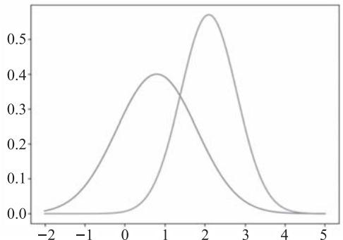  
$p _ { \mathrm { d a t a } } = \sum _ { k = 1 } ^ { 2 } \alpha _ { k } N { ( \mu _ { k } , \sigma _ { k } ^ { 2 } ) } , \ \sum _ { k = 1 } ^ { 2 } \alpha _ { k } = 1 \quad \uparrow$ 混合高斯

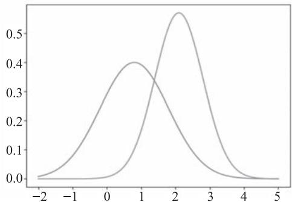  
图 1-6 两个高斯分布叠加可得 $p _ { \mathrm { d a t a } }$ 分布

模型的核心内容之一。

当 分 布 难 以 计 算 时， 在 一 些 算 法 中 也 经 常 使 用 最 大 化 证 据 下 界（Evidence LowerBOund，ELBO）来近似最大化 $\log p ( x )$ 。在变分推断中，我们的目的是寻找一个 $q _ { \theta } ( x )$ 去最小化 KL 散度，根据推导我们发现 $D _ { \mathrm { { K L } } } = - \mathrm { { E L B O } } + \log p ( x )$ ，而 $p ( x )$ 不依赖于 $q _ { \theta } ( x )$ ，因此寻找最大化 KL 散度等价于最小化 ELBO。而由于先验分布和似然分布的形式较为简单，ELBO的计算是较为容易的，具体推断过程可参考第 13 章。

# 1.3.4 生成模型的挑战及解决方法

生成模型面临的挑战主要包括以下几个方面：第一，语言的多样性和复杂性使模型生成准确、流畅的语句变得困难；第二，生成模型往往需要处理长期依赖性，避免产生不连贯或重复的内容；第三，生成模型需要具备一定的语义理解和推理能力，以便生成合理、具有逻辑的输出；第四，生成模型还需要解决数据稀缺性的问题，因为高质量的训练数据往往难以获取；第五，在实际应用中，生成模型需要平衡生成新颖、有创造力的内容与符合客户需求的准确性和可解释性之间的关系。解决这些挑战的方法具体如下。

# （1）生成模型的选择

选择适合处理高维数据的生成模型，如生成对抗网络、变分自编码器等。不同的生成模型对于不同类型的数据有着各自的优势。

# （2）使用流形学习

流形学习是一种非线性降维的方法，它可以将高维数据映射到低维流形空间中。通过在流形空间中建模和学习数据分布，可以更有效地找到满意的一小部分数据。

# （3）数据增强

通过对原始数据进行合理的变换和扩充，增加样本的多样性和数量，可以帮助生成模型更好地捕捉数据的分布，从而提供更多样的数据，进一步增加数据的多样性并改善模型的泛化能力。

# （4）引入先验知识

如果对数据有先验知识或领域知识，可以将这些信息融入生成模型中，从而提高模型性能和生成效果。

# （5）优化模型结构和参数

调整生成模型的结构和参数，使用更复杂的网络架构或优化算法来提升模型对高维数据的建模能力。

# （6）采样策略

在高维样本空间中，采样方法对于生成模型至关重要。可以尝试使用更加智能和高效的采样策略，以确保生成模型能够有效地探索整个样本空间。

总之，解决在高维样本空间中找到满意的一小部分数据的挑战需要结合降维技术、流形学习、先验知识、对抗生成网络和数据增强等方法，并根据具体任务来选择合适的策略。

# 1.4 表示学习

表示学习（Representation Learning）的原理涉及数据的降维、特征提取和重构等技术。通过降维，可以将高维数据映射到一个更低维的空间，同时保留最重要的信息。特征提取则是指从原始数据中提取有意义的特征或表示，使得数据更容易被分类或聚类。重构是指从学习到的表示还原出原始数据，以确保学到的表示包含足够的信息。

在深度学习中，表示学习是指通过无监督学习或自监督学习的方式，将原始数据转换为更加有意义和可处理的表示形式。这些表示形式可以是低维稠密向量、分层结构或时间序列等，有助于提取出数据中的高级特征和结构。

表示学习的常见方法和原理如下：

# （1）自编码器

自编码器（AutoEncoder，AE）通过将输入数据压缩成低维编码，再将其重构为与原始数据尽可能相似的输出，来学习有效的数据表示。自编码器包括编码器和解码器两个部分，

编码器用于压缩数据，解码器用于重建数据。

# （2）变分自编码器

变分自编码器（Variational AutoEncoder，VAE）是一种生成模型，它通过学习数据的概率分布来实现表示学习。VAE 使用编码器将数据映射到潜在空间中的分布参数，然后使用解码器从该概率分布中采样并生成与原始数据相似的输出。VAE 通过最大化观测数据和潜在变量之间的边缘似然来学习潜在空间的概率分布，从而实现对数据的生成、重构和插值等。

# （3）卷积神经网络

卷积神经网络（Convolutional Neural Network，CNN）主要用于图像处理领域，通过使用多层卷积和池化层来提取图像中的局部特征和全局特征。CNN 通过逐层堆叠特征提取层，逐渐形成高级抽象的表示。

# （4）生成对抗网络

生成对抗网络由生成器和判别器两个模型组成。生成器试图生成逼真的数据，而判别器试图区分生成的数据和真实数据。通过对抗的过程，生成器逐渐改进生成样本的质量，判别器则提高区分能力，最终生成器可以生成与真实数据类似的样本。

# （5）时序模型

时序模型（Sequential Model）主要用于处理时间序列数据，包括循环神经网络和长短期记忆网络等。时序模型能够处理具有时间相关性的数据，将历史信息编码到当前表示中，更好地捕捉数据中的时序模式。

# （6）Transformer 模型

Transformer 模型是一种基于自注意力机制的模型，主要应用于序列到序列的任务，如机器翻译、摘要生成等。Transformer 模型通过多层编码器和解码器的堆叠，利用自注意力机制同时考虑输入序列的所有位置信息，有效地捕捉输入序列的上下文关系。Transformer在处理长序列数据和并行计算上具有优势，被广泛应用于自然语言处理领域。

这些表示学习方法在深度学习中具有重要意义，可以有效地提取数据中的有用信息，改善任务的性能，并推动深度学习在各个领域的应用。

# 1.4.1 表示学习的直观理解

表示学习一般指模型自动从数据中抽取特征或者表示的方法，是模型自动学习的过程。表示学习的重点是自动学习，它与传统机器学习中的特征工程（Feature Engineering）不同，特征工程主要指对于数据的人为处理提取，如处理缺失值、特征选择、类型转换、维度压缩等预处理手段。表示学习与特征工程的区别如图 1-7 所示。

近年来，以深度学习为代表的表示学习技术非常火热，在图像处理、语音识别和自然语言处理等领域获得广泛关注。那么，到底什么是表示学习呢？

  
图 1-7 表示学习与特征工程的区别

在深度学习领域，表示是指通过模型的参数，采用何种形式、何种方式来表示模型的输入数据。表示学习的基本思路是不依赖于人工经验，自动地找到对于输入数据更好的表达，以方便后续任务。表示学习有很多种形式，比如卷积神经网络参数的有监督训练是一种有监督的表示学习形式，自编码器、受限玻尔兹曼机（RBM）、GPT、BERT 等参数的无监督预训练是一种无监督的表示学习形式，词嵌入及预训练模型等之后再进行有监督微调是一种半监督的表示学习形式。

表示学习是对输入数据的简明表达，其目的就是方便后续任务。人类的表示学习处处都存在，如图 1-8 所示，“你找小张去火车站接小刘”这个过程就是一个典型的表示学习过程，同时说明了表示学习的主要目的。

  
图 1-8 表示学习的直观理解

你向小张描述小刘的主要特征，而小张基于你的描述，在脑海中想象小刘的样子，最后在火车站找到小张，从维度角度来看，就是一个高维到低维再到高维的过程。

这个模型架构就是典型的自编码器的架构，很多生成模型（如 AE、VAE、Transformer、Diffusion 等）都采用类似的架构。图 1-9 为自编码器的架构。

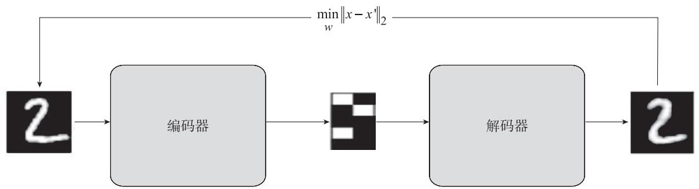  
图 1-9 自编码器的架构

# 1.4.2 表示学习的常用方式

在表示学习中，表示的对象是指待学习的数据，可以是图片、文本、音频等不同类型的数据。这些数据在原始形式下可能很难直接被计算机有效地理解和处理，因为它们可能是高维度、复杂且包含噪声的。表示学习的目标就是找到一种更加有意义和表征性强的表示形式，将原始数据转换为计算机更容易处理的形式。

在表示学习中，可以根据学习的方式和特点将表示分为多种类型。以下是一些常见的表示方式。

# （1）整数表示

整数表示（Integer Representation）将类别特征映射为整数值。例如，对于颜色特征，可以将“红色”表示为 0，“蓝色”表示为 1，依此类推。但需要注意的是，这种表示方式会引入一个假象的顺序关系，因此在某些情况下可能不适用。

# （2）独热编码表示

独热编码表示（One-Hot Encoding Representation）将类别特征映射为只有一个元素为1、其余元素都为 0 的一个二进制向量。每个类别都对应一个唯一的向量。独热编码适用于没有顺序关系的类别特征。

# （3）分布式表示

分布式表示（Distributed Representation）将数据表示为其所属分布的参数。常见的方法包括使用均值和方差表示高斯分布，使用概率密度函数或累积分布函数表示离散分布。

# （4）连续表示

连续表示（Continuous Representation）是与整数或独热编码等离散表示相对的一种表示方式，它将数据表示为连续的实数向量。在连续表示中，数据在特征空间中可以形成连续的流形结构，使得相似的数据在表示空间中更加接近。深度学习中的神经网络通常使用连续表示。

# （5）词嵌入表示

词嵌入表示（Word Embedding Representation）是一种将离散的词语转换为低维实数向

量的表示方法。它通过学习词语之间的语义关系，将具有相似语义的词语在向量空间中映射到相近的位置。词嵌入具有两个重要特点：一是能够保留词语的语义信息，比如上下文和语义相似性；二是能够捕捉词语之间的线性关系，比如类比关系。这些特点使得词嵌入在自然语言处理等领域中得到广泛应用。

# 1.4.3 表示学习与特征工程的区别

表示学习和特征工程是机器学习中两个相关但又有所不同的概念。它们之间的区别可从以下 3 个方面进行说明。

# （1）定义

表示学习是一种自动学习数据的优质表示或特征的方法，它通过学习数据本身的表征来提取更有意义、更高层次的特征。这些表示可以是低维的、稠密的向量，能够捕捉到数据中的有用信息，为后续的学习任务打好基础。

特征工程是指通过人为的方式对原始数据进行转换和提取，以生成更有信息量和判别性的特征。特征工程依赖于人类领域知识和直觉，目的是将数据转换为机器学习算法更容易理解和处理的形式。

# （2）目标

表示学习的目标是学习到数据的最佳表示或特征，以便为后续的机器学习任务提供更好的输入，同时通过自动学习提取到的特征来捕捉数据中的潜在结构和关系。

特征工程的目标是基于领域知识和对问题的理解，通过人为构造和选择特征来提高机器学习模型的准确性和泛化能力，从而改善算法的性能。

# （3）自动化

表示学习是一种自动学习方法，它可以通过训练算法来自动地学习数据的最佳表示。表示学习算法能够自主提取和学习特征，不需要人为设定和构造特征，从而减少了人工干预和依赖。

特征工程需要人为地根据问题和数据的特点进行特征的构造和选择。特征工程的过程需要人们运用领域知识和经验来判断哪些特征是有用的，以及如何将原始数据转换为特征。

总的来说，表示学习是一种自动学习数据优质表示或特征的方法，它通过学习数据的表征来提取更高层次的特征，减少了对人工特征工程的依赖。而特征工程则是通过人工构造和选择特征来改善机器学习算法的性能，它依赖于领域知识和人类直觉。表示学习更注重自动化和学习的能力，而特征工程更注重特征的构造和选择的能力。在实际应用中，表示学习和特征工程往往可以结合使用，以获得更好的特征表示和模型性能。

# 1.4.4 图像的表示学习

图像的表示学习是指通过机器学习方法，将图像转换成更有意义、更高层次的特征表示的过程。在图像的表示学习中，主要包括以下 3 个方面的内容：输入、使用方法和输出。

# （1）输入

图像表示学习的输入通常是一张或一批图像，这些图像可以是彩色图像（RGB 格式）或灰度图像。每张图像由像素组成，每个像素代表图像的一个点，而彩色图像由红、绿、蓝三个通道的像素值组成。因此，对于彩色图像，其输入数据通常是一个三维数组，而对于灰度图像，输入数据是一个二维数组。

# （2）使用方法

图像的表示学习有多种方法，常见的方法如下。

1）卷积神经网络。卷积神经网络是一类特别适用于图像处理的神经网络结构，通过多层卷积和池化层来逐步提取图像的特征表示。  
2）自编码器。自编码器是一种无监督学习方法，通过学习将输入图像编码成低维表示，再将其解码还原成原始图像，以促使模型学习到更有意义的特征表示。  
3）生成对抗网络。生成对抗网络是一种通过两个对抗性的神经网络（生成器和判别器）共同学习，使得生成器可以生成逼真图像的方法。其中，生成器也可以用来提取图像特征。  
4）预训练模型。在大规模图像数据上预训练好的模型，如 ImageNet 数据集上训练的模型，可以迁移学习到其他任务或数据集上，从而得到更好的图像特征表示。

# （3）输出

图像表示学习的输出是经过学习得到的图像特征表示，通常是一个向量或矩阵。这些特征表示在机器学习任务中可以作为输入，用于分类、目标检测、图像生成等任务。通过图像表示学习，模型可以学习到更加抽象和语义丰富的特征，从而提高了图像处理任务的性能。

总的来说，图像的表示学习是一种将图像转换为有意义特征表示的技术，通过不同的方法可以得到高质量的图像特征，这些特征可以应用于各种图像处理任务中。

# 1.4.5 文本的表示学习

传统的语言模型通常把学习得到的上下文信息用词向量或词嵌入的方式保存，这些方法虽然简单，但适用范围、泛化能力都非常有限。为了解决这个问题，Transformer 模型被引入大语言模型中。Transformer 模型是一种基于自注意力机制的深度学习模型，它可以直接建模和处理序列数据，而不需要像传统的语言模型那样先将输入序列转化为词向量或词嵌入。在获取该表征之后，只需要在不同的下游 NLP 任务中添加一个轻量级的输出层，如单层 MLP，进行微调即可。

文本的表示学习是指通过机器学习方法，将文本数据转换成更有意义、更高层次的特征表示的过程。在文本的表示学习中，主要包括 3 个方面的内容：输入、使用方法和输出。

# （1）输入

文本表示学习的输入通常是一段或一批文本，比如一句话、一篇文章或一个文本文档。在处理文本时，首先需要将文本转换成计算机可以理解的形式，即将文本转换成数值向量。

这个转换过程被称为文本嵌入（Text Embedding）。通常，可以将文本表示为词嵌入序列或句子嵌入（Sentence Embedding）向量。

1）词嵌入：将文本中的每个词映射到一个固定维度的向量，每个维度表示一个语义特征。常见的词嵌入模型包括 Word2Vec、GloVe（Global Vectors for word representation）和FastText 等。  
2）句子嵌入：将整个句子映射到一个向量，表示整个句子的语义信息。句子嵌入可以通过词嵌入的组合、循环神经网络、长短期记忆网络、Transformer 等方法得到。

# （2）使用方法

文本的表示学习有多种方法，其中一些常见的方法如下。

1）Bag-of-Words（词袋模型）：将文本看作词的无序集合，将每个词表示为一个独热向量，文本向量为所有词向量的加和。这种方法忽略了词序信息，适用于简单的文本分类任务。  
2）Word2Vec：通过训练神经网络，将每个词映射为一个稠密的向量，捕捉词之间的语义关系。Word2Vec 适用于词的相似度计算、词的聚类和文本分类等任务。  
3）RNN 和 LSTM：通过循环神经网络或长短期记忆网络，对整个句子进行建模，并得到句子嵌入。这些方法可以处理变长的文本输入，适用于文本分类、情感分析等任务。  
4）Transformer：使用自注意力机制，能够并行处理文本序列，捕捉全局依赖关系，适用于各种文本任务，在机器翻译领域表现尤为出色。

# （3）输出

文本表示学习的输出是经过学习得到的文本特征表示，通常是一个向量或矩阵。这些特征表示在机器学习任务中可以作为输入，用于文本分类、情感分析、机器翻译、问答系统等各种 NLP 任务。通过文本表示学习，模型可以学习到更加抽象和语义丰富的文本特征，从而提高了文本处理任务的性能。

总的来说，文本的表示学习是一种将文本数据转换为有意义特征表示的技术，通过不同的方法可以得到高质量的文本特征，这些特征可以应用于各种 NLP 任务中。

# 1.4.6 多模态的表示学习

单模态的表示学习负责将信息表示为计算机可以处理的数值向量或者进一步抽象为更高层的特征向量；而多模态表示学习利用多模态之间的互补性，剔除模态间的冗余性，从而学习到更好的特征 。

联合表示（Joint Representation）：将多个模态的信息一起映射到一个统一的多模态向量空间。CLIP 和 DALL·E 使用简单的联合表示，如图 1-10 左图所示。

协同表示（Coordinated Representations）：将多模态中的每个模态分别映射到各自的表示空间，但映射后的向量之间满足一定的相关性约束（例如迁移学习使用协同表示），如图 1-10 右图所示。


  
图 1-10 多模态中的表示学习

在概率模型中，好的表示可以捕捉所观察到的输入数据的潜在变量的后验分布（可表示为 $p ( z | x )$ ，其中 $x$ 为输入数据， $z$ 为潜在变量），也可以作为有监督预测器的输入。

表示学习实现了对实体和关系的分布式表示，具有显著提升计算效率、有效缓解数据稀疏、实现异质信息融合三大优势，对于知识库的构建、推理和应用具有重要意义。

# 1.4.7 表示学习的融合技术

表示学习中融合技术的应用非常广泛，如 Transformer 模型中的输入嵌入与位置编码的融合、ResNet 模型中的残差连接、DenseNet 网络中的拼接、Stable Diffusion 模型使用的图像嵌入与单词嵌入的融合等。

在表示学习中，表示融合是指将来自不同模态的特征进行整合，生成一个共享的表示空间。表示融合的目标是融合不同模态的信息，使融合后的表示能够更好地表达和处理跨模态的任务。下面介绍几种常见的表示融合方法以及它们的原理、优缺点。

# 1. 串行融合

原理：将不同模态的特征串行连接在一起，形成一个长向量作为输入。

优点：简单、易实现，适用于特征维度较低的情况。

缺点：丢失了不同模态之间的交互信息，忽略了模态之间的关联及依赖性，性能可能受限。

# 2. 并行融合

原理：将不同模态的特征分别处理后，再进行融合。

在 Transformer 中，词嵌入和位置编码器可以被认为是一种并行融合的方式。在这个过程中，输入序列首先被转化为特征向量（称为嵌入向量），然后与位置信息进行编码。具体而言，Transformer 的嵌入层先将输入序列中的每个元素进行嵌入操作，将其映射到一个特

定维度的向量空间中，这个操作可以同时对输入序列中的所有元素进行。这个过程可以看作将不同的输入序列转化为不同的特征向量，用于捕捉输入序列的语义和语法信息。位置编码器将位置信息与嵌入向量相加，以提供关于词语在句子中位置的信息。这个过程也是并行进行的，每个嵌入向量都会与相应的位置编码进行相加，从而融合位置信息和语义信息。通过将嵌入向量和位置编码进行并行操作，Transformer 能够同时考虑输入序列的语义信息和位置信息，以产生上下文感知的表示。这种并行融合机制有助于提高 Transformer 在NLP 任务中的性能，例如机器翻译、文本生成等。

优点：可以同时利用不同模态的信息，能够更好地保留不同模态的关键特征。

缺点：可能存在信息冗余和模态依赖的问题，需要依靠特征选择或注意力机制进行调整。

# 3. 加权融合

原理：给不同模态的特征赋予权重，使用一组权重对特征进行加权融合。

优点：可以灵活地控制不同模态在融合后的表示中的贡献度。

缺点：需要提前设定权重，如果权重设置不合理，可能会导致信息不平衡或丢失关键特征。

# 4. 共享融合

原理：通过共享网络层或参数，将不同模态的特征提取器和融合器整合到一个统一的模型中。

优点：能够充分利用不同模态之间的交互和关联，学习到更丰富的表示。

缺点：模型复杂度较高，容易受到过拟合的影响，需要更多的计算资源和训练数据。

# 5. 注意力融合

原理：通过注意力机制，在融合过程中对不同模态特征赋予不同的权重，根据其重要性动态调整融合程度。

优点：能够自动学习不同模态特征的关注程度，提高模型对关键信息的捕捉能力。

缺点：需要额外的计算开销，模型复杂度较高。

每种表示融合方法都有其独特的优势和限制，选取哪种方法取决于具体的任务需求和数据特点。在实际应用中，常常需要根据实验结果进行模型选择和调整，以获得最佳的表示融合效果。

# 1.4.8 如何衡量表示学习的优劣

表示学习是从原始数据中自动地学习到高层次的抽象表示。这些抽象表示可以捕捉到数据的关键特征和结构，从而为后续的机器学习任务提供更好的支持。表示学习的优劣可以通过以下指标进行衡量。

. 可解释性。好的表示应该能够提供对数据的有意义的解释和理解，使得人们能够更好地理解数据内在的规律和含义。  
. 可区分性。好的表示应该能够将同类数据样本聚集在一起，并将不同类数据样本区分开来，从而更好地支持分类和聚类等任务。  
. 可扩展性。好的表示应该适用于不同类型的数据和不同规模的数据集，并能够从大量的数据样本中学习到具有普遍性的表示。  
● 适应性。好的表示应该能够在新的任务和数据下保持良好的泛化能力，即使只有少量的新数据样本。

如何学习到好的表示？可以采取以下方法。

1）监督学习。使用带有标签的数据来训练模型，例如卷积神经网络（CNN）和循环神经网络（RNN）等。  
2）无监督学习。利用无标签的数据进行模型训练，例如自编码器和变分自编码器等。  
3）半监督学习。同时使用有标签和无标签的数据进行训练，结合有监督和无监督方法。  
4）迁移学习。利用已有领域的知识来帮助表示学习，例如使用预训练的神经网络模型进行特征提取。  
5）强化学习。通过与环境的交互及试错来逐步优化表示学习。

在实际应用中，根据具体任务和数据特点选择合适的表示学习方法和评价指标，可以更好地学习到好的表示。

# 1.5 表示学习的逆过程

在深度学习中，表示学习通常采用分布式表示或嵌入方式。分布式表示是指将输入数据转化为高维空间中的向量表示，这些向量捕捉了数据的语义信息。嵌入方式是指通过学习，将高维的离散数据映射到低维的连续向量空间中。

表示学习的逆嵌入（De-Embedding）是指将嵌入向量转化回原始离散数据的过程。在深度学习中，可以使用逆映射函数来实现表示学习的逆过程。逆映射函数通常是一个神经网络模型，将嵌入向量作为输入，输出对应的原始离散数据，如图 1-11 所示。

  
图 1-11 分类任务的嵌入与逆嵌入示意

为了实现表示学习的逆过程，需要在训练过程中同时学习嵌入和逆映射函数。具体做法是：使用损失函数等来捕捉原始样本和它的嵌入向量之间的关系，通过优化损失函数，使得嵌入向量在低维空间中聚集到对应的原始数据点附近，从而实现表示学习的逆过程。

需要注意的是，表示学习的逆过程中可能存在信息丢失的问题，因为将低维嵌入向量映射回高维离散数据可能会引入一定的不确定性。因此，在实际应用中，需要权衡维度约减和信息保留之间的平衡，并根据具体任务的需求来采用合适的表示学习方法。

在 Transformer 模型中，输入通常会经过一个嵌入层进行转换，将输入的离散化符号（如单词、字符或其他离散数据）映射为连续的低维向量表示，这个过程称为嵌入。

而输出的表示学习的逆过程实际上是对网络最后一层输出的操作，将网络输出的连续向量表示映射回原始的离散化符号。在 Transformer 模型中，输出通常是一系列连续向量，这些向量表示输入序列中各个位置的特征。对于不同的任务，输出的处理方式可能有所不同。

对于常见的序列到序列任务（如机器翻译或文本生成），Transformer 模型通常会在输出端引入 softmax 层。softmax 函数可以将连续向量转换成概率分布，使得每个位置的输出可以解释为对应词汇表中不同符号的概率。然后，根据概率分布来生成最终的输出符号序列，详细转换过程如图 1-12 所示。

  
图 1-12 利用 Transformer 模型进行中文翻译成英文的流程

在训练过程中，我们使用真实的目标序列与模型输出之间的差异（通常使用交叉熵损失）来优化模型参数。在预测阶段，我们通常使用贪婪搜索或束搜索等技术来根据模型输出的概率分布选择最可能的符号，从而生成输出序列。需要注意的是，在某些应用中，输出可能不是离散的符号序列，而是连续值的回归问题。在这种情况下，经过逆嵌入过程输出的结果不需要特别处理，直接使用模型输出的连续向量即可。

总之，在 Transformer 模型中，输入通过嵌入层转换为连续向量表示，输出通过softmax 函数等操作将连续向量映射回离散化符号或进行其他任务的处理。这些步骤共同构成了 Transformer 模型的完整流程，使其在各种序列建模任务中表现出色。

表示学习类似于编码器 - 解码器中的编码器，但两者不完全一致。编码器是深度学习中的一种常见表示学习方法，它将输入数据转换为高维特征表示。表示学习是一个更广泛的概念，旨在从原始数据中学习有用的表示或特征，这些表示可以用于不同的任务，如分类、聚类、生成等。编码器通常是表示学习的一个组成部分，它可以用于学习数据的表示，但表示学习还包括其他方法和技术，如降维、自编码器、生成对抗网络等。因此，编码器只是表示学习中的一种特定实现方式。

表示学习的逆过程可以简单地理解为从学习到的表示中恢复原始数据，类似于解码器的功能，但两者不完全一致。

# 第 2 章

# 深度神经网络

深度神经网络（Deep Neural Network，DNN）是一种受到人类神经系统启发的人工神经网络结构，用于机器学习和人工智能任务。它们由多层神经元组成，通常包括输入层、隐藏层和输出层。

深度神经网络的核心思想是通过学习来自数据的特征和模式，从而实现各种任务，如图像识别、语音识别、自然语言处理等。每个神经元接收来自前一层神经元的输入，并通过加权和激活函数来产生输出。

深度神经网络的层级结构使得它可以捕捉和表示数据的抽象特征，从低级特征（如边缘和纹理）到高级特征（如物体和语义信息）。

深度神经网络有不同的类型，包括卷积神经网络、循环神经网络和前馈神经网络等。其中，卷积神经网络适合处理图像数据，循环神经网络适合处理序列数据，前馈神经网络则可以应用于各种任务。深度神经网络的训练需要大量的数据和计算资源，同时需要精心设计的网络结构和训练算法，以确保其能够正确地学习和处理各种数据。

# 2.1 用 PyTorch 构建深度神经网络

本节将介绍如何使用 PyTorch 构建深度神经网络需要的模块，如 nn.Module、nn.functional等，以及构建深度神经网络的主要步骤。

# 2.1.1 神经网络的核心组件

神经网络看起来很复杂，节点多、层数多、参数更多，但核心部分或组件不多。把这些组件确定后，这个神经网络基本就确定了。这些核心组件包括如下几个部分。

● 层：神经网络的基本结构，将输入张量转换为输出张量。  
$\bullet$ 模型：层构成的网络。  
$\bullet$ 损失函数：参数学习的目标函数，通过最小化损失函数来学习各种参数。  
$\bullet$ 优化器：如何使损失函数最小，这就涉及优化器。

当然，这些核心组件不是独立的，它们之间、它们与神经网络其他组件之间有着密切关系。为便于大家理解，我们把这些关键组件及相互关系用图 2-1 表示。

  
图 2-1 神经网络关键组件及相互关系示意图

多个层链接在一起构成一个模型或网络，输入数据通过这个模型转换为预测值。预测值与真实值共同构成损失函数的输入，损失函数输出损失值（损失值可以是距离、概率值等），该损失值用于衡量预测值与目标结果的匹配或相似程度。优化器利用损失值更新权重参数，目标是使损失值越来越小。这是一个循环过程，当损失值达到一个阈值或循环次数达到指定次数时，循环结束。

接下来利用 PyTorch 的 nn 工具箱，构建一个神经网络实例。nn 工具箱中对这些组件都有现成的包或类，可以直接使用，非常方便。

# 2.1.2 构建神经网络的主要工具

使用 PyTorch 构建神经网络的主要工具（或类）及相互关系如图 2-2 所示。

  
图 2-2 PyTorch 实现神经网络的主要工具及相互关系

从图 2-2 可知，可以基于 Module 类或函数（nn.functional）构建网络层。nn 中的大多数层（layer）在 functional 中都有与之对应的函数。nn.functional 中的函数与 nn.Module 中的 layer 的主要区别是后者继承自 Module 类，可自动提取可学习的参数，而 nn.functional更像是纯函数。

# （1）nn.Module

前面我们使用 autograd 及 Tensor 实现机器学习实例时，需要做不少设置，如对叶子节点的参数 requires_grad 设置为 True，然后调用 backward，再从 grad 属性中提取梯度。对于大规模的网络，autograd 过于底层和烦琐。为了简单、有效地解决这个问题，nn 是一个有效工具。它是专门为深度学习设计的一个模块，而 nn.Module 是 nn 的一个核心数据结构。nn.Module 可以是神经网络的某个层，也可以是包含多层的神经网络。在实际使用中，最常见的做法是继承 nn.Module，生成自己的网络或层。nn 中已实现了绝大多数层，包括全连接层、损失层、激活层、卷积层、循环层等。这些层都是 nn.Module 的子类，能够自动检测到自己的参数，并将其作为学习参数，且针对 GPU 运行进行了 CuDNN 优化。

# （2）nn.functional

nn中的层，一类是继承了nn.Module，其命名一般为nn.Xxx（第一个字母是大写），如nn.Linear、nn.Conv2d、nn.CrossEntropyLoss 等。另一类是 nn.functional 中的函数，其名称一般为 nn.functional.xxx，如 nn.functional.linear、nn.functional.conv2d、nn.functional.cross_entropy 等。从功能来说，两者相当，基于nn.Module能实现的层也可以基于nn.functional实现，反之亦然，而且两者性能方面也没有太大差异。

不过在具体使用时，两者还是有区别的，具体如下。

1）nn.Xxx 继承于 nn.Module，nn.Xxx 需要先实例化并传入参数，然后以函数调用的方式调用实例化的对象并传入输入数据。它能够很好地与 nn.Sequential 结合使用，而nn.functional.xxx 无法与 nn.Sequential 结合使用。  
2）nn.Xxx 不需要自己定义和管理 weight、bias 参数；而 nn.functional.xxx 需要自己定义 weight、bias 参数，每次调用的时候都需要手动传入 weight、bias 等参数，不利于代码复用。  
3）dropout 操作在训练和测试阶段是有区别的，使用 nn.Xxx 方式定义 dropout，在调用 model.eval() 之后，自动实现状态的转换，而使用 nn.functional.xxx 却无此功能。

总的来说，两种功能都是相同的，但 PyTorch 官方推荐：有学习参数的（如 conv2d、linear、batch_norm、dropout 等）情况采用 $\mathrm { n n . X x x }$ 方式；没有学习参数的（如 maxpool、loss func、activation func 等）情况采用 nn.functional.xxx 或者 $\mathrm { n n . X x x }$ 方式。对于激活函数，我们采用无学习参数的 F.relu 方式来实现，即 nn.functional.xxx 方式。

# 2.1.3 构建模型

使用 PyTorch 实现神经网络的关键就是选择网络层，构建模型，然后选择损失函数和优化器。在 nn 工具箱中，可以直接引用的网络很多，有全连接层、卷积层、循环层、归一化层、激活层等。

PyTorch 构建模型大致有以下两种方式。

1）继承 nn.Module 基类来构建模型。  
2）使用 PyTorch Lightning 来构建模型。

# 2.1.4 训练模型

构建模型（假设为 model）后，接下来就是训练模型。PyTorch 训练模型主要包括加载和预处理数据集、定义损失函数、定义优化算法、循环训练模型、循环测试或验证模型、可视化结果等步骤。

# （1）加载和预处理数据集

加载和预处理数据集可以使用 PyTorch 的数据处理工具，如 torch.utils 和 torchvision等，这些工具将在第 4 章中详细介绍。

# （2）定义损失函数

定义损失函数可以通过自定义方法或使用 PyTorch 内置的损失函数，如回归使用的nn.MSELoss()、分类使用的 nn.BCELoss 等损失函数，更多内容可参考 2.9 节。

# （3）定义优化算法

PyTorch 常用的优化算法都封装在 torch.optim 中，其设计灵活，可以扩展为自定义的优化算法。所有的优化算法都是继承了基类 optim.Optimizer，并实现了自己的优化步骤。

最常用的优化算法就是梯度下降法及其变种，具体将在 2.10 节详细介绍，这些优化算法大多使用梯度更新参数。

如使用 SGD 优化器时，可设置为 optimizer $=$ torch.optim.SGD(params,lr = 0.001)。

（4）循环训练模型

1）设置为训练模式：model.train()。调用 model.train() 会把所有的 module 设置为训练模式。  
2）梯度清零：optimizer. zero_grad()。在默认情况下，梯度是累加的，需要手工把梯度初始化或清零，调用 optimizer.zero_grad() 即可。  
3）求损失值：y_prev $=$ model(x)，loss=loss_fun(y_prev,y_true)。  
4）自动求导，实现梯度的反向传播：loss.backward()。  
5）更新参数：optimizer.step()。

（5）循环测试或验证模型

1）设置为测试或验证模式：model.eval()。调用 model.eval() 会把所有的 training 属性设置为 False。  
2）在不跟踪梯度模式下计算损失值、预测值等：with.torch.no_grad()。

（6）可视化结果

下面通过实例来说明如何使用 nn 来构建网络模型、训练模型。

说明：如果模型中有 BN（Batch Normalization，批归一化）层和 dropout 层，需要在训练时添加 model.train()，在测试时添加 model.eval()。其中，model.train() 用于确保 BN 层使用每一批数据的均值和方差进行训练，而 model.eval() 用于确保 BN 使用全部训练数据的均值和方差进行评估；而对于 dropout 层，model.train() 用于随机取一部分网络连接来训练更新参数，而 model.eval() 则利用到了所有网络连接进行评估。

# 2.2 用 PyTorch 实现神经网络实例

前面介绍了使用 PyTorch 构建神经网络的一些组件、常用方法和主要步骤等，本节通过利用神经网络对手写数字进行识别的实例，来说明如何借助 nn 工具箱来实现一个神经网络，并对神经网络有一个直观的了解。在这个基础上，后续我们将对 nn 的各模块进行详细介绍。实例环境使用 PyTorch 2.0，使用 GPU 或 CPU，源数据集为 MNIST。主要步骤如下。

● 利用 PyTorch 内置函数 MNIST 下载数据。  
$\bullet$ 利用 torchvision 对数据进行预处理，调用 torch.utils 建立一个数据迭代器。  
$\bullet$ 可视化源数据。  
$\bullet$ 利用 nn 工具箱构建神经网络模型。  
$\bullet$ 实例化模型，并定义损失函数及优化器。

训练模型。  
可视化结果。

神经网络的结构如图 2-3 所示。

  
图 2-3 神经网络结构

使用两个隐含层，每层使用 ReLU 激活函数，输出层使用 softmax 激活函数，最后使用torch.max(out,1) 找出张量输出最大值对应索引作为预测值。

# 2.2.1 准备数据

1）导入必要的模块。

```python
import numpy as np  
import torch  
#导入PyTorch内置的MNIST数据  
from torchvision.datasets import MNIST  
#导入预处理模块  
import torchvisiontransforms as transforms  
from torch.utils.data import DataLoader  
#导入nn及优化器  
import torch.nnfunctional as F  
import torch.optim as optim  
from torch import nn 
```

2）定义一些超参数。

```txt
定义一些超参数  
train_batch_size = 64  
test_batch_size = 128  
learning_rate = 0.01  
num_epochs = 20 
```

num_workers $= 8$ momentum $= 0.5$

3）下载数据并对数据进行预处理。

#定义预处理函数  
transform $=$ transformsCompose([transforms.ToTensor(),transforms.Normalize([0.5],[0.5]])]  
#下载数据，并对数据进行预处理  
train_dataset $=$ MNIST('../data/'，train=True，transform $\equiv$ transform，download $\equiv$ False)  
test_dataset $=$ MNIST('../data/'，train $\equiv$ False，transform $\equiv$ transform）  
#得到一个生成器  
trainloader $=$ DataLoader(train_dataset，batch_size $\equiv$ train_batch_size, shuffle $\equiv$ True,num_workers $\equiv$ num_workers)  
testloader $=$ DataLoader(test_dataset，batch_size $\equiv$ test_batch_size，shuffle $\equiv$ False, num_workers $\equiv$ num_workers)

说明：

● transforms.Compose 可以把一些转换函数组合在一起。  
● Normalize([0.5], [0.5]) 对张量进行归一化，这里两个 0.5 分别表示对张量进行归一化的全局平均值和方差。因图像是灰色的，则只有一个通道，如果有多个通道，需要有多个数字，如三个通道，应该是 Normalize( $[ \mathrm { m } 1 , \mathrm { m } 2 , \mathrm { m } 3 ]$ , [n1,n2,n3])。  
● download 参数控制是否需要下载，如果 ./data 目录下已有 MNIST，可选择 False。  
● 用 DataLoader 得到生成器，可节省内存。  
torchvision 及 data 为 PyTorch 的数据预处理工具。

# 2.2.2 可视化源数据

对数据集中的部分数据进行可视化，代码如下：

import matplotlib.pyplot as plt   
%matplotlib inline   
examples $=$ enumerate(testloader)   
batchidx，(example_data，example_targets） $=$ next(examples)   
fig $=$ plt.figure()   
for i in range(6): plt.subplot(2,3,i+1) plt.tight.layout() plt.imshow(example_data[i][0]，cmap $\equiv$ 'gray'，interpolation $\equiv$ 'none') plt.title("Ground Truth:{}”.format exemple_targets[i]) plt.x ticks([ ]) plt.y ticks([ ])

运行结果如图 2-4 所示。

Ground Truth: 7


Ground Truth: 0


Ground Truth: 2

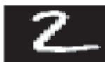

Ground Truth: 4


Ground Truth: 1

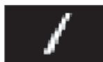

Ground Truth:

  
图 2-4 MNIST 源数据示例

# 2.2.3 构建模型

数据预处理之后，我们开始构建网络来创建模型。

（1）构建网络

```python
class Net(nnModule):   
```
```
使用Sequential构建网络，Sequential()函数的功能是将网络的层组合到一起
```
```
def __init__(self, in_dim, n HIDen_1, n HIDen_2, out_dim):
    super(Net, self).__init__(  )
    self.flatten = nn.Flatten(  )
    self(layer1 = nn.Sequential(nn.Linear(in_dim, n HIDen_1), nn.BatchNorm(n HIDen_1))
    self(layer2 = nn.Sequential(nn.Linear(n HIDen_1, n HIDen_2), nn.BatchNorm(n HIDen_2))
    self.out = nn.Sequential(nn.Linear(n HIDen_2, out_dim))
def forward(self, x):
    x = self.flatten(x)
    x = Frelu(self(layer1(x))
    x = Frelu(self(layer2(x))
    x = F softmax(self.out(x), dim=1)
    return x 
```

（2）实例化网络

#检测是否有可用的GPU，有则使用，否则使用CPU  
device $=$ torch_device("uda:0"iftorch.cuda.is-available()else "cpu")  
#实例化网络  
model $=$ Net(28\*28，300，100，10)  
model.to(device)  
#定义损失函数和优化器  
criterion $\equiv$ nn.CrossEntropyLoss()  
optimizer $=$ optim.SGD(model.params(),lr=lr,momentum=momentum)

# 2.2.4 训练模型

这里使用 for 循环进行迭代来训练模型。首先，用训练数据来训练模型，然后用测试数据来验证模型的准确性。

# （1）训练模型

```python
#开始训练  
losses = []  
accs = []  
eval_losses = []  
eval_accs = []  
writer = SummaryWriter(log_dir='logs',comment='train-loss')  
for epoch in range(num_epochs):  
    train_loss = 0  
    train_acc = 0  
    model.train()  
#动态修改参数学习率  
if epoch%5==0:  
    optimizer param_groups[0]['lr']*=0.9  
    print("学习率：{:.6f}".format(optimizer param_groups[0]['lr']))  
for img, label in trainloader:  
    img=img.to(device)  
    label = label.to(device)  
#正向传播  
out = model(img)  
loss = criterion(out, label)  
#反向传播  
optimizer.zero_grad()  
loss.backward()  
optimizer.step()  
#记录误差  
train_loss += loss.item()  
#保存loss的数据与epoch数值  
writer.add Scalar('Train', train_loss/len(trainloader), epoch)  
#计算分类的准确率  
_, pred = out.max(1)  
num.correct = (pred == label).sum().item()  
acc = num.correct / img.shape[0]  
train_acc += acc  
losses.append(train_loss / len(trainloader))  
accs.append(train_acc / len(trainloader)) 
```

```python
# 在测试集上检验效果
eval_loss = 0
eval_acc = 0
# net.eval() # 将模型改为预测模式
model.eval()
for img, label in testloader:
    img=img.to(device)
    label = label.to(device)
    img = img.view(img.size(0), -1)
    out = model(img)
    loss = criterion(out, label)
    # 记录误差
    eval_loss += loss.item()
    # 记录准确率
    _, pred = out.max(1)
    num.correct = (pred == label).sum().item()
    acc = num.correct / img.shape[0]
    eval_acc += acc
    eval.losses.append(val_loss / len(testloader))
    eval'acc.append(val_acc / len(testloader))
print('epoch: {}, Train Loss: {}.4f}, Train Acc: {}.4f}, Test Loss: {}.4f}, Test Acc: {}.4f').format(epoch, train_loss / len(trainloader), train_acc / len(trainloader), eval_loss / len(testloader), eval_acc / len(testloader))) 
```

最后 5 次迭代的结果如下：

学习率：0.006561

epoch: 15, Train Loss: 1.4681, Train Acc: 0.9950, Test Loss: 1.4801, Test Acc: 0.9830

epoch: 16, Train Loss: 1.4681, Train Acc: 0.9950, Test Loss: 1.4801, Test Acc: 0.9833

epoch: 17, Train Loss: 1.4673, Train Acc: 0.9956, Test Loss: 1.4804, Test Acc: 0.9826

epoch: 18， Train Loss: 1.4668， Train Acc: 0.9960， Test Loss: 1.4798， Test Acc: 0.9835

epoch: 19， Train Loss: 1.4666， Train Acc: 0.9962， Test Loss: 1.4795， Test Acc: 0.9835

这个神经网络的结构比较简单，只用了两层，且没有使用 dropout 层，迭代 20 次，测试准确率达到 $9 8 \%$ 左右，效果还不错，但仍有提升空间。如果采用 cnn、dropout 等层，应该还可以提升模型性能。

（2）可视化训练及测试损失值

```python
plt.title('train loss')  
plt.plot(np.arange(len(losses)), losses)  
pltlegend(['Train Loss'], loc='upper right') 
```

运行结果如图 2-5 所示。

  
图 2-5 MNIST 数据集训练的损失值

# 2.3 用 PyTorch Lightning 实现神经网络实例

PyTorch Lightning 是类似于 Keras 的一个库，是为 PyTorch 深度学习框架提供高级抽象的轻量级库。它旨在简化训练和推理过程的开发和管理，使用户能够更专注于模型设计和实验。

PyTorch Lightning 基于 PyTorch，并提供了一组模板代码和工具，使得构建训练循环、日志记录、自动分布式训练、灵活的配置和模型验证等任务更加容易。特别是神经网络，使其更易于理解，同时为创建可扩展的深度学习模型提供了广泛的可能性，这些模型可以很容易地在分布式硬件上运行。

使用 PyTorch Lightning，可以避免编写样板代码并重复实现训练循环。只需定义模型、数据加载器和优化器，PyTorch Lightning 将会自动处理训练和验证过程。此外，可以通过简单的继承和重写来定制化和扩展功能，使其适应特定的项目需求。

PyTorch Lightning 的安装代码如下：

```batch
pip install python-lightning 
```

PyTorch Lightning 的主要优势如下。

1）高级抽象。PyTorch Lightning 提供了一组高级抽象的模块，如 LightningModule 和LightningDataModule，可以帮助用户快速构建模型和数据加载器。用户只需要定义模型的核心逻辑，而不再需要编写整个训练循环的代码。  
2）组织逻辑清晰。PyTorch Lightning 通过将训练过程分解为训练步骤、验证步骤和测试步骤等模块，使得代码组织更加清晰。模型训练逻辑放在 training_step 中，验证逻辑放在 validation_step 中，测试逻辑放在 test_step 中。这样的分解可以提高代码的可读性和可维护性。  
3）自动优化。PyTorch Lightning 提供了自动优化的功能，可以根据用户定义的优化器、

损失函数和学习率调度器等进行自动的梯度计算、参数更新和学习率调整。用户只需要在模型中指定相关参数，而不需要手动编写优化和更新过程的代码。

4）分布式训练支持。PyTorch Lightning 对分布式训练提供了良好的支持。用户可以通过设置训练器的 accelerator 参数为 ddp、dp 或 ddp2 等来启用分布式训练，框架会自动处理数据并行、模型并行和梯度同步等细节。  
5）提供实用工具。PyTorch Lightning 提供了一些实用工具，如自动模型检查点保存、可视化训练过程、集成 TensorBoard 和 Comet 等，可以简化训练过程的管理和监控。

总之，PyTorch Lightning 是一个旨在简化和加速 PyTorch 模型训练流程的框架，它提供了高级抽象、自动优化、分布式训练支持等功能，帮助用户更加方便地开发和维护深度学习模型。

接下来将 2.2 节的实例用 PyTorch Lightning 来实现，使用的数据及网络结构完全一致，只是添加了保存及恢复训练模型的部分代码。

# （1）导入必要的模块

导入 pytorch-lighting（简称为 pl）模块及 Trainer。

```python
importpytorch_lightningaspl frompytorch_lightningimportTrainer 
```

# （2）定义 LightningModule

构建模型的步骤和优化器的配置是由模型类中的方法来定义的，而不是编写循环，在这种情况下，可以定义数据加载程序的工作。PyTorch Lightning 是一个非常灵活的工具。

```python
class Pytorch_Lightning_MNIST Classifier(pl.LightningModule):
    def __init__(self):
        super().__init__()
        #定义神经网络的结构
        self.layers = nn.Sequential(
            nn.Conv,
            nn.ReLU,
            nn.Linear(28 * 28 * 1, 300),
            nn.ReLU,
            nn.Linear(300, 100),
            nn.ReLU,
            nn.Linear(100, 10)
        )
        #构建损失函数
        self.loss_func = nn.CrossEntropyLoss()
        def forward(self, x):
            return self.layers(x)
        #定义超参数 
```

```python
def training_step(self, batch, batch_idx):
    x, y = batch
    pred = self.layers(x)
    loss = self.loss_func(pred, y)
    self.log('train_loss', loss)
    return loss
# 配置测试参数
def test_step(self, batch, batch_idx):
    x, y = batch
    pred = self.layers(x)
    loss = self.loss_func(pred, y)
    pred = torch.argmax(pred, dim=1)
    accuracy = torch.sum(y == pred).item() / (len(y) * 1.0)
    self.log('test_loss', loss, prog_bar=True)
    self.log('test_acc', torch.tensor(accuracy), prog_bar=True)
    output = dict({
        'test_loss': loss,
        'test_acc': torch.tensor(accuracy),
   })
} 
```

其中，def_init_(self) 用于定义网络架构；def forward(self, x) 用于定义推理、预测的正向传播；def training_step(self, batch, batch_idx) 用于定义训练循环部分；def configure_optimizers(self) 用于定义优化器。Lightning Module 定义的是一个系统而不是单纯的网络架构。

# （3）创建 pl.Trainer 对象

接下来创建一个 pl.Trainer 对象，用于配置训练器的参数，如使用的 GPU 数量、最大训练轮数以及模型保存回调等。最后，通过调用 trainer.fit() 和 trainer.test() 等方法开始训练和测试流程。

初始化Trainer模型和功能  
model $=$ Pytorch_Lightning_MNIST(Classifier()  
#定义模型的回调函数  
ckpt_callback $=$ pl callbacks.ModelCheckpoint( monitor $\equiv$ 'train_loss', save_top_k=1,

mode='min'   
）   
#定义提取终止的条件   
early_stopping $=$ pl+Ecallbacks.EarlyStopping(monitor $=$ 'train_loss', patience $\equiv 3$ mode $=$ 'min') #创建一个pl.Trainer对象   
trainer $=$ pl.Trainer(accelerator $\equiv$ "auto",devices $\equiv 1$ ,collbacks $=$ [ckpt_callback,early_ stopping],max_epochs $\equiv$ EPOCHS) #训练模型   
trainer.fit(model,trainloader)   
#测试模型   
trainer.test(model,testloader)

trainer 是自动化的，包括：

● 循环迭代 Epoch and batch iteration。  
● 自动调用 optimizer.step()、backward、zero_grad()。  
自动调用 .eval()、enabling/disabling grads。  
$\bullet$ 权重加载、保存模型及日志等。   
● 支持单机多卡、多机多卡等方式。

# （4）装载模型

装载保存的模型代码如下：

```python
model Clone = model.load_from_checkpoint(trainer.checkpoint_callback.best_model_path)  
trainer Clone = pl.Trainer(accelerator="auto", devices=1, max_epochs=3)  
result = trainer Clone.test(model Clone, testloader)  
print(result) 
```

运行结果如图 2-6 所示。

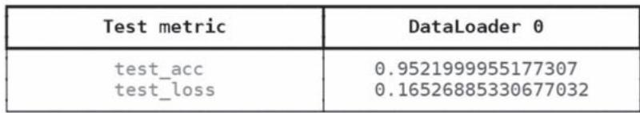  
图 2-6 装载保存的模型测试结果

# （5）把 PyTorch 转换为 PL 格式的代码

前面介绍了 PyTorch 两种编码方式，一种是较详细的编程方法，另一种是类似 Keras 的简约方式，图 2-7 说明如何把 PyTorch 代码转换为 PL 格式的代码。

  
图 2-7 把 PyTorch 转换为 PL 代码的对应关系

# 2.4 构建卷积神经网络

卷积神经网络（Convolutional Neural Network，CNN）是一种深度学习模型，专门用于处理具有类似网格结构的数据，例如图像和音频。它在图像识别、计算机视觉和自然语言处理等领域取得了重大成功。CNN 的核心思想是通过卷积层、池化层和全连接层来逐层提取特征并进行分类。卷积层通过滤波器（也称为卷积核）在输入数据上滑动，计算局部区域的特征映射。池化层则用于减小特征图的尺寸，并保留重要的信息。全连接层在提取特征后，将其映射到不同的类别上，进行分类。

# 2.4.1 全连接层

# 1. 全连接层的优点

# （1）灵活性

全连接层可以建立图像中任意像素之间的连接，并学习到更加复杂的特征和关系。

# （2）特征组合

全连接层可以通过权重的学习，将输入特征进行线性或非线性的组合，从而提取更高级别的抽象特征。

# （3）高度可解释性

由于每个神经元与前一层所有神经元相连，全连接层具有较高的可解释性，可以直观地理解每个神经元对应的特征。

# 2. 全连接层的缺点

# （1）参数量大

全连接层需要大量的连接权重参数，尤其是在输入较大的情况下，导致模型过于复杂，容易过拟合。

# （2）忽略了空间信息

全连接层无法保留输入数据的空间结构信息，而仅仅考虑特征之间的线性组合。

# （3）计算量大

全连接层需要对整个输入数据进行矩阵乘法运算，计算量较大。

# 2.4.2 卷积层

卷积层是卷积神经网络的核心层，而卷积又是卷积层的核心。卷积，直观理解就是两个函数的一种运算，这种运算也被称为卷积运算。

# （1）卷积层的优点

1）参数共享。卷积层使用相同的权重对整个输入进行卷积操作，可以用较少的参数表示丰富的特征，减少了模型的复杂性和过拟合风险。  
2）保留空间信息。卷积层在进行卷积操作时，保留了输入数据的空间结构信息，使得模型能够捕捉到局部特征和空间关系。  
3）计算效率高。卷积操作可以通过卷积核的重复使用和局部计算来减少计算量，尤其适用于大规模图像数据处理。

# （2）卷积层的缺点

1）局部感受野。卷积操作仅考虑局部区域的信息，并不会直接获取全局信息，对于全局特征的提取相对较弱。

2）空间分辨率下降。卷积池化操作会导致特征图的尺寸减小，可能导致一定的空间信息损失。  
3）参数共享的限制。虽然参数共享可以减少参数量，但也限制了模型学习到更复杂的特征和关系。

下面通过具体实例来加深理解。图 2-8 就是一个简单的二维空间卷积运算示例，虽然简单，但是包含了卷积的核心内容。

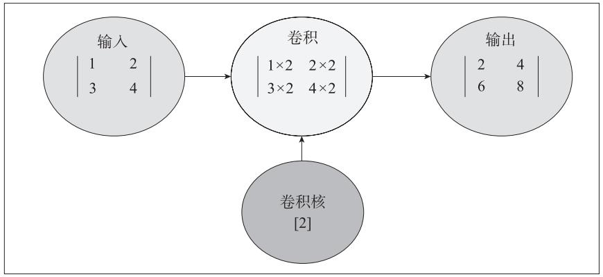  
图 2-8 二维空间卷积运算示例

在图 2-8 中，输入和卷积核都是张量，卷积运算就是用卷积分别乘以输入张量中的每个元素，然后输出一个代表每个输入信息的张量。接下来我们把输入、卷积核推广到更高维空间，输入由 $2 \times 2$ 矩阵拓展为 $5 \times 5$ 矩阵，卷积核由一个张量拓展为一个 $3 \times 3$ 矩阵，如图 2-9 所示。这时该如何进行卷积运算呢？

  
a）图像大小为 $5 { \times } 5$

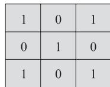  
b）偏置为0,卷积核大小为 $3 { \times } 3$

  
c）特征图大小为 $3 { \times } 3$   
图 2-9 卷积神经网络卷积运算

图 2-9c 中的 4 是图 2-9a 左上角的 $3 \times 3$ 矩阵与卷积核矩阵的对应元素相乘后的汇总结果，如图 2-10 所示。

图 2-10c 中的 4 由表达式 $1 \times 1 + 1 \times 0 + 1 \times 1 + 0 \times 0 + 1 \times 1 + 1 \times 0 + 0 \times 1 + 0 \times 0 + 1 \times 1$ 得到。

当卷积核在输入图像中右移一个元素时，便得到图 2-11。

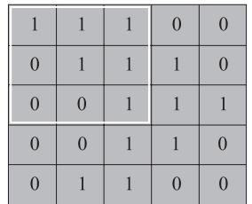  
a）图像大小为 $5 { \times } 5$

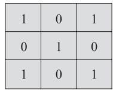  
b）偏置为0,卷积核大小为 $3 { \times } 3$

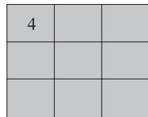  
c）特征图大小为3×3

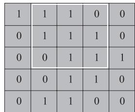  
图 2-10 对应元素相乘后的结果  
a）图像大小为 $5 { \times } 5$

  
b）偏置为0,卷积核大小为 $3 { \times } 3$

  
图 2-12 输出结果

c）特征图大小为 $3 { \times } 3$

图 2-11 卷积核往右移动一格

图 2-11c 中的 3 由表达式 $1 \times 1 + 1 \times 0 + 0 \times 1 + 1 \times 0 + 1 \times 1 + 1 \times 0 + 0 \times 1 + 1 \times 0 + 1 \times 1$ 得到。

卷积核窗口从输入张量的左上角开始，从左到右、从上到下滑动。当卷积核窗口滑动到一个新位置时，包含在该窗口中的部分张量与卷积核张量进行按元素相乘，得到的张量再求和得到一个单一的标量值，输入（假设为 $X$ ，其大小为 $( X _ { w } , X _ { h } )$ ）与卷积核（假设为 $K$ ，其大小为 $( K _ { w } , K _ { h } )$ ）运算后的输出矩阵的大小为：

$$
\left(X _ {w} - K _ {w} + 1, X _ {h} - K _ {h} + 1\right)
$$

由此得出了这一位置的输出张量值，如图 2-12 所示。

用卷积核中每个元素乘以对应输入矩阵中的对应元素，原理还是一样，但输入张量为 $5 \times 5$ 矩阵，而卷积核为 $3 \times 3$ 矩阵，得到一个$3 \times 3$ 矩阵。这里首先就要解决如何对应的问题。把卷积核作为输入矩阵上的一个移动窗口，通过移动与所有元素对应，对应问题就迎刃而解了。这个卷积运算过程可以用 PyTorch 代码实现。

<table><tr><td>4</td><td>3</td><td>4</td></tr><tr><td>2</td><td>4</td><td>3</td></tr><tr><td>2</td><td>3</td><td>4</td></tr></table>

1）定义卷积运算函数。

```python
def cust_conv2d(X, K):
    '''实现卷积运算'''  
#获取卷积核大小  
h, w = K.shape  
#初始化输出值Y  
Y = torch.zeros((X.shape[0] - h + 1, X.shape[1] - w + 1)) 
```

```python
实现卷积运算  
for i in range(Y.shape[0]):  
    for j in range(Y.shape[1]):  
        Y[i, j] = (X[i: i + h, j: j + w] * K).sum()  
return Y 
```

2）定义输入及卷积核。

```python
X = torch.tensor([[1.0, 1.0, 1.0, 0.0, 0.0], [0.0, 1.0, 1.0, 1.0, 0.0], [0.0, 0.0, 1.0, 1.0, 1.0], [0.0, 0.0, 1.0, 1.0, 1.0, 0.0], [0.0, 1.0, 1.0, 0.0, 0.0])  
K = torch.tensor([[1.0, 0.0, 1.0], [0.0, 1.0, 0.0], [1.0, 0.0, 1.0]])  
cust_conv2d(X, K) 
```

运行结果如下：

```txt
tensor([[4., 3., 4.],
[2., 4., 3.],
[2., 3., 4.]) 
```

那么，如何确定卷积核？如何在输入矩阵中移动卷积核？在移动过程中，如果超越边界应该如何处理？这种因移动可能带来的问题将在后续章节详细说明。

# 2.4.3 卷积核

卷积核是整个卷积过程的核心，从名字就可以看出它的重要性。比较简单的卷积核（也称为过滤器）有垂直卷积核（Vertical Filter）、水平卷积核（Horizontal Filter）、索贝尔卷积核（Sobel Filter）等。这些卷积核能够检测图像的水平边缘、垂直边缘，增强图像中心区域权重等。下面通过一些图来说明卷积核的具体作用。

# 1. 卷积核的作用

（1）垂直边缘检测

卷积核对垂直边缘的检测的示意图如图 2-13 所示。

这个卷积核是 $3 \times 3$ 矩阵（卷积核一般是奇数阶矩阵），其特点是第 1 列和第 3 列有数值，第 2 列为 0。经过这个卷积核的作用后，就把原数据垂直边缘检测出来了。

（2）水平边缘检测

卷积核对水平边缘的检测的示意图如图 2-14 所示。

这个卷积核也是 $3 \times 3$ 矩阵，其特点是第 1 行和第 3 行有数值，第 2 行为 0。经过这个卷积核的作用后，就把原数据水平边缘检测出来了。

（3）对图像的水平边缘、垂直边缘检测

卷积核对图像的水平边缘检测、垂直边缘检测的对比效果图如图 2-15 所示。

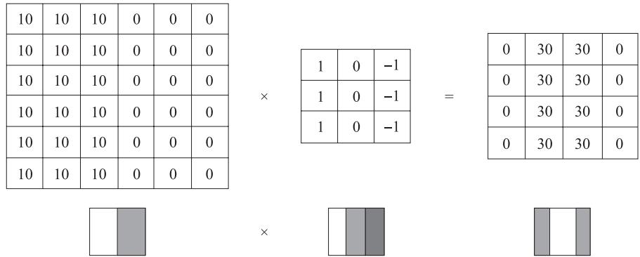  
图 2-13 卷积核对垂直边缘的检测

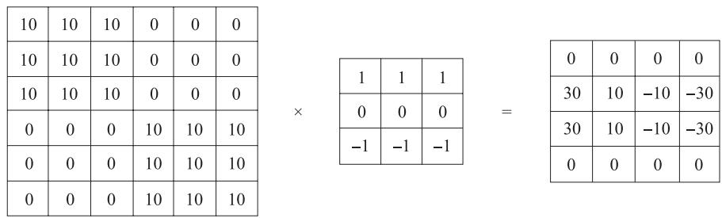  
图 2-14 卷积核对水平边缘的检测

  
图 2-15 卷积核对图像的水平边缘检测、垂直边缘检测的对比效果图

以上这些卷积核比较简单，在深度学习中，卷积核的作用不仅在于检测垂直边缘、水平边缘等，还可以检测其他边缘特征。

# 2. 如何确定卷积核

如何确定卷积核呢？卷积核类似于标准神经网络中的权重矩阵 W，W 需要通过梯度下降算法反复迭代求得。同样，在深度学习中，卷积核也需要通过模型训练求得。卷积神经网络的主要目的就是计算出这些卷积核的数值。确定得到了这些卷积核后，卷积神经网络的浅层网络也就实现了对图像所有边缘特征的检测。

以图 2-14 为例，给定输入 $X$ 及输出 Y，根据卷积运算，通过多次迭代可以得到卷积核的近似值。

（1）定义输入和输出

$\mathrm{X} =$ torch.tensor([[10.,10.,10.,0.0,0.0,0.0], [10.,10.,10.,0.0,0.0,0.0], [10.,10.,10.,0.0,0.0,0.0], [10.,10.,10.,0.0,0.0,0.0]) $\mathrm{Y} =$ torch.tensor([[0.0, 30.0, 30.0, 0.0], [0.0, 30.0, 30.0, 0.0], [0.0, 30.0, 30.0, 0.0], [0.0, 30.0, 30.0, 0.0])

（2）训练卷积层

#构造一个二维卷积层，它具有1个输出通道和形状为（3,3）的卷积核conv2d $=$ nn.Conv2d(1,1,kernel_size=(3,3)，bias=False)#这个二维卷积层使用四维输入和输出格式（批量大小，通道，高度，宽度），#其中批量大小和通道数都为1X $\equiv$ X.reshape((1,1,6,6))Y $\equiv$ Y.reshape((1,1,4,4))lr $= 0.001$ #学习率#定义损失函数loss_fn $\equiv$ torch Tenn.MSELoss()fori in range(400):Y_pre $\equiv$ conv2d(X)loss $\equiv$ loss_fn(Y_pre,Y)conv2d.zero_grad()loss.backup()#迭代卷积核conv2d.weight.data[:] $- = \mathrm{lr}^{*}$ conv2d.weight.gradif $(\mathrm{i} + 1)\% 100 = = 0$ ：print(f'epoch {i+1},loss{loss-sum(:.4f)}')

（3）查看卷积核

```txt
conv2d.weight.data.reshape((3,3)) 
```

运行结果如下：

```javascript
tensor([[1.2232，-0.1614，-1.0800]，[0.8695，-0.1122，-1.2032]，[0.9073，0.2736，-0.7168]]）
```

这个结果与图 2-13 中的卷积核就比较接近了。

假设卷积核已确定，卷积核如何对输入数据进行卷积运算呢？下面将进行详细介绍。

# 2.4.4 步幅

如何对输入数据进行卷积运算？回答这个问题之前，我们先回顾一下图 2-9。在图 2-9a中，左上方的小窗口实际上就是卷积核，其中 $\times$ 后面的值就是卷积核的值。如第 1 行 $\times 1$ 、$\times 0 , \times 1$ 对应卷积核的第 1 行 [1 0 1]。图 2-9c 的第 1 行第 1 列的 4 是如何得到的呢？就是由 $5 \times 5$ 矩阵中由前 3 行、前 3 列构成的矩阵各元素乘以卷积核中对应位置的值，然后累加得到的，即 $1 \times 1 + 1 \times 0 + 1 \times 1 + 0 \times 0 + 1 \times 1 + 1 \times 0 + 0 \times 1 + 0 \times 0 + 1 \times 1 = 4$ 。那么，如何得到图$2 \mathrm { - } 9 \mathrm { c }$ 中第 1 行第 2 列的值呢？我们只要把图 2-9a 中小窗口往右移动一格，然后进行卷积运算即可。以此类推，最终得到完整的特征图的值，如图 2-16 所示。

  
a）图像大小为 $5 { \times } 5$

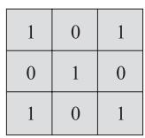  
b）偏置为0，卷积核大小为 $3 { \times } 3$

  
c）特征图大小为 $3 { \times } 3$   
图 2-16 通过卷积运算生成的数据

小窗口（实际上就是卷积核）在图 2-9a 中每次移动的格数（无论是自左向右移动，还是自上向下移动）称为步幅（stride），在图像中就是跳过的像素个数。在上面的示例中，小窗口每次只移动一格，故参数 stride $: = 1$ ，这个参数也可以是 2 或 3 等其他数值。如果是 2，则每次移动时就跳 2 格或 2 个像素，如图 2-17 所示。


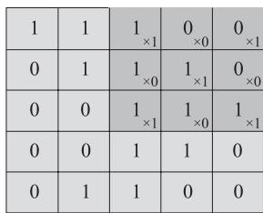  
每次移动2格 stride=2   
图 2-17 stride 为 2 时的示意图

在小窗口移动过程中，卷积核的值始终保持不变。也就是说，卷积核的值在整个过程中是共享的，所以又把卷积核的值称为共享变量。卷积神经网络采用参数共享的方法大大降低了参数的数量。

参数 stride 是卷积神经网络中的一个重要参数，在用 PyTorch 具体实现时，stride 参数格式为单个整数或两个整数的元组（分别表示在 height 和 width 维度上的值）。

在图2-11中，如果小窗口继续往右移动2格，那么卷积核将移到输入矩阵之外，如图2-18所示。此时该如何处理呢？具体处理方法就涉及下节要讲的内容—填充（padding）了。

  
图 2-18 小窗口移到输入矩阵外

# 2.4.5 填充

当输入图像与卷积核不匹配或卷积核超过图像边界时，可以采用边界填充的方法，即把图像尺寸进行扩展，扩展区域补 0，如图 2-19 所示。当然也可以不扩展。

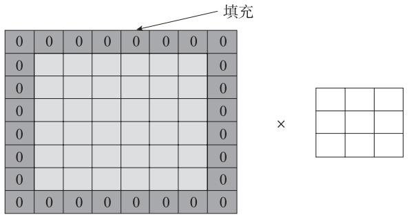  
图 2-19 采用边界填充方法对图像进行扩展

根据是否扩展可将填充方式分为 Same、Valid 两种。采用 Same 方式时，对图像扩展并补 0；采用 Valid 方式时，不对图像进行扩展。具体如何选择呢？在实际训练过程中，一般选择 Same 方式，因为使用这种方式不会丢失信息。设补 0 的圈数为 $p$ ，输入数据大小为 $n$ ，卷积核大小为 $f$ ，步幅大小为 $s$ ，则有：

$$
p = \frac {f - 1}{2} \tag {2.1}
$$

卷积后的矩阵大小为 ${ \frac { n + 2 p - f } { s } } + 1$ 。 （2.2）

# 2.4.6 多通道上的卷积

前面对卷积在输入数据、卷积核的维度上进行了扩展，但输入数据、卷积核都是单一的。从图像的角度来说，二者都是灰色的，没有考虑彩色图像的情况。在实际应用中，输入数据往往是多通道的，如彩色图像就是 3 通道，即 R、G、B 通道。此时应该如何实现卷积运算呢？我们分别从多输入通道和多输出通道两方面来详细讲解。

# 1. 多输入通道

3 通道图像的卷积运算与单通道图像的卷积运算基本一致，对于 3 通道的 RGB 图像，其对应的卷积核算子同样也是 3 通道的。例如一个图像是 $3 \times 5 \times 5$ 的，3 个维度分别表示通道数（channel）、图像的高度（height）、宽度（weight）。卷积过程是将每个单通道（R，G，B）与对应的卷积核进行卷积运算，然后将 3 通道的和相加，得到输出图像的一个像素值。具体过程如图 2-20 所示。

  
图 2-20 多输入通道的卷积运算过程示意图

下面用 PyTorch 实现图 2-20 多输入通道的卷积运算过程。

（1）定义多输入通道的卷积运算函数

```python
def corr2d_mutil_in(X,K):
    h,w = K.shape[1],K.shape[2]
    value = torch.zeros(X.shape[0] - h + 1, X.shape[1] - w + 1)
    for x,k in zip(X,K):
        value = value + cust_conv2d(x,k)
    return value 
```

（2）定义输入数据

$\mathbf{X} =$ torch.tensor([[1.,0.,1,0.,2.], [1,1,3,2,1], [1,1,0,1,1], [2,3,2,1,3], [0,2,0,1,0]], [[1.,0.,0,1.,0.], [2,0,1,2,0], [3,1,1,3,0], [0,3,0,3,2], [1,0,3,2,1]]]

```txt
[[2.,0.,1.,2.,1.], [3,3,1,3,2], [2,1,1,1,0], [3,1,3,2,0], [1,1,2,1,1]]])  
K = torch.tensor([[0.0,1.0,0.0], [0.0,0.0,2.0], [0.0,1.0,0.0]],  
[[2.0,1.0,0.0], [0.0,0.0,0.0], [0.0,3.0,0.0]],  
[[1.0,0.0,0.0], [1.0,0.0,0.0], [0.0,0.0,2.0]]]) 
```

（3）计算

```csv
corr2d_mutil_in(X,K) 
```

运行结果如下：

```txt
tensor([[19., 13., 15.],
[28., 16., 20.],
[23., 18., 25.]) 
```

# 2. 多输出通道

为了实现更多边缘检测，可以增加更多卷积核组。图 2-21 就是两组卷积核：卷积核1和卷积核2。这里的输入为 $3 \times 7 \times 7$ ，经过与两个 $3 \times 3 \times 3$ 的卷积核（步幅为 2）的卷积运算，

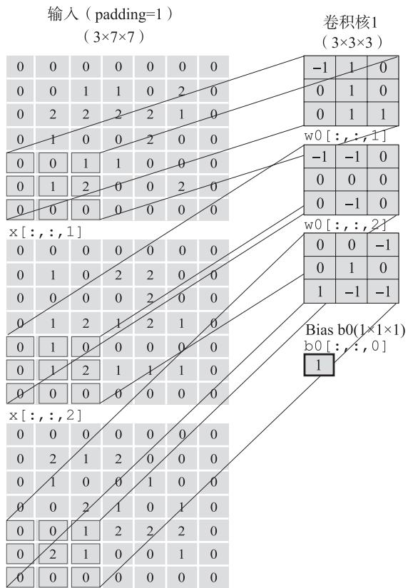

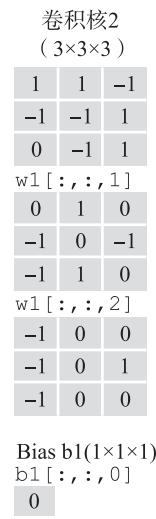

  
图 2-21 多输出通道的卷积运算过程示意图

得到的输出为 $2 \times 3 \times 3$ 。另外，我们也会看到图 2-21 中的补零填充（Zero Padding）是1，也就是在输入元素的周围补0。补零填充对于图像边缘部分的特征提取是很有帮助的，可以防止信息丢失。最后，不同卷积核组卷积得到不同的输出，个数由卷积核组决定。

把图 2-21 一般化，写成矩阵的方式为图 2-22 所示。

  
图 2-22 矩阵方式

# 3. $1 \times 1$ 卷积核

$1 \times 1$ 卷积核在很多经典网络结构中都有使用，如 Inception 网络、ResNet 网络、YOLO网络和 Swin-Transformer 网络等。在网络中增加 $1 \times 1$ 卷积核有以下主要作用。

# （1）增加或降低通道数

如果卷积的输出、输入都是一个二维数据，那么 $1 \times 1$ 卷积核的意义不大，它是完全不考虑像素与周边其他像素的关系的。如果卷积的输出、输入是多维矩阵，则可以通过 $1 \times 1$ 卷积的不同通道数，增加或减少卷积后的通道数。

# （2）增加非线性

$1 \times 1$ 卷积核利用后接的非线性激活函数，可以在保持特征图尺度不变的前提下大幅增加非线性特性，使网络更深，同时提升网络的表达能力。

# （3）跨通道信息交互

使用 $1 \times 1$ 卷积核可以增加或减少通道数，也可以组合来自不同通道的信息。图 2-23为通过 $1 \times 1$ 卷积核改变通道数的例子。

上述过程可以用 PyTorch 实现，代码如下。

# （1）生成输入及卷积核数据

```txt
X = torch.tensor([[1,2,3],[4,5,6],[7,8,9]], [[1,1,1],[1,1,1],[1,1,1]], [[2,2,2],[2,2,2],[2,2,2]]]) 
```

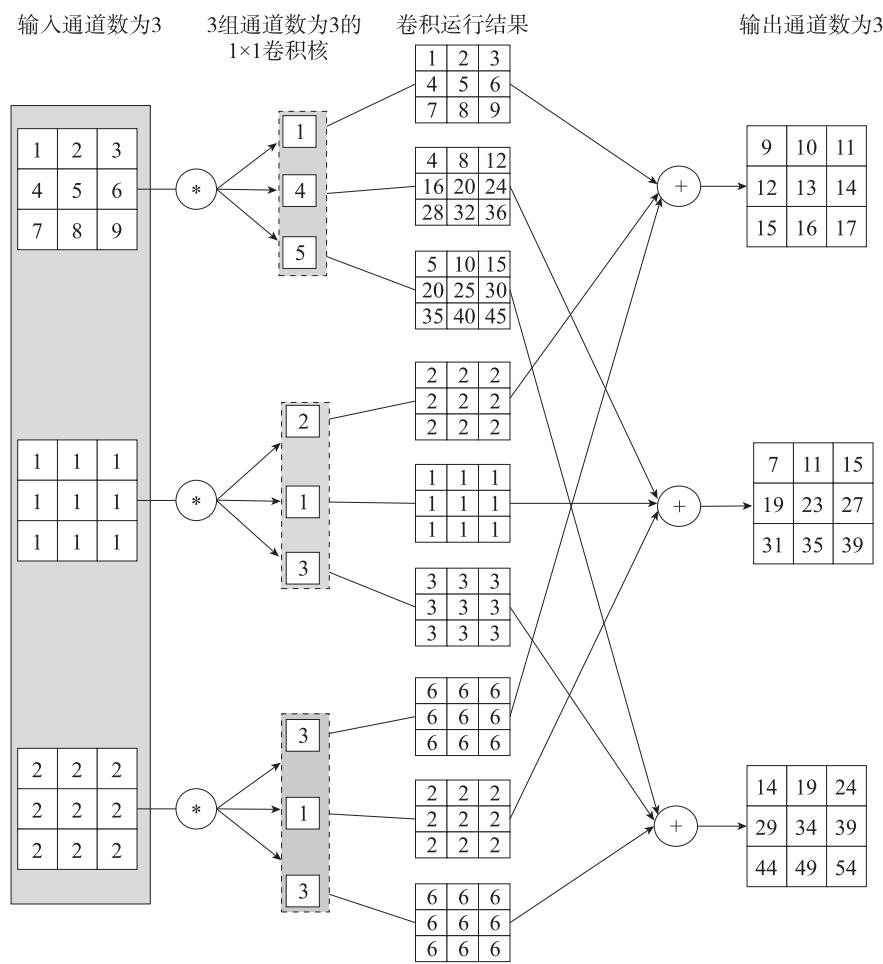  
图 2-23 $1 \times 1$ 卷积核改变通道数示意图

```txt
K = torch.tensor([[[[1]], [[2]], [[3]]], [[4]], [[1]], [[1]]], [[5]], [[3]], [[3]]])  
print(K.shape) ##torch.Size([3, 3, 1, 1]) 
```

# （2）定义卷积函数

```python
def corr2d_multiple_in_out(X,K):
    return torch.stack([corr2d_mutil_in(X,k) for k in K])
corr2d_multiple_in_out(X,K) 
```

运行结果如下：

```elixir
tensor([[9.,10.,11.], [12.,13.,14.], [15.,16.,17.]], [[7.,11.,15.], [19.,23.,27.], [31.,35.,39.]], [[14.,19.,24.], [29.,34.,39.], [44.,49.,54.]]]) 
```

# 2.4.7 激活函数

卷积神经网络与标准的神经网络类似，为保证非线性，也需要使用激活函数，即在卷积运算后，把输出值另加偏移量输入激活函数，作为下一层的输入，如图 2-24 所示。

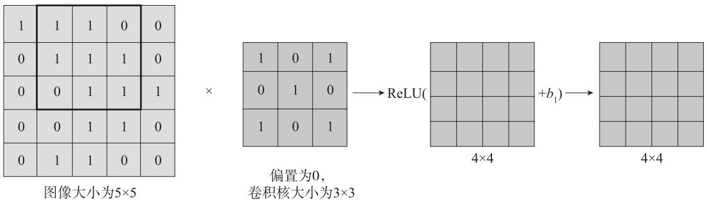  
图 2-24 卷积运算后的输出值加偏移量输入激活函数 ReLU

常 用 的 激 活 函 数 有 torch.nn.functional.sigmoid、torch.nn.functional.ReLU、torch.nn.functional.softmax、torch.nn.functional.tanh、torch.nn.functional.dropout 等。类对象方式的激活函数有 torch.nn.sigmoid、torch.nn.ReLU、torch.nn.softmax、torch.nn.tanh、torch.nn.dropout 等。

# 2.4.8 卷积函数

卷积函数是构建神经网络的重要支架，通常 PyTorch 的卷积运算是通过 nn.Conv2d 来完成的。下面先介绍 nn.Conv2d 的参数，然后介绍如何计算输出的形状。

# 1. nn.Conv2d 函数

nn.Conv2d 函数的定义如下。

```python
nn.Conv2d(
    in_channels: int,
    out_channels: int,
    kernel_size: Union[int, Tuple[int, int]], 
```

```python
stride: Union[int, Tuple[int, int]] = 1, padding: Union[int, Tuple[int, int]] = 0, dilation: Union[int, Tuple[int, int]] = 1, groups: int = 1, bias: bool = True, padding_mode: str = 'zeros', 
```

主要参数说明如下。

● in_channels(int)：输入信号的通道。  
out_channels(int)：卷积产生的通道。  
● kernel_size(int or tuple)：卷积核的尺寸。  
stride(int or tuple, optional)：卷积步长。  
padding(int or tuple, optional)：输入的每一条边补充 0 的层数。  
dilation(int or tuple, optional)：卷积核元素之间的间距。  
. groups(int, optional)：控制输入和输出之间的连接。groups $\mathord { \left. { \left[ - 1 \right. } \right. }$ ，输出是所有的输入的卷积；group $: = 2$ ，此时相当于有并排的两个卷积层，每个卷积层计算输入通道的一半，并且产生的输出是输出通道的一半，随后将这两个输出连接起来。  
● bias(bool, optional)： 如 果 bia $\underline { { \underline { { \mathbf { \Pi } } } } }$ True，则添加偏置。其中参数 kernel_size、stride、padding、dilation 可以是一个整型（int）数值，此时卷积的 height 和 width 值相同，也可以是一个 tuple 数组，tuple 的第一维度表示 height 的数值，tuple 的第二维度表示 width 的数值。  
padding_mode：有 4 种可选模式，分别为 zeros、reflect、replicate、circular，默认为 zeros，也就是零填充。

# 2. 输出形状

卷积函数 nn.Conv2d 参数中输出形状的计算公式如下：

Input: $(N,C_{\mathrm{in}},H_{\mathrm{in}},W_{\mathrm{in}})$

Output: $(N, C_{\mathrm{out}}, H_{\mathrm{out}}, W_{\mathrm{out}})$

$$
H _ {\text {o u t}} = \frac {H _ {\text {i n}} + 2 \times \text {p a d d i n g} [ 0 ] - \text {d i l a t i o n} [ 0 ] \times (\text {k e r n e l} _ {-} \text {s i z e} [ 0 ] - 1) - 1}{\text {s t r i d e} [ 0 ]} + 1 \tag {2.3}
$$

$$
W _ {\text {o u t}} = \frac {W _ {\text {i n}} + 2 \times \text {p a d d i n g} [ 1 ] - \text {d i l a t i o n} [ 1 ] \times (\text {k e r n e l} _ {\text {s i z e}} [ 1 ] - 1) - 1}{\text {s t r i d e} [ 1 ]} + 1 \tag {2.4}
$$

weight：(out_channels，in _ channels ， kernel_size[0]，kernel_size[1]) groups

当 group $\mathrel { \mathop : } = 1$ 时

```python
conv = nn.Conv2d(in_channels=6, out_channels=12, kernel_size=1, groups=1)  
conv.weight.data.size() # torch.Size([12, 6, 1, 1]) 
```

当 group $; = 2$ 时

```python
conv = nn.Conv2d(in_channels=6, out_channels=12, kernel_size=1, groups=2)  
conv.weight.data.size() #torch.Size([12, 3, 1, 1]) 
```

当 group $\scriptstyle \ i = 3$ 时

```python
conv = nn.Conv2d(in_channels=6, out_channels=12, kernel_size=1, groups=3)  
conv.weight.data.size() #torch.Size([12, 2, 1, 1]) 
```

注意：in_channels、groups 必须是整数，否则报错。

# 2.4.9 转置卷积

转置卷积（Transposed Convolution）在一些文献中也称为反卷积（deconvolution）或部分跨越卷积（Fractionally-strided Convolution）。何为转置卷积？它与卷积又有哪些不同？

通过卷积的正向传播的图像一般会越来越小，类似于下采样（downsampling）。而卷积的反向传播实际上就是一种转置卷积，类似于上采样（upsampling）。

# 1. 转置卷积的直观理解

图 2-25 为 $s { = } 1$ 、 $p { = } 0$ 、 $k { = } 3$ 的转置卷积运算示意图。

  
图 2-25 转置卷积运算示意图（一）

图 2-26 为 $s { = } 2$ 、 $p { = } 0$ 、 $k { = } 3$ 的转置卷积运算示意图。

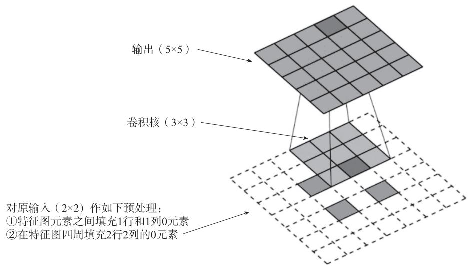  
图 2-26 转置卷积运算示意图（二）

图 2-25 和图 2-26 中的输出是如何得到的呢？可根据给定的 s、 $p$ 、 $k$ 进行简单推导：

$\bullet$ 在输入特征图元素间填充 $s { - } 1$ 行和列的 0 值。  
$\bullet$ 在输入特征图四周填充 k-p-1 列和行的 0 值。  
. 做正常卷积运算（步长为 1，填充为 0）。此时不需要再对特征图进行填充了 ，直接进行步长为 1、padding 为 0 的卷积运算。

接下来我们介绍 PyTorch 对转置卷积输出形状的计算公式。

# 2. 转置卷积输出形状的计算公式

假设转置卷积的参数为：

```python
torch(nn.ConvTranspose2d(in_channels, out_channels, kernel_size, stride=1, padding=0, output(padding=0, groups=1, bias=True, dilation=1, padding_mode='zeros', device=None, dtype=None) 
```

假设输入的大小为 i，即 $H { = } W { = } i$ ，其中 dilation、output_padding 的默认值分别为 1 和 0，为便于计算，取 dilation $_ { ! = 1 }$ ，则转置卷积的输出大小（假设 $H { = } W$ ）为：

$$
H = \text {s t r i d e} \times (i - 1) - 2 \times (\text {p a d d i n g} + \text {k e r n e l} _ {-} \text {s i z e}) + \text {o u t p u t} _ {-} \text {p a d d i n g} \tag {2.5}
$$

根据式（2.5）可计算图 2-25 和图 2-26 的输出大小。

图 2-25 的参数为 $s { = } 1 , p { = } 0 , k { = } 3$ $k { = } 3$ ，原输入大小为 $i { = } 2$ ，由此可得转置卷积的输出大小为：

$$
H = s \times (i - 1) - 2 \times p + k = 1 - 0 + 3 = 4
$$

图 2-26 的参数为 $s { = } 2 , p { = } 0 , k { = } 3$ $k { = } 3$ ，原输入大小为 $i { = } 2$ ，由此可得转置卷积的输出大小为：

$$
H = s \times (i - 1) - 2 \times p + k = 2 - 0 + 3 = 5
$$

# 3. 转置卷积的应用示例

转置卷积主要用于变分自编码、生成式对抗网络 GAN、目标检测和语义分割等。图 2-27为使用转置卷积的一个示例，它是一个上采样过程。

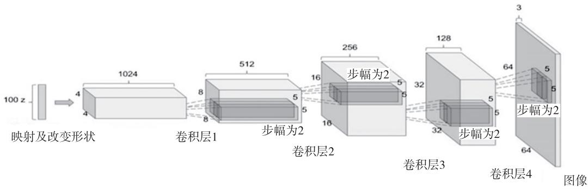  
图 2-27 转置卷积示例

# 4. 转置卷积的 PyTorch 实现

情况 1：将输入 x 先进行卷积运算，然后再使用转置卷积，使最后的输出形状与输入形状一致。

conv $=$ nn.Conv2d(3,8,3,stride $\coloneqq$ 2,padding $\coloneqq$ 1)   
Dconv $=$ nn.ConvTranspose2d(8,3,3,stride $\coloneqq$ 2,padding $\coloneqq$ 1) $\mathbf{x} =$ torch randn(1,3,5,5)   
feature $=$ conv(x)   
print feature.shape)   
#out:torch.Size([1,8,3,3])   
y $=$ Dconv feature)   
print(y.shape)   
#out:torch.Size([1,3,5,5])

情况 2：将输入 x 先进行卷积运算，然后再使用转置卷积，使最后的输出形状与输入形状一致。这里用到了参数 output_padding，这个参数主要用于调整输出分辨率。

```python
conv = nn.Conv2d(3, 8, 3, stride=2, padding=1)  
Dconv = nn.ConvTranspose2d(8, 3, 3, stride=2, padding=1, output(padding=1)  
x = torch randn(1, 3, 6, 6)  
feature = conv(x)  
print feature.shape) # [1, 8, 3, 3]  
y = Dconv(feature)  
print(y.shape)  
# out: [1,3,6,6] 
```

通过转置卷积后的特征图大小为：

$$
\begin{array}{l} H = s \times (\text {f e a t u r e} - 1) - 2 p + k + \text {o u t p u t} _ {\text {p a d d i n g}} \\ = 2 (3 - 1) - 2 \times 1 + 3 + 1 = 6 \\ \end{array}
$$

# 2.4.10 特征图与感受野

输出的卷积层有时被称为特征图（Feature Map），因为它可以被视为一个输入映射到下一层的空间维度的转换器。在 CNN 中，对于某一层的任意元素 x，其感受野（ReceptiveField）是指在正向传播期间可能影响 x 计算的所有元素（来自所有先前层）。

注意，感受野的覆盖率可能大于某层输入的实际区域大小。让我们用图 2-28 为例来解释感受野。感受野是卷积神经网络每一层输出的特征图上的像素点在输入图像上映射的区域大小。通俗来说，感受野是特征图上的一个点对应输入图上的区域。

  
图 2-28 感受野

由图 2-28 可以看出，经过几个卷积层之后，特征图逐渐变小，一个特征所表示的信息量越来越多，如 s3 表示了 x1、x2、x3、x4、x5 的信息。

# 2.4.11 卷积层如何保留图像的空间信息

通过卷积层的介绍可知，卷积层通过卷积操作来保留输入数据的空间信息。在卷积操作中，使用一个固定大小的滤波器（也称为卷积核或卷积窗口）与输入数据进行逐元素乘积并求和的操作，这个滤波器以一定的步长在整个输入数据上进行滑动。

通过这种卷积操作，卷积层可以从局部区域中提取特征，并保留空间结构信息。在滤波器的不同位置，卷积操作会提取不同的局部特征。通过滑动步长的调整，可以在不同位置上进行卷积操作，从而将整个输入数据的空间信息编码到输出特征图中。

例如，假设有一个 $3 \times 3$ 的灰度图像作为输入，如下所示：

我们使用一个 $2 \times 2$ 的滤波器以步长为 1 对整个图像进行滑动，执行卷积操作。卷积操作的公式为：

$$
\operatorname {o u t p u t} [ \mathrm {i}, \mathrm {j} ] = \operatorname {s u m} (\operatorname {i n p u t} [ \mathrm {i}: \mathrm {i} + 2, \mathrm {j}: \mathrm {j} + 2 ] * \text {f i l t e r})
$$

其中，input[i:i $^ { + 2 }$ , j:j+2] 表示图像中以 (i, j) 为左上角的 $2 \times 2$ 区域，filter 表示滤波器。

对于这个例子，如果使用滤波器大小为 [1, 1; 1, 1]，则卷积操作的结果为：

$$
\begin{array}{l} 1 + 2 + 4 + 5 = 1 2 \quad 2 + 3 + 5 + 6 = 1 6 \\ 4 + 5 + 7 + 8 = 2 4 \quad 5 + 6 + 8 + 9 = 2 8 \\ \end{array}
$$

即得到输出特征图：

12 16

24 28

从上述例子可以看出，卷积操作保留了图像的空间信息。具体来说，输出特征图的每个单元格中的值都来自输入图像中对应位置及其周围的值的线性组合。这意味着，输出特征图中的每个元素都对应于输入图像的一个局部区域，从而保留了图像的空间结构。

此外，通过调整滑动步长，可以在整个输入图像上进行卷积操作，进一步提取全局空间信息。通过堆叠多个卷积层，深层卷积神经网络可以从低级的图像特征逐步提取出高级的语义特征，以更好地理解和处理图像。这些特征保留了图像的空间信息作为后续任务的输入。

# 2.4.12 现代经典网络

# 1. ResNet 模型

2015 年， 何 恺 明 推 出 的 ResNet 在 ISLVRC 和 COCO上超越所有选手，获得冠军。ResNet 在网络结构上做了一大创新，即采用残差网络结构，而不再简单地堆积层数，为卷积神经网络提供了一个新思路。残差网络的核心思想可以概括为：通过将两个连续的卷积层的输出作为下一层的输入来实现信息传递，单元结构如图 2-29 所示。

其完整网络结构如图 2-30 所示。

通过引入残差实现恒等映射（Identity Mapping）， 相当于一个梯度高速通道，使训练更简洁，且避免了梯度消失问题，由此可以得到很深层的网络，如网络层数由GoogLeNet 的 22 层发展到 ResNet 的 152 层。

ResNet 模型具有如下特点。

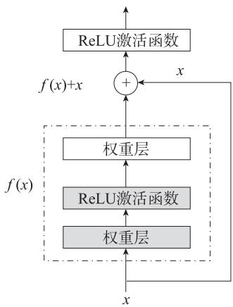  
图 2-29 ResNet 残差单元结构

  
图 2-30 ResNet 完整网络结构

● 层数非常深，已经超过百层。  
● 引入残差单元来解决退化问题。

# 2. DenseNet 模型

ResNet 模型极大地改变了参数化深层网络中函数的方式，DenseNet（稠密网络）在某种程度上可以说是 ResNet 的逻辑扩展，其每一层的特征图是后面所有层的输入。DenseNet网络结构如图 2-31 所示。

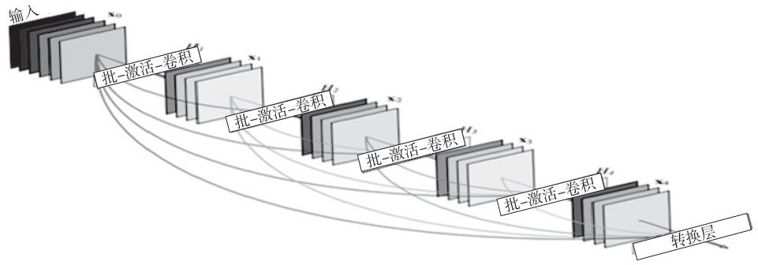  
图 2-31 DenseNet 网络结构

ResNet 和 DenseNet 的主要区别如图 2-32 所示（阴影部分）。

由图 2-32 可知，ResNet 和 DenseNet 的主要区别在于，DenseNet 的输出是连接（如图 2-32b中的 [,] 表示），而不是 ResNet 的简单相加。

DenseNet 主要由两部分构成：稠密块（Dense Block）和过渡层（Transition Layer）。前者定义如何连接输入和输出，后者则控制通道数量、特征图的大小等，使其不会太复杂。

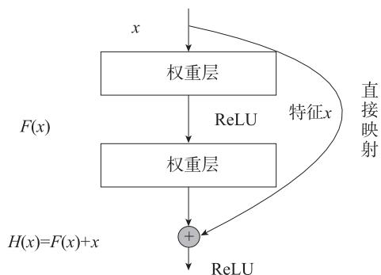  
a）ResNet 的跨层连接

  
b）DenseNet 的跨层连接  
图 2-32 ResNet 与 DenseNet 的主要区别

# 3. U-Net 网络

U-Net 网络结构如图 2-33 所示。

  
图 2-33 U-Net 网络结构

1）由图 2-33 可以看到，输入是 $5 7 2 \times 5 7 2$ 的，但是输出变成了 $3 8 8 \times 3 8 8$ ，这说明经过网络以后，输出的结果和原图不是完全对应的，这在计算 loss 和输出结果时都可以得到体现。  
2）朝右的箭头（除跳跃连接方向）代表 $3 \times 3$ 的卷积操作，并且 stride 是 1，填充策略是 Valid，因此，每个该操作以后，特征图的大小会减 2。  
3）朝下的箭头代表 $2 \times 2$ 的最大池化操作，需要注意的是，此时的填充策略也是 Valid（Same 策略会在边缘填充 0，保证特征图的每个值都会被取到，Valid 会忽略掉不能进行下去的池化操作，而不是进行填充），这就会导致如果池化之前特征图的大小是奇数，那么就会损失一些信息。

4）朝上的箭头代表 $2 \times 2$ 的转置卷积操作，操作会将特征图的大小乘以 2，共包含 4 次上采样过程。  
5）跳跃连接方向代表复制和剪切操作，可以发现，在同一层左边的最后一层要比右边的第一层要大一些，这就导致想要利用浅层的特征，就要进行一些剪切，也导致了最终的输出是输入的中心某个区域。  
6）输出的最后一层使用 $1 \times 1$ 的卷积层做了分类。

下面用 PyTorch 来实现 U-Net 网络。

1）定义一个由两个卷积层构成的卷积块。

```python
class conv_block(nnModule): def __init__(self, in_channels, out_channels, padding=0): super().__init_(   ) self.conv = nn Sequential( nn.Conv2d(in_channels, out_channels, kernel_size=3,stride=1,padding=padding), nn.BatchNorm2d(out_channels), nn.ReLU(inplace=True), nn.Conv2d(out_channels, out_channels, kernel_size=3,stride=1,padding=padding), nn.ConvNorm2d(out_channels), nn.ReLU(inplace=True) def forward(self,x): x = self.conv(x) return x 
```

2）定义下采样模块，这里的下采样包括最大池化下采样和连续的两个“卷积（3×3）+ReLU 激活函数”。

```python
class DownSample(nnModule): def __init__(self, in_channels, out_channels, padding=0): super().__init_(   ) self.maxpool_conv = nn Sequential( nn.MaxPool2d(kernel_size=2, stride=2), conv_block(in_channels, out_channels, padding=padding) ) def forward(self, x): return self.maxpool_conv(x) 
```

3）定义上采样模块，这里的上采样包括转置卷积上采样，并与左侧对应编码器的特征图拼接（concatenation），之后进行连续的两个“卷积（3×3）+ReLU 激活函数”。

```python
class UpSample(nnModule): def __init__(self, in_channels, out_channels, concat=0): 
```

super().__init__(  )
	" "
	concat $= 0 \rightarrow$ do center crop
	concat $= 1 \rightarrow$ padding decoder feature map
	concat $= 2 \rightarrow$ padding $= 1$ in conv_block
	" "
	 selfconcate $=$ concat
	if selfconcate not in [0, 1, 2] :
	 raise Exception('concat not in list of [0, 1, 2]')
	if selfconcate $= = 2$ :
	 padding $= 1$ .self.up $=$ nn.ConvTranspose2d(in_channels, in_channels // 2, kernel_size=2, stride=2)
	else conv $=$ conv_block(in_channels, out_channels, padding=padding)
def forward(self, x, x_copy): $x =$ self.up(x)
	if selfconcate $= = 0$ :
	 B, C, H, W = x.shape
	 x_copy $=$ torchvisiontransformsCenterCrop([H, W])(x_copy)
	else selfconcate $= = 1$ :
	[ \text{diffY} = \text{x\_copy.size} \left( \begin{array}{l} {2} \end{array} \right) - \text{x\_size} \left( \begin{array}{l} {2} \end{array} \right) ]
	[ \text{diffX} = \text{x\_copy.size} \left( \begin{array}{l} {3} \end{array} \right) - \text{x\_size} \left( \begin{array}{l} {3} \end{array} \right) ] $x = F.$ pad(x, [   diffX // 2, diffX - diffX // 2, $\text{diffY} // 2,\text{diffY - diffY} // 2$ ])
# 按通道维度进行拼接
x = torch.cat([x_copy, x], dim=1)
return self.conv(x)

4）构建 U-Net 模型。

class UNet(nnModule): def __init__(self, n_channels, n_classes, concat=0): super().__init_(   ) self.n_channels = n_channels self.n_classes = n_classes self.concat = concat if concat $= = 2$ : padding = 1 else: padding = 0 expansion = 2

inplanes $= 64$ chns $=$ [inplanes, inplanes\*expansion, inplanes\*expansion\*\*2, inplanes\* expansion\*\*3,inplanes\*expansion\*\*4]   
self.inc $=$ conv_block(n_channels，chns[0]，padding)   
self.down1 $=$ DownSample(chns[0]，chns[1]，padding)   
self.down2 $=$ DownSample(chns[1]，chns[2]，padding)   
self.down3 $=$ DownSample(chns[2]，chns[3]，padding)   
self.down4 $=$ DownSample(chns[3]，chns[4]，padding)   
self.up1 $=$ UpSample(chns[-1]，chns[-2]，concat)   
self.up2 $=$ UpSample(chns[-2]，chns[-3]，concat)   
self.up3 $=$ UpSample(chns[-3]，chns[-4]，concat)   
self.up4 $=$ UpSample(chns[-4]，chns[-5]，concat)   
self.outc $=$ nn.Conv2d(chns[-5]，n_classes, kernel_size=1)   
def forward(self,x):   
e1 $=$ self.inc(x)   
e2 $=$ self.down1(e1)   
e3 $=$ self.down2(e2)   
e4 $=$ self.down3(e3)   
e5 $=$ self.down4(e4)   
x $=$ self.up1(e5,e4)   
x $=$ self.up2(x,e3)   
x $=$ self.up3(x,e2)   
x $=$ self.up4(x,e1)   
logits $=$ self.outc(x)   
return logits

5）用测试数据测试模型。

```python
if __name__ == "__main__":  
    x = torch rand(size=(8, 3, 224, 224))  
    net = UNet(3,10,2)  
    out = net(x)  
    print(out.size())  
#torch.Size([8, 10, 224, 224]) 
```

# 2.4.13 可变形卷积

可变形卷积（Deformable Convolution）是一种改进的卷积操作，可以在卷积过程中对输入特征图进行形变。可变形卷积的核心思想是通过引入偏移量来调整卷积核的采样位置，从而适应目标对象的形变和旋转等情况。在 DragGAN 中，可变形卷积被用来替代传统的卷积操作，以更好地处理图像中存在的形变和旋转等情况。具体来说，DragGAN 中可变形卷积的实现包括以下几个步骤：

1）利用一个额外的可学习参数矩阵来预测每个像素点的偏移量。  
2）通过将当前卷积层的采样位置根据偏移量进行位移，实现卷积核中心坐标的动态调整，即可获得可变形卷积的输出结果。  
3）将可变形卷积的输出结果传递给下一层网络进行处理。通过引入可变形卷积，DragGAN 可以更加准确地捕捉目标对象的形变和旋转等细节信息，从而进一步提高模型的表现力和生成效果。

# 2.5 构建循环神经网络

循环神经网络（Recurrent Neural Network，RNN）是一类在序列数据分析中常用的人工神经网络。与传统的前馈神经网络不同，RNN 具有记忆功能，可以处理输入数据的序列关系。RNN 的核心思想是引入循环结构，使得网络在处理每个序列元素时都能考虑前面的信息。这使得 RNN 在自然语言处理、语音识别、时间序列预测等任务中表现出色。

然而，传统的 RNN 也存在一些问题，例如难以处理长序列、梯度消失和梯度爆炸等。为了解决这些问题，出现了一些改进的循环神经网络结构，如长短时记忆网络（LSTM）和门控循环单元（GRU）。这些结构在一定程度上缓解了 RNN 的限制，使得网络能够更好地捕捉长序列的信息和建模序列之间的依赖关系。

# 2.5.1 从神经网络到有隐含状态的循环神经网络

我们先回顾一下有隐含层的多层感知机。设隐含层的激活函数为 $f _ { \circ }$ 。给定一个小批量样本 $\ b { X } \in \mathbb { R } ^ { n \times d }$ ，其中批量大小为 $n$ ，输入维度为 $d$ ，则隐含层的输出 $\pmb { H } \in \mathbb { R } ^ { n \times \mathrm { h } }$ 通过式（2.6）计算：

$$
\boldsymbol {H} = f \left(\boldsymbol {X} \boldsymbol {W} _ {x h} + \boldsymbol {b} _ {h}\right) \tag {2.6}
$$

其中， $W _ { x h } \in \mathbb { R } ^ { d \times h }$ 是隐含层权重参数， $\pmb { b } _ { h } \in \mathbb { R } ^ { I \times h }$ 是偏置参数， $h$ 是隐藏单元的数目。将隐藏变量 $\pmb { H }$ 用作输出层的输入。输出层由式（2.7）给出：

$$
\boldsymbol {O} = \boldsymbol {H} \boldsymbol {W} _ {h m} + \boldsymbol {b} _ {m} \tag {2.7}
$$

其中， $m$ 是输出个数， $\pmb { O } \in \mathbb { R } ^ { n \times m }$ 是输出变量， $\pmb { W } _ { h m } \in \mathbb { R } ^ { h \times m }$ 是权重参数， $\pmb { b } _ { m } \in \mathbb { R } ^ { I \times m }$ 是输出层的偏置参数。如果是分类问题，我们可以用 sigmoid 或 softmax 函数来计算输出类别的概率分布。以上运算过程可用图 2-34 表示。

  
图 2-34 多层感知机的运算过程

其中，* 表示内积，[n,d] 表示形状大小。

有隐含状态的循环神经网络的结构如图 2-35 所示。

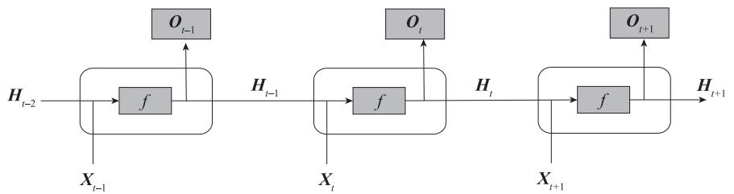  
图 2-35 有隐含状态的循环神经网络的结构

每个时间步的详细处理逻辑如图 2-36 所示。

  
图 2-36 循环神经网络每个时间步的详细处理逻辑

假设矩阵 $X$ 、 $W _ { { \scriptscriptstyle \mathrm { X } h } }$ 、 $\pmb { H }$ 和 $W _ { h h }$ 的 大 小 分 别 为 (2,3)、(3,4)、(2,4) 和 (4,4)。 我 们 将 $X$ 乘以 $W _ { { \scriptscriptstyle \mathrm { X } h } }$ ，将 $\pmb { H }$ 乘以 $W _ { h h }$ ，然后将这两个乘法的结果相加，最后利用广播机制加上偏移量$ { \boldsymbol { b } } _ { h } ( 1 , 4 )$ ，得到一个大小为 (2,4) 的 $\pmb { H } _ { t }$ 矩阵。

假设矩阵 $W _ { h m }$ 和 $\pmb { b } _ { m }$ 的大小分别为 (4,2)、(1,2)，可得大小为 (2,2) 的 ${ \mathbf { } } O _ { { t } }$ 矩阵。具体实现过程如下：

import torch   
import torch.nnfunctional as F   
##计算H_t，假设激活函数为ReLU   
X，W_xh $=$ torch.normal(0,1,(2,3))，torch.normal(0,1,(3,4))   
H，W_hh $=$ torch.normal(0,1,(2,4))，torch.normal(0,1,(4,4))   
B_h= torch.normal(0,1,(1,4))   
H1 $\equiv$ torch/matmul(X,W_xh)+torch.matmul(H,W_hh)+B_h   
H_t=F.relu(H1)   
##计算O_t，输出激活函数为softmax   
W_hm $\equiv$ torch.normal(0,1,(4,2))   
B_m $\equiv$ torch.normal(0,1,(1,2))   
O $\equiv$ torch/matmul(H_t,W_hm)+B_m

```python
O_t = F softmax(O, dim = -1)  
print("H_t 的形状: {}, O_t 的形状: {}.format(H_t.shape, O_t.shape))
```

运行结果如下：

```javascript
H_t的形状：torch.Size([2，4])，O_t的形状：torch.Size([2，2])
```

当然，也可以先对矩阵进行拼接，再进行运算，结果是一样的。

沿列（axis $^ { - 1 }$ ）拼接矩阵 $X$ 和 $\pmb { H }$ ，得到形状为（2,7）的矩阵 $[ X , H ]$ ，沿行（axi $\scriptstyle \operatorname { ; = } 0$ ）拼「W $\begin{array} { r } { \left\lceil W _ { _ { x h } } \right\rceil } \\ { W _ { h h . } } \end{array}$ 接矩阵 $W _ { x h }$ 和 $W _ { h h } .$ , 得到形状为（7,4）的矩阵 再将这两个拼接的矩阵相乘，最后与| | 」Whh$\pmb { b } _ { h }$ 相加，我们得到与上面形状相同的 (2,4) 的输出矩阵。

H01 $\equiv$ torch.cat(torch.cat((X,H)，1)，torch.cat((W_xh,W_hh)，0)) $^+$ B_h H02 $\equiv$ F.relu(H01)   
###查看矩阵H_t和H02   
print("--\*30+"矩阵H_t"+\-\*\*30)   
print(H_t)   
print("--\*30+"矩阵H02"+\-\*\*30)   
print(H02)

运行结果如下：

```txt
矩阵H_t  
tensor([[0.0000，0.0000，0.0825，1.8822]，[0.2298，0.0000，0.0000，0.0000]])  
矩阵H02  
tensor([[0.0000，0.0000，0.0825，1.8822]，[0.2298，0.0000，0.0000，0.0000]]) 
```

# 2.5.2 使用循环神经网络构建语言模型

前面我们介绍了语言模型，如果使用 $N$ 元语法实现，会非常麻烦，效率也不高。语言模型的输入一般为序列数据，而处理序列数据是循环神经网络的强项之一。那么，如何使用循环神经网络构建语言模型呢？

为简化起见，假设文本序列“知识就是力量”分词后为 “知”[ “识”, “就”, “是”, “力”, ,“量”]，把这个列表作为输入，时间步长为 6，使用循环神经网络就可构建一个语言模型，如图 2-37 所示。

其中，每个时间步输出的激活函数为 softmax，利用交叉熵损失计算模型输出（预测值）和标签之间的误差。

  
图 2-37 使用循环网络构建语言模型示意图

# 2.5.3 多层循环神经网络

循环神经网络也与卷积神经网络一样，可以横向拓展（增加时间步或序列长度），也可以纵向拓展成多层循环神经网络，如图 2-38 所示。

  
图 2-38 多层循环神经网络结构

# 2.5.4 现代经典循环神经网络

# 1. LSTM

目前最流行的一种解决 RNN 的短时记忆问题的方案称为长短时记忆网络（Long Short-Term Memory，LSTM）。LSTM 最早由 Hochreiter 和 Schmidhuber（1997）提出，它能够有效解决信息的长期依赖，避免梯度消失或爆炸。事实上，LSTM 就是专门为解决长期依赖问题而设计的。与传统 RNN 相比，LSTM 在结构上的独特之处是它精巧地设计了循环体结构。LSTM 用两个门来控制单元状态 $c$ 的内容：一个是遗忘门，它决定了上一时刻的单元状态 $c _ { t - 1 }$ 有多少保留到当前时刻 $c _ { t }$ ；另一个是输入门，它决定了当前时刻网络的输入 $x _ { t }$ 有多少保存到单元状态 $c _ { t \circ }$ LSTM 用输出门来控制单元状态 $c _ { t }$ 有多少输出到 LSTM 的当前输出值$h _ { t \circ }$ 。LSTM 的循环体结构如图 2-39 所示。

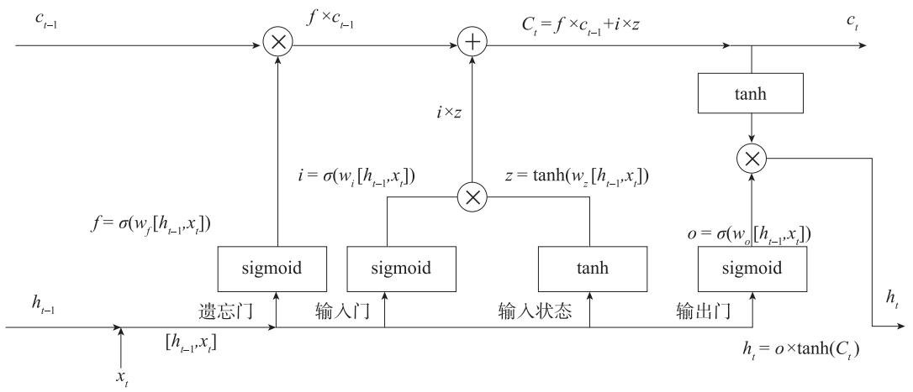  
图 2-39 LSTM 架构图

# 2. GRU

LSTM 有效地克服了传统 RNN 的一些不足，较好地解决了梯度消失、长期依赖等问题。不过，LSTM 也有一些不足，如结构比较复杂、计算复杂度较高。后来，人们在 LSTM的基础上又推出其他变种，如目前非常流行的 GRU（Gated Recurrent Unit，门控循环单元）。

图 2-40 为 GRU 架构图，图中小圆圈表示向量的点积。GRU 对 LSTM 做了很多简化，因此，计算效率更高，占用内存也相对较少，在实际使用中，二者差异不大。GRU 在LSTM 的基础上做了两个大改动。

1）将输入门、遗忘门、输出门变为两个门：更新门（Update Gate） $z _ { t }$ 和重置门（ResetGate） $r _ { t }$ 。  
2）将单元状态与输出合并为一个状态： $h _ { t }$ 。

  
图 2-40 GRU 架构

$$
\begin{array}{l} z _ {t} = \sigma \left(W _ {z} \cdot \left[ h _ {t - 1}, x _ {t} \right]\right) \\ r _ {t} = \sigma \left(W _ {r} \cdot \left[ h _ {t - 1}, x _ {t} \right]\right) \\ \tilde {h} _ {t} = \tanh  \left(W \cdot \left[ r _ {t} * h _ {t - 1}, x _ {t} \right]\right) \\ h _ {t} = \left(1 - z _ {t}\right) * h _ {t - 1} + Z _ {t} * \bar {h} _ {t} \\ \end{array}
$$

# 2.6 迁移学习

迁移学习是一种利用已经训练过的模型在新任务上进行自适应学习的机器学习方法。

其基本原理是利用已有的知识和经验，将多个任务之间共享的特征和规律转移到新的任务上，从而减少对新任务的重新学习和训练。通过将已训练模型的参数作为初始点，再对新任务数据进行微调，迁移学习能够在新任务上取得较好的性能表现，特别是当新任务与原任务相关且具有共享特征时更为有效。因此，迁移学习可以加快模型的学习速度，提高模型的泛化能力，并在多种任务和领域中得到广泛应用。

# 2.6.1 迁移学习简介

考虑到训练词向量模型一般需要大量数据，而且耗时比较长，为了节省时间、提高效率，本实例采用迁移学习方法，即直接利用训练好的词向量模型作为输入数据，这样既可以提高模型精度，又可以节省大量训练时间。

迁移学习示意图如图 2-41 所示，简单来说，就是把任务 A 开发的模型作为初始点，重新使用在任务 B 中。比如，任务 A 可以是识别图像中车辆，而任务 B 可以是识别卡车、识别轿车、识别公交车等。合理地使用迁移学习，可以避免针对每个目标任务单独训练模型，从而极大节约计算资源。

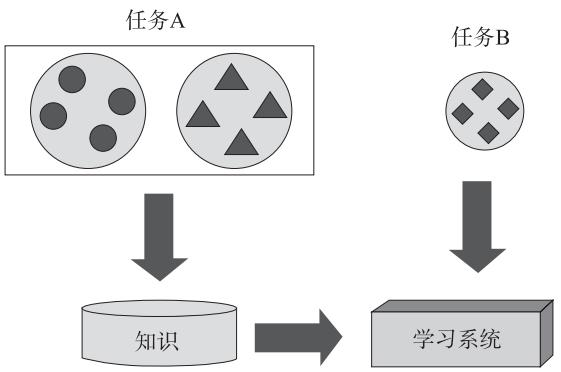  
图 2-41 迁移学习示意图

迁移学习就是把预训练好的模型迁移到新的任务上，犹如站在巨人的肩膀上。神经网络中的迁移学习主要有两个应用场景：特征提取和微调。

● 特征提取：冻结除最终完全连接层之外的所有网络的权重。最后一个全连接层被替换为具有随机权重的新层，并且仅训练该层。  
● 微调：使用预训练网络初始化网络，而不是随机初始化，用新数据训练部分或整个网络。

# 2.6.2 微调预训练模型

在学习如何使用预训练模型时，要考虑目标模型的数据量及目标数据与源数据的相关性。一般地，建议根据数据集与预训练模型的数据集的不同相似度，采用不同的处理方法，

如图 2-42 所示。

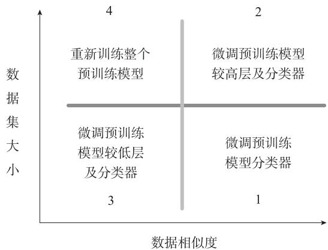  
图 2-42 根据数据集大小与数据相似度选择预训练模型

图 2-42 中的序列根据对预训练模型调整的程度来排序，1 对应调整最小，4 对应预训练模型调整最大。接下来就各种方法进行说明。

# （1）数据集小，数据相似度高

这种情况比较理想，可以将预训练模型当作特征提取器来使用。具体做法：将输出层去掉，然后将剩下的整个网络当作一个固定的特征提取机，应用到新的数据集中。具体过程如图 2-43 所示，调整分类器中的几个参数，其他模块保持“冻结”即可。这种微调方法有时又称为特征抽取，可能是预训练模型作为目标数据的特征提取器的缘故。

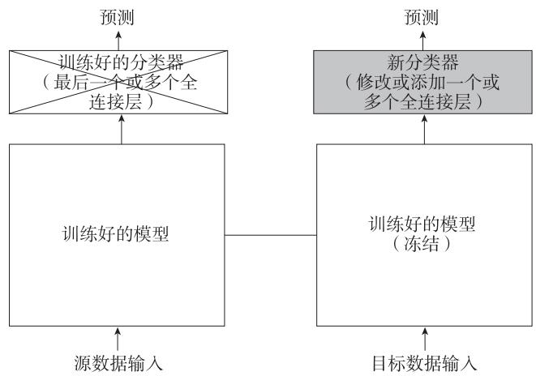  
图 2-43 调整预训练模型的分类器示意图

# （2）数据集大，数据相似度高

在这种情况下，因为有一个较大的数据集，所以神经网络的训练过程将会比较有效率。然而，因为目标数据与预训练模型的训练数据之间存在很大差异，完全采用预训练模型将

不会是一种高效的方式。因此最好的方法还是冻结预处理模型中少量较低层，并修改分类器，然后在新数据集的基础上重新开始训练，具体处理过程如图 2-44 所示。

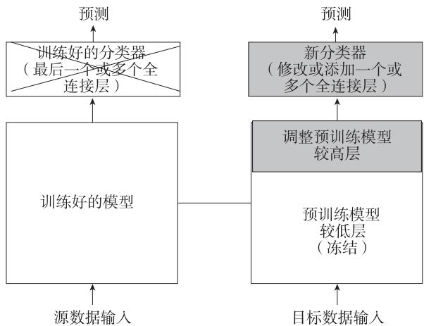  
图 2-44 调整预训练模型较高层示意图

# （3）数据集小，数据相似度不高

在这种情况下，可以重新训练预训练模型中较少的网络高层，并修改分类器。因为数据的相似度不高，重新训练的过程就变得非常关键。而新数据集大小的不足，则是通过冻结预训练模型中一些较低的网络层进行弥补，具体处理过程如图 2-45 所示。

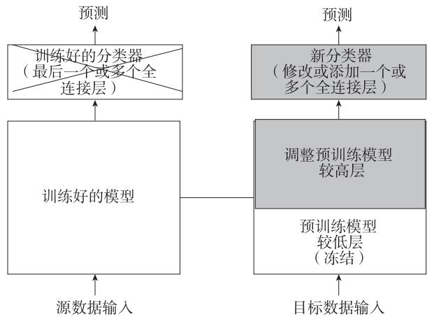  
图 2-45 调整预训练模型更多网络层示意图

# （4）数据集大，数据相似度不高

在这种情况下，因为有一个很大的数据集，所以神经网络的训练过程将会比较有效率。然而，由于目标数据与预训练模型的训练数据之间存在很大差异，采用预训练模型将不会是一种高效的方式。因此，最好的方法还是将预处理模型中的权重全都初始化后在新数据

集的基础上从头开始训练，具体处理过程如图 2-46 所示。

  
图 2-46 重新训练整个预训练模型示意图

以上是微调预训练模型的一般方法，具体操作时往往会同时尝试多种方法，然后在多种方法中选择一种最优方案。

# 2.7 深度学习常用的归一化方法

机器学习中归一化方法很多，如 L1/L2 归一化、dropout、批量归一化、层归一化、实例归一化、Group 归一化等。由于篇幅的限制，这里主要介绍深度学习中两种常用的归一化方法，即批量归一化（Batch Normalization）和层归一化（Layer Normalization）。

# 2.7.1 归一化方法简介

批量归一化和层归一化方法在深度学习中应用非常普遍，涉及的数据包括一维或多维。为更好地理解这些归一化方法，我们首先从直观的图形入手，然后再说明其背后的原理，最后通过具体代码实现这些归一化方法。

（1）输入数据为一维的情况  
1）批量归一化如图 2-47 所示。

批量归一化对每个批量样本中的每个特征值分别进行均值和方差的计算。

2）层归一化图 2-48 所示。

层归一化对每个批量样本中的每个样本分别进行均值和方差计算。

（2）输入数据为多维的情况

这里以输入数据为 4 维（Batch、Channel、Hight、Width）为例，多维数据常用归一化方法如图 2-49 所示。

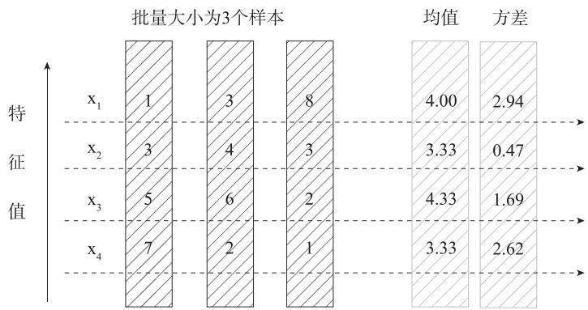  
图 2-47 批量归一化

  
图 2-48 层归一化

  
图 2-49 输入数据为多维的几种常用归一化方法

在图 2-49 中， $N$ 表示批量大小， $C$ 表示通道数量， $H$ 表示图像的高，W 表示图像的宽。

1）批量归一化。批次（Batch）方向做归一化，计算 NHW 的均值，对小批量（SmallBatch Size）效果不好。批量归一化的主要缺点是对批量的大小比较敏感，由于每次计算均

值和方差是在一个批次上，因此如果批量太小，则计算的均值、方差不足以代表整个数据分布。

2）层归一化。通道（Channel）方向做归一化，计算 CHW 的均值，主要对 RNN 作用明显。例如层归一化在 Transformer 模型中被广泛使用。  
3）实例归一化（Instance Normalization）。一个通道内做归一化，计算 HW 的均值，主要用于风格化迁移。在图像风格化中，因为生成结果主要依赖于某个图像实例，所以对整个批次归一化并不适合，相反，对每个图像实例做归一化更具优势，如图 2-50 所示，实例归一化可以加速模型收敛，并且保持每个图像实例之间的独立性。

  
原图像

  
实例归一化

  
批量归一化  
图 2-50 在图像风格化中两种归一化方法的效果比较

# 2.7.2 归一化的原理

# 1. 批量归一化的数学表达式

假设批量大小为 m，一批样本中的某个特征为 $\boldsymbol { x } _ { 1 } , \boldsymbol { x } _ { 2 } , \cdots , \boldsymbol { x } _ { m }$ 。在神经网络中，可认为对应某个神经元，该神经元对应的输入值为 $\{ x _ { i } \}$ 。

该批次中，这个特征的均值和方差为：

$$
\mu = \frac {1}{m} \sum_ {i = 1} ^ {m} x _ {i} \tag {2.8}
$$

$$
\sigma^ {2} = \frac {1}{m} \sum_ {i = 1} ^ {m} \left(x _ {i} - \mu\right) ^ {2} \tag {2.9}
$$

其中， $\mu$ 称为平移参数（shift parameter）， $\sigma$ 称为缩放参数（scale parameter）。通过这两个参数进行平移和缩放变换得到：

$$
\hat {x} _ {i} = \frac {x _ {i} - \mu}{\sqrt {\sigma^ {2} + \varepsilon}} \tag {2.10}
$$

为了保证模型的表达能力不会因规范化而下降，可以通过一个附加的再缩放参数和再平移变换，将上一步得到的xˆ进一步变换为：

$$
y _ {i} = \hat {x} _ {i} \times \gamma + \beta \tag {2.11}
$$

其中，γ 初始值一般设为 1， $\beta$ 初始值一般设为 0，这两个参数在训练过程中将不断进行学习更新。引入参数 γ 和 $\beta$ 是为了尽量与底层神经网络的学习结果保持一致，将规范化后的数据进行再平移和再缩放，使得每个神经元对应的输入范围是针对该神经元量身定制的一个确定范围（均值为 $\beta$ 、方差为 $\gamma ^ { 2 }$ ）。

这种改写方式除了充分利用底层学习的能力外，还有另一方面的意义，即保证获得非线性的表达能力。sigmoid 等激活函数在神经网络中有着重要的作用，通过区分饱和区和非饱和区，使得神经网络的数据变换具有非线性计算能力。第一步的规范化会将几乎所有数据映射到激活函数的非饱和区（线性区），仅利用到了线性变化能力，从而降低了神经网络的表达能力。而进行再变换，则可以将数据从线性区变换到非线性区，恢复模型的表达能力。

# 2. 层归一化的数学表达式

批量归一化比较适合于批量比较大的情况，这样批量数据分布与整体分布较接近。在进行训练之前，要做好充分的打乱（shuffle），否则效果会大打折扣。此外，批量归一化对于输入数据不一致的情况可能会产生影响。

为克服批量归一化在这些方面的不足，人们提出层归一化方法。与批量归一化不同，层归一化是对一个样本的所有特征的规范化。它综合考虑一层所有维度的输入，计算该层的平均输入值和输入方差，然后用同一个规范化操作来转换各个维度的输入。假设一个样本的特征数为 $n$ （或对应神经网络层所有的输入神经元的个数），则层归一化的表示式为：

$$
\mu = \frac {1}{n} \sum_ {i = 1} ^ {n} x _ {i} \tag {2.12}
$$

$$
\sigma^ {2} = \frac {1}{n} \sum_ {i = 1} ^ {n} \left(x _ {i} - \mu\right) ^ {2} \tag {2.13}
$$

$$
\hat {x} _ {i} = \frac {x _ {i} - \mu}{\sqrt {\sigma^ {2} + \varepsilon}} \tag {2.14}
$$

$$
y _ {i} = \hat {x} _ {i} \times \gamma + \beta \tag {2.15}
$$

与批量归一化不同，层归一化中 γ、 $\beta$ 一般为标量。

层归一化针对单个训练样本进行，不依赖于其他数据，因此可以避免批量归一化中受小批量数据分布影响的问题，可以用于小批量场景、动态网络场景和循环神经网络等，特别是自然语言处理领域，如在 Transformer 中得到广泛使用。此外，层归一化不需要保存批量的均值和方差，节省了额外的存储空间。

# 3. 实例归一化的数学表达式

批量归一化注重对每个批次进行归一化，保证数据分布一致，因为判别模型中结果取决于数据整体分布。但是在图像风格化中，生成结果主要依赖于某个图像实例，所以对整

个批次归一化不适合，因此，实例归一化更具优势，实例归一化的公式如下：

$$
\mu_ {t i} = \frac {1}{H W} \sum_ {l = 1} ^ {W} \sum_ {m = 1} ^ {H} x _ {\mathrm {t i l m}} \tag {2.16}
$$

$$
\sigma_ {t i} ^ {2} = \frac {1}{H W} \sum_ {l = 1} ^ {W} \sum_ {m = 1} ^ {H} \left(x _ {\text {t i l m}} - \mu_ {t i}\right) ^ {2} \tag {2.17}
$$

$$
\hat {x} _ {t i} = \frac {x _ {\text {t i l m}} - \mu_ {t i}}{\sqrt {\sigma_ {t i} ^ {2} + \varepsilon}} \tag {2.18}
$$

$$
y _ {t i} = \hat {x} _ {t i} \times \gamma + \beta \tag {2.19}
$$

# 2.7.3 归一化的代码实现

# 1. 用 Python 实现批量归一化

（1）定义批量归一化的函数

这里假设输入为 4 维数据，即 [Batch,Channel,Higt,Width]。

```python
def f_batch_norm(X, gamma, beta, eps, momentum):
    # 训练模式，输入数据为4维的情况
    # 使用二维卷积层的情况，计算通道维上（axis=1）的均值和方差，即在[N,H,W]求统计信息
    # 这里需要保持X的形状，以便后面可以做广播运算
    mean = X.mean(dim=0, keepdim=True).mean(dim=2, keepdim=True).mean(dim=3, keepdim=True)
    var = ((X - mean) ** 2).mean(dim=0, keepdim=True).mean(dim=2, keepdim=True).mean(dim=3, keepdim=True)
    # 训练模式下用当前的均值和方差做标准化
    X_hat = (X - mean) / torch.sqrt(var + eps)
    # 更新移动平均的均值和方差
    # moving_mean = momentum * moving_mean + (1.0 - momentum) * mean
    # moving_var = momentum * moving_var + (1.0 - momentum) * var
    Y = gamma * X_hat + beta # 拉伸和偏移
    return Y 
```

（2）把批量归一化函数封装在一个类中

```txt
class BatchNorm(nnModule): def __init__(self, num_features, num_dims=4): super(BatchNorm, self).__init__(shape = (1, num_features, 1, 1) #参与求梯度和迭代的拉伸和偏移参数，分别初始化为0和1 
```

（3）定义一个输入  
```python
self_gamma = nnParameter(torch.ones(shape))
self.beta = nnParameter(torch.zeros(shape))
def forward(self, X):
    # 调用函数 f_batch_norm
Y = f_batch_norm(X, self_gamma, self.beta, eps=1e-5, momentum=0.9)
return Y 
```

input $=$ torch.tensor([[[[1,1,1],[10,1,1],[1,1,1],[1,1,1],[1,1,1]，[[2,2,2],[20,2,2],[2,2,2],[2,2,2],[2,2,2]，[[3,3,3],[30,3,3],[3,3,3],[3,3,3],[3,3,3]，[[4,4,4],[40,4,4],[4,4,4],[4,4,4],[4,4,4]，[[5,5,5],[50,5,5],[5,5,5],[5,5,5],[5,5,5]]])float()input $\equiv$ input.permute(0,3,1,2）#把input的形状改为[1,3,5,5]，即[batch,channel,hight,height]格式

（4）测试  
运行结果如下：  
```txt
#通道数相当于特征向量个数（num_features），实例化BatchNorm类  
BN=BatchNorm(3)  
BN(input1)
```

```javascript
ensor([[[-0.5883, 0.1272, -0.5883, -0.5883, -0.5883], 
    [-0.5088, 0.9221, -0.5088, -0.5088, -0.5088], 
    [-0.4293, 1.7171, -0.4293, -0.4293, -0.4293], 
    [-0.3498, 2.7121, -0.3498, -0.3498, -0.3498], 
    [-0.2703, 3.3070, -0.2703, -0.2703, -0.2703]], 
    [[-1.4142, -1.4142, -1.4142, -1.4142, -1.4142], 
    [-0.7071, -0.7071, -0.7071, -0.7071, -0.7071], 
    [0.0000, 0.0000, 0.0000, 0.0000, 0.0000], 
    [0.7071, 0.7071, 0.7071, 0.7071, 0.7071], 
    [1.4142, 1.4142, 1.4142, 1.4142, 1.4142]]], 
    [[-1.4142, -1.4142, -1.4142, -1.4142, -1.4142], 
    [-0.7071, -0.7071, -0.7071, -0.7071, -0.7071], 
    [0.0000, 0.016666666666666666666666666666666666666666666666666666666666666666666666666666666666666666666666666666.
    [0.7071, 0.7071, 0.7071, 0.7071, 0.7071, 0.7071], 
    [1.4142, 1.4142, 1.4142, 1.4142, 1.4142]]], 
```

# 2. 用 PyTorch 实现批量归一化

```txt
BN2=nn.BatchNorm2d(3)  
BN2(input1) 
```

运行结果与使用 Python 定义的函数一致。

说明：函数 nn.BatchNorm2d 中各参数。

```python
nn.BatchNorm2d( num_features: int, eps: float = 1e-05, momentum: float = 0.1, affine: bool = True, track_running.stats: bool = True, device=None, dtype=None, 
```

参数说明如下。

num_features (int)：输入的特征数，这里指通道数，即 [B,C,H,W] 中的 C。  
. eps：为保证数值稳定性（分母不能趋近或取 0），给分母加上的值（对应公式中的ε）。默认为 1e-5。  
momentum：动态均值和动态方差所使用的动量。默认为 0.1。  
affine：布尔值，默认值为 True，当设为 True，给该层添加可学习的再变换参数，即使用公式中的可学习参数 γ、 $\beta$ 。  
● track_running_stats：布尔值，当设为 True 时，记录训练过程中的均值和方差。

输入形状：[B,C,H,W]

输出形状：[B,C,H,W]

# 3. 用 Python 实现层归一化

层归一化可用于图像或 NLP 处理，对图像处理的输入假设为 4 维，即 [N,C,H,W]。对于 NLP 处理，其输入为 3 维，即 [batch_size, time_steps, embedding_dim]。

# （1）输入为图像的情况

1）定义层归一化函数。

```python
def f_layer_norm(X, gamma, beta, eps, momentum):
    # 训练模式，输入数据为4维的情况
    # 使用二维卷积层的情况，计算批量维上（axis=0）的均值和方差，即在[C,H,W]求统计信息
    # 这里需要保持X的形状，以便后面可以做广播运算
    mean = X.mean(dim=1, keepdim=True).mean(dim=2, keepdim=True).mean(dim=3, keepdim=True)
```

var $=$ ((X - mean）\*\*2).mean(dim=1，keepdim=True).mean(dim=2，keepdim $\equiv$ True).   
mean(dim=3，keepdim $\equiv$ True) #训练模式下用当前的均值和方差做标准化 X_hat $=$ (X - mean)/torch.sqrt(var + eps) Y $=$ gamma \* X_hat $^+$ beta #拉伸和偏移 returnY

2）把层归一化函数封装在类中。

class LayerNorm(nnModule): def__init__(self,num_dims $\coloneqq 4$ ： super(LayerNorm，self).__init_（） #shape $=$ (1，num_features，1，1） #参与求梯度和迭代的拉伸和偏移参数，分别初始化成0和1 self.gamma $=$ nn_PARAMETER(torch.ones(1)) self.beta $=$ nn_PARAMETER(torch.zeros(1)) defforward(self,X): #调用函数f_batch_norm $\mathrm{Y} = \mathrm{f}_{-}$ layer_norm(X,self.gamma,self.beta,eps $\vDash$ 1e-5,momentum=0.9) return Y

3）测试。

```txt
使用PyTorch的层归一化模块  
LN4=LayerNorm()  
LN4(input1)
```

运行结果如下：

```json
tensor([[[-0.4883, 0.6682, -0.4883, -0.4883, -0.4883], [-0.3598, 1.9532, -0.3598, -0.3598, -0.3598], [-0.2313, 3.2382, -0.2313, -0.2313, -0.2313], [-0.1028, 4.5232, -0.1028, -0.1028, -0.1028], [0.0257, 5.8083, 0.0257, 0.0257, 0.0257]], [-0.4883, -0.4883, -0.4883, -0.4883, -0.4883], [-0.3598, -0.3598, -0.3598, -0.3598, -0.3598], [-0.2313, -0.2313, -0.2313, -0.2313], [-0.1028, -0.1028, -0.1028, -0.1028], [0.0257, 0.0257, 0.0257, 0.0257, 0.0257]]], [-0.4883, -0.4883, -0.4883, -0.4883, -0.4883], [-0.3598, -0.3598, -0.3598, -0.3598, -0.3598], [-0.2313, -0.2313, -0.19999999999999999999999999999999999999999999999999999999999999999999999999999999999999999999] 
```

4）直接使用 PyTorch 提供的模块：

```python
layer_norm = nn.LinearNorm([3, 5, 5])
output = layer_norm(input1)
print(output) 
```

运行结果与使用 Python 实现的运行结果完全一致。

（2）输入为语句的情况

```python
在NLP中测试层归一化  
batch_size = 2  
time_steps = 3  
embedding_dim = 4  
input_x = torch.randn(batch_size, time_steps, embedding_dim) # N * L * C  
# PyTorch的模块  
Layer_norm_op=torch.nn.LinearNorm(normalized_shape=embedding_dim, elementwise_affine=True)  
ln_y = Layer_norm_op(input_x)  
print(ln_y) 
```

运行结果如下：

```txt
tensor([[[-1.1350, 0.5195, -0.7535, 1.3690], [-1.3036, 1.2289, 0.6649, -0.5901], [1.6154, -1.0567, -0.0369, -0.5218]], [[-1.6441, 0.7982, 0.8114, 0.0345], [-1.3117, 0.3357, 1.4074, -0.4313], [1.2445, -0.4835, -1.3623, 0.6013]]], grad_fn=<NativeLayerNormBackward0>) 
```

# 4. 用 Python 实现实例归一化

实例归一化可用对图像处理的输入假设为 4 维，即 [N,C,H,W]。

（1）定义 Instance Norm 函数

```python
def f_Instancenorm(X, gamma, beta, eps):
    # 训练模式，输入数据为4维的情况
    # 使用二维卷积层的情况，计算H、W维上（axis=2,3）的均值和方差，即在[H,W]求统计信息
    # 这里需要保持X的形状，以便后面可以做广播运算
    mean = X.mean(dim=2, keepdim=True).mean(dim=3, keepdim=True)
    var = ((X - mean) ** 2).mean(dim=2, keepdim=True).mean(dim=3, keepdim=True)
    # 训练模式下用当前的均值和方差做标准化
    X_hat = (X - mean) / torch.sqrt(var + eps)
    Y = gamma * X_hat + beta # 拉伸和偏移
    return Y 
```

（2）把函数包装在 PyTorch 类中

class Instancenorm(nnModule): def__init__(self,num_dims $= 4$ ： super(Instancenorm，self).__init_(） #shape $=$ (1，num_features，1，1） #参与求梯度和迭代的拉伸和偏移参数，分别初始化为0和1 self.gamma $\equiv$ nn.Parameters(torch.ones(1)) self.beta $\equiv$ nn.Parameter(torch.zeros(1)) defforward(self,X): #调用函数f_Instancenorm $\mathrm{Y} = \mathrm{f}$ _Instancenorm(X,self.gamma,self.beta,eps $= 1\mathrm{e} - 5$ ） return Y

（3）测试

ins $=$ Instancenorm() ins(input1)

（4）直接使用 PyTorch 提供的模块

```python
带可学习的参数 affine=True  
m = nn.ReLU(3, affine=True)  
output = m(input1) 
```

运行结果与自定义 Instance Norm 的运行结果完全一致。

# 2.8 权重初始化

深度学习为何要初始化？传统的机器学习算法很少采用迭代式优化方法，因此初始化的需求不多。但深度学习算法一般采用迭代方法，而且参数多、层数也多，所以很多算法在不同程度上受到初始化的影响。

# 2.8.1 为何要进行权重初始化

深度学习使用权重初始化方法是为了减小模型训练时的不确定性和避免训练过程中陷入局部最优解。通过合理的权重初始化方法，可以帮助模型更好地学习和收敛。

初始化对训练有哪些影响？初始化能决定算法是否收敛，如果初始化不适当，初始值过大可能会在正向传播或反向传播中产生爆炸的值；如果初始值太小将导致丢失信息。对收敛的算法适当的初始化能加快收敛速度。初始值选择将影响模型收敛局部最小值还是全局最小值，如图 2-51 所示，因初始值不同，导致收敛到不同的极值点。另外，初始化也可以影响模型的泛化。

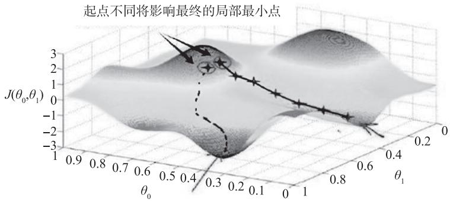  
图 2-51 初始点的选择影响算法是否陷入局部最小点

如何对权重、偏移量进行初始化？初始化这些参数是否有一般性原则？常见的参数初始化有零值初始化、随机初始化、均匀分布初始化、正态分布初始化和正交分布初始化等。实践表明，正态分布、正交分布、均匀分布的初始值能带来更好的效果。

# 2.8.2 权重初始化方法

常见的权重初始化方法如下。

# （1）随机初始化

将权重参数随机初始化为一个很小的值或者在某个范围内的随机值。这种方法比较简单，但在一些情况下可能不太稳定，容易导致梯度消失或梯度爆炸的问题。

# （2）高斯分布初始化

根据高斯分布随机生成权重参数。一般使用均值为 0、标准差为 1 的高斯分布进行初始化，可以通过加入可学习的偏差项来对中心进行偏移。

# （3）Xavier 初始化

根据输入和输出的维度来确定权重参数初始化的范围。Xavier 初始化可以使得网络在正向传播过程中的方差不变。

# （4）Kaiming_He 初始化

根据输入的维度来确定权重参数初始化的范围。He 初始化可以使得网络在正向传播过程中的方差不变。

常用的权重初始化方法的具体计算如表 2-1 所示。

表2-1 常用的权重初始化方法  

<table><tr><td>初始化方法</td><td>均匀分布[-r,r]</td><td>高斯分布N(0,σ2)</td></tr><tr><td>Xavier初始化
(对称激活函数)</td><td>r=√6/n+m</td><td>σ=√6/n+m</td></tr><tr><td>Kaiming_He初始化
(非对称激活函数)</td><td>r=√6/n</td><td>σ=√2/n</td></tr></table>

PyTorch 提供了 nn.init 模块，该模块提供了常用的初始化策略，如 Xavier、Kaiming_He 等经典初始化策略，使用这些初始化策略有利于激活值的分布呈现更有广度或更贴近正态分布。Xavier 一般用于激活函数是 S 型（如 sigmoid、tanh）的权重初始化，Kaiming_He更适合于激活函数为 ReLU 类的权重初始化。

对于激活函数是 S 型的权重初始化，如果初始化值很小，那么随着层数的传递，方差就会趋于 0，此时输入值也变得越来越小，在 sigmoid 函数上就是在 0 附近，接近于线性，失去了非线性；如果初始值很大，那么随着层数的传递，方差会迅速增加，此时输入值变得很大，在 sigmoid 函数中会导致倒数趋近于 0，反向传播时会遇到梯度消失的问题。

● PyTorch 中权重符合均匀分布的初始化方法：

```python
torch(nn.init.uniform__(tensor, a=0.0, b=1.0) 
```

● PyTorch 中权重符合正态分布的初始化方法：

```javascript
torch.nn.init.normal_(tensor, mean=0, std=1) 
```

● Xavier 初始化：

```python
##Xavier 均匀分布（xavier.uniform_）:
torch(nn.init.xavier.uniform__(tensor, gain=1.0)
##Xavier 正态分布（xavier_normal_）:
torch(nn.init.xavier_normal__(tensor, gain=1.0) 
```

Kaiming_He 初始化：

```python
##kaiming 均匀分布（kaiming.uniform_）
torch(nn.init.kaiming.uniform__(tensor, a=0, mode='fan_in', nonlinearity='leaky_relu')
##kaiming 正态分布（kaiming_normal_）
torch(nn.init.kaiming_normal__(tensor, a=0, mode='fan_in', nonlinearity='leaky_relu') 
```

# 2.9 PyTorch 常用的损失函数

表 2-2 列出了问题类型与最后一层激活函数、损失函数之间的对应关系。

表2-2 根据问题类型选择损失函数  

<table><tr><td>问题类型</td><td>最后一层激活函数</td><td>损失函数</td></tr><tr><td rowspan="2">二分类,单标签</td><td>添加 sigmoid 层</td><td>nn.BCELoss</td></tr><tr><td>不添加 sigmoid 层</td><td>nn.BCEWithLogitsLoss</td></tr><tr><td>二分类,多标签</td><td>无</td><td>nnSoftMarginLoss(target为1或-1)</td></tr><tr><td rowspan="2">多分类,单标签</td><td>不添加 softmax 层</td><td>nn.CrossEntropyLoss(target的类型为torch.LongTensor的one-hot)</td></tr><tr><td>添加 softmax 层</td><td>nn.NLLLoss</td></tr><tr><td>多分类,多标签</td><td>无</td><td>nn.MultiLabelSoftMarginLoss(target为0或1)</td></tr><tr><td>回归</td><td>无</td><td>nn.MSELoss</td></tr><tr><td rowspan="2">评估向量之间的相似度</td><td rowspan="2">无</td><td>nn.TripleMarginLoss</td></tr><tr><td>nn.CosineEmbeddingLoss(margin在[-1,1]之间)</td></tr><tr><td>评估两个概率分布之间的差异</td><td>无</td><td>nn.KLDivLoss</td></tr></table>

# 2.10 深度学习常用的优化算法

优化器在机器学习、深度学习中往往起着举足轻重的作用。同一个模型因选择不同的优化器，性能可能有很大差异，甚至导致一些模型无法训练。所以，了解各种优化器的基本原理非常有必要。本节重点介绍各种优化算法的主要原理，以及各自的优点或不足。

# 2.10.1 传统梯度更新算法

传统梯度更新算法是最常见、最简单的一种参数更新策略。其基本思想是：先设定一个学习率 λ，参数沿梯度的反方向移动。假设基于损失函数 $L \left( f ( x , \theta ) , y \right)$ ，其中， $\theta$ 为需要更新的参数，梯度为 $g$ ，则其更新策略的伪代码如下：

初始化参数向量 $\theta$ 、学习率 $\lambda$ while 停止准则未满足 do  
更新梯度： $g_{i}\gets \nabla_{\theta}L(f(x^{(i)},\theta),y^{(i)})$ 新参数： $\theta \leftarrow \theta -\lambda g_i$ end while

这种梯度更新算法非常简洁，当学习率取值恰当时，可以收敛到全面最优点（凸函数）或局部最优点（非凸函数）。但其不足也很明显，即对超参数学习率比较敏感（过小导致收敛速度过慢，过大又越过极值点），如图 2-52c 所示。在比较平坦的区域，因梯度接近于 0，易导致提前终止训练，如图 2-52a 所示，要选中一个恰当的学习速率往往要花费不少时间。

学习率除了敏感，有时还会因其在迭代过程中保持不变，很容易造成算法被卡在鞍点的位置，如图 2-53 所示。

另外，在较平坦的区域，因梯度接近于 0，优化算法往往因误判，还未到达极值点就提前结束迭代，如图 2-54 所示。

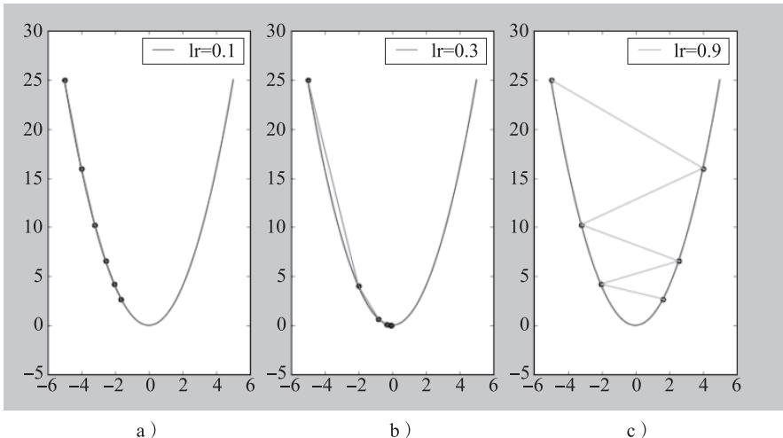  
图 2-52 学习速率对梯度的影响

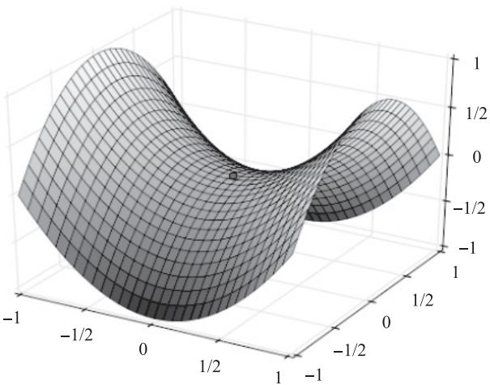  
图 2-53 算法卡在鞍点示意图

传统梯度优化方面的这些不足，在深度学习中会更加明显。为此，人们自然想到如何克服这些不足的问题。由前文更新策略的伪代码可知，影响优化的主要因素有训练数据集的大小、梯度方向、学习率。所以很多优化方法大多从这些方面入手，数据集的优化采用批量随机梯度下降法，梯度方向的优化有动量更

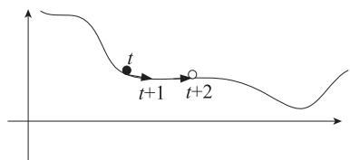  
图 2-54 较平坦区域的梯度接近于 0

新策略，学习率的优化涉及自适应问题。此外，还可从两方面同时入手等方法，接下来将具体进行介绍。

# 2.10.2 批量随机梯度下降法

梯度下降法是非常经典的算法，训练时，如果使用全训练集，虽然可获得较稳定的值，但比较耗费资源，尤其当训练数据比较大时；如果每次训练时用一个样本（又称为随机梯度下降法），则这种训练方法振幅较大，且相对耗时，如图 2-55 所示。

  
图 2-55 随机梯度下降法的损失值变化示意图

随机梯度下降法虽然资源消耗较少，但很耗时时间，无法充分发挥深度学习程序库中高度优化的矩阵运算的优势。为更有效训练模型，我们采用一种折中方法，即批量随机梯度下降法。这种梯度下降方法有两个特点：一个是批量，另一个是随机性。如何实现批量随机下降呢？其伪代码如下：

假设批量大小batch_size=10，样本数 $m = 1000$ 初始化参数向量 $\theta$ 、学习率 $\lambda$ while 停止准则未满足doRepeat{for $j = 1$ ，11，21，..，991{更新梯度： $\hat{g}\leftarrow \frac{1}{\mathrm{batch\_size}}\sum_{i = j}^{j + \mathrm{batch\_size}}\nabla_{\theta}L(f(x^{(i)},\theta),y^{(i)})$ 更新参数： $\theta \gets \theta -\lambda \hat{g}$ ！  
}  
end while

其中 $\boldsymbol { x } ^ { ( i ) }$ 和小批量数据集的所有元素都是从训练集中随机抽取的，这样梯度的预期将保持不变。相对于随机梯度下降法，批量随机梯度下降法降低了收敛波动性，即降低了参数

更新的方差，使得更新更加稳定，有利于提升其收敛效果，如图 2-56 所示。

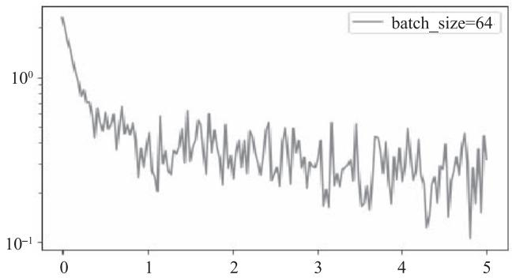  
图 2-56 批量随机梯度下降法的损失值变化示意图

# 2.10.3 动量算法

梯度下降法在遇到平坦或高曲率区域时，学习过程有时很慢。利用动量算法能较好地解决这个问题。为比较动量算法与传统梯度下降法的优化效果，我们以求解函数$f \left( x _ { 1 } , x _ { 2 } \right) = 0 . 0 5 x _ { 1 } ^ { 2 } + 2 x _ { 2 } ^ { 2 }$ 极值为例，使用梯度下降法和动量算法分别进行迭代求解，具体迭代过程如图 2-57、图 2-58 所示。

  
图 2-57 梯度下降法的迭代轨迹

  
图 2-58 使用动量算法的迭代轨迹

从图 2-57 可以看出，不使用动量算法的随机梯度下降法学习速度比较慢，振幅比较大；而从图 2-58 可以看出，使用动量算法的随机梯度下降法振幅较小，而且较快到达极值点。动量算法是如何做到的呢？

动量（momentum）是模拟物理中动量的概念，具有物理上惯性的含义。一个物体在运动时具有惯性，把这个思想运用到梯度下降计算中，可以增加算法的收敛速度和稳定性，具体实现如图 2-59 所示。

  
图 2-59 动量算法示意图

由图 2-59 可知，动量算法每下降一步都是由前面下降方向的一个累积和当前点的梯度方向组合而成。含动量的随机梯度下降法，其算法伪代码如下：

假设 batch_size=10，m=1000  
初始化参数向量 $\theta$ 、学习率 $\lambda$ 、动量参数 $\alpha$ 、初始速度 $\nu$ while 停止准则未满足 do  
Repeat {  
for $j = 1, 11, 21, \ldots, 991$ {  
更新梯度： $\hat{g} \gets \frac{1}{\text{batch\_size}} \sum_{i=j}^{j+\text{batch\_size}} \nabla_{\theta} L(f(x^{(i)}, \theta), y^{(i)})$ 计算速度： $\nu \gets \alpha \nu - \lambda \hat{g}$ 更新参数： $\theta \gets \theta + \nu$ }  
}  
end while

批量随机梯度下降法用 PyTorch 代码实现如下：

```python
def sgd_momentum parameters, vs, lr, gamma):
    for param, v in zip_parameters, vs):
        v[:] = gamma * v + lr * param_grad
        param.data -= v
        param_grad.data.zero_() 
```

其中，parameters 是模型参数，假设模型为 model，则 parameters 为 model. parameters()。当使用动量算法时，动量项的计算公式如下：

$$
v _ {k} = \alpha v _ {k - 1} - \lambda \hat {g} \left(\theta_ {k}\right) \tag {2.20}
$$

如果按时间展开，则第 $k$ 次迭代使用了从 1 到 $k$ 次迭代的所有负梯度值，且负梯度按动量系数 $\alpha$ 指数级衰减，相当于使用了移动指数加权平均，具体展开过程如下：

$$
\begin{array}{l} v _ {k} = \alpha v _ {k - 1} - \lambda \hat {g} \left(\theta_ {k}\right) \\ = \alpha \left(\alpha v _ {k - 2} - \lambda \hat {g} \left(\theta_ {k - 1}\right)\right) - \lambda \hat {g} \left(\theta_ {k}\right) \\ = - \lambda \hat {g} \left(\theta_ {k}\right) - \alpha \lambda \hat {g} \left(\theta_ {k - 1}\right) + \alpha^ {2} v _ {k - 2} \tag {2.21} \\ \begin{array}{c c c c} \dots & \dots & \dots \\ \hline \end{array} \\ = - \lambda \hat {g} \left(\theta_ {k}\right) - \lambda \alpha \hat {g} \left(\theta_ {k - 1}\right) - \lambda \alpha^ {2} \hat {g} \left(\theta_ {k - 2}\right) - \lambda \alpha^ {3} \hat {g} \left(\theta_ {k - 3}\right) \\ \end{array}
$$

假设每个时刻的梯度gˆ相似，则得到：

$$
v _ {k} \approx \frac {\lambda \hat {g}}{1 - \alpha} \tag {2.22}
$$

由此可知，当在比较平缓处，但 $\scriptstyle a = 0 . 5$ 、0.9 时，将分别是梯度下降法的 2 倍、10 倍。

使用动量算法不但可加快迭代速度，还可跨过局部最优找到全局最优，如图 2-60所示。

  
图 2-60 使用动量算法的潜在优势

# 2.10.4 Nesterov 动量算法

既然每一步都要将两个梯度方向（历史梯度、当前梯度）做一个合并再下降，那为什么不先按照历史梯度往前走一小步，按照前面一小步位置的“超前梯度”来做梯度合并呢？如此一来，可以先往前走一步，在靠前一点的位置（如图 2-61 中的 C 点）看到梯度，然后按照那个位置再来修正这一步的梯度方向，如图 2-61 所示。

这样就得到动量算法的一种改进算法，称为 NAG（Nesterov Accelerated Gradient）算法，也称为 Nesterov 动量算法。这种预更新方法能防止大幅振荡，不会错过最小值，并对参数更新更加敏感，如图 2-62 所示。

  
图 2-61 Nesterov 下降法示意图

  
图 2-62 Nesterov 动量算法

Nesterov 动量算法的伪代码如下：  
假设batch_size=10，m=1000  
初始化参数向量θ、学习率λ、动量参数α、初始速度v  
while 停止准则未满足do更新超前点： $\tilde{\theta} \gets \theta + \alpha v$ Repeat{for j = 1, 11, 21, ..., 991{更新梯度（在超前点）： $\hat{g} \gets \frac{1}{\text{batch\_size}} \sum_{i=j}^{j+\text{batch\_size}} \nabla_{\tilde{\theta}} L(f(x^{(i)}, \tilde{\theta}), y^{(i)})$ 计算速度： $\nu \gets \alpha v - \lambda \hat{g}$ 更新参数： $\theta \gets \theta + v$ }  
}  
end while

Nesterov 动量算法的 PyTorch 实现如下：  
```python
def sgd_nag parameters, vs, lr, gamma): 
```

```python
for param, v in zip(parameters, vs):
    v[:] *= gamma
    v[:] -= lr * param_grad
    param.data += gamma * gamma * v
    param.data -= (1 + gamma) * lr * param_grad
    param.grad.data.zero() 
```

Nesterov 动量算法和经典动量算法的差别就在 B 点和 C 点梯度的不同。动量算法更多关注梯度下降方法的优化，如果能从方向和学习率同时优化，效果或许更理想。事实也确实如此，而且这些优化在深度学习中显得尤为重要。

接下来介绍几种自适应优化算法，这些算法同时从梯度方向及学习率进行优化，效果非常好。

# 2.10.5 AdaGrad 算法

传统梯度下降算法对学习率这个超参数的敏感性以及对参数空间的某些方向的处理不足，使其在深度学习中显得力不从心。尤其是深度学习中存在高维空间、多层神经网络等因素，导致经常出现平坦、鞍点、悬崖等问题。幸运的是，现在已有很多有效的方法来解决这些问题。上节介绍的动量算法在一定程度上缓解了对参数空间某些方向的问题，但需要新增一个参数，而且对学习率的控制还不理想。为了更好地驾驭这个超参数，人们想出来多种自适应优化算法。使用自适应优化算法，学习率不再是一个固定不变值，它会根据不同情况进行自动调整。这些算法使深度学习向前迈出一大步！

AdaGrad算法是一种通过调整参数来设定合适的学习率λ 的方法。该算法能独立地自动调整模型参数的学习率，对稀疏参数进行大幅更新和对频繁参数进行小幅更新，如图 2-63 所示。因此，AdaGrad算法非常适合处理稀疏数据。在某些深度学习模型上，AdaGrad算法也有不错的表现。但还存在一些不足，可能因其累积梯度平方而导致学习率过早或过量的减少。

  
图 2-63 AdaGrad 算法迭代过程示意图

AdaGrad 算法的伪代码如下：  
假设 batch_size=10, m=1000  
初始化参数向量 $\theta$ 、学习率 $\lambda$ 小参数 $\delta$ ，一般取一个较小值（如 $10^{-7}$ ），该参数避免分母为0  
初始化梯度累积变量 $r = 0$ while 停止准则未满足 do  
Repeat {  
for j = 1, 11, 21, ..., 991 {  
更新梯度： $\hat{g} \leftarrow \frac{1}{\text{batch\_size}} \sum_{i=j}^{j+\text{batch\_size}} \nabla_{\theta} L(f(x^{(i)}, \theta), y^{(i)})$ 累积平方梯度： $r \leftarrow r + \hat{g} \odot \hat{g}$ # $\odot$ 表示逐元素操作  
计算速度： $\Delta \theta \leftarrow -\frac{\lambda}{\delta + \sqrt{r}} \odot \hat{g}$ 更新参数： $\theta \leftarrow \theta + \Delta \theta$ }  
}  
end while

由上面算法的伪代码可知：

● 随着迭代时间越长，累积梯度 $r$ 越大，学习速率 $\frac { \lambda } { \delta + \sqrt { r } }$ 就越小，在接近目标值时，不会因为学习速率过大而越过极值点。  
● 不同参数之间学习速率不同，因此，与前面固定学习速率相比，不容易在鞍点卡住。  
. 如果梯度累积参数 $r$ 比较小，则学习速率会比较大，所以参数迭代的步长会比较大。相反，如果梯度累积参数比较大，则学习速率会比较小，所以参数迭代的步长会比较小。

AdaGrad 算法的 PyTorch 实现代码如下：  
```python
def sgd_adagrad parameters, s, lr):  
    eps = 1e-10  
    for param, s in zip Parameters, s):  
        s[:] = s + (param.grad) ** 2  
        div = lr / torch.sqrt(s + eps) * param.grad  
        param.data = param.data - div  
        param.grad.data.zero() 
```

# 2.10.6 RMSProp 算法

为了改善 AdaGrad 在非凸函数下的表现，RMSProp 算法进行了修改。在凸函数中，算法可能振幅较大，如图 2-64 所示。为了解决梯度平方和累计越来越大的问题，RMSProp 使用指数加权的移动平均代替梯度平方和，通过引入一个新的超参数 $\rho$ ，用来控制移动平均的长度范围。常用的平均法的比较如表 2-3 所示。

表2-3 常用平均法的比较  

<table><tr><td>平均法</td><td>表达式</td><td>优点</td><td>不足</td></tr><tr><td>算术平均</td><td>1/n∑ni=1nxi</td><td>计算简单</td><td>权重无差别都是1/n</td></tr><tr><td>加权平均</td><td>∑ni=1nxix其中∑ni=1nxi=1</td><td>考虑不同样本的权重</td><td>需要考虑所有样本</td></tr><tr><td>移动平均</td><td>Ft+1=1/N∑ni=1Nxt-(N-i)</td><td>可计算不同样本（如N个）的平均值</td><td>权重都相同</td></tr><tr><td>加权移动平均</td><td>Ft+1=∑ni=1NWnt-(N-i)</td><td>考虑不同样本的权重</td><td>涉及的样本较多</td></tr><tr><td>指数平滑法</td><td>Ft+1=αxt+(1-α)Ft</td><td>存储变量少，考虑不同样本的权重</td><td>精度有待提高</td></tr><tr><td>指数加权移动平均</td><td>Ft=(1-α)xt+αFt-1</td><td>使用当前实际值，存储变量少，考虑不同样本的权重</td><td>对初始值有偏差</td></tr><tr><td>修正偏差的指数加权移动平均</td><td>F′t=Ft/1-αt</td><td>可修正初始时期的偏差</td><td>计算复杂</td></tr></table>

注： $\boldsymbol { F } _ { t - 1 }$ 表示前期预测值， $F _ { t }$ 表示当前预测值， $x _ { t }$ 表示当前实际值， $\alpha$ 表示权重参数。

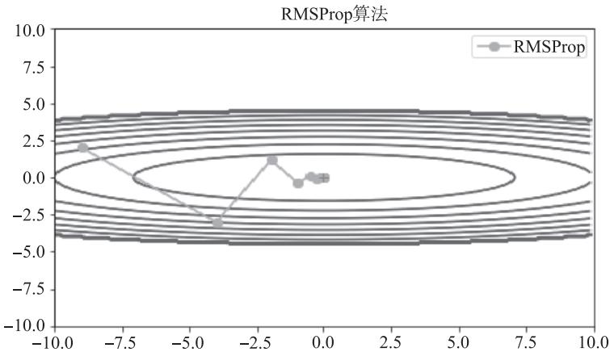  
图 2-64 RMSProp 算法迭代过程示意图

RMSProp 算法的伪代码如下：

假设batch_size=10，m=1000  
初始化参数向量θ、学习率λ、衰减速率ρ  
小参数δ，一般取一个较小值（如 $10^{-7}$ ），该参数避免分母为0  
初始化梯度累积变量r=0  
while 停止准则未满足doRepeat{forj=1，11，21，..，991{更新梯度： $\hat{g}\leftarrow \frac{1}{\mathrm{batch\_size}}\sum_{i = j}^{j + \mathrm{batch\_size}}\nabla_{\theta}L(f(x^{(i)},\theta),y^{(i)})$ 累积平方梯度： $r\gets \rho r + (1 - \rho)\hat{g}\odot \hat{g}$ 计算参数更新： $\Delta \theta \leftarrow -\frac{\lambda}{\delta + \sqrt{r}}\odot \hat{g}$ 更新参数： $\theta \leftarrow \theta +\Delta \theta$ }  
end while

RMSProp 算法在实践中已被证明是一种有效且实用的深度神经网络优化算法，在深度学习中得到广泛应用。

RMSProp 算法的 PyTorch 实现代码如下：

```python
def rmsprop parameters, s, lr, alpha):
    eps = 1e-10
    for param, sqr in zip Parameters, s):
        sqr[:] = alpha * sqr + (1 - alpha) * param_grad ** 2
        div = lr / torch.sqrt(sqr + eps) * param_grad
        param.data = param.data - div
        param.grad.data.zero_() 
```

# 2.10.7 Adam 算法

Adam（Adaptive Moment Estimation，自适应矩估计）算法本质上是带有动量项的RMSProp 算法，它利用梯度的一阶矩估计和二阶矩估计动态调整每个参数的学习率。Adam算法的优点主要在于经过偏置校正后，每一次迭代的学习率都有一个确定范围，使得参数比较平稳，如图 2-65 所示。

Adam 算法的伪代码如下：

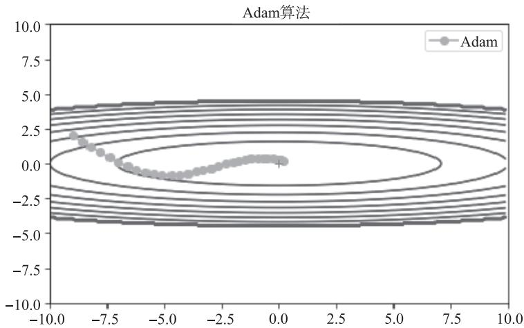  
图 2-65 Adam 算法迭代过程示意图

假设 batch_size=10，m=1000  
初始化参数向量 $\theta$ 、学习率 $\lambda$ 矩估计的指数衰减速率 $\rho_{1}$ 和 $\rho_{2}$ 在区间[0,1）内。  
小参数 $\delta$ ，一般取一个较小值（如 $10^{-7}$ ），该参数避免分母为0  
初始化一阶和二阶矩变量 $s = 0,r = 0$ 初始化时间步 $t = 0$ while 停止准则未满足 do  
Repeat{for $j = 1$ ，11，21，..，991{更新梯度： $\hat{g}\leftarrow \frac{1}{\text{batch\_size}}\sum_{i = j}^{j + \text{batch\_size}}\nabla_{\theta}L(f(x^{(i)},\theta),y^{(i)})$ $t\gets t + 1$ 更新有偏一阶矩估计： $s\gets \rho_1s + (1 - \rho_1)\hat{g}$ 更新有偏二阶矩估计： $r\gets \rho_2r + (1 - \rho_2)\hat{g}^2$ 修正一阶矩偏差： $\hat{s} = \frac{s}{1 - \rho_1^t}$ 修正二阶矩偏差： $\hat{r} = \frac{r}{1 - \rho_2^t}$ 累积平方梯度： $r\gets \rho r + (1 - \rho)\hat{g}^2$ 计算参数更新： $\Delta \theta = -\lambda \frac{\hat{s}}{\delta + \sqrt{\hat{r}}}$ 更新参数： $\theta \gets \theta +\Delta \theta$ }  
}  
end while

Adam 算法的 PyTorch 实现代码如下：

defadam parameters,vs,s，lr,t，beta1=0.9，beta2=0.999):eps $=$ 1e-8for param,v,sqr in zip(parameters,vs,s):v[:] $\equiv$ beta1 \* v $^+$ (1 - beta1）\* param_gradsqr[:] $\equiv$ beta2 \* sqr $^+$ (1 - beta2）\* param_grad \*\* 2v_hat $\equiv$ v/（1-beta1\*\*t)s_hat $\equiv$ sqr / (1 - beta2\*\*t)param.data $\equiv$ param.data-lr \*v_hat/(torch.sqrt(s_hat)+eps)param.grad.data.zero_()

# 2.10.8 各种优化算法比较

前文介绍了深度学习的归一化方法，它是深度学习的核心之一，优化算法也是深度学习的核心之一。优化算法很多，如随机梯度下降法、自适应优化算法等，那么具体使用时该如何选择呢？

RMSProp、Nesterov、AdaGrad 和 Adam 是自适应优化算法，因为它们会自动更新学习率。而使用随机梯度下降法时，必须手动选择学习率和动量参数，且会随着时间的推移而降低学习率。常用优化器之间的逻辑关系如图 2-66 所示。

  
图 2-66 常用优化器之间的逻辑关系

有时候，我们可以考虑综合使用这些优化算法，例如先使用 Adam，然后使用随机梯度下降的优化方法。这种优化方法有时能达到不错的效果。实际上，由于在训练的早期阶段随机梯度下降算法对参数调整和初始化非常敏感，因此可以通过先使用 Adam 优化算法进行训练，这将大大节省训练时间，且不必担心初始化和参数调整，一旦用 Adam 训练获得较好的参数后，我们就可以切换到随机梯度下降 $^ +$ 动量优化，以达到最佳性能。

# 第 3 章

# 变分自编码器

深度学习的优势不仅体现在其强大的学习能力，还体现在它的创新能力。我们通过构建判别模型来提升模型的学习能力，通过构建生成模型来发挥其创新能力。判别模型通常利用训练样本训练模型，然后利对新样本 $x$ 进行判别或预测。而生成模型正好相反，它根据一些规则 y 来生成新样本 $x$ 。

生成式模型有很多，常用的有两种：变分自编码器（Variational Auto-Encoder，VAE）和生成对抗网络（Generative Adversari Network，GAN）及其变种。虽然两者都是生成模型，并且都通过各自的生成能力展现其强大的创新能力，但它们在具体实现上有所不同。VAE是一种基于变分推断的生成模型，它试图通过学习数据的隐变量分布来进行生成。GAN 基于博弈论，目的是找到达到纳什均衡的判别器网络和生成器网络。

# 3.1 自编码器简介

自编码器（Autoencoder，AE）是通过对输入 $X$ 进行编码后得到一个低维的向量 Z，然后根据这个向量还原出输入 $X$ 。通过对比 $X$ 与 $\tilde { X }$ 得到两者的误差，再利用神经网络去训练模型使得误差逐渐减小，从而达到非监督学习的目的。图 3-1 为自编码器的架构图。

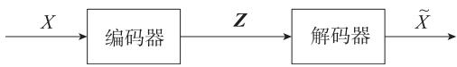  
图 3-1 自编码器的架构图

自编码器因不能随意产生合理的潜在变量，所以无法产生新的内容。因为潜在变量 Z都是编码器从原始图像中产生的。

# 3.1.1 构建自编码器

以下基于数据集 FashionMNIST，先构建一个自编码器，然后训练模型、评估模型，最后分析模型。FashionMNIST 的大致情况如下：

60000 张训练图像和对应 Label。  
● 10000 张测试图像和对应 Label。  
$\bullet$ 每张图像 $2 8 \times 2 8$ 的分辨率。

10 个类别的数据详细情况如表 3-1 所示。

表3-1 数据详细情况  

<table><tr><td>标签</td><td>描述</td></tr><tr><td>0</td><td>T恤（T-shirt/top）</td></tr><tr><td>1</td><td>裤子（Trouser）</td></tr><tr><td>2</td><td>套头衫（Pullover）</td></tr><tr><td>3</td><td>连衣裙（Dress）</td></tr><tr><td>4</td><td>外套（Coat）</td></tr><tr><td>5</td><td>凉鞋（Sandal）</td></tr><tr><td>6</td><td>衬衫（Shirt）</td></tr><tr><td>7</td><td>运动鞋（Sneaker）</td></tr><tr><td>8</td><td>包（Bag）</td></tr><tr><td>9</td><td>靴子（Ankle boot）</td></tr></table>

  
图 3-2 为从数据集中随机抽取的 6 张图。

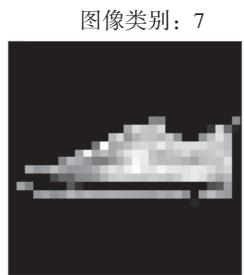


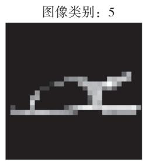

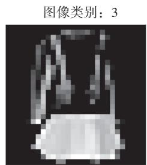  
图 3-2 FashionMNIST 数据集样例

# 3.1.2 构建编码器

编码器把输入映射成隐空间中的点，编码器的架构如图 3-3 所示。

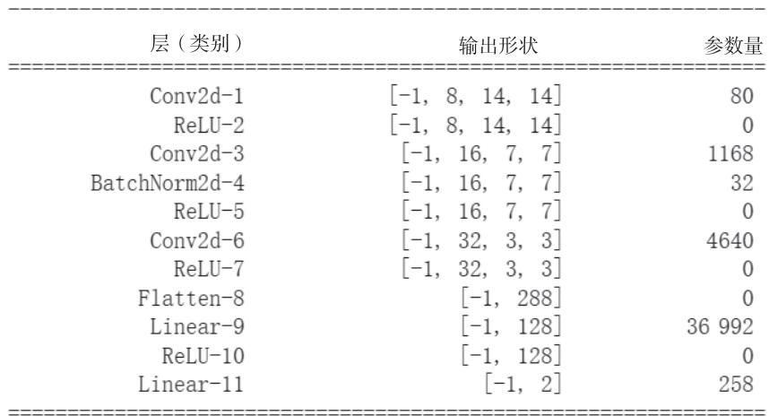  
图 3-3 编码器的架构

图 3-3 的输出形状中 -1 所在位置是预留给批量大小用的，为了构建这个编码器的架构，首先构建一个卷积网络，然后展平卷积网络的输出，最后把展平后的数据输入全连接层。为便于可视化，这里把全连接层最后的输出维度设为 2。详细编码如下：

class Encoder(nnModule): def__init__(self，encoded_space_dim,fc2_input_dim): super(）.__init_（)   
##构建卷积网络 self encoder_cnn $\equiv$ nn Sequential( #第1个卷积层 nn.Conv2d(1，8，3，stride $= 2$ ，padding $= 1$ ）， nn.ReLU(True)， #第2个卷积层 nn.Conv2d(8，16，3，stride $= 2$ ，padding $= 1$ ）， nn.BatchNorm2d(16）， nn.ReLU(True）， #第3个卷积层 nn.Conv2d(16，32，3，stride $= 2$ ，padding $= 0$ ）， nn.ReLU(True）

```python
```c
```c
```
def forward(self, x):
    # 图像输入卷积网络
    x = self encoder_cnn(x)
    # 展平卷积网络的输出
    x = self Flatten(x)
    # 使用全连接层
    x = self encoder_lin(x)
    return x
```

这里的架构比较简单，有兴趣的读者可以修改这个网络结构，如添加卷积层、归一化层等，然后比较修改前后的性能。

# 3.1.3 构建解码器

解码器把隐空间中的点映射为与输入维度一致的图像，解码器的架构如图 3-4 所示。

  
图 3-4 解码器的架构

在解码器中，首先经过两个全连接层，然后通过一个反展平层改变数据的形状，把一维变为二维，再通过三个转置卷积层，最后恢复数据的形状与输入一致。

# 3.1.4 定义损失函数及优化器

创建模型后，接下来使用损失函数及优化器来训练模型，损失函数选择原始图像与重建图像像素之间的均方误差，优化器使用 Adam。

```python
>>>定义损失函数
loss_fn = torch.nn.MSELoss()
>>>定义学习率、优化器
lr=0.001
params_to_optimize=[
    {'params': encoder.params()},
    {'params': decoder.params()}
]
optim=torch.optim.Adam.params_to_optimize, lr=lr, weight Decay=1e-05) 
```

# 3.1.5 分析自编码器

如图 3-5 所示，编码器把原始图像映射到一个低维的隐空间，为便于可视化，这里的隐空间为二维空间，最后解码器把隐空间中的点重构成图像。

为便于分析解码器重构隐空间的点的这个过程，把 $x$ 在 (-1, 1)、y 在 (-1, 1) 之间的一些隐空间的点 $( x , y )$ 重构成图像，如图 3-6 所示。

  
图 3-5 编码器把原始图像映射到隐空间的点

  
图 3-6 把隐空间的点通过解码器重构成图像

从图 3-6 不难看出，当 $x { = } 0$ 或 0.25 时，沿 y 坐标轴移动，图像变化的连续性不够理想，甚至当 $y$ 在 [-0.25,0.25] 之间时，图像是非常模糊的。这说明通过这些隐空间的点重构图像

的质量不高，甚至非常差。这就是自编码器的一个显著不足之处。

通过解码器把隐空间重构成图像的代码如下：

#定义从隐空间重构图像的函数  
```python
def plot_reconstructed(decoder, r0 = (-5, 10), r1 = (-10, 5), n = 10):
    plt.figure(figsize = (20, 8.5))
    w = 28
    img = np.zeros((n * w, n * w))
    for i, y in enumerate(np.linspace(*r1, n)):
        for j, x in enumerate(np.linspace(*r0, n)):
            z = torch.Tensor([[x, y]).to(device)
            x_hat = decoder(z)
            x_hat = x_hat.reshape(28, 28).to('cpu').detach().numpy())
            img[(n-1-i)*w: (n-1-i+1)*w, j*w: (j+1)*w] = x_hat
plt.imshow(img, extent=['r0', 'r1'], cmap='gist(gray') 
```

为何造成这种情况？从图 3-7 可以直观看出问题所在。

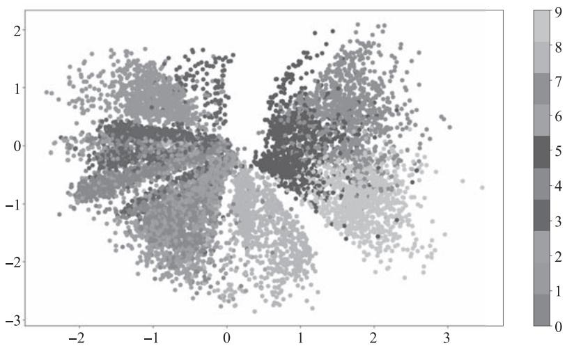  
图 3-7 隐空间的散点图

图 3-7 右边的数字表示不同类别。从图 3-7 可以看出：

1）10 个类别所占的比例不完全相同，有些占据很大区域（如 9- 靴子），有些只占据很小一部分（如 1- 裤子）。  
2）各个类别之间存在较大间隙，这些间隙上几乎没有任何点。

第 1）点可解释为什么解码器生成的图像缺乏多样性。理想的情况是，从隐空间随机采样时，可以得到大致相等的各类别的分布，但使用自编码器时无法做到。

第 2）点说明了从隐空间的点重构后的图像质量不高的原因，如图 3-8 所示。

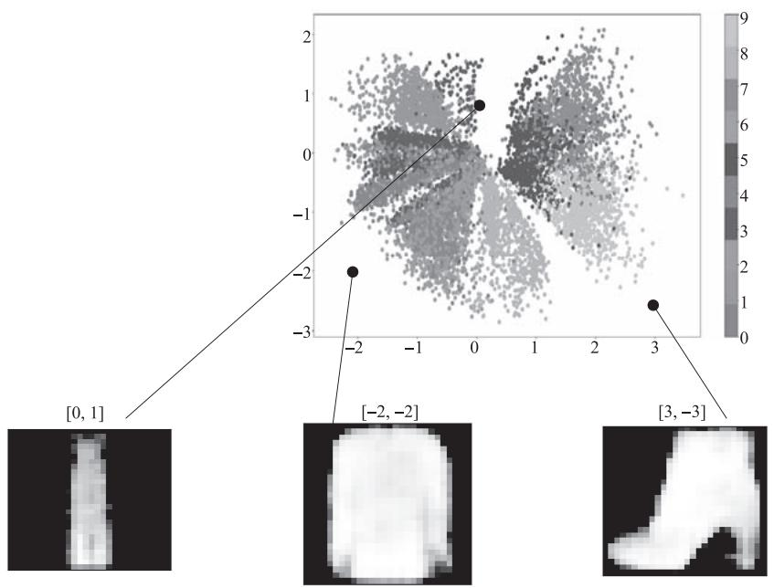  
图 3-8 从一些隐空间点生成的图像质量不高

如何解决自编码器的这些不足？接下来我们介绍一个有效方法，它就是变分自编码器。

# 3.2 变分自编码器简介

自编码器（AE）训练简单，易于实现，但不能有效地学习数据的分布，潜在空间是不连续的，不适合生成新的样本，而且噪声和异常数据敏感。为了避免自编码器的这些不足，人们提出了变分自编码器（VAE）。

# 3.2.1 变分自编码器的直观理解

VAE 是一种生成模型，用于无监督学习和数据生成。它是 AE 的一种扩展形式，引入了隐变量并使用变分推断技术进行训练。

VAE 的结构由一个编码器和一个解码器组成，类似于常规的 AE。编码器将输入数据映射到一个潜在空间中，该空间由一组隐变量表示。解码器将潜在空间中的隐变量映射回输入数据空间，从而实现重构。与 AE 不同的是，VAE 对隐变量的分布做出假设，并通过变分推断的方法来学习隐变量的分布参数。图 3-9 为 VAE 的架构图。

VAE 的训练过程基于最大化生成数据的边缘对数似然。但由于潜在空间的高维性和复杂性，直接求解边缘对数似然是困难的。因此，VAE 采用了变分推断技术来近似求解潜在空间的后验分布。

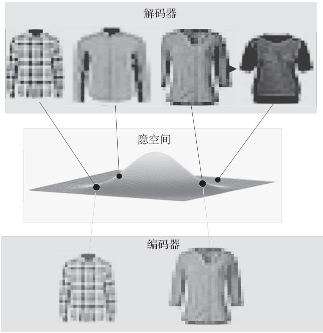  
图 3-9 VAE 的架构

具体来说，VAE 假设潜在变量的分布服从一个先验分布（通常为高斯分布或均匀分布）。编码器将输入数据映射为隐变量的均值和方差，然后从这个均值和方差中抽样得到隐变量的采样值。这种采样过程引入了一定的随机性，使得生成样本具有多样性。

然后，解码器将隐变量采样值映射回输入数据空间，生成重构数据。通过最小化重构数据与原始数据之间的重建误差，VAE 学习使重构数据尽量接近真实数据。同时，VAE 还通过最小化潜在变量的 KL 散度和先验分布之间的差异来确保潜在变量的先验和后验分布尽可能接近。

通过这种方式，VAE 能够学习到数据的潜在分布，并且具有生成新样本的能力。隐变量的采样过程以及先验分布的约束使得生成样本具有一定的多样性和连续性。

VAE 最关键的一点就是增加了一个对潜在空间 $Z$ 的正态分布约束，如何确定这个正态分布呢？要确定正态分布，只要确定其两个参数，即均值 $\mu$ 和标准差 $\sigma$ 。那么如何确定 $\mu$ 、$\sigma$ ？可以用神经网络去拟合，不仅简单，效果也不错。图 3-10 为 VAE 的逻辑架构图。

为解决这一问题，人们对潜在空间 Z（潜在变量对应的空间）增加了一些约束，使 Z 满足正态分布，由此就出现了 VAE 模型。VAE 对编码器添加约束，就是使用重参数技巧强迫它产生服从单位正态分布的潜在变量。正是这种约束，把 VAE 和 AE 区分开来，有关重参数技巧的详细内容可参见 13.2.7 节。

  
图 3-10 VAE 的逻辑架构图

# 3.2.2 变分自编码器的原理

任何一个数据的分布，都可以看作若干高斯分布的叠加，如图 3-11 所示，样本数据 $x$ 的分布 $p ( x ; \theta )$ （其中， $\theta$ 是高斯分布的相关参数的统称，如 $\mu$ 、 $\sigma$ 参数等）由多个高斯分布叠加。

  
图 3-11 $p ( x ; \theta )$ 由多个高斯分布叠加而成

$p ( x ; \theta )$ 分布由若干浅色曲线对应的高斯分布叠加而成。这种拆分方法已经证明，当拆分的数量达到一定数量（如 512）时，其叠加的分布相对于原始分布而言，误差是非常小的。

我们可以利用这一理论模型去考虑如何给数据进行编码。一种最直接的思路是，用每一组高斯分布的参数作为一个编码值实现编码，当隐变量为离散情况时，分布函数 $p ( x ; \theta )$ 与高斯混合模型的关系如图 3-12 所示。

i 代表编码维度上的编号，如实现一个 512 维的编码，i 的取值范围就是 1,2,3,…,512。i服从于一个概率分布 $p ( i )$ （多项式分布）。目前编码的对应关系是，每采样一个 i，其对应到一个小的高斯分布， $p ( x ; \theta )$ 就可以等价为所有的这些高斯分布的叠加，即

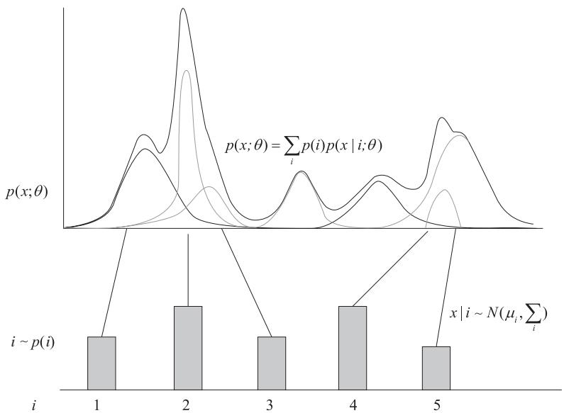  
图 3-12 概率分布 $p ( x ; \theta )$ 由高斯混合模型构成

$$
p (x; \theta) = \sum_ {i} p (i) p (x \mid i; \theta) \tag {3.1}
$$

上述的这种编码方式非常简单，它对应的是我们之前提到的离散的、有大量失真区域的编码方式。于是，我们需要对目前的编码方式进行改进，使离散变量 i 成为连续的编码z，分布函数 $p ( x ; \theta )$ 与高斯混合模型的关系如图 3-13 所示。

  
图 3-13 分布函数与高斯混合模型的关系

这里假设 z 服从高斯分布（也可以是其他分布）。对于每个采样 z，存在两个函数，分别决定 z 对应的高斯分布的均值和方差，然后将所有的高斯分布在积分域上进行累加，即

可得到原始分布 $p ( x ; \theta )$ ，即

$$
p (x; \theta) = \int_ {z} p (x, z; \theta) \mathrm {d} z = p (x; \theta) = \int_ {z} p (z) p (x | z; \theta) \mathrm {d} z \tag {3.2}
$$

为求 $p ( x ; \theta )$ 的极值，通常采用取对数的方式，即

$$
\log p (x; \theta) = \log \int_ {z} p (x, z; \theta) d z = \log \int_ {z} p (z) p (x | z; \theta) d z \tag {3.3}
$$

其中， $p ( x | z ; \theta )$ 为求似然函数log $p ( x ; \theta )$ 的极值，涉及求隐变量 z 的积分，由于 z 一般为高维向量，直接求 $p ( x , z ; \theta )$ 的积分比较困难，用数字积分的方法计算高维积分也非常困难，解决这一问题的思路之一是似然函数的下界函数极值。下界函数更容易优化，不断优化相关参数，使下界函数变大，同时不断提升似然函数的值，直到收敛到局部或全局最优解。具体实现步骤如下：

$$
\mathcal {L} (\theta) = \max  _ {\theta} \arg \log p (x; \theta) = \log \int_ {z} p (x, z; \theta) d z = \log \int_ {z} Q (z) \frac {p (x , z ; \theta)}{Q (z)} d z \tag {3.4}
$$

根据 Jensen 不等式，可得：

$$
\log p (x) = \log \int_ {z} Q (z) \frac {p (z) p (x \mid z)}{Q (z)} d z \geqslant \int_ {z} Q (z) \log \frac {p (z) p (x \mid z)}{Q (z)} d z \tag {3.5}
$$

其中，分布函数 $Q ( z )$ 一般为高斯分布，当然可以是其他分布。不过根据变分推断的相关理论，如果 $Q ( z ) = q ( z \mid x )$ ，将使 $Q ( z )$ 与分布 $p ( x \mid z )$ 的 KL 散度最小。为此，这里取$Q ( z ) = q ( z \mid x )$ 。整个训练过程如图 3-14 所示。

  
图 3-14 对似然函数的下界函数求极值

接 下 来， 通 过 似 然 函 数 $\mathcal { L } \left( \theta \right) = \operatorname* { m a x } _ { \theta } { \log \log p \left( x ; \theta \right) }$ 的 极 值 转 换 为 求 其 下 界 函 数$\int _ { z } Q ( z ) \log { \frac { p \bigl ( x , z ; \theta \bigr ) } { Q ( z ) } } c$ dz 的极值。

$$
\begin{array}{l} \int_ {z} Q (z) \log \frac {p (x , z ; \theta)}{Q (z)} d z = \int_ {z} q (z | x) \log \frac {p (x , z ; \theta)}{q (z | x)} d z \\ = \int_ {z} q (z \mid x) \log \frac {p (x \mid z ; \theta) p (z)}{q (z \mid x)} d z \tag {3.6} \\ = \int_ {z} q (z | x) \log \frac {p (z)}{q (z | x)} d z + \int_ {z} q (z | x) \log p (x | z; \theta) d z \\ = - \operatorname {K L} \left(q (z | x) | p (z)\right) + \int_ {z} q (z | x) \log p (x | z; \theta) d z \\ \end{array}
$$

所 以， 求 解 下 界 函 数 的 极 大 值 等 价 于 求 解 KL 散 度 $\mathrm { K L } { \big ( } q { \big ( } z | x { \big ) } | p { \big ( } z { \big ) } { \big ) }$ 的极小值和$\int _ { z } q \big ( z \mid x \big ) \log p \big ( x \mid z ; \theta \big ) \mathrm { d } z$ z的极大值。

其中， $- \mathrm { K L } \big ( q \big ( \boldsymbol { z } | \boldsymbol { x } \big ) | p \big ( \boldsymbol { z } \big ) \big )$ 展开的结果正好等于

$$
\sum_ {i = 1} ^ {m} \left(\exp \left(\sigma_ {i}\right) - \left(1 + \sigma_ {i}\right) + \left(\mu_ {i}\right) ^ {2}\right) \tag {3.7}
$$

最小化式（3.7），求导数可得 $\sigma _ { i } = 1$ ，所以这个损失函数正是为了保证生成图像的多样性。而 max $\int _ { z } q \big ( z \mid x \big ) \log p \big ( x \mid z ; \theta \big ) \mathrm { d } z = \operatorname* { m a x } E _ { q \left( z \mid x \right) } p \big ( x \mid z ; \theta \big )$ ，求期望 $E _ { q ( \mathfrak { z } | \mathfrak { x } ) } p \big ( \mathfrak { x } | \mathfrak { z } ; \theta \big )$ 的最大值，就是在给定编码器输出的情况下使解码器输出的值尽可能高，这其实就是一个类似 AE 的损失函数。这就说明了 VAE 的损失函数需要由重构损失和 KL 散度构建的底层逻辑，VAE 更详细的损失函数推导可参见第 13 章。

# 3.3 构建变分自编码器

在 AE 中，图像通过编码器直接映射成隐空间中的一点。在 VAE 中，图像通过编码器映射成隐空间中围绕某个点的多元正态分布，如图 3-15 所示。


  
图 3-15 AE 与 VAE 重编码器的差异

# 3.3.1 构建编码器

VAE 的编码器的网络结构如图 3-16 所示。

  
图 3-16 VAE 的编码器的网络结构

图 3-16 的输出如下：

$$
z = u (\cdot \mathrm {m u}) + \sigma (\cdot \mathrm {s i g m a}) \varepsilon
$$

其中，ε 是标准正态分布的采样。

VAE 的编码器的代码如下：

```python
class VariationalEncoder(nnModule): def __init__(self, latent_dims): super(VariationalEncoder, self).__init__(self.conv1 = nn.Conv2d(1, 8, 3, stride=2, padding=1) self.conv2 = nn.Conv2d(8, 16, 3, stride=2, padding=1) self.batch2 = nn*BatchNorm2d(16) self.conv3 = nn.Conv2d(16, 32, 3, stride=2, padding=0) self_linear1 = nn.Linear(3*3*32, 128) self_linear2 = nn.Linear(128, latent_dims) self_linear3 = nn.Linear(128, latent_dims) #定义一个标准正态分布 self.N = torch:distributions.Normal(0, 1) self.N.loc = self.N.loc.cuda() self.N scale = self.N scale.cuda() self.kl = 0 def forward(self, x): x = x.to(device) x = Frelu(self.conv1(x)) x = Frelu(self.conv2(self.conv2(x))) x = Frelu(self.conv3(x)) #展平为一维数据 x = torch/flatten(x, start_dim=1) x = Frelu(self.linear1(x)) mu = self.linear2(x) sigma = torch.exp(self.linear3(x)) #定义编码器的输出 z = mu + sigma*self.N.sample(mu.shape) self.kl = (sigma**2 + mu**2 - torch.log(sigma) - 1/2).sum() return z 
```

# 3.3.2 构建解码器

VAE 的解码器的网络结构如图 3-17 所示。

  
图 3-17 VAE 的解码器的网络结构

连接编码器和解码器的代码如下：

class VariationalAutoencoder(nnModule): def __init__(self, latent_dims): super(VariationalAutoencoder, self).__init_(self encoder = VariationalEncoder(latent_dims) self decoder = Decoder(latent_dims) def forward(self, x): $\mathbf{x} = \mathbf{x}$ .to(device) $\mathbf{z} =$ self encoder(x) return self decoder(z)

# 3.3.3 损失函数

AE 的损失函数采用原图像与解码器处理后重构的图像之间的均方误差作为目标函数，VAE 的目标函数也使用这个衡量指标，此外，还使用了 KL 散度，KL 散度用来衡量由 mu$^ +$ sigma*self.N.sample(mu.shape) 构成的分布与标准正态分布之间的相似度。所以，VAE 的损失函数由以下两个方面进行衡量。

● 生成的新图像与原图像的相似度。  
隐含空间的分布与正态分布的相似度。

度量图像的相似度一般采用交叉熵（如 nn.BCELoss），度量两个分布的相似度一般采用 KL 散度。这两个度量的和构成了整个模型的损失函数。

VAE 损失函数中添加 KL 散度的作用如下：

1）在 VAE 中，我们希望潜在空间中的分布能够接近一个先验分布，通常选择一个简单的分布作为先验，如多变量标准正态分布。KL 散度是衡量两个分布之间差异的指标，它衡量了编码器输出的潜在变量分布与先验分布之间的差异，这有助于确保生成的样本更加

符合预期分布。

2）KL 散度项的加入，使得 VAE 的训练过程中不仅仅是重构输入数据的过程，还要优化潜在空间的分布。这有助于生成更具有多样性和连续性的样本，同时也可以避免过拟合的发生，可以较好地弥补 AE 的不足。

以下是损失函数的具体代码。关于 VAE 损失函数的推导过程，有兴趣的读者可参考原论文 ㊀ 了解更多内容。

```python
# 定义重构损失函数及KL散度  
reconst_loss = Fbinary CROSS_entropy(x_reconst, x, size_average=False)  
kl_div = -0.5 * torch.sum(1 + log_var - mu.pow(2) - log_var.exp())  
# 两者相加得到总损失  
loss = reconst_loss + kl_div 
```

# 3.3.4 分析变分自编码器

VAE 的隐空间模拟了多维正态分布，所以是连续的，从隐空间随机采样，应该不会生成太多不合理的图像。如图 3-18 所示，把 $x$ 在 (-1, 1)、 $y$ 在 (-1, 1) 之间的一些隐空间的点$\left( \boldsymbol { x } , \boldsymbol { y } \right)$ ）重构成图像。

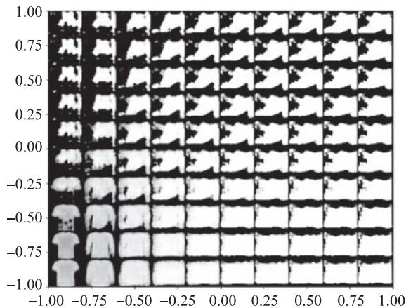  
图 3-18 从隐空间随机采样重构的图像

如果按照数字给隐空间中的点上色，如图 3-19 所示，可以看到各类的分布比较均匀，不像 AE 中的情况，各类的分布不均匀，而且还有很多间隙，而间隙将导致重构图像的质量和创新性。

接下来我们用一个更复杂的数据集来了解增加隐空间维度时 VAE 的表现。

  
图 3-19 VAE 隐空间的散点图

# 3.4 使用变分自编码器生成面部图像

本节将使用 CelebA 数据集来训练 VAE，该数据集包含超过 200 000 张名人的面部图像。每张图像都有 40 个二进制属性标记，如性别、年龄和发型等，如图 3-20 所示。

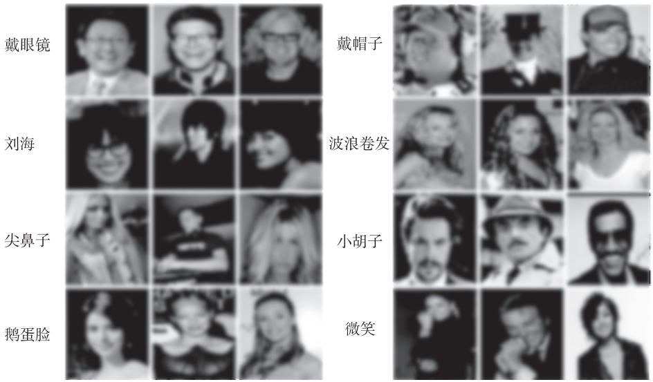  
图 3-20 CelebA 数据集示例

训练时，没有使用属性标签，用该数据集训练 VAE 模型，然后从隐空间采样重构新图像。

# 3.4.1 编码器

这里的编码器与 3.3 节的编码器相似，主要区别如下：

. CelebA 数据集的通道数为 3（即 RGB），而 FashionMNIST 数据集的图像通道数为 1。  
● 考虑到人脸比较复杂，这里的隐空间有 128 维，维度大有利于保存图像中的更多细节。  
● 为了加快训练速度，卷积层之后添加多个标准批量归一化处理及 dropout 层，具体结构如图 3-21 所示。

  
图 3-21 编码器的网络结构

# 3.4.2 解码器

解码器的网络结构采用的转置卷积，从隐空间采样的样本输出形状与输入图像形状一致。解码器中也添加了批量归一化、dropout 等层。解码器的网络结构如图 3-22 所示。

  
图 3-22 解码器的网络结构

# 3.4.3 进一步分析变分自编码器

图 3-23 的上排图像是 VAE 重构的图像，下排图像是原图像。

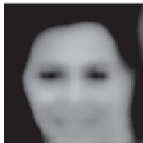


  
图 3-23 原图像与经过 VAE 重构的图像

从图 3-23 可知，虽然 VAE 重构的图像有些模糊，但 VAE 已成功捕获了原图像的关键特征，如头型、面部表情等，至于图像模糊问题，大家可以通过丰富模型结构、增加迭代次数等改进。另外，在 VAE 的损失函数中，KL 散度为保证隐空间的分布与正态分布近似，为检查隐空间的分布是否近似正态分布，将每个维度的分布可视化如图 3-24 所示。

  
图 3-24 隐空间其中 8 个维度的点分布

# 3.4.4 生成新头像

从 128 维的标准正态分布中采样一些点，然后把这些点传递给解码器，最后生成$3 \times 6 4 \times 6 4$ 的图像，这些图像虽然不完美，但比 AE 随机采样生成的图像质量高得多，究其原因是 VAE 采用了与 AE 不一样的算法，即对隐空间近似一个标准正态分布，而不是互相孤立的一些点，生成的图像如图 3-25 所示。

  
图 3-25 由隐空间生成的图像

具体实现代码如下：

```txt
# 恢复模型  
model2 = VAE_D().to(device)  
model2.load_state_dict(torch.load('model.pth'))  
# 随机采样  
z = torch.randn(1,128)  
z = z.to(device)  
# 生成新图像  
samples = model2Decode(z)  
samples = samplesdetach().cpu()  
plt.imshow(np.transpose(vutils.make_grid(samples, padding=2, normalize=True), (1,2,0))) 
```

# 第 4 章

# 生成对抗网络

第 3 章介绍了 VAE 模型，VAE 比 AE 生成的图像质量更高，有更好的多样性、创新性，因为它可以通过潜在空间的均值和方差来生成各种样本，可以在训练过程中通过 KL 散度使得潜在空间具有良好的连续性和平滑性。但 VAE 生成的样本可能会失去一些细节和真实性，因为它在训练过程中最小化了重构误差，而重构误差可能无法完全捕捉到样本的所有细节。VAE 在处理复杂数据集时可能会受到潜在空间的限制，导致生成的样本质量下降。如何克服 VAE 模型的这些不足？接下来我们将介绍的生成对抗网络（GAN）模型在生成图像质量方面要好于 VAE 模型，GAN 生成的样本通常质量更高，因为生成器一直在努力使生成样本更接近真实样本。GAN 可以生成多样化的样本，因为它的生成过程是通过对抗训练来实现的。

# 4.1 GAN 模型简介

GAN 模型是一种深度学习模型，它由生成器和判别器两部分组成。生成器的作用是从随机噪声中生成虚假的样本，而判别器则负责将这些样本与真实的样本进行区分。整个模型的训练过程就是让生成器不断生成更加逼真的样本，并让判别器能够准确地区分真实样本和虚假样本。通过这种对抗的方式，GAN 模型能够生成高质量、多样性的样本，因而被广泛应用于图像、音频等领域。

# 4.1.1 GAN 的直观理解

GAN 的训练过程为：首先，生成器会产生一张伪造的图像，然后将这张图像送入判别器进行判断，判别器会输出一个概率值，表示这张图像是真实图像的概率。接着，真实图

像也会被送入判别器进行判断，判别器同样会输出一个概率值。生成器的目标就是希望自己生成的图像能够“骗过”判别器，也就是使得判别器无法准确区分出哪些图像是真实的，哪些图像是伪造的；而判别器的目标则是尽可能准确地识别出哪些图像是真实的，哪些图像是伪造的。双方不断交替训练，直到生成器可以生成足够逼真的图像，使得判别器无法准确区分真实图像和伪造图像为止。GAN 的训练流程如图 4-1 所示。

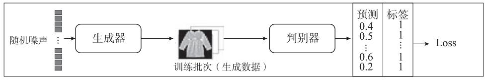  
生成器训练过程

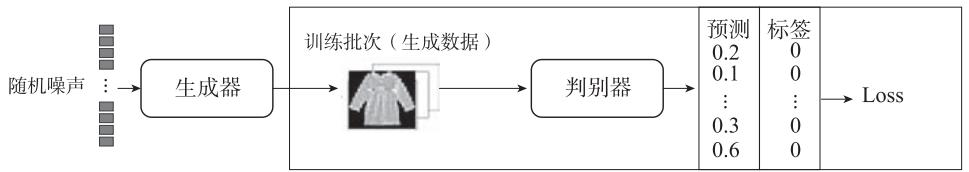  
判别器训练过程

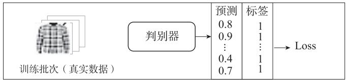  
图 4-1 GAN 的训练流程

# 4.1.2 GAN 的原理

VAE 模型利用变分推断技术逼近样本数据的分布，GAN 则采用了另一种思路，即博弈的思想。

生成器的目标是生成与真实数据相似的新数据。它接收一个随机噪声向量作为输入，通过一系列的线性变换和非线性变换得到一个新的数据样本。为了达到这个目标，生成器的目标函数通常采用对抗损失函数（Adversarial Loss），即最小化如下目标函数（设真实图像标签为 1，生成图像标签为 0）：

$$
\log (1 - D (G (z))) \tag {4.1}
$$

式（4.1）的含义是生成器生成的样本 $G ( z )$ 与真实样本越接近，则被判断器判断为真实样本的概率就越大，即 $D ( G ( z ) )$ 的值越接近 1，目标函数的值越小。

对于判别器，要让真实样本尽量判别为真实的，即最大化 $\log { D ( x ) }$ ，这意味着 $D ( x )$ 的值要尽量接近1；对生成器生成的样本，要尽量判别为假数据，让 $D ( x )$ 的值尽量接近0，即最大

化 $\log \left( 1 - D \big ( G ( z ) \big ) \right) \circ$ 。综合生成器和判别器的以上目的，整个 GAN 模型的目标函数可定义为：

$$
V (D, G) = E _ {x \sim p _ {\text {d a t a}}} \left\lceil \log (D (x)) \left. \right\rfloor + E _ {z \sim p _ {z}} \left\lceil \log (1 - D (G (z))) \left. \right\rfloor
$$

$$
\mathcal {L} \left(\theta^ {G}, \theta^ {D}\right) = \min  _ {G} \max  _ {D} V (D, G) \tag {4.2}
$$

GAN 的设计出发点是学习过程既不需要近似推断，又不需要配分函数（PartitionFunction，其功能是使非归一化的概率分布转换为归一化的概率分布）梯度的近似。

GAN 模型的训练过程就是生成器越来越强，最后以至于判别器无法识别真假图像，如图 4-2 所示。

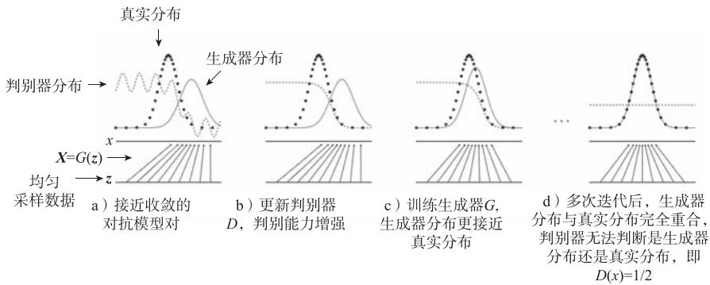  
图 4-2 GAN 模型的训练过程示意

# 4.1.3 GAN 的训练过程

在 GAN 的训练过程中，判别器的主要作用是对给定的数据样本进行分类，判断它是真实数据还是生成数据。判别器接收一个数据样本作为输入，通过一系列的线性变换和非线性变换得到一个分类概率。判别器的目标是最大化正确判别真实数据和生成数据的概率，使得生成器生成的数据越来越接近真实数据。为了达到这个目标，判别器的目标函数通常采用交叉熵损失函数（Cross-Entropy Loss），即最小化真实数据和生成数据被误分类的概率。通过不断迭代更新生成器和判别器的参数，GAN 模型可以逐渐学习到真实数据的分布，从而生成更加逼真的新数据。

训练 GAN 的步骤如下：

1）初始化生成器 $G$ 和判别器 $D$ 的参数。  
2）从真实数据分布中随机采样 $n$ 个样本 $\left\{ x _ { 1 } , x _ { 2 } , \cdots , x _ { n } \right\}$ ，从噪声分布中随机采样 $n$ 个噪声向量 $\left\{ z _ { 1 } , z _ { 2 } , \cdots , z _ { n } \right\}$ 。  
3）使用生成器 $G$ 生成 $n$ 个假样本 $\{ G ( z _ { 1 } ) , G ( z _ { 2 } ) , \cdots , G ( z _ { n } ) \} _ { \mathrm { ~ c ~ } }$ 。  
4）将真实样本和假样本合并得到 $2 n$ 个样本，计算判别器 $D$ 的损失函数 $L _ { p }$ ：

$$
L _ {D} = - \frac {1}{n} \sum_ {i = 1} ^ {n} \log (D (x _ {i})) + \sum_ {j = 1} ^ {n} \log (1 - D (G (z _ {j})))
$$

5）固定判别器 $D$ 的参数，更新生成器 $G$ 的参数，使其最小化生成器的损失函数 $\Sigma _ { G }$ ：

$$
L _ {G} = - \frac {1}{n} \sum_ {j = 1} ^ {n} \log \left(D \left(G \left(z _ {j}\right)\right)\right)
$$

6）重复步骤 2）～5），直到达到预设的迭代次数或生成器产生足够逼真的样本。

# 4.2 用 GAN 从零开始生成图像

为便于说明 GAN 的关键环节，这里我们弱化了网络和数据集的复杂度。数据集使用MNIST，网络使用全连接层。后续我们将用一些卷积层的实例来说明。

# 4.2.1 判别器

获取数据、导入模块的过程基本与 VAE 的类似，这里不再展开，详细内容可参考本书的代码部分。

要定义判别器的网络结构，这里使用 LeakyReLU 作为激活函数，经过两个全连接层，输出一个节点，最后经过 sigmoid 输出，用于真假二分类。

# 构建判断器

```txt
D = nn.Sequential(
    nn.Linear(image_size, hidden_size),
    nn.LeakyReLU(0.2),
    nn.Linear(hidden_size, hidden_size),
    nn.LeakyReLU(0.2),
    nn.Linear(hidden_size, 1),
    nn.Sigmoid()
) 
```

# 4.2.2 生成器

GAN 的生成器与 VAE 的生成器类似，不同的是 GAN 的输出为 nn.tanh，它可以使数据分布在 [-1,1] 之间。其输入是潜在空间的向量 z，输出维度与真图像的维度相同。

构建生成器 它相当于 中的解码器

```matlab
G = nn.Sequential(
    nn.Linear(latent_size, hidden_size),
    nn.ReLU.,
    nn.Linear(hidden_size, hidden_size),
    nn.ReLU()
); 
```

```txt
nn.Linear(hidden_size，image_size), nn.Tanh() 
```

# 4.2.3 损失函数

从 GAN 的训练流程图（图 4-1）可知，控制生成器或判别器的关键是损失函数，那么如何定义损失函数成为整个 GAN 的关键。我们的目标很明确，既要不断提升判断器辨别是非或真假的能力，又要不断提升生成器生成图像质量的能力，使判别器越来越难判别。这些目标如何用程序体现？损失函数就能充分说明这一点。

为了达到判别器的目标，其损失函数既要考虑识别真图像的能力，又要考虑识别假图像的能力，而不能只考虑一方面，故判别器的损失函数为两者的和，具体代码如下。其中，$D$ 表示判别器， $G$ 为生成器，real_labels、fake_labels 分别表示真图像标签、假图像标签。images 是真图像，z 是从潜在空间随机采样的向量，通过生成器得到假图像。

```txt
# 定义判断器对真图像的损失函数  
outputs = D/images)  
d_loss_real = criterion outputs, real_labels)  
real_score = outputs  
# 定义判别器对假图像（即由潜在空间点生成的图像）的损失函数  
z = torch randn(batch_size, latent_size).to(device)  
fake_images = G(z)  
outputs = D(fake_images)  
d_loss_fake = criterion outputs, fake_labels)  
fake_score = outputs  
# 得到判别器的总损失函数  
d_loss = d_loss_real + d_loss_fake 
```

如何定义生成器的损失函数，使其越来越接近真图像？以真图像为标杆或标签即可。具体代码如下：

```txt
z = torch Randn(batch_size, latent_size).to(device)  
fake_images = G(z)  
outputs = D(fake_images)  
g_loss = criterion(outputs, real_labels) 
```

# 4.2.4 训练模型

将判别器与生成器组合成一个完整模型，并对该模型进行训练。

```python
for epoch in range(num_epochs):
    for i, (images, _) in enumerate(dataloader): 
```

images $=$ images.reshape(batch_size，-1).to(device)  
#定义图像是真或假的标签  
real_labels $=$ torch.ones(batch_size，1).to(device)  
fake_labels $=$ torch.zeros(batch_size，1).to(device)  
# $= = = = = = = = = = = = = = = = = = = = = = = = = = = = = = = = #$ #训练判别器  
# $= = = = = = = = = = = = = = = = = = = = = = = = = #$ #定义判别器对真图像的损失函数  
outputs $=$ D/images)  
d_loss_real $=$ criterion(outputs，real_labels)  
real_score $=$ outputs  
#定义判别器对假图像（即由潜在空间点生成的图像）的损失函数  
z $=$ torch.randn(batch_size，latent_size).to(device)  
fake_images $=$ G(z)  
outputs $=$ D(fake_images)  
d_loss_fake $=$ criterion(outputs，fake_labels)  
fake_score $=$ outputs  
#得到判别器的总损失函数  
d_loss $=$ d_loss_real $+$ d_loss_fake  
#对生成器、判别器的梯度清零  
reset_grad()  
d_loss_backward()  
d_OPTimizer_step()  
# $= = = = = = = = = = = = = = = = = = = = = = = = #$ #训练生成器  
# $= = = = = = = = = = = = = = = = = #$ #定义生成器对假图像的损失函数，这里我们要求  
#判别器生成的图像越来越像真图像，故损失函数中的  
#标签改为真图像的标签，即希望生成的假图像  
#越来越接近真图像  
z $=$ torch randn(batch_size，latent_size).to(device)  
fake_images $=$ G(z)  
outputs $=$ D(fake_images)  
g_loss $=$ criterion(outputs，real_labels)  
#对生成器、判别器的梯度清零  
#进行反向传播及运行生成器的优化器  
reset_grad()  
g_loss_backward()  
g_optimizer-step()  
if $(\mathrm{i} + 1)\% 200 == 0:$

print('Epoch[{}/}],Step[{}/}],d_loss:{.4f},g_loss:{.4f},D(x): {:.2f},D(G(z)): {:.2f}' .format(epoch,num_epochs,i+1,total_step,d_loss.item(),g_loss.item()， real_score.mean().item(),fake_score.mean().item()) #保存真图像 if(epoch+1) $= = 1$ images $\equiv$ images.reshape/images.size(0)，1，28，28） save_image(denorm/images),os.path.join(sample_dir,'real_images.png')) #保存假图像 fake_images $\equiv$ fake_images.reshape(fake_images.size(0)，1，28，28） save_image(denorm(fake_images),os.path.join(sample_dir,'fake_images-{}.png'. format(epoch+1))) #保存模型 torch.save(G.state_dict()，'G.ckpt') torch.save(D.state_dict()，'D.ckpt')

训练期间，判别器和生成器的损失如图 4-3 所示。

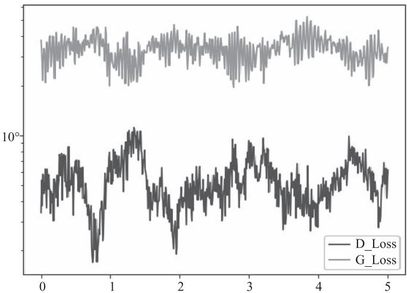  
图 4-3 判别器和生成器的损失

从图 4-3 可知，训练 GAN 模型的损失振幅比较大，为何会出现这个结果？ 4.3 节将进行具体说明。

# 4.2.5 可视化结果

可视化每次由生成器得到的假图像，即潜在向量 z 通过生成器得到的图像。

```python
reconsPath = '.gan_samples/fake_images-200.png'  
Image = mpimg.imread(reconsPath)  
plt.imshow(Image) # 显示图像 
```

```txt
plt.axis('off') # 不显示坐标轴  
plt.show()
```

运行结果如图 4-4 所示。

  
图 4-4 GAN 的新图像

图 4-4 的效果明显好于 VAE 或 AE 生成的效果。使用 VAE 生成图像主要依赖原图像与新图像的交叉熵，而 GAN 不仅依赖真、假图像的交叉熵，还兼顾了不断提升判别器和生成器本身的性能。

# 4.3 GAN 面临的问题

由于生成器和判别器的优化目标不同，在训练的初期，生成器可能无法生成逼真的样本，导致判别器可以轻易区分真实样本和生成样本。这可能导致梯度消失或梯度爆炸，使得 GAN的训练过程无法收敛。此外，生成器和判别器的学习速度不平衡也可能导致训练不稳定。

在 GAN 的训练过程中，生成器和判别器执行不同的优化目标。如果判别器能够轻松地将生成的样本与真实样本区分开来，那么生成器可能面临挑战，因为它无法获得关于如何生成更逼真样本的有效反馈。这可能导致生成器生成的样本数量较少或出现固定模式，造成模式崩溃，使得样本缺乏多样性和覆盖性。

此外，GAN 模型对参数设置较为敏感，存在许多超参数，如学习率、批量大小、训练迭代次数等。若超参数设置不恰当，可能导致模型无法正常训练。

# 4.3.1 损失振荡

在训练 GAN 模型时，损失函数的振荡是一个常见的问题。这种振荡通常表现为生成器

和判别器之间在训练过程中的相对优势出现剧烈变动，导致训练过程不稳定，如图 4-3 所示。下面是造成振荡的一些常见原因。

# （1）生成器和判别器的能力不匹配

如果生成器和判别器的能力不匹配，例如生成器太弱而判别器太强，那么判别器很容易将生成的样本与真实样本区分开来，从而阻碍了生成器的训练。

# （2）训练样本质量不一致

如果生成器的训练数据中存在一些噪声或错误标注的样本，可能会导致模型训练不稳定和损失的振荡。

# （3）不平衡的学习率

GAN 中生成器和判别器的学习率通常是不同的，如果学习率设置得不合理，可能导致其中一个网络过拟合或无法学习到有效的参数。

# 4.3.2 模型坍塌的简单实例

当 $\operatorname* { m a x } _ { D } V ( D , G )$ 在 $\theta ^ { D }$ 中是凸函数时，损失函数 $\mathcal { L } ( \theta ^ { G } , \theta ^ { D } )$ 能够保证收敛，但在实践中由神经网络表示的生成器 $G$ 和判别器 $D$ 以及 $\operatorname* { m a x } _ { D } V ( D , G )$ 往往不是凸的，使 GAN 的训练变得比较困难。

另外，同时对判别器和生成器的目标函数实现梯度下降难以保证达到平衡，这将导致训练 GAN 模型不稳定。如 $f ( x , y ) = x y$ ，求：

$$
\min  _ {x} \max  _ {y} x y
$$

其中，函数 $f ( x , y ) = x y$ 的图像如图 4-5 所示。

  
图 4-5 $f ( x , y ) { = } x y$ 的图像

对函数 $f ( x , y )$ 求关于 $y$ 的最大值，然后求关于 $x$ 的最小值，最后可能收敛于一个鞍点，而不是函数 $f ( x , y )$ 的局部极值点。

另外，生成器和判别器之间的不平衡容忍将使 GAN 模型坍塌，如图 4-6 所示，生成器只学到真实数据分布的一部分，没有学到完整的分布。

  
图 4-6 GAN 模型坍塌示意

当生成器生成的样本无法欺骗判别器时，它将无法学习到正确的梯度，并且可能停止生成高质量的样本。此外，训练 GAN 时需要谨慎选择超参数，如学习率、批次大小等，否则也可能导致模型坍塌。

# 4.3.3 GAN 模型坍塌的原因

1）由于 GAN 的生成器和判别器执行不同的损失函数，可能导致判别器越好，生成器梯度消失越严重。

GAN 的损失函数如下：

$$
V (D, G) = E _ {x \sim p _ {\mathrm {d a t a}}} \left\lceil \log (D (x)) \left. \right\rfloor + E _ {z \sim p _ {z}} \left\lceil \log (1 - D (G (z))) \left. \right\rfloor \tag {4.3}
$$

在生成器 $G$ 固定参数时，最优的判别器 $D$ 应该是什么？对于一个具体的样本 $x$ ，它可能来自真实分布也可能来自生成分布，把 $z \sim p _ { z }$ 改为 $x \sim p _ { g }$ ，此时损失函数为：

$$
E _ {x \sim p _ {\text {d a t a}}} [ \log (D (\boldsymbol {x})) ] + E _ {x \sim p _ {g}} \left\lceil \log (1 - D (\boldsymbol {x})) \left. \right\rfloor \tag {4.4}
$$

式（4.4）对 $D ( x )$ 进行求导，并令其为 0，化简后可得最优判别器为：

$$
D ^ {*} (x) = \frac {p _ {\text {d a t a}} (x)}{p _ {\text {d a t a}} (x) + p _ {g} (x)}
$$

这个结果从直观上很容易理解，就是看一个样本 $x$ 来自真实分布和生成分布的可能性的相对比例。

用 $\boldsymbol { D } ^ { * } ( \boldsymbol { x } )$ 替换式（4.4），并用 JS 散度表示式（4.4）可得：

$$
E _ {x \sim p _ {\text {d a t a}}} \left\lceil \log \left(D ^ {*} (x)\right)\left. \right\rfloor + E _ {x \sim p _ {g}} \left\lceil \log \left(1 - D ^ {*} (x)\right)\left. \right\rfloor = 2 \mathrm {J S} \left(p _ {\text {d a t a}} \| p _ {g}\right) - 2 \log 2
$$

由此可得，只要 $p _ { \mathrm { d a t a } }$ 、 $p _ { g }$ 没有一点重叠或重叠部分可忽略，JS 散度就固定为常数 log2。而这对于梯度下降方法意味着梯度为 0 ！此时对于最优判别器来说，生成器肯定是得不到梯度信息的。即使对于接近最优的判别器来说，生成器也大概率面临梯度消失的问题。

由此可知，判别器训练过度，会导致生成器梯度消失，进而生成器的损失值无法降低；判别器训练不足，则会导致生成器梯度失真，进而导致模型出现大幅振荡。只有判别器训练得恰当，才能取得理想的结果。但是这个分寸很难把握，甚至在训练的各个阶段这个分寸都可能不一样，所以 GAN 的训练变得异常困难。

2）GAN 的生成器损失函数可能导致模型坍塌。

生成器的损失函数（改进版）为：

$$
E _ {x \sim p _ {g}} \log (- D ^ {*} (x)) \propto \mathrm {K L} \left(p _ {g} \| p _ {\text {d a t a}}\right) - 2 \mathrm {J S} \left(p _ {\text {d a t a}} \| p _ {g}\right) \tag {4.5}
$$

这个等价最小化目标存在两个严重的问题：一是它同时要最小化生成分布与真实分布的 KL 散度，却又要最大化两者的 JS 散度，即一个要拉近，一个却要推远，这在直观上非常荒谬，在数值上则会导致梯度不稳定，这是后面的 JS 散度项的不足；二是因为 KL 散度不是对称的，导致此时损失函数不对称，对于正确样本误分和错误样本误分的惩罚不对等。

生成器的损失函数面临优化目标不寻常、梯度不稳定、对多样性与准确性惩罚不平衡导致模型坍塌等问题。

# 4.3.4 避免GAN 模型坍塌的方法

GAN 模型坍塌的主要原因之一是生成器和判别器之间不平衡，可以采取以下方法来避免模型坍塌。

（1）对抗性损失函数的设计

对于 GAN 模型，通常使用交叉熵作为对抗性损失函数，但这种损失函数可能导致模型崩溃。有人建议使用其他类型的对抗性损失函数，如 Wasserstein 距离或 Hinge Loss。

（2）更好的网络结构

GAN 模型的网络结构也可能导致模型坍塌。可以尝试使用更深、更宽的网络，并确保在生成器和判别器中都使用合适的层。如采用 DCGAN 可有效提升模型的性能。

（3）数据预处理

GAN 训练过程中输入数据的预处理也很重要。确保数据具有一定的数量和多样性，可以增加训练的复杂度，帮助模型学习到更多的特征。

（4）超参数选择

超参数选择是 GAN 训练中非常重要的一个步骤。需要仔细选择学习率、批次大小等参

数，因为不同的参数设置可能会对模型的稳定性产生影响。

# （5）归一化方法

归一化方法可以帮助模型在训练期间保持稳定。例如，可以采用 L1/L2 归一化、dropout 或批量归一化等技术，增加模型的稳定性。

避免 GAN 模型坍塌需要多方面的策略和技巧，并需要不断地进行试验和调整。

接下来将介绍几种改进的 GAN 模型，如 WGAN、WGAN-GP 等。

# 4.4 WGAN

WGAN（Wasserstein GAN） 是 对 GAN 的 改 进。WGAN 使 用 了 一 种 新 的 损 失 函 数（称为 Wasserstein 距离），代替原始 GAN 中的 JS 散度和 KL 散度。这种新的损失函数可以更好地衡量两个概率分布之间的差异，从而提高训练的稳定性和生成器的表现。同时，WGAN 还采用了权重裁剪和梯度惩罚等技术来进一步优化模型。

# 4.4.1 改进方向和效果

WGAN 的改进主要包括以下几个方面。

# （1）损失函数的改进

传统的 GAN 使用交叉熵损失函数来训练，但这种方法容易导致梯度消失或爆炸。 而 WGAN 则 采 用 了 一 种 基 于 Wasserstein 距 离 的 损 失 函 数， 称 为 Wasserstein 损 失（Wasserstein loss），它可以更好地描述生成器和判别器之间的距离，从而使训练过程更加平稳和可靠。

Wasserstein 距离是一种用于衡量概率分布之间距离的方法，而 Wasserstein 损失则是基于 Wasserstein 距离计算出来的一种损失函数。在 WGAN 中，使用 Wasserstein 损失作为生成器和判别器之间的距离度量，并将其最小化来优化模型。

Wasserstein 损失的具体表达式如下：

$$
L = \max  (D (G (z))) - \min  (D (x))
$$

其中， $D ( x )$ 表示真实数据 $x$ 经过判别器 $D$ 得到的输出结果， $D ( G ( z ) )$ 表示生成器 $G$ 生成的样本 $z$ 经过判别器 $D$ 得到的输出结果。max 和 min 分别表示对所有真实数据 $x$ 和生成器 $G$ 生成的样本 z 求最大值和最小值。当我们最小化这个损失函数时，可以使生成器 $G$ 产生更接近真实数据分布的样本。

需要注意的是，由于 Wasserstein 距离是一个连续的、可导的函数，因此使用Wasserstein 损失可以避免传统 GAN 中由于使用非连续损失函数而导致的训练不稳定等问题。

# （2）判别器的改进

在传统的 GAN 中，判别器输出一个概率值表示输入数据是否为真实数据，但这种方式

难以衡量不同数据之间的距离。WGAN 采用了一个更简单的判别器，它直接输出一个实数值，表示输入数据与真实数据之间的距离。其表达形式为：

$$
\min  _ {D} - \left\{E _ {X \sim P _ {\mathrm {d a t a}}} \left\lceil D (x) \right\rceil - E _ {z \sim P _ {z}} \left\lceil D (G (z)) \right\rceil \right\} \tag {4.6}
$$

这样，WGAN 可以更好地量化生成器产生的样本与真实数据之间的差异。

# （3）权重裁剪技术

为了保证判别器的输出在一定范围内，WGAN 使用了权重裁剪技术，即每次迭代后将判别器的权重限制在一个预先设定的范围内。这样可以避免判别器输出较大的值，进而提高训练的稳定性。

在 WGAN 中，为了使判别器输出的分布满足 Lipschitz 连续性条件，需要使用权重裁剪技术对判别器的权重进行限制。具体而言，在每次更新判别器的参数后，将其权重限制在一个固定的范围内，通常是 $[ - c , c ]$ ，其中 $c$ 是一个预先设定的常数，这样可以保证判别器函数的导数不会太大或太小。这个过程被称为权重裁剪（Weight Clipping）。

WGAN 中权重裁剪的实现过程如下：在每次更新判别器的参数之后，对所有判别器的权重进行裁剪。对于每一个权重 $w$ ，将其限制在 $[ - c , c ]$ 范围内，即 $w = \mathrm { c l i p } ( w , - c , c )$ ，这样就可以保证判别器输出的分布满足 Lipschitz 连续性条件，并且避免了训练过程中出现梯度爆炸或消失的问题。需要注意的是，权重裁剪虽然是 WGAN 中用来解决梯度爆炸和消失问题的有效方法，但它也可能会引入一些新的问题，比如裁剪后的权重可能会导致模型的表达能力降低，因此需要根据具体情况进行权衡和调整。后续将介绍一种更有效的权重裁剪方法，即 WGAN-GP。

# （4）优化算法

采用基于 Adam 优化算法的 RMSProp 优化算法，可以更快地收敛，并且对于学习率的自适应能力更强。在实际训练中，使用 RMSProp 优化算法可以显著提高 WGAN 的性能。

总之，WGAN 通过引入基于 Wasserstein 距离的损失函数、简化判别器模型以及采用权重裁剪技术等，成功地解决了传统 GAN 训练过程中出现的一系列问题，从而在生成图像、音频等领域取得了很好的效果。Wasserstein 损失函数定义如下：

$$
- \frac {1}{N} \sum_ {i = 1} ^ {N} y _ {i} p _ {i} \tag {4.7}
$$

其中， $y _ { i }$ 为标签，其值为 1 或 -1（GAN 的标签值为 1 或 0）， $p _ { i }$ 为预测值，其值是 $[ - \infty , \infty ]$ 之间的实数，而不是 [0,1] 之间的实数。

WGAN 达到的效果如下：

● 彻底解决了 GAN 训练不稳定的问题，不再需要谨慎平衡生成器和判别器的训练程度。  
基本解决了模型坍塌问题，确保了生成样本的多样性。  
● 训练过程中有一个像交叉熵、准确率这样的数值来指示训练的进程，这个数值越

小，代表 GAN 训练得越好，生成器产生的图像质量越高。

以上所述的各项优势无须依赖复杂的网络架构设计，采用最简单的多层全连接网络就可实现。

# 4.4.2 Wasserstein 距离的优越性

Wasserstein 距离（也称为 Earth Mover's Distance）是一种用来度量两个概率分布之间差异的指标。相比传统的 KL 散度和 JS 散度等，Wasserstein 距离具有以下优越性。

# （1）稳定性

KL 散度和 JS 散度在计算两个分布之间的距离时可能会面临不稳定的情况，尤其当两个分布在某些区域具有重叠但在其他区域具有很大差异时。而 Wasserstein 距离是通过计算从一个分布到另一个分布的最优传输得出的，因此具有更好的稳定性，并且在处理具有重叠区域的分布时更加合理。

# （2）几何解释

Wasserstein 距离可以被解释为将一个分布变换为另一个分布所需的最小成本。其中，成本可以理解为从一个点转移到另一个点的距离乘以点的质量。相比于 KL 散度和 JS 散度，这种几何解释使得 Wasserstein 距离在分布之间的转换上更加直观和可解释。

# （3）梯度的可用性

Wasserstein 距离具有可导性和良好的梯度性质，这使得它在深度学习领域得到广泛应用，特别是在 GAN 中。在训练 GAN 时通过最小化两个概率分布之间的 Wasserstein 距离，可以有效地改善生成图像的质量和稳定性。

# （4）生成分布的多样性

Wasserstein 距离对生成模型来说是一个更有用的指标，因为它鼓励模型在生成样本时尽可能地覆盖整个训练数据分布。这有助于生成更多样化和高质量的样本。

需要注意的是，计算 Wasserstein 距离可能需要较高的计算成本，尤其是在高维空间中。但是，在某些特定的应用场景中，Wasserstein 距离的优越性往往超过了这些计算成本。

# 4.4.3 WGAN 的损失函数代码

# （1）判别器的损失函数

d_loss $=$ -torch.mean(outputs_r) $^+$ torch.mean(outputs_f)

其中，outputs_r = D(images)，outputs_ $\boldsymbol { \mathrm { f } } = D ( G ( z ) )$ ，z 是从标准正态分布中的采样，images是真实图像。

# （2）生成器的损失函数

```lisp
g_loss=-torch.mean(D(G(z))) 
```

WGAN 可视化损失值如图 4-7 所示。

  
图 4-7 WGAN 可视化损失值

从图 4-7 可以看出，判别器的损失值振幅比较平缓，没有像 GAN 的振幅那么大。但生成器的损失值振幅还是比较大。

# （3）比较 GAN 的损失函数

1）判别器的损失函数。

```python
d_loss = d_loss_real + d_loss Fake 
```

其中，d_loss_fake $=$ nn.BCELoss(outputs, fake_labels)，d_loss_real $=$ nn.BCELoss(outputs, real_labels)。

2）生成器的损失函数。

```python
g_loss = nn.BCELoss (outputs, real_labels) 
```

其中，outputs $= D ( G ( z ) )$ 。

# 4.4.4 WGAN 的其他核心代码

# （1）WGAN 使用的优化器

GAN 使用 Adam 作为优化器，WGAN 以 RMSProp 作为优化器。

```python
d_OPTimizer = torch.optim.RMSErrorProp(D.params(), lr=0.0002)  
g_OPTimizer = torch.optim.RMSErrorProp(G.params(), lr=0.0002) 
```

# （2）对判别器的权重进行截取

```python
for p in D.params():  
    p_detach().clamp_(-0.01, 0.01) 
```

# 4.5 WGAN-GP

WGAN-GP 是对 WGAN 的一种改进，它使用了一种称为梯度惩罚（Gradient Penalty）的技术来替代 WGAN 中的权重裁剪。其主要思想是通过对判别器的梯度进行惩罚，来达到与权重裁剪相同的效果，同时避免了权重裁剪可能会出现的一些问题。

除了梯度惩罚机制之外，WGAN-GP 中的判别器没有使用批量归一化（BatchNormalization）层。这是因为在批量归一化中，每个小批量的输入都会被归一化，并且在训练过程中会计算均值和方差。然而，在 WGAN-GP 中，每个小批量的输入都是从真实数据和生成数据中随机采样得到的。因此，不同的批次之间的数据分布可能会有很大的差异，这会导致批量归一化无法起到有效的归一化作用。

与 WGAN 相比，WGAN-GP 可以更好地应用于图像处理、自然语言处理等领域，具有更强的鲁棒性、可靠性和稳定性。

# 4.5.1 权重裁剪的隐患

由式（4.6）可知，判别器的损失函数希望尽可能拉大真假样本的分数差，然而权重裁剪独立地限制每一个网络参数的取值范围，在这种情况下，最优的策略就是尽可能让所有参数取极值，要么取最大值（如 0.01）要么取最小值（如 -0.01）！经过充分训练后，发现判别器中所有网络参数的数值分布的确集中在最大值和最小值两个极端上，如图 4-8所示。

  
图 4-8 权重裁剪导致参数分布不均

此外，权重裁剪易导致梯度消失或者梯度爆炸。判别器是一个多层网络，如果我们把裁剪阈值设置得稍微小一点，每经过一层网络，梯度就会变小一点，多层之后就会指数衰减；反之，如果设置得稍微大一点，每经过一层网络，梯度就会变大一点，多层之后就会指数爆炸。只有设置得不大不小，才能让生成器获得恰到好处的回传梯度。然而在实际应用中，这个平衡区域可能很狭窄，会给调参工作带来麻烦。

相比之下，梯度惩罚可以让梯度在反向传播的过程中保持平稳。

# 4.5.2 梯度惩罚损失

权重裁剪方法简单，但有时效果不佳，容易导致权重分布走极端，进而导致梯度消失或爆炸等问题。如果改成对判别器的损失函数进行归一化，即在判别器的损失函数中添加一个梯度惩罚项，就可以让梯度在反向传播的过程中保持平稳，如图 4-9 所示。

  
图 4-9 使用梯度惩罚使权重分布比较均衡

WGAN-GP 在计算判别器的损失函数时，增加了一个梯度惩罚项，用于惩罚判别器输出的梯度偏离 1 的程度。这个梯度惩罚项的表达式如下：

$$
E _ {x \sim p _ {\hat {x}}} \left\lceil \| \nabla_ {x} D (x) \| _ {2} - 1 \right\rceil^ {2} \tag {4.8}
$$

其中，样本xˆ为随机插值样本，其生成过程为：随机采样一对真假样本，在 [0,1] 均匀分布上得到一个随机数 ε，在真假样本的连线上得到一个随机插值样本。这个过程可表示为：

$$
x _ {\text {d a t a}} \sim p _ {\text {d a t a}}, x _ {\mathrm {g}} \sim p _ {\mathrm {g}}, \varepsilon \sim U [ 0, 1 ] \tag {4.9}
$$

$$
\hat {x} = \varepsilon x _ {\text {d a t a}} + (1 - \varepsilon) x _ {g} \tag {4.10}
$$

对这个过程图像化，如图 4-10 所示。

  
图 4-10 在真假样本的连线上得到一个随机插值样本

WGAN-GP 判别器的损失函数在 WGAN 判别器的损失函数的基础上添加梯度惩罚项，即在式（4.6）中添加一个梯度惩罚项：

$$
\min  _ {D} - \left\{E _ {X \sim p _ {\mathrm {d a t a}}} \lceil D (x) \rfloor - E _ {z \sim p _ {z}} \lceil D (G (z)) \rfloor + \lambda E _ {x \sim p _ {x}} \lceil \| \nabla_ {x} D (x) \| _ {2} - 1 \rfloor^ {2} \right\} \tag {4.11}
$$

WGAN-GP 的训练过程与 WGAN 类似，即通过交替训练生成器和判别器来不断地优化模型。需要注意的是，相比于 WGAN，WGAN-GP 虽然解决了权重裁剪可能会引入的问题，但它也有一些自身的缺陷，比如在某些情况下可能会导致模型训练变慢或者出现梯度爆炸等问题。因此，在实际使用中需要根据具体情况进行选择和调整。

# 4.5.3 WGAN-GP 的训练过程

WGAN-GP 的训练过程如图 4-11 所示。


  
生成器训练过程  
图 4-11 WGAN-GP 的训练过程示意

结合图 4-11，对 WGAN-GP 的训练过程说明如下：

1）定义生成器 $G$ 和判别器 $D$ 。首先定义生成器 $G$ 和判别器 $D$ 的网络结构和目标函数。  
2）初始化生成器和判别器的参数。初始化生成器和判别器的参数，可以使用随机数或预训练的模型参数。  
3）迭代训练。通过交替更新生成器和判别器的参数来迭代训练 GAN 模型。

● 对于生成器 $G$ 的更新：生成器的目标是生成能够欺骗判别器的样本。首先生成一批噪声样本，然后将这些样本输入生成器 $G$ 中得到生成的样本。接下来，将生成的样本输入判别器 $D$ 中进行判别，并计算判别器对生成样本的损失。最后，通过反向传播来更新生成器的参数，减小判别器对生成样本的判别损失。  
● 对于判别器 $D$ 的更新：判别器的目标是准确地区分生成样本和真实样本。首先随机选择一批真实样本和生成样本，然后将这些样本输入判别器 $D$ 中，分别计算判别器对真实样本和生成样本的损失。最后，通过反向传播来更新判别器的参数，减小判别器对真实样本和生成样本的判别损失。

4）添加梯度惩罚。WGAN-GP 通过添加梯度惩罚来增加训练的稳定性。具体来说，它在真实样本和生成样本之间的线段上随机采样一些样本，然后将这些样本输入判别器中计算梯度。接着，计算这些样本梯度的范数，并通过加权平均来计算整个梯度的范数。最后，将这个梯度的范数与一个预设的权重值 lambda 相乘，并将其添加到判别器的损失函数中。  
5）重复步骤 3）和步骤 4）。反复迭代执行步骤 3）和步骤 4），直到生成器和判别器的性能收敛或达到预定的迭代次数。

通过以上训练过程，WGAN-GP 能够更稳定地训练生成器和判别器，从而生成更高质量的样本。

# 4.5.4 WGAN-GP 的损失函数代码

# （1）判别器的损失函数

```python
d_loss = -torch.mean(outputs_r) + torch.mean(outputs_f) + lambda_gp * gradient_penalty 
```

其 中，outputs_r = D(images)，outputs_ $\boldsymbol { \mathrm { f } } = D ( G ( z ) )$ ，gradient_penalty $=$ compute_gradient_penalty( $D$ , images.detach(), fake_images.detach())。

对梯度惩罚函数（compute_gradient_penalty）的定义如下：

```python
def compute_gradient_penalty(D, real_samples, fake_samples):
    '''计算WGAN-GP的梯度惩罚损失'''  
#真实样本和生成样本之间插值的随机权重项
    #alpha = Tensor(np.random.choice((real_samples.size(0), 1, 1, 1)))
    alpha = Tensor(np.random.choice((real_samples.size(0), 1)))
    #Get random interpolation between real and fake samples 
```

interpolarates $=$ (alpha \* real_samples $^+$ ((1 - alpha) \* fake_samples)).requires_   
grad_(True)   
d_interpolarates $=$ D(interpolarates)   
fake $=$ Tensor(real_samples.shape[0], 1).fill_(1.0)   
# Get gradient w.r.t. interpolates   
gradients $=$ autograd.grad( outputs=d_interpolarates, inputs=interpolarates, grad_outputs=fake, create_graph=True, retain_graph=True, only Inputs=True, ) [0] gradients $=$ gradients.view(gradients.size(0), -1)   
gradient_penalty $=$ ((gradients(norm(2, dim=1)-1) ** 2).mean()   
return gradient_penalty

# （2）生成器的损失函数

g_loss $\equiv$ -torch.mean( outputs)

其中，outputs $= D ( G ( z ) )$ 。

WGAN-GP 的损失值变化情况如图 4-12 所示。

  
图 4-12 WGAN-GP 的损失值变化情况

从图 4-12 可以看出，WGAN-GP 的损失值比 WGAN、GAN 都更稳定。