# 第 5 章

# StyleGAN 模型

StyleGAN 是一种 GAN 的模型架构，用于生成逼真的图像。它是由来自 OpenAI 的研究人员于 2019 年提出的，通过引入一些创新性的设计，取得了在图像生成任务上的显著成果。

StyleGAN 的主要目标是生成高质量、多样化且逼真的图像。为了实现这一目标，StyleGAN 采用了以下几个关键特点和技术：

1）分层生成器。StyleGAN 的生成器由多个层级组成，每个层级负责生成图像的不同细节和分辨率。生成器从粗略的图像开始，逐渐添加细节，使得生成图像更加逼真和细腻。  
2）风格向量。StyleGAN 引入了风格向量的概念，用于控制生成图像的风格和样式。通过改变风格向量的值，可以对生成图像进行风格转换，如调整颜色、纹理和细节等。  
3）高分辨率生成。StyleGAN 能够生成高分辨率的图像。生成器结合了一个高维的潜在空间和多个层级的生成结构，从而能够生成更加细致和清晰的图像。  
4）特征统计损失。为了提高生成图像的质量，StyleGAN 引入了一种损失函数，即特征统计损失。这个损失函数从判别器的特征图中提取统计信息，并用于评估生成图像与真实图像之间的差异。  
5）风格融合和插值。StyleGAN 的生成器允许对风格向量进行插值和融合，从而实现图像之间的风格转换和混合。这使得生成的图像能够在风格上具有更大的变化和多样性。  
6）添加噪声，促进多样性和随机性。通过向生成器的输入或某些层级中添加噪声，可以增加生成图像的多样性和随机性。噪声的引入使得生成器不仅仅依赖于固定的输入向量或风格向量，而是在每次生成图像时都会有一定的随机性。这样可以防止生成图像过于规律和重复，并增加生成图像的创造性和丰富性。

# 5.1 ProGAN 简介

StyleGAN 的前身是 ProGAN（Progressive Growing of GAN），后续有很多升级版本，如 StyleGAN2、StyleGAN3、StyleGAN-XL、StyleGAN-T（StyleGAN-XL $^ +$ CLIP）等。StyleGAN 模式如何过滤、操作不同等级风格？接下来进行详细说明。

# 1. 提出 ProGAN 的目标

ProGAN 是一种 GAN 模型，旨在解决生成高分辨率图像的问题。在传统的 GAN 模型中，由于深度神经网络的限制，难以生成高质量、高分辨率的图像。通过逐渐增加网络的层数和分辨率，在每个阶段中训练不同的生成器和判别器，ProGAN 可以生成更加逼真的、细节更多的图像。这种渐进式的训练方式使得 ProGAN 能够生成高分辨率的图像，如图 5-1所示，并被广泛应用于计算机视觉领域，如超分辨率、图像修复、图像合成等任务。

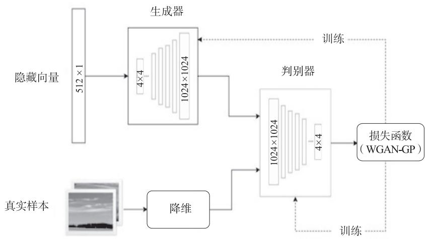  
图 5-1 ProGAN 的渐进式训练过程

ProGAN 采用渐进式的训练过程，训练过程中网络的结构是在动态变化的。首先从非常小的分辨率（如 $4 \times 4$ 像素）开始，创建仅有少量网络层的生成网络，以合成该低分辨率的图像，并创建一个对应的结构的判别器。由于网络非常小，因此其训练相对较快，且仅学习到高度模糊化图像的大尺度结构。

训练完第一层之后，在生成器和判别器上新增一个网络层，将输出分辨率翻倍到 $8 \times 8$ 。保留先前网络层训练的权重，但并不锁定权重，新增网络层为保持模型的稳定性，采用平滑过渡技术，继续训练直到 GAN 再次能合成真实图像，此时是新的 $8 \times 8$ 分辨率。

随着训练的改善，逐渐向生成器和判别器网络中添加层，进而增加生成图片的空间分辨率。所以它的网络结构是在动态变化的，这是有别于其他 GAN 的部分，可以提高训练高

分辨率图像的速率。

按照这种方式，ProGAN 继续新增网络层，分辨率翻倍，训练网络直至达到期望的输出分辨率，其实现过程如图 5-2 所示。

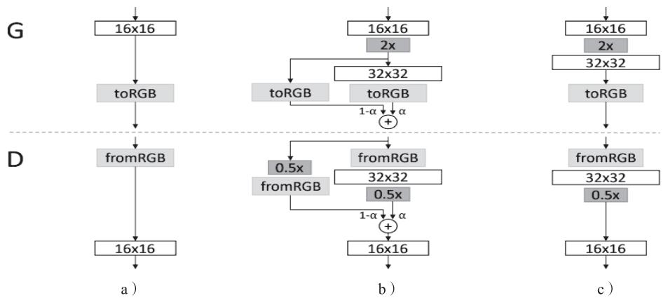  
图 5-2 ProGAN 添加层时采用平滑的过渡技术

由图 5-2 可以看到，从图 a 的 $1 6 \times 1 6$ 图像过渡到图 c 的 $3 2 \times 3 2$ 图像，在过渡期间（图 b），把在更高的分辨率上操作的层当作一个残差块，其权重 $\alpha$ 从 0 到 1 线性增加。当 $\alpha$ 为 0 时，相当于图 a，当 $\alpha$ 为 1 时，相当于图 c。所以，在转换过程中，生成样本的像素是从 $1 6 \times 1 6$ 转换到 $3 2 \times 3 2$ 的。同理，对真实样本也做了类似的平滑过渡，也就是，在这个阶段的某个训练批次，真实样本是：

$$
x = x _ {1 6} (1 - \alpha) + x _ {1 6} \alpha \tag {5.1}
$$

图 5-2 中的 $2 \times$ 和 $0 . 5 \times$ 指利用最近邻卷积和平均池化分别对图片分辨率加倍和折半。

toRGB 表示将一个层中的特征向量投射到 RGB 颜色空间中，fromRGB 正好相反，这两个过程都利用了 $1 \times 1$ 卷积。当训练判别器时，插入下采样后的真实图片去匹配网络中的当前分辨率。在分辨率转换过程中，会在两张真实图片的分辨率之间插值，类似于将两个分辨率结合到一起用生成器输出。

由于 ProGAN 是逐级直接生成图片，我们没有对其增加控制，也就无法获知它在每一级上学到的特征是什么，这就导致了它控制所生成图像的特定特征的能力非常有限（即ProGAN 容易发生特征纠缠，则使用下面的映射网络）。换句话说就是特性之间的耦合性太强，这些特性是互相关联的，因此即使稍微调整一下输入，也会同时影响多个特性。我们希望有一种更好的模型，能让我们控制输出的图片内容，即在图片生成过程中每一级的特征，要能够特定决定生成图片某些方面的表象，并且相互间的影响尽可能小。于是，在ProGAN 的基础上，StyleGAN 做出了进一步的改进与提升。

# 2. ProGAN 的主要创新点

ProGAN 的主要创新点如下：

1）采用渐进式的训练方法，通过逐渐增加生成器和判别器的层数来实现更高分辨率、更真实的图像生成。这种方法可以避免由于直接训练高分辨率图像而导致的梯度消失等问题，从而实现更好的生成效果。  
2）提出了一种新的归一化方法，即均衡学习率（Equalized Learning Rate），其核心思想是使不同层级的权重在传播过程中得到更一致的更新，使网络的训练更稳定。  
3）使用了一种特殊的技术，称为 SN-PRELU，可以更好地处理网络中的信息流，从而提高生成图像的质量。

这些技术和方法的组合使得 ProGAN 成为生成高分辨率图像的一种有效方法。

# 3. ProGAN 的不足

ProGAN 的不足主要体现在生成图像的细节和多样性方面。由于采用的是渐进式的训练方法，因此生成图像存在一定的模糊和平滑现象。此外，ProGAN 也无法控制生成图像的具体风格和特征（即 ProGAN 容易发生特征纠缠）。

为解决 ProGAN 的不足，人们又提出了 StyleGAN 模型，StyleGAN 是在 ProGAN 基础上进一步发展而来的，其主要创新点包括：

1）调整样本空间。通过对潜在空间进行调整，可以实现更精细的控制，如控制生成图像的年龄、性别、表情等。  
2）多层次噪声。为了增强生成图像的多样性，StyleGAN 使用了多层次噪声机制，在生成器中加入多个噪声向量，从而可以控制生成图像的细节和纹理。  
3）AdaIN 技 术。StyleGAN 引 入 了 一 个 全 新 的 网 络 结 构 AdaIN（Adaptive InstanceNormalization，适应实例归一化），用于将潜在向量和噪声向量转换成生成器的输入。这种映射方式可以提高生成图像的质量和多样性，使得生成的图像更加真实。

# 5.2 StyleGAN 架构

StyleGAN 是一种开创性的模型，不仅可以生成高质量和逼真的图像，还可以对生成的图像进行更好的控制和理解，从而比以前更容易生成可信的假图像。StyleGAN 是 ProGAN图像生成器的升级版本，重点关注生成器网络。

StyleGAN 的重点就是风格（Style），在提出 StyleGAN 的论文中具体是指人脸的风格，包括人脸表情、人脸朝向、发型等，还包括纹理细节上的人脸肤色、人脸光照等。

传统生成器与 StyleGAN 生成器的比较如图 5-3 所示。

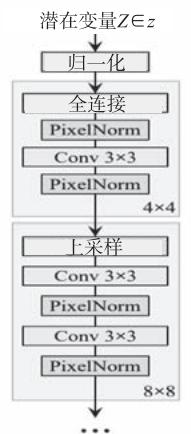  
a）传统生成器

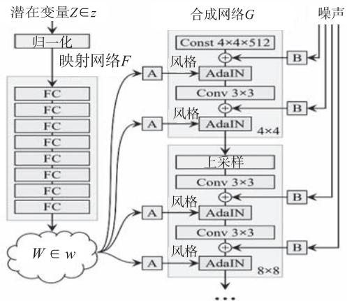  
b）基于风格的生成器  
图 5-3 传统生成器与 StyleGAN 生成器的比较

StyleGAN 的网络结构包含两个部分：第一个是映射网络，即图 5-3b 的左半部分，由潜在变量 z 生成中间潜在变量 $w$ 的过程， $w$ 用来控制生成图像的风格；第二个是合成网络（Synthesis Network），它的作用是生成图像，创新之处在于给每一层子网络都输入 A 和 B，A 是由 $w$ 转换得到的仿射变换，用于控制生成图像的风格，如图 5-4 所示。

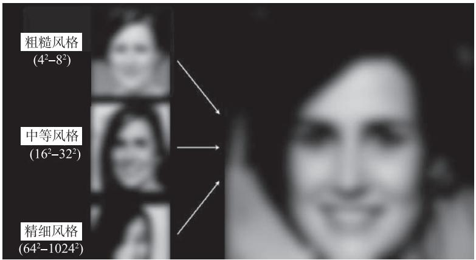  
图 5-4 操纵 CNN 中不同层次风格

B 是转换后的随机噪声，用于丰富生成图像的细节，即每个卷积层都能根据输入的 A来调整风格，人们的脸上有许多小的特征，可以看作是随机的，如雀斑、发髻线的准确位置、皱纹、使图像更逼真的特征以及各种增加输出的变化，如图 5-5 所示。将这些小特征插入 GAN 图像的常用方法是在输入向量中添加随机噪声。

  
图 5-5 操控不同分辨率 B 的随机噪声

为了控制噪声仅影响图像样式上细微的变化，StyleGAN 采用类似于 AdaIN 机制的方式添加噪声，即在AdaIN模块的正向每个通道添加一个缩放过的噪声，并稍微改变其操作的分辨率级别特征的视觉表达方式。加入噪声后的生成人脸往往更加逼真与多样，这就是添加B的效果。

整个网络结构保持了 ProGAN 的结构。经典 GAN 的随机变量或者潜在变量 $z$ 是通过输入层，即前馈网络的第一层提供给生成器的（图 5-3a）。而 StyleGAN 完全省略了输入层，直接从一个学习的常数开始（图 5-3b），即将 z 单独用映射网络变换成 $w$ ，再将 $w$ 输入给合成网络的每一层。

映射网络负责对潜在空间进行解耦，该网络由 8 个全连接层组成，其输出层与输入层的大小相同。通过一系列仿射变换，将 z 转换成 $w$ ，再转换成风格 $y { = } ( y _ { s } , y _ { b } )$ ，这就是 AdaIN风格变换方法（见图 5-6）。输入向量控制视觉特征的能力是有限的，因其受限于训练数据

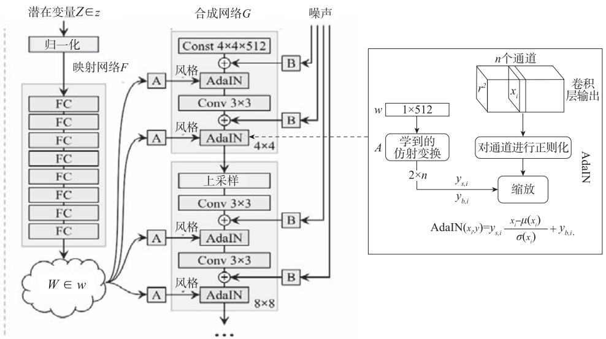  
图 5-6 AdaIN 的结构

的概率密度。例如，如果黑发人的图像在数据集中更常见，则更多输入值将映射到该特征中。因此，该模型无法将部分输入（向量中的元素）映射到特征中，这种现象称为特征纠缠。然而，映射网络通过使用另一个神经网络，可以生成一个不必遵循训练数据分布的向量，并且可以减少特征之间的相关性。

StyleGAN 架构图如图 5-7 所示。

  
生成器  
图 5-7 StyleGAN 架构图

# 5.3 StyleGAN 的其他算法

StyleGAN 模型中的 AdaIN 和 Style Mixing 是两种非常重要的算法，它们都被用于控制生成器输出图像的风格和属性。接下来介绍 StyleGAN 模型使用的其他算法。

# （1）渐进式增强

渐进式增强（Progressive Growing）是一种训练方式，它从低分辨率开始训练生成器，并逐渐增加分辨率。这种训练方式可以使得生成器学习到更加复杂和精细的特征，从而生成更加逼真的图像。

# （2）风格映射网络

风格映射网络（Style Mapping Network）是一种额外的神经网络，用于将输入的潜在向量映射到中间层的特征图上。它可以提高模型生成图像的品质和多样性。

# （3）GAN 的损失函数

GAN 的损失函数由生成器和判别器两个部分组成，其中生成器的目标是生成逼真的图像，判别器的目标是区分真实图像和生成图像。通过不断优化损失函数，可以提高模型生成图像的质量和多样性。

总的来说，StyleGAN 模型采用了许多先进的技术和算法，这些技术和算法共同作用，使得模型能够生成高度逼真、多样化且具有可控的属性的图像。

# 5.4 用 PyTorch 从零开始实现 StyleGAN

本节只使用 StyleGAN 生成图像这一基本功能，不实现样式混合和随机变化等功能。掌握 StyleGAN 的基本功能之后，学习其他功能就容易多了。

使用的数据集为 women-clothes，图 5-8 为数据集样例。

  
图 5-8 数据集样例

# 5.4.1 构建生成网络

StyleGAN 的生成网络结构如图 5-9 所示。

在 StyleGAN 中，映射网络通常用于调整生成图像的样式。其中的 WSLinear（WeightScale Linear，加权缩放线性）层是一种特殊的线性变换层，用于在仿射变换中应用权重缩放。对 WSLinear 进行缩放的目的是增强生成器在样式操作方面的灵活性和控制能力。通过缩放 WSLinear 层的权重，可以调整生成图像的不同视觉特征，如颜色、纹理和形状等。这对于在生成图像时引入微妙的变化和样式转换非常有用。例如，通过适当的权重缩放，可

以使生成的人脸图像看起来更年轻或更老等。

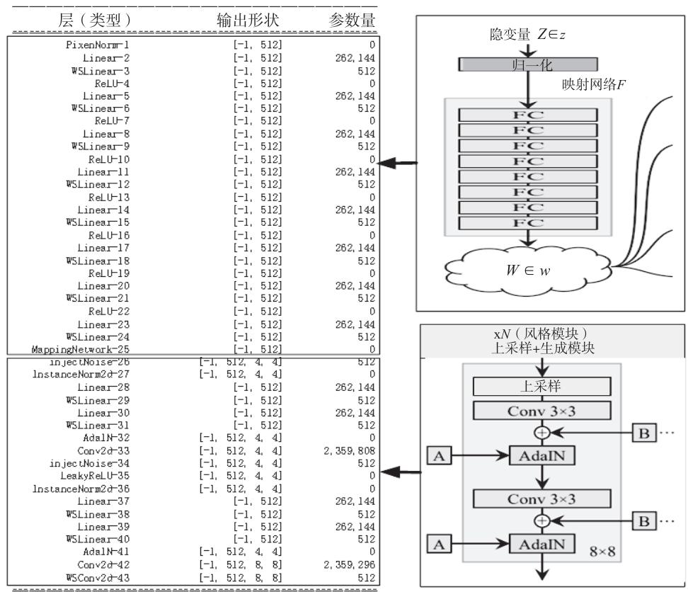  
图 5-9 生成网络结构

# （1）构建 WSLinear

映射网络由 8 层 WSLinear 构成，构建 WSLinear 类，它将继承自 nn.Module。在初始化部分，输入 in_features 和 out_features。创建一个线性层，然后定义一个比例，该比例为2 的平方根除以 in_features，将当前列层的偏移复制到一个变量中，因为我们不希望线性层的偏移被缩放，然后将其移除，最后初始化线性层。在正向部分，输入 x，用上述比例乘以x，并添加偏差。具体实现代码如下：

```python
class WSLinear(nnModule): def __init__(self, in_features, out_features): super(WSLinear, self).__init__(self.linear = nn.Linear(in_features, out_features) self.scale = (2/in_features) ** 0.5 
```

（2）构建映射网络  
```python
self.bias = self.linear.bias
self.linear.bias = None
# 对权重和偏置进行初始化
nn.init.normal_(self.linear.weight)
nn.init.zeros_(self.bias)
def forward(self, x):
    # 对x进行缩放
    return self.Linear(x * self.scale) + self.bias 
```

```python
class MappingNetwork(nnModule): def __init__(self, Z_DIM, w_dim): super().__init_(   ) self.maping = nn.Sequential( PixelNorm(), WSLinear(Z_DIM, w_dim), nn.ReLU(), WSLinear(w_dim, w_dim), nn.ReLU(), WSLinear(w_dim, w_dim), nn.ReLU(), WSLinear(w_dim, w_dim), nn.ReLU(), WSLinear(w_dim, w_dim), nn.ReLU(), WSLinear(w_dim, w_dim), nn.ReLU(), WSLinear(w_dim, w_dim), nn.ReLU(), WSLinear(w_dim, w_dim), nn.ReLU(), WSLinear(w_dim, w_dim),) def forward(self,x): return self.maping(x) 
```

映射网络的输出交给 AdaIN 处理。

（3）构建 AdaIN 类

构建 AdaIN 类的具体代码如下。

```txt
class AdaIN(nnModule): def __init__(self, channels, w_dim): super().__init__(# 对 x 实例归一化
```

```python
self.instance_norm = nnInstanceNorm2d(channels)
# 对w进行仿射变换，生成ys、yb
self.style_scale = WSLinear(w_dim, channels)
self.style.bias = WSLinear(w_dim, channels)
def forward(self,x,w):
    x = self.instance_norm(x)
    style_scale = self.style_scale(w).unsqueeze(2).unsqueeze(3)
    style.bias = self.style.bias(w).unsqueeze(2).unsqueeze(3)
    return style_scale * x + style.bias 
```

构建 AdaIN 类，在初始化部分，输入通道数及 w_dim，并初始化 instance_norm，它是实例规范化部分，初始化 style_scale 和 style_bias 两个参数，它们是 WSLinear 的自适应部分，WSLinear 将噪声映射网络 w 映射到通道中。在正向传播部分，输入 x，对其应用实例规范化，并返回 style_sclate*x+style_bias。

# （4）创建类 InjectNoise

InjectNoise 类实现图 5-9 中的卷积层输出 ( )+ 噪声（B）功能，将噪声注入生成器，具体代码如下。

class injectNoise(nnModule): def __init__(self, channels): super().__init_(self.weight = nn.Parameters(torch.zeros(1,channels,1,1)) def forward(self,x): noise $=$ torch.randn((x.shape[0],1,x.shape[2],x.shape[3]),device $\equiv$ x.device) return $\mathbf{x}+$ self.weight $^+$ noise

在初始化部分，输入通道数，用随机正态分布初始化权重，并使用 nn.Parameter 来优化这些权重。在正向传播部分，我们发送一个图像 x，并在返回时添加随机噪声。

# （5）构建生成模块

生成模块由 Conv- $\cdot >$ AdaIN- $\cdot >$ Conv- $\therefore > .$ AdaIN 构成，如图 5-10 所示。

  
图 5-10 生成模块的架构图

在生成器的体系结构中，我们有一些重复的模式，所以需要先为这些模式创建一个类，以使整个代码尽可能简单明了，将从 nn.Module 继承的类命名为 GenBlock。具体代码如下：

```python
class GenBlock(nnModule): def __init__(self, in_channel, out_channel, w_dim): super(GenBlock, self).__init_(self.conv1 = WSCnv2d(in_channel, out_channel) self.conv2 = WSCnv2d(out_channel, out_channel) self.leaky = nn.LeakyReLU(0.2, inplace=True) self.inject_noise1 = injectNoise(out_channel) self.inject_noise2 = injectNoise(out_channel) self.adain1 = AdaIN(out_channel, w_dim) self.adain2 = AdaIN(out_channel, w_dim) def forward(self, x,w): x = self.adain1(self.leaky(self.inject_noise1(self.conv1(x))), w) x = self.adain2(self.leaky(self.inject_noise2(self.conv2(x))), w) return x 
```

# （6）构建生成器

把前面这些模块进行组合，就构成了 StyleGAN 的生成器，具体代码如下：

class Generator(nnModule): def __init__(self, Z_DIM, w_dim, in_channels, img_channels=3): super().__init__( ） #生成常数项输入，形状为 $4\times 4$ self.starting_cte $\equiv$ nn_PARAMETER(torch.ones(1,in_channels，4,4)) self.map $\equiv$ MappingNetwork(Z_DIM,w_dim) self.initial_adain1 $\equiv$ AdaIN(in_channels,w_dim) self.initial_adain2 $\equiv$ AdaIN(in_channels,w_dim) #对应卷积层输出 $(\mathbf{x})+$ 噪声(B) self.initial_noise1 $\equiv$ injectNoise(in_channels) self.initial_noise2 $\equiv$ injectNoise(in_channels) self.initial_conv $\equiv$ nn.Conv2d(in_channels，in_channels，kernel_size=3，stride=1, padding=1) self.leaky $\equiv$ nn.LeakyReLU(0.2，inplace=True) self.initialrgb $\equiv$ WSConv2d( in_channels，img_channels，kernel_size $= 1$ ，stride $= 1$ ，padding $= 0$ ） self(prog_blocks，self rgb_layers $\equiv$ ( nn ModuleList([]), nnModuleList([self.initialrgb])

）for i in range(len(factors)-1):conv_in_c $=$ int(in_channels \* factors[i])conv_out_c $=$ int(in_channels \* factors[i+1])selfprog_blocks.append(GenBlock(conv_in_c,conv_out_c,w_dim))self.rgb_layers.append(WSConv2d(conv_out_c，img_channels，kernel_size $= 1$ stride $= 1$ ，padding $= 0$ ）def fade_in(self,alpha,upscaled,generated):return torch.tanh(alpha \* generated + (1-alpha） \* upscaled)def forward(self, noise, alpha, steps):w $=$ self.map(noise)#第一个AdaIN $\mathbf{x} =$ self.initial_adain1(self.initial=noiselself.starting_cte),w)x $=$ self.initial_conv(x)#其他AdaINout $=$ self.initial_adain2(self.leaky(self.initial_noise2(x)),w)if steps $= = 0$ return self.initial_rgb(x)for step in range(steps):#进行上采样，每次扩充2倍upscaled $=$ F.interpolate(out, scale_factor $= 2$ ,mode $=$ 'bilinear')out $=$ self(prog_blocks[step](upscaled,w)final_upscaled $=$ self.rgb_layers[steps-1] (upscaled)final_out $=$ self.rgb_layers[steps](out)return self.fade_in(alpha, final_upscaled, final_out)

在初始化部分，让我们用常量 $4 \times 4$ （原始论文的 $\times 5 1 2$ 通道，在我们的例子中为 256）张量来初始化 starting_constant，该张量通过生成器的迭代，并通过映射网络进行映射。initial_adain1、initial_adain2 通 过 AdaIN 方 法 进 行 初 始 化；initial_noise1、initial_noise2由 InjectNoise 方法实现，这种方法可以保证输入信号的强度不会发生大幅度改变；initial_conv 由将 in_channels 映射到自身的转换层实现，并使用激活函数 Leaky ReLU，斜率设置为 0.2；initial_rgb 由 WSConv2d 方 法 实 现， 将 in_channels 映 射 到 img_channels 中， 对 于RGB，img_channels 值为 3；prog_blocks 由 ModuleList() 实现，它将包含所有渐进块，并通过 ModuleList() 进行存储；rgb_blocks 则包含所有 RGB 块。

为了注入新层（ProGAN 的原始组件），我们定义了 fade_in 函数，该函数接收 alpha、缩放和生成的部分作为输入，然后返回 torch.tanh(alpha * generated $^ +$ (1-alpha ) * upscaled)。这里使用 tanh 的原因是它将作为输出（生成的图像），使像素范围在 1 到 -1 之间。

在正向传播部分，我们发送噪声（Z_dim）、训练期间注入的 alpha 值（alpha 介于 0和 1 之间）以及正在使用的当前分辨率的步数，通过 map 函数获得中间噪声向量 W，并将

starting_constant 传 递 给 initial_noise1。 应 用 initial_noisel 和 W， 然 后 通 过 initial_conv 函数，并再次使用 leaky 激活函数添加 initial_noise2，并应用 initial_noise2 和 W。然后检查steps 是否为 0，如果是，则通过初始 RGB 进行处理，否则，在步长上进行循环。在每个循环中，进行放大操作，并通过与该分辨率相对应的渐进块进行处理。最后，将 alpha、final_out 和 final_upscaled 映射到 RGB 并进行处理后返回。

# 5.4.2 构建判别器网络

判别器网络的结构如图 5-11 所示，由卷积网络、加权缩放卷积模块（WSConv2d）等构成。

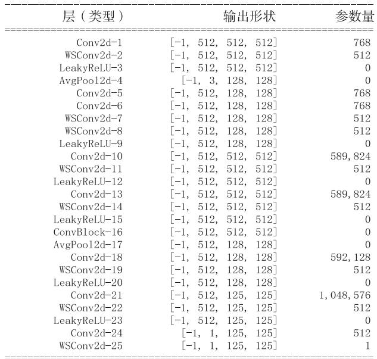  
图 5-11 判别器网络的结构

在 StyleGAN 中，判别器的转换层采用了 WSConv2d 类来进行卷积操作。这一操作的目的是实现转换层的均衡学习率。

在传统的卷积操作中，每个卷积核的权重都是独立的，而且仅通过权重的数值来决定卷积操作的影响程度。但在 StyleGAN 中，为了实现均衡学习率，引入了一种新型的卷积操作，即加权缩放卷积层。

加权缩放卷积层通过两个缩放因子来调整卷积核的权重。一个是均值缩放因子，用于调整卷积核的权重的初始值，这样可以使得卷积操作对不同的输入特征具有相对平衡的影响；另一个是标准差缩放因子，它用于调整卷积核权重的方差，用来控制激活值的变化幅度。

通过这样的加权缩放操作，可以实现在转换层中均衡学习率的效果，即使对于不同的

特征输入，卷积操作也能够保持相对平衡。这有助于提高判别器的稳定性和表达能力，从而提升模型的生成能力。

（1）创建 WSConv2d 类

class WSCnv2d(nnModule): def__init__( self,in_channels,out_channels,kernel_size $= 3$ ，stride $= 1$ ，padding $\equiv 1$ ）： super(WSCnv2d,self).__init_(self.conv $=$ nn.Conv2d(in_channels,out_channels,kernel_size，stride,padding) self.scale $=$ (2/(in_channels\* (kernel_size\*\*2)))\*\*0.5 self.bias $=$ self.conv.bias self.conv.bias $=$ None #初始化卷积层 nn.init.normal_self.conv.weight) nn.init.zeros_self.bias) defforward(self,x): #对卷积层的输入进行缩放 return self.conv(x\*self_scale)+self.bias.view(1,self.bias.shape[0]，1,1)

（2）构建卷积模块

卷积模块由两个加权缩放卷积层构成。

class ConvBlock(nnModule): def__init__(self，in_channels，out_channels)： super(ConvBlock，self).__init_(） self.conv1 $=$ WSCov2d(in_channels，out_channels) self.conv2 $=$ WSCov2d(out_channels，out_channels) self.leaky $\equiv$ nn.LeakyReLU(0.2) defforward(self,x): #卷积模块由两个卷积层构成，使用leaky激活函数 $\mathbf{x} =$ self.leaky(self.conv1(x)) $\mathbf{x} =$ self.leaky(self.conv2(x)) returnx

（3）构建判别器

Discriminator 类与 ProGAN 中的类相同。

```python
class Discriminator(nnModule): def __init__(self, in_channels, img_channels=3): super(Discriminator, self).__init__(self(prog_blocks, self rgb_layers = nn.ModuleList([]), nn.ModuleList[]) self.leaky = nn.LeakyReLU(0.2) 
```

# 基于分辨率递减列表 (factors) 进行由大到小逆推
# 使 prog_block 和 rgb 层的输入尺寸由大变小，先是 $1024 \times 1024$ ，然后是 512、256 等
for i in range(len(factors) - 1, 0, -1):
    conv_in = int(in_channels * factors[i])
    conv_out = int(in_channels * factors[i - 1])
    selfprog_blocks.append(ConvBlock(conv_in, conv_out))
    self.jpeg_layers.append(   )
        WSConv2d(img_channels, conv_in, kernel_size=1, stride=1, padding=0)
    )
# initialrgb 表示颜色 RGB 的 $4 \times 4$ 大小的层
# 该层“镜像”生成器的 initialrgb 层
self.initialrgb = WSConv2d(
    img_channels, in_channels, kernel_size=1, stride=1, padding=0
)
self.jpeg_layers.append(self.initialrgb)
self(avg_pool = nn.AvgPool2d(
    kernel_size=2, stride=2)
) # 使用平均池化实现下采样
# 输入形状是 $4 \times 4$ self.final_block = nn.Sequential(
    # in_channels+1 是因为需要与 MiniBatch std 拼接
WSConv2d(in_channels + 1, in_channels, kernel_size=3, padding=1),
nn.LeakyReLU(0.2),
WSConv2d(in_channels, in_channels, kernel_size=4, padding=0, stride=1),
nn.LeakyReLU(0.2),
WSConv2d(
    in_channels, 1, kernel_size=1, padding=0, stride=1),
), # 使用卷积层替换全连接层
)
def fade_in(self, alpha, downscaled, out):
    "" 使用 avg pooling 和 CNN 的输出实现缩放 ""
# alpha 是 [0, 1] 范围内的标量，并且 upscale.shape == generated.shape
return alpha * out + (1 - alpha) * downscaled
def minibatch_std(self, x):
    batch_statistics = (
        torch.std(x, dim=0).mean().repeat(x.shape[0], 1, x.shape[2], x.shape[3])
    )
# 对每个示例（跨所有通道和像素）采用标准差，然后将其重复多次，最后，沿通道将其与图像连接起来
# 通过这种方式，判别器将获得有关批次、图像变化的信息
return torch.cat([x, batch_statistics], dim=1)
def forward(self, x, alpha, steps):
    return (wNorm convolutional layers)

# 根据 prog_blocks 列表，如果 steps=1，表示从倒数第二个开始，  
# 此时 input_size 为 $8 \times 8$ # 如果 steps==0，那么就使用 $4 \times 4$ 块  
cur_step = len(selfprog_blocks) - steps  
# RGB 层依赖于图像大小（每个图像都位于 RGB 层上）  
out = self.leaky(self rgb_layers[cur_step](x))  
if steps == 0: # i.e, image is 4x4  
    out = self.minibatch_std(out)  
    return self.final_block(out).view(out.shape[0], -1)  
# 因为 prog_blocks 可能会改变通道，在缩小规模过程中，可以使用 rgb_layer  
# 先前或较小尺寸的层，这里使用索引 +1 的选择方式  
downscaled = self.leaky(self rgb_layers[cur_step + 1](self(avg_pool(x)))  
out = self(avg_pool(selfProg_blocks[cur_step](out))  
# fade_in 在采样和输入之间完成，与生成器相反  
out = self.fade_in(alpha, downscaled, out)  
for step in range(cur_step + 1, len(selfProg_blocks)):  
    out = selfProg_blocks[step](out)  
    out = self(avg_pool(out)  
out = self.minibatch_std(out)  
return self.final_block(out).view(out.shape[0], -1)

# 5.4.3 损失函数

# （1）判别器的损失函数

StyleGAN 的判别器采用了 WGAN-GP 中的梯度惩罚项，增加梯度惩罚项是让判别函数尽量符合 1-Lipschitz 范数限制，即梯度的模始终小于 1，这样才能让判别器的求解结果逼近 Wasserstein 距离。但是 WGAN-GP 并未达到严格的 1-Lipschitz 范数限制，真正实现这一限制的是 SNGAN 中的谱归一化方法。最终 StyleGAN 的判别器损失函数为：

$$
\operatorname {L o s s} D = D (G (z)) - D (x) + \eta \cdot (\| \nabla T \| - 1) 2 + \varepsilon \cdot D (x) ^ {2} \tag {5.2}
$$

具体代码实现如下：

```python
loss_critic = (
    -(torch.mean(critic_real) - torch.mean(critic Fake))
    + LAMBDA_GP * gp
    + (0.001) * torch.mean(critic_real ** 2)
) 
```

其中：

critic_real $=$ critic(real, alpha, step)

critic_fake $=$ critic(gen(noise, alpha, step).detach(), alpha, step)

gp $=$ gradient_penalty(critic, real, fake, alpha, step, DEVICE)

（2）生成器的损失函数

$$
\operatorname {L o s s} G = - D (G (z))
$$

具体实现代码如下：

```python
loss_gen = -torch.mean(gen_generate) 
```

其中，gen_fake $=$ critic(gen(noise, alpha, step), alpha, step)。

# 5.5 StyleGAN 的最新进展

StyleGAN 是由 NVIDIA 提出的 GAN 模型，通过生成逼真且高分辨率的图像而受到广泛关注。以下是 StyleGAN 模型的各个版本的特点及其发展情况。

# 1. StyleGAN

● StyleGAN 是最早的版本，于 2018 年发表。  
● 它的特点是通过引入 Style-based 的生成器架构，实现了对图像样式的可控性。  
● StyleGAN 通过在生成器中使用 AdaIN 来控制每个样式层的样式。  
该版本在生成逼真和高分辨率图像方面取得了显著的突破。

# 2. StyleGAN2

● StyleGAN2 于 2019 年发表，是 StyleGAN 的进一步改进和优化版本。  
● 它提出了一种重新设计的生成器架构，称为 StyleGAN2-ADA。  
● StyleGAN2-ADA 在生成器中使用了新的网络结构和优化策略，以提升生成图像的质量和稳定性。  
● StyleGAN2-ADA 引入了可调整的学习率和数据增强等技术，使训练更加高效和可控。

# 3. StyleGAN3

● StyleGAN3 的特点包括更加复杂的生成器架构和更强的生成能力。  
● StyleGAN3 进一步提升了图像质量、减少训练时间，并引入新的技术和算法。

# 5.5.1 StyleGAN2 简介

StyleGAN 的不足主要集中在两个方面：一是训练时间较长。由于 StyleGAN 引入了许多复杂的设计，包括分层的潜在空间表示、风格变量和可微的噪声注入等，因此其训练时间相对传统的 GAN 模型更长。二是模型较大。由于 StyleGAN 采用了分层的设计和多个网络模块，因此其模型比传统的 GAN 模型更大。为了改进这些问题，研究人员提出了

StyleGAN 的改进版—StyleGAN2。StyleGAN2 做了以下改进：

# （1）更快的训练速度

StyleGAN2 采用了一种新的调整学习率的方法，称为“动态学习率缩放”。这种方法能够加速模型的收敛速度，并且在训练过程中节省计算资源。

# （2）更小的模型

StyleGAN2 使用了一种新的网络结构，称为“显式归一化器”，它可以有效地缩小模型并提高生成图像的质量。

# （3）更好的生成效果

StyleGAN 中的水滴问题是由于生成器网络的特殊结构和训练过程中的优化目标产生的。具体来说，StyleGAN 中使用了 AdaIN 方法，该方法能够调整每个样本的特征图的均值和方差以使得生成的图像更加真实。在训练过程中，当某些分辨率的特征图的均值和方差变得非常小甚至接近于零时，会导致生成的图像出现明显的水滴状伪影。这是因为此时生成器无法正确地调整特征图的均值和方差，从而导致生成的图像出现明显的偏移。

另外，StyleGAN 中的生成器网络还采用了多分辨率的结构，通过逐渐增加分辨率来生成高质量的图像。在低分辨率时，由于特征图的空间尺度较大，可能会造成较大的空洞和断裂，进而导致生成的图像出现明显的伪影。

StyleGAN2 还优化了许多细节，例如改进了生成器的结构和损失函数，以提高生成图像的质量和多样性。

# 5.5.2 StyleGAN3 简介

StyleGAN3 是由 NVIDIA 提出的一种图像生成模型，它主要由三部分组成：生成器、判别器和投影器。其中，生成器是一个多层感知器网络，通过将噪声向量变换为逐渐复杂的特征表示来生成图像。判别器用于判定生成的图像是否真实，通过训练判别器，使其能够区分真实图像和生成图像。投影器则负责将图像映射到潜在空间中。

相较于 StyleGAN2，StyleGAN3 做了以下改进：

● 引入自适应权重标准化机制（Adaptive Weight Normalization，AWN）：AWN 能够针对每个样本动态地归一化网络权重，以此减少面部失真现象，提高生成器的表现能力。  
● 引入多级中间表示（Multi-Scale Interpolation）：在 StyleGAN2 中，所有层的特征图都以同样的方式进行插值。而在 StyleGAN3 中，根据特征图的尺寸采用不同的插值方式，这可以提高处理大分辨率图像时的效率。  
. 改进了噪声注入方法和训练策略：在 StyleGAN3 中，增加了一个可学习的噪声向量，可以通过调整这个噪声向量来控制生成图像的风格。此外，引入了一种新的训练策略，称为“微扰样本”，可以提高生成图像的质量和多样性。

总体来说，StyleGAN3 相对于 StyleGAN2 在生成图片的质量、多样性和效率上都有所提高。

# 5.5.3 StyleGAN 与 DeepDream 模型的异同

StyleGAN 模型和 DeepDream 模型都是基于神经网络的图像生成技术，但有一些区别。首先，StyleGAN 模型是一种 GAN 模型，而 DeepDream 模型则是一种 CNN 模型。GAN 和CNN 在设计上有很大不同，GAN 主要是通过生成器和判别器两个网络相互对抗来实现图像生成，而 CNN 则是通过多层卷积神经网络提取特征并进行分类或者回归等任务。

其次，StyleGAN 模型能够生成高度逼真的图像，同时还能控制生成图像的样式和属性，比如头发、眼睛、面部表情等。而 DeepDream 模型则更注重对已有图像的变换和加工，可以将一张普通的照片变成抽象艺术品般的风格。

最后，从技术上来讲，StyleGAN 模型使用了一系列先进的算法和技巧，比如渐进式训练、AdaIN 等，使得其生成的图像更加逼真、多样化并且具有可控的属性，而 DeepDream模型相对来说比较简单，没有那么复杂的算法和技巧。

# 5.6 DragGAN 简介

DragGAN 是一种基于 GAN 的图像风格迁移模型，其架构的核心组件如下。

$\bullet$ 编码器：将输入的图像转换为潜在空间的表示。  
$\bullet$ 风格编码器：学习不同风格的潜在空间表示。  
$\bullet$ 生成器：从潜在空间的表示中生成新的图像。  
判别器：判别生成的图像是否与真实图像相似。

DragGAN 的训练过程采用了两个损失函数：重建损失和风格损失。重建损失用于保留原始图像的内容信息，风格损失用于实现图像的风格迁移。具体来说，风格损失是通过比较生成图像的风格编码器输出和目标风格编码器输出之间的距离来计算的。

相对于传统的 GAN，DragGAN 在以下几个方面做了改进。

1）引入自注意力机制：DragGAN 使用了一种新颖的基于自注意力机制的上采样方式，能够更好地保留图像的细节信息并生成更加逼真的高分辨率图像。  
2）引入残差连接：DragGAN 在生成器中引入了残差连接，使得生成器可以跨层学习低、中、高层次的特征，并且更快收敛。  
3）引入多尺度判别器：DragGAN 中使用了一个包含多个判别器的多尺度判别器，可以有效提升模型的性能和稳定性。  
4）引入可变形卷积：DragGAN 采用了可变形卷积来替代传统的卷积操作，可以更好地处理对象的形变和旋转等情况，从而提升模型的表现力。

# 第 6 章

# 风格迁移

风格迁移是一种技术，可以将一张图像的风格与另一张图像的内容进行结合，创造出具有新风格的图像。这一技术广泛应用于艺术创作、图像编辑等领域。其中，DeepDream模型是一种基于卷积神经网络的图像生成算法，可以通过在原始图像上应用一系列图像卷积操作，使图像中的特定模式得到放大和增强。

而风格损失和内容损失是在进行风格迁移时使用的重要概念。风格损失是通过比较两张图像的特征映射之间的差异来衡量它们的风格相似性，而内容损失则通过比较两张图像的特征映射之间的差异来衡量它们的内容差异。通过最小化总体损失函数，我们可以在保留原始图像内容的同时，将其风格与另一张图像的风格进行融合。

# 6.1 DeepDream 模型

卷积神经网络取得了突破性进展，效果也非常理想，但其过程一直像谜一样困扰着大家。为了揭开卷积神经网络的神秘面纱，人们探索了多种方法，如把这些过程可视化。但是，卷积神经网络是如何学习特征的？这些特征有哪些作用？如何可视化这些特征？这正是 DeepDream 解决的问题。

# 6.1.1 DeepDream 的原理

DeepDream 为了说明 CNN 学习到的各特征的意义，采用了放大处理的方式。具体来说，就是使用梯度上升的方法可视化网络每一层的特征，即将一张噪声图像输入网络，在反向更新时不更新网络权重，而是更新原始图像的像素值，以这种“训练图像”的方式来可视化网络。

DeepDream 是如何放大图像特征的？这里我们先看一个简单实例。比如有一个网络学习了分类猫和狗的任务，现在给这个网络提供一张云的图像，这朵云可能比较像狗，那么机器提取的特征可能也会像狗。假设一个特征最后的输入概率为 [0.6, 0.4]，0.6 表示为狗的概率，0.4 表示为猫的概率，那么采用 L2 范数可以很好地达到放大特征的效果。对于一个特征 $L 2 = x 1 ^ { 2 } + x 2 ^ { 2 }$ ，若 $x 1$ 越大， $x 2$ 越小，则 $L 2$ 越大，那么只需要最大化 L2 就能保证当$x 1 { > } x 2$ 时，迭代的轮数越多， $x 1$ 越大， $x 2$ 越小，即图像就会越来越像狗。每次迭代相当于计算一次 $L 2$ 范数，然后用梯度上升的方法调整图像。优化的不再是权重参数，而是特征值或像素点，因此，在构建损失函数时，我们不使用交叉熵，而是使用最大化特征值的 L2 范数，使图像经过网络之后提取的特征更像网络隐含的特征。

以上是 DeepDream 的基本原理，具体实现的时候还要通过多尺度、随机移动等方法获取比较好的结果。后续在代码部分会给出详细解释。

# 6.1.2 DeepDream 算法的流程

将基本图像输入预训练的 CNN 中，然后正向传播到特定层。为了更好地理解该层学到了什么，我们需要最大化该层的激活值。以该层输出为梯度，在输入图像上完成渐变上升，以最大化该层的激活值。不过，仅这样做并不能产生好的图像。为了提高训练质量，我们还需要使用一些技术来使得到的图像更好。我们可以进行高斯模糊以使图像更平滑，也可以使用多尺度（又称为八度）的图像进行计算。也就是说，先连续缩小输入图像，再逐步放大，然后将结果合并为一个图像进行输出。

我们把上面的过程用图 6-1 来说明。

  
图 6-1 DeepDream 流程图

先对图像连续做两次等比例缩小，缩小图像是为了让图像的像素点调整后所得结果图像能显示得更加平滑。缩小两次后，把图像的每个像素点当作参数，对它们求偏导，这样就可以知道如何调整图像像素点，以使给定网络层的输出受到最大化的刺激。

# 6.1.3 使用 PyTorch 实现 DeepDream

使用 DeepDream 需解决两个问题，即如何获取有特殊含义的特征以及如何表现这些特征。

针对第一个问题，我们通常使用预训练模型，这里选择 VGG19 预训练模型。VGG19预训练模型是基于 ImageNet 大数据集训练的模型，该数据集共有 1000 个类别。针对第二个问题，可以把这些特征最大化后展示在一张普通的图像上，该图像为星空图像。

为了使训练更加有效，我们还需要使用一点小技巧，即对图像进行不同大小的缩放，并对图像进行模糊或抖动等处理。

注意，这里需要下载预训练模型及两个函数（一个是 prod，另一个是 deep_dream_vgg）。下面来看具体实现过程。

（1）下载预训练模型

```txt
下载预训练模型VGG19  
vgg = models.vgg19(pretrained=True)  
vgg = vgg.to(device)  
print(vgg)  
modulelist = list(vgg/features/modules()) 
```

（2）定义函数 prod

prod 属于 deep_dream 代码，传入输入图像，正向传播到 VGG19 的指定层（如第 8 层或第 32 层等），然后用梯度上升更新输入图像的特征值。详细代码如下：

```python
def prod(image, layer, iterations, lr):
    input = preprocess(image).unsqueeze(0)
    input = input.to(device).requires_grad(True)
    vgg.zero_grad()
    for i in range(iterations):
        out = input
        for j in range(layer):
            out = moduleList[j+1](out)
        #以特征值的L2为损失值
        loss = out(norm())
        loss.backward()
        #使梯度增大 
```

with torch.no_grad(   ): input $+ =$ lr \* input.grad   
input $=$ input.squeeze() #交互维度   
input.transpose_(0,1)   
input.transpose_(1,2)   
#将数据限制在[0,1]内   
input $=$ np.clip(deprocess(input).detach().cpu().numpy(),0,1) im $=$ Image.fromarray(np uint8(input\*255))   
return im

（3）定义函数 deep_dream_vgg

deep_dream_vgg 是一个递归函数，多次缩小图像，然后调用函数 prod。接着放大输出结果，并按一定比例与相应图像混合在一起，最终得到与输入图像相同大小的输出图像。详细代码如下：

```python
def deep_dream_vgg(image, layer, iterations, lr, octave_scale=2, numoctaves=20): if numoctaves>0: image1 = image.filter(ImageFilter.GaussianBlur(2)) if(image1.size[0]/octave_scale < 1 or image1.size[1]/octave_scale<1): size = image1.size else: size = (int(image1.size[0]/octave_scale), int(image1.size[1]/octave_scale)) #缩小图像 image1 = image1 resize(size, Image.ANTIALIAS) image1 = deep_dream_vgg(image1, layer, iterations, lr, octave_scale, num_ octaves-1) size = (image.size[0], image.size[1]) #放大图像 image1 = image1resize(size, Image.ANTIALIAS) image = ImageChopsblend(image, image1, 0.6) img_result = prod(image, layer, iterations, lr) img_result = img_resultresize(image.size) plt.imshow(img_result) return img_result 
```

（4）输入图像并查看运行结果

```txt
night skies = load_image('data/starry_night.jpg') 
```

运行结果如图 6-2 所示。

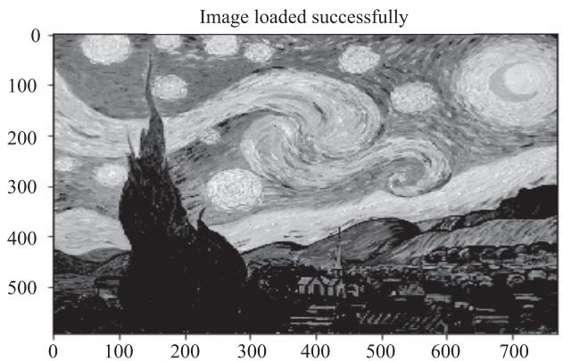  
图 6-2 运行结果

下列代码表示使用 VGG19 的第 4 层：

night skies4 $=$ deep_dream_vgg(night_sky，4，6，0.2)

运行结果如图 6-3 所示。

  
图 6-3 VGG19 的第 4 层学到的特征

下列代码表示使用 VGG19 的第 8 层：

```txt
night skies 8 = deep_dream_vgg(night_sky, 8, 6, 0.2) 
```

运行结果如图 6-4 所示。

下列代码表示使用 VGG19 的第 32 层：

```python
night skiesy_32 = deep_dream_vgg(night_sky, 32, 6, 0.2) 
```

运行结果如图 6-5 所示。

  
图 6-4 VGG19 的第 8 层学到的特征

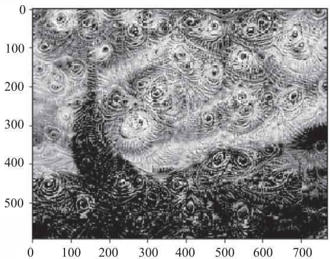  
图 6-5 VGG19 的第 32 层学到的特征

从上面的结果可以看出，越靠近顶部的层，其激活值表现就越全面或抽象，如像某些类别（比如狗）的图案。

# 6.2 普通风格迁移

6.1 节已经介绍了利用 DeepDream 显示一个卷积网络某一层学到的一些特征，这些特征从底层到顶层，其抽象程度是不一样的。实际上，这些特征还包括风格等重要信息，风格迁移目前涉及 3 种风格，具体如下。

● 普通风格迁移：其特点是固定风格、固定内容，这是一种经典的风格迁移方法。  
$\bullet$ 快速风格迁移：其特点是固定风格、任意内容。  
● 极速风格迁移：其特点是任意风格、任意内容。

本节主要介绍普通风格迁移。基于神经网络的普通图像风格迁移是德国的 Gatys 等人在 2015 年提出的，其主要原理是将参考图像的风格应用于目标图像，同时保留目标图像的内容，如图 6-6 所示。


  
图 6-6 一个风格迁移的示例

实现风格迁移的核心思想就是定义损失函数，所以如何定义损失函数成为解决问题的关键。这个损失函数应该包括内容损失和风格损失，用公式来表示就是：

loss $=$ distance(style(reference_image)-stylegenerated_image)) $^+$ distance(content(original_image)-content(generated_image))

那么，如何定义内容损失和风格损失呢？接下来进行具体介绍。

# 6.2.1 内容损失

由6.1节DeepDream的实例可知，卷积神经网络不同层学到的图像特征是不一样的。靠近底层（或输入端）的卷积层学到的是比较具体、局部的图像特征，如位置、形状、颜色、纹理等。靠近顶部或输出端的卷积层学到的是更全面、更抽象的图像特征，但会丢失图像的一些详细信息。基于这个原因，Gatys发现使用靠近底层但不能靠太近的层来衡量图像内容比较理想。图6-7是Gatys使用不同卷积层的特征值进行内容重建和风格重建的效果对比。

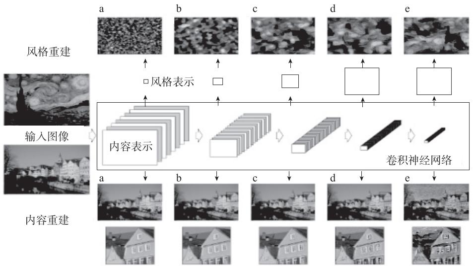  
图 6-7 使用不同卷积层进行内容重建和风格重建的效果对比

对于内容重建来说，使用原始网络的 5 个卷积层（conv1_1(a)、conv2_1 (b)、conv3_1(c)、conv4_1 (d) 和 conv5_1(e)），即图上方的 a、b、c、d、e。VGG 网络主要用来做内容识别，作者在实践中发现，使用前三层 a、b、c 已经能够较好地完成内容重建工作，d、e 两层保留了一些比较高层的特征，丢失了一些细节。

使用 PyTorch 实现内容损失函数的代码如下。

1）定义内容损失函数。

classContentLoss(nnModule): def__init__(self,target,）： super(ContentLoss，self).__init_(） #必须用detach来分离出target，这时target不再是一个变量， #这是为了动态计算梯度，否则前向传播会出错 self.target $=$ targetdetach()   
defforward(self，input): self.loss $=$ F.mse_loss(input,self.target) return input

2）在卷积层上求损失值。

content_layers $=$ ['conv_4']   
if name in content_layers: #累加内容损失 target $=$ model(content_img).detach() content_loss $=$ ContentLoss(target) model.add_module("content_loss{}".format(i)，content_loss) content.losses.append(content_loss)

# 6.2.2 风格损失

在图 6-7 中，在进行风格重建时，我们采用了 VGG 网络中靠近底层的一些卷积层的不同子集：

```txt
'conv1_1'(a)  
'conv1_1', 'conv2_1'(b)  
'conv1_1', 'conv2_1', 'conv3_1'(c)  
'conv1_1', 'conv2_1', 'conv3_1', 'conv4_1'(d)  
'conv1_1', 'conv2_1', 'conv3_1', 'conv4_1', 'conv5_1'(e) 
```

靠近底层的卷积层保留了图像的很多纹理、风格信息。由图 6-7 不难发现，d、e 的效果更好些。

如何衡量风格？ Gatys 采用了基于通道的格拉姆矩阵（Gram Matrix），即某一层的不同通道的特征图的内积。这个内积可以理解为该层特征之间相互关系的映射，这些关系反映

了图像的纹理统计规律。格拉姆矩阵的计算过程如图 6-8 所示。

  
图 6-8 格拉姆矩阵的计算过程

假设输入图像经过卷积后，得到的特征图为 [ch, h, w]，其中 ch 表示通道数，h、 $w$ 分别表示特征图的大小。经过展平和矩阵转置操作后，特征图可以变形为 [ch, h*w] 和 $[ h ^ { * } w$ ,ch] 的矩阵。再对两个矩阵做内积得到 [ch, ch] 大小的矩阵，这就是我们所说的格拉姆矩阵，如图 6-8 中的最后一个矩阵。

注意，图 6-8 中没有出现批量大小（batch size），这里假设 batch size $: = 1$ ，如果 batchsize 大于 1，则 $X$ 矩阵的形状应该是（batch size*ch， $w ^ { * } h$ ），

使用 PyTorch 实现风格损失函数的代码如下。

1）先计算格拉姆矩阵。

```python
def gram_matrix(input):
    a, b, c, d = input.size() # a表示批量的大小，这里batch size=1
    # b是特征图的数量
    # (c,d)是特征图的维度(N=c*d)
    features = input.view(a * b, c * d) # 对应图6-8中的X矩阵
    G = torch.mm(features, features.t())
    # 计算内积
    # 对格拉姆矩阵标准化，即除以特征图像素总数
    return G.div(a * b * c * d)
```

2）计算风格损失。

```python
class StyleLoss(nnModule): def __init__(self, target_feature): super(StyleLoss, self).__init__(self.target = gram_matrix(target_feature).detach() def forward(self, input): G = gram_matrix(input) self.loss = F.mse_loss(G, self.target) return input 
```

3）计算多个卷积层的累加。

```python
style_layers = ['conv_1', 'conv_2', 'conv_3', 'conv_4', 'conv_5']  
if name in style_layers:  
    # 累加风格损失  
    target_feature = model(style.img).detach()  
    style_loss = StyleLoss(target_feature)  
    model.addModule("style_loss{}".format(i), style_loss)  
    style.losses.append(style_loss) 
```

4）计算总损失值。

for sl in style_losses: style_score $+ =$ sl.loss for cl in content_losses: content_score $+ =$ cl.loss style_score $\ast =$ style_weight content_score $\ast =$ content_weight loss $=$ style_score $^+$ content_score

在计算总损失值时，对内容损失和风格损失是有侧重的，即需要为各自的损失值加上权重。

# 6.2.3 使用 PyTorch 实现神经网络风格迁移

这里使用的预训练模型还是 6.1.3 节使用的 VGG19 模型，输入数据包括一张代表内容的图像（上海外滩）和一张代表风格的图像（梵高的星空）。主要步骤如下。

1）导入数据，并进行预处理。

#指定输出图像大小  
imsize $= 512$ if torch.cuda.is-available() else 128  
imsize_w=600  
#对图像进行预处理  
loader $=$ transformsCompose([transforms Resize((imsize,imsize_w)),transforms.ToTensor())])  
def imageloader(image_name):image $=$ Image.open(image_name)#增加一个维度，其值为1，这是为了满足神经网络对输入图像的形状要求image $=$ loader(image).unsqueeze(0)return image.to(device,torch.float)  
style.img $=$ imageloader("\\data/starry-sky.jpg")  
content.img $=$ imageloader("\\data/shanghai_buildings.jpg")

```python
print("style size:", style_img.size())
print("content size:", content_img.size())
assert style_img.size() == content_img.size(), "we need to import style and content images of the same size" 
```

2）显示图像。

unloader $=$ transforms.ToPIIImage()   
plt/ion()   
defimshowtensor，title $\equiv$ None): image $=$ tensor.cpu().clone(）#为避免因image修改而影响tensor的值，这里采用clone方法 image $=$ image.squeeze(0)#去掉批量这个维度 image $=$ unloader(image) plt.imshow(image) if title is not None: plt.title(title) plt.pause(0.001)   
plt.figure()   
imshow(style_img，title $\equiv$ 'Style Image')   
plt.figure()   
imshow(content_img，title $\equiv$ 'Content Image')

运行结果如图 6-9 和图 6-10 所示。

  
图 6-9 梵高的星空作为风格图像

  
图 6-10 上海外滩作为内容图像

3）下载预训练模型。

```python
cnn = models.vgg19(pretrained=True).features.to(device).eval()
# 查看网络结构
print(cnn)
```

对于获取的预模型，无须更新权重，故把特征设置为 eval() 模式，而非 train() 模式。

4）选择优化器。

```python
def get_input_OPTimizer(input_img):
    # 这里需要对输入图像进行梯度计算，故设置为requires_grad()
    optimizer = optim.LBFGS([input_imgrequires_grad])
    return optimizer
```

5）构建模型。

```python
# 为计算内容损失和风格损失，指定使用的卷积层
content_layers_default = ['conv_4']
style_layers_default = ['conv_1', 'conv_2', 'conv_3', 'conv_4', 'conv_5']
def get_style_model_and.losses(cnn, normalization_mean, normalization_std, style.img, content.img,
content_layers=content_layers_default,
style_layers=style_layers_default):
    cnn = copy.deepcopy(cnn)
# 标准化模型
normalization = Normalization(normalization_mean, normalization_std).to(device)
# 初始化损失值
content_losses = []
style_losses = []
# 使用 Sequential 方法构建模型
model = nn.Sequential(normalization)
i = 0 # 每次迭代增加 1
for layer in cnn.children():
    if isinstance(layer, nn.Conv2d):
        i += 1
        name = 'conv{}_'.format(i)
    elif isinstance(layer, nn.ReLU):
        name = 'relu{}_'.format(i)
        layer = nn.ReLU(inplace=False)
    elif isinstance(layer, nn.MaxPool2d):
        name = 'pool{}_'.format(i)
    elif isinstance(layer, nn.BatchNorm2d):
        name = 'bn{}_'.format(i)
    else:
        raise ValueError('Unrecognized layer: {}.format(layer.__class__._name____))
    model.add_module(name, layer)
if name in content_layers:
    # 累加内容损失
target = model(content_img).detach() 
```

6）训练模型。  
content_loss $\equiv$ ContentLoss(target) model.addModule("content_loss{}".format(i)，content_loss) content.losses.append(content_loss) ifname in style_layers: #累加风格损失 target_feature $=$ model(style_img).detach() style_loss $\equiv$ StyleLoss(target_feature) model.add_module("style_loss{}".format(i)，style_loss) style.losses.append(content_loss) #对在内容损失和风格损失之后的层进行修剪 fori in range(len(model)-1，-1，-1): ifisinstance(model[i],ContentLoss）orisinstance(model[i]，StyleLoss): break model $=$ model[(i+1)] return model，style_losses，content_losses

```python
def run_style_transfer(cnn, normalization_mean, normalization_std,
content_img, style_img, input_img, num_steps=300,
style_weight=1000000, content_weight=1):
    '''Run the style transfer.'''
print('Building the style transfer model.'] 
model, style_losses, content_losses = get_style_model_and.losses(cnn,
normalization_mean, normalization_std, style_img, content_img)
optimizer = get_input_OPTimizer(input_img)
print('Optimizing.'] 
run = [0] 
while run[0] <= num_steps:
    def closure():
        input_img.data.clamp(0, 1)
        optimizer.zero_grad()
        model(input_img)
        style_score = 0
        content_score = 0
        for sl in style_losses:
            style_score += sl.loss
        for cl in content_losses:
            content_score += cl.loss
        style_score *= style_weight
        content_score *= content_weight
        loss = style_score + content_score 
```

loss.backup()   
run[0] $+ = 1$ if run[0] $\%$ 50 $= =$ 0: print("run {}:".format(run)) print('Style Loss : \{4f\} Content Loss: \{4f\}''.format( style_score.item(), content_score.item())) print() return style_score + content_score optimizer step(closure)   
input_img.data.clamp_(0,1)   
return input_img

7）运行代码并查看结果，如图 6-11 所示。

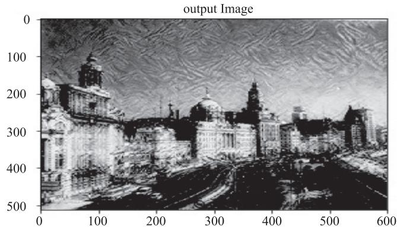  
图 6-11 通过风格迁移后的上海外滩

# 6.3 使用 PyTorch 实现图像修复

近些年，深度学习在图像修复（Image Inpainting）领域取得重大进展，方法很多，但基本原理类似。本节介绍一种基于编码器与解码器网络结构的图像修复方法。

# 6.3.1 网络结构

这里用来图像修复的网络结构称为上下文编码器（Context Encoder），主要由编码器 -解码器构成。但是，编码器与解码器之间不是普通的全连接层，而是采用与通道等宽的全连接层，利用这种网络层可大大降低参数量。此外，还有一个对抗判别器，用来区分预测值与真实值，这与生成对抗网络的判别器功能类似，具体网络结构如图 6-12 所示。

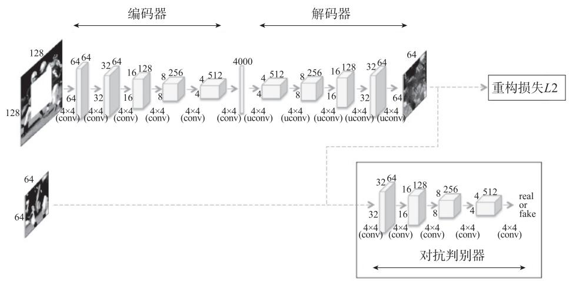  
图 6-12 上下文编码器 - 解码器架构

其中，解码器基于 AlexNet 网络，它由 5 个上卷积操作组成，通过这些操作，图像可以恢复到与原图相同的大小。

该网络之所以称为上下文，是因为采用了语言处理中根据上下文预测的原理，这里采用被损坏周围部分的图像特征来预测被损坏的部分。如何学习到被损坏的特征？这就涉及下面将介绍的损失函数。

# 6.3.2 损失函数

整个模型的损失值由重构损失（Reconstruction Loss）与对抗损失（Adversarial Loss）组成。重构损失的计算公式为：

$$
\mathcal {L} _ {\text {r e c}} (\chi) = \left\| \hat {M} \odot \left(\chi - F \left(\left(1 - \hat {M}\right) \odot \chi\right)\right) \right\| _ {2} ^ {2} \tag {6.1}
$$

其中， $\odot$ 为逐元素操作， $\hat { M }$ 为缺失图像的二进制掩码，1 表示缺失部分像素，0 表示输入像素。如果只有重构损失，修复的图像比较模糊，为解决这个问题，可增加一个对抗损失。

可以从多种可能的输出模式中选择一种对抗损失，换句话说，可以进行特定模式选择，使得预测结果看起来更真实。对抗损失的计算公式为：

$$
\mathcal {L} _ {\mathrm {a d v}} = \max  _ {D} E _ {x \in \chi} \left. \left\lceil \log (D (x)) + \log (1 - D (F ((1 - \hat {M}) \odot x))) \right)\left. \right\rfloor \tag {6.2}
$$

总的损失函数为重构损失与对抗损失的加权值。

$$
\mathcal {L} = \lambda_ {\mathrm {r e c}} \mathcal {L} _ {\mathrm {r e c}} + \lambda_ {\mathrm {a d v}} \mathcal {L} _ {\mathrm {a d v}} \tag {6.3}
$$

# 6.3.3 图像修复实例

为了让大家有一个直观的理解，这里使用一个预训练模型来实现图像修复，该预训练模型基于大量街道数据训练得到。

1）定义测试模型。

class netG(nnModule): def__init__(self,opt): super(netG,self).__init__(） #ngpu表示GPU个数，如果大于1，将使用并发处理 self.ngpu $=$ opt.ngpu self.main $\equiv$ nnSEQUENTIAL( #输入通道数为opt.nc，输出通道数为opt.nef nn.Conv2d(opt.nc,opt.nef,4,2,1，bias $\coloneqq$ False), nn.LeakyReLU(0.2，inplace $\equiv$ True), nn.Conv2d(opt.nef,opt.nef,4,2,1，bias $\equiv$ False), nn.BatchNorm2d(opt.nef), nn.LeakyReLU(0.2，inplace $\equiv$ True), nn.Conv2d(opt.nef,opt.nef\*2,4,2,1，bias $\equiv$ False), nn.BatchNorm2d(opt.nef\*2), nn.LeakyReLU(0.2，inplace $\equiv$ True), nn.Conv2d(opt.nef\*2,opt.nef\*4,4,2,1，bias $\equiv$ False), nn.BatchNorm2d(opt.nef\*4), nn.LeakyReLU(0.2，inplace $\equiv$ True), nn.Conv2d(opt.nef\*4,opt.nef\*8,4,2,1，bias $\equiv$ False), nn.BatchNorm2d(opt.nef\*8), nn.LeakyReLU(0.2，inplace $\equiv$ True), nn.Conv2d(opt.nef\*8,opt.nBottleneck,4，bias $\equiv$ False), #tate size:(nBottleneck)x1x1 nn.BatchNorm2d(opt.nBottleneck), nn.LeakyReLU(0.2，inplace $\equiv$ True), #采用转置卷积，opt.ngf为该层输出通道数 nn.ConvTranspose2d(opt.nBottleneck，opt.ngf $^{\star}$ 8，4，1，0，bias $\equiv$ False), nn.BatchNorm2d(opt.ngf $^{\star}$ 8), nn.ReLU(True), nn.ConvTranspose2d(opt.ngf $^{\star}$ 8，opt.ngf $^{\star}$ 4，4，2，1，bias $\equiv$ False), nn.BatchNorm2d(opt.ngf $^{\star}$ 4), nn.ReLU(True), nn.ConvTranspose2d(opt.ngf $^{\star}$ 4，opt.ngf $^{\star}$ 2，4，2，1，bias $\equiv$ False), nn.BatchNorm2d(opt.ngf $^{\star}$ 2), nn.ReLU(True),

nn.ConvTranspose2d(opt.ngf \* 2, opt.ngf, 4, 2, 1, bias=False), nn.BatchNorm2d(opt.ngf), nn.ReLU(True), nn.ConvTranspose2d(opt.ngf, opt.nc, 4, 2, 1, bias=False), nn.Tanh() def forward(self, input): if isinstance(input.data, torch.cuda FloatTensor) and self.ngpu $>1$ output $=$ nn_parallel.data_parallel(self.main, input, range(self.ngpu)) else: output $=$ self.main(input) return output

2）加载数据，包括加载预训练模型及测试图像等。

netG $=$ netG(opt)   
#加载预训练模型，其存放路径为opt.netG   
netG.load_state_dict(torch.load(opt.netG, map_location $\equiv$ lambda storage, location: storage)['state_dict'])   
netG.eval()   
transform $=$ transformsCompose([transforms.ToTensor(), transforms.Normalize((0.5,0.5,0.5)，(0.5，0.5，0.5))])   
#加载测试图像   
image $=$ load_image(opt.test_image，opt.imageSize)   
image $=$ transform(image)   
image $=$ imagerepeat(1，1，1，1)

3）保存图像。

```python
save_image('val_real_samples.png',image[0])   
save_image('val_cropped_samples.png',input_cropped.data[0])   
save_image('val_recon_samples.png',recon_image.data[0])   
print('%.4f' % errG.item()) 
```

4）查看修复后的图像。

```python
reconsPath = 'val_recon_samples.png'  
Image = mpimg.imread(reconsPath)  
plt.imshow(Image) # 显示图像  
plt.axis('off') # 不显示坐标轴  
plt.show() 
```

运行结果如图 6-13 所示。

  
图 6-13 修复后的图像

5）修复被损坏图像，结果如图 6-14 所示。

  
图 6-14 修复被损坏一块的图像示意

# 6.4 风格迁移与 StyleGAN 模型

风格迁移和 StyleGAN 模型在生成图像方面的目标是相似的，即以某种方式将输入的图像“转换”为具有所需风格或特点的图像。然而，它们在实现和方法上存在一些不同。

# （1）目标

风格迁移的目标是将一个图像的内容与另一个图像的风格融合在一起，生成一个新的图像，既保留了原始图像的内容特征，又具有目标图像的风格特征。

StyleGAN 的目标是从随机噪声向量中生成逼真的高分辨率图像，具有特定的风格和特征。

# （2）数据和训练

风格迁移通常需要一对图像作为输入，一张是内容图像，一张是风格图像，并通过训练一个模型或使用预训练的模型来进行转化。

StyleGAN 则需要大量的无标签图像数据进行训练，通常使用大规模的数据集（如CelebA-HQ）来训练生成器和判别器，以学习图像的特征分布和质量。

# （3）模型架构

风格迁移通常使用编码器 - 解码器结构，其中编码器提取内容特征，解码器结合内容

特征和风格特征生成合成图像。

StyleGAN 使用了 GAN 的架构，包括生成器和判别器。生成器通过学习生成逼真图像的分布，从随机噪声向量生成图像。判别器则通过学习区分真实图像和生成图像来提供反馈。

# （4）控制和可调节性

风格迁移可以通过控制输入图像的内容和风格图像的比例来调整生成图像的效果，从而实现对输出图像的精确控制。

StyleGAN 具有更高的可调节性，通过控制输入向量的特定维度，调整生成图像的各种特征和属性，例如发色、面部表情等。

综上可知，风格迁移更关注融合不同图像的内容和风格，生成一张具有两者特点的合成图像，而 StyleGAN 则专注于生成高质量、逼真的图像，具有特定的风格和特征，并提供更大范围的控制和可调节性。

# 第 7 章

# 注意力机制

在第 3、4 章中，我们探讨了生成模型在图像生成和潜在空间表示方面的应用。本章将进一步研究图像和序列任务中的注意力机制。

注意力机制是一种模仿人类注意力过程的计算机算法。它在机器学习和自然语言处理等领域被广泛应用。通过注意力机制，模型可以选择性地关注输入中的重要信息，从而提高模型在处理任务时的性能。

# 7.1 注意力机制简介

注意力机制的基本思想是，将输入序列中的每个元素（如词、像素等）与模型的当前状态进行比较，为每个输入元素分配一个权重值。这些权重值表示输入元素对当前状态的重要程度。然后，根据这些权重值，模型可以聚焦于最重要的元素，并对其进行进一步处理。

注意力机制的主要作用是让神经网络关注输入序列中最相关的部分，从而提高模型的性能。它可以解决长序列问题、输入和输出长度不同的问题，同时也能提升模型的泛化能力和鲁棒性。在机器翻译、文本摘要、对话、语音识别、图像分类等任务中，注意力机制已经被广泛应用。其主要应用有以下两种主要形式：

# （1）注意力汇聚

注意力汇聚（Attention Mechanism）是在深度学习中常用的一种注意力机制。在自然语言处理和计算机视觉等任务中，注意力汇聚允许模型根据输入的不同部分赋予不同的权重或重要性。例如，在机器翻译任务中，模型可以根据输入句子中的每个词的重要程度来选择性地关注，并在翻译输出时给予适当的注意。

# （2）自注意力

自注意力（Self-Attention）是注意力机制的一种特殊形式，广泛应用于序列数据，如文本序列或时间序列。它允许序列中的每个元素（例如单词或时间步）都能与其他元素相互交互，以计算它们之间的相关性。这使得模型能够捕捉序列中长距离的依赖关系，从而更好地理解序列的结构和上下文。

自注意力在 Transformer 模型中被引入，并在自然语言处理领域取得了巨大成功。它将输入序列中的每个元素视为查询（Query）、键（Key）和值（Value），通过计算它们之间的相关性，得到最终的表示。这种表示能够更好地捕捉序列中的语义关系，有助于完成各种任务，如机器翻译、文本生成和语言理解等。

# 7.1.1 两种常见的注意力机制

根据注意力范围的不同，人们又把注意力分为软注意力和硬注意力。

# （1）软注意力

软注意力（Soft Attention）是比较常见的注意力方式，对所有 key 求权重概率，每个key 都有一个对应的权重，是一种全局的计算方式（又称 Global Attention）。这种方式比较理性，它参考了所有 key 的内容，再进行加权，但是计算量可能会比较大。

# （2）硬注意力

硬注意力（Hard Attention）直接精准定位到某个键而忽略其他键，相当于这个键的概率是 1，其余键的概率全部是 0。因此，这种对齐方式要求很高，要求一步到位，但实际情况往往包含其他状态，如果没有正确对齐，将会带来很大的影响。

# 7.1.2 来自生活的注意力

注意力是我们与环境交互的一种天生的能力，环境中的信息丰富多彩，我们不可能对映入眼帘的所有事物都持有一样的关注度或注意力，而是一般只将注意力引向感兴趣的一小部分信息，这种能力就是注意力。

我们按照对外界的反应将注意力分为非自主性提示和自主性提示。非自主性提示是基于环境中物体的状态、颜色、位置、易见性等，不由自主地引起我们的注意。如图 7-1 中的这些活动的小动物，最初可能会自动引起小朋友的注意。

但过一段时间之后，他可能重点注意他喜欢的小汽车玩具上。此时，小朋友选择小汽车玩具是受到了认知和意识的控制，因此基于兴趣或自主性提示的吸引力更大，也更持久。

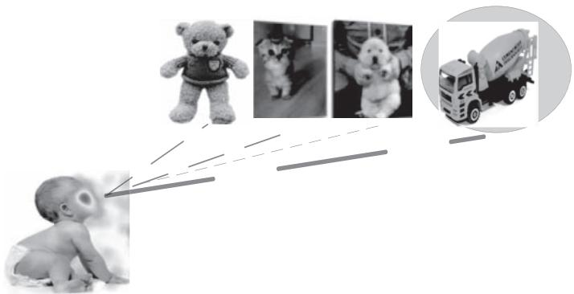  
图 7-1 注意力被自主关注到小汽车玩具上

# 7.1.3 注意力机制的本质

在注意力机制的背景下，我们将自主性提示称为查询（Query）。对于给定任何查询，注意力机制通过集中注意力选择感官输入，这些感官输入被称为值（Value）。每个值都与其对应的非自主提示的一个键（Key）成对，如图 7-2 所示。通过集中注意力，为给定的查询（自主性提示）与键（非自主性提示）进行交互，从而引导选择偏向值（感官输入）。

  
图 7-2 注意力机制通过集中注意力将查询和键结合在一起

可以把图 7-2 所示的注意力框架进一步抽象成图 7-3，这样更容易理解注意力机制的本质。在自然语言处理应用中，把注意力机制看作输出（Target）句子中某个单词和输入（Source）句子中每个单词的相关性是非常有道理的。

目标句子生成的每个单词对应输入句子中的单词的概率分布可以理解为输入句子单词和这个目标句子生成单词的对齐概率，这在机器翻译语境下是非常直观的：在传统的统计机器翻译过程中，一般会专门有一个短语对齐的步骤，而注意力机制的作用与此相同，可用图 7-3 进行直观表述。

  
图 7-3 注意力机制的本质

在图 7-3 中，Source 由一系列 <Key,Value> 数据对构成，对于给定 Target 中的某个元素 Query，通过计算 Query 和各个 Key 的相似性或相关性，得到每个 Key 对应 Value 的权重系数，然后对 Value 进行加权求和，即得到了最终的注意力值。所以本质上注意力机制是对 Source 中元素的 Value 值进行加权求和，而 Query 和 Key 用来计算对应 Value 的权重系数。可以将上述思想改写为如下公式：

$$
\text {A t t e n t i o n} (\text {Q u e r y}, \text {S o u r c e}) = \sum_ {i = 1} ^ {T} \text {S i m i l a r i t y} (\text {Q u e r y}, \text {K e y} _ {i}) \cdot \text {V a l u e} _ {i} \tag {7.1}
$$

其中，T 为 Source 的长度。

具体如何计算注意力呢？整个注意力机制的计算过程可分为 3 个阶段。

1）根据 Query 和 Key 计算两者的相似性或相关性，最常见的方法包括求两者的向量点积、求两者的向量 Cosine 相似性、引入额外的神经网络，这里假设求得的相似值为 si。计算 Query 和 Key 的相似性或相关性的常用公式如下：

以下 Query、Key、Value 分别用 $\varrho$ 、K、V 表示。

点积（dot product）：

$$
\mathrm {s i} = f \left(\boldsymbol {Q}, \boldsymbol {K} _ {i}\right) = \boldsymbol {Q} ^ {\mathrm {T}} \cdot \boldsymbol {K} _ {i} \tag {7.2}
$$

缩放点积（scaled dot product）：

$$
\mathrm {s i} = f \left(\boldsymbol {Q}, \boldsymbol {K} _ {i}\right) = \frac {\boldsymbol {Q} ^ {\mathrm {T}} \cdot \boldsymbol {K} _ {i}}{\sqrt {d}} \tag {7.3}
$$

其中， $\varrho$ 和 $\pmb { K } _ { i }$ 的长度相等，且都是 $d$ ，除以 $d$ 有利于控制相关性分数的范围。

● 神经网络：

$$
\mathrm {s i} = f \left(\boldsymbol {Q}, \boldsymbol {K} _ {i}\right) = \boldsymbol {W} _ {v} ^ {\mathrm {T}} \cdot \text {t h a n} \left(\boldsymbol {W} _ {q} \cdot \boldsymbol {Q} + \boldsymbol {W} _ {k} \cdot \boldsymbol {K} _ {i}\right) \tag {7.4}
$$

其中， $W _ { \nu }$ 、 $W _ { q }$ 、 $\mathbf { { \cal W } } _ { k }$ 为可学习的参数， $\varrho$ 和 $\pmb { K } _ { i }$ 的长度可以不相等。

2）对第 1 阶段的值进行归一化处理，得到权重系数。这里使用 softmax 计算各权重的值，计算公式为：

$$
\mathrm {a i} = \text {s o f t m a x (s i)} = \frac {\mathrm {e} ^ {\mathrm {s i}}}{\sum_ {j = 1} ^ {T} \mathrm {e} ^ {\mathrm {s j}}} \tag {7.5}
$$

3）用第 2 阶段的权重系数对 Value 进行加权求和。

$$
\text {A t t e n t i o n} (\mathrm {Q}, \text {S o u r c e}) = \sum_ {i = 1} ^ {T} \mathrm {a i} \cdot \boldsymbol {V} _ {i} \tag {7.6}
$$

以上 3 个阶段可表示为如图 7-4 所示的计算过程。

  
图 7-4 注意力机制的计算过程

那么在深度学习中如何通过模型或算法来实现这种机制呢？接下来我们介绍如何通过模型的方式来实现注意力机制。

# 7.2 带注意力机制的编码器 - 解码器架构

图 7-5 为一个一般编码器 - 解码器架构，其输入和输出都是长度可变的序列，编码器接收一个长度可变的序列作为输入，并将其转换为具有固定形状的语义编码 $C$ 。解码器将固定形状的语义编码映射到长度可变的序列。

  
图 7-5 编码器 - 解码器架构

在生成目标句子的单词时，不论生成哪个单词，如 $\pmb { y } _ { 1 }$ 、y2、 ${ \bf y } _ { 3 }$ 使用的句子 $X { = } ( x _ { 1 } , x _ { 2 } , x _ { 3 } , x _ { 4 } )$ 的语义编码 $C$ 都是一样的，没有任何区别。而语义编码 $C$ 是由句子 $X$ 的每个单词经过编码器编码生成的，这意味着不论是生成哪个单词，句子 $X$ 中任意单词对生成的某个目标单词$\mathbf { y } _ { i }$ 来说影响力都是相同的，没有任何区别。

我们以一个具体例子来说明，用机器翻译（输入英文输出中文）来解释这个分心模型的编码器 - 解码器架构更好理解，比如输入英文句子 Tom chase Jerry，编码器 - 解码器架构逐步生成中文单词：“汤姆”“追逐”“杰瑞”。

在翻译“杰瑞”这个中文单词时，分心模型中的每个英文单词对于翻译目标单词“杰瑞”的贡献是相同的，这不太合理，因为显然 Jerry 对于翻译成“杰瑞”更重要，但是分心模型无法体现这一点，这就是说它没有引入注意力机制的原因。

# 7.2.1 引入注意力机制

在输入句子比较短的时候，没有引入注意力机制估计问题不大，但是如果输入句子比较长，此时所有语义完全通过一个中间语义向量来表示，单词自身的信息已经消失，这样会丢失很多细节信息，这也是要引入注意力机制的重要原因。

在前面的例子中，如果引入注意力机制，则应该在翻译“杰瑞”时，体现出英文单词对于翻译当前中文单词不同的影响程度，比如给出类似下面的一个概率分布值：

```txt
(Tom,0.3)(Chase,0.2)(Jerry,0.5) 
```

每个英文单词的概率代表在翻译当前单词“杰瑞”时，注意力分配模型分配给不同英文单词的注意力大小。这对于正确翻译目标语单词肯定是有帮助的，因为引入了新的信息。同理，目标句子中的每个单词都应该学会其对应的源语句中单词的注意力分配概率信息。这意味着在生成每个单词 $y _ { i }$ 的时候，原先相同的中间语义表示 $C$ 会替换成根据当前生成单词而不断变化的 $C _ { i }$ ，即由固定的中间语义表示 $C$ 换成了根据当前输出单词而引入注意力机制的变化的 $C _ { i }$ 。增加了注意力机制的编码器 - 解码器架构如图 7-6 所示。

  
图 7-6 引入注意力机制的编码器 - 解码器架构

即生成目标句子单词的过程变成如下形式：

$$
y _ {1} = g \left(\boldsymbol {C} _ {1}\right) \tag {7.7}
$$

$$
y _ {2} = g \left(\boldsymbol {C} _ {2}, y _ {1}\right) \tag {7.8}
$$

$$
y _ {3} = g \left(C _ {3}, y _ {1}, y _ {2}\right) \tag {7.9}
$$

而每个 $C _ { i }$ 可能对应着不同的源语句中单词的注意力分配概率分布，比如对于上面的英汉翻译来说，其对应的信息可能如下：

$$
\boldsymbol {A} = \left[ \begin{array}{l l l} 0. 6 & 0. 2 & 0. 2 \\ 0. 2 & 0. 7 & 0. 1 \\ 0. 3 & 0. 2 & 0. 5 \end{array} \right] \tag {7.10}
$$

其中，第 $i$ 行表示 $y _ { i }$ 收到的所有来自输入单词的注意力分配概率。 $y _ { i }$ 的语义向量 $C _ { i }$ 由这些注意力分配概率与编码器对单词 $x _ { j }$ 的转换函数 $f _ { 2 }$ 相乘计算得出，例如：

$$
C _ {1} = C _ {\text {汤 姆}} = g \left(0. 6 f _ {2} \left(" \text {T o m}"\right), 0. 2 f _ {2} \left(" \text {C h a s e}"\right), 0. 2 f _ {2} \left(" J e r r y"\right)\right) \tag {7.11}
$$

$$
C _ {2} = C _ {\text {追 逐}} = g \left(0. 2 f _ {2} \left(" \text {T o m}"\right), 0. 7 f _ {2} \left(" \text {C h a s e}"\right), 0. 1 f _ {2} \left(" J e r r y"\right)\right) \tag {7.12}
$$

$$
C _ {3} = C _ {\text {杰 瑞}} = g \left(0. 3 f _ {2} \left(" \text {T o m}"\right), 0. 2 f _ {2} \left(" \text {C h a s e}"\right), 0. 5 f _ {2} \left(" J e r r y"\right)\right) \tag {7.13}
$$

其中， $f _ { 2 }$ 函数代表编码器对输入英文单词的某种变换函数，比如如果编码器是用的RNN 模型，这个 $f _ { 2 }$ 函数的结果往往是某个时刻输入 $x _ { i }$ 后隐层节点的状态值； $g$ 代表编码器根据单词的中间表示合成整个句子中间语义表示的变换函数，一般的做法中， $g$ 函数就是对构成元素加权求和，也就是下列公式：

$$
\boldsymbol {C} _ {i} = \sum_ {j = 1} ^ {T _ {x}} \boldsymbol {\alpha} _ {i j} h _ {j} \tag {7.14}
$$

假 设 $C _ { i }$ 中 的 $i$ 就 是 上 面 的“ 汤 姆 ”， 那 么 $T _ { x }$ 就 是 3， 代 表 输 入 句 子 的 长 度，$h _ { 1 } { = } f _ { 2 } ( ^ { { \ " } } \mathrm { T o m } ^ { { \ " } } )$ ， $\displaystyle h _ { 2 } { = } f _ { 2 }$ ("Chase")， $\boldsymbol { h } _ { 3 } { = } f _ { 2 }$ ("Jerry")，对应的注意力模型权值分别是 0.6、0.2、0.2，所以 $g$ 函数就是一个加权求和函数。更形象一点，翻译中文单词“汤姆”时，数学公式对应的中间语义表示 $C _ { i }$ 的形成过程可用图 7-7 表示。

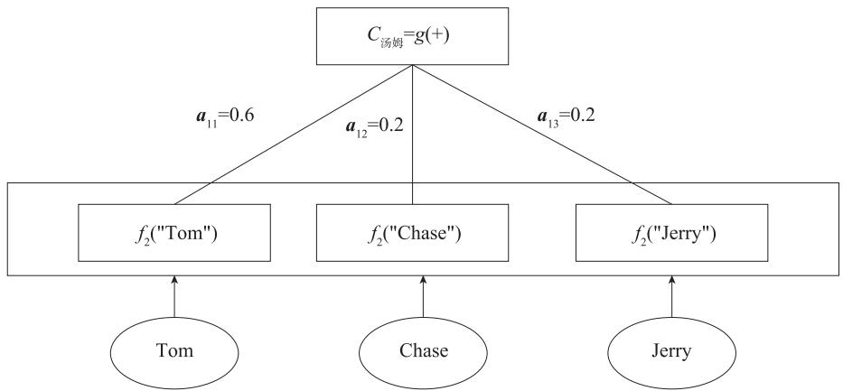  
图 7-7 $C _ { i }$ 的形成过程

这里还有一个问题：生成目标句子中的某个单词，比如“汤姆”时，怎么知道注意力模型所需要的输入句子中单词的注意力分配概率分布值呢？下一节将详细介绍。

# 7.2.2 计算注意力分配概率分布值

如何计算注意力分配概率分布值？为便于说明，假设对前文图 7-5 的未引入注意力机制的编码器—解码器架构进行细化，编码器采用 RNN 模型，解码器也采用 RNN 模型，这是比较常见的一种模型配置，如图 7-8 所示。

  
图 7-8 RNN 作为具体模型的编码器—解码器架构

图 7-9 可以较为便捷地说明注意力分配概率分布值的通用计算过程。

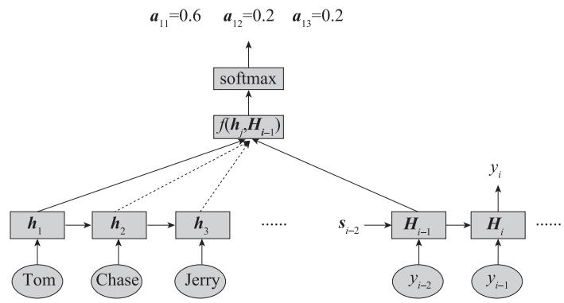  
图 7-9 注意力分配概率分布值的通用计算过程

我们的目的是计算生成 $y _ { i }$ 时，对输入句子中的单词 Tom、Chase、Jerry 的依赖程度，即对 $y _ { i }$ 的注意力分配概率分布。这些概率可以用目标输出句子i-1时刻的隐层节点状态 $\pmb { H } _ { i - 1 }$ 去一一与输入句子中每个单词对应的 RNN 隐层节点状态 $\pmb { h } _ { j }$ 进行对比，即通过对齐函数 $f ( \pmb { h } _ { j } , \pmb { H } _ { i - 1 } )$ 来获得目标单词与每个输入单词对应的对齐可能性。

函数 $f ( \pmb { h } _ { j } , \pmb { H } _ { i - 1 } )$ 的输出经过 softmax 进行归一化就得到了符合概率分布取值区间的注意力分配概率分布值（即得到了注意力权重）。

如图 7-9 所示，当输出单词为“汤姆”时，输出值为各单词的对齐概率。绝大多数注意力模型都采取上述计算框架来计算注意力分配概率分布值，区别只是函数 $f$ 在定义上可能有所不同。 $y _ { t }$ 值的生成过程如图 7-10 所示。

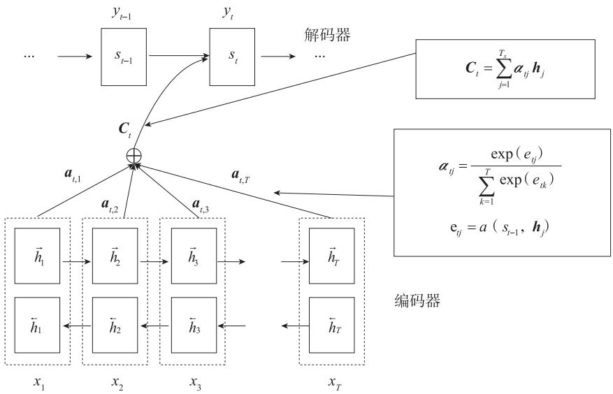  
图 7-10 由输入语句 ${ \big ( } x _ { 1 } , x _ { 2 } , x _ { 3 } \cdots x _ { T } { \big ) }$ 生成第 $t$ 个输出 $y _ { t }$

其中：

$$
p \left(y _ {t} \mid \left\{y _ {1}, \dots , y _ {t - 1} \right\}, x\right) = g \left(y _ {t - 1}, s _ {t}, C _ {t}\right) \tag {7.15}
$$

$$
s _ {t} = f \left(s _ {t - 1}, y _ {t - 1}, C _ {t}\right) \tag {7.16}
$$

$$
y _ {t} = g \left(y _ {t - 1}, s _ {t}, C _ {t}\right) \tag {7.17}
$$

$$
\boldsymbol {C} _ {t} = \sum_ {j = 1} ^ {T _ {x}} \boldsymbol {a} _ {t j} \boldsymbol {h} _ {j} \tag {7.18}
$$

$$
\boldsymbol {a} _ {t j} = \frac {\exp \left(e _ {t j}\right)}{\sum_ {k = 1} ^ {T} \exp \left(e _ {i k}\right)} \tag {7.19}
$$

$$
e _ {t j} = a \left(s _ {t - 1}, \boldsymbol {h} _ {j}\right) \tag {7.20}
$$

上述内容就是软注意力模型的基本思想，那么怎样理解注意力模型的物理含义呢？一般文献里会把注意力模型看作单词对齐模型，这是非常有道理的。前面提到，目标句子生成的每个单词对应输入句子单词的概率分布可以理解为输入句子单词和这个目标生成单词的对齐概率，这在机器翻译语境下是非常直观的。

当然，从概念上理解，把注意力模型理解成影响力模型也是合理的。也就是说，当生成目标单词的时候，输入句子的每个单词对于生成这个单词的影响程度。这也是理解注意力模型物理意义的一种方式。

# 7.3 自注意力

注意力机制除了软注意力之外，还有硬注意力、全局注意力、局部注意力、自注意力等，它们对原有的注意力架构进行了改进。本节主要介绍自注意力。

因为循环神经网络存在非法并行计算的问题，而卷积神经网络存在无法捕获长距离特征的问题，为解决这些不足，人们提出了自注意力的概念。

自注意力有很多分类，如单层注意力、多层注意力、多头注意力。它们没有本质的不同，只是形式有些不同。自注意力模型通过在输入语句或输出语句内部元素之间建立注意力机制，能够捕捉到序列内部的长距离依赖关系，如图 7-11 所示。

  
图 7-11 自注意力对输入语句内部元素之间的依赖关系

# 7.3.1 单层自注意力

单层自注意力就是假设输入为一维向量，然后通过自注意力机制，得到同样是一维的输出，这些输出表示语句中各单词之间的依赖关系，如图 7-12 所示。为便于原理的说明，这里不考虑把每个单词（或标记）转换为 Embedding（嵌入）格式，也不考虑各个单词在语句中的位置等信息。

单层自注意力的实现过程如下：

（1）把每个单词（或标记）向量化，生成向量的代码如下

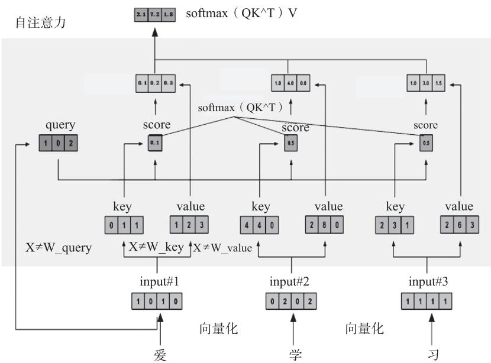  
图 7-12 单层自注意力示意图

```python
import torch  
x = [  
[1, 0, 1, 0], # 输入 1  
[0, 2, 0, 2], # 输入 2  
[1, 1, 1, 1] # 输入 3  
]  
# 把输入转换为张量 Tensor  
x = torch.tensor(x, dtype=torch.float32)
```

为便于说明，这里省略其他操作，如把标记转换为 Embedding，然后添加位置编码等。

（2）看“爱”对其他单词的依赖关系，再依次看“学”“习”对其他单词的依赖关系

1）初始化参数矩阵。

```python
w_key = [  
[0, 0, 1],  
[1, 1, 0],  
[0, 1, 0],  
[1, 1, 0]  
]  
w_query = [ 
```

[1,0，1]，  
[1，0，0]，  
[0，0，1]，  
[0，1，1]  
]  
w_value $=$ [  
[0，2，0]，  
[0，3，0]，  
[1，0，3]，  
[1，1，0]  
]  
w_key $\equiv$ torch.tensor(w_key，dtype $\equiv$ torch.float32)  
w_query $\equiv$ torch.tensor(w_query，dtype $\equiv$ torch.float32)  
w_value $\equiv$ torch.tensor(w_value，dtype $\equiv$ torch.float32)

2）生成 keys、querys、values 等矩阵。

```txt
## 实现矩阵的点乘运算
keys = x @ w_key
queries = x @ w_query
values = x @ w_value 
```

3）计算“爱”对其他单词的依赖关系。

根据公式 $\boldsymbol { Q } \cdot \boldsymbol { K } ^ { \mathrm { T } }$ ，计算单词“爱”对其他单词的得分。

```txt
attn Scores = queries @ keys.T  
# tensor([[2., 4., 4.], # Q1与所有K值  
# [4., 16., 12.], # Q2与所有K值  
# [4., 12., 10.]) # Q3与所有K值 
```

4）对注意力得分 attn_scores 使用 softmax 函数。

```python
from torch.nnfunctional import softmax  
attn Scores softmax = softmax(attn Scores, dim=-1)  
# tensor([[6.3379e-02, 4.6831e-01, 4.6831e-01],  
# [6.0337e-06, 9.8201e-01, 1.7986e-02],  
# [2.9539e-04, 8.8054e-01, 1.1917e-01]]) 
```

为便于理解，这里对 attn_scores_softmax 进行四舍五入。

attn Scores softmax $\equiv$ torch.round(attn Scores softmax, decimals $= 1$ print (attn scores softmax)

运行结果如下：

```txt
tensor([[0.1000, 0.5000, 0.5000], [0.0000, 1.0000, 0.0000], [0.0000, 0.9000, 0.1000]]) 
```

5）将得分与值相乘。

```txt
将得分和值相乘  
weighted_values = values[:,None] * attn Scores softmax.T[:,:,None]  
print(weighted_values) 
```

运行结果如下：

```txt
tensor([[0.1000, 0.2000, 0.3000], [0.0000, 0.0000, 0.0000], [0.0000, 0.0000, 0.0000]], [[1.0000, 4.0000, 0.0000], [2.0000, 8.0000, 0.0000], [1.8000, 7.2000, 0.0000]], [[1.0000, 3.0000, 1.5000], [0.0000, 0.0000, 0.0000], [0.2000, 0.6000, 0.3000]]]) 
```

6）生成输出，对值进行加权求和。

```txt
## 求和加权值
outputs = weighted_values.sum(dim=0)
print(outputs)
tensor([[2.1000, 7.2000, 1.8000],
[2.0000, 8.0000, 0.0000],
[2.0000, 7.8000, 0.3000]]) 
```

7）对输入单词“学”“习”重复 3） ${ \sim } 6$ ），直到生成单词“学”“习”对应的输出。

# 7.3.2 多层自注意力

输入为矩阵的形式，即把多个输入组合成一个矩阵，这样可以充分发挥 GPU 并发计算的优势，如图 7-13 所示。

多层自注意力的计算过程如下：

1）生成参数矩阵 Q、K、V。

输入与各参数矩阵进行点积运算，得到 $\varrho$ 、K、V。

  
图 7-13 多层自注意力的计算过程

$$
\boldsymbol {Q} = \boldsymbol {X} \cdot \boldsymbol {W} _ {O}, \quad \boldsymbol {K} = \boldsymbol {X} \cdot \boldsymbol {W} _ {K}, \quad \boldsymbol {V} = \boldsymbol {X} \cdot \boldsymbol {W} _ {V} \tag {7.21}
$$

其中，输入 $X$ 为 $N \times d$ 矩阵， $W _ { \varrho }$ 为 $d \times d _ { k }$ 矩阵。

2）计算得分。

$$
\text {s c o r e s} = \text {s o f t m a x} \frac {\boldsymbol {Q} \cdot \boldsymbol {K} ^ {\mathrm {T}}}{\sqrt {d _ {k}}} \tag {7.22}
$$

3）得到输出，对值进行加权求和。

$$
\mathbf {Z} = \text {s c o r e s} \cdot \mathbf {V} \tag {7.23}
$$

# 7.3.3 多头自注意力

# 1. 多头自注意力机制的提出

自注意力机制是一种用于捕捉序列中不同元素之间关联性的机制，它被广泛应用于自然语言处理和计算机视觉等任务中。然而，自注意力机制也存在一些不足之处。

● 缺乏全局信息。自注意力机制通常将注意力权重计算作用于序列中的每个元素，但对全局信息的处理能力比较有限。例如，在长序列中，远距离的词语之间的关联可能无法明确捕捉，这可能导致信息丢失。  
. 处理大规模输入困难。自注意力机制的计算复杂度是输入序列长度的平方，因此处理大规模输入时会面临计算资源的挑战。这限制了自注意力机制在实际应用中的可扩展性。

● 缺乏对位置信息的明确建模。自注意力机制的计算过程中不包含当前元素的位置信息，因此可能存在将重要元素的注意力权重分配给不相关元素的问题。这在某些任务中可能导致性能下降。

为了克服上述问题，多头自注意力机制（Multi-head Self-attention）被提出。多头自注意力机制是通过引入多个独立的自注意力子层来解决自注意力机制的不足。每个子层能够从不同的角度关注输入序列，从而提供更全面的信息。其计算过程如图 7-14 所示。

把语句中每个词转换为向量 这里假设分为2个头，将X乘以[第0个编码器需转换嵌入， 各权重矩阵（即线性变换），其他编码器无需转换为嵌入， 分别得到Q,K,V其来源于上层编码器的输出]

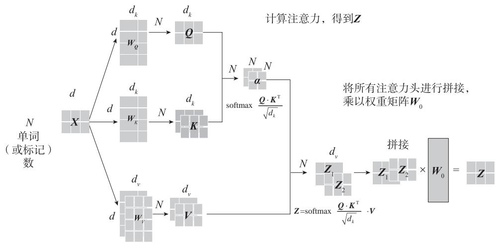  
图 7-14 多头自注意力机制的计算过程

# 2. 多头注意力机制的计算过程

多头注意力机制的计算过程如下：

1）输入的线性变换。首先，输入通过多个独立的线性变换被分别映射到多个不同的子空间上，这些线性变换共享相同的权重矩阵，但是每个子空间对应一个不同的注意力头。  
2）注意力计算。在每个注意力头中，通过计算查询（Q）、键（K）和值（V）之间的相似度来计算注意力权重。这一过程可以通过 $\varrho$ 、 $\pmb { K }$ 和 $V$ 的点积操作或者其他相似计算方法来完成。  
3）注意力加权。通过计算得到的注意力权重被用于对 $V$ 进行加权求和，从而得到注意力表示。在 Transformer 中，每个位置的注意力权重都与其他位置的注意力权重相互独立，可以并行计算。  
4）多头合并。每个注意力头都输出一个注意力表示，这些表示被拼接在一起并再次经

过一个线性变换得到最终的多头注意力输出。

# 3. 多头注意力机制的性能提升

多头自注意力机制主要从以下几个方面来克服自注意力不足。

1）处理全局信息。多头自注意力机制可以通过不同的注意力头来从不同的角度关注输入序列。每个注意力头可以捕捉到不同的语义关系，从而提供更全局的信息。  
例如，对于一个包含 300 个词语的句子，如果我们使用 8 个注意力头，每个头关注不同的词语关系，就能够捕捉到整个句子的语义关系，包括句子开头和句子结尾之间的联系。这样，多头自注意力机制能够更好地理解全局信息。  
2）处理大规模输入困难。多头自注意力机制在计算复杂度之外还引入了并行计算机制。每个注意力头可以并行地计算注意力权重和上下文向量，从而加快计算速度。

例如，我们要处理一个包含 1000 个词语的文本，如果使用 8 个注意力头，每个头只需要计算 $1 0 0 0 \times 1 0 0 0 / 8 { = } 1 2 5 \ 0 0 0$ 次注意力权重。这样，多头自注意力机制大大减少了计算开销，提高了模型的效率。

3）建模位置信息。多头自注意力机制通过引入位置编码来建模位置信息。位置编码是通过向输入序列中的单词添加额外的向量来实现的，表示单词在序列中的位置。

例如，在多头自注意力机制中，位置编码可以区分句子中的不同位置，并在计算注意力权重时进行调整，如图 7-15 所示。这样，模型可以更好地理解不同位置的语义关系。


  
a）自注意力

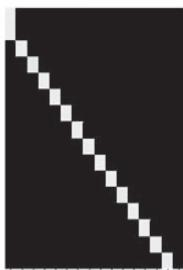

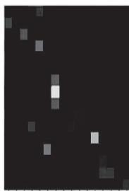  
b）多头自注意力  
图 7-15 自注意力与多头自注意力示意图比较

# 4. 多头注意力机制的优点

多头注意力机制的优点如下：

1）多头注意力机制允许模型并行地关注不同的信息子空间，从而提高了模型的学习能力和表达能力。每个头都可以学习关注不同的语义特征，比如位置、领域、语法等，从而从多个角度同时建模输入序列。  
2）多头注意力机制增加了模型的稳健性和鲁棒性。通过引入多个独立的注意力头，模型可以同时学习到不同的表示，从而可以对多种输入情况进行适应，减少过度依赖单个注

意力头的风险。

3）多头注意力机制能够捕获序列中的不同关系。不同的注意力头可以关注不同的位置关系，例如长距离依赖、短距离依赖等，从而增强了模型对序列中不同位置关系的建模能力。

# 7.3.4 自注意力与卷积网络、循环网络的比较

从以上分析可以看出，自注意力机制没有前后依赖关系，可以基于矩阵进行高并发处理，另外每个单词的输出与前一层各单词的距离都为 1，如图 7-16 所示，说明不存在梯度消失的问题，因此，Transformer 就有了高并发和长记忆的强大功能。

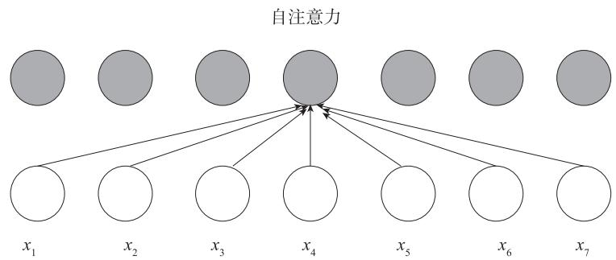  
图 7-16 自注意力输入与输出之间反向传播距离示意图

自注意力处理序列的主要逻辑是：没有前后依赖，每个单词都通过自注意力直接连接到任何其他单词。因此，可以并行计算，且最大路径长度是 $O ( 1 )$ 。

循环神经网络处理序列的逻辑如图 7-17 所示。

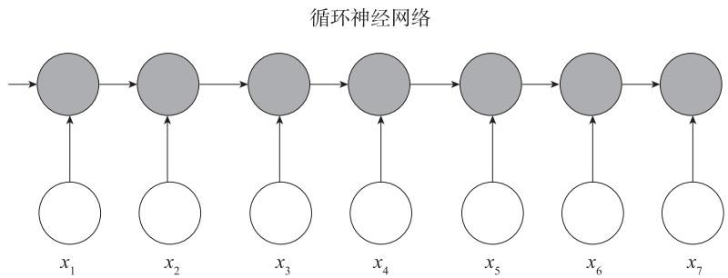  
图 7-17 循环神经网络处理序列的逻辑示意图

由图 7-17 可知，在更新循环神经网络的隐状态时，需要依赖前面的单词，如处理单词$x _ { 3 }$ 时，需要先处理单词 $x _ { 1 }$ 、 $x _ { 2 }$ ，因此，循环神经网络的操作是顺序操作且无法并行化，其最大依赖路径长度是 $O ( n )$ （ $n$ 表示时间步长）。

卷积神经网络也可以处理序列问题，其处理逻辑如图 7-18 所示。

  
图 7-18 卷积神经网络处理序列的逻辑示意图

图 7-18 是卷积核大小 $K$ 为 3 的两层卷积神经网络，有 $O ( 1 )$ 个顺序操作，最大路径长度为 $O ( n / k )$ （ $n$ 表示序列长度），单词 $x _ { 2 }$ 和 $x _ { 6 }$ 处于卷积神经网络的感受野内。

# 7.4 如何训练含自注意力的模型

假设通过自注意力模型完成了从输入到还原输入的过程，通过这个简单的过程，了解了训练含自注意力模型涉及的主要方法及运用这些方法背后的逻辑。具体训练过程如图7-19所示。

  
图 7-19 含自注意力模型的训练过程

1）准备语料库。  
2）预处理语料库，得到由不同单词（或标记）构成的字典，字典包括各单词及对应索引。  
3）把各单词（或标记）向量化，即把各标记转换为词嵌入，然后加入位置编码信息。  
4）构建网络，把嵌入层（Embedding Layer）作为第一层，先初始化对应的权重矩阵（即查询表）。  
5）训练模型，基于损失函数，训练过程中将不断更新权重矩阵。

对于序列重建任务，即对于通过自注意力机制进行序列重建的任务，可以使用均方误差（Mean Squared Error，MSE）损失函数。此损失函数衡量了模型生成序列与原始输入序列之间的差异。

# 7.4.1 将标记向量化

将序列数据转换为嵌入向量的主要原因是给模型提供一个可学习的、低维稠密的表示形式，使模型能够更好地理解和处理文本数据。

嵌入向量是一个固定长度的向量，它将离散的、高维的输入序列映射到一个连续的、低维的向量空间中。通过嵌入向量，每个单词或符号都会被表示成一个稠密的实值向量，而不是原始数据的稀疏表示或 one-hot 编码。

嵌入向量的转换有以下主要原因：

1）降低维度。原始的离散表示可能非常稀疏和高维，导致模型的复杂度非常高。通过嵌入向量，可以将输入序列转换到一个维度较低的向量空间中，从而降低了模型的复杂度。  
2）语义信息捕捉。嵌入向量通过学习将具有相似语义关系的单词或符号映射到相似的向量空间位置中。这种表示方式有助于模型捕捉单词之间的语义相似性和关系，从而提高模型的语言理解能力。  
3）泛化能力。嵌入向量是通过大规模的语料库训练得到的，因此可以从训练数据中学习到一些通用的语义特征，在处理新的、未见过的文本数据时具有一定的泛化能力。  
4）提取上下文信息。嵌入向量可以将上下文信息嵌入单词的表示中。通过学习上下文相关的嵌入向量，模型可以更好地理解句子中单词的含义，并更好地处理词义消歧等问题。

# 7.4.2 添加位置编码

在训练含自注意力机制的模型时，需要添加位置编码。这是因为自注意力机制本身无法捕捉输入序列中的位置信息。位置编码通过在输入序列中添加额外的向量表示来表示元素的位置信息，从而让模型能够感知元素在序列中的相对位置关系。

通过添加位置编码，自注意力模型可以对序列中的每个元素进行并行处理。与 RNN 不

同，位置编码实现了对位置信息的建模，不需要在处理每个元素时依赖前一个元素的隐状态。这使得自注意力模型可以同时处理整个序列，从而克服了 RNN 模型无法并发处理的限制。

具体地说，位置编码通常使用三角函数或正弦函数和余弦函数的组合来计算。这种计算方式可以让不同位置的编码向量具有不同的频率和相位，从而形成不同的位置编码向量。在模型训练过程中，这些位置编码向量会与输入进行相加，从而在注意力机制中纳入位置信息。

# 7.4.3 逆嵌入过程

输入通常会经过一个嵌入层进行转换，将输入的离散化标记（如单词、字符或其他离散数据）映射为连续的低维向量表示。这个过程称为嵌入。而逆嵌入（De-Embedding）是把标记向量化的逆过程，如图 7-19 所示，对网络最后一层进行输出操作，将网络输出的连续向量表示映射回原始的离散化符号。这个过程可认为是逆嵌入过程。

以下是实现逆嵌入的简单实例：

1）下载预处理函数模块。

```python
下载一个预处理函数（tokenizer）来预处理文本  
tokenizer = DistilBERTTokenizerFast.from_pretrained("distilbert-base-uncased")  
#tokenizer的主要功能包括分词、转换为单词或一些特殊字符等标记，然后把每个标记转换为整数  
tokens = tokenizer.encode('This is a input.', return_tensors='pt')  
print("These are tokens!", tokens)  
These are tokens! tensor([[101, 2023, 2003, 1037, 7953, 1012, 102]])
```

2）通过解码器，将输入数据进行还原。

```txt
for token in tokens[0]: print("This are decoded tokens! ",tokenizerdecode([token]))   
This are decoded tokens! [CLS]   
This are decoded tokens! this   
This are decoded tokens! is   
This are decoded tokens! a   
This are decoded tokens! input   
This are decoded tokens! .   
This are decoded tokens! [SEP] 
```

# 7.5 交叉注意力

交叉注意力（Cross-Attention）机制是一种注意力机制的变体，它在多个输入序列之间建立了关联关系。在传统的自注意力机制中，注意力是在一个序列内进行计算的，而在交

叉注意力机制中，注意力是在不同序列之间进行计算的。

# 7.5.1 Transformer 解码器中的交叉注意力

在 Transformer 的解码器中，交叉注意力机制被用于编码器和解码器之间的信息传递。解码器中的每个位置都会对来自编码器的所有位置计算注意力得分，并使用这些得分对编码器的输出进行加权平均。这样，解码器可以利用编码器中每个位置的信息，以更全局的方式生成解码结果，如图 7-20 所示。

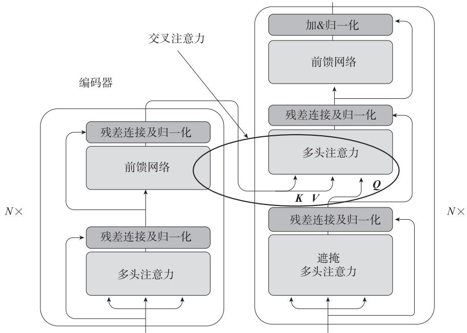  
图 7-20 Transformer 模型的解码器中的交叉注意力

# 7.5.2 Stable Diffusion 解码器中的交叉注意力

Stable Diffusion 架构将在第 12 章中详细介绍，这里先直观了解一下交叉注意力机制在架构中的作用。如图 7-21 所示，在 Stable Diffusion 架构中，交叉注意力机制被应用于利用先前时刻的信息来生成当前时刻的输出。每个时刻的输出依赖于前几个时刻的输出，通过在当前时刻的输入和前几个时刻的输入之间进行交叉注意力计算。这使得模型可以对先前时刻的信息进行有针对性的利用，从而提高了模型生成序列的连贯性和一致性。

交叉注意力机制可以在不同序列之间建立关联关系，使得模型能够利用不同位置和时刻的信息，并在 Transformer 解码器和 Stable Diffusion 架构中起到重要作用，提高了模型的表现和生成能力。

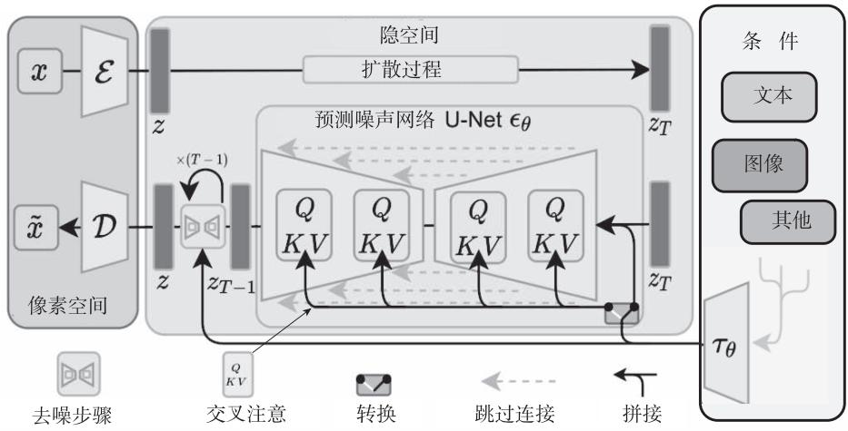  
图 7-21 Stable Diffusion 架构中的交叉注意力

# 7.5.3 交叉注意力与自注意力的异同

交叉注意力和自注意力都是深度学习中常用的注意力机制，用于处理序列数据。无论是交叉注意力还是自注意力，其核心目标都是通过赋予不同位置的信息不同的权重来实现更加灵活和全面的特征表示。其中自注意力用于计算输入序列中每个元素之间的关系，交叉注意力则用于计算两个不同序列中的元素之间的关系。它们的主要区别在于计算注意力分数时所用的查询、键和值的来源不同。

在自注意力中，输入序列被分成三个向量（即查询向量、键向量和值向量），这三个向量均来自同一组输入序列，用于计算每个输入元素之间的注意力分数。因此，自注意力可以用于在单个序列中学习元素之间的依赖关系，例如用于语言建模中的上下文理解。

在交叉注意力中，有两个不同的输入序列，其中一个序列被用作查询向量，另一个序列被用作键向量和值向量。交叉注意力计算的是第一个序列中的所有元素与第二个序列中的所有元素之间的注意力分数，通过这种方式来学习两个序列之间的关系。例如，在图像字幕生成任务中，注意力机制可以用来将图像的特征与自然语言描述的句子相关联。

下面是一个简单的例子，演示自注意力和交叉注意力的区别。假设有两个序列 A 和 B，它们分别表示句子和单词：

$$
\begin{array}{l} A = [ ^ {\prime \prime} T h e ^ {\prime \prime}, ^ {\prime \prime} c a t ^ {\prime \prime}, ^ {\prime \prime} s a t ^ {\prime \prime}, ^ {\prime \prime} o n ^ {\prime \prime}, ^ {\prime \prime} t h e ^ {\prime \prime}, ^ {\prime \prime} m a t ^ {\prime \prime} ] \\ \mathrm {B} = \left[ ^ {\prime \prime} \mathrm {m a t} ^ {\prime \prime}, ^ {\prime \prime} \mathrm {c a t} ^ {\prime \prime}, ^ {\prime \prime} \mathrm {d o g} ^ {\prime \prime}, ^ {\prime \prime} \mathrm {o n} ^ {\prime \prime} \right] \\ \end{array}
$$

在自注意力中，我们会用 A 本身的向量来计算注意力分数，查询向量、键向量和值向量都是从 A 中提取的。例如，我们可以通过将 A 传递给一个自注意力层来计算每个单词之间的注意力分数。

在交叉注意力中，我们将 B 的向量用作键向量和值向量，而 A 的向量用作查询向量。这允许我们计算句子中每个单词与单词序列 B 中的所有单词之间的注意力分数。例如，我们可以通过将 A 和 B 传递给一个交叉注意力层来计算单词和单词序列 B 之间的注意力分数。

总的来说，自注意力主要用于单个序列内部的特征表示，而交叉注意力用于不同序列之间的交互与关联，它们在不同的应用场景中发挥着重要的作用。

# 第 8 章

# Transformer 模型

Transformer 是一种用于自然语言处理任务的神经网络模型，它于 2017 年由 Vaswani等人提出。其核心思想是自注意力机制，通过计算输入序列中每个元素与其他元素之间的关联性来建立表示。相对于传统的循环神经网络（RNN）或卷积神经网络（CNN），Transformer 可以同时处理所有输入序列的元素，具有更好的并行化能力和更强的建模能力。

Transformer 模型由编码器和解码器组成。编码器负责将输入序列转换成高维空间的表示，解码器则将这个表示转换回输出序列。编码器和解码器都采用多头注意力机制来学习全局的上下文信息。注意力机制能够根据输入序列的不同位置信息，动态地调整编码器和解码器的注意力权重，从而更好地捕获关键信息。

在 Transformer 中，编码器和解码器都由多个堆叠的层组成，每个层包含两个子层：多头自注意力层和全连接前馈神经网络层。自注意力层用于学习输入序列中各个位置之间的依赖关系，全连接前馈神经网络层则对自注意力层的输出进行进一步处理。

此外，Transformer 还引入了位置编码，用于表示输入序列中每个元素的位置信息。通过将位置信息与词向量相加，模型可以兼顾词的语义和位置信息。

目前，Transformer 逐渐成为比较通用的模型，在 NLP、CV 等都有广泛应用。该模型也是 ChatGPT 的核心架构，其他 GPT、BERT 等都是在这个基础上衍生出来的。

# 8.1 Transformer 模型的直观理解

Transformer 是 Google 在 2017 年的论文“Attention is all you need”中提出的一种新模型，它基于自注意力机制的深层模型，在包括机器翻译在内的多项 NLP 任务上效果显著，

超过 RNN 且训练速度更快。不到一年时间，Transformer 已经取代 RNN 成为当前神经网络机器翻译领域成绩最好的模型，谷歌、微软、百度、阿里、腾讯等公司的线上机器翻译模型都已替换为 Transformer 模型。它不但在 NLP 领域刷新多项纪录，在搜索排序、推荐系统，甚至图形处理领域都非常活跃。为何它能获得如此成功？用了哪些神奇的技术或方法？背后的逻辑是什么？接下来我们详细说明。

# 8.1.1 顶层设计

我们先从 Transformer 的功能说起，然后介绍其总体架构，再对各个组件进行分解，详细说明 Transformer 的功能及如何高效实现这些功能。

如果我们把 Transformer 应用于语言翻译，比如把一句法语翻译成一句英语，过程如图 8-1 所示。

  
图 8-1 Transformer 应用于语言翻译

在图 8-1 中，Transformer 就像一个黑盒子，它接收一条语句，然后转换为另外一条语句。此外，Transformer 还可用于阅读理解、问答、词语分类等 NLP 问题。

这个黑盒子是如何工作的呢？它由哪些组件构成？这些组件又是如何工作呢？

我们进一步打开图 8-1 所示的这个黑盒子，其实 Transformer 就是一个由编码器和解码器构成的模型，这与我们通常看到的语言翻译模型类似，如图 8-2 所示。以前我们通常使

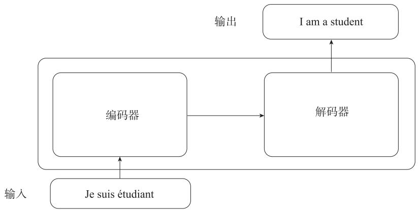  
图 8-2 Transformer 由编码器和解码器构成

用 RNN 或 CNN 作为编码器和解码器的网络结构，不过 Transformer 中的编码器和解码器既不用 RNN，又不用 CNN。

图 8-2 中的编码器又由 6 个相同结构的编码器串联而成，解码器也是由 6 个结构相同的解码器串联而成，如图 8-3 所示。

  
图 8-3 Transformer 模型

最后一层编码器的输出将传入解码器的每一层，我们进一步打开编码器及解码器，每个编码器由自注意力层和前馈网络层构成，而解码器除了自注意力层、前馈网络层外，中间还有一个用来接收最后一个编码器输出值的编码器 - 解码器注意力层，如图 8-4 所示。

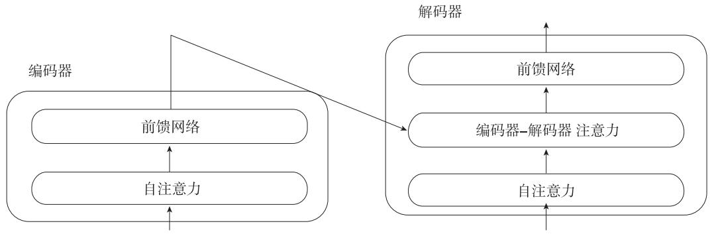  
图 8-4 Transformer 模型中编码器与解码器的关系图

至止，我们就对 Transformer 模型的大致结构进行了一个直观说明，接下来将从一些主要问题入手对各层细节进行说明。

# 8.1.2 嵌入和向量化

在 Transformer 模型中，需要经过以下步骤进行预处理，把语句或语料库转换为词向量，作为模型的输入。

# 1. 分词

将输入文本划分成独立的词或子词单元，如单词、字符或字节。这一步骤可以根据具体任务和模型的需要选择不同的分词方法，分词的常用方法大致有以下三种。

# （1）基于空格的分词器

按空格拆分单词，将一个单词作为一个标记（token）纳入词表，因此也说是 word-level 维度的。若语料中出现不在词表中的标记，也称 OOV（Out Of Vocabulary），则此时常用 <UNK>（Unknown）这个特殊符号来代替。

# （2）基于字符的分词器

每个字符作为一个词。例如英语中只有 26 个字符，那词表大小就只有 26 个。

# （3）基于子词的分词器

子词分词器有三类：BPE、WordPiece 和 ULM。子词分词器类似于借助词根、词源来学习一系列单词。例如 transformer $=$ trans $^ +$ form $^ +$ er，transfer $=$ trans $^ +$ fer。OpenAI 从GPT-2 开始一直到 GPT-4，一直采用 BPE 分词法。BERT 采用 WordPiece 分词方法。

# 2. 转换为整数

将分词后的文本转换为对应的整数序列，每个分词单元会映射为一个唯一的整数标识符。通常会使用一个字典或词汇表来建立分词单元与整数标识符之间的映射关系。

# 3. 嵌入

将整数序列转换为密集的向量表示，称为词嵌入或字嵌入。这一步骤使用了一个可训练的嵌入矩阵，通过查找整数标识符对应的行来获取对应的词嵌入向量。

# 4. 位置编码

由于 Transformer 没有使用序列中的位置信息，为了让模型能够捕捉到序列中的顺序关系，需要添加位置编码。位置编码是一种特殊的向量，会与词嵌入相加，以提供关于每个词或字的位置信息。Transformer 模型涉及标记、嵌入等内容，如图 8-5 所示。

● 输入被标记化，标记化将文本转换为整数列表。  
嵌入将整数列表转换为向量列表（嵌入）。  
$\bullet$ 使用位置编码（或嵌入）将关于每个标记的位置信息添加到嵌入中。  
输出文本嵌入被重新分类为标记，然后将其解码为文本。

  
图 8-5 Transformer 模型中的标记及嵌入

# 8.1.3 位置编码

前面我们介绍了Transformer的大致结构，在构成其编码器或解码器的网络结构中，并没有使用RNN和CNN。像语言翻译类问题，语句中各单词的次序或位置是一个非常重要的因素，单词的位置与单词的语言有直接关系。如果使用RNN，那么一个句子中各单词的次序或位置问题能自然解决，但在Transformer是如何解决语句中各单词的次序或位置关系的呢？

Transformer 使用位置编码方法来记录语句中各单词的次序或位置。位置编码的值是按照特定模型（如三角函数）生成的，在处理每个源单词（或目标单词）时，其词嵌入与对应的位置编码相加，且位置编码向量与词嵌入的维度相同，如图 8-6 所示。

对解码器的输入（即目标数据）也需要做同样处理，即在目标数据基础上加上位置编码成为带有时间信息的嵌入。当对语料库进行批量处理时，可能会遇到长度不一致的语句：对于短的语句，可以采用填充（如用 0 填充）的方式补齐；对于太长的语句，可以采用截尾的方法（如给这些位置的值赋予一个很大的负数，使之在进行 softmax 运算时为 0）。

  
图 8-6 在源数据中添加位置编码向量

在位置编码中，每个位置都被分配一个唯一的编码向量，该向量包含正弦和余弦函数的组合。通过不同频率的正弦和余弦函数，位置编码可以传递出不同位置之间的相对距离信息。当两个位置之间的距离较近时，频率较高的正弦和余弦函数可以产生更多变化的编码，相对位置关系更明显。而当两个位置之间的距离较远时，频率较低的正弦和余弦函数可以产生较为平滑的编码，相对位置关系相对较弱。

总的来说，Transformer 模型可以利用位置编码来区分序列中不同位置的相对位置信息。这对于模型来说非常重要，因为它可以帮助模型在处理序列时更好地理解元素之间的顺序和关系，进而更好地捕捉到序列的结构和语义。

# 8.1.4 自注意力

首先我们来看一下通过 Transformer 作用的效果图，假设对于输入语句“The animaldidn't cross the street because it was too tired”，如何判断 it 是指 animal 还是指 street ？这个问题对人来说很简单，但对算法来说就不那么简单了。但是，Transformer 中的自注意力就能够让机器将 it 和 animal 联系起来，联系的效果如图 8-7 所示。

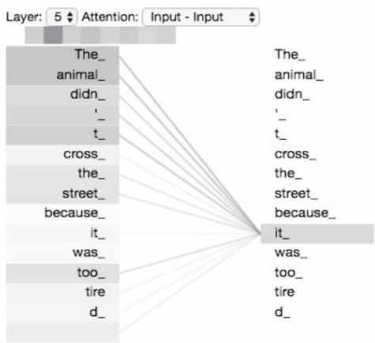  
图 8-7 使用自注意力将 it 和 animal 联系起来

编码器中的顶层（即 #5 层，#0 表示第 1 层）it 单词明显对 animal 的关注度大于其他单词的关注度。这些关注度是如何获取的呢？接下来进行详细介绍。

一般注意力机制计算注意力的方法与 Transformer 采用的自注意力机制的计算方法基本相同，只是查询的来源不同。一般注意力机制中的查询来源于目标语句（而非源语句），而自注意力机制的查询来源于源语句本身，而非目标语句（如翻译后的语句），这或许就是自注意力名称的来由。

编码器中自注意力计算的主要步骤如下（解码器中自注意力的计算步骤与此类似）：

1）把输入单词转换为带时间（或时序）信息的嵌入向量。  
2）根据嵌入向量生成 $\pmb q$ 、k、 $\nu$ 三个向量，这三个向量分别表示 query、key、value。  
3）根据 $\pmb q$ ，计算每个单词进行点积得到对应的得分 score $\mathbf { \tau } = \mathbf { \boldsymbol { q } } \cdot \mathbf { \boldsymbol { k } }$ 。  
4）对 score 进行规范化、softmax 处理，假设结果为 $\pmb { a }$ 。  
5） $\pmb { a }$ 与对应的 $\nu$ 进行点积运算，然后累加得到当前语句各单词之间的自注意力 $z { = } \sum a \nu$ 。

这部分是 Transformer 的核心内容。为便于理解，对以上步骤进行可视化。假设当前的待翻译的语句为：Thinking Machines，对单词 Thinking 进行预处理（即词嵌入 $^ +$ 位置编码得到嵌入向量 Embedding）后用 $x _ { 1 }$ 表示，对单词 Machines 进行预处理后用 $\boldsymbol { x } _ { 2 }$ 表示。计算单词 Thinking 与当前语句中各单词的注意力或得分，如图 8-8 所示。

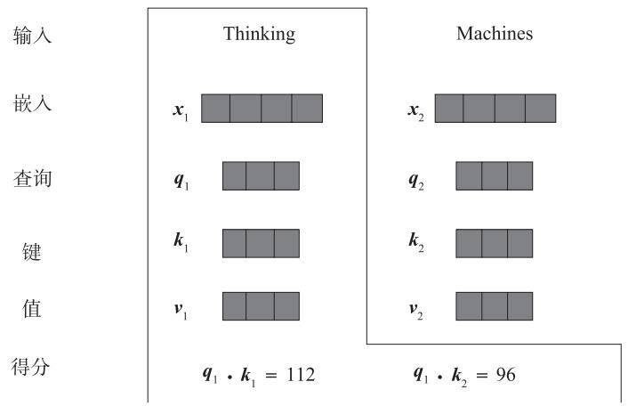  
图 8-8 计算 Thinking 与当前语句各单词的得分

假设各嵌入向量的维度为 $d _ { \mathrm { m o d e l } }$ （这个值一般较大，如 512），q、k、v 的维度比较小，一般使 q、k、v 的维度满足：

$$
d _ {q} = d _ {k} = d _ {v} = \frac {d _ {\text {m o d e l}}}{h} \tag {8.1}
$$

其中， $h$ 表示head的个数，后面将介绍 head含义，此处 $h { = } 8$ ， $d _ { \mathrm { m o d e l } } { = } 5 1 2$ ，故 $d _ { k } { = } 6 4$ ，而 $\sqrt { d _ { k } } = 8$ 。

在实际计算过程中，我们得到的 score 可能比较大，为保证计算梯度时不因 score 值太大而影响其稳定性，需要进行归一化操作，这里除以 $\sqrt { d _ { k } }$ ，如图 8-9 所示。

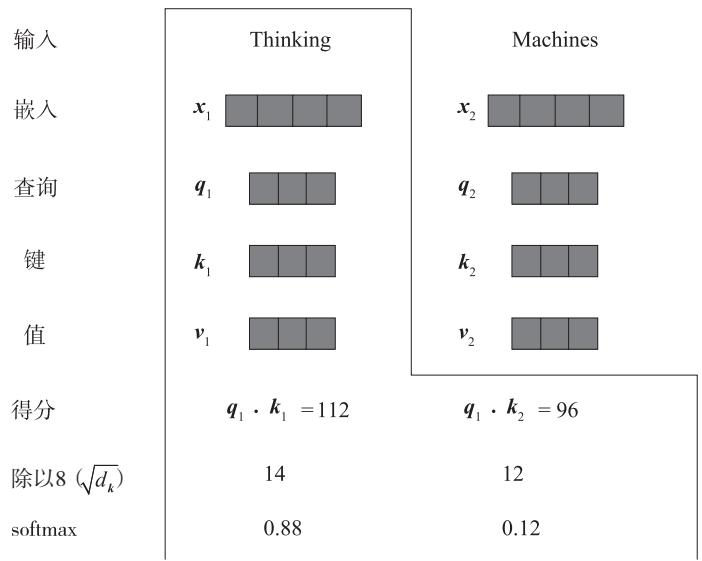  
图 8-9 对得分进行归一化处理

对归一化处理后的 $\pmb { a }$ 与 $\nu$ 点积运算后再累加，就得到 z，如图 8-10 所示。

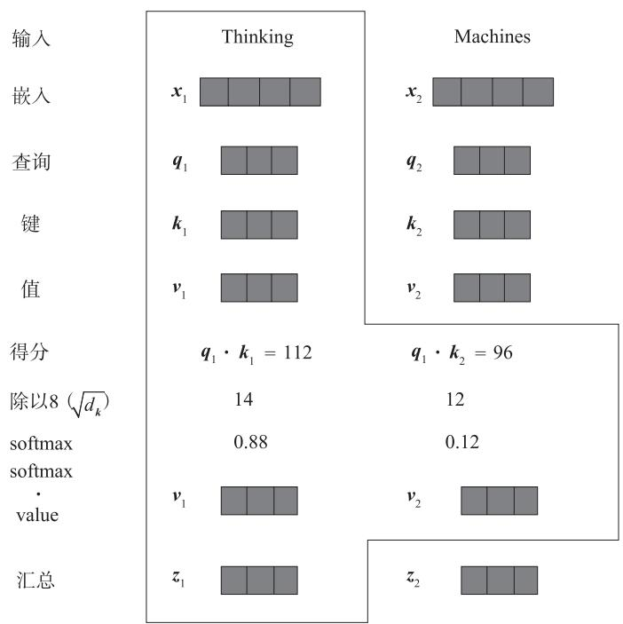  
图 8-10 权重 $\pmb { a }$ 与 $\nu$ 点积运算后再累加

这样就得到单词 Thinking 对当前语句各单词的注意力或关注度 $z _ { 1 }$ ，用同样的方法，可以计算单词 Machines 对当前语句各单词的注意力 $z _ { 2 }$ 。

上面这些都是基于向量进行运算，而且没有像 RNN 中的左右依赖关系，如果把向量堆砌成矩阵，那就可以使用并发处理或 GPU 的功能，图 8-11 为计算自注意力得分的过程。把嵌入向量堆叠成矩阵 $X$ ，然后分别与矩阵 $W ^ { \varrho }$ 、 $\boldsymbol { W } ^ { K }$ 、 $W ^ { V }$ （这些矩阵为可学习的矩阵，与神经网络中的权重矩阵类似）相乘得到 $\varrho$ 、 $\pmb { K }$ 、 $V$ 。

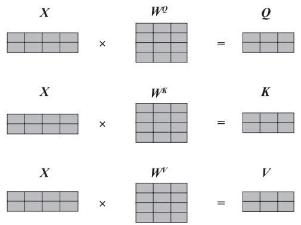  
图 8-11 堆砌嵌入向量得到矩阵 Q、K、V

在此基础上，上面计算注意力得分的过程就可以简写为图 8-12 所示的格式。

  
图 8-12 计算注意力 Z 的矩阵格式

整个计算过程也可以用图 8-13 表示，这个过程又称为缩放的点积注意力（Scaled Dot-product Attention）过程。

  
图 8-13 缩放的点积注意力

图 8-13 中的掩码用于对某些值进行掩盖，使其在参数更新时不产生效果。

# 8.1.5 掩码

Transformer 模 型 中 涉 及 两 种 掩 码（Mask）， 分 别 是 Padding Mask 和 Sequence Mask。Padding Mask 在所有的缩放的点积注意力中都需要用到，用于处理长短不一的语句，而Sequence Mask 只有在解码器的自注意力中用到，以防止解码器预测目标值时看到未来的值。

1）Padding Mask。什么是 Padding Mask 呢？因为每个批次输入序列长度是不一样的，也就是说，我们要对输入序列进行对齐。具体来说，就是给在较短的序列后面填充 0。但是如果输入的序列太长，则是截取左边的内容，把多余的直接舍弃。因为这些填充的位置，其实是没什么意义的，所以注意力机制不应该把注意力放在这些位置上，所以需要进行一些处理。具体的做法是，把这些位置的值加上一个非常大的负数（负无穷），这样的话，经过 softmax，这些位置的概率就会接近 0 ！而 Padding Mask 实际上是一个张量，每个值都是一个 Boolean，值为 false 的地方就是我们要进行处理的地方。  
2）Sequence Mask。前文也提到，Sequence Mask 是为了使得解码器不能看见未来的信息。也就是对于一个序列来说，在时间步为 $t$ 的时刻，解码输出应该只能依赖于 $t$ 时刻之前的输出，而不能依赖 t 之后的输出。因此我们需要想一个办法，把 $t$ 之后的信息给隐藏起来。在具体实现时，通过乘以一个上三角形矩阵实现，上三角的值全为 0，把这个矩阵作用在每一个序列上。可以使用 PyTorch 的 torch.tril 或 np.triu 生成下三角矩阵：

```txt
tensor([[1., 0., 0., 0., 0.],
[1., 1., 0., 0., 0.],
[1., 1., 1., 0., 0.],
[1., 1., 1., 1., 0.],
[1., 1., 1., 1., 1.]) 
```

然后，通过 Tensor.masked_fill() 将所有 0 替换为负无穷大来防止注意力头看到未来的词语而造成信息泄露，例如：

```txt
scoresmasked_fill(mask == 0, -float("inf"))  
tensor([[26.8082, -inf, -inf, -inf, -inf], [-0.6981, 26.9043, -inf, -inf, -inf], [-2.3190, 1.2928, 27.8710, -inf, -inf], [-0.5897, 0.3497, -0.3807, 27.5488, -inf], [0.5275, 2.0493, -0.4869, 1.6100, 29.0893]]], grad_fn=<MaskedFillBackward0>)
```

# 8.1.6 多头注意力

在图 8-7 中有 8 种不同颜色，这 8 种不同颜色分别表示什么含义呢？每种颜色有点像

卷积网络中的一种通道（或一个卷积核），在卷积网络中，一种通道往往表示一种风格。受此启发，AI 科研人员在计算自注意力时也采用类似方法，这就是下面要介绍的多头注意力机制（Multi-Head Attention），其架构如图 8-14 所示。

  
图 8-14 多头注意力架构

利用多头注意力机制可以从以下 3 个方面提升注意力层的性能。

● 扩展了模型专注于不同位置的能力。  
● 将缩放的点积注意力过程做 $h$ 次，再把输出合并起来。  
● 为关注层（Attention Layer）提供了多个“表示子空间”。在多头注意力机制中，有多组查询、键、值权重矩阵（Transformer 使用 8 个关注头，因此每个编码器 / 解码器最终得到 8 组），这些矩阵都是随机初始化的。然后，在训练之后，将每个集合用于输入的嵌入（或来自较低编码器 / 解码器的向量）投影到不同的表示子空间中。这个原理就像使用不同卷积核把源图像投影到不同风格的子空间一样。

多头注意力机制的运算过程如下：

1）随机初始化 8 组矩阵： $\boldsymbol { W } _ { i } ^ { Q } , \boldsymbol { W } _ { i } ^ { K } , \boldsymbol { W } _ { i } ^ { V } \in \mathbb { R } ^ { 5 1 2 \times 6 4 }$ ， $i { \in } \left\{ 0 , 1 , 2 , 3 , 4 , 5 , 6 , 7 \right\}$ ，这个初始化矩阵由全连接层构建，全连接层的形状是（512,64）。  
2）使用 $X$ 与这 8 组矩阵相乘，得到 8 组Qi、 $\pmb { K } _ { i } ,$ 、 $V _ { i } \in \mathbb { R } ^ { 5 1 2 }$ ， $i \in \left\{ 0 , 1 , 2 , 3 , 4 , 5 , 6 , 7 \right\} ^ { }$ 。

3）由此得到 8 个 $\mathbf { Z } _ { i }$ $, i \in \left\{ 0 , 1 , 2 , 3 , 4 , 5 , 6 , 7 \right\}$ ，然后把这 8 个 $\mathbf { Z } _ { i }$ 沿水平方向组合成一个更长的 $\mathbf { Z } _ { 0 - 7 }$ 。

4）Z 与初始化的矩阵 $\pmb { W } ^ { 0 } \in \mathbb { R } ^ { 5 1 2 \times 5 1 2 }$ 相乘，得到最终输出值 Z。

以上步骤可用图 8-15 来直观表示。

1）这是输入句子2）把每个单词3）分成8个头，用4）使用Q/KV矩阵5）拼接得到Z矩阵，乘以转换为 X或R乘以权重矩阵 计算注意力 W的结果作为层的输出Embedding

  
图 8-15 多头注意力机制的运算过程

由图 8-4 可知，解码器比编码器多了个编码器 - 解码器注意力机制。在编码器 - 解码器注意力中， $\varrho$ 来自解码器的上一个输出， $\pmb { K }$ 和 V 则来自编码器最后一层的输出，其计算过程与自注意力的计算过程相同。

由于在机器翻译中，解码过程是一个顺序操作的过程，也就是当解码第 $k$ 个特征向量时，我们只能看到第 k-1 个特征向量及其之前的解码结果，因此把这种情况下的多头注意力机制叫做掩码多头注意力机制，即同时使用了 Padding Mask 和 Sequence Mask 两种方法。

# 8.1.7 残差连接

由图 8-3 可知，Transformer 的编码器和解码器分别有 6 层，在有些应用中有更多层。随着层数的增加，网络的容量更大，表达能力也更强，但网络的收敛速度会更慢，更容易出现梯度消失等问题，那么 Transformer 是如何克服这些不足的呢？它采用了两种常用方法，一种是残差连接（Residual Connection），另一种是归一化（Normalization）方法。具体实现方法就是在每个编码器或解码器的两个子层（即自注意力层和前馈神经网络层）增加由残差连接和归一化组成的层，如图 8-16 所示。

对每个编码器和解码器都做同样处理，如图 8-17 所示。

  
图 8-16 添加残差连接及归一化处理的层

  
图 8-17 在每个编码器与解码器的两个子层都添加残差连接及归一化层

在 Transformer 模型中，使用残差连接的主要目的是解决深层网络训练中的梯度消失和梯度爆炸问题，以及保留原始输入序列的信息。

# 1. 梯度平滑

在深层网络中，梯度在反向传播过程中可能会变得非常小或非常大，导致训练过程出现梯度消失或梯度爆炸问题。残差连接可以通过将原始输入与每个子层的输出相加来构建一个捷径，使得梯度能够更顺利地传递。将原始输入加到子层输出中可以确保梯度不会太小而消失，也不会太大而爆炸，从而有助于保持梯度平滑，如图 8-18 所示。

  
a）不使用残差连接

  
b）使用残差连接  
图 8-18 使用与不使用残差连接对梯度的影响示意图

# 2. 信息保留

在 Transformer 模型中，每个子层包含自注意力机制和正向传播网络。注意力过滤器有可能完全忘记最近的单词，转而关注所有可能相关的较早单词。残差连接会获取原始单词并手动将其添加回信号中，这样就不会丢失或忘记它。这种鲁棒性可能是 Transformer 在如此多不同序列的完成任务中表现良好的原因之一，尤其是在层数较多的情况下。为了保留原始输入序列的信息，残差连接允许子层的输出直接加到原始输入上，以确保原始输入的信息能够传递到下一层。

# 8.1.8 层归一化

残差连接和层归一化不一定要放在一起，不过当它们放在一组计算（例如注意力或前馈神经网络）之后时，将会发挥最佳作用。层归一化就是将矩阵的值移动到均值为 0，并缩放到标准差为 1，如图 8-19 所示。

神经网络本质上是非线性的，这使得它们非常具有表现力，但对信号的幅度和分布也很敏感。标准化是一种已被证明有助于在多层神经网络的每一步中保持信号值的一致分布的有用技术。它鼓励参数值的收敛，通常会带来更好的性能。

  
图 8-19 使用层归一化对数据分布的影响

# 8.1.9 解码器的输出

解码器最后的输出值通过一个全连接层及 softmax 函数作用后，就得到预测值的对数概率（这里假设采用贪婪解码的方法，即使用 argmax 函数获取概率最大值对应的索引），如图 8-20 所示。预测值的对数概率与实际值对应的 one-hot 编码的差就构成模型的损失函数。

  
图 8-20 Transformer 的最后全连接层及 softmax 函数

图 8-21 是编码器与解码器如何协调完成一个机器翻译任务的完整过程。

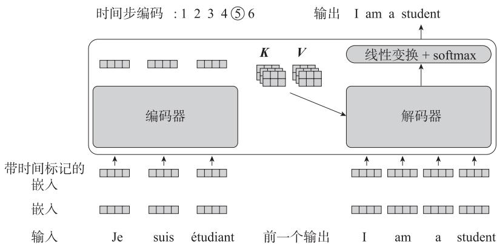  
图 8-21 Transformer 实现一个机器翻译语句的完整过程

# 8.1.10 多层叠加

Transformer 的编码器和解码器都采用多层叠加的方法（即 $N \times \mathbf { \mu } )$ ，如图 8-22 所示。

  
图 8-22 Transformer 的编码器和解码器采用多层叠加方法

在 Transformer 模型中，多个“多头注意力层 + 前馈网络层”模块的叠加有以下作用：

# （1）捕捉更多的信息

每个“多头注意力层 $^ +$ 前馈网络层”模块可以学习不同特征表示，通过叠加多个模块，模型可以捕捉到更多不同层次的语义和关系信息。

# （2）提供更好的性能

增加模块的层数可以增加模型的容量，使得模型可以更好地拟合复杂的输入和任务。更深的模型可以提供更好的性能，例如在语言建模、机器翻译等任务中取得更佳的效果。

# （3）增强信息传递

通过多个模块的叠加，每个模块都能够接收到之前所有层的信息，并将其传递给下一层。这样的架构设计使得信息能够像传送带一样在不同层之间流动，有助于更好地建模长距离依赖关系。

# （4）提高模型的鲁棒性

通过多个模块的叠加，模型能够从不同角度对输入进行建模，增加了模型对噪声和错

误的容忍程度，提高了模型的鲁棒性，使其能够更好地处理输入的多样性和变化。

# 8.2 用 PyTorch 从零开始实现 Transformer

Transformer 的原理在前面的图解部分已经分析得很详细了，这节重点介绍如何使用PyTorch 来实现。本节将用 PyTorch $2 . 0 +$ 来完整地实现 Transformer 模型，并用简单实例进行验证。以下代码参考哈佛大学 OpenNMT 团队针对 Transformer 实现的代码，其代码是用PyTorch 0.3.0 实现的，地址为 http://nlp.seas.harvard.edu/2018/04/03/attention.html。

# 8.2.1 构建编码器-解码器架构

（1）导入需要的库

```python
import numpy as np  
import torch  
import torch.nn as nn  
import torch.nnfunctional as F  
import math, copy, time  
import matplotlib.pyplot as plt  
import seaborn  
seaborn.set_context(context="talk")  
%matplotlib inline 
```

（2）定义 EncoderDecoder 类

```python
class EncoderDecoder(nnModule):
    ""
这是一个标准的编码器-解码器架构
""
def __init__(self, encoder, decoder, src_embedding, tgt_embedding, generator):
    super(EncoderDecoder, self).__init__()
    self encoder = encoder
    self decoder = decoder
    #输入和输出的嵌入向量
    self.src_embedding = src_embedding
    self.tgt_embedding = tgt_embedding
    #解码器部分最后的线性变换+softmax
    self.generator = generator
def forward(self, src, tgt, src_mask, tgt_mask):
    #接收并处理屏蔽src和目标序列，首先调用encode方法对输入进行编码，然后调用decode方法
    #进行解码 
```

```python
return selfdecode(self.encode(src, src_mask), src_mask, tgt, tgt_mask)  
def encode(self, src, src_mask):  
    return self encoder(self.src_embedding(src), src_mask)  
def decode(self, memory, src_mask, tgt, tgt_mask):  
    return selfDecoder(self.tgt_embedding(tgt), memory, src_mask, tgt_mask) 
```

从以上代码可以看出，编码器和解码器都使用了掩码，它对某些值进行掩盖，使其在参数更新时不产生效果。

# （3）创建 Generator 类

对于解码器的输出，通过一个全连接层后，再经过 log_softmax 函数的作用，成为概率值。

```python
class Generator(nnModule):   
```
```
```
```
```
```
```
```
```
```
```
```
```
```
```
```
```
```
```
```
```
```
```
```
```
```
```
```
```
```
```
```
```
```
``
```python
class Generator(nnModule):
    '''定义一个标准的全连接（线性变换）+ softmax，根据解码器的隐状态输出一个词，d_model是解码器输出的大小，vocab是词典大小'''  
    def __init__(self, d_model, vocab):  
        super(Generator, self).__init__(())  
        self.proj = nn.Linear(d_model, vocab)  
    def forward(self, x):  
        return F.logSoftmax(self.proj(x), dim=-1)
```

# 8.2.2 构建编码器

前文提到，编码器是由 $N$ 个相同结构的编码器层堆积而成的，而每个编码器层又有两个子层，一个是自注意力层，另一个是前馈网络层，其间还有归一化层及残差连接等。

# （1）定义复制模块的函数

定义 clones 函数，用于克隆相同的编码器层。

```javascript
def clones/module，N)："克隆N个完全相同的子层，使用copy.deepcopy函数"return nn.ModuleList([copy.deepcopy/module）for_in range(N)])
```

nn.ModuleList 就像一个普通的 Python 列表，我们可以使用下标来访问它。它的好处是，当我们把模块（Module）放入 ModuleList 时，这些 Module 都会被注册到 PyTorch 中。这样，当我们使用优化器时，它就能找到这些 Module 中的参数，并用梯度下降来更新这些参数。但是，nn.ModuleList 并不是 Module 的子类，因此它没有像 forward 这样的方法。我们通常把 ModuleList 放在某个 Module 中。

# （2）定义 Encoder 类

定义 Encoder 类的代码如下：

class Encoder(nnModule): def __init__(self, layer, N): super(Encoder, self).__init__(self.layers = clones(layer, N) self(norm = LayerNorm(layer.size) def forward(self, x, mask): for layer in self.layers: $\mathbf{x} =$ layer(x, mask) return self(norm(x)

# （3）定义 LayerNorm 类

定义 LayerNorm 类的代码如下：

```python
class LayerNorm(nnModule): def __init__(self, features, eps=1e-6): super(LayerNorm, self).__init_(self.a_2 = nn_PARAMETER(torch.ones(features)) self.b_2 = nn_PARAMETER(torch.zeros(features)) self.eps = eps def forward(self, x): mean = x.mean(-1, keepdim=True) std = x.std(-1, keepdim=True) return self.a_2 * (x - mean) / (std + self.eps) + self.b_2 
```

论文中的处理过程如下：

```txt
x -> x+self-attention(x) -> layernorm(x+self-attention(x)) => y  
y-> dense(y) -> y+dense(y) -> layernorm(y+dense(y)) => z（输入下一层） 
```

这里把层归一化放到前面，即处理过程如下：

```txt
x -> layernorm(x) -> self-attention(layernorm(x)) -> x + self-attention(layernorm(x)) => y  
y -> layernorm(y) -> dense(layernorm(y)) -> y + dense(layernorm(y)) => z（输入下一层） 
```

PyTorch 中各层权重的数据类型是 nn.Parameter，而不是张量。故需要对初始化后的参数（张量类型）进行类型转换。每个编码器层又有两个子层，每个子层通过残差连接把每层的输出转换为新的输出。不管是自注意力层还是全连接层，都首先是层归一化，然后是自注意力，接着是 dropout，最后是残差连接。这里把这个过程封装成子层连接。

# （4）定义 SublayerConnection 类

定义 SublayerConnection 类的代码如下：

```txt
class SublayerConnection(nnModule): 
```

```markdown
```
LayerNorm + sublayer(Self-Attention/Dense) + dropout + 残差连接 
```

为了简单，把层归一化放到了前面，这和原始论文稍有不同，原始论文层归一化在最后。

```python
```
def __init__(self, size, dropout):
    super(SublayerConnection, self).__init__()
    self(norm = LayerNorm(size)
    self_dropout = nn_dropout捺out)
def forward(self, x, sublayer):
    #将残差连接应用于具有相同大小的任何子层
    return x + self_dropout(sublayer(self(norm(x))) 
```

# （5）构建 EncoderLayer 类

有了以上这些代码，构建 EncoderLayer 类就很简单了。

class EncoderLayer(nnModule): def __init__(self, size, self_attn, feed_forward, dropout): super(EncoderLayer, self).__init__(self.self_attn = self_attn self/feed_forward = feed_forward self.sublayer = clones(SublayerConnection(size, dropout), 2) self.size = size def forward(self, x, mask): "实现正向传播功能" $\mathbf{x} =$ self.sublayer[0](x, lambda x: self.self_attn(x, x, x, mask)) return self.sublayer[1](x, self/feed_forward)

为了复用，这里把 self_attn 层和 feed_forward 层作为参数传入，这里只构造两个子层。正向传播调用 sublayer[0]，最终会调到它的 forward 方法，而这个方法需要两个参数，一个是输入张量，另一个是对象或函数（在 Python 中，类似的实例可以像函数一样，可以被调用）。而 self_attn 函数需要 4 个参数（Query 的输入、Key 的输入、Value 的输入和掩码），因此，使用 lambda 的技巧把它变成一个参数为 x 的函数（掩码可以看成已知的数）。

# 8.2.3 构建解码器

解码器的结构如图 8-3 所示。解码器也是 N 个解码器层的堆叠，参数 layer 代表解码器层，它也是一个调用对象，最终会调用 DecoderLayer.forward 方法，这个方法需要 4 个参数：输入 x、编码器层的输出 memory、输入编码器的掩码（src_mask）和输入解码器的掩码（tgt_mask）。所有这里的解码器的正向传播也需要这 4 个参数。

# （1）定义解码器

定义解码器的代码如下：

class Decoder(nnModule): def __init__(self, layer, N): super(Decoder, self).__init__() self.layers = clones(layer, N) self(norm = LayerNorm(layer.size) def forward(self, x, memory, src_mask, tgt_mask): for layer in self.layers: $\mathbf{x} =$ layer(x, memory, src_mask, tgt_mask) return self(norm(x)

# （2）定义 DecoderLayer 类

```python
class DecoderLayer(nnModule): def __init__(self, size, self_attn, src_attn, feed_forward, dropout): super(DecoderLayer, self).__init__(self.size = size self.self_attn = self_attn self.src_attn = src_attn self/feed_forward = feed_forward self.sublayer = clones(SublayerConnection(size, dropout), 3) def forward(self, x, memory, src_mask, tgt_mask): m = memory x = self.sublayer[0](x, lambda x: self.self_attn(x, x, x, tgt_mask)) x = self.sublayer[1](x, lambda x: self.src_attn(x, m, m, src_mask)) return self.sublayer[2](x, self/feed_forward) 
```

# （3）定义 subsequent_mask 函数

解码器和编码器有一个关键的不同：解码器在解码第 $t$ 个时刻的时候只能使用 1，…，$t$ 时刻的输入，而不能使用 $t { + } 1$ 时刻及其之后的输入。因此，我们需要一个函数来产生一个掩码矩阵，代码如下：

```python
def subsequent_mask(size):
    attn_shape = (1, size, size)
    subsequent_mask = np.zeros(attn_shape), k=1).astype('uint8')
    return torch.from_numpy(subsequent_mask) == 0 
```

我们看一下这个函数生成的一个简单样例，假设语句长度为 6。

plt.figure(figsize $\coloneqq$ (5,5)) plt.imshow(subsequent_mask(6)[0])

运行结果如图 8-23 所示。

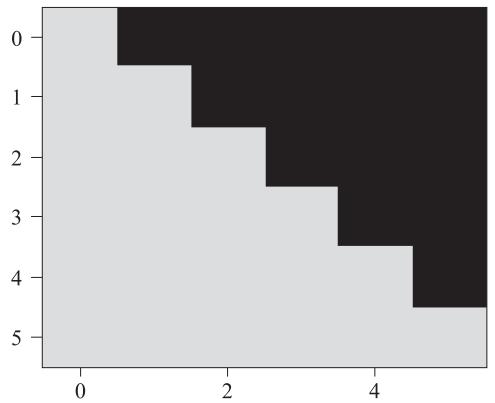  
图 8-23 序列掩码示意图

查看序列掩码情况，具体如下：

```txt
subsequent_mask(6)[0]  
ensor([[ True, False, False, False, False, False], [ True, True, False, False, False, False], [ True, True, True, False, False, False], [ True, True, True, True, False, False], [ True, True, True, True, True, False], [ True, True, True, True, True, True]) 
```

我们发现它输出的是一个方阵，对角线及以下都是 True。第一行只有第一列是 True，它的意思是时刻 1 只能关注输入 1，第三行说明时刻 3 可以关注 {1,2,3} 而不能关注 {4,5,6}的输入，因为在真正解码的时候，这是属于未来的信息。知道了这个函数的用途之后，上面的代码就很容易理解了。

# 8.2.4 构建多头注意力

多头注意力类似于卷积网络中构建多通道，目的都是提升模型的泛化能力。下面来看具体构建过程。

# （1）定义注意力

注意力（包括自注意力和普通的注意力）可以看成一个函数，它的输入参数是 query、key、value 和 mask，输出是一个张量。其中输出是 value 的加权平均，而权重由 query 和key 计算得出。具体的计算公式如下：

$$
\operatorname {A t t e n t i o n} (Q, K, V) = \operatorname {s o f t m a x} \frac {Q K ^ {\mathrm {T}}}{\sqrt {d _ {k}}} V \tag {8.2}
$$

具体实现代码如下：

```python
def attention(query, key, value, mask=None, dropout=None):  
    d_k = query.size(-1)  
    scores = torch/matmul(query, key.transpose(-2, -1)) / math.sqrt(d_k)  
    if mask is not None:  
        scores = scoresmasked_fill-mouth == 0, -1e9)  
    p_attn = F softmax(scores, dim = -1)  
    if dropout is not None:  
        p_attn = dropout(p_attn)  
    return torch/matmul(p_attn, value), p_attn 
```

上面的代码与公式稍有不同的是， $\varrho$ 和 $\pmb { K }$ 都是 4 维张量，包括 batch 和 head 维度。torch.matmul 方法会把 query 和 key 的最后两维进行矩阵乘法，这样效率更高，如果我们要用标准的矩阵（2 维张量）乘法来实现，那么需要遍历 batch 维度和 head 维度。

用一个具体例子跟踪一些不同张量的形状变化，然后对照公式就很容易理解。比如 $\varrho$ 是 (30,8,33,64)，其中 30 是 batch 个数，8 是 head 个数，33 是序列长度，64 是每个时刻的特征数。 $\pmb { K }$ 和 $\varrho$ 的形状必须相同，而 $V$ 可以不同，但在这里，其形状也是相同的。scores.masked_fill(mask $\scriptstyle = = 0$ , -1e9) 用于把 mask 为 0 的得分变成一个很小的数，这样后面经过softmax 函数计算之后的概率就很接近 0。自注意力中的掩码主要是 Padding 格式，与解码器中的掩码格式不同。

接下来对 score 进行 softmax 函数计算，把得分变成概率 p_attn，如果有 dropout 操作，则对 p_attn 进行 dropout（原论文中没有 dropout）。最后将 p_attn 和 value 相乘。p_attn 是(30, 8, 33, 33)，value 是 (30, 8, 33, 64)，我们只看后两维，最终得到 $3 3 \times 6 4$ 。

# （2）定义多头注意力

对于每一个头，都使用三个矩阵 $W ^ { \varrho }$ 、 $\boldsymbol { W } ^ { K }$ 、 $\boldsymbol { W } ^ { V }$ 把输入转换成 $Q$ 、 $K$ 和 $V$ ，然后分别用每一个头进行自注意力的计算，把 $N$ 个头的输出拼接起来，与矩阵W0 相乘。多头注意力的具体计算公式如下：

$$
\operatorname {M u l t i H e a d} (Q, K, V) = \operatorname {c o n c a t} \left(\operatorname {h e a d} _ {1}, \operatorname {h e a d} _ {2}, \dots , \operatorname {h e a d} _ {h}\right) W ^ {0} \tag {8.3}
$$

$$
\operatorname {h e a d} _ {i} = \operatorname {A t t e n t i o n} \left(\boldsymbol {Q} \boldsymbol {W} _ {i} ^ {Q}, \boldsymbol {K} \boldsymbol {W} _ {i} ^ {K}, \boldsymbol {V} \boldsymbol {W} _ {i} ^ {V}\right) \tag {8.4}
$$

这里的映射是参数矩阵

$$
\boldsymbol {W} _ {i} ^ {\boldsymbol {Q}} \in \mathbb {R} ^ {d _ {\text {m o d e l}} d _ {k}}, \boldsymbol {W} _ {i} ^ {\boldsymbol {K}} \in \mathbb {R} ^ {d _ {\text {m o d e l}} d _ {k}}, \boldsymbol {W} _ {i} ^ {\boldsymbol {V}} \in \mathbb {R} ^ {d _ {\text {m o d e l}} d _ {v}}, \boldsymbol {W} _ {i} ^ {0} \in \mathbb {R} ^ {h d _ {v} d _ {\text {m o d e l}}}
$$

其中， $h { = } 8$ ， $d _ { k } = d _ { \nu } = \frac { d _ { \mathrm { m o d e l } } } { h } = 6 4$ =dmodel 64。

详细的计算过程如下：

class MultiHeadedAttention(nnModule): def__init__(self,h,d_model,dropout $= 0.1$ ： super(MultiHeadedAttention,self).__init_（） assertd_model $\% \mathrm{h} = = 0$ #假设d_v=d_k self.d_k=d_model//h self.h=h self竖线 $\equiv$ clones(nn.Linear(d_model，d_model)，4) self.attn $\equiv$ None self_dropout $\equiv$ nn_dropout(pdropout) defforward(self,query,key, value,mask=None: ifmaskisnotNone: mask $\equiv$ mask unsqueeze(1) nbatches $\equiv$ query.size(0) #1）首先使用线性变换，然后把d_model分配给h个head，每个head为 #d_k=d_model/h query,key, value $=$ [l(x).view(nbatches,-1,self.h,self.d_k).transpose(1,2) for1,x in zip(self竖线ars,(query,key, value))] #2）使用attention函数计算缩放的点积注意力 x,self.attn $\equiv$ attention(query,key, value,mask=mask, dropout $\equiv$ self_dropout) #3）实现多头自注意力，用view函数把8个head的64维向量拼 #接成一个512的向量 #然后再使用一个线性变换（512,512），形状不变 $\mathbf{x} = \mathbf{x}$ .transpose(1,2).contiguous() $\backslash$ .view(nbatches,-1,self.h\*self.d_k) return self竖线ars[-1](x)

其中，zip(self.linears, (query, key, value)) 是把 (self.linears[0],self.linears[1],self.linears[2])和 (query, key, value) 放到一起再进行遍历。我们只看 self.linears[0] (query)。根据构造函数的定义，self.linears[0] 是一个 (512, 512) 的矩阵，而 query 是 (batch, time, 512)，相乘之后得到新的 query 还是 512(d_model) 维的向量，然后用 view 方法把它变成 (batch, time, 8,64)。然后转换成 (batch, 8,time,64)，这是 attention 函数要求的形状，分别对应 8 个头，每个头的 query 向量都是 64 维。

key 和 value 的运算完全相同，因此我们也分别得到 8 个头的 64 维的 key 和 64 维的value。接下来调用 attention 函数，得到 x 和 self.attn。其中 $\mathbf { X }$ 的形状是 (batch, 8, time, 64)，而 attn 的形状是 (batch, 8, time, time)，把 x 转换成 (batch, time, 8, 64)，然后用 view 方法把它变成 (batch, time, 512)，其实就是把最后 8 个 64 维的向量拼接成 512 的向量。最后使用 self.linears[-1] 对 x 进行线性变换，self.linears[-1] 是 (512, 512) 的，因此最终的输出还

是 (batch, time, 512)。我们最初构造了 4 个 (512, 512) 的矩阵，前 3 个用于对 query、key 和value 进行变换，而最后一个对 8 个头拼接后的向量再做一次变换。

多头注意力在 Transformer 模型中应用非常广泛，在编码器、解码器以及编码器 - 解码器中都有应用：

● 编码器的自注意力层 query、key 和 value 都是相同的值，来自下层的输入。掩码都是 1（填充的不算）。  
解码器的自注意力层 query、key 和 value 都是相同的值，来自下层的输入。但是掩码使得它不能访问未来的输入。  
编码器 - 解码器的普通注意力层 query 来自下层的输入，而 key 和 value 相同，是编码器最后一层的输出，而掩码都是 1。

# 8.2.5 构建前馈神经网络层

除了注意子层之外，编码器和解码器中的每个层都包含一个完全连接的前馈网络，该网络层包括两个线性转换，中间有一个 ReLU 激活函数，具体公式为

$$
\operatorname {F F N} (x) = \max  \left(0, x \boldsymbol {W} _ {1} + \boldsymbol {b} _ {1}\right) \boldsymbol {W} _ {2} + \boldsymbol {b} _ {2} \tag {8.5}
$$

全连接层的输入和输出都是 512(d_model) 维的，中间隐单元的个数是 2048(d_ff)，具体代码如下：

```python
class PositionwiseFeedForward(nnModule): "实现FFN函数" def __init__(self, d_model, d_ff, dropout=0.1): super(PositionwiseFeedForward, self).__init_(   ) self.w_1 = nn.Linear(d_model, d_ff) self.w_2 = nn.Linear(d_ff, d_model) self_dropout = nn_dropoutdropout) def forward(self, x): return self.w_2(self_dropout(F.relu(self.w_1(x)))) 
```

# 8.2.6 预处理输入数据

输入的词序列都是 ID 序列，我们需要转为嵌入。源语言和目标语言都需要转为嵌入，此外我们还需要一个线性变换把隐变量变成输出概率，这可以通过前面的类生成器来实现。Transformer 模型的注意力机制并没有包含位置信息，即一句话中的词语在不同的位置时在Transformer 中是没有区别的，这当然是不符合实际的。因此，在 Transformer 中引入位置信息相比 CNN、RNN 等模型有更加重要的作用。论文作者添加位置编码的方法是：构造一个与输入嵌入维度一样的矩阵，然后与输入嵌入相加得到多头注意力的输入。预处理输入数据的过程如图 8-24 所示。

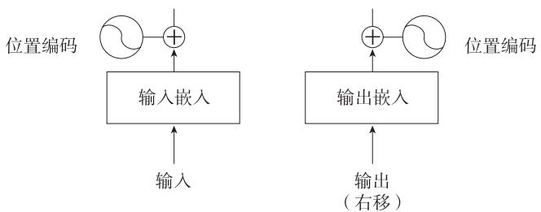  
图 8-24 预处理输入数据

1）把输入数据转换为嵌入，具体代码如下：

```python
class Embeddings(nnModule): def __init__(self, d_model, vocab): super(Embeddings, self).__init__(self.lut = nn.Embedding(vocab, d_model) self.d_model = d_model def forward(self, x): return self.lut(x) \* math.sqrt(self.d_model) 
```

2）添加位置编码。位置编码的公式如下：

$$
\mathrm {P E} (\text {p o s}, 2 i) = \sin (\text {p o s} / 1 0 0 0 0 ^ {2 i / d _ {\text {m o d e l}}}) \tag {8.6}
$$

$$
\mathrm {P E} (\text {p o s}, 2 i + 1) = \cos (\text {p o s} / 1 0 0 0 0 ^ {2 i / d _ {\text {m o d e l}}}) \tag {8.7}
$$

具体实现代码如下：

```python
class PositionalEncoding(nnModule):
    "实现PE函数"
    def __init__(self, d_model, dropout, max_len=5000):
        super(PositionalEncoding, self).__init__
        self_dropout = nn_dropout(p=dropout)
        #计算位置编码
        pe = torch.zeros(max_len, d_model)
        position = torch.arange(0, max_len).unsqueeze(1)
        div_term = torch.exp(torch.arange(0, d_model, 2) * -(math.log(10000.0) / d_model))
        pe[:, 0::2] = torch.sin(position * div_term)
        pe[:, 1::2] = torch.cos(position * div_term)
        pe = pe.unsqueeze(0)
        self.register_buffer('pe', pe)
    def forward(self, x):
        x = x + self.pe[:, :x.size(1)].clone().detach()
        return self_dropout(x) 
```

注意，这里调用了 register_buffer 函数。这个函数的作用是创建一个缓存变量，比如把pi 保存下来。register_buffer 通常用于保存一些模型参数之外的值，比如在批归一化中，我们需要保存 running_mean(Moving Average)，它不是模型的参数（不是通过迭代学习的参数），但是模型会修改它，而且在预测的时候也要用到它。这里也一样，pe 是一个提前计算好的常量，在构造函数中并没有把 pe 保存到 self 里，但是在 forward 函数中可以直接使用它（self.pe）。如果保存（序列化）模型到磁盘中，PyTorch 框架将保存 buffer 里的数据到磁盘，这样反序列化的时候能恢复它们。

3）可视化位置编码。假设输入是 ID 序列，长度为 10，如果输入转为嵌入之后是 (10,512)，那么位置编码的输出也是 (10, 512)。式（8.6）和式（8.7）中 pos 就是位置对应的索引（ $0 { \sim } 9$ ），偶数维使用 sin 函数，而奇数维使用 cos 函数。这种位置编码的好处是：PE 可以表示成 $\mathrm { P E } { + } \mathbf { X }$ 式的线性函数，这样网络就能很容易地学到相对位置的关系。图 8-25 是一个示例，向量的大小 d_mode $scriptstyle \lfloor = 2 0$ ，这里画出来第 4、5、6 和 7 维（下标从零开始）的图像，最大的位置是 100。可以看到，它们都是正弦（余弦）函数，而且周期越来越长。

```txt
## 语句长度为100，这里假设d_model=20
plt.figure(figsize=(15, 5))
pe = PositionalEncoding(20, 0)
y = pe.forward(torch.zeros(1, 100, 20))
plt.plot(np.arange(100), y[0, :, 4:8].data.numpy())
pltlegend(['dim %d']%p for p in [4,5,6,7]) 
```

运行结果如图 8-25 所示。

  
图 8-25 位置编码示意图

4）下面来看一个生成位置编码的简单示例，代码如下：

```txt
d_model, dropout, max_len=512,0,5000  
pe = torch.zeros(max_len, d_model)  
position = torch.arange(0, max_len).unsqueeze(1)  
div_term = torch.exp(torch.arange(0, d_model, 2) *-(math.log(10000.0) / d_model))  
pe[:, 0::2] = torch.sin(position * div_term)  
pe[:, 1::2] = torch.cos(position * div_term) 
```

```txt
print(pe.shape)  
pe = pe unsqueeze(0)  
print(pe.shape) 
```

# 8.2.7 构建完整网络

把前面创建的各网络层整合成一个完整网络。

def make_model(src_vocab,tgt_vocab,N=6,d_model=512，d_ff=2048，h=8，dropout=0.1)："构建模型"c $=$ copy.deepcopyattn $=$ MultiHeadedAttention(h，d_model)ff $=$ PositionwiseFeedForward(d_model，d_ff，dropout)position $=$ PositionalEncoding(d_model，dropout)model $=$ EncoderDecoderEncoder(Encoder(EncoderLayer(d_model，c.attn)，c(ff)，dropout)，N),Decoder(DecoderLayer(d_model，c(attn)，c(attn)，c(ff)，dropout)，N),nn Sequential(Embeddings(d_model，src_vocab)，c(position)),nn Sequential(Embeddings(d_model，tgt_vocab)，c(position))，Generator(d_model，tgt_vocab))#随机初始化参数，非常重要，这里用xavierfor p in model.params():if p.dim()>1:nn.init.xavier.uniform_(p)return model

首 先 把 copy.deepcopy 命 名 为 c， 这 样 可 以 使 下 面 的 代 码 简 洁 一 些。 然 后 构 造MultiHeadedAttention、PositionwiseFeedForward 和 PositionalEncoding 对象。接着构造 Encoder-Decoder 对象，它需要 5 个参数，包括 encoder、decoder、src-embed、tgt-embed 和 generator。

我们先看后面3个简单的参数，参数generator直接构造即可，它的作用是把模型的隐单元变成输出词的概率。而src-embed代表一个嵌入层和一个位置编码层，tgt-embed也是类似的。

最后我们来看参数 decoder（encoder 与 decoder 类似，这里以 decoder 为例介绍）。解码器由 N 个子层组成，而每个子层需要传入 self-attn 层、src-attn 层、全连接层和 dropout层。因为所有的多头注意力训练都是一样的，因此我们直接深度复制即可。同理，所有的前馈神经网络的结果也是一样的，我们可以深度复制而不需要再进行构造。

实例化这个类，可以看到模型包含哪些组件，代码如下：

测试一个简单模型，输入、目标语句长度分别为10，编码器、解码器各2层tmp_model $=$ make_model(10，10，2)tmp_model

# 8.2.8 训练模型

1）训练前，先介绍便于批次训练的一个 Batch 类。

```python
class Batch: "在训练期间，构建带有掩码的批量数据" def __init__(self, src, trg=None, pad=0): self.src = src self.src_mask = (src != pad).unsqueeze(-2) if trg is not None: self.trg = trg:, :-1] self.trg_y = trg:, 1:] self.trg_mask = \ self.make_std_mask(self.trg, pad) self.ntokens = (self.trg_y != pad).data.sum() @staticmethod def make_std_mask(tgt, pad): tgt_mask = (tgt != pad).unsqueeze(-2) tgt_mask = tgt_mask & subsequent_mask(tgt.size(-1)).type_as(tgt_mask.data). clone().detach() return tgt_mask 
```

Batch 构造函数的输入参数是 src、trg 和 pad，其中参数 trg 的默认值为 None，刚预测的时候是没有参数 tgt 的。上述代码是训练阶段的一个 Batch 代码，它假设 src 的维度为(40, 20)，其中 40 是批量大小，而 20 是最长的句子长度，其他不够长的都填充成 20。而trg 的维度为 (40, 25)，表示翻译后的最长句子是 25 个词，不足的也填充对齐。

src_mask 如何实现呢？注意表达式 (src != pad) 把 src 中大于 0 的时刻置为 1，这样表示它已在关注的范围。然后 unsqueeze(-2) 方法把 src_mask 变成 (40/batch, 1, 20/time)。它的用法参考前面的 attention 函数。

对自注意力训练来说，输入和输出都是相同的句子。比如，输入序列“it is a good day”经过自注意力机制的处理后，会得到一系列的权重系数，这些权重系数表示输入序列中不同位置之间的相关性得分。然后，模型会使用这些权重系数来计算输出序列，即“it is agood day”。对应到代码中，self.trg 就是输入，而 self.trg_y 就是输出。接着对输入 self.trg进行掩码操作，使得自注意力不能访问未来的输入。这是通过 make_std_mask 函数实现的，这个函数会调用我们之前详细介绍过的 subsequent_mask 函数。最终得到的 trg_mask 的形状是 (40/batch, 24, 24)，表示 24 个时间步的掩码矩阵，这是一个对角线以及之下都是 1 的矩阵，前面已经介绍过了。

2）构建训练迭代函数。

```python
def run_epoch(data_iter, model, loss_compute):
    start = time.time()
    total_tokens = 0
    total_loss = 0
    tokens = 0
    for i, batch in enumerate(data_iter):
        out = model.forward(batch.src, batch.trg, batch.src_mask, batch.trg_mask)
        loss = loss_compute(out, batch.trg_y, batch.ntokens)
        total_loss += loss
        total_tokens += batch.ntokens
        tokens += batch.ntokens
        if i % 50 == 1:
            elapsed = time.time() - start
            print("Epoch Step: %d Loss: %f Tokens per Sec: %f" %
            (i, loss / batch.ntokens, tokens / elapsed))
            start = time.time()
            tokens = 0
    return total_loss / total_tokens 
```

它遍历一个 epoch 的数据，然后调用 forward 函数，接着用 loss_compute 函数计算梯度，更新参数并且返回 loss。

3）对数据进行批量处理。

```python
global max_src_in_batch, max_tgt_in_batch  
def batch_size_fn(new, count, sofar):  
    global max_src_in_batch, max_tgt_in_batch  
    if count == 1:  
        max_src_in_batch = 0  
        max_tgt_in_batch = 0  
        max_src_in_batch = max(max_src_in_batch, len(new.src))  
        max_tgt_in_batch = max(max_tgt_in_batch, len(new.trg) + 2)  
        src_elements = count * max_src_in_batch  
        tgt_elements = count * max_tgt_in_batch  
        return max(src_elements, tgt_elements) 
```

4）定义优化器。

class NoamOpt: def__init__(self，model_size，factor，warmup，optimizer): self optimizer $=$ optimizer self._step $= 0$ self.warmup $\equiv$ warmup

```python
self.factor \(=\) factor   
self.model_size \(\equiv\) model_size   
self._rate \(= 0\)   
def step(self):   
"更新参数及学习率"   
self._step \(+ = 1\)   
rate \(=\) self RATE()   
for p in selfOptimizer param_groups: \(\mathrm{p[('lr'] = rate}\)   
self._rate \(=\) rate   
selfOptimizer.step()   
def rate(self,step \(=\) None): if step is None: step \(=\) self._step   
return self.factor\(\ast\) \\(elf.model_size \)\ast \ast (-0.5)\( \* min(step \)\ast \ast (-0.5)\( ,step \)\ast$ self.warmup \)\ast \ast (-1.5))   
def get_std_opt(model): return NoamOpt(model.src_embedding[0].d_model,2,4000, torch.optim.Adam(model.params(),lr=0,betas=(0.9,0.98),eps=1e-9)) 
```

5）可视化不同场景下学习率的变化情况。

```txt
超参数学习率的3个场景  
opts = [NoamOpt(512, 1, 4000, None), NoamOpt(512, 1, 8000, None), NoamOpt(256, 1, 4000, None)]  
plt.plot(np.arange(1, 20000), [[opt(rate(i) for opt in opts] for i in range(1, 20000)])  
pltlegend(['512:4000", "512:8000", "256:4000)]) 
```

运行结果如图 8-26 所示。

  
图 8-26 不同场景下学习率的变化情况

6）归一化。对标签做归一化平滑处理，这样处理有利于提高模型的准确性和 BLEU（Bilingual Evaluation Understudy，双语评估研究）分数。

class LabelSmoothing(nnModule): def __init__(self, size, paddingidx, smoothing=0.0): super(LabelSmoothing, self).__init__( ） #self.criterion $=$ nn.KLDivLoss(size_average $\equiv$ False) self.criterion $=$ nn.KLDivLoss(reduction $\coloneqq$ 'sum') self(paddingidx $=$ paddingidx self.confidence $= 1.0$ -smoothing self.smoothing $=$ smoothing self.size $=$ size self true_dist $=$ None def forward(self,x,target): assert x.size(1) $= =$ self.size true_dist $=$ x.data.clone() true_dist fills_(self.smoothing / (self.size-2)) true_dist.scatter_(1,target.data unsqueeze(1)，self.confidence) true_dist[：,self(paddingidx] $= 0$ mask $=$ torch.nonzero(target.data $= =$ self(paddingidx) if mask.dim(>0: true_dist.index_fill_(0，mask.squeeze(),0.0) selftrue_dist $=$ true_dist return self.criterion(x，true_dist.clone().detach())

对标签进行平滑处理，代码如下：

```python
crit = LabelSmoothing(5, 0, 0.4)
predict = torch FloatTensor([[0, 0.2, 0.7, 0.1, 0],
[0, 0.2, 0.7, 0.1, 0],
[0, 0.2, 0.7, 0.1, 0]])
v = crit.predict.log().clone().detach(), torch.LongTensor([[2, 1, 0]).clone().detach())
plt.imshow(crittrue_dist) 
```

运行结果如图 8-27 所示。

由图 8-27 可以看到，质量是如何根据置信度分配给单词的。

```python
crit = LabelSmoothing(5, 0, 0.1)
def loss(x):
    d = x + 3 * 1
    predict = torch FloatTensor([[0, x / d, 1 / d, 1 / d, 1 / d],])
    return crit(predict.log().clone().detach(), torch.LongTensor([1]).clone().detach()).item()
plt.plot(np.arange(1, 100), [loss(x) for x in range(1, 100)]) 
```

  
图 8-27 标签分布图

运行结果如图 8-28 所示。

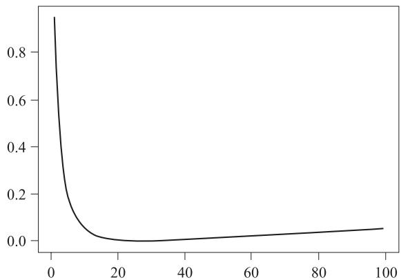  
图 8-28 对标签平滑处理后的损失值变化图

从图8-28 可以看出，使用标签平滑技术可以避免模型对于特定选择太过自信，通过对标签进行正则化，模型会更加谨慎地对待每个可能的选择，从而提高模型的泛化能力和鲁棒性。

# 8.2.9 一个简单实例

1）生成合成数据。

```python
def data_gen(V, batch, nbatches):
    for i in range(nbatches):
        data = torch.from_numpy(np.random.randint(1, V, size=(batch, 10))).long()
        data[:, 0] = 1
        src = data.clone().detach()
        tgt = data.clone().detach()
        yield Batch(src, tgt, 0) 
```

2）定义损失函数。

class SimpleLossCompute: def init_self, generator, criterion, opt=None): self.generator $=$ generator self.criterion $=$ criterion self.opt $=$ opt def call_self,x,y,norm): $\mathbf{x} =$ self.generator(x) loss $=$ self.criterion(x.contiguous().view(-1,x.size(-1)), y.contiguous().view(-1)) / norm loss.backup() if self.opt is not None: self.opt step() self.optOptimizer.zero_grad() return loss.item(）\*norm

3）训练简单任务。

$\mathrm{V} = 11$ criterion $=$ LabelSmoothing(size $\coloneqq$ V，padding_idx $\coloneqq$ 0，smoothing $\coloneqq$ 0.0)   
model $=$ make_model(V,V,N=2)   
model_opt $=$ NoamOpt(model.src_embedding[O].d_model,1,400, torch.optim.Adam(model.params(),lr $\coloneqq$ 0，betas=(0.9，0.98)，eps $\coloneqq$ 1e-9))   
for epoch in range(10): model.train() run_epoch(data_gen(V，30，20)，model,SimpleLossCompute(model.generator, criterion，model_opt)) model.eval() print(run_epoch(data_gen(V，30，5)，model,SimpleLossCompute(model.generator, criterion，None)))

运行结果（最后几次迭代的结果）如下：

```txt
Epoch Step: 1 Loss: 1.249925 Tokens per Sec: 1429.082397  
Epoch Step: 1 Loss: 0.460243 Tokens per Sec: 1860.120972  
tensor(0.3935)  
Epoch Step: 1 Loss: 0.966166 Tokens per Sec: 1433.039185  
Epoch Step: 1 Loss: 0.198598 Tokens per Sec: 1917.530884  
tensor(0.1874) 
```

4）为了简单起见，此代码使用贪婪解码来预测翻译。

```txt
def greedydecode(model, src, src_mask, max_len, start_SYMBOL): 
```

memory $=$ model.encode(src,src_mask)   
ys $=$ torch.ones(1,1).fill_(start_SYMBOL).type_as(src.data)   
for i in range(max_len-1): out $=$ modeldecode记忆，src_mask,ys，subsequent_mask(torch.tensor(ys. size(1)).type_as(src.data))) prob $=$ model.generator(out[:,-1]) _，next_word $=$ torch.max(prob，dim $= 1$ ) next_word $\equiv$ next_word.data[0] ys $=$ torch.cat([ys，torch.ones(1,1).type_as(src.data).fill_(next_word)],dim=1) return ys   
model.eval()   
src $=$ torch.LongTensor([[1,2,3,4,5,6,7,8,9,10]])   
src_mask $=$ torch.ones(1,1,10)   
print(greedydecode(model，src，src_mask，max_len $= 10$ ，start_SYMBOL $= 1$ ）

运行结果如下：

```txt
tensor([1, 2, 3, 4, 4, 6, 7, 8, 9, 10])
```

# 第 9 章

# 大语言模型

在基于 Transformer 构建的大语言模型中，最著名的两个模型是 OpenAI 的 GPT 和Google 的 BERT。二者虽然都是基于 Transformer 构建的，但原理有很大不同。BERT 仅运用了 Transformer 的编码器（Encoder）架构，而编码器中采用了自注意力机制，即训练中生成每一个词时都需要对整个输入序列的上下文进行相关性分析，从模式上来看更接近于一个完形填空模型。而 GPT 运用了 Transformer 的解码器（Decoder）架构，解码器中的自注意力机制是遮掩自注意力机制（Masked Self-attention），在训练时会对下文进行遮掩处理，仅基于上文来生成下文。因此，GPT 更接近人类的语言生成模式，更适合用来构建语言生成模型。

# 9.1 大语言模型简介

2017 年 Transformer 模型的发布，标志着自然语言处理（NLP）领域正式步入大语言模型时代。次年，OpenAI 的 GPT 模型与谷歌的 BERT 模型相继推出。2018 年 6 月，OpenAI发布了 GPT 的初代版本 GPT-1，GPT-1 运用了 Transformer 的解码器架构中的遮掩自注意力机制。目前，GPT 已经迭代到了 GPT-4。毫无疑问，GPT 模型已经成为当前最为强大的语 言 模 型。2018 年 10 月，Google 发 布 了 BERT 模 型。BERT 采 用 了 Transformer 的 编 码器架构中的自注意力机制，作为一个拥有 3 倍于 GPT 参数量的更大体量的语言模型，它在当时的多项测评及业内影响力等方面要领先于 GPT 的初代版本。特别是在 BERT 开源之后，Meta（原 Facebook）、百度等国内外大厂均推出了基于 BERT 开发的大模型，如 Meta的 XLM、RoBERTa 模型，百度的文心一言等。大语言模型的大致分类和发展情况如图 9-1所示。

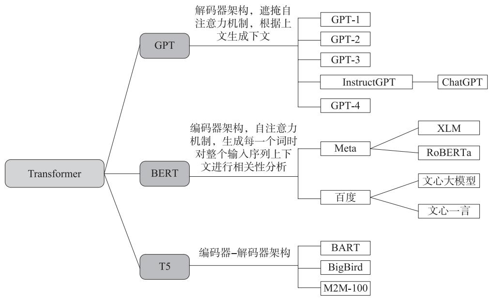  
图 9-1 各大语言模型的大致分类和发展情况

GPT 模型由 GPT-1 升级到 GPT-3 的大致过程如图 9-2 所示。

GPT-1（2018)

GPT-2(2019)

GPT-3（2020）

$\textcircled{1}$ 取Transformer中的解码器部分  
$\textcircled{2}$ 参数量：1亿左右  
$\textcircled{3}$ 预训练数据量：5GB左右  
④GPT只保留了遮掩多头注意力，如下图所示

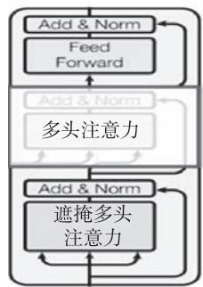  
图 9-2 GPT 模型的升级过程

GPT解码器

GPT-2在GPT-1基础上的改进

$\textcircled{1}$ 增加Decoder层数，由12层升级到48层  
$\textcircled{2}$ 参数量：15亿左右  
$\textcircled{3}$ 预训练数据量：40GB左右  
$\textcircled{4}$ 输入词嵌入（即把词转换为向量后的长度）维度由768维扩大到1600维  
$\textcircled{5}$ 上下文窗口（可理解为每次输入的语句长度）扩大到1024  
$\textcircled{6}$ 数据类型更多，数据质量更高  
$\textcircled{7}$ 对下游采用无监督学习方式，对不同的下游任务不改变参数及模型（即所谓的zero-shot seting ）

GPT-3在GPT-2基础上的改进

$\textcircled{1}$ 将Decoder层数增加到96层  
②参数量：1750亿左右  
$\textcircled{3}$ 预训练数据量：45TB左右  
$\textcircled{4}$ 输入词嵌入维度由1600维扩大到128888维  
③上下文窗口由1024扩大到2048   
⑥从语言到图像的转向  
?使用更少的领域数据，甚至不经过微调步骤去解决问题  
③采用交替密集和局部带状稀疏的注意力模式，这种模式只关注k个贡献最大的状态。通过显式选择，只关注少数几个元素，与查询不高度相关的值将被归0

# 9.2 可视化 GPT 原理

GPT 系列（包括 GPT-2、GPT-3）都使用了 Transformer 的解码器部分。

# 9.2.1 GPT 简介

GPT 模型只使用了 Transformer 中的解码器，采用了传统的语言模型进行训练，即使用单词的上文预测单词。因此，GPT 更擅长处理自然语言生成任务（NLG）。后续还将介绍BERT 模型。BERT 模型只使用了 Transformer 中的编码器，更擅长处理自然语言理解任务（NLU）。

# 9.2.2 GPT 的整体架构

GPT 预训练的方式和传统的语言模型一样，即通过上文预测下一个单词。GPT 的整体架构如图 9-3 所示。

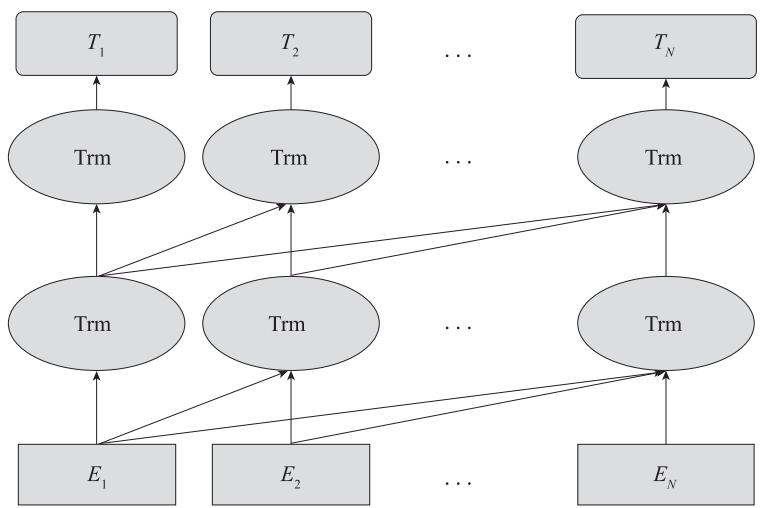  
图 9-3 GPT 的整体架构

其中，Trm 表示解码器模块，在同一水平线上的 Trm 表示在同一个单元， $E _ { i }$ 表示词嵌入，那些复杂的连线表示词与词之间的依赖关系。显然，GPT 要预测的词只依赖前文。

作为 GPT 的改进版本，GPT-2 的架构与 GPT 基本相同，只是训练数据量和架构规模更大一些。按照规模大小，GPT-2 大致可以分为 4 个版本，如图 9-4 所示。

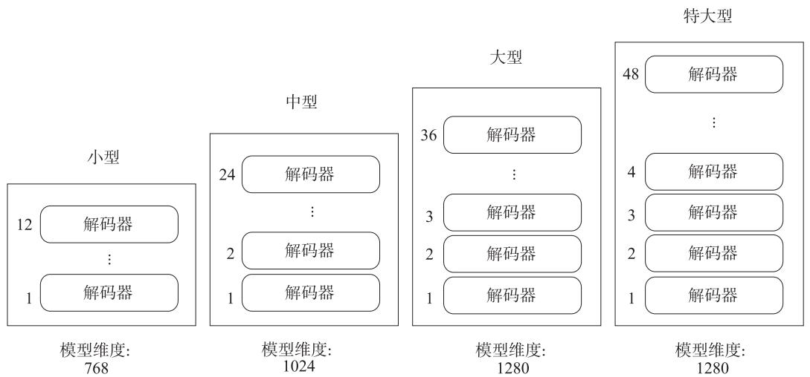  
图 9-4 GPT-2 的 4 种模型

# 9.2.3 GPT 模型架构

GPT 使用 Transformer 的解码器架构，但对 Transformer 解码器进行了一些修改：原本的解码器包含两个多头自注意力结构，GPT 只保留了遮掩多头注意力，如图 9-5 所示。

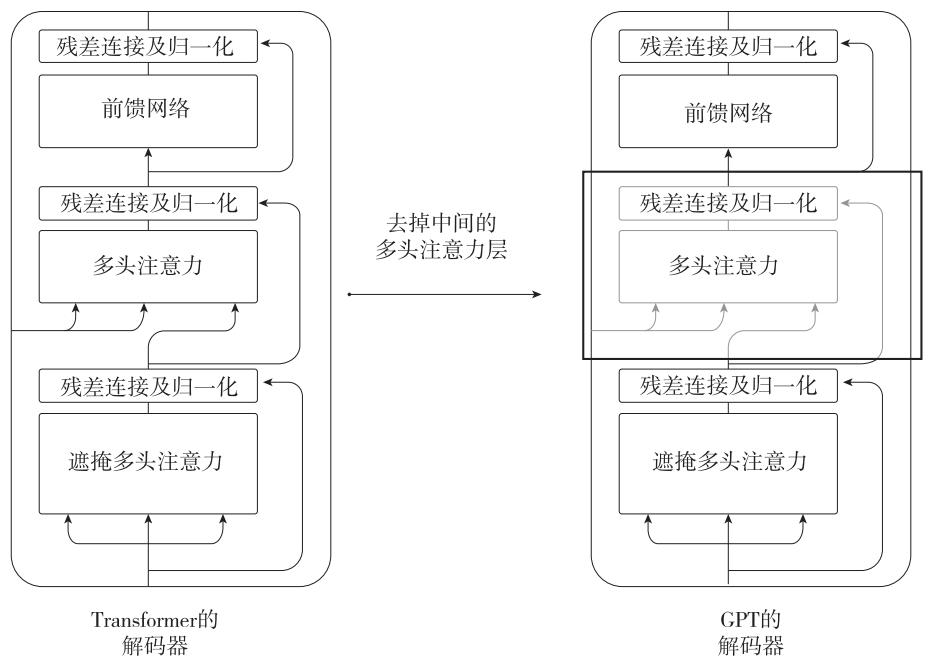  
图 9-5 GPT 的模型架构

# 9.2.4 GPT-2 与 BERT 的多头注意力的区别

BERT 使用多头注意力机制，可以同时从某个词的左右两边进行关注。而 GPT-2 采用遮掩多头注意力，只能关注词的左边，如图 9-6 所示。


  
图 9-6 BERT 与 GPT-2 的多头注意力的区别

从图 9-6 左图可以看出，BERT 的输入是双向的，能够同时考虑上下文信息。BERT 的多个注意力头主要被用于对输入序列中的不同位置进行编码，从而为下游任务提供更全面的语义理解，故 BERT 的多头注意力善于语义表示。而 GPT-2 的这种设计（图 9-6 右图）能够帮助模型更好地理解上下文，并生成连贯的文本，故 GPT-2 的多头注意力善于生成文本。

# 9.2.5 GPT-2 的输入

GPT-2 的输入涉及两个权重矩阵：标记嵌入（Token Embedding）矩阵和位置编码（PositionalEncoding）矩阵。标记嵌入矩阵用于记录所有单词或标识符，其大小为 mode_vocabulary_size $\times$ Embedding_size。位置编码矩阵用于表示单词在上下文中的位置，其大小为context_size $\times$ Embedding_size，其中 Embedding_size 由 GPT-2 模型的大小而定，小型为 768，中型为1024，以此类推。输入GPT-2 模型前，需要给标记嵌入加上对应的位置编码，如图9-7所示。

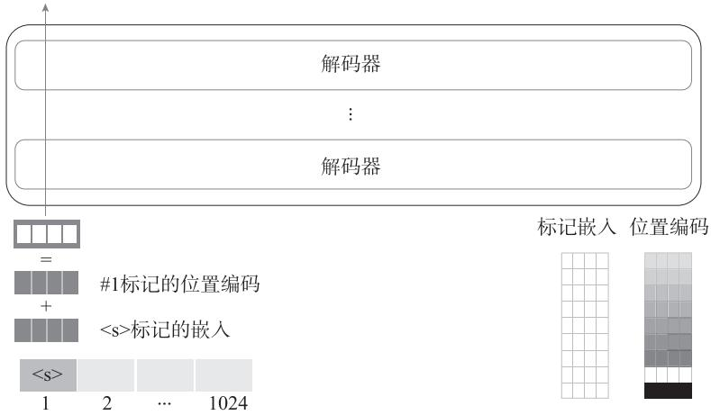  
图 9-7 GPT-2 的输入数据

在图 9-7 中，每个标记的位置编码在各层解码器中是不变的，该位置编码不是一个学习向量。

# 9.2.6 GPT-2 计算遮掩自注意力的详细过程

假设输入语句为 robot must obey orders，接下来以单词 must 为查询词计算它对其他单词的关注度（即分数），具体步骤如下。

# （1）创建向量 $\varrho$ 、K、V

将每个输入单词分别与权重矩阵 $W ^ { Q } , W ^ { K } , W ^ { V }$ 相乘，得到一个查询向量（query vector，记为 $\varrho$ ）、一个关键字向量（key vector，记为 $\pmb { K }$ ）和一个分数向量（value vector，记为 $V$ ），如图 9-8 所示。

  
图 9-8 生成自注意力中的 K、 $\varrho$ 、 $V ^ { \circ }$

# （2）计算每个查询词对关键字的得分

计算每个查询词对关键字的得分，公式如图 9-9 所示。

  
图 9-9 查询词对关键字得分的计算过程

# （3）对所得的分数应用注意力遮掩

对所得的分数应用注意力遮掩，得到各分数的映射，如图 9-10 所示。

  
图 9-10 分数经过遮掩处理的映射

# （4）对经过遮掩处理的分数进行 softmax 函数计算

对经过遮掩处理的分数（遮掩分数）进行 softmax 函数计算，结果如图 9-11 所示。

  
图 9-11 对遮掩分数进行 softmax 函数计算后的结果

# （5）单词 must（即 $q _ { 2 }$ ）对各单词的得分

$q _ { 2 }$ 对各单词的得分如图 9-12 所示。

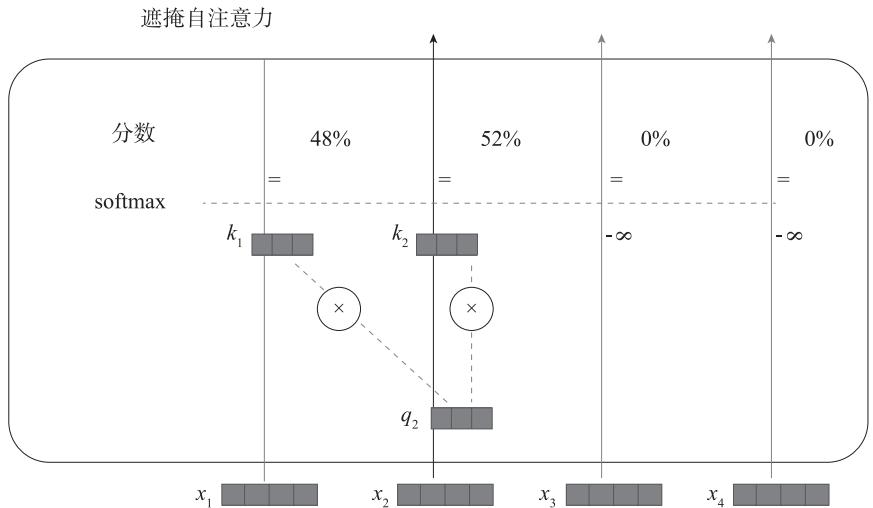  
图 9-12 $q _ { 2 }$ 对各单词的得分

# 9.2.7 GPT-2 的输出

在最后一层，对每个单词的输出乘以标记嵌入矩阵。然后经过softmax函数计算，得到模型字典中所有单词的得分，通过 top取值方法就可得到预测的单词。整个过程如图9-13 所示。

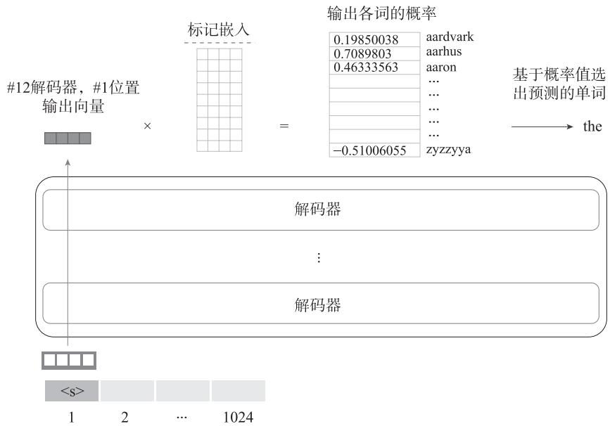  
图 9-13 得到 GPT-2 输出的详细过程

# 9.2.8 GPT-1 与 GPT-2 的异同

GPT-1 与 GPT-2 在架构上没有大的差别，只是在规模、数据量等方面略有不同，具体如下：

GPT-2 结构的规模更大，层数更多。  
. GPT-2 数据量更大，数据类型更多（这有利于增强模型的通用性），并对数据进行了更多的质量过滤和控制。  
. GPT-1 对不同的下游任务修改输入格式，并添加一个全连接层（Linear），采用有监督学习方式，如图 9-14 所示。而 GPT-2 对下游采用无监督学习方式，对不同的下游任务不改变参数及模型（即所谓的 zero-shot setting）。

图 9-14 左图为 Transformer 的架构和训练目标，右图是对不同任务进行微调时对输入的改造。

那么，GPT-1 是如何改造下游任务的呢？在微调时，针对不同的下游任务，主要改动GPT-1 的输入格式，先将不同任务通过数据组合代入 Transformer 模型，然后在模型输出的数据后加全连接层以适配标注数据的格式。具体情况大致如下：

  
图 9-14 GPT-1 的架构 ㊀

1）分类问题，改动很少，只要加上一个开始符和一个提取符即可。  
2）句子关系推断问题，比如 Entailment，两个句子中间再加个分隔符即可。  
3）文本相似性判断问题，把两个句子的顺序颠倒一下给出两个输入即可，这是为了告诉模型句子顺序不重要。  
4）多项选择问题，多路输入，每一路把文章和答案选项拼接作为一个输入即可。

从图 9-14 可以看出，这种改造还是很方便的，对于不同的任务只需要在输入部分改造即可。接下来介绍 GPT-3，它与 GPT-1、GPT-2 可以说是同一系列的不同版本。

# 9.3 GPT-3 简介

GPT-3依旧延续 GPT的单向语言模型训练方式，只是把模型的参数量增大到了 1750亿，并且使用45TB数据进行训练。同时，GPT-3主要聚焦于更通用的NLP 模型，在一系列基准测试和特定领域的NLP任务（从语言翻译到生成新闻）中达到最新的SOTA（State Of TheArt，前沿水平）结果。与GPT-2相比，GPT-3的图像生成功能更成熟，不须微调就可以将不完整的图像样本补全。GPT-3 意味着GPT从一代到三代实现了两个转向：

● 从语言到图像的转向；  
● 使用更少的领域数据，甚至不经过微调步骤就能解决问题。

（1）一般预训练模型的流程

一般预训练模型（如ELMo、BERT等）的流程如图9-15所示，其中微调是一个重要环节。

  
图 9-15 一般预训练模型的流程

# （2）GPT-3 与 BERT 的区别

一般预训练模型中微调是一个重要环节，但 GPT-3 却无须微调。除此之外，GPT-3 与一般预训练模型（这里以 BERT 为例）还有很多不同之处，具体可参考图 9-16。

  
图 9-16 GPT-3 与 BERT 的区别

# （3）GPT-3 与传统微调的区别

对下游任务的设置大致有以下 4 类。

1）微调。微调利用成千上万的下游任务标注数据来更新预训练模型中的权重以获得强大的性能。但是，该方法不仅导致每个新的下游任务都需要大量的标注语料，还导致模型在样本外的预测能力很弱。GPT-3 虽然理论上支持微调，但没有采用这种方法。  
2）少量示例（few-shot）。模型在推理阶段可以得到少量的下游任务示例作为限制条件，但是不允许更新预训练模型中的权重。

3）单个示例（one-shot）。模型在推理阶段仅得到一个下游任务示例。  
4）零示例（zero-shot）。模型在推理阶段仅得到一段以自然语言描述的下游任务说明。

GPT-3 与传统预训练模型对下游任务的处理方法的区别见图 9-17。


  
图 9-17 GPT-3 与传统微调用的三种设置方法比较

# （4）GPT-3 示例

GPT-3在许多NLP数据集上具有不错的性能，包括翻译、问答、纠错和文本填空等任务，甚至包括一些需要即时推理的任务。由于篇幅的原因，这里仅列举一个在语句纠错方面的应用示例。图9-18为使用GPT-3 进行文本纠错的实例，从纠错结果来看，效果很令人惊奇。

  
图 9-18 GPT-3 进行文本纠错的实例

# 9.4 可视化 BERT 原理

循环神经网络（如 LSTM）的训练需要按序列从左到右或从右到左，这严格限制了并发处理能力，对海量数据的训练而言是非常致命的。BERT 和 GPT 预训练模型很好地解决了这个问题，它们不基于 LSTM，而是基于可平行处理的 Transformer。

# 9.4.1 BERT 的整体架构

BERT 的整体架构如图 9-19 所示，它采用了 Transformer 中的编码器部分。

图 9-19 中的 Trm 指 Transformer 的编码器模块，该模块的架构如图 9-20 所示。

  
图 9-19 BERT 的整体架构 ㊀

  
图 9-20 Transformer 的编码器模块 ㊁

BERT 提供了基础和大型两种模型，对应的超参数分别如下：

● $\mathbf { B E R T _ { B A S E } }$ ： $L { = } 1 2$ ， $H { = } 7 6 8$ ， $A { = } 1 2$ ，参数总量为 1.1 亿。  
● BERT ： $L { = } 2 4$ ， $H { = } 1 0 2 4$ ， $A { = } 1 6$ ，参数总量为 3.4 亿。

其中， $L$ 表示网络的层数（即图 9-20 中的数量 $N$ ）， $H$ 表示隐层大小，A 表示多头注意力中自注意力头的数量，这里前馈网络的隐层大小与输入大小的比值一般设置为 4。两种模型的结构如图 9-21 所示。

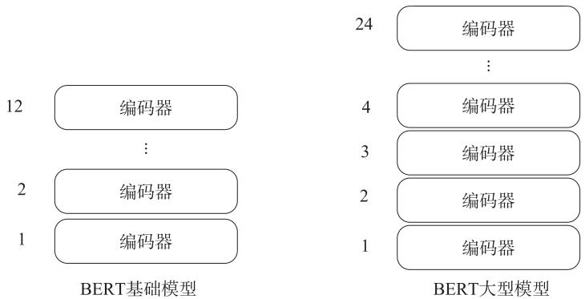  
图 9-21 BERT 两种模型的结构

其中 $H$ 与输入维度的大小关系，可参考如下代码：

```python
class TransformerBlock(nnModule): def __init__(self, k, heads): super().__init_( 
```

```txt
self attends = SelfAttention(k, heads = heads)
self(norm1 = nn.layersNorm(k))
self(norm2 = nn.layersNorm(k))
self.mlp = nn Sequential(
    nn.Linear(k, 4*k)
    nn.ReLU()
    nn.Linear(4*k, k)
) 
```

BERT 在海量语料的基础上进行自监督学习（在没有人工标注的数据上运行的监督学习）。在下游 NLP 任务中，可以直接使用 BERT 的特征表示作为该下游任务的词嵌入特征。所以 BERT 提供的是一个供下游任务迁移学习的模型，该模型可以在根据下游任务微调或者固定之后作为特征提取器。

# 9.4.2 BERT 的输入

BERT 的输入的编码向量（d_model=512）是 3 个嵌入特征的单位和，这 3 个词嵌入具备如下特征。

# （1）标记嵌入（Token Embedding）

英文语料库一般采用词块嵌入（WordPiece Embedding），也就是说，将单词划分成一组有限的公共子词单元，这样能在单词的有效性和字符的灵活性之间取得平衡。如把playing 拆分成 play 和 ing。如果是中文语料库，设置成 word 级即可。

# （2）位置嵌入（Positional Embedding）

位置嵌入是指将单词的位置信息编码成特征向量，是向模型中引入单词位置关系时至关重要的一环。这里的位置嵌入和 Transformer 的位置嵌入不一样，它不是通过三角函数计算出的，而是学习得到的。

# （3）段嵌入（Segment Embedding）

段嵌入用于判断两个句子的关系，例如 B 是不是 A 的下文（对话场景、问答场景等）。对于句子对，第一个句子的特征值是 0，第二个句子的特征值是 1。

其输入编码具体可参考图 9-22。

注意图 9-22 中的两个特殊符号 [CLS] 和 [SEP]：[CLS] 表示该特征用于分类模型，对

非分类模型，该符合可以省去；[SEP] 表示分句符号，用于分割输入语料中的两个句子。

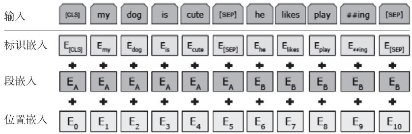  
图 9-22 BERT 的输入特征 ㊀

# 9.4.3 遮掩语言模型

遮 掩 语 言 模 型（Masked Language Model，MLM） 是 一 种 真 正 的 双 向 方 法。ELMo模型和 BERT 都是遮掩语言模型，它们的区别可从它们的目标函数看出。ELMo 以$P ( t _ { k } \mid t _ { 1 } , \cdots , t _ { k - 1 } ) , P ( t _ { k } \mid t _ { k + 1 } , \cdots , t _ { n } )$ 为目标函数，独立训练，最后将结果进行拼接。而 BERT 以$P ( t _ { k } \mid t _ { 1 } , \cdots , t _ { k - 1 } , t _ { k + 1 } , \cdots , t _ { n } )$ 为目标函数，这样学到的词向量可同时关注左右词的信息。

在 BERT 的训练过程中， $1 5 \%$ 的词块标记（对于中文，需设置为 word 级）会被随机遮掩掉。因测试环境没有遮掩这类标记，为尽量使训练和测试这两个环境接近，BERT 的提出者使用了一个遮掩小技巧，即在确定要遮掩掉的单词之后， $8 0 \%$ 的时候会直接将其替换为[Mask]， $1 0 \%$ 的时候将其替换为其他任意单词， $1 0 \%$ 的时候会保留原始标记。整个 MLM训练过程如图 9-23 所示。

  
图 9-23 BERT 的 MLM 训练过程

# 9.4.4 预测下一个句子

考虑到下游任务很多会涉及问答（QA）和自然语言推理（NLI）之类的任务，所以增加了两个句子的任务，即预测下一个句子（Next Sentence Prediction，NSP），目的是让模型理解两个句子之间的联系。在该任务中，训练的输入是句子 A 和 B，B 有一半的概率是 A的下一句，模型预测 B 是不是 A 的下一句。NSP 预训练的时候可以达到 $9 7 \% \sim 9 8 \%$ 的准确度。具体训练过程如图 9-24 所示。

  
图 9-24 BERT 的 NSP 训练过程

BERT 训练过程包括 MLM 及 NSP，其损失函数的具体定义如下（更多信息可参考Hugging Face 官网上的对应代码）：

classBertForPreTraining if labels is not None and nextsentence_label is not None: loss_fct $=$ CrossEntropyLoss() masked_lm_loss $=$ loss_fct(prediction Scores.view(-1, self.config.vocab_size), labels.view(-1)) nextsentence_loss $=$ loss_fct(seq relatonship_score.view(-1,2),nextsentence_ label.view(-1)) total_loss $=$ masked_lm_loss $+$ nextsentence_loss outputs $=$ (total_loss,) $^+$ outputs return outputs

# 9.4.5 微调

在完成 BERT 对下游的分类任务时，只需在 BERT 的基础上再添加一个输出层便可完

成对特定任务的微调。对分类问题可直接取第一个 [CLS] 标记的最后输出（即 final hiddenstate） $C \in { \boldsymbol { R } } ^ { H }$ ，加一层权重 W 后进行 softmax 函数计算来预测标签的概率：

$$
P = \operatorname {s o f t m a x} \left(C W ^ {\mathrm {T}}\right)
$$

对于其他下游任务，则需要进行一些调整，如图 9-25 所示。

  
a）句子对分类任务：  
MNLI, QQP, QNLI, STS-B,MRPC, ESWAG

  
b）单句分类任务：  
SST-2, CoLA

  
c）问答任务：SQuAD v1

图 9-25 对 BERT 预训练模型进行微调以完成相应的下游任务  
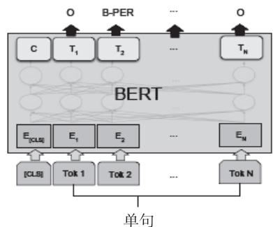  
d）单句标记任务： CoNLL-2003NER

图 9-25 中的 Tok 表示不同的标记（Token）， $E$ 表示嵌入向量， $\pmb { T } _ { i }$ 表示第 i 个标记经过BERT 处理后得到的特征向量。下面简单列举几种下游任务及其需要微调的内容。

（1）基于句子对的分类任务

MNLI：给定一个前提，推断假设与它的关系。MRPC：判断两个句子是否等价。

（2）基于单句的分类任务

SST-2：电影评价的情感分析。CoLA：句子语义判断，是否可接受。

（3）问答任务举例

SQuAD v1.1：给定一个句子（通常是一个问题）和一段描述文本，输出这个问题的答案，类似于做阅读理解的简答题。

# （4）单句标记任务

CoNLL-2003 NER：判断一个句子中的单词是不是人（Person）、组织（Organization）、位置（Location）或者其他（Other）等实体。

# 9.4.6 使用特征提取方法

除微调方法外，BERT 也可使用特征提取方法，使用预先训练好的 BERT 模型来创建上下文的单词嵌入，然后将这些词嵌入现有的模型中。本节介绍特征提取的简单示例，具体如图 9-26 所示。

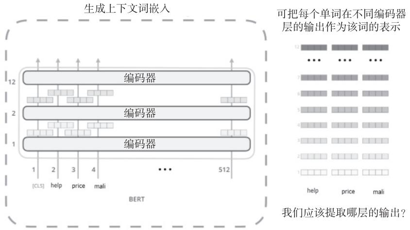  
图 9-26 BERT 使用特征提取方法示意图

将图 9-26 中各层的输出作为实体识别的特征，会有不同的性能指标，如图 9-27 所示。

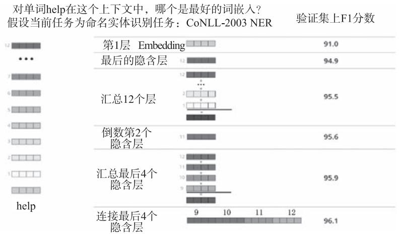  
图 9-27 BERT 不同层的输出对下游任务的影响

从图 9-27 可知，与视觉处理中卷积网络类似，使用特征提取方式时，不同层的输出具有不同的含义。

# 9.5 用 PyTorch 实现 BERT

用 PyTorch 实现 BERT 的核心代码主要有两个模块，一个是生成 BERT 输入的BERTEmbedding 类，另一个是 TransformerBlock 类。将这两个模块组合起来，即得 BERT的模块 bert.py。这些模块之间的关系如图 9-28 所示。

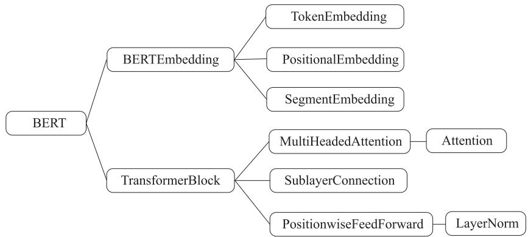  
图 9-28 BERT 的核心模块之间的关系

# 9.5.1 BERTEmbedding 类的代码

实现 BERTEmbedding 类的核心代码如下：

```python
import torch.nn as nn  
from model embedding_token import TokenEmbedding  
from model embedding.position import PositionalEmbedding  
from model embedding_segment import SegmentEmbedding  
class BERTEmbdding(nnModule):  
    BERT Embedding 包括以下特征：  
    1. TokenEmbedding: 正则嵌入矩阵  
    2. PositionalEmbedding: 使用sin、cos添加位置信息  
    3. SegmentEmbedding: 添加句段信息（sent_A:1，sent_B:2）  
    所有这些特征的总和构成BERTEmbdding的输出  
    def __init__(self, vocab_size, embed_size, dropout=0.1):  
        :paramvocab_size：总词汇量的大小
```

:param embed_size：标记嵌入的嵌入大小 :param dropout: dropout 比率 super(）.__init_(） self_token $=$ TokenEmbedding(vocab_size $\equiv$ vocab_size，embed_size $\equiv$ embed_size) self.position $=$ PositionalEmbedding(d_model $\equiv$ self_token. embedding_dim) self.segment $=$ SegmentEmbedding(embed_size $\equiv$ self_token. embedding_dim) self_dropout $=$ nn_dropout) self_embedding_size $=$ embed_size def forward(self, sequence, segment_label): x= self_token(sequence) $^+$ self.position(sequence) $^+$ self.segment segment segment_label) return self_dropout(x)

# 9.5.2 TransformerBlock 类的代码

实现 TransformerBlock 类的核心代码如下：

import torch.nn as nn   
from model attention import MultiHeadedAttention   
from model.utils import SublayerConnection, PositionwiseFeedForward   
class TransformerBlock(nnModule): Bidirectional Encoder $=$ Transformer (self-attention) Transformer $=$ MultiHead_Atention $^+$ Feed_Foward with sublayer connection def init_(self, hidden, attn_heads, feed_forward Hidden, dropout): :param hidden: Transformer 隐层大小 :param attn_heads: 多头注意力的头大小 :param feed_forward Hidden: feed_forward Hidden, 通常为 4\*hidden_size :param dropout: dropout 比率 super(）.init_() self attendsion $=$ MultiHeadedAttention(h=attn_heads, d_model $\equiv$ hidden) self/feed_forward $=$ PositionwiseFeedForward(d_model $\equiv$ hidden, d_ff $\equiv$ feed forward hidden, dropout $\equiv$ dropout) self.output_sublayer $=$ SublayerConnection(size $\equiv$ hidden, dropout $\equiv$ dropout) self.output_sublayer $=$ SublayerConnection(size $\equiv$ hidden, dropout $\equiv$ dropout) self_dropout = nn_dropout(p $\equiv$ dropout) def forward(self, x, mask): x = self-input_sublayer(x, lambda _x: self attendsion.forward(_x, _x, _x, mask $\equiv$ mask))

$\mathbf{x} =$ self.output_sublayer(x, self/feed_forward) return self.dropout(x)

# 9.5.3 构建 BERT 的代码

构建 BERT 的核心代码如下：

import torch.nn as nn   
from model.transformer import TransformerBlock   
from model_embedding import BERTEmbding   
class BERT(nnModule): "" BERT模型：Transformer双向编码器表示 "" def __init__(self,vocab_size，hidden $= 768$ ，n_layers $\coloneqq 12$ ，attn_heads $= 12$ dropout $= 0.1$ ： :param vocab_size：总词汇量大小 :param hidden：BERT模型隐层大小 :param n_layers：Transformer块（层）的数量 :param attn_heads：注意力头的数量 :param dropout:dropout比率 super(）._init_(） self-hidden $=$ hidden self.n_layers $=$ n_layers self.attn_heads $=$ attn_heads #将ff_network Hidden_size设置为4\*hidden_size self/feed_forward Hidden $=$ hidden \*4 #BERT的嵌入，位置、段、标记嵌入的总和 self embedding $=$ BERTEmbding(vocab_size=vocab_size，embed_size $\equiv$ hidden)#多层Transformer块，深度网络 self.transformer_blocks $\equiv$ nn.ModuleList( [TransformerBlock(hiden，attn_heads，hidden $\ast$ 4，dropout）for_in range(n_layers)]） def forward(self,x,segment_info): #填充标记的注意力遮掩 #torch.ByteTensor([batch_size，1，seq_len，seq_len) mask $=$ (x>0).unsqueeze(1).repeat(1，x.size(1)，1).unsqueeze(1) #将索引序列嵌入向量序列中 x $=$ self_embedding(x，segment_info)

```txt
在多个Transformer块上运行  
for transformer in self.transformer_blocks:  
    x = transformer.forward(x, mask)  
return x
```

# 9.6 用 GPT-2 生成文本

近年来，由于基于 Transformer 的大语言模型的兴起，开放式语言生成引起了越来越多的关注，其中包括著名的 GPT 系列模型，如 GPT-2、GPT-3、GPT-4 等。为便于大家学习，本节将以预训练模型 GPT-2 为例。GPT-2 不同版本的参数信息如表 9-1 所示。

表9-1 GPT-2 不同版本的参数信息  

<table><tr><td>模型</td><td>嵌入大小</td><td>解码层数</td><td>参数量</td></tr><tr><td>GPT-2-Small</td><td>768</td><td>12</td><td>1.24亿</td></tr><tr><td>GPT-2-Medium</td><td>1024</td><td>24</td><td>3.55亿</td></tr><tr><td>GPT-2-Large</td><td>1280</td><td>36</td><td>7.44亿</td></tr><tr><td>GPT-2-XL</td><td>1600</td><td>48</td><td>15亿</td></tr></table>

这里以 GPT-2-Small 为例，大家可以根据自己的资源情况进行简单修改，改为其他版本。

利用预训练模型生成文本的质量除了与预训练模型的数据有关外，还与其他非数据因素有关，如与解码策略有密切关系。解码策略大致可以分为以下两类。

# （1）搜索策略

解码通常被视为搜索问题，其任务是为给定输入 $x$ 找到最可能的句子y。搜索策略简单易用，但通常仅限于生成重复的句子并且会陷入循环，缺乏多样性。采样策略可克服这些不足。

# （2）采样策略

直接使用从语言模型中提取的概率通常会导致文本不连贯。有一个技巧是通过对概率分布应用 softmax 函数并改变温度参数来控制分布的尖锐度。当温度参数较低时，概率分布会变得更尖锐，增加高概率单词的出现可能性，同时降低低概率单词的出现可能性。这样一来，输出的文本通常会更加连贯。

早在几十年前，甚至在深度学习热潮之前，人们就开始开发文本生成模型。这些模型的主要目的是预测给定文本中的单词或单词序列。图 9-29 是对这些模型所做工作的简化表示，使用文本作为输入，模型能够在它所知道的单词词典上生成概率分布，并根据它进行选择。

# 9.6.1 下载 GPT-2 预训练模型

# 1）导入需要的库，代码如下：

```python
import torch, os, re, pandas as pd, json from sklearn.model_selection import train_test_split 
```

```python
from transformers import GPT2LMHeadModel, GPT2Tokenizer  
from datasets import Dataset 
```

2）下载 GPT-2 预训练模型，代码如下：

```python
tokenizer = GPT2Tokenizer.from_pretrained("gpt2")  
GPT2 = GPT2LMHeadModel.from_pretrained("gpt2", pad_token_id=tokenizer.eos_token_id) 
```

其中 tokenizer（标记器）用于存储每个模型的词汇表，并且包含在作为模型输入的标记嵌入索引列表中对字符串进行编码和解码的方法。tokenizer 有以下 3 个功能：

. 它将输入文本分离为标记（Token），这些标记不一定与单词一致，并将这些标记编码和解码为模型的输入 id，反之亦然。  
它允许向词汇表中添加新的标记。  
● 它管理特殊的标记，如掩码、文本开头、文本结尾、特殊分隔符等。

通过使用标记器实例，我们可以探索词汇表并查看其大小。此外，我们还可以探索并标记不同文本，以更好地了解其工作原理。

3）查看模型结构，代码如下：

```txt
GPT2.num_parameters 
```

运行结果如下：

```python
<bound method ModuleUtilSmixin.num_parameters of GPT2LMHeadModel( (transformer):GPT2Model( (wte):Embedding(50257,768) (wpe):Embedding(1024,768) (drop):Dropout(p=0.1,inplace=False) (h):ModuleList( (0-11):12xGPT2Block( (ln_1):LayerNorm((768,)，eps=1e-05，elementwise_annfe=True) (attn):GPT2Attention( (c_attn):Conv1D() (c_Proj):Conv1D() (attn_dropout):Dropout(p=0.1,inplace=False) (resid_dropout):Dropout(p=0.1,inplace=False) ） (ln_2):LayerNorm((768,)，eps=1e-05，elementwise_annfe=True) (mlp):GPT2MLP( (c_fC):Conv1D() (c_Proj):Conv1D() (act):NewGELUActivation() (dropout):Dropout(p=0.1,inplace=False) 
```

）(ln_f):LayerNorm((768)，eps=1e-05，elementwise_affine=True)（lm_head):Linear(in_features $= 768$ ，out_features $= 50257$ ，bias $\equiv$ False)）>

从模型结构可以看出，这里使用的模型为 GPT-2-Small，嵌入大小为 768。

# 9.6.2 用贪心搜索进行解码

贪心搜索（Greedy Search）是最简单的方法，其目的是在所有可能的单词中选择概率最高的单词。如图 9-29 所示，从 The 这个词开始，每一步都选择概率最大的单词，分别选择了 nice 和 woman，最后这样选择的整体概率为 $0 . 5 \times 0 . 4 { = } 0 . 2$ 。接下来将使用 GPT-2 在上下文（I work as a data scientist）上生成单词序列（I work as a data scientist at the Universityof California, Berkeley），看看 transformers 是如何使用贪婪搜索的。

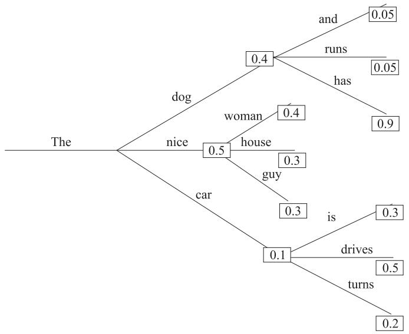  
图 9-29 从单词 The 开始预测后续单词的概率

示例代码如下：

```python
text = "I work as a data scientist"  
text_ids = tokenizer.encode(text, return_tensors = 'pt')  
generated_text_samples = GPT2_generate(text_ids, max_length=100,)  
for i, beam in enumerate(generated_text_samples):  
    print(f"[i]: {tokenizer.decode(beam, skip_special_tokens=True)}")  
    print() 
```

运行结果如下：

```txt
I work as a data scientist at the University of California, Berkeley. "I'm not a scientist, but I'm a data scientist," he said. "I'm not a data scientist, but I'm a data scientist." He said he's not sure how much of the data he's collecting is from the government, but he's confident that it's not too much... 
```

这是一种确定性生成，如果我们用相同的提示再次生成文本，获得的文本是相同的。

以上代码使用 GPT-2 生成了第一个短文本。解码结果似乎是完全合乎逻辑的—而且在许多情况下，它的效果非常好。然而，对于较长的序列，这可能会导致一些问题，可能会陷入相同单词的重复循环中。贪心搜索的主要缺点是它在生成高概率句子方面并不是最优的，因为它专注于最大化一个单词而不是整个序列的概率。它会错过隐藏在低概率单词后面的高概率单词。如我们从图 9-29 的示例中所看到的那样，高条件概率为 0.9 的单词 has被隐藏在只有第二高条件概率的单词 dog 后面，所以贪心搜索错过了单词序列 The,dog,has。对这个问题可以用束搜索（Beam Search）来缓解。

# 9.6.3 用束搜索进行解码

束搜索通过在每个时间步骤保留最有可能的 num_beams 个假设，最终选择具有最高概率的假设，从而降低错过隐藏的高概率词序列的风险。我们以 num_beam $: = 2$ 的情况来说明。在图 9-29 中，在时间步 1，除了最有可能的假设 The,nice 之外，束搜索还跟踪第二有可能的假设 The, dog。在时间步 2，束搜索发现词序列 The, dog, has 的概率为 0.36，高于词序列 The, nice, woman 的概率 0.2。这就说明它找到了更好的词序列。

通过束搜索，将返回多个潜在的输出序列—我们考虑的选项数量就是我们搜索的光束数量。束搜索属于对贪心策略的一种改进，在解码时不再只保留当前分数最高的输出，而是保留前 num_beams 个输出。当 num_beams $= 1$ 时，束搜索会退化成贪心搜索。示例代码如下：

#生成文本示例  
generated_text_samples $=$ GPT2_generate( text_ids, max_length $\equiv$ 50 num_beams $= 5$ num_return_sequences $= 5$ early_stopping=True   
）   
fori，beam in enumerate(generated_text_samples): print(f"\{i}: {tokenizer.decode(beam，skip_special_tokens=True)}") print()

运行结果如下：

```txt
0: I work as a data scientist at the University of California, Berkeley, and I've been working on this project for a long time. I've been working on this project for a long time. I've been working on this project for a long time.  
1: I work as a data scientist at the University of California, Berkeley, and I've been working on this for a long time. I've been working on this for a long time. I've been working on this for a long time.  
2: I work as a data scientist at the University of California, Berkeley, and I've been working on this for a long time. I've been working on this for a long time. I've... 
```

结果虽然可能更加流畅，但仍然包含相同的词序列。

一个简单的解决策略是引入 $n$ -gram（即由 $n$ 个词组成的词序列）的惩罚， $n$ -gram 是由 Paulus 和 Klein 等人提出的概念。最常见的 $n$ -gram 惩罚方法是手动将可能创建已出现$n$ -gram 的下一个词的概率设为 0，从而确保不会重复出现相同的 $n$ -gram。为了确保不会出现重复的 2-gram，我们可以将 no_repeat_ngram_size 设置为 2。按照这个逻辑，为了避免文本重复，我们可以配置一个参数来防止所需长度的 $n$ -gram 重复出现。

#生成文本示例  
generated_text_samples $=$ GPT2_generate( text_ids, max_length $\equiv$ 50, num_beams $= 5$ norepeat_ngram_size $= 2$ num_return_sequences $= 5$ early_stopping=True   
）   
fori，beam in enumerate(generated_text_samples): print(f"\{i}: {tokenizer.decode(beam，skip_special_tokens=True)}") print()

运行结果如下：

```txt
0: I work as a data scientist at the University of California, Berkeley, and I've been working on this for a long time.  
I have a lot of work to do, but I want to share it with you because I think it's 1: I work as a data scientist at the University of California, Berkeley, and I've been working on this for a long time.  
I have a lot of work to do, but I want to share with you some of the things that I 2: I work as a data scientist at the University of California, Berkeley, and I've been working on this for a long time.  
I have a lot of work to do, but I want to share it with you because it's important to... 
```

束搜索还存在以下不足：

● 它生成难以控制的重复序列。  
● 正如 Ari Holtzman 等人（2019）所解释的那样，人类并不总是使用这种确定性语言。他们在研究中比较了人类和束搜索选择单词的概率，发现后者的概率要高得多，变化较小，如图 9-30 所示。

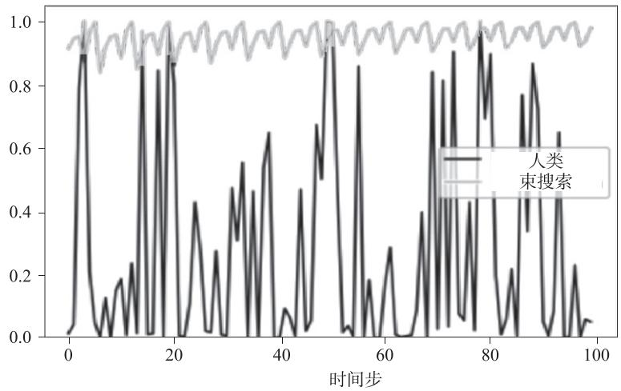  
图 9-30 束搜索得到的文本较平稳但缺乏多样性

为避免重复，我们可以采用基于多样性的系列方法。方法之一是采样（Sample）。采样是指根据从语言模型中提取词的条件概率分布随机选取下一个词。使用这种解码方法，生成的文本是不确定的。接下来介绍几种带来一定随机性的采样方法。

# 9.6.4 用采样进行解码

从最基本的形式看，采样意味着根据条件概率分布随机选择下一个词，用公式表示如下：

$$
w _ {t} = p (w \mid w _ {1: t - 1})
$$

图 9-31 展示了使用采样进行文本生成的情况。

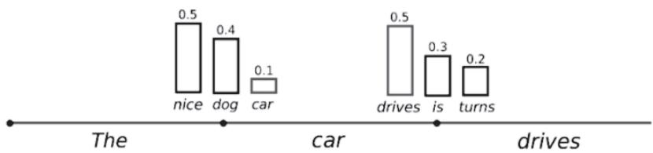  
图 9-31 使用采样进行文本生成的情况

使用采样方法，生成的文本是不确定的。单词 car 从条件概率分布 $P ( w \mid$ "The") 中进行采样，接着从条件概率分布 $P ( w \mid$ "The","car") 中进行采样，选取了 drives。

在 transformers 库中，通过设置 do_sample $: =$ True 实现采样方法。

#生成文本示例  
generated_text_samples $=$ GPT2_generate( text_ids, max_length $\equiv$ 50, do_sample $\equiv$ True, top_k=0, num_return_sequences $= 5$ ）   
for i，beam in enumerate(generated_text_samples): print(f"\{i}: {tokenizer.decode(beam，skip_special_tokens=True)}") print()

# 运行结果如下：

```txt
0: I work as a data scientist. PricewaterhouseCoopers is a developer at Hewlett Packard, and our work deals with systems and systems engineering."   
She hopes that her idea will protect the organization's cybernetics research, including attack   
1: I work as a data scientist at Sullivan Research Center and I have received many inquiries about the SSL/TLS problem. It seems that those who wish to back such an issue assert that those things should prevent web companies from otherwise resisting SSL and TLS.   
2: I work as a data scientist at CERN and this is your chance to work under these exciting new algorithms. Let's get down to the cap on the conference. Let's set the procedure of the event! We will have a conference right here in... 
```

文本看起来还不错，但仔细观察的话，你会发现，它并不是非常连贯，这就是在采样词序列时的一个大问题：模型经常会生成不连贯的文本。改进的方法之一是通过对概率分布应用 softmax 函数并改变其温度参数以使其更尖锐，从而使概率分布更尖锐（例如提高高概率单词的可能性并降低低概率单词的可能性），如图 9-32 所示。采用这个技巧，输出通常会更加连贯。

  
图 9-32 使用温度参数以使其更尖锐

第 $t { = } 1$ 步的条件下一个词分布变得更加尖锐，几乎没有机会选择单词 car。可以通过设置 temperature $= 0 . 9$ 来使分布变得更尖锐：

generated_text_samples $=$ GPT2_generate( text_ids, max_length $\equiv$ 50, do_sample $\equiv$ True, top_k=0, temperature $\equiv$ 0.9, num_return_sequences $\equiv$ 5   
） for i，beam in enumerate(generated_text_samples): print(f"\{i}: {tokenizer.decode(beam，skip_special_tokens=True)}") print()

运行结果如下：

```txt
0: I work as a data scientist. On a day-to-day basis, I would get no emails from the press or from their products, so I can't talk about them officially. But at the same time I'm a key member of the   
1: I work as a data scientist. We're one of the markets where the price of data is stable. But as an in-house market, you get some data from many different sources; maybe from price of a broadcast; from performance of a database   
2: I work as a data scientist and I let me take some of the photos of the mountain. Miles Soudas: The photography is a bit like a professional mosaic. You can see a lot of the mountains... 
```

奇怪的 $n$ -gram 情况减少了，输出的连贯性稍微提高了一点。不过，尽管使用温度参数可以使分布的随机性变得不那么强，但在将温度设置为接近 0 时，温度调节的采样将等同于贪心解码，并将面临与之前相同的问题。对此，可以采用更有效的采样方法，如 Top- $K$ 采样或 Top- $p$ 采样。

# 9.6.5 用 Top- $\mathbf { \nabla } \cdot K$ 采样进行解码

在 Top- $K$ 采样中，选择最有可能的 $K$ 个下一个词，并将概率质量重新分配给这 $K$ 个下一个词。GPT-2 采用了这种采样方案，这是其在故事生成中取得成功的原因之一。为了更好地说明 Top- $K$ 采样，将上述例子中两个采样步骤使用的词池范围从 3 个词扩展到 10 个词，如图 9-33 所示。

这里设定 $K { = } 6$ ，在两个采样步骤中，我们将采样池限制为 6 个词。尽管在第一步中，定义为 $V _ { \mathrm { T o p - K } }$ 的 6 个最有可能的词仅占据了大约三分之二的概率质量，但在第二步中，它们几乎占据了所有的概率质量。尽管如此，我们可以看到它成功地消除了第二个采样步骤中相当奇怪的候选词（not, the, small, told）。通过设置 top $k { = } 2 5$ 来看看如何使用 Top- $. K$ 。

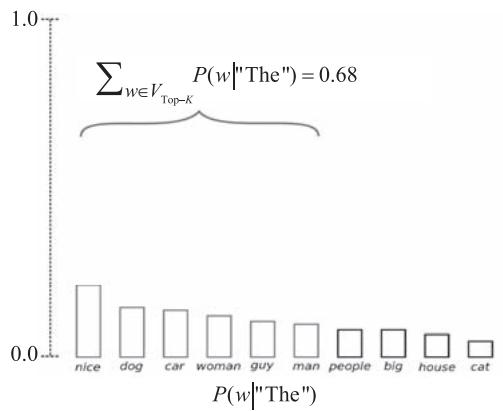

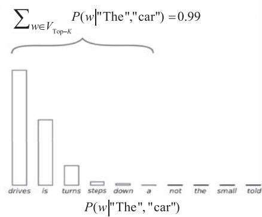  
图 9-33 采用 Top- $K$ 采样示例

generated_text_samples $=$ GPT2_generate( text_ids, max_length $\equiv$ 50, do_sample $\equiv$ True, top_k=25, num_return_sequences $\equiv$ 5   
） for i，beam in enumerate(generated_text_samples): print(f"\{i}: {tokenizer.decode(beam，skip_special_tokens=True)}") print()

运行结果如下：

```txt
0: I work as a data scientist. I'm passionate about data and data visualization, using Google's tools to create the best content possible.  
1: I work as a data scientist to support this mission at NASA's Jet Propulsion Laboratory, a project of the Max Planck Institute for Evolutionary Anthropology in Bonn, Germany. This work is supported in part by a NASA grant to the Center for 2: I work as a data scientist. I work on a network of large data sets.  
I am a senior scientist working for an enterprise, a technology company or a social security company in the UK.  
I am an author of the new... 
```

这段文本可以说是到目前为止最具人类风格的文本。然而，对于 Top- $. K$ 采样的一个关注点是，它并不动态地调整从下一个词概率分布 $P \big ( w \big | w _ { 1 : t - 1 } \big )$ 中被过滤掉的词的数量。这可能是有问题的，因为一些词可能是从非常尖锐的分布中进行采样的（如图 9-33 中的右侧分布），而其他词则是从较为平坦的分布中进行采样的。因此，将采样词池限制为固定大小的$K$ 可能会导致模型在尖锐分布中产生不合逻辑的语言，并限制模型在平坦分布中的创造力。

为克服这些不足，人们提出了 Top- $p$ 采样方法。

# 9.6.6 用 Top- $p$ 采样进行解码

与仅从最有可能的 $K$ 个单词中采样的方法不同，Top- $p$ 采样（也称为核采样）从概率累计超过概率 $p$ 的可能性最小的单词集合中进行选择。继续前面的示例，如果不设置可供选择的单词数量，而是决定在累积概率为 $9 4 \%$ 的单词之间进行选择，则选项将会增加，如图 9-34 所示。

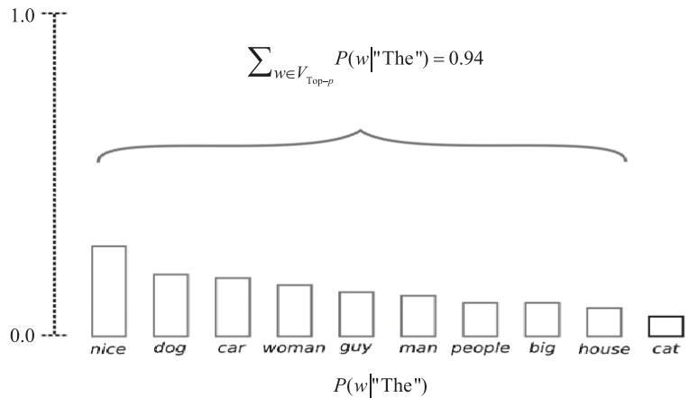  
图 9-34 采用 Top- $p$ 采样示例

设定 $\scriptstyle p = 0 . 9 2$ ，Top- $p$ 采样选择最少数量的单词，以使其共同超过 $9 2 \%$ 的概率密度，则定义为 $V _ { \mathrm { T o p } - p }$ 共有 9 个最可能的单词。在 transformers 库中通过设置 Top- $p$ （ $0 < \mathrm { T o p } { - } p < 1$ ）来激活 Top- $p$ 采样。

generated_text_samples $=$ GPT2_generate( text_ids, max_length $\equiv$ 50, do_sample $\equiv$ True, top_k=0, top_p=0.92, num_return_sequences $\equiv$ 5   
） for i，beam in enumerate(generated_text_samples): print(f"\{i}: {tokenizer.decode(beam，skip_special_tokens=True)}") print()

运行结果如下：

```txt
0: I work as a data scientist, but I also write business textbooks for big companies. I want to know better, though I'm not particularly good at that. How can I overcome it? We'd love to hear from you... question if you could 1: I work as a data scientist because I want to be heard." Sen. Patrick Leahy, D-Vt., a potential nominee for the Senate Intelligence Committee, acknowledged in a news release Wednesday that he doesn't think his notes refer to 2: I work as a data scientist on patterns in major observational studies. Recently, I noticed a new insight in the Hubble Deep Field observation that just blew my mind - that many more observations could have been made in the first half of the 20th century if... 
```

这个结果虽然还有可改进之处，但看起来就像是人类写的一样。

# 9.6.7 用综合方法进行解码

理论上，Top- $p$ 方法似乎比 Top- $K$ 更优雅，但两种方法在实践中都表现良好。Top- $p$ 还可以与 Top- $. K$ 结合使用，这可以避免非常低排名的单词，同时允许一些动态选择。

在下面的示例中，我们将调整分布的温度并同时定义 $K$ 和 $p$ 。它将保留最严格的一个，如果前 $K$ 个单词的累积概率大于 $p$ ，则仅在累积概率为 $p$ 的单词中进行选择，反之亦然。要获得多个独立采样的输出，可以将参数 num_return_sequences 设置为大于 1 的值。

generated_text_samples $=$ GPT2_generate( text_ids, max_length $\equiv$ 50, do_sample $\equiv$ True, top_k=100, top_p=0.92, temperature $\equiv$ 0.8, repetition_penalty $\equiv$ 1.5, num_return_sequences $\equiv$ 5   
） for i，beam in enumerate(generated_text_samples): print(f"\{i}: {tokenizer.decode(beam，skip_special_tokens=True)}") print()

运行结果如下：

```txt
0: I work as a data scientist in the field of cybersecurity. I've also worked on my own research into how to improve encryption, and have been involved with various organizations trying solutions that could use encrypted communications," he said. "We are going through an 
```

1: I work as a data scientist for my own blog. I don't get paid to do anything like this, but it's an incredibly rewarding experience so far in the business and hopefully they'll be happy with what we're doing next.""With   
2: I work as a data scientist at the University of California, Berkeley and I am part owner/operator of The Big Data Lab. Since 1998, he has worked on massive datasets like Internet companies' market research tools or IBM's software for predicting financial crises

语言模型仅限于对单词概率分布进行建模，而输出序列不是由模型本身生成的。

自然语言生成系统通常需要额外的解码策略来定义如何将单词拼接在一起以形成句子或文本。解码可以大致分为基于搜索和基于多样性的策略。基于搜索的策略可能是重复的，这是通过基于多样性的策略（如采样）来解决的。

# 第 10 章

# ChatGPT 模型

Transformer、GPT-2 和 BERT 等模型在自然语言处理领域取得了显著成果，然而，它们仍存在一定的局限性。ChatGPT 的出现为自然语言处理领域带来了新的突破，它采用与传统模型不同的技术路线，能够生成更加自然、流畅的语言，能够更好地理解人类意图。

ChatGPT 包含丰富的知识，不仅能更好地理解人类的问题和指令，流畅地进行多轮对话，还在越来越多的领域显示出解决各种通用问题的能力和推理生成能力。许多人相信，ChatGPT 不仅是新一代聊天机器人的突破，也将为信息产业带来巨大变革，预示着 AI 技术应用将迎来大规模普及。

ChatGPT 是 OpenAI 开发的用于自然语言处理任务的语言生成模型。它以 GPT 模型为基础，通过大量的无监督预训练数据和自回归训练方法进行训练，从而生成高质量的文本回复。

# 10.1 ChatGPT 简介

ChatGPT 是一种基于 GPT-3.5、GPT-4 架构的大型语言模型，被设计用来回答各种问题、提供信息和执行各种自然语言处理任务。它有多种应用，包括回答问题、生成文本、自动翻译、文本摘要、自然语言理解等。

当涉及语言交互时，ChatGPT 能够理解和回应用户的自然语言输入。它可以解释问题、回答查询、提供建议和帮助等，能够产生连贯、语法正确且上下文相关的回复，给用户提供自然、流畅的对话体验。

ChatGPT 具备广泛的知识储备，通过在预训练阶段大规模学习互联网上的文本数据，可以识别和解释各种主题与各个领域的知识。因此，即使在新领域或者对特定领域知识有

限的情况下，ChatGPT 也能够提供相关的信息和回答问题。

推理能力是 ChatGPT 的另一个优势。ChatGPT 能够基于语义和逻辑进行推理，进而回答需要推理能力的问题，消除问题的复杂性和歧义性。这使得它具备一定的模拟人类思考和解决问题的能力。

多语言能力是 ChatGPT 的重要特性之一。它可以处理多种语言，包括英语、中文、法语、西班牙语等。无论对于单一语言的对话还是跨语言的对话，ChatGPT 都能提供高质量的回复和理解。

通过与 Codex 集成，ChatGPT 获得了代码生成能力。用户可以向 ChatGPT 提出关于代码实现的需求，获得生成的代码。这使得 ChatGPT 在软件开发、自动化编程等领域具备独特优势。

综上所述，ChatGPT 在语言交互、知识储备、自然语言生成、多轮对话、推理能力、多语言能力和代码生成等方面都有优异的表现。

# 10.1.1 ChatGPT 核心技术

ChatGPT 引入了多项核心技术，包括指令微调、RLHF、Codex 和 TAMER。

# （1）指令微调

指令微调（instruct tuning）技术允许用户通过给出明确的指令来引导 ChatGPT 生成其想要的回复。用户可以使用特定的格式和标记指导 ChatGPT 按照特定的方式生成回答。这种指令形式有助于用户控制对话的方向和内容，确保 ChatGPT 更好地满足用户需求。借助指令微调技术，用户可以引导 ChatGPT 生成精确和有用的回应。

# （2）RLHF

RLHF（Reinforcement Learning from Human Feedback，人类反馈强化学习）是一种强化学习算法，它通过人类的反馈来加速智能体的训练过程。该算法旨在充分利用人类的专业知识和经验，提供专家演示或评估反馈，以指导智能体的学习。通过将专家的反馈与自主探索相结合，RLHF 算法能够在学习过程中进行探索与利用的权衡，提高训练效率和性能。该算法的核心思想是将人类反馈视为一种额外的奖励信号，与环境的奖励信号相结合来进行强化学习。RLHF 算法在游戏、机器人控制和自然语言处理等多个领域展现出很大的应用潜力。

# （3）Codex

Codex 是与 ChatGPT 集成的代码生成模型。Codex 拥有广泛的编程知识，可以帮助用户生成符合语法规则和逻辑的代码。通过 ChatGPT 与 Codex 的集成，用户可以在对话的过程中获得代码生成的支持和帮助。

# （4）TAMER

TAMER（Training an Agent Manually via Evaluative Reinforcement）是一种通过人工手动评估和强化学习来训练 ChatGPT 的技术。在 TAMER 中，人类操作员会与 ChatGPT 进

行对话，并手动对 ChatGPT 的回答进行评估和奖励。这样，ChatGPT 可以根据操作员的反馈不断优化回答的质量和准确性。TAMER 技术的目的是通过人类评估和强化学习来提高ChatGPT 生成回答的能力，使其表现更接近于人类的水平。

由此可知，通过引入指令微调、RLHF、Codex 和 TAMER 等技术，ChatGPT 在用户指导、强化学习、代码生成和质量改进等方面取得了显著的技术进步。这些技术的引入使ChatGPT 能够更好地满足用户需求，提供更准确和有用的回答。

图 10-1 为 从 GPT-3 到 GPT-3.5 的 进 化 路 线 图。 其 中，Text-davinci-002 是 在 Code-davinci-002 的基础上使用 InstructGPT 训练方法改进的。GPT-3.5 在 GPT-3 的基础上加入了代码生成的能力。在 ChatGPT 的代码训练中，很多数据来自 Stack Overflow 等代码问答网站，所以我们会发现它能很好地完成简单的编程任务。

  
图 10-1 ChatGPT 进化路线图

由图 10-1 可知，GPT-3 为 ChatGPT 打下了扎实的基础，但 Codex、RLHF 等技术增加了很多新功能，挖掘了 GPT-3 的潜力。

# 10.1.2 InstructGPT 和 ChatGPT 的训练过程

InstructGPT 和 ChatGPT 是 OpenAI 发布的两种语言模型，它们在自然语言处理任务中都使用了指令微调和奖励模型（Reward Model，RM）等技术。InstructGPT 是基于 GPT 进行改进和扩展得到的模型，而 ChatGPT 是对 InstructGPT 的进一步改进。它们的训练过程类似，如图 10-2 所示，主要区别是使用的数据集不同。

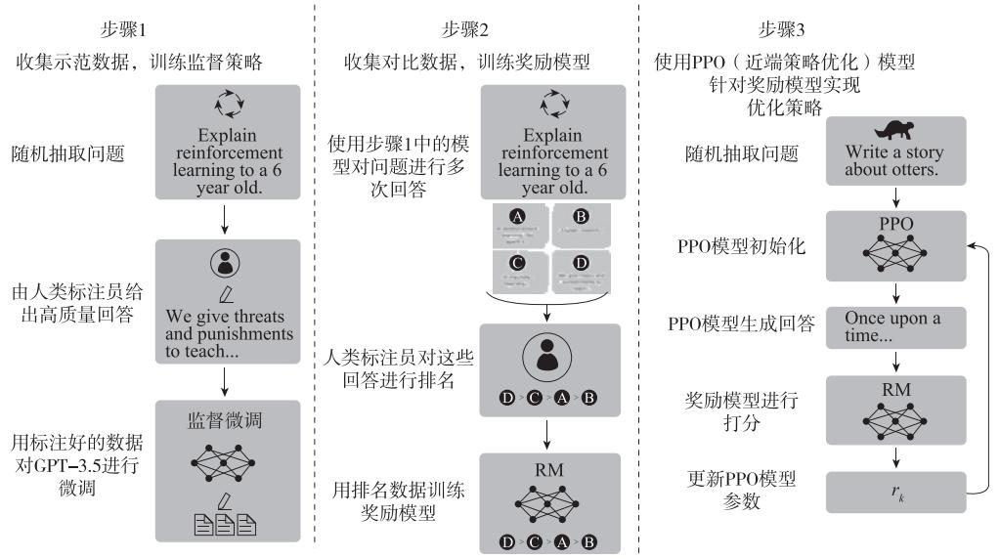  
图 10-2 InstructGPT 和 ChatGPT 的训练过程

InstructGPT 侧重于在给定的指令下执行特定任务，生成与指令要求相符的内容。而ChatGPT 主要用于生成开放式对话，与用户进行自由的对话交互。两者的目标是一样的，都是让经过大规模语料预训练的模型输出符合人类期待的内容，即使输出满足 3H：有用的（Helpful）、可信的（Honest）、无害的（Harmless）。如何实现这个目标呢？具体实现方法如下。

1）假设预训练模型（即 GPT-3）称初始模型为 V0，先人工构造一批示范数据，数量不需要很大，然后让模型进行有监督的学习，得到模型 V1。  
2）向模型 V1 提供一组提示词，观察其输出效果。对于每个提示词，我们让模型生成多个输出，并请人根据这些输出进行打分和排序。由于这是一个排序任务，因此我们不能直接用这些数据来训练模型。但我们可以利用这些评分数据来训练一个奖励模型。该奖励模型的作用是对每对 $<$ 提示词 , 输出 $>$ 进行打分，以评估输出与提示词的匹配度。通过这种方式，我们可以更高效地标注更多数据，并训练出一个能够更好地理解提示词并生成合适内容的模型。  
3）继续训练模型 V1。给定一些提示词，得到输出之后，把提示词和输出输入奖励模型，得到打分，然后借助强化学习的方法（如 PPO 算法）训练模型 V1。如此反复迭代，最终得到模型 V2，也就是最终的 InstructGPT。

以上三步对应图 10-2 中的三个步骤，简单来说，就是老师（人类）先注入一些精华知识，接着让模型模仿老师的喜好做出一些尝试，然后老师对模型的这些尝试进行打分。打分之后，通过学习得到一个打分机器，之后打分机器就可以和模型配合，自动进行模型的迭代。总体思路称为 RLHF。

能实现这样的方式的前提是模型本身比较强大。模型本身只有比较强大，才能在人类提供少量精华数据的情况下，开始进行模仿，并在第二步产出较为合理的输出供人类打分。这里，基于 GPT-3 是这一套流程能行得通的保证之一，而 ChatGPT 是基于 GPT-3.5、GPT-4的，效果肯定更好。

InstructGPT 论文“Training language models to follow instructions with human feedback” 给出了以上三步分别制造 / 标注了多少样本。

● SFT（监督微调）数据集（即第一步人类根据提示词构造的示范数据），包含 1.3 万个提示词。  
● RM 数据集（即第二步用来训练打分模型的数据），包含 3.3 万个提示词。  
● PPO 数据集（即第三步用来训练强化学习 PPO 模型的数据），包含 3.1 万个提示词。

# 10.1.3 指令微调

指令微调是 ChatGPT 中的一项技术，旨在通过明确的指令来引导 ChatGPT 生成更准确、更有用的回答。通过给出具体的指令和格式要求，指令微调可以帮助用户更好地控制ChatGPT 的回答方向和内容。

指令微调对 ChatGPT 的性能和效果有以下几个方面的影响。

# （1）控制回答风格

通过具体的指令，用户可以指定 ChatGPT 回答的风格和语气，例如正式、轻松、专业等。这有助于使 ChatGPT 生成符合用户期望的回答，提高对话的质量和可用性。

# （2）确定回答内容

指令微调可以帮助用户明确指定 ChatGPT 回答的具体内容。用户可以要求 ChatGPT 提供相关的事实、数据、步骤等，从而获得更准确、更有用的回答。

# （3）指导对话方向

通过适当的指令，用户可以引导 ChatGPT 在对话中遵循特定的主题或方向。这有助于确保 ChatGPT 的回答与对话的上下文一致，提供更连贯、更有针对性的对话体验。

下面通过一个例子具体说明指令微调的作用。

用户指令：计算一个圆的面积，半径为 $5 \mathrm { m }$ 。

ChatGPT 回答（未经指令微调）：我不知道你要计算圆形的什么面积。

ChatGPT 回答（经过指令微调）：圆的面积等于半径的平方乘以 $\pi$ ，所以半径为 $5 \mathrm { m }$ 的圆的面积是 $2 5 \pi \mathrm { m } ^ { 2 }$ 。请注意结果是近似值。

通过指令微调，用户明确要求 ChatGPT 计算圆的面积，并提供了所需的参数。ChatGPT 回答带有必要的计算步骤和结果，并注意到结果是近似值。指令微调可以确保ChatGPT 在回答问题时更加准确和有用。

在这个例子中，指令微调帮助 ChatGPT 生成了用户所期望的回答，提高了回答的质量和准确性。这凸显了指令微调技术在 ChatGPT 的性能提升中的作用。

# 10.1.4 ChatGPT 的不足

尽管 ChatGPT 在上下文对话能力甚至编程能力上表现出色，但我们也要看到，ChatGPT 仍然有一些局限性，还需不断迭代进步。

● ChatGPT 在未经大量语料训练的领域缺乏“人类常识”和引申能力，甚至会一本正经地“胡说八道”。  
. ChatGPT 无法处理复杂冗长或者特别专业的语言结构。对于来自金融、自然科学或医学等专业领域的问题，如果没有进行足够的语料“喂食”，ChatGPT 可能无法生成适当的回答。  
. ChatGPT 无法在线把新知识纳入其中，而出现一些新知识就去重新预训练 GPT 模型是不现实的。  
● 训练 ChatGPT 需要耗费大量算力，成本极大。

# 10.2 人类反馈强化学习

ChatGPT 中的人类反馈强化学习（RLHF）模型旨在通过对与人类对话中的反馈进行训练来改进模型的响应能力和合作能力。

使用 RLHF 的目的在于规避以下两个问题。

（1）难以确定何为一个好的损失函数

在语言生成任务中，人们很难定义出“好的”的输出是什么，因为语言往往具有很大的灵活性和多样性。在这种情况下，通过人类反馈进行强化学习可能是一种更合适的方法，因为人类可以直接提供关于系统行为的反馈，而无须定义复杂的损失函数。

（2）对模型生成的数据难以标记

生产数据可能非常庞大，而手动标注数据需要耗费大量的时间和人力。此外，有时候标记数据可能比较困难，需要专业知识或主观判断。在这种情况下，RLHF 可以用作一种有效的无监督学习方法。通过与生产数据交互并从人类反馈中学习，模型可以在没有标记数据的情况下逐渐提高其性能。例如，我们可以让模型生成一些文本，然后由人类阅读、理解该文本并向模型提供反馈。通过这种方法，模型可以在实际场景中学习并根据人类反馈不断改进，以更好地满足生产需求。

# 10.2.1 工作原理

ChatGPT 中的 RLHF 模型的工作原理如下。

（1）初始预训练

首先，ChatGPT 模型通过传统的有监督学习方法进行初始预训练。使用来自人类对话的大规模数据集进行训练，使模型能够学习对输入问题进行响应的生成模式。在这个阶段，

模型不与真实用户进行对话交互。

# （2）与真实用户对话

训练后的模型与真实用户进行对话交互。在对话中，模型将会生成一系列与用户问题相关的响应。这些响应一般来说不会完全正确或完全满足用户的期望，因为模型初始的预训练并不能覆盖所有可能的用户问题和对话情景。

# （3）收集人类反馈

在模型与用户的对话中，用户会提供反馈描述，指导模型如何改进其响应。反馈描述可以是用户指出模型响应的错误之处，并提供正确答案或给出关于期望响应的详细说明。

# （4）构建反馈数据集

接下来，使用与用户对话过程中收集到的反馈构建一个反馈数据集。这个数据集包含模型生成的响应与相应的用户反馈描述。数据集的目的是训练出一个能够以类似人类方式响应用户的模型。

# （5）重训练

使用上一步构建的反馈数据集对 ChatGPT 模型进行重训练。在重训练过程中，模型通过最大化反馈描述的预期奖励来学习并调整其生成策略。这个过程涉及强化学习，通过与之前的预训练相结合，使模型逐渐提高其响应的质量和合作能力。

# （6）进一步迭代

让重训练后的模型再次与真实用户对话，并重复上述步骤进行迭代。每次迭代都有助于模型的不断改进和学习，使其能够更好地理解用户需求并生成准确和有用的响应。

通过与真实用户对话以及人类反馈指导，RLHF 模型能够提高模型的对话质量，减少错误响应，并更好地适应真实对话环境中的需求。模型在迭代过程中逐渐优化自身，提高准确性和合作能力。

# 10.2.2 工作流程

RLHF 模型将预训练语言模型按照人类反馈进一步微调以符合人类偏好，利用人类反馈信息直接优化模型，并可以通过人机对话理解人类输入的上下文，不断优化其回答内容。OpenAI 采用 RLHF 作为 ChatGPT 的核心训练方式，并称它能将通用人工智能系统与人类意图更好地对齐。RLHF 的训练包括以下 3 个核心步骤：

1）预训练语言模型。（也可以使用额外文本进行微调，监督微调新模型可以让模型更加遵循指令提示，但不一定符合人类偏好。）  
2）对模型根据提示词生成的文本进行质量标注，由人工标注者按偏好从最佳到最差进行排名，利用标注文本训练奖励模型，从而学习到人类对于模型根据给定提示词生成的文本序列的偏好。  
3）使用强化学习进行微调，确保模型输出合理、连贯的文本片段，并且基于奖励模型对模型输出的评估分数提升文本的生成质量。

详细过程如图 10-3 所示。

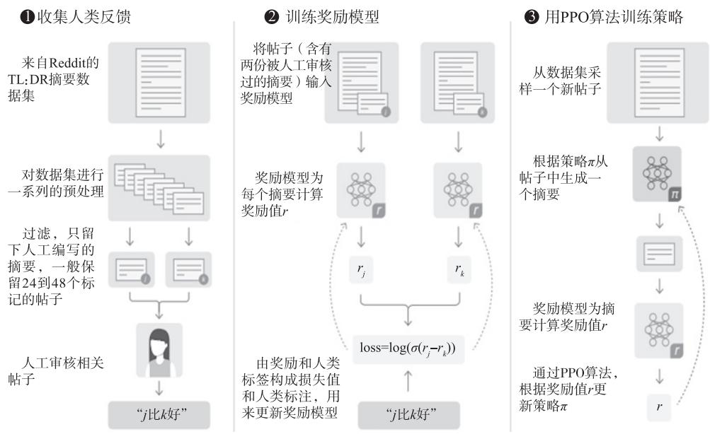  
图 10-3 RLHF 的训练过程

# 10.2.3 PPO 算法

PPO 算法是 TRPO（信赖域策略优化）算法的扩展，是 RLHF 的核心算法，由 OpenAI的研究人员于 2017 年提出。PPO 是一种同步策略，可以应用于离散动作或连续动作问题。它使用与 TRPO 算法中相同的策略分布比率，但不使用 KL 散度。它使用三个损失函数，并将它们合而为一。相对于 TRPO 算法，PPO 算法的改进主要体现在以下几个方面。

# 1. 更高的计算效率和更稳定的策略更新

一般连续动作空间版本的 PPO 算法默认使用高斯分布来输出动作。由于高斯分布是一个无界的分布，我们在采样动作后往往需要进行裁剪（clip）操作来把动作限制在有效的动作范围内。

在策略梯度算法中，我们通常使用一个样本回报的估计值来计算策略的梯度，并使用这个梯度来更新策略参数，从而改进策略。然而，样本回报是基于当前策略采样的，它对于策略参数的小变化可能会非常敏感，从而导致优化过程不稳定。

为了解决这个问题，PPO 算法采用了近似梯度更新方法。该方法通过引入一个重要性采样比率来抑制样本回报对策略参数的敏感性。重要性采样比率（可参考式（10.1）中的$r _ { t } ( \theta )$ ）是当前策略和旧策略之间的比值，用来度量在同一个状态下新旧策略对动作的概率之间的差异。

PPO 算法通过使用近似梯度更新和裁剪替代目标（Clipped Surrogate Objective）函数，避免了 TRPO 算法中解决约束优化问题的复杂计算步骤，从而提高了训练效率。同时在裁剪替代目标函数中引入一个超参数 $\varepsilon$ ，用于控制策略更新的幅度，从而避免了过大的改变。这使得算法在训练过程中更加稳定，有助于防止策略陷入不良状态。在裁剪替代目标函数中，使用裁剪操作将梯度限制在 [1-ε, 1+ε] 的范围内，从而避免更新过大或过小。这样可以保持更新的平稳性，并减小算法的方差。

裁剪替代目标函数由以下方程给出：

$$
\mathcal {L} ^ {\mathrm {c l i p}} (\theta) = E ^ {\lceil} \min  \left(r _ {t} (\theta) A _ {t}, \operatorname {c l i p} \left(r _ {t} (\theta), 1 - \varepsilon , 1 + \varepsilon\right) A _ {t}\right) \rfloor \tag {10.1}
$$

其中， $r _ { t } \left( \theta \right) = \frac { \pi _ { \theta ^ { \prime } } \left( a | s \right) } { \pi _ { \theta } \left( a | s \right) } \circ$ 如果 $r _ { t } ( \theta ) > 1$ ，说明与使用旧策略（ $\pi _ { \theta }$ ）相比，使用新策略时在状态$s$ 下实施动作 $a$ 的可能性更大。如果 $0 < r _ { t } ( \theta ) < 1$ ，与使用旧策略相比，使用新策略时采取这种行动的可能性较小。 $r _ { t } ( \theta )$ 这个概率比是一个用来简单估计旧策略和现行策略之间差异的值。 $\varepsilon$ 是一个超参数，通常取 $\varepsilon { = } 0 . 1$ 或 0.2。 $r _ { t } ( \theta ) A _ { t }$ 是未裁剪部分。

A为优势函数，计算公式如下：

$$
A _ {t} = Q \left(s _ {t}, a _ {t}\right) - V \left(s _ {t}\right) \tag {10.2}
$$

clip() 函数将 $r _ { t } ( \theta )$ 限制在 $_ { 1 - \varepsilon }$ 和 $1 { + } \varepsilon$ 之间，从而使比率保持在合理范围内，防止当前策略与旧策略相差太远，这或许就是近端策略的含义。 $\operatorname* { m i n } ( )$ 函数确保目标是未裁剪目标下限的最小化函数。

通过图 10-4 可以直观理解 PPO 算法中的裁剪替代目标。其中， $p _ { t } \left( \theta \right) = \frac { \pi _ { \theta } \left( a | s \right) } { \pi _ { \theta \mathrm { o l d } } \left( a | s \right) } \mathrm { c }$ 。

# 2. 可同时优化值函数

PPO 算法提供了可选的值函数优化步骤，通过最小化当前值函数与估计值函数之间的差异来提高算法的性能和收敛速度。具体表达式为

$$
\mathcal {L} ^ {v} (\theta) = E \left[ \left(V \left(s _ {t}\right) - V ^ {\text {t a r g e t}}\right) ^ {2} \right] \tag {10.3}
$$

# 3. 使用策略分布的香农熵

策略分布的香农熵的表达式为

$$
\mathcal {L} ^ {\text {e n t r o p y}} (\theta) = E \left[ - \log \pi_ {\theta} \left(s _ {t}\right) \right] \tag {10.4}
$$

  
图 10-4 PPO 算法中裁剪替代目标示意

如果策略网络和价值网络共享参数，可以把三个损失函数组合成 PPO 算法的损失函数：最小化 ${ \mathcal { L } } ^ { \mathrm { c l i p } } \left( \theta \right)$ 和 ${ \mathcal { L } } ^ { \mathrm { e n t r o p y } } ( \theta )$ ，最大化 ${ \mathcal { L } } ^ { \nu } ( \theta )$ 。具体表达式为

$$
\mathcal {L} ^ {\mathrm {P P O}} (\theta) = \mathcal {L} ^ {\mathrm {c l i p}} (\theta) - c _ {1} \mathcal {L} ^ {v} (\theta) + c _ {2} \mathcal {L} ^ {\text {e n t r o p y}} (\theta) \tag {10.5}
$$

如果策略网络和价值网络单独构建，那么策略网络的损失函数由 $\mathcal { L } ^ { \mathrm { c l i p } } \left( \theta \right) + c _ { 2 } \mathcal { L } ^ { \mathrm { e n t r o p y } } ( \theta )$ 构成，价值网络的损失函数就是 ${ \mathcal { L } } ^ { \nu } ( \theta )$ 。

PPO 通过引入裁剪替代目标、重要性采样、策略更新的幅度控制以及多次迭代更新等，提高策略梯度算法的稳定性和采样效率。这使得 PPO 在实际应用中更具优势，并成为目前广泛使用的增强学习算法之一。

下面是 PPO 算法的详细步骤：

1）收集数据：使用当前策略与环境进行交互，收集一系列的状态、动作和奖励样本。  
2）计算梯度：计算当前策略的梯度值。这里的梯度表示在当前策略下，如果稍作改变，能够使预期回报增加的方向。  
3）多次迭代更新策略：在每次迭代中，对收集到的数据执行多次策略更新。每次更新都会计算并应用一个参数比例，该比例被限制在一个预定义的范围内，以确保策略更新的幅度受到控制。  
4）使用裁剪替代目标函数：PPO 算法使用函数来限制策略更新的幅度。该目标函数会计算当前策略与旧策略的比例，并将其与一个预定义的范围进行比较。如果比例超过了范

围，就会对更新进行裁剪，从而避免过大的策略改变。

5）价值函数优化（可选）：在 PPO 算法中，可以选择同时优化值函数。这可以通过最小化当前值函数与估计值函数之间的差异来实现。这有助于提高算法的性能和收敛速度。

PPO 算法是强化学习中的一个重要算法，想进一步了解强化学习基本概念及算法的读者可参考 13.5 节。

# 10.2.4 评估框架

TAMER 框架将人类标记引入智能体（Agent）的学习循环中，可以通过人类向智能体提供奖励反馈（即指导智能体进行训练），快速达到训练任务目标。TAMER 架构如图 10-5所示。

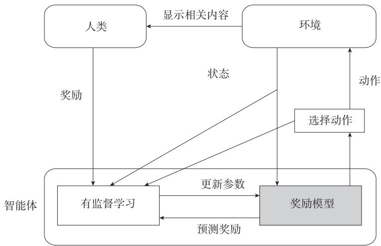  
图 10-5 TAMER 架构

# 10.2.5 创新与不足

RLHF 模型有很多创新点，但也存在一些不足。

# 1. 创新

# （1）引入人类反馈

通过与人类的对话中获得的反馈来指导训练，模型能够更好地适应真实的对话环境，进一步提升性能。

# （2）训练样本扩充

通过整合模型生成的多个响应和人类生成的反馈说明，扩充了训练集的规模，提高了训练效果。

# （3）迭代优化

通过多次迭代训练，模型能够逐渐改进响应质量，学习并适应更多的对话场景。

# 2. 不足

# （1）人类反馈依赖

模型对人类反馈数据的依赖性较强，当缺乏充足的人类反馈时，模型的性能可能无法得到有效提升。

# （2）反馈指导不充分

人类用户提供的反馈说明可能存在不准确或有限的情况，导致模型学习到了不完整或不准确的知识。

# （3）对话环境限制

模型的训练数据主要来自特定的对话环境和数据集，可能无法完全适应不同环境下的对话需求和语境。

# 10.3 Codex

Codex 是一个由 OpenAI 开发的自然语言代码生成模型。它基于 GPT 架构，使用了大量的预训练数据和自监督学习方法进行模型的训练。与传统的编程语言不同，Codex 的输入包括自然语言描述、开源代码等，例如“给定两个数字相加并返回结果”的文本描述。Codex 会根据这样的输入生成对应的程序代码，实现输入所述的功能。相对于手写代码，Codex 可以极大地提高代码编写的效率和准确性。

具体来说，Codex 使用了强大的自然语言处理技术，将输入的自然语言描述转换为一种类似于抽象语法树（Abstract Syntax Tree，AST）的中间表示形式。该中间表示形式能够捕捉到自然语言描述中的复杂结构、语义和上下文信息，并且能够方便地将其转化为可执行的代码。Codex 还使用了大量的开源代码库和公共 API 以及编程语言的规范和惯例，对生成的代码进行补全和优化，从而进一步提高代码的质量和可读性。

# 10.3.1 对源代码进行预处理

当将 GitHub 上的代码输入 GPT 进行处理时，需要进行以下预处理步骤。

# 1. 去除注释和文档字符串

例如，对于 Python 代码

```txt
def addnumbers(num1，num2）：
```

```txt
This function adds two numbers.   
""   
return num1 + num2 
```

可以去除注释和文档字符串，得到以下结果：

```txt
def addnumbers(num1，num2): return num1 + num2 
```

# 2. 标准化缩进

例如，对于 Python 代码

```txt
def addnumbers(num1, num2): if isinstance(num1, int) and isinstance(num2, int): return num1 + num2 else: raise TypeError("Inputs must be integers.") 
```

可以将缩进标准化为使用 4 个空格作为一个缩进级别，得到以下结果：

```txt
def addnumbers(num1, num2): if isinstance(num1, int) and isinstance(num2, int): return num1 + num2 else: raise TypeError("Inputs must be integers.") 
```

# 3. 将代码拆分为合适的长度

对于较长的代码（如 Python 函数或类定义），可以按照一定的规则将其拆分为多个部分，以便于模型处理。例如，对于 Python 代码

```python
class MyLongClassName: def __init__(self, arg1, arg2, arg3, arg4, arg5, arg6, arg7, arg8, arg9, arg10, arg11, arg12, arg13, arg14, arg15, arg16, arg17, arg18, arg19, arg20): 
```

```txt
self.args1 = args1
self.args2 = args2
# ...
`` 
```

可以拆分为  
```python
def __init__(self, arg1, arg2, arg3, arg4, arg5, arg6, arg7, arg8, arg9, arg10):  
        self.args1 = args1  
        self.args2 = args2  
        # ...  
    def __init__(self, arg11, arg12, arg13, arg14, arg15, arg16, arg17, arg18, arg19, arg20):  
        self.args11 = args11  
        self.args12 = args12  
        # ... 
```

# 4. 转换关键字和变量名

例如，对于 Python 代码

```txt
def if_(a, b, c): return a if b else c 
```

可以将函数名称“if_”更改为其他名称，以避免与 Python 中的关键字冲突，例如：

```python
def my_if(a, b, c):
    return a if b else c 
```

# 5. 对特殊字符进行编码处理

例如，对于 Python 代码

```lua
print("Hello\nworld!")
```

可以使用转义符 \n 表示换行符，得到以下结果：

```lua
print("Hello\nworld!")
```

这些预处理步骤可以提高 GPT 模型对 Python 代码的处理能力，从而生成更准确的代码。

# 10.3.2 处理代码块

在 Codex 中，逻辑块是指由一组语句或表达式构成的代码段，通常使用花括号（{}）来表示。例如，在下面这个 if-else 代码块中，if 后面的逻辑块包含两个语句，而 else 后面的逻辑块包含一个语句：

if $(\mathbf{x} > 0)$ { $\mathrm{y} = \mathrm{x}^{*}2;$ }else{ $\mathrm{y} = -1\star \mathrm{x};$ 1

对于这样的逻辑块，Codex 会将其看作一个整体，并根据上下文和语法规则来进行解析与处理。具体来说，Codex 可以通过以下几种方式来处理逻辑块。

1）识别和合并：Codex 可以自动识别相邻的逻辑块，并将它们合并为一个更大的逻辑块。这有助于避免不必要的重复代码，提高代码的可读性和复用性。  
2）嵌套和补全：当出现嵌套的逻辑块时，Codex 能够自动补全缺失的语句和符号，使得代码正确运行。例如，在下面这段代码中，if 语句中的逻辑块包含一个 while 循环：

if $(\mathbf{x} > 0)$ { while $(y <   10)$ { $\mathrm{y} = \mathrm{y} + 1;$ }   
1

Codex 可以识别出逻辑块的嵌套关系，并自动补全一些缺失的符号，如花括号、分号等。

3）生成和优化：对于某些代码块，Codex 能够直接生成相应的代码，从而提高编码效率。例如，在下面这段代码中，for 循环中的逻辑块包含一个简单的求和操作：

int sum $= 0$ for (int $\mathrm{i} = 0$ . $\mathrm{i} <   \mathrm{n}$ .i++) {sum $+ =$ i;

在此情况下，Codex 可以直接生成相应的代码，而不是简单地复制和粘贴逻辑块的内容。同时，Codex 还会根据上下文和语法规则来进行代码优化，使得生成的代码更加高效，可读性更强。

# 10.3.3 将源代码数字化

代码与自然语言一样，在输入计算机之前，都需要转换为数字或向量。图 10-6 所示为把 Go 语言代码转换为对应的语料库 ID，再把 ID 转换为嵌入的流程。

```txt
1 // language: Go  
2 // Return list of all prefixes from shortest to longest of the input string  
3 // >> AllPrefixes('abc')  
4 // ['a', 'ab', 'abc']  
5 func AllPrefixes(str string) [string{  
6 result := []string{}  
7 for i = 1; i <= len(str); i ++ {  
8 result = append(result, str[0: i])  
9 }  
10 return result  
11}  
把代码转换为标记（Token）↓  
1 ['//', 'language', ':', 'Go', '\n', '/', 'Return', '\list', 'of', 'all',  
'_prefix', 'es', 'from', 'shortest', 'to', 'longest', 'of', 'the', 'input'  
t', 'string', '\n', '/', '>>>', 'All', 'Pref', 'ix', 'es', '(\"', 'abc', ''')  
'\n', '/', '[ ', a', ', ', " ', 'ab', ', ", " ', 'abc', "", 'n', 'fun'  
c', 'All', 'Pref', 'ix', 'es', ('', 'str', 'string',)', [''], 'string', {'  
,'n', <|extratoken_12| >', 'result', ':', '[ ', 'string', ':', ']  
'<|extratoken_12| >', for', ':', ':1', ':', ':i', ':=' ', len', ('', 'st'  
r', ':', i', ':+, ', ':(\n', <|extratoken_16| >', 'result', ':=' ', 'append'  
d', ('', 'result', ':', 'str', ['0', ':', 'i', ])'.<|extratoken_1  
2|>, ':}', '\n', <|extratoken_12| >', 'return', '\result', '\n', ')'  
把标记转换为语料库中的ID↓  
1 [1003, 3303, 25, 1514, 198, 1003, 8229, 1351, 286, 477, 21231, 274, 422, 35581, 28  
4, 14869, 286, 262, 5128, 4731, 198, 1003, 13163, 1439, 36698, 844, 274, 10786, 39  
305, 11537, 198, 1003, 37250, 64, 3256, 705, 397, 3256, 705, 39305, 20520, 198, 20  
786, 1439, 36698, 844, 274, 7, 2536, 4731, 8, 17635, 8841, 90, 198, 50268, 28274,  
19039, 17635, 8841, 90, 92, 198, 50268, 1640, 1312, 796, 352, 26, 1312, 19841, 188  
96, 7, 2536, 1776, 1312, 19969, 1391, 198, 50272, 20274, 796, 24443, 7, 20274, 11,  
965, 58, 15, 25, 1312, 12962, 198, 50268, 92, 198, 50268, 7783, 1255, 198, 92]  
把ID转换为嵌入（Embedding）↓  
[[0.67041429 [0.80599414] [0.51669537] [0.06884509] [0.59657896]  
[0.24686632 [0.40123617] [0.47021434] [0.55433155] [0.77526908]  
[0.61575787 [0.86080933] [0.44114554] [0.40102475] [0.98305955]]  
[[0.87813839 [0.1097148] [0.53246311] [0.44092475] [0.66241381]  
[0.15763363 [0.98157744] [0.46083823] [0.71293272] [0.51126184]  
[0.7031073 [0.98782574] [0.62550122] [0.87969757] [0.57306615]]  
[[0.87813839 [0.1097148] [0.53246311] [0.44092475] [0.66241381]  
[0.50330745 [0.74402454] [0.46728938] [0.63833693] [0.32945123]  
[0.90062277 [0.31794888] [0.11510545] [0.80826617] [0.35896274]]  
[[0.67041429 [0.80599414] [0.51669537] [0.06884509] [0.59657896]] 
```

图 10-6 把 Go 语言代码转换为嵌入的流程

# 10.3.4 衡量指标

衡量代码性能的指标为 $\mathrm { P A S S } @ \mathrm { K }$ ，其中 PASS 代表 Predict At Single Shot，即在模型给出的一次预测中，是否生成了正确的代码片段。而“@K”表示只要在前 $K$ 个预测中有一个预测是正确的，就认为该样本通过了。

无偏衡量指标 PASS@K 的计算公式为

$$
\text {P A S S} @ \mathrm {K} = E 1 - \frac {\mathrm {C} _ {n - c} ^ {k}}{\mathrm {C} _ {n} ^ {k}} \tag {10.6}
$$

在这个公式中，参数 $n$ 表示样本总数， $k$ 表示每个样本的候选预测数，c 表示在前 $k$ 个预测中正确的预测数。

举例说明，假设我们有一个包含 4 个样本的数据集，每个样本有通过模型预测的 3 个

候选预测。对于每个样本，我们有以下结果：

样本 1 的预测结果：( 错误 , 正确 , 错误 )

样本 2 的预测结果：( 正确 , 错误 , 错误 )

样本 3 的预测结果：( 错误 , 错误 , 正确 )

样本 4 的预测结果：( 错误 , 错误 , 错误 )

首先，计算每个样本的 $\mathbf { C } _ { n - c } ^ { k }$ 和 $\mathbf { C } _ { n } ^ { k , }$ 值：

样本 1 的 $\mathbf { C } _ { n - c } ^ { k } = \mathbf { C } _ { 4 - 1 } ^ { 3 } = \mathbf { C } _ { 3 } ^ { 3 } = 1$

样本 1 的 $\mathbf { C } _ { n } ^ { k } = \mathbf { C } _ { 4 } ^ { 3 } = 4$

样本 2 的 $\mathbf { C } _ { n - c } ^ { k } = \mathbf { C } _ { 4 - 1 } ^ { 3 } = \mathbf { C } _ { 3 } ^ { 3 } = 1$

样本 2 的 $\mathbf { C } _ { n } ^ { k } = \mathbf { C } _ { 4 } ^ { 3 } = 4$

样本 3 的 $\mathbf { C } _ { n - c } ^ { k } = \mathbf { C } _ { 4 - 1 } ^ { 3 } = \mathbf { C } _ { 3 } ^ { 3 } = 1$

样本 3 的 $\mathbf { C } _ { n } ^ { k } = \mathbf { C } _ { 4 } ^ { 3 } = 4$

样本 4 的 ${ \bf C } _ { n - c } ^ { k } = { \bf C } _ { 4 - 0 } ^ { 3 } = { \bf C } _ { 4 } ^ { 3 } = 4$

样本 4 的 $\mathbf { C } _ { n } ^ { k } = \mathbf { C } _ { 4 } ^ { 3 } = 4$

接下来，计算每个样本的 $1 - { \frac { \mathbf { C } _ { n - c } ^ { k } } { \mathbf { C } _ { n } ^ { k } } }$ k 值： k

样本 1 的 $1 - \frac { \mathbf { C } _ { n - c } ^ { k } } { \mathbf { C } _ { n } ^ { k } } = 1 - 1 / 4 = 0 . 7 5$ k

样本 2 的 $1 - \frac { \mathbf { C } _ { n - c } ^ { k } } { \mathbf { C } _ { n } ^ { k } } = 1 - 1 / 4 = 0 . 7 5$ k kn-

样本 3 的 $1 - \frac { \mathbf { C } _ { n - c } ^ { k } } { \mathbf { C } _ { n } ^ { k } } = 1 - 1 / 4 = 0 . 7 5$ k

样本 4 的 $1 - { \frac { \mathbf { C } _ { n - c } ^ { k } } { \mathbf { C } _ { n } ^ { k } } } = 1 - 4 / 4 = 0$ kn-

最后，计算 PASS@K 指标的平均值，即所有样本的 $1 - { \frac { \mathbf { C } _ { n - c } ^ { k } } { \mathbf { C } _ { n } ^ { k } } }$ 值的平均值：

$$
\mathrm {P A S S} @ \mathrm {K} = (0. 7 5 + 0. 7 5 + 0. 7 5 + 0) / 4 = 0. 5 6 2 5
$$

因此，这个数据集的 $\mathrm { P A S S } @ \mathrm { K }$ 值为 0.5625。

目前有很多代码生成或代码翻译大模型基于数据集 HumanEval-X 进行评估，HumanEval-X 包含了很多手写的问题 - 解决方案对。表 10-1 所示为 CodeGeeX、CodeGen

等模型基于 HumanEval-X 数据集的评估结果。

表 10-1 HumanEval-X(PASS@1)  

<table><tr><td>模型</td><td>Python</td><td>C++</td><td>Java</td><td>JavaScript</td><td>Go</td></tr><tr><td>CodeGen-16B-multi</td><td>19.2</td><td>18.05</td><td>15.0</td><td>18.4</td><td>13.0</td></tr><tr><td>CodeGeeX-13B</td><td>22.9</td><td>17.1</td><td>20.0</td><td>17.6</td><td>14.4</td></tr><tr><td>StarCoder-15B</td><td>33.2</td><td>31.6</td><td>30.2</td><td>30.8</td><td>17.6</td></tr><tr><td>CodeGeeX2-6B</td><td>35.1</td><td>30.8</td><td>31.1</td><td>31.9</td><td>21.9</td></tr></table>

之所以很多生成代码模型使用 $\mathrm { P A S S } @ \mathrm { K }$ 作为度量模型性能的指标，是因为它在衡量模型的 Top- $. K$ 预测准确性方面非常有用。对于许多实际问题，如推荐系统中的 Top- $. N$ 推荐、搜索引擎中的 Top- $K$ 搜索结果等，模型在前 $K$ 个预测中的准确性比整体准确性更为重要。

传统的衡量指标（如交叉熵等）通常只关注整体的预测准确性，对于 Top- $K$ 预测准确性的评估并不直接。而 PASS@K 则能够更准确地反映模型在 Top- $K$ 预测中的性能，提供更有意义的指标。

# 10.3.5 Codex 的逻辑推理能力是如何形成的

Codex 的逻辑推理引擎使用机器学习算法和自然语言处理技术，将自然语言描述转化为程序代码。其主要原理是通过训练数据来进行模型学习，并使用这些模型对输入的自然语言进行预测和推理。具体来说，Codex 的逻辑推理引擎包括以下步骤。

# （1）准备数据

收集和清洗大规模的自然语言和代码对应的数据集。Codex 使用了 GitHub 上公开的大量有注释的代码库，并结合其他来源的指令和文档，构建了一个包含数亿个代码片段和自然语言语句组合的庞大数据集。

# （2）训练模型

使用数据集来训练深度神经网络模型。Codex 使用了 GPT-3 等深度学习模型，采用端到端的训练方法，使模型能够根据自然语言描述直接生成代码。在训练过程中，模型不仅能够学习到自然语言的语义含义，还能够理解代码的语法和结构。

# （3）使用推理引擎

一旦模型完成训练并被加载到内存中，Codex 就可以在实时场景中使用推理引擎来解析自然语言描述并生成相应的代码。推理引擎会根据模型预测的结果自动编写由自然语言描述转换而来的代码。以下是一个使用 Codex 将自然语言描述转换为代码的示例，以说明其逻辑推理引擎的主要原理。

自然语言描述：给定两个整数 $a$ 和 $b$ ，计算它们的最大公约数。

Codex 生成的 Python 代码：

```python
def gcd(a, b):
    while b: 
```

```txt
a, b = b, a % b  
return a 
```

在这个例子中，Codex 的逻辑推理引擎通过训练数据学习了求最大公约数的算法，因此能够根据输入的自然语言描述自动生成相应的代码。推理引擎推断出需要使用欧几里得算法来计算最大公约数，然后自动编写了相应的 Python 代码。

# 10.3.6 CodeGeeX 的主要功能

CodeGeeX 是一款具有 130 亿个参数的多编程语言代码生成预训练模型，它由华为MindSpore 1.7 框架实现，并在鹏程实验室的 1536 个国产昇腾 910 AI 处理器上训练而成。CodeGeeX 目前支持 Python、 $\mathrm { C } { + + }$ 、Java、JavaScript、Go 等 10 多种主流编程语言。你只需要通过写注释的方式描述需要的代码功能，CodeGeeX 底层大模型即可生成所需要的代码。CodeGeeX 在 HumanEval-X 代码生成任务上取得了 $4 7 \% \sim 6 0 \%$ 的求解率，较其他开源基线模型有更佳的平均性能。它还支持不同编程语言之间的代码片段翻译，只需单击一下，就可以将程序转换为其他语言，并且具有很高的准确性。CodeGeeX 提供了免费的 VS Code和 JetBrains IDE 插件，辅助用户编写代码，用户可以在自己的 IDE 中体验 CodeGeeX 的代码生成能力。CodeGeeX 概览如图 10-7 所示。

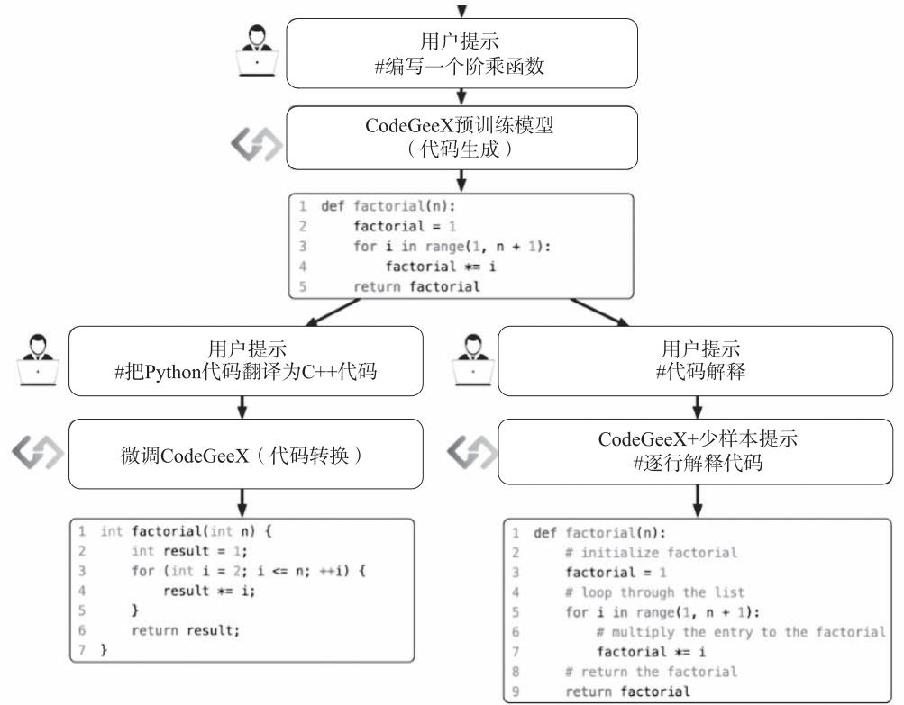  
图 10-7 CodeGeeX 概览

在 IDE 中，用户可以通过提供提示与 CodeGeeX 进行交互。CodeGeeX 模型支持三项任务：代码生成、代码翻译和代码解释。

# 10.3.7 CodeGeeX 模型架构

CodeGeeX 的模型架构是基于纯解码器的 GPT 架构，并使用自回归语言建模。它包含39 层 Transformer 解码器，在每个 Transformer 层中，多头自注意力机制、MLP（多层感知机）层、层归一化（Layer Normalization）和残差连接这些组件都被精心设计和配置。

CodeGeeX 还使用了类 GELU 的 FastGELU 激活函数，此激活函数在昇腾 910 AI 处理器上更加高效。CodeGeeX 模型架构如图 10-8 所示。

  
图 10-8 CodeGeeX 模型架构

CodeGeeX 模型支持的最大序列长度为 2048，显示出对长序列代码处理的能力。

在训练方面，CodeGeeX 的训练语料由开源代码数据集（包括 The Pile 与 CodeParrot）和补充数据两部分组成。比如，The Pile 包含 GitHub 上拥有超过 100 颗星的部分开源仓库，在训练时使用了其中 23 种语言的代码。补充数据则是直接从 GitHub 开源仓库中爬取Python、Java、 $\mathrm { C } { + } { + }$ 代码，并按一定条件筛选而来的。

除了层归一化与 softmax 使用 FP32 格式以获得更高的精度与稳定性外，模型参数整体使用 FP16 格式，最终整个模型需要占用约 27GB 显存。这种设计使 CodeGeeX 在保证精度的同时，能实现高效的计算和内存使用。

# 10.4 如何将 LaTeX 数学公式语言转化为自然语言

要将 LaTeX 常用数学公式语言转化为自然语言，可以按照以下步骤进行。

# （1）公式解析

将 LaTeX 公式语言解析为计算机可以理解的形式。这包括识别和提取公式中的符号、运算符和结构。

举例：考虑LaTeX公式 $\mathrm { E } = \mathrm { m c } ^ { \wedge } 2$ ，系统将识别出变量 $E , m$ 和常数 $c$ 以及平方运算符“^”。

# （2）符号转化

根据公式中的符号和运算符，将其转化为自然语言的等价表达。

举例：对于公式 $\mathrm { E } = \mathrm { m c } ^ { \wedge } 2$ ，系统可以将其转化为“能量等于质量乘以光速的平方”。

# （3）句子结构生成

根据公式的结构和语法规则，构建自然语言句子的结构，并添加合适的连词和细节。

举例：对于公式 $\mathrm { E } = \mathrm { m c } ^ { \wedge } 2$ ，系统可以生成句子“能量是通过将质量乘以光速的平方得到的”。

# （4）文本编辑

根据需要，对生成的句子进行进一步编辑，以确保句子的流畅性和可读性。

举例：对于生成的句子“能量是通过将质量乘以光速的平方得到的”，可以通过编辑使其更加简洁和清晰，如“能量可以由质量乘以光速的平方得到”。

通过以上步骤，LaTeX 常用数学公式语言被转化为自然语言，以提供更易理解和易读的数学表达。这种转换使数学公式可以通过自然语言来描述和解释，使其更容易被普通用户理解和应用。

# 10.5 使用 PPO 算法优化车杆游戏

很多强化学习算法通过梯度上升的方法来最大化目标函数，使得策略最优。但是这种算法有一个明显的缺点：当策略网络是深度模型时，沿着策略梯度更新参数，很有可能由

于步长太大，策略突然显著变差，进而影响训练效果。一种有效的解决方法是信任区域策略优化（Trust Region Policy Optimization，TRPO），然而 TRPO 的计算过程非常复杂，每一步更新的运算量非常大，于是其改进版算法 PPO 被提出。主流的 PPO 有两种，即 PPO-Penalty 和 PPO-Clip，但大量的实验表明 PPO-Clip 更优秀一些，因此本项目采用 PPO-Clip方法。

本项目基于 OpenAI 的 Gym 环境，利用 PPO 算法完成车杆游戏（Cart Pole），游戏模型如图 10-9 所示。为便于大家理解，动作空间为离散的情况（对于连续环境，只需稍加修改即可）。游戏里有一辆小车，车上竖着一根杆子，每次重置后的初始状态会有所不同。游戏目标是通过左右移动小车使杆子保持竖直。动作维度为 2，属于离散值；状态维度为 4，分别是坐标、速度、角度、角速度。

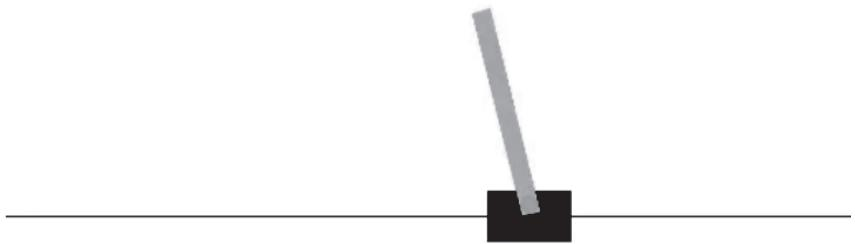  
图 10-9 车杆游戏示意

# 10.5.1 构建策略网络

PPO 算法用到了两个网络：策略网络（actor）和价值网络（critic）。PPO 是同步策略（on-policy），交互的策略由策略网络直接生成。构建策略网络的代码如下：

```python
# ____________ #  
# 构建策略网络——actor  
# ____________ #  
class PolicyNet(nnModule):  
    def __init__(self, n_states, n_hiddens, n ACTIONS):  
        super(PolicyNet, self).__init__()  
        self.fc1 = nn.Linear(n_states, n_hiddens)  
        self.fc2 = nn.Linear(n_hiddens, n ACTIONS)  
    def forward(self, x):  
        x = self.fc1(x)  # [b, n_states]-->[b, n_hiddens]  
        x = F.relu(x)  
        x = self.fc2(x)  # [b, n ACTIONS]  
        x = F softmax(x, dim=1)  # [b, n ACTIONS] 计算每个动作的概率  
        return x 
```

# 10.5.2 构建价值网络

构建价值网络的代码如下：

```python
# ____________ #  
# 构建价值网络——critic  
# ____________ #  
class ValueNet(nnModule):  
    def __init__(self, n_states, n_hiddens):  
        super(ValueNet, self).__init__()  
        self.fc1 = nn.Linear(n_states, n_hiddens)  
        self.fc2 = nn.Linear(n_hiddens, 1)  
    def forward(self, x):  
        x = self.fc1(x)  # [b, n_states]-->[b, n_hiddens]  
        x = F.relu(x)  
        x = self.fc2(x)  # [b, n_hiddens]-->[b, 1] 评价当前的状态价值 state_value  
        return x 
```

# 10.5.3 构建 PPO 模型

构建 PPO 模型的代码如下：

class PPO: def__init__(self，n_states，n_hiddens，n ACTIONS, actor_lr，critic_lr，lmbda，epochs，eps，gamma，device)： #实例化策略网络 selfActor $=$ PolicyNet(n_states，n_hiddens，n ACTIONS).to(device） #实例化价值网络 self.critic $=$ ValueNet(n_states，n_hiddens).to(device） #策略网络的优化器 selfActor_optimizer $=$ torch.optim.Adam(self.act.rparameters()，lr=actor_lr) #价值网络的优化器 self.critic_optimizer $=$ torch.optim.Adam(self.critic.params()，lr $=$ critic_lr) self.gamma $=$ gamma #折扣因子 self.lmbda $=$ lmbda#GAE优势函数的缩放系数 self.epochs $=$ epochs #一条序列的数据用来训练轮数 self.eps $=$ eps #PPO中截断范围的参数 self_device $\equiv$ device #动作选择   
def take_action(self,state): #维度变换[n_state]-->tensor[1,n_states] state $=$ torch.tensor(state[np.newaxis，]）.to(self.device)

#当前状态下，每个动作的概率分布[1,n_states]
probs $=$ self actor(state)
#创建以probs为标准的概率分布
action_list $=$ torch.distributions.Categorical(probs)
#依据其概率随机挑选一个动作
action $=$ action_list.sample().item()
return action
#训练
def learn(self,transition_dict):
    #提取数据集
states $=$ torch.tensor(transition_dict['states'],dtype=torch.float).to(self.device)
actions $=$ torch.tensor(transition_dict['actions'].to(self/device).view(-1,1)
rewards $=$ torch.tensor(transition_dict['rewards'],
                  dtype=torch.float).to(self/device).view(-1,1)
next_states $=$ torch.tensor(transition_dict['next_states'],
                  dtype=torch.float).to(self/device)
done $=$ torch.tensor(transition_dict['done'],
                  dtype=torch.float).to(self/device).view(-1,1)
#目标，下一个状态的state_value [b,1]
next_q_target $=$ self.critic(next_states)
#目标，当前状态的state_value [b,1]
td_target $=$ rewards + self.gamma * next_q_target * (1-dones)
#预测，当前状态的state_value [b,1]
td_value $=$ self.critic(state)
#目标值和预测值的state_value之差 [b,1]
td delta $=$ td_target - td_value
#时序差分值 tensor-->numpy [b,1]
td delta $=$ td_delta.cpu().detach().numpy())
advantage $= 0$ #优势函数初始化
advantage_list = []
#计算优势函数
for delta in td_delta[::-1]: #td_delta[::-1]的功能是把axis=1轴的数据倒序
#优势函数GAE的公式
advantage = self.gamma * self.lmbda * advantage + delta
advantage_list.append(advantage)
#正序
advantage_list.reverse()
#numpy-->tensor[b,1]
advantage $=$ torch.tensor(advantage_list,dtype=torch.float).to(self/device)
#策略网络给出每个动作的概率，根据action得到当前时刻该动作的概率
old_log_probs $=$ torch.log(self actor(state).gather(1, actions)).detach()

```python
# 一条序列的数据训练 epochs 轮
for _ in range(self.epchs):
    # 每一轮更新一次策略网络预测的状态
    log_probs = torch.log(self actor(states).gather(1, actions))
    # 新旧策略之间的比例
ratio = torch.exp(log_probs - old_log_probs)
    # 近端策略优化裁剪目标函数公式的左侧项
surrl = ratio * advantage
# 公式的右侧项，ratio 小于 1-eps 就输出 1-eps，大于 1+eps 就输出 1+eps
surrl2 = torch.clamp(ratio, 1-self.eps, 1+self.eps) * advantage
# 策略网络的损失函数
actor_loss = torch.mean(-torch.min(surr1, surrl2))
# 价值网络的损失函数，当前时刻的 state_value - 下一时刻的 state_value
critic_loss = torch.mean(F.mse_loss(self.criticstates), td_targetdetach())
# 梯度清零
selfActor_optimizer.zero_grad()
self.critic_optimizer.zero_grad()
# 反向传播
actor_loss_backward()
critic_loss_backward()
# 梯度更新
selfActor_optimizer.step()
self.critic_optimizer.step()
```

# 10.5.4 定义超参数

定义一些超参数，代码如下：

```txt
# # 参数设置  
# # num Episodes = 100 # 总迭代次数  
gamma = 0.9 # 折扣因子  
actor_lr = 1e-3 # 策略网络的学习率  
critic_lr = 1e-2 # 价值网络的学习率  
n_hiddens = 16 # 隐含层神经元个数  
env_name = 'CartPole-v1' # 定义环境变量  
return_list = [] # 保存每个回合的返回值 
```

# 10.5.5 实例化模型

实例化 PPO 类，代码如下：

agent $=$ PPO(n_states $\equiv$ n_states，#状态数n_hiddens $\equiv$ n_hiddens，#隐含层神经元个数n ACTIONS $\equiv$ n ACTIONS，#动作数actor_lr=actor_lr，#策略网络的学习率critic_lr=critic_lr，#价值网络的学习率lmbda $= 0.95$ ，#优势函数的缩放因子epochs $= 10$ ，#一条序列的数据训练的轮数eps $= 0.2$ ，#PPO中截断范围的参数gamma $\equiv$ gamma，#折扣因子device $=$ device）

# 10.5.6 训练模型

构建模型之后，开始训练模型，代码如下：

```python
for i in range(numEpisodes):
    state = env.reset() [0] # 环境重置
done = False # 任务完成的标记
episode_return = 0 # 累计每回合的返回值
# 构造数据集，保存每个回合的状态数据
transition_dict = {
    'states': [], 
    'actions': [], 
    'next_states': [], 
    'rewards': [], 
    'dones': [], 
} while not done:
    action = agent.take_action(state) # 动作选择
    next_state, reward, done, _, _ = env-step(action) # 环境更新
    # 保存每个时刻的状态动作
    transition_dict['states'].append(state)
    transition_dict['actions'].append(action)
    transition_dict['next_states'].append(next_state)
    transition_dict['rewards'].append(reward)
    transition_dict['dones'].append(done)
    # 更新状态
    state = next_state
    # 累计回合奖励
    episode_return += reward
# 保存每个回合的返回值 
```

```python
return_list.appendepisode_return) #模型训练 agent.Learn(transition_dict) #打印回合信息   
print(f'iter:{i},return:{np.mean.return_list[-10:]})')   
print('循环完成')   
env.render()#图像引擎   
env.close()#关闭环境 
```

# 10.5.7 可视化迭代

可视化每个回合的奖励（返回值），代码如下：

```txt
plt.plot.return_list)  
plt.title('return')  
plt.show() 
```

运行结果如图 10-10 所示。

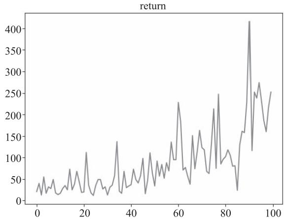  
图 10-10 每个回合的奖励示意

# 10.6 使用 RLHF 算法提升 GPT-2 性能

本节内容基于 GitHub 上的一个开源项目 TRL（Transformer Reinforcement Learning）。TRL 通过 PPO 算法微调语言模型，它需要的数据是三元组 [query, response, reward]。这里我们通过 TRL 搭建 3 个通过 PPO 算法来更新语言模型（GPT-2）的示例：

1）基于中文情绪识别模型的正向评论生成机器人；  
2）对评论进行人工打分；

# 3）标注排序序列替代直接打分。

# 10.6.1 基于中文情绪识别模型的正向评论生成机器人

利用现有的语言模型（本例中选用中文的 GPT-2，即 gpt2-chinese-cluecorpussmall），通过一小段提示词，能够继续生成一段文字，例如：

prompt: 刚收到货，感觉有

output 1: 刚收到货，感觉有点不符合预期，不好

output 2: 刚收到货，感觉有挺无奈的送货速度不太行

现在希望语言模型能够学会生成正向情绪的正确评分，但当前的 GPT-2 模型是不具备情绪识别能力的，如上面两个生成结果都不符合正向情绪。

为此，期望通过强化学习的方法来改进现有语言模型，使其能够学会尽可能地生成正向情绪的评论。

在强化学习中，当模型生成一个结果时，我们需要告知模型这个结果的得分（奖励值）是多少，即我们为模型的每一个生成结果打分，例如：

```txt
output 1: 刚收到货，感觉有点不符合预期，不好 -> 0.1 分  
output 2: 刚收到货，感觉有挺无奈的送货速度不太行 -> 0.2 分  
output 3: 刚收到货，感觉有些惊喜于货物质量 -> 0.8 分
```

如果依靠人工为每一个输出打分，将是一个非常漫长的过程（在另一个示例中我们将实现该功能），因此，我们引入一个情绪识别模型—transformers 中内置的 sentiment-analysis 来模拟人工给出的分数。该模型基于网络评论数据集训练，能够对句子进行正向、负向的情绪判别。

我们以该情绪识别模型的判别结果（ $0 . 0 { \sim } 1 . 0 $ ）作为语言模型生成奖励，以指导 GPT-2模型通过 PPO 算法进行迭代更新。

整个 PPO + GPT-2 的训练流程如下：

1）随机选择一个提示词，如“这部电影很”。  
2）GPT-2 模型根据提示词生成答案，如“这部电影很好看哦”。  
3）将 GPT-2 的生成答案“喂”给情绪识别模型，并得到评分（reward），如 0.8。  
4）利用评分对 GPT-2 模型进行优化。

不断重复以上 4 步，直到训练结束为止。

项目基于 PyTorch + transformers 实现，核心代码如下。

# （1）情绪分类模型

具体代码如下：

情绪识别模型初始化

```txt
senti_tokenizer = AutoTokenizer.from_pretrained('uer/roberta-base-finetuned-jd-binary-chinese')
senti_model = AutoModelForSequenceClassification.from_pretrained('uer/roberta-base-finetuned-jd-binary-chinese')
sentiment_pipe = pipeline('sentiment-analysis', model=senti_model, tokenizer=senti_tokenizer, device=pipe_device) 
```

（2）导入生成文本模型

具体代码如下：

```python
gpt2_model = GPT2HeadWithValueModel.from_pretrained(config['model_name'])  
gpt2_model_ref = GPT2HeadWithValueModel.from_pretrained(config['model_name'])  
gpt2_tokenizer = AutoTokenizer.from_pretrained(config['model_name'])  
gpt2_tokenizer.eos_token = gpt2_tokenizer_pad_token 
```

（3）定义强化学习训练模块

具体代码如下：

```python
ppo Trainer = PPOTrainer(gpt2_model, gpt2_model_ref, gpt2_tokenizer, **config)  
total_ppo_epochs = int(np.ceil(config["steps"]), config['batch_size'])  
# 将 prompt 和生成的 response 进行拼接  
texts = [q + r for q, r in zip(batch['query'], batch['response'])]  
# 计算正向/负向情绪得分  
pipe_outputs = sentiment_pipetexts) 
```

（4）模型迭代

利用 PPO 的模块（ppo_trainer）进行模型迭代，更新代码只需一行。

#更新PPO stats $=$ ppo Trainer step(query_tensors，response_tensors，rewards)

PPO 在更新时一共会计算两个损失值：pg_loss 和 value_loss。

```python
loss_p, loss_v, train.stats = self.loss(logprobs, values, rewards, query, response, model_input)  
loss = loss_p + loss_v 
```

其中，loss_p 是 PPO 中 actor 的损失函数，它通过折扣奖励（discount reward）和重要性比率（importance ratio）来计算当前步的奖励：

$$
\text {l o s s} - \mathrm {p} = \frac {p _ {\pi_ {\text {n e w}}} (\text {t o k e n})}{p _ {\pi_ {\text {o l d}}} (\text {t o k e n})} (r + \gamma V _ {\text {n e x t}} - V _ {\text {c u r r e n t}}) \tag {10.7}
$$

loss_p 代码实现如下：

```python
for t in reversed(range(gen_len)): 
```

nextvalues $=$ values[:,t+1]if t<gen_len-1else0.0   
#优势函数：r $^+$ Vnext-V   
delta $=$ rewards[:,t] $^+$ self.ppo_parameters['gamma'] \* nextvalues - values[:,t]   
#GAE，用于平衡偏移和方差 lastgaelam $=$ delta $^+$ self.ppo_parameters['gamma'] \* self.ppo_parameters['lam'] \*lastgaelam advantages_reversed.append(lastgaelam)   
advantages $=$ torch.stack(advantages_reversed[::-1]).transpose(0,1)   
#运行一遍模型，得到句子中每个标记被选择的概率   
logits,_,vpred $=$ self.model(model_input)   
#将概率取对数   
logprob $=$ logprobs_from_logits(logits[:,-1,:],model_input[:,1:])   
#log相减，等同于概率相除   
ratio $=$ torch.exp(logprob-old_logprobs)   
loss_p $=$ -advantages \* ratio

loss_v 是 PPO 中 critic 的损失函数，其目的在于评判每一个 token 被生成后的 value 是多少。这是因为在 PPO 中需要有一个 critic 网络，为了实现这个效果，我们需要对 GPT 模型进行改造。在 GPT 中加入一个 Value Head，用于将 hidden_size 向量映射到一个一维的value 向量：

```python
class GPT2HeadWithValueModel(GPT2PreTrainedModel):
    ""The GPT2HeadWithValueModel class implements a GPT2 language model with a secondary, scalar head."
    def __init__(self, config):
        super().__init__(config)
        config.num_labels = 1
        self.transformer = GPT2Model(config)
        self.lr_head = nn.Linear(config.n_embd, config.vocab_size, bias=False)
        # 添加 Value Head
        self.v_head = ValueHead(config)
        self.initweights()
    ...
    class ValueHead(nnModule):
        ""The ValueHead class implements a head for GPT2 that returns a scalar for each output token."
    def __init__(self, config):
        super().__init {}
        self.summary = nn.Linear(config-hidden_size, 1) 
```

loss_v 就应该等于 Value Head 产生的预测值 v_pred 和真实值 $\mathbf { r } + \mathbf { V } ,$ _next 的差值：

$$
\text {l o s s} _ {-} \mathrm {v} = \left\| V _ {\text {p r e d}} - \left(r + V _ {\text {n e x t}}\right) \right\| \tag {10.8}
$$

公式对应的代码如下：

$\# \mathrm{r} + \mathrm{v\_next - v + v} => \mathrm{r} + \mathrm{v\_next}$ returns $=$ advantages $^+$ values   
#运行一遍语言模型，得到每个token的v_pred  
logits，_，vpred $=$ self.model(model_input)   
#MSE   
vf_losses1 $=$ (vpred-returns）\*\*2

运行结果如下：

```txt
epoch 0 mean-reward: 0.7632623910903931  
Random Sample 5 text(s) of model output:  
1. 说实话，真的很，首先，消费不能算便宜，只是比一  
2. 刚收到货，感觉哥们不大能用。给钱买回来可以玩儿  
3. 刚收到货，感觉机器好好用啊，哦吼吼，镜头的确很  
4. 刚收到货，感觉包装有点亏。不过面包的我很喜欢，  
5. 这次购物总的来说体验很实[SEP]书掉页切割非常粗糙这本书买回  
epoch 156 mean-reward: 0.8600930571556091  
Random Sample 5 text(s) of model output:  
1. 这部电影很～分得很了还是很不错啊这部电影很  
2. 说实话，真的很，就是位置很好看，很可爱，做为是  
3. 这次购物总的来说体验很[SEP][SEP]。[SEP]书的质量还不错做完就可以  
4. 刚收到货，感觉里面还是比较不错的，可能去武汉看  
5. 说实话，真的很般的一家店，吃的真的很一般，不过
```

其中 mean-reward 代表该回合（epoch，这里分别选择第 0、156 回合的运行结果）模型的平均得分（即来自情绪识别模型的反馈），Random Sample 代表该模型在当前回合生成的句子样例。

图 10-11 为模型训练过程中的各个指标变化情况。

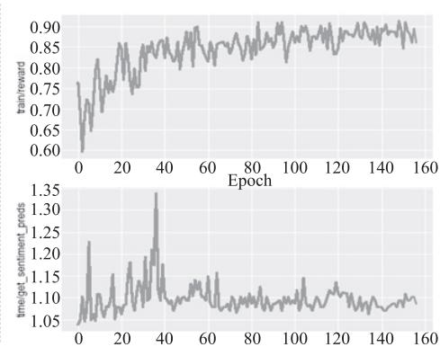

  
图 10-11 情绪识别模型的各个指标变化情况

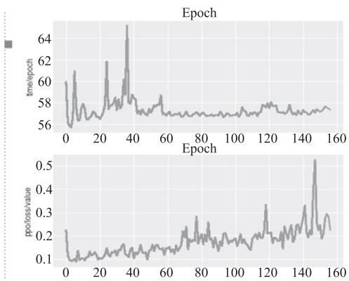

  
图 10-11 情绪识别模型的各个指标变化情况（续）

# 10.6.2 对评论进行人工打分

在上一个示例中，模型的奖励来自另一个模型。在这个示例中，我们将制作一个平台来支持人工打分。启动标注平台，运行如下代码：

```txt
terminal_main.py 
```

随后，可以在终端看到模型的生成结果，如图 10-12 所示，通过人工输入奖励以迭代模型。

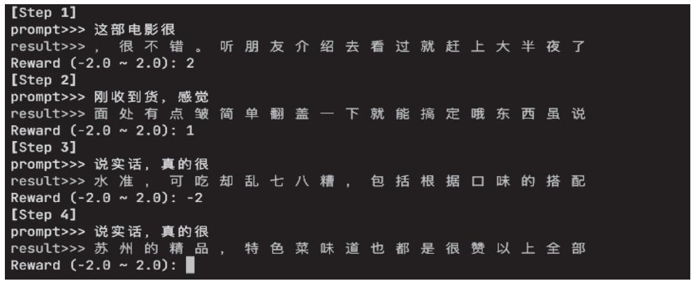  
图 10-12 标注平台示意图

# 10.6.3 标注排序序列替代直接打分

在对话中，人们经常会使用模糊的或隐含的语言表达意思。而直接打分往往无法捕捉到这些细微的语义差异。通过人工标注排序序列，可以更好地理解并捕捉到对话中的这些细微差别。有时 ChatGPT 会生成一些不确定或不准确的回答，这可能会给用户带来困

惑。通过人工标注排序序列，可以排除这些含糊不清的回答，从而提供更准确、更可靠的结果。

当对语句进行人工打分和人工标注排序时，通常会有一个专门的团队或人员负责评估。

假设有一个对话系统，用户提出问题“明天天气如何？”，ChatGPT 被要求生成合适的回答。语言模型生成了 4 个可能的回答：

A：明天将有阳光和凉爽的气温，很适合出门活动。  
B：明天可能会下雨，所以带上一把伞是个好主意。  
C：明天的天气预报还没有出来，请稍后再问我。  
D：明天的天气无法确定。

然后，一个评估员会对这 4 个回答进行人工打分和人工标注排序。评估员会考虑以下 3个因素。

# （1）回答的相关性

评估员会判断回答与用户问题的相关性。例如，在这个例子中，回答 A 和回答 B 都直接回答了用户的问题，回答 C 则表示无法提供具体的预测。评估员可以给相关性更高的答案更高的分数。

# （2）回答的准确性

评估员会考虑回答的准确性。在这个例子中，回答 A 强调了明天的天气将是阳光明媚的和凉爽的，回答 B 提到可能会下雨，而回答 C、D 表示无法提供预测。评估员可以给准确性更高的答案更高的分数。

# （3）回答的流畅性和语法正确性

评估员会考虑回答的流畅性和语法正确性。流畅性高、语法无误的回答可以获得更高的分数。

基于以上评估标准，不同评估员会对这4个回答进行打分。评估结果可能不同，如表10-2所示。

表10-2 评估员对生成语句进行人工打分  

<table><tr><td>生成语句</td><td>得分
(评估员1)</td><td>得分
(评估员2)</td></tr><tr><td>A: 明天将有阳光和凉爽的气温, 很适合出门活动</td><td>9</td><td>7</td></tr><tr><td>B: 明天可能会下雨, 所以带上一把伞是个好主意</td><td>6</td><td>5</td></tr><tr><td>C: 明天的天气预报还没有出来, 请稍后再问我</td><td>4</td><td>6</td></tr><tr><td>D: 明天的天气无法确定</td><td>1</td><td>2</td></tr></table>

基于以上评估标准，不同评估员会对这4个回答进行排序。评估结果可能相同，如表10-3所示。

表10-3 评估排序  

<table><tr><td>生成语句</td><td>排序
(评估员1)</td><td>排序
(评估员2)</td></tr><tr><td>A: 明天将有阳光和凉爽的气温, 很适合出门活动</td><td rowspan="4">A&gt;B&gt;C&gt;D</td><td rowspan="4">A&gt;B&gt;C&gt;D</td></tr><tr><td>B: 明天可能会下雨, 所以带上一把伞是个好主意</td></tr><tr><td>C: 明天的天气预报还没有出来, 请稍后再问我</td></tr><tr><td>D: 明天的天气无法确定</td></tr></table>

不难看出，用相对任务替代绝对任务能够更方便评估员给出统一的标注结果。标注统一的问题解决了，那么怎么让模型通过排序序列学会打分？

也就是说，如何定义基于排序的打分模型的损失函数？

假定有一个排好的序列 $\mathrm { A } > \mathrm { B } > \mathrm { C } > \mathrm { D }$ ，接下来需要训练一个打分模型，模型给 4 个回答打出来的分要满足 $r ( \mathbf { A } ) > r ( \mathbf { B } ) > r ( \mathbf { C } ) > r ( \mathbf { D } ) _ { }$ 。

那么，定义一个损失函数：同一个提示词 $x$ ，生成多个输出，根据人工排序的结果计算奖励（Reward）之间的差值。具体公式如下：

$$
\left. \log (\theta) = - \frac {1}{K} E _ {\left(X, y _ {w}, y _ {l}\right) \sim D} \left\lceil \log \left(\sigma \left(r _ {\theta} \left(x, y _ {w}\right) - r _ {\theta} \left(x, y _ {l}\right)\right)\right)\right\rfloor\left. \right. \tag {10.9}
$$

2

其中， $y _ { w }$ 人工标注得分大于 $y _ { l }$ 句子，例如：当 $w { = } [ \mathrm { B } ]$ ， $l { = } [ \mathrm { A } ]$ ；当 $w { = } [ \mathrm { C } ]$ ， $l { = } [ \mathrm { A } , \mathrm { B } ]$ ；当 $w { = } [ \mathrm { D } ]$ ，$l { = } [ \mathrm { A } , \mathrm { B } , \mathrm { C } ]$ 。

结合上述例子（ $\mathbf { A } > \mathbf { B } > \mathbf { C } > \mathbf { D }$ ），loss 的值如下：

loss $=$ r(A)-r(B）+r(A)-r(C)+r(A)-r(D)+r(B)-r(C)+...+r(C)-r(D) loss $=$ -loss

为了归一化差值，我们对每两项差值都过一个 sigmoid 函数，将值映射到 $0 \sim 1$ 之间。可以看到，loss 的值等于排序列表中所有排在前面项的奖励减去排在后面项的奖励的和。

我们最终目的是使模型最大化好句子得分和坏句子得分之间的差值，而梯度下降是做的最小化操作。因此，需要对 loss 取负数，这样就能实现最大化差值。整个训练过程如图 10-13所示。

运行结果如何？这里我们通过排序序列来学习一个打分模型。首先准备一份数据集（如 train.tsv），每一行是一个排序序列（用 \t 符号隔开）。排在越前面的越偏正向情绪，排在越后面越偏负向情绪。

买过很多箱这个苹果了，一如既往地好，汁多味甜～ 名不副实。 拿过来居然屏幕有划痕，顿时就不开心了。4.什么手机啊！一台充电很慢，信号不好！退了！又买一台竟然是次品。  
1.一直用 $\times \times$ 的洗发露！是正品！去屑、止痒、润发、护发，面面俱到！ 2. 觉得比外买的稀，好似加了水的。  
3. 非常非常不满意，垃圾。4. 什么垃圾衣服，买来一星期不到口袋全脱线，最差的一次购物。

...

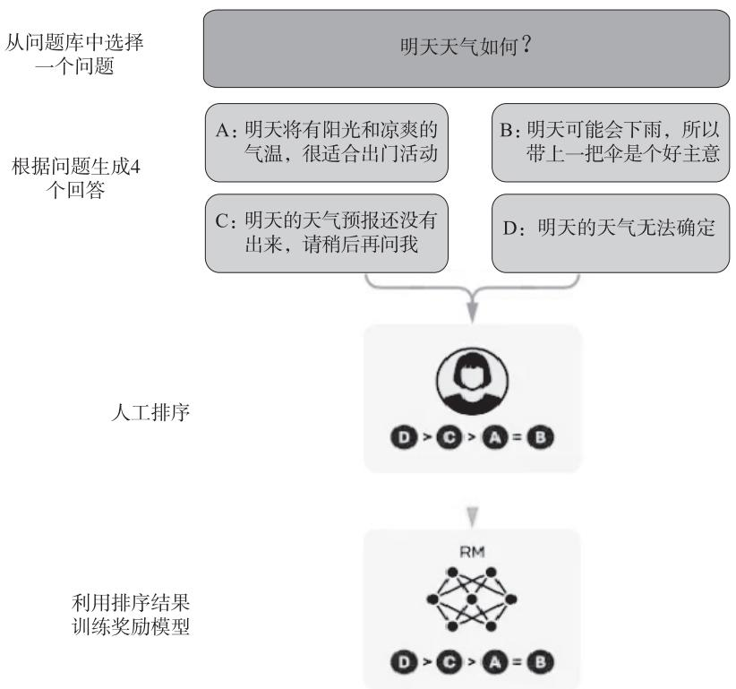  
图 10-13 模型运行过程

利用这个序列数据集训练一个奖励模型。句子越偏正向情绪，模型给出的奖励越高。选用 ERNIE 模型作为基准（Backbone）模型，将模型的池化输出连接到全连接层以得到一维的奖励值。具体代码如下：

class RewardModel(nnModule): def __init__(self, encoder): "" 初始化函数 Args: encoder (transformers.AutoModel): 基准模型，默认使用ERNIE3.0 super().__init_(） selfencoder $\equiv$ encoder #奖励层用于映射到一维奖励 selfreward_layer $\equiv$ nn.Linear(768，1) def forward( self, input_ids:torch+tensor, token_type_ids:torch.tensor,

```python
attention_mask=None,
pos_ids=None,
) -> torch.tensor:
    ""
正向函数，返回每句话的奖励值
Args:
    input_ids (torch.tensor): (batch, seq_len)
    token_type_ids (torch.tensor): (batch, seq_len)
    attention_mask (torch.tensor): (batch, seq_len)
    pos_ids (torch.tensor): (batch, seq_len)
Returns:
    reward: (batch, 1)
    ""
pooler_output = self.encode(
        input_ids=input_ids,
        token_type_ids=token_type_ids,
        position_ids=pos_ids,
        attention_mask=attention_mask,
    )[["pooler_output"] # (batch, hidden_size)
reward = selfreward_layer(pooler_output) # (batch, 1)
return reward 
```

在 RLHF 算法中，我们需要计算标准排序序列的损失函数，该损失函数被称为排名损失（rank_loss）函数。计算排序损失（rank_loss）函数。因为样本里的句子已经默认按得分从高到低排好，所以我们只需要求所有前后项的得分差值之和即可：

def compute_rank_list_loss(rank_rewards_list:List[List[torch.tensor]], device $\equiv$ 'cpu'):   
""  
通过给定的有序（从高到低）的排序列表（ranklist）的奖励列表，计算排序损失。 所有排序高的句子的得分减去排序低的句子的得分差的总和，并取相反数   
Args: rank_rewards_list (torch.tensor): 有序（从高到低）排序句子的reward列表，如 -> [[torch.tensor([0.3588]),torch.tensor([0.2481]),...],[torch.tensor([0.5343]), torch.tensor([0.2442]),...],...]] device(str):使用设备   
Returns: loss(torch.tensor):tensor([0.4891],grad_fn $=$ <DivBackward0>）   
if type(rank_rewards_list)！ $= =$ list: raise TypeError(f' $@$ param rank_rewards expected "list",received {type(rank_ rewards)}.'）

loss，add_count $=$ torch.tensor([0]).to(device)，0   
for rank_rewards in rank_rewards_list:   
#遍历所有前项-后项的得分差值 for i in range(len(rank_rewards)-1): for j in range(i+1，len(rank_rewards)): #使用sigmoid函数映射到0~1之间 diff $=$ F.sigmoid(rank_rewards[i] - rank_rewards[j]) loss $=$ loss $^+$ diff add_count $+ = 1$ loss $=$ loss / add_count   
return -loss

最后的训练结果如下，模型的运行结果如图 10-14 所示。

```txt
global step 2760, epoch: 2, loss: 0.20172, speed: 0.92 step/s  
global step 2770, epoch: 2, loss: 0.20157, speed: 0.94 step/s  
global step 2780, epoch: 2, loss: 0.20140, speed: 0.93 step/s  
global step 2790, epoch: 2, loss: 0.20121, speed: 0.93 step/s  
global step 2800, epoch: 2, loss: 0.20114, speed: 0.94 step/s  
Evaluation acc: 0.67326 
```

  
[TrainingLog]ERNIE Reward Model

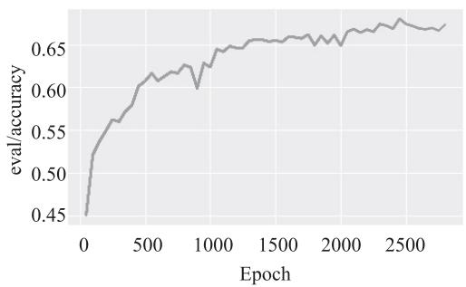  
图 10-14 奖励模型运行结果

完成训练后，运行预测脚本，可以看到训练后的模型的打分效果。

```python
device = 'cpu'  
tokenizer = AutoTokenizer.from_pretrained('./checkpoints/reward_model/sentiment_analysis/model_best/'')  
model = torch.load('./checkpoints/reward_model/sentiment_analysis/model_best/  
model.pt')  
model.to(device).eval()  
texts = [  
    '买过很多箱这个苹果了，一如既往地好，汁多味甜～'， 
```

```txt
'什么手机啊！一台充电很慢，信号不好！退了！又买一台竟然是次品。'  
]  
inputs = tokenizer(  
texts,  
max_length=128,  
padding='max_length',  
return_tensors='pt'  
)  
r = model(**inputs)  
print(r) 
```

运行结果如下：

```javascript
tensor([[8.5675],[-6.4818]],grad_fn=<AddmmBackward0>) 
```

可以看到，正向评论得到了 8.5 分，而负向评论得到了 -6.48 分。

# 10.7 ChatGPT 如何提升思维链推断能力

ChatGPT 中的思维链推理能力是指模型能够在对话中展示出逻辑严密、连贯的思维过程。它可以理解对话中的问题、上下文和语境，并根据这些信息生成有条理的回答。

举个例子，假设我们与 ChatGPT 进行如下对话：

用户：我想买一台便宜的电视，你有什么推荐吗？

助手：你说的“便宜”指的是多少的价格范围？

用户：大约 600 美元。

助手：在这个价位上，我推荐你考虑购买 ABC 型号的电视。它有良好的画质、多个接口和智能功能，适合你的需求。

在这个例子中，用户提出了一个需求，并询问是否有便宜电视的推荐。ChatGPT 理解到用户想要买一台符合其预算的电视。在回答中，ChatGPT 首先请用户明确价格范围，然后根据用户提供的约束条件推荐了一个具体的型号。

这个例子体现了思维链推理能力，模型根据对话中的上下文和语境，进行了逻辑思考和推断，从而生成了有条理且符合用户需求的回答。

ChatGPT 是如何提升其思维链推理能力的呢？一是预训练，二是有针对性地微调。

预训练（Pre-training）阶段：在这个阶段，ChatGPT 模型使用大量的无监督对话数据来学习语言模式和知识。通常使用的预训练方法是自监督学习，即模型根据对话数据中的上下文信息来预测下一个单词或掩盖的单词。预测任务旨在帮助模型学会理解对话中的逻辑和上下文关系，并捕捉语义和语法等不同层面的信息。

微调（Fine-tuning）阶段：在预训练完成后，ChatGPT 模型需要在特定的对话任务上进行微调，以将其能力应用到具体的应用场景中。在微调阶段，模型根据有标注的对话数据进行有监督学习，例如对话回答或问题生成等任务。微调的目的是让模型学会根据用户的问题或上下文生成合理的回答。

通过这两个阶段的学习，ChatGPT 模型能够逐渐掌握思维链推断能力，从而在对话中展现出逻辑连贯、有条理的回答和推理过程。预训练使模型从大规模的数据中学习通用的语言模式和知识，而微调则使模型根据特定任务的示例数据进行细化和专业化的学习。

# 10.8 ChatGPT 如何提升模型的数学逻辑推理能力

ChatGPT 模型使用一些技术和算法来提升其数学逻辑推理能力，以下是其中主要的技术和算法。

# （1）自注意力机制

自注意力机制允许模型在处理数学逻辑问题时关注不同数学符号或算式的关系。例如，当解决一个数学问题时，模型可以通过自注意力机制更好地关注并处理输入中存在的数学符号和变量之间的相互作用。

# （2）数学表达式解析器

ChatGPT 模型可以通过语言模型中的规则来解析数学表达式。这样，模型可以理解并处理包括算术运算、函数调用和符号等在内的数学运算。ChatGPT 中的数学表达式解析器是一种对输入的数学表达式进行解析和计算的组件。该解析器使用预定义的语法规则和算法来解析与处理数学表达式，并输出计算结果。其工作原理如下：

1）输入处理：模型接收一个包含数学表达式的文本输入。例如，输入可以是一个算术表达式（如 $2 + 3 * 4$ ）或一个数学问题（如“求方程 $\mathbf { x } \wedge 2 - 3 \mathbf { x } + 2 = 0$ 的根”）。  
2）词法分析：输入的数学表达式会经过词法分析，被拆分成一个个的词语或符号，如运算符、变量、数字等。例如， $2 + 3 * 4$ 会被分解成 2、+、3、* 和 4。  
3）语法分析：通过语法分析，模型将词法分析后的结果转化为一棵语法树。语法树将数学表达式的结构以树的形式表示，展示了各个部分之间的关系和优先级。例如，对于 $^ { 2 + }$ $3 \ast 4$ ，语法树可能为 $\operatorname { A d d } ( 2 , \operatorname { M u l } ( 3 , 4 ) )$ ，其中 Add 和 Mul 分别代表加法和乘法运算。  
4）计算求值：通过遍历语法树，模型按照预定义的算法来计算表达式的值。模型会根据运算符的优先级和结合性来决定计算的顺序。对于上述语法树，模型会先计算乘法得到12，然后再与 2 相加，得到最终结果 14。

举例来说，当输入为 $2 + 3 * 4$ 时，ChatGPT 的数学表达式解析器会将其转换为语法树，并按照优先级计算，最后得出结果 14。这展示了数学表达式解析器在处理数学表达式时的工作原理和计算过程。

# （3）数学推理规则的建模

ChatGPT 模型通过大规模的预训练来学习数学推理任务中的模式和规则。这些规则可以包括数学定律、公式和推理逻辑等。模型在预训练阶段通过观察大量的数学表达式和问题答案对来学习这些规则，并在后续的微调中应用这些规则来进行数学逻辑推理。

举例来说，对于数学问题“如果 $\mathbf { X } { = } 3$ ，那么 $2 \mathrm { X } + 5$ 等于多少？”，ChatGPT 模型可以使用自注意力机制来注意到问题中的变量 $x$ 和公式中的 $x$ 之间的关系，并应用算术运算规则来完成计算。因此，模型可以理解并推理出正确的答案，即 $2 x + 5 = 2 * 3 + 5 = 1 1$ 。这展示了ChatGPT 模型在数学逻辑推理方面的能力。