# 第 11 章

# 扩散模型

前面介绍过，VAE、GAN 这两种生成模型在生成高质量样本方面取得了巨大成功，但两者都有自己的局限性：GAN 模型由于其对抗性训练性质，具有潜在的训练不稳定性，且生成的图像缺乏多样性；而 VAE 只能计算数据似然的一个下界，生成的图像质量也不太令人满意。

扩散模型（Diffusion Model）是一种基于马尔可夫链的生成模型，用于建模概率分布。它通过逐步扩散噪声来生成样本，从而逼近目标分布。扩散模型使用马尔可夫链来模拟样本生成过程。马尔可夫链主要由转移核函数和初始分布组成，转移核函数定义了样本在每个步骤上的转移概率。扩散模型将样本与噪声混合，并通过递归地应用马尔可夫链转移步骤来逐步扩散噪声。经过多个步骤的扩散后，模型生成的样本逐渐逼近目标分布。

扩散模型的一个重要应用是图像去噪，即从受噪声干扰的图像中恢复出清晰的图像。去噪概率模型（Denoising Diffusion Probabilistic Model，DDPM）是扩散模型在图像去噪领域的典型代表之一。它是基于概率模型的图像去噪方法，通过对图像进行扩散过程，利用概率模型来描述扩散过程中像素值的变化。DDPM 的关键思想是利用概率模型建模噪声的分布和图像的结构，通过最大似然估计来估计模型参数，从而实现图像去噪的目标。

# 11.1 扩散模型简介

扩散模型是一种流行的深度生成模型，它被广泛应用于图像生成和其他应用领域。

扩散模型背后的基本原理是，将复杂的图片或信息分解为简单的组成部分，然后通过逐步添加细节和复杂性来生成最终的输出。这个过程类似于自然界中的扩散现象，即分子从高浓度区域向低浓度区域转移并逐渐均匀分布。

在生成式人工智能中，扩散模型通常首先从一个随机噪声输入开始，然后通过多个阶段逐步添加信息，最终生成一个有序的输出。这个过程可以看作构建一个标签的过程，即从无序的噪声中逐步构建出有序的输出。

相比其他深度生成模型，如 GAN 和 VAE，扩散模型具有一些优点。例如，GAN 需要训练两个网络，即生成器和判别器，这可能会增加训练难度和计算资源要求。而 VAE 则要求对潜在变量进行近似推理，这可能会引入误差。相比之下，扩散模型更加简单直观，训练相对容易，且在很多应用场景中表现优异。

# 11.1.1 DDPM

DDPM 是一种基于扩散过程的生成模型，其原理可以分为以下 3 个部分。

# （1）定义概率密度函数

DDPM 首先定义了一个概率密度函数 $p ( x )$ ，该函数描述了输入图像 $x$ 的分布情况。在DDPM 中，这个概率密度函数通常使用正态分布进行建模。

# （2）通过扩散过程迭代更新概率密度函数

DDPM 利用随机微分方程的思想，通过连续的扩散过程来迭代更新概率密度函数。具体地，我们将输入图像 $x$ 作为初始状态，根据随机微分方程不断演化得到另一个图像 $x$ ，并将其与原始图像进行比较，从而计算出两个概率密度函数之间的差异。接着，我们通过对差异进行优化来更新概率密度函数的参数，使得两个概率密度函数更加接近。

# （3）生成新的图像

在训练完成之后，我们可以使用训练好的概率密度函数 $p ( x )$ 来生成新的图像。具体地，我们可以通过迭代扩散过程，从初始的噪声图像开始，逐步生成更接近于训练数据的图像。在生成过程中，DDPM 将每个迭代步骤看作一次对概率密度函数进行调整的过程，从而生成更加准确的图像。

需要注意的是，DDPM 中采用的随机微分方程与其他扩散模型中的方程略有不同。具体来说，DDPM 中采用的是一个连续时间的随机微分方程，并通过数值求解的方法来计算出每个时间步长的结果。由于该方法能够充分利用物质内部的微观结构信息，因此可以更加准确地模拟物质的扩散过程。如无特别说明，本章中的扩散模型主要指 DDPM。

# 11.1.2 扩散概率模型

扩散模型受到非平衡热力学的启发，定义了扩散步骤的马尔可夫链，以缓慢地将随机噪声添加到数据中，通常使用马尔可夫链进行采样，从初始状态出发，通过状态转移概率进行多次迭代，最终得到平稳分布（如高斯分布）。然后学习反转扩散过程，从噪声中构建所需的数据样本。与 GAN、VAE 或流动模型不同，扩散模型是通过固定的过程学习的，并且潜在变量具有高维度（与原始数据维度相同）。不同类型生成模型的架构如图 11-1 所示。

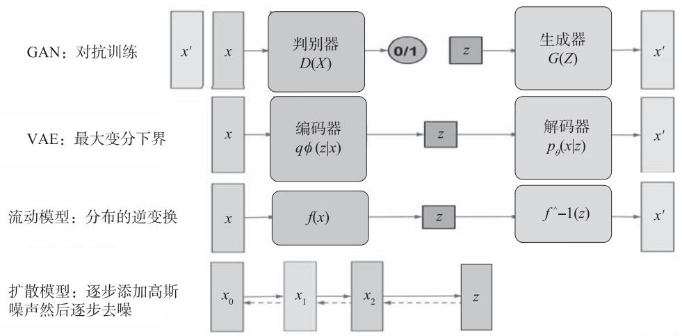  
图 11-1 不同类型生成模型的架构

这些生成模型的架构可以认为类似编码器 - 隐空间 z- 生成器的架构，不同点是扩散模型的隐空间 $z$ 与输入的形状相同，而其他模型的隐空间的维度比输入小。

# 11.1.3 正向扩散过程

扩散过程就是不断往图像上加噪声直到图像变成一个纯噪声。每步添加高斯噪声生成马尔可夫链 $\{ X _ { t } \}$ ，当 $t \longrightarrow \infty$ 时，收敛于一个各向同性的高斯分布。扩散模型的正向扩散过程如图 11-2 所示。

  
图 11-2 扩散模型的正向扩散过程

用 $x _ { 0 } \sim q { \left( x _ { 0 } \right) }$ 表示原始数据及其分布，则正向链的分布可由下式表达：

$$
q \left(x _ {1}, x _ {2}, \dots , x _ {T} \mid x _ {0}\right) = \prod_ {t = 1} ^ {T} q \left(x _ {t} \mid x _ {t - 1}\right) \tag {11.1}
$$

$$
q \left(x _ {t} \mid x _ {t - 1}\right) = \mathcal {N} \left(x _ {t}; \sqrt {1 - \beta_ {t}} x _ {t - 1}, \beta_ {t} I\right) \tag {11.2}
$$

用这说明正向链是马尔可夫过程， $x _ { t }$ 是加入 $t$ 步噪声后的样本， $\beta _ { t }$ 是事先给定的控制噪声进度的参数：当 $\prod _ { t } \left( 1 - \beta _ { t } \right)$ 趋于 1 时， $x _ { { _ T } }$ 可以近似认为服从标准高斯分布。公式的推导参考 11.1.4 节和 11.1.5 节。

# 11.1.4 反向扩散过程

反向扩散过程就是从纯噪声生成一张图像的过程使用神经网络（U-Net 网络） $\varepsilon _ { \theta }$ 预测噪声 $\mathcal { E } _ { t }$ 。扩散模型的反向扩散过程如图 11-3 所示。

  
图 11-3 扩散模型的反向扩散过程

当β很小时，反向扩散过程的转移核可以近似认为也是高斯的：

$$
p _ {\theta} \left(x _ {0: T}\right) = p \left(x _ {T}\right) \prod_ {t = 1} ^ {T} p _ {\theta} \left(x _ {t - 1} \mid x _ {t}\right) \tag {11.3}
$$

$$
p _ {\theta} \left(x _ {t - 1} \mid x _ {t}\right) = \mathcal {N} \quad x _ {t - 1}; \mu_ {\theta} \left(x _ {t}, t\right), \sum_ {\theta} \left(x _ {t}, t\right) \tag {11.4}
$$

公式的推导参考 11.1.5 节。

# 11.1.5 正向扩散过程的数学细节

利用重参数（Reparameterization Trick）技术，在任意时间步长 $t$ 以闭合形式对 $x _ { t }$ 进行采样。假设 $\alpha _ { { } _ { t } } = 1 - \beta _ { { } _ { t } }$ ，且 $\beta$ 实际中随着 $t$ 增大是递增的。 $\bar { \bar { \alpha } } _ { t } = \prod _ { i = 1 } ^ { t } \alpha _ { i }$ ，则有

$$
\begin{array}{l} x _ {t} = \sqrt {\alpha_ {t}} x _ {t - 1} + \sqrt {1 - \alpha_ {t}} \epsilon_ {t - 1}, \epsilon_ {t - 1} \sim \mathcal {N} (0, I) \\ = \dots \\ = \sqrt {\bar {\bar {\alpha}} _ {t}} x _ {0} + \sqrt {1 - \bar {\bar {\alpha}} _ {t}} \epsilon \tag {11.5} \\ \end{array}
$$

由此可得

$$
q \left(x _ {t} \mid x _ {0}\right) = \mathcal {N} \left(x _ {t}; \sqrt {\bar {\bar {\alpha}} _ {t}} x _ {0}, \left(1 - \bar {\bar {\alpha}} _ {t}\right) I\right) \tag {11.6}
$$

$$
x _ {t} = \sqrt {\bar {\bar {\alpha}} _ {t}} x _ {0} + \sqrt {1 - \bar {\bar {\alpha}} _ {t}} \epsilon \tag {11.7}
$$

这样，本来需要逐步求的 $x _ { t }$ （见图 11-4）就可直接由 $x _ { 0 }$ 求得（见图 11-5）。

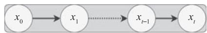  
图 11-4 逐步添加噪声的示意图

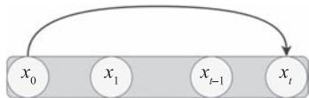  
图 11-5 直接由 $x _ { 0 }$ 求得 $x _ { t }$ 的示意图

根据高斯分布的可加性，两个高斯分布 $\mathcal { N } \big ( 0 , \sigma _ { 1 } ^ { 2 } I \big )$ 和 $\mathcal { N } \big ( 0 , \sigma _ { 2 } ^ { 2 } I \big )$ 的和为

$$
\mathcal {N} \left(0, \left(\sigma_ {1} ^ {2} + \sigma_ {2} ^ {2}\right) I\right) \tag {11.8}
$$

正向扩散的 PyTorch 代码简单实现如下：

# 计算任意时刻的 $\mathbf{x}$ 采样值，基于 $\mathrm{x\_0}$ 和重参数化  
def q_x(x_0,t):  
    '''可以基于x_0得到任意时刻t的x[t]'''  
    # x_0与noise的形状相同  
    noise = torch.random_like(x_0)  
    alphas_t = alphas_bar_sqrt[t]  
    alphas_1_m_t = one_minus_alphas_bar_sqrt[t]  
    return (alphas_t * x_0 + alphas_1_m_t * noise) # 在x_0的基础上添加noise

其中，输入图像 $x _ { 0 }$ 如图 11-6 所示。

  
图 11-6 输入图像 $x _ { 0 }$

演示原始数据分布加噪声 100 步后的结果代码如下：

```txt
num-shows = 20
fig, axis = plt.subplot(2,10,figsize=(28,3))
plt.plot('text', color='black')
#共有10000个点，每个点包含两个坐标
#生成100步以内每隔5步加噪声后的图像
for i in range(num-shows):
    j = i // 10
    k = i%10
    q_i = q_x(dataset,torch.tensor([i*num_steps//num-shows]) #生成t时刻的采样数据
    axes[j,k].scatter(q_i(:,0],q_i(:,1],color='red',edgecolor='white')
    axes[j,k].set_axis_off()
    axes[j,k].set_title($q(\mathbf{mathbf{h}}\{\mathbf{x}\}_{-}{'+str(i*i num_steps//num-shows)+'}))$') 
```

运行结果如图 11-7 所示。

  
图 11-7 $x _ { 0 }$ 添加噪声后的部分图像

# 11.1.6 反向扩散过程的数学细节

如果说正向扩散过程是加噪的过程，那么反向扩散过程就是去噪推断过程。如果能够逐步得到逆转后的分布 $q ( x _ { t - 1 } \mid x _ { t } )$ ，就可以从完全的标准高斯分布 $x _ { T } \sim N ( 0 , I )$ 还原出原图分布 $x _ { 0 }$ 。然而我们无法简单推断 $q ( x _ { t - 1 } \mid x _ { t } )$ ，因此使用深度学习模型（参数为 $\theta$ ，目前主流是U-Net+Attention 的结构）去预测这样的一个逆向的分布 $p _ { \theta }$ 。具体过程如图 11-8 所示。

  
图 11-8 反向扩散过程的底层数学逻辑

这里的关键是用 U-Net 网络预测在时间 $t$ 输入 $x _ { t }$ 的输出值 $\epsilon _ { \theta } ( x _ { t } , t )$ ，最后通过去噪，得到$p _ { \theta } ( x _ { 0 } )$ 。为简便起见，这里用一个简单网络来预测 $\epsilon _ { \theta }$ 的网络结构，没有使用 U-Net 网络。

class MLPDiffusion(nnModule): def __init__(self, n_steps, num_groups=128): super(MLPDiffusion, self).__init_(   ) self竖线 $=$ nnModuleList( [ nn.Linear(2,num.units), nn.ReLU(), nn.Linear(num.units, num.units), nn.ReLU(), nn.Linear(num.units, num.units), nn.ReLU(), nn.Linear(num.units, 2), ] 一 self step embeddings = nn.ModuleList( [ nn.Embedding(n_steps, num.units), nn.Embedding(n_steps, num.units), nn.Embedding(n_steps, num.units), ] def forward(self,x,t): for idx,embedding_layer in enumerate(self-step_embeddingings): t_embedding $=$ embedding_layer(t) x = self竖线x[2\*idx](x) x += t_embedding x = self竖线x[2\*idx+1](x) $\mathbf{x} =$ self竖线[-1](x) return x

# 11.1.7 训练目标和损失函数

从扩散模型的反向过程可知，扩散模型的目标就是在实数据分布下，最大化模型预测分布的对数似然，即优化在 $\cdot x _ { 0 } \sim q \big ( x _ { 0 } \big )$ 下的 $p _ { \theta } \left( x _ { 0 } \right)$ 交叉熵。

$$
\mathcal {L} = E _ {q \left(x _ {0}\right)} \left[ - \log p _ {\theta} \left(x _ {0}\right) \right] \tag {11.9}
$$

直接求这个损失函数比较困难，涉及图像高维积分。于是人们想到了用 VAE 中变分下界的思路解决这个问题。由于篇幅有限，这里对损失函数的推导过程就不展开了，有兴趣的读者可参考论文“Denoising Diffusion Probabilistic Models”。DDPM 最后的损失函数可简化为

$$
L _ {t} ^ {\text {s i m p l e}} (\theta) = E _ {t, x _ {0}, \epsilon} \left\lceil \left\| \epsilon - \epsilon_ {\theta} \left(\sqrt {\bar {\bar {\alpha}} _ {t}} x _ {0} + \sqrt {1 - \bar {\bar {\alpha}} _ {t}} \epsilon , t\right)\right\| ^ {2} \left. \right. \Bigg ] \tag {11.10}
$$

这是用来训练 DDPM 的最终损失函数，它是正向扩散过程中添加的噪声和模型预测的噪声之间的均方误差。训练过程为：

1）获取输入 $x _ { 0 }$ ，从1…T随机采样一个 t。   
2）从标准高斯分布采样一个噪声 $\epsilon \sim \mathcal { N } \mathopen { } \mathclose \bgroup \left( 0 , I \aftergroup \egroup \right)$ 。  
3）最小化 $\left. \epsilon - \epsilon _ { \theta } \left( \sqrt { \bar { \bar { \alpha _ { t } } } } x _ { 0 } + \sqrt { 1 - \bar { \bar { \alpha _ { t } } } } \epsilon , t \right) \right. ^ { 2 }$ 。

图 11-9 为 DDPM 训练与采样流程图。  

<table><tr><td>算法1: 训练</td><td>算法2: 采样</td></tr><tr><td>1: 循环</td><td>1: xT ~ N(0, I)</td></tr><tr><td>2: x0 ~ q(x0)</td><td>2: for t=T,..., 1 do</td></tr><tr><td>3: t ~ Uniform({1,..., T})</td><td>3: z ~ N(0, I) if t &gt; 1, else z = 0</td></tr><tr><td>4: ε ~ N(0, I)</td><td>4: xt-1 = 1/√αt (xt - 1-αt/√1-αt)εθ(xt, t) + σtz</td></tr><tr><td>5: 利用梯度下降法</td><td>5: end for</td></tr><tr><td>∇θ || ε - εθ(√αt x0 + √1 - αt ε, t) ||^2</td><td>6: return x0</td></tr></table>

图 11-9 DDPM 训练与采样流程图

损失函数的 PyTorch 代码如下：

```python
def diffusion_loss_fn(model,x_0, alphas_bar_sqrt, one_MINUS_alphas_bar_sqrt, n_steps):  
    ''' 对任意时刻 t 进行采样计算损失值 '''  
    batch_size = x_0.shape[0]  
    # 对一个批次样本生成随机的时刻 t  
    t = torch.randint(0, n_steps, size=(batch_size // 2))  
    t = torch.cat([t, n_steps-1-t], dim=0)  
    t = t.Unsqueeze(-1)  
    # x0 的系数  
    a = alphas_bar_sqrt[t]  
    # eps 的系数  
    aml = one_MINUS_alphas_bar_sqrt[t]  
    # 生成随机噪声 eps
```

采样算法的代码如下：  
```txt
e = torch.random_like(x_0)  
#构造模型的输入  
x = x_0 * a + e *aml  
#送入模型，得到t时刻的随机噪声预测值(e_0)  
output = model(x, t, squeeze(-1))  
#与真实噪声一起计算误差，求平均值  
return (e - output).square().mean()
```

```python
def p_sample_loop(model, shape, n_steps, betas, one_MINUS_alphas_bar_sqrt):
    ''' 从 x[T] 恢复 x[T-1], x[T-2] | ..., x[0]'''  
    cur_x = torch randn(shape)  
    x_seq = [cur_x]  
    for i in reversed(range(n_steps)):  
        cur_x = p_sample(model, cur_x, i, betas, one_MINUS_alphas_bar_sqrt)  
        x_seq.append(cur_x)  
    return x_seq  
def p_sample(model, x, t, betas, one_MINUS_alphas_bar_sqrt):  
    ''' 从 x[T] 采样 t 时刻的重构值 '''  
    t = torch.tensor([t])  
    coeff = betas[t] / one_MINUS_alphas_bar_sqrt[t]  
    eps_theta = model(x, t)  
    mean = (1/(1-betas[t]).sqrt()) * (x-(coeff*eps_theta))  
    z = torch.randint(x)  
    sigma_t = betas[t].sqrt()  
    sample = mean + sigma_t * z  
    return (sample) 
```

分别迭代 200 次、4000 次后的采样结果如图 11-10 所示。

选代200次的结果

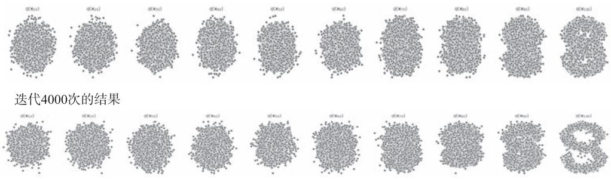  
图 11-10 DDPM 迭代不同次数后的采样结果

# 11.2 使用 PyTorch 从零开始编写 DDPM

本节将用 PyTorch 从头实现训练 DDPM 所需的基本组件，完整代码可看本书对应的代码及数据部分。

# 11.2.1 定义超参数

定义配置类，配置类将包含用于加载数据集、创建日志目录和训练模型的超参数。

@dataclass   
class BaseConfig:   
DEVICE $=$ get_default_device() DATASET $=$ "Flowers" # "MNIST", "Cifar-10", "Cifar-100", "Flowers" #用于记录推断图像和保存检查点 root_log_dir $=$ os.path.join("Logs_Checkpoints","Inference") root_checkpoint_dir $=$ os.path.join("Logs_Checkpoints","checkpoints") #当前日志和检查点目录 log_dir $=$ "version_0" checkpoint_dir $=$ "version_0"   
@dataclass   
class TrainingConfig:   
TIMESTEPS $= 1000$ #定义扩散时间步数 IMG_SHAP $\equiv$ (1，32，32）ifBaseConfig.DATASET $= =$ "MNIST"else(3，32，32) NUM_EPOCHS $= 40$ #or 100,800   
BATCH_SIZE $= 32$ LR $= 2\mathrm{e - }4$ NUM_WORKERS $= 0$

# 11.2.2 创建数据集

本节使用鲜花（Flowers）数据集，大家还可以选择其他数据集，如 MNIST、Cifar10和 Cifar100 数据集等。这里定义两个函数：get_dataset 和 inverse_transform。

# 1. get_dataset 函数

该函数返回传递给 dataloader 的数据集类对象，进行 3 个预处理操作和 1 个数据增强操作。

（1）预处理操作  
1）将 [0,255] 范围内的像素值映射到 [0.0,1.0] 范围。

2）根据形状调整图像大小（ $3 2 \times 3 2$ 像素）。  
3）将范围为 [0.0,1.0] 的像素值更改为 [-1.0,1.0] 范围，以便输入图像的值范围与标准高斯图像大致相同。

# （2）增强操作

原始实现中使用的是随机水平翻转。如果你使用的是 MNIST 数据集，请务必注释掉与Flowers 数据集相关的行（以下代码中加粗部分）。

def get_dataset(dataset_name='MNIST'): transforms $=$ TFCompose( [ TF.ToTensor(), TF Resize((32,32), interpolation $\equiv$ TF.InterpolationMode.BICUBIC, antialias $\equiv$ True), TF.RandomHorizontalFlip(), TF.Lambda(lambda t: (t \* 2)-1) # 把数据映射到[-1，1] ] if dataset_name-upper() $= =$ "MNIST": dataset $=$ datasets.MNIST(root $\coloneqq$ "data", train $\equiv$ True, download $\equiv$ True, transform $\equiv$ transforms) elif dataset_name $= =$ "Cifar-10": dataset $=$ datasets.CIFAR10(root $\coloneqq$ "data", train $\equiv$ True, download $\equiv$ True, transform $\equiv$ transforms) elif dataset_name $= =$ "Cifar-100": dataset $=$ datasets.CIFAR10(root $\coloneqq$ "data", train $\equiv$ True, download $\equiv$ True, transform $\equiv$ transforms) elif dataset_name $= =$ "Flowers": dataset $=$ datasets.ImageFolder(root $\coloneqq$ "/data/flowers", transform $\equiv$ transforms) return dataset

# 2. inverse_transform 函数

此函数用于反转加载步骤中应用的变换，并将图像恢复到 [0.0,25.0] 范围。

```python
def inverse_transform(tensors):
    '''把张量范围由[-1.,1.]转换为[0.,255]'''  
return((tensors.clamp(-1,1) + 1.0)/2.0)*255.0 
```

# 11.2.3 创建数据加载器

定义 get_dataloader 函数，该函数返回所选数据集的 dataloader 对象。

```python
def get_dataloader(dataset_name='MNIST', batch_size=32, pin_memory=False, shuffle=True, num_workers=0, device="cpu"): dataset = get_dataset(dataset_name=dataset_name) dataloader = DataLoader(dataset, batch_size=batch_size, pin_memory=pin_memory, num_workers=num_workers, shuffle=shuffle) device_dataloader = DeviceDataLoader(dataset, device) return device_dataloader 
```

# 11.2.4 可视化数据集

首先，通过调用 get_dataloader 函数创建 dataloader 对象。

loader $=$ get_dataloger( dataset_name $\equiv$ BaseConfig.DATASET, batch_size=128, device $\equiv$ 'cpu',

然后，使用 torchvision 的 make_grid 函数绘制花朵图像。

plt.figure(figsize=(12,6)，facecolor='white')   
for b_image，_in loader: b_image $=$ inverse_transform(b_image).cpu() grid_img $\equiv$ make_grid(b_image/255.0，nrow=16，padding=True，pad_value=1, normalize=True) plt.imshow(grid_img.permute(1，2，0)) plt.axis("off") break

运行结果如图 11-11 所示。

  
图 11-11 Flowers 数据集部分图像

# 11.2.5 DDPM 架构

DDPM 架构中 U-Net 网络的架构包括 3 个组件，即编码器、瓶颈层（又叫中间层）和解码器，如图 11-12 所示。

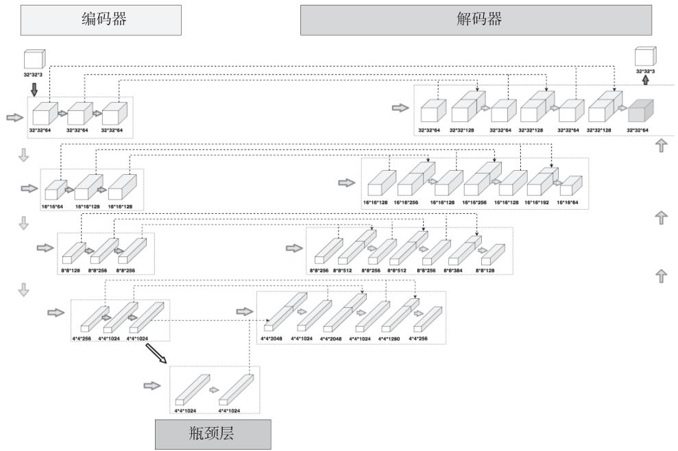  
图 11-12 DDPM 模型中 U-Net 网络的架构图

架构的具体信息如下：

1）编码器和解码器路径中有 4 个级别，它们之间有瓶颈层。

2）每个编码器级包括具有卷积下采样的两个残差块（Residual Block），除了最后一级。  
3）每个相应的解码器级包括三个残差块，并且使用具有卷积的 2x 最近邻居来对来自前一级的输入进行上采样。  
4）编码器路径中的每一级在跳跃连接（Skip Connection）的帮助下连接到解码器路径。  
5）模型使用单一特征图分辨率的自注意力模块。

模型中的每个残差块都获得来自前一层（以及解码器路径中的其他层）的输入图像（设为 $x _ { t }$ ）和当前时间步长 t 的时间嵌入。输入图像先过卷积 1，之后与经过线性变换的时间嵌入相加，然后对相加后的结果进行卷积 2 操作。如果 in_c = out_c，则残差连接之上引入的虚线框卷积直接与卷积 2 的输出相加；否则，对通道数为 in_c 的图像进行一次卷积，使得其通道数等于 out_c，然后再与卷积 2 的输出相加。具体架构如图 11-13 所示。

  
图 11-13 DDPM 模型中 U-Net 中的残差块架构

对 U-Net 网络结构使用的残差块取代了传统 U-Net 网络中每个级别的双卷积模块，为何要这个修改？使用残差块取代双卷积模块有哪些优势？接下来就这些问题进行说明。

# 11.2.6 用残差块取代双卷积模块的优势

在传统的 U-Net 网络中，每个级别通常由一对卷积层组成，其中包括一个卷积层和一个分辨率相同的上采样层或下采样层。这种结构在一定程度上可以提取图像中的特征，但由于通过卷积层进行信息传递的限制，它可能存在以下不足：

● 特征损失：在卷积层中，信息的传递主要通过卷积核的滑动窗口实现。这意味着每个像素的特征都是通过相对较小的局部感受野计算得到的。因此，一些全局或远程特征可能会因为感受野的限制而丢失掉，从而影响模型的性能。  
● 梯度消失和梯度爆炸：在传统的 U-Net 网络中，通过多次叠加卷积层，特征的深度逐渐增加，有时可能导致梯度消失或梯度爆炸问题。这会使得网络难以训练，特别

是对于较深的网络结构来说。

为了解决以上问题，DDPM 使用了残差块来代替传统 U-Net 网络中的双卷积模块。残差块的主要特点是引入跳跃连接来保留原始特征。

使用残差块替代传统的双卷积模块可以带来以下优势：

1）提高信息传递能力。残差块通过跳跃连接保留了输入特征，可以更好地传递全局或远程特征，从而提高了网络的信息传递能力。  
2）解决梯度问题。残差块通过跳跃连接避免了梯度消失或梯度爆炸的问题，使得网络更容易训练，特别是对于较深的网络结构。

# 11.2.7 创建扩散类

创建一个名为 SimpleDiffusion 的扩散类，此类包含：

1）执行正向和反向扩散过程所需的调度程序常量。  
2）一种定义 DDPM 中使用的线性方差调度器的方法。  
3）一种使用更新的正向扩散内核执行单个步骤的方法。

class SimpleDiffusion: def__init__(self, num_diffusion_timesteps $\coloneqq 1000$ img_shape $= (3$ ，64，64)， device $=$ "cpu", ）： self.num_diffusion_timesteps $=$ num_diffusion_timesteps self.img_shape $=$ img_shape self/device $=$ device self.initialize() def initialize(self): #算法中不同位置所需的beta和alpha self.beta $=$ self.get_betas() self.alpha $= 1$ - self.beta self_sqrt_beta $=$ torch.sqrt(self.beta) self.alphacumulative $=$ torch.cumprod(self.alpha，dim $\equiv 0$ ） self_sqrt_alpha_cumulative $=$ torch.sqrt(self.alpha_cumulative) self.one_by_sqrt_alpha $= 1$ ./torch_sqrt(self.alpha) self_sqrt_one_minus_alpha_cumulative $=$ torch.sqrt(1- self.alpha_cumulative) def get_betas(self): ""线性调度表"" scale $= 1000$ /self.num_diffusion_timesteps beta_start $=$ scale\*1e-4

beta_end $=$ scale \*0.02   
return torch.linspace( beta_start, beta_end, self.num_diffusion_timesteps, dtype=torch.float32, device $\equiv$ self.device,

# 11.2.8 正向扩散过程

下面实现正向扩散过程。forward_diffusion 函数获取一批图像和相应的时间步长，并使用更新的正向扩散核方程添加噪声 / 破坏输入图像。

```python
def forward_diffusion(sd: SimpleDiffusion, x0: torch.Tensor, timesteps: torch.Tensor):  
    eps = torch randn_like(x0)  # 噪声  
    mean = get(sd.sqrt_alphacumulative, t=timesteps) * x0  # 对输入图像进行缩放  
    std_dev = get(sd.sqrt_one_MINUS_alphacumulative, t=timesteps)  # 对噪声进行缩放  
    sample = mean + std_dev * eps  # 缩放过的输入图像 * 缩放过的噪声  
    return sample, eps  # 返回模型预测的噪声 
```

# 11.2.9 可视化正向扩散过程

下面将在一些采样图像上可视化正向扩散过程，以便了解它们在经过 $T$ 时间步长的马尔可夫链时是如何被破坏的。

```python
sd = SimpleDiffusion(num_diffusion_timesteps=TrainingConfig.TIMESTEPS, device="cpu")  
loader = iter( # 将数据加载器转换为迭代器  
get_dataloger(  
    dataset_name=BaseConfig.Dataset,  
    batch_size=6,  
    device="cpu",  
)  
) 
```

对一些特定的时间步长执行正向处理，并存储原始图像的噪声版本。

$\mathrm{x0s}$ ， $\equiv$ nextloader) noisy_images $= []$ specific_timesteps $= [0$ ，10，50，100，150，200，250，300，400，600，800，999]   
for timestep in specific_timesteps: timestep $=$ torch.as_tensor(timestep,dtype $\equiv$ torch.long) xts, $\equiv$ forward_diffusion(sd,x0s,timestep)

```txt
xts = inverse_transform(xts) / 255.0  
xts = make_grid(xts, nrow=1, padding=1)  
noisy_images.append(xts) 
```

绘制不同时间步长的采样被损坏的情况。

绘制并查看不同时间步长的样本  
，ax $=$ plt.subplot(1，len(noisy_images)，figsize $\coloneqq$ (10,5)，facecolor $\equiv$ "white")  
fori，（timestep，noisy_sample）in enumerate(zipspecific_timesteps，noisy_images)):ax[i].imshow(noisy_sample.squeeze(0).permute(1，2，0))ax[i].set_title(f"t={timestep}”，fontsize $\coloneqq 8$ ）ax[i].axis("off")ax[i].grid(False)  
plt.suptitle("Forward Diffusion Process",y=0.9)  
plt.axis("off")  
plt.show()

运行结果如图 11-14 所示，从中可以看到，随着时间步长的增加，原始图像的噪声越来越严重，最后变成纯噪声。

  
正向扩散过程  
图 11-14 正向扩散过程示意图

# 11.2.10 基于训练算法和采样算法的训练

先定义 train_one_epoch 函数。该函数用于执行一个训练回合，即通过在整个数据集上迭代一次来训练模型，并将在我们的最终训练循环中调用。我们还使用混合精度训练来更快地训练模型并节省 GPU 内存。具体算法可参考图 11-9 的左图。

```python
算法1：训练 def train_one_epoch(model, sd, loader, optimizer, scheduler, loss_fn, epoch=800, base_config=BaseConfig(), training_config=TrainingConfig(): 
```

```python
loss_record \(=\) MeanMetric()   
model.train()   
with tqdm(total \(\equiv\) len(load),dynamic_ncols \(\equiv\) True）as tq:   
tq.set_description(f"Train :: Epoch:{epoch}/\{training_config.NUM_EPOCHS}\)" forx0s，_in loader: tq.update(1) ts \(=\) torch.randint(low=1，high \(\equiv\) training_config.TIMESTEPS,size=(x0s. shape[0]),device \(\equiv\) base_config.DEVICE) xts,gt_noise \(=\) forward_diffusion(sd,x0s,ts) with amp.autocast(): pred_noise \(=\) model(xts,ts) loss \(=\) loss_fn(gt_noise,pred_noise) optimizer.zero_grad(set_to_none=True)Scaler_scale(loss).backward() #scalar_unscale_(optimizer) #torch(nn.utils clip_grad_norm_model.params(),1.0)Scaler_step(optimizer)Scaler.update() loss_value \(=\) lossdetach().item() loss_record.update(loss_value) tq.set_postfix_str(s=f"Loss:{loss_value:.4f}") mean_loss \(=\) loss_record.Compute().item() tq.set_postfix_str(s \(\equiv\) f"EPOCH Loss:{mean_loss:.4f}") return mean_loss 
```

定义 reverse_diffusion 函数，它负责推理，即使用反向扩散过程生成图像。该函数采用经过训练的模型和扩散类，可以生成显示整个扩散过程的视频，也可以仅生成最终生成的图像。具体算法可参考图 11-9 的右图。

# 算法2：采样

```python
@torch.no_grad()
def reverse_diffusion(model, sd, timesteps=1000, img_shape=(3, 64, 64), num_images=5, nrow=8, device="cpu", **kwargs):
    x = torch.randn(num_images, *img_shape), device=device)
    model.eval())
    if kwargs.get("generate_video", False):
        outs = []
    for time_step in tqdm%(iterable=reversed(range(1, timesteps)), total=timesteps-1, dynamic_ncols=False, desc="Sampling:", position=0):
        ts = torch.ones(num_images, dtype=torch.long, device=device) * time_step
        z = torch.randint(x) if time_step > 1 else torch.zeros_like(x) 
```

predicted_noise $=$ model(x, ts) beta_t $\equiv$ get(sd.beta, ts) one_by_sqrt_alpha_t $\equiv$ get(sd.one_by_sqrt_alpha, ts) sqrt_one_MINUS_alphacumulative_t $\equiv$ get(sd_sqrt_one_MINUS_alphacumulative, ts) x $=$ ( one_by_sqrt_alpha_t \* (x - (beta_t / sqrt_one_MINUS_alphaCumulative_t) \* predicted_noise) + torch_sqrt(beta_t) \* z ) if kwargs.get("generate_video", False): x_inv $=$ inverse_transform(x).type(torch uint8) grid $=$ make_grid(x_inv, nrow=nrow, pad_value=255.0).to("cpu") ndarr $=$ torch.permutegrid,(1,2,0)).numpy()[:，：，:::-1] outs.append(ndarr) if kwargs.get("generate(video",False): #生成并保存整个反向扩散过程的视频 frames2vid(outs,kwargs['save_path']) display(Image.fromarray(outs[-1][:，：，:::-1]))#在反向扩散过程的最后一个时间步长显示图像 return None else: #在反向扩散过程的最后一个时间步长显示并保存图像 x $=$ inverse_transform(x).type(torch uint8) grid $=$ make_grid(x,nrow=nrow, pad_value=255.0).to("cpu") pil_image $=$ TFfunctional.to_pil_imagegrid) pil_image.save(kwargs['save_path'],format $\equiv$ save_path[-3].upper()) display(pil_image) return None

# 11.2.11 从零开始训练 DDPM

前面已经定义了培训所需的所有必要类和功能，现在要做的就是整合它们，开始训练过程。在开始训练之前，先做一些准备工作。

1）定义所有与模型相关的超参数。

@dataclass   
class ModelConfig:   
BASE_CH $= 64$ #64，128，256，256 BASE_CHMULT $= (1,2,4,4)$ #32，16，8，8 APPLYattention $=$ （False，True，True，False） DROPOUT_RATE $= 0.1$ TIME_EMB_MIX $= 4$ #128

2）初始化 U-Net 模型、AdamW 优化器、MSE 损失函数以及其他必要的类。

model $=$ UNet( input_channels $=$ TrainingConfig.IMG_shape[0], output_channels $=$ TrainingConfig.Img_shape[0], base_channels $=$ ModelConfig.BASE_CH, base_channels_multiple $=$ ModelConfig.BASE_CH_MIX, applyattention $=$ ModelConfig.APLY城市群, dropout_rate $=$ ModelConfig.DROPOUT_RATE, time_multiple $=$ ModelConfig.TIME_EMB_MIX,   
）   
model.to(BaseConfig.DEVICE)   
optimizer $=$ torch.train AdamW(model.params(),lr=TrainingConfig.LR)   
dataloader $=$ get_dataloader( dataset_name $=$ BaseConfig.DATASET, batch_size $=$ TrainingConfig.BATCH_SIZE, device $=$ BaseConfig.DEVICE, pin_memory $=$ True, num_workers $=$ TrainingConfig.NUM_WORKERS,   
）   
loss_fn $\equiv$ nn.MSELoss()   
sd $=$ SimpleDiffusion( num_diffusion_timesteps $=$ TrainingConfig.TIMESTEPS, img_shape $=$ TrainingConfig.Img_SHAPE, device $=$ BaseConfig.DEVICE,   
）   
scalar $=$ amp.GradScaler()

3）初始化日志记录和检查点目录，以保存中间采样结果和模型参数。

```txt
total_epochs = TrainingConfig.NUM_EPOCHS + 1  
log_dir, checkpoint_dir = setup_log_directory(config=BaseConfig())  
generate_video = False  
ext = ".mp4" if generate(video else ".png" 
```

4）编写训练循环。由于已经将所有代码划分为简单、易于调试的函数和类，接下来要做的就是在训练循环中调用它们，也就是在循环中调用上一小节中定义的训练和采样函数。具体代码如下：

```python
for epoch in range(1, total_epochs):
    torch.cuda.empty_cache()
    gc.collect()
# 调用算法1：训练
    train_one_epoch(model, sd, datloader, optimizer, scheduler, loss_fn, epoch=epoch)
    if epoch % 20 == 0: 
```

save_path $=$ os.path.join(log_dir，f{"epoch}{ext}") #调用算法2：采样 reverse_diffusion(model，sd，timesteps $\equiv$ TrainingConfig.TIMESTEPS，num_images $= 32$ generate Video $\equiv$ generate Video,save_path $\equiv$ save_path，img_shape $\equiv$ TrainingConfig.IMG_   
SHAPE，device $\equiv$ BaseConfig.DEVICE, #输出路径 checkpoint_dict $=$ { "opt":optimizer.state_dict() , "scalar":scatter.state_dict(), "model":model.state_dict() } torch.save(checkpoint_dict，os.path.join(checkpoint_dir，"ckpt.tar")) del checkpoint_dict

运行的部分结果如图 11-15 所示。

  
图 11-15 训练 DDPM 的部分结果

# 11.2.12 使用 DDPM 生成图像

要使用已训练过的 DDPM 生成图像，只需重新加载保存的模型，从隐空间进行采样，再使用反向扩散生成图像。

1）恢复模型。

```python
# 从保存的检查点重新加载模型  
model = UNet(  
    input_channels = TrainingConfig.Img_SHAPE[0],  
    output_channels = TrainingConfig.Img_SHAPE[0],  
    base_channels = ModelConfig.BASE_CH,  
    base_channels multiplicies = ModelConfig.BASE_CH_MIX,  
    apply attentio = ModelConfig.APLYattention,  
    dropout_rate = ModelConfig.DROPOUT_RATE,  
    time_multiple = ModelConfig.TIME_EMB_MIX, 
```

)   
model.load_state_dict(torch.load(os.path.join(checkpoint_dir，"ckpt.tar")，map_ location $\equiv$ 'cpu')['model'])   
model.to(BaseConfig.DEVICE)   
sd $=$ SimpleDiffusion( num_diffusion_timesteps $=$ TrainingConfig.TIMESTEPS, img_shape $=$ TrainingConfig.IMG_SHAPE, device $=$ BaseConfig.DEVICE,   
）   
log_dir $=$ "inference_results"   
os.makedirs(log_dir，exist.ok $\equiv$ True)

2）推理代码只是使用经过训练的模型调用 reverse_diffusion 函数。

#将generate(video设置为True以生成视频，如果设置为False，则生成图像  
generate(video $=$ True  
ext $=$ ".mp4"if generate(video else".png"  
filename $=$ f"\{datetime-now().strstr('%Y%m%d-%H%M%S')}\{ext\}"  
save_path $=$ os.path.join(log_dir, filename)  
reverse_diffusion(  
model,  
sd,  
num_images $\coloneqq$ 256,  
generate(video $\equiv$ generate(video,  
save_path $\equiv$ save_path,  
timesteps $\coloneqq$ 1000,  
img_shape $\equiv$ TrainingConfig.IMG_SHAPE,  
device $\equiv$ BaseConfig.DEVICE,  
nrow $\coloneqq$ 32,  
）  
print(save_path)

运行结果（ $\mathrm { { m p 4 } }$ 的部分截图）如图 11-16 所示。

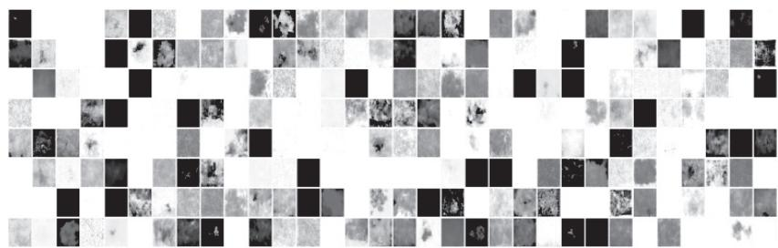  
图 11-16 利用 DDPM 生成的图像

# 第 12 章

# 多模态模型

上一章介绍了扩散模型及其改进版 DDPM 的原理和实现方法。扩散模型是一种基于马尔可夫链的生成模型，通过模拟数据的扩散过程来生成新的样本。DDPM 则利用归一化的流动向量表示数据的扩散路径，进一步提高生成质量。这一章介绍多模态模型，它结合了图像生成和文本生成，在生成能力上更加多样化。

首先介绍对比语言 - 图像预训练（Contrastive Language-Image Pre-training，CLIP）模型能够同时理解图像和文本，并将二者进行互相解释。CLIP 通过训练一个联合编码器，将图像和文本嵌入同一个向量空间中，从而实现文本 - 图像之间的语义对齐。

接着介绍 Stable Diffusion 模型，它是扩散模型的一个重要改进。Stable Diffusion 通过引入临界区域和收敛机制，解决了扩散过程中的溢出和崩溃问题，提高了生成的稳定性和可控性。

最后介绍 DALL·E 模型，它是使用扩散模型生成图像的一个成功案例。DALL·E 可以根据给定的文本描述生成相应的图像，具备强大的创造力和想象力。

# 12.1 CLIP 简介

CLIP 是一种联合训练图像和文本表示的预训练模型。作为多模态架构，CLIP 通过在相同的潜在空间中学习语言和视觉表现，在二者之间建立了桥梁。CLIP 允许我们利用其他架构，使用它的“语言 - 图像表示”执行下游任务。它是一个基于超 4 亿张图像及其描述的数据集的预训练模型，目前最流行的 DALL·E 2、Stable Diffusion 都把 CLIP 作为打通文本和图像关联的核心模块，因此了解 CLIP 是深入了解后续扩散模型非常重要的一环。

如图 12-1 所示，CLIP 由两个主要组件图像编码器和文本编码器组成。每个编码器能够

分别理解来自图像或文本的信息，并将这些信息嵌入向量中。CLIP 的思想是在图像 - 文本对的大型数据集中训练这些编码器，并使嵌入变得相似。

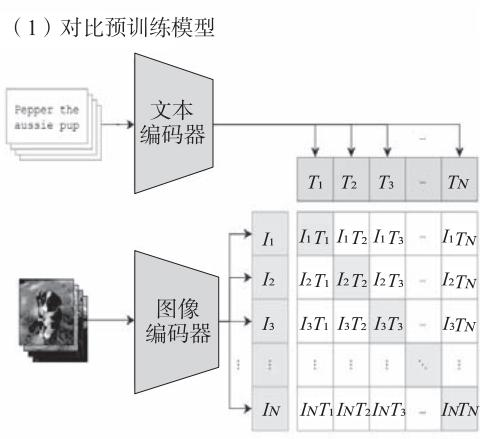

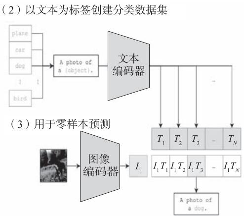  
图 12-1 CLIP 架构

# 12.1.1 CLIP如何将图像与图像描述进行对齐

CLIP 是一种基于对比文本 - 图像对的预训练方法或者模型，CLIP 的训练数据是文本 -图像对：一张图像和它对应的文本描述。这里希望通过对比学习，模型能够学习到文本 - 图像对的匹配关系。CLIP 包括文本编码器和图像编码器两个主要组件，其中：文本编码器用来提取文本的特征，可以采用 NLP 中常用的 Text Transformer 模型；而图像编码器用来提取图像的特征，可以采用常用 CNN 模型或者 Vision Transformer。

这里对提取的文本特征和图像特征进行对比学习。对于一个包含 $N$ 个文本 - 图像对的训练批次，将 $N$ 个文本特征和 $N$ 个图像特征两两组合，CLIP 模型会预测出 $N ^ { 2 }$ 个可能的文本 - 图像对的相似度。这里的相似度直接计算文本特征和图像特征的余弦相似性，即图 12-1左图中的矩阵。这里共有 $N$ 个正样本，即真正属于一对的文本和图像（矩阵中的对角线元素），而剩余的 $N ^ { 2 } { - } N$ 个文本 - 图像对为负样本，那么 CLIP 的训练目标就是最大化 $N$ 个正样本的相似度，同时最小化 $N ^ { 2 } { - } N$ 个负样本的相似度。

假设获得的图像嵌入和文本嵌入批次大小为 64，那么这个 [64, 64] 矩阵的第 1 行代表第 1 张图片与 64 个文本的相似度，其中第 1 个文本是正样本。将这一行的标签设置为 1，那么就可以使用交叉熵进行训练。尽量把第 1 张图片和第 1 个文本的内积变得更大，这样它们的相似度就更高。

对每一行都进行同样的操作，那么 [64, 64] 的矩阵，它的标签就是 [1,2,3,4,5,6,…,64]，由于在计算机中，标签从 0 开始，所以实际标签为 [0,1,2,3,4,5,…,63]。

提示词文本利用文本模型转换成嵌入表示，作为 U-Net 网络的条件。语义信息和图片

信息属于两种模态，CLIP 模型如何找到两者之间的关系？它又是如何训练出来的？

首先要有一个具有大量文本 - 图像对的数据集。CLIP 模型所使用的训练集拥有超过 4 亿张图片，以及这些图片相应的标签（或者描述）。CLIP 模型的输入数据示例如图 12-2 所示。

  
图 12-2 CLIP 模型的输入数据示例

CLIP 模型结构如图 12-3 所示，更新 CLIP 模型的过程如下：

1）训练时，从训练集随机取出一些样本（图像和标签匹配的话就是正样本，不匹配的话就是负样本），CLIP 模型的训练目标是预测图像和文本（标签）是否匹配。  
2）取出文本和图像后，用图像编码器和文本编码器将其分别转换成两个嵌入（Embedding）向量，称作图像嵌入和文本嵌入。  
3）用余弦相似度来比较两个嵌入向量的相似性，并根据标签和预测值的匹配程度计算损失函数，用来反向更新两个编码器参数。  
4）在 CLIP 模型完成训练后，输入配对的图像和文本，这两个编码器就可以输出相似的嵌入向量，输入不匹配的图片和文本，两个编码器输出向量的余弦相似度就会接近于 0。  
5）推理时，输入文本可以通过文本编码器转换成文本嵌入，也可以把图片用图像编码器转换成图像嵌入，两者就可以相互作用。在生成图像的采样阶段，文本嵌入作为 U-Net网络的条件。

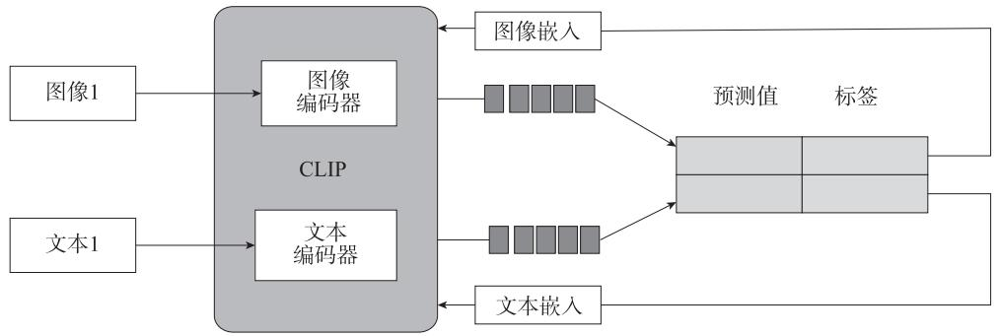  
图 12-3 CLIP 模型结构示意图

CLIP 虽然是多模态模型，但它主要用来训练可迁移的视觉模型。论文“LearningTransferable Visual Models From Natual Language Supervision”中文本编码器固定选择一个

包含 6300 个参数的 Text Transformer 模型，而图像编码器采用了两种不同的架构：一是常用的 CNN 架构 ResNet，二是基于 Transformer 的 ViT。其中，ResNet 包含 5 个不同大小的模 型， 即 ResNet50、ResNet101、RN50x4、RN50x16 和 RN50x64（ 后 面 3 个 模 型 是 按 照EfficientNet 缩放规则对 ResNet 分别增大到 4 倍、16 倍和 64 倍得到的），而 ViT 选择 3 个不同大小的模型，即 ViT-B/32、ViT-B/16 和 ViT-L/14。所有的模型都训练 32 个回合，采用AdamW 优化器，而且训练过程采用了一个较大的批量大小：32 768。

# 12.1.2 CLIP 如何实现零样本分类

与计算机视觉中常用的先预训练后微调不同，CLIP可以直接实现零样本学习（zero-shot）的图像分类，即不需要任何训练数据就能在某个具体下游任务上实现分类。这也是 CLIP的亮点和强大之处。用CLIP实现零样本学习分类很简单，如图12-4 所示，只需要简单的两步：

1）首先根据任务的分类标签构建每个类别的描述文本，即 A photo of {label}，然后将这些文本送入文本编码器，得到对应的文本特征。如果类别数目为 $N$ ，那么将得到 $N$ 个文本特征。  
2）首先将要预测的图像送入图像编码器得到图像特征，接着将其与 $N$ 个文本特征计算缩放的余弦相似度（和训练过程一致），然后选择相似度最大的文本对应的类别作为图像分类预测结果。最后，可以将这些相似度看成 logits（未经 softmax 函数处理的网络输出），送入 softmax 后可以得到每个类别的预测概率。

  
图 12-4 CLIP 实现零样本学习分类示意图

# 12.1.3 CLIP 原理

CLIP 是一种联合训练图像和文本表示的模型。它基于自然语言处理和计算机视觉领域

的最新研究成果，使用大规模的无标签数据集对模型进行预训练，从而获得高质量的图像和文本嵌入向量，并在各种计算机视觉和自然语言处理任务中取得了良好的表现。CLIP 的基本原理可以概括为以下几点：

● 共享编码器：CLIP 使用一个共享的编码器来提取图像和文本的特征向量。这个编码器包含多层卷积神经网络和 Transformer 网络，可以同时处理图像和文本输入，并生成相应的嵌入向量。  
● 对比学习：CLIP 使用对比学习的方法来训练模型。具体来说，它使用一个正样本和若干个负样本来训练模型，其中正样本是由给定的图像和文本组成的，而负样本则是由随机选择的图像或文本组成的。CLIP 的目标是使正样本的嵌入向量与负样本的嵌入向量之间的距离最小化，同时最大化正样本之间的距离。  
● 多任务学习：CLIP 使用多任务学习的方法来训练模型。它同时处理许多不同的任务，如图像分类、自然语言推理、文本生成等。这样可以帮助模型学习更丰富和复杂的语义表示，并提高其泛化能力。

当 CLIP 模型接收到一段文本时，它会自动提取出文本的特征，并将其映射到向量空间中。然后，模型会在向量空间中查找与这个文本最相似的图像。同样地，当 CLIP 模型接收到一个图像时，它会提取出图像的特征，并将其映射到向量空间中。然后，模型会在向量空间中查找与这个图像最相似的文本。

损失函数用来衡量嵌入向量之间的相似度，包括图像和文本预测的相似性损失以及文本和图像预测的相似性损失。因此，CLIP 的损失函数是其原理的核心内容。

CLIP 的损失函数如下：

```python
#图像编码器-使用ResNet或VisionTransformer模型  
#文本编码器-使用CBOW或TextTransformer模型  
#I[n,h,w,c] -用于存储小批量图像对齐  
#T[n,l] -用于存储小批量的对齐文本  
#W_i[d_i,d_e] -可学习的图像嵌入  
#W_t[d_t,d_e] -可学习的文本嵌入  
#t-可学习的温度参数  
#分别提取图像特征和文本特征  
I_f = imageEncoder(I)#[n,d_i]  
T_f = textEncoder(T)#[n,d_t]  
#对两个特征进行线性投射，得到相同维度的特征，并进行12归一化  
I_e = l2_normalize(np.dot(I_f,W_i)，axis=1)  
T_e = l2_normalize(np.dot(T_f,W_t)，axis=1)  
#计算缩放的余弦相似度：[n,n]  
logits = np.dot(I_e,T_e.T)*np.exp(t)  
#对称的对比学习损失：等价于N个类别的cross_entropy_loss  
labels = np.arange(n) #对角线元素的labels
```

```python
loss_i = cross_entropy_loss(logits, labels, axis=0)  
loss_t = cross_entropy_loss(logits, labels, axis=1)  
loss = (loss_i + loss_t)/2 
```

# 12.1.4 从零开始运行 CLIP

本节介绍如何下载和运行 CLIP 模型，计算任意图像和文本输入之间的相似性，以及执行零样本图像分类。

（1）加载 CLIP 模型

```txt
import clip  
# 查看可用的CLIP模型  
clip-available_models()
```

运行结果如下：

```javascript
['RN50', 'RN101', 'RN50x4', 'RN50x16', 'RN50x64', 'ViT-B/32', 'ViT-B/16', 'ViT-L/14', 'ViT-L/14@336px'] 
```

（2）加载 ViT-B/32 模型

```lua
model, preprocess = clip.load("ViT-B/32")  
model.cuda().eval()  
input_resolution = modelvisual-input_resolution  
context_length = model.context_length  
vocab_size = model.vocab_size  
print("Model parameters:", f{"np.sum([int(np.prod(p.shape)) for p in model.params():},})  
print("Input resolution:", input_resolution)  
print("Context length:", context_length)  
print("Vocab size:", vocab_size) 
```

运行结果如下：

```txt
Model parameters: 151,277,313  
Input resolution: 224  
Context length: 77  
Vocab size: 49408 
```

# （3）图像预处理

图像预处理包含以下两步：

1）调整输入图像的大小并对其进行中心裁剪；  
2）对数据集进行归一化。

具体代码如下：

```txt
Compose( Resize(size=224, interpolation=bicubic, max_size=None, antialias=warn) CenterCrop(size=(224, 224)) <function _convert_image_torgb at 0x0000012AF9EEAD30> ToTensor() Normalize(mean=(0.48145466, 0.4578275, 0.40821073), std=(0.26862954, 0.26130258, 0.27577711)) 
```

# （4）文本预处理

文本预处理使用了一个不区分大小写的标记器，默认情况下，输出被填充维度为 77 的向量。

# （5）设置输入图像和文本

向模型提供 8 个示例图像及其文本描述，并比较相应特征之间的相似性，这里标记器是不区分大小写的。

```python
# 图像标题及其文本描述  
descriptions = { "page": "a page of text about segmentation", "chelsea": "a facial photo of a tabby cat", "astronaut": "a portrait of an astronaut with the American flag", "rocket": "a rocket standing on a launchpad", "motorcycle_right": "a red motorcycle standing in a garage", "camera": "a person looking at a camera on a tripod", "horse": "a black-and-white silhouette of a horse", "coffee": "a cup of coffee on a saucer" } 
```

# （6）显示图像标题与对应的图像描述

获取skimage包下的图像  
for filename in [filename for filename in os.listdir(skimage.data_dir) if filename.  
endswith(.png") or filename.endsWith(.jpg"):name $=$ os.path.splittext(filename)[0]#过滤图像标题与这里描述匹配的图像if name not in descriptions:

continue image $=$ Image.open(os.path.join(skimage.data_dir, filename)).convert("RGB") plt.subplot(2,4，len/images）+1) plt.imshow(image) plt.title(f"\{filename\}\n{descriptions[name]})" plt未经授权() plt)yicks([[]) original_images.append(image) images.append(preprocess(image)) texts.append(descriptions[name]) plt.tight.layout()

运行结果如图 12-5 所示。

  
图 12-5 CLIP 运行结果：显示标题与对象图像

# （7）构建特征

对图像进行归一化，对每个文本输入进行标记，并运行模型的正向传递以获得图像和文本特征。

image_input $=$ torch.tensor(np.stack/images)).CUDA()   
text_tokens $=$ cliptokenizer(['This is $" +$ desc for desc in texts]).CUDA()   
with torch.no_grad(): image_features $=$ model.encode_image(image_input).float() text_features $=$ model.encode_text(text_tokens).float()

# （8）计算余弦相似度

对特征进行归一化，并计算每个文本 - 图像对的点积。

image_features $=$ image_features(norm(dim=-1，keepdim $\equiv$ True)   
text_features $=$ text_features(norm(dim=-1，keepdim $\equiv$ True)   
similarity $=$ text_features.cpu().numpy() $@$ image_features.cpu().numpy().T

```python
count = len(descriptions)  
plt.figure(figsize=(20, 14))  
plt.imshow(similarity, vmax=0.1, vmax=0.3)  
# plt.colorbar()  
plt.lytic(range(count), texts, fontsize=18)  
plt.xticks([[])  
for i, image in enumerate(original_images):  
    plt.imshow(image, extent=(i - 0.5, i + 0.5, -1.6, -0.6), origin="lower")  
for x in range(similarity.shape[1]):  
    for y in range(similarity.shape[0]):  
        plt.text(x, y, f{"similarity[y, x]:.2f}", ha="center", va="center", size=12)  
for side in ["left", "top", "right", "bottom']:  
    plt.gca().spinesicalside.set Visible(False)  
plt.xlim([-0.5, count - 0.5])  
plt.ylim([count + 0.5, -2])  
plt.title("计算文本特征与图像特征之间的余弦相似度 ", size=20) 
```

运行结果如图 12-6 所示。

  
文本与图像特征之间的余弦相似度  
图 12-6 文本特征与图像特征之间的余弦相似度

# （9）零样本图像分类

使用余弦相似度（乘以 100）对图像进行分类，作为 softmax 操作的 logits。

from torchvision.datasets import CIFAR100   
#加载CIFAR100数据集   
cifar100 $=$ CIFAR100(os.path.expanderuser("%~/.cache")，transform $\equiv$ preprocess，download $\equiv$ True)   
text descriptions $=$ [f"This is a photo of a {label}"for label in cifar100.classs]   
text_tokens $=$ clipTokenizer(textDescriptions).CUDA()   
with torch.no_grad(): text_features $=$ model.encode_text(text_tokens).float()

text_features $\equiv$ text_features(norm(dim=-1,keepdim=True)   
text_probs $=$ (100.0 \* image_features @ text_features.T).softmax(dim=-1)   
top_probs，top_labels $=$ text_probs.cpu().topk(5，dim=-1)   
plt.figure(figsize=(16，16))   
for i，image in enumerate(original_images): plt.subplot(4，4，2\*i+1) plt.imshow(image) plt.axis("off") plt.subplot(4，4，2\*i+2) y $=$ np.arange(top_probs.shape[-1]) plt.grid() plt.barh(y，top_probs[i]) plt.gca().invert_yaxis() plt.gca().set_axisbelow(True) plt.yticks(y，[cifar100_classesindex] for index in top_labels[i].numpy()) ] plt.xlabel("probability")   
plt.subplot_adjust(wspace=0.5)   
plt.show()

运行结果如图 12-7 所示。

  
图 12-7 图与各分类标签的概率

# 12.1.5 CLIP 应用

CLIP 模型将图像和文本结合起来进行预训练，使模型能够理解图像和文本之间的联系。它有多种应用。

首先，CLIP 能够实现零样本图像分类。通过将图像和对应的文本描述进行编码，CLIP可以在没有任何标签数据的情况下对图像进行分类。这对于数据稀缺的领域非常有用。

然后，CLIP 可以进行图像搜索和推荐。CLIP 模型通过将给定的文本描述转换为特征向量，然后通过计算图像与文本描述之间的相似度来实现图像搜索。这使用户可以通过文本输入来查找与其描述相符的图像，提供了一种非常方便的方式来查找感兴趣的图像。

最后，CLIP还可以用于图像生成与编辑。通过从文本描述中提取语义信息，CLIP 可以生成与描述相匹配的图像，或者通过修改文本描述来实现图像编辑，调整图像的属性和特征。

# 12.2 Stable Diffusion 模型

Stable Diffusion 的发布可以说 AI 图像生成发展过程中的一个重要里程碑，它不仅可以生成高质量的图像，根据提示词生成图像、修改图像，而且运行速度快，所用资源较少。

Stable Diffusion 是如何做到这些的呢？本节就来介绍 Stable Diffusion 及其工作原理。

# 12.2.1 Stable Diffusion 模型的直观理解

朴素的 DDPM 每一步都在对图像进行加噪、去噪操作。而在 Stable Diffusion 模型中，可以理解为对图像进行编码后的图标记（image token）进行加噪、去噪。在去噪（生成）的过程中，加入了文本特征信息来引导图像生成。这部分功能很好理解，与 VAE 中的条件VAE 和 GAN 中的条件 GAN 原理是一样的，通过加入辅助信息，生成需要的图像。StableDiffusion 模型的主要流程如图 12-8 所示。

  
图 12-8 Stable Diffusion 模型主要流程

Stable Diffusion 模型要根据提示词画图，需要实现以下功能：

1）理解提示词。  
2）根据提示词在预训练模型中找到匹配度高的图像。  
3）生成这个匹配高的图像。

如何实现这些功能呢？接下来从 Stable Diffusion 原理及实例进行说明。

# 12.2.2 Stable Diffusion 模型的原理

在 Stable Diffusion 模型中，CLIP 的嵌入向量可以用于表示图像和文本的语义信息，如图 12-9 所示。

  
图 12-9 Stable Diffusion 模型架构

Stable Diffusion 的数据会在像素空间（Pixel Space）、隐空间（Latent Space）、条件机制（Conditioning Mechanism）三者之间流转，其算法逻辑大概分这几步：

1）图像编码器将图像从像素空间压缩到更小维度的隐空间，捕捉图像更本质的信息；  
2）为隐空间中的图片添加噪声，进行扩散过程（Diffusion Process）；  
3）通过 CLIP 文本编码器将输入的描述转换为去噪过程的条件机制；  
4）基于一些条件对图像进行去噪（Denoising）以获得生成图片的潜在表示，去噪步骤可以灵活地以文本、图像和其他形式为条件（以文本为条件即 text2img，以图像为条件即img2img）；  
5）图像解码器通过将图像从隐空间转换回像素空间来生成最终图像。

首先需要训练好一个自编码模型（AutoEncoder，包括一个编码器E和一个解码器 $\mathcal { D }$ ），

接着利用编码器对图片进行压缩，把压缩后的向量作为隐空间的输入 z，在隐表示空间上进行扩散操作，得到 $z _ { T }$ ，然后进入反向扩散过程，即去噪声过程。去噪声的关键是通过 U-Net预测噪声 $\epsilon _ { \theta ^ { \circ } }$ 。可以进行无条件图片生成，也可以进行条件图片生成，这主要是通过拓展得到一个条件时序去噪自编码器（conditional denoising autoencoder） $\epsilon _ { \theta } ( z _ { t } , t , y )$ 来实现的，这样就可通过 $y$ 来控制图像的合成过程。具体来说，就是通过在 U-Net 主干网络上增加交叉自注意力（Cross-Attention）机制来实现。

图 12-9 右边为领域专用编码器（Domain Specific Encoder） $\mathcal { T } _ { \theta }$ ，它用来将 $y$ 映射为一个中间表示 $\boldsymbol { \mathcal { T } } _ { \boldsymbol { \theta } } ( \boldsymbol { y } )$ ，这样就可以很方便地引入各种形态的条件（如文本、类别、图像等等），进而从多个不同的模态预处理 $y$ 。最终模型就可以通过一个交叉自注意力层将控制信息融入U-Net 的中间层。交叉自注意力层的实现如下：

$$
\operatorname {A t t e n t i o n} (Q, K, V) = \operatorname {s o f t m a x} \frac {Q K ^ {\mathrm {T}}}{\sqrt {d}} \cdot V \tag {12.1}
$$

其中， $Q = W _ { \varrho } ^ { i } \cdot \varphi _ { i } \left( z _ { t } \right) , K = W _ { \kappa } ^ { i } \cdot \mathcal { T } _ { \varrho } \left( y \right) , V = W _ { V } ^ { i } \cdot \mathcal { T } _ { \varrho } \left( y \right) _ { \circ } \varphi _ { i } \left( z _ { t } \right) \frac { \mapsto } { \lambda \mathrm { t s } }$ $\varphi _ { i } \left( z _ { t } \right)$ U-Net 的一个中间表征。对应的目标函数为

$$
E _ {\mathcal {E} (x), y, \varepsilon \sim \mathcal {N} (0, I)}, t ^ {\lceil} \| \epsilon - \epsilon_ {\theta} \left(z _ {t}, t, T _ {\theta} (y)\right) \| ^ {2} \rfloor \tag {12.2}
$$

最后再用解码器将输出恢复到原始像素空间即可。

常规的扩散模型是基于像素空间的生成模型，而 Stable Diffusion 是基于隐空间的生成模型，它先采用自编码器的编码器将图像压缩到隐空间，然后用扩散模型来生成图像的隐向量，最后送入自编码器的编码器模块生成图像。

# 12.3 从零开始实现 Stable Diffusion

本节介绍 Stable Diffusion 的主要应用，并用 PyTorch 代码实现这些应用，包括文生图、图生图、图像修改等。其中文生图是 Stable Diffusion 的基础功能，即根据输入文本生成相应的图像，而图生图和图像修改是在文生图的基础上延伸出来的两个功能。限于篇幅，这里主要介绍文生图和图生图。

# 12.3.1 文生图

根据文本提示生成图像是文生图的核心功能。图 12-10 所示为 Stable Diffusion 的文生图流程。首先根据输入文本提示（“a seagull flying”）用文本编辑器提取提示嵌入向量（prompts_embedding），然后将提示嵌入向量和图像或预训练模型送入扩散模型 U-Net 中生成去噪后的隐向量，最后将去噪后的隐向量送入自解码器的解码器得到生成的图像。

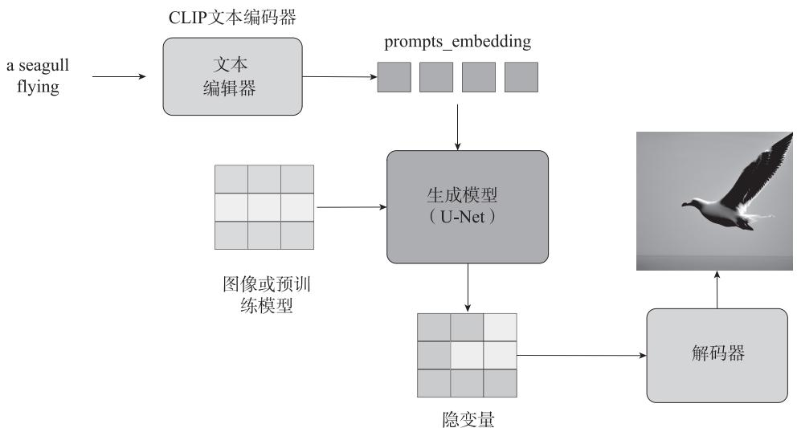  
图 12-10 Stable Diffusion 的文生图流程

# （1）加载 U-Net 模型

先 根 据 配 置 unet_init_config 构 建 模 型， 然 后 从 预 训 练 模 型 model.ckpt 的 state_dict.model.diffusion_model 中获取参数。这里使用 Stable Diffusion 1.4 版本预训练模型。加载U-Net 的代码如下：

```python
from lcm/modules.diffusionmodules.openaimodel import UNetModel
#加载U-Net模型
def load_unet():
    unet_init_config = {
        "image_size": 32, #unused
        "in_channels": 4,
        "out_channels": 4,
        "model_channels": 320,
        "attention_resolution": [4,2,1],
        "num_res_blocks": 2,
        "channel_mult": [1,2,4,4],
        "num_heads": 8,
        "use_spatial_transformer": True,
        "transformer_depth": 1,
        "context_dim": 768,
        "use_checkpoint": True,
        "legacy": False,
    }
unet = UNetModel(**unet_init_config)
pl_sd = torch.load("/../data/sd-v1-4.ckpt", map_location="cpu") 
```

$\mathtt{sd} = \mathtt{pl\_sd}[''$ state_dict"]   
model_dict $=$ unet.state_dict()   
for k, v in model_dict.items(): model_dict[k] $=$ sd["model.diffusion_model." $^+$ k]   
unet.load_state_dict(model_dict, strict=False)   
unet.cuda()   
unet.eval()   
return unet

# （2）定义调度器

Stable Diffusion 文生图的整个过程会经过多个 U-Net 的推理步骤，而每个步骤会有不同参数。为此需要编写一个调度器的类（lms_scheduler() 类），在该类中定义时间步的函数 set_timesteps、获取相关参数的函数 get_lms_coefficient 及 step 函数来处理每个步骤的计算。

# （3）文生图

有了上面各个组件作为基础，便可以将它们组装起来，实现 Stable Diffusion 文生图和图生图的功能。以下函数 txt2img() 是文生图的实现，其实就是各组件的组合。

guidance_scale 是 一 个 CFG（Classifier Free Guidance， 无 分 类 器 指 引 ） 指 数， 是 一个控制文本提示对扩散过程的影响程度的值。简单来说，就是在加噪阶段将条件控制下的预测噪声和无条件下的预测噪声组合在一起来确定最终的噪声。通常 guidance_scale 可以选 $7 { \sim } 8 . 5$ 之间，如果使用非常大的值，图像可能看起来不错，但多样性会降低。具体代码如下：

```python
def txt2img(   ) :
	# 加载 U-Net 模型
 unet = load_unet(   )
	# 调度器
	scheduler = lms_scheduler(   )
	scheduler.set_timesteps(100)
	# 文本编码
	#prompts = ["a photograph of an astronaut riding a horse"]
	#prompts = ["a photograph of a girl riding a horse"]
_prompts = ["paradise consmic beach"]
(text_embeddings = prompts_embedding(prompts)
(text_embeddings = text_embeddings.cuda(   ) # (1, 77, 768)
	unnord_prompts = [""]
	unnord_embeddings = prompts_embedding(uncond_prompts)
	unnord_embeddings = uncond_embeddings.cuda(   ) # (1, 77, 768)
	# 初始隐变量
-latents = torch.randn( (1, 4, 64, 64)) # (1, 4, 64, 64) 
```

latents $=$ latents \* scheduler.sigmas[0] # sigmas[0]=157.40723   
latents $=$ latents.cuda()   
#循环步骤 fori,t in enumerate(scheduler.timesteps): # timesteps=[999. 988.90909091   
978.81818182...100个 latent_model_input $=$ latents # (1,4,64,64) sigma $=$ scheduler.sigmas[i] latent_model_input $=$ latent_model_input / ((sigma\*\*2+1）\*\*0.5) timestamp $=$ torch.tensor([t]).CUDA() #使用有条件和无条件组合方式，有利于提升生成图像质量（这是一个经验值） withtorch.no_grad(): #参数guidance_scale越大时，生成的图像应该会和输入文本更一致 noise_pred_text $=$ unet(latent_model_input，timestamp，text_embeddingings) noise_pred_uncond $=$ unet(latent_model_input，timestamp，uncond_embeddingings) guidance_scale $= 7.5$ noise_pred $=$ noise_pred_uncond $^+$ guidance_scale \* (noise_pred_text - noise_pred_uncond) latents $=$ scheduler step(noise_pred,i, latents) vae $=$ load_vae() latents $= 1 / 0.18215$ \* latents image $=$ vaeDecode(latents.cpu()) #(1,3,512,512) save_image(image,"txt2img.png")

运行程序可以得到提示词为 a photograph of an astronaut riding a horse 时生成的图像，如图 12-11 所示。

  
图 12-11 文生图示例 1

提示词为 paradise consmic beach 时生成的图像如图 12-12 所示。

  
图 12-12 文生图示例 2

提示词为 a seagull flying 时生成的图像如图 12-13 所示。

  
图 12-13 文生图示例 3

# 12.3.2 根据提示词修改图

除了由文本得到图像之外，Stable Diffusion 还有一种得到图像的方式是根据提示词改变图像（输入是文本 $^ +$ 图像）。其效果如图 12-14 所示。

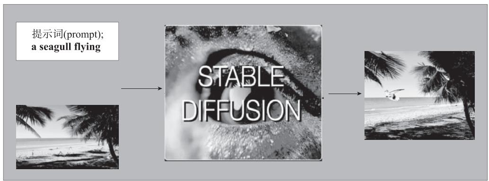  
图 12-14 根据提示词修改图像

输入一张有关海滩的图像，希望在该图像的合适位置添加一只海鸥，所以这里的提示词为 a seagull flying。通过 Stable Diffusion 模型，就生成了图 12-14 右边的图像，该图像正是我们看到的：在一个海滩边多了一只正在飞翔的海鸥。具体实现代码如下：

```python
def img2img(   ): # 加载 U-Net 模型 unet = load_unet(   ).CUDA(   ) # 调度器 scheduler = lms_scheduler(   ) scheduler.set_timesteps(100) # 输入的提示词 prompts = ["a seagull flying"] text_embedding = prompts_embedding(prompts) text_embedding = text_embedding.cuda(   ) # (1, 77, 768) uncond_prompts = [""] uncond_embedding = prompts_embedding(uncond_prompts) uncond_embedding = uncond_embedding.cuda(   ) # (1, 77, 768) # VAE vae = load_vae(   ) # 输入的图像 init_img = load_image("beach.png") init_LATent = vae.encode(init_img).sample(   ).cuda(   )*0.18215 # 初始隐变量 noise-latents = torch.randn( (1, 4, 64, 64),device="cuda") START_STRENGTH = 45 print("xxxx init(latent ",initLatent.shape) print("xxxx noise-latents ",noise-latents.shape) latents = init(latent + noise-latents*schedule SIGmas[START_STRENGTH] # 循环步骤 for i, t in enumerate(schedule.timesteps): # [999. 988.90909091 978.81818182 ...100 个 print(i,t) if i < START_STRENGTH: continue latent_model_input = latents #torch.Size([1, 4, 64, 64]) sigma = scheduler SIGmas[i] latent_model_input = latent_model_input / ((sigma**2 + 1) ** 0.5) timestamp = torch.tensor([t]) with torch.no_grad(   ): noise_pred_text = unet(latent_model_input.cuda(   ), timestamp.cuda(   ), text_embedding.cuda(   )) 
```

```txt
noise_pred_uncond = unet(latent_model_input.cuda(), timestamp.cuda(), uncond_embeddingings.cuda())
guidance_scale = 7.5
noise_pred = noise_pred_uncond + guidance_scale * (noise_pred_text - noise_pred_uncond)
latents = scheduler step(noise_pred, i, latents)
latents = 1 / 0.18215 * latents
image = vaeDecode(latents.cpu())
save_image(image, "img2img.png") 
```

运行结果如图 12-15 所示。

  
图 12-15 根据提示词修改图像的示例

# 12.4 Stable Diffusion 升级版简介

前文介绍的是 Stable Diffusion 1.0，它是一种流行的深度生成模型，被广泛应用于图像生成以及其他领域。Stable Diffusion 2.0 和 Stable Diffusion XL 是 Stable Diffusion 1.0 的两个升级版本，它们进一步优化了模型的性能和生成图像的质量。

Stable Diffusion 2.0 在训练过程中采用了更高效的算法和训练策略，从而可以在更短的时间内训练出更高质量的模型。此外，它还采用了更先进的硬件和技术，例如分布式训练和 GPU 加速等，从而可以更快地训练出高质量的模型。相比 Stable Diffusion 1.0，StableDiffusion 2.0 在生成图像的质量和效果方面有很大提升。

Stable Diffusion XL 进一步提高了生成图像的质量和效果，并提供了更多的可调节参数和支持更多的输入输出格式。它采用了更大的扩散核，从而可以捕捉到更多的图像细节，同时减少了计算资源的消耗。在训练过程中，它采用了逐步扩散的方法，即逐步添加

更多的细节和复杂性到生成的图像中，这样可以更好地控制生成图像的质量和效果。此外，Stable Diffusion XL 也采用了更先进的硬件和技术，例如分布式训练和 GPU 加速等，从而可以更快地训练出高质量的模型。

相比之下，Stable Diffusion 2.0 更注重对模型性能的优化，而 Stable Diffusion XL 更注重对生成图像质量和效果的提升。用户可以根据自己的需求和偏好选择适合的升级版本来实现更好的生成效果和应用性能。

# 12.4.1 Stable Diffusion 2.0

相较于 Stable Diffusion 1.0，Stable Diffusion 2.0 有以下更新：

1）采用了新的文本编码器 OpenCLIP，有助于提高生成的图像的质量。  
2）默认支持 $7 6 8 \times 7 6 8$ 像素和 $5 1 2 \times 5 1 2$ 像素两种分辨率，此前默认分辨率仅为$5 1 2 \times 5 1 2$ 像素。

新的模型基于 LAION-5B 数据集的美学子数据集进行训练，另外，还通过 NSFW 过滤器过滤掉了一些成人敏感内容。  
3）分辨率放大，Stable Diffusion 2.0 的放大扩散模型可以将图像分辨率提升至原来的16 倍，如图 12-16 所示。


  
图 12-16 分辨率放大功能示意图

Stable Diffusion 2.0 可以将 $1 2 8 \times 1 2 8$ 像素的图像放大为 $5 1 2 \times 5 1 2$ 像素的图像，结合用文字生成的图像，可以生成 $2 0 4 8 \times 2 0 4 8$ 像素及以上分辨率的图像。

4）利用深度信息生成图像。新增深度信息生成图像模块 depth2img，新增的一些特性带来了更多玩法，比如 depth2img 可以对输入图像的深度信息进行推理，然后，用文本和深度信息来共同生成新的图像。如图 12-17 所示，depth2img 模块由一个小人儿生成了右面的 4 个小人儿，新生成的小人儿整体保持了原有的形状和结构。  
5）图像修改功能增强。Stable Diffusion 2.0 进行了一些微调，使得修图更快速也更智能。

Stable Diffusion 2.0 继续优化在单个 GPU 上的运行表现，使得更多人能接触并用上这款软件，用它来创造令人惊叹的内容。

  
图 12-17 深度信息生成图像模块

# 12.4.2 Stable Diffusion XL

Stable Diffusion XL 是 Stable Diffusion 的 最 新 优 化 版 本， 由 Stability AI 发 布。 比 起Stable Diffusion 2.0，Stable Diffusion XL 做了很多优化，具体包括：

1）对 Stable Diffusion 原先的 U-Net、VAE、CLIP Text Encoder 三大件都做了改进。  
2）增加一个单独的基于 Latent 的 Refiner 模型，来提升图像的精细化程度。  
3）设计了很多训练技巧，包括图像尺寸条件化策略、图像裁剪参数条件化以及多尺度训练等。  
4）增加数据集和使用了 RLHF 技术。  
5）架构上做了很多修改，如图 12-18 所示。

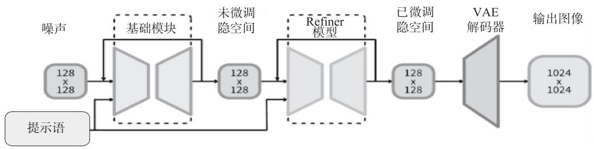  
图 12-18 Stable Diffusion XL 架构

Stable Diffusion XL 的参数量增加到了 66 亿，其中 Base 模型 35 亿，Refiner 模型 31亿。Stable Diffusion XL 使用更多训练集和 RLHF 来优化生成图像的色彩、对比度、光线及阴影，使得生成的图像更加鲜明准确。

# 12.5 DALL · E 模型

DALL·E 是一种由 OpenAI 开发的人工智能模型，自 2021 年初发布之后，迅速引起广泛的关注和讨论。DALL·E 这个名字的灵感来源于两个名字—西班牙画家 SalvadorDalí（萨尔瓦多·达利）和皮克斯动画电影 Wall- $E$ （机器人总动员），这也反映了 DALL·E的主要功能和特点。

DALL·E 2 是一种深度生成模型，它通过与用户的对话来生成与对话相关的图像。在训练过程中，DALL·E 2 使用了大量的文本和图像数据，学习了如何将文本转换为图像。它采用了 Transformer 模型，通过自回归的方式逐步生成图像的每一个像素。DALL·E 2 模型可以生成高质量的图像，但需要大量的计算资源和时间来训练与生成图像。DALL·E 3结合 ChatGPT 的方法来生成文本描述，使其对文本的理解能力更强。

# 12.5.1 DALL·E 简介

CLIP+DALL·E 模型是一个基于对比学习的多模态生成模型，可以由未经过标记的图像和语句生成与多媒体相关的文字描述和图像。其原理可以概括如下：

● CLIP 模型：CLIP 模型作为一个多模态的预训练模型，可以同时处理图像和文本输入，并生成相应的嵌入向量。  
● 对比学习：CLIP+DALL·E 模型使用对比学习的方法来训练模型。

首先，CLIP+DALL·E 模型使用一个正样本及其对应文本、若干负样本来训练模型。正样本是由给定图像和相应文本组成的，而负样本则是随机选取的图像或文本。模型的主要目标是让正样本的嵌入向量与负样本的嵌入向量之间的距离最小化，同时尽量增大正样本之间的距离。

其次，DALL·E 模型用于根据给定的文本描述生成图像。DALL·E 模型是一个预训练的生成模型，它运用了自注意力机制和生成对抗网络（GAN）等技术。这些技术使DALL·E 模型可以根据给定的文本描述生成高质量的图像。

最后，CLIP+DALL·E 模型将 CLIP 模型与 DALL·E 模型进行联合优化。通过在CLIP 模型中引入反向传播梯度，我们可以调整 DALL·E 模型的生成结果。通过这一过程，CLIP+DALL·E 模型能够自动为用户生成符合特定要求的图像和文本，例如“一只绿色的鸟”或“一个画着太阳的沙漏”。

# 12.5.2 DALL·E 2 简介

DALL·E 2 基于 unCLIP 模型，而 unCLIP 模型本质上是 GLIDE 模型的增强版。通过在文本到图像的生成流程中添加基于预训练的CLIP模型的图像嵌入，uuCLIP 模型得以优化。

与 GLIDE 相比，unCLIP 可以生成更多样化的图像，在照像真实感和标题相似性方面

损失最小。unCLIP 中的解码器也可以产生多种不同图像，并且可以同时进行文本到图像和图像到图像的生成。unCLIP 架构如图 12-19 所示。

  
图 12-19 unCLIP 架构

如图12-19所示，虚线上方为CLIP 训练过程，通过它我们学习了文本和图像的联合表示空间。虚线下方为文本到图像的生成过程：CLIP文本嵌入首先输入先验模型生成图像嵌入，然后使用该嵌入来调节扩散解码器生成最终图像。不过 CLIP模型在先验和解码器的训练期间被冻结。由于是通过反转 CLIP图像编码器来生成图像的，因此该框架被命名为unCLIP。

unCLIP 主要包括三个部分：CLIP 模型、先验模块（Prior）和图像解码器。其中，CLIP 模型包含文本编码器和图像编码器。

unCLIP 的训练过程如图 12-20 所示。

  
图 12-20 unCLIP 的训练过程

输入：数据集（图像 $x$ ，文本 $y$ ）

1）通过 CLIP 模型，得到 $x , y$ 的嵌入表示，即

$$
z _ {t} = \operatorname {C L I P} (y), z _ {i} = \operatorname {C L I P} (x)
$$

2）把 $y , z _ { t }$ 输入先验模型得到 $z _ { i } ^ { \prime }$ ：

$$
p \left(z _ {t} ^ {\prime} \mid z _ {t}, y\right)
$$

3）解码器将z′生成图像（或还原图像 $x$ ）：

$$
p (x \mid z _ {i} ^ {\prime}, y)
$$

# 12.5.3 DALL·E 2 与 GAN 的异同

DALL·E 2 和 GAN 都是生成模型的一种，但它们的工作原理和应用场景略有不同。DALL·E 2 主要基于文本输入来生成图像，并且在训练时使用了大量的文本 - 图像对。GAN 则是通过学习真实图像的数据分布来生成类似真实图像的新图像。

虽然 DALL·E 2 在生成特定类型的图像方面表现出色，但它可能无法完全替代 GAN。这是因为 GAN 可以生成更加多样化的图像，可以应用于各种应用场景，例如图像处理、图像编辑等。此外，GAN 还可以基于少量样本进行训练，而 DALL·E 2 需要大量的文本 - 图像对进行训练。

因此，DALL·E 2 和 GAN 可能在不同的应用场景中拥有不同的优势，也可能会在某些应用场景中发挥互补的作用。

# 12.5.4 DALL·E 3 简介

DALL·E 3相比之前的版本最大的创新点是直接集成到了 ChatGPT 中。这种集成不是简单地在对话框或者提示词中放上工具的入口，而是用 ChatGPT的语言能力帮助 DALL·E 3理解和生成更准确的图像，让用户更加轻松地将自己的想法转化为非常准确的图像。

例如，对于同一句提示词“一名篮球运动员扣篮被描绘成一个星云爆炸的油画”，使用DALL·E 2 和 DALL·E 3 分别进行图片生成，两代模型生成图像的效果存在明显的差异，如图 12-21 所示。

由于 DALL·E 3 被大模型赋能，图像和文字的模态实现自由转换。用 ChatGPT 辅助用户使用 DALL·E 3 的过程不仅包含对用户意图的解读，还将具有一定智能的大模型将思维链引入其中，使得图像生成始终沿着用户的指示词进行，在多轮对话中体现出了很好的一致连贯性。如图 12-22 所示，你可以给这只刺猬起个名字叫 Larry，并为其配上不同插画，然后 ChatGPT 会记住这一点，在接下来的交互中，DALL·E 3 始终知道 Larry是谁。

  
图 12-21 DALL·E 2 和 DALL·E 3 生成图


  
图 12-22 DALL·E 3 能记住用户的上下文生成图像

# 第 13 章

# AIGC 的数学基础

数学在 AIGC 中扮演着重要的角色。数学提供了一种精确、形式化的工具，用于描述和推理 AIGC 算法中的核心概念与原理。各种数学理论和方法为 AIGC 提供了有效的算法与技术，例如通过概率论建立有效的生成模型，通过线性代数操作矩阵进行高效的神经网络训练，通过强化学习方法优化智能体的决策策略等。

数学的应用将 AIGC 从理论推导到实际应用，并帮助解决复杂的现实问题。数学的重要性在于它为 AIGC 提供了一种共同的语言和严谨的思考方式，使研究者和开发者可以构建与共享更强大的算法和模型。

# 13.1 矩阵的基本运算

矩阵基本运算包括加法、减法、乘法和数乘等。矩阵加法和减法直接将对应每个位置上的元素进行运算，是整个矩阵中对应元素之间的逐元素操作。矩阵乘法是将一个矩阵的行与另一个矩阵的列进行加权叠加，得到新的矩阵。这个运算在线性代数和统计学中是非常重要的。矩阵数乘是将一个数与矩阵的每个元素相乘得到新的矩阵。

点积是指两个相同维度的矩阵对应位置元素相乘后相加得到的标量值。点积常用于衡量向量的相似性和计算投影。阿达马积是将两个矩阵的对应位置元素相乘得到新的矩阵。阿达马积常用于元素级别的操作，如矩阵的逐元素平方、乘方等。

矩阵运算在提升并发能力和 GPU 效率方面有显著的优势。由于矩阵运算可以并行处理，矩阵乘法等复杂运算可以通过并行计算加速。GPU 在处理大规模矩阵运算时，可以充分发挥其并行计算能力，提高运算效率。因此，矩阵运算在并行计算中具有重要意义。

在深度学习中，矩阵运算也是至关重要的。神经网络等算法中需要处理大量的矩阵运

算，如正向传播和反向传播过程中的矩阵乘法、激活函数等。并行计算的效率使得 GPU 成为深度学习的主要计算平台之一。矩阵运算的高效执行可以大大加速深度学习模型的训练和推理过程，从而提高模型的效率和性能。

# 13.1.1 矩阵加法

矩阵加法是矩阵运算中最常用的操作。两个矩阵相加，需要它们的形状相同，进行对应元素的相加，如 $\scriptstyle C = A + B$ ，其中 ${ C _ { i , j } } \mathrm { { = } } { A _ { i , j } } \mathrm { { + } } { B _ { i , j } }$ 。矩阵也可以和向量相加，只要它们的列数相同，相加的结果是矩阵每行与向量相加。这种隐式地将向量复制到很多位置的方式称为广播（broadcasting）。

# 13.1.2 矩阵点积

两个矩阵相加，需要它们的形状相同，那么如果两个矩阵相乘，如 $A$ 和 $\pmb { B }$ 相乘，结果为矩阵 $c$ ，矩阵 $A$ 和 $\pmb { B }$ 需要满足什么条件？条件比较简单，只要矩阵 $A$ 的列数和矩阵 $\pmb { B }$ 的行数相同即可。如果矩阵 $A$ 的形状为 $m \times n$ ，矩阵 $\pmb { B }$ 的形状为 $n \times p$ ，那么矩阵 $c$ 的形状就是 $m \times p$ ，例如 $\scriptstyle { C = A B }$ ，则它们的具体乘法操作定义为

$$
\boldsymbol {C} _ {i, j} = \sum_ {k} \boldsymbol {A} _ {i, k} \boldsymbol {B} _ {k, j}
$$

即矩阵 $c$ 的第 $i , j$ 个元素 $C _ { i , j }$ 为矩阵的 $A$ 第 $i$ 行与矩阵 $\pmb { B }$ 的第 $j$ 列的点积。

矩阵乘积有很多重要性质，如满足分配律，即 $A ( B + C ) { = } A B { + } A C$ ，以及满足结合律，即$A ( B C ) = ( A B ) C$ 。大家思考一下：矩阵乘积是否满足交换律？

一般情况下，不满足，即 $A B \neq B A$ 。

两个矩阵可以相乘，矩阵也可和向量相乘，只要矩阵的列数等于向量的行数或元素个数。如：

$$
W X = b
$$

其中， $\pmb { W } \in \mathbb { R } ^ { m \times n }$ ， $\pmb { b } \in \mathbb { R } ^ { m }$ ， $X \in \mathbb { R } ^ { n }$

# 13.1.3 转置

转置以主对角线（左上到右下）为轴进行镜像操作，通俗一点来说就是行列互换。将矩阵 A 的转置表示为 $A ^ { \mathrm { T } }$ ，定义如下：

$$
\left(\boldsymbol {A} ^ {\mathrm {T}}\right) _ {i, j} = \boldsymbol {A} _ {j, i}
$$

例如：

$$
\boldsymbol {A} = \begin{array}{c c c} a _ {1, 1} & a _ {1, 2} & a _ {1, 3} \\ a _ {2, 1} & a _ {2, 2} & a _ {2, 3} \end{array} , \boldsymbol {A} ^ {\mathrm {T}} = \begin{array}{c c c} a _ {1, 1} & a _ {2, 1} \\ a _ {1, 2} & a _ {2, 2} \\ a _ {1, 3} & a _ {2, 3} \end{array}
$$

向量可以看作只有一列的矩阵，将列向量 $x$ 进行转置，得到行向量：

$$
\boldsymbol {x} ^ {\mathrm {T}} = \left(x _ {1}, x _ {2}, \dots , x _ {n}\right)
$$

另外，相乘矩阵的转置也有很好的性质，如： $\left( \boldsymbol { A } \boldsymbol { B } \right) ^ { \mathrm { T } } = \boldsymbol { B } ^ { \mathrm { T } } \boldsymbol { A } ^ { \mathrm { T } }$ ，满足穿脱原则，如 A、B像两件衣服，A 先穿， $\pmb { B }$ 后穿，脱时反过来， $\pmb { B } ^ { \mathrm { T } }$ 在前， $A ^ { \mathrm { T } }$ 在后。

# 13.1.4 矩阵的阿达马积

与向量的阿达马积相同，两个矩阵（如A、 $\pmb { B }$ ）的阿达马积也是对应元素相乘，记为 ${ \bf A } \odot { \bf B }$ 。例如：

$$
\boldsymbol {A} = \begin{array}{c c c} 1 & 2 & 3 \\ 4 & 5 & 6 \end{array} , \boldsymbol {B} = \begin{array}{c c c} 1 & 2 & 4 \\ 3 & 5 & 0 \end{array}
$$

$$
\boldsymbol {A} \odot \boldsymbol {B} = \begin{array}{c c c c c c c c} 1 & 2 & 3 \\ 4 & 5 & 6 \end{array} \odot \begin{array}{c c c c c c c c} 1 & 2 & 4 \\ 3 & 5 & 0 \end{array} = \begin{array}{c c c c c c c c} 1 \times 1 & 2 \times 2 & 3 \times 4 \\ 4 \times 3 & 5 \times 5 & 6 \times 0 \end{array} = \begin{array}{c c c c} 1 & 4 & 1 2 \\ 1 2 & 2 5 & 0 \end{array}
$$

两个矩阵对应元素的运算除相乘外，还有 $\mathbf { A } { + } \pmb { { B } }$ 、A-B、A/B 等。

例如：点积、对应元素运算在神经网络中的应用。

神经网络的结构如图 13-1 所示。

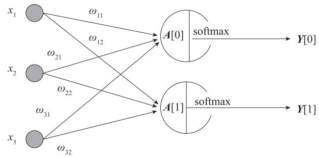

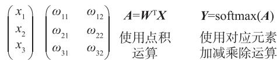  
图 13-1 神经网络结构

# 13.1.5 行列式

一个 $n \times n$ 的方阵A的行列式记为det(A) 或者 $| A |$ ，一个 $2 \times 2$ 矩阵的行列式可表示如下：

$$
\left| \begin{array}{l l} a & b \\ c & d \end{array} \right| = a d - b c
$$

把一个 $n$ 阶行列式中的元素 $a _ { i j }$ 所在的第 $i$ 行和第 $j$ 列划去后，剩下来的 $n { - } 1$ 阶行列式叫

作元素 $a _ { i j }$ 的余子式，记作 $M _ { i j }$ 。记 $A _ { i j } = \left( - 1 \right) ^ { i + j } M _ { i j }$ ，它叫作元素 $a _ { i j }$ 的代数余子式。

一个 $n \times n$ 矩阵的行列式等于其任意行（或列）的元素与对应的代数余子式乘积之和，即

$$
\left| \begin{array}{c c c} a _ {1 1} & \dots & a _ {1 n} \\ \vdots & & \vdots \\ a _ {n 1} & \dots & a _ {n n} \end{array} \right| = a _ {i 1} A _ {i 1} + a _ {i 2} A _ {i 2} + \dots + a _ {i n} A _ {i n} = \sum_ {j = 1} ^ {n} a _ {i j} A _ {i j} = \sum_ {j = 1} ^ {n} a _ {i j} (- 1) ^ {i + j} M _ {i j}, i = 1, 2, \dots , n
$$

行列式的性质如下：

1） $n$ 阶矩阵 A 可逆的充分必要条件是 $ { \left| { A } \right| } \neq 0$ 。  
2）如果矩阵 $A$ 和 $\pmb { B }$ 是大小相同的 $n$ 阶矩阵，则有

$$
\left| \boldsymbol {A} \boldsymbol {B} \right| = \left| \boldsymbol {A} \right| \left| \boldsymbol {B} \right|
$$

3） $n$ 阶矩阵的转置矩阵 $A ^ { \mathrm { T } }$ 的行列式等于 $A$ 的行列式，即 $\left. \boldsymbol { A } ^ { \mathrm { T } } \right. = \left. \boldsymbol { A } \right.$

行列式的初等行变换如下：

1）将行列式的两行交换；  
2）将行列式的某一行乘以 $k$ 倍之后加到另一行。

第 1 种变换将使行列式的值反号，第 2 种变换不会改变行列式的值。

# 13.2 随机变量及其分布

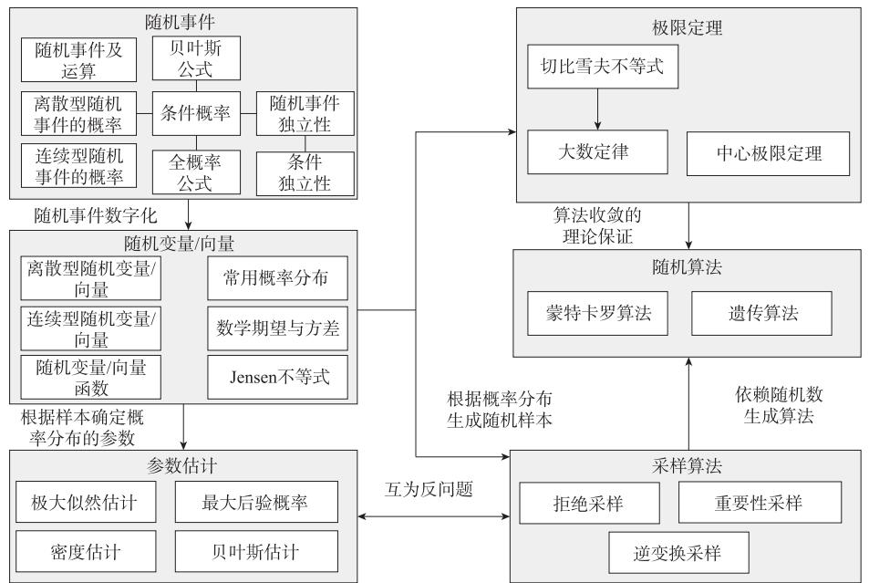  
图 13-2 为概率论的知识体系。  
图 13-2 概率论的知识体系

# 13.2.1 从随机事件到随机变量

在随机试验中，每一个可能的结果在试验中发生与否都带有随机性，所以称为随机事件。而所有可能结果构成的全体，称为样本空间。为了更好地分析和处理随机事件，人们想到了把随机事件数量化，数量化的载体就是随机变量。随机变量一般用大写字母表示，如 $X , Y , Z , W$ 等，随机变量的取值一般用小写字母表示，如 $x , y , x _ { i }$ 等。图 13-3 为随机事件与随机变量的对应关系示意图。

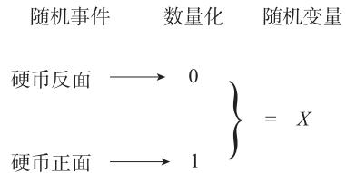  
图 13-3 随机事件与随机变量的对应关系示意

随机变量表示随机试验各种结果的实值单值函数。随机事件不论与数量是否直接有关，都可以数量化，即都能用数量化的方式表达。例如，投掷硬币的正反面、掷骰子的点数、某一时间内公共汽车站等车乘客人数、灯泡的寿命等，都可用随机变量表示。

例如：将一枚硬币抛掷三次，观察出现正面和反面的情况，样本空间是

$\varOmega = \left\{ \begin{array} { r l r } \end{array} \right.$ {正正正,正正反,正反正,反正正,正反反,反正反,反反正,反反反}

以 $X$ 记三次投掷得到正面的总数，那么，对于样本空间Ω中的每一个样本点 $\omega$ ， $X$ 都有一个数与之对应， $X$ 就是把随机事件数量化的随机变量。 $X$ 与随机事件的关系为

$$
\begin{array}{l} 3, \omega = \text {正 正 正} \\ x = x (.) \quad 2, \omega = \text {正 正 反 ， 正 反 正 ， 反 正 正} \\ 1, \omega = \text {正 反 反}, \text {反 正 反}, \text {反 正 正} \\ 0, \omega = \text {反 反 反} \\ \end{array}
$$

随机变量的取值由试验的结果而定，而试验各个结果的出现有一定概率，因而随机变量的取值有一定概率。例如，本例中的 $X$ 取值为 2，记成 $X { = } 2$ ，对应样本点的集合$A { = } \left\{ \begin{array} { r l r l } \end{array} \right.$ 正正反 , 正反正 , 反正正 }，这是一个事件，当且仅当 $A$ 发生时有 $X { = } 2$ 。我们称概率$\scriptstyle p ( A ) = p \left\{ \begin{array} { l l } { \begin{array} { r l r l } \end{array} } \end{array} \right.$ 正正反 , 正反正 , 反正正 } 为 $X { = } 2$ 的概率，记为 $p { \big ( } X = 2 { \big ) } = { \frac { 3 } { 8 } } .$ 。类似地，有

$$
p \big (X \leqslant 1 \big) = p \big \{\text {正 反 反}, \text {反 正 反}, \text {反 反 正}, \text {反 反 反} \big \} = \frac {4}{8} = \frac {1}{2}
$$

对于一个随机变量，不仅要说明它能够取什么值，更需要关心取这些值的概率（分布函数），这也是随机变量与一般变量的本质区别。

引入随机变量，就可利用数学分析的方法对随机试验的结果进行分析研究了。

# 13.2.2 离散型随机变量及其分布

如果随机变量 $X$ 的取值是有限的或者是可数无穷尽的值，如 $\boldsymbol { x } _ { 1 } , \boldsymbol { x } _ { 2 } , \boldsymbol { x } _ { 3 } , \cdots , \boldsymbol { x } _ { n }$ ，则称 $X$ 为离散随机变量。

# 1. 离散型随机变量及其分布概述

设 $x _ { 1 } , x _ { 2 } , \cdots , x _ { n }$ 是随机变量 $X$ 的所有可能取值，对每个取值 $x _ { i }$ ， $X { = } x _ { i }$ 是其样本空间 S 上的一个事件，为描述随机变量 $X$ ，还需知道这些事件发生的可能性（概率）。

设离散型随机变量 $X$ 的所有可能取值为 $x _ { i } ( i { = } 1 , 2 , \cdots , n )$ $x _ { i }$ ，则

$$
P (X = x _ {i}) = P _ {i.} i = 1, 2, \dots , n
$$

称为 $X$ 的概率分布或分布律，也称概率函数。

$X$ 的概率分布如表 13-1 所示。

表13-1 随机变量 $X$ 的概率分布  

<table><tr><td>X</td><td>x1</td><td>x2</td><td>...</td><td>xn</td></tr><tr><td>Pi</td><td>P1</td><td>P2</td><td>...</td><td>Pn</td></tr></table>

由概率的定义， $P _ { i }$ $P _ { i } \left( i = 1 , 2 , \cdots \right)$ 必然满足：

● $P _ { i } \mathcal { \gtrsim } 0 , i = 1 , 2 , \cdots , n$   
$\sum _ { i = 1 } ^ { n } { P _ { i } = 1 }$

例如，某篮球运动员单次投篮投中的概率是 0.8，求他两次独立投篮投中次数 $X$ 的概率分布。

解： $X$ 可取 0,1,2 为值，记 ${ \cal { A } } _ { i } = \left\{ \begin{array} { r l r } \end{array} \right.$ { 第 $i$ 次投中 }， $i { = } 1 , 2$ ，则 $P ( A _ { 1 } ) = P ( A _ { 2 } ) = 0 . 8$ ，由此不难得到下列各情况的概率：

投了两次没一次投中，即

$$
P (X = 0) = P \left(\overline {{A _ {1}}}\right) P \left(\overline {{A _ {2}}}\right) = 0. 2 \times 0. 2 = 0. 0 4
$$

投了两次只投中一次，即

$$
\begin{array}{l} P (X = 1) = P \left(\bar {A _ {1}} A _ {2} \bigcup A _ {1} \bar {A _ {2}}\right) = P \left(\bar {A _ {1}} A _ {2}\right) + P \left(A _ {1} \bar {A _ {2}}\right) \\ = 0. 2 \times 0. 8 + 0. 8 \times 0. 2 = 0. 3 2 \\ \end{array}
$$

投了两次两次都投中，即

$$
P (X = 2) = P \left(A _ {1} A _ {2}\right) = P \left(A _ {1}\right) P \left(A _ {2}\right) = 0. 8 \times 0. 8 = 0. 6 4
$$

且

$$
P (X = 0) + P (X = 1) + P (X = 2) = 0. 0 4 + 0. 3 2 + 0. 6 4 = 1
$$

于是，随机变量 $X$ 的概率分布如表 13-2 所示。

表13-2 随机变量 $X$ 的概率分布  

<table><tr><td>X</td><td>0</td><td>1</td><td>2</td></tr><tr><td>Pi</td><td>0.04</td><td>0.32</td><td>0.64</td></tr></table>

根据概率函数的定义，表 13-1 中的随机变量 $X$ 的累加值为

$$
F (x) = P (X \leqslant x) = \sum_ {x _ {k} \leqslant x} P (X = x _ {k})
$$

例如，设 $X$ 的概率分布由表 13-2 给出，则

$$
F (2) = P (X \leqslant 2) = P (X = 0) + P (X = 1) = 0. 0 4 + 0. 3 2 = 0. 3 6
$$

# 2. 伯努利分布

伯努利分布又称为二点分布或 0-1 分布。服从伯努利分布的随机变量 $X$ 取值有 0 或 1两种情况，若它的分布列为 $P ( X { = } 1 ) { = } p$ ， $P ( X = 0 ) = 1 - p$ ，其中 $0 < p < 1$ ，则称 $X$ 服从参数为 $p$ 的伯努利分布，记作 $X { \sim } B ( 1 , p )$ 。其概率函数可统一写成

$$
P (X = x) = p ^ {x} (1 - p) ^ {1 - x}
$$

其中， $x \in \{ 0 , 1 \}$ ， $X$ 服从伯努利分布。

随机变量 $X$ 的期望为

$$
E (X) = \sum_ {i = 1} ^ {2} x _ {i} p _ {i} = 1 \times p + 0 \times (1 - p) = p
$$

其中， $x _ { 1 } = 1 , x _ { 2 } = 0 \nonumber$ $x _ { 2 } = 0$ 。

随机变量 $X$ 的方差为

$$
D (X) = E (X - E X) ^ {2} = \sum_ {i = 1} ^ {2} (x _ {i} - p) ^ {2} p _ {i} = (1 - p) ^ {2} p + (0 - p) ^ {2} \times (1 - p) = p (1 - p)
$$

其分布函数为

$$
\begin{array}{l} 0, \quad x <   0 \\ F (X) = 1 - p, 0 \leqslant x <   1 \\ 1, \quad x \geqslant 1 \\ \end{array}
$$

当p $p = \frac { 1 } { 2 }$ 时，伯努利分布为离散型平均分布。

伯努利分布在机器学习中十分常见，比如逻辑回归模型拟合的就是这种模型。

# 3. 二项分布

二项分布是重要的离散概率分布之一，由瑞士数学家雅各布·伯努利（Jakob Bernoulli）

提出。一般用二项分布来计算概率的前提是，每次抽出样品后再放回去，并且只能有两种试验结果，比如黑球或红球、正品或次品等。二项分布指出，假设某样品在随机一次试验中出现的概率为 $p$ ，那么在 $n$ 次试验中出现 $k$ 次的概率为

$$
P (X = k) = \begin{array}{l l} n \\ k \end{array} p ^ {k} (1 - p) ^ {n - k}
$$

# 4. 多项分布

多项分布是伯努利分布的推广，假设随机向量 $X$ 的取值有 $k$ 种情况，即可表示为$X = i , i \in \left\{ 1 , 2 , \cdots , k \right\}$ ，则有

$$
p (X = i) = p _ {i}, i = 1, 2, \dots , k
$$

随机变量 $X$ 有 $k$ 种情况，在实际使用时，往往把 $k$ 种情况用独热编码来表示，如 $X { = } 1$ 可表示为 [1,0,0,…,0]， $X { = } 2$ 可表示为 $[ 0 , 1 , 0 , 0 , \cdots , 0 ]$ 。这里用 $\left[ y _ { 1 } , y _ { 2 } , \cdots , y _ { k } \right]$ 表示独热编码。

这样多项分布可表示为

$$
p (X = i) = p _ {1} ^ {y _ {1}} p _ {2} ^ {y _ {2}} \dots p _ {k} ^ {y _ {k}} = p _ {1} ^ {0} p _ {2} ^ {0} \dots p _ {i} ^ {1} \dots p _ {k} ^ {0} = p _ {i}
$$

多项分布在机器学习中应用非常广泛，如 softmax 回归模拟的就是多项分布，神经网络多分类的模型也是拟合的多项分布。

# 5. 泊松分布

若随机变量 $X$ 所有可能取值为 0,1,2,…，它取各个值的概率为

$$
P (X = k) = \frac {\lambda^ {k}}{k !} \mathrm {e} ^ {- \lambda} (k = 0, 1, 2, \dots)
$$

这里介绍了离散型随机变量的分布情况，如果 $X$ 是连续型随机变量，其分布函数通常通过密度函数来描述，具体请看下一小节。

# 13.2.3 连续型随机变量及其分布

如果 $X$ 由全部实数或者由一部分区间组成，如 $X = \{ x \vert a \leqslant x \leqslant b \}$ ，其中 $a { < } b$ ，它们都为实数，则称 $X$ 为连续随机变量。连续型随机变量的取值是不可数及无穷尽的。

# 1. 连续型随机变量及其分布概述

与离散型随机变量不同，连续型随机变量采用概率密度函数来描述变量的概率分布。如果一个函数 $f ( x )$ 是密度函数，满足以下三个性质，我们就称 $f ( x )$ 为概率密度函数。

1） $f ( x ) \geqslant 0$ ，注意这里不要求 $f ( x ) \leqslant 1$ 。  
2） $\int _ { - \infty } ^ { \infty } f \left( x \right) \mathrm { d } x = 1$

3）对于任意实数 $\dot { \boldsymbol { x } } _ { 1 }$ 和 $x _ { 2 }$ ，且 $x _ { 1 } \leqslant x _ { 2 }$ ，有

$$
P \left(x _ {1} <   X \leqslant x _ {2}\right) = \int_ {x _ {1}} ^ {x _ {2}} f (x) d x
$$

第 2 个性质表明，概率密度函数 $f ( x )$ 与 $x$ 轴形成的区域的面积等于 1。第 3 个性质表明，连续型随机变量在区间 $[ x _ { 1 } , x _ { 2 } ]$ 的概率等于密度函数在区间 $[ x _ { 1 } , x _ { 2 } ]$ 上的积分，即与 $x$ 轴在 $[ x _ { 1 } , x _ { 2 } ]$ 内形成的区域的面积，如图 13-4 所示。

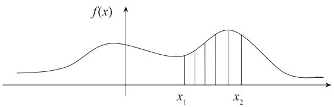  
图 13-4 概率密度函数

连续型随机变量在任意一点的概率处处为 0。

假设有任意小的实数 $\Delta x$ ，由于 $\{ X { = } x \} \subset \left\{ x { - } \Delta x { < } X { \leqslant } x \right\}$ ，由分布函数的定义可得

$$
0 \leqslant P (X = x) \leqslant P (x - \Delta x <   X \leqslant x) = F (x) - F (x - \Delta x) \tag {13.1}
$$

令 $\Delta x \to 0$ ，根据夹逼准则，由式（13.1）可求得

$$
P (X = x) = 0 \tag {13.2}
$$

式（13.2）表明，连续型随机变量在任意一点的取值的概率都为0。因此，在连续型随机变量中，当讨论区间的概率定义时，一般对开区间和闭区间不加区分，即 $P ( x _ { 1 } \leqslant X \leqslant x _ { 2 } ) =$ $P ( x _ { 1 } < X \leqslant x _ { 2 } ) = P ( x _ { 1 } \leqslant X < x _ { 2 } ) = P ( x _ { 1 } < X < x _ { 2 } )$ 成立。

# 2. 均匀分布

若连续型随机变量 $X$ 具有概率密度

$$
f (x) = \frac {1}{b - a}, a \leqslant x \leqslant b
$$

$$
0, \quad x <   a, \quad x > b
$$

则称 $X$ 在区间 [a,b] 上服从均匀分布，记为 $X \sim U \left( a , b \right)$ 。由此可得

$$
f (x) \geqslant 0, \int_ {- \infty} ^ {\infty} f (x) d x = 1
$$

# 3. 指数分布

若连续型随机变量 $X$ 的概率密度为

$$
\begin{array}{l} f (x) = \frac {1}{\theta} e ^ {- \frac {x}{\theta}}, x > 0 \\ 0, \quad x \leqslant 0 \\ \end{array}
$$

其中， $\theta > 0$ 为常数，则称 $X$ 服从参数为 $\theta$ 的指数分布，记为 $X { \sim } E ( \theta )$ 。

# 4. 正态分布

若连续型随机变量 $X$ 的密度函数为

$$
f (x) = \frac {1}{\sigma \sqrt {2 \pi}} \mathrm {e} ^ {- \frac {(x - \mu) ^ {2}}{2 \sigma^ {2}}}, - \infty <   x <   \infty \tag {13.3}
$$

其中， $\mu$ 是平均值， $\sigma$ 是标准差（平均值、标准差在稍后介绍）。这个连续分布被称为正态分布或者高斯分布。其密度函数的曲线呈对称钟形，因此又被称为钟形曲线。正态分布是一种理想分布，记为 $X \sim N \left( \mu , \sigma ^ { 2 } \right)$ 。

# 13.2.4 随机变量的分布函数

概率分布用来描述随机变量（含随机向量）在每一个可能状态的可能性大小。概率分布有不同方式，这取决于随机变量是离散的还是连续的。

对于随机变量 $X$ ，其概率分布通常记为 $P ( X { = } x )$ ，或 $X { \sim } P ( x )$ ，表示 $X$ 服从概率分布 $P ( x )$ 。

概率分布描述了取单点值的可能性或概率，但在实际应用中，我们并不关心取某一值的概率。如对离散型随机变量，我们可能关心多个值的概率累加。对连续型随机变量来说，关心在某一段或某一区间的概率等。特别是对连续型随机变量，它在任意点的概率都是 0。因此，我们通常比较关心随机变量落在某一区间上的概率，为此，引入分布函数的概念。

定义：设 $X$ 是一个随机变量， $x _ { k }$ 是任意实数值，则函数

$$
F \left(x _ {k}\right) = P \left(X \leqslant x _ {k}\right) \tag {13.4}
$$

称为随机变量 $X$ 的分布函数。

由式（13.4）不难发现，对任意的实数 $x _ { 1 } , x _ { 2 }$ （ $x _ { 1 } < x _ { 2 }$ ），有

$$
P \left(x _ {1} <   X \leqslant x _ {2}\right) = P \left(X \leqslant x _ {2}\right) - P \left(X \leqslant x _ {1}\right) = F \left(x _ {2}\right) - F \left(x _ {1}\right) \tag {13.5}
$$

成立。式（13.5）表明，若随机变量 $X$ 的分布函数已知，那么可以求出 $X$ 落在任意区间$[ x _ { 1 } , x _ { 2 } ]$ 上的概率。

如果将 $X$ 看成数轴上的随机点的坐标，那么，分布函数 $F ( x )$ 在 $x$ 处的函数值就表示 $X$ 落在区间 $\left( - \infty , x \right)$ 上的概率。

分布函数是一个普通函数，为此，我们可以利用数学分析的方法研究随机变量。

# 1. 分布函数的性质

设 $F ( x )$ 是随机变量 $X$ 的分布函数，则 $F ( x )$ 有如下性质。

（1）非降性

$F ( x )$ 是 一 个 不 减 函 数， 对 任 意 $x _ { 1 } < x _ { 2 }$ ， 有 $F \left( x _ { 2 } \right) - F \left( x _ { 1 } \right) = p \left( x _ { 1 } < X < x _ { 2 } \right) \geqslant 0$ ， 即$F \left( x _ { 1 } \right) \leqslant F \left( x _ { 2 } \right) \circ$ 。

（2）有界性

$$
0 \leqslant F (x) \leqslant 1
$$

$$
F (- \infty) = 0
$$

$$
F (+ \infty) = 1
$$

（3）右连续

$$
F (x + 0) = F (x)
$$

# 2. 离散型随机变量的分布函数

设离散型随机变量 $X$ 的分布律为

$$
p (X = x _ {i}) = p _ {i}, i = 1, 2, \dots
$$

由概率的可列可加性得 $X$ 的分布函数为

$$
F (x) = p (X \leqslant x) = \sum_ {x _ {i} \leqslant x} p (X = x _ {i})
$$

可简写为

$$
F (x) = \sum_ {x _ {i} \leqslant x} p _ {i}
$$

# 3. 连续型随机变量的分布函数

设 $X$ 为连续型随机变量，其密度函数为 $f ( x )$ ，则有

$$
F (x) = p (X \leqslant x) = \int_ {- \infty} ^ {x} f (x) d x
$$

对上式两边求关于 $x$ 的导数可得

$$
F ^ {\prime} (x) = \left\lceil \int_ {- \infty} ^ {x} f (x) d x \left. \right\rfloor^ {\prime} = f (x)
$$

这是连续型随机变量 $X$ 的分布函数与密度函数之间的关系。

几种常见连续型随机变量的分布函数如下：

1）设 $X \sim U \left( a , b \right)$ ，则随机变量 $X$ 的分布函数为 $F \left( x \right) = \begin{array} { c } { { \displaystyle { \frac { x - a } { b - a } } , a \leqslant x < b } } \\ { { \displaystyle { 1 , x \geqslant b } } } \end{array} _ { \circ }$ 。  
2）设 $X \sim E ( \theta ) ( \theta > 0 )$ ，则随机变量 $X$ 的分布函数为 $\begin{array} { r } { \begin{array} { r l } { \mathbf { \sigma } } & { { } \mathbf { 0 } , \qquad \mathbf { \sigma } \qquad x \leqslant 0 } \\ { \mathbf { \sigma } } & { { } \mathbf { 1 } - \mathbf { e } ^ { - x / \theta } , x > 0 } \end{array} } \end{array}$ 。1 e ,- - x/θ  
3）设 $X \sim N \left( \mu , \sigma ^ { 2 } \right)$ ，则随机变量 $X$ 的分布函数为 $F \left( x \right) = \frac { 1 } { \sqrt { 2 \pi } \sigma } \int _ { - \infty } ^ { x } \mathrm { e } ^ { - \frac { ( t - \mu ) ^ { 2 } } { 2 \sigma ^ { 2 } } } \mathrm { d } t _ { \circ }$ 2π

# 13.2.5 多维随机变量及其分布

有些随机现象需要同时用多个随机变量来描述。例如对地面目标射击，弹着点的位置需要两个坐标 (X,Y) 才能确定。 $X , Y$ 都是随机变量，而 (X,Y) 称为一个二维随机变量或二维随机向量，多维随机向量 $( X _ { 1 } , X _ { 2 } , \cdots , X _ { n } )$ 含义以此类推。

# 1. 二维随机变量

设 W 是一个随机试验，它的样本空间为 $\varOmega$ ，设 $X _ { 1 } , X _ { 2 } , \cdots , X _ { n }$ 是定义在 $\varOmega$ 上的 $n$ 个随机变量，由它们构成的随机向量 $\left( X _ { 1 } , X _ { 2 } , \cdots , X _ { n } \right)$ 称为 $n$ 维随机向量或 $n$ 维随机变量。当 $n { = } 2$ 时，即 $( X _ { 1 } , X _ { 2 } )$ ，称为二维随机向量或二维随机变量。

设 (X,Y) 是二维随机变量，对于任意实数 $x , y$ ，均存在二元函数 $\cdot F \left( x , y \right) = p \left( \left( X \leqslant x \right) \cap \left( Y \leqslant y \right) \right)$ （记作 $p \big ( X \leqslant x , Y \leqslant y \big )$ ），则将 $F \left( x , y \right)$ 称为二维随机变量 $( X , Y )$ 的分布函数，或称为随机变量$X$ 和 $Y$ 的联合分布函数。

# 2. 二维离散型随机变量

如果二维随机变量 (X,Y) 全部可能取到的值是有限对或可列无限多对，则称 (X,Y) 是离散型随机变量，对应的联合概率分布（或简称为概率分布或分布律）为

$$
p (X = x _ {i}, Y = y _ {j}) = p _ {i j}, i, j = 1, 2, \dots
$$

例如：将一枚均匀的硬币抛掷 4 次， $X$ 表示正面朝上的次数，Y 表示反面朝上的次数，求 (X,Y) 的概率分布。

解： $X$ 的所有可能取值为 0,1,2,3,4，Y 的所有可能取值为 0,1,2,3,4，因为 $X + Y { = } 4$ ，所以(X,Y) 概率非 0 的数值对如表 13-3 所示。

表13-3 随机变量X,Y的联合概率  

<table><tr><td>X</td><td>Y</td><td>p(X=x_i,Y=y_j)</td></tr><tr><td>0</td><td>4</td><td>p(X=0,Y=4)=\(\frac{1}{2}\)^4=\(\frac{1}{16}\)</td></tr><tr><td>1</td><td>3</td><td>p(X=1,Y=3)=\(C_{4}^{1}\)\(\frac{1}{2}\)\(\frac{1}{2}\)^3=\(\frac{1}{4}\)</td></tr><tr><td>2</td><td>2</td><td>p(X=2,Y=2)=\(C_{4}^{2}\)\(\frac{1}{2}\)^2\(\frac{1}{2}\)^2=\(\frac{3}{8}\)</td></tr><tr><td>3</td><td>1</td><td>p(X=3,Y=1)=\(C_{4}^{1}\)\(\frac{1}{2}\)^3\(\frac{1}{2}\)=\(\frac{1}{4}\)</td></tr><tr><td>4</td><td>0</td><td>p(X=4,Y=0)=\(\frac{1}{2}\)^4=\(\frac{1}{16}\)</td></tr></table>

二维随机变量（X,Y）的联合概率分布如表 13-4 所示。

表13-4 随机变量 $X , Y$ 的联合概率分布  

<table><tr><td rowspan="2">X</td><td colspan="5">Y</td></tr><tr><td>0</td><td>1</td><td>2</td><td>3</td><td>4</td></tr><tr><td>0</td><td>0</td><td>0</td><td>0</td><td>0</td><td>1/16</td></tr><tr><td>1</td><td>0</td><td>0</td><td></td><td>1/4</td><td>0</td></tr><tr><td>2</td><td>0</td><td>0</td><td>3/8</td><td>0</td><td>0</td></tr><tr><td>3</td><td>0</td><td>1/4</td><td>0</td><td>0</td><td>0</td></tr><tr><td>4</td><td>1/16</td><td>0</td><td>0</td><td>0</td><td>0</td></tr></table>

# （1）性质

1）非负性： $p _ { i j } \geqslant 0$ 。  
2）规范性：

$$
\sum_ {i = 1} ^ {\infty} \sum_ {j = 1} ^ {\infty} p _ {i j} = 1
$$

# （2）概率分布

二维离散型随机变量 (X,Y) 的分布函数与概率分布之间有如下关系式：

$$
F (x, y) = \sum_ {x _ {i} <   x y _ {i} <   y} p _ {i j}
$$

# 3. 二维连续型随机变量

设二维随机变量 (X,Y) 的联合分布函数为 $F ( x , y )$ ，若存在非负可积函数 $f ( x , y )$ ，使得对于任意实数x y、 ，有

$$
F (x, y) = \int_ {- \infty} ^ {x} \int_ {- \infty} ^ {y} f (u, v) d u d v
$$

则称 (X,Y) 为二维连续型随机变量，函数 $f ( x , y )$ 称为 (X,Y) 的联合概率密度函数，简称概率密度或密度函数。

（1）密度函数 $f ( x , y )$ 的性质

1）非负性： $f \left( x , y \right) \geqslant 0$ 。  
2）规范性：

$$
\int_ {- \infty} ^ {\infty} \int_ {- \infty} ^ {\infty} f (x, y) d x d y = 1
$$

3）当 $f ( x , y )$ 连续时， ${ \frac { { \hat { \sigma } } ^ { 2 } } { \hat { \sigma } x \hat { \sigma } y } } F \left( x , y \right) = f \left( x , y \right)$   
4）若 $D$ 是 $x O y$ 平面上的任一区域，则随机点 $( X , Y )$ 落在 $D$ 内的概率为

$$
p \left(\left(X, Y\right) \in D\right) = \iint_ {(x, y) \in D} f (x, y) d x d y
$$

（2）两种常见的二维连续型随机变量的分布

1）均匀分布。

设 $D$ 是平面上的有界区域，其面积为 $A$ ，若二维随机变量 (X,Y) 的概率密度为

$$
f \left(x, y\right) = \begin{array}{l} \frac {1}{A}, (x, y) \in D \\ 0, (x, y) \notin D \end{array}
$$

则称 (X,Y) 服从区域 $D$ 上的均匀分布。

可以验证，均匀分布的密度函数 $f ( x , y )$ 满足密度函数的两个性质。

2）正态分布。

如果 (X,Y) 的联合密度函数为

$$
f (x, y) = \frac {1}{2 \pi \sigma_ {1} \sigma_ {2} \sqrt {1 - \rho^ {2}}} \exp \left. - \frac {1}{2 (1 - \rho^ {2})} \frac {(x - \mu_ {1}) ^ {2}}{\sigma_ {1} ^ {2}} - \frac {2 \rho (x - \mu_ {1}) (y - \mu_ {2})}{\sigma_ {1} \sigma_ {2}} + \frac {(y - \mu_ {2}) ^ {2}}{\sigma_ {2} ^ {2}} \right.
$$

其中， $\mu _ { 1 } , \mu _ { 2 } , \sigma _ { 1 } > 0 , \sigma _ { 2 } > 0 , \rho \big ( | \rho | < 1 \big )$ 是常数，则称 (X,Y) 服从参数为 $\mu _ { 1 } , \mu _ { 2 } , \sigma _ { 1 } , \sigma _ { 2 } , \rho$ 的二维正态分布，记为

$$
(X, Y) \sim N \left(\mu_ {1}, \sigma_ {1} ^ {2}; \mu_ {2}, \sigma_ {2} ^ {2}; \rho\right)
$$

下面用向量来表示正态分布。

随机向量 $\mathbf { { Z } } = \begin{array} { l } { { X } } \\ { { Y } } \end{array}$ |，令均值向量为 $\pmb { \mu } = \begin{array} { c } { \mu _ { 1 } } \\ { \mu _ { 2 } } \end{array}$ |，协方差矩阵为 $\begin{array} { r l } { \varSigma = } & { { } \sigma _ { 1 } ^ { ' 2 } \qquad \rho \sigma _ { 1 } \sigma _ { 2 } } \\ { \rho \sigma _ { 1 } \sigma _ { 2 } } & { { } \sigma _ { 2 } ^ { ' 2 } } \end{array}$ | ρσ σ σ1 2 2 2 |，其中

$0 \leqslant \rho \leqslant 1$ 称为相关系数，如果其值为 0，则 X、Y 互相独立。

二维正态分布的联合密度函数可表示为

$$
f (z) = \frac {1}{2 \pi \sqrt {| \boldsymbol {\Sigma} |}} \exp - \frac {1}{2} (z - \boldsymbol {\mu}) ^ {\mathrm {T}} \boldsymbol {\Sigma} ^ {- 1} (z - \boldsymbol {\mu})
$$

推广到 $n$ 维正态分布的联合密度函数可表示为

$$
f (z) = \frac {1}{(2 \pi) ^ {\frac {n}{2}} \sqrt {| \boldsymbol {\Sigma} |}} \exp - \frac {1}{2} (z - \boldsymbol {\mu}) ^ {\mathrm {T}} \boldsymbol {\Sigma} ^ {- 1} (z - \boldsymbol {\mu}) \tag {13.6}
$$

其中，z 为 $n$ 维向量， $\pmb { \mu }$ 为 $n$ 维均值向量， $\pmb { \cal { \Sigma } }$ 为 $n$ 阶协方差矩阵。 $n$ 维正态分布可简记为 $N \left( \pmb { \mu } , \pmb { \Sigma } \right)$ 。

如果 $n { = } 1$ ， $\pmb { \mu } = \mu$ ， $\pmb { \Sigma } = \sigma ^ { 2 }$ ，则式（13.6）为一维正态分布 $N \left( \mu , \sigma ^ { 2 } \right)$ 。如果 ${ \pmb \mu } = { \pmb 0 }$ , $\Sigma = I$ ，则式（13.6）称为标准正态分布 $N \big ( \mathbf { 0 } , \pmb { I } \big )$ 。

例如：若 $( X , Y )$ 的密度函数为

$$
f (x, y) = \begin{array}{l l} a \mathrm {e} ^ {- (2 x + 3 y)}, x \geqslant 0, y \geqslant 0 \\ 0, & \text {其 他} \end{array}
$$

求：1）常数 $a$

2） $p \big ( X < 2 , Y < 1 \big )$ ；  
3） $p { \big ( } { \big ( } X , Y { \big ) } \in D { \big ) }$ ，其中 $D$ 为 $2 x + 3 y \leqslant 6$ 。

解：

1）

$$
\begin{array}{l} \int_ {0} ^ {\infty} \int_ {0} ^ {\infty} a \mathrm {e} ^ {- (2 x + 3 y)} \mathrm {d} x \mathrm {d} y = a \int_ {0} ^ {\infty} \mathrm {e} ^ {- 2 x} \mathrm {d} x \int_ {0} ^ {\infty} \mathrm {e} ^ {- 3 y} \mathrm {d} y \\ = a - \frac {1}{2} e ^ {- 2 x} \left| \begin{array}{l l} \infty & - \frac {1}{3} e ^ {- 3 y} \\ 0 & 0 \end{array} \right| \frac {\infty}{6} = 1 \\ \end{array}
$$

所以， $a { = } 6$ 。

2）由 $p \left( \left( X , Y \right) \in D \right) = \int \int _ { D } f \left( x , y \right) { \mathrm { d } x } { \mathrm { d } y } \overline { { \sharp } } \int \int _ { 0 } ^ { }$ 知

$$
\begin{array}{l} p (X <   2, Y <   1) = \iint_ {(X <   2, Y <   1)} f (x, y) d x d y = \int_ {0} ^ {2} \int_ {0} ^ {1} 6 e ^ {- (2 x + 3 y)} d x d y \\ = 6 \int_ {0} ^ {2} \mathrm {e} ^ {- 2 x} \mathrm {d} x \int_ {0} ^ {1} \mathrm {e} ^ {- 3 y} \mathrm {d} y = (1 - \mathrm {e} ^ {- 4}) (1 - \mathrm {e} ^ {- 3}) \\ \end{array}
$$

3） $p \left( \left( X , Y \right) \in D \right) = \int \int _ { D } f \left( x , y \right) { \mathrm { d } } x { \mathrm { d } } y = \int \int _ { 2 x + 3 y \leqslant 6 } f \left( x , y \right) { \mathrm { d } } x { \mathrm { d } } y$

$D$ 的范围如图 13-5 中阴影部分所示。

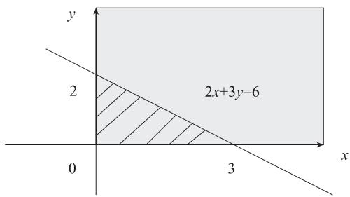  
图 13-5 坐标轴与直线 $2 x + 3 y = 6$ 围成的阴影部分

由此可得

$$
p \left(\left(X, Y\right) \in D\right) = 6 \int_ {0} ^ {3} \mathrm {e} ^ {- 2 x} \int_ {0} ^ {\frac {6 - 2 x}{3}} \mathrm {e} ^ {- 3 y} \mathrm {d} y \mathrm {d} x = 1 - 7 \mathrm {e} ^ {- 6}
$$

# 4. 边缘分布

对于多维随机变量，如二维随机变量 $( X , Y )$ ，假设其联合概率分布为 $F ( x , y )$ ，我们经常遇到求其中一个随机变量的概率分布的情况。这种定义在子集上的概率分布称为边缘分布。

例如：假设有两个离散型随机变量 X,Y，且知道 $P ( X , Y )$ ，那么我们可以通过下面的求和方法得到边缘概率 $P ( X )$ 和 $P ( Y )$ ：

$$
P (X = x) = \sum_ {y} P (X = x, Y = y)
$$

$$
P (Y = y) = \sum_ {x} P (X = x, Y = y) \tag {13.7}
$$

对于连续型随机变量 (X,Y)，我们可以通过联合密度函数 $f ( x , y )$ 来得到边缘密度函数。

$$
f (x) = \int_ {- \infty} ^ {\infty} f (x, y) d y \tag {13.8}
$$

$$
f (y) = \int_ {- \infty} ^ {\infty} f (x, y) d x \tag {13.9}
$$

边缘概率如何计算呢？我们通过一个实例来说明。假设有两个离散型随机变量 X,Y，其联合分布概率如表 13-5 所示。

表 13-5 $X$ 与Y的联合分布  

<table><tr><td rowspan="2">X</td><td colspan="4">Y</td></tr><tr><td>-1</td><td>0</td><td>1</td><td>行合计</td></tr><tr><td>1</td><td>0.17</td><td>0.05</td><td>0.21</td><td>0.43</td></tr><tr><td>2</td><td>0.04</td><td>0.28</td><td>0.25</td><td>0.57</td></tr><tr><td>列合计</td><td>0.21</td><td>0.33</td><td>0.46</td><td>1</td></tr></table>

如果要求 $P ( Y { = } 0 )$ 的边缘概率，则根据式（13.7）可得

$$
P (Y = 0) = P (X = 1, Y = 0) + P (X = 2, Y = 0) = 0. 0 5 + 0. 2 8 = 0. 3 3
$$

# 5. 条件分布

前面介绍了边缘分布，它是多维随机变量在一个子集（或分量）上的概率分布。在含多个随机变量的事件中，经常遇到求某个事件在其他事件发生时发生的概率。例如，在表 13-5 的分布中，假设我们要求当 $Y { = } 0$ 时 $X { = } 1$ 的概率。这种概率叫作条件概率。条件概率如何求？我们先看一般情况。

设有两个随机变量 $X , Y$ ，我们将 $X { = } x$ ， $Y { = } y$ 发生的条件概率记为 $P ( Y { = } y | X { = } x )$ ，那么这个条件概率可以通过以下公式计算：

$$
P (Y = y \mid X = x) = \frac {P (Y = y , X = x)}{P (X = x)} \tag {13.10}
$$

条件概率只有在 $P ( X { = } x ) { > } 0$ 时才有意义，如果 $P ( X { = } x ) { = } 0$ ，即 $X { = } x$ 不可能发生，以它为条件就毫无意义。

现在我们来看上面这个例子，根据式（13.10），我们要求的问题就转换为

$$
P (X = 1 \mid Y = 0) = \frac {P (X = 1 , Y = 0)}{P (Y = 0)} \tag {13.11}
$$

其 中， $P ( Y { = } 0 )$ 是 一 个 边 缘 概 率， 其 值 为 $P ( X = 1 , Y = 0 ) + P ( X = 2 , Y = 0 ) = 0 . 0 5 + 0 . 2 8 = 0 . 3 3$ ， 而$P ( X { = } 1 , Y { = } 0 ) { = } 0 . 0 5$ ，故 $P ( X { = } 1 | Y { = } 0 ) { = } 0 . 0 5 / 0 . 3 3 { = } 5 / 3 3$ 。

式（13.10）为离散型随机变量的条件概率，对连续型随机变量也有类似公式。假设$( X , Y )$ 为二维连续型随机变量，它们的密度函数为 $f ( x , y )$ ，关于 $Y$ 的边缘概率密度函数为$f _ { Y } ( y )$ ，且满足 $f _ { Y } ( y ) > 0$ 。假设

$$
f _ {X \mid Y} (x \mid y) = \frac {f (x , y)}{f _ {Y} (y)} \tag {13.12}
$$

为在 $Y { = } y$ 条件下关于 $X$ 的条件密度函数，则

$$
F _ {X \mid Y} (x \mid y) = \int_ {- \infty} ^ {x} f _ {X \mid Y} (x \mid y) d x \tag {13.13}
$$

称为在 $Y { = } y$ 的条件下关于 $X$ 的条件分布函数。

同理可以得到，在 $X { = } x$ 的条件下关于 Y 的条件密度函数

$$
f _ {Y \mid X} (y \mid x) = \frac {f (x , y)}{f _ {X} (x)} \tag {13.14}
$$

在 $X { = } x$ 的条件下关于 Y 的条件分布函数为

$$
F _ {Y \mid X} (y | x) = \int_ {- \infty} ^ {y} f _ {Y \mid X} (y | x) d y \tag {13.15}
$$

# 6. 条件概率的链式法则

条件概率的链式法则又称为乘法法则，把式（13.10）变形，可得到条件概率的乘法法则：

$$
P (X, Y) = P (X) P (Y \mid X) \tag {13.16}
$$

式（13.16）可以推广到多维随机变量，如 $P ( X , Y , Z ) { = } P ( Y , Z ) P ( X | Y , Z )$ ，而 $P ( Y , Z ) { = } P ( Z )$ $P ( Y | Z )$ ，由此可得

$$
P (X, Y, Z) = P (X \mid Y, Z) P (Y \mid Z) P (Z) \tag {13.17}
$$

推广到 $n$ 维随机变量的情况，可得

$$
P \left(X ^ {1}, X ^ {2}, \dots , X ^ {n}\right) = P \left(X ^ {1}\right) \prod_ {i = 2} ^ {n} p \left(x ^ {i} \mid x ^ {1}, \dots , x ^ {i - 1}\right) \tag {13.18}
$$

# 7. 独立性及条件独立性

两个随机变量 $X , Y$ ，如果它们的概率分布可以表示为两个因子的乘积，且一个因子只含$x$ ，另一个因子只含 $y$ ，那么我们就称这两个随机变量互相独立。这句话可能不好理解，我们换一种方式来表达：

如果 $\forall x \in X$ ， $y \in Y$ ，有 $P ( X { = } x , Y { = } y ) { = } P ( X { = } x ) P ( Y { = } y )$ 成立，那么随机变量 X,Y 互相独立。

在机器学习中，随机变量为互相独立的情况非常普遍。随机变量如果互相独立，那么其联合分布的计算就变得非常简单。

这是不带条件的随机变量的独立性定义，如果两个随机变量带有条件，如 $P ( X , Y | Z )$ ，它的独立性如何定义呢？与上面的定义类似，具体如下：

如果 $\forall x \in X$ ， $y \in Y$ ， $z \in { Z }$ ，有 $P ( X = x , Y = y / Z = z ) = P ( X = x / Z = z ) P ( Y = y / Z = z )$ 成立，那么随机变量 $X , Y$ 在给定随机变量 $Z$ 时是条件独立的。

为便于表达，如果随机变量 $X , Y$ 互相独立，又可记为 $X \perp Y$ ，如果随机变量 $X , Y$ 在给定随机变量 Z 时互相独立，则可记为 $X \bot Y | Z _ { \circ }$ 。

以上介绍了离散型随机变量的独立性和条件独立性，对于连续型随机变量，只要把概率换成随机变量的密度函数即可。

假设 X,Y 为连续型随机变量，其联合概率密度函数为 $f ( x , y ) , f _ { x } ( x )$ $f _ { x } ( x )$ 和 $f _ { y } ( y )$ 分别表示关于$X , Y$ 的边缘概率密度函数。如果 $f ( x , y ) { = } f _ { x } ( x ) f _ { y } ( y )$ 成立，则称随机变量 $X , Y$ 互相独立。

# 8. 全概率公式

前面介绍了随机事件的全概率公式，这个公式可以推广到离散型随机变量。假设离散型随机变量 $X$ 的分布律为 $p ( x _ { i } ) { = } p _ { i }$ ， $i { = } 1 , 2 , \cdots , N$ ，离散型随机变量 $Z$ 与随机变量 $X$ 的联合概率为 $p ( x _ { i } , z _ { j } )$ ，可得

$$
p \left(x _ {i}\right) = \sum_ {j = 1} ^ {M} p \left(x _ {i}, z _ {j}\right), i = 1, 2, \dots , N; j = 1, 2, \dots , M
$$

这里我们可以把 Z 看成一个隐变量。从全概率这个角度来理解隐变量的定义或功能，是一个不错的视角。

# 9. Jensen 不等式

Jensen 不等式（Jensen's Inequality）是以丹麦数学家 Johan Jensen 命名的，它在概率论、机器学习等领域应用广泛，如利用其证明 EM 算法、KL 散度大于或等于 0 等。

Jensen 不等式与凸函数有关。何为凸函数？假设 $f ( x )$ 为定义在 $n$ 维欧氏空间 $\mathbb { R } ^ { n }$ 中某个凸集 S 上的函数，如对任何实数 $t$ （ $0 \leqslant t \leqslant 1$ ）及 $S$ 中任意两点x、 $x _ { 2 }$ ，恒有

$$
f \left(t x _ {1} + (1 - t) x _ {2}\right) \leqslant t f \left(x _ {1}\right) + (1 - t) f \left(x _ {2}\right) \tag {13.19}
$$

则称函数 $f ( x )$ 在 S 集上为凸函数。

式（13.19）的几何意义如图 13-6 所示。

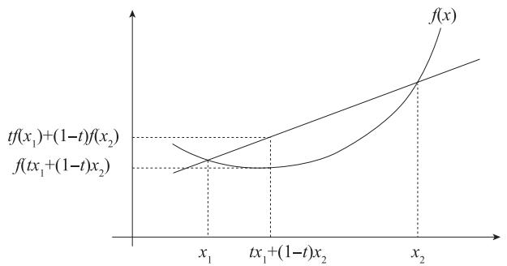  
图 13-6 凸函数示意图

由图 13-6 可知，凸函数任意两点的割线位于函数图形上方，这也是 Jensen 不等式的两点形式。

对于任意属于 S 中数据集 $\left\{ x _ { i } \right\}$ ，如 $a _ { i } \geqslant 0$ 且 $\sum _ { i = 1 } ^ { m } a _ { i } = 1$ ，则利用归纳法可以证明凸函数 $f ( x )$ 满足

$$
f \sum_ {i} ^ {m} a _ {i} x _ {i} \leqslant \sum_ {i} ^ {m} a _ {i} f \left(x _ {i}\right) \tag {13.20}
$$

式（13.20）就是 Jensen 不等式，是式（13.19）的两点到 $m$ 个点的一个推广。如果 $f ( x )$ 是凹函数，只需将不等式反号即可。

如果把 $x$ 作为随机变量， $p \big ( x = x _ { i } \big ) = a _ { i }$ 是 $x$ 的概率分布，Jensen 不等式可表示为

$$
E (X) = \sum_ {i} ^ {m} x _ {i} a _ {i}
$$

$$
f (E (X)) \leqslant E (f (X)) \tag {13.21}
$$

如果函数 $f ( x )$ 为严格凸函数，当且仅当随机变量 $x$ 是常数，即 $x _ { 1 } = x _ { 2 } = \cdots = x _ { m }$ 时，式（13.21）中的不等式取等号，即有

$$
f (E (X)) = E (f (X))
$$

Jensen 不等式可用归纳法证明，这里就不展开说明了。

# 13.2.6 随机变量的数字特征

在机器学习、深度学习中经常需要分析随机变量的数字特征及随机变量间的关系等，对于这些指标的衡量在概率统计中有相关的内容，如用来衡量随机变量的取值大小的期望值或平均值、衡量随机变量数据离散程度的方差、揭示随机向量间关系的协方差等。

# 1. 数学期望

数学期望是平均值的推广，是加权平均值的抽象。对于随机变量，期望是在概率意义下的均值。普通的均值没有考虑权重或概率，对于 $n$ 个变量 $x _ { 1 } , x _ { 2 } , \cdots , x _ { n }$ ，它们的算术平均值为

$$
\frac {x _ {1} + \cdots + x _ {n}}{n} = \frac {1}{n} \sum_ {i = 1} ^ {n} x _ {i}
$$

这意味着变量取每个值的可能性相等，或每个取值的权重相等。但在实际生活中，变量的每个取值存在不同的权重或概率，因此计算平均值这种统计方式太简单，无法刻画变量的性质。如何更好地刻画随机变量的性质？使用变量的数据期望效果更好，变量的数学期望是一种带概率（或权重）的均值。

首先我们看随机变量的数学期望的定义。

对于离散型随机变量 $X$ ，设其分布律为

$$
P (X = x _ {k}) = p _ {k}, k = 1, 2, 3, \dots \tag {13.22}
$$

若级数 $\sum _ { k = 1 } ^ { \infty } x _ { k } p _ { k }$ 绝对收敛，则称级数 $\sum _ { k = 1 } ^ { \infty } x _ { k } p _ { k }$ 的值为随机变量 $X$ 的数学期望，记为

$$
E (X) = \sum_ {k = 1} ^ {\infty} x _ {k} p _ {k} \tag {13.23}
$$

对于连续型随机变量 $X$ ，设其概率密度函数为 $f ( x )$ ，若积分

$$
\int_ {- \infty} ^ {\infty} x f (x) d x \tag {13.24}
$$

绝对收敛，则积分的值称为随机变量 $X$ 的数学期望，记为

$$
E (X) = \int_ {- \infty} ^ {\infty} x f (x) d x \tag {13.25}
$$

如果是随机变量函数，如随机变量 $X$ 的 $g ( x )$ 的期望，公式与式（13.24）或式（13.25）类似，只要把 $x$ 换成 $g ( x )$ 即可，即随机变量函数 $g ( x )$ 的期望计算如下。

设 $Y { = } g ( X )$ ，则

$$
E (Y) = E (g (X)) = \sum_ {k = 1} ^ {\infty} g \left(x _ {k}\right) p _ {k}
$$

或 $E ( g ( X ) ) { = } \int _ { - { \infty } } ^ { \infty } g \left( x \right) f \left( x \right) { \mathrm { d } } x$

期望有一些重要性质，具体如下。

设 $^ { a , b }$ 为常数， $X$ 和 $Y$ 是两个随机变量，则有

1） $E ( a ) { = } a$ ；  
2） $E ( a X ) { = } a E ( X )$ ；  
3） $E ( a X + b Y ) = a E ( X ) + b E ( Y )$ ；  
4）当 $X$ 和 $Y$ 相互独立时，有 $E ( X Y ) { = } E ( X ) E ( Y )$

数学期望也常称为均值，即随机变量取值的平均值之意，当然，这个平均是指以概率为权的加权平均。期望值可大致描述数据的大小，但无法描述数据的离散程度，这里我们介绍一种刻画随机变量在其中心位置附近离散程度的数字特征—方差。

# 2. 方差与标准差

假设随机向量 $X$ 有均值 $E ( X ) { = } a$ 。试验中， $X$ 取的值当然不一定恰好是 $a$ ，可能会有所偏离。偏离的量 $X { - } a$ 本身也是一个随机变量。如果我们用 $X { - } a$ 来刻画随机变量 $X$ 的离散程度，不能取 $X { - } a$ 的均值，因为 $E ( X { - } a ) { = } 0$ ，说明正负偏离抵消了。取 $| X { - } a |$ 可以防止正负偏离抵消的情况，但绝对值在实际运算时很不方便。人们考虑了另一种方法，先对 $X { - } a$ 进行平方以消去符号，然后再取平均得 $E ( X { - } a ) ^ { 2 }$ 或 $E ( X { - } E X ) ^ { 2 }$ 把它作为度量随机变量 $X$ 的取值的离散程度衡量，这个量就叫作 $X$ 的方差（即差的方）。随机变量的方差记为

$$
\operatorname {v a r} (X) = E \left(X - E (X)\right) ^ {2}
$$

方差的平方根被称为标准差，即 $\sigma = { \sqrt { \operatorname { v a r } \left( X \right) } }$

根据方差的定义不难得到

$$
\operatorname {v a r} (X) = E \left(X ^ {2}\right) - E (X) ^ {2}
$$

$$
\operatorname {v a r} (k X) = k ^ {2} \operatorname {v a r} (X)
$$

# 3. 协方差

对于多维随机向量，如二维随机向量 $( X , Y )$ ，如何刻画这些分量间的关系？显然均值、方差都无能为力，这里我们引入协方差的定义。我们知道方差是 $X { - } E ( X )$ 乘以 $X { - } E ( X )$ 的均值，如果我们把其中一个换成 $Y { \mathrm { - } } E ( Y )$ ，就得到 $E ( X { - } E ( X ) ) ( Y { - } E ( Y ) )$ ，其形式接近方差，又有X,Y 两者的参与，由此得出协方差的定义：随机变量 $X , Y$ 的协方差

$$
\operatorname {C o v} (X, Y) = E (X - E (X)) (Y - E (Y))
$$

协方差的另一种表达方式为

$$
\operatorname {C o v} (X, Y) = E (X Y) - E (X) E (Y)
$$

方差可以用来衡量随机变量与均值的偏离程度或随机变量取值的离散度，而协方差则可衡量随机变量间的相关性强度。如果 $X$ 与 Y 独立，那么它们的协方差为 0。反之，并不一定成立，独立性比协方差为 0 的条件更强。不过如果随机变量 X,Y 都是正态分布，此时独立和协方差为 0 是同一个概念。

协方差为正，表示随机变量 X,Y 为正相关；协方差为负，表示随机变量 X,Y 为负相关。

为了更好地衡量随机变量间的相关性，我们一般使用相关系数。相关系数将每个变量的贡献进行归一化，使其只衡量变量的相关性而不受各变量尺寸大小的影响。相关系数的计算公式如下：

$$
\rho_ {X Y} = \frac {\operatorname {C o v} (X , Y)}{\sqrt {\operatorname {V a r} (X)} \sqrt {\operatorname {V a r} (Y)}} \tag {13.26}
$$

由式（13.26）可知，相关系数在协方差的基础上进行了归一化，从而把相关系数的值限制在 [-1,1] 之间。如果 $\rho _ { x y } { = } 1$ ，说明随机变量 $X , Y$ 是线性相关的，即可表示为 $Y { = } k X { + } b$ ，其中 $^ { k , b }$ 为任意实数，且 $k { > } 0$ ；如果 $\rho _ { x y } { = } { - } 1$ ，说明随机变量 $X , Y$ 是负线性相关的，即可表示为 $Y { = } { \mathrm { - } } k X { + } b$ ，其中 $k { > } 0$ 。

上面我们主要以两个随机变量为例进行介绍，实际上协方差可以推广到 $n$ 个随机变量或$n$ 维随机向量的情况。对 $n$ 维的随机向量，可以得到一个 $n \times n$ 的协方差矩阵，而且满足：

1）协方差矩阵为对称矩阵，即 $\mathrm { C o v } ( X _ { i } , X _ { j } ) { = } \mathrm { C o v } ( X _ { j } , X _ { i } )$ ；  
2）协方差矩阵的对角元素为方差，即 $\operatorname { C o v } ( X _ { i } , X _ { i } ) { = } \operatorname { V a r } ( X _ { i } )$ 。

# 13.2.7 随机变量函数的分布

# 1. 一维随机变量函数的分布

随机变量函数是以随机变量为自变量的函数，它将一个随机变量映射成另一个随机变量，二者一般有不同的分布。

定理：设随机变量 $X$ 具有概率密度 $f _ { X } ( x )$ ， $- \infty < x < \infty$ ，关于 $X$ 的函数

$$
Y = g (X)
$$

且函数 $g \left( x \right)$ 处处可导， $g ^ { \prime } ( x ) > 0$ 或 $g ^ { \prime } ( x ) < 0$ ，反函数存在， $g \left( x \right)$ 的反函数 $ g ^ { - 1 } ( x ) = h ( x )$ ，则 Y是连续型随机变量，其概率密度为

$$
f _ {Y} (y) = f (x) = \begin{array}{l l} f _ {X} (h (y)) | h ^ {\prime} (y) |, & \alpha <   y <   \beta \\ 0, & \text {其 他} \end{array}
$$

其中， $\alpha = \operatorname* { m i n } \left\{ g \left( - \infty \right) , g \left( \infty \right) \right\} , \ \beta = \operatorname* { m a x } \left\{ g \left( - \infty \right) , g \left( \infty \right) \right\} \circ$

证明：当 ${ g ^ { \prime } } ^ { ( x ) } > 0$ 时，设随机变量 $X , Y$ 的分布函数分别为 $F _ { \scriptscriptstyle X } \left( x \right) , F _ { \scriptscriptstyle Y } \left( y \right)$ ，先求随机变量 Y的分布函数 $F _ { _ Y } \left( y \right)$ 。

$$
F _ {Y} (y) = p (Y \leqslant y) = p (g (X) \leqslant y) = p (X \leqslant g ^ {- 1} (y)) = F _ {X} (h (y)) = \int_ {- \infty} ^ {h (y)} f _ {X} (x) d x
$$

即有

$$
F _ {Y} (y) = F _ {X} (h (y))
$$

对该函数求导得随机变量 Y 的密度函数

$$
f _ {Y} (y) = \left(\int_ {- \infty} ^ {h (y)} f _ {X} (x) d x\right) ^ {\prime} = f _ {X} (h (y)) h ^ {\prime} (y)
$$

当 $g ^ { \prime } { \bigl ( } x { \bigr ) } < 0$ 时，

$$
\begin{array}{l} F _ {Y} (y) = p (Y \leqslant y) = p (g (X) \leqslant y) = p (X \geqslant g ^ {- 1} (y)) = 1 - F _ {X} (h (y)) \\ = 1 - \int_ {- \infty} ^ {h (y)} f _ {X} (x) d x \\ \end{array}
$$

对该函数求导得随机变量 Y 的密度函数

$$
f _ {Y} (y) = \left(1 - \int_ {- \infty} ^ {h (y)} f _ {X} (x) d x\right) ^ {\prime} = - f _ {X} (h (y)) h ^ {\prime} (y)
$$

综合两种情况，有

$$
f _ {Y} (y) = f _ {X} (h (y)) \left| h ^ {\prime} (y) \right| \tag {13.27}
$$

例：假设 $X \sim N \left( 0 , 1 \right)$ ，则随机变量 $Y = \sigma X + \mu$ 服从正态分布 $N \left( \mu , \sigma ^ { 2 } \right)$ 。

证明：

$Y { = } \sigma X { + } \mu$ 的反函数为

$$
X = \frac {Y - \mu}{\sigma}
$$

反函数的导数为

$$
\frac {\mathrm {d} X}{\mathrm {d} Y} = \frac {1}{\sigma}
$$

根据式（13.27）可得，随机变量 Y 的密度函数为

$$
f _ {Y} (y) = \frac {1}{\sqrt {2 \pi}} \mathrm {e} ^ {- \frac {\left(\frac {y - \mu}{\sigma}\right) ^ {2}}{2}} \frac {1}{\sigma} = \frac {1}{\sqrt {2 \pi} \sigma} \mathrm {e} ^ {- \frac {(y - \mu) ^ {2}}{2 \sigma^ {2}}}
$$

由此可得，随机变量 $Y$ 服从正态分布 $N \left( \mu , \sigma ^ { 2 } \right)$ 。

用类似的方法可证明其反结论：

假设 $X \sim N \left( \mu , \sigma ^ { 2 } \right)$ ，则随机变量 $Y = { \frac { X - \mu } { \sigma } }$ X - μ 服从正态分布N (0,1)。 $N \big ( 0 , 1 \big )$

此外，正态分布具有可加性，即如果 $X \sim N \big ( \mu _ { 1 } , \sigma _ { 1 } ^ { 2 } \big ) , Y \sim N \big ( \mu _ { 2 } , \sigma _ { 2 } ^ { 2 } \big )$ ，且 $X$ 与 $Y$ 独立，则$X + Y \sim N \left( \mu _ { 1 } + \mu _ { 2 } , \sigma _ { 1 } ^ { 2 } + \sigma _ { 2 } ^ { 2 } \right) \circ$

这个结论可以推广到 $n$ 个互相独立的随机变量的情况。

# 2. 二维随机变量函数的分布

设二维随机变量 $( X , Y )$ 的联合密度函数为 $\cdot f \left( x , y \right)$ ，若函数 $\begin{array} { c } { { u = g _ { 1 } \left( x , y \right) } } \\ { { \nu = g _ { 2 } \left( x , y \right) } } \end{array}$ 有连续的偏导数，且存在唯一的反函数 $\begin{array} { l } { x = h _ { 1 } \left( u , \nu \right) } \\ { y = h _ { 2 } \left( u , \nu \right) } \end{array} ,$ 该变换的雅可比行列式

$$
J = \frac {\partial (x , y)}{\partial (u , v)} = \left| \begin{array}{c c} \frac {\partial x}{\partial u} & \frac {\partial x}{\partial v} \\ \frac {\partial y}{\partial u} & \frac {\partial y}{\partial v} \end{array} \right|
$$

若 $\begin{array} { c } { { U = g _ { 1 } \left( X , Y \right) } } \\ { { \ } } \\ { { V = g _ { 2 } \left( X , Y \right) } } \end{array}$ ， 则随机变量 (U,V) 的联合概率密度为

$$
f _ {U, V} (u, v) = f _ {X, Y} \left(h _ {1} (u, v), h _ {2} (u, v)\right) | J |
$$

其中， $| J |$ 为雅可比行列式的绝对值。

# 3. 重参数化技巧

重参数化技巧的典型应用场景是具有随机性的变分推断模型，其中概率分布通常由编码器网络生成。在传统的变分推断中，我们需要通过采样的方式从概率分布中取样，然后进行计算和优化。然而，这种采样过程通常是不可导的，使得梯度计算和优化困难。

重参数化技巧通过将采样操作转换为对一个固定噪声源的变换，实现了可微分采样过程。具体操作是，将随机性的操作分解为两个步骤：首先，从一个标准分布（如高斯分布）中采样固定的随机噪声 $\varepsilon$ ；然后，通过一个可微分的函数将这个噪声 $\varepsilon$ 映射为我们所需要

的概率分布的随机样本。如令 $z \sim p \big ( z | x \big ) = \mathcal { N } \big ( \mu , \sigma ^ { 2 } \big )$ ，则 $z$ 可以重参数化为 $z = \mu + \sigma \epsilon$ ，其中$\epsilon \sim \mathcal { N } \mathopen { } \mathclose \bgroup \left( 0 , I \aftergroup \egroup \right)$ 。这样，我们可以直接对这个映射函数进行梯度计算，从而实现对参数的优化。

重参数化技巧的优势主要体现在两个方面。首先，它使得梯度计算更加容易和高效，因为我们不再需要对随机变量的采样过程进行求导，而是对确定性的映射函数进行求导。其次，重参数化技巧可以提高模型的稳定性，因为通过对固定噪声源的采样，我们可以保证每次训练过程中得到的随机样本是一致的。

重参数化技巧通过将随机性操作转化为固定噪声的变换，实现可微分的采样过程，提高了深度学习中对具有随机性操作的模型的训练效果和效率。重参数化技巧在生成式模型中应用广泛，如 VAE 和 DDPM 中都大量使用了该技巧。

# 4. 高斯混合模型

高斯混合模型（Gaussian Mixed Model，GMM）指的是多个高斯分布函数的线性组合，其概率密度函数定义为

$$
p (\boldsymbol {x}) = \sum_ {i = 1} ^ {K} \omega_ {i} N (\boldsymbol {x} | \boldsymbol {\mu} _ {i}, \boldsymbol {\Sigma} _ {i})
$$

其中， $\boldsymbol { x }$ 为随机向量， $K$ 为高斯分布的数量， $\omega _ { i }$ 为选择第 $i$ 个高斯分布的概率（或权重）， $\pmb { \mu } _ { i } , \pmb { \Sigma } _ { i }$ 分别为第i个高斯分布的均值向量、方差矩阵。选择第 $i$ 个高斯分布的 $\omega _ { i }$ 满足概率的规范：

$$
\omega_ {i} \geqslant 0, \sum_ {i = 1} ^ {K} \omega_ {i} = 1
$$

理论上，GMM 可以拟合出任意类型的分布，图 13-7 为一维 GMM 的概率密度函数图像，该概率密度函数为 3 个高斯分布线性组合，具体表达式为

$$
p (x) = 0. 2 N \left(X \mid 1. 0, 1. 5 ^ {2}\right) + 0. 3 N \left(X \mid 2. 0, 1. 0 ^ {2}\right) + 0. 5 N \left(X \mid 3. 0, 1. 5 ^ {2}\right)
$$

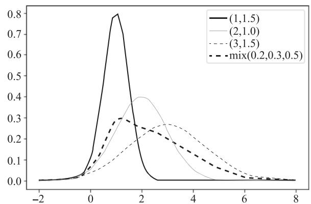  
图 13-7 一维 GMM 的概率密度函数图像

可以说，任何一个数据的分布都可以看作若干个高斯分布的叠加，如图 13-8 所示。

  
图 13-8 GMM

如图 13-8 所示，如果 $P ( X )$ 代表一种分布的话，则存在一种拆分方法能让它表示成图中若干浅色曲线对应的高斯分布的叠加。这种拆分方法已经证明，当拆分的数量达到一定数量（如 512 或更大）时，其叠加的分布相对于原始分布而言误差非常小。

GMM 在生成模型中应用广泛，如 VAE 中隐变量的分布。它通常用于解决同一集合下的数据包含多个不同的分布的情况（或者是同一类分布但参数不一样，或者是不同类型的分布等情况）。图 13-9 所示为由 2 个高斯分布得到二维 GMM 生成的 2 类样本。

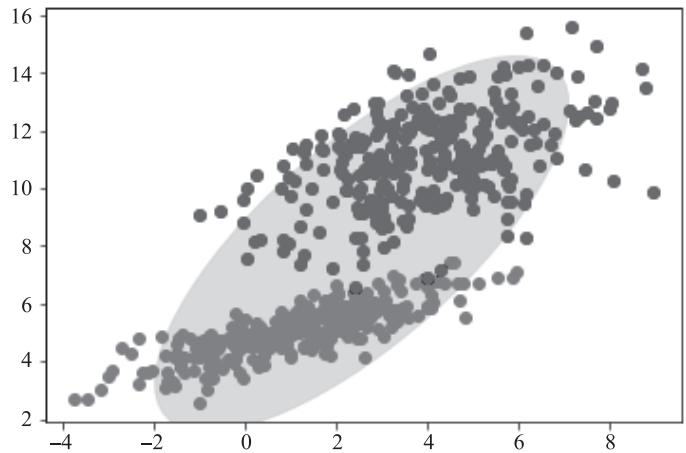  
图 13-9 二维 GMM 生成的样本

由图 13-9 可知，很多数据集可以看成 GMM 生成的样本数据，因此，我们可以反过来，根据已知样本数据推导出产生样本数据背后的 GMM。这方面的应用非常广泛，如基于GMM 的聚类算法就是典型案例之一。

$k$ 均值（ $k$ -means）算法是聚类算法的代表，其主要思路如下：

1）选择 $k$ 个类族中心；  
2）计算各点到各类族中心的距离，将样本点划分到最近的类簇中心；  
3）重新计算 $k$ 个类族中心；

# 4）不断迭代直至收敛。

不难发现，这个过程和 EM 迭代的方法极其相似。事实上，若将样本的类族数看作隐变量 Z，将类族中心看作样本的分布参数 $\theta$ ，则 $k$ -means 就是通过 EM 算法来进行迭代的。

与这里不同的是， $k$ -means 的目标是最小化样本点到其对应类族中心的距离之和，基于GMM 的聚类方法将采用极大化似然函数的方法估计模型参数。

如何计算 GMM 的参数呢？这里我们像单个高斯模型那样使用极大似然法，因为对于每个观测数据点来说，事先并不知道它属于哪个子分布（属于哪个分布，属于隐变量），因此似然函数中的对数里面还有求和，对于每个子模型都有未知的参数 $\omega _ { i } , \pmb { \mu } _ { i } , \pmb { \Sigma } _ { i }$ ，这就是 GMM参数估计的问题。要解决这个问题，直接求导无法计算，可以通过迭代的 EM 算法求解。

# 5. 各向同性的高斯分布

各向同性的高斯分布（球形高斯分布）指的是各个方向方差都一样的多维高斯分布，协方差为正实数与单位矩阵（identity matrix）相乘。因为高斯分布的圆对称性（circularsymmetry），只需让每个轴上的长度一样就能得到各向同性，也就是说分布密度值仅与点到均值的距离相关，而与方向无关。

各向同性的高斯分布每个维度之间是互相独立的，因此密度方程可以写成几个一维高斯乘积的形式。需要注意的是，几个高斯分布相乘可以得到各向同性，但几个拉普拉斯分布相乘就得不到各向同性。

各向同性高斯分布的参数个数随维度呈线性增加，只有均值在增加，而方差是一个标量，因此对计算和存储量的要求不大，使用比较方便。其表达式为

$$
f \left(x _ {1}, x _ {2}, \dots , x _ {n}\right) = \frac {\exp - \frac {1}{2} \left(X - \boldsymbol {\mu}\right) ^ {\mathrm {T}} \boldsymbol {\Sigma} ^ {- 1} \left(X - \boldsymbol {\mu}\right)}{\sqrt {\left(2 \pi\right) ^ {k} | \boldsymbol {\Sigma} |}}
$$

其中， $\scriptstyle \sum = \sigma I$ ，I为单位阵， $\pmb { \sigma }$ 为标量。

对应的图像如图 13-10 所示。

  
图 13-10 各向同性的高斯分布

# 13.3 信息论

信息论是应用数学的一个分支，主要研究的是如何对信号所含的信息进行量化。它的基本想法是发生一个不太可能发生的事件，提供的信息要比发生一个非常可能发生的事件多。本节主要介绍度量信息的几种常用指标。

# 13.3.1 信息量

1948 年，克劳德·香农（Claude Shannon）在其论文《通信的数学理论》中首次对通信过程建立了数学模型，这篇论文和 1949 年发表的另一篇论文一起奠定了现代信息论的基础。信息量是信息论中度量信息多少的一个物理量，它从量上反映具有确定概率的事件发生时所传递的信息。香农把信息看作“一种消除不确定性”的量，而概率正好是表示随机事件发生的可能性大小的量，因此，可以用概率来定量地描述信息。

在实际运用中，信息量常用概率的负对数来表示，即 $I { = } { - } \log _ { 2 } p$ 。对此，可能有人会问：“为何要用对数，前面还要带上负号？”

用对数表示是为了计算方便。因为直接用概率表示，在求多条信息总共包含的信息量时要用乘法，而对数可以变求积为求和。另外，随机事件的概率总是小于 1，而真数小于 1的对数是负的，在概率的对数之前冠以负号，其值便成为正数。这样，通过消除不确定性，获取的信息量总是正的。

# 13.3.2 信息熵

信息熵（entropy）简称熵，是对随机变量不确定性的度量。熵的概念由鲁道夫·克劳修斯（Rudolf Clausius）于 1850 年提出，并应用在热力学中。1948 年，香农第一次将熵的概念引入信息论中，因此它又称为香农熵。

用熵来评价整个随机变量 $X$ 平均的信息量，而平均最好的量度就是随机变量的期望，即熵的定义如下：

$$
H (X) = - \sum_ {i = 1} ^ {n} p _ {i} \log_ {2} p _ {i}
$$

这里假设随机变量 $X$ 的概率分布为 $P ( X { = } x _ { i } ) { = } P _ { i } ( i { = } 1 , 2 , 3 , \cdots , n )$ ，信息熵越大，包含的信息就越多，那么随机变量的不确定性就越大。下面我们通过实例进一步说明这个关系。

假设随机变量 $X$ 服从 0-1 分布，其概率分布为

$$
P (X = 1) = p, P (X = 0) = 1 - p
$$

这时， $X$ 的熵为

$$
H (X) = - p \log_ {2} p - (1 - p) \log_ {2} (1 - p)
$$

概率 $p$ 与 $H ( X )$ 的关系如图 13-11 所示。

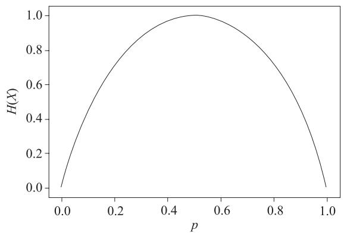  
图 13-11 概率与信息熵

从图 13-11 可以看出，当概率为 0 或 1 时， $H ( X )$ 为 0，说明此时随机变量没有不确定性，当 $p { = } 0 . 5$ 时，随机变量的不确定性最大，即信息量最大， $H ( X )$ 此时取最大值。

# 13.3.3 条件熵

设二维随机变量 (X,Y) 的联合概率分布为

$$
P (X = x _ {i}, Y = y _ {j}) = p _ {i j}, i = 1, 2, \dots , n, j = 1, 2, \dots , m
$$

条件熵 $H ( Y | X )$ 表示在已知随机变量 $X$ 的条件下，随机变量 Y 的不确定性，它的计算公式为

$$
H (Y | X) = - \sum_ {i = 1} ^ {n} \sum_ {j = 1} ^ {m} p (X = x _ {i}, Y = y _ {j}) x \log p (Y = y _ {j} | X = x _ {i})
$$

注意，这个条件熵不是指随机变量 $X$ 在给定某个数的情况下另一个变量的熵是多少，变量的不确定性是多少，而是期望。因为条件熵中 $X$ 也是一个变量，意思是在一个变量 $X$ 的条件下（变量 $X$ 的每个值都会取），另一个变量 $Y$ 熵对 $X$ 的期望。

条件熵比熵多了一些背景知识，按理说条件熵的不确定性小于熵的不确定性，即$H ( Y | X ) { \leqslant } H ( Y )$ ，事实也是如此，下面这个定理有力地说明了这一点。

定理：对二维随机变量 (X,Y)，条件熵 $H ( Y | X )$ 和信息熵 $H ( Y )$ 满足如下关系：

$$
H (Y | X) \leqslant H (Y)
$$

# 13.3.4 互信息

互信息（mutual information）又称为信息增益，用来评价一个事件的发生对于另一个事件的发生所贡献的信息量，记为

$$
I (X, Y) = H (Y) - H (Y \mid X)
$$

在决策树的特征选择中，信息增益为主要依据。给定训练数据集 $D$ ，假设该数据集由 $n$

维特征构成，在构建决策树时，有一个核心问题是，选择哪个特征来划分该数据集能使划分后的纯度最大。一般而言，信息增益越大，意味着使用某属性 $a$ 来划分所得纯度提升越大。因此，我们常用信息增益来构建决策树划分属性。

# 13.3.5 KL 散度

KL 散度（Kullback-Leibler Divergence，KLD）又称相对熵（relative entropy），是信息论中一个用来衡量两个概率分布之间差异的指标。这里我们假设 $p ( x )$ 和 $q ( x )$ 是 $X$ 取值的两个概率分布，如 $p ( x )$ 表示 $X$ 的真实分布， $q ( x )$ 表示 $X$ 的训练分布或预测分布，则 $p$ 对 $q$ 的相对熵为

$$
\operatorname {K L} (p (x) | | q (x)) = \sum_ {x \in X} p (x) \log_ {2} \frac {p (x)}{q (x)}
$$

相对熵有以下重要性质：

1）相对熵不是传统意义上的距离，它没有对称性，即

$$
\operatorname {K L} (p (x) | | q (x)) \neq \operatorname {K L} (q (x) | | p (x))
$$

2）当预测分布 $q ( x )$ 与真实分布 $p ( x )$ 完全相等时，相对熵为 0。  
3）如果两个分布差异越大，那么相对熵也越大；反之，如果两个分布差异越小，那么相对熵也越小。  
4）相对熵满足非负性，即 $\mathrm { K L } ( p ( x ) | | q ( x ) ) { \geqslant } 0$ 。

# 13.3.6 交叉熵

交叉熵（cross entropy）是一种衡量两个概率分布之间差异性的方式。在机器学习中，我们通常将交叉熵作为损失函数来衡量模型预测结果与真实结果之间的差距。具体来说，如果我们有一个真实分布 $p$ 和一个预测分布 $q$ ，那么它们之间的交叉熵可以表示为

$$
H (p, q) = - \sum_ {x} p (x) \log (q (x))
$$

或用数学期望表示为

$$
H (p, q) = - E _ {X \sim P (X)} \log (q (x))
$$

这是随机变量 $x$ 为离散型的情况，如果随机变量 $x$ 为连续型随机变量，只要把交叉熵中连加符号改为积分符号即可：

$$
H (p, q) = - \int_ {x} p (x) \log (q (x)) d x
$$

其中， $x$ 表示事件的可能取值， $p ( x )$ 表示真实分布中事件 $x$ 发生的概率， $q ( x )$ 表示模型预测出的事件 $x$ 发生的概率，log 表示以 2 为底的对数。交叉熵越小，表示模型的预测结果与真实结果之间的差距越小，模型的准确性就越高。

交叉熵可在神经网络（机器学习）中作为代价函数。若 $p$ 表示真实标记的分布， $q$ 为训练后模型的预测标记分布，则交叉熵代价函数可以衡量 $p$ 与 $q$ 的相似性。交叉熵作为代价函数还有一个好处是，使用 sigmoid 函数在梯度下降时能避免均方误差代价函数学习率降低的问题，因为学习率可以被输出的误差所控制。

例如：表 13-6 为两个离散型随机分布的概率值，计算它们的交叉熵。

表13-6 两个分布的概率值  

<table><tr><td>随机变量X</td><td>1</td><td>2</td><td>3</td><td>4</td></tr><tr><td>p</td><td>0.4</td><td>0.4</td><td>0.1</td><td>0.1</td></tr><tr><td>q</td><td>0.1</td><td>0.1</td><td>0.4</td><td>0.4</td></tr></table>

解：由交叉熵公式

$$
H (p, q) = - \sum_ {X = 1} ^ {4} p (x) \log q (x)
$$

可得

$$
H (p, q) = - 0. 4 \log 0. 1 - 0. 4 \log 0. 1 - 0. 1 \log 0. 4 - 0. 1 \log 0. 4 = 2. 9 1
$$

$$
H (p, p) = - 0. 4 \log 0. 4 - 0. 4 \log 0. 4 - 0. 1 \log 0. 1 - 0. 1 \log 0. 1 = 1. 8 7
$$

从这个简单实例可以看出， $H ( p , p ) { < } H ( p , q )$ ，即两个相同分布的差异程度要小于两个不同分布的差异程度。

# 1. 交叉熵与信息熵之间的关系

交叉熵和信息熵都是度量概率分布之间差异的指标，它们之间有一定的关系。在信息论中，我们使用信息熵来衡量随机变量的不确定性，它表示一个随机变量的平均信息量。而交叉熵则用来度量两个概率分布之间的差异，它越小，表示这两个分布越接近。具体来说，设 $p ( x )$ 为一个随机变量 $X$ 的真实分布， $q ( x )$ 为一个概率模型预测的分布，那么 $X$ 的信息熵可以定义为 $H ( X ) { = } { - } \varSigma _ { x } p ( x ) \mathrm { l o g } ( p ( x ) )$ ， $X$ 与 $q ( x )$ 的交叉熵可以定义为 $H ( p , q ) { = } { - } \mathcal { L } _ { x } p ( x )$ $\log ( q ( x ) )$ 。可以看到，当 $p$ 和 $q$ 相等时，交叉熵就等于信息熵。因此，在机器学习中，我们通常使用交叉熵作为损失函数来训练模型，以最小化模型预测分布与真实分布之间的距离，从而提高模型的准确性。

交叉熵的性质如下：

1）交叉熵是不对称的，即 $H \left( p , q \right) \neq H \left( q , p \right) \quad$ 。  
2）当 $p$ 为已知分布时，交叉熵在 $q$ 等于 $p$ 时达到最小值。

# 2. 极大似然估计与交叉熵

对于逻辑斯谛回归（logistic regression）、softmax 回归，根据极大似然估计可以推出它们的目标函数就是交叉熵。

# （1）逻辑斯谛回归

逻辑斯谛回归的预测函数为

$$
h (\boldsymbol {x}) = \frac {1}{1 + \mathrm {e} ^ {\left(- w ^ {\mathrm {T}} x + b\right)}}
$$

其中， $\boldsymbol { x }$ 为输入向量， $w$ 为权重参数， $b$ 为偏移量。 $w$ 和 $^ b$ 为模型参数，通过训练模型得到。

我们把 [1,x] 作为输入 $x$ ，把 $[ w , b ]$ 作为 $w$ ，上式就可简化为

$$
h (x) = \frac {1}{1 + e ^ {\left(- w ^ {T} x\right)}}
$$

这是正样本的预测概率，负样本的预测概率为 $1 - h ( x )$ ，这是一个伯努利分布，接下来我们利用极大似然估计确定模型参数 $w$ 。

给定训练样本集为 $\left( { \pmb x } _ { i } , y _ { i } \right)$ ， $i { = } 1 , 2 , \cdots , m , x _ { i }$ $\mathbf { \boldsymbol { x } } _ { i }$ 为 $n$ 维向量， $y _ { i }$ 为类别标签，取值为 1 或 0，样本属于每个类别的概率可表示为

$$
p (y | \boldsymbol {x}, \boldsymbol {w}) = (h (\boldsymbol {x})) ^ {y} (1 - h (\boldsymbol {x})) ^ {1 - y}
$$

由于样本独立同分布，训练样本集的似然函数为

$$
L (\boldsymbol {w}) = \prod_ {i = 1} ^ {m} p (y _ {i} | \boldsymbol {x} _ {i}, \boldsymbol {w}) = \prod_ {i = 1} ^ {m} (h (\boldsymbol {x} _ {i})) ^ {y _ {i}} (1 - h (\boldsymbol {x} _ {i})) ^ {1 - y _ {i}}
$$

对数似然函数为

$$
\ln L (\boldsymbol {w}) = \sum_ {i = 1} ^ {m} \ln p (y _ {i} | \boldsymbol {x} _ {i}, \boldsymbol {w}) = \sum_ {i = 1} ^ {m} y _ {i} \ln (h (\boldsymbol {x} _ {i})) + (1 - y _ {i}) (1 - h (\boldsymbol {x} _ {i}))
$$

极大似然估计是对数似然函数的极大值，实际等价于求其负值的极小值。

$$
f (\boldsymbol {w}) = - \sum_ {i = 1} ^ {m} \ln p (y _ {i} | \boldsymbol {x} _ {i}, \boldsymbol {w}) = - \sum_ {i = 1} ^ {m} y _ {i} \ln (h (\boldsymbol {x} _ {i})) + (1 - y _ {i}) (1 - h (\boldsymbol {x} _ {i}))
$$

这就是样本 $\boldsymbol { x }$ 的交叉熵。

# （2）softmax 回归

softmax 回归可以看成逻辑斯谛回归的扩展，用于解决多分类问题。给定训练样本集为$\left( { { x } _ { i } } , { { y } _ { i } } \right)$ ， $i { = } 1 , 2 , \cdots , m$ ， $\mathbf { \boldsymbol { x } } _ { i }$ 为 $n$ 维向量，类别数为 $c$ 。 $y _ { i }$ 为类别标签，把标签值转换为独热编码，即对应正类，取值为 1，其他都是 0，记 $y _ { i } = \lceil y _ { i 1 } , y _ { i 2 , } \cdots , y _ { i c \rfloor }$ ，样本属于每个类别的概率可表示为

$$
h _ {w} \left(x _ {i}\right) = \frac {1}{\sum_ {j = 1} ^ {c} \mathrm {e} ^ {w _ {j} ^ {\mathrm {T}} x _ {i}}} \begin{array}{l l} & \mathrm {e} ^ {w _ {1} ^ {\mathrm {T}} x _ {i}} \\ & \vdots \\ & \mathrm {e} ^ {w _ {c} ^ {\mathrm {T}} x _ {i}} \end{array}
$$

预测模型的分布为多项分布，多项分布为伯努利分布的推广，样本 $x _ { i }$ 预测模型为 $y _ { i }$ 的似然函数为

$$
p \left(y _ {i} \mid \boldsymbol {x} _ {i}, \boldsymbol {w}\right) = \prod_ {j = 1} ^ {c} \frac {\mathrm {e} ^ {\boldsymbol {w} _ {j} ^ {\mathrm {T}} \boldsymbol {x} _ {i}}}{\sum_ {k = 1} ^ {c} \mathrm {e} ^ {\boldsymbol {w} _ {k} ^ {\mathrm {T}} \boldsymbol {x} _ {i}}} ^ {y _ {i j}}
$$

两边取对数，得到对数似然函数

$$
\ln p \left(y _ {i} \mid x _ {i}, w\right) = \sum_ {j = 1} ^ {c} y _ {i j} \ln \frac {\mathrm {e} ^ {w _ {j} ^ {\mathrm {T}} x _ {i}}}{\sum_ {k = 1} ^ {c} \mathrm {e} ^ {w _ {k} ^ {\mathrm {T}} x _ {i}}}
$$

对整个样本集预测模型的对数似然函数为

$$
\sum_ {i = 1} ^ {m} \ln p (y _ {i} | \boldsymbol {x} _ {i}, \boldsymbol {w}) = \sum_ {i = 1} ^ {m} \sum_ {j = 1} ^ {c} y _ {i j} \ln \frac {\mathrm {e} ^ {\boldsymbol {w} _ {j} ^ {\mathrm {T}} \boldsymbol {x} _ {i}}}{\sum_ {k = 1} ^ {c} \mathrm {e} ^ {\boldsymbol {w} _ {k} ^ {\mathrm {T}} \boldsymbol {x} _ {i}}}
$$

对对数似然函数求最大值等价于对下列目标函数求极小值：

$$
L (\boldsymbol {w}) = - \sum_ {i = 1} ^ {m} \ln p (y _ {i} | \boldsymbol {x} _ {i}, \boldsymbol {w}) = - \sum_ {i = 1} ^ {m} \sum_ {j = 1} ^ {c} y _ {i j} \ln \frac {\mathrm {e} ^ {\boldsymbol {w} _ {j} ^ {\mathrm {T}} \boldsymbol {x} _ {i}}}{\sum_ {k = 1} ^ {c} \mathrm {e} ^ {\boldsymbol {w} _ {k} ^ {\mathrm {T}} \boldsymbol {x} _ {i}}}
$$

上式也是样本 $x$ 的交叉熵。这里标签 $y$ 与 $\boldsymbol { x }$ 都视为多项分布。

# 3. 机器学习如何学习

机器学习的过程就是在训练数据集上使模型分布不断与真实分布靠近。如何描述两个分布的远近？可以使用 KL 散度或交叉熵来衡量。

通过交叉熵可以很好地描述预测模型与实际标签之间的差异程度。真实分布是一种理想状态，在实际环境中，真实分布很难得到，我们一般将训练数据的分布作为真实分布。因此，机器学习的目的就是使模型分布不断接近实际标签的分布。

# 4. 交叉熵为何可作为损失函数

最小化模型分布 $p ( x )$ 与训练数据上的分布 $q ( x )$ 的差异等价于最小化这两个分布间的KL 散度，即最小化 ${ \mathrm { K L } } ( p ( x ) | | q ( x ) )$ 。

在实际使用时， $p ( x )$ 分布对应训练数据的实际分布，如对于一个类别总数为 3 的样本空间，其实际标签分布为 $p _ { 1 } { = } [ 1 , 0 , 0 ]$ ， $p _ { 2 } { = } [ 0 , 1 , 0 ]$ ， $p _ { 3 } { = } [ 0 , 0 , 1 ]$ 。故其分布是给定的，即 $H ( X )$ 是固定不变，从而求 ${ \mathrm { K L } } ( p ( x ) | | q ( x ) )$ 可简化为求交叉熵。所以，交叉熵可以用于计算学习模

型的分布与训练数据分布之间的不同。当交叉熵最低（等于训练数据分布的熵）时，我们就学到了“最好的模型”。

由此可知，KL 散度可以被用于计算代价，而在特定情况下最小化 KL 散度等价于最小化交叉熵。而交叉熵的运算更简单，所以将交叉熵当作代价。

# 13.3.7 JS 散度

JS（Jensen-Shannon）散度是一种用于衡量两个概率分布之间差异的指标。对于两个概率分布 $P ( x )$ 和 $Q ( x )$ ，JS 散度的定义如下： $\mathrm { J S } ( P \parallel Q ) = ( 1 / 2 ) \mathrm { K L } ( P \parallel M ) + ( 1 / 2 ) \mathrm { K L } ( Q \parallel M ) .$ ，其中 $M = \left( P + Q \right) / 2$ 是 $P$ 和 $Q$ 的平均分布， $\operatorname { K L } ( P \parallel Q )$ 是 KL 散度。由于 JS 散度同时包含了 $P$ 到 $M$ 和 $Q$ 到 $M$ 的 KL 散度，因此可以看作 $P$ 和 $Q$ 之间的平均散度。

JS 散度具有以下特点。

1）非负性：JS 散度始终大于或等于 0，并且只有当 $P$ 和 $Q$ 完全相同时才为 0。  
2）对称性：JS 散度是对称的，即 $\operatorname { J S } ( P \parallel Q ) = \operatorname { J S } ( Q \parallel P )$ 。  
3）近似性：JS 散度能够在不引入数值稳定性问题的情况下进行计算，并且能够有效地评估两个分布之间的差异。

# 13.3.8 Wasserstein 距离

Wasserstein 距离又叫推土机（Earth-Mover，EM）距离，定义如下：

$$
W \left(p _ {r}, p _ {g}\right) = \inf  _ {\gamma \sim \Pi \left(p _ {r}, p _ {g}\right)} E _ {(x, y) \sim \gamma} \left\lceil \| x - y \| \left. \right\rfloor
$$

Wasserstein 距离和 KL 散度都是概率分布之间的距离度量方式，它们的适用场景有所不同。Wasserstein 距离主要应用于两个分布之间的比较，而且在应用过程中存在着一定的优势和限制条件。具体适用场景如下：

1）两个分布具有不同的支撑集，即两个分布具有不同的取值范围和概率密度分布图形。  
2）两个分布之间的 KL 散度无法计算或计算困难。  
3）两个分布之间的比较具有鲁棒性，并且在计算机视觉等领域有着广泛的应用。

相对于 Wasserstein 距离，KL 散度主要用于度量两个概率分布之间的相似性或差异性，用于衡量一个概率分布在平均信息量上和另一个概率分布的差异。具体适用场景如下：

1）用于对比两个概率分布的相似程度或差异程度。  
2）通常在监督学习中用于度量模型的输出与真实分布之间的差异。

总的来说，Wasserstein 距离更适用于两个具有不同支撑集分布之间的距离度量，而 KL散度更适用于同一支撑集内的概率分布之间的距离度量。

支撑集指的是概率分布中非零概率对应的取值范围。不同支撑集分布指的是两个概率分布分别在不同的取值范围内具有非零概率分布的情况，而同一支撑集指的是两个概率分布在相同的取值范围内具有非零概率分布的情况。

例如，假设要比较两个图像数据集的分布，第一个数据集包含像素值在 $0 { \sim } 2 5 5$ 范围内的像素，而第二个数据集包含像素值在 $0 \sim 1$ 范围内的像素。这是一个不同支撑集分布的情况，因为它们的支撑集不同。如果两个数据集中的像素值都在 $0 { \sim } 2 5 5$ 范围内，那么这就是同一支撑集内的分布比较。

# 13.3.9 困惑度

困惑度（perplexity）是用来衡量一个概率模型的预测能力如何与实际观测数据相符的指标。在自然语言处理领域中，困惑度通常用于衡量语言模型的性能。

# （1）困惑度算法的原理

困惑度通过度量模型对观测数据的预测能力来评估模型的不确定性。较低的困惑度表示模型能够更好地预测观测数据，具有更高的预测准确性。具体来说，对于一个给定的观测序列，困惑度的计算基于模型对该序列的预测概率。算法首先将观测序列的每个元素输入模型，根据模型的输出计算每个元素的条件概率。然后，将这些条件概率取对数并将其加和，最后使用指数函数将其转换回概率的形式。计算出来的概率即为预测概率。最后，通过将预测概率取倒数并取对数，得到困惑度的值。

# （2）困惑度的应用场景

困惑度作为评估模型预测能力的指标，广泛应用于自然语言处理领域，特别是语言模型的评估。在语言模型的训练过程中，困惑度常常被用于优化目标函数或判断模型的训练效果。在测试阶段，困惑度常用于比较不同模型的性能，选择最佳的语言模型。

困惑度的计算公式如下：

$$
\text {P e r p l e x i t y} = \exp \left(- \left. \left\lceil \sum \left(\log p \left(x _ {i}\right)\right) / N \right\rceil\right)\right.
$$

其中， $p ( x _ { i } )$ 是模型对观测序列中第 i 个元素的预测概率， $N$ 是观测序列的长度。 $\sum \left( \log p \left( x _ { i } \right) \right)$ 表示对所有观测元素的预测概率的对数求和。

需要注意的是，困惑度的值越小，表示模型的预测能力越好。因此，通常会选择困惑度最小的模型作为最优模型。困惑度也可以用来衡量两个分布之间差异，困惑度越大，表示差异越大。

# 13.4 推断

推断是机器学习和统计学中的一个重要概念，用于通过已知的数据和模型进行未知的推理与估计。推断可以分为统计推断、近似推断和变分推断等类型，下面将详细介绍它们的原理。

推断在机器学习和深度学习中有多种应用，其中包括参数估计、预测和生成等任务。下面举几个例子进行说明。

# （1）参数估计

在机器学习中，模型的参数估计是推断的一种主要应用。通过从观测数据中学习到的参数，可以对未知数据进行预测。例如，在线性回归模型中，通过最小二乘法估计出回归系数，进而对新的输入进行预测。

# （2）隐变量推断

在某些模型中，存在未观测到的隐变量。例如，在隐含狄利克雷分配（Latent DirichletAllocation，LDA）中，每个文档的主题分布是未知的隐变量。通过推断方法，可以估计这些隐变量的后验分布，从而更好地理解模型。例如，通过变分推断或 MCMC（马尔可夫链蒙特卡罗）方法可以获得 LDA 模型中每个文档的主题分布。

# （3）生成模型

推断在生成模型中扮演着重要角色。生成模型通过学习数据分布并进行推断，可以生成新的样本数据。例如，变分自编码器（Variational AutoEncoder，VAE）是一种生成模型，在训练过程中使用变分推断方法来估计隐变量的后验分布，并通过重参数化技巧生成新样本。

# （4）扩散模型

通过推断方法，我们能够在 DDPM 中实现图像去噪、参数估计、隐变量推断和图像生成等任务。这些任务在图像生成和去噪领域有着重要的应用，可以帮助我们获得更好的图像质量和更准确的图像分析结果。

# （5）强化学习中的策略推断

在强化学习中，推断用于学习最佳策略。通过推断强化学习代理的状态和环境之间的潜在关系，可以预测和优化未来动作。例如，蒙特卡罗树搜索（Monte Carlo Tree Search，MCTS）在AlphaGo等强化学习应用中，通过对当前状态和动作进行推断，找到最佳的策略。

# 13.4.1 极大似然估计

极大似然估计是一种统计学方法，用于从观测数据中估计出最可能的参数值。它基于一个假设，即给定参数值，观测数据的发生概率最大。通过最大化观测数据的似然函数，可以找到最佳的参数估计值。极大似然估计广泛应用于各种领域的统计分析和模型拟合中，它具有数学上的可解性和良好的性质，因此成为经典的参数估计方法之一。

# 1. 概率与似然

在统计中，似然与概率是不同的概念。概率是已知参数，对结果可能性的预测。似然是已知结果，对参数是某个值的可能性预测。

对于函数 $\dot { \boldsymbol { p } } ( \boldsymbol { x } | \boldsymbol { \theta } )$ ，其中 $x$ 表示某一个具体的数据， $\theta$ 表示模型的参数，针对θ的情况，可分为如下两种情况：

1）θ是已知确定的， $x$ 是变量，这个函数叫做概率函数，它描述对于不同的样本点x，θ出现的概率是多少。

2） $x$ 是已知确定的，θ是变量，这个函数叫做似然函数，它描述对于不同的模型参数 $\theta$ ，出现x这个样本点的概率是多少。

# 2. 极大似然估计的核心思想

我们通常使用贝叶斯算法完成分类任务，不过求后验概率，如 $P ( B | A )$ ，前提条件比较苛刻，既要求先验概率，如 $P ( A )$ 和 $P ( B )$ ，又要知道条件概率 $P ( A | B )$ ，即似然函数。但在实际生活中，由于样本数据可能不足等原因，获取条件概率 $P ( A | B )$ 的全部信息较为困难，因此获取这个概率密度函数具有一定的挑战性。

为了解决这一问题，人们另辟蹊径，把估计完全未知的概率密度转化为假设概率密度或分布已知，仅参数需估计，这样就将概率密度估计问题转化为参数估计问题。于是，极大似然估计就诞生了，它是一种参数估计方法。当然，概率密度函数的选取很重要：模型正确，在样本区域无穷时，我们会得到较准确的估计值；如果模型错了，估计出来的参数意义也不大。

极大似然估计的核心思想是什么呢？可以用图 13-12 来说明。

  
图 13-12 从 $^ { A , B }$ 箱子中随机抽取一球示意图

假设有两个外观完全相同的箱子 $^ { A , B }$ ，其中 A 箱内有 99 个白球，1 个黑球； $B$ 箱内有99 个黑球，1 个白球。一次试验需取出一球，结果取出的是黑球。问：黑球是从哪个箱子中取出的？

大多数人会说：“黑球最有可能是从 $B$ 箱中取出的。”这个推断符合人们的经验。而“最有可能”就是“极大似然”之意，这种朴素的想法就称为“极大似然原理”。

极大似然估计的目的是：利用已知的样本结果，反推最有可能（最大概率）导致这样结果的参数值。

实际上，可以把极大似然估计看作反推。多数情况下我们是根据已知条件来推算结果，而极大似然估计是已经知道了结果（如已知样本数据），寻求使该结果出现的可能性最大的条件（如概率参数），以此作为估计值。

从上面这个简单实例不难看出，极大似然估计是建立在极大似然原理的基础上的一个统计方法，是概率论在统计学中的应用。极大似然估计提供了一种给定观察数据来评估模

型参数的方法，即“模型已定，参数未知”。进行若干次试验，观察其结果，再利用试验结果得到某个参数值能够使样本出现的概率最大，这就称为极大似然估计。

以上文字如何用数学式子表示呢？

假设有一个样本集 $D = \left\{ x _ { 1 } , x _ { 2 } , \cdots , x _ { n } \right\}$ ，其中 $n$ 表示样本数，各样本 $x _ { i }$ 满足独立同分布，那么该分布的联合概率可表示为 $p \big ( D | \theta \big )$ ，它又称为相对于样本集 $\left\{ x _ { 1 } , x _ { 2 } , \cdots , x _ { n } \right\}$ 的参数θ的似然函数，参数θ可以是一个标量或向量。

$$
p (D | \theta) = p (x _ {1}, x _ {2}, \dots , x _ {n} | \theta) = \prod_ {i = 1} ^ {n} p (x _ {i} | \theta)
$$

假设 $\hat { \theta }$ 为使出现该组样本的概率最大的参数值，即样本集的极大似然估计，则有

$$
\hat {\theta} = \arg \max  _ {\theta} \prod_ {i = 1} ^ {n} p (x _ {i} | \theta)
$$

为便于计算，一般采用两边取对数 log 的方式来处理，用 ${ \mathcal { L } } ( \theta )$ 表示似然函数，即

$$
\mathcal {L} (\theta) = \sum_ {i = 1} ^ {n} \ln p (x _ {i} | \theta)
$$

由此可得

$$
\hat {\theta} = \arg \max  _ {\theta} \mathcal {L} (\theta) = \arg \max  _ {\theta} \sum_ {i = 1} ^ {n} \ln p (x _ {i} | \theta)
$$

$\sum _ { i = 1 } ^ { n } \mathrm { l n } p \left( x _ { i } | \theta \right)$ 为凸函数，如果同时可导，那么 $\hat { \theta }$ 就是下列方程的解：

$$
\nabla_ {\theta} \mathcal {L} (\theta) = \sum_ {i = 1} ^ {n} \nabla_ {\theta} \ln p (x _ {i} | \theta) = 0
$$

极大似然估计一般通过梯度下降法求解。

# 3. 求极大似然估计的实例

下面通过实例来说明求极大似然估计的具体方法。

例如：假设 $n$ 个样本，它们属于伯努利分布 $B ( p )$ ，其中取值为 1 的样本有 $m$ 个，取值为 0 的样本有 $n { - } m$ 个，样本集的极大似然函数为

$$
L (p) = p ^ {m} (1 - p) ^ {n - m}
$$

$$
\ln L (p) = m \log p + (n - m) \log (1 - p)
$$

对 $\scriptstyle \ln L ( p )$ 求导并设为 0：

$$
\frac {m}{p} - \frac {n - m}{1 - p} = 0
$$

解得

$$
p = \frac {m}{n}
$$

又如，假设 $n$ 个样本 $\left\{ x _ { 1 } , x _ { 2 } , \cdots , x _ { n } \right\}$ ，它们属于正态分布 $N \left( u , \delta ^ { 2 } \right)$ ，该样本集的极大似然函数为

$$
L (u, \delta) = \prod_ {i = 1} ^ {n} \frac {1}{\sqrt {2 \pi} \delta} \exp - \frac {\left(x _ {i} - u\right) ^ {2}}{2 \delta^ {2}} = \left(2 \pi \delta^ {2}\right) ^ {- \frac {n}{2}} \exp - \frac {1}{2 \delta^ {2}} \sum_ {i = 1} ^ {n} \left(x _ {i} - u\right) ^ {2}
$$

对数似然函数为

$$
\ln L (u, \delta) = - \frac {n}{2} \log (2 \pi) - \frac {n}{2} \ln \delta^ {2} - \frac {1}{2 \delta^ {2}} \sum_ {i = 1} ^ {n} (x _ {i} - u) ^ {2}
$$

对参数 $u$ 和 $\delta$ 求偏导并令其为 0，得到下面的方程组：

$$
\frac {\partial \ln L (u , \delta)}{\partial u} = - \frac {1}{\delta^ {2}} \sum_ {i = 1} ^ {n} (x _ {i} - u) = 0
$$

$$
\frac {\partial \ln L (u , \delta)}{\partial \delta} = - \frac {n}{\delta} + \frac {1}{\delta^ {3}} \sum_ {i = 1} ^ {n} \left(x _ {i} - u\right) ^ {2} = 0
$$

解得

$$
u = \frac {1}{n} \sum_ {i = 1} ^ {n} x _ {i} \quad \delta^ {2} = \frac {1}{n} \sum_ {i = 1} ^ {n} (x _ {i} - u) ^ {2}
$$

求极大似然函数估计值的一般步骤如下：

1）写出似然函数；  
2）对似然函数取对数，并整理；  
3）求导数，令导数为 0，得到似然方程；  
4）解似然方程，得到估计的参数。

# 4. 极大似然估计的应用

（1）极大似然估计与分类任务损失函数 - 交叉熵一致

设逻辑回归的预测函数为

$$
g (\boldsymbol {x}) = \frac {1}{1 + \exp \left(- \boldsymbol {w} ^ {\mathrm {T}} \boldsymbol {x} + b\right)} \tag {13.28}
$$

其中，向量w,b为参数， $\boldsymbol { x }$ 为输入向量。把参数及输入向量做如下扩充：

$$
[ w, b ] \rightarrow w, [ x, 1 ] \rightarrow x
$$

式（13.28）可简化为

$$
g (\boldsymbol {x}) = \hat {\boldsymbol {y}} = \frac {1}{1 + \exp \left(- \boldsymbol {w} ^ {\mathrm {T}} \boldsymbol {x}\right)}
$$

对二分类任务来说，上式为样本为正的概率，样本属于负的概率为1- $g \left( x \right)$ 。

假设给定样本为 $\left( \boldsymbol { x } _ { i } , \boldsymbol { y } _ { i } \right)$ ， $i = 1 , 2 , \cdots , m$ 。 $X _ { i }$ 为 $n$ 维向量（即每个样本有 $n$ 个特征）， $y _ { i }$ 为类标签，取值为 0 或 1。根据伯努利分布的概率函数，每个样本的概率可写成下式：

$$
p (y \mid x, w) = (\hat {y}) ^ {y} (1 - \hat {y}) ^ {1 - y}
$$

由于各样本独立同分布，训练样本集的似然函数为

$$
L (\boldsymbol {w}) = \prod_ {i} ^ {m} p (y _ {i} \mid \boldsymbol {x} _ {i}, \boldsymbol {w}) = \prod_ {i} ^ {m} (\hat {y} _ {i}) ^ {y _ {i}} (1 - \hat {y} _ {i}) ^ {1 - y _ {i}}
$$

两边取对数，得

$$
\log L (w) = \sum_ {i} ^ {m} \left(y _ {i} \log \hat {y} _ {i} + \left(1 - y _ {i}\right) \log \left(1 - \hat {y} _ {i}\right)\right)
$$

而 y 与yˆ两个分布构成的交叉熵为

$$
H (y, \hat {y}) = - \sum_ {i} ^ {m} \left(y _ {i} \log \hat {y} _ {i} + (1 - y _ {i}) \log (1 - \hat {y} _ {i})\right)
$$

交叉熵一般作为分类任务的损失函数，由此可得，对数似然函数 $\log L ( w )$ 与交叉熵只相差一个负号，即进行极大似然估计与最小化损失函数（交叉熵）在效果上是一致的。

（2）极大似然估计与回归任务中的平方根误差一致

对于线性回归问题，一般先构建预测函数：

$$
y = \sum_ {i = 1} ^ {m} w _ {i} x _ {i}
$$

然后利用最小二乘法求导相关参数。另外，线性回归还可以从建模条件概率 $p ( y | \pmb { x } )$ 的角度来进行参数估计，两种方法可谓殊途同归。

假设预测值 $y$ 为一随机变量，该值的计算式为

$$
y = \sum_ {i = 1} ^ {m} w _ {i} x _ {i} + \epsilon = w ^ {\mathrm {T}} x + \epsilon
$$

其中，ϵ服从标准正态分布，即均值为 0，方差为 $\sigma ^ { 2 }$ ，根据随机变量函数的分布相关性质可知，y服从均值为 $w ^ { \mathrm { T } } x$ ，方差为 $\sigma ^ { 2 }$ 正态分布，即有

$$
p (y \mid x; w) = \frac {1}{\sqrt {2 \pi} \sigma} \exp - \frac {\left(y - w ^ {\mathrm {T}} x\right) ^ {2}}{2 \sigma^ {2}}
$$

参数 $w$ 在训练集上的似然函数为

$$
\begin{array}{l} L (w) = \prod_ {i = 1} ^ {m} p \left(y _ {i} \mid x _ {i}; w, \sigma\right) \\ = \prod_ {i = 1} ^ {m} \frac {1}{\sqrt {2 \pi} \sigma} \exp - \frac {\left(y _ {i} - \boldsymbol {w} ^ {\mathrm {T}} \boldsymbol {x} _ {i}\right) ^ {2}}{2 \sigma^ {2}} \\ \end{array}
$$

对数似然函数为

$$
\begin{array}{l} H (\boldsymbol {w}) = \log L (\boldsymbol {w}) = \log \prod_ {i = 1} ^ {m} \frac {1}{\sqrt {2 \pi} \sigma} \exp - \frac {\left(y _ {i} - \boldsymbol {w} ^ {\mathrm {T}} \boldsymbol {x} _ {i}\right) ^ {2}}{2 \sigma^ {2}} \\ = \prod_ {i = 1} ^ {m} \log \frac {1}{\sqrt {2 \pi} \sigma} \exp - \frac {\left(y _ {i} - w ^ {\mathrm {T}} x _ {i}\right) ^ {2}}{2 \sigma^ {2}} \\ = - \frac {1}{2 \sigma^ {2}} \sum_ {i = 1} ^ {m} \left(y _ {i} - \boldsymbol {w} ^ {\mathrm {T}} \boldsymbol {x} _ {i}\right) ^ {2} - m \log \sqrt {2 \pi} \sigma \\ \end{array}
$$

令

$$
J (\boldsymbol {w}) = \sum_ {i = 1} ^ {m} \left(y _ {i} - \boldsymbol {w} ^ {\mathrm {T}} \boldsymbol {x} _ {i}\right) ^ {2}
$$

$J ( w )$ 是线性回归的均方差损失函数， $H ( w )$ 为似然函数。可见这里最小化 $J ( w )$ 与极大似然估计是等价的。

# 13.4.2 极大后验概率估计

极大似然估计将参数θ看作确定值，但其值未知，即一个普通变量，它属于频率派。与频率派相对应的是贝叶斯派，极大后验概率、EM 算法等属于贝叶斯派。

# 1. 频率派与贝叶斯派的区别

关于参数估计，统计学界的两个学派提供了不同的解决方案。

频率派认为参数虽然未知，但是有客观存在的固定值，通过优化似然函数等准则来确定其值。

贝叶斯派认为参数是未观察到的随机变量，其本身也可有分布，因此，可假定参数服从一个先验分布，然后基于观测到的数据来计算参数的后验分布，比如极大后验概率。

# 2. 经验风险最小化与结构风险最小化

经验风险最小化与结构风险最小化是对于损失函数而言的。可以说经验风险最小化只侧重训练数据集上的损失降到最低，而结构风险最小化是在经验风险最小化的基础上约束模型的复杂度，使得训练数据集上的损失降到最低的同时，模型不至于过于复杂，相当于

在损失函数上增加了正则项，防止模型出现过拟合状态。这一点符合奥卡姆剃刀原则—简单就是美。

经验风险最小化可以看作采用了极大似然的参数评估方法，更侧重从数据中学习模型的潜在参数，而且只看重数据样本本身。这样在数据样本缺失的情况下，模型容易发生过拟合的状态。

而结构风险最小化是为了防止过拟合而提出来的策略。过拟合问题往往是训练数据少、噪声、模型能力强等造成的。为了解决过拟合问题，一般在经验风险最小化的基础上引入参数的归一化来限制模型能力，使其不要过度地最小化经验风险。

在参数估计中，结构风险最小化采用了最大后验概率估计的思想来推测模型参数，不仅依赖数据，还依靠模型参数的先验分布。这样在数据样本不是很充分的情况下，我们可以通过模型参数的先验分布，辅以数据样本，尽可能地还原真实模型分布。

根据大数定律，当样本容量较大时，先验分布退化为均匀分布，称为无信息先验，最大后验估计退化为最大似然估计。

# 3. 极大后验概率估计的原理

极大后验概率估计将参数θ视为随机变量，并假设它服从某种概率分布。通过最大化后验概率 $p \big ( \theta | x \big )$ 来确定其值，即在样本出现的条件下，最大化参数的后验概率。求解时需要假设参数θ服从某种分布，这个分布需要预先知道，故又称为先验概率。

假设参数θ服从分布的概率函数为 $p ( \theta )$ ，根据贝叶斯公式，参数θ对已知样本的后验概率为

$$
p (\theta | x) = \frac {p (x | \theta) p (\theta)}{p (x)}
$$

考虑到其中概率 $p ( x )$ 与参数 $\theta$ 无关，所以，最大化后验概率 $p \big ( \theta | x \big )$ 等价于最大化$p ( x | \theta ) p ( \theta )$ ，即

$$
\arg \max  _ {\theta} p (\theta | x) = \arg \max  _ {\theta} p (x | \theta) p (\theta) \tag {13.29}
$$

由此可得极大后验概率的对数似然估计为

$$
\hat {\theta} = \arg \max  _ {\theta} \log L (\theta) = \arg \max  _ {\theta} \sum_ {i = 1} ^ {n} \log p (x _ {i} | \theta) + \log p (\theta) \tag {13.30}
$$

式（13.30）比式（13.29）多了 $\log p ( \theta )$ 这项，如果参数θ服从均匀分布，即其概率函数为一个常数，则最大化后验概率估计与最大化参数估计一致。或者，也可以反过来，认为最大似然估计是把先验概率 $p ( \theta )$ 当作 1，即认为 $\theta$ 是均匀分布。

例如：假设 $n$ 个样本，它们属于伯努利分布 $B ( p )$ ，其中取值为 1 的样本有 $m$ 个，取值为0 的样本有 $n { - } m$ 个，假设参数 $p$ 服从正态分布N(0.3,0.01)，样本集的极大后验概率函数为

$$
\arg \max  _ {p} p (p | x) = \arg \max  _ {p} p (x | p) p (p) = \arg \max  _ {p} p ^ {m} (1 - p) ^ {n - m} \frac {1}{\sqrt {2 \pi \times 0 . 1}} \exp - \frac {(p - 0 . 3) ^ {2}}{2 \times 0 . 0 1}
$$

两边取对数得

$$
\begin{array}{l} \arg \max  _ {p} \log p (p | x) = \arg \max  _ {p} \log p ^ {m} (1 - p) ^ {n - m} \frac {1}{\sqrt {2 \pi \times 0 . 1}} \exp - \frac {(p - 0 . 3) ^ {2}}{2 \times 0 . 0 1} \\ = \arg \max  _ {p} m \log p + (n - m) \log (1 - p) + \log \frac {1}{\sqrt {2 \pi \times 0 . 1}} - 5 0 (p - 0. 3) ^ {2} \\ \end{array}
$$

假设 $L ( p ) { = } m \mathrm { l o g } p + \left( n - m \right) \mathrm { l o g } \left( 1 - p \right) + \mathrm { l o g } { \frac { 1 } { \sqrt { 2 \pi \times 0 . 1 } } } - 5 0 ( p - 0 . 3 ) ^ { 2 }$ ，为求 $L ( p )$ 的最大值，对其求导，并令导数为 0，可得

$$
\frac {m}{p} - \frac {n - m}{1 - p} - 1 0 0 (p - 0. 3) = 0
$$

其中 $0 { < } p { < } 1$ ，当 $n { = } 1 0 0$ ， $m { = } 3 0$ 时，可解得

$$
p = 0. 3
$$

这个值与极大似然估计的计算值一样。

# 4. 极大后验概率估计的应用

极大后验概率估计与极大似然估计相比，多了一个先验概率 $p ( \theta )$ ，通过这个先验概率可以给模型增加一些正则约束。假设模型的参数θ服从正态分布，即

$$
p (\theta) = \frac {1}{\sqrt {2 \pi} \sigma} \exp - \frac {\left(\theta - \mu\right) ^ {2}}{2 \sigma^ {2}}
$$

其中，正态分布的参数μσ, 已知。由式（13.30）可知，随机变量θ的极大后验概率估计为

$$
\hat {\theta} = \arg \max  _ {\theta} \sum_ {i = 1} ^ {n} \log p (x _ {i} | \theta) + \log p (\theta)
$$

$$
\log p (\theta) = \log \frac {1}{\sqrt {2 \pi} \sigma} - \frac {\left(\theta - \mu\right) ^ {2}}{2 \sigma^ {2}}
$$

$\log { \frac { 1 } { \sqrt { 2 \pi } \sigma } }$ 为常数，设 $\lambda = { \frac { 1 } { 2 \sigma ^ { 2 } } }$ =  2 ， 有

$$
\hat {\theta} = \arg \max  _ {\theta} \sum_ {i = 1} ^ {n} \log p (x _ {i} | \theta) + \log p (\theta) \arg \min  _ {\theta} - \sum_ {i = 1} ^ {n} \log p (x _ {i} | \theta) + \lambda \| \theta - \mu \| _ {2} ^ {2}
$$

在极大似然估计的基础上加了正态分布的先验，这等同于在已有的损失函数上加了 L2正则。可以看出，最大后验概率等价于平方损失的结构风险最小化。

# 13.4.3 EM 算法

EM 算法（Expectation-Maximization Algorithm，期望最大化算法），是由 Arthur Dempster、Nan Laird和Donald Rubin 于1977年提出的一种进行参数极大似然估计的迭代优化策略，用于含有隐变量（latent variable）的概率模型参数的极大似然估计（或极大后验概率估计），它可以从非完整数据集中对参数进行极大似然估计，是一种非常简单实用的学习算法。

如果模型涉及的数据都是可观察数据，那么可以直接使用极大似然估计或极大后验概率估计的方法求解模型参数。但当模型有隐变量时，不能简单使用极大似然估计，需要采用迭代的方法。迭代一般分为两步：E 步，求期望；M 步，求极大值。

先来看几个问题，理解这些问题有助于理解 EM 算法。

. 何为隐变量？如何理解隐变量？采用隐变量的概率分布与全概率公式中完备概率有何区别？  
● 为何使用 EM 算法？为何通过迭代方法能不断靠近极值点？迭代结果是递增的吗？

EM 算法是极大似然估计的拓展，是一种对隐变量更复杂的分布的处理方法。

# 1. 何为隐变量

在统计学中，随机变量，如 $\boldsymbol { x } _ { 1 } { = } [ 1 , 3 , 7 , 4 ]$ ，x =[5,2,9,8] 等称为可观察的变量，与之相对的是一些不可观察的随机变量，我们称之为隐变量或潜变量。隐变量可以通过使用数学模型依据观察到的数据被推断出来。

为了更好地说明隐变量，我们先看一个简单实例。现在有两枚硬币 1 和 2，假设随机抛掷后正面朝上概率分别为 $p _ { 1 }$ , $p _ { 2 }$ 。为了估计这两个概率，做如下试验，每次取一枚硬币，连掷 5 次，记录下结果，这里每次试验的硬币为一随机变量，连掷 5 次，每次对应一个随机变量，详细信息见表 13-7。

表13-7 硬币投掷试验  

<table><tr><td>Z(硬币)</td><td>X1(第1次)</td><td>X2(第2次)</td><td>X3(第3次)</td><td>X4(第4次)</td><td>X5(第5次)</td><td>统计结果</td></tr><tr><td>1</td><td>正</td><td>正</td><td>反</td><td>正</td><td>反</td><td>3正 2反</td></tr><tr><td>2</td><td>反</td><td>反</td><td>正</td><td>正</td><td>反</td><td>2正 3反</td></tr><tr><td>1</td><td>正</td><td>反</td><td>反</td><td>反</td><td>反</td><td>1正 4反</td></tr><tr><td>2</td><td>正</td><td>反</td><td>反</td><td>正</td><td>正</td><td>3正 2反</td></tr><tr><td>1</td><td>反</td><td>正</td><td>正</td><td>反</td><td>反</td><td>2正 3反</td></tr></table>

从表 13-7 可知，这个模型的数据都是可观察数据，根据这个试验结果，不难算出硬币1 和 2 正面朝上的概率：

$$
p _ {1} = \frac {\text {硬 币} 1 \text {朝 上 次 数}}{\text {硬 币} 1 \text {投 掷 总 数}} = \frac {3 + 1 + 2}{1 5} = 0. 4
$$

$$
p _ {2} = \frac {\text {硬 币} 2 \text {朝 上 次 数}}{\text {硬 币} 2 \text {投 掷 总 数}} = \frac {2 + 3}{1 0} = 0. 5
$$

每次试验选择的是硬币 1 还是硬币 2，是可观察数据，如果把抛掷硬币 1 或 2 正面朝上的概率作为参数 $\boldsymbol { \theta } = \left( p _ { 1 } , p _ { 2 } \right)$ ，也可以通过极大似然估计的方法得到。

输入：样本 $X = \{ x _ { 1 } , x _ { 2 } , x _ { 3 } , x _ { 4 } , x _ { 5 } \}$ ，其中 $x _ { i } = \left( x _ { i 1 } , x _ { i 2 } , x _ { i 3 } , x _ { i 4 } , x _ { i 5 } \right)$

求参数： $\boldsymbol { \theta } = \left( \boldsymbol { p } _ { 1 } , \boldsymbol { p } _ { 2 } \right)$

目标函数： $\underset { \theta } { \operatorname { a r g m a x } } \mathcal { L } \big ( \theta \big ) = \underset { \theta } { \operatorname { a r g m a x } } \log p \big ( X | \theta \big )$

1）构建似然函数。

$$
\begin{array}{l} \mathcal {L} (\theta) = \log p (X | \theta) = \log \sum_ {j = 1} ^ {5} p (x _ {j} | \theta) = \sum_ {j = 1} ^ {5} \log p (x _ {J} | \theta) = \sum_ {j = 1} ^ {5} \log p ((x _ {i 1}, x _ {i 2}, x _ {i 3}, x _ {i 4}, x _ {i 5}) | \theta) \\ = \sum_ {j = 1} ^ {5} \log p \left(\left(x _ {i 1}, x _ {i 2}, x _ {i 3}, x _ {i 4}, x _ {i 5}\right) | \theta\right) \\ = \log \left(p _ {1} ^ {3} \left(1 - p _ {1}\right) ^ {2}\right) + \log \left(p _ {2} ^ {2} \left(1 - p _ {2}\right) ^ {3}\right) + \log \left(p _ {1} \left(1 - p _ {1}\right) ^ {4}\right) + \log \left(p _ {2} ^ {3} \left(1 - p _ {2}\right) ^ {2}\right) + \log \left(p _ {1} ^ {2} \left(1 - p _ {1}\right) ^ {3}\right) \\ \end{array}
$$

2）对似然函数求导，令导数为 0，得似然方程，最后解似然方程。

由 $\frac { \partial \mathcal { L } \left( \theta \right) } { \partial p _ { 1 } } = 0$ ，可得

$$
p _ {1} = \frac {3 + 1 + 2}{1 5} = 0. 4
$$

由 $\frac { \partial \mathcal { L } \left( \theta \right) } { \partial p _ { 2 } } = 0$ ，可得

$$
p _ {2} = \frac {2 + 3}{1 0} = 0. 5
$$

这个通过极大似然估计得到的参数与前面用通常计算频率的方法完全一致。

如果不知道每次投掷的是哪个硬币，此时，每次投掷的是哪个硬币就是一个无法观察的数据，这个数据通常称作隐变量。用隐变量 Z 表示无法观察的数据，其他各项不变，表 13-7就变成表 13-8。

表13-8 隐变量Z的硬币投掷试验  

<table><tr><td>Z(隐变量)</td><td>X1(第1次)</td><td>X2(第2次)</td><td>X3(第3次)</td><td>X4(第4次)</td><td>X5(第5次)</td><td>统计结果</td></tr><tr><td>不知道</td><td>正</td><td>正</td><td>反</td><td>正</td><td>反</td><td>3正 2反</td></tr><tr><td>不知道</td><td>反</td><td>反</td><td>正</td><td>正</td><td>反</td><td>2正 3反</td></tr><tr><td>不知道</td><td>正</td><td>反</td><td>反</td><td>反</td><td>反</td><td>1正 4反</td></tr><tr><td>不知道</td><td>正</td><td>反</td><td>反</td><td>正</td><td>正</td><td>3正 2反</td></tr><tr><td>不知道</td><td>反</td><td>正</td><td>正</td><td>反</td><td>反</td><td>2正 3反</td></tr></table>

说明：这里不妨假设 $x _ { i }$ 与 $\dot { x } _ { j }$ 互相独立。

# 2. EM 算法

EM 算法是在存在隐变量的情况下进行参数的极大似然估计，通过迭代的方法进行似然函数 $\scriptstyle { \mathcal { L } } \left( \theta \right) = \log p \left( X | \theta \right)$ 的极大似然估计，每次迭代分为两步：E 步，求期望；M 步，求极大值。

输入：可观察样本 $X = \left\{ x _ { 1 } , x _ { 2 } , \cdots , x _ { n } \right\}$ ，隐变量 Z，联合分布 $p \big ( X , Z | \theta \big )$ ，隐变量的条件分布 $p \big ( Z | X , \theta \big )$

输出：模型参数 $\theta$

EM 算法的具体步骤如下：

1）初始化参数 $\theta _ { 0 }$ 。  
2）E 步：假设 $\theta _ { t }$ 为第 $t$ 次迭代参数θ的估计值，在第 $i + 1$ 次迭代的 E 步，计算 $Q$ 函数。

$$
Q (\theta , \theta_ {t}) = \sum_ {i = 1} ^ {n} \sum_ {z _ {i}} p (z _ {i} | x _ {i}, \theta_ {t}) \log p (x _ {i}, z _ {i} | \theta) = \sum_ {i = 1} ^ {m} E _ {z _ {i} | x _ {i}, \theta_ {i}} \log p (x _ {i}, z _ {i} | \theta)
$$

3）M 步：求使 $Q \big ( \theta , \theta _ { t } \big )$ 极大化的参数 $\theta$ ，设第 i+1 次迭代求得的参数的估计值为 $\theta _ { t + 1 }$ 。

$$
\theta_ {t + 1} = \arg \max  _ {\theta} Q (\theta , \theta_ {t})
$$

4）重复第 2 步和第 3 步，直到收敛或完成指定迭代次数。

# 3. EM 算法的简单实例

根据表 13-8 可知，只要知道 Z，就能求出参数 $\boldsymbol { \theta } = \left( \boldsymbol { p } _ { 1 } , \boldsymbol { p } _ { 2 } \right)$ 。但要知道 Z，又必须通过参数 $\theta$ 推导出来，否则无法推出 $Z$ 的具体情况。为此，我们可以把 $Z$ 看成一个隐变量，这样完整的数据就是 (X,Z)，通过极大似然估计对参数 $\boldsymbol { \theta } = \left( p _ { 1 } , p _ { 2 } \right)$ 进行估计，因存在隐变量 Z，一般无法直接用解析式表达参数，故采用迭代的方法进行优化，具体步骤如下：

输入样本： $X = \left\{ x _ { 1 } , x _ { 2 } , x _ { 3 } , x _ { 4 } , x _ { 5 } \right\}$ ，其中 $x _ { i } = \left( x _ { i 1 } , x _ { i 2 } , x _ { i 3 } , x _ { i 4 } , x _ { i 5 } \right)$ ，如第一个样本

$$
\left(x _ {1 1}, x _ {1 2}, x _ {1 3}, x _ {1 4}, x _ {1 5}\right) = \left(\text {正 ， 正 ， 反 ， 正 ， 反}\right)
$$

输出：模型参数 $\theta$

EM 算法具体步骤如下：

1）初始化参数 $\theta _ { 0 } = \left( p _ { 1 } ^ { 0 } , p _ { 2 } ^ { 0 } \right)$ 。  
2）假设第 $t$ 次迭代时参数为 $\theta _ { t }$ ，求 $Q$ 函数：

$$
Q (\theta , \theta_ {t}) = \sum_ {i = 1} ^ {m} \sum_ {z _ {i}} p (z _ {i} | x _ {i}, \theta_ {t}) \log p (x _ {i}, z _ {i} | \theta)
$$

3）对 $Q$ 函数中的参数θ进行极大似然估计，得到 $\theta _ { t + 1 }$ ：

$$
\theta_ {t + 1} = \arg \max  _ {\theta} Q (\theta , \theta_ {t})
$$

4）重复第 2 和 3 步，直到收敛或完成指定迭代步数。

其中第 2 步需要求 $p \big ( z _ { i } | x _ { i } , \theta _ { t } \big )$ ，我们定义为：

$$
p \left(z _ {i} = 1 \mid x _ {i}, \theta_ {t}\right) = \frac {p \left(z _ {i} = 1 , x _ {i} \mid \theta_ {t}\right)}{p \left(z _ {i} = 1 , x _ {i} \mid \theta_ {t}\right) + p \left(z _ {i} = 2 , x _ {i} \mid \theta_ {t}\right)}
$$

$$
p \left(z _ {i} = 2 \mid x _ {i}, \theta_ {t}\right) = \frac {p \left(z _ {i} = 2 , x _ {i} \mid \theta_ {t}\right)}{p \left(z _ {i} = 1 , x _ {i} \mid \theta_ {t}\right) + p \left(z _ {i} = 2 , x _ {i} \mid \theta_ {t}\right)}
$$

根据这个迭代步骤，第 1 次迭代过程如下：

1）初始化参数 $\theta _ { 0 } = \left( p _ { 1 } ^ { 0 } , p _ { 2 } ^ { 0 } \right)$ 。  
2）E 步，计算 $Q$ 函数。

先计算隐变量的后验概率 $\cdot p \big ( z _ { i } | x _ { i } , \theta _ { t } \big )$ 。

假设 ${ p } _ { 1 } ^ { 0 } { = } 0 . 2$ ， $p _ { 2 } ^ { 0 } = 0 . 7$ ，先进行第一轮投掷，用 $\mu _ { 1 }$ 表示投掷硬币 1 的概率则

$$
\begin{array}{l} \mu_ {1} = p \left(z _ {1} = 1 \mid x _ {1}, \theta_ {0}\right) = \frac {p \left(z _ {1} = 1 , x _ {1} \mid \theta_ {0}\right)}{p \left(z _ {1} = 1 , x _ {1} \mid \theta_ {0}\right) + p \left(z _ {1} = 2 , x _ {1} \mid \theta_ {0}\right)} \\ = \frac {0 . 2 \times 0 . 2 \times 0 . 8 \times 0 . 8 \times 0 . 2}{0 . 2 \times 0 . 2 \times 0 . 8 \times 0 . 8 \times 0 . 2 + 0 . 7 \times 0 . 7 \times 0 . 3 \times 0 . 7 \times 0 . 3} \\ = \frac {0 . 0 0 5 1 2}{0 . 0 0 5 1 2 + 0 . 0 3 0 8 7} = 0. 1 4 \\ \end{array}
$$

同理可得，第 1 轮，投掷硬币 2 的概率为 $1 - \mu _ { \scriptscriptstyle 1 } = p \big ( z _ { \scriptscriptstyle 1 } = 2 \mid x _ { \scriptscriptstyle 1 } , \theta _ { \scriptscriptstyle 0 } \big ) = 1 - p \big ( z _ { \scriptscriptstyle 1 } = 1 \mid x _ { \scriptscriptstyle 1 } , \theta _ { \scriptscriptstyle 0 } \big ) = 0 . 8 6 \circ$ 按同样方法完成剩下 4 轮投掷，最后得到投掷统计信息如表 13-9 所示。

表13-9 投掷统计信息  

<table><tr><td>投掷轮次</td><td>z</td><td>p zi,xi|θt)</td><td>μi=p(zi|xi,θt)</td></tr><tr><td rowspan="2">第1轮</td><td>z=1</td><td>0.00512</td><td>0.14</td></tr><tr><td>z=2</td><td>0.03087</td><td>0.86</td></tr><tr><td rowspan="2">第2轮</td><td>z=1</td><td>0.02048</td><td>0.61</td></tr><tr><td>z=2</td><td>0.01323</td><td>0.39</td></tr><tr><td rowspan="2">第3轮</td><td>z=1</td><td>0.08192</td><td>0.94</td></tr><tr><td>z=2</td><td>0.00567</td><td>0.06</td></tr><tr><td rowspan="2">第4轮</td><td>z=1</td><td>0.00512</td><td>0.14</td></tr><tr><td>z=2</td><td>0.03087</td><td>0.86</td></tr><tr><td rowspan="2">第5轮</td><td>z=1</td><td>0.02048</td><td>0.61</td></tr><tr><td>z=2</td><td>0.01323</td><td>0.39</td></tr></table>

$\mu _ { i } = p \big ( \boldsymbol { z } _ { i } | \boldsymbol { x } _ { i } , \boldsymbol { \theta } _ { t } \big )$ 的实现过程可用二项分布的实现，具体过程如下：

1）计算，假设 $\theta _ { t } = \left( p _ { 1 } , p _ { 2 } \right)$ ， $k$ 表示正面朝上的次数，则

$$
p \left(z _ {i} = 1, x _ {i} \mid \theta_ {t}\right) = C _ {5} ^ {k} p _ {1} ^ {k} \left(1 - p _ {1}\right) ^ {5 - k}
$$

$$
p \left(z _ {i} = 2, x _ {i} \mid \theta_ {t}\right) = C _ {5} ^ {k} p _ {2} ^ {k} \left(1 - p _ {2}\right) ^ {5 - k}
$$

2）计算

$$
\begin{array}{l} \mu_ {i} = p \left(z _ {i} \mid x _ {i}, \theta_ {t}\right) = \frac {p \left(z _ {i} = 1 , x _ {i} \mid \theta_ {t}\right)}{p \left(z _ {i} = 1 , x _ {i} \mid \theta_ {t}\right) + p \left(z _ {i} = 2 , x _ {i} \mid \theta_ {t}\right)} \\ = \frac {C _ {5} ^ {k} p _ {1} ^ {k} (1 - p _ {1}) ^ {5 - k}}{C _ {5} ^ {k} p _ {1} ^ {k} (1 - p _ {1}) ^ {5 - k} + C _ {5} ^ {k} p _ {2} ^ {k} (1 - p _ {2}) ^ {5 - k}} \\ = \frac {p _ {1} ^ {k} \left(1 - p _ {1}\right) ^ {5 - k}}{p _ {1} ^ {k} \left(1 - p _ {1}\right) ^ {5 - k} + p _ {2} ^ {k} \left(1 - p _ {2}\right) ^ {5 - k}} \\ \end{array}
$$

3）其中二项分布 $C _ { 5 } ^ { k } p _ { 1 } ^ { k } ( 1 - p _ { 1 } ) ^ { 5 - k }$ 可用 Python 统计模块 stats 中的 stats.binom.pmf 来实现。计算 $Q$ 函数，设 $y _ { i }$ 表示第 $i$ 轮投掷出现正面的次数。

$$
\begin{array}{l} Q \left(\theta , \theta_ {0}\right) = \sum_ {i = 1} ^ {5} \sum_ {z _ {i}} p \left(z _ {i} \mid x _ {i}, \theta_ {0}\right) \log p \left(x _ {i}, z _ {i} \mid \theta\right) \\ = \sum_ {i = 1} ^ {5} \mu_ {i} \log p (x _ {i}, z _ {i} = 1 | \theta_ {0}) + \sum_ {i = 1} ^ {5} (1 - \mu_ {i}) \log p (x _ {i}, z _ {i} = 2 | \theta_ {0}) \\ = \sum_ {i = 1} ^ {5} \mu_ {i} \log p _ {1} ^ {y _ {i}} \left(1 - p _ {1}\right) ^ {5 - y _ {i}} + \sum_ {i = 1} ^ {5} \left(1 - \mu_ {i}\right) \log p _ {2} ^ {y _ {i}} \left(1 - p _ {2}\right) ^ {5 - y _ {i}} \\ \end{array}
$$

4）对 $Q$ 函数中的参数θ进行极大似然估计，得到 $\theta _ { 1 }$ ：

$$
\theta_ {1} = \arg \max  _ {\theta} Q (\theta , \theta_ {0})
$$

对 $Q$ 函数求导，并令导数为 0。

$$
\begin{array}{l} \frac {\partial Q}{\partial p _ {1}} = \mu_ {1} \quad \frac {y _ {1}}{p _ {1}} - \frac {5 - y _ {1}}{1 - p _ {1}} + \mu_ {2} \quad \frac {y _ {2}}{p _ {1}} - \frac {5 - y _ {2}}{1 - p _ {1}} + \dots + \mu_ {5} \quad \frac {y _ {5}}{p _ {1}} - \frac {5 - y _ {5}}{1 - p _ {1}} \\ = \frac {\sum_ {i = 1} ^ {5} \left(\mu_ {i} y _ {i} - 5 \mu_ {i} p _ {1}\right)}{p _ {1} \left(1 - p _ {1}\right)} = 0 \\ \end{array}
$$

解这个方程得

$$
p _ {1} = \frac {\sum_ {i = 1} ^ {5} \mu_ {i} y _ {i}}{5 \sum_ {i = 1} ^ {5} \mu_ {i}} = 0. 3 5
$$

同理，解方程 $\ : \frac { \partial Q } { \partial p _ { 2 } } = 0 \ :$ ，可得∂ p 2

$$
p _ {2} = \frac {\sum_ {i = 1} ^ {5} \left(1 - \mu_ {i}\right) y _ {i}}{5 \sum_ {i = 1} ^ {5} \left(1 - \mu_ {i}\right)} = 0. 5 3
$$

所以 $\theta _ { 1 } = \left( 0 . 3 5 , 0 . 5 3 \right) \mathrm { { _ { c } } }$ 。

进行第 2 轮迭代：

1）基于第 1 轮获取的参数 $\theta _ { 1 } = \left( 0 . 3 5 , 0 . 5 3 \right)$ $\theta _ { 1 } =$ ，进行第 2 轮 EM 计算。  
2）计算每个试验中选择的硬币是 1 和 2 的概率，计算 $Q$ 函数（E 步），然后计算 M步，得 $\theta _ { 2 } = \left( 0 . 4 0 , 0 . 4 8 \right)$ 。  
3）继续迭代，直到收敛到指定阈值或完成指定迭代次数。

# 4. EM 算法简单示例

最大似然估计的简单示例如图 13-13 所示。假设有两枚硬币 $^ { A , B }$ ，以相同的概率随机选择一个硬币，进行如下的抛硬币试验：共做 5 次试验，每次试验独立抛 10 次。结果如图 13-13a 所示，例如某次实验产生了 H、T、T、T、H、H、T、H、T、H，其中 H 代表正面朝上，T 表示正面朝下。

假设试验数据记录员是实习生，对业务不一定熟悉，可能出现 a 和 b 两种情况：

a 表示实习生记录了详细的试验数据，我们可以观测到试验数据中每次选择的是 A 还是 B。  
b 表示实习生忘记记录每次试验选择的是 A 还是 $B$ ，我们无法观测实验数据中选择的硬币是哪个，这时就需要使用迭代的方法—EM 算法了。

# 5. 从变分推断看 EM 算法

# （1）变分推断要解决的问题

首先，我们的原始目标是求样本 $x$ 的分布 $p ( x )$ ，需要根据已有数据推断需要的分布$p ( x )$ 。当 $p ( x )$ 不容易表达、不能直接求解时，可以尝试用变分推断的方法，即寻找容易表达和求解的分布 $q ( x )$ 。当 $q ( x )$ 和 $p ( x )$ 的差距很小时， $q$ 就可以作为 $p$ 的近似分布，成为输出结果了。在这个过程中，关键点转变了，从“求分布”的推断问题变成“缩小距离”的优化问题。

证据下界（Evidence Lower BOund，ELBO）也叫变分下界（Variational Lower Bound），能够将统计推理问题转换为优化问题，结合梯度下降等优化方法和深度神经网络等现代逼近技术，可以实现对复杂分布的推理。

  
图 13-13 最大似然估计简单示例

# （2）复杂分布的构成

给定一些观测数据 $x$ ，求其对应的分布 $p ( x )$ 。有时，这种分布可能相当简单。例如，如果观察结果是掷硬币的结果，则 $p ( x )$ 将是伯努利分布。在连续的情况下，如果你测量人的身高， $p ( x )$ 将是一个简单的高斯分布。然而，我们通常会遇到具有复杂分布的观察结果。例如，图 13-14 显示了这样一个 $p ( x )$ ，它是一个高斯混合分布。

  
图 13-14 高斯混合模型示例

# （3）如何求复杂分布

在概率论中有个重要思想是全概率方法，它把一个复杂分布转换为一些较简单的分布来求。全概率公式离散情况如下：

$$
p (x) = \sum_ {z} p (x | z) p (z)
$$

其中，随机变量 z 没有被观测到，因此它又被称为隐变量。

如果 $x$ 为连续型随机向量，则其全概率公式为

$$
p (x) = \int_ {z} p (x | z) p (z) d z
$$

根据这个思路，我们可以把复杂 $p ( x )$ 分布转换为一些简单分布来表示，比如可以假设$p ( z )$ 为简单的高斯分布（其他分布也可以），如图 13-15 所示。

  
图 13-15 $p ( z )$ 为高斯分布

接下来，我们将尝试使用 $p ( z )$ 和一些变换 $p \big ( x | z \big )$ （可以把它视为对 $p ( z )$ 的权重因子 $w$ ）来拟合 $p ( x )$ 。具体来说，我们选择 $p ( z )$ 的几个移位副本，并将每个副本与权重 $w _ { i }$ 相乘。结果如图 13-16 所示。

  
图 13-16 由不同权重构成的高斯混合模型

前面采用不断提升目标函数的下界函数的方法求得目标函数的一种近似解，此外，还可以通过近似推断来寻求目标函数的近似解，这包括采用变分推断或采样算法等近似推断方法。当局部条件分布较为复杂或积分难以计算时，这种方法特别适用。变分推断（Variational Inference）的方法是先引入一个变分分布（通常是比较简单的分布，如均匀分布或正态分布）来近似条件概率，然后通过迭代的方法进行计算。首先可以用交叉熵或 KL距离来衡量变分分布和条件概率之间的差异，并最小化这种差异，从而进行推断。

EM 算法是一种迭代法，其目标就是在有隐变量的条件下，求极大似然估计或极大后验概率估计。

假设有概率分布 $p ( x , \theta )$ ，由它生成 $N$ 个样本，每个样本包含观察数据 $x _ { i }$ ，以及无法观察的隐变量 $z _ { i }$ ，这里假设 $p ( x , \theta )$ 为离散型概率。这个概率的分布的参数 $\theta$ 未知，现在的目标就是根据这些样本估计出参数 $\theta$ 的值。如何对带隐变量的概率进行参数估计？如果采用极大似然估计，首先构造对数似然函数

$$
L (\theta) = \sum_ {i = 1} ^ {N} \log p (x _ {i} | \theta) = \sum_ {i = 1} ^ {N} \log \sum_ {z _ {i}} p (x _ {i}, z _ {i} | \theta) \tag {13.31}
$$

因隐变量的存在，式（13.31）中出现了对数中有连加求和项，这种情况对参数 $\theta$ 求梯度为 0的方程组时，通常无法得到参数的解析解，另外计算量也非常大。假设隐变量有 $n$ 中取值，那么 $N$ 个样本的隐变量将有 $n ^ { N }$ 种组合，这是指数级的。为此，必须另辟蹊径—引入变分分布 $q ( z )$ 。

EM 算法采用近似求解的方法，通过构建一个变分分布 $q ( z )$ 来近似求解概率分布 $p ( x | \theta )$ 。

如何衡量概率分布 $p \big ( x | \theta \big )$ 与变分分布之间的近似程度？ KL 散度是个较好的指标。

引入变分分布处理似然函数的主要思路如下：

为计算 $\log p ( x | \theta )$ ，引入一个含隐变量的变分分布q z( )。对每个样本 $x _ { i }$ ，假设 $q _ { i } \left( z _ { i } \right)$ 为隐变量 $z _ { i }$ 的概率函数，该概率函数满足

$$
\sum_ {z _ {i}} q _ {i} \left(z _ {i}\right) = 1, q _ {i} \left(z _ {i}\right) \geqslant 0
$$

利用这个概率分布，将式（13.31）的对数似然函数变形，目标函数为

$$
\begin{array}{l} L (\theta) = \sum_ {i = 1} ^ {N} \log p (x _ {i} | \theta) = \sum_ {i = 1} ^ {N} \log \sum_ {z _ {i}} p (x _ {i}, z _ {i} | \theta) \\ = \sum_ {i = 1} ^ {N} \log \sum_ {z _ {i}} q _ {i} \left(z _ {i}\right) \frac {p \left(x _ {i} , z _ {i} \mid \theta\right)}{q _ {i} \left(z _ {i}\right)} \\ \end{array}
$$

其中， $\sum _ { z _ { i } } q _ { i } \left( z _ { i } \right) \frac { p \left( x _ { i } , z _ { i } | \theta \right) } { q _ { i } \left( z _ { i } \right) }$ 为数学期望，根据 Jensen 不等式可得

$$
\log \sum_ {z _ {i}} q _ {i} (z _ {i}) \frac {p (x _ {i} , z _ {i} | \theta)}{q _ {i} (z _ {i})} \geqslant \sum_ {z _ {i}} q _ {i} (z _ {i}) \log \frac {p (x _ {i} , z _ {i} | \theta)}{q _ {i} (z _ {i})}
$$

其中

$$
\sum_ {z _ {i}} q _ {i} \left(z _ {i}\right) \log \frac {p \left(x _ {i} , z _ {i} \mid \theta\right)}{q _ {i} \left(z _ {i}\right)} = \sum_ {z _ {i}} q _ {i} \left(z _ {i}\right) \log p \left(x _ {i}, z _ {i} \mid \theta\right) - \sum_ {z _ {i}} q _ {i} \left(z _ {i}\right) \log q _ {i} \left(z _ {i}\right)
$$

其中 $- \sum _ { z _ { i } } q _ { i } \left( z _ { i } \right) \log q _ { i } \left( z _ { i } \right)$ 是熵，是一个常数，所以极大化 $L ( \theta )$ 就是极大化下式：

$$
\sum_ {z _ {i}} q _ {i} \left(z _ {i}\right) \log p \left(x _ {i}, z _ {i} \mid \theta\right) \tag {13.32}
$$

而该式是一个数学期望：

$$
E _ {z} \left\lceil \log p \left(x _ {i}, z _ {i} \mid \theta\right)\left. \right\rfloor
$$

这就是 EM 算法 E 步的来历。

EM 算法的主要步骤如下：

1）初始化参数 $\theta _ { 0 }$ 的值，输入观察数据 $x$ 和隐变量 $z$ ，联合概率分布 $\overset { \cdot } { p } \left( x , z | \theta \right)$ ，然后循环迭代。  
2）E 步。基于当前的参数估计值 $\theta _ { t }$ ，计算给定观察数据 $x$ 时 $z$ 的条件概率，即隐变量的后验概率。令 $q _ { i t } \left( z _ { i } \right) = p \left( z _ { i } | x _ { i } , \theta _ { t } \right)$ （下一小节将会说明为何变分分布选择这个概率分布），代入式（13.32），计算数学期望值：

$$
\sum_ {i = 1} ^ {N} \sum_ {z _ {i}} p \left(z _ {i} \mid x _ {i}, \theta_ {t}\right) \log p \left(x _ {i}, z _ {i} \mid \theta\right)
$$

3）M 步。

$$
\theta_ {t + 1} = \arg \max  _ {\theta} \sum_ {i = 1} ^ {N} \sum_ {z _ {i}} p \left(z _ {i} \mid x _ {i}, \theta_ {t}\right) \log p \left(x _ {i}, z _ {i} \mid \theta\right)
$$

4）重复第 2、3 步，直到收敛。

前面我们把参数 $\theta$ 视为一般变量，如果把参数 $\theta$ 视为随机变量，EM 算法可以用于极大后验概率估计，此时目标函数 $L \left( \theta \right) = \sum _ { i = 1 } ^ { N } \log p \left( x _ { i } | \theta \right)$ 将改为

$$
L (\theta) = \sum_ {i = 1} ^ {N} \log p (x _ {i} | \theta) p (\theta) = \sum_ {i = 1} ^ {N} \log p (x _ {i} | \theta) + \log p (\theta)
$$

# 6. 如何选择变分函数 $\overset { \cdot } { p } \left( z \vert x , \theta \right)$

假设变分分布 $\overset { \cdot } { q } ( z )$ 为含隐变量的任务分布，可得

$$
L (\theta) = \sum_ {i = 1} ^ {N} \log p (x _ {i} | \theta) = \sum_ {i = 1} ^ {N} \sum_ {z} q (z) \log p (x _ {i} | \theta)
$$

分子分母都乘以 $q ( z ) p \big ( x _ { i } , z | \theta \big )$ 可得

$$
\begin{array}{l} L (\theta) = \sum_ {i = 1} ^ {N} \sum_ {z} q (z) \log \frac {p (x _ {i} | \theta) q (z) p (x _ {i} , z | \theta)}{q (z) p (x _ {i} , z | \theta)} \\ = \sum_ {i = 1} ^ {N} \sum_ {z} q (z) \log \frac {p (x _ {i} , z | \theta)}{q (z)} + \log \frac {p (x _ {i} | \theta) q (z)}{p (x _ {i} , z | \theta)} \\ = \sum_ {i = 1} ^ {N} \sum_ {z} q (z) \log \frac {p \left(x _ {i} , z \mid \theta\right)}{q (z)} + \sum_ {z} q (z) \log \frac {p \left(x _ {i} \mid \theta\right) q (z)}{p \left(x _ {i} \mid \theta\right) p (z \mid x _ {i} , \theta)} \\ = \sum_ {i = 1} ^ {N} \sum_ {z} q (z) \log \frac {p \left(x _ {i} , z \mid \theta\right)}{q (z)} + \sum_ {z} q (z) \log \frac {q (z)}{p (z \mid x _ {i} , \theta)} \\ = \sum_ {i = 1} ^ {N} \sum_ {z} q (z) \log \frac {p \left(x _ {i} , z \mid \theta\right)}{q (z)} + \mathrm {K L} \left(q (z) \| p (z \mid x _ {i}, \theta)\right) \\ \end{array}
$$

设 $\therefore L \left( \boldsymbol { q } , \boldsymbol { \theta } \right) = \sum _ { z } \boldsymbol { q } \left( z \right) \log \frac { p \left( x _ { i } , \boldsymbol { z } | \boldsymbol { \theta } \right) } { \boldsymbol { q } \left( \boldsymbol { z } \right) }$ ， $L \left( q , \theta \right)$ 称为证据下界，记为ELBO $\left( q , x _ { i } | \theta \right)$ 。

则 $\begin{array} { r } { \log p \left( x _ { i } | \theta \right) = \operatorname { E L B O } \left( q , x _ { i } \mid \theta \right) + \operatorname { K L } \left( q \left( \boldsymbol { z } \right) \mid \mid p \left( \boldsymbol { z } \mid \boldsymbol { x } _ { i } , \theta \right) \right) } \end{array}$ ，这个表达式可用图 13-17 表示。

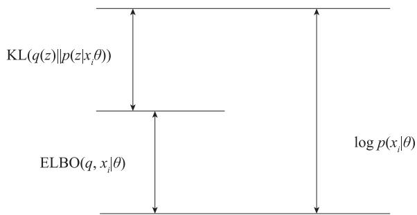  
图 13-17 可视化证据下界

由于散度 $\mathrm { K L } \big ( q \big ( z \big ) | | p \big ( z | x _ { i } , \theta \big ) \big ) \geqslant 0$ ，所以 $\mathrm { E L B O } \left( q , x _ { i } | \theta \right)$ 是 $\log p \big ( x _ { i } | \theta \big )$ 的下界。EM 算法在不断迭代的过程中不断提升ELBO $\left( q , x _ { i } | \theta \right)$ ，从而提升log $; p \big ( x _ { i } | \theta \big )$ 。

当且仅当 $q \left( z \right) = p \left( z | x _ { i } , \theta \right)$ 时， $\mathrm { K L } \big ( q \big ( z \big ) | | p \big ( z | x _ { i } , \theta \big ) \big ) = 0$ ，此时EL $\mathrm { B O } \left( q , x _ { i } | \theta \right) = \log p \left( x _ { i } | \theta \right)$ ，这也是变分分布 $q ( z )$ 选择 $p \big ( z | x _ { i } , \theta \big )$ 的原因所在。

初始化参数 $\theta _ { t }$ 时，通常 $\mathrm { K L } \big ( q \big ( z \big ) | | p \big ( z | x _ { i } , \theta _ { t } \big ) \big ) > 0$ 。E 步，固定 $\theta _ { t }$ ，取 $q \left( z \right) = p \left( z | x _ { i } , \theta \right)$ ，此时 $\mathrm { K L } \big ( q \big ( z \big ) | | p \big ( z | x _ { i } , \theta _ { t } \big ) \big ) = 0$ 。 $\mathbf { M }$ 步，固定分布 $q _ { t + 1 } \left( z \right)$ ，寻找参数 $\theta _ { t + 1 }$ 使 $\mathrm { E L B O } \left( q _ { t + 1 } , x _ { i } | \theta _ { t + 1 } \right)$ 最大化，此时 $\mathrm { K L } \big ( q _ { t + 1 } \big ( z \big ) | | p \big ( z | x _ { i } , \theta _ { t } \big ) \big ) > 0$ ，从而使 $\log p \bigl ( x _ { i } | \theta _ { t + 1 } \bigr )$ 也变大。EM 算法的整个步骤可用图 13-18 表示。

  
图 13-18 EM 算法的整个步骤

# 13.4.4 变分推断

变分推断是一种用于近似推断复杂概率模型中未知变量的方法。它的基本思想是将复杂的后验概率分布表示为一个简单的参数化分布，然后通过最小化两者之间的差异来逼近后验概率分布。这样做的好处是，可以将复杂的推断问题转化为一个优化问题，从而可以使用优化算法来求解。

假设有一个概率模型，其中包含观察变量（已知的数据）和隐变量（未知的参数），我们希望推断出这些隐变量的后验分布。我们的目标是找到一个简单的参数化分布，比如高斯分布或指数分布，来近似表示后验分布。为了衡量两个分布之间的差异，我们使用 KL散度。

变分推断的思路是找到一个参数化分布 $\mathcal { Q } ( z )$ 来近似表示后验分布 $P ( z \mid x )$ ，然后通过最小化 KL 散度来找到最优的参数值。具体步骤如下：

1）定义参数化分布 $\mathcal { Q } ( z )$ 。通常， $Q ( z )$ 的参数记为 $\phi$ 。  
2）构建似然函数 $P ( x , z )$ ，即观察变量 $x$ 和隐变量 $z$ 的联合分布。  
3）计算边缘似然函数 $P ( x )$ 。它是将似然函数关于隐含变量 z 边缘化得到的。  
4）最小化 KL 散度。将 $\operatorname { K L } ( P ( z \mid x ) \parallel Q ( z ) )$ 表示为一个损失函数，然后使用优化算法来最小化这个损失函数，得到最优的参数 $\phi$ 。

现在，让我们通过一个简单的例子来说明变分推断的原理。假设我们有一个带有隐变量 z 的高斯混合模型：

$$
P (x, z) = P (z) P (x \mid z)
$$

其中， $P ( z )$ 是隐变量的先验分布，假设为高斯分布， $P ( x \mid z )$ 是给定隐变量 z 时的条件分布，也假设为高斯分布。

我们的目标是在给定观察数据 $x$ 的情况下，推断出隐变量 z 的后验分布 $P ( z \mid x )$ 。

使用变分推断，我们假设后验分布 $P ( z \mid x )$ 为另一个高斯分布，参数为 $\boldsymbol { \phi } = ( \boldsymbol { \mu } , \boldsymbol { \sigma } )$ 。然后，我们可以通过最小化 KL 散度来找到最优的 $\phi$ 。具体地，我们计算 KL 散度：

$$
\operatorname {K L} (P (z \mid x) \mid \mid Q (z)) = \int P (z \mid x) \log \left(P (z \mid x) / Q (z)\right) d z
$$

将 $P ( z \mid x )$ 和 $\mathcal { Q } ( z )$ 都设为高斯分布，并进行数学推导和计算，可以得到 KL 散度的表达式。然后，我们可以通过梯度下降等优化算法来最小化 KL 散度，从而找到最优的参数 $\phi$ 。

一旦得到了最优的参数 $\phi$ ，我们就可以用 $Q ( z )$ 来近似表示后验分布 $P ( z \mid x )$ ，从而得到隐变量 z 的推断结果。这样，我们就通过变分推断方法，用一个简单的高斯分布来近似复杂的后验分布，实现了对隐变量的推断。

# 13.4.5 马尔可夫链蒙特卡罗随机采样

马尔可夫链蒙特卡罗（MCMC）随机采样是一种用于模拟复杂概率分布的统计学方法。它基于马尔可夫链的性质，迭代地生成样本序列并逐步收敛到目标分布。MCMC 随机采样适用于维度高且计算困难的问题，例如贝叶斯推断和模型参数估计。它的核心思想是以某个初始状态开始，通过一系列马尔可夫转移，最终得到一组与目标分布接近的样本。这些样本可以用来估计均值、方差，或进行模型的预测和推断。

# 1. 蒙特卡罗算法

蒙特卡罗算法是一类基于随机采样和统计模拟的计算方法，用于解决一些复杂问题。它的核心思想是通过随机抽样来估计问题的概率、期望值或其他统计量。蒙特卡罗算法通常具有较高的灵活性和适用性。其基本原理是通过生成随机样本，利用大数定律，近似计算出不确定问题的数学期望。

蒙特卡罗算法的几个基本原理如下。

. 随机采样：蒙特卡罗算法通过对概率空间的随机采样来逼近问题的解。采样过程需要满足独立性和均匀性，以保证模拟结果的可靠性。  
. 统计平均：蒙特卡罗算法通过对随机采样点的函数值进行平均来估计数学期望、积分等数值计算问题的解。样本数量越多，统计平均的精度也就越高。  
● 大数定律：蒙特卡罗算法中使用统计平均近似真实值的核心基础是大数定律。大数定律指出，对于独立同分布的随机变量序列，其样本均值会收敛于该随机变量的期望，当样本数量足够大时，这种收敛是以高概率发生的。

● 方差控制：蒙特卡罗算法在求解复杂问题时，通常需要进行大量的随机模拟，这可能导致模拟误差较大。根据中心极限定理，方差递减的速度与样本数量的平方根成反比。因此，方差降低可能意味着需要更多的样本来获得相同的精度。为了控制误差，可以采用方差缩减技术，如重要性抽样、控制变量法等。

蒙特卡罗算法的步骤如下：

1）定义问题：明确需要估计的数学期望，确定需要模拟的随机现象。  
2）生成随机样本：使用随机数生成器生成一系列符合指定分布的随机数样本。  
3）计算样本函数值：对于每个随机样本，计算对应的函数值。  
4）统计估计：对样本函数值求平均，得到数学期望的估计值。

下面举一个简单的实例。

# （1）定义问题

假设随机向量服从概率分布 $p ( x )$ ，要计算 $f ( x )$ 的数学期望，即

$$
E _ {x \sim p (x)} (f (x)) = \int_ {\mathcal {R} ^ {n}} f (x) p (x) d x
$$

# （2）生成随机样本

从概率分布 $p ( x )$ 随机抽取 $N$ 个样本，即 $\left\{ x _ { 1 } , x _ { 2 } , \cdots , x _ { N } \right\}$ 。

# （3）计算样本函数值

根据 $N$ 个样本 $\left\{ x _ { 1 } , x _ { 2 } , \cdots , x _ { N } \right\}$ 求得样本函数值 ${ \bf \dot { \boldsymbol { f } } } ( \boldsymbol { x } _ { 1 } ) , f ( \boldsymbol { x } _ { 2 } ) , \cdots , f ( \boldsymbol { x } _ { N } )$ 。

# （4）统计估计

计算均值：

$$
E _ {x \sim p (x)} (f (x)) \approx \frac {1}{N} \sum_ {i = 1} ^ {N} f (x _ {i})
$$

这就是随机变量函数 $f ( x )$ 期望的估计值。这里 $f ( x _ { 1 } ) , f ( x _ { 2 } ) , \cdots , f ( x _ { N } )$ 为独立同分布，根据大数定律，它们的平均值收敛到数学期望，即有

$$
\lim  _ {N \rightarrow + \infty} \frac {1}{N} \sum_ {i = 1} ^ {N} f \left(x _ {i}\right) = E _ {x \sim p (x)} \left(f (x)\right)
$$

当 $N$ 较大时，可保证上式近似成立。

# 2. 拒绝采样

拒绝 - 接受采样（Acceptance-Rejection Sampling）简称拒绝采样，是一种基本的采样方法，当要采样的概率分布 $p ( x )$ 难以直接采样时，算法引入一个容易采样的分布 $q ( x )$ ，又称为提议分布（proposal distribution）。从提议分布采样出一批样本，然后以某种方法拒绝一部分样本，使得剩下的样本服从目标概率分布 $p ( x )$ 。

# （1）拒绝采样算法

输入：目标概率分布 $p ( x )$ ，一个简单易采样的提议分布 $q ( x )$ ，常数 $c$ ，使 $c q ( x ) \geqslant p ( x )$ ，即提议分布乘以常数 $c$ 之后要覆盖住 $p ( x )$ 。从提议分布 $q ( x )$ 提取样本 $x$ ，从均匀分布 U[0,1]随机取样，得到随机数 u。如果u ≤ $u$ $u \leqslant { \frac { p ( x ) } { c Q ( x ) } }$ 则接受样本 $x$ ，否则拒绝样本 $x$ 。

这种采样算法可以生成 ${ \mathcal { R } } ^ { n }$ 中的任意概率分布的样本。

拒绝采样的优点在于简单易懂，但是对于高维问题，并非所有的候选样本都能被接受，导致采样效率较低。

# （2）拒绝采样实例

```python
import numpy as np  
import matplotlib.pyplot as plt  
from scipy.stats import norm  
import seaborn  
#seaborn.set()  
%matplotlib inline  
#目标采样分布的概率密度函数  
def p(x):  
    return (0.3 * np.exp(-(x - 0.3) ** 2) + 0.7 * np.exp(-(x - 2) ** 2/0.3)) / 1.2113  
#创建建议分布G  
norm_rv = norm(loc=1.4, scale=1.2)  
#定义c值  
c = 2.5  
x = np.arange(-4, 6.0, 0.01)  
plt.plot(x, p(x), color='r', lw=5, label='p(x)')  
plt.plot(x, c * norm_rv.pdf(x), color='b', lw=5, label='c * g(x)')  
pltlegend()  
plt.show() 
```

运行结果如图 13-19 所示。

# 3. 重要性采样

重要性采样是一种基于概率分布的加权采样方法，用于有效地生成服从目标分布的样本。

假设要生成的目标概率分布为 $P ( x )$ ，定义一个重要性分布或者采样分布 $Q ( x )$ ，可以生成容易采样的样本。在生成样本的过程中，首先从采样分布 $Q ( x )$ 中生成一个样本 $\mathbf { X } _ { - }$ sample。计算目标分布和提议分布的比值：r = P(x_sample) / Q(x_sample)。这个比值 $r$ 即为该样本的重要性权重。

  
图 13-19 拒绝采样结果

得到样本后，对其进行加权，即样本乘以其对应的重要性权重，然后按照这个加权后的样本进行后续的分析。

重要性采样的优点在于对于一个已知概率分布，可以高效地生成样本，并且通过对样本进行加权处理，可以对概率分布的期望、方差等统计量进行有效估计。但是重要性采样对于采样分布与目标分布的选择较为敏感，如果两者差异较大，可能会导致采样效果较差。

这些采样算法对高维空间的复杂概率分布实现起来比较麻烦，后续还将介绍基于马尔可夫链的采样算法：MCMC 采样算法、M-H 采样算法、Gibbs 算法等。这些采样算法针对高维空间的复杂概率分布效率更高。

下面介绍一个简单的实例。假设随机向量服从概率分布 $p ( x )$ ，要计算 $f ( x )$ 的数学期望，即

$$
E _ {x \sim p (x)} (f (x)) = \int_ {\mathcal {R} ^ {n}} f (x) p (x) d x
$$

如果概率分布 $p ( x )$ 比较复杂，无法直接进行采样，此时我们可以采用重要性采样方法，把从概率分布 $p ( x )$ 中采样转换为从一个简单分布 $q ( x )$ （如均匀分布或高斯分布等）中采样。具体转换过程如下：

$$
\begin{array}{l} E _ {x \sim p (x)} (f (x)) = \int_ {\mathcal {R} ^ {n}} f (x) p (x) d x \\ = \int_ {\mathcal {R} ^ {n}} f (x) p (x) \frac {q (x)}{q (x)} d x \\ = \int_ {\mathcal {R} ^ {n}} \frac {f (x) p (x)}{q (x)} q (x) d x \\ = E _ {x \sim q (x)} \frac {f (x) p (x)}{q (x)} \\ \approx \frac {1}{N} \sum_ {x _ {i} \sim q (x _ {i}), i = 1} ^ {N} \frac {f (x _ {i}) p (x _ {i})}{q (x _ {i})} \\ \end{array}
$$

# 4. 马尔可夫性

马尔可夫性是指在一个随机过程中，当前状态的概率分布仅依赖于前一个状态，而与过去的状态序列无关。这意味着给定了前一个状态，当前状态与过去状态的信息是独立的。

举例说明。考虑一个简单的天气模型，假设天气只有两种状态：晴天（S）和雨天（R）。现在我们想要预测第三天的天气情况，假设第三天的天气状态为 $X$ 。根据马尔可夫性，第三天的天气状态 $X$ 仅依赖于第二天的天气状态 Y，而与更早的天气状态无关。

那么我们可以写出马尔可夫链关系： $P ( X \mid Y ) = P ( X \mid Y , Z )$ ，其中 $Z$ 表示更早的天气状态。但由于马尔可夫性，这里 $Z$ 状态对于预测第三天的天气状态 $X$ 并没有影响，所以可以简化为： $P ( X \mid Y ) = P ( X )$ 。

假设已知过去两天的天气情况是第一天为晴天（S），第二天为雨天（R），现在我们想要预测第三天的天气情况。

根据马尔可夫性，我们只需要考虑第二天的天气状态，即 $Y =$ 雨天（R）。我们可以通过历史数据得知，在雨天的情况下，第三天是晴天（S）的概率为 $P$ ( 晴天 | 雨天 ) $= 0 . 6$ ，而是雨天（R）的概率为 P( 雨天 | 雨天 ) $= 0 . 4$ 。

因此，根据马尔可夫性，我们预测第三天的天气为晴天（S）的概率为 0.6，为雨天（R）的概率为 0.4。

# 5. 马尔可夫链

马尔可夫链是一种随机过程，其基本含义是在未来状态的概率分布仅依赖于当前状态，而与过去的状态序列无关。它是一个离散的随机过程，由一系列离散的状态组成，且满足马尔可夫性质。

马尔可夫性质可以用数学公式表示为

$$
P (X _ {-} \{n + 1 \} \mid X _ {-} n, X _ {-} \{n - 1 \}, \dots , X _ {-} 1) = P (X _ {-} \{n + 1 \} \mid X _ {-} n)
$$

其中， $X \_ n$ 表示当前状态， $X _ { - } \{ n { + } 1 \}$ 表示下一个状态。这个公式表明，在给定当前状态的情况下，未来状态的概率只与当前状态有关，与过去的状态无关。

举个例子来说明马尔可夫链的基本含义。假设有一个天气模型，用来描述某个城市每天的天气状况。我们将天气分为三种状态：晴天（S）、多云（C）和雨天（R）。我们知道，在这个城市中，明天的天气只与今天的天气有关，而与过去的天气无关，这符合马尔可夫性质。

现在，我们用一个转移矩阵来表示天气的转移概率。假设转移矩阵如下：

<table><tr><td></td><td>S</td><td>C</td><td>R</td></tr><tr><td>S</td><td>0.8</td><td>0.15</td><td>0.05</td></tr><tr><td>C</td><td>0.3</td><td>0.6</td><td>0.1</td></tr><tr><td>R</td><td>0.2</td><td>0.3</td><td>0.5</td></tr></table>

该转移矩阵表示：

● 在晴天（S）的情况下，明天是晴天的概率为 0.8，是多云的概率为 0.15，是雨天的概率为 0.05。  
● 在多云（C）的情况下，明天是晴天的概率为 0.3，是多云的概率为 0.6，是雨天的概率为 0.1。  
● 在雨天（R）的情况下，明天是晴天的概率为 0.2，是多云的概率为 0.3，是雨天的概率为 0.5。

如果今天是晴天，我们可以用转移矩阵来预测明天的天气。根据转移矩阵，明天是晴天的概率是 0.8，多云的概率是 0.15，雨天的概率是 0.05。类似地，如果今天是多云，明天的天气预测为：晴天的概率是 0.3，多云的概率是 0.6，雨天的概率是 0.1。

这个天气模型符合马尔可夫链的基本含义，因为天气的转移概率只与当前的天气状态有关，而与过去的天气历史无关。

# 6. 细致平衡条件

很多随机采样应用中，需要在给定状态概率分布 $\pi$ 的条件下构造一个马尔可夫链，即构造状态转移矩阵 $P$ ，使得其平稳分布为 $\pi$ 。如何构建这样一个状态转移矩阵？它需要满足什么条件？细致平衡条件提供了解决这些问题的方法。如果马尔可夫链的状态转移矩阵 $P$ 和概率分布 $\pi$ 对所有的 $i$ 和 $j$ 均满足

$$
\pi_ {i} p _ {i j} = \pi_ {j} p _ {j i} \tag {13.33}
$$

则 $\pi$ 为马尔可夫链的平稳分布。式（13.33）称为细致平衡条件。

注意， $P$ 和 $\pi$ 满足细致平衡条件是 $\pi$ 为 $P$ 的平稳分布的充分条件，而非必要条件。

# 7. 基于马尔可夫链采样

如果得到了某个平稳分布所对应的马尔可夫链状态转移矩阵，我们就很容易采样出这个平稳分布的样本集。具体算法如下：

1）输入马尔可夫链状态转移矩阵 $P$ ，设定状态转移次数为 $n _ { 1 }$ ，需要的样本个数为 $n _ { 2 }$ 。  
2）从任意简单概率分布采样得到初始状态值 $x _ { 0 }$ 。  
3）for $\scriptstyle t = 0$ to $n _ { 1 } { + } n _ { 2 } { - } 1$

从条件概率分布 $p ( x | x _ { t } )$ 中采样得到样本 $x _ { t + 1 }$

end for

4）样本集 $\left\{ x _ { n _ { 1 } + 1 } , x _ { n _ { 1 } + 2 } , \cdots , x _ { n _ { 1 } + n _ { 2 } } \right\}$ 就是符合给定平稳分布的样本集。

知道采样样本的平稳分布所对应的马尔可夫链状态转移矩阵，就可以用马尔可夫链采样得到我们需要的样本集，进而进行蒙特卡罗模拟。但是随意给定一个平稳分布，如何得到它所对应的马尔可夫链状态转移矩阵 $P$ 呢？为此，人们提出了 MCMC 算法。

# 8. MCMC 采样算法

一般情况下，目标平稳分布 $\pi ( x )$ 和某一个马尔可夫链状态转移矩阵 $\varrho$ 不满足细致平稳条件，即

$$
\pi_ {i} Q _ {i j} \neq \pi_ {j} Q _ {j i} \tag {13.34}
$$

引入一个 $\alpha _ { i j }$ ，要使

$$
\pi_ {i} Q _ {i j} \alpha_ {i j} = \pi_ {j} Q _ {j i} \alpha_ {j i} \tag {13.35}
$$

成立，根据对称性，只需

$$
\pi_ {i} = \pi_ {j} Q _ {j i}, \quad \pi_ {j} = Q _ {i j} \alpha_ {i j} \tag {13.36}
$$

成立，这样就可以得到分布 $\pi ( x )$ 对应的马尔可夫链状态转移矩阵 $\begin{array} { r } { P _ { i j } = Q _ { i j } \alpha _ { i j } } \end{array}$ ，

从而可得

$$
\pi_ {i} p _ {i j} = \pi_ {j} p _ {j i}
$$

由此可知， $P$ 就是满足细致平衡条件要求的状态转移矩阵。其中 $a _ { i j }$ 一般称为接受率，取值在 [0,1] 之间，可以理解为一个概率值。这很像拒绝采样，拒绝采样是以一个常用分布通过一定的接受 - 拒绝概率得到一个不常见分布，而 MCMC 采样是以一个常见的马尔可夫链状态转移矩阵 $\varrho$ 通过一定的接受 - 拒绝概率得到目标转移矩阵 $P$ ，两者的解决问题思路是类似的。图 13-20 所示为生成目标转移矩阵 $P$ 的示意图。

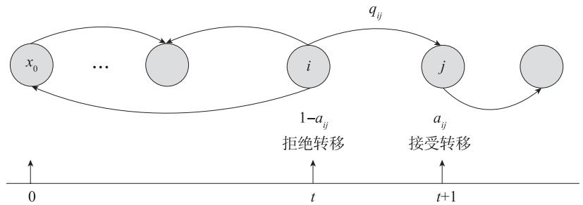  
图 13-20 生成目标转移矩阵 $P$ 的示意图

# MCMC 采样算法如下。

输入：目标分布 $p ( x )$ （这里为了更好理解而使用了 $p ( x )$ ，图 13-20 实际就对应上面的$\pi ( x )$ ），提议分布 $g ( x ^ { \prime } \mid x )$ （如果状态空间为离散的，提议分布对应任意给定的马尔可夫链状态转移矩阵），状态转移次数阈值 $n _ { 1 }$ ，样本数 ${ \bf { \dot { n } } } _ { 2 }$ ，从任意概率分布采样出的初始状态 $x _ { 0 }$ 。

for $t = 0$ to $n_1 + n_2 - 1$ do 使用提议分布 $g(x|x_{t})$ ，根据 $x_{t}$ 采样样本值 $x_{*}$

$\alpha (x_{t},x_{*}) = p(x_{*})g(x_{t}|x_{*})$ 从均匀分布U[0,1]采样出 $\mathcal{U}$ if $u <   \alpha (\mathrm{x_t,x_*})$ then $x_{t + 1} = x_{*}\#$ 接受转移  
else $x_{t + 1} = x_{t}\#$ 不接受转移  
end if  
end for

输出：样本集 $\{ \ x _ { n _ { 1 } + 1 } , x _ { n _ { 1 } + 2 } , \cdots , x _ { n _ { 1 } + n _ { 2 } } \}$

这个采样算法在实际应用中一般比较难实现，因为 $\alpha ( x _ { t } , x _ { * } )$ 可能非常小，比如 0.1，导致大部分的采样值都被拒绝转移，采样效率很低。有可能采样了上百万次马尔可夫链还没有收敛，导致 $n _ { 1 }$ 非常大，训练难度较大，如何解决这一问题？接下来将介绍的 Metropopis-Hastings 采样算法是一个较好的解决方案。

# 9. M-H 算法

M-H（Metropolis-Hastings）算法是一种著名的 MCMC 方法，用于从复杂的概率分布中进行采样。该算法最初由 Nicholas Metropolis 等人于 1953 年提出，后来由 W. K. Hastings在 1970 年进行改进和推广，并因此得名。

M-H 采样解决了 MCMC 采样接受率过低的问题。我们可以对式（13.35）两边进行扩大，此时细致平稳条件也是满足的，我们将等式扩大 $C$ 倍，使 $C \alpha _ { i j } = 1$ （精确地说，是使得两边最大的扩大为 1），这样就提高了采样中的跳转接受率，所以我们可以取

$$
\alpha_ {i j} = \min  \frac {\pi_ {j} Q _ {j i}}{\pi_ {i} Q _ {i j}}, 1 _ {\bigcup}
$$

# M-H 采样算法如下。

输入：目标分布 $p ( x )$ （这里为了更好理解而使用了 $p ( x )$ ，图实际就对应上面的 $\pi ( x )$ ），提议分布 $g ( x ^ { \prime } \mid x )$ （如果状态空间为离散的，提议分布对应任意给定的马尔可夫链状态转移矩阵），状态转移次数阈值 $n _ { 1 }$ ，样本数 $n _ { 2 }$ ，从任意概率分布采样出的初始状态 $x _ { 0 }$ 。

for $t = 0$ to $n_1 + n_2 - 1$ do 使用提议分布 $g(x|x_{t})$ ，根据 $x_{t}$ 采样样本值 $x_{*}$

$\alpha \left(x_{t},x_{*}\right) = \min \frac{p\left(x_{*}\right)g\left(x_{t} \mid x_{*}\right)}{p\left(x_{t}\right)g\left(x_{*} \mid x_{t}\right)}, 1$

从均匀分布 $U[0,1]$ 采样出 $\mathbf{u}$

if $u <   \alpha (x_t,x_*)$ then $x_{t + 1} = x_{*}$ #接受转移else $x_{t + 1} = x_t$ #不接受转移end ifend for

输出：样本集 $\{ \ x _ { n _ { 1 } + 1 } , x _ { n _ { 1 } + 2 } , \cdots , x _ { n _ { 1 } + n _ { 2 } } \}$

对于高维概率分布的采样，M-H 采样算法仍然面临效率问题，因为很多时候算法还需要考虑已知随机变量的联合概率分布，但实际应用中的某些问题只知道各分量之间的条件分布。接下来将介绍的 Gibbs 采样算法可以有效解决这个问题。

用 Python 实现 M-H 采样，代码如下：

```python
plt.rcParams['figure.figsize'] = (12, 8)  
plt.rcParams['font.sans-serif'] = ['SimHei']  
plt.rcParams['axes.unicode_minus'] = False  
def norm_dist_prob(theta):  
    y = norm.pdf(theta, loc=3, scale=2)  
    return y  
T = 5000  
pi = [0 for i in range(T)]  
sigma = 1  
t = 0  
while t < T-1:  
    t = t + 1  
    pi_star = norm.rvs(loc=pi[t - 1], scale=sigma, size=1, random_state=None)  
#状态转移进行随机抽样  
    alpha = min(1, (norm_dist_prob(pi_star[0]) / norm_dist_prob(pi[t - 1]))  
#alpha值  
    u = random.uniform(0, 1)  
    if u < alpha:  
        pi[t] = pi_star[0]  
    else:  
        pi[t] = pi[t - 1]  
plt万人次(pi, norm.pdf(pi, loc=3, scale=2), label='目标分布')  
num_bins = 50  
plt.hist(pi, num_bins, density=True, facecolor='red', alpha=0.7, label='采样分布')  
plt.legend()  
plt.show() 
```

运行结果如图 13-21 所示。

  
图 13-21 M-H 采样结果

# 10. Gibbs 算法

如果非周期马尔可夫链状态转移矩阵 $P$ 和概率分布 $\pi ( x )$ 对所有的i j, 满足

$$
\pi (i) P (i, j) = \pi (j) P (i, j)
$$

则称概率分布 $\pi ( x )$ 是状态转移矩阵 $P$ 的平稳分布。

在 M-H 采样算法中通过引入接受率使细致平稳条件满足，这是一种分阶段处理方法。我们受到坐标中的分阶段方法的启发，利用这种方法来构建平稳分布。

从简单的二维数据分布开始，假设 $\pi ( x _ { 1 } , x _ { 2 } )$ 是一个二维联合概率分布，观察第一个维度相同的两个点 $A \left( x _ { 1 } ^ { ( 1 ) } , x _ { 2 } ^ { ( 1 ) } \right)$ 和 $B \Big ( x _ { 1 } ^ { ( 1 ) } , x _ { 2 } ^ { ( 2 ) } \Big )$ ，如图 13-22 所示。

  
图 13-22 Gibbs 算法类似于坐标优化法

上标表示样本号，A,B 两个样本的第一个分量相等，根据条件概率的计算公式，显然下面的等式成立：

$$
\pi \left(x _ {1} ^ {(1)}, x _ {2} ^ {(1)}\right) \pi \left(x _ {2} ^ {(2)} \mid x _ {1} ^ {(1)}\right) = \pi \left(x _ {1} ^ {(1)}\right) \pi \left(x _ {2} ^ {(1)} \mid x _ {1} ^ {(1)}\right) \pi \left(x _ {2} ^ {(2)} \mid x _ {1} ^ {(1)}\right)
$$

$$
\pi \left(x _ {1} ^ {(1)}, x _ {2} ^ {(2)}\right) \pi \left(x _ {2} ^ {(1)} \mid x _ {1} ^ {(1)}\right) = \pi \left(x _ {1} ^ {(1)}\right) \pi \left(x _ {2} ^ {(2)} \mid x _ {1} ^ {(1)}\right) \pi \left(x _ {2} ^ {(1)} \mid x _ {1} ^ {(1)}\right)
$$

因此有

$$
\pi \left(x _ {1} ^ {(1)}, x _ {2} ^ {(1)}\right) \pi \left(x _ {2} ^ {(2)} \mid x _ {1} ^ {(1)}\right) () = \pi \left(x _ {1} ^ {(1)}, x _ {2} ^ {(2)}\right) \pi \left(x _ {2} ^ {(1)} \mid x _ {1} ^ {(1)}\right) \tag {13.37}
$$

也就是

$$
\pi (A) \pi \left(x _ {2} ^ {(2)} \mid x _ {1} ^ {(1)}\right) = \pi (B) \pi \left(x _ {2} ^ {(1)} \mid x _ {1} ^ {(1)}\right)
$$

观察上式和细致平稳条件的公式。由式（13.37）可知，如果限制随机变量的第一个分量的值，即在 $x _ { 1 } = x _ { 1 } ^ { ( 1 ) }$ 这条直线上，如果用条件概率分布 $\pi { \left( x _ { 2 } \mid x _ { 1 } ^ { ( 1 ) } \right) }$ 作为马尔可夫链的状态转移概率，则任意两个样本点之间的转移满足细致平稳条件。同理，在 $x _ { 2 } = x _ { 2 } ^ { ( 1 ) }$ 这条直线上，如果用条件概率分布 $\pi { \Big ( } _ { X _ { 1 } } | x _ { 2 } ^ { ( 1 ) } { \Big ) }$ 作为马尔可夫链的状态转移概率，则任意两个点之间的转移也满足细致平稳条件。例如，有一点 $C \left( \boldsymbol { x } _ { 1 } ^ { ( 2 ) } , \boldsymbol { x } _ { 2 } ^ { ( 1 ) } \right)$ ，则有

$$
\pi (A) \pi \left(x _ {1} ^ {(2)} \mid x _ {2} ^ {(1)}\right) = \pi (C) \pi \left(x _ {1} ^ {(1)} \mid x _ {2} ^ {(1)}\right)
$$

由此可以构造概率分布 $\pi { \bigl ( } x _ { 1 } { \bigr ) } , \pi { \bigl ( } x _ { 2 } { \bigr ) }$ 的马尔可夫链对应的状态转移矩阵 $P$ ：

$$
P (A \rightarrow B) = \pi \left(x _ {2} ^ {(B)} | x _ {1} ^ {(1)}\right), \quad x _ {1} ^ {(A)} = x _ {1} ^ {(B)} = x _ {1} ^ {(1)}
$$

$$
P (A \rightarrow C) = \pi \left(x _ {1} ^ {(C)} | x _ {2} ^ {(1)}\right), \quad x _ {2} ^ {(A)} = x _ {2} ^ {(C)} = x _ {2} ^ {(1)}
$$

$P \left( A \to D \right) = 0$ ，其他

基于这个状态转移矩阵，不难验证平面上的任意两点 $^ { E , F }$ 满足细致平稳条件：

$$
\pi (E) P (E \rightarrow F) = \pi (F) P (F \rightarrow E)
$$

可以把二维的结论推广到 $n$ 维的情况，对于随机向量 $x = \left( x _ { 1 } , x _ { 2 } , \cdots , x _ { n } \right)$ ，假设其联合概率密度函数为 $\pi$ ，第 $i$ 个样本为

$$
\left(x _ {1} ^ {(i)}, x _ {2} ^ {(i)}, \dots , x _ {n} ^ {(i)}\right)
$$

下一个样本为

$$
\left(x _ {1} ^ {(i + 1)}, x _ {2} ^ {(i + 1)}, \dots , x _ {n} ^ {(i + 1)}\right)
$$

可以按照下面的条件概率对 $x _ { 1 } , x _ { 2 } , \cdots , x _ { n }$ 依次进行采样：

$$
\pi \left(x _ {j} ^ {(i + 1)} \mid x _ {1} ^ {(i + 1)}, \dots , x _ {j - 1} ^ {(i + 1)}, x _ {j + 1} ^ {(i)}, \dots , x _ {n} ^ {(i)}\right)
$$

$x _ { 1 } ^ { ( i + 1 ) } , \cdots , x _ { j - 1 } ^ { ( i + 1 ) }$ 是本轮采样时已更新的分量，剩余的分量 $\boldsymbol { x } _ { j + 1 } ^ { ( i ) } , \cdots , \boldsymbol { x } _ { n } ^ { ( i ) }$ $\boldsymbol { x } _ { j + 1 } ^ { ( i ) }$ $x _ { n } ^ { ( i ) }$ 则使用上一轮采样的值。按照这种方式构造状态转移概率，细致平衡条件成立。

整个采样过程是在随机向量各个分量之间轮换进行，类似于坐标分段处理方法，对于二维的情况，采样的流程为

$$
\left(x _ {1} ^ {(1)}, x _ {2} ^ {(1)}\right)\rightarrow \left(x _ {1} ^ {(2)}, x _ {2} ^ {(1)}\right)\rightarrow \left(x _ {1} ^ {(2)}, x _ {2} ^ {(2)}\right)\rightarrow \dots \rightarrow \left(x _ {1} ^ {(n)}, x _ {2} ^ {(n)}\right)
$$

多维 Gibbs 采样算法如下。

输入：目标分布 $p { \big ( } x _ { 1 } , x _ { 2 } , \cdots , x _ { n } { \big ) }$ （这里为了更好理解而使用了 $p ( x )$ ，图实际就对应上面的$\pi ( x )$ )，状态转移次数阈值 $\dot { \boldsymbol { n } } _ { 1 }$ ，样本数 ${ \bf \ddot { \boldsymbol { n } } } _ { 2 }$ ，从任意概率分布采样出的初始状态 $\left( x _ { 1 } ^ { ( 0 ) } , x _ { 2 } ^ { ( 0 ) } , \cdots , x _ { n } ^ { ( 0 ) } \right)$

for $t = 0$ to $n_1 + n_2 - 1$ do  
从条件概率分布 $p\left(x_1 \mid x_2^{(t)}, x_3^{(t)}, \dots, x_n^{(t)}\right)$ 采样出 $x_1^{(t + 1)}$ 从条件概率分布 $p\left(x_2 \mid x_1^{(t + 1)}, x_3^{(t)}, \dots, x_n^{(t)}\right)$ 采样出 $x_2^{(t + 1)}$ ...  
从条件概率分布 $p\left(x_j \mid x_1^{(t + 1)}, \dots, x_{j - 1}^{(t + 1)}, x_{j + 1}^{(t)}, \dots, x_n^{(t)}\right)$ 采样出 $x_j^{(t + 1)}$ ...  
从条件概率分布 $p\left(x_n \mid x_1^{(t + 1)}, x_2^{(t + 1)}, \dots, x_{n - 1}^{(t + 1)}\right)$ 采样出 $x_n^{(t + 1)}$ end for

输出： $\left\{ \left( x _ { 1 } ^ { ( n _ { 1 } + 1 ) } , x _ { 2 } ^ { ( n _ { 1 } + 1 ) } , \cdots , x _ { n } ^ { ( n _ { n } + 1 ) } \right) , \left( x _ { 1 } ^ { ( n _ { 1 } + 2 ) } , x _ { 2 } ^ { ( n _ { 1 } + 2 ) } , \cdots , x _ { n } ^ { ( n _ { 1 } + 2 ) } \right) , \cdots , \left( x _ { 1 } ^ { ( n _ { 1 } + n _ { 2 } ) } , x _ { 2 } ^ { ( n _ { 1 } + n _ { 2 } ) } , \cdots , x _ { n } ^ { ( n _ { 1 } + n _ { 2 } ) } \right) \right\}$

用 Python 实现 Gibbs 采样算法（二维情况），代码如下：

```python
from mpl_toolkits.mplot3d import Axes3D   
from scipy.stats import multivariate_normal   
samplesource \(=\) multivariate_normal(mean \(\coloneqq\) [5,-1],cov \(\coloneqq\) [[1,0.5],[0.5,2]])   
def p_ygivenx(x,m1,m2,s1,s2): return (random.normalvariate(m2 \(^+\) rho \* s2/s1 \* (x-m1),math.sqrt(1-rho \(^{**}2)\) \*s2))   
def p_xgiveny(y,m1,m2,s1,s2): return (random.normalvariate(ml \(^+\) rho \* s1/s2 \* (y-m2),math.sqrt(1-rho \(^{**}2)\) \*s1))   
N \(= 5000\)   
K \(= 20\)   
x_res \(= [\] \(\mathrm{y\_res} = [\] \(\mathrm{z\_res} = [\] \(\mathrm{m1} = 5\)   
\(\mathrm{m2} = -1\)   
s1 \(= 1\)   
s2 \(= 2\) 
```

rho $= 0.5$ y $= \mathrm{m2}$ for i in range(N): for j in range(K): x = p_xgiveny(y, m1, m2, s1, s2) #y给定得到x的采样 y = p_ygivenx(x, m1, m2, s1, s2) #x给定得到y的采样 z = samplesource.pdf([x,y]) x_res.append(x) y_res.append(y) z_res.append(z) num_bins = 50   
plt.hist(x_res, num_bins, density=True, facecolor='green', alpha=0.5, label='x') plt.hist(y_res, num_bins, density=True, facecolor='red', alpha=0.5, label='y') plt.title('Histogram')   
plt.legend()   
plt.show()

运行结果如图 13-23 所示。

  
图 13-23 Gibbs 采样结果

然后我们看看样本集生成的二维正态分布：

```python
fig = plt.figure()
ax = Axes3D(fig, auto_add_to_figure = False)
fig.add_xes(ax)
axscatter(x_res, y_res, z_res, marker='o')
plt.show() 
```

运行结果如图 13-24 所示。

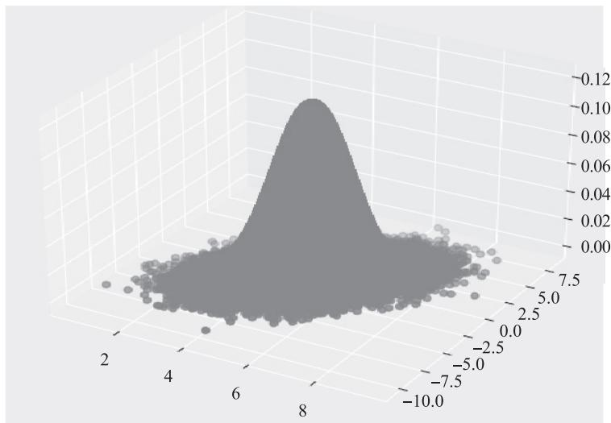  
图 13-24 Gibbs 采样样本生成的二维正态分布

# 13.5 强化学习

强化学习在 ChatGPT 中有广泛的应用，包括使用 PPO 算法和 RLHF 算法等。PPO 算法是一种常用的策略优化算法，可用于训练 ChatGPT 中的智能体。通过与环境进行交互，ChatGPT 可以学习到最优的回答生成策略。PPO 通过反复采样、更新和优化模型参数，最大化预期奖励。在 ChatGPT 中，PPO 算法可用于训练对话生成模型，提高模型生成回答的质量和相关性。

RLHF 是一种层次化强化学习算法，也被用于 ChatGPT 中。RLHF 允许 ChatGPT 学习到不同层次的决策，在生成回答时实现更精确的指导和控制。该算法将对话分解为更小的子任务，然后在这些子任务上进行优化，以提高对话生成的效果。通过 RLHF 算法，ChatGPT 能够更好地理解对话上下文、控制生成输出的风格和内容，以及提供更连贯和准确的回答。

这些强化学习算法在 ChatGPT 中的应用使模型能够从与环境的交互中不断优化自身表达和生成回答的能力。通过大量的训练和迭代，ChatGPT 可以逐步改善对话质量、流畅性和与用户的互动体验。强化学习算法为 ChatGPT 提供了一种有效的方式，可以使其在多个对话任务中得到优化，并提供更加智能的对话生成能力。

# 13.5.1 强化学习基本概念

强化学习是机器学习中的一种算法，如图 13-25 所示，它不像监督学习或无监督学习有大量的经验或输入数据，基本算自学成才。这是一种通过不断尝试，从错误或惩罚中学

习，最后找到规律、达到目的的算法。

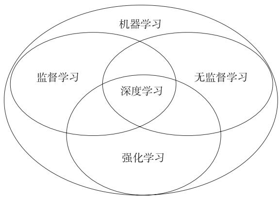  
图 13-25 机器学习、监督学习、强化学习等的关系图

强化学习已经在游戏、机器人等领域开花结果。各大科技公司，如百度、阿里巴巴、谷歌、Meta、微软等都将强化学习作为其重点发展的技术之一。可以说强化学习算法正在改变和影响着世界，掌握了这门技术就掌握了改变和影响世界的工具。图 13-26 为强化学习常用算法之间的关系。

  
图 13-26 强化学习常用算法之间的关系

# 1. 智能体与环境交互

强化学习本质上是通过研究智能体（Agent）与环境（Environment）的交互，寻找最优策略（Policy）的过程，如图 13-27 所示。

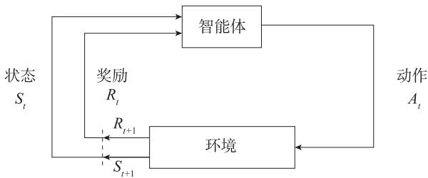  
图 13-27 智能体与环境的交互示意图

具体分析如下。

● 环境：主体被“嵌入”并且能够感知和行动的外部系统。  
● 智能体：动作的行使者，例如配送货物的无人机，或者电子游戏中奔跑跳跃的超级马里奥。  
● 状态：主体的处境，亦即一个特定的时间和地点、一项明确主体与工具、障碍、敌人或奖品等其他重要事物的关系配置。  
● 动作：含义不难领会，但应当注意的是，主体需要在一系列潜在动作中进行选择。在电子游戏中，这一系列动作可包括向左或向右跑、不同高度的跳跃、蹲下和站着不动。在股票市场中，这一系列动作可包括购买、出售或持有一组证券及其衍生品中的任意一种。无人飞行器的动作选项则包括三维空间中的许多不同的速度和加速度等。

$\bullet$ 奖励：用于衡量主体动作成功与否的度量。

智能体与环境的交互一般使用马尔可夫决策过程（Markov Decision Process，MDP）来描述。具体来说，在每个时间 $t { = } 0 , 1 , 2 , 3 , \cdots$ ，智能体与环境发生了交互，在 $t$ 时刻，智能体处于某个状态 $S _ { t } \in S$ ，这里 $s$ 表示所有可能状态的集合，也就是状态空间。它可以选择一个行为 $\cdot A _ { t } \in \mathcal { A } ( S _ { t } )$ ，其中 $\boldsymbol { \mathcal { A } } ( \boldsymbol { S } _ { t } )$ 是状态S时可以选择的所有行为的集合。选择了行为A之后，环境会在 t+1 时刻给智能体一个新的状态 $S _ { t + 1 }$ 和收益 $R _ { t + 1 } \in \mathcal { R } \subseteq \mathcal { R }$ 。从而，MDP 和智能体共同给出一个序列：

$$
S _ {0}, A _ {0}, R _ {1}, S _ {1}, A _ {1}, R _ {2}, S _ {2}, A _ {2}, R _ {3}, \dots
$$

# 2. 回报

MDP 和智能体交互的过程中会形成一个序列，智能体的目标是最大化长期的收益 $R _ { t }$ 累加值，我们将这个累加值称为回报。假设 $t$ 时刻之后的收益是 $R _ { t } , R _ { t + 1 } , R _ { t + 2 } , \cdots$ ，我们期望这些收益的和最大。由于环境是随机的，智能体的策略也是随机的，因此智能体的目标是最大化收益累加和的期望值，记为 $G _ { t }$ ， $G _ { t }$ 定义如下：

$$
G _ {t} = R _ {t + 1} + R _ {t + 2} + R _ {t + 3} + \dots + R _ {T} \tag {13.38}
$$

其中 $T$ 表示最后时刻。有些任务会有一些结束的状态，从任务的初始状态到结束状态，我

们称之为一个回合（Episode）。一些任务是有限的，还有一些任务没有结束状态，会一直继续下去，这时 $T = \infty$ 。

由于未来的不确定性，我们一般会对未来的收益进行打折（Discount）。打折后的回报（Discounted Return）定义如下：

$$
\begin{array}{l} G _ {t} = R _ {t + 1} + \gamma R _ {t + 2} + \gamma^ {2} R _ {t + 3} + \dots \\ = \sum_ {k = 0} ^ {\infty} \gamma^ {k} R _ {t + k + 1} \tag {13.39} \\ \end{array}
$$

其中， 表示折扣率， $0 \leqslant \gamma \leqslant 1$ 。如果 $\gamma = 0$ ，那么智能体只关注眼前收益； 越接近 1，说明智能体越考虑未来的收益。相邻时刻的回报可以用如下递归方式互相联系起来。

$$
\begin{array}{l} G _ {t} = R _ {t + 1} + \gamma R _ {t + 2} + \gamma^ {2} R _ {t + 3} + \dots \\ = R _ {t + 1} + \gamma \left(R _ {t + 2} + \gamma R _ {t + 3} + \dots\right) \tag {13.40} \\ = R _ {t + 1} + \gamma G _ {t + 1} \\ \end{array}
$$

# 3. 马尔可夫决策过程

智能体与环境的交互作为一个完整系统，通过采取动作 $A _ { 0 }$ 并接受奖励 $R _ { 0 }$ ，从状态 $S _ { 0 }$ 变为状态 $S _ { 1 }$ ，然后采取动作 $A _ { 1 }$ ，从状态 $S _ { 1 }$ 变为状态 $S _ { 2 }$ ，以此类推，直到时间 $t$ 。在时间 $t { + } 1$ 处，处于状态 $S _ { t + 1 } = s ^ { \prime }$ 的概率可以用下式表示：

$$
P _ {r} \left\{S _ {s + 1} = s ^ {\prime}, R _ {t + 1} = r \mid S _ {0}, A _ {0}, R _ {1}, \dots , R _ {t}, S _ {t}, A _ {t} \right\} \tag {13.41}
$$

计算这个概率涉及很多状态，为了简化计算，一般假设这些序列满足马尔可夫假设，即在时间 $t { + } 1$ 的概率仅取决于时间 $t$ 的状态和动作，于是，式（13.41）可简化为

$$
p \left(s ^ {\prime}, r \mid s, a\right) = P _ {r} \left\{S _ {s + 1} = s ^ {\prime}, R _ {t + 1} = r \mid S _ {t}, A _ {t} \right\} \tag {13.42}
$$

根据式（13.42）可以得到，状态转移以及给定当前 $s$ 、当前 $a$ 和下一个 $\cdot s ^ { \prime }$ 条件时期望的奖励。

状态转移概率为

$$
\begin{array}{l} p \left(s ^ {\prime} | s, a\right) = P _ {r} \left(S _ {t + 1} = s ^ {\prime} \mid S _ {t} = s, A _ {t} = a\right) \\ = \sum_ {r \in \mathcal {R}} p \left(s ^ {\prime}, r \mid s, a\right) \tag {13.43} \\ \end{array}
$$

给定当前 s、当前 $a$ 和下一个s′条件时期望的奖励为

$$
r (s, a, s ^ {\prime}) = E \left\{R _ {t + 1} \mid S _ {t} = s, A _ {t} = a, S _ {t + 1} = s ^ {\prime} \right\} \tag {13.44}
$$

# 4. 策略函数与价值函数

# （1）策略函数

策略函数表示智能体在状态 $s$ 下，采取动作 $\alpha$ 的概率，可以用函数表示为

$$
\pi (a \mid s) = p \left(A _ {t} = a \mid S _ {t} = s\right)
$$

策略又分为确定性策略和随机策略。确定性策略只输出 0 和 1，会有一个明确的动作指示，要么执行要么不执行。而随机性策略会输出一个概率值，是否采取某个动作，还需要通过采样得到，所以随机性策略具备更好的探索能力。

# （2）价值函数

价值函数分为两种：状态 - 动作 - 价值函数（ $Q _ { \pi } ( s _ { t } , a _ { t } )$ ）和状态 - 价值函数（ $V _ { \pi } ( s _ { t } ) ~ )$ ，它们都是回报的期望。

1）状态 - 动作 - 价值函数。在策略 $\pi$ 下，由状态 $s _ { t }$ 下采取动作 $a _ { t }$ 的价值函数记作$Q _ { \pi } ( s _ { t } , a _ { t } )$ ，表示从状态 $s _ { t }$ 开始，采取动作 $a _ { t }$ 能够得到回报的数学期望。数学表达方式为

$$
Q _ {\pi} \left(s _ {t}, a _ {t}\right) = E _ {\pi} \left(G _ {t} \mid S _ {t} = s _ {t}, A _ {t} = a _ {t}\right) = E _ {\pi} \sum_ {k = 0} ^ {n} \gamma^ {k} R _ {t + k + 1} \mid S _ {t} = s _ {t}, A _ {t} = a _ {t}
$$

动作 - 价值函数 $Q _ { \pi } ( s _ { t } , a _ { t } )$ 依赖于 $s _ { t }$ 与 $a _ { t }$ ，而不依赖于 $t { + } 1$ 时刻及其之后的状态和动作，因为随机变量 $S _ { t + 1 }$ , $A _ { t + 1 }$ ,…, $S _ { n }$ , $A _ { n }$ 都被期望消除了。由于动作 $A _ { t + 1 }$ ,…, $A _ { n }$ 的概率密度函数都是$\pi$ ，用不同的 $\pi$ ，求期望得出的结果将不同，因此 $Q _ { \pi } ( s _ { t } , a _ { t } )$ 依赖于 $\pi$ 。

如何才能排除掉策略 $\pi$ 的影响，只评价当前状态和动作的好坏？解决方案是最优动作 -价值函数：

$$
Q _ {*} \left(s _ {t}, a _ {t}\right) = \max  _ {\pi} Q _ {\pi} \left(s _ {t}, a _ {t}\right), s _ {t} \in \mathcal {S}, a _ {t} \in \mathcal {A}
$$

2）状态 - 价值函数。假设智能体用策略函数 $\pi$ 下围棋。智能体想知道当前状态 $s _ { t }$ （即棋盘上的格局）是否对自己有利，以及自己和对手的胜算各有多大，该用什么方法来量化呢？答案是状态 - 价值函数，即从状态 $s _ { t }$ 开始，智能体遵从策略 $\pi$ 能够得到回报的数学期望。其对应的数学表达式为

$$
V _ {\pi} \left(s _ {t}\right) = E _ {\pi} \left(G _ {t} \mid S _ {t} = s _ {t}\right) = E _ {\pi} \sum_ {k = 0} ^ {n} \gamma^ {k} R _ {t + k + 1} \mid S _ {t} = s _ {t}
$$

或基于状态 - 动作 - 价值函数，可表示为

$$
\begin{array}{l} V _ {\pi} \left(s _ {t}\right) = E _ {A _ {t} \sim \pi (\cdot | s _ {t})} \left(Q _ {\pi} \left(s _ {t}, A _ {t}\right)\right) \\ = \sum_ {a \in A _ {t}} \pi (a \mid s _ {t}) \cdot Q _ {\pi} (s _ {t}, a) \\ \end{array}
$$

价值函数之后，就涉及价值函数的最优化问题了，这时候需要应用贝尔曼方程。

# 5. 贝尔曼方程

贝尔曼（Bellman）方程是与动态规划相关的优化条件，在强化学习中，它被广泛用

于更新智能体的策略。贝尔曼方程是递归关系，分别由以下价值函数、动作 - 价值函数给出。

$$
\begin{array}{l} v _ {\pi} (s) = E _ {\pi} \left[ G _ {t} | S _ {t} = s \right] \\ = E _ {\pi} \left[ R _ {t + 1} + \gamma G _ {t + 1} \mid S _ {t} = s \right] \\ = \sum_ {a} \pi (a \mid s) \sum_ {s ^ {\prime}} \sum_ {r} p \left(s ^ {\prime}, r \mid s, a\right) \left[ r + \gamma E \left[ G _ {t + 1} \mid S _ {t + 1} = s ^ {\prime} \right] \right] \tag {13.45} \\ = \sum_ {a} \pi (a | s) \sum_ {s ^ {\prime}, r} p \left(s ^ {\prime}, r | s, a\right) \lceil r + \gamma v _ {\pi} \left(s ^ {\prime}\right) \rfloor \\ \end{array}
$$

式（13.45）称为 $\nu _ { \pi }$ 的贝尔曼方程。

同理可得动作 - 价值函数。

$$
\begin{array}{l} q _ {\pi} (s, a) = E _ {\pi} \left[ G _ {t} \mid S _ {t} = s, A _ {t} = a \right] (13.46) \\ = \sum_ {s ^ {\prime}, r} p \left(s ^ {\prime}, r \mid s, a\right) \left[ r + \gamma v _ {\pi} \left(s ^ {\prime}\right) \right] (13.46) \\ \end{array}
$$

式（13.46）称为 $q _ { \pi } ( s , a )$ 的贝尔曼方程。

由式（13.45）和式（13.46）不难得到 $\nu _ { \pi } ( s )$ 与 $q _ { \pi } ( s , a )$ 之间的关系：

$$
v _ {\pi} (s) = \sum_ {a} \pi (a \mid s) q _ {\pi} (s, a) \tag {13.47}
$$

# 6. 贝尔曼最优方程

解决一个强化学习问题也就意味着找到一种能够获得足够多回报的选择动作的策略。如果执行每个动作所产生的转移都是确定的（有限 MDP），那么能够定义出一个最优策略。如果一个策略 $\pi ^ { \prime }$ ′的所有状态值函数都大于 $\pi$ ，那么就说策略 $\pi ^ { \prime }$ ′更好，但它不一定是最好的，我们将最优策略用 * 表示。由此，可定义最优价值函数和最优动作 - 价值函数。最优价值函数：

$$
v _ {*} (s) = \max  _ {\pi} v _ {\pi} (s)
$$

最优动作 - 价值函数：

$$
q _ {*} (s, a) = \max  _ {\pi} q _ {\pi} (s, a)
$$

由最优价值函数、最优动作 - 价值函数可得到贝尔曼最优方程：

$$
\begin{array}{l} v _ {*} (s) = \max  _ {a} q _ {*} (s, a) \\ = \max  _ {a} E (r + \gamma v _ {*} \left(s ^ {\prime}\right) | s, a) \\ = \max  _ {a} \sum_ {s ^ {\prime}, r} p \left(s ^ {\prime}, r | s, a\right) \lceil r + \gamma v _ {*} \left(s ^ {\prime}\right) \rfloor \\ \end{array}
$$

$$
\begin{array}{l} q _ {*} (s, a) = E \left(r + \gamma v _ {*} (s ^ {\prime}) | s, a\right) \\ = E \left(r + \gamma \max  _ {a ^ {\prime}} q _ {*} \left(s ^ {\prime}, a ^ {\prime}\right) | s, a\right) \\ = \sum_ {s ^ {\prime}, r} p \left(s ^ {\prime}, r | s, a\right) ^ {\lceil} r + \gamma \max  _ {a ^ {\prime}} q _ {*} \left(s ^ {\prime}, a ^ {\prime}\right) \rfloor \\ \end{array}
$$

$\nu _ { \pi }$ 的贝尔曼方程计算如图 13-28 所示。

  
图 13-28 贝尔曼方程计算示意图

图 13-28 是动态规划的状态 - 价值函数迭代的图，可以发现，在计算每一个状态的价值函数时，都需要遍历所有可能的动作，以及这些动作能够转移的所有下一个状态，这是一个穷举的过程。但是实际上在很多场景中，我们无法穷举所有动作，也难以获得所有状态转移的概率分布，因此动态规划是一种理想条件下的方法，也是一种基于模型（model-based）的方法。为此，在实际使用时，强化学习通常采用无模型学习（model-free-learning）。无模型学习通常采用蒙特卡罗采样方法来近似概率分布或期望。

# 7. 同步策略与异步策略

根据执行策略与评估策略是否一致，强化学习算法可分为同步策略和异步策略。同步策略方法使用相同的策略进行评估，从而对操作做出决策。SARSA、A2C 等算法属于使用同步策略的算法。

异步策略方法使用不同的策略来制定行为决策并评估性能。许多异步策略方法使用重放缓冲区来存储经验，并从重放缓冲区中采样数据以训练模型。Q-Learning、DQL 等属于使用异步策略的算法。

# 8. 有模型算法与无模型算法

不用学习环境模型的强化学习算法称为无模型算法，相反，训练时需要构建环境模型的算法则称为有模型算法。如使用价值函数或动作 - 价值函数来评估性能的算法就是无模型算法，因为它们没有使用特定的环境模型。如果训练时通过构建环境，实现从一种状态到一种装填的模型，或者确定智能体通过环境获得奖励，那么这类算法就是有模型算法。

# 13.5.2 强化学习基础算法

强化学习算法有很多，本节主要介绍两种基础算法：蒙特卡罗算法及时序差分算法。

蒙特卡罗算法是一种基础强化学习算法，它通过对智能体与环境的实际交互进行多次模拟来估计状态值或动作 - 价值函数。该算法使用回合制训练，每个回合结束后，根据获得的回报值来更新价值函数。

时序差分算法是另一种基础强化学习算法，它通过不断地估计和更新价值函数，使智能体在不完整的序列下进行学习。时序差分算法使用递归更新规则，在单个步骤中根据当前经验和之前的估计值来调整价值函数。

这两种算法都各有其优点和应用场景：蒙特卡罗算法适用于离散、无模型且收敛于真实值函数的问题，时序差分算法则适用于连续、有模型或不收敛的问题。在实践中，这些算法通常会结合使用，以充分利用它们各自的优势。

# 1. 蒙特卡罗算法

蒙特卡罗算法是一大类随机算法（randomized algorithm）的总称，也称统计模拟方法，是一种以概率统计理论为指导的数值计算方法。蒙特卡罗算法的核心原理是利用随机数和概率统计方法来模拟问题，通过大量随机样本的采样，得到问题的概率分布或期望值。这种方法特别适用于那些无法用精确数学公式求解的问题，或者公式求解非常困难的问题。蒙特卡罗算法背后的理论依据为大数定律和中心极限定理。

例如，利用蒙特卡罗算法估计状态价值

$$
v _ {\pi} (s) = E _ {\pi} \left[ G _ {t} \mid S _ {t} = s \right] \approx \frac {1}{N} \sum_ {i = 1} ^ {N} G _ {t} ^ {(i)}
$$

其中， $G _ { t } ^ { ( i ) }$ $G _ { t } ^ { ( i ) } , i = 1 , 2 , \cdots , N$ 表示策略在 MDP 上采样很多条序列。

蒙特卡罗算法简单明了，不过它的计算结果可能存在一定的误差，因为估计值是通过随机样本计算得到的。因此，在实际应用中需要考虑样本数量、采样方式、计算精度等因素，以得到可靠的计算结果。

蒙特卡罗算法每次更新都需要等到智能体到达终点之后，如果智能体的轨迹很长或相关任务一个回合比较耗时，此时蒙特卡罗算法的效率不高。为了解决这个问题，我们可以使用时序差分算法。智能体每走一步时序差分算法都可以更新一次，无须等到智能体到达终点之后再更新，这样就可以大大提高更新模型的效率。

# 2. 时序差分算法

使用蒙特卡罗算法需要有足够多的样本，特别是对于高维数据分布，每一步的数据量是巨大的，会导致求解效率低下。我们可以从随机梯度下降或者小批量梯度下降的思想中找到一些灵感，我们不需要完整的蒙特卡罗采样，可以把动态规划和蒙特卡罗的思想结合，

一步步地缩小求解问题的不确定性，这种方法叫作时序差分（Temporal Difference，TD）。时序差分算法中有两个重要概念，一个是 TD-target，另一个是 TD-error。举个简单的例子来解释一下时序差分的思想。

假设要从北京去上海，模型 $Q$ 预测需要花费 900 分钟，而从北京到济南实际用了 350分钟，此时根据模型 $Q$ 预估从济南到上海还需要 500 分钟，如图 13-29 所示。

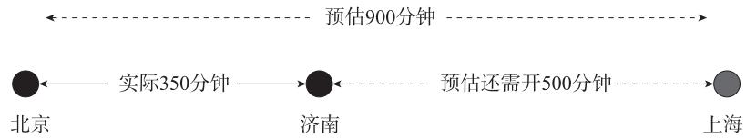  
图 13-29 时序差分算法示意图

那么原来估计的 900 分钟就被更新为 850 分钟，这个 850 分钟就被称为 TD-target，它比900 分钟更可靠，因为其中包含了一部分真实观测值 350 分钟。所以可以把 TD-target 作为目标来更新模型原来的估计 900 分钟，900 分钟和 850 分钟差值（50 分钟）就称为 TD-error。

TD 算法结合了蒙特卡罗和动态规划算法的思想。时序差分算法和蒙特卡罗算法的相似之处在于可以从样本数据中学习，不需要事先知道环境；和动态规划的相似之处在于根据贝尔曼方程的思想，利用后续状态的价值估计来更新当前状态的价值估计。回顾一下蒙特卡罗方法对价值函数的增量更新方式：

$$
v \left(s _ {t}\right) \leftarrow v \left(s _ {t}\right) + \alpha \left(G _ {t} - v \left(s _ {t}\right)\right)
$$

其中， $\alpha$ 表示对价值估计更新的步长。 $\alpha$ 可以取一个常数，此时更新方式不再像蒙特卡罗算法那样严格地取期望。蒙特卡罗算法必须等整个序列结束之后才能计算得到当次的回报 $G _ { t }$ ，而时序差分算法只需要当前步结束即可进行计算。具体来说，时序差分算法用当前获得的奖励加上下一个状态的价值估计，即当前获得的奖励 $r _ { t }$ 加上下一个状态的价值估计 $\nu ( s _ { t + 1 } )$ 作为在当前状态会获得的回报。

$$
v \left(s _ {t}\right) \leftarrow v \left(s _ {t}\right) + \alpha \left(r _ {t} + \gamma v \left(s _ {t + 1}\right) - v \left(s _ {t}\right)\right)
$$

其中， $r _ { t } + \gamma \nu \left( s _ { t + 1 } \right)$ -TD target是 ， $r _ { t } + \gamma \nu \left( s _ { t + 1 } \right) - \nu \left( s _ { t } \right)$ 是 TD-error。时序差分算法将其与步长的乘积作为状态价值的更新量。

时序差分算法是强化学习中最为核心的算法了，它不需要知道具体的环境模型，可以直接从经验中学习。智能体通过多次尝试，累积奖励来更新价值函数。具体来说，时序差分算法每次对样本进行采样模拟，但并非完整采样，而是每次只采样单步，根据新状态的价值收获来更新策略和价值函数。

时序差分单步学习法简称 TD(0)。单步学习法理论上可以推广到多步学习法。TD(0) 学习法最简单的实现步骤如下：

1）初始化价值函数 $\nu ( s _ { t } )$ ， $s _ { t } \in S$ ；  
2）选择一个状态 - 行为对 $( s _ { t } , a _ { t } )$ ；  
3）用当前策略函数 $\pi$ 向后模拟一步；  
4）用新状态的奖励 $r ( s _ { t } , a _ { t } )$ 更新价值函数 $\nu$ ；  
5）用新的价值函数v优化策略函数 $\pi$ ；  
6）跳第 3 步，直到模拟进入终止状态。

价值函数 $\nu$ 是智能体对给定状态好坏程度的估计。价值函数 $\nu$ 假设在 $s _ { t }$ 状态，并从环境接受 $r _ { t }$ 奖励后更新。TD(0) 学习将以式（13.48）更新其价值函数：

$$
v \left(s _ {t}\right) = v \left(s _ {t}\right) + \alpha \left\lceil r _ {t + 1} + \gamma v \left(s _ {t + 1}\right) - v \left(s _ {t}\right)\left. \right\rfloor \tag {13.48}
$$

其中， $\alpha$ 是学习率，且 $0 \leqslant \alpha \leqslant 1$ 。 $r _ { t + 1 }$ 表示从状态 $s _ { t }$ 转移到状态 $s _ { t + 1 }$ 收到的奖励。

# 13.5.3 策略梯度

Q-learning、SARSA、DQN 都先学习价值函数，再基于价值函数得到最优策略（一般基于 ε-greedy），这种方法属于基于值函数的方法；也可以直接学习策略函数 $\pi _ { \theta }$ ，那么就属于基于策略的方法，基于策略的方法相比基于值函数的方法有更好的探索能力。策略函数可以不用值函数，直接优化策略。参数化的策略能够处理连续状态和动作，可以直接学出随机性策略。

基于值函数的方法主要是学习值函数，然后根据值函数导出一个策略，学习过程中并不存在一个显式的策略；而基于策略的方法则是直接显式地学习一个目标策略。策略梯度是基于策略的方法的基础，策略梯度算法能解决什么问题？

策略梯度（Policy Gradient）算法的核心思想是：根据当前状态，直接算出下一个动作是什么或者下一个动作的概率分布是什么，即它的输入是当前状态 $s$ ，而输出是某一个具体的动作或者动作的概率分布，而不像 Q-learning 算法那样输出动作的 $Q$ 函数值。

基于价值的强化学习，通过引入一个参数 $w$ ，用函数 $\hat { Q }$ 近似价值函数，即

$$
\hat {Q} (s, a; w) \approx Q _ {\pi} (s, a)
$$

基于策略的强化学习，通过引入一个参数，用函数 $P$ 来近似策略，即

$$
\pi \theta (s, a) = P (s, a; \theta) \approx \pi (s, a)
$$

将策略表示成一个连续的函数后，我们就可以用连续函数的优化方法来寻找最优的策略了。而最常用的方法就是梯度上升法，那么这个梯度对应的优化目标如何定义呢？

# 1. 策略学习的目标函数

如何衡量一个策略的好坏？我们的目标是寻找一个最优策略并最大化这个策略在环境

中的期望回报。我们将策略学习的目标函数定义为

$$
J (\theta) = E _ {S} \left(V _ {\pi \theta} (S)\right) \tag {13.49}
$$

这个目标函数排除掉了状态 S 的因素，只依赖于策略网络 $\pi$ 的参数 $\theta _ { \circ }$ 策略越好，则$J ( \theta )$ 越大。所以策略学习可以描述为这样一个优化问题

$$
\max  _ {\theta} J (\theta)
$$

我们希望通过对策略网络参数θ的更新，使得目标函数 $J ( \theta )$ 越来越大，也就意味着策略网络越来越强。想要求解最大化问题，显然可以用梯度上升更新 $\theta$ ，使得 $J ( \theta )$ 增大。设当前策略网络的参数为 $\theta _ { t }$ ，做梯度上升更新参数，得到新的参数 $\theta _ { t + 1 }$ ：

$$
\theta_ {t + 1} = \theta_ {t} + a \nabla_ {\theta} J (\theta_ {t})
$$

# 2. 策略梯度定理

根据式（13.49）可得

$$
\begin{array}{l} \nabla_ {\theta} J (\theta) = \sum_ {s} \mu (s) \sum_ {a \in A} Q _ {\pi} (s, a) \nabla_ {\theta} \pi (a | s, \theta) \tag {13.50} \\ = \sum_ {s} \mu (s) \sum_ {a \in A} \pi (a | s, \theta) Q _ {\pi} (s, a) \nabla_ {\theta} \log \pi (a | s, \theta) \\ \end{array}
$$

其中， $\mu ( s )$ 为在策略 $\bar { \pi }$ 下的状态分布，如果按策略π执行，则状态将按 $\mu ( s )$ 比例出现，因此上式又可表示为

$$
\nabla_ {\theta} J (\theta) = E _ {\pi} \left\lceil \sum_ {a \in A} \pi (a | S _ {t}, \theta) Q _ {\pi} (S _ {t}, a) \nabla_ {\theta} \log \pi (a | S _ {t}, \theta) \left. \right\rfloor
$$

用 $A _ { t } \sim \pi$ 采样替换 $a$ ，可得

$$
\nabla_ {\theta} J (\theta) = E _ {\pi} \left\lceil Q _ {\pi} \left(S _ {t}, A _ {t}\right) \nabla_ {\theta} \log \pi \left(A _ {t} \mid S _ {t}, \theta\right)\left. \right\rfloor
$$

其中，期望值是未知的，我们可以用采样近似这个期望。因此，参数θ利用随机梯度进行更新。

$$
\theta_ {t + 1} = \theta_ {t} + \alpha \nabla_ {\theta} \log \pi (a | s, \theta) q _ {t} (s, a)
$$

其中， $\nabla _ { \theta } \log \pi \big ( a | s , \theta \big )$ 称为分值函数，一般不会改变。 $q _ { t } ( s , a )$ 为 $Q _ { \pi } ( S , A )$ 的蒙特卡罗近似，对$q _ { t } \left( s , a \right)$ 有不同的近似方法。

对 $Q _ { \pi } \left( s , t \right)$ 的近似有两种方法：

● REINFORCE 方法：利用期望的蒙特卡罗算法近似，即用实际观测的回报 $G$ 近似。  
● Actor-Critic 方法：用神经网络 $Q \big ( s , a ; \theta \big )$ 近似 $Q _ { \pi } ( s , t )$ 。

# 3. 设计策略函数

设计策略函数，通常有两种常用方法：

1）对于离散动作空间，可以使用 softmax 策略函数计算每个可能动作的出现概率。图 13-30 所示为 softmax 策略函数在离散空间中的应用。它主要依赖于描述状态和行为的特征，例如使用策略网络进行近似。

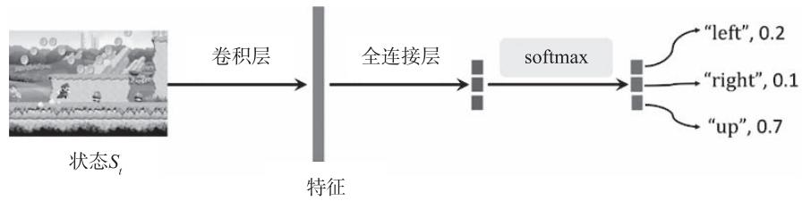  
图 13-30 动作空间为离散的策略网络

2）对于连续空间，可以使用高斯分布来获取动作的概率。我们通常使用参数化表示来描述均值，这也可以是一些特征的线性组合，如

$$
\mu (s) = \phi (s) ^ {T} \theta
$$

该策略的动作服从高斯分布 $N \big ( \phi ( s ) ^ { T } \theta , \sigma ^ { 2 } \big )$ ，方差可以是固定值，也可以用参数化表示。

# 4. REINFORCE 算法

在式（13.50）中， $Q _ { \pi } \left( s , a \right)$ 一般是未知的，我们可以对 $Q _ { \pi }$ 做蒙特卡罗近似，把它替换成回报 $G$ 。假设一回合游戏有 $T$ 步，一个回合中的奖励记作 $R _ { 1 } , \cdots , R _ { { T } ^ { \circ } } ~ t$ 时刻的折扣回报定义为

$$
G _ {t} = \sum_ {k = t + 1} ^ {T} \gamma^ {k - t - 1} R _ {k}
$$

而动作价值定义为G的条件期望：

$$
Q _ {\pi} \left(s _ {t}, a _ {t}\right) = E _ {\pi} \left(G _ {t} \mid S _ {t} = s _ {t}, A _ {t} = a _ {t}\right)
$$

用蒙特卡罗近似上面的条件期望。从时刻 $t$ 开始，智能体完成一局游戏，观测到全部奖励 $r _ { t + 1 } , \cdots , r _ { T }$ ，然后可以计算出

$$
q _ {t} \left(s _ {t}, a _ {t}\right) = \sum_ {k = t + 1} ^ {T} \gamma^ {k - t - 1} r _ {k} \tag {13.51}
$$

因为 $\scriptstyle { q _ { t } }$ 是随机变量 $G _ { t }$ 的观测值，所以 $q _ { t } \left( s _ { t } , a _ { t } \right)$ 是式（13.51）中期望的蒙特卡罗近似。在实践中，可以用 $q _ { t } \left( s _ { t } , a _ { t } \right)$ 代替 $Q _ { \pi } \left( s _ { t } , a _ { t } \right)$ ，这种策略梯度算法称为蒙特卡罗策略梯度，又称

REINFORCE。REINFORCE 算法的具体流程如下：

初始化：参数化策略 $\pi (a\mid s,\theta)$ ， $\gamma \in [0,1)$ 且 $\alpha >0$ #开始迭代  
For $k$ in episodes  
选择初始化状态 $s_0$ ，根据 $\pi (a\mid s,\theta)$ 生成一回合序列 $\{s_0,a_0,r_1,\dots ,s_{T - 1},a_{T - 1},r_T\}$ For $t = 0,1,\dots ,T - 1$ #价值更新 $q_{t}(s_{t},a_{t}) = \sum_{k = t + 1}^{T}\gamma^{k - t - 1}r_{k}$ #策略更新 $\theta_{t + 1} = \theta_t + \alpha \nabla_\theta \log \pi (a_t|s_t,\theta_t)q_t(s,a)$ （204 $\theta_{k} = \theta_{T}$

# 5. 带基线的 REINFORCE 算法

REINFORCE 算法是一种经典的强化学习方法，用于解决策略优化问题。它通过采样来估计策略梯度，并使用蒙特卡罗算法进行更新。然而，传统的 REINFORCE 算法存在一些局限性，例如高方差、低效率和缺乏稳定性。

带基线的 REINFORCE 是对传统 REINFORCE 算法的改进，它引入了一个值函数作为基线，用于减小梯度估计的方差。基线可以看作对期望回报的估计，与策略无关。通过减去基线估计，我们可以减小方差，从而提高梯度估计的准确性。

带基线的 REINFORCE 算法的更新公式如下：

$$
\nabla_ {\theta} J (\theta) = \nabla_ {\theta} \log \pi (a _ {t} | s _ {t}, \theta_ {t}) (q _ {t} (s, a) - b (s))
$$

其中， $\nabla \theta$ 表示对参数 $\theta$ 的梯度， $J ( \theta )$ 表示目标函数， $q _ { t } ( s , a )$ 表示时间步 $t$ 的回报， $b ( s )$ 表示状态 $s$ 的基线估计， $b ( s )$ 可以是与状态 $s$ 相关的任何函数或随机变量， $b ( s )$ 不随动作 $a$ 变换，如使用价值函数的估计 $\hat { \nu } ( s _ { t } , w )$ 就是常用方法。 $\pi ( \boldsymbol { a } | \boldsymbol { s } )$ 表示在状态 $s$ 下选择动作 $a$ 的策略。

带基线的 REINFORCE 算法的具体流程如下：

初始化：参数化策略 $\pi (a|s,\theta)$ ， $\gamma \in [0,1)$ 初始化：一个可微的参数化状态价值函数 $\hat{v} (s,w)$ 算法超参数： $\alpha^{\theta} > 0$ ，且 $\alpha^{w} > 0$ 初始化网络权重参数：策略参数 $\theta$ 和状态价值函数的权重 $w$ #开始迭代  
Fork in episodes选择初始化状态 $s_0$ ，根据 $\pi (a|s,\theta)$ 生成一回合序列 $\{s_0,a_0,r_1,\dots ,s_{T - 1},a_{T - 1},r_T\}$

For $t = 0,1,\dots ,T - 1$ #价值更新 $q_{t}\left(s_{t},a_{t}\right) = \sum_{k = t + 1}^{T}\gamma^{k - t - 1}r_{k}$ $\delta_t = q_t(s_t,a_t) - \hat{v} (s_t,w)$ #更新网络参数 $w_{t + 1} = \theta w_t + \alpha^w\delta_t\nabla_w\hat{v} (s_t,w)$ $\theta_{t + 1} = \theta_t + \alpha^\theta \nabla_\theta \log \pi (a_t|s_t,\theta_t)q_t(s,a)$ $w_{k} = w_{T},\theta_{k} = \theta_{T}$

通过引入基线，带基线的 REINFORCE 算法可以降低梯度估计的方差，从而加速收敛速度并提高算法的稳定性。需要注意的是，选择合适的基线是关键，常用的选择有状态 -价值函数和状态 - 动作 - 价值函数的估计。

带基线的 REINFORCE 在许多强化学习任务中取得了良好效果，并且可以被扩展以用于更加复杂的问题。然而，每个具体应用场景都可能需要适当调整和优化算法参数，以获得最佳性能。

# 6. Actor-Critic 算法

Actor-Critic（简称 AC）算法是对 REINFORCE 算法的一种改进。REINFORCE 算法是一种基于蒙特卡罗采样的策略梯度算法，它通过采样轨迹来估计动作 - 价值函数的期望，并使用这些估计值来更新策略。然而，REINFORCE 算法存在的一个问题是高方差，即估计值的波动较大，带基线的 REINFORCE 算法虽然有利于降低方差，但仍然使用的蒙特卡罗算法，而蒙特卡罗的学习比较缓慢，也不便于在线学习或应用于持续性问题。如果使用时序差分算法，就可以避免这些不便，避免蒙特卡罗算法中必须全过程累积回报的缺点，使得能够在过程中利用两步信息学习。

Actor-Critic 算法用一个神经网络近似动作 - 价值函数 $Q _ { \pi } ( s , a )$ ，这个神经网络叫作“价值网络”，记为 $\nu ( s , w )$ ，其中的 $w$ 表示神经网络中可训练的参数。价值网络的输入是状态 $s$ ，输出是每个动作的价值。AC 算法架构如图 13-31 所示。

  
图 13-31 AC 算法架构

Actor-Critic 算法中的价值函数作为“裁判”来评估当前策略的好坏。Actor 代表策略网络（像运动员），负责生成动作 $a$ ；Critic 代表价值函数网络，负责评价在状态 $s$ 下做出动作$a$ 的好坏程度。这两个网络相互配合，进行优化。

Actor 的更新采用策略梯度的原则，Critic 如何更新呢？我们将 Critic 价值网络表示为 $\widehat { \nu } \left( s , w \right)$ ，参数为 $w$ 。利用时序差分残差的学习方式，对于单个数据定义价值函数的损失函数：

$$
\mathcal {L} (w) = \frac {1}{2} \left(r _ {t} + \gamma \cdot \hat {v} (s _ {t + 1}, w) - \hat {v} (s _ {t}, w)\right) ^ {2}
$$

其中， $r _ { t } + \gamma \cdot \hat { \nu } \big ( s _ { t + 1 } , w \big )$ 部分有基于真实观测到的奖励 $r _ { t }$ ，比 $\widehat { \nu } \left( s _ { t } , w \right)$ 更可靠，所以把这部分固定下来更新 $w$ ， $\mathcal { L } ( w )$ 的梯度为

$$
\nabla_ {w} \mathcal {L} (w) = (\hat {v} (s _ {t}, w) - (r _ {t} + \gamma \cdot \hat {v} (s _ {t + 1}, w))) \nabla_ {w} \hat {v} (s _ {t}, w)
$$

设 $\delta _ { t } = \hat { \nu } \big ( s _ { t } , w \big ) - \big ( r _ { t } + \gamma \cdot \hat { \nu } \big ( s _ { t + 1 } , w \big ) \big )$ ，则有

$$
\nabla_ {w} \mathcal {L} (w) = \delta_ {t} \nabla_ {w} \hat {v} (s _ {t}, w)
$$

然后，使用梯度下降算法来更新 Critic 价值网络参数w。

单步带基线的 Actor-Critic 算法的具体流程如下：

初始化：参数化策略 $\pi ( a \mid s , \theta )$ , $\gamma \in \left[ 0 , 1 \right)$

初始化：一个可微的参数化状态 - 价值函数 $\widehat { \nu } \left( s , w \right)$

算法超参数： $\alpha ^ { \theta } > 0$ ，且 $\alpha ^ { w } > 0$

初始化网络权重参数：策略参数θ和状态价值函数的权重 $w$

#开始迭代  
For $k$ in episodes观测到当前状态 $s_t$ ，根据策略网络做决策： $s_t\sim \pi (.|s,\theta)$ ，并让智能体执行动作 $a_{t}$ 从环境中观测到奖励 $r_t$ 和新的状态 $s_{t + 1}$ For $t = 0,1,\dots ,T - 1$ #计算时序差分误差 $\delta_t = r_t + \gamma \cdot \hat{v} (s_{t + 1},w) - \hat{v} (s_t,w)$ #更新网络参数 $w_{t + 1} = w_t + \alpha^w\delta_t\nabla_w\hat{v} (s_t,w)$ （204 $\theta_{t + 1} = \theta_t + \alpha^\theta \delta_t\nabla_\theta \log \pi (a_t|s_t,\theta_t)$

Actor-Critic 算法相比于 REINFORCE 算法有以下优点：

● 降低了估计值的方差，加快了算法的收敛速度。  
● 充分利用了值函数的信息，使得策略更新更加准确。

Actor-Critic 算法非常重要，目前比较流行的 TRPO、PPO、DDPG、SAC 等深度强化学习算法都基于 Actor-Critic 框架。

# 7. Advantage Actor-Critic 算法

Advantage Actor-Critic（优势主体 - 评判，A2C）算法是一种强化学习算法，结合了策略梯度和值函数的方法。它旨在通过同时更新策略和值函数来优化智能体的行为策略，并提高其在特定任务中的性能。

A2C 算法基于 Actor-Critic 方法，其中：Actor 是一个策略网络，用于输出动作的概率分布；Critic 是一个值函数网络，用于估计状态的价值。A2C 算法架构如图 13-32 所示。

  
图 13-32 A2C 算法架构

A2C 算法的详细步骤如下：

1）初始化参数。初始化 Actor 和 Critic 的神经网络参数。  
2）收集数据。使用当前的策略网络（Actor）与环境进行交互，收集一系列的状态、动作、奖励和下一个状态的样本。  
3）估计回报。根据收集到的样本计算每个状态的回报值。回报值可以通过累积未来的奖励或者使用值函数网络（Critic）的估计值来计算。  
4）计算优势值。计算每个状态的优势值，即实际回报与估计值之间的差异。优势值用于衡量在给定状态下选择某个动作相对于平均水平的好坏程度。  
5）更新 Critic 网络。使用样本中的状态和估计回报来训练 Critic 网络。训练的目标是最小化实际回报与估计值之间的差异，以提高值函数的准确性。  
6）更新 Actor 网络。使用样本中的状态、选定动作和对应的优势值来训练 Actor 网络。通过最大化策略梯度，更新 Actor 的参数，使得选择更好的动作的概率增加。

7）重复迭代。重复执行步骤 2） ${ \sim } 6$ ），直到达到预设的收敛条件或完成指定的迭代次数。

A2C 算法的优点在于同时优化了策略和值函数，并且可以进行实时的单步更新。这种算法结构有效地利用了策略梯度方法的优势，同时减少了对历史轨迹的存储需求。此外，A2C 算法也具有较低的计算复杂度，适用于大规模问题和连续动作空间。

需 要 注 意 的 是，A2C 算 法 存 在 一 些 变 体， 如 A3C（Asynchronous Advantage Actor-Critic，异步优势主体 - 评判）和 GAE（Generalized Advantage Estimation，泛化优势估计），这些变体对算法进行了改进与扩展，它们主要关注多线程环境下的并行训练和更准确的优势值估计，以加快训练速度和提高性能。

# 8. TRPO 算法

前面介绍了 Actor-Critic 算法。Actor-Critic 算法虽然简单、直观，但在实际应用过程中会遇到训练不稳定的情况。Actor-Critic 算法核心是参数化智能体的策略，并使用梯度方法优化策略的目标函数，通常用深度神经网络来拟合目标函数，但沿着策略梯度更新参数，很有可能由于步长太长，使策略突然显著变差，进而影响训练效率。

针对更新策略函数的参数时对学习步长敏感的问题，人们提出一种解决方法。通过在更新时找到一块信任区域（trust region），在这个区域更新策略时能够得到某种策略性能的安全性保证，这就是信任区域策略优化（Trust Region Policy Optimization，TRPO）算法的主要思想。TRPO 算法在 2015 年被提出，信任区域为 TRPO 的一大创新点，TRPO 算法在模型的稳定性方面有较好表现。

TRPO 算法的策略目标：假设当前策略为 $\pi _ { \theta }$ ，参数为 $\theta$ ，目的是借助当前的 $\theta$ 找到一个更优的参数 $\theta ^ { \prime }$ ，使得 $J ( \theta ^ { \prime } ) \ge J ( \theta )$ 。通过推导可得

$$
J _ {\theta} \left(\theta^ {\prime}\right) = J (\theta) + E _ {s \sim V _ {\pi_ {\theta}}} E _ {a \sim \pi_ {\theta} (\cdot | s)} \left. \begin{array}{l} \left. \begin{array}{l} \left. \begin{array}{l} \pi_ {\theta^ {\prime}} (a | s) \\ \pi_ {\theta} (a | s) \end{array} \right. A _ {\pi_ {\theta}} (s, a) \end{array} \right. \end{array} \right\rfloor
$$

如此，我们就可以根据旧策略 $\pi _ { \theta }$ 采样数据来估计并优化新策略 $\pi _ { \theta ^ { \prime } }$ 。为保证新旧策略足够接近，TRPO 算法采用 KL 散度来衡量两个策略的距离。故整体的优化公式为

$$
\max  _ {\theta^ {\prime}} J _ {\theta} \left(\theta^ {\prime}\right), \text {满 足} E _ {s \sim V _ {\pi_ {\theta}}} \left[ \mathrm {K L} \left(\pi_ {\theta} (\cdot | s) \| \pi_ {\theta^ {\prime}} (\cdot | s)\right) \right] \leqslant \delta
$$

这里， $A _ { \pi _ { \theta } } \left( s , a \right) = Q _ { \pi _ { \theta } } \left( s , a \right) - V _ { \pi _ { \theta } } \left( s \right)$ 称为优势函数。优势函数可以这样直观理解：它用于度量在某个状态下选取某个具体动作的合理性，它直接给出动作的性能与所有可能的动作的性能的均值的差值。如果该差值（优势）大于 0，说明动作优于平均，是个合理的选择；如果差值（优势）小于 0，说明动作次于平均，不是好的选择。度量状态下动作的性能的最合适形式是动作 - 价值函数（即 $Q$ 函数）；而度量状态下所有可能动作的性能的均值的最合适形式是状态 - 价值函数（即 $V$ 函数）。

# 作者简介

# 吴茂贵

资深人工智能技术专家和大数据技术专家，在BI、数据挖掘与分析、数据仓库、机器学习、深度学习等领域有超过20年的实战经验。近年来，一直专注于人工智能领域的工程实践，对大模型相关的技术和应用有深入的研究。

# 著有多部人工智能领域的畅销书：

《Python深度学习：基于TensorFlow》（第1版和第2版）  
《Python深度学习：基于Pytorch》（第1版和第2版）  
《深入浅出Embedding》  
《深度实践Spark机器学习》

近年来，生成式人工智能技术取得了飞速发展。大语言模型（如GPT-3）、扩散模型（如DDPM）以及多模态模型（如StableDiffusion和DALL·E）等技术在自然语言处理、图像生成、音乐创作等领域展现出巨大的潜力和广泛的应用前景。当前，市场上对于理解和应用大模型的书籍需求旺盛，这反映了业界和学术界对于深入理解大模型工作原理、优化方法以及应用场景的迫切需求。

# 本书内容有如下特色：

·知识体系全面：本书包含AIGC所涉及的各方面技术，从基础知识到各种流行的大模型，从技术原理到应用实践。  
零基础入门：本书专为没有A基础的技术工程师量身定做，通过由浅入深的讲解方式，使读者能够轻松入门并逐步掌握AIGC。  
实践案例丰富：书中提供大量实践案例和代码示例，读者可通过PyTorch等工具构建和训练各种大模型。  
配套资源丰富：为方便读者学习，本书配有视频讲解、教学PPT、代码和数据，这些资源均可免费获取，让读者学习事半功倍。

# 配套资源：

视频讲解地址：https://space.bilibili.com/391424656/channel/series

教学PPT地址：https://course.cmpreading.com

代码和数据地址：https://github.com/Wumg30o0/feiguyunai

