#

S

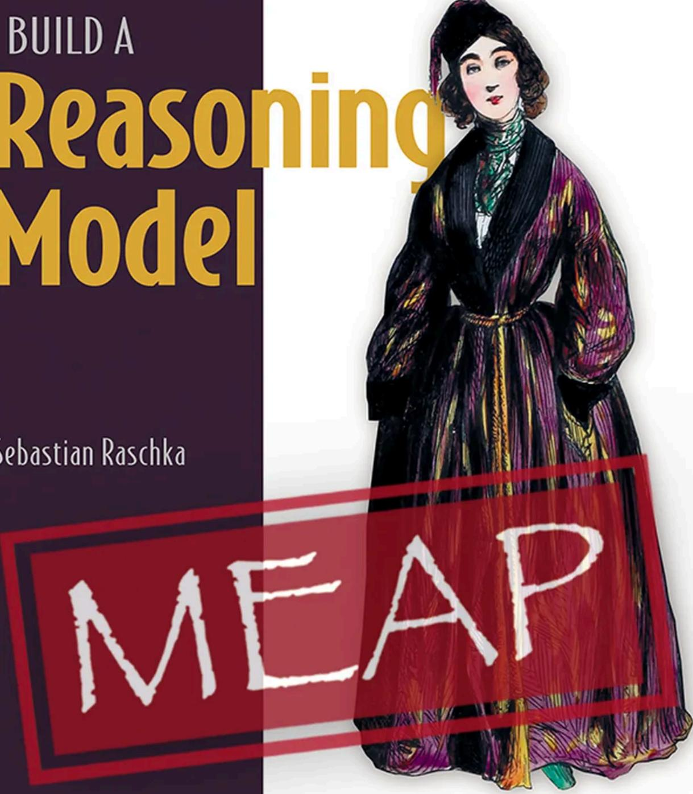


# MEAP Edition

# Manning Early Access Program

# Build a Reasoning Model (From Scratch)

# Version 1

Copyright 2025 Manning Publications

For more information on this and other Manning titles go to manning.com.

Thank you for purchasing the MEAP for Build a Reasoning Model (From Scratch).

If you are like most people these days, LLMs are already part of your everyday toolkit. Maybe you have asked an LLM to proofread an email, debug a tricky piece of code, or explain a concept that sent you down an unexpected rabbit hole. Since 2022, and the launch of ChatGPT, these models have moved from experimental novelties to essential tools in our daily work and learning.

It’s been quite a journey to get here. The earliest GPT models, introduced in 2018, could generate text that was more or less human-like, but they were primarily text-completion models, largely unable to answer even simple queries, and the response quality was nowhere near that of the LLMs we use today.

Then came instruction fine-tuning and alignment with human preferences, which ChatGPT popularized in 2022. The techniques behind ChatGPT transformed LLMs into the everyday problem solvers we use today. Currently, we are in the latest phase: developing reasoning models. Reasoning is the ability for an LLM to tackle more complex problems step-by-step.

Reasoning is one of the most exciting and important recent advances in improving LLMs, but it’s also one of the easiest to misunderstand if you only hear the term reasoning and read about it in theory. That’s why this book takes a hands-on approach. We’ll start with a pre-trained base LLM and then add reasoning capabilities ourselves, step by step in code, so you can see exactly how it works.

This book isn’t a “production deployment” manual, and we won’t use any third-party LLM libraries. Instead, think of it as a behind-the-scenes tour where you get to develop the machinery yourself.

By the end, you will not only understand what reasoning is and how it works, but you will also have built it from scratch. That’s a perspective that will serve you well whether you are using, developing, or planning to deploy LLMs in the future.

— Sebastian Raschka, PhD

1 Understanding reasoning models   
2 Generating text with a pre-trained LLM   
3 Evaluating reasoning models   
4 Improving reasoning with inference-time scaling   
5 Training reasoning models with reinforcement learning   
6 Distilling reasoning models for effi cient reasoning   
7 Improving the reasoning pipeline and future research directions

Appendix A. References and further reading

Appendix B. Exercise solutions

Appendix C. Qwen3 LLM source code

# 1 Understanding reasoning models

# This chapter covers

What "reasoning" means specifically in the context of LLMs   
How reasoning differs from pattern matching   
The conventional pre-training and post-training stages of LLMs   
Key approaches to improving reasoning abilities in LLMs   
Why building reasoning models from scratch can improve our understanding of their strengths, limitations, and practical trade-offs

Welcome to the next stage of large language models (LLMs): reasoning. LLMs have transformed how we process and generate text, but their success has been largely driven by statistical pattern recognition. However, new advances in reasoning methodologies now enable LLMs to tackle more complex tasks, such as solving logical puzzles and advanced math problems involving multi-step arithmetic. Understanding these methodologies is the central focus of this book.

This book teaches the inner workings of those LLM reasoning methods through a handson, code-first approach. As the title says, you will be creating a reasoning LLM from scratch. By the end of the book, you will understand how reasoning models work and be equipped to design, prototype, and evaluate the main methods for improving reasoning in LLMs.

With its focus on practical applications and explanations, this book is written to speak to LLM engineers, machine learning researchers, applied scientists, and software developers alike. Those new to LLMs may benefit from my book Build a Large Language Model (From Scratch), also published by Manning (http://mng.bz/orYv).

This first chapter introduces the foundational concepts before the following chapters shift toward practical, hands-on coding examples to directly implement reasoning techniques for LLMs.

# 1.1 Defining reasoning in the context of LLMs

What is LLM-based reasoning? The answer and discussion of this question itself would provide enough content to fill a book. However, this would be a different kind of book than this practical, hands-on coding focused book that implements LLM reasoning methods from scratch rather than arguing about reasoning on a conceptual level. Nonetheless, I think it's important to briefly define what we mean by reasoning in the context of LLMs.

So, before we transition to the coding portions of this book in the upcoming chapters, I want to kick off this book with this section that defines reasoning in the context of LLMs, and briefly explain how it relates to pattern matching and logical reasoning. This will lay the groundwork for further discussions on how LLMs are currently built, how they handle reasoning tasks, and what they are good and not so good at.

This book's definition of reasoning, in the context of LLMs, is as follows:

Reasoning, in the context of LLMs, refers to the model's ability to produce intermediate steps before providing a final answer. This is a process that is often described as chain-of-thought (CoT) reasoning. In CoT reasoning, the LLM explicitly generates a structured sequence of statements or computations that illustrate how it arrives at its conclusion.

Figure 1.1 illustrates a simple example of multi-step (CoT) reasoning in an LLM.

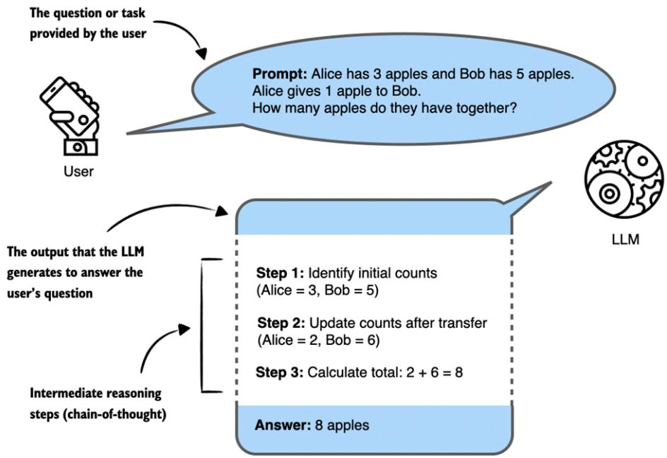  
Figure 1.1 A simplified illustration of how an LLM might tackle a multi-step reasoning task. Rather than just recalling a fact, the model needs to combine several intermediate reasoning steps to arrive at the correct conclusion. The intermediate reasoning steps may or may not be shown to the user, depending on the implementation.

LLM-produced intermediate reasoning steps, as shown in figure 1.1, look very much like a person articulating internal thoughts aloud. Yet how closely these methods (and the resulting reasoning processes) mirror human reasoning remains an open research question, one this book does not attempt to answer. It's not even clear that such a question can be definitively answered.

Instead, this book focuses on explaining and implementing the fundamental techniques that improve LLM-based reasoning and thus make LLMs better at handling complex tasks. My hope is that by gaining hands-on experience with these methods, you will be better prepared to understand and improve those reasoning methods being developed and maybe even explore how they compare to human reasoning.

# LLM VERSUS HUMAN REASONING

Reasoning processes in LLMs may closely resemble human thought, particularly in how intermediate steps are articulated. However, it's not (yet) clear whether LLM reasoning mirrors human reasoning in terms of internal cognitive processes. Humans often reason by consciously manipulating concepts, intuitively understanding abstract relationships, or generalizing from a few examples. In contrast, current LLM reasoning is primarily based on patterns learned from extensive statistical associations present in training data, rather than explicit internal cognitive structures or conscious reflection as recently evidenced by a study from a research team at Apple, The Illusion of Thinking: Understanding the Strengths and Limitations of Reasoning Models via the Lens of Problem Complexity (https://machinelearning. apple.com/research/illusion-of-thinking).

In short, although the outputs of reasoning-enhanced LLMs can appear human-like, the underlying mechanisms (likely) differ substantially and remain an active area of exploration.

# 1.2 Understanding the standard LLM training pipeline

This section briefly summarizes how conventional (non-reasoning) LLMs are typically trained so that we can understand where their limitations lie. This background will also help frame our upcoming discussions on the differences between pattern matching and logical reasoning.

Before applying any specific reasoning methodology, conventional LLM training is usually structured into two stages: pre-training and post-training, which are illustrated in figure 1.2.

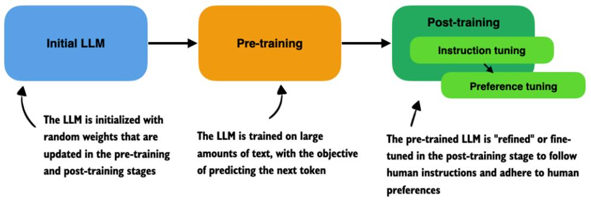  
Figure 1.2 Overview of a typical LLM training pipeline. The process begins with an initial model initialized with random weights, followed by pre-training on large-scale text data to learn language patterns by predicting the next token. Post-training then refines the model through instruction fine-tuning and preference fine-tuning, which enables the LLM to follow human instructions better and align with human preferences.In the pretraining stage, LLMs are trained on massive amounts (many terabytes) of unlabeled text, which includes books, websites, research articles, and many other sources. The pre-training objective for the LLM is to learn to predict the next word (or token) in these texts.

In the pre-training stage of a typical LLM training pipeline, as shown in figure 1.2, LLMs are trained on massive amounts (many terabytes) of unlabeled text, which includes books, websites, research articles, and many other sources. The pre-training objective (goal) for the LLM is to learn to predict the next word (i.e., token) in these texts.

# WORDS AND TOKENS

A token is a small unit of text that a language model processes. A token can be a full word, part of a word, or even punctuation, depending on how the text is split by a so-called tokenizer.

For example, the sentence "An LLM can be useful." might be broken into tokens like "An", " L", "LM", " can", " be", " useful", and "." by a common tokenizer. These tokens are then converted into numerical IDs that the model can ingest.

A tokenizer is a model or tool that is not directly part of the LLM itself but is nonetheless a critical component of the LLM text processing and generation pipeline. We will see how tokenization works in practice in the next chapter.

LLMs become highly capable when pre-trained on massive datasets, which typically involves several terabytes of text (equivalent to around 300 to 400 billion tokens). This training requires thousands of GPUs running for many months and can cost millions of dollars. Here, "capable" means that the LLMs begin to generate text that closely resembles human writing. Also, to some extent, pre-trained LLMs will begin to exhibit so-called emergent properties, which means that they will be able to perform tasks that they were not explicitly trained to do, including translation, code generation, and so on.

However, these pre-trained models merely serve as base models for the post-training stage, which uses two key techniques: supervised fine-tuning (often abbreviated as SFT in the literature and also known as instruction tuning) and preference tuning to teach LLMs to respond to user queries, which are illustrated in figure 1.3.

  
Figure 1.3 Example responses from a language model at different training stages. The prompt asks for a summary of the relationship between sleep and health. The pre-trained LLM produces a relevant but unfocused answer without directly following the instructions. The instruction-tuned LLM generates a concise and accurate summary aligned with the prompt. The preference-tuned LLM further improves the response by using a friendly tone and engaging language, which makes the answer more relatable and user-centered.

As shown in figure 1.3, instruction tuning improves an LLM's capabilities of personal assistance-like tasks like question-answering, summarizing and translating text, and many more. The preferences tuning stage then refines these capabilities. As the term implies, preference tuning helps tailor responses to user preferences. (Some readers may be familiar with terms like Reinforcement Learning Human Feedback or RLHF, which are specific techniques to implement preference tuning.)

In short, we can think of pre-training as "raw language prediction" (via next-token prediction) that gives the LLM some basic properties and capabilities to produce coherent texts. The post-training stage then improves the task understanding of LLMs via instruction tuning and refines the LLM to create answers with preferred stylistic choices via preference tuning.

These pre-training and post-training stages mentioned above are covered in my book "Build A Large Language Model (From Scratch)" (http://mng.bz/orYv) published by Manning. The book you are reading now does not require detailed knowledge of these stages. Concretely, in the next chapter, we will load a model that has already undergone the expensive pre-training and post-training stages mentioned above, so that we can focus on the methodology that is specific to reasoning models in the subsequent chapters.

# 1.3 Modeling language through pattern matching

As mentioned in the previous section, during pre-training, LLMs are exposed to vast quantities of text and learn to predict the next token by identifying and reproducing statistical associations in that data. This process enables them to generate fluent and coherent text, but it is fundamentally rooted in surface-level correlations rather than deep understanding.

LLMs respond to prompts by generating continuations that are statistically consistent with the patterns seen during training. In essence, they match patterns between input and output, rather than deducing answers through logical inference.

Consider the following example:

Prompt: "The capital of Germany is…"

Completion: "Berlin"

An LLM producing the answer "Berlin" is (likely) not logically deducing the answer. Instead, it is recalling a strong statistical association learned from training data. This behavior reflects what we refer to as pattern matching, which means that the model completes text based on learned correlations and not by applying structured reasoning steps.

But what about tasks that go beyond pattern recognition, i.e., tasks where a correct answer depends on drawing conclusions from given facts? This brings us to a different kind of capability: logical reasoning.

Logical reasoning involves systematically deriving conclusions from premises using rules or structured inference. Unlike pattern matching, it depends on intermediate reasoning steps and the ability to recognize contradictions or draw implications based on formal relationships.

Consider the following prompt as an example:

Prompt: "All birds can fly. A penguin is a bird. Can a penguin fly?"

A person, or a system capable of reasoning, would notice that something in the prompt example above is off. From the first two facts, you might conclude that a penguin should be able to fly. But if you also know that penguins cannot fly, there is a contradiction, as depicted in figure 1.4. A reasoning system would catch this conflict and recognize that either the first statement is too broad or that penguins are an exception.

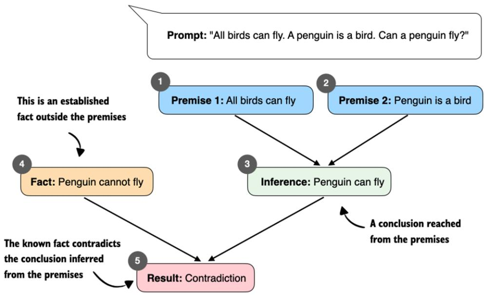  
Figure 1.4 Illustration of how contradictory premises lead to a logical inconsistency. From "All birds can fly" and "A penguin is a bird," we infer "Penguin can fly." This conclusion conflicts with the established fact "Penguin cannot fly," which results in a contradiction.

Figure 1.4 shows how a system based on logical reasoning could process the previously introduced "All birds can fly..." prompt.

In contrast, a statistical (pattern-matching) LLM does not explicitly track contradictions as shown in figure 1.4 but instead predicts based on learned text distributions. For instance, if information such as "All birds can fly" is reinforced strongly in training data, the model may confidently answer: "Yes, penguins can fly."

In the next section, we will look at a concrete example of how an LLM handles this "All birds can fly..." prompt.

# 1.4 Simulating reasoning without explicit rules

In the previous section, we saw how contradictory premises can lead to logical inconsistencies. A conventional LLM does not explicitly track contradictions but generates responses based on learned text distributions.

Let's see a concrete example, shown in figure 1.5, of how a non-reasoning-enhanced LLM like OpenAI's ChatGPT 4o responds to the "All birds can fly..." prompt discussed in the previous section.

ChatGPT 4o √


Consider that all birds fly. And a penguin is a bird. Can penguins fly?

If we assume the statement "all birds fly" to be absolutely true, then logically, since a penguin isa bird,it shouldbe able to fly.However,in reality,penguins area known exception -they are birds that cannot fly.

This highlights a flaw in the initial premise.The assumption that al/birds fly is incorrect because exceptions exist.This is an example of a logical syllogism where a universal premise is actually false.

Would you like me to formalize this reasoning using symbolic logic?

Is this conversation helpful so far?


  
Figure 1.5 An illustrative example of how a language model (ChatGPT 4o) appears to "reason" about a contradictory premise.

The example in figure 1.5 shows that ChatGPT 4o appears to answer correctly even though ChatGPT 4o is not considered a reasoning model, unlike OpenAI's other offerings like ChatGPT o1, o3, o4, and more recent GPT-5, which have been explicitly developed with reasoning methodology.

So, how did the 4o model generate its answer? Does this mean ChatGPT 4o explicitly reasons logically? No, not necessarily. However, at least 4o is highly effective at simulating logical reasoning in familiar contexts.

ChatGPT 4o does not implement explicit contradiction-checking and instead generates answers based on probability-weighted patterns. This approach works well enough if training data includes many instances correcting the contradiction (e.g., text like "penguins cannot fly") so that the model learns a statistical association between "penguins" and "not flying." As we see in figure 1.5, this allows the model to answer correctly without explicitly implementing rule-based or explicit logical reasoning methodologies.

In other words, the model recognizes the contradiction implicitly because it has frequently encountered this exact reasoning scenario during training. This effectiveness relies heavily on statistical associations built from abundant exposure to reasoning-like patterns in training data.

So, even when a conventional LLM seems to perform logical deduction as shown in figure 1.5, it's not executing explicit, rule-based logic but is instead leveraging patterns from its vast training data.

Nonetheless, ChatGPT 4o's success here is a great illustration of how powerful implicit pattern matching can become when trained at a massive scale. However, these types of pattern-based reasoning models usually struggle in scenarios where:

The logical scenario is novel (not previously encountered in training data).   
Reasoning complexity is high, involving intricate, multi-step logical relationships.   
Structured reasoning is required, and no direct prior exposure to similar reasoning patterns exists in training data.

# LOGICAL REASONING AND CURRENT REASONING LLM OFFERINGS

While ChatGPT 4o is not officially labeled as a reasoning model, OpenAI offers several dedicated reasoning models, including o1, o3, o4, and GPT-5. Moreover, other companies have been developing LLMs with explicit reasoning capabilities. As of this writing, popular examples include Anthropic's Claude 4, xAI's Grok 3, Google's Gemini 2.5, DeepSeek's R1, Alibaba's Qwen3, and many more. The techniques employed by these models are the focus of this book. As we will see, this is achieved without implementing a rule-based reasoning pipeline, as shown in figure 1.4. Instead, the LLM learns or improves its reasoning capabilities as a result of the modified inference and training methodologies.

# LOGICAL REASONING AND RULE-BASED SYSTEMS

Why are explicit rule-based systems not more popular? Rule-based systems were used widely in the '80s and '90s for medical diagnosis, legal decisions, and engineering. They are still used in critical domains (medicine, law, aerospace), which often require explicit inference and transparent decision processes. However, they are hard to implement as they largely rely on human-crafted heuristics. However, deep neural networks (like LLMs) prove to be great and flexible at many tasks when trained at scale.

We might say that LLMs simulate logical reasoning through learned patterns, and we can improve it further with specific reasoning methods that include inference-compute scaling and post-training strategies, but they are not explicitly executing any rule-based logic internally.

Moreover, it's worth mentioning that reasoning in LLMs exists on a spectrum. This means that even before the advent of dedicated reasoning models such as ChatGPT o1 and DeepSeek-R1, LLMs were capable of simulating reasoning behavior. For instance, these models exhibited behaviors aligning with our earlier definition, such as generating intermediate steps to arrive at correct conclusions. What we now explicitly label a "reasoning model" is essentially a more refined version of this capability. And these improved reasoning capabilities are achieved by leveraging specific inference-compute scaling techniques and targeted post-training methods designed to improve and reinforce reasoning behavior.

The rest of this book focuses specifically on these advanced methods that improve LLMs to solve complex problems, helping you better understand how to improve the implicit reasoning capabilities in LLMs.

# 1.5 Improving reasoning with training and inference techniques

Reasoning in the context of LLMs became popular in the public eye with the announcement of OpenAI's ChatGPT o1 on September 12, 2024, which popularized the concept of reasoning in LLMs. In the announcement article (https://openai.com/index/introducingopenai-o1-preview/), OpenAI mentioned that "We've developed a new series of AI models designed to spend more time thinking before they respond."

Furthermore, OpenAI wrote: "These enhanced reasoning capabilities may be particularly useful if you're tackling complex problems in science, coding, math, and similar fields."

While the training and implementation details of ChatGPT o1 are not publicly available, the common perception is that the o1 model is based on one of the predecessors, like GPT-4, but uses extensive inference-compute scaling (more on that later in this chapter) to achieve these enhanced reasoning capabilities.

A few months later, in January 2025, DeepSeek released the DeepSeek-R1 model and technical report (https://arxiv.org/abs/2501.12948), which details training methodologies to develop reasoning models, which made big waves as they not only made freely and openly available a model that competes with and exceeds the performance of the proprietary o1 model but also shared a blueprint on how to train such model.

This book aims to explain how these methodologies used to develop reasoning models work by implementing similar methods from scratch.

The different approaches to developing and improving an LLM's reasoning capabilities can be grouped into three broad categories, as illustrated in figure 1.6.

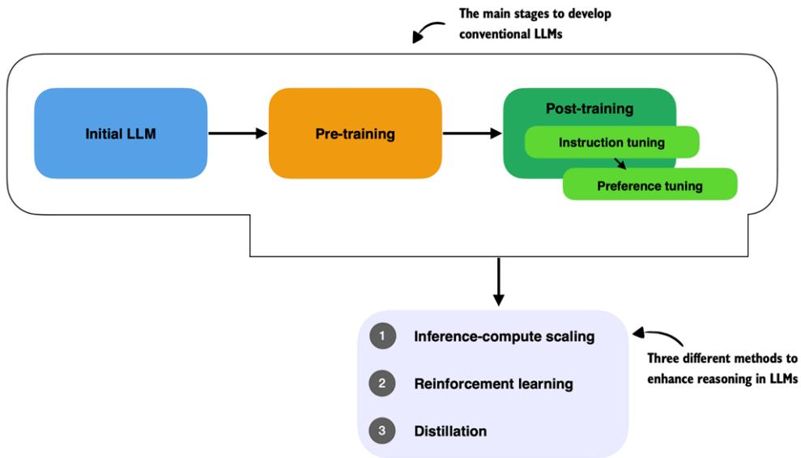  
Figure 1.6 Three approaches commonly used to improve reasoning capabilities in LLM). These methods (inference-compute scaling, reinforcement learning, and distillation) are typically applied after the conventional training stages (initial model training, pre-training, and post-training with instruction and preference tuning).

As illustrated in figure 1.6, these methods are applied to LLMs that have undergone the conventional pre-training and post-training phases, including instruction and preference tuning.

1. Inference-time compute scaling. Inference-time compute scaling (also often called inference compute scaling, test-time scaling, or other variations) includes methods that improve model reasoning capabilities at inference time (when a user prompts the model) without training or modifying the underlying model weights. The core idea is to trade off increased computational resources for improved performance, which helps make even fixed models more capable through techniques such as chain-of-thought reasoning, and various sampling procedures. This topic will be the focus of chapter 4.

2. Reinforcement learning. Reinforcement learning (RL) refers to training methods that improve a model's reasoning capabilities by encouraging it to take actions that lead to high reward signals. These rewards can be broad, such as task success or heuristic scores, or they can be narrowly defined and verifiable, such as correct answers in math problems or coding tasks.

Unlike scaling compute at inference time, which can improve reasoning performance without modifying the model, RL updates the model's weights during training. This enables the model to learn and refine reasoning strategies through trial and error, based on the feedback it receives from the environment. We will explore RL in more detail in chapter 5.

# REINFORCEMENT LEARNING FOR REASONING AND PREFERENCE TUNING

In the context of developing reasoning models, it is important to distinguish the RL approach here from reinforcement learning with human feedback (RLHF), which is used during preference tuning when developing a conventional LLM as illustrated previously in figure 1.2. RLHF incorporates explicit human evaluations or rankings of model outputs as reward signals, directly guiding the model toward human-preferred behaviors. In contrast, RL in the context of reasoning models typically relies on automated or environment-based reward signals, which can be more objective but potentially less aligned with human preferences. For instance, RL in a reasoning model development pipeline might train a model to excel at mathematical proofs by providing explicit rewards for correctness. In contrast, RLHF would involve human evaluators ranking various responses to encourage outputs that align closely with human standards and subjective preferences.

3. Supervised fine-tuning and model distillation. Distillation involves transferring complex reasoning patterns learned by powerful, larger models into smaller or more efficient models. Within the context of LLMs, this typically means performing supervised fine-tuning (SFT) using highquality labeled instruction datasets generated by a larger, more capable model. This technique is commonly referred to as knowledge distillation or simply distillation in LLM literature. However, it's important to note that this differs slightly from traditional knowledge distillation in deep learning, where a smaller ("student") model typically learns from both the outputs and the logits produced by a larger ("teacher") model. This topic is discussed further in Chapter 6.

# SUPERVISED FINE-TUNING FOR REASONING AND CONVENTIONAL LLM DEVELOPMENT

The SFT technique here is similar to the SFT technique used when developing a conventional LLM, except that the training examples are derived from a model explicitly developed for reasoning. Consequently, the training examples here focus more on reasoning tasks and typically include intermediate reasoning steps

# 1.6 Building reasoning models from scratch

Following the release of DeepSeek-R1 in January 2025, improving the reasoning abilities of LLMs has become one of the hottest topics in AI, and for good reason. Stronger reasoning skills allow LLMs to tackle more complex problems, making them more capable across various tasks users care about.

This shift is also reflected in a February 12, 2025, statement from OpenAI's CEO:

"We will next ship GPT-4.5, the model we called Orion internally, as our last non-chainof-thought model. After that, a top goal for us is to unify o-series models and GPTseries models by creating systems that can use all our tools, know when to think for a long time or not, and generally be useful for a very wide range of tasks."

The quote above underlines the major shift from leading LLM providers towards reasoning models, where "chain-of-thought" refers to a prompting technique that guides language models to reason step-by-step to improve their reasoning capabilities, which we will cover in more detail in Chapter 4.

Also noteworthy is the mention of knowing "when to think for a long time or not." This hints at an important design consideration: reasoning is not always necessary or desirable

For instance, reasoning models are designed to be good at complex tasks such as solving puzzles, advanced math problems, and challenging coding tasks. However, they are not necessary for simpler tasks like summarization, translation, or knowledge-based question answering. In fact, using reasoning models for everything can be inefficient and expensive. For instance, reasoning models are typically more expensive to use, more verbose, and sometimes more prone to errors due to "overthinking." Also, here, the simple rule applies: Use the right tool (or type of LLM) for the task.

Why are reasoning models more expensive than non-reasoning models? Primarily because they tend to produce longer outputs, due to the intermediate reasoning steps that explain how an answer is derived. As illustrated in Figure 1.7, LLMs generate text one token at a time. Each new token requires a full forward pass through the model. So, if a reasoning model produces an answer that is twice as long as that of a non-reasoning model, it will require twice as many generation steps, resulting in twice the computational cost. This also directly impacts cost in API usage, where billing is often based on the number of tokens processed and generated.

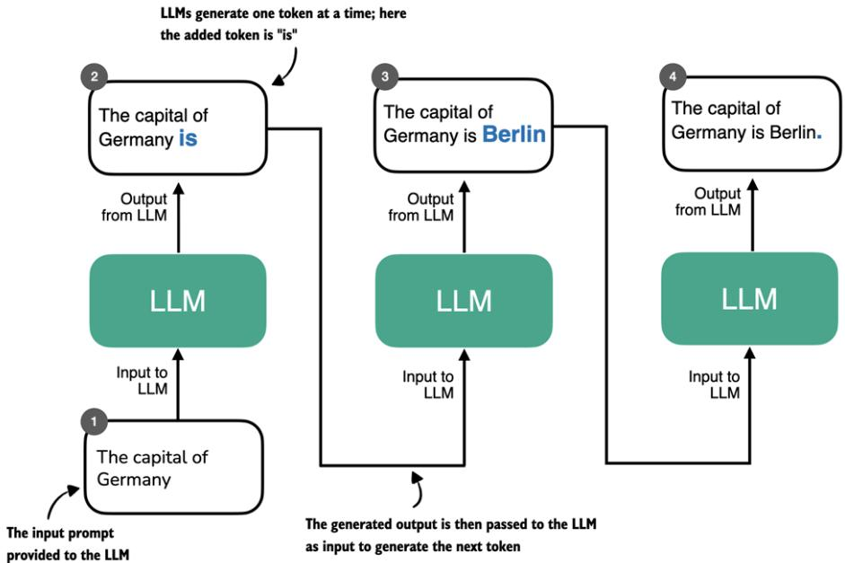  
Figure 1.7 Token-by-token generation in an LLM. At each step, the LLM takes the full sequence generated so far and predicts the next token, which may represent a word, subword, or punctuation mark depending on the tokenizer. The newly generated token is appended to the sequence and used as input for the next step. This iterative decoding process is used in both standard language models and reasoning-focused models.

This directly highlights the importance of implementing LLMs and reasoning methods from scratch. It's one of the best ways to understand how they work. And if we understand how LLMs and these reasoning models work, we can better understand these trade-offs.

# 1.7 A roadmap to reasoning models from scratch

Now that we have discussed reasoning in LLMs from a bird's-eye view, the subsequent chapters will guide you through the process of coding and applying reasoning methods from scratch. We will tackle this in multiple stages, as outlined in figure 1.8.

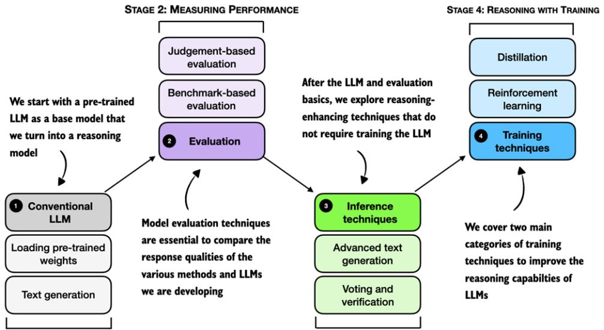  
STAGE1:LLM BASICS   
STAGE 3: REASONING WITHOUT TRAINING   
Figure 1.8 A mental model of the main reasoning model development stages covered in this book. We start with a conventional LLM as base model (stage 1). In stage 2, we cover evaluation strategies to track the reasoning improvements introduced via the reasoning methods in stages 3 and 4.

As shown in figure 1.8, we cover the reasoning model development in several stages. In stage 1 (next chapter), we load a conventional LLM that has already undergone the basic pre-training and instruction fine-tuning stages. Then, in stage 2, we cover common methods for evaluating LLMs and reasoning capabilities, so that we can measure the improvements we make when we apply reasoning-enhancing methods in stages 3 and 4.

Stage 3 covers inference techniques that can improve the response quality and reasoning behavior of LLMs. Note that these techniques can be applied to improve any LLM, conventional LLMs and LLMs that have been trained as reasoning models. Stage 4 will introduce training methods to develop reasoning models.

I hope you are as enthusiastic as I am about the journey ahead!

# 1.8 Summary

Conventional LLM training occurs in several stages:

。 Pre-training, where the model learns language patterns from vast amounts of text.   
。 Instruction fine-tuning, which improves the model's responses to user prompts.   
Preference tuning, which aligns model outputs with human preferences.

Reasoning methods are applied on top of a conventional LLM.   
Reasoning in LLMs involves systematically solving multi-step tasks using intermediate steps (chain-of-thought).

Reasoning in LLMs is different from rule-based reasoning and it also likely works differently than human reasoning; it's currently believed that reasoning in LLMs relies on statistical pattern matching.   
Pattern matching in LLMs relies purely on statistical associations learned from data, which enables fluent text generation but lacks explicit logical inference.   
Improving reasoning in LLMs can be achieved through:

Inference-time compute scaling, enhancing reasoning without retraining (e.g., chain-of-thought prompting).   
。 Reinforcement learning, training models explicitly with reward signals.   
。 Supervised fine-tuning and distillation, using examples from stronger reasoning models.

Building reasoning models from scratch provides practical insights into LLM capabilities, limitations, and computational trade-offs.

# 2 Generating text with apre-trainedLLM

# This chapter covers

Setting up the code environment for working with LLMs   
How to use a tokenizer to prepare input text for an LLM   
The step-by-step process of text generation using a pre-trained LLM   
Caching and compilation techniques for speeding up LLM text generation

In the previous chapter, we discussed the difference between conventional large language models (LLMs) and reasoning models. Also, we introduced several techniques to improve the reasoning capabilities of LLMs. These reasoning techniques are usually applied on top of a conventional (base) LLM.

In this chapter, we will lay the groundwork for the upcoming chapters and load such a conventional LLM on top of which we can apply reasoning techniques in subsequent chapters, as illustrated in figure 1. This conventional LLM is an LLM that has already been pre-trained to generate general texts (but it has not been specifically trained or enhanced for reasoning).

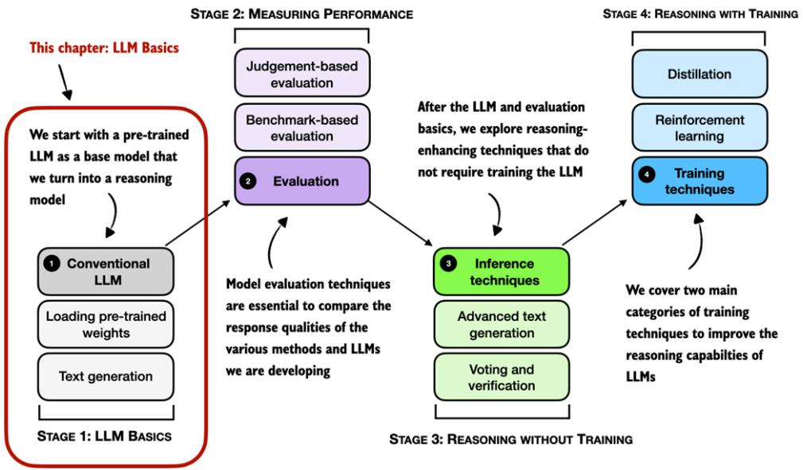  
Figure 2.1 A mental model depicting the four main stages of developing a reasoning model. This chapter focuses on stage 1, loading a conventional LLM and implementing the text generation functionality.

In addition to setting up the coding environment and loading a pre-trained LLM, you will learn how to use a tokenizer to prepare text input for the model. As illustrated in figure 2.1, you will also implement a text generation function, enabling practical use of the LLM to generate text. This functionality will be used and further improved in later chapters.

# 2.1 Introduction to LLMs for text generation

In this chapter, we implement all the necessary LLM essentials, from setting up our coding environment and loading a pre-trained LLM to generating text that we will reuse and build upon in this book. In this sense, this chapter can be understood as a setup chapter.

This LLM will be capable of following basic instructions and generating coherent text, as illustrated in figure 2.2.

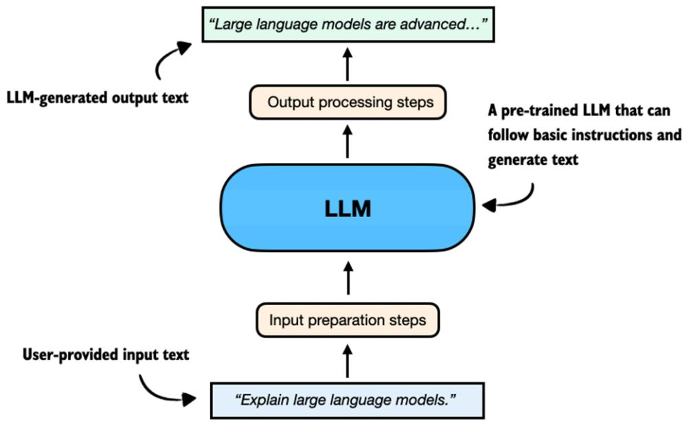  
Figure 2.2 An overview depicting an LLM generating a response (output text) given a user query (input text)   
Figure 2.2 summarizes the components of an LLM text generation pipeline, and we will discuss and implement these steps in more detail later in this chapter.

NOTE By convention, diagrams involving neural networks such as LLMs are drawn and read vertically from bottom (inputs) to top (outputs). Arrows indicate the flow of information upward through the model.

If you have not coded an LLM or used LLMs programmatically before, this chapter will teach you how the text generation process works. However, in this chapter, we will not go deep into the internals of an LLM, such as the attention mechanism and other architecture components; this is the topic of my other book, Build a Large Language Model (from Scratch). Note that understanding these internals are not required for this book, and, if you are curious, you can learn about them after you finish reading this book.

Before we begin implementing the components shown in figure 2.2, including input preparation, loading the LLM, and generating text, we first need to set up our coding environment. This is the focus of the next section.

# 2.2 Setting up the coding environment

This section provides instructions and recommendations for setting up your Python coding environment to follow along with the examples in this book. I recommend reading this section in its entirety before deciding which way is for you.

If you are reading this book, you have probably coded in Python before. In this case, the simplest way to install dependencies, if you already have a Python environment set up (with Python 3.10 or newer), is to use Python's package installer (pip) in your terminal.

If you have downloaded the code from the publisher's website, use the requirements.txt file to install the required Python libraries used throughout this book:

```batch
pip install -r requirements.txt 
```

Alternatively, to install the required packages directly without downloading the requirements.txt file, use:

```batch
pip install -r https://raw.githubusercontent.com/\rasbt/reasoning-from-scratch/refs/heads/main/requirements.txt 
```

# PYTHON PACKAGES USED IN THIS CHAPTER

If you prefer to install only the packages used in this chapter, you can do this with the following command:

```txt
pip install torch>=2.7.1 tokenizers>=0.21.2 reasoning-from-scratch 
```

torch refers to PyTorch, a widely used deep learning library that provides tools for building and training neural networks.   
tokenizers is a library that provides efficient tokenization algorithms, used to prepare input data for LLMs.   
reasoning-from-scratch is a custom library that I developed for this book. It includes all the code examples implemented throughout the chapters, along with additional utility functions we will be using.

While pip is the canonical way to install Python packages, my preferred way to use Python is via the widely recommended uv Python package and project manager instead. It comes with its own Python executable, so it's also a great option if you don't have Python installed on your system, yet.

Figure 2.3 outlines the 4-step process from installing uv to getting ready to execute the code in this chapter, which we will cover in the remainder of this section.

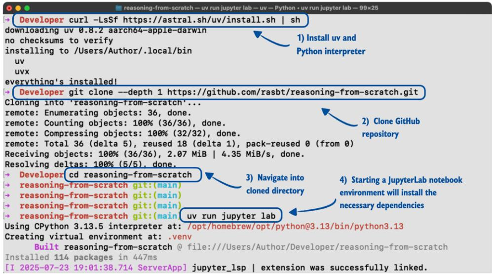  
Figure 2.3 Installing and using the uv Python package and project manager via the macOS terminal

Note that figure 2.3 steps through the uv installation and usage on a macOS terminal, but uv is supported by Linux and Windows as well.

1) To install uv, run the installation for your OS from the official website: https://docs. astral.sh/uv/getting-started/installation/   
2) Next, clone the GitHub repo:

git clone --depth 1 https://github.com/rasbt/reasoning-from-scratch.git

Here, the --depth 1 option tells git to perform a shallow clone, which means it only downloads the latest version of the code without the full version history. This makes the download faster and uses less space.

If you don't have git installed, you can also manually download the source code repository from the publisher's website or by opening this link in your browser: https://github.com/rasbt/reasoning-from-scratch/archive/refs/heads/main.zip (unzip it after downloading).

3) Next, in the terminal, navigate to the reasoning-from-scratch folder.   
4) Inside the reasoning-from-scratch folder, execute:

uv run jupyter lab

The command above will launch JupyterLab, where you can open a blank Jupyter notebook to type and execute code or open the chapter 2 notebook that contains all the code covered in this chapter.

The above uv run... command also sets up a local virtual environment (usually inside an invisible .venv/ folder) and installs all dependencies from the pyproject.toml file inside the reasoning-from-scratch folder automatically. So, the manual installation of code dependencies via the requirements file is not needed. However, if you plan to install additional packages, you can use the following command:

uv add packagename

The supplementary code repository contains additional installation instructions and details inside the ch02 subfolder if needed.

# 2.3 Understanding hardware needs and recommendations

You may have heard that training LLMs is very expensive. For leading LLM companies, it is not uncommon to spend anywhere between 1-10 million Dollars on the small end and $\mathtt { > 5 0 }$ million Dollars on the high end in terms of compute costs to train a new base model LLM before even adding any reasoning techniques.

This high price tag would make the development of an LLM unfeasible for me and most readers. So, we are going to use a relatively small (but capable) pre-trained LLM on top of which we implement reasoning techniques.

Note that this smaller LLM is a scaled-down version that otherwise follows the same architecture as contemporary state-of-the-art models. And the reasoning methods that we will apply are the same as those used by larger LLMs. The difference is that the smaller LLM allows us to explore these methods in a budget-friendly way.

As an analogy, imagine you are curious to learn how cars work. If you are new to cars, as a learning exercise, you probably wouldn't start out building an expensive Ferrari right away. Instead, you would, for example, create a smaller car like a Volkswagen Beetle to start with, which still teaches you a lot about how engines and the transmission work. On the contrary, I would even say that working on a smaller car helps you better understand how the engine and transmission work because it gets complicated refinements and other details out of the way.

However, while we will use a relatively small model for these educational purposes in this book, the usage, development, and application of the reasoning techniques are still computationally intensive, and later chapters, such as chapters 5-7, will benefit from using a GPU.

If you followed the previous section, you should have PyTorch installed, which you can use to see if your computer has a PyTorch-supported GPU by executing the following PyTorch code in Python:

```python
import torch   
print(f"PyTorch version {torch._version\_}"） if torch.cuda.is-available(): print("CUDA GPU") elif torch.mps.is-available(): print("Apple Silicon GPU") else: print("Only CPU") 
```

Depending on your machine, the code may return:

```txt
PyTorch version 2.7.1  
Only CPU 
```

Don't worry if your machine does not have a GPU to run the code. Chapters 2-4 can be executed in a reasonable time on a CPU.

Depending on the chapter, the code will automatically use an NVIDIA GPU if available, otherwise run on the CPU (or Apple Silicon GPU if recommended for a particular section or chapter). However, I will provide more information in the respective sections and chapters.

Like many other AI researchers who work on and with LLMs daily, I don't have a machine with the necessary GPU hardware to train LLMs at home and use cloud resources instead. If you are looking for cloud provider options, my personal preference is Lightning AI Studio (https://lightning.ai/), due to its ease of use and feature support, as shown in figure 2.4. Alternatively, Google Colab (https://colab.research.google.com/) is another good choice.

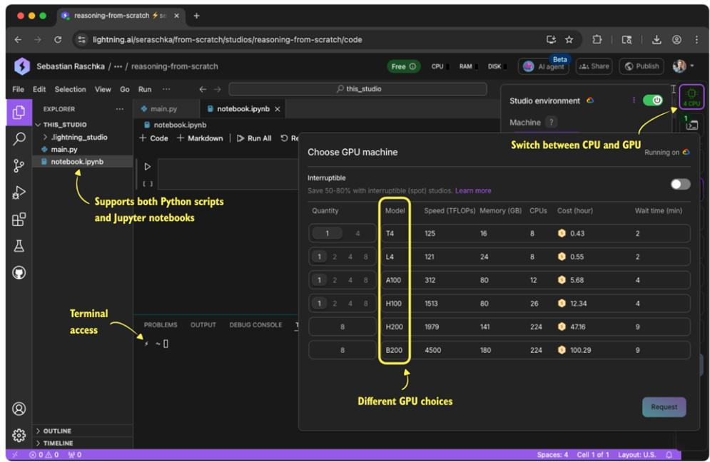  
Figure 2.4 An overview of the Lightning AI GPU cloud platform in a web browser. The interface supports Python scripts, Jupyter notebooks, terminal access, and lets users switch between CPU and various GPU types based on their compute needs.

As of this writing, Lightning AI also offers users free compute credits after the sign-up and verification process, which can be used for the different GPU choices shown in figure 2.4. (As mentioned before, a GPU is not needed for this chapter; however, if you want to use a GPU, the L4 GPU is more than sufficient for this chapter.

NOTE For disclosure, I helped build and launch the Lightning AI platform in 2023 and still hold a small stake. I am not sponsored to recommend it and pay for it myself. I use it because I simply find it the most convenient. It supports multiple types of GPUs, allows easy switching between them and back to CPU to save costs, and lets me pause or resume environments without redoing the setup.

The supplementary code repository contains additional GPU platform recommendations inside the ch02 subfolder if needed.

# USING PYTORCH

In this section, we imported and used the PyTorch library, which is currently the most widely used general-purpose library. We will use it throughout this book to run and train LLMs, including the reasoning methods we will develop. If you are new to PyTorch, to get the most out of this book, I recommend reading through my PyTorch in One Hour: From Tensors to Training Neural Networks on Multiple GPUs tutorial, which is freely available on my website at https://sebastianraschka.com/teaching/ pytorch-1h.

# 2.4 Preparing input texts for LLMs

In this section, we explore how to use a tokenizer to process input and output text for an LLM, as shown in figure 2.5, which expands on the input and output preparation steps shown earlier in figure 2.2 to provide a more detailed view of the tokenization pipeline.

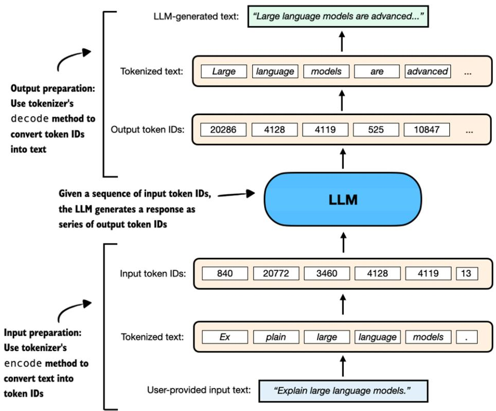  
Figure 2.5 A simplified illustration of how an LLM receives input data and generates output. The user-provided text is tokenized into IDs using the tokenizer's encode method, which are then processed by the LLM to generate output token IDs. These are decoded back into human-readable text using the tokenizer's decode method.

To see how this works in practice, we will begin by loading a tokenizer from this book's reasoning-from-scratch Python package, which should have been installed according to the instructions in section 2.2.

To download the tokenizer files (corresponding to the Qwen3 base LLM, which we will introduce in the next section), run:

```python
from reasoning_from_scratch.qwen3 import download_qwen3_small
download_qwen3_small(kind="base", tokenizer_only=True, out_dir="qwen3") 
```

This will display a progress bar similar to:

tokenizer-base.json: $100\%$ (6MiB/6MiB)

The command downloads the tokenizer-base.json file (approximately 6 megabytes in size) and saves it in a qwen3 subdirectory.

Now, we can load the tokenizer settings from the tokenizer file into the Qwen3Tokenizer:

from pathlib import Path   
from reasoning_from_scratch.qwen3 import Qwen3Tokenizer   
tokenizer_file_path $=$ Path("qwen3") / "tokenizer-base.json"   
tokenizer $=$ Qwen3Tokenizer(tokenizer_file_path $\equiv$ tokenizer_file_path)

Since we have not loaded the LLM yet (the central component shown in figure 2.5), we will first do a simpler dry run using just the tokenizer. Specifically, we will do a tokenization round-trip, that is, we will encode a text into token IDs and then decode those IDs back into text, as illustrated in figure 2.6.

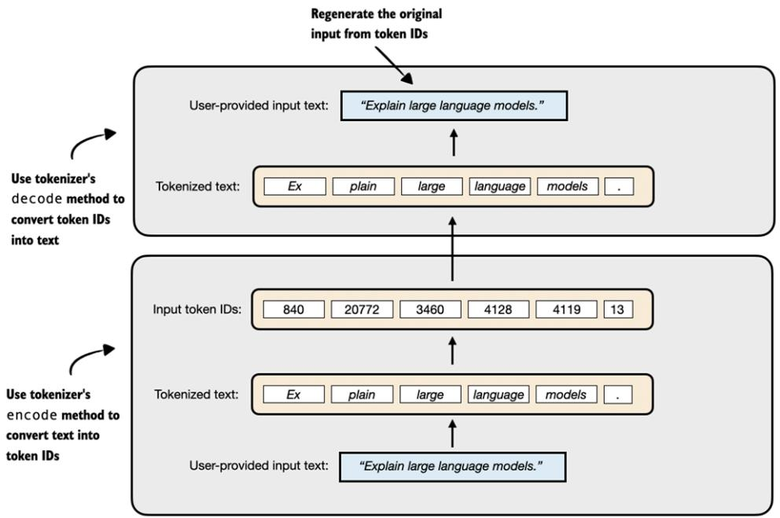  
Figure 2.6 A demonstration of the round-trip tokenization process using a tokenizer. The user-provided input text is first converted into token IDs using the encode method, and then accurately reconstructed back into the original text using the decode method.

The following code snippet implements the encoding process shown at the bottom of figure 2.6:

```python
prompt = "Explain large language models."
input_token_ids_list = tokenizer.encode(prompt) 
```

And the following code implements the decoding process, converting the token IDs back into text, shown at the top of figure 2.6:

text $=$ tokenizerdecode(input_token_ids_list)   
print(text)

Based on the printed results, we can see that the tokenizer reconstructed the original input prompt from the token IDs:

'Explain large language models.'

Before we move on to the LLM, let's take a look at the token IDs that were generated by the encode method. The following code prints each token ID and its corresponding decoded string to help illustrate how the tokenizer works:

```txt
for i in input_token_ids_list: print(f"[i]-->{tokenizerdecode([i])}" 
```

The output is as follows:

```txt
840 ---> Ex  
20772 ---> plain  
3460 ---> large  
4128 ---> language  
4119 ---> models  
13 ---> . 
```

As shown in the output, the original text is split into six token IDs. Each token represents a word or subword, depending on how the tokenizer segments the input.

For example, "Explain" was split into two separate tokens, "Ex" and "plain". This is because the tokenizer algorithm uses a subword-based method based on Byte Pair Encoding (BPE). BPE can represent both common and rare words using a mix of full words and subword units. Spaces are also often included in tokens (for example, " large"), which helps the LLM detect word boundaries.

The Qwen3Tokenizer has a vocabulary of about 151,000 tokens, which is considered relatively large as of this writing (for comparison, the early GPT-2 has a vocabulary size of approximately 50,000 tokens, and Llama 3 has a vocabulary size of approximately 128,000 tokens).

A larger vocabulary in a language model increases its size and computational cost for each individually generated token, but it also allows more words to be represented as single tokens rather than being split into subword components. This is beneficial because splitting a word (like breaking "Explain" into "Ex" and "plain") results in more input tokens. More tokens lead to longer input sequences, which increases processing time and resource usage. For instance, doubling the number of tokens can roughly double the computational cost of running the model as it needs to generate more tokens to complete the response.

Unfortunately, a detailed coverage and from-scratch implementation of a tokenizer is outside the scope of this book. However, interested readers can find additional resources, including my from-scratch implementation, in the further resources and reading sections in appendix A.

# EXERCISE 2.1: ENCODING UNKNOWN WORDS

Experiment with the tokenizer to see if and how it handles unknown words. For this, get creative and make up words that don't exist. Also, if you speak multiple languages, try to encode words in a different language than English.

# 2.5 Loading pre-trained models

In the previous section, we loaded and familiarized ourselves with the tokenizer that prepares the input data for an LLM and converts LLM outputs back into a human-readable text representation. In this section, we will load the LLM itself, as shown in the overview in figure 2.7.

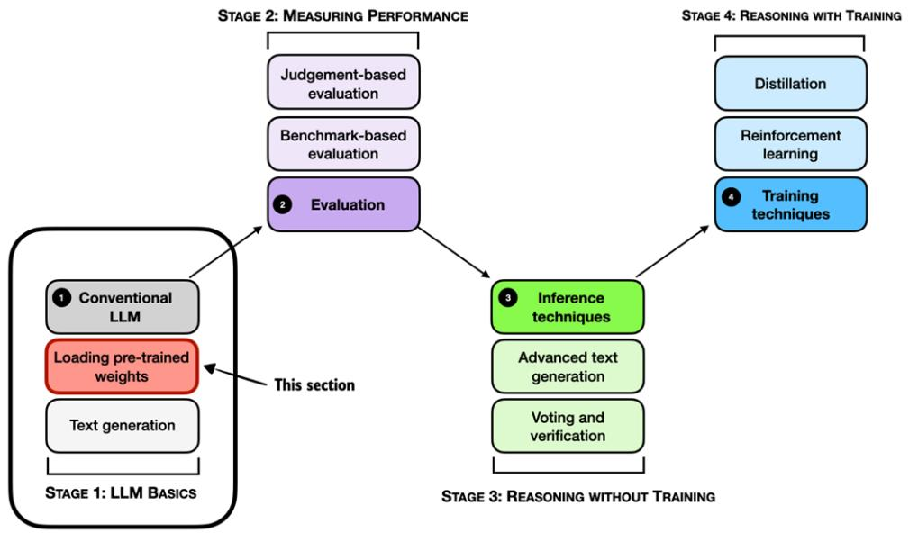  
Figure 2.7 An overview of the four key stages in developing a reasoning model in this book. This section focuses on loading pre-trained LLM in Stage 1.

As mentioned in the previous section, this book uses Qwen3 0.6B as a pre-trained base model. In this section, we load its pre-trained weights, as shown in figure 2.7. The "0.6B" in the model name indicates that the model contains approximately 0.6 billion weight parameters.

Why Qwen3? After carefully evaluating several open-weight base models, I chose Qwen3 0.6B for the following reasons:

For this book, we want a small yet capable open-weight model that can run on consumer hardware.   
The larger variants of the Qwen3 model family are, as of this writing, the leading open-weight models in terms of modeling performance.   
Qwen3 0.6B is more memory-efficient compared to Llama 3 1B and OLMo 2 1B.   
Qwen3 offers both a base model (the focus of our reasoning model development) and an official reasoning variant that we can use as a reference for evaluation purposes.

NOTE The canonical spelling of "Qwen3" does not include whitespace, whereas "Llama 3" does.

In line with the spirit of building things "from scratch," this book uses a custom reimplementation of Qwen3 that I wrote in pure PyTorch, which is entirely independent of external LLM libraries. The emphasis of this reimplementation is on code readability and tweakability, in case you want to modify it later for your own experiments. Despite being built from scratch, this implementation remains fully compatible with the original pretrained Qwen3 model weights.

However, this book does not cover the Qwen3 code implementation in depth. This topic alone would fill an entire separate book, similar to my other book, Build A Large Language Model (From Scratch). Instead, this Build A Reasoning Model (From Scratch) book specifically focuses on implementing reasoning methods on top of a base model, in this case, Qwen3.

NOTE This reimplemented Qwen3 LLM runs entirely locally, just like any other neural network implemented in PyTorch. There are no server-side components or external API calls involved. All model usage happens on your own machine, and your data stays on your device. If you are concerned about privacy, the setup we are using ensures full control over both the LLM inputs and outputs.

For those interested in additional details about Qwen3, as well as the model code, please see appendix C.

Before we load the model, we can specify the device we are going to use, namely, CPU or GPU. The following code will select the best-available device automatically:

```python
def get_device(   ):
	if torch.cuda.is-available(   ):
	device = torch.device("CUDA")
	print("Using NVIDIA CUDA GPU")
	else:
	device = torch.device("mps")
	print("Using Apple Silicon GPU (MPS) "
	else:
	device = torch.device("cpu")
	print("Using CPU")
	return device
device = get_device(   ) 
```

While GPUs generally provide substantial speed and performance improvements, it can be helpful to initially run the remaining code in this chapter using the CPU for compatibility and debugging purposes. You can temporarily override the automatic selection by explicitly setting:

```txt
device = torch.device("cpu") 
```

After finishing the chapter and verifying the code works properly on the CPU, remove or comment out the manual override and rerun the code. If your system has a GPU, you should then observe improved performance.

NOTE The code in the remainder of this chapter was executed on a Mac Mini with an Apple M4 CPU. Performance comparisons with the Apple Silicon M4 GPU and the NVIDIA H100 GPU are included at the end of the chapter.

However, before we load the model and put it onto the selected device, we first need to download the weights for Qwen3 0.6B. These files are required to initialize the pre-trained model correctly:

```javascript
download_qwen3_small(kind="base",tokenizer_only=False,out_dir="qwen3") 
```

The output is as follows:

qwen3-0.6B-base.pth: $100\%$ (1433 MiB / 1433 MiB)  
✓ qwen3tokenizer-base.json already up-to-date

(There is a checkmark in front of the tokenizer because we already downloaded it in the previous section.)

After downloading the model weights via the previous step, we can now instantiate a Qwen3Model class into which we load the pre-trained weights via PyTorch's load_state_dict method:

```python
from reasoning_from_scratch.qwen3 import Qwen3Model, QWEN_CONFIG_06_B  
model_file = Path("qwen3") / "qwen3-0.6B-base.pth"  
model = Qwen3Model(QWEN_CONFIG_06_B)  #A  
model.load_state_dict(torch.load(model_file))  #B  
model.to(device)  #C 
```

#A Instantiate a Qwen3 model with random weights as placeholders

#B Load the pre-trained weights into the model

#C Transfer the model to the designated device (e.g., "cuda")

Note that if the device setting is "cpu", the model.to(device) operation will be skipped because the model already sits in CPU memory by default.

After executing the code above, you should see the following output:

```txt
Qwen3Model(   
(token_emb): Embedding(151936, 1024)   
(trf_blocks): ModuleList(   
(0-27): 28 x TransformerBlock(   
(att): GroupedQueryAttention( (W_query): Linear(in_features=1024, out_features=2048, bias=False) (W_key): Linear(in_features=1024, out_features=1024, bias=False) (W_value): Linear(in_features=1024, out_features=1024, bias=False)   
(out_proj): Linear(in_features=2048, out_features=1024, bias=False) (q_norm): RMSNorm()   
(k_norm): RMSNorm()   
)   
(ff): FeedForward( (fc1): Linear(in_features=1024, out_features=3072, bias=False) (fc2): Linear(in_features=1024, out_features=3072, bias=False) (fc3): Linear(in_features=3072, out_features=1024, bias=False)   
(norm1): RMSNorm()   
(norm2): RMSNorm()   
)   
(final_norm): RMSNorm()   
(out_head): Linear(in_features=1024, out_features=151936, bias=False) 
```

This output is a summary of the Qwen3 0.6B base model architecture, as printed by PyTorch. It highlights the model's core components: an embedding layer, a stack of 28 transformer blocks, and a final linear projection head. Each transformer block includes a grouped-query attention mechanism and a multi-layer feedforward network, along with normalization layers throughout.

These components are also illustrated visually in figure 2.8 for readers familiar with LLM architectures. However, a detailed understanding of this architecture is not required for this book. Since we are not modifying the base model itself, but rather building reasoning methods on top of it, you can safely treat the architecture as a black box for now. However, interested readers can optionally find more information on these components in appendix C.

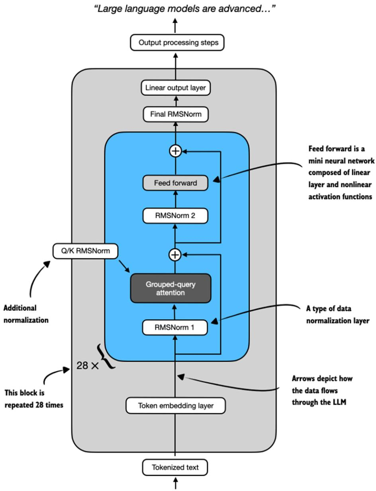  
"Explain large language models."   
Figure 2.8 Overview of the Qwen3 0.6B model architecture. Input text is tokenized and passed through an embedding layer, followed by 28 repeated transformer blocks. Each block contains grouped-query attention, feedforward layers, and RMS normalization. The model ends with a final normalization and linear output layer. Arrows show the data flow through the model.

The key takeaway from this section is that we have now loaded a pre-trained model, with its architecture shown in figure 2.8, that should be capable of generating coherent text. In the next section, we will code a text generation function that feeds tokenized data into the model and returns the response in a human-readable format.

# 2.6 Understanding the sequential LLM text generation process

After loading a pre-trained LLM, our goal is to write a function that leverages the LLM to generate text. This function forms the foundation for reasoning-improving methods that we will implement later in the book, as shown in figure 2.9.

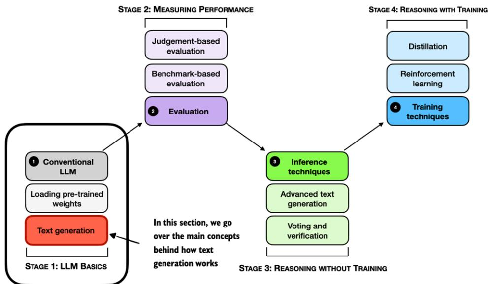  
Figure 2.9 An overview of the four key stages in developing a reasoning model in this book. This section explains the main concept behind text generation in LLMs, which allows us to implement a text generation function for using the pre-trained LLM in the remainder of this chapter.

However, before we get to implement this text generation function that we will use in this and upcoming chapters (as shown in figure 2.9), let's go over the basic concepts behind text generation in LLMs.

You may already know that text generation in LLMs is a sequential process where LLMs generate one word at a time. This is often also called autoregressive text generation and is shown in figure 2.10

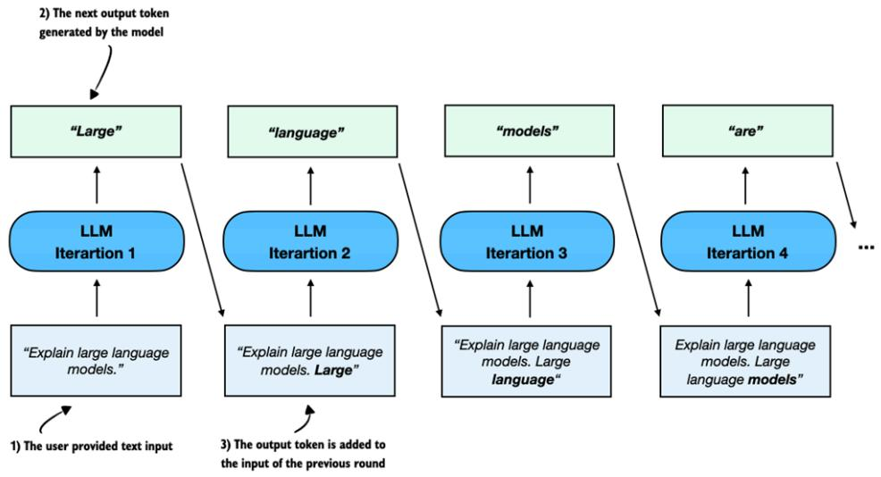  
Figure 2.10 An illustration of the sequential (autoregressive) text generation in LLMs. At each iteration, the model generates the next token based on the input and previously generated tokens, which are cumulatively fed back into the model to produce coherent output.

Note that the sequential text generation process shown in figure 2.10 is a broad overview. The figure shows one generated output token (top row) at each step, when feeding it with an input prompt. This is done for simplicity to explain the main concept behind LLM-based text generation.

Now, if we look at one of these iterations more closely, an LLM generates one output token for each input token. This means that if we have six input tokens, the LLM returns six output tokens, as illustrated in figure 2.11. However, it is important to note that we only care about the last generated token in each iteration.

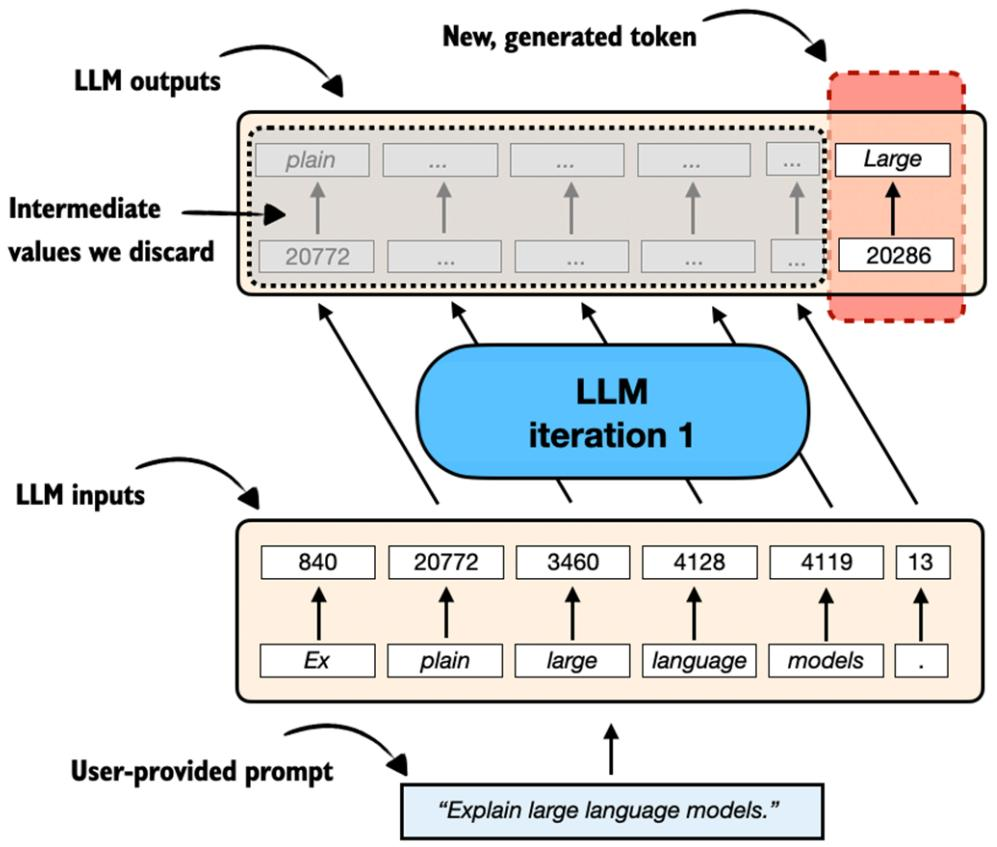  
Figure 2.11 A closer look at a single iteration of the autoregressive text generation process. The LLM generates an output sequence that mirrors the input but is shifted one position to the right. At each iteration, the model predicts the next token in the sequence, The LLM effectively learns to continue the input prompt one token at a time.

Before implementing a text-generation function that uses the concept shown in figure 2.11 for each iteration to implement the autoregressive text generation process shown in figure 2.10, let's take a look at a code example to illustrate figure 2.11 further by reusing the "Explain large language models." example prompt from section 2.4:

```elixir
prompt = "Explain large language models."
input_token_ids_list = tokenizer.encode(prompt)
print(f"Number of input tokens: {len(input_token_ids_list)}")
input:tensor = torch.tensor(input_token_ids_list)  #A
input:tensor fmt = input_tensor unsqueeze(0)  #B
output_tensor = model(input_tensor fmt)  #C
output_tensor fmt = output_tensor.squeeze(0)  #D
print(f"formatted Output tensor shape: {output_tensor fmt.shape}") 
```

#A Convert Python list into PyTorch tensor

#B Add an additional dimension

#C Generate the output

#D Remove the extra dimension

# SQUEEZING AND UNSQUEEZING TENSORS

The .squeeze() and .unsqueeze() operations in PyTorch are used to change the shape of a tensor by removing or adding dimensions of size 1. This is often useful for reshaping a tensor to match what a model expects. For example, a model might expect input tensors with two dimensions (e.g., rows and columns) so it can process batches of inputs (see appendix E). But if the input is just a row vector, we can use .unsqueeze(0) to add an extra dimension and make it compatible:

example $=$ torch.tensor([1,2,3])   
print的例子）   
print(example.unsqueeze(0))

This returns:

```lua
tensor([1,2，3]) tensor([[1，2，3]])
```

Here, .unsqueeze(0) adds a new dimension at position 0, turning a 1D tensor into a 2D tensor with shape (1, 3). Conversely, .squeeze(0) removes a dimension of size 1 from position 0:

example $=$ torch.tensor([[1,2,3]])   
print.example)   
print(exampie.squeeze(0))

This returns:

tensor([[1, 2, 3]])

tensor([1, 2, 3])

This is useful when you want to remove extra dimensions that are not needed.

The output from the previous code example is follows:

Number of input tokens: 6

Formatted Output tensor shape: torch.Size([6, 151936])

As we can see, we feed six input tokens into the model, which returns a 6×151,936- dimensional matrix. The 6 in this matrix corresponds to the six input tokens. The second dimension, 151,936, corresponds to the vocabulary size that the model supports. For instance, each of the six tokens is represented by a vector with 151,936 values. We can think of the values in these vectors as scores for each possible word in the vocabulary, where the highest score corresponds to the most likely word or subword (in the 151,936- entry vocabulary) to be chosen as the generated token.

So, to get the next generated word, we extract the last row of this $6 \times 1 5 1$ ,936- dimensional matrix, find the token ID corresponding to the largest score value in this row, and convert this token ID back into text via the tokenizer, as illustrated in figure 2.12.

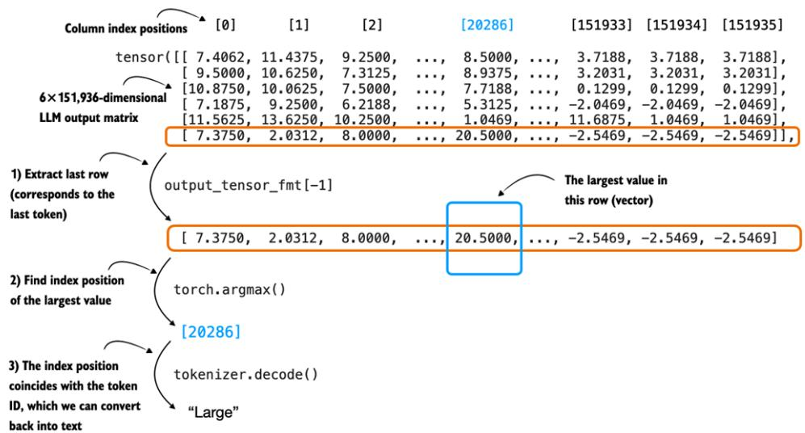  
Figure 2.12 A closer look at how the raw scores output by an LLM, in a single text generation iteration, are converted into a token ID and its corresponding text representation.

Let's see how we can convert the LLM output matrix into the generated text token (shown in figure 2.12) in code:

Note that LLMs are trained with a next-word prediction task, and as shown in figure 2.11, we are only interested in the last token, which we can obtain via the [-1] index:

```python
last_token = output_tensor_fmt[-1].detach()  
print(last_token) 
```

Here, .detach() separates the tensor from the part of the system that tracks how the model learns. In simple terms, it lets us take the last token from the model's output and use it for the next step without keeping extra information we don't need during generation. This saves memory and can make things run faster.

This prints the 151,936 values corresponding to the last token:

```javascript
tensor([7.3750, 2.0312, 8.0000, ..., -2.5469, -2.5469, -2.5469], dtype=torch.bfloat16) 
```

Then, we can use the argmax function to obtain the position with the largest value score (value) in this tensor:

```txt
print(last_token.argmax(dim=-1, keepdim=True)) 
```

The result is:

```txt
tensor([20286])
```

This returned integer value is the position of the largest value in this vector, and it also corresponds to the token ID of the generated token (last_token), which we can translate back into text via the tokenizer:

```lua
print(tokenizer Decode([20286])) 
```

This prints the generated token:

Large

# SQUEEZING AND UNSQUEEZING TENSORS

The .squeeze() and .unsqueeze() operations in PyTorch are used to change the shape of a tensor by removing or adding dimensions of size 1. This is

# MAX VERSUS ARGMAX

The torch.max() and torch.argmax() functions in PyTorch are used to find the largest value in a tensor and the index of that value. For example:

example $=$ torch.tensor([-2,1,3,1])   
print(torch.max(example))   
print(torch.argmax(example))

This returns:

```txt
tensor(3) tensor(2)
```

The maximum value is 3, and it first appears at index 2.

We can also use keepdim $\varepsilon ^ { = }$ True with torch.argmax() to keep the output shape consistent by retaining the reduced dimension:

```julia
print(torch.argmax(object, keepdim=True)) 
```

This returns:

```lisp
tensor([2])
```

Here, keepdim $! ^ { = }$ True keeps the result as a 1D tensor with the same number of dimensions as the input, which can be helpful for keeping the shape required by the tokenizer and for concatenation later on in our text generation function.

To recap, figure 2.10 illustrated the iterative (autoregressive) text generation process in an LLM. Then, figure 2.11 zooms in on one of the iterations in this process. Figure 2.12 then further zoomed into this one iteration and shows how the score matrix (output by an LLM), gets converted into a token ID (and its corresponding text representation).

While we have seen how to use the LLM to generate a single token, in the next section, we will put these concepts to action and implement a function that applies this concept sequentially to generate coherent output text.

# 2.7 Coding a minimal text generation function

The previous section explained a single iteration in the basic, sequential text generation process in LLMs. In this section, building on that concept, we will implement a text generation function that uses the pre-trained LLM to generate coherent text following a user prompt, as illustrated in Figure 2.13 in the chapter overview.

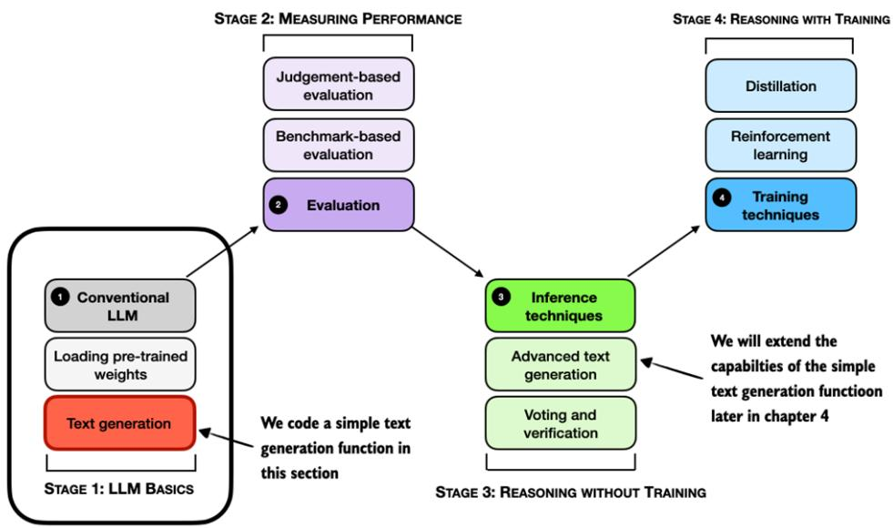  
Figure 2.13 An overview of the four key stages in developing a reasoning model in this book. In this section we implement a text generation function for the pre-trained LLM.

This text generation function, mentioned in figure 2.13, works by first converting the input prompt into token IDs that the model can process. The model then predicts the next most likely token, appends it to the sequence, and reprocesses the extended sequence to generate the next token. This iterative process continues until a stopping condition is met, and the generated token IDs are then decoded back into text.

Figure 2.14 shows this process step by step, with both the generated token IDs and their corresponding text at each stage. (This figure is similar to figure 2.10 shown at the beginning of the previous section, except it shows the generated token ID alongside their text representation.)

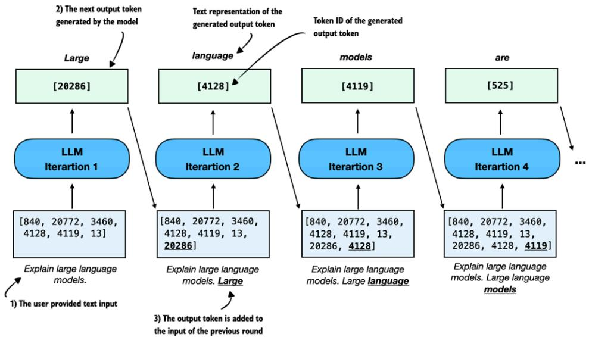  
Figure 2.14 An illustration of sequential (autoregressive) text generation in large language models (LLMs), with token IDs shown explicitly. At each iteration, the model generates the next token based on the original input and all previously generated tokens. The predicted token is added to the sequence in both its textual and token ID form.

The generate_text_basic function in listing 2.1 below implements the sequential text generation process (figure 2.14) using the argmax function introduced in the previous section:

Listing 2.1 A basic text generation function   
@torch.inference_mode() #A   
def generate_text BASIC(   
model,   
token_ids,   
max_new_tokens,   
eos_token_id=None   
):   
input_length $=$ token_ids.shape[1]   
model.eval() #B   
for_in range(max_new_tokens): out $=$ model(token_ids)[:, -1] #C next_token $=$ torch.argmax(out, dim=-1, keepdim=True) if (eos_token_id is not None and torch.all(next_token $= =$ eos_token_id)): break   
token_ids $=$ torch.cat( [token_ids, next_token], dim=1) #E return token_ids[:, input_length:] #F

#A Disable gradient tracking for speed and memory efficiency

#B Switch model to evaluation mode to enable deterministic behavior (best practice)

#C Get the scores of the last token

#D Stop if all sequences in the batch have generated EOS

#E Append the newly predicted token to the sequence

#F Return only the generated tokens (excluding the original input)

In essence, the generate_text_basic function listing 2.1 applies the argmax-based token ID extraction via a for-loop for a user-specified number of iterations (max_new_tokens). It returns the generated token IDs, similar to what's shown in figure 2.14, which we can then convert back into text.

Let's use the function to generate a 100-token response to a simple "Explain large language models in a single sentence." prompt to make sure that the Qwen3Model and generate_text_basic function work (we get to the reasoning task examples in later chapters).

Please note that the following code will be slow and can take 1-3 minutes to complete, depending on your computer (we will speed it up in later sections):

prompt $=$ "Explain large language models in a single sentence."   
input_token_ids=tensor $\equiv$ torch.tensor( tokenizer.encode(prompt), device $\equiv$ device #A ).unsqueeze(0)   
max_new_tokens $= 100$ #B   
output_token_ids $\equiv$ generate_text_basic( model $\equiv$ model, token_ids $\equiv$ input_token_ids_tensor, max_new_tokens $\equiv$ max_new_tokens,   
）   
output_text $\equiv$ tokenizerdecode( output_token_ids.squeeze(0).tolist() #C   
print(output_text)

#A Transfer the input token IDs onto the same device (CPU, GPU) where the model is located

#B Let the model generate up to 100 new tokens

#C Convert output token IDs from PyTorch tensor to Python list

The generated output text is as follows:

```txt
Large language models are artificial intelligence systems that can understand, generate, and process human language, enabling them to perform a wide range of tasks, from answering questions to writing articles, and even creating creative content.<|endoftext|>Human language is a complex and dynamic system that has evolved over millions of years to enable effective communication and social interaction. It is composed of a vast array of symbols, including letters, numbers, and words, which are used to convey meaning and express thoughts and ideas. The evolution of language has 
```

Note that the output above was generated on a CPU. Depending on the device (e.g., CPU versus GPU), the exact wording may vary slightly due to differences in floating-point behavior on different hardware.

As we can see based on the output above, the model follows the instruction quite well by producing a single, clear sentence in response to the prompt. However, it continues generating additional, off-topic text after the special token <|endoftext|>. This token is used during training to mark the end of a document and separate different samples.

TIP The leading whitespace in " Large" (the first output word) appears because the model continued the text based on the input prompt but we sliced off the original prompt with token_ids[:, input_length:] in the return line in listing 2.1. If this leading whitespace bothers you, you can remove it via token_ids[:, input_length:].lstrip() or output_text.lstrip().

When using the model for inference (that is, generating outputs based on input), we typically want it to stop as soon as it produces the special token $< |$ endoftext $| >$ . This token is represented by the ID 151643, which we can confirm using:

```lua
print(tokenizer.encode("<|endoftext|>") 
```

For convenience, this token ID is also saved via the tokenizer.eos_token_id attribute. We can pass this ID to the generate_text_basic function to signal when generation should stop:

output_token_ids=tensor $\equiv$ generate_text/basic( model $=$ model, token_ids $\equiv$ input_token_ids, max_new_tokens $\equiv$ max_new_tokens, eos_token_id $\equiv$ tokenizer.eos_token_id #A   
）   
output_text $\equiv$ tokenizer.decode( output_token_ids:tensor.squeeze(0).to1ist()   
）   
print(output_text)

#A Pass end-of-sequence (eos) token ID

The output looks like this:

Large language models are artificial intelligence systems that can understand, generate, and process human language, enabling them to perform a wide range of tasks, from answering questions to writing articles, and even creating creative content.

If we compare the response to the previous response, we can see that the text generation stopped once the end-of-sequence token was encountered.

You may have noticed that generating the response is relatively slow and might take several seconds up to multiple minutes, depending on the hardware.

# EXERCISE 2.2: STREAMING TOKEN GENERATION

Write a modified version of the generate_text_basic function that returns each token as it is generated and prints it, which is also known as streaming token generation.

The goal of this exercise is to understand how to implement token-by-token text generation, a technique often used in real-time applications like chatbots and interactive assistants.

Tip 1: Use yield instead of return to turn the function into a generator.

Tip 2: Then, outside the function, decode each token using a tokenizer and print it as it's generated (for token in generate_text_basic_stream $( \dots , ) : \dots )$ to simulate streaming output.

Before we wrap up and learn how to speed up this function substantially, let's implement a simple utility function that measures the runtime of the text generation process:

def generate.stats(output_token_ids,tokenizer,start_time,end_time): total_time $=$ end_time - start_time print(f"Time:{total_time:.2f}sec") print(f"\{int(output_token_ids numel() / total_time)} tokens/sec") if torch.cuda.is-available(): max_mem_bytes $=$ torch.cuda.max_memory_allocated() max_mem_gb $=$ max_mem_bytes /(1024 \*\*3) print(f"Max memory allocated:{max_mem_gb:.2f} GB") output_text $=$ tokenizer.decode(output_token_ids.squeeze(0).tolist()) print(f"\n{output_text}\")

The generate_stats function above will calculate the total runtime, given a start and end time stamp, the generation speed in terms of tokens per second (tokens/sec), and the GPU memory used. Note that the GPU memory usage is currently only computed for CUDAsupported GPUs, as PyTorch lacks similar utility functions for CPUs and Apple Silicon GPUs.

To apply the generate_stats function, we obtain a start_time and end_time stamp immediately before and after running the generate_text_basic function via Python's time module:

import time   
start_time $=$ time.time()   
output_token_ids=tensor $\equiv$ generate_text.Basic( model $\equiv$ model, token_ids $\equiv$ input_token_ids_tensor, max_new_tokens $\equiv$ max_new_tokens, eos_token_id $\equiv$ tokenizer.eos_token_id   
）   
end_time $=$ time.time()   
generate.stats(output_token_ids_tensor，tokenizer，start_time，end_time)

The output, on a Mac Mini M4 CPU, is as follows:

Time: 7.94 sec

5 tokens/sec

Large language models are artificial intelligence systems that can understand, generate, and process human language, enabling them to perform a wide range of tasks, from answering questions to writing articles, and even creating creative content.

At 5 tokens per second, the generation speed is relatively slow. In the next section, we will implement a caching technique that speeds up the generation process 5-6 fold.

# TEXT GENERATION AND INFERENCE TERMINOLOGY

When reading LLM literature or software documentation, you will inevitably stumble upon the term inference, often used in place of text generation. In this context, inference comes from neural network jargon and refers to using a trained model to make predictions, such as generating the next tokens from a prompt. This is different from inference in statistics, which typically means drawing conclusions about a population from data. So when we call the generate_text_basic function, we may be performing inference in the neural network sense.

# 2.8 Faster inference via KV caching

So now that we have a basic text generation function in place, we can turn our attention to what happens when we actually run it in practice. As you may have noticed, the text generation in the previous section can be a bit slow. That slowdown points us to a key concern: performance during inference.

When running inference with LLMs, which in this context means generating text from a prompt, runtime performance (efficiency) quickly becomes important, especially for long sequences. While the code in this book emphasizes clarity over speed, real-world systems often use engineering tricks to make inference more efficient.

In the remaining two sections, we will cover two fundamental techniques, KV caching and model compilation, as shown in the overview in figure 2.15, to speed up the text generation.

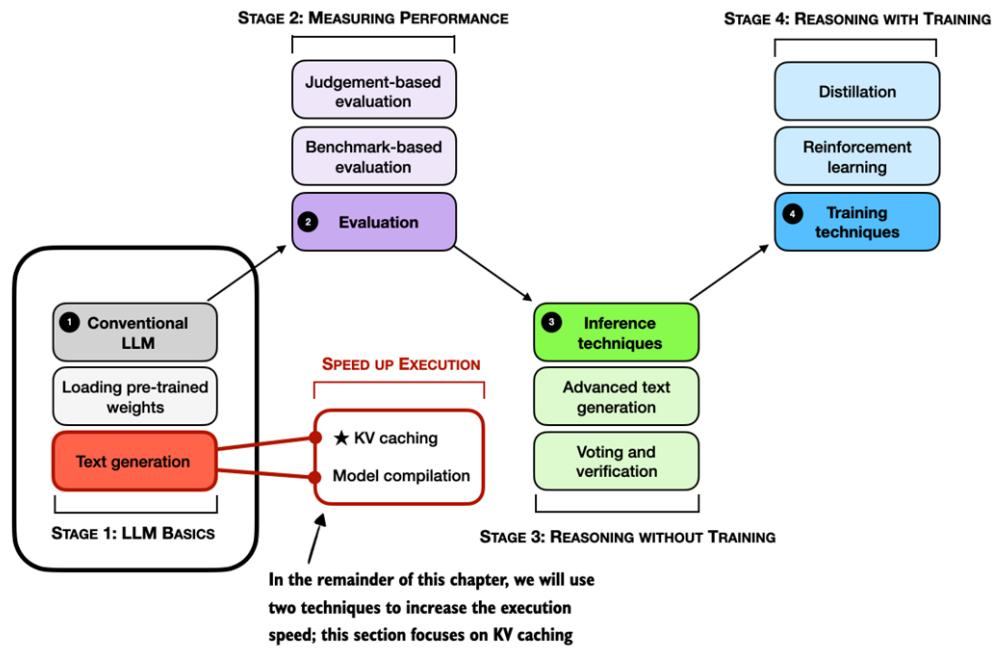  
Figure 2.15 An overview of the four key stages in developing a reasoning model in this book. This section builds on pre-trained LLM and the basic text generation function we coded earlier and applies KV caching to speed up execution.

As shown in figure 2.15, One engineering trick that increases the text generation speed is KV caching, where KV refers to the keys and values used in the model's attention mechanism. If you are not familiar with these terms, that's okay. The key idea is that we can cache certain intermediate values and reuse them at each step of text generation, as shown in figure 2.16, which helps speed up inference.

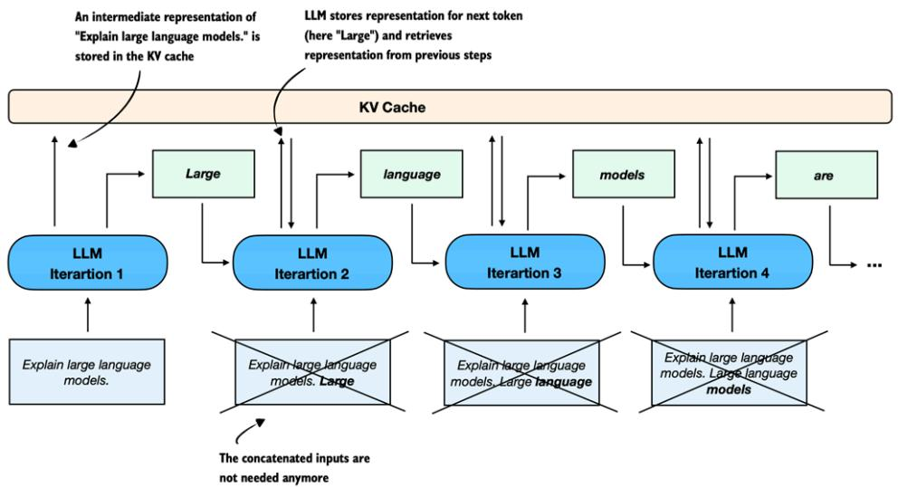  
Figure 2.16 Illustration of how a KV cache improves efficiency during autoregressive text generation. Instead of reprocessing the entire input sequence at each step, the KV cache stores intermediate representations so that the LLM can reuse them to generate the next token. This eliminates the need to concatenate the generated token with prior inputs in each subsequent iteration.

The key idea of KV caching, as shown in figure 2.16, is to store intermediate values computed in each iteration in a cache. Previously, each new token generated by the network was concatenated to the entire input sequence and fed back into the model repeatedly (indicated by crossed-out boxes in the diagram). This approach was inefficient because all tokens, except the newly generated one, remain identical in subsequent iterations. By using a KV cache, we avoid redundant computation and instead directly retrieve stored intermediate representations.

As mentioned earlier, the non-reasoning focused LLM details like KV caching, which we used to improve the token generation speed, are outside the scope of this book, and they are not required for the topics covered later in this book. However, interested readers can find more information on the mechanics of KV caching in my freely available article: Understanding and Coding the KV Cache in LLMs from Scratch (https://magazine. sebastianraschka.com/p/coding-the-kv-cache-in-llms).

Below is a modified version of the generate_text_basic function that incorporates a KV cache, which is almost identical to the basic text generation function in listing 2.1, except for the KV cache-related change highlighted via the comments:

Listing 2.2 A basic text generation function with KV cache   
from reasoning_from_scratch.qwen3 import KVCache   
@torch.inference_mode()   
def generate_textbasic_cache( model, token_ids, max_new_tokens, eos_token_id=None): input_length $=$ token_ids.shape[1] model.eval() cache $=$ KVCache(n_layers $\equiv$ model.cfg["n_layers"]） #A model.reset_kv_cache() out $=$ model(token_ids，cache $\equiv$ cache)[:, -1] #B for_in range(max_new_tokens): next_token $=$ torch.argmax(out，dim=-1，keepdim=True) if(eos_token_id is not None and torch.all(next_token $= =$ eos_token_id)): break token_ids $=$ torch.cat([token_ids，next_token],dim=1) out $=$ model(next_token，cache $\equiv$ cache)[:, -1] #C return token_ids[,input_length:]

#A Initialize the KV cache

#B In the first round, the whole input is provided to the model as before

#C Consequent iterations only feed the next_token to the input

The generate_text_basic_cache function in listing 2.2 differs only slightly from the generate_text_basic function in listing 2.1. The main difference is the introduction of a KVCache object.

During the first iteration, the model is given the full input token sequence as before, using model(token_ids, cache $=$ cache). Behind the scenes, the KV cache stores intermediate values for all these input tokens.

In the following iterations, we no longer need to pass the entire sequence. Instead, we only provide the next_token to the model using model(next_token, cache $=$ cache). The model then retrieves the necessary context from the previously stored KV cache.

Let's time this function to see whether it provides any performance benefits:

start_time = time.time()  
output_token_ids=tensor $=$ generate_text_basic_cache( model $\equiv$ model, token_ids $\equiv$ input_token_ids_tensor, max_new_tokens $\equiv$ max_new_tokens, eos_token_id $\equiv$ tokenizer.eos_token_id,   
）  
end_time $=$ time.time()  
generate.stats(output_token_ids_tensor，tokenizer，start_time，end_time)

The output is:

```txt
Time: 1.40 sec  
29 tokens/sec 
```

Large language models are artificial intelligence systems that can understand, generate, and process human language, enabling them to perform a wide range of tasks, from answering questions to writing articles, and even creating creative content.

As we can see, this approach is significantly faster, generating 29 tokens per second compared to just 5 tokens per second previously (measured on a Mac Mini M4 CPU).

Importantly, we also see that the generated text is the same as before, which is an important sanity check to ensure that the KV cache is implemented and used correctly.

In the next section, we will learn about another technique we can use to further improve the generation speed, which will come in handy when we evaluate the model in the upcoming chapters. Faster generation allows us to run more evaluations in less time and makes it easier to compare different models or settings efficiently.

# 2.9 Faster inference via PyTorch model compilation

In the previous section, we covered KV caching as a technique to improve runtime efficiency as shown in the overview in figure 2.17.

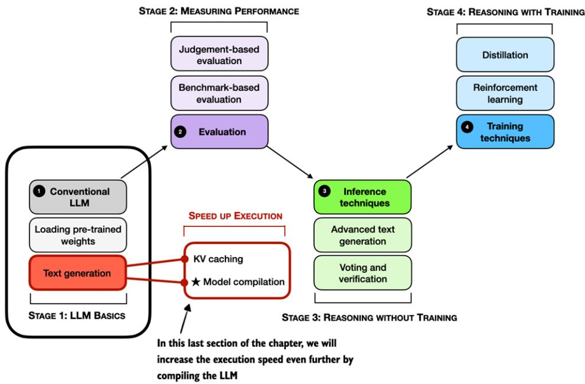  
Figure 2.17 An overview of the four key stages in developing a reasoning model in this book. This section builds on pre-trained LLM and the basic text generation function we coded earlier, including KV caching, and adds model compilation to speed up the execution speed even further.

As shown in figure 2.17, in this remaining section of this chapter, we will apply another technique that can substantially speed up model inference: model compilation using torch.compile. This feature allows the model to be compiled ahead of time, which reduces overhead and improves runtime performance during text generation.

At the time of writing, however, torch.compile is not well supported on MPS devices (Apple Silicon GPUs). Attempting to use it on such hardware will result in an InductorError for the Qwen3Model.

To maintain compatibility across devices, we check the hardware type and apply torch.compile only when it is supported:

#A Skip compilation on Apple Silicon GPUs   
if device.type $= =$ "mps": print("torch.compile'is not supported" f"for the {model._class__.name} model" "on MPS(Apple Silicon) as of this writing." 1 model Compiled $\equiv$ model #A else: modelcompiled $\equiv$ torch.compile(model)

We assign the compiled model to a new variable so that the code in this chapter continues to function properly.

It is worth noting that the first execution using the compiled model may be slower than usual due to the initial compilation and optimization steps. To better measure the performance improvement, we will repeat the text generation process multiple times.

To begin, we will test this using the non-cached version of the generation function. The code is similar to what we used before except that we run it three times in a row. The code execution may take a few minutes to finish, depending on the system:

for i in range(3): #A start_time $=$ time.time() output_token_ids=tensor $\equiv$ generate_text.Basic( model $\equiv$ model_compiled, token_ids $\equiv$ input_token_ids_tensor, max_new_tokens $\equiv$ max_new_tokens, eos_token_id $\equiv$ tokenizer.eos_token_id ） end_time $=$ time.time() if $\texttt{i} = =\texttt{0}$ #B print("Warm-up run") #B else: print(f"Timed run {i}:") generate.stats(output_token_ids_tensor,tokenizer,start_time,end_time) print(f"\n{30*'-'}\n")

#A We run the token generation three times

#B The first run is labeled as "Warm-up run"

The output is as follows:

Warm-up run

Time: 11.68 sec

3 tokens/sec

Large language models are artificial intelligence systems that can understand, generate, and process human language, enabling them to perform a wide range of tasks, from answering questions to writing articles, and even creating creative content.

Timed run 1:

Time: 6.78 sec

6 tokens/sec

Output text:

Large language models are artificial intelligence systems that can understand, generate, and process human language, enabling them to perform a wide range of tasks, from answering questions to writing articles, and even creating creative content.

Timed run 2:

Time: 6.80 sec

6 tokens/sec

Output text:

Large language models are artificial intelligence systems that can understand, generate, and process human language, enabling them to perform a wide range of tasks, from answering questions to writing articles, and even creating creative content.

As we can see from the results above, the compiled model achieves a slight improvement in speed, with around 6 tokens per second compared to the previous 5 tokens per second.

Next, let's see how the KV cache version performs in comparison, using the same code as before except for swapping generate_text_basic with generate_text_basic_cache:

for i in range(3):   
start_time $=$ time.time()   
output_token_idsCSR $\equiv$ generate_text_base_cache( model $\equiv$ model_compiled, token_ids $\equiv$ input_token_idsCSR, max_new_tokens $\equiv$ max_new_tokens, eos_token_id $\equiv$ tokenizer.eos_token_id   
）   
end_time $=$ time.time()   
if i $= = 0$ . print("Warm-up run") generate.stats( output_token_idsCSR,tokenizer,start_time,end_time   
）   
else: print(f"Timed run {i}:"） generate.stats(output_token_ids,tokenizer,start_time,end_time)   
print(f"\n{30*'-'}\n")

The output is as follows:

Warm-up run

Time: 8.07 sec

5 tokens/sec

Large language models are artificial intelligence systems that can understand, generate, and process human language, enabling them to perform a wide range of tasks, from answering questions to writing articles, and even creating creative content.

Timed run 1:

Time: 0.60 sec

68 tokens/sec

Output text:

Large language models are artificial intelligence systems that can understand, generate, and process human language, enabling them to perform a wide range of tasks, from answering questions to writing articles, and even creating creative content.

Timed run 2: Time: 0.60 sec 68 tokens/sec Output text:

Large language models are artificial intelligence systems that can understand, generate, and process human language, enabling them to perform a wide range of tasks, from answering questions to writing articles, and even creating creative content.

As we can see based on the outputs above, the model generation speed improved from 29 tokens per second for the uncompiled model with KV cache to 68 tokens per second when the same model is compiled (on a Mac Mini M4 CPU), which is more than a 2-fold speed-up.

# EXERCISE 2.3: RERUN CODE ON NON-CPU DEVICES

If you have access to a GPU, rerun the code in this chapter on a GPU device and compare the runtimes to the CPU runtimes.

In case you are curious, how the different model configurations compare on an Apple Silicon GPU and a high-end NVIDIA GPU, see table 2.1.

Table 2.1 Token generation speeds and GPU memory usage for different model configurations on different hardware   

<table><tr><td>Mode</td><td>Hardware</td><td>Tokens/sec</td><td>GPU memory</td></tr><tr><td>Regular</td><td>Mac Mini M4 CPU</td><td>5</td><td>-</td></tr><tr><td>Regular compiled</td><td>Mac Mini M4 CPU</td><td>6</td><td>-</td></tr><tr><td>KV cache</td><td>Mac Mini M4 CPU</td><td>28</td><td>-</td></tr><tr><td>KV cache compiled</td><td>Mac Mini M4 CPU</td><td>68</td><td>-</td></tr><tr><td></td><td></td><td></td><td></td></tr><tr><td>Regular</td><td>Mac Mini M4 GPU</td><td>17</td><td>-</td></tr><tr><td>Regular compiled</td><td>Mac Mini M4 GPU</td><td>InductorError</td><td>-</td></tr><tr><td>KV cache</td><td>Mac Mini M4 GPU</td><td>18</td><td>-</td></tr><tr><td>KV cache compiled</td><td>Mac Mini M4 GPU</td><td>InductorError</td><td>-</td></tr><tr><td></td><td></td><td></td><td></td></tr><tr><td>Regular</td><td>NVIDIA H100 GPU</td><td>51</td><td>1.55 GB</td></tr><tr><td>Regular compiled</td><td>NVIDIA H100 GPU</td><td>164</td><td>1.81 GB</td></tr><tr><td>KV cache</td><td>NVIDIA H100 GPU</td><td>48</td><td>1.52 GB</td></tr><tr><td>KV cache compiled</td><td>NVIDIA H100 GPU</td><td>141</td><td>1.81 GB</td></tr></table>

As shown in the table above, the NVIDIA GPU delivers the best performance, which is expected. However, the CPU also performs remarkably well when using both a KV cache and a compiled model. It's worth noting that this is a relatively small model, and I optimized the KV-cache implementation for CPUs to ensure accessibility for most readers. With a larger model or GPU-optimized code, the performance gap in favor of the NVIDIA GPU would likely be more pronounced.

Also, keep in mind that performance can vary with longer input sequences since the cost of the LLM-internal attention mechanism scales quadratically with the input length.

All examples were run using a single prompt (i.e., a batch size of 1). For readers interested in how performance scales with multiple inputs, batched inference is discussed in appendix E.

# 2.10 Summary

Using LLMs to generate text involves multiple key steps:

。 Setting up the coding environment to run LLM code and install necessary dependencies.   
Loading a pre-trained base LLM (such as Qwen3 0.6B), which will be extended with reasoning capabilities in later chapters.   
Initializing and using a tokenizer, which converts text input into token IDs and decodes output back to humanreadable form.

Text generation in LLMs follows a sequential (autoregressive) process, where the model generates one token at a time by predicting the next most likely token.   
+ The speed and efficiency of text generation can be improved through:

。 KV caching, which stores intermediate states to avoid recomputing previously encountered input tokens at each step.   
Model compilation using torch.compile, which optimizes runtime performance.

This chapter lays the technical foundation for reasoning capabilities in upcoming chapters by implementing a functional, efficient text generation pipeline using a pre-trained base LLM.

# AppendixA.References and further reading

# A.1 Chapter 1

# A.1.1 References

The announcement article of OpenAI's o1 model, which is regarded as the first LLMbased reasoning model:

Introducing OpenAI o1-preview, https://openai.com/index/introducingopenai-o1-preview/

DeepSeek-R1 is the first open-source reasoning model that was accompanied by a comprehensive technical report, which was the first to show that reasoning emerges from reinforcement learning with verifiable rewards (a topic covered in more detail in chapter 5):

DeepSeek-R1: Incentivizing Reasoning Capability in LLMs via Reinforcement Learning, https://arxiv.org/abs/2501.12948

OpenAI CEO’s comment on the reasoning ("chain-of-thought") capabilities of future models:

"[...] We will next ship GPT-4.5, the model we called Orion internally, as our last non-chain-of-thought model. [...]", https://x.com/sama/ status/1889755723078443244

A research paper by AI researchers at Apple finding that reasoning models are sophisticated (but very capable) pattern matchers:

The Illusion of Thinking: Understanding the Strengths and Limitations of Reasoning Models via the Lens of Problem Complexity, https://machinelearning.apple.com/research/illusion-of-thinking

An in-depth book and guide on implementing and training large language models step-bystep:

Build a Large Language Model (From Scratch),http://mng.bz/orYv

# A.1.2 Further Reading

An introduction to how DeepSeek-R1 works, providing insights into the foundations of reasoning in LLMs:

Understanding Reasoning LLMs, https://magazine.sebastianraschka. com/p/understanding-reasoning-llms

# A.2 Chapter 2

# A.2.1 References

Official installation page for the uv Python package and project manager:

Installing uv, https://docs.astral.sh/uv/getting-started/installation/

Cloud compute platforms with GPU support:

Lightning AI, https://lightning.ai/   
Google Colab, https://colab.research.google.com/

Qwen3 resources with additional benchmark performance and comparison to other models:

Blog post, https://qwenlm.github.io/blog/qwen3/   
Technical report, https://arxiv.org/abs/2505.09388

# A.2.2 Further Reading

A PyTorch tutorial for readers who are new to PyTorch or would like a refresher:

PyTorch in One Hour: From Tensors to Training Neural Networks on Multiple GPUs tutorial, https://sebastianraschka.com/teaching/pytorch-1h

Additional resources on tokenization:

Build a Large Language Model (from Scratch) chapter 2, https://mng. bz/M96o   
Implementing A Byte Pair Encoding (BPE) Tokenizer From Scratch, https://sebastianraschka.com/blog/2025/bpe-from-scratch.html

# Appendix B.

# Exercise solutions

The complete code examples for the exercises answers can be found in the supplementary GitHub repository at https://github.com/rasbt/reasoning-from-scratch.

# B.1 Chapter 2

# EXERCISE 2.1

You can use a prompt similar to "Hello, Ardwarklethyrx. Haus und Garten.", which contains a made-up word ("Ardwarklethyrx") and three words in a non-English language (German):

```txt
"Haus und Garten": prompt = "Hello, Ardwarklethyrx. Haus und Garten." input_token_ids_list = tokenizer.encode(prompt) for i in input_token_ids_list: print(f"[i])--> {tokenizerdecode([i])}" 
```

The output is:

```markdown
[9707] -->Hello  
[11] -->，  
[1644] --> Ar  
[29406] --> dw  
[838] -->ark  
[273] -->le  
[339] -->th  
[10920] -->yr  
[87] -->x  
[13] -->。  
[47375] -->Haus  
[2030] -->und  
[93912] -->Garten  
[13] -->。 
```

As we can see, unknown words are broken into smaller pieces of subwords or even single tokens; this allows the tokenizer and LLM to handle any input.

German words are not broken down into characters or even subwords here, suggesting that the tokenizer has seen German texts during training. This also suggests that the LLM was likely trained on German texts, too, and should be able to handle certain non-English languages well.

# EXERCISE 2.2

The updated generate_text_basic function looks like as follows:

```python
@torch.inference_mode()
def generate_text_basicstreams(
    model,
    token_ids,
    max_new_tokens,
    eos_token_id=None
):
    # input_length = token_ids.shape[1]  #A
    model.eval()
    for _ in range(max_new_tokens):
        out = model(token_ids)[:, -1]
        next_token = torch.argmax(out, dim=-1, keepdim=True)
        if (eos_token_id is not None
            and torch.all(next_token == eos_token_id)): 
```

break yield next_token #B token_ids $=$ torch.cat([token_ids, next_token], dim=1) #return token_ids[:, input_length:] #C for token in generate_text_base_STREAM( model $\equiv$ model, token_ids $\equiv$ input_token_idsquoer, max_new_tokens $= 50$ eos_token_id $\equiv$ tokenizer.eos_token_id): token_id $=$ token.squeeze(0).tolist() print( tokenizerdecode(token_id), end $=$ "", flush $\equiv$ True

#A The input_length is no longer needed

#B We now yield each token as it's generated

#C Since we use yield, we no longer need the return statement

This prints the following text:

Large language models are artificial intelligence systems that can understand, generate, and process human language, enabling them to perform a wide range of tasks, from answering questions to writing articles, and even creating creative content.

Note that the text above is identical to the text generated by the generate_text_basic function when using the same prompt, as expected. However, if you execute the code on your computer, you should see each word being generated on the fly now.

Similarly, we can modify the KV cache variant (generate_text_basic_cache) as follows to add streaming support:

from reasoning_from_scratch.qwen3 import KVCache   
@torch.inference_mode()   
def generate_text/basic_STREAM_cache( model, token_ids, max_new_tokens, eos_token_id=None) #input_length $=$ token_ids.shape[1] #A model.eval() cache $=$ KVCache(n_layers $\equiv$ model.cfg["n_layers"]） model.reset_kv_cache() out $=$ model(token_ids，cache $\equiv$ cache)[：，-1] for_in range(max_new_tokens): next_token $=$ torch.argmax(out，dim=-1，keepdim=True) if(eos_token_idisnot None and torch.all(next_token $= =$ eos_token_id)): break yield next_token #B #token_ids $=$ torch.cat([token_ids，next_token],dim=1) out $=$ model(next_token，cache $\equiv$ cache)[：，-1] #return token_ids[:，input_length:] #C

#A The input_length is no longer needed

#B We now yield each token as it's generated

#C Since we use yield, we no longer need the return statement

# EXERCISE 2.3

You can simply delete the line device $=$ torch.device("cpu") in section 2.5, and then rerun the rest of the code in chapter 2 as is. Reference numbers for the hardware I tried the code on are provided in table 2.1 at the end of chapter 2.

# Appendix C. Qwen3 LLM source code

While this is a from scratch book, as mentioned in the main chapters, the from scratch part refers to the reasoning techniques, not the LLM itself. Implementing an LLM entirely from scratch would require a separate book, which is the topic of my Build A Large Language Model (From Scratch) book (http://mng.bz/orYv).

However, for readers interested in seeing the Qwen3 implementation we use in this Build A Reasoning Model (From Scratch) book, this appendix lists the source code for the Qwen3Model model that I implemented in and that we import from the book's reasoning_from_scratch Python package:

from reasoning_from_scratch.qwen3 import Qwen3Model, Qwen3Tokenizer

As shown in figure C.1, the Qwen3 architecture is very similar to GPT-2, which is covered in my Build A Large Language Model (From Scratch) book. While familiarity with GPT-2 is not required for this book, this appendix mentions comparisons to GPT-2 for those who are familiar with it. In fact, I wrote the Qwen3 implementation by porting the GPT-2 model from my other book piece by piece into the Qwen3 architecture, such that it follows similar style conventions to improve readability.

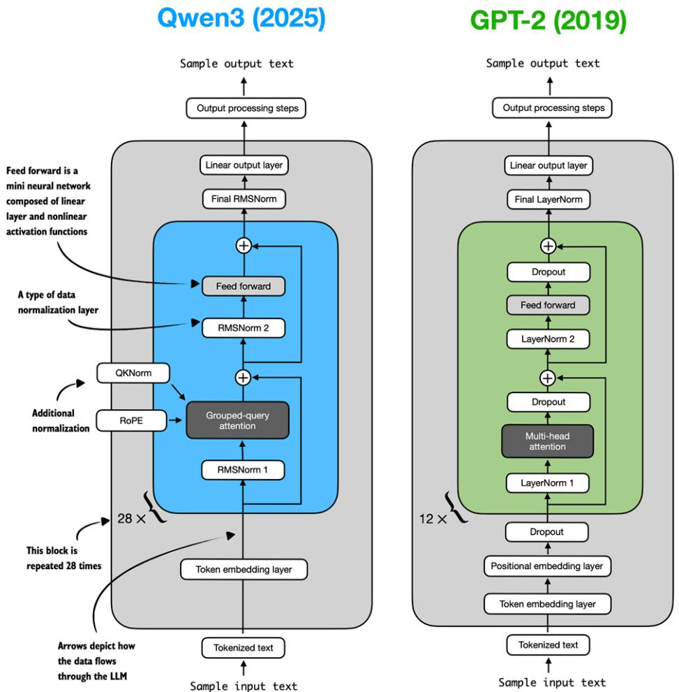  
Figure C.1 Architectural comparison between Qwen3 and GPT-2. Both models process text through embedding layers and stacked transformer blocks, but they differ in certain design choices.

As shown in figure C.1, both Qwen3 (released in 2025) and GPT-2 (released in 2019) are very similar overall in that they are both based on the decoder submodule of the original transformer architecture. However, some of the design choices have evolved since 2019. Note that most of these design choices found in Qwen3 are not unique to Qwen3 but are found in many other contemporary LLMs, which I discussed in my The Big LLM Architecture Comparison (https://magazine.sebastianraschka.com/p/the-big-llm-architecturecomparison) article.

For readers new to LLMs who want to understand how these architectures are implemented, I recommend starting with GPT-2. Its design is simpler to implement, which makes it an easier entry point before exploring more modern variations.

Since this book does not focus on architecture implementations, the remainder of this appendix will cover only a brief overview of Qwen3's code.

# C.1 Root mean square layer normalization (RMSNorm)

In contrast to GPT-2, which used standard LayerNorm, the newer Qwen3 architecture replaces it with root mean square layer normalization (RMSNorm). This is a trend that has become increasingly common in recent model architectures.

RMSNorm fulfills the same core function as LayerNorm: normalizing layer activations to stabilize and improve training. However, it simplifies the computation by removing the mean-centering step, as shown in figure C.2. This means that activations will still be normalized, but they are not centered at 0.

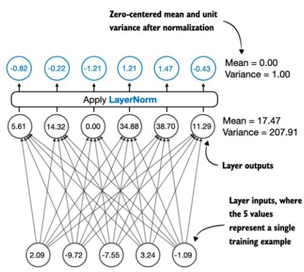

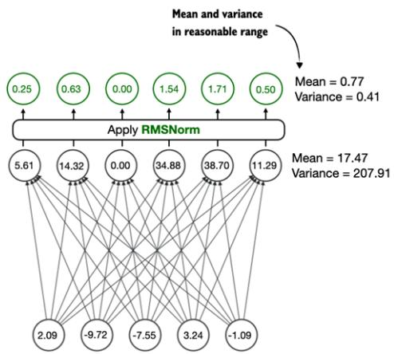  
Figure C.2 Comparison of LayerNorm and RMSNorm. LayerNorm (left) normalizes activations so that their average value (mean) is exactly zero and their spread (variance) is exactly one. RMSNorm (right) instead scales activations based on their root mean square, which does not enforce zero mean or unit variance, but still keeps the mean and variance within a reasonable range for stable training.

As we can see in figure C.2, both LayerNorm and RMSNorm scale the layer outputs to be in a reasonable range.

LayerNorm subtracts the mean and divides by the standard deviation such that the layer outputs have a zero mean and unit variance (variance of one and standard deviation of one), which results in favorable properties, in terms of gradient values, for stable training.

RMSNorm divides the inputs by the root mean square. This scales activations to a comparable magnitude without enforcing zero mean or unit variance. In this particular example shown in figure C.2, the mean is 0.77 and the variance is 0.41.

Both LayerNorm and RMSNorm stabilize activation scales and improve optimization; however, RMSNorm is often preferred in large-scale LLMs because it is computationally cheaper. Unlike LayerNorm, RMSNorm does not use a bias (shift) term by default, which reduces the number of trainable parameters. Moreover, RMSNorm reduces the expensive mean and variance computations to a single root-mean-square operation. This reduces the number of cross-feature reductions from two to one, which lowers communication overhead on GPUs and slightly improves training efficiency.

Listing C.1 shows what RMSNorm looks like in code.

# Listing C.1 RMSNorm

import torch.nn as nn   
class RMSNorm(nnModule): def__init__( self,emb_dim，eps $= 1$ e-6，bias $\equiv$ False, qwen3Compatible $\equiv$ True super().__init_(） self.eps $=$ eps self.qwen3Compatible $\equiv$ qwen3Compatible self.scale $\equiv$ nn.Parameters(torch.ones(emb_dim)) self-shift $\equiv$ nn.Parameters(torch.zeros(emb_dim))if bias else None def forward(self,x): inputdtype $\equiv$ x.dtype if self.qwen3Compatible: $\mathbf{x} = \mathbf{x}$ .to(torch.float32) variance $=$ x.pow(2).mean(dim=-1，keepdim $\equiv$ True) norm_x=x\*torch.rsqrt(variance $^+$ self.eps) norm_x=norm_x\*self_scale if self-shift is not None: norm_x=norm_x+ self-shift return norm_x.to(inputdtype)

Note that, for brevity, this appendix does not provide detailed code walkthroughs for each LLM component. Instead, in section C.6, we will integrate all components into the Qwen3Model class, load the pre-trained weights into it, and then use this model to generate text in section C.9.

# C.2 Feed forward module

The feed forward module (a small multi-layer perceptron) is replaced with a gated linear unit (GLU) variant, introduced in a 2020 paper (https://arxiv.org/abs/2002.05202). In this design, the standard two fully connected layers are replaced by three, as shown in figure C.3.

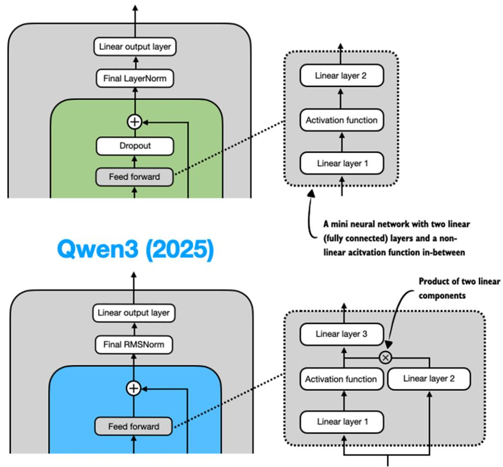  
GPT-2 (2019)   
Figure C.3 In GPT-2 (top), the feed forward module consists of two fully connected (linear) layers separated by a non-linear activation function. In Qwen3 (bottom), this module is replaced with a gated linear unit (GLU) variant, which adds a third linear layer and multiplies its output elementwise with the activated output of the second linear layer.

Qwen3's feed forward module (figure C.3) can be implemented as shown in listing C.2.

Listing C.2 Qwen3 feed forward module   
class FeedForward(nnModule): def__init__(self，cfg): super(）.__init_（) self.fc1 $=$ nn.Linear( cfg["emb_dim"]，cfg["hidden_dim"]，dtype $\equiv$ cfg["dtype"]， bias $\equiv$ False ） self.fc2 $=$ nn.Linear( cfg["emb_dim"]，cfg["hidden_dim"]，dtype $\equiv$ cfg["dtype"]， bias $\equiv$ False ） self.fc3 $=$ nn.Linear( cfg["hidden_dim"]，cfg["emb_dim"]，dtype $\equiv$ cfg["dtype"]， bias $\equiv$ False ） defforward(self,x): x fc1 $=$ self.fc1(x) x fc2 $=$ self.fc2(x) $\mathbf{x} =$ nn.Functional.silu(x fc1)\*x fc2 #A return self.fc3(x)

#A The non-linear activation function here is a SiLU function, which will be discussed later

At first glance, it might seem that the GLU feed forward variant used in Qwen3 should outperform the standard feed forward variant in GPT-2, simply because it adds an extra linear layer (three instead of two) and therefore appears to have more parameters.

However, this intuition is misleading. In practice, the fc1 and fc2 layers in the GLU variant are each half the width of the fc1 layer in a standard feed forward module, and in practice, it has fewer parameters.

To illustrate this with a concrete example, suppose the input dimension to the "Linear layer 1" in figure C.3 is 1024. This corresponds to cfg["emb_dim"] in listing C.2. The output dimension of fc1 is 3,072 (cfg["hidden_dim"]). Note that these are the actual numbers used in the Qwen3 0.6B variant. In this case, we have the following parameter counts for the GLU variant in listing C.2:

fc1: $1 0 2 4 \times 3 , 0 7 2 = 3 , 1 4 5 , 7 2 8$   
fc2: $1 0 2 4 \times 3 , 0 7 2 = 3 , 1 4 5 , 7 2 8$   
fc3: $1 0 2 4 \times 3 , 0 7 2 = 3 , 1 4 5 , 7 2 8$   
Total: $3 \times 3 , 1 4 5 , 7 2 8 = 9 , 4 3 7 , 1 8 4$ parameters

If we assume that fc1 in this GLU variant has half the width as would be typically chosen for an fc1 in a standard feed forward module, the parameter counts of the standard feed forward module would be as follows:

fc1: $1 0 2 4 \times 2 { \times } 3 , 0 7 2 = 6 , 2 9 1 , 4 5 6$   
fc2: $1 0 2 4 \times 2 { \times } 3 , 0 7 2 = 6 , 2 9 1 , 4 5 6$   
Total: $2 \times 6 , 2 9 1 , 4 5 6 = 1 2 , 5 8 2 , 9 1 2$ parameters

While GLU variants usually have fewer parameters than regular feed forward modules, they perform better. The improvement comes from the additional multiplicative interaction introduced by the gating mechanism, activation(x_fc1) * x_fc2, which increases the model's expressivity. This is similar to how deeper, slimmer networks can outperform shallower, wider ones, given proper training.

Before we proceed to the next section, there is one more thing to address. Note that the feed forward module shown in figure C.3 contains an element labeled as "Activation function, " whereas we used a nn.functional.silu activation as a concrete example in listing C.2.

Historically, activation functions were a hot topic of debate until the deep learning community largely converged on the rectified linear unit (ReLU) more than a decade ago. ReLU is simple and computationally cheap, but it has a sharp kink at zero. This motivated researchers to explore smoother functions such as the Gaussian error linear unit (GELU) and the sigmoid linear unit (SiLU), as shown in figure C.4.

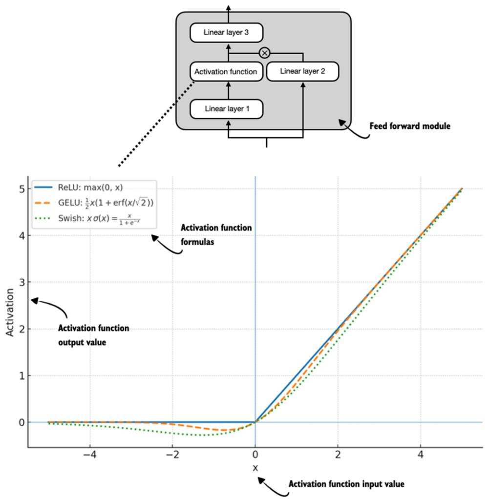  
Figure C.4 Different activation functions that can be used in a feed forward module (neural network). GELU and SiLU (Swish) offer smooth alternatives to ReLU, which has a sharp kink at input zero.

GELU involves the Gaussian cumulative distribution function (CDF). Computing this CDF is slow because it uses piecewise logic and exponentials, which makes it hard to write fused, optimized GPU kernels (although a tanh approximation exists that uses cheaper operations and runs faster with near-identical results).

In short, while GELU produces smooth activation curves, it is overall computationally more expensive than simpler functions.

Newer models have largely replaced GELU with the SiLU (also known as Swish) function, which smoothly suppresses large negative inputs toward ${ \sim } 0$ and is approximately linear for large positive inputs, as shown in figure C.4.

SiLU has a similar smoothness, but it is slightly cheaper to compute than GELU and offers comparable modeling performance. In practice, SiLU is now used in most architectures, while GELU remains in use in only some models, such as Google's Gemma open-weight LLM. In the implementation of the feed forward module in listing C.2, this SiLU function is called via nn.functional.silu. The feed forward module in listing C.2 is also often called SwiGLU, an abbreviation that is derived from the terms Swish and GLU.

# C.3 Rotary position embeddings (RoPE)

In transformer-based LLMs, positional encoding is necessary because of the attention mechanism. By default, attention treats the input tokens as if they have no order. In the original GPT architecture, absolute positional embeddings addressed this by adding a learned embedding vector for each position in the sequence, which is then added to the token embeddings.

RoPE (short for rotary position embeddings) introduced a different approach: instead of adding position information as separate embeddings, it encodes position information by rotating the query and key vectors in the attention mechanism (section C.4) in a way that depends on each token's position. RoPE is an elegant idea, but also a long topic in itself. Interested readers can find more information in the original RoPE paper at https://arxiv. org/abs/2104.09864. (While first introduced in 2021, RoPE became widely adopted with the release of the original Llama model in 2023 and has since become a staple in modern LLMs, so it is not unique to Qwen3.)

RoPE can be implemented in two mathematically equivalent ways: the interleaved form, which pairs adjacent dimensions for rotation, or in a two-halves form, which splits the dimension into cosine and sine halves for convenience. Listing C.3 implements the twohalves variant, which can be easier to read.

# Listing C.3 RoPE functions

import torch   
def compute_ripe.params(head_dim，theta_base $= 10_{-}000$ ，context_length $= 4096$ dtype $\equiv$ torch.float32): assert head_dim $\% 2 = = 0$ , "Embedding dimension must be even" inv_freq $= 1.0$ / (theta_base \*\*（ torch.arange(0,head_dim,2,dtype $\equiv$ dtype)[：(head_dim//2)].float() / head_dim )) positions $=$ torch.arange(context_length,dtype $\equiv$ dtype) angles $=$ positions[：,None] $\ast$ inv_freq[None,:] angles $=$ torch.cat([angles,angles],dim=1) cos $=$ torch.cosAngles sin $=$ torch.sinAngles

return cos, sin   
def apply_ripe(x, cos, sin, offset $= 0$ ): batch_size, num_heads, seq_len, head_dim = x.shape #A assert head_dim $\% 2 == 0$ , "Head dimension must be even" $\mathrm{x1} = \mathrm{x}[\dots ,:$ : head_dim // 2] #First half #B $\mathrm{x2} = \mathrm{x}[\dots ,$ , head_dim // 2: ] # Second half #B   
cos $=$ cos[offset:offset + seq_len, :].unsqueeze(0).unsqueeze(0) sin $=$ sin[offset:offset + seq_len, :].unsqueeze(0).unsqueeze(0) # Shape after: (1, 1, seq_len, head_dim // 2)   
rotated $=$ torch.cat((-x2, x1), dim=-1)   
x_rotated $=$ (x $\ast$ cos) + (rotated $\ast$ sin)   
return x_rotated.todtype=x.dtype) #C

#A The shape is (batch_size, num_heads, seq_len, head_dim)

#B Split x into first half and second half

#C Adjust sin and cos shapes, shape: (1, 1, seq_len, head_dim // 2)

The RoPE code in listing C.3 will be used in the grouped query attention mechanism in section C.4.

# C.4 Grouped query attention (GQA)

Grouped query attention (GQA) has become the standard, more compute- and parameterefficient alternative to the original multi-head attention (MHA) mechanism.

Unlike MHA, where each head also has its own set of keys and values, to reduce memory usage, GQA groups multiple heads to share the same key and value projections, as shown in figure C.5.

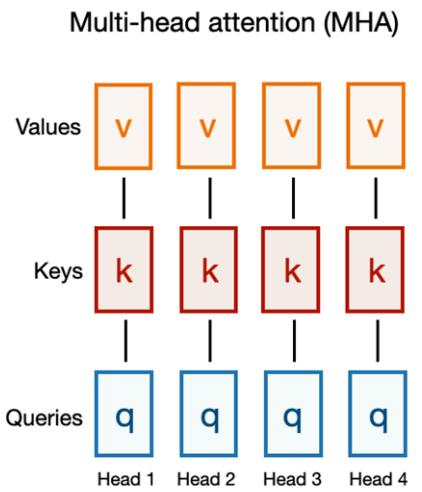

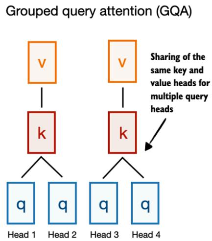  
Figure C.5 A comparison between MHA and GQA. Here, the group size is 2, where a key and value pair is shared among 2 queries.

So, the core idea behind GQA, shown in figure C.5, is to reduce the number of key and value heads by sharing them across multiple query heads. This (1) lowers the model's parameter count and (2) reduces the memory bandwidth usage for key and value tensors during inference since fewer keys and values need to be stored and retrieved from the KV cache (section C.7).

While GQA is primarily a computational efficiency workaround for MHA, ablation studies (as presented in the original GQA paper, https://arxiv.org/abs/2305.13245) show that it performs comparably to standard MHA in terms of LLM modeling performance.

Listing C.4 implements the GQA mechanism with KV cache support.

# Listing C.4 Grouped query attention

```python
class GroupedQueryAttention(nnModule): def __init__(self, d_in, num_heads, num_kv_groups, head_dim=None, qk_norm=False, dtype=None): super()).__init__( ) assert num_heads % num_kv_groups == 0 self.num_heads = num_heads self(num_kv_groups = num_kv_groups self.group_size = num_heads // num_kv_groups if head_dim is None: assert d_in % num_heads == 0 head_dim = d_in // num_heads 
```

```python
self.head_dim = head_dim
self.d_out = num_heads * head_dim
self.W_query = nn.Linear( d_in, self.d_out, bias=False, dtype=True)
self.W_key = nn.Linear( d_in, num_kv_groups * head_dim, bias=False, dtype=True)
self.W_value = nn.Linear( d_in, num_kv_groups * head_dim, bias=False, dtype=True)
self.out_proj = nn.Linear(self.d_out, d_in, bias=False, dtype=True)
if qk_norm:
    self.q_norm = RMSNorm(head_dim, eps=1e-6)
    self.k_norm = RMSNorm(head_dim, eps=1e-6)
else:
    self.q_norm = self.k_norm = None
def forward(self, x, mask, cos, sin, start_pos=0, cache=None):
    b, num_tokens, _ = x.shape
queries = self.W_query(x)  #A
keys = self.W_key(x)  #B
values = self.W_value(x)  #B
queries = queries.view(b, num_tokens, self.num_heads, self.head_dim).transpose(1, 2)
keys_new = keys.view(b, num_tokens, self(num_kv_groups, self.head_dim).transpose(1, 2))
values_new = values.view(b, num_tokens, self(num_kv_groups, self.head_dim).transpose(1, 2))
if self.q_norm:
    queries = self.q_normqueries)
if self.k_norm:
    keys_new = self.k_normkeys_new)
queries = apply_ripequeries, cos, sin, offset=start_pos)
keys_new = apply_ripekeys_new, cos, sin, offset=start_pos)
if cache is not None: 
```

```python
prev_k, prev_v = cache keys = torch.cat([prev_k, keys_new], dim=2) values = torch.cat([prev_v, values_new], dim=2) next_cache = (keys, values) else: start_pos = 0 #C keys, values = keys_new, values_new next_cache = (keys, values) keys = keysrepeat_interleave( #D self.group_size, dim=1 #D ) #D values = valuesrepeat_interleave( #D self.group_size, dim=1 #D ) #D attn Scores = queries @ keys.transpose(2,3) attn Scores = attn Scoresmasked_fill(mask, -torch.inf) attnweights = torch softmax( @tnscores / self.head_dim**0.5, dim=-1 ) context = (attnweights @ values).transpose(1,2) context = context.reshape(b, num_tokens, self.d_out) return self.out_proj(context), next_cache 
```

#A The shape is (b, num_tokens, num_heads * head_dim)

#B The shapes are (b, num_tokens, num_kv_groups * head_dim)

#C Reset RoPE

#D Expand K and V to match number of heads

You may have noticed that the GQA mechanism in listing C.4 also includes a qk_norm parameter. This is not part of the standard GQA design. When qk_norm $! ^ { = }$ True, an additional Query/Key-RMSNorm-based normalization, called QKNorm, is applied to both the queries and keys, which is a technique used in Qwen3. As discussed earlier in the RMSNorm section (section C.1), QKNorm helps improve training stability.

# C.5 Transformer block

The transformer block is the central component of an LLM, which combines all the individual elements covered in this appendix so far. As shown in figure C.6, it is repeated multiple times; in the 0.6-billion-parameter version of Qwen3, it is repeated 28 times.

# Qwen3 0.6B

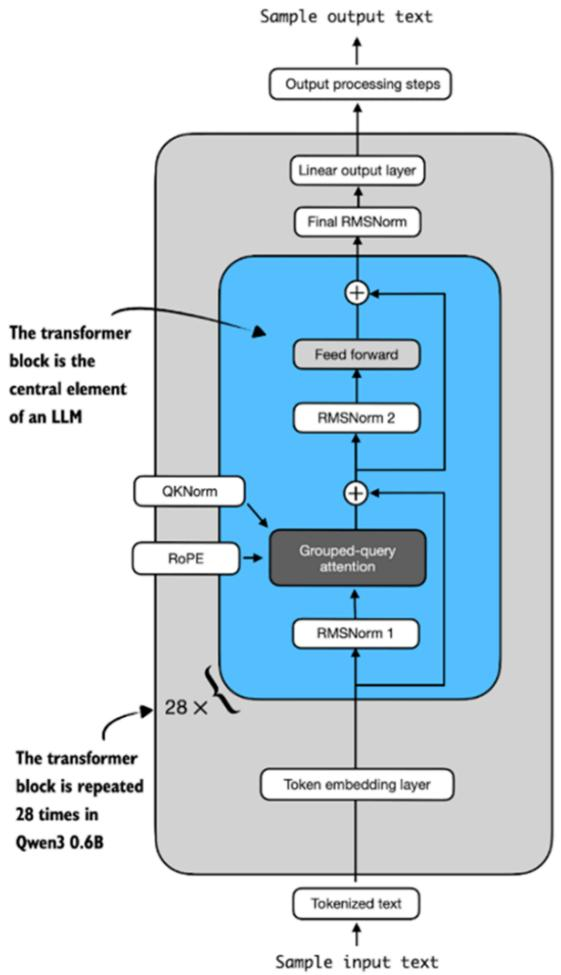  
Figure C.6 The Structure of the transformer block in Qwen3. Each block includes RMSNorm, RoPE, masked grouped-query attention, and a feed-forward module, and is repeated 28 times in the 0.6B-parameter model.

Listing C.5 implements the transformer block shown in figure C.6.

Listing C.5 Transformer block   
class TransformerBlock(nnModule): def __init__(self,cfg): super().__init__(self att $=$ GroupedQueryAttention( d_in $\equiv$ cfg["emb_dim"], num_heads $\equiv$ cfg["n_heads"], head_dim $\equiv$ cfg["head_dim"], num_kv_groups $\equiv$ cfg["n_kv_groups"], qk_norm $\equiv$ cfg["qk_norm"], dtype $\equiv$ cfg["dtype"] self. $ff =$ FeedForwardcfg) self(norm1 $\equiv$ RMSNormcfg["emb_dim"],eps=1e-6) self(norm2 $\equiv$ RMSNormcfg["emb_dim"],eps=1e-6) def forward(self,x，mask，cos，sin，start_pos $= 0$ ，cache $=$ None): shortcut $= x$ x $=$ self(norm1(x) x, next_cache $=$ self(att( x，mask，cos，sin，start_pos $\coloneqq$ start_pos,cache=cache ) #A x $= x +$ shortcut shortcut $= x$ x $=$ self(norm2(x) x $=$ self. $ff(x)$ x $= x +$ shortcut returnx,next_cache

As we can see, in listing C.5, the transformer block simply connects various elements we implemented in previous sections.

# C.6 Main model code

In this section, we will define the Qwen3Model class that we imported and used in chapter 2.

To implement the Qwen3Model class, the code in listing C.6 follows the architecture previously shown in figure C.6, where the transformer block sits at the heart of the LLM.

Listing C.6 Main Qwen3Model code   
class Qwen3Model(nnModule): def __init__(self,cfg): super().__init_(） #Main model parameters self.tk_emb $=$ nn.Embeddingcfg["vocab_size"],cfg["emb_dim"], dtype $\equiv$ cfg["dtype"] self.trf_blocks $=$ nn.ModuleList( [TransformerBlockcfg) for_in rangecfg["n_layers")] self.final_norm $=$ RMSNormcfg["emb_dim']) self.out_head $=$ nn.Linear( fg["emb_dim"],cfg["vocab_size"], bias $\equiv$ False，dtype $\equiv$ cfg["dtype"] ） #Reusable utilities ifcfg["head_dim"]is None: head_dim $=$ _cfg["emb_dim"]//cfg["n_heads"] else: head_dim $=$ _cfg["head_dim"] cos，sin $=$ compute_ripe.params( head_dim $\equiv$ head_dim, theta_base $\equiv$ cfg["rope_base"], context_length $\equiv$ _cfg["context_length"] ) self.register_buffer("cos",cos,persistent=False) self.register_buffer("sin",sin,persistent=False) self.cfg $\equiv$ cfg self.current_pos $= 0$ #Track current position in KV cache def forward(self,inidx，cache $\equiv$ None): tok_embedding $=$ self(tk_emb(inidx) x $=$ tok_embedding num_tokens $=$ x.shape[1] if cache is not None: pos_start $=$ self.current_pos pos_end $=$ pos_start + num_tokens self.current_pos $=$ pos_end mask $=$ torch.triu(

torch.ones( pos_end, pos_end, device $\equiv$ xdevice, dtype $\equiv$ torch bool ), diagonal $= 1$ [pos_start:pos_end，:pos_end] else: pos_start $= 0$ # Not strictly necessary but helps torch.compile mask $=$ torch.triu( torch.ones(num_tokens, num_tokens, device $\equiv$ x_device, dtype $\equiv$ torch(bool), diagonal $= 1$ ） mask $=$ mask[None，None，：，：] #A next_cache $= []$ for i, block in enumerate(self.trf_blocks): blk_cache $=$ cache.get(i) if cache else None x, new_blk_cache $=$ block(x, mask, self.cos, self.sin, start_pos $\equiv$ pos_start, cache $\equiv$ blk_cache) if cache is not None: cache.update(i, new_blk_cache) next_cache.append(new_blk_cache) $\mathbf{x} =$ self.final_norm(x) logits $=$ self.out_head(x.to(self.cfg["dtype"])) return logits def reset_kv_cache(self): self.current_pos $= 0$

#A Shape (1, 1, num_tokens, num_tokens) to broadcast across batch and heads

Since we already have all the main ingredients, the Qwen3Model class in listing C.6 only adds a few more components around the transformer block, namely the embedding and output layers (including one more RMSNorm layer). However, the code may appear somewhat complicated, which is due to the KV cache option.

As discussed in chapter 2, the KV cache can speed up the text generation process, but it is a topic outside the scope of this book. Interested readers can find more information about KV caching in my Understanding and Coding the KV Cache in LLMs from Scratch article at https://magazine.sebastianraschka.com/p/coding-the-kv-cache-in-llms.

Note that the Qwen3Model class, as implemented in listing C.6, supports various model sizes (see appendix D for more information). In chapter 2, we use the 0.6-billion-parameter model as it is the least resource-intensive model in the Qwen3 model family. The specific configuration of this model is visualized in figure C.7.

# Qwen3 0.6B

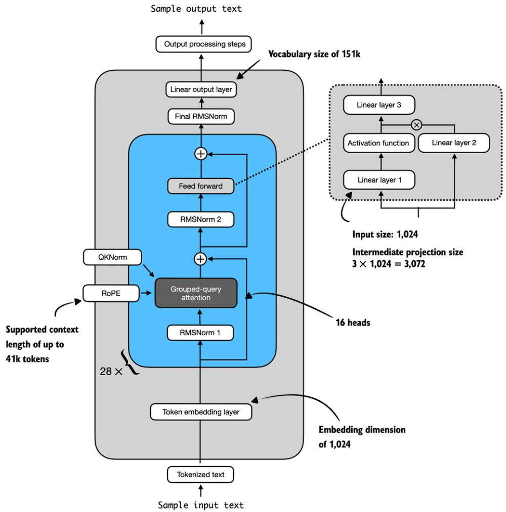  
Figure C.7 Architecture of the Qwen3 0.6B model. The model consists of a token embedding layer followed by 28 transformer blocks, each containing RMSNorm, RoPE, QKNorm, masked grouped-query attention with 16 heads, and a feed-forward module with an intermediate size of 3,072.

To use the 0.6B model shown in figure C.7 via the Qwen3Model class, we can define the following configuration in listing C.7 that we provide as input (cfg=QWEN_CONFIG_06_B) upon instantiating a new Qwen3Model instance.

Listing C.7 Qwen3 0.6B configuration   
```python
QWEN_CONFIG_06_B = { "vocab_size": 151_936, # Vocabulary size "context_length": 40_960, # Length originally used during training "emb_dim": 1024, # Embedding dimension "n_heads": 16, # Number of attention heads "n_layers": 28, # Number of layers "hidden_dim": 3072, # Size of intermediate dim in FeedForward "head_dim": 128, # Size of the heads in GQA "qk_norm": True, # Whether to normalize queries & keys in GQA "n_kv_groups": 8, # Key-Value groups for GQA "rope_base": 1_000_000.0, # The base in RoPE's "theta" "dtype": torch.bfloat16, # Lower-precision dtype to reduce memory } 
```

We will use the QWEN_CONFIG_06_B configuration from listing C.7 to instantiate the Qwen3 0.6B model later in section C.9.

# C.7 KV cache

The KV-cache-related heavy-lifting is mostly done in the Qwen3Model (listing C.6) and GroupedQueryAttention (listing C.4) code. The KVCache, shown in listing C.8, stores the key-value pairs themselves during text generation, which results in the speedup we experienced when enabling KV caching in chapter 2.

Listing C.8 KV Cache   
```python
class KVCache: def __init__(self, n_layers): self.cache = [None] * n_layers def get(self, layeridx): return self.cache(layeridx) def update(self, layeridx, value): self.cache(layeridx] = value def get_all(self): return self.cache def reset(self): for i in range(len(self.cache)): self.cache[i] = None 
```

The KVCache class in listing C.8 is used inside the generate_text_basic_cache function that we implemented in chapter 2.

# C.8 Tokenizer

The tokenizer code is somewhat complicated, as it supports a variety of special tokens, in addition to the base model and the so-called "Thinking" model variant of Qwen3, which is a reasoning model. The full reimplementation of the tokenizer is shown in listing C.9.

# Listing C.9 Tokenizer

import re   
from tokenizers import Tokenizer   
class Qwen3Tokenizer: _SPECIALs $=$ [ "<|endoftext|>", "<|im_start|>", "<|im_end|>", "<|object_ref_start|>", "<|object_ref_end|>", "<|box_start|>", "<|box_end|>", "<|quad_start|>", "<|quad_end|>", "<|vision_start|>", "<|vision_end|>", "<|vision_pad|>", "<|image_pad|>", "<|video_pad|>", ] _SPLIT_RE $=$ re.compile(r" $\left(<  \backslash   \right|\left[\hat{\mathbf{\Pi}}\right] + ?\backslash   \mid >\right)$ ") def __init__(self,tokenizer_file_path $\equiv$ "tokenizer.json", apply chatting_template $\equiv$ False, add_generation_prompt $\equiv$ False, add-thinking $\equiv$ False): self.applychat_template $\equiv$ apply chatting_template self.add_generation_prompt $\equiv$ add_generation_prompt self.add-thinking $\equiv$ add-thinking tok_path $=$ Path(tokenizer_file_path) if not tok_path.is_file(): raise FileNotFoundError( f"Tokenizer file' $\{t o k\_ p a t h\} '$ not found. " ) self._tok $=$ Tokenizer.from_file(str(tok_path)) self._special_to_id $=$ {t: self._tok_token_to_id(t) for t in self._SPECIALs}

```python
self_pad_token = "<|endoftext>";
self_pad_token_id = self._special_to_id.get(self_pad_token)
f = tok_path.name(lower())
if "base" in f and "reasoning" not in f:
    self.eos_token = "<|endoftext>";
else:
    self.eos_token = "<|im_end>";
self.eos_token_id = self._special_to_id.get(self.eos_token)
def encode(self, prompt, chat Wrapped=None):
    if chat Wrapped is None:
        chat Wrapped = self.applychat_template
stripped = prompt.strip()
if stripped in self._special_to_id and "\n" not in stripped:
    return [self._special_to_id[stripped]]
if chat Wrapped:
    prompt = self._wrap.chat_prompt)
ids = []
for part in filter(None, self._SPLIT_RE.splitprompt):
    if part in self._special_to_id:
        ids.append(self._special_to_id[part])
    else:
        ids.append(self._tok.encode(part).ids)
return ids
def decode(self, token_ids):
    return self._tok.decode(token_ids, skip_special_tokens=False)
def _wrap chatting(self, user_MSG):
    s = f"<|im_start|>user\n{user_MSG}|<|im_end|>\n"
if self.add_generation_prompt:
    s += "<|im_start|>assistant"
if self.add-thinking:
    s += "\n"
else:
    s += "<think>\n\n</think>\n\n"
return s 
```

#A Match HF behavior: chat model: <|im_end|>, base model: <|endoftext|>

#B insert no <think> tag, just a new line

Note that my Qwen3Tokenizer reimplementation in listing C.9 may appear somewhat complicated, as it aims to replicate the behavior of the official tokenizer released by the Qwen3 team in the Hugging Face Transformers library.

At first glance, it appears to have a few quirks. For example, when add_thinking $=$ True, no "\n<think>\n\n</think>\n\n" tokens are inserted (where is a \n newline character), and when add_thinking $=$ False, these tokens are added. This is intentional because the non-base Qwen3 0.6B model is a hybrid that supports both reasoning ("thinking") and standard modes.

# C.9 Using the model

Let's now instantiate and use the model to confirm that the code works by reusing the text generation approach from chapter 2.

First, we instantiate the model using the pre-trained model weights:

from pathlib import Path   
import torch   
from reasoning_from_scratch.ch02 import get_device   
from reasoning_from_scratch.qwen3 import download_qwen3_small   
# device $=$ get_device() #A device $=$ torchdevice("cpu")   
download_qwen3_small(kind $\equiv$ "base",tokenizer_only $\equiv$ False,out_dir $\equiv$ "qwen3")   
tokenizer_file_path $=$ Path("qwen3") / "tokenizer-base.json" model_file $=$ Path("qwen3") / "qwen3-0.6B-base.pth"   
tokenizer $=$ Qwen3Tokenizer(tokenizer_file_path $\equiv$ tokenizer_file_path)   
model $=$ Qwen3Model(QWEN_CONFIG_06_B)   
model.load_state_dict(torch.load(model_file))   
model.to(device)

#A Optional: Uncomment to use automatic device picker

The output shows the structure of the instantiated model, which should match the values we used in the configuration file in listing C.7:

$\sqrt{}$ qwen3/qwen3-0.6B-base.pth already up-to-date $\sqrt{}$ qwen3tokenizer-base.json already up-to-date   
Qwen3Model( (tok_emb): Embedding(151936, 1024) (trf_blocks): ModuleList( (0-27): 28 x TransformerBlock( (att): GroupedQueryAttention( (W_query): Linear(in_features=1024, out_features=2048, bias=False) (W_key): Linear(in_features=1024, out_features=1024, bias=False) (W_value): Linear(in_features=1024, out_features=1024, bias=False) (out_Proj): Linear(in_features=2048, out_features=1024, bias=False) (q_norm): RMSNorm() (k_norm): RMSNorm() ) (ff): FeedForward( (fc1): Linear(in_features=1024, out_features=3072, bias=False) (fc2): Linear(in_features=1024, out_features=3072, bias=False) (fc3): Linear(in_features=3072, out_features=1024, bias=False) ） (norm1): RMSNorm() (norm2): RMSNorm() ） (final_norm): RMSNorm() (out_head): Linear(in_features=1024, out_features=151936, bias=False)

Next, we re-use the text generation functions from chapter 2 to generate text:

import time   
from reasoning_from_scratch.ch02 import ( generate.stats, generate_text_basic_cache, )   
prompt $=$ "Explain large language models in a single sentence."   
input_token_ids Tmax $\equiv$ torchtensor( tokenizer.encode(prompt), device $\equiv$ device ).unsqueeze(0)   
start_time $=$ time.time()   
output_token_ids Tmax $\equiv$ generate_text_basic_cache( model $\equiv$ model, token_ids $\equiv$ input_token_ids Tmax $\equiv$ new_tokens $= 200$ eos_token_id $\equiv$ tokenizer.eos_token_id,   
）   
end_time $=$ time.time()   
generate.stats(output_token_ids Tmax,tokenizer,start_time,end_time)

Since we used the same prompt as in chapter 2, the generated text matches the generated text from chapter 2 exactly:

```txt
Time: 1.46 sec  
28 tokens/sec 
```

Large language models are artificial intelligence systems that can understand, generate, and process human language, enabling them to perform a wide range of tasks, from answering questions to writing articles, and even creating creative content.

While the main chapters use the 0.6-billion-parameter variant of Qwen3 to lower the resource requirements for this book, interested readers can find more information on how to use the larger models in appendix D.