# pSee 模型心技术与 合开发5


# 目 录

版权信息

作者简介

内容简介

前言

第1章高性能注意力与多模态融合

1.1 从涌现到飞跃：高性能大模型的崛起  
1.2 大模型的内功：高性能注意力机制的崛起  
1.3 大模型的外拓：多模态融合  
1.4 高性能注意力与多模态融合的未来展望  
1.5 本章小结

第2章 PyTorch深度学习环境搭建

2.1 安装Python开发环境  
2.2 安装PyTorch 2.0   
2.3 多模态大模型DeepSeek初探与使用  
2.4 本章小结

第3章注意力机制详解之基础篇

3.1 注意力机制与模型详解  
3.2 注意力机制的应用实践：编码器  
3.3 基础篇实战：自编码架构的拼音汉字生成模型  
3.4 本章小结

第4章注意力机制详解之进阶篇

4.1 注意力机制的第二种形态：自回归架构  
4.2 进阶篇实战1：无须位置表示的酒店评论情感判断  
4.3 进阶篇实战2：基于自回归模型的酒店评论生成  
4.4 本章小结

第5章注意力机制详解之高级篇

5.1 替代前馈层的混合专家模型详解  
5.2 高级篇实战1：基于混合专家模型的情感分类实战  
5.3 带有MoE的注意力模型  
5.4 高级篇实战2：基于通道注意力的图像分类  
5.5 高级篇实战3：基于MoE与自注意力的图像分类

5.6 本章小结  
第6章注意力机制详解之调优篇  
6.1 注意力模型优化方案讲解  
6.2 调优篇实战1：基于MLA的人类语音情感分类  
6.3 本章小结  
第7章旅游特种兵迪士尼大作战：DeepSeek API调用与高精准路径优化  
7.1 基于在线API的大模型调用  
7.2 智能化DeepSeek工具调用详解  
7.3 旅游特种兵迪士尼大作战：DeepSeek高精准路径优化  
7.4 本章小结  
第8章广告文案撰写实战：多模态DeepSeek本地化部署与微调   
8.1 多模态DeepSeek-VL2本地化部署与使用  
8.2 广告文案撰写实战1：PEFT与LoRA详解  
8.3 广告文案撰写实战2：本地化DeepSeek-VL2微调  
8.4 本章小结  
第9章注意力与特征融合范式1：Diffusion可控图像生成  
9.1 Diffusion生成模型精讲   
9.2 可控图像生成实战：融合特征的注意力机制  
9.3 本章小结  
第10章注意力与特征融合范式2：多模态图文理解与问答  
10.1 多模态图文问答实战  
10.2 更多的多模态融合方案  
10.3 本章小结  
第11章注意力与特征融合范式3：交叉注意力语音转换  
11.1 端到端语音识别任务简介  
11.2 端到端音频特征提取库librosa的使用  
11.3 端到端语音识别任务简介  
11.4 基于PyTorch的数据处理与音频特征融合  
11.5 用于特征融合的交叉注意力  
11.6 本章小结  
第12章多模态特征token压缩  
12.1 图像特征压缩的多种实现  
12.2 基于AvgPool与自编码器的语音识别

12.3 本章小结  
第13章从二维到一维：图像编码器详解与图形重建实战  
13.1 图像编码器  
13.2 基于VQ-VAE的手写体生成  
13.3 基于FSQ的人脸生成  
13.4 基于FSQ算法的语音存储  
13.5 本章小结  
第14章 基于PyTorch的端到端视频分类实战  
14.1 视频分类数据集的准备  
14.2 注意力视频分类实战  
14.3 使用预训练模型的视频分类  
14.4 本章小结  
第15章基于DeepSeek的跨平台智能客服开发实战  
15.1 智能客服的设计与基本实现  
15.2 带有跨平台客户端的智能客服开发实战  
15.3 本章小结

# 作者简介

# 王晓华

高校计算机专业讲师，研究方向为云计算、大数据与人工智能。其著作包括《深入探索Mamba模型架构与应用》《PyTorch深度学习与计算机视觉实践》《PyTorch语音识别实战》《ChatGLM3大模型本地化部署、应用开发与微调》《从零开始大模型开发与微调：基于PyTorch与ChatGLM》《PyTorch2.0深度学习从零开始学》《Spark3.0大数据分析与挖掘：基于机器学习》《TensorFlow深度学习应用实践》《OpenCV+TensorFlow深度学习与计算机视觉实战》《TensorFlow语音识别实战》《TensorFlow 2.0卷积神经网络实战》《深度学习的数学原理与实现》。

# 内容简介

本书深入剖析国产之光DeepSeek多模态大模型的核心技术，从高性能注意力机制切入，深入揭示DeepSeek的技术精髓与独特优势，详细阐述其在人工智能领域成功的技术秘诀。本书循序渐进地讲解深度学习注意力机制的演进，从经典的多头注意力（MHA）逐步深入DeepSeek的核心技术——多头潜在注意力（MLA）与混合专家模型（MoE）。此外，本书还将详细探讨DeepSeek中的多模态融合策略、技术及应用实例，为读者提供全面的理论指导与应用实践。本书配套所有示例源码、PPT课件、配图PDF文件与读者微信技术交流群。

本书共分15章，内容涵盖高性能注意力与多模态融合概述、PyTorch深度学习环境搭建、DeepSeek注意力机制详解（包括基础篇、进阶篇、高级篇及调优篇）、在线与本地部署的DeepSeek实战（如旅游特种兵迪士尼大作战、广告文案撰写与微调、智能客服等），以及多模态融合技术与实战应用（如Diffusion可控图像生成、多模态图文理解与问答、交叉注意力语音转换、端到端视频分类等）。

本书既适合DeepSeek核心技术初学者、注意力机制初学者、大模型应用开发人员、多模态融合开发人员、大模型研究人员，也适合高等院校及高职高专院校人工智能大模型方向的师生。

# 前言

多模态大模型DeepSeek以其卓越的技术与出色的性能，在人工智能领域熠熠生辉，成为一颗璀璨的明珠。其成功的秘诀在于对注意力机制的突破性创新与MoE创新架构的巧妙运用，为人工智能领域带来了前所未有的变革。

DeepSeek不仅在理论上取得了显著突破，更在实际应用中展现出其强大的能力。通过高效融合多种模态的数据，DeepSeek在图像识别、自然语言处理、语音识别等领域均取得了令人瞩目的成果，为人工智能的多元化应用提供了强大的支持。

在此背景下，本书深入剖析注意力机制与多模态融合的基本原理，全面展示它们的技术概况，并结合丰富的应用案例，展望这两大技术的未来发展趋势。通过搭建PyTorch深度学习环境，读者可以亲自动手实践书中的丰富案例，从而在实践中更深入地理解这两大技术的精髓，并提高大模型应用开发能力。

本书不仅适合深度学习初学者、工程师、研究者、学校的师生阅读，也适合想要掌握最新注意力机制与多模态融合技术的高等院校师生阅读。

# 本书配套资源

本书配套实例源码、PPT课件、配图PDF文件与读者微信技术交流群，读者使用微信扫描下面的二维码即可获取。如果在阅读过程中发现问题或有任何建议，请联系下载资源中提供的相关电子邮箱或微信。


# 本书目的

当前，高性能大模型DeepSeek备受瞩目，而其背后的注意力机制与多模态融合技术更是成为深度学习研究领域的热点。本书致力于成为读者全面掌握DeepSeek核心技术的宝典，通过深入浅出的原理讲解与实例分析，引导读者系统学习DeepSeek的核心原理、架构及应用开发方法。

本书深入剖析了DeepSeek的核心技术——多头潜在注意力（MLA）与混合专家模型（MoE），详细阐述它们的工作原理与技术优势。此外，本书还详细探讨DeepSeek中的多模态融合方法，结合丰富的API应用实例，为读者提供全面的理论与实践指导，助力读者深入理解高性能大模型的运行机制。

通过本书的学习，读者不仅能全面理解DeepSeek中的高性能注意力机制与多模态融合技术，更能熟练地将这些知识应用于情感分类、图像识别、语音识别、文本生成、图像生成、图文问答、视频分类、智能客服等实际场景中，从而在深度学习领域取得显著的进步。

# 本书内容安排

第1章，高性能注意力与多模态融合。本章首先介绍以DeepSeek为代表的高性能大模型的崛起，并深入探讨注意力机制的发展，阐述其基本原理、发展变种以及在多架构中高性能的崛起。紧接着，我们探讨多模态融合，包括其面临的挑战、融合策略与技术概览、应用场景。最后，我们将展望多模态融合与注意力的未来发展方向，探讨它们潜在的创新与前沿技术。

第2章，PyTorch深度学习环境搭建。本章指导读者搭建PyTorch深度学习环境，包括Python开发环境的安装、PyTorch2.0的安装与配置，以及多模态大模型DeepSeek的用法。通过本章的学习，读者将能够熟悉PyTorch的基本操作，为多模态融合与注意力机制的研究打下基础。

第3章，注意力机制详解之基础篇。注意力机制在深度学习中发挥着越来越重要的作用，本章将详细介绍注意力机制的基本原理，包括自注意力机制、ticks和LayerNormalization、多头自注意力等关键概念。此外，我们还将通过编码器这一应用实践，展示注意力机制在实际任务中的运用。最后，通过一个实战案例——自编码架构的拼音汉字生成模型，读者将进一步加深对注意力机制的理解。

第4章，注意力机制详解之进阶篇。在基础篇的基础上，本章将进一步探讨注意力机制的进阶应用。我们将介绍自回归架构这一重要形态，包括旋转位置编码、新型激活函数SwiGLU等关键技术。此外，还将通过两个实战案例——无须位置表示的酒店评论情感判断与基于自回归模型的酒店评论生成，展示注意力机制在文本处理任务中的强大能力。

第5章，注意力机制详解之高级篇。结合DeepSeek基本架构，高级篇将深入探讨注意力机制的更高级应用。我们将首先介绍替代前馈层的混合专家（MoE）模型，阐述其基本结构与实现方式。紧接着，通过两个实战案例——基于MoE模型的情感分类与带有MoE的注意力模型，展示混合专家模型在提升注意力机制性能方面的潜力。最后，我们还将探讨基于通道注意力的图像分类技术，进一步拓展注意力机制的应用领域。

第6章，注意力机制详解之调优篇。调优是提升深度学习模型性能的关键环节。本章将介绍针对注意力模型的多种优化方案，包括MQA模型、MLA模型、GQA模型以及差分注意力模型等。此外，还将通过一个实战案例——基于MLA的人类语音情感分类，展示优化方案在实际任务中的应用效果。而MLA注意力模型本身也是DeepSeek取得成功的关键模块。

第7章，旅游特种兵迪士尼大作战：DeepSeek API调用与高精准路径优化。本章将详细介绍DeepSeek大语言模型在线API的调用方法。我们将从账户注册开始，逐步讲解API密钥的获取、基础对话流程的建立，并通过一个具体案例展示其强大的应用能力——旅游特种兵迪士尼大作战。

第8章，广告文案撰写实战：多模态DeepSeek本地化部署与微调。本章将实现基于多模态大模型DeepSeek的本地化部署，并对模型的应用进行深入探索。针对Windows系统环境下的DeepSeek-VL2，我们将详细阐述额外安装和编译包的必要步骤，确保模型能够在该系统上顺利运行。为了进一步提升模型的适配性，使其能够更好地服务于特定的输出任务，我们深入讲解了PEFT（参数高效微调）与LoRA（低秩适配）这两种先进的微调方法。通过这些精细化的调整和优化，我们在推断阶段取得了显著成效，并完成了广告文案撰写的实战案例。

第9~15章，多模态大模型应用开发实战。这7章分别探讨注意力与特征融合在不同领域的应用范式与实战案例。从Diffusion可控图像生成到多模态图文理解与问答，再到交叉注意力语音转换和DeepSeek智能客服应用开发等任务，我们将详细阐述注意力与特征融合技术的实现细节与应用效果。通过图像生成、图文问答、语音转换、特征压缩、图像编码、视频分类、智能客服等实战案例的学习，读者将能够更深入地理解注意力与特征融合在实际问题中的解决方案与实现过程。

# 本书特点

（1）结构清晰，条理分明：本书按照主题进行章节划分，从基础概念到高级应用，逐步深入。每一章都围绕一个核心主题展开，如“高性能注意力与多模态融合”“PyTorch深度学习环境搭建”等，使得读者能够循序渐进地学习和掌握相关知识。  
（2）理论与实践相结合：书中不仅详细阐述了深度学习中的注意力机制与多模态融合的理论知识，还通过大量的实战案例，指导读者如何将理论应用到DeepSeek大模型应用开发中。这种理论与案例实践相结合的方式，有助于读者更好地理解和掌握所学的内容。

（3）内容丰富，涵盖面广：本书涵盖深度学习的多个方面，包括多模态融合、注意力机制的各种形态、模型优化等。此外，还涉及图像、文本、语音等多种数据类型，为读者提供了全面的学习资源。  
（4）注重前沿技术与创新：本书详细介绍了深度学习领域的最新技术和创新方向，如多模态大模型、混合专家模型等。这使得读者能够紧跟技术发展的步伐，了解并掌握深度学习最前沿的知识。  
（5）语言通俗易懂，适合不同层次的读者：本书采用通俗易懂的语言进行阐述，避免使用过于晦涩难懂的术语。这使得初学者和有一定基础的读者，都能够轻松理解并掌握书中的内容。  
（6）案例丰富，操作性强：本书提供了大量的实战案例，包括图像生成、图文问答、语音转换、特征压缩、图像编码、视频分类、智能客服等。这些案例不仅具有代表性，而且具有很强的操作性，能够帮助读者在实际操作中巩固所学知识。

# 本书适合的读者

● DeepSeek应用开发初学者：对于使用DeepSeek应用开发的初学者，本书详细讲解DeepSeek高性能的核心技术以及DeepSeek应用开发方法，引导读者快速入门大模型开发。  
● 高性能注意力机制与多模态融合初学者：对于深度学习初学者，本书以清晰的结构、理论与实践相结合、丰富的内容和前沿技术介绍，为读者提供了一本极具价值的深度学习入门指南。  
● 深度学习研究者与开发人员：对于在深度学习领域工作的研究者、工程师和开发者，本书提供了关于融合技术和注意力机制的深入理解和实践指导，有助于他们在相关项目中取得更好的成果。  
● DeepSeek大模型原理和架构研究者：对于具有一定深度学习基础知识的研究者，本书详细讲解了DeepSeek内部原理和运作架构。通过阅读本书，读者能够全面了解DeepSeek模型的设计思想、工作原理以及各组成部分之间的协同作用。  
● 数据科学家和机器学习工程师：对于处理多模态数据（如文本、图像、音频等）的数据科学家和机器学习工程师，本书提供了丰富的多模态应用案例，有助于他们拓宽视野，提升技能。  
● 人工智能专业学生与爱好者：本书适合作为人工智能、机器学习或深度学习相关课程的高级教材或参考书，有助于学生深入理解多模态融合与注意力机制的原理和应用。

# 作者与鸣谢

本书作者王晓华为高校计算机专业教师，担负数据挖掘、人工智能、数据结构等多项本科及研究生课程，研究方向为数据仓库与数据挖掘、人工智能、机器学习，在研和参研多项

科研项目。

本书的顺利出版离不开清华大学出版社各位老师的帮助，在此表示感谢。

作者

2025年1月

# 第1章

# 高性能注意力与多模态融合

在人工智能的无垠星海之中，大模型犹如一艘扬帆破浪的巨型航船，承载着人工智能的无尽梦想与璀璨希望，勇往直前地驶向那未知而神秘的彼岸。而高性能与多模态融合则如同这艘巨轮的内在功力与外在拓展，是其乘风破浪、砥砺前行的核心引擎与开拓利器。

高性能注意力机制堪称大模型的内在功力与坚固基石，是其在浩如烟海的数据洪流中稳健航行的坚实后盾。注意力机制，恰如其名，模拟了人类在处理纷繁信息时那种有选择地聚焦重点、忽略枝节的能力。在深度学习的广阔天地里，注意力机制犹如一盏明灯，指引模型在浩瀚数据中寻找并锁定对当前任务至关重要的信息，从而显著提升模型的性能与效率。而高性能注意力机制，更是在追求计算速度极致的同时，对模型的效率与精度进行了深度雕琢与优化。它宛如大模型那颗强健有力的心脏，每一次跳动都涌动着澎湃的动力，为模型的每一个决策、每一次推理注入源源不断的活力。在高性能的助力下，注意力机制使得大模型如同武林高手般，内功深厚绵长，一招一式皆蕴含无穷力量，敏锐地捕捉数据中的每一个关键细节。

多模态融合则是大模型的外在拓展与翱翔的羽翼，是其探索未知领域、融合多元世界的神奇桥梁。多模态融合打破了数据形式的界限，让大模型不再拘泥于单一的文本或图像，而是能够跨越文本、图像、音频等多种媒介的鸿沟，实现信息的全方位整合与深度剖析。它犹如大模型那双洞察万物的眼睛，拓宽了视野的边界，使模型能够更加全面地感知这个世界的多彩多姿，更加准确地领悟人类的意图与需求。

在多模态融合与注意力机制的携手共舞下，深度学习模型如同一位智慧的织锦大师，把不同来源、不同格式的数据巧妙地编织在一起，提取出那些熠熠生辉的特征，并据此做出精准无误的预测与决策。这种整合不仅停留在数据的表面层次，更深入到了模型的结构与算法之中，使得我们在运用深度学习模型处理复杂任务时更加游刃有余、得心应手。

展望未来，内功与外拓——高性能注意力与多模态融合，将在深度学习的宏伟篇章中继续扮演举足轻重的角色。它们相互依存、相辅相成，共同推动着深度学习技术的不断革新与进步。在未来的科研探索中，如何更加深入地揭示这两个概念的奥秘，如何更加巧妙地运用它们的力量，将成为推动深度学习领域持续创新、不断攀登新高峰的关键所在。

# 1.1 从涌现到飞跃：高性能大模型的崛起

随着人工智能技术的飞速发展，大模型作为其中的重要一环，其发展历程可谓波澜壮阔。从早期简单的神经网络到如今庞大的复杂模型，大模型在规模、性能和应用范围上都实现了巨大的飞跃。

随着大模型的普及和应用，其优点和潜力逐渐得到人们的认可。大模型具有强大的泛化能力，可以在大规模数据上进行训练，从而获得更高的准确率和更广泛的应用领域。同时，大模型还具备强大的表达能力和灵活性，能够不断提升自身的性能，以适应各种不同的任务和场景。

# 1.1.1 大模型的“涌现”

在数字时代的浩瀚星空中，大模型如同新星般，以其独特的光芒照亮了人工智能的未来之路。它们的出现不仅是技术进步的象征，更是对人类智慧的一次深刻模拟与扩展。

从传承来看，大模型的研究与深度学习的研究是紧密相连的，它们之间的关系仿佛血脉相连，这种关系的起源可以一直追溯至20世纪80年代。在那个时代，反向传播算法的提出与应用激活了多层感知机（Multi-Layer Perceptron，MLP）的训练可能性，这就好像一场瑞雪，预示着深度学习春天的到来。然而，由于受到当时计算机算力和数据规模的限制，深度学习仍然像一朵含苞待放的花蕾，尚未能取得突破性的进展。

进入21世纪，技术的车轮滚滚向前，为深度学习的发展揭开了新的篇章。2006年，Hinton等正式提出了深度学习的概念，他们巧妙地运用无监督预训练的方法，解决了深层网络训练中的梯度消失难题。这一创新如同阳光雨露，滋润了深度学习这朵待放的花蕾，使其渐渐繁荣起来。尤其值得一提的是，在2012年，Hinton领导的团队凭借深度学习模型AlexNet在ImageNet图像识别挑战赛中一举夺冠，这无疑是在全球范围内投下了一颗震撼弹，使人们看到了深度学习的无穷潜力。

深度学习模型的规模在此基础上持续攀升，催生了大模型的问世。大模型的出现得益于两方面的推动力：一方面，GPU、TPU等专用硬件的出现提升了算力，这就好比将汽车的发动机升级为火箭发动机，为大规模模型训练提供了可能；另一方面，互联网大数据的爆炸式增长为模型训练提供了海量的数据支持，这就如同将小溪的水流汇集成为大海的波涛。在这两大推动力的共同作用下，大模型如雨后春笋般涌现，其中最具里程碑意义的事件是Transformer结构的提出（2017年由Vaswani等在论文 Attention is All You Need 中提出，并在自

然语言处理领域得到广泛应用），它使得深度学习模型的参数突破了1亿大关，这无疑标志着我们已经迈入了大模型时代。

大模型之所以被冠以“大”之名，是因为它们的规模和能力相比于普通模型来说是巨大的。它们不再局限于完成简单和特定的任务，而是能够完成更加复杂和高级的任务，例如自然语言理解、语音识别、图像识别等，这些任务都需要大量的数据和计算资源才能完成。大模型使我们在面对复杂和具有挑战性的问题时，有了更强大的工具和技术支持。

大模型的架构与普通模型相比，具有更加复杂和庞大的网络结构、更多的参数和更深的层数，这就好比一座摩天大楼与一间平房的区别。这种复杂性使得大模型能够处理和学习更复杂、更高级的模式和规律，从而在各种任务中产生出乎意料的优秀表现。而这正是大模型的涌现能力的体现，也是大模型最具魅力的地方。大模型在不同任务产生“涌现”现象的参数量比较如图1-1所示。

随着模型参数的递增，准确率的变化仿佛经历了一场蜕变，模型在某一刹那“突然”实现了跨越式的提升。这种变化可以浅显地理解为量变引发质变的自然法则——当模型的规模突破某个阈值，精度的增速由负转正，呈现出一种异于常规的增速曲线，如同抛物线突破顶点，扶摇直上。因此，在模型规模与准确率的二维空间中，我们可以观察到一条非线性增长的轨迹，这是大模型所独有的魅力。

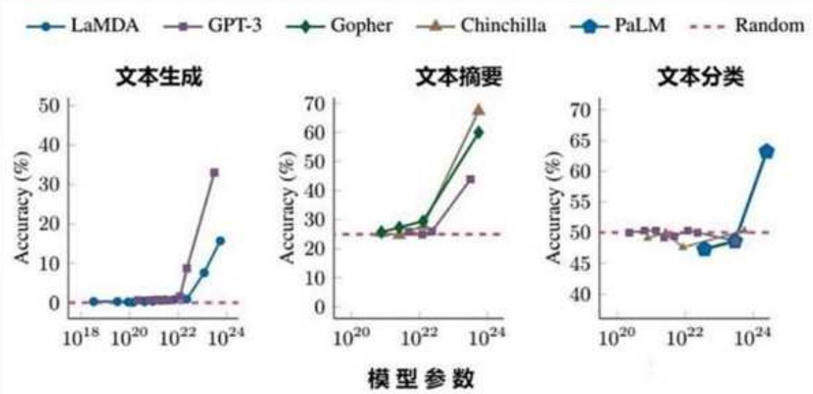  
图1-1 大模型在不同任务产生“涌现”现象的参数量比较

这种精度增速现象的涌现，不仅体现在准确率的提升上，更在于模型所展现出的更高层次的抽象能力和泛化能力。换句话说，大模型在处理复杂任务时，能够捕捉到更深层次的数据模式和规律，从而给出更准确、更全面的预测和判断。这种涌现能力的出现并非偶然，而是有其深刻的内在逻辑。

首先，更复杂的神经网络结构是大模型涌现能力的重要基石。随着模型规模的扩张，神经元之间的连接逐渐丰富和深化，形成了一个错综复杂但有序的网络结构。这样的结构使得

模型能够更好地挖掘输入数据中的高层次特征，将原始数据转换为具有丰富语义信息的特征向量，从而提高模型的表现能力。

其次，更多的参数意味着模型具备了更强的表达能力。大型模型通常拥有数以亿计的参数，这些参数为模型提供了巨大的自由度，使其能够对输入数据进行各种复杂的非线性变换。在自然语言处理领域，大语言模型（Large Language Model，LLM）正是凭借这种强大的表达能力，通过对海量文本数据的深度训练，学习到了语言背后的抽象特征和规律，从而能够生成流畅、自然的文本内容。

最后，更强的数据驱动能力是大模型涌现的关键所在。大型模型的训练过程往往需要海量的数据支持，这使得它们能够充分吸收和利用数据中的信息，学习到更加普遍和更加健壮的特征和规律。这种数据驱动的学习方式，不仅提高了模型在训练任务上的表现，更重要的是赋予了模型在面对新任务时的强大适应能力和泛化能力。

# 1.1.2 大模型的发展历程

在人工智能的发展历程中，大模型的发展可谓是一次重大的技术革新。这些模型以其庞大的参数数量和强大的学习能力，极大地推动了人工智能领域的进步。

在人工智能的早期阶段，由于计算能力和数据的限制，神经网络模型通常较为简单，参数数量也相对有限。然而，随着计算技术的飞速发展和大数据时代的到来，研究者们开始意识到，更大规模的模型可能拥有更强的学习和表示能力。

这一思想的实践始于深度学习技术的兴起。深度学习允许神经网络模型通过多层网络结构学习数据的复杂特征。而随着数据集的扩大和计算资源的增加，研究者们开始尝试构建更大、更深的网络模型，以期获得更好的性能。

进入21世纪后，大模型的发展迎来了重要的转折点。其中，Transformer模型的提出是大模型发展史上的一个重要里程碑。这种模型通过自注意力机制，有效地捕捉了序列数据中的长距离依赖关系，显著提升了自然语言处理等任务的性能。

随后，基于Transformer的GPT（Generative Pre-trained Transformer，生成式预训练变换器）系列模型将大模型的发展推向了新的高度。GPT系列以其庞大的参数数量和出色的生成能力而闻名。从GPT-1到GPT-4，每一代模型的规模和性能都在不断攀升，实现了在自然语言生成、理解和推理等多个方面的突破。

除GPT系列外，还有其他杰出的大模型不断涌现，如谷歌的BERT。BERT是基于Transformer的一个预训练语言模型，自发布以来，在自然语言理解和生成任务中展现出了卓越的性能，成为NLP领域的新标杆。

大模型的崛起不仅推动了自然语言处理领域的进步，还对计算机视觉、语音识别等领域产生了深远影响。这些领域的突破提升了人工智能技术的整体水平，并为我们的日常生活带

来了前所未有的便利。

例如，在自然语言翻译方面，大模型的帮助使得翻译结果变得越来越准确和流畅；在智能客服领域，大模型能够更好地理解用户需求并提供满意的解答；在个人助理方面，大模型使得日程管理和生活安排更加智能化。

# 1.1.3 高性能大模型的崛起

随着注意力机制性能的显著提升及多模态融合技术的持续进步，传统大型模型设计正迎来一场深刻的变革。在过去，这些模型主要依赖增加参数数量来提升性能。然而，现今它们正逐渐转型，不仅追求参数规模，更重视创新的架构设计、快速的推断能力、高效的资源利用以及低廉的训练成本。这一转变标志着人工智能在效率和可持续性方面迈出了重要步伐，为智能系统未来的广泛应用奠定了坚实基础。

在这个背景下，高性能大模型应运而生。它们通过深度融合注意力机制与多模态技术，在性能上实现了质的飞跃，同时大幅提升了计算效率和资源利用率。这种全方位的进步使这些模型能更好地服务于各行各业，推动智能化进程的迅猛发展，并为环保和可持续发展作出积极贡献。

那么，何为高性能大模型？它指的是在保持或提升模型性能的同时，还具备高效计算和资源利用能力的大型模型。这种模型不仅依赖先进的算法和架构设计来实现更高的准确率和更强的泛化能力，还注重削减不必要的计算和内存使用，以实现更快的推断速度和更低的延迟。此外，高性能大模型还致力于降低训练成本和减少能源消耗，为推动绿色AI的发展贡献力量。比如，DeepSeek-V3、ChatGPT 4.0、Qwen 2.5、GLM-4等都是高性能大模型。

与高性能大模型相比，普通大模型可能更注重参数数量的增加，而相对忽视性能、效率和可持续性方面的综合考量。这可能导致在实际应用中，尽管普通大模型能达到一定的性能标准，但往往需要消耗更多的计算资源和能源，且难以应对多变且复杂的任务需求。

我们可以说，高性能大模型与普通大模型的主要区别在于性能、效率、可持续性和环保等多个维度。更重要的是，在实际应用中，高性能大模型展现出明显优于传统大模型的表现，为各行各业带来更加高效、环保且可持续的智能解决方案。

# 1.2 大模型的内功：高性能注意力机制的崛起

大模型的涌现与注意力机制的崛起密不可分。这一革命性的技术转变，如同为深度学习模型注入了一股强大的内力，使其能够动态地聚焦于输入数据中的关键信息。这种独特能力不仅极大地提升了模型处理复杂任务的本领，更在浩瀚无垠的文本数据中捕捉细微线索，或在错综复杂的图像中精准识别关键特征时，展现出了惊人的效能。而高性能注意力机制则是在这一基础上进一步突破，它优化了信息筛选与处理的流程，使得模型在应对大规模、高维度数据时更加游刃有余。这种机制如同内功中的高深境界，让大模型在应对各种挑战时都能保持卓越的性能与稳定性，从而引领人工智能领域迈向更广阔的前景。

# 1.2.1 注意力机制的基本原理

注意力机制在深度学习模型中的核心作用在于赋予模型动态聚焦输入数据中关键信息的能力，同时忽略那些对于当前任务而言不重要的部分。这一机制的设计灵感源自人类在处理复杂信息时自然形成的注意力分配模式。在深度学习的语境下，注意力机制的实现依赖于一个精心设计的注意力权重分布计算过程，该过程旨在量化输入数据中每个元素对当前任务的重要性。注意力机制的基本原理如图1-2所示。

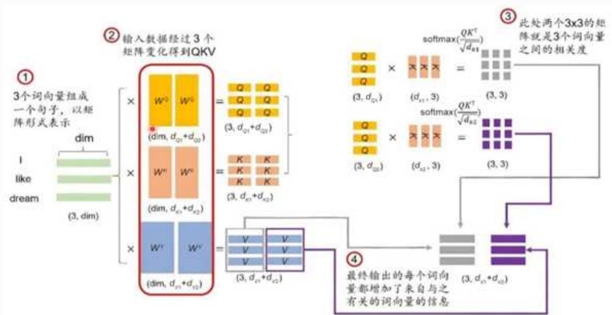  
图1-2 注意力机制的基本原理

具体来说，注意力机制的工作流程可分解为以下几个关键步骤：首先，模型会生成一个查询（Query）向量，这个向量代表了当前任务或上下文的需求。随后，模型会计算这个查

询向量与一组键值对（Key-Value Pairs）之间的相似度得分。这里的“键”可以理解为输入数据的表示，而“值”则是与键相关联的具体信息。通过计算查询向量与每个键之间的相似度，模型能够评估出每个键（即输入数据的每个部分）与当前任务的相关程度。

接下来，模型会利用这些相似度得分作为权重，对相应的值进行加权求和。这一过程实质上是对输入数据进行重加权，使得与当前任务高度相关的信息得到强化，而不相关的信息则被相对削弱。最终，经过加权求和得到的注意力输出，即为模型聚焦于关键信息后的处理结果。

通过这种方式，注意力机制不仅帮助模型在处理复杂任务时实现了计算资源的优化配置，还显著提升了模型对于关键信息的捕捉能力，进而增强了模型的性能和泛化能力。在自然语言处理、计算机视觉等众多领域，注意力机制已成为推动深度学习模型性能飞跃的关键因素之一。

# 1.2.2 注意力机制的变革与发展

随着深度学习技术的不断进步，注意力机制也在持续演进，涌现出了多种变种，以适应更加复杂和多样化的应用场景。其中，自注意力（Self-Attention）和多头注意力（Multi-HeadAttention，MHA）是两种比较重要的变种。

自注意力机制是一种特殊的注意力机制，它允许模型在处理单个序列的数据时，能够关注到序列内部的不同位置，从而捕捉序列内部的依赖关系。这种机制在自然语言处理任务中非常有效，如机器翻译、文本摘要等，因为它能够帮助模型更好地理解句子的上下文信息，提高生成的文本质量。

而多头注意力机制则是在自注意力的基础上进行了扩展，它通过引入多个独立的注意力头，允许模型在不同的表示子空间中学习到不同的信息。每个注意力头都可以独立地关注输入数据的不同部分，然后将这些信息结合起来，从而捕捉到更加丰富和多样化的特征。多头注意力机制在提升模型性能的同时，也增强了模型的健壮性和泛化能力。

除自注意力和多头注意力外，还有许多其他的注意力机制变种，如硬注意力（HardAttention）、软注意力（Soft Attention）、局部注意力（Local Attention）等。这些变种在不同的应用场景下各有优劣，可以根据具体任务的需求进行选择和组合。

随着深度学习技术的不断发展，注意力机制及其变种将继续在多个领域发挥重要作用。一方面，我们可以期待更加高效、精确的注意力机制变种的出现，以应对更加复杂和大规模的数据处理需求。另一方面，随着跨模态学习和多任务学习的兴起，注意力机制也将在多模态数据融合和任务协同优化等方面展现出更大的潜力。同时，如何将注意力机制与其他深度学习技术（如卷积神经网络、循环神经网络等）更好地结合，以实现更加高效的特征提取和信息融合，也是未来研究的一个重要方向。

# 1.2.3 高性能注意力机制崛起：GQA与MLA

在人工智能的壮阔征途中，高性能注意力机制的崛起如同一股不可阻挡的浪潮，深刻改变着大模型的面貌与能力。这一机制以其独特的智慧之光，照亮了深度学习模型的每一个角落，使它们在处理复杂任务时展现出前所未有的高效与精准。

在大模型的宏伟殿堂中，高性能注意力机制扮演着举足轻重的角色。传统的注意力机制已是大有可为，它通过更改架构设计引入了多个独立的注意力头，从不同维度捕捉输入数据的关键信息，极大地提升了模型的表达能力。在其基础上，高性能注意力机制也随之崛起，GQA（Group Query Attention，分组查询注意力）与MLA（Multi-Head Latent Attention，多头潜在注意力）的出现，更是为这一领域注入了新的活力。GQA以其共享键和值矩阵的创新设计，显著减少了显存占用，提升了推理速度，同时保持了较高的模型质量，尤其适合处理长序列输入和大规模模型。而MLA则通过低秩压缩技术（可以理解为将高维矩阵压缩为若干低维矩阵的乘积），进一步降低了KV缓存的需求，在保持高效推理的同时，也确保了输出质量的卓越。

GQA与MLA具有更高的性能与表现，这在于它们不仅继承了MHA的优势，更在性能与效率之间找到了新的平衡点。GQA通过减少内存占用，让大模型在处理复杂任务时更加游刃有余；MLA则以其独特的低秩压缩技术，实现了高效推理与高质量输出的完美结合。这两种机制的出现，不仅标志着高性能注意力机制迈上了新的台阶，更为大模型在各个领域的应用开辟了更加广阔的前景。无论是自然语言处理中的精准翻译，还是计算机视觉中的复杂场景理解，高性能注意力机制都在以它独有的方式，诠释着人工智能的智慧与魅力。

# 1.3 大模型的外拓：多模态融合

随着人工智能技术的不断发展，大模型已经成为当今最热门的技术之一。这些模型通过海量的数据进行训练，能够实现对知识的深度理解和广泛应用。然而，单一模态的大模型在处理复杂任务时仍存在局限性，因此多模态融合技术应运而生，为大模型的外拓提供了新的方向。

# 1.3.1 多模态外拓及其挑战

多模态融合是指将来自不同模态的数据（如文本、图像、音频、视频等）进行有效整合，使大模型能够同时理解和处理多种类型的信息。这种融合不仅丰富了数据的表达方式，还提高了模型的感知能力和决策准确性。

在技术实现上，多模态融合涉及多个层面。首先，数据预处理阶段需要对不同模态的数据进行统一的格式转换和特征提取，确保它们能够被模型有效接收。其次，在模型设计方面，需要构建能够处理多模态数据的网络结构，如采用注意力机制来权衡不同模态信息的重要性。此外，训练策略也需要相应调整，以充分利用多模态数据之间的互补性。

而在处理多模态数据时，一个关键问题是如何实现不同模态之间的有效融合。由于不同模态的数据在结构和表达方式上存在显著差异，数据融合不仅需要在特征层面进行对齐和整合，还需要在语义层面建立跨模态的关联。此外，多模态数据的表示学习也是一个复杂的问题，需要找到一种合适的方式来统一表示不同模态数据的共性和差异性。同时，处理多模态数据还需要强大的计算资源和高效的存储方案，以满足不同模态数据的处理需求。

这一趋势不仅提升了深度学习模型的性能，还拓宽了其应用场景，为智能交互、自动驾驶等领域带来了革命性的变革。未来，随着技术的不断进步，多模态融合将在深度学习的道路上扮演越来越重要的角色，引领人工智能走向更加智能、高效的新时代。

# 1.3.2 融合策略与技术概览

多模态融合是一种结合来自不同模态（如视觉、听觉、文本等）的数据，以提升信息处理和理解能力的技术方法。多模态大模型融合策略如图1-3所示。以下是对多模态融合基本策略的介绍，包括早期融合（Early Fusion）、晚期融合（Decision-level Fusion）、混合融合（HybridFusion）以及各种融合技术的优缺点。

# 1．早期融合

早期融合也称为特征级融合，是在模型的早期阶段将不同模态的数据进行融合。它通常涉及将不同模态的数据特征连接在一起，输入一个联合模型中。

# 1）优点

早期融合的优点如下：

可以捕捉不同模态间的低级关联信息。  
● 在模型训练初期就进行融合，有助于模型学习到更全面的特征表示。

# 2）缺点

早期融合的缺点如下：

可能导致高维特征空间，增加模型的复杂度和计算成本。  
需要仔细处理不同模态特征之间的对齐和整合问题。

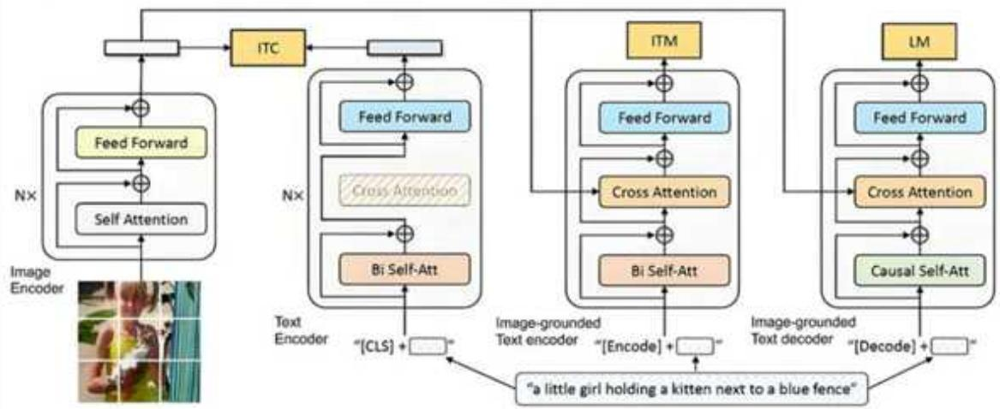  
图1-3 多模态大模型融合策略

# 2．晚期融合

晚期融合也称为决策级融合，是在模型的后期阶段融合不同模态的预测结果。它通常涉及对不同模态的独立模型进行训练，然后在预测结果层进行加权平均、投票或其他合并策略。

# 1）优点

晚期融合的优点如下：

各模态独立处理，模型训练简单，易于集成。  
能够保留各模态的独立特性，便于分析和解释。

# 2）缺点

晚期融合的缺点如下：

可能无法充分捕捉不同模态间的交互信息。  
融合结果可能受限于独立模型的性能。

# 3．混合融合

混合融合结合了早期融合和晚期融合的优点，在不同阶段进行多次融合。例如，可以在模型的早期进行部分特征融合，然后在中间层或晚期层再进行进一步的融合。

# 1）优点

混合融合的优点如下：

● 能够更灵活地捕捉多层次的模态间关系。  
结合了早期和晚期融合的优势，有助于提高模型的性能和泛化能力。

# 2）缺点

混合融合的缺点如下：

复杂度较高，设计和调试更为困难。  
需要仔细平衡不同阶段融合的比例和方式。

可以看到，多模态融合的策略（早期融合、晚期融合和混合融合）各有优缺点，在实际应用中需要根据具体任务和数据特点进行选择和优化。通过合理利用多模态融合技术，我们可以从多种模态的数据中提取更丰富和全面的信息，从而提升模型的性能和泛化能力。

# 1.3.3 深度学习在多模态融合中的应用场景

深度学习在多模态融合中的应用场景非常广泛，涵盖图像、文本、音频等多种模态的数据。以下介绍一些典型的应用场景。

# 1．情感分析

● 案例描述：在社交媒体平台上，通过分析用户发布的文字、图片和语音信息，可以实时监测用户的情绪变化。深度学习模型能够自动提取文本中的语义特征、图像中的视觉特征以及音频中的声学特征，并将这些特征进行融合，以便更准确地判断用户的情感状态。  
● 技术特点：这种应用案例通常采用混合融合策略，先分别处理不同模态的数据，然后在决策层进行融合。深度学习模型能够自动学习特征表示和融合策略，提高情感分析

的准确性和健壮性。

# 2．智能客服

● 案例描述：在智能客服系统中，通过融合文本、语音和图像等多模态信息，可以提升系统的理解能力和交互体验。例如，当用户通过语音和图像描述问题时，智能客服系统能够更准确地理解用户需求并提供相应的解决方案。  
● 技术特点：智能客服系统通常采用早期融合策略，在模型的早期阶段就将不同模态的数据进行融合。深度学习模型能够捕捉不同模态间的低级关联信息，从而更全面地理解用户的问题和需求。

# 3．自动驾驶

● 案例描述：在自动驾驶领域，多模态融合技术也发挥着重要作用。通过融合车辆传感器（如摄像头、雷达、激光雷达等）收集的多模态信息，可以实现对周围环境的全面感知和准确判断，提高自动驾驶系统的安全性和可靠性。  
● 技术特点：自动驾驶系统通常采用混合融合策略，在不同阶段进行多次融合。深度学习模型能够处理来自不同传感器的数据，提取其高级特征，并实现跨模态的匹配和融合。这种融合方式不仅提高了自动驾驶系统的感知能力，还增强了其决策和规划能力。

# 4．医学诊断

● 案例描述：在医学诊断中，多模态融合技术被广泛应用于图像分析。例如，结合CT扫描和MRI扫描的数据，可以更准确地识别肿瘤的位置和大小。深度学习模型能够自动提取不同模态图像中的特征，并进行融合分析，为医生提供更可靠的诊断依据。  
● 技术特点：医学诊断中的多模态融合通常采用早期融合或混合融合策略。深度学习模型能够捕捉不同模态图像中的互补信息，从而提高诊断的准确性和效率。

# 5．手语识别

● 案例描述：手语识别系统需要将视频帧中的视觉信息与音频信息（如环境声音）进行融合，以便更准确地识别手语手势。深度学习模型能够自动提取视频帧中的视觉特征以及音频中的声学特征，并进行跨模态的匹配和融合。  
● 技术特点：手语识别系统通常采用基于对齐的融合策略，需要模型对齐视觉和音频模态的时间信息。深度学习模型能够捕捉不同模态间的时序关系，提高手语识别的准确性和实时性。

这些应用案例展示了深度学习在多模态融合中的广泛应用前景和巨大潜力。随着技术的不断进步和创新，我们可以期待深度学习在多模态融合领域取得更多突破和进展。

# 1.4 高性能注意力与多模态融合的未来展望

随着人工智能技术的飞速发展，多模态数据融合与注意力机制的结合正引领着深度学习的新纪元。未来，我们预见这些技术将进一步深化，不仅在自然语言处理、计算机视觉等传统领域持续突破，还将拓展至医疗健康、自动驾驶、智能制造等新兴领域。注意力机制将更精准地引导模型聚焦于关键信息，提高决策效率与准确性；而多模态融合则使模型能够跨越单一数据源的局限，实现更全面、深入的理解与分析，如图1-4所示。

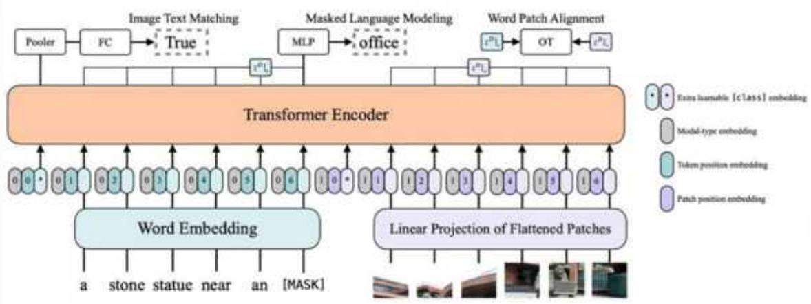  
图1-4 注意力机制的融合

在这个过程中，跨学科的交叉融合与创新将成为关键驱动力，推动人工智能向更加智能化、人性化的方向发展，为人类社会带来前所未有的变革与便利。

# 1.4.1 融合技术的创新方向

随着技术的持续进步，多模态融合技术已经成为人工智能领域备受瞩目的研究焦点。展望未来，该技术的创新方向将主要聚焦于研发更高效的融合算法和深化跨模态学习等领域。

在融合算法的研发上，未来的创新将不仅限于提高数据融合的效率和准确性，更将着眼于打造更加智能化和自适应的算法体系。这意味着，研究者们将致力于探索更精细的数据对齐和整合方法，以实现对来自不同模态的数据的无缝衔接。这些先进算法将能够更精确地萃取各模态数据中的独特与互补信息，从而在大幅提升信息利用率的同时，有效削减冗余数据和噪声的干扰。

跨模态学习则代表了另一个举足轻重的创新方向。在多模态数据迅猛增长的背景下，如何实现不同模态数据间的知识有效迁移与共享，已成为行业面临的关键挑战。跨模态学习的

核心在于构建一个融通各模态的统一表示空间，使得不同模态的数据能在此空间内自由交互与精准比对。这一创新不仅将极大地推动多模态数据的综合开发与利用，也将为搜索、推荐、问答等多样化应用提供更加丰富、精准的信息支撑与决策依据。

未来多模态融合技术的创新，将紧密围绕高效融合算法的研发与跨模态学习的深化而展开。这些前沿创新将为人工智能的持续发展注入强劲动力，推动相关应用迈向更高层次、覆盖更广领域。我们期待着这些技术革新能够为社会各界带来更智能、便捷的服务体验。

# 1.4.2 注意力机制的前沿探索

注意力机制的前沿探索正不断推动着深度学习领域的发展。当前，几个主要的注意力机制研究方向包括动态注意力、自适应注意力、多模态注意力、可解释性注意力等。以下是对这些前沿研究方向的展望。

# 1．动态注意力

动态注意力机制旨在根据输入数据的实时变化，动态地调整注意力的分配。这种机制能够使模型在处理序列数据时，更加灵活地关注到重要信息，提高处理效率。

未来的研究将致力于开发更加高效和稳定的动态注意力算法，以应对复杂多变的任务需求。例如，在自然语言处理中，动态注意力可以帮助模型更好地理解长句子中的语义关系；在计算机视觉中，它可以辅助模型实时跟踪目标对象的变化。

# 2．自适应注意力

自适应注意力机制强调模型能够根据输入数据的特性，自动地学习和调整注意力的分配策略。这种机制赋予了模型更强的自适应能力，使其能够处理更加多样化的任务。

研究者们将进一步探索如何结合先验知识和数据驱动的方法，来提升自适应注意力机制的性能。此外，如何将自适应注意力与其他先进的深度学习技术（如强化学习、图神经网络等）相结合，也是未来研究的重要方向。

# 3．多模态注意力

随着多模态数据的日益丰富，如何有效地整合和利用来自不同模态的信息成为一个重要问题。多模态注意力机制旨在构建一个统一的框架，以实现对文本、图像、音频等多种模态数据的联合处理和分析。

未来的研究将关注开发更加高效和灵活的多模态注意力算法，以及探索多模态注意力在跨模态检索、多模态情感分析等领域的应用潜力。

# 4．可解释性注意力

随着深度学习模型在更多领域的应用，其可解释性逐渐成为人们关注的焦点。可解释性注意力机制旨在通过可视化或其他方式，直观地展示模型在处理数据时的关注焦点和决策过程。研究者们将致力于开发更加直观和易用的可解释性注意力工具，以帮助用户更好地理解模型的运行机制和决策依据。同时，可解释性注意力也将为模型的调试和优化提供有力的支持。

可以预见，注意力机制的前沿探索正朝着更加动态、自适应、多模态和可解释的方向发展。这些研究方向将共同推动注意力机制在深度学习领域的广泛应用和持续进步。

# 1.5 本章小结

将多模态融合与注意力机制相结合，尽管具有巨大的潜力，但同时也面临着一系列挑战。首先，技术的复杂性是一个不可忽视的问题。多模态融合要求对不同模态的数据进行有效整合，而注意力机制则需要对这些数据进行精细化的处理。这两种技术的结合无疑增加了模型的复杂性和计算需求。此外，不同模态数据之间的对齐和同步也是一个技术难题，需要确保在融合过程中信息的准确性和一致性。

除技术挑战外，实际应用中也存在诸多难点。例如，多模态数据的采集和标注往往需要大量的人力物力投入，且标注质量对模型性能有着直接影响。同时，多模态融合模型的可解释性也是一个重要问题，特别是在需要明确决策依据的场景中，如医疗诊断和金融风险评估。

然而，正是这些挑战孕育了新的机遇。多模态融合与注意力机制的结合，为模型提供了更丰富的信息来源和更精准的决策支持，从而有望在多个领域实现突破。例如，在智能教育领域，这种结合可以帮助系统更准确地理解学生的学习状态和兴趣点，从而提供个性化的学习资源和建议。在智能医疗领域，通过对医疗影像、病历文本和患者语音等多模态数据的综合分析，可以辅助医生制定更准确的诊断和治疗方案。

此外，随着技术的不断进步，我们有理由相信，未来这种结合将在更多领域展现出其独特优势。例如，在智能家居领域，通过融合视觉、听觉和触觉等多模态信息，并辅以注意力机制，可以构建出更加智能和人性化的家居系统。在自动驾驶领域，这种技术结合也有望提高车辆的感知能力和决策准确性，从而保障行车安全。

综上所述，多模态融合与注意力机制的结合虽然面临诸多挑战，但同时也孕育着巨大的机遇。通过不断探索和创新，我们有望将这种结合应用于更多领域，为人类社会带来更加智能和便捷的服务体验。

# 第2章PyTorch深度学习环境搭建

工欲善其事，必先利其器。对于任何一位想要构建深度学习应用程序或是将训练好的模型应用到具体项目的读者，都需要使用编程语言来实现设计意图。在本书中，将使用Python语言作为主要的开发语言。

Python之所以在深度学习领域中被广泛采用，这得益于许多第三方提供的集成了大量科学计算类库的Python标准安装包，其中最常用的便是Miniconda。Python是一种脚本语言，如果不使用Miniconda，那么第三方库的安装可能会变得相当复杂，同时各个库之间的依赖性也很难得到妥善的处理。因此，为了简化安装过程并确保库之间的良好配合，推荐安装Miniconda来替代原生的Python语言安装。

PyTorch是一种开源的深度学习框架，由Facebook的人工智能研究团队开发。它提供了两个高级功能：

强大的GPU加速的张量计算（类似于NumPy）。  
● 基于深度神经网络的自动求导系统。

PyTorch的主要特点是动态计算图，这意味着计算图可以在每个运行时刻动态改变，这大大提高了模型的灵活性和效率。

除此之外，PyTorch还提供了丰富的API，支持多种深度学习的模型和算法，并能够轻松与其他Python库（例如NumPy和SciPy）进行交互。

目前，PyTorch已广泛应用于学术研究和商业开发，包括自然语言处理、计算机视觉、生成对抗网络（Generative Adversarial Networks，GAN）等领域，是全球最受欢迎的深度学习框架之一。

本章将引导读者完成Miniconda的完整安装。然后，通过一个实践项目来帮助读者熟悉PyTorch 2.0。这个项目将生成可控的手写数字，作为一个入门级的程序，它将帮助读者了解完整的PyTorch项目的工作流程。通过这个项目，读者将能够初步体验到PyTorch 2.0的强大功能和灵活性。

# 2.1 安装Python开发环境

# 2.1.1 Miniconda的下载与安装

# 第一步：下载和安装

（1）在Miniconda官网打开主页面，单击Miniconda下的Installing Miniconda选项，如图2-1所示。

  
图2-1 Miniconda主页面

（2）然后单击页面右侧的Download the .exe installer.链接下载和安装最新版本的Mincoda，如图2-2所示。

  
图2-2 Miniconda下载页面

（3）我们可以直接单击页面上的下载链接，下载集成最新Python版本的Miniconda，如图2-3所示。从页面上可以看到，这个版本集成了Python 3.12.4。

  
图2-3 下载集成最新Python版本的Miniconda

（4）如果想使用以前的Python版本，例如Python 3.11，也是完全可以的，读者可以根据自己的操作系统选择下载。  
（5）下载完成后，得到的是EXE文件，直接运行即可进入安装过程。安装完成后，出现如图2-4所示的目录结构，说明安装正确。

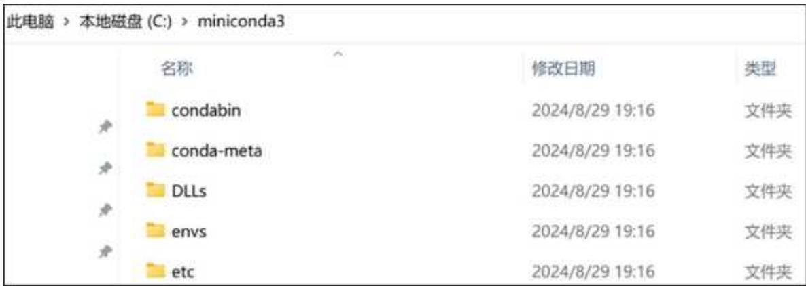  
图2-4 Miniconda安装目录

# 第二步：打开控制台

在 计 算 机 桌 面 依 次 单 击 “ 开 始 $^ { 5 5 } \longrightarrow ^ { \infty }$ 所 有 程 序 $^ { \circ } \longrightarrow$ Miniconda3 Miniconda Prompt(Miniconda3)，打开Miniconda Prompt窗口，它与CMD控制台类似，输入命令就可以控制和配置Python。在Miniconda中最常用的是conda命令，该命令可以执行一些基本操作，读者可以在Miniconda Prompt窗口中自行测试一下这个命令。

# 第三步：验证Python

在Miniconda Prompt窗口中输入python，如果安装正确，会打印出Python版本号以及控制符号。在控制符号下输入代码：

```lua
print("hello") 
```

输出结果如图2-5所示。

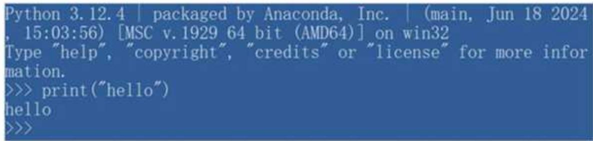  
图2-5 Minicoda安装成功

# 第四步：使用pip命令

使用Miniconda的好处在于，它能够很方便地帮助读者安装和使用大量第三方类库。在本书中，我们将使用pip命令安装第三方类库。查看已安装的第三方类库的命令如下：

```txt
pip list 
```

在Miniconda Prompt窗口输入pip list命令，结果如图2-6所示。

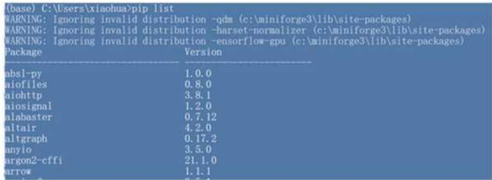  
图2-6 列出已安装的第三方类库

在Miniconda中安装第三方类库的命令如下：

```batch
pip install name 
```

这里的name是需要安装的第三方类库名，假设需要安装NumPy包（这个包已经安装过），那么输入的命令就是：

```txt
pip install numpy 
```

这个安装过程略去，请读者自行尝试。使用Miniconda的好处就是默认已安装了大部分深度学习所需要的第三类库，这样避免了使用者在安装和使用某个特定类库时可能出现的依赖类库缺失的情况。

# 2.1.2 PyCharm的下载与安装

和其他语言类似，Python程序的编写可以使用Windows自带的编辑器。但是这种方式对于较为复杂的程序工程来说，容易混淆相互之间的层级和交互文件，因此在编写程序工程时，建议使用专用的Python编译器PyCharm。

# 第一步：PyCharm的下载和安装

（1）进入PyCharm官网的Download页面，选择不同的版本，如图2-7所示，PyCharm有收费的专业版和免费的社区版，这里建议读者选择免费的社区版即可。


图2-7 PyCharm免费的社区版

（2）下载PyCharm安装文件后，双击运行进入安装界面，如图2-8所示。直接单击Next按钮，采用默认安装即可。

  
图2-8 安装界面

（3）在安装PyCharm的过程中，需要对安装的参数进行选择，如图2-9所示，这里建议直接使用默认安装。

  
图2-9 PyCharm的配置选择（按个人真实情况选择）

（4）安装完成后，出现Finish按钮，单击该按钮即可安装完成，如图2-10所示。最后，将在桌面上显示一个PyCharm程序图标 ，双击该图标即可运行PyCharm。

  
图2-10 PyCharm安装完成

# 第二步：使用PyCharm创建程序

（1）单击桌面上新生成的 图标进入PyCharm程序界面。由于是第一次启动PyCharm，需要接受相关的协议，在勾选界面下方的复选框后，单击Continue按钮，进行下一步操作。因为操作比较简单，这里就不截图了。  
（2）进入PyCharm工程创建界面，创建新的项目，可以直接创建一个新项目（单击NewProject按钮），或者打开一个已有的项目文件夹（单击Open按钮），如图2-11所示。

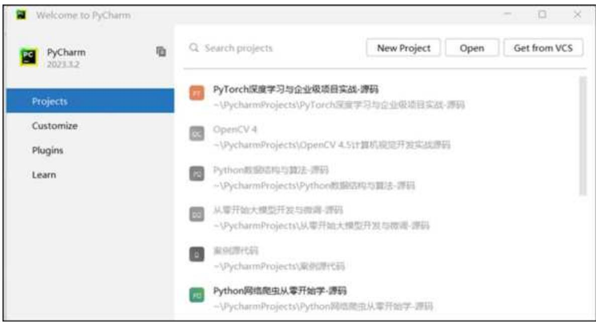  
图2-11 PyCharm工程创建界面

（3）这里单击New Project按钮创建一个新项目。下面配置Python环境路径，填写好python.exe地址后（就是上一步安装的C:\miniconda3目录下的python.exe），单击Create按钮，将在PyCharm项目管理目录PycharmProjects下创建一个新项目，如图2-12所示。

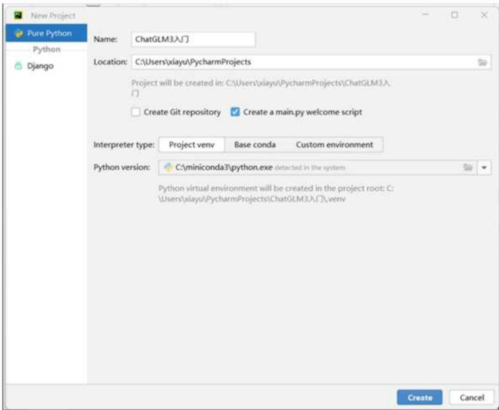  
图2-12 PyCharm新建文件界面

（4）对于创建的新项目，PyCharm默认提供了一个测试程序main.py，内容如图2-13所示。

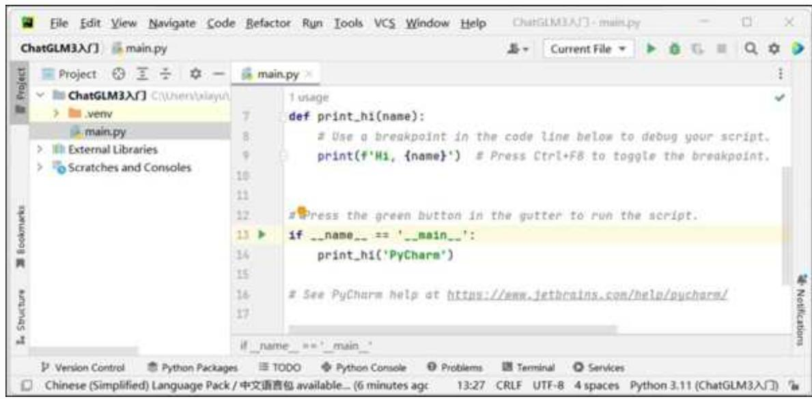  
图2-13 PyCharm工程运行界面

选中main.py，单击菜单栏中的Run|run…运行代码，或者直接右击main.py文件名，在弹出的快捷菜单中选择run命令。如果成功，将输出“Hi, PyCharm”，如图2-14所示。

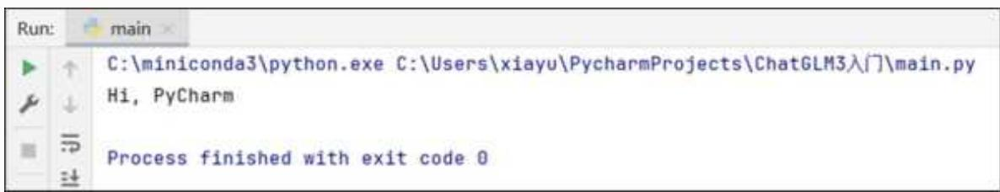  
图2-14 运行成功

至此，Python与PyCharm的配置就完成了。

# 2.1.3 计算softmax函数练习

对于Python科学计算来说，最直观的思路就是将数学公式直接转换为程序代码。幸运的是，Python完美地支持这一需求。本小节将使用Python实现并计算深度学习中最为常见的函数之一——softmax函数。关于该函数的具体作用，此处暂不详细展开，本节仅专注于其程序实现的编写。

softmax函数的计算公式如下：

$$
\operatorname {s o f t m a x} (i) = \frac {\exp^ {x _ {i}}}{\sum_ {j = N} ^ {j = N} \exp^ {x _ {j}}}
$$

其中， $\mathbf { X } _ { \mathrm { ~ i ~ } }$ 表示输入向量 $\mathbf { X }$ 中的第 i 个元素， N 为数据总量，Σ表示求和符号，exp表示自然指数函数。

代入softmax的结果其实就是先对每一个 x 进行以e为底的指数计算，变成非负；然后除以所有项之和进行归一化；之后每个 x 就可以解释成在观察到的数据集类别中，特定的 x属于某个类别的概率，或者称作似然（Likelihood）。

# 提示

softmax函数用于解决概率计算中概率结果大而占绝对优势的问题。例如，函数计算结果中有两个值a 和b，且 $\mathrm { a > b }$ ，如果简单地以值的大小为单位进行衡量，那么在后续的使用过程中，a 永远被选用，而b由于数值较小而不会被选择，但是有时也需要使用数值小的b，softmax函数就可以解决这个问题。

softmax函数按照概率选择 a 和b，由于a 的概率值大于 b，因此在计算时 a 经常会被取得，而b由于概率较小，因此取得的可能性也较小，但是有概率被取得。

softmax函数的代码如下：

import numpy   
def softmax(inMatrix): m,n=numpy.shape(inMatrix) outMatrix $\equiv$ numpy.mat(numpy.zeros((m,n))) soft_sum $= 0$ for idx in range(0,n): outMatrix[0,idx] $=$ math.exp(inMatrix[0,idx]) soft_sum $+ =$ outMatrix[0,idx] for idx in range(0,n): outMatrix[0,idx] $=$ outMatrix[0,idx] / soft_sum return outMatrix

可以看到，当传入一个数列后，分别计算求出每个数值所对应的指数函数值，之后将其相加，再计算每个数值在数值和中的概率。例如：

```txt
a = numpy.array([[1,2,1,2,1,1,3]]) 
```

请读者自行验证代码结果。

# 2.2 安装PyTorch 2.0

Python运行环境调试完毕后，接下来的任务便是安装本书的核心组件——PyTorch 2.0。PyTorch作为当下热门的深度学习框架，为研究者和开发者提供了灵活且高效的工具来构建和训练神经网络。其2.0版本的推出，更是带来了诸多新特性和性能优化，进一步提升了用户体验。

# 2.2.1 NVIDIA 10/20/30/40系列显卡选择的GPU版本

目前市场上有NVIDIA 10/20/30/40系列显卡，对于需要调用专用编译器的PyTorch来说，不同的显卡需要安装不同的依赖计算包。作者在此总结了不同显卡的PyTorch版本以及CUDA和cuDNN的对应关系，如表2-1所示，推荐读者使用20及以上系列的显卡。

表2-1 NVIDIA 10/20/30/40系列显卡的版本对比  

<table><tr><td>显卡型号</td><td>PyTorch GPU 版本</td><td>CUDA 版本</td><td>cuDNN 版本</td></tr><tr><td>10 系列及以前</td><td>PyTorch 2.0 以前版本</td><td>11.1</td><td>7.65</td></tr><tr><td>20/30/40 系列</td><td>PyTorch 2.0 向下兼容</td><td>11.6+</td><td>8.1+</td></tr></table>

# 注意

这里的区别主要在于显卡运算库CUDA与cuDNN的区别，当在20/30/40系列显卡上使用PyTorch时，可以安装CUDA11.6版本以上以及cuDNN8.1版本以上的库。而在10系列版本的显卡上，建议优先使用2.0版本以前的PyTorch。

下面以PyTorch 2.0为例，演示完整的CUDA和cuDNN的安装步骤，不同版本的安装过程基本一致。

# 2.2.2 PyTorch 2.0 GPU NVIDIA运行库的安装

本小节讲解PyTorch 2.0 GPU版本的前置软件的安装。对于GPU版本的PyTorch来说，由于调用了NVIDIA显卡作为其代码运行的主要工具，因此额外需要NVIDIA提供的运行库作为运行基础。

我们选择PyTorch 2.0.1版本进行讲解。对于PyTorch 2.0的安装来说，最好的方法是根据官方提供的安装命令进行安装，具体参考官方文档https://pytorch.org/get-started/previous-

versions/。从页面上可以看到，针对Windows版本的PyTorch 2.0.1，官方提供了几种安装模式，分别对应CUDA 11.7、CUDA 11.8和CPU only。使用conda安装的命令如下：

```shell
# CUDA 11.7  
conda install pytorch==2.0.1 torchvision==0.15.2 torchaudio==2.0.2 pytorch-cuda=11.7  
-c pytorch -c nvidia  
# CUDA 11.8  
conda install pytorch==2.0.1 torchvision==0.15.2 torchaudio==2.0.2 pytorch-cuda=11.8  
-c pytorch -c nvidia  
# CPU Only  
conda install pytorch==2.0.1 torchvision==0.15.2 torchaudio==2.0.2 cpuonly -c pytorch 
```

下面以CUDA 11.8+cuDNN 8.9为例讲解安装的方法。

（1）首先是CUDA的安装。在百度搜索CUDA 11.8 download，进入官方下载页面，选择适合的操作系统安装方式（推荐使用exe(local)本地化安装方式），如图2-15所示。

  
图2-15 CUDA 11.8下载页面

此时下载下来的是一个EXE文件，读者可自行安装，不要修改其中的路径信息，完全使用默认路径安装即可。

（2）下载和安装对应的cuDNN文件。要下载cuDNN，需要先注册，相信读者可以很快完成，之后直接进入下载页面，如图2-16所示。

注意

不要选择错误的版本，一定要找到对应CUDA的版本号。另外，如果使用的是Windows 64位的操作系统，需要下载x86_64版本的cuDNN。

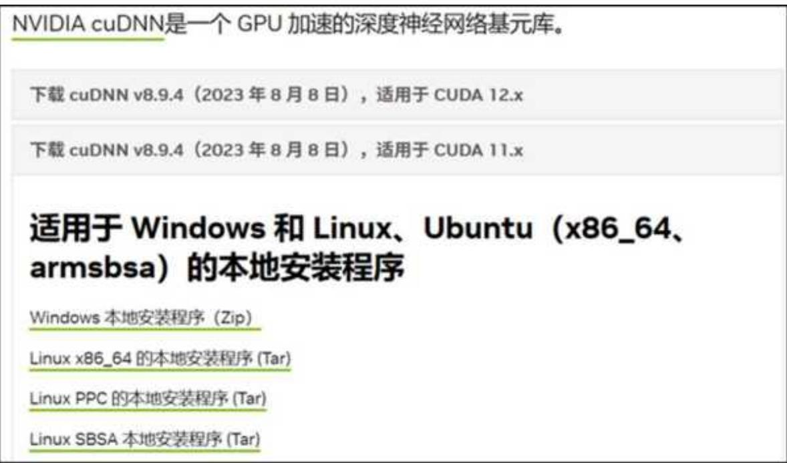  
图2-16 cuDNN 8.9下载页面

（3）下载的cuDNN是一个压缩文件，将它解压并把所有的目录复制到CUDA安装主目录中（直接覆盖原来的目录）。CUDA安装主目录如图2-17所示。

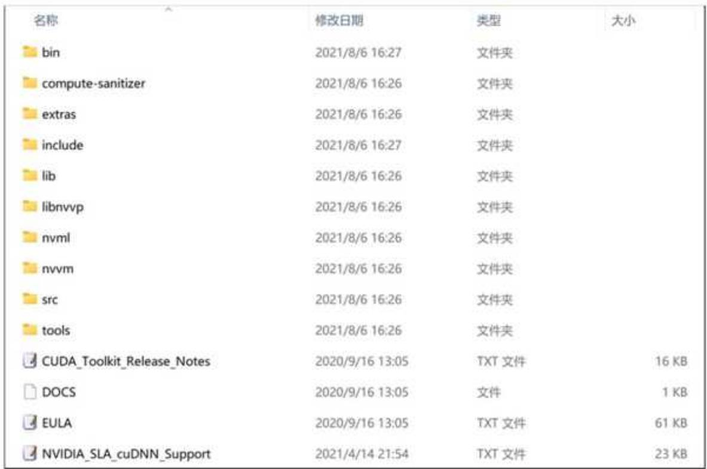  
图2-17 CUDA安装主目录

（4）确认PATH环境变量，这里需要将CUDA的运行路径加载到环境变量的PATH路径中。安装CUDA时，安装向导能自动加入这个环境变量值，确认一下即可，如图2-18所示。

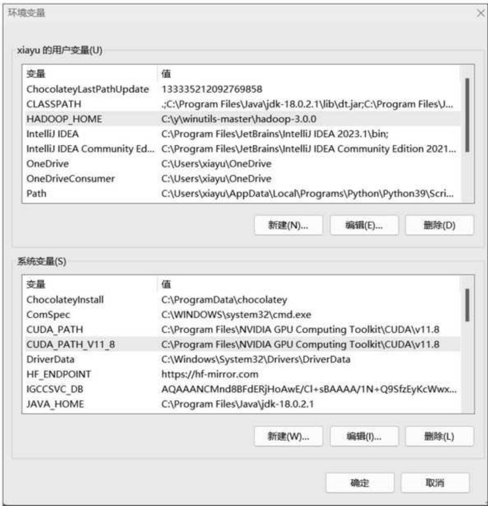  
图2-18 将CUDA路径加载到环境变量PATH中

（5）最后完成PyTorch 2.0.1 GPU版本的安装，只需在Miniconda Prompt窗口中执行本小节开始给出的PyTorch安装命令即可。

```txt
# CUDA 11.8  
conda install pytorch==2.0.1 torchvision==0.15.2 torchaudio==2.0.2  
pytorch-cuda=11.8  
-c pytorch -c nvidia 
```

# 2.2.3 Hello PyTorch

至此，我们已经完成了PyTorch 2.0的安装。下面使用PyTorch 2.0做一个小练习——HelloPyTorch。打开Miniconda Prompt窗口，执行python命令并依次输入如下命令，验证安装是否成功。

import torch   
result $=$ torch.tensor(1) $^+$ torch.tensor(2.0)   
result

结果如图2-19所示。

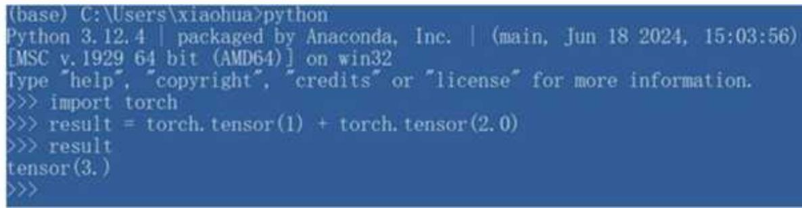  
图2-19 验证安装是否成功

或者打开前面安装的PyCharm IDE，先新建一个项目，再新建一个hello_pytorch.py文件，输入如下代码：

import torch   
result $=$ torch.tensor(1) $^+$ torch.tensor(2.0)   
print(result)

最终结果请读者自行验证。

# 2.3 多模态大模型DeepSeek初探与使用

DeepSeek大型语言模型家族中的最新成员，代表了该系列的重要进步和革新。DeepSeek官方精心构建并发布了一系列基础语言模型以及指令微调语言模型，这些模型的参数规模广泛，从轻量级的15亿参数到庞大的6710亿参数，这些不同参数版本的模型进一步提升了性能和灵活性，以满足不同应用场景和性能需求。

在模型能力方面，DeepSeek展现了卓越的表现。通过在一系列严格的基准测试中进行评估，包括语言理解、语言生成、多语言能力、编程、数学以及推理等多个维度，DeepSeek不仅普遍超越了当前市场上的大多数开源语言模型，甚至在某些方面与领先的专有模型相比也毫不逊色。这种全面的性能提升，使得DeepSeek成为处理复杂语言任务、跨语言应用以及高级逻辑推理等问题的理想选择。

# 2.3.1 DeepSeek模型简介

DeepSeek系列模型从最初的DeepSeek LLM（基础版）开始，经历了多个版本的演化，每一代模型都在架构设计、训练算法、推理效率和模型表现上实现了显著的创新与优化。DeepSeek大型语言模型家族中的主要模型包括：

● DeepSeekLLM：采用了与Llama类似的架构设计，并在此基础上进行了优化，包括多阶段学习率调度策略和分组查询注意力机制（GQA）等。  
● DeepSeek-V2：在DeepSeek 67B的基础上，DeepSeek-V2对模型进行了进一步优化，在注意力机制模块方面，设计了MLA来替代原来的GQA，该方法利用低秩键值联合压缩来消除推理时键值缓存的瓶颈，从而支持有效的推理。在FFN方面，采用了DeepSeekMoE体系结构，目的是实现最终的专家专业化。

● DeepSeek-VL2：这是一系列先进的大型混合专家（Mixture of Experts，MoE）视觉语言模型，显著改进了其前身DeepSeek-VL。DeepSeek-VL2在各种任务中都表现出卓越的能力，包括视觉问答、光学字符识别、文档/表格/图表理解和视觉基础。DeepSeek-VL2模型系列由3个变体组成：DeepSeek-VL2-Tiny、DeepSeek-VL2-Small和DeepSeek-VL2，分别具有1.0B、2.8B和4.5B激活参数。

● DeepSeek-V3：引入了FP8混合精度训练框架和DualPipe算法，有效减少了训练成本并提升了训练效率。DeepSeek-V3凭借其多项创新，不仅提升了推理效率，还通过优化训练策略、改进专家模块的资源分配和增强生成任务能力，设立了大规模语言模型的新标准。

● DeepSeek-R1：基于R1-Zero迭代而来，采用RL（Reinforcement Learning，强化学习）框架，未经过监督微调仍展现了卓越的推理能力，并通过蒸馏技术提升了模型表现。

DeepSeek以其出色的性能、创新的技术特性和广泛的应用前景，在各个应用领域展示了强大的能力。

# 1．性能表现

DeepSeek在性能上的卓越表现已达到了国际领先水平，尤其是在推理和训练效率方面，足以与OpenAI的顶尖模型相提并论。其强大的推理能力使得它能够轻松解决复杂的数学难题、深入分析法律条文，并在众多任务中都有出色的展现。在训练效率方面，DeepSeek采用了FP8混合精度训练技术，显著提升了训练速度并降低了GPU的使用成本。这种技术首次在超大规模模型上成功验证了其有效性。DeepSeek的高性能赋予了它在科研、教育、工业等多个领域的广泛应用潜力。

# 2．开源特性与多模态处理能力

DeepSeek坚持开源策略，为全球开发者社区提供了一个检查、改进并利用这些模型进行深入研究和开发的平台。这一策略极大地推动了知识的共享和技术的发展，有效地降低了AI技术的入门门槛。

值得一提的是，DeepSeek的多模态版本（例如DeepSeek-VL系列）在保持强大语言能力的同时，还融入了多模态处理能力。这意味着它能够处理包括逻辑图、网页、公式识别、科学文献、自然图像等多种数据格式。这种能力使DeepSeek在处理和生成复杂内容时更为灵活和全面。

# 3．应用领域

DeepSeek的应用领域广泛，覆盖了自然语言处理、智能对话、文本生成、语义理解等多个方面。在银行业，DeepSeek已经显示出其重塑传统业务流程和服务模式的潜力，例如自动化处理大量重复任务、为用户提供个性化的金融产品和服务推荐等。此外，DeepSeek在医疗和教育等领域也展现出了巨大的应用前景，有望推动这些行业的智能化升级。

# 4．面临的挑战与未来展望

DeepSeek作为一个深度学习大模型，在性能、技术创新和应用领域等多个方面都表现出了显著的优势。随着技术的不断进步和完善，我们有理由相信，DeepSeek将在全球范围内推动AI技术的普及和发展，为更多的领域带来智能化变革的无限机遇。

# 2.3.2 DeepSeek带来的技术创新

在研发过程中，DeepSeek团队展现出了卓越的前瞻性和技术实力，积极采纳了更新的模式设计。其中，特别值得一提的是，引入了MLA（Multi-head Latent Attention，多头潜在注意力）机制和最新的MoE（Mixture of Experts，混合专家）架构。DeepSeek的MoE架构与MLA机制如图2-20所示。

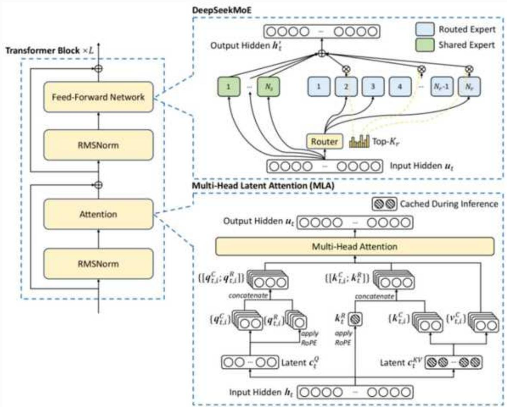  
图2-20 DeepSeek的MoE架构与MLA机制

MLA机制是对传统注意力机制的一种重要改进。在传统注意力机制中，模型通过计算输入序列中各部分的权重来聚焦关键信息。而MLA机制则进一步细化了这一过程，通过引入多个并行的注意力头，使得模型能够同时关注输入序列中的多个不同部分，从而更全面地捕捉和理解上下文信息。这种设计显著提升了模型在处理复杂任务时的推理与理解能力，使其能够更精准地聚焦于关键信息，做出更准确的预测和决策。

常见的多头注意力（MHA）、分组查询注意力（GQA）、多查询注意力（Multi-QueryAttention，MQA）与多头潜在注意力（Multi-Head Latent Attention，MLA）的简化示意图如图2-21所示。

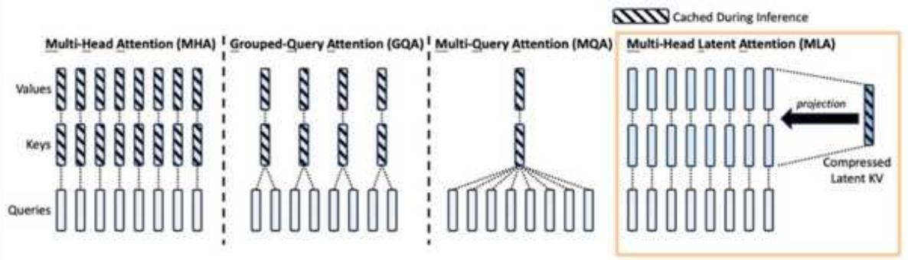  
图2-21 MHA、GQA、MQA和MLA的简化示意图

而MoE架构则是一种具有高度灵活性和扩展性的模型设计。在这种架构下，模型被划分为多个专家网络，每个专家网络都专门负责处理某一类特定任务。在训练过程中，模型能够动态地分配计算资源，针对不同任务调用最合适的专家网络进行处理。这种设计不仅大大提高了模型的计算效率，还使得模型在处理多样化任务时更加得心应手。通过结合多个专家网络的智慧和力量，DeepSeek得以在各项任务中都展现出卓越的性能。

MLA机制和MoE架构的引入是DeepSeek技术创新的重要体现。这些创新设计不仅优化了模型的性能，还使得DeepSeek在处理多样化任务时更加高效与准确。通过这些关键的创新设计，DeepSeek无疑在深度学习领域树立了新的标杆，并为AI技术的进一步发展奠定了坚实基础。

# 2.3.3 DeepSeek的第三方服务与使用示例

DeepSeek作为开源大模型，为用户提供了广阔的自主性和灵活性。我们固然可以独立自主地部署不同版本的DeepSeek以满足个人使用需求。然而，对于初学者或资源有限的用户来说，直接部署可能存在一定的难度。幸运的是，现在有了更为便捷的选择——使用第三方已经部署好的DeepSeek服务。

这些第三方服务通常提供免费的API接口，使得用户能够一键部署并实现特定的功能，无须关心底层的复杂性和资源配置问题。其中，ModelScope便是一个值得推荐的选项。

在使用API接口之前，我们首先需要注册并登录ModelScope，登录页面如图2-22所示。

# Welcome to ModelScope

密码登录

短信登录

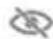


图2-22 ModelScope登录页面

登录ModelScope社区后，单击左侧的“访问令牌”，创建一个可供使用的、免费调用ModelScope的API-Inference的令牌序列，如图2-23所示。

  
图2-23 创建访问令牌

在创建访问令牌后，我们即可通过代码部署并使用不同的DeepSeek版本来完成我们的应用开发。下面给出一个示例，帮助读者熟悉DeepSeek模型的调用。

打开前面安装的PyCharm IDE，先新建一个项目，再新建一个hello_deepseek.py文件，输入如下代码：

```python
from openerai import OpenAI  
client = OpenAI(base_url='https://api-inference.modelscope.cn/v1/', api_key='YourSDKToken', #ModelScope Token)  
response = client.chat completions.create(model='deepseek-ai/DeepSeek-R1', messages=[{'role': 'system', 'content': 'You are a helpful assistant.'}, {'role': 'user', 'content': '你好'}], stream=True)  
reasoning_content = '''  
answer_content = '''  
done_reasoning = False  
for chunk in response:  
    reasoning_chunk = chunk Choices[0].deltaReasoning_content  
    answer_chunk = chunk Choices[0].delta_content  
    if reasoning_chunk != ':':  
        print(reasoning_chunk, end='', flush=True)  
    elif answer_chunk != ':':  
        if not done_reasoning:  
            print("\\n\n== Final Answer==\n")  
            done_reasoning = True  
            print的回答_chunk, end='', flush=True) 
```

运行以上代码，结果如图2-19所示。

你好！有什么我可以帮助你的吗？

这里需要说明一下，ModelScope是一个专业提供大模型部署和整合的平台。它汇聚了众多先进的大模型，并通过优化和封装，为用户提供了简洁易用的接口。通过ModelScope提供的已部署好的模型代码，我们可以轻松地调用和使用DeepSeek的多个版本。这不仅降低了技术使用的门槛，还大大提升了使用效率。

# 注意

本书主要讲解注意力机制以及多模态融合方面的内容，而对于其他相关的量化、大模型部署以及应用开发相关的基础知识，读者可以参考作者撰写的另一本图书《ChatGLM 3大模型本地化部署、应用开发与微调》。

《ChatGLM 3大模型本地化部署、应用开发与微调》以ChatGLM 3为例，专注于大模型的本地化部署、应用开发以及微调等技术。这本书不仅系统地阐述了深度学习大模型的核心理论，更注重实践应用，通过丰富的案例和应用场景，引导读者从理论走向实践，真正领悟和掌握大模型本地化应用的精髓。

# 2.4 本章小结

本章首先深入剖析了PyTorch框架的特点及其在机器学习领域的核心地位，进而详尽地指导了读者如何配置开发环境并安装必要的第三方软件。在阐述了PyTorch的独特魅力和重要性之后，我们细致地引导读者完成了环境搭建与软件安装，并通过一个简明直观的示例来验证安装环境的正确性。

随后的代码演示环节，我们以DeepSeek具体使用为切入点，向读者展示了大型语言模型的基础操作。DeepSeek作为一种基于注意力架构的先进大语言模型，不仅擅长自然语言对话，还能生成流畅连贯的文本，凭借其强大功能，为读者在未来运用大型模型时奠定坚实的基础。

本章旨在为后续的深度学习应用奠定必要的基础。我们衷心希望读者能够深刻理解和熟练掌握本章内容，为之后的学习和实践打下牢固的基石。

# 第3章

# 注意力机制详解之基础篇

注意力机制是一种在深度学习领域被广泛应用的重要技术，它源于神经科学领域对人类注意力分配方式的研究。注意力机制通过动态地为输入序列的元素分配权重，使模型能够有选择性地关注输入数据的关键部分，从而更高效地处理和学习数据中的信息。

在自然语言处理中，注意力机制广泛应用于机器翻译、文本分类、问答系统等任务，帮助模型更好地捕捉句子之间的语义对应关系。在计算机视觉领域，注意力机制也发挥着重要作用，用于图像分类、目标检测等任务，可以提高模型对图像重要区域或特征的关注度。总之，注意力机制通过模拟人类注意力的分配方式，显著提升了模型在处理复杂任务时的性能和效果。

# 3.1 注意力机制与模型详解

注意力机制来自人类对事物的观察方式。当我们看一幅图片时，我们并没有看清图片的全部内容，而是将注意力集中在了图片的焦点上。图3-1形象地展示了人类在看到一幅图像时是如何高效分配有限的注意力资源的，其中红色区域表明视觉系统更关注的目标。

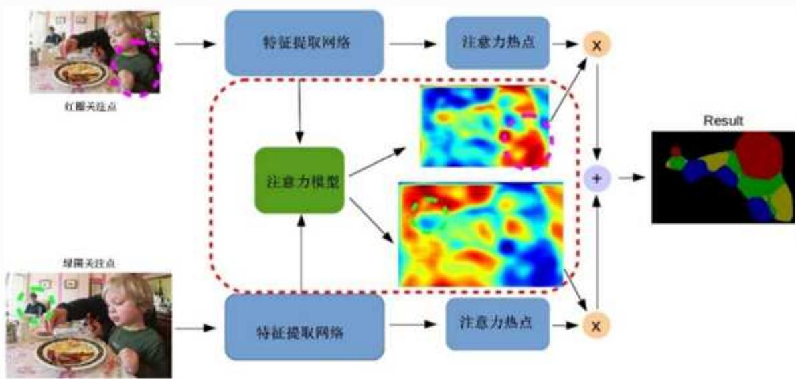  
图3-1 人类在看到一幅图像时的注意力分配

很明显，对于图3-1所示的场景，人们会把注意力更多地投入近景人物穿着、姿势等各个部位的细节，而远处则更多地关注人物的脸部区域。因此，可以认为这种人脑的注意力模型是一种资源分配模型，在某个特定时刻，你的注意力总是集中在画面中的某个焦点部分，而对其他部分视而不见。这种只关注特定区域的形式被称为“注意力”机制。

# 3.1.1 注意力机制详解

注意力机制（Attention Mechanism）最早在人类视觉领域提出。在认知科学中，由于信息处理的瓶颈，人类会选择性地关注所有信息的一部分，同时忽略其他可见的信息。上述机制通常被称为注意力机制。人类视网膜不同的部位具有不同程度的信息处理能力，即敏锐度（Acuity），只有视网膜中央凹部位具有最强的敏锐度。为了合理利用有限的视觉信息处理资源，人类需要选择视觉区域中的特定部分，然后集中关注它。例如，人们在阅读时，通常只有少量要被读取的词会被关注和处理。综上，注意力机制主要有两个方面：决定需要关注输入的哪部分，分配有限的信息处理资源给重要的部分（以上内容引用自百度百科，可以帮助读者理解注意力机制）。

2014年，Google Mind发表了 Recurrent Models of Visual Attention ，使注意力机制流行起来。这篇论文采用了RNN模型，并加入了注意力机制来进行图像的分类。

2015年，Bahdanau等在论文 Neural Machine Translation by Jointly Learning to Align andTranslate 中，将注意力机制首次应用在NLP领域，其采用Seq2Seq+Attention模型来进行机器翻译，并且得到了效果的提升。

2017年，在Google机器翻译团队发表的 Attention is All You Need 中，完全抛弃了RNN和CNN等网络结构，而仅仅采用注意力机制来进行机器翻译任务，并且取得了很好的效果，注意力机制也成为深度学习中最重要的研究热点。

概括起来说，注意力机制是一种允许模型在处理信息时专注于关键部分，从而忽略不相关信息，并提高处理效率和准确性的机制。它模仿了人类视觉处理信息时选择性关注的特点，通过计算查询向量（Query）、键向量（Key）之间的相似度来确定注意力权重，然后对值向量（Value）进行加权求和，得到最终的输出。

注意力机制的核心思想是在处理输入数据时，并非对所有部分都给予同等的关注，而是根据当前的上下文动态地分配“注意力”，从而突出关键的信息。具体来说，模型通过计算查询向量（Query）、键向量（Key）和值向量（Value）之间的相似度来确定注意力权重，然后对值向量进行加权求和，得到最终的输出。

注意力机制的直观理解可以借鉴人类的生物系统。以我们的视觉处理系统为例，它通常会选择性地聚焦于图像的特定部分，而忽略那些不相关的信息，从而帮助我们更好地感知周围环境。同样，在处理语言、语音或视觉等问题时，输入的某些部分往往比其他部分更具相关性。

深度学习中的注意力模型正是基于这种相关性概念而构建的。通过动态地关注那些有助于有效执行目标任务的输入部分，注意力模型能够提升处理效率。图3-2详细展示了完整的注意力模型计算过程。

图3-2展示了基于注意力机制的完整计算流程。在这个流程中，输入的特征首先会经过线性变换，以获得新的特征表达。随后，我们会计算这些新特征的相似度。在得出相似度之后，我们会根据这些值重新计算权重，并进行加权求和，从而得出最终的注意力输出结果。

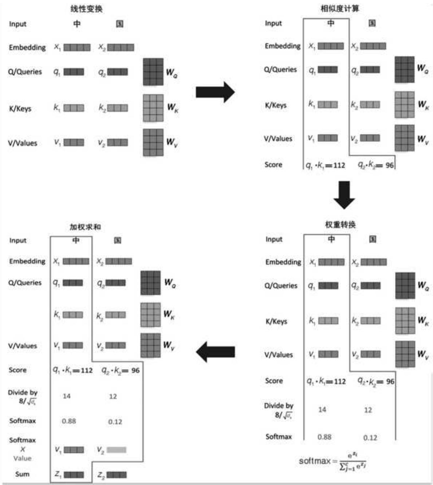  
图3-2 注意力机制全景

在本节接下来的内容中，我们将分步骤详细阐述这一过程的每一个环节。

# 3.1.2 自注意力（Self-Attention）机制

自注意力层不仅是本章的重点，也是本书最重要的内容（然而实际上非常简单）。

自注意力机制通常指的是不使用其他额外的信息，仅仅使用自我注意力的形式，通过关注输入数据本身建立自身连接，从而从输入的数据中抽取特征信息。自注意力又称作内部注意力，它在很多任务上都有十分出色的表现，比如阅读理解、视频分割、多模态融合等。

Attention用于计算“相关程度”，例如在翻译过程中，不同的英文对中文的依赖程度不同，Attention通常可以进行如下描述，表示为将Queries（ Q ）和key-value pairs{ K , V | i$= 1 , 2 , . . . , \mathrm { ~ m ~ } \}$ 映射到输出上，其中query、每个key、每个value都是向量，输出是 V 中所有values的加权，其中权重是由query和每个key计算出来的，计算方法分为如下3步。

# 第一步：自注意力中的query、key和value的线性变换

自注意力机制是进行自我关注从而抽取相关信息的机制。而从具体实现来看，注意力函数的本质可以被描述为一个查询（query）到一系列键值（key-value）对的映射，它们被作为一种抽象的向量，主要用来计算和辅助自注意力，如图3-3所示（更详细的解释在后面）。

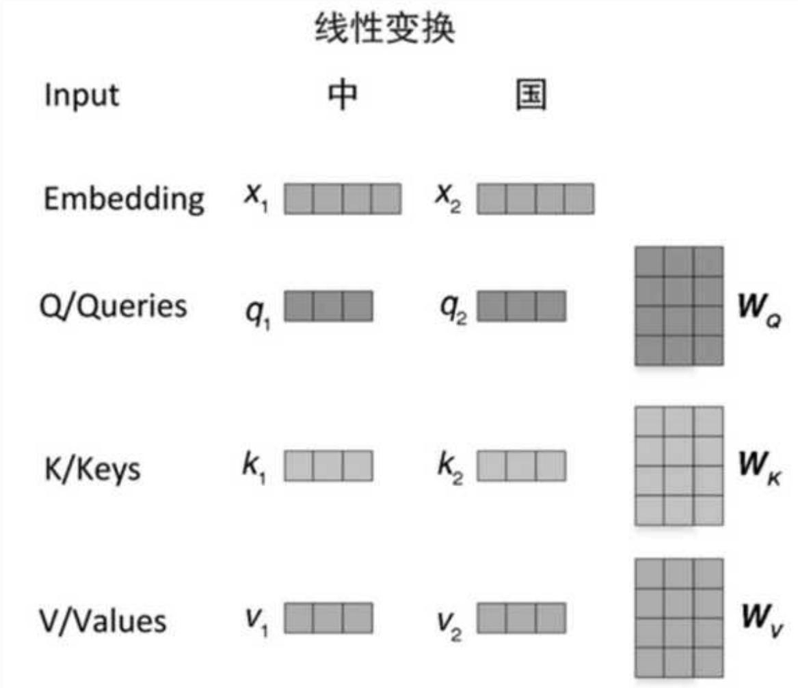  
图3-3 自注意力中的query、key和value

如图3-3所示，一个字“中”经过Embedding层初始化后，得到一个矩阵向量的表示 $\mathrm { ~ X ~ } _ { _ { 1 } }$ ，之后经过3个不同全连接层重新计算后，得到一个特定维度的向量，即我们看到的 $\mathrm { ~ q ~ } _ { 1 }$ 。而 $\mathrm { ~ q ~ } _ { 2 }$ 的计算过程与 q 完全相同，之后依次将 q 和 $\mathrm { ~ q ~ } _ { 2 }$ 连接起来，组成一个新的连接后的二维矩阵W  ，被定义成query。

$$
W ^ {Q} = \text {c o n c a t} ([ q _ {1}, q _ {2} ], \text {a x i s} = 0)
$$

实际上，一般的输入是一个经过序号化处理后的序列，例如[0,1,2,3,…]这样的数据形式，经过Embedding层计算后生成一个多维矩阵，再经过3个不同的神经网络层处理后，得到具有相同维度大小的query、key和value向量。而得到的向量均来自同一条输入数据，从而强制模型在后续的步骤中通过计算选择和关注来自同一条数据的重要部分。

$$
\begin{array}{l} Q = W ^ {Q} X \\ \mathrm {K} = \mathrm {W} ^ {\mathrm {K}} \mathrm {X} \\ \mathbf {V} = \mathbf {W} ^ {\mathbf {v}} \mathbf {X} \\ \end{array}
$$

举例来说，在计算相似度时，一个单词和自己的相似度应该最大，但在计算不同向量的乘积时也可能出现更大的相似度，这种情况是不合理的。因此，通过新向量 q、k相乘来计算相似度，通过模型的训练学习就可以避免这种情况。相比原来一个个词向量相乘的形式，通过构建新向量q、k，在计算相似度时灵活性更大，效果更好。

# 第二步：使用query和key进行相似度计算

Attention的目的是找到向量内部的联系，通过来自同一个输入数据的内部关联程度分辨最重要的特征，即使用query和key计算自注意力的值，其过程说明如下。

（1）将query和每个key进行相似度计算得到权重，常用的相似度函数有点积、拼接、感知机等，这里作者使用的是点积计算，如图3-4所示。

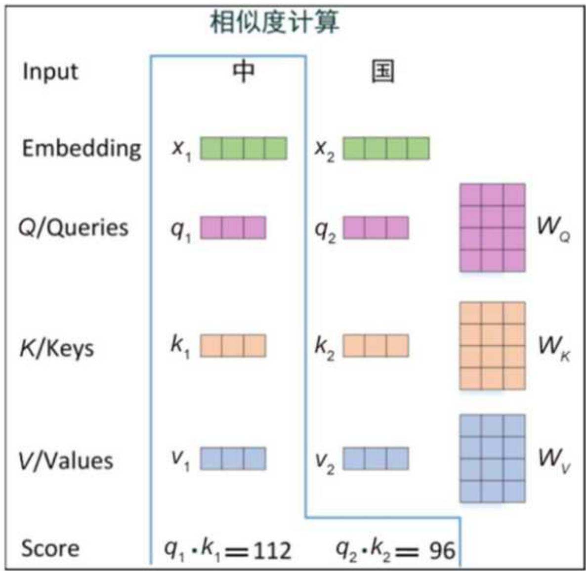  
图3-4 相似度计算

公式如下：

$$
\left(\mathrm {q} _ {1} \cdot \mathrm {k} _ {1}\right), \left(\mathrm {q} _ {1} \cdot \mathrm {k} _ {2}\right), \dots
$$

例如，对于句中的每个字特征，将当前字的Q与句中所有字的K相乘，从而得到一个整体的相似度计算结果。

（2）基于缩放点积操作的softmax函数对这些进行权重转换。

基于缩放点积操作的softmax函数的作用是计算不同输入之间的权重“分数”，又称为权重系数。例如，正在考虑“中”这个字，就用它的 q 乘以每个位置的 k ，随后将得分加以处理，再传递给softmax，然后通过softmax计算，其目的是在特征内部进行权重转换。即：

$$
\frac {q _ {1} \cdot k _ {1}}{\sqrt {d _ {k}}}, \frac {q _ {2} \cdot k _ {2}}{\sqrt {d _ {k}}}, \dots
$$

其中， d 是缩放因子。

$$
\operatorname {s o f t m a x} \left(\frac {q _ {1} \cdot k _ {1}}{\sqrt {d _ {k}}}\right), \operatorname {s o f t m a x} \left(\frac {q _ {2} \cdot k _ {2}}{\sqrt {d _ {k}}}\right), \dots
$$

这个softmax计算分数决定了每个特征在该特征矩阵中需要关注的程度。相关联的特征将具有相应位置上最高的softmax分数。用这个得分乘以每个value向量，可以增强需要关注部分的值，或者降低对不相关部分的关注度，如图3-5所示。

softmax的分数决定了当前单词在每个句子中每个单词位置的表示程度。很明显，当前单词对应句子中此单词所在位置的softmax的分数最高；但是，有时注意力机制也能关注到此单词外的其他单词。

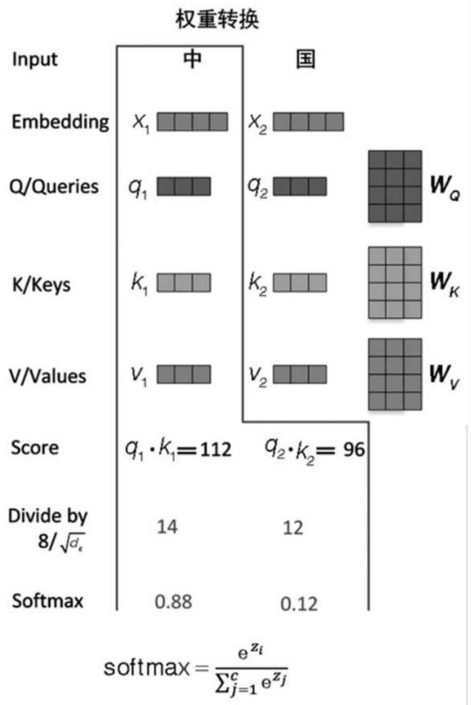  
图3-5 使用softmax进行权重转换

# 第三步：每个Value向量乘以softmax后进行加权求和

最后一部为累加计算相关向量，为了让模型更灵活，使用点积缩放作为注意力的打分机制得到权重后，与生成的value向量进行计算，然后将其与转换后的权重进行加权求和，从而得到最终的新向量Z，即：

$$
\mathbf {Z} = \operatorname {s o f t m a x} \left(\frac {q _ {1} \cdot k _ {1}}{\sqrt {d _ {k}}}\right) \cdot v _ {1} + \operatorname {s o f t m a x} \left(\frac {q _ {2} \cdot k _ {2}}{\sqrt {d _ {k}}}\right) \cdot v _ {2}
$$

即将权重和相应的键值value进行加权求和，从而得到最后的注意力值，其步骤如图3-6所示。

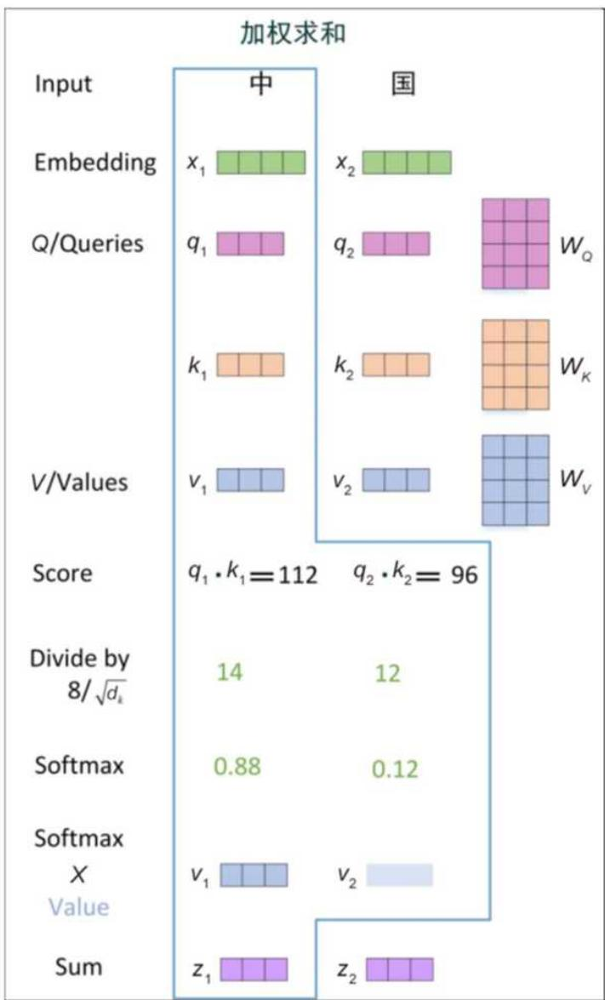  
图3-6 加权求和计算

总结自注意力的计算过程，根据输入的query与key计算两者之间的相似性或相关性，之后通过一个softmax来对值进行归一化处理，从而获得注意力权重值，然后对Value进行加权求和，并得到最终的Attention数值。然而在实际的实现过程中，该计算会以矩阵的形式完成，以便更快地处理。自注意力公式如下：

$$
\boldsymbol {Z} = \operatorname {A t t e n t i o n} (\boldsymbol {Q}, \boldsymbol {K}, \boldsymbol {V}) = \operatorname {s o f t m a x} \left(\frac {\boldsymbol {Q} \boldsymbol {K} ^ {\mathrm {T}}}{\sqrt {d _ {k}}}\right) \boldsymbol {V}
$$

转换成更为通用的矩阵点积的形式来实现，其结构和形式如图3-7所示。

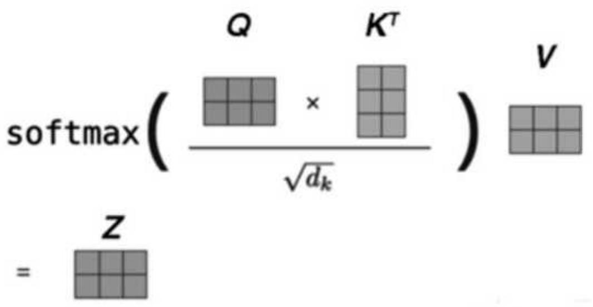  
图3-7 矩阵点积

可以看到，在通过点积缩放计算注意力权重后，这些权重被用于对同一输入变换后的value进行加权求和，从而得到一个最终的新的结果向量。

# 3.1.3 自注意力的代码实现

下面是自注意力的代码实现，实际上通过3.1.2节的讲解，自注意力模型的基本架构其实并不复杂，基本代码如下（仅供演示）：

```python
import torch
import math
import einops.layers.torch as elt
# word_embedding_table =
torch(nn.Embedding(num_embedding=encoder VOCAB_SIZE, embedding_dim=312)
# encoder_embedding = word_embedding_table(inputs)
vocab_size = 1024 #字符的种类
embedding_dim = 312
hidden_dim = 256
token = torch.ones(size=(5,80), dtype=int)
#创建一个输入embedding值
input_embedding =
torch(nn.Embedding(num_embedding= VOCAB_SIZE, embedding_dim=embedding_dim)(token)
#对输入的input_embedding进行修正，这里进行了简写
query = torch(nn.Linear(embdedging_dim, hidden_dim) (input_embedding)
key = torch(nn.Linear(embdedging_dim, hidden_dim) (input_embedding)
value = torch(nn.Linear(embdedging_dim, hidden_dim) (input_embedding)
key = elt Rearrange("b l d -> b d l") (key)
#计算query与key之间的权重系数
attention_prob = torch/matmul(query, key)
#使用softmax对权重系数进行归一化计算
attention_prob = torch softmax(attention_prob, dim=-1)
#计算权重系数与value的值，从而获取注意力值
attention_score = torch/matmul(attention_prob, value)
print(attention_score.shape) 
```

核心代码的实现实际上是非常简单的。读者到这里只需先掌握这些核心代码即可。

换个角度，作者从概念上对注意力机制做个解释。注意力机制可以理解为从大量信息中有选择性地筛选出少量重要信息，并聚焦到这些重要信息上，忽略大部分不重要的信息。这种思路仍然成立。聚焦的过程体现在权重系数的计算上：权重越大，就越聚焦于其对应的Value值，即权重代表了信息的重要性，而权重与Value的点积则是对应的最终信息。

完整的注意力层代码如下。值得注意的是，在实现注意力机制的完整代码中，作者引入了mask部分。这种操作的作用是：在计算过程中，忽略因序列填充（pad）以达成统一长度而产生的掩码计算。通过这种方式，可以更加精确地控制注意力机制的计算过程，确保模型能够聚焦于真正有意义的部分，而不会被填充操作所干扰。关于这一点的具体细节，将在3.1.4节中进行详细介绍。

```python
#定义Scaled Dot Product Attention类
class Attention(nnModule):
    ...
    计算'Scaled Dot Product Attention'
    ...
#定义前向传播函数
def forward(self, query, key, value, mask=None, dropout=None):
    #通过点积计算query和key的得分，然后除以sqrt(query的维度)进行缩放
scores = torch/matmul(query, keyqueeze(-2, -1)) \ / math.sqrt(query.size(-1))
    #如果提供了mask，则对得分应用mask，将mask为0的位置设置为一个非常小的数
if mask is not None:
    scores = scoresmasked_fill-mouth == 0, -le9)
    #使用softmax函数计算注意力权重
p_attn = torch(nnfunctional softmax(scores, dim=-1))
#如果提供了dropout，则对注意力权重应用dropout
if dropout is not None:
    p_attn = dropout(p_attn)
    #使用注意力权重对value进行加权求和，返回加权后的结果和注意力权重
return torch/matmul(p_attn, value), p_attn
```

具体结果请读者自行打印查阅。

# 3.1.4 ticks和Layer Normalization

3.1.3节的最后，我们基于PyTorch 2.0自定义层的形式编写了注意力模型的代码。与演示代码存在的区别是，实战代码中在这一部分的自注意层中还额外加入了mask值，即掩码层。掩码层的作用就是获取输入序列的“有意义的值”，而忽视本身就是用作填充或补全序列的值。一般用0表示有意义的值，而用1表示填充值（这点并不固定，0和1的意思可以互换）。

```txt
[2,3,4,5,5,4,0,0,0] -> [1,1,1,1,1,1,0,0,0] 
```

掩码计算的代码如下：

```txt
mask = (x > 0).unsqueeze(1).repeat(1, x.size(1), 1).unsqueeze(1) # 创建注意力掩码。
```

此外，计算出的query与key的点积还需要除以一个常数，其作用是缩小点积的值方便进行softmax计算。

这通常被称为ticks，即采用一点点小的技巧使得模型训练能够更加准确和便捷。LayerNormalization函数也是如此。下面我们对其进行详细介绍。

Layer Normalization（层归一化）是一种专门用于对序列进行归一化的技术，其目的是防止字符序列在计算过程中出现数值发散，从而避免对神经网络的拟合过程产生不良影响。在PyTorch 2.0中，Layer Normalization的使用提供了高级API，调用方式如下：

```python
layer_norm = torch.nn.layersNorm(normalized_shape, eps=1e-05, elementwise_affine=True, device=None, dtype=None) 函数 
```

embedding $=$ layer_norm(embedding) #使用layer_norm对输入数据进行处理

图3-8展示了Layer Normalization与Batch Normalization的不同。从图中可以看到，BatchNormalization是对一个batch中不同序列中处于同一位置的数据进行归一化处理，而LayerNormalization是对同一序列中不同位置的数据进行归一化处理。

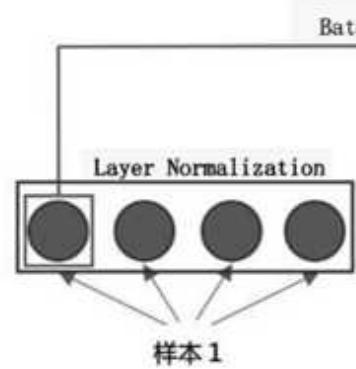

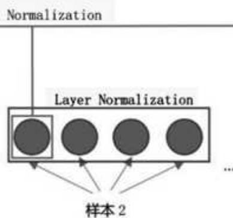

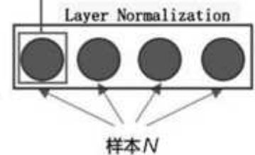  
图3-8 Layer Normalization与Batch Normalization的不同

有兴趣的读者可以展开学习，这里不再过多阐述。具体的使用如下（注意一定要显式声明归一化的维度）：

embedding $=$ torch rand(size $\coloneqq$ (5,80,768)) print(torch.mm.layersNorm(normalized_shape $\equiv$ [80,768])(embedding).shape） #显 式声明归 一化的维度

# 3.1.5 多头自注意力

在3.1.2节的最后，我们使用PyTorch 2.0自定义层编写了自注意力模型。从相应的代码中可以看到，除使用自注意力核心模型外，还额外加入了掩码层和点积的除法运算，以及为了整形使用了Layer Normalization。实际上，这些处理都是为了使得整体模型在训练时更加简易和便捷而做出的优化。

聪明的读者应该会发现，前面无论是“掩码”计算、“点积”计算还是使用LayerNormalization，都是在一些细枝末节上的修补，那么有没有可能对注意力模型进行一个较大的结构调整，使其更加适应模型的训练。

本小节将在上述基础上介绍一种更高级的架构，即多头注意力架构。这是在原始自注意力模型的基础上做出的一种重要优化。

多头注意力的结构如图3-9所示，query、key、value首先经过一个线性变换，之后计算相互之间的注意力值。相对于原始自注意力计算方法，注意这里的计算要做 h 次（ h 为“头”的数目），其实也就是所谓的多头，每一次计算一个头。而每次query、key、value进行线性变换的参数W是不一样的。

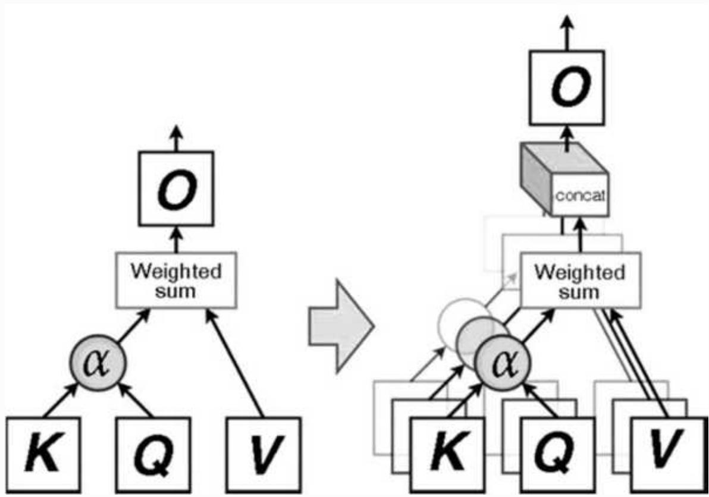  
图3-9 从单头到多头注意力结构

将h次的缩放点积注意力的计算结果进行拼接，再进行一次线性变换，得到的值作为多头注意力的结果，如图3-10所示。

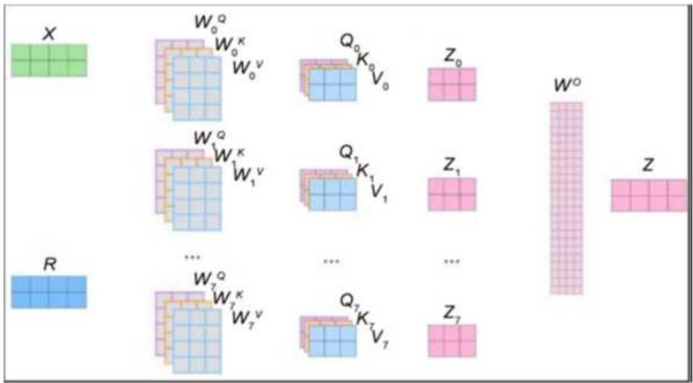  
图3-10 多头注意力的结果合并

可以看到，这样计算得到的多头注意力值的不同之处在于进行了 h次计算，而不是仅仅计算一次。这样的好处是允许模型在不同的表示子空间中学习到相关的信息，并且相对于单独的注意力模型的计算复杂度，多头模型的计算复杂度大大降低了。拆分多头模型的代码如下：

```python
def spline_tensor(tensor,h_head):
    embedding = elt Rearrange("b l (h d) -> b l h d", h = h_head) (tensor)
    embedding = elt Rearrange("b l h d -> b h l d", h=h_head) (embedding)
return embedding 
```

在此基础上，可以对注意力模型进行修正，新的多头注意力层代码如下：

```python
#定义Multi-Head Attention类
class MultiHeadedAttention(nn.Module):
    ...
接受模型大小和注意力头数作为输入
...
初始化函数，设置模型参数
def __init__(self, h, d_model, dropout=0.1):
    super().__init__()
#确保d_model可以被h整除
assert d_model % h == 0
#假设d_v始终等于d_k
self.d_k = d_model // h
self.h = h
#创建3个线性层，用于将输入投影到query、key和value空间
self.Linear_layers = nn.ModuleList([nn.Linear(d_model, d_model) for _ in range(3)))
#创建输出线性层，用于将多头注意力的输出合并到一个向量中
self.outputlinear = nn.Linear(d_model, d_model)
#创建注意力机制实例
selfattention = Attention()
#创建dropout层，用于正则化
self_dropout = nn_dropout(pdropout)
#定义前向传播函数
def forward(self, query, key, value, mask=None):
    #获取batch大小
batch_size = query.size(0)
#对输入进行线性投影，并将结果reshape为(batch_size, h, seq_len, d_k)
query, key, value = [1(x).view(batch_size, -1, self.h, self.d_k).transpose(1, 2) for l, x in zip(self.Linear_layers, (query, key, value))
#对投影后的query、key和value应用注意力机制，得到加权后的结果和注意力权重
x, attn = self attendsion(query, key, value, mask=mask, dropout= self.dropout)
#将多头注意力的输出合并到一个向量中，并应用输出线性层
x = x.transpose(1, 2).contiguous().view(batch_size, -1, self.h * self.d_k)
return self.outputlinear(x) 
```

相较单一的注意力模型，多头注意力模型能够简化计算，并且在更多维的空间对数据进行整合。图3-11展示了一个多头注意力模型架构。

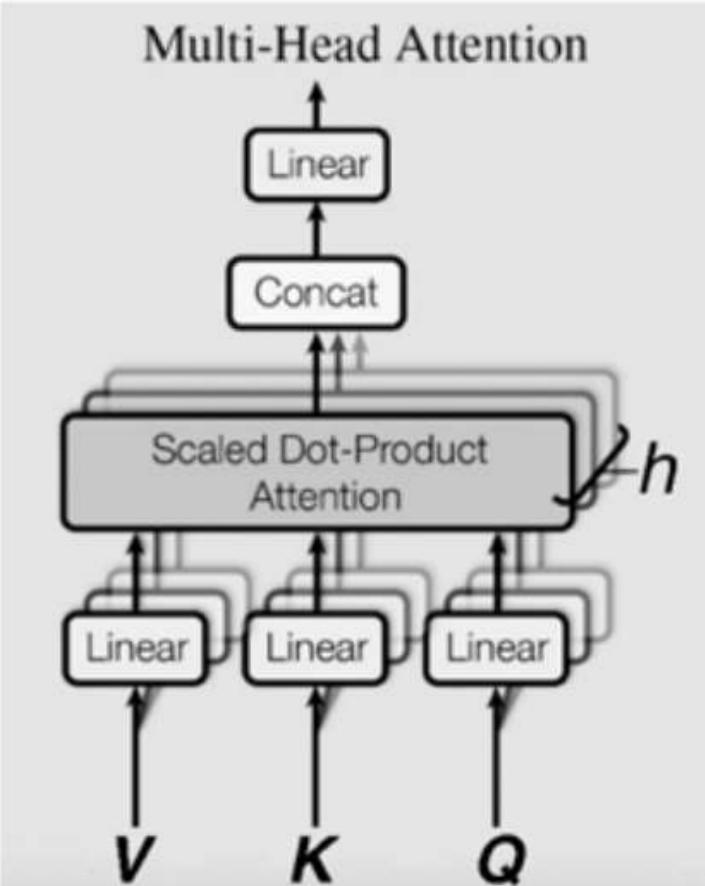  
图3-11 h 头注意力模型架构

在实际应用中，使用“多头”注意力模型时，可以观察到每个“头”所关注的内容并不一致。有的“头”专注于相邻的序列，而有的“头”则会关注更远处的单词。这种特性使得模型能够根据需要更细致地对特征进行辨别和提取，从而提高模型的准确率。

# 3.2 注意力机制的应用实践：编码器

深度学习中的注意力模型是一种模拟人类视觉注意力机制的方法，它可以帮助我们更好地关注输入序列中的重要部分。近年来，注意力模型在深度学习各个领域被广泛使用，无论是在图像处理、语音识别还是自然语言处理的各种不同类型的任务中，都很容易遇到注意力模型的身影。

常见的深度学习中的注意力模型包括：自注意力机制、交互注意力机制、门控循环单元（GRU）和变压器（Transformer）等。但是无论其组成结构如何，构成的模块有哪些，其最基本的工作就是对输入的数据进行特征抽取，对原有的数据形式进行编码处理，并将其转换为特定类型的数据结构。对此，作者将这类模型统一称为“编码器”。

编码器是基于深度学习注意力构造的一种能够存储输入数据的若干特征的表达方式。虽然这些特征的具体内容是由深度学习模型进行提取的，即进行“黑盒”处理，但是通过对“编码器”的设计会使得模型可以自行决定关注哪些是对结果影响最为重要的内容。

在实践中，编码器是一种神经网络模型，一般由多个神经网络“模块”组成，其作用是将输入数据重整成一个多维特征矩阵，以便更好地进行分类、回归或生成等任务。常用的编码器通常由多个卷积层、池化层和全连接层组成，其中卷积层和池化层可以提取输入数据的特征，全连接层可以将特征转换为低维向量，而“注意力机制”则是这个编码器的核心模块。

# 3.2.1 自编码器的总体架构

在基于自注意力的编码器中，编码器的作用是将输入数据重整成一个多维向量，并在此基础上生成一个与原始输入数据相似的重构数据。这种自编码器模型可以用于图像去噪、图像分割、图像恢复等任务中。

为了简便起见，作者直接使用经典的编码器方案（即基于注意力机制的模型架构）作为本章编码器的实现。编码器的结构如图3-12所示。

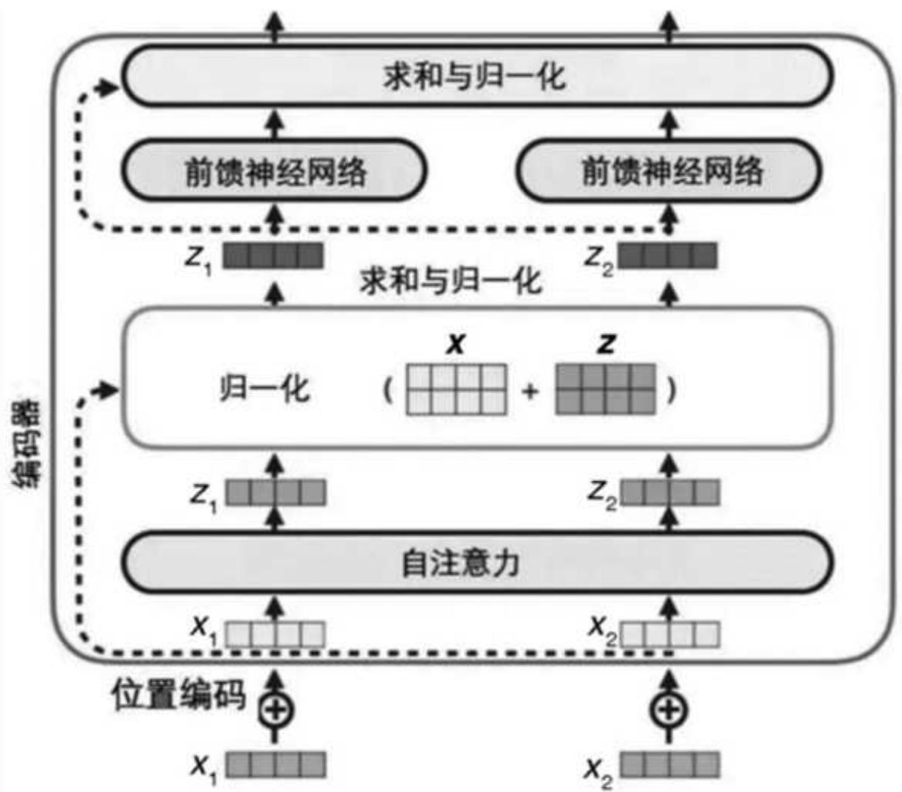  
图3-12 编码器结构示意图

从图3-12可见，本章编码器的结构是由以下多个模块构成的：

● 初始词向量层（Input Embedding）。  
● 位置编码器层（Positional Encoding）。  
● 多头自注意力层（Multi-Head Attention）。  
● 归一化层（Layer Normalization）。  
前馈层（Feed Forward Network）。

编码器通过使用多个不同的神经网络模块来获取需要关注的内容，并抑制和减弱其他无用信息，从而实现对特征的抽取，这也是目前最为常用的架构方案。

从上面编码器结构的示意图中可以看到，一个编码器的构造分成5部分：初始向量层、位置编码层、多头自注意力层、归一化层和前馈层。

多头自注意力层和归一化层在3.1节已经讲解完毕，接下来将介绍剩余的3个部分，之后将使用这3个部分构件出本书的编码器架构。

# 3.2.2 回到输入层：初始词向量层和位置编码器层

初始词向量层和位置编码器层是数据输入最初的层，作用是将输入的序列通过计算组合成向量矩阵，如图3-13所示。

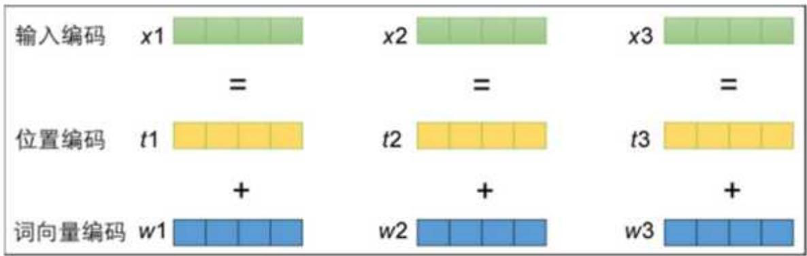  
图3-13 输入层

可以看到，这里的输入编码实际上是由两部分组成的，即位置向量编码和词向量编码。下面对每一部分依次进行讲解。

# 1．第一层：初始词向量层

如同大多数的向量构建方法一样，首先将每个输入单词通过词映射算法转换为词向量。

其中每个词向量被设定为固定的维度，本书后面将所有词向量的维度设置为768。具体代码如下：

```python
请注意代码解释在代码段的下方  
import torch  
word_embedding_table =  
n.nn.Embedding(num_embeddings=encoder_vocab_size,  
dimg_dim=768)  
encoder_embedding = word_embedding_table(inputs) 
```

这里对代码进行解释。首先，使用torch.nn.Embedding函数创建了一个随机初始化的向量矩阵。encoder_vocab_size是字库的大小，它通常包含编码器中所有可能出现的“字”。而embedding_dim是定义的嵌入向量的维度，这里使用通用的768维即可。

在PyTorch中，词向量的初始化只发生在最底层的编码器中。需要额外说明的是，所有编码器都有一个共同的特点：它们接收一个向量列表，列表中的每个向量大小为768维。在底层（最开始）的编码器中，这些向量是词向量；而在其他编码器中，这些向量则是上一层编码器的输出（仍然是一个向量列表）。

# 2．第二层：位置编码

位置编码是一个非常重要且具有创新性的结构输入。在自然语言处理中，输入通常是一个个连续的序列，因此为了利用输入的顺序信息，需要将序列对应的相对或绝对位置信息注入模型中。

基于这一目的，一个直观的想法是将位置编码设计成与词嵌入同样大小的向量维度，然后将其与词嵌入直接相加。这样可以使模型既能获取词嵌入信息，也能获取位置信息。

具体来说，位置向量的获取方式有两种：

通过模型训练得到。  
● 根据特定公式计算得到（使用不同频率的正弦和余弦函数直接计算）。

因此，在实际操作中，模型可以设计一个可随训练更新的位置编码层，也可以直接插入一个预先计算好的位置编码矩阵。公式如下：

$$
\begin{array}{l} P E _ {(\mathrm {p o s}, 2 i)} = \sin (\mathrm {p o s} / 1 0 0 0 0 ^ {2 i / d _ {\mathrm {m o d e l}}}) \\ P E _ {(\mathrm {p o s}, 2 i + 1)} = \cos (\mathrm {p o s} / 1 0 0 0 0 ^ {2 i / d _ {\mathrm {m o d e l}}}) \\ \end{array}
$$

在这里，作者提供了一个直观展示位置编码的示例，代码如下：

import matplotlib.pyplot as plt   
import torch   
import math   
max_len $= 128$ #单词个数   
d_model $= 512$ #位置向量维度大小   
pe $=$ torch.zeros(max_len,d_model)   
position $=$ torch.arange(0.,max_len).unsqueeze(1)   
div_term $\equiv$ torch.exp(torch.arange(0.,d_model,2）\*-(math.log(10000.0)/d_model))   
pe[;,0::2] $\equiv$ torch.sin(position \* div_term)#偶数列   
pe[;,1::2] $\equiv$ torch.cos(position \* div_term)#奇数列   
pe $=$ pe.unsqueeze(0)   
pe $=$ pe numpy()   
pe $=$ pe.squeeze()   
plt.imshow(pe)#显示图片   
plt.colorbar()   
plt.show()

通过设置单词个数max_len和维度大小d_model可以很精准地生成位置向量的图形展示，如图3-14所示。

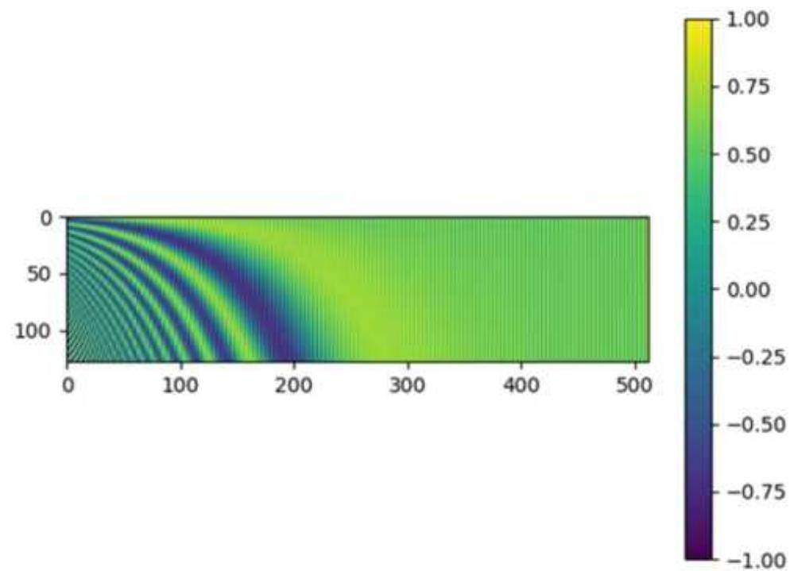  
图3-14 设置单词个数max_len和维度大小d_model

序列中任意一个位置都可以通过三角函数进行表示。其中，pos是输入序列的最大长度，i是序列中依次的各个位置，而d_model是设定的与词向量维度相同的位置编码维度，通常为768。如果将其封装为PyTorch2.0中的固定类形式，代码如下：

```python
class PositionalEmbedding(nnModule): #位置嵌入模块，为输入序列提供位置信息
def __init__(self, d_model, max_len=512): #初始化方法
super().__init()
#调用父类的初始化方法
#在对数空间中一次性计算位置编码
pe = torch.zeros(max_len, d_model).float() #创建一个全0的张量用于存储位置编码
perequire_grad = False #设置不需要梯度，因为位置编码是固定的，不需要训练
#创建一个表示位置的张量，从0到max_len-1
position = torch.arange(0, max_len).float().unsqueeze(1)
div_term = (torch.arange(0, d_model, 2).float() * -(math.log(10000.0) / d_model)).exp()
pe[:, 0::2] = torch.sin(position * div_term) #对位置编码的偶数索引应用sin函数
pe[:, 1::2] = torch.cos(position * div_term) #对位置编码的奇数索引应用cos函数
pe = pe.unsqueeze(0) #增加一个维度，以便与输入数据进行匹配
self.register_buffer('pe', pe) #将位置编码注册为一个buffer，这样它就可以与模型一起移动，但不会被视为模型参数
def forward(self, x):
    return self.pe[:, x.size(1)] #返回与输入序列长度相匹配的位置编码
```

这种位置编码函数的写法过于复杂，读者直接使用即可。最终将词向量矩阵和位置编码组合如图3-15所示。

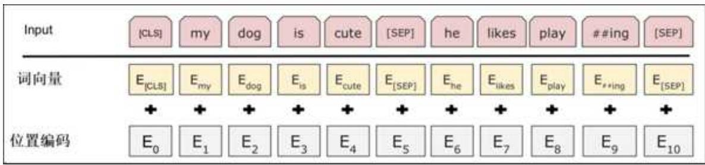  
图3-15 最终将词向量矩阵和位置编码组合

融合后的特征既带有词汇信息，也带有词汇在序列中的位置信息，从而能够从多个角度对特征进行表示。

# 3.2.3 前馈层的实现

从编码器输入的序列在经过一个自注意力（self-attention）层后，会传递到前馈神经网络中，这个神经网络被称为“前馈层”。这个前馈层的作用是进一步整形通过注意力层获取的整体序列向量。

本书中的解码器遵循的是Transformer架构，因此其构建参考了Transformer中解码器的设计，如图3-16所示。读者看到图后可能会感到诧异，甚至怀疑是否放错了图。然而，并没有。

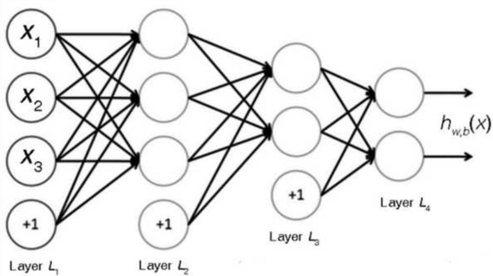  
图3-16 Transformer中解码器的构建

所谓前馈神经网络，实际上就是加载了激活函数的全连接层神经网络（或者使用一维卷积实现的神经网络，这点不在这里介绍）。

既然了解了前馈神经网络，其实现也很简单，代码如下：

import torch   
class PositionwiseFeedForward(nnModule):   
"该类实现了FFN（前馈网络）的公式。这是一个两层的全连接网络   
""   
def init_self,d_model,d_ff,dropout=0.1): #调用父类的初始化函数 super(PositionwiseFeedForward,self).__init_(） #初始化第一层全连接层，输入维度d_model，输出维度d_ff self.w_1 $\equiv$ nn.Linear(d_model,d_ff) #初始化第二层全连接层，输入维度d_ff，输出维度d_model self.w_2 $\equiv$ nn.Linear(d_ff,d_model) #初始化dropout层，dropout是丢弃率 self_dropout $=$ nn_dropout捺out) #使用GELU作为激活函数 selfactivation $\equiv$ torch.nn.GELU()   
def forward(self,x):   
"" 前向传播函数。输入x经过第一层全连接层、激活函数、dropout层和第二层全连接层   
"" return self.w_2(self_dropout(self.w_1(x)))

代码本身很简单。需要提醒读者的是，在上文中，我们使用了两个全连接层来实现“前馈”操作。然而，为了减少参数数量并减轻运行负担，实际上可以使用一维卷积或“空洞卷积”（Dilated Convolution）来替代全连接层，从而实现前馈神经网络。这一优化的具体实现可以由读者自行探索完成。

# 3.2.4 将多层模块融合的TransformerBlock层

在实际应用中，通过组合多层Block模块可以增强整体模型的学习与训练能力。

同样，在注意力模型中，也需要通过组合多层Block模块来增强模型的性能和泛化能力，在此可以通过将不同的模块组合在一起来完成TransformerBlock层的构建。代码如下：

定义SublayerConnection类，继承自nn-module  
class SublayerConnection(nnModule):该类实现了一个带有层归一化的残差连接。为了代码的简洁性，归一化操作被放在了前面，而不是通常的最后def__init__(self,size,dropout):#调用父类的初始化函数super(SublayerConnection,self).__init_(）#初始化层归一化，size是输入的特征维度self(norm $\equiv$ torch.nn.layersNorm(size)#初始化dropout层，dropout是丢弃率self_dropout $=$ nn_dropout捺out)defforward(self,x,sublayer):对任何具有相同大小的子层应用残差连接x：输入张量sublayer：要应用的子层（函数）""#首先对x进行层归一化，然后传递给sublayer，再应用dropout，最后与原始x进行残差连接

return x + self.dropout(sublayer(self(norm(x))) #通过组合不同层构建的TransformerBlock class TransformerBlock(nnModule): "" 双向编码器 $\equiv$ Transformer（自注意力机制） Transformer $\equiv$ 多头注意力 $^+$ 前馈网络，并使用子层连接 """ def __init__(self, hidden, attn_heads, feed_forward Hidden, dropout): :param hidden: transformer的隐藏层大小 :param attn_heads: 多头注意力的头数 :param feed_forward Hidden: 前馈网络的隐藏层大小，通常是4\*hidden_size :param dropout: dropout率 super(）.__init(）#调用父类的初始化方法 #初始化多头注意力模块 selfattention $\equiv$ MultiHeadedAttention(h=attn_heads, d_model $\equiv$ hidden) self/feed_forward $\equiv$ PositionwiseFeedForward(d_model $\equiv$ hidden, d_ff=feed_forward Hidden, dropout=dropout) #初始化位置相关的前馈网络 #初始化输入子层连接 self-input_sublayer $\equiv$ SublayerConnection(size $\equiv$ hidden, dropout=dropout) #初始化输出子层连接 self.output_sublayer $\equiv$ SublayerConnection(size $\equiv$ hidden, dropout=dropout) self_dropout = nn_dropout(p=dropout) #初始化dropout层 def forward(self,x,mask): #前向传播方法 #对输入x应用注意力机制，并使用输入子层连接 x $=$ self-input_sublayer(x, lambda_x: self attendsion.forward(_x,_x,_x, mask=mask)) #对x应用前馈网络，并使用输出子层连接 x $=$ self.output_sublayer(x,selffeedsforward) return self_dropout(x)#返回经过dropout处理的x

可以看到，通过调用多个子层（sublayer），将不同的模块组合在一起，从而实现了可叠加使用的TransformerBlock。

# 3.2.5 编码器的实现

通过本章前面内容的分析，我们可以看到，实现一个基于注意力架构的编码器并不困难。只需要按照架构依次将各个模块组合起来即可。接下来，作者将逐步提供代码，读者可以参考注释进行学习。

```txt
导入PyTorch库和必要的子模块  
import torch  
import torch.nn as nn  
import math 
```

```python
#定义Scaled Dot Product Attention类
class Attention(nnModule):
    ...
计算'Scaled Dot Product Attention'
...
#定义前向传播函数
def forward(self, query, key, value, mask=None, dropout=None):
    #通过点积计算query和key的得分，然后除以sqrt(query的维度)进行缩放
scores = torch/matmul(query, key.transpose(-2, -1)) / math.sqrt(query.size(-1))
#如果提供了mask，则对得分应用mask，将mask为0的位置设置为一个非常小的数
if mask is not None:
    scores = scoresmasked_fill率达=0, -1e9)
#使用softmax函数计算注意力权重
p_attn = torch(nnfunctional softmax(scores, dim=-1))
#如果提供了dropout，则对注意力权重应用dropout
if dropout is not None:
    p_attn = dropout(p_attn)
#使用注意力权重对value进行加权求和，返回加权后的结果和注意力权重
return torch/matmul(p_attn, value), p_attn
#定义Multi-Head Attention类
class MultiHeadedAttention(nnModule):
    ...
接受模型大小和注意力头数作为输入
...
#初始化函数，设置模型参数
def __init__(self, h, d_model, dropout=0.1):
    super().__init__()
#确保d_model可以被h整除
assert d_model % h == 0
#假设d_v始终等于d_k
self.d_k = d_model // h
self.h = h
#创建3个线性层，用于将输入投影到query、key和value空间
self.Linear_layers = nn.ModuleList([nn.Linear(d_model, d_model) for _ in range(3)])
```

```python
创建dropout层，用于正则化
self_dropout = nn_dropout()
#定义前向传播函数
def forward(self, query, key, value, mask=None):
    #获取batch大小
    batch_size = query.size(0)
    #对输入进行线性投影，并将结果reshape为(batch_size, h, seq_len, d_k)
    query, key, value = [1(x).view(batch_size, -1, self.h, self.d_k).transpose(1, 2) for l, x in zip(self.linear_layers, (query, key, value))]
    #对投影后的query、key和value应用注意力机制，得到加权后的结果和注意力权重
    x, attn = selfattention(query, key, value, mask=mask, dropout=soft_dropout)
    #将多头注意力的输出合并到一个向量中，并应用输出线性层
    x = x.transpose(1, 2).contiguous().view(batch_size, -1, self.h * self.d_k)
    return self.output_linear(x))
#定义SublayerConnection类，继承自nnModule
class SublayerConnection(nnModule):
    def __init__(self, size, dropout):
        #调用父类的初始化函数
        super(SublayerConnection, self).__init())
        #初始化层归一化，size是输入的特征维度
        self(norm = torch.nn.LinearNorm(size))
        #初始化dropout层，dropout是丢弃率
        self_dropout = nn_dropout捺out)
    def forward(self, x, sublayer):
        #首先对x进行层归一化，然后传递给sublayer，再应用dropout，最后与原始x进行残差连接
        return x + self_dropout(sublayer(self(norm(x)))
    #定义PositionwiseFeedForward类，继承自nnModule
class PositionwiseFeedForward(nnModule): 
```

```python
该类实现了FPN（前馈网络）的公式。这是一个两层的全连接网络
```
def __init__(self, d_model, d_ff, dropout=0.1):
    #调用父类的初始化函数
    super(PositionwiseFeedForward, self).__init__()
#初始化第一层全连接层，输入维度d_model，输出维度d_ff
    self.w_1 = nn.Linear(d_model, d_ff)
    #初始化第二层全连接层，输入维度d_ff，输出维度d_model
    self.w_2 = nn.Linear(d_ff, d_model)
    #初始化dropout层，dropout是丢弃率
    self_dropout = nn_dropout捺out)
    #使用GELU作为激活函数
    selfactivation = torch.nn.GELU()
def forward(self, x):
    return self._2(self_dropout, selfactivation)
class TransformerBlock(nn.Module):
    def __init__(self, hidden, attn_heads, feed_forward Hidden, dropout):
        :param hidden: transformer的隐藏层大小
        :param attn_heads: 多头注意力的头数
        :param feed_forwardHidden: 前馈网络的隐藏层大小，通常是4*hidden_size
        :param dropout: dropout率
        super().__init__() #调用父类的初始化方法
        #初始化多头注意力模块
        selfattention = MultiHeadedAttention(h=attn_heads, d_model=hidden)
        self/feedforward = PositionwiseFeedForward(d_model=hidden,
        self.output_sublayer = SublayerConnection(size=hidden, dropout=dropout)
        self.output_sublayer = SublayerConnection(size=hidden, dropout=dropout)
        self_dropout = nn_dropout捺out) #初始化位置相关的前馈网络
        #初始化输入子层连接
        self input_sublayer = SublayerConnection(size=hidden, dropout=dropout)
        #初始化输出子层连接
        self.output_sublayer = SublayerConnection(size=hidden, dropout=dropout)
        self_dropout = nn_dropout捺out)
def forward(self, x, mask):
    x = self-input_sublayer(x, lambda_x: self attendsion.forward(x, x, x, mask=mask)) #对输入x应用注意力机制，并使用输入子层连接
    #对x应用前馈网络，并使用输出子层连接 
```

```python
x = self.output_sublayer(x, self/feed_forward)  
return self.dropout(x) # 返回经过dropout处理的x  
class PositionalEmbedding(nnModule): # 位置嵌入模块，为输入序列提供位置信息  
def __init__(self, d_model, max_len=512): # 初始化方法  
super().init() # 调用父类的初始化方法  
# 在对数空间中一次性计算位置编码  
pe = torch.zeros(max_len, d_model).float() # 创建一个全0的张量用于存储位置编码  
pe requirement_grad = False # 设置不需要梯度，因为位置编码是固定的，不需要训练  
# 创建一个表示位置的张量，从0到max_len-1  
position = torch.arange(0, max_len).float().unsqueeze(1)  
div_term = (torch/arange(0, d_model, 2).float() * -(math.log(10000.0)) / d_model)).exp() # 计算位置编码的公式中的分母部分  
pe[:, 0::2] = torch.sin(position * div_term) # 对位置编码的偶数索引应用sin函数  
pe[:, 1::2] = torch.cos(position * div_term) # 对位置编码的奇数索引应用cos函数  
pe = pe.unsqueeze(0) # 增加一个维度，以便与输入数据匹配  
self.register_buffer('pe', pe) # 将位置编码注册为一个buffer，这样它就可以与模型一起移动，但不会被视为模型参数  
def forward(self, x): # 前向传播方法  
return self.pe[:, :x.size(1)] # 返回与输入序列长度相匹配的位置编码  
class BERT(nnModule):  
    BERT模型：基于Transformer的双向编码器表示  
    def __init__(self, vocab_size, hidden=768, n_layers=12, attn_heads=12, dropout=0.1):  
        super().init() # 调用父类nnModule的初始化方法  
self-hidden = hidden # 保存隐藏层大小  
self.n_layers = n_layers # 保存Transformer块的数量  
self.attn_heads = attn_heads # 保存注意力头的数量  
# 论文指出使用4*hidden_size作为前馈网络的隐藏层大小  
self/feedforward Hidden = hidden * 4 # 计算前馈网络的隐藏层大小
```

```python
#BERT的嵌入，包括位置嵌入、段嵌入和令牌嵌入的总和
self(word_embedding = torch.nn.Embedding(num_embeddings=vocab_size,
embedding_dim=hidden) # 创建单词嵌入层
self.position_embedding = PositionalEmbedding(d_model=hidden) # 创建位置嵌入层
#多层Transformer块，深度网络
self.transformer_blocks = nn.ModuleList(
[TransformerBlock(hidden, attn_heads, hidden * 4, dropout) for _ in
range(n_layers)]) # 创建多个Transformer块。
def forward(self, x):
    ...
    # 前向传播方法。
    :param x: 输入序列，shape为[batch_size, seq_len]。
    :return: 经过BERT模型处理后的输出序列，shape为[batch_size, seq_len, hidden]
    ...
    # 为填充令牌创建注意力掩码
    #torch.ByteTensor([batch_size, 1, seq_len, seq_len])
    # 创建注意力掩码
    mask = (x > 0).unsqueeze(1).repeat(1, x.size(1), 1).unsqueeze(1)
    # 将索引序列嵌入向量序列中
    # 将单词嵌入和位置嵌入相加得到输入序列的嵌入表示
    x = self(word_embedding(x) + self.position_embedding(x))
    # 在多个Transformer块上运行
    for transformer in self.transformer_blocks: # 遍历所有Transformer块
        # 将输入序列和注意力掩码传递给每个Transformer块，并获取输出序列
        x = transformer.forward(x, mask)
    return x # 返回经过所有Transformer块处理后的输出序列
if_name__ == __main__:
    vocab_size = 1024
seq = arr = torch.tensor([[1,1,1,1,0,0,0], [1,1,1,0,0,0,0]])
logits = BERT(vocab_size=vocab_size)(seq)
print(logits.shape)
```

可以看到，真正实现一个编码器，从理论和架构上来说并不困难，只需要读者细心即可。

# 3.3 基础篇实战：自编码架构的拼音汉字生成模型

前面我们深入探讨了注意力的核心架构及其关键组件，并成功实现了基于注意力机制的编码器。本节将综合运用前两节的知识，通过实战来检验编码器的性能，具体任务是完成拼音与汉字之间的转换训练，效果如图3-17所示。

ni zāi shu tā péitu wqti shui

你栽树，他培土，我去提水。

xiáo báitu

小白兔

xiao bai tu chuān pi ao

小白兔，穿皮袄，

er duochang ba xiao

耳朵长，尾巴小，

san bān zui hú zi qiao

三瓣嘴，胡子翘，

yi dong yi dong zong 201 xiao

一动一动总在笑。

图3-17 拼音和汉字

这种能够直接将一种序列转换为另一种序列的模型，在实际应用中被称为自编码生成模型。

接下来，我们将详细阐述如何使用这个自编码生成模型来完成拼音与汉字的转换。首先，我们需要准备相应的训练数据，即拼音与对应汉字的配对数据集。这些数据将作为模型的输入和期望输出，帮助模型学习从拼音到汉字的映射关系。

在模型训练过程中，编码器将接收拼音序列作为输入，并尝试生成与之对应的汉字序列。通过不断地调整模型参数，优化损失函数，模型将逐渐学会捕捉拼音与汉字之间的内在联系和规律。

值得注意的是，由于汉字的数量远多于拼音，并且存在多音字、同音字等复杂情况，因此这项任务对模型的生成能力和泛化能力提出了较高要求。

# 3.3.1 汉字拼音数据集处理

首先是对数据集的准备和处理，在本例中作者准备了15万条汉字和拼音对应数据。

# 第一步：数据集展示

汉字拼音数据集如下：

```txt
A11_0lv4 shi4 yang2 chunl yan1 jing3 da4 kuai4 wen2 zhang1 de di3 se4 si4 yue4 de lin2 luan2 geng4 shi4 lv4 de2 xian1 huo2 xiu4 mei4 shil yi4 ang4 ran2 绿是阳春烟景大块文章的底色四月的林峦更是绿得鲜活秀媚诗意盎然 
```

```txt
A11_1 tal jin3 ping2 yaol bu4 de 114 liang4 zai4 yong3 dao4 shang4 xia4 fan1 teng2 yong3 dong4 she2 xing2 zhuang4 ru2 hai3 tun2 yi1 zhi2 yi3 yi1 tou2 de youl shi4 ling3 xian1 他仅凭腰部的力量在泳道上下翻腾涌动蛇行状如海豚一直以一头的优势领先
```

```txt
A11_10 pao4 yan3 da3 hao3 le zha4 yao4 zen3 me zhuang1 yue4 zheng4 cai2 yao3 le yao3 ya2 shu1 de tuol qu4 yi1 fu2 guangl bang3 zi chong1 jin4 le shui3 cuan4 dong4 炮眼打好了炸药怎么装岳正才咬了咬牙倏地脱去衣服光膀子冲进了水窜洞 
```

```txt
A11_100 ke3 she12 zhi1 wen2 wan2 hou4 tal yil zhao4 jing4 zi zhi3 jian4 zuo3 xia4 yan3 jian3 de xian4 you4 cul you4 heil yu3 you4 ce4 ming2 xian3 bu4 dui4 cheng1 可谁知纹完后她一照镜子只见左下眼睑的线又粗又黑与右侧明显不对称 
```

简单做一下介绍。数据集中的数据分成3部分，每部分使用特定空格键隔开：

```txt
A11_10 ke3 shei2 ...可谁 
```

● 第一部分A11_i为序号，表示序列的条数和行号。  
● 第二部分是拼音编号，这里使用的是汉语拼音，与真实的拼音标注不同的是，去除了拼音原始标注，而使用数字1、2、3、4来替代，分别代表当前读音的第一声到第四声，这点请读者注意。  
● 第三部分是汉字的序列，这里是与第二部分的拼音部分一一对应的。

# 第二步：获取字库和训练数据

获取数据集中字库的个数也是一个非常重要的问题，一个非常好的办法是：使用set格式的数据读取全部字库中的不同字符。

创建字库和训练数据的完整代码如下：

```python
from tqdm import tqdm  
pinyin_list = [];hanzi_list = []  
vocab = set()  
max_length = 64  
with open("zh.tsv", errors="ignore", encoding="UTF-8") as f:  
    context = f.readlines()  
    for line in context:  
        line = line.strip().split("");  
        pinyin = line[1].split(""); hanzi = line[2].split("");  
        for _pinyin, _hanzi in zip(pinyin, hanzi):  
            vocab.add(_pinyin);  
            vocab.add(_hanzi);  
            pinyin = pinyin + ["PAD"] * (max_length - len(pinyin))  
            hanzi = hanzi + ["PAD"] * (max_length - len(hanzi))  
            if len(pinyin) <= max_length:  
                pinyin_list.append(pinyin); hanzi_list.append(hanzi)  
    vocab = ["PAD"] + listsorted(vocab))  
    vocab_size = len(vocab) 
```

这里做一个说明，首先context读取了全部数据集中的内容，之后根据空格将其分成3部分。

除此之外，在对序列的处理上，还需要加上一个特定符号PAD，这是为了对单行序列进行补全的操作。最终的数据如下：

```txt
['liu2'，'yong3'，... ...，'gan1'，'PAD'，'PAD'，... ...] ['柳'，'永'，... ...，'感'，'PAD'，'PAD'，... ...]
```

pinyin_list和hanzi_list是两个列表，分别用来存放对应的拼音和汉字训练数据。最后不要忘记在字库中加上PAD符号。

# 第三步：根据字库生成Token数据

获取的拼音标注和汉字标注的训练数据并不能直接用于模型训练，模型需要转换成token的一系列数字列表，代码如下：

```python
def get_dataset(   ) :  
    pinyin_tokens_ids = [ ]  
    hanzi_tokens_ids = [ ]  
for pinyin, hanzi in zip(tqdm(pinyin_list), hanzi_list):  
    pinyin_tokens_ids.append([vocab.index(char) for char in pinyin])  
    hanzi_tokens_ids.append([vocab.index(char) for char in hanzi])  
return pinyin_tokens_ids, hanzi_tokens_ids 
```

代码中创建了两个新的列表，分别对拼音和汉字的token进行存储，而获取根据字库序号编号后新的序列token。

# 第四步：PyTorch中的数据输入类

在对数据的具体使用上，读者可以通过for循环的形式将数据载入模型中。而在PyTorch中，也给我们提供了一种专用的数据输入类：

```python
class TextSamplerDataset(torch.utils.data.Dataset):
    def __init__(self, pinyin_tokens_ids, hanzi_tokens_ids):
        super().__init__
        self.pinyin_tokens_ids = pinyin_tokens_ids
        self.hanzi_tokens_ids = hanzi_tokens_ids
    def __getitem__(self, index):
        return
    torch.tensor(self.pinyin_tokens_ids[index]), torch.tensor(self.hanzi_tokens_ids[index])
    def __len__(self):
        return len(pinyin_tokens_ids) 
```

这里的TextSamplerDataset继承自torch.utils.data.Dataset，目的是完成数据输入类的显式声明，而在具体使用上，__getitem__函数用于完成对数据的按序号输出。

# 3.3.2 搭建文本与向量的桥梁— Embedding

在1.3.1节中，作者为文本内容中的每个汉字或拼音分配了一个独特的数字编号，旨在将文本数据输入深度学习模型中进行处理。然而，仅仅依靠单一的数字编号，深度学习模型难以深度理解文本内容。同时，这种映射方式也可能引发一些潜在问题。

那么，我们是否可以考虑采用另一种方法，比如使用one-hot编码来表示每个“词”或“字”呢？答案是肯定的。

以包含5个词的词汇表为例，若词"Queen"在表中的序号为2，则其词向量可表示为(0,1,0,0,0) 。 同 理 ， 词 "king" 的 词 向 量 就 是 (0,0,0,1,0) 。 这 种 编 码 方 式 被 称 为 1-of- Nrepresentation，或称为one-hot编码。

尽管one-hot编码在表示词向量时简单明了，但也存在诸多问题。最显著的问题是，当词汇表规模庞大，如达到百万级别时，使用百万维度的向量来表示每个词显然是不切实际的。此外，这种编码方式产生的向量除一个位置为1外，其余位置均为0，表达效率极低，且在卷积神经网络中使用时可能导致网络难以收敛。

为了解决one-hot编码带来的向量长度过长和数值稀疏问题，我们可以采用词映射（Embedding）技术。通过训练，该技术能够将每个词映射到一个较短的词向量上，从而构成一个向量空间。在这个空间中，我们可以运用统计学方法来研究词与词之间的关系。

词映射技术能够将高维稀疏的one-hot向量转换为低维稠密向量，使得语义上相近的单词在向量空间中距离更近。作为自然语言处理中的常见技术，词映射为将文本数据转换为计算机可处理的数字形式提供了便利，为后续的处理和分析奠定了基础，如图3-18所示。

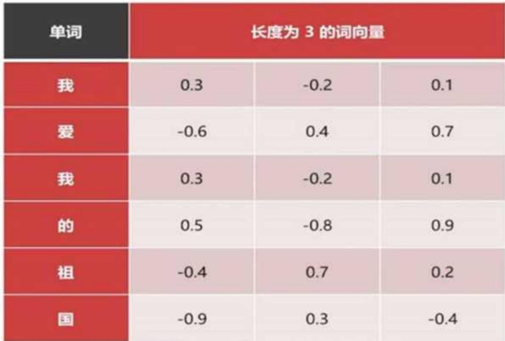  
图3-18 词映射Embedding

从图3-18可以看到，对于每个单词，可以设定一个固定长度的向量参数，从而用这个向量来表示该词。这样做的好处是，它可以将文本通过一个低维向量来表达，避免了像one-hot编码那样产生高维稀疏向量的问题。此外，语义相似的词在向量空间中也会更接近，这种表示方式具有很强的通用性，可以应用于不同的任务。

在PyTorch中，处理词嵌入（Embedding）的方法是使用torch.nn.Embedding类。这个类可以将离散变量映射到连续的向量空间，将输入的整数序列转换为对应的向量序列，这些向量可以用于后续的神经网络模型中。例如，可以使用以下代码创建一个嵌入层，该层包含5个大小为3的向量：

```python
import torch  
embedding_layer = torch.nn.Embedding(num_embeddings=6, embedding_dim=3) 
```

其中，num_embeddings表示embedding_layer层所代表的词典数目（字库大小），embedding_dim表示Embedding向量维度大小。在训练过程中，embedding_layer层中的参数会自动更新。

而对于定义的embedding_layer层的使用，可以用如下方式完成：

embedding $=$ embedding_layer(torch.tensor([3]))   
print(embedding.shape)

其中，数字3是字库中序号为3的索引所指代的字符，通过embedding_layer对其向量进行读取。一个完整的例子如下：

import torch   
text $=$ "我爱我的祖国" vocab $=$ ["我","爱","的","祖","国"] embedding_layer $\equiv$ torch.nn.Embedding(num_embedding=len(vocab),embedding_dim=3) token $=$ [vocab.index("我"),vocab.index("爱"),vocab.index("我"),vocab.index("的")，vocab.index("租"),vocab.index("国")] token $=$ torch.tensor(token) embedding $=$ embedding_layer(token) print(embedding.shape)

首先通过全文本提取到对应的字符组成一个字库，之后根据字库的长度设定num_embeddings的大小，而对于待表达文本中的每个字符，根据其在字库中的位置建立一个索引序列，将其转换为torch的tensor格式后，通过对embedding_layer进行计算从而得到对应的参数矩阵，并打印其维度。请读者自行尝试。

# 3.3.3 自编码模型的确定

回到模型设计的核心议题。在3.3.1节中，我们已经成功构建了注意力模块的基础框架，该框架在计算模型中可即时投入使用。然而，通常情况下，仅凭单一的注意力层往往难以实现卓越的性能表现。鉴于此，若仅采用一层编码器对数据进行编码处理，其效果在准确率上可能难以与多层编码器相媲美。因此，一个直观且有效的策略便是增加编码器的层数，以便对数据进行更为深入细致的编码处理，从而有望提升模型的整体性能。通过堆叠多层编码器，我们期望模型在捕捉数据内在特征时能够展现出更高的灵敏度和准确性，进而在各项任务中取得更为出色的表现，如图3-19所示。

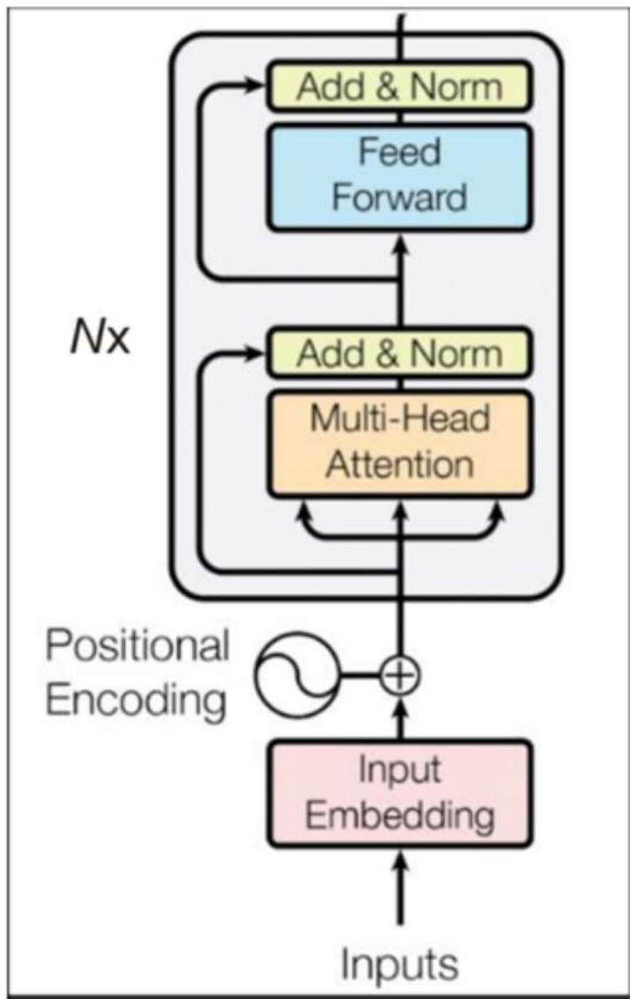  
图3-19 增加更多层的编码器对数据进行编码

在这里，为了节省篇幅，我们将使用3.3.1节完成的编码器BERT实现，仅演示其使用，代码如下：

```python
def get_model(embedding_dim = 768):
    model = torch.nn Sequential(
        bert.BERT(vocab_size=vocab_size),
        torch.nn-dropout(0.1),
        torch.nn.Linear(embedding_dim, vocab_size)
    )
    return model) 
```

这里是对前面章节中编码器构建的示例，使用了多头自注意力层和前馈层。需要注意的是，这里只是在编码器层中加入了更多层的“多头自注意力层”和“前馈层”，而不是直接加载了更多的“编码器”。这一点请读者务必注意。

# 3.3.4 模型训练部分的编写

接下来是模型训练部分的编写。作者在这里采用最简单的模型训练程序编写方式来完成代码的编写。

第一步是数据的获取。由于模型在训练过程中不可能一次性将所有的数据导入，因此需要创建一个“生成器”，将获取的数据按批次发送给训练模型。在这里，我们使用一个for循环来完成数据的输入任务：

```python
batch_size = 256  
from torch.utils.data import DataLoader  
loader =  
DataLoader(TextSamplerDataset(pinyin_tokens_ids, hanzi_tokens_ids), batch_size = batch_size  
, shuffle=True) 
```

这段代码用于完成数据的生成工作，即按既定的batch_size大小生成数据batch，之后在每个epoch的循环中将数据输入模型进行迭代训练。

接下来是完整的训练模型代码，具体如下：

import numpy as np   
import torch   
import bert   
import get_data   
max_length $= 64$ from tqdm import tqdm   
vocab_size $\equiv$ get_data.vocab_size   
vocab $\equiv$ get_data.vocab.   
def get_model(embedding_dim $= 768$ . model $\equiv$ torch.nn Sequential( bert.BERT(vocab_size $\equiv$ vocab_size), torch(nn.Dropout(0.1), torch(nn.Linear(embedding_dim,vocab_size) return model device $=$ "cuda" model $\equiv$ get_model().to(device) optimizer $\equiv$ torch.optim.adamW(model.params(),lr=2e-4) lr_scheduler $\equiv$ torch.optim.lr_scheduler.CosineAnnealingLR(optimizer,T_max = 2400, eta_min=2e-6,last_epoch=-1) criterion $\equiv$ torch(nn.CrossEntropyLoss() pinyin_tokens_ids,hanzi_tokens_ids $\equiv$ get_data.get_dataset() class TextSamplerDataset(torch.utils.data.Dataset):

```python
def __init__(self, pinyin_tokens_ids, hanzi_tokens_ids):
    super().__init__()
    self.pinyin_tokens_ids = pinyin_tokens_ids
    self.hanzi_tokens_ids = hanzi_tokens_ids
    def __getitem__(self, index):
        return
torch.tensor(self.pinyin_tokens_ids[index]), torch.tensor(self.hanzi_tokens_ids[index])
    def __len__(self):
        return len(pinyin_tokens_ids)
model.load_state_dict(torch.load("\\saver/model.pth"))
batch_size = 256
from torch.utils.data import DataLoader
loader = DataLoader(TextSamplerDataset(pinyin_tokens_ids, hanzi_tokens_ids),
batch_size=batch_size, shuffle=False)
for epoch in range(21):
    pbar = tqdmloader, total=len(loader))
    for pinyin_inp, hanzi_inp in pbar:
        token_inp = (pinyin_inp).to(device)
        token_tgt = (hanzi_inp).to(device)
logits = model(token_inp)
loss = criterion(logits.view(-1, logits.size(-1)), token_tgt.view(-1))
optimizer.zero_grad()
loss.backward()
optimizer-step()
lr_scheduler.step() #执行优化器
pbar.set_description(
    f"epoch:{epoch + 1}, train_loss:{loss.item():.5f},
lr:{lr_scheduler.get_last_lr() [0] * 100:.5f}") 
if (epoch + 1) % 2 == 0:
    torch.save(model.state_dict(), "./saver/model.pth")
torch.save(model.state_dict(), "./saver/model.pth") 
```

通过将训练代码和模型代码组合在一起，即可实现模型的训练，读者可以运行代码查看结果。而最后预测部分，即使用模型进行自定义实战拼音和汉字的转换部分，请读者自行完成。

# 3.4 本章小结

首先需要说明的是，本章的模型设计并没有完全遵循Transformer中编码器的设计，而是仅建立了多层注意力层和前馈层。这是与真实的Transformer编码器不一致的地方。

其次，在数据设计上，作者选择将不同字符或拼音作为独立的字符进行存储。这种设计的优点是可以简化数据的最终生成过程，但缺点是增加了字符个数，从而增大了搜索空间，进而对训练提出了更高的要求。另一种划分方法是将拼音拆开，使用字母和音标分离的方式进行处理。有兴趣的读者可以尝试这种方法。

在撰写本章时，作者输入的数据由字（拼音）的嵌入（Embedding）和位置编码共同构成。这种叠加的嵌入值能够更好地捕捉每个字（拼音）在使用上的细微差别。然而，如果读者仅尝试使用单一的字（拼音）嵌入，可能会遇到一个问题——对于相同的音，这种单一的嵌入表示方法无法很好地对同音字进行区分。例如：

Yan3 jing4 眼睛 眼镜

在这种情况下，相同的发音无法分辨出到底是“眼睛”还是“眼镜”。有兴趣的读者可以进行测试，或者深入研究这一问题。

# 第4章

# 注意力机制详解之进阶篇

在第3章中，我们初步介绍了基础注意力机制的概念，向深度学习领域的探索者们展示了其蕴藏的巨大潜力和价值。作为当前深度学习研究中的关键组成部分，注意力机制的重要性不言而喻。本章将进一步深入探讨这一主题的进阶内容，集中阐述融合了相对位置编码（ROPE）的注意力机制。

相对位置编码的引入，极大地丰富了注意力机制的上下文信息处理能力。通过这种编码方式，注意力机制在处理序列数据时能够更精确地捕捉元素间的相对位置关系，从而提升对复杂文本结构的理解能力。这种增强的注意力机制不仅为文本生成等任务带来了显著的性能提升，还推动了相关技术的进一步发展。

在此基础上，我们将介绍一种全新的生成模型——自回归模型。这种模型充分利用了融合相对位置编码的注意力机制，通过逐步预测序列中的下一个元素，实现了更为准确和自然的文本生成。自回归模型的出现，不仅为文本生成领域带来了新的可能性，还进一步验证了相对位置编码在提升深度学习模型性能方面的巨大潜力。

在接下来的内容中，我们将详细讲解自回归模型的工作原理、实现方法以及在实际应用中的表现。通过本章的学习，读者将更加深入地理解注意力机制和相对位置编码在深度学习领域的重要作用，并领略自回归模型为文本生成等任务带来的创新与突破。

通过学习本章内容，读者将进一步加深对注意力机制的理解，掌握其在实际项目中的灵活运用，从而在自然语言处理领域迈出更加坚实的步伐。

# 4.1 注意力机制的第二种形态：自回归架构

首先我们需要了解什么是自回归（Autoregressive）架构，相对于我们在第3章学习的自编码模型，自回归就是一个从左往右学习的模型，根据句子中前面的单词预测下一个单词。例如，通过“今天的晚饭吃__”预测单词“馒头”。自回归的优点是长文本的生成能力很强，缺点是在分类任务中，单向的注意力机制不能完全捕捉token的内在联系。

然而，自回归模型能够取得重大的成功并不是偶然的，除拥有自注意力强大的特征抽取能力外，还有如下重大的突破：

● 采用旋转位置编码（Rotary Position Embedding，RoPE）。  
添加旋转位置编码的注意力模型。  
采用创新性的激活函数SwiGLU。  
● 采用创新性的“三角掩码”和“错位”输入输出格式。

下面将依次对这些突破原因进行讲解。

# 4.1.1 自回归架构重大突破：旋转位置编码

自回归架构能够取得成功的第一个重大突破，即采用了清华大学提出的“旋转位置编码”。这是一种配合Attention（注意力）机制能达到“绝对位置编码的方式实现相对位置编码”的设计。正因为这种设计，使得旋转位置编码成为目前最佳的可用于Attention机制的相对位置编码方式之一。旋转位置编码的具体实现如图4-1所示。

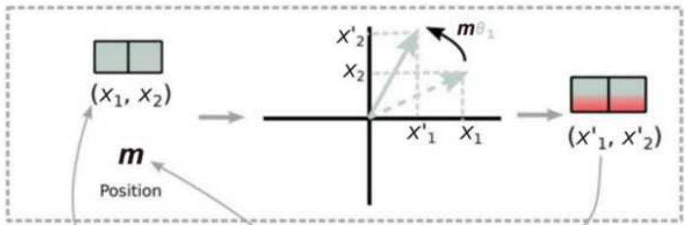

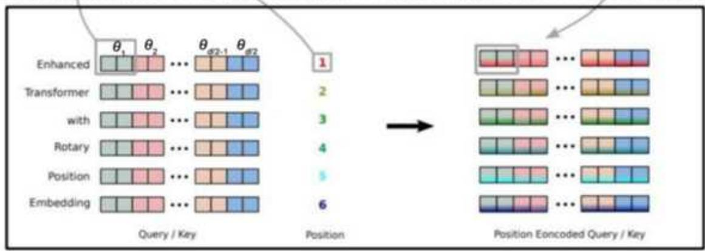  
图4-1 旋转位置编码

总的来说，旋转位置编码的目标是构建一个位置相关的投影矩阵，使得注意力中的query和key在计算时达到如下平衡：

$$
\left(\mathrm {R} _ {\mathrm {m}} \mathrm {q}\right) ^ {\mathrm {T}} \left(\mathrm {R} _ {\mathrm {n}} \mathrm {k}\right) = \mathrm {q} ^ {\mathrm {T}} \mathrm {R} _ {\mathrm {n - m}} \mathrm {k}
$$

其中， q 和 k 分别对应注意力机制中的query和key向量， m 和 n 代表两个位置， R （以R为基础的符号）表示位置i 处的投影矩阵。

这里我们提供了基于旋转位置编码的代码实现，完整代码如下：

```python
class RotaryEmbedding(torch(nn.Module):
    def __init__(self, dim, scale_base = model_configscale_base, use_xpos = True):
        super().__init()
        inv_freq = 1.0 / (10000 ** (torch.arange(0, dim, 2).float() / dim))
        self.register_buffer("inv_freq", inv_freq)
        self.use_xpos = use_xpos
        self(scale_base = scale_base
            scale = (torch.arange(0, dim, 2) + 0.4 * dim) / (1.4 * dim)
            self.register_buffer('scale', scale)
    def forward(self, seq_len, device=all_config_device):
        t = torch.arange(seq_len, device = device).type_as(self.inv_freq)
        freqs = torch.einsum('i', j -> i j', t, self.inv_freq)
        freqs = torch.cat((freqs, freqs), dim = -1)
        if not self.use_xpos:
            return freqs, torch.ones(1, device = device)
        power = (t - (seq_len // 2)) / self_scale_base
        scale = self_scale ** elt Rearrange('n -> n 1') (power) # rearrange(power, )
        scale = torch.cat((scale, scale), dim = -1)
        return freqs, scale
    def rotate_half(x):
        x1, x2 = x.chunk(2, dim=-1)
        return torch.cat((-x2, x1), dim=-1)
    def apply_ rotary_pos_emb(pos, t, scale = 1):
        return (t * pos.cos() * scale) + (rotate_HALF(t) * pos.sin() * scale)
    if __name__ == '__main__':
        embedding = torch Randn(size=(5,128,512))
        print(rotate_HALF(embedding).shape) 
```

在上面的代码中，RotaryEmbedding类的作用是计算不同维度下的旋转位置编码。rotate_half函数的作用是对输入的张量进行部分旋转，更具体地说，这个函数将输入张量 x沿着 最 后 一 个 维 度 分 成 两 半 （ x  和 x  ） ， 然 后 按 照 - x  和 x  的 顺 序 重 新 拼 接 。apply_rotary_pos_emb_index函数的作用是对输入的query和key注入旋转位置编码的位置信息。

# 4.1.2 添加旋转位置编码的注意力机制与现有库包的实现

# 1．手工实现旋转位置编码

在原有的自注意力机制的基础上，我们设计了一种添加旋转位置编码的新注意力机制。从标准的注意力模型来看，其结构如下：

$$
Q = W _ {q} X
$$

$$
\boldsymbol {K} = \boldsymbol {W} _ {k} \boldsymbol {X}
$$

$$
V = W _ {v} X
$$

$$
\operatorname {A t t e n t i o n} (Q, K, V, A) = \operatorname {s o f t m a x} \left(\frac {\boldsymbol {Q} \boldsymbol {K} ^ {\mathrm {T}}}{\sqrt {d _ {k}}}\right) V
$$

其中， X 是输入， W 、 W 、 W 分别是query、key、value的投影矩阵。相比于标准的注 q意力机制，在Q和K中引入了旋转位置编码的位置信息，以更好地捕捉序列中的位置相关性。而多头注意力就是将多个单头注意力的结果拼接起来：

$$
\begin{array}{r l} & \text {h e a d} _ {i} = \text {A t t e n t i o n} (Q _ {i}, K _ {i}, V _ {i}, A _ {i}) \\ & \text {M u l t i H e a d} (Q, K, V, A) = \text {C o n c a t} (\text {h e a d} _ {1}, \dots , \text {h e a d} _ {h}) W _ {\circ} \end{array}
$$

在具体实现上，首先实现标准的自注意力模型，之后通过添加旋转位置编码的形式，完成独创性的注意力模型，代码如下：

```python
#注入rope函数
def apply_rotary_pos_emb(self, pos, t, scale=1.):
    def rotate_full(x):
        x1, x2 = x.chunk(2, dim=-1)
        return torch.cat(-x2, x1), dim=-1)
    #return (t * torch.cos(pos Clone()) * scale) + (rotate_full(t) * torch.sin(pos Clone())) * scale)
    return (t * pos.cos() * scale) + (rotate_full(t) * pos.sin() * scale)
...
#生成rope
self.rotary_emb = layers.RotaryEmbedding(dim_head, scale_base model_cfg.xpos_scale_base, use_xpos model_cfg.use_xpos and model_cfg.causal)
...
#将生成的rope注入query与key
pos_emb, scale = self.rotary_emb(n, device=device)
q = self.apply.rotary_pos_emb(pos_emb, q, scale)
k = self.apply.rotary_pos_emb(pos_emb, k, scale ** -1) 
```

# 注意

apply_rotary_pos_emb用于为query和key注入旋转位置编码，然后实现注意力机制。

这样做的好处在于，通过注入独创性的旋转位置编码，使得注意力模型有了更好的外推性。相对于其他的位置特征，旋转位置编码能够最大程度地扩展生成模型的准确性。

# 2．使用已有库包实现旋转位置编码

除我们手动实现的旋转位置编码RoPE外，实际上Python也有专门实现的旋转位置编码，读者可以使用如下代码安装已完成的RoPE库包，代码如下：

```batch
pip install rotary_embedding_torch 
```

而在具体使用上，一个简单的使用示例如下：

```python
import torch #导入torch库  
from rotary_embedding_torch import RotaryEmbedding  
#实例化旋转位置嵌入，并传递给所有的注意力层  
rotary_emb = RotaryEmbedding(dim=32) #创建一个旋转嵌入实例，dim参数指定旋转矩阵的维度  
#模拟查询和键-维度应该以(seq_len, feature_dimention)结尾，前面可以有任意数量的维度（如批次、头等）  
q = torch.randn(1, 8, 1024, 64) #查询-(批次，头数，序列长度，头的特征维度)  
k = torch.randn(1, 8, 1024, 64) #键  
#在分离出头之后，在点积和随后的softmax（注意力计算）之前，对查询和键应用旋转  
q = rotary_emb.trainable_keys_or_keys(q) #对查询应用旋转  
k = rotary_emb.trainable_keys_or_keys(k) #对键应用旋转  
#然后像平常一样使用查询（q）和键（k）进行注意力计算
```

在将查询和键用于注意力计算之前，先对它们应用旋转。这是通过调用rotary_queries_or_keys方法实现的，该方法将旋转矩阵应用于查询和键，以编码位置信息。

# 4.1.3 新型的激活函数SwiGLU详解

SwiGLU（Swish-Gated Linear Unit）是一种基于门控机制的激活函数，属于GLU（GatedLinear Unit，门控线性单元）的变体。它通过引入门控机制，能够帮助神经网络更好地捕捉序列数据中的长期依赖关系。GLU激活函数最初是在自然语言处理任务中提出的，并在机器翻译、语音识别等领域取得了良好的效果。

# 1．基本思想

SwiGLU激活函数的基本思想是通过引入一个门控机制来控制输入信号在激活函数中的传递方式。这种机制有助于神经网络更好地学习和保留输入信息中的重要特征。

# 2．组成结构

SwiGLU激活函数由两个主要部分组成：GLU（Gated Linear Unit，门控线性单元）和Swish函数。

● GLU：GLU接受输入信号并执行门控操作。具体来说，GLU使用一个sigmoid激活函数作为门控器，将输入信号转换为0~1的值。这个值表示输入信号的重要性或影响程度。然后，GLU将输入信号与门控值相乘，以便选择性地放大或抑制输入。  
● Swish函数：Swish是一个非线性函数，类似于ReLU（Rectified Linear Unit）。它将输入信号进行非线性变换，定义为x * sigmoid(x)。Swish函数的特点是在输入为正数时逐渐趋向于线性变换，而在输入为负数时具有非线性的抑制效果。

# 3．工作原理

SwiGLU激活函数将GLU和Swish部分结合起来，通过门控机制选择性地应用Swish变换，以产生最终的激活输出。这种组合方式使得SwiGLU激活函数既具有非线性表达能力，又保持了一定的线性性质，从而提高了神经网络的表示能力和学习能力。具体实现代码如下：

```python
class SwiGLU(torch(nnModule):
    def forward(self, x):
        x, gate = x.chunk(2, dim=-1)
        return torch.nnfunctional.silu(gate) * x 
```

GLU激活函数的关键在于它的门控机制。门控机制使得GLU能够选择性地过滤输入向量的某些部分，并根据输入的上下文来调整输出。门控部分的作用是将输入进行二分类，决定哪些部分应该被保留，哪些部分应该被抑制。

例如，在语言模型中，GLU激活函数可以帮助网络根据上下文选择性地关注某些单词或短语，从而更好地理解句子的语义。门控机制可以有效地减少噪声和不相关信息的影响，提高网络的表达能力和泛化能力。

# 4.1.4 “因果掩码”与“错位”输入输出格式详解

接下来，我们将深入探索注意力机制的“因果掩码”与“错位”输入输出格式。这一独特设计不仅为模型训练带来了新的视角，更在数据生成过程中展现了精妙之处。

在自回归模型的训练过程中，每一个token的生成都是按顺序逐个进行的。为了确保模型在生成当前token时不会“偷窥”到未来的信息，自回归模型的自注意力层被精心设计为只能关注输入序列中当前位置及其之前的字符。而实现这一功能的关键在于因果掩码（causalmask）的处理。通过将当前token之后的所有内容都进行掩码处理，确保了这些信息不会参与后续模型损失函数的计算，从而强制模型仅依靠之前输入的序列内容来预测下一个字符。简

而言之，这种掩码处理机制有效地防止了模型在预测过程中使用未来信息，保证了预测的公正性和准确性。

下面我们通过一个简单的实例来进一步说明这一机制的实现过程。通过这个例子，读者可以更加直观地理解因果掩码处理是如何在自回归模型中发挥作用的，以及它是如何影响模型训练和数据生成的。

```python
def create_look_ahead_mask(size):
    mask = 1 - tf+linalg.band_part(tf.ones((size, size)), -1, 0))
    return mask 
```

如果单独将代码打印出来：

mask $=$ create_look_ahead_mask(4) print(mask)

这里的参数size设置成4，以此打印的结果如图4-2所示。

```latex
tf.Tensor(  
[[0.1.1.1.]]  
[ \begin{array}{l} [0.0.1.1.] \\ [0.0.0.1.] \\ [0.0.0.0.] \end{array} ] shape=(4,4), dtype=float32) 
```

图4-2 打印结果

可以看到，函数的实际作用是生成一个三角掩码，对输入的值做出依次增加的梯度，这样可以保持数据在输入模型的过程中，数据的接收也是依次增加的，当前的token只与其本身及其前面的token进行注意力计算，而不会与后续的token进行计算。

具体使用的函数示例如下：

```txt
attention_score = attention_scoremasked_fill(~mask, -torch+finfo(sim.dtype).max) 
```

这一段内容的图形化效果如图4-3所示。

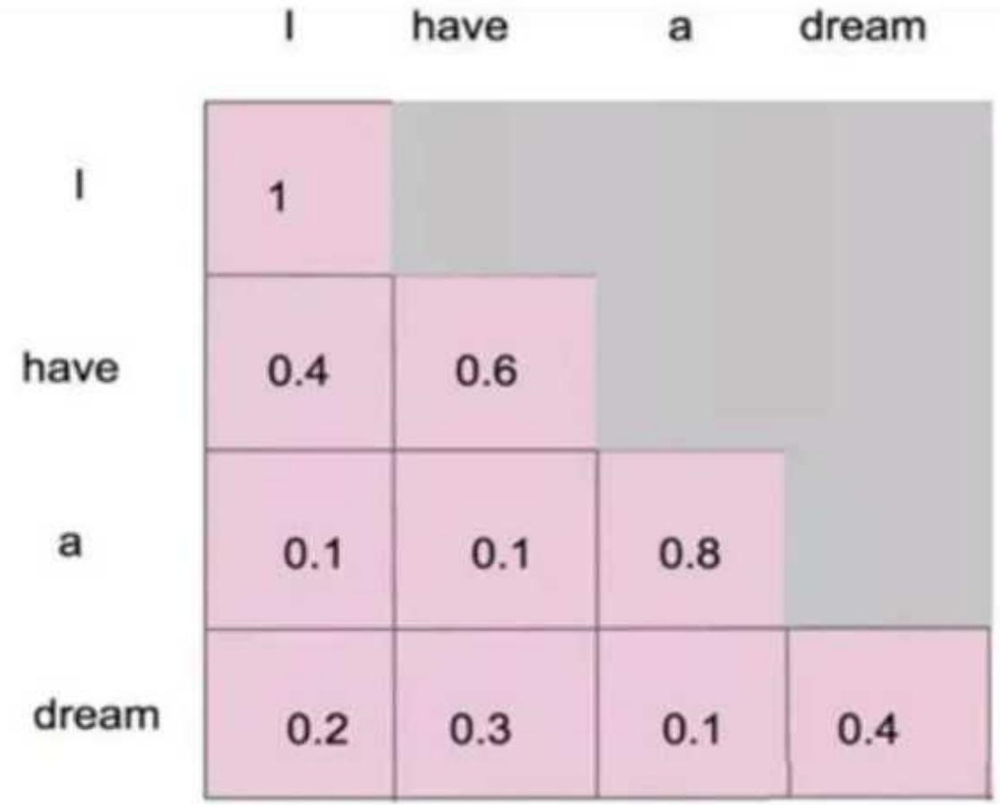  
图4-3 因果掩码器

接下来，我们将详细解读自回归模型的输入与输出结构。相较于早期的经典注意力架构模型，其输入和输出设计在保持相似性的基础上，呈现出了更为复杂的特质。

这是因为我们不仅需要提供与前期模型完全一致的输入序列，还需对它进行关键的错位操作。这一创新性步骤的引入为模型注入了新的活力，使模型在处理序列数据时能够展现出更加灵活和高效的能力。

以输入“你好人工智能”为例，在模型中，这段文字将被细致地表征为每个字符或词在输入序列中占据的特定位置，如图4-4所示。在这个过程中，我们深入挖掘每个字符或词的语义含义以及它们在整个序列中出现的位置信息。通过这种分析方式，自回归模型能够从多个维度捕获输入序列中的丰富信息，从而显著提高模型对自然语言的综合理解和处理能力。这样的处理方式使得模型在处理复杂多变的自然语言任务时，能够表现出更强的灵活性和准确性。

  
图4-4 一个输入表述

但是，此时却不能将其作为单独的输入端或输出端输入模型中进行训练，而是需要对其进行错位表示，如图4-5所示。

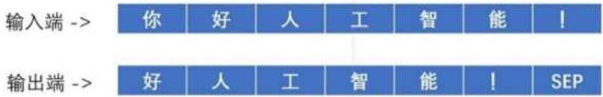  
图4-5 错位表示

可以看到，在当前情景下，我们构建的数据输入和输出具有相同的长度，然而在位置上却呈现一种错位的输出结构。这种设计旨在迫使模型利用前端出现的文本，预测下一个位置会出现的字或词，从而训练模型对上下文信息的捕捉和理解能力。最终，在生成完整的句子输出时，会以自定义的结束符号SEP作为标志，标识句子生成的结束。

注意，对于输出结果来说，当使用经过训练的模型进行下一个真实文本预测时，相对于我们之前学习的编码器文本输出格式，输出的内容可能并没有相互关联，如图4-6所示。

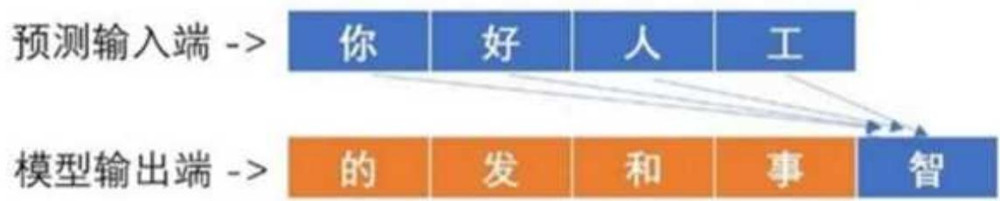  
图4-6 自回归模型的输入和输出

可以看到，这段模型输出的前端部分和输入文本部分毫无关系（橙色部分，参见配套资源中的相关文件），而仅仅是对输出的下一个字符进行预测和展示。

因此，当我们需要预测一整段文字时，需要采用不同的策略。例如，可以通过滚动循环的方式，从起始符开始，不断将已预测的内容与下一个字符的预测结果进行黏合，逐步生成并展示整段文字。这样的处理方式可以确保模型在生成长文本时保持连贯性和一致性，从而得到更加准确和自然的预测结果。

# 4.2 进阶篇实战1：无须位置表示的酒店评论情感判断

在我们完成自回归模型的基本内容后，现在已经具备了足够的知识来探索这一强大工具在具体应用中的潜力。接下来，我们将通过实战一个酒店评论生成的案例，来深化对自回归模型的理解，并体验其作为文本生成工具的独特魅力。

在这个实战项目中，我们将利用普通模型来生成针对酒店的评论。这类评论在旅游和酒店行业中具有极高的价值，因为它们能够提供关于服务质量、设施条件以及客户满意度的直接反馈。通过生成这些评论，我们不仅可以帮助酒店更好地了解客户的需求和期望，还能为潜在的客户提供有价值的参考信息。

# 4.2.1 数据集的准备与读取

为了实现这一目标，我们首先需要收集并准备一份包含大量真实酒店评论的数据集。这份数据集将作为我们训练自回归模型的基础，模型将通过学习这些评论中的语言模式和内容结构，来逐渐掌握生成类似文本的能力。

在数据准备完成后，我们将进入模型的训练阶段。在这一阶段中，我们将利用深度学习框架来构建和训练自回归模型。通过不断地调整模型参数和优化训练策略，我们将努力提升模型在生成评论时的准确性和流畅性。

作者在这里准备了一份包含7765条评论的数据集，并根据情感偏向将其标注为1（正向）和0（负向）。部分数据如下：

1,自助早餐非常好，服务很周到，下次还会去住。  
1,离机场很近，房间很大，里面还有一面镜子  
1,性价比较高，硬件设施比过去更加改善。满意！

0,"设施较差,服务低下,   
0,"感觉环境,服务方面还不够位  
0,事实上只能算一个好一点的招待所，只是大堂装修得好一点而已

而对于数据集的准备，首先需要完成文本与分类结果的提取，代码如下：

```python
with open(".././dataset/ChnSentiCorp.txt","r",encoding="utf-8") as f:  
    for line in f:  
        result = line.strip().split("\\")  
        label = int(result[0])  
        text = result[1] 
```

通过对文本中每行的读取和划分，我们可以获取对应的文本内容以及代表情感标识的数字。

# 4.2.2 使用sentencepiece建立文本词汇表

在第3章中，我们采用了逐字读取的方法来构建相应的文本内容。这种方法的优势显而易见，其简洁性和易操作性使得我们只需对每个字进行划分，便能轻松地处理和分析文本数据。然而，这种基于单个文字的划分方式在表达文本内容的完整含义时存在一定的局限性。

为了更好地捕捉文本中的深层含义和上下文关系，我们需要寻求一种更高阶的文本划分方法。相较于逐字处理，根据语义对文本进行更细致的划分能够更全面地揭示文本的内在结构和意义。这种方法不仅考虑了单个文字的含义，还进一步探索了文字之间的关联和组合方式，从而能够更准确地反映文本的整体意图和信息。

为了实现这个目的，我们采用sentencepiece建立对应的文本词汇表，代码如下：

```python
texts = []
with open("../dataset/ChnSentiCorp.txt", mode="r", encoding="UTF-8") as emotion_file:
    for line in tqdm(emotion_file.readlines():
        line = line.strip().split("\\.")
        text = ".".join(line[1:]) + "*'
        texts.append(text)
# 将训练文本数据写入'train_data.txt'文件中
with open('./vocab/train_data.txt', 'w', encoding='utf-8') as file:
    # 遍历train_text列表中的每一个句子
    for sentence in texts:
        # 将句子写入文件，并在每个句子后面添加一个换行符
        file.write sentence + '\n')
# 使用sentencepiece的SentencePieceTrainer类的Train方法训练分词模型
# 指定输入文件为'train_data.txt'，模型前缀为'.data/my_model'，并设置词汇表大小为3120
spm.SentencePieceTrainer.Train(['--input=','vocab/train_data.txt',
--model_prefix=','vocab/my_model --vocab_size=3120']) 
```

首先读取文本内容，然后根据步骤将文本写入文本库中。下一步是通过命令行的形式完成词库的训练。这里需要注意的是，词汇表的大小需要根据实际需求手动设置。训练结束后，在指定的文件夹中会生成两个新的文件my_model.model和my_model.vocab。而vocab就是我们生成的可视化词汇表。

```txt
<unk> 0  
<s>0  
</s> 0  
， -2.60627  
的 -3.39513  
-3.6643  
了 -4.23578  
※ -4.55821  
是 -4.60923  
酒店 -4.68633  
不 -4.70485  
我 -4.8063  
在 -4.92763  
… 
```

至于其使用方法，我们可以载入生成的sentencepiece分词器的model，再对文本内容进行tokenizer处理。完整代码如下：

import sentencepiece asspm   
from tqdm import tqdm   
class Tokenizer: def init_(self, model_path $=$ './vocab/my_model.model'): super().init_() self.sp $=$ spm.SentencePieceProcessor() self.sp.Load(model_path) def encode(self,text): token $=$ self.sp EncodeAsIds(text) return token defdecode(self,token): _text $=$ self.sp DecodeIds(token.tolist()) return (_text) def vocab_size(self): return len(self.sp)

# 4.2.3 编码情感分类数据集

下面我们使用训练好的编码器对文本情感内容进行编码处理，一个简单的编码方式如下：

import numpy as np   
from tqdm import tqdm   
import torch   
import tokenizer   
tokenizer emo $=$ tokenizerTokenizer(model_path $\equiv$ "/vocab/my_model.model")   
print(tokenizer emo.vocab_size())   
max_length $= 48$ token_list $= []$ label_list $= []$ with open(".././dataset/ChnSentiCorp.txt","r",encoding $\equiv$ "utf-8")as f: for line in f: result $=$ line.strip().split("\\") label $=$ int(result[0]) text $=$ result[1] token $=$ tokenizer emo.encode(text) token $=$ token[:max_length] $^+$ [0]* (max_length - len(token)) token_list.append(token) label_list.append(token)   
token_list $=$ np.array(token_list)   
label_list $=$ np.array[label_list]

此时的token_list就是存储的token表示，而label_list是标记结果。

# 4.2.4 基于新架构文本分类模型设计

接下来对模型进行设计。在这里，我们直接使用前面的注意力模型，并通过堆叠的形式设置多个Block，从而完成注意力模型的编写。注意力部分代码如下：

from torch import Tensor   
import torch,math,einops   
def softclamp(t, value $= 50$ .):   
```
```
这个函数实现了一种“软夹持”操作。它首先将输入张量t除以一个给定的值（默认为50.），然后应用tanh函数，最后乘以相同的值。tanh函数将输入映射到[-1，1]的范围内，而通过这种变换，原始输入的范围被“软”限制在了一个由value参数控制的范围内。这种操作可以在需要限制数据范围但不希望引入硬截断的情况下使用
```
return (t / value).tanh() * value
```
class MultiHeadAttention(torch.nnModule):
    def __init__(self,d_model,attention_head_num):
        super(MultiHeadAttention,self).__init__(）
        self attendsion_head_num = attention_head_num
        self.d_model = d_model
        assert d_model % attention_head_num == 0
        self_scale = d_model ** -0.5
        self.sftcap_value = 50.
        self.per_head_dmodel = d_model // attention_head_num
        self.qkv_layer = torch.nn.Linear(d_model,3*d_model)
        self.out_layer = torch(nn.Linear(d_model,d_model)
        def forward(self,embedding,past_length=0):
            qky_x = self.qkv_layer(embedding)

```txt
q, k, v = torch.split(qky_x, split_size_orSections= self.d_model, dim=-1)  
q = einops.rearrange(q, "b s (h d) -> b h s d", hself attendsion_head_num)  
k = einops.rearrange(k, "b s (h d) -> b h s d", hself attendsion_head_num)  
v = einops.rearrange(v, "b s (h d) -> b h s d", hself attendsion_head_num)  
q = q * self_scale  
sim = einops.einsum(q, k, 'b h i d, b h j d -> b h i j')  
sim = softclamp(sim, self.softcap_value)  
mask_value = -torch+finfo(sim.dtype).max  
i, j = sim.shape[-2:]  
causal_mask = torch.ones((i, j),  
dtype=torch(bool).triu(past_length).to(embedding_device)  
sim = simmasked_fill(causal_mask, mask_value)  
attn = sim softmax(dim=-1)  
out = einops.einsum(attn, v, 'b h i j, b h j d -> b h i d')  
embedding = einops.rearrange(out, "b h s d -> b s (h d)")  
embedding = self.out_layer(embedding)  
return embedding 
```

下一步是结合新的激活函数构建feedforward层，代码如下：

import torch   
class Swiglu(torch.nnModule): def__init__(self, hidden_size=312, add.bias_linear=False): super(Swiglu,self).__init_( self.add.bias $=$ add.bias_LINEAR self.hidden_size $\equiv$ hidden_size self.dense_h_to_4h $\equiv$ torch.nn.Linear( hidden_size, hidden_size\*4, bias $\equiv$ self.add.bias ) def swiglu(x): x $\equiv$ torch.chunk(x,2,dim=-1) return torch.nn.Functional.silu(x[0])* x[1] self.activation_func $\equiv$ swiglu self.dense_4h_to_h $\equiv$ torch.nn.Linear( hidden_size\*2, hidden_size, bias $\equiv$ self.add.bias ） def forward(self, hidden_states): intermediate_parallel $=$ self.dense_h_to_4h(hidden_states) intermediate_parallel $=$ selfactivation_func( intermediate_parallel) output $=$ self.dense_4h_to_h( intermediate_parallel) return output

在这里，除对经典的SwiGLU激活函数进行使用外，还额外添加了全连接缩放层，对输入的向量进行表示。

此时，基于我们设置的注意力模型以及前馈层feedforwad代码，构建注意力模块attentionBlock，代码如下：

from torch import Tensor   
import torch, math, einops   
from module import attentionModule,feedforward_layer   
class EncoderBlock(torch.nn.Module): def_init_self,d_model,num_heads): super(EncoderBlock,self).init_() self.d_model $\equiv$ d_model self num_heads $=$ num_heads self attendsion_norm $\equiv$ torch.mm.RMSNorm(d_model) self.selfattention $\equiv$ attentionModule.MultiHeadAttention(d_model,num_heads) self. ffn $\equiv$ feedforward_layer.Swiglu(d_model) def forward(self,embedding): residual $\equiv$ embedding embedding $\equiv$ self attendsion_norm(embedding) embedding $\equiv$ self.self attentive(embedding) embedding $\equiv$ self.ffn(embedding) return embedding +residual   
class Encoder(torch(nn.Module): def_init_self,d_model,num_heads,num_layers-3): super(Encoder,self).init_(self.layers $\equiv$ torch(nn.ModuleList([EncoderBlock(d_model,num_heads) for in range(num_layers)]) def forward(self,embedding): for layer in self.layers: embedding $\equiv$ layer(embedding) return embedding

Block的构建是通过多个注意力层（attention）和前馈层（feed-forward）共同完成的，而Encoder则是在多个Block堆叠的基础上构建的。通过堆叠多个Block模块，模型可以对特征进行逐层抽取。这种设计的优点在于，不同层次的Block可以关注不同的特征，从多个维度对结果进行不同角度的分析，从而提升模型的表达能力和泛化性能。

最终模型的设计如下：

import torch   
import attentionModule_noRoPE   
class Classifier(torch.mm.Module): def __init__(self): super(Classifier, self).__init_(selfembedding_layer $=$ torch.mm.Embedding(3120,312) self encoder $=$ attentionModule_noRoPE.Encoding(d_model $\equiv$ 312,num_heads $\equiv$ 6) self.logits $=$ torch.mm.Linear(14976,2) def forward(self,x): embedding $=$ selfembedding_layer(x) embedding $=$ selfencoder(embedding) embedding $=$ torch.mm.Flatten() (embedding) logits $=$ self.logits(embedding) return logits

这是基于新的注意力机制设计的文本分类模型。在这个模型中，我们使用带有注意力机制的编码器作为特征提取器，随后通过logits层作为分类器，对结果进行二分类计算。

# 4.2.5 情感分类模型的训练与验证

最后，完成情感分类模型的训练与验证。在这里，我们首先对数据集进行分割，切分出训练集与验证集，代码如下：

```txt
token_list = np.array(token_list)
label_list = np.array labelled_list)
np.random.seed(100); np.random.shuffle(token_list)
np.random.seed(100); np.randomshuffle labelled_list) 
```

情感分类模型的训练与验证代码如下：

import torch   
import attentionModule_noRoPE   
from tqdm import tqdm   
classClassifier(torch.mm.Module): def_init_self): super(Classifier,self).init_(selfembedding_layer $=$ torch.mm.Embedding(3120,312) self encoder $=$ attentionModule_noRoPE.Encoding(d_model $\equiv$ 312，num_heads=6) self.logits $=$ torch.mm.Linear(14976,2) defforward(self,x): embedding $=$ self.Embedding_layer(x)

embedding $=$ selfencoder(embedding) embedding $\equiv$ torch.nn.Flatten() (embedding) logits $=$ self.logits(embedding) return logits   
from torch.utils.data import DataLoader   
import get_dataset   
BATCH_SIZE $= 128$ DEVICE $=$ "cuda" if torch.cuda.is-available() else "cpu"   
model $=$ Classifier().to(DEVICE)   
train_dataset $=$ get_dataset.TextSamplerDataset(get_dataset_token_list,   
get_dataset.label_list)   
trainloader $=$ DataLoader(train_dataset,batch_size $\equiv$ BATCH_SIZE，shuffle $\equiv$ True) optimizer $=$ torch.optimAdamW(model.params(),lr $= 2e - 4$ 1lr_scheduler $=$ torch.optim.lr_scheduler.CosineAnnealingLR(optimizer,T_max $\coloneqq$ 1200, eta_min $= 2e - 5$ last_epoch=-1) criterion $=$ torch.mm.CrossEntropyLoss( ignore_index=-100) #假设验证数据集已经准备好 val_dataset $=$ get_dataset.TextSamplerDataset(get_dataset.val_token_list,   
get_dataset.val_label_list) valloader $=$ DataLoader(val_dataset,batch_size $\equiv$ BATCH_SIZE，shuffle $\equiv$ False) for epoch in range(12): #训练阶段 model.train() pbar $=$ tqdm(trainloader,total $\equiv$ len(trainloader)) for token_inp, label_inp in pbar: token_inp $=$ token_inp.to(DEVICE) label_inp $=$ label_inp.to(DEVICE).long() logits $=$ model(token_inp) loss $=$ criterion(logits, label_inp) optimizer.zero_grad() loss.backup() optimizer step() lr_scheduler step() #执行优化器 pbar.set_description(f"epoch:(epoch + 1), train_loss:(loss.item():.5f), lr:(lr_scheduler.get_last_lr() [0] \*1000:.5f)"） #验证阶段 model.eval() total_val_loss $= 0$ correct $= 0$ with torch.no_grad(): for token_inp, label_inp in valloader:

```python
token_inp = token_inp.to(DEVICE)
label_inp = label_inp.to(DEVICE).long()
logits = model(token_inp)
loss = criterion(logits, label_inp)
total_val_loss += loss.item()
# 计算准确率
_, predicted = torch.max(logits, 1)
correct += (predicted == label_inp).sum().item()
avg_val_loss = total_val_loss / len(valloader)
val.accuracy = correct / len(val_dataset)
print(f'Epoch (epoch + 1), Validation Loss: (avg_val_loss:.5f), Validation Accuracy: (val_accuracy:.5f)') 
```

最终打印结果如下：

```txt
Epoch 1, Validation Loss: 0.54762, Validation Accuracy: 0.72813  
Epoch 2, Validation Loss: 0.52357, Validation Accuracy: 0.73750  
Epoch 3, Validation Loss: 0.53501, Validation Accuracy: 0.78438  
...  
Epoch 10, Validation Loss: 0.72541, Validation Accuracy: 0.78125  
Epoch 11, Validation Loss: 0.74452, Validation Accuracy: 0.79375  
Epoch 12, Validation Loss: 0.80455, Validation Accuracy: 0.7975 
```

可以看到，经过12轮训练，在分割的单独测试集上，模型准确率达到0.7975。请读者自行运行代码验证结果。

# 4.3 进阶篇实战2：基于自回归模型的酒店评论生成

我们使用新架构的模型完成了情感分类任务。可以看到，引入注意力机制能够很好地对特征进行抽取，从而高效地完成二分类的情感分类任务。然而，使用自注意力机制的模型并不仅限于此。除经典的分类任务外，我们还可以通过增加旋转位置编码来扩展模型的功能，使其能够胜任文本生成任务。

# 4.3.1 数据集的准备与读取

在4.2节中，我们已经完成了情感数据集的基本读取，并掌握了汉字文本内容编码的方法。对于本节的任务，即基于自回归模型的酒店评论生成，数据集的准备与读取代码如下：

import numpy as np   
from tqdm import tqdm   
import torch   
import tokenizer   
tokenizer_emo $\equiv$ tokenizer Tokenizer(model_path $=$ "/vocab/my_model.model")

```python
print(tokenizer emo.vocab_size())
max_length = 48
token_list = []
with open("\\././dataset/ChnSentiCorp.txt", mode="r", encoding="UTF-8") as emotion_file:
    for line in tqdm(emotion_file.readlines():
        line = line.strip().split("\\.")
        text = ".join(line[1:]) + '※'
        if True:
            token = tokenizer emo.encode(text)
            for id in token:
                token_list.append(id)
            token_list = torch.tensor(token_list * 2)
class TextSamplerDataset(torch.utils.data.Dataset):
    def __init__(self, data = token_list, seq_len = max_length):
        super().__init__()
        self.data = data
        self SEQ_len = seq_len
    def __getitem__(self, index):
        rand_start = torch.randint(0, self.data.size(0) - self SEQ_len, (1,))
        full_seq = self.data[rand_start : rand_start + self SEQ_len + 1].long()
        return full_seq[-1], full_seq[1:] 
```

首先，我们对文本内容进行读取。需要注意的是，对于每行文本内容，我们不再像上一节进行情感判定时那样，将每行作为独立的样本进行存储，而是采用了首位相连的形式进行添加。这种处理方式符合文本生成任务的训练需求，即模型只需按照指定格式生成文本内容，而无须理解其具体含义。

在TextSamplerDataset进行采样时，我们也是随机截取一段特定文本进行输出。随机截取可以在一定程度上增加文本的多样性，从而增强模型的泛化能力和健壮性。

# 4.3.2 基于自回归文本生成模型的设计

接下来，我们需要实现基于自回归文本生成模型的设计。首先是基本的模型设计，相对于4.2节完成的分类模型，由于自回归文本生成模型是生成任务，需要额外添加位置编码，即在4.1节讲解的旋转位置编码。添加了旋转位置编码的注意力模型如下：

```python
class MultiHeadAttention_MHA(torch.nnModule): def __init__(self, d_model, attention_head_num): super(MultiHeadAttention_MHA, self).__init() selfattention_head_num = attention_head_num 
```

```python
self.d_model = d_model
assert d_model % attention_head_num == 0
self_scale = d_model ** -0.5
self.softcap_value = 50.
self.per_head_dmodel = d_model // attention_head_num
    self.qkv_layer = torch.nn.Linear(d_model, 3 * d_model)
    self.rotary_embedding = RotaryEmbedding(self.per_head_dmodel // 2,
use_xpos=True)
    self.out_layer = torch.nn.Linear(d_model, d_model)
def forward(self, embedding, past_length = 0):
    qky_x = self.qkv_layer(embedding)
q, k, v = torch.split(qky_x, split_size_orSections= self.d_model, dim=-1)
q = einops.rearrange(q, "b s (h d) -> b h s d", hself attendsion_head_num)
k = einops.rearrange(k, "b s (h d) -> b h s d", hself attendsion_head_num)
v = einops.rearrange(v, "b s (h d) -> b h s d", hself attendsion_head_num)
q, k = self.rotary_embedding.trainable_and_keys(q, k, seq_dim=2)
q = q * self_scale
sim = einops.einsum(q, k, 'b h i d, b h j d -> b h i j')
#sim = softclamp(sim, self.softcap_value)
mask_value = -torch+finfo(sim.dtype).max
i, j = sim.shape[-2]
causal_mask = torch.ones((i, j),
dtype=torch bool).triu(past_length).to(embedding_device)
sim = simmasked_fill(causal_mask, mask_value)
attn = sim.softmax(dim=-1)
out = einops.einsum(attn, v, 'b h i j, b h j d -> b h i d')
embedding = einops.rearrange(out, "b h s d -> b s (h d).")
embedding = self.out_layer(embedding)
return embedding 
```

其中的参数past_lengt $_ { 1 = 0 }$ 的作用是对因果掩码进行设计，在这里triu(past_length)函数的作用是从past_length位置开始，生成一个对三角矩阵，对此不理解的读者可以尝试如下函数：

```python
causal_mask = torch.ones((5, 5), dtype=torch(bool).triu(0)  
causal_mask = torch.ones((5, 5), dtype=torch(bool).triu(2) 
```

打印结果并比较其中的内容。

而基于标准注意力层完成的自回归模型如下：

from torch import Tensor   
import torch, math, einops   
from module import attention_module,feedforward_layer   
class EncoderBlock(torch(nn.Module): def_init_self,d_model,num_heads): super(EncoderBlock,self).init_() self.d_model $\equiv$ d_model self(num_heads $\equiv$ num_heads self attendsion_norm $\equiv$ torch.mm.RMSNorm(d_model) self.selfattention $\equiv$ attentionModule.MultiHeadAttention(d_model,num_heads) self. $ffn =$ feedforward_layer.Swiglu(d_model) def forward(self,embedding): residual $=$ embedding embedding $\equiv$ self attendsion_norm(embedding) embedding $\equiv$ self.selfattention(embedding) embedding $\equiv$ self. $ffn$ (embedding) return embedding $^+$ residual   
class Encoder(torch(nn.Module): def_init_self,d_model,num_heads,num_layers $= 3$ .. super(Encoder,self).init_() self.layers $\equiv$ torch(nn.Module[(EncoderBlock(d_model,num_heads) for_in range(num_layers)]) def forward(self,embedding): for layer in self.layers: embedding $\equiv$ layer(embedding) return embedding   
class GeneratorModule(torch(nn.Module): def_init_self,d_model,num_heads,vocab_size $= 3120$ .. super(GeneratorModule,self).init_() self_embedding_layer $\equiv$ torch(nn.Embedding(vocab_size,d_model) self encoder $\equiv$ Encoder(d_model,num_heads) self.logits $\equiv$ torch(nn.Linear(d_model,vocab_size) def forward(self,x): embedding $\equiv$ self_embedding_layer(x) embedding $\equiv$ selfencoder(embedding) logits $\equiv$ self.logits(embedding) return logits

同样地，在模型设计中，我们采用了Block模块化的设计思想。通过堆叠多个Block模块，对文本的特征进行逐层抽取，并在logits层进行转换后输出。

另外，需要注意的是，由于我们的目标是完成自回归生成任务，因此在输出时需要一个专门的输出格式函数来处理输出。相关代码如下：

```python
@torch.no_grad()
def generate(self, prompt=None, n_tokens_to_gen=20, temperature=1., top_k=3, sample=False, eos_token=2, device="CUDA"): 
    ...
    根据给定的提示（prompt）生成一段指定长度的序列。 
参数:
- seq_len: 生成序列的总长度。
- prompt: 序列生成的起始提示，可以是一个列表。
- temperature: 控制生成序列的随机性。温度值越高，生成的序列越随机；温度值越低，生成的序列越确定。
- eos_token: 序列结束标记的token ID，默认为2。
- return_seq_without_prompt: 是否在返回的序列中不包含初始的提示部分，默认为True。
返回:
- 生成的序列（包含或不包含初始提示部分，取决于return_seq_without_prompt参数的设置）
...
# 将输入的prompt转换为torch张量，并确保它在正确的设备上（如GPU或CPU）
self.eval()
# prompt = torch.tensor_prompt)
prompt = prompt.train().detach().requires_grad(False).to(device)
input_ids = prompt
for token_n in range(n_tokens_to_gen):
    with torch.no_grad():
        indices_to_input = input_ids
        next_token_logits = self.forward(indices_to_input)
        next_token_logits = next_token_logits[:, -1]
    proba = torch(nn softmax(next_token_logits, dim=-1) * temperature (batch, vocab_size) = proba.shape
if top_k is not None:
    (values, indices) = torch.topk(probs, k=top_k)
    proba[probs < values[:, -1, None]] = 0
    proba = proba / proba.sum(axis=1, keepdims=True)
if sample:
    next Indices = torch.multinomial(probs, num_samples=1)
else:
    next Indices = torch.argmax(probs, dim=-1)[:, None]
input_ids = torch.cat([input_ids, next Indices], dim=1)
return input_ids 
```

在上面的代码中，我们按照自回归模型的性质，每次根据传入的文本生成下一个字符，之后对获取的字符进行转换，再拼接到原始文本中，这样依次拼接的结果就是获取到的完整的生成内容。

# 4.3.3 评论生成模型的训练

下面进行评论生成模型的训练。在这里，我们可以仿照前面章节训练的过程，直接对模型进行训练，代码如下：

import math   
from tqdm import tqdm   
import torch   
from torch.utils.data import DataLoader   
import model   
device $=$ "cuda"   
model $=$ model.GeneratorModule(d_model $\equiv$ 312,num_heads $\equiv$ 6)   
model.to(device)   
save_path $=$ ".saver/generator_model.pth"   
model.load_state_dict(torch.load(save_path),strict $\equiv$ False)   
BATCH_SIZE $= 360$ seq_len $= 48$ import get_dataemotion   
train_dataset $=$ get_dataemotion.TextSamplerDataset(get_dataemotion_token_list,seq_len $\equiv$ seq_len) trainloader $=$ (DataLoader(train_dataset,batch_size=BATCH_SIZE,shuffle=True)) optimizer $=$ torch.optim.AdamW(model.params(),lr $= 2\mathrm{e} - 4)$ lr_scheduler $=$ torch.optim.lr_scheduler.CosineAnnealingLR(optimizer,T_max = 1200, eta_min $\equiv$ 2e-5,last_epoch=-1) criterion $=$ torch.nn.CrossEntropyLoss()   
for epoch in range(60): pbar $=$ tqdm(trainloader,total $\equiv$ len(trainloader)) for token_inp,token_tgt in pbar: token_inp $=$ token_inp.to(device) token_tgt $=$ token_tgt.to(device) logits $=$ model(token_inp) loss $=$ criterion(logits.view(-1, logits.size(-1)), token_tgt.view(-1)) optimizer.zero_grad() loss.backup() optimizer step() lr_scheduler step() #执行优化器 pbar.set_description(f"epoch:{epoch +1},train_loss:{loss.item():.5f}, lr:{lr_scheduler.get_last_lr([0]*1000:.5f)}   
torch.save(model.state_dict(),save_path)

读者可以自行尝试运行代码查看结果。

# 4.3.4 使用训练好的模型生成评论

接下来，我们使用训练好的模型生成对应的评论。根据自回归模型的指引，我们只需要设置一个起始内容，即可根据需要生成特定的文本。代码如下：

import torch   
import model   
import tokenizer   
tokenizer emo $=$ tokenizerTokenizer(model_path $\equiv$ "/vocab/my_model.model") device $=$ "cuda" model $=$ model.generatorModule(d_model=384,num_heads=6) model.to(device) save_path $=$ ".saver/generator_model.pth" model.load_state_dict(torch.load(save_path),strict=False) model.to(device) model.eval() for_in range(10): text $=$ "位置" prompt_token $=$ tokenizer emo.encode(text) prompt_token $=$ torch.tensor([prompt_token]).long().to(device) result_token $=$ model_generateprompt=prompt_token, n_tokens_to_gen $= 64$ ,top_k $= 5$ ,temperature $= 0.99$ device $\equiv$ device)[0].cpu().numpy() text $=$ tokenizer emodecode(result_token).split("※")[0] print(text)

部分生成结果如下：

位置很好，就在火车站对面，离火车站很近的了，交通很便利，从机场来讲是到市中心，去机场的机场，可以坐在

车上。

位置不错，在市中心，交通方便，房间也很大，服务也很好，就是房间的隔音效果比较差，而且很多人性化的服务，

服务也不错，总的来说很满意

位置很不错，离火车站很近，也很方便。房间装修很好就是电视太小。

位置很好，就在繁华的路边，出门走5分钟就可以到了。总体来说还可以。

位置很好，就在火车站附近，步行到中心也很方便。房间也很干净，就是有一点点小，不过还是挺干净的，服务员

也很有礼貌，有机会会来度假区住这样的酒店

读者可以自行尝试学习。

# 4.4 本章小结

在本章中，我们深入探讨了自回归模型在文本情感判定和文本生成任务中的应用。自回归模型以其能够预测序列中下一个元素的能力而闻名，这使得它们在处理文本数据时表现出色。我们首先介绍了自回归模型的基本原理，然后通过具体案例展示了如何利用这些模型来分析文本中的情感倾向。

进一步地，我们详细阐述了一种特殊的自回归模型——加载了旋转位置编码（RoPE）以及新架构的文本生成模型。可以看到，新架构的文本生成模型不仅提高了模型对文本结构的理解能力，还增强了生成文本的连贯性和相关性。

随着自回归模型和RoPE技术的不断发展，我们相信这些先进的方法将为文本处理领域带来革命性的变化，推动自然语言处理技术向更高层次的智能发展。在未来的研究中，我们期待看到更多创新的模型和算法，以解决当前面临的挑战，并解锁文本生成的无限可能。

# 第5章

# 注意力机制详解之高级篇

在之前的章节中，我们已经详尽地探讨了基于自编码与自回归架构的生成模型，并借助实例清晰地展现了这两种架构在文本生成领域中的实际应用以及它们之间的异同。自编码模型凭借其卓越的信息压缩与重构能力，在捕捉文本深层特征方面展现出了不俗的实力；而自回归模型则依靠其强大的序列建模能力，在产出流畅连贯的文本方面令人瞩目。

为了进一步阐释基于自回归架构的注意力机制，我们还特别探讨了旋转位置编码的设计与运用。实践表明，加载了位置编码的注意力模型在文本生成任务上表现更为出色，能够更精准地把握文本中的位置信息，从而提升生成内容的质量。

在本章中，我们将把注意力转向注意力机制的另一重要组成部分——前馈层（Feedforward）。我们将首先引入一种新颖的模型：混合专家模型（Mixture of Experts，MoE），如图5-1所示。这种模型通过集成多个专家的知识，能够在处理复杂任务时展现出更高的灵活性和泛化能力。

  
图5-1 混合专家模型

我们将探讨如何把混合专家模型巧妙地融入注意力机制中，具体做法是用它来替换传统的前馈层。这一创新设计旨在充分利用混合专家模型在处理多样化信息时的优势，从而进一步提升注意力机制的效能。我们相信，通过这种方式的改进，注意力机制将能够在文本生成等任务中发挥出更为强大的潜力，为自然语言处理领域带来新的突破。

# 5.1 替代前馈层的混合专家模型详解

混合专家模型（MoE）是一种深度学习架构，它通过集成多个专家模型（即子模型）来提升整体模型的预测性能和效率。这种架构主要由两部分组成：门控网络（路由器机制）和多个专家网络。每个专家网络专门处理输入数据的一个子集或特定特征，而门控网络则负责根据输入动态地选择合适的专家模型进行处理，它们之间使用专门的负载平衡与优化对资源进行调配。

MoE模型的优势包括提高模型的灵活性、性能以及计算资源的高效利用，尤其在处理复杂或多样化任务时表现突出。然而，设计和训练MoE模型也面临一些挑战，如平衡专家的数量和质量，以及优化门控网络的决策能力。MoE模型在自然语言处理、计算机视觉和推荐系统等领域有着广泛的应用前景。

# 5.1.1 混合专家模型的基本结构

混合专家模型是一种深度学习中的集成学习方法，它通过组合多个专家模型（即子模型）来形成一个整体模型，旨在实现高效计算与优异性能的平衡。混合专家模型的基本结构如图5-2所示。

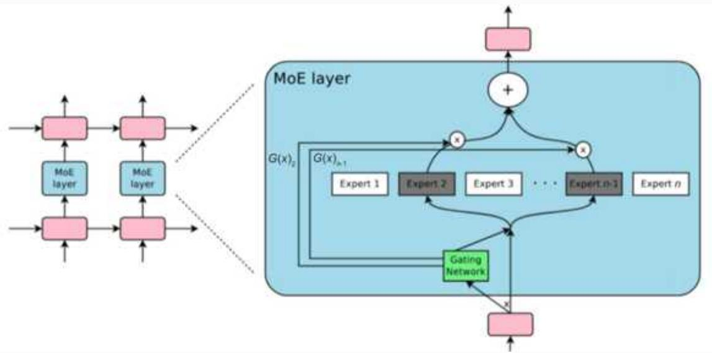  
图5-2 混合专家模型的基本结构

其基本结构可以归纳为以下几个关键要点。

（1）专家网络（Expert Networks）：

● MoE模型包含多个专家网络，每个专家网络都是一个独立的模型，负责处理某个特定的子任务。  
● 这些专家网络可以是小型的多层感知机（MLP）或更复杂的结构，如Transformer等，各自在其擅长的领域内进行训练和优化。

# （2）门控网络（Gating Network）：

● 门控网络是MoE模型中的另一个关键组件，负责根据输入数据的特征动态地决定哪个专家模型应该被激活以生成最佳预测。  
● 门控网络通常输出一个概率分布，表示每个专家模型被选中的概率。这个概率分布可以通过softmax函数来计算，确保所有专家的权重之和为1。

# （3）稀疏性（Sparsity）：

● 在MoE模型中，对于给定的输入，通常只有少数几个专家模型会被激活，这种特性使得MoE模型具有很高的稀疏性。  
● 稀疏性带来了计算效率的提升，因为只有特定的专家模型对当前输入进行处理，减少了不必要的计算开销。

# （4）输出组合（Output Combination）：

● 被激活的专家模型会各自产生输出，这些输出随后会被加权求和，得到MoE模型的最终输出结果。  
● 加权求和的过程根据门控网络输出的概率分布来进行，确保每个专家的贡献与其被选中的概率成正比。

混合专家模型通过动态地选择和组合多个专家模型来处理输入数据，实现了高效计算与优异性能的平衡。这种结构使得MoE模型能够根据不同的任务和数据，灵活地调整其计算复杂度和模型容量，从而在各种深度学习应用场景中展现出强大的潜力。

# 5.1.2 混合专家模型中的“专家”与“调控”代码实现

混合专家模型（MoE）作为一种深度学习结构，其核心思想在于通过集成多个专门化的网络组件（即“专家”）来提升模型的表示能力和泛化性能。MoE的两个主要组成部分相互协作，共同实现这一目标。

首先是专家（Experts）部分。在MoE架构中，传统的前馈神经网络层被扩展为一组可选择的专家网络。这些专家通常也是由前馈神经网络构成的，但每个专家都专注于处理特定类型的数据或特征。这种设计使得模型能够在不同的情境下调用最合适的专家，从而更精确地捕捉数据的复杂性和多样性。通过专家的专门化学习，MoE能够在训练过程中更有效地分配计算资源，提高模型的效率和性能。

作者实现了一个专家层，代码如下：

```python
class Expert(torch(nnModule):
    def __init__(self, n_embd):
        super().__init__()
        self.net = torch(nn Sequential(
            torch(nn.Linear(n_embd, 4 * n_embd),
            torch(nn.ReLU(), 
            torch(nn.Linear(4 * n_embd, n_embd)), 
            torch(nn.Dropout(0.1)), 
        )
    def forward(self, x):
        return self.net(x) 
```

门控网络无疑是MoE架构中的核心组件，其重要性在于它掌控着在推理和训练过程中专家的选择权。简而言之，门控网络充当着智能调度员的角色，根据输入数据的特性，精准地调配各个专家的参与程度。

在最基础的操作层面，门控网络的运作可以概括为以下步骤：首先，接收输入数据（ x），这个数据可能是一个特征向量，包含待处理任务的关键信息，如图5-3所示。

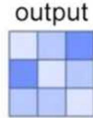

$$
\boldsymbol {H} (\boldsymbol {x})
$$

$$
=
$$

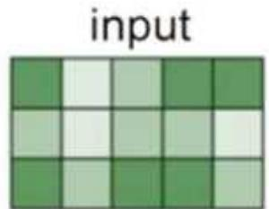

$$
x
$$

$$
\divideontimes
$$

routerweights

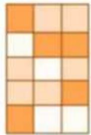  
图5-3 门控网络

$$
w
$$

接下来，我们将这个输入数据与路由器的权重矩阵（W）进行矩阵乘法运算。这一过程实质上是在对输入数据进行线性变换，目的是提取出对于后续专家选择至关重要的特征，如图5-4所示。

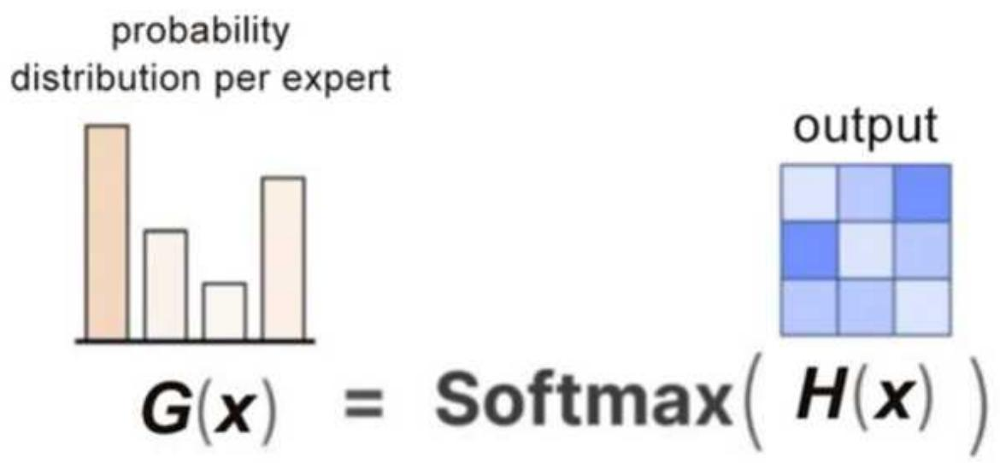  
图5-4 门控网络的调控

通过这种计算方式，门控网络能够为每个专家生成一个相应的得分，或称为“门控值”。这些门控值反映了在当前输入情境下，各个专家对于任务处理的适合程度。基于这些门控值，我们可以进一步应用softmax函数等策略，来确定每个专家在最终输出中的贡献权重，从而实现MoE架构中灵活且高效的专家组合与调用。

在最后阶段，我们利用门控网络（即路由器）生成的得分，与每个专家的输出进行结合，以选出最合适的专家贡献。具体来说，我们将每个专家的输出与其对应的门控得分相乘，这一步骤实质上是在对每个专家的预测结果进行加权。加权后的专家输出随后被相加，形成MoE模型的最终输出，如图5-5所示。

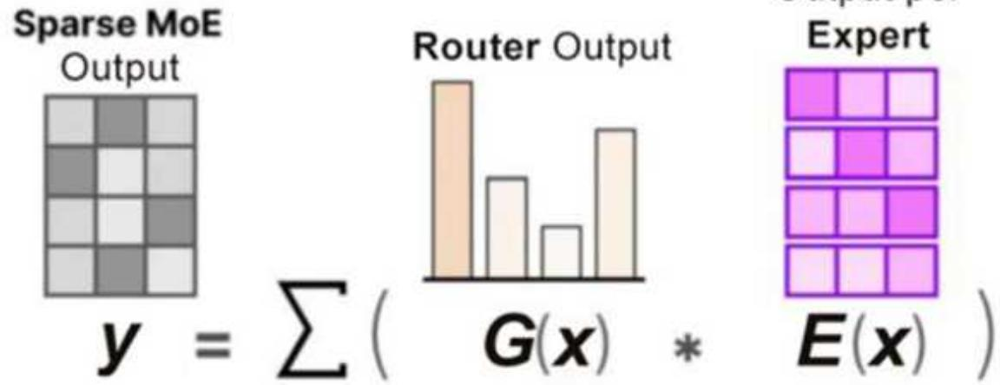  
图5-5 门控网络与专家模型的计算

现在，我们将整个过程综合起来，以便更全面地理解输入数据在门控路由器和专家之间的流动路径，如图5-6所示。

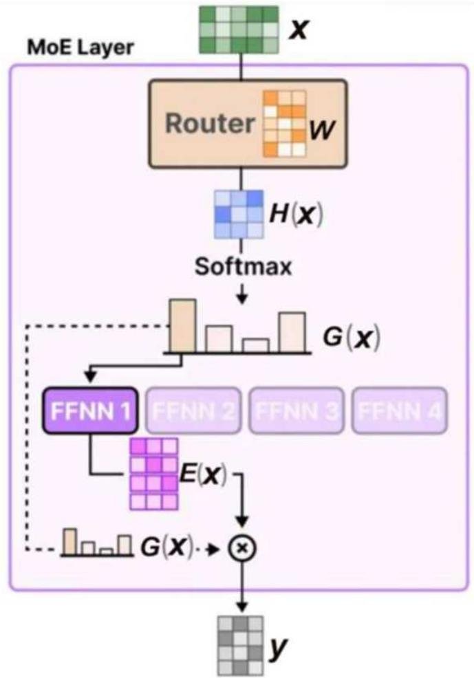  
图5-6 门控路由与专家模型的选择

● 输入数据的接收：首先，模型接收输入数据，这些数据可能是文本、图像或其他类型的特征向量，包含待处理任务的关键信息。  
● 路由器的处理：输入数据随后被传递给路由器（即门控网络）。在这里，数据与路由器的权重矩阵进行矩阵乘法运算，生成一组得分。这些得分反映了在当前输入情境下，各个专家对于任务处理的适合程度。  
● 专家的激活与输出：基于路由器的得分，一部分专家会被激活，而其余专家则保持休眠状态。被激活的专家会独立地处理输入数据，并生成各自的预测结果或输出向量。  
● 输出的加权与合并：每个被激活的专家的输出都会与其对应的门控得分相乘，进行加权处理。随后，这些加权后的输出被相加，形成MoE模型的最终预测结果。

通过这种方式，MoE架构能够在不同的输入情境下动态地选择合适的专家组合，以实现更高效、更精确的数据处理与预测。作者实现了对于门控机制与专家模型的稀疏MoE，其代码如下：

```txt
import torch
```

```python
class Expert(torch(nnModule):
    def __init__(self, n_embd):
        super().__init()
        self.net = torch(nn Sequential( torch(nn.Linear(n_embd, 4 * n_embd), #线性层，将维度扩大4倍 torch(nn.ReLU(), #ReLU激活函数 torch(nn.Linear(4 * n_embd, n_embd), #线性层，恢复原始维度 torch(nn.Dropout(0.1), #Dropout层，防止过拟合 
```

```python
def forward(self, x):
    return self.net(x) # 前向传播
# 定义一个Top-K路由器，用于选择前K个最佳专家
class TopKRouter(torch.nnModule):
    def __init__(self, n_embedding, num_experts, top_k):
        super(TopKRouter, self).__init()
        self.top_k = top_k # 选择前K个专家
        self.Linear = torch.nn.Linear(n_embedding, num_experts) # 线性层，输出为专家数量
def forward(self, mh_output):
    logits = self.linear(mh_output) # 通过线性层得到每个专家的得分
    # 选择得分最高的前K个专家及其索引
    top_k_logits, indices = logits.topk(self.top_k, dim=-1)
    # 创建一个与logits形状相同且全为-inf的张量
    zeros = torch.full_like(logits, float('-inf'))
    # 将前K个专家的得分填充到zeros中对应的位置
    sparse_logits = zeros.scatter(-1, indices, top_k_logits)
    # 对sparse_logits进行softmax操作，使得得分转换为概率分布
    router_output = torch.nnfunctional softmax(sparse_logits, dim=-1)
    return router_output, indices # 返回专家的概率分布和索引
# 定义一个稀疏的混合专家（MoE）模型
class SparseMoE(torch.nnModule):
    def __init__(self, n_embedding, num_experts, top_k):
        super(SparseMoE, self).__init()
        self_ROUTer = TopKRouter(n_embedding, num_experts, top_k) # 路由器，用于选择专家
        # 创建一个专家列表，每个专家都是一个Expert实例
        self.experts = torch.nnModuleList([Expert(n_embedding) for _ in range(num_experts)]) 
        self.top_k = top_k # 选择前K个专家
def forward(self, x):
    # 通过路由器得到专家的概率分布和索引
    gating_output, indices = selfROUTer(x)
    final_output = torch.zeros_like(x) # 初始化最终输出为与输入形状相同的全零张量
    # 将输入和路由器的输出展平，以便进行后续处理
    flat_x = x.view(-1, x.size(-1))
    flat_gating_output = gating_output.view(-1, gating_output.size(-1))
# 遍历每个专家，根据其概率分布对输入进行处理
for i, expert in enumerate(self.experts):
    # 找出当前专家是前K个专家的token
    expert_mask = (indices == i).any(dim=-1)
    flat_mask = expert_mask.view(-1) # 展平操作
    # 如果当前专家是至少一个token的前K个专家之一
    if flat_mask.any():
        # 选出这些token的输入
        expert_input = flat_x[flat_mask]
        # 将这些token输入给当前专家进行处理
        expert_output = expert(expert_input)
        # 获取当前专家对这些token的概率分布
        gating Scores = flat_gating_output[flat_mask, i].unsqueeze(1)
# 根据概率分布对专家的输出进行加权
weighted_output = expert_output * gating Scores
# 将加权后的输出累加到最终输出中对应的位置
final_output[expert_mask] += weighted_output.squeeze(1)
return final_output # 返回最终输出
```

上面的代码实现了一个稀疏的混合专家（Sparse Mixture of Experts，Sparse MoE）模型，其中包含一个路由器和多个专家。路由器负责根据输入选择前 K个最佳专家，而每个专家则是一个简单的全连接网络。最终输出是所有选定专家的加权输出之和。

# 5.2 高级篇实战1：基于混合专家模型的情感分类实战

在5.1节中，我们已经对混合专家模型（MoE）做了详尽的介绍。接下来，我们将进入实战环节，利用MoE模型来完成评论情感分类任务。我们将以第4章中的情感分类任务为蓝本，借鉴其框架与流程，作为本节实战内容的基础。

在模型构建环节，我们将采取一个创新性的举措：将原本的注意力层替换为MoE层。这一调整的目的是借助MoE层特有的机制来提升模型在处理复杂情感分类任务时的表现与准确性。

# 5.2.1 基于混合专家模型的MoE评论情感分类实战

为了完成这次基于MoE的评论情感分类实战，我们将遵循第4章中情感分类任务的设计思路，对训练主体部分进行构建。在模型设计方面，我们只需将注意力层替换为MoE层，即可开始我们的实战演练。单独的MoE层如图5-7所示。

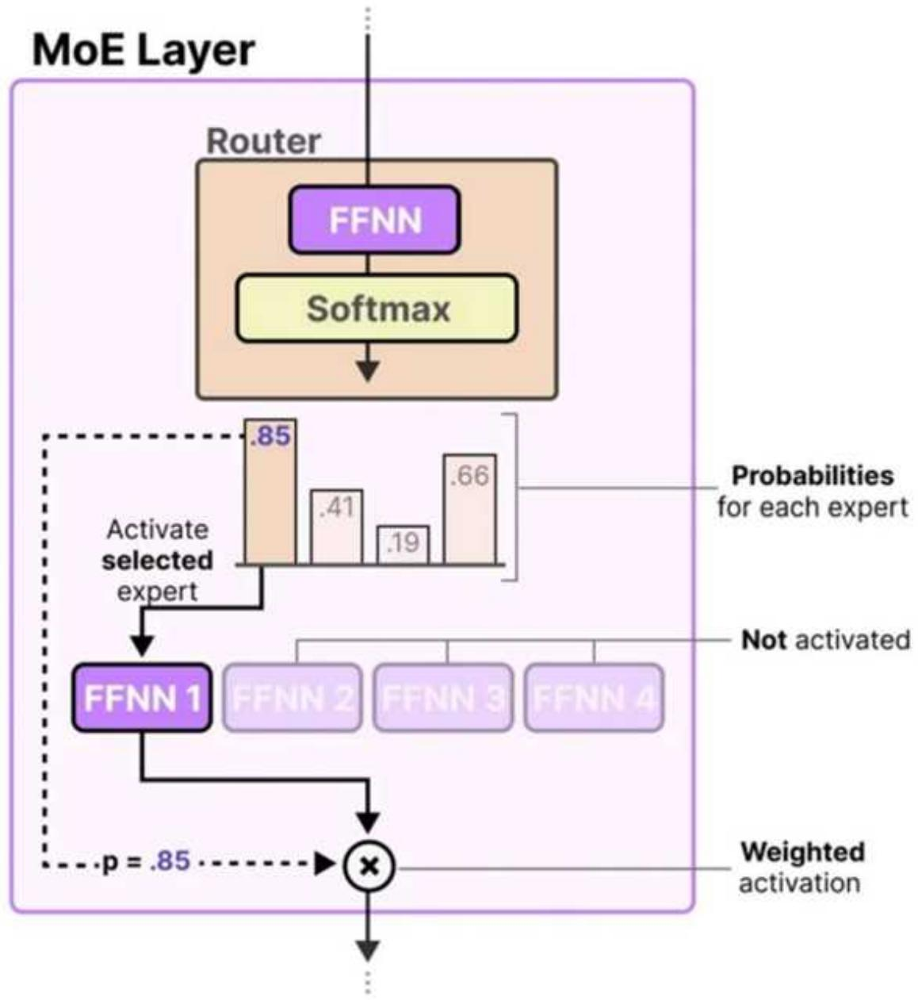  
图5-7 单独的MoE层

通过这样的调整，我们期待MoE模型能够在评论情感分类任务上展现出卓越的性能。完整训练代码如下：

import torch   
from第5章 import baseMOE   
from tqdm import tqdm   
classClassifier(torch.nnModule): def__init__(self): super(Classifier,self).__init_( self_embedding_layer $=$ torch.mm.Embedding(3120,312) self encoder $=$ torch.mm.ModuleList([baseMOE.SparseMoE(312,4,2) for in range(3)]) self.logits $=$ torch.mm.Linear(14976,2) defforward(self,x): embedding $=$ self_embedding_layer(x) for layer in selfencoder: embedding $=$ layer(embedding) embedding $=$ torch.mm.Flatten() (embedding) logits $=$ self.logits(embedding) return logits fromtorch.utils.data import DataLoader import get_dataset BATCH_SIZE $= 128$ DEVICE $=$ "cuda"if torch.cuda.is-available() else "cpu" model $=$ Classifier().to(DEVICE) train_dataset $=$ get_dataset.TextSamplerDataset(get_dataset_token_list, get_dataset.label_list) trainloader $\equiv$ DataLoader(train_dataset,batch_size=BATCH_SIZE,shuffle=True) optimizer $=$ torch.optim.AdamW(model.params(),lr=2e-4) lr_scheduler $=$ torch.optim.lr_scheduler.CosineAnnealingLR(optimizer,T_max=1200, eta_min=2e-5,last_epoch=-1) criterion $=$ torch(nn.CrossEntropyLoss( ignore_index=-100) #假设验证数据集已经准备好 val_dataset $=$ get_dataset.TextSamplerDataset(get_dataset.val_token_list, get_dataset.val_label_list) valloader $=$ DataLoader(val_dataset,batch_size=BATCH_SIZE,shuffle=False) for epoch in range(12): #训练阶段 model.train() pbar $=$ tqdm(trainloader,total=len(trainloader))

for token_inp, label_inp in pbar: token_inp $=$ token_inp.to(DEVICE)label_inp $=$ label_inp.to(DEVICE).long()logits $=$ model(token_inp)loss $=$ criterion(logits, label_inp)optimizer.zero_grad()loss.backup()optimizer step()lr_scheduler step() #执行优化器pbar.set_description(f"epoch:{epoch + 1},train_loss:{loss.item():.5f},lr:{lr_scheduler.get_last_lr}[0] \*1000:.5f}")#验证阶段model.eval()total_val_loss $= 0$ correct $= 0$ with torch.no_grad():for token_inp, label_inp in valloader:token_inp $=$ token_inp.to(DEVICE)label_inp $=$ label_inp.to(DEVICE).long()logits $=$ model(token_inp)loss $=$ criterion(logits, label_inp)total_val_loss $+ =$ loss.item()#计算准确率_,predicted $=$ torch.max(logits,1)correct $+ =$ (predicted $= =$ label_inp).sum().item()avg_val_loss $=$ total_val_loss / len(valloader)val.accuracy $=$ correct / len(val_dataset)print(f'Epoch{epoch + 1},ValidationLoss:{avg_val_loss:.5f},ValidationAccuracy:(val.accuracy:.5f)

此时经过12轮的模型训练，最终结果如下：

```txt
Epoch 10, Validation Loss: 0.47300, Validation Accuracy: 0.80937  
Epoch 11, Validation Loss: 0.53913, Validation Accuracy: 0.80312  
Epoch 12, Validation Loss: 0.55707, Validation Accuracy: 0.81250 
```

可以看到，此时的结果提高了约两个百分点，具体请读者运行代码自行验证。

另外，值得关注的是，在MoE框架下，MoE层通常可以划分为两种类型：稀疏专家混合模型（Sparse Mixture of Experts）与密集专家混合模型（Dense Mixture of Experts）。它们的对比如图5-8所示。

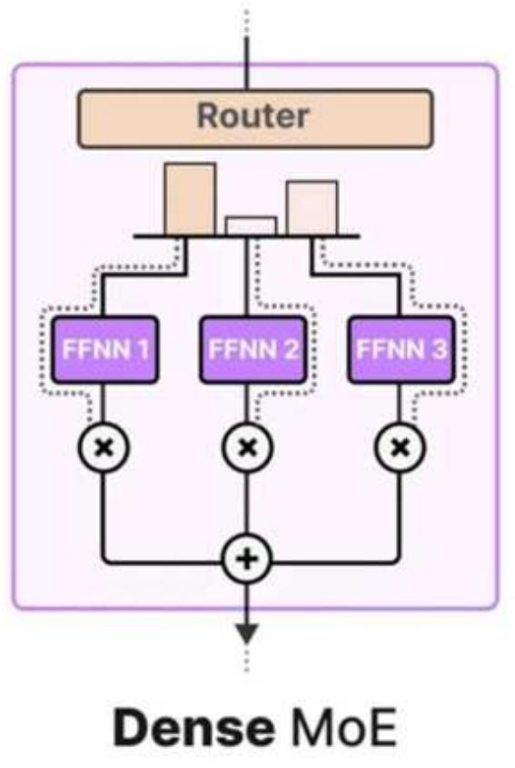

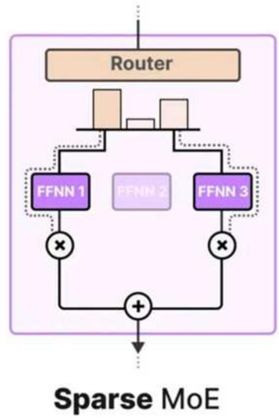  
图5-8 稀疏MoE与密集MoE的对比

这两种模型都依赖于路由器机制来选择合适的专家进行处理，但它们在专家的选择上有所不同。稀疏MoE模型在每次前向传播时仅激活少数几个专家，这种策略有助于提升计算效率和模型的专注度，使得每个被选中的专家都能充分发挥其专长。相比之下，密集MoE模型则会考虑所有的专家，但会根据输入的不同以不同的权重分布来选择各个专家。这种全面考虑的策略虽然计算成本相对较高，但能够更全面地整合各个专家的意见，从而在处理某些复杂任务中展现出更优越的性能。

# 5.2.2 混合专家模型中负载平衡的实现

在前面的代码实现中，针对专家的负载均衡，我们使用了TopkRouter进行设置，这是一种对路由器进行负载平衡的方法，其使用了一个简单的扩展策略，称为KeepTopK。这种策略的核心思想是，通过动态选择负载最低或性能最优的 K个专家节点来处理请求，从而确保系统的稳定性和响应速度。

具体来说，KeepTopK策略会实时监控各个专家节点的负载情况，并根据预设的评估标准，如响应时间、CPU使用率、内存占用率等，对节点进行排序。当新的请求到达时，TopkRouter会根据当前的排序结果，将请求路由到性能最佳的 K个节点之一。这种方法不仅能够有效平衡负载，减少某些节点的过载风险，还能确保用户请求得到快速且可靠的处理。整体计算结果说明如下。

（1）首先计算所有的输出权重，如图5-9所示。

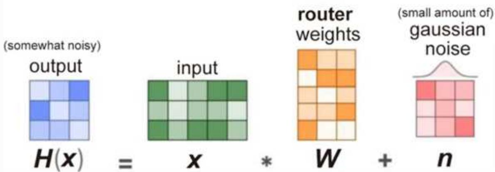  
图5-9 加载了KeepTopK运算的输出

（2）然后，除希望激活的前 K 个专家（例如两个）外的所有专家权重都将被设为- $\mathbf { \nabla } \cdot \infty$ ，如图5-10所示。

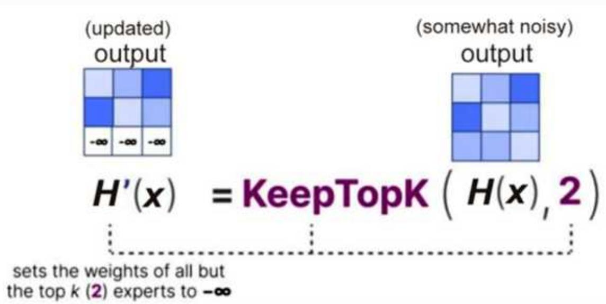  
图5-10 去除额外的专家

（3）将这些专家权重设为-∞时，softmax操作后的输出概率将变为0，如图5-11所示。

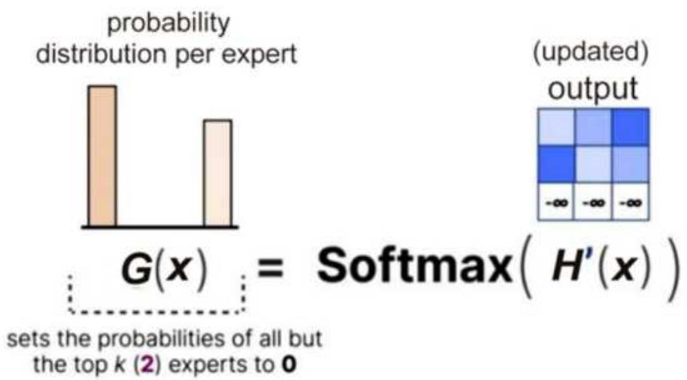  
图5-11 经过softmax计算后输出概率置为0

（4）此时通过KeepTopK策略将每个token路由到若干选定的专家。这种方法被称为Token选择策略（Token Choice），如图5-12所示。它允许一个给定的token被路由到一个专家（见图5-12左图），或者被分配给多个专家（见图5-12右图）。

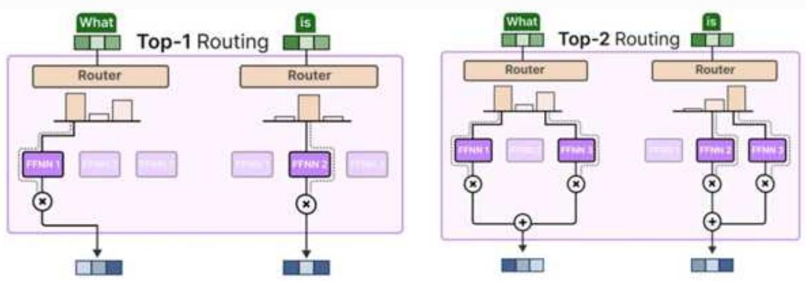  
图5-12 token选择策略

路由器（Router）或门控网络（Gate Network）部分。这一组件在MoE架构中扮演着至关重要的角色，负责决定哪些数据（通常以token的形式）应该被发送到哪些专家进行处理。路由器网络根据输入数据的特性，动态地生成一个分配方案，确保每个token都能被路由到最合适的专家。这种动态路由机制使得MoE能够在处理不同输入时展现出高度的灵活性和适应性。通过优化路由器网络的设计，MoE可以在保持计算效率的同时，最大化地利用各个专家的专长，从而提升整体模型的性能。

选择单个专家可以提升我们在计算时的速度，而选择多个专家可以对各个专家的贡献进行加权，并将其整合起来，从而提高一定的准确性。至于选择哪种方式，还需要在实际应用中进行权衡和处理。

# 5.2.3 修正后的MoE门控函数

在混合专家模型的实际使用中，我们本质上追求的是一种均衡状态，即避免所有token都集中于某一组“热门”的expert上。为了实现这一目标，我们需要在系统中引入一种机制，以确保token的分配既不过于集中，也不过于分散。因此，我们采用了一种策略，那就是在来自门控线性层的logits上添加标准正态噪声，其代码如下：

```python
class NoisyTopkRouter(torch(nnModule):
    def __init__(self, n_embedding, numExperts, top_k):
        super(NoisyTopkRouter, self).__init__(self.top_k = top_k
        self.topkroute_LINEAR = torchENN.Linear(n_embedding, numExperts)
        # add noise
        self.noise_LINEAR = torchENN.Linear(n_embedding, numExperts)
def forward(self, mh_output):
    # mh_output is the output tensor from multihead self attention block
    logits = self.topkroute_LINEAR(mh_output)
    # Noise logits
    noise_logs = self.noise_LINEAR(mh_output)
    # Adding scaled unit gaussian noise to the logits
    noise = torch.randr_like(logits) * torch(nnfunctional,.softmax(noise_logs)
    noisy_logs = logits + noise
    top_k_logs, indices = noisy_logs.topk(self.top_k, dim=-1)
    zeros = torch.full_like(noisy_logs, float('-inf'))
    sparse_logs = zeros.scatter(-1, indices, top_k_logs)
    router_output = torch(nnfunctional,.softmax(sparse_logs, dim=-1))
    return router_output, indices 
```

而在具体使用上，我们可以直接替换稀疏注意力层的对应代码，替换后的新的稀疏混合专家模型如下：

#定义一个稀疏的混合专家模型（MoE）class SparseMoE(torch.nnModule):def__init__(self，n_embedding，num_experts，top_k):super(SparseMoE,self).__init_(selsf router $=$ NoisyTopkRouter(n_embedding，num_experts，top_k)#路由器，用于选择专家#创建一个专家列表，每个专家都是一个Expert实例self.experts $\equiv$ torch.mm-moduleList([Expert(n_embedding)for_inrange(num_experts)])self.topk $\equiv$ topk #选择前K个专家defforward(self,x):#通过路由器得到专家的概率分布和索引gating_output，indices $\equiv$ self_ROUTer(x)fina1_output $\equiv$ torch.zeros_like(x)#初始化最终输出为与输入形状相同的全零张量#将输入和路由器的输出展平，以便进行后续处理flat_x=x.view(-1，x.size(-1))flat_gating_output $\equiv$ gating_output.view(-1,gating_output.size(-1))#遍历每个专家，根据其概率分布对输入进行处理fori,expert in enumerate(self.experts):#找出当前专家是前K个专家的tokenexpert_mask $=$ (indices==i).any(dim=-1)flat_mask $=$ expert_mask.view(-1)#展平操作#如果当前专家是至少一个token的前K个专家之一if flat_mask.any():#选出这些token的输入expert_input $\equiv$ flat_x[flat_mask]#将这些token输入给当前专家进行处理expert_output $\equiv$ expert(expert_input)#获取当前专家对这些token的概率分布gating Scores $\equiv$ flat_gating_output[flat_mask,i].unsqueeze(1)#根据概率分布对专家的输出进行加权weighted_output $\equiv$ expert_output\*gating Scores#将加权后的输出累加到最终输出中对应的位置final_output[expert_mask] $+ =$ weighted_output.squeeze(1)return final_output #返回最终输出

读者可以自行学习验证。

这种噪声的引入实际上为模型注入了一种随机性，使得token在选择expert时不再完全依赖于原始的logits值。通过这种方式，我们可以有效地打破可能存在的“热门”expert的垄断地位，让其他相对“冷门”的expert也有机会得到token的分配。这不仅提高了模型的整体健壮性，还有助于防止模型在训练过程中出现过早收敛或陷入局部最优解的问题。

此外，KeepTopK策略还具备灵活性和可扩展性，可以根据实际运行情况进行动态调整。例如，在高峰期，系统可以自动增加 K的值，以容纳更多的处理节点，从而提升整体的处理能力。而在低峰期，则可以减小K值，以节省资源并提高能效。

# 5.3 带有MoE的注意力模型

混合专家模型（MoE）的主要作用是作为前馈神经网络层（Feedforward NeuralNetwork，FFNN）的替代品。通过引入这种替代方案，我们获得了诸多显著的好处。

首先，MoE通过集成多个“专家”子模型，显著增强了模型的表达能力和容量。相较于单一的前馈层，这种结构能够更细致地捕捉数据的复杂特征，从而在处理高度非线性问题时展现出更优越的性能。其次，MoE模型通过条件计算实现了高效的资源利用。在传统的FFNN中，所有神经元在每次前向传播时都会被激活，这可能导致计算资源的浪费。而在MoE中，只有部分专家会被选择性地激活，这种稀疏性不仅降低了计算成本，还使得模型能够更专注于当前任务相关的特征，如图5-13所示。

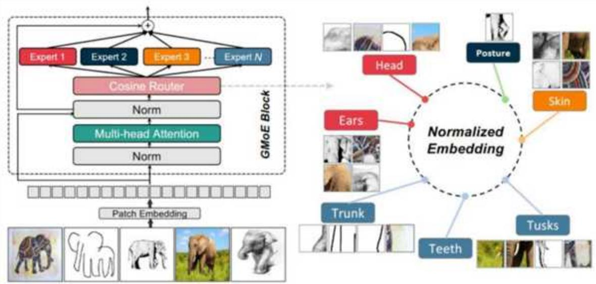  
图5-13 针对不同部位判定的MoE层

此外，MoE还具备出色的可扩展性。随着数据量的增长和任务的复杂化，我们可以通过增加专家数量来轻松扩展模型，而无须从头开始训练整个网络。这种灵活性使得MoE能够轻松应对不断变化的应用场景和需求。最后，通过引入专家之间的竞争机制，MoE还能够促进模型内部的多样性和健壮性。不同的专家可以学习到不同的数据特征和表示方式，从而增强了模型对噪声和异常值的抗干扰能力。这种特性使得MoE在处理实际应用中的复杂数据时表现出更高的稳定性和可靠性。

# 5.3.1 注意力机制中的前馈层不足

在前面探讨注意力机制的章节中，我们曾提及，在注意力层之后，通常会紧接一个标准的前馈神经网络（FFNN）。这个前馈神经网络在模型中的作用举足轻重，它使模型能够充分利用注意力机制所生成的上下文信息，并将这些信息进一步转换和提炼，从而捕捉到数据中更为复杂和深层次的关系，如图5-14所示。

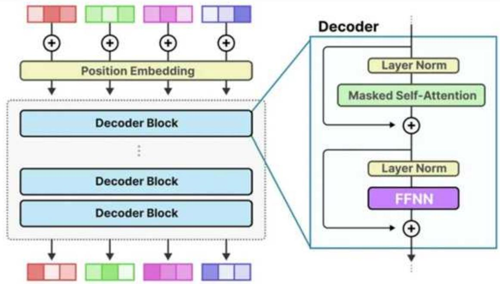  
图5-14 注意力层之后接上FFNN

然而，随着模型对数据处理需求的提升，FFNN的规模也呈现出迅速增长的趋势。为了有效地学习并表达这些复杂的数据关系，FFNN通常需要对接收到的输入进行显著的维度扩展。这意味着，在实践中，我们需要运用一个庞大的全连接层（Fully Connected Layer，FCL）来完成这一关键任务。

具体来看，传统的前馈层是由一系列串联的全连接层构成的，这些层级结构通过调整内部神经元的数量来实现对输入信息的逐层抽象与处理。传统的前馈层如图5-15所示。

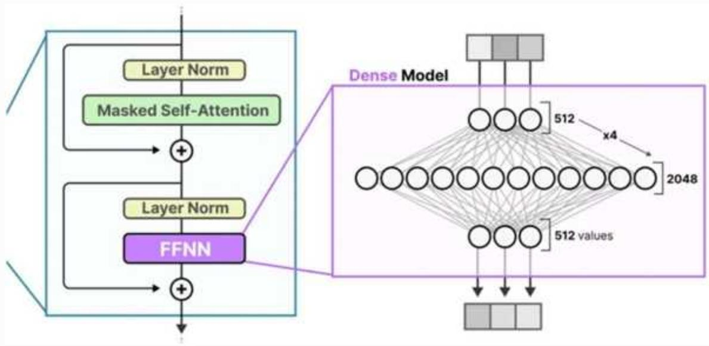

图5-15 传统的前馈层

这种设计虽然在一定程度上提升了模型的表达能力，但同时也带来了计算资源和存储空间的挑战。因此，在构建和应用这类模型时，我们需要精心权衡其性能与资源消耗之间的平衡。

在传统的注意力模型中，FFNN被称为密集模型（Dense Model），因为它的所有参数（包括权重和偏置项）都会被激活。所有参数都被用于计算输出，没有任何部分被遗弃。如果我们仔细观察密集模型，可以发现输入在某种程度上激活了所有参数。密集模型如图5-16所示。

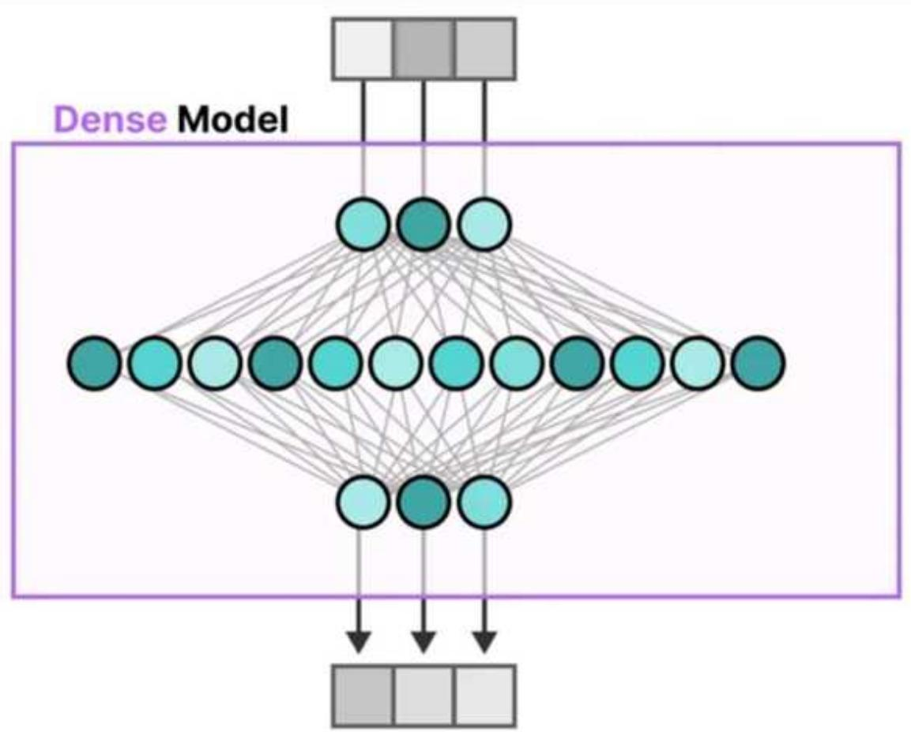  
图5-16 密集模型

相比之下，稀疏模型（Sparse Model）在运行时仅激活其总参数集中的一小部分，这种特性使其与专家混合模型紧密相连。为了更直观地阐述这一点，我们可以设想将一个密集模型（即传统意义上的全连接模型）分解为多个独立的部分，这些部分在MoE的框架中被称作“专家”。每个专家都负责处理特定类型的数据或特征，并在训练过程中专注于学习其专长领域内的知识。稀疏模型如图5-17所示。

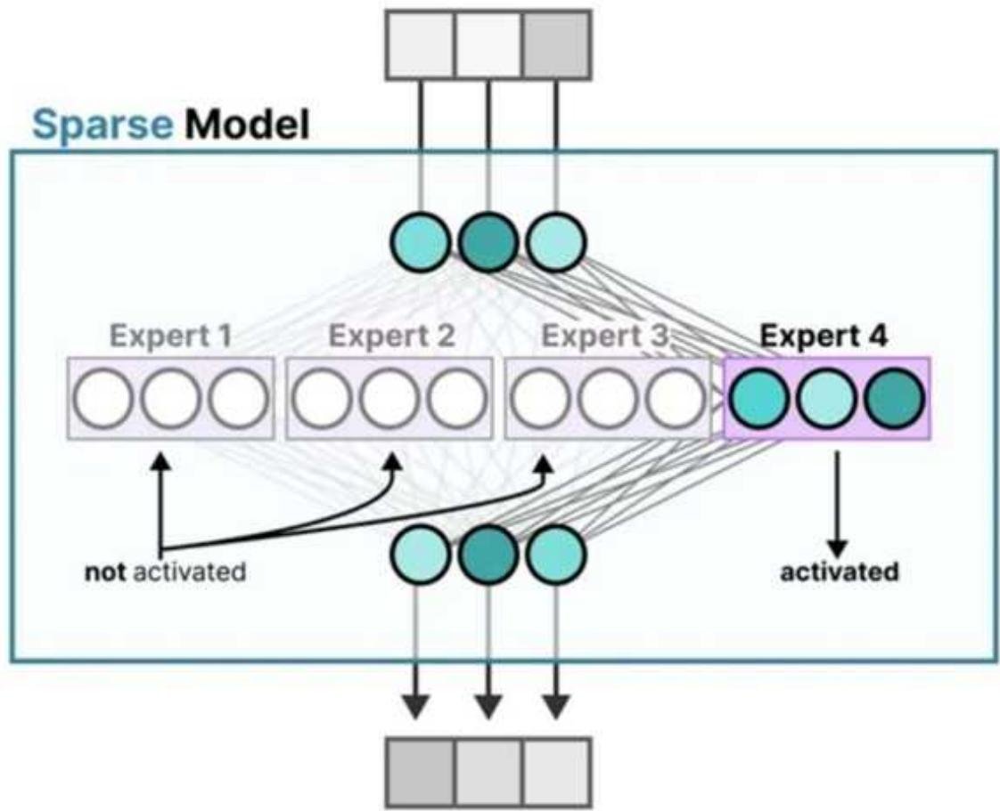  
图5-17 稀疏模型

稀疏性的概念采用了条件计算的思想。在传统的稠密模型中，所有的参数都会对所有输入数据进行处理。相比之下，稀疏性允许我们仅针对整个系统的某些特定部分进行计算。这意味着并非所有参数都会在处理每个输入时被激活或使用，而是根据输入的特定特征或需求，只有部分参数集合被调用和运行。

在模型运行时，我们不再像密集模型那样同时激活所有参数，而是根据输入数据的特性动态地选择并激活一部分专家。这种机制使得MoE能够在不同情境下调用最合适的专家组合，从而更精确地捕捉数据的复杂性和多样性。同时，由于每次只激活部分专家，MoE在计算效率和资源消耗方面相较于密集模型具有显著优势。这种可选择的稀疏专家模型如图5-18所示。

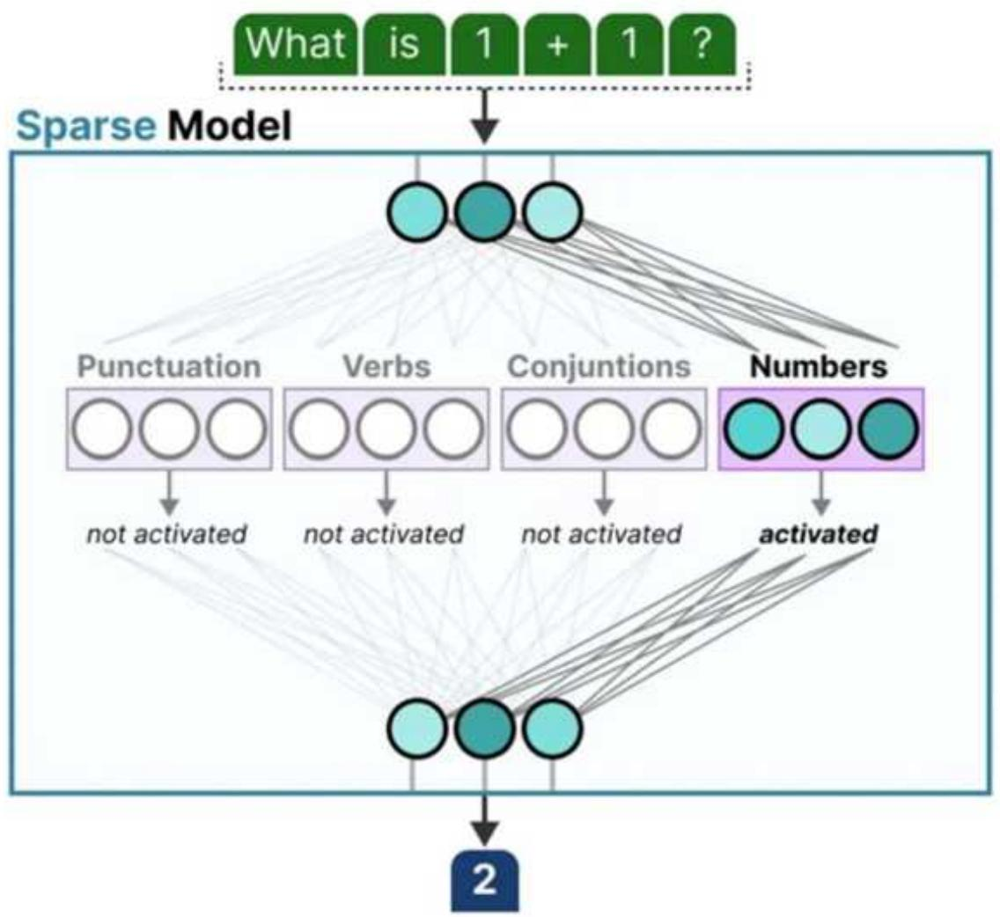  
图5-18 可选择的稀疏专家模型

在图5-19和图5-20中，根据颜色的深浅可以看到，对于输入的文本内容，其中的每个词汇或字母（根据token划分）都被不同的专家所关注。

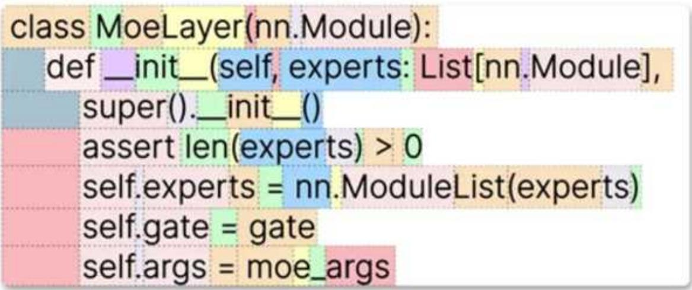  
图5-19 不同专家所关注的部分

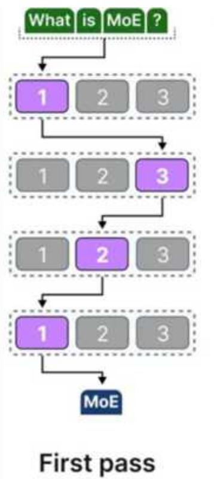

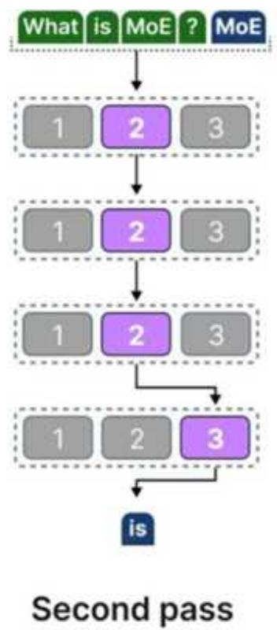

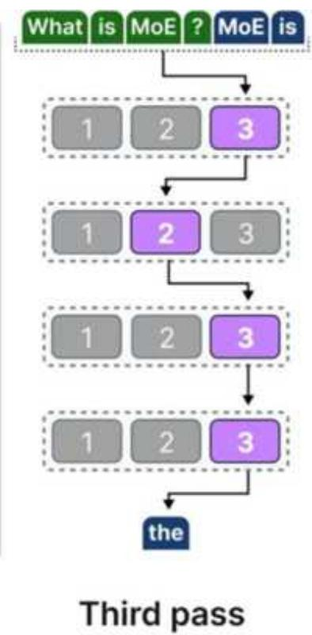  
图5-20 每个注意力中的专家

这种灵活性使得混合专家模型能够更精细地捕捉和响应数据中的复杂模式，从而提升了模型的整体性能和泛化能力。同时，由于每个专家都专注于其特定领域的知识表示，这种结构也有助于实现模型内部的知识分工和模块化，进一步提高了模型的解释性和可维护性。

# 5.3.2 MoE天然可作为前馈层

在前面的工作中，我们已经成功设计并实现了混合专家模型（MoE）的程序代码，更进一步地，我们利用这个独立且完整的MoE模型完成了情感分类的实战演练。通过实战结果，我们清晰地观察到，MoE模型本身便具备出色的特征抽取能力，可以作为一个高效的特征抽取层来使用。在情感分类任务中，MoE模型展现出了良好的性能，准确地完成了分类任务。

传统的注意力机制中的前馈层，在很大程度上，其核心功能和作用可由特定的混合专家模型（MoE）来有效替代。可替代注意力模型中前馈层的MoE如图5-21所示。

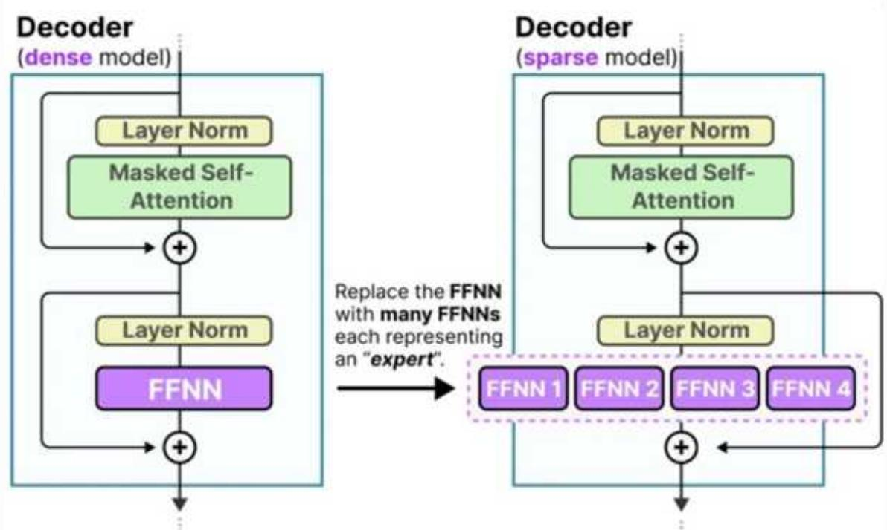  
图5-21 可替代注意力模型中前馈层的MoE

在5.3.1节中，我们已经对MoE模型做了详细的阐述，尽管可以将专家模型理解为被分解的密集模型的隐藏层，但事实上这些专家模型本身往往就是功能完备的前馈神经网络（FFNN）。可作为FFNN的完整MoE模型如图5-22所示，使用专家模型作为前馈层如图5-23所示。

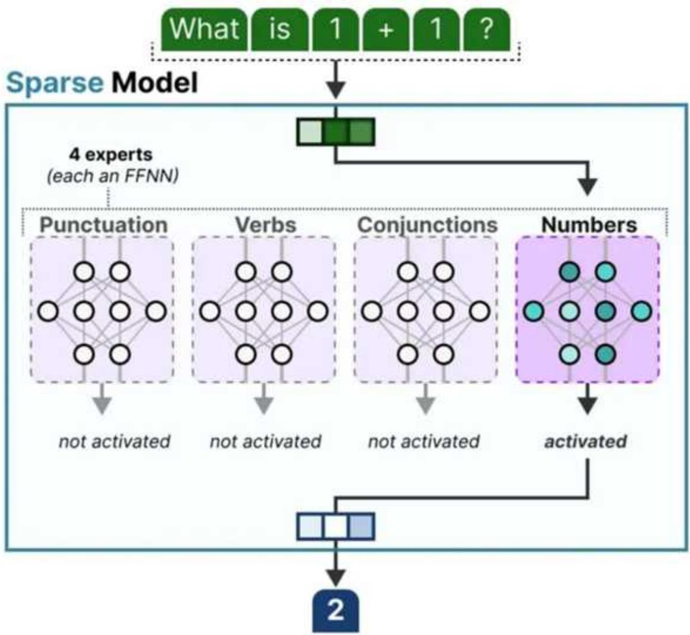  
图5-22 可作为FFNN的完整MoE模型

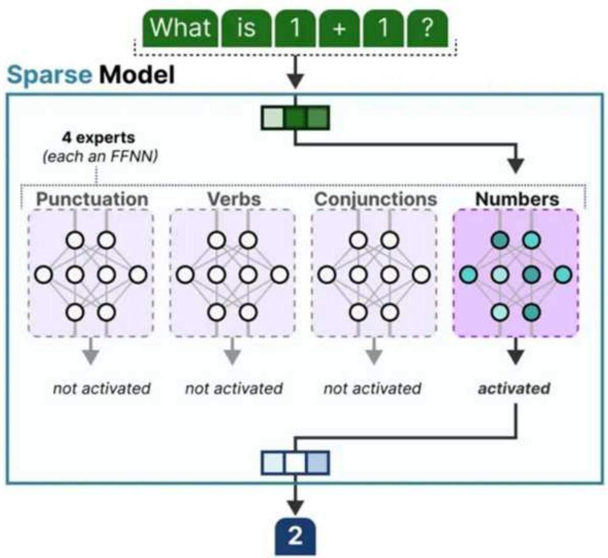  
图5-23 使用专家模型作为前馈层

而一般注意力模型在使用过程中，由于存在多个模块的叠加，给定的文本在生成之前会依次通过这些不同模块中的多个专家。在这个过程中，不同的token在传递过程中可能会被不同的专家所处理，这导致了在模型内部形成了多样化的处理“路径”。叠加注意力模块中的专家路径示意如图5-24所示。

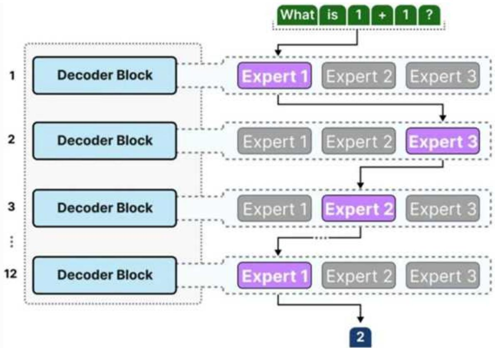  
图5-24 叠加注意力模块中的专家路径

如果我们更新对解码器块的视觉呈现，它将展现出一个包含多个FFNN的架构，其中每个FFNN都代表一个特定的“专家”。这种设计意味着，在推理阶段，解码器块内拥有多个可供选择的FFNN专家，模型能够根据输入数据的特性动态地选择合适的专家来处理信息。

而不同的专家在混合专家模型（MoE）中选择关注的token各不相同，这种差异性使得随着输入文本的变化，模型会动态地选择不同的“路径”进行处理。换言之，每个专家都专注于捕获输入数据的特定特征或模式，从而根据输入内容的不同，整体模型的关注路径也会相应地调整，如图5-25所示。

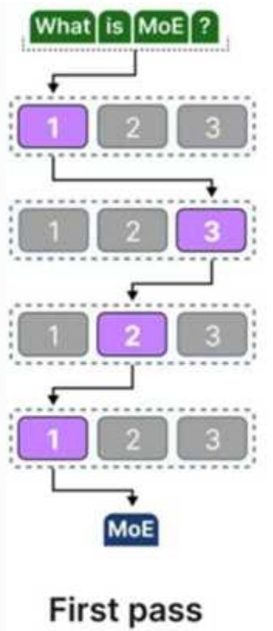

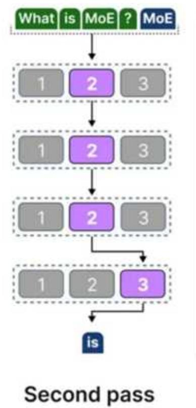

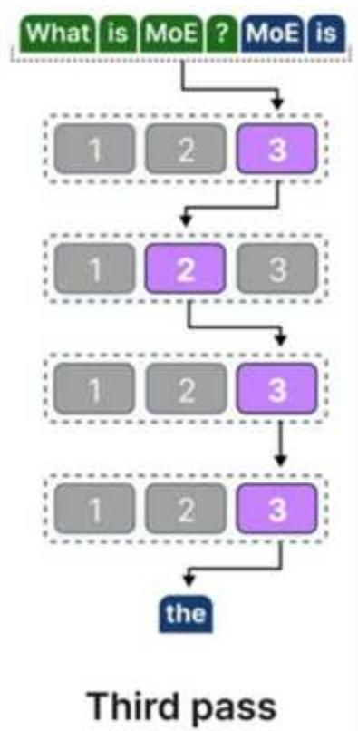  
图5-25 输入路径不同选择的专家不同

我们可以观察到，这种随着输入内容变化而变化的关注路径，实际上为模型提供了一种灵活且动态的特征选择机制。这种机制使得模型能够在处理不同输入时，更加精准地聚焦于关键信息，从而提升了模型的泛化能力和处理复杂任务的能力。

更重要的是，这种动态选择关注点的特性，正是我们所期望的。它意味着模型可以根据具体任务需求和输入数据的特性，自适应地调整其关注重点，以实现更加高效和准确的特征抽取和分类。这种灵活性不仅增强了模型的实用性，也为深度学习领域的发展注入了新的活力。

# 5.3.3 结合MoE的注意力机制

下面我们完成结合MoE的注意力机制。在这里，我们仅需要替换Encoder部分的原始FFNN层，即可完成MoE的替换，代码如下：

from第5章import baseMOE   
class EncoderBlock(torch.nnModule): def__init__(self,d_model,num_heads): super(EncoderBlock,self).__init_(） self.d_model $\equiv$ d_model self num_heads $\equiv$ num_heads self attendsion_norm $\equiv$ torch.mm.RMSNorm(d_model) self.self attentio $=$ attentionModule.MultiHeadAttention(d_model，num_heads) #self. ffn $\equiv$ feedforward_layer.Swiglu(d_model) #读者可以替换FFNN部分完成 self. ffn $\equiv$ baseMOE.SparseMoE(d_model,4,2)   
def forward(self,embedding): residual $\equiv$ embedding embedding $\equiv$ self attendsion_norm(embedding) embedding $\equiv$ self.self attentive(embedding) embedding $\equiv$ self. ffn(embedding) return embedding +residual

读者可以自行尝试。

# 5.4 高级篇实战2：基于通道注意力的图像分类

使用卷积进行图像识别已经成为计算机视觉领域的一种重要技术。卷积神经网络（CNN）通过其独特的卷积层结构，能够有效地提取图像中的特征信息，进而实现高精度的图像识别。

在图像识别过程中，卷积层扮演着关键角色。它通过滑动卷积核（也称为滤波器）来遍历整个图像，捕捉图像中的局部特征，如边缘、纹理等。这种局部特征提取方式不仅有助于减少模型的参数数量，还能提高模型对图像平移、缩放等变换的健壮性。

随着卷积层的逐层深入，网络能够逐渐捕捉到更加抽象和高级的特征表示。这些特征在后续的分类或识别任务中发挥着至关重要的作用。通过堆叠多个卷积层，CNN能够构建起一个深层次的特征提取网络，从而实现对图像内容的深入理解和准确识别。

此外，卷积神经网络还通过引入池化层、全连接层等组件，进一步完善了图像识别的流程。池化层主要用于降低特征图的维度，减少计算量，同时增强特征的健壮性。全连接层则负责将提取到的特征映射到最终的分类结果上。

本节将介绍图像分类数据集MNIST，并讲解单纯使用卷积完成MNIST图像分类任务，之后还会介绍使用通道注意力的图像分类模型。

# 5.4.1 数据集的准备

为了让读者聚焦于我们的模型设计，这里使用一个较简单的灰度图像数据集MNIST。实际上，MNIST是一个手写数字的数据库，它有60 000个训练样本集和10 000个测试样本集。MNIST数据集中的图像如图5-26所示。

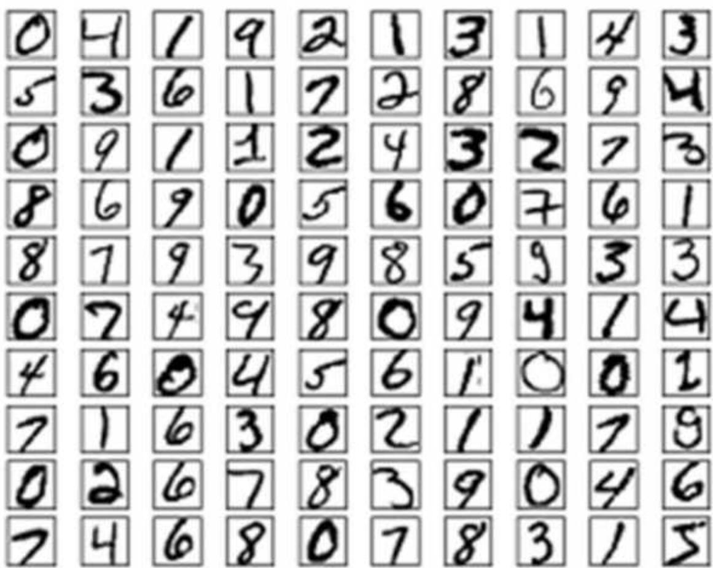  
图5-26 MNIST文件手写体

读者可以通过本书自带的MNIST数据集获取图像数据，代码如下：

from torch.utils.data import Dataset   
from torchvisiontransforms.v2 import PILToTensor,Compose   
import torchvision   
#手写数字   
class MNIST(Dataset): def __init__(self,is_train=True): super().__init_(）   
self.vs=torchvision.datasets.MNIST（'.././dataset/mnist/'，train=is_train，download=True) self.img.convert $=$ Compose([ PILToTensor(), ]) def _len_(self): return len(self.vs) def __getitem__(self,index): img, label $\equiv$ self.vs[index] return self.img.convert(img)/255.0,label   
if_name $= =$ 'main': import matplotlib.pyplot as plt   
ds=MNIST() img, label $\equiv$ ds[0] print.label) plt.imshow(img.permute(1,2,0)) plt.show()

在上面的代码中，我们读取了MNIST数据集，并将第一幅图像进行可视化展示，结果如图5-27所示。

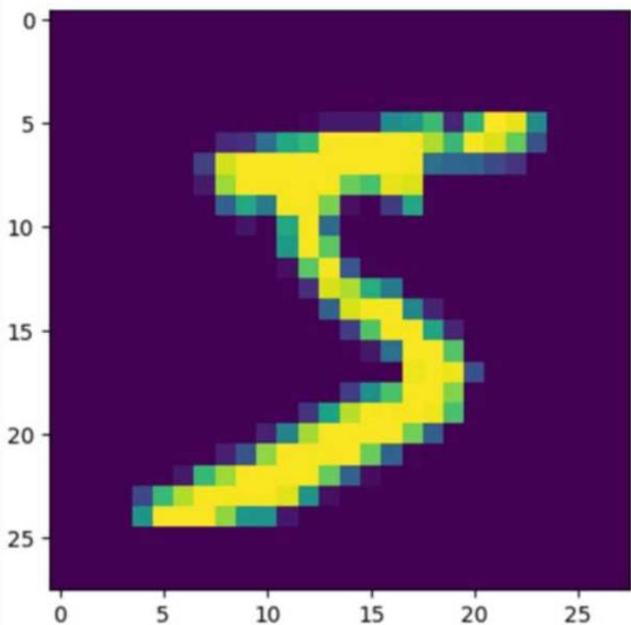  
图5-27 MNIST数据集中的一幅图

读者可以自行运行代码查看结果。

# 5.4.2 图像识别模型的设计

在数字图像处理中，有一种基本的处理方法，称为线性滤波。它将待处理的二维数字看作一个大型矩阵，图像中的每个像素可以看作矩阵中的每个元素，像素的大小就是矩阵中的元素值。

而使用的滤波工具是另一个小型矩阵，这个矩阵被称为卷积核。卷积核的大小远远小于图像矩阵。具体的计算方式是：对于图像大矩阵中的每个像素，计算其周围的像素和卷积核对应位置的乘积，之后将结果相加，最终得到的终值就是该像素的值。这样就完成了一次卷积。最简单的图像卷积运算如图5-28所示。

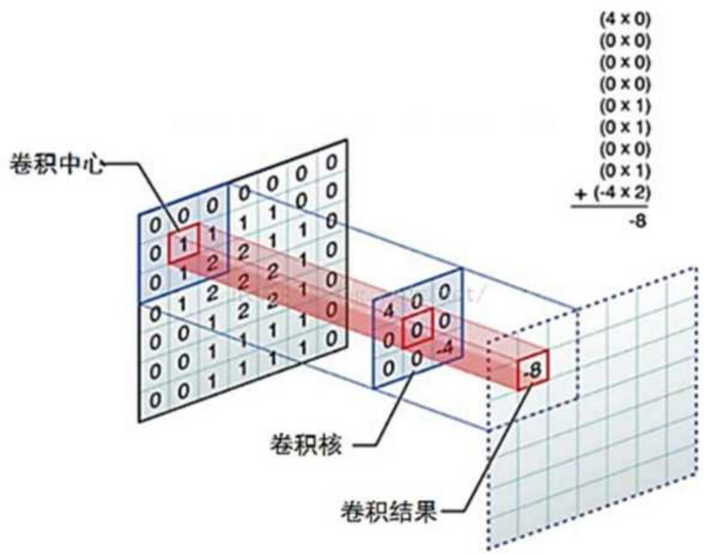  
图5-28 最简单的图像卷积运算

关于卷积的基本知识本书不做过多阐述，有兴趣的读者可以参考另一本作者讲解图像识别的书《PyTorch深度学习与计算机视觉实践》。

我们设计的基本MNIST图像分类模型如下：

```python
import torch
import torch.nn as nn
import numpy as np
import einops.layers.torch as elt
class MnistNetword(nn.Module):
    def __init__(self):
        super(MnistNetword, self).__init__()
        #前置的特征提取模块
        self.conv_stack = nn.Sequential(
            nn.Conv2d(1, 12, kernel_size=7),  #第一个卷积层
            nn.ReLU(),  #第二个卷积层
            nn.Conv2d(12, 24, kernel_size=5),  #第二个卷积层
            nn.ReLU(),  #第三个卷积层
        )
        #最终分类器层
        self.logits_layer = nn.Linear(in_features=1536, out_features=10)
    def forward(self, inputs):
        image = inputs
        x = self.conv_stack(image)
        #elt Rearrange的作用是对输入数据的维度进行调整，读者可以使用torch.nn/flatten函数来替代
        x = elt Rearrange("b c h w -> b (c h w)") (x)
        logits = self.logits_layer(x)
        return logits
    model = MnistNetword()
    torch.save(model, "model.pth") 
```

在上面的代码中，我们首先设定了3个卷积层作为前置的特征提取层，最后一个全连接层作为分类器层。这里需要注意的是，对于分类器的全连接层，输入维度需要手动计算。当然，读者可以一步一步地尝试打印特征提取层的结果，使用shape函数打印维度后计算。

# 5.4.3 结合通道注意力图像分类模型

注意力机制在深度学习中多种多样，它们侧重于模型在处理信息时对不同部分的关注度。而SE块（Squeeze-and-Excitation Block）所引入的正是一种独特的注意力机制——通道注意力机制，这与我们通常理解的注意力机制有所不同。

通道注意力机制的核心思想在于，它旨在深入探索每个卷积核通道中的特征信息，并通过综合这些特征来揭示不同通道之间的内在联系。具体来说，SE块首先通过挤压（squeeze）操作，将每个通道的全局空间信息压缩为一个标量值，这个值在某种程度上代表了该通道特征的重要性。随后，通过激励（excitation）操作，这些标量值被用于重新调整（或加权）原始通道特征，以增强模型对重要特征的关注度并抑制不相关的特征。

# 1．什么是通道注意力机制

在卷积神经网络中，每个卷积层都会输出多个特征图（feature maps），每个特征图对应一个通道（channel）。传统上，这些通道是被同等对待的，即每个通道对最终决策的贡献被认为是相同的。通道注意力的结构如图5-29所示。

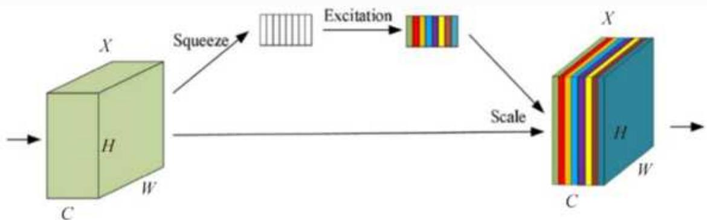  
图5-29 通道注意力SEblock

SE块是SENet（Squeeze-and-Excitation Networks）中的核心组件，它通过两个精心设计的操作——Squeeze和Excitation，实现了对通道关系的显式建模和特征重新校准，从而显著提升了卷积神经网络的性能。

# 2．Squeeze操作

Squeeze操作的主要目的是将全局空间信息有效地压缩到一个通道描述符中。对于给定的特征图 U ，其维度通常为( H , W , C )，其中 H 和 W 分别代表特征图的高度和宽度， C 代表通道数。Squeeze操作通过全局平均池化（Global Average Pooling，GAP）来实现，具体过程如下。

● 全局平均池化：对于特征图 U中的每个通道，计算其所有空间位置上的平均值。这样，每个通道就被压缩为一个单一的标量值，整个特征图U被压缩成一个维度为(1,1,C)的特征向量 Z。  
● 通道描述符：这个特征向量 Z可以看作通道级别的全局特征描述符，每个元素代表了对应通道的全局特征响应。这些响应值反映了不同通道在全局范围内的特征重要性。

# 3．Excitation操作

Excitation操作基于Squeeze操作得到的通道描述符 Z，进一步学习通道间的相互依赖关系，并为每个通道生成一个权重。这一操作通过两个全连接层（FC）和一个激活函数来实现，具体过程如下：

● 降维与升维：首先，通过第一个全连接层对通道描述符 Z进行降维处理，减少通道数至C / r （r 为降维比例，手动设置），以减少计算量和防止过拟合。然后，通过ReLU激活函数增加非线性。接下来，通过第二个全连接层将通道数恢复回C ，以生成与原始通道数相同的权重向量S。

● Sigmoid激活：最后，通过Sigmoid激活函数将权重向量S中的每个元素压缩到0和1之间，得到一个归一化的权重向量。这些权重代表了不同通道的重要程度，值越大，表示该通道的特征越重要。

SE块通过Squeeze和Excitation这两个关键操作，实现了对通道关系的显式建模和特征重新校准，使网络能够自适应地调整不同通道的特征响应，从而显著提升卷积神经网络的性能。这种通道注意力机制在多个视觉任务中表现出了优异的性能，证明了其有效性和通用性。

这种通道注意力机制不仅提高了模型对特征选择的敏感性，还使得网络能够更加高效地利用有限的计算资源。通过自适应地调整通道特征的权重，SE块能够帮助深度学习模型在处理复杂任务时实现更加精准和高效的特征提取与表示，从而提升模型的整体性能。

实现的SE模块的代码如下：

```python
class SEBlock(torch.nnModule):
    def __init__(self, in_chnls, ratio):
        super(SEBlock, self).__init()
        self.squeeze = torch.nn.AdaptiveAvgPool2d(1)
        self.compress = torch.nn.Conv2d(in_chnls, in_chnls // ratio, kernel_size=1, stride=1, padding=0)
        self.excitation = torch.nn.Conv2d(in_chnls // ratio, in_chnls, kernel_size=1, stride=1, padding=0)
    def forward(self, x):
        out = self.squeeze(x)
        out = self.compress(out)
        out = torch.nnfunctional.silu(out) # 使用正确的激活函数名称
        out = self.excitation(out)
        out = torchsigmoid(out) # 使用torchsigmoid而不是torch.nnfunctional.sigmoid
        # 将out缩放到与输入x相同的形状
        return x * out 
```

此时，完整的加载SE模块的图像分类模型如下：

```python
class MnistModel(torch.nnModule): def __init__(self): super(MnistModel, self).__init_(self.conv = torch.nn.Conv2d(1, 3, kernel_size=3, stride=1, padding=1) self SENet = SEBlock(in_chnls=3, ratio=1) self.logits_layer = torch.nn.Linear(75,10) def forward(self, x): image = self.conv(x) image = self SENet(image) image = torch.nn Flatten((image) logits = self.logits_layer(image) return logits 
```

# 5.4.4 图像识别模型SENet的训练与验证

接下来，我们将完成图像识别模型的训练与验证部分。在下面的代码中，我们首先载入数据集，经过36轮训练后，可以完成对应的图像验证。

```python
from torch.utils.data import DataLoader  
from get_dataset import MNIST  
import se_model  
from tqdm import tqdm  
import torch  
DEVICE='cuda' if torch.cuda.is-available() else 'cpu' # 设备  
BATCH_SIZE = 128  
dataset=MNIST() # 数据集  
model = se_model.MnistModel().to(DEVICE)  
optimizer = torch.optim.AdamW(model.params(), lr=1e-5) # 优化器  
loss_fn = torch.nn.CrossEntropyLoss()  
dataloder=DataLoader(dataset, batch_size=BATCH_SIZE, shuffle=True) # 数据加载器  
for epoch in range(36):  
    pbar = tqdm(dataloder, total=len(dataloder))  
    for imgs, labels in pbar:  
        imgs, labels = imgs.to(DEVICE), labels.to(DEVICE) # 将数据和标签移动到指定的设备上  
    # 前向传播  
    outputs = model(imgs)  
    loss = loss_fn(outpu, labels)  
    # 反向传播和优化  
    optimizer.zero_grad() # 清空梯度  
    loss_backward() # 反向传播计算梯度  
    optimizer.step() # 更新模型参数  
    # 更新进度条信息  
    pbar.set_description(f"Epoch (epoch + 1)/(36), Loss: (loss.item():.4f)")
```

```python
model.eval() #设置模型为评估模式
val_dataset = MNIST(is_train=False) #验证数据集
val_dataloader = DataLoader(val_dataset, batch_size=BATCH_SIZE, shuffle=False) #验证数据加载器，通常不需要打乱
correct = 0 #正确预测的计数
total = 0 #总样本数
with torch.no_grad(): #不需要计算梯度，节省内存和计算资源
for imgs, labels in tqdm(val_dataloader, total=len(val_dataloader)): 
    imgs, labels = imgs.to(DEVICE), labels.to(DEVICE) #将数据和标签移动到指定的设备上
#前向传播
outputs = model imgs)
_, predicted = torch.max(outpu.s.data, 1) #得到预测结果
#计算准确率
total += labels.size(0) #更新总样本数
correct += (predicted == labels).sum().item() #更新正确预测的计数
#计算并打印准确率
accuracy = 100 * correct / total
print(f'Validation Accuracy of the model on the test images: (accuracy:.2f) %') 
```

训练结果如下：

```txt
Epoch 1/12, Loss: 2.0573: 100% | 469/469 [00:07<00:00, 59.84it/s]  
Epoch 2/12, Loss: 1.8317: 100% | 469/469 [00:08<00:00, 54.44it/s]  
Epoch 3/12, Loss: 1.6672: 100% | 469/469 [00:08<00:00, 52.12it/s]  
...  
Epoch 34/36, Loss: 0.4118: 100% | 469/469 [00:09<00:00, 51.70it/s]  
Epoch 35/36, Loss: 0.2805: 100% | 469/469 [00:09<00:00, 51.72it/s]  
Epoch 36/36, Loss: 0.3113: 100% | 469/469 [00:09<00:00, 51.44it/s]  
100% | 79/79 [00:01<00:00, 66.53it/s]  
Validation Accuracy of the model on the test images: 90.83% 
```

可以看到，经过36轮训练后，我们的模型在验证集上获得了接近 $91 \%$ 的准确率。这是一个较好的结果，读者可以自行运行代码验证结果。

上面我们详细阐述了整合MoE的注意力模型，探讨了其如何提升模型的表示能力和泛化性能。接下来，我们将进一步探讨基于MoE与注意力机制的图像分类方法，揭示这一组合如何在图像识别领域发挥重要作用。

# 5.5 高级篇实战3：基于MoE与自注意力的图像分类

在本节中，我们将进一步探讨基于MoE与注意力机制的图像分类方法（准确率有极大提高），揭示这一组合如何在图像识别领域发挥重要作用。

在图像分类任务中，模型的挑战在于如何准确捕捉图像中的关键信息，并据此做出正确的类别判断。MoE与注意力机制的结合为这一问题提供了有效的解决方案。具体来说，通过引入MoE，我们可以将多个专家模型集成到一个框架中，每个专家负责处理图像中的特定部分或特征。这种分而治之的策略，使得模型能够更精细地理解图像内容，提高分类的准确性。

同时，注意力机制的引入，进一步增强了模型对关键信息的聚焦能力。在图像分类过程中，注意力机制可以引导模型自动关注图像中最具判别性的区域，从而忽略不相关或冗余的信息。这种机制与MoE的结合，使得每个专家模型能够在其擅长的领域内发挥最大的作用，共同提升模型整体的分类性能。

# 5.5.1 基于注意力机制的ViT模型

Vision Transformer（ViT）模型是最新提出的、将注意力机制应用在图像分类中的模型。Vision Transformer算法会将整幅图像拆分成小图像块，然后把这些小图像块的线性映射序列作为注意力模块的输入数据送入网络，再进行图像分类的训练，如图5-30所示。

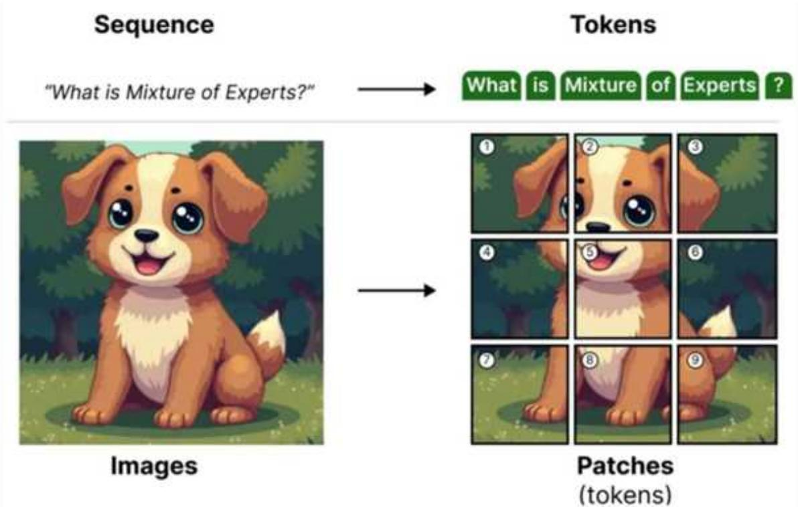  
图5-30 VIT进行图像分块

ViT是注意力机制在图像识别领域的一项开创性的应用，其舍弃了传统基于卷积神经网络的图像识别模式，采用了全新的Transformer架构来处理图像数据。这种架构的核心思想是自注意力机制，它允许模型在同一序列中的不同位置之间建立相互依赖的关系，从而实现对图像特征的全局捕捉和长距离依赖的处理。与传统的卷积神经网络相比，ViT具有以下几个显著优势。

● 长距离依赖处理：传统卷积神经网络在处理局部特征时表现出色，但在处理长距离依赖方面相对较弱。而ViT通过自注意力机制，可以有效地捕捉到图像中不同位置之间的依赖关系，从而提高模型在处理长距离依赖任务时的性能。  
● 可解释性：虽然深度学习模型通常被认为是“黑箱”，但ViT在一定程度上具有可解释性。通过对模型的中间层输出进行分析，我们可以了解到模型在不同层次上关注的图像特征。这有助于我们理解模型的工作原理，并在需要时进行调试和优化。  
● 并行计算能力：由于Transformer架构天然具有并行计算能力，因此在处理大量图像数据时，ViT可以充分利用GPU资源，实现高效的计算。  
● 全局感知：ViT通过自注意力机制，可以在不同层次的特征之间建立起关联关系，从而实现对图像全局信息的感知。这使得模型在处理复杂图像任务时，能够更好地捕捉到图像的整体结构和语义信息。  
● 易于迁移学习：由于ViT摒弃了传统的卷积神经网络结构，因此可以很容易地将其预训练好的权重迁移到其他任务上。这使得模型具有更强的泛化能力，可以在不同的图像识别任务中取得良好的效果。

ViT的整体结构如图5-31所示。

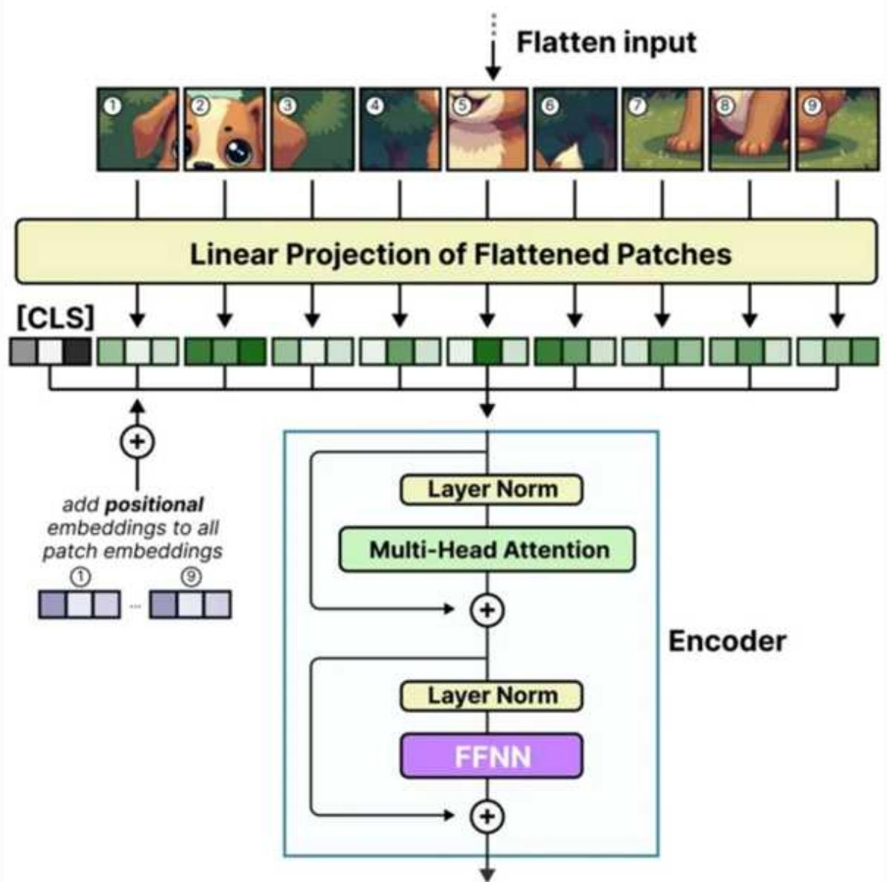  
图5-31 ViT的整体结构

可以看到，同前面章节讲解的编码器类似，ViT也是由同样的组件构成的。

● PatchEmbedding：将整幅图像拆分成小图像块，然后把这些小图像块的线性映射序列作为Transformer的输入送入网络。  
● Position Embedding：由于Transformer没有循环结构，因此需要添加位置编码来保留输入序列中的位置信息。  
● Transformer Encoder：使用多头自注意力机制对每个小图像块映射后的向量进行加权求和，得到新的向量。  
● 分类器：最后使用一个全连接层对每个小图像块的向量进行分类。

其中最重要的是Patch Embedding和注意力模块。下面我们将对其展开讲解。

# 5.5.2 Patch和Position Embedding

Patch Embedding又称为图像分块映射，在Transformer结构中，需要输入的是一个二维矩阵（ L , D ），其中 L 是sequence的长度， D 是sequence中每个向量的维度，因此需要将三维的图像矩阵转换为二维的矩阵。

图像的输入不是一个一个的字符，而是一个一个的像素。假设每个像素有 C 个通道，图片有宽 W 和高 H ，因此一幅图片的所有数据可以用一个大小为[ H , W , C ]的张量来无损地表示。例如，在MNIST数据集中，数据的大小就是 $2 8 \times 2 8$ 。但是，一个一个像素输入Transformer粒度太细了，一幅最小的图片也要784（ $2 8 \times 2 8$ ）个token。因此，一般把图片切成一些小块（Patch）当作token输入。同时，Patch的大小[ h,w]必须是能够被图片的宽和高整除的，如图5-32所示。

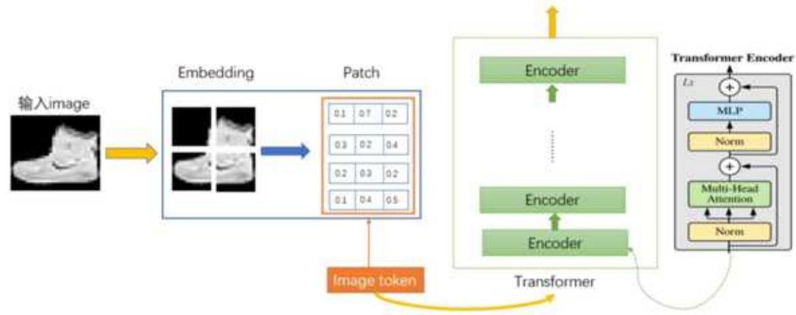  
图5-32 Patch Embedding图像转换

这些图像的token意义上等价于文本的token，都是原来信息的序列表示。不同的是，文本的token是通过分词算法分到的特定字库中的序号，这些序号即字典的index。也就是说，文本的token是一个数字；而图像的一个token（Patch）是一个矩阵。

具体来看，如果输入图片大小为 $2 8 { \times } 2 8 { \times } 1$ ，这是一个单通道的灰度图，Patch Embedding将图片分为固定大小的Patch，Patch大小为 $4 { \times } 4$ ，则每幅图像会生成 $2 8 { \times } 2 8 / 4 { \times } 4 { = } 4 9$ $2 8 \times 2 8$ 个Patch，这个数值可以作为映射后的序列长度，值为49，而每个Patch的大小是 $4 { \times } 4 { \times } 1 { = } 1 6$ 。因此，每幅图片完成Patch Embedding映射后的矩阵大小为[49,16]，图片映射为49个token，每个token维度为16。

$$
[ 4 9, 1 6 ] \leftrightarrow 2 8 \times 2 8 = \left(\frac {2 8 \times 2 8}{4 \times 4}\right) \times (4 \times 4) = 4 9 \times 1 6
$$

而对于多通道（一般通道数为3）的彩色图片的处理，首先对原始输入图像进行切块处理。假设输入的图像大小为 $2 2 4 \times 2 2 4$ ，我们将图像切成一个个固定大小为 $1 6 \times 1 6$ 的方块，每一个小方块就是一个Patch，那么每幅图像中Patch的个数为 $( 2 2 4 { \times } 2 2 4 ) / ( 1 6 { \times } 1 6 ) = 1 9 6$ 个。切块后，我们得到了196个[16, 16, 3]的Patch，之后把这些Patch送入Flattened Patches层，这个层的

作用是将输入序列展平。所以输出后也有196个token，每个token的维度经过展平后为$1 6 { \times } 1 6 { \times } 3 = 7 6 8$ ，所以输出的维度为[196,768]。

有时为了针对项目目标的分类特殊性，还需要加上一个特殊字符cls，因此最终的维度是[token数 $+ 1$ ,token维度]。到目前为止，已经通过Patch Embedding将一个视觉问题转换为一个序列处理问题。

下面我们以多通道的彩色图片处理为例，完成Patch Embedding的计算。在实际代码实现中，只需通过卷积和展平操作即可实现Patch Embedding。使用卷积核大小为 $1 6 { \times } 1 6$ ，步长（stride）为16，卷积核个数为768，卷积后再展平，size变化为：[224, 224, 3] $\longrightarrow$ [14, 14,768] $\longrightarrow$ [196, 768]。代码如下：

```python
class PatchEmbed(torch(nnModule):
    def __init__(self, img_size=224, patch_size=16, in_c=3, embed_dim=768):
        super().__init()
    "此函数用于初始化相关参数:
    :param img_size: 输入图像的大小
    :param patch_size: 一个Patch的大小
    :param in_c: 输入图像的通道数
    :param embed_dim: 输出的每个token的维度
    :param norm_layer: 指定归一化方式，默认为None
    patch_size = (patch_size, patch_size) # 16 -> (16, 16)
    self.img_size = img_size = (img_size, img_size) # 224 -> (224, 224)
    self.patch_size = patch_size
    # 计算原始图像被划分为(14, 14)个小块
    self.grid_size = (img_size[0] // patch_size[0], img_size[1] // img_size[1])
    self.num=Patches = self.grid_size[0] * self.grid_size[1] # 计算Patch的个数为
    # 定义卷积层
    self.proj = torch.nn.Conv2d(in_channels=in_c, out_channels=embed_dim,
            kernel_size=patch_size, stride=patch_size)
    # 定义归一化方式
    self(norm = torch.nn.LinearNorm(embed_dim))
    def forward(self,image):
        " 此函数用于前向传播
        :param x: 原始图像
        :return: 处理后的图像
        B, C, H, W = image.shape
    # 检查图像高宽和预先设定是否一致，不一致则报错
    assert H == self.img_size[0] and W == self.img_size[1], f"Input image size (\{H\}*(W)) doesn't match model
    ((self.img_size[0])*self.img_size[1])."
    # 对图像依次作卷积、展平和调换处理: [B, C, H, W] -> [B, C, HW] -> [B, HW, C]
    x = self.proj(image). flatten(2).transpose(1, 2)
    # 归一化处理
    x = self(norm(x))
    return x 
```

在上面的代码中，我们使用卷积层完成Patch Embedding的操作，即对输入的图形格式进行转换。

图像的每个Patch和文本一样，也有先后顺序，是不能随意打乱的，所以需要再给每个token添加位置信息，有时还需要添加一个特殊字符class token。ViT模型中使用了一个可训练的向量作为位置向量的参数，添加在图像处理后的矩阵上。而对于位置Embedding来说，最终要输入Transformer Encoder的序列维度为[197, 768]。代码如下：

```python
self.num_tokens = 1
self(pos_embedding = torch.nn_PARAMETER(torch.zeros(1, num_patches + 
```

self.num_tokens, embed_dim)) $\mathbf{x} = \mathbf{x} +$ self(pos_embedding

需要注意，这里self.num_tokens为额外添加的、作为分类指示器的class token提供了位置编码。

# 5.5.3 可视化的V-MoE详解

Vision-MoE（V-MoE）是将混合专家模型（MoE）机制融入注意力图像模型中的一个典范案例。该模型创新性地将ViT架构中原本密集的前馈神经网络（FFNN）层替换为稀疏的MoE层。这一变革旨在通过动态路由机制，在推理时仅激活对特定输入最相关的专家子集，从而大幅提升计算效率与模型性能。模型如图5-33所示。

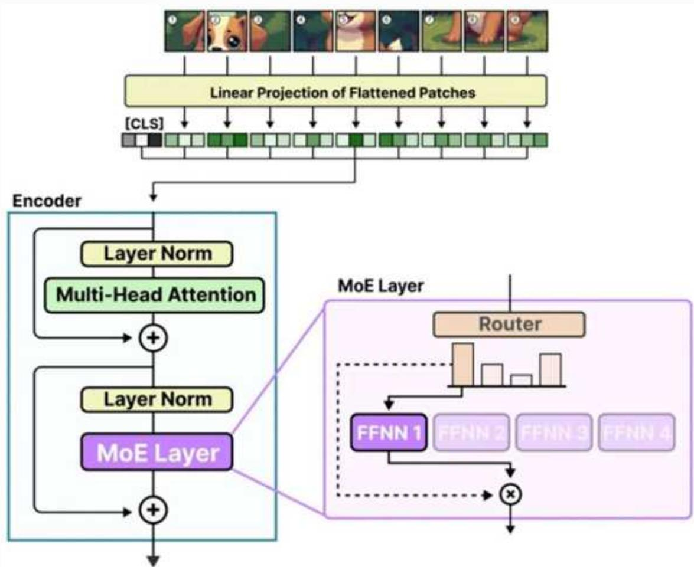  
图5-33 V-MoE模型

V-MoE模型的设计不仅优化了计算资源的分配，减少了不必要的计算开销，还通过引入专家间的多样性和互补性，增强了模型处理复杂视觉任务的能力。这种方法鼓励模型在面对多样化图像数据时，能够更灵活地调整其内部表示，捕捉更加精细和丰富的特征信息。

此外，V-MoE框架还允许研究者根据实际应用需求，灵活调整专家的数量和类型，以及专家间的连接方式，这为探索更加高效和定制化的视觉模型提供了新的视角。例如，在大型语言模型的成功启发下，V-MoE尝试引入大规模专家库，结合自注意力机制和MoE的优势，推动图像理解和生成任务的边界。

对于在实际中操作V-MoE，由于路由器的设置，某些图像token会被丢弃（不被选择），如图5-34所示。

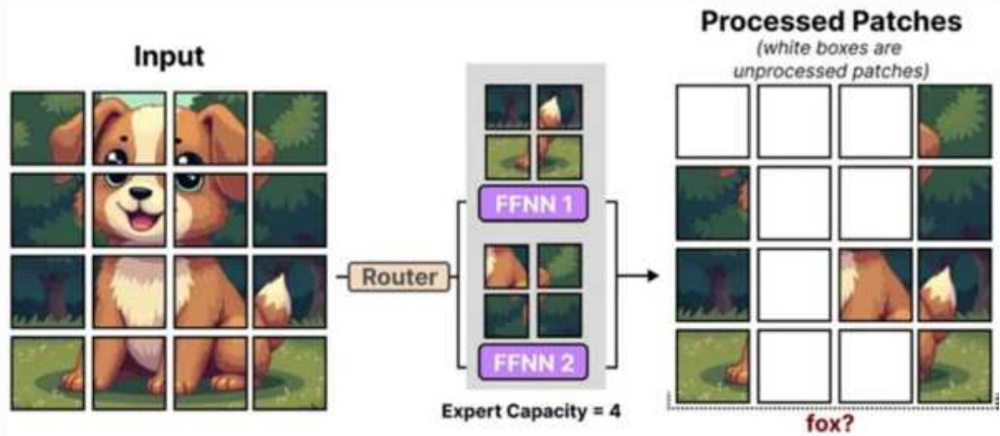  
图5-34 路由对每个token的去留做出决定

具体在操作上，MoE网络会为每个图像块分配重要性得分，并优先处理这些得分较高的图像块，从而避免溢出图像块的丢失，如图5-35所示。

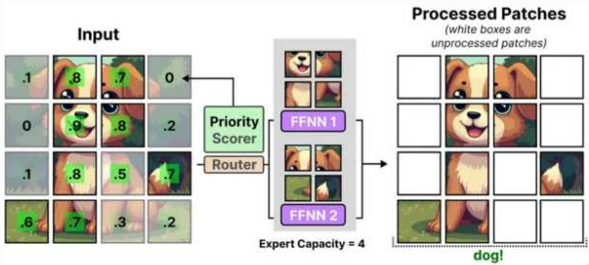  
图5-35 MoE网络对每个图像token进行评分

但是对于选择的结果来说，即使token数量减少，我们仍然能够看到重要的图像块被成功路由，如图5-36所示。

  
图5-36 不同选择比例下被保留的图像token

通过V-MoE，可以看到，这就像是所有图像块被选择后，将保留后的图像token重新组合成一个新的图像块发送到每个专家。生成输出后，这些图像块会再次与路由矩阵相乘，如图5-37所示。

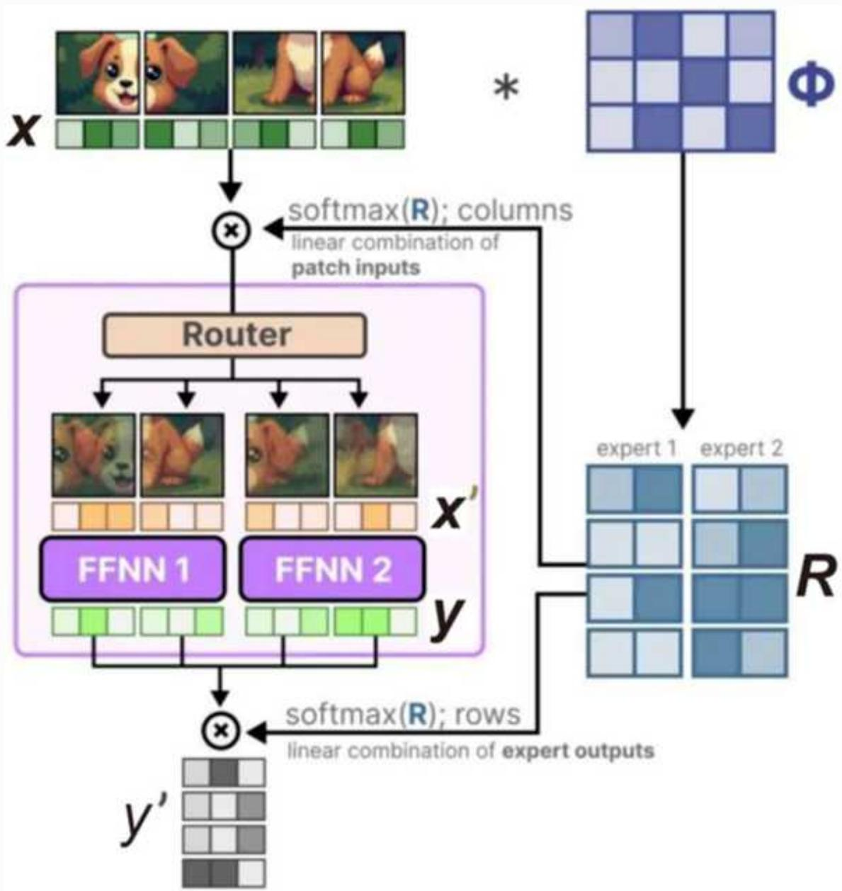  
图5-37 经过MoE选择的ViT模型

随着研究的深入，V-MoE的应用场景也在不断拓展，从基础图像分类、目标检测到高级语义分割、图像生成等领域，都展现出其巨大的潜力。未来，V-MoE有望成为连接深度学习理论与实际应用的重要桥梁，为人工智能在视觉领域的发展注入新的活力。同时，如何进一步优化MoE的路由策略、平衡模型复杂度与性能之间的关系，以及探索MoE与其他先进网络结构的融合方式，将是该领域研究的关键方向。

# 5.5.4 V-MoE模型的实现

最后，我们将实现V-MoE模型。与前面设置的注意力模型相同，我们首先需要完成VitBlock的设计，与注意力block相同，只需要将前馈层进行替换，代码如下：

from第5章import baseMOE   
classVITBlock(torch(nnModule): def__init__(self,d_model,num_heads): super(VITBlock,self).__init_(） self.d_model $\equiv$ d_model self(num_heads $\equiv$ num_heads self attendsion_norm $\equiv$ torch.mm.RMSNorm(d_model) self.self attentio $=$ attentionModule.MultiHeadAttention(d_model，num_heads) self. ffn $\equiv$ baseMOE.SparseMoE(d_model,4,2) defforward(self,embedding): residual $=$ embedding embedding $\equiv$ self attendsion_norm(embedding) embedding $\equiv$ self.self attentive(embedding) embedding $\equiv$ self. ffn(embedding) return embedding +residual

基于此，完成的ViT模型如下：

```python
class VIT(torch(nnModule):
    def __init__(self, dim = 312):
        super(VIT, self).__init__()
        self.patch_embedding = PatchEmbed()
        self.position_embedding = torch.nn_PARAMETER(torch Rand(1, 16, dim))
        self.vit_layers = VITBlock(d_model=312, num_heads=6)
        self.logits_layer = torch.nn.Linear(4992,10)
    def forward(self, x):
        embedding = self.patch_embedding(x) + self.position_embedding
        embedding = self.vit_layers(embedding)
        embedding = torch(nn.Flatten)(embedding)
        logits = self.logits_layer(embedding)
    return logits 
```

# 5.5.5 基于图像识别模型V-MoE的训练与验证

最后，完成基于图像识别模型V-MoE的训练与验证。与5.4.4节的处理方法类似，我们同样使用MNIST数据集，之后将模型部分进行替换，代码如下：

```python
from torch.utils.data import DataLoader  
from get_dataset import MNIST  
import vmoe_model  
from tqdm import tqdm  
import torch  
DEVICE='cuda' if torch.cuda.is-available() else 'cpu' #设备  
BATCH_SIZE = 128  
dataset=MNIST() #数据集  
model = vmoe_model.VIT().to(DEVICE)  
optimizer =torch.optim.AdamW(model.params(), lr=le-5) #优化器  
loss_fn = torch.nn.CrossEntropyLoss()  
dataloder=DataLoader(dataset, batch_size=BATCH_SIZE, shuffle=True) #数据加载器  
for epoch in range(36):  
    pbar = tqdm(dataloder, total=len(dataloder))  
    for imgs, labels in pbar:  
        imgs, labels = imgs.to(DEVICE), labels.to(DEVICE) #将数据和标签移动到指定的设备上  
    #前向传播  
    outputs = model(imgs)  
    loss = loss_fn(outputs, labels)  
    #反向传播和优化 
```

```python
optimizer.zero_grad() #清空梯度 loss.backup() #反向传播计算梯度 optimizer.step() #更新模型参数 #更新进度条信息 pbar.set_description(f"EPOCH (epoch + 1)/{36}, Loss: {loss.item():.4f}") model.eval() #设置模型为评估模式 val_dataset = MNIST(is_train=False) #验证数据集 #验证数据加载器，通常不需要打乱 val_datalloader = DataLoader(val_dataset, batch_size=BATCH_SIZE, shuffle=False) correct = 0 #正确预测的计数 total = 0 #总样本数 with torch.no_grad(): #不需要计算梯度，节省内存和计算资源 forimgs, labels in tqdm(val_datalloader, total=len(val_datalloader)): imgs, labels = imgs.to(DEVICE), labels.to(DEVICE) #将数据和标签移动到指定的设备上 #前向传播 outputs = model(imgs) _, predicted = torch.max(outpu.s.data, 1) #得到预测结果 #计算准确率 total += labels.size(0) #更新总样本数 correct += (predicted == labels).sum().item() #更新正确预测的计数 #计算并打印准确率 accuracy = 100 * correct / total print(f"Validation Accuracy of the model on the test images: {(accuracy:.2f)}")
```

经过36轮训练，可以得到如下结果：

```txt
Epoch 1/36, Loss: 1.2793; 100% | 469/469 [00:17<00:00, 27.44it/s]  
Epoch 2/36, Loss: 0.8980; 100% | 469/469 [00:16<00:00, 29.11it/s]  
Epoch 3/36, Loss: 0.5704; 100% | 469/469 [00:16<00:00, 29.24it/s]  
...  
Epoch 34/36, Loss: 0.1492; 100% | 469/469 [00:15<00:00, 30.04it/s]  
Epoch 35/36, Loss: 0.1521; 100% | 469/469 [00:15<00:00, 29.57it/s]  
Epoch 36/36, Loss: 0.0992; 100% | 469/469 [00:15<00:00, 30.46it/s]  
100% | 79/79 [00:01<00:00, 50.53it/s]  
Validation Accuracy of the model on the test images: 96.30% 
```

此时，在经历了相同的训练轮次之后，我们的模型在验证集上展现出了令人瞩目的性能，取得了约 $9 7 \%$ 的准确率。这一成绩相较于我们之前采用的SENet图像识别任务而言，V-MoE模型无疑实现了质的飞跃。这种显著的提升不仅证明了V-MoE模型在图像识别领域的优越性，更凸显出其在处理复杂图像任务时的强大潜力。

进一步深入分析，V-MoE模型之所以能够取得如此出色的表现，主要归功于其独特的网络结构和优化算法。该模型通过引入更高效的特征提取方式和更精细的分类策略，显著提升了图像识别的准确度和效率。此外，V-MoE还具备更强的泛化能力，能够更好地适应不同的图像场景和识别需求。

展望未来，我们有信心认为V-MoE模型将在图像识别领域发挥更加重要的作用。随着技术的不断进步和应用的不断深化，我们相信V-MoE将助力更多创新应用的诞生，推动整个图像识别行业的持续发展。

# 5.5.6 使用已有的库包实现MoE

前面我们实现的MoE库包，实际上对于模型的程序设计来说，使用已经实现好的MoE库包来完成模型的设计也是可行的。读者可以安装已有的库，如下所示：

```batch
pip install st_moe_PYtorch 
```

这是使用已完成的MoE模型的基本内容。在具体使用上，我们可以使用MoE并加载在前面章节中讲解的SwiGLU激活函数来共同实现前馈层，代码如下：

import torch   
from st_moePytorch import MoE   
from st_moePytorch import SparseMoEBlock   
class Swiglu(torch.nnModule): def_init_self, hidden_size=384, add.biaslinear=False): super(Swiglu,self).init_(self.add.bias $=$ add.bias_linear self.hidden_size $\equiv$ hidden_size self.dense_h_to_4h $=$ torch(nn.Linear( hidden_size, hidden_size\*4, bias $\equiv$ self.add.bias } def swiglu(x): x $\equiv$ torch.chunk(x,2,dim=-1) return torch(nnfunctional.silu(x[0])* x[1] self.activation_func $\equiv$ swiglu self.dense_4h_to_h $\equiv$ torch(nn.Linear( hidden_size\*2, hidden_size, bias $\equiv$ self.add.bias ) def forward(self, hidden_states): intermediate_parallel $\equiv$ self.dense_h_to_4h(hidden_states) intermediate_parallel $\equiv$ selfactivation_func( intermediate_parallel) output $\equiv$ self.dense_4h_to_h( intermediate_parallel) return output

```python
class MOE(torch.nnModule):
    def __init__(self, dim = 512):
        "" from https://github.com/lucidrains/st-moe-pytorch
        super(MOE, self).__init__()
        self.moe = MoE(
            dim=dim, # MoE模型的维度 numExperts=16, #专家数量，增加此值可以在不增加计算量的情况下增加模型的参数 gating_top_n=2, #默认选择前两个专家，但也可以更多（论文中测试了3个，但使用了较低的阈值）
        #训练时，决定一个token是否被路由到第二个及以后专家的阈值，对于两个专家路由，0.2是最优的，对于3个显然应该更低 threshold_train=0.2, threshold_eval=0.2, #评估时的阈值，与train时的意义相同 #每个批次的专家有固定的容量。我们需要一些额外的容量以防路由不完全平衡 capacity_factor_train=1.25, #评估时的容量因子，capacity_factor_*的值应设置为大于或等于1 capacity_factor_eval=2., balance_loss coef=1e-2, #辅助专家平衡损失的乘数 router_z_losscoef=1e-3, #路由z损失的权重
        self.moe_block = SparseMoEBlock(
            self.moe,
            add_ff_before=True,
            add_ff_after=True
        )
        self(norm = torch.nn.RMSNorm(dim)
        self.moe_linear = torch(nn.Linear(dim, dim, bias=False)
        self活性_layer = Swiglu(hidden_size = dim)
    def forward(self, x):
        x = self(norm(x))
        enc_out = self.moe_block(x)[0]
        enc_out = self活性_layer(enc_out) #torch.nnfunctional.gelu(enc_out)
        enc_out = self.moe_LINEAR(enc_out)
        return enc_out 
```

从上面的代码可以看到，我们通过载入已完成的模块从而直接实现MoE。而在具体使用上，我们同样可以直接替换注意力Block中的前馈层，以完成新架构的注意力模型。这一点请读者自行尝试。

# 5.6 本章小结

在本章中，我们深入探讨了混合专家模型的精妙架构，并详细阐述了如何巧妙地将这一模型融入注意力机制之中。具体做法是通过替换传统注意力模块中的前馈神经网络层来实现。这一系列的理论推导与技术创新，不仅拓宽了模型设计的视野，更为提升深度学习模型的性能开辟了新路径。

通过演示一系列精心设计的实战案例，我们直观且有力地见证了混合专家模型在注意力机制中的显著成效。这些案例涵盖从自然语言处理到图像识别等多个领域，无一不展现出，在引入了MoE的注意力框架下，模型的预测准确性实现了质的飞跃。这一提升不仅体现在数值上的精度增加，更反映在模型对于复杂、多样数据的理解能力和泛化性能的显著增强上。

更重要的是，混合专家模型的应用还为解决大规模数据集上的训练难题提供了新的策略。通过动态地选择不同专家来处理不同部分的数据，MoE模型不仅有效缓解了计算资源的压力，还促进了模型对于特征的精细捕捉与高效利用，从而在保持高效训练的同时，大幅提升了模型的最终性能。

此外，我们还探讨了混合专家模型在实际应用中可能面临的挑战，如模型复杂度的增加、专家选择机制的设计优化，以及如何在保持模型性能的同时，进一步降低计算和存储成本等。这些讨论不仅为我们深入理解MoE模型的运作机制提供了更多视角，也为后续的研究与应用指明了方向。

可以看到，随着深度学习技术的持续演进，混合专家模型与注意力机制的深度融合将有望引领更多领域的突破性进展。我们期待看到，通过不断的探索与创新，这一强大的组合能够解锁更多未知的应用场景，为人工智能的发展注入新的活力与可能性。

# 第6章

# 注意力机制详解之调优篇

在之前的篇章中，我们已经深入探讨了注意力机制的核心概念与基本原理。从初级的认识起步，我们详细阐释了如何在自编码与自回归模型中巧妙地融入位置信息，以提升模型对序列数据的感知能力。更进一步，在注意力机制的高级探索中，我们引入了一种创新的方法——混合专家模型，用以替代传统的注意力机制的前馈层。

这种替代并非简单的替换，而是在深入理解注意力机制运作机制的基础上，寻求更高效、更灵活的模型结构。混合专家模型的引入，不仅为模型带来了更强的表达能力和泛化性能，还在一定程度上缓解了计算资源和模型复杂度之间的矛盾。

接下来，我们将继续探索注意力机制的更多可能性。我们将讨论如何在实际应用中优化这一结构，以及如何通过调整模型的各个组件，进一步提升模型的整体性能。

# 6.1 注意力模型优化方案讲解

MHA（多头注意力机制）构成了一种核心的注意力计算方法。其独特之处在于，它能够将输入数据切分为若干独立的“头”，这些头并行地执行注意力计算。每个头专注于学习输入数据的不同特征部分，从而能够捕捉到序列中丰富多样的信息。最终，这些头所学习到的信息会被有效地合并，以生成一个全面且细致的输出表示，该表示综合了序列在各个不同方面的信息。

通过这种方式，MHA不仅提高了模型的表达能力，还增强了其对复杂序列数据的理解能力。每个头可以专注于不同的信息片段，使得模型能够同时关注到序列中的多个重要特征，从而在处理诸如自然语言理解、语音识别等任务时表现出色。

接下来将深入探索注意力模型的多种优化策略，包括MQA模型——其中所有头共享统一的键（keys）和值（values）、MLA模型——通过低秩压缩技术来精简键值对以及GQA模型—采用分组查询机制来提升注意力的效率，如图6-1所示。

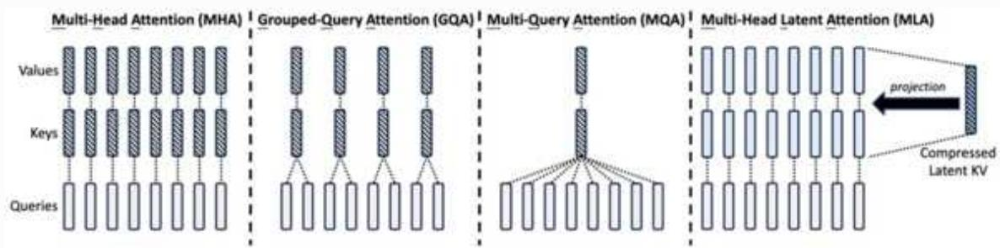  
图6-1 不同优化的注意力模型

图6-1展现了3种具有代表性的多头注意力模型的优化方案。接下来，我们将逐一剖析这些模型的原理、特点及其优势，并提供具体的实现细节。通过深入理解这些优化策略，我们将能够更灵活地运用注意力机制，以适应不同的应用场景和需求。

此外，在第9章中，我们将以实战的方式，详细介绍如何基于Diffusion技术构建一个创新的图像生成模型。通过将这些先进的注意力优化策略应用于实际项目中，我们将展示如何有效提升模型的性能，并生成更加逼真、富有创意的图像作品。无论是对于学术研究还是工业应用，这些内容都将为读者提供宝贵的参考和启示。

# 6.1.1 注意力模型优化1：MQA模型

MQA（Multi-Query Attention，多查询注意力）是2019年提出的一种注意力机制，它是MHA（多头注意力）机制的变体，并专门为自回归解码而设计。

传统的MHA将输入分为多个独立的头，针对每个头分别进行注意力的计算。在MHA中，Q（查询）、 K（键）、 V（值）会依据每个头进行不同的变换，这意味着每个头都有其独特的感知领域和参数集，能够学习输入数据中的不同特征。但是，当头数量众多时，这种方法可能会导致计算量激增。

我们实现的MQA代码如下：

导入必要的库  
import torch  
import torch.nn as nn  
import einops #一个用于高效操作张量的库  
#定义MultiHeadAttention_MQA类，继承自torch(nnModule  
class MultiHeadAttention_MQA(torch(nn Module):  
#初始化函数  
def __init__(self, d_model, attention_head_num):super(MultiHeadAttention_MQA,self).__init_(） #调用父类的初始化函数self attendsion_head_num $=$ attention_head_num #注意力头的数量self.d_model $\equiv$ d_model #模型的维度  
#确保d_model可以被attention_head_num整除assert d_model $\%$ attention_head_num $= = 0$ self_scale $\equiv$ d_model \*\* -0.5 #缩放因子，用于缩放注意力分数self.per_head_dmodel $\equiv$ d_model//attention_head_num #每个注意力头的维度

```python
#定义一个线性层，用于生成Q、K、V。注意，K和V的维度被减少了
self.qkv_layer = torch.nn.Linear(d_model, (d_model + 2 * self.head_dmodel))
#定义一个旋转嵌入层，用于旋转Q和K
self.rotary_embedding = RotaryEmbedding(self.head_dmodel // 2,
use_xpos=True)
#定义一个输出线性层
self.out_layer = torch.nn.Linear(d_model, d_model)
#前向传播函数
def forward(self, embedding, past_length=0):
    B, S, D = embedding.shape # 获取输入张量的形状：批量大小、序列长度、维度
    qky_x = self.qkv_layer(embedding)
    q, k, v = torch.split(qky_x, [self.d_model, self.per_head_dmodel,
                  self.per_head_dmodel], dim=-1)
    #对Q进行重排，以便每个注意力头都能独立处理其部分
    q = einops.rearrange(q, "b s (h d) -> b h s d", h= self attendsion_head_num)
    #扩展K和V的维度，以便它们可以与Q进行广播操作。这里实现了MQA的关键部分：共享K和V
    k = k unsqueeze(2).expand(B, -1, self attendsion_head_num, -1).transpose(1, 2)
    v = v unsqueeze(2).expand(B, -1, self attendsion_head_num, -1).transpose(1, 2)
    #使用旋转嵌入层旋转Q和K
    q, k = self.rotary_embeddingrotateQueries_and_keys(q, k, seq_dim=2)
    #缩放Q
    q = q * self_scale
    #计算注意力分数
    sim = einops.einsum(q, k, 'b h i d, b h j d -> b h i j')
    #创建一个因果掩码，用于遮蔽未来的位置
    i, j = sim.shape[-2:]
    causal_mask = torch.ones((i, j),
dtype=torchbool).triu(past_length).to(embedding_device)
    #用一个很大的负数遮蔽未来的位置
    sim = simmasked_fill(causal_mask, -torch+finfo(sim.dtype).max)
    #通过softmax计算注意力权重
    attn = sim softmax(dim=-1)
    #使用注意力权重对V进行加权求和，得到输出
out = einops.einsum(attn, v, 'b h i j, b h j d -> b h i d')
    #重新排列输出的形状，以便与输入的形状相匹配
embedding = einops.rearrange(out, "b h s d -> b s (h d)")
```

embedding $=$ self.out_layer(embedding) return embedding #返回输出张量

相较于MHA，MQA采用了一种更高效的方法。它让所有头共享同一组 K和V矩阵，从而简化了计算过程并减少了参数量。在MQA中，仅有 Q矩阵保留了多头的特性，即每个头仍有不同的变换。这种做法显著降低了K和V矩阵的参数量，进而提升了推理速度。但需要注意，这种优化可能会以牺牲一定的精度为代价。

# 6.1.2 注意力模型优化2：MLA模型

MLA（Multi-head Latent Attention，多头潜在注意力）机制通过巧妙地运用低秩键值联合压缩技术，成功地打破了推理过程中键值缓存所面临的性能瓶颈。这一创新不仅显著提升了推理效率，还为模型的高效运行提供了有力支持。MLA的核心思想在于将查询（ Q）、键（K）和值（V）投影到一个精心设计的低秩空间中。通过这种投影方式，模型能够在保持必要信息的同时，大幅减少所需参数的数量，进而实现更加迅捷的推理过程。

具体来说，MLA机制在操作中引入了一组可学习的低秩投影矩阵，这些矩阵能够将原始的Q、K、V矩阵映射到一个维度更低的潜在空间。在这一空间中，原本高维数据中的冗余和噪声得到了有效剔除，而关键信息则得以保留和强化。因此，当模型在进行注意力计算时，它能够更加专注于那些对结果影响最大的因素，从而提升推理的准确性和效率。

我们实现的MLA模型如下：  
#定义一个基于Multi-head Attention并使用MLA（Multi-head Latent Attention）机制的类class MultiHeadAttention_MLA(torch.nnModule):def_init_self,d_model,attention_head_num):super(MultiHeadAttention_MLA,self).init_(self attention_head_num $=$ attention_head_num #注意力头的数量self.d_model $\equiv$ d_model #模型的维度#确保d_model可以被attention_head_num整除assert d_model $\text{一}$ attention_head_num $= = 0$ self.scale $\equiv$ d_model \*\* -0.5 #缩放因子，用于缩放注意力分数self柔软cap_value $= 50$ #一个软限制值，但在此代码中未看到其具体使用self.per_head_dmodel $\equiv$ d_model//attention_head_num #每个注意力头的维度#定义Q的线性变换和归一化层self.q_ripe_dense $\equiv$ torch(nn.Linear(self.per_head_dmodel,self.per_head_dmodel\*2)self.q_norm $\equiv$ torch(nn.RMSNorm(self.per_head_dmodel\*2)#定义Q和k在低秩空间中的维度self.qk_nope_dim $\equiv$ self.per_head_dmodelself.qk_ripe_dim $\equiv$ self.per_head_dmodel#定义K和V的投影维度及其相关层

self.kv_proj_dim = self.d_model
		self.kv_proj_dim_VS_qk_ripe_dim = (self.kv_proj_dim + self.qk_ripe_dim)
		self.kv_layernorm = torch.nn.RMSNorm(self.kv_proj_dim)
		self.kvdense = torch.nn.Linear(self.kv_proj_dim, (self.d_model +
		self attendsion_head_num * self.qk_nope_dim))
	# 定义一个线性层，用于生成Q、K、V的初始表示
		self.qkv_layer = torch(nn.Linear(d_model, (d_model +
			self.kv_proj_dim_VS_qk_ripe_dim))
		# 定义旋转嵌入，用于Q和K的旋转操作
		self.rotary_embedding = RotaryEmbedding(self.per_head_dmodel // 2)
		# 定义输出层
		self.out_layer = torch(nn.Linear(d_model, d_model)
	.def forward(self, embedding, past_length=0):
			# 获取输入embedding的形状 $\mathrm{B},\mathrm{S},\mathrm{D} =$ embedding.shape
			# 通过线性层生成Q、K、V的初始表示 $qky\_x =$ self.qkv_layer(embedding)
			# 分割Q和压缩的KV $q,$ compressed_kv $=$ torch.split(qky_x, split_size_orSections=[self.d_model,
			self.kv_proj_dim_VS_qk_ripe_dim], dim=-1)
			# 对Q进行重排、线性变换和归一化 $q =$ einops.rearrange(q, "b s (h d) -> b h s d", h= self attendsion_head_num) $q =$ self.q_norm(self.q_ripe_dense(q))
			# 分割Q为两部分，并对其中一部分应用旋转嵌入 $q,$ q_for_ripe $=$ torch.split(q, [self.qk_nope_dim, self.qk_ripe_dim], dim=-1) $q_{-}for\_rope =$ self.rotary_embeddingrotate_queries_or_keys(q_for_ripe)
			# 分割压缩的KV，并对K部分进行归一化和线性变换
		 KV_for_lora, K_for_ripe $=$ torch.split(compressed_kv, [self.kv_proj_dim,
			self.qk_ripe_dim], dim=-1)
		 KV_for_lora $=$ self.kv_layernorm(KV_for_lora)
		 KV $=$ self.kv_dense(KV_for_lora)
		 KV $=$ einops.rearrange(KV, "b s (h d) -> b h s d", h= self attendsion_head_num)
		 K, V = torch.split(KV, [self.qk_nope_dim, self.per_head_dmodel], dim=-1)
		 # 扩展K_for_ripe以匹配注意力头的数量
		 K_for_ripe $=$ einopsrepeat(K_for_ripe, "b s d -> b h s d",
	(h= self attendsion_head_num)
		 # 合并Q和K的头部，准备进行注意力计算
		 q_heads $=$ torch.cat([q, q_for_ripe], dim=-1)
		 k_heads $=$ torch.cat([K, K_for_ripe], dim=-1)

```python
v_heads = V # V之前已经被重排过了
# 缩放Q并计算注意力分数
q_heads = q_heads * self_scale
sim = einops.einsum(q_heads, k_heads, 'b h i d, b h j d -> b h i j')
# 应用因果掩码，并计算softmax注意力权重
mask_value = -torch+finfo(sim.dtype).max
i, j = sim.shape[-2:]
causal_mask = torch.ones((i, j),
dtype=torch(bool).triu(past_length).to(embedding_device)
sim = simmasked_fill(causal_mask, mask_value)
attn = sim softmax(dim=-1)
# 使用注意力权重对V进行加权，并得到输出embedding
out = einops.einsum(attn, v_heads, 'b h i j, b h j d -> b h i d')
embedding = einops.rearrange(out, "b h s d -> b s (h d).")
embedding = self.out_layer(embedding)
return embedding 
```

从上面的代码可以看到，MLA机制的这种低秩投影方式还具有很好的灵活性和可扩展性。它可以根据具体任务的需求和数据的特点来调整投影矩阵的维度和数量，以达到最佳的推理效果。这种灵活性使得MLA能够广泛应用于各种不同的深度学习场景中，为解决各种复杂问题提供了有力的工具支持。

# 6.1.3 注意力模型优化3：GQA模型

GQA分组查询注意力机制是分组查询注意力的简称，作为2023年崭露头角的MHA（多头注意力）变体，其通过独特的设计，在模型效率和性能之间找到了新的平衡点。在GQA中，查询头被精心划分为 G组，这样的设计使得每个查询头都能拥有独立的参数空间，而每个组则共享一套Key和Value矩阵。这种结构被命名为GQA-G，即具有 G组分组查询注意力，它在保持注意力机制灵活性的同时，也实现了参数的高效利用。

中间组数的设置是GQA模型中的一大亮点，它巧妙地在模型质量和计算速度之间做了权衡。实验表明，与MQA（多头查询注意力）相比，GQA凭借适中的组数设置，实现了更高的插值模型质量。同时，与原始的MHA相比，GQA在计算速度上表现出明显的优势。

我们实现的GQA代码如下：

```txt
class MultiHeadAttention_GQA(torch.nnModule):
    "多头注意力机制的GQA实现版本，用于处理序列数据中的自注意力。参数：
    - embed_dim: 嵌入向量的维度。
    - query_heads: 查询头的数量。
    - kv_heads: 键值头的数量，默认为2。
    - dropout: dropout概率，默认为0.0。
```

```python
- bias: 是否在线性层中使用偏置项，默认为True。
- layer_norm: 是否使用层归一化，默认为True。
- layer_normEPS: 层归一化时的epsilon值，默认为1e-5。
- gamma_init: 初始化时的增益值，默认为1.0。
- device: 指定设备，默认为None。
- dtype: 指定数据类型，默认为None
```
def __init__(self, d_model: int, attention_head_num: int, kv_heads: int = 2, dropout: float = 0.0, bias: bool = True, layer_norm: bool = True, layer_normEPS: float = 1e-5, gamma_init: float = 1.0, device=None, dtype=None):
    super().__init()
    selfembed_dim = embed_dim = d_model
    self.query_heads = query_heads = attention_HEAD_num
    # 确保query_heads可以被kv_heads整除
    assert(query_heads % kv_heads == 0, print("query_heads % kv_heads must be 0")
    self.kv_heads = kv_heads
    self.dropout = dropout
    self(layer_norm = layer_norm
        self_gamma_init = gamma_init
    # 检查embed_dim是否可以被query_heads和kv_heads整除
    if self.query_heads % self.kv_heads != 0:
        raise ValueError(
            f"query_heads {query_heads} must be divisible by "
            f"kv_heads {kv_heads}") 
    elif (embed_dim % self.query_heads != 0) or (embed_dim % self.kv_heads != 0):
        raise ValueError(
            f"embed_dim {embed_dim} must be divisible by "
            f"query_heads {query_heads} and kv_heads {kv_heads}") 
    # 计算每个头的维度
    head_dim = embed_dim // query_heads
    # 确保head_dim可以被8整除且不超过128
    if not head_dim % 8 == 0:
        raise ValueError(
            f"head_dim {embed_dim / num_heads} must be divisible by 8"
        if not head_dim <= 128:
            raise ValueError(
                f"head_dim {embed_dim / num_heads} must be <= 128"
            ) 
```

kv_embedding_dim = embed_dim // query_heads \*kv_heads  
self.k_proj = torch.nn.Linear(embed_dim, kv_embedding_dim, bias $\equiv$ bias, device $\equiv$ device,  
dtype $\equiv$ dtype)  
self.v_proj = torch.nn.Linear(embed_dim, kv_embedding_dim, bias $\equiv$ bias, device $\equiv$ device,  
dtype $\equiv$ dtype)  
#层归一化  
self(norm $=$ None  
if layer_norm:  
    self(norm $=$ torch(nn.RMSNorm(embed_dim, eps $\coloneqq$ layer_norm eps, device $\equiv$ device,  
dtype $\equiv$ dtype)  
#输出投影层  
self.out_proj = torch(nn.Linear(embed_dim, embed_dim, bias $\equiv$ bias, device $\equiv$ device,  
dtype $\equiv$ dtype)  
self.d_model $=$ embed_dim  
self.mga_dim $=$ embed_dim // 3  
self.qkv_layer $=$ torch(nn.Linear(embed_dim, (embed_dim + self.mga_dim +  
self.mga_dim))  
self.per_head_dmodel $=$ embed_dim // query_heads  
self.rotary_embedding $=$ RotaryEmbedding(self.per_head_dmodel // 2,  
use_xpos=True)  
self._reset_parameters()  
def reset_parameters(self):  
#初始化查询投影层权重  
torch(nn.init.xavier_normal_(self.q_proj.weight))  
if self.q_proj.bias is not None:  
    torch(nn.init.constant_(self.q_proj.bias, 0)  
#初始化键值投影层权重  
torch(nn.init.xavier_normal_(self.k_proj.weight))  
if self.k_proj.bias is not None:  
    torch(nn.init_constant_(self.k_proj.bias, 0)  
#根据MAGNETO的初始化策略初始化键值投影层和输出投影层权重  
torch(nn.init.xavier_normal_(self.v_proj.weight, gain $\equiv$ self.gamma_init)  
if self.v_proj.bias is not None:  
    torch(nn.init_constant_(self.v_proj.bias, 0)  
torch(nn.init.xavier_normal_(self.out_proj.weight, gain $\equiv$ self.gamma_init)  
if self.out_proj.bias is not None:  
    torch(nn.init_constant_(self.out_proj.bias, 0)  
def forward(self, embedding, past_length=0, needweights: bool $=$ False, is_causal:  
bool $=$ False, average_attWeights: bool $=$ False):  
#输入形状：(b，n，d)  
B,S,D $=$ embedding.shape  
#通过qkv_layer获取查询、键值和额外的MGA维度  
qky_x $=$ self.qkv_layer(embedding)

```python
q, k, v = torch.split(qky_x, split_size_orSections=[self.d_model, self.mga_dim, self.mga_dim], dim=-1) 
```

```txt
q = einops rearrange(q, "b n (h d) -> b n h d", h= self(query_heads)  
k = einops rearrange(k, "b n (h d) -> b n h d", h= self.kv_heads)  
v = einops rearrange(v, "b n (h d) -> b n h d", h= self.kv_heads) 
```

```python
x, attn = self.scaled.dot_product_gqa( query=q, key=k, value=v, past_length=past_length, is_causal=is_causal, needweights=needweights, average attnweights=average_attnweights, force_grouped=False,  
)  
x = einops.rearrange(x, "b n h d -> b n (h d)") 
```

if self(layer_norm: assert self(norm is not None x $=$ self(norm(x) #线性投影注意力输出 $\mathbf{x} =$ self.outProj(x) return x def scaled.dot_product_gqa( self, query: Tensor, key: Tensor, value: Tensor, dropout: float $= 0.0$ , past_length $= 0$ scale $=$ None, mask $=$ None, is_causal $=$ None, need_weights: bool $=$ False, average_att weights: bool $=$ False, force_grouped: bool $=$ False, } if (mask is not None) and (is_causal is not None): raise ValueError{ "Only one of 'mask' and 'is_causal' should be provided, but got both." ) elif not query.ndim $= =$ key.ndim $= =$ value.ndim $= = 4$ : raise ValueError( f"Expected query, key, and value to be 4-dimensional, but got shapes " f"(query.shape), (key.shape), and (value.shape)." 1 query $=$ einops.rearrange(query, "b n h d-> b h d") key $=$ einops.rearrange(key, "b s h d-> b h s d") value $=$ einops.rearrange(value, "b s h d-> b h s d")

```txt
query, key = self.rotary_embedding rotations_and_keys(query, key, seq_dim=2)  
bq, hq, nq, dq = query.shape  
bk, hk, nk, dk = key.shape  
bv, hv, nv, dv = value.shape  
if not (bq == bk == bv and dq == dk == dv): raise ValueError("Expected query, key, and value to have the same batch size (dim=0) and f" embedding dimension (dim=3), but got query: {query.shape}, "f" key: {key.shape}, and value: {value.shape}. )  
elif (hk != hv) or (nk != nv): raise ValueError("Expected key and value to have the same size in dimensions 1 and 2, but f" got key: {key.shape} and value: {value.shape}. )  
elif hq % hk != 0: raise ValueError("Expected query heads to be a multiple of key/value heads, but got " f" query: {query.shape} and key/value: {key.shape}. )  
if scale is None: scale = query.size(-1) ** 0.5  
query = query / scale  
num_head_groups = hq // hk  
query = einops.rearrange(query, "b (h g) nd -> b g h n d", g=num_head_groups) similarity = einops.einsum(query, key, "b g h n d, b h s d -> b g h n s")  
i, j = similarity.shape[-2:]  
mask = torch.ones((i, j), dtype=np.array).triu(past_length).to(querydevice) mask_value = -torch+finfo(similarity.dtype).max  
similarity = similaritymasked_fill(mask, mask_value)  
attention = torch(nn.Functional softmax(similarity, dim=-1)  
if dropout > 0.0: attention = torch(nn.Functional_dropout(attention, p=dropout)  
out = einops.einsum(attention, value, "b g h n s, b h s d -> b g h n d")  
out = einops.rearrange(out, "b g h n d -> b n (h g) d")  
attnweights = None  
if needweights:  
attnweights = einops.rearrange(attention, "b g h n s -> b n s (h g)" if average_attnweights: attnweights = attnweights.mean(dim=1)  
return out, attnweights 
```

从MHA过渡到GQA，意味着将 H个键和值头缩减为单一的键和值头，这一变化显著减小了键值缓存的大小。因此，在数据处理过程中，所需加载的数据量得以大幅度降低，具体减少了H倍。这一改进不仅提升了模型的运算效率，也为处理大规模数据提供了更加可行的解决方案。GQA正是在这样的背景下应运而生的。通过分组查询的方式，既保留了多头注意力的多样性，又在很大程度上优化了模型的计算负担。

# 6.1.4 注意力模型优化4：差分注意力模型

经典的Transformer模型凭借注意力机制在序列数据处理领域大放异彩，它运用softmax函数为每个token分配权重，以此凸显各token在当前任务中的重要性。然而，当面对长文本或错综复杂的语境时，Transformer常会出现注意力分散的问题，即过度关注与任务无关的内容，产生所谓的“注意力噪声”。这种噪声干扰了模型对关键信息的精准捕捉，尤其在信息分布稀疏的长文本环境下，模型的效率受到显著影响。过多的噪声不仅耗费计算资源，更削弱了模型在处理长上下文时的表现，进而损害了其关键信息提取能力。

为了解决这一难题，差分Transformer应运而生。它创新性地提出了差分注意力机制（Differential Attention Mechanism），在注意力得分的计算过程中融入差分思想。具体而言，该机制通过计算两个独立softmax注意力图之间的差值，有效滤除了噪声。这种差分策略与电子工程中的差分放大器异曲同工，均是通过消除共模噪声来强化对有效信号的捕捉能力，从而提升模型在复杂语境下的表现。差分注意力机制如图6-2所示。

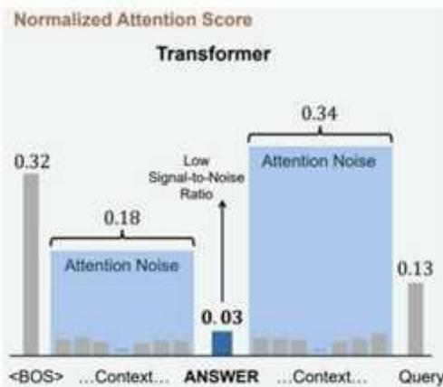

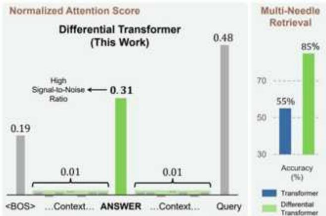  
图6-2 差分注意力机制

使用差分搭建的注意力代码实现如下：

```txt
import torch,math,random   
import torch nn as nn   
import torch nn.Functional as F 
```

```python
class SwiGLU(nnModule): SwiGLU Activation Function. Combines the Swish activation with Gated Linear Units.   
"" def __init__(self, d_model): " Args: d_model (int): Dimension of the input features. super(..init_( # Intermediate projection layers # Typically, SwiGLU splits the computation into two parts self.WG = nn.Linear(d_model, d_model * 2) self.W1 = nn.Linear(d_model, d_model * 2) self.W2 = nn.Linear(d_model * 2, d_model) def forward(self, x): Forward pass for SwiGLU. Args: x (Tensor): Input tensor of shape (batch, sequence_length, d_model). Returns: Tensor: Output tensor after applying SwiGLU. # Apply the gates g = F.silu(self.WG(x)) # Activation part z = self.W1(x) # Linear part # Element-wise multiplication and projection return self.W2(g * z)   
#定义一个名为MultiHeadDifferentialAttention的类，它继承自nnModule class MultiHeadDifferentialAttention(nnModule): 多头差分注意力机制类。 使用差分注意力替换了传统的softmax注意力。 集成了因果掩码以确保自回归行为   
"" def __init__(self, d_model, num_heads): 初始化函数。 参数： d_model (int): 模型的维度，必须能被num_heads整除。 
```

```python
num_heads(int); 注意力头的数量。
```
```
super().init()
# 调用父类的初始化函数
# 确保d_model可以被num_heads整除
assert d_model % num_heads == 0, "d_model必须能被num_heads整除"
self.num_heads = num_heads # 注意力头的数量
self.d_head = d_model // num_heads # 每个注意力头的维度
# 为查询、键和值定义线性投影，每个头投影到2 * d_head的维度
self.W_q = nn.Linear(d_model, 2 * self.d_head * num_heads, bias=False)
self.W_k = nn.Linear(d_model, 2 * self.d_head * num_heads, bias=False)
self.W_v = nn.Linear(d_model, 2 * self.d_head * num_heads, bias=False)
self.W_o = nn.Linear(2 * self.d_head * num_heads, d_model, bias=False)
# 定义可学习的lambda重参数化参数
self_lambda_q1 = nn_PARAMETER(torch.random(num_heads, self.d_head))
self_lambda_k1 = nn_PARAMETER(torch.random(num_heads, self.d_head))
self_lambda_q2 = nn_PARAMETER(torch.random(num_heads, self.d_head))
self_lambda_k2 = nn_PARAMETER(torch.random(num_heads, self.d_head))
# 初始化lambda_init
random_integer = random.randint(1, 99)
self_lambda_init = 0.8 - 0.6 * math.exp(-0.3 * (random_integer - 1))
# 定义RMSNorm的缩放参数
self.rs_scale = nn_PARAMETER(torch.ones(2 * self.d_head))
self.eps = 1e-5 # 用于数值稳定性的epsilon
# 初始化权重（可选，但推荐）
self._reset_parameters()
def reset_parameters(self):
```
初始化参数以提高训练稳定性
```
使用Xavier均匀分布初始化权重
nn.init.xavier.uniform_self.W_q.weight)
nn.init.xavier.uniform_self.W_k.weight)
nn.init.xavier.uniform_self.W_v.weight)
nn.init.xavier.uniform_self.W_o.weight)
nn.init.constant_self.rs_scale, 1.0) # 初始化rms_scale为1.0
def forward(self, X, past_length = 1):
```
前向传播函数。
参数:
X (Tensor): 输入张量，形状为(batch, sequence_length, d_model)。 
```

```python
返回：
Tensor: 应用差分注意力后的输出张量
>>> batch, N, d_model = X.shape # 获取输入张量的形状
# 将输入投影到查询、键和值
Q = self.W_q(X) # 形状: (batch, N, 2 * num_heads * d_head)
K = self.W_k(X) # 形状: (batch, N, 2 * num_heads * d_head)
V = self.W_v(X) # 形状: (batch, N, 2 * num_heads * d_head)
# 重塑和置换以进行多头注意力处理
# 新形状: (batch, num_heads, sequence_length, 2 * d_head)
Q = Q.view(batch, N, self.num_heads, 2 * self.d_head).transpose(1, 2)
K = K.view(batch, N, self(num_heads, 2 * self.d_head).transpose(1, 2))
V = V.view(batch, N, self(num_heads, 2 * self.d_head).transpose(1, 2))
# 将Q和K分割成Q1、Q2和K1、K2
Q1, Q2 = Q.chunk(2, dim=-1) # 每个的形状: (batch, num_heads, N, d_head)
K1, K2 = K.chunk(2, dim=-1) # 每个的形状: (batch, num_heads, N, d_head)
# 使用重参数化计算lambda
# lambda_val = exp(lambda_q1 . lambda_k1) - exp(lambda_q2 . lambda_k2) +
lambda_init
# 计算每个头的点积, lambda_val的形状: (num_heads,
lambda_q1.dot_k1 = torch.sum(self lambda_q1 * self.lambda_k1, dim=-1).float()
lambda_q2.dot_k2 = torch summed(self.lambda_q2 * self.lambda_k2, dim=-1).float()
lambda_val = torch.exp(lambda_q1.dot_k1) - torch.exp(lambda_q2.dot_k2) +
self.lambda_init
# 扩展lambda_val以匹配注意力维度
# 形状: (batch, num_heads, 1, 1)
lambda_val = lambda_val.unsqueeze(0).unsqueeze(-1).unsqueeze(-1)
# __________实现因果掩码 __________
# 创建一个因果掩码以防止对未来标记的注意力
# 掩码的形状: (1, 1, N, N)
# mask = torch.tril(torch.ones((N, N),
device=X_device)).unsqueeze(0).unsqueeze(0)
mask = torch.ones((N, N), dtype=torch(bool,
device=X_device).triu(past_length).unsqueeze(0).unsqueeze(0)
# 将1替换为0.0.0替换为-inf
mask = maskmasked_fill率达=0, float('-inf')).masked_fill率达=1, 0.0)
# 计算注意力分数
scaling = 1 / math.sqrt(self.d_head) # 缩放因子
A1 = torch/matmul(Q1, K1.transpose(-2, -1)) * scaling # (batch, num_heads, N, N)
A2 = torch/matmul(Q2, K2.transpose(-2, -1)) * scaling # (batch, num_heads, N, N)
# 应用因果掩码 
```

```python
A1 = A1 + mask # 掀蔽未来位置
A2 = A2 + mask # 掀蔽未来位置
# 应用softmax以获取注意力权重
attention1 = F softmax(A1, dim=-1) # (batch, num_heads, N, N)
attention2 = F softmax(A2, dim=-1) # (batch, num_heads, N, N)
attention = attention1 - lambda_val * attention2 # (batch, num_heads, N, N)
# 将注意力权重应用于值
O = torch/matmul(attention, V) # (batch, num_heads, N, 2 * d_head)
# 使用RMSNorm独立地规范化每个头
# 首先，为RMSNorm重塑形状
O_reshaped = O.contiguous().view(batch * self.num_heads, N, 2 * self.d_head)
# 计算RMSNorm
rms_norm = torch.sqrt(Oreshaped.pow(2).mean(dim=-1, keepdim=True) + self.eps)
O_normalized = (Oreshaped / rms_norm) * self.rs_scale
# 重塑回(batch, num_heads, N, 2 * d_head)
O_normalized = O_normalized.view(batch, self(num_heads, N, 2 * self.d_head))
# 缩放正则化输出
O_normalized = O_normalized * (1 - self.lambda_init) # Scalar scaling
# 重新连接所有的头
# 新的维度：(batch, N, num_heads * 2 * d_head)
O_concat = O_normalized.transpose(1, 2).contiguous().view(batch, N,
self.num_heads * 2 * self.d_head)
# 最终输出
out = self.w_o(O_concat) # (batch, N, d_model)
return out
# 定义一个DiffTransformer层，继承自PyTorch的nnModule
class DiffTransformerLayer(nn.Module):
    ...
    DiffTransformer架构的单层。
由多头差分注意力（Multi-Head Differential Attention）和随后的SwiGLU前馈网络组成
...
# 初始化函数
def __init__(self, d_model, num_heads):
    ...
    参数:
        d_model (int): 模型的维度。
        num_heads (int): 注意力头的数量。
# 注意：原代码中提到了lambda_init，但在函数参数中并未包含，可能是一个遗漏或特定版本的 
```

```python
# lambda_init(float): Differential Attention中lambda的初始值。计算公式为0.8 = 0.6 * math.exp(-0.3 * (1 - 1)), 其中1是层数，表示lambda_init是衰减的
...
...
# 调用父类的初始化函数
super().__init__()
# 定义RMSNorm层，用于归一化
self(norm1 = torch.nn.RMSNorm(d_model))
# 定义多头差分注意力层
self.attn = MultiHeadDifferentialAttention(d_model, num_heads)
# 再次定义RMSNorm层，用于后续的归一化
self(norm2 = torch(nn.RMSNorm(d_model))
# 定义SwiGLU前馈网络层
self.mm = SwiGLU(d_model)
#
# 前向传播函数
def forward(self, x):
    ...
    # 单个transformer层的前向传播。
参数:
    x (Tensor): 输入张量，形状为 (batch, sequence_length, d_model).
返回:
    Tensor: 经过该层处理后的输出张量
...
# 应用多头差分注意力，并加上残差连接
y = self.attn(self(norm1(x)) + x
# 应用SwiGLU前馈网络，并加上残差连接
z = self.mm2(y) + y
# 返回处理后的输出张量
return z 
```

下面是使用差分注意力模型的一个简单例子，如下所示：

```python
d_model = 768
num_heads = 12
# Instantiate the model
model = DiffTransformerLayer(d_model=d_model, num_heads=num_heads)
# Move model to device (GPU if available)
device = torch_device("CUDA" if torch.cuda.is-available() else "cpu")
model.to(device)
embedding = torch randn(size=(2,48,d_model)).to(device)
# Forward pass
logits = model(embedding) # (batch, N, vocab_size)
print(logits.shape) # Should output: torch.Size([2, 128, 30522]) 
```

请读者自行验证代码的结果。

# 6.2 调优篇实战1：基于MLA的人类语音情感分类

随着信息技术的不断发展，如何让机器识别人类情绪，这个问题受到了学术界和工业界的广泛关注。目前，情绪识别有两种方式，一种是检测生理信号，如呼吸、心率和体温等；另一种是检测情感行为，如人脸微表情识别、语音情绪识别（Speech Emotion Recognition，SER）和姿态识别。语音情绪识别是一种生物特征属性的识别方法，可通过一段语音的声学特征（与语音内容和语种无关）来识别说话人的情绪状态。语音情绪识别示例如图6-3所示。

  
图6-3 语音情绪识别示例

在6.1节中，我们完成了基于文本的评论情感分类模型，并完成了一个具有示范意义的模型训练。本节将继续完成一项语音实战任务，即基于MLA的人类语音情感分类。

# 6.2.1 情绪数据的获取与标签的说明

首先是语音情绪数据集的下载。这里我们使用瑞尔森情感语音和歌曲视听数据库RAVDESS。RAVDESS语音数据集部分包含1440个文件：每个演员进行60次试验 $\times 2 4$ 名演员$= 1 4 4 0$ 次试验。RAVDESS包含24名专业演员（12名女性和12名男性），用中性的北美口音说出两个词汇匹配的陈述。言语情绪包括平静、快乐、悲伤、愤怒、恐惧、惊讶和厌恶。每种表情都在两种情绪强度（正常和强烈）和一种额外的中性表情下产生。

读者可以自行下载对应的数据集。这里我们使用Audio_Speech_Actors_01-24.zip这个子数据集进行情感分类。下载后的数据集结构如图6-4所示。

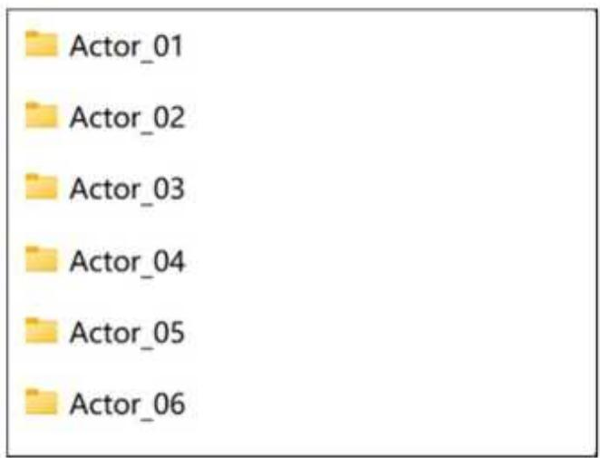

  
图6-4 左图是Audio文件夹，右图是单个文件夹数据

下面讲解情绪文件的标签问题。这个数据包含中性、平静、快乐、悲伤、愤怒、恐惧、厌恶、惊讶8种情感。请读者注意一下，本项目只使用里面的Audio_Speech_Actors_01-24.zip数据集，说话的语句只有Kids are talking by the door和Dogs are sitting by the door。

在这个数据集中，每个音频文件都拥有一个独一无二的文件名，例如如图6-4所示的03-01-01-01-01-01-01.wav。这些文件名由7部分数字标识符构成，并非随意命名。这些数字标识符实际上赋予了文件名特定的标签意义，通过文件名就能够了解音频文件的某些属性或特征：

● 模态（ $0 1 =$ 全AV， $0 2 =$ 仅视频， $0 3 =$ 仅音频）。  
● 人声通道（ $0 1 =$ 语音， $0 2 =$ 歌曲）。  
● 情绪（ $0 1 =$ 中性， $0 2 =$ 平静， $0 3 =$ 快乐， $ 0 4 =$ 悲伤， $0 5 =$ 愤怒， $0 6 =$ 恐惧， $0 7 =$ 厌恶， $0 8 =$ 惊讶）。  
● 情绪强度（ $0 1 =$ 正常， $0 2 =$ 强烈）。注意：“中性”情绪没有强烈的强度。  
● 内容（ $0 1 =$ Kids are talking by the door， $0 2 =$ Dogs are sitting by the door）。   
● 重复（ $0 1 =$ 第一次重复， $0 2 =$ 第二次重复）。  
● 演员（01~24。奇数为男性，偶数为女性）。

通过对比，03-01-02-01-01-01-01.wav这个文件对应的信息如下：

纯音频（03）。  
语音（01）。  
平静（02）。  
正常强度（01）。  
语调“正常”(01)。  
● 第一次重复（01）。  
● 第一号男演员（01）。

另外，需要注意的是，在这个数据集中，音频的采样率为22050，这一点可以设定或采用在第5章介绍的librosa进行读取。

# 6.2.2 情绪数据集的读取

下面对情绪数据集进行读取。在读取数据之前需要注意，数据集中每个文件都存放在不同的文件夹中，而每个文件夹都包含若干不同的情绪文件。因此，在读取数据时，首先需要实现文件夹的读取函数：

```python
import numpy as np   
import torch   
import os   
import librosa as lb   
import soundfile   
# 这个是列出所有目录下文件夹的函数   
def list folders(path):   
    ""   
    列出指定路径下的所有文件夹名   
    ""   
    folders = []   
    for root, dirs, files in os.walk(path):   
        for dir in dirs:   
            folders.append(os.path.join(root, dir))   
    return folders   
def list_files(path):   
    files = []   
    for item in os.listdir(path):   
        file = os.path.join(path, item)   
    if os.path.isfile(file):   
        files.append(file)   
    return files 
```

由于这里读取的是音频数据，我们在第5章对音频数据降维时完成了基于librosa库包的音频读取和转换，可以把相应的代码用在这个示例中，代码如下：

```python
def audio_features(wav_file_path, mfcc = True, chroma = False, mel = False, sample_rate = 22050):
    audio, sample_rate = lb.load(wav_file_path, sr=sample_rate)
    if len(audio.shape) != 1:
        return None
    result = np.array()
    if mfcc:
        mfccs = np.mean(tb feature.mfcc(y=audio, sr=sample_rate, n_mfcc=40).T, axis=0)
        result = np.hstack((result, mfccs))
    if chroma:
        stft = np.abs(tb.stft(audio))
        chroma = np.mean(tb feature.chroma_stft(S=stft, sr=sample_rate).T, axis=0)
        result = npinsula(result, chroma))
    if mel:
        mel = np.mean(tb feature.melspectrogram(y=audio, sr=sample_rate, n_mels=40, fmin=0, fmax=sample_rate//2).T, axis=0)
        result = npinsula(result, mel))
    print("file_title: {}, result.shape:()).format(file_title, result.shape))
    return result 
```

这里需要注意，由于读取的是不同数据集，而采样率会随着数据集的不同而变化，因此这里的采样率为22050。

下面展示完整的数据读取代码。为了便于理解，我们对每种情绪进行文字定义，并将这些定义与相应的情绪序号进行关联。需要注意，在前面的讲解中，情绪序号是排在文件名中第3个位置的数据。因此，我们可以通过对文件名进行文本分割，提取出情绪序号，并根据序号与情绪的对应关系，读取并理解相应情绪的标签，代码如下：

```python
ravdess_label_dict = ("01": "neutral", "02": "calm", "03": "happy", "04": "sad", "05": "angry", "06": "fear", "07": "disgust", "08": "surprise")  
folders = list folders().dataset")  
label_dataset = []  
train_dataset = []  
for folder in folders:  
    files = list_files(folder)  
    for_file in files:  
        label = file.split("\\")[-1].replace("\\.wav","").split("\\")[2]  
        ravdess_label = ravdess_label_dict[label]  
        label_num = int.label) - 1 #这里减1是由于初始位置是1，而一般列表的初始位置是0  
        result = audio_features(file)  
        train_dataset.append(result)  
        label_dataset.append Labels).num)  
train_dataset = torch.tensor(train_dataset, dtype=torch.float)  
label_dataset = torch.tensor(train_dataset, dtype=torch.long)  
print(train_dataset.shape)  
print(train_dataset.shape) 
```

最终的打印结果是将训练数据和label数据转换为torch的向量，如下所示：

```m4
torch.Size([1440,40])  
torch.Size([1440])
```

这里我们仅使用了MFCC的特征作为音频特征，对于其他特征，读者可以自行尝试。特别需要注意，这个示例中MFCC的维度是40，这与后续模型的输入维度相同，如果修改了输入特征长度后，后续的模型维度也要修改。

# 6.2.3 语音情感分类模型的设计和训练

接下来，我们需要完成情感分类模型的设计与训练。首先是模型部分，根据我们在6.2.2节获取的输入数据与标签信息，完成模型的设计，代码如下：

import torch   
import torch.mm as nn   
import torch.optim as optim   
from module import attentionModule,feedforward_layer   
class EncoderBlock(torch.mm.Module): def init(self,d_model $= 128$ ,attention_head_num $= 4$ ,hidden_dropout $= 0.1$ super().init() self.hidden_dropout $=$ hidden_dropout assert d_model $\%$ attention_head_num $= = 0$ ,print("d_model $\%$ n_head must be Zero") self.d_model $=$ d_model self attendsion_head_num $=$ attention_head_num self.per_head_num $=$ d_model//attention_head_num self.outputlayernorm $=$ torch.mm.RMSNorm(d_model) self.mha $=$ attention_module.MultiHeadAttention_MLA(d_model,attention_head_num) self.post attentio层ernorm $=$ torch.mm.RMSNorm(d_model) self.mlp $=$ feedforward_layer.Swiglu(hidden_size=d_model)   
def forward(self,x，past_length $= 0$ ： residual $= x$

embedding $=$ self input layernorm(x) embedding $\equiv$ self.mha(embedding, past_length=past_length) embedding $\equiv$ torch.nnfunctional.dropout(embedding,p $\equiv$ self-hidden_dropout) layernorm_output $\equiv$ self.postattention_layernorm(embedding $^+$ residual) mlp_output $\equiv$ self.mlp(layernorm_output) output $\equiv$ torch(nn.Functional.dropout(mlp_output,p $\equiv$ self-hidden_dropout) output $\equiv$ residual $^+$ output return output   
#定义模型 class DNN(torch(nnModule): def_init_selfinput_size $= 40$ hidden_size $= 128$ output_size $= 8$ super(DNN,self).init_(self-hidden $\equiv$ torch(nn.Linear(input_size,hidden_size) self encoder_block $\equiv$ EncoderBlock(d_model $\equiv$ hidden_size,attention_head num = 4) self.relu $\equiv$ torch(nn.ReLU() self.output $\equiv$ torch(nn.Linear(hidden_size,output_size) def forward(self,x): x $\equiv$ torch unsqueeze(x,1) x $\equiv$ self-hidden(x) x $\equiv$ self encoder_block(x, past_length $= 0$ x $\equiv$ torch(nn.Flatten)(x) x $\equiv$ self.relu(x) x $\equiv$ self.output(x) return x

上面这段代码定义了一个深度神经网络模型，它包含一个线性层、一个编码块（EncoderBlock）、一个ReLU激活函数层和一个输出层。编码块内部使用了多头注意力机制（MultiHeadAttention_MLA）和前馈网络（SwiGLU），并在注意力和前馈网络后应用了残差连接和层归一化（RMSNorm）。模型的前向传播首先将输入数据通过隐藏层，然后通过编码块，接着应用ReLU激活函数，最后通过输出层得到预测结果。

请读者运行代码验证结果。

# 6.3 本章小结

本章我们详细讲解了3种针对多头注意力模型的优化架构，分别是MQA、MLA以及GQA。这些架构从不同角度出发，对原始的注意力模型进行了精心的重构和优化，旨在提升模型的性能、效率和适应性。

具体来说，MQA架构通过改进注意力的计算方式，增强了模型对关键信息的捕捉能力，使得模型在处理复杂任务时更加准确和高效。MLA架构则着重优化模型的内存占用和计算速度，通过精简模型结构和引入高效的计算策略，降低了模型的运算成本，提高了模型的实时性。而GQA架构则是一种更全面的优化方案，它不仅改进了注意力的计算方式，还引入了全局信息，从而提升了模型对整体上下文的理解能力，使其在处理长序列和复杂场景时表现出色。

这些优化架构的提出，不仅丰富了多头注意力模型的理论体系，也为实际应用中的模型选择提供了更多的可能性。我们相信，随着研究的不断深入和技术的不断进步，这些优化架构将在未来的深度学习领域中发挥更加重要的作用，推动相关应用取得更好的效果。