# 第7章

# 旅游特种兵迪士尼大作战：DeepSeekAPI调用与高精准路径优化

DeepSeek大语言模型是一款基于Transformer架构的先进人工智能系统，深度融合了自主研发的深度神经网络技术。其核心创新在于独特的高性能注意力机制（Multi-head LatentAttent，MLA）与混合专家模型（MoE）的有机结合。通过海量多源异构语料数据的深度预训练，并采用监督微调（Supervised Fine-tuning）与基于人类反馈的强化学习（RLHF）等前沿技术，模型在语义理解、知识推理和任务执行等方面的精确度达到了行业领先水平。

为确保模型输出的安全性与合规性，DeepSeek在训练过程中创新性地嵌入了多层次的内容审核与过滤系统。这一设计不仅保证了模型输出的质量，也使其能够更好地适应不同应用场景的需求。在实际应用中，DeepSeek大语言模型展现出卓越的多任务处理能力，可精准执行包括语义解析、逻辑推理、智能问答、文本创作、代码生成等复杂任务，为用户提供专业级的智能服务。DeepSeek官网宣传语如图7-1所示。

  
图7-1 DeepSeek官网宣传语

本章将详细介绍DeepSeek大语言模型在线API的调用方法。我们将从账户注册开始，逐步讲解API密钥的获取、基础对话流程的建立，并通过一个具体案例展示其强大的应用能力：特种兵式迪士尼乐园智能游玩路径优化。

# 7.1 基于在线API的大模型调用

DeepSeek拥有一套全新的大模型调用方法，既可以通过对话的方式与大模型进行交互，也可以使用API调用的形式完成大模型的使用。DeepSeek对话窗口如图7-2所示。

  
图7-2 开启免费的DeepSeek对话

读者可以免费使用和测试基于网页的DeepSeek。下面我们将以在线大模型API调用的形式开始讲解该大模型。

# 7.1.1 DeepSeek的注册与API获取

DeepSeek拥有一套完整的注册与API获取流程，读者可以在其官网首页进行注册，如图7-3所示。

  
图7-3 DeepSeek的注册

读者可以根据自己的方式进行注册，登录后即可在页面上看到用户的用量信息，如图7-4所示。

  
图7-4 注册用户信息

可以看到，第一次登录账户会赠送500万tokens，这是我们可以使用的token总量。之后读者可以单击左侧的API keys链接创建自己的API key，如图7-5所示。

  
图7-5 创建API keys

输入名称后自动生成API key，用户需要记录此key的信息。下面的代码是一个使用该APIkey完成的函数调用：

fromopenaiimportOpenAI   
client $=$ OpenAI api_key $\equiv$ "sk-a4a8d4832f1349aXXXXx8e75f77d7e21",   
base_url $\equiv$ "https://api_deepseek.com")   
response $=$ client.chat completions.create(   
model $\equiv$ "deepseek-chat",   
messages $\equiv$ {{"role":"system","content":"You are a helpful assistant"}, {"role":"user","content":"Hello"}, ],   
stream $\equiv$ False   
}   
print(responsechoices[O].message(content)

输出结果如下：

```txt
Hello! How can I assist you today? 
```

更多API的用法，读者可以参考登录用户主页左侧的菜单，查询API相关文档。

# 7.1.2 带有特定格式的DeepSeek的API调用

在许多应用场景中，用户需要模型严格按照JSON格式输出数据，以确保输出的结构化和标准化，便于后续的逻辑处理和解析。为了满足这一需求，DeepSeek提供了强大的JSONOutput功能，确保模型输出的字符串始终是合法的JSON格式。使用JSON Output功能的注意事项介绍如下。

# 1．设置response_format参数

在请求中，需将response_format参数设置为{'type': 'json_object'}，以明确指示模型输出JSON格式的内容。

# 2．提示词中需包含JSON关键字

在system或user的提示词中，必须明确包含"json"字样，并提供希望模型输出的JSON格式样例。这有助于模型理解并生成符合要求的JSON结构。

# 3．合理设置max_tokens参数

为了避免生成的JSON字符串被截断，建议根据预期的输出长度合理设置max_tokens参数，确保模型能够完整输出JSON数据。

下面是DeepSeek官方提供的JSON结构化数据处理样例代码，如图7-6所示。

API文档 $\checkmark$ 样例代码  
基本信息这里展示了使用JSON Output功能的完整Python代码：  
对话（Chat）> import json from sklearn import openAI client $=$ OpenAI{ api_key="your api key"， base_url="https://api deepseek.com"。   
其他 >   
API指南 多轮对话 system_prompt $^+$ The user will provide some exam text. Please parse the "question" and "answer" and output them in JSON f EXAMPLE INPUT: which is the highest mountain in the world! Mount Everest.   
FIM补全(Beta)   
JSON Output Function Calling Example JSON OUTPUT: { "question": "Which is the highest mountain in the world?". "answer": "Mount Everest" } 实用集成云

图7-6 JSON结构化数据处理样例代码

接下来提供一个完整的Python示例，它展示了如何使用DeepSeek的JSON Output功能完成一个自定义的JSON生成，代码如下：

import json   
fromopenai import OpenAI   
client $=$ OpenAI( api_key $\equiv$ "sk-c646elc201d74777b54f45c60973f4f3", base_url $\equiv$ "https://api_deepseek.com", ）   
system_prompt $= \text{串}$ "   
用户将提供一些考试文本。请解析“问题”和“答案”，并将它们以JSON格式输出。 示例输入：   
世界上最高的山是哪座？珠穆朗玛峰。   
示例JSON输出： { "question":"世界上最高的山是哪座？" ， "answer":"珠穆朗玛峰" } 【】 user_prompt $=$ "世界上最长的河流是哪条？尼罗河。" messages $=$ ["role":"system","content":system_prompt},{"role":"user","content":user_prompt}] response $=$ client.chat-completions.create( model $\equiv$ "deepseek-chat", messages $\equiv$ messages, response_format $=$ { 'type':'json_object' ） ） printjson.load(response Choices[O].message(content))

输出结果如下：

```txt
{'question': '世界上最长的河流是哪条？', 'answer': '尼罗河'}
```

# 7.1.3 带有约束的DeepSeek的API调用

在7.1.2节中，我们实现了DeepSeek的API调用。读者可能注意到，除传统的prompt写法外，我们还使用了system_prompt作为对模型人性的设置与假设。这是一种基本的输出方案，用于对大模型的输出进行约束。

除前面简单地对大模型进行约束设置外，我们还可以设置更复杂的商业用途的输出，代码如下：

import json   
fromopenaiimportOpenAI   
client $=$ OpenAI( api_key $\equiv$ "sk-c646e1c201d74777b54f45c60973f4f3",

base_url="https://api_deepseek.com",system_prompt $=$ ""请生成一个包含详细中国用户信息的复杂JSON，具体要求如下：

```json
{ "user_info": { "name": "示例姓名", "age":示例年龄, "email": "示例邮箱", "website": "示例个人网站URL", }, "address": { "street": "示例街道", "city": "示例城市", "zip_code": "示例邮编", "geo_location": { "latitude":示例纬度, "longitude":示例经度 } ], "orders": { "order_id": "示例订单ID", "date": "示例日期", "items": [ "product_id": "示例商品ID", 
```

```python
"name": "示例商品名称", "image_url": "示例图片链接", "quantity": 示例数量, "price": 示例价格 }, { "product_id": "示例商品ID", "name": "示例商品名称", "image_url": "示例图片链接", "quantity": 示例数量, "price": 示例价格 } 1 }, { "order_id": "示例订单ID", "date": "示例日期", "items": [ {"product_id": "示例商品ID", "name": "示例商品名称", "image_url": "示例图片链接", "quantity": 示例数量, "price": 示例价格 ] } ], {"total_spent": 示例总花费, "membership_status": "示例会员状态", "coupons": ["示例优惠券1", "示例优惠券2"] } } user_prompt = "给张三生成一份身份信息表格。" messages = {{"role": "system", "content": system_prompt}, {"role": "user", "content": user_prompt}] response = client.chat completions.create( model="deepseek-chat", messages=messages, response_format=( 'type': 'json_object' ) } print (json loads(response Choices[0].message_content)) 
```

# 输出结果如下：

```yaml
{'user_info': {'name': '张三', 'age': 28, 'email': 'zhangsan@example.com', 'website': 'http://zhangsan.com'}, 'address': {'street': '人民路123号', 'city': '北京', 'zip_code': '100000', 'geo_location': {'latitude': 39.9042, 'longitude': 116.4074}], 'orders': {[order_id': 'ORD123456', 'date': '2023-04-01', 'items': ['product_id': 'PROD001', 'name': '智能手机', 'image_url': http://example.com/smartphone.jpg', 'quantity': 1, 'price': 2999.99], {'product_id': 'PROD002', 'name': '无线耳机', 'image_url': http://example.com/earphones.jpg', 'quantity': 2, 'price': 199.99}], {'order_id': 'ORD654321', 'date': '2023-03-15', 'items': ['product_id': 'PROD003', 'name': '笔记本电脑', 'image_url': http://example.com/laptop.jpg', 'quantity': 1, 'price': 8999.99}], ], 'total_spent': 12199.96, 'membership_status': '黄金会员', 'coupons': ['WELCOME10', 'SPRING20']} 
```

这个示例代码的主要功能是通过调用DeepSeek的API，生成一份包含详细中国用户信息的复杂JSON数据。示例代码首先导入了必要的库，并初始化了一个DeepSeek客户端，指定API密钥和基础URL。接着定义了一个system_prompt，其中详细描述了生成JSON数据的结构和要求，包括用户信息、地址、订单、总花费、会员状态和优惠券等字段。user_prompt则是一个简单的用户请求，要求生成一份身份信息表格。

示 例 代 码 的 核 心 部 分 是 通 过 client.chat.completions.create 方 法 向 API 发 送 请 求 ， 将system_prompt和user_prompt作为输入传递给模型。模型会根据提示生成符合要求的JSON数据，并以JSON格式返回结果。最后，代码将返回的JSON数据解析并打印出来。

# 7.2 智能化DeepSeek工具调用详解

相对于只能完成普通文本任务的大模型，DeepSeek一个激动人心的功能是可以自主调用外部工具函数，以自主意识的形式借用工具，完成使用者发布的命令。这意味着DeepSeek不再仅仅是一个被动的执行者，而是成为一个具有主动性的智能助手。

DeepSeek的Function calling功能是一项具有划时代意义的进步。这一功能的实现使得DeepSeek不仅仅局限于自身数据库知识的回答，而是跃进到了一个全新的层次——调用外部函数，其调用流程如图7-7所示。

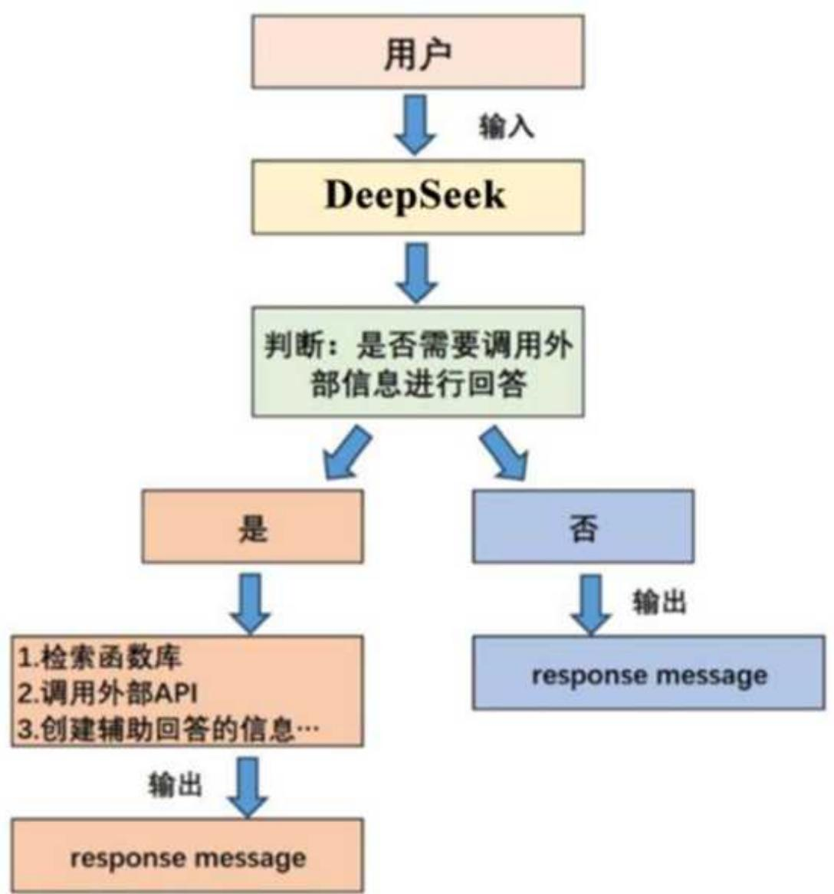  
图7-7 DeepSeek的Function calling功能

这意味着DeepSeek大语言模型在与用户交互时，可以实时检索外部函数库。当用户提问时，模型不再仅仅是从自身知识库中寻找答案，而是会根据实际需求，在外部函数库中进行检索，找出合适的函数并调用它。这种调用外部函数的能力，使得DeepSeek可以获取到函数的运行结果，并基于这些结果进行回答。

# 7.2.1 Python使用工具的基本原理

工具的使用是一项非常简单的事情，从我们的祖先钻木取火，到现在人类飞上月球在太空建立永久基地，这些都离不开工具的使用。甚至在现实生活中，你决定今天出门要不要带上雨伞，都需要借助网络信息或广播工具了解今天的天气情况。

而Python同样也可以使用工具来完成对外部API的调用，其所需要的仅仅是一个函数名称而已。示例代码如下：

```python
创建了一个简单的查询天气的API
def get_weather location =():
    "读者可以编写对应的天气查询API，这里我们仅作演示"
    if location == "Shanghai":
        return 23.0
    elif location == "Tianjin":
        return 25.0
    else:
        return "未查询相关内容"
    location = "Shanghai"
#注意写法格式，里面额度单引号不能少
result = eval(f"getweather location=(location)") #使用eval调用字符串名称对应的函数
print("查询到的结果是：", result) 
```

最终打印结果如下：

查询到的结果是：23.0

可以看到，Python中提供的eval函数可以根据传入的字符串自动运行对应的函数。在这个示例中，我们将location变量的值嵌入字符串中，然后将该字符串作为代码传给eval()函数执行。注意，在嵌入变量值时，我们使用了单引号将变量值引起来，以确保代码的正确解析。

eval()函数是Python的一个内置函数，它的功能是将字符串作为Python代码执行。其工作原理可以简单概括为“字符串解析和执行”。

当我们调用eval()函数并传入一个字符串时，函数会尝试解析这个字符串，将它转换成Python的表达式或语句，然后在当前的命名空间中执行这些表达式或语句。

例如，如果我们传入字符串"1+2"，print(eval("1+2"))。eval()函数会将这个字符串解析为Python的加法表达式，然后计算这个表达式的值，返回结果3。

# 7.2.2 在DeepSeek中智能地使用工具

在7.2.1节中，我们展示了如何在Python中调用函数，但是，我们面临一个更复杂的问题：如何在大模型DeepSeek中调用工具？这个问题看似简单，实则涉及许多深层次的技术与思考。就如同多年前人们询问计算机“今天是晴天还是雨天”一样，我们如今要探讨的是如何让大模型调用工具来解决问题。

先回到日常生活中的一个例子。在决定今天的穿着之前，我们通常会有一个明确的前置任务：了解今天的天气。那么，如何获取天气信息呢？以下是一些可能的方法：

● A：对着衣橱问自己应该穿什么衣服。这显然不是获取天气信息的正确途径。  
● B：使用互联网登录天气网站，输入本地名称查询。这是一个有效且常用的方法。  
● C：打开一本书阅读任意一页。这与获取天气信息无关。  
● D：打开空调。这同样不能告诉我们今天的天气情况。

对于大多数读者来说，选择B是显而易见的，这是基于我们的常识和日常经验。然而，这种基于目标寻找最合适解决方案的能力并非天生，而是需要我们后天的学习和积累。我们需要知道哪些工具或方法可以帮助我们实现目标，这通常需要一个知识库或他人的指导，如图7-8所示。

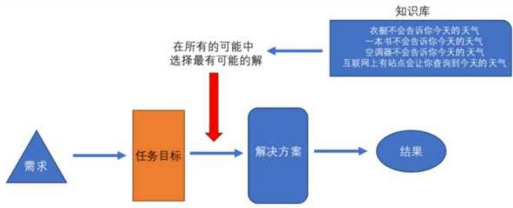  
图7-8 有知识库辅助研判的任务流程

图7-6所示是一个基于常识的决策过程，同时也是我们在日常生活中做出明智决策并取得良好结果的通用步骤。在每次决策之前，我们依赖的是深厚的知识储备或知识库，它们如同明灯，照亮了我们前行的道路，引导我们做出最优决策。

当我们回到DeepSeek调用工具的问题时，面临的挑战是如何让这个大模型也具备这样的决策能力，即根据给定的任务，它能知道应当调用哪些工具。作为深度学习程序设计人员，我们的责任不仅是开发模型，更要引导模型如何使用工具。我们可以提供格式化的API信息，这种方式就像是给大模型提供一本详细的程序文档。在这份文档中，我们详细描述每个

工具API的功能、参数以及返回值，告诉大语言模型在何时、何地可以调用这些API，并且当API被调用后，返回相应的API的JSON对象。

这样的方式能够让大模型更加智能化地运用工具，进而提升其解决问题的效率和准确性。想象一下，当大模型遇到问题时，它可以像人类一样查阅“工具书”，找到最合适的工具，然后利用这个工具解决问题。

一个可供DeepSeek进行调用的简单函数如下：

# 定义工具函数

```txt
def get/weather(function.params): 
```

"""模拟获取天气的工具函数"""

location $=$ function_parameters[0]

# 这里可以调用真实的天气 API

```txt
return f"[location]的天气晴朗" 
```

上述函数对象描述了一个名为get_weather的工具API。通过这个API，大模型可以根据输入的城市名称获取当前的天气情况。这样的描述方式清晰明了，使得大模型能够准确理解并调用这个API。因此，通过对工具API中的描述进行甄别，从而判定使用哪一个最合适的工具，加上合理的引导和训练，可以使大模型更加智能化，从而完成对工具的使用。

作者完成了一个在DeepSeek中使用工具的完整示例，代码如下：

fromopenaiimportOpenAI   
importjson   
client $=$ OpenAI( api_key $\equiv$ "sk-c646e1c201d74777b54f45c60973f4f3"， base_url $\equiv$ "https://api_deepseek.com",   
}   
defget_weather(function.params): return"天气晴朗"   
def send-messages(msgages): response $=$ client chat completions.create( model $\equiv$ "deepseek-chat"， messages $\equiv$ messages ） return response Choices[O].message   
system_prompt $= \text{串}$ 你在运行一个“思考”，“工具调用”，“响应”循环。每次只运行一个阶段。

```txt
Example:  
question：天津的天气怎么样？  
thought：我应该调用工具查询天津的天气情况  
Action:  
{function_name:"get_weather",function.params:"天津"]  
}  
调用Action的结果：“天气晴朗”  
Answer：天津的天气晴朗 
```

```txt
```java
```
question = "Shanghai的天气怎么样"
messages = [(role: "system", "content: system_prompt),
("role: "user", "content: question)]
message = send-messages(msgs)
response = message(content)
action = response.split("Action:")[1]
action = json.dumps(action))
print(f"ModelResponse:\n{action}")  
#生成调用代码
function_name = action["function_name"]
function.params = action["function.params"]
code = f{(function_name)((function.params))}
print(code)
#使用eval对生成的代码进行计算，这里假设get/weather函数已经被定义过
result = eval(code)
print(result) 
```

这段代码实现了一个简单的对话系统，能够根据用户的问题调用相应的工具并生成回答。首先，代码通过OpenAI库初始化了一个客户端，并设置了API密钥和基础URL。接着，定义了一个get_weather函数，用于模拟获取天气的功能，返回固定的“天气晴朗”结果。send_messages函数则负责向模型发送消息并获取模型的响应。系统提示（system_prompt）中详细描述了对话系统的3个阶段：思考、工具调用和响应，并提供了一个示例说明如何调用get_weather工具，以回答天气相关的问题。

生成结果如下：

```txt
ModelResponse:  
{ 'function_name': 'get_weather', 'function.params': ['上海']}  
getweather(['上海']) 
```

天气晴朗

具体来看，在代码的执行部分，用户提出了一个关于上海天气的问题。系统通过send_messages函数将问题发送给模型，模型根据系统提示生成一个包含工具调用信息的响应。代码通过解析响应中的Action部分，提取出需要调用的工具名称和参数，并生成相应的调用代码。最后，使用eval函数执行生成的代码，模拟工具调用的过程，并输出结果。整个过程展示了如何通过模型生成工具调用指令，并动态执行这些指令来完成用户请求。

# 7.2.3 在DeepSeek中选择性地使用工具

前面我们演示了在DeepSeek中使用单一工具的方法。但是，在具体工作中，我们可能会面临一个选择的问题，即在一个“工具箱”中完成工具的选择，之后使用工具来完成我们的目

标。下面给出一个在DeepSeek中有选择地使用工具的完整示例：

fromopenaiimportOpenAI   
importjson   
#初始化OpenAI客户端   
client $\equiv$ OpenAI( api_key="sk-c646elc201d74777b54f45c60973f4f3"，#替换为你的API密钥 base_url $=$ "https://api_deepseek.com"，#DeepSeek API的基础URL ）   
#定义工具函数   
defget_weather(function.params): ""模拟获取天气的工具函数"" location $=$ function.params[0] #这里可以调用真实的天气API returnf"(location)的天气晴朗"   
defget_stock(function.params): ""模拟获取股票的工具函数"" location $=$ function.params[0] #这里可以调用真实股票价格API returnf"(location)的股票价格为18.88"   
#定义工具列表   
tools $= [$ { "type": "function", "function":{ name:"get/weather", "description":"获取指定城市的天气情况", "parameters":【 type": "object", "properties":{ "location":{ type":string", "description":"城市名称，例如：上海”， } }, "required": ["location"], 1, 1, 1, 1, 1, 1, 1, 1, 1, 1, 1, 1, 1, 1, 1, 1, 1, 1, 1, 1, 1, 1, 1, 1, 1, 1, 1, 1, 1, 1, 1, 1, 1, 1,

```json
"type": "string",  
"description": "股票名称，例如：上海证券"，  
}  
},  
"required": ["location"],  
},  
} 
```

```python
def sendmessages.tools messages):
    '''发送消息并调用工具'''''response = client.chat completions.create(
        model="deepseek-chat", #使用的模型
        messages=messages, #消息列表
        tools=tools, #工具列表
        tool_choice="auto", #让模型自动选择是否调用工具
    )
return response Choices[0].message
```

system prompt $=$

```txt
用户问题：天津的天气怎么样？
```

```txt
{ "function_name": "get/weather", "function.params": {"location": "天津"} } 
```

```txt
最终回答：天津的天气晴朗。
```

```txt
question = "Shanghai的天气是什么? " 
```

```python
messages = [
    {"role": "system", "content": system_prompt},
    {"role": "user", "content": question},
] 
```

]   
#发送消息并获取模型响应   
message $=$ sendmessages.tools(messenger)   
#打印模型返回的原始消息   
print(f"Initial Model Response:{message}")   
#检查模型是否返回了工具调用请求   
if message_tool Calls: #解析工具调用请求 tool_call $\equiv$ message_tool Calls[0] function_name $\equiv$ tool_call.function.name function_parameters $\equiv$ json loads_tool_call.functionarguments) #打印工具调用信息 print(f"Tool Call:{tool_call}") print(f"Function Name:{function_name}") print(f"Function Params:{function_parameters}") #根据工具名称调用相应的工具 if function_name $\equiv$ "get_weather": result $\equiv$ getweather([function_parameters["location"]]) elif function_name $\equiv$ "get_stock": result $\equiv$ get_stock([function_parameters["location"]]) else: result $=$ "未知工具"   
#打印工具执行结果   
print(f"Tool Result:{result}")

结果如下：

```txt
Initial Model Response: ChatCompletionMessage(content='', refusal=None,  
role='assistant', audio=None, function_call=None,  
tool Calls=[ChatCompletionMessageToolCall(id='call_0_18c66898-e9e9-45de-98bf-4e4961cb9400', function=Function(args=['location":"Shanghai"', name='get_weather'),  
type='function', index=0)]  
Tool Call:  
ChatCompletionMessageToolCall(id='call_0_18c66898-e9e9-45de-98bf-4e4961cb9400',  
function=Function(args=['location":"Shanghai"', name='getweather'),  
type='function', index=0)  
Function Name: get/weather  
Function Params:{'location':'Shanghai'}  
Tool Result: Shanghai的天气晴朗 
```

我们分别对其进行讲解。首先，定义要使用的工具，并通过列表的形式对工具进行汇总，这里定义了两个工具函数：get_weather和get_stock，分别用于模拟获取指定城市的天气情况和股票价格。每个函数接受一个参数function_params，其中包含所需的参数信息（如城市名称或股票名称），并返回相应的模拟结果。接着，代码定义了一个tools列表，其中包含这两个工具函数的元数据描述，包括函数名称、功能描述以及参数的定义（如参数类型、描述等）。这些元数据可以用于动态调用这些工具函数，或者集成到其他系统中进行自动化处理。

以下是对代码的详细分步讲解和模型介绍，作者结合代码的每一部分进行说明：

# 1．初始化OpenAI客户端

fromopenaiimportOpenAI   
importjson   
#初始化OpenAI客户端   
client $\equiv$ OpenAI( api_key $\coloneqq$ "sk-c646e1c201d74777b54f45c60973f4f3"，#替换为你的API密钥 base_url $\equiv$ "https://api_deepseek.com"，#DeepSeek API的基础URL

（1）功能：初始化OpenAI客户端，用于与DeepSeek API进行交互。  
（2）关键点：

api_key：用于身份验证的API密钥。  
● base_url：DeepSeek API的基础URL，指定API的访问地址。

# 2．定义工具函数

```python
def get/weather(function.params):
    ""模拟获取天气的工具函数''
    location = function.params[0]
    return f"[location]的天气晴朗"
def get_stock(function.params):
    ""
    location = function.params[0]
    return f"[location]的股票价格为18.88" 
```

（1）功能：定义了两个工具函数，分别用于模拟获取天气和股票信息。  
（2）参数：function_params：一个列表，包含工具调用时传递的参数（如城市名称或股票名称）。  
（3）返回值：返回一个字符串，表示模拟的结果。  
（4）说明：这些函数是模拟实现，在实际应用中可以通过调用真实的API获取数据。

# 3．定义工具列表

tools $= 1$ { "type": "function", "function": { name": get/weather", description": "获取指定城市的天气情况", parameters": { type": "object", properties": { location": {"type": string", description": "城市名称，例如：上海" }, } , "required": ["location"], },   
{ "type": "function", "function": { name": get_stock", description": "模拟获取股票的工具函数", parameters": { type": "object", properties": { "location": {"type": "string", "description": "股票名称，例如：上海证券" }, } , "required": ["location"], },

（1）功能：定义工具函数的元数据，包括名称、描述和参数。

（2）结构：

● type：工具类型，这里是function。  
name：工具函数的名称。  
● description：工具函数的功能描述。  
parameters：定义工具函数的参数类型和结构。  
● properties：参数的属性（如location的类型和描述）。  
required：指定哪些参数是必需的。

（3）说明：这些元数据用于指导模型如何调用工具函数。

# 4．发送消息并调用工具

```python
def sendmessages.tools messages):
    ""发送消息并调用工具''
    response = client.chat completions.create(
        model="deepseek-chat", # 使用的模型
        messages=messages, # 消息列表
        tools=tools, # 工具列表
        tool_choice="auto", # 让模型自动选择是否调用工具
    )
    return response Choices[0].message
```

（1）功能：发送用户问题到模型，并返回模型的响应。  
（2）参数：

● model：使用的模型名称（这里是deepseek-chat）。  
● messages：包含系统提示和用户问题的消息列表。  
tools：工具列表。  
● tool_choice：设置为auto，表示由模型自动决定是否调用工具。

（3）返回值：返回模型生成的消息。  
（4）说明：该函数是核心逻辑，负责与模型交互并获取工具调用请求。

# 5．系统提示

```txt
{
    "function_name": "get_weather",
    "function_parameters": ("location": "天津")
}
工具调用结果：“天津的天气晴朗”
最终回答：天津的天气晴朗。 
```

（1）功能：指导模型如何处理用户问题。

（2）内容：

● 定义了模型的工作流程（思考、工具调用、响应）。

提供了一个示例，帮助模型理解如何调用工具并生成响应。  
（3）说明：系统提示是模型行为的关键指导，确保模型能够正确调用工具。

# 6．用户问题与消息列表

```txt
question = "Shanghai的天气是什么? "
messages = [
    {"role": "system", "content": system_prompt},
    {"role": "user", "content": question},
] 
```

（1）功能：定义用户问题，并将其与系统提示一起组成消息列表。  
（2）结构：

"role": "system"：系统提示，用于指导模型。  
"role": "user"：用户问题。

（3）说明：消息列表是模型输入的核心部分，决定了模型的行为和输出。

# 7．发送消息并获取模型响应

```txt
message = send/messages.tools messages)  
print(f"Initial Model Response: {message}") 
```

（1）功能：发送消息列表到模型，并打印模型的初始响应。  
（2）说明：模型的初始响应可能包含工具调用请求或直接回答。

# 8．检查工具调用请求

if message_tool Calls: #解析工具调用请求 tool_call $=$ message_tool Calls[0] function_name $=$ tool_call.function.name function_parameters $=$ json.loadst(tool_call.functionarguments) #打印工具调用信息 print(f"Tool Call:{tool_call}") print(f"Function Name:{function_name}") print(f"Function Params:{function_parameters}") #根据工具名称调用相应的工具 if function_name $= =$ "get_weather": result $=$ get/weather([function_parameters["location)]) elif function_name $= =$ "get_stock": result $=$ get_stock([function_parameters["location)]) else: result $=$ "未知工具" #打印工具执行结果 print(f"Tool Result:{result}")

（1）功能：解析模型的工具调用请求，执行相应的工具函数，并返回结果。  
（2）步骤：

检查模型是否返回了工具调用请求（tool_calls）。  
解析工具调用的名称和参数。  
根据工具名称调用相应的工具函数。  
打印工具执行结果。

（3）说明：该部分是工具调用的核心逻辑，负责执行工具函数并处理结果。

# 9．代码运行流程

（1）初始化OpenAI客户端。  
（2）定义工具函数和工具列表。  
（3）发送用户问题到模型，并获取模型的初始响应。  
（4）检查模型是否返回了工具调用请求。  
（5）解析工具调用请求，执行相应的工具函数。  
（6）打印工具执行结果。

这段代码实现了一个基于工具调用的智能助手系统，能够根据用户问题动态调用工具函数并返回结果。通过定义工具函数、工具列表和系统提示，代码实现了灵活的问题处理机制，适用于需要外部数据支持的场景（如天气查询、股票查询等）。

# 7.2.4 DeepSeek工具调用判定依据

在我们进行工具调用时，DeepSeek也需要有一个判断依据，为了找到这个判断依据，我们修改部分代码，特别是工具箱的描述，代码如下：

fromopenaiimportOpenAI   
importjson   
#初始化OpenAI客户端   
client $\equiv$ OpenAI{ api_key $\equiv$ "sk-c646e1c201d74777b54f45c60973f4f3"，#替换为你的API密钥 base_url $\equiv$ "https://api_deepseek.com"，#DeepSeek API的基础URL   
}   
#定义匿名工具函数   
defget_tool2(function_parameters): location $=$ function_parameters[O] return f"(location)的天气晴朗"   
defget_tool1(function_parameters): location $=$ function_parameters[O] return f"(location)的股票价格为18.88"   
#定义工具列表   
tools $= 1$ { "type": "function", "function": { name": "get_tooll", "description": "模拟获取股票的工具函数", "parameters": { type": "object", properties": { location": { type": "string",

```txt
"description": "",   
1,   
"required": ["location"],   
1,   
},   
{ "type": "function", "function": { "name": "get_tool2", "description": "模拟获取天气的工具函数", "parameters": { "type": "object", "properties": { "location": {"type": "string", "description": "", }, }, "required": ["location"], }, } 
```

```python
def send/messages.tools messages):
    ""发送消息并调用工具''
    response = client.chat completions.create(
        model="deepseek-chat", # 使用的模型
        messages=messages, # 消息列表
        tools=tools, # 工具列表
        tool_choice="auto", # 让模型自动选择是否调用工具
    )
    return response Choices[0].message
```

```toml
system_prompt = "" 
```

工具调用：  
{ "function_name": "get_tool", "function_parameters": {"location": "天津"} } 工具调用结果：“天津的天气晴朗” 最终回答：天津的天气晴朗。   
"" # 用户问题 question $=$ "Shanghai的天气是什么？"   
# 消息列表 messages $=$ { {"role": "system", "content": system_prompt}, {"role": "user", "content": question}, ] # 发送消息并获取模型响应 message $=$ send_messages.tools(messages) # 打印模型返回的原始消息 print(f"Initial Model Response:{message}") # 检查模型是否返回了工具调用请求 if message/tool Calls: # 解析工具调用请求 tool_call $=$ message/tool Calls[0] function_name $=$ tool_call.function.name function_parameters $=$ json.dumps_tool_call.functionarguments) # 打印工具调用信息 print(f"Tool Call:{tool_call}") print(f"Function Name:{function_name}") print(f"Function Params:{function_parameters}") # 根据工具名称调用相应的工具 if function_name $= =$ "get_tool1": result $=$ get_tool1([function_parameters["location)]) elif function_name $= =$ "get_tool2": result $=$ get_tool2([function_parameters["location)]) else: result $=$ "未知工具" # 打印工具执行结果 print(f"Tool Result:{result}")

在上面的代码中，我们匿名定义了工具函数，并删除了其描述部分，而仅仅在工具箱列表中对函数的作用进行解释。重新运行工具函数调用，结果如下：

```txt
Initial Model Response: ChatCompletionMessage(content='', refusal=None, role='assistant', audio=None, function_call=None, tool_calls=[ChatCompletionMessageToolCall(id='call_0_c5a5e11b-9045-4fe5-8c89-0b6ca0d768 
```

b9', function $\equiv$ Function(args $\equiv$ {"location":"Shanghai"}', name $\equiv$ get_tool2'), type $\equiv$ 'function', index $= 0$ ]) Tool Call: ChatCompletionMessageToolCall(id $\equiv$ call_0_c5a5e11b-9045-4fe5-8c89- 0b6ca0d768b9', function $\equiv$ Function(args $\equiv$ {"location":"Shanghai"}', name $\equiv$ get_tool2'), type $\equiv$ 'function', index $= 0$ ) Function Name: get_tool2 Function Params: {location': 'Shanghai'} Tool Result: Shanghai的天气晴朗

可以看到，我们替换了名称，并在函数体内部删除了注释，只在工具描述列表中对每个工具函数进行描述，结果如下：

```javascript
Initial Model Response: ChatCompletionMessage(content='', refusal=None, role='assistant', audio=None, function_call=None, tool_calls=[ChatCompletionMessageToolCall(id='call_0_94b9f60d-bc93-406a-bc6a-d72f985e33 d1', function=Function(args={'location":"Shanghai'}', name='get_tool2'), type='function', index=0)] Tool Call: ChatCompletionMessageToolCall(id='call_0_94b9f60d-bc93-406a-bc6a-d72f985e33d1', function=Function(args={'location":"Shanghai'}', name='get_tool2'), type='function', index=0) Function Name: get_tool2 Function Params:{'location':'Shanghai'} Tool Result: Shanghai的天气晴朗 
```

可以看到，此时生成的结果依旧输出了对应的天气情况。下一步，继续修改内容，在工具list中删除函数描述与参数描述，但是在工具函数体内部加上对应的描述，代码如下：

```python
def get_tool2(function_parameters):
    "模拟获取天气的工具函数"
    location = function_parameters[0]
    return f"[location]的天气晴朗"
def get_tool1(function_parameters):
    "模拟获取股票的工具函数"
    location = function_parameters[0]
    return f"[location]的股票价格为18.88" 
```

tools $= [$ type:"function",   
"function":{ name:"get_tool1", description":None, parameters": {

```txt
"type": "object",  
"properties": {  
    "location": {  
        "type": "string",  
        "description": "",  
    },  
    "required": ["location"],  
},  
{  
    "type": "function",  
    "function": {  
        "name": "get_tool2",  
        "description": None,  
        "parameters": {  
            "type": "object",  
            "properties": {  
                "location": {  
                    "type": "string",  
                    "description": "",  
            }  
        },  
    "required": ["location"],  
}, 
```

打印结果如下：

```txt
Initial Model Response: ChatCompletionMessage(content='', refusal=None,  
role='assistant', audio=None, function_call=None,  
tool Calls=[ChatCompletionMessageToolCall(id='call_0_f5dd2f6e-ef13-4c0a-a5ee-627fd0e934'  
le', function=Function(args=['location":"Shanghai"', name='get_tool1'),  
type='function', index=0)]  
Tool Call:  
ChatCompletionMessageToolCall(id='call_0_f5dd2f6e-ef13-4c0a-a5ee-627fd0e9341e',  
function=Function(args=['location":"Shanghai"', name='get_tool1'),  
type='function', index=0)  
Function Name: get_tool1  
Function Params: {'location': 'Shanghai'}  
Tool Result: Shanghai的股票价格为18.88 
```

可以看到，虽然DeepSeek输出了结果，但是很明显，此时的模型函数调用错误，即我们在定义的工具列表中删除了函数描述，就会造成函数调用错误的结果，这一点需要读者注意。

# 7.3 旅游特种兵迪士尼大作战：DeepSeek高精准路径优化

随着假期的脚步日渐临近，环球影城等备受瞩目的主题游乐场，已然成为大人与孩子们心中不可或缺的节日狂欢圣地。然而，随之而来的庞大客流，却总让无数游客在欢乐的门槛前止步，那长长的排队队伍，无疑成为他们畅享假日时光的最大阻碍。

游乐场内项目琳琅满目，每一个都散发着诱人的魅力，但时间却似乎总是不够用。如何在这人潮汹涌、时间紧迫的环境下，巧妙规划行程，确保每一次的游玩都能获得最大的快乐回报，这无疑是对每一位追求极限旅游体验的“特种兵”游客的严峻考验。

是选择那些刺激惊险的过山车，还是沉浸于梦幻般的童话世界？是优先体验那些人气爆棚的新项目，还是回归那些经典怀旧的老游乐？每一个选择，都关乎着游玩的质量与心情的愉悦。因此，提前做功课，了解各个项目的特点与游玩时长，制定一份详尽而周密的游玩攻略，便显得尤为重要。

不仅如此，游客们还需要灵活应变，根据实际情况及时调整计划。或许，一场突如其来的表演秀，会打乱原有的行程安排，但也可能因此收获意想不到的惊喜与感动。在这个充满变数与可能的游乐场里，每一次的转弯，都可能遇见不一样的风景；每一次的等待，也都可能转换为难忘的回忆。

因此，尽管排队是游玩中不可避免的一环，但只要我们借助DeepSeek强大的人工智能功能，用心规划，巧妙应对，便能在有限的时间里，使得各位旅游“特种兵”尽情享受到游乐场带来的无尽欢乐与惊喜。

# 7.3.1 游乐场数据的准备

在这里，我们精心准备了针对不同游乐场景的详细地图，旨在为游客们提供更加便捷的游玩导航。在这些地图上，我们逐一标注了每个游乐项目的排队时间、视觉体验以及刺激指数，以帮助游客们更全面地了解各个项目的游玩感受。

（1）排队时间，我们在地图上以清晰的数据展示每个项目当前及预计的等待时长，让游客能够根据时间安排，灵活选择先玩哪个项目，从而避免在热门项目前长时间排队等候。  
（2）视觉体验，是我们标注的另一个重要特征。不同的游乐项目带来的视觉震撼各不相同，有的项目让人仿佛置身于梦幻的童话世界，有的则展现出未来科技的奇幻色彩。通过地图上的视觉体验指数，游客可以根据自己的喜好选择那些最能打动自己的游乐项目。

（3）刺激指数，则是为了满足那些追求极限刺激的游客而设计的。不同的游乐项目，其惊险程度各不相同。有的项目平缓舒适，适合全家共同参与；有的则惊心动魄，让人心跳加速。通过刺激指数的标注，游客可以根据自己的承受能力选择合适的游乐项目，确保游玩的安全和愉快。

各个游乐场的地图和标注如图7-9~图7-12所示。

  
图7-9 环球影城

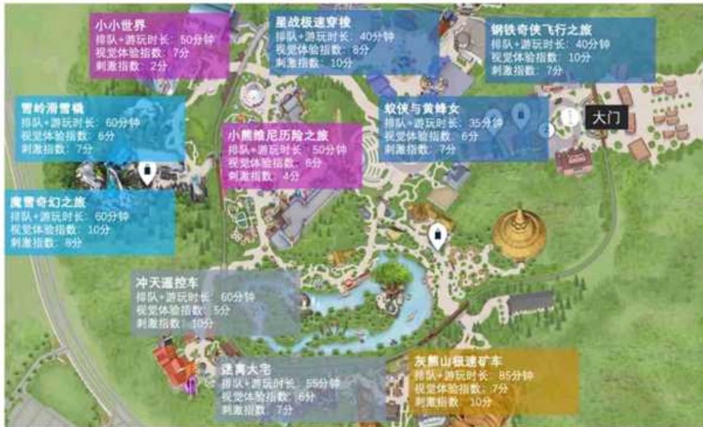  
图7-10 香港迪士尼

  
图7-11 广州长隆欢乐世界

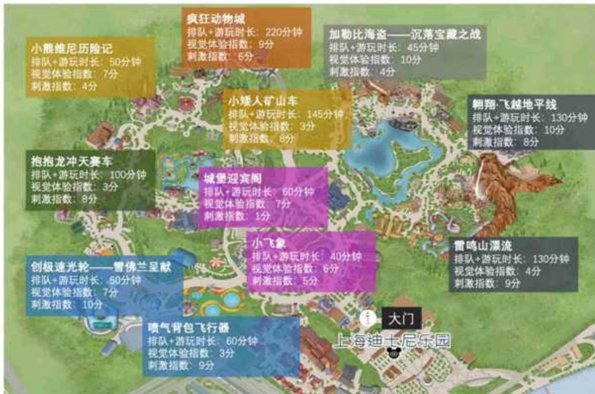  
图7-12 上海迪士尼

可以看到，我们仔细地标注了各个游乐园中每个项目不同的特征，对其进行统计后，我们建立列表如下：

```txt
{name:喷气背包飞行器，time:60，view:3，thrill:9}，{name:创极速光轮-雪佛兰呈现，time:50，view:7，thrill:10}，{name：抱抱龙冲天赛车，time:100，view:3，thrill:8}，{name：小熊维尼历险记，time:50，view:7，thrill:4}，{name：疯狂动物城，time:220，view:9，thrill:6}，{name：加勒比海盗——沉落宝藏之战，time:45，view:10，thrill:4}，{name：翱翔——飞跃地平线，time:130，view:10，thrill:8}，{name：雷鸣山漂流，time:130，view:4，thrill:9}，{name：小飞象，time:40，view:6，thrill:5}，{name：城堡迎宾阁，time:60，view:7，thrill:1}，{name：小矮人矿山车，time:145，view:3，thrill:8}； 
```

其中，time是耗费的时间，view为视觉指数，而thrill则是刺激指数。

# 7.3.2 普通大模型的迪士尼游玩求解攻略

我们首先完成基于普通问题的迪士尼游玩，即将数据传入大模型中，要求其做出对应的回答。代码如下：

fromopenaiimportOpenAI client $=$ OpenAI api_key $\equiv$ "sk-c646elc201d74777b54f45c60973f4f3",   
base_url $\equiv$ "https://api_deepseek.com")   
system_prompt $\equiv$ ""   
你现在作为一个人工智能算法助手，有如下列表 {name：喷气背包飞行器，time:60,view:3,Thrilll:9}， {name：创极速光轮-雪佛兰呈现，time:50,view:7,Thrill:10}， {name：抱抱龙冲天赛车，time:100,view:3,Thrill:8}， {name：小熊维尼历险记，time:50,view:7,Thrill:4}， {name：疯狂动物城，time:220,view:9,Thrill:6}， {name：加勒比海盗-沉落宝藏之战，time:45,view:10,Thrill:4}， {name：翱翔-飞跃地平线，time:130,view:10,Thrill:8}， {name：雷鸣山漂流，time:130,view:4,Thrill:9}， {name：小飞象，time:40,view:6,Thrill:5}， {name：城堡迎宾阁，time:60,view:7,Thrill:1}， {name：小矮人矿山车，time:145,view:3,Thrill:8]}； 其中“游乐项目名称name”“用时time”“体验指数（视觉指数view、刺激指数thrill）”。 【示例】：{ 问题：游玩5个小时，玩哪些项目的组合刺激指数最大？ 回答：亲爱的游客您好，根据您的问题经过严密计算后得出： 300分钟之内，刺激指数总和最大为36，总耗时300分钟。 【小熊维尼历险记】【耗时50分钟】【刺激指数：4】 【抱抱龙冲天赛车】【耗时100分钟】【刺激指数：8】 【创极速光轮-雪佛兰呈献】【耗时50分钟】【刺激指数：10】 【小飞象】【耗时40分钟】【刺激指数：5】 【喷气背包飞行器】【耗时60分钟】【刺激指数：9】） 请根据要求运算出结果并输出。   
""   
response $=$ client.chat completions.create( model $\equiv$ "deepseek-chat" messages=[ {"role":"system","content":system_prompt}, {"role":"user","content":"只有120分钟的时间，怎么玩视觉体验最大？"}] stream $\equiv$ False   
print(response Choices[O].messagecontent)

这段代码的主要功能是通过调用DeepSeek的API，利用一个预定义的system_prompt来回答用户关于游乐项目组合的问题。首先，代码导入了DeepSeek库并初始化了一个客户端，设置了API密钥和基础URL。接着，定义了一个系统提示（system_prompt），其中包含一系列游乐项目的详细信息，如名称、用时、视觉指数和刺激指数。系统提示还包含一个示例，展示了如何根据用户的问题计算并输出最佳的游乐项目组合。

在代码的第二部分，通过client.chat.completions.create方法向API发送请求，其中指定了使用的模型（deepseek-chat）、系统提示和用户的问题（“只有120分钟的时间，怎么玩视觉体验最大？”）。API会根据系统提示中的算法和用户的问题，计算出在120分钟内视觉体验最大的游乐项目组合，并将结果返回。最后，代码打印出API返回的结果，即最佳的游乐项目组合。运行结果读者可以自行尝试验证（建议多次）。

# 7.3.3 基于动态规划算法的迪士尼游玩求解攻略

动态规划（Dynamic Programming，DP）是一种在数学、计算机科学和经济学中用来找出多阶段决策过程中最优解的方法。在计算机科学中，动态规划通常用于优化递归问题，例如用于求解斐波那契数列，或者用于求解具有重叠子问题和最优子结构的问题。

在这个问题中，我们有一组游乐项目，每个项目都有各自的游玩时间（time）、景观评分（view）和刺激评分（thrill）。我们的目标是选择一组项目，使得总游玩时间不超过120分钟，同时最大化景观评分的总和。

# 注意

动态规划算法比较复杂，读者可以跳过7.3.3节的学习直接学习大模型完成迪士尼游玩。

下面是我们使用动态规划算法完成的极限迪士尼游玩攻略的求解，代码如下：

```txt
projects = {
    ["name":"喷气背包飞行器","time":60,"view":3,"thrill":9],
    ["name":"创极速光轮-雪佛兰呈现","time":50,"view":7,"thrill":10],
    ["name":"抱抱龙冲天赛车","time":100,"view":3,"thrill":8],
    ["name":"小熊维尼历险记","time":50,"view":7,"thrill":4],
    ["name":"疯狂动物城","time":220,"view":9,"thrill":6],
    ["name":"加勒比海盗-沉落宝藏之战","time":45,"view":10,"thrill":4],
    ["name":"翱翔-飞跃地平线","time":130,"view":10,"thrill":8],
    ["name":"雷鸣山漂流","time":130,"view":4,"thrill":9],
    ["name":"小飞象","time":40,"view":6,"thrill":5],
    ["name":"城堡迎宾阁","time":60,"view":7,"thrill":1],
    ["name":"小矮人矿山车","time":145,"view":3,"thrill":8]
} 
```

```txt
time = [proj['time'] for proj in projects]  
view = [proj['view'] for proj in projects]  
n = len/projects) # 项目总数  
T = 120 # 总时间限制 
```

初始化动态规划数组和选择数组

```txt
dp = [[0] * (T + 1) for _ in range(n + 1)]  
choices = [[-1] * (T + 1) for _ in range(n + 1)] # -1 表示未选择任何项目 
```

填充动态规划数组和选择数组

```python
for i in range(1, n + 1):
    for j in range(1, T + 1):
        if j >= time[i - 1]:
            # 如果选择当前项目可以得到更大的景观评分，则更新dp和choices
            if dp[i - 1][j - time[i - 1]] + view[i - 1] > dp[i - 1][j]:
                dp[i][j] = dp[i - 1][j - time[i - 1]] + view[i - 1]
                choices[i][j] = i - 1 # 记录选择了哪个项目（使用项目的索引）
            else:
                dp[i][j] = dp[i - 1][j]
            else:
                dp[i][j] = dp[i - 1][j] 
```

```txt
print("最大景观评分总和：", dp[n][T])
```

defbacktrack(choices，time，projects,total_time,current_index): iftotal_time $= = 0$ or current_index $= = 0$ ： return[] ifchoices[current_index][total_time] $= = -1$ ： #没有在当前状态选择项目，继续向前回溯 returnbacktrack(choices，time，projects,total_time,current_index-1) else: #找到了一个选择的项目，加入结果列表，并继续向前回溯 chosenProj_index $\equiv$ choices[current_index][total_time] chosenProj_name $\equiv$ projects[chosenProj_index]['name'] remaining_time $=$ total_time-time[chosenProj_index] return [chosenProj_name] $^+$ backtrack(choices，time，projects,remaining_time, chosenProj_index)

selectedProjects $\equiv$ backtrack(choices，time，projects,T,n) print("构成最大景观评分总和的项目名称：") forproj_namein selectedProjects: print(" $^ { \text{串} }$ +proj_name)

打印结果如下：

最大景观评分总和: 17

构成最大景观评分总和的项目名称

加勒比海盗-沉落宝藏之战

创极速光轮-雪佛兰呈现

可以看到，我们通过算法设计获得了符合要求的结果，此时整体时间满足要求，同时也获取到最大的条件组合。

# 7.3.4 基于DeepSeek的旅游特种兵迪士尼大作战

在上述内容中，我们分别探讨了基于DeepSeek的基础迪士尼游玩攻略以及运用动态规划算法优化的迪士尼游玩攻略。显然，动态规划算法在特定条件下能够高效地给出满意的结果。然而，当面临不同的约束条件时，这种方法的局限性也显现出来了，它要求使用者必须具备相当丰富的算法知识和程序设计经验，才能灵活调整策略以适应新的情况。

相比之下，如果我们单纯依赖大型模型在有约束的条件下进行计算，多次运行的结果可能会出现不一致的情况。这主要是因为大型模型的设计和运行逻辑并未与我们的特定算法需求紧密结合。因此，在计算过程中，它们可能无法全面、准确地捕捉到我们的具体需求，从而导致结果的不稳定性。

为了克服这些挑战，我们可以考虑将动态规划算法与大型模型相结合，以充分发挥两者的优势。具体来说，我们可以利用动态规划算法来构建基础的游玩攻略框架，确保在满足核心约束条件的前提下获得优化结果。同时，可以借助大型模型的强大计算能力，对动态规划算法生成的初步结果进行进一步的细化和优化，以适应更多复杂多变的实际场景。

下面就是我们设计的、基于DeepSeek的旅游特种兵迪士尼路径规划，代码如下：

```python
from openai import OpenAI
client = OpenAI(API_key="sk-c646elc201d74777b54f45c60973f4f3",
base_url="https://api_deepseek.com")
system_prompt = ""
你现在作为一个人工智能算法助手,
根据下面提供的算法逻辑和【0-1背包问题】解题思路来处理景点游玩最优规划这个情景问题。
【代码算法逻辑及步骤】:
step1:分析问题,获得可用总时长$ztime(分钟);
step2:加载以下全部11组數據
$sdata = [(name:喷气背包飞行器,time:60,view:3,thrill:9),
{name:创极速光轮-雪佛兰呈现,time:50,view:7,thrill:10},
{name:抱抱龙冲天赛车,time:100,view:3,thrill:8},
{name:小熊维尼历险记,time:50,view:7,thrill:4},
{name:疯狂动物城,time:220,view:9,thrill:6},
{name:加勒比海盗-沉落宝藏之战,time:45,view:10,thrill:4},
{name:翱翔-飞跃地平线,time:130,view:10,thrill:8},
{name:雷鸣山漂流,time:130,view:4,thrill:9},
{name:小飞象,time:40,view:6,thrill:5},
{name:城堡迎宾阁,time:60,view:7,thrill:1}], 
```

{name:小矮人矿山车,time:145,view:3,Thrill:8]；其中“游乐项目名称name”“用时time”“体验指数(视觉指数view、刺激指数thrill)”。step3:分析问题,设置对应要计算的指数(刺激指数thrill;视觉指数:view);step4:判断总耗时是否小于data中的time最小值,如果小于则直接结束运算,说明不会存在最优解。如果大于或等于则进行下一步；step5:定义状态dp[i][j],表示前i个物品在容量为j的背包下的最大值。step6:初始化dp状态，dp[0][j]=0，表示背包没有容量时的最大价值，也就是0。step7：状态转移方程为dp[i][j]=max{dp[i-1][j],dp[i-1][j-data[i].time]+data[i].thrill）if j > data[i].time else dp[i-1][j]。表示在有足够容量的情况下，可以选择放入或者不放入当前的物品。step8:求出dp(len(data)][Sztim],该值就是最大的体验指数。step9:通过dp状态表，反推出data.name(项目名称)。【示例】：{问题：游玩5个小时，玩哪些项目的组合刺激指数最大？回答：亲爱的游客您好，根据您的问题经过严密计算后得出：300分钟之内，刺激指数总和最大为36，总耗时300分钟。【小熊维尼历险记】【耗时50分钟】【刺激指数：4】【抱抱龙冲天赛车】【耗时100分钟】【刺激指数：8】【创极速光轮-雪佛兰呈献】【耗时50分钟】【刺激指数：10】【小飞象】【耗时40分钟】【刺激指数：5】【喷气背包飞行器】【耗时60分钟】【刺激指数：9】！请严格按照上述算法和输出要求，运算出结果并输出，不要超出约束条件。让我们一步一步来思考！""response $=$ client.chat.completions.create(model="deepseek-chat",messages=[{"role":"system","content":system_prompt},{"role":"user","content":"只有120分钟的时间，怎么玩视觉体验最大，并且刺激指数最大？}，stream=Falseprint(response Choices[O].message(content)

输出结果如下：

亲爱的游客您好，根据您的问题经过严密计算后得出：

120分钟之内，视觉指数总和最大为17，总耗时120分钟。

【加勒比海盗-沉落宝藏之战】【耗时45分钟】【视觉指数：10】

【小熊维尼历险记】【耗时50分钟】【视觉指数：7】

此时看到，输出的结果较好地满足了需求，尽管细节上还有一定的出入，但是大模型与基于普通动态规划算法得到的结果在总体约束上基本保持一致。

# 7.4 本章小结

本章我们深入探讨了基于DeepSeek在线API调用的实践应用，通过详细剖析多个具体项目，使读者对DeepSeek的功能与调用方式有了更全面的了解。我们不仅介绍了如何利用DeepSeek进行高效的工具调用，还进一步结合动态规划算法，实现了带有特定条件的旅游景点路径优化。

这一创新性的结合，不仅提升了路径规划的智能性和灵活性，也为旅游行业带来了更多便利和可能性。通过本章的学习，读者能够熟练掌握DeepSeek API的调用技巧，并能将其灵活运用于实际场景中，从而实现更高效的资源利用和更优质的用户体验。未来，随着技术的不断进步和应用场景的不断拓展，我们相信DeepSeek将在更多领域展现出其强大的潜力和价值。

# 第8章

# 广告文案撰写实战：多模态DeepSeek本地化部署与微调

DeepSeek在设计上独树一帜，在架构上它并未沿袭LLaMA的Dense架构或Mistral的Sparse架构。相反，该模型在框架上进行全面的革新，采纳了我们之前深入研究的MLA（多头潜在注意力）架构。这一创新架构显著减少了计算负担和推理时的显存占用，为高效运行铺平了道路。

值 得 一 提 的 是 ， DeepSeek 还 巧 妙 地 融 合 了 MoE （ Mixture-of-Experts ） 架 构 ， 即DeepSeek“专家混合”技术（DeepSeek MoE）。这一结合不仅将计算量降至最低，而且极大地提升了模型的总体性能，实现了质的飞跃。DeepSeek总体架构如图8-1所示。

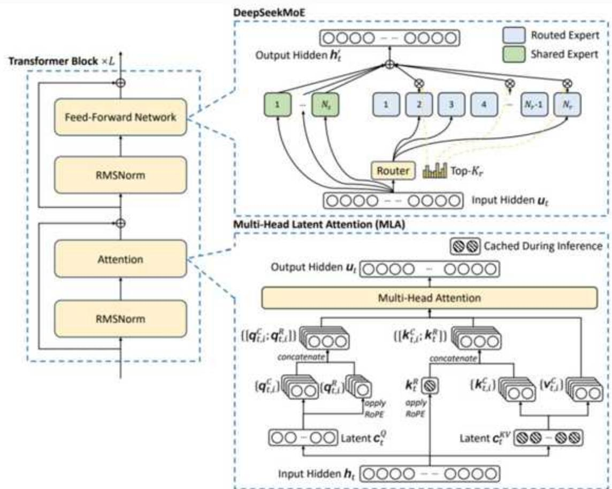  
图8-1 DeepSeek总体架构

在撰写本书之际，尽管最新的DeepSeek-V3已经开源发布，然而，鉴于其庞大的参数量，为了更清晰地阐述相关概念和方法，本章我们仍将沿用DeepSeek-VL2版本的开源模型进行讲解。在本章中，我们将详细介绍如何在本地环境中部署DeepSeek-VL2，并对其进行微调。

首先，我们会指导读者如何在本地机器上成功安装和配置DeepSeek-VL2模型。这包括环境准备、依赖安装以及模型文件的正确放置等步骤。我们将确保读者能够顺利地搭建一个可用于学习和实验的本地环境。

接下来，我们将深入探讨DeepSeek-VL2模型的微调技巧。微调是一个关键步骤，它允许用户根据自己的数据和需求对预训练模型进行调整，从而提升模型在实际应用中的性能。我们将详细介绍微调过程中的关键参数设置、训练数据的准备以及评估指标的选择，帮助读者更好地理解和掌握微调技术。

通过本章的学习，读者将能够独立完成DeepSeek-VL2的本地化部署，并掌握对其进行微调的方法，为后续的应用开发奠定坚实的基础。

注意，尽管我们使用的是DeepSeek-VL2版本，但所讲解的原理和方法同样适用于更高版本的模型，为读者未来升级到更先进的模型提供了有力的知识支撑。

# 8.1 多模态DeepSeek-VL2本地化部署与使用

DeepSeek-VL2是一款引人注目的MoE大语言模型，由于MoE的设计与使用，使得此模型在推理时极大提升了计算效率。通过创新的MLA机制，该模型不仅降低了计算复杂度，还显著减少了显存占用，同时结合强化学习技术，使其在各种基准测试中表现卓越，特别是在中文和代码生成任务上成绩斐然。

DeepSeek-VL2的应用前景广阔，无论是在自然语言处理、文本生成，还是机器翻译、智能问答等领域，都能提供高效且准确的解决方案。其开源和可免费商用的特点更是让它成为企业和开发者的优选之一。展望未来，随着技术进步和应用拓展，DeepSeek-VL2有望在AI技术领域发挥更广泛的作用，推动整个行业的创新与发展。

# 8.1.1 Linux版本DeepSeek-VL2代码下载与图像问答

首先登录GitHub完成DeepSeek-VL2的代码下载。为了简便起见，作者在这里提供了下载好的代码，如下所示：

# 注意

这里使用的是基于Linux的版本，Windows版本的DeepSeek-VL2本地化部署见8.1.2节。

import torch   
from transformers import AutoModelForCausalLM   
from deepseek_v12.models import DeepseekVLV2Processor, DeepseekVLV2ForCausalLM   
from deepseek_v12.utils.io import load_pil_images   
model_path $=$ "deepseek-ai/deepseek-v12-tiny"   
vl-chat Processor: DeepseekVLV2Processor

DeepseekVLV2Processor.from_pretrained(model_path)   
tokenizer $=$ vl chatting Processortokenizer   
vl_gpt: DeepseekVLV2ForCausalLM $=$ AutoModelForCausalLM.from_pretrained(model_path, trust_remote_code $\equiv$ True)   
vl_gpt $=$ vl_gpt.to(torch.bfloat16).cuda().eval()   
conversation $= [$ { "role": "<|User|>", "content": "This is image_1: <image>\n" "This is image_2: <image>\n" "This is image_3: <image>\n 请告诉我这幅画里面画的是什么？", "images": [ "images/multi_image_1.jpeg", "images/multi_image_2.jpeg", "images/multi_image_3.jpeg", ], }, {"role": "<|Assistant|>", "content": "" }   
pil_images = load_pil_images(conversation)   
prepare_entries $=$ vl-chat Processor( conversations $\coloneqq$ conversation, images $\coloneqq$ pil_images, force_batchify $\coloneqq$ True, system_prompt="") .to(vl_gpt_device)   
with torch.no_grad(): inputs_embedding $=$ vl_gpt.prepare_entries_embedding(*'prepare_entries)   
inputs_embedding, past_key_values $=$ vl_gpt.inIncremental sufilling( input_ids $\coloneqq$ prepare_entries-input_ids, images $\coloneqq$ prepare_entries/images, images_seq_mask $\coloneqq$ prepare_entries/images_seq_mask, images_spatialOUSP $\coloneqq$ prepare_entries/images_spatial_crop, attention_mask $\coloneqq$ prepare_entries.attention_mask, chunk_size $= 512$ ）   
outputs $=$ vl_gpt_generate( inputs_embedding $\coloneqq$ inputs_embedding, input_ids $\coloneqq$ prepare_entries.Input_ids, images $\coloneqq$ prepare_entries/images, images_seq_mask $\coloneqq$ prepare_entries/images_seq_mask, images_spatialOUSP $\coloneqq$ prepare_entries/images_spatial_crop, attention_mask $\coloneqq$ prepare_entries.attention_mask, past_key_values $\coloneqq$ past_key_values,

```python
pad_token_id=tokenizer.eos_token_id,  
bos_token_id=tokenizer.bos_token_id,  
eos_token_id=tokenizer.eos_token_id,  
max_new_tokens=512,  
do_sample=False,  
use_cache=True,  
）  
answer = tokenizerdecode(outputs[0][len(prepare Inputs.input_ids[0]):].cpu().tolist(), skip_special_tokens=False)  
print(f"{'prepare_entries['sft_format'] [0]}", answer) 
```

在本例中，我们定义了model_path $=$ "deepseek-ai/deepseek-vl2-tiny"，即使用一个迷你版本的DeepSeek-VL2进行模型设计，由于模型的权重和编码器需要从网上下载，对于下载有困难的读者，作者在配套代码库中准备了下载好的权重与文件。读者可以直接更改model_path地址到本地。代码如下：

```txt
model_path = "C:/Users/xiaohua/.cache/huggingface/hub /models--deepseek-ai--deepseek-v12-tiny/snapshots/66c54660eae7e90c9ba259bdf92d07d6e3ce8aa" 
```

在Linux系统下，读者在安装对应的Python包后，可直接运行代码，结果如下：

$<  |$ User|>:This is image_1: <image> This is image_2: <image> This is image_3: <image> 请告诉我这幅画里面画的是什么？   
<|Assistant|>：这幅画展示了三根胡萝卜。胡萝卜呈橙色，顶部带有绿色的叶子。它们被堆叠在一起，看起来非常新鲜。胡萝卜通常用于烹饪，可以生吃、炒菜或炖煮。<|end_of_sentence|>

# 8.1.2 Windows版本DeepSeek-VL2代码下载

对于使用Windows系统的读者而言，我们可以遵循8.1.1节的步骤来下载DeepSeek-VL2的代码。不过，在实际应用过程中，鉴于操作系统的差异性，读者可能需要手动安装一些必要的Python辅助包以确保程序的顺利运行。这里主要涉及两个关键的安装包，具体如下：

```python
from flash_attn import flash_attn_qkvpacked_func  
from xformers.opse import memory_efficientattention 
```

这里分别使用了flash_attn与xformers来实现特殊的注意力架构。其中，xformers可以使用如下的代码进行安装：

```batch
pip install -U xformers --index-url https://download.pytorch.org/whl/cu124 
```

# 注意

上面的安装代码需要使用CUDA 12.4。具体安装的版本，读者可以自行斟酌。

对于flash_attn的安装，Windows版本的flash_attn无法直接安装，读者可以使用本书配套代码库中作者编译好的flash_attn安装，从而完成本地化DeepSeek-VL2的部署。

# 8.2 广告文案撰写实战1：PEFT与LoRA详解

DeepSeek在文本生成、信息检索和智能问答等多个领域都展现出了令人瞩目的性能，这得益于其精心设计的初始训练过程。然而，不容忽视的是，尽管DeepSeek的架构设计能够在一定程度上减少训练成本，但要从零开始训练一个特定模型，仍然需要巨大的计算资源和庞大的数据集。这对于普通人来说无疑是一个沉重的负担。这种情况使得一些研究人员难以复现和验证之前的研究成果，从而影响了科研的进展和可信度。

为了有效应对这一问题，研究人员提出了一种新的训练方法：在已有的大型预训练模型基础上进行进一步的训练，即所谓的“微调（fine-tuning）”。这种方法允许我们根据特定任务的需求，对原始大模型进行针对性的训练，以提升其在新任务上的表现。通过这种方式，我们不仅可以节省大量的计算资源和时间，还可以降低对海量数据集的依赖。微调的流程如图8-2所示。

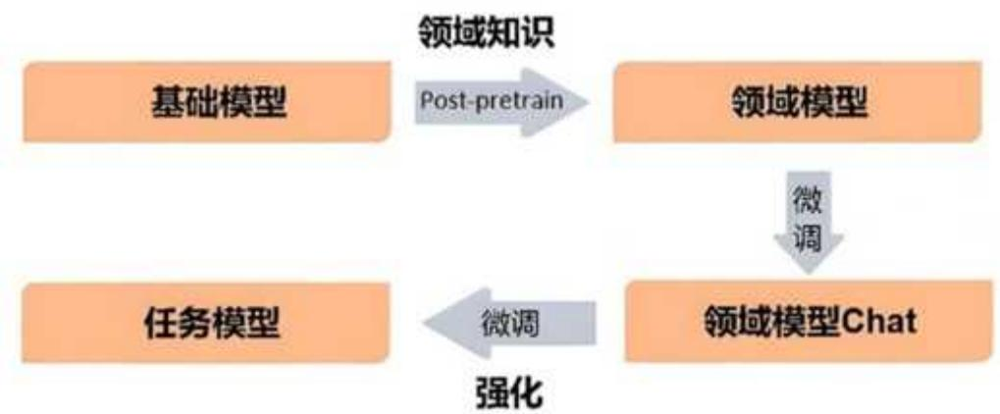  
图8-2 微调的流程

微调技术的引入显著减轻了大型预训练模型的训练成本，使得更多的研究人员和开发人员能够利用这些强大的模型，而无须承担过高的计算和数据成本。这无疑为自然语言处理和人工智能领域的研究与应用开辟了新的道路，促进了技术的普及与进步。

本章我们将完成基于DeepSeek-VL2本地化的微调方法，并演示如何由关键词生成对应的文案。

# 8.2.1 微调的目的：让生成的结果更聚焦于任务目标

本小节将采用DeepSeek-VL2来完成广告文案生成。首先来看我们所提供的数据和本次要求的目标，任务数据如图8-3所示。

```txt
("instruction": "类型#猫*风格#街头*风格#湘*模型#a字", "output": "孕期就一定要穿的沉闷单调吗?热爱潮流的怎能束缚自己个性的心呢,这款裙子采用("instruction": "类型#裤*材质#牛仔布*颜色#浅蓝色*风格#街头*风格#休闲*裤款式#破洞", "output": "破洞元素已变成彰显个性的元素。"  
("instruction": "类型#裤*版型#宽松*材质#雪纺*风格#知性*风格#性感*图案#线条*裤长#连体裤*裤款式#木耳边", "output": "雪纺面料的一袭连体裤。"  
("instruction": "类型#裤*风格#简约*图案#线条*裤款式#口袋*裤款式#拉链", "output": "侧缝处添置有立体拉链口袋作为装饰,实用性强且兼备美观性。"  
("instruction": "类型#上衣颜色#白色*图案#条纹*图案#衣样式#衬衫", "output": "白色的衬衫采用了百褶的袖子设计,既修饰了手臂线条,又为整("instruction": "类型#裤*材质#棉*材质#牛仔布*风格#简约*风格#休闲*裤长#短裤*裤款式#破洞", "output": "选用优质的纯棉面料打造出舒适的质感。"  
("instruction": "类型#裤*材质#水洗*风格#潮*裤款式#不规则*裤口#毛边", "output": "年轻潮流的设计品味,洋气又好穿。细节相当丰富有看点,融入水("instruction": "类型#裤*颜色#蓝色*风格#简约*裤样式#纽扣", "output": "背带裤的选用天蓝色的主题,远远看上去就像是蓝色<UNK>垫 
```

图8-3 文本生成提供的数据集

这里我们提供了一套完整的文案数据，instruction部分是文案关键词提示，也就是相应的Prompt，而output部分是根据关键词提示生成的对应讲解文案。在进入下一步之前，我们首先来看未经微调生成的结果，代码如下：

```python
import torch
from transformers import AutoModelForCausalLM
from deepseek_v12.models import DeepseekVLV2Processor, DeepseekVLV2ForCausalLM
from deepseek_v12.utils.io import load_pil_images
#specify the path to the model
model_path = "deepseek-ai/deepseek-v12-tiny"
model_path = "C:/Users/xiaohua/.cache/huggingface/hub/
models--deepseek-ai--deepseek-v12-tiny/snapshots/66c54660eae7e90c9ba259bfdf92d07d6e3ce8
aa"
vl chatting Processor = DeepseekVLV2Processor.from_pretrained(model_path)
tokenizer = v1 chatting Processortokenizer
model = AutoModelForCausalLM.from_pretrained(model_path, trust_remote_code=True)
model = model.to(torch.dfloat16).CUDA().eval()
conversation1 = [
("role": "<|User|>", "content": "类型#裤*版型#宽松*风格#性感*图案#裤型#阔腿裤"),
{"role": "<|Assistant|>", "content": ""
] conversation = conversation1
#load images and prepare for inputs
pil_images = load_pil_images(conversation)
prepare Inputs = v1 chatting Processor(
conversations=conversation,
images=pil_images,
force_batchify=True,
system_prompt=""
).to(modeldevice)
#run image encoder to get the image embeddings
inputs_embeds = model.prepare Inputs(embeds(**prepare Inputs))
#run the model to get the response
outputs = model_generate(
inputs_embeds=inputs_embeds,
input_ids=prepare輸入s输入ids,
images=prepare輸入s images,
images_seq_mask=prepare輸入s images_seq_mask,
images_spatialCrop=prepare輸入s images_spatialCrop,
attention_mask=prepare輸入s attention mask,
pad_token_id=tokenizer.eos_token_id,
bos_token_id=tokenizer.bos_token_id, 
```

eos_token_id=tokenizer.eos_token_id, max_new_tokens $= 512$ do_sample $\equiv$ False, use_cache $\equiv$ True,   
） answer $\equiv$ tokenizer.decode(outputs[0][lenprepare_input. input_ids[0]]:.cpu().tolist(),skip_special_tokens $\equiv$ False) print(f"prepare_input['sft_format'][0]"),answer)

在这里，我们首先建立了DeepSeek-VL2模型，之后将对应的文本内容输入模型中，生成的结果如下：

```txt
<|User|>:类型#裤*版型#宽松#风格#性感#图案#线条#裤型#阔腿裤 
```

的图案和线条。以下是关于阔腿裤的详细描述：

畅性使得阔腿裤看起来更加优雅和时尚。

```txt
总的来说，阔腿裤是一种非常经典且时尚的裤子类型，其设计特点使得它能够适应各种场合和穿着需求。<|end_ofsentence|>
```

可以看到，虽然模型输出的结果得到了对应的答案，并且贴合我们输入的内容，但是在任务目标上可以很明显地看到，此时生成的结果并没有很好地切合任务目标，生成的结果有些松散而不符合要求。因此，为了使得模型生成在结果上更加贴合，我们可以使用微调方法对模型进行“重训练”，从而得到一个符合我们要求的输出结果模型。

# 8.2.2 微调经典方法LoRA详解

大模型微调LoRA（Low-RankAdaptation，低秩自适应）是一种高效的模型调整技术，它通过引入低秩矩阵对大型预训练模型进行微调。具体而言，LoRA不直接修改模型的原始权重，而是在模型的特定层注入可训练的低秩矩阵。这些低秩矩阵与原始权重相结合，使模型能够快速适应新任务，以高效且轻量级的方式对大型语言模型进行定制化调整，从而使其更好地适应特定任务或领域的需求，同时保持模型原有的泛化能力，但又显著降低了训练所需的计算资源和时间。这种方法特别适用于资源有限或对微调效率有较高要求的场景。

LoRA方法的核心思想是将大模型的参数分解为低维的核心参数和高维的残差参数。在微调过程中，我们只更新LoRA参数，而核心参数保持不变。这种参数分解的方式降低了模型的复杂度，减少了过拟合的风险，并且提高了模型的泛化能力。

此外，基于LoRA的微调方法只对大模型的特定层（如Embedding层）进行微调。这种方法不会影响大模型的整体交互能力。同时，通过冻结模型的所有参数并学习插入token，我们可以避免因调整大量参数而导致的模型不稳定问题。这种方法的效果通常比其他方法更稳定、更可靠。

另外，基于LoRA的微调方法还具有很高的灵活性和通用性。由于它只需要添加特定的参数矩阵以适应下游任务，因此可以方便地在不同场景之间进行切换。这种灵活性使得基于LoRA的方法在实际应用中具有更大的潜力。

基于LoRA的大模型微调方法是一种高效、低成本且具有高度灵活性和通用性的解决方案。在实际应用中，我们可以根据具体场景和训练模式选择最恰当的微调方法。对于需要快速部署和高度灵活性的应用场景，基于LoRA的微调方法无疑是一个理想的选择。

具体来看，LoRA可以认为是大模型的低秩适配器，或者简单地理解为特定任务适配器。通过在原模型特定位置增加一个低秩分解（先降维，再升维）的旁路来模拟参数的更新量。这样，使得训练时原模型固定，只训练降维矩阵 A和升维矩阵 B 。而在推理时，可将BA加到原参数上，不引入额外的推理延迟，如图8-4所示。

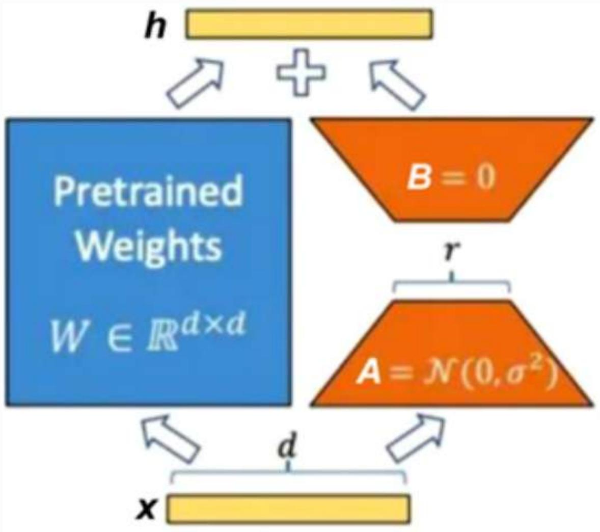  
图8-4 LoRA适配器

从数学方法来看，假设预训练的特定位置矩阵为 $\mathrm { ~ W ~ } _ { _ 0 } \in \mathrm { ~ R ~ } ^ { ^ { \mathrm { d } \times \mathrm { k } } }$ ，其增加了LoRA修正后的参数可以表示为：

$$
\mathrm {W} _ {0} + \Delta \mathrm {W} = \mathrm {W} _ {0} + \mathrm {B A}
$$

$\mathrm { \boldsymbol { B } } \in \mathrm { \boldsymbol { R } } ^ { \mathrm { \scriptsize ~ d \times ~ r ~ } }$ , r ≪min( d,k );( r 远小于 d 或 K 的最小值 )

$$
\mathrm {A} \in \mathrm {R} ^ {\mathrm {r} \times \mathrm {k}}
$$

此时，对于前向计算来说，其计算过程变为：

$$
h = W _ {0} x + \Delta W x = W _ {0} x + B A x = (W _ {0} + B A) x
$$

LoRA有点类似于残差连接，仅仅使用这个旁路的更新来修正整个大模型的微调过程，从而使得大模型能够适配具体的任务目标。

在生产环境部署时，LoRA可以不引入推理延迟，只需要将预训练模型参数 $\mathrm { ~ W ~ } _ { 0 }$ 与LoRA参数进行合并（也就是所谓的模型合并），即可得到微调后的模型参数（ $\mathrm { ~ W ~ } _ { 0 } + \mathrm { B A }$ ）。在生产环境中，像以前一样进行推理，即微调前计算 $\mathrm { ~ W ~ } _ { 0 } \mathrm { ~ x ~ }$ ，现在计算 $\mathrm { ~ W ~ } _ { 0 } + \mathrm { B A } ) \mathrm { ~ x ~ }$ ，这没有额外延迟。现在不少模型仅发布LoRA权重，需要用户在本地与基模型进行合并才能使用，其原理就在于此。

# 8.2.3 适配DeepSeek微调的辅助库PEFT详解

在前面的章节中，我们已经详尽介绍了DeepSeek-VL2模型的基本使用，使读者对该模型有了初步的认识。接下来，我们将进一步探索与其紧密相关的专用微调辅助库PEFT（Parameter-Efficient Fine-tuning，参数高效的微调方法）。

PEFT作为专为DeepSeek量身打造的微调辅助库，在深度学习的广阔天地中，犹如一把锐利的宝剑，助力模型性能更上一层楼。众所周知，微调是提升模型在特定任务上表现的关键技术，然而，其高昂的数据和计算资源需求常令众多中小型研究机构和企业望而却步。正是在这样的背景下，PEFT应运而生，它以高效且低成本的微调解决方案为使命，致力于打破资源壁垒，让深度学习技术的魅力惠及更广泛的群体。

PEFT的核心竞争力在于其精妙的优化技术，这些技术能够实现对模型参数的高效、精准更新。通过融入自适应学习率调整、动态权重裁剪等创新性算法，PEFT在有限的计算资源和数据规模下，仍能驱动模型性能的显著提升。更为出色的是，它还配备了一系列实用的辅助工具，从数据预处理到模型评估，无一不体现出其便捷性和实用性，极大地减轻了开发者在微调过程中的负担。

值得大书特书的是，PEFT所具备的卓越通用性。得益于其灵活的设计和强大的功能模块，它能够轻松与各类型的语言模型实现无缝对接，从而满足多样化的微调需求。这种强大的适应性，使得PEFT在各种复杂场景下都能游刃有余地发挥作用。更为难能可贵的是，它在

保证模型性能的同时，还能显著降低微调过程中的计算成本，这种高效能、低成本的特性，无疑为PEFT赢得了广泛的赞誉和青睐。

在具体使用上，读者需要首先安装PEFT辅助库包，如下所示：

```batch
pip install peft 
```

下面提供一个结合LoRA的DeepSeek-VL2微调范式，代码如下：

```python
import torch
from transformers import AutoModelForCausalLM
from deepseek_v12.models import DeepseekVLV2Processor, DeepseekVLV2ForCausalLM
from deepseek_v12.models import DeepseekVLV2Processor, DeepseekVLV2ForCausalLM
from deepseek_v12.utils.io import load_pil_images
model_path = "deepseek-ai/deepseek-v12-tiny"
vl-chat Processor: DeepseekVLV2Processor =
DeepseekVLV2Processor.from_pretrained(model_path)
tokenizer = vl-chat Processortokenizer
from peft import LoraConfig, TaskType, get_peft_model
peft_config = LoraConfig(
    task_type=TaskType.CAUSAL_LM, #模型类型需要训练的模型层的名字，主要就是attention部分
    target Modules = ["q_prog", "k_prog", "v_prog", "o_prog", "gate_prog", "up_prog",
    "down_prog"]
    inference_mode = False, #False:训练模式 True:推理模式
    r = 0, #LoRA秩
    lora_alpha = 32, #LoRA alaph, 具体作用参见 LoRA 原理
    lora_dropout = 0.1 #Dropout 比例
)
with torch.no_grad():
    model = AutoModelForCausalLM.from_pretrained(model_path, trust_remote_code=True)
    model = model.to(torch.bfloat16).CUDA()
    model = get_peft_model(model, peft_config)
    model.print trainable_parameters() 
```

在上面的代码中，我们使用PEFT在模型中注入训练参数。特别之处是，我们通过选择的方式根据DeepSeek-VL2中层的名称对进行LoRA处理的目标进行选择。最终打印的训练参数如下：

```txt
trainable params: 38,754,816 || all params: 3,409,256,256 || trainable%: 
```

```txt
1.1368 
```

可以看到，我们打印出了待训练的参数总数，并且根据打印出的参数总数，计算出待训练参数占总参数量的比重。

在上面的代码中，我们看到target_modules是目标类，其定义我们将会对哪些类进行LoRA注入，可以通过打印模型的方式获取类的名称，代码如下：

```lua
print(model) 
```

结果如下：

```python
DeepseekForCausalLM(   
(model): DeepseekModel(   
(embed_tokens): Embedding(102400, 5120)   
(layers): ModuleList(   
(0): DeepseekDecoderLayer(   
(self_attn): DeepseekAttention( (q_aProj): Linear(in_features=5120, out_features=1536, bias=False) (q_a_layernorm): DeepseekRMSNorm() (q_bProj): Linear(in_features=1536, out_features=24576, bias=False) (kv_aProj_with_mqa): Linear(in_features=5120, out_features=576, bias=False) (kv_a_layernorm): DeepseekRMSNorm() (kv_bProj): Linear(in_features=512, out_features=32768, bias=False) (o_Proj): Linear(in_features=16384, out_features=5120, bias=False) (rotary_emb): DeepseekYarnRotaryEmbedding()   
)mlp): DeepseekMLP( 
```

```lisp
(gate proj): Linear(in_features=5120, out_features=12288, bias=False) (up proj): Linear(in_features=5120, out_features=12288, bias=False) (down proj): Linear(in_features=12288, out_features=5120, bias=False) (act_fn): SiLU()   
input_layernorm): DeepseekRMSNorm()   
(postattention_layernorm): DeepseekRMSNorm()   
(1-59): 59 x DeepseekDecoderLayer(   
(self_attn): DeepseekAttention(   
(q_aProj): Linear(in_features=5120, out_features=1536, bias=False)   
(q_a_layernorm): DeepseekRMSNorm()   
(q_bProj): Linear(in_features=1536, out_features=24576, bias=False)   
(kv_aProj_with_mqa): Linear(in_features=5120, out_features=576, bias=False)   
(kv_a_layernorm): DeepseekRMSNorm()   
(kv_bProj): Linear(in_features=512, out_features=32768, bias=False)   
(oProj): Linear(in_features=16384, out_features=5120, bias=False)   
(rotary_emb): DeepseekYarnRotaryEmbedding()   
(mlp): DeepseekMoE(   
(experts): ModuleList(   
(0-159): 160 x DeepseekMLP(   
(gate proj): Linear(in_features=5120, out_features=1536, bias=False)   
(up proj): Linear(in_features=5120, out_features=1536, bias=False)   
(down proj): Linear(in_features=1536, out_features=5120, bias=False)   
(act_fn): SiLU()   
(gate): MoEGate()   
(sharedExperts): DeepseekMLP(   
(gate proj): Linear(in_features=5120, out_features=3072, bias=False)   
(up proj): Linear(in_features=5120, out_features=3072, bias=False)   
(down proj): Linear(in_features=3072, out_features=5120, bias=False)   
(act_fn): SiLU()   
input_layernorm): DeepseekRMSNorm()   
(post attention layernorm): DeepseekRMSNorm()   
(norm): DeepseekRMSNorm()   
(lm_head): Linear(in_features=5120, out_features=102400, bias=False) 
```

我们可以根据名称选择对应的层和类名。在接下来的实战案例中，我们将使用["q_proj", "k_proj","v_proj", "o_proj", "gate_proj", "up_proj", "down_proj"]作为微调LORA注入的目标。

# 8.3 广告文案撰写实战2：本地化DeepSeek-VL2微调

本节将踏入广告文案撰写的实战领地。在此之前，我们已经深入探讨了DeepSeek-VL2微调技术中所采纳的LoRA方法，以及与之紧密相关的库包PEFT。这些尖端工具与技术为我们的文案创作提供了强大的支持，使我们能更精准地捕捉目标受众的心理与需求。

在数字化浪潮汹涌的今天，如何运用这些科技利器，打造出既富有创意又极具针对性的广告文案，将是我们探索的重点。接下来，我们将携手LoRA与PEFT，开启广告文案撰写的新篇章，书写属于DeepSeek-VL2的精彩故事。

# 8.3.1 数据的准备

在本小节中，作者提供了一份基于广告文案提示词生成文案的数据集，如下所示：

其中，content是提示词部分，而summary则是生成的文案。对于这个数据集，我们需要完成数据的读取操作，代码如下：

import torch.json   
from transformers import AutoModelForCausalLM   
from tqdm import tqdm   
from deepseek_v12.models import DeepseekVLV2Processor,DeepseekVLV2ForCausalLM   
from deepseek_v12.utils.io import load_pil_images   
#specify the path to the model   
model_path $=$ "deepseek-ai/deepseek-v12-tiny"   
vl chatting Processor $=$ DeepseekVLV2Processor.from_pretrained(model_path)   
tokenizer $=$ vl chatting Processortokenizer   
file_path $=$ ".lora_dataset/AdvertiseGen/train_small.json"   
conversations $\equiv$ []   
with open(file_path,'r',encoding $\coloneqq$ 'utf-8') as file: for line in file: ！尝试解析每一行作为独立的JSON对象 data $=$ json.load(line) content $=$ data['content'] summary $=$ data['summary'] if len(content)<144 and len.summary)<144: conversation $=$ {"role": "<|User|>","content":content}, {"role": "<|Assistant|>", "content":summary+"<|end_ofsentence|>}") conversations.append(conversation)

上面的代码实现了数据集的读取。其中，需要注意的是，为了模型训练的迅捷性，我们定义了文案长度为144，而重构的文本也保证了其符合原始的DeepSeek模型生成方式，并且在结尾处显式地添加了结束符"<｜end__of__sentence｜>"。

接下来，为了适配模型的训练，我们实现了Dataset与Datacollect类，代码如下：

class DataCollator: def_init_self,tokenizer): selftokenizer $\equiv$ tokenizer self(padding_value $=$ self_pad_token_id $\equiv$ tokenizer.eos_token_id self.bos_token_id=tokenizer.bos_token_id self.eos_token_id $\equiv$ tokenizer.eos_token_id print(self(padding_value,self.bos_token_id,self.eos_token_id) def_call_self,instances): input_ids,labels $\equiv$ tuple([instance[key] for instance in instances] for key in ("input_ids","labels")) input_ids $\equiv$ torch(nn.utils.rnn_pad_sequence(input_ids,batch_first=True, padding_value $\equiv$ self(padding_value) labels $\equiv$ torch(nn.utils.rnn_pad_sequence Labels,batch_first $\equiv$ True, padding_value=-100) attention_mask $\equiv$ input_ids.ne(self(padding_value) return input_ids,attention_mask,labels import torch from torch.utils.data import Dataset class LoraDataset(Dataset): def_init_self,conversations): super(LoraDataset,self).init_(self.conversations $\equiv$ conversations

DataCollator类是一个用于数据整理的辅助类，它主要用于将一批实例（instances）整理成模型训练所需的格式。在初始化时，它接收一个tokenizer对象，并从中获取填充值（padding_value）、开始符号ID（bos_token_id）和结束符号ID（eos_token_id）。这些值在后续的数据处理中会被用到。当调用__call__方法时，DataCollator会接收一批实例，提取出其中的input_ids和labels，然后使用torch.nn.utils.rnn.pad_sequence方法对它们进行填充，使它们具有相同的长度，以便进行批量处理。同时，它还会生成一个attention_mask，用于指示哪些位置是填充的，哪些位置是有效的输入。最终，DataCollator返回处理后的input_ids、attention_mask和labels。

```python
def _len_(self):
    return len(self.conversations)
def __*_getitem__(self, idx):
    conversation = self.conversations[idx]
    pil_images = load_pil_images(conversation)
    prepare Inputs = vl.chat Processor(
        conversations=conversation,
        images=pil_images,
        force_batchify=True,
        system_prompt="")
    input_ids = prepare Inputs.Input_ids
    labels = prepare_Input_labels
return dict(input_ids=input_ids[0], labels=labels[0]) 
```

LoraDataset类是一个继承自torch.utils.data.Dataset的自定义数据集类，用于加载和处理对话数据。在初始化时，它接收一个conversations列表，该列表包含所有的对话数据。__len方法返回数据集的大小，即对话的数量。__getitem__方法则根据索引idx从conversations列表中获取对应的对话，并通过一系列处理（如加载图片、准备输入等）将其转换成模型所需的输入格式。具体来说，它会调用load_pil_images函数加载对话中的图片，然后使用vl_chat_processor处理对话和图片，生成input_ids和labels。最后，它将input_ids和labels的第一个元素（假设每个对话只对应一个输入和一个标签）打包成一个字典并返回，以便进行后续的数据加载和模型训练。

# 8.3.2 微调模型的训练

接下来，我们需要完成基于DeepSeek-VL2的微调模型训练。前面已经讲解了PEFT的使用以及LoRA的原理，这里我们只需要基于这些经典方法完成模型搭建并开始训练，代码如下：

import torch   
from transformers import AutoModelForCausalLM   
from tqdm import tqdm   
from deepseek_v12.models import DeepseekVLV2Processor,DeepseekVLV2ForCausalLM model_path $=$ "deepseek-ai/deepseek-v12-tiny" v1 chatting Processor: DeepseekVLV2Processor $\equiv$ DeepseekVLV2Processor.from_pretrained(model_path) tokenizer $=$ v1 chatting Processortokenizer   
from peft import LoraConfig,TaskType,get_peft_model peft_config $=$ LoraConfig{

```python
target Modules = ["qkv","q_proj", "k_proj", "v_proj", "o_proj", "gate_proj", "up_proj", "down_proj"],  
inference_mode = False, # False:训练模式 True:推理模式  
r = 8, # LoRA秩  
lora_alpha = 32, # LoRA alaph, 具体作用参见 LoRA 原理  
lora_dropout = 0.1, # Dropout 比例  
)  
with torch.no_grad():  
    model = AutoModelForCausalLM.from_pretrained(model_path, trust_remote_code=True)  
    model = model.to(torch.bfloat16).CUDA() 
```

创建一个数据加载器对象，设定批次大小、是否打乱数据以及数据的整合方式等

False,labels $\equiv$ labs) loss $=$ (output_dict["loss"]） #logits $=$ output_dict["logits"] #torch.Size([4，18，129280]) loss.backup(） #对损失值进行反向传播，计算模型参数的梯度 optimizer step(） #使用优化器更新模型的参数 lr_scheduler.step(） #更新学习率 #设置进度条的描述，显示当前轮数、训练损失和学习率 pbar.set_description( f"epoch:(epoch+1)，train_loss:(loss.item(:).5f), lr:{lr_scheduler.get_last_lr() [0] \*1000:.5f}") #保存训练好的模型参数 model.save_pretrained("/lora_saver/lora_query_key_value")

首先，代码通过import语句引入了所需的库和模块，包括torch、transformers中的AutoModelForCausalLM、tqdm（用于进度条显示），以及DeepSeek-VL2中的模型和处理器。接着，指定了模型路径，并使用该路径加载了DeepseekVLV2Processor，从中获取了tokenizer。然后，配置了LoRA微调的相关参数，包括任务类型、目标模块、推理模式、LoRA秩、LoRA alpha和LoRA dropout比例。在torch.no_grad()上下文中加载了预训练模型，并将其转换为bfloat16格式并移至CUDA设备。最后，使用get_peft_model函数对模型进行LoRA微调，并打印了可训练的参数。

接 下 来 ， 代 码 通 过 自 定 义 的 get_dataset 模 块 加 载 了 训 练 数 据 集 ， 并 使 用DeepseekVL2Processor 的 tokenizer 初 始 化 了 数 据 整 理 函 数 collate_fn 。 然 后 ， 创 建 了 一 个DataLoader对象，用于批量加载训练数据，同时设置了批次大小、数据打乱和整合方式。此外，定义了交叉熵损失函数（忽略标签为-100的部分），并使用AdamW优化器对模型参数进行优化，设置了学习率。最后，配置了学习率调度器，采用余弦退火方式调整学习率，并设置了最大迭代次数和最小学习率等参数。

在代码的训练部分，开始了24个epoch的训练过程。在每个epoch中，使用tqdm创建了进度条，用于显示训练进度。在每次迭代中，将输入数据、注意力掩码和标签移至CUDA设备，并通过模型前向传播计算损失。然后，对损失值进行反向传播，计算模型参数的梯度，并使用优化器更新模型参数。同时，更新学习率，并在进度条中显示当前轮数、训练损失和学习率。最后，在每个epoch结束时，把训练好的模型参数保存到指定路径。

# 8.3.3 微调模型的使用与推断

接下来，我们需要使用微调好的模型进行推断。根据前面讲解的LoRA微调技术，首先加载对应的LoRA训练存档，之后直接使用模型进行推断即可，代码如下：

```python
import torch   
import torch   
from transformers import AutoModelForCausalLM   
from tqdm import tqdm   
from deepseek_v12.models import DeepseekVLV2Processor,DeepseekVLV2ForCausalLM   
from deepseek_v12.utils.io import load_pil_images   
#specify the path to the model 
```

```c
#include <stdio.h>
#include <stdlib.h>
#include <sys/types.h>
#include <sys/ipinet.h>
#include <sys/ipinet.h>
#include <sys/ipinet.h>
#include <sys/ipinet.h>
#include <sys/ipinet.h>
#include <sys/ipinet.h>
#include <sys/ipinet.h>
#include <sys/ipinet.h>
#include <sys/ipinet.h>
#include <sys/ipinet.h>
#include <sys/ipinet.h>
#include <sys/ipinet.h>
#include <sys/ipinet.h>
#include <sys/ipinet.h>
#include <sys/ipinet.h> 
```

```txt
answer = tokenizerdecode(outputs[0][].cpu().tolist(), skip_special_tokens=False)
print的答案)
print(""); 
```

首 先 ， 代 码 导 入 了 必 要 的 库 和 模 块 ， 包 括 torch 、 transformers 中 的AutoModelForCausalLM、tqdm（用于进度条显示），以及DeepSeek-VL2中的模型和工具函数。接着，指定了模型路径，并使用该路径加载了DeepseekVLV2Processor，从中获取了tokenizer。然后，通过AutoPeftModelForCausalLM加载了经过LoRA微调的模型，并将其移至CUDA设备上进行评估。最后，打印了模型的可训练参数，为后续的推理过程做好准备。

接下来，代码定义了一个包含用户输入和助手占位符的对话列表。使用load_pil_images函数加载对话中可能包含的图像，并通过vl_chat_processor将对话和图像转换为模型所需的输入格式。然后，运行图像编码器获取图像嵌入，并将这些嵌入以及其他必要的输入传递给模型进行推理。模型生成响应后，使用tokenizer将输出的token ID解码为文本，并打印出助手的回答。整个过程实现了从对话输入到模型推理再到文本输出的完整流程。

输出结果如下：

```txt
<|begin_ofsentence|><|User|>:类型#裤\*版型\*宽松\*风格\*性感\*图案\*线条\*裤型\*阔腿裤  
<|Assistant|>:这款阔腿裤，采用宽松的版型设计，裤身采用细腻的材质，裤腰处采用松紧带设计，裤脚处采用高筒裤设计，裤口采用小脚踝设计，穿着舒适，穿着方便。<|end_ofsentence|> 
```

可以看到，在经过精细的微调之后，我们的模型在生成输出时，已经能够相当贴切地遵循数据集中的输出样式。这不仅体现在内容结构上的高度一致性，还反映在语言风格、表达习惯以及特定细节处理的巧妙契合上。这样的进步显著提升了模型的适应性和实用性，使得其在处理类似任务时，能够更加自然、准确地给出符合预期的答案。

# 8.4 本章小结

在本章中，我们成功实现了基于多模态大模型DeepSeek的本地化部署，并对模型的应用做了深入探索。针对Windows系统环境下的DeepSeek-VL2，我们详细阐述了额外安装编译好包的必要步骤，确保模型能够在该系统上顺利运行。为了进一步提升模型的适配性，使其能够更好地服务于特定的输出任务，我们深入讲解了PEFT（参数高效微调）与LoRA（低秩适配）这两种先进的微调方法。

通过这些精细化的调整和优化，我们在推断阶段取得了显著成效。广告文案撰写的实战结果表明，DeepSeek-VL2模型的推断结果已经相当出色地符合我们的预期要求，不仅在准确性上有了显著提升，还在处理速度和稳定性上表现出了优异的性能。这一成果不仅验证了我们的技术路线和微调方法的有效性，也为后续更深入的应用和研究奠定了坚实的基础。

# 第9章

# 注意力与特征融合范式1：Diffusion可控图像生成

Diffusion模型作为图像生成方向的前沿技术，以其出色的生成能力和独特的扩散机制引领着该领域的创新发展。而注意力模型，通过精准建模局部与全体特征，为深度学习领域带来了革命性的突破。当Diffusion模型遇见注意力模型，两者相互融合，共同推动着图像生成技术迈向新的高度。

在本章中，我们将基于前面学习和讲解的MQA注意力模型，深入探讨其在Diffusion图像生成过程中的应用。通过将MQA注意力模型与Diffusion模型相结合，我们旨在进一步提升图像生成的质量、效率和可控性。

具体来说，我们将利用MQA注意力模型的多头自注意力机制，捕捉图像中丰富的上下文信息，并引导Diffusion模型在生成过程中更加关注关键区域，并且融合一些特定的可控信息，从而使得我们能够更好地对图像生成进行控制，同时增强生成结果的连贯性和真实感。

此外，MQA注意力模型还具有灵活性和可扩展性，可以轻松地与各种Diffusion变体相结合，以适应不同的图像生成任务。我们相信，通过充分发挥MQA注意力模型与Diffusion的优势，可以探索出更多创新的图像生成方法，为相关领域的研究和应用提供有力支持。

在本章中，我们将详细介绍如何结合MQA注意力模型和Diffusion模型进行图像生成的具体步骤和实验结果，以展示这种融合方法的潜力和实际应用价值。

# 9.1 Diffusion生成模型精讲

Diffusion（扩散）Model作为一种别具一格的生成模型，其运作机理与VAE（VariationalAuto Encoder，变分自动编码器）和GAN（Generative Adversarial Network，生成对抗网络）等生成网络相比较，拥有独树一帜的特点。详细说来，Diffusion模型的前向阶段采纳了一种循序渐进地增添噪声的策略，对图像进行逐步“扰乱”，直至图像被完全摧毁，变成纯粹的高斯噪声。而后的逆向阶段，该模型则致力于学习如何从这些纷繁复杂的高斯噪声中复原出初始的清晰图像。

在深度学习领域，Diffusion Model在图像去噪方面所展现的出色表现令人瞩目。它凭借精巧设计的扩散流程，涵盖前向扩散与反向扩散两大关键环节，从而实现了图像质量的显著跃升。

（1）在前向扩散环节，模型会遵循既定的步骤，有条不紊地向原始图像中掺入噪声。这一过程不仅是对原始图像的逐步“解构”，更是为接下来的反向扩散环节打下了坚实的基础，为其提供了充足的噪声样本与学习素材。  
（2）继而，在反向扩散环节，模型将以充斥着噪声的图像为起点，逐步剔除其中的噪声元素。通过这一系列精妙的去噪操作，模型最终能够呈现出一幅质量远胜于原始噪声图像的作品。这一“重构”过程不仅彰显了Diffusion Model卓越的学习能力，也充分映射出其在图像去噪领域的璀璨应用前景。

随着技术的不断进步，Diffusion Model有望在图像生成与修复领域发挥更加重要的作用，为我们带来更加清晰、逼真的视觉体验。同时，其独特的去噪机制也为其他领域提供了宝贵的借鉴与启示，推动了深度学习技术更广泛的应用与发展。

# 9.1.1 Diffusion Model的精讲

Diffusion Model是一个对输入数据进行动态处理的过程。具体来说，前向阶段在原始图像 $\mathrm { ~ \bf ~ X ~ } _ { 0 }$ 上逐步增加噪声，每一步得到的图像 x 只和上一步的结果 $\textbf { X } _ { \mathrm { t - l } }$ 相关，直至第T步的图像x 变为纯高斯噪声。前向阶段加噪过程如图9-1所示。

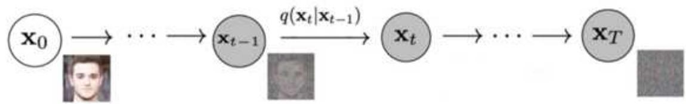  
图9-1 前向阶段加噪过程（ $\mathrm { ~ x ~ } _ { 0 }$ 为原始图像）

而逆向阶段则是不断去除噪声的过程，首先给定高斯噪声 $\mathbf { X } _ { \mathrm { ~ T ~ } }$ ，通过逐步去噪，直至最终将原图像 $\mathrm { ~ \bf ~ X ~ } _ { 0 }$ 恢复出来。逆向阶段去噪过程如图9-2所示。

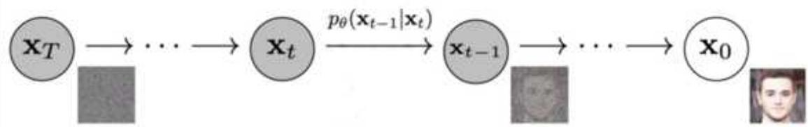  
图9-2 逆向阶段去噪过程（ x 为全噪声图像）

模型训练完成后，只要给定高斯随机噪声，就可以生成一幅从未见过的图像。这里 $\mathrm { ~ \bf ~ X ~ } _ { 0 }$ 为原始图像， $\mathbf { X } _ { \mathrm { ~ T ~ } }$ 为全噪声图像，读者一定要牢记，下面会有公式讲解。

所谓的加噪声，就是基于目标的图片计算一个（多维）高斯分布（每个像素点都有一个高斯分布，且均值就是这个像素点的值，方差是预先定义的），然后从这个多维分布中抽样一个数据出来，这个数据就是加噪之后的结果。显然，如果方差非常小，那么每个抽样得到的像素点就和原本的像素点的值非常接近，也就是加了一个非常小的噪声。如果方差比较大，那么抽样结果就会和原本的结果差距较大。

去噪声也是同理，基于噪声的图片计算一个条件分布，希望从这个分布中抽样得到的是相比于噪声图片更加接近真实图片的、稍微干净一点的图片。假设这样的条件分布是存在的，并且也是一个高斯分布，那么只需要知道均值和方差就可以了。Diffusion的前向与后向过程如图9-3所示。

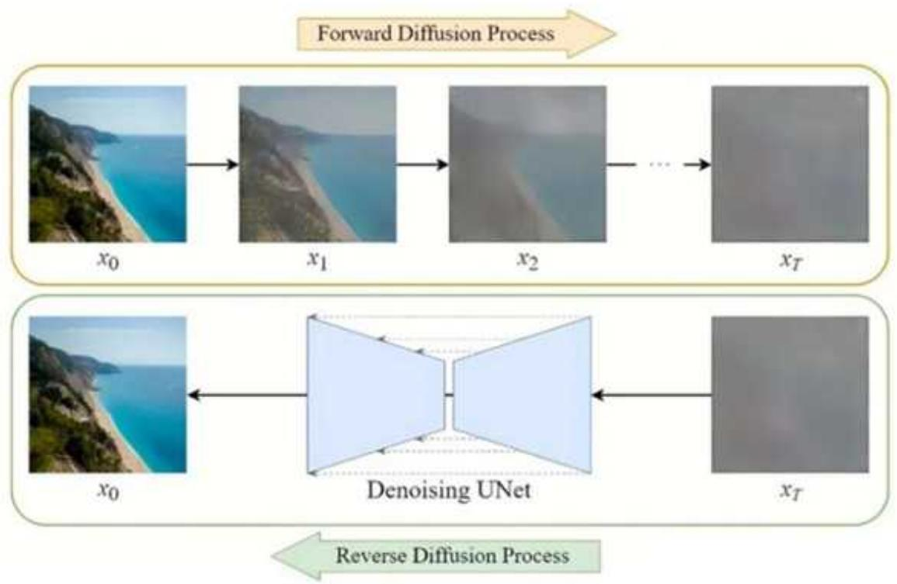  
图9-3 Diffusion的前向与后向过程

但是，问题是这个均值和方差是无法直接计算的，所以需要用神经网络来学习这样一个近似的高斯分布。高斯噪声是一种随机信号，也称为正态分布噪声。它的数学模型是基于高斯分布的概率密度函数，因此也被称为高斯分布噪声。

在实际应用中，高斯噪声通常是由于测量设备、传感器或电子元件等因素引起的随机误差所产生的。高斯噪声具有以下特点。

平均值为0：即高斯噪声随机变量的期望值为0。  
对称性：高斯噪声在平均值处呈现对称分布。  
● 方差决定波动的幅度：高斯噪声的波动幅度与方差成正比，方差越大，则波动幅度越大。  
● 由于高斯噪声的统计特性十分稳定，因此在许多领域，如图像处理、信号处理、控制系统等方面得到广泛使用。

因此，可以说Diffusion Model的处理过程是给一幅图片逐步加噪声直到变成纯粹的噪声，然后对噪声进行去噪得到真实的图片。所谓的扩散模型，就是让神经网络学习这个去除噪声的方法。

# 9.1.2 直接运行的经典DDPM的模型训练实战

首先在这里提供简单可运行的DDPM框架，代码如下：

```python
import torch
import get_dataset
import cv2
from tqdm import tqdm
import-ddpm
batch_size = 48
dataloder = torch.utils.data.DataLoader(get_dataset.SamplerDataset),
batch_size=batch_size)
#Unet作为生成模型从噪声生成图像
import unet
device = "CUDA" if torch.cuda.is available() else "cpu"
model = unet.Unet(dim=28, dimMULTs=[1,2,4]).to(device)
optimizer = torch.train AdamW(model.params(), lr = 2e-4)
epochs = 3
timesteps = 200
save_path = "./saver/ddpm_saver.pth"
model.load_state_dict(torch.load(save_path), strict=False)
for epoch in range(epoos):
    pbar = tqdm(dataloder, total=len(dataloder))
    #使用DataLoader进行迭代，获取每个批次的数据样本和标签
    for batch_sample, batch_label in pbar:
        optimizer.zero_grad()
        batch_size = batch_sample.size()
        batch = batch_sample.to(device)
        optimizer.zero_grad()
        t = torch.randint(0, timesteps, (batch_size, ), device=device).long())
        loss = ddpm.p_losses(model, batch, t, loss_type="huber")
        loss.backup()
        optimizer_STEP()
        pbar.set_description(f"epoch:{epoch + 1}, train_loss:{loss.item():.5f}") 
```

这是Diffusion的经典实现，即使用UNet作为生成模型，直接从噪声数据中生成图像，UNet模型是一个经典的图像重建模型，能够有效地学习图像的语义信息，实现高质量的图像重建结果。相比其他深度学习模型，UNet对于训练数据的需求较少，这得益于其结构中大量的参数共享和特征重用。UNet还具有可扩展性和适应性强等特点，可以很容易地扩展到处理不同尺寸的输入图像，并且适用于多种不同的图像分割任务。

经典的UNet模型如图9-4所示。

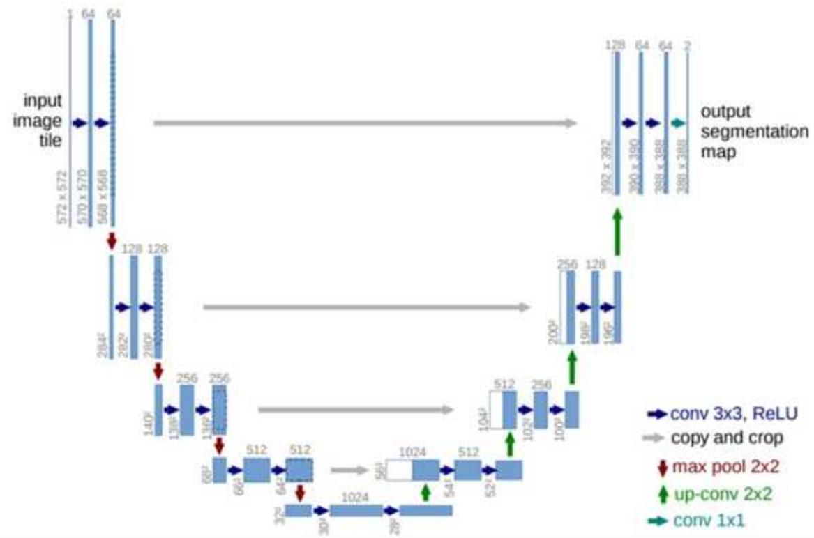  
图9-4 经典的UNet模型

而ddpm.p_losses函数是DDPM中使用的损失函数，其通过计算生成的预测图像与噪声图像的 L1距离（Manhattan Distance，曼哈顿距离）完成损失函数的计算。读者可以直接使用配套源码中的train.py开启训练过程。训练过程示意如图9-5所示。

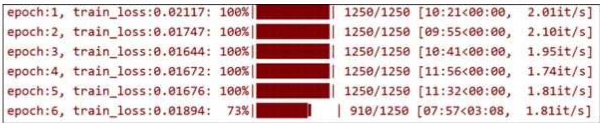  
图9-5 训练过程

根据不同读者的硬件设备情况，训练时间也会略有不同。这里我们设置epoch的次数为20，读者可以等待训练完成，或者在等待模型训练的同时阅读9.1.3节的内容，了解其运行背后的原理。

而对于使用模型的推理，读者可以直接使用本章配套代码中的predicate.py文件，只需要加载训练好的模型文件即可，代码如下：

```python
import torch
import ddpm
import cv2
importUNET
#导入的依旧是一个UNet模型
device = "CUDA" if torch.cuda.is-available() else "cpu"
model =UNET(dim=28, dimMULTs=[1,2,4]).to(device)
#加载UNet模型存档
save_path = "./saver/ddpm_saver.pth"
model.load_state_dict(torch.load(save_path))
# sample 25 images
bs = 25
#使用sample函数生成25个MNIST手写体图像
samples = ddpm.sample(model, image_size=28, batch_size=bs, channels=1)
imgs = []
for i in range(bs):
    img = (samples[-1][i].reshape(28, 28, 1))
    imgs.append(img)
#以矩阵的形式加载和展示图像
import numpy as np
blank_image = np.zeros((28*5, 28*5, 1)) + 1e-5
for i in range(5):
    for j in range(5):
        blank_image[i*28:(i+1)*28, j*28:(j+1)*28] = imgs[i*5+j]
cv2.imshow('Images', blank_image)
cv2.waitKey(0) 
```

在上面的代码中，需要注意的是，这里模型加载的参数是针对UNet模型的参数。实际上也可以看到，Diffusion Model就是通过一个UNet模型对一组噪声进行“去噪”处理的，从噪声中“生成”一幅特定的图像。生成的结果如图9-6所示。


# Images

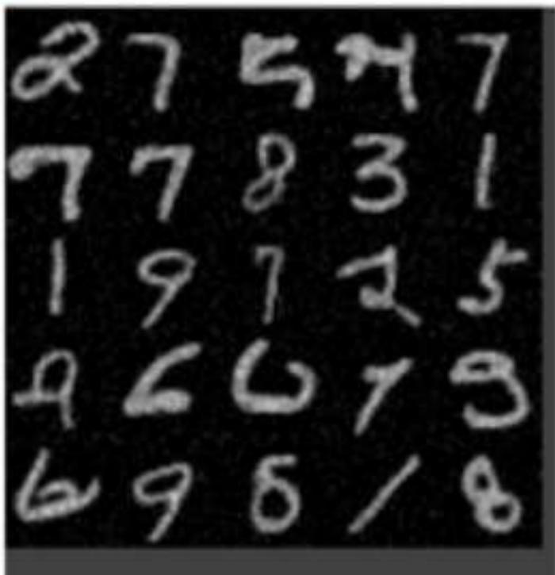  
图9-6 生成的MNIST图像

尽管生成的结果略显模糊，但仍可明确地辨认出，模型确实基于所接收的训练数据，成功地生成了一组随机手写体。这个成果无疑在一定程度上证明了模型训练的可行性。

读者可以自行运行代码查看结果。关于DDPM的模型理论，我们将会在9.1.3节中进行讲解。

# 9.1.3 DDPM的模型基本模块说明

在9.1.2节中，我们利用Diffusion Model完成了手写体的生成，相信读者测试过相应的代码。本小节将展开讲解，从基本的生成模型入手讲解DDPM模型的理论计算基础。

# 1．UNet模型详解

DDPM中UNet的作用是预测每幅图片上所添加的噪声，之后通过计算的方式去除对应的噪声，从而重现原始的图像。UNet由一个收缩路径（编码器）和一个扩展路径（解码器）组成，这两条路径之间有跳跃连接。首先是UNet的初始化部分，其包括以下几项内容：

初始卷积层（self.init_conv）。  
时间嵌入模块（self.time_mlp）。  
下采样模块（self.downs）。  
● 中间模块（self.mid_block1、self.mid_attn、self.mid_block2）。

上采样模块（self.ups）。

虽然其中的模块和具体实现有所不同，但是从其完成的功能来理解，就是将数据从掺杂了随机比例的噪声中进行恢复。而通过对forward前向函数（读者可以参考本书配套代码库中这部分的实现）的观察，其中更具体的解释如下：

● $\mathbf { X } =$ self.init_conv(x): 这一行将输入x通过初始化卷积层进行处理。  
● $\mathrm { \Delta t = }$ self.time_mlp(time) if utils.exists(self.time_mlp) else None: 这一行检查是否存在时间嵌入模块，如果存在，它将时间输入通过时间嵌入模块进行处理。  
● $\mathfrak { h } = [ ]$ : 初始化一个空列表h，用于存储中间特征映射。

下面的循环是下采样阶段，通过一系列模块对输入x进行处理，并将结果存储在列表h中。每个模块包括两个卷积块、一个注意力模块和一个下采样操作。

● $\mathbf { X } =$ self.mid_block1(x, t): 这一行将x通过中间的第一个卷积块进行处理。  
● $\mathbf { X } =$ self.mid_attn(x): 这一行将x通过中间的注意力模块进行处理。  
● $\mathbf { X } =$ self.mid_block2(x, t): 这一行将x通过中间的第二个卷积块进行处理。

下面的循环是上采样阶段，通过一系列模块对输入x进行处理。每个模块包括两个卷积块、一个注意力模块和一个上采样操作。在这个过程中，还会从列表h中弹出先前存储的中间特征映射，并将其与当前特征映射拼接在一起。

● $\mathbf { X } =$ torch.cat $( \mathbf { x } , \mathbf { \mu } _ { \mathrm { - } } \mathbf { h } )$ ,dim=1): 这一行将当前特征映射x和先前存储的中间特征映射_h沿着通道维度（ $\mathrm { d i m } { = } 1$ ）拼接在一起。  
● $\mathbf { \boldsymbol { x } } = \operatorname { b l o c k } \mathbf { \boldsymbol { 1 } } ( \mathbf { \boldsymbol { x } } , \mathbf { \boldsymbol { t } } ) ;$ : 这一行将拼接后的特征映射通过第一个卷积块进行处理。  
● $\mathbf { \boldsymbol { x } } = \mathrm { b l o c k } \boldsymbol { 2 } ( \mathbf { \boldsymbol { x } } , \mathbf { \boldsymbol { t } } )$ $\mathbf { X } =$ : 这一行将特征映射通过第二个卷积块进行处理。  
● $\mathbf { x } = \arctan ( \mathbf { x } )$ : 这一行将特征映射通过注意力模块进行处理。  
● $\mathbf { X } =$ upsample(x): 这一行将特征映射通过上采样操作进行处理。

最终，这段代码的目的是通过UNet模型对输入数据进行下采样和上采样，从而生成一个分割结果或类似的输出。其中的卷积块、注意力模块和上下采样操作，都是为了提取和学习输入数据的特征，并在不同尺度上进行处理，如图9-7所示。

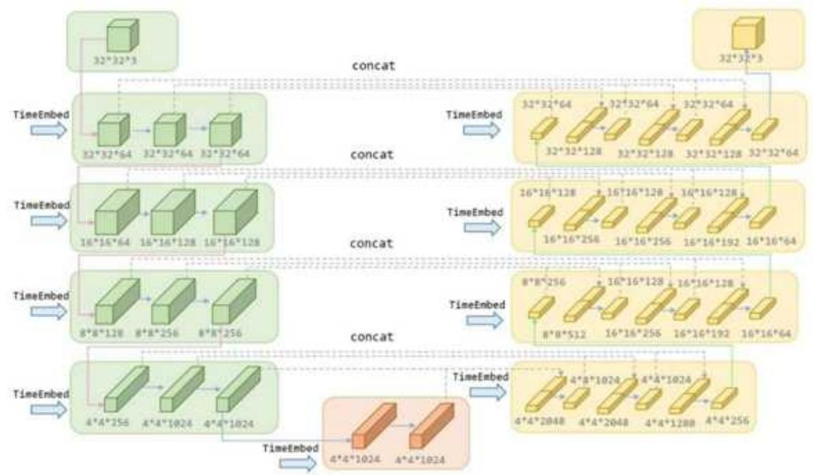  
图9-7 DDPM中的Unet模型

从图9-7中可以看到，UNet主要包括3部分：左边绿色的Encoder部分、中间橙色的MidBlock部分以及右边黄色的Decoder部分（具体参看配套资源中的相关文件）。

在Encoder部分中，UNet模型会逐步压缩图片的大小；在Decoder部分中，则会逐步还原图片的大小。同时，在Encoder和Decoder之间，还会使用“残差连接”（虚线部分），确保Decoder部分在推理和还原图片信息时，不会丢失掉之前步骤的信息。

另外，需要注意的是，在本章DDPM的UNet中使用了Residual架构和注意力模块，具体如图9-8所示。这种设计的目的是增强UNet的图像重建能力，从而获得一个更好的输出表现。

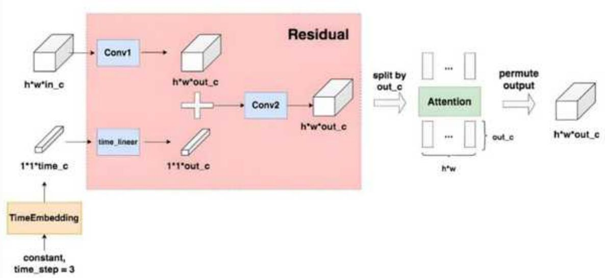  
图9-8 UNet中的Residual架构和注意力模块

# 2．时间步骤函数详解

在深度学习中，位置嵌入（Positional Embedding）是一种常见的技术，它使得模型能够捕获序列中的位置信息。在类似于Transformer的架构中，位置嵌入被用于将序列中的每个元素的位置信息编码为固定长度的向量，然后将这些向量与输入序列的元素进行相加，从而使得模型能够意识到每个元素在序列中的位置。

在DDPM中，为了使模型能够知道当前处理的是去噪过程中的哪一个步骤，需要将步数也编码并传入网络中。这可以通过使用正弦位置嵌入（Sinusoidal Position Embedding）来实现。

正弦位置嵌入是一种特殊的位置嵌入方法，它基于正弦和余弦函数来生成位置嵌入向量。对于给定的位置，通过计算不同频率的正弦和余弦函数的值，并将它们组合在一起，可以得到一个固定长度的位置嵌入向量。在DDPM中，可以将步数视为位置，并使用正弦位置嵌入来生成对应的位置嵌入向量。

在 具 体 实 现 上 ， 我 们 定 义 一 个 名 为 SinusoidalPositionEmbeddings 的 类 ， 它 继 承 自nn.Module。在此类的__init__方法中，指定要生成的位置嵌入向量的维度。在此类的forward方法中，首先计算出每个位置对应的正弦和余弦函数的频率；然后根据输入的步数生成对应的位置嵌入向量；最后将正弦和余弦部分拼接在一起，并返回生成的位置嵌入向量。读者可以到配套资源中自行查看module文件内的SinusoidalPositionEmbeddings类。

# 3．在DDPM中使用加噪策略

DDPM（Denoising Diffusion Probabilistic Model，去噪扩散概率模型）在图像中添加噪声也不是一蹴而就的，而是通过一定的策略和方法向图像中添加高斯噪声，从而使得模型学会去除图像中噪声的技巧。这种策略一般称为schedule。

DDPM是一种概率模型，受到物理扩散过程的启发，用于学习数据的有噪声版本与原始数据之间的关系。在训练过程中，DDPM通过逐步将噪声添加到原始数据中，并使用加噪链和去噪链来实现噪声的添加和去除。向图像中添加噪声示意如图9-9所示。

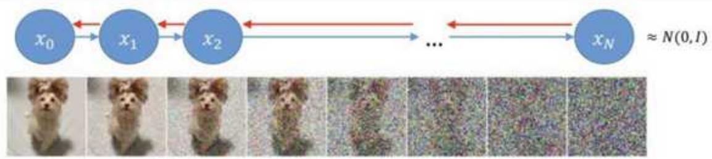  
图9-9 按比例修改图像与噪声的比例（向图像中添加噪声）

加噪链将原始数据转换为容易处理的噪声数据，这个过程是通过一系列的概率分布变换实现的。在每一个时间步长，加噪链根据一定的schedule将噪声添加到数据中，这个schedule

控制了噪声的添加方式和程度。

去噪链则是将加噪链生成的噪声数据转换为新的生成数据。去噪链也是通过一系列的概率分布变换实现的，并且它的作用是尽可能地恢复原始数据，减少噪声的影响。

在DDPM中，schedule还用于控制训练过程的速度和效果。通过调整schedule中的参数，可以影响噪声添加和去噪过程的速度和精度，以达到更好的训练效果。

在我们的演示中，为了简便起见，采用的是线性策略（linear schedule），即按等差序列的方式修改噪声与图像的比例。采用的线性策略的实现代码如下：

```python
def linear_beta_schedule(timesteps = 1000):
    beta_start = 0.0001
    beta_end = 0.02
    return torchLINspace(beta_start, beta_end, timesteps) 
```

这段代码定义了一个名为linear_beta_schedule的函数，它根据给定的时间步长（默认为1000）生成一个线性增加的beta值序列。

在DDPM中，beta值用于控制扩散过程，即将随机噪声逐步添加到输入数据中。在上面的linear_beta_schedule函数中，beta值从beta_start（0.0001）开始，到beta_end（0.02）结束，并在给定的时间步长内线性增加。这个函数使用了PyTorch 2.0的torch.linspace函数来生成等间隔的beta值序列。torch.linspace(beta_start, beta_end, timesteps)返回一个张量，其中包含从beta_start到beta_end的timesteps个等间隔的值。这个函数可以用于DDPM模型中的训练过程，其中在每个时间步长上应用不同的beta值来控制扩散过程。生成的beta值序列可以用于计算添加噪声的程度，以及在去噪过程中控制噪声的减小程度。

# 9.1.4 DDPM加噪与去噪详解：结合成功运行的扩散模型代码

下面进入DDPM的理论部分，我们将结合DDPM的实现代码一并分析和讲解。

# 1．DDPM的加噪过程

向图像中添加噪声的过程可以按如下方式进行：首先定义一个前向扩散过程（forwarddiffusionprocess），之后向数据分布中逐步添加高斯噪声，加噪过程持续T次，产生一系列带噪声的图片 $\mathrm { ~ \bf ~ X ~ } _ { 0 }$ $\mathbf { \Omega } _ { 0 } , \mathbf { X } \mathbf { \Omega } _ { 1 } , \dots , \mathbf { X } \mathbf { \Omega } _ { \mathrm { T } }$ 。在由 $\mathbf { X } _ { \mathbf { \Phi } _ { \mathrm { T } - 1 } }$ 加噪至 x 的过程中，噪声的标准差/方差是以一个在区间(0,1)内的固定值 $\beta _ { \textrm { r } }$ 来确定的，均值是以固定值 $\beta _ { \textrm { r } }$ 和当前时刻的图片数据 $\mathbf { X } _ { \mathbf { \Phi } _ { \mathrm { T - l } } }$ 来确定的。

换句话说，只要有了初始图像 $\mathrm { ~ \bf ~ X ~ } _ { 0 }$ ，并且提供每一步固定的噪声比例 $\beta _ { \textrm { r } }$ ，就可以推断出任意一步的加造数据 $\mathbf { X } _ { \mathrm { ~ T ~ } }$ 。这段过程我们使用如下代码来实现：

```python
前向过程-forward diffusion
#代码段1：从图像张量中提取特定步长
a是预计算的alpha值的张量，t是时间步长的张量，x_shape是输入数据的形状
def extract(a, t, x_shape):
    batch_size = t.shape[0] #获取时间步长的数量
    out = a.gather(-1, t.cpu()) #使用gather函数从预计算的张量中提取对应时间步长的值。这里使用-1作为索引，表示在最后一个维度上进行聚集
#将提取的值重塑为与输入数据形状相匹配的张量，并将结果返回。这里使用*((1,) * (len(x_shape) - 1))来创建一个与输入数据形状匹配的维度元组
return out.reshape(batch_size, *(1,) * (len(x_shape) - 1)).to(t_device)
#代码段2：前向扩散过程
def q_sample(x_start, t, noise=None):
    #如果噪声不存在，就随机生成一个正态分布的噪声
    if noise is None:
        noise = torch.randn_like(x_start)
    #结合extract函数，从预计算的alpha值的平方根的累积乘积张量中提取特定时间步长的值
    sqrt_alphas_cumprod_t = extract(square_alphas_cumprod, t, x_start.shape)
    #从预计算的1减去alpha值的平方根的累积乘积张量中提取特定时间步长的值
    sqrt_one_minus_alphas_cumprod_t = extract(square_oneMinus_alphas_cumprod, t, x_start.shape)
    #根据DDPM模型的公式，将提取的值与初始数据和噪声相乘，得到扩散后的数据，并返回结果
    return sqrt_alphas_cumprod_t * x_start + sqrt_oneMinus_alphas_cumprod_t * noise
```

从上面的代码中可以看到，extract函数的作用是从一个给定的张量中提取特定时间步长的值，并返回与输入数据形状相匹配的张量。它接受3个参数：a是预计算的alpha值的张量，t是时间步长的张量，x_shape是输入数据的形状。

在extract函数内部，首先获取时间步长的数量batch_size，然后使用gather函数从预计算的张量中提取对应时间步长的值。然后，将提取的值重塑为与输入数据形状相匹配的张量，并将结果返回。

q_sample函数的作用是在DDPM模型中进行前向扩散过程。它接受3个参数：x_start表示初始数据，t表示时间步长，noise表示添加的噪声。如果没有提供噪声，则使用标准正态分布的随机噪声。

在q_sample函数内部，首先根据时间步长t和初始数据的形状，从预计算的sqrt_alphas_cumprod和sqrt_one_minus_alphas_cumprod中提取相应的值。这两个预计算的变量分别表示alpha值的平方根的累积乘积和1减去alpha值的平方根的累积乘积。

最后，q_sample函数将这两个值与初始数据和噪声相乘，得到扩散后的数据。这个计算过程是根据DDPM模型的公式推导得出的。

这样，通过逐步添加噪声并学习去噪过程，DDPM模型可以生成与原始数据类似的新数据。这段代码为模型的训练和推理提供了基础的前向扩散过程。

从上述对代码的讲解可以看到，加噪的过程就是一个向图像中添加一定比例噪声的过程。下面了解和计算这个噪声的比例，这里我们使用如下代码进行计算：

```txt
timesteps = 200 #定义时间步长的数量为200  
#使用线性调度函数生成beta值的张量，其中beta值用于控制扩散过程中的噪声水平  
betas = linear_beta_schedule(timesteps = timesteps)  
#计算alpha值，它们与beta值互补，表示信号保留的比例  
alphas = 1. - betas  
#计算alpha值的累积乘积，用于计算前向扩散过程中的平均值  
alphas_cumprod = torch.cumprod(alphas, axis=0)  
#后验算部分的讲解在去噪过程中会讲到  
#对alpha值的累积乘积进行填充操作，用于计后验算复原过程中的加权平均值  
alphas_cumprod Prev = F_pad(alphas_cumprod[-1], (1, 0), value=1.0)  
#计算alpha值的平方根的倒数，用于计算后验复原过程中的方差  
sqrt_recip_alphas = torch.sqrt(1.0 / alphas)  
#计算alpha值的平方根的累积乘积，用于计算前向扩散过程中的加权平均值  
#原始图像保留的比例  
sqrt_alphas_cumprod = torch.sqrt(alphas_cumprod)  
#计算(1-alpha)的平方根的累积乘积，用于计算前向扩散过程中的加权平均值  
#添加的噪声比例  
sqrt_one_MINUS_alphas_cumprod = torch.sqrt(1. - alphas_cumprod)  
#计算后验分布中的方差，用于计算后验分布中的加权平均值  
#用于从噪声复原图像的步骤  
posterior_variance = betas * (1. - alphas_cumprod Prev) / (1. - alphas_cumprod)
```

这段代码是DDPM深度学习模型的一部分，用于实现前向扩散过程。具体来说，这段代码计算了前向扩散过程中的一些关键量，包括alpha值的计算、累积乘积的计算、后验分布的计算等。这些计算都是为了实现DDPM模型的前向扩散过程和后验分布的计算。

在DDPM模型中，前向扩散过程是通过逐步添加噪声来完成的。在这个过程中，原始图像逐步被噪声所掩盖，最终变成了一个完全随机的噪声图像。这个过程中的每一步都是通过添加一定的噪声来完成的，而添加的噪声是通过一定的概率分布来生成的。

在这段代码中，并没有直接生成噪声或处理原始图像的代码段。这些计算都是为了实现前向扩散过程和后验分布的计算，以便在训练过程中生成与原始数据类似的新数据。

最后用公式对这部分内容进行讲解。前面已经讲到，在逐步添加噪声的过程中，虽然可以一步一步地添加噪声，由图像 x 得到完全噪声的图像 $\mathbf { X } _ { \mathrm { ~ T ~ } }$ ，但事实上，也完全可以通过 $\mathrm { ~ \bf ~ X ~ } _ { 0 }$ 和固定比例策略 直接计算得到。

在这里定义了 ，则对于采样的计算可以遵循如下公式：

$$
\begin{array}{l} \mathbf {x} _ {t} = \sqrt {\alpha_ {t}} \mathbf {x} _ {t - 1} + \sqrt {1 - \alpha_ {t}} \mathbf {z} _ {t - 1}; \text {w h e r e} \mathbf {z} _ {t - 1}, \mathbf {z} _ {t - 2}, \dots \sim \mathcal {N} (\mathbf {0}, \mathbf {I}) \\ = \sqrt {\alpha_ {t} \alpha_ {t - 1}} \mathbf {x} _ {t - 2} + \sqrt {1 - \alpha_ {t} \alpha_ {t - 1}} \mathbf {z} _ {t - 2}; \text {w h e r e} \overline {{\mathbf {z}}} _ {t - 2} \text {m e r g e s t w o G a u s s i a n s} (^ {*}) \\ = \dots \\ = \sqrt {\bar {\alpha} _ {t}} \mathbf {x} _ {0} + \sqrt {1 - \bar {\alpha} _ {t}} \mathbf {z} \\ q \left(\mathbf {x} _ {t} \mid \mathbf {x} _ {0}\right) = \mathcal {N} \left(\mathbf {x} _ {t}; \sqrt {\bar {\alpha} _ {t}} \mathbf {x} _ {0}, (1 - \bar {\alpha} _ {t}) \mathbf {I}\right) \\ \end{array}
$$

其中， $\mathrm { \Delta z _ { \mathrm { \Omega _ { t - 1 } } } }$ 、 $\mathrm { ~ Z ~ } _ { \mathrm { t } - 2 }$ 属于正态分布噪声，而 则是合并了多个高斯分布。因此，通过公式可以看到，只要有了 $\mathrm { ~ \bf ~ X ~ } _ { 0 }$ 和 ，就可以得到一个固定的常数 $\beta$ ，再从标准分布 N (0,1)采样一个z ，就可以直接计算出 $\mathbf { X } _ { \mathrm { ~ t ~ } }$ 。读者可以参考代码实现加深对这部分的理解。

因此，通过公式可以看到，只要有了 $\mathrm { ~ \bf ~ X ~ } _ { 0 }$ 和固定比例策略 ，得到一个固定的常数 $\beta$ ，再从标准分布 N (0,1)采样一个 z ，就可以直接计算出 x 。

# 2．DDPM的去噪过程

接下来讨论DDPM的去噪过程。接着上面的公式讲解，如果将上述过程转换方向，即从$\mathrm { ~ q ~ } ( \textbf { X } _ { \mathrm { t - 1 } } | \textbf { X } _ { \mathrm { t } } )$ 中采样，目标是从一个随机的高斯分布 N(0,1)中重建一个真实的原始样本，也就是从一幅完全杂乱无章的噪声图片中得到一幅真实图片。但是，由于需要从完整数据集中找到数据分布，没办法很简单地预测 x ，因此需要学习一个模型 p 来近似模拟这个条件概率，从而运行逆扩散过程。这里我们直接给出去噪算法的伪代码，如图9-10所示。

图9-10 去噪算法的伪代码

采样过程发生在反向去噪时。对于一个纯噪声，扩散模型一步一步地去除噪声最终得到真实图片，采样事实上就是我们定义的去除噪声这一行为。观察图9-10公式中的步骤4， t −1步的图片是由 t 步的图片减去一个噪声得到的，只不过这个噪声是由神经网络UNet拟合出来并且训练过的而已。这里要注意步骤4公式的最后一项，采样时每一步都会加上一个从正态分布采样的z ，这是一个纯噪声。

基于DDPM的噪声去噪过程（对特定步骤的去噪计算表示）的代码如下：

```python
@torch.no_grad()
def p_sample(model, x, t, t_index):
    """输入参数:
        model: 预训练的噪声预测模型。
x: 输入数据。
t: 时间步长。
t_index: 时间步长的索引。
功能: 根据DDPM模型的公式, 使用噪声预测模型生成样本。该函数根据DDPM模型的前向扩散过程计算下一个状态。
其中, betas_t, sqrt_one_MINUS_alphas_cumprod_t 和 sqrt_recip_alphas_t 是根据时间步和当前状态形状提取的系数。
如果t_index为0, 说明是前向扩散过程的最后一步, 直接返回模型预测的平均值。否则, 根据后验分布计算方差, 并加上噪声得到下一个状态
   """
    betas_t = extract(betas, t, x.shape)  #预计算的beta值张量中提取特定时间步长的值
    #从预计算的1减去alpha值的平方根的累积乘积张量中提取特定时间步长的值
    sqrt_one_MINUS_alphas_cumprod_t = extract(
        sqrt_one_MINUS_alphas_cumprod, t, x.shape)
    #从预计算的alpha值的平方根的倒数的张量中提取特定时间步长的值
    sqrt_recip_alphas_t = extract(square_recip_alphas, t, x.shape)
    #根据DDPM模型的公式计算模型均值
    model_mean = sqrt_recip_alphas_t * (
        x - betas_t * model(x, t) / sqrt_one_MINUS_alphas_cumprod_t
    )
    if t_index == 0:
        return model_mean
    else:
        #计算后验分布中的方差, 并生成与输入数据形状相同的噪声。然后, 根据DDPM模型的公式计算样本, 并返回结果
        posterior_variance_t = extract(posterior_variance, t, x.shape)
        noise = torch randn_like(x)
        #上面公式框讲解的第4行公式
        return model_mean + torch.sqrt(posterior_variance_t) * noise
```

上面是对算法步骤的特定表示，实现的是某个特定步骤的去噪计算，而DDPM作为一个整体，可以使用下面的代码完成整个去噪流程。

```python
@torch.no_grad()
def p_sample_loop(model, shape):
    # model: 预训练的噪声预测模型
    # shape: 生成样本的形状
    # 功能: 使用 p_sample 函数从噪声预测模型中生成样本, 并返回一系列样本
    device = next(model.params().device
    b = shape[0]
    # 生成一幅纯噪声图像作为起始点
    img = torch.randn(shape, device=device)
    images = []
    # 使用循环逐步增加时间步长, 调用 p_sample 函数生成样本, 并将其添加到样本列表中
    for i in tqdm(reversed(range(0, timesteps)), desc='sampling loop time step',
        total=timesteps):
            img = p_sample(model, img, torch.full((b), i, device=device, dtype=torch.long),
        i))
            images.append(img.cpu().numpy())
    return images
```

接下来，调用sample完成图像生成的过程，其代码如下：

```python
@torch.no_grad()
def sample(model, image_size, batch_size=16, channels=3):
    '''输入参数:
        model: 预训练的噪声预测模型。
        image_size: 生成图像的大小。
        batch_size: 批量大小，默认为16。
        channels: 图像通道数，默认为3。
功能：调用 p_sample_loop 函数生成一系列样本，并返回结果。
代码解释:
调用 p_sample_loop 函数生成一系列样本。
返回生成的样本
'''return p_sample_loop(model, shape=(batch_size, channels, image_size, image_size))
```

这段代码为DDPM的样本生成过程提供了基础实现，通过DDPM从前向扩散过程中逐步添加噪声来生成与原始数据类似的新数据。在训练过程中，模型学习预测每个时间步的噪声，从而逐步去噪并生成新的图像序列。

总结一下DDPM（去噪扩散概率模型）：DDPM是一种概率模型，通过逐步添加噪声来生成与原始数据类似的新数据。这个模型的实现并不复杂，但其背后的数学原理却非常丰富。

在DDPM中，扩散过程是一个重要的概念。这个过程可以看作一个马尔可夫链，每个状态依赖于前一个状态，同时加入了一些噪声。在每一步中，数据会逐渐变得更加混乱，但同时也包含一些原始数据的特征。

具体来说，DDPM的扩散过程是通过一个可逆的转换函数实现的。该函数将原始数据逐渐加入噪声，直到最终得到完全噪声的数据。然后，通过反向过程，我们可以预测每一步加

入的噪声，并尝试还原得到无噪声的原始数据。

在DDPM中，训练神经网络是关键的一步。该模型使用深度学习的方法来训练神经网络，使其能够学习噪声和数据之间的关系。训练好的神经网络可以接受含有噪声的图像数据，并输出预测的噪声。通过这种方式，我们可以逐渐还原得到原始数据。

可以看到，DDPM模型是一种基于扩散过程和神经网络训练的图像去噪方法。它通过逐步添加噪声和反向过程来生成新的数据，并通过神经网络训练来学习噪声和数据之间的关系。这种模型的优点是可以在保持图像质量的同时去除噪声，并且训练时间相对较短。

# 9.1.5 DDPM的损失函数：结合成功运行的Diffusion Model代码

下面我们回到DDPM的训练。通过上文的分析及其代码实现，可以知道DDPM模型训练的目的是给定time_step和加噪的图片，结合两者来预测图片中的噪声，而UNet则是实现DDPM的核心模块架构。通过对比，我们可以知道：

● 第 t 个时刻的输入图片可以表示为： x=Vax+Vi-xa.  
● 第 t 个时刻采样出的噪声为： $\mathbf { z } \in \mathrm { N } \left( 0 \AA , 1 \right)$ 。  
● UNet模型预测出的噪声为： ， ε 为预测模型。

则损失函数可以表示为：

$$
\mathrm {l o s s} = z - \varepsilon_ {\theta} (\sqrt {\alpha^ {t}} x _ {0} + \sqrt {1 - \alpha^ {t}} \varepsilon , t)
$$

目标是要求损失函数最小化。这里采用的损失函数为L1 Loss，当然也可以使用其他损失函数，这一点读者可以自行学习相关内容。

# 9.2 可控图像生成实战：融合特征的注意力机制

在9.1节中，我们设计的扩散模型在建模过程中选择了UNet架构作为基础，这得益于UNet能产生与输入同维度的输出，这一特性使其非常适合用于扩散模型。在UNet的设计中，除包含基于残差的卷积模块外，还常融入Self-Attention机制以增强模型的理解能力。

随着注意力模型的深入研究，Transformer架构在图像处理任务中的应用愈发广泛。随着扩散模型的普及，研究人员也开始尝试将Transformer架构引入扩散模型的建模中。

基于Transformer的Diffusion模型如图9-11所示。

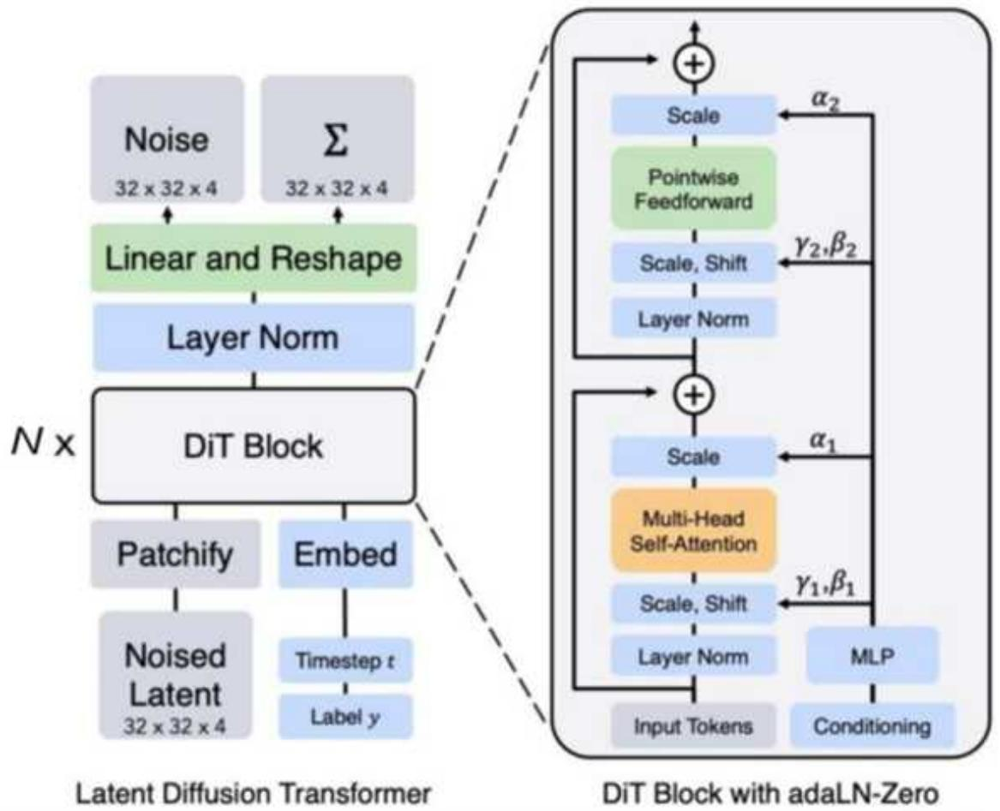  
图9-11 基于Transformer的Diffusion模型

DiT是一个完全基于Transformer架构的扩散模型，它不仅成功地将Transformer应用于扩散模型，更重要的是，它深入探索了Transformer架构在扩散模型上的可扩展性。本节我们将

学习DiT，其不仅证明了Transformer架构在扩散模型中的有效性，还展示了其强大的扩展能力和优异的生成效果。

# 9.2.1 扩散模型可控生成的基础：特征融合

特征融合是一种技术，它通过结合不同特征或不同深度学习模型输出来提高模型性能或数据质量。在Diffusion Model（扩散模型）中，特征融合主要涉及将文本特征和图像特征融合在一起，以实现更稳定、更高质量的图像生成。

具体来说，Diffusion Model的特征融合主要涉及以下两个方面。

● 文本特征的融合：在可控图像生成中，通常需要将文本描述作为输入，引导图像的生成。文本描述可以包含物体类别、形状、颜色等先验信息。为了将这些先验信息融合到DiffusionModel中，可以将这些文本描述通过文本嵌入向量进行表示，然后将这些文本嵌入向量输入DiffusionModel中，与图像数据进行融合。  
● 特征融合方法：在DiffusionModel中，文本特征和图像特征需要进行融合，以实现更稳定、更高质量的图像生成。常见的特征融合方法包括简单的特征拼接、加权平均、卷积操作等。这些方法可以将文本特征和图像特征有机地结合起来，使得DiffusionModel可以同时利用文本特征和图像特征进行图像生成。

可以看到，在Diffusion Model进行文本特征融合时，需要将文本描述融合在生成模型中。这可能涉及如何选择和组合这些文本描述，以便最大限度地保留原始语义信息。

# 9.2.2 注意力MQA中的可控特征融合

对于扩散模型来说，如果想要生成结果可控，那么还需要在模型中嵌入额外的条件信息，这里的条件包括timesteps以及类别标签。DitBlock模型设计如图9-12所示。

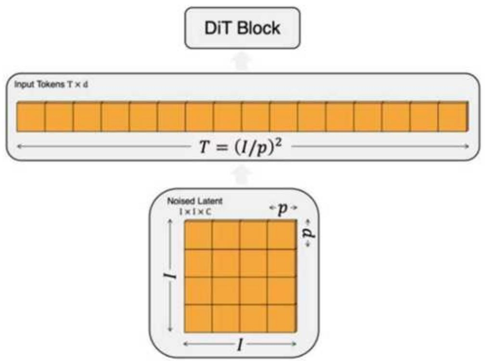  
图9-12 DitBlock模型设计

这里需要注意，无论是timesteps还是类别标签，都可以采用一个Embedding来进行编码。一种将DiT的特征进行融合的实现代码如下：

class DiTBlock(torch.nnModule): def __init__(self,emb_size = 64,head_num = 4): super().__init_(） self.emb_size $\equiv$ emb_size self.head_num $\equiv$ head_num self.adALN_modulation $\equiv$ torch(nn Sequential( torch(nn.Conv(d(on_channels=1,out_channels=6,kernel_size=3,padding=1) , torch(nn.Linear(emb_size,emb_size\*2,bias=True),torch(nn.SiLU(), torch(nn.Linear(emb_size\*2,emb_size,bias=True) d_model,attention_head_num $\equiv$ emb_size,head_num self(layer_norm $\equiv$ torch(nn.RMSNorm(emb_size) self.mha $\equiv$ attention_module.MultiHeadAttention_MQA(d_model, attention_head_num) self.mlp $\equiv$ feedforward_layer.Swiglu(hidden_size=d_model) self.last_norm $\equiv$ torch(nn.RMSNorm(emb_size) def forward(self,x,cond): x_residual $=$ x.clone() #gamma_val,betal_val,alphal_val,gamma2_val,beta2_val,alpha2_val $=$ self.adALN_modulation(torch.) cond $\equiv$ self.adALN_modulation(torch unsqueeze(cond,dim=1)) gamma_val,betal_val,alphal_val,gamma2_val,beta2_val,alpha2_val $=$ torch.split(cond,split_size_orSections=1,dim=1) x $\equiv$ self(layer_norm(x) x $\equiv$ modulate(x,gamma1_val,betal_val) x $\equiv$ self.mha(x) x $\equiv$ alpha1_val x $+ =$ x_residual x_residual $\equiv$ x.clone() x $\equiv$ modulate(x,gamma2_val,beta2_val) x $\equiv$ self.mlp(x)\*alpha2_val x $\equiv$ self.last_norm(x_residual +x) return x

上面这段代码定义了一个名为DiTBlock的类，它是深度学习模型中的一个构建块，类似于Transformer结构中的编码器层。DiTBlock类的作用是根据输入数据和条件参数来执行一系列复杂的变换，包括条件控制、层归一化、自注意力机制以及前馈网络处理。

具体来说，DiTBlock类在初始化时设置了多个线性层，这些线性层用于生成条件控制参数，执行自注意力机制中的查询、键、值变换，以及前馈网络中的线性变换。在forward方法中，类接收输入张量x和条件张量cond，然后根据条件张量通过线性层生成一系列控制参数。

输入张量经过层归一化后，使用这些控制参数进行缩放和平移。之后，通过自注意力机制对处理后的输入进行处理，包括查询、键、值向量的生成，注意力分数的计算，以及根据注意力权重计算加权和。自注意力的输出再根据条件参数进行缩放，并与原始输入进行残差

连接。最后，经过第二个层归一化后，输入进入前馈网络进行处理，其输出也根据条件参数进行缩放，并与之前的输出进行残差连接，得到最终的输出。整个过程融合了条件控制、自注意力和前馈网络，旨在根据特定条件对输入数据进行高度复杂的特征变换和学习。

# 9.2.3 基于注意力的扩散模型的设计

对于DiT模型来说，我们首先需要解决的是图像的输入，这里我们仿照前面章节学习过的VisionMamba对图像输入的处理对图像进行变更。DiT基本沿用了VisionMamba的设计，首先采用一个Patch Embedding来将输入进行Patch化，以得到一系列的tokens。

而time的设置也同样需要一个Embedding来对每个所处的时间步进行处理，这里仿照位置向量的做法，将不同时间步数值转换为一个特定的向量。这个过程是通过计算一系列不同频率的正弦和余弦函数值来实现的，从而能够捕捉时间序列数据中的周期性特征。具体来说，代码首先生成一个包含不同频率值的张量half_emb，然后在forward方法中，将输入时间t与这些频率值相乘，再分别计算其正弦和余弦值，并将结果拼接成一个嵌入向量返回。代码如下：

#导入必要的库import torch #导入PyTorch库from torch import nn #从PyTorch库中导入神经网络模块import math #导入数学库#定义一个常量T，但在此代码中并未使用 $\mathrm{T} = 1000$ #定义一个名为TimeEmbedding的类，它继承自nnModule，是一个PyTorch模块class TimeEmbedding(nnModule):#构造函数，用于初始化该模块def_init_self,emb_size):#调用父类的构造函数进行初始化super().init_(）#计算嵌入向量的一半大小self.full_emb_size $\equiv$ emb_size//2#创建一个张量，其元素是通过指数函数计算得到的，这些元素将用于后续的时间嵌入计算#这里的计算方式是为了在嵌入空间内生成一系列不同频率的基函数half_emb $\equiv$ torch.exp(torch.arange(self.full_emb_size)*(-1\*math.log(10000)/ (self.full_emb_size-1)))#使用register_buffer方法注册一个不需要进行梯度反转的张量，这样在保存和加载模型时，它也会被考虑在内self.register_buffer('half_emb',half_emb)#前向传播函数，定义了模型如何处理输入数据并产生输出def forward(self,t):#将输入的时间步t改变形状，以便进行后续的广播操作t $=$ t.view(t.size(0),1)#对之前计算得到的half_emb进行扩展，以便与时间步t进行逐元素的乘法操作half_emb $\equiv$ self.full_emb.unsqueeze(0).expand(t.size(0)，self.full_emb_size)#将时间步t与扩展后的half_emb进行逐元素的乘法操作half_emb_t $\equiv$ half_emb\*t#对乘法结果分别计算正弦和余弦值，并将它们拼接在一起，形成最终的时间嵌入向量embs_t $\equiv$ torch.cat((half_emb_t.sin(), half_emb_t.cos()），dim=-1)#返回计算得到的时间嵌入向量return embs_t

上面我们完成了整体DiT模型的设计，从代码中可以看到，输入图像首先通过nn.Conv2d将输入图像划分为小块，即Patches，随后利用nn.Linear层将这些小块嵌入高维空间中。为了赋予每个图像小块位置信息，特别定义了一个位置嵌入参数patch_pos_emb。

此外，模型还包含时间嵌入层，该层借助一系列网络层，包括先前导入的TimeEmbedding，来处理时间信息，并将其嵌入与图像小块相同的空间中。同时，标签嵌入层使用nn.Embedding将标签信息嵌入高维空间。

模型还定义了多个DiTBlock，这是自定义的神经网络模块，专门用于处理嵌入后的图像小块和条件嵌入，后者是时间和标签嵌入的组合。处理完所有的DiT块后，模型会进行层归

一化，具体通过nn.LayerNorm实现，随后通过nn.Linear层将嵌入空间还原至原始的图像小块空间。结合时间向量与能够融合特征向量的DiT模型，代码如下：

```python
导入必要的库  
from torch import nn  
import torch  
from time_emb import TimeEmbedding # 从自定义模块中导入TimeEmbedding  
from dit_block import DiTBlock # 从自定义模块中导入DiTBlock  
# 定义一个常量T，但在此代码中并未使用  
T = 1000  
# 定义DiT类，继承自nnModule  
class DiT(nn.Module):  
    # 构造函数，用于初始化该模型  
def __init__(self, img_size, patch_size, channel, emb_size, label_num, dit_num, head):  
    super().__init__() # 调用父类的构造函数进行初始化  
    # 初始化一些参数和变量  
    self.batch_size = patch_size  
    self.batch_count = img_size // self.batch_size  
    self.channel = channel  
    # 定义patchify相关的层，用于将图像划分为小块（Patches）  
    self.conv = nn.Conv2d(in_channels=channel, out_channels=channel * patch_size ** 2, kernel_size=patch_size, padding=0, stride=patch_size)  
    self.batch_emb = nn.Linear(in_features=channel * patch_size ** 2, out_features=emb_size) 
```

```python
#位置嵌入，用于给每个Patch添加位置信息
self.patch_pos_emb = nn_PARAMETER(torchRAND(1, self.patch_count ** 2,
emb_size))
#定义时间嵌入层
self.time_emb = nnSequential(
TimeEmbedding(emb_size), #使用之前导入的TimeEmbedding模块
nn.Linear(emb_size, emb_size),
nn.ReLU.,
nn.Linear(emb_size, emb_size)
)
#定义标签嵌入层
self.label_emb = nn Embedding(num_embeddings=label_num,
embedding_dim=emb_size)
#定义多个DiT块
self.dits = nn.ModuleList()
for_in range(diTnum):
    self.dits.append(DiTBlock(emb_size, head)) #使用之前导入的DiTBlock模块
#定义层归一化层
self.ln = nn.layersNorm(emb_size)
#定义线性层，用于将嵌入空间转回原始的Patch空间
self.linear = nn.Linear(emb_size, channel * patch_size ** 2)
#前向传播函数，定义了模型如何处理输入数据并产生输出
def forward(self, x, t, y): #x:输入图像t:时间步y:标签
#标签嵌入
y_emb = self.label_emb(y) # (batch, emb_size)
#时间嵌入
t_emb = self.time_emb(t) # (batch, emb_size)
#条件嵌入（将标签嵌入和时间嵌入相加）
cond = y_emb + t_emb
#图像Patch嵌入
x = self.conv(x) #将图像划分为小块并进行卷积操作
x = x.permute(0, 2, 3, 1) #改变张量的形状和维度顺序
x = x.view(x.size(0), self(patch_count * self(patch_count, x.size(3)) #重新
整形张量
x = self.patch_emb(x) #对每个Patch进行嵌入操作
x = x + self.patch_pos_emb #添加位置嵌入信息
#通过多个DiT块进行处理
for dit in self.dits:
    x = dit(x, cond) #将嵌入后的Patch和条件嵌入一起传入DiT块中进行处理 
```

```python
#层归一化操作  
x = self.ln(x) #对处理后的张量进行层归一化操作  
#线性层，将嵌入空间转回原始的Patch空间  
x = self.Linear(x) #通过线性层转换回原始的Patch空间大小  
#对张量进行一系列的重新整形和置换操作，以恢复原始图像的形状  
x = x.view(x.size(0), self.patch_count, self.patch_count, self.channel, self.patch_size, self.patch_size)  
x = x.permute(0, 3, 1, 2, 4, 5)  
x = x.permute(0, 1, 2, 4, 3, 5)  
x = x.reshape(x.size(0), self/channel, self.patch_count * self.patch_size, self.patch_count * self.patch_size)  
return x #返回处理后的图像张量 
```

在模型的前向传播函数forward中，它接收图像x、时间步t和标签y作为输入。forward函数首先对标签和时间进行嵌入，并将两者相加生成条件嵌入。然后，对输入图像进行划分小块、嵌入以及添加位置信息的操作。接下来，通过多个DiT块对嵌入后的图像小块和条件嵌入进行处理。最后，经过层归一化、线性变换以及一系列张量重新整形操作，以恢复至原始图像的形状，并输出处理后的图像张量。总体而言，这段代码构建了一个深度学习模型，它不仅能处理图像信息，还能融入时间和标签信息，并借助自定义的DiT块实现特征的提取与转换，最终输出经过处理的图像张量。

# 9.2.4 图像的加噪与模型训练

在扩散模型的训练过程中，首先需要对输入的信号进行加噪处理，经典的加噪过程是在图像进行向量化处理后在其中添加正态分布，而正态分布的值也是与时间步相关的。这样逐步向图像中添加噪声，直到图像变得完全噪声化。

```python
import torch
T = 1000 # Diffusion过程的总步数
# 前向diffusion计算参数
# (T,) 生成一个线性间隔的tensor, 用于计算每一步的噪声水平
betas = torch.linspace(0.0001, 0.02, T)
alphas = 1 - betas # (T,) 计算每一步的保留率
# alpha_t累乘 (T,) 计算每一步累积的保留率
alphas_cumprod = torch.cumprod(alphas, dim=-1)
# alpha_t-1累乘(T,) 为计算方差做准备
alphas_cumprod Prev = torch.cat((torch.tensor([1.0]), alphas_cumprod[:1]), dim=-1)
# denoise用的方差(T,) 计算每一步的去噪方差
variance = (1 - alphas) * (1 - alphas_cumprod Prev) / (1 - alphas_cumprod)
# 执行前向加噪
def forward_add_noise(x, t): # batch_x: (batch, channel, height, width), batch_t:
    noise = torch.randn_like(x) # 为每幅图片生成第t步的高斯噪声
    (batch, channel, height, width)
        # 根据当前步数t, 获取对应的累积保留率, 并调整其形状以匹配输入x的形状
        batch_alphas_cumprod = alphas_cumprod[t].view(x.size(0), 1, 1, 1)
        # 基于公式直接生成第t步加噪后的图片
        x = torch.sqrt(batch_alphas_cumprod) * x + torch.sqrt(1 - batch_alphas_cumprod)
noise
return x, noise # 返回加噪后的图片和生成的噪声 
```

上面这段代码首先定义了扩散模型的前向过程中需要的参数，包括每一步的噪声水平betas、保留率alphas、累积保留率alphas_cumprod以及用于去噪的方差variance。然后定义了一个函数forward_add_noise，该函数接受一个图像x和步数t作为输入。根据扩散模型的前向过程，向图像中添加噪声，并返回加噪后的图像和生成的噪声。

读者可以采用以下代码尝试完成为图像添加噪声的演示：

```python
import matplotlib.pyplot as plt
from dataset import MNIST
dataset=MNIST()
# 两幅图片拼batch，(2,1,48,48)
x=torch.stack((dataset[0][0],dataset[1][0]),dim=0)
# 原图
plt.figure(figsize=(10,10))
plt.subplot(1,2,1)
plt.imshow(x[0].permute(1,2,0))
plt.subplot(1,2,2)
plt.imshow(x[1].permute(1,2,0))
plt.show()
# 随机时间步
t=torch.randint(0,T,size=(x.size(0),))
print('t:','t')
# 加噪
x=x*2-1 # [0,1]像素值调整到[-1,1]之间，以便与高斯噪声值范围匹配
xnoise=forward_add_noise(x,t)
print('x:','x.size'))
print('noise:','noise.size'))
# 加噪图
plt.figure(figsize=(10,10))
plt.subplot(1,2,1)
plt.imshow((x[0]+1)/2).permute(1,2,0))
plt.subplot(1,2,2)
plt.imshow((x[0]+1)/2).permute(1,2,0))
plt.show() 
```

运行结果如图9-13所示。

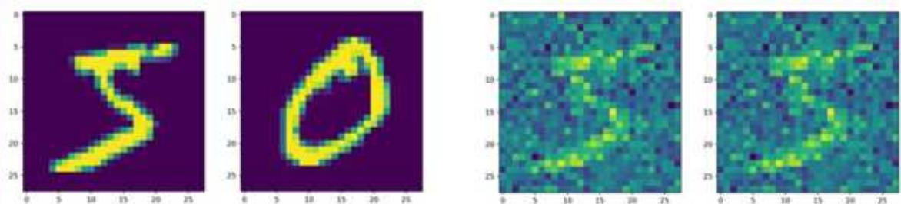  
图9-13 原始图像与加噪后的图像

在此基础上，我们可以完成对Dit模型的训练，代码如下：

```python
from torch.utils.data import DataLoader #导入PyTorch的数据加载工具
from dataset import MNIST #从dataset模块导入MNIST数据集类
from diffusion import forward_add_noise #从diffusion模块导入forward_add_noise函数，用于向图像添加噪声
import torch #导入PyTorch库
from torch import nn #从PyTorch导入nn模块，包含构建神经网络所需的工具
import os #导入os模块，用于处理文件和目录路径
from dit import DiT #从dit模块导入DiT模型
#判断是否有可用的CUDA设备，如果有则使用GPU，否则使用CPU
DEVICE=' CUDA' if torch.cuda.is-available() else 'cpu'
dataset=MNIST() #实例化MNIST数据集对象
T = 1000 #设置扩散过程中的总时间步数
model=DiT(img_size=28,patch_size=4,channel=1,emb_size=64,label_num=10,dit_num=3,he
ad=4).to(DEVICE) #实例化DiT模型并移至指定设备
#model.load_state_dicttorch.load('/saver/model.pth')) #可选：加载预训练模型参数
#使用Adam优化器，学习率设置为0.001
optimizer=torch.optimistic Adam(model.params(), lr=1e-3)
loss_fn=nn.LlLoss() #使用L1损失函数（即绝对值误差均值）
...
EPOCH=300 #设置训练的总轮次
BATCH_SIZE=300 #设置每个批次的大小
if __name__ == '__main__':
from tqdm import tqdm #导入tqdm库，用于在训练过程中显示进度条
dataloder=DataLoader(dataset,batch_size=BATCH_SIZE,shuffle=True,num_workers=10,
persistent_workers=True) #创建数据加载器
iter_count=0
for epoch in range(EPOCH):
    pbar = tqdm的数据Loader, total=len(dataloader)) #初始化进度条
    for imgs,labels in pbar:
        #遍历每个批次的数据
        x=imgs*2-1 #将图像的像素范围从[0,1]转换到[-1,1]，与噪声高斯分布的范围对应
        t=torch.randint(0,T,(imgs.size(0),)) #为每幅图片生成一个随机的t时刻
        y=y-labels
        #向图像添加噪声，返回加噪后的图像和添加的噪声
```

```txt
x, noise = forward_add_noise(x, t)  
# 模型预测添加的噪声  
pred_noise = model(x.to(DEVICE), t.to(DEVICE), y.to(DEVICE))  
# 计算预测噪声和实际噪声之间的L1损失  
loss = loss_fn(pred_noise, noise.to(DEVICE))  
optimizer.zero_grad() # 清除之前的梯度  
loss.backward() # 反向传播，计算梯度  
optimizer.step() # 更新模型参数  
# 更新进度条描述  
pbar.set_description(f"epoch:{epoch + 1}, train_loss:{loss.item().5f}")  
if epoch % 20 == 0: # 每20轮保存一次模型  
torch.save(model.state_dict(), './saver/model.pth')  
print("base diffusion saved")
```

在上面的代码中，我们首先导入了必要的PyTorch库和模块，包括数据加载工具、MNIST数据集、用于向图像添加噪声的函数、神经网络构建工具、os模块以及DiT模型。然后，判

断是否有可用的CUDA设备，并据此选择使用GPU还是CPU。

接下来，我们实例化了MNIST数据集对象和DiT模型，并将模型移至指定的设备（GPU或CPU）。代码设置了训练过程中的总时间步数、优化器（使用Adam优化器，学习率设置为0.001）和损失函数（使用L1损失函数）。

在训练阶段，代码通过数据加载器遍历每个训练轮次和每个批次的数据，对图像进行预处理（包括像素范围转换和随机时刻生成），向图像添加噪声，并使用模型预测添加的噪声。然后，我们使用L1损失函数进行反向传播以更新模型参数，并在训练过程中显示进度条。每20轮训练后，代码保存一次模型参数。

# 9.2.5 基于注意力模型的可控图像生成

DiT模型的可控图像生成是在我们训练的基础上，逐渐对正态分布的噪声图像进行按步骤的脱噪过程。这一过程不仅要求模型具备精准的噪声预测能力，还需确保脱噪步骤的细腻与连贯，从而最终实现从纯粹噪声到目标图像的华丽蜕变。

完整的可控图像生成代码如下：

import torch   
from dit import DiT   
import matplotlib.pyplot as plt   
#导入diffusion模块中的所有内容，这通常包含一些与扩散模型相关的预定义变量和函数   
from diffusion import \*   
#设置设备为GPU或CPU   
DEVICE $=$ 'cuda'iftorch.cuda.is-available()else'cpu'   
DEVICE $=$ "cpu" #强制使用CPU $\mathrm{T} = 1000$ #扩散步骤的总数   
def backward_denoise(model,x,y): steps=[xClone(),] #初始化步骤列表，包含初始噪声图像

global alphas,alphas_cumprod,variance #这些是从diffusion模块导入的全局变量  
x=x.to(DEVICE) #将输入x移动到指定的设备  
alphas=alphas.to(DEVICE)  
alphas_cumprod=alphas_cumprod.to(DEVICE)  
variance=variance.to(DEVICE)  
y=y.to(DEVICE) #将标签y移动到指定的设备  
model.eval() #设置模型为评估模式  
with torch.no_grad(): #在不计算梯度的情况下运行，节省内存和计算资源  
for time in range(T-1,-1,-1): #从T-1到0逆序迭代  
t=torch.full((x.size(0),time).to(DEVICE) #创建一个包含当前时间步的tensor  
#预测x_t时刻的噪声  
noise model(x,t,y)  
#生成t-1时刻的图像  
shape=(x.size(0),1,1,1)  
mean=1/torch.sqrt(alphas[t].view(*shape)) * $\left\{ \begin{array}{l} x - \\ \end{array} \right.$ (1-alphas[t].view(*shape))/torch.sqrt(1-alphas_cumprod[t].view(*shape))*noise  
if time!=0:  
    x=mean+ $\left\{ \begin{array}{l} \text{torch.randint(x)} * \\ \text{torch.sqrt(variance[t].view(*shape))} \end{array} \right.$ else:  
    x=mean  
    x=torch.clamp(x,-1.0,1.0).detach() #确保x的值在[-1,1]之间，并分离计算图  
steps.append(x)  
return steps  
#初始化DiT模型  
model=DiT(img_size=28,patch_size=4,channel=1,emb_size=64,label_num=10,dit_num=3,he  
ad=4).to(DEVICE)  
model.load_state_dict(torch.load('./saver/model.pth')) #加载模型权重  
#生成噪声图  
batch_size=10  
x=torch.random(size=(batch_size,1,28,28)) #生成随机噪声图像  
y=torch.arange(start=0,end=10, dtype=torch.long) #生成标签  
#逐步去噪得到原图  
steps=backward_denoise(model,x,y)  
#绘制数量  
numimgs=20  
#绘制还原过程  
plt.figure(figsize=(15,15))  
for b in range(batch_size):  
    for i in range(0,num imgs):  
        idx=int(T/num imgs)*(i+1) #计算要绘制的步骤索引

```python
#像素值还原到[0,1]  
final_img = (steps[idx][b].to('cpu') + 1) / 2  
# tensor转回PIL图  
final_img = final_img.permute(1,2,0) # 调整通道顺序以匹配图像格式  
plt.subplot(batch_size, num_images, b * num_images + i + 1)  
plt.imshow(final_img)  
plt.show() # 显示图像 
```

上面的代码展示了使用DiT进行图像去噪的完整过程。首先，它导入了必要的库和模块，包括PyTorch、DiT模型、matplotlib绘图模块，以及从diffusion模块导入的一些预定义变量和函数，这些通常与扩散模型相关。然后，代码设置了计算设备为CPU（尽管提供了检测GPU可用性的选项），并定义了扩散步骤的总数。

backward_denoise函数是实现图像去噪的核心。它接受一个DiT模型、一批噪声图像以及对应的标签作为输入。在这个函数内部，它首先将输入移动到指定的计算设备，然后将模型设置为评估模式，并开始一个不计算梯度的循环，从最后一个扩散步骤开始逆向迭代至第一步。在每一步中，它使用模型预测当前步骤的噪声，然后根据扩散模型的公式计算上一步的图像。这个过程一直持续到生成原始图像。

接下来，代码初始化了DiT模型，并加载了预训练的权重。然后，它生成了一批随机噪声图像和对应的标签，并使用backward_denoise函数对这些噪声图像进行去噪，逐步还原出原始图像。运行结果如图9-14所示。

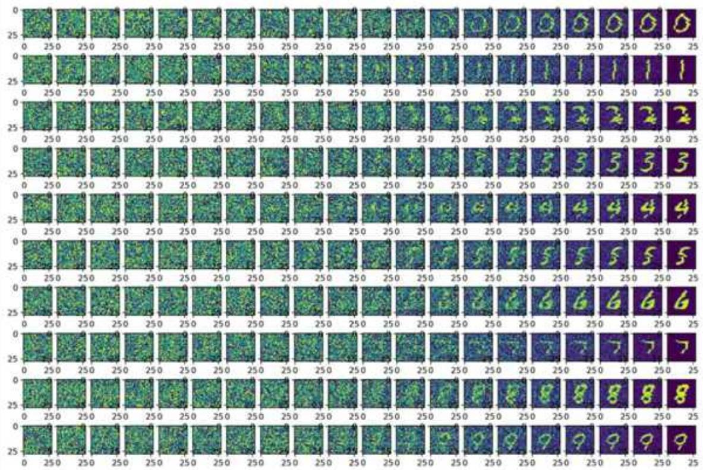  
图9-14 基于DiT模型的可控图像生成

可见，我们使用生成代码绘制了去噪过程的图像，展示了从完全噪声的图像逐步还原为清晰图像的过程。通过调整通道顺序和像素值范围，它将tensor格式的图像转换为适合绘制的格式，并使用matplotlib库的subplot函数在一个大图中展示了所有步骤的图像。

# 9.3 本章小结

在本章中，我们深入探讨了基于注意力机制的图像生成技术，并通过实战演练，全面掌握了利用该模型进行图像生成的技术细节。我们详细讲解了注意力模型在图像生成方面的应用，从模型的基本原理到具体实现步骤，都做了深入浅出的阐述。

首先，我们明确了扩散模型的核心思想。以经典的扩散模型为例，通过迭代的方式逐步添加噪声来生成图像。在这一过程中，扩散模型的高效性和灵活性得到了充分体现，使得图像生成过程更加顺畅和高效。

在使用注意力机制为核心的扩散图像生成中，我们进一步展现了注意力机制与特征融合的独特优势。MQA架构以其高效的数据处理能力和灵活的扩展性，使得扩散生成模型在图像生成方面表现出色。我们详细指导读者如何利用注意力模型架构的特点，优化模型的训练过程，从而生成更高质量的图像。

通过实战演练，我们不仅深入理解了扩散生成模型的工作原理，还学习了如何根据文本输入生成可控的图像。无论是对于学术研究还是商业应用，这都为读者提供了宝贵的经验和技能。

# 第10章

# 注意力与特征融合范式2：多模态图文理解与问答

在前面的章节中，我们详细阐述了注意力模型的多种优化策略，并探讨了基于注意力模型的图像生成方法。在这些讨论中，我们介绍了一种特征融合技术，该技术通过多次叠加的方式将特征整合到注意力机制中。这种方法的显著优势在于，它对特征的形态没有特定的要求。

这种灵活性使得我们的模型能够处理各种不同类型的特征数据，无论是形状、纹理还是颜色信息，都可以被有效地整合和利用。通过多次叠加融合特征，模型能够在处理复杂图像时更加细致和精确，从而提高了图像生成的质量和准确性。

此外，这种融合方式还增强了模型的健壮性。由于不依赖于特定的特征形态，模型在面对输入数据的微小变化时仍能保持稳定性能。这在处理实际场景中的图像时尤为重要，因为现实世界的图像往往包含多种变化和不确定性。

在本章中，我们将进一步探索一种新颖的注意力与特征融合的范式。这种范式结合了ViT图像读取技术和文本Embedding拼接方法，以实现一种全新的多模态图文理解与问答系统。通过这种方式，我们能够将图像信息与文本信息有效地结合起来，为复杂的图文理解任务提供更全面的解决方案。这不仅将推动图像与文本信息的深度融合，还将为多模态交互领域带来新的突破点。

# 10.1 多模态图文问答实战

图像问答作为一种基本的多模态模型形式，融合了视觉与语言处理的技术精髓。它不仅能够理解图像的视觉内容，还能根据用户提出的问题，准确地从图像中提取相关信息，并最终以自然语言的形式给出回答。这种模型的出现极大地丰富了人机交互的方式，使得机器能够更自然地理解和回应人类的问题。

在图像问答系统中，多模态模型的运用至关重要。该模型能够同时处理图像和语言两种不同模态的数据，通过深度学习算法挖掘它们之间的内在联系。当用户提出一个问题时，系统首先会分析问题的语义，明确用户想要了解的信息点；然后，系统会利用视觉处理技术对图像进行解析，识别出图像中的关键元素；最后，系统结合问题语义和图像内容，生成简洁明了的回答。

随着技术的不断发展，图像问答系统将在更多领域得到应用。例如，在智能教育领域，它可以帮助学生更直观地理解复杂的概念；在智能家居领域，它可以为用户提供更加便捷的控制方式；在医疗领域，它可以辅助医生进行疾病诊断等。

接下来，我们将介绍一种基于多模态的图文问答方法。该方法通过将图像输入与文本内容进行对齐（或融合）操作，然后进行嵌入处理，以实现后续的计算和分析。

# 10.1.1 一种新的多模态融合方案

为了将图像输入视觉多模态模型中，我们首先需要执行一个关键步骤：将图像的像素密集地嵌入模型中。在ViT（Vision Transformer，即基于视觉变换器的图像分块技术）问世之前，多数VLP（Vision-and-Language Pre-training，视觉与语言预训练）方法都高度依赖于复杂的图像特征提取流程。这些流程通常涉及区域监督（例如物体检测）和卷积架构（如ResNet）的运用。因此，VLP研究的重点多集中在通过提升视觉嵌入器的性能来优化整体模型的效果。

研究人员渴望设计出功能更强大的视觉Encoder，但这其中存在一个实际问题。在学术研究领域，视觉Encoder所提取的区域特征可以预先缓存，从而加速研究进程。然而，在实际应用开发中，当面对全新的数据时，研究人员仍需经历区域特征的提取过程。这一过程往往耗时较长，因此拥有高性能视觉嵌入器所带来的速度瓶颈问题，在实践中常常被忽视。

在这里，我们开发了一种新的多模态视觉模型ViLT。其总体架构如图10-1所示。Transformer Encoder使用预训练的ViT来初始化，Image Embedding使用ViT中的Patch投影来实

现，Word Embedding使用文本的Tokenizer进行标记化，并学习一个全新的文本嵌入参数。

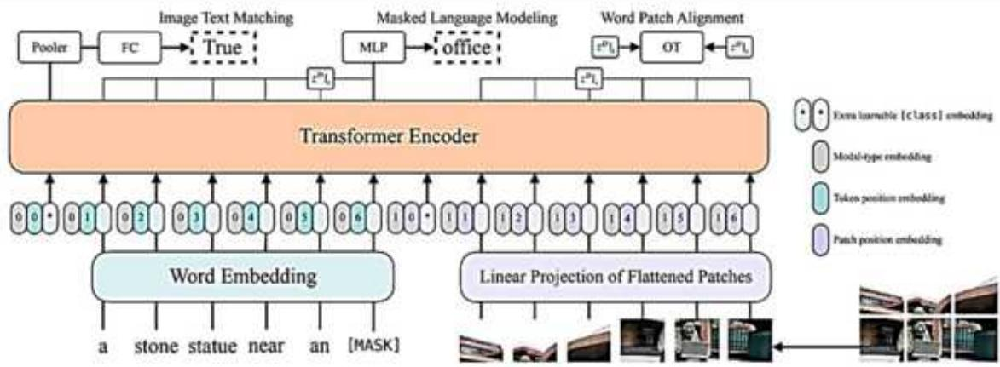  
图10-1 一种新的多模态融合方案

具体来看，为了实现这种图像和文字特征融合的效果，可以使用如下代码：

```python
token_embedding = self_embedding(input_token)
bs, seq_len, dim = token_embedding.shape
image_embedding = self.batch_embedding(image).to(token_embedding_device)
bs, seq_len, dim = token_embedding.shape
img_bs, image_len, dim = image_embedding.shape
position_ids = torch.cat((torch.zeros(size=(bs, image_len), dtype=torch.int),
torch.ones(size=(bs, seq_len), dtype=torch.int)), dim=-1).to(token_embedding_device)
position_embedding = self.position_embedding(position_ids)
embedding = torch.cat((image_embedding, token_embedding), dim=1) + position_embedding
for i in range(self.num_layers):
    #residual = token_embedding
    #这里不能动，需要把信息融合进去
embedding = self.layers[i](embedding, past_length = image_len) 
```

从上面的代码可以看到，我们分别提取了token_embedding与image_embedding，之后使用concat将两个Embedding连接在一起。而past_length参数确保了模型在处理过程中能够区分并正确处理图像和文本数据。

完整的ViLT代码如下：

```python
import torch
import torch.nn as nn
import torch.nnfunctional as F
import kan,mhsa
import timm
class ViLT(nnModule):
    def __init__(self,vocab_size = 3120,num_layers = 6,d_model = 384,attention_head_num
        = 6,hidden_dropout = 0.1):
        ""Full Mamba model."
        super().__init()
        self.num_layers = num_layers
        self-hidden_dropout = hidden_dropout
        self_embedding = nn.Embedding(3120,d_model)
        self.batch_embedding = timm.layers.PatchEmbed(28,patch_size=7,in_chans =
            1,embed_dim=d_model)
        self(image_batch_num = int((28/7)**2)
        self.layers = torch.nn.ModuleList([mhsa.EncodingBlock(d_model,
attention_head_num, hidden_dropout) for _ in range(num_layers)])\n\n
        self.lr_head = kan.KAN([d_model,vocab_size])
        "这里加上了一个position_ids，目标是标注输入image与token_embedding的方式"
        self.position_embedding = nn.Embedding(2,d_model)\n\ndef forward(self,image input_token):
            token_embedding = self_embedding(input_token)
            bs,seq_len,dim = token_embedding.shape
            image_embedding = self.batch_embedding(image).to(token_embedding_device)
            bs,seq_len,dim = token_embedding.shape
            img_bs,image_len,dim = image_embedding.shape
            position_ids = torch.cat((torch.zeros(size=(bs,image_len),dtype=torch.int), 
```

torch.ones(size=(bs,seq_len),dtype=torch.int)，dim=-1).to(token_embeddingdevice) position_embedding $=$ self.position_embedding(position_ids) embedding $=$ torch.cat((image_embedding,token_embedding)，dim=1)+   
position_embedding for i in range(self.num_layers): #residual $=$ token_embedding #这里不能动，需要把信息融合进去 embedding $=$ self.layers[i](embedding，past_length $=$ image_len) $\mathbf{x} =$ torch(nnfunctional.dropout(embedding,p=0.1) logits $=$ self.lr_head(x) return logits @torch.no_grad() def generate(self,image，prompt $\equiv$ None,n_tokens_to_gen $= 20$ ，temperature $\coloneqq 1$ .top_k $= 3$ ,sample $=$ False,eos_token $= 2$ device $=$ "cuda"):

nn

```python
self.eval()
# prompt = torch.tensor_prompt)
prompt = prompt.train().detach().requires_grad(False).to(device)
input_ids = prompt
for token_n in range(n_tokens_to_gen):
    with torch.no_grad():
        indices_to_input = input_ids
        next_token_logits = self.forward(image, indices_to_input)[-1]
    probs = F softmax(next_token_logits, dim=-1) * temperature
    (batch, vocab_size) = probs.shape
if top_k is not None:
    (values, indices) = torch.topk(probs, k=top_k) 
```

```python
prob[s<values[;, -1, None]] = 0
prob = prob/s/ prob.sum(axis=1, keepdims=True)
if sample:
    nextIndices = torch.multinomial(probs, num_samples=1)
else:
    nextIndices = torch.argmax(probs, dim=-1)[:, None]
input_ids = torch.cat(input_ids, nextIndices), dim=1)
return input_ids 
```

在上面的代码中，我们除在模型中进行融合外，还整合了生成部分，结合原始的生成模型的生成方式，可以对文本内容进行预测。

# 10.1.2 数据集的设计与使用

本小节将完成图像问答模型的数据准备，此时我们依旧使用MNIST数据集来获取数据，不同的是在这例子中用来提问的文本内容，其相应的回答是MNIST手写所代表的数字，示例如下：

sampletexts $\equiv$ [  
"这个数字或许是："，  
"此数字可能等于："，  
"该数字可能表示："，  
"这个数字可能意味着："，  
"或许这个数字是："，  
1

此时，对MNIST数据集处理的代码如下：

```python
class MNIST(Dataset):
    def __init__(self, is_train=True):
        super().__init()
        self.vs = torchvision.datasets.MNIST('./dataset/mnist/', train=is_train,
        download=True)
        self.img.convert =Compose(
            PILToTensor()
        )
    def __len__(self):
        return len(self.vs)
    def __getitem__(self,index):
        img, label = self.vs[index]
        #text = f"现在的数字是:(label)#"
        text = random.sample(sampletexts,1)[0][-10:] 
        text = text + str.label) + "#"
        fulltok =tokenizer emo.encode(text)[-12:] 
        fulltok = full tok + [1] * (12 - len(fulltok))
        inp tok = full tok[-1]
        tgt tok = full tok[1:] 
        inp tok = torch.tensor(inp tok)
        tgt tok = torch.tensor(tgt tok)
        ""
        torch.Size([1,28,28])
        ""
    return self.img Converted(img) / 255.0, inp tok,tgt tok 
```

# 10.1.3 多模态融合数据集的训练

对于训练任务，我们需要根据需求设置特殊的label。观察此时的数据，我们的模型并不需要预测image部分，只需要预测文本生成部分。因此，我们在建立label时，可以额外添加一个不需要预测的image label部分，放置在文本内容之前，代码如下：

```python
token_tgt_pad = torch.ones(size=(token_inp.shape[0],16),dtype=torch.int) * -100
token_tgt = torch.cat((token_tgt_pad, token_tgt), dim=-1)
token_tgt = token_tgt.to(device) 
```

同样地，对于损失函数的计算，我们也需要进行如下设计：

```txt
criterion = torch.nn.CrossEntropyLoss(ignore_index=-100) 
```

这样做的目的是对于补充的部分，忽略了额外添补的image特征部分，从而只需要计算对应的文本内容。完整的训练代码如下：

from model import ViLT   
import math   
from tqdm import tqdm   
import torch   
from torch.utils.data import DataLoader   
device $=$ "cuda"   
model $=$ ViLT()   
model.to(device)   
save_path $=$ "/saver/mamba_generation.pth"   
#model.load_state_dicttorch.load(save_path)，strict $\equiv$ False)   
BATCH_SIZE $= 640$ seq_len $= 49$ import get_dataemotion   
#import get_dataemotion_2 as get_dataemotion   
train_dataset $=$ get_dataemotion.MNIST()   
trainloader $=$ (DataLoader(train_dataset，batch_size $\equiv$ BACH_SIZE,shuffle $\equiv$ True))   
optimizer $=$ torch.optim.AdamW(model.params(),lr $= 2e - 4$ 1r scheduler $=$ torch.optim.lr_scheduler.CosineAnnealingLR(optimizer,T max $=$

1200,eta_min=2e-5,last_epoch=-1) criterion $=$ torch.nn.CrossEntropyLoss(ignore_index=-100) for epoch in range(12): pbar $=$ tqdm(trainloader,total $\equiv$ len(trainloader)) for image,token_inp,token_tgt in pbar: image $=$ image.to(device) token_inp $=$ token_inp.to(device) token_tgt_pad $=$ torch.ones(size=(token_inp.shape[0],16),dtype $\equiv$ torch.int)* -100 token_tgt $=$ torch.cat((token_tgt_pad,token_tgt),dim=-1) token_tgt $=$ token_tgt.to(device) logits $=$ model(image,) token_inp) loss $=$ criterion(logits.view(-1, logits.size(-1)), token_tgt.view(-1)) optimizer.zero_grad() loss.backup() optimizer step() lr_scheduler step() #执行优化器 pbar.set_description(f"epoch:{epoch +1},train_loss:{loss.item():.5f}， lr:(lr_scheduler.get_last_lr([0]*1000:.5f)” if (epoch+1) 7 $= = 0$ torch.save(model.state_dict(),save_path) torch.save(model.state_dict(),save_path)

读者可以自行运行代码并查看结果。

# 10.1.4 多模态图文问答的预测

在本小节中，我们将完成多模态图文问答的预测任务。对于预测的输入部分，我们直接载入MNIST的测试数据集；而对于生成部分，由于只需要生成文本内容，因此只需要将空白

的文本传递给模型，模型依次往后输出即可。代码如下：

```python
from第9章.MultiModal_MultiModal_V3 import tokenizer
tokenizer_emo = tokenizerTokenizer()
from model import ViLT
import torch
device = "cuda"
model = ViLT()
save_path = ".saver/ViLT_generator.pth"
model.load_state_dict(torch.load(save_path),strict=False)
model.to(device)
model.eval()
from get_data(emotion import MNIST
ds = MNIST(is_train=False)
for i in range(10):
    img, inp TOK,tgt TOK = ds[i]
    text = tokenizer emodecode(tgt TOK)
    print(text)
    pre_text = ""
prompt_token = tokenizer emo.encode(text)
prompt_token = torch.tensor([prompt_token]).long().to(device)
image = torch unsqueeze(img,0).to(device)
result_token = model_generate(image = image,prompt=prompt_token,
n_tokens_to_gen=12, top_k=5, temperature=0.99, device=device)[0].cpu().numpy())
result_text = tokenizer emoDecode(result_token)
print(result_text)
print(""); 
```

输出结果如下：

```txt
...  
有可能为下列之一：1#  
有可能为下列之一：1#  
此数字可能是：4#  
此数字可能是：4#  
此数字可能是：9#  
此数字可能是：9#  
数字可能代表了：5#  
数字可能代表了：5#
```

读者可以自行尝试运行并观察结果。

# 10.2 更多的多模态融合方案

对于多模态数据经过flatten处理后的维度对齐问题，我们在10.1节中已经详细探讨了前段补齐的解决方案。通过这种方法，我们成功地实现了输出维度与输入维度的匹配，为后续的数据处理和分析奠定了坚实的基础。

然而，仅完成维度对齐并不足以充分发挥多模态数据的潜力。为了更深入地挖掘这些数据中的信息，我们还需要考虑如何有效地融合不同模态的特征。毕竟，多模态数据的核心优势在于其能够从多个角度、多个层面提供关于同一事物的丰富信息。因此，如何将这些来自不同模态的信息有机地结合起来，以形成更全面、更准确的特征表示，是我们接下来需要重点研究的问题。

# 10.2.1 一种截断的多模态融合方案

除通过对输入的label内容进行补全以实现融合外，我们还可以采取另一种策略，即对输出的logits进行截断。这种方法允许我们人为地对齐多模态的输入与输出内容，确保它们在维度上的一致性。

具体而言，当多模态数据经过模型处理后产生logits时，这些logits可能因不同模态的特性而具有不同的长度或维度。为了解决这个问题，我们可以根据预设的标准或需求，对这些logits进行截断操作。通过去除多余的部分或保留关键的信息，我们能够确保每个模态的输出都具有相同的维度，从而实现多模态输入与输出内容的有效对齐。

这种截断方法不仅简单易行，而且能够在一定程度上减少模型的计算负担。同时，它也为后续的数据处理、特征融合或决策分析提供了便利。当然，在实际应用中，我们需要根据具体任务和数据特点来合理设定截断的策略和参数，以确保在保持信息完整性的同时，实现最佳的对齐效果。

具体来看，我们需要在模型的输出端进行修改，即将原有的加载图像Embedding的特征进行人工截断，而截断的长度是我们定义的输出文本的长度，这部分的代码如下：

```python
embedding = self.split_norm(embedding[:, :,11])
x = torch.nnfunctional.dropout(embeding,p=0.1)
logits = self.lr_head(x) 
```

可以看到，我们首先对Embedding特征进行依据长度的截断，原始的输入经过一个正则化层后发送到输出头中进行计算。完整的模型代码如下：

class ViLT(nnModule): def_init_self,vocab_size $= 3120$ num_layers $= 6$ d_model $= 384$ ,attention_head_num $= 6$ ,hidden_dropout $= 0.1$ ): ""Full Mamba model.""" super().__init_(self.num_layers $\equiv$ num_layers self-hidden_dropout $\equiv$ hidden_dropout self_embedding $\equiv$ nn.Embedding(3120,d_model) self.batch_embedding $\equiv$ timm.layers.PatchEmbed(28,patch_size $= 7$ ,in_chans $= 1$ ,embed_dim $\equiv$ d_model) self.image_batch_num $\equiv$ int((28/7)**2) self.layers $\equiv$ torch.nn.ModuleList([mhsa.EncodingBlock(d_model, attention_head_num, hidden_dropout) for_in range(num_layers)]) self.split_norm $\equiv$ torch(nn.RMSNormd_model) self.lm_head $\equiv$ kan.KAN([d_model,vocab_size]) "这里加上了一个position_ids，目标是标注输入image与token_embedding的方式" self.position_embedding $\equiv$ nn.Embedding(2,d_model) def forward(self,image input_token): token_embedding $\equiv$ self_embedding(input_token) bs,seq_len,dim $\equiv$ token_embedding.shape image_embedding $\equiv$ self.batch_embedding(image).to(token_embedding_device)   
[-1,16,384]

bs,seq_len,dim $=$ token_embedding.shape img_bs,image_len,dim $=$ image_embedding.shape position_ids $=$ torch.cat(torch.zeros(size=(bs,image_len), dtype $\equiv$ torch.int),torch.ones(size=(bs,seq_len),dtype $\equiv$ torch.int)),dim=-1).to(token_embedding device) position_embedding $=$ self.position_embedding(position_ids) embedding $=$ torch.cat((image_embedding,token_embedding),dim=1)+   
position_embedding for i in range(self.num_layers): #residual $=$ token_embedding #这里不能动，需要把信息融合进去 embedding $=$ self.layers[i](embedding,past_length $=$ image_len) embedding $=$ self.split_norm(embedding(:,:11]) x $=$ torch.nnfunctional.dropout(embedding,p=0.1) logits $=$ self.lr_head(x) return logits @torch.no_grad def generate(self,image,prompt $\equiv$ None,n_tokens_to_gen $= 20$ temperature $\coloneqq 1$ .top_k $= 3$ ,sample $=$ False,eos_token $\coloneqq 2$ device $=$ "cuda"): #将输入的prompt转换为torch张量，并确保它在正确的设备上（如GPU或CPU） self.eval() #prompt $=$ torch.tensor_prompt) prompt $=$ prompt.clone().detach().requires_grad(False).to(device) input_ids $=$ prompt for token_n in range(n_tokens_to_gen): with torch.no_grad(): indices_to_input $=$ input_ids next_token_logits $=$ self.forward(image,indices_to_input)[:, -1] probs $=$ F softmax(next_token_logits, dim=-1) *temperature (batch,vocab_size) $=$ probs.shape if top_k is not None: (values, indices) $=$ torch.topk(probs,k $\coloneqq$ top_k) probsbars $<  _{\cdot}$ values[-1, None] $\coloneqq 0$ probsbars $=$ probsb/ probsb.Sum(axis=1, keepdims=True) if sample: next Indices $=$ torch.multinomial(probs, num_samples=1) else: next Indices $=$ torch.argmax(probs, dim=-1)[:, None] input_ids $=$ torch.cat([input_ids,nextIndices],dim=1)

# 10.2.2 截断后多模态模型的训练与预测

对于截断后的多模态模型，我们在训练过程中无须重新对齐进行补0操作，只需要依据原始的输入label进行损失计算即可，代码如下：

```python
from model import ViLT
import math
from tqdm import tqdm
import torch
from torch.utils.data import DataLoader
device = "CUDA"
model = ViLT(   )
model.to(device)
save_path = "./saver/ViLT_generation.pth"
BATCH_SIZE = 72
seq_len = 49
import get_data(emotion
	#import get_data(emotion_2 as get_data(emotion
train_dataset = get_data(emotion.MNIST(   )
trainloader = (DataLoader(train_dataset, batch_size=BATCH_SIZE,shuffle=True))
optimizer = torch.optim.AdamW(model.params(   ), lr = 2e-4)
lr_scheduler = torch.optim.lr_scheduler.CosineAnnealingLR(optimizer,T_max =
1200, eta_min=2e-5,last_epoch=-1)
criterion = torch(nn.CrossEntropyLoss(ignore_index=-100)
for epoch in range(12):
	pbar = tqdm(trainloader,total=len(trainloader))
	for image,token_inp,token_tgt in pbar:
	(image = image.to(device)
_token_inp = token_inp.to(device)
_token_tgt = token_tgt.to(device)
LOGITS = model(image,token_inp)
loss = criterion(logits.view(-1, logits.size(-1)), token_tgt.view(-1))
	optimizer.zero_grad(   )
	loss.backup(   )
	optimizer step(   )
(lr_scheduler step(   ) # 执行优化器
	pbar.set_description(f"epoch:{epoch +1}, train_loss:{loss.item(   ): .5f} ,
(lr_scheduler.get_last_lr(   ) [0]*1000:.5f}") 
```

从上面的代码可以看到，输出的token_tgt部分没有经过任何处理，而是直接使用交叉熵CrossEntropyLoss进行计算。这种做法的显著优势在于，一旦模型训练完成，我们可以便捷地将输出结果转换为文本格式，以图文问答预测组件的形式实现最终结果的直观输出。

# 10.2.3 一种加法基础的多模态融合方案

对于我们先前在输出端与输入端实施的多模态融合与对齐策略，均需要对模型的输入和输出部分执行填充或截断操作。此类方法确实能够有效对齐数据内容，从而确保模型顺利完

成训练。然而，这种方法也存在潜在的数据错位风险。为了克服这一局限性，我们精心设计了一种全新的多模态融合方案。

我们从注意力编码器层入手，抽取图像特征，并采用多次累加的形式将图像特征进行融合。新的编码器方案如下：

```python
import torch
import einops
import math
from module import attentionModule
from module import feedforward_layer
def modulate(x, shift, scale):
    return x * (1 + scale) + shift
class EncoderBlock(torch(nn.Module):
    def __init__(self, emb_size = 64, head_num = 4):
        super().__init__()
        self.emb_size = emb_size
        self.head_num = head_num
        self.adALN_modulation = torch.nnSequential(
            torch.nn.Conv(d_channels=16, out_channels=6, kernel_size=3,padding=1),
            torch(nn.Linear(emb_size, emb_size * 2, bias=True), torch(nn.SILU),
            torch(nn.Linear(emb_size * 2, emb_size, bias=True))
        )
        d_model, attention_head_num = emb_size, head_num
        self(layer_norm = torch(nn.RMSNorm(emb_size))
        self.mha = attention_module.MultiHeadAttention_MQA(d_model,
attention_head_num)
        self.mlp = feedforward_layer.Swiglu(hidden_size=d_model)
        self.last_norm = torch(nn.RMSNorm(emb_size))
def forward(self,x, cond):
    x_residual = x.clone()
    cond = self.adALN_modulation-cond)
    gamma_val, beta1_val, alpha1_val, gamma2_val, beta2_val, alpha2_val = torch.splitcond,split_size_orSections=1,dim=1)
    x = self(layer_norm(x)
x = modulate(x,gamma_val,beta_val) 
```

$\mathbf{x} =$ self.mha(x) $\mathbf{x}^{*} =$ alpha1_val $\mathbf{x} + = \mathbf{x}$ _residual   
x_residual $=$ x.clone() $\mathbf{x} =$ modulate(x,gamma2_val,beta2_val) $\mathbf{x} =$ self.mlp(x） \* alpha2_val $\mathbf{x} =$ self.last_norm(x_residual $^+$ x)   
return x

从上面的代码可以看到，此时的图像特征进过抽取后，经过多次卷积处理被分成多层，我们通过split函数对结果进行分离后，将每一层作为一个特征维度与原始的Embedding内容进行相加，并通过注意力模型计算后返回。

此时，新的整体模型部分代码如下：

```python
import torch
import torch.nn as nn
import torch.nnfunctional as F
import kan,mhsa
import timm
class ViLT(nnModule):
    def __init__(self,vocab_size = 3120,num_layers = 6,d_model = 384,attention_head_num = 6,hidden_dropout = 0.1):
        ""Full Mamba model."
        super().__init {}
        self.num_layers = num_layers
        self-hidden_dropout = hidden_dropout
        self_embedding = nn.Embedding(3120,d_model)
        self.batch_embedding = timm.layers.PatchEmbed(28,patch_size=7,in_chans = 1,embed_dim=d_model)
        self(image_batch_num = int((28/7)**2)
        self.layers = torch(nn.Module([mhsa.EncodingBlock(d_model, attention_head_num) for _ in range(num_layers)]))
        self.split_norm = torch(nn.RMSNorm(d_model)
        self.lm_head = kan.KAN([d_model,vocab_size])
        "这里加上了一个position_ids，目标是标注输入image与token_embedding的方式"
        self.position_embedding = nn.Embedding(2,d_model)
        def forward(self,image input_token):
            token_embedding = self_embedding(input_token)
            bs,seq_len,dim = token_embedding.shape
            image_embedding = self.batch_embedding(image).to(token_embedding_device)
#[-1,16,384] 
```

embedding $=$ token_embedding for layer in self.layers: embedding $=$ layer(embedding, image_embedding) $\mathbf{x} =$ torch.nnfunctional.dropout(embedding,p=0.1) logits $=$ self.lr_head(x) return logits   
@torch.no_grad() def generate(self,image, prompt $\equiv$ None,n_tokens_to_gen $= 20$ temperature $= 1$ .top_k $= 3$ ,sample $=$ False,eos_token $= 2$ device $=$ "cuda"): #将输入的prompt转换为torch张量，并确保它在正确的设备上（如GPU或CPU） self.eval() prompt $=$ prompt.clone().detach().requires_grad(False).to(device) input_ids $=$ prompt for token_n in range(n_tokens_to_gen): with torch.no_grad(): indices_to_input $=$ input_ids next_token_logits $=$ self.forward(image,indices_to_input)[:, -1] probs $=$ F softmax(next_token_logits，dim=-1)*temperature (batch,vocab_size) $=$ probs.shape if top_k is not None: (values, indices) $=$ torch.topk(probs,k $\coloneqq$ top_k) probs[probs<-1, None]] $= 0$ probs $=$ probs / probssum(axis=1, keepdims=True) if sample: next Indices $=$ torch.multinomial(probs, num_samples=1) else: next Indices $=$ torch.argmax(probs，dim=-1)[:, None] input_ids $=$ torch.cat([input_ids,nextIndices],dim=1) return input_ids

读者可以自行尝试训练。对于输出部分，我们可以依据10.2.2节中的预测，直接输出对应的结果即可。

# 10.3 本章小结

在本章中，我们深入剖析并演示了注意力与特征融合的新范式。通过详细的讲解，我们带领读者逐步理解了这一新范式的核心理念与技术细节。在实战环节，我们结合具体案例，让读者亲身体验了如何将注意力机制与特征融合技术应用于实际问题中，从而提升了模型的性能与准确性。

无论是在自然语言处理还是图像识别领域，这一范式都展现出了强大的适用性和灵活性。我们相信，随着技术的不断进步，注意力与特征融合将成为人工智能领域的重要研究方向，为未来的智能化应用提供更强大的技术支持。

为了更深入地理解和运用这一新范式，我们鼓励读者自行尝试在不同的数据集和任务上进行实践，探索其在实际问题中的表现。同时，我们也期待未来有更多的研究人员和工程师能够共同推动注意力与特征融合技术的发展，为人工智能领域带来更多的创新与突破。

# 第11章

# 注意力与特征融合范式3：交叉注意力语音转换

端到端的语音识别（End-to-End Automatic Speech Recognition，ASR）模型在语音识别领域扮演着越来越重要的角色。这类模型能够直接将原始语音信号映射为文本输出，无须经过传统ASR系统中复杂的信号处理和模式识别阶段。它们通常基于深度学习技术，如循环神经网络或卷积神经网络，并结合了诸如连接时序分类（Connectionist Temporal Classification，CTC）或序列到序列（Sequence-to-Sequence，Seq2Seq）等算法，以实现高效准确的语音转文字功能。

端到端ASR模型的优势在于简化了传统ASR的复杂流程，提高了识别效率和准确性，使 得实时语音转写、语音助手等应用得以广泛实现。端到端语音识别ASR的示意图如图11-1所 示。

  
图11-1 端到端语音识别ASR示意

此外，这些模型还具有较强的泛化能力和适应性，能够处理不同口音、语速和背景的语音输入，大大提升了用户体验。随着技术的不断进步，端到端ASR模型将在智能交互、语音搜索、语音助手等领域得到广泛的应用。

# 11.1 端到端语音识别任务简介

语音识别这一技术正如其名，是通过解析说话人的语音来识别并输出其所说的内容。如今，语音识别技术已经迈入了大规模商用的崭新阶段，它在我们的日常生活中扮演着越来越重要的角色。例如，我们手机上的AI助手、便捷的语音输入功能，背后都离不开这项强大技术的支持。从语音到文本的转换示意如图11-2所示。

  
图11-2 从语音到文本的转换

语音识别技术的发展历程相当悠久，其历史可追溯至20世纪50年代。尽管当时的探索尚处于初级阶段，但那些早期的研究无疑为后续的突破奠定了坚实的基础。

自20世纪80年代起，隐马尔可夫链模型（Hidden Markov Model，HMM）被引入语音识别领域，这一创新带来了显著的进步。基于HMM的语音识别系统采用了一种级联式的建模方式，整个系统由特征预处理、声学模型、语言模型等多个部分组成。这些细节并非本书讨论的重点，对于感兴趣的读者来说，可以参考相关论文以深入了解其原理。

# 11.1.1 端到端的语音识别

随着深度学习时代的来临，基于神经网络的端到端语音识别技术逐渐崭露头角，并有望取代传统的基于HMM的级联式技术。与级联式方法相比，端到端建模方式不仅更加简洁直观，而且能够有效减少误差累积等问题。正因如此，它已成为深度学习时代语音识别领域的主流建模范式。

关于“端到端”的方法，其核心理念在于通过一个统一的模型来完成语音识别的整个流程，也就是直接从语音信号中提取信息并输出对应的文本。这种方式无须分阶段处理，从而避免了中间过程的复杂性。

相比之下，级联式方法则显得更为烦琐。在级联式方法中，首先需要一个模型 A将语音信号转换为某种中间表示 x ，接着模型 B 将 x 转换为另一种表示 y ，最后模型 C 将 y 解析为最终的文本。这种方法的优势在于，模型 A、B 、C 可以独立进行训练，便于针对各个环节进行优化。然而，它也存在着显著的缺陷：误差会在各个模型间累积，导致整体准确率下降。具体来说，整个系统的准确率实际上是模型 A、B 、C 各自准确率的乘积，这意味着任何一个环节的失误都会显著影响最终结果。

端到端的方法则有效解决了这一问题。由于它直接从语音到文本进行映射，不存在中间转换过程，因此也就避免了误差的累积。这使得我们可以直接对整个系统进行全局优化，从而提高识别的准确率和效率。简而言之，端到端的方法通过简化处理流程，实现了更高的识别性能和更稳健的系统表现。端到端的语音识别模型的整体框架如图11-3所示。

其中，整体架构左下角的浅灰色区域代表音频预处理环节，右下角的浅蓝色区域则负责文本预处理。这两部分处理后的数据将供给模型的主干部分使用。模型主干涵盖特征提取、Encoder编码以及后续的输出处理，输出处理在训练时专注于计算损失值，而在测试阶段则负责生成文本。为了增强可读性，每个环节旁都清晰地标注了对应数据的维度。

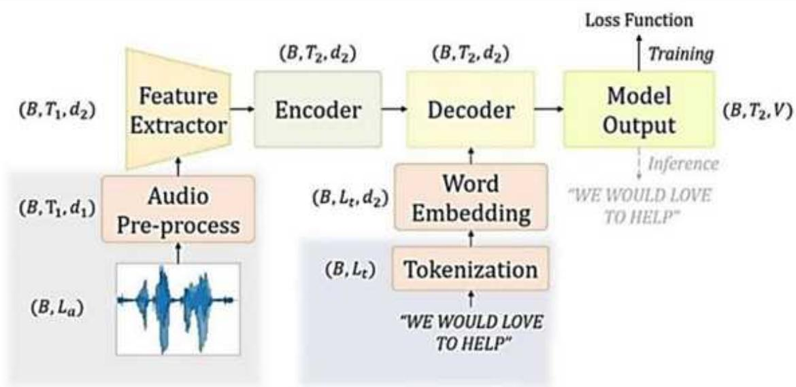  
图11-3 端到端的语音识别模型的整体框架

训练流程可概括为以下步骤：首先，对音频进行预处理，并将处理后的音频数据作为模型的初始输入。这些输入数据会经过一个特征提取器，提炼出基础特征，随后通过Encoder进行更深层次的特征抽取。同时，文本数据也需经过预处理，转换为离散的token，再经由WordEmbedding转换为连续的数值张量。这个张量会与Encoder的输出合并，一同送入Decoder。接着，Encoder和Decoder分别进行前向传播，在此过程中计算损失函数。最后，通过反向传播算法计算梯度，并据此更新模型的参数。后续将详细阐述每个步骤的具体实现细节。

# 11.1.2 中文语音文本数据集说明

在本章中，我们采用THCHS30数据集作为训练数据。THCHS30是一个备受推崇的中文语音数据集，它囊括了超过1万条语音文件，这些文件均通过单个碳粒麦克风进行录制，总计约40小时的中文语音数据。该数据集的内容主要以文章和诗句为主，且全部由女声录制。这个开放式中文语音数据库由清华大学语音与语言技术中心（Center for Speech and LanguageTechnology，CSLT）负责发布。其原始录音工作于2002年在清华大学计算机科学系智能与系统重点实验室进行，由朱晓燕教授监督完成，当时被命名为TCMSD，即代表“清华连续”普通话语音数据库。13年后，该数据库的发布工作由王东博士牵头，并获得了朱晓燕教授的大力支持。他们的初衷是为语音识别领域的研究人员提供一个易于上手的数据库。因此，该数据库对学术用户是完全免费的。

对于有兴趣使用深度学习完成端到端语音转换的读者，除本章使用的这个THCHS30数据集外，我们还将介绍一些其他的数据集，如下所示。

# 1．AISHELL-1

时长：178小时。  
● 参与人数：400人。  
采样：44.1kHz & 16kHz 16bit。

AISHELL是由北京希尔公司发布的中文语音数据集，包含约178小时的开源数据。该数据集涵盖来自中国不同地区、具有不同口音的400名说话者的语音。录音在安静的室内环境中完成，使用了3种不同的设备：高保真麦克风（ $4 4 . 1 \mathrm { k H z }$ ，16-bit）、Android系统手机（16kHz，16-bit）以及iOS系统手机（16kHz，16-bit）。录音采样率被统一降至16kHz，用于制作AISHELL-ASR0009-OS1数据集。

该数据集经过专业的语音标注和严格的质量检查，手动转录的准确率超过 $9 5 \%$ 。它免费提供给学术用户，旨在为语音识别领域的新研究人员提供适量的数据支持。

# 2．AISHELL-2

时长：1000小时。  
● 参与人数：1991人。  
采样：44.1kHz & 16kHz 16bit。

希尔贝壳中文普通话语音数据库AISHELL-2的语音时长为1000小时，其中718小时来自AISHELL-ASR0009-[ZH-CN]，282小时来自AISHELL-ASR0010-[ZH-CN]。录音文本涉及唤醒词、语音控制词、智能家居、无人驾驶、工业生产等12个领域。录制过程在安静的室内环境中，同时使用3种不同设备：高保真麦克风（ $4 4 . 1 \mathrm { k H z }$ ，16bit）、Android系统手机（16kHz，

16bit）以及iOS系统手机（16kHz，16bit）。AISHELL-2是采用iOS系统手机录制的语音数据。1991名来自中国不同口音区域的发言人参与录制。经过专业语音校对人员转写标注，并通过严格质量检验，此数据库文本正确率在 $9 6 \%$ 以上（这个数据集支持学术研究，未经允许禁止商用）。

# 3．CN-Celeb

时长：未知。  
● 参与人数：3000人。  
采样：16kHz 16bit。

这是由清华大学语音与语言技术中心收集的自然场景下的大规模说话人识别数据集。该数据集由两个子集CN-Celeb1和CN-Celeb2组成。所有音频文件均为单声道，采样率为16kHz，量化位数为16bit。

CN-Celeb1包含1 000位中国名人的130 000多条话语，涵盖现实中的11种不同场景，例如娱乐、访谈、唱歌、戏剧、电影、视频博客、现场直播、演讲、朗诵和广告等。CN-Celeb2包含2000位中国名人的520000多条话语。

# 4．Free ST Chinese Mandarin Corpus

时长：未知。  
● 参与者：855人。  
采样：16kHz 16bit。

这个语料库是用手机在室内安静的环境中录制的。它有855个演讲者。每个演讲者有120个话语。所有的话语都经过专业人士仔细地转录和核对，以保证转录精度。

# 5．Aidatatang_200zh

时长：200小时。  
● 参与人数：600人。  
● 采样：16kHz 16bit。

Aidatatang_200zh是北京数据科技有限公司（数据堂）提供的开放式中文普通话电话语音库。语料库长达200小时，由Android系统手机（16kHz，16位）和iOS系统手机（16kHz，16位）记录。邀请来自中国不同重点区域的600名演讲者参加录音，录音是在安静的室内环境或环境中进行的，其中包含不影响语音识别的背景噪声。参与者的性别和年龄均匀分布。语料库的语言材料是设计为音素均衡的口语句子。每个句子的手动转录准确率大于 $9 8 \%$ 。数据

库按7:1:2的比例分为训练集、验证集和测试集。在元数据文件中保存诸如语音数据编码和说话人信息等详细信息，还提供分段转录样本。

# 6．MAGICDATA Mandarin Chinese Read Speech Corpus

时长：755小时。  
● 参与人数：1080人。  
采样：16kHz 16bit。

这个数据集是Magic Data技术有限公司提供的语料库，其包含755小时的语音数据，主要是移动终端的录音数据。邀请来自中国不同重点区域的1080名演讲者参与录制。句子转录准确率高于 $9 8 \%$ 。录音在安静的室内环境中进行。数据库分为训练集、验证集和测试集，比例为51:1:2。如语音数据编码和说话者信息等细节被保存在metadata文件中。录音文本领域多样化，包括互动问答、音乐搜索、SNS信息、家庭指挥和控制等，还提供了分段的成绩单。该语料库旨在支持语音识别、机器翻译、说话人识别和其他语音相关领域的研究人员。因此，语料库完全免费用于学术用途。

# 7．Primewords Chinese Corpus Set 1

时长：178小时。  
● 参与人数：296人。  
采样：16kHz 16bit。

这个免费的中文普通话语料库由上海普力信息技术有限公司发布，其包含178个小时的数据。该语料由296名以中文为母语的人使用智能手机录制，转录精度大于 $9 8 \%$ ，置信度为$9 5 \%$ ，可免费用于学术用途。转述和词句之间的映射以JSON格式提供。

# 11.2 端到端音频特征提取库librosa的使用

我们需要完成端到端的语音转换，可以使用音频特征提取库librosa。librosa是一个用于音频、音乐分析与处理的Python工具包，其包括一些常见的时频处理、特征提取、绘制声音图形等功能，十分强大。librosa库提供了多种音频读取和写入的方法，支持多种音频格式的读取和写入，如WAV、FLAC、MP3等。librosa库还提供了多种音频特征提取的方法，如MFCC、Chromagram等。此外，librosa库还提供了多种音频可视化的方法，如绘制声谱图、绘制频谱图等。

# 11.2.1 音频信号的基本读取方法

音频信号是日常生活中最为常见且最容易被人们感知的信号类型。声音以音频信号的形式存在，其特征通常通过频率、带宽和分贝等参数来描述。典型的音频信号可以表示为振幅随时间变化的函数。音频信号的分解如图11-4所示。

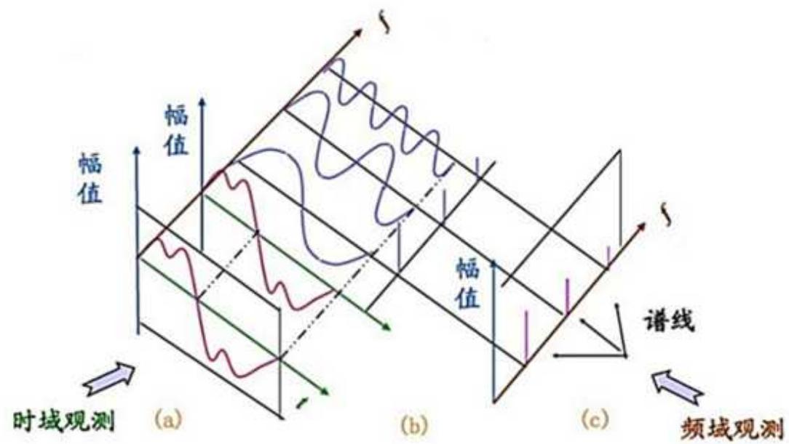  
图11-4 音频信号的分解

对于具体的音频文件，其格式多种多样，均可以使用计算机读取和分析它们。例如：

● MP3格式。  
● WMA（Windows媒体音频）格式。  
● WAV（波形音频文件）格式。

对于已经存在于计算机中的音频文件，需要采用特定的Python第三方库进行处理。这里我们采用的librosa库，就是一个Python第三方库，用于分析一般的音频信号，但更适合音乐。它包括构建MIR（Music Information Retrieval，音乐信息检索）系统的具体细节，具有很好的文档记录，还有很多示例和教程。

# 第一步：采用librosa对音频进行读取

为了简化操作，我们首先使用librosa库对音频信号进行读取，代码如下：

import librosa as lb   
audio_path $=$ "./第3章/carsound.wav"   
audio, sr $=$ lb.load.audio_path)   
print(len(audiol),type(audio))   
print(sr,type(sr))

在上面的代码中，load函数直接根据音频地址对数据进行读取，这里读取出两个参数：audio为音频序列，而sr则是音频的采样率。输出结果如下：

```txt
88200 <class 'numpy.ndarray'>  
22050 <class 'int'> 
```

第一行是音频的长度与生成的数据类型，第二行打印出的是音频的采样率。此时，如果想更换采样率对音频信号进行采集，可以使用如下代码：

```txt
audio, sr = lb.load.audio_path, sr=16000) 
```

同样，可以对结果进行打印，请读者自行尝试。

对于将修正采样率后的音频复制写入的方法，我们可以使用scipy库来完成，代码如下：

```python
from scipy.io import wavfile  
wavfile.write("example.wav", sr, audio) 
```

读者可以自行尝试。

# 第二步：可视化音频

对于获取到的音频的描述，我们可以使用如下代码生成音频可视化图谱：

```python
import matplotlib.pyplot as plt  
import librosa.display  
librosa.display.waveshow.audio, sr=sr)  
plt.show() 
```

这里使用waveshow函数转换读取到的音频，并输出结果，生成音频的图谱如图11-5所示。

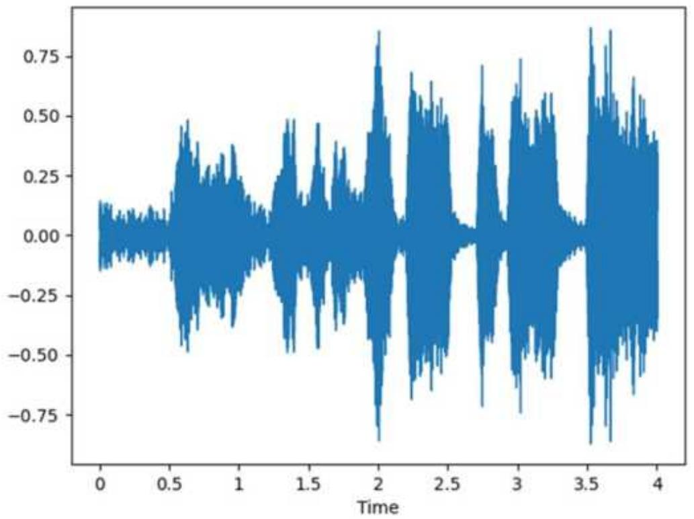  
图11-5 音频转换结果

# 第三步：一般频谱图（非MFCC）的可视化展示

频谱图是音频信号频谱的直观表示，我们在3.3.2节中使用短时傅里叶变换完成了一般频谱图的展示，这里可以使用同样的函数对信号进行处理，代码如下：

```python
audio = lb.stft(audio) #短时傅里叶变换  
audio_db = lb.amplitude_to_db(abs(audio)) #将幅度频谱转换为dB标度频谱。也就是对序列取对数  
lb.display.specshow(audio_db, sr=sr, x_axis='time', y_axis='hz')  
plt.colorbar()  
plt.show()
```

上面的代码首先使用短时傅里叶变换完成了图谱转换，而amplitude_to_db的作用是将幅度频谱转换为dB标度频谱，即对序列取对数。读者可以使用如下代码进行验证，这里不再过多阐述。

```python
arr = [10000,20000]  
audio_db = librosa.amplitude_to_db(arr)  
print.audio_db) 
```

specshow是对图谱进行展示的函数，生成的音频图谱如图11-6所示（颜色越红，信息含量越多，细节请查阅配套资源中的相关文件）。

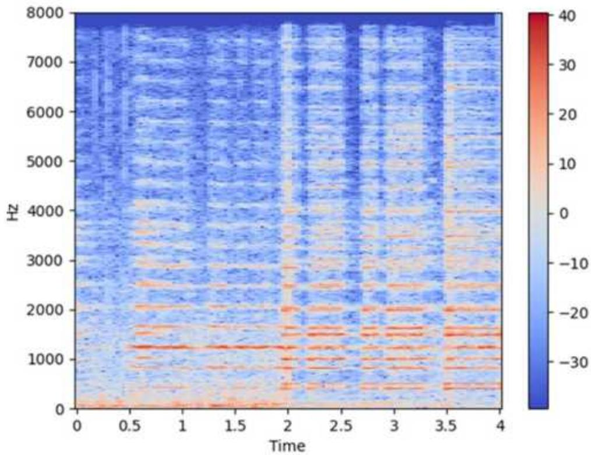  
图11-6 特定音频的频谱图（颜色越红，信息含量越多）

图11-6是生成的音频频谱图，横坐标是时间的延续，而纵坐标是显示频率（从$0 { \sim } 1 0 0 0 0 \mathrm { H z }$ ）。可以看到，图谱的底部信息含量相对于顶部更多。我们将纵坐标做一个变换，即对所有的数值取对数处理，代码如下：

```javascript
lb.display.specshow.audio_db, sr=sr, x_axis='time', y_axis='log') 
```

新的图谱如图11-7所示。

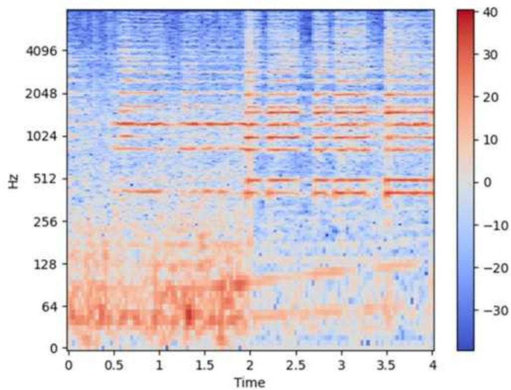  
图11-7 取对数处理后的频谱图

可以很明显地看到，相对于原始的频谱图，取对数后的频谱图对有信息含量的部分有了更显著的表示。

# 11.2.2 多特征音频抽取

# 1．MFCC音频特征

在第10章中，我们完成了MFCC特征的抽取，librosa库同样一步到位地为用户提供了MFCC的特征抽取方法，代码如下：

```python
import librosa as lb   
import matplotlib.pyplot as plt   
audio, sr = lb.load("example.wav", sr=16000)   
melspec = lb.feature.mfcc(y=audio, sr=sr, n_mels=40)   
lb.display.specshow(melspec, sr=sr, x_axis='time', y_axis='log')   
plt.colorbar()   
plt.show() 
```

其生成的波形图请读者自行运行代码查看。

在生成的MFCC频谱的基础上，我们还可以执行特征缩放，使得每个系数维度具有零均值和单位方差：

```python
from sklearn import preprocessing  
melspec = preprocessing.scale(melspec, axis=1) 
```

# 2．chroma_stft音频特征

除常用的MFCC外，librosa库还带有其他的一些特征提取函数。librosa.feature.chroma_stft是librosa库中的一个函数，用于计算音频信号基于音高的谱图特征。该函数使用短时傅里叶变换（Short-Time Fourier Transform，STFT）将音频信号转换为频谱图，并进一步计算出每个频段内的音高相关强度。

具体来说，librosa.feature.chroma_stft函数的输入参数包括音频时间序列和采样率，输出结果是一个二维数组，其中每一行代表一个分带，每一列代表一个时间帧，数组中的值表示该时间帧在该分带中的基于音高的强度。其实现代码如下：

import librosa as lb   
import matplotlib.pyplot as plt   
import numpy as np   
audio, sr = lb.load("example.wav",sr=16000)   
stft=np.abs(lb.stft(audio))   
chroma $=$ lb.feature.chroma_stft(S=stft，sr=sr)   
lb.display.specshow(chroma，sr $\equiv$ sr，x_axis $\coloneqq$ 'time'，y_axis $\coloneqq$ 'log')   
plt.colorbar()   
plt.show()

顺便讲一下，chroma_stft和MFCC都是音频处理中常用的特征提取方法。MFCC是一种基于梅尔倒谱系数的特征，用于描述音频信号的频谱特性；而chroma_stft则是基于音高的谱图特征，用于描述音频信号的时域特性。

# 3．梅尔频谱图

librosa.feature.melspectrogram是librosa库中的一个函数，用于计算音频信号的梅尔频谱图（Mel Spectrogram）。该函数的输入参数包括音频时间序列y和采样率sr，输出结果是一个二维数组，其中每一行代表一个时间帧，每一列代表一个频率，数组中的值表示该时间帧在该频率中的梅尔频谱强度。实现代码如下：

mel $=$ lb.feature.melspectrogram(y=audio，sr $\equiv$ sr，n_mels $= 40$ ，fmin $= 0$ ，fmax $\equiv$ sr//2) mel $=$ lb.power_to_db(mel) lb.display.specshow(mel，sr $\equiv$ sr，x_axis $\coloneqq$ 'time'，y_axis $\coloneqq$ 'log') plt.colorbar() plt.show()

梅尔频谱图请读者自行运行代码查看。

梅尔频谱图的生成过程是：先将音频信号进行分帧，并对每一帧音频信号进行短时傅里叶变换，得到每个时间帧对应的频谱图。然后，对每个频谱图应用梅尔滤波器组进行变换，得到每个频率对应的梅尔功率谱密度。最后，将所有频率对应的梅尔功率谱密度合并成一个二维数组，即为梅尔频谱图。

MFCC和梅尔频谱图都是音频信号处理中常用的特征提取方法。其中，MFCC是一种基于梅尔倒谱系数的特征，用于描述音频信号的频谱特性；而梅尔频谱图则是基于梅尔滤波器组的变换，将音频信号从时域转换到频域，然后计算出每个频率对应的梅尔功率谱密度。

# 11.3 端到端语音识别任务简介

语音识别这一技术正如其名，通过精密地解析说话人的语音来识别并准确转写出其所说的内容。它不仅仅是一个简单的转录过程，更是一项融合了声学、语言学、计算机科学等多个学科领域精华的高科技产物。在现代社会中，随着人工智能技术的飞速发展，语音识别技术正日益显现出其巨大的应用潜力和广阔的市场前景。

无论是在智能手机上的语音助手，还是在家庭中的智能音箱，甚至是在车载系统中，语音识别技术都扮演着举足轻重的角色。它能够将人们的口头语言迅速转换为文字信息，从而极大地提高了交互的便捷性和效率。不仅如此，语音识别还在无障碍沟通、语音搜索、自动化客服等众多领域发挥着不可或缺的作用，为人们的生活和工作带来了前所未有的便利。

# 11.3.1 全中文音频数据集的准备

我们将使用全中文的音频信号进行转换，这里首选使用Aidatatang_200zh数据集作为我们的音频转换目标。Aidatatang_200zh是一个用于语音识别的数据集，包含30万条口语化句子，由6408人录制，涵盖不同年龄段和34个省级行政区域。录音环境为安静的室内，采用16kHz16bit的WAV单声道格式，总大小为18GB。该数据集适用于语音识别、机器翻译和声纹识别等场景，标注准确率不低于 $9 8 \%$ 。

Aidatatang_200zh是一套开放式中文普通话电话语音库。语料库长达200小时，由Android系统手机（16kHz，16位）和iOS系统手机（ $1 6 \mathrm { k H z }$ ，16位）记录。邀请来自中国不同重点区域的600名演讲者参加录音，录音是在安静的室内环境中进行的，其中包含不影响语音识别的背景噪声。参与者的性别和年龄均匀分布。语料库的语言材料是经过设计的音素均衡的口语句子。每个句子的手动转录准确率大于 $9 8 \%$ 。

读者很容易在互联网上搜索到这个数据集的相关内容，下载解压后的单个文件如图11-8所示。

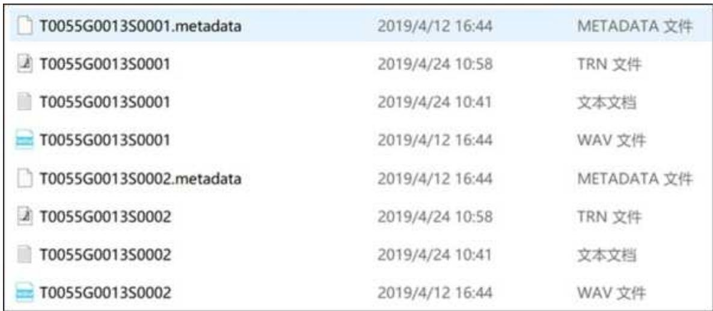  
图11-8 下载解压后的单个文件示例

前面讲过，对于第一步单文本生成来说，并不需要对语音数据进行批匹配，因此在这一步进行数据读取时仅读取TXT文本文件中的数据即可。

通过解压后的文件可以看到，Aidatatang_200zh提供了600个文件夹，每个文件夹中存放若干文本与语音对应的文件，其通过文件名进行一一对应。

首先，读取所有的文件，代码如下：

```python
import os
# 这个是列出所有目录下文件夹的函数
def listFolders(path):
    ...
    列出指定路径下的所有文件夹名
    ...
    folders = []
    for root, dirs, files in os.walk(path):
        for dir in dirs:
            folders.append(os.path.join(root, dir))
        return folders
from torch.util.data import DataLoader, Dataset
def list_files(path):
    files = []
    for item in os.listdir(path):
        file = os.path.join(path, item)
        if os.path.isfile(file):
            files.append(file)
    return files
#这里作者使用自定义的数据集存放位置，读者可以改成自己所对应的语音数据集位置
dataset_path = "D:/语音识别_数据集/Aidatatang_200zh/dataset"
folders = list_folders(dataset_path) #获取了所有文件夹
for folder in tqdm(folders):
    files = list_files folder)
for file in files:
    if_file.endsWith("txt"):
        with open(file, encoding="utf-8") as f:
            line = f.strip().strip() 
```

其中，folders是Aidatatang_200zh目录下的所有文件夹，list_folders的作用是对每个文件夹进行重新读取。

接下来，一个非常重要的内容是建立相应的字库文件，我们可以在读取全部文本数据之后使用set结构对每个字符进行存储。

```python
vocab = set()
...
for folder in tqdm(folders):
    _files = list_files folder)
    for _file in _files:
        if _file.endsWith("txt"):
            with open(_file, encoding="utf-8") as f:
                line = f.readlines().strip()
            for char in line:
                vocab.add(char)
    vocab = listsorted(vocab) 
```

为了节省时间，作者在代码中提供了整理好的字库，部分内容与格式如下：

vocab $= [1,1,1,1,1,1,1,1,1,1,1,1,1,1,1,1,1,1,1,1,1,1,1,1,1,1,1,1,1,1,1,1,1,1,1,1,1]$

字库总量为4080个字符，特别使用 $\ "  \ "$ '与 '来表示文本的开始与结束。

# 11.3.2 音频特征的提取与融合

梅尔频谱作为音频提取的主要方法，其作用在于对提取的音频信号进行高效的转换与分析。通过模拟人类听觉系统的特性，梅尔频谱能够将复杂的音频数据转换为易于处理和解读的频域表示，从而揭示出音频信号中的关键特征和潜在结构。这种转换不仅有助于简化音频处理流程，还能提高特征提取的准确性和效率，为后续的音频识别、分类和合成等任务奠定坚实基础。因此，梅尔频谱在音频处理领域具有广泛的应用价值，是研究人员和工程师们不可或缺的工具之一。

梅尔频谱的独特之处在于其基于梅尔刻度的频率划分方式。与传统的线性频率刻度相比，梅尔刻度更符合人类听觉系统对频率的感知特性。在梅尔频谱中，低频段的分辨率较高，能够捕捉到更多的细节信息，而高频段的分辨率则相对较低，以适应人类对高频声音的不敏感性。这种特性使得梅尔频谱在处理具有丰富低频成分的音频信号时表现出色，如语音和音乐等。

此外，梅尔频谱还具有良好的抗噪性能和稳定性。在音频信号受到噪声干扰或质量下降时，梅尔频谱仍能有效地提取出有用的特征信息，保持较高的识别准确率。这使得梅尔频谱在实际应用中具有更强的健壮性和可靠性，能够满足各种复杂场景下的音频处理需求。

基于librosa库完成的特征信号提取，其代码如下：

```python
#计算梅尔频率图
def compute_melspec(y, sr, n_mels, fmin, fmax):
    ...
    :param y:传入的音频序列，每帧的采样
    :param sr:采样率
    :param n_mels:梅尔滤波器的频率倒谱系数
    :param fmin:短时傅里叶变换(STFT)的分析范围min
    :param fmax:短时傅里叶变换(STFT)的分析范围max
    :return:
    ...
    #计算Mel频谱图的函数
    melspec = lb.feature.melspectrogram(y=y, sr=sr, n_mels=n_mels, fmin=fmin, fmax=fmax)
#（128，1024）这个是输出一个声音的频谱矩阵
#是Python中用于将音频信号的功率值转换为分贝(dB)值的函数
melspec = lb.power_to_db(melspec).astype(np.float32)
#计算MFCC
mfccs = lb.feature.mfcc(S=melspec)
return melspec, mfccs
```

从上面的代码可以看到，我们通过梅尔频谱获取到了梅尔特征以及梅尔频率倒谱系数，这是从不同的角度对语音特征进行提取。

接下来，我们希望将提取到的特征进行融合，具体的融合方式可以在数据特征输入模型之前完成，即在进行特征提取后，经过一个正则化处理，使用在特定维度拼接的方式完成，代码如下：

#

```python
def mono_to_color(X, eps=le-6, mean=None, std=None):  
    mean = mean or X.mean()  
    std = std or X.std()  
X = (X - mean) / (std + eps)  
    _min, _max = X.min(), X.max()  
if (_max - _min) > eps:  
    V = np.clip(X, _min, _max)  
    V = 255 * (V - _min) / (_max - _min)  
    V = V.astype(np.uint8)  
else:  
    V = np.zeros_like(X, dtype=np uint8)  
return V  
def audio_to_image.audio, sr, n_mels, fmin, fmax):  
    melspec, mfccs = compute_melspec.audio, sr, n_mels, fmin, fmax) # (128, 688)  
    melspec = mono_to_color(melspec)  
    mfccs = mono_to_color(mfccs)  
    spec = np concatenate((melspec, mfccs), axis=0)  
    return spec 
```

这里需要注意，我们获取到的音频特征，由于其采样的方式不同，其数值大小也千差万别。因此，在进行concatenate拼接之前，需要进行正则化处理。

获取数据的完整代码如下：

```txt
from tqdm import tqdm  
import os  
# 这个是列出所有目录下文件夹的函数  
def listFolders(path):
```

```python
```
>>> 
列出指定路径下的所有文件夹名
```
folders = []
for root, dirs, files in os.walk(path):
    for dir in dirs:
        folders.append(os.path.join(root, dir))
return folders
from torch.utils.data import DataLoader, Dataset
def list_files(path):
    files = []
    for item in os.listdir(path):
        file = os.path.join(path, item)
        if os.path.isfile(file):
            files.append(file)
    return files
dataset_path = "D:/语音数据库/Aidatatang_200zh"
# dataset_path = ".../dataset/Aidatatang_200zh/" 
folders = list_folders(dataset_path)
folders = folders[:5]
max_length = 18
sampling_rate = 16000
wav_max_length = 22#这里的计数单位是秒
context_list = []
token_list = []
wav_image_list = []
for folder in tqdm(folders):
    _files = list_files(folder)
    for file in_files:
        if_file.endsWith("txt"): #_file = 
"D:/Aidatatang_200zh/G0084/T0055G0084S0496.txt"
with open(_file, encoding="utf-8") as f:
    line = f.strip().strip()
if len(line) <= max_length:
    wav_name = _file.replace("txt", "wav")
#这里均值是1308338,0.8中位数是1730351，所以采用了中位数的部分
audio, orig_SR = sf.read(wav_name, dtype="float32")
audio = sound_untils.drop_or_pad.audio, length=sampling_rate *
wav_max_length #作者的想法是把audio做一个整体输入，在这里所有的都做了输入
wav_image = sound_untils.audio_to_image(audio, sampling_rate, 128, 0, sampling_rate//2) #输出的是(128, 688)
wav_image_list.append(wav_image)
#token_list.append(token)
np.save("/saver/wav_image_list.npy", wav_image_list) 
```

这里为了加速模型的训练，我们首先读取了音频，并创建了融合后的音频特征，将其进行存储。为了将数据输入模型中，还需要实现torch.utils.data.Dataset数据类。代码如下：

```python
class TextSamplerDataset(torch.utils.data.Dataset):
    def __init__(self, token_list = token_list, wav_image_list = wav_image_list):
        super().__init__()
        self_token_list = token_list
        self.wav_image_list = wav_image_list
    def __getitem__(self, index):
        token = self_token_list[index]
        token = torch.tensor(token).long()
       token_inp, token_tgt = token[-1], token[1:] 
```

# 11.3.3 基于生成模型的端到端语音识别任务

我们需要完成的是基于端到端的语音识别任务，特别是使用生成模型将输入的语音特征转换为文本内容，遇到的第一个问题是如何将可变的生成文本与语音特征信号进行融合。

首先，我们采用将语音特征压缩特性的方式进行融合，即将多维的语音特征压缩成一维后与输入的可变长度的文本信息相加后进行处理，代码如下：

class ReshapeImageLayer(torch.nnModule): def __init__(self): super().__init() self.reshape_layer $=$ torch.nn.Linear(688, model_cfg.dim \* 2) self(norm $=$ layers.layersNorm(model_cfg.dim \* 2) self.act $=$ layers.SwiGLU() def forward(self,image): image $=$ self.reshape_layer(image) image $=$ self(norm(image) image $=$ self.act(image) image $=$ torch.permute(image,[0,2,1]) image $=$ torch(nn.AdaptiveAvgPoolId(1)(image) image $=$ torch.permute(image,[0,2,1]) return image

上面的代码创建了一个简单的卷积层对信号进行提取，之后通过AvgPool对特征进行压缩，在调整维度后进行返回。

对于生成模型来说，其核心是采用注意力机制建立跨区域关注。因此，我们可以在创建因果掩码后完成生成模型的设计。代码如下：

class GLMSimple(torch.nnModule): def __init__(self, dim = model_cfg.dim, num_tokens = model_cfg(num_tokens, device = all_config_device): super().__init_(   ) self.num_tokens = num_tokens self.causal = model_cfg.causal selfdevice $\equiv$ device self_token_emb $=$ torch.mm.Embedding(num_tokens,dim) self.layers $\equiv$ torch.mm.ModuleList([]) for in range(model_cfg.depth): block $=$ GLMBlock(   ) self.layers.append(block) self.to_logits $=$ torch.mm.Linear(dim, num_tokens, bias=False) self.reshape_layer $=$ reshapeImageLayer(   ) self.merge_norm $=$ layers.layersNorm(dim) def forward(self,x,image $=$ None): if not self.causal: mask $= x > 0$ $x = x$ .masked_fill(-mask,0) else: mask $=$ None $\mathbf{x} =$ self.token_emb(x) image $=$ self.reshape_layer(image) for layer in self.layers: $\mathrm{x + =}$ image $\mathrm{x} =$ self.merge_norm(x) $\mathrm{x} = \mathrm{x} +$ layer(x，mask $=$ mask) $\mathrm{x} =$ torch(nn.Dropout(0.1)(x) logits $=$ self.to_logits(x) return logits

在上面的代码中，GLMBlock是我们实现的经典的因果注意力模型，目的是将向量化处理后的可变文本特征与一维的语音特征相加后，输入因果注意力模型进行计算。

为了配合因果注意力机制的输入，对于文本的最终输入，我们也可以采用比较巧妙的设计，代码如下：

```python
@torch.no_grad()
def generate(
    self, seq_len, image=None, temperature=1., filter_logits_fn=top_k,
            filter_thres=0.99, pad_value=0., eos_token=2,
return_seq Without_prompt=True, #这个的作用是在下面随机输出的时候，把全部的字符输出
):
#这里是后加上去的，输入进来可以是list
image = torch.tensor(image, dtype=torch.float).float()
image = torch unsqueeze(image, dim=0)
image = image.to(self_device)
prompt = torch.tensor([1])
prompt = prompt.to(self_device)
prompt, leading_dims = pack(['prompt'], '*n')
n, out = prompt.shape[-1], prompt.clone()
#wrapper_fn = identity if not use_tqdm else tqdm
sample_num(times = max(1, seq_len - prompt.shape[-1])
for_in (range(sample_num(times)):
    logits = self.forward(out, image)
    logits = logits[:, -1]
    sample = gumbel_sample_once(logits, temperature=temperature, dim=-1)
out, _ = pack(out, sample), 'b')
if exists(eos_token):
    is_eos_tokens = (out == eos_token)
    if is_eos_tokens.any(dim=-1).all():
        break
out, = unpack(out, leading_dims, '*n')
if not return_seqWithout_prompt:
    return out
return out[,..., n]: 
```

在上面的代码中，我们采用generate函数来产生输入的文本内容，随后通过逐个添加字符的方式逐步扩充已有文本信息，进而利用下一个字符的预测来完成最终结果的构建。

# 11.3.4 端到端语音识别任务的训练与预测

本小节将使用定义好的模型完成端到端的语音识别任务的训练与预测。训练代码比较简单，即使用预先定义的Dataset实现类对数据进行读取，之后将结果输入模型中即可，代码如下：

```python
import os
os.environ["CUDA_VISIBLE_DEVICESCES"] = "0" 
```

```python
from tqdm import tqdm
import torch
from torch.utils.data import DataLoader
# constants
LEARNING_RATE = 2e-4
BATCH_SIZE = 32
# helpers
from第13章_speed2text import all_config
model_cfg = all_config.ModelConfig
device = model_cfg_device
from第13章_speed2text/module import glm_model_1 as glm_model
model = glm_model.GLMSimple(num_tokens=model_cfg.vocab_size, dim=model_cfg.dim)
model.to(device)
from第13章_speed2text.语音文本生成 import get_data
train_dataset = get_data.TextSamplerDataset()
trainloader = (DataLoader(train_dataset,
batch_size=BATCH_SIZE, shuffle=True, num_workers=0))
save_path = ".saver/glm_generation.pth"
#model.load_state_dict(torch.load(save_path))
optimizer = torch.optim adamW(model.params(), lr = LEARNING_RATE)
lr_scheduler = torch.optim.lr_scheduler.CosineAnnealingLR(optimizer,T_max =
2400, eta_min=2e-6,last_epoch=-1)
criterion = torch.nn.CrossEntropyLoss()
if _name == '__main__':
for epoch in range(128 * 3):
    pbar = tqdm(trainloader,total=len(trainloader))
    for token_inp,wav_image,token_tgt in pbar:
        token_inp = token_inp.to(device)
        wav_image =wav_image.to(device)
        token_tgt = token_tgt.to(device)
        logits = model(token_inp,wav_image)
        loss = criterion(logits.view(-1, logits.size(-1)), token_tgt.view(-1))
        optimizer.zero_grad()
        loss.backup()
        optimizer_STEP()
        lr_scheduler_STEP()
        pbar.set_description(f"epoch:{epoch +1}, train_loss:{loss.item():.5f},
lr:(lr_scheduler.get_last_lr() [0]*1000:.5f) "
    if (epoch + 1) %99 == 0:
        torch.save(model.state_dict(), save_path) 
```

```txt
torch.save(model.state_dict(), save_path) 
```

在上面代码的预测部分，由于我们在generate函数中预定义了起始符，因此在生成时不需要额外添加内容，只要完成语音信号的读取即可。读者可通过直接运行本书配套代码库中所提供的代码，即可完成模型的训练过程。

# 11.4 基于PyTorch的数据处理与音频特征融合

在11.3节中，我们使用了Aidatatang_200zh数据集和其他一些中文音频数据集用于训练和尝试。除使用librosa库对音频特征进行提取外，PyTorch本身也给我们准备了一套音频特征提取函数，可以用来完成特征的提取与融合。本节将对此进行讲解。

# 11.4.1 THCHS30数据集的处理

首先将下载好的THCHS30数据集解压，如图11-9所示。

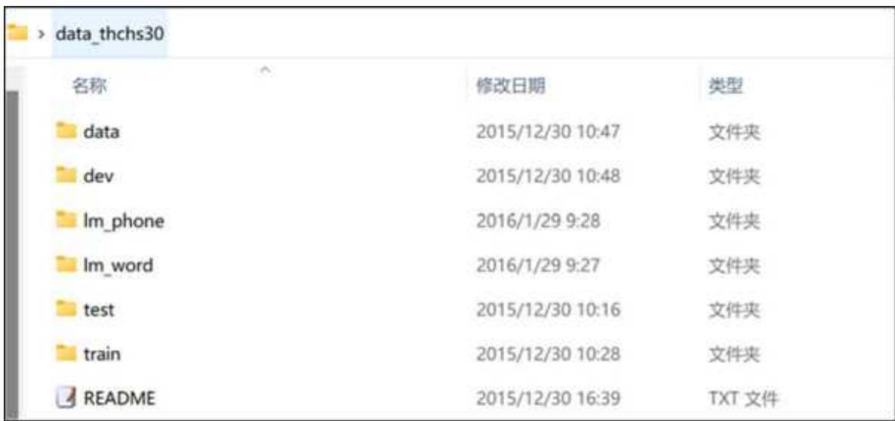  
图11-9 解压后的THCHS30数据集包含的内容

其中，train与test是划分好的训练集与测试集，而data数据集包含所有语音与文本部分。在本章的示例中，我们主要对其进行处理。data文件夹如图11-10所示。

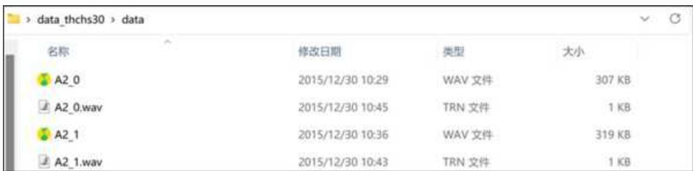  
图11-10 语音与文本文件

可以看到，data文件夹中包括wav后缀的语音文件，以及trn结尾的文本文件，分别为原始的语音以及对应的文本内容，示例如下：

```txt
绿是阳春烟景大块文章的底色四月的林峦更是绿得鲜活秀媚诗意盎然lv4 shi4 yang2 chun1 yan1 jing3 da4 kuai4 wen2 zhang1 de5 di3 se4 si4yue4 de5 lin2luan2 geng4 shi4 lv4 de5 xian1 huo2 xiu4 mei4 shil yi4 ang4 ran21 v4 sh ix4 ii iang2 ch un1 ii ian1 j ing3 d a4 k uai4 uu un2 zh ang1 de5 d i3 s e4s iy4 vv ve4 d e5 1 in2 1 yuan2 g eng4 sh ix4 1 v4 d e5 x ian1 h uo2 x iu4 mei4 sh ix1 iiii4 aa ang4 r an2 
```

# 11.4.2 基于torchaudio的音频预处理

首先进行音频的预处理。使用torchaudio这个与PyTorch紧密集成的音频处理库，我们可以轻松地实现音频数据的读取与初步处理。

原始音频数据以一维张量的形式展现，涵盖音频内的全部采样与特征信息。然而，问题在于深度学习模型无法直接处理这种原始音频数据，或者说，模型难以解析这样的数据形式。因此，我们必须对原始音频数据进行维度转换，以确保其满足深度学习模型的输入需求。

当前，对音频的主流处理方法有以下两种。

● 间接特征提取法：首先提取原始音频的底层人工特征，例如MFCC（Mel FrequencyCepstral Coefficients，梅尔频率倒谱系数）或FBank（Filter Bank，滤波器组特征）。这些特征可以通过直接计算获得，无须经过神经网络。随后，这些特征会通过一个特征提取器进行进一步处理，最终传递给Transformer的编码器。  
● 直接特征提取法：使用特征提取器直接从原始音频中提取特征，然后将其送入Transformer编码器。

这两种方法各有优势，没有绝对的好坏之分。这里选择第一种方法。具体来说，当我们获得一个原始音频文件时，首先利用torchaudio进行读取，然后计算其FBank特征，这是一种人为定义的特征，能够捕捉到音频的特定属性。最后，我们将提取MFCC特征，通过将两种特征进行融合，更好地从不同角度完成对特征的提取并进行语音识别工作。

# 1．torchaudio的安装

torchaudio常用于读取音频，对于第一次安装这个库的读者来说，由于可能会缺乏响应的支撑库，在运行时可能会报错，如下所示：

```txt
raiseRuntimeError(f"Couldn't find appropriate backend to handleuri{uri}andformat 
```

```txt
{format}.") RuntimeError: Couldn't find appropriate backend to handle Uri C:/Users/xiaohua/Desktop/data_thchs30/data/A11_0.wav and format None. 
```

这是因为在初始执行时缺乏相应的后端代码，我们可以安装对应的后端支持，如下所示：

```batch
pip install soundfile pysoundfile 
```

使用torchaudio读取WAV音频文件的简单代码如下：

```txt
import torchaudio  
import torch
```

# 读取音频文件

```txt
waveform, sample_rate = torchaudio.load('C:/Users/xiaohua/Desktop/data_thchs30/data/A11_0.wav') 
```

其中，waveform是读取到的音频信号，而sample_rate是采样率。在本章的示例中，我们采用的THCHS30数据集的采样率是相同的，即每秒的采样率为 $1 6 ~ 0 0 0 \mathrm { H z }$ 。

# 2．限定长度音频的读取与词库的切分

接下来是音频长度的读取。为了便于学习，我们限定音频长度在15秒以内的语音才会被记录并用于训练。由于样本的采样率为 $1 6 ~ 0 0 0 \mathrm { H z }$ ，因此我们要求音频的总采样点数小于16$0 0 0 { \times } 1 5$ 。完整的音频预处理代码如下：

导入torchaudio和torch库，用于音频处理和深度学习模型  
import torchaudio,torch  
import os  
#设置数据集的文件夹路径  
folder_path $=$ "C:/Users/xiaohua/Desktop/data_thchs30/data"  
#设置WAV文件的最大长度（单位是采样点数）  
max_wav_length $= 16000$ \*15  
#设置上下文文本和WAV文件的保存路径  
context_path $=$ ".dataset/context.txt"  
wav_path $=$ ".dataset/wav_file.txt"  
#打开上下文文本文件和WAV文件，准备写入  
context_file $=$ open(context_path,"w",encoding="utf-8")  
wav_file $=$ open(wav_path,"w",encoding="utf-8")  
#使用os.walk遍历文件夹路径下的所有文件  
for root,dirs,files in os.walk folder_path):  
    for file in files:  
        #检查文件是否为WAV格式  
        if file.endsWith(.wav)):  
            #构建完整的WAV文件路径  
            _wav_path $=$ (os.path.join(root, file)).replace("\\\"/")  
            #使用torchaudio加载WAV文件  
            wav, sr $=$ torchaudio.load(_wav_path)  
            #只取WAV文件的第一个通道（如果是立体声的话）  
            wav $=$ wav[0]  
            #如果WAV文件的长度不超过最大长度，则进行处理  
            if len(wav) $< =$ max_wav_length:  
                #将WAV文件的路径写入wav_file文件中  
                wav_file.write(_wav_path)  
                wav_file.write("\\n")  
            #构建对应的文本文件路径  
            text_file $=$ _wav_path + ".trn"  
            #打开文本文件并读取第一行文本  
            with open(text_file,"r",encoding="utf-8") as f:  
                text $=$ f.readlines()[0].split("\\n") [0].replace("\\","")  
                text $=$ "@+" + text + "#"  
            #将文本写入context_file文件中  
            context_file.write(text)  
            context_file.write("\\n")

```txt
导入sentencepiece库，用于文本的分词处理  
import sentencepiece asspm  
#使用sentencepiece训练一个分词模型  
spm SentencePieceTrainer.Train(f'--input=(context_path)  
--model_prefix=/dataset/my_model --vocab_size=4500')
```

上面代码的主要功能是遍历指定文件夹下的所有WAV文件，检查它们的长度是否符合要求，如果符合，则将WAV文件的路径和对应的文本内容分别写入两个文件中。最后，使用sentencepiece库来训练一个分词模型，以便后续的文本处理。

为了处理文本的起始与结尾，我们分别在文本的起始和结尾加上了起始符和结尾符，这种对文本的处理方法也是我们使用解码器对文本进行解码所需要的方式。

# 11.4.3 基于不同角度的音频特征获取和简单融合

在11.4.2节中，我们完成了音频的判定以及对应文本的获取，11.4.3节将从不同的方向对语音文件进行获取。使用torchaudio库对音频文件进行读取是一项比较繁重的工作，在使用torch中的Dataset类对音频文件进行获取时，可能会造成程序运行过慢的问题，因此我们可以采用先将音频文件转换为特征向量存储后再读取的方式来加快模型的训练速度，此时音频预处理的代码如下：

import torchaudio,torch   
import os   
from tqdm import tqdm   
from torch.utils.data import Dataset   
import tokenizer   
wav_file_path $=$ "/dataset/wav_file.txt"   
with open(wav_file_path，"r"，encoding $\equiv$ "utf-8")asf: lines $=$ f.readlines()   
max_wav_length $= 16000\cdot 15$ feats_list $= []$ for wav_file in tqdmlines): wav_file $\equiv$ wav_file.strip() #读取音频文件 waveform, sample_rate $=$ torchaudio.load(wav_file) #获取当前waveform的长度 current_length $=$ waveform.size(1) #如果当前长度小于最大长度，则填充零 if current_length $<$ max_wav_length: padding $=$ torch.zeros((waveform.size(0)，max_wav_length - current_length), dtype $\equiv$ waveform.dtype,device $\equiv$ waveform_device) waveform $=$ torch.cat((waveform,padding)，dim $\coloneqq 1$ #如果当前长度大于最大长度，则截断 elif current_length $>$ max_wav_length: waveform $=$ waveform[(:, :max_wav_length] fbank feats $=$ torchaudio.compliance.kaldi.fbank(waveform，num_mel_bins $\coloneqq 80$ ) mfcc feats $=$ torchaudio.compliance.kaldi.mfcc(waveform) feats $=$ torch.cat([fbank feats,mfcc feats],dim=-1).float() feats_list.append(feats)   
import pickle   
with open("./dataset/wav_file.pkl","wb") asf: pickle.dump(feats_list,f)

在上面的代码中，我们根据11.4.2节音频长度的判断完成了特征的读取与准备，之后为了简便，使用torch.concat函数将来自不同特征的向量进行连接，最后使用pickle类对其进行存储。

修改后的文件读取代码如下：

```python
class WAVDataset(Dataset):
    def __init__(self, wav_file_path = "./dataset/wav_file.pkl", contexts_path = "./dataset/contexts.txt"): with open(wav_file_path, "rb") as f: loaded_features = pickle.load(f) with open(contexts_path, "r", encoding="utf-8") as f: contexts = f.readlines() self feats = loaded_features selfcontexts = [line.strip() for line in contexts] selftokenizer = tokenizerTokenizer() self.max_wav_length = 16000 * 15 self.max_text_length = 60 def _len__(self): return len(self.contxts) def __getitem__(self, index): text = "_" + self.contxts[index] token = selftokenizer.encode(text) token = token[:self.max_text_length] + [0] * (self.max_text_length - len(token)) feats = self feats[index] token = torch.tensor(token).long() return feats, token 
```

从上面的代码可以看到，我们直接读取了特征feats与文本内容，在进行编码处理后，返回作为模型训练的数据准备内容。

此时需要注意的是，为了便于标识文本的起始位置，我们在每个文本text之前额外添加了一个起始符“__”，用以显式表示文本的起始。这一点请读者留意。

# 11.4.4 关于特征融合的讲解

在11.4.3节中，我们通过简单的方法对读取的特征进行融合，即使用torch.concat函数在最后一个维度进行“叠加”处理。相对来说，这是最简单的一种融合方法，即在把特征数据输入模型之前先进行了处理。

除此之外，我们还有更多的特征融合方法，即通过交叉注意力方式，或者在模型中使用卷积对维度进行变换后进行直接相加的方式对特征进行融合。具体选择哪种处理方法，读者可以根据数据的定义和读取方法进行权衡。

# 11.5 用于特征融合的交叉注意力

在前面的章节中，我们已经探讨了基本的特征融合技巧。从技术实现的角度来看，我们采取了先进行“池化”压缩的策略，将多维的特征信号降至一维，随后与输入的文本向量进行叠加，以此实现特征的有效融合。

如果从信息容量的角度来审视这一方法，我们不难发现，经过压缩的语音特征向量在这个过程中可能会损失大量的特征细节。换句话说，压缩过程中可能只保留了有限的信号信息，这无疑会影响到后续分析和处理的精确性。为了缓解这一问题，我们可以考虑采用更精细的特征提取方法，或者在压缩过程中引入更先进的算法，以确保在降低维度的同时，能够最大限度地保留原始特征中的有效信息。此外，我们还可以通过实验和验证来不断优化特征融合的策略，以期在保证处理效率的同时，尽可能减少信息的损失，从而提升整体系统的性能。

我们进行特征融合的主要方法是交叉注意力（Cross-Attention），交叉注意力机制的作用在于实现不同信息源之间的有效交互与融合。通过这种机制，模型能够同时关注并处理来自多个不同来源的信息，从而捕获到更全面和更丰富的特征表示。交叉注意力示意如图11-11所示。

  
图11-11 交叉注意力示意

具体来说，交叉注意力允许模型在处理某一特定信息时，参考并利用其他相关信息源中的有用信息，以增强对当前信息的理解和表示能力。这种跨信息源的交互方式，有助于模型在复杂任务中做出更准确和全面的决策，提升模型的整体性能。因此，交叉注意力机制在自然语言处理、计算机视觉等领域中得到了广泛应用，并展现出了显著的效果。

# 11.5.1 交叉注意力详解

交叉注意力机制是一种强大的工具，用于挖掘并整合两个不同序列间的深层语义关系。这一机制的核心在于，它能够在两个不同的输入序列之间建立一种精细的关联度计算和加权求和体系。详细地说，当我们面对两个输入序列时，交叉注意力会逐一审视其中一个序列的每个元素，并将其与另一个序列中的全部元素进行关联度的全面计算。随后，基于这些计算出的关联度，机制会对两个序列的元素执行加权求和，从而生成新的、融合了双方信息的序列表示。

这种设计赋予模型一种独特的能力，即能够在不同序列之间建立起复杂而精确的关联关系，并将这些关系作为信息融合的基础。以机器翻译任务为例，为了精确地将源语言句子与目标语言句子进行对齐，我们需要一种机制来准确地捕捉并量化两个句子之间的各种对应关系。而交叉注意力机制发挥了关键作用，它能够通过计算两个句子间的注意力权重，为我们提供一种直观且高效的对齐手段。交叉注意力的应用如图11-12所示。

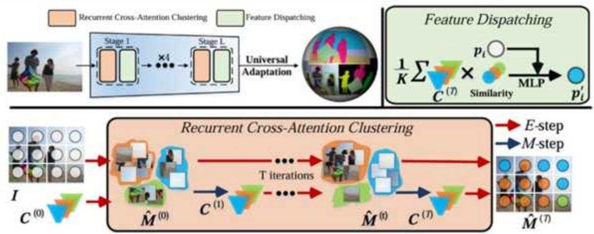  
图11-12 交叉注意力的应用

具体来看，交叉注意力机制是一种特殊形式的多头注意力，它将输入张量拆分成两个部分query∈ R n,d 1以及context∈ R n,d 2，然后将其中一部分作为查询集合，另一部分作为键值集合。它的输出是一个大小为[ n,d 2]的张量，对于每个行向量，都给出了它对于所有行向量的注意力权重。交叉注意力的简单实现代码如下：

import torch   
import torch.nn as nn   
import torch.nn.Functional as F   
class CrossAttention(nnModule): def_init_self,embed_dim, hidden_dim num_heads): super(CrossAttention,self).init_(self_embedding_dim $\equiv$ embed_dim self-hidden_dim $\equiv$ hidden_dim self.num_heads $\equiv$ num_heads self.query_proj $\equiv$ nn.Linear(embed_dim, hidden_dim \* num_heads) self.key_proj $\equiv$ nn.Linear(embed_dim, hidden_dim \* num_heads) self.value_proj $\equiv$ nn.Linear(embed_dim, hidden_dim \* num_heads) self.out_proj $\equiv$ nn.Linear(hidden_dim \* num_heads, embed_dim) def forward(self, query, context): "" query: (batch_size, query_len, embed_dim) context: (batch_size, context_len, embed_dim) "" batch_size, query_len, $=$ query.size()

context_len $=$ context.size(1) #Project input embeddings query_proj $\equiv$ self/query_proj(query).view(batch_size, query_len, self.num_heads,   
self-hidden_dim) key_proj $\equiv$ self.key_proj(context).view(batch_size, context_len, self(num_heads,   
self-hidden_dim) value_proj $\equiv$ self.value_proj(context).view(batch_size, context_len,   
self num_heads, self-hidden_dim) #Transpose to get dimensions (batch_size, num_heads, len, hidden_dim) query_proj $\equiv$ query_proj.permute(0,2,1,3) key_proj $\equiv$ key_proj.permute(0,2,1,3) value_proj $\equiv$ value_proj.permute(0,2,1,3) #Compute attention scores scores $=$ torch/matmul(query_proj, key_proj.transpose(-2,-1)) /   
(self-hidden_dim \*\* 0.5) attnweights $=$ F softmax(scores,dim=-1) #Compute weighted context context $=$ torch.matmul(attn_weights, value_proj) #Concatenate heads and project output context $=$ context.permute(0,2,1,3).contiguous().view(batch_size, query_len,   
-1) output $=$ self.out_proj(context) return output, attnweights #Example usage: embed_dim $= 512$ hidden_dim $= 64$ num_heads $= 8$ crossattention $=$ CrossAttention(embed_dim, hidden_dim, num_heads) #Dummy data batch_size $= 2$ query_len $= 10$ context_len $= 20$ query $=$ torch.randn(batch_size, query_len, embed_dim) context $=$ torch.randn(batch_size, context_len, embed_dim) output, attnweights $=$ crossattention(query, context) print(output.size()) # Should be (batch_size, query_len, embed_dim) print(attnweights.size()) # Should be (batch_size, num_heads, query_len,   
context_len)

在上面的代码中，类的初始化函数__init__接收3个主要参数：embed_dim（嵌入维度）、hidden_dim（隐藏维度）和num_heads（头数）。基于这些参数，它初始化了4个线性层：3个用于将输入（query、key、value）投影到隐藏空间，还有一个用于将多头注意力的结果投影回原始嵌入维度。

前向传播函数forward接收两个输入参数：query和context，分别代表查询和上下文信息。函数首先对这两个输入进行线性变换，并将结果重塑以适应多头注意力的结构。然后，它计算查询和键之间的注意力分数，并通过softmax函数归一化这些分数以获得注意力权重。接下来，使用这些权重对值进行加权求和，得到每个查询位置上的上下文向量。最后，函数将不同头的上下文向量合并，并通过输出线性层将其投影回原始嵌入维度。

可以看到，CrossAttention类实现了一个典型的多头交叉注意力机制，该机制在自然语言处理和其他序列处理任务中广泛应用。通过注意力机制，模型能够动态地聚焦于输入序列中的不同部分，从而更有效地捕获和利用上下文信息。在这个实现中，注意力机制是通过计算查询和键之间的相似度（即注意力分数），并使用这些分数对值进行加权求和来实现的。

# 11.5.2 带有掩码的交叉注意力

在文本生成任务中，对于输入的不同长度，我们通常是通过补零的形式来完成文本长度的对齐的。但是，这种对齐方法在计算交叉注意力时会引入不必要的噪声和计算量，因为零值位置实际上并不包含任何有意义的信息。为了解决这个问题，我们引入了带有掩码的交叉注意力机制。

带有掩码的交叉注意力机制能够有效地忽略输入序列中的零值位置，从而只关注真正有意义的内容。具体来说，我们通过一个掩码矩阵来指示哪些位置是有效的，哪些位置是填充的零值。在计算注意力分数时，我们将掩码矩阵应用于查询和键的乘积结果上，以确保填充位置不会对注意力权重的分配产生任何影响。

因此，带有掩码的交叉注意力机制能够显著提高文本生成任务的性能和效率。它不仅能够减少计算量，而且还能够避免模型对填充位置的错误关注，从而更加准确地捕捉输入序列中的重要信息。这种机制在自然语言处理领域具有广泛的应用前景，有望为各种文本生成任务带来进一步的改进和提升。

带有掩码的交叉注意力还可以增强模型的健壮性。在真实的文本数据中，通常存在各种噪声和不规范输入，如拼写错误、缺失词汇等。通过合理地设计掩码，我们可以使模型更加专注于文本的核心内容，减少对这类噪声的敏感性，从而提升模型在复杂场景下的表现。带有掩码的交叉注意力实现代码如下：

```python
def crossattention(embedding, image, pad_mask):
    # 保留原始embedding，用于后续的残差连接
    residual = embedding
    # 扩展pad_mask的维度，以适应后续的注意力权重计算
    # pad_mask的形状从[b, l]变为[b, l, l, w]，其中b是batch_size，l是embedding长度，w是image宽度
    pad_mask = pad_mask unsqueeze(-1).repeat(l, l, image.shape[1]).unsqueeze(1)
    # 使用einops库重新排列embedding和image的维度，以适应多头注意力机制
    # embedding的形状从[b, l, h*d]变为[b, h, l, d]，其中h是头数，d是每个头的维度
    # image的形状从[b, w, h*d]变为[b, h, w, d]
    embedding = einops.rearrange(embedding, 'b l (h d) -> b h l d', h= self.head_num)
    image = einops.rearrange(image, 'b w (h d) -> b h w d', h= self.head_num)
    # 计算注意力权重，使用torch.einsum进行高效的矩阵乘法
    # attweights的形状为[b, h, l, w]
    attweights = torch.einsum('b h l d, b h w d -> b h l w', embedding, image) * (self.dim -0.5)
    # 使用pad_mask将填充位置的注意力权重设置为一个非常小的值（-le9），以确保在softmax后这些位置的权重接近0
    attweights = attweightsmasked_fill(pad_mask, -le9)
    # 对注意力权重进行softmax归一化，使得每个位置的权重之和为1
    attweights = F softmax(attweights, dim=-1)
    # 根据注意力权重对image进行加权求和，得到新的embedding表示
    # 新的embedding形状为[b, h, l, d]
    embedding = torch.einsum('b h l w, b h w d -> b h l d', attweights, image)
    # 将新的embedding重新排列回原始形状，并加上残差连接
    # 输出embedding的形状为[b, l, h*d]
    embedding = residual + einops.rearrange(embedding, 'b h l d -> b l (h d)')
    return embedding
```

在上面的代码中，cross_attention函数实现了交叉注意力机制，这是一种允许文本Embedding（作为查询，即query）与图像数据（同时作为键和值，即key和value）进行信息交互的方法。这种机制在跨模态任务中非常重要，比如视觉问答、图像描述生成等场景，它能够帮助模型更准确地理解图像与文本之间的关联。

cross_attention函数借助einops库来灵活地重新排列张量的维度。这一步对于适应多头注意力机制的计算至关重要，因为它允许模型在同一时间处理多个注意力“头”，每个头都可以独立地学习不同的注意力模式。通过这种维度变换，模型能够更有效地捕捉和融合来自不同模态的信息。

此外，pad_mask的作用也不可忽视。在文本处理中，由于句子长度的不一致性，通常需要对较短的句子进行填充（padding）以达到批处理所需的统一长度。然而，这些填充位置并不包含有效的信息，因此在计算注意力时不应被考虑。在上面的代码中，我们所使用的mask是对作为query的文本部分进行处理，而音频特征被完整地保留，具体实现的完整代码如下：

```txt
定义一个规则：将 token_inps 中值为0 的部分标记为true，并将其作为mask  
#这里将 mask 扩充为3D 形状[b,1,1]  
pad_mask = token_inps(eq(0)  
pad_mask = pad_mask unsqueeze(-1).repeat(1, 1, image.shape[1]).unsqueeze(1)
```

pad_mask正是用来标识这些填充位置的，它确保在softmax归一化过程中，这些位置的注意力权重被极大地抑制（接近0），从而防止它们对最终结果产生误导性的影响。

最后，该函数输出了一个经过交叉注意力机制增强后的Embedding。这个Embedding不仅保留了原始文本的信息，还融入了与图像数据相关的上下文信息，使得模型在后续任务中能够做出更准确和更全面的判断。这种跨模态的信息融合方法，对于提升多模态内容的理解和生成能力具有重要意义。

# 11.5.3 完整的带有掩码的交叉注意力端到端语音识别

至此，我们完整实现了带有掩码的交叉注意力端到端语音识别的功能，代码如下：

```python
from第13章_speed2text import all_config
model_cfg = all_config.ModelConfig
from第13章_speed2text/module import blocks
class GLMSimple(torch.nnModule):
    def __init__(self, dim = model_cfg.dim, num_tokens = model_cfg.num_tokens, device = all_config_device):
        super().__init__()
        self.num_tokens = num_tokens
        self.causal = model_cfg.causal
        self.device = device
        self.head_num = model_cfg.head_num
        self.token_emb = torch.nn.Embedding(num_tokens, dim)
        self.layers = torch.nn.ModuleList []
        self.dim = model_cfg.dim
        self.reshape_layer = torch(nn.Linear(688, model_cfg.dim))
        self CROSShead_talk = torch(nn.Conv2d(self.head_num, self.head_num, kernel_size=1))
        for _ in range(model_cfg.depth):
            block = blocks.ResidualAttention(dim, self.head_num)
            self.layers.append(block)
            self(norm = torch(nn.RMSNorm(dim))
            self.to_logits = torch(nn.Linear(dim, num_tokens, bias=False))
        def forward(self, token_inps, image = None):
            image = selfreshape_layer(image)
            embedding = self_token_emb(token_inps)
            #定义一个规则：将token_inps中值为0的部分标记为true，并将其作为mask
            #这里将mask扩充为3D形状[b, l, 1]
            pad_mask = token_inps.equ(0)
            embedding = self.Crossattention(embedding, image, pad_mask)
            for id, layer in enumerate(self.layers):
                embedding = self(norm(embedding))
                embedding = layer(embedding)
            embedding = torch(nn.Dropout(0.1)(embedding)
            logits = self.to_logits(embedding)
            return logits
        def cross attention(self, embedding, image, pad_mask):
            residual = embedding 
```

```python
pad_mask = pad_mask.Unsqueeze(-1).repeat(1, 1, image.shape[1]).unsqueeze(1)
embedding = einops.rearrange(embeding,'b l (h d) -> b h l d', h = self.head_num)
image = einops.rearrange(image,'b w (h d) -> b h w d', h = self.head_num)
attweights = torch.einsum('b h l d,b h w d->b h l w', embedding, image)*(self.dim)
attweights = self CROSS_head-talk(attweights))
attweights = attweights-masked_fillPAD_mask, -le9)
attweights = F.softmax(attweights, dim=-1)
embedding = torch.einsum('b h l w, b h w d -> b h l d', attweights, image)
embedding = residual + einops.rearrange(embeding,'b h l d -> b l (h d)')
return embedding
@torch.no_grad()
def generate(self, seq_len, image=None, temperature=1.,
filter_logits_fn=top_k, filter_thres=0.99, pad_value=0.,eos_token=2,
return_seq_without_prompt=True, #这个的作用是在下面随机输出的时候，把全部的字符输出
):
    #这里是后加上去的，输入进来的可以是list
    image = torch.tensor(image, dtype=torch.float).float()
    image = torch unsqueeze(image, dim=0)
    image = image.to(selfdevice)
    prompt = torch.tensor([[1]])
    prompt = prompt.to(selfdevice)
    input_ids = prompt
    for token_n in range(seq_len):
        with torch.no_grad():
            indices_to_input = input_ids
            next_token_logits = self.forward(indices_to_input, image)
            next_token_logits = next_token_logits[:, -1]
            probs = torch(nnfunctional softmax(next_token_logits, dim=-1)
            nextIndices = torch.argmax(probs, dim=-1)[:, None]
            input_ids = torch.cat(input_ids, nextIndices), dim=1)
    return input_ids 
```

在上面的代码中，我们使用了9.4节中的数据输入基本维度，修正了特征融合的方式。相对于原有的因果自注意力部分，我们在自注意力之前额外添加了一个交叉注意力，代码如下：

embedding $=$ self.crossattention(embedding,image,pad_mask)   
for id,layer in enumerate(self.layers): embedding $=$ self(norm(embedding) embedding $=$ layer(embedding)

从上面的代码可以看到，我们通过cross_attention将embedding与image进行融合，通过pad_mask显式标注了embedding的特征融合范围。然后，通过循环遍历模型中的各个层，对embedding进行标准化处理，并通过每一层进行进一步的处理。

在添加了交叉注意力之后，模型能够更好地理解和利用图像与文本嵌入之间的关系，从而提高了模型对复杂特征的捕捉能力。这种改进不仅有助于模型在处理多模态数据时更加准确，还能增强其泛化能力和健壮性。

在具体实现中，self.cross_attention函数负责实现交叉注意力的计算，它接收原始的embedding、相关的image数据以及用于指定特征融合范围的pad_mask。这个函数会返回一个融合了图像信息的新的embedding向量。

随后的for循环则是对这个新的embedding向量进行深层次的特征提取和转换。self.layers是一个基本的多头注意力模型，其作用是提取出更高级别的特征。而self.norm函数则用于在每层处理之前对embedding进行标准化，以确保数据的稳定性和一致性。

# 11.5.4 基于交叉注意力的端到端语音识别的训练与预测

本小节将着重介绍基于交叉注意力的端到端语音识别的训练与预测过程。在9.5.3节中，我们已成功构建了基本的端到端语音识别模型，并对模型生成部分进行了精简。具体来说，我们只提取输出文本的最后一个字符，并将其拼接到原始的输入文本之中，从而简化了处理流程。

关于其训练和预测环节，读者可以参照11.3.4节中详细的训练与预测代码实现。通过该节的详细讲解，我们能够深入理解如何将文本内容进行有效输出。在实际操作过程中，我们应密切关注模型的训练进展，以确保其能够精准地学习和识别语音信号，进而将这些信号准确转换为对应的文本输出。

此外，由于我们的模型现在融入了交叉注意力机制，这使得模型在处理语音信号时能够更精准地捕捉关键信息，从而提高语音识别的准确率和效率。在训练过程中，我们建议读者定期监控模型的性能指标，如识别准确率、训练损失等，以便及时调整训练策略，优化模型性能。

在预测阶段，通过输入语音信号，模型将能够快速、准确地生成对应的文本输出。这种基于交叉注意力的端到端语音识别方法，不仅简化了传统的语音识别流程，还提高了识别的准确性和效率，为语音识别技术的应用带来了更广阔的前景。

# 11.5.5 基于连接concat的端到端语音识别模型

交叉注意力机制的成功，关键在于将输入query直接与语音特征向量进行计算。借助引入的掩码pad_mask，我们能够精确地提取出所需的语音特征。这一方法的明显优势在于，它赋

予我们根据具体输入文本内容来有针对性地提取相关语音特征的能力。由此，模型能够更准确地捕获到与文本内容紧密相连的语音信息，进而提升了语音识别的准确度和效率。

然而，尽管交叉注意力机制在文本与语音特征的融合方面表现出色，但它同样存在一定的局限性。具体来说，在融合过程中，该机制可能会过于关注特征的局部细节，而忽略了特征的整体结构。这种对局部建模的偏重，可能会导致全局信息的损失，从而影响模型对语音特征全面、深入的理解。

为了更有效地融合不同维度的文本特征，我们采取了一种创新的方法。首先，将输入的文本Embedding与需要提取的特征进行拼接（concat），这样可以在保留原始信息的同时，引入更多的特征上下文。接下来，我们运用带有掩码的自注意力机制来处理这些拼接后的特征。这种自注意力模型不同于传统的交叉注意力，它允许模型在处理特征时更加灵活地捕捉文本内部的依赖关系，从而实现更高效的特征融合。通过这种方式，我们不仅能够提升模型对文本特征的理解能力，还能够增强其在处理复杂文本任务时的性能。

具体来说，自注意力机制通过计算文本序列中每个位置对其他位置的依赖程度，来更新每个位置的表示。而掩码的使用可以进一步确保模型只关注有效的文本部分，忽略掉无关的信息，从而提高计算的效率和准确性。通过这种改进的自注意力模型，我们能够更有效地整合来自不同维度的文本特征，为后续的文本处理任务提供更丰富、更准确的特征表示。

进行融合后的注意力计算的方式如下：

def crossattention(self,embedding,image,pad_mask): b,l,d $=$ embedding.shape _i_l,i_d $=$ image.shape residual $=$ embedding image_mask $\equiv$ torch.zeros(size=(b,i_l),dtype=bool).to pad_maskdevice) mask $\equiv$ torch.cat([pad_mask,image_mask],dim=1).unsqueeze(-1).repeat(1,l,(i_1)) embedding $\equiv$ torch.cat([embedding,image],dim=1) embedding $\equiv$ einops.rearrange(embedding,'b l (h d) -> b h l d',h $=$ self.head_num) image $\equiv$ einops.rearrange(image,'b w (h d) -> b h w d',h $=$ self.head_num) attweights $\equiv$ torch.einsum('b h ld,b hwd->b h1w',embedding,image)\*self.dim   
\*\*-0.5) attweights $\equiv$ self.cros(headtalk(attweights) attweights $\equiv$ attweightsmasked_fill(mask.unsqueeze(dim=1), -le9) attweights $=$ F.softmax(attweights，dim=-1) embedding $\equiv$ torch.einsum('b h 1 w, b h w d->b h 1d',attweights, image) embedding $\equiv$ einops.rearrange(embedding,'b h ld->b 1(h d)) embedding $\equiv$ residual + embedding(:,l] return embedding

从上面的代码可以看到，concat将输入embedding部分与image部分进行连接，其中需要特别注意，掩码mask部分是通过构建新的掩码参数进行处理的。

基于这个cross_attention函数，新的生成模型可以使用如下前馈函数来完成：

```python
def forward(self, token_inps, image = None):  
    image = self.reshape_layer(image)  
    embedding = self(token_emb(token_inps)  
#这里定一个规则，true的部分，全部被mask掉，这里被扩充成3D的形式，[b,1,1]  
pad_mask = token_inps.eq(0)  
embedding = self.crossattention(embedding, image, pad_mask)  
for id, layer in enumerate(self.layers):  
    embedding = self(norm(embedding)  
    embedding = layer(embedding)  
embedding = torch.nn.Dropout(0.1)(embedding)  
logits = self.to_logits(embedding)  
return logits 
```

与11.5.4节相同，在模型的Embedding部分，首先将文本Embedding与语音特征进行连接，然后通过交叉注意力机制将语音特征融入文本Embedding中。随后，利用循环的因果注意力模型对内容进行转换和输出。

读者可以使用新的连接concat机制完成端到端语音特征融合，有兴趣的读者可以自行尝试完成。

# 11.6 本章小结

在本章中，我们深入探讨了注意力融合领域的一种创新范式，即直接相加的注意力与交叉注意力机制。这两种机制不仅在理论上各具特色，更在实践中展现出了强大的性能，特别是在语音生成任务中，它们协同工作，共同推动了生成效果的显著提升。

在本章中，我们特别强调，直接相加的注意力机制通过简单而高效的方式，将不同来源的注意力权重进行叠加，从而实现了信息的有效整合。这种机制的优势在于其直观性和计算效率，使得模型能够在保持高性能的同时，降低计算复杂度。

交叉注意力机制更加注重捕捉不同模态或序列之间的交互关系。它通过将一个序列的注意力权重应用于另一个序列，实现了跨序列的信息流动和融合。这种机制不仅在语音识别，也在图像生成等任务中得到了广泛应用，因为它能够充分利用文本、图像等多种模态的信息，生成更加自然、逼真的图像输出。

我们还深入验证了这两种注意力机制在语音生成任务中的性能与优势。研究结果显示，无论是采用直接相加的注意力融合机制，还是运用交叉注意力机制的模型，在特征融合环节都能发挥出其独特的作用。至于哪种注意力融合方式更为出色，则需依据具体任务的特性来细致判断。这一点，我们期望读者能在实际操作中不断摸索与总结，以积累宝贵的经验。

# 第12章

# 多模态特征token压缩

从前面章节我们深入剖析并实现的多种注意力特征融合范式中，不难发现，针对绝大多数特征向量，普遍采取的策略是将其转换为token形式以便进行后续处理。这种做法在提升模型处理效能方面展现出了显著优势。但是，为了进一步增强深度学习模型对图像、语音等复杂数据的理解能力，一个直观且有效的方法是增加token的数量。但这一策略并非没有代价，它直接导致了模型训练与推理时间的显著增加，对计算资源提出了更高要求。

因此，如何在保证模型性能的同时，有效减轻计算负担，成为亟待解决的问题。在此背景下，对视觉token进行高效压缩，以提炼出最具价值的信息，就显得尤为重要。这不仅要求我们在压缩过程中尽可能保留原始信息的完整性，还需要确保压缩后的token能够精准地反映图像或语音的关键特征，从而为模型提供更加精炼且有效的输入。

为了实现这一目标，我们可以探索多种压缩策略，如基于重要性排序的token筛选、利用自注意力机制进行动态权重分配，或是采用先进的编码技术来降低token的维度。这些方法的核心在于，通过智能地识别和去除冗余信息，保留那些对模型决策至关重要的元素，从而在确保模型精度的同时，大幅降低计算复杂度。

# 12.1 图像特征压缩的多种实现

图像特征token作为图文多模态特征之一，在视觉与语言的联合表示学习中扮演着至关重要的角色。它们能够有效地捕捉图像的局部细节和全局信息，为跨模态检索、视觉问答以及图像描述生成等任务提供了丰富的特征支持。

在图像特征token的研究中，我们不断探索如何更有效地提取、表示和利用这些特征。从最初的底层视觉特征，如边缘、纹理和颜色，到后来的高层语义特征，如物体、场景和动作，图像特征token的表达能力逐渐增强，为模型提供了更丰富和更准确的输入信息。

但是，随着数据规模的扩大和模型复杂度的提升，图像特征token的处理面临着前所未有的挑战。如何在保证特征表达能力的同时，降低计算成本、提高处理效率，成为当前研究的重要课题。

# 12.1.1 Pixel-Shuffle的token压缩

作为图像token压缩的一种高效策略，我们的核心目标在于直接削减token的数量，同时确保压缩后的token集合仍能充分承载原始图像的关键信息，维持信息的完整性和表达力。在这一理念的指引下，Pixel-Shuffle技术应运而生，成为实现这一目标的具体手段。

Pixel-Shuffle，顾名思义，是一种通过“像素重组”来实现数据维度转换的创新方法。其核心思想在于巧妙地利用通道与空间之间的转换关系，通过牺牲一定的空间分辨率来换取通道数的增加。这一转换过程不仅有效地降低了数据的空间维度，还使得每个token能够蕴含更为丰富和紧凑的图像特征，从而在减少token数目的同时，保证了图像信息的容量和表达质量。

具体来说，Pixel-Shuffle技术通过一系列精心设计的操作，将原始图像数据在通道维度上进行扩展，并在空间维度上进行相应的缩减。这种维度变换不仅有助于减少数据的冗余度，还能提升模型对关键特征的敏感度和捕捉能力。经过Pixel-Shuffle处理后的图像token，不仅数量得到了有效控制，而且每个token都蕴含更为精炼和有价值的图像信息，为后续的模型处理提供了更优质和更高效的输入。其实现如下：

```python
#定义一个名为pixel_shuffle的函数，它接受一个输入张量x和一个缩放因子scale_factor，默认值为2
def pixel_shuffle(x, scale_factor=2):
    #使用einops.rearrange函数将输入张量x从(batch, channel, height, width)格式重新排列为
(batch, height, width, channel)格式
    x = einops.rearrange(x, "b c h w -> b h w c")
    #获取重新排列后张量的维度信息，分别是批次大小n、宽度w、高度h和通道数c
    n, w, h, c = x.size()
    #再次使用einops.rearrange函数将张量按照(scale_factor, scale_factor)的块进行重组，并将
通道数扩展为原来的(scale_factor * scale_factor)倍
    x = einops.rearrange(x, "b h (w s) c -> b h w (c s)", s = scale_factor)
    #调整张量的维度顺序，使其变为(batch, width, height, channel)格式，并确保数据在内存中是连
续的
    x = x.permute(0, 2, 1, 3).contiguous()
    #调整张量的形状，使其高度和宽度分别除以缩放因子，通道数乘以缩放因子的平方
    x = x.view(n, int(h // scale_factor), int(w // scale_factor), int(c * (scale_factor
        * scale_factor)))
    #再次调整张量的维度顺序，使其变为(batch, height, width, channel)格式，并确保数据在内存中
是连续的
    x = x.permute(0, 2, 1, 3).contiguous()
    #最后，使用einops.rearrange函数将张量重新排列回(batch, channel, height, width)格式
    x = einops.rearrange(x, "b h w c-> b c h w")
    #返回处理后的张量
    return x
```

上面的代码定义了一个名为pixel_shuffle的函数，它接受一个输入张量x和一个缩放因子scale_factor，通过重新排列和调整张量的形状，实现了像素洗牌操作。这是一种用于图像上采样的技术，可以增加图像的空间分辨率而不增加计算量。

下面采用Patch_Embedding的方式来计算图像的token数。我们首先计算没有经过变换前的图像，之后对比经过重排的图像，完整代码如下：

```python
import torch
import einops
class PatchEmbedding(torch(nnModule):
    def __init__(self, image_size, in_channels, patch_size = 14, embed_dim = 312, dropout=0.):
        super(PatchEmbedding, self).__init__()
        # patch_embedding相当于做了一个卷积
        self.patch_embedding = torch.nn.Conv2d(in_channels, embed_dim,
                        kernel_size=patch_size, stride=patch_size, bias=False)
        self.drop = torch.nn.Dropout Dropout(dropout)
    def forward(self, x):
        # x[4, 3, 224, 224]
        x = self.patch_embedding(x)
        # x[4, 16, 32, 32]
        # x:[n,embed_dim, h', w']
        x = x.reshape(2) #将x拉直，h'和w'合并 [n,embed,h'*w'] #x[4, 16, 1024]
        x = x.permute(0, 2, 1) # [n,h'*w', embed] #x[4, 1024, 16]
    return x
if __name__ == '__main__':
    image = torch+rands(size=(2,3,224,224))
    image_token = PatchEmbedding(224,3)(image)
    print(image_token.shape)
    image = pixel_shuffle(image)
    image_token = PatchEmbedding(112,12)(image)
    print(image_token.shape) 
```

结果如下：

```javascript
torch.Size([2, 256, 312])  
torch.Size([2, 64, 312])
```

对比未经过变换前的token化图像，经过转换后的图像在整体维度上缩小了3/4，而只有原有的1/4。其缩减的大小则是由缩放比例scale_factor得到的，我们可以根据需要调整不同大小的scale_factor，从而获取到不同大小维度的图像token。

整体来看，Pixel-Shuffle技术的实现过程并不复杂，且具有较高的灵活性和可扩展性。它可以轻松地与其他图像处理技术相结合，形成更为强大和全面的图像处理流水线。此外，Pixel-Shuffle还具有良好的泛化能力，能够适用于不同类型的图像数据和深度学习模型，为图像token压缩领域带来了更为广阔的应用前景。

# 12.1.2 Cross-layer Token Fusion压缩

Cross-layer Token Fusion策略是一种高效的方法，它通过细致评估各个token对模型效率和准确性的综合贡献，巧妙地在特定网络层上实施token fusion，从而有效突破了传统模型的

局限性。在多模态模型中，token的合并以及相似token的精准识别，均建立在余弦相似度的坚实基础之上，确保了融合的准确性和有效性。

Cross-layer Token Fusion的具体实现如下：  
def bipartitesoft_MATCHing( metric:torch,Tensor,r:int, class_token:bool $=$ False，distill_token:bool $=$ False,   
):   
protected $= 0$ if class_token: protected $+ = 1$ if distill_token: protected $+ = 1$ #我们最多只能减少50%的令牌 t $=$ metric.shape[1] $\mathbf{r} = \min (\mathbf{r},$ (t-protected）//2)   
if $\mathrm{r}\leqslant 0$ return metric,metric   
with torch.no_grad(): #归一化相似度矩阵 metric $=$ metric/metric(norm(dim=-1,keepdim=True) a,b $=$ metric[.,::2,:],metric[.,1::2,:] scores $=$ a@b.transpose(-1,-2) if class_token: scores[.,0,:] $=$ -math.inf if distill_token: scores[.,:,0] $=$ -math.inf   
#找到匹配分数最高的令牌对 node_max,nodeidx $=$ scores.max(dim=-1) edge_idx $=$ node_max.argsort(dim=-1,descending=True)[.，None] unm_idx $=$ edge_idx[.,r,:] #未合并的令牌 src_idx $=$ edge_idx[.,r,:] #要合并的令牌 dst_idx $=$ node_idx[.,None].gather(dim=-2,index=src_idx) if class_token: #确保类别令牌在开始位置 unm_idx $=$ unm_idx.sort(dim=1)[0]   
def merge(x:torch,Tensor,mode="mean") ->torch.Tensor:   
"" 合并操作，将指定的令牌合并   
"" src,dst=x[.,::2,:],x[.,1::2,:] n,t1,c $=$ src.shape umn $=$ src.gather(dim=-2,index=unm_idx.expand(n,t1-r,c)) src $=$ src.gather(dim=-2,index=src_idx.expand(n,r,c)) dst $=$ dst.scanter Reduce(-2,dst_idx.expand(n,r,c),src,reduce $\equiv$ mode)

```python
if distill_token: return torch.cat([unm:, :1], dst:, :1], unm:, 1:], dst:, 1:], dim=1) else: return torch.cat([unm, dst], dim=1)   
def unmerge(x: torch,Tensor) -> torch,Tensor:   
    ""   
    取消合并操作，恢复原始令牌   
    ""   
    unmm_len = unmmidx.shape[1]   
    unmm, dst = x[., :unm_len, :, x[., :unm_len,:]   
    n, _, c = unmm.shape   
    src = dst.gather(dim=-2, index=dstidx.expand(n, r, c))   
    out = torch.zeros(n, metric.shape[1], c, device=x_device, dtype=x.dtype)   
    out[., 1::2, :, ] = dst   
    out.scanter_(dim=-2, index=(2 * unmmidx).expand(n, unmm_len, c), src=unm)   
    out.scanter_(dim=-2, index=(2 * srcidx).expand(n, r, c), src=src)   
    return out   
return merge, unmerge 
```

其中，bipartite_soft_matching函数的输入参数解释如下：

metric：输入的hidden_state张量，尺寸为[batch, tokens, channels]。  
r：要移除的令牌数量，最多为总令牌数的 $50 \%$ 。  
class_token（可选）：布尔值，指示是否有类别令牌。默认为False。  
● distill_token（可选）：布尔值，指示是否有蒸馏令牌。默认为False。

在具体使用上，这个函数是一种用于缩减图像处理中的image_token令牌数量的方案。通过应用平衡匹配集（ToMe），它能够在减少令牌（token）数量的同时保持信息的完整性。下面是使用bipartite_soft_matching进行token缩减的代码示例：

创建一个随机embedding张量，用于模拟token被torch.Embedding类计算的结果 embedding $=$ torch.randn(size=(2,48,312)) #调用bipartitesoftmatching函数，指定要移除的令牌数量r为18，不包含类别令牌 merge，unmerge $\equiv$ bipartitesoftmatching(embedding，18, class_token $\equiv$ False) #使用merge函数处理embedding hidden_states $\equiv$ merge(embedding) #打印处理后的hidden_states的形状 print(hiden_states.shape）#结果：torch.Size([2，30，312])，其中30=48-18

# 12.1.3 AvgPool的token压缩

AvgPoolProjector是一种用于取代corss_attention的图像token压缩算法，AvgPoolProjector通过自适应平均池化技术，在保留关键视觉信息的同时，有效缩减了图片token的数量。这一方法不仅简化了模型的复杂度，还提升了训练效率，使得在有限的计算资源下也能实现高效的视觉-文本模态对齐。更重要的是，由于其无参特性，AvgPoolProjector避免了烦琐的参数调优过程，且在实际应用中表现出色，为视觉与语言的跨模态理解提供了强有力的工具。

```python
class AvgPoolProjecor(nnModule): def_init_( self, layer_num: int = 2, query_num: int = 36, #这里是输出的seq_length mm Hidden_size: int = 384, #图片经过patch_embedding后的d_model，也就是输入的维度 llm hidden size: int = 384, #语言模型的d_model，也就是输出的维度 super().init_( ) self(layer_num = layer_num self/query_num = query_num self.mmHidden_size = mmHidden_size self.1lm hidden_size = 1lm hidden_size self.build_net() def build_net(self): hw = int(self.query_num ** 0.5) sampler = nn.AdaptiveAvgPool2d(hw, hw)) self sampler = sampler modules = [nn.Linear(self.mmHidden_size, self.1lm hidden_size)] for _ in range(1, self(layer_num): modules.append(nn.GELU()) modules.append(nn.Linear(self.mmHidden_size, self.mmHidden_size)) modules.append(torch.mm.RMSNorm(self.mmHidden_size)) self.mlp projector = nn.Sequential(*modules) def forward(self, visual feat: torch.Tensor): batch_size, seq_len, h_dim = visualfeat.shape # 576 #计算平方根并断言它必须是整数 root = seq_len ** 0.5 assert float(int(root)) == root, f" (seq_len) 的平方根不是整数" hw = int(seq_len ** 0.5) # 24 shapedvisual feat = rearrangeVisual feat, "b (h w) d -> b dh w", h=hw,w=hw) #torch.Size([64, 1024, 24, 24]) pooledvisual feat = selfsampler(shapevisual feat) #torch.Size([64, 1024, 12, 12]) reshapedvisual feat = rearrange(pooledvisual feat, "b dh w -> b (h w) d") # [64, 144, 1024] outputfeat = self.mlp projector(reshapedvisual feat) # [64, 144, 4096]) return outputfeat 
```

其具体使用示例如下：

```txt
embedding = torch randn(size=(2, 49, 384))  
avg_pool = AvgPoolProjector() 
```

pooled $=$ avg_pool(embedding) print(pooled.shape)

AvgPoolProjector的好处显而易见：它能够在减少计算负担的同时，保持模型的性能。通过直接在Patch级别进行下采样，它有效地避免了语义信息的损失，确保了视觉特征与文本之间的准确对应。此外，其实现的简洁性也大大提升了模型的易用性和可扩展性。

总的来说，AvgPoolProjector以简洁高效的方式实现了视觉token的压缩，不仅提升了模型的训练效率和性能，还为视觉与文本的跨模态交互提供了新的可能性。无论是在资源受限的场景下，还是在追求高性能的应用中，AvgPoolProjector都展现出了其独特的优势和潜力。

# 12.2 基于AvgPool与自编码器的语音识别

在上一章中，我们深入探讨了多种语音识别融合技术及其实现方法。具体而言，我们通过压缩相加以及拼接的策略，有效地融合了语音与文本特征。但是需要注意，在特征处理层面，我们直接对语音特征进行了操作，而并未引入压缩机制。

本节将采纳前述的AvgPool技术，对语音特征向量进行压缩处理。这一步至关重要，因为它能够在保留关键信息的同时，降低特征维度，从而提升模型的运算效率与准确性。

此外，我们还将探索一种全新的语音识别方法——自编码语音识别。自编码器以其独特的无监督学习机制，在特征学习与表示方面展现出卓越性能。在自编码语音识别的框架下，我们将利用自编码器对语音数据进行深层次的特征提取与重构，以期在复杂的语音环境中，实现更加稳健与高效的识别性能。通过这一系列的技术创新与融合，我们期望能够推动语音识别领域的发展，为实际应用场景中的语音交互体验带来质的提升。

# 12.2.1 修改后的AvgPool函数

我们计划利用AvgPool技术来实现语音文本的压缩。相较于上一章中严谨设定的、专门用于图像压缩的AvgPool方法，针对当前的2D特征矩阵，我们可以对AvgPool进行适当修改，以适应语音特征的处理需求，从而有效地完成特征的压缩。通过调整AvgPool的参数和操作方式，我们可以更好地捕捉和提炼语音数据中的关键信息，为后续的语音识别任务奠定坚实基础。这种改进不仅有助于提升语音识别的准确性和效率，也为语音处理领域带来了新的思路和方法。

新的AvgPool类如下：

class AvgPoolProjecor(torch.nnmodules): def__init_( self, layer_num:int $= 2$ query_num:int $= 20$ #这里是输出的seq_length mm Hidden_size:int $= 688$ #图片经过patch_embedding后的d_model，也就是输入的维度 llm hidden size:int $\equiv$ model_cfg.dim,#语言模型的d_model,也就是输出的维度 super().__init_(） self(layer_num $\equiv$ layer_num self/query_num $\equiv$ query_num self.mmHidden_size $\equiv$ mm Hidden_size self.1lm hidden size $\equiv$ 1lm hidden size self.build_net() def build_net(self): sampler $\equiv$ torch.nn.AdaptiveAvgPoolld(self.query_num) selfSampler $\equiv$ sampler modules $\equiv$ [torch nn.Linear(self.mm Hidden_size,self.1lm hidden_size)] for_in range(1,self(layer_num): modules.append(torch nn.GELU()) modules.append(torch nn.Linear(self.1lm hidden_size, self.1lm hidden_size)) modules.append(torch nn.RMSNorm(self.1lm hidden_size)) self.mlp projector $\equiv$ torch.mmSequential(*modules) def forward(self,visualfeat:torch.Tensor): shapedvisualfeat $\equiv$ einops.rearrangeVisualfeat,'b1d->bd1') pooledvisualfeat $\equiv$ self/sampleshapedvisualfeat) reshaped visual feat $\equiv$ einops.rearrange(pooled visual feat,'b1 -> b1 d') outputfeat $\equiv$ self.mlp projector(reshaped visual feat)#[64,144,4096]) return outputfeat

在上面的代码中，我们将原有的AdaptiveAvgPool2d替换成AdaptiveAvgPool1d，并对对应的压缩维度进行调整。modules的作用是建立了多个全连接层对维度特征进行处理，从而对特征进行计算。

# 12.2.2 自编码器语音识别模型1：数据准备

下面我们使用自编码器进行语音识别，直接将输入的语音特征与文本内容相匹配，并输出结果。首先完成对应的数据准备，代码如下：

```python
class TextSamplerDataset(torch.utils.data.Dataset):
    def __init__(self, token_list = token_list, wav_image_list = wav_image_list):
        super().__init()
        self_token_list = token_list
        self.wav_image_list = wav_image_list
    def __getitem__(self, index):
        token = self_token_list[index]
        token = torch.tensor(token).long()
        token_tgt = token
        wav_image = self.wav_image_list[index]#sound_untils.audio_to_image( audio,
sampling_rate, 128, 0, sampling_rate//2) #输出的是(128, 688)
        wav_image = torch.tensor(wav_image, dtype=torch.float).float()
       return wav_image, token_tgt
    def __len__(self):
        return len(self_token_list) 
```

我们可以直接使用上一节提取的语音特征与文本内容。在输出端，我们无须使用“错位”输入法，只需输出结果文本，目标是将语音特征与文本内容对齐。

# 12.2.3 自编码器语音识别模型2：模型设计

接下来使用自编码器进行语音识别的模型设计。首先将语音特征压缩，之后使用自注意模型对语音进行识别，我们的语音识别模型如下：

from第13章_speed2text/module import blocks   
class GLMSimple(torch.nnModule): def_init_self, dim $=$ model_cfg.dim, num_tokens $=$ model_cfg(num_tokens, device $=$ all_config_device): super().__init_(） self.num_tokens $\equiv$ num_tokens self.causal $=$ model_cfg.causal selfdevice $\equiv$ device self.head_num $\equiv$ model_cfg.head_num self_token_emb $\equiv$ torch.nn.Embedding(num_tokens,dim) self.layers $\equiv$ torch(nn.ModuleList[]) self.dim $\equiv$ model_cfg.dim self seq_len $= 20$ self AVG_pool_layer $\equiv$ AvgPoolProjecotor() self_avg_position = (torch(nn_PARAMETER(data=torch.Tensor(self.seq_len,self.dim), requires_grad=True)) for_in range(model_cfg.depth): block $=$ blocks.ResidualAttention(dim,self.head_num) self.layers.append(block) self(norm $=$ torch(nn.RMSNorm(dim) self.to_logits $=$ torch(nn.Linear(dim,num_tokens,bias=False) def forward(self,image): embedding $=$ self AVG_pool_layer(image)+self(avg_position for id, layer in enumerate(self.layers): embedding $\equiv$ self(norm(embedding) embedding $\equiv$ layer(embedding) embedding $\equiv$ torch(nn.Dropout(0.1)(embedding) logits $\equiv$ self.to_logits(embedding) return logits

可以看到，在上面的自编码语音识别模型中，直接对输入的语音内容进行压缩，之后通过一个多层自注意力模型完成对特征的转换，从而最终完成文本的自编码回归输出。

# 12.2.4 自编码器语音识别模型3：模型的训练与预测

在对自编码器进行模型训练时，我们可以遵循上一章介绍的自回归模型训练方法，并使用相同的训练模块和步骤完成模型的训练。此时我们只需要调整模型的输入即可，部分代码如下：

pbar $=$ tqdm(trainloader,total $\equiv$ len(trainloader))   
for wav_image,token_tgt in pbar:   
wav_image $=$ wav_image.to(device)   
token_tgt $=$ token_tgt.to(device)   
logits $=$ model(wav_image)   
loss $=$ criterion(logits.view(-1, logits.size(-1)),token_tgt.view(-1))

在上面的代码中，根据我们设置的数据载入类，只需要根据输出的语音特征以及文本进行对齐后，计算损失值即可。

而在模型的预测部分，我们只需要把待预测的内容在包装后装入模型，并输入自编码模型中进行预测部分的推断。完整的模型预测代码如下：

import torch   
#constants   
LEARNING_RATE $= 2e - 4$ BATCH_SIZE $= 48$ #helpers   
from第14章.自编码语音转换 import all_config   
model_cfg $\equiv$ all_config.ModelConfig   
device $\equiv$ "cpu"   
from第14章.自编码语音转换/module import glm_model_1 as glm_model   
model $\equiv$ glm_model.GLMSimple(num_tokens $\equiv$ model_cfg.vocab_size, dim $\equiv$ model_cfg.dim)   
model.to(device)   
save_path $=$ ".saver/glm_generation.pth"   
model.load_state_dict(torch.load(save_path))   
target_text $=$ "我要查一下我刚刚下载的游戏"   
sound_file $=$ ".dataset/Aidatatang_200zh/G0013/T0055G0013S0002.wav"   
audio,orig_SR $=$ sf.read(sound_file,dtype $\equiv$ "float32")   
audio $=$ sound_untils.crop_or_pad.audio,length $= 16000$ *22)   
wav_image $\equiv$ sound_untils.audio_to_image.audio,16000,128,0,16000//2)#输出的是(128,   
688)   
wav_image $\equiv$ torch.tensor(wav_image,dtype $\equiv$ torch.float).unsqueeze(0).to(device)   
logits $=$ model(wav_image)   
logits $=$ torch.nnfunctional softmax(logits,dim=-1)   
result_token $=$ torch.argmax(logits,dim=-1)[0]   
_text $=$ [vocab[id] for id in result_token]   
_text $=$ ".join(_text)   
print("目标：",target_text)   
print("输出：",text)

请读者自行运行代码查看结果。

# 12.3 本章小结

在本章中，我们深入探讨了在不同维度下特征token的压缩技术，并且成功实现了3种特征压缩算法。显而易见，通过这些压缩技术，我们能够在确保原始特征信号得以保留的基础上，有效地提取出关键的特征信息。这一过程的实现不仅提升了数据处理的效率，更为后续的分析和应用提供了便利。

此外，我们还介绍了一种基于自编码器的语音文本识别模型。这种模型能够直接对输入数据进行计算，并通过自编码的方式，自动地学习和提取数据中的特征。这种方法的优势在于，它能够在没有人工干预的情况下，自动地完成特征提取的任务，从而极大地简化了语音文本识别的流程，并提高了识别的准确率。通过这种方式，我们可以更加高效、准确地处理和分析语音数据，为语音识别领域的研究和应用提供了有力的支持。