# 第13章从二维到一维：图像编码器详解与图形重建实战

在计算机视觉领域，生成高质量图像一直是一个重要的研究方向。然而，图像生成模型的性能和效率深受图像表示方法的影响。在传统模型中，图像常被表示为像素矩阵，这种表示方法不仅计算复杂度高，而且生成速度缓慢。此外，当我们尝试通过PatchEmbedding方式将二维图像展开时，会面临序列长度过长和图像特征过于稀疏的难题，这对我们的生成模型构成了不小的挑战。

因此，为了解决图像从二维到一维的转换问题，我们研究并使用了一种全新的编码方式。这种编码方式能够将连续的图像以离散的形式进行表示，从而大大降低了数据的复杂性和计算需求。通过这种方式，图像的关键信息被有效地压缩并编码到一维序列中，既保留了图像的主要特征，又显著提高了处理效率。图像编码与重建的过程如图13-1所示。

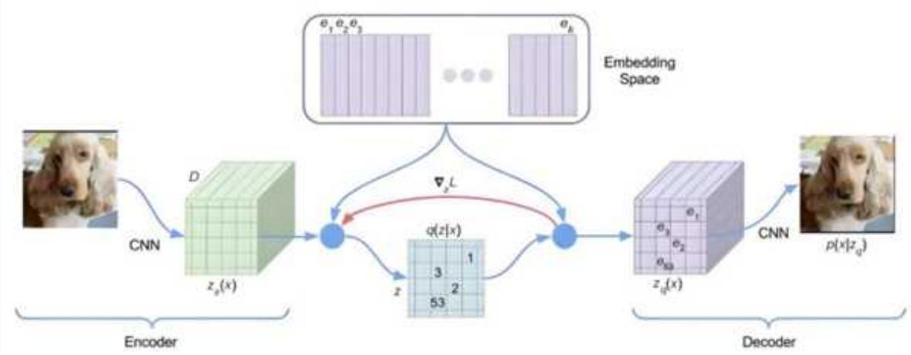  
图13-1 图像编码与重建的过程

更重要的是，这种离散的一维序列具有高度的灵活性和可操作性。我们可以通过对一维离散序列进行精确的操作和重建，重新获取到高质量的图像。这种图像重建过程不仅快速，而且准确，为我们提供了一种全新的、高效的图像生成和处理手段。这种编码方式的引入，无疑将为计算机视觉领域的研究和应用带来革命性的变革。

# 13.1 图像编码器

图像编码器是一种专门用于将原始图像数据转换为更为紧凑和高效的表示形式的工具或算法。其核心工作原理基于人眼的视觉特性以及图像内部的空间和时间相关性。在编码过程中，图像编码器能够识别并去除图像中的冗余信息，如编码冗余、像素间冗余以及心理视觉冗余，从而实现数据的压缩。

这种压缩可以是无损的，即压缩后的图像能够完全还原为原始图像，不丢失任何信息；也可以是有损的，即在允许的失真范围内进行压缩，以换取更高的压缩比。图像编码器通常包括预处理、变换、量化、编码等关键步骤，并且随着技术的发展，不断融入更智能化和高效化的解决方案，以满足日益增长的图像质量、压缩效率和实时性需求。

# 13.1.1 从自然语言处理讲起

从前面完成的自然语言生成全流程中，我们已经获得了一定的洞见：一个句子在初始阶段会通过分词器被拆解成一系列的整数ID，这些ID紧接着经由Embedding层被转换成浮点向量。之后，模型会接手处理这些向量，进行深层次的计算与理解。在进行下一个词元的预测时，其核心任务实际上是预测一个分类概率分布，这里通常会采用交叉熵作为损失函数。最终，结合预设的词表，通过采样机制，我们能够生成完整且意义连贯的句子。自然语言处理流程如图13-2所示。

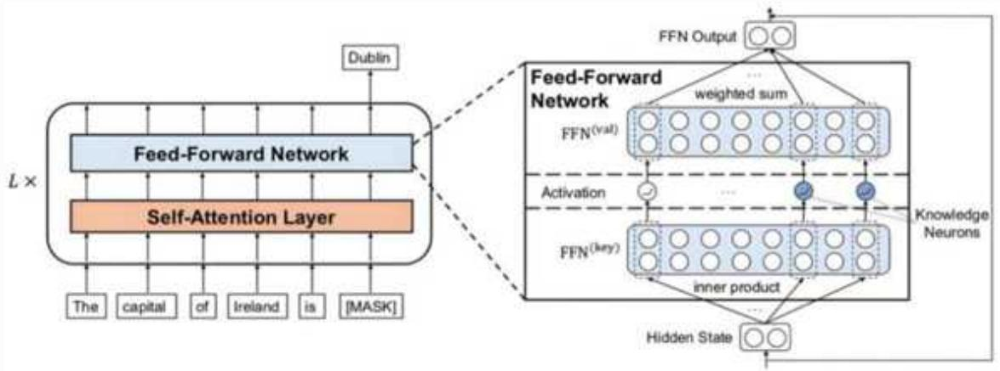  
图13-2 自然语言处理流程

那么，一个引人深思的问题自然而然地浮现出来：我们是否可以将这种处理模式迁移到图像处理领域呢？

为了探索这一可能性，我们可以尝试直接模仿自然语言处理的流程。首先，将图像数据转换为一系列整数ID。例如，可以将每个像素视为一个独立的单元，并为其分配一个唯一的ID。随后，利用一个专门设计的编码表（或称为codebook），将这些整数ID进一步映射为浮点向量。接下来，类似于NLP中的“下一个词元预测”训练，可以在网络中对这些向量进行训练，以期望模型能够学习到图像数据的内在规律和结构。最后，通过这些经过训练的向量，期望能够还原出原始的图像，从而完成整个处理流程。

但是，如果直接对图像的像素进行编码处理，虽然从理论上看似可行，但在实际操作中会面临两个突出的问题。首先，图像的分辨率往往非常高，导致像素数量庞大，直接处理会带来巨大的计算负担。其次，像素值的细微变化（如244和245）在视觉效果上可能并不明显，因此将其作为独立的分类单元可能并不合适。

针对这两个问题，有一个直观的解决方案：我们可以考虑将图像划分为若干较小的块（或称为Patch），并将每个Patch视为一个独立的token。这样一来，我们不仅可以显著缩短待处理的序列长度（因为每个Patch包含多个像素的信息），还能有效避免像素值细微变化所带来的分类困扰（因为Patch间的语义差异通常要比像素间的差异更加明显）。这种方法的巧妙之处在于，它成功地将NLP中的处理思路应用到图像处理领域，为图像数据的理解和生成提供了新的视角和可能性。

# 13.1.2 图像的编码与解码VQ-VAE

在前面的讲解中，我们提出了一个创新的想法：将图像的每个Patch视作一个独立的token。这样做不仅缩短了处理序列，还因为Patch间的语义差异大于单个像素间的差异，从而有效规避了像素值细微变化的分类问题。

这一思路自然而然地引出了VQ-VAE（Vector Quantized Variational AutoEncoder，向量量化变分自编码）的设计。VQ-VAE的核心思想在于先将原始图像压缩到较小的尺寸，然后对这个小尺寸的图像进行离散化处理，最后在需要时再将其还原到原始大小。

具体来说，VQ-VAE通过以下方式关联编码器的输出与解码器的输入：在嵌入空间已经经过训练的前提下，对于编码器输出的每一个向量，算法会在预设的codebook中寻找其最近邻的嵌入向量。一旦找到这个最近邻，编码器的输出向量就会被替换为这个最近邻嵌入向量，然后作为解码器的输入。VQ-VAE输入输出示意图如图13-3所示。

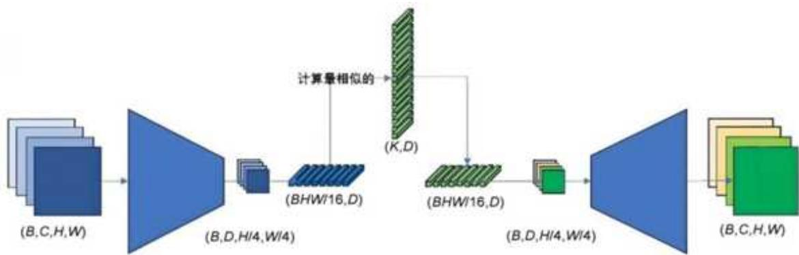  
图13-3 VQ-VAE输入输出示意图

这种处理方式不仅简化了图像数据的表示，还通过离散化编码增强了模型的健壮性。同时，由于Patch间的语义差异更加明显，VQ-VAE能够更有效地捕捉图像中的关键信息，从而在图像压缩、生成和重建等任务中展现出优异的性能。总之，通过将图像Patch视作独立token并结合VQ-VAE的设计，我们为图像处理领域引入了一种新颖且高效的方法。

# 13.1.3 为什么VQ-VAE采用离散向量

为什么VQ-VAE希望将图像编码成离散向量呢？为了深入理解这一点，我们回溯一下自编码器（Autoencoder，AE）的起源。

自编码器是一种神经网络模型，它能够将图像数据压缩成较短的向量表示。其结构简洁明了，通常包含一个编码器部分和一个解码器部分。在训练过程中，输入的图像首先被编码器转换为一个紧凑的向量，这个向量随后被解码器还原成一幅与原始图像相似的重建图像。整个网络的学习目标就是使得这个重建图像尽可能地接近原始输入图像。

然而，传统的自编码器生成的向量是连续的，这意味着在向量空间中，相似的图像可能对应着距离很近但并非完全相同的向量。这种连续性虽然在一定程度上保留了图像的细节，但也带来了一个问题：它不利于模型学习图像中的高层次、抽象化的特征表示。

VQ-VAE的出现正是为了解决这一问题。通过将编码后的连续向量量化为离散向量，VQ-VAE强制模型在有限的向量集合中进行选择，从而实现了对图像特征的高效压缩和抽象。这种离散化的表示方法不仅有助于模型捕捉到图像中的关键信息，还能提高模型的健壮性和泛化能力。

在NLP中，通常是先有一个tokenizer，将自然语言转换成一个个token，实际就是一个个离散的整数索引；接下来有一个Embedding层，查索引获取对应的词嵌入Embedding，然后送入模型中处理。因此，对于自然语言来说，数据是由一个个token组成的，是一种离散的数据模态。

在计算机视觉（Computer Vision，CV）中，计算机中的图片其实也是离散的数据，因为所有可能的图像像素数量都是有限的，一般对彩色图像最多 $2 5 6 { \times } 2 5 6 { \times } 3$ 种。但由于这个数太

大，因此一般认为图像是一种连续的数据模态。一般读图进来，再将像素归一化之后直接输入模型中处理。

在具体处理上，图像被作为连续的向量处理，其中包括大量额外的信息，因此生成的图片往往质量不高。这是由于图片被编码成了连续向量，如果把图片编码成离散向量，会更加自然。

在具体使用上，我们需要构建一个图像特征的codebook（码本），它的作用类似于NLP中的词嵌入Embedding层。codebook是一个可学习的 $\mathrm { ~ K ~ } \times \mathrm { ~ D ~ }$ 的张量，其中 K 是表征向量Embedding的个数， D是Embedding的维度。对于一幅输入图像，CNN编码器会提取其特征图 Z ，特征图尺寸为 $\mathbf { h } \times \mathbf { w } \times \mathbf { D }$ ，也就是 $\mathrm { \hslash } \times \mathrm { \ww } \mathrm { w }$ 个 D 维的向量。每个向量在codebook中找到与其最接近的向量的索引，按索引取得最接近的向量，得到量化后的特征图 Z ，之后将其送入解码器中，输出重构图像。

$$
Z = \operatorname {a r g m i n} \| Z _ {\mathrm {e}} - Z _ {\mathrm {q}} \| ^ {2}
$$

上面的公式展示了重构图像的方法，在训练时，输入图像会被编码成一个较短的向量，再被解码为另一幅长得差不多的图像。网络的学习目标是让重建出来的图像和原图像尽可能相似。

在反向传播中，argmin的作用是获取codebook中最接近的向量，这里使用了一种“复制”的方法，在前向与反馈时直接将 Z 与 Z 进行桥接，从而完成模型的训练。

而在优化时，我们需要对VQ-VAE中的所有部件进行优化，即需要使用不同的损失函数对结果进行计算。这里有3种损失函数，即编码器、解码器和码本（codebook）。损失函数可以用以下方式表达：

Loss $\equiv$ reconstruction_loss+embedding_loss+commitment_loss reconstruction_loss $\coloneqq$ log(x||z_q(x)) embedding_loss $\equiv$ $\| \mathrm{sg}[\mathrm{z}_{\mathrm{e}}(\mathrm{x})] - \mathrm{e}\|^{2}$ commitment_loss $= \beta \| z_{e}(x) - sg[e]\|^{2}$

其中，VQ-VAE的损失函数由3部分构成：首先是reconstruction loss，这一部分的作用在于优化Encoder和Decoder的性能，确保图像经过编码再解码后能够尽可能地还原原始信息；其次是embedding_loss，它专注于优化码本，使得编码后的特征向量能够更准确地映射到码本中的嵌入向量上；最后是commitment_loss，它类似于一个正则化项，起到约束Encoder训练的作用，防止模型过度拟合训练数据。

在上述损失函数中，sg代表梯度停止（stop gradient），这是一个重要的操作。在模型的前向传播过程中，sg保持其计算值不变；而在反向传播时，sg的偏导数被设置为0。这意味着

在优化过程中，我们不希望某些参数的梯度影响其他参数的更新，从而实现了对模型训练过程的精细控制。

简而言之，VQ-VAE的Encoder不仅是一个图像表征模型，它与传统模型的区别在于其独特的表征方式。传统的图像表征模型通常会将整个图像压缩为一个特征向量，而VQ-VAE的Encoder能够提取出一幅特征图。这幅特征图实际上是多个特征向量在二维空间上的排列，相当于将原始像素空间中的大图压缩为隐空间中的一幅小图。这种压缩方式不仅保留了图像的关键信息，还大大降低了存储和传输的成本。

相对应地，VQ-VAE的Decoder则负责将这幅隐空间中的小图解码回像素空间中的大图。通过Encoder和Decoder的联合训练，VQ-VAE能够实现高效的图像离散压缩和高质量的还原，从而在图像处理领域展现出了强大的潜力。这种离散压缩方式不仅有助于节省存储空间，还能在保持图像质量的同时，提高图像传输的效率。

# 13.1.4 VQ-VAE的核心实现

接下来继续完成VQ-VAE的核心实现。首先实现一个向量量化器，它可以将连续的嵌入向量转换为离散的嵌入向量，并计算相关的损失值，以便在训练过程中优化模型的性能。这种量化方法常用于压缩表示和生成模型等任务中。代码如下：

```python
导入必要的库  
import torch  
from typing import Tuple, Mapping, Text  
from einops import rearrange # 假设使用了einops库进行张量重排  
class VectorQuantizer(torch.nnModule):  
    def __init__(self, codebook_size: int = 1024, # 码本中的嵌入向量数量  
            embedding_dim: int = 256, # 离散嵌入的维度  
            commitment_cost: float = 0.25, # 承诺损失的权重)：  
                初始化向量量化器  
                super().__init()  
                self.commitment_cost = commitment_cost  
# 初始化嵌入表，用于存储码本中的嵌入向量  
self.Embedding_table = torch.nn.Embedding(codebook_size, embedding_dim)  
# 使用均匀分布初始化嵌入表的权重
```

```python
selfembedding_table.weight.data.uniform (
    -1.0 / codebook_size, 1.0 / codebook_size
)
def forward(
    self, z: torch.Tensor # 输入的连续嵌入向量
) -> Tuple[torchTensor, Mapping[Text, torchTensor)):
    ...
    z = z.float() # 确保输入为浮点数类型
# 调整张量的轴顺序，将通道轴移到最后
z = rearrange(z, "BCT->BTC").contiguous()
# 将张量展平，以便进行后续计算
z(flattened = rearrange(z, "BCT->(BT)C")
embedding = selfembedding_table.weight # 获取嵌入表的权重张量
# 执行KNN嵌入搜索，计算输入向量与嵌入向量之间的距离
d = (
    torch.sum(z_flattened ** 2, dim=1, keepdim=True)
    + torch.sum(embedding ** 2, dim=1)
    - 2 * torch.einsum("bd,dn->bn", z(flattened, embedding.T))
)
# 找到距离最近的嵌入向量的索引
closest_embedding_ids = torch.argmax(d, dim=1)
# 根据索引获取对应的嵌入向量，并恢复原始形状
z_q = self.get_codebook_entry(closest_embedding_ids).view(z.shape)
# 计算损失函数
# 承诺损失
commitment_loss = torch(nnfunctional.mse_loss(z, z_qdetach())) * 0.33
codebook_loss = torch(nnfunctional.mse_loss(zdetach(), z_q) # 码本损失
loss = commitment_loss + codebook_loss # 总损失
# 确保梯度能够通过z传递
z_q = z + (z_q - z).detach()
# 恢复张量的原始轴顺序
z_q = rearrange(z_q, "BTC->BCT").contiguous()
# 构造包含损失和嵌入向量索引的字典
result_dict = dict(
quantizer_loss=loss, # 总损失
commitment_loss=commitment_loss, # 承诺损失
codebook_loss=codebook_loss, # 码本损失
embeddingIds=closest_embedding_ids, # 最近的嵌入向量索引 
```

```python
return z_q, result_dict # 返回量化后的嵌入向量和结果字典
def get_codebook_entry(self, ids: torch.Tensor):
    return selfembedding_table(id) # 使用嵌入表根据索引获取嵌入向量
```

上面这段代码定义了一个VectorQuantizer类，它是PyTorch中的一个模块，用于将连续的嵌入向量量化为离散的嵌入向量。在初始化时，它创建了一个嵌入表来存储码本中的嵌入向量，并使用均匀分布来初始化这些嵌入向量。

在前向传播过程中，它首先调整输入张量的形状，然后计算输入向量与嵌入向量之间的距离，找到最近的嵌入向量索引，并根据这些索引获取对应的嵌入向量。接着，它计算承诺损失、码本损失以及总损失，并确保梯度能够通过量化后的嵌入向量传递。最后，它恢复了张量的原始形状，并构造一个包含损失和嵌入向量索引的字典，作为输出结果。

# 13.2 基于VQ-VAE的手写体生成

对于VQ-VAE的应用，其核心功能在于能够将原本连续的图像数据转换为离散的token表示。这一过程不仅实现了图像的高效压缩与编码，还为后续的图像处理和分析提供了新的视角。通过这些离散的token，我们可以更灵活地处理和操作图像数据，例如进行图像的检索、分类、编辑等任务。

具体来说，VQ-VAE通过学习一个离散的潜在空间来表示图像，这个空间由一系列预定义的token构成。在训练过程中，VQ-VAE会将输入图像编码到这个离散空间中，选择最接近的token来表示图像的局部特征。这样，原本由像素值构成的连续图像就被转换成了一系列离散的token。

在生成图像时，VQ-VAE则根据这些token来解码并重构图像。由于token的离散性，生成的图像虽然在细节上可能与原图有差异，但整体上能够保留原图的主要特征和结构。这种离散化的表示方法不仅降低了数据的复杂性，还提高了生成模型的效率和可控性。

此外，VQ-VAE生成的离散token序列还可以作为其他模型（如Transformer等）的输入，从而进一步拓展其在图像处理领域的应用。例如，可以通过对这些token进行序列建模，生成具有特定风格或内容的图像，或者实现图像的补全和修复等功能。

接下来我们将完成基于VQ-VAE的图像生成。

# 13.2.1 图像的准备与超参数设置

本小节我们将完成图像的准备，即使用MNIST数据集完成编码器VQ-VAE的手写体的生成。首先是图像文本的获取，我们可以直接使用MNIST数据集对图像内容进行提取，代码如下：

```python
from torch.utils.data import Dataset
from torchvision.transformes.v2 import PILToTensor,Compose
import torchvision
from tqdm import tqdm
import torch
import random
#手写数字
class MNIST(Dataset):
    def __init__(self,is_train=True):
        super().__init()
        self.vs = torchvision.datasets.MNIST('./../dataset/mnist/',train=is_train,
download=True)
        self.img.convert =Compose(
            PILToTensor()
        )
    def __len__(self):
        return len(self.vs)
    def __getitem__(self,index):
        img, label = self.vs[index]
        #text = f"现在的数字是:(label)#"
        text = random.sample(sampletexts,1)[0][-10:] 
        text = text + str.label) + "#"
fulltok = tokenizer emulate-encoded(text)[-12:] 
fulltok = full tok + [1] * (12 - len(full tok))
inp tok = full tok[-1]
tgt tok = full tok[1:] 
inp tok = torch.tensor(inp tok)
tgt tok = torch.tensor(tgt tok)
>>>torch.Size([1,28,28])
>>>return self.img Converted(img)/255.0,inp tok,tgt tok 
```

上面的代码复用了文本生成部分的MNIST数据集，读者在具体使用时，可以根据需要自行对其进行调整。

接下来，我们需要完成图像的超参数设计。在求解VQ-VAE的过程中，我们设计了如下的参数内容：

```python
class Config:  
    in_channels = 1  
    d_model = 384  
    image_size = 28  
    patch_size = 4  
    num_heads = 6  
    num_layers = 3  
    token_dim = token_size = 256  
    latent_token VOCab_size = num_forelate_tokens = 32  
    codebook_size = 4096 
```

token_size是指在VQ-VAE模型中量化后，每个token（或“码字”）在潜在空间的维度。编码器会将输入数据转换为潜在表示，进而量化至一个离散的潜在空间。此量化步骤是通过将潜在表示中的每个向量用最近的“码字”替代来实现的，这些“码字”源于一个预先设定的码本。token_size参数即确定了这些“码字”的维度大小。例如，若token_size为12，则意味着每个“码字”是一个12维的向量。

num_latent_tokens则代表在VQ-VAE的潜在空间中使用的不同“码字”的数量，它决定了码本的大小，即码本中包含离散向量的数目。在模型中，码本是一个可学习的参数集合，存储了表示输入数据特征的“码字”。num_latent_tokens参数控制着码本的大小，并影响模型捕捉输入数据细节的能力。举例来说，若num_latent_tokens设为64，则码本包含64个不同的“码字”，在量化潜在表示时，模型会从这些“码字”中选择一个来替换每个向量。

# 13.2.2 VQ-VAE的编码器与解码器

本小节讲解VQ-VAE的编码器和解码器。首先是编码器的作用，编码器将连续的图像特征转换为具有特定数目的token表示，而解码器则是将token复原成图像。

# 1．编码器

编码器（Encoder）是深度学习模型中一个常见的组件，特别是在处理图像、文本等类型的数据时。它的主要作用是将输入数据（如图像）转换成一个更紧凑、更易于处理的表示形式，通常称为“编码”或“潜在表示”（Latent Representation）。这种表示可以捕捉输入数据的关键特征，并用于后续的任务，如分类、生成等。

其中，潜在表示（Latent Representation）是深度学习中的一个核心概念，它指的是模型内部学习到的一种数据表示。这种表示通常不是直接可观察的，而是捕捉了输入数据的内在结构和特征。在上面的示例代码中，潜在表示是通过Encoder模块中的一系列变换得到的，它将原始图像数据转换成一种更高级、更抽象的形式。这种潜在表示有助于模型更好地理解和处理输入数据，进而提升在各种任务上的性能。

完整的编码器代码如下：

```python
import einops  
import torch  
from einops.layers.torch import Rearrange  
from torch import nn  
class ExtractLatentTokens(torch(nn.Module):  
    提取潜在表示（Latent Tokens）的模块，  
这个模块用于从输入张量中提取一部分作为潜在表示，通常用于生成模型中，例如变分自编码器（VAE）或者生成对抗网络（GAN）中的潜在空间操作。
```

```python
def __init__(self, grid_size):
    ...
    初始化 ExtractLatentTokens 模块。
    参数:
        grid_size (int): 网格的大小，这个值的平方将用于确定输入张量中从哪个位置开始提取潜在表示
        ...
        super(ExtractLatentTokens, self).__init()
        self.grid_size = grid_size
    def forward(self, x):
        ...
    前向传播方法，从输入张量中提取潜在表示。
    参数:
        x (torch.Tensor): 输入张量，通常包含数据的完整表示。
    返回:
        torch.Tensor: 提取的潜在表示张量，包含从输入张量中指定位置开始的所有元素
        ...
        # 计算提取起始位置的索引，即 grid_size 的平方
        start_index = self.grid_size ** 2
        # 返回从 start_index 开始到 x 结束的切片，即提取的潜在表示
        return x[:, start_index:]
    import config
from blocks import ResidualAttention
class Encoder(nn.Module):
    def __init__(self, config = config.Config, positional_embedding = None, latent_token_positional_embedding = None):
        super(Encoder, self).__init())
        in_channels = config.in_channels
        self(image_size = config.image_size
            d_model = self.d_model = self.width = config.d_model
            self.num_heads = config.num_heads
            self(num_layers = config(num_layers
            self.batch_size = config.batch_size
            scale = self.width ** -0.5 # scale by 1/sqrt(d)
            selftokenizer_size = configtokenizer_size# 
            self.trainable=True
            torch.nn.Conv2d(in_channels=in_channels, out_channels=ofllwidth, kernel_size=
```

```txt
self.patch_size, stride = self.patch_size, bias = True) #图像补丁的位置嵌入 #torch.Size([49, 384]) self.grid_size = self.image_size // self.patch_size #这个position_embedding是加在图形上，以及加在补丁上 self positional embedding = positional_embedding # [7*7, 384] self.latent_token positional_embedding = latent_token positional_embedding self.transformer = nnModuleList() for in range(self.num_layers): self.transformer.append(ResidualAttention(d_model= self.d_model, attention_head_num=6)) self(norm = torch(nn.RMSNorm(d_model) self.model = nnSequential(*self.transformer, ExtractLatentTokensgrid_size= self.grid_size), self(norm) self encoder_out = nn.Linear(self.width, self.token_size) def forward(self, pixel_values, latent_tokens): B, _, _, _ = pixel_values.shape x = pixel_values x = self.batch_embedding(x) x = einops.rearrange(x, "B C H W -> B (H W) C ") x = x + self positional_embedding.to(x.dtype) latent_tokens = einopsrepeat(latent_tokens, "T C -> B T C", B=B) x = torch.cat[x, latent_tokens], dim=1) x = self.model(x) x = x + selflatent_token positional_embedding.to(x.dtype) x = selfencoder_out(x) return x #[-1,32,256] 
```

在上面示例代码的Encoder类中，潜在表示是通过多个Transformer层的自注意力机制和非线性变换逐步构建起来的。这些层能够捕捉输入图像中不同位置之间的依赖关系，并将这些信息编码到一个固定大小的向量空间中。这个过程使得模型能够提取出图像的关键特征，并以一种紧凑且高效的方式表达出来，即形成潜在表示。

最后，这种潜在表示在模型的后续部分发挥着重要作用。它可以被用作分类、生成或其他相关任务的输入，帮助模型更好地完成这些任务。在上面的代码中，潜在表示最终通过线性输出层被转换成目标大小的编码向量，这个向量可以进一步用于下游任务的处理和分析。

# 2．解码器

接下来完成模型的解码器。解码器作为VQ-VAE的另一核心组件，其任务与编码器相反，即将编码器生成的离散token表示重新映射回原始的图像空间。解码器能够逐步还原出图像的低层次细节，最终生成与输入图像在视觉上相似的重建图像。而且，由于token表示的离

散性，解码器在生成图像时具有一定的创造性和多样性，使得VQ-VAE在生成新颖、多样化的图像方面表现出色。解码器代码如下：

```python
import einops   
import torch   
from einops.layers.torch import Rearrange   
from torch import nn   
import torch   
from torch.nn.Functional import embedding   
import config   
class RemoveLatentTokens(nnModule): def __init__(self, grid_size): super().__init_( self.grid_size = grid_size def forward(self, x): return x[:, 0: self.grid_size**2] from blocks import ResidualAttention   
class Decoder(nnModule): def __init__(self, config = config.Config, positional_embedding = None, latent_token_positional_embedding = None): super().__init_( self(image_size = config图像_size self.batch_size = config.batch_size self.grid_size = self.image_size // self.batch_size self.num_forent_tokens = config.num_forent_tokens d_model = self.d_model = self.width = config.d_model self_token_size = config_token_size self(num_heads = config(num_heads) num_layers = self(num_layers = config(num_layers # project token dim to model dim self.grid_size = self/image_size // self.batch_size self decoder_embedding = nn.Linear(self(token_size, self.width, bias=True) scale = config.d_model ** -0.5 #这个position_embedding是加在图形上，以及加在补丁上 self positional_embedding = positional_embedding selflatent_token_positional_embedding = latent_token_positional_embedding self.remove_forent_token_layer = RemoveLatentTokens(self.grid_size) self.transformer = nn.ModuleList() #attention layers for in range(self.num_layers): self.transformer.append(ResidualAttention(d_model = self.d_model, attention_head_num=6)) self(norm = torch(nn.RMSNorm(d_model) 
```

# FFN to convert mask tokens to image patches
self. ffn = nn Sequential(   )
	nn.Conv2d(self.width, config.in_channels * self.batch_size ** 2, 1, padding=0,
bias=True),
Rearrange( "B (P1 P2 C) H W-> B C (H P1) (W P2)", P1= self.batch_size,
P2= self.batch_size,
	),
# conv layer on pixel output
self.conv_out = nn.Conv2d(config.in_channels, config.in_channels, 3, padding=1,
bias=True)
self.model =
nn Sequential(*self.transformer, RemoveLatentTokensgrid_size= self.grid_size), self(norm)
def forward(self, z_q, latent_tokens): $\mathrm{x} = \mathrm{z} - \mathrm{q}$ B,T,C = x.shape
x = selfDecoder_embedding(x)
mask_tokens = torch unsqueeze(latent_tokens, dim=0).repeat(B, 1, 1).to(x.dtype)
mask_tokens = mask_tokens +
selflatent_token_positional_embedding.to(token_tokens.dtype)
x = torch.cat([mask_tokens, x], dim=1)
x = self.model(x) #decode latent tokens
x = x + self positional_embedding
x = einops.rearrange(x,"B (H W) C-> BCHW", H= self.grid_size, W= self.grid_size)
x = self.ffn(x)
x = self.convert_out(x)
return x

上面的示例代码通过对输入的文本进行解码，从而完成了图像的重建任务。

# 13.2.3 VQ-VAE的模型设计

在完成编码器与解码器的程序实现后，后面需要完成VQ-VAE的主程序设计。在13.2.2节中，我们已经详细阐述了VQ-VAE实现的核心要点。在具体程序设计方面，我们既可以选择手 工 编 写 这 部 分 代 码 ， 以 充 分 掌 握 每 一 个 实 现 细 节 ， 也 可 以 利 用 预 设 的vector_quantize_pytorch 库 来 简 化 模 型 的 设 计 过 程 。 首 先 ， 我 们 需 要 安 装vector_quantize_pytorch库：

```txt
pip install vector_quantize_PYtorch 
```

之后完成VQ-VAE模型，代码如下：

```txt
import torch, einops 
```

import encoder   
import decoder   
import config   
from vector量化torch import VectorQuantize   
class Tokenizer(torch.nnModule): "" ID Image Tokenizer "" def init_self, config $=$ config.Config(): super(Tokenizer,self).init_(） self.config $\equiv$ config self图像_size $\equiv$ config图像_size self.batch_size $\equiv$ config.batch_size self.grid_size $\equiv$ self.image_size//self.batch_size scale $=$ config.d_model \*\* -0.5 selflatent_tokens $\equiv$ torch.nn.Parameters(scale \* torch.randn(self.grid_size \*\* 2, config.d_model)) self positional_embedding $\equiv$ torch.nn.Parameter(scale\* torch.randn(self.grid_size \*\* 2, config.d_model)) #self.positional_embedding $\equiv$ torch.d_model() # [7\*7,384] selflatent_token_positional_embedding $\equiv$ torch.nn.Parameter(scale\* torch.randn(self.grid_size \*\* 2, config.d_model)) selfencoder $\equiv$ encoder.Encoding(config,self positional_embedding, selflatent_token_positional_embedding) selfdecoder $\equiv$ decoder.Decoder(config,self positional_embedding, selflatent_token_positional_embedding) self.vq $\equiv$ VectorQuantize(dim $\equiv$ config_token_dim,codebook_size $=$ config.codebook_size,decay $= 0.8$ ,commitment_weight $= 1.$ ) #模型训练用 def forward(self,x): z_q,indices,commit_loss $\equiv$ self.encode(x) decoded_imaged $\equiv$ self.decoder(z_q,self.latent_tokens) return decoded_imaged,commit_loss def encode(self,x): embedding $\equiv$ self encoder(x,self.latent_tokens) quantized, indices, commit_loss $\equiv$ self.vq(embedding) return quantized, indices, commit_loss def decode_tokens(self, tokens): z_q $=$ self.vq.get_codes_from Indices(tokens) return self.decoder(z_q)

在上面的代码中，我们定义了解码与编码模块，vq模块从编码器输出中提取对应的向量表示，并通过计算得到离散的token-indices。commit_loss是贡献的损失函数，其作用是在计算时对内容进行损失计算并反馈结果。

# 13.2.4 VQ-VAE的训练与预测

本小节将完成VQ-VAE模型的训练，读者可以使用如下代码完成模型的训练：

```python
importtokenizer
import math
from tqdm import tqdm
import torch
from torch.utils.data import DataLoader
import config
device = "CUDA"
model = tokenizerTokenizer(config=config.Config())
model.to(device)
save_path = ".saver/ViLT_generator.pth"
model.load_state_dict(torch.load(save_path),strict=False)
BATCH_SIZE = 128
seq_len = 49
import get_dataemotion
# import get_dataemotion_2 as get_dataemotion
train_dataset = get_dataemotion.MNIST()
trainloader = (DataLoader(train_dataset, batch_size=BATCH_SIZE, shuffle=True))
optimizer = torch.trainhungAdamW(model.params(), lr = 2e-4)
lr_scheduler = torch.trainhungAdamwCosineAnnealingLR(optimizer,T_max = 12000, eta_min=2e-7,last_epoch=-1)
for epoch in range(6):
    pbar = tqdm(trainloader,total=len(trainloader))
    for inputs,token_inp,token_tgt in pbar:
        inputs = inputs.to(device)
        token_inp = token_inp.to(device)
        imaged,result_dict = modelInputs)
        # reconstruction_loss = torch.nnfunctional.mse_loss(input, imaged, reduction="mean")
        reconstruction_loss = torch.nnfunctional.smooth_l1_loss(input, imaged, reduction="sum")
        quantizer_loss = result_dict["quantizer_loss"]
        autoencoder_loss = reconstruction_loss + quantizer_loss
        optimizer.zero_grad() 
```

autoencoder_loss.backup()   
optimizer step()   
lr_scheduler step() #执行优化器   
pbar.set_description(f"epoch:{epoch +1},   
train_loss:{autoencoder_loss.item():.5f}, lr:{lr_scheduler.get_last_lr([0]*1000:.5f])") if(epoch+1) $\text{日} 2 = 0$ torch.save(model.state_dict(),save_path)   
torch.save(model.state_dict(),save_path)

在上面的代码中，我们需要着重注意损失函数，这里主要定义了两种损失函数，分别是对码表的损失函数计算以及对图像损失函数的计算。在具体使用上，我们采用直接相加的方式来完成函数的计算。读者可以自行完成训练。

接下来是模型的预测部分。我们可以使用训练好的模型对输入的内容进行重建，代码如下：

importtokenizer   
import math   
from tqdm import tqdm   
import torch   
from torch.utils.data import DataLoader   
import config   
import matplotlib.pyplot as plt   
device $=$ "cpu"   
model $=$ tokenizerTokenizer(config=config.Config())   
save_path $=$ ".saver/ViLT_generator.pth"   
model.load_state_dict(torch.load(save_path),strict=False)   
import get_data(emotion   
train_dataset $\equiv$ get_data(emotion.MNIST(is_train=False)   
img，inp tok,tgt tok $\equiv$ train_dataset[929]   
plt.imshow(img.permute(1,2,0))   
plt.show()   
image $=$ torch unsqueeze(img,0)   
decoded,result_dict $\equiv$ model(image)   
image_decoded $\equiv$ decoded[0].permute(1,2,0).detach().numpy()   
plt.imshow(image_decoded)   
plt.show()   
print(image_decoded[0,:5])   
img，inp tok,tgt tok $\equiv$ train_dataset[2929]   
plt.imshow(img.permute(1,2,0))   
plt.show()   
print()   
image $=$ torch unsqueeze(img,0)   
decod,result_dict $\equiv$ model(image)   
image_decoded $\equiv$ decoded[0].permute(1,2,0).detach().numpy()   
plt.imshow(image_decoded)   
plt.show()   
print(image_decoded[0,:5])

重建结果如图13-4所示，读者可以自行验证。

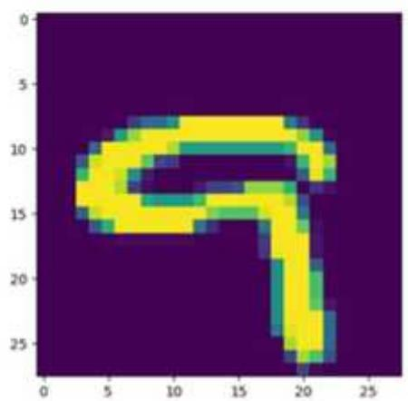

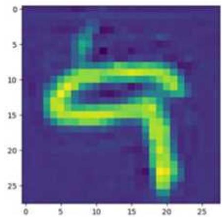  
图13-4 原始图像与重建后的图像

# 13.2.5 获取编码后的离散token

13.2.4节我们直接对输入文本进行了预测，即通过输入文本获取重构后的图像。

另外，除直接对图像建模外，还可以通过编码器获取转换后的离散token，并通过这些token对图像进行重建，代码如下（读者一定要完成13.2.4节的训练内容）：

```python
import tokenizer
import torch
import config
import matplotlib.pyplot as plt
device = "cpu"
tokenizer = tokenizerTokenizer(config=config.Config())
save_path = ".saver/ViLT_generator.pth"
tokenizer.load_state_dict(torch.load(save_path),strict=False)
import get_data(emotion
train_dataset = get_data(emotion.MNIST(is_train=False)
img,inp tok,tgt tok = train_dataset[2929]
plt.imshow(img.permute(1,2,0))
plt.show()
image = torch unsqueeze(img,0)
quantized, indices,commit_loss = tokenizer.encode(image)
print(indices.shape)
print(indices) 
```

运行结果如下：

```txt
torch.Size([1, 49])  
tensor([[22, 108, 3, 7, 7, 3, 43, 94, 14, 3, 7, 7, 7, 109, 14, 1, 967, 7, 7, 967, 39, 59, 34, 34, 28, 1, 17, 33, 21, 21, 46, 6, 3, 
```

```txt
67，70，70,84，76，22，3，7，7，7，3，43，90，1，7，7]]
```

首先我们输出了token维度，之后打印了对应的图形离散化的表示。接下来，我们可以使用模型重建这些离散化的图像，代码如下：

```python
quantized = tokenizer.vq.get_codes_from Indices(indices)  
imaged = tokenizer decoder(quantized,tokenizerlatent_tokens)  
image_decoded = imaged[0].permute(1,2,0).detach().numpy()  
import matplotlib.pyplot as plt  
plt.imshow(image_decoded)  
plt.show() 
```

读者可以自行尝试。同时，我们看到，对应于不同的离散token，我们通过解码器重建后的图像也有所不同。有兴趣的读者可以通过自定义token的形式修正新的文本生成，代码如下：

indices $=$ torch.tensor([22,108,3,17,17,3,43,94,6,3,7,7,7,109,14,1,66,7,7,88,39,59,34,34,28,1,17,33,7,21,46,6,3,5,70,70,12,76,22,3,7,7,7,3,43,90,1,7,7])  
quantized $=$ tokenizer.vq.get_codes_from Indices(indices)  
imaged $=$ tokenizer decoder(quantized,tokensilent_tokens)  
image_decoded $=$ imaged[0].permute(1,2,0).detach().numpy()  
import matplotlib.pyplot as plt  
plt.imshow(image_decoded)  
plt.show()

修改后的图像如图13-5所示。

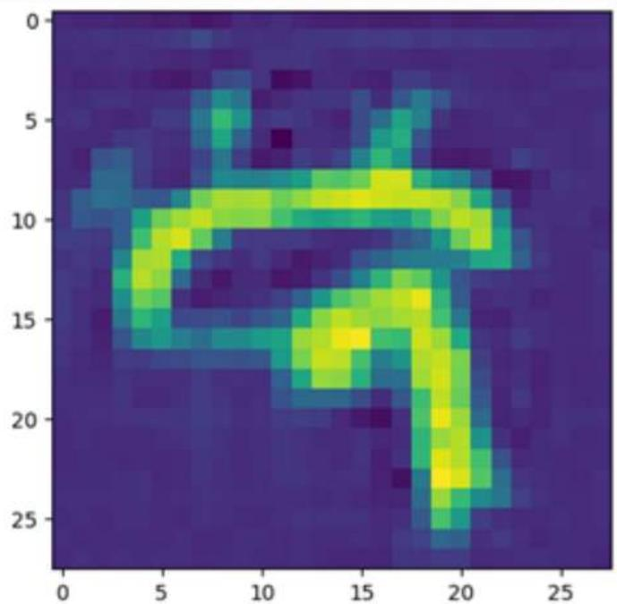

图13-5 经过修改的token生成的图像

可以看到，当我们对部分token数值进行修改后，解码器生成的图像也随之发生了一定的变化。有兴趣的读者可以自行尝试改变更多数值，了解不同token对图像生成的影响。

# 13.3 基于FSQ的人脸生成

对于VQ-VAE的具体应用，我们提出一种称为有限标量量化（Finite Scalar Quantization，FSQ）的简单方案来替换VQ-VAE中的向量量化（Vector Quantization，VQ）。这个新方案希望解决传统VQ中存在的两个主要问题：

消除辅助损失。  
提高码本利用率。

有限标量量化的离散化思路非常简单，就是“四舍五入”。

# 13.3.1 FSQ算法简介与实现

将VAE表示投影到少量维度（通常少于10）。每个维度被量化为一组固定的值，由这些数值集合的乘积给出（隐式的）码本（codebook）。

例如，对于一个具有 d个channel的向量z ，如果将每个条目 z 映射到 L个值（例如， z=Round( $\mathrm { L } \ / 2 { \times } \mathrm { t a n h } ( \mathrm {  ~ z ~ } _ { \mathrm { i } } ) )$ ，其中Round是四舍五入算子），则可获得一个量化后的向量 $\textbf { Z } ^ { \prime }$ ＇。FSQ与VQ算法示意如图13-6所示。

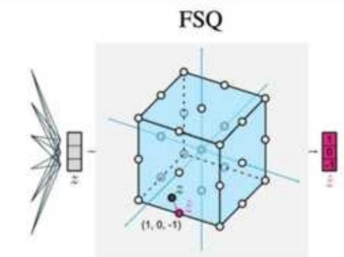

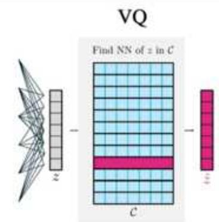  
图13-6 FSQ与VQ算法

在具体训练过程中，FSQ在使用重构损失训练的自动编码器中，我们获得了对编码器的梯度。这迫使模型将信息分散到多个量化单元（quantization bins）中，因为这样做可以减少重构损失。最终结果是，我们获得了一个能够使用所有码字的量化器，而无须任何辅助损失。

尽管FSQ的设计更为简单，但它在图像生成、多模态生成和深度估计等任务中取得了具有竞争力的结果。FSQ的优点在于不会出现码本坍塌（codebook collapse），并且无须使用VQ中为避免码本坍塌而引入的复杂机制，例如承诺损失、码本重新播种、码分割和熵惩罚等。

下面是一个FSQ的具体实现，读者可以参考学习：

```python
class FSQ(nnModule); def __init__(self, levels, dim, num_codebooks, ...): self.levels = levels #例如[8,5,5,5] self.dim = dim #token的长度，例如1024 self.num_codebooks = num_codebooks #codebook的数量，与RVQ相关 #是否需要Factorized codes技巧 selfneed_project = True if dim != len(levels) else False if self.need_project: self.project_down = nn.Linear(dim, len(levels)) self.project_up = nn.Linear(len(levels), dim) def forward(self, z_e, return Indices = False): #判断是不是视频（四维度向量，转换成二维度） 
```

if selfneed_project: z $=$ self.project_down(z_e) codes $=$ self_quantizer(z) indices $=$ None if return Indices: indices $=$ self.code_toIndices(codes)#请移步github repo查看 out $=$ self.project_upcodes) #视频数据特殊处理 return codes if not return Indices else (codes, indices) def bound(self,z): levels的下标是从0开始的，所以要减1：除2是为了得到half_1，方便在[-half_1,half_1]上缩放 最终目的是要把levels中的每个数都缩放到[-half_1,half_1]的区间，并且按照level中的不同number等分 half_1 $\equiv$ (self.levels-1)\*（1+eps）/2 #奇数天然就关于某个数对称，但是偶数不对称，因此我们需要一个offset来处理偶数 offset $=$ torch.where(self.levels&2 $\equiv$ 0,0.5,0.0) 将一个区间缩放到[-1，1]，使用tanh函数，因此我们需要让区间可以被tanh处理， 能够覆盖[-1，1] 因此使用atanh函数对shift进行处理 shift $=$ (offset/half_1).atanh() #（z+shift).tanh()缩放至[-1，1] #乘half_1-offset缩放至[-half_1,half_1] return（z+shift).tanh() \*half_1-offset def roundSTE(self,z): zhat $=$ z.round() #量化 returnz+(zhat-z).detach()#VQ保证梯度传播的基本操作 def quantizer(self,z): quantized $=$ self.roundste(self.round(z)) half_width $=$ self.levels//2 return quantized/half_width # Renormalize to [-1,1].

# 13.3.2 人脸数据集的准备

我们最终将使用FSQ完成人脸的生成。首先完成人脸数据集的获取，这里直接使用kaggle提供的数据集下载地址完成数据集的下载。这个人脸数据集的安装命令如下：

```txt
pip install kagglehub 
```

人脸数据集的下载，代码如下：

```python
import kagglehub
#Download latest version
path = kagglehub(dataset_download("badasstechie/celebahq-resized-256x256")
print("Path to dataset files:", path) 
```

上面的代码可以直接下载人脸数据集，读者也可以在随书附带的源码中获取相应的人脸数据。

下一步是人脸数据集的载入。我们可以通过载入人脸数据地址的方法来读取相应的内容，代码如下：

import os   
import einops   
import torchvision   
from PIL import Image   
from torch.utils.data import DataLoader,Dataset   
from torch.utils.datadistributed import DistributedSampler   
from torchvision import transforms   
import glob   
class CelebADataset(Dataset): def_init_self,folder_path $= "$ .dataset/celeba_hq_256／",img_shape $\equiv$ (128,128)): super().init_(） self.img_shape $=$ img_shape self filenames $= []$ #遍历文件夹中的文件 forfilename in os.listdir folder_path): iffilename.endsWith(.jpg'）:#打印文件的完整路径 self filenames.append(os.path.join_folder_path,filename)) deflen_self->int: return len(self filenames)   
def_getitem_self,index:int): path $=$ self filenames[index] img $=$ Image.open(path) pipeline $=$ transformsCompose([ transformsCenterCrop(168), transforms Resize(self.img shape), transforms.ToTensor() ]) returnpipeline(img)

上面的代码用于载入人脸数据，并通过transforms模块对人脸数据的维度进行调整。

# 13.3.3 基于FSQ的人脸重建方案

接下来考虑基于FSQ的人脸重建方案。在这里，我们可以使用13.2节中已经实现的解码器和编码器，并修正其中的vq部分，代码如下：

import torch.einops   
import encoder   
import decoder   
import config   
from vector量化torch import VectorQuantize   
import quantizer   
from vector量化torch import FSQ   
class Tokenizer(torch.nnModule): def_init_self, config $=$ config.Config(): super(Tokenizer,self).init_( self.config $\equiv$ config self图像_size $\equiv$ config(image_size self.batch_size $\equiv$ config.batch_size self.grid_size $\equiv$ self.image_size//self.batch_size scale $=$ config.d_model \*\* -0.5 selflatent_tokens_enc $=$ torch.mm.Parameters(scale\*torch.randn(self.grid_size $^{**}$ 2, config.d_model)) self.latent_tokens_dec $=$ torch.mm.Parameters(scale\*torch.randn(self.grid_size $^{**}$ 2, config.d_model)) self positional_embedding $=$ torch.mm.Positionscale\* torch.randn(self.grid_size \*\* 2, config.d_model)) # [7\*7,384] self(latent_token positional_embedding $=$ torch.mm.Positionscale\* torch.randn(self.grid_size \*\* 2, config.d_model)) selfencoder $=$ encoder.Encoder(config,self positional_embedding, self.latent_token positional_embedding) selfdecoder $=$ decoder.Decoder(config,self positional_embedding, self(latent_token positional_embedding) self.vq $=$ FSQ(dim $=$ config_token_dim, levels $= [8,5,5,5])$ #模型训练用 def forward(self,x): z_q Indices $=$ self.encode(x,self.latent_tokens_enc) decoded_imaged $=$ selfDecoder(z_q,self.latent_tokens_dec)

return decoded_imaged   
def encode(self,x,latent_tokens): embedding $=$ selfencoder(x,latent_tokens) quantized,indices $\equiv$ self.vq(embedding) return quantized,indices   
defdecode_tokens(self,tokens): z_q $\equiv$ self.vq.get_codes_from Indices(tokens) return self decoder(z_q)

上面的代码只输出重建的部分。而对于vq本身的损失，我们可以根据文本的输出损失进行计算。对应的训练代码如下：

```python
import tokenizer
import math
from tqdm import tqdm
import torch
from torch.utils.data import DataLoader
import config
device = "CUDA"
model = tokenizerTokenizer(config=config.Config())
model.to(device)
save_path = "./saver/ViLT_generator.pth"
model.load_state_dict(torch.load(save_path),strict=False)
BATCH_SIZE = 32
seq_len = 49
import get_face_dataset
train_dataset = get_face_dataset.CelebADataset()
trainloader = (DataLoader(train_dataset,batch_size=BATCH_SIZE,shuffle=True))
optimizer = torch.optimAdamW(model.params(),lr=2e-4)
lr_scheduler = torch.optim.lr_scheduler.CosineAnnealingLR(optimizer,T_max=12000,eta_min=2e-7,last_epoch=-1)
criterion = torch(nn.MSELoss())
latent_loss_weight = 0.25
for epoch in range(2):
    pbar = tqdm(trainloader,total=len(trainloader))
    for inputs in pbar:
        optimizer.zero_grad()
    inputs = inputs.to(device)
    imaged = model(input)
    reconstruction loss = criterion(imaged,inputs)
    autoencoder_loss = reconstruction_loss
    autoencoder_loss.backup()
    optimizer step()
    lr_scheduler step() #执行优化器
    pbar.set_description(f"epoch:{epoch+1},train_loss:{autoencoder_loss.item():.5f},lr:{lr_scheduler.get_last_lr() [0]*1000:.5f}") if (epoch+1) %3 == 0:
        torch.save(model.state_dict(),save_path)
torch.save(model.state_dict(),save_path) 
```

读者可以自行完成训练。此时需要注意，由于我们实现的是图像生成任务，对资源耗费比较大，因此在训练时需要根据自身硬件配置对batch_size的大小进行相应调整，以确保训练能够顺利进行。

# 13.3.4 基于FSQ的人脸输出与离散token

完成上面的训练后，人脸输出就比较简单了。我们可以略微修正13.2节的输出函数完成人脸的输出内容，主要代码如下：

```python
...
image = torch unsqueeze(img,0)
decoded = model(image)
image_decoded = decoded[0].permute(1,2,0).detach().numpy()
plt.imshow(image_decoded)
plt.show()
print(image_decoded[0,:5])
... 
```

通过对模型进行重建后生成的图像进行展示，即可获得全新的生成结果。生成结果如图13-7所示。

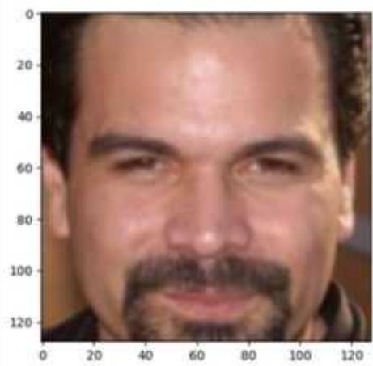

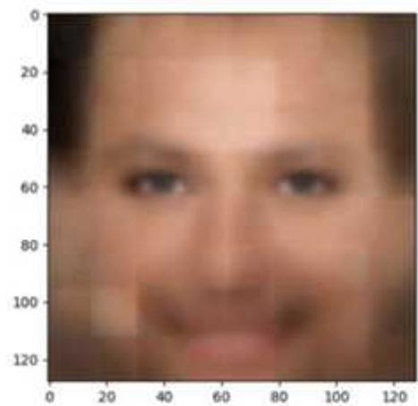  
图13-7 基于FSQ的人脸生成

对token的获取，我们同样可以通过修正输出部分来获取，代码如下：

```lua
...
image = torch unsqueeze(img, 0)
quantized, indices = tokenizer.encode(image)
print(indices.shape)
print(indices) 
```

读者也可以打印token，并通过修改token值来比较不同token值对应的生成部分的区别。有兴趣的读者可以自行尝试。

# 13.4 基于FSQ算法的语音存储

计算机系统中语音向量的存储是一件相当复杂的工作，它不仅耗费巨大的存储空间，而且对数据的处理速度和质量提出了严苛的要求。语音信号以其高维度的特性和丰富的动态变化，使得传统的数据存储方法难以应对。为了有效地存储和管理这些语音向量，我们需要采用一系列先进的技术手段。

首先，数据压缩技术是降低语音向量存储空间需求的关键。通过利用语音信号中的冗余信息和人类听觉系统的特性，我们可以采用无损或有损压缩算法，显著减少存储所需的数据量。例如，变换编码、子带编码以及近年来兴起的深度学习压缩方法，都能在保留语音质量的同时，实现高效的压缩比。

其次，针对语音向量的快速检索和访问需求，设计合理的索引和存储结构至关重要。通过将语音向量映射到低维空间或者提取关键特征进行索引，可以大大提高检索效率。同时，分布式存储系统的应用也能进一步分散存储负载，提供并行处理的能力，从而加速语音数据的读写操作。

此外，为了保证语音向量的长期保存和可靠性，存储系统的容错性和数据恢复能力也是不可忽视的方面。通过采用冗余存储、数据校验和灾备技术，我们可以在硬件故障或自然灾害等极端情况下，确保语音数据的安全性和完整性。

# 13.4.1 无监督条件下的语音存储

对于语音存储工作，若能将连续的语音信号转换为离散信号，无疑是一种极具实用性的方法。通过运用VQ-VAE技术，我们能够实现这一转换，将连续的语音信号转变为离散的信号形式。

在前面的章节中，我们探讨了图像特征的重构方法，这种方法需要在训练数据的基础上进行。在处理语音重构时，我们可以依赖重构技术来实现语音的完整再现，还可以探索其他多种途径。

例如，利用FSQ压缩信号的特性，我们可以进行高效的语音压缩与存储，从而节省大量的空间资源。下面的代码是作者实现的一个语音离散化存储方案。

from vector quantize pytorch import FSQ, Vector Quantize   
class Tokenizer(torch(nnModule):   
""   
1D Image Tokenizer   
""   
def init_self, config = config.Config(): super(Tokenizer,self).init_(） self.config $=$ config   
self_scale $=$ config.d_model \*\* -0.5 self encoder $=$ encoder.Encoding(config)   
selflatent_tokens $=$ torch.mm.Parameters(self scale\*   
torch+randon(config latent_token VOCab_size,   
config.d_model)#torch+randon(size=(cfglatent_token VOCab_size，cfg.d_model)) self.vq $=$ VectorQuantize(dim=config_token_dim,codebook_size= config.vocab_size   
\*2) def forward(self,x): indices $=$ self.encode(x,self.latent_tokens) return indices   
def encode(self,x,latent_tokens): embedding $=$ self.encodex,latent_tokens) quantized, indices,self.commit_loss $=$ self.vq(embedding) return indices

在上面的代码中，我们通过VectorQuantize类实现了一个将连续向量转换成离散向量的方法，并通过返回indices输出对应的离散值。

# 13.4.2 可作为密码机的离散条件下的语音识别

前面我们处理的语音信号，实际上并不能直接与原始的语音信号进行直接对接，而是必须先经过一个重新解码的环节。在接下来的内容中，我们将着手编写解码器部分，具体实现如下：

from module import blocks   
class Decoder(torch.nnModule): def_init_self, config $=$ config.Config(): super().init() self_embedding_layer $=$ torch.nn.Embedding(config.vocab_size, config.d_model) self.attn_layer $=$ blocks.ResidualAttention(config.d_model, config.num_heads) self.logits_layer $=$ torch.mm.Linear(config.d_model, config.vocab_size) def forward(self, input): embedding $=$ self_embedding_layer(input) for_in range(3): embedding $\equiv$ self.attn_layer(embedding) embedding $=$ torch(nn.Functional.dropout(embedding,p=0.1, training-self.trainig) logits $=$ self.logits_layer(embedding) return logits

对于整体模型的构建，我们可以采用分段式的方法，分别对编码器和解码器进行存储，代码如下：

importtokenizer   
decoder $=$ tokenizer.Decoder()   
tokenizer $=$ tokenizerTokenizer()   
#加载Tokenizer的参数   
tokenizer.load_state_dict(torch.load('/saver/tokenizer_state_dict.pth'),strict $\equiv$ False)   
#加载Decoder的参数   
decoder.load_state_dict(torch.load('/saver/decoder_state_dict.pth'),strict $\equiv$ False)   
cipher-machine $=$ torch(nnSequential(tokenizer,decoder)   
ciphermachine.to(device)   
...   
#保存Tokenizer的参数   
torch.save(tokenizer.state_dict(),'/saver/tokenizer_state_dict.pth')   
#保存Decoder的参数   
torch.save(decoder.state_dict(),'/saver/decoder_state_dict.pth')

在上面的代码中，我们分别对不同功能的组件进行了保存和加载。这样做的好处是，这些组件既可以同时作为编码器和解码器一起使用，也可以单独用于不同目标用户的协同任务中。

# 13.5 本章小结

在本章中，我们成功实现了基于编码器的图像和语音的转换与重建工作。显而易见，借助编码器的强大功能，我们能够将原本连续的数据巧妙地转换为离散形式，这一转换过程高效地保留了图像的核心信息。更重要的是，通过利用编码器生成的内容，我们能够准确无误地重建原始图像，再现了原本对象的细致纹理与丰富色彩。

这一技术的实现，不仅为图像处理领域带来了新的突破，也为后续的图像分析、存储与传输等应用提供了强有力的支持。通过图像编码器，我们可以更加灵活地处理各种图像数据，无论是进行图像的压缩以节省存储空间，还是进行图像的增强以提升视觉效果，都变得触手可及。

展望未来，随着技术的不断进步与编码器的持续优化，我们有理由相信，基于图像编码器的图像转换与重建技术将在更多领域大放异彩，为人们的生活与工作带来更多便利与创新。

# 第14章基于PyTorch的端到端视频分类实战

在计算机视觉领域，图像识别已经发展得相当成熟，无论是人脸识别、物体检测，还是场景分类，其准确率与效率都达到了前所未有的高度。然而，技术的发展步伐从未停歇，随着科技的日新月异，视频处理正逐渐成为我们下一个需要聚焦的热点。

视频处理不仅仅是图像识别的简单延伸，它涉及时间序列分析、动态目标跟踪、行为识别等多个复杂维度。与静态图像相比，视频数据蕴含更丰富的时空信息和上下文关系，这为分析和理解提供了更广阔的空间，同时也带来了更大的技术挑战。

随着深度学习、人工智能等技术的不断进步，我们已经有能力对连续的视频帧进行高效处理，从而提取出有价值的动态信息和行为模式。这不仅可以应用于智能监控、自动驾驶等领域，还能在娱乐、教育等多个行业中发挥重要作用。

本章将从视频分类开始，详细介绍使用PyTorch完成视频分类的实战。

# 14.1 视频分类数据集的准备

本节我们将完成视频分类任务，通过具体案例来探索和理解视频数据的处理与分析。在此过程中，我们将使用HDM51人类动作姿势数据集，这是一个专注于人体动作识别的经典数据集，包含多种人类动作的视频片段。

HDM51数据集为我们提供了丰富的动作类别，如行走、跑步、挥手等，每个动作都由不同的表演者在不同场景下完成，这为我们构建稳健的视频分类模型提供了宝贵的数据资源。通过这些视频数据，我们能够深入研究人体动作的动态特征，进而提升模型对复杂动作模式的识别能力。

在接下来的实战中，首先对数据集进行预处理，包括视频帧的提取、标签的编码等。随后，构建深度学习模型，通过训练和学习，使模型能够准确识别视频中的动作类别。

此外，我们还将探讨如何优化模型性能，包括调整模型结构、选择合适的损失函数和优化算法等。最终，我们将通过评估指标来检验模型的性能，并展示模型在实际应用中的效果。

通过本节的实战，我们不仅可以掌握视频分类的基本流程和方法，还能深入理解视频数据处理和深度学习模型构建的关键技术。让我们一同踏上这段探索之旅，共同揭开视频分类的神秘面纱。

# 14.1.1 HMDB51数据集的准备

随着人工智能技术的不断发展，视频分类技术在各个领域的应用越来越广泛。想要实现准确的视频分类，一个优秀的数据集是必不可少的。HMDB51作为一个人类行为识别数据集，具有数据量适中、标注准确、行为类别丰富等特点，成为行为识别领域的重要基石。

HMDB51数据集包含51种不同的人类行为类别，如“刷牙”“打电话”“跳舞”等，每个类别都有大量的视频片段作为样本。这些视频片段来自不同的来源，包括电影、电视节目、YouTube视频等，因此具有很高的多样性和实用性。每个视频片段的长度大约为3秒钟，分辨率统一为 $3 2 0 { \times } 2 4 0$ 像素，方便进行模型训练和测试。HDM51数据集示例如图14-1所示。

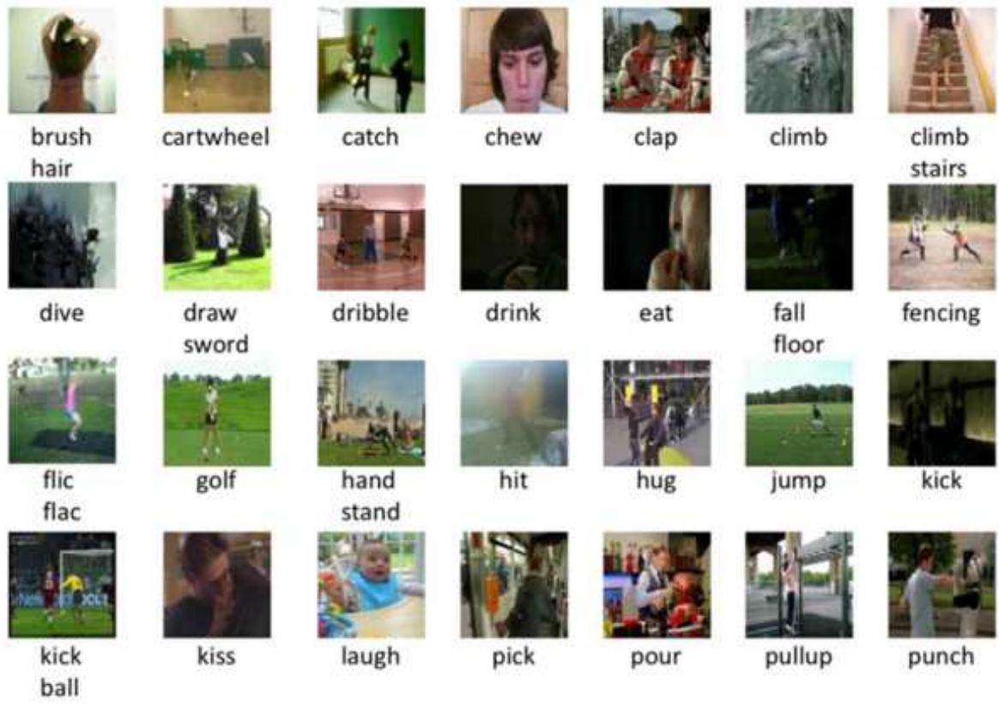  
图14-1 HDM51数据集示例

读者可以自行下载HMDB51数据集，也可以通过本书自带的数据集获取全部视频数据内容。这里，假设读者已经下载了全部视频内容，并将其解压以后存放在特定的文件夹中。这个数据集的读取函数代码如下：

```python
import torch
import glob
import os
import numpy as np
from torch.utils.data import Dataset, DataLoader
import video_utils
categories_list = [
    'brush_hair','climb","dribble","drink","laugh","pour","ride_horse",
    "run","shakeHands","shoot_bow","sit","smoke","swing_baseball","talk","turn",
walk"
]
avi_files_list = []
label_list = []
for category in categories_list:
    file_paths = "C:/Users/xiaohua/Desktop/hmd16/" + category
#使用glob模块查找所有以.avi结尾的文件
avi_files = glob.glob(os.path.join(file_paths,'*.avi'))
avi_files_list += (avi_files)
category_id = categories_list.index(category)
label_list += [category_id] * len(avi_files)
np.random.seed(29);np.random.shuffle(avi_files_list)
np.random.seed(29);np.random.shuffle.label_list)
from sklearn.model_selection import train_test_split
#拆分数据集为训练集和测试集，例如使用80%的数据作为训练集，20%的数据作为测试集
avi_files_train,avi_files_test, label_train, label_test =
train_test_split(avi_files_list, label_list, test_size=0.05, random_state=929) 
```

在上面的代码中，categories_list是HMDB51中16个示例最多的类别。我们这里还切割了$5 \%$ 的数据集作为测试集，供模型测试时使用。

# 14.1.2 视频抽帧的处理

视频这一我们日常生活中随处可见的媒介形式，实质上是由无数静态帧的巧妙串联构成的。每一帧都仿佛是时间的切片，精准捕捉了瞬间的画面与深藏的情感。当这些帧以特定的速度连续呈现时，它们便融合成动态的影像，娓娓道来各种故事，传递着丰富的信息。

在本小节中，我们将运用深度学习模型对视频进行分类。要实现这一目标，首先要从视频中抽取合适数量的帧数。这一过程并非简单随机，而是需要精心策划，以确保所选帧能够充分代表视频的整体内容与特征。随后，我们将这些抽取出的帧进行组合，形成一个能够全面反映视频内容的帧序列。

这一帧序列的构建是深度学习模型能否准确分类视频的关键。我们需要确保所组合的帧数既能捕捉到视频的主要信息，又不会因数量过多而导致冗余，影响模型的判断。通过精心

挑选与组合，我们期望能够构建一个高效、准确的视频分类模型，为后续的视频处理与分析奠定坚实的基础。

对于视频的获取，我们可以使用cv2库提取对应的数据，并将其分解成多个帧输入模型中进行检测。这里作者提供了一个基本的从视频中提取帧的函数，代码如下：

def get_frames(video_path, n Frames $= 96$ , resize $= 112$ : frames $= []$ cap $=$ cv2 VideoCapture(video_path) while True: ret, frame $=$ cap.read() if not ret or n_frames $\leq = 0$ break #在这里可以对frame进行处理，比如显示或保存 #例如，显示当前帧 frame $=$ cv2resize(frame,(resize,resize)) / 255. frames.append(frame) n Frames $= = 1$ return frames

上面的代码首先从路径中获取视频文件，之后从中抽取n_frames个帧构成多个帧图像，再通过stack的函数将多个帧组合成一个具有3D维度的函数。

一般情况下，读取的视频文件在我们需要抽取的帧数目过大时，需要对其进行补帧，因此在实践中，除完成抽帧的函数外，还需要完成补帧的功能，相关代码如下：

```python
def pad Frames (frames, nFrames = 96): if len (frames) == n frames: return frames elif len (frames) < n frames: while len (frames) < n frames: frames.append (frames[-1]) return frames else: return [frames[i] for i in np.linspace(0, len (frames) - 1, n Frames, dtype=int)] 
```

这个函数根据传入的n_frames对已有的视频帧进行切割和补全，这里使用最后一帧对所有的内容进行补全操作，从而构成一个固定大小的视频切片。

除直接对视频帧进行提取外，我们还需要调整视频大小的维度，并使用不同的形式对其进行处理。这里，作者提供了一个切割图像后随机进行仿射变换的方案，代码如下：

trans $=$ transformsCompose([ transforms.ToPIIImage(), transforms Resize((112，112))， transforms.RandomHorizontalFlip $\mathrm{(p = 0.5)}$

# 用于对图像进行随机的仿射变换, degrees为旋转角度, translate为水平和垂直平移的最大绝对分数transforms.RandomAffine(degrees ${ } = 0$ , translate $=$ (0.1, 0.1)),])

在训练时，除直接从片段中截取的一个固定长度的片段帧外，还可以从片段中随机截取一个随机的片段帧。获取帧全长的代码如下：

```python
def get(video_length(video_path):
    cap = cv2 VideoCapture(video_path)
    length = int(cap.get(cv2.CAP_prop_FRAME_COUNT))
    cap.release()
    return length 
```

而获取一个随机片段帧的代码如下：

import random
def get_random Frames(video_path, n_frames $= 96$ , resize $= 112$ )
	# 首先获取视频的总帧数
.total Frames = get_video_length(video_path)
	# 确保请求的帧数不超过视频的总帧数
	n Frames $=$ min(n Frames, total frames)
	# 随机选择一个起始帧
start_frame $=$ random.randint(0, total Frames - n Frames)
	# 初始化帧列表和VideoCapture对象
frames $=$ []
 cap $=$ cv2 VideoCapture(video_path)
	# 设置视频捕获到起始帧
cap.set(cv2.CAP_prop_POS_FRAMES, start_frame)
	# 捕获指定数量的帧
for in range(n Frames):
 ret, frame $=$ cap.read(   )
	if not ret:
 break # 如果读取失败, 则退出循环
	# 对帧进行处理,比如调整大小和归一化
录像 $=$ cv2resize(frame, (resize, resize)) / 255.
	# 将处理后的帧添加到列表中
frames.append(frame)
	# 释放VideoCapture对象
cap.release(   )
	# 返回捕获的帧列表
return frames

# 14.1.3 基于PyTorch的数据输入

接下来，我们需要完成PyTorch的数据输入。在这一步中，我们基于切分的训练集与测试集地址，读取视频并将其转换后传递到模型中。我们分别准备了训练时数据的输入以及测试时数据的输入，代码如下：

class TrainDataset(Dataset): def __init__(self,avi_files_list $=$ avi_files_train,label_list $=$ label_train): self.avil_files_list $\equiv$ avi_files_list self.label_list $\equiv$ label_list   
def _len_(self): return len(self.label_list)   
def __getitem__(self,idx): avi_file $\equiv$ self.avil_files_list[ix] frames $=$ video_utils.get_random Frames(avi_file,n Frames $= 48$ frames $\equiv$ video_utils_pad_frames(frames,nFrames $= 48$ frames $\equiv$ np.array(frames,dtype $\equiv$ np.float32) label $=$ self.label_list[ix] return torch.from_numpy(frames),torch.tensor.label).long()

从上面的代码可以看到，我们在获取帧时，采用的是get_random_frames，即通过获取随机片段帧的形式对视频进行截取。另外，需要注意，对于部分过短视频的处理，我们对其进行补帧，即使用pad_frames函数完成补帧操作。

在测试时使用的是测试数据输入类，代码如下：

class TestDataset(Dataset): def __init__(self,avi_files_list $=$ avi_files_test,label_list $=$ label_test): self.avi_files_list $=$ avi_files_list self.label_list $\equiv$ label_list   
def _len_(self): return len(self.label_list)   
def __*_item_self idx): avi_file $\equiv$ self.avi_files_listidx] frames $=$ video_utils.get Frames(avi_file,n_frames $= 48$ frames $=$ video_utils_pad FramesFramesn_frames $= 48$ frames $=$ np.array(frames,dtype $\equiv$ np.float32) label $=$ self.label_listidx] return torch.from_numpy(frames),torch.tensor.label).long()

在上面的代码中，我们把随机获取视频帧替换成普通帧来处理，并且同样使用了补帧方案对帧总数进行补全。

# 14.2 注意力视频分类实战

14.1节完成了视频数据集的准备，为接下来的实战打下了坚实的基础。在本节中，我们将进一步探索，设计一种基于注意力架构的视频分类实战方案，并借助14.1节自定义的数据准备形式，对视频进行精准分类。

在具体实现上，对于注意力模型而言，关键的一步在于如何将原始视频数据转换成一种模型能够高效处理的嵌入表示。这种嵌入表示不仅需要捕捉视频中的时序信息，还要能够突出关键帧和特征，以供注意力机制进行选择和聚焦。

为了达到这一目的，我们采用先进的深度学习技术，结合视频数据的特性来构建专门的嵌入层。这一层负责将视频帧序列转换为高维的特征向量，同时保留视频中的动态信息和空间结构。通过这些特征向量，注意力模型将能够更准确地识别视频中的关键内容，从而提升分类的准确度和效率。

在接下来的实战中，我们将详细阐述如何构建这种嵌入表示，并将其与注意力模型紧密结合，共同完成视频分类任务。

# 14.2.1 对于视频的Embedding编码器

对于视频的Embedding编码器设计，可以借鉴在2D图像处理中广泛应用的patch_embedding编码器思路。通过类似的方式，我们将视频数据划分为一系列时空块（spatio-temporal patches），每个块都包含视频中的局部时空信息。

具体来说，我们首先将视频帧进行切片，生成一系列包含连续帧的小块。这样做不仅保留了视频中的时间连续性，还使得模型能够更有效地捕捉视频中的动态变化。接下来，将这些时空块通过Embedding层进行转换，生成对应的特征向量。这些特征向量将作为注意力模型的输入，用于后续的分类任务。

通过这种方式，我们能够充分利用视频数据的时空特性，同时降低模型的计算复杂度。此外，通过调整时空块的大小和数量，我们还可以进一步平衡模型的表达能力和计算效率，以适应不同场景下的视频分类任务。

下面代码是作者完成的一个视频Embedding编码器。

```python
import torch
from einops.layers.torch import Rearrange, Reduce
def pair(t):
    return t if isinstance(t, tuple) else (t, t)
class ViT3D(torch.nnModule):
    def __init__(self, image_size, image_batch_size, frames, frame_batch_size, dim,
pool='cls', channels=3):
        super().__init__() # 调用父类的初始化方法
        # 将输入的图像大小转换为高度和宽度
        image_height, image_width = pair(image_size) # 例如: (128, 128)
        # 将输入的图像块大小转换为高度和宽度
        patch_height, patch_width = pair(image_batch_size) # 例如: (16, 16)
        # 断言确保图像的高度和宽度可以被块的高度和宽度整除
        assert image_height % patch_height == 0 and image_width % patch_width == 0, 'Image
dimensions must be divisible by the patch size.' 
```

```python
size' # 例如16帧，每2帧一个块
# 计算总的块数（考虑图像和帧的维度）
num_patches = (image_height // patch_height) * (image_width // patch_width)
frames // frame_batch_size)
# 计算每个块的维度（考虑通道数、块的高度、宽度和帧块大小）
patch_dim = channels * patch_height * patch_width * frame_batch_size # 例如：
3*16*16*2=1536
# 断言确保池化类型是'cls'（类标记）或'mean'（平均池化）
assert pool in ('cls', 'mean'), 'pool type must be either cls (cls token) or mean
(mean pooling}'
# 定义从输入到块嵌入的序列模型
self.to_batch_embedding = torch.nnSequential(
# 重新排列张量的维度以适应3D视频数据
Rearrange('b (f pf) (h p1) (w p2) c -> b (f h w) (p1 p2 pf c)', pl=patch_height,
p2=patch_width, pf=frame_batch_size),
# 对重新排列后的数据进行层归一化
torch(nn.RMSNorm(patch_dim),
# 线性变换，将块维度转换为指定的隐藏维度（例如1536 -> 1024))
torch(nn.Linear(patch_dim, dim),
)
# 定义前向传播方法
def forward(self, x):
    # 将输入数据通过定义的序列模型，得到块嵌入
x = self.to_batch_embedding(x.float())
return x # 返回处理后的数据 
```

在上面的代码中，我们分别对帧和维度进行了拆分和重新组合，并修正了隐藏维度，从而获得了返回值。

# 14.2.2 视频分类模型的设计

接下来，我们需要完成视频分类模型的设计工作。在此过程中，我们采用经典的多头注意力模型MHA作为特征编码的核心组件，以协助我们完成视频的分类任务。多头注意力模型因其强大的特征提取和表示能力，在诸多序列处理任务中表现出色，我们相信它同样能在视频分类领域发挥重要作用。代码如下：

import torch   
from torch import nn   
import einops   
from rotary_embedding_torch import RotaryEmbedding   
class MultiHeadAttention(torch.nnModule): def __init__(self, d_model, attention_head_num): super(MultiHeadAttention, self).__init_(） self attendsion_head_num $=$ attention_head_num

```python
self.d_model = d_model
assert d_model % attention_head_num == 0
self_scale = d_model ** -0.5
self.softcap_value = 50.
self.per_head_dmodel = d_model // attention_head_num
self.qkv_layer = torch.nn.Linear(d_model, 3 * d_model)
self.out_layer = torch(nn.Linear(d_model, d_model)
self.rotary_emb = RotaryEmbedding(dim = self.per_head_dmodel)
"-----------------------------------"
self.q_scale = torch(nn.ParamETER(torch.ones(self.per_head_dmodel))
self.k_scale = torch(nn.ParamETER(torch.ones(self.per_head_dmodel)))
def forward(self, embedding, past_length = 1024):
    b, l, d = embedding.shape
qky_x = self.qkv_layer(embedding)
q, k, v = torch.split(qky_x, split_size_orSections= self.d_model, dim=-l)
q = einops.rearrange(q, "b s (h d) -> b h s d", hself attendsion_head_num)
k = einops.rearrange(k, "b s (h d) -> b h s d", hself attendsion_head_num)
v = einops.rearrange(v, "b s (h d) -> b h s d", hself attendsion_head_num)
q = torch(nnfunctional.normalize(q, dim=-l) * self.q_scale * self scale
k = torch(nnfunctional.normalize(k, dim=-l) * self.k_scale * self scale
q = self.rotary_emb.rotate Queries_or_keys(q)
k = self.rotary_emb.rotateQueries_or_keys(k)
sim = einops.einsum(q, k, 'b h i d, b h j d -> b h i j')
i, j = sim.shape[-2]
attn = sim softmax(dim=-l)
out = einops.einsum(attn, v, 'b h i j, b h j d -> b h i d')
embedding = einops.rotargnance(out, "b h s d -> b s (h d).")
embedding = self.out_layer(embedding)
embedding = embedding[:, -1:]
return embedding
from st_moePytorch import MoE, SparseMoEBlock
class ResidualAttention(nnModule):
    ResidualAttentionBlock
    def __init__(self, d_model, attention_head_num): 
```

super().init()
self attendsion_head_num $=$ attention_head_num
self.merge_norm $=$ torch.nn.RMSNorm(d_model)
self.attn $=$ MultiHeadAttention(d_model,attention_head_num）#selfattention
self.mlp $=$ torch.mmSequential(torch.mm.GLU(),torch.mm.Linear((d_model//2),
d_model，bias $\equiv$ False)) #注意这里输入的维度不要乘以2
def forward(self,x:torch,Tensor):
residual $= x$ （204 $\mathbf{x} =$ self.merge_norm(x)
attn_output $=$ self.attn(x)
x $=$ residual $^+$ self.mlp(attn_output)#norm and applyresidualFFN
return x

在上面的代码中，我们采用了一个标准的注意力模型，作为视频分类任务的注意力基础计算框架，由于是对视频进行Embedding计算，因此我们去掉了因果掩码。

下面的代码就是在注意力模型的基础上完成视频分类模型。

import blocks   
class ViderClassificationModel_V1(torch.nnModule): def__init__(self, dim $= 384$ ,head_num $= 6$ device $\equiv$ "cuda"): super(ViderClassificationModel_V1, self).__init_(） self.batch_embedding_3d $=$ ViT3D(112,16,frames $= 48$ ,frame_batch_size $= 16$ ,dim $\equiv$ dim) self.layers $= []$ for_in range(4): block $=$ blocks.ResidualAttention(dim, head_num).to(device) self.layers.append(block) self.conv_layers $=$ torch.nn Sequential( torch(nn.Convld(147,64,kernel_size $= 3$ padding $\coloneqq 1$ ), torch(nn.RMSNorm(dim), torch(nn.Linear(dim, dim//2), torch(nn.Convld(64,32,kernel_size $= 3$ padding $\coloneqq 1$ ), } self.logits_layer $=$ torch(nn.Linear(6144,16) self.position_embedding $\equiv$ torch(nn.Parameters(torch randn(size=(147,dim)),requires_grad=True) def forward(self,x): x $=$ self.batch_embedding_3d(x) $^+$ self.position_embedding for block in self.layers: x $=$ block(x) #torch.Size([6,294,384]) x $=$ self.conv_layers(x) x $=$ torch_nn.Flatten() (x) x $=$ torch_nn.Functional.dropout(x,p $= 0.1$ ) x $=$ self.logits_layer(x) return x

从代码中可以看到，这就是一个比较简单的分类模型，首先通过patch_embedding对视频进行重新编码，之后使用注意力模型对特征进行计算，最终通过logits_layer对结果进行分类计算。

# 14.2.3 视频分类模型的训练与验证

对于视频分类模型的训练与验证，我们可以借鉴经典的分类模型做法，采用交叉熵来计算损失函数，并最终返回相应的结果。代码如下：

import math   
from tqdm import tqdm   
import torch   
from torch.utils.data import DataLoader   
import model   
device $=$ "CUDA"   
model $=$ model.ViderClassificationModel_V1(device $\equiv$ device)   
model.to(device)   
save_path $=$ "/saver/video_classic.pth"   
#model.load_state_dict(torch.load(save_path),strict $\equiv$ False)   
BATCH_SIZE $= 12$ import get_data   
train_dataset $=$ get_data.TrainDataset()   
trainloader $=$ (DataLoader(train_dataset,   
batch_size $\equiv$ BATCH_SIZE,shuffle $\equiv$ True,num_workers $\equiv$ 6))   
test_dataset $=$ get_data.TestDataset()   
testloader $=$ (DataLoader(test_dataset,batch_size $\equiv$ BATCH_SIZE,shuffle $\equiv$ True))   
optimizer $=$ torch.optimAdamW(model.params(),lr $= 2e - 5$ 1lr_scheduler $=$ torch.optim.lr_scheduler.CosineAnnealingLR(optimizer,T_max $=$ 1200,eta_min $\equiv$ 2e-7,last_epoch=-1)   
criterion $=$ torch.nn.CrossEntropyLoss()   
for epoch in range(128): model.train() pbar $=$ tqdm(trainloader,total $\equiv$ len(trainloader)) for frames_stack,label in pbar: frames_stack $=$ frames_stack.to(device) label $=$ label.to(device) logits $=$ model(frames_stack) loss $=$ criterion(logits,label) optimizer.zero_grad()

loss.backup()   
optimizer step()   
lr_scheduler_STEP() #执行优化器   
_, predicted = torch.max(logitsdetach(), 1) #获取预测结果 total $=$ label.size(0) #获取当前批次的总样本数 correct $=$ (predicted $= =$ label).sum().item() #累加正确预测的样本数 accuracy $= 100$ .correct/total #计算正确率   
pbar.set_description(f"epoch:{epoch + 1},train_loss:{loss.item():.5f}], lr:{lr_scheduler.get_last_lr}[0] $\ast$ 1000:.5f},accuracy:{accuracy:.2f}\%") if(epoch+1)%3==0: torch.save(model.state_dict(),save_path) #训练循环结束后的测试代码 model.eval() #将模型设置为评估模式 total_test $= 0$ #测试集总样本数 correct_test $= 0$ #测试集正确预测样本数 withtorch.no_grad(): #不需要计算梯度，节省内存和计算资源 pbar_test $=$ tqdm(testloader,total=len(testloader)) forframes_stack, label in pbar_test: frames_stack $=$ frames_stack.to(device) label $=$ label.to(device) logits $=$ model(frames_stack) _, predicted $=$ torch.max(logits,1)#获取预测结果 total_test $= =$ label.size(0） #累加测试集的总样本数 #累加测试集正确预测的样本数 correct_test $= =$ (predicted $= =$ label).sum().item() accuracy_test $= 100$ .correct_test / total_test #计算测试集的正确率 pbar_test.set_description(f"Test Accuracy:{accuracy_test:.2f}\%") #输出最终测试准确率 print(f"Final Test Accuracy:{accuracy_test:.2f}\%")

请读者自行训练与测试。

# 14.3 使用预训练模型的视频分类

除我们前面自定义的基于注意力的视频分类模型外，torchvision也自带了视频分类模型，并提供了模型的预训练参数。本节将基于这个预训练的视频分类模型来完成HMDB的动作分类。

# 14.3.1 torchvision简介

torchvision是PyTorch的一个图形图像库，专门服务于PyTorch深度学习框架，用于构建计算机视觉模型。它提供了丰富的功能和工具，帮助开发人员和研究人员轻松处理图像数据，从而加速计算机视觉应用的开发和部署。

在torchvision库中，有几个核心组件值得一提。首先是torchvision.datasets，这个模块包含许多加载数据的函数以及常用的数据集接口，如MNIST、CIFAR10、ImageNet等，使得数据准备变得简单快捷。通过这些接口，用户可以轻松地下载、加载和预处理这些数据集，为模型训练做好准备。

另一个重要组件是torchvision.models，它提供了大量预训练的模型结构，如AlexNet、VGG、ResNet等。这些模型已经在大型数据集上做过训练，并可以直接用于各种计算机视觉任务，如图像分类、目标检测等。此外，用户还可以根据自己的需求对这些预训练模型进行微调，以适应特定的应用场景。

torchvision.transforms是一个不可或缺的模块，它提供了丰富的图像变换操作，如裁剪、旋转、归一化等。这些变换可以帮助用户增强数据集，提高模型的泛化能力。同时，torchvision.transforms还提供了Compose类，用于将多个变换操作串联起来，形成一条完整的图像处理流水线。

除上述核心组件外，torchvision库还提供了其他有用的方法和工具，如torchvision.utils中的函数可以帮助用户更方便地处理图像数据。这些实用工具使得torchvision库成为一个功能全面、易于使用的计算机视觉库。

下面使用一个简单的函数，帮助我们实现对视频数据的读取与转换。

import PIL   
import torch   
import torchvision   
import torchvision.transformas transformers   
defpreprocess Video(video: str,n_frames:int $= 16$ ： #Reading the video file vframes，_ $\equiv$ torchvision.io.readVideofilename $\equiv$ video,pts_unit $\equiv$ 'sec' output_format $\equiv$ TCHW') vframes $\equiv$ vframes.type(torch.float32) vframes_count $\equiv$ len(vframes) skip Frames $\equiv$ max(int(vframes_count/16),1) selected_frame $\equiv$ vframes[0].unsqueeze(0) for i in range(1, n Frames): selected_frame $\equiv$ torch.cat((selected_frame,vframes[i\* skip Frames].unsqueeze(0))) selected_resized_frame $\equiv$ trans(selected_frame) return selected_resized_frame

这段代码模仿了视频中随机抽取特定帧窗口的方法，首先获取视频总的帧数，然后根据定义的n_frames数值，在视频中截取相应的帧窗口数，作为视频数据集使用。

orchvision库还提供了预训练模型供我们读取视频时使用，mvit_v2_s就是一个专用于视频分类的模型，其提供了预训练参数。mvit_v2_s的整体结构如图14-2所示。

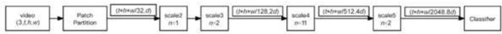  
图14-2 MViTv2-S的整体结构

从图14-2可以看到，视频处理流程如下：首先，输入视频通过Patch Partition（cube1）模块进行分块和重塑（reshape）；然后，拼接分类标记（CLS）。后续的scale2、scale3、scale4和scale5阶段使用Multi-Head Pooling Attention（MHPA），在逐步下采样时空分辨率的同时增加通道维度。每个阶段由多个Transformer块（MultiscaleBlock）组成，其中只有scale3、scale4和scale5阶段的第一个块会执行时空分辨率的下采样并增加通道维度。在scale2阶段，MHPA的头数 $\mathrm { h } = 1$ （因为嵌入维度 d较小），而在后续阶段，头数h均为前一阶段的两倍。

下面的代码提供了一种使用torchvision导入模型和预训练参数的方法。需要注意的是，torchvision中的预训练参数还提供了适配模型的维度变换工具，即用于转换输入参数的函数。

weights $=$ MViT_V2_S_Weights.DEFAULT transforms $=$ weights.transforms() model $=$ mvit_v2_s(weights=weights)

在上面的代码中，transforms $=$ weights.transforms()是对维度进行变换的方法，简单来说就是将原始的维度整合成一个新的维度，并用于模型计算。此外，还需要注意，对于第一次使用预训练模型的读者来说，需要下载对应的模型参数，如图14-3所示。

```txt
Downloading: "https://download.pytorch.org/models/mvit v2 s-ae3be167.pth" 16%| | 21.1M/132M [00:12<00:37, 3.09MB/s] 
```

图14-3 torchvision的数据准备

下面的代码通过传入的transforms模块，在输出数据的同时，对数据的结构进行相应的变换处理。

```python
def set_seed(seed: int = 929):
    np.random.seed(seed)
    torch_manual_seed(seed)
    random.seed(seed)
class HumanActionDataset(Dataset):
    def __init__(self, avi_files_list, label_list, n_frame = 16, transform = None):
        self.avi_files_list = avi_files_list
        self.label_list = label_list
        self.n_frame = n_frame
        self.transform = transform
        selfresize_trans = torchvision.transformers Resize((224,224))
    def __len__(self):
        return len(self.label_list)
    def __getitem__(self, index):
        video_path = self.avi_files_list[index] 
```

#Reading the video file vframes, $\_ , =$ torchvision.io.read Videofilename $\equiv$ video_path, pts_unit $=$ 'sec', output_format $\equiv$ TCHW') vframes $=$ vframes.type(torch.float32) vframes_count $=$ len(vframes) #Selecting frames at certain interval skip_frames $=$ max(int(vframes_count/ self.n_frame),1) selected_frame $=$ vframes[0].unsqueeze(0) #Creating a new sequence of frames upto the defined sequence length for i in range(1,self.n_frame): selected_frame $=$ torch_concat((selected_frame,vframes[i\* skip Frames].unsqueeze(O))) #Video label as per the classes list. label $=$ torch.tensor(self.label_list[index]) selected_frame $=$ selfresize_trans(selecteted_frame) #Applying transformation to the frames if self.transform: return self.transform(selecteted_frame),label else: return selected_frame, label

上面的代码在划分训练集与测试集的基础上，主要完成了模型数据的准备和预处理，包括使用torchvision.io.read_video读取数据，并完成从中进行随机截取的任务。而Transform用于使数据能够被调整适配mvit_v2_s模型的格式，并将其输出。

# 14.3.2 基于torchvision的端到端视频分类实战

我们可以直接使用torchvision提供的预训练模型来完成端到端的视频分类，完整代码如下：

import torch,torchvision   
from torchvision.models video import mViT_v2_s, MViT_V2_S_Weights   
import einops   
def create_model(num_classes: int, device: torch_device): weights $=$ MViT_V2_S_Weights.DEFAULT transforms $=$ weightstransforms() model $=$ mvit_v2_s(weights=weights) dropout_layer $=$ model.head[0] in_features $=$ model.head[1].in_features model.head $=$ torch.nn Sequential( dropout_layer, torch(nn.Linear(in_features $\equiv$ in_features,out_features $\equiv$ num_classes, bias=True, device $\equiv$ device)) return model.to(device),transforms

在上面的代码中，我们首先搭建了一个完整的端到端模型框架，然后对输出端进行相应的替换操作，以确保其能够与我们预先定义的数据类别数目完美对接。此外，我们还采用了预定义的transforms维度处理模块，该模块在模型构建过程中被整合进来，并随模型一同返回，以便于后续的图像处理和模型应用。

# 完整的训练代码如下：

import math   
from tqdm import tqdm   
import torch   
from torch.utils.data import DataLoader   
import pretrained_model   
device $=$ "cuda"   
model,transforms $=$ pretrained_model.create_model(num_classes $\equiv$ 16,device $\equiv$ device) save_path $=$ "/saver/video_classic.pth" #model.load_state_dict(torch.load(save_path),strict $\equiv$ False)   
BATCH_SIZE $= 9$ import get_data   
if_name $= =$ 'main':   
train_dataset $=$ get_data.HumanActionDataset(get_data.avi_files_train, get_data.label_train,transform $\equiv$ transforms) trainloader $=$ DataLoader(train_dataset,   
batch_size $\equiv$ BATCH_SIZE,shuffle $\equiv$ True,num_workers $\equiv$ 3)   
test_dataset $=$ get_data.HumanActionDataset(get_data.avi_files_test,   
get_data.label_test,transform $\equiv$ transforms) testloader $=$ DataLoader(test_dataset,batch_size $\equiv$ BATCH_SIZE,shuffle $\equiv$ True) optimizer $=$ torch.optimAdamW(model.params(),lr $= 2e - 5$ lr_scheduler $=$ torch.optim.lr_scheduler.CosineAnnealingLR(optimizer,T_max $=$ 1200,eta_min $= 2e - 7$ ,last_epoch=-1) criterion $=$ torch(nn.CrossEntropyLoss()   
for epoch in range(128): model.train() pbar $=$ tqdm(trainloader,total $\equiv$ len(trainloader)) for frames_stack,label in pbar: frames_stack $=$ frames_stack.to(device) label $=$ label.to(device) logits $=$ modelframes_stack) loss $=$ criterion(logits,label) optimizer.zero_grad()

loss.backup()   
optimizer step()   
lr_scheduler.step() #执行优化器   
_,predicted $=$ torch.max(logitsdetach(),1) #获取预测结果 total $=$ label.size(0) #获取当前批次的总样本数 correct $=$ (predicted $\equiv$ label).sum().item() #累加正确预测的样本数 accuracy $= 100$ *correct/total #计算正确率   
pbar.set_description(f"epoch:{epoch+1},train_loss:{loss.item(:.5f)} , lr:{lr_scheduler.get_last_lr([0] \*1000:.5f}，accuracy:{accuracy:.2f}\%)   
torch.save(model.state_dict)，save_path) #训练循环结束后的测试代码 model.eval() #将模型设置为评估模式 total_test $= 0$ #测试集总样本数 correct_test $= 0$ #测试集正确预测样本数   
with torch.no_grad(): #不需要计算梯度，节省内存和计算资源 pbar_test $=$ tqdm(testloader,total=len(testloader)) for frames_stack, label in pbar_test: frames_stack $=$ frames_stack.to(device) label $=$ label.to(device) logits $=$ model(frames_stack) _,predicted $=$ torch.max(logits,I)#获取预测结果 total_test $+ =$ label.size(0）#累加测试集的总样本数 #累加测试集正确预测的样本数 correct_test $+ =$ (predicted $\equiv$ label).sum().item() accuracy_test $= 100$ *correct_test / total_test #计算测试集的正确率 pbar_test.set_description(f"Test Accuracy:{accuracy_test:.2f}\%)   
输出最终测试准确率 print(f"Final Test Accuracy:{accuracy_test:.2f}\%)

读者可以自行运行代码验证结果。

# 14.4 本章小结

在本章中，我们成功构建了视频分类模型，这一成就标志着我们在视频内容理解领域迈出了坚实的一步。我们巧妙地融合了注意力机制与torchvision库中提供的强大的预训练模型，以双重优势精准地实现了视频分类的任务。

在注意力模型的运用上，我们深入挖掘视频帧间的时序关联与空间特征，通过动态调整各帧及区域内信息的权重，显著提升了模型对关键内容的捕捉能力。这一创新不仅增强了模型对复杂视频场景的理解力，还极大地提高了视频分类的准确性。

同时，借助torchvision库中的预训练模型，我们站在了巨人的肩膀上，利用这些在大型数据集上精心训练好的网络作为特征提取器，有效缩短了模型训练周期，并减少了过拟合的风险。预训练模型的引入为我们的视频分类任务提供了丰富的先验知识，使得模型能够更快地收敛到最优解，且泛化能力更强。这一技术的实现不仅为图像处理领域带来了新的突破，还可以推广到视频内容审核、智能推荐系统以及视频监控等领域，以期为社会带来更加智能、高效的服务。同时，我们也将持续探索视频理解技术的边界，不断优化模型架构，融合更多前沿技术，推动视频分类技术迈向新的高度。

# 第15章

# 基于DeepSeek的跨平台智能客服开发实战

在前面的章节中，我们已经对DeepSeek的核心技术做了详尽的介绍，并向读者展示了DeepSeek在云端和本地两个常见场景下的应用实例。其实，DeepSeek最基本的应用是特定场景下的智能问答以及带有算法的计算任务。

然而，DeepSeek的功能远不止于此，它还能胜任更多高级的任务和应用场景。例如，通过导入特定的文档内容，DeepSeek能够实现基于该文档所在领域的专业知识问答。这种灵活性使得DeepSeek能够适应多种不同的需求和环境。

不同类型的本地知识库往往对应着各自独特的应用场景。以客服对话系统为例，我们可以将公司内部的产品文档或常见问题解答集成为本地知识库，从而快速、准确地回答用户关于产品的各种疑问。而在聊天机器人的应用中，我们则可以利用社交媒体数据、电影评论或其他大规模的文本数据集作为本地知识库，使聊天机器人能够更加智能地回应用户的聊天话题，提升用户的交互体验。

在本章中，我们将进一步探索DeepSeek的潜力，并结合Gradio框架，共同完成一项在线智能客服应用的实战演练。通过这一实战案例，我们将直观地展示DeepSeek在智能客服领域的应用优势，以及如何与Gradio框架相结合，打造出高效、便捷的在线智能客服系统。

# 15.1 智能客服的设计与基本实现

在前面的章节中，我们已经展示了如何利用基础版的DeepSeek进行算法计算。具体来说，我们通过直接向DeepSeek发送问题（即使用prompt的方式）来提示算法并获取对应的答案，可以看到DeepSeek在处理这些知识问题时表现良好。智能客服机器人如图15-1所示。

  
图15-1 智能客服机器人

然而，一个关键问题随之而来：当我们将问题拓展到更专业的领域，尤其是那些DeepSeek在训练数据中未曾涉及的知识领域时，它的问答效果又会如何呢？本节我们将深入探讨DeepSeek在专业智能客服中的表现，并尝试完成这一应用场景。

# 15.1.1 智能客服搭建思路

在数字化时代，智能客服已成为企业提升服务效率、优化客户体验的关键工具。以下是一套系统而全面的智能客服搭建思路，旨在帮助企业构建高效、智能的客户服务体系，明确智能客服系统的技术核心。

首先，我们需要对整体的项目需求与目标进行定义。这包括确定服务范围（如售前咨询、售后支持、技术解答等）、目标用户群体（如消费者、合作伙伴、内部员工等）以及期望达到的服务水平（如响应时间、解决率、用户满意度等）。明确的需求与目标将为后续的系统设计与开发提供清晰的方向，具体说明如下。

# 1）前期准备

● 了解DeepSeek：DeepSeek是一款先进的大语言模型，具有强大的自然语言处理能力和知识理解能力，能够为智能客服系统提供高效、准确的对话生成能力。  
● 获取API访问权限：访问DeepSeek官方网站或相关平台，申请并获取API访问权限，以便在智能客服系统中调用DeepSeek模型。

# 2）数据收集与预处理

● 收集数据：根据智能客服的应用场景，收集相关的数据，如电商领域的商品信息、订单信息、用户咨询记录等。  
● 数据预处理：对收集到的数据进行清洗、标注和转换。清洗用于去除噪声、重复信息、错误字符等。标注用于将数据分类，如商品咨询、订单查询、售后问题等。转换用于将数据转换为适合DeepSeek输入的格式。

# 3）使用DeepSeek API实现基本对话功能

● 理解API请求和响应格式：熟悉DeepSeekAPI的请求参数和响应数据格式，以便正确地调用API并处理返回的结果。  
● 编写代码调用API：使用Python编写代码，向DeepSeek API发送请求，将用户的问题作为输入，获取模型生成的回复。

# 4）结合业务逻辑

● 商品信息查询：根据用户的提问，调用相应的接口或查询数据库，获取商品的详细信息，如价格、库存、规格等，并将结果整合到回复中。  
● 订单状态查询：实现订单状态的查询功能，根据用户提供的订单号等信息，查询订单的当前状态，并以友好的方式告知用户。

# 15.1.2 商品介绍数据的格式与说明

我们首先准备一份使用JSON格式标注的商品介绍，如下所示：

```json
{
    "name": "MobiTech PowerCase",
    "category": "智能手机和配件",
    "brand": "MobiTech",
    "model_number": "MT-PC20",
    "warranty": "1年",
    "rating": 4.3,
    "features": [
        "5000mAh电池",
        "无线充电",
        "与SmartX ProPhone兼容"
    ],
    "description": "带有内置电池的保护壳，可延长使用时间。",
    "price": 59.99
},
    {
        "name": "SmartX MiniPhone",
        "category": "智能手机和配件",
        "brand": "SmartX",
        "model_number": "SX-MP5",
        "warranty": "1年",
        "rating": 4.2,
        "features": [
            "4.7英寸显示屏",
            "64GB存储",
            "8MP相机",
            "4G"
        ],
    "description": "一款紧凑且价格实惠的智能手机，适用于基本任务。",
    "price": 399.99
},
    {
        "name": "MobiTech Wireless Charger",
        "category": "智能手机和配件",
        "brand": "MobiTech",
        "model_number": "MT-WC10",
        "warranty": "1年",
        "rating": 4.5,
        "features": [
            "10W快速充电",
            "Qi兼容",
            "LED指示灯",
            "紧凑设计"
        ],
    "description": "一款便捷的无线充电器，为整洁的工作区提供便利。",
    "price": 29.99
}, 
```

```txt
"category": "智能手机和配件",  
"brand": "SmartX",  
"model_number": "SX-EB20",  
"license": "1年",  
"rating": 4.4,  
"features": [  
    "真无线",  
    "蓝牙5.0",  
    "触控控制",  
    "24小时电池续航"  
],  
"description": "通过这款舒适的耳机体验真正的无线自由。",  
"price": 99.99  
{  
    "name": "ActionCam 4K",  
    "category": "相机和摄像机",  
    "brand": "ActionCam",  
    "model_number": "AC-4K",  
    "warranty": "1年",  
    "rating": 4.4,  
    "features": [  
        "4K视频",  
        "防水",  
        "图像稳定",  
        "Wi-Fi"  
],  
"description": "通过这款坚固而紧凑的4K运动相机记录您的冒险旅程。",  
"price": 299.99  
{  
    "name": "FotoSnap Mirrorless Camera",  
    "category": "相机和摄像机",  
    "brand": "FotoSnap",  
    "model_number": "FS-ML100",  
    "warranty": "1年",  
    "rating": 4.6,  
    "features": [  
        "2010万像素传感器",  
        "4K视频",  
        "3英寸触摸屏",  
        "可更换镜头"  
],  
"description": "这款小巧轻便的无反相机具备先进功能。",  
"price": 799.99  
{  
    "name": "ZoomMaster Camcorder",  
    "category": "相机和摄像机",  
    "brand": "ZoomMaster", 
```

```csv
"model_number": "ZM-CM50",  
"warranty": "1年",  
"rating": 4.3,  
"features": [  
    "1080p视频",  
    "30倍光学变焦",  
    "3英寸液晶屏",  
    "图像稳定"  
],  
"description": "通过这款易于使用的摄像机捕捉生活的瞬间。",  
"price": 249.99  
{"name": "FotoSnap Instant Camera",  
"category": "相机和摄像机",  
"brand": "FotoSnap",  
"model_number": "FS-IC10",  
"warranty": "1年",  
"rating": 4.1,  
"features": [  
    "即时打印",  
    "内置闪光灯",  
    "自拍镜",  
    "电池供电"  
]},  
"description": "通过这款有趣便携的即时相机创造瞬间回忆。",  
"price": 69.99  
{"name": "CineView 4K TV",  
"category": "电视和家庭影院系统",  
"brand": "CineView",  
"model_number": "CV-4K55",  
"warranty": "2年",  
"rating": 4.8,  
"features": [  
    "55英寸显示屏",  
    "4K分辨率",  
    "HDR",  
    "智能电视"  
]},  
"description": "一款具有生动色彩和智能功能的令人惊叹的4K电视。",  
"price": 599.99  
{"name": "SoundMax Home Theater",  
"category": "电视和家庭影院系统",  
"brand": "SoundMax",  
"model_number": "SM-HT100",  
"warranty": "1年", 
```

```javascript
"rating":4.4, "features":[ "5.1声道", "1000W输出", "无线低音炮", "蓝牙"] , "description": "一款强大的家庭影院系统，带来身临其境的音频体验。", "price":399.99 ], { "name":"CineView 8K TV", "category":"电视和家庭影院系统", "brand":"CineView", "model_number":"CV-8K65", "warranty":"2年", "rating":4.9, "features":[ "65英寸显示屏", "8K分辨率", "HDR", "智能电视"] , "description": "通过这款令人惊叹的8K电视体验电视的未来。", "price":2999.99 }, { "name":"SoundMax Soundbar", "category":"电视和家庭影院系统", "brand":"SoundMax", "model_number":"SM-SB50", "warranty":"1年", "rating":4.3, "features":[ "2.1声道", "300W输出", "无线低音炮", "蓝牙"] , "description": "通过这款时尚且功能强大的声音栏升级您的电视音频。", "price":199.99 }, { "name":"CineView OLED TV", "category":"电视和家庭影院系统", "brand":"CineView", "model_number":"CV-OLED55", "warranty":"2年", "rating":4.7, "features":[ 
```

```json
"55英寸显示屏", "4K分辨率", "HDR", "智能电视" }, "description": "通过这款OLED电视体验真正的黑色和生动色彩。", "price": 1499.99 } 
```

可以看到，这段JSON包含多个产品的信息，每个产品都有一系列关键的key来描述其特性和属性。具体来说：

name：表示产品的名称，用于唯一标识产品。  
category：指明产品所属的类别，帮助用户快速定位所需的类型。  
● brand：展示产品的品牌，体现品牌价值和用户信任度。  
model_number：表示产品的型号，便于用户精确选择和查询。  
● warranty：说明产品的保修期限，增加用户购买信心。  
● rating：反映产品的用户评分，帮助用户了解产品口碑。  
● features：列出产品的主要功能特点，吸引用户关注。  
● description：提供产品的详细描述，帮助用户了解产品详情。  
● price：表示产品的价格，是用户购买决策的重要因素。

这些key共同作用，为用户提供全面、详细的产品信息，便于用户比较和选择。

我们可以使用一个方法读取这个JSON文件对应的商品数据，并将其返回，代码如下：

import json   
def get_products_and_category-products_json_path): #打开并读取JSON文件 with open/products_json_path，'r'，encoding $\equiv$ 'utf-8')as file: products_data $=$ json.load(file) return products_data

这段代码的作用是从一个指定的JSON文件中读取数据并返回读取到的内容。具体来说，它会加载一个包含产品或分类等信息的JSON文件，并将其作为Python数据结构（通常是字典或列表）返回。

# 15.1.3 基于DeepSeek的智能客服设计

下面我们基于Deepseek的智能客服设计工作。对于智能客服而言，一个关键步骤是向DeepSeek传递一个精心设计的系统prompt，用以明确其扮演的角色。在此，我们精心构思了以下prompt，以确保智能客服能够精准地履行其职责：

```txt
system_prompt = f"..."  
你是一位资历深厚、专业娴熟的大型电子商店客户助理。你的核心任务是为客户提供既准确又详尽，同时不失友好的产品信息与建议。  
在回应客户咨询时，请务必遵循以下原则：1. 使用清晰明了、简洁有力且充满专业性的语言。2. 提供产品全方位的相关细节，包括但不限于名称、类别、品牌、型号、保修期限、用户评分、主要功能及详细描述。3. 根据客户的具体需求和兴趣点，精心推荐合适的产品，并主动询问客户是否还有其他问题或需要进一步的帮助。4. 在必要时，巧妙引导客户完成购买或深入了解更多产品信息。为辅助你更好地回答客户问题，以下产品信息数据库可供参考：（products_and_category_dict）在整合问答内容时，请务求使其易于理解且条理清晰，示例如下：感谢您的垂询！以下是对您所关注产品的详尽介绍及建议：尽管数据库中未直接提供SmartX ProPhone的详细信息，但根据兼容产品MobiTech PowerCase (MT-PC20)的描述，我们可以合理推测SmartX ProPhone应具备与MobiTech PowerCase相兼容的特性，诸如无线充电功能及长续航能力。如果您正寻找一款具备长续航和无线充电功能的智能手机，那么SmartX ProPhone或许是一个值得期待的选项。同时，建议您考虑搭配购买MobiTech PowerCase (MT-PC20)，其内置的5000mAh电池能为您的手机提供更长久的电力支持。
```

通过这一系统prompt的设定，我们旨在塑造一位既专业又贴心的客户助理形象，确保每位客户都能获得满意且个性化的服务体验。智能客服将依据这一框架，灵活应对各种客户咨询，不仅提供详尽的产品信息，还能根据客户的实际需求，给出恰到好处的购买建议。此外，通过主动询问客户是否还有其他问题或需要进一步的协助，我们力求在每一次交互中都能超越客户的期望，为他们带来更加贴心、高效的服务。

下面就是DeepSeek的智能客服的完整实现，代码如下：

```python
import utils
from openerai import OpenAI
client = OpenAI( api_key="sk-7e6474d02ec748ca815a7c0a3d1dae66", base_url="https://api_deepseek.com",
	)
products_and_category_dict = utils.get Products_and_category("/productions.json")
system_prompt = f''
你是一位经验丰富、专业的大型电子商店客户助理。你的职责是为客户提供准确、详细且友好的产品信息和建议。
在回答时，请确保：
1. 使用清晰、简洁且专业的语言。
2. 提供产品的相关细节，如名称、类别、品牌、型号、保修期、评分、主要功能和描述。
3. 根据客户的需求和兴趣，推荐合适的产品，并询问是否有进一步的问题或需要协助的地方。
4. 如有必要，引导客户进行购买或了解更多信息。
你可以参考以下产品信息数据库来回答客户的问题：(products_and_category_dict)
```

```python
...
```
# 示例用户查询
user_prompt = ""
想了解ActionCam 4K的详细信息，请提供专业的介绍和建议。
...
messages = [
    {"role": "system", "content": system_prompt},
    {"role": "user", "content": user_prompt},
]
response = client.chat completions.create(
    model="deepseek-chat",
    messages=messages
)
messages.append(response Choices[0].message)
print(f"Messages: (messages)") 
```

请读者自行运行并验证结果。另外，需要注意，这里输出的文本内容会有些不适合阅读，这是由于我们的目标是创建带有客户端的智能客服，文本格式是适配客户端的。

在上面的代码中，首先通过导入必要的模块和定义API客户端来设置智能客服与DeepSeek API的交互环境。它利用一个API密钥和特定的基地址来创建OpenAI客户端实例，以便发送请求和接收响应。接着，代码读取一个包含产品和类别信息的JSON文件，将这些数据整合到一个字典中，为后续的客服交互提供翔实的产品数据库支持。

随后，代码构建了一个系统提示（system prompt），详细描述了智能客服的角色定位、职责范围，以及回答用户问题时应遵循的具体规范。这一提示不仅要求客服使用清晰简洁的语言，还强调了提供产品细节、根据客户需求推荐产品以及引导购买的重要性，并通过一个示例展示了如何整合问答内容以形成易于理解的信息。

最后，代码模拟了一个用户查询的场景，将系统提示和用户查询封装成消息列表，发送给DeepSeek模型进行处理。模型返回的响应被添加到消息列表中，并打印出整个对话过程，展示了智能客服系统如何基于用户输入和产品数据库生成专业且个性化的回答。

# 15.2 带有跨平台客户端的智能客服开发实战

前面章节我们完成了使用DeepSeek搭建智能客服的基础工作，不过我们仅能使用API对用户问题进行回复，这对于用户来说体验非常不合适。尽管这种方式能够一次性地解决问题，但在实际应用中，它可能会对任务的连续性造成干扰。为了克服这一缺点，我们需要探索一种新的方法，既能满足我们的需求，又能保证任务的连续性。

从实际操作层面来看，这些方法往往要求用户具备一定的技术背景和手动操作能力，这对于非技术人员来说可能产生了一些的障碍。因此，在本节中，我们将重点介绍如何基于自定义网页端部署和使用智能客服，特别是结合Gradio的部署方案。我们的目标是降低使用门槛，让更多的人能够轻松利用这一强大的自然语言处理工具。

# 15.2.1 跨平台客户端Gradio使用详解

Gradio是一个强大的Web UI库，它简化了将机器学习模型转换为交互式界面的过程。不需要深入的前端开发知识或复杂的用户界面设计技能，使用者只需几行代码就可以快速地为自己的模型创建一个美观且功能齐全的界面。这一特性使得Gradio成为数据科学家、机器学习工程师、研究人员以及任何希望展示或共享其模型的人的理想选择。

# 1．核心优势

● 易用性：Gradio的API设计直观且用户友好，即使是编程新手也能快速上手。  
● 快速原型设计：允许用户在几分钟内搭建起一个可交互的模型演示。  
● 灵活性：提供了丰富的定制选项，以满足各种特定的需求和应用场景。  
● 跨平台兼容性：无论是在本地环境还是在云端，Gradio都能轻松部署。

# 2．应用场景

● 模型展示：研究人员可以使用Gradio快速为他们的机器学习模型创建一个演示界面，以便于在会议、研讨会或在线平台上展示。  
● 教育目的：教师或学生可以利用Gradio来创建交互式教程，帮助学生更好地理解机器学习模型的工作原理。  
● 原型测试：在开发早期阶段，可以使用Gradio快速构建用户界面原型，以收集用户反馈并进行迭代。

● 企业级应用：对于企业来说，Gradio提供了一个高效的方式来部署和测试机器学习模型，同时还能轻松地集成到现有的工作流程中。

# 3．进阶功能

除基本的界面创建功能外，Gradio还支持更多高级特性，例如：

● 自定义界面元素：允许用户添加自定义的按钮、滑块、下拉菜单等界面元素。  
● 多模型支持：可以在同一个界面中集成多个模型，实现更复杂的交互逻辑。  
安全性与隐私：提供了多种机制来保护用户数据和模型的安全。  
可扩展性：Gradio的架构设计允许用户通过插件系统来扩展其功能。

在具体使用上，读者可以采用如下命令行，在Miniconda终端中进行安装，代码如下：

```batch
pip install gradio 
```

安装完成后，读者可以通过以下代码来检查Gradio是否正确安装：

```python
import gradio as gr  
print(gr._version_) 
```

上面的代码会打印出目前安装的Gradio版本。

# 4．Gradio的核心组件

一般来说，Gradio的核心组件主要包括界面、输入类型与输出类型。

# 1）界面（Interface）

Gradio的核心是Interface类，它提供了一种简单的方式来定义输入和输出类型，并创建交互式的Web界面。通过这个类，用户可以轻松地指定模型的输入和输出应该如何呈现给用户，以及如何处理用户的输入和展示模型的输出。

# 2）输入类型

Gradio支持多种输入类型，以满足不同模型的需求。一些常见的输入类型包括：

gr.Text：用于文本输入，适用于处理自然语言处理任务的模型。  
gr.Image：用于图像上传，适用于图像处理或计算机视觉模型。  
● gr.Audio：用于音频输入，适用于语音识别或音频处理模型。

此外，Gradio还支持更多高级输入类型，如文件上传、滑块、下拉菜单等，以提供更丰富的交互体验。

# 3）输出类型

与输入类型相对应，Gradio也提供了多种输出类型来展示模型的输出结果。一些常见的输出类型包括：

gr.Text：用于展示文本输出结果。  
gr.Image：用于展示图像处理模型的输出结果。  
gr.Audio：用于播放音频处理模型的输出结果。

通过选择合适的输入和输出类型，用户可以创建出符合模型特性和需求的交互式界面。

下面是一个使用Gradio构建初始页面的简单例子：

import gradio as gr   
def greet(name): return"Hello $\text{十}$ name $^+$ !!" demo $=$ gr.Interface(fn=greet,inputs $\equiv$ gr.Textbox(),outputs $\equiv$ gr.Textbox()) demo.launch()

读者可以直接运行以上代码，之后会生成一个对应的地址，这是基于本地设置的网页地址，如下所示：

```txt
Running on local URL: http://127.0.0.1:7861 
```

我们直接在浏览器中打开这个界面，如图15-2所示。

  
图15-2 Gradio页面

这是我们第一个Gradio操作界面，可以看到左侧和右侧都是一个文本框，而我们对文本的处理放在greet函数中，它将处理的结果返回。归纳如下：

● 处理和输出：在前面的示例中，greet函数接收用户输入的名字，并返回问候语。

Gradio自动处理这种输入输出流程，使得交互流畅自然。

● 回调函数：在Gradio中，界面与Python函数（如greet）直接关联，这种函数被称为回调函数，负责处理输入数据并生成输出。

Gradio提供多种输入和输出组件，这些组件对于设计有效的Gradio界面至关重要。了解这些组件的参数和使用方法，可以帮助用户创建出更加符合需求和用户体验的交互式界面。

在设计Gradio界面时，选择合适的输入和输出组件很关键。例如，如果用户的模型需要处理图像数据，那么使用Image输入组件和Image输出组件将是非常合适的。同样地，如果模

型需要处理文本数据，那么Textbox、Textarea等文本输入组件和Text、Label等文本输出组件将是更好的选择。

此外，还有一些其他种类的输入和输出组件，如Audio、Dataframe、Slider、Checkbox、Dropdown等，它们分别适用于不同的数据类型和展示需求。通过合理地组合这些组件，用户可以创建出功能丰富、交互性强的Gradio界面。

# 1．输入组件

输入组件（Inputs）允许用户以各种方式提供数据给机器学习模型。Gradio提供的输入组件涵盖从基本数据类型（如文本、数字）到复杂数据类型（如图像、音频、视频、数据框）的广泛范围。每个组件都有一系列参数，这些参数可以定制以适应特定的用例和用户体验需求。

（1）Audio：允许用户上传音频文件或直接录音。参数source: 指定音频来源（如麦克风）；参数type: 指定返回类型。示例：gr.Audio(source="microphone", type="filepath")。  
（2）Checkbox：提供复选框，用于布尔值输入。参数label: 显示在复选框旁边的文本标签。示例：gr.Checkbox(label="同意条款")。  
（3）CheckboxGroup：允许用户从一组选项中选择多个。参数choices: 字符串数组，表示复选框的选项；参数label: 表示标签文本。示例：gr.CheckboxGroup(["选项1", "选项2", "选项3"], label="选择你的兴趣")。  
（4）ColorPicker：用于选择颜色，通常返回十六进制颜色代码。参数default: 默认颜色值。示例：gr.ColorPicker(default="#ff0000")。  
（5）Dataframe：允许用户上传CSV文件或输入DataFrame。参数headers: 列标题数组；参数row_count: 初始显示的行数。示例：gr.Dataframe(headers=["列1", "列2"], row_count=5)。  
（6）Dropdown：下拉菜单，用户可以从中选择一个选项。参数choices: 字符串数组，表示下拉菜单的选项；参数label: 表示标签文本。示例：gr.Dropdown(["选项1", "选项2", "选项3"], label="选择一个选项")。  
（7）File：用于上传任意文件，支持多种文件格式。参数file_count: 允许上传的文件数量 ， 如 "single" 或 "multiple"； 参 数 type: 返 回 的 数 据 类 型 ， 如 "file" 或 "auto" 。 示 例 ：gr.File(file_count="single",type "file")。  
（8）Image：用于上传图片，支持多种图像格式。参数type：表示图像类型，如pil。示例：gr.Image(type='pil')。  
（9）Number：数字输入框，适用于整数和浮点数。参数default: 默认数字；参数label:表示标签文本。示例：gr.Number(defaul $\scriptstyle { \mathrm { t } } = 0$ , label="输入一个数字")。

（10）Radio：单选按钮组，用于从中选择一个选项。参数choices: 字符串数组，表示单选按钮的选项；参数label: 表示标签文本。示例：gr.Radio(["选项1", "选项2", "选项3"],label="选择一个选项")。  
（11）Slider：滑动条，用于选择一定范围内的数值。参数minimum: 表示最小值；参数maximum: 表 示 最 大 值 ； 参 数 step: 表 示 步 长 ； 参 数 label: 表 示 标 签 文 本 。 示 例 ：gr.Slider(minimum $_ { = 0 }$ , maximum=10,step $\scriptstyle 1 = 1$ , labe $= "$ 调整数值")。  
（12）Textbox：单行文本输入框，适用于简短文本。参数default: 默认文本；参数placeholder: 占位符文本。示例：gr.Textbox(default="默认文本", placeholder="输入文本")。  
（13）Textarea：多行文本输入区域，适合较长的文本输入。参数lines: 显示行数；参数placeholder:占位符文本。示例：gr.Textarea(line $^ { = 4 }$ , placeholder="输入长文本")。  
（14）Time：用于输入时间。参数label: 标签文本。示例：gr.Time(label="选择时间")；  
（15）Video：视频上传组件，支持多种视频格式。参数label: 标签文本。示例：gr.Video(label="上传视频")。  
（16）Data：用于上传二进制数据，例如图像或音频的原始字节。参数type: 数据类型，如"auto"自动推断。示例：gr.Data(type="auto", label="上传数据")。

# 2．输出组件

输出组件（Outputs）用于展示机器学习模型的处理结果。与输入组件一样，输出组件也支持多种数据类型和格式，包括音频、图像、视频、数据框和文本等。通过使用合适的输出组件，开发者可以确保用户能够清晰地理解模型的输出，并据此作出决策或采取进一步的行动。

（ 1 ） Audio ： 播 放 音 频 文 件 。 参 数 type ： 用 于 指 定 输 出 格 式 。 示 例 ：gr.Audio(type="auto")。  
（2）Carousel：以轮播方式展示多个输出，适用于图像集或多个数据点。参数item_type：设置轮播项目类型。示例：gr.Carousel(item_type="image")。  
（3）Dataframe：展示Pandas DataFrame，适用于表格数据。参数type：指定返回的DataFrame类型。示例：gr.Dataframe(type="pandas")。  
（4）Gallery：以画廊形式展示一系列图像。  
（5）HTML：展示HTML内容，适用于富文本或网页布局。  
（6）Image：展示图像。参数type：用于指定图像格式。示例：gr.Image(type="pil")。

（7）JSON：以JSON格式展示数据，便于查看结构化数据。  
（8）KeyValues：以键值对形式展示数据。  
（9）Label：展示文本标签，适用于简单的文本输出。  
（10）Markdown：支持Markdown格式的文本展示。  
（11）Plot：展示图表，如Matplotlib生成的图表。  
（12）Text：用于显示文本，适合较长的输出。  
（13）Video：播放视频文件。

这里我们详细说明Gradio输入和输出组件。这些组件是构建交互式机器学习模型界面的基础。了解这些组件及其参数，对于创建符合用户需求和体验的优秀界面至关重要。

下面我们在原先代码的基础上把输出改为界面显示的方式，代码如下：

import gradio as gr   
def greet(name): return"Hello $\text{串}$ +name $^+$ !" demo $=$ gr.Interface(fn-greet,inputs=gr.Textbox(),outputs=gr.Label()) demo.launch()

运行代码后，结果如图15-3所示。

  
图15-3 替换不同输出形式的Web页面

更多内容读者可以自行尝试使用。

下面是一个模拟图像分类的示例，我们将更加详细地讲解使用Gradio完成程序设计的方法。

使用Gradio处理图像分类，首先需要一个能够对输入进行处理的函数，一般我们从简单的开始，这里假设一个分辨猫狗的函数，代码如下：

```python
def imageclassifier(inp): return{'cat':0.3,'dog':0.7} 
```

可以看到，我们根据输入的内容输出了一个对结果的描述。一般可以认为此时我们输入的是一个图像，用于根据模型输出结果。接下来对Interface类进行设计。我们通过传入计算

函数image_classifier，然后定义输出类型image和label，从而完成模型的设计。代码如下：

import gradio as gr   
def imageclassifier(inp): return ['cat':0.3,'dog':0.7] demo $=$ grinterfacesfn $\equiv$ imageclassifier,inputs $=$ "image",outputs $=$ "label") demo.launch()

输出结果如图15-4所示。

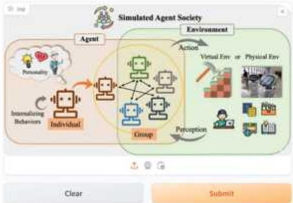

  
图15-4 Interface的格式结果

可以看到，此时右边有一个名为outputs的输出框，对结果进行可视化展示。图中右下方的Flag按钮，可以认为是一个保存按钮，可以标记输出结果中的问题数据。默认情况下，单击Flag按钮会将输入和输出数据发送回运行Gradio演示的机器，并将其保存到CSV日志文件中。

此外，读者还可以自定义Flag按钮被单击时的行为。下面列出一些FlaggingCallback子类的示例，也可以根据需求自定义FlaggingCallback子类，实现对被标记数据的自定义处理。

● SimpleCSVLogger（简化CSV日志记录器）：提供了FlaggingCallback抽象类的简化实现，用于示例目的。每个被标记的样本（包括输入和输出数据）都会被记录到运行Gradio应用的机器上的CSV文件中。  
● CSVLogger（CSV日志记录器）：FlaggingCallback抽象类的默认实现。每个被标记的样本（包括输入和输出数据）都会被记录到运行Gradio应用的机器上的CSV文件中。  
● HuggingFaceDatasetSaver（Hugging Face数据集保存器）：将每个被标记的样本（包括输入和输出数据）保存到HuggingFace数据集中的回调函数。

下面回到Gradio的函数输入输出类型。Gradio的函数输入输出的数据类型一般只有以下几种：

● Image。  
. Label。  
Text/ Textbox。

Checkbox。  
● Number。

这是因为在模型的处理过程和数据分析过程中，使用这几种数据即可完成我们需要完成的任务。下面将outputs的输出类型替换成text，读者可以尝试比较一下结果，如图15-5所示。

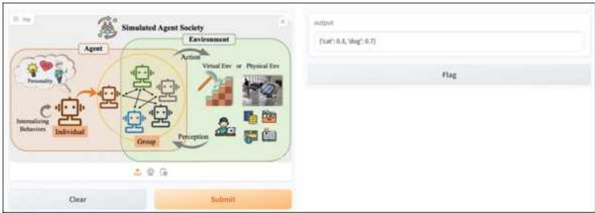  
图15-5 另一种Interface的格式结果

# 15.2.2 一个简单的Gradio示例

下面我们需要讲解一下Gradio中的launch方法，其作用是启动一个用于演示服务的简单Web服务器。也可以通过设置share=True来创建公共链接，任何人都可以使用该链接从他们的浏览器中访问演示程序：

import gradio as gr   
demo $=$ gr.Interface(fn $\equiv$ lambda text:text[::-1],inputs $\coloneqq$ "text",outputs $\coloneqq$ "text") demo.launchshare $\equiv$ True)

在上面这个简单的例子中，我们使用一个lambda开头的匿名函数来完成Gradio的启动。下面是一个多输入和多输出的例子，代码如下：

import gradio as gr   
def greet(name,is_morning,temperature): salutation $=$ "Good morning"ifis_morningelse"Good evening" greeting $\equiv$ f"(salutation){name}.Itis(temperature)degrees today" celsius $=$ (temperature-32）\*5/9 return greeting,round(celsius,2)   
demo $=$ grinterfaces( fn $=$ greet, inputs $\coloneqq$ ["text","checkbox",gr.Slider(0,100 value=17)], outputs $\equiv$ ["text","number"]   
）   
demo.launch()

# 15.2.3 基于DeepSeek的跨平台智能客服实现

我们可以自定义一个带有对话框的对话客户端，也可以使用Gradio自带的、具有记忆功能的客户端，代码如下：

import time   
import gradio as gr   
def slow echoed(message, history): for i in range(len(message)): time.sleep(0.05) yield "You typed: $" +$ message[: 1 + 1]   
demo $=$ gr.ChatInterface( slow echoed, type="messages", flagging_mode="manual", flagging_options $\equiv$ ["Like","Spam","Inappropriate","Other"], save_history=True,   
） demo.launch()

运行代码后，结果如图15-6所示。

  
图15-6 带有客户端的问答端口

由于Gradio具有跨平台运行属性，读者可以在同局域网内输入给定的地址，使用手机打开对应的地址，或者通过在launch()中设置share=True获得一个官方提供的免费接口，具体请读者自行尝试。

下面我们需要把前面自定义的DeepSeek与这里的Gradio客户端进行连接，完成界面与回答文本的适配，代码如下：

importutils   
fromopenai import OpenAI   
client $=$ OpenAI{ api_key $\equiv$ "sk-7e6474d02ec748ca815a7c0a3d1dae66", base_url $\equiv$ "https://api_deepseek.com",   
）   
products_and_category_dict $=$ utils.get_products_and_category(.//productions.json")   
system prompt $\equiv$ f""

#

感谢您的咨询！以下是对您感兴趣的产品的详细介绍和建议：

```python
...
...
# 示例用户查询
user_prompt = ""
想了解ActionCam 4K的详细信息。请提供专业的介绍和建议
...
messages = [
    {"role": "system", "content": system_prompt},
    {"role": "user", "content": user_prompt},
]
response = client.chat completions.create(
    model="deepseek-chat",
    messages=messages
)
messages.append(response Choices[0].message)
print(f"Messages: {messages}") 
```

运行代码后，直接进入客户端，智能问答的界面如图15-7所示。

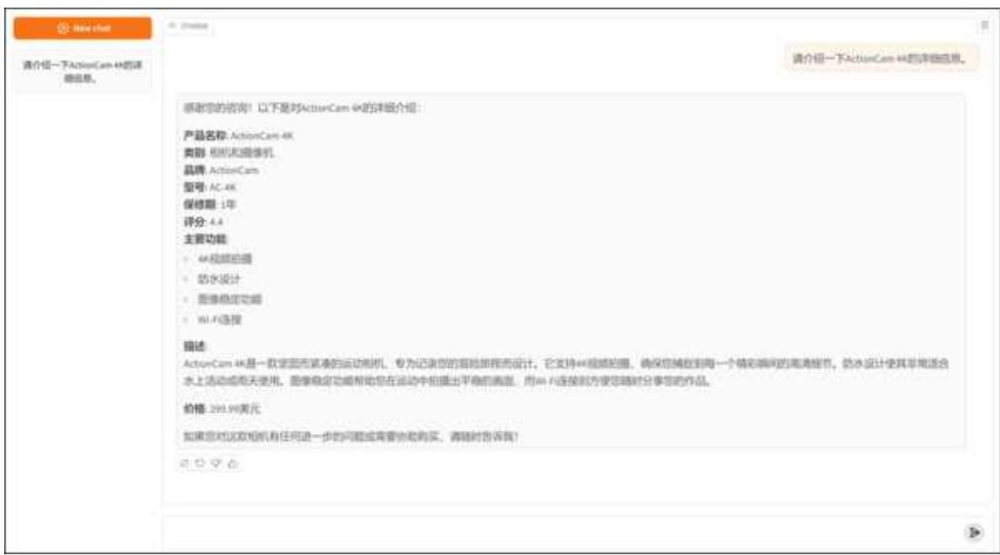  
图15-7 跨平台的智能客服实现

可以看到，此时通过带有DeepSeek的智能客服，我们可以使用跨平台的客户端来完成与普通用户的交互。

# 15.3 本章小结

本章详细阐述了基于DeepSeek的智能客服系统的实现过程。通过与Gradio的协同合作，我们成功地构建了一个跨平台的智能客服客户端，为用户提供了便捷、高效的服务体验。

这个智能客服系统充分利用了DeepSeek强大的自然语言处理能力，能够准确理解用户的意图，并给出相应的回答和解决方案。不仅如此，该系统还能根据用户的反馈进行自我学习和优化，不断提升服务质量。

在构建过程中，我们借助Gradio的跨平台特性，使得智能客服客户端能够无缝地运行在各种操作系统和设备上。这意味着，无论用户使用的是PC还是手机，都能通过我们的客户端享受到同样优质的智能客服服务。

可以看到，本章所介绍的基于DeepSeek和Gradio的智能客服系统，不仅具备强大的功能，还拥有出色的跨平台兼容性和用户体验。我们相信，这一系统将为企业和用户带来前所未有的便利和价值。