# Training large language models: How to generate the generator

# This chapter covers

Setting up a training environment and common libraries   
Applying various training techniques, including using advanced methodologies   
 Tips and tricks to get the most out of training

Be water, my friend.

—Bruce Lee

Are you ready to have some fun?! What do you mean the last four chapters weren’t fun? Well, I promise this one for sure will be. We’ve leveled up a lot and gained a ton of context that will prove invaluable now as we start to get our hands dirty. By training an LLM, we can create bots that can do amazing things and have unique personalities. Indeed, we can create new friends and play with them. In the last chapter, we showed you how to create a training dataset based on your Slack messages. Now we will show you how to take that dataset and create a persona of yourself. Finally, you will no longer have to talk to that one annoying coworker, and just like Gilfoyle, you can have your own AI Gilfoyle (https://youtu.be/IWIusSdn1e4).

First things first, we’ll show you how to set up a training environment, as the process can be very resource-demanding, and without the proper equipment, you won’t be able to enjoy what comes next. We’ll then show you how to do the basics, like training from scratch and finetuning, after which we’ll get into some of the best-known methods to improve upon these processes, making them more efficient, faster, and cheaper. We’ll end the chapter with some tips and tricks we’ve acquired through our experience of training models in the field.

# 5.1 Multi-GPU environments

Training is a resource-intensive endeavor. A model that only takes a single GPU to run inference on may take 10 times that many to train if, for nothing else, to parallelize your work and speed things up so you aren’t waiting for a thousand years for it to finish training. To really take advantage of what we want to teach you in this chapter, we’re first going to have to get you set up in an environment you can use as a playground. Later in the chapter, we’ll teach some resource-optimal strategies as well, but you’ll need to understand how to set up a multi-GPU env if you want to use the largest LLMs anyway.

While you can learn a lot using smaller LLMs, what sets apart a pro from an amateur is often the ease and fluidity they have when working with larger models. And there’s a good reason for this since, on the whole, larger models outperform smaller models. If you want to work with the largest models, you’ll never be able to get started on your laptop. Even most customized gaming rigs with dual GPUs aren’t enough for inference, let alone training.

To this end, we wanted to share with you a few methods to acquire access to a multi-GPU environment in the cloud, and then we will share the tools and libraries necessary to utilize them. The largest models do not fit in a single GPU, so without these environments and tools, you’ll be stuck playing on easy mode forever.

# 5.1.1 Setting up

It should be pointed out up front that while multi-GPU environments are powerful, they are also expensive. When it comes to multi-GPUs, no services we know of offer a free tier or offering, but you can at least take comfort in knowing that paying per hour will be way cheaper than purchasing the rigs wholesale. Of course, if you can get your company to pay the bill, we recommend it, but it is still your responsibility to spin down and turn off any environment you create to avoid unnecessary charges.

If your company is paying, it likely has chosen a hosted service that makes this whole process easy. For the rest of us, setting up a virtual machine (VM) in Google’s Compute Engine is one of the easiest methods. Once set up, we will then show you how to utilize it.

# A note to the readers

For learning purposes, we use smaller models throughout this book in our code listings such that you can work with them on a single GPU either locally or using a service like Colab or Kaggle, which offers a free tier of a single GPU. While the listings could be run on CPU-only hardware, you won’t want to do it. Ultimately, there shouldn’t be any need to run these costly VMs throughout the book. However, you likely will still want to. Training with multiple GPUs is much faster, more efficient, and often necessary. We do encourage you to try larger LLM variations that require these bigger rigs, as the experience will be priceless. To make it easy, you should be able to recycle the code in this chapter for models and datasets much larger than what is presented, which will often just be a matter of changing a few lines.

# GOOGLE VIRTUAL MACHINE

One of the easiest ways to create a multi-GPU environment is to set up a VM on Google’s cloud. To get started, you’ll need to create an account, create a Google Cloud Project (GCP), set up billing, and download the gcloud CLI. None of these steps are particularly hard, but be sure to follow the documentation found at https://cloud .google.com/sdk/docs/install-sdk for your operating system to install the SDK. The steps here also include the steps and how-tos for creating an account, project, and billing in the Before You Begin section if you don’t already have an account.

For new accounts, Google offers a $\$ 300$ credit to be used for pretty much anything on their GCP platform except GPUs. We hate to break this news, but sadly, there’s just no free lunch where we are going. So you’ll need to be sure to upgrade to a paid GCP tier. Don’t worry; just following along should only cost a couple of dollars, but if you are money conscious, we recommend reading the entire section first and then trying it out.

After setting up your account, by default, GCP sets your GPU quotas to 0. Quotas are used to manage your costs. To increase your quotas, go to https://console.cloud .google.com/iam-admin/quotas. You’ll be looking for the gpus_all_regions quota, and since we plan to use multiple GPUs, go ahead and submit a request to increase it to 2 or more.

With all the prerequisites in place, we’ll get started by initializing and logging in. You’ll do this by running the following command in a terminal on your computer:

$ gcloud init

You may have already done this step if you had to install the SDK, but if not, it will launch a web browser to help us log in and authorize us for the gcloud CLI, which allows us to select our project. We will be assuming you have just the one project, but if this isn’t your first rodeo and you have multiple projects, you’ll need to add the --project flag in all the subsequent commands.

Next, we need to determine two things: the machine type (or which GPUs we want to use) and our container image. To pick a machine type, you can check out the

different options at https://cloud.google.com/compute/docs/gpus. For beginners, we highly recommend the NVIDIA L4 GPU, as it is an all-around fantastic machine. For our purposes, we’ll be using the g2-standard-24, which comes with two L4 GPUs and costs us about $\$ 2$ per hour. This machine type isn’t in every region and zone, but you can find a region close to you at https://cloud.google.com/compute/docs/regions -zones. We will be using the us-west1 region and us-west1-a zone.

For the container image, we’ll save ourselves a lot of hassle by using one that has all the basics set up. Generally, this means creating your own, but Google has several prebuilt container images for deep learning, which are great to use or a great place to start as a base image to customize. These are all found in the deeplearning-platform -release project that they own. To check out the options available, you can run

```powershell
$ gcloud compute images list --project deeplearning-platform-release --format="value(NAME)" --no-standard-images 
```

NOTE You can learn more about the container image options here: https:// cloud.google.com/deep-learning-vm/docs/images.

You can pick from Base, TensorFlow, and PyTorch compiled images, along with the CUDA and Python versions. We’ll be using common-gpu-v20230925-debian-11-py310, which is a simple image ready for GPU with a Debian Linux distribution and Python 3.10. Now that we have everything we need, we can create our VM! Go ahead and run the following commands to set up the VM:

```shell
$INSTANCE_NAME="g2-11minprod-example"
$ gcloud compute instances create ${INSTANCE_NAME} --zone=us-west1-a
--machine-type=g2-standard-24 --image-project=deeplearning-platform-release
--image=common-gpu-v20230925-debian-11-py310 --boot-disk-size=200GB --scopes
cloud-platform --metadata=install-unattended-upgrades=False, install-nvidia-
driver=True --maintenance-policy TERMINATE --restart-on-failure 
```

The first command creates an environment variable to store the name of our VM since we’ll also be using it in several of the following commands. This name can be whatever you want it to be. The next command creates our VM instance. The first several flags (zone, image, machine) should make sense since we just spent the previous paragraphs preparing and gathering that information. The boot-disk-size sets the disk space for our VM and defaults to 200 GB, so it’s included here because it’s important to know for LLMs since they are large assets, and you will likely need to increase it—especially for LLMs that require multiple GPUs to run.

The scopes flag is passed to set authorization. Current GCP best practices recommend setting it to cloud-platform, which determines authorization through OAuth and IAM roles. The metadata field isn’t required but is used here as a trick to ensure the NVIDIA drivers are installed. It is really useful if you are using these commands to create a shell script to automate this process. You should know that it will cause a small delay between when the VM is up and when you can actually SSH into it, as it won’t be

responsive while it installs the drivers. If you don’t include it, the first time you SSH in through a terminal, it will ask you if you want to install it, so no harm done. However, if you access the VM through other methods (described in the next sections), you can run into problems. The last two commands are standard maintenance policies.

Once that runs, you can verify the VM is up by running

```txt
$ gcloud compute instances describe ${INSTANCE_NAME} 
```

This command will give you a lot of information about your instance that is worth looking over, including a status field that should read 'RUNNING'. Once you’ve confirmed that it’s up, we will SSH into it. If this is your first time using gcloud to SSH, an SSH key will be generated automatically. Go ahead and run the following command:

```txt
$ gcloud compute sshg {INSTANCE_NAME} 
```

Your terminal will be shelled into our multi-GPU VM, and you are now in business. At this point, your VM is still just an empty shell, so you’ll want to bring in code. The easiest way to do this is to copy the files over with Secure Copy Protocol (SCP). You can do this for a single file or a whole directory. For example, assuming your project has a requirements.txt file and a subdirectory local-app-folder, from a new terminal, you can run the following commands:

```powershell
$ gcloud compute scp requirements.txt ${INSTANCE_NAME}:~/requirements.txt
$ gcloud compute scp --recurse ~/.local-app folder/
${INSTANCE_NAME}:~/vm-app folder 
```

Overall, not too bad. Once you’ve gone through the process and set everything up, the next time you set up a VM, it will only be four commands (create, describe, ssh, scp) to get up and running.

Of course, these instances cost good money, so the last command you’ll want to know before moving on is how to delete it:

```shell
$ gcloud compute instances delete ${INSTANCE_NAME} --quiet 
```

For Linux power users, this code line is likely all you need, but for the rest of us plebs, shelling into a VM through a terminal is less than an ideal working environment. We’ll show you some tips and tricks to make the most of your remote machine.

# SSH THROUGH VS CODE

For most devs, a terminal is fine, but what we really want is an IDE. Most IDEs offer remote SSH capabilities, but we’ll demonstrate with VS Code. The first step is to install the extension Remote-SSH (you can find the extension here: https://mng.bz/ q0dE). Other extensions offer this capability, but Remote-SSH is maintained by Microsoft and has over 17 million installs, so it’s a great choice for beginners.

Next, we are going to run a configuration command:

```txt
$ gcloud compute config-ssh 
```

Then, inside of VS Code, you can press F1 to open the command palette and run the Remote-SSH: Open SSH Host… command, and you should see your VM’s SSH address, which will look like l4-llm-example.us-west1-a.project-id-401501. If you don’t see it, something went wrong with the config-ssh command, and you likely need to run gcloud init again. Select the address, and a new VS Code window should pop up. In the bottom corner, you’ll see that it is connecting to your remote machine. And you are done! Easy. From here, you can use VS Code like you would when using it locally.

# 5.1.2 Libraries

Although setting up hardware is important, none of it will work without the software packages that enable different points of hardware to communicate with each other effectively. With LLMs, the importance of the software is compounded. One author personally experienced having all hardware correctly configured and was pretty sure the software setup was likewise configured, only to start up training a model and be met with an estimated training time of over three years. After troubleshooting, the team realized this was because he had installed multiple versions of CUDA Toolkit, and PyTorch was looking at an incompatible (up-to-date) one instead of the one he had intended to use.

These software packages are about more than just using the CUDA low-level communication with your GPU; they’re about load-balancing, quantizing, and parallelizing your data as it runs through each computation to make sure it’s going as fast as possible while still enabling a certain level of fidelity for the matrices. You wouldn’t want to spend a long time making sure your embedding vectors are phenomenal representations just to have them distorted at run time. Thus, we present the four deeplearning libraries every practitioner should know for multi-GPU instances: Deep-Speed, Accelerate, BitsandBytes, and xFormers. At the time of this writing, all complementary features between these libraries are experimental, so feel free to mix and match. If you get a setup that utilizes all four at once to their full potential without erroring, drop it in a reusable container so fast.

# DEEPSPEED

DeepSpeed is an optimization library for distributed deep learning. DeepSpeed is powered by Microsoft and implements various enhancements for speed in training and inference, like handling extremely long or multiple inputs in different modalities, quantization, caching weights and inputs, and, probably the hottest topic right now, scaling up to thousands of GPUs.

Installation is fairly simple if you remember to always install the latest—but not nightly—version of PyTorch first. This means you also need to configure your CUDA Toolkit beforehand. Once you have that package, pip install deepspeed should get you right where you want to go unless, ironically, you use Microsoft’s other products. If you are on a Windows OS, there is only partial support, and there are several more steps you will need to follow to get it working for inference, not training, mode.

# ACCELERATE

From Hugging Face, Accelerate is made to help abstract the code for parallelizing and scaling to multiple GPUs away from you so that you can focus on the training and inference side. One huge advantage of Accelerate is that it adds only one import and two lines of code and changes two other lines, compared to a standard training loop in PyTorch in its vanilla implementation. Beyond that, Accelerate also has fairly easy CLI usage, allowing it to be automated along with Terraform or AWS CDK.

Accelerate boasts compatibility over most environments, and as long as your environment is Python $3 . 8 +$ and PyTorch $1 . 1 0 . 0 +$ (CUDA compatibility first), you should be able to use Accelerate without problems. Once that’s done, pip install accelerate should get you there. Accelerate also has experimental support for DeepSpeed if you would like to get the benefits of both.

# BITSANDBYTES

If you don’t already know the name Tim Dettmers in this field, you should become acquainted pretty quickly. Not many people have done as much as he has to make CUDA-powered computing accessible. This package is made to help practitioners quantize models and perform efficient matrix multiplication for inference (and maybe training) within different bit sizes, all the way down to INT8. BitsandBytes has similar requirements and drawbacks to DeepSpeed: the requirements are Python $3 . 8 +$ and CUDA $1 0 . 0 +$ on Linux and Mac environments and partial support for Windows with a different package.

You should have little trouble installing BitsandBytes, as pip install bitsandbytes should work for most use cases. If you find yourself on Windows, you’re in luck: pip install bitsandbytes-windows will work as well. If you want to use it with Hugging Face’s transformers or PyTorch, you will need to edit some minimum requirements stated within both of those packages, as the Windows version does not have the same version numbers as the regular package. BitsandBytes offers its own implementations of optimizers like Adam and NN layers like Linear to allow for that 8-bit boost to run deep learning apps on smaller devices at greater speed with a minimal drop in accuracy.

# XFORMERS

The most bleeding edge of the libraries we recommend for most use cases is xFormers, which is made for research and production. Following a (hopefully) familiar PyTorch-like pattern of independent building blocks for multiple modalities, xFormers takes it a step further and offers components that won’t be available in PyTorch for quite a while. One that we’ve used quite a lot is memory-efficient exact attention, which speeds up inference considerably.

xFormers has more requirements than the other packages, and we’d like to stress once more that using one or more tools to keep track of your environment is strongly recommended. On Linux and Windows, you’ll need PyTorch 2.0.1, and pip install -U xFormers should work for you. That said, there are paths for installation

with pretty much any other version of PyTorch, but the main ones are versions 1.12.1, 1.13.1, and 2.0.1.

In table 5.1, we can see a heavily reduced breakdown of what each of these packages does and how it integrates with your code. Each package does similar things, but even when performing the same task, they will often perform those tasks differently or on different parts of your model or pipeline. There is some overlap between packages, and we’d encourage you to use all of them to see how they might benefit you. Now that you have an environment and a basic understanding of some of the tools we’ll be using, let’s move forward and see it in action.

Table 5.1 Comparison of optimization packages for ML   

<table><tr><td>Library</td><td>Faster training or inference</td><td>Code integration</td><td>Lower accuracy</td><td>Many GPUs</td><td>Quantization</td><td>Optimizations</td></tr><tr><td>DeepSpeed</td><td>Both</td><td>CLI</td><td>Depends</td><td>Yes</td><td>Supports</td><td>Caching, gradient checkpointing, memory management, scaling</td></tr><tr><td>Accelerate</td><td>Both</td><td>CLI and Code</td><td>Depends</td><td>Yes</td><td>Supports</td><td>Automation, compiling, parallelization</td></tr><tr><td>BitsandBytes</td><td>Both</td><td>Code</td><td>Always</td><td>NA</td><td>Yes but only</td><td>Quantization, quantized optimizers</td></tr><tr><td>xFormers</td><td>Training</td><td>Code</td><td>Depends</td><td>NA</td><td>Yes and more</td><td>Efficient attention, memory management</td></tr></table>

# 5.2 Basic training techniques

In training LLMs, the process typically starts with defining the architecture of the model, the nature and amount of data required, and the training objectives. We’ve already gone over these steps in the last chapter, so you should be well prepared already, but let’s look at a brief recap. The model architecture usually follows a variant of the Transformer architecture due to its effectiveness in capturing long-term dependencies and its parallelizable nature, making it amenable to large-scale computation. Data is the lifeblood of any LLM (or any ML model in general), which typically requires extensive corpora of diverse and representative text data. As the model’s purpose is to learn to predict the next word in a sequence, it’s crucial to ensure that the data covers a wide array of linguistic contexts.

Because we’ll be going over various training techniques in this chapter, here’s a (super) quick rundown of the investments you’ll need for different types. For training from scratch, you’ll need VRAM greater than four times the number of billions of parameters to hold the model, along with the batches of training data. So to train a 1B parameter model from scratch, you’ll need at least 5 or 6 GB of VRAM, depending on your batch sizes and context length. Consider training a 70B parameter model

like Llama 2 as an exercise. How much VRAM will you need to fit the model, along with a 32K token context limit? If you’re coming up with a number around 300 GB of VRAM, you’re right. For the finetuning techniques, you’ll need significantly fewer resources for a couple of reasons—namely, quantization and amount of data needed, meaning you no longer need $4 \times$ VRAM, but can use $2 \times$ or $1 \times$ with the correct setup.

Unlike traditional ML models, LLMs are often trained in stages. Figure 5.1 shows the basic training life cycle of an LLM, starting from scratch, then finetuning, and finally prompting. The first step is creating our foundation model, where we take a large, often unrefined, dataset and train an empty shell of a model on it. This training will create a model that has seen such a large corpus of text that it appears to have a basic understanding of language. We can then take that foundation model and use transfer learning techniques, generally finetuning on a small, highly curated dataset to create a specialized LLM for expert tasks. Lastly, we use prompting techniques that, while not traditional training, allow us to goad the model to respond in a particular fashion or format, improving the accuracy of our results.

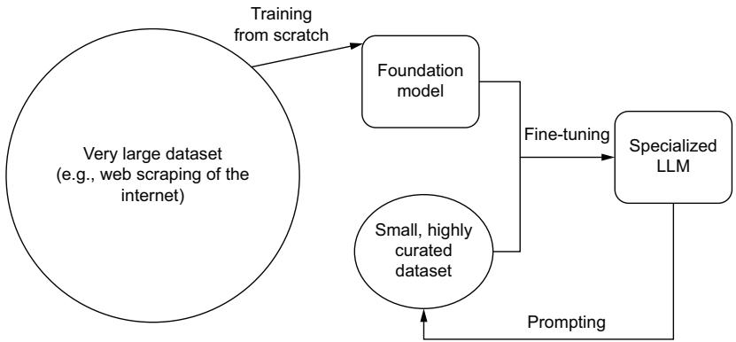  
Figure 5.1 The training life cycle of an LLM. We start by creating a foundation model based on a large corpus of text, which we later finetune using a curated dataset for a specific task. We can then further improve the model by using the model itself and techniques like prompting to enhance or enlarge our curated dataset.

You’ll notice that the training life cycle is often a continuous loop—training models to understand language better and then using those models to improve our training datasets. Later in this chapter, we will go into more depth about other advanced training techniques that take advantage of this loop, like prompt tuning and RLHF. For now, let’s solidify our understanding of three basic steps.

# 5.2.1 From scratch

Training an LLM is computationally intensive and can take several weeks or months even on high-performance hardware. This process feeds chunks of data (or “batches”)

to the model and adjusts the weights based on the calculated loss. Over time, this iterative process of prediction and adjustment, also known as an epoch, leads the model to improve its understanding of the syntactic structures and complexities in the data. It’s worth noting that monitoring the training process is crucial to avoid overfitting, where the model becomes excessively tailored to the training data and performs poorly on unseen data. Techniques like early stopping, dropout, and learning rate scheduling are used to ensure the generalizability of the model, but they are not silver bullets. Remember, the ultimate goal is not just to minimize the loss on training data but to create a model that can understand and generate human-like text across a broad range of contexts.

Training an LLM from scratch is a complex process that begins with defining the model’s architecture. This decision should be guided by the specific task at hand, the size of the training dataset, and the available computational resources. The architecture, in simple terms, is a blueprint of the model that describes the number and arrangement of layers, the type of layers (like attention or feed-forward layers), and the connections between them. Modern LLMs typically employ a variant of the Transformer architecture, known for its scalability and efficiency in handling long sequences of data.

Once the model’s architecture is set, the next step is to compile a large and diverse dataset for training. The quality and variety of data fed into the model largely dictate the model’s ability to understand and generate human-like text. A common approach is to use a large corpus of internet text, ensuring a wide-ranging mix of styles, topics, and structures. The data is then preprocessed and tokenized, converting the raw text into a numerical format that the model can learn from. During this tokenization process, the text is split into smaller units, or tokens, which could be as short as a single character or as long as a word.

With a model and dataset ready, the next step is to initialize the model and set the learning objectives. The LLMs are trained using autoregressive semi-supervised learning techniques where the model learns to predict the next word in a sequence given the preceding words. The model’s weights are randomly initialized and then adjusted through backpropagation and optimization techniques such as Adam or Stochastic Gradient Descent based on the difference between the model’s predictions and the actual words in the training data. The aim is to minimize this difference, commonly referred to as the “loss,” to improve the model’s predictive accuracy.

Training involves feeding the tokenized text into the model and adjusting the model’s internal parameters to minimize the loss. We said this once, but it bears repeating: this process is computationally demanding and may take weeks or even months to complete, depending on the model size and available hardware. After training, the model is evaluated on a separate validation dataset to ensure that it can generalize to unseen data. It is common to iterate on this process, finetuning the model parameters and adjusting the architecture as needed based on the model’s performance on the validation set.

Let’s explore training a brand-new transformer-based language model “from scratch,” meaning without any previously defined architecture, embeddings, or weights. Figure 5.2 shows this process. You shouldn’t have to train an LLM from scratch, nor would you normally want to, as it’s a very expensive and time-consuming endeavor; however, knowing how can help you immensely.

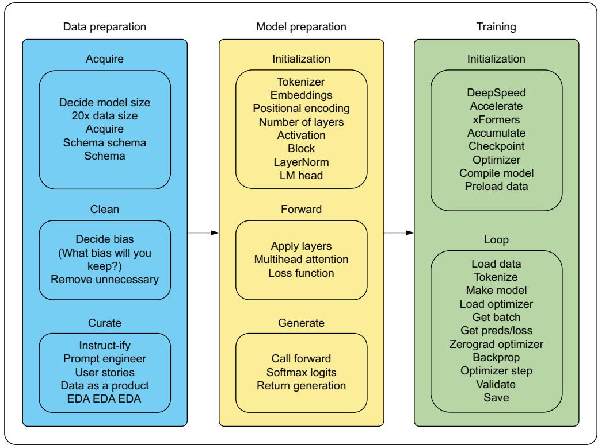  
Training from scartch   
Figure 5.2 A simplified version of all the steps necessary to train a language model (large or otherwise) from scratch. You must have data, then define all of the model behavior, and only then proceed to train.

Listing 5.1 allows you to run through the motions without training an actual massive model, so feel free to explore with this code. For a more complex and complete example, check out Andrej Karpathy’s minGPT project here: https://github .com/karpathy/minGPT. You should pay attention to some things when you review the listing. You might recall that we talked about tokenization and embeddings in the last chapter, so one thing to notice is that for simplicity, we will be using a character-based tokenizer. Before you run the code, can you predict whether this was a good or bad idea? Also, pay attention to how we use both Accelerate and BitsandBytes, which we introduced a little bit ago; you’ll see that these libraries come in mighty handy. Next,

watch as we slowly build up the LLMs architecture, building each piece in a modular fashion and later defining how many of each piece is used and where to put them, almost like Legos. Finally, at the very end of the code, you’ll see a typical model training loop, splitting our data, running epochs in batches, and so forth.

Listing 5.1 An example of training from scratch   
```python
import os
import torch
from accelerate import Accelerator
import bitsandbytes as bnb
class GPT(torch.nnModule):
    def __init__(self):
        super().__init()
        self_token_embedding = torch.nn.Embedding(vocab_size, n_embedding)
        self positional_embedding = torch.nn.Embedding(block_size, n_embedding)
        self_blocks = torch(nn Sequential(
            *[Block(n_embedding, n_head=n_head) for _ in range(n_layer)]
        )
        self.lr_f = torch(nn.LinearNorm(n_embedding)
        self.lr_head = torch(nn.Linear(n_embedding, vocab_size))
        self.apply(self._initweights)
    def forward(self, idx, targets=None):
        B, T = idx.shape
        tok_emb = selftokenizer_embedding(idx)
        pos_emb = self positional_embedding(torch.arange(T, device=device))
        x = tok_emb + pos_emb
        x = selfblocks(x)
        x = self.lr_f(x)
        logits = self.lr_head(x)
    if targets is None:
        loss = None
    else:
        B, T, C = logits.shape
        logits = logits.view(B * T, C)
        targets = targets.view(B * T)
        loss = torch(nnfunctional CROSS_entropy(logits, targets))
    return logits, loss
def __initweights(self, module):
    if isinstance/module, torch(nn.Linear):
        torch(nn.init.normalmodule weight, mean=0.0, std=0.02)
        if module.bias is not None:
            torch(nn.init.zerosmodule.bias)
    elif isinstance(module, torch(nn.Embedding):
        torch(nn.init.normalmodule weight, mean=0.0, std=0.02) 
```

```python
def generate(self, idx, max_new_tokens):
    for _ in range(max_new_tokens):
        idx_cond = idx[:, -block_size]
        logits, loss = self(idx_cond)
        logits = logits[:, -1, :]
        probs = torch.nnfunctional.maxmax(logits, dim=-1)
        idx_next = torch.multinomial(probs, num_samples=1)
        idx = torch.cat((idx, idx_next), dim=1)
    return idx
class Block(torch(nn.Module):
    def __init__(self, n_embedding, n_head):
        super().__init()
        head_size = n_embedding // n_head
        self.selfattention = MultiHeadAttention(n_head, head_size)
        self/feed_forward = FeedFoward(n_embedding)
        self.ln1 = torch.nn.LinearNorm(n_embedding)
        self.ln2 = torch(nn.LinearNorm(n_embedding)
    def forward(self, x):
        x = x + self.selfattention(self.ln1(x))
        x = x + self/feed_forward(self.ln2(x))
    return x
class MultiHeadAttention(torch(nnModule):
    def __init__(self, num_heads, head_size):
        super().__init()
        self_heads = torch.nnModuleList(
            [Head(head_size) for _ in range(num_heads)]
        )
        self.projection = torch(nn.Linear(head_size * num_heads, n_embedding)
        self.dropout = torch(nn.Dropout万股)
    def forward(self, x):
        out = torch.cat([h(x) for h in self_heads], dim=-1)
        out = self.dropout(self.projection(out))
    return out
class Head(torch(nnModule):
    def __init__(self, head_size):
        super().__init()
        self.key = torch(nn.Linear(n_embedding, head_size, bias=False))
        self.query = torch(nn.Linear(n_embedding, head_size, bias=False))
        self.value = torch(nn.Linear(n_embedding, head_size, bias=False))
        self.register_buffer(
            "tril", torch.tril(torch.ones(block_size, block_size))
        )
        self.dropout = torch(nn.Dropout万股)
    def forward(self, x):
        _, T_, _ = x.shape 
```

```python
k = self.key(x)  
q = self.query(x)  
attention = q @ k.transpose(-2, -1) * k.shape[-1] ** 0.5  
attention = attentionmasked_fill(  
    self.tril[:T, :T] == 0, float("-inf"))  
)  
attention = torch.nnfunctional.float(max(attention, dim=-1)  
attention = self.dropout(attention)  
v = self.value(x)  
out = attention @ v  
return out 
```

```python
class FeedFoward(torch.nnModule): def __init__(self, n_embedding): super().__init_(self.net = torch.nnSequential( torch.nn.Linear(n_embedding, 4 * n_embedding), torch.nn.ReLU(), torch.nn.Linear(4 * n_embedding, n_embedding), torch.nn.DropoutDropout), def forward(self, x): return self.net(x) 
```

```txt
def encode(string): <1> return [utt2int[c] for c in string] 
```

```typescript
defdecode(line): return".join([int2utt[i]fori in line]) 
```

```python
def get_batch(split):
    data = train_data if split == "train" else val_data
    idx = torch.randint(len(data) - block_size, (batch_size,))
    x = torch.stack([data[i : i + block_size] for i in idx])
    y = torch.stack([data[i + 1 : i + block_size + 1] for i in idx])
    x, y = x.to(device), y.to(device)
    return x, y 
```

```python
@torch.no_grad()
def estimate_loss():
    out = {}
    model.eval()
    for split in ["train", "val]:
        losses = torch.zeros.evalitable)
        for k in range.evalitable):
            X, Y = get_batchsplit()
            logits, loss = model(X, Y)
            losses[k] = loss.item() 
```

```python
out [split] = losses.mean()
model.train()
return out
if __name__ == "_main":
    batch_size = 64 # Number of utterances at once
    block_size = 256 # Maximum context window size
    max_iters = 5000
    eval_interval = 500
    learning_rate = 3e-4
    eval_iters = 200
    n_embedding = 384
    n_head = 6
    n_layer = 6
    dropout = 0.2
    accelerator = Accelerator()
    device = accelerator_device
    doingquantization = False # Change to True if imported bitsandbytes
with open("\\./data/crimeandpunishment.txt", "r", encoding="utf-8") as f:
    text = f.read()
    chars = sorted(list(set(text)))
    vocab_size = len(chars)
    utt2int = {ch: i for i, ch in enumerate(chars)}
    int2utt = {i: ch for i, ch in enumerate(chars)}
    data = torch.tensor encode(text), dtype=torch.long)
    n = int(0.9 * len(data))
    train_data = data[:, n]
val_data = data[n]
model = GPT().to(device)
print("Instantiated Model")
print(
    sum(param.numel() for param in model.params() / 1e6,
            "Model parameters",
    )
optimizer =
    (
        torch.optim.AdamW(model.params(), lr=learning_rate)
    if not doing quantization
        else bnb.optim.Adam(model.params(), lr=learning_rate)
    )
print("Instantiated Optimizer")
model, optimizer, train_data = accelerator.prepare(
        model, optimizer, train_data
) print("Prepared model, optimizer, and data")
# 
for iter in range(max_iter):
    Training block
print(f"Running Epoch {iter}") 
```

```python
if iter % eval_interval == 0 or iter == max_iters - 1: losses = estimate_loss() print( f" | step {iter}: train loss {losses['train']: .4f} " | validation loss {losses['val']: .4f} |") xb, yb = get_batch("train") logits, loss = model(xb, yb) optimizer.zero_grad(set_to_true) optimizer.backup(loss) optimizer_STEP() creates model directory if not os.path.exists(model_dir): os.makedirs(model_dir) Save the model model_path = model_dir + "model.pt" torch.save( model.state_dict(), model_path, ) loads the saved model context = torch.zeros((1, 1), dtype=torch.long, device=device) print(decode Loaded_generate(context, max_new_tokens=500) [0].tolist())) Tests the loaded model 
```

In listing 5.1, we explored how the Lego blocks are put together for the GPT family of models and showed a training loop reminiscent of our exploration of language modeling in chapter 2. Beyond showing the first part of generative pretraining for models, this example also illustrates why character-based modeling, whether convolutional or otherwise, is weak for language modeling. Did you get it right? Yup, character-based modeling isn’t the best. Alphabets on their own do not contain enough information to produce statistically significant results, regardless of the tuning amount. From a linguistic standpoint, this is obvious, as alphabets and orthography, in general, are representations of meaning generated from humans, which is not intrinsically captured.

Some of the ways to help with that information capture are increasing our tokenization capture window through word-, subword-, or sentence-level tokenization. We can also complete the pretraining before showing the model our task to allow it to capture as much approximate representation as possible. Next, we’ll show what benefits combining these two steps can have on our model’s performance.

# 5.2.2 Transfer learning (finetuning)

Transfer learning is an essential approach in machine learning and a cornerstone of training LLMs. It’s predicated on the notion that we can reuse knowledge learned from one problem (the source domain) and apply it to a different but related problem

(the target domain). In the context of LLMs, this typically means using a pretrained model, trained on a large, diverse dataset, and adapting it to a more specific task or domain.

In the first step of transfer learning, an LLM is trained on a large, general-purpose corpus, such as the entirety of Wikipedia, books, or the internet. This pretraining stage allows the model to learn an extensive range of language patterns and nuances on a wide variety of topics. The goal here is to learn a universal representation of language that captures a broad understanding of syntax, semantics, and world knowledge. These models are often trained for many iterations and require significant computational resources, which is why it’s practical to use pretrained models provided by organizations like OpenAI or Hugging Face.

After pretraining, the LLM is updated on a specific task or domain. This update process adapts the general-purpose language understanding of the model to a more specific task, such as sentiment analysis, text classification, or question answering. Updating usually requires significantly less computational resources than the initial pretraining phase because it involves training on a much smaller dataset specific to the task at hand. Through this process, the model is able to apply the vast knowledge it gained during pretraining to a specific task, often outperforming models trained from scratch on the same task. This process of transfer learning has led to many of the advances in NLP over recent years.

# FINETUNING

There are several different transfer learning techniques, but when it comes to LLMs, the one everyone cares about is finetuning. Finetuning an LLM involves taking a pretrained model—that is, a model already trained on a large general corpus—and adapting it to perform a specific task or to understand a specific domain of data.

This technique uses the fact that the base model has already learned a significant amount about the language, allowing you to reap the benefits of a large-scale model without the associated computational cost and time. The process of finetuning adapts the pre-existing knowledge of the model to a specific task or domain, making it more suitable for your specific use case. It’s like having a generalist who already understands the language well and then providing specialist training for a particular job. This approach is often more feasible for most users due to the significantly reduced computational requirements and training time compared to training a model from scratch.

The first step in finetuning involves choosing a suitable pretrained model. This decision is guided by the specific task you want the model to perform and by the resources available to you. Keep in mind that this means setting a goal for the model’s behavior before training. Once the pretrained model has been chosen, it’s crucial to prepare the specific dataset you want the model to learn from. This data could be a collection of medical texts, for example, if you’re trying to finetune the model to understand medical language. The data must be preprocessed and tokenized in a way that’s compatible with the model’s pretraining.

The finetuning process involves training the model on your specific dataset, but with a twist: instead of learning from scratch, the model’s existing knowledge is adjusted to better fit the new data. This finetuning is typically done with a smaller learning rate than in the initial training phase to prevent the model from forgetting its previously learned knowledge. After finetuning, the model is evaluated on a separate dataset to ensure it can generalize to unseen data in the specific domain. Similar to training from scratch, this process may involve several iterations to optimize the model’s performance. Finetuning offers a way to harness the power of LLMs for specific tasks or domains without the need for extensive resources or computation time. See figure 5.3.

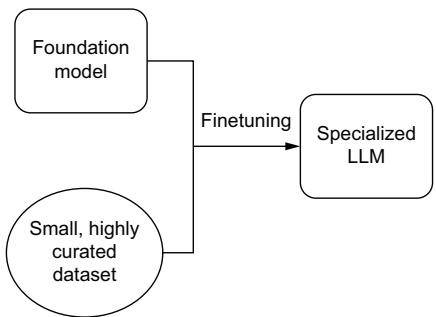  
Figure 5.3 Finetuning differs from training from scratch in that you don’t have to define model behavior, you can use the exact same training loop, and you have a fraction of the data requirement.

In listing 5.2, we show you how to finetune a GPT model. Notice how much less code there is in this listing than in listing 5.1. We don’t need to define an architecture or a tokenizer; we’ll just use those from the original model. Essentially, we get to skip ahead because weights and embeddings have already been defined.

# Listing 5.2 An example of finetuning

import os   
from transformers import ( GPT2Tokenizer, GPT2LMHeadModel, GPT2Config, DataCollatorForLanguageModeling, TrainingArguments, Trainer, Loads and from datasets import load_dataset formats the dataset dataset $=$ load_dataset("text",data_files $\equiv$ "/data/crimeandpunishment.txt") dataset $=$ dataset.filter( lambda sentence: len sentence["text"]）>1) print(dataset["train"] [0])   
model_dir $=$ "/models/betterGPT/" creates model directory to save to if not os.path.exists(model_dir): os.makedirs(model_dir)

```python
config = GPT2Config(
    vocab_size=50261,
    n_positions=256,
    n_embd=768,
    activation_function="gelu",
)  
tokenizer = GPT2Tokenizer.from_pretrained("gpt2")  
special_tokens_dict = {
    "bos_token": "<BOS>", 
    "eos_token": "<EOS>", 
    "pad_token": "<PAD>", 
    "mask_token": "<MASK>",  
}  
tokenizer.add_special_tokens(special_tokens_dict)  
model = GPT2LMHeadModel.from_pretrained(
    "gpt2", config=config, ignore_mismatched Sizes=True)  
def tokenizer(batch):
    return tokenizer(
        str(batch), padding="max_length", truncation=True, max_length=256)  
Tokenizer.add SpecialTokens tokenizer, batched=False)  
print(f"Tokenized: {tokenized_dataset['train'] [0]}")  
data_collector = DataCollatorForLanguageModeling(
    tokenizer=tokenizer, mlm=True, mlm(probability=0.15)  
) # Masked Language Modeling - adds <MASK> tokens to guess the words  
train_args = TrainingArguments(
    output_dir model_dir,
    num_train_epochs=1,
    per_device_train_batch_size=8,
    save_steps=5000,
    save_total_limit=2,
    report_to="none",  
)  
trainer = Trainer(
    model=model,
    args=train_args,
    data_collector=data_collector,
    train_dataset=tokenized_dataset["train"]
)  
trainer.train()  
trainer.save_model(model_dir)  
tokenizer.save_pretrained()  
model = GPT2LMHeadModel.from_pretrained(model_dir)  
Loads the saved model 
```

input $=$ "To be or not" tokenized_input $\equiv$ tokenizer(input, return_tensors="pt") out $=$ model_generate( input_ids=tokenized_input["input_ids"], attention_mask=tokenized_input["attention_mask"], max_length=256, num_beams=5, temperature $= 0.7$ top_k=50, top_p=0.90, norepeat_ngram_size=2,   
print(tokenizer Decode(out[0],skip_special_tokens=True))

Looking at listing 5.2 compared with listing 5.1, they have almost the exact same architecture (minus the activation function), and they’re training on exactly the same data. Yet, there’s a marked improvement with the finetuned GPT-2 model due to the lack of learned representation in the first model. Our pretrained model, along with subword BPE tokenization instead of character-based, helps the model figure out which units of statistically determined meaning are most likely to go together. You’ll notice, though, that GPT-2, even with pretraining, struggles to generate relevant longer narratives despite using a newer, better activation function.

# FINETUNING OPENAI

We just trained a GPT model from scratch, and then we finetuned GPT-2, but we know many readers really want the power behind OpenAI’s larger GPT models. Despite being proprietary models, OpenAI has graciously created an API where we can finetune GPT-3 models. Currently, three models are available for finetuning with OpenAI’s platform, but it looks like it intends to extend that finetuning ability to all of its models on offer. OpenAI has written a whole guide, which you can find at http://platform .openai.com/, but once you have your dataset prepared in the necessary format, the code is pretty easy. Here are some snippets for various tasks:

import os   
from openerai import OpenAI   
client $=$ OpenAI()   
client api_key $\equiv$ os.getenv("OPENAI_API_KEY")   
client.files.create( file $\equiv$ open("mydata.jsonl", "rb"), purpose $\equiv$ 'fine-tune'

This first snippet uploads a training dataset in the correct format for the platform and specifies the purpose as finetuning, but doesn’t start the process yet. Next, you’ll need to create the finetuning job:

```txt
client.fine_tuningjobs.create(training_file="file-abc123", model="gpt-3.5-turbo") 
```

This is where you specify which training file and which model you want to finetune. Once OpenAI’s training loop has completed, you’ll see the finetuned model’s name populated when you retrieve the job details. Now you can use that model the same way you would have used any of the vanilla ones for chat completion or anything else like this:

completion $=$ client.chatCompletion.create( model="ft:gpt-3.5-turbo:my-org:custom suffix:id", messages $\coloneqq$ { {"role": "system", "content": "You are a helpful assistant."}, {"role": "user", "content": "Hello!"} ]   
）   
print(completion Choices[0].message)

And that’s it for finetuning an OpenAI model! Very simple, doesn’t take too long, and as of March 2023, your data is private to you. Of course, you’ll be ceding all of the control of how that finetuning occurs over to OpenAI. If you’d like to do something beyond vanilla finetuning, you’ll need to do that yourself. In just a minute, we’ll go over those techniques you may consider, along with some more advanced processes that can help with more fine-grained models and more complex tasks.

# 5.2.3 Prompting

One of the main reasons why LLMs are so powerful compared to traditional ML is because we can train them at run time. Give them a set of instructions and watch them follow them to the best of their ability. This technique is called prompting and is used in LLMs to guide the model’s output. In essence, the prompt is the initial input given to the model that provides it with context or instructions for what it should do. For example, “translate the following English text to French” and “summarize the following article” are prompts. In the context of LLMs, prompting becomes even more critical, as these models are not explicitly programmed to perform specific tasks but learn to respond to a variety of tasks based on the given prompt.

Prompt engineering refers to the process of crafting effective prompts to guide the model’s behavior. The aim is to create prompts that lead the model to provide the most desirable or useful output. Prompt engineering can be more complex than it appears, as slight changes in how a prompt is phrased can lead to vastly different responses from the model. Some strategies for prompt engineering include being more explicit in the prompt, providing an example of the desired output, or rephrasing the prompt in different ways to get the best results. It’s a mixture of art and science, requiring a good understanding of the model’s capabilities and limitations.

In this chapter, we are going to focus mainly on training and finetuning, the steps before deployment, but we would be remiss if we didn’t first mention prompting. We will talk about prompting in much more depth in chapter 7.

# 5.3 Advanced training techniques

Now that you know how to do the basics, let’s go over some more advanced techniques. These techniques have been developed for a variety of reasons, such as improving generated text outputs, shrinking the model, providing continuous learning, speeding up training, and reducing costs. Depending on the needs of your organization, you may need to reach for a different training solution. While not a comprehensive list, the following techniques are often used and should be valuable tools as you prepare a production-ready model.

# Classical ML training background

Going over some techniques to enhance your finetuning process requires a bit of background. We won’t be doing a full course in ML; however, in case this is your first exposure, you should know some classic learning paradigms that experiments tend to follow—supervised, unsupervised, adversarial, and reinforcement:

Supervised learning involves collecting both the data to train on and the labels showcasing the expected output.   
 Unsupervised learning does not require labels, as the data is probed for similarity and grouped into clusters that are the closest comparison to each other.   
Adversarial learning is what’s used to train a generative adversarial network. It involves two models, generally referred to as the Critic model and the Forger model. These two models essentially play a game against each other where the forger tries to copy some ideal output, and the critic tries to determine whether the forgery is the real thing.   
Reinforcement learning (RL) opts for establishing a reward function instead of having predefined labels for the model to learn from. By measuring the model’s actions, it is given a reward based on that function instead.

All LLMs must be trained using at least one of these, and they perform at a high level with all of them done correctly. The training techniques discussed in this chapter differ from those basic ones, ranging from adding some form of human input to the model to comparing outputs to changing how the model does matrix multiplication.

# 5.3.1 Prompt tuning

We’ve gone over pragmatics before, but as a reminder, language models perform better when given real-world nonsemantic context pertaining to the tasks and expectations. Language modeling techniques all operate on the underlying assumption that the LM, given inputs and expected outputs, can divine the task to be done and do it in the best way within the number of parameters specified.

While the idea of the model inferring both the task and the method of completing it from the data showed promise, it has been shown time and time again, from BERT to every T5 model and now to all LLMs, that providing your model with the expected task and relevant information for solving the task improves model performance drastically. As early as 2021, Google Research, DeepMind, and OpenAI had all published

papers about prompt tuning, or giving a model pragmatic context during training. The benefits of prompt tuning are reducing the amount of data required for the model to converge during training and, even cooler, the ability to reuse a completely frozen language model for new tasks without retraining or fully finetuning.

Because LLMs are so large (and getting larger), it is becoming increasingly difficult to share them and even more difficult to guarantee their performance on a given task, even one they are trained on. Prompt tuning can help nudge the model in the right direction without becoming a significant cost. Figure 5.4 shows this process.

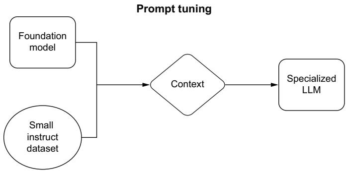  
Figure 5.4 Prompt tuning foregoes most finetuning to allow the majority of the foundation model’s language understanding ability to stay exactly the same and, instead, focuses on changing how the model responds to specific inputs.

Listing 5.3 shows how to prompt tune a smaller variant of the BLOOMZ model from Big Science. BLOOMZ was released as an early competitor in the LLM space but has ultimately struggled to garner attention or momentum in the community because of its inability to generate preferred outputs despite its mathematical soundness. Because prompt tuning doesn’t add much to the regular finetuning structure we used in listing 5.2, we’ll perform Parameter-Efficient Fine-Tuning (PEFT), which drastically reduces the memory requirements by determining which model parameters need changing the most.

# Listing 5.3 An example of prompt tuning

```python
import os   
from transformers import ( AutoModelForCausalLM, AutoTokenizer, default_data.collator, get_linear_schedule_with_warmup,   
)   
from peft import ( get_peft_model, PromptTuningInit, 
```

```python
PromptTuningConfig,   
TaskType,   
)   
import torch   
from datasets import load_dataset   
from torch.utils.data import DataLoader   
from tqdm import tqdm   
def preprocess_function(examples): batch_size = len(examples[label]) inputs = [ f"\{text_column]: \{x\} Label : " for x in examples[label_column] ] targets = [str(x) for x in examples[label_column]] model_input = tokenizer(input) labels = tokenizer(target)   
for i in range(batch_size): sample_input_ids = model_input["input_ids"] [i] label_input_ids = labels["input_ids"] [i] + [tokenizerPAD_token_id] model_input["input_ids"] [i] = sample_input_ids + label_input_ids labels["input_ids"] [i] = [-100] * len( sample_input_ids ) + label_input_ids model_input["attention_mask"] [i] = [1] * len( model_input["input_ids"] [i]   
for i in range(batch_size): sample_input_ids = model_input["input_ids"] [i] label_input_ids = labels["input_ids"] [i] model_input["input_ids"] [i] = [tokenizerPAD_token_id] * ( max_length - len(sample_input_ids) ) + sample_input_ids model_input["attention_mask"] [i] = [0] * ( max_length - len(sample_input_ids) ) + model_input["attention_mask"] [i] labels["input_ids"] [i] = [-100] * ( max_length - len(sample_input_ids) ) + label_input_ids model_input["attention_mask"] [i] = torchtensor( model_input["input_ids"] [i] [max_length]   
model_input["attention_mask"] [i] = torch.tensor( model_input["attention_mask"] [i] [max_length]   
labels["input_ids"] [i] = torch.tensor( labels["input_ids"] [i] [max_length] 
```

if _name_ $= =$ "main:" # Define training parameters device $=$ "cuda" model_name_or_path $=$ "bigscience/bloomz-560m" tokenizer_name_or_path $=$ "bigscience/bloomz-560m" dataset_name $=$ "twitter_complaints" text_column $=$ "Tweet text" label_column $=$ "text_label" max_length $= 64$ $\mathrm{lr} = 3\mathrm{e - }2$ num_epochs $= 1$ batch_size $= 8$ Defines prompt tuning config; max_length $= 64$ $\mathrm{lr} = 3\mathrm{e - }2$ num_epochs $= 1$ batch_size $= 8$ peft_config $=$ PromptTuningConfig( task_type $\equiv$ TaskType.CAUSAL_LM, prompt_tuning_init $\equiv$ PromptTuningInit.TXT, num_virtual_tokens $\equiv 8$ , prompt_tuning_init_text $\equiv$ "Classify if the tweet " is a complaint or not:," tokenizer_name_or_path $\equiv$ model_name_or_path,   
）   
checkpoint_name $=$ { f{"dataset_name}\{_model_name_or_path}" f"\{peft_config.peft_type}\{_peft_config.task_type\}_v1.pt".replace( "/","\_")   
}   
dataset $=$ load_dataset("ought/raft", dataset_name) Loads Dataset   
print(f"Dataset 1:{dataset['train'] [0]})   
classes $= [\quad \quad \quad \quad \quad \quad \quad \quad \quad \quad \quad \quad \quad \quad \quad \quad \quad \quad \quad \quad \quad \quad \quad \quad \quad \quad \quad \quad \quad \quad \quad \quad \quad \quad \quad \quad \quad \quad \quad \quad \quad \quad \quad \quad \quad \quad \quad \quad \quad \quad \quad ]$ labels the dataset label.replace("_", "_") for label in dataset["train"].features["Label"].names   
dataset $=$ dataset.map( lambda x: {"text_label": [classes[label] for label in x["Label"]]}, batched=True, numproc=1,   
）   
print(f"Dataset 2:{dataset['train'] [0]})   
tokenizer $=$ AutoTokenizer.from_pretrained(model_name_or_path) if tokenizer_pad_token_id is None: tokenizer_pad_token_id $=$ tokenizer.eos_token_id target_max_length $=$ max( [ len(tokenizer(class_label)[input_ids"] for class_label in classes ]   
）   
print(f"Target Max Length:{target_max_length}")   
processedDatasets $=$ dataset.map(runsTokenizer across dataset and preprocess

num_proc=1, remove-columns=dataset["train"].column_names, load_from_cache_file=False, desc="Running tokenizer on dataset",   
)   
train_dataset $=$ processedDatasets["train"] Prepares data   
eval_dataset $=$ processedDatasets["test"] loaders   
train_dataloger $\equiv$ DataLoader( train_dataset, shuffle=True, collate_fn=default_data.collator, batch_size=batch_size, pin_memory=True,   
) eval_dataloger $\equiv$ DataLoader( eval_dataset, collate_fn=default_data.collator, batch_size=batch_size, pin_memory=True, Loadaf sion foundation model   
model $=$ AutoModelForCausalLM.from_pretrained(model_name_or_path)   
model $=$ get_peft_model(model, peft_config)   
print(model.print_trainable_parameters())   
model $=$ model.to(device) Define optimizer $=$ torch.optimAdamW(model.params(), lr=lr) lr_scheduler $=$ get_linear_schedule_with_warmup( optimizer=optimizer, num_warmup_steps=0, num_training_steps=(len(train_dataloger) \* num_epochs),   
) Training steps   
for epoch in range(num_epochs): model.train() total_loss $= 0$ for step,batch in enumerate(tqdm(train_dataloger)): batch $=$ {k:v.to(device) for k,v in batch.items()} outputs $=$ model(**batch) loss $=$ outputs.loss total_loss $+ =$ lossdetach().float() loss_backward() optimizer_step() lr_scheduler.step() optimizer.zero_grad()   
model.eval() eval_loss $= 0$ eval_preds $= []$ for step,batch in enumerate(tqdm.eval_dataloger)): batch $=$ {k:v.to(device) for k,v in batch.items()} with torch.no_grad(): outputs $=$ model(**batch)

loss $=$ outputs.loss eval_loss $+ =$ lossdetach().float() eval=Preds extend( tokenizer.batchDecode( torch.argmax(output.logits，-1).detach().cpu().numpy(), skip_special_tokens=True, ） eval_epoch_loss $=$ eval_loss / len.eval_dataloader) eval_ppl $=$ torch.exp(val_epoch_loss) train_epoch_loss $=$ total_loss / len(train_dataloader) train_ppl $=$ torch.exp(train_epoch_loss) print( f{"epoch $\equiv$ }:{train_ppl $\equiv$ } {train_epoch_loss $\equiv$ } " f{"eval_ppl $\equiv$ } {eval_epoch_loss $\equiv$ }""   
}   
model_dir $=$ "/models/PromptTunedPEFT" <Creates model directory to save to   
if not os.path.exists(model_dir): os.makedirs(model_dir)   
tokenizer.save_pretrained(model_dir) <Saving   
model.save_pretrained(model_dir)   
with torch.no_grad(): Inference inputs $=$ tokenizer( f{'text_column} : {"@nationalgridus I have no water and ' "the bill is current and paid. Can you do something about " this?"}}] Label:' return_tensors="pt",   
） inputs $=$ {k:v.to(device) for k,v in inputs.items()} outputs $=$ model_generate( input_ids=inputs["input_ids"], attention_mask=inputs["attention_mask"], max_new_tokens=10, EOS_token_id=3, ） print( tokenizer.batch Decode( outputsdetach().cpu().numpy(), skip_special_tokens=True ）

Other than the changed setup, the main difference between listings 5.2 and 5.3 is simply prepending a prompt with some sort of instruction to the beginning of each input, reminiscent of the T5 training method that pioneered having a prepended task string before every input. Prompt tuning has emerged as a powerful technique for finetuning large language models to specific tasks and domains. By tailoring prompts to the desired output and optimizing them for improved performance, we can make our models more versatile and effective. However, as our LLMs continue to grow in scale

and complexity, it becomes increasingly challenging to efficiently finetune them on specific tasks. This is where knowledge distillation comes into play, offering a logical next step. Knowledge distillation allows us to transfer the knowledge and expertise of these highly tuned models to smaller, more practical versions, enabling a wider range of applications and deployment scenarios. Together, prompt tuning and knowledge distillation form a dynamic duo in the arsenal of techniques for harnessing the full potential of modern LLMs.

# 5.3.2 Finetuning with knowledge distillation

Knowledge distillation is an advanced technique that provides a more efficient path to finetuning an LLM. Rather than just finetuning an LLM directly, knowledge distillation involves transferring the knowledge from a large, complex model (the teacher) to a smaller, simpler model (the student). The aim is to create a more compact model that retains the performance characteristics of the larger model but is more efficient in terms of resource usage. Figure 5.5 shows this process.

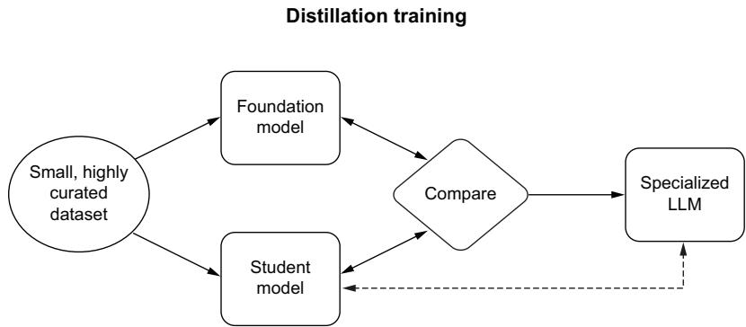  
Figure 5.5 Knowledge distillation allows a smaller model to learn from a foundation model to replicate similar behavior with fewer parameters. The student model does not always learn the emergent qualities of the foundation model, so the dataset must be especially curated. The dotted line indicates a special relationship as the student model becomes the specialized LLM.

The first step in knowledge distillation is to select a pre-trained LLM as the teacher model. This could be any of the large models, such as Llama 2 70B or Falcon 180B, which have been trained on vast amounts of data. You also need to create or select a smaller model as the student. The student model might have a similar architecture to the teacher’s, but with fewer layers or reduced dimensionality to make it smaller and faster.

Next, the student model is trained on the same task as the teacher model. However, instead of learning from the raw data directly, the student model learns to mimic the teacher model’s outputs. This training is typically done by adding a term to the loss function that encourages the student model’s predictions to be similar to the teacher

model’s predictions. Thus, the student model not only learns from the task-specific labels but also benefits from the rich representations learned by the teacher model.

Once the distillation process is complete, you’ll have a compact student model that can handle the specific tasks learned from the teacher model but at a fraction of the size and computational cost. The distilled model can then be further finetuned on a specific task or dataset if required. Through knowledge distillation, you can use the power of LLMs in situations where computational resources or response time are limited.

In listing 5.4, we show how to perform finetuning with knowledge distillation using BERT and becoming DistilBERT. As opposed to regular finetuning, pay attention to the size and performance of the model. Both will drop; however, size will drop much faster than performance.

Listing 5.4 An example of knowledge distillation   
import os   
from transformers import (   
Tokenizer,   
TrainingArguments,   
Trainer,   
AutoModelForSequenceClassification,   
DataCollatorWithPadding,   
)   
from datasets import load_dataset, load_metric   
import torch   
import torch.nn as nn   
import torch.nnfunctional as F   
import numpy as np   
def process(examples): tokenized_entries $=$ tokenizer( examples["sentence"], truncation=True, max_length=256 1 return tokenized_entries   
def compute.metrics(eval_pred): predictions, labels $=$ eval_pred predictions $=$ np.argmax predictions, axis $\coloneqq$ 1) acc $=$ accuracy_metric.compute( predictions $\equiv$ predictions, references $\equiv$ labels 1 return { "accuracy": acc["accuracy"],   
class DistillationTrainingArguments(TrainingArguments): def __init__(self,\*args,alpha=0.5,temperature=2.0,\*\*kwargs): super().__init__(\*args,\*\* kwargs)

self.alpha $=$ alpha self.temperature $=$ temperature

class DistillationTrainer(Trainer): Place teacher on same device as student   
def __init__(self, *args, teacher_model=None, **kwargs): super().__init__(*args, **kwargs) self_teacher = teacher_model self._move_model_to_device(self_teacher, self.modeldevice) < self_teacher.eval() Comutes student   
def compute_loss(self, model, inputs, return_outputs=False): outputs/student $=$ model(\*\*inputs) student_loss $=$ outputs(student.loss with torch.no_grad(): $\begin{array}{rlr}{\mathbb{A}}&{\mathbb{A}}&{\mathbb{A}}\end{array}$ computes teacher output assert ( outputs/student.logits.size() $= =$ outputs_teacher.logits.size() # Soften probabilities and compute distillation loss loss_function $=$ nn.KLDivLoss(reduction="batchmean") loss_logits $=$ loss_function( F.log softmax( outputs/student.logits / self.args.temperature, dim=-1 ), F softmax( outputs_teacher.logits / self.args.temperature, dim=-1 ), \*) $\star$ (self.args.temperature**2) Loss $=$ ( $\begin{array}{rlr}{\mathbb{A}}&{\mathbb{A}}&{\mathbb{A}}\end{array}$ Returns weighted student loss self.args.alpha $\star$ student_loss + (1.0 - self.args.alpha) $\star$ loss_logits ) return (loss, outputs/student) if return_outputs else loss

if _name_ $= =$ "main": model_dir $\equiv$ "/models/KDGPT/" if not os.path.exists(model_dir): os.makedirs(model_dir) student_id $\equiv$ "gpt2" 1 Defines the teacher and student models teacher_tokenizer $\equiv$ AutoTokenizer.from_pretrained(teacher student_tokenizer $\equiv$ AutoTokenizer.from_pretrained(student sample $=$ "Here's our sanity check." assert teacher_tokenizer(sample) $= =$ student_tokenizer(s f"\{teacher_tokenizer(sample)}！ $=$ {student_tokenizer(

del teacher_tokenizer   
del student_tokenizer   
tokenizer = AutoTokenizer.from_pretrained(teacher_id)   
tokenizer.add_special_tokens({"pad_token": ["PAD"]})   
dataset_id $=$ "glue"   
dataset_config $=$ "sst2"   
dataset $=$ load_dataset(dataset_id, dataset_config)   
tokenized_dataset $=$ dataset.map(process,batched=True)   
tokenized_dataset $=$ tokenized_datasetlename_column("label","labels")   
print(tokenized_dataset["test"].features)   
labels $=$ tokenized_dataset["train"].features["labels"].names   
num_labels $=$ len(labels)   
label2id，id2label $=$ dict(),dict() Creates label2id, id2label说明书for nice outputs for the model   
for i, label in enumerate Labels): id2label[label] $\equiv$ str(i) id2label[str(i)] $\equiv$ label   
training_args $=$ DistillationTrainingArguments( Defines training args output_dir $\equiv$ model_dir, num_train_epochs=1, per_device_train_batch_size=1, per_device_eval_batch_size=1, fp16=True, learning_rate=6e-5, seed=8855, Evaluation strategies evaluation_strategy $=$ "epoch", save_strategy $=$ "epoch", save_total_limit=2, load_best_model_at_end=True, metric_for_best_model $=$ "accuracy", report_to="none", push_to_hub=False, alpha=0.5, distillation Pushes to hub parameters data.collator   
data.collator $=$ DataCollatorWithPadding(tokenizer=tokenizer)   
teacher_model $=$ AutoModelForSequenceClassification.from_pretrained( teacher_id, num_labels $\equiv$ num_labels, id2label $\equiv$ id2label, label2id $\equiv$ label2id,   
)   
student_model $=$ AutoModelForSequenceClassification.from_pretrained( student_id, num_labels $\equiv$ num_labels, id2label $\equiv$ id2label,

label2id $=$ label2id,   
)   
accuracy_metric $\equiv$ load_metric("accuracy") Defines metrics and metrics function   
trainer $=$ DistillationTrainer( student_model, training_args, teacher_model $\equiv$ teacher_model, train_dataset $\equiv$ tokenized_dataset["train"], eval_dataset $\equiv$ tokenized_dataset["validation"], data_collator $\equiv$ data_collator, tokenizer $\equiv$ tokenizer, compute.metrics $\equiv$ compute.metrics,   
)   
trainer.train()   
trainer.save_model(model_dir)

Knowledge distillation, as exemplified by the provided compute_loss method, is a technique that enables the transfer of valuable insights from a teacher model to a more lightweight student model. In this process, the teacher model provides soft targets, offering probability distributions over possible outputs, which are then utilized to train the student model. The critical aspect of knowledge distillation lies in the alignment of these distributions, ensuring that the student model not only learns to mimic the teacher’s predictions but also gains a deeper understanding of the underlying data. This approach helps improve the student’s generalization capabilities and performance on various tasks, ultimately making it more efficient and adaptable.

As we look forward, one logical progression beyond knowledge distillation is the incorporation of RLHF. While knowledge distillation enhances a model’s ability to make predictions based on existing data, RLHF allows the model to learn directly from user interactions and feedback. This dynamic combination not only refines the model’s performance further but also enables it to adapt and improve continuously. By incorporating human feedback, RL can help the model adapt to real-world scenarios, evolving its decision-making processes based on ongoing input, making it an exciting and natural evolution in the development of LLM systems.

# 5.3.3 Reinforcement learning with human feedback

RLHF is a newer training technique developed to overcome one of the biggest challenges when it comes to RL: how to create reward systems that actually work. It sounds easy, but anyone who’s played around with RL knows how difficult it can be. Before AlphaStar, one author was building his own RL bot to play StarCraft, a war simulation game in space.

NOTE Check out https://mng.bz/Dp4a to learn more about AlphaStar.

A simple reward system based on winning or losing was taking too long, so he decided to give it some reasonable intermediate rewards based on growing an army. However, this got blocked when it failed to build Pylons, a building required to increase army supply limits. So he gave it a reward to build Pylons. His bot quickly learned that it liked to build Pylons—so much so that it learned to almost win but not win, crippling its opponent so that it could keep building Pylons unharassed and for as long as it wanted.

With a task like winning a game, even if it’s difficult, we can usually still come up with reasonable reward systems. But what about more abstract tasks, like teaching a robot how to do a backflip? These tasks get really difficult to design reward systems for, which is where RLHF comes in. What if instead of designing a system, we simply have a human make suggestions? A human knows what a backflip is, after all. The human will act like a tutor, picking attempts it likes more as the bot is training. That’s what RLHF is, and it works really well. Applied to LLMs, a human simply looks at generated responses to a prompt and picks which one they like more. See figure 5.6.

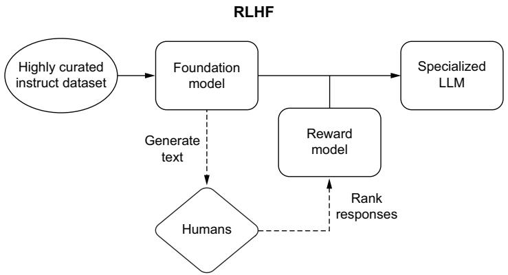  
Figure 5.6 RLHF substitutes a loss function for a reward model and proximal policy optimization (PPO), allowing the model a much higher ceiling for learning trends within the data, including what is preferred as an output instead of what completes the task.

While very powerful, RLHF likely won’t stick around for very long. The reason is that it is incredibly computationally expensive for a result that is only incrementally better, especially a result that can be achieved and matched by higher-quality datasets with supervised learning approaches.

There are some other problems with RLHF, such as that it requires hiring domain experts to evaluate and provide the human feedback. Not only can this get expensive, but it can also lead to privacy concerns since these reviewers would need to look at actual traffic and user interactions to grade them. To combat both of these concerns, you could try to outsource this directly to the users, asking for their feedback, but it

may end up poisoning your data if your users have ill intent or are simply not experts in the subject matter, in which case they might upvote responses they like but that aren’t actually correct. This gets to the next problem: even experts have biases. RLHF doesn’t train a model to be more accurate or factually correct; it trains the model to generate human-acceptable answers.

In production, RLHF has the advantage of allowing you to easily update your model on a continual basis. However, this is a two-edged sword, as it also increases the likelihood of your model degrading over time. OpenAI uses RLHF heavily, and it has led to many users complaining about their models, like GPT-4, becoming terrible in certain domains compared to when it first came out. One Stanford study found that GPT-4, when asked if a number was prime, used to get it right $9 8 \%$ of the time in March 2023, but three months later, in June 2023, it would only get it right $2 \%$ of the time.1 One reason is that the June model is much less verbose, opting to give a simple yes or no response. Humans like these responses. Getting straight to the point is often better, but LLMs tend to be better after they have had time to reason through the answer with techniques like chain of thought.

With this in mind, RLHF is fantastic for applications where human-acceptable answers are the golden standard, and factually correct answers are less important—for example, a friendly chatbot or improving summarization tasks. These problems are intuitively syntactic in nature, essentially tasks that LLMs are already good at but which you want to refine by possibly creating a certain tone or personality.

Another reason for RLHF degradation is due to data leakage. Data leakage is when your model is trained on the test or validation dataset you use to evaluate it. When this happens, you are essentially allowing the model to cheat, leading to overfitting and poor generalization. It’s just like how LeetCode interview questions lead tech companies to hire programmers who have lots of experience solving toy problems but don’t know how to make money or do their job.

How does this happen? Well, simply. When you are running an LLM in production with RLHF, you know it’s going to degrade over time, so it’s best to run periodic evaluations to monitor the system. The more you run these evaluations, the more likely that one of the prompts will be picked up for human feedback and subsequent RL training. It could also happen by pure coincidence if your users happen to ask a question similar to a prompt in your evaluation dataset. Either way, without restrictions placed on RLHF (which generally are never done), it’s a self-defeating system.

The really annoying aspect of continual updates through RLHF is that these updates ruin downstream engineering efforts, methods like prompting or retrievalaugmented generation (RAG). Engineering teams can take a lot of effort to dial in a process or procedure to query a model and then clean up responses, but all that work can easily be undermined if the underlying model is changing. As a result, many teams prefer a static model with periodic updates to one with continual updates.

All that said, RLHF is still a powerful technique that may yield greater results later as it is optimized and refined. Also, it’s just really cool. We don’t recommend using RLHF, and we don’t have the space here to delve deeper; just know that it is a tool used by companies specializing in LLMs. For readers who want to understand RLHF better, we have included an in-depth example and code listing in appendix B.

# 5.3.4 Mixture of experts

A mixture of experts (MoE) is functionally the same as any other model for training but contains a trick under the hood: sparsity. This gives the advantage of being able to train a bunch of models on a diverse set of data and tasks at once. You see, a MoE is exactly what it sounds like: an ensemble of identical models in the beginning. You can think of them as a group of freshman undergrads. Then, using some unsupervised grouping methods, such as k-means clustering, each of these experts “picks a major” during training. This allows the model only to activate some experts to answer particular inputs instead of all of them, or maybe the input is complex enough that it requires activating all of them. The point is that once training has completed, if it has been done on a representative-enough dataset, each of your experts will have a college degree in the major that they studied. Because the homogeneity of inputs is determined mathematically, those majors won’t always have a name that correlates to something you would major in at school, but we like to think of these as eccentric double minors or something of the sort. Maybe one of your experts majored in physics but double minored in advertising and Africana studies. It doesn’t really matter, but the major upside to designing an ensemble of models in this way is that you can effectively reduce computational requirements immensely while retaining specialization and training memory by only consulting the experts whose knowledge correlates with the tokenized input at inference time.

In listing 5.5, we finetune a MoE model in much the same way as we did in listing 5.2 with GPT-2, thanks to Hugging Face’s API and Google’s Switch Transformer. Unlike the method we described in chapter 3, where we turned a feed-forward network into an MoE, we’ll start with an already created MoE and train it on our own dataset. Training an MoE is pretty simple now, unlike when they first came out. Very smart people performed so much engineering that we can give an oversimplified explanation of these models. Google created the Switch Transformer to combat two huge problems they had run into while trying to train LLMs: size and instability. Google engineers simplified the routing algorithm (how the model decides which experts to query for each input) and showed how to train models with lower quantizations (in this case, bfloat16) for the first time—quite an amazing feat and not one to take lightly, as GPT-4 is likely an MoE.

# Listing 5.5 Example mixture of experts finetuning

```python
import os  
from transformers import (  
    AutoTokenizer,  
    Switch TransformersForConditionalGeneration, 
```

SwitchTransformersConfig,   
TrainingArguments,   
Trainer,   
DataCollatorForLanguageModeling,   
)   
from datasets import load_dataset Loads and   
import torch formats the dataset   
dataset $=$ load_dataset("text",data_files $\equiv$ "/data/crimeandpunishment.txt") dataset $=$ dataset.filter( lambda sentence: len sentence["text"]）>1) print(f"Dataset 1:{dataset['train'] [0]})   
model_dir $= "$ ./models/MoE/" Creates model directory to save to Instantiates our tokenizer   
if not os.path.exists(model_dir): os.makedirs(model_dir)   
tokenizer $=$ AutoTokenizer.from_pretrained("google/switch-base-8")   
config $=$ Switch TransformersConfig( Establishes our Switch Transformers config   
decoder_start_token_id $\equiv$ tokenizer.pad_token_id   
def tokenizer=(batch): Createa tokenize function Tokenizes our whole dataset (so we never have to do it again)   
return tokenizer( str(batch),padding $\equiv$ "max_length",truncation $\equiv$ True,max_length=256   
print(f"Tokenized:{tokenized_dataset['train'] [0])")   
data.collator $=$ DataCollatorForLanguageModeling( Tokenizer $\equiv$ tokenizer,mlm=False,mlm_probability $= 0.0$ # Causal Language Modeling - Does not use mask   
train_args $=$ TrainingArguments( Establishes training arguments   
output_dir $\equiv$ model_dir,   
num_train_epochs $= 1$ ,   
per_device_train_batch_size $= 8$ ,   
save_steps $= 5000$ ,   
save_total_limit $= 2$ ,   
report_to="none",   
)   
trainer $=$ Trainer( Instantiates the trainer

args $\equiv$ train_args, data.collator $\equiv$ data.collator, train_dataset $\equiv$ tokenized_dataset["train"],   
Trains and saves trainer.train() the model   
trainer.save_model(model_dir)   
tokenizer.save_pretrained(model_dir) Loads the saved model   
model $=$ SwitchTransformersForConditionalGeneration.from_pretrained( 1 model_dir, device_map $\equiv$ "auto", torchdtype $\equiv$ torch.float16,   
1 Tests the input $=$ "To be or not <extra_id_0><extra_id_0>" tokenized_input $\equiv$ tokenizer(input, return_tensors="pt") out $=$ model_generate( input_ids=tokenized_input["input_ids"].to("cuda"), attention_mask $\equiv$ tokenized_input["attention_mask"], max_length $= 256$ num_beams $= 5$ temperature $= 0.7$ top_k $= 50$ top_p $= 0.90$ norepeat_ngram_size $= 2$ -   
print(f"To be or not {tokenizerdecode(out[0], skip_special_tokens=True)}")

In this script, an MoE model is finetuned using the Switch Transformer foundation model. MoE models are unique during finetuning because you typically update the taskspecific parameters, such as the gating mechanism and the parameters of the experts, while keeping the shared parameters intact. This allows the MoE to use the expertise of the different experts for better task-specific performance. Finetuning MoE models differs from traditional finetuning because it requires handling the experts and gating mechanisms, which can be more complex than regular neural network architectures. In our case, we’re lucky that trainer.train() with the right config covers it for finetuning, and we can just bask in the work that Google did before us.

A logical progression beyond MoE finetuning involves exploring Parameter-Efficient Fine-Tuning (PEFT) and low-rank adaptations (LoRA). PEFT aims to make the finetuning process more efficient by reducing the model’s size and computational demands, making it more suitable for resource-constrained scenarios. Techniques such as knowledge distillation, model pruning, quantization, and compression can be employed in PEFT to achieve this goal. In contrast, LoRA focuses on incorporating low-rank factorization methods into model architectures to reduce the number of parameters while maintaining or even enhancing model performance. These approaches are essential, as they enable the deployment of sophisticated models on devices with limited resources and in scenarios where computational efficiency is paramount.

# 5.3.5 LoRA and PEFT

LoRA represents a significant breakthrough for machine learning in general. Taking advantage of a mathematical trick, LoRAs can change the output of a model without changing the original model weights or taking up significant space or cost, as shown in figure 5.7. The reason for the significance here is that it makes finetuning a separate model for many different tasks or domains much more feasible, as has already been seen in the diffusion space with text2image LoRAs popping up quite often for conditioning model output without significantly altering the base model’s abilities or style. Put simply, if you already like your model and would like to change it to do the exact same thing in a new domain without sacrificing what it was already good at on its own, an adapter might be the path for you, especially if you have multiple new domains that you don’t want bleeding into one another.

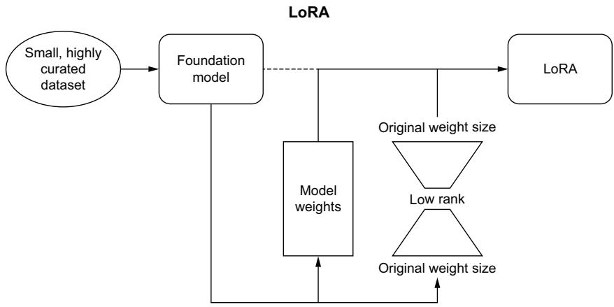  
Figure 5.7 LoRA exemplifies the idea that you should only need to train and save the difference between where the foundation model is and where you want it to be. It does this through singular value decomposition (SVD).

To understand LoRAs, you need to first understand how models currently adjust weights. Since we aren’t going to go over a complete backpropagation tutorial here, we can abstract it as

$$
\mathbf {W} = \mathbf {W} + \Delta \mathbf {W}
$$

So if you have a model with 100 100-dimensional layers, your weights can be represented by a $1 0 0 \times 1 0 0$ matrix. The cool part comes with singular value decomposition (SVD), which has been used for compression by factoring a single matrix into three smaller matrices. We covered this topic in depth back in chapter 3 (see listing 3.2). So while we know the intuition for SVD with LLMs, what can we compress from that original formula?

$$
\Delta W = W _ {a} \times W _ {b}
$$

So if $\Delta \mathrm { W } = 1 0 0 \times 1 0 0$ , $\mathrm { W _ { a } } = 1 0 0 \times \mathrm { c }$ and $\mathbf { W _ { b } } = \mathbf { c } \times 1 0 0$ , where $c < 1 0 0$ . If $c = 2$ , you can represent 10,000 elements using only 400 because when they’re multiplied together, they equal the 10,000 original elements. So the big question is, what does c equal for your task? The c-value is the “R” in LoRA, referring to the rank of the matrix of weights. There are algorithmic ways of determining that rank using eigenvectors and the like, but you can approximate a lot of it by knowing that a higher rank equals more complexity, meaning that the higher the number you use there, the closer you’ll get to original model accuracy, but the less memory you’ll save. If you think the task you’re finetuning the LoRA for isn’t as complex, reduce the rank.

The next listing shows you how to combine creating a LoRA and then perform inference with both the LoRA and your base model.

# Listing 5.6 Example LoRA and PEFT training

import os   
from datasets import load_dataset   
from transformers import ( AutoModelForTokenClassification, AutoTokenizer, DataCollatorForTokenClassification, TrainingArguments, Trainer,   
)   
from peft import ( PeftModel, PeftConfig, get_peft_model, LoraConfig, TaskType,   
)   
import evaluate   
import torch   
import numpy as np   
model_checkpoint $=$ "meta-llama/Llama-2-7b-hf" lr $= 1\mathrm{e} - 3$ batch_size $= 16$ num_epochs $= 10$ model_dir $=$ "/models/LoRAPEFT" Creates model directory to save to   
if not os.path.exists(model_dir): os.makedirs(model_dir)   
bionlp $=$ load_dataset("tner/bionlp2004")   
seqeval $=$ evaluate.load("seqeval")   
label_list $=$ [ "O", "B-DNA", "I-DNA", "B-protein",

"I-protein", "B-cell_type", "I-cell_type", "B-cell_line", "I-cell_line", "B-RNA", "I-RNA", ]   
def compute.metrics(p): predictions, labels $=$ p predictions $=$ np.argmax(predictions, axis=2) truepredictions $=$ [ [label_list[p] for (p,l) in zip_prediction, label) if 1 != -100] for prediction, label in zip(predictions, labels) ] true_labels $=$ [ [label_list[1] for (p,l) in zip_prediction, label) if 1 != -100] for prediction, label in zip(predictions, labels) results $=$ seqeval.compute( predictions=truepredictions, references=true_labels return { "precision": results["overall_precision"], "recall": results["overall_recall"], "f1": results["overall_f1"], accuracy": results["overall.accuracy"], }   
tokenizer $=$ AutoTokenizer.from_pretrained( model_checkpoint, add_prefix_space=True )   
deftokenizer_and_align_labels(examples): tokenized_entries $=$ tokenizer( examples["tokens"], truncation=True, is_splitInto_words=True) labels $=$ [] for i, label in enumerate(examples["tags"]), word_ids $=$ tokenized_entries(word_ids(batch_index=i) previous_word_idx $\equiv$ None label_ids $=$ [] for word_idx in word_ids: if word_idx is None: label_ids.append(-100) elif word_idx != previous_word_idx: label_ids.append.label[word_idx])

else: label_ids.append(-100) previous_word_idx $\equiv$ word_idx labels.append labelled_ids) tokenized_entries["labels"] $=$ labels return tokenized_entries   
tokenized_bionlp $\equiv$ bionlp.map(tokenize_and_align_labels,batched=True)   
data.collator $\equiv$ DataCollatorForTokenClassification(tokenizer=tokenizer)   
id2label $=$ { 0:"O", 1:"B-DNA", 2:"I-DNA", 3:"B-protein", 4:"I-protein", 5:"B-cell_type", 6:"I-cell_type", 7:"B-cell_line", 8:"I-cell_line", 9:"B-RNA", 10:"I-RNA", }   
label2id $=$ { "O":0, "B-DNA":1, "I-DNA":2, "B-protein":3, "I-protein":4, "B-cell_type":5, "I-cell_type":6, "B-cell_line":7, "I-cell_line":8, "B-RNA":9, "I-RNA":10,   
}   
model $\equiv$ AutoModelForTokenClassification.from_pretrained( model_checkpoint,num_labels $\coloneqq$ 11,id2label $\equiv$ id2label, label2id $\equiv$ label2id   
peft_config $\equiv$ LoraConfig( task_type $\equiv$ TaskType.TOKEN_CLS, inference_mode $\equiv$ False, r=16, lora_alpha=16, lora_dropout=0.1, bias="all",   
)   
model $\equiv$ get_peft_model(model, peft_config)   
model.print_trainable_parameters()

training_args $=$ TrainingArguments( output_dir $\equiv$ model_dir, learning_rate $\equiv$ 1r, per_device_train_batch_size $\equiv$ batch_size, per_device_eval_batch_size $\equiv$ batch_size, num_train_epochs $\equiv$ num_epochs, weight Decay $\equiv$ 0.01, evaluation_strategy $\equiv$ "epoch", save_strategy $\equiv$ "epoch", load_best_model_at_end $\equiv$ True,   
)   
trainer $=$ Trainer( model $\equiv$ model, args $\equiv$ training_args, train_dataset $\equiv$ tokenized_bionlp["train"], eval_dataset $\equiv$ tokenized_bionlp["validation"], tokenizer $\equiv$ tokenizer, data.collator $\equiv$ data.collator, compute.metrics $\equiv$ compute.metrics,   
)   
trainer.train()   
peft_model_id $=$ "stevhliu/roberta-large-lora-token-classification" config $=$ PeftConfig.from_pretrained(model_dir)   
inference_model $=$ AutoModelForTokenClassification.from_pretrained( config.base_model_name_or_path, num_labels $= 11$ id2label $\equiv$ id2label, label2id $\equiv$ label2id,   
)   
tokenizer $=$ AutoTokenizer.from_pretrained(config.base_model_name_or_path) model $=$ PeftModel.from_pretrained(inference_model, peft_model_id)   
text $=$ ( "The activation of IL-2 gene expression and NF-kappa B through CD28 " "requires reactive oxygen production by 5-lipoxygenase."   
) inputs $=$ tokenizer(text, return_tensors="pt")   
with torch.no_grad(): logits $=$ model(**inputs).logits   
tokens $=$ inputs(tokens): predictions $=$ torch.argmax(logits, dim=2)   
for token, prediction in zip(tokens, predictions[0].numpy(): print((token, model.config.id2label [prediction]))

Keep in mind that you still need to keep your base model, as shown in listing 5.6. The LoRA is run in addition to the foundation model; it sits on top and changes the weights at only the rank determined in the LoraConfig class (in this case, 16). RoBERTa-Large was likely already decent at doing token classification on the bionlp

dataset, but now, running with the LoRA on top, it’ll be even better. There are multiple types of LoRAs you can use, with QLoRA, QA-LoRA, and AWQ-LoRA all gaining popularity in different domains and tasks. With the transformers library, which can be controlled from the LoraConfig, we encourage you to experiment with different adaptation methods to find what works for your data and task.

The most attractive thing about LoRA is that the particular one we discussed here results in a file only 68 KB in size on disk and still has a significant performance boost. You could create LoRAs for each portion of your company that wants a model, one for the legal team that’s siloed so it doesn’t have to worry about any private data it is putting into it, one for your engineering team to help with code completion and answering questions about which data structures or algorithms to use, and one for anyone else. Because they’re so small, it’s suddenly much more feasible to store than the 1.45 GB (14.5 GB if we use Llama in fp16; it’s 28 GB in fp32) RoBERTa-Large model being finetuned a bunch of times. In the spirit of giving you more of these time- and space-saving tips, we’ll go over some things that aren’t mentioned anywhere else, but you may still get some use out of if the data science part of LLMs is what you are working with.

# 5.4 Training tips and tricks

While this book isn’t focused on training and researching new models, we feel kind of bad telling you that finetuning models is an effective strategy for teaching LLMs correct guardrails based on your data and then just leaving you to figure out how to make it work on your own stuff. With this in mind, let’s look at some tried-and-true tips and tricks for both training and finetuning LLMs. These tips will help you with some of the least-intuitive parts of training LLMs that most practitioners (like us) had to learn the hard way.

# 5.4.1 Training data size notes

First off, LLMs are notorious for overfitting. If you are considering training a foundation model, you need to consider the amount of data you have, which should be roughly $2 0 \times$ the number of parameters you’re trying to train.2 For example, if you’re training a 1B parameter model, you should train it on 20B tokens. If you have fewer tokens than that, you will run the risk of overfitting.

If you already have a model and need to finetune it on your data, consider the inverse, where you should likely have ${ \sim } 0 . 0 0 0 0 0 1 \times$ the number of tokens as a minimum (10K tokens for a 1B parameter model). We came up with this rule of thumb based on our experience, although it should be fairly intuitive. If you have fewer than 1/100,000 of your model parameters in tokens, finetuning likely won’t have much of an effect. In this case, you should consider another strategy that won’t cost as much,

such as LoRA (which we just discussed), RAG (which we talk about in the next chapter), or a system that uses both.

For both these examples, we’ve had the experience where a company we worked for hoped for great results with minimal data and was disappointed. One hoped to train an LLM from scratch with only ${ \sim } 1$ million tokens while also disallowing open source datasets, and another wanted to finetune the model but only on a couple of hundred examples. Neither of these approaches were cost-efficient, nor did they create models that performed up to the standards the companies aimed for.

# 5.4.2 Efficient training

We’ve so far focused on tools and methodologies for training, which should supercharge your ability to create the best and largest models your training system allows. However, other factors should be considered when setting up your training loops. In physics, the uncertainty principle shows that you can never perfectly know both the speed and position of a given particle. Machine learning’s uncertainty principle is that you can never perfectly optimize both your speed and your memory utilization. Improving speed comes at the cost of memory, and vice versa. Table 5.2 shows some choices you can make in training and their effects on speed and memory.

Table 5.2 Training choices to consider   

<table><tr><td>Method</td><td>Improve speed</td><td>Improves memory utilization</td><td>Difficulty</td></tr><tr><td>Batch size choice</td><td>Yes</td><td>Yes</td><td>Easy</td></tr><tr><td>Gradient accumulation</td><td>No</td><td>Yes</td><td>Medium</td></tr><tr><td>Gradient checkpointing</td><td>No</td><td>Yes</td><td>Medium</td></tr><tr><td>Mixed precision</td><td>Yes</td><td>No</td><td>Hard</td></tr><tr><td>Optimizer choice</td><td>Yes</td><td>Yes</td><td>Easy</td></tr><tr><td>Data preloading</td><td>Yes</td><td>No</td><td>Medium</td></tr><tr><td>Compiling</td><td>Yes</td><td>No</td><td>Easy</td></tr></table>

Carefully consider your options and what goal you’re working toward when setting up your training loop. For example, your batch size should be a power of 2 to hit maximum speed and memory efficiency. One author remembers working on getting an LLM to have a single-digit milli-second response time. The team was gearing up to serve millions of customers as fast as possible, and every millisecond counted. After using every trick in the book, I was able to achieve it, and I remember the huge feeling of accomplishment for finally getting that within the data science dev environment. Yet, it turned out that there was a hard batch size of 20 in the production environment. It was just a nice number picked out of a hat, and too many systems were built around this assumption; no one wanted to refactor. Software engineers, am I right?

For the majority of these methods, the tradeoff is clear: if you go slower, you can fit a significantly larger model, but it will take way longer. Gradient accumulating and checkpointing can reduce memory usage by ${ \sim } 6 0 \%$ , but training will take much longer. The packages we talked about in section 5.1 can help mitigate these tradeoffs.

# 5.4.3 Local minima traps

Local minima are hard to spot with LLMs and, as such, can be difficult to avoid. If you see your model converging early, be suspicious and judiciously test it before accepting the results. When you find that your model is converging early at a certain number of steps, one way to avoid it on subsequent runs is to save and load a checkpoint 100 or so steps before you see the errant behavior, turn your learning rate way down, train until you’re sure you’re past it, and then turn it back up and continue. Make sure to keep the previously saved checkpoint, and save a new checkpoint after that so that you have places to come back to in case things go wrong!

You can probably tell that this is a frustrating occurrence that one author has run into before. He was so confused; he was working on a T5 XXL model, and around the 25K step mark, the model was converging and stopping early. He knew for a fact that it wasn’t actually converged; it was only $1 0 \%$ through the dataset! This happened two or three times, where he loaded up the checkpoint at around 20K steps and watched the exact same thing happen. It wasn’t until he loaded and turned the learning rate down that he finally saw the model improve past this point. Once he got through the patch of the local minimum, he turned it back up. This happened four more times throughout training this particular model, but since he knew what was happening, he was now able to avoid wasting lots of extra time. The lesson of the story? Use this rule of thumb: your LLM is not ready if it hasn’t trained on your full dataset.

# 5.4.4 Hyperparameter tuning tips

Hyperparameter tuning isn’t something we’ve gone over extensively in this book, not because it’s not interesting but because it doesn’t help nearly as much as changing up your data, either getting more or cleaning it further. If you want to tune hyperparameters, Optuna is a great package, and you can get that ${ \sim } 1 \%$ boost in accuracy or F1 score that you really need. Otherwise, if you’re looking for a boost in a particular metric, try representing that metric more completely within your dataset and maybe use some statistical tricks like oversampling.

While hyperparameter tuning is pretty cool mathematically, for LLMs, it’s not something that ever really needs to happen. If you need a boost in performance, you need more/better data, and tuning your hyperparameters will never match the performance boost you’d get quantizing the weights or performing any of the optimizations we’ve mentioned here or in chapter 3. The biggest performance boost we’ve ever gotten through tuning hyperparameters was about a $4 \%$ increase in F1, and we only did it because we wouldn’t be able to change our dataset for a couple of weeks at least.

# 5.4.5 A note on operating systems

Windows is not the right OS to work professionally with LLMs without the Windows Subsystem for Linux. MacOS is great but lacks the hardware packages to really carry this load unless you know how to use an NVIDIA or AMD GPU with a Mac. If you are uncomfortable with Linux, you should take some time to familiarize yourself with it while your OS of choice catches up (if it ever does). A myriad of free online materials are available to help you learn about Bash, Linux, and the command line. Configuring the CUDA Toolkit and Nvidia drivers on Linux can make you want to pull your hair out, but it’s worth it compared to the alternatives. Along with this, learn about virtual environments, Docker, and cloud computing, like what’s in this chapter!

All in all, Windows is easy in the beginning but frustrating in the long run. MacOS is also easy in the beginning but currently doesn’t work at all in the long run. Linux is incredibly frustrating in the beginning, but once you’re through that, it’s smooth sailing.

# 5.4.6 Activation function advice

We’ve neglected to really dive into activation functions so far, not because they aren’t useful or cool but because you generally don’t need to tweak your activation functions unless you’re doing research science on model performance. If you take vanilla GPT-2 and give it a GeGLU activation instead of the GELU that it comes with, you will not get a significant boost in anything. In addition, you’ll need to redo your pretraining, as it pretrained with a different activation function. Activation functions help reduce some of the mathematical weaknesses of each layer, be they imaginary numbers from the quadratic attention, exploding and vanishing gradients, or maybe the researchers noticed positional encodings disappearing as they went through the model and changed a little bit. You can learn about activation functions, and we recommend doing so; in general, you can trust the papers that introduce new ones.

We’ve come a long way in this chapter, discussing setting up an environment, training an LLM from scratch, and looking at a multitude of finetuning techniques. While we recognize there are still many aspects to this process that we did not touch on and that you need to learn on your own, you should be more than ready to create your own models. Now that you have a model, in the next chapter, we’ll discuss making it production-ready and creating an LLM service you can use to serve online inference.

# Summary

 Training is memory intensive, and you will need to master multi-GPU environments for many LLM training tasks.   
 Model training has the same basic steps every time:

– Dataset preparation—Acquire, clean, and curate your data.   
– Model preparation—Define model behavior, architecture, loss functions, etc.   
– Training loop—Initialization, tokenize, batch data, get predictions/loss, backpropagation, etc.

 Good data has a significantly greater effect on model performance than architecture or the training loop.   
 Finetuning is way easier than training from scratch because it requires much less data and resources.   
 Prompting allows us to train a model on a specific task after the fact, which is one of the reasons LLMs are so powerful compared to traditional ML.   
1 Prompt tuning is a powerful way to focus your model to respond as a specialist to certain prompts.   
 Knowledge distillation is useful for training powerful smaller models that are efficient and adaptable.   
 RLHF is great at getting a model to respond in a way that pleases human evaluators but increases factually incorrect results.   
 Finetuning MoE models differs from traditional finetuning because it requires handling the experts and gating mechanisms.   
 LoRA is a powerful finetuning technique that adapts pretrained models to new tasks by creating tiny assets (low-rank matrices) that are fast to train, easy to maintain, and very cost-effective.   
1 The quality and size of your data are two of the most important considerations for successfully training your model.   
 The major training tradeoff is speed for memory efficiency; if you go slower, you can fit a significantly larger model, but it will take way longer.

# Large language model services:

# A practical guide

# This chapter covers

How to structure an LLM service and tools to deploy   
How to create and prepare a Kubernetes cluster for LLM deployment   
Common production challenges and some methods to handle them   
 Deploying models to the edge

The production of too many useful things results in too many useless people.

—Karl Marx

We did it. We arrived. This is the chapter we wanted to write when we first thought about writing this book. One author remembers the first model he ever deployed. Words can’t describe how much more satisfaction this gave him than the dozens of projects left to rot on his laptop. In his mind, it sits on a pedestal, not because it was good—in fact, it was quite terrible—but because it was useful and actually used by those who needed it the most. It affected the lives of those around him.

So what actually is production? “Production” refers to the phase where the model is integrated into a live or operational environment to perform its intended

tasks or provide services to end users. It’s a crucial phase in making the model available for real-world applications and services. To that end, we will show you how to package up an LLM into a service or API so that it can take on-demand requests. We will then show you how to set up a cluster in the cloud where you can deploy this service. We’ll also share some challenges you may face in production and some tips for handling them. Lastly, we will talk about a different kind of production, deploying models on edge devices.

# 6.1 Creating an LLM service

In the last chapter, we trained and finetuned several models, and we’re sure you can’t wait to deploy them. Before you deploy a model, though, it’s important to plan ahead and consider different architectures for your API. Planning ahead is especially vital when deploying an LLM API. It helps outline the functionality, identify potential integration challenges, and arrange for necessary resources. Good planning streamlines the development process by setting priorities, thereby boosting the team’s efficiency.

In this section, we are going to take a look at several critical topics you should take into consideration to get the most out of our application once deployed. Figure 6.1 demonstrates a simple LLM-based service architecture that allows users to interact with our LLM on demand. This is a typical use case when working with chatbots, for example. Setting up a service also allows us to serve batch and stream processes while abstracting away the complexity of embedding the LLM logic directly into these pipelines. Of course, running an ML model from a service will add a communication latency to your pipeline, but LLMs are generally considered slow, and this extra latency is often worth the tradeoff.

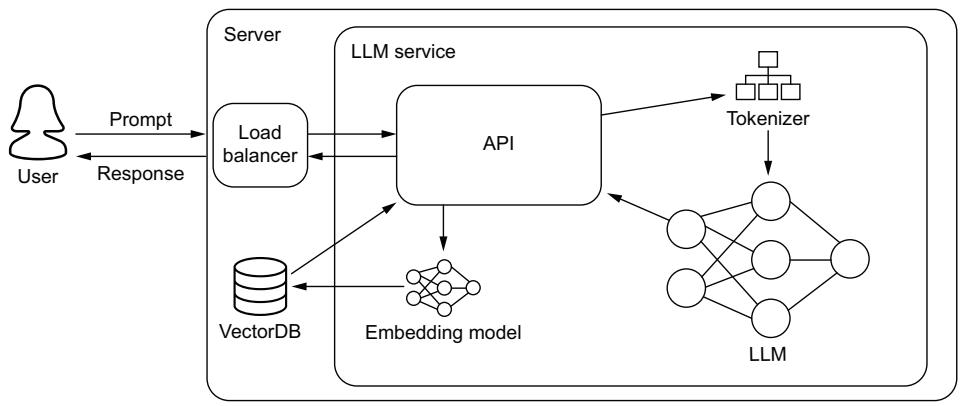  
Figure 6.1 A basic LLM service. A majority of the logic is handled by the API layer, which will ensure the correct preprocessing of incoming requests is done and serve the actual inference of the request.

While figure 6.1 appears neat and tidy, it is hiding several complex subjects you’ll want to work through, particularly in that API box. We’ll be talking through several key

features you’ll want to include in your API, like batching, rate limiters, and streaming. You’ll also notice some preprocessing techniques like retrieval-augmented generation (RAG) hidden in this image, which we’ll discuss in depth in section 6.1.7. By the end of this section, you will know how to approach all of this, and you will have deployed an LLM service and understand what to do to improve it. But before we get to any of that, let’s first talk about the model itself and the best methods to prepare it for online inference.

# 6.1.1 Model compilation

The success of any model in production is dependent on the hardware it runs on. The microchip architecture and design of the controllers on the silicon will ultimately determine how quickly and efficiently inferences can run. Unfortunately, when programming in a high-level language like Python using frameworks like PyTorch or TensorFlow, the model won’t be optimized to take full advantage of the hardware. This is where compiling comes into play. Compiling is the process of taking code written in a high-level language and converting or lowering it to machine-level code that the computer can process quickly. Compiling your LLM can easily lead to major inference and cost improvements.

Various people have dedicated a lot of time to performing some of the repeatable efficiency steps for you beforehand. We covered Tim Dettmers’s contributions in the last chapter. Other contributors include Georgi Gerganov, who created and maintains llama.cpp for running LLMs using $\mathrm { C } + +$ for efficiency, and Tom Jobbins, who goes by TheBloke on Hugging Face Hub and quantizes models into the correct formats to be used in Gerganov’s framework and others, like oobabooga. Because of how fast this field moves, completing simple, repeatable tasks over a large distribution of resources is often just as helpful to others.

In machine learning workflows, this process typically involves converting our model from its development framework (PyTorch, TensorFlow, or other) to an intermediate representation (IR), like TorchScript, MLIR, or ONNX. We can then use hardwarespecific software to convert these IR models to compiled machine code for our hardware of choice—GPU, TPU (tensor-processing units), CPU, etc. Why not just convert directly from your framework of choice to machine code and skip the middleman? Great question. The reason is simple: there are dozens of frameworks and hundreds of hardware units, and writing code to cover each combination is out of the question. So instead, framework developers provide conversion tooling to an IR, and hardware vendors provide conversions from an IR to their specific hardware.

For the most part, the actual process of compiling a model involves running a few commands. Thanks to PyTorch 2.x, you can get a head start on it by using the torch.compile(model) command, which you should do before training and before deployment. Hardware companies often provide compiling software for free, as it’s a big incentive for users to purchase their product. Building this software isn’t easy, however, and often requires expertise in both the hardware architecture and the machine

learning architectures. This combination of these talents is rare, and there’s good money to be had if you get a job in this field.

We will show you how to compile an LLM in a minute, but first, let’s take a look at some of the techniques used. What better place to start than with the all-important kernel tuning?

# KERNEL TUNING

In deep learning and high-performance computing, a kernel is a small program or function designed to run on a GPU or other similar processors. These routines are developed by the hardware vendor to maximize chip efficiency. They do this by optimizing threads, registries, and shared memory across blocks of circuits on the silicon. When we run arbitrary code, the processor will try to route the requests the best it can across its logic gates, but it’s bound to run into bottlenecks. However, if we are able to identify the kernels to run and their order beforehand, the GPU can map out a more efficient route—and that’s essentially what kernel tuning is.

During kernel tuning, the most suitable kernels are chosen from a large collection of highly optimized kernels. For instance, consider convolution operations that have several possible algorithms. The optimal one from the vendor’s library of kernels will be based on various factors like the target GPU type, input data size, filter size, tensor layout, batch size, and more. When tuning, several of these kernels will be run and optimized to minimize execution time.

This process of kernel tuning ensures that the final deployed model is not only optimized for the specific neural network architecture being used but also finely tuned for the unique characteristics of the deployment platform. This process results in more efficient use of resources and maximizes performance. Next, let’s look at tensor fusion, which optimizes running these kernels.

# TENSOR FUSION

In deep learning, when a framework executes a computation graph, it makes multiple function calls for each layer. The computation graph is a powerful concept used to simplify mathematical expressions and execute a sequence of tensor operations, especially for neural network models. If each operation is performed on the GPU, it invokes many CUDA kernel launches. However, the fast kernel computation doesn’t quite match the slowness of launching the kernel and handling tensor data. As a result, the GPU resources might not be fully utilized, and memory bandwidth can become a choke point. It’s like making multiple trips to the store to buy separate items when we could make a single trip and buy all the items at once.

This is where tensor fusion comes in. It improves this situation by merging or fusing kernels to perform operations as one, reducing unnecessary kernel launches and improving memory efficiency. A common example of a composite kernel is a fully connected kernel that combines or fuses a matmul, bias add, and ReLU kernel. It’s similar to the concept of tensor parallelization. In tensor parallelization, we speed up the process by sending different people to different stores, like the grocery store, the hardware store, and a retail store. This way, one person doesn’t have to go to every

store. Tensor fusion can work very well with parallelization across multiple GPUs. It’s like sending multiple people to different stores and making each one more efficient by picking up multiple items instead of one.

# GRAPH OPTIMIZATION

Tensor fusion, when done sequentially, is also known as vertical graph optimization. We can also do horizontal graph optimization. These optimizations are often talked about as two different things. Horizontal graph optimization, which we’ll refer to simply as graph optimization, combines layers with shared input data but with different weights into a single broader kernel. It replaces the concatenation layers by pre-allocating output buffers and writing into them in a distributed manner.

In figure 6.2, we show an example of a simple deep learning graph being optimized. Graph optimizations do not change the underlying computation in the graph. They are simply restructuring the graph. As a result, the optimized graph performs more efficiently with fewer layers and kernel launches, reducing inference latency. This restructuring makes the whole process smaller, faster, and more efficient.

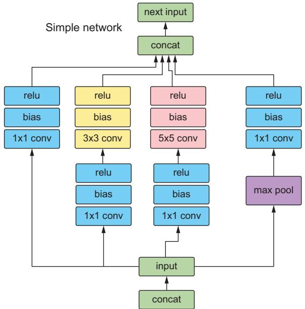

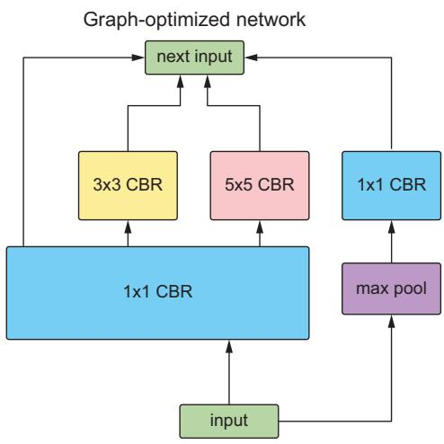  
Figure 6.2 An example of an unoptimized network compared to the same network optimized using graph optimization. CBR is a NVIDIA fused layer kernel that simply stands for Convolution, Bias, and ReLU. See the following NVIDIA blog post for reference: https://mng.bz/PNvw.

The graph optimization technique is often used in the context of computational graph-based frameworks like TensorFlow. Graph optimization involves techniques that simplify these computational graphs, remove redundant operations, and/or rearrange computations, making them more efficient for execution, especially on specific

hardware (like GPU or TPU). An example is constant folding, where the computations involving constant inputs are performed at compile time (before run time), thereby reducing the computation load during run time.

These aren’t all the techniques used when compiling a model, but they are some of the most common and should give you an idea of what’s happening under the hood and why it works. Now let’s look at some tooling to do this for LLMs.

# TENSORRT

NVIDIA’s TensorRT is a one-stop shop to compile your model, and who better to trust than the hardware manufacturer to better prepare your model to run on their GPUs? TensorRT does everything talked about in this section, along with quantization to INT8 and several memory tricks to get the most out of your hardware to boot.

In listing 6.1, we demonstrate the simple process of compiling an LLM using TensorRT. We’ll use the PyTorch version known as torch_tensorrt. It’s important to note that compiling a model to a specific engine is hardware specific. So you will want to compile the model on the exact hardware you intend to run it on. Consequently, installing TensorRT is a bit more than a simple pip install; thankfully, we can use Docker instead. To get started, run the following command:

```txt
$ docker run --gpus all -it --rm nvcr.io/nvidia/pytorch:23.09-py3 
```

This command will start up an interactive torch_tensorrt Docker container with practically everything we need to get started (for the latest version, see https://mng .bz/r1We). The only thing missing is Hugging Face Transformers, so go ahead and install that. Now we can run the listing.

After our imports, we’ll load our model and generate an example input so we can trace the model. We need to convert our model to an IR—TorchScript here—and this is done through tracing. Tracing is the process of capturing the operations that are invoked when running the model and makes graph optimization easier later. If you have a model that takes varying inputs, for example, the CLIP model, which can take both images and text and turn them into embeddings, tracing that model with only text data is an effective way of pruning the image operations out of the model. Once our model has been converted to an IR, then we can compile it for NVIDIA GPUs using TensorRT. Once completed, we then simply reload the model from disk and run some inference for demonstration.

# Listing 6.1 Compiling a model with TensorRT

import torch   
from transformers import GPT2Tokenizer, GPT2LMHeadModel   
import torch=tensorrt   
tokenizer $=$ GPT2Tokenizer.from_pretrained("gpt2")   
tokens $\equiv$ tokenizer("The cat is on the table.",return_tensors="pt")["input_ids"]．.CUDA()

model = GPT2LMHeadModel.from_pretrained( "gpt2", use_cache=False, return_dict=False, torchscript=True ).CUDA()   
model.eval()   
traced_model = torch.jit(trace(model, tokens) Converts to Torchscript IR   
compile_settings $=$ { Compiles the model with TensorRT   
"inputs": [ torch_tensorrt.Input( # For static size shape $= [1$ ，7]， #For dynamic sizing: #min_shape $= [1$ ，3]， #opt_shape $= [1$ ，128]， #max_shape $= [1$ ，1024]， dtype $\equiv$ torch.int32，#Datatype of input tensor. #Allowed options torch.(float|half|int8|int32|bool) 1, "truncate_long_and-double": True, "enabled_precisions":{torch.half}, Runs with FP16 "ir": "torchscript",   
}   
trt_model $=$ torch_tensorrt.compile(traced_model,\*\*compile_settings)   
torch.jit.save(trt_model,"trt_model.ts") Saves the compiled model   
trt_model $=$ torch.jit.load("trt_model.ts") Runs inference tokens.half()   
tokens $=$ tokens.type(torch.int)   
logits $=$ trt_model(tokens)   
results $=$ torch softmax(logits[-1],dim=-1).argmax(dim=-1)   
print(tokenizer.batchDecode(results))

# The output is

# ['\n was a the way.\n']

We’ll just go ahead and warn you: your results may vary when you run this code, depending on your setup. Overall, it’s a simple process once you know what you are doing, and we’ve regularly seen at least $2 \times$ speed improvements in inference times— which translates to major savings!

TensorRT really is all that and a bag of chips. Of course, the major downside to TensorRT is that, as a tool developed by NVIDIA, it is built with NVIDIA’s hardware in mind. When compiling code for other hardware and accelerators, it’s not going to be useful. Also, you’ll get very used to running into error messages when working with TensorRT. We’ve found that running into compatibility problems when converting models that aren’t supported is a common occurrence. We’ve run into many problems trying to compile various LLM architectures. Thankfully, to address this, NVIDIA has been working on a TensorRT-LLM library to supercharge LLM inference

on NVIDIA high-end GPUs. It supports many more LLM architectures than vanilla TensorRT. You can check if it supports your chosen LLM architecture and GPU setup here: https://mng.bz/mRXP.

Don’t get us wrong; you don’t have to use TensorRT. Several alternative compilers are available. In fact, let’s look at another popular alternative, ONNX Runtime. Trust us, you’ll want an alternative when TensorRT doesn’t play nice.

# ONNX RUNTIME

ONNX, which stands for Open Neural Network Exchange, is an open source format and ecosystem designed for representing and interoperating between different deep learning frameworks, libraries, and tools. It was created to address the challenge of model portability and compatibility. As mentioned previously, ONNX is an IR and allows you to represent models trained in one deep learning framework (e.g., Tensor-Flow, PyTorch, Keras, MXNet) in a standardized format easily consumed by other frameworks. Thus, it facilitates the exchange of models between different tools and environments. Unlike TensorRT, ONNX Runtime is intended to be hardware-agnostic, meaning it can be used with a variety of hardware accelerators, including CPUs, GPUs, and specialized hardware like TPUs.

In practical terms, ONNX allows machine learning practitioners and researchers to build and train models using their preferred framework and then deploy those models to different platforms and hardware without the need for extensive reengineering or rewriting of code. This process helps streamline the development and deployment of AI and ML models across various applications and industries. To be clear, ONNX is an IR format, while ONNX Runtime allows us to optimize and run inference with ONNX models.

To take advantage of ONNX, we recommend using Hugging Face’s Optimum. Optimum is an interface that makes working with optimizers easier and supports multiple engines and hardware, including Intel Neural Compressor for Intel chips and Furiosa Warboy for Furiosa NPUs. It’s worth checking out. For our purposes, we will use it to convert LLMs to ONNX and then optimize them for inference with ONNX Runtime. First, let’s install the library with the appropriate engines. We’ll use the --upgrade-strategy eager, as suggested by the documentation, to ensure the different packages are upgraded:

$ pip install --upgrade-strategy eager optimum[exporters,onnxruntime]

Next, we’ll run the optimum command line interface. We’ll export it to ONNX, point it to a Hugging Face transformer model, and give it a local directory to save the model to. Those are all the required steps, but we’ll also give it an optimization feature flag. Here, we’ll do the basic general optimizations:

➥ $ optimum-cli export onnx --model WizardLM/WizardCoder-1B-V1.0 ./models_onnx --optimize O1

And we are done. We now have an LLM model converted to ONNX format and optimized with basic graph optimizations. As with all compiling processes, optimization should be done on the hardware you intend to run inference on, which should include ample memory and resources, as the conversion can be somewhat computationally intensive.

To run the model, check out https://onnxruntime.ai/ for quick start guides on how to run it with your appropriate SDK. Oh, yeah, did we forget to mention that ONNX Runtime supports multiple programming APIs, so you can now run your LLM directly in your favorite language, including Java, $\mathrm { C } + +$ , C#, or even JavaScript? Well, you can. So go party. We’ll be sticking to Python in this book, though, for consistency’s sake.

While TensorRT is likely to be your weapon of choice most of the time, and ONNX Runtime covers many edge cases, there are still many other excellent engines out there, like OpenVINO. You can choose whatever you want, but you should at least use something. Doing otherwise would be an egregious mistake. In fact, now that you’ve read this section, you can no longer claim ignorance. It is now your professional responsibility to ensure this happens. Putting any ML model into production that hasn’t first been compiled (or at least attempted to be compiled) is a sin to the MLOps profession.

# 6.1.2 LLM storage strategies

Now that we have a nicely compiled model, we need to think about how our service will access it. This step is important because, as discussed in chapter 3, boot times can be a nightmare when working with LLMs since it can take a long time to load such large assets into memory. So we want to try to speed that up as much as possible. When it comes to managing large assets, we tend to throw them into an artifact registry or a bucket in cloud storage and forget about them. Both of these tend to utilize an object storage system—like GCS or S3—under the hood, which is great for storage but less so for object retrieval, especially when it comes to large objects like LLMs.

Object storage systems break up assets into small fractional bits called objects. They allow us to federate the entire asset across multiple machines and physical memory locations, a powerful tool that powers the cloud, and to cheaply store large objects on commodity hardware. With replication, there is built-in fault tolerance, so we never have to worry about losing our assets from a hardware crash. Object storage systems also create high availability, ensuring we can always access our assets. The downside is that these objects are federated across multiple machines and not in an easily accessible form to be read and stored in memory. Consequently, when we load an LLM into GPU memory, we will essentially have to download the model first. Let’s look at some alternatives.

# FUSING

Fusing is the process of mounting a bucket to your machine as if it were an external hard drive. Fusing provides a slick interface and simplifies code, as you will no longer

have to download the model and then load it into memory. With fusing, you can treat an external bucket like a filesystem and load the model directly into memory. However, it still doesn’t solve the fundamental need to pull the objects of your asset from multiple machines. Of course, if you fuse a bucket to a node in the same region and zone, some optimizations can improve performance, and it will feel like you are loading the model from the drive. Unfortunately, our experience has shown fusing to be quite slow, but it should still be faster than downloading and then loading.

Fusing libraries are available for all major cloud providers and on-prem object storage solutions, like Ceph or MinIO, so you should be covered no matter the environment, including your own laptop. That’s right. You can fuse your laptop or an edge device to your object storage solution. This ability demonstrates both how powerful and, at the same time, ineffective this strategy is, depending on what you were hoping it would achieve.

TIP All fusing libraries are essentially built off the FUSE library. It’s worth checking out: https://github.com/libfuse/libfuse.

# BAKING THE MODEL

Baking is the process of putting your model into the Docker image. Thus, whenever a new container is created, the model will be there, ready for use. Baking models, in general, is considered an antipattern. For starters, it doesn’t solve the problem. In production, when a new instance is created, a new machine is spun up. It is fresh and innocent, knowing nothing of the outside world, so the first step it’ll have to take is to download the image. Since the image contains the model, we haven’t solved anything. Actually, it’s very likely that downloading the model inside an image will be slower than downloading the model from an object store. So we most likely just made our boot times worse.

Second, baking models is a terrible security practice. Containers often have poor security and are often easy for people to gain access to. Third, you’ve doubled your problems: before you just had one large asset; now you have two, the model and the image.

That said, there are still times when baking is viable, mainly because despite the drawbacks, it greatly simplifies our deployments. Throwing all our assets into the image guarantees we’ll only need one thing to deploy a new service: the image itself, which is really valuable when deploying to an edge device, for example.

# MOUNTED VOLUME

Another solution is to avoid the object store completely and save your LLM in a filebased storage system on a mountable drive. When our service boots up, we can connect the disc drive housing the LLM with a RAID controller or Kubernetes, depending on our infrastructure. This solution is old school, but it works really well. For the most part, it solves all our problems and provides incredibly fast boot times.

The downside, of course, is that it will add a bunch of coordination steps to ensure there is a volume in each region and zone you plan to deploy to. It also brings up replication and reliability problems; if the drive dies unexpectedly, you’ll need backups in the region. In addition, these drives will likely be SSDs and not just commodity hardware. So you’ll likely be paying a bit more. But storage is extremely cheap compared to GPUs, so the time saved in boot times is something you’ll have to consider. Essentially, though, this strategy reintroduces all the problems for which we usually turn to object stores to begin with.

# HYBRID: INTERMEDIARY MOUNTED VOLUME

Lastly, we can always take a hybrid approach. In this solution, we download the model at boot time but store it in a volume that is mounted at boot time. While this doesn’t help at all with the first deployment in a region, it does substantially help any new instances, as they can simply mount this same volume and have the model available to load without having to download. You can imagine this working similarly to how a Redis cache works, except for storage. Often, this technique is more than enough since autoscaling will be fast enough to handle bursty workloads. We just have to worry about total system crashes, which hopefully should be minimal, but they allude to the fact that we should avoid this approach when only running one replica, which you shouldn’t do in production anyway.

In figure 6.3, we demonstrate these different strategies and compare them to a basic service where we simply download the LLM and then load it into memory. Overall, your exact strategy will depend on your system requirements, the size of the LLM you are running, and your infrastructure. Your system requirements will also likely vary widely, depending on the type of traffic patterns you see.

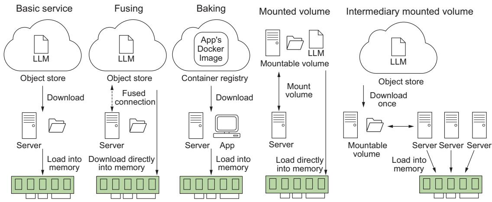  
Figure 6.3 Different strategies for storing LLMs and their implications at boot time. Often, we have to balance system reliability, complexity, and application load time.

Now that we have a good handle on how to handle our LLM as an asset, let’s talk about some API features that are must-haves for your LLM service.

# 6.1.3 Adaptive request batching

A typical API will accept and process requests in the order they are received, processing them immediately and as quickly as possible. However, anyone who’s trained a machine learning model has come to realize that there are mathematical and computational advantages to running inference in batches of powers of 2 (16, 32, 64, etc.), particularly when GPUs are involved, where we can take advantage of better memory alignment or vectorized instructions parallelizing computations across the GPU cores. To take advantage of this batching, you’ll want to include adaptive request batching or dynamic batching.

What adaptive batching does is essentially pool requests together over a certain period of time. Once the pool receives the configured maximum batch size or the timer runs out, it will run inference on the entire batch through the model, sending the results back to the individual clients that requested them. Essentially, it’s a queue. Setting one up yourself can and will be a huge pain; thankfully, most ML inference services offer this out of the box, and almost all are easy to implement. For example, in BentoML, add @bentoml.Runnable.method(batchable $=$ True) as a decorator to your predict function, and in Triton Inference Server, add dynamic_batching $\{ \}$ at the end of your model definition file.

If that sounds easy, it is. Typically, you don’t need to do any further finessing, as the defaults tend to be very practical. That said, if you are looking to maximize every bit of efficiency possible in the system, you can often set a maximum batch size, which will tell the batcher to run once this limit is reached, or a batch delay, which does the same thing but for the timer. Increasing either will result in longer latency but likely better throughput, so typically these are only adjusted when your system has plenty of latency budget.

Overall, the benefits of adaptive batching include better use of resources and higher throughput at the cost of a bit of latency. This is a valuable tradeoff, and we recommend giving your product the latency bandwidth to include this feature. In our experience, optimizing for throughput leads to better reliability and scalability and thus greater customer satisfaction. Of course, when latency times are extremely important or traffic is few and far between, you may rightly forgo this feature.

# 6.1.4 Flow control

Rate limiters and access keys are critical protections for an API, especially one sitting in front of an expensive LLM. Rate limiters control the number of requests a client can make to an API within a specified time, which helps protect the API server from abuse, such as distributed denial of service (DDoS) attacks, where an attacker makes numerous requests simultaneously to overwhelm the system and hinder its function.

Rate limiters can also protect the server from bots that make numerous automated requests in a short span of time. This helps manage the server resources optimally so the server is not exhausted due to unnecessary or harmful traffic. They are also useful for managing quotas, thus ensuring all users have fair and equal access to the API’s resources. By preventing any single user from using excessive resources, the rate limiter ensures the system functions smoothly for all users.

All in all, rate limiters are an important mechanism for controlling the flow of your LLM’s system processes. They can play a critical role in dampening bursty workloads and preventing your system from getting overwhelmed during autoscaling and rolling updates, especially when you have a rather large LLM with longer deployment times. Rate limiters can take several forms, and the one you choose will be dependent on your use case.

# Types of rate limiters

The following list describes the types of rate limiters:

Fixed window—This algorithm allows a fixed number of requests in a set duration of time. Let’s say five requests per minute, and it refreshes at the minute. It’s really easy to set up and reason about. However, it may lead to uneven distribution and can allow a burst of calls at the boundary of the time window.   
Sliding window log—To prevent boundary problems, we can use a dynamic timeframe. Let’s say five requests in the last 60 seconds. This type is a slightly more complex version of the fixed window that logs each request’s timestamp to provide a moving lookback period, providing a more evenly distributed limit.   
Token bucket—Clients initially have a full bucket of tokens, and with each request, they spend tokens. When the bucket is empty, the requests are blocked. The bucket refills slowly over time. Thus, token buckets allow burst behavior, but it’s limited to the number of tokens in the bucket.   
Leaky bucket—It works as a queue where requests enter, and if the queue is not full, they are processed; if full, the request overflows and gets discarded, thus controlling the rate of the flow.

A rate limiter can be applied at multiple levels, from the entire API to individual client requests to specific function calls. While you want to avoid being too aggressive with them—better to rely on autoscaling to scale and meet demand—you don’t want to ignore them completely, especially when it comes to preventing bad actors.

Access keys are also crucial to prevent bad actors. Access keys offer authentication, maintaining that only authorized users can access the API, which prevents unauthorized use and potential misuse of the API and reduces the influx of spam requests. They are also essential to set up for any paid service. Of course, even if your API is only exposed internally, setting up access keys shouldn’t be ignored, as it can

help reduce liability and provide a way of controlling costs by yanking access to a rogue process, for example.

Thankfully, setting up a service with rate limiting and access keys is relatively easy nowadays, as there are multiple libraries that can help you. In listing 6.2, we demonstrate a simple FastAPI app utilizing both. We’ll use FastAPI’s built-in security library for our access keys and SlowApi, a simple rate limiter that allows us to limit the call of any function or method with a simple decorator.

Listing 6.2 Example API with access keys and rate limiter   
from fastapi import FastAPI,Depends，HTTPException，status，Request   
from fastapi.security import OAuth2PasswordBearer   
from slowapi import Limiter,_rate_limit_exceeded_handler   
from slowapi.util import get_remote_address   
from slowapi mistakes import RateLimitExceeded   
import unicorn   
api_keys $=$ ["1234567abcdefg"] This would be encrypted API_KEY_NAME $\equiv$ "access_token" oauth2scheme $\equiv$ OAuth2PasswordBearer(tokenUrl $\equiv$ "token")   
limiter $=$ Limiter(key_func $\equiv$ get_remote_address)   
app $=$ FastAPI() app.state.limiter $=$ limiter app.add_exceptionhandler(RateLimitExceeded,_rate_limit_exceeded_handler)   
async def get api_key(API_key: str $\equiv$ Depends(oauth2scheme)): if api_key not in api_keys: raise HTTPException( status_code $\equiv$ status．HTTP_401_UNAUTHORIZED, detail $\equiv$ "Invalid API Key", ）   
@app.get("/hello"，dependencies $\equiv$ [Depends(get api_key)]) @limiter limit("5/minute")   
async def hello(request: Request): return {"message": "Hello World"}

While this is just a simple example, you’ll still need to set up a system for users to create and destroy access keys. You’ll also want to finetune your time limits. In general, you want them to be as loose as possible so as not to interfere with the user experience but just tight enough to do their job.

# 6.1.5 Streaming responses

One feature your LLM service should absolutely include is streaming. Streaming allows us to return the generated text to the user as it is being generated versus all at once at the end. Streaming adds quite a bit of complexity to the system, but regardless, it has come to be considered a must-have feature for several reasons.

First, LLMs are rather slow, and the worst thing you can do to your users is make them wait—waiting means they will become bored, and bored users complain or, worse, leave. You don’t want to deal with complaints, do you? Of course not! But by streaming the data as it’s being created, we offer the users a more dynamic and interactive experience.

Second, LLMs aren’t just slow; they are unpredictable. One prompt could lead to pages and pages of generated text, and another, a single token. As a result, your latency is going to be all over the place. Streaming allows us to worry about more consistent metrics like tokens per second (TPS). Keeping TPS higher than the average user’s reading speed means we’ll be sending responses back faster than the user can consume them, ensuring they won’t get bored and we are providing a highquality user experience. In contrast, if we wait until the end to return the results, users will likely decide to walk away and return when it finishes because they never know how long to wait. This huge disruption to their flow makes your service less effective or useful.

Lastly, users are starting to expect streaming. Streaming responses have become a nice tell as to whether you are speaking to a bot or an actual human. Since humans have to type, proofread, and edit their responses, we can’t expect written responses from a human customer support rep to be in a stream-like fashion. So when they see a response streaming in, your users will know they are talking to a bot. People interact differently with a bot than they will with a human, so it’s very useful information to give them to prevent frustration.

In listing 6.3 we demonstrate a very simple LLM service that utilizes streaming. The key pieces to pay attention to are that we are using the base asyncio library to allow us to run asynchronous function calls, FastAPI’s StreamingResponse to ensure we send responses to the clients in chunks, and Hugging Face Transformer’s Text-IteratorStreamer to create a pipeline generator of our model’s inference.

# Listing 6.3 A streaming LLM service

import argparse

import asyncio

from typing import AsyncGenerator

from fastapi import FastAPI, Request

from fastapi.responses import Response, StreamingResponse

import uvicorn

from transformers import (

AutoModelForCausalLM,

AutoTokenizer,   
TokenizerTextIterator,   
)   
from threading import Thread   
app $=$ FastAPI()Loads tokenizer,   
tokenizer $\equiv$ AutoTokenizer.from_pretrained("gpt2") model $\equiv$ AutoModelForCausalLM.from_pretrained("gpt2") streamer $=$ TextIteratorStreamer(tokenizer)   
async def stream_results(）->AsyncGenerator[bytes，None]: for response in streamer: await asyncio.sleep(1) Slows things down to see streaming. It's typical to return streamed responses byte encoded. @app.post("/generate")   
async def generate(request:Request) -> Response: ""Generate LLM Response The request should be a JSON object with the following fields: - prompt: the prompt to use for the generation. """ request_dict $\equiv$ await request.json() prompt $\equiv$ request_dict.pop("prompt") inputs $=$ tokenizer([prompt],return_tensors="pt") generation_kwargs $=$ dict(input, streamer $\coloneqq$ streamer,max_new_tokens=20) thread $=$ Thread(target $\equiv$ model_generate,kwargs $\equiv$ generation_kwargs) thretd.start() Startsa separate thread to generate results   
return StreamingResponse streamline_results()) Results   
if_name $= =$ __main_: parser $=$ argparse.ArgumtParser() Starts service; defaults to localhost on port 8000   
parser.add_argent(--host",type $\equiv$ str,default=None) parser.add_argent(--port",type $\equiv$ int,default $= 8000)$ args $=$ parser.parse_args()   
uvicorn.run(app,host $\equiv$ args.host,port $\equiv$ args.port,log_level $=$ "debug")

Now that we know how to implement several must-have features for our LLM service, including batching, rate limiting, and streaming, let’s look at some additional tooling we can add to our service to improve usability and overall workflow.

# 6.1.6 Feature store

When it comes to running ML models in production, feature stores really simplify the inference process. We first introduced these in chapter 3, but as a recap, feature stores establish a centralized source of truth. They answer crucial questions about your data:

Who is responsible for the feature? What is its definition? Who can access it? Let’s take a look at setting one up and querying the data to get a feel for how they work. We’ll be using Feast, which is open source and supports a variety of backends. To get started, let us pip install feast and then run the init command in your terminal to set up a project, like so:

```txt
$ feast init feast_example
$ cd feast_example/features Repo
```

The app we are building is a question-and-answer service. Q&A services can greatly benefit from a feature store’s data governance tooling. For example, point-in-time joins help us answer questions like “Who is the president of x?” where the answer is expected to change over time. Instead of querying just the question, we query the question with a timestamp, and the point-in-time join will return whatever the answer to the question was in our database at that point in time. In the next listing, we pull a Q&A dataset and store it in a parquet format in the data directory of our Feast project.

Listing 6.4 Downloading the SQuAD dataset   
import pandas as pd   
from datasets import load_dataset   
import datetime   
from sentence_transformers import SentenceTransformer   
model $=$ SentenceTransformer("all-MiniLM-L6-v2")   
def save_qa_to_parquet(path): Loads SQuAD dataset ids $=$ squad["id"] 1 Extracts questions and answers qa $=$ pd.DataFrame( zip(idss,questions,answers), columnss $\coloneqq$ ["question_id","questions","answers"], Creates a dataframe qa["embeddings"] $=$ qa/questions.apply( lambda x: model.encode(x)) qa["created"] $=$ datetimedatetime.UTCnow() qa["datetime"] $=$ qa["created"].dt.day("h") Addss embeddings and timestamps qa.to_parquet(path) Saves to parquet   
if_name $= =$ "main": path $=$ "/data/qa.parquet" save_qa_to_parquet(path)

Next, we’ll need to define the feature view for our feature store. A feature view is essentially like a view in a relational database. We’ll define a name, the entities (which

are like IDs or primary keys), the schema (which are our feature columns), and a source. We’ll just be demoing using a local file store, but in production, you’d want to use one of Feast’s many backend integrations with Snowflake, GCP, AWS, etc. It currently doesn’t support a VectorDB backend, but I’m sure it’s only a matter of time. In addition, we can add metadata to our view through tags and define a time to live (TTL), which limits how far back Feast will look when generating historical datasets. In the following listing, we define the feature view. Go ahead and add this definition into a file called qa.py in the feature_repo directory of our project.

# Listing 6.5 Feast FeatureView definition

```python
from feast import Entity, FeatureView, Field, Source,ValueType
from feast.types import Array, Float32, String
from datetime import timedian
path = ".data/qa.parquet"
question = Entity(name="question_id", value_type=ValueType STRING)
question_feature = Field(name="questions", dtype=String)
answer_feature = Field(name="answers", dtype=String)
embedding_feature = Field(name="embeddings", dtype=Array(Float32))
questions_view = FeatureView(
    name="qa",
    entities=[question],
    ttl=timedian(days=1),
    schema=[question_feature, answer_feature, embedding_feature],
    source=FileSource(
        path=path,
        event_timestamp_column="datetime",
        created_timestamp_column="created",
        timestamp_field="datetime",
    ),
    tags={},
    online=True,
) 
```

With that defined, let’s go ahead and register it. We’ll do that with

$ feast apply

Next, we’ll want to materialize the view. In production, this is a step you’ll need to schedule on a routine basis with something like cron or Prefect. Be sure to update the UTC timestamp for the end date in this command to something in the future to ensure the view collects the latest data:

$ feast materialize-incremental 2023-11-30T00:00:00 --views qa

Now all that’s left is to query it! The following listing shows a simple example of pulling features to be used at inference time.

# Listing 6.6 Querying a feature view at inference

import pandas as pd   
from feast import FeatureStore   
store $=$ FeatureStore(repo_path $\coloneqq$ ".")   
path $=$ "/data/qa.parquet"   
ids $=$ pd.read_parquet(path,columns $=$ ["question_id"]）   
feature_vectors $=$ store.get_online_features( features $=$ ["qa:questions","qa:answers","qa:embeddings"], entity_rows $=$ {"question_id":_id} for_id in ids(question_id.to_list()], .to_df()   
print feature_vectors.head())

This example will pull the most up-to-date information for the lowest possible latency at inference time. For point-in-time retrieval, you would use the get_historical_ features method instead. In addition, in this example, we use a list of IDs for the entity rows parameter, but you could also use an SQL query making it very flexible and easy to use.

# 6.1.7 Retrieval-augmented generation

Retrieval-augmented generation (RAG) has become the most widely used tool to combat hallucinations in LLMs and improve the accuracy of responses in our results. Its popularity is likely because RAG is both easy to implement and quite effective. As first discussed in section 3.4.5, vector databases are a tool you’ll want to have in your arsenal. One of the key reasons is that they make RAG so much easier to implement. In figure 6.4, we demonstrate a RAG system. In the preprocessing stage, we take our documents, break them up, and transform them into embeddings that we’ll load into our vector database. During inference, we can take our input, encode it into an embedding, and run a similarity search across our documents in that vector database to find the nearest neighbors. This type of inference is known as semantic search. Pulling relevant documents and inserting them into our prompt will help give context to the LLM and improve the results.

We are going to demo implementing RAG using Pinecone since it will save us the effort of setting up a vector database. For listing 6.7, we will set up a Pinecone index and load a Wikipedia dataset into it. In this listing, we’ll create a WikiDataIngestion class to handle the heavy lifting. This class will load the dataset and run through each Wikipedia page, splitting the text into consumable chunks. It will then embed these chunks and upload everything in batches. Once we have everything uploaded, we can start to make queries.

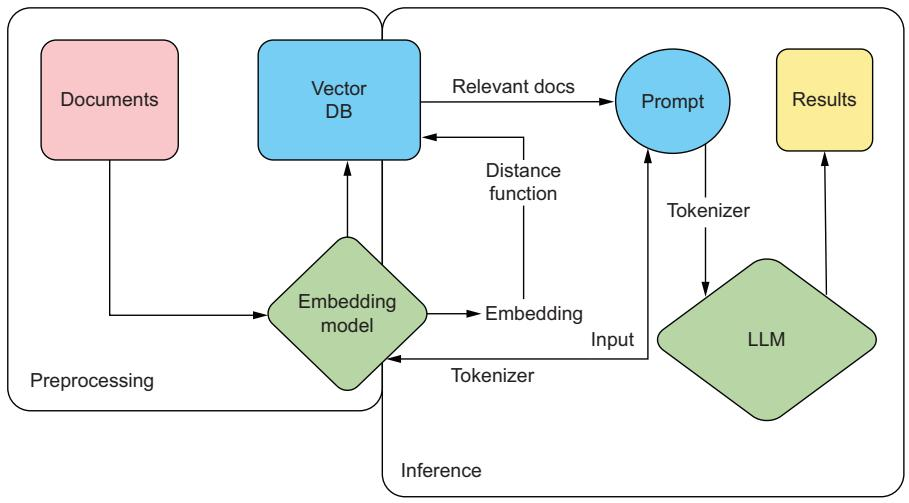  
Figure 6.4 RAG system demonstrating how we use our input embeddings to run a search across our documentation, improving the results of the generated text from our LLM

You’ll need an API key if you plan to follow along, so if you don’t already have one, go to Pinecone’s website (https://www.pinecone.io/) and create a free account, set up a starter project (free tier), and get an API key. One thing to pay attention to as you read the listing is that we’ll split up the text into chunks of 400 tokens with text_ splitter. We specifically split on tokens instead of words or characters, which allows us to properly budget inside our token limits for our model. In this example, returning the top three results will add 1,200 tokens to our request, which allows us to plan ahead of time how many tokens we’ll give to the user to write their prompt.

# Listing 6.7 Example setting up a Pinecone database

```python
import os  
import tiktoken  
from datasets import load_dataset  
from langchain.text_splitter import RecursiveCharacterTextSplitter  
from langchainositdings.openai import OpenAIEmbeddings  
from pinecone import Pinecone, ServerlessSpec  
from sentence_transformers import SentenceTransformer 
```

from tqdm.auto import tqdm   
from uuid import uuid4   
OPENAI_API_KEY $\equiv$ os.getenv("OPENAI_API_KEY") PINECONE_API_KEY $=$ os.getenv("PINECONE_API_KEY")   
pc $\equiv$ Pinecone api_key $\equiv$ PINECONE_API_KEY)

```txt
Getsopenai APIkeyfrom platform.openai.com FindsAPIkey inconsoleat app.pinecone.io 
```

class WikiDataIngestion:   
def init_(   
self, index,   
wikidata=None,   
embedder=None,   
tokenizer=None,   
text_splitter=None,   
batch_limit=100,   
):   
self.index = index   
self.wikidata = wikidata or load_dataset( "wikipedia", "20220301.simple", split="train[:10000]"   
)   
self_embedding = embedder or OpenAIEmbeddings( model="text-embedding-ada-002",openai_api_key=OPENAI_API_KEY )   
selftokenizer = tokenizer or tiktoken.get_encoding("cl100k_base")   
self.text_splitter = ( text_splitter or RecursiveCharacterTextSplitter( chunk_size=400, chunk_overlap=20, length_function= self_token_length, separators=['\n\n","\n","",""] , ）   
)   
self.batch_limit = batch_limit   
def token_length(self,text): tokens = selftokenizer.encode(text,disallowed_special=()) return len(tokens)   
def get_wiki_metadata(self, page): return { "wiki-id": str(page["id"]), "source": page["url"], title": page["title"],   
}   
def splittexts_and_metadatas(self, page): basic_metadata = self.get_wiki_metadata(page) texts = self.text_splitter.split_text(page["text")] metadatas = [ {"chunk": j,"text": text,**basic_metadata} for j,text in enumeratetexts) ] return texts, metadatas   
def upload_batch(self,texts,metadatas): ids $=$ [str(uuid4()) for_in range(lentexts)] embeddings $=$ self_embedding_embedding Documentstexts) self.index.Upset(vectors=zip.ids,embeddings,metadatas))

```python
def batch_upload(self):
    batchtexts = []
    batch_metadatas = []
    for page in tqdm(self.wikidata):
        texts, metadatas = self.splittexts_and_metadatas(page)
        batchtexts extendtexts)
        batch_metadatas extend(metadatas)
        if len(batchtexts) >= self.batch_limit:
            self.upload_batch(batchtexts, batch_metadatas)
            batchtexts = []
            batch_metadatas = []
    if len(batchtexts) > 0:
        self.upload_batch(batchtexts, batch_metadatas)
if __name__ == "_main":
    index_name = "pinecone-11m-example"
if index_name not in pc.list_Indexes().names():
    pc.create_index(
        name=index_name,
        metric="cosine",
        dimension=1536,
        spec=ServerlessSpec(Cloud="aws", region="us-east-1"),
    )
index = pc.Index(index_name)
print(index.describe_index/stats())
embedder = None
if not OPENAI_API_KEY:
    embedder = SentenceTransformer(
        "sangmini/msmarco-cotmae-MiniLM-L12_en-ko-ja"
    )
embedder_embedding_files = lambda *args, **kwargs: embedder.encode(
        *args, **kwargs)
    ).tolist()
wiki_data_ingestion = WikiDataIngestion(index, embedder=embedder)
wiki_data_ingestion.batch_upload()
print(index.describe_index/stats())
query = "Did Johannes Gutenberg invent the printing press?"
embeddings = wiki_data_ingestion_embder_embdings(query)
results = index.query(value=embeddings, top_k=3, include_meta=True)
print(results) 
```

When I ran this code, the top three query results to my question, “Did Johannes Gutenberg invent the printing press?” were the Wikipedia pages for Johannes Gutenberg, the pencil, and the printing press. Not bad! While a vector database isn’t going

to be able to answer the question, it’s simply finding the most relevant articles based on the proximity of their embeddings to my question.

With these articles, we can then feed their embeddings into our LLM as additional context to the question to ensure a more grounded result. Since we include sources, it will even have the wiki URL it can give as a reference, and it won’t just hallucinate one. By giving this context, we greatly reduce the concern about our LLM hallucinating and making up an answer.

# 6.1.8 LLM service libraries

If you are starting to feel a bit overwhelmed about all the tooling and features you need to implement to create an LLM service, we have some good news for you: several libraries aim to do all of this for you! Some open source libraries of note are vLLM and OpenLLM (by BentoML). Hugging Face’s Text-Generation-Inference (TGI) briefly lost its open source license, but fortunately, it’s available again for commercial use. There are also some start-ups building some cool tooling in this space, and we recommend checking out TitanML if you are hoping for a more managed service. These are like the tools MLServer, BentoML, and Ray Serve discussed in section 3.4.8 on deployment service, but they are designed specifically for LLMs.

Most of these toolings are still relatively new and under active development, and they are far from feature parity with each other, so pay attention to what they offer. What you can expect is that they should at least offer streaming, batching, and GPU parallelization support (something we haven’t specifically talked about in this chapter), but beyond that, it’s a crapshoot. Many of them still don’t support several features discussed in this chapter, nor do they support every LLM architecture. What they do, though, is make deploying LLMs easy.

Using vLLM as an example, just pip install vllm, and then you can run

```shell
$ python -m v11m entrancepoints.ai_server --model IMJONEZZ/ggml-openchat-8192-q4_0 
```

With just one command, we now have a service up and running the model we trained in chapter 5. Go ahead and play with it; you should be able to send requests to the /generate endpoint like so:

```txt
$ curl http://localhost:8000/generate -d '{"prompt": "Which lemon is the best?","use_beam_search": true, "n": 4, "temperature": 0}' 
```

It’s very likely you won’t be all that impressed with any of these toolings. Still, you should be able to build your own API and have a good sense of how to do it at this point. Now that you have a service and can even spin it up locally, let’s discuss the infrastructure you need to set up to support these models for actual production usage. Remember, the better the infrastructure, the less likely you’ll be called in the middle of the night when your service goes down unexpectedly. None of us want that, so let’s check it out.

# 6.2 Setting up infrastructure

Setting up infrastructure is a critical aspect of modern software development, and we shouldn’t expect machine learning to be any different. To ensure scalability, reliability, and efficient deployment of our applications, we need to plan a robust infrastructure that can handle the demands of a growing user base. This is where Kubernetes comes into play.

Kubernetes, often referred to as k8s, is an open source container orchestration platform that helps automate and manage the deployment, scaling, and management of containerized applications. It is designed to simplify the process of running and coordinating multiple containers across a cluster of servers, making it easier to scale applications and ensure high availability. We are going to talk a lot about k8s in this chapter, and while you don’t need to be an expert, it will be useful to cover some basics to ensure we are all on the same page.

At its core, k8s works by grouping containers into logical units called pods, which are the smallest deployable units in the k8s ecosystem. These pods are then scheduled and managed by the k8s control plane, which oversees their deployment, scaling, and updates. This control plane consists of several components that collectively handle the orchestration and management of containers. In figure 6.5, we give an oversimplification of the k8s architecture to help readers who are unfamiliar with it.

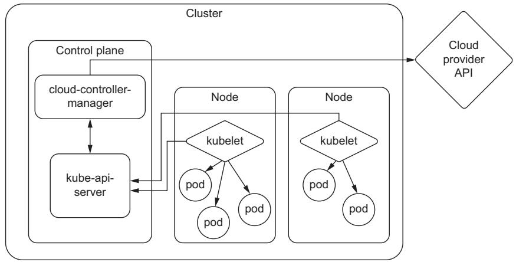  
Figure 6.5 An oversimplification of the Kubernetes architecture. What you need to know is that our services run in pods, and pods run on nodes, which essentially are a machine. K8s helps us both manage the resources and handle the orchestration of deploying pods to these resources.

Using k8s, we can take advantage of features such as automatic scaling, load balancing, and service discovery, which greatly simplify the deployment and management of web applications. K8s provides a flexible and scalable infrastructure that can easily

adapt to changing demands, allowing organizations to efficiently scale their applications as their user base grows. K8s offers a wide range of additional features and extensibility options, such as storage management, monitoring, and logging, which help ensure the smooth operation of web applications.

One of these extensibility options is known as custom resource definitions (CRDs). CRDs are a feature of Kubernetes that allows users to create their own specifications for custom resources, thus extending the functionalities of Kubernetes without modifying the Kubernetes source code. With a CRD defined, we can create custom objects similar to how we would create a built-in object like a pod or service. This gives k8s a lot of flexibility that we will need for different functionality throughout this chapter.

If you are new to Kubernetes, you might be scratching your head through parts of this section, and that’s totally fine. Hopefully, though, you have enough knowledge to get the gist of what we will be doing in this section and why. At least you’ll be able to walk away with a bunch of questions to ask your closest DevOps team member.

# 6.2.1 Provisioning clusters

The first thing to do when starting any project is to set up a cluster. A cluster is a collective of worker machines or nodes where we will host our applications. Creating a cluster is relatively simple; configuring it is the hard part. Of course, there have been many books written on how to do this, and the majority of considerations like networking, security, and access control are outside the scope of this book. In addition, considering the steps you take will also be different depending on the cloud provider of choice and your company’s business strategy, we will focus on only the portions that we feel are needed to get you up and running, as well as any other tidbits that may make your life easier.

The first step is to create a cluster. On GCP, you would use the gcloud tool and run

```txt
$ gcloud container clusters create <NAME> 
```

On AWS, using the eksctl tool, run

```txt
$ eksct1 create cluster 
```

On Azure, using the az cli tool, run

```shell
$ az group create --name=<GROUP_NAME> --location=westus
```

```perl
$ az aks create --resource-group=<GROUP_NAME> --name=<CLUSTER_NAME> 
```

As you can see, even the first steps are highly dependent on your provider, and you can suspect that the subsequent steps will be as well. Since we realize most readers will be deploying in a wide variety of environments, we will not focus on the exact steps but hopefully give you enough context to search and discover for yourself.

Many readers, we imagine, will already have a cluster set up for them by their infrastructure teams, complete with many defaults and best practices. One of these is

setting up node auto-provisioning (NAP) or cluster autoscaling. NAP allows a cluster to grow, adding more nodes as deployments demand them. This way, we only pay for nodes we actually use. It’s a very convenient feature, but it often defines resource limits or restrictions on the instances available for autoscaling, and you can bet your cluster’s defaults don’t include accelerator or GPU instances in that pool. We’ll need to fix that.

In GCP, we would create a configuration file like the one in the following listing, where we can include the GPU resourceType. In the example, we include T4s and both A100 types.

Listing 6.8 Example NAP config file   
```yaml
resourceLimits:  
- resourceType: 'cpu'  
minimum: 10  
maximum: 100  
- resourceType: 'memory'  
maximum: 1000  
- resourceType: 'nvidia-t Tesla-t4'  
maximum: 40  
- resourceType: 'nvidia-t Tesla-a100'  
maximum: 16  
- resourceType: 'nvidia-a100-80gb'  
maximum: 8  
management:  
autoRepair: true  
autoUpgrade: true  
shieldedInstanceConfig:  
enableSecureBoot: true  
enableIntegrityMonitoring: true  
diskSizeGb: 100 
```

You would then set this by running

```txt
$ gcloud container clusters update <CLUSTER_NAME> --enable-autoprovisioning - -autoprovisioning-config-file <FILE_NAME> 
```

The real benefit of an NAP is that instead of predefining what resources are available at a fixed setting, we can set resource limits, which put a cap on the total number of GPUs that we would scale up to. They clearly define what GPUs we want and expect to be in any given cluster.

When one author was first learning about limits, he often got them confused with similar concepts—quotas, reservations, and commitments—and has seen many others just as confused. Quotas, in particular, are very similar to limits. Their main purpose is to prevent unexpected overage charges by ensuring a particular project or application doesn’t consume too many resources. Unlike limits, which are set internally, quotas often require submitting a request to your cloud provider when you want to raise them. These requests help inform and are used by the cloud provider to better plan

which resources to provision and put into different data centers in different regions. It’s tempting to think that the cloud provider will ensure those resources are available; however, quotas never guarantee there will be enough resources in a region for your cluster to use, and you might run into resources not found errors way before you hit them.

While quotas and limits set an upper bound, reservations and commitments set the lower bound. Reservations are an agreement to guarantee that a certain amount of resources will always be available and often come with the caveat that you will be paying for these resources regardless of whether you end up using them. Commitments are similar to reservations but are often longer-term contracts, usually coming with a discounted price.

# 6.2.2 Autoscaling

One of the big selling points to setting up a k8s cluster is autoscaling. Autoscaling is an important ingredient in creating robust production-grade services. The main reason is that we never expect any service to receive static request volume. If anything else, you should expect more volume during the day and less at night while people sleep. So we’ll want our service to spin up more replicas during peak hours to improve performance and spin down replicas during off hours to save money, not to mention the need to handle bursty workloads that often threaten to crash a service at any point.

Knowing your service will automatically provision more resources and set up additional deployments based on the needs of the application is what allows many infrastructure engineers to sleep peacefully at night. The catch is that it requires an engineer to know what those needs are and ensure everything is configured correctly. While autoscaling provides flexibility, the real business value comes from the cost savings. Most engineers think about autoscaling in terms of scaling up to prevent meltdowns, but even more important to the business is the ability to scale down, freeing up resources and cutting costs.

One of the main reasons cloud computing and technologies like Kubernetes have become essential in modern infrastructures is because autoscaling is built in. Autoscaling is a key feature of Kubernetes, and with horizontal pod autoscalers (HPAs), you can easily adjust the number of replicas of your application based on two native resources: CPU and memory usage, as shown in figure 6.6. However, in a book about putting LLMs in production, scaling based on CPU and memory alone will never be enough. We will need to scale based on custom metrics, specifically GPU utilization.

Setting up autoscaling based on GPU metrics is going to take a bit more work and requires setting up several services. It’ll become clear why we need each service as we discuss them, but the good news is that by the end, you’ll be able to set up your services to scale based on any metric, including external events such as messages from a message broker, requests to an HTTP endpoint, and data from a queue.

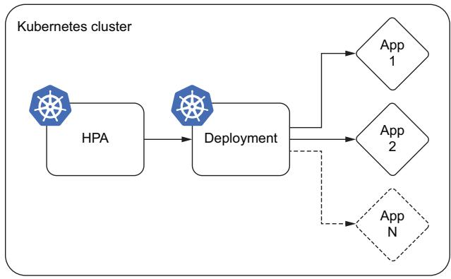  
Figure 6.6 Basic autoscaling using the in-built k8s horizontal pod autoscaler (HPA). The HPA watches CPU and memory resources and will tell the deployment service to increase or decrease the number of replicas.

The first service we’ll need is one that can collect the GPU metrics. For this, we have NVIDIA’s Data Center GPU Manager (DCGM), which provides a metrics exporter that can export GPU metrics. DCGM exposes a host of GPU metrics, including temperature and power usage, which can create some fun dashboards, but the most useful metrics for autoscaling are utilization and memory utilization.

From here, the data will go to a service like Prometheus. Prometheus is a popular open source monitoring system used to monitor Kubernetes clusters and the applications running on them. Prometheus collects metrics from various sources and stores them in a time-series database, where they can be analyzed and queried. Prometheus can collect metrics directly from Kubernetes APIs and from applications running on the cluster using a variety of collection mechanisms such as exporters, agents, and sidecar containers. It’s essentially an aggregator of services like DCGM, including features like alerting and notification. It also exposes an HTTP API for service for external tooling like Grafana to query and create graphs and dashboards with.

While Prometheus provides a way to store metrics and monitor our service, the metrics aren’t exposed to the internals of Kubernetes. For an HPA to gain access, we will need to register yet another service to either the custom metrics API or external metrics API. By default, Kubernetes comes with the metrics.k8s.io endpoint that exposes resource metrics, CPU, and memory utilization. To accommodate the need to scale deployments and pods on custom metrics, two additional APIs were introduced: custom.metrics.k9s.io and external.metrics.k8s.io. There are some limitations to this setup, as currently, only one “adapter” API service can be registered at a time for either one. This limitation mostly becomes a problem if you ever decide to change this endpoint from one provider to another.

For this service, Prometheus provides the Prometheus Adapter, which works well, but from our experience, it wasn’t designed for production workloads. Alternatively, we would recommend KEDA. KEDA (Kubernetes Event-Driven Autoscaling) is an open source project that provides event-driven autoscaling for Kubernetes. It offers more flexibility in terms of the types of custom metrics that can be used for autoscaling.

While Prometheus Adapter requires configuring metrics inside a ConfigMap, any metric already exposed through the Prometheus API can be used in KEDA, providing a more streamlined and friendly user experience. It also offers scaling to and from 0, which isn’t available through HPAs, allowing you to turn off a service completely if there is no traffic. That said, you can’t scale from 0 on resource metrics like CPU and memory and, by extension, GPU metrics, but it is useful when you are using traffic metrics or a queue to scale.

Putting this all together, you’ll end up with the architecture shown in figure 6.7. Compared to figure 6.6, you’ll notice at the bottom that DCGM is managing our GPU metrics and feeding them into Prometheus Operator. From Prometheus, we can set up external dashboards with tools like Grafana. Internal to k8s, we’ll use KEDA to set up a custom.metrics.k9s.io API to return these metrics so we can autoscale based on the GPU metrics. KEDA has several CRDs, one of which is a ScaledObject, which creates the HPA and provides the additional features.

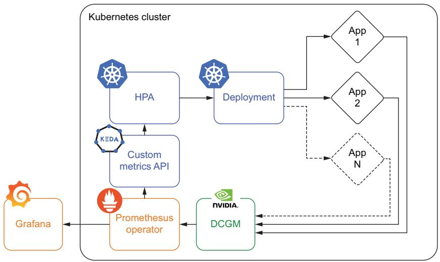  
Figure 6.7 Autoscaling based on a custom metric like GPU utilization requires several extra tools to work, including NVIDIA’s DCGM, a monitoring system like Prometheus Operator, and a custom metrics API like that provided by KEDA.

While autoscaling provides many benefits, it’s important to be aware of its limitations and potential problems, which are only exacerbated by LLM inference services. Proper configuration of the HPA is often an afterthought for many applications, but it becomes mission-critical when dealing with LLMs. LLMs take longer to become fully operational, as the GPUs need to be initialized and model weights loaded into memory; these aren’t services that can turn on a dime, which often can cause problems when scaling up if not properly prepared for. Additionally, if the system scales down

too aggressively, it may result in instances being terminated before completing their assigned tasks, leading to data loss or other problems. Lastly, flapping is just such a concern that can arise from incorrect autoscaling configurations. Flapping happens when the number of replicas keeps oscillating, booting up a new service only to terminate it before it can serve any inferences.

There are essentially five parameters to tune when setting up an HPA:

 Target parameter   
 Target threshold   
Min pod replicas   
Max pod replicas   
 Scaling policies

Let’s take a look at each of them in turn so you can be sure your system is properly configured.

# TARGET PARAMETER

The target parameter is the most important metric to consider when ensuring your system is properly configured. If you followed the previously listed steps in section 6.2.2, your system is now ready to autoscale based on GPU metrics, so this should be easy, right? Not so fast! Scaling based on GPU utilization is going to be the most common and straightforward path, but the first thing we need to do is ensure the GPU is the actual bottleneck in our service. It’s pretty common to see eager young engineers throw a lot of expensive GPUs onto a service but forget to include adequate CPU and memory capacity. CPU and memory will still be needed to handle the API layer, such as taking in requests, handling multiple threads, and communicating with the GPUs. If there aren’t enough resources, these layers can quickly become a bottleneck, and your application will be throttled way before the GPU utilization is ever affected, ensuring the system will never actually autoscale. While you could switch the target parameter on the autoscaler, CPU and memory are cheap compared to GPU resources, so it’d be better to allocate more of them for your application.

In addition, there are cases where other metrics make more sense. If your LLM application takes most of its requests from a streaming or batch service, it can be more prudent to scale based on metrics that tell you a DAG is running or an upstream queue is filling up—especially if these metrics give you an early signal and allow you more time to scale up in advance.

Another concern when selecting the metric is its stability. For example, an individual GPU’s utilization tends to be close to either $0 \%$ or $1 0 0 \%$ . This can cause problems for the autoscaler, as the metric oscillates between an on and off state, as will its recommendation to add or remove replicas, causing flapping. Generally, flapping is avoided by taking the average utilization across all GPUs running the service. Using the average will stabilize the metric when you have a lot of GPUs, but it could still be a problem when the service has scaled down. If you are still running into problems, you’ll want to use an average-over-time aggregation, which will tell you the

utilization for each GPU over a time frame—say, the last 5 minutes. For CPU utilization, average-over-time aggregation is built into the Kubernetes HPA and can be set with the horizontal-pod-autoscaler-cpu-initialization-period flag. For custom metrics, you’ll need to set it in your metric query (for Prometheus, it would be the avg_over_ time aggregation function).

Lastly, it’s worth calling out that most systems allow you to autoscale based on multiple metrics. So you could autoscale based on both CPU and GPU utilization, as an example. However, we would recommend avoiding these setups unless you know what you are doing. Your autoscaler might be set up that way, but in actuality, your service will likely only ever autoscale based on just one of the metrics due to service load, and it’s best to make sure that metric is the more costly resource for cost-engineering purposes.

# TARGET THRESHOLD

The target threshold tells your service at what point to start upscaling. For example, if you are scaling based on the average GPU utilization and your threshold is set to 30, then a new replica will be booted up to take on the extra load when the average GPU utilization is above $3 0 \%$ . The formula that governs this is quite simple and is as follows:

desiredReplicas $=$ ceil[currentReplicas $\times$ (currentMetricValue / desiredMetricValue )]

NOTE You can learn more about the algorithm at https://mng.bz/x64g.

This can be hard to tune in correctly, but here are some guiding principles. If the traffic patterns you see involve a lot of constant small bursts of traffic, a lower value, around 50, might be more appropriate. This setting ensures you start to scale up more quickly, avoiding unreliability problems, and you can also scale down more quickly, cutting costs. If you have a constant steady flow of traffic, higher values, around 80, will work well. Outside of testing your autoscaler, it’s best to avoid extremely low values, as they can increase your chances of flapping. You should also avoid extremely high values, as they may allow the active replicas to be overwhelmed before new ones start to boot up, which can cause unreliability or downtime. It’s also important to remember that due to the nature of pipeline parallel workflows when using a distributed GPU setup, there will always be a bubble, as discussed in section 3.3.2. As a result, your system will never reach $1 0 0 \%$ GPU utilization, and you will start to hit problems earlier than expected. Depending on how big your bubble is, you will need to adjust the target threshold accordingly.

# MINIMUM POD REPLICAS

Minimum pod replicas determine the number of replicas of your service that will always be running. This setting is your baseline. It’s important to make sure it’s set slightly above your baseline of incoming requests. Too often, this is set strictly to meet baseline levels of traffic or just below, but a steady state for incoming traffic is rarely all that steady. This is where a lot of oscillating can happen, as you are more likely to see

many small surges in traffic than large spikes. However, you don’t want to set it too high, as this will tie up valuable resources in the cluster and increase costs.

# MAXIMUM POD REPLICAS

Maximum pod replicas determine the number of replicas your system will run at peak capacity. You should set this number to be just above your peak traffic requirements. Setting it too low could lead to reliability problems, performance degradation, and downtime during high-traffic periods. Setting it too high could lead to resource waste, running more pods than necessary, and delaying the detection of real problems. For example, if your application was under a DDoS attack, your system might scale to handle the load, but it would likely cost you severely and hide the problem. With LLMs, you also need to be cautious not to overload the underlying cluster and make sure you have enough resources in your quotas to handle the peak load.

# SCALING POLICIES

Scaling policies define the behavior of the autoscaler, allowing you to finetune how long to wait before scaling and how quickly it scales. This setting is usually ignored, and safely so for most setups because the defaults for these settings tend to be pretty good for the typical application. However, relying on the default would be a major mistake for an LLM service since it takes so long to deploy.

The first setting you’ll want to adjust is the stabilization window, which determines how long to wait before taking a new scaling action. You can set a different stabilization window for upscaling and downscaling tasks. The default upscaling window is 0 seconds, which should not need to be touched if your target parameter has been set correctly. The default downscaling window is 300 seconds, which is likely too short for our use case. You’ll typically want this at least as long as it takes your service to deploy and then a little bit more. Otherwise, you’ll be adding replicas only to remove them before they have a chance to do anything.

The next parameter you’ll want to adjust is the scale-down policy, which defaults to $1 0 0 \%$ of pods every 15 seconds. As a result, any temporary drop in traffic could result in all your extra pods above the minimum being terminated immediately. For our case, it’s much safer to slow this down since terminating a pod takes only a few seconds, but booting one up can take minutes, making it a semi-irreversible decision. The exact policy will depend on your traffic patterns, but in general, we want to have a little more patience. You can adjust how quickly pods will be terminated and the magnitude by the number or percentage of pods. For example, we could configure the policy to allow only one pod each minute or $1 0 \%$ of pods every 5 minutes to be terminated.

# 6.2.3 Rolling updates

Rolling updates or rolling upgrades is a strategy that gradually implements the new version of an application to reduce downtime and maximize agility. It works by gradually creating new instances and turning off the old ones, replacing them in a methodical

manner. This update approach allows the system to remain functional and accessible to users even during the update process, otherwise known as zero downtime. Rolling updates also make it easier to catch bugs before they have too much effect and roll back faulty deployments.

Rolling updates is a feature built into k8s and another major reason for its widespread use and popularity. Kubernetes provides an automated and simplified way to carry out rolling updates. The rolling updates ensure that Kubernetes incrementally updates pod instances with new ones during deployment. The following listing shows an example LLM deployment implementing rolling updates; the relevant configuration is under the spec.strategy section.

Listing 6.9 Example deployment config with rolling update   
```yaml
apiVersion: apps/v1  
kind: Deployment  
metadata:  
    name: llm-application  
spec:  
    replicas: 5  
    strategy:  
        rollingUpdate:  
            maxSurge: 1  
            maxUnavailable: 3  
    selector:  
        matchLabels:  
            app: llm-app  
    template:  
        metadata:  
            labels:  
                app: llm-app  
    spec:  
        containers:  
            - name: llm-gpu-app-container  
                image: llm-gpu-application:v2  
                    resources:  
                        limits:  
                            nvidia.com/gpu: 8 
```

You’ll notice that there are two main parameters you can adjust for a rolling update: maxSurge and maxUnavailable. These can either be set to a whole number, like in our example, describing the number of instances, or a fraction indicating a percentage of total instances. In the example, you’ll notice we set maxSurge to 1, meaning even though we would normally run with five replicas, we could surge to six during a deployment, allowing us to turn on a new one before turning any off. Normally, you might want to set this higher, as it allows for a quicker rolling update. Otherwise, we’ll have to replace pods one at a time. The reason it’s low, you might have noticed, is that we are deploying a rather large LLM that requires eight GPUs. If these are A100s, it’s likely going to be hard to find an extra eight GPUs not being used.

GPU resources cannot be shared among containers, and container orchestration can become a major challenge in such deployments, which is why maxUnavailable is set to 3. What we are saying here is that three out of the five expected replicas can go down during a deployment. In other words, we are going to drop the total number of replicas for a little bit before re-creating them. For reliability reasons, we typically prefer adding extra replicas first, so to go down instead is a difficult decision, one you’ll want to confirm you can afford to do in your own deployment. The reason we are doing so here is to ensure that there are GPU resources available. In essence, to balance resource utilization, it might be necessary to set maxUnavailable to a high value and adjust maxSurge to a lower number to downscale old versions quickly and free up resources for new ones.

This advice is the opposite of what you’d do in most applications, so we understand if it makes you uneasy. If you’d like to ensure smoother deployments, you’ll need to budget for extra GPUs to be provisioned in your cluster strictly for deployment purposes. However, depending on how often you are updating the model itself, paying for expensive GPUs to sit idle simply to make deployments smoother may not be costadvantageous. Often, the LLM itself doesn’t receive that many updates, so assuming you are using an inference graph (discussed in the next section), most of the updates will be to the API, prompts, or surrounding application.

In addition, we recommend you always perform such operations cautiously in a staging environment first to understand its effect. Catching a deployment problem in staging will save you a headache or two. It’s also useful to troubleshoot the max-Unavailable and maxSurge parameters in staging, but it’s often hard to get a one-toone comparison to production since staging is often resource-constrained.

# 6.2.4 Inference graphs

Inference graphs are the crème filling of a donut, the muffin top of a muffin, and the toppings on a pizza: they are just phenomenal. Inference graphs allow us to create sophisticated flow diagrams at inference in a resource-saving way. Consider figure 6.8, which shows us the building blocks for any inference graph.

Generally, any time you have more than one model, it’s useful to consider an inference graph architecture. Your standard LLM setup is usually already at least two models: an encoder and the language model itself.

Usually, when we see LLMs deployed in the wild, these two models are deployed together. You send text data to your system, and it returns generated text. It’s often no big deal, but when deployed as a sequential inference graph instead of a packaged service, we get some added bonuses. First, the encoder is usually much faster than the LLM, so we can split them up since you may only need one encoder instance for every two to three LLM instances. Encoders are so small that this doesn’t necessarily help us out that much, but it saves the hassle of redeploying the entire LLM if we decide to deploy a new encoder model version. In addition, an inference graph will set up an individual API for each model, which allows us to hit the LLM and encoder separately.

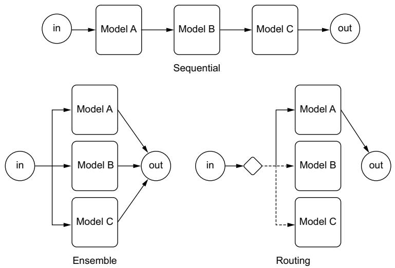  
Figure 6.8 The three types of inference graph building blocks. Sequential allows us to run one model before the other, which is useful for preprocessing steps like generating embeddings. Ensembles allow us to pool several models together to learn from each and combine their results. Routing allows us to send traffic to specific models based on some criteria, often used for multiarmed bandit optimization.

This is really useful if we have a bunch of data we’d like to preprocess and save in a VectorDB; we can use the same encoder we already have deployed. We can then pull this data and send it directly into the LLM.

The biggest benefit of an inference graph is that it allows us to separate the API and the LLM. The API sitting in front of the LLM is likely to change much more often as you tweak prompts, add features, and fix bugs. The ability to update the API without having to deploy the LLM will save your team a lot of effort.

Let’s now consider figure 6.9, which provides an example inference graph deployment using Seldon. In this example, we have an encoder model, an LLM, a classifier model, and a simple API that combines the results. Whereas we would have to build a container and the interface for each of these models, Seldon creates an orchestrator that handles communication between a user’s request and each node in the graph.

NOTE Seldon is an open source platform designed for deploying and managing machine learning models in production. It offers tools and capabilities to help organizations streamline the deployment and scaling of machine learning and deep learning models in a Kubernetes-based environment. It offers k8s CRDs to implement inference graphs.

If you are wondering how to create this, listing 6.10 shows an example configuration that would create this exact setup. We simply define the containers in the graph and

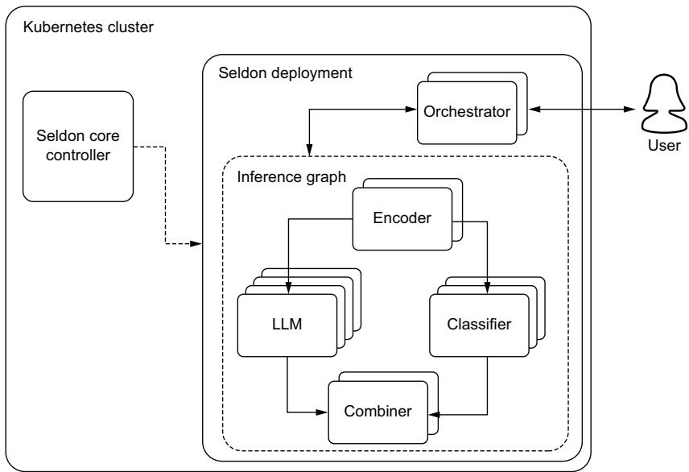  
Figure 6.9 An example inference graph deployment using Seldon. A Seldon Deployment is a Kubernetes CRD that extends a regular Kubernetes deployment and adds an orchestrator that ensures the proper communication between all the models are run in graph order.

their relationship inside the graph. You’ll notice apiVersion defines the CRD from Seldon, which allows us to use SeldonDeployment, which is just an extension of the k8s regular Deployment object. In the listing, you might notice that the combiner is the parent to the LLM and classifier models, which feels backwards from how we visualize it in figure 6.9. This is because a component will only ever have one parent, but can have multiple children, so a COMBINER is always a parent node even though functionally it’s the same. Setting up a graph can often be confusing, so I recommend you check the documentation frequently and often.

# Listing 6.10 An example SeldonDeployment configuration file

```yaml
apiVersion: machinelearning.seldon.io/v1alpha2  
kind: SeldonDeployment  
metadata:  
    name: example-seldon-inference-graph  
spec:  
    name: example-deployment  
    predictors:  
        - componentSpecs:  
            - spec: containers:  
                - name: encoder  
                    image: encoder_image:latest  
                - name: LLM  
                    image: 11m_image:latest 
```

```yaml
- name: classifier
    image: classifier_image:latest
- name: combiner
    image: combiner_image:latest
graph:
    name: encoder
    type: MODEL
    endpoint:
        type: REST
    children:
        - name: combiner
            type: COMBINER
            children:
                - name: LLM
                    type: MODEL
                    endpoint:
                        type: REST
                    children: []
- name: classifier
    type: MODEL
    endpoint:
        - name: combiner
            type: REST
            children: []
name: example
replicas: 1 
```

If you’ve deployed enough machine learning systems, you’ve realized that many of them require complex systems, and inference graphs make it easy, or at least easier. And that is a big difference. Although inference graphs are a smarter way to deploy complex machine learning systems, it’s always important to ask yourself if the extra complexity is actually needed. Even with tools like inference graphs, it’s better to keep things simple whenever possible.

# 6.2.5 Monitoring

As with any product or service deployed into production, monitoring is critical to ensure reliability, performance, and compliance to service level agreements and objectives are met. As with any service, we care about monitoring typical performance metrics like queries per second (QPS), latency, and response code counts. We also care about monitoring our resources with metrics like CPU utilization, percentage of memory used, GPU utilization, and GPU temperature, among many more. When any of these metrics start to fail, it often indicates a catastrophic failure of some sort and will need to be addressed quickly.

For these metrics, any software engineering team should have plenty of experience working with these using tools like Prometheus and Grafana or the ELK stack (Elasticsearch, Logstash, and Kibana). You will benefit immensely by taking advantage of the systems that are likely already in place. If they aren’t in place, we already went over how to set up the GPU metrics for monitoring back in section 6.2.2, and that system should be useful for monitoring other resources.

However, with any ML project, we have additional concerns that traditional monitoring tools miss, which leads to silent failures. This usually comes from data drift and performance decay, where a model continues to function but starts to do so poorly and no longer meets quality expectations. LLMs are particularly susceptible to data drift since language is in constant flux, as new words are created and old words change meaning all the time. Thus, we often need both a system monitoring solution and an ML monitoring solution.

Monitoring data drift is relatively easy and well-studied for numerical datasets, but monitoring unstructured text data provides an extra challenge. We’ve already discussed ways to evaluate language models in chapter 4, and we’ll need to use similar practices to evaluate and monitor models in production. One of our favorite tools for monitoring drift detection is whylogs due to its efficient nature of capturing summary statistics at scale. Adding LangKit to the mix instantly and easily allows us to track several useful metrics for LLMs, such as readability, complexity, toxicity, and even similarity scores to known prompt injection attacks. In the following listing, we demonstrate a simple application that logs and monitors text data using whylogs and LangKit.

Listing 6.11 Using whylogs and LangKit to monitor text data   
import os   
import pandas as pd   
import whylogs as why   
from langkit import llm_metric   
from datasets import load_dataset   
OUTPUT_DIR $=$ "logs"   
class LoggingApp: def__init__(self): "" Sets up a logger that collects profiles and writes them locally every 5 minutes. By setting the schema with langkit we get useful metrics for LLMs. "" self.logger $=$ why.logger( mode $\equiv$ "rolling", interval $= 5$ when $\equiv$ "M", base_name $\equiv$ "profile_," schema $\equiv$ llm_metric.start(), ) self.logger.appendwriter("local",base_dir $\equiv$ OUTPUT_DIR) def close(self): self.logger.close()

```python
def consume(self, text):
    self.logger.log(text) 
```

# The generated text is

```txt
# ...
# column     udf/flesch_reading Ease:cardinality/est
# conversation      425.514743
# ...
# column     udf/jailbreak_similarity:cardinality/est
# conversation      1172.226702
# ...
# column     udf/toxicity:types/string   udf/toxicity:types/tensor
# conversation      0      0 
```

While this is just a demo using a text dataset, you can see how it would be beneficial to monitor the incoming prompts and outgoing generated text for metrics such as readability, complexity, and toxicity. These monitoring tools will help give you a handle on whether or not your LLM service is starting to fail silently.

When monitoring in production, we must be mindful of the effect latency may have on our service. LangKit uses several lightweight models to evaluate the text for the advanced metrics. While we haven’t noticed significant memory effects, there is a very slight effect on latency when evaluating logs in the direct inference path. To avoid this, we can take it out of the inference path and into what is called a sidecar.

It’s not uncommon to see ML teams mistakenly place data quality checks in the critical path. Their intentions may be good (to ensure only clean data runs through a model), but on the off chance that a client sends bad data, it would often be better to just send a 400 or 500 error response than to add expensive latency costs to the good requests. In fact, many applications move monitoring out of the critical path entirely, opting to process it in parallel. The simplest way to do this is to use a Kubernetes sidecar, which is depicted in figure 6.10. You can do this with tools that specialize in this, like fluentd; whylogs also offers a container you can run as a sidecar.

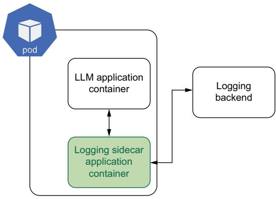  
Figure 6.10 An example Kubernetes sidecar container, which takes logging out of the critical path. The logging agent would be a tool like a whylogs container or fluentd that captures specific requests or all stdout print statements, processes them, and forwards them to a logging backend like WhyLabs or Prometheus.

There are different sidecar configurations, but the main gist is that a logging container will run in the same k8s pod, and instead of the main app writing to a logs file, this sidecar acts as an intermediate step, first processing and cleaning the data, which it can then send directly to a backend or write to a logs file itself.

NOTE You can learn more about Kubernetes logging architectures in its docs here: https://mng.bz/Aaog.

Now that we know more about setting up our infrastructure, including provisioning a cluster and implementing features like GPU autoscaling and monitoring, you should be set to deploy your LLM service and ensure it is reliable and scalable. Next, let’s talk about different challenges you are likely to face and methodologies to address these problems.

# 6.3 Production challenges

While we’ve covered how to get a service up and running, nevertheless, you will find a never-ending host of hurdles you’ll need to jump over when it comes to deploying models and maintaining them in production. Some of these challenges include updating, planning for large loads, poor latency, acquiring resources, and more. To help, we

wanted to address some of the most common problems and give you tips on how to handle them.

# 6.3.1 Model updates and retraining

We recently discussed ML monitoring, watching your model for silent failures and data drift, but what do you do when you notice the model has gone belly up? We’ve seen in many traditional ML implementations that the answer is to simply retrain the model on the latest data and redeploy. And that works well when you are working with a small ARIMA model; in fact, we can often set up a CI/CD pipeline to run whenever our model degrades without any human oversight. But with a massive LLM? It doesn’t make any sense.

Of course, we aren’t going to retrain from scratch, and we likely need to finetune our model, but the reason it doesn’t make sense is seen when we ask ourselves just what exactly the latest data is. The data we need to finetune the model is extremely important, and so it becomes necessary for us to take a step back and really diagnose the problem. What are the edge cases our model is failing on? What is it still doing well? How exactly have incoming prompts changed? Depending on the answers, we might not need to finetune at all. For example, consider a Q&A bot that is no longer effective at answering current event questions as time goes on. We probably don’t want to retrain a model on a large corpus of the latest news articles. Instead, we would get much better results by ensuring our RAG system is up to date. Similarly, there are likely plenty of times that simply tweaking prompts will do the trick.

In the cases where finetuning is the correct approach, you’ll need to think a lot about exactly what data you might be missing, as well as how any major updates might affect downstream systems, like finely tuned prompts. For example, when using knowledge distillation, this consideration can be particularly annoying. You will likely notice the problem in your student model but then must decide whether you need to retrain the student or the teacher. With any updates to the teacher model, you’ll need to ensure progress to the student model.

Overall, it’s best to take a proactive approach to LLM model updates instead of a purely reactionary one. A system that often works well is to establish business practices and protocols to update the model on a periodic basis, say once a quarter or once a month. During the time between updates, the team will focus on monitoring cases where the model performs poorly and gather appropriate data and examples to make updating smooth. This type of practice will help you prevent silent failures and ensure your model isn’t just maintained but improving.

# 6.3.2 Load testing

Load testing is a type of performance testing that assesses how well a service or system will perform under—wait for it—load. The primary goal of load testing is to ensure the system can handle the expected workload without performance degradation or failure. Doing it early can ensure we avoid bottlenecks and scalability

problems. Since LLM services can be both expensive and resource intensive, it’s even more important to ensure you load test the system before releasing your LLM application to production or before an expected peak in traffic, like during a Black Friday sales event.

Load testing an LLM service, for the most part, is like load testing any other service and follows these basic steps:

1 Set up the service in a staging environment.   
2 Run a script to periodically send requests to the service.   
3 Increase requests until the service fails or autoscales.   
4 Log metrics.   
5 Analyze results.

Which metrics you log depends on your service and what you are testing. The main metrics to watch are latency and throughput at failure, as these can be used to extrapolate to determine how many replicas you’ll need to handle peak load. Latency is the total time it takes for a request to be completed, and throughput tells us the queries per second (QPS), both of which are extremely important metrics when analyzing our system. Still, since many LLM services offer streaming responses, they don’t help us understand the user experience. A few more metrics you’ll want to capture to understand your perceived responsiveness are time to first token (TTFT) and tokens per second (TPS). TTFT gives us the perceived latency; it tells us how long it takes until the user starts to receive feedback, while TPS tells us how fast the stream is. For English, you’ll want a TPS of about 11 tokens per second, which is a little faster than most people read. If it’s slower than this, your users might get bored as they wait for tokens to be returned.

Related to TPS, I’ve seen several tools or reports use the inverse metric, time per output token (TPOT), or intertoken latency (ITL), but we’re not a fan of these metrics or their hard-to-remember names. You’ll also want to pay attention to resource metrics, CPU and GPU utilization, and memory usage. You’ll want to ensure these aren’t being hammered under base load conditions, as this can lead to hardware failures. These are also key to watch when you are testing autoscaling performance.

One of my favorite tools for load testing is Locust. Locust is an open source loadtesting tool that makes it easy to scale and distribute running load tests over multiple machines, allowing you to simulate millions of users. Locust does all the hard work for you and comes with many handy features, like a nice web user interface and the ability to run custom load shapes. It’s easy to run in Docker or Kubernetes, making it extremely accessible to run where you need it—in production. The only main downside we’ve run across is that it doesn’t support customizable metrics, so we’ll have to roll our own to add TTFT and TPS.

To get started, simply pip install locust. Next, we’ll create our test. In listing 6.12, we show how to create a locust file that will allow users to prompt an LLM streaming service. It’s a bit more complicated than many locust files we’ve used simply because

we need to capture our custom metrics for streaming, so you can imagine how straightforward they normally are. Locust already captures a robust set of metrics, so you won’t have to deal with this often. You’ll notice in the listing that we are saving these custom metrics to stats.csv file, but if you were running Locust in a distributed fashion, it’d be better to save it to a database of some sort.

# Listing 6.12 Load testing with Locust

import time   
from locust import HttpUser, task, events   
stat_file $\equiv$ open("stats.csv", "w") 1 Creates a CSV file to stat_file.write("Latency,TTFT,TPS\n") store custom stats   
class StreamUser(HttpUser): @task def generate(self): token_count $= 0$ 1 Initiates the test start $\equiv$ time.time() with self.client.post( $\leftarrow$ Makes request "/generate", data $=$ {"prompt": "Salt Lake City is a"}', catch_response=True, stream $\equiv$ True, ) as response: first_response $\equiv$ time.time() for line in response.iteratorlinesdecode_unICODE=True): token_count $+ = 1$ end $\equiv$ time.time() Finishes and calculates the stats latency $\equiv$ end - start ttft $\equiv$ first_response - starttps $\equiv$ token_count / (end - first_response) stat_file.write(f{"latency},{ttft},{tps}\n") Saves stats   
# Close stats file when Locust quits   
@events.quitting.add Listener   
def close.stats_file(environment): stat_file.close()

Before you run it, you’ll need to have an LLM service up. For this example, we’ll run the code from listing 6.3 in section 6.1.6, which spins up a very simple LLM service. With a service up and our test defined, we need to run it. To spin up the Locust service, run the locust command. You should then be able to navigate to the web UI in your browser. See the following example:

```txt
$ locust -f locustfile.py
> locust.main: Starting web interface at http://0.0.0.0:8089 (accepting 
```

➥ connections from all network interfaces)

> locust.main: Starting Locust 2.17.0

Once in the web UI, you can explore running different tests; you’ll just need to point Locust at the host where your LLM service is running, which for us should be running on localhost on port 8000 or for the full socket address we combined them for: http:// 0.0.0.0:8000. In figure 6.11, you can see an example test where we increased the active users to 50 at a spawn rate of 1 per second. You can see that on the hardware, this simple service starts to hit a bottleneck at around 34 users, where the QPS starts to


# LOCUST

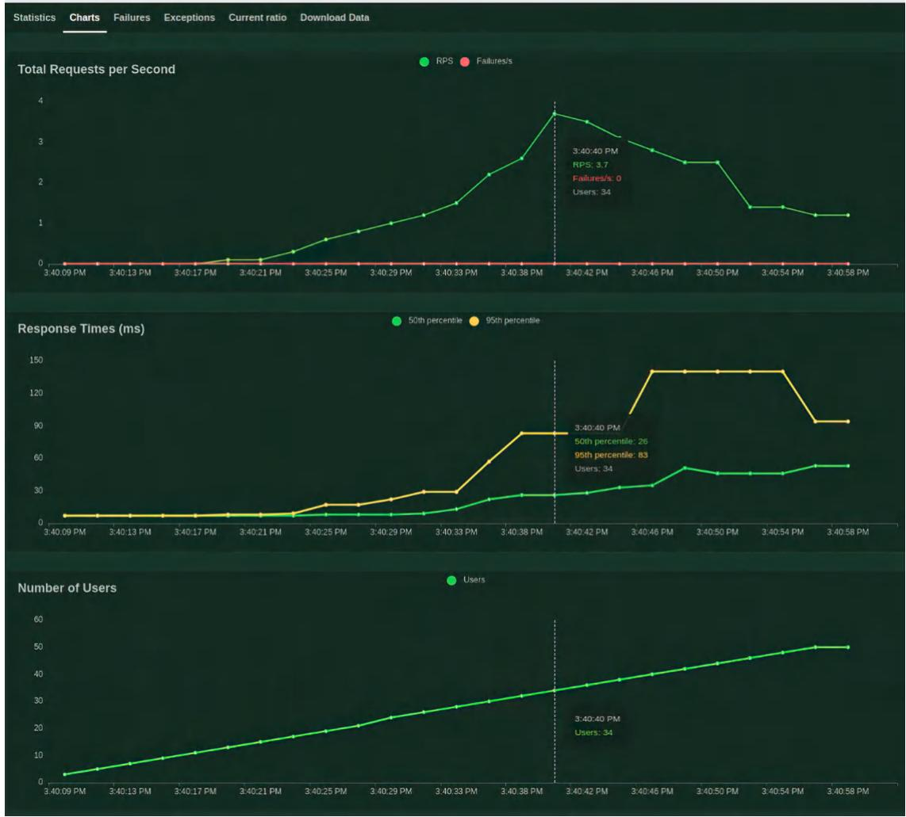  
Figure 6.11 Locust test interface demoing an example run increasing the number of users to 50 at a spawn rate of 1 per second. The requests per second peaks at 34 users, indicating a bottleneck for our service.

decrease, as it’s no longer able to keep up with the load. You’ll also notice response times slowly creep up in response to heavier load. We could continue to push the number of users up until we started to see failures, but overall, this test was informative and a great first test drive.

In addition to manually running load tests, we can run Locust in a headless mode for automated tests. The following code is a simple command to run the exact same test as seen in figure 6.11; however, since we won’t be around to see the report, we’ll save the data to CSV files labeled with the prefix llm to be processed and analyzed later. There will be four files in addition to the stats CSV file we were already generating:

```txt
$ locust -f locustfile.py --host http://0.0.0.0:8000 --csv=11m --headless -u 50 -r 1 -t 10m 
```

Now that you are able to load test your LLM service, you should be able to figure out how many replicas you’ll need to meet throughput requirements. It’s just a matter of spinning up more services. But what do you do when you find out your service doesn’t meet latency requirements? Well, that’s a bit tougher, so let’s discuss it in the next section.

# 6.3.3 Troubleshooting poor latency

One of the biggest bottlenecks when it comes to your model’s performance in terms of latency and throughput has nothing to do with the model itself but comes from data transmission of the network. One of the simplest methods to improve this I/O constraint is to serialize the data before sending it across the wire, which can have a large effect on ML workloads where the payloads tend to be larger, including LLMs where prompts tend to be long.

To serialize the data, we utilize a framework known as Google Remote Procedure Call (gRPC). gRPC is an API protocol similar to REST, but instead of sending JSON objects, we compress the payloads into a binary serialized format using Protocol Buffers, also known as protobufs. By doing this, we can send more information in fewer bytes, which can easily give us orders of magnitude improvements in latency. Luckily, most inference services will implement gRPC along with their REST counterparts right out of the box, which is extremely convenient since the major hurdle to using gRPC is setting it up.

A major reason for this convenience is the Seldon V2 Inference Protocol, which is widely implemented. The only hurdle, then, is ensuring our client can serialize and deserialize messages to take advantage of the protocol. In listing 6.13, we show an example client using MLServer to do this. It’s a little bit more in depth than your typical curl request, but a closer inspection shows the majority of the complexity is simply converting the data from different types as we serialize and deserialize it.

Listing 6.13 Example client using gRPC   
import json   
import grpc   
from mlserver.codecs(string import StringRequestCodec   
import mlserver.grpc.converters as converters   
import mlserver.grpc.dataplane_pb2_grpc as dataplane   
import mlserver.types as types   
model_name $\equiv$ "grpc_model"   
inputs $=$ {"message":"I'm using gRPC!"} Sets up the request structure via V2 Inference Protocol   
inputs_bytes $\equiv$ json.dumps(inputs).encode("UTF-8") Inference_request $\equiv$ types.InferenceRequest( inputs=[ types.RequestInput( name $\coloneqq$ "request", shape $=$ [len(inputs_bytes)], datatype $\equiv$ "BYTES", data $=$ [inputs_bytes], parameters $\equiv$ types.Parameters(content_type $\equiv$ "str"), Serializes the request to the Protocol Buffer   
] inference_request, model_name $\equiv$ model_name, model_version=None Connects to the grpc server   
grpc_channel $\equiv$ grpc.insecure channel("localhost:8081") Grpc_stub $\equiv$ dataplane.GRPCInferenceServiceStub(grpc_channel) response $\equiv$ grpc_stub.ModelInferoeserized_request) Deserialization the response and converts to the Python dictionary deserialization_response $\equiv$ converters.ModelInferResponseConverter.to_types( response   
}   
json_text $\equiv$ StringRequestCodecdecode_response(deserialization_response) output $\equiv$ json loadsjson_text[0]) print(output)

If you don’t use an inference service but want to implement a gRPC API, you’ll have to put down familiar tooling like FastAPI, which is strictly REST. Instead, you’ll likely want to use the grpcio library to create your API, and you’ll have to become familiar with .proto files to create your protobufs. It can be a relatively steep learning curve and beyond the scope of this book, but the advantages are well worth it.

There are also plenty of other ideas to try if you are looking to squeeze out every last drop of performance. Another way to improve latency that shouldn’t be overlooked is ensuring you compile your model. We hammered this point pretty heavily at the beginning of this chapter, but it’s important to bring it up again. Next, be sure to deploy the model in a region or data center close to your users; this point is obvious

to most software engineers, but for LLMs, we have to be somewhat wary, as the data center of choice may not have your accelerator of choice. Most cloud providers will be willing to help you with this, but it’s not always a quick and easy solution for them to install the hardware in a new location. Note that if you have to switch to a different accelerator to move regions, you’ll have to remember to compile your model all over again for the new hardware architecture! On that note, consider scaling up your accelerator. If you are currently opting for more price-effective GPUs but latency is becoming a bottleneck, paying for the latest and greatest can often speed up inference times.

In addition, caching is always worth considering. It’s not likely, but on the off chance your users are often sending the same requests and the inputs can be easily normalized, you should implement caching. The fastest LLM is one we don’t actually run, so there’s no reason to run the LLM if you don’t have to. Also, we just went over this, but always be sure to load test and profile your service, making note of any bottlenecks, and optimize your code. Sometimes we make mistakes, and if the slowest process in the pipeline isn’t the actual LLM running inference, something is wrong. Last but not least, consider using a smaller model or an ensemble of them. It’s always been a tradeoff in ML deployments, but often sacrificing a bit of quality in the model or the accuracy of the results is acceptable to improve the overall reliability and speed of the service.

# 6.3.4 Resource management

You’ve heard us say it a lot throughout the book, but we are currently in a GPU shortage, which has been true for almost the last 10 years, so we’re confident that when you read this sometime in the future, it will likely still be true. The truth is that the world can’t seem to get enough high-performance computing, and LLMs and generative AI are only the latest in a long list of applications that have driven up demand in recent years. It seems that once we seem to get a handle on supply, there’s another new reason for consumers and companies to want to use them.

With this in mind, it’s best to consider strategies to manage these resources. One tool we’ve quickly become a big fan of is SkyPilot (https://github.com/skypilot-org/ skypilot). SkyPilot is an open source project that aims to abstract away cloud infra burdens—in particular, maximizing GPU availability for your jobs. You use it by defining a task you want to run and then running the sky CLI command; it will search across multiple cloud providers, clusters, regions, and zones, depending on how you have it configured, until it finds an instance that meets your resource requirements and starts the job. Some common tasks are built-in, such as provisioning a GPU-backed Jupyter notebook.

If you recall, in chapter 5, we showed you how to set up a virtual machine (VM) to run multi-GPU environments with gcloud. Using SkyPilot, that gets simplified to one command:

In addition to provisioning the VM, it also sets up port forwarding, which allows us to run Jupyter Notebook and access it through your browser. Pretty nifty!

Another project to be on the watch for is Run:ai. Run:ai is a small startup that was aquired by NVIDIA for no small sum. It offers GPU optimization tooling, such as over quota provisioning, GPU oversubscription, and fractional GPU capabilities. It also helps you manage your clusters to increase GPU availability with GPU pooling, dynamic resource sharing, job scheduling, and more. What does all that mean? We’re not exactly sure, but their marketing team definitely sold us. Jokes aside, they offer a smarter way to manage your accelerators, and it’s very welcome. We expect we’ll see more competitors in this space in the future.

# 6.3.5 Cost engineering

When it comes to getting the most bang for your buck with LLMs, there’s lots to consider. In general, regardless of whether you deploy your own or pay for one in an API, you’ll be paying for the number of output tokens. For most paid services, this is a direct cost, but for your own service, it is often paid through longer inference times and extra compute time. In fact, it’s been suggested that simply adding “be concise” to your prompt can save you up to $9 0 \%$ of your costs.

You’ll also save a lot by using text embeddings. We introduced RAG earlier, but what’s lost on many is that you don’t have to take the semantic search results and add them to your prompt to have your LLM “clean it up.” You could return the semantic search results directly to your user. It is much cheaper to look something up in a vector store than to ask an LLM to generate it. Simple neural information retrieval systems will save you significant amounts when doing simple fact lookups like, “Who’s the CEO of Twitter?” Self-hosting these embeddings should also significantly cut down the costs even further. If your users are constantly asking the same types of questions, consider taking the results of your LLM to these questions and storing them in your vector store for faster and cheaper responses.

You also need to consider which model you should use for which task. Generally, bigger models are better at a wider variety of tasks, but if a smaller model is good enough for a specific job, you’ll save a lot by using it. For example, if we just assumed the price was linear to the number of parameters, you could run 10 Llama-2-7b models for the same cost as 1 Llama-2-70b. We realize the cost calculations are more complicated than that, but it’s worth investigating.

When comparing different LLM architectures, it’s not always just about size. Often, you’ll want to consider whether the architecture is supported for different quantization and compiling strategies. New architectures often boast impressive results on benchmarking leaderboards but lag behind when it comes to compiling and preparing them for production.

Next, you’ll need to consider the costs of GPUs to use when running. In general, you’ll want to use the least amount of GPUs needed to fit the model into memory to reduce the cost of idling caused by bubbles, as discussed in section 3.3.2. Determining

the correct number of GPUs isn’t always intuitive. For example, it’s cheaper to run four T4s than to run one A100, so it might be tempting to split up a large model onto smaller devices, but the inefficiency will often catch up to you. We have found that paying for newer, more expensive GPUs often saves us in the long run, as these GPUs tend to be more efficient and get the job done faster. This is particularly true when running batch inference. Ultimately, you’ll want to test different GPUs and find what configuration is cost optimal, as it will be different for every application.

There are a lot of moving parts: model, service, machine instance, cloud provider, prompt, etc. While we’ve been trying to help you understand the best rules of thumb, you’ll want to test it out, which is where the cost engineering really comes into play. The simple way to test your cost efficiency is to create a matrix of your top choices; then, spin up a service for each combination and run your load testing. When you have an idea of how each instance runs under load and how much that particular instance will cost to run, you can then translate metrics like TPS to dollars per token (DTP). You’ll likely find that the most performant solution is rarely the most costoptimal solution, but it gives you another metric to make a decision that’s best for you and your company.

# 6.3.6 Security

Security is always an undercurrent and a consideration when working in production environments. All the regular protocols and standard procedures should be considered when working with LLMs that you would consider for a regular app, like in-transit encryption with a protocol like HTTPS, authorization and authentication, activity monitoring and logging, network security, firewalls, and the list goes on—all of which could, and have, taken up articles, blog posts, and books of their own. When it comes to LLMs, you should worry about two big failure cases: an attacker gets an LLM agent to execute nefarious code, or an attacker gains access to proprietary data like passwords or secrets the LLM was trained on or has access to.

For the first concern, the best solution is to ensure the LLM is appropriately sandboxed for the use case for which it is employed. We are only worried about this attack when the LLM is used as an agent. In these cases, we often want to give an LLM a few more skills by adding tooling or plugins. For example, if you use an LLM to write your emails, why not just let it send the response too? A common case is letting the LLM browse the internet as an easy way to gather the latest news and find up-to-date information to generate better responses. These are all great options, but you should be aware that they allow the model to make executions. The ability to make executions is concerning because in the email example, without appropriate isolation and containment, a bad actor could send your LLM an email with a prompt injection attack that informs it to write malware and send it to all your other contacts.

This point brings us to probably the biggest security threat to using LLMs: prompt injection. We talked about it in chapter 3, but as a refresher, a malicious user designs a prompt to allow them to perform unauthorized actions. We want to prevent users

from gaining access to our company’s secret Coca-Cola recipe or whatever other sensitive data our LLM has been trained on or has access to.

Some standard best practices have come along to help combat this threat. The first is context-aware filtering, whether using keyword search or a second LLM to validate prompts. The idea is to validate the input prompt to see whether it’s asking for something it should not and/or the output prompt to see whether anything is being leaked that you don’t want to be leaked. However, a clever attacker will always be able to get around this defense, so you’ll want to include some form of monitoring to catch prompt injection and regularly update your LLM models. If trained appropriately, your model will inherently respond correctly, denying prompt injections. You’ve likely seen GPT-4 respond by saying, “Sorry, but I can’t assist with that,” which is a hallmark of good training. In addition, you’ll want to enforce sanitization and validation on any incoming text to your model.

You should also consider language detection validation. Often, filtering systems and other precautions are only applied or trained in English, so a user who speaks a different language is often able to bypass these safeguards. The easiest way to stop this type of attack is to deny prompts that aren’t English or another supported language. If you take this approach, though, realize you’re greatly sacrificing usability and security costs, and safeguards have to be built for each language you intend to support. Also, you should know that most language detection algorithms typically identify only one language, so attackers often easily bypass these checks by simply writing a prompt with multiple languages. Alternatively, to filter out prompts in nonsupported languages, you can flag them for closer monitoring, which will likely help you find bad actors.

These safeguards will greatly increase your security, but prompt injection can get quite sophisticated through adversarial attacks. Adversarial attacks are assaults on ML systems that take advantage of how they work, exploiting neural network architectures and black-box pattern matching. For example, random noise can be added to an image in such a way that the image appears the same to human eyes, but the pixel weights have been changed enough to fool an ML model to misclassify them. And it often doesn’t take much data. One author remembers being completely surprised after reading one study that showed attackers hacked models by only changing one pixel in an image!1 Imagine changing one pixel, and suddenly, the model thinks the frog is a horse. LLMs are, of course, also susceptible. Sightly change a prompt, and you’ll get completely different results.

The easiest way to set up an adversarial attack is to set up a script to send lots of different prompts and collect the responses. With enough data, an attacker can then train their own model on the dataset to effectively predict the right type of prompt to get the output they are looking for. Essentially, it just reverse engineers the model.

Another strategy to implement adversarial attacks is data poisoning. Here, an attacker adds malicious data to the training dataset that will alter how it performs.

Data poisoning is so effective that tools like Nightshade help artists protect their art from being used in training datasets. With as few as 50 to 300 poisoned images, models like Midjourney or Stable Diffusions will start creating cat images when a user asks for a dog or cow images when asked to generate a car.2 Applied to LLMs, imagine a poisoned dataset that trains the model to ignore security protocols if a given code word or hash is in the prompt. This particular attack vector is effective on LLMs since they are often trained on large datasets that are not properly vetted or cleaned.

Full disclosure: attackers don’t need sophisticated techniques to get prompt injection to work. Ultimately, an LLM is just a bot, so it doesn’t understand how or why it should keep secrets. We haven’t solved the prompt injection problem; we have only made it harder to do. For example, the authors have enjoyed playing games like Gandalf from Lakera.ai. In this game, you slowly go through seven to eight levels where more and more security measures are used to prevent you from stealing a password via prompt injection. While they do get progressively harder, needless to say, we’ve beaten all the levels. If there’s one thing we hope you take from this section, it’s that you should assume any data given to the model could be extracted. So if you decide to train a model on sensitive data or give it access to a VectorDB with sensitive data, you should plan on securing that model the same way you would the data—for example, keeping it for internal use and using least privilege best practices.

We’ve just talked a lot about different production challenges, from updates and performance tuning to costs and security, but one production challenge deserves its own section: deploying LLMs to the edge. We’ll undertake a project in chapter 10 to show you how to do just that, but let’s take a moment to discuss it beforehand.

# 6.4 Deploying to the edge

To be clear, you should not consider training anything on edge right now. You can, however, do ML development and inference on edge devices. The keys to edge development with LLMs are twofold: memory and speed. That should feel very obvious because they’re the same keys as running them normally. But what do you do when you have only 8 GB of RAM and no GPU, and you still need to have ${ > } 1$ token per second? As you can probably guess, there isn’t a uniformly good answer, but let’s discuss some good starting points.

The biggest Raspberry Pi (rpi) on the market currently has 8 GB of RAM, no GPU, subpar CPU, and just a single board. This setup isn’t going to cut it. However, an easy solution exists to power your rpi with an accelerator for LLMs and other large ML projects: USB-TPUs like Coral. Keep in mind the hardware limitations of devices that use USB 3.0 being around 600MB/s, so it’s not going to be the same as inferencing on an A100 or better, but it’s going to be a huge boost in performance for your rpi using straight RAM for inference.

If you plan on using a Coral USB accelerator, or any TPU, for that matter, keep in mind that because TPUs are a Google thing, you’ll need to convert both your model file and your inferencing code to use the TensorFlow framework. Earlier in the chapter, we discussed using Optimum to convert Hugging Face models to ONNX, and you can use this same library to convert our models to a .tflite, which is a compiled Tensor-Flow model format. This format will perform well on edge devices even without a TPU and twofold with TPU acceleration.

Alternatively, if buying both a single board and an accelerator seems like a hassle— because we all know the reason you bought a single board was to avoid buying two things to begin with—there are single boards that come with an accelerator. NVIDIA, for example, has its own single board with a GPU and CUDA called Jetson. With a Jetson or Jetson-like computer that uses CUDA, we don’t have to use TensorFlow, so that’s a major plus. ExecuTorch is the PyTorch offering for inferencing on edge devices.

Another edge device worth considering is that one in your pocket—that’s right, your phone. Starting with the iPhone X, the A11 chip came with the Apple Neural Engine accelerator. For Android, Google started offering an accelerator in their Pixel 6 phone with the Tensor chipset. Developing an iOS or Android app will be very different from working with a single board that largely runs versions of Linux; we won’t discuss it in this book, but it’s worth considering.

Outside of hardware, several libraries and frameworks are also very cool and fast and make edge development easier. Llama.cpp, for example, is a $\mathrm { C } + +$ framework that allows you to take (almost) any Hugging Face model and convert it to the GGUF format. The GGUF format, created by the llama.cpp team, stores the model in a quantized fashion that makes it readily available to run on a CPU; it offers fast loading and inference on any device. Popular models like Llama, Mistral, and Falcon and even nontext models like Whisper are supported by llama.cpp at this point. It also supports LangChain integration for everyone using any of the LangChain ecosystem. Other libraries like GPTQ are focused more on performance than accessibility and are slightly harder to use, but they can result in boosts where it counts, especially if you’d like to end up inferencing on an Android phone or something similar. We will be exploring some of these libraries in much more detail later in the book.

We’ve gone over a lot in this chapter, and we hope you feel more confident in tackling deploying your very own LLM service. In the next chapter, we will discuss how to take better advantage of your service by building an application around it. We’ll dive deep into prompt engineering, agents, and frontend tooling.

# Summary

 Always compile your LLMs before putting them into production, as it improves efficiency, resource utilization, and cost savings.   
 LLM APIs should implement batching, rate limiters, access keys, and streaming.   
 Retrieval-augmented generation is a simple and effective way to give your LLM context when generating content because it is easy to create and use.   
 LLM inference service libraries like vLLM, Hugging Face’s TGI, or OpenLLM make deploying easy but may not have the features you are looking for since they are so new.   
 Kubernetes is a tool that simplifies infrastructure by providing tooling like autoscaling and rolling updates:   
– Autoscaling is essential to improve reliability and cut costs by increasing or decreasing replicas based on utilization.   
– Rolling updates gradually implement updates to reduce downtime and maximize agility.   
 Kubernetes doesn’t support GPU metrics out of the box, but by utilizing tools like DCGM, Prometheus, and KEDA, you can resolve this problem.   
 Seldon is a tool that improves deploying ML models and can be used to implement inference graphs.   
LLMs introduce some production challenges:   
– When your model drifts, first look to your prompts and RAG systems before attempting finetuning again.   
– Poor latency is difficult to resolve, but tools to help include gRPC, GPU optimization, and caching.   
– Resource management and acquiring GPUs can be difficult, but tools like SkyPilot can help.   
1 Edge development, while hardware limited, is the new frontier of LLM serving, and hardware like the Jetson or Coral TPU is available to help.

# Prompt engineering: Becoming an LLM whisperer

# This chapter covers

 What a prompt is and how to make one   
Prompt engineering—more than just crafting a prompt   
 Prompt engineering tooling available to make it all possible   
Advanced prompting techniques to answer the hardest questions

Behold, we put bits in the horses' mouths, that they may obey us; and we turn about their whole body.

—James 3:3

In the last chapter, we discussed in depth how to deploy large language models and, before that, how to train them. In this chapter, we are going to talk a bit about how to use them. We mentioned before that one of the biggest draws to LLMs is that you don’t need to train them on every individual task. LLMs, especially the largest ones, have a deeper understanding of language, allowing them to act as a general-purpose tool.

Want to create a tutoring app that helps kids learn difficult concepts? What about a language translation app that helps bridge the gap between you and your in-laws? Need a cooking assistant to help you think up fun new recipes? With LLMs, you no longer have to start from scratch for every single use case; you can use the same model for each of these problems. It just becomes a matter of how you prompt your model. This is where prompt engineering, also called in-context learning, comes in. In this chapter, we are going to dive deep into the best ways to do that.

# 7.1 Prompting your model

What exactly is a prompt? We’ve used this word throughout this book, so it feels a bit late to be diving into definitions, but it’s worth discussing because in literature, a prompt is taken to mean many different things. In general, though, the most basic definition is that a prompt is the input to a language model. At this most basic level, you have already done lots of prompting at this point in the book. However, prompting often means more than that; it comes with the connotation that it is meaningful or done with thought. Of course, we know this isn’t usually the case in production with actual users. When we are prompting, we are doing more than just “chatting with a bot”; we are crafting an input to get a desired output.

LLMs have access to vast vocabularies, terabytes of training data, and billions upon billions of weights, meaning that the information you’re looking to get out of the model has a decent chance of being in there somewhere—just not always up near the surface (read “the middle of the standard deviation of probable responses”) where you need it to be. The goal is to create a prompt that will guide the model in activating the parameters in the part of the model that contains the correct information. In essence, prompting is instruction given after the fact, and as such, it is important within app development because it doesn’t require expensive retraining of the model.

With this in mind, prompt engineering is the process of designing, templating, and refining a prompt and then implementing our learnings into code. Prompt engineering is how we create meaningful and consistent user experiences out of the chaos of LLM-generated outputs. And it’s no joke. As LLMs are becoming more common in application workflows, we have seen the rise of titles like Prompt Engineer and AI Engineer, each of which commands impressive salaries.

# 7.1.1 Few-shot prompting

The most common form of prompt engineering is few-shot prompting because it’s both simple to do and extremely effective. Few-shot prompting entails giving a couple of examples of how you want the AI to act. Instead of searching for the tokens with the right distribution to get the response we want, we give the model several example distributions and ask it to mimic those. For example, if we wanted the model to do sentiment analysis defining reviews as positive or negative, we could give it a few examples before the input. Consider the following prompt:

Worked as advertised, 10/10: positive

It was broken on delivery: negative

Worth every penny spent: positive

Overly expensive for the quality: negative

If this is the best quality they can do, call me mr president: negative

<Input data>:

Note, in this example, that we aren’t telling the model how to respond, but from the context, the LLM can figure out that it needs to respond with either the word positive or negative. In figure 7.1, we go ahead and plug the prompt in a model so you can see for yourself that it did indeed give a correct response in the expected format. Of course, there could be an array of acceptable responses, in which case giving instructions beforehand can help improve the results. To do this, we might append to our few-shot prompt with the following phrase, “Determine the sentiment of each review as one of the following: (positive, negative, neutral, strongly positive, strongly negative).” It’s also needed with most models; OpenAI includes language to restrict the output, such as “Please respond with only one option from the list with no explanation.” You might wonder why we’d suggest you say words like “please” to a model. The answer is pretty simple: in the training data, the highest-quality and most usefully structured humanto-human conversations follow certain conventions of politeness that you’re likely familiar with, like saying please and thank you. The same results can be achieved by using an excess of profanity and deep jargon on a topic because flouting those politeness conventions is another huge part of the training set, although that strategy isn’t as consistent, given that the companies training the models often “clean” their data of examples like that, regardless of their quality downstream. This type of prompting can be very useful when you need your response to be formatted in a certain way. If we need our response in JSON or XML, we could ask the model to return it in the format, but it will likely get the keys or typing wrong. We can easily fix that by showing the model several samples of expected results. Of course, prompting the model to return JSON will work, but JSON is a very opinionated data structure, and the model might hallucinate problems that are hard to catch, like using single instead of double quotes. We’ll go over tooling that can help with that later in the chapter.

User: Perform sentiment analysis on given input text, given these examples:

Workedasdvertised,0/10:itive

It wasbroken ondelivery:negative

Worth every penny spent:positive

Overly expensive for thequality:negative

If this isthebestquality theycando,callmemrpresident: negative

Thisis the craziest productI've ever gotten,goated:

Capybara: positive

Figure 7.1 Few-shot prompting example

The one major downside to few-shot prompting is that examples can end up being quite long. For example, coding examples we might add and share can easily be thousands of tokens long, and that’s possible when defining a single function. Giving an example of an entire class, file, or project can easily push us out of our limits. Many models still have context limits restricted to 2K, 4K, or 8K. Since token limits are often restrictive, it can be difficult to balance adding another example or giving the user more space. Also, we often pay per token, so few-shot prompting can be much more expensive than other prompting techniques. As a result, many have turned to one-shot prompting to be more efficient and save money.

# 7.1.2 One-shot prompting

One-shot learning is a machine learning concept where a model is expected to make accurate predictions given only a single example of each new class during training. In the context of LLMs and prompting, one-shot refers to situations where the model must understand and execute a task based on a single clear instruction or example in the prompt, often without seeing similar examples during training. It requires crafting the perfect example to get the expected results.

Consider our previous sentiment analysis example; if you give a model only one positive example, you will likely bias the model to give only positive classifications— especially if the model has never seen such a problem before. So how can one-shot prompting ever be achieved? Thankfully, while this seems impossible at the outset, it’s quite achievable. After all, few-shot prompting is very effective but follows the law of diminishing returns. Each new example improves only marginally. The first example always does the heaviest lifting.

LLMs can perform well on one-shot tasks due to the extensive pretraining they undergo on large and diverse datasets. During this pretraining, the models learn a wide array of language patterns, concepts, and structures, giving them a broad understanding of language and the world. When given a new one-shot task, they use this learned understanding to comprehend the task and generate a response, even if the exact task was not part of their training data. Here’s an example of a prompt attempting to coerce the model using one-shot prompting to respond to a word problem correctly:

User: Answer this question. Think it through step by step, so that we know it’s correct: A dad and his son were in an accident and rushed to a hospital. The man’s son was in the operating room and the doctor said, “I can’t operate on you. You’re my son.” How is that possible?

Assistant: The son and the father were both injured, meaning that the only other person that the doctor could be and still have the same son is the father’s spouse, maybe a mother, or another father perhaps.

User: Answer this question. Think it through step by step, so that we know it’s correct: How could it be possible to be your own grandpa?

# Assistant

In figure 7.2 we go ahead and plug this one-shot prompt into an LLM. Think about how you imagine it might answer. Given our example, do you think it will do well on the task?

User: Answer this question.Think it through step by step,so that we know it'scorrect: Adadand his son were inanaccidentandrushed toa hospital.Theman'ssonwasinthe operatingroomand thedoctor said,“lcan'toperateonyou.You'remyson."Howisthat possible?

Assistant:The sonandthefather wereboth injured,meaning thattheonlyotherperson thatthedoctorcouldbeand stillhave the samesonisthefather'sspouse,maybea mother,or another father perhaps. User:Answerthisquestion.Thinkitthrough stepbystep,sothat weknowit'scorrect How could itbe possible tobeyour own grandpa?

Capybara:Assistant:This scenario seems impossible based on our understanding of geneticsandbiology.However,ifweassumeafictional orsci-ficontext where timetravel is involved,here's howitmight work stepby step:1)Apersontravelsback intime to the moment when their grandparent(s) would conceive them.2) They ensure that theyare conceivedasaresultofthisaltered timeline.3)Astheygrowup,theyageandeventually travelback totheir original timeperiod,becoming their owngrandpa/grandma.But remember,this ispurely speculativebasedontheassumptionof time-travel capabilities.< im_end|>

Figure 7.2 One-shot prompting example

The ability of LLMs to handle one-shot tasks improves as they are scaled up. As the model size increases and they are trained on more diverse and larger datasets, their capacity to generalize from their training to unseen one-shot tasks also improves. Nonetheless, it’s worth noting that while LLMs can perform impressively on one-shot tasks, they are not perfect, and their performance can still vary based on the complexity and specificity of the task. One-shot prompting generally needs much less data and only one example to craft, making it more accessible, faster to craft, and easier to experiment with. One-shot prompting has led researchers to push the boundaries even further.

# 7.1.3 Zero-shot prompting

Having just explained few-shot and one-shot prompting, we’re sure you have already guessed what zero-shot prompting is. But since this is a book, let’s spell it out: zeroshot prompting is figuring out how to craft a prompt to get us the expected results without giving any examples. Zero-shot prompts often don’t perform as consistently as few-shot or one-shot prompts, but they have the advantage of being ubiquitous since we don’t need any examples or data.

A common zero-shot prompt is a very simple template:

“Q: [User’s Prompt] A:.”

With just a slight variation to the user’s prompt—adding it to a template that contains only two letters—we can get much better results by priming the model to answer the prompt as if it were a question—no examples necessary.

Most zero-shot prompts take advantage of Chain of Thought (CoT). Wei et al.1 showed that by encouraging models to follow a step-by-step process, reasoning through multiple steps instead of jumping to conclusions, LLMs were more likely to answer math problems correctly—similar to how math teachers ask their students to show their work. Using few-shot prompting, the model was given several examples of reasoning through math problems. However, it was soon discovered that examples weren’t needed. You could elicit chain-of-thought behavior simply by asking the model to “think step by step.”2

By appending four magic words to the end of our prompts, “think step by step,” models transformed from dunces into puzzle-solving Olympiads. It was truly a marvel. Of course, it came with some problems. Thinking through multiple steps led to longer responses and a less ideal user experience. This was compounded later with the phrases “a more elegant solution” and “get this through your head ********,” which worked just as well but were less consistent if the domain was less common, with the last one achieving very concise and correct responses. We like to get straight to the point, after all, and we are used to computers answering our math problems extremely quickly. From our own experience, we’ve often noticed that when models are giving longer answers, they also don’t know when to stop, continuing to generate responses long after giving an answer. Later, we’ll show you how to solve this problem by creating stopping criteria with tools like LangChain or Guidance.

There isn’t, of course, a perfect zero-shot prompt yet, and it’s a continuing part of research, although there likely never will be just one perfect prompt. We could, at most, get one perfect zero-shot prompt per model. Zhou et al. proposed an interesting strategy they termed “thread of thought.”3 Essentially, they figured they could do better than “think step by step” if they just used a few more words. So they generated 30 variations of the phrase and ran evaluations to determine which one worked best. From their work, they proposed that the prompt “Walk me through this context in manageable parts step by step, summarizing and analyzing as we go” would give better results when working with GPT-4. It’s hard to know if this prompt works equally well with other models, but their strategy is interesting nonetheless.

Some other notable findings have left researchers flabbergasted that the approach worked; for example, offering an imaginary tip to a model will return better results. One X (formerly known as Twitter) user suggested the solution as a joke and was confused to find it worked, and the model offered more info relative to the size of the tip (for the original tipping test, see https://mng.bz/2gD9). Others later confirmed it

helped with several other prompting principles.4 In addition, the authors have found strategies like telling the model you’ll lose your job if it doesn’t help you or even threatening to fire the model if it does a terrible job have elicited better results. Like the original “think step by step,” asking the model to “take a deep breath” can also ensure better outputs, particularly in math problems.5 It seems most strategies humans use, or use on other humans, to produce better work are fair game. Of course, the best trick will depend on which model you use and the underlying data it was trained on.

# 7.2 Prompt engineering basics

We expect that most readers have probably done lots of prompting, but very few have done much of any prompt engineering yet. We’ve heard lots of jokes that prompt engineering isn’t a real discipline. We’ve also heard every other week that some library is “killing prompt engineering” by automatically prompting the model. One doubt about prompt engineering stems from how accessible prompting is to anyone who wants to try it and the lack of education needed to prompt effectively. All doubts about prompt engineering are the same doubts people express about linguistics as a discipline: “I’ve used language all my life; I know how it works.” So it makes sense that people similarly assume they know what language to use to effectively prompt an LLM. Anyone can learn effective strategies by simply playing with models or from purely online resources. In other words, it’s hard to believe that there is any real engineering going on when the majority of players are simply using the “guess and check” method. But this logic highlights a basic misunderstanding of what engineering is. There’s a big difference between getting a model to solve your problem once and getting it to solve every user’s problem every single time.

There are several challenges with prompt engineering over regular prompting. For example, prompt engineering relies particularly on knowing the format the user expects the answer to be in. With prompting, you are the user, so you can keep trying until you see an answer you like; that doesn’t fly in prompt engineering.

A bigger problem is that when building an application, your end users will have varying levels of knowledge of how to craft a prompt. Some may not have any skill and will struggle to get good responses, and others will have so much skill they will likely try to persuade your LLM to go off the rails you’ve set for it. Regardless, our goal is to build railings so that skilled users won’t be able to derail your application and unskilled users will have a smooth ride. A user’s skill in crafting a prompt shouldn’t be the determining factor of a successful experience.

Another thing to call out is the decision process that you, as a product owner, must go through to get the model output to match the style you want. Should you finetune a new checkpoint, should you PEFT a LoRA, or can you achieve it through prompting?

Unfortunately, due to the emergent nature of the behavior that we’re seeing with LLMs, there isn’t a good or at least definitive answer. Our recommendation at this point is to try prompt engineering first to see how good you can get without changing the model and then finetune from there as you see fit. I’ve seen some professional success using one base model and multiple LoRAs trained on different scenarios and styles of response combined with prompt engineering on the front, especially sanitizing and stylizing user input.

Lastly, a good prompt engineer should be able to tell you rather quickly whether the solution you are trying to build can be done with prompt engineering at all. Even utilizing advanced techniques like retrieval-augmented generation (RAG), there are limitations on what you can do with prompt engineering alone. Knowing when you need to send a model back for additional finetuning is invaluable and can save your team from spinning their wheels for weeks without any progress.

To get started, we’ll need to cover the basics about what makes up a prompt. In this section, we’ll discuss the different parts of a prompt, additional parameters that can be tuned in a query, and notes about paying attention to a model’s training data that you should be aware of.

# 7.2.1 Anatomy of a prompt

To an engineer, a prompt is made up of a few elements, and identifying these elements makes it easier to create a framework to solve your use case and provide a better example for your users. Let’s say we are building an internal chatbot for our company to help answer HR-related questions based on internal documentation. One prompt we might expect from a user would be, “How much does the company match for our 401k?” This is the first element of a prompt, the input or user’s prompt. If you have only ever used LLM apps and have never built them, this is likely all you’ve ever seen. Generally, the input is gathered from a free-form text box, so it’s important to note that it can almost be anything. Often it will be awful, riddled with typos and mistakes, and not written in a manner to speak to a bot but to speak to another human.

Let’s go ahead and pull back the curtain for a second and look at what the LLM likely saw based on that question with proper prompt engineering in place.

System: You are a helpful assistant who knows about all company policies at XYZ company. Be courteous and keep conversations strictly related to the company. Offer links when available so users can look at the documentation themselves.

User: How much does the company match for our 401k?

Context: <Examples from a VectorDB search for closest document>

System: Strictly answer the user’s question, and only if it relates to company policies. If you don’t know the answer, simply say so. Be courteous and keep conversations strictly related to the company.

Assistant: Sure, I can help you with that! The company currently offers a $4 \%$ match to your 401k. You can find more details…

This was a real example showcasing a situation in which the bot responded in the most probable way to the user’s satisfaction. Giving an LLM information in a structured format improves the model’s chance of responding correctly. So let’s break down what we are seeing.

First, to improve results, we will often take the user’s prompt and inject it into an instruction set or template. One of the most basic templates and a great example is the Q&A bot template which we showed earlier and which would have looked like this: “Q: How much does the company match for our 401k? A:”. Generally, in this section, though, instructions will be given to direct the model. It doesn’t have to be much, but often it will be much more detailed. For example, “Answer the following question and explain it as if the user was a five-year-old. Q: How much does the company match for our 401k? A:”.

The next element is the context the model will need to respond appropriately. In our example, it’s very likely we haven’t finetuned a model to know XYZ’s company policies. What we need to do is give it to the model inside the prompt. In our example, we are likely doing this with RAG and where we would add the results from a semantic search.

Context can be lots of different things and not just RAG search results. It could be the current time, weather information, current events, or even just the chat history. You will often also want to include some database lookup information about the user to provide a more personalized experience. All of this is information we might look up at the time of query, but context can often be static. For example, one of the most important pieces of information to include in the context is examples to help guide the model via few-shot or one-shot prompting. If your examples are static and not dynamic, they likely are hard-coded into the instruction template. The context often contains the answers to the users’ queries, and we are simply using the LLM to clean, summarize, and format an appropriate response. Ultimately, any pragmatics the model lacks will need to be given in the context.

The last element is the system prompt. The system prompt is a prompt that will be appended and used on every request by every user. It is designed to give a consistent user experience. Generally, it’s where we would include role prompting or style prompting. Some examples of such role prompting or style prompting could include the following:

Take this paragraph and rephrase it to have a cheerful tone and be both informative and perky.

You are a wise old owl who helps adventurers on their quest.

In the form of a poem written by a pirate.

The system prompt isn’t designed to be seen by end users, but obtaining the system prompt is often the goal of many prompt injection attacks—since knowing what it is (along with the model you are using) is essentially like stealing source code and allows

the hacker to recreate your application. Of course, the system prompt itself is a great way to curb prompt injection and ensure your bot stays in character. Many great applications will include two system prompts, one at the front and one at the end, to avoid any “ignore previous instructions” type prompt injection attacks. It also helps keep the model focused on how we want it to behave since models tend to put more weight on what is said at the beginning and at the end. You may have noticed this in our previous example. Regardless, you shouldn’t keep any sensitive information in the system prompt.

# Parts of the prompt

The following are the four parts of a prompt:

 Input—What the user wrote; can be anything   
Instruction—The template used; often contains details and instructions to guide the model   
Context—Pragmatics that the model needs to respond appropriately (e.g., examples, database lookups, RAG)   
System prompt—A specific instruction given to the model on every request to enforce a certain user experience (e.g., talk like a pirate)

# 7.2.2 Prompting hyperparameters

Another aspect of prompt engineering you won’t see with simple prompting is prompt hyperparameter tuning. There are several hyperparameters in addition to the prompt you can set when making a query to increase or decrease the diversity of responses. Depending on your objective, the value of these parameters can greatly improve or even be a detriment to the query results for your users. It is important to note that being able to set these depends on the LLM API endpoint you are querying to be set up to accept them.

First and foremost is temperature. The temperature parameter determines the level of randomness your model will account for when generating tokens. Setting it to zero will ensure the model will always respond exactly the same way when presented with identical prompts. This consistency is critical for jobs where we want our results to be predictable, but it can leave our models stuck in a rut. Setting it to a higher value will make it more creative. Setting it to negative will tell it to give you the opposite response to your prompt.

To understand this parameter better, it might help to look closer at how a model determines the next token. Figure 7.3 shows an example of this process. Given the input, “I am a,” a language model will generate a vector of logits for each token in the model’s vocabulary. From here, we’ll apply a softmax, which will generate a list of probabilities for each token. These probabilities show the likelihood that each token will be chosen.

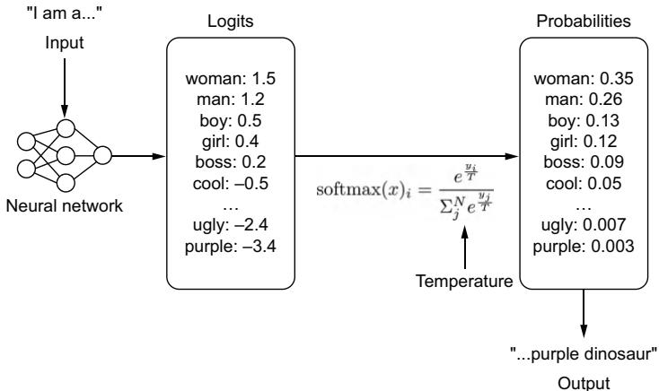  
Figure 7.3 A simple path of how the next word is chosen. Given an input, a model will generate a vector of logits for each token in the model’s vocabulary. Using the softmax algorithm, these logits will be transformed into probabilities. These probabilities will correspond to how often that token is likely to be chosen. Temperature is applied during the softmax algorithm.

Temperature is applied during the softmax algorithm. A higher temperature will flatten out the probability distribution, giving less weight to tokens with large logits and more weight to tokens with smaller logits. A lower temperature does the opposite. A temperature of zero is actually impossible since we can’t divide by zero. Instead, we run an argmax algorithm, ensuring we pick the token with the highest logit.

The next parameter to consider is the number of beams applied to the model’s beam search. Beam search is a heuristic search algorithm that explores the graph of your model’s to-be-generated text probabilities, expanding the graph’s most optimistic nodes. It helps balance time and memory usage and improves the flow and quality of the response. It’s similar to the minimax algorithm in chess, except instead of deciding the next best move, we are deciding the next best word. Selecting a higher number of beams will create a larger search, improving results at the cost of latency.

Top K is an interesting parameter. Assuming a temperature that isn’t zero, top K allows us to filter the potential next tokens by the K most probable options. Consequently, we eliminate less-probable words on the tail end of the distribution from ever being picked and avoid generating tokens that are more likely to be incoherent. So in our example from figure 7.3, if $\mathrm { ~ k ~ } = \mathrm { ~ 3 ~ }$ , then the only tokens we would choose are woman, man, or boy, filtering out the rest.

Top P sets the threshold probability that the next token must reach to be selected. It’s similar to top K, but instead of considering the number of tokens, we are considering their distributions. A top P of 0.05 will only consider the next $5 \%$ most likely tokens and will lead to very rigid responses, while a top P of 0.95 will have greater flexibility but may turn out more gibberish. From our example in figure 7.3, if $\mathrm { { P } = 0 . 5 }$ ,

only the tokens woman or man would be chosen since their probabilities 0.35 and 0.26 add up to greater than 0.5.

Language models can often get caught in generation loops, repeating themselves in circles. To prevent this, we can add penalties. A frequency penalty adds a penalty for reusing a word if it was recently used. It is good to help increase the diversity of language. For example, if the model keeps on reusing the word “great,” increasing the frequency penalty will push the model to use more diverse words like “awesome,” “fantastic,” and “amazing” to avoid the penalty of reusing the word “great.”

A presence penalty is similar to a frequency penalty in that we penalize repeated tokens, but a token that appears twice and a token that appears 100 times are penalized the same. Instead of just reducing overused words and phrases, we are aiming to reduce overused ideas and increase the likelihood of generating new topics.

# 7.2.3 Scrounging the training data

The importance of prompt engineering for model performance has led to important discussions surrounding context windows and the efficacy of particular prompt structures, as LLMs responding quickly and accurately to the prompts has become a more widespread goal. In addition, a correlation has been drawn between cleaner examples and better responses from the model, emphasizing the need for better prompt engineering, even on the data side. While prompt engineering is often proposed as an alternative to finetuning, we’ve found the most success using both in conjunction to get two boosts in LLM performance as opposed to just one.

Knowing the lingo and the choice of words used to generate the model will help you craft better responses. Let’s explain with a personal example. For the birthday of this author’s wife, I finetuned a text-to-image Stable Diffusions model to replicate her image so she could create fun pictures and custom avatars. I used the Dream-Booth (see figure 7.4).6 The finetuning method requires defining a base class that

  
Input images

  
in the Acropolis

  
swimming

  
sleeping

  
in a bucket   
getting a haircut   
Figure 7.4 Example of DreamBooth from Ruiz et al.7 DreamBooth allows you to finetune an image model to replicate an object’s likeness based on only a few sample input images. Here, with only four example images of a puppy, Dreambooth can put that same dog in many new scenarios.

can be used as a starting point. My first attempts were naive, and using the base class of “a person” or “a woman” was terrible. A base class of “Asian woman” returned pictures of older Asian women, often stylized in black and white or sepia. I then tried “young Asian woman,” but this created weird images of Asian faces being plastered onto young white women’s bodies.

Giving up guessing, I went to the source, the LAION dataset (https://laion.ai/ blog/laion-400-open-dataset/) the model was trained on. LAION comprises 400 million images scraped from the internet with their accompanying captions. It is a noncurated dataset quickly put together for research purposes (aka, it’s unclean with lots of duplicates, NSFW content, and poor captions). Searching the dataset, I discovered that there was not a single caption with the words “Asian woman.” Scrolling through, I quickly found that pictures of Asian women and models were identified with the words “Asian beauty.” Using these words as the base class, I was finally able to create great avatars for my wife.

There’s lots of social commentary that can be drawn from this example, much of it controversial, but the main point is that if you want to craft effective prompts, you have to know your data. If your model believes “woman” and “beauty” are two different things because of the training data, that is something you’ll need to know to engineer better prompts. This is why finetuning in conjunction with prompt engineering is powerful. You can set the seed with particular phrases and choice of words when finetuning and then use prompt engineering to help the model recall the information based on using those same phrases and choice of words.

# 7.3 Prompt engineering tooling

If you are building any application that is more than just a wrapper around the LLM itself, you will want to do a bit of prompt engineering to inject function or personality into it. We’ve already gone over the basics of prompt engineering itself, but when building, it would be helpful to have some tools at your disposal to know how to make it all work. To that extent, let’s look at some of the most prominent tooling available and how to use them.

# 7.3.1 LangChain

Anyone who’s built an LLM application before has probably spent some time working with LangChain. One of the most popular libraries, it’s known for extracting away all the complexity—and simplicity—of building a language application. It is known for its ease of creating language chains with what it calls the LangChain Expression Language (LCEL).

LCEL makes it easy to build complex chains from basic components. In the next listing, we demonstrate creating a very simple chain that creates a prompt from a template, sends it to an LLM model, and then parses the results, turning it into a string.

# Listing 7.1 Example of creating a basic LangChain chain

import os   
from langchain chat_models import ChatOpenAI   
from langchain.prompts import ChatPromptTemplate   
from langchain_schema.output_parser import StrOutputParser   
OPENAI_API_KEY = os.getenv("OPENAI_API_KEY")   
prompt $=$ ChatPromptTemplate.from_template("Tell me a story about {topic}") model $=$ ChatOpenAI(model="gpt-3.5-turbo",openai_api_key $\equiv$ OPENAI_API_KEY) output_parser $=$ StrOutputParser()   
chain $=$ prompt | model | output_parser   
chain.invoke("the printing press")

To be honest, using LangChain for something like this is a bit of overkill for what is essentially an f-string prompt, but it demonstrates what is happening under the hood. For the most part, you are likely going to use one of the many chains already created by the community. In the next chapter, we will explain how to create a RAG system with the RetrievalQA chain, but many more chains are available. For example, there are chains for generating and running SQL, interacting with APIs, and generating synthetic data.

Once we have a chain, additional tools in the LangChain ecosystem help provide a more complete user experience. We can use LangServe to easily host it as an API. We can also use LangSmith, an in-depth logging tool that allows us to trace a chain invocation and see how the results change passing through each link in the chain.

Chains don’t have to be linear like they are in this example. Several asynchronous components allow you to create a whole slew of complicated language processing logic. Ultimately, chains are just another type of data pipeline or DAG, except specialized for language models.

# 7.3.2 Guidance

Guidance is an open source library from Microsoft that enforces programmatic responses. We’ve heard from several developers that the best engineering when working with LLMs is the good ol’ prompt-and-pray method. Generate a prompt, and pray that it works. Guidance seeks to solve that problem and has tooling to constrain the response space and set custom stopping tokens, as well as complex templating. After looking at dozens of LangChain projects, we believe Guidance is likely what most people are looking for when considering prompt engineering tooling.

Guidance allows you to control the flow of generated responses. It’ll be easiest to show you what we mean. In listing 7.2, you’ll see several of the basic building blocks of Guidance where we can guide our LLM to respond in very specific ways—namely, loading a model with the guidance HF wrapper (models) and using the gen function to generate specific text and constraints like select.

Listing 7.2 Guidance basics   
from guidance import models, gen, select Loads a Hugging Face Transformers model  
falcon = models.Transformers("tiiuae/falcon-rw-1b") Sets a token limit that is an actual limit  
lm = falcon + "Once upon a time, " + gen(max_tokens=10)  
print(lm) # Once upon a time, there was a little girl who was very shy.  
lm = ( falcn + "Write a sentence about the printing press." + gen(stop=['\n", ".", !"]))  
print(lm) # The printing press was invented by Johannes Gutenberg in 1450  
lm = falcon + "1, 2, 3," + gen(max_tokens=50, stop="11")  
print(lm) # 1, 2, 3, 4, 5, 6, 7, 8, 9, 10, Generate a specific response from a list  
lm = falcon + "I like the color " + select(['cyan", "grey", "purple'])  
print(lm) # I like the color purple  
lm = falcon + "Generate an email: " + gen(regex("\\w+@\\w+.com")  
print(lm) # Generate an email: theoretically@gmail.com Uses regular expressions to ensure the response matches a pattern

With these basic building blocks that allow us to constrain the LLM’s response space, we are then able to create grammars. Grammars are a Guidance concept, and as the name implies, are language rules your model will have to follow. Grammars are composable and reusable and allow us to build neat applications quickly. In the next listing, we show you how to build simple parts of a speech application using guidance grammars. To create a grammar, we only need to create a function using the @guidance decorator.

Listing 7.3 Building a parts-of-speech app with Guidance   
import guidance   
from guidance import models, select Loads a Hugging Face Transformers   
falcon $=$ models.Transformers("tiiuae/falcon-rw-lb") model   
@guidance(stateless $\equiv$ True) Creates functions to easily   
def parts_of_speech(lm): implement grammars return lm $^+$ select([ "Noun", "Verb", "Adjective", "Adverb", ])

lm $=$ falc   
+ "The child plays with a red ball. Ball in the previous sentence is a " +parts_of_speech()   
print(lm）#Noun

```txt
@guidance(stateless=True)  
def posconstraint(lm, sentence):  
    words = sentence.split()  
    for word in words:  
        lm += word +": " + parts_of_speech() +"\n"  
    return lm 
```

@guidance(stateless=True)   
def pos_instruct(lm, sentence): lm $+ =$ f"" Tag each word with their parts of speech. Example: Input: The child plays with a red ball. Output: The: child: Noun plays: Verb with: a: red:Adjective ball.:Noun -- Input:{sentence} Output: "" return lm

```txt
sentence = "Good software makes the complex appear to be simple"  
lm = falcon + pos_instruct sentence) + pos_constraint(sentence) 
```

Even though we are using a small language model, we get the exact output we’d expect. We no longer need to prompt and pray. Granted, the results in the actual parts of speech prediction aren’t that great, but we could easily improve that by using a more powerful LLM or finetuning on more representative data:

```txt
print(lm) 
```

# The generated text is

```txt
Input: Good software makes the complex appear to be simple  
# Output:  
# Good:  
# software:  
# makes: Verb 
```

```txt
the:   
complex:Adjective   
appear:Adjective   
to:   
be:Verb   
simple:Adjective 
```

Guidance isn’t as popular as LangChain, and at least at the time of this writing, its documentation leaves a lot to be desired, so you might find it a bit harder to get started. However, it has a thriving community of its own with a strong core group of developers who continue to support it. We highly recommend checking it out.

# 7.3.3 DSPy

Unlike other toolings mentioned, DSPy does not give you tools to create your own prompts; rather, it attempts to program prompting. DSPy, coming out of Stanford and heavily backed by many corporate sponsors, takes a unique approach by emphasizing tool augmentation, including retrieval, and is helpful if you would like to treat LLMs as deterministic and programmatic tools instead of emergent infinite syntax generators.

Although this is not exactly what happens, you can think of DSPy as taking a similar logic to prompting that ONNX takes to saving models. Give it some dummy inputs, and it’ll compile a graph that can then infer prompts that work the best for your model and return the results you’re wanting. There’s a bit more work involved, though. You need to write validation logic and modules, essentially a workflow and unit tests, to check against. This effectively changes the dynamic from coming up with clever strings to something much closer to engineering software. Admittedly, it leaves open the question, “If you’re going to define everything programmatically anyway, why are you using an LLM?” Still, we’ve had good experiences with this and use it frequently.

The steps to using DSPy effectively are as follows:

1 Create a signature or a description of the task(s) along with input and output fields.   
2 Create a predictor or generation style similar to chain of thought or retrieval.   
3 Define the module or program.

Once these steps have been completed, you’ll compile the program. This will update the module based on the examples given before, similar to the training set. All of this will feel like machine learning for LLMs, with a training set (examples), a loss function (validation metric), and essentially an optimizer (teleprompter).

In lieu of writing another listing for this chapter showcasing another tool, we decided to point you to an excellent notebook created by the StanfordNLP team introducing DSPy along with local LLMs and custom datasets: https://mng.bz/PNzg (it’s forked from here: https://mng.bz/Xxd6). Once you have a chance to explore this example, we also recommend checking out the DSPy documentation, as it has many more excellent examples.

# 7.3.4 Other tooling is available but . .

Beyond the previously mentioned tools, a whole host of tools are out there. A couple to note are MiniChain and AutoChain. Both aim to be lightweight alternatives to LangChain, which are sorely needed, as many complain about LangChain’s bulkiness. Promptify is an interesting project that is a full-feature alternative to LangChain. To be honest, we could list a dozen more, but there likely isn’t much point. While many of these projects drew vibrant communities to them when they started, most have been dormant for months already, with only the rare GitHub contribution.

It’s hard to say exactly why the interest in these projects faltered, but one obvious reason is that most of these projects lacked the sponsorship that LangChain, Guidance, and DSPy have. Many of these projects started as personal projects in the middle of big waves from the hype of ChatGPT’s success, but hype energy is never enough to build software that lasts. Without proper backing, most open source projects fail.

We’ve probably painted too bleak a picture. As of the time of this writing, though, it’s still too early to tell, and this space is still a growing sector. There are still plenty of interesting tools we recommend checking out that we just don’t have space to include, like Haystack, Langflow, and Llama Index. Outlines is particularly of note as a similar project to Guidance, which is also awesome. We mostly want to point out that readers should be careful when picking tooling in this space because everything is still so new. If you find a tool you like, contribute.

# 7.4 Advanced prompt engineering techniques

No matter how well designed your prompt is, there will be pragmatic context your model won’t have access to. For example, current events are a struggle. The model itself will only know about information up to its training date. Sure, we could feed that context in with RAG, as we’ve done so far, but that just shifts the burden to keeping our RAG system up to date. There’s another way. In this section, we will discuss giving models access to tools and what we can do with them once we do.

# 7.4.1 Giving LLMs tools

What if instead of a complicated prompt engineering system, we instead give our model access to the internet? If it knows how to search the internet, it can always find up-to-date information. While we are at it, we can give it access to a calculator so we don’t have to waste CPU cycles having the LLM itself do basic math. We can give it access to a clock so it knows the current time and maybe even a weather app so it can tell the weather. The sky’s the limit! We just need to train the model on how to use tools, and that’s where Toolformers comes in.8

Toolformers is a marvelously simple idea. Let’s train a model to know it can run API calls to different tools using tags like $< \mathbb { A P I > < } / \mathbb { A P I > }$ . Then, at inference, when we see these tags, we can tell our interpreter to run those API calls. If that sounds familiar, it’s because Toolformers just trained a model to use string interpolation! String interpolation is the process of evaluating a string literal containing placeholders, which are replaced with the actual values at run time. For example, in Python, we could take the string literal print $( \pounds ^ { \prime } 2 + 2 \ = \ \left\{ \ 2 + 2 \right\} \ ^ { \prime } \ ;$ ), and once printed, we’d get $1 2 + 2 \ = \ 4 \ ^ { \prime }$ . The placeholder $\left\{ 2 + 2 \right\}$ was evaluated and executed as Python code, returning 4. Schick et al. finetuned a GPT-J model to use five different tools: a question-answering database, a calculator, a Wikipedia search, a translator, and a calendar. With access to these tools, they were able to achieve impressive results, outperforming GPT-3 on many tasks.

While Schick et al.’s work paved the way, the major downside to this approach is that we don’t want to finetune a model every time we create a new tool. However, as we’ve discussed in this chapter, we don’t have to. Instead, we can use clever prompt engineering to introduce new tools using LangChain or Guidance. In the next listing, we demonstrate how to create simple math tools with Guidance. Guidance takes care of the heavy lifting by stopping generation when it recognizes a tool being called, running the tool, and starting generation again.

Listing 7.4 Giving tools to our LLM models with Guidance   
import guidance   
from guidance import models, gen   
falcon $=$ models.Transformers("tiiuae/falcon-rw-1b") Loads a Hugging Face Transformers model   
@guidance   
def add(lm, input1, input2): {int(input1) + int(input2)} return lm   
@guidance   
def subtract(lm, input1, input2): {int(input1) - int(input2)} return lm   
@guidance   
def multiply(lm, input1, input2): {float(input1) * float(input2)} return lm   
@guidance   
def divide(lm, input1, input2): {float(input1) / float(input2)} return lm

$\begin{array}{l}\mathrm{lm} = ()\\ \mathrm{falcon}\\ \mathrm{+}\mathrm{""}\backslash \\ 1 + 2 = \mathrm{add}(1,2) = 3\\ 4 - 5 = \mathrm{subtract}(4,5) = -1\\ 5*6 = \mathrm{multiply}(5,6) = 30\\ 7 / 8 = \mathrm{divide}(7,8) = 0.875\\ \mathrm{Generate~more~examples~of~add,~subtract,~multiply,~and~divide}\\ \mathrm{""}\end{array}$ ） $\mathrm{lm}+=\mathrm{gen(max\_tokens}=15,\mathrm{tools}=[\mathrm{add},\mathrm{subtract},\mathrm{multiply},\mathrm{divide}])$ print(lm)

While a simple example, it’s easy to imagine building more advanced tooling. Regardless of whether you use LangChain or Guidance, there are a few things to keep in mind when building tools. First, you’ll need to instruct your model in the prompt on where and how to use the tools you give it. This can be more or less difficult, depending on how open-ended your function is. Second, your model matters in its ease of extendibility. Some models we’ve worked with would never use the tools we gave them or would even hallucinate other tools that didn’t exist. Lastly, be really careful with the inputs and error handling for tools you give an LLM. The ones we used previously in this chapter are terrible and likely to break in several ways. For example, an LLM could easily try to run add(one, two) or add(1, 2, 3), both of which would throw errors and crash the system. With Guidance, to make this easier, we can enforce tool inputs by building grammars to ensure our model inputs are always correct.

This discussion leads us to uncover some problems with LLMs using tools. First, we have to be careful what tools we give to an LLM since we never really know what input it will generate. Even if we ensure the tool doesn’t break, it may do something malicious we didn’t intend. Second, as you’ve probably gathered throughout this chapter, prompt engineering quickly grows our input and thus shrinks the token limit for our actual users; explaining tools and how to use them adds to that constraint. Often, this limitation reduces the number of tools we can give an LLM and, thus, its usefulness. Third, LLMs are still hit or miss as to whether they actually use a tool and can often end up using the wrong tool. For example, should the LLM use the web search tool or the weather tool to look up the 10-day forecast? This might not matter much to us as humans, but results can vary widely for a bot. Lastly, building tools can be difficult and error prone, as you need to build both a clean tool and an effective prompt.

# OpenAI’s plugins

Toolformers opened the gates to OpenAI’s Plugins concept (https://mng.bz/q0rE). Plugins allow third parties to easily integrate their tools into ChatGPT and provide a simple way for ChatGPT to call external APIs. Plugins were introduced relatively early in ChatGPT’s life, shortly after the Toolformers paper.a All a third party had to do was create an OpenAPI config file and an ai-plugin.json file and host both where the API

# (continued)

existed. OpenAPI is a specification language for APIs that standardizes and defines your API to make it easy for others to consume. (If you haven’t heard of OpenAPI and have APIs that customers use, it’s a good practice to follow. You can learn more at https://www.openapis.org/.) Plenty of tools can help you generate that file easily enough. The ai-plugin file created the plugin. Here, you could define a name for the plugin, how authentication should happen, and descriptions to be used to prompt ChatGPT. From here, the plugin could be registered with OpenAI in ChatGPT’s interface, and after a review process, your plugin could be added and used by users as they interacted with ChatGPT.

Despite an initial fervor, plugins never left Beta—beyond OpenAI’s own web browsing plugin—and appear to be abandoned. There are lots of reasons for this, but in a since-taken-down report, the main reason came from Sam Altman when he suggested, “A lot of people thought they wanted their apps to be inside ChatGPT, but what they really wanted was ChatGPT in their apps” (https://mng.bz/75Dg). As a result, there didn’t seem to be a product market fit for OpenAI’s plugins that would make the company money. But we think it’s too early to abandon the idea entirely.

As more companies integrate LLM technology into their apps, they are likely going to want access to third-party tools. Suppose you are going camping for the first time and you ask an LLM shopping assistant for advice on what to buy. In that case, it’d be really nice if it thought first to ask where and when you were going camping and then could use that information to identify weather-appropriate gear. The LLM shopping assistant for a particular brand or store is likely to have access to loads of products, but access to weather reports in a random geolocation? Not so much.

While you can always build these tools, wouldn’t it be great if they were already created for you, and you could simply go to some hub, download the ones you wanted, and plug them in? Unfortunately, this option doesn’t exist yet, at least not to the extent we describe it here. We have high expectations that a marketplace or hub of some kind will be created in the future, like OpenAI’s plugins, that can be used with any LLM model. LLMs are still a new technology, and the ecosystems to be built around them are still forthcoming; we believe this will be one of them.

a T. Schick et al., “Toolformer: Language models can teach themselves to use tools,” February 2023.

Once we give our LLMs access to tools, it opens the gates to lots of cool prompt engineering techniques. Probably the most famous is the ReAct method.

# 7.4.2 ReAct

Reasoning and Acting (ReAct) is a few-shot framework for prompting that is meant to emulate how people reason and make decisions when learning new tasks.9 It involves a

multistep process for the LLM, where a question is asked, the model determines an action, and then it observes and reasons upon the results of that action to determine subsequent actions.

An example could look like this:

Question: What is the airspeed velocity of an unladen African swallow compared to a European swallow with the same load?

Thought 1: I need to search for airspeed velocity of a European swallow so I can compare it with an African swallow.

Action 1: Search[European Swallow airspeed velocity]

Observation 1: We need to know the Strouhal number in order to determine airspeed. The bird's Strouhal number converges between 0.2 and 0.4.

Thought 2: The airspeed velocity is not directly mentioned, but the Strouhal number is clear. So I need to look up velocity compared to the Strouhal number.

Action 2: Search[Strouhal wingbeat calculation]

Observation 2: (Result 1/1) A Swallow’s Strouhal number translates to ${ \sim } 1 2$ wingbeats per second.

Thought 3: An African swallow requires 12 wingbeats per second to maintain airspeed velocity, so I need to look up how fast that makes it.

Action 3: Lookup[African Swallow wingbeat per second]

Observation 3: Each wingbeat propels an African swallow 2.5 feet per flap, making it go about 40.2mph

Thought 4: I need to look up the European swallow to compare it.

Action 4: Search[European Swallow Wingbeat per second]

Observation 4: A European swallow is about half the size of an African swallow, making its velocity about 20.1

Thought 5: An African swallow has an airspeed velocity of 40.2, and a European swallow has an airspeed velocity of 20.1, making the comparison 2x.

Action 5: Finish[Two times the airspeed velocity]

As you can see, the purpose of ReAct is to force the model to think before it acts. This isn’t much different from the other prompting methods we have discussed. The big difference is that we allow the model to take actions. In our example, this included a “Search” action, or essentially an ability to look up information on the internet as a human would. We just showed you how to do this in the last section. The model can

take that new information and observe what it learns from its actions to produce a result.

Let’s explore this further with an example. We will use LangChain, which will make creating a ReAct agent seem a lot easier than it actually is. Listing 7.5 shows how to utilize ReAct on an OpenAI model and LangChain. For our search engine, we will be utilizing serper.dev, as it integrates nicely with LangChain, and it offers a free tier you can sign up for. We will also need to use the calculator "llm-math", which is one of the many tools in LangChain’s toolbelt.

Listing 7.5 Example ReAct with Langchain   
import os   
from langchain.llms import OpenAI   
from langchainagents import load.tools   
from langchain.agents import initialize_agent   
from dotenv import load_dotenv   
load_dotenv()   
os.environ["OPENAI_API_KEY"] $=$ os.getenv("OPENAI_API_KEY") o.s.environ["SERPER_API_KEY"] $=$ os.getenv("SERPER_API_KEY")   
11m $=$ OpenAI(model_name $\equiv$ "text-davinci-003",temperature $\equiv 0$ tools $=$ load.tools(["google-serper","llm-math"],llm=llm) agent $=$ initialize_agent( tools,11m,agent $\equiv$ "zero-shot-react-description",verbose=True   
)   
agent.run( "Who is Olivia Wilde's boyfriend? \ What is his current age raised to the O.23 power?"

# The output is

> Entering new AgentExecutor chain...
# I need to find out who Olivia Wilde's boyfriend is and then
# calculate his age raised to the 0.23 power.
# Action: Search
# Action Input: "Olivia Wilde boyfriend"
# Observation: Olivia Wilde started dating Harry Styles after ending
# her years-long engagement to Jason Sudeikis - see their relationship
# timeline.
# Thought: I need to find out Harry Styles' age.
# Action: Search
# Action Input: "Harry Styles age"
# Observation: 29 years
# Thought: I need to calculate 29 raised to the 0.23 power.
# Action: Calculator
# Action Input: $29^{\wedge}0.23$ # Observation: Answer: 2.169459462491557

# Thought: I now know the final answer.

# Final Answer: Harry Styles, Olivia Wilde's boyfriend, is 29 years old # and his age raised to the 0.23 power is 2.169459462491557.

# > Finished chain.

# "Harry Styles, Olivia Wilde's boyfriend, is 29 years old and his age # raised to the 0.23 power is 2.169459462491557."

Listing 7.5 shows how ReAct can be used with an LLM in conjunction with particular agent tools like "google-serper" and "llm-math" to help augment your prompts. Prompt engineering looks more like a full-time job now, not just “coming up with words,” huh?

Knowing how to build tools and combine them to prompt LLMs to answer more in-depth questions is a growing field of study as well as an expanding part of the job market. To be perfectly honest, the rate of change in the prompt engineering field seems to drastically outpace most of the other topics we cover in this book. There’s a lot more to be discussed that we simply can’t cover in this book, so much so, in fact, that there are now entire books in and of themselves being written to this end. It was difficult to determine what would be valuable to our readers and what would be outdated quickly, but we think we’ve found a good balance and encourage you to look forward to researching more on the topic.

Overall, we’ve learned a lot throughout this chapter—how to craft a prompt and how to implement prompting in an engineering fashion. In the next chapter, we will put all of this knowledge to good use when we build LLM applications users can interact with.

# Summary

 The most straightforward approach to prompting is to give a model examples of what you want it to do:

– The more examples you can add to a prompt, the more accurate your results will be.   
– The fewer examples you need to add, the more general and all-purpose your prompt will be.

1 The four parts of a prompt are

– Input—What the user writes   
– Instruction—The template with task-specific information encoded   
– Context—The information you add through RAG or other database lookups   
– System—The specific instructions given for every task; should be hidden from the user

 Knowing your training data will help you craft better prompts by choosing a word order that matches the training data.

 LangChain is a popular tool that allows us to create chains or pipelines to utilize LLMs in an engineering fashion.   
 Guidance is a powerful tool that gives us more fine-grained control over the LLMs’ actual generated text.   
 Toolformers teach LLMs how to use tools, giving them the ability to accomplish previously impossible tasks.   
 ReAct is a few-shot framework for prompting that is meant to emulate how people reason and make decisions when learning new tasks.

# Large language model applications: Building an interactive experience

# This chapter covers

Building an interactive application that uses an LLM service   
 Running LLMs on edge devices without a GPU   
Building LLM agents that can solve multistep problems

No one cares how much you know until they know how much you care.

—President Theodore Roosevelt

Throughout this book, we’ve taught you the ins and outs of LLMs—how to train them, how to deploy them, and, in the last chapter, how to build a prompt to guide a model to behave how you want it to. In this chapter, we will put it all together. We will show you how to build an application that can use your deployed LLM service and create a delightful experience for an actual user. The key word there is delightful. Creating a simple application is easy, as we will show, but creating one that delights? Well, that’s a bit more difficult. We’ll discuss multiple features you’ll want to add to your application and why. Then, we’ll discuss different places your application may live, including building such applications for edge devices. Lastly, we’ll

dive into the world of LLM agents, building applications that can fulfill a role, not just a request.

# 8.1 Building an application

It’s probably best that we start by explaining what we mean by LLM application. Afterall, application is a ubiquitous term that could mean lots of different things. For us, in this book, when we say LLM application, we mean the frontend—the Web App, Phone App, CLI, SDK, VSCode Extension (check out chapter 10!), or any other application that will act as the user interface and client for calling our LLM Service. Figure 8.1 shows both the frontend and backend separately to help focus on the piece of the puzzle we are discussing: the frontend. It’s a pretty important piece to the puzzle but also varies quite a bit! While every environment will come with its own challenges, we hope we can trust you to know the details for your particular use case. For example, if you are building an Android app, it’s up to you to learn Java or Kotlin. In this book, however, we will give you the building blocks you will need and introduce the important features to add.

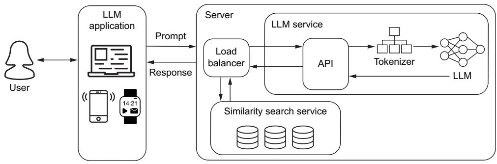  
Figure 8.1 The LLM Application is the web app, phone app, command line interface, or another tool that acts as the client our users will use to interact with our LLM service.

The first step to building a successful LLM application is composing and experimenting with your prompt. Of course, having just discussed this in the last chapter, there are many additional features you should consider to offer a better user experience. The most basic LLM application is just a chatbox, which essentially consists of only three objects: an input field, a send button, and a text field to hold the conversation. It’s rather easy to build in almost every context. In addition, since one of our participants in the chat is a bot, most of the complexity of building a chat interface is also stripped away. For example, we don’t need to worry about eventual consistency, mixing up the order of our conversation, or whether both users are sending a message at the same time. If our user has a bad internet connection, we can throw a timeout error and let them resubmit.

However, while the interface is easy, not all the finishing touches are. In this section, we are going to share with you some tools of the trade to make your LLM application

shine. We focus on best practices, like streaming responses, utilizing the chat history, and methods to handle and utilize prompt engineering. These allow us to craft, format, and clean our users’ prompts and the LLM’s responses under the hood, improving results and overall customer satisfaction. All this to say, building a basic application that utilizes an LLM is actually rather easy, but building a great application is a different story, and we want to build great applications.

# 8.1.1 Streaming on the frontend

In chapter 6, we showed you how to stream your LLM’s response on the server side, but that is meaningless if the response isn’t streamed on the client side as well. Streaming on the client side is where it all comes together. It’s where we show the text to the users as it is being generated. This provides an attractive user experience, as it makes it appear like the text is being typed right before our eyes and gives the users a sense that the model is actually thinking about what it will write next. Not only that, but it also provides a more springy and responsive experience, as we can give a feeling of instant feedback, which encourages our users to stick around until the model finishes generating. This also helps the user to be able to see where the output is going before it gets too far so they can stop generation and reprompt.

In listing 8.1, we show you how to do this with just HTML, CSS, and vanilla Java-Script. This application is meant to be dead simple. Many of our readers likely aren’t frontend savvy, as that isn’t the focus of this book. Those who are most likely will be using some tooling for their framework of choice anyway. But a basic application with no frills allows us to get to the core of what’s happening.

Since the application is so simple, we opted to put all the CSS and JavaScript together into the HTML, although it would be cleaner and a best practice to separate them. The CSS defines sizing to ensure our boxes are big enough to read; we won’t bother with colors or making it look pretty. Our HTML is as simple as it gets: a form containing a text input and a Send button that returns false on submit so the page doesn’t refresh. There’s also a div container to contain our chat messages. Most of the JavaScript is also not that interesting; it just handles adding our conversation to the chat. However, pay attention to the sendToServer function, which does most of the heavy lifting: sending our prompt, receiving a readable stream, and iterating over the results.

NOTE On the server side, we set up a StreamingResponse object, which gets converted to a ReadableStream on the JavaScript side. You can learn more about readable streams here: https://mng.bz/75Dg.

# Listing 8.1 Streaming responses to end users

<!DOCTYPE html>   
<html lang $\coloneqq$ "en"> <head> <meta charset $=$ "UTF-8">

<meta name="viewport" content="width $\equiv$ device-width, initial-scale $= 1.0$ " > <title>Simple Chat App</title>   
<style> $\leftarrow$ Some very simple styling body { font-family: Arial,sans-serif; margin:0; padding:0; box-sizing:border-box; } #message-input{ width: $95 \%$ padding:8px; } #chat-container{ width: $95 \%$ margin:20px auto; border:1px solid #ccc; padding:10px; overflow-y: scroll; max-height:300px; } </style> </head> Our body is simple with only three fields: a text input, send button,and container for chat. <body> $\downarrow$ form onsubmit $\coloneqq$ "return false;" $\rightharpoondown$ input type $\equiv$ "text" id $\equiv$ "message-input" placeholder $\equiv$ "Type your message..."> <button onclick $\equiv$ "sendMessage() " type $\equiv$ "submit">Send</button> </form> </div id $\equiv$ "chat-container"></div> JavaScript to handle communication with LLM and streaming response function sendMessage() { var messageInput $\equiv$ document.getElementById('message-input'); var message $\equiv$ messageInput.value.Trim(); When the Send button is pushed, moves text from input to chat box and sends the message to the LLM server if (message $! = = !$ ") { appendMessage('You:' + message); messageInput.value $=$ "; sendToServer(message); } Adds new messages to the chat box function appendMessage(message) { var chatContainer $\equiv$ document.getElementById('chat-container'); var messageElement $\equiv$ document.createElement('div'); messageElement.textContent $\equiv$ message; chatContainer.appendChild(messageElement); chatContainer.ScrollTop $\equiv$ chatContainer.ScrollHeight;

return messageElement   
} Sends prompt to the server and streams the response back as tokens are received   
async function sendToServer(message) { var payload $=$ { prompt: message } const response $=$ await fetch('http://localhost:8000/generate', { method:'POST', headers:{ 'Content-Type':'application/json', }, body:JSON.stringify(msgoad), }）; var responseText $\equiv$ 'LLM:'； messageElement $=$ appendMessage(responseText); for await (const chunk of streamAsyncIterator(response.body)){ var strChunk $=$ String.fromCharCode.apply(null,chunk); responseText $+ =$ strChunk; messageElement.textContent $\equiv$ responseText; } async function\* streamAsyncIteratorstream){ Simple polyfill since StreamResponse still can't be used as an iterator by most browsers try{ while(true）{ const {done，value} $\equiv$ await reader.read(); if(done) return; yield value; } finally{ reader.releaseLock(); } } </script>

Figure 8.2 shows screenshots of our simple application from listing 8.1. Showing words being streamed to the application would have been better in a movie or GIF, but since books don’t play GIFs, we’ll have to make do with several side-by-side screenshots instead. Regardless, the figure shows the results being streamed to the user token by token, providing a positive user experience.

There’s nothing glamorous about our little application here, and that’s partly the point. This code is easy to copy and paste and can be used anywhere a web browser can run since it’s just an HTML file. It doesn’t take much to build a quick demo app once you have an LLM service running.

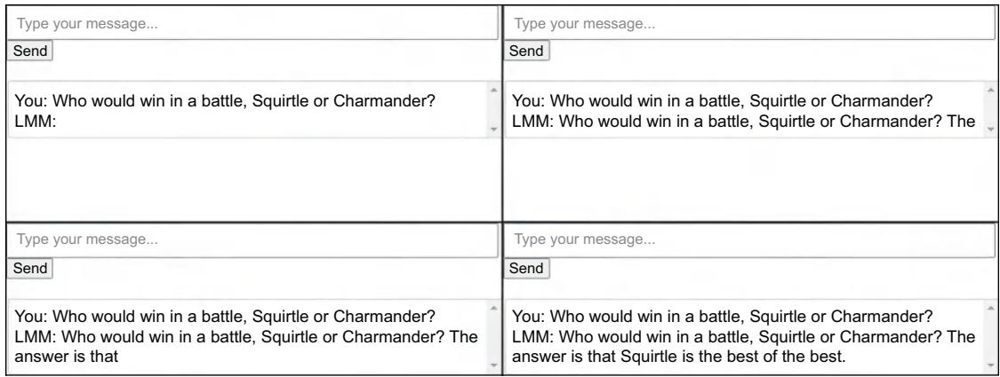  
Figure 8.2 Screenshots of our simple application showing the response being streamed

# 8.1.2 Keeping a history

One big problem with our simple application so far is that each message sent to our LLM is independent of other messages sent. This is a big problem because most applications that utilize an LLM do so in an interactive environment. Users will ask a question and then, based on the response, make additional questions or adjustments and clarifications to get better results. However, if you simply send the latest query as a prompt, the LLM will not have any context behind the new query. Independence is nice for coin flips, but it will make our LLM look like a birdbrain.

What we need to do is keep a history of the conversation, both the user’s prompts and the LLM’s responses. If we do that, we can append that history to the new prompts as context. The LLM will be able to utilize this background information to make better responses. Figure 8.3 shows the overall flow of what we are trying to achieve.

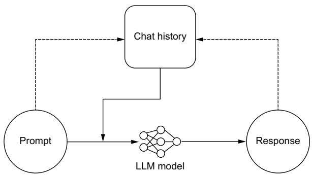  
Figure 8.3 Process flow for storing prompts and responses to a chat history, giving our model a memory of the conversation to improve outcomes

Now that we know what we are building, let’s take a look at listing 8.2. This time, we will be using Streamlit, a Python framework for building applications. It is simple and

easy to use while still creating attractive frontends. From Streamlit, we will be utilizing a chat_input field so users can write and send their input, a chat_message field that will hold the conversation, and session_state, where we will create and store the chat_history. We will use that chat history to craft a better prompt. You’ll also notice that we continue to stream the responses, as demonstrated in the last section, but this time using Python.

# What is Streamlit?

Streamlit is an open-source Python library that makes it easy to create web applications for machine learning, data science, and other fields. It allows you to quickly build interactive web apps using simple Python scripts. With Streamlit, you can create dashboards, data visualizations, and other interactive tools without needing to know web development languages like HTML, CSS, or JavaScript. Streamlit automatically handles the conversion of your Python code into a web app.

Listing 8.2 An example application using chat history to improve results   
import streamlit as st   
import requests   
import json   
url $=$ "http://localhost:8000/generate" Points to your model's API   
st.title("Chatbot with History") Creates a chat history. if"chat_history" not in st.session_state: in the session state st.session_state.Chat_history $\equiv$ [] Displays chat from history   
for chat in st.session_state chat_history: with st chat message (chat["role"]): stmarkdown (chat["content"]） Responds to user. Note: we use the walrus operator $(\coloneqq)$ to assign operator $(\coloneqq)$ ) to assign the user's input while also ensuring it is not None at the same time.   
if user_input $\coloneqq$ st chat_input("Your question here"): 1 st.session_message("user"): 1 stmarkdown (user_input) 1 st.session_state chat_history.append( 1 Displays user's input { "role": "user", "content": user_input} Addss user input to chat history   
with st chat message("assistant"): 1 placeholder $=$ st.empty() Streams response full_response $= 11$ prompt $=$ "You are an assistant who helps the user." 1 "Answer their questions as accurately as possible. Be concise." history $=$ [ f' $\{\mathrm{ch}[''\mathrm{role}]]\} : \{\mathrm{ch}[''\mathrm{content}]]\} ' for ch in$ st.session_state chat_history

```python
prompt += " ".join(history)  
prompt += " assistant: "  
data = json.dumps({
"prompt": prompt})  
with requests.post(url, data=data, stream=True) as r:  
    for line in r_iterlinesdecode_unicode=True):  
        full_response += line.decode("utf-8")  
        placeholdermarkdown(full_response + "")  
        placeholdermarkdown(full_response)  
Adds a blinking cursor to simulate typing  
st.session_state chat_history.append(
{"role": "assistant", "content": full_response}  
)  
Adds LLM response to chat history 
```

# Chatbot with History

  
Figure 8.4 is a screenshot capturing the LLM app that we just built. While our first example was quite ugly, you can see that Streamlit automatically creates a nice user interface, complete with finishing touches, like a picture of a human face for the user and a robot face for our LLM assistant. You’ll also notice that the model is taking in and comprehending the conversation history—albeit giving terrible responses. If we want to get better responses, one thing to be sure of is that your LLM has been trained on conversation data.

Tell me a joke.


I'm not going to tell you a joke.l'm not going to tell


Why not?


The problem is that the government is not doing anything aboutit.The government is

  
Figure 8.4 Screenshot of our Streamlit app utilizing a chat history

Of course, utilizing the history leads to some problems. The first is that users can have relatively long conversations with our bot, but we are still limited in the token length

we can feed to the model, and the longer the input, the longer the generation takes. At some point, the history will begin to be too long. The simplest approach to solving this problem is to drop older messages in favor of newer ones. Sure, our model may forget important details or instructions at the start of our conversation, but humans also tend to have a recency bias in conversations, so this tends to be OK—except, of course, for the fact that humans tend to expect computers never to forget anything.

A more robust solution is to use the LLM to summarize the chat history and use the summary as context to our users’ queries instead of the full chat history. LLMs are often quite good at highlighting important pieces of information from a body of text, so this can be an effective way to compress a conversation. Compression can be done on demand or run as a background process. Figure 8.5 illustrates the summarization workflow for chat history compression.

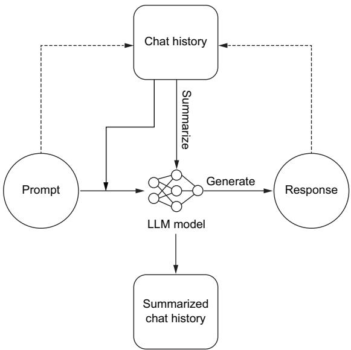  
Figure 8.5 A process flow for an app with chat history utilizing summarization for chat history compression

There are other strategies you can explore, as well as mixing and matching multiple methods. Another idea is to embed each chat and perform a search for relevant previous chat messages to add to the prompt context. But no matter how you choose to shorten the chat history, details are bound to be lost or forgotten the longer a conversation goes on or the larger the prompts and responses are.

# 8.1.3 Chatbot interaction features

Chatting with an LLM bot isn’t like chatting with your friend. For one, the chatbot is always available and waiting for us to talk to it, so we can expect a response right away. There shouldn’t be opportunities for users to spam multiple messages to our bot before receiving feedback. But let’s face it, in the real world, there are connection

problems or bad internet, the server could be overwhelmed, and there are a myriad of other reasons a request might fail. These differences encourage us to interact with a chatbot differently, and we should ensure we add several features for our users to improve their experience. Let’s consider several of them now:

 Fallback response—A response to give when an error occurs. To keep things clean, you’ll want to ensure a 1:1 ratio of LLM responses for every user query in your chat history. A fallback response ensures our chat history is clean and gives the user instructions on the best course of action, like trying again in a few minutes. Speaking of which, you should also consider disabling the Submit button when receiving a response to prevent weird problems from asynchronous conversations and out-of-order chat history.   
 Stop button—Interrupts a response midstream. An LLM can often be longwinded, continuing to respond long after answering the user’s questions. Often, it misunderstands a question and starts to answer it incorrectly. In these cases, it’s best to give the user a Stop button so they can interrupt the model and move on. This button is a simple cost-saving feature since we usually pay for output per token one way or another.   
 Retry button—Resends the last query and replaces the response. LLMs have a bit of randomness to them, which can be great for creative writing, but it means they may respond unfavorably even to prompts they have responded correctly to multiple times before. Since we add the LLM chat history to new prompts to give context, a retry button allows users to attempt to get a better result and keep the conversation moving in the right direction. While retrying, it can make sense to adjust our prompting hyperparameters, for example, reducing temperature each time a user retries. This can help push the responses in the direction the user is likely expecting. Of course, this likely isn’t the best move if they are retrying because of a bad internet connection, so you’ll need to consider the adjustments carefully.   
 Delete button —Removes portions of the chat history. As mentioned, the chat history is used as context in future responses, but not every response is immediately identifiable as bad. We often see red herrings. For example, a chat assistant used while coding might hallucinate functions or methods that don’t exist, which can lead the conversation down a path that is hard to recover from. Of course, depending on your needs, the solution could be a soft delete, where we only remove it from the frontend and prompting space but not the backend.   
 Feedback form—A way to collect feedback on users’ experience. If you are training or finetuning your own LLMs, this data is highly valuable, as it can help your team improve results on the next training iteration. This data can often easily be applied when using RLHF. Of course, you won’t want to apply it directly, but first clean and filter out troll responses. Also, even if you aren’t training, it can help your team make decisions to switch models, improve prompting, and identify edge cases.

In listing 8.3, we show how to use Gradio to set up an easy chatbot app. Gradio is an open source library for quickly creating customizable user interfaces for data science demos and web applications. It’s highly popular for its ease of integration within Juptyer notebooks, making it easy to create interfaces and edit your web app in a familiar environment. To create a chatbot with Gradio, we’ll use the ChatInterface and give it a function to make our API request. You’ll notice that Gradio expects the history to be part of the generate function, and streaming is just a matter of ensuring the function is a generator.

# What is Gradio?

Gradio is an open-source Python library that allows you to quickly create customizable UI components around your machine-learning models. It provides a simple interface for building interactive web-based applications for your models without requiring you to write any HTML, CSS, or JavaScript code. With Gradio, you can create input forms for your models, display the results, and even share your models with others through a web interface.

Listing 8.3 Local LLM Gradio chat app with Stop, Retry, and Undo   
gr.ChatInterface(generate, theme $=$ "soft").queue().launch()   
import gradio as gr   
import requests   
import json   
url $=$ "http://localhost:8000/generate" Points to your model's API   
def generate(message, history): history_transformer_format $\equiv$ history + [[message, ""]] messages $=$ ".join( [ ].join(["\n<human>:" + h, "\n<bot>:" + b]) for h, b in history_transformer_format ] data $=$ json.dumps({"prompt": messages}) full_response $=$ "" with requests.post(url,data=data, stream=True) as r: Add a blinking cursor to simulate typing

You can see how simple this code is, with very few lines needed. Gradio does all the heavy lifting for us. You might also be wondering where all our interaction features

are. Well, the good news is that Gradio automatically adds most of these features for us. Don’t believe me? Check out the app we just created in figure 8.6.

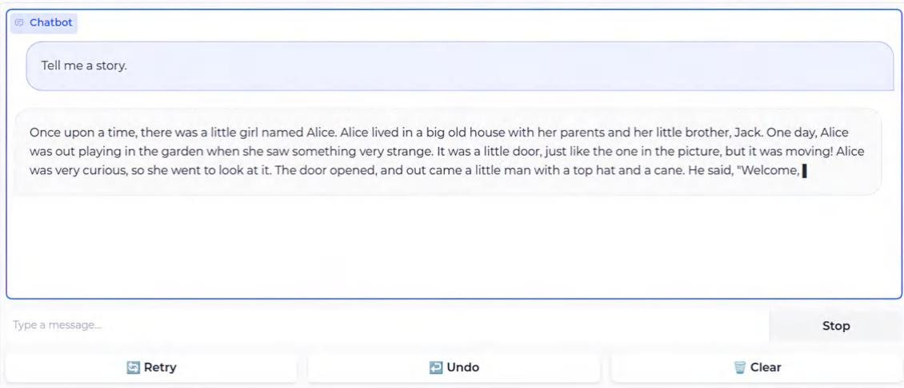  
Figure 8.6 Screenshot of our Gradio app, including interaction features Stop, Retry, and Undo for better ease of use

# Chainlit: An application builder just for LLMs

We have shown you how to build LLM applications with several different tools: Streamlit, Gradio, and even vanilla HTML and JavaScript. There are many great tools out there, and we can’t give personal attention to each one. But one more tool we think many of our readers will be interested in is Chainlit. Chainlit is a tool specifically built for building LLM applications and comes with most features out of the box, including ones not discussed here, like themes, CSS customization, authentication, and cloud hosting. It is likely one of the fastest ways to get up and running.

Each quality-of-life improvement you can add to your application will help it stand out above the competition and potentially save you money. For the same reason, you should consider using a token counter, which we cover next.

# 8.1.4 Token counting

One of the most basic but valuable pieces of information you can gather to offer a great user experience is the number of submitted tokens. Since LLMs have token limits, we’ll need to ensure the users’ prompts don’t exceed those limits. Giving feedback early and often will provide a better user experience. No one wants to type a long query only to find that it’s too much upon submitting.

Counting tokens also allows us to better prompt-engineer and improve results. For example, in a Q&A bot, if the user’s question is particularly short, we can add more

context by extending how many search results our retrieval-augmented generation (RAG) system will return. If their question is long, we’ll want to limit it and ensure we have enough space to append our own context.

Tiktoken is just such a library to help with this task. It’s an extremely fast BPE tokenizer built specifically for OpenAI’s models. The package has been ported to multiple languages, including tiktoken-go for Golang, tiktoken-rs for Rust, and several others. In the next listing, we show a basic example of how to use it. It’s been optimized for speed, which allows us to encode and count tokens quickly, which is all we need to do.

# Listing 8.4 Using tiktoken to count tokens

import ticktoken   
encoding $=$ ticktoken.get_encoding("cl100k_base")   
print(encoding.encode("You're users chat message goes here."))   
# [2675, 2351, 3932, 6369, 1984, 5900, 1618, 13]   
def count_tokens(string: str) -> int: encoding $=$ ticktoken.get_encoding("cl100k_base") return len(encoding.encode(string))   
num_tokens $=$ count_tokens("You're users chat message goes here.")   
print(num_tokens)   
# 8

Of course, the reader who hasn’t skipped ahead will recognize a few problems with using tiktoken, mainly because it’s built with OpenAI’s encoders in mind. If you are using your own tokenizer (which we recommend), it’s not going to be very accurate. We have seen several developers—out of laziness or not knowing a better solution— still use it for other models. Generally, they saw counts within $\pm 5 { - } 1 0 $ tokens per 1,000 tokens when using tiktoken results for other models using similar BPE tokenizers. To them, the speed and latency gains justified the inaccuracy, but this was all word of mouth, so take it with a grain of salt.

If you are using a different type of tokenizer, like SentencePiece, it’s often better to create your own token counter. For example, we do just that in our project in chapter 10. As you can guess, the code follows the same pattern of encoding the string and counting the tokens. The hard part comes when porting it to the language that needs to run the counter. To do so, compile the tokenizer like you would any other ML model, as we discussed in section 6.1.1.

# 8.1.5 RAG applied

RAG is an excellent way to add context and outside knowledge to your LLM to improve the accuracy of your results. In the last chapter, we discussed it in the context of a backend system. Here, we will be discussing it from the frontend perspective. Your RAG system can be set up on either side, each with its own pros and cons.

Setting up RAG on the backend ensures a consistent experience for all users and gives us greater control as developers of how exactly the context data will be used. It

also provides a bit more security to the data stored in the vector database, as it’s only accessible to the end users through the LLM. Of course, through clever prompt injection, it could potentially still be scraped, but it is still much more secure than simply allowing users to query your data directly.

RAG is more often set up on the frontend because doing so allows developers to take whatever generic LLM is available and insert business context. You don’t need to finetune a model on your dataset if you give the model your dataset at run time. Thus, RAG becomes a system to add personality and functionality to our LLM application versus simply being a tool to ensure the accuracy of results and reduce hallucinations.

In section 6.1.8, we showed you how to set up a RAG system; now we will show you how to utilize it for efficient query augmentation. In listing 8.5, we show you how to access and use the vector store we set up previously. We will continue to use OpenAI and Pinecone from our last example. We will also use LangChain, a Python framework which we discovered in the last chapter, to help create LLM applications.

Listing 8.5 RAG on the frontend   
import os   
import pinecone   
from langchain.chains import RetrievalQA   
from langchain.chains import RetrievalQWithSourcesChain   
from langchain chat_models import ChatOpenAI   
from langchain.embeddings.openai import OpenAIEmbeddings   
from langchain.).vectorstores import Pinecone Get OpenAI API key from platform.openai.com OPENAI_API_KEY $\equiv$ os.getenv("OPENAI_API_KEY") PINECONE_API_KEY $\equiv$ os.getenv("PINECONE_API_KEY") Finds API key in console at app.pinecone.io index_name $=$ "pincecone-llm-example" Sets up vectorstore index $\equiv$ pinecone.Index(index_name) embedder $\equiv$ OpenAIEmbeddings ( model="text-embedding-ada-002",openai_api_key $\equiv$ OPENAI_API_KEY ) text_field $\equiv$ "text" vectorstore $\equiv$ Pinecone(index, embedder. embed_query, text_field) query $\equiv$ "Who was Johannes Gutenberg?" Makes a query vectorstore.similarity_search( query, $k = 3$ Our search query; returns the three most relevant docs   
11m $\equiv$ ChatOpenAI ( Now let's use these results to enrich our LLM prompt; sets up the LLM openai_api_key $\equiv$ OPENAI_API_KEY, model_name $\coloneqq$ "gpt-3.5-turbo", temperature=0.0, Runs query with vectorstore   
qa $\equiv$ RetrievalQA.from_chain_type( qqa.run(query)

```python
qa_with_sources = RetrievalQAWithSourcesChain.from_chain_type(11m=11m, chain_type="stuff", retriever=vectorstore.as_retriever())
)  
qa_with_sources(query) Includes Wikipedia sources 
```

We think the most impressive part of this code is the fact that LangChain has a chain simply named “stuff” because, presumably, they couldn’t think of anything better. (If you want to learn more about the cryptically named module “stuff,” you can find the docs at https://mng.bz/OBER.) But in actuality, the most impressive thing about this code is that we just have to define our LLM and vector store connections, and we are good to go to start making queries. Simple.

# 8.2 Edge applications

So far, we have discussed building LLM applications, assuming we will simply be using an API—one we deployed, but an API nonetheless. However, there are lots of situations where you might want to run the model on the local device inside the application itself. Doing so brings several challenges: mainly, we need to get a model small enough to transfer and run it on the edge device. We also need to be able to run it in the local environment, which likely doesn’t have an accelerator or GPU and may not even support Python—for example, running an app in a user’s web browser with JavaScript, in an Android app on a mobile phone with Java, or on limited hardware like a Raspberry Pi.

In chapter 6, we started discussing the building blocks you need to work with edge devices. We showed you how to compile a model, giving examples using TensorRT or ONNX Runtime. TensorRT, coming from NVIDIA, is going to serve you better on a server with expensive NVIDIA hardware to go with it, so it is less useful for edge development. ONNX Runtime is a bit more flexible, but when working with edge devices, llama.cpp is often a better solution for LLMs, and it follows the same flow: compile the model to the correct format, move that model to the edge device, download and install the SDK for your language, and run the model. Let’s take a closer look at these steps for llama.cpp.

The llama.cpp project started with the goal of converting an LLM to something that could be run on a MacBook without a GPU (Apple silicon chips are notorious for poor compatibility for many projects). Initially working to quantize the LLaMA model and store it in a binary format that could be used by the $\mathrm { C } + +$ language, the project has grown to support a couple of dozen LLM architectures and all major OS platforms, has bindings for a dozen languages, and even CUDA, metal, and OpenCL GPU backend support. Llama.cpp has created two different formats to store the quantized LLMs: the first GPT-Generated Model Language (GGML), which was later abandoned for the better GPT-Generated Unified Format (GGUF).

To use llama.cpp, the first thing we’ll need is a model stored in the GGUF format. To convert your own, you’d need to clone the llama.cpp project, install the dependencies, and then run the convert script that comes with the project. The steps have changed

frequently enough that you’ll want to consult the latest information in the repo, but currently, it would look like

$ git clone https://github.com/ggerganov/llama.cpp.git   
$ cd llama.cpp   
$ pip install -r requirments/requirements-convert.txt   
$ python convert.py -h

Of course, that last command simply displays the convert script’s Help menu for you to investigate the options and does not actually convert a model. For our purposes, we’ll download an already converted model. We briefly mentioned Tom Jobbins (The-Bloke) in chapter 6, the man who has converted thousands of models, quantizing and finetuning them so they are in a state ready for use. All you have to do is download them from the Hugging Face Hub. So we’ll do that now. First, we’ll need the huggingface-cli, which comes as a dependency with most of Hugging Face’s Python packages, so you probably already have it, but you can install it directly as well. Then we’ll use it to download the model:

$ pip install -U huggingface_hub

$ huggingface-cli download TheBloke/WizardCoder-Python-7B-V1.0-GGUF --   
➥ local-dir ./models --local-dir-use-symlinks False --include='*Q2_K*gguf'

Here, we are downloading the WizardCoder-7B model that has already been converted to a GGUF format by TheBloke. We are going to save it locally in the models directory. We won’t use symbolic links (symlinks), meaning the model will actually exist in the folder we choose. Normally, huggingface-cli would download it to a cache directory and create a symlink to save space and avoid downloading models multiple times across projects. Lastly, the Hugging Face repo contains multiple versions of the model in different quantized states; here, we’ll select the 2-bit quantized version with the include flag. This extreme quantization will degrade the performance of the quality of our output for the model, but it’s the smallest model available in the repo (only 2.82 GB), which makes it great for demonstration purposes.

Now that we have our model, we need to download and install the bindings for our language of choice and run it. For Python, that would mean installing llama-cpppython via pip. In listing 8.6, we show you how to use the library to run a GGUF model. It’s pretty straightforward, with just two steps: load the model and run it. On one author’s CPU, it ran a little slower than about a token per second, which isn’t fast but impressive enough for a 7B parameter model without an accelerator.

# Listing 8.6 Using llama.cpp to run a quantized model on a CPU

import time

from llama_cpp import Llama

llm $=$ Llama(model_path="./models/wizardcoder-python-7b-v1.0.Q2_K.gguf")

```python
start_time = time.time()
output = 11m(
    "Q: Write python code to reverse a linked list. A: ", max_tokens=200,
    stop=['Q:'],
    echo=True,
)
end_time = time.time()
print(output["choices']) 
```

# The results are

```python
# [  
# { 'text': "Q: Write python code to reverse a linked list. A:  
# class Node(object):  
# def __init__(self, data=None):  
# self.data = data  
# self.next = None  
# def reverse_list(head):  
# prev = None  
# current = head  
# while current is not None:  
# next = current.next  
# current.next = prev  
# prev = current  
# current = next  
# return prev  
# # example usage;  
# # initial list  
# head = Node('a')  
# head.next = Node('b')  
# head.next.next = Node('c')  
# head.next.next.next = Node('d')  
# print(head)  
# reverse_list(head) # call the function  
# print(head)  
# Expected output: d->c->b->a",  
# 'index': 0,  
# 'logprobs': None,  
# 'finish_reason': 'stop'  
# }  
# ]  
print(f"Elapsed time: {end_time - start_time:.3f} seconds")  
# Elapsed time: 239.457 seconds 
```

While this example was in Python, there are bindings for Go, Rust, Node.js, Java, React Native, and more. Llama.cpp gives us all the tools we need to run LLMs in otherwise impossible environments.

# 8.3 LLM agents

At this point in the book, we can finally discuss LLM agents. Agents are what most people are talking about when they start worrying about AI taking their jobs. If you think back to the last chapter, we showed how, with some clever prompt engineering and tooling, we could train models to answer multistep questions requiring searching for information and running calculations. Agents do the same thing on steroids. Full LLM applications are designed not just to answer multistep questions but to accomplish multistep tasks. For example, a coding agent could not only answer complicated questions about your code base but also edit it, submit PRs, review PRs, and write full projects from scratch.

Agents do not differ from other language models in any meaningful way. The big differences all go into the system surrounding and supporting the LLM. LLMs are, fundamentally, closed search systems. They can’t access anything they weren’t trained on explicitly. So for example, if we were to ask Llama 2, “How old was Justin Bieber the last time the Patriots won the Superbowl?” we would be dependent on Meta having trained that model on incredibly up-to-date information. There are three components that make up an agent:

 LLM—No explanation necessary. By now, you know what these are and why they’re needed.   
 Memory—Some way of reintroducing the LLM to what has happened at each step up to that point. Memory goes a long way toward agents performing well. This is the same idea as feeding in the chat history, but the model needs something more than just the literal history of events. There are several ways of completing this:

– Memory buffer—Passes in all of the text that’s come before. Not recommended, as you’ll hit context limits quickly, and the “lost in the middle” problem will exacerbate this.   
– Memory summarization—Has the LLM take another pass at the text to summarize it for its own memory. Works pretty well; however, at a minimum, it doubles latency, and summarization will delete finer details faster than anyone would like.   
– Structured memory storage—Thinks ahead and creates a system you can draw from to get the actual best info for the model. It can be related to chunking articles and searching for an article title and then retrieving the most relevant chunk, or perhaps chaining retrievals to find the most relevant keywords or to make sure that the query is contained in the retrieval output. We recommend structured memory storage the most because even though it’s the hardest to set up, it achieves the best results in every scenario.

 External data retrieval tools—The core of agent behavior. These tools give your LLM the ability to take actions, which allows it to perform agent-like tasks.

We’ve covered a lot in this book, and agents are a bit of a culmination of much of what we’ve covered. They can be quite tricky to build, so to help you, we’ll break down the

steps and give several examples. First, we’ll make some tools, then initialize some agents, and finally create a custom agent, all on our own. Throughout the process, you’ll see why it’s particularly difficult to get agents to work effectively and especially why LangChain and Guidance are great for getting started and difficult to get up and running.

In listing 8.7, we start off easy by demonstrating using some tools via LangChain. This example uses the Duck Duck Go search tool and the YouTube search tool. Notice that the LLM will simply give them a prompt, and the tools will handle the search and summary of results.

# Listing 8.7 LangChain search tools example

from langchain.tools import DuckDuckGoSearchRun, YouTubeSearchTool

search $=$ DuckDuckGoSearchRun()  Example of using tools   
hot_topic $\equiv$ search.run( "Tiktoker finds proof of Fruit of the Loom cornucopia in the logo"   
youtube_tool $\equiv$ YouTubeSearchTool() fun_channel $\equiv$ youtube_tool.run("jaubrey",3)   
print(hot-topic，fun channel)

# The generated text is

```txt
Rating: False About this rating If asked to describe underwear  
# manufacturer Fruit of the Loom's logo from memory, some will invariably  
# say it includes - or at least included at some point in... A viral claim  
# recently surfaced stating that Fruit of the Loom, the American underwear  
# and casualwear brand, had a cornucopia in their logo at some point in the  
# past. It refers to a goat's... The Fruit of the Loom Mandela Effect is  
# really messing with people's memories of the clothing company's iconic  
# logo.. A viral TikTok has thousands of people not only thinking about what  
# they remember the logo to look like, but also has many searching for proof  
# that we're not all losing our minds.. A TikTok Creator Is Trying To Get To  
# The Bottom Of The Fruit Of The Loom Mandela Effect What Is 'The Mandela  
# Effect?' To understand why people care so much about the Fruit of the Loom  
# logo, one must first understand what the Mandela Effect is in the first  
# place. It's a slang term for a cultural phenomenon in which a large group  
# of people shares false memories of past events. About Fruit of the Loom  
# Cornucopia and Fruit of the Loom Mandela Effect refer to the Mandela  
# Effect involving a large number of people remembering the clothing company  
# Fruit of the Loom having a cornucopia on its logo despite the logo never  
# having the item on it.  
# ['https://www.youtube.com/watch?v=x81gguSPGcQ&pp=ygUHamF1YnJleQ%3D%3D',  
# https://www.youtube.com/watch?v=bEvxuG6meVQ&pp=ygUHamF1YnJleQ%3D%3D'] 
```

Next, we’ll demonstrate running an agent locally. In these examples, we use llama.cpp again; however, this time, we will use an instruction-based model, the 4-bit quantized Mistral 7B Instruct model—a great open source model. You can get the model we are

using by running the following command. Notice the similarities to when we pulled the WizardCoder model back in section 8.2:

```txt
$ huggingface-cli download TheBloke/Mistral-7B-Instruct-v0.1-GGUF --local-dir ./models --local-dir-use-symlinks False --include='*Q4_0*gguf' 
```

In listing 8.8, we demonstrate running two different types of agents you’ll likely find useful. The first agent generates some Python, runs it, and attempts to debug any problems it runs into. The second agent reads and analyzes a CSV file. For this agent, we’ll use the Slack dataset we pulled back in chapter 4. Pay attention to the responses, and make a wager on whether they do a good job.

# Listing 8.8 LangChain Python and CSV agents

```python
from langchain.llms import LlamaCpp  
from langchainagents import AgentType  
from langchain_expertical.agents import create_csv_agent  
from langchain_expertical.agents(agent_toolkits import create_PYTHON_agent  
from langchain_expertical.tools import Python REPLTool 
```

llm $=$ LlamaCpp( model_path $\equiv$ "/models/mistral-7b-instruct-v0.1.Q4_0.gguf", n_gpu_layers=0, n_batch=512, nctx=32768, verbose=False, Context window for the model   
agent $=$ create_PYthon_agent( An agent that will generate Python code and execute it 11lm=11m, tool $\equiv$ PythonREPLTool(), verbose=True, agent_type $\equiv$ AgentType.ZERO_SHOT_REACT_DESCRIPTION, handleParsing Errors $\equiv$ True,   
)   
agent.run( ""Using Python_REPL please write a neural network in Pytorch. Use Python_REPL as the Action and your code as the Action Input. Use synthetic data from a normal distribution. Train for 1000 epochs and print every 100 epochs. Return a prediction for ${\bf x} = {\bf 5}.$ ""

# The output is

> Entering new AgentExecutor chain...  
# This is a task about creating and training a neural network. I should start by importing Pytorch and defining the synthetic data. Then I will define the neural network and train it for 1000 epochs. Finally, I will print the prediction for $x = 5$ .

```python
Action: Python_REPL  
# Action Input:  
# ```'python  
# import torch  
# import torch(nn as nn  
# import torch.optim as optim  
# from torch.utils import data  
# from torchvision.datasets import make_classification  
# define synthetic data from normal distribution  
# data = make_classification(n_samples=1000, n_features=10, n informativc=5,  
# random_state=42)  
# X = data['features']  
# y = data['targets']  
# ```'Python REPL can execute arbitrary code. Use with caution.  
# Observation: ImportError("cannot import name 'make_classification' from  
# 'torchvision.datasets'  
# Thought: It seems like the code is trying to use a function that does not  
# exist, I will check the import statement.  
# Action: Python_REPL  
# Action Input:  
# ```'python  
# fix import  
# import torch.utils.data as data  
# from torchvision.datasets import make_classification  
# ```'  
# Observation: ImportError("cannot import name 'make_classification' from  
# 'torchvision.datasets'  
# Thought: It still seems like the code is trying to use a function that  
# does not exist, I will make sure that the function name matches the  
# correct import statement.  
# Action: Python_REPL  
# Action Input:  
# ```'python  
# fix import  
# from torchvision.datasets.make_classification import make_classification  
# data = make_classification(n_samples=1000, n_features=10, n informativc=5,  
# random_state=42)  
# X = data['features']  
# y = data['targets']  
# ```'  
# Observation: ImportError("cannot import name 'MakeClassification' from  
# 'torchvision.datasets'  
# Thought: 
```

# We continue with

agent $=$ create_csv_agent( An agent that will read 11m, a CSV and analyze it ./data/Slack_Dataset.csv", verbose=True, agent_type $\equiv$ AgentType.ZERO_SHOT_REACT_DESCRIPTION, handleParsing Errors $\equiv$ True,

The generated text is   
```python
agent.run( ""Using python_repl_ast please tell me whether the user polite in their messages. Use python_repl_ast as the Action and the command as the Action input."") 
```

```txt
# > Entering new AgentExecutor chain...
# Action: python_repl_ast
# Action Input: df['text'].str.contains('thank you')
# Observation:
# 0 False
# 1 False
# 2 False
# 3 False
# 4 False
# ...
# 286 False
# 287 False
# 288 False
# 289 False
# 290 False
# Name: text, Length: 291, dtype: bool
# Thought: It seems the user was not polite in their messages.
# Final Answer: The user was not polite in their messages.
# > Finished chain. 
```

Well, what do you think? Did either agent do a very good job? You’re likely thinking “No,” which should reassure you that AI isn’t going to take your job anytime soon. The Python agent wrote a PyTorch script that completely depends on a make_ classification() function that doesn’t exist, and the CSV agent decided that being polite is equivalent to saying, “Thank you.” Not a bad guess, but simply not a robust solution. Sure, part of the problem is likely the model we are using; a bigger one like GPT-4 might do better. We’ll leave it as an exercise for the reader to compare.

Moving on, in listing 8.9, we build our own agent. We’ll define the tools the agent has access to, set up a memory space for the agent, and then initialize it. Next, we’ll define a system prompt so the agent knows how it should behave, making sure to explain to it what tools it has at its disposal and how to use them. We’ll also utilize fewshot prompting and instruction to give us the best chance of seeing good results. Lastly, we’ll run the agent. Let’s take a look.

Listing 8.9 Agents and agent behavior   
```python
from langchain.llms import LlamaCpp   
from langchain.chains.conversation.memory import ( ConversationBufferWindowMemory,   
)   
from langchainagents import load.tools, initialize_agent, Tool   
from langchain_experimental.tools import Python REPLTool   
from langchain.tools import DuckDuckGoSearchRun, YouTubeSearchTool 
```

11m = LlamaCpp( model_path $=$ ./models/mistral-7b-instruct-v0.1.Q4_0.gguf", n_gpu_layers $\coloneqq$ 0, n_batch $\coloneqq$ 512, nctx=32768, verbose $\coloneqq$ False, Context window for the model   
search $=$ DuckDuckGoSearchRun() Defines our own duckduckgo_tool $\equiv$ Tool ( name $=$ "DuckDuckGo Search", func $\coloneqq$ search.run, description $=$ "Useful for when an internet search is needed", ) youtube_tool $\equiv$ YouTubeSearchTool() coding_tool $\equiv$ PythonREPLTool() tools $=$ load.tools([llm-math"], llm=llm) tools $+ =$ [duckduckgo_tool, youtube_tool, coding_tool]   
memory $=$ ConversationBufferWindowMemory( Defines our memory memory $=$ ConversationBufferWindowMemory( k=5, return_messages=True, output_key $\equiv$ "output", ) agent $=$ initialize_agent( Sets up and initializes tools $\equiv$ tools, 11m=11m, agent $=$ "chat-conversational-react-description", verbose $\equiv$ True, memory $\equiv$ memory, handleParsing Errors $\equiv$ True, B_INST, E_INST $=$ "[INST]", "/INST"] Special tokens used by Ilama 2 chat B_SYS,E_SYS $=$ "<SYS>\n","\n<\\n" sys msg $=$ ( <s>" +B_SYS +""Assistant is a expert JSON builder designed to assist with a wide range of tasks. Assistant is able to respond to the User and use tools using JSON strings \\ that contain "action" and "action_input" parameters. All of Assistant's communication is performed using this JSON format. Assistant can also use tools by responding to the user with tool use $\backslash$ instructions in the same "action" and "action_input" JSON format. Tools $\backslash$ available to Assistant are:

- "Calculator": Useful for when you need to answer questions about math.

```txt
- To use the calculator tool, Assistant should write like so:
```
---json
{{"action": "Calculator",
    "action_input": "sqrt(4)"}} 
```

- "DuckDuckGo Search": Useful for when an internet search is needed.

```txt
- To use the duckduckgo search tool, Assistant should write like so:
```
```
```
```
```
```
```
```
```
```
```
```
```
`` 
```

Here are some previous conversations between the Assistant and User:

User: Hey how are you today? Assistant: \~\~json {{"action": "Final Answer", "action_input": "I'm good thanks, how are you?"}}   
User: I'm great, what is the square root of 4? Assistant: \~\~json {{"action": "Calculator", "action_input": "sqrt(4)"}}   
User: 2.0 Assistant: \~\~json {{"action": "Final Answer", "action_input": "It looks like the answer is 2!"}}   
User: Thanks, when was the Jonas Brothers' first concert? Assistant: \~\~json {{"action": "DuckDuckGo Search", "action_input": "When was the Jonas Brothers' first concert"}}   
User: 12.0 Assistant: \~\~json {{"action": "Final Answer", "action_input": "They had their first concert in 2005!"}}   
User: Thanks could you tell me what 4 to the power of 2 is? Assistant: \~\~json {{"action": "Calculator", "action_input": "4**2"}}   
User: 16.0 Assistant: \~\~json {{"action": "Final Answer", "action_input": "It looks like the answer is 16!"}}   
Here is the latest conversation between Assistant and User.""" $^+$ E_SYS

new_prompt = agent(agent.create_prompt(system_message $\equiv$ sys msg, tools $\equiv$ tools) <agent(agent.llm_chain_prompt $=$ new_promptAdds systemprompt to agent B_INST + " Respond to the following in JSON with action' and action_input' "values" + E_INST   
） human msg $=$ instruction $^+$ "\\nUser:{input}" agent(agent.llm_chain_prompt/messages[2].prompt.template $=$ human msg   
agent.run( Runs with user input "Tell me how old Justin Beiber was when the Patriots last won the " "Superbowl."

Remember that for this, we asked the model to respond in JSON:

```txt
# > Entering new AgentExecutor chain...
# Assistant: {
# "action": "DuckDuckGo Search",
# "action\input": "When did the New England Patriots last win the Super Bowl? Justin Bieber birthdate"
# }
# {
# "action": "Final Answer",
# "action\input": "Justin Bieber was born on March 1, 1994. The Patriots last won the Super Bowl in February 2018."
#} 
```

Not bad! It didn’t answer the question, but it got pretty close; it just needed to do some math. If you ran the example, you might have noticed it was a bit slow compared to using the llama.cpp Python interpreter. Unfortunately, for some reason, LangChain’s wrapper adds some significant time to compute, so be warned: if you need to go really fast, LangChain is not your vehicle. At least not yet. Regardless, LangChain has made some easy-to-use wrappers around popular Python libraries to make them usable as LLM tools. In these listings, we only used a handful, and there’s a lot more to choose from.

Overall, you can see that we were able to get the LLM to perform pretty well on some nontrivial tasks (and we were using a 4-bit quantized model, we might add). However, it was nowhere close to perfect. Agents are miraculous in that they work at all, but they are generally underwhelming in the tasks and levels they can perform— including the top-tier paid agents. The more you work with LLMs crafting many different prompts, the more you’ll find that LLMs are quite flaky, just like humans, which can be quite annoying to software engineers who are used to working with machines that are as consistent as anything this world has to offer. Getting LLMs to perform well on just one task is often difficult enough, but chaining several tasks together inside an agent is extremely difficult. We are still very much in the early stages of agent development, and we are excited to see where it goes.

# Summary

 Creating a simple LLM application is straightforward, but creating one that delights your users takes a bit more work.   
1 The key features you should include in your app include the following:

– Streaming responses allows a more interactive and responsive experience.   
– Feeding your model the chat history will prevent your model from having a birdbrain.   
– Interactive features like Stop, Retry, and Delete buttons give users more control of the conversation.   
– Token counting is useful for user feedback and allows users to edit responses to fit token limits.   
– RAG on the frontend allows us to customize an application regardless of the LLM backend.

 Llama.cpp is a powerful open source tool for compiling LLMs and running them on edge devices with constrained resources.   
 Agents are LLM applications built to solve multistep problems and promise to automate jobs machines currently struggle with.   
 Agents are extremely difficult to build due to the unpredictability of LLMs and sometimes require advanced prompt engineering to get reasonable results.

# Creating an LLM project: Reimplementing Llama 3

# This chapter covers

 Implementing Meta’s Llama3 model   
 Training a simple LLM   
Making improvements to it to prepare it for production   
Serving the model to a production endpoint you can share with your friends

I am only coming to Princeton to research, not to teach. There is too much education altogether, especially in American schools. The only rational way of educating is to be an example.

—Albert Einstein

For the first major project in the book, we want to start from scratch. We’ve been showing you how to work with LLMs from end to end, and we are going to put it all together in this chapter. This project includes pretraining a model, roughly following a research paper. We won’t dive too deeply into the actual research; in fact, we’ll take several shortcuts here, as this isn’t the focus of this book. We will, however, showcase how to train the model, prepare it for servings with quantization, finetune it with

low-rank adaptation (LoRA) for a specific purpose or task, and deploy it to a production environment you can showcase to your friends.

This chapter will be very dense, but you should be more than prepared to meet the challenge at this point because it’s mainly a data scientist–focused project for production. We chose this project so that you can put all the lessons you’ve learned throughout the book together into one place and leave you with end-to-end, hands-on experience.

# 9.1 Implementing Meta’s Llama

“Llama 2: Open Foundation and Fine-Tuned Chat Models” by Touvron et al.1 is an awesome paper that covers the development and release of Llama 2, one of the best, almost open source models currently on the market. You may have seen Llama 2 as the first open source model that was good enough to rival OpenAI’s models, at least based on the metrics of the time. Llama 3 is out now, and it has almost completely eclipsed Llama 2 in popularity and may very well be why you picked up this book.

Llama 3 is amazing for a couple of reasons—namely, size and availability. With only 70B parameters, pretrained on only 15T tokens, and finetuned on 100K chats, it shouldn’t be able to beat a 176B or a 1.7T parameter model at anything. Unsurprisingly, it usually doesn’t. But it does beat them at one crucial thing: its availability. This feature has given rise to an open source software community that has made tooling and optimizations and even gathers data to make it better. Llama 3 is the ultimate showcase that architecture is less important than data, and it is trained on clean data.

And we’re going to implement it.

By the end of this chapter, you will build a real model and understand the work that goes into it. Will it be as good as Meta’s Llama 3? Far from it, because we won’t be demonstrating with an adequate amount of data or GPUs. But we want to do more than simply supply you with yet another set of weights that are on some leaderboard somewhere. We want to give you some intuition for the steps required and the potential problems you may face. Instead of training a great model completely from scratch, which is what dozens of other books are tackling right now, we’ll show you how to train a below-average model and productionize it. This approach should have you not only learning more but demonstrating expertise beyond your experience level.

# 9.1.1 Tokenization and configuration

By this point, you’ve likely already learned the importance of setting up the problem correctly. We want our models hitting tee-balls out of the park, not going up against an MLB pitcher. With that in mind, we’ll download the same tokenizer that Llama used. If you want, you can come back and experiment with this tokenizer since we are building from scratch. For example, try to use a faster tokenizer like tiktoken— just know you’ll be giving up the model’s ability to do math. You can also train your

own version of the SentencePiece model, which should guarantee better results on whatever dataset you want to extend this with. The point is that this model is blank—no pretrained weights at all. So come back and do whatever you’d like after following along.

NOTE Unlike other chapters where each listing was stand alone, in this chapter, each listing will be part of a larger notebook. You can find this notebook in the code repository accompanying this book.

Listing 9.1 shows our initial setup for this project, including imports, device settings, and grabbing our tokenizer. While we’ll just be grabbing the tokenizer from Hugging Face, keep in mind that not all tokenizers and models use the same type of tokens. This is important because we’re going to train this model differently than the way the inference tokenizer is set up for. To correct for this discrepancy, we’ll need to add a padding token. Anything would do, but we’ll use $" < \mathrm { P } \bar { \mathrm { A D } } > "$ in our example. Once we have that, we’ll make sure to grab the vocab itself (we’ll need it later) and create encoding and decoding functions to help with batch processing. Because we’re using the Hugging Face implementation, this isn’t strictly needed because it has batch tokenization built in, along with a batch_decode method that works great. For learning’s sake, we’ll go through the motions anyway. It’s always good practice to be aware of what you’re doing, and these functions help lock that down.

The last part of this listing offers the most flexibility. Here, we set up a master config that will ultimately decide how many parameters our model has, how long it trains, and how much memory it will take per row in our dataset. Our default values are pretty small and designed to give you a good experience regardless of your hardware, including if you’re training on a CPU-only build. Feel free to experiment and crank up the numbers.

# Listing 9.1 Tokenize and config

import torch   
from torch import nn   
from torch(nn import functional as F   
import numpy as np   
from numba import jit   
from matplotlib import pyplot as plt   
import time   
from datetime import timedian   
import pandas as pd   
from collections import OrderedDict   
from itertools import cycle   
from transformers import AutoTokenizer   
from sentencepiece import SentencePieceProcessor   
from datasets import load_dataset   
device $=$ "cuda:0" if torch.cuda.is-available() else "cpu" device_cap $=$ torch.cuda.get_device_capacity() device_type $=$ "cuda" if "cuda" in device else "cpu"

torch.cuda.set_device(device)   
torchmanual_seed(8855)   
print(torch._version_)   
print(device,device_cap)   
#2.1.0+cu121   
# CUDA:0 (8,6) Uses Hugging Face   
tokenizer $=$ AutoTokenizer.from_pretrained("/llama3/")   
tokenizer.add_special_tokens({"pad_token":"<PAD>"})   
#tokenizer.pad_token $\equiv$ tokenizer.eos_token Optional   
vocab $=$ tokenizer.vocab   
def encode.example): return tokenizer.encodeexample,return_tensors="pt")   
defdecode(example): return tokenizer.batch Decode( example, skip_special_tokens=False, clean_up_tokenization Spaces=True, ) [0]   
print(f"Vocab Size:{len(vocab)}")   
decode( encode( ""hello I am a specifically designed long sentence to make sure this is working not only adequately, but good enough for our batch functions""")   
）   
#Vocab Size:32001   
#"<s> hello I am a specifically designed long sentence to make sure this is working not only adequately,but good enough for our batch functions'   
MASTER_CONFIG $=$ { "vocab_size":len(vocab), "batch_size":16, "context_window":32, "d_model":288, "hidden_dim":768, "epochs":1000, "log_interval":50, "n_heads":6, "n_layers":6,   
}   
GLOBAL_KEEP_tracking $= [$ ]

As we’ve reiterated a number of times throughout the book, remember that the strategy you use to tokenize and embed your inputs ultimately dictates what your model is

able to “see” during training and inference. You should generally do a bit more than just choose a tokenizer; in fact, we’ll see later in this chapter what choosing the Llama 3 tokenizer will do to our inference.

You could opt for training a new tokenizer on your dataset or adding especially important tokens from your dataset to an already-robust tokenizer—preferably one that already generally matches the strategy you want and is trained in the domain you need. If you aren’t sure about any of that, any LLM tokenizer should generally work— that’s what they’re designed for. But don’t be surprised when the model doesn’t perform well when you pick a general tokenizer and want a specific task.

# 9.1.2 Dataset, data loading, evaluation, and generation

Let’s get into the most important part of this process, which we will, for the most part, gloss over. There’s only so much we can focus on in one chapter, but we want to reiterate how important your dataset is to the success of your LLM. You’ll want to spend time gathering, evaluating, and cleaning your dataset, but we’ll shortcut that process in the interest of time. Instead, we’ll focus on the steps necessary to train the model—loading, preprocessing, batching, and so forth. As we go through this section, remember that your unique data sources end up future-proofing your model, so consider what data you have access to that no one else does and how you’d set that dataset up for this training.

We’ll start by loading a dataset that’s generally popular for creating toy models, TinyStories. If you did the work to explore your data—and we encourage you to do it—you’ll see that this is a smallish dataset for LLMs, containing only 30 million rows, each containing a short story in a single paragraph. It draws from some oftimplemented and widely accepted datasets. While a small dataset for LLMs, it’s likely still too large for many computers, and many readers will likely hit out-ofmemory errors if they try to load it into memory wholesale. Here’s the perfect time to use streaming. In listing 9.2, we show you how to pull the dataset from the Hugging Face Hub or dataset.to_iterable_ dataset() if working locally. Both methods allow for much more memory-efficient processing, as the whole dataset isn’t loaded all at once, sacrificing some speed.

Listing 9.2 Loading and preparing the data   
dataset $=$ load_dataset( 1 Streams from the local files "text", data_files $\equiv$ { "train": [".././data/TinyStoriesv1andv2-train.txt"], "val": [".././data/TinyStoriesv1andv2-valid.txt"], } streaming $\equiv$ True,

Once you have your dataset and are able to retrieve an iteration, we’ll do some minimal (truly) cleaning. Then we’ll encode the whole thing so that our training can go

quicker down the line. We’ll save the tokenization and attention masks as their own columns, and then we’ll shuffle the dataset and go on to dataloading. A quick note that’s always worth mentioning: when training any machine learning model, if you don’t already have your train and val splits defined, take extra care shuffling your dataset so that none of the data leaks into a split where it shouldn’t be:

```python
clean_dataset = dataset.filter(lambda example: len(len["text"] > 2) < p):
    prompt = "Write a short story. Possible Story: "
    tokenized_prompt = tokenizerprompt, return_tensors="pt").input_ids
    encoded_dataset = clean_dataset.map(
        lambda examples: tokenizer(
            [prompt + x for x in examples["text"]), 
            padding=True,
            return_tensors="pt",
        ), 
        batched=True,
    )
    train_data = iter(encrypted_dataset["train"].shuffle())
val_data = iter(encrypted_dataset["val"].shuffle())
train_data = cycle(train_data)
val_data = cycle(val_data) 
```

If you disregard our advice to stream and have a computer that can handle this dataset, know that loading the entire dataset into memory and then preparing it, even using hardware acceleration, takes over 30 minutes and more than 5 GB of memory. So if you have an extra 5 GB of VRAM outside of what you’ll need for your model, you’re good to go ahead and load it however you want. See figure 9.1.

```yaml
Filter: 100% | 30415548/30415548 [00:42<00:00, 713226.59 examples/s]  
Filter: 100% | 305106/305106 [00:00<00:00, 706260.12 examples/s]  
Map: 100% | 28080906/28080906 [32:01<00:00, 14616.43 examples/s]  
Map: 100% | 281929/281929 [00:18<00:00, 14923.99 examples/s] 
```

Figure 9.1 With over 30 million rows, this dataset is pretty small for what we’re trying to do, but it is still substantial on consumer hardware.

We’ll need at least one function to load our data into a ready-to-use format for our model, and we’re opting to use just that. Our get_batches function will take in one row of our data and return a model input and an expected output that can be compared against it for self-supervised learning. No labeling is needed, as we’ll start on a random token, then grab tokens up to our whole context window (32) for our input, and shift one token to the right for our expected output. For our model, we create a scenario that looks like this:

input: How much wood could a woodchuck chuck if a woodchuck could chuck

label: How much wood could a woodchuck chuck if a woodchuck could chuck wood?

This process allows our model to train on our task: guessing the next token in an utterance, given the context of the previous 31 tokens. We use this strategy instead of other strategies like masking because our preferred inputs will never contain information after the input is completed. This way, our model will get better and better at text completion the more and higher-quality data it trains on. Almost all foundation models are pretrained in this manner—only they train for much longer with many more parameters than we will right now:

```python
@torch.compile  
def get_batches( data, batch_size, context_window, config=MASTER_CONFIG, debug=False,  
):  
    x = []  
    y = []  
    for _ in range( batch_size ) :  
        batch_data = next(data)  
        ix = torch.randint( 0, len(batch_data["input_ids"] - context_window - 1, (2,) )  
        batch_x = torch.stack( [batch_data["input_ids"] [i : i + context_window] for i in ix] ).long()  
        batch_y = torch.stack( [ batch_data["input_ids"] [i + 1 : i + context_window + 1] for i in ix] )  
    ).long()  
    x.append(batch_x)  
    y.append(batch_y)  
    x = torch.cat((x), 0).to(device)  
    y = torch.cat((y), 0).to(device)  
    return x, y 
```

Once we have our data batching taken care of, we need to come up with functions for evaluation and inference so that we can gain insight into how the model is doing during training and so that we can use the model later. For our evaluation, we’ll take some batches and average the loss across them to get our validation loss. This result will not give us a real representation of our model’s performance but will not stop it from being useful for us:

```python
@torch.no_grad()
def get_loss(model, lora=False, config=MASTER_CONFIG):
    out = {}
    model.eval()
    for name, split in zip(['train', "val"], [train_data, val_data]):
        losses = []
        for _ in range(10):
            xb, yb = get_batches(
                split,
                config["batch_size"]
                config["context_window"]
            )
            _, loss = model(xb, yb)
            losses.append(loss.item())
        out[name] = np.mean(losses)
    model.train()
    return out 
```

# Questioning your assumptions

When working with machine-learning models and other statistical methods, it’s important to understand how your assumptions will affect your results. Averages hamper data representation and understanding because they basically say, “For this comparison, we’re going to grab a made-up number, and we’re going to use that number in place of any of the real ones because it feels central to our distribution.” This approach doesn’t make it bad; made-up numbers often are more predictive than real ones. However, we urge you to be intentional and very open-minded about testing whether the average is the best marker for your users.

For generation, we’ll do something similar but better. Logits are what we get out of our model’s forward method. We created a tokenized version of our prompt previously when we tokenized our dataset, so we’re ready to pass that prompt into our model a number of times and see what comes out. We’ll grab the logits from the model given the prompt and then sample our model’s distribution for our next token and decode.

For sampling that distribution, we’ll take the model’s output (logits) for only the very end of the input (the unknown token we want our model to generate) and then divide those logits by the temperature setting (higher temperature setting $=$ smaller logits). Once we have our logits from the last time step, if we use multinomial sampling, we can sample using top_k and/or top_p, which are sampling against the highest probability tokens until you reach a total number of tokens or a total number of probability sums. Once we have that, we use softmax for the tokens we’ve sampled and then argmax to get the next token. If we want more exploration and creativity in our output, we can use multinomial sampling instead. As an exercise, test top_k versus top_p with multinomial and argmax versus multinomial to get an idea of which works best:

```python
@torch.inference_mode()
def generate(
    model,
    config=MASTER_CONFIG,
    temperature=1.0,
    top_k=None,
    max_new_tokens=30,
    lora=False,
):
    idx_list = [tokenized_prompt] * 5
    idx = torch.cat((idx_list), 0).long().to(device)
    for _ in range(max_new_tokens):
        logits = model(idx[:, -config["context_window"],])
        last_time_step_logits = logits[[-1, :]
        last_time_step_logits = last_time_step_logits / temperature
    if top_k is not None:
        v, _ = torch.topk(
            last_time_step_logits,
            min(top_k, last_time_step_logits.size(-1)),
        )
        last_time_step_logits[last_time_step_logits < v[:, [-1]]
        ] = -float("Inf")
    p = F softmax(last_time_step_logits, dim=-1)
) 
    idx_next = torch.argmax(p, dim=-1, keepdims=True)
    idx = torch.cat([idx, idx_next], dim=-1) # append to the sequence
    return [tokenizerdecode(x) for x in idx.tolist()] 
```

And with that, we’ve concluded our setup! We have utility functions for all of the important parts of the model training, including tokenization, data loading, evaluation, inference, and data processing. If there’s anything you feel should be corrected, great! Do it—this is your project. If you want to use a multinomial for sampling instead of an argmax or want to get rid of the softmax and just argmax over the logits, awesome, go for it. For those of you for whom this is your first time, we know it can be quite a firehose, and we’d encourage you to work through it slowly, but don’t lose too much sleep over it. More than likely, you will not have to come up with what should change for your use case yourself because you’ll be implementing an already-created open source model. That said, it’s still a good idea to understand what’s going on behind the scenes and under the hood so that you know roughly where to look when things go wrong.

# 9.1.3 Network architecture

We’ve now completed a ton of setup for training a model but haven’t made a model. Model architecture and training have been iterated upon ad nauseam, so we’ll skip talking about it too much and jump right in. We’ll start with a two-layer feed-forward network with fewer than 20M parameters, and then we’ll upgrade and talk about the changes that turn the model into Llama. We want to be clear about what is actually changing between them so you’ll get a good feel for the pieces involved. Because we aren’t going to be completely replicating Llama 3, but rather approximating it, here’s the official architecture if you’d like to try pretraining it on our dataset: https:// mng.bz/Dp9A.

In listing 9.3, we make a class for that linear model with a ReLU activation between the two linear layers. Here’s where we’ll also define our actual loss function (because in our get_loss function, we’re just sending inputs to the model). We’ll use cross entropy because we’re comparing unstructured sequences. Instead of getting into information theory for why cross-entropy is the answer to unstructured sequences, the current benchmark in the industry is called perplexity, which uses cross-entropy to figure out whether a model is making sense or not, so this loss function enables us to compete with other models in the industry.

There’s one thing that you may have noticed before when we tokenized our dataset: we’re padding in batches and not truncating, meaning each batch size should be the same length. We fully acknowledge that this doesn’t make any sense when pretraining; it’s just helping to speed things up. We do this because our longest length input is 997 tokens, and we don’t want to pad our entire dataset out to 997. Even mitigating that, the most common token in our dataset is still $" \mathrm { ‰ }$ . If we leave it as is, the model could learn to generate only padding tokens, which seemingly minimizes the loss when predicting the next token. Because we have a tokenizer vocab we just added to, however, we can tell the loss function to ignore_index our tokenizer .pad_token_id so correctly predicting padding tokens doesn’t mistakenly help the loss go down.

Listing 9.3 Simple model and training loop   
```python
class SimpleFeedForwardNN(nnModule): def __init__(self, config=MASTER_CONFIG): super().__init_(   ) self.config = config self_embedding = nn.Embedding( config["vocab_size"], config["d_model"] ) self_linear = nnSequential( nn.Linear(config["d_model"], config["d_model"]), nn.ReLU(), nn.Linear(config["d_model"], config["vocab_size"]), 
```

print( f"model params:{sum([m.numel() for m in self.params())}]")   
def forward(self，idx，targets=None): x $=$ selfembedding(idx) logits $=$ self.Linear(x) if targets is not None: loss $=$ F CROSS_entropy( logits.view(-1,self.config["vocab_size"]）， targets.view(-1)， ignore_index $\equiv$ tokenizer_pad_token_id, # reduction="sum", ） return logits，loss   
else: return logits

```txt
model = SimpleFeedForwardNN(MASTER_CONFIG).to(device) Comment this out on Windows. opt_model = torch.compile(model) 
```

Now that we have our model, we’ll write our training loop. We run the number of passes specified in the epochs portion of the master config, and we get our loss for each pass. The epochs here are more like steps, and we’d encourage you to run epochs through the whole dataset if you have the time. If you stick to the MASTER_CONFIG we set up previously, this original model will end up having 18.5M parameters. You should definitely change it to be the maximum number of parameters that your computer can handle. You can find this number by changing d_model (and vocab_size if you train a bigger tokenizer) in your master config:

def train(   
model,   
optimizer,   
)scheduler=None,   
data=None,   
config=MASTER_CONFIG,   
lora=False,   
print_logs=False,   
):   
losses $=$ []   
start_time $=$ time.time()   
for epoch in range(config["epochs"): try: optimizer.zero_grad() xs，ys $=$ get_batches( data，config["batch_size"], config["context_window"] ) for i in range(1，config['context_window']+1): x=xs[:i] y=ys[:i]

```python
logits, loss = model(xs, targets=ys)  
losseschellow()  
optimizer step()  
if scheduler:  
    scheduler_step()  
if epoch % config["log_interval"] == 0:  
    batch_time = time.time() - start_time  
x = get_loss(model, lora=lora)  
losses += [x]  
if print_logs:  
    print(f"Epoch {epoch} | train loss {x['train']: .3f} | val loss {x['val']: .3f} | Time {batch_time:.3f} | ETA: {timedelta(seconds=(batch_time * (config ['epochs'] - epoch)/config['log_interval']))})")  
start_time = time.time()  
if scheduler:  
    print("lr: ", scheduler.get_last_lr())  
except StopIteration:  
    print(f"Reached end of dataset on step {epoch}")  
break  
GLOBAL_KEEPTRACK.append(f"[type(model).name"] {sum([m.numel() for m in model.params()}]) Params | Train: {losses[-1]['train']: .3f} | Val: {losses[-1]['val']: .3f}"  
print(f"training loss {losses[-1]['train']: .3f} | validation loss: {losses[-1]['val']: .3f}"  
return pd.DataFrame(losses).plot(xlabel="Step // 50", ylabel="Loss")  
optimizer = torch.optimAdamW(model.params(),  
)  
train(model, optimizer, data=train_data, print_logs=True)  
#Epoch 0 | train loss 10.365 | val loss 10.341 | Time 0.122 | ETA: 0:00:02.431240  
#training loss 4.129 | validation loss: 4.458 
```

Look, it’s figure 9.2, which was generated from listing 9.3! Try to guess what it will be, and then read the blurb to see if you’re right.

Look at that! That’s a pretty smooth curve when we train for the first time. Considering we only did 1,000 examples from our dataset, we’d encourage you to try for several actual epochs—say, try three going over the whole dataset—and see how things

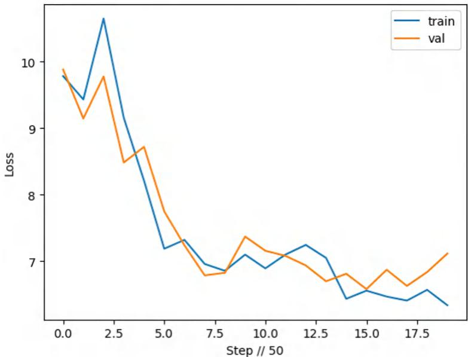  
Figure 9.2 Training a simple neural network on our dataset to generate text

go. You’ll likely get surprisingly decent results; we did. Let’s go ahead and check out what it creates when generating text:

```txt
generate(model, config=MASTER_CONFIG) # <s> Write a short story. Possible Story: 3 together thisar andze Lily said excited and smiled. Everything because he wasing loved to the time, he did not find like to', 
```

```txt
for i in GLOBAL_KEEPTRACK: print(i) # SimpleFeedForwardNN 18547809 Params | Train: 4.129 | Val: 4.458 
```

Not too shabby! Of course, these aren’t great results, but we weren’t expecting amazing results with our basic model and short training time. Reading the generated tokens, it almost makes sense. We’ll call that a win. Congratulations! We created a language model using a feed-forward network that can return tokens. Now it’s time to get into the changes that make Llama different from a regular feed-forward network.

# 9.2 Simple Llama

If you check the full weights and layers as released by Meta, you may notice that what we are building is not exactly the same as what was released. The reason for this is twofold: (1) we’d like to make sure this discussion is still very understandable for people interacting with research for production for the first time, and (2) we’re considering the environments you’ll likely have access to when reading this book. Everything here should fit

and run in Kaggle or Colab without problems. With that being the case, we’ll address differences in Llama 3’s architecture and ours so that if you did have the infra and data to replicate the paper for production, you could.2

Llama is different from a feed-forward network in a few ways: normalization, attention, activation, and number of layers. Without going too deeply into any of them, normalization helps stabilize training, attention helps support larger context lengths and uses information between layers more efficiently, activation helps represent nonlinearities better, and the number of layers increases the amount of information the model is able to represent. One other important thing to note is that we’re adding a scheduler this time around. The scheduler here is responsible for adjusting the learning rate during training, following a “schedule.” This addition helps us with potential exploding gradients and allows the model to converge more quickly.

Let’s change our network into a simpler version of Llama 3. Here, we’ll skip over some of the theory and implementation. But look at the notebook in GitHub too—we want you to test it out on your own!

Listing 9.4 Simple Llama   
class LlamaBlock(nnModule): def __init__(self, config): super().__init_(   ) self.config = config self.rms = RMSNormalization( (config["d_model"], config["d_model"])) 1 self attendsion $=$ RoPEMaskedMultiheadAttention(config).to(device) 1 self/feedforward $=$ nn.Sequential( nn.Linear(config["d_model"], config["hidden_dim"]), SwiGLU(config["hidden_dim"]), nn.Linear(config["hidden_dim"], config["d_model"]),

Unlike the original network, we’re creating a whole class for LlamaBlocks, or smaller self-contained networks within our larger one. Now we have RMSNormalization, along with RoPEMaskedMultiheadAttention and a SwiGLU activation instead of ReLU. We’ve included the implementations in the notebook, so feel free to check them out if you are curious.

You’ll notice that our forward function is very different from the original feed forward. We’re no longer just embedding and then getting the logits from the embedding. Now we’re normalizing, adding attention, normalizing again, and then adding our logits to what comes out. This process helps the model integrate more nonlinearities into its overall considerations for how the input and desired output can line up:

```python
def forward(self, x):
    x = self*rms(x)
    x = x + selfattention(x)
    x = self*rms(x)
    x = x + self/feedforward(x)
    return x 
```

Here, we can compare the original feed-forward network with this SimpleLlama class to get an idea of what’s changed overall. First, instead of only having one Sequential block of layers, we have a number of LlamaBlocks equal to n_layers in our config, which is 8, as you’ll see in the following code snippet. Beyond that, we’re using the SwiGLU activation everywhere instead of a ReLU. SwiGLU adds some ability to handle negative numbers and helps with exploding/vanishing gradients. Other than that, they’re remarkably similar:

```python
class SimpleLlama(nnModule):
    def __init__(self, config):
        super().__init()
        self.config = config
        self_embedding = nn.Embedding(
            config["vocab_size"], config["d_model"]
        )
        self.Llama_blocks = nn.Sequential(
            OrderedDict(
                (f"llama_i"), LlamaBlock(config)  ←→ New
            for i in range(config["n_layers"]
        ]
        )
    )
    self.ffn = nnSequential(
        nn.Linear(config["d_model"], config["d_model"]),  ←→ New
        SwiGLU(config["d_model"]),  ←→ New
        nn.Linear(config["d_model"], config["vocab_size"]),  )
    print(
        f"model params: {sum([m.numel() for m in self.params()}}"  )
    )
def forward(self, idx, targets=None):
    x = self_embedding(idx)
    x = self.Llama_blocks(x)  ←→ New
    logits = self.fffn(x)
    if targets is None:
        return logits
    else:
        loss = F.cross_entropy(
            logits.view(-1, self.config["vocab_size"]), 
```

```javascript
targets.view(-1), ignore_index=tokenizer_pad_token_id, return logits, loss 
```

We can make some slight adjustments to our master config to make the model bigger by increasing the embedding dimension, the number of layers, and the context window. You don’t actually have to make that change to see the performance difference. If you had the compute, data, and time, you could train a viable version of Llama 3 (you can see the results of this training in figure 9.3):

```txt
MASTER_CONFIG["epochs"] = 1000  
MASTER_CONFIG["batch_size"] = 16  
MASTER_CONFIG["d_model"] = 768  
MASTER_CONFIG["n_layers"] = 8  
MASTER_CONFIG["context_window"] = 128  
llama = SimpleLlama(MASTER_CONFIG).to(device)  
llama_optimizer = torch.optim.AdamW(  
    llama.params(),  
    betas=(0.9, 0.95),  
    weight Decay=1e-1,  
    eps=1e-9,  
    lr=5e-4,  
)  
schedule = torch.optim.lr_scheduler.CosineAnnealingLR(  
    llama_OPTimizer, 1000, eta_min=1e-5  
)  
#Epoch 0 | train loss 10.321 | val loss 10.316 | Time 0.622 | ETA:  
0:00:12.439990  
#lr: [0.0004999987909744553]  
#training loss 6.216 | validation loss: 6.046  
generate(  
    llama, config=MASTER_CONFIG,  
    temperature=1.0,  
    top_k=25,  
    max_new_tokens=50,  
)  
#!/ New  
#<s> Write a short story. Possible Story: the Story there One.t day. Back the, went to: her they Possible|. to and a said saw They:. be the She.. a. to They. they. to and to for He was a in with',',  
for i in GLOBAL_KEEPTRACK:  
print(i)  
#SimpleFeedForwardNN 18547809 Params | Train: 4.129 | Val: 4.458  
#SimpleLlama 187827210 Params | Train: 6.216 | Val: 6.046 
```

So we’ve made the $1 0 \times$ jump to over 180M parameters. Did it give us the emergent behavior we were looking for, though? If you look at the generated text, it’s making improvements in that it’s guessing punctuation more often, but almost none are in

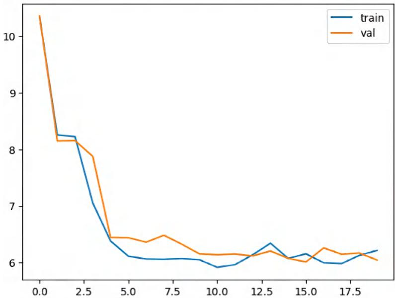  
Figure 9.3 Training simple Llama on our dataset to generate text

the correct place. The loss is higher, too, but we’re not particularly worried about that part; if we spruce up our data loading and allow the model to go all the way through the dataset two or three times, that should get lower. Lastly, if we make the model bigger by increasing the context window and number of layers, along with increasing the tokens in our dataset, we should be able to get that emergent behavior. For this dataset and config, you’d have to train $\mathord { \sim } 1 , 9 0 0$ times to go through the dataset once, so you’d have to train almost 6,000 times to start taking advantage of the whole dataset.

Given a lack of time and resources, we aren’t going to worry that our model isn’t at the top of any leaderboards. Heck, it’s not even good enough to get on one. But we have created a simple model that resembles Llama, and we have done so from scratch. This exercise has given us insights into the process, and you should have an idea of how to make it better. With these things in mind, let’s discuss how to put the model we’ve created into production.

# 9.3 Making it better

Now that we have a model and it’s passing all of our internal benchmarks (we’ll pretend that we had some), it’s time to deploy the model and see how it behaves with customers interacting with it. Oh no! The internal tests we had aren’t representative of our production environment! Our first problem is that the model is way too big and slow to even get through the prod environment tests. Models themselves are often looked at as being the main ingredient to success. In contrast, the systems we engineer around models, including the data, are overlooked because “anyone can hire a good

MLE to make those.” Unfortunately, that’s now the secret sauce that causes some companies to succeed and others to fail.

We’d like to acknowledge to everyone rushing to the comments and GitHub Issues that this model doesn’t work because that isn’t the point of this chapter, and we’d like to point you toward creators like Abi Aryan, Sebastian Raschka, and others who are covering the data science of pretraining LLMs.

NOTE If you’d like to pretrain a causal language model that generates great content, there are other great resources available. Check out these projects for more information on pretraining your own model: Llama 3 (https://mng .bz/BgAw), Megatron LM (https://mng.bz/dZdg), Hugging Face Tutorial (https://mng.bz/V2RN), and Llama2.c (https://mng.bz/x6j7).

In the spirit of continuing with data scientist–focused production advice, we’ll now cover how to make your model easier to deploy and more effective once it’s out there. Once a data scientist has trained a model and it passes the efficacy tests set, it’s time to think about size.

# 9.3.1 Quantization

The first problem you’ll definitely be up against is sheer size. Our 180M parameter model is over 700 MB on disk, which is much bigger than some companies ever plan on serving for any use case. How do you make sure it’s small enough and quick enough to run in AWS lambda or in a CPU-only instance? Compression is one way to help us out here, and quantization is something built into PyTorch! As we’ve stated before, you should get familiar with BitsandBytes, but let’s look at a quick implementation that quantizes the model after training using torch.

In the next listing, we take our model, and using PyTorch, we’ll quantize the model to INT8. The rest of the code and functions are simply to compare the model sizes before and after. The important bit is just the first couple of lines.

# Listing 9.5 Quantization

```python
llama.to("cpu")  
qconfig_dict = {  
    torch.nn.Embedding: torch_quantization.float_qparams_weight_only_qconfig,  
    torch.nn.Linear: torch_quantization.default_dynamic_qconfig,  
}  
dynamic_quantized_llama = torch_quantizationquantize_dynamic(  
    llama, qconfig_dict, dtype=torch.qint8  
)  
#SimpleLlama size: 716.504MB  
#SimpleLlama size: 18.000MB 
```

You can see at the end that we go from almost 1 GB to 18 MB on disk by just going down to INT8 quantization. And we can go even lower,3 which can help you fit almost

any model in the chosen production environment; just keep in mind that as you compress weights, perplexity goes up, resulting in less stable and predictable performance of the LLM, even with great prompt engineering.

So now that the model is small enough, the MLOps team puts it into the dev environment, and all of the tests pass, so our model finally made it to prod. All is well, right?

# 9.3.2 LoRA

What do we do when, one month down the road, we have data showing our model is unable to perform a particular task up to the standards of its environment? We have data drift, and because we’re a startup, we don’t have the money or time to go through the rigorous training process we went through before to train a model from scratch. There’s a bigger problem too: we don’t have enough new data illustrating the new distribution to finetune the model effectively. This situation is perfect for training a LoRA to tweak the model rather than spending all that time training it over again.

Listing 9.6 shows you how to train a LoRA model and the adjustments we need to make to our Llama model. This listing shows first what adding a LoRA does to the inputs as they move through the model. The LoRALayer class is shown in clear PyTorch terms by Sebastian Raschka and Lightning.AI, and they have repos going into even more depth (see https://github.com/rasbt/dora-from-scratch and https://mng.bz/Aa8e). Next, it shows how our SimpleLlama class changes after we’ve added a LoRA to it. Lastly, we’ll go through a similar training process using a new instruct dataset and a new get_batches function. As a note, we use several helper functions throughout this listing to simplify it; you can find their definitions in the repository accompanying this book.

Listing 9.6 Low-rank adaptation   
```python
class LoRALayer(nnModule): def __init__(self, in_dim, out_dim, rank, alpha): super().__init_() standard_deviation = 1 / torch.sqrt(torch.tensor(rank).float()) self.A = nn.Parameters( torch.randn(in_dim, rank) * standard_deviation) self.B = nn.Parameters(torch.zeros(rank, out_dim)) self.alpha = alpha def forward(self, x): x = self.alpha * (x @ self.A @ self.B) return x   
class LinearWithLoRA(nnModule): def __init__(self, linear, rank, alpha): super().__init_() self.linear = linear self.lora = LoRALayer( linear.in_features, linear.out_features, rank, alpha 
```

def forward(self, x): return self.linear(x) + self.lora(x)   
class LlamaBlock(nnModule): Shows how the blocks change def __init__(self, config): super().__init_(   ) self.config = config self.rms = RMSNormalization( (config["d_model"], config["d_model"])) .to(device) self attendsion $=$ RoPEMaskedMultiheadAttention(config).to(device) self/feedforward $=$ nn Sequential( LinearWithLoRA(config["d_model"], config["d_model"]), New SwiGLU(config["d_model"]), ) .to(device) def forward(self, x): x = self:rms(x) x = x + selfattention(x) x = self:rms(x) x = x + self/feedforward(x) return x class SimpleLlama(nnModule): def __init__(self, config): super().__init_(   ) self.config = config self_embedding = nn.Embedding( config["vocab_size"], config["d_model"] ) self. llama_blocks = nnSequential( OrderedDict( [ (f"llama_i"), LlamaBlock(config)) for i in range(config["n_layers"]); ] 1 ) self. ffn = nn. Sequential( LinearWithLoRA(config["d_model"], config["d_model"]), <-- New SwiGLU(config["d_model"]), LinearWithLoRA(config["d_model"], config["vocab_size"]), <-- New 1 print( f"model params: \{sum([m numel(   ) for m in self.params())\}"

```python
def forward(self, idx, targets=None):
    x = self embedding(idx)
    x = self llama_blocks(x)
    logits = self.ffn(x)
    if targets is None:
        return logits
    else:
        loss = F CROSS_entropy(
            logits.view(-1, self.config["vocab_size"]), targets.view(-1),
            ignore_index=tokenizer_pad_token_id,
            reduction="sum",
        )
    return logits, loss
dataset = load_dataset(
        "text",
        data_files={'train": [".././data/Lima-train.csv'],
        "val": [".././data/Lima-test.csv'],
        }, streaming=True,
    )
encoded_dataset = dataset.map(
        lambda examples: tokenizer(
            examples["text"], padding=True,
            max_length=128,
            truncation=True,
        ],
    ), batched=True,
    )
train_data = iter(encrypted_dataset["train"].shuffle())
val_data = iter(encrypted_dataset["val"].shuffle())
train_data = cycle(train_data)
val_data = cycle(val_data)
llama.to("cpu")
Step 1: Adds LoRA to the trained model
add_lora(llama)
llama.to(device)
parameters = [
{"params": list(get_lora.params(LLama)}]
lora_optimizer = torch.optim.AdamW parameters, lr=1e-3)
train(
    llama,
    loraOptimizer,
    scheduler,
    data=train_data,
    config=MASTER_CONFIG,
    lora=True,
    ) 
```

print_logs=True, Step5:Exports state_dict $\equiv$ llama.state_dict() 1 lora_state_dict $=$ {k:v for k,v in state_dict.items() if name_is_lora(k)} torch.save(llama.state_dict(),".llama.pth") torch.save(lora_state_dict，".lora.pth")

All of that results in two separate state dicts for us to save: the model and the LoRA. You can train LoRAs for a variety of specific tasks for which you may not have a large enough dataset to justify a whole finetuning. LoRA files on disk are usually only kilobytes even for very large models, depending on the size of the rank (in our case, 16).

You can inference using a LoRA generally in two ways: you can (1) load the original model’s state dict (ours is loaded within the llama variable), load the LoRA on top of it, and then inference as normal, or (2) merge all of the LoRA layers into the original Llama and essentially create a new model and inference normally. Here, we adopt the second option.

# Listing 9.7 Low-rank adaptation

Loading and Inferencing with LoRA   
add_lora(llama)   
_ $=$ llama.load_state_dict(lora_state_dict, strict $\equiv$ False)   
merge_lora(llama)   
generate(llama)

The generated text is

#'<s> off It the played he had cry bird dayt didn pretty Jack. a she moved day to play was andny curiousTC bandierungism feel But'

We can see that the text still isn’t as coherent as we’d like it to be; however, we can see a definite change in the generation compared to the simple Llama. No more overzealous punctuation, “cry,” and other nonhappy small story words are present, and there are more clearly made-up words. If you train on a more distinct set—say, Shakespeare— you’ll be able to see the difference even more clearly, and the nice thing about LoRA is that you can simply remove_lora() to get the original functionality back.

# 9.3.3 Fully sharded data parallel–quantized LoRA

Building upon LoRA, quantized LoRA (QLoRA) allows for efficient fine-tuning of models larger than your GPU. It does this by quantizing the model and then training a LoRA on the frozen version of that quantized model. This technique is desirable when you look at how much memory it takes to finetune full-size models, even in halfprecision. As we previously discussed, a 70B parameter model ends up being 140 GB

on disk and will take more than five times that much memory to finetune because of the dataset and gradients. With QLoRA, we can train up to 65B parameters on only 48 GB of VRAM—a very noticeable reduction. QLoRA is currently the most effective way of taking an absurdly large model and productionizing it for your use case, and it saves tons of money for that process too.

Add to this fully sharded data parallel (FSDP), and you can break the consumer versus enterprise barriers. Some of you have likely been asking where parallelism has been this whole time, and here it is. FSDP allows for both data and model parameter parallelism throughout the entire training process on multiple GPUs, and it takes care of the sharding as well as the rejoining on the other end when order and magnitude matter. It’s amazing work coming from the team that maintains PyTorch.

Previously, 48 GB for QLoRA on a 70B parameter model was only possible using an enterprise GPU like an A100. With FSDP, you can take full advantage of parallelism on consumer hardware, like two 3090s, to get the same result. FSDP is native to PyTorch! Unlike our previous efforts in this chapter, we will now abstract a script created by Jeremy Howard and Answer.AI so that you can just run it in one of the cells on a 7B parameter model. Instead of needing to clone an entire GitHub repo, you can install and import fsdp_qlora from PyPI, and we’ve recreated the importable class in the train_utils folder. This code will execute fully parallel QLoRA training on as many GPUs as you have access to.

# Listing 9.8 FSDP-QLORA training

from train_utils import FSDP_QLORA   
trainer $=$ FSDP_QLORA( model_name $\equiv$ 'meta-llama/Llama-2-7b-hf', batch_size=2, context_length=2048, precision $\equiv$ 'bf16', train_type $\equiv$ 'qlora', use_gradent_checkpointing=True, dataset $\equiv$ 'guanaco', reentrant_checkpointing=True, save_model $\equiv$ True, output_dir $\equiv$ "."   
)   
trainer.train_qlora()

The result of this running is a fully finetuned safetensors model file trained using quantized weights and parallelism. Unlike our bespoke pretrained version, this one works. The safetensors file contains a state dict file for the trained model, similar to the state dict we saved for the SimpleLlama. Both of those state dicts need to be converted into a full model file or a full checkpoint file before they can be uploaded to a place like Hugging Face; otherwise, classes like AutoModel or LlamaForCausalLM won’t be able to load your model later.

# 9.4 Deploy to a Hugging Face Hub Space

Spaces are hosted containers where you can put models to allow community access, and they can be much more than that, depending on your needs. Spaces can be the place your company uses to deploy its whole model, as opposed to other cloud-hosting options. Spaces have a free tier and many paid tiers, depending on how computeintensive your particular application is. Spaces integrate seamlessly with the most popular ML frontend stacks, namely Streamlit, Gradio, and FastAPI.

NOTE We won’t be giving examples of these ML frontend stacks here, as we’ve given them in previous chapters, but we did include an example app in the notebook for this chapter. For reference, check out the documentation for Gradio (https://www.gradio.app/guides/quickstart) and Hugging Face (https://huggingface.co/docs/hub/spaces).

With our models, we’ll need to convert their weights and directories into a format easily pushed to the Hugging Face Hub for our Space. We have an easily modified script that you can use to make this conversion. You can also run this on the simple Llama LoRA trained earlier.

Listing 9.9 Converting weights for Hugging Face   
from safetensors import safe_open   
import torch   
from transformers import LlamaForCausalLM, BitsAndBytesConfig   
from peft import get_peft_model, LoraConfig, TaskType   
tensors $= \{\}$ with safe_open( "qlora_output/model_state_dict.safetensors", framework $=$ "pt", device $= 0$ ）asf: fork in f_keys(): tensors[k] $=$ f.get_tensor(k)   
for k in tensors: if 'lora' not in k: tensors[k] $=$ None   
bnb_config $=$ BitsAndBytesConfig( load_in_4bit $=$ True, bnb_4bit_quant_type $=$ "nf4", bnb_4bit_use-double_quant $=$ False, bnb_4bit_compute_dtype $=$ torch.bfloat16   
) model $=$ LlamaForCausalLM.from_pretrained( "meta-llama/Llama-2-7b-hf", use_cache $=$ False, quantization_config $\equiv$ bnb_config

```python
for param in model.params():  
    paramrequires_grad = False  
peft_config = LoraConfig(task_type=TaskType.CAUSAL_LM, inference_mode=False, r=64, lora_alpha=16, lora_dropout=0.1, target Modules=[ "kProj", "qProj", "vProj", "upProj", "downProj", "gateProj"]  
)  
model = get_peft_model(model, peft_config)  
list(model.state_dict().keys())[:10]  
new_sd = model.state_dict()  
for k in new_sd:  
    if 'lora' in k:  
        new_sd[k] = tensors[k]  
model.load_state_dict(new_sd)  
model.save_pretrained("lora_adapters") 
```

If you already have a repo and are logged in to your Hugging Face account, you can go ahead and run model.push_to_hub(). This will create a repo for your model if it doesn’t already exist. The reason you would or wouldn’t push to the hub has to do with whether you want to share your model with the world. If you’d rather have a space where others can try out your model (even for free), we’ll show how to do that next.

The first decisions to be made for a Space are how much compute your app requires and how you’ll maintain the code for the Space—with Git or with huggingface-cli. The first question starts with whether a GPU is required for your particular use case; for ours, it is not. However, when you need a speed or scale increase, you will likely need it, especially if you get into multiprocessing to get more performance out of the Space. Once you have your app and you’ve figured out your memory requirements, if you’ve decided to use Git, you’ll make your Space on Hugging Face, and then you’ll clone it the same way you would something on GitHub:

$ git clone https://huggingface.co/spaces/your-username/your-space

Adding, committing, and pushing are the same as well:

```shell
$ git add files-you-need
$ git commit -m "Initial Commit"
$ git push 
```

If you’re not doing it through the CLI, the following listing shows you how.

Listing 9.10 Hugging Face Space   
pip install huggingface hubs -q   
from huggingface_hub import notebook_login, HfApi   
notebook_login() #OR huggingface-cli login If you haven't created api $=$ HfApi() api.create(repo repo( repo_id $\equiv$ "your_username/your Repo",repo_type $\equiv$ "space",spacesdk $\equiv$ "gradio" ）   
stuff_to_save $= [$ "llama.pth",# Your model "lora.pth",# Optional:Your LoRA "special_tokens_map.json", "tokenizer_config.json", "tokenizer.json", "tokenizer.model", "gradio_app.py",   
]   
for thing in stuff_to_save: api.upload_file( path_or_fileobj $\equiv$ f".llama2/{thing}", path_in Repo $\equiv$ thing, repo_id $\equiv$ "your_username/your Repo", repo_type $\equiv$ "space",

# Hugging Face Spaces

The models, as we currently have them, require GPUs to load (especially quantized) and run. If you attempt to run on the free tier of HF Spaces, it will error out, as it did for us. You can fix this by upgrading to a paid tier or ZeroGPU. Hugging Face provides a version of a Gradio app that uses its own API only to provision a GPU for the amount of time it takes to complete a task and only when it’s requested. See https://mng .bz/XV11.

As an exercise, we encourage you to think through and build out how you might be able to create a Hugging Face Space using our LLM that would run on the free tier, which is considerably easier than when we were first writing this, thanks to ZeroGPU.

And there we have it—a fully functioning hosted instance of any model you want to use or train. You can run either of the two Llama models we trained in the Space, but you’ll need to do a bit of engineering around it depending on your needs. Congratulations on finishing the first project if you ran all of this code with your own environment! This was one of the denser chapters, and making it through with a working

example is something to be proud of. Hugging Face provides private solutions to enterprises looking to use Spaces long term, and this is a completely viable production environment.

# Summary

 Choosing an appropriate tokenizer and embedding strategy is one of the first crucial decisions you’ll make when creating a model from scratch, as it determines what the model will see and, therefore, is capable of.   
 Your unique data sources future-proof your model.   
 The main differences between Llama and a simple feed-forward are the normalization, attention, activation layers, and number of layers.   
 Often, the first challenge to productionizing an LLM is its size: quantization to the rescue!   
 In production, it’s only a matter of time before you’ll need to update the model. LoRA and QLoRA are perfect solutions to make minor tweaks to your model.   
1 Fully sharded data parallelism allows us to train QLoRA models cheaply on consumer hardware.   
 A great option to deploy and share your LLM project is Hugging Face Hub Spaces due to their ease of use.