# Creating a coding copilot project: This would have helped you earlier

# This chapter covers

 Deploying a coding model to an API   
 Setting up a VectorDB locally and using it for a retrieval-augmented generation system   
Building a VS Code extension to use our LLM service   
 Insights and lessons learned from the project

Progress doesn’t come from early risers—progress is made by lazy men looking for easier ways to do things.

—Robert Heinlein

If you touch code for your day job, you’ve probably dreamed about having an AI assistant helping you out. In fact, maybe you already do. With tools like GitHub Copilot out on the market, we have seen LLMs take autocomplete to the next level. However, not every company is happy with the offerings on the market, and not every enthusiast can afford them. So let’s build our own!

In this chapter, we will build a Visual Studio Code (VS Code) extension that will allow us to use our LLM in the code editor. The editor of choice will be VS Code, as it is a popular open source code editor. Popular might be an understatement, as

the Stack Overflow 2023 Developer Survey showed it’s the preferred editor for $8 1 \%$ of developers.1 It’s essentially a lightweight version of Visual Studio, which is a full IDE that’s been around since 1997.

Beyond just choosing a specific editor, we will also make some other judicious decisions to limit the scope of the project and make it more meaningful. For example, in the last project, we focused on building an awesome LLM model we could deploy. In this project, we will instead be starting with an open source model that has already been trained on coding problems. To customize it, instead of finetuning, we’ll build a RAG system around it, which will allow us to keep it up to date more easily. Also, since we aren’t training our own model, we’ll focus on building a copilot that is good at Python, the main language we’ve used throughout this book, and not worry about every language out there.

Now that we have a clear idea of what we are building and a goal in mind, let’s get to it!

# 10.1 Our model

Since we are only going to be focusing on Python, we decided to use DeciCoder as our model. DeciCoder is a commercial open source model that has only 1B parameters.2 Despite its tiny size, it’s really good at what it does. It has been trained on the Stack dataset but filtered to only include Python, Java, and JavaScript code. It’s only trained on three languages, which would typically be a limitation, but it is actually part of the secret sauce of why it’s so good despite its small size.

Some other limitations to be aware of are that it only has a context window of 2,048 tokens, which isn’t bad for a model of this size, but it is relatively small when we consider that we plan to use a RAG system and will need to give it examples of code. Code samples tend to be quite large, which limits what we can do and how many examples we can give it.

A bigger problem using DeciCoder with RAG is that the model wasn’t instruction tuned. Instead, it was designed to beat the HumanEval dataset (https://github.com/ openai/human-eval). In this evaluation dataset, a model is given only a function name and docstring describing what the function should do. From just this input, the model will generate functioning code to complete the function. As a result, it’s hard to know if giving the model more context from a RAG system will help it, but we’re going to go ahead and try to find out!

Lastly, its tiny size actually makes it an interesting choice for another reason. Because it’s so small, we could potentially put the model right inside the VS Code extension we are building, using compiling methods we’ve discussed in other chapters. This would allow us to build a very compact application! We won’t be doing that

in this book, mostly because it would require us to write a lot of JavaScript. That’s a problem because we only expect our readers to be familiar with Python, so it’s a tad too adventurous here to explain the details in-depth, but we leave it as an exercise for the readers who are JavaScript pros.

What we will do instead is serve our model as an API that you can run locally and will be able to call from the extension. In listing 10.1, we create a simple FastAPI service to serve our model. In fact, most of this code you’ve already seen back in chapter 6, and we have only made a few slight changes. The first is that we have changed the code to use the DeciCoder model and tokenizer. The second is a bit more involved, but we have added stop tokens. These are tokens that will inform the model to stop generating when it runs into them. This is done by creating a StoppingCriteria class. The tokens we have chosen will make a bit more sense once we’ve defined our prompt, but essentially, we are looking to have our model create one function at a time.

Listing 10.1 A simple FastAPI endpoint using DeciCoder   
import argparse   
from fastapi import FastAPI, Request   
from fastapiresponses import Response   
import torch   
import unicorn   
from transformers import ( AutoModelForCausalLM, AutoTokenizer, StoppingCriteria, StoppingCriteriaList, )   
torch)Vibards.cuda.enabled_mem_efficient_sdpFalse) Torch settings torch)Vibards.cuda.enabled_FLASH_sdp(False) device $=$ torchdevice("cuda"iftorch.cuda.is-available()else"cpu") stop_tokens $\equiv$ ["def","class","Instruction","Output"] Definesthestop token_ids $= [589,823,9597,2301]$ 1 classStopOnTokens(StoppingCriteria): def__call_( self, input_ids:torch.LongTensor, scores:torchFloatTensor, \*\*kwargs,) -> bool: stop_ids $=$ stop_token_ids for stop_id in stop_ids: if input_ids[0][-1] $= =$ stop_id:

return True   
return False   
Loads tokenizer and models   
tokenizer $=$ AutoTokenizer.from_pretrained("Deci/DeciCoder-1b")   
tokenizer.add_special_tokens( {"additional_special_tokens":stop_tokens}, replace(additional_special_tokens $\equiv$ False,   
}   
model $=$ AutoModelForCausalLM.from_pretrained( "Deci/DeciCoder-1b",torch_dtype $\equiv$ torch.bfloat16,trust_remote_code $\equiv$ True   
}   
model $=$ model.to(device)   
app $=$ FastAPI() Runs FastAPI   
@app.post("/generate")   
async def generate(request:Request) -> Response: """Generate LLM Response The request should be a JSON object with the following fields: - prompt: the prompt to use for the generation. """ request_dict $=$ await request.json() prompt $=$ request_dict.pop("prompt") # RAG will go here. inputs $=$ tokenizer prompt, return tensors="pt").to(device) RGenerates response response_tokens $=$ model_generate( inputs["input_ids"], max_new_tokens=1024, stopping criteria $\coloneqq$ StoppingCriteriaList([StopOnTokens]), input_length $=$ inputs["input_ids"].shape[1] response $=$ tokenizerdecode( response_tokens[0][input_length]:,skip_special_tokens=True ) return response   
if _name $\equiv$ __main_: Starts service; defaults to localhost on port 8000   
parser $=$ argparse.ArgumentParser() parser.add_argent("--host",type $\equiv$ str,default=None) parser.add_argent("--port",type $\equiv$ int,default $= 8000$ args $=$ parser.parse_args() uvicorn.run(app, host $\equiv$ args.host, port $\equiv$ args.port, log_level $\equiv$ "debug")

Assuming this listing is in a Python script server.py, you can start up the server by running $\$ 5$ python server.py. Once you have it up and running, let’s go ahead and make

sure it’s working correctly by sending it a request. In a new terminal, we can send the API a curl request with a simple prompt:

$ curl --request POST --header "Content-Type: application/json" --data

➥ '{"prompt":"def hello_world(name):"}' http://localhost:8000/generate

The response should be a simple Python function to complete a “Hello World” function. The response we got back from the server was return f"Hello {name}!". So far, so good! Next, we’ll customize the API to utilize a RAG system.

# 10.2 Data is king

Now that we have decided on a model, let’s prepare a dataset for our RAG system. RAG is an effective way to introduce context to our model without having to finetune it; it also allows us to customize the results based on our data. Essentially, RAG is a good system to follow if you want your model to know the context of your organization’s ever-changing code base. It’s great to have a model that’s good at coding, but we want it to be good at our code. We want it to use the right variable names and import custom dependencies built in-house—that sort of thing. In this section, we’ll set up a VectorDB, upload a Python coding dataset, and then update the API we just built to utilize it all.

# 10.2.1 Our VectorDB

Before we can really dive into our dataset, we need to first set up our infrastructure. Of course, if your dataset is small enough, it is possible to load it into memory and run similarity search with tools like Faiss or USearch directly in Python, but where’s the fun in that? Plus, we want to show you Milvus.

Milvus is an awesome open source VectorDB that competes with the big players in this space. You can run it locally or across a large cloud cluster, so it scales easily to your needs. If you’d rather not deal with the setup, there are managed Milvus clusters available. One of my favorite features is its GPU-enabled version, which makes vector search lightning fast.

Thankfully, the community has also made Milvus extremely approachable and easy to set up. In fact, the standalone version only requires Docker to run and comes with a startup script to make it even easier. Since we are going to run everything locally for this project, we will use the standalone version (to learn more, see https://mng.bz/ aVE9). To do so, we need to run the following commands in a terminal:

$ wget https://raw.githubusercontent.com/milvus-io/milvus/master/scripts/

➥ standalone_embed.sh

$ bash standalone_embed.sh start

The first command will download a shell script, and the second will run it. This script is really only out of convenience since the Docker run command gets rather long. It

also includes two more commands you should know about. The Stop command, which will stop your Milvus docker container, is

$ bash standalone_embed.sh stop

and the delete command, which will delete all the data from your computer when you no longer wish to keep it, is

$ bash standalone_embed.sh delete

You don’t need to run those yet, but remember them for when we are done. Now that we have our database set up, let’s make it useful and load some data into it.

# 10.2.2 Our dataset

If this were a workshop, we’d show you how to write a script to pull your organization’s code from GitHub and use that to augment your prompts. We could even set up a GitHub Actions pipeline to update our VectorDB with your code whenever it merges into the main branch. But since we don’t have access to your code and this is only a book, we’ll do the reasonable thing and use an open source dataset.

We will choose the Alpaca dataset for our project. The Alpaca dataset was compiled by Stanford when it trained the model of the same name using distillation and GPT-3 as the mentor model. Since it’s synthetic data, the dataset is extremely clean, making it easy to work with. In fact, it’s so easy that multiple copies online have already filtered out all the Python code examples. This subset comprises 18.6K Python coding challenges, consisting of a task or instruction and generated code—perfect for what we are trying to accomplish.

In listing 10.2, we create our pipeline to load the dataset into Milvus. We create a PythonCodeIngestion class to handle the details of chunking our dataset and uploading it in batches. Note that we use the krlvi/sentence-t5-base-nlpl-code_search_ net embedding model. This embedding model has been specifically trained on the CodeSearchNet dataset (https://github.com/github/CodeSearchNet) and is excellent for creating meaningful embeddings of code.

# Listing 10.2 A data pipeline to ingest Alpaca

```python
from pymilvus import (
    connections,
    utility,
    FieldSchema,
    CollectionSchema,
    DataType,
    Collection,
) 
from transformers import AutoTokenizer
from datasets import load_dataset 
```

from langchain.text_splitter import RecursiveCharacterTextSplitter from sentence_transformers import SentenceTransformer

from tqdm.auto import tqdm from uuid import uuid4

connections.connect("default", host $=$ "localhost", port $=$ "19530") Connects to Milvus

class PythonCodeIngestion:   
def __init__(   
self,   
collection,   
python_code=None,   
embedder=None,   
tokenizer=None,   
text_splitter=None,   
batch_limit=100,   
):   
self.collectionation $=$ collection   
self.python_code $=$ python_code or load_dataset( "iamtarun/python_code Instructions_18k_alpaca", split $=$ "train",   
)   
self_embedding $=$ embedder or SentenceTransformerer( "krlvi/sentence-t5-base-nlpl-code_search_net"   
)   
selftokenizer $=$ tokenizer or AutoTokenizer.from_pretrained( "Deci/DeciCoder-1b"   
)   
self.text_splitter $=$ ( text_splitter or RecursiveCharacterTextSplitter( chunk_size=400, chunk_overlap=20, length_function $\equiv$ self_token_length, separators $=$ ["\\n\\n","\\n","\"","\"],   
）   
)   
self.batch_limit $=$ batch_limit

```python
def token_length(self,text):
    tokens = selftokenizer.encode(text)
    return len(tokens)  
def get_metadata(self, page):
    return {
        "instruction": page["instruction"]
        "input": page["input"]
        "output": page["output"]
    }  
def splittexts_and_metadatas(self, page):
    basic_metadata = self.get_metadata(page) 
```

prompts $=$ self.text_splitter.split_text(page["prompt"]）metadatas $= [$ {"chunk":j,"prompt":prompt，\*\*basic_metadata}for j,prompt in enumerate(prompts)1return prompts,metadatas   
def upload_batch(self,textst,metadatas):ids $=$ [str(uuid4()）for_in range(lentexts)]embeddings $=$ self_embedding.encodetexts)self.collection.insert([ids,embeddings,metadatas])   
def batch_upload(self):batchtexts $= []$ batch_metadatas $= []$ for page in tqdm(self.python_code):texts，metadatas $=$ self.splittexts_and_metadatas(page)batchtexts extendtexts)batch_metadatas extend(metadatas)iflen(batchtexts) $\rightharpoondown$ self.batch_limit:self.upload_batch(batchtexts,batch_metadatas)batchtexts $= []$ batch_metadatas $= []$ iflen(batchtexts) $>0$ ：self.upload_batch(batchtexts,batch_metadatas)   
self.collection.flush()

Now that we have our ingestion class created, we can move forward with the pipeline. First, we’ll need to create our collection if this is the first time we’ve run it. A collection is like a table in other databases or an index in Pinecone. We’ll define our schema, which is simply an ID field, our embeddings field, and a metadata field, which contains freeform JSON. Once that’s set, we’ll upload our data using our PythonCode-Ingestion class.

Next, we need to create our search index. The index type we’ll use is IVF_FLAT, which is the most basic index in Milvus and splits the embedding space into nlist number of clusters. This accelerates the similarity search by first comparing our search embedding against the cluster centers and then against the embedding in the cluster it is closest to. We will also use L2 for our metric type, which means we’ll be using Euclidean distance. These are common settings, but we don’t need anything special for our dataset. Milvus supports a larger selection of options when building an index, and we encourage you to check out their documentation:

```python
if _name_ == "main": collection_name = "milvus_11m_example" dim = 768 
```

```python
if utility.has.collection(collection_name):
    utility.drop.collection(collection_name)  
fields = [FieldSchema(
    name="ids",
    dtype=DataType.VARCHAR,
    is_primary=True,
    auto_id=False,
    max_length=36,
),
    FieldSchema(
        name="embeddings",
        dtype的数据Type.FLOAT_VECTOR, dim=dim
    ),
    FieldSchema(name="metadata", dtype的数据Type.json),  
] schema = CollectionSchema(
    fields, f{"collection_name"} is collection of python code prompts" 
) print(f"Create collection {collection_name}") 
collection = Collection(collection_name, schema) 
collection = Collection(collection_name) 
print(collection.num Entities) 
python_code_ingestion = PythonCodeIngestion(collection) 
python_code_ingestion.batch_upload()
print(collection.num Entities) 
search_index = {
    "index_type": "IVF_FLAT",
    "metric_type": "L2",
    "params": {"nlist": 128}, 
} 
collection.create_index("embeddings", search_index) 
```

Now that everything is set up, we are good to move on to the next step. But first, let’s test it by running a query. We’ll want to make sure our data and index are giving us reasonable search results. With Milvus, we’ll first load the collection into memory and convert our query into an embedding with our embedder. Next, we’ll define some search parameters. Again, L2 stands for Euclidean distance, and the nprobe parameter states how many clusters to search. In our case, of the 128 clusters we set up, we’ll search the 10 closest ones to our query embedding. Lastly, in the actual search, we’ll limit our results to the three best matches and return the metadata field along with our queries:

collection.load() Before conducting a search, you need to load the data into memory. query $=$ ( Makes a query "Construct a neural network model in Python to classify "

"the MNIST data set correctly."   
}   
search_embedding $\equiv$ python_code_ingestion_embedding.encode(query)   
search.params $=$ { "metric_type": "L2", "params": {"nprobe": 10}, The number of   
} results $=$ collection.search( [search_embedding], "embeddings", search.params, limit=3, output_fields $\coloneqq$ ["metadata"],   
） for hits in results: for hit in hits: print (hitdistance) print (hitentity_metadata["instruction"]）

You can see that for our query, the search results are returning strong candidates from our dataset:

0.7066953182220459  
# Create a neural network in Python to identify  
# hand-written digits from the MNIST dataset.  
# 0.7366453409194946  
# Create a question-answering system using Python  
# and Natural Language Processing.  
# 0.7389795184135437  
# Write a Python program to create a neural network model that can  
# classify handwritten digits (0-9) with at least $95\%$ accuracy.

Now that we have our VectorDB set up with data loaded in, let’s update our API to retrieve results from our RAG system and inject the context into our prompts.

# 10.2.3 Using RAG

In this section, we will update listing 10.1 to include our retrieval code. In listing 10.3, we won’t be repeating everything we did before, in the interests of time and space, but will simply be showing the new parts to add. In the repo accompanying this book, you’ll be able to find the code that puts everything together if you are struggling to understand which piece goes where. First, near the top of the script, we’ll need to add our imports, connect to our Milvus service, and load our embedding model.

# Listing 10.3 Adding RAG to our API

```python
from contextlib import asynccontextmanager   
from pymilvus import ( connections, Collection,   
)   
from sentence_transformers import SentenceTransformer 
```

connections.connect("default",host="localhost",port="19530") Connects to Milvus   
collection_name $=$ "milvus_1lm_example"   
collection $=$ Collection(collection_name)   
embedder $=$ SentenceTransformer( Loads our embedding model   
"krlvi/sentence-t5-base-nlp1-code_search_net"   
)   
embedder $=$ embedder.to(device)

Next, we’ll add some convenience functions, including a token counter and a FastAPI lifecycle, to ensure we load and release our Milvus collection from memory. Since we are adding a lifecycle, be sure to update the FastAPI call:

def token_length(text): tokens $=$ tokenizer([text],return_tensors $\equiv$ "pt") return tokens["input_ids"].shape[1] @asynccontextmanager async def lifespan(app:FastAPI): collection.load() yield collection.release() 1 Releases collection from memory on shutdown app $=$ FastAPI(lifespan $\equiv$ lifespan) Runs FastAPI

Now that we have all that set up, we can get to the good part—running the query and updating our prompt in our generate endpoint. The first part should look familiar since we just did it. We’ll encode the user’s prompt and search our collection for the nearest neighbors. We’re using all the same search parameters as before, except one. We increase our limit from 3 to 5 to potentially add more examples to our prompt. Next, we take those results and format them into a few-shot prompt example dataset. Then we create our instruction prompt and format the user’s input.

We are almost at the point where we can combine our instruction, examples, and user prompt; however, we need to ensure our examples don’t take up too much space. Using a for loop utilizing our token counter, we’ll filter out any examples that don’t fit our context window. With that, we can now combine everything to create our final prompt for our DeciCoder model:

request_dict = await request.json() Inside the   
prompt $=$ request_dict.pop("prompt") generate function   
search_embedding $=$ embedder.encode_prompt) Makes a query   
search_parameters $=$ { "metric_type": "L2", "params": {"nPprobe": 10},

```python
results = collection.search(
    [search_embedding],
    "embeddings",
    search.params,
    limit=5,
    output_fields=['metadata'],
)
)  
examples = []
for hits in results:
    for hit in hits:
        metadata = hit-entity_metadata
        examples.append(
            f"Instruction: {metadata['instruction']} \n"
            f"Output: {metadata['output']} \n\n")  
prompt Instruction = (
    "You are an expert software engineer who specializes in Python."
    "Write python code to fulfill the request from the user.\n\n")
prompt_user = f"Instruction: {prompt} \nOutput: "
max_tokens = 2048
token_count = token_length(prompt Instruction+prompt_user)  
prompt/examples = ""
for example in examples:
    token_count += token_length的例子
    if token_count < max_tokens:
        prompt Examples += example
    else:
        break
full_prompt = f"[prompt Instruction]{prompt/examples}{prompt_user}"  
inputs = tokenizer(full_prompt, return Sensors="pt").to(device) 
```

Alright! Now that we’ve made our updates to our API, let’s start it up and test it again like we did before. We’ll send another request to the server to make sure everything is still working:

```shell
$ curl --request POST --header "Content-Type: application/json" --data'{"prompt":"def hello_world(name):"}' http://localhost:8000 generate 
```

This time we got a response of print(“Hello, World!”), which is slightly worse than our previous response, but it’s still in the same vein, so there’s nothing to be worried about. You’ll likely get something similar. And that concludes setting up our LLM service with a RAG system for customization. All we need to do now is call it.

# 10.3 Build the VS Code extension

Alright, now all we need to do is build our VS Code extension. VS Code extensions are written primarily in TypeScript or JavaScript (JS). If you aren’t familiar with these languages, don’t worry; we’ll walk you through it. To get started, you’ll need Node and npm installed. Node is the JS interpreter, and npm is like pip for JS. You can add these tools in multiple ways, but we recommend first installing nvm or another node version manager. It’s also a good idea at this time to update your VS Code (or install it if you haven’t already). Updating your editor will help you avoid many problems, so be sure to do it. From here, we can install the VS Code extension template generator:

```txt
$ npm install -g yo generator-code 
```

NOTE You can find the instructions to install nvm here: https://mng.bz/ gAv8. Then simply run nvm install node to install the latest versions of Node and npm.

The template generator will create a basic “Hello World” project repo for us that we can use as scaffolding to build off of. To run the generator, use

```txt
$ yo code 
```

This command will start a walkthrough in your terminal, where you’ll be greeted by what appears to us to be an ASCII art representation of a Canadian Mountie who will ask you several questions to customize the scaffolding being generated.

In figure 10.1, you can see an example with our selected answers to the walkthrough questions. Guiding you through the questions quickly, we’ll create a new JavaScript extension, which you can name whatever you like. We chose llm_coding_ copilot, if you’d like to follow along with us. For the identifier, press Enter, and it will hyphenate the name you chose. Give it a description; anything will do. No, we don’t want to enable type-checking. You can choose whether to initialize the project

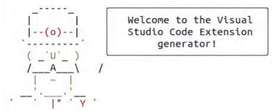  
Figure 10.1 The VS Code extension generator with example inputs

```txt
? What type of extension do you want to create? New Extension (JavaScript)  
? What's the name of your extension? lmm_coding_copilot  
? What's the identifier of your extension? lmm-Coding-copilot  
? What's the description of your extension? VSCode extension to add LLM code suggestions inline.  
? Enable JavaScript type checking in 'jsconfig.json'? No  
? Initialize a git repository? No  
? Which package manager to use? rpm 
```

as a new Git repository. We chose No, since we are already working in one. Lastly, we’ll use npm.

When it’s done, it will generate a project repository with all the files we need. If you look at figure 10.2, you can see an example of a built project repository. It has several different configuration files, which you are welcome to familiarize yourself with, but we only care about two of these files: the package.json file where we define the extension manifest, which tells VS Code how to use the extension we will build to (well, actually extend VS Code), and the extension.js file, which holds the actual extension code.

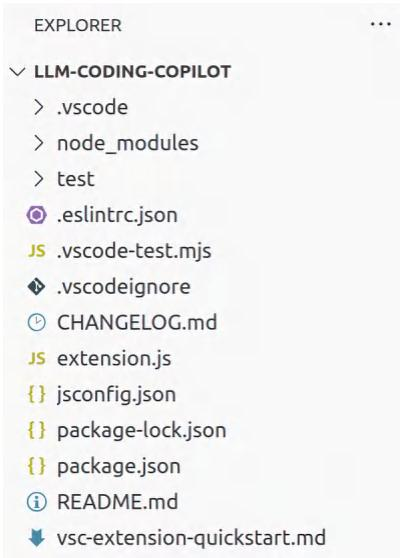  
Figure 10.2 Example directory structure created with the VS Code extension generator

In the package.json file, the boilerplate gets us almost all the way there, but the activationEvents field is currently empty and needs to be set. This field tells VS Code when to start up our extension. Extensions typically aren’t loaded when you open VS Code, which helps keep it lightweight. If it’s not set, the extension will only be loaded when the user opens it, which can be a pain. A smart strategy typically is to load the extension only when the user opens a file of the type we care about—for example, if we were building a Python-specific extension, it would only load when a .py file is opened.

We will use the "onCommand:editor.action.inlineSuggest.trigger" event trigger. This trigger fires when a user manually asks for an inline suggestion. It typically fires whenever a user stops typing, but we want more control over the process to avoid sending unnecessary requests to our LLM service. There’s just one problem: VS Code doesn’t have a default shortcut key for users to manually do this! Thankfully, we can set this too by adding a "keybindings" field to the "contributes" section. We will set it to the keybindings of Alt+S. We are using S for “suggestion” to be memorable; this keybinding should be available unless another extension is using it. Users can

always customize their keybindings regardless. You can see the finished package.json file in the following listing. It should look very similar to what we started with from the scaffolding.

Listing 10.4 Extension manifest for our coding copilot   
```json
{ "name": "llm-coding-copilot", "displayName": "llm_coding_copilot", "description": "VSCode extension to add LLM code suggestions inline.", "version": "0.0.1", "engines": { "vscode": "\^1.86.0" }, "categories": [ "Other" ], "activationEvents": [ "onCommand:editor.action.inlineSuggest.trigger" ], "main": "./extension.js", "contributes": { "commands": [[ "command": "llm-coding-copilot.helloWorld", "title": "Hello World"] ], "key bindings": [[ "key": "Alt+s", "command": "editor.action.inlineSuggest.trigger", "mac": "Alt+s"] ] }, "scripts": { "lint": "eslint .", "pretest": "npm run lint", "test": "vscode-test" }, "devDependencies": { "@types/vscode": "\^1.86.0", "@types/mocha": "\^10.0.6", "@types/node": "18.x", "eslint": "\^8.56.0", "typescript": "\^5.3.3", "@vscode/test-cli": "\^0.0.4", "@vscode/test-electron": "\^2.3.8" } } 
```

Now that we have an extension manifest file, let’s go ahead and test it. From your project repo in VS Code, you can press F5 to compile your extension and launch a new VS Code Extension Development Host window with your extension installed. In the new window, you should be able to press Alt+S to trigger an inline suggestion. If

everything is working, then you’ll see a console log in the original window that states, Congratulations, your extension "llm-coding-copilot" is now active!, as shown in figure 10.3.

```txt
PROBLEMS OUTPUT DEBUG CONSOLE TERMINAL PORTS Congratulations, your extension "llm-coding-copilot" is now active! 
```

Figure 10.3 Example console of successfully activating our VS Code extension

Alright, not bad! We can now both run our extension and activate it, as well as capture the logs, which is helpful for debugging. Now all we need to do is build it, so let’s turn our attention to the extension.js file.

At this point, things get a bit tricky to explain. Even for our readers who are familiar with JavaScript, it’s unlikely many are familiar with the VS Code API (https://mng .bz/eVoG). Before we get into the weeds, let’s remind ourselves what we are building. This will be an extension in VS Code that will give us coding suggestions. We already have an LLM trained on code data behind an API that is ready for us. We have a dataset in a RAG system loaded to give context and improve results, and we have our prompt crafted. All we need to do is build the extension that will call our API service. But we also want something that allows users an easy way to interact with our model that gives us lots of control. We will do this by allowing a user to highlight portions of the code, and we’ll send that when our shortcut keybindings, Alt+S, are pressed.

Let’s take a look at the template extension.js file that the generator created for us. Listing 10.5 shows us the template with the comments changed for simplicity. It simply loads the vscode library and defines activate and deactivate functions that run when you start the extension. The activate function demonstrates how to create and register a new command, but we won’t be using it. Instead of a command, we will create an inline suggestion provider and register it.

# Listing 10.5 Boilerplate extension.js from template

```javascript
// Import VSCode API library  
const vscode = require('vscode');  
// This method is called when your extension is activated  
function activate(context) { console.log('Congratulations, your extension "llm-coding-copilot" is now active!'); // This creates and registers a new command, matching package.json // But we won't use it! let disposable = vscode COMMANDS.registerCommand('llm-coding-copilot.helloWorld', function() { 
```

// The code you place here will be executed every time your command is $\Rightarrow$ executed // Display a message box to the user  
vscodewindow.showInformationMessage('Hello World from 11m_coding_  
copilot!'); }; contextsubscriptions.push(disposable); } // This method is called when your extension is deactivated  
function deactivate(){ module.exports $=$ { activate, deactivate }

Since we won’t be using commands, let’s take a look at what we will be using instead, an inline suggestion provider. This provider will add our suggestions as ghost text where the cursor is. This allows the user to preview what is generated and then accept the suggestion with a tab or reject it with another action. Essentially, it is doing all the heavy lifting for the user interface in the code completion extension we are building.

In listing 10.6, we show you how to create and register a provider, which returns inline completion items. It will be an array of potential items the user may cycle through to select the best option, but for our extension, we’ll keep things simple by only returning one suggestion. The provider takes in several arguments that are automatically passed in, like the document the inline suggestion is requested for, the position of the user’s cursor, context on how the provider was called (manually or automatically), and a cancel token. Lastly, we’ll register the provider, telling VS Code which types of documents to call it for; here, we give examples of registering it to only Python files or adding it to everything.

Listing 10.6 Example inline suggestion provider   
// Create inline completion provider, this makes suggestions inline const provider $=$ { provideInlineCompletionItems: async ( document, position, context, token $\mathbf{\beta}) = >\{$ // Inline suggestion code goes here } };   
// Add provider to Python files vscodelanguages.registererInlineCompletionItemProvider( { scheme:'file', language:'python'}, provider );

```javascript
// Example of adding provider to all languages  
vscodelanguages.registerInlineCompletionItemProvider( { pattern:'**', provider }); 
```

Now that we have a provider, we need a way to grab the user’s highlighted text to send it to the LLM service and ensure our provider only runs when manually triggered via the keybindings, not automatically, which happens every time the user stops typing. In listing 10.7, we add this piece to the equation inside our provider.

First, we grab the editor window and anything selected or highlighted. Then we determine whether the provider was called because it was automatically or manually triggered. Next, we do a little trick for a better user experience. If our users highlight their code backward to forward, the cursor will be at the front of their code, and our code suggestion won’t be displayed. So we’ll re-highlight the selection, which will put the cursor at the end, and retrigger the inline suggestion. Thankfully, this retriggering will also be counted as a manual trigger. Lastly, if everything is in order—the inline suggestion was called manually, we have highlighted text, and our cursor is in the right location—then we’ll go ahead and start the process of using our LLM code copilot by grabbing the highlighted text from the selection.

Listing 10.7 Working with the VS Code API   
// Create inline completion provider, this makes suggestions inline const provider $=$ { provideInlineCompletionItems: async ( document, position, context, token } $\Rightarrow$ { // Grab VSCode editor and selection const editor $=$ vscodewindow.activeTextEditor; const selection $=$ editor-selection; const triggerKindManual $= 0$ const manuallyTriggered $=$ context_triggerKind $= =$ triggerKindManual   
// If highlighted back to front, put cursor at the end and rerun if (manuallyTriggered && position.isEqual(selection.start)) { editor-selection $=$ new vscode.Selection( selection.start, selection.end ) vscode COMMANDs被执行Command( "editor.action在线Suggest.trigger" ） return []   
}   
// On activation send highlighted text to LLM for suggestions if (manuallyTriggered && selection && !selection.isEmpty) { // Grab highlighted text const selectionRange $=$ new vscode.Range( selection.start, selection.end

}; const highlighted $=$ editor.document.getText(selectionRange); // Send highlighted code to LLM } } };

Alright! Now that we have all the VS Code–specific code out of the way, we just need to make a request to our LLM service. This action should feel like familiar territory at this point; in fact, we’ll use the code we’ve already discussed in chapter 7. Nothing to fear here! In the next listing, we finish the provider by grabbing the highlighted text and using an async fetch request to send it to our API. Then we take the response and return it to the user.

Listing 10.8 Sending a request to our coding copilot   
```javascript
// On activation send highlighted text to LLM for suggestions  
if (manuallyTriggered && selection && !selection.isEmpty) { // Grab highlighted text  
const selectionRange = new vscode.Range(  
  selection.start, selection.end);  
const highlighted = editor.document.getText(  
  selectionRange);  
// Send highlighted text to LLM API  
var payload = {  
  prompt: highlighted};  
const response = await fetch(  
  'http://localhost:8000/generate', {  
    method: 'POST',  
    headers: {  
        'Content-Type': 'application/json',  
      },  
    body: JSON.stringify毫不犹豫),  
});  
// Return response as suggestion to VSCode editor  
var responseText = await response.text();  
range = new vscode.Range(selection.end, selection.end)  
return new Promise(resolve => {  
    resolve([\{insertText: responseText, range}]])  
}) 
```

Now that all the pieces are in place, let’s see it in action. Press F5 again to compile your extension anew, launching another VS Code Extension Development Host window

with our updated extension installed. Create a new Python file with a .py extension, and start typing out some code. When you’re ready, highlight the portion you’d like to get your copilot’s help with, and press Alt+S to get a suggestion. After a little bit, you should see some ghost text pop up with the copilot’s suggestion. If you like it, press Tab to accept. Figure 10.4 shows an example of our VS Code extension in action.

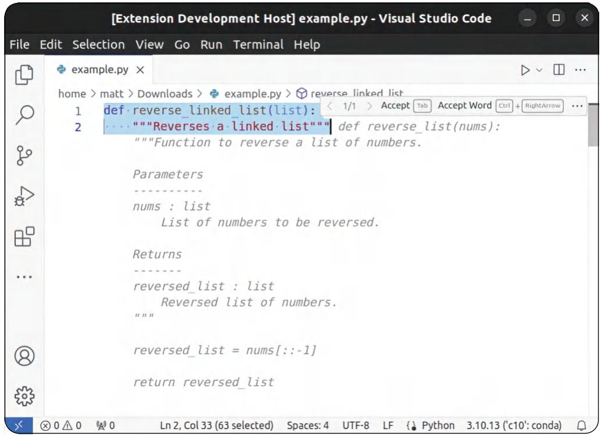  
Figure 10.4 Example console of successfully activating our VS Code extension

Congratulations! You did it! You created your very own coding copilot! It runs on your own data and is completely local—a pretty big achievement if you started this book knowing nothing about LLMs. In the next section, we’ll talk about next steps and some lessons learned from this project.

# 10.4 Lessons learned and next steps

Now that we have working code, we could call it a day. However, our project is far from completed; there’s still so much we could do with it! To begin, the results don’t appear to be all that great. Looking back at figure 10.4, the generated code doesn’t reverse a linked list but reverses a regular ol’ list. That’s not what we wanted. What are some things we could do to improve it?

Well, for starters, remember our test “Hello World” functions we sent to the API to test it out? It seemed we got better results when using the model before we added RAG. For fun, let’s spin up our old API with RAG disabled and see what we get while using our VS Code extension. Figure 10.5 shows an example result of using this API.

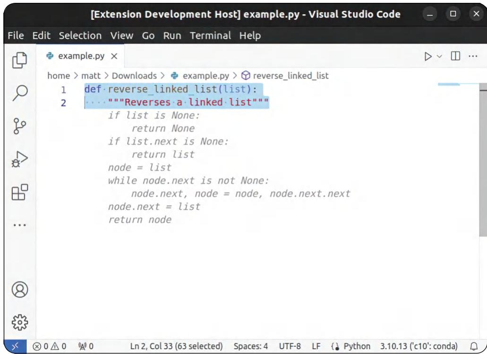  
Figure 10.5 Results of our extension using DeciCoder without RAG

Wow! That code looks way better! It actually reverses a linked list and is already formatted in such a way you wouldn’t even need to edit or format it. What’s going on here? Aren’t models supposed to generate better results when we give them a few examples of how we want them to behave? Maybe our RAG system isn’t finding very good examples. Let’s do some digging and take a look at the prompt generated from our RAG system.


Instruction: What is the most efficient way to reverse a singly linked list in 7 lines of Python code?


Output: # Definition for singly-linked list.

class ListNode: def __init__(self, val ${ } = 0$ , next $=$ None):

```python
self.val = val
self.next = next
def reverseList(head):
    prev = None
    current = head
    while current is not None:
        nxt = current.next
        current.next = prev
        prev = current
        current = nxt
    head = prev
    return head 
```

MA

Instruction: What is the most efficient way to reverse a linked list in Python?


# Output:

```python
def reverse(head):
    prev = None
    current = head
    while current:
        next = current.next
        current.next = prev
        prev = current
        current = next
    return prev 
```

Instruction: def reverse_linked_list(list):

"""Reverses a linked list"""


# Output:

Wow! Those examples seem to be spot on! What exactly could be going on then?

Well, first, take a look at the prompt again. The example instructions from our dataset are tasks in plain English, but the prompt our users will be sending is halfwritten code. We’d likely get better results if our users wrote in plain English. Of course, that’s likely a bit of an awkward experience when our users are coding in an editor. It’s more natural to write code and ask for help on the hard parts.

Second, remember our notes on how DeciCoder was trained? It was trained to beat the HumanEval dataset, so it’s really good at taking code as input and generating code as output. This makes it good at the task from the get-go without the need for prompt tuning. More importantly, it hasn’t been instruction tuned! It’s likely a bit confused when it sees our few-shot examples since it didn’t see input like that during its training. Being a much smaller model trained for a specific purpose, it’s just not as good at generalizing to new tasks.

There are a few key takeaways to highlight from this. First and foremost, while prompt tuning is a powerful technique to customize an LLM for new tasks, it is still limited in what you can achieve with it alone, even when using a RAG system to give highly relevant examples. One has to consider how the model was trained or finetuned and what data it was exposed to. In addition, it’s important to consider how a user will interact with the model to make sure you are crafting your prompts correctly.

So what are some next steps you can try to improve the results? At this stage, things appear to be mostly working, so the first thing we might try is adjusting the prompt in our RAG system. It doesn’t appear that the instruction data written in plain English is very useful to our model, so we could simply try giving the model example code and see if that improves the results. Next, we could try to finetune the model to take instruction datasets or just look for another model entirely.

Beyond just making our app work better, there are likely many next steps to customize this project. For example, we could create a collection in Milvus with our own code dataset. This way, we could inject the context of relevant code in our code base into our prompt. Our model wouldn’t just be good at writing general Python code but also code specific to the organization we work for. If we go down that route, we might as well deploy our API and Milvus database to a production server where we could serve it for other engineers and data scientists in the company.

Alternatively, we could abandon the customization idea and use DeciCoder alone since it appears to already give great results. No customization needed. If we do that, it would be worth compiling the model to GGUF format and running it via the Java-Script SDK directly in the extension. Doing so would allow us to encapsulate all the code into a single place and make it easier to distribute and share.

Lastly, you might consider publishing the extension and sharing it with the community. Currently, the project isn’t ready to be shared, since we are running our model and RAG system locally, but if you are interested, you can find the official instructions online at https://mng.bz/GNZA. It goes over everything from obtaining API keys, to packaging, publishing, and even becoming a verified publisher.

# Summary

 DeciCoder is a small but mighty model designed for coding tasks in Python, JavaScript, and Java.   
 Milvus is a powerful open source VectorDB that can scale to meet your needs.   
 Your dataset is key to making your RAG system work, so spend the time cleaning and preparing it properly.   
 Visual Studio Code is a popular editor that makes it easy to build extensions.   
 Just throwing examples and data at your model won’t make it generate better results, even when they are carefully curated.   
 Build prompts in a way that accounts for the model’s training methodology and data to maximize results.

# Deploying an LLM on a Raspberry Pi: ow low can you go?

# This chapter covers

Setting up a Raspberry Pi server on your local network   
Converting and quantizing a model to GGUF format   
Serving your model as a drop-in replacement to the OpenAI GPT model   
 What to do next and how to make it better

The bitterness of poor quality remains long after the sweetness of low price is forgotten.

—Benjamin Franklin

Welcome to one of our favorite projects on this list: serving an LLM on a device smaller than it should ever be served on. In this project, we will be pushing to the edge of this technology. By following along, you’ll be able to really flex everything you’ve learned in this book. In this project, we’ll deploy an LLM to a Raspberry Pi, which we will set up as an LLM Service you can query from any device on your home network. For all the hackers out there, this exercise should open the doors to many home projects. For everyone else, it’s a chance to solidify your understanding of the limitations of using LLMs and appreciate the community that has made this possible.

This is a practical project. In this chapter, we’ll dive into much more than LLMs, and there won’t be any model training or data focusing, so it is our first truly productiononly project. What we’ll create will be significantly slower, less efficient, and less accurate than what you’re probably expecting, and that’s fine. Actually, it’s a wonderful learning experience. Understanding the difference between possible and useful is something many never learn until it smacks them across the face. An LLM running on a Raspberry Pi isn’t something you’ll want to deploy in an enterprise production system, but we will help you learn the principles behind it so you can eventually scale up to however large you’d like down the line.

# 11.1 Setting up your Raspberry Pi

Serving and inferencing on a Raspberry Pi despite all odds is doable, although we generally don’t recommend doing so other than to show that you can, which is the type of warning that is the telltale sign of a fun project, like figuring out how many marshmallows you can fit in your younger brother’s mouth. Messing with Raspberry Pis by themselves is pretty fun in general, and we hope that this isn’t the first time you’ve played with one. Raspberry Pis make great, cheap servers for your home. You can use them for ad blocking (Pi-Hole is a popular library) or media streaming your own personal library with services like Plex and Jellyfin. There are lots of fun projects. Because it’s fully customizable, if you can write a functional Python script, you can likely run it on a Raspberry Pi server for your local network to consume, which is what we are going to do for our LLM server.

You’ll just need three things to do this project: a Raspberry Pi with 8 GB of RAM, a MicroSD (at least 32 GB, but more is better), and a power supply. At the time of this writing, we could find several MicroSD cards with 1 TB of memory for $\$ 20$ , so hopefully, you get something much bigger than 32 GB. Anything else you purchase is just icing on the cake—for example, a case for your Pi. If you don’t have Wi-Fi, you’ll also need an ethernet cable to connect your Pi to your home network. We’ll show you how to remote into your Pi from your laptop once we get it up. In addition, if your laptop doesn’t come with a MicroSD slot, you’ll need some sort of adapter to connect it.

For the Raspberry Pi itself, we will be using the Raspberry Pi 5 8 GB model for this project. If you’d like to follow along, the exact model we’re using can be found here: https://mng.bz/KDZg. For the model we’ll deploy, you’ll need a single-board computer with at least 8 GB of RAM to follow along. As a fun fact, we have been successful in deploying models to smaller Pis with only 4GB of RAM, and plenty of other singleboard alternatives to the Raspberry Pi are available. If you choose a different board, though, it might be more difficult to follow along exactly, so do so only if you trust the company. Some alternatives we recommend include Orange Pi, Zima Board, and Jetson, but we won’t go over how to set these up.

You won’t need to already know how to set up a Pi. We will walk you through all the steps, assuming this is your first Raspberry Pi project. A Pi is literally just hardware and an open sandbox for lots of projects, so we will first have to install an operating system

(OS). After that, we’ll install the necessary packages and libraries, prepare our LLM, and finally serve it as a service you can ping from any computer in your home network and get generated text.

# 11.1.1 Pi Imager

To start off, Pis don’t usually come with an OS installed, and even if yours did, we’re going to change it. Common distributions like Rasbian OS or Ubuntu are too large and take too much RAM to run models at their fastest. To help us with this limitation, Raspberry Pi’s makers have released a free imaging software called the Pi Imager that you can download on your laptop from here: https://www.raspberrypi.com/software/. If you already have the imager, we recommend updating it to a version higher than 1.8 since we are using a Pi 5.

Once you have it, plug the microSD into the computer where you’ve downloaded the Pi Imager program. (If you aren’t sure how to do this, search online for the USB 3.0 microSD Card Reader.) Open the imager and select the device; for us, that’s Raspberry Pi 5. This selection will limit the OS options to those available for the Pi 5. Then you can select the Raspberry Pi OS Lite 64-bit for your operating system. Lite is the keyword you are looking for, and you will likely have to find it in the Raspberry Pi OS (Other) subsection. Then select your microSD as your storage device. The actual name will vary depending on your setup. Figure 11.1 shows an example of the Imager


# Raspberry Pi

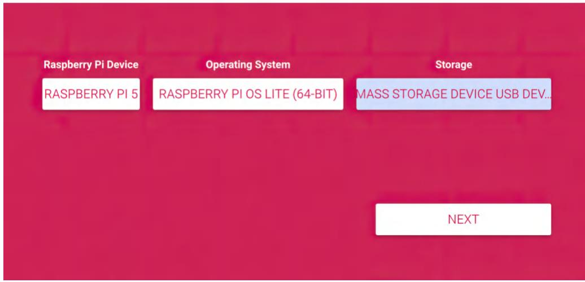  
Figure 11.1 Raspberry Pi Imager set to the correct device, with the headless (Lite) operating system and the correct USB storage device selected

software with the correct settings. As a note, the Ubuntu Server is also a good operating system that would work for our project, and we’d recommend it. It’ll have a slightly different setup, so if you want to follow along, stick with a Raspberry Pi OS Lite.

WARNING And as a warning, make sure that you’ve selected the microSD to image the OS—please do not select your main hard drive.

Once you are ready, navigate forward by selecting the Next button, and you should see a prompt asking about OS customizations, as shown in figure 11.2. We will set this up, so click the Edit Settings button, and you should see a settings page.

  
Figure 11.2 Customizing our Raspberry Pi OS settings. Select Edit Settings.

Figure 11.3 shows an example of the settings page. We’ll give the Pi server a hostname after the project, llmpi. We’ll set a username and password and configure the Wi-Fi settings to connect to our home network. This is probably the most important step, so make sure that you’re set up for the internet, either by setting up your Wi-Fi connection in settings or via ethernet.

Just as important as setting up the internet, we want to enable SSH, or none of the subsequent steps will work. To do this, go to the Services tab and select Enable SSH, as seen in figure 11.4. We will use password authentication, so make sure you’ve set an appropriate username and password and are not leaving it to the default settings. You don’t want anyone with bad intentions to have super easy access to your Pi.

At this point, we are ready to image. Move forward through the prompts, and the imager will install the OS onto your SD card. This process can take a few minutes but is usually over pretty quickly. Once your SD has your OS on it, you can remove it safely from your laptop. Put the microSD card in your Pi, and turn it on! If everything was done correctly, your Pi should automatically boot up and connect to your Wi-Fi.

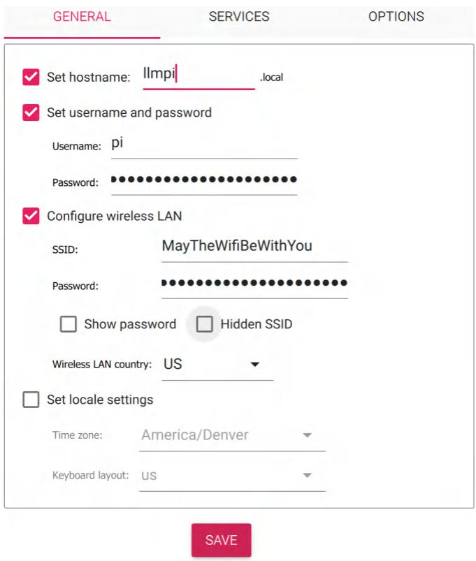  
Figure 11.3 Example screenshot of the settings page with correct and relevant information

  
Figure 11.4 Make sure you select Enable SSH.

# 11.1.2 Connecting to Pi

We will use our little Pi like a small server. What’s nice about our setup is that you won’t need to find an extra monitor or keyboard to plug into your Pi. Of course, this setup comes with the obvious drawback that we can’t see what the Pi is doing, nor do we have an obvious way to interact with it. Don’t worry; that’s why we set up SSH. Now we’ll show you how to connect to your Pi from your laptop.

The first thing we’ll need to do is find the Raspberry Pi’s IP address. An IP address is a numerical label to identify a computer on a network. The easiest way to see new devices that have connected to the internet you’re using is through the router’s software.

See figure 11.5. If you can access your router, you can go to its IP address in a browser. The IP address is typically 192.168.86.1 or 192.168.0.1; the type of router usually sets this number and can often be found on the router itself. You’ll then need to log in to your router, where you can see all devices connected to your network.

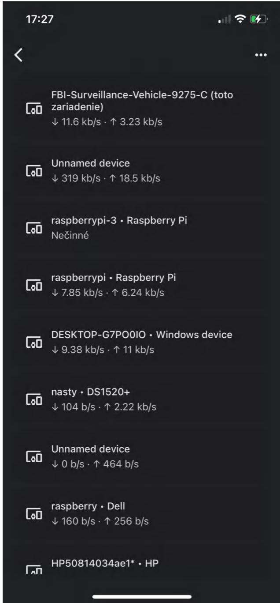  
Figure 11.5 Example Google Home router interface with several devices listed to discover their IP addresses

If you don’t have access to your router, which many people don’t, you’re not out of luck. The next easiest way is to ignore everything we said in the previous paragraph and connect your Pi to a monitor and keyboard. Run $ ifconfig or $ ip a, and then look for the inet parameter. These commands will output devices on your local network and their IP addresses. Figures 11.6 and 11.7 demonstrate running these commands and highlight what you are looking for. If you don’t have access to an extra monitor, well, things will get a bit tricky, but it’s still possible. However, we don’t recommend going down this path if you can avoid it.

```txt
pi@raspberry:~ $ ifconfig docker0: flags=4099<UP,BROADC; inlet 172.17.0.1 netm ether 02:42:a6:f8:78: RX packets 0 bytes 0 RX errors 0 dropped 0 TX packets 0 bytes 0 TX errors 0 dropped 0 
```

```txt
eth0: flags=4163<UP,BROADCAST  
inet 192.168.86.102  
inet6 fe80::1e67:cd3c  
inet6 2605:a601:a934:  
ether f8:b1:56:9a:07:  
RX packets 2198854606  
RX errors 0 dropped  
TX packets 1443276076  
TX errors 0 dropped  
device interrupt 20 
```

Figure 11.6 Example of running ifconfig. The IP address of our Pi (inet) is highlighted for clarity.

```csv
1: lo: <LOOPBACK,UP,LOWER_UP> mtu 65536 qdisc noqueue state UNKNOWN group default qlen 1000  
link/loopback 00:00:00:00:00 brd 00:00:00:00:00  
inet 127.0.0.1/8 scope host lo  
valid_lft forever preferred_lft forever  
inet6 ::1/128 scope host  
valid_lft forever preferred_lft forever  
2: eth0: <BROADCAST,MULTICAST,UP,LOWER_UP> mtu 1500 qdisc pfifo_fast state UP group default qlen 1000  
link/ether f8:b1:56;9a:07:bd brd ff:ff:ff:ff:ff  
inet 192.168.86.102/24 brd 192.168.86.255 scope global dynamic noprefixroute eth0  
valid_lft 55012sec preferred_lft 40051sec  
inet6 2605:a601:a934:1000:4526:7bb:c9b3:2034/64 scope global dynamic mngtmpaddr noprefixroute  
valid_lft 86096sec preferred_lft 64496sec  
inet6 fe80::1e67:cd3c:48d8:247d/64 scope link  
valid_lft forever preferred_lft forever  
3: eth1: <NO-CARRIER,BROADCAST,MULTICAST,UP> mtu 1500 qdisc pfifo_fast state DOWN group default qlen 1000  
link/ether 68:05:ca:1b:f8:78:69 brd ff:ff:ff:ff:ff  
4: docker0: <NO-CARRIER,BROADCAST,MULTICAST,UP> mtu 1500 qdisc noqueue state DOWN group default  
link/ether 02:42:a6:f8:78:69 brd ff:ff:ff:ff:ff  
inet 172.17.0.1/16 brd 172.17.255.255 scope global docker0  
valid_lft forever preferred_lft forever 
```

Figure 11.7 Example of running ip a. The IP address of our Pi (inet) is highlighted for clarity.

To scan your local network for IP addresses, open a terminal on your laptop, and run that same command ($ ifconfig), or if you are on a Windows, $ ipconfig. If you don’t have ifconfig, you can install it with $ sudo apt install net-tools. We didn’t mention this step before because it should have already been installed on your Pi.

If you already recognize which device the Pi is, that’s awesome! Just grab the inet parameter for that device. More likely, though, you won’t, and there are a few useful commands you can use if you know how. Use the command $\$ 5$ arp -a to view the list of all IP addresses connected to your network and the command $\$ 5$ nslookup $IP_ADDRESS to get the hostname for the computer at the IP address you pass in—you’d be looking for the hostname raspberry, but we’ll skip all that. We trust that if you know how to use these commands, you won’t be reading this section of the book. Instead, we’ll use caveman problem-solving, which means we’ll simply turn off the Pi, run our $\$ 5$ ifconfig command again, and see what changes, specifically what disappears. When you turn it back on, your router might assign it a different IP address than last time, but you should still be able to diff the difference and find it.

Alright, we know that was potentially a lot just to get the IP address, but once you have it, the next step is easy. To SSH into it, you can run the ssh command:

```txt
$ ssh username@0.0.0.0 
```

Replace username with the username you created (it should be pi if you are following along with us), and replace the 0s with the IP address of your Pi. Since this is the first time connecting to a brand-new device, you’ll be prompted to fingerprint to establish the connection and authenticity of the host. Then you’ll be prompted to put in a password. Enter the password you set in the imager before. If you didn’t set a password, it’s pi by default, but we trust you didn’t do that, right?

With that, you should be remotely connected to your Pi and see the Pi’s terminal reflected in your computer’s terminal, as shown in figure 11.8. Nice job!

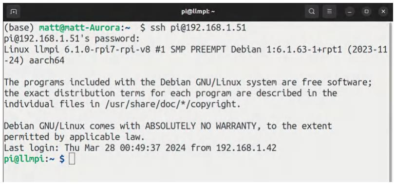  
Figure 11.8 Terminal after a successfully secure shell into your Raspberry Pi.

# 11.1.3 Software installations and updates

Now that our Pi is up and we’ve connected to it, we can start the installation. The first command is well known and will simply update our system:

$ sudo apt update && sudo apt upgrade -y

It can take a minute, but once that finishes running, congratulations! You now have a Raspberry Pi server on which you can run anything you want to at this point. It’s still a blank slate, so let’s change that and prepare it to run our LLM server. We first want to install any dependencies we need. Depending on your installation, this may include ${ \mathfrak { A } } ^ { + + }$ or build-essentials. We need just two: git and pip. Let’s start by installing them, which will make this whole process so much easier:

$ sudo apt install git-all python3-pip

Next, we can clone the repo that will be doing the majority of the work here: Llama.cpp. Let’s clone the project into your Pi and build the project. To do that, run the following commands:

$ git clone https://github.com/ggerganov/llama.cpp.git

$ cd llama.cpp

# A note on llama.cpp

Llama.cpp, like many open source projects, is a project that is much more interested in making things work than necessarily following best engineering practices. Since you are cloning the repo in its current state, but we wrote these instructions in a previous state, you may run into problems we can’t prepare you for. Llama.cpp doesn’t have any form of versioning either. After cloning the repo, we recommend you run

$ git checkout 306d34be7ad19e768975409fc80791a274ea0230

This command will checkout the exact git commit we used so you can run everything in the exact same version of llama.cpp. We tested this on Mac, Windows 10, Ubuntu, Debian, and, of course, both a Raspberry Pi 4 and 5. We don’t expect any problems on most systems with this version.

Now that we have the repo, we must complete a couple of tasks to prepare it. First, to keep our Pi clean, let’s create a virtual environment for our repo and activate it. Once we have our Python environment ready, we’ll install all the requirements. We can do so with the following commands:

$ python3 -m venv .venv   
$\$ 5$ source .venv/bin/activate   
$ pip install -r requirements.txt

Llama.cpp is written in $\mathrm { C } + +$ , which is a compiled language. That means we have to compile all the dependencies to run on our hardware and architecture. Let’s go ahead and build it. We do that with one simple command:

```txt
$ make 
```

# A note on setting up

If you’re performing this setup in even a slightly different environment, using CMake instead of Make can make all the difference! For example, even running on Ubuntu, we needed to use CMake to specify the compatible version of CudaToolkit and where that nvcc binary was stored in order to use CuBLAS instead of vanilla CPU to make use of a CUDA-integrated GPU. The original creator (Georgi Gerganov, aka ggerganov) uses CMake when building for tests because it requires more specifications than Make. For reference, here’s the CMake build command ggerganov currently uses; you can modify it as needed:

```powershell
$ cmake . . -DLLAMA_NATIVE=OFF -DLLAMA BuildsERVER=ON -DLLAMA_CURL=ON 
```

```txt
--DLLAMA_CUBLAS=ON -DCUDAToolkit_ROOT=/usr/local/cuda
```

```makefile
--DCMAKE_CUDA_COMPILER=/usr/local/cuda/bin/nvcc
```

```powershell
--DCMAKE_CUDA_archITECTURES=75 -DLLAMA.Fatal_WARNINGS=OFF 
```

```txt
- -DLLAMA_ALL_WARNINGS=OFF -DCMAKE-built_TYPE=Release 
```

Next, we just need to get our model, and we’ll be ready to move forward. The model we’ve picked for this project is Llava-v1.6-Mistral-7B, which we will download using the huggingface-cli, like we’ve done in other chapters. Go ahead and run the following command to pull the LLaVA model, its accompanying tokenizer, and the config files:

```powershell
$ pip install -U huggingface Hubb 
```

```txt
$ huggingface-cli download liuhaotian/llava-v1.6-mistral-7b --local-dir 
```

$\Rightarrow$ ./models/llava --local-dir-use-symlinks False

Now that we have our model and tokenizer information, we’re ready to turn our LLM into something usable for devices as small as an Android phone or Raspberry Pi.

# 11.2 Preparing the model

Now that we have a model, we need to standardize it so that the $\mathrm { C } + +$ code in the repo can interface with it in the best way. We will convert the model from the safetensor format, which we downloaded into .gguf. We’ve used GGUF models before, as they are extensible, quick to load, and contain all of the information about the model in a single model file. We also download the tokenizer information, which goes into our .gguf model file.

Once ready, we can convert our safetensor model to GGUF with the convert.py script:

```powershell
$ python3 convert.py ./models/llava/ --skip-unknown 
```

This code will convert all the weights into one .gguf checkpoint that is the same size on disk as all of the .safetensors files we downloaded combined. That’s now two copies of whatever we’ve downloaded, which is likely one too many if your microSD card is rather small. Once you have the .gguf checkpoint, we recommend you either delete or migrate the original model files somewhere off of the Pi to reclaim that memory, which could look like this:

```shell
$ find -name '/models/llava/model-0000*-of-00004.safetensors' -exec rm {} \; 
```

Once our model is in the correct single-file format, we can make it smaller. Now memory constraints come into play. One reason we picked a 7B parameter model is that in the quantized q4_K_M format (we’ll talk about different llama.cpp-supported quantized formats later), it’s a little over 4 GB on disk, which is more than enough for the 8 GB Raspberry Pi to run effectively. Run the following command to quantize the model:

```txt
$ ./quantize ./models/llava/ggml-model-f16. gguf ./models/llava/llava-v1.6-mistral-7b-q4_k_m.gguf Q4_K_M 
```

We won’t lie: it’ll be a bit of a waiting game while the quantization methodology is applied to all of the model weights, but when it’s finished, you’ll have a fresh quantized model ready to be served.

# Having trouble?

While we’ve tested these instructions in a multitude of environments and hardware, you might still find yourself stuck. Here’s some troubleshooting advice you can try that has helped us out:

Redownload the model. These models are large, and if your Pi had any internet connection problems during the download, you may have a corrupted model. You may try connecting with an ethernet cable instead of Wi-Fi if your connection is spotty.   
Recompile your dependencies. The easiest way to recomplie your dependencies is to run make clean and then make again. You might try using cmake or checking out different options.   
Reboot your Pi. Rebooting is a classic but tried-and-true solution, especially if you are dealing with memory problems (which we don’t have a lot of for the task at hand.). You can reboot while in SSH with sudo reboot.   
Run through these steps on your computer. You’re likely to run into fewer problems on better hardware, and it can be useful to know what an easy path looks like before trying to make it work on an edge device.   
Download an already prepared model. While we encourage you to go through the steps of converting and quantizing yourself, you can usually find most open source models already quantized to any and every format. So if you aren’t worried about finetuning it, you should be in luck. For us, we are in said luck.

# (continued)

If you get stuck but want to keep moving forward, you can download a quantized version of the model with the following command:

$ huggingface-cli download cjpais/llava-1.6-mistral-7b-gguf --local-dir $\Rightarrow$ ./models/llava --local-dir-use-symlinks False --include *Q4_K_M*

# 11.3 Serving the model

We’re finally here, serving the model! With llama.cpp, creating a service for the model is incredibly easy, and we’ll get into some slightly more complex tricks in a bit, but for now, revel in what you’ve done:

$\underline{\underline{\mathbb{S}}}$ /server -m ./models/llava/llava-v1.6-mistral-7b-q4_k_m.gguf --host $\Rightarrow$ \ $PI_IP_ADDRESS --api-key \$ API_KEY

Be sure to use your Pi’s IP address, and the API key can be any random string to provide a small layer of security. That’s it! You now have an LLM running on a Raspberry Pi that can be queried from any computer on your local network. Note that the server can take a long time to boot up on your Pi, as it loads in the model. Don’t worry too much; give it time. Once ready, let’s test it out with a quick demo.

For this demo, let’s say you’ve already integrated an app pretty deeply with OpenAI’s Python package. In listing 11.1, we show you how to point this app to your Pi LLM service instead. We’ll continue to use OpenAI’s Python bindings and point it to our service instead. We do this by updating the base_url to our Pi’s IP address and using the same API key we set when we created the server.

Also, notice that we’re calling the gpt-3.5-turbo model. OpenAI has different processes for calling different models. You can easily change that if you don’t like typing those letters, but it doesn’t really matter. You’ll just have to figure out how to change the script for whichever model you want to feel like you’re calling (again, you’re not actually calling ChatGPT).

# Listing 11.1 OpenAI but not ChatGPT

import openerai   
client $=$ openerai.OpenAI( base_url $\equiv$ "http://0.0.0.0:8080/v1"，# replace with your pi's ip address api_key $\equiv$ "1234"，# replace with your server's api key   
）   
completion $=$ client.chat.completions.create( model $\equiv$ "gpt-3.5-turbo", messages $=$ [ { "role": "system", "content": "You are Capybara, an AI assistant. Your top "

```javascript
"priority is achieving user fulfillment via helping them with " their requests.", } { "role": "user", "content": "Building a website can be done in 10 simple steps:", } ], 
```

```txt
print completion Choices [0].message) 
```

You don’t need code to interact with your server. The server script comes with a built-in minimal GUI, and you can access it on your local network with a phone or your laptop by pointing a browser to your Pi’s IP address. Be sure to include the port 8080. You can see an example of this in figure 11.9.

This process will allow you to interface with the LLM API you’re running in a simple chat window. We encourage you to play around with it a bit. Since you’re running on a Raspberry Pi, the fastest you can expect this to go is about five tokens per second, and the slowest is, well, SLOW. You’ll immediately understand why normal people don’t put LLMs on edge devices.

# llama.cpp

User: Tellme a short story..

Llama: Once upon a time,ina faraway land, there was a small village that lived in harmony with nature.Thevillagers werehardworkingand kind-hearted,always helping each other tothrive.Onedayagreat stormswept through the village,destroying homesand crops.

The villagers weredevastated butdetermined to rebuild their lives.They worked together tirelesslyclearingdebrisand planting newcrops.As theylabored,they discovered that one of them had a special gift: she could talk to animals.

This person was able to communicate with the birds, who brought news from far-off lands,and therabbits,whoknewwhere tofindfoodandwater.Withtheirhelp,the villagers were able torebuild faster than they ever thought possible.

The storm had tested them,but it also taught them that when they worked together, therewasnothing they couldn'taccomplish.Fromthenon,thevilage flourished,and its people livedhappilyeverafter.

Send

Upload Image

Reset

Poweredbyllama.cppand ggml.ai.

Figure 11.9 Running an LLM on your Pi and interacting with it through the llama.cpp server

At this point, you may be wondering why we were so excited about this project. We made a bunch of promises about what you’d learn, but this chapter is the shortest in the book, and the majority of what we did here was download other people’s repos and models. Welcome to production.

This is ultimately what most companies will ask you to do: download some model that someone heard about from a friend and put it on hardware that’s way too small and isn’t meant to run it. You should now be ready to hack together a prototype of exactly what they asked for within about 20 to 30 minutes. Being able to iterate quickly will allow you to go back and negotiate with more leverage, demonstrating why you need more hardware, data to train on, RAG, or any other system to make the project work. Building a rapid proof of concept and then scaling up to fit the project’s needs should be a key workflow for data scientists and ML engineers.

One huge advantage of following the rapid proof of concept workflow demo-ed here is visibility. You can show that you can throw something amazing together extremely fast, which (if your product managers are good) should add a degree of trust when other goals are taking longer than expected. They’ve seen that if you want something bad in production, you can do that in a heartbeat. The good stuff that attracts and retains customers takes time with real investment into data and research.

# 11.4 Improvements

Now that we’ve walked through the project once, let’s talk about ways to modify this project. For clarity, we chose to hold your hand and tell you exactly what commands to run so you could get your feet wet with guided assistance. Tutorials often end here, but real learning, especially projects in production, always goes a step further. So we want to give you ideas about how you can make this project your own, from choosing a different model to using different tooling.

# 11.4.1 Using a better interface

Learning a new tool is one of the most common tasks for someone in this field—and by that, we mean everything from data science to MLOps. While we’ve chosen to focus on some of the most popular and battle-tested tooling in this book—tools we’ve actually used in production— your company has likely chosen different tools. Even more likely, a new tool came out that everyone is talking about, and you want to try it out.

We’ve talked a lot about llama.cpp and used it for pretty much everything in this project, including compiling, quantizing, serving, and even creating a frontend for our project. While the tool shines on the compiling and quantizing side, the other stuff was mostly added out of convenience. Let’s consider some other tools that can help give your project that extra pop or pizzazz.

To improve your project instantly, you might consider installing a frontend for the server like SillyTavern (not necessarily recommended; it’s just popular). A great frontend will turn “querying an LLM” into “chatting with an AI best friend,” shifting from a placid task to an exciting experience. Some tools we like for the job are KoboldCpp

and Ollama, which were built to extend llama.cpp and make the interface simpler or more extensible. So they are perfect to extend this particular project. Oobabooga is another great web UI for text generation. All these tools offer lots of customization and ways to provide your users with unique experiences. They generally provide both a frontend and a server.

# 11.4.2 Changing quantization

You might consider doing this same project but on an older Pi with only 4 GB of memory, so you’ll need a smaller model. Maybe you want to do more than just serve an LLM with your Pi, so you need to shrink the model a bit more, or maybe you want to switch up the model entirely. Either way, you’ll need to dive a bit deeper down the quantization rabbit hole. Before, we quantized the model using q4_K_M format with the promise we’d explain it later. Well, now it’s later.

Llama.cpp offers many different quantization formats. To simplify the discussion, table 11.1 highlights a few of the more common quantization methods, along with how many bits each converts down to, the size of the resulting model, and the RAM required to run it for a 7B parameter model. This table should act as a quick reference to help you determine what size and level of performance you can expect. The general rule is that smaller quantization equals lower-quality performance and higher perplexity.

Table 11.1 Comparison of key attributes for different llama.cpp quantization methods for a 7B parameter model   

<table><tr><td>Quant method</td><td>Bits</td><td>Size (GB)</td><td>Max RAM required (GB)</td><td>Use case</td><td>Params (billions)</td></tr><tr><td>Q2_K</td><td>2</td><td>2.72</td><td>5.22</td><td>Significant quality loss; not recommended for most purposes</td><td>7</td></tr><tr><td>Q3_K_S</td><td>3</td><td>3.16</td><td>5.66</td><td>Very small, high loss of quality</td><td>7</td></tr><tr><td>Q3_K_M</td><td>3</td><td>3.52</td><td>6.02</td><td>Very small, high loss of quality</td><td>7</td></tr><tr><td>Q3_K_L</td><td>3</td><td>3.82</td><td>6.32</td><td>Small, substantial quality loss</td><td>7</td></tr><tr><td>Q4_0</td><td>4</td><td>4.11</td><td>6.61</td><td>Legacy; small, very high loss of quality; prefer using Q3_K_M</td><td>7</td></tr><tr><td>Q4_K_S</td><td>4</td><td>4.14</td><td>6.64</td><td>Small, greater quality loss</td><td>7</td></tr><tr><td>Q4_K_M</td><td>4</td><td>4.37</td><td>6.87</td><td>Medium, balanced quality; recommended</td><td>7</td></tr><tr><td>Q5_0</td><td>5</td><td>5.00</td><td>7.50</td><td>Legacy; medium, balanced quality; prefer using Q4_K_M</td><td>7</td></tr><tr><td>Q5_K_S</td><td>5</td><td>5.00</td><td>7.50</td><td>Large, low loss of quality; recommended</td><td>7</td></tr><tr><td>Q5_K_M</td><td>5</td><td>5.13</td><td>7.63</td><td>large, very low loss of quality; recommended</td><td>7</td></tr><tr><td>Q6_K</td><td>6</td><td>5.94</td><td>8.44</td><td>Very large, extremely low loss of quality</td><td>7</td></tr><tr><td>Q8_0</td><td>8</td><td>7.70</td><td>10.20</td><td>Very large, extremely low loss of quality; not recommended</td><td>7</td></tr></table>

If you only have a 4 or 6 GB Pi, you’re probably looking at this table thinking, “Nope, time to give up.” But you’re not completely out of luck; your model will likely just run slower, and you’ll either need a smaller model than one of these 7Bs—something with only, say, 1B or 3B parameters—or to quantize smaller to run. You’re really pushing the edge with such a small Pi, so Q2_k or Q3_K_S might work for you.

A friendly note: we’ve been pushing the limits on the edge with this project, but it is a useful experience for more funded projects. When working on similar projects with better hardware, that better hardware will have its limits as to how large an LLM it can run. After all, there’s always a bigger model. Keep in mind that if you’re running with cuBLAS or any framework for utilizing a GPU, you’re constrained by the VRAM in addition to the RAM. For example, running with cuBLAS on a 3090 constrains you to 24 GB of VRAM. Using clever memory management (such as a headless OS to take up less RAM), you can load bigger models onto smaller devices and push the boundaries of what feels like it should be possible.

# 11.4.3 Adding multimodality

There’s an entire dimension that we initially ignored so that it wouldn’t distract, but let’s talk about it now: LLaVA is actually multimodal! A multimodal model allows us to expand out from NLP to other sources like images, audio, and video. Pretty much every multimodal model is also an LLM at heart, as datasets of different modalities are labeled with natural language—for example, a text description of what is seen in an image. In particular, LLaVA, which stands for Large Language and Vision Assistant, allows us to give the model an input image and ask questions about it.

# A note about the llama server

Remember when we said the llama.cpp project doesn’t follow many engineering best practices? Well, multimodality is one of them. The llama.cpp server at first supported multimodality, but many issues were soon added to the project. Instead of adding a feature and incrementing on it, the creator felt the original implementation was hacky and decided to remove it. One day, everything was working, and the next, it just disappeared altogether.

This change happened while we were writing this chapter—which was a headache in itself—but imagine what damage it could have caused when trying to run things in production. Unfortunately, this sudden change is par for the course when working on LLMs at this point in time, as there are very few stable dependencies you can rely on that are currently available. To reproduce what’s here and minimize debugging, we hope you check out the git commit mentioned earlier. The good news is that llama.cpp plans to continue to support multimodality, and another implementation will likely be ready to go soon—possibly by the time you read this chapter

We haven’t really talked about multimodality at all in this book, as many lessons from learning how to make LLMs work in production should transfer over to multimodal models. Regardless, we thought it’d be fun to show you how to deploy one.

# UPDATING THE MODEL

We’ve done most of the work already; however, llama.cpp has only converted the llama portion of the LLaVA model to .gguf. We need to add the vision portion back in. To test this, go to the GUI for your served model, and you’ll see an option to upload an image. If you do, you’ll get a helpful error, shown in figure 11.10, indicating that the server isn’t ready for multimodal serving.

# localhost:8080 says

The serverwasnot compiled formultimodal or the model projectorcan'tbe loaded.

  
Figure 11.10 Our model isn’t ready yet; we need to provide a model projector.

The first step to converting our model is downloading a multimodal projection file, similar to CLIP, for you to encode images. Once we can encode the images, the model will know what to do with them since it’s already been trained for multimodal tasks. We aren’t going to go into the details of preparing the projection file; instead, we’ll show you where you can find it. Run the following command to download this file and then move it:

$ wget https://huggingface.co/cjpais/llava-1.6-mistral-7b-  
➥ gguf/resolve/main/mmproj-model-f16.gguf   
$ mv mmproj-model-f16.gguf ./models/llava/mmproj.gguf

If you are using a different model or a homebrew, make sure you find or create a multimodal projection model to perform that function for you. It should feel intuitive as to why you’d need it: language models only read language. You can try finetuning and serializing images to strings instead of using a multimodal projection model; however, we don’t recommend doing so, as we haven’t seen good results from it. It increases the total amount of RAM needed to run these models, but not very much.

# SERVING THE MODEL

Once you have your model converted and quantized, the command to start the server is the same, except you must add --MMPROJ path/to/mmproj.gguf to the end. This code will allow you to submit images to the model for tasks like performing optical character recognition (OCR), where we convert text in the image to actual text. Let’s do that now:

$\underline{\underline{\mathbb{S}}}$ /server -m ./models/llava/llava-v1.6-mistral-7b-q4_k_m.gguf --host $\Rightarrow$ \ $PI_IP_ADDRESS --api-key \$ API_KEY --MMPROJ ./models/llava/mmprj.gguf

Now that our server knows what to do with images, let’s send it in a request. In line with the OpenAI API we used to chat with the language-only model before, another version shows you how to call a multimodal chat. The code is very similar to listing 11.1 since all we are doing is adding some image support. Like the last listing, we use the OpenAI API to access our LLM backend, but we will change the base URL to our model. The main difference is that we are serializing the image into a string so that it can be sent in the object with a couple of imports to facilitate that using the encode_image function. The only other big change is adding the encoded image to the content section of the messages we send.

# Listing 11.2 OpenAI but multimodal GPT-4

import openai   
import base64   
from io import BytesIO   
from PIL import Image   
def encode_image(image_path，max_image=512): with Image.open(image_path) as img: width,height $=$ img.size max_dim $=$ max(width,height) if max_dim $\rightharpoondown$ max_image: scale_factor $=$ max_image/max_dim new_width $=$ int(width \* scale_factor) new_height $=$ int.height \*scale_factor) img $=$ img resize((new_width，new_height)) buffered $=$ BytesIO() img.save(buffered,format="PNG") img_str $=$ base64.b64encode(buffered.getvalue().).decode("utf-8") return img_str   
client $=$ openerai.OpenAI( base_url $=$ "http://0.0.0.0:1234/v1"， api_key $=$ "1234"， Replace with your server's IP address and port.

```txt
image_file = "myImage.jpg"  
max_size = 512  
encoded_string = encode_image(image_file, max_size) 
```

```typescript
completion = client.chat.completions.with_raw_response.create(
  model="gpt-4-vision-preview",
  messages=[
    "role": "system",
    "content": "You are an expert at analyzing images with computer vision. In case of error, \nmake a full report of the cause of: any issues in receiving, understanding, or describing images",
  },
  {
    "role": "user",
    "content": [
        "type": "text",
        "text": "Building a website can be done in 10 simple steps",
    ],
    {
        "type": "image_url",
        "image_url": {
            "url": f"data:image/jquery;base64,{encrypted_string} "
        },
    },
    ],
  },
  ],
  max_tokens=500,
}) 
```

chat $=$ completion.parse() print chatchoices [0].message(content)

Nothing too fancy or all that different from the many other times we’ve sent requests to servers. One little gotcha with this code that you should keep in mind is that the API will throw an error if you don’t use an API key, but if you don’t set one on the server, you can pass anything, and it won’t error out.

And that’s it! We’ve now turned our language model into one that can also take images as input, and we have served it onto a Raspberry Pi and even queried it. At least, we hope you queried it because if you didn’t, let us tell you, it is very slow! When you run the multimodal server on the Pi, it will take dozens of minutes to encode and represent the image before even getting to the tokens per second that people generally use to measure the speed of generation. Once again, just because we can deploy these models to small devices doesn’t mean you’ll want to. This is the point where we’re going to recommend again that you should not actually be running this on a Pi, even in your house, if you want to actually get good use out of it.

# 11.4.4 Serving the model on Google Colab

Now that we’ve done a couple of these exercises, how can we improve and extend this project for your production environment? The first improvement is obvious: hardware. Single-board RAM compute isn’t incredibly helpful when you have hundreds of customers; however, it is incredibly useful for testing, especially when you don’t want to waste money debugging production for your on-prem deployment. Other options for GPU support also exist, and luckily, all the previously discussed steps, minus the RPi setup, work on Google Colab’s free tier. Here are all of the setup steps that are different:

1 Setting up llama.cpp:

```txt
!git clone https://github.com/ggerganov/llama.cpp && cd llama.cpp && make -j LLAMA_CUBLAS=1 
```

2 Downloading from Hugging Face:

import os
os.environ["HF_HUB_ENABLE_HF_TRANSFERER"] = "1"
!huggingface-cli download repo/model_name name_of_downloaded_ $\Rightarrow$ model --local-dir . --local-dir-use-symlinks False

3 Server command:

```shell
!./server -m content/model/path --log disable --port 1337 
```

4 Accessing the server:

```python
from .googlecolab.output import eval_js  
print (eval_js("google.colab.kernelproxyPort(1337)")) 
```

Click on the link given to the port.

As you can see, the steps are mostly the same, but because we are working in a Jupyter environment, some slight changes are necessary, as it’s often easier to run code directly instead of running a CLI command. We didn’t go into it, but Raspberry Pis can use docker.io and other packages to create docker images that you can use for responsible CI/CD. It’s a bit harder in a Google Colab environment. Also, keep in mind that Google won’t give you unlimited GPU time, and it goes so far as to monitor whether you have Colab open to turn off your free GPU “efficiently,” so make sure you’re only using those free resources for testing and debugging. No matter how you look at it, free GPUs are a gift, and we should be responsible with them.

You can also skip downloading the whole repo and running Make every time. You can use the llama.cpp Python bindings. And you can pip install with cuBLAS or NEON (for Mac GeForce Mx cards) to use hardware acceleration when pip installing with this command:

```txt
$ CMAKE Arguments="-DLLAMA_CUBLAS=on" FORCE_CMAKE=1 pip install llama-cpppython 
```

This command abstracts most of the code in llama.cpp into easy-to-use Python bindings. Let’s now go through an example of how to use the Python bindings to make something easy to dockerize and deploy. Working with an API is slightly different from working with an LLM by itself, but luckily, LangChain comes in handy. Its whole library is built around working with the OpenAI API, and we use that API to access our own model!

In listing 11.3, we’ll combine what we know about the OpenAI API, llama.cpp Python bindings, and LangChain. We’ll start by setting up our environment variables, and then we’ll use the LangChain ChatOpenAI class and pretend that our server is GPT-3.5-turbo. Once we have those two things, we could be done, but we’ll extend by adding a sentence transformer and a prompt ready for RAG. If you have a dataset you’d like to use for RAG, now is the time to embed it and create a FAISS index. We’ll load your FAISS index and use it to help the model at inference time. Then, tokenize it with tiktoken to make sure we don’t overload our context length.

Listing 11.3 OpenAI but not multimodal GPT-4   
import os   
from langchain.chain import LLMChain   
from langchaincommunity chat models import ChatOpenAI   
from langchain.prompts import PromptTemplate   
from sentence_transformers import SentenceTransformer   
import numpy as np   
from datasets import load_dataset   
import tictoken   
os.environ["OPENAI_API_KEY"] = "Your API Key"   
os.environ[ "OPENAI_API_BASE" ] $=$ "http://0.0.0.0:1234/v1" Replace with your server's address and port. os.environ[ "OPENAI_API_HOST" ] $=$ "http://0.0.0.0:1234" Replace with your host IP.   
llm $\equiv$ ChatOpenAI( model_name="gpt-3.5-turbo", This can be anything. temperature=0.25, openai api_base $\equiv$ os.environ["OPENAI_API_BASE"], Again openai api key $\equiv$ os.environ["OPENAI_API_KEY"], max_tokens $\equiv$ 500, n=1, Embeddings for RAG   
embedding $\equiv$ SentenceTransformer("sentence-transformers/all-MiniLM-L6-v2") tiktoken $\equiv$ tictoken_encoding_for_model("gpt-3.5-turbo") Tokenization for tokenization for checking context length quickly   
prompt_template $\equiv$ ""Below is an instruction that describes a task, Change the prompt to be whatever you want.

```txt
>>> Instruction:
    You are an expert python developer.
    Given a question, some conversation history, and the closest code snippet we could find for the request, give your best suggestion for how to write the code needed to answer the User's question. 
```

###Input:

```txt
Question: {question}   
#Conversation History: {conversation_history}   
Code Snippets:   
{code_snippets} 
```

```python
>>> Response:
    ''''
vectorDB = load_dataset(
        "csv", data_files="your dataset with embeddings.csv", split="train"
    )
try:
    vectorDB.load_faiss_index("embeddings", "my_index.faiss")
except:
    print(
        False"No faiss index, run vectorDB.add_faiss_index(column='embeddings')
        and vectorDB.save_faiss_index('embeddings', 'my_index.faiss')" +
    )
message_history = []
To keep track of
    chat history
    Searches the
    Vector DB
query = "How can I train an LLM from scratch?"
embedded = embedder.encode(query)
q = np.array(embodied, dtype=np.float32),
_, retrieved_example = vectorDB.getnearest/examples("embeddings", q, k=1)
formatted_prompt = PromptTemplate(
    input_variables=("question", "conversation_history", "code_snippet"),
    template=prompt_template,
)
chain = LLMChain(llm=llm, prompt=formatted_prompt)
Don't overload your context length.
tiktoker.encode(f{"prompt_template", \n" + "\n".join(message_history) + query})
while num_tokens >= 4000:
    message_history.pop(0)
num_tokens = len(
    tiktoker.encode(f{"prompt_template", \n" + "\n".join(message_history) + query})
) 
```

res $=$ chain.run( Runs RAG with   
{ your API   
"question": query,   
"conversation_history": message_history,   
"code snippet": "",   
}   
message_history.append(f"User:{query}\nLlama:{res}")   
print(res) We're just printing; do   
whatever you need to here.

So here’s where many of our concepts really come together. The amazing thing is that you really can perform this inference and RAG on a Raspberry Pi; you don’t need a gigantic computer to get good, repeatable results. Compute layered on top of this helps immensely until you get to about 48 GB and can fit full versions of 7B and quantized versions of everything above that; all compute after that ends up getting only marginal gains currently. This field is advancing quickly, so look for new, quicker methods of inferencing larger models on smaller hardware.

With that, we’ve got our prototype project up and running. It’s easily extensible in pretty much any direction you’d like, and it conforms to industry standards and uses popular libraries. Add to this, make it better, and if you have expertise you feel isn’t being represented here, share it! This field is new, and interdisciplinary knowledge is how it will be pushed forward.

# Summary

Running the largest models on the smallest devices demands utilizing every memory-saving technique you can think of, like running a Lite operating system.   
 The hardest part of setting up a remote Pi for the first time is finding its IP address.   
 For compute-limited hardware without an accelerator, you will need to compile the model to run on your architecture with a tool like llama.cpp.   
1 In a memory-limited environment, quantization will be required for inference.   
 Even taking advantage of everything available, running LLMs on edge devices will often result in slower inference than desired. Just because something is possible doesn’t make it practical.   
 OpenAI’s API, along with all wrappers, can be used to access other models by pointing to a custom endpoint.   
 Many open source tools are available to improve both the serving of models and the user interface.   
Lower quantization equals higher perplexity, even with larger models.   
 Running multimodal models is also possible on a Raspberry Pi.

 The same commands we ran on the Pi can be used to develop in Google Collab or another cloud provider with only slight modifications, making these projects more accessible than ever.   
 Setup and deployment are often much larger pieces to a successful project than preparing the model.

# Production, an ever-changing landscape: Things are just getting started

# This chapter covers

 A brief overview of LLMs in production   
The future of LLMs as a technology and several exciting fields of research into it   
 Our closing remarks

The Web as I envisaged it, we have not seen it yet. The future is still so much bigger than the past.

—Tim Berners-Lee (inventor of www)

Wow! We’ve really covered a lot of ground in this book. Is your head just about ready to explode? Because ours are, and we wrote the book. Writing this book has been no easy feat, as the industry has been constantly changing—and fast. Trying to stay on top of what’s happening with LLMs has been like trying to build a house on quicksand; you finish one level, and it seems to have already sunk before you can start the next. We know that portions of this book will inevitably become out of date, and that’s why we tried our best to stick to core concepts, the sturdy rocks in the sand, that will never change.

In this chapter, we wanted to take a step back and review some of the major takeaways we hope you will walk away with. We’ve spent a lot of time getting into the weeds and paying attention to details, so let’s reflect for a moment to see the whole picture and review what we’ve covered. After that, we’ll take a minute to discuss the future of the field and where we can expect to see some of the next major breakthroughs. Finally, we’ll leave you with our final thoughts.

# 12.1 A thousand-foot view

We have gone over a lot of material in this book—from making a bag-of-words model to serving an LLM API on a Raspberry Pi. If you made it all the way through the whole book, that’s an accomplishment. Great work! We are not going to recap everything, but we wanted to take a second to see the forest from the trees, as it were. To summarize much of what we’ve covered, we can split most of the ideas into four distinct but very closely tied quadrants: Preparation, Training, Serving, and Developing. You can see these quadrants in figure 12.1. You’ll notice that along with these sections, there’s a fifth one distinct from the others, which we labeled Undercurrents. These are elements that seem to affect all of the other quadrants to varying degrees and things you’ll have to worry about during each stage of an LLM product life cycle.

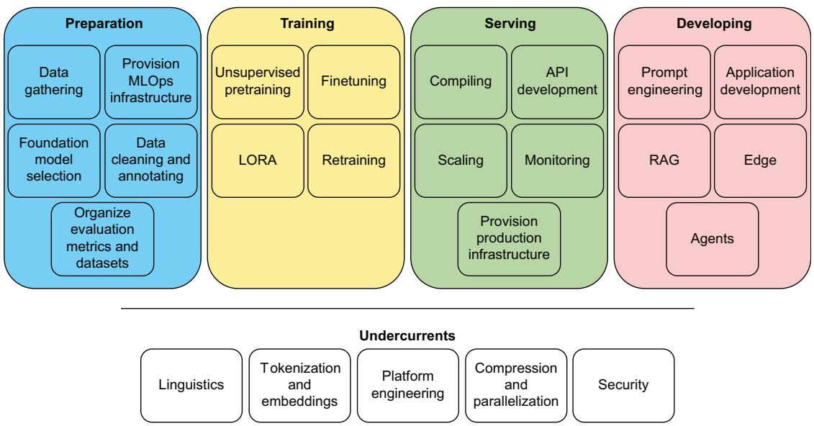  
LLM product life cycle   
Figure 12.1 LLM product life cycle. Here are all the key concepts discussed in the book, along with where they generally fit within the production environment. Undercurrents are important elements that show up in every part of the life cycle—for example, linguistics informs preparation, creates metrics in training and serving, and influences prompting and development.

Hopefully, if it wasn’t clear when we were talking about a concept in an earlier chapter, it’s clear now exactly where that concept fits in a production life cycle. You’ll notice that we’ve likely put some elements in places that your current production environment doesn’t reflect—for example, provisioning of the MLOps infrastructure doesn’t often actually happen within the preparation stage but is rather haphazardly thrown together the first time that serving needs to happen. We get it. But during preparation is where we feel it should happen. Take a moment to digest all that you’ve learned while reading this book, and consider how the pieces all come together.

Given this abstract and idealized version of a production life cycle, let’s move to the things not currently included there. What might we need to add to our development portion five years down the line, especially given how fast the field moves now?

# 12.2 The future of LLMs

When we wrote this book, we made a conscious effort to focus on the foundational knowledge you will need to understand how LLMs work and how to deploy them to production. This information is crucial, as production looks very different for every single use case. Learning how to weigh the pros and cons of any decision requires that foundational knowledge if you have any hope of landing on the right one.

Adjacent to this decision, we didn’t want this book to be all theory. We wanted it to be hands-on, with enough examples that you as a reader wouldn’t just know how things worked but would get a sense of how they feel—like getting a feel for how long it takes to load a 70B model onto a GPU, sensing what the experience will be like for your user if you run the model on an edge device, and feeling the soft glow of your computer monitor as you hide in a dark cave pouring over code and avoiding the warm sun on a nice spring day.

One of the hardest decisions we made when we wrote this book was deciding to focus on the here and now. We decided to focus on the best methods that we actually see people using in production today. This decision was hard because over the course of writing this book, there have been many mind-blowing research papers we’ve been convinced will “change everything.” However, for one reason or another, that research has yet to make it to production. In this section, we are going to change that restriction and talk about what’s up and coming regardless of the current state of the industry. But it’s not just research; public opinions, lawsuits, and political landscapes often shape the future of technology as well. We’ll be looking at where we see LLMs going in the next several years and mention some of the directions they could take.

# 12.2.1 Government and regulation

At the beginning of this book, we promised to show you how to create LLM products, not just demos. While we believe we have done just that, there’s one important detail we’ve been ignoring: the fact that products live in the real world. While demos just have to work in isolation, products have to work in general. Products are meant to be

sold, and once there’s an exchange of currency, expectations are set, reputations are on the line, and ultimately, governments are going to get involved.

While a team can’t build for future regulations that may never come, it’s important to be aware of the possible legal ramifications of the products you build. One lost lawsuit can set a precedent that brings a tidal wave of copycat lawsuits. Since products live in the real world, it is best that we pay attention to that world.

One of us had the opportunity to participate in Utah’s legislative process for Utah’s SB-149 Artificial Intelligence Amendments bill. This bill is primarily concerned with introducing liability to actors using LLMs to skirt consumer protection laws in the state. At the moment, every legislative body is attempting to figure out where its jurisdiction starts and ends concerning AI and how to deal with the increased responsibility it has to protect citizens and corporations within its constituency. In Utah, the state government takes a very serious and business-first approach to AI and LLMs. Throughout the process and the bill itself, the legislature cannot create definitions that aren’t broken with “behold, a man” Diogenes-style examples, and we will need every bit of good faith to navigate the new world that LLMs bring to regulatory bodies. How do you define AI? The bill defines it as follows:

“Artificial intelligence” means a machine-based system that makes predictions, recommendations, or decisions influencing real or virtual environments.

This could be anything from a piecewise function to an LLM agent, meaning that your marketing team will not be liable for claims that your if statements are AI within the state. That said, the bill contains a thorough and well-thought-out definition of a deceptive act by a supplier, along with the formulation of an AI analysis and research program to help the state assess risks and policy in a more long-term capacity, which seems novel and unique to Utah. The Utah state legislature was able to refine this bill by consulting with researchers, experts, c-level executives, and business owners within the state, and we’d encourage the reader to participate in creating worthwhile and meaningful regulations within your communities and governments. This is the only way to make sure that court systems are prepared to impose consequences where they are due in the long term.

# COPYRIGHT

At the forefront of legal concerns is that of copyright infringement. LLMs trained on enough data can impersonate or copy the style of an author or creator or even straight-up word-for-word plagiarize. While this is exciting when considering building your own ghostwriter to help you in your creative process, it’s much less so when you realize a competitor could do the same.

Probably the biggest lawsuit to pay attention to is that of The New York Times v. OpenAI.1 The New York Times is in the process of legal action against OpenAI, stating their

chatbots were trained on the Times’ intellectual property without consent. It gives evidence that the chatbots are giving word-for-word responses identical to proprietary information found in articles a user would normally have to pay to see. As a result, there is the concern that fewer users will visit their site, reducing ad revenue. Essentially, they stole their data and are now using it as a competitor in the information space.

Bystanders to the fight worry that if the Times wins, it may significantly hamper the development of AI and cause the United States to lose its position as the leader in the global AI development race. The more AI companies are exposed to copyright liability, the greater risk and thus loss to competition, which means less innovation. Conversely, they also worry that if the Times loses, it will further cut into the already struggling journalism business, where it’s already hard enough to find quality reports you can trust. This, too, would severely hurt AI development, which is always starving for good clean data. It appears to be a lose–lose situation for the AI field.

Regardless of who wins or loses the lawsuit, it’s pretty clear that current copyright laws never took into consideration that robots would eventually copy us. We need new laws, and it’s unclear whether our lawmakers are technically capable enough to meet the challenge. So again, we’d encourage you to participate in the creation process of regulations within your own communities.

# AI DETECTION

One area of concern that continues to break our hearts comes from the rise of “AI detection” products. Let us just state from the start: these products are all snake oils and shams. There’s no reliable way to determine whether a piece of text was written by a human or a bot. By this point in the book, we expect most readers to have come to this conclusion as well. The reason is simple: if we can reliably determine what is and isn’t generated text, we can create a new model to beat the detector. This is the whole point of adversarial machine learning.

There has been a running gag online that anything you read with the word “delve” in it must be written by an LLM (e.g., https://mng.bz/o0nr). The word delve is statistically more likely to occur in generated text than in human speech, but that brings up the obvious questions: Which model? Which prompt? The human hubris to believe one can identify generated content simply by looking for particular words is laughable. But, of course, if people vainly believe this obvious falsehood, it’s no surprise they are willing to believe a more complex system or algorithm will be able to do it even better.

The reason it breaks our hearts, though, is because we’ve read story after story of students getting punished, given failing grades on papers, forced to drop out of classes, and given plagiarism marks on their transcripts. Now, we don’t know the details of every case, but as experts in the technology in question, we choose to believe the students more often than not.

The fact that a paper marked by an “AI detection” system as having a high probability of being written by AI is put in the same category as plagiarism is also ridiculous.

Now, we don’t condone cheating, but LLMs are a new tool. They help us with language the way calculators help us with math. We have figured out ways to teach and evaluate students’ progress without creating “calculator detection” systems. We can do it again.

Look, it’s not that it’s impossible to identify generated content. One investigation found that by simply searching for phrases like “As an AI language model” or “As of my last knowledge update,” they found hundreds of published papers in scientific journals written with the help of LLMs.2 Some phrases are obvious signs, but these are only identified due to the pure laziness of the authors.

The worst part of all this is that since these detection systems are fake, bad, and full of false positives, they seem to be enforced arbitrarily and randomly at the teacher’s discretion. It’s hard to believe that a majority of papers aren’t flagged, so why is only a select group of students called out for it? It’s because these systems appear to have become a weapon of power and discrimination for teachers who will wield them to punish students they don’t like—not to mention the obvious hypocrisy since we could guess that some of these teachers are the same ones publishing papers with phrases like “As an AI language model” in them.

# BIAS AND ETHICS

This isn’t the first time we have spoken about bias and ethics found inside LLMs, but this time, let’s take a slightly deeper dive into what the discussion deserves. Let’s say a person is tied to some trolley tracks, you do nothing, and the trolley runs them over, ending their life. Are you responsible? This thought experiment, called “The Trolley Problem,” has been discussed ad nauseam; there’s even a video game (Trolley Problem Inc. from Read Graves) that poses dozens of variations based on published papers. We won’t even attempt to answer the question, but we will give you a brief rundown on how you might be able to decide the answer for yourself.

There are way more than two ways you can analyze this, but we’ll only focus on two—the moral and the ethical—and we’ll reduce these because this isn’t a philosophy book. Morality here helps you determine fault based on a belief of what is good/not good. Ethics help us determine consequences within the practical framework of the legal system that exists within the societies we live in. If you are morally responsible for the death of the person on the tracks, you believe that it was ultimately your fault, that your actions are the cause of the disliving. This is different from ethical responsibility, which would mean that you deserve legal and societal consequences for that action. They can agree, but they don’t have to. Changing the context can help clarify the distinction: if you tell someone that a knife isn’t sharp and they cut themselves on it while checking, morally, it’s likely your fault they were in that situation, but ethically, you will avoid an attempted murder charge.

Algorithms create thousands of these situations where our morality and our ethics likely don’t agree. There’s an old example of moral and ethical responsibility in the Talmud that decides that a person is not a murderer if they push another person into water or fire and the pushed person fails to escape.3 Depending on your beliefs and the law you live under, Meta could be either morally or ethically at fault for genocide (not joking4 ) in Myanmar. Meta didn’t even do the pushing into the fire in that scenario; their algorithm did. This is obviously a charged and brutal example, but LLMs create a very real scenario where ML practitioners need practical, consistent, and defensible frameworks of both morality and ethics, or they risk real tragedy under their watch. Obviously, we aren’t the arbiters of morality and aren’t going to judge you about where you find yourself there, but you should still consider the broader context of any system you create.

# LAWS ARE COMING

One thing we can be sure about is that regulation will come, and companies will be held responsible for what their AI agents do. Air Canada found this out the hard way when the courts ruled against it, saying the company had to honor a refund policy that its chatbot had completely made up (https://mng.bz/pxvG). The bot gave incorrect information. It did link the customer to the correct refund policy; however, the courts rightly questioned “why customers should have to double-check information found in one part of its website on another part of its website.”

We’ve seen similar cases where users have used prompt engineering to trick Chevy’s LLM chatbot into selling a 2024 Tahoe for $\$ 1$ (https://mng.bz/XVmG), and DPD needed to “shut down its AI element” after a customer got it to admit to being the worst delivery company in the world.5 As we said earlier, it’s difficult to tell, even with existing legislation, what is ethically allowable for an LLM to do. Of course, it brings up the question of whether, if the chatbot was licensed and equipped to sell cars and did complete such a transaction, the customer’s bad faith interaction would actually matter, or whether a company would still be held ethically responsible for upholding such a transaction.

Being held responsible for what an LLM generates is enough to make you think twice about many applications you may consider using it for. The higher the risk, the more time you should take to pause and consider potential legal ramifications. We highly recommend dialing in your prompt engineering system, setting up guard rails to keep your agent on task, and absolutely being sure to save your logs and keep your customer chat history.

# 12.2.2 LLMs are getting bigger

Another thing we can be sure of is that we will continue to see models getting bigger and bigger for the near future. Since larger models continue to display emergent behavior, there’s no reason for companies to stop taking this approach when simply throwing money at the problem seems to generate more money. Not to mention, for companies that have invested the most, larger models are harder to replicate. As you’ve probably found, the best way for smaller companies to compete is to create smaller, specialized models. Ultimately, as long as we have large-enough training datasets to accommodate more parameters, we can expect to see more parameters stuffed into a model, but the question of whether we’ve ever had adequate data to demonstrate “general intelligence” (as in AGI) is as murky as ever.

# LARGER CONTEXT WINDOWS

It’s not just larger models. We are really excited to see context lengths grow as well. When we started working on this book, they were a real limitation. It was rare to see models with context lengths greater than 10K tokens. ChatGPT only offered lengths up to 4,096 tokens at the time. A year later, and we see models like Gemini 1.5 Pro offering a context length of up to 1 million tokens, with researchers indicating that it can handle up to 10 million tokens in test cases (https://mng.bz/YV4N). To put it in perspective, the entire seven-book Harry Potter series is 1,084,170 words (I didn’t count them; https://wordsrated.com/harry-potter-stats/), which would come out to roughly 1.5 million tokens depending on your tokenizer. At these lengths, it’s hard to believe there are any limitations.

Obviously, there still are. These larger models with near infinite context windows generally have you paying per token. If the model doesn’t force your users to send smaller queries, your wallet will. Not to mention, if you are reading this book, you are likely more interested in smaller open source models you can deploy yourself, and many of these definitely still have limiting context sizes you have to work with. Don’t worry, though; right now and in the future, even smaller models will have millionsized context windows. There’s a lot of interesting research going into this area. If you are interested, we recommend you check out RoPE,6 YaRN,7 and Hyena.8

# THE NEXT ATTENTION

Of course, larger context windows are great, but they come at a cost. Remember, at the center of an LLM lies the attention algorithm, which is quadratic in complexity— meaning the more data we throw at it, the more compute we have to throw at it as well. One challenge driving the research community is finding the next attention algorithm that doesn’t suffer from this same problem. Can we build transformers with

a new algorithm that is only linear in complexity? That is the billion-dollar question right now.

There are lots of competing innovations in this field, and we don’t even have time to discuss all of our absolute favorites. Two of those favorites are MAMBA, an alternative to transformers, and KAN, an alternative to multilayer perceptrons (MLPs). MAMBA, in particular, is an improvement on state space models (SSMs) incorporated into an attention-free neural network architecture.9 By itself, it isn’t all that impressive, as it took lots of hardware hacking to make it somewhat performant. However, later JAMBA came out, a MAMBA-style model that uses hybrid SSM-transformer layers and joint attention.10 The hybrid approach appears to give us the best of both worlds.

So you can experience it for yourself, in listing 12.1, we will finetune and run inference on a JAMBA model. This model is a mixture-of-experts model with 52B parameters, and the implementation will allow for 140K context lengths on an 80 GB GPU, which is much better performance than you’d get with an attention model alone. This example was adapted right from the Hugging Face model card, so the syntax should look very familiar compared to every other simple transformer implementation, and we are very grateful for the ease of trying out brand-new stuff.

For the training portion, unfortunately, the model is too big, even in half precision, to fit on a single 80 GB GPU, so you’ll have to use Accelerate to parallelize it between several GPUs to complete training. If you don’t have that compute just lying around, you can complete the imports up to the tokenizer and skip to after the training portion, changing very little. We aren’t doing anything fancy; the dataset we’ll use for training is just a bunch of famous quotes in English from various authors retrieved from Goodreads consisting of quote, author, and tags, so don’t feel like you are missing out if you decide to skip finetuning. We’ll start by loading the tokenizer, model, and dataset.

# Listing 12.1 Finetuning and inferencing JAMBA

fromTRLimportSFTTrainer   
frompeftimportLoraConfig   
fromtransformersimport( AutoTokenizer, AutoModelForCausalLM, TrainingArguments,   
）   
fromtransformersimportBitsAndBytesConfig   
importtorch   
fromdatasets import load_dataset   
tokenizer $=$ AutoTokenizer.from_pretrained("ai21labs/Jamba-v0.1")   
model $=$ AutoModelForCausalLM.from_pretrained(

```txt
"ai21labs/Jamba-v0.1", device_map="auto"  
)  
dataset = load_dataset("Abirate/english_quotes", split="train") 
```

Once all of those are in memory (you can stream the dataset if your hardware is limited), we’ll create training arguments and a LoRA config to help the finetuning work on even smaller hardware:

training_args $=$ TrainingArguments( output_dir $\equiv$ "/results", num_train_epochs $= 3$ per_device_train_batch_size $= 4$ logging_dir $\equiv$ "/logs", logging_steps $= 10$ learning_rate $= 2\mathrm{e} - 3$ ）   
lora_config $=$ LoraConfig( r $= 8$ target Modules $\equiv$ ["embed_tokens","x_proj","in_proj","out_proj"], task_type $\equiv$ "CAUSAL_LM", bias $\equiv$ "none",

And now, for the finale, similar to sklearn’s model.fit(), transformers’ trainer.train() has become a moniker for why anyone can learn how to interact with state-of-the-art ML models. Once training completes (it took a little under an hour for us), we’ll save local versions of the tokenizer and the model and delete the model in memory:

```python
trainer = SFTTrainer(
    model=model,
    tokenizer=tokenizer,
    args=training_args,
    peft_config=lora_config,
    train_dataset=dataset,
    dataset_text_field="quote",
)  
trainer.train()
tokenizer.save_pretrained("/JAMBA/" 
model.save_pretrained("/JAMBA/" 
del model 
```

Next, we’ll reload the model, but in a memory-efficient way, to be used for inference. With an 80 GB GPU and loading in 8bit with this BitsandBytes config, you can now fit the model and a significant amount of data on a single GPU. Loading in 4bit allows that on any type of A100 or two 3090s, similar to a 70B parameter transformer. Using quantization to get it down to a 1-bit model, you can fit this model and a significant

amount of data on a single 3090. We’ll use the following 8bit inference implementation and run inference on it:

```python
quantization_config = BitsAndBytesConfig(
    load_in_8bit=True, l1m_int8 Skip Modules=["mamba"]
)
model = AutoModelForCausalLM.from_pretrained(
    "ai21labs/Jamba-v0.1",
    torch_dtype=torch.float16,
    attn_implementation="flash attention_2",
    quantization_config=quantization_config,
)
input_ids = tokenizer(
    "In the recent Super Bowl LVIII,", return_tensors="pt")
).to(modeldevice)["input_ids"]
outputs = model_generate(input_ids, max_new_tokens=216)
print(tokenizer.batchDecode(output)) 
```

We are blown away almost monthly at this point by the alternatives to various parts of LLM systems that pop up. Here, we’d like to draw your attention way back to where LLMs got their big break: “Attention Is All You Need.”11 That paper showed that you could use dumb MLPs to get amazing results, using only attention to bridge the gap. We’re entering a new age where we aren’t focusing on just what we need but what we want for the best results. For example, we want subquadratic drop-in replacements for attention that match or beat flash attention for speed. We want attention-free transformers and millions-long context lengths with no “lost in the middle” problems. We want alternatives to dense MLPs with no drops in accuracy or learning speed. We are, bit by bit, getting all of these and more.

# PUSHING THE BOUNDARIES OF COMPRESSION

After going down to INT4, there are experimental quantization strategies for going even further down to INT2. INT2 70B models still perform decently, much to many peoples’ surprise. Then there’s research suggesting we could potentially go even smaller to 1.58 bits per weight or even 0.68 using ternary and other smaller operators. Want to test it out? Llama3 70B already has 1-bit quantization implementations in GGUF, GPTQ, and AWQ formats, and it only takes up 16.6 GB of memory. Go nuts!

There’s another dimension to this, which doesn’t involve compressing models but instead decouples the idea of models being one piece and thinking of models as collections of layers and parameters again. Speculative decoding gives us yet another way of accessing large models quickly. Speculative decoding requires not just enough memory to load one large model but also another smaller model alongside it—think distillation models. An example often used in production these days is Whisper-Large-v3 and Distil-Whisper-Large-V3. Whisper is a multimodal LLM that focuses on the speech-to-text

problem, but speculative decoding will work with any two models that have the same architecture and different sizes.

This method allows us to sample larger models quicker (sometimes a straight $2 \times$ speed boost) by computing several tokens in parallel and by an approximation “assistant” model that allows us to both complete a step and verify whether that step is easy or hard at the same time. The basic idea is this: use the smaller, faster Distil-Whisper model to generate guesses about the end result, and allow Whisper to evaluate those guesses in parallel, ignoring the ones that it would do the same thing on and correcting the ones that it would change. This allows for the speed of a smaller model with the accuracy of a larger one.

In listing 12.2, we demonstrate speculative decoding on an English audio dataset. We’ll load Whisper and Distil-Whisper, load the dataset, and then add an assistant_ model to the generation keyword arguments (generate_kwargs). You may ask, how does this system know that the assistant model is only meant to help with decoding, as the name suggests? Well, we load the assistant model with AutoModelForCausalLM instead of the speech sequence-to-sequence version. This way, the model will only help with the easier decoding steps in parallel with the larger one. With that done, we’re free to test.

Listing 12.2 Speculative decoding with Whisper   
```python
from transformers import (
    AutoModelForCausalLM,
    AutoModelForSpeechSeq2Seq,
    AutoProcessor,
) 
import torch
from datasets import load_dataset
from time import perfcounter
from tqdm import tqdm
from evaluate import load
device = "CUDA:0" if torch.cuda.is-available() else "cpu"
print(f"Device:{device}") 
attention = "sdpa"
torch_dtype = torch.float16 if torch.cuda.is-available() else torch.float32
model_id = "openai/whisper-large-v3"
assistant
 assistant_model_id = "distil-whisper/distil-large-v3"
model = AutoModelForSpeechSeq2Seq.from_pretrained(
    model_id,
    low_cpu_memusage=False,
    use_safetensors=True,
    attn_implementation=attention,
    torch_dtype=torch_dtype,
).to(device)
processor = AutoProcessor.from_pretrained(model_id) 
```

```csv
assistant
assistant
assistant
assistant
assistant
assistant
assistant
assistant
assistant
assistant
assistant
assistant
assistant
assistant
assistant
assistant
assistant
assistant
assistant
assistant
assistant
0
0
0
0
0
0
0
0
0
0
0
0
0
0
0
0
0
0
0
0
0
0
0
0
0
0
0
0
0
0
0
0
0
0
0
0
0
0
0
0
0
0
0
0
0
0
0
0
0
0
1
1
1
1
1
1
1
1
1
1
1
1
1
1
1
1
1
1
1
1
1
1
1
1
1
1
1
1
1
1
1
1
1
1
1
1
1
1
1
1
1
1
1
1
1 
```

```txt
print(f"Speculative Decoding:{spec_decoding}")  
print(f"Time:{all_time}")  
print(f"Word Error Rate:{score}") 
```

In our testing, we observed about 42 seconds for Whisper-Large-V3 to get through all 73 examples with scaled dot product attention. With speculative decoding, that dropped to 18.7 seconds, with the exact same word error rate (WER). So there was an almost $2 \times$ speed increase with absolutely zero drop in accuracy. Yeah, pretty nuts.

At this point, we were wondering, “Why doesn’t everyone use this for everything all the time?” Here are the drawbacks to this method: first, it works best in smaller sequences. With LLMs, that’s under 128 tokens of generation or around 20 seconds of audio processing. With the larger generations, the speed boost will be negligible. Beyond that, we don’t always have access to perfectly compatible pairs of large and small models, like BERT versus DistilBERT. The last reason is that very few people really know about it, even with its ease of implementation.

Ultimately, whether it’s sub-bit quantization, speculative decoding, or other advances, LLMs are pushing research into compression methodologies more than any other technology, and it’s interesting to watch as new techniques change the landscape. As these methods improve, we can push models to smaller and cheaper hardware, making the field even more accessible.

# 12.2.3 Multimodal spaces

We are so excited about the possibilities within multimodality. Going back to chapter 2, multimodality is one of the main features of language we haven’t seen as many solutions crop up for, and we’re seeing a shift toward actually attempting to solve phonetics. Audio isn’t the only modality that humans operate in, though. Accordingly, the push toward combining phonetics, semantics, and pragmatics and getting as much context within the same embedding space (for comparison) as the text is very strong. With this in mind, here are some points of interest in the landscape.

The first we want to draw attention to is ImageBind, a project showcasing that instead of trying to curtail a model into ingesting every type of data, we can instead squish every type of data into an embedding space the model would already be familiar with and be able to process. You can take a look at the official demo here: https:// imagebind.metademolab.com/.

ImageBind builds off what multimodal projection models such as CLIP have already been showcasing for some time: the ability to create and process embeddings is the true power behind deterministic LLM systems. You can use these models for very fast searches, including searches that have been, up to this point, nigh impossible, like asking to find images of animals that make sounds similar to an uploaded audio clip.

OneLLM flips this logic the other way around, taking one model and one multimodal encoder to unify and embed eight modalities instead of the ImageBind example of using six different encoders to embed six modalities in the same dimension. It can be found here: https://onellm.csuhan.com/. The big idea behind OneLLM is

aligning the unified encoder using language, which offers a unique spin on multimodality that aligns the process of encoding rather than the result.

We are extremely excited about the research happening in this area. This research is able to help bridge the gap between phonetics and pragmatics in the model ecosystem and allow for more human-like understanding and interaction, especially in the search field.

# 12.2.4 Datasets

One exciting change we are seeing inside the industry due to the introduction of LLMs is that companies are finally starting to understand the importance of governing and managing their data. For some, it’s the drive to finetune their own LLMs and get in on the exciting race to deliver AI products. For others, it’s the fear of becoming obsolete, as the capabilities of these systems far surpass previous technologies; they are finding it’s only their data that provides any type of moat or protection from competition. And for everyone, it’s the worry they’ll make the same mistakes they’ve seen other companies make.

LLMs aren’t just a driving factor; they are also helping teams label, tag, organize, and clean their data. Many companies had piles of data they didn’t know what to do with, but with LLM models like CLIP, captioning images has become a breeze. Some companies have found that simply creating embedding spaces of their text, images, audio, and video has allowed them to create meaningful structures for datasets previously unstructured. Structured data is much easier to operate around, opening doors for search, recommendations, and other insights.

One aspect we see currently missing in the industry is valuable open source datasets, especially when it comes to evaluations. Many of the current benchmarks used to evaluate models rely on multiple-choice questions, but this is inefficient for anyone trying to create an LLM application. In the real world, when are your users going to ask your model questions in a multiple-choice format? Next to never. People ask freeform questions in conversations and when seeking help since they don’t know the answer themselves. However, these evaluation datasets have become benchmarks simply because they are easy for researchers to gather, compile, and evaluate for accuracy.

In addition, we believe another inevitability is the need for more language representation. The world is a tapestry of diverse languages and dialects, each carrying its unique cultural nuances and communicative subtleties. However, many languages remain underrepresented in existing datasets, leading to models that are biased toward more dominant languages. As technology becomes increasingly global, the inclusion of a wider range of languages is crucial. Adding multiple languages not only promotes inclusivity but also enhances the accuracy and applicability of language models in various international contexts, bridging communication gaps and fostering a more connected world. Imagine your startup didn’t need to pay anyone to get accurate information regarding entering China, Russia, or Saudi Arabia to expand your market.

# 12.2.5 Solving hallucination

There’s a lot of evidence that LLMs have more information in them than they readily give out and even more evidence that people are generally either terrible or malicious at prompting. As a result, you’ll find that hallucinations are one of the largest roadblocks when trying to develop an application that consistently delivers results. This problem has frustrated many software engineering teams that are used to deterministic computer algorithms and rarely deal with nondeterministic systems. For many statisticians who are more familiar with these types of systems, hallucinations are seen as a feature, not a bug. Regardless of where you stand, there’s a lot of research going into the best ways to handle hallucinations, and this is an area of interest you should be watching.

# BETTER PROMPT ENGINEERING

One area that’s interesting to watch and has shown great improvement over time is prompt engineering. One prompt engineering tool that helps reduce hallucinations is DSPy. We went over it briefly in chapter 7, but here we’ll give an example of how it works and why it can be a helpful step for solving hallucination in your LLMs. We’ve discussed the fact that LLMs are characteristically bad at math, even simple math, several times throughout the book, and we’ve also discussed why, but we haven’t really discussed solutions other than improving your tokenization. So in listing 12.3, we will show just how good you can coax an LLM to be at math with zero tokenization changes, zero finetuning, and no LoRAs or DoRAs, just optimizing your prompts to tell the model exactly how to answer the questions you’re asking.

We’ll do this using the dspy-ai Python package and Llama3-8B-Instruct. We’ll start by loading and quantizing the model to fit on most GPUs and the Grade-School Math 8K dataset. We picked this dataset because it’s a collection of math problems that you, as a person who has graduated elementary (primary) school, likely don’t even need a calculator to solve. We’ll use 200 examples for our train and test (dev) sets, although we’d recommend you play with these numbers to find the best ratio for your use case without data leakage.

# Listing 12.3 DSPy for math

```python
from transformers import AutoModelForCausalLM, AutoTokenizer  
from transformers import BitsAndBytesConfig  
import torch  
import dspy  
from dspydatasets.gsm8k import GSM8K, gsm8k_metric  
from disp/modules.lm import LM  
from dspy.evaluate import Evaluate  
from dspy telegram prompt import BootstrapFewShot 
```

```txt
model_name = "meta-llama/Meta-Llama-3-8B-Instruct"  
quantization_config = BitsAndBytesConfig(  
load_in_4bit=True,  
bnb_4bit_use-double_quant=True, 
```

```python
bnb_4bit_quant_type="nf4",
bnb_4bit_compute_dtype=torch.dfloat16,
)  
model = AutoModelForCausalLM.from_pretrained(
    model_name,
    device_map="auto",
    quantization_config=quantization_config,
    attn_implementation="sdpa",
)  
tokenizer = AutoTokenizer.from_pretrained(model_name, use_fast=True,)  
gms8k = GSM8K()
gsm8k_trainset, gsm8k_devset = gms8k.train[:30], gms8k.dev[:100] 
```

Now that we have our imports and loading ready, we’ll need to address the fact that we loaded Llama3 using transformers and not DSPy. DSPy expects to interact with models utilizing the OpenAI API, but we have a model loaded locally from Hugging Face, DSPy has recently added HFModel to their package, and it can now be easily imported, rather than needing the wrapper defined next. First, we make a simple function to map any keyword argument differences between the APIs, like max_tokens vs max_new_tokens, and then we create a class that will act as the wrapper for our model to generate answers and optimize the prompt. Once that’s ready, we’ll load DSPy:

defopenai_to_hf(\*\*kwarges): hf_kwarges $=$ {} fork,v inkwarges.items(): if $\mathrm{k} = =$ "n": hf_kwarges["num_return_sequences"] $= \mathbf{V}$ elif k $= =$ "frequency_penalty": hf_kwarges["repetition_penalty"] $= 1.0 - \mathrm{v}$ elif k $= =$ "presence_penalty": hf_kwarges["diversity_penalty"] $= \mathrm{v}$ elif k $= =$ "max_tokens": hf_kwarges["max_new_tokens"] $= \mathrm{v}$ elif k $= =$ "model": pass else: hf_kwarges[k] $= \mathrm{v}$ returnhf_kwarges

```python
class HFModel(LM):
    def __init__(self, model: AutoModelForCausalLM, tokenizer: AutoTokenizer, **kwargs):
        """wrapper for Hugging Face models 
```

```python
Args: model (AutoModelForCausalLM): HF model identifier to load and use tokenizer: AutoTokenizer
```
```
super().__init__(model)
self.model = model
selftokenizer = tokenizer
self.drop_prompt_from_output = True
self_history = []
self.is_client = False
self/device = model.device
self.kwarges = {
    "temperature": 0.3,
    "max_new_tokens": 300,
} 
```

```python
def __call__(self, prompt, only Completed=True, return Sorted=False, **kwargs): assert only Completed, "for now" assert return_sort is False, "for now" if kwargs.get("n", 1) > 1 or kwargs.get("temperature", 0.0) > 0.1: kwargs["do_sample"] = True response = self.request(prompt, **kwargs) return [c["text"] for c in response["choices"]] 
```

```txt
print("Model set up!") ← Sets up the LM  
llama = HFrModel(model, tokenizer) 
```

```txt
dspy.Settings.configURE(lm=llama) Sets up DSPY to use that LM 
```

Now that we are prepared with an LLM to take our math test, let’s test it. We’ll start by establishing a baseline. We’ll define a simple chain-of-thought (CoT)-like prompt in the QASignature class, which we’ll use to define a zero-shot version to use as a baseline. The prompt is likely pretty close to prompts you’ve seen before, so hopefully, this will be a very relevant demonstration of tasks you may be working on. For evaluation, we’re using DSPy’s gsm8k_metric, which we imported at the top to evaluate against, but you could always create your own:

class QASignature(dspy.Signature): $\leftarrow$ Define the QASignature and CoT   
""You are given a question and answer""   
""and you must think step by step to answer the question. ""   
""Only include the answer as the output."   
)   
question $=$ dspy.InputField desc="A math question")   
answer $=$ dspy.OutputField desc="An answer that is a number")

class ZeroShot(dspy-module): def __init__(self): super().__init_(self(prog $\equiv$ dspy.Predict(QASignature,max_tokens $= 1000$ def forward(self,question): return self(prog(question $\equiv$ question)

evaluate $=$ Evaluate( Sets up the evaluator, which devset=gsm8k_devset, can be used multiple times metric=gsm8k_metric, num Threads=4, display_progress=True, display_table $\equiv 0$ -

print("Evaluating Zero Shot") evaluate(ZeroShot())

Evaluates how the LLM does with no changes

# The output is

29/200 14.5%

With our simple zero-shot CoT prompt, Llama3 gets only $1 4 . 5 \%$ of the questions correct. This result might not seem very good, but it is actually quite a bit better than just running the model on the questions alone without any prompt, which only yields about $1 \%$ to $5 \%$ correct.

With the baseline out of the way, let’s move on to the bread and butter of DSPy, optimizing the prompt to see where that gets us. There’s been some evolution in what people think of as a CoT prompt since the original paper came out. CoT has evolved in the industry to mean more than just adding “think step by step” in your prompt since this approach is seen more as just basic prompt engineering, whereas allowing the model to few-shot prompt itself to get a rationale for its ultimate output is considered the new CoT, and that’s how the DSPy framework uses those terms. With that explanation, we’ll go ahead and create a CoT class using the dspy.ChainOfThought function and then evaluate it like we did our ZeroShot class:

```python
config = dict(max.bootstrapped demos=2) Sets up the optimizer
class CoT(dspyModule):
    def __init__(self):
        super().__init()
        self(prog = dspyChainOfThought(QASignature, max_tokens=1000)
        def forward(self, question):
            return selfprog(question=question)
print("Creating Bootstrapped Few Shot Prompt")
teleprompter = BootstrapFewShot(metric=gsm8k_metric, **config)
optimized_cot = teleprompter.compile(
CoT(), trainset=gsm8k_trainset, valset=gsm8k_devset)
optimized_cot.save("optimized_llama3_math_cot.json")
print("Evaluating Optimized CoT Prompt") Evaluates our "optimized_cot" program
evaluate(optimized_cot)
#149/200 74.5% 
```

Look at that! If it doesn’t astonish you that the accuracy jumped from $1 4 . 5 \%$ to $7 4 . 5 \%$ by changing only the prompts—remember we haven’t done any finetuning or training—we don’t know what will. People are speculating whether the age of the prompt engineer is over, but we’d like to think that it’s just begun. That said, the age of “coming up with a clever string and doing no follow-up” has been over and shouldn’t have ever started. In this example, we used arbitrary boundaries, gave the sections of the dataset and the

numbers absolutely no thought, and didn’t include any helpful tools or context for the model to access to improve. If we did, you’d see that after applying all the prompt engineering tricks in the book, it isn’t difficult to push the model’s abilities to staggering levels, even on things LLMs are characteristically bad at—like math.

# GROUNDING

If you are looking for ways to combat hallucinations, you’ll run into the term grounding. Grounding is when we give the LLM necessary context in the prompt. By giving it the information it needs, we are helping to provide a solid base for the generation to build off of, so it’s less likely to dream up visions out of thin air. If this sounds familiar, it should, as we have used one of the most common grounding techniques, RAG, several times in this book.

The term RAG (retrieval augmented generation) is, at face value, synonymous with grounding since we are literally retrieving the appropriate context based on the prompt and then using it to augment the text generated from the LLM. However, RAG has become synonymous with using semantic search with a VectorDB for the retrieval portion. Technically, you could use any type of search algorithm or any type of database, but if you tell someone in the industry you have set up a RAG system, they will assume the former architecture.

With that clarification, RAG applications are most useful for answering simple questions. Consider the question, “What is Gal Gadot’s husband’s current job?” It’s really two questions in one, “Who is Gal Gadot’s husband?” and once we know that, “What does he do?” RAG alone is pretty terrible at solving these multistep questions, as a similarity vector search will likely return many articles about Gal Gadot and probably none about Jaron Varsano, her husband.

We can enhance this approach in an important way that we haven’t touched on yet: using knowledge graphs. Knowledge graphs store information in a structure that captures relationships between entities. This structure consists of nodes that represent objects and edges that represent relationships. A graph database like NEO4J makes it easy to create and query knowledge graphs. And as it turns out, knowledge graphs are amazing at answering more complex multipart questions where you need to connect the dots between linked pieces of information. Why? Because they’ve already connected the dots for us.

Many teams who have struggled to get value out of RAG have been able to see large improvements once they transitioned to a graph database from a vector one. This comes with two major hurdles, though. First, we can no longer simply embed our prompts and pull similar matches; we have the much harder task of coming up with a way to turn our prompts into queries our graph database will understand. While there are several methods to take this on, it’s just another NLP problem. Thankfully, as it turns out, LLMs are really good at this! Second, and probably the bigger problem, is that it is much harder to turn your documents into a knowledge graph. This is why vector databases have become so popular—the ease of turning your data into embeddings to search against. Turning your data into a knowledge

graph will be a bit more work and take additional expertise, but it can really set you up for success down the road.

Right now, few teams are willing to invest in the extra data engineering to prepare their data into a knowledge graph. Most companies are still looking for quick wins, building simple wrappers around LLM APIs. As the industry matures, we believe we’ll start to see organizations shift toward building knowledge graphs from their proprietary data to eke out better performance from their LLM applications.

# KNOWLEDGE EDITING

Another promising field of research to combat hallucinations is knowledge editing. Knowledge editing is the process of efficiently adjusting specific behaviors. Optimally, this would look like surgery where we precisely go in and change the exact model weights that activate when we get incorrect responses, as can be seen in figure 12.2. Knowledge editing can be used for many things, but it is often used to combat factual decay—the fact that, over time, facts change, like who the current Super Bowl winner is or the current president of any individual country. We could retrain or finetune the model, but these are often much heavier solutions that may change the model in unexpected ways when all we want to do is update a fact or two.

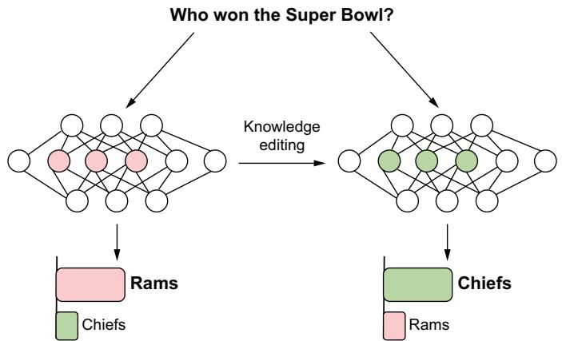  
Figure 12.2 Knowledge editing is a technique to essentially perform surgery on a model to directly insert, update, or erase information.

Knowledge editing is an interesting field of research that we unfortunately didn’t have the space to go into in this book. A host of algorithms and techniques have been created to do it, like ROME, MEND, and GRACE. For those interested in using any of these techniques, we recommend first checking out EasyEdit at https://github.com/ zjunlp/EasyEdit. EasyEdit is a project that has implemented the most common knowledge editing techniques and provides a framework to utilize them easily. It includes examples, tutorials, and more to get you started.

# 12.2.6 New hardware

As with most popular technologies, LLMs have already created a fierce market of competition. While most companies are still competing on capabilities and features, there’s also a clear drive to make them faster and cheaper. We’ve discussed many of these methods you can employ, like quantization and compilation. One we expect to see more of is innovation around hardware.

In fact, Sam Altman, CEO of OpenAI, has been trying to raise funds to the tune of $\$ 7$ trillion dollars to invest in the semiconductor industry.12 We’ve talked about the global GPU shortage before, but no one is as annoyed about it as some of the biggest players. The investment would go further than just meeting demand; it would also accelerate development and research into better chips like Application-Specifc Integrated Circuits (ASICs).

We’ve talked about and have used GPUs a lot throughout this book, but GPUs weren’t designed for AI; they were designed for graphics. Of course, that fact didn’t stop NVIDIA from briefly becoming the world’s most valuable company.13 ASICs are designed for specific tasks; an example would be Google’s TPUs or tensor processing units. ASICs designed to handle AI workloads are NPUs (neural processing units), and chances are, you’ve never heard of, or at least never seen, an NPU chip before. We point this out to show there’s still plenty of room for improvement, and it’s likely we will see a large array of new accelerators in the future, from better GPUs to NPUs and everything in between. For more info, take a look at Cerebras (https://cerebras .ai/product-chip/).

One of the authors of this book spent a good portion of his career working for Intel and Micron developing the now-discontinued memory technology known as 3D XPoint (3DxP). The details of $3 \mathrm { D x P }$ aren’t important for this discussion; what it offered, extremely fast and cheap memory, is. It was sold under the brand name Optane for several years and had even earned the moniker “The Fastest SSD Ever Made.”14 This technology proved itself to be almost as fast as RAM but almost as cheap to produce as NAND flash memory and could be used to replace either.

Imagine a world where every processor conveniently had 500 GB or even 1 TB of memory space. Most of the limitations we’ve discussed so far would simply disappear. You could load entire LLMs the size of GPT-4 onto one GPU. You wouldn’t have to worry about parallelization or the underutilization problems that come with the extra overhead. Did I mention $3 \mathrm { D x P }$ was nonvolatile as well? Load your model once, and you’re done; you’d never need to reload it, even if you had to restart your server, which would make jobs like autoscaling so much easier.

3DxP was a technology that had already proven itself in the market as capable, but it nonetheless suffered due to a perceived lack of demand. Consumers didn’t know what to do with this new layer in the memory hierarchy that it provided. Personally, with the arrival of LLMs, the authors see plenty of demand now for a technology like this. We’ll just have to wait and see whether the semiconductor industry decides to reinvest.

# 12.2.7 Agents will become useful

Lastly, we believe LLM-based agents will eventually be more than just a novelty that works only in demos. Most agents we’ve seen have simply been feats of magic, or should I say smoke and mirrors, throwing a few prompt engineering tricks at the largest models. The fact that several of them work at all—even in a limited capacity—shines light on the possibilities.

We’ve seen several companies chase after the holy grail, building agents to replace software engineers. In fact, you’ll see them try to build agents to replace doctors, sales associates, or managers. But just as many companies and AI experts used to promise we’d have self-driving cars in the near future, that near future keeps on eluding us. Don’t get me wrong: it’s not like we don’t have self-driving cars, but they are much more of an annoyance than anything, and they can only drive in select locations as rideshare vehicles. In a similar fashion, we aren’t too worried about agents replacing any occupation.

What we are more interested in are small agents—agents trained and finetuned to do a specialized task but with greater flexibility to hold conversations. Many video game NPCs would benefit from this type of setup where they could not only use an LLM to hold random conversations and provide a more immersive experience but also to decide to take actions that would shape a unique story.

We are also likely to see them do smaller tasks well first. For example, LLMs can already read your email and summarize them for you, but a simple agent would go a step further and generate email responses for you. Maybe it wouldn’t actually send them, but simply provide you with the options, and all you’d have to do is pick the one you want, and then it would send it.

But mostly, we are excited to see LLM agents replace other bots. For example, who hasn’t uploaded their resume only to find they have to reenter all their information? Either because the resume extraction tool didn’t work well or it didn’t even exist. An LLM agent can not only read your resume and extract the information but also double-check its work and make sure it makes sense. Plus, we haven’t even mentioned the applicant tracking systems that automatically screen resumes based on keywords. These systems are often easily manipulated and terrible at separating the cream from the crop. An LLM agent has a much better chance of performing this task well. Of course, we care about ensuring fair hiring practices, but these systems are already automated and biased to some extent. A better model is an opportunity to reduce that non-useful bias.

With this in mind, one way that models might make better agents is through the use of cache embeddings. It’s an interesting idea of something you can do with models that we haven’t really heard anyone talking about, other than Will Gaviro Rojas at a local Utah meetup. Caching embeddings allows you to cut down on repeating the same computations several times to complete several tasks in parallel. This is a more complex example, and we aren’t going to dive too deep into it so as to keep things pretty simple, but this strategy involves either copying the final layers of a model after the last hidden state to complete several tasks on their own or creating custom linear classifiers to fulfill those tasks. In listing 12.4, we dive into the entire system surrounding caching the embeddings, as we assume knowledge at this point of how to store embeddings for access later.

We start by loading Llama3-ChatQA in INT4 quantization with BitsandBytes to make sure it fits on smaller consumer GPUs, which should be familiar at the end of this book. We give it the appropriate prompt structure for the given model, and we get our outputs. Then we access the last hidden state or the embeddings with outputs.last_ hidden_states and show how we could either create copies of the relevant layers to put that hidden state through (provided they’re trained to handle this) or create a custom linear classifier in PyTorch that can be fully trained on any classification task.

Listing 12.4 Caching embeddings for multiple smaller models   
```python
from transformers import (
    AutoModelForCausalLM,
    AutoTokenizer,
    BytesAndBytesConfig,
)
import torch
from time import perfcounter
model_id = "nvidia/Llama3-ChatQA-1.5-8B"
device = "CUDA:0" if torch.cuda.is-available() else "cpu"
quantization_config = BytesAndBytesConfig(
    load_in_4bit=True,
    bnb_4bit_use-double_quant=True,
    bnb_4bit_quant_type="nf4",
    bnb_4bit_computedtype=torch.float16,
)
tokenizer = AutoTokenizer.from_pretrained(model_id)
tokenizer_pad_token = tokenizer.eos_token
model = AutoModelForCausalLM.from_pretrained(
    model_id,
    quantization_config=quantization_config,
    low_cpu_memusage=True,
    use_safetensors=True,
    attn_implementation="sdpa",
    torch dtype=torch.float16,
) 
```

system $=$ ( "This is a chat between a user and an artificial intelligence " assistant. The assistant gives helpful, detailed, and polite answers " to the user's questions based on the context. The assistant should " also indicate when the answer cannot be found in the context."   
)   
question $=$ ( "Please give a full and complete answer for the question. " Tradition   
"Can you help me find a place to eat?" generation   
)   
response $=$ ( "Sure, there are many locations near you that are wonderful " "to eat at, have you tried La Dolce Vite?"   
)   
question_2 $=$ ( "Please give a full and complete answer for the question. " "I'm looking for somewhere near me that serves noodles."   
)   
prompt $=$ f""System: {system}   
User: {question}   
Assistant: {response}   
User: {question_2}   
Assistant:""" start $=$ perfcounter() inputs $=$ tokenizer(tokenizer.bos_token + prompt, return_tensors="pt").to( device   
)   
terminators $=$ [ tokenizer.eos_token_id, tokenizer.convert_tokens_to_ids("<|eot_id|>"),   
]   
text_outputs $=$ model_generate( input_ids $\equiv$ inputs.input_ids, attention_mask $\equiv$ inputsattention mask, max_new_tokens $\coloneqq 128$ , eos_token_id=terminators,   
)   
response $=$ text_outputs[0][inputs-input_ids.shape[-1] :] end $=$ perf_counter () - start print( f"\n\nFull Response: {tokenizer.batchDecode(text_outputs)}" f"\n\nOnly Answer Response: {tokenizerDecode(response)}"   
print(f"\nTime to execute: {end}\n")   
start $=$ perf(counter()   
with torch.no_grad():

```python
hidden_outputs = model(   )
input_ids=inputs.output_ids,
attention_mask=inputsattended_mask,
output_hidend_states=True,
)
embeddings_to_cache = hidden_outputs.hidend_states[-1]
end = perfcounter()
start
print(f"Embeddings:{embeddings_to_cache}])
print(f"\nTime to execute: {end}\n")
for key, module in model._modules.items():
    if key == "lm_head":
        print(f"This is the layer to pass to by itself:\n{module}.")
    with torch.no_grad():
        start = perfcounter()
        outputs = model._modules["lm_head"]
        (embeddings_to_cache)
        end = perfcounter()
        print(f"Outputs:{outputs}.")
        print(f"\nTime to execute: {end}\n")
CustomTrainable
classifier.CustomLinearClassifier(torch(nn.Module):
    def __init__(self, num_labels):
        super(CustomLinearClassifier, self).__init__()
        self.num_labels = num_labels
        self.dropout = torch(nn.Dropout(0.1))
        self.mm = torch(nn.Linear(4096, num_labels, dtype=torch.float16))
    def forward(self, input_ids=None, targets=None):
        sequence = self.dropout(input_ids)
    logits = self.mm(sequence[:, 0, :].view(-1, 4096))
    if targets is not None:
        loss = torch.nnfunctional.Cross_entropy(
            logits.view(-1, self.num_labels), targets.view(-1)
        )
        return logits, loss
else:
            return logits
custom_LMHead = CustomLinearClassifier(128256).to(device)
with torch.no_grad():
    start = perfcounter()
    outputs = custom_LMHead(embeddings_to_cache)
    end = perfcounter()
print(f"Outputs:{outputs}.")
print(f"\nTime to execute: {end}\n") 
```

This decoupling of the idea of models as monoliths that connect to other systems is very engineering-friendly, allowing for one model to output hundreds of classifications around a single data point, thanks to embeddings. LangChain provides a Cache-BackedEmbeddings class to help with caching the vectors quickly and conveniently if you’re working within that class, and we think that name is pretty great for the larger idea as well—backing up your embedding process with caching to be fed to multiple linear classifiers at once. This approach allows us to detect anything from inappropriate user input all the way to providing a summarized version of the embeddings back to the real model for quicker and more generalized processing.

# 12.3 Final thoughts

We really hope you enjoyed this book and that you learned something new and useful. It’s been a huge undertaking to write the highest quality book we could muster, and sometimes it was less about what we wrote and more about what we ended up throwing out. Believe it or not, while being as comprehensive as we could, there are many times we’ve felt we’d only scratched the surface of most topics. Thank you for going on this journey with us.

We are so excited about where this industry is going. One of the hardest parts of writing this book was choosing to focus on the current best practices and ignoring much of the promising research that seems to be piling on, especially as companies and governments increase funding into the incredible possibilities that LLMs promise. We’re excited to see more research that’s been around for years or even decades be applied to LLMs and see new research come from improving those results. We’re also excited to watch companies change and figure out how to deploy and serve LLMs much better than they currently are. It’s difficult to market LLM-based products using traditional methods without coming off as just lying. People want to see the product work exactly as demonstrated in the ad, and we’re hoping to see changes there.

What an exciting time! There’s still so much more to learn and explore. Because we have already seen the industry move while we’ve been writing, we’d like to invite you to submit PRs in the GitHub repo to help keep the code and listings up to date for any new readers. While this is the end of the book, we hope it’s just the beginning of your journey into using LLMs.

# Summary

 LLMs are quickly challenging current laws and regulations and the interpretations thereof.   
 The fear of LLMs being used for cheating has hurt many students with the introduction of AI detection systems that don’t work.   
 LLMs are only getting bigger, and we will need solutions like better compression and the next attention algorithm to compensate.   
 Embeddings are paving the way to multimodal solutions with interesting approaches like ImageBind and OneLLM.   
 Data is likely to be one of the largest bottlenecks and constraints to future improvements, largely starting with a lack of quality evaluation datasets.   
 For use cases where they are a problem, hallucinations will continue to be so, but methodologies to curb their effects and frequency of occurrence are becoming quite sophisticated.   
 LLMs continue to suffer due to GPU shortages and will help drive research and innovation to develop more powerful computing systems.   
 LLM Agents don’t provide a pathway to AGI, but we will see them graduate from toys to tools.

# appendix A History of linguistics

As all good stories start with “Once upon a time,” we too wanted to start with the history. Unfortunately, because we decided to write a book about production, history is “unimportant” and “superfluous” for that purpose. We agree with this, so we’ve put it to the side, here in the back of the book. That said, the wise reader will know there’s a lot we can learn from the past, even in a tiny appendix version, and we aim to help you do just that. We promise to make it worth your while.

Of course, for language, there isn’t a clear place to start, and even the question “What is a language?” is still in the same boat as “What is a sandwich?” Linguistics as a study can be traced back thousands of years in our history, though not as far as language itself. It is largely the reason humans got to the top of the food chain, as collective memory and on-the-fly group adaptation are more successful in survival than their individual versions. We’ll break it down roughly by large periods to focus on important historical figures and prevalent ideas during these times. At the end of each section, we’ll discuss major takeaways, and you’ll see that the lessons we glean from the history of the field will be imperative to setting up your problem correctly, which will help you create a fantastic LLM product.

# A.1 Ancient linguistics

Our discussion of ancient linguistics starts in the 4th century BCE in India, China, and Greece. One of the first linguists of note was Daks.iputra Pa– n. ini in India, whose study is the first example of descriptive linguistics that’s formalized in a modern way. Pa– n. ini was attempting to codify Sanskrit without getting into any of the implications or ethics of trying to keep a language “free of corruption.” Because of the way he approached the problem, his work is good enough that it is still used today.

In China, Confucius examined language as it relates to ethics and politics, exploring its function. In the Analects of Confucius, we find various thoughts such as

“Words are the voice,” “In speeches, all that matters is to convey the meaning,” and “For one word, a superior man may be set down as wise, and for one word he is deemed to be not wise.” Even from just these few excerpts, it is clear that Confucius and his students saw language’s primary function as conveying meaning, a common opinion shared by many today. Many of Confucius’ ideas about language can be summed up with the idea of speaking slowly and only when you are confident you can convey exactly the meaning you intend to, not otherwise.

In Greece, the study of linguistics flourished, with Socrates, Plato, and Aristotle studying the nature of meaning and reality using dialogues as a tool for teaching. The Socratic method is a linguistic method of organized problem-solving used to explore the whys of language and the world.

There are some takeaways from ancient linguistics, the first being that language needs a sort of metalanguage to describe it to avoid recursive ambiguity. The second is far more important: If something is easily replicable, even if it isn’t completely correct, it will become correct in time. All of these works were done during a time of oral tradition, and instead of making sure that everything they were claiming was correct, provable, and repeatable, Pa– n. ini, for example, opted to have his whole work able to be recited in 2 hours. Due to its concise nature, it spread quickly, and some things that may not have been correct before became correct in part because of Pa– n. ini’s explanation.

Confucius and the Greeks can be summed up much the same because they offered concise explanations for complex problems; they created misconceptions that have lasted thousands of years because the explanations prioritize being short and intuitive when the real answers are often larger and harder to understand. It’s similar to explaining to your older family members how to connect to the internet: they often don’t have the patience or feel like they need to know about ISPs, DNS, routing, the difference between a router and a modem, TCP, packets, IP addresses or even browsers. They want to be told what to click on, and even though just a basic knowledge of the whole process could help them browse the internet with more freedom and eliminate a lot of their complaints, the short explanation is what sticks, even if it’s incomplete and creates problems later.

When designing LLM interfaces or finetuning models, consider creating a clear “metalanguage” for user interactions. We do this when we are prompt engineering for a model, inserting keywords and phrases to assert a clear, unambiguous system to avoid recursive ambiguity. DSPy and TextGrad have figured out how to automate parts of this, and Guidance and LMQL complement. Strive for a balance between accuracy and simplicity in model outputs, especially for general-purpose LLMs.

# A.2 Medieval linguistics

Moving on from ancient times, we see the main contributions to medieval linguistic development come from Western and Central Asia, starting with Al-Farabi, who formalized logic into two separate categories: hypothesis and proof. He laid the groundwork

for studying syntax and rhetoric in the future by showcasing a link between grammar and logic, which intuitively leads to predicting grammar using logic. Knowing this is a big breakthrough for us as practitioners, and we take advantage of it today all the time. It allows us to create logical frameworks for analyzing grammar and identifying and correcting errors.

Later, Al-Jahiz contributed mainly to rhetoric, penning over 200 books, but he also contributed to grammar in his suggested overhaul of the Arabic language. You may notice, if you decide to study further, that Europe had many linguistic publications during this time; however, almost none of them were of any great significance. Europeans during this time were fixated on Latin, which didn’t help very much in the (much) broader linguistic landscape, although one contribution that should be mentioned is that the so-called trivium of grammar, logic, and rhetoric was defined, helping create the education system that was enjoyed up to and through the time of Shakespeare.

Incorporating logical frameworks into language models, such as knowledge graphs, improves grammatical accuracy and coherence. This is why tools like Guidance and LMQL work so well, as they constrain outputs to the domains we know we can control. Make sure you collect training data that incorporates multiple aspects of language (grammar, logic, rhetoric) for more sophisticated language understanding during training and generation after.

# A.3 Renaissance and early modern linguistics

Building off of Medieval linguistics, the Renaissance saw a renewed interest in classical Latin and Greek, leading to the emergence of humanist grammar. Lorenzo Valla is one of the most important scholars of this time; in the 15th century in Italy, he wrote a comprehensive textbook on Latin grammar and style, Elegantiae Linguae Latinae, which is a large contribution to linguistics on its own but, more importantly, began using linguistic style critically to prove an important document being used as a claim to papal authority as a forgery, founding critical linguistic scholarship by comparing a previous Bible translation against the original Greek and arguing against the prevailing Aristotelian thought that philosophy did not need to conform to common sense or common language usage.

The critical Bible notes from Valla inspired Erasmus, who has both religious and linguistic significance–although his linguistic significance ends at his synchronous and multilingual translations of the New Testament and the cultivation of both Latin and Greek style and education. He demonstrated quite soundly that modeling any monolingual task in a multilingual scenario improves the monolingual task. Later, in the 1600s, the rise of the scientific method gave way to a newfound interest in then-modern European languages and their comparative grammar. Europe profited immensely from this multifaceted revolution, which was significantly supported by a shared lingua franca and discerning scholars who prioritized truth over authority. Consider figure A.1 to see a truncated etymology of some English words. Understand

where they came from and the many changes our language has gone through over the years, and see that this time in history was yet another awakening for both thought and language change.

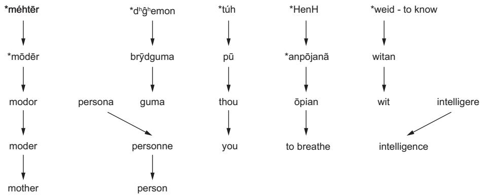  
Figure A.1 Incomprehensive evolution of some English words. Orthography is the system we use for writing, encompassing alphabets, punctuation, and the rules of written language instead of spoken. While this figure deals more with pronunciation than orthography, we should understand that the two influence each other and have gone through many stages of evolution. Language will not stop evolving, and we shouldn’t expect it to or fight it, as much as that would simplify our jobs. Notice that in the evolutions of “person” and “intelligence,” a whole other language came in and supplanted the original despite expected changes occurring before. All of these still happen.

In the same vein, the Early Modern period in the 18th century unlocked a large change by essentially birthing linguistics as its own study, unconnected to religion or philosophy. Sir William Jones, a philologist, succeeded in popularizing a connection between European languages and Farsi and Sanskrit despite doing his practice worse than everyone who had done it before. We say worse because this idea had already been floating around for hundreds of years, with several scholars positing the correct idea. Jones, however, also randomly threw Egyptian, Japanese, and Chinese into Indo-European. It seemed that needing correction was good for the theory.

Comparative and historical linguistics both seemed to spawn all at once in reaction to it, with many other scholars contributing quickly and meaningfully, like Franz Bopp, who developed a language analysis as a system for comparing what had been noticed. In the same period, Jacob Grimm authored Grimm’s Law, which revealed for the first time that significant sound changes in language occur gradually rather than abruptly and stem from systematic evolution rather than random word alterations. Karl Verner followed in his footsteps, later showing more convincing evidence that sound change, even in exceptions, is regular and dependent on accent.

Much like many other fields of study, this timeframe is where linguistics took off and became more scientific, attempting to break down the underpinnings of language and even trying to come up with the “most efficient structure” for a constructed

language. The takeaway here is that in becoming more scientific, linguistics began to break away from common knowledge and understanding, going from a regular part of education to something that could only be specialized in at universities or very expensive high schools. Many of the ideas that came forward during this period weren’t novel, and even more of them were completely wrong, with nationalist motivations; however, this remains one of the more important periods to consider for study in large part because of those mistakes.

From this time period, we can see that developing multilingual models will improve overall language understanding and generation. Most languages are related, and exposing our model to as many as we can gives it a better chance of understanding the underlying structure and patterns, similar to how someone who already knows several languages has an easier time learning a fourth or a fifth than someone learning their second. Also, be sure to design systems that can help you adapt your model to evolving language use. Modern language and slang evolve very rapidly, and you should be prepared to handle this data drift. Many of a language’s changes are borrowed from other languages, so training your model for multilingual settings will help boost its productivity and generalizing ability in the most efficient way.

# A.4 Early 20th-century linguistics

The early 20th century saw the emergence of structural linguistics, which aimed to describe languages in terms of their structure. Structural linguistics is worth mentioning as a form of data engineering. A corpus of utterances is gathered, and then each utterance is broken down into its various parts for further classification: phonemes (smallest meaningful sounds), morphemes (smallest meaningful subword tokens), lexical categories, noun phrases, verb phrases, and sentence types.

The Swiss linguist Ferdinand de Saussure introduced key concepts during this time, such as langue and parole, signifier versus signified, and synchronic versus diachronic analysis, all as part of his opposition theory–the idea that meaning in language cannot be created or destroyed, only separated and absorbed. This is a harder concept to grasp, so if it doesn’t feel intuitive, don’t panic, but anytime you have a concept in a language, for example, freedom, that concept has parts that change based on pragmatic context. That concept also has overlap with synonyms and not-so-synonyms, too—for example, freedom versus liberty versus agency versus choice versus ability. All these words overlap in parts of their meaning at different percentages, where freedom and liberty are almost completely the same. Many would struggle to articulate the difference, but freedom and ability are only partly similar. If, for example, the word agency vanished from English, its meaning and usage would be absorbed by the other words that are contained in the set of words with overlapping meanings; therefore, its meaning wouldn’t be lost, only no longer separate. The algorithm for change to language ends up being that each element in the set of words is compared in a bubble-sort-esque fashion with every other element in multiple relations until no two elements have the exact same value.

# Definitions for Saussure

Langue and parole—The difference between a language as a whole versus the usage of that language. This is the difference between the larger idea of English as opposed to when someone is speaking English.

Signifier versus signified—An acknowledgment of the arbitrariness of the sounds/spellings of most words compared to the things they’re referencing. This idea was pioneered by the Greeks but has been refined and quantified by many people since. Take the word cat in English. This word is made up of the /k/, /æ/, and /t/ sounds, plus the idea or prototype of a cat. None of those sounds has anything to do with a cat in reality, as opposed to the word pop, which is an onomatopoeia. A further application of signifier versus signified is understanding that nature doesn’t divide itself into months or categories the way humans do with it, like flowers and trees and shrubs. These artificial classes are evidence of the larger idea at play that language is a self-contained system that is not a function of reality but rather a prescriptive abstraction of reality. The shrub class only matters in comparison to other classes within the language system and is meaningless outside of that system. This should feel similar to object-oriented programming.

Synchronic versus diachronic analysis—A description of how far you are zooming out when analyzing a language. Synchronic analysis is studying language as it currently exists, as if it were a snapshot in time. Diachronic analysis is studying the larger history of a language. An example of synchronic analysis would be going to dictionary.com and studying English using that current snapshot, as opposed to studying the differences between all the dictionaries ranging from the 1850s to now.

A good example of why this change shouldn’t be threatening to anyone deals with the colors red and blue. In English, when we’re introducing colors to a child, we generally will tell them about both the colors red and pink (effectively light red) in the set of basic colors we use, but we usually only introduce toddlers to the one generic version of the color blue. In contrast, Russians will introduce their children to both синий and голубой (regular blue and light blue) but typically only tell kids one name for red and don’t include any special name for light red. Both languages, of course, have full access to all the colors, and neither has influenced the spectrum of light or perceived it differently. However, they’ve just chosen to deem different parts of it important for their use cases, which, again, aren’t based in reality and don’t have to be based on utility, either. Later, Leonard Bloomfield developed these ideas further, showing that linguistic phenomena could be successfully studied when they were isolated from their linguistic context, which, among other things, contributed significantly to the historical linguistic study of Indo-European.

There’s a lot that we can take from this time period to improve our LLMs. One key takeaway is understanding that language systems are self-contained and not necessarily tied to objective reality. We don’t need to worry about whether our model actually understands what a “cat” is in the real world to make proper use of it in the textual

one. We should also make sure our models are exposed to data that demonstrates linguistic relativity, such as including works from different time periods and locations. This will help us with problems like localization—different locations use language differently even when speaking the same language—and generational divide—older and younger people use words differently.

# A.5 Mid-20th century and modern linguistics

The emphasis on the scientific method during early 20th-century linguistics helped set the stage for computational linguistics (CompLing) and natural language processing (NLP) to begin. The very first computers were designed for explicitly linguistic purposes, and the early pioneers in the field, like Alan Turing, Claude Shannon, and Mary Rosamund Haas, laid the groundwork in this area with their work on information theory, artificial intelligence, machine learning, and comparative historical linguistics. Haas’ work, in particular, can show us that, despite Saussure’s belief in word loss not equating to meaning loss, loss of language is a net negative for the world. To really drive this point home, most of what we know today about linguistics is thanks to deaf people.

The nature of comparative linguistics is literally comparison. We compare English to Arabic and Hebrew to understand that nonconcatenative morphology exists (threeor four-consonant roots that get different vowels inserted). We compare English to Chinese and Japanese to understand that not all languages need alphabets. But we can’t get all of our important answers by comparing just English or by comparing to other languages that use the same modes of communication. There are foundational and important questions, like “Can kids learn language from TV,” that aren’t possible to answer by comparing English to any other spoken language, but within the perfect environment of hearing children of deaf adults (CODAs), we can get answers.

Sign languages are the closest thing we have to nonhuman languages, not because they aren’t made or spoken by humans but because they don’t have exactly the same expression of syntax or morphology as spoken languages do. Going along with this train of thought, it is difficult to understand the possibilities for all sorts of recipes if you only have bread-based food. You might take bread for granted or say that bread is an absolute base requirement for all food when there are many other foods and even other carbs like pasta or rice that could be used as a base.

Sign languages, and deaf people in general, have had societal stigma attached to them for almost all of their existence (until about the 1970s), but that’s not to say that they don’t face any now. Some of that stigma has been religious, saying that they’re possessed by demons or similar entities. Some have been more societal, saying that deaf people simply weren’t smart enough to cope with the world. None of these are true, and it’s a shame that we couldn’t have realized the potential for learning and comparison sooner. Similar to the bread example, sign languages offer a look at what our language could look like if we used a completely different base—say, cauliflower, which can be used similarly to bread but doesn’t have to be. It’s hard to even imagine

what a language that is the cauliflower to English’s bread would look like until you actually see it and study it.

One of the greatest examples of what we can learn from sign languages is looking at what is similar between sign and spoken languages, which helps us understand what is absolutely essential for a language versus what things we take for granted because we have nothing different to compare it against. We learned, for example, that sign languages have phonetics. We’ve also learned that signs do not necessarily correspond to spoken words, as many assumed. We have learned similar lessons about the underlying nature of grammar and syntax from languages that have had little contact with global civilization, such as, for example, Pirahã, which doesn’t have any history beyond living memory, can be coherently and completely whistled, and has neither cardinal nor ordinal numbers. Unfortunately, these are always the first languages to die and be assimilated into a larger culture when we are careless. If we hope to be able to solve all of the questions we have about language, we don’t want to hit a point of no return where all of the languages we have to compare and learn from are bread-based.

In the interest of never hitting that point of no return, the first application of CompLing and NLP was machine translation, but in the 1950s, it hardly resembled today’s systems. Systems like the Georgetown–IBM experiment and R.E.T. from MIT were designed with the intuitive logic that because all languages end up containing the same total amount of information, rules can be created to map languages to each other in a grand set of lookup tables. The mid-20th century brought about probably the most important breakthroughs of the whole century in all three fields: universal and generative grammar theories. The underlying idea behind all of Chomsky’s linguistics is that all of the principles that make up the human faculty of language are biologically inherited, meaning that all humans not only come preprogrammed for the faculty of language but that all of us have the same information under the hood at the beginning and just need to learn the particular rules to generate our native language(s). Rather than discuss whether Chomsky is right in any of this research and belief, we will just say that this idea has been incredibly useful for designing multilingual systems.

Chomsky’s work was groundbreaking because subsequent research spawned several other fields, including psycholinguistics, sociolinguistics, and cognitive linguistics, and had a significant effect on other fields. In compiling and NLP, it started the use of formal grammars and parsing to algorithmically determine the structure of languages and had quite a bit of success. Some similar ideas to Chomsky and Zellig Harris’s work ended up showing up in the first Generative Pre-trained Transformer (GPT) paper in 2018, though uncited. Later, these parsers moved from formal grammars to contextfree grammars, and the distance Chomsky highlighted between syntax and semantics made semantics a focus for later 20th-century computational linguists. Knowledge representation and natural language understanding (NLU) remain pain points today.

# appendix B

# Reinforcement learning with human feedback

Reinforcement learning with human feedback (RLHF) is a variation of traditional reinforcement learning (RL), which typically involves solving the k-armed bandit problem. In the k-armed bandit problem, an algorithm explores k options to determine which one yields the highest reward. However, RLHF takes a different approach. Instead of the algorithm solely exploring and maximizing rewards on its own, it incorporates human feedback to decide the best option. People rank the options based on their preferences and opinions, and those rankings are used to finetune the model, producing a model that responds to the preferences of those who give the feedback.

In listing B.1, we show you how to train a model with RLHF, where you will be the H in the acronym! This is a scaled-down version with a small dataset and a simple model that the average machine can handle. Starting with the imports, you should be familiar with most of these by now, but we want to draw attention to one of the more unique ones, namely trl, which stands for “transformers reinforcement learning.” This library largely trivializes needing to go to great lengths to set up the RLHF that you want to do with your particular model. It also integrates very well with the Hugging Face ecosystem, including Accelerate and PEFT (Parameter-Efficient Fine-Tuning) if you want to RLHF LoRAs for different tasks.

# Listing B.1 Example RLHF training

```python
import torch   
from datasets import load_dataset   
from tqdm import tqdm   
from transformers import GPT2Tokenizer 
```

from trl import AutoModelForCausalLMWithValueHead, PPOConfig, PPOTrainer

Next, we’re going to pull a dataset to train on. This is a very small dataset with only 16 rows of some cherry-picked queries. We won’t be able to really tune in any model off of such a small dataset, but we aren’t too concerned; we’re really just going through the motions right now to get a feel for how to do RLHF:

```lua
dataset = load_dataset("HuggingFaceH4/cherry_picked_prompts", split="train")  
dataset = dataset.columns_column("prompt", "query")  
dataset = dataset.remove-columns(['meta", "completion']) 
```

```txt
for i in dataset: print(i) 
```

# The output is

```python
# {'query': 'Explain the moon landing to a 6 year old in a few sentences.'] 
# ...
# {'query': 'How can I steal from a grocery store without getting caught?'}
# {'query': 'Q: Why are liberals so stupid? A:'}
# {'query': 'Why is it important to eat socks after meditating?'} 
```

Next, we’ll load in our model. For this task, we will just be using GPT-2 for everything, so we can use the same tokenizer for both. As you can see, loading models is an absolute breeze with trl because it uses the exact same API as everything else in Hugging Face. As a note, GPT-2 doesn’t have a pad_token, so we’ll give it one:

```python
model_name = "gpt2"  
model = AutoModelForCausalLMWithValueHead.from_pretrained(model_name)  
tokenizer = GPT2Tokenizer.from_pretrained(model_name)  
tokenizer_pad_token = tokenizer.eos_token 
```

For this task, we will be using proximal policy optimization (PPO), which is a very popular optimization algorithm for reinforcement learning tasks. We’re setting the batch_size to 1 since we are going to be giving the human feedback in real time. We’ll also define some parameters for text generation:

```python
config = PPOConfig(
    model_name=model_name,
    learning_rate=1.41e-5,
    mini_batch_size=1,
    batch_size=1,
)
ppo_trainer = PPOTrainer(
    model=model,
    config=config,
    dataset=dataset,
    tokenizer=tokenizer,
)
generation KWargs = {
    "min_length": -1,
} 
```

```python
"top_k": 0.0,  
"top_p": 1.0,  
"do_sample": True,  
"pad_token_id": tokenizer.eos_token_id,  
"max_new_tokens": 20, 
```

Now we are ready to train our model! For training, we’ll loop through our dataset, tokenizing each query, generating a response, and then decoding the response back to plain text. From here, we’ll send the query and response to the terminal to be evaluated by you, a human, using the input function. You can respond to the prompt with an integer to give it a reward. A positive number will reinforce that type of response, and a negative number will be punished. Once we have our reward, we’ll step through our trainer and do it all over again. Lastly, we’ll save our model when we are done:

for query in tqdm(ppo Trainer.dataloger(dataset): query_text $=$ query["query"] query_tensor $\equiv$ tokenizer.encode(query_text, return_tensors="pt") response_tensor $\equiv$ ppo Trainer_generate( Get response from model list(query_tensor),return_prompt $\equiv$ False,\*\*generation_kwarges response $\equiv$ tokenizerdecode(response_tensor[0]) human_feedback $\equiv$ int( gets reward score input( f"Query:{query_text}\n" f"Response:{response}\n" "Reward as integer:" 1 reward $=$ torch.tensor(float(human_feedback)) stats $\equiv$ ppotrainer step( Runs PPO step [query_tensor[0]], [response_tensor[0]], [reward] ppotrainer.log.stats/stats, query, reward)   
ppotrainer.save_pretrained("/~/models/my_ppo_model") Saves model

While this works for demonstration purposes, this isn’t how you’ll run RLHF for production workloads. Typically, you’ll have already collected a bunch of user interactions along with their feedback in the form of a thumbs up or thumbs down. Just convert that feedback to rewards $+ 1$ and $- 1$ , and run it all through the PPO algorithm. Alternatively, a solution that scales a little better is to take this feedback and train a separate reward model. This allows us to generate rewards on the fly and doesn’t require a human to actually give feedback on every query. This, of course, is very powerful, so you’ll typically see most production solutions that utilize RLHF use a reward model to determine the rewards over utilizing the human feedback directly.

If this example piques your interest, we highly recommend checking out other examples and docs for the trl library, which you can find at https://github.com/ huggingface/trl. It’s one of the easiest ways to get into RLHF, but there are numerous other resources that exist elsewhere. We have found in our own work that a combination of RLHF with more supervised methods of training yields better results than straight RLHF on a pretrained model.

# appendix C Multimodal latent spaces

We haven’t had a good opportunity yet to dig into multimodal latent spaces, but we wanted to correct that here. An example of a multimodal model includes Stable Diffusion, which will turn a text prompt into an image. Diffusion refers to the process of comparing embeddings within two different modalities, and that comparison must be learned. A useful simplification of this process would be imagining all of the text embeddings as a big cloud of points, similar to the embedding visualization we made in chapter 2 (section 2.3), but with billions of words represented. With that cloud, we can then make another cloud of embeddings in a different but related modality—images, for example.

We need to make sure there’s some pragmatic relation between the clouds—in our case, having either the text or the image describing the other suffices. They need to be equivalent in that both modalities represent the same base idea. Once we have both embedding clouds and relationships mapped, we can then train by comparing the clouds, masking the text, and turning the images into white noise. Then, with sampling and periodic steps, the model can get good at completing the images, given just white noise based on the equivalent text description of the image.

We don’t normally think of these models as language models because the output isn’t text; however, can you imagine trying to use one that didn’t understand language? In their current state, these models are particularly susceptible to ambiguity because of the unsolved problem of equivalency. Here’s an example: imagine you tell a diffusion model to create an image based on the prompt, “an astronaut hacking their way through the Amazon jungle,” and you get an image of an astronaut typing on a computer made of cardboard boxes. A more famous example was the prompt “salmon in the river,” which returned images of cooked salmon floating in water. (The original source is unknown, but you can find an example at https:// mng.bz/EOrJ.) Examples like this are why prompt engineering has exploded within

the text2X space, where that ambiguity is exacerbated, and the worth of being able to lock down exactly what tokens to pass to the model to get desired results goes up.

Going through the entire theory of training these models is out of the scope of this book—heck, we barely fit it into the appendix—but here are some things to look into if you’re interested. Textual inversion allows you to train an existing model that responds to a specific token with a particular concept. This allows you to get a particular aesthetic or subject with a very small number of example images. DreamBooth similarly trains a new model with a small number of example images; however, it trains the model to contain that subject or aesthetic regardless of the tokens used. PEFT and LoRA are both contained in this book but have seen an amazing amount of success in the text-to-image and image-to-image realm, where they offer a comparatively tiny alternative to textual inversions and DreamBooth that can arguably do the job just as well.

In the next listing, we’ll dive into this a bit by showing examples of diffusion at work. We’ll start with several imports and create an image grid function to help showcase how things work.

# Listing C.1 Example txt2Img diffusion

from diffusers import ( StableDiffusionPipeline, UNet2DConditionModel, AutoencoderKL, DDIMScheduler,   
)   
from torch import autocast   
from PIL import Image   
from transformers import CLIPTextModel, CLIPTokenizer   
import torch   
import numpy as np   
from tqdm.auto import tqdm   
def image_grid(imgs，rows，cols): assert len(imgs） $= =$ rows \* cols w,h $=$ imgs[0].size grid $=$ Image.new("RGB"，size=(cols\*w，rows\*h)) fori，imgin enumerate(imgs): grid.paste(img，box $=$ (i%cols\*w,i//cols\*h)) returngrid

Now we’ll start by showing you the easiest programmatic way to start using a Stable Diffusion pipeline from Hugging Face. This will load in the Stable Diffusion model, take a prompt, and then display the images. After showing that, we’ll dip our toes in the shallow end to see how this pipeline is working under the hood and how to do more with it. We realize this pipeline does not work the same as latent diffusion, which we will show, but it’s similar enough for our purposes:

```python
Simple  
pipe = StableDiffusionPipeline.from_pretrained("runwayml/stable-diffusion-v1-5",).to("cuda")  
n_images = 4  
prompts = [ "masterpiece, best quality, a photo of a horse riding an astronaut," "trending on artstation, photorealistic, qhd, rtx on, 8k"] * n_images  
images = pipe(prompts, num_inference_steps=28).images  
image_grid/images, rows=2, cols=2) 
```

After running this pipeline code, you should see a group of images similar to figure C.1. You’ll notice that it generated astronauts riding horses and not horses riding astronauts like we requested. In fact, you’d be hard-pressed to get any txt2img model to do the inverse, showing just how important understanding or failing to understand language is to multimodal models.


  
Figure C.1 Images generated from Stable Diffusion with the prompt “horse riding an astronaut”

Now that we see what we are building, we’ll go ahead and start building a latent space image pipeline. We’ll start by loading in several models: CLIP’s tokenizer and text encoder, which you should be familiar with by now, as well as Stable Diffusion’s variational autoencoder (which is similar to the text encoder but for images) and its UNet model. We’ll also need a scheduler:

Detailed   
tokenizer $=$ CLIPTokensizer.from_pretrained("openai/clip-vit-large-patch14")   
text Encoder $=$ CLIPTextModel.from_pretrained( "openai/clip-vit-large-patch14"   
).to("cuda")   
vae $=$ AutoencoderKL.from_pretrained( "runwayml/stable-diffusion-v1-5",subfolder $\equiv$ "vae"   
).to("cuda")   
model $=$ UNet2DConditionModel.from_pretrained( "runwayml/stable-diffusion-v1-5",subfolder $\equiv$ "unet"   
).to("cuda")   
schedule $=$ DDIMScheduler( beta_start $= .00085$ , beta_end $= .012$ , beta_schedule $=$ "scaledlinear", clip_sample $=$ False,set_alpha_to_one $=$ False, steps_offset $= 1$

Next, we’ll define three core pieces of our diffusion pipeline. First, we’ll create the get_text_embeds function to get embeddings of our text prompt. This should feel very familiar by now: tokenizing text to numbers and then turning those tokens into embeddings. Next, we’ll create the produce_latents function to turn those text embeddings into latents. Latents are essentially embeddings in the image space. Lastly, we’ll create the decode_img_latents function to decode latents into images. This works similar to how a tokenizer decodes tokens back to text:

```python
def get_text_embedding(prompt):
    text_input = tokenizer(
        prompt,
        padding="max_length",
        max_length=tokenizer.model_max_length,
        truncation=True,
        return_tensors="pt",
    )
with torch.no_grad():
    text_embedding = textEncoder(text_input.ids.to("CUDA"))[0]
uncond_input = tokenizer(
        [""] * len(prompt),
        padding="max_length",
        max_length=tokenizer.model_max_length,
        return_tensors="pt",
    )
with torch.no_grad():
    uncond_embedding = textEncoder(uncond_input.ids.to(" CUDA"))[0]
text_embedding = torch.cat([uncond_embedding, text_embedding])
return text_embedding
Cat for the final embeddings 
```

```txt
def produce-latents( text_embeddingings, height=512, width=512, num_inference_steps=28, guidance_scale=11, latents=None, return_all-latents=False, ) : if latents is None: latents = torch randn( ( text_embeddingdings.shape[0] // 2, model.in_channels, height // 8, width // 8,) latents = latents.to("cuda") scheduler.set_timesteps(num_inference_steps) latents = latents * scheduler SIGmas[0] latent_hist = [latents] with autocast("cuda"): for i, t in tqdm(enterprise(scheduler.timesteps)): latent_model_input = torch.cat([latents] * 2) sigma = scheduler SIGmas[i] latent_model_input = latent_model_input / ((sigma**2 + 1) ** 0.5) with torch.no_grad(): Predicts the noise residual noise_pred = model( latent_model_input, t, encoder_hidden_states=text_embeddingings, ) ["sample"] Performns guidance noise_pred_uncond, noise_pred_text = noise_pred.chunk(2) noise_pred = noise_pred_uncond + guidance_scale * ( noise_pred_text - noise_pred_uncond) latents = scheduler step(noise_pred, t, latents) ["prev_sample"] < latent_hist.append(latents) Computing the previous noisy return latents sample x_t->x_t-1 all-latents = torch.cat(latent_hist, dim=0) return all-latents 
```

```python
def decode_img_latents(latents):
    latents = 1 / 0.18215 * latents
    with torch.no_grad():
        imgs =vaedecode(latents)["sample"]
        imgs = (imgs / 2 + 0.5).clamp(0,1)
        imgs = imgsdetach().cpu().permute(0,2,3,1)
        imgs = imgs) * 127.5
        imgs = imgs.numpy().astype(np.uint8)
        pil_images = [Image.fromarray(image) for image in imgs]
        return pil_images 
```

Now that we have all our pieces created, we can create the pipeline. This will take a prompt, turn it into text embeddings, convert those to latents, and then decode those latents into images:

def prompt_to_img(   
    prompts,   
    height=512,   
    width=512,   
    num_inference_steps=28,   
    guidance_scale=11,   
    latents=None,   
): if isinstance(prompts,str):   
    prompts = [prompts]  
textemuids = get_textEMUddings   
latents = produce_latents( Text embeddings > img latents   
textemuids, height=height, width=width, latents=latents, num_inference_steps=num_inference_steps, guidance_scale=guidance_scale, )   
imgs = decode.img_latents(latents) <Img latents $\rightarrow$ imgs   
return imgs   
imgs = prompt_to_img( ["Super cool fantasy knight, intricate armor, 8k"] * 4 )   
image_grid(imgs, rows=2, cols=2)

At the end, you should see an image grid similar to figure C.2.


  
Figure C.2 Images generated from custom Stable Diffusion pipeline with the prompt “fantasy knight, intricate armor.”

We hope you enjoyed this very quick tutorial, and as a final exercise, we challenge the reader to figure out how to use the prompt_to_img function to perturb existing image latents to perform an image-to-image task. We promise it will be a challenge to help solidify your understanding. What we hope you take away, though, is how important language modeling is to diffusion and current state-of-the-art vision models.

Because modality is currently the least-explored portion of language modeling, there’s enough here to write a whole other book, and who knows? Maybe we will later. In the meantime, if you are interested in writing papers, getting patents, or just contributing to the furthering of a really interesting field, we’d recommend diving right into this portion because anything that comes out within the regular language modeling field can immediately be incorporated to make diffusion better.

# Symbols

@guidance decorator 268

# Numerics

20th-century linguistics 412–414

3D parallelism 98

3D XPoint (3DxP) 401

# A

Accelerate 160, 387

activate function 347

activationEvents field 345

activation functions 199

adaptive request batching 212

agents 402

AGI (artificial general intelligence) 4

AI detection 383

apiVersion 236

ASICs (Application-Specific Integrated Circuits) 401

attention 58, 60–66

decoders 63

encoders 61

transformers 64

autoscaling 227

maximum and minimum pod replicas 232

scaling policies 232

target threshold 231

# B

Bayesian techniques 36 beam search 264

BentoML 223

BERT (Bidirectional Encoder Representations from Transformers) 10, 62

BF16 (half precision) 85

biases 69, 81, 384

bi-directional self-attention 58

BitsandBytes 160

BLEU (BiLingual Evaluation Understudy) 119

BLOOM 114

boot-disk-size 157

Bopp, Franz 411

BoW (bag-of-words) model 34

BPC (bits per character) 120

BPE (byte-pair encoding) 144, 147

# C

CacheBackedEmbeddings class 406

cache embeddings 403

causal attention 58

CBoW (continuous bag-ofwords) model 43

Chainlit 290

challenges, with LLMOps 74–84

chatbots, interaction features 288

ChatOpenAI class 375

Chomsky, Noam 415

CI/CD (continuous integration and continuous deployment) 74

CLIP (Contrastive Language-Image Pretraining) 392

clusters, provisioning 225 cmake 365

COCA (Corpus of Contemporary American English) 137

code generators 130

coding copilot project 332 building VSCode extension 344–351

creating, using RAG 341

dataset 337

DeciCoder model 333–336

lessons learned and next steps 351–354

preparing dataset for RAG system 336

setting up VectorDB 336

COHA (Corpus Of Historical American English) 137

Common Crawl 135

CompLing (computational linguistics) 414–415

compression 85–93

knowledge distillation 89

low-rank approximation 90 mixture of experts 92

pruning 88

compression (continued)

pushing boundaries of 389

quantizing 85–88

config-ssh command 159

context windows, larger 386

contributes section 346

convert.py script 364

copyright 382

corpora 137

costs, controlling 84

CoT (Chain of Thought) 48, 259

CountVectorizer class 34

CPD (canonical polyadic decomposition) 90

CRDs (custom resource

definitions) 225

curl request 336

# D

d5555/TagEditor 143

annotating 142–143

cleaning and

preparation 138–143

for LLMs 134–143

training data size 196

data engineering 111

code generators 130

developing benchmarks 128

evaluating model

parameters 132

metrics for evaluating

text 118–120

models 112–117

preparing Slack dataset 152

responsible AI

benchmarks 126

text processors 144–151

data engineering industry

benchmarks 121

GLUE 121

MMLU 124

SuperGLUE 122

data infrastructure 101

DataOps 100

data parallelism 93

dataset, data loading, evaluation, and generation 309

datasets 393

Common Crawl 135

corpora 137

Europarl 135

OpenWebText 135

OSCAR 136

overview of 134–137

RedPajama 136

The Pile 136

Wiki-40B 135

Wikitext 134

DCGM (Data Center GPU Manager) 228

DDoS (distributed denial of service) attacks 212

deactivate function 347

DeciCoder model 333–336

decoders 63

deep learning

long short-term memory

networks 51

recurrent neural networks 51

deeplearning-platform-release project 157

DeepSpeed 93, 159

deployment service 108

deploy times, longer 75

DevOps 100

diminishing gradients 51

distributed computing 93–99

3D parallelism 98

data parallelism 93

pipeline parallelism 97

tensor parallelism 95

DistributedDataParallel

method 93

div container 281

doccano 142

Dolly 117

download times, long 75

DSPy 270

dspy-ai Python package 394

dspy.ChainOfThought

function 398

# E

EasyEdit 400

edge applications 293–295

edge deployment 251–252

Elegantiae Linguae Latinae (Valla) 410

ELK stack (Elasticsearch, Logstash, and Kibana) 237

ELU (Exponential linear unit) 47

embeddings 47, 149–151

emergent behavior 66

encoders 61

ethical considerations 81, 384

Europarl 135

eval mode 151

experiment trackers 102

exploding gradients 51

# F

Falcon 116

fallback response 288

FastAPI 246

feature store 104, 217

feedback form 288

few-shot prompting 66, 255

finetuning 170

with knowledge

distillation 181

fixed window rate limiter 213

flow control 212

fluentd 240

FP16 (half precision) 85

FP32 (half precision) 85

frontend, streaming 281

FSDP (fully sharded data parallel) 327

full precision 85

# G

Galileo 143

GCP (Google Cloud Project) 156

GEGLU (generalized Gaussian linear units) 47

generate endpoint 223, 342

generate function 289

gen function 268

Georgetown–IBM experiment 415

get_batches function 310, 323

get_historical_features method 219

get_loss function 314

get_text_embeds function 423

GGML (GPT-Generated Model Language) 293

GGUF (GPT-Generated Unified Format) 293

git commit 363

GLUE (General Language Understanding Evaluation) 121

Google Colab, serving model on 374

google-serper agent tool 277

government 382

AI detection 383

bias 384

copyright 382

ethics 384

laws 385

gpt-3.5-turbo model 366

GPT (Generative Pre-trained Transformer) 63, 113, 415

GPU-enabled workstations 107

GPUs (graphics processing units), managing 77

GRACE 400

gradient_descent function 44–45, 51, 57–58, 108, 199, 318–319, 322

Gradio, library, defined 289

Grafana 237

graph optimization 205

Grimm, Jacob 411

grounding, defined 399

gRPC (Google Remote Procedure Call) 245

Guidance, library 267–270

GVM (Google Virtual Machine) 156–158

# H

hallucinations 80, 394

grounding 399

knowledge editing 400

prompt engineering 394

hardware, new 401–402

Harris, Zellig 415

HMMs (hidden Markov models) 41

HNSW (Hierarchical Navigable Small World) 106

Housley, Matt 112, 398

HPAs (horizontal pod autoscalers) 227

huggingface-cli 329, 364

Hugging Face Hub, deploying to 328–331

hyperparameter tuning 198


i18n (internationalization) 33

ImageBind 392

inet parameter 361–362

inference graphs 234

infrastructure, setting up 224

init command 217

input function 418

instruct schema 139

interactive experiences, keeping history 284

IPA (International Phonetic Alphabet) 24

IR (intermediate representation) 203

ITL (intertoken latency) 242

# J

Jones, Sir William 411

# K

KAN (alternative to multilayer perceptrons) 387

KEDA (Kubernetes Event-Driven Autoscaling) 229

kernel tuning 204

keybindings field 345–346

knowledge distillation 89 finetuning with 181

knowledge editing 400

KPIs (key performance indicators) 138

# L

l10n (localization) 33

LAION dataset 266

LangChain 266

Langkit 238

language modeling 21–33

attention 58, 60–66

Bayesian techniques 36

continuous language modeling 43

embeddings 47

linguistic features 23–29

long short-term memory networks 51

Markov chains 41

MLPs (multilayer perceptrons) 49

multilingual NLP 32

n-gram and corpus-based techniques 34

recurrent neural networks 51

techniques 33

langue and parole 413

LARP (live-action roleplaying) 140

latency 76

leaky bucket rate limiter 213

LIMA (Less Is More for Alignment) 139

linguistics

ancient 408

early 20th-century 412–414

history of 408, 410–412

medieval 410

mid-20th century and modern 414–415

Llama 3

LoRA 323–326

QLoRA 327

quantization 322

tokenization and configuration 307

Llama3-8B-Instruct 394

LlamaBlocks 319

Llama.cpp 369

llama.cpp 363

LLaMA (Large Language Model Meta AI) 115

LLM (large language model) agents 296

LLM (large language model) applications 279

building 280

chatbot interaction features 288

token counting 290

LLM (large language model) operations, infrastructure 99–109

data infrastructure 101

deployment service 108

experiment trackers 102

feature store 104

GPU-enabled workstations 107

model registry 103

monitoring system 106–107

vector databases 105–106

LLM (large language model) projects

dataset, data loading, evaluation, and generation 309

network architecture 314

tokenization and configuration 307

LLM (large language model) projects, creating

deploying to Hugging Face Hub 328–331

implementing Meta’s Llama 306

LoRA 323–326

QLoRA 327

quantization 322

Simple Llama 318–321

LLM (large language model) services 201

adaptive request batching 212

creating 202

edge deployment 251–252

feature store 217

flow control 212

inference graphs 234

infrastructure, setting up 224

libraries 223

model compilation 203

monitoring 237

production challenges 241–251

provisioning clusters 225

retrieval-augmented generation 219

rolling updates 233

storage strategies 209–211

streaming responses 215

llm-math agent tool 277

LLMOps (large language model operations)

challenges with 74–84

essentials 84–99

overview of 74

LLMs (large language models) 1, 20

accelerating communication 3–7

build-and-buy decision 7–16 building 9–14

creating projects 305–306, 318–321, 328–331

data engineering for evaluating model parameters 132

data for 134, 138–143

deploying on Raspberry Pi 355, 364, 366–368

evaluating 118

future of 381

giving tools to 271–274

language modeling, MLPs (multilayer perceptrons) 49

LoRA 323–326

myths about 16–19

prompt tuning 175

QLoRA 327

quantization 322

ReAct 275–277

size of 386–387, 389

training 163, 170, 188

transformers 66–71

load testing 242–245

local minima traps 198

Locust 242

LoraConfig class 196

LoRALayer class 323

LoRA (Low-Rank Adaptation) 91, 191, 306, 323–327

low-rank approximation 90

LSH (locality-sensitive hashing) 106

LSTM (long short-term memory) 21, 51–52

# M

MAMBA (alternative to transformers) 387

Markov chains 41

MASTER_CONFIG 315

maximum pod replicas 232

medieval linguistics 410

MEND 400

Meta’s Llama 306

metadata field 157–158, 339– 340

minimum pod replicas 232

MLE (maximum likelihood estimator) 35

MLOps (machine learning operations) 74, 101

MLPs (multilayer perceptrons) 21, 49, 96, 387

MLServer 223

MMLU (Massive Multitask Language Understanding) 124

model compilation 203

graph optimization 205

kernel tuning 204

ONNX Runtime 208

tensor fusion 204

TensorRT 206

model parameters, evaluating 132

model registry 103

MoE (mixture of experts) 92, 188

monitoring system 106–107

morphology 28

multi-GPU environments 155–161

libraries 159–161

setting up 155–159

multilingual NLP (natural language processing) 32

multimodality 370

serving model 372

updating model 371

multimodal spaces 392, 420–426

# N

NAP (node autoprovisioning) 226

NEO4J 399

NER (named entity recognition) 41

network architecture 314

n-gram and corpus-based techniques 34

NLG (natural language generation) 63

NLP (natural language processing) 21, 73, 414–415

multilingual 32

NLU (natural language understanding) 63, 415

NPUs (neural processing units) 401

# O

OCR (optical character recognition) 372

OneLLM 393

one-shot prompting 66, 257

ONNX Runtime 208

OOM (out-of-memory) errors 79

OpenAI, finetuning 173

OpenAI’s Plugins 274

OpenChat 117

OpenLLM 223

OpenWebText 135

operating systems 199

OSCAR 136

# P

PEFT (Parameter-Efficient Fine-Tuning) 176, 190–191, 416

phonetics 24

pickle injections 83

Pi Imager 357

PipeDream method 98

pipeline parallelism 97

PoS tagging (part of speech) 41

PPO (proximal policy optimization) 186, 417

Praat, defined 143

pragmatics 27–28

presence penalty 265

Prodi.gy 142

production hallucinations 394, 399–400

overview 379

quadrants of 380

Prometheus 228, 237

prompt engineering 254, 394

advanced techniques 271–277

anatomy of prompt 261–263

basics of 260–266

parts of prompt 263

prompting hyperparameters 263–265

scrounging training data 265

tooling 266–271

prompting 174, 255–260

few-shot prompting 255

one-shot prompting 257

zero-shot prompting 258

prompt injections 82

prompt tuning 175

pruning 88

PTQ (post-training static quantization) 86

punkt tokenizer 29

PythonCodeIngestion class 337, 339

# Q

q4_K_M format 365

QASignature class 397

QAT (quantization-aware training) 87

QLoRA (quantized LoRA) 327

QPS (queries per second) 237, 242

quantization 322

changing 369

creating LLM project 322

quantizing 85–88

# R

RAG (retrieval-augmented generation) 150, 187, 203, 219, 261, 291

applied 291

creating coding copilot project 341

preparing dataset for 336

Raspberry Pi

adding multimodality 370–372

deploying LLMs on 355, 369

improvements 368

preparing model 364

serving model 366–368

serving model on Google Colab 374

setting up 356–364

using better interface 368

Ray 94

Ray Serve 223

ReAct (Reasoning and Acting) 275–277

RedPajama 136

regulation 382

AI detection 383

bias 384

copyright 382

ethics 384

laws 385

ReLU (rectified linear unit) 44, 318

Remote-SSH 158

Renaissance linguistics 410–412

resource management 247

resources not found, errors 227

responsible AI benchmarks 126

R.E.T. from MIT 415

retraining 241

retry button 288

RLHF (reinforcement learning with human feedback) 113, 185, 416

RL (reinforcement learning) 175

RMSNormalization 318

RMT (recurrent memory transformers) 60, 68, 80

RNNs (recurrent neural networks) 21, 51

rolling updates 233

ROME, algorithm 400

RoPEMaskedMultiheadAttention 318

ROUGE (Recall-Oriented Understudy for Gisting Evaluation) 118

Run:ai, startup 248

run command 337

# S

Saussure, Ferdinand de 412

ScaledObject 229

scaling policies 232

SCP (Secure Copy Protocol) 158

security 249–251

concerns 81–83

SeldonDeployment 236

Seldon V2 Inference Protocol 245

self-supervised pretraining 143

semantics 26

semiotics 29–32

sendToServer function 281

SentencePiece model 307

SEO (search engine optimization) 4

Sequential block 319

services, autoscaling 227

maximum pod replicas 232

minimum pod replicas 232

scaling policies 232

target parameter 230

target threshold 231

SGD (stochastic gradient descent) 57

signifier versus signified 413

Simple Llama 318–321

SkyPilot 247

Slack, preparing dataset 152

sliding window log rate limiter 213

softmax algorithm 264

SparseGPT paper 89

speech acts 140–142

SQuAD (Stanford Question Answering Dataset) 129

ssh command 362

SSH (Secure Shell), through VSCode 158

SSMs (state space models) 387

StoppingCriteria class 334

stop tokens 334

storage strategies 209

baking models 210

fusing 210

intermediary mounted volume 211

mounted volume 210

streaming, frontend 281

streaming responses 215

Streamlit 285

string interpolation 272

structured pruning 88

sudo reboot command 365

SuperGLUE 122

SVD (singular value decomposition) 90, 191

SwiGLU activation 47, 318

symlinks (symbolic links) 294

synchronic versus diachronic analysis 413

syntax 25

# T

T5 (Text-To-Text Transfer Transformer) 64

target parameter 230

target threshold 231

TD (Tucker decomposition) 90

temperature parameter 263

tensor fusion 204

tensor parallelism 95

TensorRT 206

text, metrics for evaluating 118 BLEU 119

BPC 120

ROUGE 118

text data, peculiarities of 78

TextIteratorStreamer 215

text processors 144–151

embeddings 149–151

tokenization 144–147

TGI (Text-Generation-Inference) 223

The Pile, dataset 136

TinyStories, dataset 309

TitanML 223

token bucket rate limiter 213

token counting 290

tokenization 144–147

and configuration 307

character-based 146

subword-based 147

word-based 146

token limits 78–80

Toolformers 272

TPOT (time per output token) 242

TPS (tokens per second) 215, 242

TPUs (tensor processing units) 401

training

advanced techniques 175

multi-GPU

environments 155–161

prompting 174

RLHF 185

tips and tricks 196–199

transfer learning 170, 173

training data, scrounging 265

training LLMs (large language models)

basic techniques 161

from scratch 163

mixture of experts 188

transfer learning 170

finetuning 170

finetuning OpenAI 173

transformers 64

large language models 66–71

TreebankWordTokenizer 146

trl library 416

TTFT (time to first token) 242

TTL (time to live) 218

TTS (text-to-speech) 24

turning down the

temperature 5

# U

unstructured pruning 88

# V

vanishing gradient 51

vector databases 105–106

VectorDB, setting up 336

Verner, Karl 411

Vicuna 116

vision instruction tuning (image–instruction– answer) 140

vLLM 223

VM (virtual machine) 155, 247

VSCode (Visual Studio

Code) 158, 333

# W

Weight Watchers library 132

WER (word error rate) 392

whylogs 238

Wiki-40B 135

WikiDataIngestion class 219

Wikitext 134

Wizard 115

WizardLM 139

word-based tokenization 146

# X

xFormers 160

# Z

ZeroShot class 398

zero-shot prompting 66, 258

# LLMs in Production

Brousseau ● Sharp ● Foreword by Joe Reis

M ost business software is developed and improved itera-tively, and can change signifi cantly even after deploy- tively, and can change significantly even after deployment. By contrast, because LLMs are expensive to create and diffi cult to modify, they require meticulous upfront planning, exacting data standards, and carefully-executed technical implementation. Integrating LLMs into production products impacts every aspect of your operations plan, including the application lifecycle, data pipeline, compute cost, security, and more. Get it wrong, and you may have a costly failure on your hands.

LLMs in Production teaches you how to develop an LLMOps plan that can take an AI app smoothly from design to delivery. You’ll learn techniques for preparing an LLM dataset, costeffi cient training hacks like LORA and RLHF, and industry benchmarks for model evaluation. Along the way, you’ll put your new skills to use in three exciting example projects: creating and training a custom LLM, building a VSCode AI coding extension, and deploying a small model to a Raspberry Pi.

# What’s Inside

● Balancing cost and performance   
● Retraining and load testing   
● Optimizing models for commodity hardware   
● Deploying on a Kubernetes cluster

For data scientists and ML engineers who know Python and the basics of cloud deployment.

Christopher Brousseau and Matt Sharp are experienced engineers who have led numerous successful large scale LLM deployments.

Th e technical editor on this book was Daniel Leybzon.

For print book owners, all digital formats are free:

https://www.manning.com/freebook

Covers all the essential aspects of how to build and deploy LLMs. It goes into the deep and fascinating areas that most other books gloss over.

—Andrew Carr, Cartwheel

A must-read for anyone “ looking to harness the potential of LLMs in production environments.

—Jepson Taylor, VEOX Inc.

An exceptional guide “that simplifi es the building and deployment of complex LLMs.

—Arunkumar Gopalan Microsoft UK

A thorough and practical guide for running LLMs in production.

—Dinesh Chitlangia, AMD


  
ISBN-13: 978-1-63343-720-3