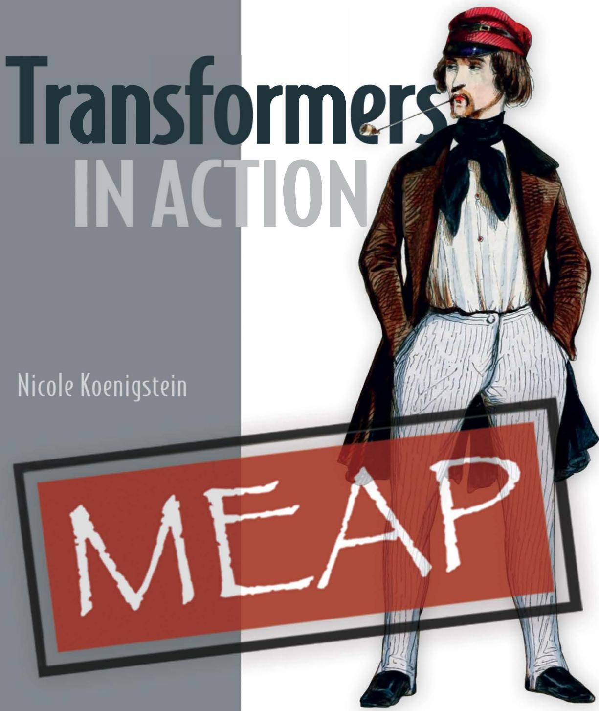


# MEAP Edition Manning Early Access Program Transformers in Action

Version 7

Copyright 2024 Manning Publications

For more information on this and other Manning titles go to

manning.com

Thank you for purchasing the MEAP for Transformers in Action, your comprehensive guide to understanding and implementing Transformer models across various domains.

Transformers have established themselves as a indispensable tool in the field of machine learning and artificial intelligence as the research and deployment of Large Language Models (LLMs) continues to expand.

This book will take you on a fascinating journey through the applications of Transformers, which have, in recent years, evolved from their initial use in natural language processing (NLP) to a wide array of domains. These include, but is not limited to, computer vision, speech recognition, reinforcement learning, mathematical operations, and the study of biological systems such as protein folding. The most notable innovations have been the emergence of decision Transformers and multimodal models. These groundbreaking models have the potential to reshape our understanding of deep learning and broaden its horizons.

This book is designed for a diverse audience: ML engineers, data scientists, researchers, students, and AI practitioners who are eager to harness the potential of Transformer models in various domains.

Throughout this book, we will use a hands-on approach to help you build a strong knowledge for Transformers and their applications. Each chapter comes with detailed examples, visualizations, and case studies, accompanied by an extensive repository of worked examples to assist you in mastering the concepts. We will guide you through fine-tuning transformers for your own use cases, optimizing their performance, and deploying them efficiently, ensuring you have the practical skills to achieve the best results. To further support your learning, we have prepared a detailed guide on the next page, outlining how to effectively run the accompanying code notebooks throughout this book.

To get the most out of this book, you should have intermediate Python skills, a basic understanding of machine learning, deep learning fundamentals, and essential mathematical concepts related to ML, such as linear algebra, statistics, and calculus. It is also helpful to have a basic understanding of NLP concepts, PyTorch, and Python tools like NumPy, Pandas, and Matplotlib. Don't worry if you need to review these basics, our examples and case studies will give you plenty of chances to learn and practice these skills.

We have designed this book with you, our reader, in mind. Your feedback is invaluable in helping us improve and enhance the content. Please share your thoughts, questions, comments, and suggestions in the liveBook's Discussion Forum for this book. We hope you enjoy this journey through the exciting world of Transformers and emerge with the knowledge and skills to tackle real-world challenges using these powerful models. Welcome aboard!

# PART 1: INTRODUCTION TO TRANSFORMERS

1 The need for transformers   
2 A deeper look into transformers

# PART 2: TRANSFORMERS FOR FUNDAMENTAL NLP TASKS

3 Text summarization   
4 Machine translation   
5 Text classification

# PART 3: ADVANCED MODELS AND METHODS

6 Text generation   
7 Controlling generated text   
8 Multimodal models   
9 Optimize and evaluate large language models   
10 Ethical and responsible large language models

# APPENDIX

Get the most out ofthis book -how to runthe code

# Part 1

# Introduction to transformers

Since their introduction at the 31st Conference on Neural Information Processing Systems (NIPS 2017), transformers have become a popular topic of interest. The transformer is a type of machine learning model that, unlike its predecessors, can understand the context of words in a sentence by focusing on dierent parts of the sentence simultaneously. Exactly this fact makes transformers highly ecient in a variety of natural language processing (NLP) tasks, including text classication, summarization, and generation. They are being extensively used across many applications, underscoring the importance of understanding these models in full depth.

While you may be eager to get started and learn how to build your own ChatGPT model that can answer any questions you might have and even make predictions, it is critical to rst grasp the principles of a transformer model. This is because, in order to be successful in this eld and to use more advanced models, you must rst establish a solid foundation.

Think of learning how to leverage transformers for your own use cases to be similar to growing a garden. You must rst prepare the soil and establish a good foundation before you can grow your fancy and exotic plants. The rst part of this book serves a similar function, providing you with the essential background knowledge to establish a solid foundation. That said, part 1 gives you a deeper look at the essential concepts and the basic mathematical foundations of the transformer, explaining why they are built the way they are and how they work. And with that, this part prepares you for the more complex and modern models as well as complex approaches in parts 2 and 3 of the book.

# The need for transformers

# This chapter covers

How transformers revolutionized NLP   
Attention mechanism - the transformers key architectural component   
How to use transformers   
When and why you want to use transformers

The eld of natural language processing (NLP) has undergone a revolutionary change with the invention of a new class of neural networks called transformers. These models, famous for their capacity to understand and generate natural language, are the backbone of widely-used applications such as Google Translate or ChatGPT.

Transformers, along with their derivatives like large language models (LLMs), are distinctive due to their unique architectural approach. Unlike their predecessors, like Long Short Term Memory (LSTMs), transformers incorporate an innovative architectural component called the "attention mechanism." This mechanism empowers the model to concentrate on dierent segments of the input data to varying extents, thereby enhancing its ability to process and comprehend complex sequential data. This capability is not only relevant to LLMs processing natural language, but also applies to the broader use of transformers in processing audio streams, images, and even video.

Let’s start by comparing transformers with their predecessors, the LSTM models, and examine each component of a transformer in more detail.

# 1.1 The transformers breakthrough

Transformers are a type of deep learning model that use the attention mechanism to increase processing speed and improve performance in tasks involving sequential data. Introduced in the groundbreaking paper "Attention is all you need" (1), transformers marked a signicant shift from the previously popular recurrent neural network architectures, such as LSTMs. Before the invention of transformers, LSTMs, a particular type of Recurrent Neural Networks (RNNs), were the predominant choice for processing sequential data, including natural language. RNNs, as the name suggests, handle sequences by iterating through elements and maintaining a form of "memory" about the information processed so far. To illustrate this, suppose we want to translate the sentence "I don’t speak French" into "Je ne parle pas français". To translate the sentence, with an RNN, the architectural component of this neural network, the encoder, would process each word in the sentence "I don’t speak French" one word at the time, updating its state with each word. Producing then a so-called context vector of the English sentence. This context vector encapsulates the semantics of the input sentence and serves as the bridge to the next component, the decoder, of the RNN. The decoder then uses this context vector to generate the output sequence: "Je ne parle pas français", again one word at a time, using its internal (recurrent) state to remember the previously generated words. Throughout this process, the recurrent nature of the architecture allows each step to build upon the previous ones, thereby crafting a coherent translation. This sequence-based processing enables the RNN to capture temporal dependencies within the sentence but can also lead to challenges in handling long-distance relationships between words. This process is visualized in gure 1.1.

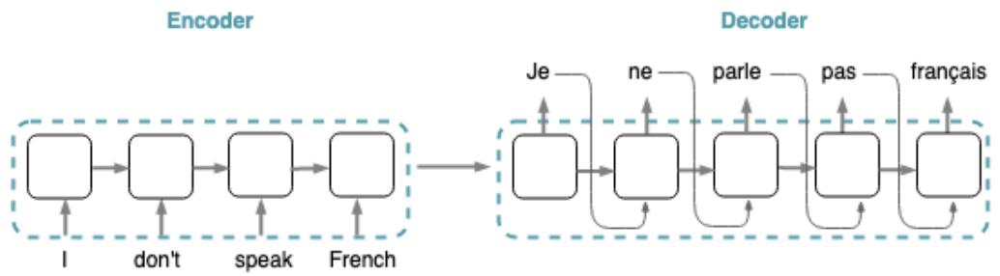  
Figure 1.1 A high-level overview of the general flow of sequential data within an RNN. The encoder in an RNN processes the input sentence one word at a time, updating its internal state with each word. This culminates in a final context vector representing the entire sentence. The decoder then uses this context vector to generate the output sentence, again one word at a time, using its internal (recurrent) state to remember the previously generated words.

As we can see in gure 1.1, the "recurrent state" is updated for each item in the output sequence, capturing a contextual information about the parts of the sequence it has processed so far. However, RNNs come with some drawbacks, they struggle with long sequences, which makes them less ecient in capturing long-term dependencies in the data.

# HOW ARE TRANSFORMERS DIFFERENT?

Transformers, on the other hand, pioneered a radically dierent strategy. They are built around the "attention mechanism," a powerful concept that enables them to take into account multiple parts of the input sequence concurrently when processing each individual part. Instead of processing the sequence element by element and carrying a single recurrent state forward, the transformer model calculates an attention score for each element in the context of all other elements in the sequence.

This fundamental shift allows transformers to be much more parallelizable and thus more ecient. It also dramatically enhances the model’s capacity to understand intricate patterns and long-term dependencies in the data. Unlike traditional sequence-to-sequence models, transformers leverage this attention mechanism to create a more interconnected understanding of the entire sequence, which enhances the model’s ability to make accurate predictions.

Moreover, the transformer’s architecture enables the simultaneous processing of all elements in the sequence, signicantly reducing computation time. To illustrate this process, again, suppose we want to translate the sentence "I don’t speak French" into "Je ne parle pas français." Now, with the transformer model, the encoder extracts features from the input sentence, "I don’t speak French." These features are then processed by the transformer, with the help of the attention mechanism, to calculate attention scores for each element. These scores eectively capture the contextual relationship between each word and the rest of the sentence. The decoder, another component of the transformer model, uses these attention scores and the extracted features to generate the translated sentence, "Je ne parle pas français." This high-level functionality of the translation with a transformer model is illustrated in gure 1.2.

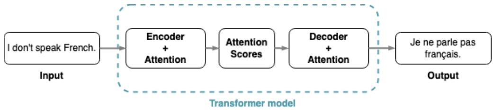  
Figure 1.2 A high-level overview of the general flow of sequential data within a transformer architecture. Starting from the left, an input sentence is passed into the transformer, where it is first processed by the encoder along with the attention mechanism. The result, depicted as attention scores (also called contextual representations), are passed to the decoder with its own attention mechanism. The output is then the translated sentence.

As gure 1.2 demonstrates, the attention mechanism within the transformer model allows for the concurrent processing of the entire sequence, rather than updating a "recurrent state" for each item as in RNNs. This design enables the transformer to eectively capture the contextual relationship between all parts of the sequence, overcoming the challenges faced by traditional models like RNNs that can struggle with long sequences. The result is

a more ecient and powerful model, capable of handling intricate patterns and long-term dependencies in the data.

# 1.1.1 Unveiling the attention mechanism

The attention mechanism in transformers enables the model to weigh dierent positions of a sequence when computing a representation of that sequence. In essence, within the encoder-decoder architecture, the attention mechanism assesses the relevance of various input vectors and assigns higher weights to the most important ones. This stands in contrast to RNNs such as LSTM models, which process input sequences one item at a time.

To make this more clear, let’s revisit our previous translation example where we translated the sentence "I don’t speak French" into "Je ne parle pas français". An ideal translation model needs to comprehend each word in the context of the others in the sentence. In this instance, the translation of the word "speak" into "parle" is inuenced by its surrounding words "I", "don’t", and "French". This is illustrated in gure 1.3 where this connection is represented by the thickness of the edges, which represent the attention scores assigned by the model, demonstrating how the words relate to each other.

  
Figure 1.3 A sample translation made by a transformer model with attention. The thickness and color of the edges demonstrate the attention scores assigned by the model.

This attention mechanism is a key part of the transformer model, providing it the ability to process sequences with complex relationships between elements. However, our example sentence, while straightforward, demands the model to consider relationships between various words in the sequence through attention. In addition, as sequences grow more intricate and tasks more nuanced, the importance of advanced attention strategies, such as multi-head attention, becomes evident. Lets take a look at multi-head attention as we consider a more complicated NLP task: sentiment classication.

# 1.1.2 The power of multi-head attention

The transformer model introduces a powerful extension to the attention mechanism known as "multi-head attention." Multi-head attention enhances the models ability to capture multiple relationships within the sequence. This approach allows the model to focus on dierent positions of the input simultaneously, capturing various aspects of the information. This means the model can maintain multiple "perspectives" to better understand complex patterns in the data.

To illustrate the benets of multi-head attention, let us take the sentence, "The movie was not bad". In this case, the transformer’s multi-head attention allows the model to parse the interaction of "not" and "bad" simultaneously, thereby understanding that the

overall sentiment is positive. Figure 1.4 visualizes this interaction between the words in the sentence.

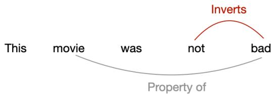  
Figure 1.4 Example of different relations in a sentence.

In contrast, recurrent models like LSTMs often struggle with identifying such longterm dependencies within a sentence, leading to potential diculties in recognizing these subtle nuances. Transformers, with their attention-based architecture, bypass this problem, capturing complex interrelationships within textual data eciently.

In a nutshell, multi-head attention allows transformers to understand various aspects of the input simultaneously, marking a signicant leap over previous models like LSTMs. Using this technique, the transformer was able to reach a score of 41 for a metric called BLEU (BiLingual Evaluation Understudy). This is a very high score and indicates that the generated translation from the transformer model is very similar to the reference text. Even more fascinating is that the rst transformer model achieved this result after only 3.5 days of training. This was only a small fraction of the time it took for earlier state-of-the-art networks, like LSTMs, to achieve a similar high score for the same English-to-French translation task.

Moreover, in comparison to other RNN-based models like LSTMs, the success of the transformer and LLMs is more evident in terms of their revolutionary impact on the eld of NLP. Although LSTMs were signicant advancements for sequence processing, the speed at which LLMs and transformers conquered the eld and state-of-the-art models are being continuously developed is unparalleled. As a result of the transformers’ fast-paced and groundbreaking success, it was eventually possible to build such advanced neural networks such as ChatGPT just ve years after the introduction of the rst transformer model.

# 1.2 How to use transformers

Starting your journey with transformers is greatly simplied through the Transformers library of the machine learning platform Hugging Face. This library provides a vast amount of pre-trained models, facilitating tasks that range from language translation to text generation, text classication and sentiment analysis.

The term "pre-trained" refers to models that have been previously trained on extensive datasets, usually containing millions of documents, encompassing a broad spectrum of topics. This exposure allows the models to learn the nuanced patterns of language, including syntax, semantics, and context. By using these pre-trained models, you essentially gain the ability to leverage their learned knowledge, eliminating the need for training a model from scratch. This approach saves considerable computational resources and time, because

you now only have to train the model for your specic task at hand. For instance, using a labeled dataset consisting of pairs of sentences and the labels neutral, negative or positive, to perform a sentiment analysis.

Another factor to consider when using transformers is the processing power required. Transformers, given their complexity, can be computationally intensive. This is where GPUs come into play. GPUs are designed to carry out many operations concurrently. This makes them well-suited for the matrix calculations and parallel computations that are commonplace in training and using a transformer. Even if you don’t have a high-powered GPU at your disposal, many cloud services, such as Google Colab or Paperspace, oer access to GPUs, making the use of transformers accessible to a wide audience.

Hence, with pre-trained models available through Hugging Face’s Transformers library and the processing power oered by cloud services, you are well-equipped to harness the power of transformers for your own NLP tasks.

# 1.3 When and why you’d want to use transformers

Transformers have become an integral part of the modern machine learning landscape. They especially oer unparalleled capabilities in natural language processing, but their potential reaches even far beyond this eld. As transformers have shown promise in domains like computer vision and audio recognition, hinting at a future where they may become a more general-purpose machine learning architecture.

However, the real charm of transformers lies in their accessibility. The Hugging Face’s Transformers library is home to a diverse range of pre-trained models, making it easier for practitioners to get started. Unlike LSTM-based architectures, which often require training from scratch, transformers are via Hugging Face readily available in pre-trained forms, saving considerable time and computational resources.

This advantage is further magnied by the active community surrounding the Hugging Face’s Transformers library. Being open-source, it benets from constant contributions and improvements by machine learning enthusiasts worldwide. Consequently, it’s often a matter of a few hours to ne-tune a pre-trained transformer model for a task like sentiment analysis.

Furthermore, the rise of zero-shot and few-shot learning techniques has expanded the applicability of transformers. Zero-shot learning refers to a model’s ability to handle tasks it was never specically trained for. Essentially, it can understand and perform unseen tasks based on its broad training. Few-shot learning, on the other hand, implies that the model can quickly learn to perform new tasks after being trained on a very small amount of data related to that task. This technique takes advantage of the model’s pre-existing knowledge from its extensive training. These advanced techniques, combined with the resourcefulness of the community, make transformers an appealing choice for a broad array of tasks in the eld of NLP.

Nonetheless, as impressive as these diverse models are, they do come with some limitations. If we consider the so-called billion-parameter models, which refers to the scale and learnable parameters or "weights" of these transformer models. For instance, early

transformer models had 110 million parameters but as advancements in the eld continues, this has led to even larger models, possessing 175 billion parameters and more.

These "billion-parameter models," exhibit an impressive ability to generate coherent and contextually relevant responses in a conversation. However, despite their vast scale and impressive performance, these models do have their limitations. Their practical applicability might diminish in certain specialized domains like nance or healthcare, where domainspecic context is crucial. The computational and memory demands of these models can make their deployment challenging, especially in real-time systems that require quick and accurate results.

Nevertheless, the potential of these dierent variations of transformer models cannot be underestimated. They are pushing the boundaries of what’s possible in natural language understanding and generation, text classication, translation, and more. But as with any tool, the key lies in a balanced, problem-specic approach. As we move forward, we will explore this balance in more depth, focusing on how to leverage the strengths of these dierent types of models while navigating their specic limitations.

# 1.4 Summary

A transformer model employs attention and multi-head attention mechanisms. Using these tools, it expertly navigates through various parts of a sentence, shining a spotlight (signifying more attention) on the words that are pivotal in shaping the overall narrative and context comprehension.   
Attention allows the model to focus on key portions of the input and emphasizes the most important information.   
The Transformer model’s multi-head attention component helps it to identify numerous links between words in a sequence, leading to its popularity as one of the most extensively used NLP models.   
Transformers have excelled in NLP tasks because of their capacity to handle long-term dependencies in sequential data.   
They revolutionized the eld by making it possible to train a transduction model in a matter of days rather than weeks or months, yet outperforming state-of-the-art networks.   
Advanced techniques like zero-shot or few-shot learning allow large models to infer and generalize about new tasks based on their pre-existing training, without needing explicit retraining, enabling a more ecient use of resources and time.   
Despite their impressive capabilities, extremely large language models aren’t without limitations. A potential issue is the decreased eectiveness in certain specialized domains like nance or healthcare. Furthermore, their computational and memory demands can make deployment challenging. Thus, selecting the most suitable model requires careful consideration of the specic task at hand, balancing the trade-o between model complexity and practical applicability.

# Bibliography

[1] A. Vaswani, N. Shazeer, N. Parmar, J. Uszkoreit, L. Jones, A. N. Gomez, L. Kaiser, and I. Polosukhin, “Attention is all you need,” CoRR, vol. abs/1706.03762, 2017. 3

# A deeper look into transformers

# This chapter covers

Sequence modeling before transformers   
Core components of a transformer model   
Attention mechanism and its variants   
How transformers can help stabilize gradient propagation

Now that we have a high-level understanding of the transformer model’s benets and that one of the primary goals for developing the transformer architecture was to reduce the sequential computation from previously used networks like LSTMs, we can delve deeper. This chapter aims to demystify the seemingly complex and daunting transformer model by breaking it down into its foundational elements. We’ll dissect the model, highlighting simple concepts such as matrix multiplication operations, which are pivotal to the attention mechanism and its variant, the multi-head attention. As we journey through the architecture of the transformer, we’ll unravel the importance of its building blocks, including feedforward networks and positional encoding, and their contribution to its eectiveness in natural language processing tasks. But before we delve deeper into transformers, let’s rst briey take a closer look at LSTMs and sequence-to-sequence models to better understand the unique advancements and benets of transformers in more detail.

RNN-based and sequence-to-sequence (seq-2-seq) models have been widely employed in NLP tasks, such as machine translation. These models have the ability to take in variable length sequences as input and produce variable length sequences as output. To illustrate this, let us use our sentence from chapter 1 : "I do not understand French", which we want to translate into: "Je ne comprends pas le français". We can see that our input sequence is shorter (5 words) than our output sequence (6 words). This examples makes it clear that we need to have a model architecture which can handle variable length input and output sequences. Let us examine in detail how these models are constructed and where the transformer comes in. Note: all code examples of this chapter can be found in the book’s repository, https://github.com/Nicolepcx/Transformers-in-Action, in folder CH02.

# 2.1 From seq-2-seq models to transformers

As you are aware, from chapter 1, the structure of most competitive neural sequence transduction models is encoder-decoder based. The RNN encoder-decoder architecture is used in machine translation tasks to read the source language sentence and construct a xed-length representation, z, of it, which is then passed to the decoder, as shown in gure 2.1.

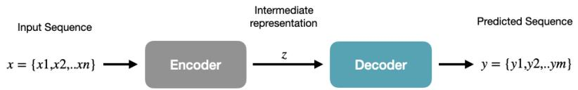  
Figure 2.1 Illustration of Sequence to Sequence learning.

The decoder constructs the target language sentence by predicting one word at a time in an autoregressive mode, based on the previous words and the encoder’s xed-length representation. Sequence-to-sequence modeling is a process central to tasks where context capture is vital. The key advantage of this approach is its ability to comprehend the contextual semantics of a sentence, a crucial aspect in translation tasks. For example, the word "date" may refer to both a fruit and a social engagement, and I’m sure you don’t want these two to be mixed up in a translation.

# 2.1.1 The difficulty of training RNNs

In training RNN-based encoder and decoder architectures, we face signicant challenges. These issues can make improvements in BLEU scores dicult, when using LSTM-based encoder-decoder models. This holds true, especially when the model must translate between languages with vastly dierent syntax or vocabulary. To give you some more background on the BLEU score, it is a metric used in machine translation to quantitatively evaluate the quality of translated text by comparing it to a set of reference translations; a higher score indicates a closer match to the reference.

These challenges in training RNNs, particularly deep RNNs, are thoroughly analyzed in the paper "On the diculty of training Recurrent Neural Networks". As explained by the authors of the paper, diculties often arise due to the propagation of errors over extended

time sequences. To mitigate these issues, they suggest careful initialization and the use of non-saturating activation functions that avoid getting stuck in specic ranges. This allows for ecient gradient ow during backpropagation and batch normalization, contributing to improved network stability. Within LSTMs, "stability" refers to the model’s capability to accurately and reliably learn and represent data patterns and relationships, without becoming overly sensitive to minor changes or noise in the input.

Nevertheless, it is often necessary to employ a deep neural network design, so that the model is capable of modeling the data’s complex patterns and relationships and to eectively capture long-term dependencies in sequential data. This is usually accomplished, in the case of LSTMs, by stacking multiple recurrent layers on top of one another, enabling the network to learn increasingly complex representations of the input over time. However, as the number of layers in the network grows, it becomes more dicult to successfully propagate error signals through the network during training, which, in turn, results in the vanishing gradient problem and other stability issues. In the following section, section 2.1.2, we will look more closely at the vanishing gradient problem.

Hence, even though RNNs like LSTMs are designed to capture long-term dependencies in sequential data by employing a memory cell that can selectively remember or forget information from earlier time steps, they can still struggle to learn these dependencies eectively. One solution to this problem is the introduction of attention mechanisms for LSTMs. These mechanisms enable the models to account for long-term dependencies; however, the attention mechanism itself is dierent and less eective than the one used in transformers. Moreover, in attention-enhanced LSTMs, the input is still fed into the network sequentially, which makes training and inference slow.

In contrast, transformers employ an attention architecture that allows for more ecient processing of long-range dependencies, as shown in gure 2.2. Another advantage of the transformer architecture is the use of multi-head attention, which enables the model to capture dierent aspects of the input data in parallel, further enhancing its ability to process long-range dependencies eectively.

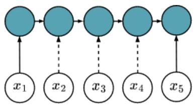

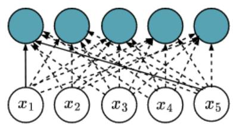  
Figure 2.2 Comparing RNN (left), and self-attention (right) architectures. As illustrated, transformers, with their use of self-attention, can directly attend to all positions in the sequence, regardless of their position in time. Dashed lines represent the flow of information or dependencies. The variables $x _ { 1 }$ to $x _ { 5 }$ represent data input, and the circles above represent the state of the network at each timestep for the RNN. In contrast, for the self-attention mechanism, the circles above denote how each state considers information from all other states, not just the immediate predecessor.

As gure 2.2 demonstrates, transformers provide an alternative method for capturing long-term relationships in sequential data that does not require sequential processing or deep layer stacking.

Even with the rise of transformers, which have shown remarkable eectiveness in many tasks, it’s important to acknowledge the ongoing relevance of RNNs and their variants like LSTMs. These models are still useful in a variety of applications where specic sequential data characteristics and temporal dynamics are at play, such as in certain time-series predictions. As we explore the details of transformer models, understanding the strengths and limitations of RNNs illuminates why the newer techniques represent a signicant leap in the eld of deep learning.

# 2.1.2 Vanishing gradients: transformer to the rescue

The vanishing gradient problem, in particular, can make it dicult to propagate errors through the network and update the model parameters during backpropagation. This can make learning long-term dependencies and correctly modeling sequential data dicult, which is required for many sequence-to-sequence transduction tasks. And like I just pointed out in the previous section, RNN-based models suer from the vanishing gradient problem (gure 2.3).

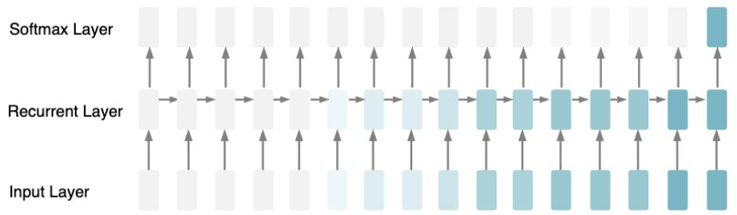  
Figure 2.3 Simplified example of the vanishing gradient problem, where the gradient contribution from earlier steps (left) become insignificant.

The vanishing gradient problem is a common problem in neural networks, referring to the problem that the gradients get very small, and, therefore, the weights of the network do not update eectively, leading to slow training and poor performance.

This is where the transformer architecture comes in, oering a solution to this problem by using the attention mechanism to capture dependencies between all positions in an input sequence, as shown in gure 2.2. Figure 2.4 compares the gradients for an LSTM and a transformer architecture based on the sentence: "The quick brown fox jumps over the lazy dog and runs through the elds, while the lazy dog barks loudly and then chases the quick brown fox through the forest", to illustrate how the gradients in an LSTM become very small when the sentence is lengthy. I invite you to run the code provided in the books repository to see how various sentence lengths aect the gradients of the two dierent architectures.

```csv
Gradients for RNN model:  
tensor([-1.1910e-08, -5.4378e-09, -1.7932e-08, -1.0601e-07, 4.1367e-08, -9.4355e-08, 3.2711e-07, 2.2510e-08, -2.8239e-07, -1.7337e-06, -3.7372e-06, -3.9611e-07, 3.1367e-06, -2.0029e-05, -1.4689e-05, 3.0543e-05, 6.7980e-05, 9.9472e-05, 4.7608e-06, -4.2451e-04, -6.8603e-06, 1.0076e-03, 6.5036e-04, 3.5185e-03, 8.8883e-03, 4.6364e-03, 5.6579e-03, 1.5272e-03, -1.9715e-02, -3.8232e-01]) 
```

```txt
Gradients for self-attention model:  
tensor([-0.0010, -0.0011, -0.0007, -0.0013, -0.0019, -0.0011, -0.0010, -0.0014, -0.0017, -0.0009, -0.0010, -0.0010, -0.0012, -0.0012, -0.0014, -0.0017, -0.0016, -0.0015, -0.0009, -0.0009, -0.0014, -0.0010, -0.0011, -0.0007, -0.0013, -0.0010, -0.0010, 0.0032])
```

Figure 2.4 Comparison of gradients for an LSTM and transformer architecture based on the sentence: ”The quick brown fox jumps over the lazy dog and runs through the fields, while the lazy dog barks loudly and then chases the quick brown fox through the forest”.

Now that we understand that the attention mechanism in the transformer helps to alleviate the vanishing gradient problem, let us look at its overall architecture in the following section. We’ll start by looking at the transformer’s two main components, the encoder and the decoder, and how they work together to transform an input sequence into an output sequence. Then we look more closely at the transformer architecture’s key innovation, the self-attention mechanism, and nally how positional encoding works.

Before concluding this section, it’s important to highlight the other side of the gradient problem, the exploding gradient problem. This is a situation where the gradients during backpropagation become excessively large, causing model weights to update too rapidly and potentially leading to unstable learning and poor performance. This issue often arises when dealing with long sequences or deep architectures, where the compounded eects of the calculations can cause the gradient values to explode. Similar to the vanishing gradients problem, the exploding gradient problem can also interfere with the model’s ability to learn long-term dependencies, but for the opposite reason. In section 2.3, after we’ve learned more about the transformer’s architecture, we’ll explore this problem in more depth and see how the modular design of transformers mitigates some of the most common problems that arise during training. This will provide us with a better understanding of how the transformer architecture addresses these issues, improving both network stability and performance.

# 2.2 Model architecture

This section distills the essence of the original transformer model as presented in the groundbreaking paper, "Attention Is All You Need". By using simplied terms and concepts, I aim to make this innovative architecture more accessible and easier to grasp. My focus is on the core components that make the transformer what it is - the encoder, the decoder, and the unique attention mechanism that underpins both.

By the end of this section, you should have gained a comprehensive and intuitive understanding of the transformer’s architecture. Therefore, this sections is not an academic exercise; it is your entry ticket into the fascinating world of transformer models. It equips

you with the knowledge necessary for exploring the many transformer variants discussed in the subsequent chapters.

With this understanding, you can join the ongoing conversation around transformerbased models and their applications in the eld of articial intelligence. The discussion surrounding these models is vibrant, growing, and fundamental to the future of AI.

It’s crucial to note that the transformer model, despite being a radical departure from traditional RNN, still adheres to the encoder-decoder framework at its core. This adherence is a testament to the robustness of the encoder-decoder paradigm, which continues to serve as a solid foundation for cutting-edge models.

However, the transformer model achieves its unique capabilities by deploying stacked attention and point-wise, fully connected layers for both the encoder and decoder. These architectural choices, as shown in the left and right portions of gure 2.5, result in a highly exible and scalable model that excels in a wide array of sequence-to-sequence prediction tasks. This scalability and exibility underline the true power of the transformer architecture, making it a cornerstone in the rapidly evolving landscape of articial intelligence.

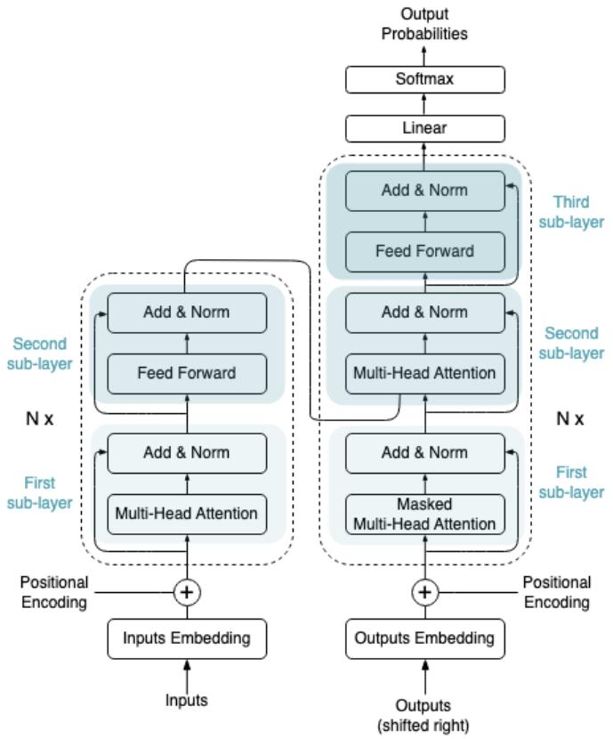  
Figure 2.5 The encoder of the transformer architecture is depicted on the left side of the figure, and the decoder is depicted on the right side.

As we have now a visual representation of the transformer architecture, let us look more deeply into each component. We will begin by discussing the encoder and its particular structure and functions before moving on to other important aspects of the transformer model.

# 2.2.1 Encoder and decoder stacks

The transformers model structure is split into an encoder and a decoder part, as shown in gure 2.5. Let us start with the encoder before moving on to other important parts of the model architecture.

# ENCODER PART OF THE TRANSFORMER

The encoder plays a vital role in processing the input sequence in the transformer architecture. It consists of a stack of layers, with each layer having two primary sub-layers: the multi-head self-attention mechanism and the fully connected feed-forward network. The multi-head self-attention mechanism processes the input sequence by determining the signicance or "attention" that should be allocated to dierent parts of the text. Following this, the feed-forward network applies a transformation to the processed sequence from the attention mechanism.

A notable feature in the encoder’s design is the use of residual connections. Instead of merely passing the output of one sub-layer to the next, the encoder also merges this output with its original input. This procedure is akin to adding information from the original text sequence to the processed sequence at every step. By doing this, the transformer ensures that the initial context of the input sequence is preserved and integrated throughout the encoding process. This mechanism helps maintain continuity in the processed sequence, ensuring that the model does not lose the inherent meaning and relationships present in the original text.

Let us delve deeper into the encoder’s architecture. The encoder is composed of $N = 6$ identical layers. Each of these layers contains the aforementioned sub-layers: the multihead self-attention mechanism and a position-wise fully connected feed-forward network, which we’ll look at in detail in this section.

Building upon the encoder’s integration of residual connections, these connections facilitate a direct ow of information from the input through dierent parts of the network. This ow aids in circumventing some transformations, ensuring that the model retains essential input details. Practically, each sub-layer’s output is formulated as LayerN orm $( x +$ Subl ayer $( x )$ ), with Subl ayer (x) representing the function executed by the sub-layer. Additionally, to enhance model robustness and curtail overtting, dropout is applied prior to nalizing these connections.

In a programming sense, this concept is illustrated in listing 2.1, which presents a simplied implementation of the encoder layer.

# Listing 2.1 Simplified encoder layer example

class EncoderLayer(nn.Module): def __init__(self, d_model, nhead, dim_feedforward, dropout=0.1):

```python
super().__init__(1)  
1 multi-head attention  
self.self_attn = nn.MultiheadAttention(d_model, nhead, dropout=dropout)  
self/feed_forward = nn.Sequential( ② feed-forward network nn.Linear(d_model, 2 * dim_feedforward), GLU(input_size=dim_feedforward, output_size=d_model), nnDDDropoutdropout)  
)  
self(norm1 = LayerNorm(d_model) ③ layer normalization (separate class)  
self(norm2 = LayerNorm(d_model)  
self.dropout1 = nnDDDropout Dropout) ④ dropout  
self.dropout2 = nnDDDropout Dropout)  
def forward(self, x, mask=None  
# self-attention layer ⑤ residual connection  
attn_output, _ = self.self_attn(x, x, x, attn_mask=mask)  
x = x + self.dropout1(attn_output)  
x = self(norm1(x)  
# feed-forward layer ⑥ residual connection  
ff_output = self/feed_forward(x)  
x = x + self.dropout2(ff_output)  
x = self(norm2(x)  
return x 
```

All the sub-layers and the embedding layers in the model produce outputs of the same size, $d _ { m o d e l } = 5 1 2$ . This uniformity facilitates the seamless use of residual connections, enabling the information from the input to ow directly to the model’s output, bypassing individual layers. By adding the original input to the output of a network layer, the resulting output equals the sum of the initial input and the layer’s output. This enables the model to learn more eectively and provides a more stable training process, leading to improved performance.

# DECODER PART OF THE TRANSFORMER

As with the encoder, the decoder is another crucial component in the transformer architecture. But this part of the architecture is now responsible for generating the output sequence based on the information processed by the encoder. Each layer in the decoder has primary components similar to the encoder: the self-attention mechanism and the feed-forward network. However, the decoder also incorporates a third component: a multi-head attention mechanism that operates over the output of the encoder’s last layer. This added component allows the decoder to utilize information from the encoder, enabling it to focus on dierent parts of the input text while generating the output.

Residual connections, like in the encoder, are present in the decoder. These connections facilitate the merging of each sub-layer’s output with its input, ensuring that contextual information is preserved throughout the decoding process. Layer normalization further accompanies these residual connections, enhancing the stability of the model and assisting in training.

A distinguishing feature of the decoder is its masked self-attention mechanism. This masking ensures that while generating an output for a particular position in the sequence, the model is restricted to using only previously known outputs, thereby maintaining the order of sequence generation and ensuring causality in the model’s predictions.

The decoder comprises $N = 6$ identical layers. Unlike the encoder, which has two sub-layers, the decoder introduces a third sub-layer to attend over the encoder’s output. This unique attention mechanism enriches the decoder’s output by providing it with a broader context from the input sequence.

Figures 2.6 and 2.7 provide visual representations of the attention masking and the distinct components of the decoder, respectively.

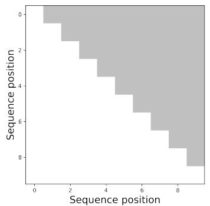  
Figure 2.6 Illustration of multi-head attention masking.

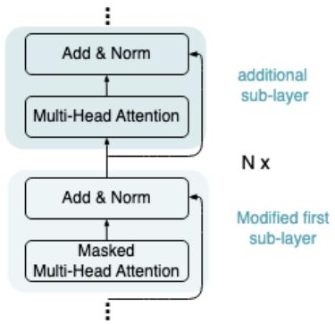  
Figure 2.7 Detailed structure of the decoder components.

Masking is fundamental for sequence-to-sequence tasks, where the model generates outputs token-by-token based on preceding tokens in the sequence. Dierent types of masking, such as padding masking or sequence masking, can be applied depending on the specic application or use case.

# 2.2.2 Attention

A pivotal element that sets transformer-based models apart is the attention mechanism, particularly its self-attention variant. This component has been instrumental in propelling advancements in natural language processing tasks. In this section, we will delve into the intricacies of self-attention and multi-head attention, aiming to demystify these concepts and demonstrate their role in the transformer architecture’s capability.

The term self-attention refers to the fact that the attention weights are computed within a single sequence. When an input sequence is passed through a multi-head self-attention layer, the attention weights are computed between dierent positions within the same sequence. This mechanism, named "self-attention", allows each element in the input sequence to relate to every other element, including itself, in the sequence. Therefore, the output generated is a weighted representation of the entire sequence.

# SCALED DOT-PRODUCT BASICS

If you are now wondering why I mentioned self-attention in the intro of this section selfattention and not scaled dot-product attention, let me rst clarify. Self-attention and scaled dot-product attention are two related concepts that are used in the transformer architecture to allow for ecient and eective learning of relationships between elements within a sequence.

To understand both, let us rst look at scaled dot-product attention by reducing it to its simplest components. To best understand this concept, we’ll start with a graphical illustration. Let’s consider a scenario where we have a sequence of ve inputs and ve outputs, as shown in gure 2.9. This visual representation will allow us to explore the mechanics of scaled dot-product attention and understand how it shapes the interactions within the transformer.

  
Figure 2.8 Illustration of a sequence of five inputs and five outputs.

To compute $y _ { 3 }$ , we use the vector $x _ { 3 }$ to determine the associated weights. This is achieved by calculating the dot product of $x _ { 3 }$ with each vector in the sequence, starting from $x _ { 1 }$ and continuing through to $x _ { 5 }$ . As shown in gure 2.9.

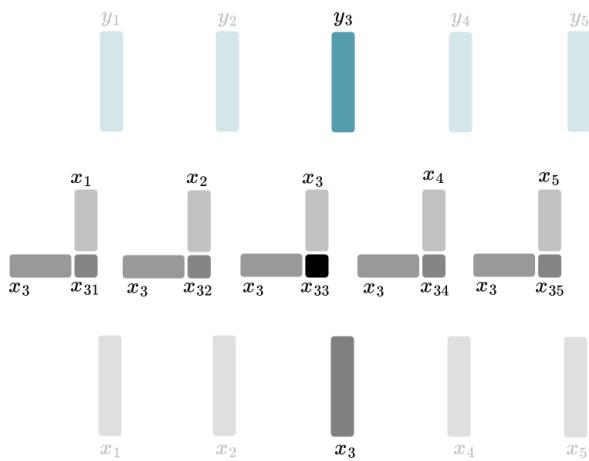  
Figure 2.9 Graphical explanation of taking the dot product to compute the weights for y3.

After computing these ve weights, we take the softmax so that it sums up to one. Then we multiply each input vector by the weights we just computed and sum them all up and this gives us then the vector y3. This process is shown in gure 2.10.

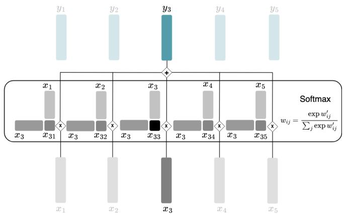  
Figure 2.10 To compute $y _ { 3 }$ , we take first the softmax function for all weights, so it sums up to 1 and then we multply each input vector by the weights and sum it up.

Moreover, we process every input vector $x _ { i }$ in three ways to fulll the three roles with matrix multiplication.

Compare to every other vector to compute attention weights for its own output $y _ { i }$ , which is the query.   
Compare to every other vector to compute attention weight $w _ { i j }$ for output , which $y _ { i }$ is the key.

□ Sum up with the other vectors to form the result of the attention weighted sum, which is the value.

To understand this in an intuitive way, using our text example from chapter 1, ”the movie was not bad”, this just means:

The query represents what we’re ”asking” about or looking for. It’s like a ”search term.” In our example, if we’re interested in understanding the importance relationship between ”not,” ”bad,” and ”movie,” we can imagine them as our queries.   
The key represents the ”features” or ”identifiers” for every word in the sentence. The keys determine how well each word in the sentence responds to the query. If our query is ”not,” then the keys for every word will determine how related or relevant each word in the sentence is to ”not.”   
The value contains the ”content” we want to retrieve or weigh. Once we’ve determined how relevant each word (via its key) is to the query, the values give us the actual content we’d retrieve or weigh. In many implementations, the initial value representations are just the input embeddings, but as layers of attention stack, they capture more nuanced contextual representations.

So, in our example with ”the movie was not bad”: If ”not” is the query, the attention mechanism might assign high importance (or weight) to ”bad” because ”not bad” is a common phrase. The values corresponding to both ”not” and ”bad” would then be summed up with their respective weights to produce the final output for the word ”not.”

However, in actual models, all words in a sequence simultaneously act as queries, keys, and values. The self-attention mechanism computes a weighted sum of values for each word in the sequence, based on the attention scores between its query representation and all key representations in the sequence. This allows every word to gather information from all other words, based on their relevancy, to produce new contextual embeddings.

Now, mathematically this is represented as follows:

Query: $\mathbf { q } _ { i } = \mathbf { W } _ { \mathrm { q } } \pmb { x } _ { i }$   
Key: $\mathbf { k } _ { i } = \mathbf { W } _ { \mathrm { k } } \pmb { x } _ { i }$   
Value: $\mathbf { v } _ { i } = \mathbf { W } _ { \mathrm { v } } \pmb { x } _ { i }$

Therefore, mathematically speaking, we can think of the processes as simple matrix multiplication. We then introduce a softmax function to make sure it sums to one, as shown in equation 2.1. So, to summarize all you have to do is to multiply each input vector by these three matrices and then combine the results in the aforementioned three dierent ways to produce the output $y$ of $i$ .

$$
w _ {i j} ^ {\prime} = \mathbf {q} _ {i} ^ {\top} k _ {j}
$$

$$
w _ {i j} = \operatorname {s o f t m a x} \left(w _ {i j} ^ {\prime}\right) _ {\square} \tag {2.1}
$$

$$
\mathbf {y} _ {i} = \sum_ {j} w _ {i j} v _ {j}
$$

From this explanation, it’s clear that the heart of the attention mechanism, or attention function, depends on matrix multiplication. However, it’s important to understand that it’s the specic combination of these matrix operations - the generation of queries, keys, and values - and their application through the dot product and softmax functions, that enables the model to capture complex relationships within sequences. This gives the transformer model its ability to perform remarkably in NLP tasks.

# SCALED DOT-PRODUCT ATTENTION

With a foundational understanding of the basics - query, key, and value matrices - of dot-product attention, we can now examine the more intricate aspect of this attention mechanism, the scaled dot-product attention. Figure 2.11 provides a graphical representation of the overall design of scaled dot-product attention.

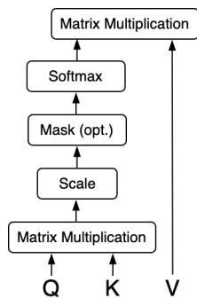  
Figure 2.11 Illustration of scaled dot-product attention.

Scaled dot-product attention, a specic type of self-attention mechanism utilized in the transformer architecture, gets its name from the way attention weights are computed. In this mechanism, the dot product of every pair of query and key vectors is calculated and divided by the square root of the dimension of the key vectors, as demonstrated in equation 2.2. This normalization occurs before the application of the softmax function.

$$
\operatorname {A t t e n t i o n} (Q, K, V) = \operatorname {s o f t m a x} \left(\frac {Q K ^ {T}}{\sqrt {d _ {k}}}\right) V \tag {2.2}
$$

The importance of scaled dot-product attention lies in its ability to stabilize gradients during the backpropagation phase of training. By limiting the size of the attention scores via scaling the dot product by $\sqrt { d _ { k } }$ , softmax saturation can be prevented, and gradient explosion can be avoided. The eect of such scaling is illustrated in Figure 2.12.

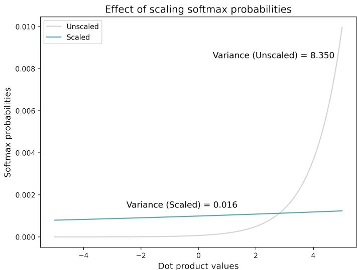  
Figure 2.12 This figure shows that the variance of the scaled dot product values is smaller than the variance of the unscaled dot product values, indicating that scaling helps to control the variance of the dot product values. This, in turn, helps prevent the gradients from exploding during backpropagation, improving the stability and convergence of the training process.

Hence, if the dot product values become excessively large, the resulting gradients may also become disproportionately large, resulting in unstable training due to the notorious exploding gradient problem. By controlling the variance of the dot product values through scaling, the magnitude of the gradients during backpropagation is inuenced. The scaling factor used in the transformer architecture is the square root of the key dimension (i.e.,√ $\sqrt { 5 1 2 }$ for a key dimension of 512), which has been found to yield good results in practice.

To illustrate the scaled dot-attention concept more clearly, I have prepared a simplied version of it in listing 2.2. For simplicity, we assume we have already learned the weight matrices during training, and we just assign the word embeddings. But in practice, these word embeddings would have been created by the encoder.

# Listing 2.2 Simplified scaled dot-attention implementation

0 Defining word embeddings

embed_1 = np.array([0, 1, 0])

embed_2 $=$ np.array([1, 0, 1])

embed_3 $=$ np.array([0, 1, 1])

embed_4 = np.array([1, 1, 0])

2 stacking the word embeddings into a single array

embeddings $=$ np.array([embed_1, embed_2, embed_3, embed_4])

Initialize weight matrices

$\widetilde { W } \mathbf { q } \ =$ rand(3, 3)

$\begin{array} { r l } { \mathbb { W } \mathbb { k } } & { { } = } \end{array}$ rand(3, 3)

```txt
Wv = rand(3, 3) 
```

$\textcircled{9}$ compute queries, keys and values

${ \textsc { Q } } =$ embeddings.dot(Wq)

$\mathrm { ~ \texttt ~ { ~ K ~ } ~ } =$ embeddings.dot(Wk)

${ \begin{array} { r l } { \nabla } & { = } \end{array} }$ embeddings.dot(Wv)

$\oplus$ Compute scaled attention scores

attention_scores $=$ softmax(Q.dot(K.T) / sqrt(K.shape[1]), axis $^ { = 1 }$ )

$\bullet$ Compute weighted sum of values

attention_output $=$ attention_scores.dot(V)

To recap, this scaling is crucial for model stability and eectiveness, particularly when the key vectors’ dimensions are large. In such scenarios, the dot product can grow large in magnitude, leading to very large pre-softmax values. This can lead to two potential problems: saturation of the softmax function, where very large inputs are mapped to the endpoint of the function, resulting in a loss of the original values’ information, and large gradients during the backpropagation phase, leading to instability in learning, known as the exploding gradient problem.

By reducing the dot product’s magnitude by the square root of the dimensionality, the magnitude of the values entering the softmax function is eectively controlled, mitigating these issues. Therefore, scaled dot-product attention not only aids in stabilizing the gradients during the training phase but also prevents saturation of the softmax function, preserving the original relationships between the inputs.

# SELF ATTENTION

Self-attention is a type of attention mechanism that allows a sequence-to-sequence model to focus on dierent parts of the input sequence when generating an output sequence. Figure 2.13 shows the computed weights of a self-attention matrix using our sentence from chapter 1, "the movie was not bad".

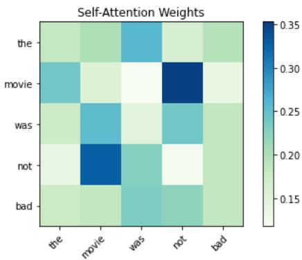  
Figure 2.13 Weight distribution of self-attention.

Self-attention operates by allowing a sequence-to-sequence model to weigh dierent portions of an input sequence dierently when producing an output sequence. Instead of applying distinct rules or weights to each individual element in the sequence as in other attention mechanisms, self-attention evaluates the importance of each element based on its relation to every other element in the sequence.

Specically, in the transformer architecture, each element (or word) in the input sequence can attend to all positions in the sequence, enabling the model to determine which positions are crucial for a given context. This is achieved using the same set of parameters, making the process consistent across dierent positions. Thus, self-attention provides the model with the capability to focus on segments of the input sequence that are most relevant to the current processing step, ensuring that relevant contextual information is retained and emphasized.

The self-attention mechanism in the transformer architecture uses a singular matrix to calculate the queries, keys, and values. As explained in the original paper "Attention is All You Need" (1), this singular matrix is obtained by concatenating the weight matrices of the linear transformations applied to the queries, keys, and values. The resulting matrix is then divided into multiple heads, with the attention mechanism applied to each. Concatenating the attention results from each head and passing them through a linear layer yields the output.

Furthermore, self-attention is more numerically eective because it eliminates the need to compute a distinct matrix for each point in the input sequence, as in other mechanisms. Second, in addition to its numerical eciency, self-attention also provides greater freedom to model long-term relationships by allowing each part in the input sequence to respond to any other position. This valuable attention mechanism will be further explored in the next section, where we will discuss its relevance to the network’s stability.

# MULTI-HEAD ATTENTION

Instead of just using one attention function, the authors of the original transformer paper, "Attention Is All You Need", introduced multi-head attention to project queries, keys, and values $h$ -times with dierent learned linear projections into:

$$
d _ {k} = d _ {v} = d _ {\text {m o d e l}} / h = 6 4, \tag {2.3}
$$

where $h = 8$ , and $d _ { k }$ refers to the dimension of the keys and $d _ { v }$ refers to the dimension of the values and $d _ { \mathrm { m o d e l } }$ to the model’s dimension.

These values are then combined and projected again to obtain the nal values. This approach is called multi-head attention because it allows the model to look at information from dierent representations or "views" (referred as "subspaces" in the original transformer paper) of the input simultaneously.

One of the key reasons for adopting multi-head attention is that the dierent heads can learn to recognize dierent types of relationships in the data. Each head could potentially focus on a dierent type of interaction, for example, syntactic versus semantic, or shortterm versus long-term dependencies. This diversied perspective enables the model to

capture a richer set of information compared to a single head, which would have a limited, averaged view of the input.

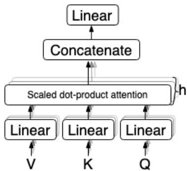  
Figure 2.14 Illustration of multi-head attention.

Figure 2.14 and equation 2.4 make it clear that, with multi-head attention, we are splitting the queries, keys, and values into multiple heads and computing their attention separately.

$$
\operatorname {M u l t i H e a d} (Q, K, V) = \operatorname {C o n c a t} \left(\operatorname {h e a d} _ {1}, \dots , \operatorname {h e a d} _ {\mathrm {h}}\right) W ^ {O}
$$

$$
\text {w h e r e} = \text {A t t e n t i o n} \left(Q W _ {i} ^ {Q}, K W _ {i} ^ {K}, V W _ {i} ^ {V}\right) \tag {2.4}
$$

Where the projections are parameter matrices $W _ { i } ^ { Q } \in \mathbb { R } ^ { d _ { \mathrm { m o d e l } } \times d _ { k } } , W _ { i } ^ { K } \in \mathbb { R } ^ { d _ { \mathrm { m o d e l } } \times d _ { k } } , W _ { i } ^ { V } \in$ $W _ { i } ^ { Q } \in \mathbb { R } ^ { d _ { \mathrm { m o d e l } } \times d _ { k } }$ $\mathbb { R } ^ { d _ { \mathrm { m o d e l } } \times d _ { v } }$ and $W ^ { O } \in \mathbb R ^ { h d _ { v } \times d _ { \mathrm { m o d e l } } }$

Let us transfer this to actual code, to make this concept more explicit. For this, we can use the functional API from PyTorch, as shown in listing 2.3

# Listing 2.3 Simplified multi-head attention implementation

```python
class MultiHeadAttention(nnModule): def __init__(self, d_model, num_heads): super(MultiHeadAttention, self).__init__(assert d_model % num_heads == 0 self.d_model = d_model self.num_heads = num_heads self.d_k = d_model // num_heads self.W_q = nn.Linear(d_model, d_model) self.W_k = nn.Linear(d_model, d_model) self.W_v = nn.Linear(d_model, d_model) self.W_o = nn.Linear(d_model, d_model) def forward(self, query, key, value, mask=None): batch_size = query.size(0) query = self.W_q(query).view(batch_size, -1, 
```

```prolog
self.num_heads, self.d_k).transpose(1, 2)  
key = self.W_k(key).view(batch_size, -1,  
self(num_heads, self.d_k).transpose(1, 2)  
value = self.W_v(value).view(batch_size, -1,  
self(num_heads, self.d_v).transpose(1, 2)  
scores = torch/matmul(query, key.transpose(-2, -1)) /  
math.sqrt(self.d_k)  
if mask is not None:  
    scores = scoresmasked_fill(mask == 0, -1e9)  
attention = F softmax(scores, dim=-1)  
output = torch/matmul(attention, value).transpose(1,  
2).contiguous().view(batch_size, -1, self.d_model)  
output = self.W_o(output)  
return output 
```

To explain the code in more detail, rst we dene a MultiHeadAttention class, which is a subclass of nn.Module, PyTorch’s base class for all neural network modules. This class is initialized with the dimensions of the model and the number of heads. The assert statement ensures that the model’s dimension is evenly divisible by the number of heads.

In the __init__ method, we dene the linear transformation matrices for the queries, keys, values, and output. Each of these matrices is implemented as a fully connected (nn.Linear) layer, which performs a linear transformation of the input data.

The forward method is where the actual computation happens. This method accepts the query, key, and value matrices as input (and optionally a mask), and returns the output of the multi-head attention mechanism.

First, the query, key, and value matrices are independently transformed using the respective weight matrices (self.W_q, self.W_k, self.W_v). They are then reshaped and transposed to have the shape (batch_size, num_heads, sequence_length, depth), to accommodate for the multiple heads.

Next, the scaled dot-product attention is computed. The attention scores are calculated by taking the dot product of the query and key matrices, then dividing by the square root of the depth of the key to scale the scores. If a mask is provided, it is applied to the scores. The scores are then passed through a softmax function to obtain the attention weights.

The output is computed by taking the dot product of the attention weights and the value matrix. This output is then reshaped and passed through the output weight matrix $( s e l f . W _ { - } o )$ ).

The implementation also includes a usage example, which illustrates how to instantiate the MultiHeadAttention class and use it to compute the multi-head attention of some random input data as shown in listing 2.4

Listing 2.4 Simplified multi-head attention implementation   
Assuming we have some data   
batch_size $= 32$ sequence_length $= 100$ d_model $= 512$ Embedding dimension   
num_heads $= 8$ InstANTIate the model   
multi_head_attn $=$ MultiHeadAttention(d_model, num_heads)   
Create some random data for input   
input_data $=$ torch RAND(batch_size, sequence_length, d_model)   
We use the same input for query, key and value for self-attention   
output $=$ multi_head_attn(input_data, input_data, input_data)

If we would print the shape of the output, we would get 32, 100, 512, that is the batch_size, sequence_length and d_model, respectively. This result demonstrates that despite the seemingly complex processing of information during multi-head attention, the output retains the original sequence structure and the model’s dimensionality.

To summarize this section, with multi-head attention, the model can attend to dierent aspects of the input and process them in parallel, thus enabling it to capture more complex relationships in the data. When we compare this with using a single attention head, a single attention head would average the information and would not be able to take advantage of the various elements in the input. This would restrict the model’s ability to understand and reect complicated patterns in the data. Therefore, multi-head attention is an essential component of the transformer architecture, allowing the model to accomplish cutting-edge success in a broad variety of NLP tasks.

# 2.2.3 Position-wise feed-forward networks

FFNs (position-wise feed-forward networks) are a type of neural network frequently employed in NLP tasks, specically designed to transform xed-length vectors. This transformation process is useful because it can convert input data (like words or sentences represented as xed-length vectors) into more abstract representations. These abstract representations can capture complex patterns in the input data, like the semantics of a sentence or the context of a word. This conversion is achieved through two fully connected layers separated by a nonlinear activation function.

Each element of the vector is individually fed through the network and transformed to a higher dimensional space. This transformation, aimed at increasing capacity, allows for more intricate interactions between the vector’s components. The output is then reverted back to its initial dimension using another fully connected layer, ensuring the output maintains a consistent shape with the original input, which is benecial when stacking multiple layers or components together in a neural network.

In the context of machine learning, a fully connected layer is a type of neural network layer in which each neuron is connected to every neuron in the previous layer, as illus-

trated in gure 2.15. By transforming input vectors in this manner, FFNs are able to extract and leverage higher-level features from the input data, thus improving the model’s understanding of the underlying patterns in the data.

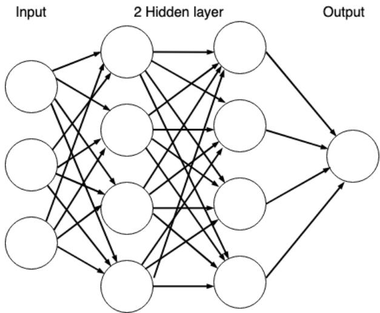  
Figure 2.15 Fully connected neural network with two hidden layer.

An implementation of a position-wise FFNs is illustrated in listing 2.5.

# Listing 2.5 Simple position-wise feed-forward network

class PositionwiseFeedforward(nnModule): def __init__(self, input_dim, hidden_dim, dropout=0.1): super(PositionwiseFeedforward, self).__init_(self.output_dim = input_dim self.hidden_dim = hidden_dim self_dropout = nn.Linear Dropoutdropout) self.fc1 = nn.Linear(input_dim, hidden_dim) self.fc2 = nn.Linear(hidden_dim, input_dim) def forward(self, x): $\mathbf{x} =$ self_dropout(torch.ReLU(self.fc1(x))) $\mathbf{x} =$ self.fc2(x) return x

NOTE The given code example presents a basic position-wise feedforward network with a single output layer. However, the complete transformer architecture, including multi-head attention and other components, handles sequences of inputs and outputs, not just single ones.

The word "position-wise" relates to the fact that the same transformation is done independently to each element in the vector, regardless of its location within the sequence. This

method is used because it enables the network to understand more complex patterns in the input and makes training on large datasets simpler. Additionally, position-wise FFNs are numerically eective since each member of the array is handled separately in parallel.

# 2.2.4 Positional encoding

The transformer lacks recurrence, which is a commonly used mechanism to understand the order of tokens in a sequence. Because of this absence, the transformer incorporates positional encoding, a technique for determining the relative or absolute position of tokens within a sequence. Without positional encoding, the transformer wouldn’t be able to dierentiate the order of tokens, leading to potential misinterpretations in the sequence. Recognizing the position of each token in the sequence allows the model to accurately infer relationships and meaning between tokens. To achieve this, the positional encoding is added to the sequence’s input embeddings by encoding each dimension of the position using a sinusoidal function. This encoding enables the model to attend to the relative positions of the words in the input sequence, using a linear function of the position index pos and the dimension index i. The mathematical formula for computing these positional encodings is shown in equation 2.5.

$$
P E _ {(p o s, 2 i)} = \sin \left(p o s / 1 0 0 0 0 ^ {2 i / d _ {\mathrm {m o d e l}}}\right) \tag {2.5}
$$

$$
P E _ {(p o s, 2 i + 1)} = \cos \left(p o s / 1 0 0 0 0 ^ {2 i / d _ {\mathrm {m o d e l}}}\right)
$$

The model can then use this information to better identify the context and meaning of each token in the sequence by summing the positional encoding with the input embeddings. Listing 2.6 shows an example implementation for positional encoding, using the formula from equation 2.5.

# Listing 2.6 Example implementation for positional encoding

```python
class PositionalEncoding(nnModule):
    "" "Positional encoding class."
    def __init__(self, num_hiddens, max_len=1000):
        super().__init()
        self.dropout = nn.Dropout(0.1)
        # Create a positional embedding matrix
        position = torch.arange(max_len, dtype=torch.float32).reshape(-1, 1)
        div_term = torch.exp(
            torch.arange(0, num_hiddens, 2, dtype=torch.float32) *
            - (math.log(10000.0) / num_hiddens))
        pe = torch.zeros((1, max_len, num_hiddens))
        pe[0, :, 0::2] = torch.sin(position * div_term)
        pe[0, :, 1::2] = torch.cos(position * div_term)
        self.register_buffer('pe', pe)
    def forward(self, X):
        X = X + self.pe[:, :X.shape[1], :] to(X_device)
        return self.dropout(X) 
```

The positional encoding and how it adds a sine wave depending on its position is shown in gure 2.16. Note, for each dimension, the wave’s frequency and oset are dierent.

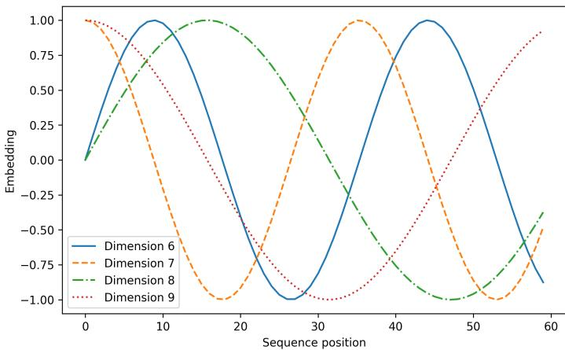  
Figure 2.16 Positional encoding example

If you want to get a better grasp of positional encoding, I recommend using the PositionalEncoding class, which is also available in the book’s repository, https://github. com/Nicolepcx/Transformers-in-Action, and changing the model’s inputs to see how this changes the plots output.

In this section, we explored the transformer architecture’s encoder and decoder components and their collaborative process in transforming input sequences into output sequences. We delved into the key innovation, the self-attention mechanism, and discussed positionwise feed-forward networks (FFNs) used for processing self-attention outputs. Lastly, we examined the role of positional encoding in conveying input sequence order, providing a comprehensive understanding of the transformer architecture and its contributions to cutting-edge performance in natural language processing tasks.

# 2.3 Building on the basics: a world of possibilities awaits!

With a better understanding of the transformer architecture and the role of self-attention, we can now delve deeper into how this type of architecture overcomes some of the issues that arise in RNNs. By comparing the two architectures more closely, we can gain valuable insights into the strengths and weaknesses of each approach.

# 2.3.1 Methods to stabilize the training of RNNs

In this subsection, we’ll delve into the challenges of training recurrent neural networks and discuss some widely recognized solutions. A notable reference is "On the diculty of training Recurrent Neural Networks", which oers a comprehensive view of these challenges and proposes practical solutions. Additionally, other strategies for increasing RNN stability exist, including equal kernel and recurrent kernel initializers, along with orthogonal matrix initializer for recurrence weights. These methods, as described in various studies, are

designed to alleviate the vanishing and exploding gradient problem in RNNs by carefully initializing the weights. The following are key techniques developed to enhance RNN stability.

Gradient clipping: this method limits the gradient values during backpropagation to prevent them from becoming too large.   
Initialization strategies: careful initialization of the network parameters can also help to prevent the exploding gradient problem.   
Layer normalization: this technique involves normalizing the activations of each layer in the network, which can help improve the stability and convergence of the training process.   
Skip and residual connections: these connections enable the gradient signal to propagate directly through the network without being reduced by activation functions or other transformations. This can prevent gradients from becoming too large or too small, because the network can better propagate the gradient during backpropagation.   
Adaptive learning rate algorithms: optimizers such as Adam, which use adaptive learning rates for each parameter, can help stabilize the learning process and mitigate the vanishing and exploding gradient problem by adjusting the learning rate based on the magnitude of the gradient. Moreover, by using a moving average of past gradient information, Adam reduces oscillations and improves the stability of the learning process.

# 2.3.2 The transformer architecture: a paradigm shift in neural network stability

In contrast to the RNN based networks, the transformer architecture, with its self-attention mechanism and the way the residual connections and layer normalization are set up, is constructed to naturally alleviate the vanishing and exploding gradient problem. Moreover, because of these design choices and the fact that it uses more ecient feed-forward layers, it is less sensitive to a specic initialization of weights and tuning of hyperparameters than RNNs. In the following are the key aspects on which the transformer builds and how self-attention and the overall architecture design help to stabilize the training.

Self-attention: the self-attention mechanism allows the model to directly capture dependencies between all positions in an input sequence, regardless of their position in time. This helps the model to better learn long-term dependencies, which can be dicult for traditional RNNs.   
1 Layer normalization: unlike RNNs that typically use batch normalization, the transformer uses layer normalization, which can help to improve the stability and convergence of the training process and prevent the exploding gradient problem.   
Residual connections: the use of residual connections in the transformer architecture helps to improve the ow of information through the model and prevent the vanishing gradient problem. Note, unlike LSTMs, which add residual connections to the hidden states of each recurrent layer, the transformer adds the input of each sub-layer to

its output using residual connections. This enables the input signal to easily pass through the layer and helps to avoid the vanishing gradient problem, even in deeper architectures. Furthermore, this design supports parallel computation of the sublayers, which can speed up the training process.

【 Positional encoding: the use of positional encoding allows the transformer to take into account the relative positions of elements in an input sequence, which can help to better capture temporal relationships and prevent the vanishing gradient problem.

Overall, the transformer architecture is addresses many of the limitations of traditional RNNs, and these improvements help to make the training process more stable and the models more eective in capturing complex dependencies in sequential data.

But it’s important to remember that hyperparameters like the learning rate and the number of layers can still aect how well the transformer works, which we’ll look at in more detail in chapter 9. However, unlike LSTMs, the transformer does not require a deep network structure to capture long-term dependencies, which further simplies the gradient computation and results in a simpler computational graph of the transformer than for an LSTM. The simpler computational graph of the transformer can make it easier to optimize hyperparameters and tune the model for better performance. To make this more evident, I provide you some classes and functions in the books repository in folder CH02 that let you plot and compare the computational graphs of both networks, the transformer and the LSTM, respectively.

I hope that I could convince you with this chapter that even though transformers look complex and dicult at rst sight, they can be broken down into simple building blocks that use basic mathematical operations. Remember, the attention mechanism, which is the key ingredient of the transformer, is basically a simple matrix multiplication operation. The same concept drives multi-head attention, a variant of the attention mechanism used in transformers. These models are a powerful yet adaptable design for natural language processing and other tasks due to the clever mix of these fundamental matrix multiplication operations, as well as other components such as feed-forward networks and positional encoding. This knowledge is a great foundation for the more advanced variants of the transformer model in this book.

# 2.4 Summary

□ The transformer model is divided into an encoder and decoder. The encoder processes the input sequence into a context or memory, which the decoder then uses to generate the output sequence.   
The pivotal part of the transformer is the attention mechanism. Where the query matrix, in a simplied way, just acts as a way of "retrieving" the key (matrix) with the value (matrix).   
The transformer model focuses on various portions of the input sequence using a self-attention mechanism and a feedforward neural network to transform the attention

outputs. These components are stacked in multiple layers, with residual connections and layer normalization.

Self-attention is computationally ecient because it allows for parallel processing of the input sequence. Unlike RNNs, which require a distinct set of learnable parameters for each point in the sequence, self-attention is exible and eective for various NLP tasks.   
Positional encoding is a way of guiding the transformer to dierentiate the order of tokens (words) within a sequence.   
1 While various methods have been developed to improve RNN stability during training, the transformer architecture, with its self-attention mechanism, layer normalization, and residual connections, naturally mitigates both vanishing and exploding gradient problems, making it easier to train and optimize than RNNs.

# Bibliography

[1] Ashish Vaswani, Noam Shazeer, Niki Parmar, Jakob Uszkoreit, Llion Jones, Aidan N. Gomez, Lukasz Kaiser, and Illia Polosukhin. Attention is all you need. CoRR, abs/1706.03762, 2017. URL: http://arxiv.org/abs/1706.03762 25

# Transformers for Fundamental NLP Tasks

Transformers have become the driving force behind the most recent breakthroughs in the ever-evolving eld of natural language processing. Since these advancements have not only changed the way we engage with technology, such as ChatGPT or it’s freely accessible versions like Dolly, Falcon and RedPajama, but have also opened up new possibilities for tackling complex language tasks.

In Part 1, we examined the architecture and inner workings of Transformer models, revealing their unique design decisions and mechanisms. With a solid grasp of their basis, we are now well-prepared to investigate the powerful applications enabled by this remarkable architecture. As we venture into this fascinating world, we will uncover the complexities of various NLP tasks and learn how Transformers have revolutionized our approach to solving these challenges.

In this second part of the book, we will look at fundamental NLP applications, revealing the techniques and strategies to unlock the full potential of Transformer models. While also providing you with some fundamental background of the driving forces, i.e. neural machine translations, behind this groundbreaking invention. Moreover, by examining real-world examples, we will gain valuable insights into the practical implementation and ne-tuning of these architectures for diverse use cases. Through case studies and hands-on examples, you will develop a deeper understanding of how to harness the power of Transformer models for your own tasks at hand.

That said, this part of the book will provide you with the tools you need to improve and rene your NLP projects, unlocking new levels of performance and eciency as well as grounding you in fundamental background knowledge. As a result, you will be wellpositioned to advance your work in the rapidly changing landscape of NLP.

Furthermore, by tailoring the power of Transformer models to the particular needs of your own tasks, you will be well equipped to address a wide variety of NLP challenges with the insights and techniques presented in this part of the book. The lessons learned in this

part will be a useful resource for optimizing your own NLP solutions, whether you are working on text summarization, machine translation or classication. Let’s embark on this adventure not only to explore the fascinating world of NLP applications but also to learn how to apply these techniques to your own projects.

# Text summarization

# This chapter covers

How to chose a baseline and what it entails   
Outline of transformers for summarization   
Overview of evaluation metrics for text summarization   
Evaluation of various models for a summarization task   
Fine-tuning a summarization model

In the previous chapter, we looked at the specic design and building blocks of transformers. This chapter of the book builds on that base and broadens your understanding so that you can create your own solutions for text summarization applications.

Moreover, the text-to-text application provides a distinct framework for further analyzing the transformer’s design. Also, understanding how to summarize text can be useful, as there may be situations where you need to summarize a document eectively, whether it is a legal document, a research paper, a news story, or a nancial report. In addition, summarizing articles, social media feeds, and other external sources of information can provide businesses with useful insights into market trends, consumer views, and competitor activities. Such information can be used to inform decision-making processes, enhance marketing strategies, and create novel products and services.

To provide you the necessary knowledge on using transformers for text summarization, we build, in this chapter, on the encoder-decoder structure of these seq-2-seq models and explore how you can leverage a pre-trained model and ne-tune it for your own documents.

# 3.1 Getting started with text summarization

Transformers have taken us from the early, simple days of NLP to the big games of advanced language processing technologies. In the past, extractive summarization was the norm. Extractive summarization identies and extracts the most signicant phrases or sentences from the source text, preserving their original form. But now we can easily create abstractive summaries with transformers. This means that we can create a condensed version by rephrasing and synthesizing the content, providing a more concise and coherent summary. It is important to note that for this kind of tasks, RNN-based models were usually applied. But LSTMs have trouble with long sequences, whereas transformer models can handle challenging tasks with ease. This makes it possible for NLP to be used in new and exciting ways and create more comprehensive summaries.

However, before we dive into transformers, let’s rst examine extractive summarization, as this kind of summarization allows us to establish a solid baseline against which we can later evaluate the performance of our more advanced transformer models.

# 3.1.1 Extractive text summarization

Summarization systems aim to produce concise and uent summaries that convey key information from texts or documents. Extractive summarization involves selecting important phrases and sentences from the original text and compiling them into a summary. The benets of this approach are:

Less prone to mispresenting information   
Gramatically correct

In spite of its benets, extractive summarization is generally more suitable for shorter texts like news articles, where important information is often explicitly stated in the text. Simple techniques such as TextRank, a graph-based ranking algorithm, can be eective for these types of summarization tasks.

# 3.1.2 Text summarization techniques

In extractive summarization, several methods such as keyword-based, graph-based, and topic-based are used. These include the ranking of words based on importance, constructing graphs to denote documents, and extracting relevant topics from the text. The paper "Text Summarization Techniques: A Brief Survey" (1) oers a detailed examination of these various techniques. Among them are:

An early approach prioritizes sentence selection based on the frequency of signicant words. (14)   
Another method incorporates the use of cue words and document structure to guide the summarization process. (6)

The rst trainable method used the principles of Naïve Bayes for its operation. (10)   
LexRank represents text as a graph and calculates sentence importance akin to Google’s PageRank algorithm. (7)   
TextRank also uses a graph representation of the text but applies the PageRank algorithm in a slightly dierent manner, focusing on the number of common words between sentences. (15)

NOTE While both LexRank and TextRank are graph-based techniques for extractive text summarization that take into account semantic connections between words, they vary in some ways. LexRank uses a technique comparable to Google’s PageRank algorithm to calculate sentence importance. It assumes that sentences that are more semantically comparable to other sentences in the text are more signicant. TextRank, on the other hand, employs a distinct similarity metric between sentences based on the number of common words between them. It then uses a scoring method similar to PageRank, where nodes indicate sentences and connections are weighted by sentence similarity. As shown in gure 3.1.

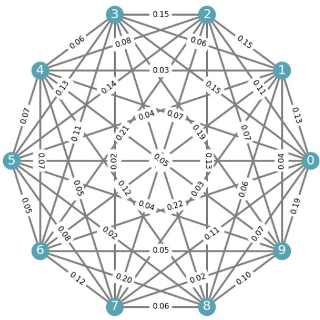  
Figure 3.1 This illustration shows a circular graph where each node represents a sentence from the input text, which is the second paragraph of the paper ”Attention Is All You Need”. The numbers displayed on the edges are the weights of the edges, representing the similarity scores between the connected sentences. These scores range from 0 to 1, where 0 indicates no similarity and 1 indicates a perfect match (identical sentences). A higher number implies a stronger connection between the two sentences, meaning that they share more words or terms in common. You can explore this further in the accompanying code, located in the ”ch03” folder.

In this chapter, we will focus on TextRank as a baseline. Nevertheless, it might be worthwhile for you to investigate LexRank as an alternative, since both methods share a

similar level of computational complexity. If you are familiar with both methods, you can make more informed choices about which is most benecial to you.

# A CLOSER LOOK INTO TEXTRANK

Before we establish our baseline, let us take a closer look at how TextRank works. TextRank is a graph-based ranking algorithm for NLP tasks like summarization and keyword extraction. To give you a high-level imagination, how this works, let us look at a vivid example.

Imagine you’re at a party where several groups of people are having separate conversations. You’re new to the town, and you want to nd out who the most inuential people are and with whom you want to "hang out" in the future. One strategy could be to listen in on conversations and keep a score of who is mentioned the most.

The TextRank algorithm works much like this. The party is the text, the groups of people are the sentences (nodes), and the people being mentioned are the words. Each time a word (person) is mentioned in a sentence (conversation), an edge (relationship) is established between that word and the sentence.

Now, consider the inuencers at the party. These are likely to be the people most often mentioned, right? This is because the more a person is mentioned, the more important they’re likely to be. Likewise, the more frequently a word appears in a text, the more signicant it’s likely to be, according to TextRank.

However, the story doesn’t end here. Not all mentions are equal. Suppose one person (let’s call him Bob) is mentioned often, but mostly by less-known individuals at the party. Another person (let’s say Alice) is mentioned less frequently, but those who talk about her are themselves very well-known and important and frequently mentioned by others.

In the TextRank world, Alice would have a higher ranking than Bob, because her mentions come from more important or inuential sentences. In this sense, TextRank not only considers the frequency of a word but also the importance of the sentences in which the word appears.

By listening to the whole party (analyzing the whole text), you can create a map (a graph) of who knows who and who is talked about the most. This gives you a good idea of who the inuencers are. Similarly, TextRank maps the text, identies the most frequently mentioned and contextually important words, and uses these to rate the signicance of the sentences.

So, TextRank is like an eavesdropper at a party, trying to gure out who the most important attendees are, based on who is mentioned the most and who is talked about by the most inuential people.

Now, let us attend to the mathematical and technical part of TextRank. Here, text is represented as a graph, with nodes representing textual units (sentences or words) and edges representing the relationships between them. The scores for each node are calculated on the basis of the scores of its neighbors and the weights of the edges that connect them. First, the algorithm applies the PageRank equation as an iteration:

$$
p _ {i} ^ {(k + 1)} = \frac {1 - \delta}{N} + \delta \cdot \sum_ {\text {e d g e s} j i} \frac {p _ {j} ^ {(k)}}{c _ {j}} \tag {3.1}
$$

where $\delta$ is the damping factor (probability of following a link in PageRank), which is usually set to 0.85, $N$ is the total number of nodes (sentences or words in the case of TextRank), $\boldsymbol { \mathscr { P } }$ is the rank score, and $c$ is the number of edges for a node. $\omega _ { j i }$ is the weight of the connection between vertices $V _ { j }$ and $V _ { i }$

Then, as a second step, the PageRank is replaced by the rank $r$ of the vertices $V _ { i }$ , which can stand for words, phrases or complete sentences.

$$
r \left(V _ {i} ^ {(k + 1)}\right) = \frac {1 - \delta}{N} + \delta \cdot \sum_ {\text {e d g e s} _ {j i}} \frac {\omega_ {j i} \cdot r \left(V _ {j} ^ {(k)}\right)}{\sum_ {\text {e d g e s} _ {j i}} \omega_ {j i}} \tag {3.2}
$$

Additionally, to each edge a weight $w _ { j i }$ is attached in order to have more exibility to characterize the strength of the connection between two vertices $V _ { j }$ and $V _ { i }$ . Depending on the use case, these edges can represent dierent types of connection, lexical relations, or contextual relations.

To make the math less abstract, let us consider a simple example. The provided pagerank function from listing 3.1 reects the second equation, 3.2, where $\omega _ { j i }$ is the weight of the connection between vertices $V _ { j }$ and $V _ { i }$ (i.e., adjacency_matrix[ j, i]). The function calculates the rank $r ( V _ { i } ^ { ( k + 1 ) } )$ for each vertex $V _ { i }$ in the graph, considering the edge weights and the out-degree of each node.

# Listing 3.1 Detailed code example for TextRank algorithm

defpagerank(self,G，delta=0.85,max_iter=100,tol=1e-6): N = len(G) ranks $=$ np.ones(N)/N adjacency_matrix $\equiv$ nx.to_numpy_array(G)   
1 Calculate the out-degree for each node out Degrees $=$ np.sum(adjacency_matrix，axis=1)   
for_in range(max_iter): 2 (I - delta) divided by N term new_ranks $=$ np.ones(N）\*（1-delta）/N for i in range(N): for j in range(N): 3 check edge between nodes j and i if adjacency_matrix[j,i] $\rightharpoondown$ 0: 4 summation part in both equations new ranks[i] $+ =$ delta \* ranks[j] \* adjacency_matrix[j,i] / out Degrees[j] 5 This line checks for convergence if np.linalg(norm(new ranks - ranks) < tol: break ranks $=$ new ranks return ranks

Now let us apply our function. We will use the following text:

TEXT $=$ """Machine learning is a subeld of articial intelligence.

Deep learning is a technique used in machine learning.

Supervised learning is a popular machine learning method.

Unsupervised learning is another machine learning technique."""

Then we instantiate our class and call the functions:

# Listing 3.2 Using our custom TextRank class

```python
tr = TextRank() ① instatiate class  
sentences = tr.split sentences(text) ② split sentences  
G = tr.create_graphsentences) ③ create the graph  
tr.print_sentenceweights(G, sentences) ④ print out weights  
tr.plot_graph(G) ⑤ plot constructed graph from step 3 
```

The following weights represent the similarity scores between the pairs of sentences. The scores range from 0 to 1, where 0 indicates no similarity and 1 indicates a perfect match (identical sentences). A higher number implies a stronger connection between the two sentences, meaning that they share more words or terms in common.

Sentence 0: Machine learning is a subeld of articial intelligence.

Sentence 3: Unsupervised learning is another machine learning technique.

Weight: 0.2469

Sentence 0: Machine learning is a subeld of articial intelligence.

Sentence 2: Supervised learning is a popular machine learning technique.

Weight: 0.2469

Sentence 0: Machine learning is a subeld of articial intelligence.

Sentence 1: Deep learning is a technique used in machine learning.

Weight: 0.2210

Sentence 0: Machine learning is a subeld of articial intelligence.

Sentence 0: Machine learning is a subeld of articial intelligence.

Weight: 1.0000

Sentence 1: Deep learning is a technique used in machine learning.

Sentence 3: Unsupervised learning is another machine learning technique.

Weight: 0.4522

Sentence 1: Deep learning is a technique used in machine learning.

Sentence 2: Supervised learning is a popular machine learning technique.

Weight: 0.4522

Sentence 1: Deep learning is a technique used in machine learning.

Sentence 1: Deep learning is a technique used in machine learning.

Weight: 1.0000

Sentence 2: Supervised learning is a popular machine learning technique.   
Sentence 3: Unsupervised learning is another machine learning technique. Weight: 0.5051   
Sentence 2: Supervised learning is a popular machine learning technique.   
Sentence 2: Supervised learning is a popular machine learning technique. Weight: 1.0000   
Sentence 3: Unsupervised learning is another machine learning technique.   
Sentence 3: Unsupervised learning is another machine learning technique. Weight: 1.0000

This results in the graph as shown in gure 3.2

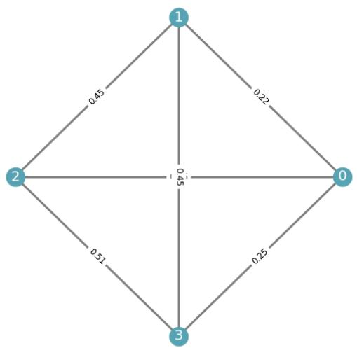  
Figure 3.2 These scores range from 0 to 1, where 0 indicates no similarity and 1 indicates a perfect match (identical sentences). A higher number implies a stronger connection between the two sentences, meaning that they share more words or terms in common.

NOTE If you want to experiment with the code, the whole custom TextRank class can be found in the accompanying code, located in the "utils" folder of the repo.

Figure 3.2 visualizes the graph generated by our TextRank algorithm. Each node represents a sentence from the text and the edges between nodes represent the calculated similarity scores. The higher the numbers, the higher the similarity between the sentences. Note how sentences that share terms like "machine learning" and "technique" are more strongly connected.

# 3.1.3 Establishing a baseline: TextRank

You may be wondering why it is necessary to create a baseline. The reason for this is that it enables you to assess not only the ecacy of advanced models such as transformers, but

also whether a simpler strategy would suce for a specic task. Creating a rm baseline is an important step in determining the real value that a more complicated model oers to your particular use case. Listing 3.3 shows how to leverage a library called "summa", which is freely available via https://pypi.org/project/summa/.

# Listing 3.3 Using TextRank from the summa library

0 function to summarize the text

def summarize_text(text, words $= 8 0$ ): $\textcircled{8}$ set max. words to 80 summary $=$ summarizer.summarize(text, words $=$ words) return summary

③ Parallelize the TextRank summarization

with Pool() as pool: summarized_articles $=$ pool.map(summarize_text, articles_np_1)

Since it is unsupervised, simple to apply, and computationally ecient, TextRank is an excellent option as a baseline algorithm for text summarization. It oers a basic yet eective method for extracting important words and ranking sentences based on their signicance within the text. Compared to other baseline choices, such as lead-3 (selecting the rst three sentences) or simple frequency-based methods, TextRank oers a more sophisticated approach by capturing the relationships between sentences and their relevance to the overall text, providing a better starting point for comparison with advanced methods such as transformers. Transformer-based models are mostly designed for abstractive summarization, though there are exceptions, which we will look at in section 3.3. But rst let us understand more intuitively what abstractive summarization is and what it entails. We will later, in section 3.5.1 use the function from listing 3.3 as a baseline and compare the resulting metrics as well as the text summarization results.

# 3.1.4 Abstractive text summarization

Abstractive summarization is generally considered more dicult and has been the focus of recent research in the eld. Abstractive summarization entails creating a new summary from scratch, enabling the model to combine knowledge from various sections of the original text and convey it in its "own words". This method is more adaptable than extractive summarization, which uses only present sentences from the source text to create the summary. Furthermore, an abstractive summary produces more succinct and cohesive summaries than an extractive summarization. In summary, the pros for choosing an abstractive summarization are the following.

Summary sounds more natural   
Higher compression rates

You might be wondering what the phrase "higher compression rates" means. Let me take a minute to explain what it means.

Abstractive summaries have higher compression rates because they generate summaries by synthesizing new, concise sentences that capture the main ideas of the original text, in-

stead of merely extracting existing sentences. This allows for a more compact representation of the source material while maintaining the essential information.

NOTE LSTMs and other RNN-based models can be used for abstractive summarization (16), but they may struggle with longer documents or more complex relationships between dierent parts of the text. Transformer-based models have shown better performance in these cases and are often the preferred choice for abstractive summarization tasks. Transformers are designed to handle long sequences of text and can capture complex relationships between them. And with that, they are well-suited for the task of abstractive summarization, leading to more ecient and coherent summaries.

This is crucial when handling longer documents or articles. Although abstractive summarization requires more data and resources to train advanced models, the benets may justify the investment in specic applications. Let’s briey examine a network combining both extractive and abstractive summarization before exploring how to use transformers for our summarization tasks.

# 3.1.5 Pointer-generator networks

Now that we understand the concepts of extractive and abstractive summaries, let us briey discuss pointer-generator networks (21). The network is shown in gure 3.3.

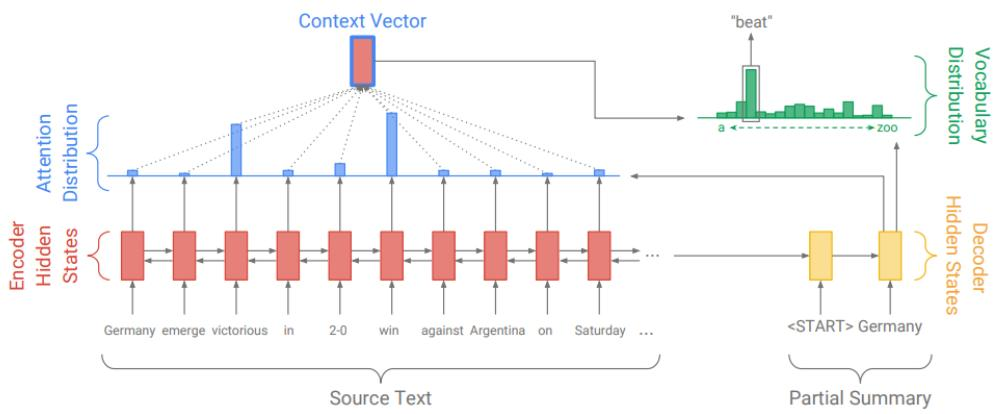  
Figure 3.3 Pointer-generator sequence-to-sequence model with attention. The model may attend to relevant words in the source text to generate new words, e.g., to produce the new word beat in the abstractive summary Germany beat Argentina 2-0 the model may attend to the words victorious and win in the source text. Image was taken from the paper of ”Get To The Point: Summarization with Pointer-Generator Networks”

These networks are designed for text generation tasks such as summarization and eectively combine the benets of both extractive and abstractive approaches. They incorporate attention mechanisms in their architecture to weigh the importance of dierent parts of the input text, which helps to obtain more meaningful context vectors.

These context vectors are then used to generate output text that is more focused and coherent. Pointer-generator networks employ a pointer mechanism to copy words from the input text while also generating new terms based on the learned vocabulary using a generative mechanism. In a loose sense, the tasks of abstractive text summarization and image generation share some conceptual similarities. Both tasks involve generating new outputs based on previously acquired patterns and relationships in their respective domains (text for abstractive summarization and images for image generation). Although they operate on dierent principles and cater to dierent modalities, both share the generative feature of creating new content based on their training data. Even though this form of summarization is impressive, transformer-based models have further advanced the eld of text summarization, building upon and surpassing the capabilities of earlier models such as the pointer-generator network. This is partially because pre-trained transformer models can leverage large-scale unsupervised learning, which helps them better understand language and generate more coherent and contextually accurate summaries. Let’s explore how transformers advanced the eld of text summarization.

# 3.2 Text-to-text transformer models

In this section we will explore various text-to-text transformer models that have revolutionized the landscape of text summarization. Eeach model has unique characteristics and archictecture designs that contribute to its overall performance and versatility. Figure 3.4 shows how the ow of information is in such a text-to-text model.

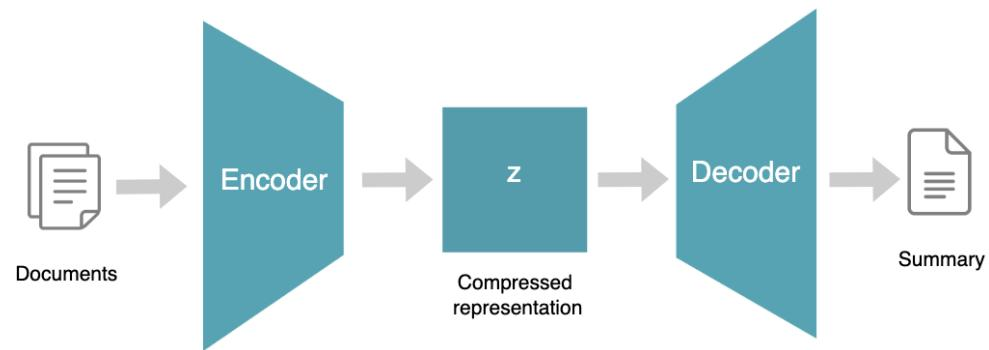  
Figure 3.4 The encoder processes the input text to produce a compressed representation ”z.” This compressed representation captures the important information from the input text. The decoder then utilizes this representation to produce the desired output text, our summary.

You might notice that this architecture resembles an Autoencoder. While both have similar high-level structures and involve encoding input data into a compressed representation, their objectives and applications dier. Autoencoders are used for dimensionality reduction and unsupervised learning, while text-to-text models generate coherent output text based on input text. Despite sharing the principle of preserving essential features, their specic goals and use cases are distinct.

# STATE-OF-THE-ART SUMMARIZATION MODELS

BART, T5, ProphetNet, Pegasus, Longformer, and BigBird are some of the most commonly used and cutting-edge text summarization algorithms. They have achieved remarkable results in a variety of summary benchmarks and have been built with particular enhancements or features that make them well-suited for producing summaries. Although there are other methods for summarizing, these are currently some of the most widely used and eective options in the eld. Before we go deeper into each of these models and how these architectures dier from each other, here is a brief overview of their main dierences, before we discuss these models in more detail in section 3.3.

The BART (Bidirectional and Auto-Regressive Transformers) (11), model blends the original Transformer architecture’s bidirectional encoding with GPT’s auto-regressive decoding. This combination enables BART to excel at a wide variety of NLP tasks, such as text summarization and translation. 139 - 406 million parameters   
T5 (Text-to-Text Transfer Transformer) (20), is another text-to-text model that reformulates all NLP tasks into a unied text-to-text framework. T5 streamlines the ne-tuning process by turning tasks into a text-in, text-out structure, allowing it to perform extremely well on a variety of tasks, including summarization. 60 million - 11 billion parameters   
ProphetNet, a new transformer model (23), oers future n-gram prediction as a new self-supervised goal. This method enables the model to acquire more global sequence information, resulting in better success on sequence-to-sequence tasks such as summarization and translation. 50 -200 million parameters   
Pegasus (Extracted Gap-sentence Pre-training for Abstractive Summarization) (26), is a model developed especially for abstractive summarization. Pegasus pre-trains the model by hiding complete phrases in the input text, causing the model to produce more logical and uent summaries. 568 million - 1.3 billion parameters   
Longformer (2), and BigBird (25), are transformer models that can handle signi- cantly longer documents than standard models. Longformer makes use of moving windows, whereas BigBird makes use of dierent attention mechanisms. Both models can handle longer sequences eciently, making them ideal for summarizing large documents. Longformer: 148 - 409 million parameters, BigBird: 110 - 337 million parameters.

GPT-2, GPT-3 AND GPT-4 Despite the fact that GPT-2, (19), and GPT-3, (3), are strong language models, they are not addressed in this chapter because they are less suitable for summarization tasks. In contrast to the models mentioned above, which are specically intended for summarization, their auto-regressive character can limit their ability to create clear and coherent summaries. While GPT-3 is an advance over GPT-2, it still encounters the same diculties in producing high-quality abstractive summaries in comparison to models such as BART, T5, ProphetNet, Pegasus,

Longformer, and BigBird. I have chosen to cover these models in a subsequent chapter dedicated to text generation tasks, rather than focusing on them in this chapter specically about summarization. Moreover, GPT-4 is a multimodal model and it will be covered in chapter 7.

# 3.3 Model overview

As we explore each of the text-to-text transformer models, you will gain insights into their distinct design choices, strengths, and limitations. This knowledge not only aids in selecting the most appropriate model for your specic summarization needs but also sets the stage for our subsequent "test-spin" with these models in section 3.5. Moreover, by understanding and comparing these models side-by-side, you get a comprehensive grasp of their functionalities, eliminating the need to sift through scattered information across various sections. This direct comparison encourages a deeper understanding, enabling you to critically assess their performance and dierentiate between their unique capabilities.

# 3.3.1 BART

In their paper "BART: Denoising Sequence-to-Sequence Pre-training for Natural Language Generation, Translation, and Comprehension", the authors propose BART (Bidirectional and Auto-Regressive Transformers). BART demonstrates cutting-edge success on a variety of natural language processing tasks such as abstractive summarization, machine translation, and question answering. The methods used in BERT, (5) and GPT, (18), as highlighted in gures 3.5, 3.6 and 3.7, respectively, inspired BART.

BERT is a masked language model (MLM) that forecasts missing tokens using both left and right context, whereas GPT is an auto-regressive model that only uses the left context. By pre-training a sequence-to-sequence model with a denoising autoencoder, BART combines the strengths of both models.

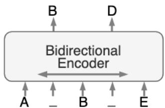  
Figure 3.5 BERT: Masks are used to substitute random tokens, and the document is encoded bidirectionally. Because missing tokens are predicted separately, BERT cannot be used for generation.

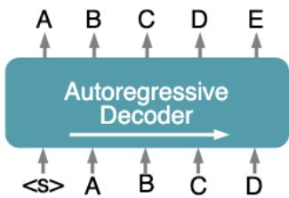  
Figure 3.6 GPT: Tokens are auto-regressively predicted, implying that GPT can be used for generation. However, because words can only condition on the left, it cannot acquire bidirectional interactions.

The authors used a collection of noise functions, such as token masking, token deletion, text inlling, and sentence permutation, to produce a corrupted version of the input text for their study. The goal of the pre-training is to reconstruct the original input text from the

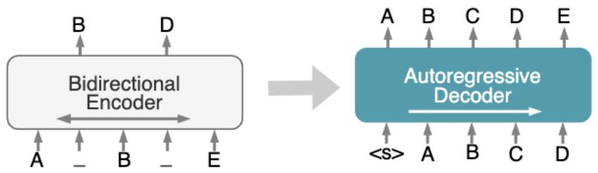  
Figure 3.7 BART: Encoder inputs do not have to be aligned with decoder outputs, enabling for arbitrary noise transformations. A document has been corrupted in this case by substituting text spans with mask symbols. A bidirectional model is used to encode the corrupted document (left), and an autoregressive decoder is used to determine the likelihood of the original document (right).

corrupted form. BART learns to model the conditional probability $\phi ( y | x )$ given a corrupted input sequence $x$ , where $y$ is the initial input sequence. The training goal is to minimize the negative log-likelihood:

$$
\mathcal {L} (\theta) = - \sum_ {(x, y) \in \mathcal {D}} \log p _ {\theta} (y | x) \tag {3.3}
$$

Where $\mathcal { D }$ is the set of corrupted-original text pairs, and $\theta$ represents the model parameters.

It is worth noting that BART employs the standard transformer design for both its encoder and decoder. The encoder analyzes the corrupted input text and produces context representations, which the decoder uses to reconstruct the original text. The ne-tuned BART demonstrates that it outperforms prior cutting-edge models such as T5, BERT, and RoBERTa (13), on these tasks.

BART is an important contribution to the eld of NLP, as this emphasizes the importance of denoising pre-training and bidirectional context modeling for sequence-to-sequence tasks. BART is widely used for dierent NLP applications and acts as a foundation for subsequent models.

# 3.3.2 T5

The authors of the paper "Exploring the Limits of Transfer Learning with a Unied Text-to-Text Transformer" present T5 (Text-to-Text Transfer Transformer), a powerful pre-training framework for NLP tasks. T5 gets cutting-edge results on a variety of NLP benchmarks, including GLUE, SuperGLUE, SQuAD, and CNN/Daily Mail summarization. We will look more closely at the GLUE benchmark in 5.2. T5 expands on the success of previous models, such as BERT and GPT, by pre-training a large-scale language model in text-to-text format. The authors suggest that all NLP tasks should be viewed as text-totext problems, with both input and output converted into natural language text. Figure 3.8 illustrates this approach in a simple diagram. With minimal changes in the task-specic architecture, this unied approach allows transfer learning across a wide range of tasks.

T5 is pre-trained by the authors using a denoising autoencoder, which is comparable to the previous mentioned BART model. Moreover, they apply a masking operation to

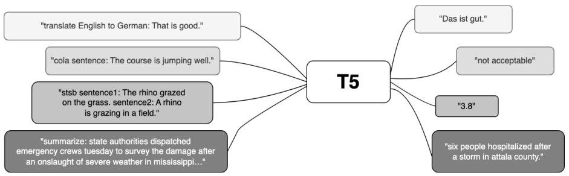  
Figure 3.8 The text-to-text structure of T5 is depicted here in diagram form. Each task (translation, question answering, and classification) is viewed as a cast in which the model text is fed as input and trained to produce some target text. This enables to apply the same model, loss function, hyperparameters, and so on to a diverse collection of tasks. “T5” refers to “Text-to-Text Transfer Transformer”

corrupt input sequences and teach the model to reconstruct the original text. Given a corrupted input sequence $x$ , the model learns to model the conditional probability $\phi ( y | x )$ , where $y$ is the original input sequence. As we have seen with BART, the training goal is to minimize the identical negative log-likelihood:

$$
\mathcal {L} (\theta) = - \sum_ {(x, y) \in \mathcal {D}} \log p _ {\theta} (y | x) \tag {3.4}
$$

Where $\mathcal { D }$ is the set of corrupted-original text pairs, and $\theta$ represents the model parameters.

Like BART, T5 uses the transformer architecture introduced in chapter 2, with minor modications to enable the text-to-text format. To enhance its performance, the model makes use of relative position embeddings and layer normalization techniques. The authors experimented with a wide range of model sizes, from small (60 million parameters) to extra-large (11 billion parameters). Larger models consistently outperform smaller models on NLP tasks, which suggests that increasing model size can be an eective strategy for improving performance. T5 stresses the importance of a unied text-to-text framework as a key contribution to NLP transfer learning. This method has established a new standard for NLP models, inspiring further study and development. T5’s inuential design acted as a foundation for subsequent models and has been extensively adopted across a variety of NLP applications.

# 3.3.3 ProphetNet

ProphetNet, introduced in the paper "ProphetNet: Predicting Future N-grams for Sequenceto-Sequence Pre-training", uses a new method to enhance the performance of various NLP tasks. It focuses on predicting future n-grams, or sequences of $n$ words, which can be viewed as forecasting what words will come next in a series. Where n-grams refers to a continuous sequences of $n$ items in a given sample of text.

This innovative technique works by modeling the prediction of these n-grams based on what has already been presented in the target sequence and the source sequence. By predicting multiple future tokens, ProphetNet is able to better grasp the context between dierent words, improving its performance in sequence-to-sequence tasks.

Using a unique self-supervised learning method and a masked n-gram language model, ProphetNet generates text that is diverse, coherent, and has improved contextual understanding.

The model’s design revolves around the token span masking technique and relative positional encoding. The n-gram masking approach predicts multiple future tokens, enabling the model to learn more eectively about the context between words. ProphetNet’s n-stream attention mechanism, displayed in gure 3.9, is inuenced by the n-stream self-attention from XLNet (24).

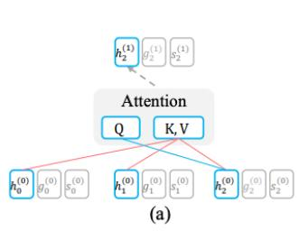

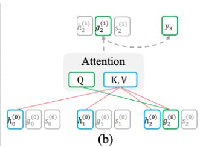

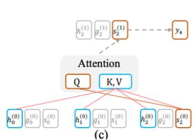  
Figure 3.9 Mechanism of self-attention of stream N with a primary stream and prediction of n streams. For simplicity, the scenario employs two streams of self-attention $( \mathfrak { n } = 2 )$ . Part (a) of the figure depicts the attention process of the primary stream self-attention, while parts (b) and (c) depict the attention processes of the first and second predicting streams, respectively. The image was taken from the ProphetNet paper.

ProphetNet’s n-stream attention mechanism extends the multi-head attention mechanism by employing a novel n-stream self-attention approach. Traditional multi-head attention involves a model focusing on dierent parts of the input when generating each output word. ProphetNet takes this a step further by introducing multiple streams of self-attention, allowing the model to anticipate and predict n-grams or sequences of $n$ words.

In other words, ProphetNet not only pays attention to dierent parts of the input but also makes predictions about multiple future tokens in the output. This enhanced attention mechanism helps ProphetNet to capture more complex dependencies between tokens and to generate more coherent sequences of text.

Applying these new concepts, ProphetNet outperforms previous state-of-the-art models in several NLP benchmarks, including machine translation, summarization, and question answering. The major contributions of ProphetNet to the eld of NLP are the introduction of future n-gram prediction and the development of a unique sequence-to-sequence pretraining approach.

# 3.3.4 Pegasus

PEGASUS (Pre-training with Extracted Gap-sentences for Abstractive Summarization) represents a specialized pre-training approach specically designed for abstractive text summarization tasks. The model relies on a unique self-supervised objective, termed "gap sentence generation," to prepare training data. This method prompts the model to predict

masked sentences within a given document, with these masked sentences functioning as a compact summary of the document. The underlying concept promotes the notion that if the model can be taught to predict signicant sentences within a document, it can be ne-tuned for more eective summarization tasks. This technique draws its inspiration from masked language modeling approaches, which mask words and contiguous spans to train the model. A visual representation of the architecture is provided in Figure 3.10.

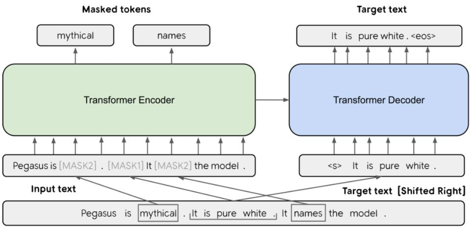  
Figure 3.10 PEGASUS’s core design is a conventional transformer encoder-decoder. Both GSG and MLM are applied concurrently to this example as pre-training goals. Originally, there are three lines. A phrase is hidden with [MASK1] and used as target generation text (GSG). The other two lines stay in the input, but some tokens are arbitrarily masked by [MASK2] (MLM). The image was taken from the PEGASUS paper.

PEGASUS selects and masks whole sentences from documents, and these gap sentences are concatenated to create a pseudo-summary. This special pre-training method concentrates on extracting the most important information from the input text. The authors of PEGASUS considered three distinct methods to optimize the selection and masking process, with the goal of maximizing the model’s ability to learn and produce meaningful abstractive summaries.

Random: Uniformly select $m$ sentences at random.   
Lead: Select the rst m sentences.   
L Principal: Select the top- $\mathbf { \nabla } m$ scored sentences according to importance. As a method to calculate the importance, ROUGE1-F1 is applied between the sentence and the rest of the document, $s _ { i } =$ rouge $\left( { { x } _ { i } } , D \backslash \left\{ { { x } _ { i } } \right\} \right) , \forall i$ .

To generate summaries, the authors use standard sequence-to-sequence training techniques to ne-tune PEGASUS on dierent summarization datasets. The resulting model outperforms earlier models such as BART and T5 on multiple summarization benchmarks, demonstrating cutting-edge performance.

PEGASUS made a signicant contribution by introducing the gap sentence generation pre-training objective, which is specically intended to helps in abstractive summarization. PEGASUS learns to recognize and generate meaningful summaries by masking and predicting key sentences in a document during pre-training. This innovative pre-training method has been shown to be eective for abstractive summarization tasks.

# 3.3.5 Longformer

Longformer is a transformer architecture intended to eciently handle long input sequences. It extends the orignal Transformer paper "Attention Is All You Need" initial self-attention mechanism to address the challenges of processing long texts in NLP tasks.

The self-attention mechanism of the Longformer combines local windowed attention with global attention. Longformer captures local context eectively by using a sliding window with or without dilation for local windowed attention. The dilated sliding window can capture long-term dependencies more eectively by covering a bigger context without increasing computational complexity.

Longformer carefully applies global attention to a few tokens in the input sequence for global attention. This enables the model to focus on important tokens that contain more global information. (e.g., special tokens, such as [CLS] in BERT).

Recall that the original transformer model computes attention scores as follows given the linear projections Q, K, and V:

$$
\operatorname {A t t e n t i o n} (Q, K, V) = \operatorname {s o f t m a x} \left(\frac {Q K ^ {T}}{\sqrt {d _ {k}}}\right) V \tag {3.5}
$$

where $Q , K$ , and $V$ are the query, key, and value matrices, and $d _ { k }$ is the key vector dimension. Longformer keeps this attention computation but modies how it is applied to the input sequence by combining local windowed attention and global attention.

Longformer is also related to autoregressive or left-to-right language modeling, which is an essential aspect of its design. This link enables the model to better understand and produce coherent text by accounting for token dependencies in the input sequence.

In summary, Longformer’s main contribution lies in its ability to handle long input sequences eciently by combining local windowed attention, dilated sliding window attention, and global attention, while building upon the original self-attention mechanism and relating to autoregressive language modeling. This advancement enables the model to eectively capture both local and global context while keeping computational eciency, allowing it to be applied to a broader range of NLP tasks that involve processing long documents.

# 3.3.6 BigBird

BigBird, as detailed in the paper "Big Bird: Transformers for Longer Sequences," introduces a novel attention mechanism that eciently manages longer input sequences. This generalized attention mechanism is applied to each layer of the model operating on an input sequence $X$ of length $n$ .

The heart of this mechanism is a directed graph $D$ , with each vertex representing a position in the input sequence. The directed edges of this graph reveal the interrelations considered by the attention mechanism. For each node $i$ in $D$ , its set of out-neighbors, denoted as $N ( i )$ , reects the attention span of that node.

The BigBird attention mechanism can be mathematically dened as a function that processes the input sequence $X$ and modies each element $x _ { i }$ based on its attention span $N ( i )$ . It employs dierent roles for the input sequence elements, represented by the query, key, and value functions. The scoring function $\sigma$ (such as softmax) is used to determine the weights of these interactions.

The attention mechanism in BigBird combines three types of attention patterns - sliding window attention, global attention, and random attention - forming what’s known as sparse attention. This sparse attention pattern allows the model to eectively capture both local and global context in an ecient manner, enabling it to process longer input sequences.

As illustrated in gure 3.11 the sparse attention pattern in Big Bird consists of a combination of sliding window attention, global attention, and random attention.

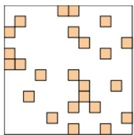  
(a)Random attention

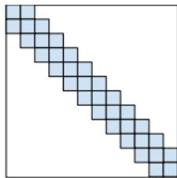  
(b) Window attention

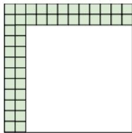  
(c) Global Attention

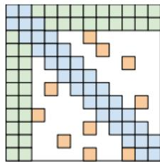  
(d) BIGBIRD   
Figure 3.11 Building blocks of the attention mechanism used in BIGBIRD. The white color indicates the absence of attention. (a) random attention with $r = 2$ , (b) sliding window attention with $w = 3$ (c) global attention with $\mathsf { g } = \mathsf { 2 } .$ (d) the combined BIGBIRD model. The images are taken from the paper: ”Big Bird: Transformers for Longer Sequences”.

To give you an intuition how each single attention works in BigBird, I listed their main functionalities.

【 Random attention: Big Bird includes random attention, where a xed number of random tokens are attended to by every token in the sequence. This helps capture long-range dependencies that might be missed by the sliding window and global attention mechanisms.   
Window attention: This attention pattern restricts the attention to a xed-size window around each token, allowing the model to capture local context eciently.   
□ Global attention: Big Bird selectively applies global attention to a few tokens in the input sequence, typically critical tokens such as the [CLS] token or tokens related to a specic task. This enables the model to attend to important tokens carrying more global information.

One of Big Bird’s main contributions is its ability to process longer input sequences eciently by employing a generalized attention mechanism that operates on the adjacency matrix $\mathcal { A }$ of the graph $D$ . This innovation allows the model to eectively capture both local and global contexts while maintaining computational eciency, enabling its application to a wider range of tasks and domains.

# 3.4 Metrics to evaluate generated text

Before we proceed to the next section, where we will train and evaluate various transformer models, let us rst explore the tools and metrics available to assess their performance. We will concentrate on the most common ones to evaluate automatic summarization, ROUGE and BLEU, respectively. We will use these metrics to evaluate the performance of our models in section 3.5.

# 3.4.1 ROUGE

ROUGE, or Recall-Oriented Understudy for Gisting Evaluation, is a set of metrics used to evaluate automatic summarization and machine translation software in natural language processing. The metrics compares an automatically produced summary or translation against a reference or a set of references (human-produced) summary or translation. Note that ROUGE is case insensitive, meaning that upper case letters are treated the same way as lower case letters. ROUGE was introduced in the paper titled "ROUGE: A Package for Automatic Evaluation of Summaries" (12).

# ROUGE-N:

This metric measures the n-gram overlap between the generated summary and the reference summary. It is based on the recall of n-grams in the generated summary with respect to the reference summary. An n-gram is a contiguous sequence of n items (such as words or characters) from a given text or speech, used to analyze and model language patterns.

The formula for ROUGE- $N$ is:

$$
\mathrm {R O U G E - N} = \frac {\sum_ {S \in \text {R e f e r e n c e S u m m a r i e s}} \sum_ {\text {g r a m} n \in S} \operatorname {C o u n t} _ {\text {m a t c h}} \left(\operatorname {g r a m} _ {n}\right)}{\sum S \in \text {R e f e r e n c e S u m m a r i e s} \sum_ {\text {g r a m} n \in S} \operatorname {C o u n t} \left(\operatorname {g r a m} _ {n}\right)} \tag {3.6}
$$

where $\operatorname { g r a m } _ { n }$ represents n-grams, $\mathrm { C o u n t } _ { \mathrm { m a t c h } } ( \mathrm { g r a m } _ { n } )$ is the number of n-grams cooccurring in both the generated and reference summaries, and Count $\mathrm { g r a m } _ { n } .$ ) is the count of n-grams in the reference summaries.

# EXAMPLE

Let us consider ROUGE-1 as a simple example, which focuses on unigrams (single words).

# CANDIDATE cat mat

REFERENCE 1 The cat is on the mat.

REFERENCE 2 A cat sits on the mat.

ROUGE- $1 =$ (Sum of matched unigram counts) / (Sum of unigram counts in Reference summaries) Here, the sum of matched unigram counts is 4 (2 matches for each

reference summary), and the sum of unigram counts in both reference summaries is 12 (6 unigrams in each summary). This results in a ROUGE- $\begin{array} { r } { 1 = \frac { 4 } { 1 2 } = \frac { 1 } { 3 } } \end{array}$

NOTE The important words are underlined.

# ROUGE-1 AND ROUGE-2

are special cases of ROUGE-N, where $\mathbf n = 1$ (unigram) and ${ \mathrm { ~ n ~ } } = 2$ (bigram), (one- and two-word sequence), respectively.

ROUGE-L: This metric measures the longest common subsequence (LCS) between the generated summary and the reference summary. The formula for ROUGE-L recall is as follows:

$$
\mathrm {R O U G E} - \mathrm {L} = \frac {\sum_ {S \in \text {R e f e r e n c e S u m m a r i e s}} \operatorname {L C S} (S , \text {C a n d i d a t e S u m m a r y})}{\sum_ {S \in \text {R e f e r e n c e S u m m a r i e s}} \operatorname {l e n} (S)} \tag {3.7}
$$

where LCS(S, Candidate Summary) is the length of the longest common subsequence between the generated summary (candidate summary) and the reference summary $S$ , and $\operatorname { l e n } ( S )$ is the length of the reference summary.

# ROUGE-LSUM

This metric is an extension of ROUGE-L that computes the longest common subsequence for each sentence in the generated summary and the reference summary and then takes the sum of the longest common subsequences. It is designed to handle cases where the summaries have multiple sentences.

NOTE It is good practice to evaluate your model on dierent metrics and also compare it to state-of-the-art models using the same dataset, if available.

ROUGE scores usually range from 0 to 1, with 1 being a perfect match between the generated summary and the reference summary. In practice, scores closer to 1 are rare, especially for abstractive summarization tasks. For a simple baseline model like TextRank, a "good" ROUGE score can be around 0.3 to 0.4. For more advanced transformer-based models like BART, T5, or PEGASUS, a "good" ROUGE score can range from 0.4 to 0.6, depending on the task and dataset. State-of-the-art models can achieve even higher scores, but it is important to keep in mind that ROUGE scores are just one aspect of evaluating the quality of generated summaries.

# 3.4.2 BLEU

The BLEU (BiLingual Evaluation Understudy) (17), metric is used to automatically assess machine-translated text. The BLEU score, a value between 0 and 1, signies the degree of similarity between the machine-translated text and a set of high-quality reference translations. Although originally designed for machine translation, BLEU can also be applied to text summarization, as it eectively measures the alignment between generated summaries and human-written reference summaries, providing insight into the quality and coherence

of the produced summaries. The mathematical formula for BLEU is very similar to the one we have seen for ROUGE.

$$
p _ {n} = \frac {\sum_ {C \in \text {C a n d i d a t e s}} \sum_ {\mathrm {n - g r a m} \in C} \operatorname {C o u n t} _ {\text {c l i p}} (\mathrm {n - g r a m})}{\sum S \in \text {C a n d i d a t e s} \sum_ {n} - \text {g r a m} ^ {\prime} \in C ^ {\prime} \operatorname {C o u n t} (\mathrm {n - g r a m} ^ {\prime})} \tag {3.8}
$$

where $\phi _ { n }$ is the n-gram precision, and $C$ is the candidate machine-generated translation. The term $c o u n t _ { c l i p } ( n - g r a m )$ represents the clipped count of an n-gram in the machinegenerated translation. This clipped count is the minimum of two values: the count of the n-gram in the candidate translation and the maximum count of the n-gram in any of the reference translations. And $C ^ { \prime }$ refers to the set of reference translations corresponding to the candidate translation $C$ . While n-gram’ is an n-gram in the reference translation $C ^ { \prime }$ and count(n-gram’) is the count of the n-gram’ in the reference translation, accordingly. In addition, BLEU has a brevity penalty (BP).

$$
\mathrm {B P} = \left\{ \begin{array}{l l} 1 & \text {i f} c > r \\ e ^ {\left(1 - \frac {r}{c}\right)} & \text {i f} c \leq r \end{array} \right. \tag {3.9}
$$

where $c$ is the length of the generated translation or summary, $r$ is the eective reference length (usually the length of the reference summary closest to the length of the generated summary).

Then,

$$
\mathrm {B L E U} = \mathrm {B P} \cdot \exp \left(\sum_ {n = 1} ^ {N} w _ {n} \log p _ {n}\right) \tag {3.10}
$$

$B P$ is the brevity penalty (to penalize shorter generated translations or summaries), $N$ is the maximum order of n-gram (usually set at 4), $w _ { n }$ is the weight for each order of n-gram (usually set at $\textstyle { \frac { 1 } { N } }$ ), $\phi _ { n }$ is the precision modied of n-gram for each order of n gram.

# EXAMPLE

CANDIDATE the the the the the the the.

REFERENCE 1 The cat is on the mat.

REFERENCE 2 There is a cat on the mat.

This results in a modied unigram precision of $\frac { 2 } { 7 }$

NOTE The important words for computing precision are underlined.

For a simple baseline model, a "good" BLEU score could be around 0.1 to 0.2. For transformer-based models, a "good" BLEU score could range from 0.2 to 0.4, again depending on the task and dataset. State-of-the-art models can achieve higher scores, but just like with ROUGE, it’s essential to consider other factors when evaluating the quality

of generated summaries. Moreover, keep in mind that these are rough guidelines, and the denition of a "good" score can vary depending on the specic domain, dataset, and evaluation criteria. It is always a good idea to compare your model’s scores with scores from existing state-of-the-art models on the same dataset to get a better understanding of its performance.

NOTE It can be benecial to use both ROUGE and BLEU metrics for evaluation, as they focus on dierent aspects of the generated summaries. ROUGE is recalloriented and mainly focuses on the coverage of important content, while BLEU is precision-oriented and evaluates the uency and correctness of the generated text.

# 3.5 Applications and worked examples

In this section, we will look at various applications and worked examples of text summarization using transformer models. We will investigate and evaluate models such as BART, T5, ProphetNet, Pegasus, Longformer, and BigBird for summarization tasks ranging from articles and science papers to legal documents.

In addition, we will cover techniques and methods for ne-tuning and applying these models to particular areas, allowing you to produce summaries that are tailored to the specic needs of your applications. By analyzing these applications and worked scenarios I aim to provide you a thorough grasp of how transformer models have revolutionized text summarization, showing their versatility and ecacy in tackling the challenges presented by an ever-increasing volume of textual data. To learn more about the dierent uses, it is important to rst look at the dierent datasets used in the cases that follow. This examination will give us useful information about how each dataset is dierent, which is important for guring out which model to use for the task at hand; and making sure that your chosen transformer model works as expected.

# 3.5.1 Evaluating different summarization models

Alright, now it’s time to get our hands dirty! With our good understanding on how transformer-based summary models work and how we can measure their eectiveness. We’re gonna dive in and see how they actually perform on real-world data. By comparing them, we can better validate what each model’s strengths and weaknesses are, and with that, we can decide which one is best for our own task.

For this assessment, we use the robust functionality of Hugging Face’s pipelines, a high-level, user-friendly API from the Hugging Face platform, that oers seamless access to pre-trained models. This powerful tool allows us to focus our energies on the vital task of evaluating the models’ eectiveness and pinpointing the optimal choices for our summarization needs.

To make our evaluation more concrete, we’ll introduce the datasets within the context of worked examples, starting with the well-regarded CNN/Daily Mail dataset. By understanding and comparing these models side-by-side on tangible tasks, it promotes a more cohesive and comprehensive comprehension of how they function in real-world scenarios.

# Selecting your data

Examining different datasets and understanding their variations enables us to comprehend the importance of choosing the right model for the context and requirements of a particular summarization task. The variety of datasets emphasizes the significance of understanding the underlying data and selecting transformer models that are tailored to the specific requirements of each application.

Keeping this in mind, it is critical to test models on various datasets before implementing them for a particular use case. The reasoning behind this strategy is simple: by testing the models on a variety of datasets, we can guarantee their adaptability and efficacy in dealing with data nuances, eventually leading to better performance and accuracy in the final application. In the following are the key facts why you should test your model with different data.

Model performance can vary across datasets: a model that works well on one dataset might not work as well on another. Testing on multiple datasets makes sure that the model is strong and can be used with different kinds of data.   
Adaptation to your domain: if the pre-trained model was trained on a dataset that wasn’t related to your domain, testing and fine-tuning it on a data set that is related to your use case will help the model understand and adapt to the language and ideas that are specific to your domain.   
Evaluate model limitations: testing the model on different data sets lets you see its strengths and weaknesses, so you can decide if it is right for your use case.

Overall, it is important to test models on different data sets to make sure they are suitable and work well when applied to your specific use case. Additionally, you should consider using publicly available data because it provides you with a benchmark to compare the performance of various models. These openly available datasets are used by many researchers and practitioners to train, validate, and test their models. As a consequence, performance metrics derived from these datasets can serve as a good reference point for comparing models.

With such a benchmark, you can compare the performance of one model compared to others, allowing you to make more informed decisions about which model to use for your specific applications. Furthermore, if you decide to fine-tune an existing model or create your own, having these benchmarks enables you to compare the performance of your model to that of existing state-of-the-art solutions.

Now, let’s dive into the world of text summarization with Transformer models on diverse datasets.

# COMPARING THE MODEL SUMMARIES ON CNN/DAILY MAIL DATASET

For our rst deep-dive, I’ve selected the CNN/Daily Mail dataset. The the goal of the CNN/Daily Mail dataset (22), (8) is to help in the development of models that can summarize long sections of text in just a couple of lines. The dataset contains long news articles with associated human-generated summaries (highlights), making it a great resource for

benchmarking and comparing various summarization models. The articles in the dataset are the CNN stories published between April 2007 and April 2015. And the Daily Mail articles published between June 2010 and April 2015. It should be noted that any summarizations created by models trained on this dataset are not representative of the language used in the articles, but are instead written mechanically. Because version 3.0 is not anonymized, people’s identities can be discovered in the information. The dataset does not contain any information about its original author.

DATA SPLITS: train: 287,113 examples; validation: 13,368 examples; test: 11,490 examples

To analyze various models, we dene a function generate_summary() that takes a model_name as input and generates a summary of the input text using our specied model. Listing 3.4 show this function in more detail.

# Listing 3.4 Generate summaries with various models on CNN/Daily mail dataset

```python
def generate.summary(model_name, sample_text):
    model_dict = { ① dict to chose models from "BART": "facebook/bart-large-cnn",
        "T5": "sysresearch101/t5-large-finetuned-xsum-cnn",
        "ProphetNet": "microsoft/prophetnet-large-uncased-cnndm"
    }
if model_name == "Pegasus":
    summarizationpipeline = pipeline("summmarization",
            model="google/pegasus-cnn_dailymail")
    summarization_output = summarizationpipeline(sample_text)
    summary = summarization_output[0][
        "summary_text"].replace("&", "&")
elif model_name in model_dict.keys():
    tokenizer = AutoTokenizer.from_pretrained(
        model_dict:model_name]
    model = AutoModelForSeq2SeqLM.from_pretrained(
        model_dict=model_name])
    ④ generate summary with specified model
    summarizationpipeline = pipeline("summmarization",
            tokenizer=tokenizer, model=model)
    summarization_output = summarizationpipeline(
        sample_text, max_length=100)
    summary = summarization_output[0]["summary_text"]
else:
    raise ValueError(f"Model model_name is not supported.")
return summary 
```

NOTE Some transformer models have a maximum input length constraint. To handle this, we need to break down the input text into smaller chunks before passing

it to the pipeline. You will nd a modied version of this function in the notebook ch03_text_summarization_eval.ipynb handling exactly this use case.

With that function, we can simply get the summaries as demonstrated in the listing 3.5.

# Listing 3.5 Compute the evaluation metrics for each model

summaries $\begin{array} { r l } { \mathbf { \Psi } } & { { } = } &  \left\{ \begin{array} { l } { \right\} } \\ { \left\{ \begin{array} { r l r l } \end{array} \right\} } \end{array} \end{array}$ 0 dictionary to store our results

sample_text $=$ sample[0] $\textcircled{8}$ get one sample

summaries[''BART''] $=$ generate_summary(''BART'', sample_text)

get summary

For all the models we want to evaluate, including our baseline TextRank model, we generate summaries and store them in our summaries dictionary. Using our custom SummarizationMetrics() class, we can eciently evaluate the performance of these models on the CNN/Daily Mail dataset. The code for this process is illustrated in listing 3.6 and the class can be found in the book repository. Using this systematic approach, we can eectively compare the various models and gain valuable insights into their performance in the context of our chosen dataset.

# Listing 3.6 Compute the evaluation metrics for each model

0 create instance of the class

evaluator $=$ SummarizationMetrics()

$\textcircled{8}$ get the evaluation data frame

metrics_df $=$ evaluator.compute_sum_metric(summaries, reference)

In gure 3.12 we have the comparison of the four dierent models including our baseline algorithm, for one text example from the CNN/Daily Mail dataset.

Figure 3.12 Comparison of different models incl. our baseline model on the CNN/Daily Mail dataset.   

<table><tr><td></td><td>rougel</td><td>rougel2</td><td>rougelL</td><td>rougelsum</td><td>google_bleu</td></tr><tr><td>TextRank (Baseline)</td><td>0.436975</td><td>0.324786</td><td>0.386555</td><td>0.436975</td><td>0.196133</td></tr><tr><td>Pegasus</td><td>0.800000</td><td>0.692308</td><td>0.800000</td><td>0.800000</td><td>0.656627</td></tr><tr><td>BART</td><td>0.613636</td><td>0.372093</td><td>0.545455</td><td>0.568182</td><td>0.315534</td></tr><tr><td>T5</td><td>0.550725</td><td>0.417910</td><td>0.376812</td><td>0.521739</td><td>0.341772</td></tr><tr><td>ProphetNet</td><td>0.446602</td><td>0.257426</td><td>0.407767</td><td>0.407767</td><td>0.105590</td></tr></table>

Upon examining the results, we can clearly observe that PEGASUS outperforms the other models. Interestingly, our baseline algorithm manages to surpass ProphetNet. To gain a deeper understanding of the dierences between the generated summaries, let’s conduct a comparison of these summaries, which will help us better comprehend the variations between them.

GROUND TRUTH Harry Potter star Daniel Radclie gets 20M fortune as he turns 18 Monday. Young actor says he has no plans to fritter his cash away. Radclie’s earnings from rst ve Potter lms have been held in trust fund.

TEXTRANK (BASELINE) [’LONDON, England (Reuters) – Harry Potter star Daniel Radclie gains access to a reported 20 million $\$ 41.1$ million) fortune as he turns 18 on Monday, but he insists the money won’t cast a spell on him. Daniel Radclie as Harry Potter in "Harry Potter and the Order of the Phoenix" To the disappointment of gossip columnists around the world, the young actor says he has no plans to fritter his cash away on fast cars, drink and celebrity parties.’]

PEGASUS Harry Potter star Daniel Radclie gains access to a reported 20 million fortune. Young actor says he has no plans to fritter his cash away. Radclie’s earnings from the rst ve Potter lms have been held in a trust fund.

BART Harry Potter star Daniel Radclie turns 18 on Monday. He gains access to a reported 20 million ( $\$ 41.1$ million) fortune. Radclie’s earnings from the rst ve Potter lms have been held in a trust fund. Details of how he’ll mark his landmark birthday are under wraps.

T5 Harry Potter star Daniel Radclie says he has no plans to fritter away his fortune as he turns 18 . "I don’t think I’ll be particularly extravagant," he says.

PROPHETNET harry potter star daniel radclie gains access to a reported $ 41 . 1 million fortune. at 18 , radclie will be able to gamble in a casino , buy a drink in a pub. details of how he ’ ll mark his landmark birthday are under wraps . his earnings from the rst ve potter lms have been held in a trust fund .

Upon examining the summaries generated by the dierent models, we can observe the following:

GROUND TRUTH provides a concise summary of the main points, mentioning Daniel Radclie’s fortune, his responsible attitude, and the trust fund holding his earnings from the rst ve Harry Potter lms.

TEXTRANK (BASELINE) produces a longer summary, but with similar information as the ground truth, providing more details and context, such as the fact that he is turning 18.

PEGASUS oers a concise and accurate summary that closely resembles the ground truth. It captures the key points about Radclie’s fortune, responsible attitude, and the trust fund.

BART presents a summary that covers the main points, including Radclie’s fortune, his trust fund, and his upcoming 18th birthday. However, it omits his responsible attitude towards his wealth.

T5 generates a brief summary that focuses on Radclie’s responsible attitude but does not mention the size of his fortune or the trust fund.

PROPHETNET creates a summary that includes information about Radclie’s fortune, his 18th birthday, and the trust fund. However, it also introduces extraneous details, such as the fact that he will be able to gamble in a casino and buy a drink in a pub, which are not as relevant to the main topic.

In summary, PEGASUS appears to provide the most accurate and concise summary, closely reecting the ground truth. The other models produce summaries with varying degrees of detail and focus, highlighting the importance of choosing the right model for a given summarization task. However, it is crucial to understand that evaluating a summarization model based on just one text example from a dataset is not enough to determine its overall performance. The reason behind this is that the complexity of the text samples can vary signicantly within a dataset. Some text samples might be easier for a model to summarize, while others could be more challenging, containing complex sentence structures, domain-specic jargon, or long and convoluted narratives. That said, to get a more comprehensive sense of a model’s performance, it is essential to evaluate it on a larger number of samples from the testing dataset. By doing so, we can ensure that we are assessing the model’s ability to handle a diverse set of inputs, including those that dier in complexity, topic, and structure. This approach provides a more reliable and generalizable evaluation of the model’s performance, helping us to better understand its strengths and weaknesses. I will showcase such an approach using the arXiv and BillSum datasets and examine how these models perform on these datasets and discuss the results.

# COMPARING MULTIPLE SUMMARIES ON THE ARXIV DATASET

In this comparison, we will use the models specically designed to handle longer sequences, such as Longformer and BigBird, that I introduced in section 3.3. This is because the arXiv dataset consists of considerably longer texts compared to the CNN/Daily Mail dataset, making these models more suitable for this task. That said, the arXiv dataset (4), is a collection of scientic papers from the arXiv.org preprint repository, covering a wide range of disciplines, including physics, mathematics, computer science, and more. This dataset aims to support the development of models that can eectively summarize scientic papers, a challenging task due to the technical and specialized nature of the content. Compared to the CNN/Daily Mail dataset, the arXiv dataset usually includes longer texts. Scientic papers are typically more detailed, with parts such as an introduction, literature analysis, methods, ndings, and conclusion. This adds to the intricacy and diculty of successfully summarizing them.

Moreover, some summarization models, especially those with limited capacity for managing long text sequences, such as BART, T5, and other related models, may struggle with

the length of the text in the arXiv dataset. These models have a certain maximum input token length, which could require truncation or other techniques to successfully manage longer documents. Chunking longer texts like those in the arXiv dataset is one approach, however, the model may not catch crucial information across parts or correctly reect the document’s structure and ow, resulting in less coherent and useful summaries. When using summarization models that cannot handle long text segments, the downside of chunking should be considered.

Another reason the arXiv dataset is useful for measuring and comparing text summarization models is that it evaluates the models’ ability to manage more prolonged and more complex texts while still producing clear and helpful summaries. The performance of these models on the arXiv dataset can provide insight into their suitability for dierent summarization tasks and helps in the selection of the best model for a particular application.

The dataset contains full-text articles along with their abstracts, which serve as humangenerated summaries. This makes it an excellent resource for benchmarking and comparing various summarization models in the context of scientic literature. The arXiv dataset presents unique challenges as the language used in scientic papers is often complex, dense, and domain-specic.

DATA SPLITS: train: 203,037 examples; validation: 6,436 examples; test: 6,440 examples

NOTE All used datasets are available via Hugging Face’s extensive library of pre-built datasets, making it a convenient choice. This ease of access and implementation allows for fast integration into our projects, streamlining the process of experimenting with various models and datasets, while minimizing the need for manual data wrangling and pre-processing.

Using the unique capabilities of Longformer and BigBird for handling extended texts, we can expect better performance and more coherent summaries. Listing 3.7 illustrates the code to generate summaries out of a range of dierent text samples from the arXiv dataset.

Listing 3.7 Generating multiply summaries with Longformer   
def generate_avg_summary article): input_ids $=$ tokenizer(aarticle, padding $\equiv$ "max_length", max_length=16384, return_tensors $\equiv$ "pt", truncation=True).input_ids.to("cuda") global attention_mask $=$ torch.zeros_like(input_ids) global attention_mask[:0] $= 1$ global attention on $<  s>$ token sequences $=$ model_generate(input_ids, global attention_mask $\equiv$ global attention_mask, max_length=512，num_beams=4).sequences summary $=$ tokenizer.batch Decode(sequences, skip_special_tokens=True) return summary

dataset_small $=$ test_dataset.select(range(10)) $\textcircled{8}$ select range

df $=$ dataset_small.to_pandas() $\otimes$ convert to pandas dataframe

$\textcircled{6}$ generate summaries for each article

df[''Longformer''] $=$ df[''article''].apply(generate_avg_summary)

To understand why this particular approach is so important, let us compare the dierent results of the models on producing just one summary out of the dataset, as shown in 3.13 and 3.14, where we decided to only compare our baseline and the Longformer, since BigBird did not perform very well for one sample.

<table><tr><td></td><td>rougel</td><td>rougel2</td><td>rougelL</td><td>rougelsum</td><td>google_bleu</td></tr><tr><td>TextRank (Baseline)</td><td>0.388158</td><td>0.132450</td><td>0.210526</td><td>0.282895</td><td>0.128118</td></tr><tr><td>bigbird-pegasus</td><td>0.338462</td><td>0.087629</td><td>0.266667</td><td>0.323077</td><td>0.110609</td></tr><tr><td>Longformer</td><td>0.583815</td><td>0.308140</td><td>0.335260</td><td>0.491329</td><td>0.269841</td></tr></table>

Figure 3.13 Comparison of Longformer and BigBird incl. our baseline model on one sample fron the arXiv dataset.

<table><tr><td></td><td>rouge1</td><td>rouge2</td><td>rougel</td><td>rougelsum</td><td>google_bleu</td></tr><tr><td>TextRank (Baseline)</td><td>0.305858</td><td>0.094233</td><td>0.170277</td><td>0.241837</td><td>0.100998</td></tr><tr><td>Longformer</td><td>0.454593</td><td>0.235658</td><td>0.317249</td><td>0.395121</td><td>0.179504</td></tr></table>

Figure 3.14 Comparison of Longformer and our baseline model on ten samples from the arXiv dataset.

On the basis of the metrics for longer sequences and one sample, we can observe the following results.

TextRank (Baseline) performs relatively well, especially considering it’s a non-neural network approach.   
BigBird-Pegasus, designed to handle longer sequences, shows a lower ROUGE-1 score but has better performance on ROUGE-L and ROUGE-Lsum. Its BLEU score is slightly lower than the baseline.   
■ The Longformer, another model for longer sequences, outperforms the other models across most metrics. It achieves the highest scores in ROUGE-1, ROUGE-2, ROUGE-Lsum, and BLEU, while having a slightly lower ROUGE-L score.

These results show that Longformer performs best for summarization among the compared models, especially with longer texts. However, it’s crucial to consider each task’s specic requirements and context when choosing a model. Now, let’s evaluate the models on the nal dataset, BillSum, comparing results from one and ten samples.

# COMPARING MULTIPLE SUMMARIES ON THE BILLSUM DATASET

The BillSum dataset (9), like the CNN / Daily Mail data set, helps in the creation of models that can successfully summarize texts, but now with a legal perspective. The collection contains human-generated descriptions of US Congressional legislation from the 103rd

to the 115th Congress, as supplied by the Congressional Research Service. This dataset is a useful resource for measuring and analyzing dierent summarization algorithms, particularly in the realm of legislative text.

Due to the complicated and formal language used in legislative documents, the BillSum dataset concentrates on a specialized area and poses distinct challenges. Note that while the summaries produced by models trained on this dataset may not completely convey the subtleties and complexities of the original legislative texts, they can still serve as a decent starting point for comparison.

The data is divided into three sections: US instruction bills, US test bills, and California test bills. The US notes were obtained under a CC0-1.0 license from the Govinfo service oered by the United States Government Publishing Oce (GPO). California legislation from the 2015-2016 legislative term is accessible on the legislature’s website.

DATA SPLITS: train: 18949 examples; ca_test(California bills): 1237 examples; test: 3269 examples

Due to the specialized character of the BillSum dataset, which consists of legislative bills with complicated law language and structure, text summarization poses distinct challenges. Furthermore, the substance of these laws can be lengthy and complex, making it challenging for models to produce concise and accurate summaries.

# Penalizing the model

In some instances, penalizing specific tokens during summarization may be beneficial to prevent the model from producing redundant or irrelevant information. Some tokens, for example, may appear frequently in the source text but add little to the meaning or overall summary. Penalizing these tokens can help to make the generated summary more concise, concentrated, and instructive.

Furthermore, certain tokens may be delicate, offensive, or biased, hence, it’s preferable to avoid including them in the summary. By penalizing such tokens, the model can be directed to produce summaries that are more in line with ethical concerns and user standards. Listing 3.8 shows how to penalize the ”section” token for the BillSum dataset.

# Listing 3.8 Penalizing tokens for summarization

```python
1     tokenizer the input text
input_ids = tokenizer.encode(input_text, return_tensors="pt")
tokens_toavoid = "section" 2     define tokens to avoid in the summary
3     encode tokens to their corresponding IDs
tokens_toavoid_ids = [ 
tokenizer.convert_tokens_to_ids(token) for token in tokens_toavoid]
4     modify the generate() function
summary_ids = model_generate( input_ids, num_beams=4, 
```

norepeat_ngram_size $= 2$ ， set this value based on your preference bad_words_ids $\equiv$ [tokens_toavoid_ids], Apply penalties max_length=512, set an preferred max_length min_length=400) set an preferred max_length

$\mathfrak { o }$ decode the generated summary

```python
summary = tokenizerdecode.summary_ids[0], skip_special_tokens=True) 
```

To do our evaluation of the BillSum dataset, we will use a similar function as we used in listing 3.4 at the beginning of this section. Figures 3.15 and 3.16 show the results from the ne-tuning of our models with one sample and ten samples, respectively.

<table><tr><td></td><td>rouge1</td><td>rouge2</td><td>rougel</td><td>rougelsum</td><td>google_bleu</td></tr><tr><td>TextRank (Baseline)</td><td>0.414815</td><td>0.094293</td><td>0.177778</td><td>0.340741</td><td>0.128283</td></tr><tr><td>Pegasus</td><td>0.493151</td><td>0.224771</td><td>0.287671</td><td>0.438356</td><td>0.218349</td></tr><tr><td>BART</td><td>0.374456</td><td>0.197962</td><td>0.220610</td><td>0.328012</td><td>0.143989</td></tr><tr><td>T5</td><td>0.460829</td><td>0.203704</td><td>0.230415</td><td>0.368664</td><td>0.184557</td></tr><tr><td>ProphetNet</td><td>0.401198</td><td>0.156627</td><td>0.179641</td><td>0.317365</td><td>0.139651</td></tr><tr><td>bigbird-pegasus</td><td>0.118280</td><td>0.000000</td><td>0.107527</td><td>0.118280</td><td>0.030905</td></tr></table>

Figure 3.15 Comparison of various Transformer models incl. our baseline model on the BillSum dataset with one sample tested.

<table><tr><td></td><td>rouge1</td><td>rouge2</td><td>rougel</td><td>rougelsum</td><td>google_bleu</td></tr><tr><td>TextRank (Baseline)</td><td>0.450525</td><td>0.200710</td><td>0.246021</td><td>0.370348</td><td>0.184799</td></tr><tr><td>BART</td><td>0.449934</td><td>0.206406</td><td>0.232390</td><td>0.311584</td><td>0.166654</td></tr><tr><td>T5</td><td>0.475323</td><td>0.212825</td><td>0.238760</td><td>0.321936</td><td>0.170961</td></tr><tr><td>Pegasus</td><td>0.440725</td><td>0.192450</td><td>0.222895</td><td>0.307402</td><td>0.154844</td></tr></table>

Figure 3.16 Comparison of various Transformer models incl. our baseline model on the BillSum dataset with ten samples tested. Note that we only included the ones that performed the best.

Considering the performance metrics for single and ten sample summaries from the BillSum dataset, we see that BART performs well, especially in terms of ROUGE-2 and ROUGE-L scores. Although T5 has slightly higher scores, BART has reasonably balanced performance, making it a promising candidate for further improvement.

Given these ndings, it is reasonable that ne-tuning BART on the BillSum dataset could improve its overall performance. The ne-tuning process would allow BART to better adjust to the specic characteristics of the legislative texts, such as the complex legal language and intricate structure, resulting in more accurate and coherent summaries. By optimizing BART for this specialized dataset, we can see if the model’s performance can be improved further and provide more useful results for the text summarization task, which we will now do in our last section of this chapter.

# 3.6 Fine-tuning a summarization model

In this section, we will look at how to ne-tune a summarization model to improve its performance on a specic dataset. As previously discussed, BART achieved competitive results on the BillSum dataset, making it a viable candidate for ne-tuning.

# 3.6.1 Utilizing the model.config function

Examining the model conguration with model.cong can provide useful insights into the design and hyperparameters of the model we are ne-tuning. The listing 3.9 demonstrates how you can access the model conguration.

Listing 3.9 Print model configuration   
```python
from transformers import BartConfig, BartForConditionalGeneration  
1 load the configuration  
config = BartConfig.from_pretrained("facebook/bart-large-cnn")  
2 load the model  
model = BartForConditionalGeneration.from_pretrained("facebook/bart-large-cnn", config= config)  
print(model.config) 3 print the model configuration 
```

Figure 3.17 shows an excerpt of the resulting model conguration print-out for the BART large model.

```txt
BartConfig{ "_name_or_path": "facebook/bart-large-cnn", "_num_labels": 3, "activation_dropout": 0.0, "activation_function": "gelu", "add_final_layer_norm": false, "architectures": [ "BartForConditionalGeneration"] 
```

Figure 3.17 Small excerpt of the model config print-out for the BART large model.

This data is critical for comprehending the model’s capabilities, constraints, and potential areas for improvement. For the time being, we will use this information to acquire a better understanding of the model, and we will revisit this topic in greater detail later in the chapter on hyperparameter tuning. However, by analyzing the conguration, we can make informed decisions when adjusting the model’s parameters or modifying its architecture, ultimately leading to more ecient and eective ne-tuning.

Now that we have a better understanding of our model’s conguration, let us prepare our data for our model. This will entail pre-processing the data according to the model’s requirements, such as tokenization, padding, and generating attention masks, ensuring that the input is correctly formatted and ready for ne-tuning.

# 3.6.2 Data pre-processing and subset selection

Here we dene a preprocessing function and apply it to a subset of the BillSum dataset for both training and testing purposes. The primary objective of this code is to prepare the data for the ne-tuning process of the Facebook/BART-large-cnn model, which we will use for legislative text summarization. The function, as shown in the listing 3.10, takes an example from the dataset, tokenizes the input text and the corresponding summary, and returns the input and target encodings in the required format. The input text is truncated or padded to a maximum length of 1024 tokens, while the summary is limited to 128 tokens. We use the select(range()) method to select a custom quantity of training and testing data. We can manage the resource needs for training and evaluating the model by using various quantities of data. Larger les will require more GPU RAM and may force the use of smaller batch sizes to work within the available resources. To guarantee eective model training and testing, it is critical to nd a balance between the size of the dataset and the available processing resources.

# Listing 3.10 Pre-processing data

def preprocess_function(example):

$\textcircled{4}$ tokenize input sequence

input_encoding $=$ tokenizer(example[''text''], max_length=1024, truncation $\cdot ^ { = }$ True, padding $\ ' =$ ''max_length'', return_tensors $=$ ''pt'')

2 tokenize output sequence

target_encoding $=$ tokenizer(example[''summary''], max_length $_ { \cdot = 1 2 8 }$ , truncation $\displaystyle =$ True, padding $=$ ''max_length'', return_tensors $=$ ''pt'')

3 include input ids, attention mask, labels

return ''input_ids'': input_encoding[''input_ids''][0], ''attention_mask'': input_encoding[''attention_mask''][0], ''labels'': target_encoding[''input_ids''][0]

4 select train and test samples

subset_train $=$ dataset[''train''].select(range(800)).map(preprocess_function) subset_test $=$ dataset[''ca_test''].select(range(400)).map(preprocess_function)

$\oplus$ set format to PyTorch tensors

subset_train.set_format(type $=$ ''torch'', columns $=$ [''input_ids'', ''attention_mask'', ''labels'']) subset_test.set_format(type $: =$ ''torch'', columns $=$ [''input_ids'', ''attention_mask'', ''labels''])

To fully understand, what the function from listing 3.10 does, let us look at an illustrative example. For that let us consider the following text and summary:

Text: "Transformers are a type of neural network architecture that have been proven to be highly eective in handling a variety of NLP tasks. The transformer model relies on self-attention mechanisms and positional encodings to process sequences of data."

Summary: "Transformers excel in NLP tasks thanks to self-attention and positional encodings."

Now, let’s consider these through the steps of our preprocess_function:

Step 1: Tokenizes the input text, which might look like this: ["transformers", "are", "a", "type", "of", ..., "sequences", "of", "data"]. If this tokenized text exceeds the maximum length of 1024 tokens, it truncates it. If the tokenized text is shorter, it pads it until it reaches 1024 tokens. The function then returns a tensor of these tokenized inputs.

Step 2: Tokenizes the corresponding summary: ["transformers", "excel", "in", "NLP", "tasks", "thanks", "to", "self-attention", "and", "positional", "encodings"]. Again, this is truncated or padded to a maximum length of 128 tokens.

Step 3: Returns a dictionary containing "input_ids", "attention_mask", and "labels". "input_ids" are the indices of the tokens in the vocabulary, for the tokenized input text. "attention_mask" is a binary tensor indicating the positions of the input tokens that the model should pay attention to (i.e., the tokens that are not padding). ’labels’ is a tensor containing the indices of the tokens in the summary.

Finally, the function applies these preprocessing steps to the selected train and test samples (step 4) and converts the dataset format to PyTorch tensors (step 5).

This simple yet vital preprocessing function ensures that our data is appropriately formatted and dimensioned, which is crucial for the smooth training and operation of our Transformer model.

Having prepared our data in this manner, we are now ready to use the Hugging Face Trainer class for model ne-tuning.

# 3.6.3 Using the Hugging-Face Trainer class

The Hugging Face Trainer class oers an intuitive and powerful interface to ne-tune and train our models, streamline, and accelerate the process. One of the primary advantages of using the Trainer class is its simple API, which streamlines model training by abstracting away much of the underlying intricacy.

We can concentrate on our particular task and data by utilizing the Trainer class, while the class handles the dierent training and evaluation loops. This contains optimizers, learning rate schedulers, and other training-related components, which saves us from having to do it manually.

Another signicant benet of the Trainer class is its seamless interaction with the Hugging Face ecosystem, which includes the extensive collection of pre-trained models and tokenizers accessible in the Transformers library. With this, we can quickly import our preferred model and tokenizer, preprocess the data, and begin training with only a few lines of code. Listing 3.11 shows how you rst set up the training arguments for the class and listing 3.12 demonstrates how you instantiate the TrainerClass with the dened training arguments, respectively.

Listing 3.11 Setting traing arguments   
```csv
training_args = TrainingArguments(  
output_dir='./results',  
num_train_epochs=1, ① recommended range is 3-5  
learning_rate=3e-5, ② use recommended learning rate  
per_device_train_batch_size=8, ③ use recommended batch size  
per_device_eval_batch_size=8,  
gradient Accumulation_steps=1, ④ use the recommended, I by default  
warmup_steps=500, ⑤ use the recommended warm-up steps  
weight Decay=0.01, ⑥ use the recommended weight decay  
logging_dir='logs', ⑦ used for logging  
logging_steps=160,  
evaluation_strategy='steps', ⑧ steps between each evaluation  
eval_steps=160,  
load_best_model_at_end=True, ⑨ load best model found during training  
save_steps=160,  
seed=42, ⑩ for reproducibility  
report_to='none') ⑪ for reporting platforms such as weights and biases 
```

Now we can use these training arguments in our Trainer class as shown in listing 3.12. Note that there are even more settings you can use; for more information please check the documentation on Hugging Face: https://huggingface.co/docs/transformers/main_classes/ trainer.

Listing 3.12 Instantiating the Trainer class   
```python
trainer = Trainer(
model=model, ① the defined model
args=training_args, ② previously defined arguments
train_dataset=subset_train, ③ training data
eval_dataset=subset_test, ④ evaluation data
compute.metrics=compute_rouge, ⑤ custom metrics
data.collator=data.collator, ⑥ data.collator to prepare the data
⑦ callbacks(EarlyStopping,TenorBoard etc.)
 callbacks=[EarlyStoppingCallback(10,0.001)]
trainer.train() 
```

NOTE It’s crucial to use a custom-dened metric for the Trainer class to function. Listing 3.11 demonstrates a simple example using the ROUGE metric.

Listing 3.13 Evaluation metrics function   
def compute_rouge.eval_prediction:EvalPrediction): rouge $=$ evaluate.load('rouge') predictions $\equiv$ tokenizer.batch Decode(eval_predictionpredictions,skip_special_tokens=True)

references $=$ tokenizer.batch Decode( eval_prediction.label_ids，skip_special_tokens $\equiv$ True)

return rouge.compute(predictions $=$ predictions, references $=$ references)

Note that the ne-tuning process used limited congurations, with just one epoch and a 500-step warm-up, where the learning rate gradually increases. Despite these constraints, the process improved BART’s performance on text summarization, as illustrated in gure 3.18.

<table><tr><td></td><td>rouge1</td><td>rouge2</td><td>rougel</td><td>rougelsum</td></tr><tr><td>BART before tuning</td><td>0.449934</td><td>0.206406</td><td>0.232390</td><td>0.311584</td></tr><tr><td>BART after tuning</td><td>0.477356</td><td>0.233620</td><td>0.257681</td><td>0.348469</td></tr></table>

Figure 3.18 Metrics for our BART model before and after fine-tuning only one epoch and 800 training samples on the BillSum dataset.

Throughout this chapter, we used a systematic approach to establish a solid baseline with TextRank and stressed the importance of comparing it with state-of-the-art transformer models to evaluate their relative performance. Furthermore, we delved into the ne-tuning process, which allows us to tailor a model like BART to a particular task, thereby increasing its ecacy on that specic dataset. In doing so, we not only got a better understanding of the inner workings and building blocks of these transformer models for summarization, but we also learned how to use them for dierent text summarization tasks.

# 3.7 Summary

There are two primary types of summaries: extractive and abstractive, which dier in their coherence and the algorithms applied to generate them. Transformer-based models are primarily designed for abstractive summarization.

– Extractive summarization: This method selects and combines the most relevant sentences or phrases from the original text to create a summary, without generating new content.   
– Abstractive summarization: This approach generates a summary by paraphrasing and rephrasing the original text, creating new sentences that convey the key ideas while maintaining coherence.

Establishing a solid baseline is crucial for evaluating advanced models, and comparing various state-of-the-art models helps in determining the best t for your specic needs.   
In dierent summarization benchmarks, cutting-edge summarization models such as BART, T5, ProphetNet, Pegasus, Longformer, and BigBird have achieved outstanding results. These models are built with particular improvements and features that

make them ideal for creating summaries. Although there are other methods, these models are currently among the most eective and commonly used choices for text summarization. Benchmarking compares models on common datasets to evaluate their performance, guiding the development of better techniques. Please note that the benchmark scores provided here are for reference, as some of the models might have already achieved higher scores.

– BART: Combines bidirectional encoding with auto-regressive decoding, excelling in tasks like summarization and translation. (CNN/Daily Mail: ${ \approx } 4 3 . 3$ ROUGE-L)   
– T5: Reformulates all NLP tasks into a unied text-to-text framework, streamlining ne-tuning and performing well in tasks like summarization. (CNN/Daily Mail: ${ \approx } 4 3 . 5$ ROUGE-L)   
– ProphetNet: Oers future n-gram prediction as a self-supervised goal, improving performance in sequence-to-sequence tasks such as summarization and translation. (CNN/Daily Mail: ≈42.5 ROUGE-L)   
– Pegasus: Developed for abstractive summarization, pre-trains by hiding complete phrases in the input text, resulting in more logical and uent summaries. (CNN/Daily Mail: ≈44.1 ROUGE-L)   
– Longformer and BigBird: Transformer models designed for handling longer documents, using moving windows or dierent attention mechanisms, ideal for summarizing large documents. (Longformer: arXiv: ${ \approx } 4 0 . 2$ ROUGE-L, BigBird: arXiv: 43.0 ROUGE-L)

Metrics, such as ROUGE and BLEU, are essential for assessing the performance of Transformer models in automatic summarization tasks.

– ROUGE: evaluates the overlap of n-grams between the generated summary and the reference summary, commonly used for summarization quality assessment.   
– BLEU: Measures the similarity between the generated translation or summary and a set of reference translations or summaries, focusing on precision of n-grams.

It is important to examine various datasets and understand their nuances to select the right Transformer model for specic summarization tasks, ensuring adaptability and ecacy in handling data variations for optimal performance and accuracy. Keep these points in mind:

– Relevance: The dataset should be relevant to the domain or problem of interest. The arXiv dataset is better for summarizing scientic documents than CNN/Daily Mail.   
– Size and diversity: A larger, more diverse dataset helps the model learn subtleties and patterns, improving generalization. In complex language structures or broad themes, this is crucial.

– Quality: The sample should have solid input-output pairs (source text and humanwritten summaries). This ensures that the model learns to produce coherent, accurate, and useful summaries.   
– Representativeness: The dataset should correctly represent the text and summary styles you expect the model to handle in real-world applications. This ensures that the model learns to produce use case-specic summaries.

It is critical to test models on numerous samples to get a more accurate approximation of their future performance, ensuring that they can manage diverse data and generalize well across tasks and situations.   
Fine-tuning a summarization transformer using the Trainer Class from Hugging Face oers a convenient and ecient approach, streamlining the process and making it easier to optimize the model for specic tasks.

# Bibliography

[1] Mehdi Allahyari, Seyed Amin Pouriyeh, Mehdi Asse, Saeid Safaei, Elizabeth D. Trippe, Juan B. Gutierrez, and Krys J. Kochut. Text summarization techniques: A brief survey. CoRR, abs/1707.02268, 2017. URL: http://arxiv.org/abs/1707.02268. 40   
[2] Iz Beltagy, Matthew E. Peters, and Arman Cohan. Longformer: The long-document transformer. CoRR, abs/2004.05150, 2020. URL: https://arxiv.org/abs/2004.05150. 49   
[3] Tom B. Brown, Benjamin Mann, Nick Ryder, Melanie Subbiah, Jared Kaplan, Prafulla Dhariwal, Arvind Neelakantan, Pranav Shyam, Girish Sastry, Amanda Askell, Sandhini Agarwal, Ariel Herbert-Voss, Gretchen Krueger, Tom Henighan, Rewon Child, Aditya Ramesh, Daniel M. Ziegler, Jerey Wu, Clemens Winter, Christopher Hesse, Mark Chen, Eric Sigler, Mateusz Litwin, Scott Gray, Benjamin Chess, Jack Clark, Christopher Berner, Sam McCandlish, Alec Radford, Ilya Sutskever, and Dario Amodei. Language models are few-shot learners. CoRR, abs/2005.14165, 2020. URL: https://arxiv.org/abs/2005.14165. 49   
[4] Arman Cohan, Franck Dernoncourt, Doo Soon Kim, Trung Bui, Seokhwan Kim, Walter Chang, and Nazli Goharian. A discourse-aware attention model for abstractive summarization of long documents. Proceedings of the 2018 Conference of the North American Chapter of the Association for Computational Linguistics: Human Language Technologies, Volume 2 (Short Papers), 2018. URL: http://dx.doi.org/10.18653/v1/n18-2097, doi:10.18653/v1/n18-2097. 65   
[5] Jacob Devlin, Ming-Wei Chang, Kenton Lee, and Kristina Toutanova. BERT: pre-training of deep bidirectional transformers for language understanding. CoRR, abs/1810.04805, 2018. URL: http://arxiv.org/abs/1810.04805. 50   
[6] H. P. Edmundson. New methods in automatic extracting. J. ACM, 16:264–285, 1969. 40   
[7] Günes Erkan and Dragomir R. Radev. Lexrank: Graph-based lexical centrality as salience in text summarization. CoRR, abs/1109.2128, 2011. URL: http://arxiv.org/ abs/1109.2128. 41   
[8] Karl Moritz Hermann, Tomás Kociský, Edward Grefenstette, Lasse Espeholt, Will Kay, Mustafa Suleyman, and Phil Blunsom. Teaching machines to read and comprehend. In NIPS, pages 1693–1701, 2015. URL: http://papers.nips.cc/paper/5945- teaching-machines-to-read-and-comprehend. 61   
[9] Anastassia Kornilova and Vlad Eidelman. Billsum: A corpus for automatic summarization of us legislation, 2019. arXiv:1910.00523. 67   
[10] Julian Kupiec, Jan O. Pedersen, and Francine R. Chen. A trainable document summarizer. In Annual International ACM SIGIR Conference on Research and Development in Information Retrieval, 1995. 41

[11] Mike Lewis, Yinhan Liu, Naman Goyal, Marjan Ghazvininejad, Abdelrahman Mohamed, Omer Levy, Veselin Stoyanov, and Luke Zettlemoyer. BART: denoising sequence-to-sequence pre-training for natural language generation, translation, and comprehension. CoRR, abs/1910.13461, 2019. URL: http://arxiv.org/abs/1910. 13461. 49   
[12] Chin-Yew Lin. ROUGE: A package for automatic evaluation of summaries. In Text Summarization Branches Out, pages 74–81, Barcelona, Spain, July 2004. Association for Computational Linguistics. URL: https://www.aclweb.org/anthology/W04-1013. 57   
[13] Yinhan Liu, Myle Ott, Naman Goyal, Jingfei Du, Mandar Joshi, Danqi Chen, Omer Levy, Mike Lewis, Luke Zettlemoyer, and Veselin Stoyanov. Roberta: A robustly optimized BERT pretraining approach. CoRR, abs/1907.11692, 2019. URL: http: //arxiv.org/abs/1907.11692. 51   
[14] H. P. Luhn. The automatic creation of literature abstracts. IBM Journal of Research and Development, 2(2):159–165, 1958. doi:10.1147/rd.22.0159. 40   
[15] Rada Mihalcea and Paul Tarau. TextRank: Bringing order into text. In Proceedings of the 2004 Conference on Empirical Methods in Natural Language Processing, pages 404–411, Barcelona, Spain, July 2004. Association for Computational Linguistics. URL: https://aclanthology.org/W04-3252. 41   
[16] Ramesh Nallapati, Bing Xiang, and Bowen Zhou. Sequence-to-sequence rnns for text summarization. CoRR, abs/1602.06023, 2016. URL: http://arxiv.org/abs/1602. 06023. 47   
[17] Kishore Papineni, Salim Roukos, Todd Ward, and Wei-Jing Zhu. Bleu: a method for automatic evaluation of machine translation. In Proceedings of the 40th Annual Meeting of the Association for Computational Linguistics, pages 311–318, Philadelphia, Pennsylvania, USA, July 2002. Association for Computational Linguistics. URL: https://aclanthology.org/P02-1040. 58   
[18] Alec Radford and Karthik Narasimhan. Improving language understanding by generative pre-training. 2018. 50   
[19] Alec Radford, Je Wu, Rewon Child, David Luan, Dario Amodei, and Ilya Sutskever. Language models are unsupervised multitask learners. 2019. 49   
[20] Colin Rael, Noam Shazeer, Adam Roberts, Katherine Lee, Sharan Narang, Michael Matena, Yanqi Zhou, Wei Li, and Peter J. Liu. Exploring the limits of transfer learning with a unied text-to-text transformer. CoRR, abs/1910.10683, 2019. URL: http://arxiv.org/abs/1910.10683. 49   
[21] Abigail See, Peter J. Liu, and Christopher D. Manning. Get to the point: Summarization with pointer-generator networks. CoRR, abs/1704.04368, 2017. URL: http://arxiv.org/abs/1704.04368. 47

[22] Abigail See, Peter J. Liu, and Christopher D. Manning. Get to the point: Summarization with pointer-generator networks. In Proceedings of the 55th Annual Meeting of the Association for Computational Linguistics (Volume 1: Long Papers), pages 1073–1083, Vancouver, Canada, July 2017. Association for Computational Linguistics. URL: https: //www.aclweb.org/anthology/P17-1099. 61   
[23] Yu Yan, Weizhen Qi, Yeyun Gong, Dayiheng Liu, Nan Duan, Jiusheng Chen, Ruofei Zhang, and Ming Zhou. Prophetnet: Predicting future n-gram for sequence-tosequence pre-training. CoRR, abs/2001.04063, 2020. URL: https://arxiv.org/abs/ 2001.04063. 49   
[24] Zhilin Yang, Zihang Dai, Yiming Yang, Jaime G. Carbonell, Ruslan Salakhutdinov, and Quoc V. Le. Xlnet: Generalized autoregressive pretraining for language understanding. CoRR, abs/1906.08237, 2019. URL: http://arxiv.org/abs/1906.08237. 53   
[25] Manzil Zaheer, Guru Guruganesh, Avinava Dubey, Joshua Ainslie, Chris Alberti, Santiago Ontañón, Philip Pham, Anirudh Ravula, Qifan Wang, Li Yang, and Amr Ahmed. Big bird: Transformers for longer sequences. CoRR, abs/2007.14062, 2020. URL: https://arxiv.org/abs/2007.14062. 49   
[26] Jingqing Zhang, Yao Zhao, Mohammad Saleh, and Peter J. Liu. PEGASUS: pre-training with extracted gap-sentences for abstractive summarization. CoRR, abs/1912.08777, 2019. URL: http://arxiv.org/abs/1912.08777. 49

# Machine translation

# This chapter covers

Introduction to machine translation   
Evolution and approaches of machine-based translation   
Outline of multilingual Transformers   
Customizing a multilingual Transformer for a specific use case

In the previous chapter, we looked at the groundbreaking advances made by transformers in the area of text summarization, delving into the concepts and design decisions of various transformer models. In this chapter, we will expand on that knowledge by investigating the eect of transformers on machine translation, as well as discussing some common methods and challenges in the eld.

Machine translation (MT) refers to the automatic translation of text from one language to another by a computer program. As a subeld of articial intelligence in computational linguistics, machine translation contrasts with human translation, which falls under applied linguistics. In this chapter, however, our attention will be solely focused on the computational aspect of translation, particularly as it relates to transformers.

We will embark on our exploration with a discussion of the Vauquois Triangle, which portrays the evolution from classic machine translation approaches such as direct, transfer-

based, and interlingua-based methods, to modern Neural Machine Translation (NMT) models, with transformers as a notable exemplar.

Next, we’ll tackle the complex challenges intrinsic to language processing. These include the handling of morphologically rich languages, word sense disambiguation, interpretation of idioms and colloquialisms, and dealing with out-of-vocabulary words. We will then explore how these challenges can be met using state-of-the-art multilingual transformer models such as mBART, XLM, and mT5.

By doing so, I will provide a brief introduction to MT, as it has been pivotal in the development of deep learning and NLP models, including transformers. The history of MT is closely linked with the evolution of various NLP techniques and models that have led to the current state of Transformers.

Despite the fact that MT may not have as wide-ranging applications as text summarization, which we discussed in the previous chapter, it remains a crucial tool for a multitude of industries such as e-Commerce, customer support, content localization, medical services, and legal services. Large corporations, in particular, may have privacy concerns and prefer to develop their own in-house MT models rather than relying on external online services. This allows them to maintain control over sensitive information and even incorporate or ban specic words and phrases to ensure compliance with their internal policies and regulations. The ability to tailor MT models to their unique requirements makes it an indispensable resource for these organizations.

Moreover, many of the foundational methods and insights drawn from MT research have contributed to the development of LLMs such as BERT and GPT. These contributions have particularly inuenced the evolution of key concepts like attention mechanisms, selfattention, and positional encoding. However, it’s important to recognize that these concepts have also been enriched by a larger ecosystem of natural language processing and articial intelligence research. Now, these concepts have been extended to a variety of NLP tasks beyond MT, such as text summarization and sentiment analysis. Furthermore, through various transformer adaptations, these methods are now being extended beyond NLP and applied to other areas such as image classication, time series generation, audio processing, and reinforcement learning.

In addition, while the models, which were introduced in the last chapter, are cutting-edge text summarization algorithms, most of them are primarily designed for English or have limited multilingual support. Therefore, the use of multilingual models from this chapter can be a good starting point for adapting the summarization techniques to other languages.

# 4.1 Introduction to machine translation

There are two main approaches to MT: knowledge-based and data-driven. Knowledgebased MT relies on linguistic rules and dictionaries, whereas data-driven MT learns from large parallel corpora of source and target language texts. We look more closely at the dierences in section 4.2. To understand the dierent levels of abstraction in MT systems, we will use the Vauquois triangle (13).

# 4.1.1 The Vauquois triangle

The Vauquois triangle was proposed by Bernard Vauquois in the 1960s, and it visually depicts the complexity trade-o between the source and target languages. The triangle has the source language at its left corner and the target language at its right corner, with an interlingua or intermediate representation at the top corner, as shown in gure 4.1.

The Vauquois triangle helps to understand various MT approaches:

Direct translation: This method is at the bottom of the Vauquois triangle, where there is the least abstraction. In this method, the source and destination languages are directly mapped, with no abstraction or processing. Because these translation algorithms are simplistic, they may struggle to handle complex sentences, idiomatic expressions, or context-dependent translations.   
Transfer-based translation: This method lies in the middle of the Vauquois triangle and employs a higher degree of abstraction compared to direct translation. It can be divided into two types: syntactic transfer and semantic transfer. Syntactic transfer parses the source language into an intermediate representation based on its syntactic structure. For example, translating "She is reading a book" from English to French, a system might initially dissect the English sentence into a tree-like structure, marking "She" as the subject, "is reading" as the action, and "a book" as the object. This structure is then rearranged to match the sentence structure of French, thus generating "Elle lit un livre". Semantic transfer, on the other hand, creates an intermediate representation based on the meaning or semantic structure of the source language. So, the sentence "She is reading a book" might rst be understood as "A female person is in the act of reading something, which is a book". This abstract understanding can then be converted into the equivalent French sentence.

Both methods involve analysis, transfer, and generation stages, the main dierence being the level of abstraction used in the intermediate representation. While these systems can handle more complicated structures and linguistic phenomena, they also come with limitations.

Interlingua-based translation: This method is at the top of the Vauquois triangle and requires the most abstraction. Both the source and destination languages are mapped to a universal, language-independent representation in interlingua-based MT. The translation is then carried out by rst converting the original language into the interlingua and then the interlingua into the target language. This method has the potential to handle a broad variety of languages as well as complex linguistic structures.

If you are wondering where transformers fall into this triangle, let me answer your question. They don’t t neatly into these traditional categories. Transformers are datadriven and leverage attention mechanisms to capture semantic structure and conceptual analysis implicitly. They learn how to associate words and phrases with their corresponding translations without having to depend on explicit intermediate representations or symbolic processing.

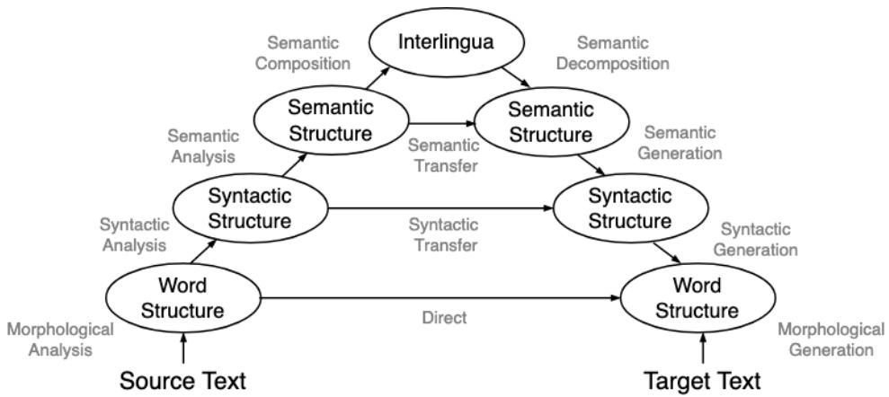  
Figure 4.1 The Vauquois triangle for machine translation visualizes that the classical methods try to translate a source language either directly, via a transfer or an interlingua.

Nevertheless, transformers could be occupying a position within the Vauquois triangle that combines aspects of transfer-based and interlingua-based MT, as they are capable of learning complex linguistic structures and capturing context-dependent translations. However, transformers dier from traditional MT approaches in that they use continuous vector representations and end-to-end training, which allows them to scale better and achieve better performance on a wide range of translation tasks.

That said, while transformers can be conceptually related to the Vauquois triangle, they represent a distinct paradigm shift in MT that transcends the original categorization. As the attention mechanism in transformers helps to address some of the most challenging aspects of MT, such as long-range dependencies, idiomatic expressions, and context-dependent translations.

# 4.2 Machine Translation approaches

As mentioned earlier, there are two primary approaches to MT: knowledge-based and data-driven MT. Figure 4.2 provides an overview of these methods.

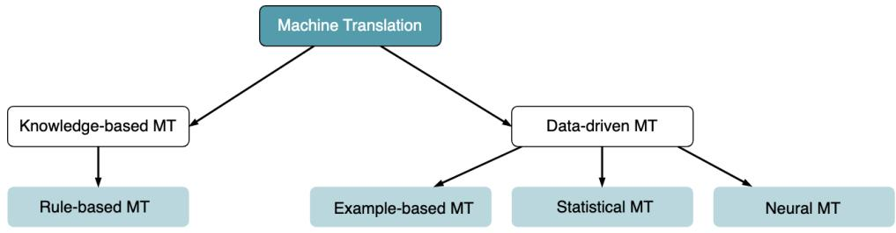  
Figure 4.2 Diagram with different MT learning approaches.

In this section, we will briey explore rule-based machine translation (RBMT), examplebased machine translation (EBMT), statistical machine translation (SMT), and neural

machine translation (NMT) to help you understand their dierences and recognize the advantages of using transformer models for your translation tasks.

# 4.2.1 Rule-based machine translation

Rule-Based Machine Translation (RBMT) is a knowledge-based approach that relies on linguistic rules and bilingual dictionaries. In RBMT, the source and target languages are analyzed by experts who create grammar rules and dictionaries to guide the translation process. RBMT systems can be highly accurate in specic domains, but they are laborintensive and time-consuming to create and maintain. Moreover, these systems may struggle with idiomatic expressions and variations in language usage.

# 4.2.2 Example-based machine translation

Example-based machine translation (EBMT) is a data-driven approach to MT that relies on a database of bilingual parallel texts, where each entry consists of a sentence from the source language and its corresponding translation into the target language. Instead of using explicit linguistic rules or statistical models, EBMT identies similar sentences or phrases from the database to generate translations for new input sentences.

# 4.2.3 Statistical machine translation

Statistical Machine Translation (SMT) is a data-driven approach that uses statistical models to generate translations. These models are trained on parallel corpora, which consist of texts in the source language and their corresponding translations in the target language. SMT systems are less dependent on expert linguistic knowledge and can adapt to changes in language usage more easily than RBMT systems. However, SMT systems may sometimes generate translations that are less grammatically accurate and uent than those produced by RBMT systems. For instance, if the SMT model encounters an unfamiliar word or phrase, it might struggle to provide an accurate translation. Similarly, it could generate a grammatically awkward sentence if it has been trained on data with such constructions.

NOTE SMT was once a vast research area, and the best systems were highly complex and incorporated numerous intricate details and manually adjusted subcomponents. For each language pair, SMT required a pipeline of independently trained machine learning models, such as translation models and language models, along with extensive human feature engineering and various tables. However, with the advent of transformer models, the eld of machine translation experienced a signicant leap forward, surpassing the performance of traditional SMT approaches and simplifying the overall process. Take a look at: https://www.statmt.org/ for more information.

# 4.2.4 Neural Machine Translation

Neural Machine Translation is another data-driven approach that leverages deep learning algorithms, such as RNNs, Convolutional Neural Networks, and transformers, to generate translations. NMT systems generally outperform SMT systems in terms of uency and grammatical accuracy. They can also handle idiomatic expressions and learn to generate

more natural translations. However, NMT systems are more computationally intensive and require a large amount of training data to achieve high performance. This data-hunger can be a limitation, especially for low-resource languages or when computational resources are limited.

In summary, knowledge-based MT, such as RBMT, relies on expert linguistic knowledge and rules, while data-driven MT, including SMT and NMT, is based on learning from large parallel corpora. Each approach has its pros and cons, with RBMT providing more control over the translation process but requiring substantial manual eort, while data-driven MT can be more adaptable and scalable but requires large amounts of training data and computational resources.

# 4.3 State-of-the-art machine translation models

Since we reviewed models like BART, T5, and Pegasus in the previous chapter (section 3.3), which are eective for text summarization, this section will spotlight models that have gained prominence in machine translation tasks. While alternatives like Transformer-XL and Evolved Transformer exist, my focus is on Marian NMT, mBART, mBART-50, XLM, XLM-RoBERTa base, M-BERT base, and mT5. These models, are among the most widely applied and recognized in machine translation, showcasing a diverse set of top performing algorithms. Each model has demonstrated competitive performance on various machine translation benchmarks and oers unique improvements or features specically for text translation. I’ll provide a concise overview of their main distinctions in the list below. More detailed information about these models will follow in the subsequent sections, providing you with further insights into their architecture. Please note that since Marian NMT shares signicant similarities with BART in terms of modeling code, and BART was introduced in the previous chapter, I will only cover the multilingual BART in the extended summary here.

Marian NMT, a specialized neural machine translation framework based on the transformer architecture, was developed for fast experimentation and deployment and is widely used for research purposes and real-world applications. The model was originally trained by Jörg Tiedemann, (12), using the Marian $\mathrm { C } { + } { + }$ library. The number of parameters it uses can vary based on the model’s size and conguration. Additionally, it is capable of handling dierent language variations, for instance, translations from English to 15 Roman-based languages.   
mBART (Multilingual BART) (8), is a variation of the BART model that has been pretrained on large-scale multilingual corpora. It excels in several machine translation tasks, including zero-shot translation. 680 million parameters, trained on 25 languages   
mBART-50, (10) is a derived model from mBART, with a focus on 50 languages. It has been ne-tuned specically for low-resource languages, making it more ecient and eective for a diverse set of languages. 680 million parameters, trained on 50 languages

XLM (Cross-lingual Language Model) (7), is a transformer model that has been pretrained on a large-scale multilingual corpus. It is designed to learn cross-lingual language understanding and translation tasks. 100 - 665 million parameters, trained on 100 languages   
XLM-RoBERTa base (3), is a robustly optimized version of the BERT model extended to support multiple languages. It is pretrained on large-scale multilingual text corpora, making it suitable for cross-lingual understanding and machine translation. 270 million parameters, trained on 100 languages   
M-BERT base (4), is the multilingual version of BERT, pretrained on multilingual corpora. It can be ne-tuned for a variety of tasks, including machine translation, and serves as a strong base model for multilingual applications. 110 million parameters, trained on 104 languages   
mT5 (Multilingual Text-to-Text Transfer Transformer) (14), is a multilingual variant of the T5 model we’ve seen in the last chapter. It has been pretrained on a large-scale multilingual corpus, making it suitable for various machine translation tasks and other multilingual NLP applications. min. 60 million - max 13 billion parameters, trained on 101 languages

# 4.3.1 mBART

mBART (Multilingual BART) is a variation of the BART model specically designed for multilingual applications. Building on the foundation of BART, mBART extends the model to handle multiple languages by pretraining on large-scale multilingual corpora. It excels in several machine translation tasks, including zero-shot translation, where the model is capable of translating between language pairs it was not explicitly ne-tuned on. This is made possible by the shared representations learned during the pretraining phase, which allows the model to transfer knowledge between dierent languages eectively.

mBART consists of 680 million parameters and is trained on 25 languages. While training the model on a subset of 25 languages, from the common crawl (CC) corpus, the authors noted the imbalances in data representation across the languages. Some languages were far more prevalent in the corpus compared to others, resulting in an overrepresentation of certain languages and underrepresentation of others. To mitigate this and ensure more equitable representation across languages, they leveraged a strategy to rebalance the corpus:

$$
\lambda_ {i} = \frac {1}{p _ {i}} \cdot \frac {p _ {i} ^ {\alpha}}{\sum_ {i} p _ {i} ^ {\alpha}} \tag {4.1}
$$

where $\mathbf { \nabla } \phi _ { i }$ is the percentage of each language in the CC-25 corpus i, 𝜆 represents the rebalancing ratio, and a smoothing parameter of $\alpha = 0 . 7$ is used.

The mBART model is pretrained on monolingual data from multiple languages, and then ne-tuned on parallel bilingual data. This allows mBART to leverage the vast amount of available monolingual data, leading to improved translation quality, especially when netuned on smaller parallel bilingual datasets. The multilingual pretraining enables the model

to learn shared representations across languages, which can be benecial for low-resource language pairs and zero-shot translation scenarios.

During pretraining, mBART utilizes a denoising autoencoder with masked language modeling and sequence reconstruction objectives. The model learns to predict and reconstruct sentences from corrupted or masked versions, thereby learning robust and meaningful multilingual representations. The learning objective is to maximize $\mathcal { L } _ { \theta }$ , which covers $K$ languages: $\mathcal { D } = \{ { \mathcal { D } } _ { 1 } , \ldots , { \mathcal { D } } _ { K } \}$ where $D _ { i }$ is a collection of monolingual documents in language $i$ , which can be represented as follows:

$$
\mathcal {L} \theta = \sum \mathcal {D} i \in \mathcal {D} \sum X \in \mathcal {D} _ {i} \log P (X \mid g (X); \theta), \tag {4.2}
$$

where $X$ is an instance in language $i$ , and $P$ is the probability distribution over sequences dened by the sequence-to-sequence model (parameterized by $\theta$ ) given the corrupted text $g ( X )$ . The function $g$ is a noising function that corrupts the text $X$ .

To handle multilingual text, mBART introduces a special language ID token, which is placed at the end of each input sequence in the encoder and at the start in the decoder. This token informs the model about the language of the input text, allowing mBART to learn language-specic representations during pretraining. As depicted in gure 4.3.

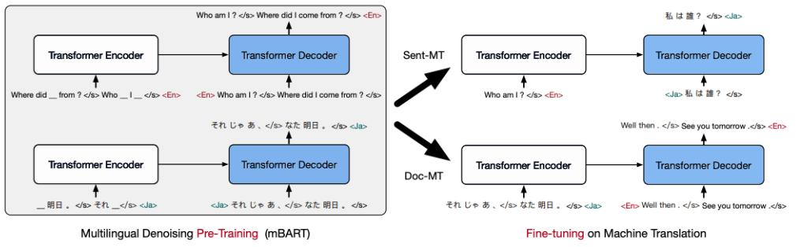  
Figure 4.3 Denoising pretraining (left) and fine-tuning on MT tasks (right) with injected noise: sentence permutation and word-span masking. Language id tokens are added at encoder and decoder. Doc-MT and Sent-MT denote document-level and sentence-level MT. The image is taken from the paper: ”Multilingual Denoising pretraining for Neural Machine Translation”.

For ne-tuning, mBART can be trained on parallel bilingual data for specic language pairs, allowing it to specialize in translation tasks between those languages. It can also be netuned for other NLP tasks like multilingual text classication or named entity recognition, beneting from the rich multilingual representations acquired during pretraining.

# 4.3.2 mBART-50

mBART-50 (10) builds on the success of mBART by expanding the model’s multilingual capabilities. The model is designed to be extensible, allowing researchers and practitioners to easily add support for additional languages during both pretraining and ne-tuning.

Note that mBART and mBART-50 are both multilingual BART models, sharing the same base architecture. However, they dier in the number of languages they are trained on and their focus on low-resource languages.

MBART is pretrained on 25 languages using a combination of monolingual and parallel data from a range of web sources. It excels in several machine translation tasks, including zero-shot translation, and can be ne-tuned for various NLP applications.

MBART-50 while also derived from the BART model, is specically designed to support 50 languages. It has been ne-tuned with a focus on low-resource languages, making it more ecient and eective for a diverse set of languages and applications.

The main dierences and contributions of the mBART-50 paper are:

Multilingual ne-tuning (ML-FT): Unlike mBART, which uses bilingual ne-tuning, mBART-50 proposes a multilingual ne-tuning strategy where the model is netuned on parallel data from multiple language pairs simultaneously. This approach allows the model to leverage the shared multilingual knowledge and generalize better to low-resource languages and zero-shot translation scenarios.   
Improved model architecture and pretraining strategy: The mBART-50 paper presents several modications to the original mBART model, including improvements in the tokenizer and vocabulary, to better support a larger number of languages and achieve higher translation quality.

– Improved tokenizer: The authors developed an improved tokenizer that is designed to handle languages with dierent scripts and morphologies more eectively, which contributes to better translation quality across a broader range of languages.   
– Expanded language coverage: mBART-50 extends the original mBART model’s language support from 25 to 50 languages, providing a more versatile multilingual translation model.   
– Revised vocabulary: mBART-50 uses an updated vocabulary that better covers the languages in its training set. This allows the model to learn more accurate and expressive representations for each language, resulting in improved translation quality.

Multilingual translation model variants: The paper also introduces several model variants based on dierent model capacities, pretraining objectives, and data sampling strategies. These model variants help explore the trade-os between model complexity, translation quality, and computational eciency for various translation tasks.

In the ne-tuning stage, the authors collect bitexts (sentence pairs) from various language combinations. For each language pair, they form a distinct set of these sentence pairs for each translation direction.

They then add a special token at the beginning of each sentence to indicate its language, both for the source and the target sentence. This slightly modied pair is what’s used for the ne-tuning.

Initially, a pretrained mBART model is used as the starting point. This model is then ne-tuned specically on these modied multilingual sentence pairs, which have been combined from all the dierent language sets.

Overall, mBART-50 is a signicant advancement in multilingual machine translation, oering improved performance, extensibility, and broader language support compared to the original mBART model.

# 4.3.3 XLM

XLM (Cross-lingual Language Model) (7), is a transformer-based cross-lingual language model pretrained on large-scale multilingual corpora. It is designed for learning crosslingual language understanding and translation tasks. XLM comes in dierent sizes from 100 to 665 million parameters and is trained on 100 languages. In training the XLM model, sentences from multiple languages are picked based on a specic method that follows a multinomial distribution of probabilities. This basically means that it’s a way of picking items from multiple categories (in this case, languages) based on given probabilities. Here’s how it works:

First, the model calculates what percentage of the sentences in the training dataset belong to each language. For instance, if $1 0 \%$ of the sentences are in French, then the base probability for selecting a French sentence is $1 0 \%$ .   
This base probability is then adjusted using a special value, alpha, which is set at 0.5. This adjustment is designed to give languages with fewer sentences a better chance to be included in the training.

By using this method, the XLM model ensures a fair and balanced learning process that includes a wide range of languages, even those that are usually underrepresented.

Morevoer, XLM employs two main pretraining objectives: Causal Language Modeling (CLM) and Masked Language Modeling (MLM). CLM learns to predict the next token in a sequence given the previous tokens, whereas MLM learns to predict a masked token given its context. Both objectives are used to learn meaningful representations across languages.

# CAUSAL LANGUAGE MODELING (CLM)

In the CLM objective, XLM uses a transformer language model to predict the probability of a word given the previous words in a sentence $P ( w _ { t } | w _ { 1 } , . . . , w _ { t - 1 } , \theta )$ . For the cross-lingual setting, XLM adopts a simplied approach by leaving the rst words in each batch without context. A "batch" in this context is a group of training samples that are processed together. This decision is based on the observation that, in transformer models, previous hidden states can be passed to the current batch to provide context to the rst words in the batch. "Hidden states" are internal representations that the model learns and uses to make predictions.

However, this technique of passing hidden states doesn’t scale well to the cross-lingual setting, primarily due to the increased complexity and variation in the input data. In a cross-lingual setting, the model has to handle multiple languages, each with its unique

structures and rules, which increases the complexity of the data. As a result, the XLM model opts for a simpler approach by leaving the rst words in each batch without context. While this might seem counter-intuitive, it helps maintain computational eciency and enables eective cross-lingual learning despite the greater variation in the data.

# MASKED LANGUAGE MODELING (MLM)

In the XLM models, $1 5 \%$ of the Byte Pair Encoding (BPE), a tokenization method for variable-length words, tokens from the text streams are randomly sampled and replaced with a [MASK] token $80 \%$ of the time, a random token $1 0 \%$ of the time, and left unchanged $1 0 \%$ of the time. Unlike the original MLM used in BERT, XLM uses text streams of an arbitrary number of sentences instead of pairs of sentences. The model is trained with batches of 64 streams of continuous sentences, each composed of 256 tokens, as shown in gure 4.4.

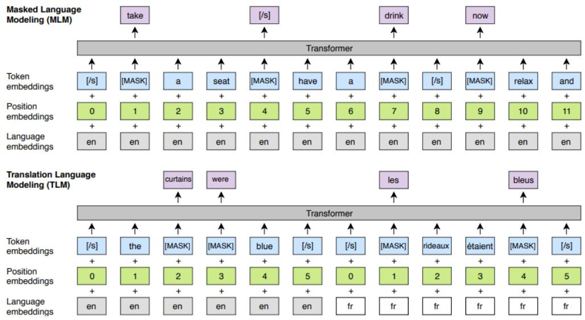  
Figure 4.4 The MLM objective uses continuous text streams rather than sentence pairs. TLM extends MLM to parallel sentence pairs, encouraging alignment of English and French representations during masked word prediction.The image is taken from the paper: ”Cross-lingual Language Model Pretraining”.

To address the imbalance between rare and frequent tokens, XLM subsamples the frequent outputs using an approach where tokens in a text stream are sampled according to a multinomial distribution with weights proportional to the square root of their inverse frequencies.

To handle multilingual text, XLM uses special language ID tokens. These tokens, along with the standard positional embeddings used in transformer models, inform the model about the language of the input text. This allows the model to learn language-specic representations during pretraining.

For ne-tuning, XLM can be trained on parallel bilingual data for specic language pairs, allowing it to specialize in translation tasks between those languages. It can also be netuned for other NLP tasks like multilingual text classication or named entity recognition and is capable of performing zero-shot translation.

# 4.3.4 XLM-RoBERTa

XLM-RoBERTa (3) is a scaled-up version of the RoBERTa model, specically designed for multilingual applications. Building on the foundation of RoBERTa and XLM, XLM-RoBERTa is pretrained on a large-scale multilingual corpus, excelling in a variety of crosslingual tasks, including zero-shot transfer. The model consists of 550 million parameters and is trained on 100 languages using the CommonCrawl corpus. Figure 4.5 shows the amount of data used for the model.

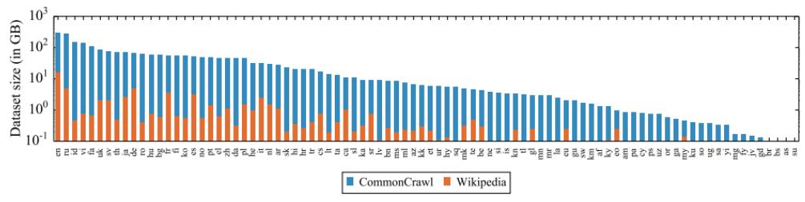  
Figure 4.5 The dataset size in gigabytes (plotted in a logarithmic scale) for the 88 languages that are present in both Wiki-100 corpus utilized by mBERT and XLM-100, as well as in the CC-100 employed by XLM-R, are illustrated in the figure. Notably, the CC-100 dataset significantly augments the amount of available data, particularly for low-resource languages, elevating it by several orders of magnitude. The image is taken from the paper: ”Unsupervised Cross-lingual Representation Learning at Scale”.

During pretraining, XLM-RoBERTa employs the MLM objective from XLM, which predicts masked words in continuous text streams. The model also incorporates the Translation Language Modeling (TLM) objective, extending MLM to parallel sentence pairs. By predicting a masked word in one language, the model can attend to both the sentence and its translation in another language, thereby aligning the representations of the two languages.

Position embeddings of the target sentence are reset to facilitate alignment, allowing the model to learn shared representations across languages. This shared representation is benecial for low-resource language pairs and zero-shot translation scenarios.

For ne-tuning, XLM-RoBERTa can be trained on parallel bilingual data for specic language pairs, allowing it to specialize in translation tasks between those languages. It can also be ne-tuned for other NLP tasks like multilingual text classication or named entity recognition and has the ability to perform zero-shot translation.

# 4.3.5 M-BERT

The BERT multilingual base model (M-BERT) is pretrained on a large corpus of multilingual data from the top 104 languages with the largest Wikipedia. M-BERT is trained using

a self-supervised approach, leveraging raw text data without any human-generated labels, allowing it to utilize vast amounts of publicly available multilingual data.

The input representation for BERT can handle both single sentences and pairs of sentences, such as question-answer pairs. WordPiece embeddings with a 30,000 token vocabulary are used. The rst token of every sequence is always a special classication token ([CLS]), and the nal hidden state corresponding to this token is used as the aggregate sequence representation for classication tasks. Sentence pairs are packed together into a single sequence, separated by a special token ([SEP]), and each token is assigned a learned embedding indicating whether it belongs to sentence A or sentence B. These special tokens are illustrated in gure 4.6.

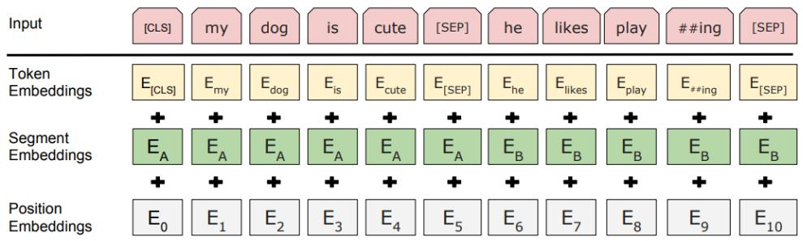  
Figure 4.6 Input representation of the BERT model. The image is taken from the paper: ”BERT: pretraining of Deep Bidirectional Transformers for Language Understanding”.

BERT’s training process involves two main objectives:

Masked Language Modeling: The model takes a sentence and masks $1 5 \%$ of its Word-Piece tokens at random. The masked tokens are replaced with the [MASK] token $80 \%$ of the time, a random token $1 0 \%$ of the time, and the original token $1 0 \%$ of the time. The model is then required to predict the original tokens for the masked positions. This approach allows BERT to learn bidirectional representations of the sentence, as it is not restricted to processing tokens sequentially or masking future tokens.   
Next Sentence Prediction: The model is given two masked sentences as inputs, which are sometimes adjacent in the original text and sometimes not. The model must predict whether the two sentences were originally consecutive or unrelated. This task helps BERT learn relationships between sentences.

M-BERT’s ability to learn from a large multilingual corpus makes it a strong base model for various tasks, including machine translation and other multilingual applications. The model is case-sensitive, meaning it distinguishes between words based on their capitalization (e.g., "english" vs. "English"). The BERT architecture has been highly inuential in the development of other transformer-based models, setting new benchmarks in a wide range of NLP tasks.

# 4.3.6 mT5

mT5 is a massively multilingual pretrained text-to-text transformer model designed for a wide range of natural language processing tasks. Based on the T5 model, mT5 is trained on a large multilingual dataset covering 101 languages from the mC4 (multilingual Common Crawl) corpus. The main goal of mT5 is to serve as a strong base model for various multilingual and cross-lingual tasks.

When pretraining multilingual models, data sampling from each language plays a critical role. mT5 boosts lower-resource languages by sampling examples according to the probability $\mathit { p } ( L ) \propto | L | ^ { \alpha }$ , where $\phi ( L )$ is the probability of sampling text from a given language, $| L |$ is the number of examples in the language, and $\alpha$ is a hyperparameter controlling the boosting of low-resource languages. mT5 uses $\alpha = 0 . 3$ , which provides a reasonable compromise between performance on high- and low-resource languages. An example sampling is shown in image 4.7.

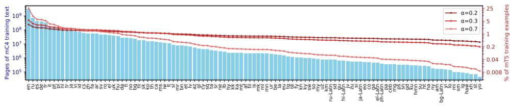  
Figure 4.7 Left axis shows the page counts from the mC4 corpus and the right axis depcits the percentage of language examples and the corresponding sampling exponent 𝛼. The final model uses $\alpha = 0 . 3 .$ The image is taken from the paper: ”mT5: A Massively Multilingual pretrained Text-to-Text Transformer”.

To accommodate the large number of languages, mT5 employs a larger vocabulary of 250,000 wordpieces, using SentencePiece with the language sampling rates from pretraining. For languages with large character sets, such as Chinese, a character coverage of 0.99999 is used. It also uses SentencePiece’s ’byte-fallback’ feature, a mechanism designed to handle out-of-vocabulary words by falling back to a character-based representation, ensuring unique encoding of any string.

mT5’s pretraining involves masked language modeling with denoising objectives. The model receives an input with some of its tokens randomly masked and is required to reconstruct the original text. This self-supervised approach allows the model to learn rich representations from vast amounts of unlabeled multilingual data.

The mT5 model is available in multiple sizes (small, base, large, 3B, and 13B) to accommodate varying computational requirements and use-cases. It has achieved state-of-the-art performance across a wide range of tasks, including machine translation, summarization, and question-answering, in both multilingual and cross-lingual settings.

In summary, mT5 is a powerful text-to-text transformer model that has been pretrained on a large multilingual dataset, with careful consideration given to data sampling and vocabulary size. Its ability to handle various NLP tasks and transfer learning across multiple languages makes it a highly versatile and eective model for multilingual applications.

Having gained an understanding of the architecture of state-of-the-art multilingual Transformers, let us now examine the techniques and challenges in NLP, particularly in machine translation, and how these models mitigate these challenges.

# 4.4 Common techniques and challenges in machine translation

Over the years, various techniques have been developed to tackle the task of MT, and the advent of deep learning and transformer-based architectures has led to signicant improvements in translation quality. However, despite these advancements, MT still faces numerous challenges that need to be addressed to achieve truly human-like translation performance.

In this section, we will discuss some of the common techniques employed in modern NLP, particularly those based on transformer architectures, as well as the challenges that continue to pose diculties for the eld. We will explore topics such as transfer learning, pretraining, handling morphologically rich languages, word sense disambiguation, dealing with idioms and colloquialisms, and handling out-of-vocabulary words. Understanding these techniques and challenges is crucial for researchers and practitioners working in NMT, but also for the ones working on other NLP related tasks such as text summarization or text generation. Thus, the mentioned techniques and challenges are not limited to MT and can be considered crucial for researchers and practitioners working on text summarization and text generation as well.

Before exploring NMT techniques and challenges, let’s see why combining NMT and summarization is useful. Take a hedge fund needing real-time global nancial updates. A single multilingual model can handle both NMT and summarization. It translates foreign news to English and generates concise summaries, helping the company understand events like droughts or political shifts that could aect investments.

# 4.4.1 Benefits of pretraining in NMT and common pretraining techniques

In recent years, pretraining techniques have emerged as a powerful approach to improving the performance of NMT models. Two widely used pretraining techniques in NMT are masked language modeling and denoising autoencoders. We have already slightly discussed these techniques, since the models we used in the last chapter have adopted and built upon the concepts of MLM and denoising autoencoders, as they leverage the massive amounts of unsupervised text data available on the internet to learn general language features and structures before ne-tuning the models on specic translation tasks. This process of pretraining and ne-tuning has led to signicant improvements in NMT performance across various language pairs and domains. Before we look more closely into MLM and denoising autoencoders, we will take a short discourse and have a closer look on transfer learning in multilingual models.

# TRANSFER LEARNING WITH MULTILINGUAL MODELS

Transfer learning using multilingual models is an important part of NMT since it allows for the use of information learnt across dierent languages to increase performance on a

variety of tasks such as translation, summarization, and classication. This is particularly important in the context of NMT, where multilingual models have shown great potential.

Fine-tuning a pretrained multilingual model, such as mBERT-50, on specic tasks for several languages can result in considerable performance increases. Fine-tuning mBERT-50 for a summarization assignment on German texts, for instance, helps the model to use the information it gained during pretraining across many languages. This allows the model to better understand nuances and linguistic structures unique to the German language, resulting in improved summary results. We will look at such an example in section 4.5.

Furthermore, this not only leads to better results on high-resource languages, but also allows for the development of NLP applications for languages with limited parallel data, as these models can leverage knowledge learned from high-resource languages to improve performance on tasks involving the low-resource language. This helps to mitigate the scarcity of parallel data for low-resource languages and enables the development of highquality NLP applications for a diverse range of languages.

# MASKED LANGUAGE MODELING

MLM is a pretraining technique that involves randomly masking some tokens in a sentence and training a model to predict the masked tokens based on their surrounding context. This forces the model to learn contextual representations of words, which can be ne-tuned for specic tasks like translation. BERT is a well-known example of a model that uses MLM for pretraining.

MLM is also known as the Cloze task (11). The term "Cloze task" comes from the eld of psycholinguistics and educational psychology, where it was introduced as a method for measuring reading comprehension, grammar, and vocabulary knowledge. In a Cloze task, participants are presented with a text passage where certain words are removed and replaced with blanks. The participants’ task is to ll in the blanks with appropriate words based on the context provided by the surrounding words. An example of this task is shown in gure 4.8, using the sentences: "The Answer to the Ultimate Question of Life, the Universe, and Everything is 42." and "The Babel sh is small, yellow, leech-like, and probably the oddest thing in the universe.".

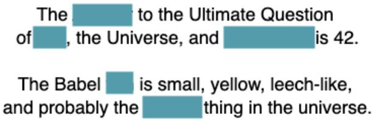  
Figure 4.8 Illustrative example of a cloze task.

In the context of NMT, MLM can be used to pretrain a model on large-scale monolingual data before ne-tuning it on parallel bilingual data, leading to improved translation quality.

This pretraining process allows the model to learn semantic and syntactic structures present in the language, enhancing its ability to understand and generate meaningful translations.

Moreover, MLM can be extended to multilingual settings, as seen in mBERT, which is pretrained on text from multiple languages. By learning shared semantic structures across languages, mBERT can be ne-tuned for translation tasks involving multiple language pairs, further demonstrating the versatility and eectiveness of the MLM technique in NMT.

# DENOISING AUTOENCODERS

Denoising autoencoders are a pretraining technique that involves corrupting an input sequence by randomly applying noise, such as token shuing, token masking, or token replacement, and then training a model to reconstruct the original sequence from the corrupted version. This approach forces the model to learn robust representations of the input data, which can be useful for downstream tasks like translation.

The primary idea behind denoising autoencoders is that the model learns to capture the underlying structure and semantics of the input data, while being resilient to noise and variations in the input. By learning to recover the original sequence from a noisy version, the model develops an understanding of the relationships between words and their context, allowing it to generate more accurate translations. Furthermore, this pretraining strategy enables the model to learn abstract patterns and generalize better, enhancing its ability to cope with previously unseen inputs. To give you concrete example, let us look at a very simple autoencoder as shown in listing 4.1.

# Listing 4.1 Simple Autoencoder

# 0 Define the autoencoder model

```python
class Autoencoder(nnModule): def __init__(self): super(Autoencoder, self).__init_(self encoder = nn.Sequential( nn.Linear(28 \* 28, 128), nn.ReLU(), nn.Linear(128, 64), nn.ReLU(), ) self decoder = nn Sequential( nn.Linear(64, 128), nn.ReLU(), nn.Linear(128, 28 \* 28), nn.Sigmoid(), ) def forward(self, x): x = self encoder(x) x = self decoder(x) return x 
```

To demonstrate the functioning of this autoencoder, we will use the well-known MNIST dataset, consisting of handwritten digits. Our approach involves feeding a single image into the autoencoder, adding some noise to it, and subsequently recovering the image. You can observe the output of this process in gure 4.9.

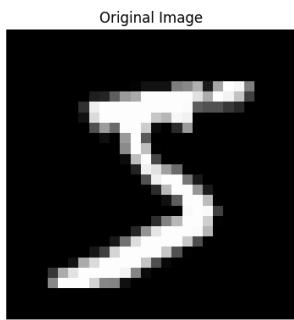

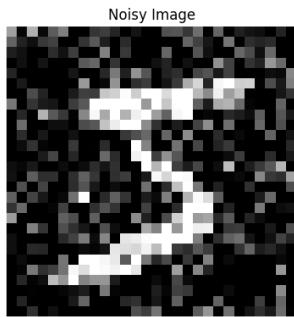

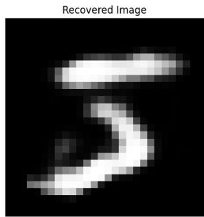  
Figure 4.9 From left to right: Original image, the image with added noise and the recovered image from the autoencoder.

If we now apply this concept in the context of NLP, we can use BART as an example model, because it uses a denoising autoencoder-like pretraining approach, where the model learns to reconstruct the original sentence from a corrupted version. In BART’s pretraining, words are masked, replaced, or shued, which introduces noise in the input:

ORIGINAL SENTENCE "The meaning of life, the universe, and everything is 42."

NOISY SENTENCE "and life, everything the universe, is of The meaning 42."

# or another noise variation with masking

NOISY SENTENCE "The meaning of life, the _____, and everything is __."

RECOVERED SENTENCE "The meaning of life, the universe, and everything is 42."

In the context of NMT, models like T5 and BART use denoising autoencoders for pretraining. These models are rst pretrained on large-scale monolingual data, during which they learn to denoise the corrupted input sequences. The pretrained models are then netuned on parallel bilingual data for translation tasks. This two-step process of pretraining and ne-tuning helps the model to leverage the rich linguistic information obtained from monolingual data while still beneting from task-specic supervision provided by the parallel bilingual data.

The denoising autoencoder approach has shown to be eective in NMT, as it helps the model learn contextual representations of words and phrases, which are essential for producing coherent and accurate translations. Additionally, the technique has been successfully applied to other NLP tasks, such as text summarization, sentiment analysis,

text generation, and question answering, demonstrating the versatility and eectiveness of denoising autoencoders in natural language processing.

Moreover, denoising autoencoders can be particularly benecial in low-resource scenarios, where parallel bilingual data is scarce. By leveraging monolingual data during pretraining, the model can still learn valuable linguistic information and develop robust representations, potentially improving translation quality even when ne-tuning data is limited. This ability to adapt and perform well in diverse settings further highlights the value of denoising autoencoders in NMT and other NLP tasks.

In addition, NMT models require large amounts of parallel bilingual data for training, which can be scarce or expensive to obtain for low-resource languages and domains. To address this issue, pretraining models on large-scale unsupervised data has emerged as a promising approach to improve the performance of NMT models. This approach has several benets, including improved translation quality, domain adaptation, and better performance for low-resource languages. The following list highlights the benets of pretraining in NMT in more detail.

Improved Performance: Pretraining allows NMT models to leverage the vast amount of available monolingual data, leading to improved translation quality, especially when ne-tuned on smaller parallel bilingual datasets.   
Domain Adaptation: Pretrained models can be easily adapted to dierent domains by ne-tuning them on domain-specic data, which is particularly useful in scenarios where parallel data for a specic domain is scarce.   
Handling Low-Resource Languages: Pretraining can help improve the performance of NMT models for low-resource languages, as models can leverage knowledge learned from high-resource languages during pretraining.

Ultimately, because of its potential to use large amounts of unsupervised data and increase machine translation quality, pretraining has shown to be a valuable strategy in NMT.

# 4.4.2 Dealing with language-related challenges

Language-related challenges are a common issue in NLP, particularly in the context of machine translation. One such challenge is handling morphologically rich languages such as Finnish or Arabic, where the inectional morphology of the language leads to an explosion in the number of possible word forms, making it dicult for models to generalize. In the following are the main challenges listed.

Handling morphologically rich languages: NMT models can struggle with languages that have complex grammatical structures and large vocabularies due to extensive inection, agglutination, and compounding. This leads to a high number of possible word forms and diculty in generalization.   
Word sense disambiguation: NMT models need to accurately determine the meaning of a word based on its context, which can be challenging when words have multiple meanings. Incorrect translations may result if the model fails to discern the appropriate

sense in a given context. Revisiting our "date" example from section 2.1, where I mentioned that the word "date" may refer to both a fruit and a social engagement, we can add another layer of complexity: "date" can also represent a point in time. These three meanings would translate into German as "Dattel" (fruit), "Treen" (social engagement), and "Datum" (point in time) respectively. This example underscores the importance of context in discerning the correct meaning during translation.

Dealing with idioms and colloquialisms: Idiomatic expressions and colloquial language can be dicult for NMT models to translate accurately, as their meanings often cannot be inferred from the individual words alone. Recognizing and appropriately translating idiomatic expressions remains a challenge.   
Handling out-of-vocabulary words: NMT models may struggle to handle words that were not seen during training, particularly rare or specialized terms. This can lead to issues in translation quality and diculties in processing and representing these words.

Two widely-used algorithms to tackle these challenges in NMT models, and languagerelated challenges in text generation and other NLP tasks, are Byte Pair Encoding (BPE) and SentencePiece. These subword tokenization techniques help overcome various languagerelated problems, as they break down words into smaller units that the model can process more eectively.

# BYTE PAIR ENCODING

Byte-Pair Encoding is a technique originally developed for data compression by replacing the most frequent pair of bytes with a single unused byte to save space. In natural language processing, BPE has been adapted for word segmentation for use in NMT. Here the idea is to use this for operating on characters or character sequences (like Unicode strings) instead of bytes.

BPE operates by iteratively merging the most frequent pairs of characters or character sequences in the training data to create a xed-size vocabulary of subword units. By breaking words into subword units, BPE helps mitigate the issues of large vocabularies and the explosion of possible word forms in morphologically rich languages. It also enables the model to better represent rare or complex words, improving translation quality. For example, consider the word "inventing." BPE might break it down into smaller units like "in," "vent," and "ing." These smaller units can then be combined in dierent ways to create new words or understand variations of known words.

Moreover, BPE can indirectly contribute to better word sense disambiguation by capturing semantic nuances of words through subword representations, aiding in context understanding. Its subword-based representation can also help the model identify and process idiomatic expressions and colloquialisms that share common subword units.

In the paper "Neural Machine Translation of RareWords with Subword Units", the authors provide a simple Python implementation of the BPE algorithm. The code snippet given in listing 4.2 is taken from the paper, as it illustrates the main steps of the BPE algorithm using a small example vocabulary:

Listing 4.2 Simple byte pair encoding example   
```python
def get.stats(vocab):
    pairs = collections.defaultdict(int)
    for word, freq in vocab.items():
        symbols = word.split()
        for i in range(len(symbols) - 1):
            pairs[symbols[i], symbols[i + 1]] += freq
        return pairs
def merge_vocab(pair, v_in):
    v_out = bigram = re.escape(''.join(word))
    p = re.compile(r'[?<!§]'+ bigram + r'(?!§)')
    for word in v_in:
        w_out = p.sub([''.join(word), word])
        v_out[w_out] = v_in[word]
    return v_out 
```

0 Define the initial vocabulary with words and their frequencies.

```txt
vocab = 'l o w </w>': 5, 'l o w e r </w>': 2,
        'n e w e s t </w>': 6, 'w i d e s t </w>': 3
num_merge = 10
for i in range(num_merge): 
```

$\textcircled{8}$ Compute the frequencies of consecutive character pairs

```python
pairs = get.stats(vocab)  
if not pairs:  
    break  
best = max(pairs, key=pairs.get) 
```

```txt
3 Merge the most frequent character pair and update the vocabulary  
vocab = merge_vocab(best, vocab)  
print(best) 
```

Which results in the following output:

```txt
('e', 's')  
('es', 't')  
('est', "</w>")  
('l', 'o')  
('lo', 'w')  
('n', 'e')  
('ne', 'w')  
('new', 'est</w>")  
('low', "</w>")  
('w', 'i') 
```

By applying the BPE algorithm to the training data, NMT models can learn a compact and ecient representation of words, which helps in handling the challenges posed by

morphologically rich languages, out-of-vocabulary words, word sense disambiguation, and idiomatic expressions.

# SENTENCEPIECE

SentencePiece (6), is an unsupervised text tokenization and detokenization library that is widely used in the transformer ecosystem, including models like BERT, BART, and other transformers. It treats the input text as a raw sequence of Unicode characters and learns a subword segmentation model from the input data using either BPE from the BPE paper I earlier menioned, or unigram language model-based tokenization (5). Similar to BPE, SentencePiece breaks words into smaller subword units, which enables the model to handle language-related challenges eectively. It also provides a consistent tokenization process across languages, making it particularly useful for multilingual models.

The following code, in listing 4.3, demonstrates the usage of the SentencePiece library to train a tokenizer on a small dataset and apply subword regularization and BPE-dropout. The dataset consists of toy sentences from "The Hitchhiker’s Guide to the Galaxy" and some sentences with the word "transformers" in it. After training the tokenizer, we tokenize the word "transformers" with dierent subword segmentations.

# Listing 4.3 Simple SentencePiece example

# 0 Toy sentences

```python
sentences = [ "The Answer to the ultimate question of life, the universe, and everything is 42.", # ... (omitted for brevity) "Transformers are widely used in machine translation tasks." ]  
with open("hitchhikers_speeches.txt", "w") as f:  
    for sentence in sentences:  
        f.write sentence) 
```

# Train SentencePiece tokenizer

```txt
spm.SentencePieceTrainer.train(input="hitchhikers_sentences.txt", model_prefix="hitchhikers", vocab_size=100) 
```

# $\otimes$ Load trained tokenizer

tokenizer $=$ spm.SentencePieceProcessor()   
tokenizer.load("hitchhikers.model")

# $\textcircled{6}$ Subword regularization and BPE-dropout

```python
word = "transformers"
tokenized_word/examples = []
for n in range(5):
    tokenized_word/examples.append(tokenizer.encode(word, out_type=str, enable_sampleing=True, alpha=0.5, nbest_size=-1)) 
```

Figure 4.10 illustrates the dierent subword segmentations of the word "transformers" produced by the SentencePiece tokenizer.

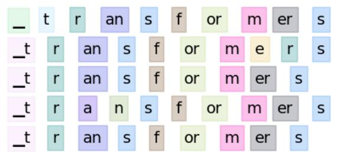  
Figure 4.10 Example subword tokenization of the word ”transformers”. Each row represents one tokenization example, where different subword tokens are color-coded. The slight variations between the rows highlight the effects of subword regularization and BPE-dropout. These result in diverse tokenization possibilities, allowing the model to generalize better by considering multiple plausible subword segmentations.

NOTE The code for these examples as well as for the toy autoencoder can be found in the chapter folder in the books repository.

As we have seen, incorporating BPE or SentencePiece into Transformer models helps tackle the challenges in NMT, leading to better translation performance and improved handling of linguistic variations. These techniques prove valuable not only for NMT but also for various other NLP tasks, such as text classication, text generation and summarization, showcasing the versatility and robustness of Transformer models in NLP.

Eager to see these techniques in action? Let’s dive into the nal section of this chapter, where we explore the practical implications of these methods and models in a variety of NLP tasks.

# 4.5 Applications and worked examples

In this section, we’ll explore two worked examples that demonstrate the adaptability of multilingual Transformer models. To be more specic, we’ll use the mBART-50 model as an example to translate English text into German and nally ne-tune the same model to perform a text summarization task on German documents.

# 4.5.1 METEOR as evaluation metric

In the previous chapter, I introduced two evaluation metrics, BLEU and ROUGE, which are commonly used for assessing translation and summarization tasks. In this chapter, we will take a closer look at METEOR (Metric for Evaluation of Translation with Explicit ORdering) (1), as an additional metric for evaluating translation tasks.

METEOR is an evaluation metric designed to overcome some of the limitations of the BLEU metric. For example, BLEU only takes into account exact word matches, which can be problematic when dealing with synonyms or paraphrasing. BLEU also doesn’t consider the order of words in the translated text. METEOR, on the other hand, takes into account factors such as word matching, stemming, and synonym matching, as well as word order. By doing so, it provides a more accurate and comprehensive evaluation of machine translations.

The primary components of the METEOR metric are:

Matching: METEOR calculates matches between the translation and the reference text at the word or phrase level. It considers exact word matches, stemmed word matches (using a stemmer for the specic language), and synonym matches (using a language-specic synonym dictionary, such as WordNet for English).   
□ Alignment: METEOR computes an optimal alignment between the words in the translated and reference texts, penalizing the translation for the number of chunks or contiguous matches. This is done to account for the importance of word order in translations.   
Scoring: METEOR computes a nal score as the harmonic mean of precision (the proportion of words in the translation that are also in the reference) and recall (the proportion of words in the reference that are also in the translation). The metric applies a tunable parameter, typically set to 9, to balance the contributions of precision and recall.

In METEOR, rst, the unigram precision (P) is computed as the ratio of the number of unigrams in the system translation that are mapped (to unigrams in the reference translation) to the total number of unigrams in the system translation. Similarly, unigram recall (R) is computed as the ratio of the number of unigrams in the system translation that are mapped (to unigrams in the reference translation) to the total number of unigrams in the reference translation. The harmonic mean of P and R, Fmean, is used for the unigram matching, with a greater weight given to recall (9 times the weight of precision, as suggested in the original paper. The resulting formula is:

$$
\mathrm {F m e a n} = \frac {(1 + \beta) \cdot \text {P r e c i s i o n} \cdot \text {R e c a l l}}{\beta \cdot \text {P r e c i s i o n} + \text {R e c a l l}} \tag {4.3}
$$

where $\beta = 9$ .

To take into account longer matches, METEOR computes a penalty for a given alignment, as follows:

$$
\text {P e n a l t y} = 0. 5 \cdot \left(\frac {\# \text {c h u n k s}}{\# \text {u n i g r a m s m a t c h e d}}\right) ^ {3} \tag {4.4}
$$

where chunks is the number of unigram mappings in the system translation that are grouped into adjacent positions in the reference translation.

Finally, the METEOR Score for the given alignment is computed as follows:

$$
\text {S c o r e} = \text {F m e a n} \cdot (1 - \text {P e n a l t y}) \tag {4.5}
$$

Compared to BLEU, METEOR is more linguistically motivated and has been shown to correlate better with human judgments of translation quality. However, it is computationally more expensive and requires additional resources like stemmers and synonym dictionaries for dierent languages.

Now that we have our evaluation metrics in place, it’s time to explore the two use-cases within multilingual Transformers. So, get ready to see our models in action!

# 4.5.2 Generating translations

In this section, we will be leveraging the state-of-the-art mBART-50 model and the MarianMT model to generate translations from the WMT-16 dataset.

The WMT-16 dataset (2) is a machine translation dataset introduced as part of the WMT16 news shared task. It consists of parallel corpora of news articles for multiple languages, with a focus on English and German. The dataset includes news articles from a variety of sources, such as the Europarl corpus, the UN corpus, and various web crawls. The training, validation, and test sets contain approximately 4.5 million, 2,169, and 2,000 sentence pairs, respectively.

These models have been trained on large-scale multilingual datasets and have demonstrated impressive performance on various translation tasks. First we need to initialize our models as show in listing 4.4

# Listing 4.4 Initialize mBART-50 and MarianMT

0 Initialize the mBART-50 model and tokenizer

```python
mbart_model = MBartForConditionalGeneration.from_pretrained(
    "facebook/mbart-large-50-many-to-many-mmt")
mbart_tokenizer = MBart50TokenizerFast.from_pretrained(
    "facebook/mbart-large-50-many-to-many-mmt") 
```

2 Initialize the MarianMT model and tokenizer

```python
opus_model_name = "Helsinki-NLP/opus-mt-en-de"  
opus_tokenizer = MarianTokenizer.from_pretrained(opus_model_name)  
opus_model = MarianMTModel.from_pretrained(opus_model_name) 
```

We then just loop over the number of examples we want to evaluate as shown in listing 4.5.

# Listing 4.5 Loop over the chosen examples in the dataset

numexamples $= 100$ translations $= \mathrm{mBART - }50^{\prime}$ ：[]，'OPUS-MT'：[]

$\textcircled{4}$ Loop over the chosen examples in the dataset

for i in range(num_examples):

$\textcircled{8}$ Translate using mBART-50

```python
input_text = dataset[i]["translation"]["en"]
target_text = dataset[i]["translation"]["de"]
encoded = mbart_tokenizer(input_text, return_tensors="pt")
generated_tokens = mbart_model_generate(**coded, forced_bos_token_id=mbart_tokenizer.lang_code_to_id["de_DE"]}
output_text_mbart = mbart_tokenizer.batchDecode( generated_tokens, skip_special_tokens=True) [0]
translations['mBART-50'].append(output_text_mbart) 
```

③ Translate using Translate using OPUS-MT

input_text $=$ dataset[i]["translation"]["en"] target_text $=$ dataset[i]["translation"]["de"]

```python
encoded = opus_tokenizer(input_text, return_tensors="pt")
generated_tokens = opus_model_generate(**generated)
output_text_opus = opus_tokenizer.batch Decode(
generated_tokens, skip_special_tokens=True) [0]
translations['OPUS-MT'].append(output_text_opus) 
```

Note: MARIAN is a neural machine translation framework, and OPUS-MT is a project that provides pretrained models for machine translation using the MARIAN framework. So, the Helsinki-NLP/opus-mt-en-de, which is the model name, is actually a pretrained MARIAN model for translation between English and German.

In gures 4.11 and 4.12, respectively, are the evaluation results on the WMT-16 dataset for our two models, using the Google BLEU score as our metric. The Google BLEU score was selected due to its improved properties for single sentence evaluation, as traditional BLEU was originally designed as a corpus measure. It’s worth noting the importance of evaluating a model based on multiple samples rather than relying on just one or two. This point is highlighted by comparing the performance of the models using 10 and 100 samples from the dataset.

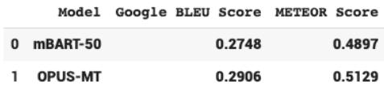  
Figure 4.11 mBART and OPUS-MT evaluated on 10 samples of the WMT-16 dataset.

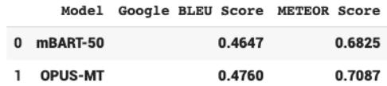  
Figure 4.12 mBART and OPUS-MT evaluated on 100 samples of the WMT-16 dataset.

NOTE English-German is a common language pair used for benchmarking NMT models due to the availability of abundant parallel corpora and the linguistic complexity that arises from dierences in grammar, syntax, and word order between the two languages. This is because German is a more morphologically complex language with a more exible word order compared to English.

Don’t hesitate to experiment with dierent congurations and evaluate the resulting metrics of the models on the WMT-16 dataset by exploring the notebook provided for this section. This will allow you to gain a better understanding of how the models perform under various conditions and help you make informed decisions when selecting the best model for your specic use case.

# 4.5.3 Generating German summaries with mBART

In this section, we focus on generating German summaries using the powerful mBART-50 model. For this we will use the MLSum dataset (9). The MLSum dataset is a large-scale multi-domain multi-lingual dataset of news articles and summaries in 12 languages, including English, French, German, Italian, Spanish, Portuguese, Dutch, Russian, Polish, Turkish, Chinese, and Arabic. The dataset has been used in various studies on text summarization since it’s introduction and respresents, therefore, a valid baseline for your own applications.

According to the original paper, the dataset includes more than 1.5 million articles from various news sources, such as CNN, Reuters, and The Guardian. The articles are collected between January 2012 and September 2017, and the summaries are written by professional journalists. The dataset covers various domains, including politics, economics, science, and sports. To get started, we’ll need to initialize the mBART-50 model and load our dataset as shown in the listing 4.6.

# Listing 4.6 Load dataset and initialize mBART-50

Load dataset

```python
dataset = load_dataset("mlsum", "de") 
```

$\textcircled{8}$ Initialize the mBART-50 model and tokenizer

```txt
tokenizer = MBart50TokenizerFast.from_pretrained(
    "facebook/mbart-large-50-many-to-many-mmt"
)  
model = MBartForConditionalGeneration.from_pretrained(
    "facebook/mbart-large-50-many-to-many-mmt") 
```

We will then have to preprocess our data accordingly so we can feed that into our model as shown in listing 4.7.

# Listing 4.7 Pre-processing data

def preprocess_function(example):

$\textcircled{4}$ tokenize input and output sequences

input_encoding $=$ tokenizer(   
example["text"],max_length $\coloneqq$ 1024,truncation $\equiv$ True,   
padding $\equiv$ "max_length",return_tensors $\equiv$ "pt")   
target_encoding $=$ tokenizer(   
example["summary"],max_length $\coloneqq$ 56,truncation $\equiv$ True,   
padding $\equiv$ "max_length",return_tensors $\equiv$ "pt")

② include input ids, attention mask, labels

```python
return "input_ids": input_encoding["input_ids"] [0],  
"attention_mask": input_encoding["attention_mask"] [0],  
"labels": target_encoding["input_ids"] [0] 
```

3 select train and test samples

```python
subset_train = dataset["train"].select(range(1200)).map(preprocess_function)  
subset_test = dataset["test"].select(range(400)).map(preprocess_function) 
```

3 set format to PyTorch tensors

```bazel
subset_train.set_format(
type="torch", columns=['input_ids", "attention_mask", "labels"]
subset_test.set_format(
type="torch", columns=['input_ids", "attention_mask", "labels']) 
```

In order to ne-tune our model, we employ the Trainer class from Hugging Face, as discussed in detail in the previous chapter. Additionally, we utilize the same generate_sum-

mary function and metrics that were introduced in section 3.6.3. The resulting metrics are shown in gure 4.13.

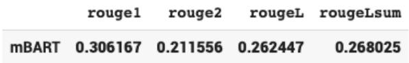  
Figure 4.13 mBART performance on the MLSUM dataset for summarizing German text.

NOTE All code of this section can be found in the chapter folder in the corresponding notebooks in the book repository. It’s important to acknowledge that we are using multilingual Transformers, which require a signicantly larger amount of computational resources and training data compared to single-language models. In fact, while some smaller single-language models can be trained on a single GPU, multilingual variants demand more extensive computational setups due to their increased complexity and the need to handle multiple languages. For instance, multilingual models may require more epochs, larger datasets, and dierent batch sizes per device to achieve optimal performance, as batch sizes inuence the accuracy of gradient estimation during learning. As a result, the presented code is for explanatory purposes only and not a fully real-world example, since leveraging more resources would be necessary to cover a real-world scenario.

# 4.6 Summary

The Vauquois Triangle visually represents traditional methods like direct, transferbased, and interlingua-based translation. Transformers don’t t neatly into the triangle but signify an important shift in NMT. They transcend the original categorization and achieve improved performance across various translation tasks by leveraging attention mechanisms and continuous vector representations.   
Machine translation approaches encompass rule-based, example-based, statistical, and neural machine translation. NMT is a data-driven approach that is data-hungry, but multilingual Transformers employ innovative techniques to tackle this challenge.   
In various NMT benchmarks, state-of-the-art models like Marian NMT, mBART, mBART-50, XLM, XLM-RoBERTa base, M-BERT base, and mT5 have demonstrated exceptional performance. These models incorporate specic enhancements and features, making them suitable for multilingual machine translation tasks.

– Marian NMT: A highly ecient NMT framework focused on research purposes, offering various pretrained models and supporting numerous language pairs. (WMT’18 English-German: ${ \approx } 3 7 . 9 $ BLEU)   
– mBART: A multilingual denoising autoencoder that learns language-agnostic representations, enabling eective ne-tuning for tasks like machine translation. (WMT’19 English-German: ${ \approx } 3 3 . 6$ BLEU)

– mBART-50: An extension of mBART with support for 50 languages, leveraging a shared vocabulary and improved pretraining for multilingual machine translation. (WMT’20 English-German: ${ \approx } 3 9 . 0$ BLEU)   
– XLM: A scalable and exible model architecture designed for cross-lingual learning, suitable for both unsupervised and supervised machine translation. (WMT’16 English-German: ${ \approx } 3 8 . 1$ BLEU)   
– XLM-RoBERTa base: A variation of XLM that incorporates the RoBERTa pretraining approach, improving cross-lingual understanding and translation capabilities. (WMT’20 English-German: ${ \approx } 4 0 . 4$ BLEU)   
– M-BERT base: A multilingual version of BERT trained on 104 languages, suitable for zero-shot cross-lingual transfer and multilingual machine translation. (WMT’19 English-German: ${ \approx } 3 2 . 3$ BLEU)   
– mT5: A multilingual version of T5, featuring a text-to-text framework that unies NLP tasks, including machine translation, across 101 languages. (WMT’20 English-German: ≈41.8 BLEU)

METEOR, designed to complement BLEU in translation tasks, diers as follows:

– It uses an alignment-based approach for exible word and phrase matching.   
– It considers synonyms for recognizing semantically equivalent translations.   
– It computes a weighted harmonic mean (an F-score) of precision and recall, penalizing extreme dierences more than BLEU.   
– It allows adjustment of parameters like weights for precision and recall for netuning.

Language-related challenges in NLP, particularly in machine translation, can be addressed through various techniques:

– Handling complex languages: Transformer and multilingual models, such as mBERT or XLM, are more eective at dealing with languages that have complex grammar and large vocabularies. Additionally, subword tokenization techniques, like BPE and SentencePiece, help mitigate issues arising from languages with numerous word forms.   
– Word sense disambiguation: The self-attention mechanism in transformers, pretrained models, and large-scale multilingual models improve context understanding and help choose the appropriate sense of words during translation.   
– Idioms and colloquialisms: Transformers, pretraining processes, and multilingual models contribute to better handling of idiomatic expressions by capturing longrange dependencies, learning underlying language structures, and leveraging shared semantic structures across languages.   
– Out-of-vocabulary words: Subword tokenization algorithms, such as BPE and SentencePiece, enable Transformers to better handle rare or unseen words, while

multilingual Transformers trained on diverse datasets and zero-shot learning help cope with out-of-vocabulary words by transferring knowledge across languages.

Multilingual models serve as a robust foundation for a wide range of NLP applications across multiple languages. Their language-agnostic nature makes them highly adaptable, enabling them to handle tasks such as summarization, classication, named entity recognition, and more, in languages beyond English. By leveraging the shared knowledge and structure of dierent languages, these models can eectively learn to perform various NLP tasks with limited training data, thus providing a powerful and versatile solution for handling diverse linguistic contexts and requirements.

# Bibliography

[1] Banerjee, S. and Lavie, A. (2005). METEOR: An automatic metric for MT evaluation with improved correlation with human judgments, Proceedings of the ACL Workshop on Intrinsic and Extrinsic Evaluation Measures for Machine Translation and/or Summarization, Association for Computational Linguistics, Ann Arbor, Michigan, pp. 65–72. URL: https://www.aclweb.org/anthology/W05-0909   
[2] Bojar, O. r., Chatterjee, R., Federmann, C., Graham, Y., Haddow, B., Huck, M., Jimeno Yepes, A., Koehn, P., Logacheva, V., Monz, C., Negri, M., Neveol, A., Neves, M., Popel, M., Post, M., Rubino, R., Scarton, C., Specia, L., Turchi, M., Verspoor, K. and Zampieri, M. (2016). Findings of the 2016 conference on machine translation, Proceedings of the First Conference on Machine Translation, Association for Computational Linguistics, Berlin, Germany, pp. 131–198. URL: http://www.aclweb.org/anthology/W/W16/W16-2301 104   
[3] Conneau, A., Khandelwal, K., Goyal, N., Chaudhary, V., Wenzek, G., Guzmán, F., Grave, E., Ott, M., Zettlemoyer, L. and Stoyanov, V. (2019). Unsupervised crosslingual representation learning at scale, CoRR abs/1911.02116. URL: http://arxiv.org/abs/1911.02116 86, 91   
[4] Devlin, J., Chang, M., Lee, K. and Toutanova, K. (2018). BERT: pre-training of deep bidirectional transformers for language understanding, CoRR abs/1810.04805. URL: http://arxiv.org/abs/1810.04805 86   
[5] Kudo, T. (2018). Subword regularization: Improving neural network translation models with multiple subword candidates, CoRR abs/1804.10959. URL: http://arxiv.org/abs/1804.10959 101   
[6] Kudo, T. and Kazawa, H. (2018). SentencePiece: A simple and language independent subword tokenizer and detokenizer for neural text processing, https://github.com/ google/sentencepiece. 101   
[7] Lample, G. and Conneau, A. (2019). Cross-lingual language model pretraining, CoRR abs/1901.07291. URL: http://arxiv.org/abs/1901.07291 86, 89   
[8] Liu, Y., Gu, J., Goyal, N., Li, X., Edunov, S., Ghazvininejad, M., Lewis, M. and Zettlemoyer, L. (2020). Multilingual denoising pre-training for neural machine translation, CoRR abs/2001.08210. URL: https://arxiv.org/abs/2001.08210 85   
[9] Scialom, T., Dray, P.-A., Lamprier, S., Piwowarski, B. and Staiano, J. (2020). ML-SUM: The multilingual summarization corpus, Proceedings of the 2020 Conference on Empirical Methods in Natural Language Processing (EMNLP), Association for Computa-tional Linguistics, Online, pp. 8051–8067. URL: https://aclanthology.org/2020.emnlp-main.647 105

[10] Tang, Y., Tran, C., Li, X., Chen, P., Goyal, N., Chaudhary, V., Gu, J. and Fan, A. (2020). Multilingual translation with extensible multilingual pretraining and netuning, CoRR abs/2008.00401.   
URL: https://arxiv.org/abs/2008.00401 85, 87   
[11] Taylor, W. L. (1953). Cloze procedure: A new tool for measuring readability, Journalism Quarterly 30(4): 415–433.   
URL: https://doi.org/10.1177/107769905303000401 95   
[12] Tiedemann, J. (Accessed in 2023). Joerg tiedemann - Research Portal - University of Helsinki, https://researchportal.helsinki./en/persons/j%C3%B6rg-tiedemann. Accessed: 2023-04-02. 85   
[13] Vauquois, B. (1968). Structures profondes et traduction automatique., Le systeme du CETA Rev. Roum. Ling. 13, 105130(4): 689–1176. 81   
[14] Xue, L., Constant, N., Roberts, A., Kale, M., Al-Rfou, R., Siddhant, A., Barua, A. and Rael, C. (2020). mt5: A massively multilingual pre-trained text-to-text transformer, CoRR abs/2010.11934.   
URL: https://arxiv.org/abs/2010.11934 86

# Text classification

# This chapter covers

Introduction to text classification   
Naïve Bayes as baseline model   
Outline of transformers for text classification   
Challenges in text classification   
Evaluation metrics for text classification   
Fine-tuning various text classification models

In the previous chapter, we delved into the fascinating world of machine translation, which to some extent, has been a driving force behind the advancements in machine learning and deep learning, ultimately leading to the invention of transformers. In this chapter, we’ll explore the world of text classication, which refers to the process of assigning predened categories to text based on its content. An abundance of use cases makes this topic both fun and engaging. While we’ll cover the essential theory, it’s the wide variety of practical applications that truly brings excitement and value to this chapter. Are you as eager to dive into the diverse world of text classication as I am? Let’s get started with the various applications in the next section!

# 5.1 Introduction to text classification

When you rst hear about text classication, sentiment classication might come to mind. But in reality, text classication has a broad range of applications. In this chapter, we’ll explore three interesting types of text classication: sentiment classication, topic modeling, and multi-class classication. Let’s briey see what each of these involve:

Sentiment classication: Identies sentiment expressed in a piece of text. It is often used to determine whether the tone of a text is positive, negative, or neutral. This technique is widely used in social media monitoring, customer feedback analysis, and market research to understand people’s opinions and attitudes towards certain topics, products, or services.   
Topic modeling: Categorize text into predened topics or themes, like sports, politics, or technology.   
Multi-class classication: Assign a single label to a text out of several possible classes, such as star ratings for a review.

NOTE Want to dive deeper? I’ve jam-packed appendix ?? with a bunch of interesting applications you can use text classication for, along with quick, easy-to-understand explanations of what each one involves.

I’ve carefully chosen the text classication examples to gradually increase the complexity. While sentiment classication presents its own challenges, multi-class classication for reviews introduces a more nuanced problem, requiring the model to recognize subtle relationships between ratings and written text. This gradual increase in complexity showcases the versatility and strength of transformers, making them an excellent tool for tackling intricate text classication tasks. By working through these examples, you gain practical experience in applying transformers to real-world problems, enhancing your understanding of the theoretical concepts discussed in this book chapter.

To lay some groundwork, text classication is primarily concerned with understanding the semantics, or the meaning of the text, and to a certain extent, it involves reasoning. By reasoning, I mean the model’s ability to infer implicit information, understand context, and make logical connections based on the given text. Models like transformers excel in deciphering the meaning of text and making predictions based on that comprehension. While more advanced models like transformers can handle complexities inherent in language processing, even simpler models like Naïve Bayes classiers can perform impressively for such tasks. Despite their simplicity, Naive Bayes classiers oer a level of sophistication that often surpasses rule or dictionary-based methods like those used by the TextBlob library. Their eciency and surprising eectiveness make them an excellent baseline for comparing and evaluating the performance of more complex models like transformers.

# 5.1.1 Establishing a baseline for text classification: Naïve Bayes classifier

As you might remember, I’ve mentioned in section 3.1.3 that establishing a baseline is important to evaluate the performance of your more advanced model, like a transformer.

The chosen baseline model should be simple but still sophisticated enough to provide a solid foundation for evaluation, which is why I chose the Naïve Bayes classier as a baseline for text classication. The Naïve Bayes classier has shown to be one of the most ecient and eective inductive learning algorithms for machine learning and data mining, despite its fundamental assumption of conditional independence, which implies that features independently inuence outcomes, rarely holding true in real-world applications.

Additionally, getting a grasp on how the Naïve Bayes classier works allows us to simplify and visualize the process of text classication. This foundational understanding will be instrumental as we venture into the realm of more complex models. Dealing with transformers and text classication often means navigating high-dimensional spaces, which can get quite abstract. However, having the basic concept of Naïve Bayes classier in your toolbox makes tackling these complexities a little less daunting.

Before we delve deeper into the mathematics, let’s consider a simple, relatable example to better understand how the Naïve Bayes classier works and how it handles the conditional independence assumption. Imagine you have a laundry basket lled with clean, dry socks of dierent types: long, short, black, white, patterned, and plain. Your task is to sort these socks into distinct categories for easier storage.

In a Naïve Bayes sense, each sock can be thought of as a document, and each characteristic (long, short, black, white, patterned, plain) is a feature. The categories you’re sorting into (e.g., long, black, plain or short, white, patterned) can be thought of as the classes in a classication problem.

Now, the Naïve Bayes classier would look at each sock independently and estimate its probability of belonging to a certain category based on its features. For example, if a sock is long, black, and plain, it would calculate the probability of it belonging to the long, black, plain category. This is analogous to calculating the probability of a document (like an email) being spam based on its features (words in the email).

  
Figure 5.1 Illustration of a Naïve Bayes classifier in action. Just as we sort socks into different piles based on their features (color), the Naïve Bayes classifier sorts text into different categories. Each sock pile represents a class that the classifier could assign a piece of text to. This sorting process, driven by learned probabilities, is at the heart of how Naïve Bayes performs text classification.

The "naive" part comes in when considering combinations of features. Naïve Bayes assumes that each feature impacts the outcome independently. For instance, it would treat long and black as if they have no connection or inuence on each other when deciding if a sock belongs in the long, black, plain category.

However, in reality, certain combinations of features (like long and black) might not only be more common, but also tend to occur together. This would violate the assumption of independence, as these features are dependent on each other. Despite this, the Naïve Bayes classier still tends to perform well in practice. This is because, even though dependencies exist, they are often evenly distributed across dierent classes due to the varied data. This creates a kind of "canceling out" eect, as the combined eect of these dependencies does not favor one particular class signicantly over others. This allows the Naïve Bayes classier to be eective despite its "naïve" assumption.

Now, let’s dive into the inner workings of the Naïve Bayes classier to help you better understand its approach to text classication. To do this, let’s put ourselves in the shoes of an algorithm and view the problem from a mathematical perspective.

In the eld of machine learning, a classier is essentially a function that assigns a class label to an instance. Each instance is a vector of $n$ features, which, in this context, are words $( w _ { 1 } , w _ { 2 } , . . . , w _ { n } ) ;$ , and $c$ is the class we aim to predict for a given instance.

The Naïve Bayes classier works according to Bayes’ theorem, under the "naïve" assumption of independence among the words. This model assumes all words in the dataset to be mutually independent, suggesting that the presence or absence of a particular word doesn’t inuence others. The mathematical representation of the Naïve Bayes classier is as follows:

$$
\underset {c \in \operatorname {P o s}, \operatorname {N e g}} {\arg \max } \prod_ {i = 1} ^ {n} P \left(w _ {i} \mid c\right) \cdot P (c) \tag {5.1}
$$

This formula signies that for a given set of words $w _ { 1 } , w _ { 2 } , . . . , w _ { n }$ , the Naïve Bayes classier will choose the class $c$ that maximizes the product of the individual probabilities of each word given the class, multiplied by the prior probability, that is the probability of an event before new data is taken, of the class $( P ( c ) )$ .

Now that we have a solid understanding of the Naïve Bayes classier and its mathematical foundation, it’s time to bring it to life through code. Remember, coding it out nally makes those abstract mathematical concepts tangible and practical. You’ll nd that implementing this algorithm is quite straightforward, thanks to the simplicity of the mathematical formula. Let’s explore the details of this implementation in Listing 5.1, where you’ll see how each step of the algorithm is elegantly translated into code that eciently performs text classication.

# Listing 5.1 Naïve Bayes class implementation

class NaiveBayes: def fit_distribution(self, data): mu $=$ np.mean(data) sigma $=$ np.std(data)

dist $=$ norm(mu,sigma) return dist   
def fit(self,X,c): self_classes $\equiv$ np.unique(c) 1 Initializing the priors dict,to store P(c) for each class c self.priors $= \{\}$ 2 Initializing the distributions dict,to store P(w_i | c) for each feature w_i and class c self.distributions $= \{\}$ for class_in self_classes: X_class $= \mathrm{X}[\mathrm{c} = =$ class_] 3Computes P(c) for the current class c. self.priors [class_ $= \mathrm{len(X\_class)} / \mathrm{len(X)}$ 4 For each feature i, compute P(w_i | c). self.distributions [class_ $= [$ self.fit_distribution(X_class:,i)] for i in range(X.shape[1]) ]   
def predict_proba(self,X): proba $=$ np.zeros((X.shape[0],len(self_classes))) for i, class_in enumerate(self_classes): Fetched P(c) for current class. prior $=$ self.priors [class_] Fetched P(w_i | c) for each feature i. likelihoods $= [$ dist.pdf(X(:,j)] for j, dist in enumerate(self.distributions [class_]) 7 Multiplies all likelihoods with the prior, resulting in unnormalized P(c|w_l,...,w_n). proba[:,i] $=$ prior \* np.prod(likelihoods, axis=0) 8 Normalizes the probabilities, effectively dividing by P(w_l,...,w_n). return proba / np-sum(proba, axis=1, keepdims=True)   
def predict(self,X): proba $=$ self.predict_proba(X) return np.argmax(proba, axis=1)

In this Naïve Bayes classier implementation, the t method computes and stores the prior probabilities and likelihoods for each class and word. The predict_proba method calculates the product of these likelihoods with the prior, resulting in an unnormalized probability for each class given a set of words. This is eectively the numerator of Bayes’ theorem. It then normalizes these probabilities to sum to 1, basically dividing by the denominator of Bayes’ theorem, which is the probability of the words. The predict method simply chooses the class with the highest posterior probability.

Let’s see the Naïve Bayes classier in action with a simple yet illustrative example. We’ll use the make_blobs function from the widely-used ML library, scikit-learn, to generate a 2D classication dataset, as shown in Listing 5.2. This will allow us to visually inspect the results and gain an intuitive understanding of the algorithm’s performance. By working through this example, you’ll appreciate the ease of implementation and the eectiveness of Naïve Bayes in solving basic classication tasks. Additionally, this hands-on experience will

help solidify the theoretical concepts discussed earlier and set the stage for more advanced comparisons with other machine learning techniques, such as transformers.

# Listing 5.2 Generate 2D classification dataset

X, y $=$ make_blobs(n_samples $= \beth 0 0$ , centers $^ { = 2 }$ , n_features $^ { = 2 }$ , random_state $^ { - 4 2 }$ )

X_train, X_test, y_train, y_test $=$ train_test_split(

X, y, test_size=0.2, random_state $= 4 2$ )

0 Train and test the Naive Bayes classifier

nb $=$ NaiveBayes()

nb.fit(X_train, y_train)

y_pred $=$ nb.predict(X_test)

$\textcircled{8}$ Calculate accuracy

accuracy $=$ accuracy_score(y_test, y_pred)

print(f''Accuracy: accuracy:.3f'')

With this dataset, our Naïve Bayes classier achieves an impressive accuracy of 1.0. As depicted in Figure 5.2, you can clearly see the data points for the two classes and the decision boundary that separates them. This visual representation not only conrms the classier’s eectiveness but also demonstrates the power and simplicity of the Naïve Bayes classier in handling classication tasks.

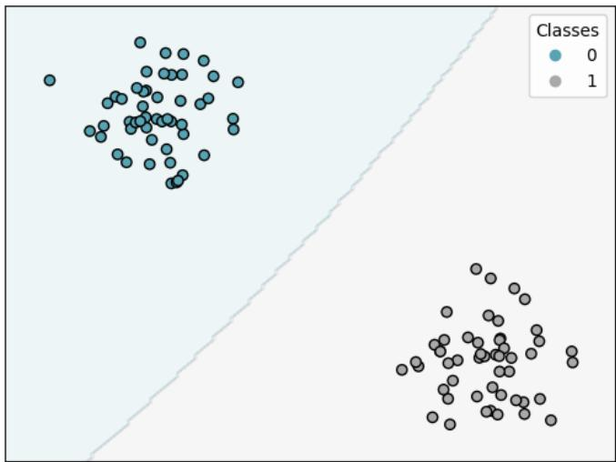  
Figure 5.2 Visual representation of the decision boundary as determined by our Naïve Bayes classifier. This plot illustrates the decision-making process of the classifier, defining the regions where it would classify data points into different classes.

NOTE You can nd all the code used for this code examples in the ch05 folder within the notebook titled ch05_text_classication_bayes.ipynb located in the repository for this book. Don’t hesitate to try out the class and experiment with it.

It’s important to note, however, that real-world problems are often more complex than this example, which is why we use the Naïve Bayes classier as a baseline to compare against more advanced methods like transformers. In the upcoming worked examples, we’ll explore the performance comparison between the Naïve Bayes classier and transformers, revealing some fascinating results and insights. By doing so, you’ll gain a deeper understanding of when to use a simple algorithm like Naïve Bayes and when to opt for more sophisticated approaches, which we will introduce in the next section.

# 5.2 Transformers in text classification: an overview

In this section, we will explore a selection of state-of-the-art models that excel in the domain of text classication. With a plethora of models available, it is important to identify those that have demonstrated exceptional performance on various text classication benchmarks while also catering to the unique requirements of specic classication tasks. One of those benchmarks is the GLUE Benchmark (General Language Understanding Evaluation), (8). The GLUE Benchmark is a collection of nine text NLP tasks that focus on sentence-level or sentence-pair analysis. These tasks serve as a comprehensive evaluation for language understanding models, such as those we discuss in this section. The tasks included in the GLUE Benchmark are:

CoLA (Corpus of Linguistic Acceptability): Assess if a sentence is grammatically correct or not. This dataset consists of sentences labeled as grammatically correct or incorrect.   
MNLI (Multi-Genre Natural Language Inference): Evaluate if a sentence entails, contradicts, or is unrelated to a given hypothesis. This dataset has two versions: one with the validation and test sets originating from the same distribution and another called "mismatched," where the validation and test sets use out-of-domain data.   
MRPC (Microsoft Research Paraphrase Corpus): Determine whether two sentences are paraphrases of one another or not.   
QNLI (Question-answering Natural Language Inference): Assess if the answer to a question is present in the second sentence or not. This dataset is derived from the SQuAD (Stanford Question Answering Dataset), which is a collection of questionanswer pairs based on Wikipedia articles, designed to evaluate a model’s ability to comprehend and extract relevant information.   
QQP (Quora Question Pairs2): Determine if two questions have the same semantic meaning or not.   
RTE (Recognizing Textual Entailment): Evaluate if a sentence entails a given hypothesis or not.

□ SST-2 (Stanford Sentiment Treebank): Classify a sentence as having a positive or negative sentiment.   
STS-B (Semantic Textual Similarity Benchmark): Measure the similarity between two sentences on a scale from 1 to 5.   
WNLI (Winograd Natural Language Inference): Determine if a sentence containing an ambiguous pronoun and another sentence with the pronoun replaced are entailed or not. This dataset is based on the Winograd Schema Challenge dataset.

These tasks in the GLUE Benchmark provide a thorough assessment of the performance and capabilities of various models in handling diverse text classication challenges, including tasks that extend beyond traditional text classication to other areas of natural language understanding. This diversity allows for a more comprehensive and robust assessment of a model’s ability to understand and classify text in dierent contexts, reecting the complex nature of real-world language use.

Building on the context of the GLUE Benchmark, we now turn our focus to a selection of top-performing text classication models that have collected recognition and widespread usage in the industry. These models serve as a point of reference and a benchmark for text classication tasks, helping us measure their capabilities and eectiveness. In the following discussion, I will provide a concise overview of these models before exploring their features and capabilities in greater detail. This acts as a comprehensive summarization of each model’s original paper, highlighting the important innovations of each model. Moreover, by concentrating our discussion on these models here, you gain a deep and comprehensive understanding of their dierences and similarities. This facilitates a direct comparison between them. This profound knowledge, gained from directly comparing the models, will prove invaluable when we use these models in our worked examples and in your own real-world use cases. Understanding the architecture of each model and seeing their performance on the GLUE benchmark not only provides a solid foundation for interpreting the variations in their performance, but also gives you a head start in estimating their potential eectiveness for your specic tasks.

BERT (Bidirectional Encoder Representations from Transformers), (2) is a transformerbased model pre-trained on large-scale, bidirectional language modeling tasks. It has achieved state-of-the-art results on various natural language processing tasks, including text classication. BERT comes with 110 million parameters and is available in both cased and uncased versions.   
【 RoBERTa (Robustly Optimized BERT Pretraining Approach), (5) builds upon BERT by implementing several optimizations in pretraining techniques and training on a larger dataset. RoBERTa has achieved improved results on various NLP benchmarks and comes with 125 - 355 million parameters.   
ALBERT (A Lite BERT) (4), as the name indicates, is a more ecient and lighter version of BERT that uses parameter-sharing techniques across layers to reduce the model’s size and improve training eciency. ALBERT achieves comparable results

to BERT on various NLP benchmarks while having signicantly fewer parameters, with the base version containing 12 million parameters.

DistilBERT (7) is a smaller, faster, and more ecient version of BERT. It retains $9 5 \%$ of BERT’s performance while reducing the model size by $4 0 \%$ and speeding up the training process. DistilBERT has 66 million parameters and is available in both cased and uncased versions.   
DeBERTa (Decoding-enhanced BERT with disentangled attention) (3) is a BERTbased model that incorporates a disentangled attention mechanism to enhance the model’s representation power. DeBERTa has achieved state-of-the-art results on various NLP tasks and comes with 110 million parameters.   
ELECTRA (Eciently Learning an Encoder that Classies Token Replacements Accurately) (1) is a transformer-based model pre-trained using a novel token replacement task. This approach allows ELECTRA to learn more eciently and achieve state-of-the-art results with smaller model sizes. The base version of ELECTRA comes with 110 - 355 million parameters.

# 5.2.1 BERT

BERT, or Bidirectional Encoder Representations from Transformers, is a cornerstone in the domain of transformer-based language models. Developed by Google AI Language, it revolutionized the eld by introducing the concept of bidirectional training of transformers. BERT comes in two sizes: BERT-base with 110 million parameters, and BERT-large with 340 million parameters. Both versions are pretrained on the BookCorpus (10), and English Wikipedia datasets. During pretraining, BERT uses a Masked Language Model (MLM) objective, which allows the model to predict a masked word based on its context from both directions. This approach is an advancement over previous models that processed text unidirectionally. In addition, BERT also incorporates a Next Sentence Prediction task during pretraining, where the model learns to predict if two sentences follow each other in a document. BERT is also designed for ne-tuning, and it can be adapted to a wide range of tasks such as text classication, sentiment analysis, named entity recognition, and question-answering. The powerful pretraining approach and bidirectional context understanding enable BERT to achieve state-of-the-art results on various benchmarks.

BERT’s distict training techniques, combined with its vast scale, allowed it to achieve state-of-the-art performance on a wide variety of natural language processing tasks upon its release. Despite the introduction of newer models like RoBERTa, ALBERT, and ELEC-TRA, at which we will look next, BERT remains a highly inuential model in the eld of NLP. It continues to deliver competitive performance on many tasks, and its architecture serves as the foundation for many subsequent models.

Furthermore, BERT’s pretraining-netuning paradigm has been widely adopted in the eld, with most modern LLMs following a similar approach. This, in combination with its strong performance, ensures that BERT remains at the forefront of NLP research and application.

# 5.2.2 RoBERTa

RoBERTa, is an optimized version of the BERT model, specically designed to enhance the performance of pretraining tasks. It builds on the foundation of BERT by rening the training process and leveraging a larger dataset, achieving state-of-the-art results on a wide array of natural language processing benchmarks. RoBERTa comes in two sizes: RoBERTabase with 125 million parameters and RoBERTa-large with 355 million parameters. Both versions are pretrained on the BookCorpus and English Wikipedia datasets.

During pretraining, RoBERTa employs the Masked Language Model objective from BERT, which predicts masked tokens in continuous text streams. However, RoBERTa eliminates the Next Sentence Prediction task, as it was found to negatively impact the model’s performance. Instead, RoBERTa increases the amount of training data, batch size, and learning rate to achieve better performance.

The model is trained with longer training steps and uses dynamic masking to prevent the model from learning to rely on a specic masked pattern. This results in improved downstream task performance.

For ne-tuning, RoBERTa can be adapted to various natural language processing tasks, such as text classication, sentiment analysis, named entity recognition, and questionanswering. The optimized pretraining process allows RoBERTa to outperform its predecessors, achieving state-of-the-art results on numerous benchmarks. Table 5.1 shows the results on the GLUE Benchmark, scores are taken from the RoBERTa paper.

Table 5.1 Model performance comparison of BERT-large and RoBERTa on the GLUE Benchmark   

<table><tr><td>Model</td><td>CoLA</td><td>MNLI</td><td>MRPC</td><td>QNLI</td><td>QQP</td><td>RTE</td><td>SST</td><td>STS</td><td>WNLI</td></tr><tr><td>BERTLARGE</td><td>60.6</td><td>86.6</td><td>88.0</td><td>92.3</td><td>91.3</td><td>70.4</td><td>93.2</td><td>90.0</td><td>-</td></tr><tr><td>RoBERTaLARGE</td><td>68.0</td><td>90.2</td><td>90.9</td><td>94.7</td><td>92.2</td><td>86.6</td><td>96.4</td><td>92.4</td><td>91.3</td></tr></table>

One of the key strengths of RoBERTa is its robust and optimized pretraining approach, which enables the model to eectively learn the underlying structure of natural language, leading to improved performance in various downstream tasks. The renements implemented in RoBERTa’s training process result in a powerful and versatile model that excels in a wide array of natural language processing challenges. The availability of both base and large versions of RoBERTa ensures that researchers and practitioners can choose the model size that best ts their computational resources and task requirements.

# 5.2.3 ALBERT

ALBERT, is a lightweight version of the BERT model, specically designed to address the issue of growing model size and memory requirements while retaining or even improving the performance of the original model. ALBERT achieves this by employing two primary optimization techniques: factorized embedding parameterization and cross-layer parameter sharing.

Factorized embedding parameterization separates the size of the hidden layers from the size of the input embeddings by using two separate matrix transformations. The input

embeddings, which are often large due to the size of the vocabulary, are rst transformed into a smaller dimension space using a matrix. Then, this transformed embedding is further projected to the hidden dimension using a second matrix. This results in a drastic reduction in the number of parameters, especially when the vocabulary size is large and the hidden layer size is much smaller. This technique enables ALBERT to use a smaller hidden size for the embeddings while maintaining a larger hidden size for the rest of the model. And thus, this reduces the overall number of parameters in the model, leading to a more memory-ecient architecture.

Cross-layer parameter sharing involves sharing the same parameters across multiple layers of the model, as show in gure 5.3. This signicantly reduces the number of unique parameters in ALBERT, resulting in a smaller and faster model compared to BERT. ALBERT comes in various sizes, with ALBERT-base having 12 million parameters and ALBERT-xxlarge having 235 million parameters.

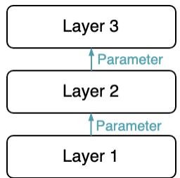  
Figure 5.3 Illustration of ALBERT’s cross-layer parameter sharing mechanism. Each box represents a layer in the model, which includes a self-attention mechanism and a feed-forward network. The arrows indicate parameter sharing across layers: the same set of parameters are used in all layers. This significantly reduces the number of unique parameters in the model, resulting in a smaller and faster model compared to BERT.

During pretraining, ALBERT employs the MLM objective from BERT, predicting masked tokens in continuous text streams. However, it replaces the next sentence prediction task with a sentence-order prediction task, which predicts whether two input sentences are in the correct order. This change helps ALBERT to better model inter-sentence coherence, even surpassing BERT on several benchmarks as shown in table 5.2.

Table 5.2 Model performance comparison of BERT-large and ALBERT on the GLUE Benchmark   

<table><tr><td>Model</td><td>CoLA</td><td>MNLI</td><td>MRPC</td><td>QNLI</td><td>QQP</td><td>RTE</td><td>SST</td><td>STS-B</td><td>WNLI</td></tr><tr><td>BERTLARGE</td><td>60.6</td><td>86.6</td><td>88.0</td><td>92.3</td><td>91.3</td><td>70.4</td><td>93.2</td><td>90.0</td><td>-</td></tr><tr><td>ALBERT (1M)</td><td>68.7</td><td>90.4</td><td>90.2</td><td>95.2</td><td>92.0</td><td>88.1</td><td>96.8</td><td>92.7</td><td>-</td></tr><tr><td>ALBERT (15M)</td><td>71.4</td><td>90.8</td><td>90.9</td><td>95.3</td><td>92.2</td><td>89.2</td><td>96.9</td><td>93.0</td><td>-</td></tr></table>

For ne-tuning, ALBERT can be adapted to various natural language processing tasks, such as text classication, sentiment analysis, named entity recognition, and questionanswering. The optimized architecture of ALBERT allows it to achieve competitive performance compared to its larger counterparts.

A key advantage of ALBERT lies in its capacity to oer a more resource-ecient alternative to BERT without compromising performance. The model’s design process incorporates optimization techniques that enable ALBERT to sustain high performance while remaining lightweight and computationally ecient, making it an adaptable option for a diverse set of natural language processing tasks and scenarios.

# 5.2.4 DistilBERT

DistilBERT, is a lightweight version of the BERT model, specically designed for resourceconstrained environments while retaining a signicant portion of the original model’s performance. DistilBERT achieves this by employing knowledge distillation techniques, compressing the model to approximately half the size of BERT-base, with only 66 million parameters, and preserving over $9 5 \%$ of its performance. For the GLUE Benchmark it even retains $9 7 \%$ of the original performance of BERT on the same tasks, as shown in table 5.3, where the scores are taken from the paper "DistilBERT, a distilled version of BERT: smaller, faster, cheaper and lighter".

Table 5.3 Model performance comparison of BERT and DistilBERT on the GLUE Benchmark   

<table><tr><td>Model</td><td>CoLA</td><td>MNLI</td><td>MRPC</td><td>QNLI</td><td>QQP</td><td>RTE</td><td>SST-2</td><td>STS-B</td><td>WNLI</td></tr><tr><td>BERTBASE</td><td>56.3</td><td>86.7</td><td>88.6</td><td>91.8</td><td>89.6</td><td>69.3</td><td>92.7</td><td>89.0</td><td>53.5</td></tr><tr><td>DistilBERT</td><td>51.3</td><td>82.2</td><td>87.5</td><td>89.2</td><td>88.5</td><td>59.9</td><td>91.3</td><td>86.9</td><td>56.3</td></tr></table>

During the distillation process, DistilBERT is trained to mimic the behavior of the larger teacher model (BERT) by minimizing the divergence between their output distributions. This is achieved using a combination of the Masked Language Modeling objective and a distillation loss. The distillation loss measures the Kullback-Leibler divergence between the logits of the teacher and the student models, which, in simple terms, quanties the dierence in the probability distributions of the teacher and the student models. Consequently, the result is DistilBERT, a smaller and faster version of BERT that retains much of the teacher model’s performance.

DistilBERT also simplies the architecture of BERT by removing the token-type embeddings and the pooler, as these components were found to have a minimal impact on the model’s performance. In simple terms, token-type embeddings in BERT help the model understand where a sentence begins and ends, especially when it’s processing a pair of sentences at the same time. The pooler, on the other hand, processes the output of the model’s layers to create a compressed representation of the input. This can be thought of as creating a "condensed version" of the hidden states of the model.

For DistilBERT, the token-type embeddings and the pooler were found to be less necessary. This can be seen as akin to someone reading a document - while understanding

where a sentence starts and ends (token-type embeddings) and creating a simplied, consolidated representation of the text (pooler) can be helpful, it is not strictly necessary to understand the content. By omitting these elements, DistilBERT simplies the model without signicantly impacting its ability to understand text.

Moreover, the number of layers is reduced to six, compared to 12 layers in BERT, which contributes to the model’s smaller size and faster inference speed.

For ne-tuning, DistilBERT can be adapted to various natural language processing tasks, such as text classication, sentiment analysis, named entity recognition, and questionanswering. Despite its smaller size, DistilBERT demonstrates competitive performance compared to its larger counterparts, making it a suitable choice for tasks where computational resources or latency are critical factors.

A signicant benet of DistilBERT is its ability to serve as a more ecient substitute for BERT with minimal performance loss. The distillation techniques applied during the model’s training process allows DistilBERT to preserve high performance while being lightweight and computationally ecient, rendering it a exible choice for various natural language processing tasks and scenarios.

# 5.2.5 DeBERTa

DeBERTa, stands for Decoding-enhanced BERT with disentangled attention, and it is an improved version of the BERT model, specically designed to address the limitations of the original model’s self-attention mechanism. DeBERTa introduces two key innovations: disentangled attention and an enhanced mask decoder.

Disentangled attention, as implemented in DeBERTa, refers to the separation of content and position information in the self-attention mechanism, as illustrated in Figure 5.4.

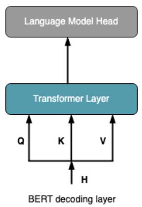

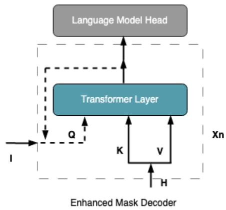  
Figure 5.4 Comparison of BERT’s decoder layer and the Enhanced Mask Decoder (EMD). Both start with hidden states, but EMD adds flexibility by accepting various inputs and stacking layers (denoted by $X _ { n } \mathbf { ) }$ ). Unlike BERT’s single transformer layer that uses only hidden states, EMD can incorporate absolute position embedding and its own layer outputs, enabling adaptable decoding. Q, K, and $V$ denote the query, key, and value matrices, respectively. I represents the input layer, while H signifies the hidden layer.

Unlike BERT, which does not explicitly separate these two types of information, De-BERTa independently models content and position streams and explicitly measures their interactions. This disentangled approach allows DeBERTa to capture the ne-grained interactions between words and their relative positions, which can lead to improved performance on a variety of natural language understanding tasks.

The enhanced mask decoder is an improvement over BERT’s masked language model pretraining objective. In DeBERTa, an additional denoising autoencoding loss is introduced during pretraining to minimize the reconstruction error between the original input and the reconstructed input after a certain number of masked tokens are predicted. This encourages the model to better capture the global contextual information and enhances the model’s ability to recover the masked tokens, leading to improved performance on downstream tasks. Table 5.4 illustrates the results of the performance on the GLUE downstream tasks.

Table 5.4 Model performance comparison of BERT-large and DeBERTa on the GLUE Benchmark   

<table><tr><td>Model</td><td>CoLA</td><td>MNLI</td><td>MRPC</td><td>QNLI</td><td>QQP</td><td>RTE</td><td>SST-2</td><td>STS-B</td><td>WNLI</td></tr><tr><td>BERTLARGE</td><td>60.6</td><td>86.6</td><td>88.0</td><td>92.3</td><td>91.3</td><td>70.4</td><td>93.2</td><td>90.0</td><td>-</td></tr><tr><td>DeBERTaLARGE</td><td>70.5</td><td>91.1</td><td>91.9</td><td>95.3</td><td>92.3</td><td>88.3</td><td>96.8</td><td>92.8</td><td>-</td></tr></table>

DeBERTa comes in various sizes, including DeBERTa-base with 110 million parameters and DeBERTa-large with 335 million parameters. The model is pretrained on the BookCorpus and English Wikipedia datasets, similar to BERT.

One notable strength of DeBERTa is its ability to address BERT’s self-attention limitations through disentangled attention and enhanced mask decoder techniques, making it a versatile option for various natural language processing tasks and scenarios.

# 5.2.6 ELECTRA

ELECTRA (Eciently Learning an Encoder that Classies Token Replacements Accurately) is an alternative pretraining approach to the BERT model, designed to improve eciency while maintaining high performance on natural language understanding tasks. A comparison of their performance on the GLUE benchmark is shown in table 5.5.

Table 5.5 Model performance comparison of BERT-large and ELECTRA-large on the GLUE Benchmark   

<table><tr><td>Model</td><td>CoLA</td><td>MNLI</td><td>MRPC</td><td>QNLI</td><td>QQP</td><td>RTE</td><td>SST-2</td><td>STS-B</td><td>WNLI</td></tr><tr><td>BERTLARGE</td><td>60.6</td><td>86.6</td><td>88.0</td><td>92.3</td><td>91.3</td><td>70.4</td><td>93.2</td><td>90.0</td><td>-</td></tr><tr><td>ELECTRALARGE</td><td>69.1</td><td>90.9</td><td>90.8</td><td>95.0</td><td>92.4</td><td>88.0</td><td>96.9</td><td>92.6</td><td>-</td></tr></table>

ELECTRA introduces a novel pretraining method called the Replaced Token Detection (RTD) task, which is used to train a larger discriminator network. Unlike traditional Masked Language Modeling tasks used by models like BERT, which involves predicting a small fraction of masked tokens, the RTD task involves detecting tokens in the input sequence that have been replaced or "corrupted" by a smaller generator network. The discriminator

network, as illustrated in image 5.5, acting as a classier, is then tasked with distinguishing between the original, unaltered tokens and the tokens replaced by the generator. This approach allows ELECTRA to make use of the full input sequence during pretraining, leading to improved eciency.

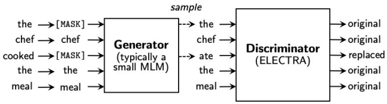  
Figure 5.5 A high-level overview of replaced token detection. The generator can be any model that generates a token distribution, but the authors employed a tiny masked language model that is trained alongside the discriminator. The image is taken from the paper: ”ELECTRA: Pre-Training Text Encoders As Discriminators Rather Than Generators”

ELECTRA comes in various sizes, including ELECTRA-base with 110 million parameters and ELECTRA-large with 335 million parameters. The model is pretrained on the BooksCorpus and English Wikipedia datasets, similar to BERT.

For ne-tuning, ELECTRA can be adapted to various natural language processing tasks, such as text classication, sentiment analysis, named entity recognition, and questionanswering. The novel pretraining method employed by ELECTRA allows the model to achieve competitive performance compared to its larger counterparts.

A major strength of ELECTRA lies in its ecient learning from input sequences through replaced token detection, making it suitable for a wide range of NLP tasks and scenarios where computational resources or latency are crucial factors.

NOTE For a more comprehensive comparison of various models and their performance on natural language understanding tasks, be sure to check out the of-cial GLUE (https://gluebenchmark.com/leaderboard/) and SuperGLUE (https://super.gluebenchmark.com/leaderboard) websites. These sites feature regularly up-dated leaderboards showcasing the latest and most advanced models in the eld of NLP.

Having gained an understanding of each model’s unique strengths and innovations, you’re now ready to get your hands "dirty" and apply the models for your own tasks. In listing 5.3 you nd an excerpt of an easy to use TextClassier class. With it, you can try out all the models we covered in this section. You can also just replace the models in the dictionary, if you wish to try out dierent models. We will also employ this TextClassier class throughout the following sections, which allows us to easily switch between models for evaluation and produce performance plots of those models.

I encourage you to explore the full implementation. You can nd the TextClassier class in the book repository, located in utils.py.

0 We use a dictionary with the models we want to evaluate

models $=$ { "BERT": "bert-base-uncased", "RoBERTa": "roberta-base", "DistilBERT": "distilbert-base-uncased", "DeBERTa": "microsoft/deberta-base", "ALBERT": "albert-base-v2", "ELECTRA": "google/electra-base-discriminator", }

② Set the target names for our confusion matrix

```python
financial_target_names = ['Negative', 'Neutral', 'Positive'] 
```

$\otimes$ Create a dictionary with the parameter

newsclassifier.params $=$ { 'test_set':test_df, 'models':models, 'target_names':financial_target_names, 'num/examples':100, 'seed_value':0   
}   
4 Which we then can easily pass into the class financialclassifier $\equiv$ TextClassifier(\*\*newsclassifier.params)   
5 Call the evaluate function to plot the confusion matrix and generate a data frame evaluation df financial phrasebank_before $\equiv$ financialclassifier.evaluate_models(num.columns=3，figsize=(15，10))

You may have noticed that I used the term confusion matrix in the code. If you were not familiar with this term, don’t worry - we’re going to cover it in the next section, along with other important metrics such as accuracy and F1 score. This will equip you with the necessary tools to evaluate your classication models using the metrics most appropriate for your specic problem at hand.

# 5.3 Evaluating classification performance

Before we explore the exciting world of hands-on examples, we’ll take a brief detour to discuss some essential theory - how to evaluate our trained models eectively. In this section, I will introduce common metrics for assessing the performance of classication tasks, including the confusion matrix, accuracy, and the F1-score. With this knowledge in hand, you’ll be better prepared to understand and assess the eectiveness of your classication models as we move forward with the practical examples.

# 5.3.1 Confusion matrix

One way to evaluate the performance of a classication model, be it binary or multi-class, is by using a confusion matrix. Although the explanation here will use a binary classication as an example, the concept can be extended to multi-class classication problems as well.

However, don’t let the term "confusion matrix" confuse you! It’s simply a table that helps you visualize and evaluate the performance of a classication model by showing the number of correct and incorrect predictions for each class. This understanding will enable you to assess the eectiveness of your text classication models more accurately and condently. A confusion matrix typically consists of four elements: true positives (TP), false positives (FP), true negatives (TN), and false negatives (FN).

True Positives (TP): The number of instances where the model correctly predicted the positive class.   
False Positives (FP): The number of instances where the model incorrectly predicted the positive class.   
True Negatives (TN): The number of instances where the model correctly predicted the negative class.   
False Negatives (FN): The number of instances where the model incorrectly predicted the negative class.

A visual representation of these four components and their interrelations within a confusion matrix can be found in Figure 5.6.

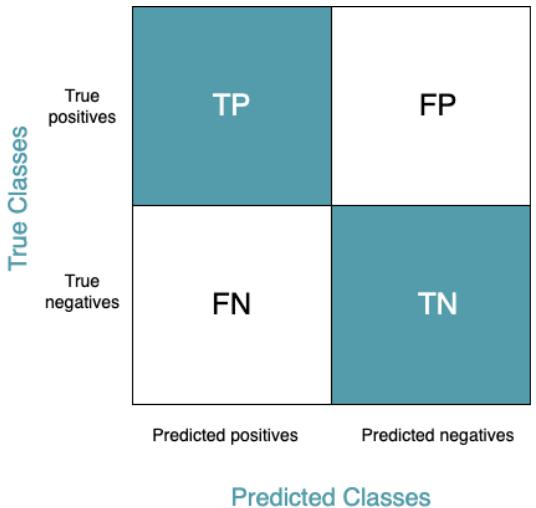  
Figure 5.6 An illustration of a confusion matrix for a binary classification problem. It details the distribution of true and predicted class labels, offering insights into model performance.

To produce this plot for our models, we can easily use the build-in function from scikit-learn. An example implementation is shown in listing 5.4.

# Listing 5.4 Confusion matrix plot function

0 Import function from scikit-learn

from sklearn.metrics import confusion_matrix

```python
def plot_confusion_matrix(y_true, y_pred, class_names):
    cm = confusion_matrix(y_true, y_pred)
    cmap = colors.LinearSegmentedColormap.from_list(""); ["white", "#58A3B3"]
    fig, ax = plt.subplot()
    sns heatmap(cm, annot=True, fmt='d', ax=ax, cmap=cmap, cbar=False,
                    linewidths=0.2, linecolor='black')
    ax.set(xlabel="Predicted Classes", ylabel="True Classes", xticklabels=class_names,
                    yticklabels=class_names)
    plt.y ticks(rotation=0) 
```

To try in out, we can just create two lists with example values as shown in listing 5.5.

# Listing 5.5 Creating a confusion matrix plot

0 Create the class labels Positive ${ \bf \mu } = { \bf 0 }$ , Negative $= 1$

y_true $=$ [1,0,1,1,0,1,0,0,1,0] 2 True labels y_pred $=$ [0,0,1,1,0,0,1,0,1,0] 3 Predicted labels class_names $\equiv$ ['Positive', 'Negative']

4 Call the plotting function

```python
plot_confusion_matrix(y_true, y_pred, class_names) 
```

This results in the plot shown in gure 5.7 for our two classes and true and predicted labels.

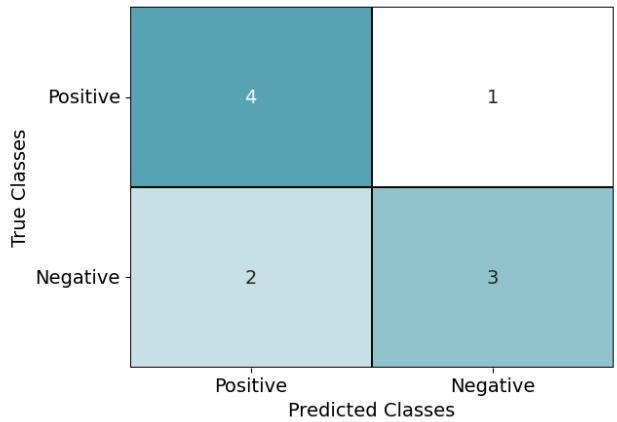  
Figure 5.7 Confusion matrix plot form our toy example data.

So, there you have it! The confusion matrix demystied. Just remember, it’s merely a tool to help you better understand and evaluate your classication models, so don’t let it be a source of confusion.

Moreover, using these four elements, you can derive various performance metrics such as sensitivity (recall or true positive rate), specicity (true negative rate), precision, and more.

Sensitivity (recall or true positive rate): $\scriptstyle { \frac { T P } { T P + F N } }$   
$\frac { T N } { T N + F P }$   
False positive rate: $\frac { F P } { F P + T N }$   
False negative rate: FNFN+TP $\frac { F N } { F N + T P }$   
Precision: TPTP+FP $\frac { T P } { T P + F P }$

These metrics help you assess the strengths and weaknesses of your classication model, enabling you to optimize it for dierent applications. Let us conveniently use again scikitlearn (listing 5.6 ) and the same two lists from our confusion matrix example and calculate those metrics for the two classes and true and predicted values.

# Listing 5.6 Computing sensitivity, specificity and precision

1 Create the class labels Positive $= 0$ Negative $= 1$ y_true $= [1,0,1,1,0,1,0,0,1,0]$ True labels y_pred $= [0,0,1,1,0,0,1,0,1,0]$ Predicted labels

```txt
4 Calculating the True Positives (TP), False Positives (FP) and True Negatives (TN) and False Negatives (FN) tn, fp, fn, tp = cm.ravel() ⑥ Return a contiguous flattened, ID array 
```

```txt
precision = precision_score(y_true, y_pred)  
recall = recall_score(y_true, y_pred)  
specificity = tn / (tn + fp) 
```

This will result in the following outputs for our our elements; true positives (TP), false positives (FP), true negatives (TN), and false negatives (FN):

TP: 3   
FP: 1   
TN: 4   
FN: 2

And these four elements will lead to the following performance metrics:

Precision: 0.75   
Recall (Sensitivity): 0.6   
Specicity: 0.8

After gaining a deeper understanding of the confusion matrix and their elements, we can now turn our attention to other important performance metrics, such as the F1 score and accuracy. These metrics will help you further evaluate the performance of your text classication models and optimize them for various applications.

# 5.3.2 Accuracy

Accuracy is a widely used metric for evaluating the performance of classication tasks, including text classication. In simple terms, accuracy measures the proportion of correct predictions made by a classier relative to the total number of predictions.

Mathematically, accuracy can be expressed as follows:

$$
\text {A c c u r a c y} = \frac {\text {N u m b e r o f C o r r e c t P r e d i c t i o n s}}{\text {T o t a l N u m b e r o f P r e d i c t i o n s}} = \frac {T P + T N}{T P + T N + F P + F N} \tag {5.2}
$$

As a reminder, the elements of a confusion matrix include True Positives (TP), True Negatives (TN), False Positives (FP), and False Negatives (FN). Accuracy calculates the proportion of correct predictions by considering both TP and TN in relation to the total number of predictions.

Accuracy is intuitive and straightforward to interpret, as it provides a single value that captures the overall eectiveness of a classier. However, it has some limitations, especially when dealing with imbalanced datasets. In imbalanced datasets, where the distribution of classes is uneven, a classier might achieve high accuracy by simply predicting the majority class, which may not be the desired outcome. In such cases, alternative metrics like precision, recall, and, as we will discuss next, the F1-score can provide more nuanced insights into the model’s performance.

Nevertheless, accuracy remains a valuable metric for getting a quick overview of a text classication model’s performance, especially when the class distribution is balanced or near-balanced. In the following section, we will explore the F1-score, a metric that can better handle the challenges presented by imbalanced datasets.

# 5.3.3 F1-score

The F1-score is a metric that combines both precision and recall, which we previously discussed while exploring the confusion matrix, to provide a single value representing the trade-o between these two performance measures. As a gentle refresher, precision measures the proportion of true positive predictions among all positive predictions, while recall, also known as sensitivity or true positive rate, measures the proportion of true positive predictions among all actual positive instances. Further, the F1-score is a metric that combines both precision and recall in a specic way, known as the harmonic mean, as show in equation 5.3

$$
F 1 - \text {s c o r e} = 2 \cdot \frac {\text {P r e c i s i o n} \cdot \text {R e c a l l}}{\text {P r e c i s i o n} + \text {R e c a l l}} \tag {5.3}
$$

With this specic combination of precision and recall, we can easily see how it is dierent from a simple average because it tends to penalize extreme values. In other words, to achieve a high F1-score, both precision and recall must be high.

The F1-score ranges from 0 to 1, where a score of 1 indicates perfect precision and recall, and a score of 0 indicates the complete absence of either precision or recall. The F1-score is especially useful when dealing with imbalanced datasets, as it accounts for both

false positives and false negatives, thus providing a more balanced evaluation of the model’s performance.

In contrast to accuracy, which may be misleading in the presence of imbalanced datasets, the F1-score is more robust. Although it primarily focuses on the model’s ability to correctly predict the positive class, by considering both precision and recall, it does provide a balanced evaluation of the model’s performance, especially in the face of class imbalance.

# 5.4 Applications and worked examples

Now that we’ve covered the essential theory, let’s solidify our understanding by exploring hands-on examples and applications. In line with the previous chapters, these examples are designed to run on a single GPU, showcasing the power and versatility of transformer models for text classication tasks across a variety of real-world scenarios, even for those with limited computational resources.

In this chapter, we will explore three diverse datasets, each oering unique challenges and opportunities for text classication. We begin with the Financial Phrasebank dataset for sentiment classication, followed by the AG_News dataset for topic modeling. Lastly, we tackle the Yelp review dataset, a more complex task that requires distinguishing between ve dierent classes while accounting for the nuanced language present in the reviews.

# 5.4.1 Fine-tuning different classification models on the Financial Phrasebank dataset

In this section, we will begin with the Financial Phrasebank dataset and evaluate various models before using these results as a basis for ne-tuning our models on this specic task.

The Financial Phrasebank dataset (6) is a collection of nancial news sentences, categorized into three sentiment classes: positive, neutral, and negative. This dataset focuses on sentiment classication within the nancial domain. It consists of approximately 4,800 sentences collected from nancial news articles, with 2,226 instances labeled as neutral, 1,787 as positive, and 827 as negative.

By looking at the data distribution, we can clearly see that our data is imbalanced. Dealing with imbalanced datasets is a frequent challenge in real-world applications, and knowing how to tackle this issue can greatly enhance the performance of your text classication models. One widely-used technique is undersampling, which involves reducing the number of instances from the more prevalent class in the dataset. Figure 5.8 illustrates an example of an imbalanced dataset, while gure 5.9 demonstrates the result after applying undersampling for our Financial Phrasebank dataset.

Further, if you have an imbalanced dataset, you can consider these techniques:

Transfer learning: Utilize pre-trained models on a related task with a more balanced class distribution, and then ne-tune the model for the imbalanced target task. This method allows the model to benet from the knowledge gained from the related task and can improve its performance on the target task.   
【 Oversample minority classes: Enhance the minority classes by duplicating instances or using techniques like SMOTE, which generates synthetic examples, resulting in a more balanced and representative dataset for the model to learn from. This approach

balances the class distribution and helps the model to learn from a more representative dataset.

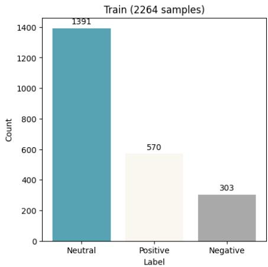  
Figure 5.8 The Financial Phrasebank dataset for news sentiment classification, displaying a higher number of instances for the neutral class in comparison to the other two classes, positive and negative.

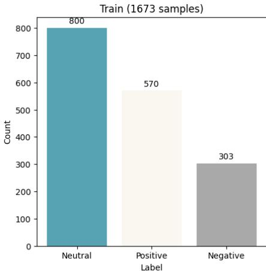  
Figure 5.9 The financial phrasebank dataset after applying undersampling.

However, not every dataset is as simple as the Financial Phrasebank dataset and sometimes it is helpful to gain a better understanding of your class distributions by visualizing the data.

# VISUALIZING TRAINING DATA TO GAIN MORE INSIGHTS

If you encounter more complex classication problems, which often involve numerous classes and high-dimensional spaces. You need a way to navigate these complexities and gain a better understanding of the data. For that, we can visualize the data distribution using a dimensionality reduction technique like t-SNE (t-Distributed Stochastic Neighbor Embedding), which helps us to reveal patterns and structures within the data that are otherwise hidden in the high-dimensional space. Figure 5.10 displays an example of the Financial Phrasebank dataset transformed into a 3D plot using t-SNE.

If you encounter more complex data, the following strategies can help address these complexities:

Model selection: Choose a larger model architecture that is known to perform well on complex tasks. Larger transformer models have more capacity to learn complex patterns and relationships in high-dimensional spaces, where classes might not be easily distinguishable. By having more layers and parameters, these models can capture subtle nuances in the text and better distinguish between classes, even when the language is ambiguous. The benet here lies in leveraging the proven capabilities of existing larger models.

Model scaling: Increase the size of the model by adding more layers, widening the layers, or both. Newly added layers are typically congured identically to the existing ones, but dierent congurations may be worth exploring as part of hyperparameter tuning. This approach allows you to tailor the model size based on your specic task’s needs and data availability. Be cautious about the risk of overtting and ensure that you have sucient data to train the larger model eectively.

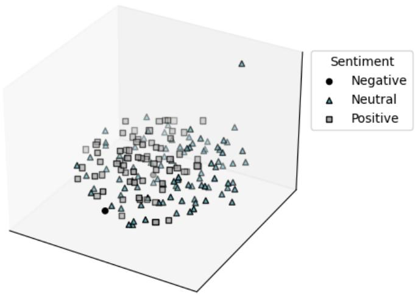  
Figure 5.10 3D plot of the data distribution of the Financial Phrasebank dataset, visualized using a dimensionality reduction technique called t-SNE. The goal of t-SNE is to take a set of points in a highdimensional space and find a close representation of those points in a lower-dimensional space, typically a 2D plane or a 3D space, providing an insightful look into the structure and patterns inherent in the data.

NOTE The t-SNE algorithm is a nonlinear dimensionality reduction technique that is particularly well-suited for embedding high-dimensional data into a space of two or three dimensions. It maintains local similarities between data points, enabling us to visualize complex relationships in lower-dimensional spaces. Another technique known as UMAP (Uniform Manifold Approximation and Projection) has also gained popularity for similar purposes. While t-SNE excels in preserving local structures, UMAP is known for its speed and preservation of the global data structure. Both can be useful depending on the specics of your dataset and task. For your reference, you can nd the code for the function plot_tsne_3d, which applies the t-SNE technique, in plotting.py. This can be used as a template for visualizing other classication datasets using t-SNE.

Using the undersampled Financial Phrasebank dataset we prepared earlier, we are now ready to put our TextClassier class (listing 5.3) to work. When we apply this class to the dataset, the output will be six distinct confusion matrices, one for each model we have chosen to evaluate. These confusion matrices serve as an excellent tool for visualizing and understanding the performance of each model against our specic dataset. They clearly

display the number of correct and incorrect predictions for each class, enabling us to determine the strengths and weaknesses of each model. Refer to gure 5.11 for a visual comparison of these six confusion matrices. As we progress, you’ll see how these visual representations aid us in ne-tuning our models and optimizing them for the tasks at hand.

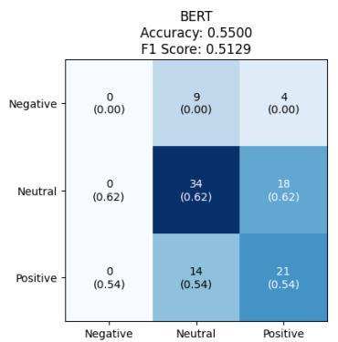

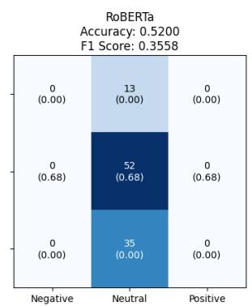

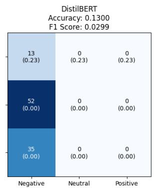

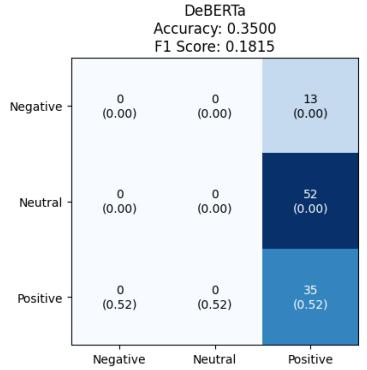

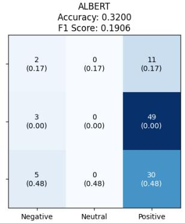

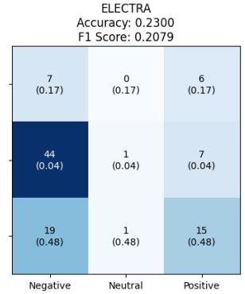  
Figure 5.11 Overview of the performance of different Transformer models before fine-tuning, using weighted F1 scores.

We observe that BERT and RoBERTa demonstrate the best performance among the six models evaluated. Furthermore, the performance of these models varies across negative, neutral, and positive predictions. However, we will ne-tune RoBERTa and ELECTRA, and compare them to our Naïve Bayes classier, emphasizing the importance of evaluating dierent models even when their initial performance might suggest otherwise.

NOTE We also utilize our custom TextClassier class to generate data frames, enabling us to conveniently review each model’s performance and assess its overall eectiveness. This streamlined approach allows for a more ecient comparison of dierent models, leading to a better understanding of their strengths and weaknesses. Furthermore, it gives us the ability to visualize the performance metrics, thereby making the dierences among models more tangible. Ultimately, this facilitates informed decision-making when selecting the best model for a specic task.

Before ne-tuning our models, we need to prepare the Financial Phrasebank dataset for use with our Transformer models. As we have the dataset in a dataframe format, the access method will dier, as demonstrated in Listing 5.7, compared to directly using the Hugging Face dataset.

Listing 5.7 Create dataset for fine-tuning   
```python
class FinancialPhrasebankDataset(Dataset):
def __init__(self, data, tokenizer, max_length):
    self.data = data
    selftokenizer = tokenizer
    self.max_length = max_length
def __len__(self):
    return len(self.data)
def __getitem__(self, index):
    ① We use the iloc and index to get the text and labels
        text = self.data.iloc[index]['sentence']
        label = self.data.iloc[index]['label']
    ② Tokenize the text, add special tokens, pad or truncate the sequence to the specified max_length
            encoding = selftokenizer.encode_plus(
                text,
                add_special_tokens=True,
                max_length= self.max_length,
                padding='max_length',
                truncation=True,
            )
            ③ Return the attention mask and input tensors
                returnattention_mask=True,
                return_tensors='pt'
            )
    ③ Flatten the input_ids and attention_mask tensors and return them along with the label
            return
                'input_ids': encoding['input_ids']. flatten.,
                'atteFor the ntion_mask': encoding['attention_mask']. flatten.,
                'labels': torch.tensor.label, dtype=torch.long) 
```

We proceed by loading our model and the corresponding tokenizer for the model, dening the maximum sequence length and batch size, and setting the number of classes for the specic classication task in the model, as demonstrated in listing 5.8. This process ensures that our data is properly prepared and formatted for the specic model we are using, taking into account the unique requirements of the classication task at hand.

Listing 5.8 Prepare model, tokenizer and dataset   
```python
1 Load the RoBERTa tokenizer  
tokenizer = RobertaTokenizer.from_pretrained('roberta-base') 
```

2 Define the RoBERTa model for sequence classification with the number of labels model $=$ RobertaForSequenceClassification.from_pretrained( 'roberta-base', num_label $\mathtt { S } = 3$ )   
$\otimes$ Define the maximum sequence length and batch size max_length $= ~ 1 2 8$ batch_size $= \_ 6$

$\textcircled{6}$ Create the training, validation, and test datasets train_dataset $=$ FinancialPhrasebankDataset(train_df, tokenizer, max_length) val_dataset $=$ FinancialPhrasebankDataset(val_df, tokenizer, max_length) test_dataset $=$ FinancialPhrasebankDataset(test_df, tokenizer, max_length)

As a next step, we dene the EarlyStoppingCallback, to avoid overtting during the netuning process as shown in listing 5.9.

# Listing 5.9 Setting up early stopping

early_stopping_callback $=$ EarlyStoppingCallback(

0 Stop training if the metric doesn't improve for 10 epochs early_stopping_patience ${ \bf \Lambda } = \mathtt { 1 0 }$ ,   
$\textcircled{8}$ Minimum change in the monitored metric to be considered as an improvement early_stopping_threshold=2e-5)

Throughout this section, we will use accuracy as a metric during the ne-tuning process, as shown in listing 5.10. In practice, it is benecial to employ custom metrics tailored to the specic needs of the project. For instance, when dealing with imbalanced datasets, the F1-score should be considered as an alternative metric. By adopting such metrics, you can better assess your model’s performance and optimize it for your particular application.

# Listing 5.10 Custom evaluation metric

```python
accuracy_metric = evaluate.load("accuracy")  
def compute.metrics(eval_pred):  
    logits, labels = eval_pred  
    predictions = np.argmax(logits, axis=-1)  
    return accuracy_metric.compute(predictions=predictions, references=labels) 
```

With all the essential prerequisites established for training our chosen models on the downstream task, we can now proceed to initialize the training arguments and the trainer class. This process, which is demonstrated in Listing 5.13, ensures that our models are well-prepared to tackle the specic classication problem eectively and eciently, taking full advantage of the Transformer architecture’s capabilities.

# Listing 5.11 Fine-tuning RoBERTa

0 Define training arguments

```txt
training_args = TrainingArguments(
output_dir="./results", 
```

```txt
overwrite_output_dir=True,
num_train_epochs=5,
per_device_train_batch_size=batch_size,
save_strategy="epoch",
save_total_limit=2,
evaluation_strategy="epoch",
learning_rate=3e-5,
weight Decay=0.01,
logging_strategy="epoch",
logging_steps=10,
load_best_model_at_end=True) 
```

Initialize the trainer with the compute_metrics function

trainer $=$ Trainer( model $\equiv$ model, args $\equiv$ training_args, train_dataset $\equiv$ train_dataset, eval_dataset $\equiv$ val_dataset, compute_metric $\equiv$ compute_metric, callbacks $\equiv$ [early_stopping_callback]

Once the ne-tuning is complete, we can compare the results from the dierent models and our baseline, as illustrated in Figure 5.12.

<table><tr><td>Model</td><td>Accuracy</td><td>F1 Score</td><td>Negative F1</td><td>Neutral F1</td><td>Positive F1</td></tr><tr><td>BERT</td><td>0.550000</td><td>0.512865</td><td>0.000000</td><td>0.623853</td><td>0.538462</td></tr><tr><td>RoBERTa</td><td>0.520000</td><td>0.355789</td><td>0.000000</td><td>0.684211</td><td>0.000000</td></tr><tr><td>DistilBERT</td><td>0.130000</td><td>0.029912</td><td>0.230088</td><td>0.000000</td><td>0.000000</td></tr><tr><td>DeBERTa</td><td>0.350000</td><td>0.181481</td><td>0.000000</td><td>0.000000</td><td>0.518519</td></tr><tr><td>ALBERT</td><td>0.320000</td><td>0.190609</td><td>0.173913</td><td>0.000000</td><td>0.480000</td></tr><tr><td>ELECTRA</td><td>0.230000</td><td>0.207854</td><td>0.168675</td><td>0.037037</td><td>0.476190</td></tr><tr><td>Fine-tuned RoBERTa</td><td>0.982143</td><td>0.982207</td><td>0.983051</td><td>0.988235</td><td>0.971963</td></tr><tr><td>Fine-tuned ELECTRA</td><td>0.988095</td><td>0.988095</td><td>0.965517</td><td>1.000000</td><td>0.981132</td></tr><tr><td>Naive Bayes</td><td>0.720238</td><td>0.671115</td><td>0.129032</td><td>0.863388</td><td>0.655738</td></tr></table>

Figure 5.12 Comparison of the weighted results of all evaluated models before fine-tuning, as well as our fine-tuned models, RoBERTa and ELECTRA, and our baseline. ’Negative F1’, ’Neutral F1’, and ’Positive F1’ refer to the F1 scores achieved on the negative, neutral, and positive sentiment classes, respectively. We can clearly see the improvements of ELECTRA after fine-tuning, yielding now an impressive F1-Score of 0.988.

As emphasized earlier, evaluating various models for a specic task is crucial. Although ELECTRA was not one of the top-performing models in our confusion plot shown in

gure 5.11, it performed the best after being ne-tuned for this particular classication task. Furthermore, our baseline model exhibited surprisingly strong results, with an accuracy of 0.72 and an F1-Score of 0.67.

NOTE The process for obtaining the ELECTRA model and its tokenizer is identical to the RoBERTa example. To determine the appropriate name for the from_pretrained function, simply refer to the corresponding model card on the Hugging Face website, which will provide the necessary information for each specic model. This ensures that you can easily and eciently access the desired model and tokenizer without encountering any compatibility issues.

# 5.4.2 Fine-tuning a classification model on the AG_News Dataset

In this section, we delve into a slightly more intricate task, shifting our focus from sentiment classication to topic modeling. While sentiment classication primarily involves discerning the positive, negative, or neutral sentiments conveyed in a piece of text, topic modeling is a more complex undertaking. Here, we are tasked with classifying a text based on the specic topic or subject it relates to.

The dataset we’ll be using for this task is the AG_News dataset (9), a comprehensive collection of news articles from the AG’s corpus. The news articles in this dataset are categorized into four distinct topics: World, Sports, Business, and Science/Technology. It is a balanced dataset, with 30,000 articles in the training set and 1,900 articles in the testing set for each category, totalling to 120,000 training samples and 7,600 testing samples. This extensive and well-organized dataset makes it an excellent resource for topic modeling tasks.

Similar to our previous task, we start by evaluating various models using our custom TextClassier class. This step allows us to understand the performance of each model and decide which one would be the most suitable for our current task. Based on our evaluation, we select the BERT model for ne-tuning on the AG_News Dataset.

To streamline our discussion, I will not repeat the steps involved in creating the dataset, initializing the model, and ne-tuning it, as these are essentially the same as those we undertook for the Financial Phrasebank dataset. Nevertheless, I strongly encourage you to review these steps in the notebook ch05_text_classication_ag_news. This notebook, which includes all the relevant steps and code, can be found in the book repository under the CH05 folder.

With this process in place, we’re able to optimize our selected model for the topic modeling task. The results of this ne-tuning process are presented in gure 5.13, where we compare the performance of our models both before and after ne-tuning BERT on the topic modeling task. Through this comparison, we can appreciate the improvements we achieved by ne-tuning BERT, underlining its value in enhancing model performance for specic tasks.

NOTE Moreover, the importance of ecient topic modeling extends far beyond the realm of news categorization. In a world overwhelmed by information, it is a vital tool

for sorting, managing, and understanding vast amounts of text data. From classifying customer reviews for businesses to analyzing social media trends or understanding scholarly literature, topic modeling provides valuable insights. The ne-tuned model can help in rapidly processing and categorizing new documents, thereby making information retrieval more ecient and aiding in the comprehension of large textual datasets.

<table><tr><td>Model</td><td>Accuracy</td><td>F1 Score</td><td>World F1</td><td>Sports F1</td><td>Business F1</td><td>Sci/Tech F1</td></tr><tr><td>BERT</td><td>0.160</td><td>0.114231</td><td>0.000000</td><td>0.076923</td><td>0.215686</td><td>0.195122</td></tr><tr><td>RoBERTa</td><td>0.370</td><td>0.199854</td><td>0.000000</td><td>0.000000</td><td>0.000000</td><td>0.540146</td></tr><tr><td>DistilBERT</td><td>0.330</td><td>0.203815</td><td>0.464000</td><td>0.307692</td><td>0.000000</td><td>0.000000</td></tr><tr><td>DeBERTa</td><td>0.300</td><td>0.138462</td><td>0.461538</td><td>0.000000</td><td>0.000000</td><td>0.000000</td></tr><tr><td>ALBERT</td><td>0.200</td><td>0.070588</td><td>0.000000</td><td>0.336134</td><td>0.000000</td><td>0.000000</td></tr><tr><td>ELECTRA</td><td>0.280</td><td>0.174292</td><td>0.446429</td><td>0.000000</td><td>0.000000</td><td>0.109091</td></tr><tr><td>Fine-tuned BERT</td><td>0.918</td><td>0.917863</td><td>0.933884</td><td>0.973384</td><td>0.879346</td><td>0.882236</td></tr><tr><td>Naive Bayes</td><td>0.887</td><td>0.886835</td><td>0.895277</td><td>0.965649</td><td>0.836653</td><td>0.845996</td></tr></table>

Figure 5.13 This table compares the results of all evaluated models before fine-tuning, our fine-tuned model, BERT, and our baseline. The F1 scores for each class (’World’, ’Sports’, ’Business’, ’Sci/Tech’) show how well each model performed on different categories of the dataset. It’s noteworthy to observe the substantial improvement in the overall F1-Score of BERT, from 0.114 to 0.918, achieved through finetuning.

Our base model performed impressively, yet further performance enhancement for our transformer model is achievable through hyperparameter optimization, a topic I’ll cover in Chapter 9. Particularly in use cases like stock price prediction using sentiment classication, even a $2 \%$ improvement can signicantly impact outcomes.

# 5.4.3 Fine-tuning a classification model on the Yelp Dataset

In this section, we will ne-tune the base and large variants of RoBERTa on the Yelp Dataset. The Yelp Review dataset is a large-scale dataset containing customer reviews from the Yelp platform, categorized into ve dierent star ratings (1 to 5 stars). It is designed to challenge models with the task of predicting the rating based on the nuances in the language used in the review. The dataset contains over 8 million reviews, with each review having a variable length, reecting the diversity of the review content. This dataset presents a more complex task, requiring models to distinguish between the ve classes while accounting for the subtle dierences in language used by customers to express their opinions.

This task is more complex due to having ve classes and nuanced language. To deal with such complex classication tasks, it’s helpful to employ class weighting. Class weighting

assigns higher weights to the minority class during ne-tuning by using class weights in the loss function.

This strategy encourages the model to pay more attention to the minority class examples and can enhance its performance on imbalanced datasets. However, class weighting can also be used to address issues arising from classes that are more dicult to predict due to the nuances in the language, as it is the case with the Yelp Review dataset. By assigning higher weights to these classes, the model is encouraged to pay closer attention to them during training, improving its ability to make accurate predictions. We can achieve this by customizing the Hugging Face trainer class, as shown in Listing 5.12.

# Listing 5.12 Class weighting example

class CustomTrainer(Trainer):

$\textcircled{1}$ Rest of code ommitted for brevity

```python
def compute_loss(self, model, inputs, return_outputs: labels = inputs.pop("labels") outputs = model(**inputs) logits = outputs logits 
```

$\textcircled{8}$ Use the CrossEntropyLoss with class weights

```python
loss_fct = CrossEntropyLoss(weight=classweights)  
loss = loss_fct(logits.view(-1, self.model.config.num_labels), labels.view(-1))  
return (loss, outputs) if return_outputs else loss 
```

3 Assign custom weights

classweights $=$ torch.tensor( [1.0，1.55，1.55，1.55，1.05]).to(trainargsd device)

NOTE As a simple guideline, examining the classication report or confusion matrix can help identify classes with many false positives, indicating that class weighting may be benecial for those classes.

In addition we incorporate the ReduceLROnPlateau learning rate scheduler in our custom trainer class. The excerpt provided in listing 5.13 demonstrates how the scheduler is initialized within the custom trainer class. For a complete understanding of the implementation, please refer to the provided code in the notebook in the book repository.

# Listing 5.13 Using a learning rate scheduler

class CustomTrainer(Trainer):

$\textcircled{1}$ Other functions are omitted for brevity   
$\otimes$ Use the ReduceLROnPlateau scheduler

```python
def training_epoch_end(self, outputs):
    if self.lr_schedule._class.__name__ == "ReduceLROnPlateau":
        eval.metrics = self.eval()(metric_to_check = eval.metrics["eval.accuracy"] 
```

if metric_to_check > self.best_metric: 0 Check if the metric improved self.best_metric $=$ metric_to_check

2 Update the learning rate scheduler with the evaluation metric self.lr_scheduler.step(metric_to_check) else: super().training_epoch_end(outputs)

Don’t worry if you’re not yet familiar with learning rate schedulers; we will cover them in detail in chapter 9, where we will discuss hyperparameter optimization, learning rate schedulers, gradient descent, and other techniques to optimize your transformer model for your chosen downstream task. For now, let’s look at a brief, illustrative example to explain these concepts.

Picture the Swiss Alps as the hyperparameter space, where each point represents a particular combination of hyperparameters for a transformer model. The goal is to nd the best combination of hyperparameters that results in the lowest error or loss for the model. To better visualize this concept, I’ve prepared a graphical representation of such a hyperparameter space, shown in gure 5.14.

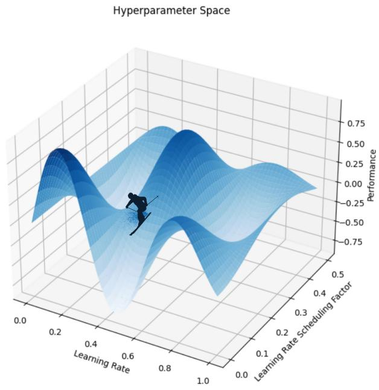  
Figure 5.14 An imaginative illustration of gradient descent and learning rate scheduling in the context of a skiing adventure. The skier’s path represents the optimization process, with the learning rate akin to the skier’s controlled speed, adjusting to the gradient terrain to seek the lowest possible point. While the exact global minimum might not be reachable, the objective is to find a ’good’ local minimum, which yields a performance close to the optimal one.

Just like the vast and varied terrain of the Swiss Alps, each point on this plot represents a distinct combination of hyperparameters for a transformer model. The goal is to nd the optimal point, yielding the lowest error.

Relating to our imaginative illustration, think of gradient descent as a heli-skiing adventure. You’re dropped o at a random peak in the Swiss Alps, and your objective is to ski down the mountain to the lowest point in the valley, representing the optimal combination of hyperparameters with the lowest loss. You don’t have a map, but you can use the slope of the terrain to guide your descent.

Now, imagine learning rate scheduling as your skiing speed control technique. While skiing down the mountain, you need to maintain an optimal speed to ensure you have enough momentum to overcome at areas or small valleys (local minima) but not so fast that you lose control and miss the global minimum. Adjusting your skiing speed corresponds to changing the learning rate during the optimization process, allowing the model to make larger or smaller updates to the gradients and therefore the learned weights depending on the situation. By controlling your speed, you can prevent getting stuck in suboptimal areas or having to take o your skis and walk. This technique helps you eciently nd the best slope leading to the global minimum, improving the optimization process.

With this understanding of learning rate scheduling, let’s return to our ne-tuning results. To maintain brevity, I do not present the steps for creating the dataset, initializing the model, and ne-tuning, as they follow a similar process as the previous datasets. However, I encourage you to explore these steps in the corresponding notebook within the book repository. The comparison of our models before we introduced the weights into the training process as well as after ne-tuning the RoBERTa base and large variants with weighting on the Yelp classication task can be seen in the gure 5.15.

Figure 5.15 This figure compares the performance of all evaluated models before fine-tuning, our larger model, and the model with and without class weights applied during the fine-tuning process. Notably, RoBERTa large outperforms the other fine-tuned models, suggesting its superior ability to handle the dataset’s complexity compared to RoBERTa base.   

<table><tr><td>Model</td><td>Accuracy</td><td>F1 Score</td><td>1-Star F1</td><td>2-Star F1</td><td>3-Star F1</td><td>4-Star F1</td><td>5-Star F1</td></tr><tr><td>BERT</td><td>0.270</td><td>0.151779</td><td>0.424779</td><td>0.060606</td><td>0.000000</td><td>0.148148</td><td>0.000000</td></tr><tr><td>RoBERTa</td><td>0.240</td><td>0.092903</td><td>0.387097</td><td>0.000000</td><td>0.000000</td><td>0.000000</td><td>0.000000</td></tr><tr><td>DistilBERT</td><td>0.140</td><td>0.050724</td><td>0.000000</td><td>0.068966</td><td>0.000000</td><td>0.000000</td><td>0.234234</td></tr><tr><td>DeBERTa</td><td>0.140</td><td>0.034386</td><td>0.000000</td><td>0.000000</td><td>0.000000</td><td>0.000000</td><td>0.245614</td></tr><tr><td>ALBERT</td><td>0.230</td><td>0.101684</td><td>0.000000</td><td>0.000000</td><td>0.105263</td><td>0.382609</td><td>0.000000</td></tr><tr><td>ELECTRA</td><td>0.210</td><td>0.091636</td><td>0.381818</td><td>0.000000</td><td>0.000000</td><td>0.000000</td><td>0.000000</td></tr><tr><td>Fine-tuned RoBERTa no weights</td><td>0.570</td><td>0.574591</td><td>0.583333</td><td>0.518519</td><td>0.586066</td><td>0.478149</td><td>0.691293</td></tr><tr><td>Fine-tuned RoBERTa large</td><td>0.662</td><td>0.664448</td><td>0.781491</td><td>0.621359</td><td>0.606516</td><td>0.544974</td><td>0.748815</td></tr><tr><td>Fine-tuned RoBERTa base</td><td>0.605</td><td>0.610282</td><td>0.713881</td><td>0.583691</td><td>0.550000</td><td>0.474667</td><td>0.709360</td></tr><tr><td>Naive Bayes</td><td>0.485</td><td>0.484025</td><td>0.666667</td><td>0.457983</td><td>0.392947</td><td>0.431472</td><td>0.460526</td></tr></table>

To illustrate the step-by-step process of iterating over a problem and evaluating model improvements, we will examine the confusion matrices, as shown in 5.16, before and after incorporating weights into the model’s ne-tuning process, as well as after opting for a larger model for the task.

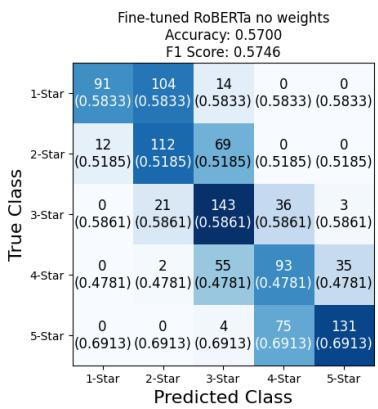

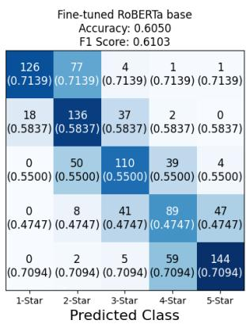

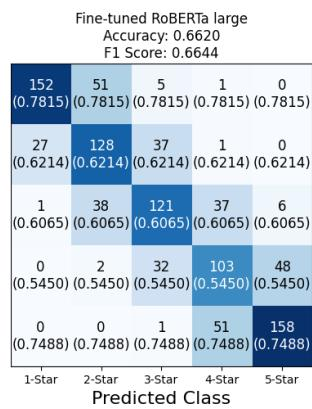  
Figure 5.16 (Left) As we can see in the confusion matrix, the unweighted RoBERTa model struggles particularly with the 2-Star and 4-Star classes, misclassifying many instances as 3-Stars and 5-Stars, respectively. The diagonal entries in a confusion matrix represent true positives (correct predictions), while off-diagonal entries represent misclassifications. In this case, for the 2-Star class, we have 112 true positives, and for the 4-Star class, we have 93 true positives. (Center) With the addition of class weights, the model shows improved performance, particularly for the 2-Star class. (Right) The larger RoBERTa model shows further improvement, yielding better F1-scores for all classes, indicating its superior suitability for this complex task.

# Dive Deeper: Fine-Tuning RoBERTa on the Yelp Dataset

To delve deeper into the fine-tuning processes of the different RoBERTa variants highlighted in this section, I invite you to explore the corresponding Jupyter Notebooks in the CH05 folder of the book’s repository. Each notebook is uniquely named for ease of identification:

ch05_text_classification_yelp_roberta_base_no_weights.ipynb   
ch05_text_classification_yelp_base.ipynb   
ch05_text_classification_yelp_roberta_large.ipynb

I encourage you to experiment with these notebooks — adjust the class weights or the number of epochs for training the model, for instance, and observe how these changes influence the performance of the classification. Engaging in this hands-on way will offer you a deeper understanding of how seemingly minor adjustments can significantly impact the classification performance on different classes, especially when dealing with complex classification problems.

After examining these confusion matrices closely, we can eectively assess the impact of using dierent approaches and opting for larger models for complex tasks. The insights gained from comparing the matrices highlight the importance of exploring various strategies, such as incorporating weights and utilizing more substantial models, to tackle dicult problems and achieve better performance. However, it’s worth noting that further improvements can be achieved by optimizing hyperparameters, increasing the number of training epochs, and adding more training data. It’s essential to monitor the performance of each experiment carefully to make informed decisions and achieve the best possible results.

# 5.5 Summary

Text classication plays a prominent role in various real-world applications, including sentiment analysis, topic modeling, emotion recognition, and market research. Due to its extensive range of use cases and practical signicance, it is benecial for anyone working with textual data to be versatile in text classication techniques.

□ The GLUE Benchmark is a collection of nine text NLP tasks that focus on sentencelevel or sentence-pair analysis.

【 Having a benchmark like the GLUE Benchmark is valuable as it provides a starting point for choosing an appropriate model for various text classication tasks. The GLUE Benchmark consists of diverse datasets, testing a range of linguistic skills, and allows for thorough evaluation of model performance. Additionally, there is an extended version called SuperGLUE, which builds upon GLUE by introducing more challenging tasks and evaluation metrics, pushing the boundaries of natural language understanding models.

In various text classication benchmarks, state-of-the-art models such as BERT, RoBERTa, ALBERT, DistilBERT, DeBERTa, and ELECTRA have demonstrated exceptional performance. These models have unique features and improvements that make them highly eective for text classication tasks. These models, benchmarked on the GLUE dataset provide valuable insights into their eectiveness and capabilities for text classication tasks, making them popular choices in the industry and giving you a starting point to evaluate them for your own projects.

– BERT: A transformer-based model pre-trained on bidirectional language modeling tasks, achieving state-of-the-art results on numerous NLP tasks, including text classication. BERT has a GLUE score of 80.5.   
– RoBERTa: Builds upon BERT with pretraining optimizations and a larger dataset, resulting in improved results on various NLP benchmarks. RoBERTa has a GLUE score of 88.5.   
– ALBERT: A more ecient and lighter version of BERT using parameter-sharing techniques across layers, achieving comparable results to BERT with signicantly fewer parameters. ALBERT has a GLUE score of 86.4.

– DistilBERT: A smaller, faster, and more ecient version of BERT, retaining $9 5 \%$ of BERT’s performance with a $4 0 \%$ reduction in model size. DistilBERT has a GLUE score of 82.2.   
– DeBERTa: A BERT-based model with a disentangled attention mechanism, enhancing representation power and achieving state-of-the-art results on various NLP tasks. DeBERTa has a GLUE score of 89.9.   
– ELECTRA: A transformer-based model pre-trained using a novel token replacement task, allowing for ecient learning and achieving state-of-the-art results with smaller model sizes. ELECTRA has a GLUE score of 87.6.

Transformer models excel in handling long-range dependencies but still face challenges, such as imbalanced datasets and complex classication problems. Addressing imbalanced data can involve techniques like undersampling, oversampling, class weighting, or transfer learning. For complex classication problems, larger model architectures or scaling existing models can help improve performance.   
In evaluating classication tasks, essential metrics include the confusion matrix, accuracy, and F1-score. The confusion matrix visualizes correct and incorrect predictions for each class, while accuracy measures the proportion of correct predictions, and the F1-score balances precision and recall for a more comprehensive performance assessment.   
When ne-tuning a model for a specic downstream classication task, it’s crucial to initially evaluate its zero-shot prediction capabilities, assess the model’s architecture, and validate its performance using common benchmarks such as GLUE. Enhancing the model’s performance, particularly for complex tasks, can be achieved by incorporating weighting or a learning rate scheduler during the ne-tuning process. Additionally, it’s essential to carefully weigh the advantages and disadvantages of employing a larger model for more intricate tasks.

# Bibliography

[1] Kevin Clark, Minh-Thang Luong, Quoc V. Le, and Christopher D. Manning. ELECTRA: pre-training text encoders as discriminators rather than generators. CoRR, abs/2003.10555, 2020. URL: https://arxiv.org/abs/2003.10555, arXiv: 2003.10555. 120   
[2] Jacob Devlin, Ming-Wei Chang, Kenton Lee, and Kristina Toutanova. BERT: pretraining of deep bidirectional transformers for language understanding. CoRR, abs/1810.04805, 2018. URL: http://arxiv.org/abs/1810.04805, arXiv:1810. 04805. 119   
[3] Pengcheng He, Xiaodong Liu, Jianfeng Gao, and Weizhu Chen. Deberta: Decodingenhanced BERT with disentangled attention. CoRR, abs/2006.03654, 2020. URL: https://arxiv.org/abs/2006.03654, arXiv:2006.03654. 120   
[4] Zhenzhong Lan, Mingda Chen, Sebastian Goodman, Kevin Gimpel, Piyush Sharma, and Radu Soricut. ALBERT: A lite BERT for self-supervised learning of language representations. CoRR, abs/1909.11942, 2019. URL: http://arxiv.org/abs/1909. 11942, arXiv:1909.11942. 119   
[5] Yinhan Liu, Myle Ott, Naman Goyal, Jingfei Du, Mandar Joshi, Danqi Chen, Omer Levy, Mike Lewis, Luke Zettlemoyer, and Veselin Stoyanov. Roberta: A robustly optimized BERT pretraining approach. CoRR, abs/1907.11692, 2019. URL: http: //arxiv.org/abs/1907.11692, arXiv:1907.11692. 119   
[6] Pekka Malo, Ankur Sinha, Pyry Takala, Pekka J. Korhonen, and Jyrki Wallenius. Good debt or bad debt: Detecting semantic orientations in economic texts. CoRR, abs/1307.5336, 2013. URL: http://arxiv.org/abs/1307.5336, arXiv:1307.5336. 132   
[7] Victor Sanh, Lysandre Debut, Julien Chaumond, and Thomas Wolf. Distilbert, a distilled version of BERT: smaller, faster, cheaper and lighter. CoRR, abs/1910.01108, 2019. URL: http://arxiv.org/abs/1910.01108, arXiv:1910.01108. 120   
[8] Alex Wang, Amanpreet Singh, Julian Michael, Felix Hill, Omer Levy, and Samuel Bowman. GLUE: A multi-task benchmark and analysis platform for natural language understanding. In Proceedings of the 2018 EMNLP Workshop BlackboxNLP: Analyzing and Interpreting Neural Networks for NLP, pages 353–355, Brussels, Belgium, November 2018. Association for Computational Linguistics. URL: https: //aclanthology.org/W18-5446, doi:10.18653/v1/W18-5446. 118   
[9] Xiang Zhang, Junbo Zhao, and Yann LeCun. Character-level convolutional networks for text classication. In Advances in Neural Information Processing Systems, pages 649–657, 2015. 139   
[10] Yukun Zhu, Ryan Kiros, Richard S. Zemel, Ruslan Salakhutdinov, Raquel Urtasun, Antonio Torralba, and Sanja Fidler. Aligning books and movies: Towards story-like visual explanations by watching movies and reading books. CoRR, abs/1506.06724,

# Advanced models and methods

L arge Language Models excel at processing and understanding natural language, enabling them to produce remarkable text outputs. This includes generating creative prompts for poems, crafting factual prompts with clarity, and eectively summarizing given texts in an organized and logical way.

In Part 2, we took a deep dive into fundamental NLP tasks covering text summarization, neural machine translation, and text classication. We discussed the challenges faced when applying LLMs to our use cases and touched slightly on how to optimize these models for specic tasks.

In this third part of the book, we will expand upon this knowledge. We will explore how LLMs are able to produce stunning text generation outputs, what inuences their creativity, and how you can control the generated text outputs, including methods to create your own sophisticated chat model.

Moreover, we will delve into prompt engineering, or so-called in-context learning. This involves controlling your LLM’s output without retraining it, or in simpler terms, without making fundamental changes to their underlying algorithms. We will not only explore how to apply prompt engineering eectively but also address how to prevent attacks via prompting. Such attacks can exploit an LLM to reveal private data, posing signicant security risks.

Further, we will take a deep dive into optimizing your model for a given downstream task. As a nal chapter of this part, we will look into the caveats of using large language models and discuss how to make them more ethical and responsible in their use. Preparing these architectures for the upcoming regulatory rules is crucial, as we will need to adhere to these rules to ensure the responsible and ethical use of LLMs.

# This chapter covers

Introduction to text generation   
Outline of text generation models   
Techniques for text generation   
Challenges in text generation

Welcome to the rst chapter of the third part of this book. We’re about to embark on a journey through some of the most exciting and widely discussed topics in the eld of NLP today - text generation. This journey will unfold over the next three chapters. In the previous part, we explored fundamental NLP tasks, including text summarization, neural machine translation, and text classication. These discussions were grounded in the foundational concepts introduced in the rst part of the book, where we dived deep into the original transformer architecture from the paper "Attention Is All You Need." Armed with this knowledge, we’re well-prepared to dive into the newer models and cutting-edge techniques used in the mind-blowing eld of text generation.

# 6.1 Introduction to text generation

The history of text generation stretches back as far as the 1960s, with rudimentary rulebased chatbots paving the way. Joseph Weizenbaum introduced the rst chatbot, ELIZA, marking the dawn of computer-based natural language conversation. This pioneering sys-

tem oered many their rst taste of interactive computing, providing a user experience that, even by today’s standards, approximates what one might expect from a real conversation with a computer.

However, it’s important to note that ELIZA, while innovative for its time, wouldn’t pass the Turing Test. The Turing Test, proposed by Alan Turing, evaluates a machine’s ability to exhibit intelligent behavior equivalent to, or indistinguishable from, that of a human. Despite its limitations, ELIZA serves as an important milestone in our journey of text generation. For a nostalgic glimpse into the past and a measure of how far technology has come, I recommend taking ELIZA for a spin at https://www.masswerk.at/eliza/. This early chatbot still retains its charm and serves as a humble reminder of the origins of our current text generation journey. Let us look at some common techniques and how text generation has evolved.

# 6.1.1 From rule-based chatbots to Turing Test passing bots

From the early days of rule-based chatbots, such as ELIZA, to the deep learning models of today, i.e. ChatGPT, the development of text generation technology has seen a gradual shift from NLP towards natural language understanding (NLU). Researchers and engineers started exploring the potentials of machine learning to create more sophisticated and responsive systems. Chatbots like Jabberwacky and Cleverbot were among the rst to embrace these new techniques, learning and evolving their responses from human interactions. IBM Watson marked a signicant milestone in this development, showcasing the power of natural language processing and machine learning to a wider audience by winning Jeopardy!

However, with the rise of LLMs, we began to see a new class of language generation models. OpenAI’s GPT-4 and Meta’s LLaMA 2 are among these, utilizing transformerbased architectures to create remarkably human-like text. These models represent the current state-of-the-art (SOTA) in text generation, but as technology continues to advance, we can expect to see even more powerful and versatile language models in the future. Here is a short explanation of each type:

Rule-based chatbots: These are the earliest types of chatbots, which operate based on pre-determined rules on which they were initially programmed. They can only respond to specic commands and lack the ability to understand and learn from user inputs. ELIZA is and example of a rule-based chatbot.   
【 Corpus-based chatbots: These chatbots are a signicant step forward as they are capable of learning from past interactions. They use a so called "corpus", a large dataset of dialogue examples, to generate their responses. The versatility of a chatbot increases with the size and diversity of its corpus. Examples of such chatbots include Cleverbot and Jabberwacky.   
Machine learning-based chatbots: These chatbots utilize machine learning algorithms to learn from user inputs and improve their responses over time. They can adapt to the user’s language and provide more personalized responses. IBM’s Watson is a prime example of a machine learning-based chatbot.

Transformer-based models: The current state-of-the-art in text generation is exemplied by models such as GPT-4, Falcon and LLaMA. Unlike prior approaches such as RNNs and LSTMs, transformers can handle much longer sequences, which enables them to process and generate larger pieces of text. What distinguishes them from the previous chatbots, is, these transformer-based models can generate context-aware embeddings, empowering them to understand the context, extract nuanced meanings, and generate coherent, relevant responses.

As you can see, the evolution of text generation isn’t merely a story of technological advancement; it also marks a signicant shift in the eld’s underlying goals. The initial focus was on NLP, with systems designed to understand and manipulate human language to perform tasks like translation, summarization, and sentiment analysis. However, the eld has since transitioned towards NLU, involving the more complex tasks of grasping context, interpreting sentiment, and extracting nuanced meanings. These advancements have led to the emergence of what can be called "next-generation" models, which we will focus on in this chapter. Now, with a better understanding of how we got here, let’s dive deeper into these sophisticated models.

# 6.2 Transformers in text generation: An overview

At the time of writing this book, the eld of LLMs, particularly models capable of text generation, is one of the most rapidly evolving areas in articial intelligence. New models are being developed and released with such frequency that keeping pace with all the advancements presents a challenge.

This section provides a snapshot of this dynamic landscape by shedding light on some recent developments and revisiting a few milestone models that have shaped the discourse in this area. However, it’s important to note that this is by no means an exhaustive overview. But this sections aims to reect the rapid pace of the innovations as a testament to the exciting and ever-evolving nature of this eld.

In the following sections, I will provide an overview of a selection of these inuential text generation models, diving into their unique features and capabilities in more detail. Please note that I will only cover GPT models up to and including GPT-3 in this chapter. The GPT-4 architecture will be discussed in chapter 8, as GPT-4, also known as Chat-GPT, introduces multimodal capabilities that were not present in the earlier models. Additionally, while BERT also plays a signicant role in text generation, I have already covered it in detail in section 5.2.1, and I won’t repeat that discussion here.

To ensure you get the most out of this section, I’ll initially present a concise snapshot of several signicant text generation models, providing key information about each one. After this overview, we’ll delve deeper into the specics of each model, oering an easy-to-digest distillation of their primary research papers. This two-tiered approach serves as a guide, helping you navigate the world of these fascinating models.

GPT-1 (Generative Pretrained Transformer 1) (8) is an early model that leveraged a transformer-based architecture for language generation tasks in a novel way. Unlike traditional transformer models that included both encoder and decoder com-

ponents, GPT-1 featured a decoder-only structure. This model employed masked self-attention heads to focus solely on preceding words in the text during the prediction process. The model comprises 117 million parameters

□ GPT-2 (Generative Pretrained Transformer 2) (9) was a substantial expansion of its predecessor, oering signicantly improved performance. It introduced the concept of "zero-shot" learning, wherein the model generates appropriate responses without any prior task-specic training. GPT-2 comprises 1.5 billion parameters, allowing it to generate remarkably coherent and contextually relevant outputs.   
GPT-3 (Generative Pretrained Transformer 3) (2) is among the larger language models, with 175 billion parameters. It further enhanced the capabilities of GPT-2, producing even more accurate and contextually appropriate text. GPT-3 can generate creative content, answer questions, translate languages, and perform a number of other NLP tasks.   
InstructGPT (6) is a variant of the GPT architecture that has been ne-tuned for instruction following. Unlike the base GPT models, which are typically trained on a diverse range of internet text, InstructGPT was trained with a dataset that includes demonstrations of correct behavior, making it particularly adept at generating human like responses to instructions in the text. InstructGPT was developed in three dierent sizes: 1.3B, 6B, and 175B parameters. It has demonstrated improvements in truthfulness and reductions in toxic output generation.   
GPT-NeoX-20B (1) model architecture closely mirrors that of GPT-3, but incorpo rates several critical improvements, including rotary positional embeddings, parallel attention and feed-forward layers, and exclusive use of dense layers. Trained on the Pile dataset, it oers robust general-purpose language modeling capabilities. All training code, model architecture, and weights are open-sourced for both research and commercial use. The model has 20B parameters.   
Llama (Open and Ecient Foundation Language Models) (10) is a collection of transformer-based language models ranging from 7 billion to 65 billion parameters. Unlike some other large-scale models, Llama is trained exclusively on publicly avail able data, demonstrating state-of-the-art performance on numerous benchmarks. For instance, Llama-13B outperforms GPT-3 (175 billion parameters) on many tasks.   
RedPajama is a collaborative project launched by Together, Ontocord.ai, ETH DS3Lab, Stanford CRFM, and Hazy Research, RedPajama aims to create leading, fully opensource language models. A crucial milestone achieved by this collaboration is the reproduction of the Llama training dataset, a comprehensive data repository of over 1.2 trillion tokens. RedPajama is primarily designed to bridge the quality gap between closed commercial models and fully open-source models. The model is available with 3 billion and 7 billion parameters. RedPajama also provides an instruct/chat model variant designed for chat applications

Alpaca (A Strong, Replicable Instruction-Following Model) was developed by Standford University, with the intent to address challenges in instruction-following models such as GPT-3.5 (text-davinci-003) and ChatGPT Alpaca is a ne-tuned model based on Meta’s Llama 7B. The model is trained on 52K instruction-following demonstrations and is specically designed to mimic the behaviors exhibited by OpenAI’s GPT-3.5.   
Dolly was launched by Databricks. Dolly was one of the initial truly open-source instruction ne-tuned large language models. The latest version, Dolly 2.0, is a comprehensive model with 12 billion parameters, grounded in the Pythia model family from EleutherAI. It is comparative to other LLMs of their size, such as BLOOM and Llama models. The entire Dolly 2.0 model, including the training code, dataset, and weights, is open-sourced, supporting both research and commercial use.   
Falcon, developed by The Technology Innovation Institute of Abu Dhabi (TII), is a decoder-only transformer model. It is trained on an enriched corpus of 1,000B tokens from RenedWeb, supplemented with curated corpora. The model is available in two sizes with 6.7 billion and 40 billion parameters, respectively. In addition to its standard model, Falcon also provides an instruct model variant designed for chat applications.

Let us now look into these models in more detail.

# 6.2.1 GPT-1 to GPT-3

The development of the Generative Pretrained Transformer (GPT) series has marked signicant advancements in language models. GPT-1 was the rst model in the GPT series with its unique generative pretraining technique on a diverse corpus of unlabeled text and subsequent discriminative ne-tuning. It employed a transformer-based architecture with 12 transformer layers and 117 million parameters, introducing a unidirectional approach to language modeling which means that it sequentially predicts the next word from left to right.

The pretraining was conducted on the BooksCorpus dataset, enabling the model to optimize for predicting the next word in a sequence. The mathematical objective during this pretraining is to maximize the following likelihood:

$$
L _ {1} (\mathcal {U}) = \sum_ {i} \log P (u _ {i} \mid u _ {i - k}, \dots , u _ {i - 1}; \Theta) \tag {6.1}
$$

where $k$ denotes the context window size, which refers to the range of words around a target word that a model considers, and $\Theta$ represents the model parameters. This objective requires the model to estimate the probability of a word given its preceding context.

In terms of architecture, GPT-1 uses a multi-layer transformer decoder, as depicted in gure 6.1, applying self-attention and feedforward networks to process the input tokens and predict the next ones.

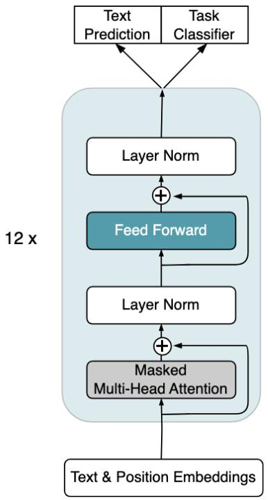  
Figure 6.1 Illustration of the multi-layer Transformer decoder of GPT-1 with 12 layers, which is a variant of the original Transformer architecture form the paper ”Attention is all you need”.

The mathematical representation of the model’s operations is as follows:

$$
h _ {0} = U W _ {e} + W _ {p}
$$

$$
h _ {l} = \text {t r a n s f o r m e r \_ b l o c k} \left(h _ {l - 1}\right) \forall l \in [ 1, L ] \tag {6.2}
$$

$$
P (u) = \operatorname {s o f t m a x} \left(h _ {L} W _ {e} ^ {T}\right)
$$

where $U$ is the context vector of tokens, ${ \cal { W } } _ { e }$ represents token embeddings, $W _ { \phi }$ is for position embeddings, and $L$ is the number of layers. The transformer block produces a series of hidden states $h _ { l }$ , leading to a probability distribution over the next tokens $P ( u )$ .

The ne-tuning phase introduces an additional objective:

$$
P \left(y \mid x ^ {1}, \dots , x ^ {m}\right) = \operatorname {s o f t m a x} \left(h _ {L} ^ {m} W _ {y}\right) \tag {6.3}
$$

where ${ h } _ { \cal L } ^ { m }$ is the last layer’s hidden state, and $\boldsymbol { H } _ { y }$ is the output layer’s weight matrix. This phase adjusts the model parameters to maximize the log-probability of the correct label given the input sequence.

The auxiliary language modeling objective during ne-tuning is also considered:

$$
L _ {3} (C) = L _ {2} (C) + \lambda * L _ {1} (C) \tag {6.4}
$$

which combines the primary objective with the language modeling objective, balanced by a weighting factor $\lambda$ .

Through these methods, GPT-1 established a strong foundation for subsequent models in the GPT series, enabling its successful application to various language tasks.

Despite its unidirectional nature, GPT-1’s framework laid the groundwork for subsequent models, achieving eectiveness in various tasks such as text classication and translation.

Building on this foundation, GPT-2 was introduced, scaling the model to 1.5 billion parameters across 48 Transformer layers. Trained on the more diverse WebText dataset, GPT-2 showed enhanced capabilities, particularly in zero-shot settings where the model performs tasks without task-specic training. The transition from GPT-1 to GPT-2 showcased a leap in language model development, improving versatility and expanding application potential.

Following this data-centric approach, GPT-3 introduces improvements in the model architecture. While the underlying architecture remains similar to GPT-2, GPT-3 uses alternating dense and locally banded sparse attention patterns within the transformer layers. This approach allows the model to handle larger context windows eectively. Context window refers to the range of words a model can process. The parameters are now scaled to 175 billion across 96 transformer layers, using an enriched mixture of datasets, including a ltered version of the Common Crawl and an expanded WebText, along with other curated data. The dataset and the weight in the training mix is shown in table 6.1.

Table 6.1 Datasets utilized in the training of GPT-3.   

<table><tr><td>Dataset</td><td>Quantity (tokens)</td><td>Weight in training mix</td><td>Epochs per 300B tokens</td></tr><tr><td>Common crawl (filtered)</td><td>410 billion</td><td>60%</td><td>0.44</td></tr><tr><td>WebText2</td><td>19 billion</td><td>22%</td><td>2.9</td></tr><tr><td>Books1</td><td>12 billion</td><td>8%</td><td>1.9</td></tr><tr><td>Books2</td><td>55 billion</td><td>8%</td><td>0.43</td></tr><tr><td>Wikipedia</td><td>3 billion</td><td>3%</td><td>3.4</td></tr></table>

In the table, "Weight in training mix" refers to the fraction of examples during training that are drawn from a given dataset, which was intentionally not proportional to the size of the dataset. As a result, when the model is trained for 300 billion tokens, some datasets are seen up to 3.4 times during training while other datasets are seen less than once.

Similar to its predecessors, GPT-3 operates on a left-to-right training objective. However, due to its increased model size and improved attention mechanism, GPT-3 can generate and comprehend text with more sophistication. Moreover, its zero-shot learning capabilities enable it to understand and perform various NLP tasks without any specic task training or further gradient updates to its weights, utilizing only the context provided in the prompt.

# 6.2.2 InstructGPT

InstructGPT, an oshoot of the GPT-3 model released in March 2022, is designed to follow instructions in a text prompt and provide detailed responses. Like GPT-3, InstructGPT employs the same transformer architecture but dierentiates itself through a unique training

process involving three crucial steps: supervised ne-tuning (SFT), reward model (RM) training, and reinforcement learning via proximal policy optimization (PPO). PPO, a policy optimization method used in reinforcement learning, allows an agent to learn a policy that maximizes reward with ecient and stable learning dynamics. A more detailed discussion on PPO is provided in section 7.1.1.

During the supervised ne-tuning stage, a GPT-3 model that has already been pretrained is ne-tuned with examples that demonstrate exactly how it is expected to behave. This process is known as supervised ne-tuning or SFT. Afterward, a set of prompt responses is generated by the model and compared. These comparisons are used to train another model, called a reward model, which learns to identify which responses are preferred by humans.

Once this reward model is set up, it assigns scores to the generated responses, similar to points in a game. The better a response aligns with the human-classied preferred responses, the higher the score it receives. These scores are then used to further rene the original GPT-3 model using PPO. This iterative process repeats, leading to continuous improvements, which enhance the models ability to understand and respond to prompts in a way that aligns more closely with human expectations.

Despite this new training method, the model still may sometimes generate incorrect or nonsensical answers, signaling the ongoing challenges in developing reliable and accurate AI models. However, it’s worth noting that InstructGPT has shown improvements in truthfulness and reduced toxicity over GPT-3, producing truthful and informative answers about twice as often and generating about $2 5 \%$ fewer toxic outputs when instructed to be respectful.

Moreover, InstructGPT incorporates a specialized technique to safeguard the model’s original strengths while it undergoes ne-tuning for specic tasks. This technique is particularly designed to avoid "performance regression", which can occur when a model, after being ne-tuned, starts to perform worse on the general tasks it was initially trained on. By blending PPO-based weight updates with updates that reinforce the weights of the model’s initial pretraining, this approach carefully adjusts the model without overriding its foundational abilities. This ensures that the ne-tuning process retains the model’s core competencies on standard tasks while it learns to respond to the nuances of new instructions.

Additionally, InstructGPT introduces a methodology for minimizing performance regressions on public NLP datasets observed during the ne-tuning process. This method mixes PPO updates with updates that increase the log likelihood of the pretraining distribution, which signicantly reduces performance regressions without compromising labeler preference scores. Performance regression" is a term used in the context of machine learning to refer to a situation where a model’s performance decreases or degrades.

InstructGPT’s training involved gathering data from a team of carefully selected contractors. This expanded the diversity of inputs, which is critical for the model to eectively navigate prompts that are controversial or sensitive. The contractors were selected after a thorough screening process, designed to identify individuals skilled in detecting and addressing sensitive content. Yet, incorporating human data introduces the risk of subjective

bias, as the data is inuenced by the perspectives and interpretations of those involved in the process. Moreover, handling such data also introduces the need for stringent privacy measures. Therefore, while human contributions signicantly enhance the model’s ability to handle a wide range of prompts by providing nuanced feedback, these contributions must be managed with caution to mitigate bias and ensure privacy.

# 6.2.3 GPT-NeoX-20B

The GPT-NeoX-20B model is engineered not just to scale up the capabilities of language models, but also to enhance the precision and depth of their responses. It exhibits exceptional prociency in few-shot reasoning, delivering a notable improvement in ve-shot performance when compared to a similarly scaled GPT-3 model.

The GPT-NeoX-20B model, like its predecessor, employs the transformer architecture, which leverages self-attention mechanisms for more ecient computation. It is an autoregressive transformer decoder model whose architecture largely follows that of GPT-3. However, the novelty lies in the model’s increased parameters and the way it scales to larger datasets and computational resources. This model comes with 20 billion parameters.

The backbone of the GPT-NeoX-20B architecture is the "Megatron" technology. Megatron, a technique for training massive transformer models, emphasizes parallelization, allowing for ecient scaling of training across multiple GPUs. This makes the training of such an enormous model feasible and ecient.

One of the unique aspects of GPT-NeoX-20B is the use of model parallelism and pipeline model parallelism. Model parallelism is a method of parallelization that distributes the model’s layers across multiple devices, allowing for ecient computation even with larger models. Similarly, pipeline model parallelism is a technique that further improves training eciency by overlapping the computation of dierent mini-batches on dierent GPUs.

An important aspect of training GPT-NeoX-20B is the use of Zero Redundancy Optimizer (ZeRO) to reduce memory footprint and increase the number of trainable parameters per GPU. ZeRO allows each GPU to hold unique parameters and optimizer states, thus enabling a larger number of parameters to be trained without exhausting memory resources.

In terms of data, GPT-NeoX-20B was trained on a combination of Common Crawl, Wikipedia, and other large publicly available text corpora. This diverse dataset enabled the model to acquire a broad understanding of human language and knowledge, encompassing a wide variety of topics, styles, and perspectives.

For tokenization, GPT-NeoX-20B employs a Byte Pair Encoding (BPE) based tokenizer, much like the one used in GPT-2, maintaining an identical total vocabulary size of 50,257.

However, this model introduces three signicant modications to the tokenization process. Firstly, the team trained a new BPE tokenizer on the Pile dataset, utilizing its wide array of text sources to develop a more versatile and general-purpose tokenizer. This approach enhances the model’s ability to handle a vast range of linguistic styles and topics.

Secondly, unlike the GPT-2 tokenizer, which treats tokenization at the start of a string as a non-space-delimited token, the GPT-NeoX-20B tokenizer enforces consistent space delimitation. A comparison of both model tokenizations is illutrated in gure 6.2.

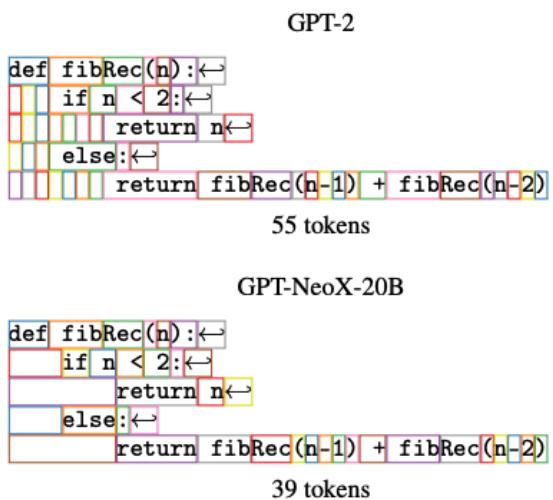  
Figure 6.2 Comparison of tokenization between GPT-2 and GPT-NeoX-20B. The GPT-NeoX-20B tokenizer exhibits enhanced management of whitespace, proving especially beneficial for types of text like source code. Image is taken from the paper: ”GPT-NeoX-20B: An Open-Source Autoregressive Language Model”

This modication eliminates inconsistencies regarding the presence of prex spaces in the tokenization input, thus providing a more standardized tokenization procedure.

Thirdly, the GPT-NeoX-20B tokenizer incorporates tokens for repeated space tokens for all positive integers up to and including 24. This feature enables the tokenizer to manage text with substantial amounts of whitespace using fewer tokens, proving benecial in situations where whitespace is crucial for interpretation, such as in program source codes or LaTeX source les.

The enhancements in tokenization in GPT-NeoX-20B reect a continued commitment to improving the versatility and eectiveness of language models, contributing to their capacity to understand and generate human-like text.

# 6.2.4 Llama

Llama (Open and Ecient Foundation Language Models) and Llama 2 is a collection of transformer-based, pretrained and ne-tuned language models ranging from 7 billion to 70 billion parameters.

Llama, drawing inspiration from other large language models as well as the original transformer architecture, implements several novel modications to enhance its performance and training stability. Following the pre-normalization technique introduced in GPT-3, the Llama model normalizes the input rather than the output of each transformer sub-layer, applying the RMSNorm normalizing function.

The model replaces the ReLU non-linearity, used in the original transformer architecture, with the SwiGLU activation function. SwiGLU has been recognized for improving performance in the PaLM model and belongs to the family of gated linear unit (GLU) activation functions. Within Llama, SwiGLU is designed to work with a reduced dimen-

sionality of its weight matrices, specically using 2/3 of the input dimension, as opposed to the fourfold version used in PaLM. This modication optimizes the model’s eciency while retaining the performance benets of SwiGLU activation. To put it simply, the original transformer’s ReLU activation involved calculations with two sets of weights, Llama’s SwiGLU conguration involves three sets of weights, with the third acting as a gate to process the input data eectively.

In an adaptation from GPTNeo, Llama replaces absolute positional embeddings with rotary positional embeddings and applies these at each layer of the network.

For model optimization, Llama utilizes the AdamW optimizer, with a specic set of hyper-parameters: $\beta _ { 1 } = 0 . 9$ , $\beta _ { 2 } = 0 . 9 5$ . It applies a cosine learning rate schedule (refer to section 5.4.3 to understand what learning rate schedulers do), such that the nal learning rate equals $1 0 \%$ of the maximal learning rate, alongside a weight decay of 0.1 and gradient clipping of 1.0. The model employs 2,000 warm-up steps and modies the learning rate and batch size according to the model size, as shown in table 6.2.

Table 6.2 Model sizes, architectures, and optimization hyper-parameters.   

<table><tr><td>Model</td><td>Params</td><td>Dimension</td><td>n heads</td><td>n layers</td><td>Learning rate</td><td>Batch size</td><td>n tokens</td></tr><tr><td>Model</td><td>6.7B</td><td>4096</td><td>32</td><td>32</td><td>3.0e-4</td><td>4M</td><td>1.0T</td></tr><tr><td>Model</td><td>13.0B</td><td>5120</td><td>40</td><td>40</td><td>3.0e-4</td><td>4M</td><td>1.0T</td></tr><tr><td>Model</td><td>32.5B</td><td>6656</td><td>52</td><td>60</td><td>1.5e-4</td><td>4M</td><td>1.4T</td></tr><tr><td>Model</td><td>65.2B</td><td>8192</td><td>64</td><td>80</td><td>1.5e-4</td><td>4M</td><td>1.4T</td></tr></table>

Impressively, Llama 1-13B outperforms GPT-3 (175 billion parameters) on zero-shot tasks on the common sense reasoning tasks, as shown in table 6.3.

Table 6.3 Comparison of Performance between GPT-3 and Llama 1.   

<table><tr><td>Model</td><td>Params</td><td>BoolIQ</td><td>PIQA</td><td>SIQA</td><td>HellaSwag</td><td>WinoGrande</td><td>ARC-e</td><td>ARC-c</td><td>OBQA</td></tr><tr><td>GPT-3</td><td>175B</td><td>60.5</td><td>81.0</td><td>-</td><td>78.9</td><td>70.2</td><td>68.8</td><td>51.4</td><td>57.6</td></tr><tr><td>LLaMA</td><td>7B</td><td>76.5</td><td>79.8</td><td>48.9</td><td>76.1</td><td>70.1</td><td>72.8</td><td>47.6</td><td>57.2</td></tr><tr><td>LLaMA</td><td>13B</td><td>78.1</td><td>80.1</td><td>50.4</td><td>79.2</td><td>73.0</td><td>74.8</td><td>52.7</td><td>56.4</td></tr><tr><td>LLaMA</td><td>33B</td><td>83.1</td><td>82.3</td><td>50.4</td><td>82.8</td><td>76.0</td><td>80.0</td><td>57.8</td><td>58.6</td></tr><tr><td>LLaMA</td><td>65B</td><td>85.3</td><td>82.8</td><td>52.3</td><td>84.2</td><td>77.0</td><td>78.9</td><td>56.0</td><td>60.2</td></tr></table>

Common sense reasoning tasks refer to a category of tests that evaluate a model’s ability to use and understand implicit, everyday knowledge that humans generally consider "common sense." This might involve predicting or explaining ordinary events, answering questions that rely on an understanding of the world, or making logical deductions based on broad human experiences. These tasks present a challenge for AI models because they often

require intuitive understanding and reasoning that goes beyond the explicit information available in a given dataset.

Unlike some other large-scale models, Llama 1 is trained exclusively on publicly available data, shown in table 6.4, demonstrating state-of-the-art performance on numerous benchmarks.

Table 6.4 Pre-training data utilized in the training of LLaMA.   

<table><tr><td>Dataset</td><td>Sampling proportion1</td><td>Epochs</td></tr><tr><td>Common CWEl</td><td>67%</td><td>1.10</td></tr><tr><td>C4</td><td>15%</td><td>1.06</td></tr><tr><td>Github</td><td>4.5%</td><td>0.64</td></tr><tr><td>Wikipedia</td><td>4.5%</td><td>2.45</td></tr><tr><td>Books</td><td>4.5%</td><td>2.23</td></tr><tr><td>ArXiv</td><td>2.5%</td><td>1.06</td></tr><tr><td>StackExchange</td><td>2.0%</td><td>1.03</td></tr></table>

1 Each subset specifies the sampling proportion and the number of epochs performed on the subset during the training on 1.4T tokens. The pre-training conducted on 1T tokens follows the same sampling proportions.

As for LLaMA 2, which is an enhanced iteration of Llama 1, was developed using a new mix of publicly accessible data. Moreover, the volume of the training corpus was increased by $4 0 \%$ , the model’s context length was doubled, and the researchers incorporated grouped-query attention. Which is a blend of multi-head and multi-query attention, where each subgroup of query heads has a single key and value head, as shown in gure 6.3.

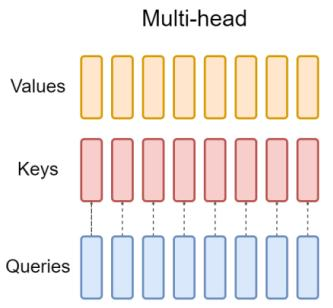

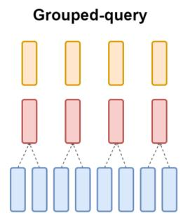

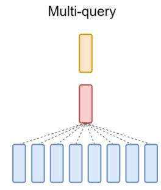  
Figure 6.3 An overview of the grouped-query approach: Multi-head attention consists of H sets of query, key, and value heads. In multi-query attention, all query heads share one key and one value head. On the other hand, grouped-query attention allocates a single key and value head to every cluster of query heads, creating a blend between multi-head and multi-query attentions. Image is taken from the paper: ”GQA: Training Generalized Multi-Query Transformer Models from Multi-Head Checkpoints”

Llama 2 comes with 7B, 13B, and 70B parameters. However, there exist also a 34B variant which wasn’t released. Additionally, Llama 2-Chat is a rened model of Llama 2,

specically tailored for dialogue applications. This model also has versions with 7B, 13B, and 70B parameters.

Overall, LLaMA is a signicant eort in progressing transformer-based language models, incorporating the best of previous models, while introducing further improvements. Also, with LLaMA 2, the researchers made combined eorts to enhance transparency and shed light into the underlying causes of potential biases in downstream tasks ensuring a more reliable and safe usage of LLMs by providing additional information about the pretraining data.

# 6.2.5 RedPajama

RedPajama represents a notable endeavor to design an array of premier, fully open-source models. It emerges as a response to the limitations imposed by today’s most advanced foundation models like GPT-4, which are typically bound by commercial APIs or only partially open. This project’s prime objective is to create a platform where research, customization, and interaction with sensitive data are not restricted, thus bridging the quality gap between open and closed models.

NLP is currently experiencing its "Linux moment", where open-source technologies are not only challenging the quality of commercial oerings but fostering an environment of creativity through global community participation. This momentum has extended to the eld of large language models with open source models like LLaMA, Alpaca, Vicuna, and Koala, as well as fully open models such as Pythia, OpenChatKit, Open Assistant, Dolly , and Falcon.

RedPajama is an initiative stemming from a collaboration between several leading research entities including Together, Ontocord.ai, ETH DS3Lab, Stanford CRFM, and Hazy Research. It embodies a three-pronged approach:

Creation of high-quality pre-training data with wide-ranging coverage.   
Development of base models that undergo extensive training on this data.   
Production of instruction tuning data and models, which rene the base model to enhance its usability and safety.

As of the writing of this book, RedPajama has successfully completed its rst phase, unveiling the pre-training data component. This involves the reproduction of the LLaMA training dataset, comprising over 1.2 trillion tokens. The LLaMA model, with its 7 billion parameters, served as the project’s initial inspiration due to its quality and ability to run on a broad spectrum of GPUs, making it valuable for the open community.

RedPajama seeks to replicate LLaMA in a completely open-source format, and with that tries to advance the open-source AI movement, ushering in a new era of innovation and exploration.

# 6.2.6 Alpaca

Alpaca is an instruction-following language model, ne-tuned from Meta’s LLaMA 7B model. Despite the extraordinary capabilities of instruction-following models they still exhibit notable deciencies such as the generation of incorrect information, propagation of

social stereotypes, and creation of harmful language. The Alpaca model aims to address these issues, providing a foundation for the academic community to further research and improve upon.

Developed by a dedicated team of researchers from the Center for Research on Foundation Models (CRFM) with support from the Stanford Institute for Human-Centered AI (HAI) and the Stanford Natural Language Processing (NLP) group.

Alpaca has been ne-tuned on 52,000 instruction-following demonstrations, emulating the self-instruct methodology utilizing text-davinci-003. The performance of the Alpaca model mirrors that of OpenAIs text-davinci-003, but it stands out due to its smaller size, making it easier and cheaper to reproduce.

In a bid to engage the academic community in understanding and further enhancing the behavior of the Alpaca model, the researchers have released their training methodologies and data. They also intend to release the model weights.

However, it is essential to note that the Alpaca model is intended strictly for academic research. Commercial use is prohibited due to the licensing restrictions on the LLaMA model and OpenAI’s text-davinci-003, which were instrumental in the development of Alpaca. The model also lacks comprehensive safety measures, making it unsuitable for general use.

The research team addressed two signicant challenges during the development of Alpaca: the need for a strong pre-trained language model and high-quality instructionfollowing data. The LLaMA models from Meta provided the solution for the rst challenge. For the latter, they devised a method to automatically generate instructional data using an existing potent language model. This approach resulted in Alpaca, a language model netuned using supervised learning from the LLaMA 7B model on 52K instruction-following demonstrations generated from OpenAIs text-davinci-003.

Alpaca’s performance, when compared to text-davinci-003, was found to be similar in a blind pairwise comparison. This surprising result, considering the smaller model size and the modest amount of instruction following data, has sparked optimism in the research community.

# 6.2.7 Dolly

Dolly is an instruction-following large language model. As one of the rst truly open-source instruction ne-tuned LLMs, Dolly has been instrumental in demonstrating the potential of open-source developments in LLMs.

Dolly 2.0 is a signicant enhancement over the original model. It is a 12B parameter language model based on the Pythia models, from EleutherAI and has been ne-tuned on a crowdsourced dataset built by Databricks employees. These employees generated over 15,000 high-quality human-generated prompt/response pairs, which served as a robust dataset for training Dolly 2.0.

It is the rst open-source, instruction-following LLM ne-tuned on a human-generated instruction dataset licensed for research and commercial use. The model, training code, and dataset of Dolly 2.0 are all open-source, meaning any organization can utilize and customize this model without having to pay for API access or share data with third parties.

The databricks-dolly-15k dataset generated for the instruction tuning of large language models, is the rst open-source, human-generated instruction dataset designed to enable LLMs to exhibit interactivity similar to ChatGPT.

The creation of the databricks-dolly-15k dataset arose out of a need for a commercially viable dataset for training LLMs. The initial version of Dolly was trained using a dataset created by the Stanford Alpaca team with the OpenAI API. However, the terms of service of this dataset restricted commercial use, prompting the creation of a new "untainted" dataset.

The Databricks team took inspiration from OpenAI’s research paper, which mentioned that the InstructGPT model was trained on a dataset of 13,000 instruction-following demonstrations. However, creating a similar dataset proved challenging due to the need for original content, free from copying from ChatGPT or any other web source. The team overcame this hurdle by incentivizing Databricks employees to contribute to the dataset, resulting in a unique, high-quality instruction-following dataset for Dolly 2.0.

The crowdsourcing process was structured around seven specic tasks, including open Q&A, closed Q&A, extraction of information from Wikipedia, and summarization of information from Wikipedia. These tasks ensured a diverse and comprehensive dataset to cover a wide range of behaviors that an LLM may encounter. This approach increases the model’s versatility and robustness, making it more applicable to both academic research and commercial use.

# 6.2.8 Falcon

The Falcon model family includes various fully open-sourced models: Falcon-40B and its smaller variant, Falcon-7B. The Falcon-40B model requires around 90GB of GPU memory to function, a substantial but less demanding requirement compared to the LLaMA-65B, a model which Falcon surpasses in performance. Falcon-7B, requiring only about 15GB of memory. And the currently largest open-access available model, Falcon-180B

Three instruction/chat-based versions, Falcon-7B-Instruct, Falcon-40B-Instruct and Falcon-180B-Chat, have also been developed by the TII. These models, ne-tuned with instructional and conversational data, are especially suited for assistant-style tasks. The exibility of these models allows for customization using a wide variety of communitydeveloped datasets. All models are fully open source, since TII has waived all restrictions for commercial usage, and available via the Hugging Face API.

The models are designed for the causal language modeling task, which involves predicting the subsequent token in a sequence. While the architecture is predominantly adapted from the GPT-3 model, there are a few distinct modications, such as:

Positional embeddings: The models make use of rotary positional embeddings, similar to LLaMA.   
Attention: The models utilize multiquery attention and FlashAttention.   
Decoder-block: A unique feature is the parallel attention/MLP (Multi-Layer Perceptron) with two-layer norms.

In the multiquery attention mechanism, each tensor parallel degree uses independent keys and values. Meaning, a shared key and value are used across all heads, in contrast to the typical multi-head attention scheme.

The models support a variety of languages. They oer robust capabilities in English, German, Spanish, and French, while also providing limited prociency in Italian, Portuguese, Polish, Dutch, Romanian, Czech, and Swedish. This means that it might not perform well with other languages. Moreover, since its training is based on vast web data, it may reect the common biases and stereotypes found online. Meaning, one would have to ne-tune the models accordingly to address inherent biases, so that the model adheres with the required objectives.

The training processes for Falcon-7B and Falcon-40B involved 1.5 trillion and 1 trillion tokens respectively, mirroring the trend of modern models geared towards optimizing inference. The superior performance of the Falcon models is largely due to their training data, with over $80 \%$ originating from RenedWeb, a new comprehensive web dataset derived from CommonCrawl. The data distribution is shown in table 6.5. To improve data quality, TII implemented large-scale deduplication and stringent ltering, reducing the dependence on curated sources, such as Reddit conversational data. TII has also publicly released a subset of RenedWeb comprising 600 billion tokens for community use in their own LLM projects.

Table 6.5 Data distribution for the training of Falcon 40 billion on 1,000B tokens.   

<table><tr><td>Data source</td><td>Fraction</td><td>Tokens</td><td>Sources</td></tr><tr><td>RefinedWeb-English</td><td>75%</td><td>750B</td><td>massive web crawl</td></tr><tr><td>RefinedWeb-Europe</td><td>7%</td><td>70B</td><td>European massive web crawl</td></tr><tr><td>Books</td><td>6%</td><td>60B</td><td></td></tr><tr><td>Conversations</td><td>5%</td><td>50B</td><td>Reddit, StackOverflow, HackerNews</td></tr><tr><td>Code</td><td>5%</td><td>50B</td><td></td></tr><tr><td>Technical</td><td>2%</td><td>20B</td><td>arXiv, PubMed, USPTO, etc.</td></tr></table>

This dataset, comprising ve trillion tokens, is completely extracted from web data and rened using an architecture known as MDR (MacroData Renement). This architecture lters and removes duplicate web data from CommonCrawl on a massive scale. Through its emphasis on large scale, meticulous deduplication, and neutral ltering, the MDR is able to generate a high-quality dataset that matches the standards of aggregated corpora used in training cutting-edge models. This enables the creation of datasets suitable for training models with 40200 billion parameters, without heavily relying on time-consuming human curation processes.

NOTE Make sure you check out the Hugging Face Open LLM Leaderboard which aims to track, rank and evaluate open LLMs and chatbots. Link: https://huggingface. co/spaces/HuggingFaceH4/open_llm_leaderboard

# 6.3 Common techniques in text generation

Like every task in NLP or machine and deep learning, text generation comes with its own set of techniques and challenges. In this section, we will discuss the most common techniques used in transformer-based text generation.

To produce their stunning, human-like, and at times almost uncanny text, modern transformer models rely on a diverse set of methods. In the following, I provide a brief overview of these techniques. We will dive into each of these techniques in more detail later, with the aim of giving you a solid understanding of the tools at the disposal of these advanced models.

【 Contextual word embeddings: Transformer models generate what are called "contextual embeddings". That is, the embedding for a word can change based on the context in which it is used. This is a signicant advancement over traditional methods where each word has a single, static representation.   
Decoding strategies: These strategies guide how the model forms its output sequence. Here are a few common decoding strategies:

– Greedy search: This method picks the most probable word at each time step and then moves on to the next one, without reconsidering past choices.   
– Beam search: This strategy maintains a "beam" of the most probable sequences and expands all of them at each time step, keeping only the most likely sequences.

Sampling methods: These methods introduce randomness into the decoding process to generate diverse outputs:

– Top-k sampling: This method randomly picks the next word only from the top k most likely words.   
– Nucleus sampling (also known as Top-p Sampling): This strategy chooses the smallest set of top words such that their total probability exceeds a certain threshold (p), and then samples the next word from this set.   
– Temperature sampling: Here, a parameter called "temperature" is used to control the randomness of the sampling process. A high temperature leads to more randomness, while a low temperature makes the output closer to greedy search.

Now that we have a basic understanding of what each method entails, let’s take a closer look at each one.

# 6.3.1 Contextual word embeddings

Simple word embeddings such as Word2Vec or fastText struggle to capture the meaning of word combinations or the negation in a sentence. In other words, these simple word embeddings don’t take context into account. This limitation becomes evident when we revisit our "date" example from section 2.1, and from section 4.4.2. We already know that the context is crucial, and the model chosen for tasks such as Neural Machine Translation needs to understand the context of a sentence to nd the correct translation of the words.

This requirement for context understanding is also true for text generation. Contextual embedding methods strive to map a vector to each word based on the entire sentence or context. In short, we build a vector for each word conditioned on its context! Looking at this from a mathematical perspective, $w _ { 1 } . . . w _ { n }$ represents each word or token in a sentence, and $\mathbf { x } _ { 1 } , \ldots , \mathbf { x } _ { n } \in \mathbb { R } ^ { d }$ is a high-dimensional vector associated with each token. These vectors are the contextual word embeddings. The function $f$ then maps each token to its corresponding embedding based on the context, represented by the other words in the sentence, as shown in equation 6.3.1:

$$
f: \left(w _ {1}, w _ {2}, \dots , w _ {n}\right) \longrightarrow \mathbf {x} _ {1}, \dots , \mathbf {x} _ {n} \in \mathbb {R} ^ {d} \tag {6.5}
$$

where $\boldsymbol { w } _ { 1 } . . . \boldsymbol { w } _ { n }$ is the word (token) that gets mapped to the embedding vectors $x _ { 1 } . . . x _ { n }$ . With this function, we can then compute the contextual vector as follows:

$$
\mathbf {C} _ {k} = f \left(w _ {k} \mid w _ {1}, w _ {2}, \dots , w _ {n}\right) \in \mathbb {R} ^ {d} \tag {6.6}
$$

This technique enables the model to understand the dierent meanings of the word date in these three example sentences:

"Please check the expiration date on the milk carton."

≠ "I’m really looking forward to my date with Jane this evening."

"We enjoyed the freshly baked date cake."

In short, the power of contextual word embeddings lies in their ability to capture the meaning of words as they are used in specic sentences or contexts. This has a direct impact on transformer-based text generation. These contextual word embeddings are learned during the model’s pre-training phase when the model is exposed to vast amounts of text data.

During this pre-training phase, the model not only learns to understand the intricacies of language, including syntactic structures, semantic relationships, and various other linguistic patterns, but also learns a rich representation for each token in its vocabulary. These token representations, combined with the learned contextual patterns, form what we refer to as contextual word embeddings. Hence, each token is associated with a high-dimensional vector that encapsulates its meaning in the context of other words. A simplied version of this process is illustrated in Figure 6.4.

Importantly, these representations are dynamic, changing based on the context in which a token appears. This allows the model to dierentiate between multiple meanings or usages of the same token based on context, which is crucial for generating coherent and meaningful text. In a sense, this technique, combined with the attention mechanism, provides the model with a solid understanding of the language and its nuances, forming the foundation for its ability to generate meaningful and coherent text. Even when faced with new or unseen

data, the model can use these embeddings to infer context and maintain the coherence of the generated text.

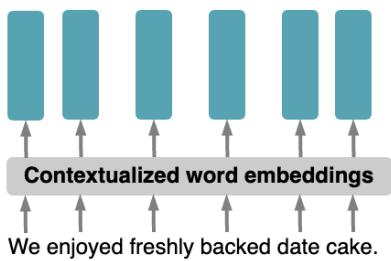  
Figure 6.4 An illustration on how each word in a sentence is processed by the transformer model. Each word is mapped to its own unique contextualized word embedding (represented by the vertical rectangles). These embeddings capture the meanings of the words based on the specific context in which they are used.

In contrast, traditional text generation techniques may produce text suering from issues like repetition, irrelevant sentences, or loss of context. But, with the help of contextual word embeddings, transformers can generate more coherent, relevant, and meaningful sentences. Moreover, this specic contextual-awareness enables transformers to generate text that adapts to the narrative, exhibiting human-like characteristics, as we have already seen with models like ChatGPT, such as maintaining the theme, adhering to the writing style, and displaying an understanding of the nuances and subtleties of language. This has established a new era of modern text generation.

NOTE Contextual word embeddings are crucial for language tasks that involve generating text, such as summarization and machine translation, as well as for other forms of text generation, such as chatbot models. By providing a nuanced understanding of the context in which words are used, these embeddings contribute signicantly to the performance of models in these tasks. However, they are particularly relevant for text generation. This is because, unlike in tasks such as text summarization or machine translation where there’s a reference text, in text generation the model often has to generate text from scratch or based on a short prompt. Therefore, understanding the context and maintaining coherence throughout the generated text is critical. It’s for this reason that I focus on contextual word embeddings in this chapter on text generation.

In conclusion, the ability of transformer-based models to generate contextual word embeddings and combine this technique with the attention mechanism during their pretraining phase is key to their success in text generation tasks. As we continue to explore more techniques for text generation, we will deepen our understanding of why LLMs are able to produce such coherent and sometimes uncannily accurate text generation results.

# 6.3.2 Greedy Search decoding for text generation

In text generation, we face a similar problem to machine translation: The need to consider multiple possible word sequences, while maintaining syntactic correctness and semantic coherence. This is due to the fact, that in language, words and phrases don’t exist in isolation, but in relation to each other. In other words, this means that the meaning of a word can change based on its context, leading to a multitude of possible word sequences for any given prompt.

This creates a large search space, which can lead to a combinatorial explosion. To navigate this space, we employ decoding strategies, one of which is greedy search.

Before delving into the technical details of greedy search, let’s conceptualize it with an illustrative analogy. Picture yourself in a maze, with the objective to nd the exit in the quickest and shortest way. In the context of a greedy search strategy, what you would do is consistently choose the path that appears to be the shortest and seemingly directs you towards the exit, without giving much thought to the overall layout of the maze. The shortcoming of this approach is that it could easily lead you into dead ends or inadvertently longer paths, as you’re not considering the broader maze structure.

Now let us look at the technical "translation" of this analogy. The greedy search decoding algorithm selects the most probable next word at each step in the generation process. If we dene $y _ { t + 1 }$ as the word to be generated at time step $t + 1$ and $P ( y _ { t + 1 } | y _ { 1 : t } , x )$ as the conditional probability of word $y _ { t + 1 }$ given previous words $y _ { 1 : t }$ and input $x$ , the greedy search algorithm can be mathematically formulated as follows:

$$
y _ {t + 1} = \arg \max  _ {y} P (y \mid y _ {1: t}, x) \tag {6.7}
$$

While this approach might seem logical, it doesn’t always produce the most coherent or contextually appropriate results. That’s because the decision at each step is made independently, without considering future implications. It’s a bit like choosing the path of least resistance at every junction, without considering the overall destination. To clarify this approach more, let us look at a pseudo-code example to see how this algorithm works.

Algorithm 1: Greedy Search for Text Generation   
1: Initialize the initial input (e.g., a start token or a prompt)  
2: $h :=$ initial input  
3: Repeat until an end token is generated:  
4: $P :=$ Compute the next token probabilities using the m  
5: $y := \arg \max_y P(y | y_{1:t}, x)$ 6: $h := h \cdot y$ 7: Set the selected token as the new input  
8: Return the generated sequence $h$

In simple terms, the algorithm follows these steps:

Step 1 and 2: Initialization

Step 3: The loop runs until we reach an end token which indicates the end of the sentence in language models.   
Step 4: In each iteration, the model generates the probability distribution P over all possible next tokens.   
Step 5: The token y with the maximum probability is selected as the next token in the sequence. This corresponds to the equation $y _ { t + 1 } = \arg \operatorname* { m a x } _ { y } P ( y | y _ { 1 : t } , x )$   
Step 6: The selected token y is appended to the generated sequence h.   
Step 7: The selected token y is set as the new input to the model for the next iteration.   
Step 8: The nal generated sequence is returned after we reach an end token.

Now it is clear, that this approach might not always be the best choice to generate consistent and meaningful text. This is where other, more sophisticated search strategies, such as beam search, come in, as we’ll see in the following section.

# Text generation with Hugging Face

The model.generate function provided by the Hugging Face transformer library employs greedy search as the default algorithm for text generation. This choice is reasonable for many use-cases due to its computational efficiency and simplicity. However, it’s crucial to note that the default parameters might not always be the best choice for every specific task.

To accommodate a variety of needs, this function allows for a high degree of customization, offering us the flexibility to choose from a range of text generation strategies like beam search decoding, top-k sampling, and top-p sampling. Each strategy comes with its own strengths and limitations, and it’s often beneficial to experiment with these different decoding or sampling strategies to identify the one that best aligns with your specific task and objectives.

To make it more tangible, how this works, let us shortly look at a concrete example in listing 6.1.

# Listing 6.1 Greedy search implementation in model.generate

0 Instantiate the model and tokenizer

tokenizer $=$ GPT2Tokenizer.from_pretrained('gpt2')

model $=$ GPT2LMHeadModel.from_pretrained('gpt2')

② Define an input prompt

prompt $=$ ''In a world where AI has become ubiquitous,''

$\otimes$ Encode the input prompt and prepare it for the model

input_ids $=$ tokenizer.encode(prompt, return_tensors $=$ 'pt')

4 Generate text output with default greedy search setting greedy_output $=$ model_generate( input_ids, max_length $\equiv$ 100

This results in the following output:

OUTPUT In a world where AI has become ubiquitous, it’s hard to imagine how it will ever be able to replace humans. "We’re going to have to see how we do it," said Dr. Michael S. Hirsch, a professor of psychology at the University of California, San Francisco. "We’re going to have to see how we do it in a way that’s not just a matter of human beings, but also of machines." The AI revolution is already happening.

Although the generated text may seem coherent in this case, it’s important to note that with greedy search, the results can still be somewhat unpredictable and may not always produce the most uent or meaningful sentences. For instance, the phrase "We’re going to have to see how we do it in a way that’s not just a matter of human beings, but also of machines" is somewhat unclear, and the opening sentence "In a world where AI has become ubiquitous, it’s hard to imagine how it will ever be able to replace humans" presents a contradiction. These examples demonstrate that while the model can generate text that adheres to general grammatical rules, it might struggle with maintaining a consistent and coherent narrative.

As we progress through this chapter, you’ll gain a deeper understanding of the limitations and strengths of various approaches. This will allow us to better understand the complexity of text generation and the ingenuity of the methods used to address it. As we look deeper into these decoding and sampling methods in the upcoming sections, you’ll gain further insights into why LLMs are capable of producing such coherent and engaging text.

# 6.3.3 Beam search decoding for text generation

Beam search like many algorithms in computer science, nds its roots in graph theory. Specically, it can be thought of as a pruned version of the classic graph traversal algorithm, breadth-rst search (BFS).

BFS is a strategy for traversing or searching tree or graph data structures. It begins at the root in tree-based structures, or at an arbitrarily chosen node in graph-based structures, and explores all of the neighbor nodes at the current level before moving on to nodes at the next depth level. BFS is a cornerstone of computer science due to its robustness and versatility, nding applications in many elds such as network routing protocols or peer-to-peer networks.

Like with greedy search, lets conceptualize the algorithm with the maze analogy. With beam search, you would always consider a xed number of the most promising paths at each decision point. This would be like standing at a junction in the maze and considering a few paths that seem most promising.

Now, if we imagine our sentence as a graph where each word leads to all other possible next words, we get a tree-like structure with the rst word at the root and subsequent words forming the branches. However, due to the vast number of words in a language, this would result in an incredibly wide tree. This is where beam search comes in. It prunes the tree, or in other words, narrows the search space by only considering a set number of probable sequences at each step. Such a simplied graph with two beams is shown in gure 6.5.

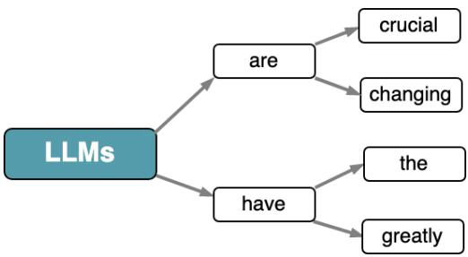  
Figure 6.5 This illustration provides a simplified example of beam search in action, focusing on a scenario with two beams (i.e., beam width equals two). We start by initializing the process with ”LLMs” as the first word. From here, the beam search algorithm evaluates the two most probable next words.

In mathematical terms, at each time step $t - 1$ , we have a set of $B$ most likely sequences of words, denoted as $Y _ { t - 1 }$ . This set includes sequences $( y _ { 1 , [ t - 1 ] } , \dotsc , y _ { B , [ t - 1 ] } )$ , where each yb, [t−1] is a sequence of t − 1 words. $y _ { b , [ t - 1 ] }$ $t - 1$

At the next sequence step, the algorithm expands each sequence by one possible token from the vocabulary $V$ . This results in a set of potential new sequences, $Y _ { t }$ , which is the Cartesian product of $Y _ { t - 1 }$ and $V$ , meaning that we pair each sequence from $Y _ { t - 1 }$ with every possible token from $V$ .

Beam search then evaluates the likelihood of all these new sequences and selects the $B$ sequences with the highest probabilities to form the new $Y _ { t }$ , under the condition that the sequences are unique within the current set. This selection process continues iteratively until each sequence has reached a predened maximum length $T$ , or a termination condition such as the end-of-sequence token is encountered. The nal output of the beam search is the sequence with the highest overall probability.

While this approach allows multiple sequences to be explored in parallel, it’s important to note that the output often tends to consist of minor perturbations of a single sequence. This is where trade-os and tweaks can be made to promote more diversity in the output, forming the basis of methods like diverse beam search.

To understand how this eect inuences the search, we could extend our maze analogy to illustrate this eciency. Imagine that each path in the maze is a potential sequence of words, and the exit represents the most meaningful and coherent sequence. When you use greedy search, you might reach a dead-end faster but might miss the best exit, which is the highest-quality output. On the other hand, beam search, by keeping multiple promising paths open, is like exploring several potentially successful routes at once. While this method may take slightly longer than greedy search due to its breadth, it can lead you to a more

suitable exit, i.e., a more high-quality output. Consequently, it manages to strike a balance between computational eciency and output quality.

Let’s put this into code with listing 6.2, a simple, yet illustrative coding example to better understand this concept and show how beam search can generate more varied and high-quality text than greedy search.

# Listing 6.2 Beam search implementation in model.generate

```python
① Instantiate the model and tokenizer  
tokenizer = GPT2Tokenizer.from_pretrained('gpt2')  
model = GPT2LMHeadModel.from_pretrained('gpt2') 
```

2 Define an input prompt prompt $=$ "In a world where AI has become ubiquitous,"

```python
3 Encode the input prompt and prepare it for the model input_ids = tokenizer.encode(prompt, return_tensors='pt') 
```

4 Generate text output with beam search setting   
beam_outputs $=$ model_generate( input_ids, max_length $\coloneqq$ 100, num_beams $= 5$ ， $⑤$ Number of beams to keep norepeat_ngram_size $= 2$ num_return_sequences $= 5$ ， $⑤$ How many outputs to generate early_stopping $\equiv$ True, temperature $= 1.5$ ，#increase the temperature top_k=50， #consider only top 50 tokens at each step

This results then in the following output:

OUTPUT 1 In a world where AI has become ubiquitous, it’s hard to imagine a better time to be a part of it than right now. "I think we’re going to see a lot more of that in the next few years," he said.

OUTPUT 2 In a world where AI has become ubiquitous, it’s hard to imagine a better time to be a part of it than right now. "I think we’re going to see a lot more of that in the next few years," he says.

OUTPUT 3 In a world where AI has become ubiquitous, it’s hard to imagine a better time to be a part of it than right now. "I think we’re going to see a lot more of that in the next few years," he said. "It’s a very exciting time."

OUTPUT 4 In a world where AI has become ubiquitous, it’s hard to imagine a better time to be a part of it than right now. "I think we’re going to see a lot more of that in the next few years," he said. "It’s a very exciting time for AI."

OUTPUT 5 In a world where AI has become ubiquitous, it’s hard to imagine a better time to be a part of it than right now. "I think we’re going to see a lot more of that in the next few years," he said. "It’s a very exciting time for AI, and I think that’s what’s driving it."

Let’s examine these outputs more closely to better understand the variations introduced by beam search:

1 Output 1: This sentence features a direct quote attributed to an unspecied individual. The past tense "said" is used, indicating the quote was made in the past. The prediction is limited to the quote itself, not expanding upon it further.   
Output 2: The structure of this sentence is similar to output 1 but uses the present tense "says," implying that the quote is a current statement or opinion. The change in tense subtly alters the perceived immediacy and relevance of the statement.   
Output 3: This output expands upon output 1 by adding another sentence to the quote. The use of "said" suggests both sentences are part of the same past statement. The added sentence provides more details about the speaker’s feelings towards the situation.   
Output 4: Like output 3, this output extends the quote, and it further species the source of excitement being related to "AI." This slight change introduces more specicity, focusing the speaker’s enthusiasm on the eld of AI.   
Output 5: This is the longest and most detailed output. It not only extends the quote but also introduces an additional layer of information - an opinion about what’s driving the excitement. It suggests that the speaker is not just expressing excitement but also analyzing the situation.

These examples illustrate how the application of beam search can diversify the outputs of a model, introducing variety in tense, tone, and perspective. By considering multiple potential sequences, the model has the ability to generate dierent sentence structures and expressions, leading to a wider range of meaningful and diverse outputs. Now that we better understand how decoding methods inuence the output of our generated text, let’s move on to explore how dierent sampling methods aect a model’s output in the following sections.

# 6.3.4 Top-k sampling for Text Generation

Top-k sampling, also known as k-sampling or top-k decoding, is a decoding strategy employed in language models for generating text. Unlike beam search, which keeps track of multiple hypotheses (beams), top-k sampling maintains a single hypothesis and expands it with a stochastic approach.

Let us again, apply our maze analogy to understand this in an illustrative way, before diving into the more technical details. With top-k sampling, from all the paths available, you consider the top k most promising ones. Your next move would then be chosen randomly

from this selection, leading to a good balance between exploration (checking new paths) and exploitation (following the most promising paths).

To elaborate on this analogy, top-k sampling selects the next word of a sequence from the top k most likely candidates given by the model. In the traditional way of generating text, each token is sampled from the full distribution of the model’s vocabulary. However, in top-k sampling, the token is sampled only from the top k probabilities, which can lead to more meaningful and coherent text.

Let’s imagine we have a sentence, and we are trying to predict the next word. Our model outputs probabilities for all the words in our vocabulary, then we pick the top k words with the highest probabilities and sample from this subset to select our next word. This approach allows for some randomness in the text generation process, and thus, can produce diverse outputs. This process is simplyed illustrated in gure 6.6.

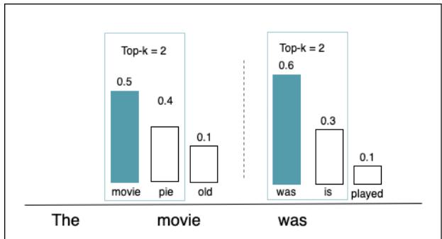  
Figure 6.6 If we assume we want to model the probability of the next word to chose for our text generation, we would do: $P \left( w \right)$ ”The” ), which will then be followed the probability $P ( w \mid$ ”The”,”movie” ) and so on. The choice of the model will be limited to the 2 k-probable words, so, only movie or pie will be considered for the first probability and was or is for the next choice, respectively.

In terms of a code implementation, we can use the model.generate() function in Hugging Face’s transformers library, with the do_sample and top_ $k$ parameters set to enable top-k sampling. Listing 6.3 shows an example of how to use top-k sampling with the GPT-2 model.

# Listing 6.3 Top-k sampling implementation in model.generate

0 Instantiate the model and tokenizer

tokenizer $=$ GPT2Tokenizer.from_pretrained('gpt2')

model $=$ GPT2LMHeadModel.from_pretrained('gpt2')

2 Define an input prompt

prompt $=$ ''In a world where AI has become ubiquitous,''

$\otimes$ Encode the input prompt and prepare it for the model

input_ids $=$ tokenizer.encode(prompt, return_tensors $=$ 'pt')

$\textcircled{6}$ Generate text output with top-k sampling setting

top_k_outputs $=$ model.generate(

```txt
input_ids,  
max_length=100,  
num_return_sequences=5,  
do_sample=True, ⑤ Enable random sampling  
top_k=50, ⑥ Number of top tokens to consider at each step  
temperature=1.5 ⑦ Set the temperature 
```

Using this method, we might generate this output:

OUTPUT In a world where AI has become ubiquitous, there are growing concerns both over the value the machine as a platform for science discovery, and over what the tech industry can expect in the future as a technological infrastructure for more sophisticated computation, it’d make sense, from an investment, to have an AI as the chief developer of machine learning. The key thing to recognize with this shift from a traditional software developer to the most mature tech developer is the need that AI is an integrated, exible, robust

NOTE To maintain brevity, the full set of ve model outputs will not be included in the text as in the previous example. Complete outputs for the methods discussed in this chapter are available in the accompanying Jupyter Notebooks.

The outputs generated by top-k sampling display a signicant degree of variability and creativity. However, this method can lead to responses that might seem nonsensical or incomplete at times due to the inherent randomness of the approach. This is particularly noticeable when the token limit is reached before the narrative can reach a logical endpoint, causing sentences to be cut o.

In contrast, beam search is optimized for sentence coherence, resulting in more focused and usually shorter responses that adhere to common phrase structures. Therefore, it is less likely to hit the token limit in the middle of a sentence, and the outputs often appear more "complete" or "coherent". These dierences highlight the trade-o between diversity and coherence that underlies these two dierent methods of text generation.

That said, while top-k sampling can produce diverse and uent sentences, its inherent randomness being non-deterministic, as opposed to the deterministic beam searchleads to less predictable outcomes. This unpredictability arises because each execution can yield dierent results, even with the same initial context. Furthermore, the quality and diversity of the output can signicantly vary depending on the choice of k. Setting a higher k value will make the output more diverse but less focused, while a lower k value will make the output more focused but potentially less diverse. Therefore, ne-tuning the k value is essential to optimize the balance between diversity and focus in the generated text.

Now, having learned about both beam search and top- $\mathrm { \cdot k }$ sampling, we can see that both strategies have their strengths and weaknesses, and the choice between them will largely depend on the specic requirements of your application. In the next sections, we’ll explore more sampling strategies and compare their performances.

# 6.3.5 Nucleus sampling for text generation

Nucleus sampling, also known as top-p sampling, dynamically selects the smallest possible set of words whose cumulative probability exceeds a predetermined threshold $\boldsymbol { \mathscr { P } }$ , oering a more adaptive approach than top-k sampling. While top-k sampling always chooses from a xed number of the most probable words, nucleus sampling’s set size varies. If the model is condent, it narrows down to a few highly probable words, but it expands the set when less certain, enhancing creativity without compromising coherence. The threshold $\boldsymbol { \mathscr { P } }$ is typically set between 0.8 and 0.95, ne-tuning the balance between variety and predictability in the generated text, image 6.7 vizualizes this concept.

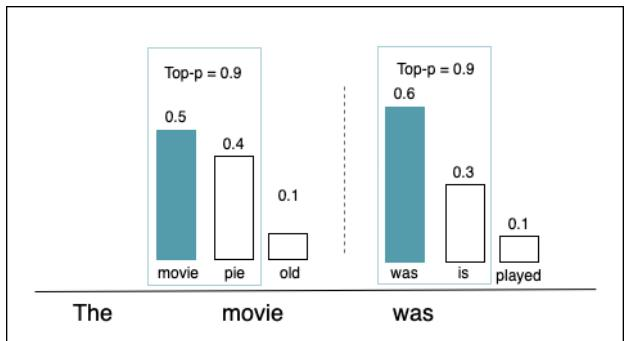  
Figure 6.7 If we assume we want to model the probability of the next word to be chosen with top-p (nucleus) sampling, we would again consider the following: $P \left( w \right)$ ”The” ), which will then be followed the probability $P ( w \mid$ ”The”,”movie” ) and so on. But now the choice of the model will be limited to to the threshold of cumulative probability of 0.9 for the words which can be selected, so again, only movie or pie will be considered for the first probability and was or is for the next choice, respectively.

To visualize this using the maze analogy, imagine that with nucleus sampling, you aren’t restricted to a xed number of paths. Instead, you have a dynamic "pool" of promising routes. The size of this pool shifts according to the potential of current paths, sometimes only a small number of straightforward paths and other times a broader array of routes when more exploration is needed.

To illustrate nucleus sampling with code, we again use Hugging Face’s transformers library, specically the model.generate() function. The do_sample and top_p parameters are set to enable nucleus sampling. Listing 6.4 shows an example of how to use nucleus sampling with the GPT-2 model.

# Listing 6.4 Nucleus sampling implementation in model.generate

```python
① Instantiate the model and tokenizer  
tokenizer = GPT2Tokenizer.from_pretrained('gpt2')  
model = GPT2LMHeadModel.from_pretrained('gpt2') 
```

```python
2 Define an input prompt prompt = "In a world where AI has become ubiquitous," 
```

```txt
3 Encode the input prompt and prepare it for the model 
```

```python
input_ids = tokenizer.encode(prompt, return_tensors='pt') 
```

4 Generate text output with nucleus sampling setting

output $=$ model.generate(

input_ids,

max_length $= \beth 0 0$ ,

do_sample=True,

Enable random sampling

top_p=0.92, $\bullet$ Threshold for cumulative probability

top_k=0 $\textcircled{7}$ No limit on the number of top tokens considered )

Running the above code, we might generate sentences like this one:

OUTPUT In a world where AI has become ubiquitous, this is not the case. The most recent example is Google’s own self-driving car, which, at the time of this writing, was able to successfully navigate a highway in Los Angeles without any human intervention. Now that its self-driving car is on the road, it’s almost certain that autonomous driving will be the next major industry. That’s bad news for the American auto industry, who have been trying to make it safe

With nucleus sampling, the generated text is expected to be diverse, yet more controlled compared to pure random sampling or top-k sampling. This is due to the dynamic adjustment of the probability threshold that includes a varying number of tokens at each step. Depending on the threshold, the output can be more focused or more diverse, oering a exible trade-o between the two.

In conclusion, nucleus sampling is a powerful method for generating diverse and highquality text. Depending on the task at hand and the desired level of randomness and coherence, it can be a great tool in the toolkit of a natural language processing practitioner. In the next sections, we will continue to explore more advanced techniques.

# 6.3.6 Temperature Sampling for Text Generation

Temperature sampling is another text generation technique that controls the randomness of predictions by scaling the logits before applying softmax.

In temperature sampling, a parameter called the "temperature" is used to control the randomness of the predictions. When the temperature is close to 0, it tends towards greedy decoding, and the model will generate the most likely next word. As the temperature approaches innity, the model’s output approximates random sampling, choosing words from the vocabulary with equal likelihood. At a temperature of 1, the model uses the predicted probabilities without any modication, as shown in image 6.8.

This approach makes it possible to ne-tune the balance between exploiting the model’s knowledge (i.e., selecting the most probable words) and exploring dierent possibilities (i.e., generating less likely words).

Let’s illustrate temperature sampling in code. We can adjust the temperature parameter in the model.generate() function from the transformers library, as shown in Listing 6.5.

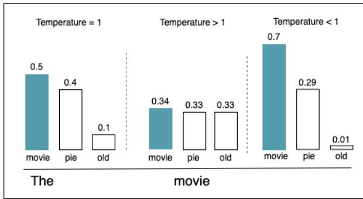  
Figure 6.8 With temperature sampling, if we chose the temperature to be 1, the probabilities won’t change. However, if we set it to be greater 1, let’s say 2, it will equalize the probabilities more, and if we have the temperature smaller than 1 the probabilities will be more extreme.

# Listing 6.5 Temperature sampling implementation in model.generate

$\bullet$ Instantiate the model and tokenizer  
tokenizer = GPT2Tokenizer.from_pretrained('gpt2')  
model = GPT2LMHeadModel.from_pretrained('gpt2')

```python
2 Define an input prompt prompt = "In a world where AI has become ubiquitous," 
```

```python
3 Encode the input prompt and prepare it for the model input_ids = tokenizer.encode(prompt, return_tensors='pt') 
```

4 Generate text output with temperature sampling setting   
output $=$ model_generate(   
input_ids,   
max_length=100,   
do_sample=True， 5 Enable random sampling   
temperature=0.7 6 Control randomness with the temperature parameter

This is the output from the temperature sampling:

OUTPUT 1 In a world where AI has become ubiquitous, it’s easy to see the potential for it to become a problem. "It’s very important to understand the potential for AI to change, to develop," says Kishore Kumar, president of the AI Foundation. "The AI Foundation is making a conscious eort to make sure that people come out and say, ’We should all be working with this AI.’ We have no idea how it will come to be. "We have to

By adjusting the temperature, we can ne-tune the level of randomness in our generated text. A higher temperature leads to more diverse outputs, while a lower temperature results in more deterministic and focused outputs.

# Addressing truncated text in non-deterministic text generation

When using the model.generate function from Hugging Face for text generation, particularly with non-deterministic or stochastic methods (e.g., temperature sampling, nucleus sampling), a challenge often emerges: the generated text can appear abruptly truncated. Contrasting, deterministic methods like greedy decoding offer consistent results without the abrupt cut-off problem, while methods such as beam search introduce some variability but typically produce more coherent endings.

In the field of text generation, non-deterministic methods introduce a degree of randomness, allowing the model to produce varied, and often more creative, outputs for the same input on different runs. This approach contrasts with deterministic methods, which provide more predictable results.

The inherent randomness, while enabling creative outputs, often doesn’t account for the structural or logical endings we humans expect, leading to outputs that may seem cut off or incomplete.

To better manage the termination of these outputs, one effective strategy involves refining the model’s generated content, as demonstrated in listing 6.6. The end-ofsentence (EOS) token can be especially beneficial in this context, offering more control over where the generated content concludes.

# Listing 6.6 Prevent sentence cut off

Check if EOS token exists in the output and trim up to that

if'<|endoftext|>' in generated_text: generated_text $=$ generated_text.split('<|endoftext|>') [0].strip() else:

2 Alternatively, trim up to the last period for coherence

```python
generated_text = '.'.join(generated_text.split(['.'])[: -1]) + '. 
```

The challenge of truncated outputs can still persist, underscoring the intricate balance between creativity and coherence in AI-generated text.

As with all the other methods we’ve discussed, the choice between these approaches depends on the specic requirements of the task at hand. Temperature sampling oers a exible means of controlling the balance between diversity and focus in the generated text.

# 6.4 Challenges in transformer-based text generation

Generating text with transformers comes with its own set of challenges, here we’ll look at some of the prominent challenges faced by these often billion-parameter models.

A signicant challenge in working with large language models is their necessity to be trained on vast amounts of internet data. These large-scale models have the capacity to memorize extensive information, which consequently raises a potential risk. There is a possibility that downstream tasks might be inadvertently inuenced if their test or develop-

ment datasets are encountered during the pre-training phase. Given these complexities, for certain tasks, it may be more suitable to opt for smaller, "classical" Transformer models and use the "traditional" approach of ne-tuning them on a specic downstream task. This approach often requires fewer resources and may yield comparable or even better results. To help guide your decision-making when choosing between large, billion-parameter models and smaller ones, we will delve into these and other challenges in this section, beginning rst with a brief overview of the most prevalent issues.

Creating quality training data: Designing unbiased, comprehensive, and diverse training datasets is a key challenge. Avoiding overlap between training and testing sets to ensure model generalization is crucial, especially in the billion-parameter models.   
Hallucination: Text generation models sometimes generate content that seems plausible but isn’t grounded in reality, a phenomenon known as "hallucination".   
Model interpretability: Deep learning models are often seen as "black boxes" due to their complexity, and developing tools and techniques to understand their inner workings is a signicant challenge.   
Bias in AI: AI systems can inherit and amplify biases present in their training data, leading to unfair outcomes.

Now, let’s delve deeper into the rst two points in the list: creating quality training data and hallucination. The nal two points in our list, model interpretability and bias in AI, will be comprehensively discussed in chapter 10.

# 6.4.1 High quality training data

The cornerstone of training Large Language Models (LLMs) with billions of parameters, like GPT-4, LLaMA, RedPajama and Falcon, is the utilization of high-quality data. Conventionally, such models have been trained on a blend of carefully selected high-quality corpora, including content from books and technical papers, and ltered web data. This curation process, aimed at ensuring wide-ranging zero-shot generalization abilities, has been a key determinant of eective model performance. However, as model sizes grow and the requirement for training on an expanding number of tokens escalates, this process confronts challenges such as content duplication and inherent bias.

A common resource for such massive model pre-training is CommonCrawl, a publicly available web scrape that amasses petabytes of data spanning more than a decade. Processing such a diverse dataset presents unique challenges, including the need to eliminate low-quality or undesirable content. This typically involves intricate data pipelines encompassing language identication, ltering rules and heuristics, ML-based quality ltering, and deduplication. However, a careful balance must be struck here: while stringent ltering is crucial to ensure the data’s quality, excessive or improperly calibrated ltering can inadvertently remove content that represents minority perspectives. Such an imbalance in the data can lead to biases, as the model may underrepresent or misrepresent these groups.

Given the complexities associated with managing training and testing data overlap, curating training data for billion-parameter models becomes a critical task. Deduplication plays

a signicant role in improving language models by mitigating issues such as memorization and repeated data, which can compromise model quality as the parameter count increases.

In this context, the recent publication of RenedWeb, (7), which uses a MacroData Renement (MDR) pipeline to enhance the quality of web data, is a signicant development. Figure 6.9 illustrates the pipeline.

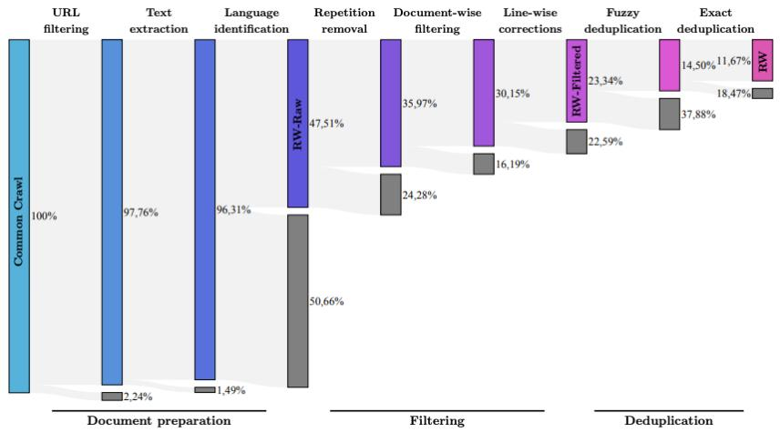  
Figure 6.9 Through the stages of Macrodata Refinement, approximately $90 \%$ of CommonCrawl’s initial documents are discarded. Half are dropped for being non-English, around a quarter for poor quality, and $12 \%$ for duplication. The reported removal and retention rates are measured first in documents, then in tokens. Image is taken from the paper: ”The RefinedWeb Dataset for Falcon LLM”.

As the illustrations shows, MDR uses strict ltering and and deduplication to prepare the web data from CommonCrawl on a large scale. The principles guiding MDR are:

Emphasis on Scale: MDR aims to generate datasets suitable for training models with 40-200B parameters, necessitating trillions of tokens, (4). Consequently, laborintensive human curation processes are set aside in favor of focusing on Common-Crawl.   
Rigorous Deduplication: The pipeline incorporates stringent deduplication, employing both exact and fuzzy methods inspired by the work of (5)).   
Neutral Filtering: To avoid introducing further undesirable biases, (3), (11), into the model, ML-based ltering is applied solely to language identication. Simple rules, heuristics, and URL ltering. The URL ltering targets fraudulent and/or adult websites.

This facilitated the creation of the RenedWeb dataset, a pretraining dataset made up entirely of high-quality web data.

Therefore, considering these challenges, it is essential to understand the data on which a model was trained. This knowledge can provide invaluable insights into the model’s potential biases, informing on the appropriate methods on how to address these biases,

whether through reinforcement learning from human feedback, prompt engineering, or ne-tuning.

# 6.4.2 Hallucination

Hallucination, as it relates to LLMs or machine learning models in general, is a term that describes a phenomenon where the model generates outputs that don’t align with the facts presented in the input, or aren’t grounded in the real world. Essentially, the model is "making things up". This can happen in various tasks, including text summarization , translation, and text generation. Even state-of-the-art models are prone to producing invented facts, which can be particularly problematic in domains where the models need to perform multiple steps of reasoning, like coding or solving mathematical equations. Since one simple error is enough to populate throughout the whole solution.

We can distinguish between two hallucinations: open-domain hallucination and closeddomain hallucination.

In this context, "open-domain hallucination" generally refers to the model generating statements or facts that aren’t true or didn’t exist in its training data. It may fabricate events, people, or concepts that simply don’t exist in reality. This is considered "open-domain" because it could potentially involve any topic, concept, or subject area.

On the other hand, "closed-domain hallucination" refers to the model generating content that is inconsistent with the provided prompt or input, even though it may be internally coherent. It’s "closed" to the specic domain of the conversation or interaction. The model isn’t adhering to the context it’s been given and instead is going o on a tangent or making up information that’s not relevant or accurate to the specic prompt.

As closed-domain hallucinations typically involve the model not adhering to the specic instructions or prompt. This is an area where techniques such as reinforcement learning from human feedback can be particularly useful. By providing the model with feedback on its outputs, the model can learn to better align its responses with the provided context and adhere more closely to the prompt. Similarly, creating and training models on a dataset that includes demonstrations of instruction following behavior, like the case with InstructGPT or Dolly from sections 6.2.2 and 6.2.7, can help the model to better understand and follow specic prompts, thereby reducing the likelihood of closed-domain hallucinations.

However, addressing open-domain hallucinations can be more challenging, as these hallucinations can involve a broader range of topics and the model making things up that don’t exist in its training data or in reality.

For both hallucination problems there is still ongoing research in this area on how to address it, a recent paper called "Lets Verify Step by Step", tries to address hallucinations by training a reward model on a dataset of 800,000 step-level human feedback labels to provide the model with process supervision while solving a task.

Given the complexities and challenges in mitigating hallucinations in LLMs, understanding the limitations of these models in generating text is essential. That said, it is crucial to handle the generated content with caution and thoroughly review and fact-check the outputs, especially when they’re being used for tasks requiring factual accuracy and logical consistency. Nonetheless, ongoing research in this area continues to provide new methods

and approaches for addressing these issues which will most likely help to improve the reliability and accuracy of text generated by LLMs.

# 6.5 Summary

【 Text generation has evolved from the 1960s rule-based chatbots like ELIZA to today’s advanced transformer models like GPT-4 and LLaMA 2, marking a shift from simple language processing to deep language understanding and context-aware responses.   
In the continously evolving domain of text generation, a plethora of LLMs has emerged, each showcasing distinctive features and abilities. Models like BERT, GPT-1, GPT-2, GPT-3, InstructGPT, GPT-NeoX-20B, LLaMA, RedPajama, Alpaca, Dolly, and Falcon have left an lasting mark in the eld, proving their ability in generating coherent and contextually relevant text.

– BERT: A transformer-based model with 110 million parameters, renowned for bidirectional language modeling. Available in cased and uncased versions.   
– GPT-1: An early transformer model with 117 million parameters featuring a decoder-only structure, emphasizing solely on preceding words during prediction.   
– GPT-2: A successor to GPT-1 with 1.5 billion parameters, introducing "zeroshot" learning for enhanced context-aware text generation.   
– GPT-3: A successor to GPT-2 with 175 billion parameters, renowned for generating creative content and executing diverse NLP tasks.   
– InstructGPT: A GPT variant ne-tuned for instruction following, available in sizes of 1.3B, 6B, and 175B parameters.   
– GPT-NeoX-20B: Mirrors GPT-3’s architecture but introduces several innovations and is trained on the Pile dataset with 20B parameters.   
– LLaMA: A collection of models ranging from 7 billion to 70 billion parameters, notable for their performance on numerous benchmarks.   
– RedPajama: An open-source initiative aimed at bridging the gap between commercial and open-source models, available in 3 billion and 7 billion parameters.   
– Alpaca: A ne-tuned model from Stanford based on Meta’s LLaMA 7B, designed for instruction-following tasks.   
– Dolly: An open-source model by Databricks grounded in EleutherAI’s Pythia model family, boasting 12 billion parameters.   
– Falcon: Developed by TII, a decoder-only model trained on an enriched corpus and available in sizes of 6.7 billion and 40 billion parameters.

The creativity of a text generation models output is adjustable via diernt search and sampling methods.

# Bibliography

[1] Sid Black, Stella Biderman, Eric Hallahan, Quentin Anthony, Leo Gao, Laurence Golding, Horace He, Connor Leahy, Kyle McDonell, Jason Phang, Michael Pieler, USVSN Sai Prashanth, Shivanshu Purohit, Laria Reynolds, Jonathan Tow, Ben Wang, and Samuel Weinbach. Gpt-neox-20b: An open-source autoregressive language model, 2022. arXiv:2204.06745. 153   
[2] Tom B. Brown, Benjamin Mann, Nick Ryder, Melanie Subbiah, Jared Kaplan, Prafulla Dhariwal, Arvind Neelakantan, Pranav Shyam, Girish Sastry, Amanda Askell, Sandhini Agarwal, Ariel Herbert-Voss, Gretchen Krueger, Tom Henighan, Rewon Child, Aditya Ramesh, Daniel M. Ziegler, Jerey Wu, Clemens Winter, Christopher Hesse, Mark Chen, Eric Sigler, Mateusz Litwin, Scott Gray, Benjamin Chess, Jack Clark, Christopher Berner, Sam McCandlish, Alec Radford, Ilya Sutskever, and Dario Amodei. Language models are few-shot learners. CoRR, abs/2005.14165, 2020. URL: https://arxiv.org/abs/2005.14165, arXiv:2005.14165. 153   
[3] Jesse Dodge, Maarten Sap, Ana Marasovi, William Agnew, Gabriel Ilharco, Dirk Groeneveld, Margaret Mitchell, and Matt Gardner. Documenting large webtext corpora: A case study on the colossal clean crawled corpus, 2021. arXiv:2104. 08758. 182   
[4] Jordan Homann, Sebastian Borgeaud, Arthur Mensch, Elena Buchatskaya, Trevor Cai, Eliza Rutherford, Diego de Las Casas, Lisa Anne Hendricks, Johannes Welbl, Aidan Clark, Tom Hennigan, Eric Noland, Katie Millican, George van den Driessche, Bogdan Damoc, Aurelia Guy, Simon Osindero, Karen Simonyan, Erich Elsen, Jack W. Rae, Oriol Vinyals, and Laurent Sifre. Training compute-optimal large language models, 2022. arXiv:2203.15556. 182   
[5] Katherine Lee, Daphne Ippolito, Andrew Nystrom, Chiyuan Zhang, Douglas Eck, Chris Callison-Burch, and Nicholas Carlini. Deduplicating training data makes language models better, 2022. arXiv:2107.06499. 182   
[6] Long Ouyang, Je Wu, Xu Jiang, Diogo Almeida, Carroll L. Wainwright, Pamela Mishkin, Chong Zhang, Sandhini Agarwal, Katarina Slama, Alex Ray, John Schulman, Jacob Hilton, Fraser Kelton, Luke Miller, Maddie Simens, Amanda Askell, Peter Welinder, Paul Christiano, Jan Leike, and Ryan Lowe. Training language models to follow instructions with human feedback, 2022. arXiv:2203.02155. 153   
[7] Guilherme Penedo, Quentin Malartic, Daniel Hesslow, Ruxandra Cojocaru, Alessandro Cappelli, Hamza Alobeidli, Baptiste Pannier, Ebtesam Almazrouei, and Julien Launay. The renedweb dataset for falcon llm: Outperforming curated corpora with web data, and web data only, 2023. arXiv:2306.01116. 182   
[8] Alec Radford, Karthik Narasimhan, Tim Salimans, and Ilya Sutskever. Improving language understanding by generative pre-training. 2018. 152

[9] Alec Radford, Je Wu, Rewon Child, David Luan, Dario Amodei, and Ilya Sutskever. Language models are unsupervised multitask learners. 2019. 153   
[10] Hugo Touvron, Thibaut Lavril, Gautier Izacard, Xavier Martinet, Marie-Anne Lachaux, Timothée Lacroix, Baptiste Rozière, Naman Goyal, Eric Hambro, Faisal Azhar, Aurelien Rodriguez, Armand Joulin, Edouard Grave, and Guillaume Lample. Llama: Open and ecient foundation language models, 2023. arXiv: 2302.13971. 153   
[11] Johannes Welbl, Amelia Glaese, Jonathan Uesato, Sumanth Dathathri, John Mellor, Lisa Anne Hendricks, Kirsty Anderson, Pushmeet Kohli, Ben Coppin, and Po-Sen Huang. Challenges in detoxifying language models, 2021. arXiv:2109.07445. 182