# Controlling generated text

# This chapter covers

Reinforcement learning from human feedback   
Direct Preference Optimization   
Prompt engineering

This chapter builds upon the previous one on text generation, where we learned about some of the fundamental and newer Large Language Model architectures currently available. We also looked into how to inuence the creativity of our LLM using various sampling and decoding strategies. In this chapter, we will delve into how you can nudge your LLM to produce your preferred text output, exploring two distinct approaches.

The rst approach involves updating the weights of our model through methods like reinforcement learning or Direct Preference Optimization. These techniques allow for more direct control over the model’s behavior by adjusting its text output based on specic performance feedback.

The second approach is known as in-context learning. Here, we guide the model on how to "behave" using prompt examples, without altering the model’s underlying architecture. This technique is particularly powerful when working with an API, where direct access to modify the model’s parameters is not feasible.

Both methods oer unique advantages and applications, providing valuable tools for tailoring LLM outputs to specic needs and contexts.

# 7.1 Improving LLMs with reinforcement learning from human feedback

LLMs such as Llama 2 gain signicantly in being safe and helpful, when they are augmented with SFT from human preferences. Training large language models with reinforcement learning from human feedback (RLHF) stands out as a predominant method for this. This section dives into the nitty-gritty of this approach. We’ll kick o with the foundation: Markov decision processes, and then, after we understand all the basics, we’ll look into reinforcement learning using Proximal Policy Optimization (PPO).

# 7.1.1 From Markov decision processes to reinforcement learning

A Markov decision process (MDP) is a stochastic control process. It provides a mathematical framework for modeling decision-making. The MDP consists of ve key components:

Agent   
States   
Actions   
Rewards   
Policy

The agent acts within an environment, transitioning between various states. MDP outlines how specic states and corresponding actions guide the agent to subsequent states. The agent earns rewards based on its actions and the resulting state. In the MDP model, the policy indicates the agent’s next action based on its present state. To make this more intuitive, let us consider an illustrative example.

Imagine taking your dog through a dog training obstacle course, teaching it tricks and helping it navigate challenges. This training scenario can be associated with the key components of an MDP:

Dog (Agent): Takes decisions and performs actions.   
Obstacle Course (Environment): The setting in which the dog operates and faces challenges.   
Obstacles (States): Specic situations or challenges the dog encounters.   
Actions: Decisions the dog makes, such as jumping, crawling, or sidestepping obstacles.   
□ Rewards: Positive reinforcements, like treats, when the dog performs well, or gentle scolding for mistakes.

As the dog navigates the obstacle course, it learns from its interactions, aiming to maximize the number of treats it receives. Similarly, in an MDP, an agent learns to take actions in various states with the goal of maximizing its total rewards - this is often formalized using the "argmax" function. Over time, both the dog and the agent develop strategies (or policies) that optimize their outcomes.

Now, let’s connect this analogy to RLHF in text generation. Imagine the dog (agent) is a large language model, and the parcour (environment) represents the space of possible

text outputs. Each obstacle (state) is a specic point in the text generation process, with the dog’s actions equivalent to adding words or phrases. Rewards come from human feedback, guiding the LLM in generating desired outputs.

In the Proximal Policy Optimization (PPO) context for LLMs, we can compare the training process with how the dog adapts to the parcour. Let’s consider the obstacles. If we start with incredibly high obstacles, the dog might get discouraged and not attempt to jump at all. But if we begin with manageable hurdles and gradually raise them as the dog gets more trained and condent, the dog’s "policy" or behavior strategy adjusts gradually. This mirrors the essence of PPO. The idea is to enhance the stability of the policy by ensuring we don’t make overly drastic changes during training. The reasons for this are:

Smaller, incremental updates are empirically known to converge better to an optimal solution.   
Making a dramatic change can lead to unfavorable outcomes in policy, which can take a long time to correct, if they can be corrected at all.

To solidify this conservative approach, PPO introduces the concept of "proximal" policy. In essence, it ensures that the newly updated policy doesn’t deviate too far from the previous one. Think of it as guiding the dog on the parcour in such a way that its new behaviors are close or proximal to what it previously learned. We achieve this by comparing the new and old policies using a specic measure, and if they diverge too much, we clip or adjust the new policy to ensure it stays within $[ 1 - \epsilon , 1 + \epsilon ]$ depending on whether the advantage is positive or negative. This "proximity" ensures a consistent and stable progression in training, whether for a dog navigating obstacles or an LLM generating text. Hence the name Proximal Policy Optimization.

# 7.1.2 Improving models with human feedback and reinforcement learning

In this section, we will apply the previously learned theory training an LLM with RLHF. To accomplish this, we’ll employ the trlX library, a distributed training framework emphasizing the ne-tuning of large language models with reinforcement learning. It supports the use of either a predened reward function or a reward-labeled dataset. The library can ne-tune both causal and T5-based language models up to 20B parameters. For models larger than 20B, trlX oers NVIDIA NeMo-backed trainers that utilize ecient parallelism techniques. Furthermore, the library currently implements Proximal Policy Optimization and Implicit Language Q-Learning as reinforcement learning algorithms. For this demonstration, however, I’ll use PPO and opt for the GPT-2 model to minimize computational overhead. For our training data, we’ll use the Financial Phrasebank dataset from 5.4.1. Alternatively, you could substitute it with an instruction or prompt dataset to guide the model’s behavior. Let us start with loading the model and the dataset as shown in listing 7.1.

# Listing 7.1 Loading the model and dataset

# 0 Load GPT-2

model $=$ GPT2LMHeadModel.from_pretrained(''gpt2'')

# 2 Load the Financial Phrasebank dataset

financial_dataset $=$ load_dataset('financial_phrasebank', 'sentences_allagree')

NOTE The provided code is also compatible with other models. To use a dierent model, simply replace the model name. For example, to use Falcon-1B, you would write: model $=$ "tiiuae/falcon-rw-1b".

As the next step (listing 7.2), we will dene our reward function. This function will simply reward longer and more diverse responses. Alternatively, you might employ a dataset consisting solely of negative news. This approach can be used to produce additional negative samples, particularly useful for datasets with an imbalance as we have seen in 5.4.

# Listing 7.2 Defining the reward function

```python
def reward_fn(output):
    length = len(output)
    diversity = len(set(output.split())))
    return length + 2 * diversity 
```

In the following step, we will preprocess the dataset and generate the rewards.

# Listing 7.3 Preprocess the dataset

```toml
samples = [example["sentence"] for example in financial_dataset["train"]]  
rewards = [reward_fn(sample) for sample in samples] 
```

After preprocessing our data we are ready to train our model with RLHF.

# Listing 7.4 Preprocess the dataset

# 0 Define the config

```ruby
default_config = default-ilql_config().to_dict()  
default_config['train'] ['tracker'] = None  
default_config['train'] ['batch_size'] = 16  
default_config['train'] ['epochs'] = 20  
config = TRLConfig.update(default_config, ) 
```

# 0 Train the model

trainer $=$ trlx.train(   
model,   
samples=samples,   
rewards $\equiv$ rewards,   
eval_prompts $=$ [ "The S&P has shown", "The market trends indicate", "The economic indicators for the quarter are", "According to recent financial reports"   
] $\star 20$ config $\equiv$ config,

)

To use the model with a prompt we do the following:

# Listing 7.5 Using the trained model

```python
input_str = 'The market trends indicate,'  
trainer_output = trainer_generate_eval(  
**trainertokenizer(input_str, return_tensors='pt')) [0]  
print(train tokenizerdecode(train_output)) 
```

This code will generate for instance the following text:

OUTPUT The market trends indicate, based on the current market situation, that a continued expansion in the segments’s volume would be expected.

In this section of this chapter we looked at how straightforward the integration of RLHF with the trlX library is. I encourage you to experiment with the provided code in the books repository for this chapter and change the dataset and the model to compare the results. In Chapter 9, we will dive further into this subject, exploring the capabilities of QLoRA and other quantization methods to reduce memory usage. These advanced methods oers the advantage of minimizing memory consumption, making it feasible to ne-tune a model with 65B parameters on a single 48GB GPU. Impressively, these methods achieve this without compromising the performance of the ne-tuning tasks.

# 7.2 Aligning LLMs with Direct Preference Optimization

In the previous section, we explored RLHF, a method used for rening the responses of chatbot systems like ChatGPT, Alpaca, and StableVicuna. However, RLHF is a complex method that requires rst tting a reward model reecting human preferences and then ne-tuning the LLM using RL to maximize the policy. Direct Preference Optimization (DPO) oers a streamlined alternative by directly optimizing the LLM’s policy. DPO employs the same objective as RLHF, where we aim to maximize the reward with a Kullback-Leibler divergence constraint. This statistical measure quanties the dierence between one probability distribution and a second, reference probability distribution. It’s often used as a constraint in various optimization tasks to ensure that solutions do not deviate excessively from a desired distribution. Leveraging exactly this constraint, DPO now just updates the relative log probability of preferred to dis-preferred prompt responses, eectively transforming the challenge into a classication objective. In simpler terms, we now have a classication task at hand. Which involves the following steps:

Supervised ne-tuning step (same as for RLHF)   
Annotating data with preference labels (same as for RLHF)   
DPO-Step

– Prompt which consists of the context prompt which is given to a model at inference time for text generation.   
– Preferred generated response to the corresponding prompt.   
– Response which is not preferred or should not be the sampled response with respect to the given prompt

As you can see, the DPO formulation bypasses the reward modeling step and directly optimizes the language model on the preference data. Image 7.1 shows a simplied comparison of RLHF and DPO.

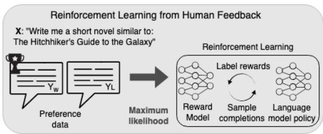

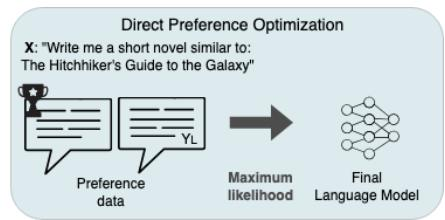  
Figure 7.1 A simplified comparison of RLHF and DPO and how DPO directly optimizes for the policy without an explicit reward function.

After having learned about the theoretical side of DPO, let us now turn to the practical side of it. For this we will use the transformer, peft and trl library from Hugging Face and an open source library called unsloth, which helps us speeding up the training of our LLM. Further, we will log our trainings to Weights and Biases to track our experiments. We will follow the steps I outlined earlier:

SFT step   
DPO-step to train the model with the preference labeled prompts.

For the rst step, the SFT, we load, as usual, the model we want to train, as shown in listing 7.6

# Listing 7.6 Loading the model for SFT

1 load the model and tokenizer   
model, model_tokenizer $=$ FastLanguageModel.from_pretrained( model_name $=$ "unsloth/mistral-7b-bnb-4bit", 2 Define the the max sequence length max_seq_length $= 4096$ 3 Set type detection to auto dtype $\equiv$ None, 4 Use 4bit quantization to reduce memory usage. load_in_4bit $\equiv$ True

After having loaded the model into our Notebook, we have to add the LoRA adapters (listing 7.7), in order to be able to just update a portion of the model.

# Listing 7.7 Add LoRA adapters for model

```python
model = FastLanguageModel.get_peft_model(
    model,
    r = 64,
    target Modules = ["q_prog", "k_prog", "v_prog", "o_prog",
                    "gate_prog", "up_prog", "down_prog"], lora_alpha = 64,
            lora_dropout = 0,
            bias = "none",
            use-gradient_checkpointing = True,
            random_state = 42,
            max_seq_length = 4096, 
```

Now that we have set this part up, we need to prepare our data. We will use the cleaned Alpaca dataset from Hugging Face (https://huggingface.co/datasets/yahma/alpaca-cleaned for this. We have to prepare the a prompt template as demonstrated in listing 7.8 and load and format our dataset (7.10).

# Listing 7.8 Create the prompt instructions

alpaca_template $=$ ''''''Write a response that completes the task from below, following the instruction.

### Instruction:

### Input:

### Response: """

def prepare_prompts(data): texts $=$ [alpaca_template.format(inst, inp, out) for inst, inp, out in zip(data[''instruction''], data[''input''], data[''output''])] return ''text'': texts

# Listing 7.9 Load and prepare Alpaca data

alpaca_dataset $=$ load_dataset(''yahma/alpaca-cleaned'', split $=$ ''train'')

formatted_dataset $=$ alpaca_dataset.map(prepare_prompts, batched=True)

Now we train our LLM as we have already seen in the previous chapters by initializing the training arguments for the Trainer Class:

# Listing 7.10 Initialize training arguments

training_args $=$ TrainingArguments( per_device_train_batch_size = 2,

```python
gradient Accumulation_steps = 4,  
warmup_steps = 5,  
max_steps = 60,  
learning_rate = 2e-4,  
fp16 = not torch.cuda.is_bf16supported(),  
bf16 = torch.cuda.is_bf16supported(),  
logging_steps = 1,  
report_to = "wandb",  
optim = "adamw_8bit",  
weight Decay = 0.01,  
lr_scheduler_type = "cosine",  
seed = 42,  
output_dir = "outputs" 
```

And then we feed the arguments into our SFTTrainer class which we obtain from the trl library:

# Listing 7.11 Train model with SFTTrainer

# 0 Initialize the SFTTRainer

```python
trainer = SFTTrainer(
    model = model,
    train_dataset = formatted_dataset,
    dataset_text_field = "text",
    max_seq_length = 4096,
    args = training_args 
```

# 2 Call the the trainer class and train the model

trainer.stats $=$ trainer.train()

Because we used LoRA, which means we only update a small portion of the model, we can train the model with a T4 GPU in a Colab Notebook. This will take about 8-10 minutes to complete.

If we now want to take our newly trained model for a test-spin we can run the inference as shown in listing 7.12

# Listing 7.12 Run inference on trained model

# 0 Prepare the prompt

prompt $=$ model_tokenizer(   
[   
alpaca_template.format( 2 Instruction "What is the iconic symbol of freedom at the US east coast?", 3 Input " ", 4 Output " ",

）] \*1，return_tensors $=$ "pt").to("cuda")

5 Model's generation settings generation_parameters $=$   
$\bullet$ Maximum number of new tokens to generate ''max_new_tokens'': 256,   
Whether to use past key values for attention ''use_cache'': True   
8 Generate outputs using the model and the specified generation parameters outputs $=$ model.generate(**prompt, **generation_parameters)   
$\bullet$ Decode the generated outputs decoded_outputs $=$ model_tokenizer.batch_decode(outputs, skip_special_tokens=True)

This will result in the following output:

Instruction:

What is the iconic symbol of freedom at the US east coast?

Input:

Response:

The Statue of Liberty is the iconic symbol of freedom at the US east coast. It is a colossal copper statue, designed by French sculptor Frédéric Auguste Bartholdi, and is located on Liberty Island in New York Harbor. The statue was a gift from France to the United States and was dedicated on October 28, 1886. The statue is a symbol of freedom, democracy, and the United States welcoming of immigrants. It has become an iconic symbol of the United States and is a popular tourist destination.

We save our model and continue with the next step, the DPO training. We load our previously trained model, in the same way as shown in listing 7.6 and add our LoRA adapters as shown in listing 7.7. Now for the DPO training, we use the UltraFeedback Binarized dataset (https://huggingface.co/datasets/HuggingFaceH4/ultrafeedback_binarized). And because we want to do DPO, we only use the preference modelling (prefs) samples of the dataset to train our model. How you can accomplish this is shown in listing 7.13 and listing 7.14.

# Listing 7.13 Function to load the dataset with desired split

```python
def get_sampledDatasets(dataset_name, splits, fraction, shuffle=True):
    rawDatasets = DatasetDict()
    for split in splits:
        dataset = load_dataset(dataset_name, split=split)
        if shuffle:
            dataset = datasetshuffle(seed=42)
            sampled_dataset = dataset.select(range(int(fraction * len(dataset)))
        rawDatasets[split] = sampled_dataset
    return rawDatasets 
```

# Listing 7.14 Load the dataset for DPO training

0 Dataset name

dataset_name $=$ ''HuggingFaceH4/ultrafeedback_binarized''

$\textcircled{8}$ Only use the preference modelling samples

splits $=$ [''train_prefs'', ''test_prefs''] (prefs) splits of the dataset

$\otimes$ The fraction of the dataset to sample

fraction $\mathit { \Theta } = \mathit { \Theta } 0 . 0 1$

4 Get sampled datasets

raw_datasets $=$ get_sampled_datasets(dataset_name, splits, fraction)

Since we are using DPO, our dataset need to have the columns chosen, rejected, prompt. These are the needed columns for the DPOTrainer class to run properly, if we don’t name the columns in with that naming convention, we will run into problems. To prepare the dataset according to the naming convention we adjust our dataset as shown in listing 7.15.

# Listing 7.15 Function to prepare training data

def apply_chat_template(example, tokenizer, assistant_prefix=''''):

def _strip_prefix(s, pattern): return re.sub(f''^re.escape(pattern)'', '''', s)

def _concatenate_messages(messages): return ' '.join(msg['content'] for msg in messages)

if all(key in example for key in ('chosen', 'rejected')):

$\textcircled{4}$ Process chosen field

if isinstance(example['chosen'], list): example['chosen'] $=$ _strip_prefix( _concatenate_messages(example['chosen'] [1:]), assistant_prefix)

② Process rejected field

if isinstance(example['rejected'], list): example['rejected'] $=$ _strip_prefix( _concatenate_messages(example['rejected'][1:]), assistant_prefix)

③ Process prompt field

if 'prompt' in example and isinstance(example['prompt'], list): example['prompt'] $=$ _strip_prefix(_concatenate_messages(example['prompt']), assistant_prefix)

return example

We then map and transform the dataset as shown in listing 7.16.

# Listing 7.16 Prepare training data

transformedDatasets $\equiv$ rawDatasets.map( lambda example: apply chatting_template的例子，tokenizer)， remove-columns $=$ [col for col in rawDatasets["trainPrefs"].column_names if col not in ['chosen', 'rejected', 'prompt']], desc $=$ " Formatting prompt template",

Then again, we prepare our training arguments as shown in listing 7.17.

# Listing 7.17 Initialize training arguments for DPO training

```python
training_args = TrainingArguments(
    per_device_train_batch_size = 2,
    gradient Accumulation_steps = 4,
    warmup_ratio = 0.1,
    num_train_epochs = 2,
    learning_rate = 5e-6,
    fp16 = not torch.cuda.is_bf16supported(),
    bf16 = torch.cuda.is_bf16supported.,
    logging_steps = 1,
    report_to = "wandb",
    optim = "adamw_8bit",
    weight Decay = 0.0,
    lr_scheduler_type = "cosine",
    seed = 42,
    output_dir = "outputs",
) 
```

Now we use the DPOTrainer class from the trl library to train our model:

# Listing 7.18 Initialize training arguments for DPO training

```python
dpo Trainer = DPOTrainer(
    model=model,
    ref_model=None,
    args=training_args,
    beta=0.1,
    train_dataset=transformedDatasets["train-options"]
    eval_dataset=transformedDatasets["test-options"]
    tokenizer=tokenizer,
    max_length=1024,
    max_prompt_length=512,
) 
```

You can then save your model either locally with:

# Listing 7.19 Save model locally

model.save_pretrained(''your_model_name'')

Or push it to Hugging Face Hub:

# Listing 7.20 Save model in Hugging Face Hub

```txt
model.push_to Hubb("your_name/your_model_name") 
```

NOTE The code for the SFT and the DPO traing can be found in the books repo: https://github.com/Nicolepcx/Transformers-in-Action in the following Notebooks:

CH07_SFT.ipynb   
CH07_DPO.ipynb

To now run the inference of the model we can leverage the same code as in 7.12:

# Listing 7.21 Run inference on trained model

1 Prepare the prompt   
prompt $=$ model_tokenizer( [ alpaca_template.format( 2 Instruction "What is the iconic symbol of freedom at the US east coast?", 3 Input " ", 4 Output " ", ） ] \*1, return_tensors="pt").to("cuda")

6 Model's generation settings generation_parameters $=$   
6 Maximum number of new tokens to generate ''max_new_tokens'': 256,   
7 Whether to use past key values for attention ''use_cache'': True   
8 Generate outputs using the model and the specified generation parameters outputs $=$ model.generate(**prompt, **generation_parameters)   
$\bullet$ Decode the generated outputs decoded_outputs $=$ model_tokenizer.batch_decode(outputs, skip_special_tokens $, =$ True)

The response will be the same as in the SFT example. But your models behaviour will, of course, change based on the training dataset. So, if you, for instance, have a labeled

dataset where your model is guided to adhere to a certain company policy, your model will now follow this guideline.

This completes our section on DPO training. Feel free to experiment with the provided code. You can exchange the models and the used datasets and/or change the hyperparameters in the training arguments to see how this inuences your models responses. In the next section we will look at how you can control your LLMs output without having to alter the model weights.

# Evaluating text generation performance

Assessing text generation poses significant challenges due to the complex and varied nature of human language. BERT Score provides a quantitative method and is frequently used in academic research, however, it’s not a catch-all solution to this intricate problem. A significant consideration when using BERT Score, is the need for a reference text that aligns closely with the context and intent of the generated text. This requirement may pose challenges in real-world text generation tasks, where suitable reference texts may not be readily available or even possible to create.

Despite these limitations, knowing how to use BERT Score can be a useful tool for understanding and assessing the effectiveness of your text generation models. At the end, it’s important to remember that human judgment often provides the most reliable way to evaluate text generation quality.

# BERT SCORE

BERT Score is a metric for evaluating the quality of generated text in natural language processing tasks. Unlike conventional evaluation metrics such as BLEU, ME-TEOR, NIST, ROUGE, and CIDER, which simply measure the n-gram overlap between the generated and reference translations, BERT Score operates at a more granular level, considering word and sentence embeddings to capture the contextual information within the text.

In essence, BERT Score calculates the cosine similarity between the BERT embeddings of the candidate and reference sentences. The scoring function computes the precision (PBERT), recall (RBERT), and F1 score (FBERT) for each candidate sentence against each reference sentence. The computation is defined as follows:

$$
R _ {\mathrm {B E R T}} = \frac {1}{| x |} \sum_ {x _ {i} \in x} \max  _ {\hat {x} _ {j} \in \hat {x}} \mathbf {x} _ {i} ^ {\top} \hat {\mathbf {x}} _ {j} \tag {7.1}
$$

$$
P _ {\text {B E R T}} = \frac {1}{| \hat {x} |} \sum_ {\hat {x} _ {j} \in \hat {x}} \max  _ {x _ {i} \in x} \mathbf {x} _ {i} ^ {\top} \hat {\mathbf {x}} _ {j} \tag {7.2}
$$

$$
F _ {\text {B E R T}} = 2 \frac {P _ {\text {B E R T}} \cdot R _ {\text {B E R T}}}{P _ {\text {B E R T}} + R _ {\text {B E R T}}} \tag {7.3}
$$

Here, $_ x$ represents the set of words in the reference sentence, and $\hat { x }$ denotes the set of words in the candidate sentence. $\mathbf { x } _ { i }$ and $\hat { \mathbf { x } } _ { j }$ represent the BERT embeddings of the words in the reference and candidate sentences, respectively. The BERT Score calculates the cosine similarity between these embeddings, which results in a value ranging from -1 to 1. The final BERT Score is obtained by averaging the cosine similarity values across all words in the sentence and then shifting and scaling the average to the range [0, 1]. This helps in better handling sentences with different lengths.

$R _ { \mathrm { B E R T } }$ is the recall, which measures how many of the actual positive cases (i.e., correctly predicted words) our model was able to catch. $P _ { \mathrm { B E R T } }$ is the precision, reflecting the proportion of the positive identifications (i.e., the predicted words) that were indeed correct. FBERT is the F1 score, which represents the harmonic mean of precision and recall, providing a balance between them.

Furthermore, BERT Score incorporates importance weighting to reflect the varying significance of different words in a sentence. It also applies baseline rescaling to account for the difference in score distributions across languages.

# ALPACAEVAL

AlpacaEval is a GPT-4-based comparison. The leaderboard can be access via: https:// tatsu-lab.github.io/alpaca_eval/, this leaderboard helps as a general baseline which model you might want to chose for your own task. If you want to evaluate your custom model, i.e. after refining a LLM either with RLHF, RLAIF or DPO, you can follow the instructions provided here https://github.com/tatsu-lab/alpaca_eval#contributing.

# 7.3 Prompt engineering: The art of prompting

In section 1.3 we’ve shortly looked into zero-shot and few-shot learning and that the billionparameter models, like Llama 2, can produce stunning outputs using these methods. In this section we will take a deep dive into these techniques and while doing so, shed some light onto common techniques, to improve a models prompt output, like Chain-of-Thought and Tree of Thoughts.

We use what are called prompts to "talk" to LLMs to perform a task. A prompt is text that a user types in for the model to respond to. This text can be in the form of questions, instructions, or any kind of input, depending on what you aim to achieve with the model. With multimodal models, like ChatGPT, handling inputs from images and text, prompts can also be in the form of images. Or a combination of text and images.

To get the most out of LLMs we use a technique called prompt engineering. This term refers to the process of carefully crafting prompts to generate a specic output from our model. We distinguish between the following strategies:

Zero-shot prompting   
One- and few-shot prompting   
Chain-of-Thought prompting   
Contrastive Chain-of-thought prompting

Tree of Thought prompting   
Thread of Thought

In the following sections will take a close look into each of these techniques, showing how and when to use them.

# 7.3.1 Zero-shot prompting

Zero-shot prompting, also known as direct prompting, enables users to generate an output from an LLM with minimal overhead and it is the simplest type of a prompt. This technique provides no examples to the model for the task at hand. This is possible because these billion parameter models can eciently use in-context information, as shown in image 7.2.

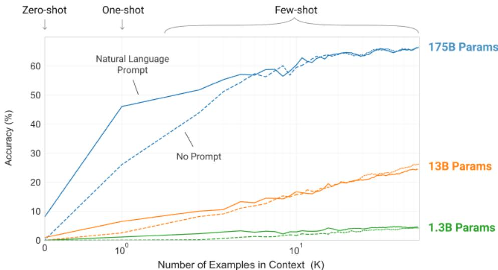  
Figure 7.2 This figure illustrates how larger models progressively use in-context information more efficiently. In-context refers to the information immediately preceding a task which provides some guidance or context for the task itself. Here, it demonstrates the performance of learning on a basic task where the model must remove random symbols from a word. The task is executed both with and without a natural language task description. It can be observed that the steeper learning curves for larger models are indicative of their enhanced capacity to learn tasks using this in-context information. This behavior pattern is consistent across a broad spectrum of tasks. Image is taken from the GPT-3 paper.

To use zero-shot prompting we have to provide the following information to the model:

Instruction   
Some context

The LLM will based on this generate it’s output. For instance, we could tell the model to do a sentiment classication:

Instruction: Sentiment classication

Context: Classify the given text: "The movie was not bad." into the following classes: positive, negative.

This is the output generated from using this set-up to prompt ChatGPT with this task:

OUTPUT The text "The movie was not bad." should be classied as positive. This classication is based on the use of the phrase "not bad," which typically indicates a positive sentiment, especially when used in informal contexts like movie reviews. In such cases, "not bad" is often understood as a colloquial way of saying something is good or satisfactory.

It’s important to note that even though the model did classify the sentiment correctly, there are some limitations to zero-shot prompting. However, even the most advanced language models may still face challenges with complex multi-step reasoning tasks, including solving math word problems and understanding commonsense reasoning. This is where other techniques like Chain-of-Thought and Tree of Thought come in.

# 7.3.2 One- and few-shot prompting

The GPT-3 paper was titled "Language Models are Few-Shot Learners", this paper introduced not only GPT-3, but also expanded on how these large models are performing better compared to others, as shown in image 7.3.

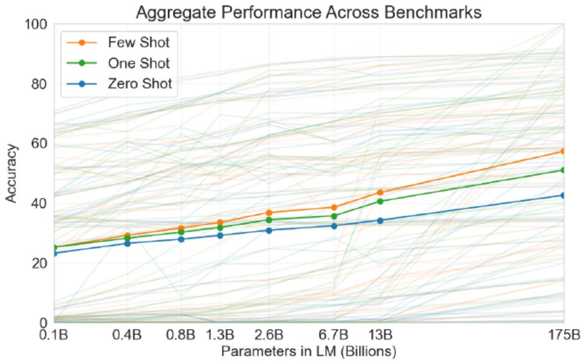  
Figure 7.3 In this plot we can clearly see how zero-shot performance steadily improves with model size, however, compared to few-shot, the performance increases faster. The chosen Benchmark for evaluating the models was SuperGLUE, a standard NLP benchmark suite.

To leverage this method fully, let us take a closer look how you can optimize the output from an LLM using one- and few-shot prompting. The dierence between zero-shot and

one- or few-shot prompting is, we now use examples and show these to the model. That is, with one-shot we provide the model with one example, and for few-shot learning, we guide the model with a couple of examples. Let us revisit our simple text classication example from zero-shot prompting. We now would modify the prompt as follows, using few-shot prompting:

Instruction: Sentiment classication   
Context: Classify the given text: "The movie was not bad." into the following classes: positive, negative.   
□ Examples: A wonderful little production: positive; Phil the Alien is one of those quirky lms where the humor is based around the oddness of everything: negative;

We will get the same response, from our model, that the sentiment of "The movie was not bad." is positive. This structure can be expanded to more nuanced texts and tasks. This method is sucient for most tasks, but if we want to enable the LLM to perform reasoning tasks, we need to use more advanced techniques, which we will look at in the following sections.

# 7.3.3 Chain-of-Thought prompting

We’ve seen in the previous section how we can guide the model with some examples to solve simple tasks. However, if we want the model to perform complex reasoning, as it is, for instance, necessary with some text math problems, we need a new way of guiding the model. This can be done by showing the model a few chain of thought demonstrations as examples via prompting. Figure 7.4 shows this method in comparison to standard prompting.

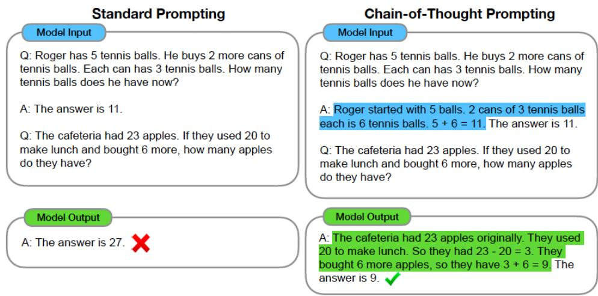  
Figure 7.4 This example demonstrates how chain-of-thought prompting enables LLMs to be able to tackle complex tasks such as arithmetic commonsense reasoning. The processes for chain-of-thought are highlighed. Image is taken from the paper: ”Chain-of-Thought Prompting Elicits Reasoning in Large Language Models”.

Chain-of-thought (CoT) prompting is a series of natural reasoning steps which lead to the nal, desired output. This technique is an inspiration from our thought process. We human beings tend to decompose a complex problem, and solve each intermediate step before we give the nal answer. The programmers among the readers might wryly recognize this as the "divide and conquer" approach, a mantra often repeated exhaustively, in coding lectures. That said, in simple terms, Chain-of-Thought allows LLMs to decompose complex problems into intermediate steps that can be solved individually. Now, the question might arise: Why is it not sucient to only show the model the correct answer, as we saw in gure 7.4? The answer is simple, it is hard for the LLM to directly translate all of the semantics into a single equation. So, if we look at the problem we’ve seen in the comparison between standard and chain-of-thought prompting, the model lacks the ability to derive all semantics to answer the question correctly from just seeing: "The answer is 11.". However, if we guide the model with: "Roger started with 5 balls, 2 cans of 3 tennis balls each is 6 tennis balls. $5 + 6 = 1 1$ ." The model can link the semantics from the questions to the answer. A note of caution, while chain-of-thought prompting is applicable for any text-to-text task and outperforms standard prompting in reasoning tasks, it is more useful if the tasks requires multi-step reasoning. CoT prompting can be optimized by using a method call selfconsistency. This method basically just prompts the model with the same prompt multiply times and then takes the majority as the nal result. To achieve this, self-consistency follows three steps:

Using Chain-of-Thought prompting to prompt an LLM.   
Sampling from the LLM’s decoder to generate various reasoning paths.   
Sort out the unimportant answers and aggregate the most consistent answers.

So, in simple terms, self-consistency is an ensemble approach which returns the most frequent output to get the nal answer. In the next section we are continuing exploring more advanced prompting techniques.

# 7.3.4 Contrastive Chain-of-Thought Prompting

In the previous section, we learned about CoT prompting and how it enhances the reasoning of language models. However, in some specic cases, we want to inform our LLM about the mistakes it should avoid during its reasoning process. Let us revisit our previous example: "Roger started with 5 balls, 2 cans of 3 tennis balls each, which is 6 tennis balls. $5 + 6 = 1 1$ ." and how this would be formulated as a contrastive CoT prompt for our model. Example model input for contrastive CoT:

Question: Roger starts with 5 balls. If he adds 2 cans containing 3 tennis balls each, how many tennis balls does he have in total?   
Correct Explanation: Roger adds the contents of the two cans to his original 5 balls. Each can has 3 tennis balls, so two cans have $2 \textrm { x } 3 = 6$ tennis balls. Therefore, the total is $5 + 6 = 1 1$ tennis balls.   
Wrong Explanation: If Roger adds 2 cans of tennis balls without considering the quantity in each can, one might incorrectly add the number of cans to the original 5

balls, resulting in $5 + 2 = 7$ tennis balls. Hence, this does not account for the fact that each can contains 3 balls, not 1.

This way of guiding the model can be specically helpful if we know of specic negative results we want to avoid. For instance, consider the use case where you are an investment company investing in private equity, and you want to get a non-emotional evaluation of an investor’s pitch from an LLM. Here, you know that your analysts tasked with this often made some mistakes in evaluating the pitch deck. You can use this inside information to feed it into the model and get a better evaluation of the pitch deck.

# 7.3.5 Tree of Thought prompting

If we have even more complex tasks where initial decisions play a pivotal role or a more exploratory and strategic approach is needed, we can leverage tree of thoughts (ToT) prompting. ToT does generalize over the previously introduced CoT prompting by enabling the LLM to explore coherent text units which serve as an intermediate problem solving step. Image 7.5 shows an illustration of this method.

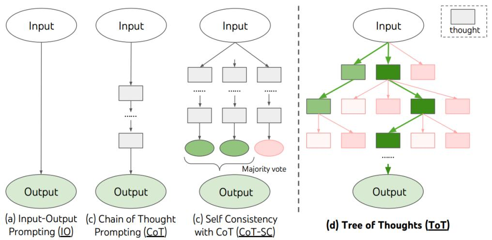  
Figure 7.5 Comparison of different prompting methods, where each rectangle corresponds to a language sequence. Image is taken from the paper: ”Tree of Thoughts: Deliberate Problem Solving with Large Language Models”.

ToT uses the LLMs ability to evaluate coherent language sequences ("thoughts") in combination with search algorithms for data structures such as depth-rst search (DFS) or breadth-rst search (BFS). Some of you may have heard about these two algorithms. They are commonly used to search in tree or graph data structures where we traverse through nodes. Both BFS and DFS start at the root, but BFS explores rst all nodes at the current level of the tree before going to the next one, while DFS explores rst as far as possible along each branch. As you can see, BFS and DFS allow a systematic exploration of ToT.

Let us look how the method can be applied. For that, we follow an example from the authors of the paper. They evaluated ToT with "Game of 24", which is an online

mathematical reasoning challenge where the goal is to manipulate 4 integer numbers with basic arithmetic operations $( + - ^ { * } / )$ in such a way that we get 24. Image 7.6 illustrates how ToT can be used for Game of 24 and how the steps look like if we had the numbers "4 9 10 13" as a given input.

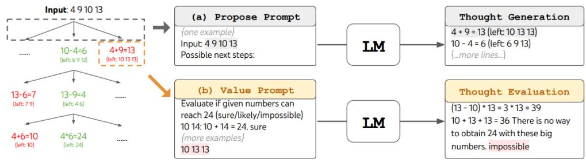  
Figure 7.6 Illustration how ToT can be used, where a corresponds to the thought generation and b to the evaluation of the thought. Image is taken from the paper: ”Tree of Thoughts: Deliberate Problem Solving with Large Language Models”.

The tree part of the illustration demonstrates how, at each tree node, the thoughts get evaluated by prompting the LLM to evaluate each intermediate equation and to eliminate impossible partial solutions by choosing "too big" or "too small" and just keep the ones labeled "likely" or "sure".

Let’s see how this is working in practice. Listing 7.22 demonstrates how you can run the same experiment as in the image from the paper, given the input "4 9 10 13".

# Listing 7.22 Using ToT with GPT-4

0 Install the necessary package   
!pip install tree-of-thoughts-llm -q   
Import the necessary packages, we are using the BFS search algorithm

import os

import argparse

from tot.methods.bfs import solve

from tot.tasks.game24 import Game24Task

③ Set up OpenAI API key and store in the environment variable

# Replace 'your-api-key' with your actual OpenAI API key.

os.environ['OPENAI_API_KEY'] $=$ 'your-api-key'

4 Parse the arguments to run the experiment   
args $=$ argparse.Namespace(backend 'gpt-4', temperature $= 0 \ . \ 7$ , task $\displaystyle . =$ 'game24', naive_run $\downarrow =$ False, prompt_sample $=$ None, method_generate $: =$ 'propose', method_evaluate $=$ 'value', method_select $=$ 'greedy', n_generate_sample $^ { = 1 }$ , n_evaluate_sample $= 3$ , n_select_sampl $\mathord {  } 5$ )   
$\oplus$ Call the functions to run the experiment   
task $=$ Game24Task()  
$\bullet$ 999 is the index from the repo's CSV file to select the number input: 4 9 10 13

ys, infos $=$ solve(args, task, 999) print(ys[0])

This will lead to this nal output:

$[ 1 3 - 9 = 4$ (left: $4 4 1 0 ) 1 0 - 4 = 6$ (left: $4 6 ) 4 \div 6 = 2 4$ (left: 24): $4 \ ^ { * } \left( 1 0 - ( 1 3 - 9 ) \right) =$ 24’, $1 0 - 4 = 6$ (left: $6 9 1 3 ) 1 3 - 9 = 4$ (left: $4 6 ) 4 \div 6 = 2 4$ (left: 24): $( 1 0 - 4 ) \div ( 1 3 - 9 ) =$ 24’, ${ \bf \vec { \tau } } _ { 1 3 } / 4 = 3 . 2 5$ (left: $3 . 2 5 9 1 0 ) 1 0 / 3 . 2 5 = 3 . 0 8$ (approx) (left: $3 . 0 8 9 ) 9 \textrm { - } 3 . 0 8 = 5 . 9 2$ (left: $5 . 9 2 ) 5 . 9 2 \ast 2 = 1 1 . 8 4$ (left: 8 8 11.84 14)’, ${ \bf \vec { \tau } } _ { 1 3 } / 4 = 3 . 2 5$ (left: $8 . 2 5 9 1 0 ) 1 0 / 3 . 2 5 =$ 3.08 (approx) (left: $3 . 0 8 9 ) 9 \textrm { - } 3 . 0 8 = 5 . 9 2$ (left: $5 . 9 2 ) 5 . 9 2 + 2 = 7 . 9 2$ (left: 7.92 8 8 14)’, ${ \bf \vec { \tau } } _ { 1 3 } / 4 = 3 . 2 5$ (left: $8 . 2 5 9 1 0 ) 1 0 / 3 . 2 5 = 3 . 0 8$ (approx) (left: $3 . 0 8 9 ) 9 \textrm { - } 3 . 0 8 = 5 . 9 2$ (left: $5 . 9 2 ) 1 4 \textrm { - } 5 . 9 2 = 8 . 0 8$ (left: 2 8 8 8.08)’] $1 3 - 9 = 4$ (left: 4 4 10)

$1 0 - 4 = 6$ (left: 4 6)

$4 ^ { * } 6 = 2 4$ (left: 24)

Answer: $4 \ ^ { * } \left( 1 0 - ( 1 3 - 9 ) \right) = 2 4$

NOTE If you want to try it out yourself, make sure you check out the corresponding notebook in chapter 7 of the books repository: https://github.com/Nicolepcx/ Transformers-in-Action. However, in order to run the code you will have rst to setup an API for OpenAI: https://platform.openai.com/api-keys and you will have to increase your limit in your API account and add some funds and credit card to your API account here https://platform.openai.com/usage. Note: Running this short experiment will amount for about $\$ 1.5$ .

It’s also important to consider the limitations of every prompting method. One of the limitations of ToT is that it requires a GPT-4 API and is therefore more costly, because we have to pay for the API access and we will have more computational costs, since we will have to prompt the model several times. Moreover, we need to keep in mind that such specic search algorithms are not needed for most tasks. Nonetheless, for task which involve analytical reasoning, like for instance coding or solving mathematical problems, this method is a good choice.

# 7.3.6 Thread of Thought prompting

Thread of Thought (ThoT) prompting, much like many methods in machine learning, is inspired by human cognitive processes. It systematically analyzes and segments the context before selecting relevant information. The fundamental concept is to emulate how humans process vast amounts of information while maintaining a continuity of ideas and selecting pertinent details from the context. ThoT is adaptable and compatible with various LLMs and a range of prompting techniques.

ThoT follows these simple steps:

Initiating the reasoning of the LLM by prompting it with a sentence like this: "Walk me through this context in manageable parts step by step, summarizing and analyzing as we go."

Rening the conclusion by combining the initial prompted text with the model’s response and a conclusion marker such as: "Therefore, the answer:"

This approach enhances the LLMs capacity of navigating chaotic context in helping it to organize the context into organized chucks of thoughts. Image 7.7 illustrates how ThoT can be used and how it compares to CoT.

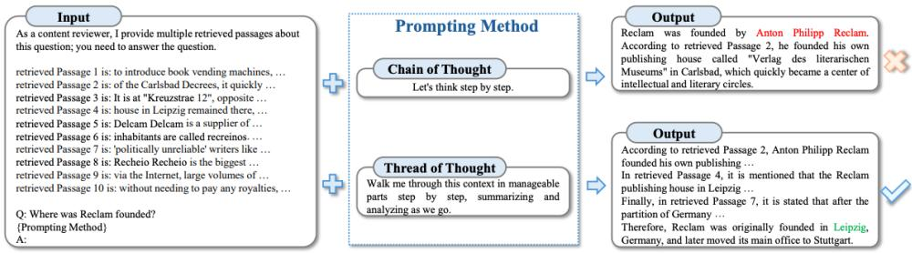  
Figure 7.7 Thread of Thought prompting empowers LLMs to conquer chaotic context problems. In the illustration, text in green represents the accurate response, whereas text in red signifies the incorrect prediction. Image is taken from the paper: ”Thread of Thought Unraveling Chaotic Contexts”.

To conclude this section, ThoT oers a straightforward way to enhance the reasoning capabilities of LLMs for large and chaotic texts.

# Tips for efficient prompting

# One task per prompt

Similar to the way we divide and conquer in programming, we can split the tasks for an LLM into just having one task for each prompt. This helps to avoid confusing the model by giving it precise instructions. If you need to have more information or you need to have more tasks in one prompt aim to use methods such as CoT or ToT to help the LLM with it’s reasoning and organizing textual sequences.

# Be explicit

Again, taken from programming, be explicit. Think of how you would name your functions and your variables to be self-documenting. Or how you would explain a task step-by-step to a 5-year old child.

# 7.4 Summary

To rene text generation models, leveraging RLHF is a common method. At its core is the concept of Markov decision processes, which emphasizes the relationship between actions, states, and rewards. Proximal Policy Optimization ensures that the model’s learning trajectory remains stable by making incremental adaptations rather than drastic changes.

一 DPO is another way to rene your language model’s behavior and align it with your preferences. In contrast to RLHF, with DPO, we now only have a classication objective. Hence, this method is more straightforward in its overall implementation.   
In-context learning refers to the way an LLM "learns" from prompts without altering the model weights. This approach is specically helpful if one has only API access to a language model.   
Prompt Engineering helps in guiding the language model for specic tasks. There exist dierent prompting methods from zero-shot (no examples are given to the model) to one- and few-shot prompting, where the prompt also contains example responses.   
Advanced prompting techniques like Chain-of-thought, Contrastive Chain-of-Thought Tree of Thought, and Thread of Thought prompting help the models if the given task involves reasoning as is the case with mathematical problems.

# This chapter covers

Introduction to multi-modality   
Challenges with multimodal language models   
Overview of multimodal models   
Creating a multimodal chatbot

In the last chapter, we learned how you can control the content of your large language model. You might remember that I mentioned in the intro of chapter 6 that your journey would unfold over three chapters. To recap, chapter 6 focused on text generation and covered some of the state-of-the-art models. However, I intentionally left some top-notch models out. The reason is that they fall under a dierent category, they are known as multimodal models. Therefore, in this chapter, we will take a close look at these multimodal models. I will rst cover what multimodal means, then explain the challenges with multimodal language models, and nally, how you can leverage these versatile models to create a chatbot which takes an image and text as input.

# 8.1 Getting started with multimodal models

Humans possess ve senses: sight, hearing, touch, smell, and taste. These capabilities enable us to interpret and interact with our environment. Consequently, "multimodal" refers to the integration of various information streams to achieve a comprehensive understanding

of our surroundings. For instance, as a toddler or child, we learn through engagement in a multimodal learning process. Think of a toddler playing with their teddy bear; they usually put things in their mouth. Or if they grow up with pets, they mimic their sounds. This process of learning in humans served as inspiration for researchers, trying to blend diverse modalities in the training of large language models. If we now compare our LLM with how a child uses all senses to learn about their environment, we can draw similarities. Multimodal large language models (MLLMs) integrate various types of data inputs, such as visual images, text, and audio, among others, to enhance their learning and understanding.

To give you a simple example where this might be helpful, consider an online clothing shop with an LLM-based chatbot. If a customer asks to see some white shirts, the model will be able to handle the text input, map the images from the shop to the query, and provide the customer with appropriate ndings.

Fundamentally, this relies on the model being tasked with rening an objective dened by a loss function. The minimization of the loss is achieved through gradient descent. For this process to be successful, we need to have and align the numerical input data. Multimodal tasks often involve handling unstructured data like images or text. Thus, the initial challenge is converting such input into a numerical format. Another complexity in multimodal tasks is the eective combination of dierent modalities.

Having understood the basic principles of mulit-modality, we will look, in the next section, into the specic challenges and important considerations that come with these complex multimodal tasks.

# 8.2 Challenges and considerations for multimodal models

One of the challenges in pre-training multimodal models is the high computational cost, primarily due to the requirement of end-to-end training using large-scale models and extensive datasets. This challenge has led to a signicant shift in the eld, particularly in vision-language pre-training (VLP). Rather than building entirely new models from scratch, there’s an increasing trend towards leveraging SOTA unimodal models that specialize in either language or vision. This approach not only reduces computational demands but also enhances the ecacy of the models.

This strategy has signicantly inuenced the development of multimodal models incorporating other modalities, such as audio or video. MLLMs, which integrate LLMs to process diverse data types including text, vision, and audio, are typically built with a focus on modality alignment. This alignment is crucial for bridging the gap between the inherently language-centric LLMs and other modalities. A key component in achieving this is a specically designed alignment method, which is designed to align and synchronize dierent data types. This methods facilitates the LLM’s understanding of non-textual data, enabling it to interpret and integrate information from various sources coherently.

Such alignment can be either be done by a converter facilitating the transformation into objects comprehensible or learnable by LLMs, An illustration of such a converter is shown in image 8.3.

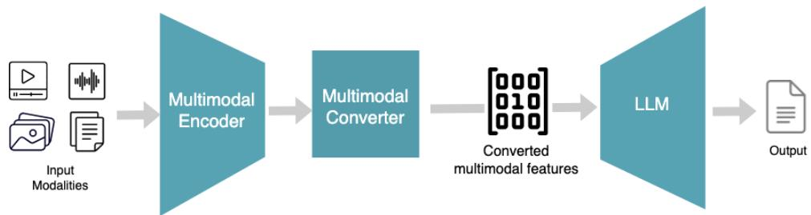  
Figure 8.1 This illustration shows the data flow in a multimodal language model. The multimodal encoder processes various input modalities, which could represent a deep neural network capable of handling different types of data such as images, audio, and text. The processed data is then passed through a multimodal converter, which aligns and translates these features into a representation that a language model can understand.

Or a perceiver, which is designed to primarily enhance the perceptual abilities towards an understanding of multimodal information from dierent data types by transforming multimodal features into multimodal tokens, as shown in 8.2.

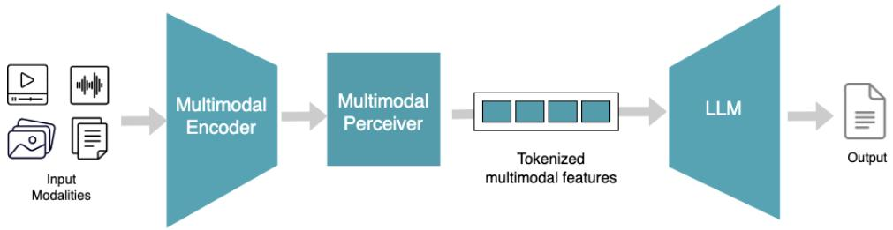  
Figure 8.2 This illustration shows the data flow in a multimodal language model using a perceiver, that serves as a connector between the textual modality and additional modalities, converting multimodal attributes into tokens compatible with the representation space of LLMs.

The implications of this development are signicant. By eectively aligning dierent data types, MLLMs are not only more computationally ecient but also become more capable in contextually understanding and interpreting multimodal data. This advancement holds immense potential across various domains, from enhancing the capabilities of AI assistants to improving content analysis tools in multimedia.

Choosing an appropriate modality alignment method is crucial for the success of MLLMs. The eectiveness of these models depends on the seamless integration of dierent data types, which requires a nuanced understanding of the strengths and limitations of each modality.

For instance, in vision-language models, the alignment method must eectively synchronize visual data with textual interpretation, ensuring that the model comprehensively understands visual elements in the context of relevant text. Similarly, in models integrating audio, the method must accurately translate and integrate auditory information with linguistic data.

Current state-of-the-art MLLMs employ a variety of techniques to bridge the semantic gap, some models use attention mechanisms, which allows the model to focus on specic parts of the data from dierent modalities, enhancing the relevance and accuracy of the model’s responses. Others employ neural network architectures specically designed for multimodal data, which can process and integrate information from dierent sources more eciently. Techniques like transfer learning are also prevalent, where a model trained on one type of data is adapted to understand another, leveraging the knowledge it has already acquired.

The choice of alignment method also depends on the specic application and the nature of the data being processed. For instance, models designed for multimedia content analysis might require dierent alignment techniques compared to those used in interactive AI assistants. As this eld continues to evolve, the development of more sophisticated and ecient alignment methods is a key area of research, promising to further enhance the capabilities and applications of MLLMs. An example of dierent methods is shown in image 8.3.

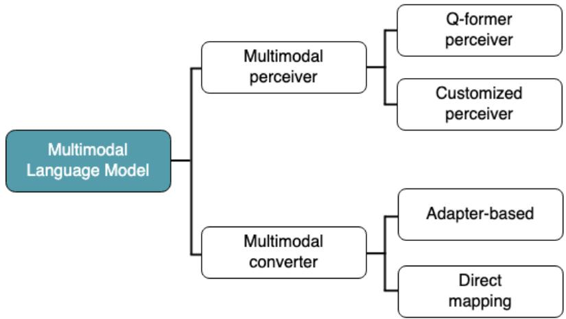  
Figure 8.3 This diagram shows the different methods that can be integrated within a multimodal language model system. The illustration distinguishes two main methods: the perceiver and the converter. The perceiver module connects, for instance, a vision encoder to the frozen language model. The converter, on the other hand, converts the various inputs in such ways that the LLM can digest it.

In the following sections I will explain the dierent methods in details, so you have a thorough understanding of each method, which will set the stage for your understanding of the dierent available MLLMs, we look at in section 8.3.

# 8.2.1 Perceiver-based multimodal methods

The perceiver-based methods aim to minimize the gap of the dierent modalities by a perception module. This module transforms the data features from other modalities, such as images, into tokens which are compatible with the embeddings of the LLMs.

# Q-FORMER PERCEIVER

LLMs are, due to their pre-training on textual data, not capable of understanding information from a multimodal feature space. The querying transformer (Q-former) perceiver aims to bridge this modality gap. The Q-former was rst introduced for BLIP-2 (Bootstrapping Language-Image Pre-training) (4), a vision-language multimodal model. To achieve the alignment between the two modalities, language and vision, the researchers explored two LLMs: FlanT5, a decoder-encoder-based instruction-tuned LLM, and OPT, a decoderbased, unsupervised-trained LLM. Image 8.4 compares the two dierent architectures and illustrates their inner workings.

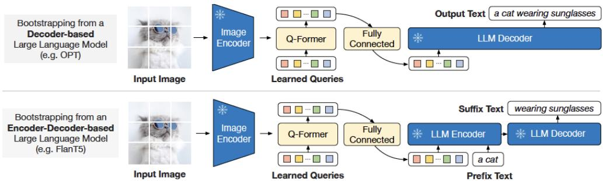  
Figure 8.4 Illustration of the vision-to-language generative pre-training. For both LLMs, the fullyconnected layer acts as an adapter between the output dimension of the Q-Former to the input dimension of the LLM. Image is taken from the paper: ”BLIP-2: Bootstrapping Language-Image Pre-training with Frozen Image Encoders and Large Language Models”

For the vision models, they explore two distinct architectures: ViT-L/14 from CLIP, which is a vision transformer (ViT) model pre-trained using contrastive learning to align images and text, and ViT-g/14 from EVA-CLIP, which is an enhanced ViT model integrating attention mechanisms for more eective visual understanding and alignment in multimodal contexts. With image-text contrastive learning, the model contrasts the image-text similarity of a positive pair against those of negative pairs. And by doing so learns to maximize the alignment of the image-text representations.

To align the two modalities, the Q-former perceiver employs shared self-attention layers, facilitating an ecient interaction between the image and text modalities. The image transformer and the text transformer act as submodules, and work in tandem, with the image transformer receiving input from both learnable query embeddings and image features encoded by an image encoder. This interaction occurs through a process of cross-attention, allowing for a seamless integration of image-text modalities. Furthermore, the learnable queries also engage with the input text via shared self-attention layers, promoting a cohesive multimodal understanding.

To further facilitate the Q-former’s capability in multimodal understanding, it employs a two-stage training strategy with frozen unimodal models. In this context, frozen models refer to pre-trained models whose parameters are not updated during the training of the Q-former. Essentially, these models are used as-is, with their learned weights and biases remaining unchanged. This approach allows the Q-former to leverage the established strengths and knowledge encapsulated in these models, while focusing the training process on adapting and ne-tuning its own parameters to bridge the modality gap. By using frozen models, the system can eciently integrate and use the robust capabilities of these pre-trained components without the computational cost and complexity of retraining them. In the rst stage, the Q-former, acting as a lightweight transformer, uses learnable query vectors to extract visual features from a frozen image encoder. This stage focuses on visionlanguage representation learning, enabling the Q-former to learn visual representations that are most relevant to the text. In the second stage, vision-to-language generative learning is performed. Here, the output of the Q-former, containing visually represented data, is connected to a frozen LLM. This stage trains the Q-former to output visual representations that can be eectively interpreted by the LLM, enhancing the alignment between visual features and textual data. This two-stage training process not only enhances the multimodal integration but also sets a precedent for future MLLM research, particularly in visionlanguage tasks.

# CUSTOMIZED PERCEIVER

In the eld of MLLMs, researchers have explored various perceivers to achieve eective alignment across dierent modalities. One development of such an innovative method are multimodal prompt generators for MLLMs. These generators are designed to produce prompts that guide the LLM in processing and interpreting multimodal data. For example, VisionLLM uses a language-guided image tokenizer to create visual prompts based on instructions, whereas MACAW-LLM formulates an alignment module that maps features from images, audio, and videos into the LLMs embedding space.

Furthermore, the modality-adaptive module, as seen in mPLUG-Owl2, represents another signicant advancement in the eld. This module projects various modalities into a shared semantic space, thereby achieving a cohesive coordination of dierent modalities. Such a module is crucial for models that aim to integrate and interpret diverse data types, ensuring that the models understanding remains consistent and accurate across all modalities.

A standout example in the domain of perceivers is the Flamingo model (1), which employs a perceiver resampler module. This module acts as a critical interface between the vision encoder and the LLMs, using a mechanism akin to the multi-layer decoders found in transformers. The perceiver resamplers architecture is designed to take attened visual features and a set number of learnable latent queries as input. These latent queries function as the queries within the module, while the visual features are concatenated as keys and values. An overview of this architecture is shown in image 8.5.

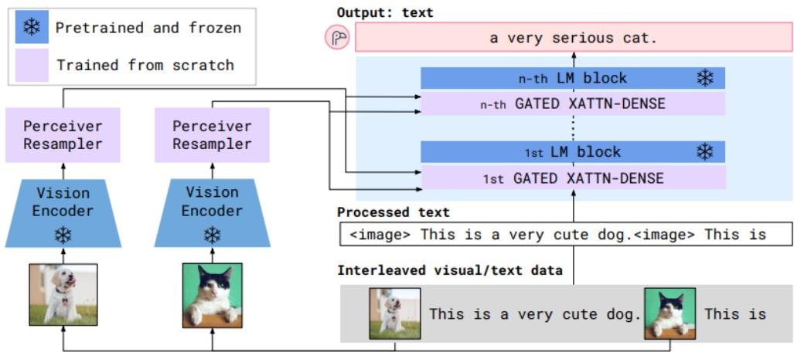  
Figure 8.5 Illustration of the Flamingo architecture, showing how visual data interleaves with text to produce a textual output. Image is taken from the paper: ”Flamingo: a Visual Language Model for Few-Shot Learning”

This design, similar to the querying mechanism in the Q-former perceiver, is specically tailored to transform multiple visual modalities, such as images or sequences of images in videos, into a xed number of visual tokens. The key objective of Flamingo’s perceiver resampler is to boost the alignment eciency between its vision-text modalities, with alignment occurring within the gated xattn-dense layers, illustrated in image 8.6.

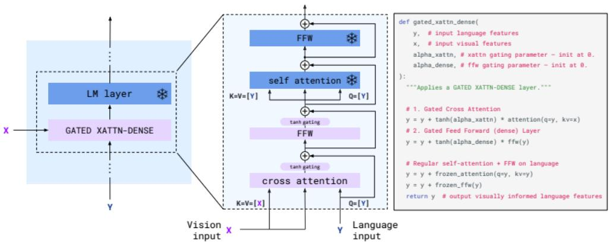  
Figure 8.6 To enable the language model to process visual inputs, an additional cross-attention layers amidst the pre-existing, unaltered layers of the LM is integrated. The information for these layers’ keys and values comes from vision-related features, whereas the queries originate from text inputs. Subsequent to these layers are dense, feed-forward layers. Image is taken from the paper: ”Flamingo: a Visual Language Model for Few-Shot Learning”

After undergoing training on diverse datasets that include interleaved image-text pairs and video-text pairs, Flamingo has demonstrated state-of-the-art performance in numerous image and video understanding tasks, particularly excelling in few-shot learning scenarios.

In summary, the development of custom multimodal perceivers like Flamingo and the implementation of multimodal prompt generators and modality-adaptive modules reect the ongoing evolution in the eld of MLLMs. These innovations not only enhance the models ability to align and interpret data from dierent sources but also pave the way for more natural, human-like communication and understanding in chat-based AI systems.

# 8.2.2 Converter-based multimodal methods

The most straightforward way of enabling LLMs with multimodal capabilities is to directly input multimodal features into LLMs. But since LLMs are pre-trained purely on text this approach means that we need to nd a way of dealing with that semantic gap. One way of overcoming that semantic gap is to map the multimodal features space into a feature space which aligns with the one of LLMs. There exist two distinct methods, direct mapping and adapter-based, which are used in SOTA MLLMs. For instance LLaVA, employs direct mapping, whereas LLaMA adapter and LLaMA adapter 2 employ the adapter-based approach.

# DIRECT MAPPING CONVERTER

The direct mapping converter approach is the simplest converter approach and enables the models to leverage conventional image encoding methodologies to capture and process visual data.

LLaVA, or Large Language-and-Vision Assistant (6), which stands out for its innovative integration of visual and language understanding, is a prime example of the eectiveness of this method.

In LLaVA, the direct mapping strategy is employed to connect a vision encoder with a LLM, such as Vicuna. This connection is achieved using a simple projection matrix, demonstrating a method to align the visual features with the language model. An illustration of the network architecure in shown in image 8.7.

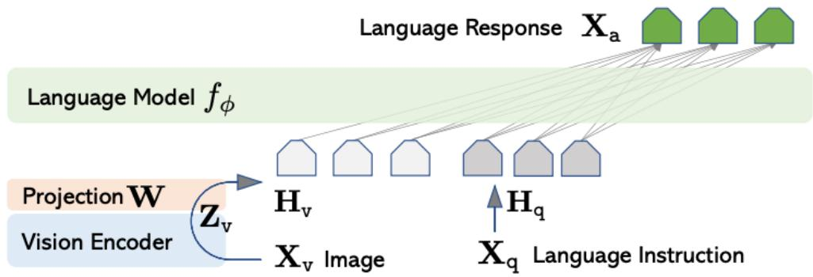  
Figure 8.7 LLaVA Model Architecture: The diagram illustrates the process where an input image $X _ { v }$ is encoded into visual features $Z _ { v }$ by a CLIP visual encoder, which are then projected through a linear layer $W$ into visual tokens $H _ { v }$ . These tokens are combined with language instruction embeddings $H _ { q }$ to generate a language response $X _ { a }$ using Vicuna as their language model $f _ { \phi }$ .

LLaVA’s approach is characterized by its two-stage instruction-tuning procedure. The rst stage focuses on pre-training for feature alignment, where only the projection matrix is updated. This initial stage lays the groundwork for eective feature alignment between dierent modalities. The second stage involves ne-tuning the model end-to-end, where both the projection matrix and the LLM are updated. This stage is applied to dierent scenarios, like visual chat and Science QA, enabling the model to ne-tune its understanding based on the specic requirements of these applications.

LLaVA’s ability to perform well in a variety of tasks, such as visual chat and Science QA, demonstrates the eectiveness of the direct mapping approach in facilitating multimodal understanding. The model achieves impressive results, sometimes exhibiting behaviors akin to multimodal GPT-4 on unseen images and instructions. This performance indicates the potential of the direct mapping method in multimodal settings, particularly when the model is ne-tuned on specic datasets and tasks.

Beyond LLaVA, other models like FROMAGe, DreamLLM, VisionLLM, Fuyu, and VideoLLM also use direct mapping strategies, combining visual embeddings of images directly with textual data as input for LLMs. These models extend the method to various types of visual data, including video content, by encoding and arranging video frames in chronological order and then combining these encoded features with textual data.

However, it’s important to note that despite the promising capabilities of direct mapping converters like LLaVA, they may face challenges in fully comprehending complex multimodal data. This is because the method involves directly inputting encoded features as vectors into LLMs, which might not always align perfectly with the intricate nature of multimodal information.

Nonetheless, the direct mapping converter, as introduced by LLaVA, represents a signi- cant advancement in the eld of MLLMs, oering new research directions and possibilities. By enabling LLMs to process and understand multimodal data more eectively, this approach sets the the groundwork for more sophisticated and contextually aware multimodal language models.

# ADAPTER-BASED CONVERTER

Adapters are used to process and learn from the multimodal features, such as images. Here features are encoded as an adjustment information to inuence the text generation process. The LLaMA-adapter (8) appends a set of learnable adaption prompts into the higher layers of LLaMA. With that, new instructions can be injected to the frozen LLaMA. By using a zero-initialized attention, it is possible to preserve the original knowledge of the LLM, but still incorporate, on top, instructional signals during training.

The LLaMA-Adapter an be summarized as follows:

The model uses a fraction of the 7B parameters, approximately 1.2 million, which are trained while keeping the larger pre-trained model xed, allowing for ecient instruction-following capabilities.   
Training the adaptation modules is fast, requiring only about an hour on specialized hardware, making the process signicantly quicker than similar models.

It’s designed to incorporate specialized adapters for various knowledge domains, making it versatile without needing to replicate the entire base model.   
The adapter is applicable for multimodal reasoning, for instance by adding image tokens into the adaption prompts, the model performs competitively on reasoning tasks such as ScienceQA and COCO Caption.

This process is illustrated in image 8.8

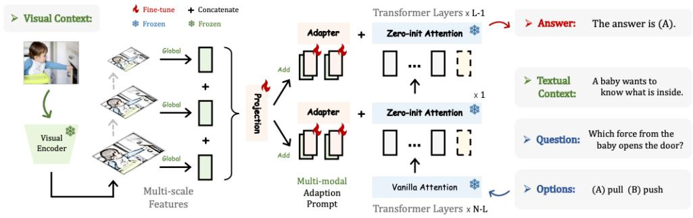  
Figure 8.8 Illustration of multimodal reasoning within the LLaMA-Adapter. In the ScienceQA benchmark, LLaMAAdapter has been expanded into a multimodal version tailored for image-based question answering. This approach involves using an image as the visual context, from which a global image token is derived through multi-scale aggregation. This token is then added to the adaptation prompts on an element-byelement basis, enabling the model to follow visual instructions effectively. Image is taken from the paper: ”LLaMA-Adapter: Efficient Fine-tuning of Language Models with Zero-init Attention”.

Building upon the foundational LLaMA-Adapter, the LLaMA-Adapter V2 (3) represents a leap forward in the transformation of LLMs into multimodal instruction followers. The LLaMA-Adapter V2 aims to expand the potential of LLMs for multimodal instruction following, a task that remains relatively uncharted compared to traditional language processing. This interation of the adapter enriches LLMs with visual processing capabilities, addressing the limitations of its predecessor, which struggled with open-ended visual tasks and lagged behind the more advanced GPT-4.

LLaMA-Adapter V2 enhances the LLM’s performance in language instruction following, making it capable of handling multi-turn dialogues, a signicant step up from the previous model. The improvement comes from a parameter-ecient tuning strategy and the use of high-quality language instruction data. These advancements enable the model to interpret and act upon language instructions more eectively than before.

LLaMA-Adapter V2 marks its superiority over the original by introducing only 14M additional parameters over LLaMA. The framework not only exhibits a robust capability in language instruction following but also excels in interactive chat scenarios, demonstrating its comprehensive understanding of both language and vision. The V2 iteration advances the adapter-based approach through several contributions:

Enhanced Language Model: It demonstrates a notable leap in language instructionfollowing prociency, even capable of engaging in multi-turn dialogues. This signies a substantial improvement in its utility as a language instruction model.

Visual Instruction Tuning: The V2 version introduces an early fusion strategy, shown in 8.9, which mitigates the conict between image-text alignment and language instruction. This approach enables the model to better handle visual instructions without the need for specialized multimodal instruction data.   
Expert System Integration: In contrast to models that require extensive pre-training on large image-text datasets, LLaMA-Adapter V2 incorporates a modular design philosophy. This allows the integration of external expert systems, such as OCR or captioning tools, which can enhance the model’s image understanding capabilities during inference. This modular approach signicantly reduces the need for vast amounts of training data and ensures that the model remains parameter-ecient.

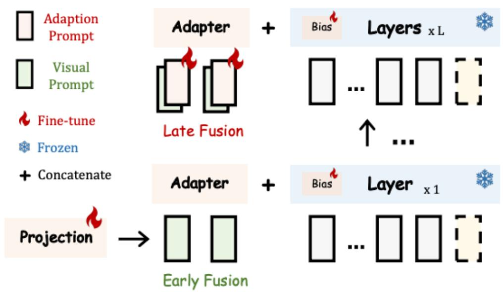  
Figure 8.9 Early fusion of visual knowledge. Inspired by LLaMA-Adapter, LLaMA-Adapter-2 uses fixed adaptation prompts within the final L layers. For visual prompts, these are incorporated at an earlier stage within the large language model, separate from the adaptation. Image is taken from the paper: ”LLaMA-Adapter V2: Parameter-Efficient Visual Instruction Model”.

To summarize, LLaMA-Adapter V2 stands out as a transformative development in the eld of MLLMs, fostering stronger language models that can interact with and understand the visual world.

Now that you have a clear understanding of the commonly used methods to align multimodalities within MLMMs, it’s time to explore the current state-of-the-art MLLMs in the next section.

# 8.3 Model Overview

In this section, we will examine various MLLMs. Each model incorporates dierent modalities in distinct ways. However, most ongoing research in MLLMs revolves around vision-text models. Therefore, this section will primarily focus on these vision-text models. Moreover, I won’t cover models like DALL-E, SimCLR, BigBiGAN, and VQ-VAE-2, while advanced and capable in their respective domains, they don’t t the typical denition of MLLMs. These models are primarily vision-focused, with language understanding as a component, but they don’t typically output text as part of their primary function.

As with the previous chapters, I will rst provide a short overview of the models and then dive deeper into the overall architecture of each model.

BLIP (Bootstrapping Language-Image Pre-training) (5) is a model designed for various multimodal tasks including visual question answering, image-text retrieval, and image captioning. It uses a unique VLP framework which is eective in both visionlanguage understanding and generation tasks. The vision part uses a ViT encoder, and the text encoder is the same as BERT and has 583M trainable parameters.   
BLIP-2 builds upon the original BLIP. It incorporates a lightweight 12-layer transformer encoder, bridging pre-trained image encoders and large language models. BLIP-2 is available as 3.1B, 3.4B, 3.8B, 4.1B, 7.8B and 12.1 B variants.   
CLIP (Contrastive Language-Image Pretraining) by OpenAI is a widely recognized model that eciently connects text and images. It is trained to understand images in the context of natural language, allowing it to perform tasks like zero-shot classication. The original research paper on CLIP detailed several model congurations, focusing on variations of the ViT and ResNet architectures for the image encoder, and a transformer-based architecture for the text encoder.   
X-CLIP (7) is built upon the foundation of the CLIP model but extends its capabilities to handle video data. It has a cross-frame vision encoder to capture long-range dependencies across frames in a video. As well as a multi-frame integration transformer allowing the model to create a coherent understanding of the entire video sequence, rather than just individual frames.   
Flamingo is a family of vision-language models with 3B, 9B and 80B parameters. It was developed by DeepMind and specializes in multimodal learning, particularly in handling tasks that involve both vision and language processing.   
【 OpenFlamingo (2) is an open-source variant of Flamingo, the models range from 3B to 9B parameters and perform $8 0 { - } 8 9 \%$ of the corresponding Flamingo performance on seven vision-language tasks.   
GPT-4 with vision (GPT-4V) allows users to direct GPT-4 to examine images they provide. GPT-4V inherits the strengths and weaknesses of both text and vision modalities, yet it also introduces new abilities that arise from the combination of these modalities and from the enhanced reasoning capabilities of large-scale models.

Large Language and Vision Assistant (LLaVA) represents an innovative approach in the multimodal eld. It uses instruction tuning with machine-generated languageimage instruction-following data, aiming to connect a vision encoder with a LLM for versatile visual and language understanding. LLaVA uses Vicuna as the LLM and the visual encoder, ViT-L/14, from CLIP.

# 8.3.1 BLIP

BLIP is a framework in the multimodal AI domain, designed to rene vision-language understanding and generation. Developed to make use of noisy web-scale image-text pairs, BLIP introduces a cohesive VLP approach, encapsulated in its Multimodal Encoder-Decoder (MED) architecture. At the core of BLIP’s architecture is the MED, which handles both unimodal and multimodal tasks. The visual part employs a ViT as the image encoder, processing images into patches for sequence embedding, a method favoring computational eciency over traditional pre-trained object detectors. The text encoder mirrors BERT’s structure, enhancing the model’s language understanding capabilities. Image 8.10 shows the overview of the model architecture.

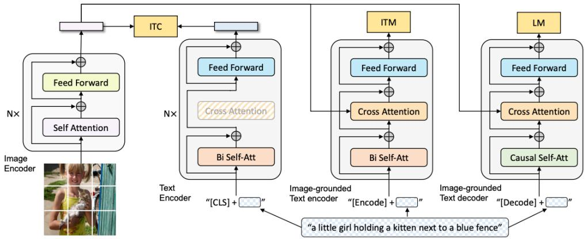  
Figure 8.10 Architecture illustration of BLIP. Which uses an unimodal encoder using image-text contrastive loss to synchronize visual and linguistic representations. An image-grounded text encoder that employs cross-attention layers to process vision-language interactions. And an image-grounded text decoder with causal self-attention, sharing the encoder’s cross-attention and feed-forward networks, trained on language modeling loss to create captions from images. Image is taken from the paper: ”BLIP: Bootstrapping Language-Image Pre-training for Unified Vision-Language Understanding and Generation”.

BLIP’s MED operates in three distinct modes:

As a unimodal encoder for separate image and text processing.   
An image-grounded text encoder for multimodal representation, leveraging crossattention layers.   
An image-grounded text decoder for generating text from visual inputs, using causal self-attention for narrative coherence.

The model is ne-tuned with a trio of objectives, balancing understanding with generation. image-text contrastive loss and image-text matching Loss focus on aligning and matching image-text pairs for accurate multimodal representation. Meanwhile, language modeling loss is dedicated to generating descriptive text from images, signifying BLIP’s generative ability. To enhance dataset quality, BLIP introduces CapFilta two-step method involving caption generation for web images and subsequent ltering of incongruent imagetext pairs. This method signicantly improves the learning material’s relevance and quality, facilitating more eective pre-training.

Further, BLIP is pre-trained on a blend of human-annotated and web-collected datasets, ensuring a broad spectrum of visual and textual knowledge. The model’s architecture and training are designed for eciency, enabling it to achieve remarkable results in various multimodal tasks with less computational demand compared to previous models.

# 8.3.2 BLIP-2

BLIP-2 (Bootstrapping Language-Image Pre-training with Frozen Unimodal Models) innovates the eld of VLP by bridging the gap between pre-trained unimodal models for enhanced cross-modal alignment. This advancement addresses the challenge of integrating LLMs, which traditionally do not process images, with vision models in a cohesive framework without the need for end-to-end retraining.

BLIP-2 uses a two-stage pre-training approach. The rst stage focuses on visionlanguage representation learning, optimizing the Q-Former to select visual representations most relevant to accompanying text. The subsequent stage shifts to vision-to-language generative learning, rening the Q-Former’s output to ensure it can be eectively interpreted by the LLM for text generation tasks. The queries between the text transformer and image transfromer interact with each other through self-attention layers, image 8.11 illustrates the self-attention masking strategy for each query-text interaction.

Q: query token positions；T: text token positions.

□masked□unmasked

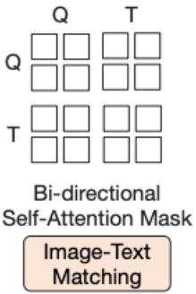

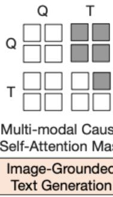

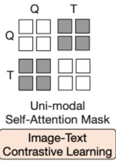  
Figure 8.11 The strategy for self-attention masking is tailored to each objective to manage the interaction between queries and text. Image is taken from the paper: ”BLIP-2: Bootstrapping Language-Image Pre-training with Frozen Image Encoders and Large Language Models”.

Central to BLIP-2’s architecture is the Q-Former, a component designed to act as an intermediary between the vision and language modalities. The Q-Former, through its learnable query vectors, eciently extracts and distills visual features from a frozen image encoder, presenting them to a frozen LLM in a manner that facilitates seamless vision-language integration.

The model leverages the robust capabilities of existing pre-trained image and language models, achieving state-of-the-art performance across a variety of vision-language tasks such as visual question answering, image captioning, and image-text retrieval. Moreover, BLIP-2 introduces the capacity for zero-shot image-to-text generation, opening avenues for applications like visual knowledge reasoning and conversational AI. Importantly, the use of frozen models paired with the lightweight Q-Former makes BLIP-2 signicantly more compute-ecient than its predecessors.

# 8.3.3 CLIP

CLIP (Contrastive Language-Image Pre-training), developed by OpenAI, introduces an approach to understanding images in the context of natural language, facilitating a wide range of applications from zero-shot classication to complex reasoning tasks. At the heart of CLIP’s design is a dual-encoder framework, comprising a ViT or a ResNet architecture for image encoding, and a transformer-based model for text encoding. This design enables CLIP to process and embed images and text into a shared representation space, leveraging the strength of contrastive learning to tightly couple the two modalities.

Contrastive learning, as implemented in CLIP’s training methodology, is a technique designed to maximize the similarity between related (or positive) pairs of data while minimizing the similarity between unrelated (or negative) pairs. In the setup of CLIP, this involves teaching the model to align the embeddings of corresponding image-text pairs closer together in the shared representation space, while pushing the embeddings of non-corresponding pairs further apart.

This process begins with CLIP’s dual-encoder framework, where one encoder processes images (using either a ViT or a ResNet architecture) and the other processes textual descriptions (using a transformer-based model). During training, CLIP is presented with batches of image-text pairs, each consisting of a genuine pairing from its diverse, internetsourced dataset and multiple mismatched pairings.

For each genuine image-text pair, the model calculates similarity scores between the image embedding and the correct text embedding versus embeddings of mismatched texts. The goal is for the model to learn feature representations that maximize the similarity score for genuine pairs and minimize it for mismatched pairs. This is typically achieved through a contrastive loss function, such as the triplet loss or the noise contrastive estimation loss, which quanties the dierence in similarity scores and guides the model’s optimization process.

The contrastive learning approach enables CLIP to develop a nuanced understanding of the relationships between visual and textual content without direct supervision for specic tasks. As a result, the model learns a broad, generalizable understanding of visual concepts and their natural language descriptions. By leveraging this large-scale, pre-trained

knowledge, CLIP can accurately categorize images into various classes it was not explicitly trained on, showcasing its exibility and eciency across a wide array of applications.

# 8.3.4 X-CLIP

X-CLIP introduces an approach to enhancing video recognition capabilities by integrating cross-frame communication and video-specic prompting into existing language-image pre-trained models. This enables the seamless extension of these models to handle video data, preserving their original performance while broadening their applicability. The name X-CLIP derives from leveraging and expanding upon the set of existing image-level crossmodality pre-trained models, specically CLIP, Florence and eXpand, and extending their application to the video domain.

X-CLIP introduces a video-specic prompting technique that automatically generates instance-level textual representations. This technique leverages the content information within videos to produce more contextually relevant and discriminative textual prompts, thereby improving the alignment between video representations and their textual counterparts. This addresses the challenge of generating eective textual prompts for videos, which is crucial for tasks that involve matching or relating video content with text. Image 8.12 shows an overview of the model’s architecture.

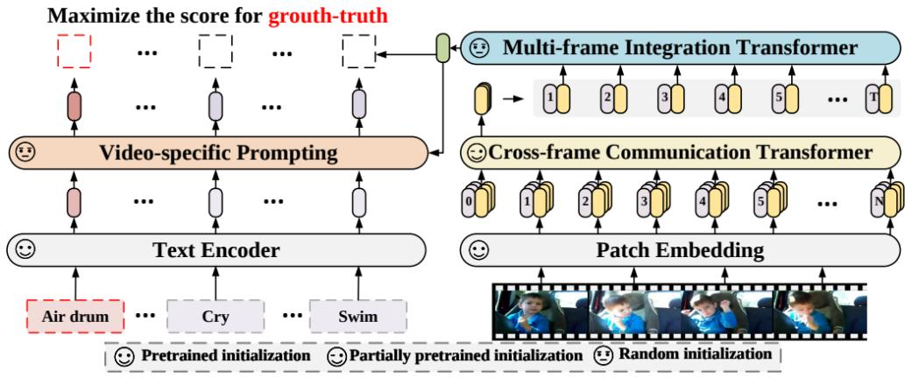  
Figure 8.12 Overview of the architecture of X-CLIP, and how the model aligns video and text representations through a video encoder, text encoder, and a video-specific prompt generator, leveraging pretrained language-image models with video temporal modeling for improved semantic understanding. Image is taken from the paper: ”Expanding Language-Image Pretrained Models for General Video Recognition”.

Another central feature of X-CLIP’s design is its cross-frame communication attention mechanism. This module facilitates temporal modeling by allowing information exchange across video frames, enhancing the model’s ability to understand and represent video content dynamically. By incorporating this mechanism, X-CLIP can capture the nuanced temporal relationships inherent in video data, setting it apart from traditional models that may only consider spatial aspects.

# 8.3.5 Flamingo

Flamingo stands out for its capability to process visual data and text in an interleaved manner, generating text outputs in a contextually rich and open-ended format. At the core of Flamingo’s architecture is the integration of pre-trained vision and language models through the perceiver resampler and initialized cross-attention layers. This setup allows for ecient handling of spatio-temporal features from visual inputs (images or videos) and their seamless integration with text, enabling the model to generate language based on visual context.

A key component, the perceiver resampler, facilitates the transformation of large feature maps from the vision encoder into a concise set of visual tokens. This mechanism reduces the computational load during the vision-text cross-attention process, enhancing the model’s eciency without compromising its ability to understand complex visual inputs. Moreover, Flamingo leverages gated cross-attention dense layers, inserted within a frozen pre-trained language model to condition language generation on visual inputs. This allows Flamingo to generate language that is not only contextually relevant to the visual inputs but also rich and coherent, bridging the gap between visual perception and linguistic expression.

# 8.3.6 OpenFlamingo

OpenFlamingo is designed to enhance in-context learning by processing interleaved imagetext sequences and currently does not support video inputs. OpenFlamingo adopts the Flamingo architecture, using dense cross-attention modules attached to the layers of a frozen, autoregressive language model. This architecture allows text tokens to attend to their corresponding images, enabling the model to predict the next text token based on both visual and textual contexts. A key component, the perceiver resampler, transforms patch features from images, processed by a frozen vision encoder (CLIP ViT-L/14), into a manageable number of visual tokens, streamlining the vision-text cross-attention process.

The model is trained on a mix of open-source image-text pairs and interleaved imagetext sequences, namely LAION-2B and Multimodal C4 (MMC4). This training setup allows OpenFlamingo to learn from a diverse range of visual and textual inputs, signicantly enhancing its adaptability to various tasks. The inclusion of synthetic data, generated through ChatGPT, further enriches the training dataset, providing a broader spectrum of image-text contexts.

# 8.3.7 GPT-4 with vision

Just like GPT-4, GPT-4V completed its training phase in 2022, with early access rolling out in March 2023. Leveraging GPT-4’s foundational technology for visual understanding, GPT-4V underwent a similar training process. Initially, it was trained to anticipate the subsequent word in texts, utilizing a vast amount of text and image data sourced from the internet and various licensed databases. Subsequently, it underwent renement through RLHF, enhancing its output to align with human preferences.

The approach to preparing for deployment focused on evaluating and addressing risks associated with images of people, including issues like identifying individuals, biases in outputs from people’s images that could lead to representational or allocational harms, and

the possibility of the model’s performance increasing signicantly in high-risk areas such as medicine and scientic expertise.

# 8.3.8 LLaVA

LLaVA (Large Language and Vision Assistant) focuses on bridging the capabilities of pretrained LLMs with advanced visual understanding. This facilitates a new era of instructionfollowing agents capable of comprehending and acting upon complex multimodal inputs across various tasks, including visual question answering, visual reasoning, and more, through end-to-end training.

Demonstrating state-of-the-art performance in few-shot learning on multimodal tasks, LLaVA sets new benchmarks in visual question answering, visual reasoning, and conversational AI. The comparison of instruction-following capabilities on the LLaVA-Bench (In-the-Wild) is presented in 8.1, with average scores and standard deviations $( \pm )$ . Across the rst three rows, outcomes from three separate inference attempts are disclosed. Notably, LLaVA outperforms competing models.

Table 8.1 Performance comparison across tasks   

<table><tr><td>Model</td><td>Conversation</td><td>Detail Description</td><td>Complex Reasoning</td><td>All</td></tr><tr><td>OpenFlamingo [5]</td><td>19.3 ± 0.5</td><td>19.0 ± 0.5</td><td>19.1 ± 0.7</td><td>19.1 ± 0.4</td></tr><tr><td>BLIP-2 [28]</td><td>54.6 ± 1.4</td><td>29.1 ± 1.2</td><td>32.9 ± 0.7</td><td>38.1 ± 1.0</td></tr><tr><td>LLaVA</td><td>57.3 ± 1.9</td><td>52.5 ± 6.3</td><td>81.7 ± 1.8</td><td>67.3 ± 2.0</td></tr><tr><td>\( LLaVA^{\dagger} \)</td><td>58.8 ± 0.6</td><td>49.2 ± 0.8</td><td>81.4 ± 0.3</td><td>66.7 ± 0.3</td></tr></table>

LLaVA leverages the concept of GPT-assisted visual instruction data generation, addressing the scarcity of multimodal instruction-following data by utilizing GPT-4/ChatGPT to expand image-text pairs into rich, instruction-based datasets. This method not only enhances data diversity but also deepens the reasoning and contextual understanding required for multimodal instruction following.

The core of LLaVA’s architecture is a seamless integration between a pre-trained visual encoder (CLIP’s ViT-L/14) and Vicuna, which is an open-source chatbot trained by netuning LLaMA, connected via a simple yet eective linear projection layer. This design allows the model to convert visual inputs into language embeddings, enabling the LLM to process and respond to visual data as if it were text.

A pivotal component of LLaVA’s methodology, visual instruction tuning, is aimed at rening the model’s ability to follow complex instructions across both visual and textual domains. Unlike visual prompt tuning, which focuses on model adaptation eciency, instruction tuning enhances the model’s capacity to interpret and act on detailed multimodal instructions, pushing the boundaries of its generative and reasoning capabilities.

LLaVA undergoes a two-stage instruction tuning process, beginning with feature alignment pre-training on curated image-text pairs to align visual features with LLM embeddings. The subsequent ne-tuning stage leverages the generated multimodal instruction-following dataset to give the model robust instruction-following abilities.

# 8.4 Applications and worked examples

Now it’s time to take some of these MLLMs you’ve learned about in the previous section for a test spin. First, we will compare the performance of three dierent vision-language MLLMs, namely BLIP-2, LLaVA, and GPT-4. Then, we will look into how you can use Gradio, an open-source Python package that allows you to quickly build a demo or a web application for your machine learning model, to build a multimodal chatbot.

# 8.4.1 Comparison of different MLLMs for visual reasoning and chat capabilities

In this section we will use a rather unusual image and compare the visual reasoning and chat capabilities of BLIP-2, LLaVA and GPT-4. For this comparison, I will use the same image, as in the LLaVA paper, which is shown in image 8.13.

  
Figure 8.13 Test-image for the comparison of different MLLMs.

Upon examining the image, it becomes clear that identifying the activity depicted may pose a challenge for most multimodal models due to the unconventional nature of the scene. Let us look how the models classify the scene. To do so, I will ask the model this question: "What is unusual about this image?". But rst, let’s prepare the models to be able to answer the question. Listing 8.1 shows how you can initialize the BLIP-2 model in your notebook with quantization.

# Listing 8.1 Initialize BLIP-2 with quantization

```python
quantization_config = BytesAndBytesConfig(
load_in_4bit=True,
bnb_4bit_computedtype=torch.float16
)  
model_id = "Salesforce/blip2-opt-2.7b" 
```

```python
processor = AutoProcessor.from_pretrained(model_id)  
model = Blip2ForConditionalGeneration.from_pretrained(model_id, quantization_config=quantization_config, device_map="auto") 
```

Listing 8.2 shows how you can create a pipeline with Hugging Face and prompt the model with the question.

# Listing 8.2 Prompt BLIP-2 with question

pipe $=$ pipeline("image-to-text",model $\equiv$ model_id,   
model_kwarges $=$ "quantization_config": quantization_config)   
prompt $=$ "Question: What is unusual about this image? Answer:"   
outputs $=$ pipe(image,prompt $\coloneqq$ prompt, generate_kwarges $=$ { "max_new_tokens":300,"do_sample":True,"temperature":0.8}   
printoutputs[0]["generated_text"]）

I’ll omit the model’s answer here and proceed directly with the next model, LLaVA, so we can compare all the outputs in one place. To initialize LLaVA, the process (8.3) is the same as with BLIP-2, only the model_id needs to be changed.

# Listing 8.3 Initialize LLaVA with quantization

```python
quantization_config = BitsAndBytesConfig(
    load_in_4bit=True,
    bnb_4bit_computedtype=torch.float16
)
model_id = "llava-hf/llava-1.5-7b-hf"
processor = AutoProcessor.from_pretrained(model_id)
model = LlavaForConditionalGeneration.from_pretrained(model_id, quantization_config=quantization_config, device_map="auto") 
```

The next step is also mostly the same as with BLIP-2, but for the prompt we need a dierent template. This is one important thing you have to consider when you are using models. Usually, if you use models via Hugging Face, you nd on the model card page a short description telling you how you have to prompt the model.

# Listing 8.4 Prompt LLaVA with question

```python
pipe = pipeline("image-to-text", model=model_id, model_kwarges="quantization_config": quantization_config)  
prompt = "USER: <image> What is unusual about this image? ASSISTANT:"  
outputs = pipe(image, prompt=prompt, generate_kwarges={'max_new_tokens': 300, "do_sample": True, "temperature": 0.8})  
print (outputs[0] ["generated_text']) 
```

Let us now compare the responses from each model.

# BLIP-2 it’s a man in a yellow shirt standing on the back of a taxi

LLAVA In this image, there is something unusual happening on a busy street. A man is standing on the back of a yellow taxi cab, performing a laundry service while the taxi drives down the road. This is not a common sight, as people typically do not stand on the roof of a moving vehicle. It might raise questions about the safety and legality of such an action. Moreover, the image also features trac, including a truck, which demonstrates the bustling nature of the street.

CHATGPT-4 The image depicts a rather unusual and humorous situation where a man appears to be ironing clothes on an ironing board that is mounted on top of a yellow taxi. Typically, ironing is a domestic task performed within the home or a laundry facility, not on the move atop a vehicle, especially not in the middle of what appears to be a busy city street. The juxtaposition of a stationary household chore with the dynamic environment of city trac creates a surreal and comical eect.

Interestingly, despite being only trained on a modest-sized multimodal instructionfollowing dataset (approximately 80,000 unique images), LLaVA achieves reasoning outcomes that closely match those of multimodal GPT-4. It’s worth noting that even though these images are beyond LLaVA’s initial training scope, the model is still capable of comprehending the scenes and adhering to the question instructions to deliver a plausible answer, showcasing it’s zero-shot capability. In contrast, BLIP-2 tends to describe the image rather than responding directly to my question/instruction.

Since the LLaVA shows a remarkable result in visual question answering, let us use this model to build a multimodal chatbot. Here are several reasons why using Gradio makes sense for deploying a multimodal chatbot, especially one powered by a model like LLaVA:

Ease of Use: Gradio allows you to quickly create web interfaces for your machine learning models with just a few lines of code. This means you can focus more on the model itself and less on the intricacies of web development.   
Interactive Demos: With Gradio, you can create interactive demos that let users input text, images, and other data types, then see the outputs generated by your model. This interactivity is crucial for a multimodal chatbot, as it enables users to interact with the model in real-time, providing a practical demonstration of its capabilities. And you can analyze the model errors during testing, since you can use a debug mode.   
Customization and Flexibility: Despite its simplicity, Gradio oers a degree of customization that allows you to tailor the look and feel of your demo to match your needs. You can customize the interface to highlight the features of your multimodal chatbot, making it more engaging for users.

To use Gradio with LLaVA, you have again to rst initialize the model as before. This is shown in listing 8.5.

Listing 8.5 Initialize LLaVA with quantization   
```python
quantization_config = BitsAndBytesConfig(
    load_in_4bit=True,
    bnb_4bit_computedtype=torch.float16
)
model_id = "llava-hf/llava-1.5-7b-hf"
processor = AutoProcessor.from_pretrained(model_id)
model = Blip2ForConditionalGeneration.from_pretrained(model_id, quantization_config=quantization_config, device_map="auto") 
```

To use Gradio with its chat interface, there is a need for a function called update_conversation. Listing 8.7 shows an example of such a customized function.

Listing 8.6 Customized update conversation function for Gradio   
```python
def update_conversation(new_message, history, image=None):
    if image is None:
        return "Please upload an image, since this is an image to text model."
    prompt = "USER: <image>" for user_message, assistant_response in history:
        prompt += f{"user_message"}ASSISTANT: {assistant_response}USER: ""
    prompt += new_message + "ASSISTANT: "
    outputs = pipe(image, prompt=prompt, generate_kwargs=
        {"max_new_tokens": 200, "do_sample": True,
        "temperature": 0.7}) [0] ['generated_text']
    return outputs[len(prompt) - 5:] 
```

Now, to launch the chatbot, you need to call the Blocks() function and then launch the demo as shown in listing.

Listing 8.7 Launch Gradio chatbot in demo mode   
with gr Blocks() as demo: with gr.Row(): image $=$ gr.Image(type $\equiv$ 'pil',interactive $\equiv$ True) chat $=$ gr.ChatInterface( update_conversation, additional_entries $\equiv$ [image]   
demo.launch(debug $\equiv$ True)

The "demo.launch(debug=True)" will launch an interactive UI in your notebook, as shown in image 8.14.


  
Figure 8.14 Launched Gradio UI for the chatbot using LLaVA as a multimodal model.

Or you can use the provided link to share it via a public URL. If you want to deploy the model, you would have to run it via a bash with "gradio deploy", after that it will be permanent freely hosted on Hugging Face Spaces (https://huggingface.co/spaces). This integration facilitates easy sharing and deployment of your models without the need for setting up your own server infrastructure. It also places your work within a community of AI researchers and practitioners, increasing its visibility.

Within that launched UI of the chatbot you can now upload an image and ask the model a question about the image or task it with creating an image caption for you. In image 8.15 you can see the image I questioned the other models before as well as my question to the deployed LLaVA model and its answer to my question.


  
Figure 8.15 Launched Gradio UI for the chatbot using LLaVA as a multimodal model.

Closing this section, I’d like to point out something pretty cool about controlling how your model comes up with its answers. In the example I showed earlier (check out listing 8.5), there’s this neat option called "generate_kwargs=" in the model’s pipeline setup.

This feature is super handy because it lets you tap into the power of any model from the Hugging Face Hub for a bunch of tasks, whether it’s about language, vision, speech, or even combining them. The best part? You don’t need to be a pro in these areas or know all the nitty-gritty of the model to make this work for you.

With the "generate_kwargs=" option, you can play around with dierent ways for the model to generate responses. Whether you’re into experimenting with sampling methods or ne-tuning how the model picks its next words, this feature has you covered. You can enable various generation strategies like multinomial sampling or even get fancy with things like Top-K and Top-p sampling. I dived into all these strategies starting from section 6.3.2 through to section 6.3.6, so you can revisit it there, if you need a short refresher, what each strategy does for you.

For a deeper dive into how the pipeline function works and all the settings you can tweak for your model’s generation strategy, check out these links: the pipeline tutorial at https://huggingface.co/docs/transformers/pipeline_tutorial and a guide on generation strategies at https://huggingface.co/docs/transformers/en/generation_strategies.

# 8.5 Summary

Multi-modality in AI has been adapted from the way humans perceive their environment, having ve senses: sight, hearing, touch, smell, and taste.   
To bridge the semantic gap and enable large language models to understand dierent modalities, there exist two distinct methods: the perceiver and the converter. The perceiver module, for instance, connects a vision encoder to the frozen language model. The converter, on the other hand, converts various inputs in such a way that the LLM can digest them.   
Current MLLM research is mostly focused on vision-text. Some of the state-of-theart models include: BLIP-2, CLIP, X-CLIP, Flamingo, GPT-4, and LLaVA, with the last two achieving similar results in visual reasoning and question-answering tasks, despite LLaVA being trained only on a small multimodal instruction-following dataset.   
Gradio is an easy-to-use, open-source, Python-based package that speeds up the rapid prototyping and demonstration of an AI system. With this setup, you can quickly iterate over dierent models or model congurations, get immediate feedback from users, and rene your chatbot accordingly.

# Bibliography

[1] Jean-Baptiste Alayrac, Je Donahue, Pauline Luc, Antoine Miech, Iain Barr, Yana Hasson, Karel Lenc, Arthur Mensch, Katie Millican, Malcolm Reynolds, Roman Ring, Eliza Rutherford, Serkan Cabi, Tengda Han, Zhitao Gong, Sina Samangooei, Marianne Monteiro, Jacob Menick, Sebastian Borgeaud, Andrew Brock, Aida Nematzadeh, Sahand Sharifzadeh, Mikolaj Binkowski, Ricardo Barreira, Oriol Vinyals, Andrew Zisserman, and Karen Simonyan. Flamingo: a visual language model for few-shot learning, 2022. arXiv:2204.14198. 216   
[2] Anas Awadalla, Irena Gao, Josh Gardner, Jack Hessel, Yusuf Hanafy, Wanrong Zhu, Kalyani Marathe, Yonatan Bitton, Samir Gadre, Shiori Sagawa, Jenia Jitsev, Simon Kornblith, Pang Wei Koh, Gabriel Ilharco, Mitchell Wortsman, and Ludwig Schmidt. Openamingo: An open-source framework for training large autoregressive visionlanguage models, 2023. arXiv:2308.01390. 222   
[3] Peng Gao, Jiaming Han, Renrui Zhang, Ziyi Lin, Shijie Geng, Aojun Zhou, Wei Zhang, Pan Lu, Conghui He, Xiangyu Yue, Hongsheng Li, and Yu Qiao. Llamaadapter v2: Parameter-ecient visual instruction model, 2023. arXiv:2304.15010. 220   
[4] Junnan Li, Dongxu Li, Silvio Savarese, and Steven Hoi. Blip-2: Bootstrapping language-image pre-training with frozen image encoders and large language models, 2023. arXiv:2301.12597. 215   
[5] Junnan Li, Dongxu Li, Caiming Xiong, and Steven Hoi. Blip: Bootstrapping languageimage pre-training for unied vision-language understanding and generation, 2022. arXiv:2201.12086. 222   
[6] Haotian Liu, Chunyuan Li, Qingyang Wu, and Yong Jae Lee. Visual instruction tuning, 2023. arXiv:2304.08485. 218   
[7] Bolin Ni, Houwen Peng, Minghao Chen, Songyang Zhang, Gaofeng Meng, Jianlong Fu, Shiming Xiang, and Haibin Ling. Expanding language-image pretrained models for general video recognition, 2022. arXiv:2208.02816. 222   
[8] Renrui Zhang, Jiaming Han, Chris Liu, Peng Gao, Aojun Zhou, Xiangfei Hu, Shilin Yan, Pan Lu, Hongsheng Li, and Yu Qiao. Llama-adapter: Ecient ne-tuning of language models with zero-init attention, 2023. arXiv:2303.16199. 219

# Optimize and evaluate large language models

# This chapter covers

Deep dive into hyperparameters   
Hyperparameter optimization with Ray   
Effective strategies for experiment tracking   
Model pruning and distillation   
Parameter efficient fine-tuning   
Various quantization techniques   
Model sharding

Large language models have transformed how we approach tasks ranging from translation to content generation. However, their size presents unique challenges, and with that the need for innovative optimization strategies to ensure eciency.

Therefore, this chapter aims to equip you with the knowledge and tools to rene and evaluate your language models, and provide you with an understanding of the most recent advancements in eciency, scalability, and performance, by bridging theoretical concepts with practical applications.

I begin by demystifying hyperparameters, shedding light on their pivotal role in model performance. This is why you need tools for optimization and need to know how you

can track your experiment, and evaluate the model performance. Eective experiment tracking is crucial for iteratively rening your models and systematically understanding their behavior under dierent congurations.

In the subsequent sections, I introduce targeted optimization techniques such as pruning, distillation, quantization, and sharding. Through practical examples, I illustrate how these optimization techniques can be eectively implemented, providing you with actionable insights for your own projects.

Let’s start with hyperparameters, and the exploration how their careful adjustment can lead to signicant improvements in model eciency and performance. This foundational knowledge paves the way for more advanced optimization techniques, such as pruning and sharding in the later sections to come.

# 9.1 Deep dive into hyperparameters

Hyperparameters play a pivotal role in controlling your LLM’s performance. Hyperparameters are dierent from model parameters. We must set our hyperparameters before we start training; they can’t be learned during training. Typical hyperparameters are learning rate and its decay, or the number of epochs you train your model. Model parameters, on the other hand, are the parameters, your model learns based on your data. With LLMs, for instance the attention weights, which are important for your model to understand words and generate later on meaningful outputs. Both, model parameters and model hyperparamters are important for the model optimization process, that is, for nding the minimum of a loss function. To optimize the loss function, we use gradient descent. It’s goal is to minimize the loss function, and, thereby improving the model’s predictions. Let us look how parameters and hyperparameters factor into gradient descent in the next section.

# 9.1.1 How parameters and hyperparameters factor into gradient descent

Model parameters are the weights and biases in the model that are adjusted during training through the process of gradient descent and are learned directly from the data the model processes during training. The algorithm computes the gradient of the loss function with respect to each parameter, indicating the direction in which the parameter should be adjusted to minimize the loss. The model parameters are then updated in the opposite direction of the gradient, scaled by a step size known as the learning rate (which is a hyperparameter).

While model parameters are learned directly from the data during training, hyperparameters are set before training begins and dictate how the training progresses. Key hyperparameters in gradient descent include:

Learning rate: Determines the size of the steps taken during the update of model parameters. A too high learning rate can cause the model to overshoot the minimum, while a too low learning rate can result in a long training process or the model getting stuck in a local minimum.   
Batch size: Inuences how many data points are used to calculate the gradient at each step. It aects the stability and speed of the convergence.

Number of epochs: Dictates how many times the entire dataset is passed through the network. Training a model for a greater number of epochs can lead to better learning, up to a point. Beyond this point, the model might start overtting.

Overtting occurs when a model "sees" the data too often and begins to memorize it rather than learning to generalize from it. This memorization means the model performs well on the training data but poorly on new, unseen data because it has not truly learned the underlying patterns. To mitigate overtting, we employ regularization methods such as early stopping. Early stopping interrupts the training process if it detects that the model is no longer improving on a validation metric for a specied number of epochs. This approach ensures that the model is trained just enough to learn from the data without memorizing it, striking a balance between learning and generalization.

In the process of training your LLM, the choice of learning rate is also a critical decision that aects how quickly a model learns and whether it learns successfully. The learning rate determines the size of the steps the model takes towards the minimum of the loss function. The following two gures, 9.1 and 9.2, respectively, oer a visual comparison between two learning rates: one with $\mathrm { l r } { = } 0 . 1$ and the other with $\mathrm { l r } { = } 0 . 0 1$ .

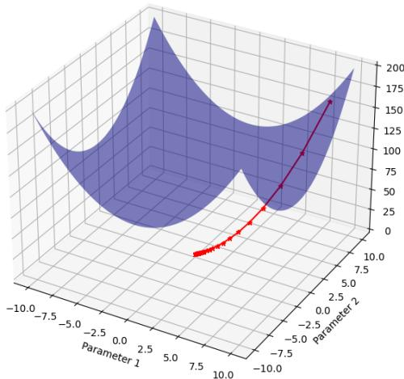  
Figure 9.1 Gradient descent with learning rate=0.1, demonstrating faster convergence.

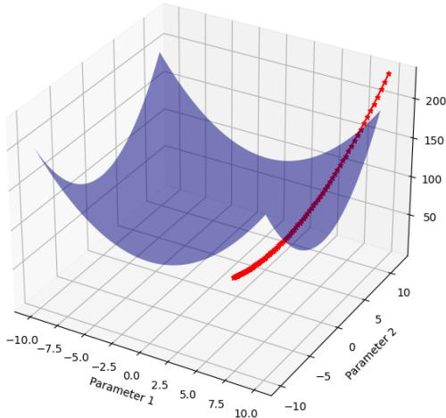  
Figure 9.2 Gradient descent with learning rate=0.01, illustrating stability in convergence.

Image9.1 shows that the steps taken by the gradient descent algorithm is relatively large, which is indicative of a higher learning rate. This allows the optimization process to move quickly towards the minimum of the loss function. The potential risk associated with this approach is that if the learning rate were any higher, it might cause the algorithm to overshoot the minimum, bouncing around it without settling down, or, in the worst case, diverging entirely.

Image 9.2 shows a much ner trajectory with smaller steps towards the minimum, characteristic of a lower learning rate. The advantage of this more cautious approach is that it reduces the risk of overshooting and provides a more stable convergence to the minimum.

However, the trade-o is speed with such small steps, the algorithm will take a longer time to reach the minimum, which means more iterations and potentially more computational resources.

That "little" 0 in the learning rate that turns 0.1 into 0.01 may seem minor, but as these images demonstrate, it has a profound eect on the behavior of the gradient descent optimization. With $\mathrm { l r } { = } 0 . 1$ , the model might converge quickly but with less precision, while with $\mathrm { l r } { = } 0 . 0 1$ , the model converges more slowly but with potentially greater accuracy.

As you can see, hyperparameters signicantly inuence the training process’s eciency and the nal model’s performance. Hence, proper tuning of hyperparameters can lead to faster convergence in the loss function and better generalization of the model to new data. Techniques such as grid search, random search, and Bayesian optimization are commonly used for hyperparameter tuning to nd the optimal settings.

LLMs have hundreds of millions, if not billions, of parameters, making the optimization process computationally intensive and highlighting with that the importance of ecient hyperparameter tuning. Moreover, advanced variants of gradient descent, such as Adam (adaptive moment estimation), are often used to optimize LLMs due to their ability to adapt the learning rate for each parameter, illustrating the nuanced interplay between parameters and hyperparameters in these models. After having learned what hyperparamters are and why they are important let us now look at some practical examples in the next section.

# 9.2 Model tuning and hyperparameter optimization

Now it is time to put the learned theory from the previous section into practice and look at how you can tune your LLM’s hyperparameter. For this, I will use Ray, which is an open-source framework designed for scaling AI applications. It oers a parallel processing compute layer, so you don’t need to know anything about distributed systems. From Ray, I will use Tune (https://docs.ray.io/en/latest/tune/index.html), which is a Python library for experiment execution and hyperparameter tuning at any scale. And Ray Data (https://docs.ray.io/en/latest/data/data.html), which is a scalable data processing library for ML workloads. For this example, I will use the SuperGLUE benchmark dataset, which I introduced in section 5.2, more information about this benchmark can be found here https://super.gluebenchmark.com/. Specically, I will use the CommitmentBank (cb) task. The CommitmentBank is a collection of 1,200 natural discourses, each concluding with a sentence that includes a clause-embedding predicate beneath an operator that cancels entailment (such as a question, modal, negation, or the antecedent of a conditional). The dataset has the following elds:

Premise: a string feature.   
Hypothesis: a string feature.   
idx: a int32 feature.   
1 label: a classication label, with possible values including entailment (0), contradiction (1), neutral (2).

To use Ray data with a Hugging Face dataset, we rst have to load the dataset from Hugging Face and then convert it into a Ray data dataset. This process is illustrated in listing 9.1. Note all following code examples can be found in https://github.com/Nicolepcx/ Transformers-in-Action/tree/main/CH09

# Listing 9.1 Use Ray data with Hugging Face

1 Load dataset from Hugging Face datasets $=$ load_dataset("super(glue","cb") 2 Convert to Ray dataset rayDatasets $=$ "train":ray.data.from_huggingface(datasets["train"], "validation":ray.data.from_huggingface(datasets["validation"], "test":ray.data.from_huggingface(datasets["test"]），

Next we tokenize the input sentences, premises and hypotheses, respectively. This process is shown in listing 9.2.

# Listing 9.2 Tokenize input sentences

```python
def tokenize_fn(samples):
    outputs = tokenizer(
        samples["premise"]
        samples["hypothesis"]
        truncation=True,
        padding="longest",
        return_tensors="pt"
    )
① Add labels to outputs and convert to tensor
outputs["labels"] = torch.tensor(samples["label"], dtype=torch.long)
② Move all tensors in outputs to GPU
outputs = key: value.to('cuda') for key, value in outputs.items()
return outputs 
```

Next we need to dene a train_func this is required by Ray to run properly. How you can set up this function is given in listing 9.3.

# Listing 9.3 Setup training function

```python
def train_func(config):
    1 Load metric
    metric = load_metric("super(glue", task)
    2 Get model and tokenizer
    tokenizer = AutoTokenizer.from_pretrained(model_checkpoint, use_fast=True)
    model = AutoModelForSequenceClassification.from_pretrained(
        model_checkpoint, num_labels=num_labels 
```

)

# Pepare the dataset

```python
train = ray.train.get_dataset_shard("train")  
eval = ray.train.get_dataset_shard("eval")  
train iterable = train.iterator_torch_batches(  
    batch_size=batch_size, collate_fn=tokenizer_fn)  
eval iterable = eval.iterator_torch_batches(  
    batch_size=batch_size, collate_fn=tokenizer_fn) 
```

# $\textcircled{6}$ Initialize the training arguments

args = TrainingArguments( name, evaluation_strategy $=$ "epoch", save_strategy $=$ "epoch", logging_strategy $=$ "epoch", per_device_train_batch_size $\equiv$ config.get("batch_size"，64), per_device_eval_batch_size $\equiv$ config.get("batch_size"，64), learning_rate $\equiv$ config.get("learning_rate"，2e-5)， num_train_epochs $\equiv$ config.get("epochs"，6), weight Decay $\equiv$ config.get("weight Decay"，0.001), push_to hubs $\equiv$ False, max_steps $\equiv$ max_steps_per_epoch $\star$ config.get("epochs"，6), disable_tqdm $\equiv$ False, no_cuda $\equiv$ not torch.cuda.is-available(), report_to $\equiv$ 'wandb', run_name $\equiv$ 'superclue_cb'

# $\oplus$ Custom evaluation function

```python
def compute_metric(seval_pred):
    predictions, labels = eval_pred
    predictions = np.argmax predictions, axis=1)
    return metric.computepredictions=predictions, references=labels) 
```

# $\bullet$ 6 Initialize trainer class

```python
trainer = Trainer(
    model,
    args,
    train_dataset=train iterable,
    eval_dataset=eval iterable,
    tokenizer=tokenizer,
    compute.metrics=compute.metrics, 
```

# $\textcircled{7}$ Add a callback

trainer.add_callback(RayTrainReportCallback())   
trainer $=$ prepare Trainer(trainer)   
trainer.train()

Now that you have your training function setup, you can use the TorchTrainer class from Ray to control the workers and resouces used for the training, as illustrated in listing 9.4.

# Listing 9.4 Instantiate the TorchTrainer class

trainer $=$ TorchTrainer( train_func, scaling_config $\equiv$ ScalingConfig(num_workers $\equiv$ num_workers, use_gpu $\equiv$ use_gpu), datasets $=$ "train": rayDatasets["train"], "eval": rayDatasets["validation"], run_config $\equiv$ RunConfig( checkpoint_config $\equiv$ CheckpointConfig( num_to_keep=1, checkpoint_score_attribute $\equiv$ "eval_loss", checkpoint_score_order $\equiv$ "min", ), ),

Now with this setup in place you can use the Tuner class from Ray to do the hyperparameter search for you. How you do this, is shown in listing 9.5.

# Listing 9.5 Instantiate the Tuner class

tuner $=$ Tuner(   
trainer,   
param_space $\equiv$ { "train_loop_config":{ "learning_rate":tune.grid_search([2e-5,2e-4,2e-3,2e-2]), "epochs":tune.choice([2,4,6,8]), "batch_size":tune.choice([16,32,64,128]), "weight Decay":tune.grid_search([0.0,0.01,0.1,0.001]) }   
},   
tune_config $\equiv$ tune.TuneConfig( metric $=$ "eval_loss", mode $=$ "min", num_samples $\equiv 1$ , scheduler $\equiv$ ASHAScheduler( max_t $\equiv$ max([2,4,6,8]), grace_period=1, reduction_factor=2, ),   
run_config $\equiv$ RunConfig( name $=$ "tune_transformers",

```txt
checkpoint_config = CheckpointConfig(
    num_to_keep = 1,
    checkpoint_score_attribute = "eval_loss",
    checkpoint_score_order = "min",
);
); 
```

To use the hyperparameters, from the search, you can use the get_best_result function and pass the parameters in the TorchTrainer class as shown in listing 9.6.

# Listing 9.6 Use best hyperparameter for training

```python
best_trial = tune_results.get_best_result(metric="eval_loss", mode="min")  
train_loop_config = best_trial.config['train_loop_config'] 
```

# 0 Preparing the configuration with the best hyperparameters

```python
trainer = TorchTrainer(
    train_loop_perworker=train_func,
    train_loop_config=train_loop_config,
    scaling_config=ScalingConfig(num_workers=num_workers, use_gpu=use_gpu),
    datasets=
        "train": ray_datasets["train"]
        "eval": ray_datasets["validation"]
    ,
    run_config=RunConfig(
        checkpoint_config=CheckpointConfig(
            num_to_keep=1,
            checkpoint_score_attribute="eval_loss",
            checkpoint_score_order="min",
        ),
    ), 
```

# $\textcircled{8}$ Start the training process with the best hyperparameters

result $=$ trainer.fit()

Now you can save the newly trained model from the best checkpoint as shown in 9.8.

# Listing 9.7 Use best hyperparameter for training

```txt
checkpoint: Checkpoint = result.checkpoint 
```

# 0 Using the checkpoint to access the saved model

```python
with checkpoint.as_directory() as checkpoint_dir: model = AutoModelForSequenceClassification.from_pretrained(checkpoint_dir) print(f"Model loaded from checkpoint_dir") 
```

You can now save the model to Hugging Face hub as shown in listing 9.8.

0 Login to Hugging Face hub   
notebook_login()   
② Login to Hugging Face hub   
model.push_to_hub()

This model will be stored as a public model. If you are working for a company or you just want to store your model privately, you can use enterprise hub https://huggingface. co/enterprise, which allows you to distribute private models and datasets for collaboration both within teams and among dierent groups. In the next section I will show you how you can track the experiments and why this might be benecial to do.

# 9.2.1 Track experiments

You might have noticed throughout the book that I have already integrated Weights & Biases (W&B) here and there into the training arguments of the Trainer class. For instance, in section 7.10, where I showed you an example of SFT and DPO. And I used it also in section 9.2 for hyperparameter optimization. Tracking your experiments is important, as it lets you analyze your model development in an organized manner. In addition, you can create a report and share the results of your training runs and inference with your team. Moreover, you can monitor your system resources, for instance, GPU memory which was allocated, as shown in the image 9.3.

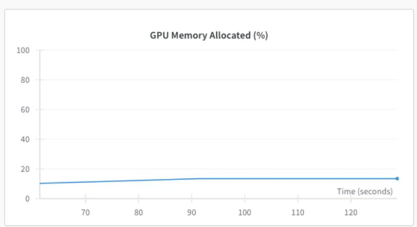  
Figure 9.3 Example of how to analyze system resources with Weights & Biases for model training.

Monitoring GPU usage is vital for accurately assessing a models resource needs. If, for example, the GPU utilization does not exceed $6 0 \%$ during training on an A100, one could consider using a less powerful and more cost-eective GPU, such as the V100. This strategic approach to resource allocation is essential for optimizing training performance and can lead to signicant cost savings in both training and inference phases of your models

lifecycle. Also, you can use this information as a basis to estimate the costs associated with training and inference of your model.

Another benet of using W&B is, that it oers a robust implementation of hyperparameter sweeps that can be used with any machine learning framework, including PyTorch and Hugging Face Transformer library. The sweeps feature of W&B allows you to systematically search through combinations of hyperparameters to nd the most eective ones for your model, regardless of the underlying framework. W&B allows you to systematically evaluate and identify the best model based on hyperparameter sweeps because it logs the details of each experiment run in a granular manner. This systematic logging includes not just the hyperparameters used in each run but also the metrics generated during training and validation, such as loss and accuracy, among others. To use W&B sweeps, you start by dening a sweep conguration, which species the hyperparameters to explore, including their ranges or sets of values to try. You also dene the metric to optimize, such as minimizing loss or maximizing accuracy, as shown in listing 9.9

Listing 9.9 Define the sweep configuration   
```python
sweep_config = { 'method': 'bayes', 'metric': { 'name': 'eval_loss', 'goal': 'minimize' }, 'parameters': { 'learning_rate': 'min': 1e-5, 'max': 5e-4 }, 'num_train_epochs': { 'values': [2, 3, 4] }, 'per_device_train_batch_size': { 'values': [8, 16, 32] }, 'model_name_or_path': { 'values': ['bert-base-uncased', 'distilbert-base-uncased'] } }, 'earlyTerminate': { 'type': 'hyperband', 'min_iter': 3, 'eta': 2, 's': 2 } } 
```

When you start the sweep, as shown in listing 9.10, W&B automates the process of initiating multiple training runs, each with a dierent combination of hyperparameters based on the strategy you’ve chosen (e.g., random search, grid search, Bayesian optimization).

# Listing 9.10 Start Weights & Biases sweep

sweep_id $=$ wandb.sweep(sweep_config, project $=$ ''huggingface_sweeps'')

During each run, W&B logs the hyperparameters and the performance metrics for each epoch or step of the training process. This data is sent to the W&B servers and visualized in real-time on the W&B dashboard. An example of the dashboard from a sweep run is shown in image 9.4.

  
Figure 9.4 Example of W&B dashboard to compare the performance of different hyperparameter combinations.

After the sweep runs are completed (or even while they’re running), you can use this dashboard to compare the performance of dierent hyperparameter combinations. W&B provides various tools for analysis such as the parallel coordinates plot, as shown in 9.5. This visualization allows you to see how dierent hyperparameters relate to the performance metrics, helping you identify which hyperparameters have the most impact.

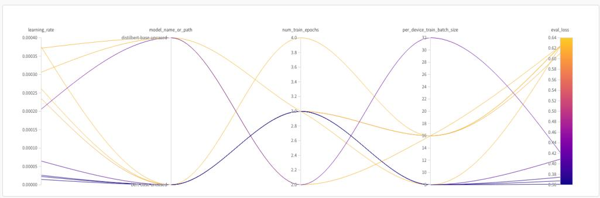  
Figure 9.5 Example of parallel coordinates plot from W&B, where the different hyperparamters can be compared to the objective function.

Further, W&B can automatically analyze which hyperparameters were most predictive of success, helping you focus on tuning the most inuential parameters, as shown in 9.6

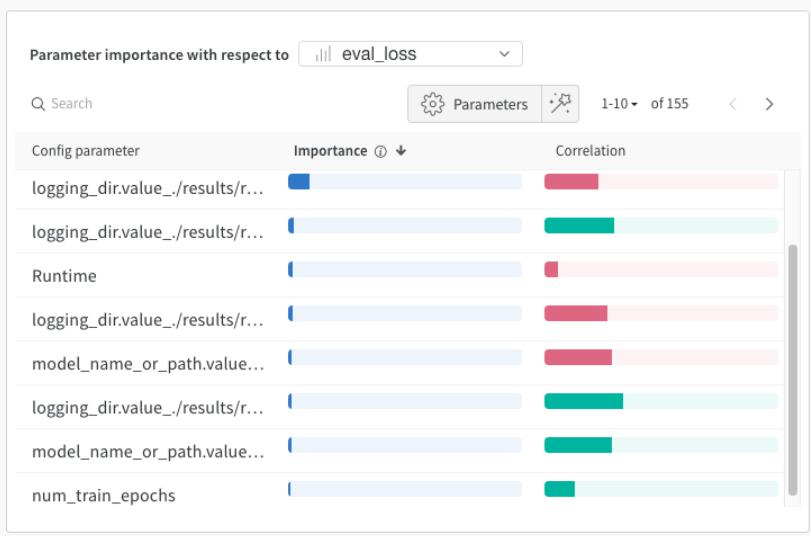  
Figure 9.6 A tabular view of all the runs in the sweep, where you can sort and filter based on different metrics and hyperparameters.

Based on the analysis, you can identify which hyperparameter combination led to the best performance based on your chosen metric. You can then use this combination for further experiments or in your nal model.

# 9.3 Techniques for model optimization

Optimizing large language models for eciency is essential, especially when deploying them on hardware with limited resources. This section dives into three powerful techniques for model optimization: model pruning, model distillation, and quantization. While diverse in approach, these techniques share a common goal: they streamline the underlying LLM

to be less resource-intensive, enabling deployment and inference on less resource intensive hardware with minimal compromise to performance.

# 9.3.1 Model Pruning

Pruning reduces model complexity by identifying and removing parts of the network that contribute the least to its output, akin to trimming branches from a tree to improve its shape and health. This process makes the LLM more compact, enhancing the inference eciency of these models. There are two primary ways to perform pruning on your language model: structured and unstructured pruning, a comparision is shown in image 9.7. Both techniques can be applied to LLMs, and the choice between them depends on specic goals.

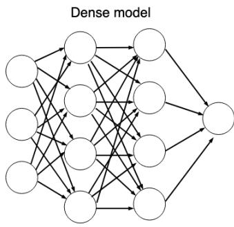

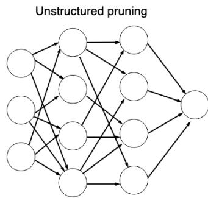

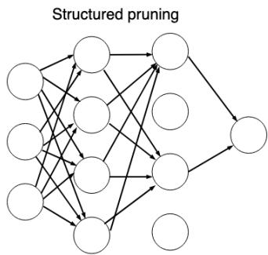  
Figure 9.7 The leftmost diagram shows a fully connected, or dense, network where each neuron is connected to every neuron in the subsequent layer. The center diagram represents unstructured pruning, where individual connections are removed, rather than whole neurons or layers. The network retains its original architecture, but with many connections missing. The rightmost diagram illustrates structured pruning, by showing the removal of entire neurons (and their associated connections). This illustrates how structured pruning removes specific parts of a network, such as a neuron in a layer or an entire transformer block.

The illustration is a simplied overview how the two dierent pruning methods work, for LLMs, which are typically composed with attention mechanisms, the concept of structured pruning could extend to the pruning of attention heads or even entire transformer blocks, whereas unstructured pruning might involve the removal of individual attention weights or feed-forward network parameters.

The following outlines the main dierences between both techniques:

Unstructured pruning: This involves removing individual weights or connections within the neural network. This approach can lead to signicant reductions in the number of parameters and can compress the model eectively. However, the resulting sparse matrices might not lead to computational eciency improvements on all hardware, especially if the hardware is optimized for dense matrix operations. Unstructured pruning is more granular and can be more exible in identifying and removing redundant or less important connections. This is usually used to put the emphasis on maximizing model compression.   
Structured pruning: This technique involves removing entire units or groups within the network, such as neurons in linear layers, or attention heads. Structured pruning

is more about reducing the complexity of the model in a way that aligns better with hardware optimizations, often leading to actual computational speedups. It simplies the network architecture by reducing the number of channels, layers, or other structural components, which can make the model smaller and faster to run but might result in a more signicant impact on the model’s performance compared to unstructured pruning. This technique is applied if one wants to ensure computational eciency, while maintaining hardware compatibility.

It’s important to note that both pruning methods typically require a careful balance between model size reduction and the retention of sucient model accuracy. This often requires iterative cycles of pruning followed by retraining or ne-tuning.

# 9.3.2 Model Distillation

Model distillation, also known as knowledge distillation, is a technique used to compress the knowledge of a large, complex model (often called a "teacher" model) into a smaller, more ecient one (called a "student" model). The process involves training the student model to mimic the behavior of the teacher model. The student model is typically a smaller or simplied version of the teacher model, designed to be faster and more resourceecient. You might remember that I introduced in section 5.2.4 DistilBERT, which is a distilled version of BERT. DistilBERT is trained to mimic the behavior of the larger teacher model (BERT) by minimizing the divergence between their output distributions. This loss measures the Kullback-Leibler divergence between the logits of the teacher and the student models, the result is DistilBERT, a smaller and faster version of BERT that retains much of the teacher model’s performance. However, one limitation that knowledge distillation often faces is its reliance on large amounts of unlabeled data.

To tackle this problem, "distilling step-by-step" (3) presents an innovative method that aims to train smaller models to surpass the performance of large language models (LLMs) using less training data than required by standard ne-tuning or distillation techniques, by reducing the need for large unlabeled data by distilling not just labels but also the teachers rationales.

# DISTILLING STEP-BY-STEP

This method extracts informative natural language rationales,intermediate reasoning steps, from LLMs. These rationales explain the connections between input questions and their corresponding outputs, thereby providing rich, supervisory signals for training smaller models in a more data-ecient manner.

The process is as follows:

1 Rationale Extraction: Utilizing few-shot CoT prompting, which was introduced in section 7.3.3, natural language rationales are drawn from an LLM. For example, when presented with a complex problem, the LLM generates intermediate rationales that articulate the reasoning process leading to the answer.   
2 Multi-task Training Framework: The extracted rationales are then used to train small, task-specic models within a multi-task learning framework. This framework

employs task prexes to inform the model of the type of output required, whether it be a label prediction or a rationale generation.

The implementation of this approach involves two main stages:

1 In the rst stage, CoT prompting, comprising exemplars with inputs, rationales, and outputs, guides the LLM to generate rationales for new inputs in a similar structured format.   
2 The second stage involves incorporating the rationales into the training of small models. This is done by framing the training as a multi-task problem, with the model learning to generate both the label and the reasoning steps leading to the label.

Image 9.8 illustrates this process.

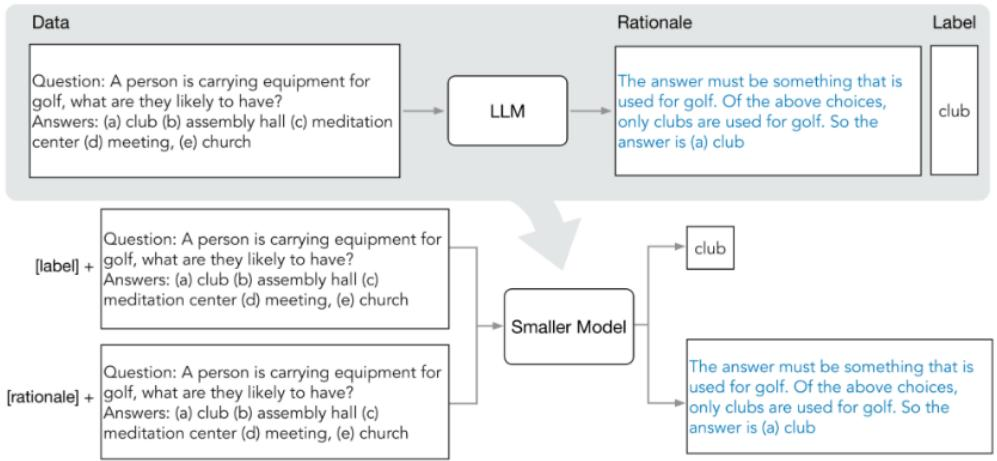  
Figure 9.8 Overview of distilling step by step. Initially, chain-of-thought prompting is used to elicit detailed rationales from a large language model. These rationales are then leveraged to inform the training of a compact, task-specific model within a multi-task learning setup. During this training process, specific task-related prefixes are attached to the input examples. This instructs the model to modify its output according to the task indicated by the prefix, effectively enabling the model to distinguish and adapt to a variety of tasks. Image is taken from the paper: ”Distilling Step-by-Step! Outperforming Larger Language Models with Less Training Data and Smaller Model Sizes”

The results from the paper show that "distilling step-by-step" can achieve superior performance with signicantly less data compared to standard ne-tuning, highlighting its potential to create ecient yet powerful smaller models.

The code for this method can be found here: https://github.com/google-research/ distilling-step-by-step.

# 9.4 Parameter efficient fine-tuning LLMs

Parameter ecient ne-tuning LLMs (PEFT), encompasses a set of strategies designed to adapt LLMs to new tasks or domains with minimal adjustments to their parameters. Unlike traditional ne-tuning, which often involves updating a vast number of weights across the

entire network, PEFT techniques aim to achieve comparable performance enhancements by only modifying a small subset of the model’s parameters. This approach not only preserves the generalizable knowledge embedded in the pre-trained models but also signicantly reduces the computational cost and risk of overtting associated with adapting these often billion parameter models to new tasks. I will introduce the following methods in this section:

Low-rank adaptation (LoRA) (4) introduces low-rank matrices that interact with the original weights of the model, allowing for ecient updates to specic parts of the network without the need to retrain the entire model.   
Weight-decomposed low-rank adaptation (DoRA) (5) decomposes the pre-trained weights into two components, magnitude and direction.   
Quantization is the process of converting the model weights from a higher precision numerical format to a lower precision one.   
Quantized low rank adapters (QLoRA) (1) introduces 4-bit NormalFloat (NF4), a new data type that is information theoretically optimal for normally distributed weights and double quantization to reduce the average memory footprint by quantizing the quantization constants.   
Quantization-aware low-rank adaptation (QA-LoRA) (6) introduces group-wise operations which increases quantization exibility and reduces adaption parameters to achieve better balance and allows end-to-end INT4 quantization without post-training quantization.   
Low-rank plus quantized matrix decomposition (LQ-LoRA) (2) uses an iterative algorithm to decompose each pre-trained matrix into a high-precision low-rank component and a memory-ecient quantized component.

Now let’s dive into the specics of how these dierent methods enhance model performance. Each approach, while distinct in its mechanism, shares the common goal of minimizing parameter adjustments while maximizing model eciency and eectiveness.

Beginning with LoRA, I explain the nuances of low-rank matrix adaptation, providing insights into how it enables selective parameter updates that preserve the integrity and generalizability of pre-trained models. Next I’ll cover DoRA, which enhances the learning capacity and stability of LoRA.

Subsequently, you will learn how LoRA can be combined with quantization, covering QLoRA, QA-LoRA, LQ-LoRA. By understanding the specic advantages and applications of these methods, you will gain a deeper understanding what each method does and when you want to use it.

# 9.4.1 Low-rank adaptation

LoRA freezes the pretrained model weights and introduces trainable matrices derived from rank decomposition into each layer of the transformer architecture. This strategy signicantly reduces the number of parameters that require training for downstream tasks.

Conceptually, if you are training a transformer model, the training of the downstream task can be mathematically represented as:

$$
W _ {0} + \Delta W \tag {9.1}
$$

Here, $W _ { 0 }$ denotes the original pre-trained weight matrix of the transformer model, and $\Delta W$ symbolizes the weight updates from the downstream task.

$W _ { 0 }$ is a weight matrix with dimensions $d \times k$ , where $d$ is the dimension of the output space, and $k$ is the dimension of the input space. In layers that handle self-attention within the transformer model, the input and output space dimensions are identical, yielding a matrix of dimensions ${ d _ { \mathrm { m o d e l } } \times d _ { \mathrm { m o d e l } } }$ . During adaptation, the matrix $W _ { 0 }$ remains xed. LoRA then formulates the update as:

$$
W _ {0} + \Delta W = W _ {0} + B A \tag {9.2}
$$

The update matrix $\Delta W$ is dened as the product of two matrices $B$ and $\mathcal { A }$ , where $B \in \mathbb { R } ^ { d \times r }$ and $\mathcal { A } \in \mathbb { R } ^ { r \times k }$ . The rank $r$ is a hyperparameter that governs the rank of the update matrix $\Delta W$ , chosen so that $r \ll \operatorname* { m i n } ( d , k )$ , guaranteeing that $\Delta W$ is indeed low-rank.

So, the essence of LoRA is, to update the original weight matrix $W _ { 0 }$ in a parameterecient manner by learning a low-rank update $\Delta W = B A$ , rather than directly modifying $\Delta W$ . Below is a simplied example illustrating how this decomposition can approximate $\Delta W$ .

# Listing 9.11 Illustrative example of low-rank adaptation

def lora_decomposition(W, r):

$\textcircled{4}$ Initialize B with zeros (d x r) and A with random Gaussian values (r x d)

$\begin{array} { r l } { \mathbb { B } } & { { } = } \end{array}$ np.zeros((W.shape[0], r))

$\begin{array} { r l } { \mathbb { A } } & { { } = } \end{array}$ np.random.normal(0, 1, (r, W.shape[1]))

For this illustrative example, I use SVD for the optimal low-rank approximation

U, S, Vt $=$ np.linalg.svd(W, full_matrices=False)

B[:, :r] $=$ U[:, :r] * np.sqrt(S[:r])

A[:r, :] $=$ np.sqrt(S[:r])[:, np.newaxis] * Vt[:r, :]

③ Compute the low-rank approximation of W

W_approx = B @ A

return B, A, W_approx

4 Create a random integer square matrix W with dimension d x d

$\mathrm { ~ \normalfont ~ { ~ d ~ } ~ } = \mathrm { ~ \normalfont ~ { ~ 6 ~ } ~ }$ $\oplus$ Dimension of the square matrix

$\begin{array} { r l } { \mathbb { W } } & { { } = } \end{array}$ np.random.randint(0, 10, size=(d, d))

$\bullet$ Rank r for the low-rank approximation, with r < d

$\ x ~ = ~ 5$ # Rank for the decomposition

Perform the decomposition

B, A, W_approx $=$ lora_decomposition(W, r)

Note that in the code, singular value decomposition (SVD) is used to nd the optimal low-rank approximation of matrix $W$ . By selecting the top $r$ singular values and their corresponding singular vectors, $B$ and $\mathcal { A }$ are constructed in such a way that their product approximates $W$ . This is an example of a rank- $\boldsymbol { \cdot } \boldsymbol { r }$ approximation. In neural network weight training, SVD is not typically used as $B$ and $\mathcal { A }$ are intended to be learned during training. Nevertheless, this code serves to illustrate the concept of low-rank approximations and their potential closeness to the original matrix.

To demonstrate how closely we can approximate $W$ , let’s consider the original matrix $W$ and its approximations through the matrices $B , A$ , and $W _ { \mathrm { a p p r o x } }$ as shown in the following gures:

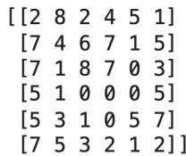  
Figure 9.9 Original matrix W before decomposition, with dimension 6 x 6.

For matrix B (after decomposition) I get the matrix as shown in 9.10:

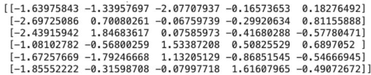  
Figure 9.10 Matrix B as part of the decomposition, with dimension 6 x 5 (d x r).

And for B (after decomposition) I get the matrix as shown in 9.11:

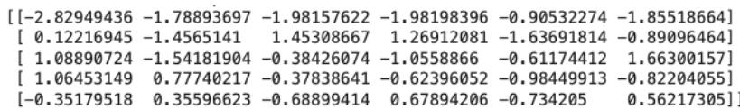  
Figure 9.11 Matrix A as part of the decomposition, with dimension 5 x 6 (r x d).

If I now, approximate $W$ as $W _ { \mathrm { a p p r o x } }$ , I get the matrix as shown in 9.12:

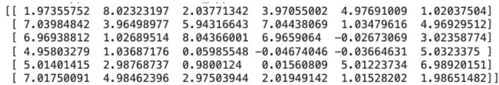  
Figure 9.12 Low-rank approximation of W , with dimension 6 x 6.

To make it easier to compare, I round the matrix to integer representation as shown in 9.13 and compare it to the original matrix W 9.14.

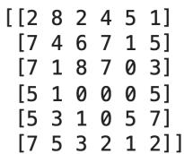  
Figure 9.13 Low-rank approximation of W converted to integers.

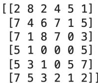  
Figure 9.14 Original matrix W before decomposition.

Now that you understand the basics of LoRA, let us look at an improved method, called DoRA, in the next section.

# 9.4.2 Weight-decomposed low-rank adaptation

DoRA reparameterizes model weights into magnitude and directional components, aiming to closely examine and compare the changes from ne-tuning (FT) and LoRA in both magnitude and direction. This approach is grounded in the theory that gradient optimization with weight reparameterization can achieve faster convergence. By deconstructing the weight matrix into distinct magnitude and directional elements, DoRA reveals the inherent learning pattern dierences between FT and LoRA, providing insightful analysis into their respective adjustments. Illustration 9.15 shows an overview of DoRA.

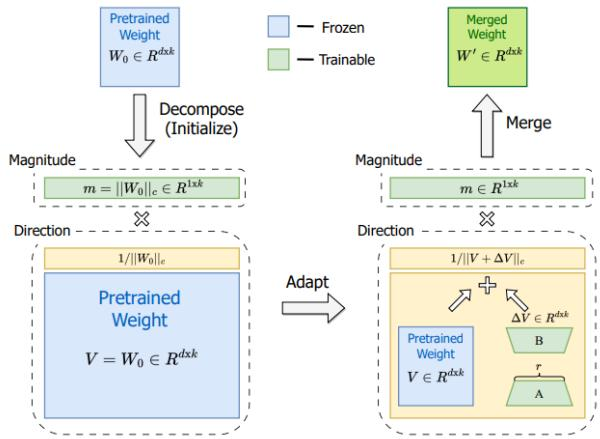  
Figure 9.15 And overview of weight-decomposed low-rank adaptation (DoRA), which segments the pretrained weight into separate magnitude and direction elements for fine-tuning purposes, utilizing LoRA to effectively refine the direction aspect. It’s important to note that $| | \mathbf { \nabla } \cdot \mathbf { \nabla } | | _ { c }$ represents the vector-wise norm across each column vector in a matrix. Image is taken from the paper: ”DoRA: Weight-Decomposed Low-Rank Adaptation”.

Initial ndings demonstrate that DoRA, akin to FT, can facilitate more nuanced and eective learning adjustments, contrasting with LoRA’s proportional changes in direction and magnitude. This can lead to faster and more ecient convergence in model training, by enabling separate, focused tuning of magnitude and direction components. The mathematical foundation of DoRA’s weight decomposition is formulated as follows:

$$
W = m \frac {V}{\| V \| _ {c}} = \| W \| _ {c} \frac {W}{\| W \| _ {c}} \tag {9.3}
$$

where $m \in \mathbb { R } ^ { 1 \times k }$ is the magnitude vector, $V \in \mathbb { R } ^ { d \times k }$ is the directional matrix, and $\| \cdot \| _ { c }$ denotes the vector-wise norm of a matrix across each column. This means, division by $\| \cdot \| _ { c }$ isn’t literal division but is meant to denote element-wise scaling of the matrix by the column-wise norm, resulting in each column being a unit vector.

Distinguishing itself from weight normalization, which trains weight components from scratch and is thus sensitive to initialization. DoRA leverages pre-trained weights to overcome these initialization issues, as demonstrated in the following initialization strategy:

$$
W ^ {\prime} = \underline {{m}} \frac {V + \Delta V}{\| V + \Delta V \| _ {c}} = \underline {{m}} \frac {W _ {0} + \underline {{B A}}}{\left\| W _ {0} + \underline {{B A}} \right\| _ {c}} \tag {9.4}
$$

Here, $W _ { 0 }$ is the pre-trained weight as outlined in equation 9.4.2, where $m = \| \boldsymbol { W } _ { 0 } \| _ { c }$ and $V = W _ { 0 }$ after initialization. And $\Delta V$ represents the incremental directional update learned by multiplying two low-rank matrices $B \in \mathbb { R } ^ { d \times r }$ and $\mathcal { A } \in \mathbb { R } ^ { r \times k }$ , aligning with LoRA’s strategy to ensure that before ne-tuning. Furthermore, $V$ is kept frozen and $m$ is a trainable vector.

The matrices $\mathcal { A }$ and $B$ are initialized in line with LoRA’s strategy, reinforcing the seamless integration of DoRA’s adjustments into the pre-trained model framework. This approach not only preserves the original model’s latent knowledge but also enhances its adaptability and performance across various tasks without the overhead of extensive retraining or additional computational costs.

# 9.4.3 Quantization

Quantization is a method used to decrease both the computational and memory demands of the inference of neural networks, such as LLMs. This is achieved by encoding weights and activations in lower-precision formats, such as 8-bit integers (int8), as opposed to the standard 32-bit oating-point (oat32) types.

By decreasing the bit depth, the modied model will use less memory, theoretically uses less power, and benets from quicker computational operations, such as matrix multiplication, due to the eciency of integer arithmetic. Additionally, this enables the deployment of models on embedded systems that may only accommodate integer data types.

Table 9.1 Comparison of Data Types   

<table><tr><td>Data Type</td><td>Bit Width</td><td>Range</td><td>Memory Reduction from FP32</td></tr><tr><td>float32</td><td>32 bits</td><td>≈ ±3.4 × 1038</td><td>-</td></tr><tr><td>float16</td><td>16 bits</td><td>≈ ±6.5 × 104</td><td>50%</td></tr><tr><td>int8</td><td>8 bits</td><td>-128 to 127</td><td>75%</td></tr><tr><td>int4</td><td>4 bits</td><td>-8 to 7</td><td>87.5%</td></tr></table>

The memory reduction achieved by transitioning from a 32-bit oating point (oat32) to other data types can be computed based on the bit-width of each type. Below are the calculations for each transition: oat32 uses 32 bits, and oat16 uses 16 bits. The memory reduction is computed as:

$$
\text {Reduction} = 1 - \frac {\text {Size of float 16}}{\text {Size of float 32}} = 1 - \frac {16 \text {bits}}{32 \text {bits}} = 0.5 \text {or} 50 \% \tag{9.5}
$$

Where 1 represents the full memory usage of the original type.

int8 uses 8 bits, the memory reduction is computed as:

$$
\text {Reduction} = 1 - \frac {\text {Size of int8}}{\text {Size of float32}} = 1 - \frac {8 \text {bits}}{32 \text {bits}} = 0.75 \text {or} 75 \% \tag{9.6}
$$

int4 uses 4 bits, the memory reduction is computed as:

$$
\text {Reduction} = 1 - \frac {\text {Size of int4}}{\text {Size of float32}} = 1 - \frac {4 \text {bits}}{32 \text {bits}} = 0.875 \text {or} 87.5 \% \tag{9.7}
$$

These reductions in memory requirements are crucial to improve the eciency of model inference, and make it also possible to ne-tune a 7B model with the free Google Colab version. However, reducing the precision can have an impact on the accuracy of the model. Let us consider two examples why this might be tricky, quantization from oat32 to oat16 and oat32 to int8. The rst one, oat32 to oat16, is simple, because both data types are the same (oat).

Let me visualize how much memory we can save if we load, for instance, falcon 7B with and without quantization. To load the model I use the library bitsandbytes: https: //github.com/TimDettmers/bitsandbytes

# Listing 9.12 Loading Falcon 7B with bitsandbytes

```hcl
model_id = "tiiuae/falcon-7b" 
```

0 Ensure CUDA is available

```typescript
if torch.cuda.is-available(): 
```

$\textcircled{8}$ Reset peak memory statistics

```python
torch.cuda.reset_peak_memory.stats() 
```

③ Capture initial GPU memory usage

```txt
device = torch.device("CUDA") 
```

```txt
initial_memory = torch CUDA.memory_allocated(device) 
```

$\textcircled{9}$ BitsAndBytes configuration

```python
bnb_config = BytesAndBytesConfig( 
```

load_in_4bit $=$ True, $\oplus$ Load model in 4-bit

load_in_8bit $=$ False, $\mathbf { \textcircled { 6 } }$ If set to true, model loads in 8-bit

bnb_4bit_use_double_quant $=$ False,

bnb_4bit_quant_type $=$ ''fp4'',

$\textcircled{7}$ Use float16 for computation, such as fine-tuning or DPO

bnb_4bit_compute_dtype=torch.bfloat16

$\mathfrak { o }$ Load tokenizer and model with BnB configuration

```python
tokenizer = AutoTokenizer.from_pretrained(model_id)  
model = AutoModelForCausalLM.from_pretrained(model_id, quantization_config=bnb_config) 
```

$\bullet$ Capture GPU memory usage after loading the model

```python
final_memory = torch.cuda/memory_allocated(device) / (1024**2) 
```

$\textcircled{1}$ Peak memory during the process in GB

```python
peak_memory = torch CUDA.max_memory_allocated(device) / (1024**2) 
```

$\textcircled{1}$ Calculate the difference

```python
memory_diffrence = final_memory - initial_memory   
print(f"Initial GPU Memory Usage: initial_memory/1024 GB")   
print(f"Final GPU Memory Usage: final_memory/1024 GB")   
print(f"Memory Difference (Model Load Impact): memory_diffrence/1024 GB")   
print(f"Peak GPU Memory Usage: peak_memory/1024 GB")   
e:   
print("CUDA is not available. Please check your PyTorch and GPU setup.") 
```

Running the code will result in this output:

```txt
Initial GPU Memory Usage: 0.0 GB  
Final GPU Memory Usage: 4.074565887451172 GB  
Memory Difference (Model Load Impact): 4.074565887451172 GB  
Peak GPU Memory Usage: 4.609706878662109 GB 
```

If I load the model without the use of bitsandbytes it will result in the following memory usage:

```txt
Initial GPU Memory Usage: 0.0 GB  
Final GPU Memory Usage: 25.876148223876953 GB  
Memory Difference (Model Load Impact): 25.876148223876953 GB  
Peak GPU Memory Usage: 25.876148223876953 GB 
```

However, a potential issue with reduced precision is the inability to represent very small or very large numbers that fall outside the range of the reduced precision format, as showed in table 9.1. This can lead to NaN values and is a critical point to understand the trade-os between memory eciency and numerical accuracy. Using libraries such as bitsandbytes, which use 4-bit quantization for the pretrained model weights while allowing for computations (such as training or ne-tuning "on top" of these pretrained models) to occur in higher precision formats like 16-bit oating-point (oat16) or boat16, we can achieve several benecial outcomes:

Memory Eciency: The 4-bit quantization dramatically reduces the memory footprint of the model’s weights. This reduction is crucial for deploying large models on hardware with limited memory resources or for applications that require running multiple models simultaneously.   
Performance Preservation: Despite the signicant reduction in memory usage, the precision for training or inference computations can be maintained at a higher level (e.g., oat16). This approach ensures that the quantization process does not lead to

a signicant loss in model accuracy or performance. Higher precision formats like oat16 oer a good compromise between computational eciency and numerical precision, enabling faster computation than oat32 without the substantial accuracy loss that might occur with lower precision formats.

The landscape of quantization techniques, can be categorized into the following categories:

Uniform quantization: Applies equal-sized quantization intervals across the entire range of values. This simplicity makes it more straightforward to implement on hardware, leading to increased eciency in terms of computational resources and energy consumption.   
Non-uniform quantization: Adopts variable-sized intervals, which can be tailored to the distribution of the data and applied dierently across various weights or layers within the model. This approach is advantageous for minimizing quantization error, thereby potentially improving model performance, especially in scenarios where precision is crucial. Quantization-aware training (QAT): Involves retraining the model with quantized weights and activations, allowing the model to adapt to the quantization-induced changes. This can lead to better retention of performance, even at extremely low precision levels (e.g., 2-bit quantization). The approach, however, is computationally intensive due to the additional training required.   
Post-training quantization (PTQ): Applies quantization to a pre-trained model without further training. This method is less computationally demanding than QAT but typically does not achieve as low levels of quantization (limited to 8-bit or 6-bit). Despite its limitations, PTQ can be advantageous in scenarios where computational resources are limited or when rapid deployment is necessary.

Now that we’ve covered in depth what quantization is and how it improves the eciency of model inference, let’s explore QLoRA in the next section. QLoRA, a quantized version of LoRA, takes these eciency enhancements further by specically tailoring the quantization process to the unique structure of LoRA, oering even greater performance and memory usage improvements.

# 9.4.4 Efficient fine-tuning of quantized LLMs with QLoRA

QLoRA, achieves a signicant reduction in memory usage, enabling the ne-tuning of a 65-billion parameter model on a single 48GB GPU while preserving 16-bit ne-tuning precision. This is made possible through the introduction of the 4-bit NormalFloat (NF4), a new data type that is information-theoretically optimal for representing weights that follow a normal (Gaussian) distribution, which is common among neural network weights. This optimality stems from information theory, which deals with the ecient quantication, storage, and communication of information. In essence, NF4 is designed to "pack" weight values into a 4-bit format as densely as possible, following the principle that more common values (according to a normal distribution) are assigned shorter codes. Quantile quantization operates by approximating the quantile of the input tensor using the empirical cumulative distribution function. Moreover, QLoRA uses a technique called double quantization. This technique applies a secondary layer of quantization to the constants used in the initial

quantization step, further reducing the memory footprint. By optimizing the storage of these constants, QLoRA minimizes additional memory demands, enabling more ecient use of available resources. To address the challenge of memory spikes during gradient checkpointing, a common issue that can lead to out-of-memory errors during ne-tuning, QLoRA introduces paged optimizers. This solution leverages the concept of memory paging, traditionally used in managing computer memory, to dynamically allocate and manage memory during the training process. By eciently moving data between the CPU and GPU, paged optimizers ensure smooth and uninterrupted model optimization, even under tight memory constraints. Image 9.16 shows an overview how QLoRA compares to ne-tuning and to LoRA.

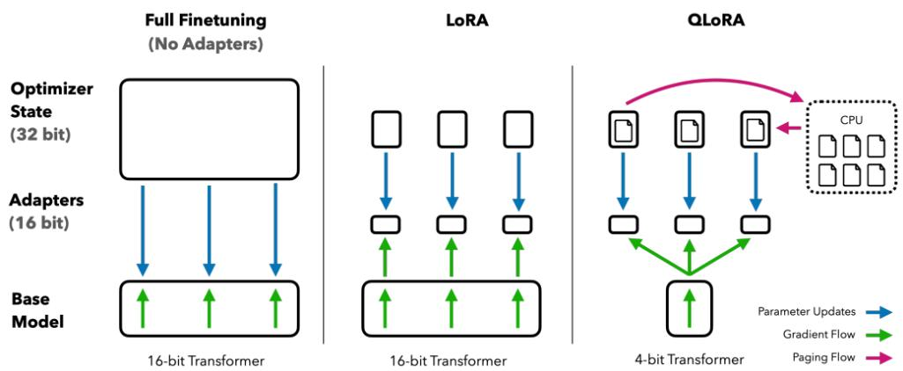  
Figure 9.16 Overview of fine-tuning methods, with on the left the ”usual” fine-tuning, without any optimization, in the middle LoRA and on the right QLoRA. Image is taken from the paper: ”QLORA: Efficient Finetuning of Quantized LLMs”.

Listing 9.13 shows ho to load your model with this method.

# Listing 9.13 Loading Falcon 7B with bitsandbytes

```hcl
model_id = "tiiuae/falcon-7b" 
```

Ensure CUDA is available

```typescript
if torch.cuda.is-available(): 
```

$\textcircled{8}$ Reset peak memory statistics

```python
torch.cuda.reset_peak_memory.stats() 
```

$\otimes$ Capture initial GPU memory usage

```julia
device = torch(device("CUDA") 
```

```txt
initial_memory = torch CUDA.memory_allocated(device) 
```

4 BitsAndBytes configuration

```python
bnb_config = BytesAndBytesConfig( 
```

```txt
load in 4bit=True, ⑤ Load model in 4-bit 
```

bnb_4bit_use-double_quant $=$ True,

```txt
bnb_4bitquant_type="nf4",
7 Use float16 for computation, such as fine-tuning or DPO
bnb_4bit_computedtype=torch.bfloat16 
```

```python
Load tokenizer and model with BnB configuration  
tokenizer = AutoTokenizer.from_pretrained(model_id)  
model = AutoModelForCausalLM.from_pretrained(model_id, quantization_config=bnb_config) 
```

9 Capture GPU memory usage after loading the model final_memory $=$ torch.cuda.memory_allocated(device)/(1024**2) 10 Peak memory during the process in GB peak_memory $=$ torch.cuda.max_memory_allocated(device)/(1024**2)

1 Calculate the difference memory_diffrence $=$ final_memory - initial_memory   
print(f"Initial GPU Memory Usage: initial_memory/1024 GB")   
print(f"Final GPU Memory Usage: final_memory/1024 GB")   
print(f"Memory Difference (Model Load Impact): memory_diffrence/1024 GB")   
print(f"Peak GPU Memory Usage: peak_memory/1024 GB")

```lua
print("CUDA is not available. Please check your PyTorch and GPU setup.") 
```

Note, compared to listing 9.12, I changed the bnb_4bit_use_double_quant parameter to "True", and used as quant_type "nf4".

Furthermore, in addition to using NF4 as storage data type, QLoRA uses 16-bit Brain-Float (boat16) as computation data type. Computation data type means, that this is the data type we store the result of a computation in, which is usually a higher precision as the storage type. BrainFloat is a special data type used for neural networks, because of the dierent layout of the memory storage. Illustration 9.17 compares oat32, boat16 and oat16, respectively.

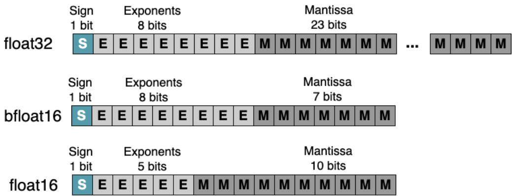  
Figure 9.17 Comparison of different floating point numbers and their precision.

The key takeaway here is that both boat16 and oat32 allocate 8 bits to the exponent, which means they can represent a comparable range of magnitudes. The signicant dierence lies in the precision, where oat32, with its 23 bits for the mantissa, oers much ner granularity and closer value representation than boat16’s 7 mantissa bits. The mantissa in the oating data point is used to represent the fraction of a number, so for instance, if we take pi (3.14159265), the numbers after 3 will be represented with the mantissa.

Therefore this distinction in mantissa size directly impacts the precision of the represented numbers:

Float32 can dierentiate between numbers that are very close together, thanks to its higher number of mantissa bits. This makes it suitable for applications requiring high numerical precision, such as scientic computations.   
BFloat16, with fewer mantissa bits, has less precision for individual numbers but maintains the broad range necessary for many machine learning algorithms. This makes boat16 particularly useful for neural network training, where the hardware eciency and memory bandwidth savings from using a 16-bit format can signicantly speed up computation, and the exact precision of every operation is often less critical.

The reason why boat is used for neural networks is, that the larger exponent allows boat16 to represent both very large and very small numbers. This is essential for capturing the wide range of values that, for instance, gradients can take on, especially in deep networks or complex models where the gradients may vary greatly in scale across dierent layers and weights.

# 9.4.5 Quantization-aware low-rank adaptation

QA-LoRA is a a quantization-aware low-rank adaptation algorithm. This method aims to achieve two goals:

1 Allowing LLMs to be ne-tuned using the minimum number of GPUs necessary in the ne-tuning phase, as the pre-existing weights $W$ are converted into a low-bit format.   
2 Facilitate the deployment of LLMs with enhanced computational eciency, this is achieved by letting the combined weights $W$ remain in a quantized state.

The rst goal is similar to what you’ve read about QLoRA, were the higher precision was converted into the new format nf4. However, QLoRA introduced signicant advancements, including double quantization and optimized memory management through paged optimizers. These innovations specically address memory spikes and ensure ecient data movement between the CPU and GPU. In comparison, QA-LoRA advances further by optimizing the balance between quantization and adaptation. It renes the quantization process to accommodate the unique demands of LLMs, ensuring that each quantization step contributes positively to the model’s eciency and accuracy. This balance is critical in maintaining the delicate balance between computational demands and performance.

At the core of QA-LoRA’s methodology is its use of group-wise operations, which not only optimize quantization but also ensure that the low-rank adaptations are computation-

ally ecient. This eciency is achieved without the high memory cost typically associated with ne-tuning LLMs, marking a notable improvement over traditional techniques. The adaptation process within QA-LoRA is tuned to leverage the strengths of low-bit representation, ensuring that the quantized weights seamlessly integrate with the adaptation mechanism to produce a model that is both accurate and ecient. Figure 9.18 illustrates the dierences between LoRA, QLoRA and QA-LoRA, respectively.

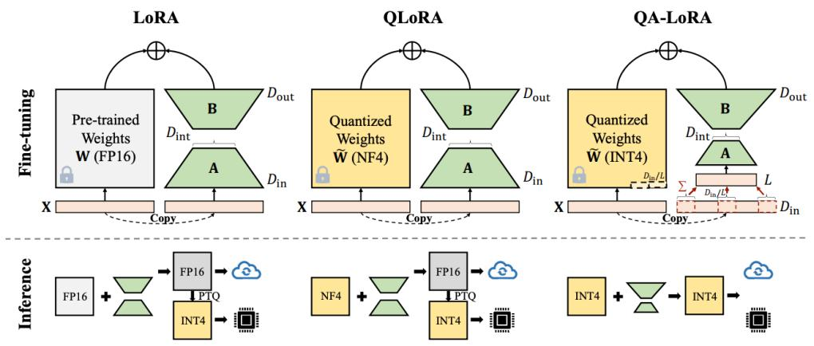  
Figure 9.18 The illustration demonstrates the goal of QA-LoRA. That is, unlike previous adaptation techniques, such as LoRA and QLoRA, this method is more computationally effective during both the finetuning and inference phases. importantly, it avoids a decrease in accuracy as it eliminates the need for post-training quantization. Although the figure presents int4 quantization, QA-LoRA is adaptable to both int3 and int2. Image is taken from the paper: QA-LoRA Quantization-Aware Low-Rank Adaptation of Large Language Models.

QA-LoRA partitions weight matrices into groups and applies quantization and adaptation at this granular levels. This granular approach allows for the tailored adaptation of each group, maintaining high precision, while reducing memory footprint.

By adjusting the granularity of quantization and focusing on group-wise adaptation, QA-LoRA not only preserves the model’s precision and eciency but also enhances the LLM’s ability to be ne-tuned on new data eectively.

# 9.4.6 Low-rank plus quantized matrix decomposition

LQ-LORA uses a simple factorization scheme to break down each pre-trained matrix into a component of high precision but low rank and another component that is quantized for memory eciency. Throughout the ne-tuning phase, the quantized component is kept constant while updates are only applied to the low-rank component. This approach is rooted in the understanding that traditional methods, like LoRA, which reparameterize a pre-trained matrix $W _ { 0 } + \Delta W = W _ { 0 } + B A$ and initialize $\boldsymbol { A }$ with Gaussian values and $B$ to zero, can maintain the model’s initial output constancy at the onset of ne-tuning. However, this strategy may not be ideal when dealing with a quantized version of $W$ , especially considering the potential signicant discrepancy between $\mathcal { W }$ and its quantized version when quantizing to lower bits.

Recognizing the limitations of conventional initialization, which overlooks the inherent structure of $\mathcal { W }$ in deciding adaptation subspaces, LQ-LoRA adopts a matrix factorization perspective. This perspective aims to factorize the original matrix into a component that is quantizable and a low-rank component that captures high-variance directions. Such decomposition not only aligns with the principles of robust principal components analysis but also adapts its iterative algorithms for eective application, toggling between optimizing the low-rank components and the quantized component for optimal reconstruction.

Throughout the ne-tuning phase, the focus is on adjusting only the low-rank component, keeping the quantized component unchanged. This selective update strategy ensures that the quantized element contributes to memory eciency without compromising the adaptation process’s quality or the model’s performance. Each step of this rened algorithm, including randomized SVD for low-rank approximation followed by quantization for the second component, is executed on contemporary GPUs.

# 9.5 Sharding LLMs for memory optimization

This section explores the concept of sharding as a strategy for memory optimization. Sharding, a technique traditionally associated with databases to distribute data across multiple servers, can also be applied to distribute the computational and storage load of LLMs across multiple devices or nodes. By partitioning the model’s parameters into smaller, manageable chunks, or shards, it becomes feasible to train and deploy models that were previously unattainable due to hardware constraints. Essentially, sharding an LLM entails segmenting it into more manageable pieces. Figure 9.19 illustrates this concept.

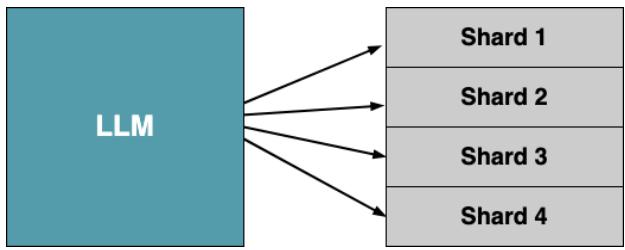  
Figure 9.19 Illustration of the concept of sharding, where an large language model is broken down in pieces to distribute its computational and memory load more efficiently. Each shard can be processed independently, or on different devices or processors, which can lead to improvements in memory efficiency, inference speed, and scalability of the LLM.

Memory eciency is one of the benet of sharding, allowing for the operation of large models on hardware with limited memory capacity. This technique circumvents the need to load the entire model into memory simultaneously, allowing only the needed segments to be loaded and processed. As a result, memory requirements are signicantly reduced. Additionally, sharding facilitates the distribution of computations across multiple devices, achieving parallel processing that notably speeds up inference times. This acceleration is particularly helpful for large models, which would otherwise exhibit slow performance on a single device.

Furthermore, sharding enhances the scalability of model deployment on distributed systems equipped with multiple GPUs or across computing clusters. This capability is important for managing substantial workloads and tasks on a grand scale. Sharding also plays a pivotal role in distributed inference, especially within large-scale distributed systems where processing power is spread across numerous nodes or GPUs. By optimizing the use of computational resources and minimizing communication overhead, sharding ensures a more ecient and streamlined operation, making it an vital technique for memory optimization in the training and deployment of LLMs.

However, while sharding signicantly enhances the scalability of model deployment on distributed systems and optimizes computational resource use, it introduces complexities such as the need for ecient synchronization and potential bottlenecks in data communication. These challenges, inherent to distributing workloads across multiple GPUs or computing clusters, require careful management to ensure the seamless operation of sharded LLMs.

To use sharding with Hugging Face, you can use the the accelerate library. The following listings 9.14 - 9.17 show a step-by-step approach to use sharding.

# Listing 9.14 Print system resources

```python
def print_system-resources():
    num_cpus = os.cpu_count()
    print(f'Number of CPU cores: num_cpus')
    print(f'Total CPU RAM: psutil.virtuall_memory().total / (1024**3):.2f GB')
    if torch.cuda.is-available():
        num_gpus = torch.cudadevice_count()
        print(f'Number of GPUs: num_gpus')
        for i in range(num_gpus):
            print(f'GPU i Name: torch.cuda.get_device_name(i)')
            print(f'GPU i RAM: torch.cuda.get_device_propertyss(i).
            total_memory / (1024**3):.2f GB')
    else:
        print('No GPUs found') 
```

This code will print out the number of CPU cores and the number of GPUs. In listing 9.15 is the function to load and shard the model

# Listing 9.15 Sharding Falcon 7B with accelerate

def shard_and_load_model(model_name, save_directory, max_shard_size, device_map):

```python
Initialize tokenizer and model  
tokenizer = AutoTokenizer.from_pretrained(model_name)  
model = AutoModelForCausalLM.from_pretrained(model_name) 
```

2 Initialize Accelerator accelerator $=$ Accelerator()

```txt
Save model with sharding 
```

accelerator.save_model(model $\equiv$ model, save_directory $\equiv$ save_directory, max_shard_size $\equiv$ max_shard_size)

4 Load model from checkpoint with device map   
model $=$ load_checkpoint_anddispatch( model,checkpoint $\equiv$ save_directory,device_map $\equiv$ device_map, no_split_module_classes $\equiv$ ['Block']   
return model,tokenizer

As a next step, in listing 9.16 is the function to generate the model outputs.

# Listing 9.16 Generate model outputs

```python
def generate_outputs(model,tokenizer, input_text,max_new_tokens):
    inputs = tokenizer(input_text, return_tensors="pt")
    outputs = model_generate(**inputs, max_new_tokens=max_new_tokens,
                                return_dict_in_generate=True, output Scores=True)
    returntokenizerdecode(outputSequence[0], skip_special_tokens=True) 
```

After having set up all our needed functions, we can now use a main function to load the model and ask it a question as demonstrated in listing 9.17.

# Listing 9.17 Main function to generate model output

```python
def main():
    model_name = "tiiuae/falcon-7b"
    save_directory = "/content/model"
    device_map = ""
    print system resources
    print_systemResources()
    Shard and load the model
    model,tokenizer = shard_and_load_model(model_name,
                     save_directory, "2GB", device_map)
    Generate outputs
    raw_input_text = "Tell me something about falcons"
    generated_text = generate_outputs(model,
                        tokenizer, raw_input_text, 100)
    print(f'Generated Text: generated_text') 
```

NOTE Note that I use as device CPU, for that reason the computation will be slower as with a GPU, if you have multiple GPUs you can change this to gpu.

In the following is the model’s answer to the prompt "Tell me something about falcons". Falcons are birds of prey. They are carnivores and they hunt for their food. They are very strong and they can kill their prey with their sharp talons. They are very fast and they can y very fast. They are very good hunters. They hunt for small animals like rabbits, mice,

squirrels, birds, etc. They hunt for their food in the wild. They are very good at hunting. They are very good at ying.

This section has demonstrated the practical steps required to implement sharding using the Hugging Face’s accelerate library, from checking system resources to sharding and loading the model, and nally generating outputs. The potential of sharding extends beyond just memory eciency; it enables the deployment of massive models in distributed systems.

# 9.6 Summary

You must set hyperparameters before you start the training and can not be learned during training. They model hyperparamters are important for the model optimization process, that is, for nding the minimum of a loss function.   
Ray and its libraries Data and Tune oer a way of parallizing and organizing your hyperparameter search without having to understand anything about distributed systems.   
【 Tracking experiments is important to monitor and evaluate your LLMs during training and inference. Frameworks such as Weights & Biases oer a structured way to generate reports what can be shared with the developement team. Moreover Weights & Biases oers a robust implementation of hyperparameter sweeps that can be used with any machine learning framework, including PyTorch and Hugging Face Transformers.   
【 Pruning reduces model complexity by identifying and removing parts of the network that contribute the least to its output. There are two pruning methods: unstructured pruning and structured pruning. The rst method removes individual weights to signicantly reduce model size without guaranteeing improved computational eciency due to potential hardware optimization issues for sparse matrices. the second method eliminates entire units or groups within the model to align with hardware optimizations, potentially speeding up computation but possibly aecting performance more substantially.   
Model distillation is a technique used to compress the knowledge of a large, complex model (often called a "teacher" model) into a smaller, more ecient one (called a "student" model). The process involves training the student model to mimic the behavior of the teacher model.   
Parameter ecient ne-tuning LLMs (PEFT), encompasses a set of strategies designed to adapt LLMs to new tasks or domains with minimal adjustments to their parameters. Common methods are Low-rank adaptation (LoRA) and Weight-decomposed lowrank adaptation (DoRA).   
Quantization is the process of converting the model weights from a higher precision numerical format to a lower precision one. Libraries such as bitsandbytes make it easy to leverage quantization for common methods such as Quantized low rank adapters (QLoRA).

Sharding is a method to distribute the computational and storage load of LLMs across multiple devices or nodes. This facilitates the distribution of computations across multiple devices, achieving parallel processing that speeds up for the inference.

# Bibliography

[1] Tim Dettmers, Artidoro Pagnoni, Ari Holtzman, and Luke Zettlemoyer. Qlora: Ecient netuning of quantized llms, 2023. arXiv:2305.14314. 253   
[2] Han Guo, Philip Greengard, Eric P. Xing, and Yoon Kim. Lq-lora: Low-rank plus quantized matrix decomposition for ecient language model netuning, 2024. arXiv: 2311.12023. 253   
[3] Cheng-Yu Hsieh, Chun-Liang Li, Chih-Kuan Yeh, Hootan Nakhost, Yasuhisa Fujii, Alexander Ratner, Ranjay Krishna, Chen-Yu Lee, and Tomas Pster. Distilling stepby-step! outperforming larger language models with less training data and smaller model sizes, 2023. arXiv:2305.02301. 251   
[4] Edward J. Hu, Yelong Shen, Phillip Wallis, Zeyuan Allen-Zhu, Yuanzhi Li, Shean Wang, and Weizhu Chen. Lora: Low-rank adaptation of large language models. CoRR, abs/2106.09685, 2021. URL: https://arxiv.org/abs/2106.09685, arXiv: 2106.09685. 253   
[5] Shih-Yang Liu, Chien-Yi Wang, Hongxu Yin, Pavlo Molchanov, Yu-Chiang Frank Wang, Kwang-Ting Cheng, and Min-Hung Chen. Dora: Weight-decomposed low-rank adaptation, 2024. arXiv:2402.09353. 253   
[6] Yuhui Xu, Lingxi Xie, Xiaotao Gu, Xin Chen, Heng Chang, Hengheng Zhang, Zhengsu Chen, Xiaopeng Zhang, and Qi Tian. Qa-lora: Quantization-aware low-rank adaptation of large language models, 2023. arXiv:2309.14717. 253

# appendix Get the most out of this book - how to run the code

This book is designed not only to provide you with a solid theoretical foundation but also to ensure that you have the practical skills to apply the concepts in real-world scenarios. To help you gain hands-on experience, I have prepared an extensive code repository that complements the content of each chapter. You can access the code repository with this link: https://github.com/Nicolepcx/Transformers-in-Action.

The code repository is organized into individual folders for each chapter, as shown in gure A.1, ensuring that you can easily locate the relevant code snippets and examples for the concepts discussed in the book.

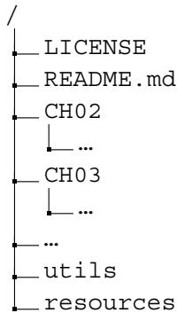  
Figure A.1 Directory structure of the repository

I have chosen Jupyter Notebooks as the primary medium for sharing the code, making it simple and interactive for you to follow along and experiment with the models.

Moreover, given the computational requirements of the models and examples provided in this book, it is necessary to have access to a GPU to execute the code. I have made an intentional eort to bring you closer to real-world scenarios, and this often means dealing with larger datasets and more complex models. These tasks can be computationally intensive and require higher GPU resources, particularly a GPU with a large amount of RAM.

Platforms like Paperspace and Google Colab provide these resources in the cloud, making it more accessible to a broader audience. By clicking on the button, as shown in gure A.2, the Jupyter Notebooks will automatically open in your chosen cloud service, even directly from the GitHub repository.

  
Figure A.2 Just click on one of these buttons to easily open the notebook within your preferred platform.

Running these notebooks in cloud services like Paperspace or Google Colab is not just a matter of convenience. Given the nature of the computations involved in our examples, it’s essential to have access to a GPU. That’s where the beauty of this setup comes into play. By opening the notebooks in your chosen cloud service, you gain access to powerful GPUs, and the required dependencies for each chapter are automatically installed for you. Since I’ve programmed specic functions into the notebooks to manage this installation process, so you can focus on learning and experimenting.

All you need to do is connect the notebook to the GPU on the platform. With this approach, you can easily and eciently run the code directly in your browser, providing you with a seamless learning experience.

In addition, some of the code is organized into classes and functions and imported into the notebooks for better structure and ease of use. When running the notebooks on your chosen cloud service, the GitHub repository will be automatically cloned, ensuring that all necessary code les are available, making it even more convenient for you to focus on learning and experimenting with the models.

That said, I encourage you to actively engage with the code as you progress through the book. This hands-on approach will not only deepen your understanding of the concepts but also enable you to develop the skills necessary to implement and adapt these models to your specic use cases. So, dive in, explore the code, and don’t hesitate to modify and experiment with it to solidify your knowledge and expertise in working with Transformers.