ATTENTION IN ARTIFICIAL INTELLIGENCESYSTEMS,MODELS AND ALGORITHMS

# 人工智能注意力机制

体系、模型与算法剖析

傅罡著

  
傅罡

博士，毕业于清华大学，高级工程师。现就职于同方威视技术股份有限公司人工智能研发中心，长期负责人工智能算法研发和研发管理工作。2015年，进入清华大学-同方威视校企联合博士后工作站进行博士后研究工作。2017年至今，作为技术负责人或骨干参与多个国家级和省部级重点研究项目。长期关注人工智能技术的进展，对自然语言处理、计算机视觉等领域的各类人工智能算法有着深刻的理解和独到的见解，并擅长用通俗易懂的语言进行阐述和表达。

ATTENTION IN ARTIFICIAL INTELLIGENCE SYSTEMS,MODELSAND ALGORITHMS

# 人工智能注意力机制

体系、模型与算法剖析

傅罡著

“注意”作为一切思维活动的起点，一直是哲学、心理学和认知神经科学的重点研究对象。随着计算机技术的发展，人类对注意力机制的模拟和应用成为计算机科学领域的热点研究方向———让计算机能够具有类似人类的注意力机制，使其能够有效地应用于对数据的理解和分析。Transformer模型诞生后，注意力机制在人工智能各大重要领域的研究和应用更是如火如荼，成果丰硕。

本书从注意力机制这一重要角度入手，阐述注意力机制的产生背景和发展历程，通过详实的理论剖析，以深入浅出的方式着重介绍注意力机制在计算机视觉、自然语言处理，以及多模态机器学习三大人工智能方向中的应用思路、模型与算法。

本书以人工智能相关专业研究人员，特别是计算机视觉与自然语言处理等领域的研发人员作为主要读者对象，一方面帮其梳理技术的发展脉络、开拓思路、构建完整的认知体系；另一方面为其剖析算法原理、深刻理解算法细节。本书提供配套源代码，下载方式见封底。

# 图书在版编目 （CIP）数据

人工智能注意力机制：体系、模型与算法剖析/傅罡著 . —北京：机械工业出版社，2024. 1

（人工智能科学与技术丛书）

ISBN 978-7-111- 74476- 4

Ⅰ. $\textcircled{1}$ 人… Ⅱ. $\textcircled{1}$ 傅… Ⅲ. $\textcircled{1}$ 人工智能 研究 Ⅳ. $\textcircled{1}$ TP18

中国国家版本馆 CIP 数据核字 （2024）第 000166 号

机械工业出版社 （北京市百万庄大街 22 号 邮政编码 100037）

策划编辑：李培培 责任编辑：李培培

责任校对：王小童 李 杉 责任印制：郜 敏

三河市宏达印刷有限公司印刷

2024 年 3 月第 1 版第 1 次印刷

$1 8 4 \mathrm { m m } { \times } 2 4 0 \mathrm { m m } \cdot 2 7 . 2 5$ 印张·573 千字

标准书号：ISBN 978-7-111- 74476- 4

定价：169. 00 元

电话服务 网络服务

客服电话：010- 88361066 机 工 官 网：www. cmpbook. com

010- 88379833 机 工 官 博：weibo. com / cmp1952

010- 68326294 金 书 网：www. golden-book. com

封底无防伪标均为盗版 机工教育服务网：www. cmpedu. com

# 前

#

“注意是我们心灵的唯一门户，意识中的一切，必然都要经过它才能进来。”

俄国著名教育家、俄国教育学体系创立者乌申斯基

幼儿园阿姨总是拍着手对小朋友说“小朋友请看我这里……”，英语老师也常常敲着黑板要求学生“pay attention……”。无论是幼儿园阿姨还是英语老师，他们的目的是相同的——让他人“集中注意”。那么，所谓的“注意”到底是什么？

不同的学科会从不同的视角对注意做出不同的解释。从生理学视角，注意是我们的感觉器官对外界事物做出的有侧重的响应，并由此引发一系列的生理活动。例如，以视觉注意力为例，就在此时此刻，你正在读的这句话，没错，就是这句话，你的眼球就聚焦在这句话上，其他的文字仿佛“形同虚设”；从心理学视角，注意是心理活动对对象的指向和集中。我们对某事物“有所思”，正是因为我们将心智指向并聚焦在该事物上，即对该事物产生了注意；从认知学视角，注意是外界信息进入认知环节的唯一通路……但无论从哪个视角定义，注意的核心理念是统一的：注意是一切思维活动的起点——有注意，方有思考，通过注意，才能认知。

人工智能（Artificial Intelligence）作为计算机科学的一个重要分支，是研究、开发用于模拟、延伸和扩展人的智能的理论、方法、技术及应用系统的一门技术体系。能够让机器以人类智能相似的方式认知世界并做出恰当的反应，一直是人工智能技术追求的目标。既然注意作为一切认知的起点，对注意力机制的探索与模拟也是人工智能领域的一个重点研究方向。

本书从注意力机制这一重要角度入手，阐述注意力机制的产生背景和发展历程，通过详实的理论剖析，以深入浅出的方式着重介绍注意力机制在计算机视觉（Computer Vision）与自然语言处理（Natural Language Processing）两大人工智能方向中的体系、模型与算法，并在最后将注意力机制在其他智能领域的应用加以拓展。

全书一共分 7 章。第 1 章沿着时间线索，从相对宏观的角度，从哲学思辨到计算机科学，介绍注意力机制研究的“前世今生”。尤其是在计算机科学部分，介绍目前人工智能领域中各方向围绕注意力机制的研究现状。第 2 章介绍计算机视觉领域中的注意力机制。该章从注意力的分类谈起，

讨论视觉显著性模型这一注意力在计算机视觉的最直接体现。然后从5类典型计算机视觉任务入手，介绍计算机视觉领域任务驱动注意力机制的应用并深度剖析若干算法实例。最后再举若干模型实例，介绍神经网络中“即插即用”的注意力模块。需要说明的是，本章内容不包括 Transformer 在计算机视觉领域“踢馆”的部分，我们将该部分作为第6章的内容。第3章介绍“前Transformer时代”自然语言处理领域中的注意力机制。这一章可以认为是自然语言处理领域的“Transformer 前传”。第4章详细剖析 Transformer这一具有里程碑意义的重要模型，尤其是对自注意力机制的原理进行深刻剖析。第5章从自然语言处理领域的预训练范式谈起，重点讨论 Transformer“一统江湖"下自然语言处理领域的最新进展，分门别类地对诸多经典模型进行详细分析。第6章介绍“后Transformer Transformer型。第7章针对多模态机器学习领域，对注意力机制的最新研究进展和应用展开详细讨论。

对注意力机制的讨论与研究涉及诸多交叉学科，可谓枝繁叶茂，源远流长。尤其是本书介绍的人工智能领域，发展更是日新月异，迅速异常。笔者自认才疏学浅，且时间与精力皆有限，故书中错谬、偏颇恐在所难免。若蒙读者不吝指教，笔者将不胜感激！

作 者

# 前 言

#

#

# 与 识 自 改造 / 1

1. 1 本源思考：哲学中的注意力 / 2

1. 1. 1 早期哲学的朴素观点 / 3  
1. 1. 2 注意力视为一般认知现象 / 3  
1. 1. 3 注意力作为重要研究对象 / 4

1. 2 心路历程：心理学中的注意力 / 5

1. 2. 1 实验心理学中的注意力 / 5  
1. 2. 2 认知心理学中的注意力 / 7

1. 3 深入脑海：认知神经科学中的注意力 / 14

1. 3. 1 认知神经科学的研究基础和方法 / 15  
1. 3. 2 认知神经科学中的注意力研究 / 17

1. 4 改造世界：计算机科学中的注意力 / 23

1. 4. 1 人工智能为什么要讨论注意力？ / 24  
1. 4. 2 注意力与计算机视觉 / 25  
1. 4. 3 注意力与自然语言处理 / 27  
1. 4. 4 注意力机制的多模态应用 / 29

参考文献 / 29

#

#

# 计算机视觉中的注意力／31

2. 1 注意力模型的分类 / 32

2. 1. 1 客观与主观：自下而上的注意力与自上而下的注意力 / 32  
2. 1. 2 目的与手段：视觉显著性检测与视觉注意力机制 / 33  
2. 1. 3 掩膜与权重：硬性注意力与柔性注意力 / 35  
2. 1. 4 特征与位置：特征域注意力与空间域注意力 / 36  
2. 1. 5 自己与相互：自注意力与互注意力 / 37

2. 2 视觉显著性检测原理与模型剖析 / 38

2. 2. 1 注视点预测 / 38   
2. 2. 2 显著物体检测 / 61

2. 3 注意力机制的计算机视觉应用与模型剖析 / 89

2. 3. 1 目标搜索与识别 / 89   
2. 3. 2 细粒度分类 / 97  
2. 3. 3 神经网络中的通用注意力模块 / 108

参考文献 / 126

#

自 言处 前 Transformer 代 / 129

3. 1 机器翻译与 Seq2Seq 模型 / 130

3. 1. 1 机器翻译 / 130  
3. 1. 2 Seq2Seq 模型 / 133

3. 2 自然语言处理中注意力机制的起源 / 136

3. 2. 1 Seq2Seq 模型的问题 / 136  
3. 2. 2 注意力 Seq2Seq 模型 / 136

3. 3 经典算法剖析 / 140

3. 3. 1 全局注意力与局部注意力机制 / 140  
3. 3. 2 层级注意力机制 / 142  
3. 3. 3 自注意力机制 / 144

3. 4 注意力机制的形式化表示 / 151

参考文献 / 153

#

只 Transformer / 155

4. 1 Transformer 的诞生 / 156  
4. 2 Transformer 的编码器-解码器架构 / 157

4. 2. 1 编码器结构 / 158  
4. 2. 2 解码器结构 / 159

4. 3 Transformer 的输入与输出 / 159

4. 3. 1 词嵌入 / 160  
4. 3. 2 位置编码 / 161  
4. 3. 3 Transformer 的输出 / 163

4. 4 Transformer 的注意力机制 / 164

4. 4. 1 缩放点积注意力 / 165  
4. 4. 2 多头注意力 / 166

4. 4. 3 编码器与解码器中的注意力模块 / 167

4. 5 一些其他问题 / 172

4. 5. 1 BatchNorm 与 LayerNorm / 172  
4. 5. 2 模型训练的 Teacher Forcing 模式 / 175  
4. 5. 3 序列预测的 Beam Search 方法 / 176

参考文献 / 179

#

#

# 自 然语言处理中 的预训练范式与 Transformer 的 “一统江湖” / 180

5. 1 语言建模 / 181

5. 1. 1 从统计语言模型到神经网络语言模型 / 182  
5. 1. 2 单向语言模型与双向语言模型 / 184  
5. 1. 3 自回归语言模型与自编码语言模型 / 186

5. 2 自然语言处理中的预训练范式 / 187

5. 2. 1 “预训练+微调” 范式 / 187  
5. 2. 2 “预训练+提示” 范式 / 189

5. 3 预训练模型概览 / 190   
5. 4 基于 Transformer 的预训练模型 / 193

5. 4. 1 GPT：Transformer 的 “右手” / 194  
5. 4. 2 BERT：Transformer 的 “左手” / 200  
5. 4. 3 Transformer-XL 与 XLNet：从任意长输入到 “更好的 BERT” / 210  
5. 4. 4 RoBERTa 与 ALBERT：“鲁棒版 BERT”与 “瘦身版 BERT” / 225  
5. 4. 5 MASS、BART 与 UniLM：序列到序列的模型 / 232  
5. 4. 6 ERNIE “双雄”：借助外部数据的增强模型 / 247  
5. 4. 7 XLM：跨语种预训练语言模型 / 257  
5. 4. 8 GPT-2. 0 与 GPT-3. 0：超级模型 / 261参考文献 / 268

#

#

# 计算机视觉 中 的 Transformer / 271

6. 1 视觉 Transformer 模型概览 / 272  
6. 2 卷积还是注意力？ / 276  
6. 3 Transformer 的计算机视觉应用与算法剖析 / 278

6. 3. 1 图像分类与通用主干网络 / 279  
6. 3. 2 目标检测 / 309   
6. 3. 3 图像分割 / 319  
6. 3. 4 自监督预训练模型 / 324

#

参考文献 / 344

# 多 态 习 制 / 347

7. 1 多模态技术发展史 / 348  
7. 2 多模态机器学习面临的挑战 / 350  
7. 3 视觉语言多模态模型 / 353

7. 3. 1 视觉语言任务简介 / 353  
7. 3. 2 视觉语言模型中的注意力机制 / 359

7. 4 经典多模态模型剖析 / 360

7. 4. 1 早期单任务视觉语言模型 / 360  
7. 4. 2 视觉语言预训练模型 / 378  
7. 4. 3 提示驱动 CV 模型 / 405  
7. 4. 4 新型生成模型 / 415

参考文献 / 426

#

#

# 人类注意力与计算机注意力

# 从认识自我到改造世界

“注意”是一个古老而永恒的话题。与注意相关的研究是从哲学 （Philosophy）领域开始的，这是人类对自身如何感知世界本源的思考与探究。随后，人类希望能够更深层次地了解自身心理活动的起源，故注意引起了心理学 （Psychology）界的重视，而心理学领域对注意的研究又先后经历了实验心理学 （Experimental Psychology） 和认知心理学 （Cognitive Psychology） 两个阶段，由表及里不断明确注意与认知的关系。20 世纪 70 年代后期，随着对脑机制研究的深入，注意也引起了认知神经科学（Cognitive Neuroscience）领域的 “注意”。作为认知心理学和神经科学相结合的产物，以 “心智的生物基础”作为研究定位的认知神经科学，试图从分子、神经细胞以及脑组织等生物学层面探究注意背后的机理和作用。计算机科学 （Computer Science）的兴起大幅提升了人类的生产力水平。作为计算机学科的重要分支，人工智能 （Artificial Intelligence）技术从 1956 年诞生的那一刻起，跌宕起伏，一直围绕让机器具有认知能力这一目标不断探索前进。既然心理学、神经科学等诸多学科已经对注意力在认知中的重要作用进行了深刻的论证和积累，对注意力的探究与应用自然也不会被人工智能所错过———让机器具有注意力，从而能够快速排除干扰，自动地将关注重点放在有价值的对象上面，为机器的认知打开通道。不同领域对注意力研究的历史阶段示意如图 1-1 所示。

  
●图 1-1 不同领域对注意力研究的历史阶段示意

如果说从哲学到认知神经科学都是以 “形而上”的方式探索注意力之 “道”，则人工智能是以“形而下”的方式探索注意力之 “器”；从哲学到认知神经科学对注意力的研究过程，是一个从现象开始不断探究本质的过程，也是人类对自我认识不断深化的过程。而人工智能对注意力的探索更多的是以注意力作为重要工具，将注意力的理论赋能于实践的过程，也是改造世界的过程。

# 本源思考：哲学中的注意力

哲学是世界观的理论体系，探索人类怎么看待自我和怎么看待世界这一根本问题。而注意力的主体是人，客体是世间的万事万物。注意力连接主观与客观，关系到意识与存在这一世界观的核心问题。因此，围绕注意力的讨论在哲学领域由来已久，对注意力的探索也经历了从早期的朴素认识，到将其视作一种认知现象，再到将其作为重要研究对象的发展历程。

# 1. 1. 1 早期哲学的朴素观点

首先对注意力做出明确阐述的是古希腊哲学家亚里士多德 （Aristotle，公元前 384—公元前 322年）。亚里士多德在其著作 《尼各马科伦理学》（Nicomachean Ethics）中认为：在诸如我们生动感知某事物，因响亮的声音或音乐分神，专注于几何问题等不同现象的背后，都涉及一种特殊的选择特性，这是不同认知刺激之间竞争的结果。这种选择性就是注意力。亚里士多德还揭示了注意力和快乐是如何增强我们认知活动的[1] 。站在现在的视角看，上述观点是简单的甚至可以说是粗糙的，但是追溯到人类对自我认知还是一片 “蛮荒之地” 的 2000 多年前，亚里士多德强调了注意力的选择特性，并将选择性注意与精神联系起来，这是何等超前的认知？公元 4 世纪，古罗马神学家圣奥古斯丁（St. Augustine，354—430 年）认为之所以我们对某些事物感兴趣，是因为这些事物可以自动吸引人的注意力，从而推断出非自愿注意力的存在。圣奥古斯丁所说的非自愿注意力，实质即自下而上的注意力。这种注意力是不受主观控制的——— “之所以我注意你，只是因为你太好看”。

# 1. 1. 2 注意力视为一般认知现象

17 世纪，法国著名数学家、哲学家笛卡儿 （Descartes，1596—1650 年）虽然没有对注意力的概念进行深入分析，但他却经常提及注意力[2] 。例如，在其著作 《沉思录》（Meditations）中，就反复强调注意力在认知中扮演重要角色：只有集中注意力，才能使得观念变得清晰明了而不被怀疑；只有集中注意力，才能释放思想的认知潜力。除此之外，笛卡儿对自愿和非自愿注意力之间的区别也进行了补充，他将前者称为 “关注”（attention），后者称为 “惊讶”（admiration）㊀①。尤其是后者，笛卡儿的思想已经与一些现代计算机注意力模型所使用的 “意外”（surprise）的概念非常接近。尽管笛卡儿的思想充满了主观唯心主义色彩，但其对注意力对于认知的重要性是值得肯定的。特别是其自愿和非自愿注意力的观点，本质上是对自上而下注意力和自下而上注意力的朴素表达。紧随笛卡儿之后，法国哲学家尼古拉·马勒伯朗士 （Nicolas Malebranche，1638—1715 年）在其 1675 年出版的著作 《真理的探索》 （Concerning the Search after Truth） 中，重点讨论了注意力在场景理解和思维组织中的作用。他还将注意力视为自由意志的基础。马勒伯朗士在书中写道 “思想出现的偶然原因是注意力……很容易认识到，这正是我们的自由之道。”[3] 因此，从一开始，马勒伯朗士就认为注意力与意识有关。作为英国最早的经验主义哲学家之一，约翰·洛克 （John Locke，1632—1704 年）认为人类的一切知识都来自感官经验，而正是通过注意力，才能够将感官经验转化为知识。正如其在著作 《人类理解论》 （EssayConcerning Human Understanding）中阐述的注意力作用在观念后引发认知的过程——— “当观念在脑海中浮现但对其毫无所思时，我们几乎无法描述它。但是当观念被关注到并被记录在记忆中时，它就成了注意：当我们的头脑对其投入热情并进行选择，该理念在我们头脑固定，并且不会被其他理念所诱导而发生改变，我们即开始研究它。”[4] 洛克的观点用计算机处理数据的过程类比可能会更加形象：那些浮现在脑海的观念如同硬盘上的一个个文件，这些文件平时根本不会受到关注。但是当计算机需要处理某文件的时候，先找到它再加载到内存，然后开始后续的处理。洛克强调了注意力的选择特性及

注意作为认知起点的认知过程，这是非常值得肯定的。

18 世纪早期，德国著名哲学家、数学家戈特弗里德·莱布尼茨 （Gottfried W. Leibniz，1646—1716年）首次提出 “统觉”（apperception）的概念：将新的和过去的经验、知识、兴趣、态度同化到当前的世界观中。莱布尼茨同样也提到了一种自下而上的、非自愿的注意力形式，并认为这种注意力是将客观事物转化为认知所必不可少的。因此在莱布尼茨的观点中，注意力被视为一个 “非自愿的意识之门”。继洛克之后，另一位著名英国经验主义哲学家乔治·贝克莱 （George Berkeley，1685—1753 年）将洛克存在 “抽象观念”的观点批判得体无完肤，甚至还将经验主义延伸到否定物质这一无比激进的程度。但是贝克莱丝毫不否认注意力在认知中的作用———在其 1710 年出版的著作 《人类知识原理》（Principles of Human Knowledge）中，虽然未明确阐述注意力的相关理论，但是从侧面反映了注意力使人具备思考抽象观念的能力，以及注意力在描绘 “心灵图景”中发挥的重要作用。

# 1.1.3 注意力作为重要研究对象

洛克、莱布尼茨以及贝克莱等哲学家的研究重点在于人类如何形成知识，并且也都承认注意力在知识形成过程中所扮演的重要角色。但是他们更多的认为注意的过程是以 “润物细无声”的方式，在不经意间完成的，即他们均认为注意力仅仅是一种认知现象，无需给予太多解释。然而，纵观整个 18世纪和认知有关的哲学和心理学研究，越来越多的人认为注意力本身就是一个非常值得研究的对象，并开始将注意力作为一个独立的理论展开研究。

德国启蒙哲学家克里斯蒂安·沃尔夫 （Christian Wolff，1679—1754 年）将莱布尼茨哲学系统化，并在其著作中以大段篇幅阐述注意力，尤其是视觉注意力的作用机制。沃尔夫首次对注意力的移动做出了生动比喻：“首先感知整棵树，然后将注意力从树叶转移到树枝再转移回树干；或者感知一片叶子，将注意力从形状转移到颜色。”[5]㊀

18 世纪对注意力的阐述同时向两个方向扩展。第一个方向为：注意力从作用于已经接收到的观念，转向参与这些观念的最初接收，即注意力朝着 “传感器端”移动。例如，洛克认为注意力是作用在感官获得的观念上才开启知识的形成。但英国美学家、道德哲学家亨利·霍姆 （Henry Home，1696—1782 年）在其 1769 年出版的著作 《批判的元素》 （Elements of Criticism） 中却强调 “注意力是一种使人准备接受印象的心理状态。根据注意的程度，物体会给人留下强烈或微弱的印象。即使是简单的看的动作，注意力也是必要的。”[6] 霍姆认为注意力本身就具有感官功能，即使一个小小的感官行为，注意力都是要参与的。第二个方向为：不仅仅认为注意力在观念感知过程中发挥作用，逐渐开始认为注意力在行为产生过程中同样发挥作用。这一点在苏格兰数学家、哲学家杜格尔德·斯图尔特（Dugald Stewart，1753—1828 年）的观点中体现得尤为明显。斯图尔特在其 1792 年出版的著作 《人类心灵哲学的要素》（Elements of the Philosophy of the Human Mind）中一方面保留洛克关于注意力在观念选择性存储中重要性这一观点，另一方面认为注意力在决定哪些特定记忆被回忆也起着重要作用，即

认为某些注意力对于任何记忆行为都是必要的。斯图尔特甚至认为注意力在熟练行为的开发和运用中起着作用[7] ，即认为注意力能够影响行为。

在斯图尔特之后的一个世纪里，人们不断期望注意力能够解释更多的内容，包括从感知到思考再到行动等各种各样的众多心理学现象。但是，在哲学的框架下，以思辨和经验的方式研究注意力及其相关心理学问题再难以产生实质性进展，甚至带来了诸多争论和混乱。

# 1.2 心路历程：心理学中的注意力

在19 世纪以前，绝大多数心理学问题都在哲学领域中讨论。19 世纪随着生物学、物理学以及其他自然科学的发展，心理学逐渐与哲学脱离成为一门独立的学科，对心理学问题的探索逐渐拥有了一套有别于哲学的、科学完整的研究体系。对注意力的研究也随之进入一个崭新时代。

心理学领域将注意力的作用机制至少分为四种：第一种注意力表现为 “唤醒” （arousal）或 “警觉” （alertness）。例如，小明在课堂望着窗外发呆，老师突然敲黑板，小明不禁浑身一颤，然后赶紧看黑板；再例如，正在进食的小猫突然听到异响，立即停止进食，开始紧张地四处张望等。上述例子中注意力仅用于帮助实现状态切换，而与认知无关。第二种注意力与认知有关，一般称为 “感官注意力”（sensory attention）。所谓的感官注意力是指在我们通过眼睛、耳朵等感觉器官获取输入后，帮助我们聚焦心智，实现信息加工并完成认知的一种注意机制。例如，在看书时，目光不断地在字里行间移动聚焦，同时大脑也在不断思考，领会文字的含义。第三种注意力与行为有关，表现为 “认真”（conscientious） 或 “专注”（concentration）。在这种机制下，注意力参与并指导身体动作的执行。例如，体操运动员必须通过集中注意力来完成高难度的动作。第四种注意力表现为 “冥思” （meditation）。比如，闭着眼睛想象一个苹果的样子和味道，注意力的确集中在脑海中那个“虚拟”的苹果上，但此时此刻感觉器官未获得任何信息输入，自然不存在对外界信息的加工。当然，需要说明的是，上述几种注意力并不是孤立的，往往体现为完整行为的多个环节。例如，球场上，小明的思绪已经 “神游”，突然场边教练叫他的名字，小明先是浑身一颤，然后意识到是在叫自己，然后开始专心运球……整个过程中前三种注意力均发挥了作用———注意力先后发挥了唤醒、参与认知和参与行为三方面的作用。考虑到本书的落脚点在于人工智能中的注意力机制，而人工智能最重要的目标是让机器具有认知世界的能力。因此，我们将聚焦第二种注意力机制展开详细讨论。

# 1. 2. 1 实验心理学中的注意力

19 世纪下半叶，德国著名生理学家、物理学家赫尔曼·冯亥姆霍兹 （Hermann von Helmholtz，1821—1894 年）围绕视觉与听觉感官的作用机理，以及感官与心理活动之间的相互作用等方面开展了诸多深入研究，取得丰硕的研究成果。1875 年，在其出版的著作 《生理光学手册》（Treatise on Physio-logical Optics）中，冯亥姆霍兹强调了眼球运动获取场景信息这一重要生理机制，他强调在视野中移动眼睛 “是我们能够尽可能清楚地依次看到场景各个部分的唯一方法”[8] 。尽管冯亥姆霍兹的实验工作主要涉及对 “外显注意力” （overt attention） 的研究，但是他还指出了 “内隐注意力” （covert

attention）的存在㊀①。除此之外，冯亥姆霍兹将注意力扮演的角色看作是 “感兴趣的东西在哪里”问题的答案。作为实验心理学对注意力的先驱研究，即使在一百多年后的今天来看，冯亥姆霍兹的观点也具有非常深刻的指导意义。

1879 年，德国生理学家、心理学家威廉·冯特 （Wilhelm Wundt，1832—1920 年） 在莱比锡大学创立世界上第一个专门研究心理学的实验室，标志着实验心理学 （Experimental Psychology）的诞生，也使得对注意力的探索进入了一个科学研究的阶段。首次将意识和注意力的研究引入心理学领域的正是实验心理学的奠基人、有着实验心理学之父之称的冯特本人。冯特让受训过的天文学家通过望远镜判断天体凌日能力，研究每个参与者注意力的个体差异。冯特将这种差异解释为一个人自愿将注意力从一种刺激转移到另一种刺激所需的时间，并由此开启了一系列关于心理处理速度的研究[9] 。另一位实验心理学的代表人物，冯特的学生、英籍美国心理学家爱德华·铁钦纳 （Edward B. Titchener，1867—1927 年）把注意力在感知和 “感觉明确性”（sensory clearness）中的作用作为其最基本的特征。在其 1908 年发表的文章中，将注意力定义为 “一种感官明确性的状态，有边界和焦点。注意力是意识的一个方面，与专注于体验的某些事物所投入的努力有关，从而使这些事物变得相对生动。”[10]

在实验心理学界，美国著名心理学家、有着美国心理学之父之称的威廉·詹姆斯 （William James，1842—1910 年） 可以说是里程碑一般的存在。其著作 《心理学原理》 （The Principles of Psychology） 几乎概括整个19 世纪的心理学内容，堪称心理学的经典著作。尽管这不是心理学领域第一部以详细讨论注意力作为主题的著作，但是，这本书写于1890 年那个特殊的年代，要知道那正是处在一个对注意力讨论的大混乱时期，更是心理学作为一门学科的发展至关重要的时期。与温度、质量等物理学对象都具有明确定义相反，注意力作为一种心理现象，此刻还没有一个被大家广泛接受的定义。詹姆斯要做的首要工作是要给注意力一个可以被广泛认可的定义，从而能让大家能够搁置争议，一致向前。詹姆斯于 1890 年在其著作中写下名言： “人人都知道什么是注意。”[11] 这句话的意思大概是 “不多说，你懂的”，似乎什么也没说，但是却有着非凡的意义———至少所有人在这句话上是能达成高度共识的。詹姆斯接下来对注意的定义更为明确：“‘注意’是意识以清晰而迅速的形式，在多种可能性中选取一个物体或一系列想法的过程。定焦、集中和意识是注意的关键因素。注意意味着对某些对象的忽视，以便更高效地处理其他对象，它与分散、混乱的精神状态相对，后者称作 ‘分心’。”[11] 尽管詹姆斯这句话更像是一种描述，而不像是一个科学客观的定义。但是，上述描述将注意力所具有的主观性、选择性、指向性和集中性等心理、生理以及认知特性表达得已经非常明确。除此之外，詹姆斯认为注意力使我们感知、构思、辨别、记忆，并缩短反应时间，例如，当我们集中注意力时，思考可以更加迅速，动作也会更加敏捷。詹姆斯对 “主动”和 “非主动”注意力进行了定义和区分，可以说这是对注意力自下而上特性和自上而下特性的进一步阐述。另外，与冯亥姆霍兹不同，詹姆斯认为注意力应该回答感兴趣的东西 “是什么”这一问题。尽管冯亥姆霍兹 “在哪里”和詹姆斯 “是什么”的观点看似差不多，但是二者却有着实质性的区别：前者更多地强调注意力的被动特性———感兴趣的东西本身

就客观存在，注意力只是帮助我们找到它；而后者强调注意力有发现感兴趣东西的主观能动性，甚至是注意力能够决定何为感兴趣的东西。可以说詹姆斯对注意力的很多观点为后续认知心理学、认知神经科学，甚至是计算机科学对注意力的研究都起到引领性的作用。

# 1. 2. 2 认知心理学中的注意力

20 世纪初期，行为心理学 （Behavioral Psychology）在美国诞生。该流派认为意识这种发生在头脑中看不见摸不着的东西是 “鬼火”，不应该作为心理学的研究对象，心理学应该去研究从人的意识中折射出来的客观存在———行为。在这一思路的指导下，自然有很多心理学家尝试用行为来解释注意力。例如，美国心理学家约翰·弗雷德里克·达希尔 （John Frederick Dashiell，1888—1975 年） 在其1928 年出版的行为主义著作 《客观心理学基础》 （Fundamentals of Objective Psychology） 中，将注意力解释为一种 “举止”（posturing）[12] 。但是这种试图用某一种外化行为解释内心活动的做法过于苍白无力，自然难以成功。然而，正是因为行为心理学以看得见摸得着的人类行为作为研究对象，容易借助生物、物理等学科的理论和方法作为其研究和实验手段，这些偏 “实在”的特性使得其一时间成为心理学的主流方向，产生了极大的影响力。在相当长的一段时期，使注意力这种与意识和认知高度相关的过于 “虚幻”的对象，长期受到冷落。

第二次世界大战以后，信息、通信等理论获得突飞猛进的发展，再加上心理学界对行为主义的广泛质疑，人们开始试图用信息加工的过程来刻画认知过程。20 世纪 50 年代，认知心理学 （CognitivePsychology）应运而生，重新将认知作为研究的核心对象。对注意力的研究也随之迎来了重大转机，重返 “C 位”。

英国电气工程师、认知学家爱德华·切瑞 （Edward C. Cherry，1914—1979 年）在 1953 年提出 “鸡尾酒会效应”（Cocktail-party Effect），描述了人能够在嘈杂的环境中排除干扰，把注意力集中在和某人的交谈上这一现象。受到切瑞观点的启发，1958 年，英国著名心理学家唐纳德·布罗德本特 （DonaldE. Broadbent，1926—1993 年）在其出版的著作 《感知与交流》 （Perception and Communication） 中提出著名的过滤器理论㊀，以此理论来刻画人类对信息加工的过程。过滤器理论认为外界的信息是大量的，而人脑的容量和加工能力又有一定的限制，于是出现了瓶颈。为了避免因 “带宽不足”的超负荷问题，就需要一个过滤器来实现信息选择功能———选择其中较少且价值高的信息，使其进入高级分析阶段接受进一步的加工而被认知和存储，而其他信息则予以抛弃。在过滤器理论中，注意力就扮演信息过滤器的角色，该过滤器根据诸如图像颜色、说话人的语音特点等特定物理属性对信息进行选择。正如布罗德本特所说 “注意是资源有限的加工系统的工作结果。”[13] 布罗德本特的过滤器理论是认知心理学界第一个体系化的认知架构，对后来认知心理学对注意力的研究带来深远影响。由于布罗德本特过滤器理论认为注意力的选择机制发生在一切认知之前，因此该观点又被称为 “早期选择理论”（Early Selection Theory）。也正是因为注意力在信息加工过程中扮演信息筛选的角色，这一类注意力机制也被称为 “选择注意力” （Selective Attention）机制。但是，尽管过滤器理论能够对 “鸡尾酒会效应”等现象进行很好的解释，但却很难解释一些随机的注意现象。例如，乘坐飞机飞临广阔沙漠，从

悬窗望向地面，唯有一望无际的苍茫，单调而无聊。突然间，飞机下方出现一片绿洲，我们瞬间被吸引，顿时来了精神……这一切是如何发生的？过滤器理论认为认知系统试图去定位那些能够引起注意的信息输入，似乎有一种 “需求就在这里，给我找出满足需求的对象”的感觉。但是上面例子中的注意力体现出极大的是随机性，根本就不存在任何预先的设定，这一现象用过滤器理论就很难解释。

在布罗德本特的过滤器理论中，注意力对信息的选择采用 “非留即走”的方式进行———注意力中存在一系列选择信息的阈值，那些没有超过阈值的信息根本就不会进入认知环节。例如，以听声音为例，过滤器理论可能以声音强度为阈值，认为声音强度高于某个阈值的才会被感知，否则认为其根本就无法被察觉。显然，这种 “一刀切”的方式在很多情况下与现实人类的认知现象是不符的。例如，在一个异常嘈杂的环境中，很容易注意到别人呼唤自己的名字，即便是声音很小也有可能引起注意。这就意味着那些没有被注意的信息不是直接被 “挡在门外”，只是强度被减弱了。因此，在 1960 年，美国著名心理学家安妮·特里斯曼 （Anne M. Treisman，1935—2018 年） 提出注意力的衰减理论。衰减理论与过滤器理论相比，有三点显著的区别：第一，在衰减理论中，注意力扮演的角色是衰减器，而不再是纯粹的二元化的过滤器；第二，衰减理论中注意力对于不同信息的筛选阈值是不同的，这一点也是显而易见的———听到陌生名字和听到自己名字能够引起注意的强度阈值一定是不同的，陌生名字的阈值高，而自己名字的阈值低；第三，衰减理论强调注意力的筛选过程受到认知的指引。同样是在 “叫名字”的例子中，听到某个名字就会立即引起注意，前提是意识中已经存在这个人的名字，这一观点再次体现了注意力的自上而下机制。

无论是过滤器理论还是衰减理论，都认为注意力的选择发生在认知过程之前。然而有些心理学家则认为信息在进入过滤器和衰减器之前已经得到分析，而注意力对信息的选择发生在加工后期的反应阶段。这便是所谓认知的 “后期选择理论”（Late Selection Theory）。该理论由美国夫妻心理学家安东尼·多伊奇 （J. Anthony Deutsch，1927—2016 年） 和戴安娜·多伊奇 （Diana Deutsch，1938 年至今）于1963 年提出。具体来说，后期选择理论描述了如下的认知过程：所有的信息首先经过一个前期分析，并被暂存在一个称为 “工作记忆”（working memory）的临时存储空间中，然后注意力在工作记忆上展开选择，选择的结果被送入记忆形成认知。后期选择理论体现了注意力基于记忆的信息二次加工特性，因此也被称为完善加工理论或记忆选择理论。下面再举一个例子对后期选择理论做进一步说明。假如需要从若干个随机数字中找到其中最大的那个，我们需要逐个看一遍这些数字，这便是前期的分析；我们需要将看过的数字记在心中，这便是工作记忆的临时存储；然后我们根据记忆选择最大的那个数字，这便是注意力的选择。正所谓看遍所有数，只取最大值。

过滤器理论、衰减理论和后期选择理论的差异主要体现在注意力的选择发生在认知过程中的不同环节上。图1-2 示意了过滤器理论、衰减理论和后期选择理论三种注意力选择在信息加工中的机制。后期选择理论之后，还有很多心理学家对注意力的选择机制提出了更多的观点。例如，在2006 年，约翰斯顿 （Johnston）等[14] 学者提出了注意力的多阶段选择理论。顾名思义，该理论认为注意力对信息的选择可以发生在认知环节中的多个阶段，即认为在不同的认知场景中，注意力可以在任何阶段介入并发挥选择作用。上述这些理论讨论的核心问题都是注意力的选择特性是如何在认知过程中发挥作用的，因此这些理论共同构成了认知心理学中注意力选择的认知理论体系。

眼睛是我们最主要的感觉器官，我们对世界信息的获取绝大多数来自视觉。视觉感官接收到的信

  
●图 1-2 过滤器理论、衰减理论和后期选择理论示意图a）过滤器理论 b）衰减理论 c）后期选择理论

息可以说是海量的，只要是睁着眼睛，视觉场景就会源源不断地从眼前经过。但是，面对如此大规模的视觉信号，视觉系统将其中的绝大部分视为 “过眼云烟”，唯有那些引发注意的少部分输入才能真正由眼入心，可以说视觉系统将注意力的选择特性发挥得淋漓尽致。那么我们不禁要问：视觉系统中的注意力基于什么因素进行聚焦，或者说视觉注意力到底在 “选什么”？心理学界对上述问题一直争论到了今天，但大家普遍认为能引发注意的因素至少包括三个：特征、位置和物体。与之对应的即有三种类型的注意力机制：基于特征的注意力（Feature-based Attention）、基于空间的注意力（Space-basedAttention）和基于物体的注意力（Object-based Attention）。其中，基于特征的注意力工作在特征层面，认为视觉刺激是形状、大小、方向、颜色和明暗度等特征的复合，某一个特征维度的信息或某几个特征维度信息的组合都可能被视觉注意系统选择性地加工。例如，在如图 1-3 所示的两个视觉刺激物看板中，我们可以瞬间将目光聚焦在那两个 “特立独行”的图形上面。并且我们也很清楚地知道对于这两组刺激物，我们分别因形状 （也可以认为是方向）和颜色引起注意。在 1971 年，英国认知心理学家艾伦·奥尔波特 （Alan Allport）利用具有不同颜色和形状的简单视觉刺激物开展了类似视觉认知心

理实验。奥尔波特在其实验中发现，在人类的视觉系统能够对颜色和形状刺激这两个不同的维度进行并行编码并进行视觉加工，通过追踪受试者的眼球运动定位其注视位置，得出人类的视觉注意力是基于视觉特征所激发的结论。

说完 “特征派”，我们再来看看 “空间派”。基于空间的注意力，认为视觉系统的注意力构建在位置这一因素上，即认为视觉注意力重点解决 “看哪里”的问题。这就是著名的注意定向（AttentionOrientation）问题。1980年，美国心理学家迈克尔·

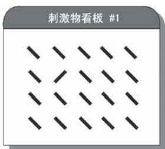  
a)

b)   
●图 1-3 基于形状和基于颜色的视觉刺激物示例  
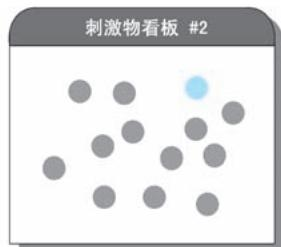  
a）基于形状的视觉刺激物 b）基于颜色的视觉刺激物

波斯纳 （Michael Posner，1935年至今）在开展了一系列视觉认知心理实验后，提出了注意定向理论（At-tention Orienting Theory）。注意定向理论认为：注意力如同聚光灯下的光线般投射到视觉场景中，例如，在图 1-4a 中，视觉注意力首先被区域 $\mathrm { A } ^ { \odot }$ ①所吸引；注意力的焦点可以在场景中移动，即注意力能够定向或重定向 （reorientation）；注意的范围可以像变焦镜头一样进行缩放，而注意集中程度在焦点处最高，并向四周逐渐衰减。注意定向理论认为注意力投射的空间位置取决于外因和内因两方面因素，即所谓的外源性定向和内源性定向。外源性定向是指根据刺激的显著性或刺激潜在的相关性引发的注意位置改变，因此没有意识指引，是一种 “自下而上” 的方式。例如，在图 1-4b 中，原本投射在区域 A 上的注意力被其左侧的区域 B 所吸引；内源性定向是指在特定目标驱动下，注意力以 “带着任务”的方式产生投射位置的改变，因此属于 “自上而下”的方式。例如，在图 1-4c 所示的例子中，注意了两个区域后，我们希望再看看还有什么其他类似的区域，因此我们带着 “找类似区域”的目的将注意力焦点移动到区域 C 处。注意定向理论强调了注意力的分布是以特定空间位置或者区域为基础的，系统地阐述了不同注意定向方式对视觉信息加工的作用和影响。

●图 1-4 视觉任务中的注意定向理论示意图  
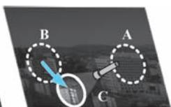  
a）初次定向 b）外源性重定向 c）内源性重定向

尽管空间在视觉选择中扮演着极其重要的角色，但是人们也逐渐意识到空间并不是注意力机制的唯一因素，例如，在图1-4 所示的例子中，注意力的投射和转移到底是基于 “纯区域”还是 “建筑物”？显然后者恐怕更能立得住脚———实际我们在看这幅照片的时候很大程度是带着看建筑的目的的。这就意味着很多注意力选择的基本单位是物体。这也正是 “物体派”的观点，接下来我们再来说说基于物体的注意力。基于物体的注意力，简单来说就是因为 “是个 ‘东西’”才引起的注意，这里的 “东西”学名叫作 “知觉物体”（Perceptual Objects）。所谓的知觉物体，严格来说即遵从格式塔（Gestalt）法则的、由部件构建的可感知整体。基于物体的注意力理论认为我们注意的是那些高层次的知觉物体，而构成物体的部件会被忽略。因此注意力的选择性体现为谁的对象完整性越高就选择谁。例如，在图1-5a 所示的两幅图中，我们是先注意到大熊猫呢还是黑白 “零件”？答案肯定是大熊猫。即便是大熊猫脸和肚子的边缘根本就没有画出，但是这一切显然是 “脑补”到了，我们似乎早已感受到了 “胖乎乎，圆滚滚”的形象；再例如，图1-5b 所示的图形，我们最先注意到的是字母 “QN”还是构成字母笔画的一个个笑脸？答案自然是 “QN”。这两个例子都说明了感知物体在注意力投射时的先整体后局部特性———大熊猫作为层级远远高于黑白零件的可认知对象而得到优先注意；同样，笑脸拼成的字母

“QN”在认知层级上远高于笑脸本身，故其也作为物体被优先注意。额外补充一点，格式塔理论除了解释注意力的选择机制外，还试图阐述人们对视觉输入进行分组的倾向性。还是以图 1-5 的两组图为例，在不看任何文字描述的前提下，甚至是在认清大熊猫和具体字母之前，我们一眼看上去就知道这幅图大致在说两件事———格式塔理论认为人的视觉系统自动会按照视觉刺激的一致性自动分组。

●图 1-5 物体与部件示例  
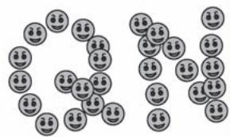  
a）熊猫简笔画与打散的图案部件  
b）笑脸图案拼成的英文字母

视觉场景中，物体最直接的特性就在于其能够区别于背景。例如，我们能够注意到绿草地上的一个足球，实际上我们的视觉系统已经在认知的最初阶段实现了足球 （前景）与绿地 （背景）的剥离。1967 年，有着认知心理学之父之称的美国著名认知心理学家乌尔里克·奈塞尔 （Ulric G. Neisser，1928—2012 年）在它出版的著作 《认知心理学》（Cognitive Psychology）中提出了人类早期视觉的两阶段理论。奈塞尔认为人类的早期视觉分为预注意阶段（Pre-attentive Stage） 和聚焦注意阶段（FocalAttention Stage）两个阶段。其中，在预注意阶段，视觉系统并未产生真正的意识，仅仅是从场景中获取视觉刺激。这些刺激表现为场景对象的各类视觉特征；在聚焦注意阶段，大脑中的视觉神经系统会将这些特征进行融合，形成一张注意力分配图，指明场景中注意力在不同对象上的分布，然后以此再去指导眼球朝着显著区域运动。两阶段理论的选择注意力机制体现了被注意的基本元素不是纯粹的特征或空间位置，而是物体。注意力分配图可以视为注意力在视觉场景上的 “掩膜”，因此已经体现了分离前景和背景的机制，蕴含了基于物体注意力的思想。下面我们举一个例子说明两阶段理论描述的注意发生过程：小明走在昏暗的街巷中，突然在他的左前方亮起一个灯带拼成的红色大字，于是小明的认知系统开始工作。首先，预注意阶段提取场景中各要素的特征，其中包括字的笔画和亮度特征；然后，聚焦注意阶段将这些特征进行融合形成注意力分配图，由于字的位置笔画纵横且闪闪发亮，而场景中其他的区域漆黑一片，所以唯独字的位置在注意力分配图上最为显著；最后大脑按照注意力分配图给眼球下达了 “看左前方”的指令———小明定睛一看，原来那是一个大写的 “串”字，认知完成。基于物体注意力的特性体现为小明在认清 “串”字之前，已经意识到了左前方有一个 “亮东西”的存在。也正是因为上述两个阶段均发生在小明看清 “串”字之前，因此才称为 “早期视觉”。尽管奈塞尔的两阶段理论已经体现了选择注意力是 “选物体” 的诸多性质，但是正式将基于物体注意力“搬上台面”讨论的是剑桥大学心理学家约翰·邓肯 （John Duncan）。1984 年，邓肯发表其具有开创性的研究成果，标志着视觉注意力选择单位概念变化的开始。如图1-6 所示，在邓肯的对比试验中㊀①，

要求受试者完成3 组认知实验：第1 组实验为报告某对象上的一个特征，如说出苹果的颜色；第 2 组实验为报告相同对象上的两种特征，如说出香蕉的颜色和形状；第 3 组实验为报告不同对象上的两种特征，如说出苹果的颜色和香蕉的形状。结果表明第 2 组实验与第 1 组实验相比，受试者报告的正确率没有明显变低，但到了第3 组实验，受试者的正确率却明显降低。实验结果一方面说明了基于空间注意力的不合理性———这些实验的空间位置并未发生改变，但结果却大相径庭；另一方面说明，人在认知过程中更倾向于将不同特征和物体捆绑为一个整体，这就意味着注意力选择的基本元素是带着各种特征的物体。

  
●图 1-6 邓肯视觉认知对比实验 （水果版）

特征在我们的认知过程中扮演着重要的角色，我们所认知的万事万物都可以用不同维度的特征来描述。例如，我们能够快速且准确地分辨一个红色的圆形，这一分辨过程使用到颜色和形状两个维度的特征，且这两个维度的取值分别为红色和圆形。但是，无论是在注意力的选择理论还是奈塞尔的早期视觉两阶段理论中，注意力可以针对不同维度的特征进行筛选，实现特征的获取，然而这离我们形成认知还差了关键的一步：平行获取的特征如何正确地关联起来，形成我们的认知整体———毕竟我们认知的不是独立的 “红色”和 “圆形”，我们认知的是 “红色的圆形”。这便是认知心理学中的 “捆绑问题”（binding problem）。衰减理论的提出者、美国心理学家特里斯曼意识到解释捆绑问题的重要性，于 1980 年提出著名的特征整合理论（Feature Integration Theory），该理论为后续认知神经科学和计算机科学对注意力机制的研究都有着极其深远的影响。与奈塞尔的观点类似，特征整合理论将信息的加工过程分为特征获取和特征整合两个阶段。在特征获取阶段，注意力以分散和并行的方式获得认知对象在不同维度的特征。获取每一个维度的特征后，认知系统都会对其进行独立编码，每一类特征的独立编码都称为 “特征图”（Feature Map）。在这一阶段，注意力基本上是以自动化加工的方式进行的，是难以觉察的；在特征整合阶段，注意力通过空间位置将不同特征进行 “粘合”，以此来解决特征的捆绑问题，从而形成我们对对象的整体认知。在这一阶段，需要注意力逐个加工每一个认知对象，即在加工某一对象时，其他对象暂时处于被遮挡状态。因此该阶段注意力是以类似受控加工的模式开展工作。图1-7 所示为特征整合理论对信息的加工流程。在理解早期视觉两阶段理论和特征整合

理论时，都有着似曾相识、甚至 “倍感亲切”的感觉。的确，特征理论处处体现了计算机视觉特征提取与融合的基本理念———我们使用不同的滤波器作用在图像上，为的就是得到图像不同的特征？再说眼前，我们在深度学习中广泛使用的深度卷积网络，不正是在反复应用特征的获取与特征的整合？只不过这些特征是任务驱动下的、难以名状的特征而已。

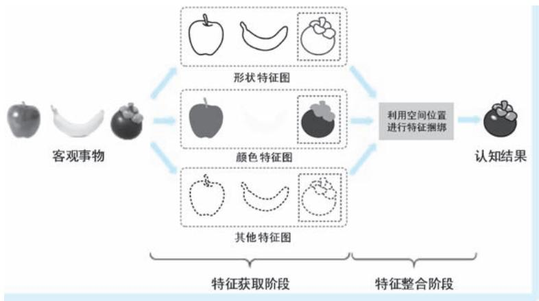  
●图 1-7 特征整合理论对信息的加工流程

视觉感官接收到的信息可以说是海量的，只要是睁着眼睛，视觉场景就会源源不断地从眼前经过。但是，面对如此大规模的视觉信号，我们的视觉系统将其中的绝大部分视为 “过眼云烟”，唯有那些引发注意的少部分输入才能真正由眼入心。那么，我们的视觉系统是如何决定 “看哪里”的呢？

认知心理学中，还有一类重要的观点是将注意力看作是一种认知资源。既然是资源，那就意味着需要考虑其分配问题。1973 年，以色列著名心理学家、诺贝尔经济学奖得主丹尼尔·卡内曼 （DanielKahneman，1934 年至今）在其著作 《注意力与努力》（Attention and Effort）中就将注意力视为认知资源。卡内曼认为人的注意力资源总量是有限的，注意力具有能够在不同任务间进行分配的特性———如果一个任务没有占用所有注意力，那注意力就可以再分配到其他的任务上。上述观点在我们的日常生活中的例证可谓比比皆是。例如，在刚开始学开车的时候，我们双手紧握方向盘，目不转睛直视前方道路，丝毫不能有一丝分心，仿佛投入了全部的注意力；但是当我们成为 “老司机”以后，我们可以一边开车一边听音乐，同时还查看着电子地图，仿佛开车这件事已经不需要投入全部的注意力。那么问题来了，多个任务同时抢占注意力资源的时候会不会产生阻塞，或者导致某些任务的质量下降？1975 年，美国学者、作家唐纳德·诺曼 （Donald A. Norman，1935 年至今）与计算机科学家丹尼尔·鲍勃 （Daniel G. Bobrow，1935—2017 年）一起对这一问题做出了进一步的阐述。在其文章中，以类似“计算机”的方式，讨论了当多个任务共同使用注意力资源时，什么情况下可能会出现相互干扰的问题。二位学者还认为当注意力资源受到限制时，任务的完成质量会降低。上述观点是显而易见的，可以概括为两句话———同时干好多件事往往很难，要干好一件事必须集中注意力。沿着心理资源分配的思想，人们开始思考决定注意力分配的因素到底是什么的问题，首先发现注意力的分配和熟练程度与任务的难度有关，从而进一步引出了注意力的 “自动与受控加工” （Automatic and Controlled Processes，ACP）理论。ACP 理论体现了注意力分配过程中存在自动化加工和受控加工两个方面的特性，由美国心

理学家沃尔特·施耐德 （Walter Schneider） 和理查德·希夫林 （Richard M. Shiffrin，1942 年—至今）在1977 年提出。在 ACP 理论中，自动化加工体现了在面对简单任务时，认知的过程会体现为在非刻意情况下的自动完成，认知过程对注意力的资源耗费极低。例如，通过反复练习使得我们可以轻松完成某个任务，即 “熟能生巧”，前面开车的例子就非常能说明问题；再例如，运动员反复练习某动作，逼迫自己出现 “想都不用想”的应激能力，这种能力也称为 “肌肉记忆”。而受控加工指的是面对较难任务时，我们的认知系统会自动为其分配更多的注意力资源。还是以开车为例，在熟悉的路段上，我们可以 “轻车熟路，谈笑风生”，这时体现出了注意力的自动化加工机制；当到达不熟悉的路段或者路况变得复杂时，我们又回到了聚精会神的驾驶模式，这表明受控加工机制开始启用。从卡内曼开始将注意力作为一种心理资源，到随后注意力资源的分配等各种机制的讨论，都属于认知心理学中注意力分配的认知理论范畴。

1980—1990 年间，认知心理学界对注意力的研究已经变得相当的广泛，产生了大量关于注意力的理论。然而，可惜的是没有一个理论能够完美地解释所有认知现象。人们似乎察觉到自己之前把注意力想简单了。随着研究的深入，人们发现注意力在认知中扮演的角色远比想象中的要复杂得多，甚至开始对注意力的存在性产生了质疑。历史就是这样充满了戏剧性，19 世纪 80 年代末，注意力把心理学家们再次逼到窘境，这与90 年前的哲学家们面对的局面是何其的相似———费尽心思提出的理论却解释不了现象。1890 年，美国心理学之父詹姆斯发出 “人人都知道什么是注意”的呐喊，给心理学家们指明了道路。可90 年后的此时此刻，人们却发现自己对注意力似乎一无所知。正如波斯纳在其著作 《注意力心理学》（The Psychology of Attention）中回顾此时的境地时，发出 “没有人知道什么是注意力”的感叹。看来，又到需要技术革命来突破困境的时刻了。

# 1.3 深入脑海：认知神经科学中的注意力

从人类诞生起直至今日，我们对自身认知过程的探索就从未停止过。但是，早期对认知的研究多体现为哲学、心理学等学科的 “子模块”㊀①，对认知研究局限在其父学科的理论框架中，难以 “借他山之石，攻己方之玉”。直到 1975 年，美国学者在斯隆基金会的支持下，将哲学、心理学、语言学、人类学、计算机科学和神经科学 6 大学科进行整合，形成以认知作为独立研究对象的新学科———认知科学（Cognitive Science）。认知科学最重要的支柱是神经科学，正是神经科学为认知科学提供了最为重要的脑机制理论支撑。因此认知科学对认知的研究已经不再是哲学的思辨，也不仅仅是心理学等单一学科的实证研究，而是建立在多学科交叉基础上的综合性研究。

神经科学是认知科学最重要的基础。认知科学能够取得重要进展，这得益于神经科学的发展。认知科学与神经科学的紧密结合，催生出了另一个新兴学科———认知神经科学（Cognitive Neuroscience）。认知神经科学借助神经科学的理论和技术，以全新的方法从更深层次探索认知问题。认知神经科学的兴起，无论在理论上还是在技术上都为注意力的研究开创了一条崭新的道路，对注意力的研究也由此进入一个新的时期。

# 1. 3. 1 认知神经科学的研究基础和方法

认知神经科学是建立在脑结构和脑功能研究基础上的、利用神经科学方法来解释认知活动的科学。上面的定义将认知神经科学的基础、方法和目的阐述得一清二楚。理解认知神经科学的目的很容易———认知活动，这一点在定义中说得再明白不过了。那么认知神经科学研究的基础和方法具体又是什么呢？

首先谈谈认知神经科学的研究基础— 脑结构和脑功能。无论是东方还是西方，最早都认为心脏是产生意识的场所，“心想事成”说的就是这个道理。得益于解剖学，尤其是神经解剖学的发展，人们才发现心脏只是一个 “血泵”，大脑才是思维和认知的真正载体。接下来，人们开始将目光集中在大脑上，探究它的结构和功能：首先，发现大脑皮层 （cerebral cortex）是意识活动的物质载体，几乎所有信息的加工过程都发生在大脑皮层中。大脑皮层可谓 “千沟万壑”，按照皮层上较大的 “沟回”㊀①，首先将整个大脑分为左右半球，每个半球又都分为额叶、顶叶、枕叶和颞叶四个大的区域；接下来，探索朝着细胞级迈进———人们发现大脑皮层中的神经细胞具有不同的结构，相同结构的细胞喜欢 “扎堆”，因此可以按照细胞的结构进行进一步区域划分。其中最为著名的当属德国解剖学家科比尼安·布罗德曼 （Korbinian Brodmann，1868—1918 年） 在 1909 年提出的 “布罗德曼分区” （Brodmannareas），布罗德曼分区系统将每个大脑半球分为 52 个分区。有了大脑的分区系统，我们等于拥有了一张大脑地图，认知的研究也拥有了能够精确定位的 “坐标系”。图 1-8 所示为大脑两侧的布罗德曼分区图。

  
a)

●图 1-8 大脑两侧的布罗德曼分区图  
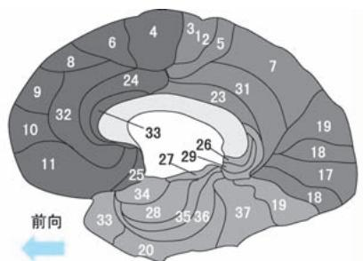  
a）大脑外侧 b）大脑内侧

有了划分了区域的地图还不够，还得需要表示功能的地图。随着神经科学研究的深入，人们发现大脑中不同的区域具有不同的功能，掌管着人类不同的能力或行为。例如，人在主管语言的大脑分区发生损伤后，就会丧失说话能力。有着 “神经外科先驱”之称的加拿大神经外科医生、神经生理学家怀尔德·潘菲尔德 （Wilder Graves Penfield，1891—1976 年） 在 1928—1959 年间，通过在多名脑手术病人的大脑皮层上开展的电刺激探索，发现了大脑皮层中控制运动、语言等功能的区域。至此大脑皮

层功能定位的早期模型已经有了一个比较清晰的轮廓 （如图 1-9a 所示）。随着人们对神经元认识的不断深入和脑观测手段的不断进步，对大脑构造的认识也更加深刻，对大脑功能的划分也更加精确，发现了一系列完成某一类特殊认知功能的皮层区域及其作用关系。例如，人们发现大脑中位于枕叶距状裂周围的皮层主要负责处理视觉信息，于是将其命名为视觉皮层 （Visual Cortex）。视觉皮层接收视觉信息输入，并对其进行分级处理。按照对视觉信息的加工过程，又将视觉皮层进一步分为初级视皮层和一系列次级皮层，分别用 $\mathrm { V } 1 \sim \mathrm { V } 4 \mathcal { O }$ ①，以及 MT （MT 是 “中颞” 英文 “Middle Temporal” 首字母简写，该区亦简称为 V5 区）等作为其简称 （如图1-9b 所示）。

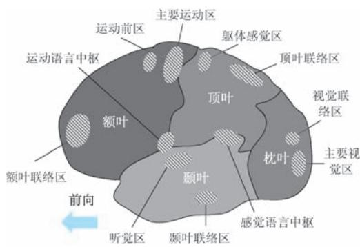

●图 1-9 大脑的功能分区示意图  
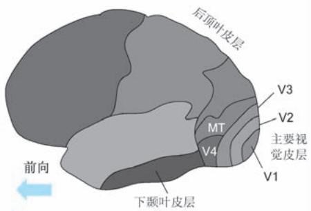  
a）大脑整体功能分区 b）大脑视觉皮层功能分区

接下来再谈谈认知神经科学的研究方法— 神经科学方法。与认知心理学研究认知行为时采用的实验手段类似，神经科学研究认知问题的一般方法也是通过给受试者施加特定输入，一方面获取其直接的行为反应输出，另一方面借助脑功能探测设备从整脑、脑分区、神经元和分子等不同尺度观测其脑功能及脑状态变化，从而确定认知过程在大脑中发生的时间、位置、强度以及依赖次序等关键特性。图1-10 示意了这一方法框架。为了进一步说明行为反应与脑状态变化的区别，下面再举一例，设

想下面的场景：角落里突然窜出一条狗，小明头脑瞬间一片空白，然后拔腿就跑。 “拔腿就跑”即行为反应，而从头脑正常到 “一片空白”，再到做出“拔腿就跑”的指令即脑功能的体现和脑状态的变化。在一般的神经科学实验研究中，往往会结合行为反应及脑功能探测设备共同研究某一认知过程的脑作用。

脑功能研究离不开脑探测技术。可以说认知科学能够取得重要进展，得益于神经科学的发展，而

  
●图 1-10 神经科学研究认知的一般方法框架

神经科学的发展又得益于对大脑的探测，尤其是非侵入大脑探测技术的进步。在脑电图 （Electroen-cephalogram，EEG）、脑磁图 （Magnetoencephalography，MEG）、事件相关电位 （Event Related Potential，ERP）、计算机线断层扫描 （Computerized Tomography，CT）、磁共振成像 （Magnetic Resonance Imaging，MRI）、功能 磁 共 振 成 像 （functional Magnetic Resonance Imaging，fMRI） 以 及 正 电 子 发 射 断 层 显 像（Positron Emission Tomography，PET）等脑探测技术的 “加持”下，人们开始抵近观察认知过程发生的最重要场所———大脑，并可以 “进入”大脑的内部一探究竟。不过需要说明的是，认知神经科学对脑机制研究主要是观测认知过程在脑中发生的时机和位置，因此需要从时间和空间分辨率两个方面来综合考虑所选择的观测技术。但是，正所谓 “鱼和熊掌不可兼得”，上述设备难以在时间分辨和空间分辨上做到两全其美：某些设备可以 “秒出”结果，如 EEG 和 ERP 等设备；而某些设备反应稍慢但可以 “看”得很清楚，如 fMRI 等。另外，费用也是必须考虑的因素，毕竟某些设备可谓是 “设备一转，成千上万”。

前文我们已经探讨认知心理学领域对注意的探索。与认知心理学中 “给刺激，看行为”的方式相比不同，认知神经科学更多的是借助仪器设备，以 “给刺激，找证据”的方式开展试验和研究，带有一种 “合上电闸，看哪盏灯亮”的感觉。如果我们希望体会认知神经科学和哲学、心理学的差异，试着在脑海中构建如下的画面：一位穿着长袍、白髯飘飘的老者，每天坐在树下冥想，他叫作哲学家；一位穿着白大褂，一边观察一群受试者的反应，一边忙碌地在预先准备的表格上做着记录的人，他是心理学家；一位受试者头上连满了各种电极和传感器，旁边几台叫不上名字的机器嘶嘶作响，不断闪烁着数字或是绘制着曲线，机器旁边一个戴着眼镜的人目不转睛地看着机器的输出，这个人就是认知神经科学家。

# 1. 3. 2 认知神经科学中的注意力研究

在上一小节，我们介绍了认知神经科学是如何开展认知研究的，算是做了个简单的铺垫。这一小节我们重新将注意力集中在 “注意力”上。

无论是我们的直观感受还是认知心理学的理论模型，都告诉我们，人类的视觉系统在进行信息加工时，对输入的信息绝不是 “一揽子全收”，而是依赖注意力在视觉场景中 “划重点”。那么这个现象是否能够得到脑机制层面的理论支持呢？这个问题已经触及了 “视觉感受野”（Visual Receptive Field）这一概念的核心。首先，视网膜上的光感受细胞本身就只分布在某些特定的区域，这就意味着眼睛作为 “传感器”在一开始就对输入的信号做了有侧重的筛选。更重要的是，随后视觉信息在进入大脑后，视觉皮层对视觉信息的逐级加工过程也是有重点感知区域的，这些重点感知区域即视觉感受野。早在 1958 年，著名神经科学家大卫·休伯尔 （David H. Hubel，1926—2013 年）与托斯坦·维厄瑟尔（Torsten N. Wiesel，1924 年至今）在对猫视觉皮层的研究中就首次提出视觉初级皮层 V1 中的感受野特征，并基于感受野的结构对视觉皮层细胞进行分类。除此之外，二位学者还认为视觉系统某一层级皮层的细胞感受野是由视觉系统较低层级皮层细胞的输入形成的。这说明了感受野具有层级嵌套结构。值得一提的是，正因为在视觉信息加工方面取得的一系列卓越成果，休伯尔和维厄瑟尔二位先驱在1981 年获得诺贝尔生理或医学奖。尽管二位学者在他们的研究中只字未提 “注意力” 一词，但是视觉感受野的概念本身就体现了注意力在视觉认知过程中扮演的信息筛选角色，注意力的作用机制与

视觉感受野息息相关，所以我们将其视为是视觉注意力重要的生理基础，甚至认为其就是一种广义的注意力机制㊀①。

随着研究的深入，神经科学家们根据视觉系统的生理和功能特点，对视觉认知的过程和发生位置进行了进一步细化，普遍认为视觉信息在脑中的加工沿着两条通路进行，即所谓的 “双通路假设”（Two-streams hypothesis）。双通路假设认为视觉信息抵达初级视觉皮层 V1 后，通过 V2 和 V3 两个中间

级别的视觉皮层加工后 “兵分两路”：其中一路称为腹侧通路（Ventral Stream，也称为 “枕-颞通路”），该通路从 V3 区开始，经过 V4 区，再到下颞叶的 TEO 和 TE 区。腹侧通路中的神经元主要对颜色和形状等物体特征进行反应，其功能主要体现为对物体的识别，因此也被称为 “What 通路” （如图1-11 中彩色箭头所示）；另一路称为背侧通路（Dorsal Stream，也称为 “枕-顶通路”），该通路从 V3 区开始，经过位于背内侧区和中颞的 MT 区，然后抵达后顶叶 （Posterior Parietal Cortex，PPC） 皮层区。背侧通路的神经元主要对运动速度与方向等特征进行反应，功能是对物体空间位置和运动进行识别，因此也被称为 “Where 通路” （如图1-11 中黑色箭头所示）。上述两个通路的信息加工模式及其在

认知过程中扮演的角色均是在对猕猴的脑功能进行研究后总结得到的，其中腹侧通路假设在1968 年提出，背侧通路假设在1972 年提出。

在腹侧和背侧两条通路中，处于不同层级的神经元在结构和功能上存在明显差异，信息处理的形式也存在很大差异。以视觉信息沿着腹侧通路的逐级加工过程为例，神经元的结构和性质的变化具体体现在两个方面：第一，感受野作为注意力生理层面的发生场所，其范围不断增大。例如，从 V1 皮层到 TE皮层，视觉感受野的范围分别为 0. 2 度、3 度、6 度和 25 度；第二，视觉处理的复杂度和抽象程度不断增加。例如，许多 V1区的神经元仅仅起着局部能量响应的作用，而 V2 区神经元则可以对对象轮廓做出反应，到了颞叶的TEO 和TE 区，神经元则选择性地对全局或整体对象特征做出感应。图 1-12 示意了腹侧通路不同层级视觉皮层的感受野范围及其对视觉信息的层级加工模式。

我们知道，视觉系统对物体的识别主要发生在腹侧通路。而在腹侧通路中，神经元的感受野随着皮层层级的增加而变大。而

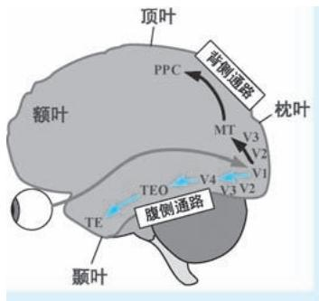  
●图 1-11 视觉系统的“双通路假设”示意

  
●图 1-12 腹侧通路不同层级视觉皮层的感受野范围及其对视觉信息的层级加工模式

感受野越大，意味着神经元在整个视野中 “看”的区域越大，也意味着处理的视觉信息就越多。但是同时我们也知道，在视网膜接收到的海量视觉刺激中，我们只选择其中的极小部分进行加工，那么在脑机制层面，我们是怎么过滤掉那些我们不想要的信息的呢？1985 年，美国神经科学家杰弗里·莫兰（Jeffrey Moran）和罗伯特·德西蒙 （Robert Desimone）在 《科学》杂志上发表了其研究成果，对上述问题 给 出 了 初 步 的 解 释。 两 位 科 学 家 利 用 单 神 经 元 电 生 理 记 录 （Single-cell ElectrophysiologicalRecording）手段，对恒河猴腹侧通路的 V4 和 TE 两个视觉皮层的神经元分别进行电生理观测，探索在不同的视觉刺激下、注意力是如何影响视觉皮层神经元的反应的。实验表明，针对 V4 皮层神经元，当目标刺激物 （effective sensory stimuli，即能够引起注意的刺激物，如图 1-13 中的香蕉）和分心刺激物 （ineffective sensory stimuli，即不能够引起注意的刺激物，如图 1-13 中的肘子）同时出现在其感受野中，神经元的反应完全取决于是哪个刺激物处在被注意位置：当目标刺激物处在被注意位置时，神经元将会产生明显反应；而当分心刺激物处于被注意位置时，即使目标刺激物仍然处于感受野中，神经元的反应强度将大幅减弱，如图1-13 实验A 所示。另外，实验还表明，当目标刺激物处于感受野内部，而分心刺激物处于感受野外部时，V4 区神经元都能产生较强的反应，而这一现象与注意力的投射位置无关，如图 1-13 实验 B 所示。针对 TE 皮层的测试也表现出类似的现象，神经元的反应都会受到对刺激物注意的影响。但是这种效应与 V4 区神经元相比弱很多，而且由于 TE 皮层神经元的感受野更大，甚至覆盖了整个视野区域，神经元几乎不会对分心刺激物产生任何反应，如图 1-13 实验 A 所示。莫兰和德西蒙两位科学家的研究结果表明，注意力以类似 “门限” 的方式，在视觉信息加工中对神经元的反应施加调控，从而实现对非相关视觉信息的逐级过滤。

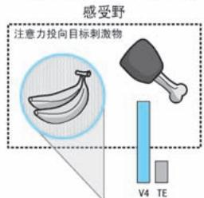  
实验A：目标刺激物和分心刺激物同在感受野内  
注意力

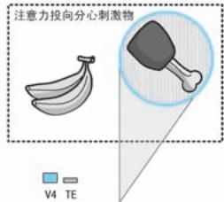  
感受野  
注意力

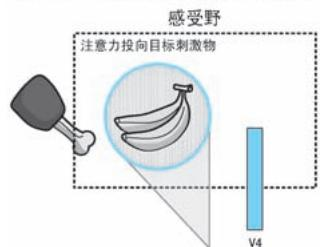  
实验B：目标刺激物处在感受野内，分心刺激物处在感受野内外   
注意力

  
注意力  
●图 1-13 注意力对 V4 和 TE 皮层神经元的刺激影响示意

认知心理学中对选择注意力到底选什么这一问题的讨论，在 “神经”层面也仍然在延续着㊀①。双通路机制看似已经将视觉处理的脑功能区分得非常清晰———腹侧通路从特征到物体，背侧通路判断位置和运动，可谓 “分工明确，各司其职”。自然我们也能够想到基于特征和基于物体的注意应该发生在腹侧通路，而基于空间的注意发生在背侧通路。但是事情远没有这么简单，双通路假设更多的是一种 “大概其”的假设，毕竟大脑中神经元的形态异常多样，神经元之间关系也是错综复杂，注意发生的场所和时机也要比想象中复杂得多。例如，一个运动的红色物体，涉及特征、空间和物体三方面要素，我们对它的注意到底发生在腹侧通路还是背侧通路？或者，既然背侧通路中的 MT 分区被认为是完成位置和运动感知的主要区域，那么在大脑感知运动的红色物体时，MT 分区是否也参与了颜色的感知？

在基于特征、空间和物体的三种选择注意力中，物体可以视为是特征、空间位置以及运动等诸多要素的集合，属于最高级的认知对象，故基于物体注意力的机制也被认为是最复杂的。因此在研究的初期，受技术手段和对脑机能认识的限制，人们更多的是围绕基于特征和基于空间的两种注意力机制开展研究。显然，前文介绍的莫兰和德西蒙两位科学家对恒河猴 V4 和 TE 两个脑分区开展的研究，就明显体现了注意力的空间选择特性：神经元是否有反应，取决于目标刺激物的出现位置，当其出现在被注意的位置时，神经元反应强烈，否则神经元的反应极为微弱。的确，无论是心理学还是神经科学，多数学者也都持有 “选空间”的观点，他们认为在注意力选择的过程中，刺激物出现的位置起着决定性的作用。但是，也有不少学者认为特征在注意力的选择方面也起着非常重要的作用。例如，美国神经科学家莫里齐奥·科尔贝塔 （Maurizio Corbetta）率先利用正电子发射断层显像（PositronEmission Tomography，PET）技术对人类注意力的脑机制开展探究实验，并在 1990 年将研究成果发表在 《科学》杂志上。科尔贝塔选择的视觉特征包括形状、颜色和速度三种，研究结论体现在两个方面：第一，当受试者有选择地注意到上述特征中的某一个时，他们在任务中辨别细微刺激变化的敏感性远高于将注意力分散到多个特征上；第二，PET 对大脑活动的监测表明，纹状视觉皮层在什么区域产生活跃信号取决于选择注意力关注的特征。例如，当注意速度刺激时，左顶下小叶 （left inferior pa-rietal lobule） 的一个区域被激活，注意颜色刺激激活了侧副沟 （collateral sulcus） 和枕叶外侧 （dorso-lateral occipital）皮质的一些区域，而注意形状刺激激活了侧副沟某些区域等。而在视觉系统之外，注意力在聚集和分散时，也激活了不同的脑区域。科尔贝塔研究表明，对不同特征的选择性注意调节了视觉皮层不同区域的活动，即在某种程度上可以认为这些脑区域专门针对不同 “特征”进行加工。在选择性注意和分散注意条件下，视觉系统之外大脑区域产生的不相交激活现象，也表明认知过程涉及不同的神经系统参与，这取决于注意力的使用模式。图1-14 所示为对于形状、颜色和速度三种特征产生激活现象的脑区域。

同样，除了 “选空间”和 “选特征”，很多认知神经科学家也持有 “选对象”的观点，他们认为引起注意的是某个完整的 “东西”本身，不像 “空间派”那样认为引起注意是因为目标物出现在某一

  
●图 1-14 对于形状、颜色和速度三种特征产生激活现象的脑区域

位置，也不像 “特征派”那样认为引起注意的是某个或某几个视觉特征。例如，麻省理工学院的凯瑟琳·奥克雷文 （Kathleen M. O'Craven）等科学家于 1999 年在 《自然》 杂志上发表文章，公布其利用功能磁共振成像技术对注意力选择的研究成果，他们找到了注意力在进行选择时以对象作为选择基本单位的证据。奥克雷文等在其研究中首先提出两个问题：第一，是否如基于空间注意力的观点那样，在注意力投射的位置，所有视觉特征的处理都会得到增强？第二，是否如同基于对象注意力观点那样，对某对象一个视觉特征的注意会自动引发对该对象其他不相关视觉特征的同时处理？事实上，如果能够对上述两个问题做出否定和肯定的答复，就能够得到注意力选择是基于对象进行的这一重要结论。在研究中，几位科学家将半透明的人脸图像与半透明的房屋图像相互叠加，并在两者间人为制造相对运动，以此作为受试者的视觉刺激物。与此同时，利用 fMRI 设备监测受试者大脑梭状回面孔区（Fusiform Face Area，FFA）、海马旁位置区 （Parahippocampal Place Area，PPA），以及颞叶 MT / MST（MST 是 “内侧颞叶上部”英文 “Medial Superior Temporal”首字母简写，该区处于背侧通路，与 MT区相邻）三个脑区域的脑活动强度。之所以将图像叠加是为了保证不同对象和特征出现在相同的空间区域，从而控制空间位置对注意力选择的影响。而之所以选择上述三个脑区域开展监测，正是因为早先神经科学的研究已经证明 FFA、PPA 和 MT/MST 三个区域在视觉认知过程中，分别扮演人脸识别、场景分辨和运动感知的三类认知功能。研究表明，当受试者在注意某一对象的某一特征时，大脑在增强对该特征处理的同时，也会增强对与该对象相关所有其他特征的处理，而对与之不相关的对象特征的处理将被减弱。例如，当受试者注意到人脸图像发生运动时，负责运动感知的 MT / MST 区和负责人脸识别的FFA 区的fMRI 信号同时增强，且其强度要远远高于负责场景分辨 （在实验中即为房屋分辨）的PPA 区的信号强度。这就意味着引起受试者注意的不是纯粹的人脸也不是纯粹的运动，而是 “运动的人脸”，当然也更不是处于相同位置的房屋。上述现象很难用基于空间或者基于特征的注意力理论来解释：房屋与人脸都出现在相同的区域，但是受到的关注却天壤之别，这与 “空间派”的 “只要入圈即被关注”的观点截然相悖；受试者只注意运动，但是对人脸的注意也同时发生，这又与 “特征派”的 “特征能够单选”的观点大相径庭。因此奥克雷文等几位科学家认为注意力的选择是以对象为基本单位的。

认知心理学中，注意力分配认知理论将注意力视为一种资源，当有多个任务共同使用注意力资源时，有可能会出现资源抢占的问题。神经科学家在研究中发现， “竞争” 在神经元层面也同样存在———注意力决定了谁能够在信息处理过程中得到优先加工。1995 年，德西蒙和剑桥大学的约翰·邓肯 （John Duncan）两位神经科学专家在认知实验中观察受试者视觉响应时，首先发现了两个有趣的现象：第一，认知资源是有限的，这就意味着并不是视觉场景中所有的对象都能够实现同时处理；第二，在处理特定对象时，可以过滤掉场景中不重要的信息，即视觉认知表现选择特性。在此基础上提出著名的注意力偏向竞争理论（Biased Competition Theory），从脑机制层面对注意力的资源抢占问题做出了进一步阐述：在视觉系统面对超过自身加工能力的大量对象时，由于注意力的资源有限，不同对象之间就会产生竞争注意力资源的现象，这些对象相互 “踩踏”，都试图获得更高水平的视觉加工机会，最终，在注意力的选择下 “杀出重围”的获胜者将得以控制知觉和行为反应。之所以会出现资源竞争的局面，正是与大脑不同层级视觉皮层感受野的作用机制有着直接关系。而这些感受野可以被视为一种重要的注意力资源，感受野中的对象之间必然产生竞争。也正是由于视觉感受野受到加工能力和范围的限制，才需要注意力在感受野中做出选择并优先处理。

人类的注意力总是包括 “自下而上” （Bottom-Up）和 “自上而下” （Top-Down）两个方面的机制。其中，自下而上的注意力是指认知对象本身就具有足够的显著性，能够引起人的注意，如茫茫黑夜中的一点亮光就能够瞬间吸引目光；自上而下的注意力是指人们调用记忆等已有的认知体系，对关心的对象投射更多的关注，从而进一步完成辨别工作，如茫茫黑夜中的一盏灯———此时，亮光已经得到进一步分辨，之所以能够识别那是灯，原因是在人的记忆中已经存在灯的形象和概念。关于自下而上和自上而下的注意力的讨论可谓由来已久，从 17 世纪笛卡儿对 “自愿”和 “非自愿”注意力的朴素表达，到19 世纪詹姆斯对 “主动”和 “非主动”注意力的阐述㊀，再到20 世纪特里斯曼认知指引下注意力对外界信息带有衰减的筛选，无不体现注意力的自下而上和自上而下特性。在认知神经科学领域，科学家们则更进一步从脑机制层面对注意力的自下而上和自上而下机制给出了解释。德西蒙和邓肯在其偏向竞争理论中认为，视觉信息沿着自下而上的通路进行逐级加工，但是，加工的过程中存在偏向性———只有那些从未出现过的视觉刺激，或是最近一段时间未出现过的视觉刺激，才会在视觉皮层中产生较大的神经信号，使它们在控制注意力方面具有竞争优势。那么怎么判断 “从未出现过”和 “最近一段时间未出现过”？显然，这就需要动用工作记忆机制对当前输入刺激进行匹配，确定其“新旧”属性，从而进一步决定到底哪些输入信号需要 “重点关照”。这种动用工作记忆帮助那些特定输入获得更多注意力偏向，使其能够在竞争中占优的机制，即偏向竞争理论中自上而下的注意力机制。1999 年，麻省理工学院认知神经科学教授厄尔·米勒 （Earl K. Miller，1962 年至今）在其发表在《自然》杂志的文章中也提出了类似的观点。米勒认为认知和思想正是大脑中自下而上和自上而下注意力机制相互作用的结果，而自上而下注意力机制对认知起到尤为关键的作用：视觉信息沿着位于下颞叶的腹侧通路得到逐级加工，在该过程中，自下而上的注意力按照图像特征构建 “显著性图” （Sa-liency Map，等同于前文提到的注意力分配图）；同时，前额叶皮层不断将记忆信号传送到上述加工流程，此时自上而下的注意力依据记忆不断对认知过程增加有倾向性的调控。随着视觉信息加工层级的

提升，认知在自下而上和自上而下双重注意力的加持下变得越来越丰满而鲜活。例如，在图 1-15 所示的简笔画中，我们可以一眼就注意到其中的大熊猫，即使它被竹子严重遮挡，而且它脸部和腹部的外轮廓也未画出。但是这丝毫不影响我们对它的识别，我们可以轻易忽略掉竹子的干扰，并且能够 “脑补”出那些缺失的笔画，最终做出正确的判断。这正是因为我们在自下而上注意力帮助下加工图像特征的同时，还在利用自上而下注意力调用我们对大熊猫的已有认知进行调控，正所谓 “双管齐下”。

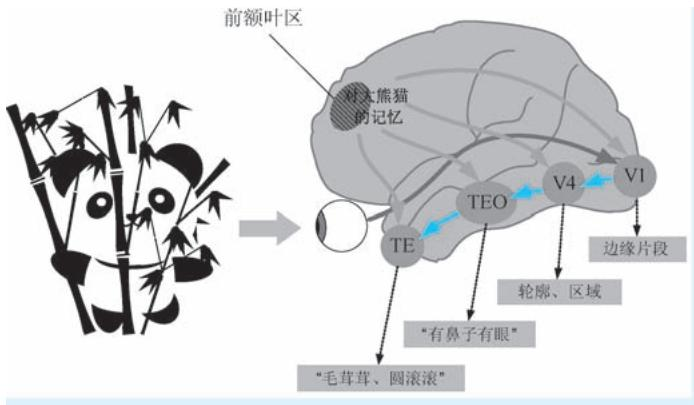  
●图 1-15 对象识别是自下而上 （彩色箭头）和自上而下 （灰色箭头）注意力双重作用的结果

作为认知心理学在脑与神经层面的延伸，认知神经科学以神经科学为基础，借助脑科学的理论成果和各类先进的仪器设备，深入大脑一探究竟，不断发现注意力的生理学本质。

然而，大脑作为信息处理中心，拥有数量惊人、功能繁多、关系复杂的神经元，大脑结构具有高度的完备性和复杂性，精密程度也可谓无与伦比。另外，人类的认知过程是一个需要神经系统诸多环节和模块共同参与才能完成的复杂过程。目前，人们对大脑功能、结构以及认知过程生理学基础的研究刚刚起步、知之甚少，前方一片星辰大海。因此在认知科学领域，对注意力探索从未停止，还在不断深入。

# 1.4 改造世界：计算机科学中的注意力

正如上文所说，注意力在人类认知过程中扮演着极其重要的角色，认知系统对任何信息的加工都是从注意开始的。从哲学到认知神经科学，人们都在孜孜不倦地追求着注意力的本质。随着人工智能的兴起，能够让机器以人类智能类似的方式认知世界并做出恰当反应，也成为人工智能科学家追求的终极目标。在20 世纪80 年代中后期，构建注意力的计算机模型的工作在计算机科学领域悄然兴起，人们开始讨论计算机信息处理中在哪里 “划重点”的问题：从一开始的注意力计算机仿真到在各类计算机任务中融入注意力机制，计算机科学领域对注意力的研究与应用如雨后春笋，开辟出别样的广阔天地。在注意力赋能下的计算机进一步成为改造世界的重要工具。作为人工智能领域中活跃度最高、应用前景最为广阔的计算机视觉（Computer Vision，CV） 和自然语言处理（Natural Language Processing，

NLP）两大领域，自然更是不遗余力地将注意力机制的研究和应用作为其发力的重点。两个领域中的注意力研究与应用也经历了 “你方唱罢我登场”的发展历程。除了 CV 和 NLP 这两个领域，注意力在多模态机器学习中的模态对齐、多模态数据融合方面也有不俗的表现，同时，注意力也逐渐成为附能图卷积模型、增强对象间关系表达的利器。

# 1. 4. 1 人工智能为什么要讨论注意力？

我们的视觉系统能够在复杂场景中快速锁定目标、聚焦重点，我们的听觉系统能够迅速捕捉我们想听的重点，而我们读完一句话能够迅速抓住其核心词汇等，这一切都是因为注意力在各类信息加工过程中起到信息筛选和认知资源分配的关键作用。也正是因为这一原因，在人工智能领域，对注意力开展研究也成为一件顺理成章、再自然不过的事情。其目的就是让计算机在对视觉信息处理中也能“仿生”人类，能够像我们人类那样对信息的加工过程不要 “雨露均沾”，而要 “有所为，有所不为”。具体来说，我们认为研究注意力的原因体现在如下两个方面。

第一，我们需要借助注意力来决定输入中哪里重要、关系如何。这一点是对注意力机制开展研究最直接也是最本源的诉求。首先，“哪里重要”这个问题本身就很重要，这与心理学家乌尔里克·奈塞尔早期视觉理论中预注意是聚焦注意的前提类似。例如，在很多 CV 的应用中，我们需要知道图像或视频承载的场景中哪里重要，这里的 “哪里”即被称之为显著性区域，代表着场景中能够 “吸引眼球”的位置。确定显著性区域即对应着预注意环节，而这往往是开展下一步视觉信息分析的起点，而确定显著性区域也正是视觉显著性检测任务要解决的问题。显著性检测任务的应用有很多，例如，我们设计一个能够实时进行环境感知的机器人，视频场景中显著性区域 （如茫茫沙漠中的一个人）是机器人需要重点获取信息的待感知对象。这就要求机器人拥有类似人类那样的集中注意力的能力———先通过显著性检测确定待感知对象在哪里，然后再进一步获取其他属性。再例如，在某个广告效能分析的应用中，我们需要知道广告看板的哪个位置放置什么样的广告能够博得人们的眼球，从而用分析结果去指导广告的设计策略等，这些获取 “哪里重要”的工作，都是需要运用注意力机制来实现的。除此之外，我们还需要在各类人工智能任务中利用注意力机制学会区别对待数据中的重要部分和不重要的部分———抛弃不重要数据，让重要数据参与进一步加工，从而最终提高视觉分析的整体质量，这一点正是认知科学中注意力选择特性的重要体现。例如，在 NLP 应用中，我们希望计算机能够针对一段文字进行翻译或提取其中心思想，而面对上述任务，文字中词汇承载语义的 “分量”是不同的，这就意味着我们需要在文字中不同词汇上投以不同的注意力，以表示对其重要性和贡献的区分，这也正是注意力机制在各类人工智能任务中所起到的关键作用。在计算机对各类信息的处理过程中，注意力机制虽然不以显著性作为其最终输出，但是在信息的逐级加工过程中，却起着对信息进行层层筛选的重要作用。在认知目标的驱动下，对信息去糟粕、取精华。 “哪里重要”反映的另外一个关键问题即“关系如何”———注意力机制的计算方法为 “站在”某一特征的视角，考察其与其他特征之间的相似度，看看其他特征可以以怎样的方式表达自己。这一操作的本质是特征之间关系的建模。

第二，我们需要借助注意力来节约计算机的处理资源。我们人类的认知资源是极其有限的，认知系统对信息的加工能力与面临的海量输入信息相比可谓九牛一毛。我们对这一点应该深有体会：一睁眼，一幕幕场景即扑面而来，但是受到资源限制，我们只能够关注并进一步处理其中的一小部分视觉

内容。有学者甚至从信息论角度对上述关系进行过定量分析，结论是眼睛每秒接收到的视觉信息量为几百兆，但是我们的视觉系统对其处理速度仅为 40bit/s，由此可见，二者差距是多么的悬殊；我们的耳朵不间断地获得声音信号，如身边人说话的声音、各类机器设备的嘈杂声等，我们的听觉系统也没有能力对所有这些声音信号都进行深度加工。人类认知系统正是利用注意机制来解决上述矛盾，注意力在认知过程中起到认知资源调配的关键作用，这也是人类认知系统在千百年进化过程中练就的本领———忽略大量冗余信息以节约认知资源。例如，此时此刻，在编辑这段文字的时候，我双眼紧盯屏幕，只有这段文字是清晰的，手下的键盘，屏幕旁的水杯、书本等物品都进入 “虚化”状态，仿佛我的眼里和脑里只剩下当前这段文字；我身边人的谈话声和楼下路口车辆的鸣笛声，我却能将其视为“耳旁风”，做到 “两耳不闻窗外事”……。人类的认知系统需要注意力来优化资源，那么在人工智能领域中，我们面对的问题又何尝不是如此？互联网上的照片数以亿计，各类摄像头源源不断获取视频信息，各类文字资料更是浩如烟海，如此众多的数据在大幅增加可用数据资源的同时，也给信息传输与加工带来了巨大的冲击和挑战。毕竟计算机的处理能力是有限的。尤其是到了深度学习时代，对算力要求变得更高，计算资源贵似黄金，“节能减排”更是迫在眉睫。因此，一视同仁处理所有输入信息显然是不现实也是大可不必的。在这种迫切需求下，注意力机制再次发挥其重要作用，作为信息筛选和计算资源优化分配的利器，注意力机制在提升计算机系统处理海量数字媒体能力，提高数字媒体资源利用率这一问题上，起到至关重要的作用。

# 1.4.2 注意力与计算机视觉

在20 世纪80 年代中后期，当认知神经科学家还在受试者头顶接各种仪器设备探究注意力的生理学奥秘的时候，对注意力的研究出现了新的视角———某些计算机科学家开始以 “很数学，很计算”的方式开展对注意力的研究和模拟工作，试图以定量化的数学模型实现对注意力的建模，这些研究为日后计算机注意力模型奠定了基础。例如，基于认知心理学家特里斯曼等于1980 年提出的著名的特征整合理论，麻省理工学院的克里斯托弗·科赫 （Christof Koch，1956 年至今） 和希蒙·乌尔曼 （ShimonUllman，1948 年至今）在 1985 年提出了一种选择注意力的生物启发模型 （以下简称为 “KOCH 模型”㊀①），该模型以人和灵长类动物视觉系统中注意力在视觉场景中移动这一现象作为模拟对象，以诸如颜色、方向、距离等一系列基础视觉特征作为输入，通过简单的神经网络模型，来解释选择注意力在场景中转移相关的各种现象。科赫等学者的文章中也首次出现了公式，也清晰地表达出了 “特征图”“神经网络”等鲜明的 CV 概念，可以说是将注意力的理念在计算机领域朝前推进了一大步。在随后的1989 年，科赫再次连同其学生，同是计算机科学家兼心理学家的洛朗·伊蒂 （Laurent Itti）以及神经科学家恩斯特·尼伯 （Ernst Niebur）一起，提出了一种基于显著性的视觉注意力模型 （以下简称为 “ITTI 模型”）。ITTI 模型首先利用多尺度高斯滤波构建图像的高斯金字塔，然后基于高斯金字塔计算图像颜色、方向和亮度3 类特征图，最后再经过特征差异计算、特征图融合两个步骤获得显著

性图，其中显著性高的区域即认为是容易引起注意的区域[16] 。不难看出，ITTI 模型的心理学基础即特里斯曼的特征整合理论。与科赫在 1985 年提出的生物仿生模型相比，ITTI 模型在特征提取、特征融合、显著性图构建等方面与当代 CV 领域的操作套路已经相差无几，可以认为其已经是非常纯粹的 CV模型了。ITTI 模型为后续的视觉显著性检测等任务带来深远影响。

在科赫和伊蒂等学者做出上述开拓性的研究之后，CV 领域对注意力有关的研究开始蓬勃发展起来，产生了大量从图像或视频中获取显著性指征的算法和模型，这些研究构成了 CV 领域视觉显著性检测（visual saliency detection）这一和注意力息息相关的重要分支。视觉显著性检测直接以显著视觉性的分布作为模型输出，结果表达为视觉注视点、注视轨迹、显著性图、显著目标掩膜图或显著目标包围框等形式。因此，显著性检测更多体现出一种数据驱动、反映场景客观事实的特性。早期的显著性检测多是利用人工特征，以无监督的方式进行，而在近些年，随着显著性公开数据集的不断完善和深度学习技术的不断进步，以深度学习得到特征为基础、以监督方式进行的显著性检测逐渐成为主流方法。除此之外，显著性检测研究也大量借鉴了图像分割和目标检测领域中的新技术。目前视觉显著性检测已经形成相对成熟的技术体系，拥有完善的公开数据集和测评方法。

就在视觉显著性检测研究还在如火如荼开展的时候，注意力的另一个更加重要研究方向悄然兴起———人们开始意识到在图像分类、目标识别等其他诸多 CV 任务开展过程中注意力能够发挥更加重要的赋能作用，有着更大的应用前景，这就是以 “将注意力嵌入 CV 任务”为思路的视觉注意力机制（visual attention mechanism）㊀①研究。2014 年，谷歌 DeepMind 团队发布循环注意力模型 （RecurrentAttention Model，RAM），可以视为 CV 领域第一个真正意义的注意力机制应用。RAM 是一种可嵌入在其他视觉任务模型的注意力子模型，该模型利用循环神经网络 （Recurrent Neural Network，RNN）结构，按照序列决策 （sequential decision）的思路，从图像或者视频中以自适应方式不断挑选重要区域并对其进行高分辨率处理，而这些所谓的 “重要区域”即为那些能够为视觉任务带来决定性影响的注意力投射区域。随后，CV 领域中注意力机制的研究和应用可以说是轰轰烈烈，俨然一幅 “无注意力不 CV”的感觉。视觉显著性检测和视觉注意力机制这两个研究方向的相同点在于二者均是以对人类注意力的模拟作为核心研究内容，均是为了让模型实现有针对性的 “聚焦”，但是二者又存在着明显的区别：显著性检测更多体现出一种数据驱动、反映场景客观事实的特性。而视觉注意力机制则不以生成显著性图或定位出显著目标作为最终目标，注意力机制体现为在具体 CV 任务的驱动下，对信息的有侧重筛选；显著性检测纯粹关注 “哪里重要”，而注意力机制通过确定 “哪里重要”而最终赋能其他各项视觉任务；前者强调目的，而后者强调手段。

不难看出，CV 任务驱动下的注意力机制附能任务，算是 “授之以渔”，而且更能产生无限应用外延，因此有着更为广阔的应用前景。但是，如果想对 CV 领域的注意力机制梳理出一个清晰的脉络可不是一件容易的事，毕竟花样太多了，不同的视角下模型有着不同的分类，每一个算法身上都贴着多个标签。以 RAM 为例，在模型结构方面，整体架构为 RNN，但特征提取用的是卷积神经网络 （Conv-olutional Neural Network，CNN），注意力类型为硬性注意力，优化方法用的是强化学习中的决策梯度方

法；再以 Non-local 网络为例，注意力机制属于自注意力，但其能用在各类任务、各类 CNN 网络结构中，故又属于注意力模块……可以说是 “横看成岭侧成峰”。从2014 年 RAM 开始至今的 9 年时间里，CV 领域的注意力模型可谓有软也有硬、有空间域也有通道域、有框架级也有模块级、有卷积也有注意力，在 CV 任务方面有分类也有目标检测、有看图说话也有语义分割……俨然一幅百家争鸣、百花齐放的绚丽场景。

# 1. 4. 3 注意力与自然语言处理

与 CV 领域中注意力从仿生模型起步不同，NLP 领域的注意力机制几乎没有任何心理学和生理学背景，可以说是纯粹的计算机任务。如果说 CV 领域的注意力模型花样繁多，让人眼花缭乱，那么NLP 领域对注意力的研究和应用却呈现出另一番风景，走出了一条从没有注意力到基于 RNN㊀①的注意力，再到 Transformer “一统江湖”的清晰路线。2014 年，人工智能领域约书亚·本吉奥 （YoshuaBengio） 等科学家提出了带有注意力机制的 “序列到序列” （Sequence to Sequence，Seq2Seq） 模型（以下简称为 “注意力 Seq2Seq ”模型），该模型采用基于 RNN 的 “编码器-解码器”结构，通过对输入序列不同符号赋予不同的注意力权重，来提升机器翻译的效果。注意力 Seq2Seq 模型被广泛认为是注意力机制在 NLP 领域的首次尝试。

仅仅从文献发表时间来看，NLP 领域对注意力研究的起步远远晚于 CV 领域 （2014 年 vs. 1985年），仿佛在注意力 Seq2Seq 模型之前，注意力的概念在 NLP 领域几乎没有出现过。两个领域对注意力的研究会有这样的区别，主要原因是视觉和语言两种感知形式本身就存在显著差异：视觉感知是最直接的感知过程，可谓 “下生就有，睁眼即来”。也正是因为这个原因，我们前文介绍的认知科学中各类心理学和神经科学实验，绝大多数也都是围绕视觉感知构建的，到了心理学的后期，人们事实上已经用数学方式刻画注意力。延伸到 CV 领域，对注意力的研究也经历了从仿生研究到机制研究这样一个 “顺理成章”的过程。与之不同的是，语言理解是架构在语言、词汇、语法甚至是习惯之上的，具有更深层次的感知过程。可以说在语言理解方面几乎不需要，也没有直接的认知科学理论可以借鉴。因此 NLP 中的注意力在任务目标驱动下，以 “很数学，很计算机” 的方式登场———哪是重点无所谓，任务结果好才是王道。因此可以认为 NLP 中的注意力才是完全意义的、“自上而下”的注意力机制应用。

纵观 NLP 领域中注意力研究不到十年的时间，其特点可以概括为如下四大方面：范式一致、成效显著、模型庞大、两极分化。

NLP 中注意力的应用范式逐渐变得一致。具体表现为：第一，NLP 中注意力的使用目的和表现形式是一致的。解决的都是在任务目标下，输入序列中的不同符号谁更具有重要性的问题，也都表现为且仅表现为机器翻译等语言处理任务中输入序列的权重问题 （具体来说是时间维度的权重）。无论是早期基于 RNN 的注意力还是当今红得发紫的 Transformer 都是如此，差异只在于注意力的权重到底是

怎么算出来的。因此 NLP 中的注意力模型只表现为 “自上而下”、任务驱动的注意力机制。第二，NLP 模型的架构趋于一致。 “编码器-解码器” 作为 NLP 领域应用最为广泛的架构之一，从注意力Seq2Seq 模型开启针对该架构的 “加权魔改” 以来，这一架构就没有发生本质性改变———Transformer是完整的 “编码器-解码器”架构，而著名的 GPT 系列和 BERT 系列分别使用了 Transformer 的一半，其他模型也是类似。特别的，Transformer 如同一个分水岭，在其诞生前人们只用 RNN，但是在其诞生后，一夜间 “风向大变”，所有的 NLP 模型都整齐划一地切换到 Transformer 结构。在这些模型中，注意力只表现为以 Transformer 块为载体的自注意力机制，且模型架构都表现为具有相同结构 Transformer块的堆叠与重复。

NLP 模型的效果不断达到新高度。就在 RNN 还在 NLP 领域大行其道的时候，其存在的问题也日渐凸显。人们不禁要问：RNN 结构是否真的必要？2017 年，谷歌针对这一问题用 Transformer 给出了明确答案——— “Attention is all you need”，言下之意即 “RNN is not all you need”。Transformer 为一种基于自注意力的新型 Seq2Seq 模型，诞生的同时就伴随着其在机器翻译方面表现出的惊人效果。尤其是在其日后成为标配之后，NLP 的预训练模型在自注意力机制的加持下开启了 “屠榜”模式：OpenAI取下 Tranformer 的 “右手”———解码器结构打造 GPT-1. 0 模型，把 12 个 NLP 任务中的 9 个做到了“SOTA”；谷歌基于 Transformer 架构的 BERT 更是了得，一诞生就在 NLP 领域的 11 个任务上刷了榜，可谓光环闪耀；随后，OpenAI 发布 GPT-2. 0，号称能写诗写散文甚至是写小说。其后，具有 “地表最强”模型之称的 GPT-3.0 更是宣称任何和语言相关的活都能干；2021 年英伟达和微软联合研发的自然语言生成模型 MT-NLG，更是在完形填空、阅读理解、自然语言推理、词义消歧等诸多 NLP 任务上取得碾压性效果……每一次 NLP 模型在发布时都头顶着 “史上最强”的光环。

NLP 在注意力加持下逐渐走进巨模型时代。在 CV 领域，CNN 的广泛使用标志着深度学习时代的到来，在 CNN 统治的 CV 领域，视觉模型也逐渐变得越来越 “深”，参数量也随之大幅增加。但是在深度学习刚起步的 NLP 领域，无论是数据集还是模型规模，却都保持在一个相对 “克制” 的范围。在 RNN 统治 NLP 的时期，由于 RNN 的参数共享机制，NLP 模型相比于视觉模型普遍显得 “浅”得多。即使日后在注意力机制的加持下，模型参数量的增加幅度也非常有限。但是，“克制”是短暂的，随着数据集的不断增多和任务复杂度的不断提升，NLP 模型也开始不断 “增肥”。在 Transformer 诞生之后，大厂在 “不差算力，不差语料，只拼疗效” 的目标驱动下，模型规模一次次刷新着人们的认知，每一个新模型往往都是 “史上最强”和 “史上最大”并举。例如，2018 年，OpenAI 提出的 GPT-1. 0 模型的参数量达到1. 1 亿，这一参数规模已经和 CV 领域的大模型 VGG-19 持平；谷歌同年提出的BERT 模型，其基础版 （BERT Base） 模型参数规模与 GPT-1. 0 相当，但其大规模版 （BERT Large）模型参数量达到 3. 4 亿；2019 年，OpenAI 发布 GPT-2. 0，其参数量激增到 15 亿；同年，英伟达借助自家算力优势，提出巨型模型 “威震天” （Megatron），其参数量达到惊人的 83 亿；还是在 2019 年，谷歌发布 T5 模型，参数量再次暴增，达到 110 亿；2021 年，沉寂多年的微软突然爆发，提出自然语言生成 （Natural Language Generation，NLG） 模型 “图灵” （Turing，故该模型简称 Turing-NLG），参数量较 “威震天”直接翻倍，达到 170 亿；没过多久，OpenAI 的 GPT-3. 0 问世，参数量在 “威震天”的基础上直接提了一个数量级，达到 1750 亿；可是 GPT-3.0 天下第一规模的椅子还没坐热，英伟达的 “威震天”和微软的 “图灵”强强联手，新的 NLG 模型 MT-NLG 闪亮登场，其参数量较 GPT-3.0

增长超过3 倍，达到5300 亿，模型规模用 “惊世骇俗” 来形容一点也不为过……短短 3 年，NLP 模型参数量扩大了几千倍，NLP 在注意力机制的加持下逐渐走进巨模型时代。

NLP 应用的研发模式已经呈现两极分化之势。现在的NLP 领域是预训练模型的天下，NLP 应用的研发也逐渐呈现出两极分化的态势：谷歌、微软、英伟达等大厂借助自身强大的语料资源和算力资源，恨不得以 “阅尽天下之书” 的气魄训练一个通用的、能够完成所有 NLP 任务的超级模型出来，而我们这些 “票友”则秉承 “站在巨人肩膀上”的原则，拿着这些模型，要么是灌入自己的训练数据并加上自己需要的监督，做面向具体语言任务的模型微调，要么是连微调都不做，用现成模型提取词向量直接用在自己的工程中了事。实际上，随着模型规模的不断增大，我们所做的参数微调能够带来的效果也是微乎其微的，因此类似GPT-3.0 这样的大模型，OpenAI 只开放了API 接口，压根就没打算让我们做微调——— “所有语料都喂过，用就好了，要啥微调”。由此可见，NLP 应用的研发模式已经表现出鲜明的马太效应———强者恒强，而 “票友”永远是 “票友”。现在的时代是一个小团队难以出大成果的时代，训练动辄要用几十 TB 的数据，几百台 GPU 服务器，训练费用动辄上千万美元，别说一般的个人负担不起，就连小点的公司都负担不起。

# 1.4.4 注意力机制的多模态应用

多模态机器学习 （MultiModal Machine Learning，MMML）是近几年人工智能领域发展最为迅猛的方向。在该领域注意力机制也扮演了重要的角色。每一种信息的来源或者信息获取形式，被称为一种模态（Modality）。目前，在诸多多模态的任务中，注意力机制都起到了重要作用：在多模态表示与融合中，不同模态之间存在互补关系，注意力机制有效确定了在进行信息表示与融合时， “多路人马”的参与程度，甚至可以认为注意力机制将隐式对齐与融合两件事 “一勺子烩了”，由此可见注意力机制在多模态融合中的妙用。在模态翻译中，注意力机制分别实现从不同模态的输入中抽取重点，起到依重点生成所需内容的重要作用；在多模态对齐中，通过跨模态构建元素之间注意力权重，以此表达其中一个模态中的某元素和另一模态所有元素的关联强度，从而以隐式的方式建立模态之间各元素间的对应关系；特别是在 Transformer 诞生后，诞生了很多基于 Transformer 的多模态机器学习架构。之所以 Transformer 在多模态机器学习领域又火了一把，原因有二：第一，很多多模态机器学习任务都涉及语言这一模态，而 Transformer 因语言而生，直接可以用来做词向量提取；第二，也是更重要的一方面，Transformer 中基于查询 （Query）、键 （Key）和值 （Value）的注意力机制能够很容易地构建跨模态数据的依赖和匹配关系，从而能够以更加 “丝滑”的方式实现多模态数据的融合。

# 参 考 文 献

[1]FICCONI C F. Aristotle on attention [J]. Archiv für Geschichte der Philosophie，2021，103 （4）：602-633.   
[2] HATFIELD G. Attention in the work of Descartes：Mental and physiological aspects [J]. Les Études philos-ophiques，2017，120 （1）：7-26.  
[3]GREENBERG S. Things that undermine each other ：Occasionalism，Freedom，and Attention in Malebranche [M]. In Daniel Garber & Steven Nadler （eds. ），Oxford Studies in Early Modern Philosophy，Oxford University Press. 2008.

[4]LOCKE J. An Essay Concerning Human Understanding [M ]. P. Nidditch （ed. ），Oxford：Oxford University Press. 1979.   
[5] HATFIELD G. Institute for Research in Cognitive Science Attention in Early Scientific Psychology [M ]. r. d. wright new. 1995.   
[6]KAMES H H. Elements of Criticism [M]. 4th ed. Edinburgh：A. Millar and T. Cadell. 1769.   
[7]STEWART D. Elements of the Philosophy of the Human Mind [M]. Cambridge MA：J. Monroe & Co. 1792.   
[8]HELMHOLTZ V H. Die Lehre von den Tonempfindungen als Physiologische Grundlage für die Theorie der Musik [M]. 1th ed. VDM Verlag Dr. Müller. 2007.   
[9]WUNDT W M. Principles of physiological psychology [M]. London：Sonnenschein. 1904.   
[10]TITCHENER E B. Attention as Sensory Clearness [J]. The Journal of Philosophy，Psychology and ScientificMethods，1908，7 （7）：180-182.  
[11]JAMES W. The principles of psychology （Vol. II）[M]. New York：Henry Holt and Co，vi. 1913.   
[12]DASHIELL J F. Fundamentals of objective psychology [M]. Houghton Mifflin，1928.   
[13]BROADBENT D E. Perception and Communication [M]. Oxford：Pergamon Press. 1958.   
[14]JOHNSTON J C，MCCANN R S. On the locus of dual-task interference：Is there a bottleneck at the stimulus clas-sification stage？[J]. The Quarterly Journal of Experimental Psychology，2006，59 （4）：694-719.  
[15]ALLPORT A. Parallel encoding within and between elementary stimulus dimensions [J]. Perception & Psycho-physics，1971，10 （2）：104-108.  
[16] ITTI L，KOCH C，NIEBUR E. A Model of Saliency-Based Visual Attention for Rapid Scene Analysis [J].IEEE Transactions on Pattern Analysis & Machine Intelligence，1998，20 （11）：1254-1259.  
[17]ITTI L，KOCH C. A saliency-based search mechanism for overt and covert shifts of visual attention [J]. Vision research，2000，40 （10-12）：1489-1506.

#

#

# 计算机视觉中的注意力

在第1 章中，我们按照从早期哲学对注意力的朴素认识开始，到心理学对注意力的认知角色的探索，再到认知神经科学对注意力的神经生理层面的发掘，最后到计算机科学领域对注意力的模拟及其机制的广泛应用，沿着先贤之路，对注意力的 “前世今生”进行了一番粗略地浏览。本章我们开始深入理解计算机视觉领域，对注意力研究的体系、模型和算法展开深入剖析。

# 2.1 注意力模型的分类注意力模型的分类

我们在上文已经提及，在19 世纪末的实验心理学界，注意力虽然作为一种被广泛认可的心理现象，但却没有一个被大家广泛接受的定义。美国心理学家詹姆斯由此发出了 “人人都知道什么是注意”的呼吁，让大家搁置争议。如今到了计算机科学领域，也许我们同样会问，注意力到底是什么？很不幸，和一百多年前的心理学界类似，计算机科学中的注意力更多地体现为一种思想，或者说是一种方法论，并没有特别严格的定义。既然没有定义，我们就来从五个角度谈谈注意力的分类。

# 2. 1. 1 客观与主观：自下而上的注意力与自上而下的注意力

我们知道，无论是哲学还是认知心理学，还是后来的认知神经科学，人们认为注意力总是包括“自下而上”和 “自上而下”两个方面的机制。前者体现了认知对象客观上就具有足够的显著性，能够引起人的注意，和人的记忆、已有观念无关；后者则是指人们调用记忆等已有的认知体系，对关心的对象投射更多的主观上的关注，从而进一步完成辨别工作。

同样，在 CV 领域实现机器 “注意”的方法也包括了自下而上和自上而下两种思想，其中前者也被称为基于 “显著性”（saliency）方法，后者称为基于 “视觉性”（visibility）方法：第一类方法的研究对象为场景，核心研究目标为根据给定场景生成显著性图，所谓的显著性图是一种热点图，该图以定量的方式表征了场景不同位置吸引 “注意力”的强度。例如，在显著性检测任务中，试图让计算机去发现场景本身就具备的显著性，因此更多地体现出自下而上的思想。第二类方法的研究对象为各类视觉传感器，该类方法为任务导向型，以系统在关心的任务上获得最优表现为目标，任务完成的越优意味着越多信息量的获取。因此，自下而上方法体现了纯粹数据驱动下的被动注意力，而自上而下的方法代表了结合先验知识、在意识的控制下对场景进行主动注意力投射。二者的关系非常类似辩证唯物主义中物质与意识的关系——— “物质决定意识，而意识反作用于物质”。

判断某注意力模型是否应用了 “自上而下”信息的一个简单方法就是看其是否使用了语义信息，或者说是否动用了记忆和常识。例如，有一张照片，其内容为一匹白马站在茫茫的草原上。假设采用如下两种方法实现显著性分析：第一种方法，对照片进行区域分割 （即仅能得到区域划分，但无法得到区域对应的类别），然后根据分割结果，直接以 “一大片绿色区域中有一个白色小区域”作为判断依据而将白马作为显著对象；第二种方法，采用一个已经训练好的语义分割模型 （即既能得到区域划分，又能得到每个区域的类别，且类别设定中包括马和草地两种类别）对照片进行语义分割，然后根据分割结果，以 “一大片草地上站着一匹马”作为判断依据而将白马作为显著对象。按照上述对两种作用机制的判定规则，在第一种方法中，由于 “区域”“绿色”“白色”均属于图像特征范畴，显著性的判定规则中没有任何语义信息参与，因此属于 “自下而上”的方法。而在第二种方法中，“草地”

和 “马”均是语义概念，是人脑对两种事物的认知抽象，在语义分割模型训练时有人类认知参与 （如标注），因此其运用了 “自上而下”的机制。考虑到无论在心理学、生理学领域还是在 CV 领域，注意力的自下而上和自上而下作用都非常重要，所以我们再给出一些例子，如图 2-1 所示，我们已经对被注意的对象进行了矩形框标注。例如，在图2-1a 中，如果我们注意到其中矩形框所示区域，是因区域基本位于图像中心位置，则意味着我们采取了自下而上的方法。但是倘若我们通过场景理解等途径，从图中识别出了铁轨，分析高亮区域的形状特征等手段，注意到其实就是隧道出口，说明我们动用了自上而下的注意机制；再例如，在图2-1b 中，矩形框所示区域因其基本位于图像正中位置，且其颜色、纹理与形状等特征与周围区域存在明显差异而被注意，这便是自下而上的注意。如果我们通过行人检测等方法，注意到其是一个小姑娘，则表示我们使用了自上而下的注意，等等。

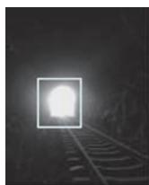

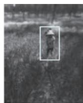  
b)

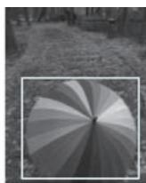

  
d）

●图 2-1 图像及其被注意区域示意  
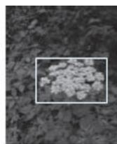  
a）隧道出口 b）小姑娘 c）花雨伞 d）轿车 e）平衡车 f）花簇

需要强调的是，注意力的自下而上和自上而下的作用不是孤立的，正如马泰·曼卡斯 （MateiMancas） 等[1] 在其著作 《从人类注意力到计算机注意力》 （From Human Attention to Computational Atten-tion）中的对注意力的概括：注意力实际上是自下而上的外因和自上而下的内因互相抗衡的结果，即最终获得的注意力是客观现实和主观修正后的综合。在 CV 领域中，大多数注意力机制的使用也都是自下而上和自上而下双管齐下。另外，细心的读者可能已经注意到，在上面例子中，我们在自下而上和自上而下方法中分别用到 “因为什么而被注意”和 “注意到什么”的句式。从认知阶段看，二者分别体现了被动的 “被吸引”和主动 “去认知”两个阶段，而两个阶段综合构成完整的认知过程；从因果关系角度看，前者体现了认知的原因，后者体现了认知的结果。

# 2. 1. 2 目的与手段：视觉显著性检测与视觉注意力机制

在前文中，我们不止一次地提及 CV 领域的注意力研究包括了视觉显著性检测和视觉注意力机制两个研究方向。前者中，注意力体现为“纯粹为了找显著”的目的性，体现了注意力的感知特性：而在后者中，注意力体现了提升各类 CV 任务效果的手段性，体现了注意力的认知特性。

视觉显著性检测是指在静态图像或者视频中，定位具有和其他对象具有明显差异的目标或区域———即寻找显著区域或者物体。视觉显著性检测起步于克里斯托弗·科赫在 1985 年提出的 KOCH模型[2] 和洛朗·伊蒂等在1989 年提出的 ITTI 模型[3] ，这两个模型可以视为是对认知心理学中特征整合理论选择性视觉注意力框架的计算机仿生，都体现了 “提取特征 融合特征 $\xrightarrow { }$ 获取显著性”。ITTI模型之后，计算机科学界提出了大量的视觉显著性检测模型，这些模型按照思路区分，又可以用 “先

点后面”来概括。所谓点即视觉注视点（eye fixation），这一类任务我们统称为注视点预测（fixation pre-diction）任务㊀①。注视点预测综合体现了 “眼睛是心灵的窗口”以及 “眼睛盯哪哪显著”的朴素思路———通过分析视觉场景中的各类特征来预测视觉注视点并以此表达视觉显著性，KOCH 模型和 ITTI模型就是此类方法的典型代表。注视点预测方法的研究多借助眼动仪 （eye tracker）来跟踪记录人们观察视觉场景时眼球的移动和驻留情况，以此建立图像特征与显著性的关系，其输出的结果往往体现为一系列预测得到的视觉注视点或者是注视轨迹 （如图 2-2b），或是表达为目光投射强度的显著性图（如图2-2c）。说完点我们再说 “面”。所谓面体即显著性物体（salient object），这一类任务称为显著物体检测（salient object detection）。显著物体检测是继注视点预测任务之后，视觉显著性检测方向出现的另一个重要分支。与注视点预测这种带着浓厚生物仿生背景的任务相比，显著物体检测一般将问题建模为场景的二值标注（binary labeling）或目标检测（object detection）问题，其目的旨在将显著物体从图像背景中分离出来，显著物体检测可以认为是一种更加纯粹的计算机方法。在很多模型中，显著物体检测以区域作为视觉场景的显著性表达，同时强调了区域对对象表达的整体性，即显著的不能只是区域，而需要是个尽量完整的物体。因此显著物体检测模型的输出一般是显著物体的二值掩膜 （如图2-2d）或矩形包围框 （如图2-2e）。这一特性带着鲜明的 “格式塔”心理学思想，是基于物体注意力的忠实体现。另外，某些显著物体检测甚至需要现有知识的驱动和指导，这一点又体现出 “自上而下”注意力的作用。需要说明的是，注视点预测和显著物体检测两类任务之间是有着很强的关联关系的，体现在注视点往往落在最显著的物体上，而最显著的物体吸引最多注视。在方法层面，注视点预测形成的显著性图尽管不表达物体，但是也可以通过二值化、区域标记等方式进一步获取其中的物体。另外，随着显著性检测公开数据集不断完善，尤其是深度学习在 CV 领域兴起，二者在实现方式上都趋同于 “端到端”（end-to-end）的有监督训练。

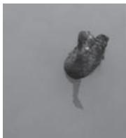

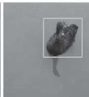

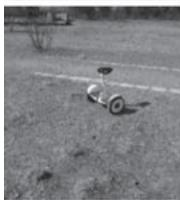

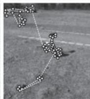

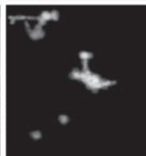

b)   
  
d)   
  
●图 2-2 两类不同视觉显著性检测的显著性表达形式对比示意  
  
a）原始图像 b）以注视点和轨迹表达注视点预测 c）以目光投射强度热力图表达的视觉点预测  
d）二值掩膜表示的显著目标 e）包围框表示的显著目标

视觉注意力机制是指针对各类 CV 任务，在模型结构设计或信息加工流程设计中，引入受任务效果驱动的特征筛选或者加权机制，使得模型在对数据的加工和处理过程中有侧重、有取舍，从而为看图说话 （image captioning）、细粒度分类 （fine-grained classification）、目标检测 （object detection） 等各类 CV 任务提供赋能作用。简而言之，我们认为视觉注意力机制的要点有三：第一，视觉注意力机制赋能的还是那些传统的 CV 任务；第二，视觉注意力机制的实现手段是筛选或加权；第三，视觉注意力机制的目的是提升效果。与显著性检测不同的是，视觉注意力机制不以生成显著性图或定位出显著区域作为最终目标，因此可以认为是一种相对 “隐式”的模型。例如，在看图说话任务中，模型像是在完成一个翻译任务———将图像翻译为能够对其进行描述的文字，因此视觉注意力机制像是在输入图像上找 “关键词”。而在细粒度分类任务中，需要利用细微差异实现对不同类别的区分，视觉注意力机制在其中所完成的功能仿佛是拿着放大镜在细节上寻找明显不同，从而基于细微差异最终实现更加准确的细粒度分类。以车型细粒度分类为例，在很多针对车辆图像进行的车型细分类的任务中，要求类别细化到年款级别，而很多车型在不同年款间的外形差别极其细微，即使使用肉眼也得对这些细微差异进行仔细辨别才能做到准确区分。如图2-3 所示的两种年款的轿车，其差异主要存在于前车灯和车标位置。因此针对这些区域提取具有差异化的特征是实现车型细分的必备条件，而实现此操作的一个有效手段即通过视觉注意力机制让模型自动 “关注”到这些区域。

  
a）

b)   
●图 2-3 两种年款车型细分类示意  
  
a）2017 款明锐和 2019 款明锐 b）2008 款凯美瑞和 2009 款凯美瑞

# 2. 1. 3 掩膜与权重：硬性注意力与柔性注意力

针对某一场景进行注意力获取，核心任务就是标记出场景中哪里被投射了注意力、投射了多少注意力，即确定不同位置获取注意力的强度。在具体表现形式、计算方式等方面，又有硬性注意力（hardattention） 和柔性注意力（soft attention） 之分。

先说表现形式，所谓硬性注意力是指通过不断在场景中搜索、以 “挑选”的方式获得被注意区域的注意力机制，该注意力机制的表现形式为 {0，1}二值掩膜，即表示要么完全被注意，要么就完全不被注意，可谓 “非彼即此”，这也正是 “硬性”一词的来源。硬性注意力确定被注意区域后，后续操作仅针对该区域进行特殊处理，因此在某种角度，硬性注意力机制可以理解为 “抠图”操作———抠取那些被认为是应该注意的区域或对象。图2-4a 示意了硬性注意力的表现形式。而在应用柔性注意力机制的模型中，注意力的投射强度被表达为针对场景不同位置的注意力权重，即在场景中任意一个位置都给出一个对注意力的分配概率，因此可以认为柔性注意力模型得到的是注意力的空间分布。在

CV 应用中，柔性注意力机制针对一幅图像或者一帧视频，输出一个具有相同尺寸的注意力分布矩阵，其中每一个位置的数值都表示与之对应位置输入数据获得注意力的强度，一般用 [0，1] 区间的连续数值来表示。后续处理即将此矩阵作为权重因子与输入数据进行对应位置相乘，用权重对输入数据做增强或抑制。柔性注意力机制中的 “柔性”即体现为注意力强度为 “柔软的”连续值。图 2-4b 示意了柔性注意力的表现形式。

●图 2-4 硬性注意力和柔性注意力的表现形式示意 （无柱状图位置表示注意力无分布）  
  
a）硬性注意力 b）柔性注意力

再说计算方法。由于硬性注意力采用的 “挑选”这一操作很难通过一个关于输入的可微函数来表达，这一点与围棋中每走一步对最终结果的影响未知类似，在对整个场景的遍历结束之前，每一步的注意力评估是否是全局最优也是未知的，因此硬性注意力的投射过程是一个随机预测过程，只能通过在不断地交互、不断地对 “挑选”这一动作施加不同的激励来获取最终的注意力投射位置。因此绝大多数硬性注意力模型都是通过强化学习（Reinforcement Learning，RL）的方法来实现。在柔性注意力模型中，将注意力的投射强度表达为针对场景不同位置的注意力权重，一般是光滑可微的，因此绝大多数柔性注意力模型都可以通过梯度下降法（Gradient Descent，GD）来实现。由于柔性注意力机制具有可微的良好性质，能够与基于梯度反向传播优化的现有模型无缝整合，因此目前更多的研究和应用还是更倾向于使用柔性注意力机制。

# 2.1.4 特征与位置：特征域注意力与空间域注意力

在第1 章对心理学和认知神经科学的介绍中，我们已经详细讨论了人们对引发注意力的因素所持有的三种不同观点，即 “特征说”“位置说”和 “物体说”。对于物体这一高级概念，考虑到其本质就是具有各类视觉特征与空间位置绑定的整体，所以暂且 “按下不表”，这里我们单说特征和位置。

在视觉显著性检测任务中，可以说位置既是原因也是结果。前者体现为在进行显著性评估的过程

中，空间位置往往在高维特征中占了一个或者几个维度，即位置是特征化了的位置。这一点很好理解，视觉显著性与亮度、颜色、纹理、结构等视觉特征息息相关，同时也受到这些视觉特征出现位置的影响———越靠近场景中间位置越显著，面积越大越显著。而位置是结果体现为在视觉显著性检测任务中，一般以空间位置作为模型的输出成果。毕竟注意力机制要回答的最根本的问题即 “哪里重要”，这显然是一个针对位置的问题。在视觉注意力机制相关的研究中，人们最早关注的也是空间域注意力机制的应用。例如，早期多种基于强化学习的硬性注意力机制，均是通过在视觉场景的不同位置试探、搜索、挑选来确认重点区域的位置，显然这些注意力机制都是在空间域上开展的；某些细粒度分类模型中，注意力机制以针对不同区域抵近观察的方式产生作用，这也是空间域注意力的重要体现。

在 CNN 主宰的 CV 领域，在卷积特征图上应用注意力机制也是一类重要的研究方向。而对于注意力针对特征还是针对位置的问题，则转变为注意力机制是在卷积特征图的通道域上进行还是在空间域上进行的问题。我们知道，每一个 CNN特征图可以看作是一个立方体———宽度维和高度维构成了空间域，而通道维则表示特征域。所谓注意力的作用域，说直白了就是看针对哪些维度开展权重设定而已。图2-5 即为 CNN 卷积特征图的通道域注意力和空间域注意力作用示意。

除了特征域注意力和空间域注意力，还有针对视频分析应运而生的时间域注意力（temporal

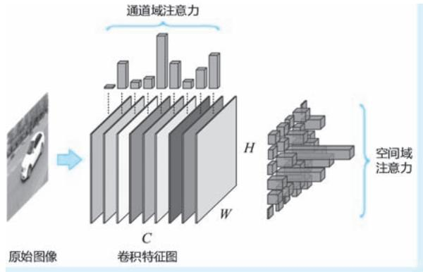  
图 2-5 针对卷积特征图的通道域注意力与空间域注意力对比示意

domain attention）机制。时间域注意力机制通过在时间维度上施加不同的注意力权重，实现对视频中帧与帧之间的有侧重处理。除了纯粹某一维度的注意力，还有 “混合型”的注意力，例如，将特征域与空间域注意力的融合，综合考虑两个维度的特征重要性，针对CNN 卷积特征，最简单的方式是将通道域注意力模块与空间域注意力模块串联，让两种注意力先后发挥作用。除此之外还有空间域注意力与时间域注意力的融合等。

# 2. 1. 5 自己与相互：自注意力与互注意力

2017 年，Transformer 的大获成功也带火了一种注意力机制———自注意力（self-attention） 机制。可以说近5 年来，无论是 NLP 还是 CV 领域，与注意力有关的词汇中，“自注意力”可以说是出现频率最高的词汇，可谓没有之一。

自注意力还有一个别称，叫作 “内注意力”，英文为 “intra-attention”。按照英文前缀的命名惯例，既然有 “intra-”，自然也有 “inter-”与之对应，而这里的 “inter-attention”即所谓的互注意力机制。所谓互注意力机制，特指在具有 “编码器-解码器”结构的 Seq2Seq 模型中，某个输入项的注意力权重被构造为上一个输出项与当前项的函数 （如图2-6a 所示。黑色实线箭头表示利用注意力权重加权计算的方向，而蓝色虚线箭头表示某注意力权重计算的依赖关系方向，图 2-6b 同）。这样一来，注意力的计算是跨在输入与输出之间的，这也正是 “inter”的来历。与之相反，内注意力也即大名鼎鼎的

自注意力，顾名思义，就是数据自己跟自己 “较劲”得到注意力权重，然后再将权重作用于自身以实现轻重取舍的一种特殊注意力机制。在自注意力中，注意力权重的计算仅在输入的各项间进行，不需要输出参与 （如图2-6b 所示）。

●图 2-6 互注意力机制与内注意力机制的对比示意  
  
a）互注意力机制 b）内注意力机制

# 2.2 视觉显著性检测原理与模型剖析

在本章的前半部分，我们已经对 CV 领域为什么要开展针对注意力的研究，以及注意力模型的基本分类进行了介绍，下面我们按照任务属性，将视觉显著性检测分为注视点预测和显著物体检测两类具体任务，分别对其中的经典模型进行详细分析。

# 2. 2. 1 注视点预测

下面我们首先介绍视觉显著性检测中的注视点预测模型，该类模型更多的关心 “注意哪里”以及“注意力哪投得多哪投得少”的问题，更具浓重的仿生学背景。在下文中，我们对模型的分析从 1985年提出的 KOCH 模型开始，一直到2015 年提出的 DeepFix 模型结束，总共涉及11 个经典模型。

# 1. KOCH：第一个仿生计算模型

无论是心理学还是生理学，已经存在大量研究证据表明，灵长类动物和人类的视觉系统经过进化，具有了能够在场景中移动注意力焦点这一特殊的能力。正是受到这些生理现象和研究成果的启发，1985 年，麻省理工学院的克里斯托弗·科赫 （Christof Koch，1956-） 和希蒙·乌尔曼 （ShimonUllman，1948-）[2] 联合提出了第一个选择注意力的理论计算模型— KOCH 模型。KOCH 模型使用由类神经元 （neuron-like element）构成的简单网络㊀①来解释或模拟选择性注意力如何在视觉场景中移动等各种生理现象。具体来说，KOCH 模型试图用模型化的方式解释如下三个关键问题：视觉特征的早期表示和视觉场景的显著性表示问题、注视点选择的问题以及注视点在视觉场景中的移动问题。

KOCH 模型的整体架构如图 2-7 所示。

针对视觉特征的早期表示和视觉场景的显著性表示问题，KOCH 模型采用特征图（Feature Maps） 机制来解决，在 KOCH 模型中，特征图被定义为针对视觉场景的、具有空间位置信息㊀①的一组基础视觉特征表示，这些视觉特征包括颜色、方向、运动和距离等。由于特征图具有与视觉场景对应的空间位置信息，因此本身就能够实现空间对齐。获得特征图后，通过将这些特征图逐位置进行信息融合，即可得到显著性图（Saliency Map），显著性图即可作为整个场景显著性的全局表示。KOCH 模型中的视觉特征的早期表示和视觉场景的显著性表示，与奈塞尔的早期视觉两阶段理论 （1967 年） 以及特里斯曼的特征整合理论 （1980 年）中的相关概念是一致的。

针对注视点的选择问题，KOCH 模型使用一种称为“赢者通吃” （Winner-Take-All，WTA）网络的简单结构

  
●图 2-7 KOCH 模型整体架构图

来解决该问题。初看 “赢者通吃”可能会一头雾水，这里将其翻译为 “只有最大者被选中”可能会更加容易理解一些———WTA 网络完成的工作就是在显著性图上寻找到显著性最大值所对应的位置，并将注意力聚焦到这个唯一的位置。可以认为WTA 网络扮演了一个类似 “argmax”操作的角色。KOCH 模型中将上述过程以更加 “神经”的方式进行表述：WTA 网络由一系列类神经元构成，该网络以整个显著性图作为输入，并为其中每一个位置的显著性值计算一个输出。例如，针对位于显著性图上第 $i$ 个位置的显著性值 $x _ { i }$ ，WTA 会为其计算一个输出 ${ \boldsymbol { y } } _ { i } = { \boldsymbol { f } } ( { \boldsymbol { x } } _ { i } )$ ），以 $\mathbf { \mathcal { I } } _ { i }$ 来标识该位置是否为注视点位置。函数 $f$ 的具体形式可简可繁，最简单的形式莫过于当 $x _ { i }$ 不是所有显著性值中的最大值时，令 ${ \bf \nabla } y _ { i } = 0$ ，否则给 $\mathbf { \boldsymbol { y } } _ { i }$ 赋予一个正常数。这样一来，注视点的位置即为正常数所在位置。在 KOCH 模型中，还给出了一种更加稳健的实现形式，该形式类似在显著性图上执行了一个 “softmax”操作，从而最大显著性值对应的输出接近1，而其他值对应输出被几乎抑制为0，因此确定注意点位置的操作即等价于 “寻1”操作。值得一提的是，从显著性图到对其逐位置的注视点标注这 “一去一回”，在某种意义上正是模拟了视觉信息加工过程中，外膝体 （Lateral Geniculate Nucleus，LGN） 与视觉皮层㊁②的信息加工机制：“一去”模拟了 LGN 到视觉皮层的正向加工过程，而 “一回” 则模拟了从视觉皮层到 LGN 的反投影（back-projection）生理机制。图 2-8a 为 WTA 网络的工作模式示意。被 WTA 确定的唯一的注视点，其对应的特征将被转存到一个称为 “中央表示”（central representation）的结构，这一步可以理解为对获取到的注视点信息进行存储。图2-8b 为注视点特征的中央表示示意。

所谓注视点在视觉场景中的移动问题，即搜索下一个具有最强显著性位置、从而确定下一个注视

点的过程。考虑到视觉场景中的物体往往在颜色、运动等特征上体现出整体特性，KOCH 模型在进行下一个注视点确定的过程中提出了空间临近和特征相似两种规则，即所谓的 “临近偏好” （proximitypreference）和 “相似偏好”（similarity preference）。临近偏好为局部检索策略，即搜索的目标是以当前注视点为中心的局部范围内的显著性局部极大值位置。相似偏好为全局检索策略，即在整个视觉场景中搜索与当前关注点特征最为接近特征的位置。相似偏好的特征检索需要使用到当前注视点的中央表示。上述两个规则分别体现了 “注意了某物体，则倾向于注意到它附近物体”和 “注意了某物体，则倾向于注意到与它相似的物体”这两种心理生理现象，在某种意义上，也是对注意定向理论中外源性定向和内源性定向概念的模拟，在后者中，当前注视点的中央表示扮演的正是已经存在的知识，起到 “自上而下”的指导作用。另外，无论是哪种规则，KOCH 首先都要对当前注视点的显著性值进行抑制，以防止当前点再次被选中，即确保注视点能够 “移动”。同时，临近偏好和相似偏好往往是综合使用的，即在下一个注视点的搜索中，距离当前点近且相似的位置最有可能被选中。

  
a)

b)   
●图 2-8 WTA 网络的工作模式及注视点特征的中央表示示意  
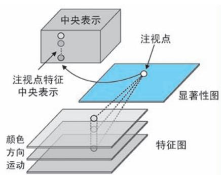  
a）WTA 网络的工作模式示意 b）注视点特征的中央表示示意

# 2. ITTI：特征整合理论的忠实体现

1998 年，科赫的学生洛朗·伊蒂 （Laurent Itti）与自己的老师科赫，连同神经科学家恩斯特·尼伯 （Ernst Niebur）[3] 一起提出著名的 ITTI 模型，以实现针对彩色静态图像的显著性检测。与 KOCH 模型类似，ITTI 模型也是以特征整合理论作为认知科学基础的，其整体计算流程包括了预处理、视觉特征表示、显著性图构造与注视点选择与转移四大步骤，其中提取的图像视觉特征包括强度、颜色和方向三大类。其整体架构如图2-9 所示。

1）预处理。预处理步骤主要指采用构建高斯金字塔的方式对输入图像进行多尺度化，以获得输入图像的多尺度版本。高斯金字塔中每尺度图像都是在上一尺度图像的基础上进行高斯滤波和 1/2 降采样得到。在 ITTI 模型中，高斯金字塔的尺度数设定为 9，用 $\sigma = 0$ ，…，8 表示高斯金字塔的尺度下标，其中 $\scriptstyle \sigma = 0$ 表示原始图像尺度。图2-10 为针对某图像构建的9 尺度高斯金字塔示意。  
2）视觉特征表示。在预处理步骤获得图像金字塔后，接下来即针对图像金字塔开展图像强度、颜色和方向三大类视觉特征表示的操作。针对每一类视觉特征，又包括了基础特征计算、差异特征图构建和归一化三个环节。其中，针对强度特征，设 $r$ 、 $g$ 和 $b$ 分别为输入图像的原始红绿蓝通道，在基

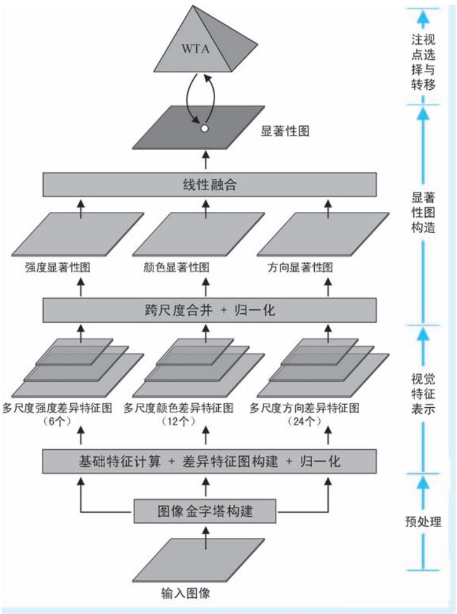  
●图 2-9 ITTI 模型整体架构图

础特征提取环节，ITTI 模型使用三个通道的平均值，即 $I { = } \left( r + g + b \right) / 3$ 来获取基础强度特征。因此，针对9 个尺度的图像金字塔，将得到一组多尺度的强度特征图 $I ( \sigma )$ ）， $\sigma = 0$ ，…，8。在接下来的差异特征图构建环节，借鉴神经元视觉空间响应中心和外围关系的一般计算原理，ITTI 模型采用跨尺度 “中心-外围” 差异 （center-surrounddifferences）作为视觉特征的表示。具体来说，针对强度特征，用精细尺度特征图 $I ( c )$ ）作为中心、粗略尺度特征图 $I ( s )$ ）作为外围，计算两图差异的绝对值，表示为

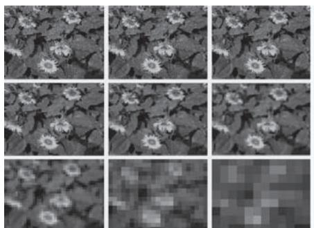  
●图 2-10 图像 9 尺度高斯金字塔示意 （从上到下、从左到右分尺度增加；为方便显示，从第 2尺度开始均进行了上采样操作以统一图像尺寸）

$$
I (c, s) = N (I (c) \ominus I (s)) \tag {2-1}
$$

式中， $c \in \{ 2 , 3 , 4 \}$ }为精细尺度特征图下标； $s = c + \delta$ ， $\delta \in \{ 3 , 4 \}$ }为粗略尺度特征图下标；符号 $\circleddash$ ”表示跨尺度差异运算 （先缩放再相减）。因此按照上述 $s$ 和 $c$ 的组合，针对强度特征将计算得到6 个差异特征图，如图2-11a 所示； $N ( \mathbf { \partial } \cdot \mathbf { \partial } )$ ）为归一化操作，该操作又包括值变换、局部极大值平均和乘系数三步：值变换将差异特征图线性变换至 $[ 0 , M ]$ ]的固定范围，其中 $M$ 为任意正常数；局部极大值平均即针对值变换后的差异特征图，检索除了全局最大值之外位置 （取值为 $M$ ）的所有局部极大值，求取其平均值 $\cdot ^ { - }$ ；在乘系数步骤，对每个值变换后差异特征图都乘以系数 $\left( M - { \overline { { m } } } \right) ^ { 2 }$ 。归一化操作能够起到无显著点全局抑制，有显著点增强显著的双重作用———前者表示所有特征 “表现平平，没有拔尖”，则$M \approx { \overline { { m } } }$ ，这就意味着最后乘以的系数 $\left( M - { \overline { { m } } } \right) ^ { 2 } \approx 0$ 。归一化的最终效果为几乎全局清零 （如图 2-11b 中实线所示数据， $M = \overline { { m } } = 3$ ）；后者表示存在 “鹤立鸡群”的显著点，则有 $M { \gg } \overline { { m } }$ ，这就意味着归一化操作能够起到倍增器的作用 （如图2-10b 中虚线所示数据， $M = 5$ ， $\overline { { m } } = 2 / 3$ ）。除强度特征外，针对颜色和方向两类特征的差异特征图构建，以及后续的三类特征跨尺度融合都会以上述归一化作为后处理操作，方法完全相同，在此不再赘述。

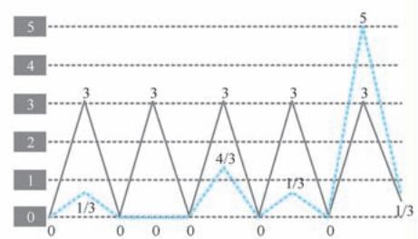  
b)   
图 2-11 差异特征图计算与两种不同情形的差异特征图示意 （以一维数据为例）a）差异特征图计算示意 b）两种不同情形的差异特征图示意 （以一维数据为例）

针对颜色特征，ITTI 模型并未使用原始的颜色通道，而是重新构造了红 （R）、绿 $G )$ ）、蓝$( B )$ ）、黄 （Y）4 个所谓宽调谐 （broadly-tuned）颜色通道，这4 个新颜色通道的计算方法分别为： $R =$ $r ^ { - } \big ( g { + } b \big ) / 2$ ， $G = g - ( r { + } b ) / 2$ ， $B = b - ( r + g ) / 2$ 和 $Y = \left( \boldsymbol { r } + \boldsymbol { g } ^ { } \right) / 2 - | \boldsymbol { r } - \boldsymbol { g } ^ { } | / 2 - b$ 。这 4 个颜色通道在高斯金字塔下的多尺度版本分别记作 $R ( \sigma ) , G ( \sigma ) , B ( \sigma )$ ）和 $Y ( \sigma )$ ），其中 $\scriptstyle \sigma = 0$ ，…，8。由于人类视觉系统存在一种被称为 “颜色双竞争” （color double-opponent）的机制———处于感受野中心的神经元会被一种颜色激发 （如红色），而被另一种颜色抑制 （如绿色），周围的神经元则与此相反。特别是在人类主视觉皮层中，上述空间和颜色的对立主要体现在红和绿、蓝和黄两组颜色上。因此为了体现上述生理层面的对立机制，ITTI 模型在构建颜色差异特征图时，分别计算了跨红绿通道 “中心-外围”差异$R G ( c , s )$ ）和跨蓝黄通道 “中心-外围”差异 $B Y ( c , s )$ ），两种差异的计算方法可以表示为

$$
R G (c, s) = N \left(\left(R (c) - G (c)\right) \ominus \left(G (s) - R (s)\right)\right) \tag {2-2}
$$

$$
B Y (c, s) = N \left(\left(B (c) - Y (c)\right) \ominus \left(Y (s) - B (s)\right)\right) \tag {2-3}
$$

式中， $c$ 和 $s$ 的取值与式 （2-1）相同。因此，按照 $s$ 和 $c$ 的组合，针对每一种跨颜色通道将计算产生6

个差异特征图，因此针对颜色特征将总共产生 12 个差异特征图。图 2-12 为以 $B Y ( c , s )$ ）为例的颜色差异特征图计算模式示意。

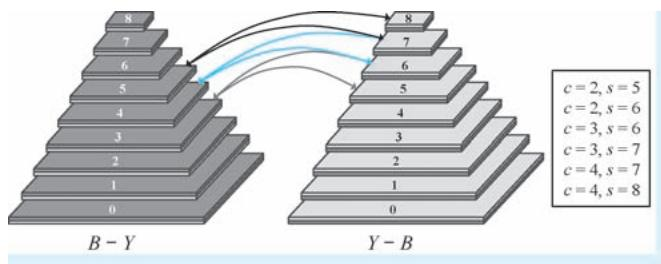  
●图 2-12 以 $B Y ( c , s )$ ）为例的颜色差异特征图计算模式示意

ITTI 模型采用 Gabor 滤波的方式获取图像的方向特征，其中 Gabor 滤波的方向为 4 个，记作 $\theta \in$ $\{ 0 ^ { \circ } , 4 5 ^ { \circ } , 9 0 ^ { \circ } , 1 3 5 ^ { \circ } \}$ 。在高斯金字塔 $I ( \sigma )$ ）上进行方向为 $\theta$ 的Gabor 滤波，即得到该方向对应的Gabor 特征金字塔 $O ( \sigma , \theta )$ ），其中 $\sigma = 0$ ，…，8。然后再以 “中心-外围”差异的方式在该 Gabor 特征金字塔上构建差异特征图，计算方法为

$$
O (c, s, \theta) = N (O (c, \theta) \ominus O (s, \theta)) \tag {2-4}
$$

式中， $c$ 和 $s$ 的取值与上文相同。因此按照 $s$ 和 $c$ 的组合，针对每一个方向将计算产生 6 个差异特征图，故针对4 个所有方向将总共产生24 个差异特征图。

3）显著性图构造。显著性图构造过程形成最终的显著性图。该过程又分为逐特征跨尺度合并和线性融合两个环节。逐特征跨尺度合并环节针对强度、颜色和方向 3 类特征的多尺度差异特征图，形成各自的显著性分量图，3 类特征对应的显著性分量图分别记作I、C和 $| O |$ ，其具体计算方法如下

$$
\bar {I} = N \left(\bigoplus_ {c = 2} ^ {4} \bigoplus_ {s = c + 3} ^ {c = 4} I (c, s)\right) \tag {2-5}
$$

$$
\overline {{C}} = N \left(\bigoplus_ {c = 2} ^ {4} \bigoplus_ {s = c + 3} ^ {c = 4} \left[ R G (c, s) + B Y (c, s) \right]\right) \tag {2-6}
$$

$$
\bar {O} = N \left(\sum_ {\theta \in \{0 ^ {\circ}, 4 5 ^ {\circ}, 9 0 ^ {\circ}, 1 3 5 ^ {\circ} \}} N \left(\bigoplus_ {c = 2} ^ {4} \bigoplus_ {s = c + 3} ^ {c = 4} O (c, s, \theta)\right)\right) \tag {2-7}
$$

式中，符号 $\textcircled{+}$ ”表示跨尺度合并运算㊀①，其他符号的含义在前文中进行过介绍。线性融合环节针对上述3 个显著性分量图进行平均，作为显著性图的最终输出，即 $S = ( \overline { { I } } + \overline { { C } } + \overline { { O } } ) / 3$ 。

4）注视点选择与转移。与KOCH 模型类似，ITTI 模型也是不断通过WTA 网络的 “一去一回”来实现注视点的选择与转移。在 “一去”的过程中，通过从显著性图中检索具有最大显著性值的位置作为注视点位置，“一回”则对当前注视点所在的区域进行显著性抑制，以实现 “注意过的位置不再注意”。图2-13 为注视点选择与转移模式的示意：WTA 网络在最初的显著性图上确认 1 处具有显著性最大值，故将初始注意点确定在1 处，然后再将 1 处所在区域的显著性值清零。接下来重复上述步骤，进一步得到注视位置2 ～ 4，将这些位置按照先后顺序连接起来即得到一条注视点的轨迹。

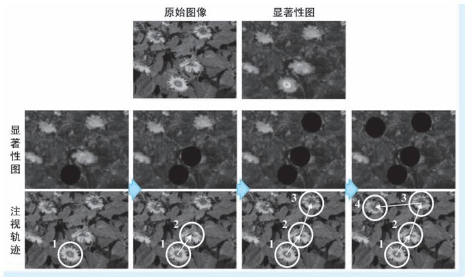  
●图 2-13 注视点选择与转移模式示意

前文介绍的 KOCH 模型提出了一个视觉选择注意力的计算框架，但是其并未明确给出计算机的实现方法，因此 KOCH 模型只能算作是一个理论上的计算模型。而这里讨论的 ITTI 模型明确给出了图像处理方法、参数设置等具体实现方法，这些 “很计算机”的特性使得ITTI 模型是真正意义上的计算机模型，对后续显著性检测方向带来深远影响，具有里程碑意义。

# 3. BS：利用贝叶斯框架建模“意外”

无论在心理学还是生理学中，一个普遍的观点是，人们集中注意力并开启随后的认知之旅往往来自于收到某些突如其来事物的刺激，如同平静的水面之上突然泛起的涟漪能够吸引人的注意，或是沙漠中突然出现的一小块绿洲能够瞬间让人产生兴趣一样。这种突如其来的刺激，我们往往称之为 “意外”（surprise）。可以说 “意外”是和注意力有关的核心概念之一，这一点早在 17 世纪笛卡尔就给出过类似的阐述。2005 年，洛朗·伊蒂等[4] 学者利用贝叶斯 （Bayes）框架对 “意外”这一重要概念展开数学模型的构造，该模型称为 “贝叶斯意外” （Bayesian Surprise，BS）框架㊀①。上述二位科学家将BS 框架应用于图像注视点预测，结果表明模型预测得到的注视点转移结果与眼动仪获取真人受试者的注视点转移记录达到较高的一致性，因此可以认为 BS 模型能够较好地模拟人类视觉系统的注意力投射机制。简单来说，BS 框架基于贝叶斯公式，基于观测，不断对某事件的先验分布（prior distribution）进行修正以获得其后验分布（posterior distribution），将那些导致先验分布与后验分布产生明显差异的事件视为 “意外事件”，在注视点预测任务中，这些 “意外事件”即那些能够吸引注意力的注视点。具体来说，对于某一事件 $E$ ，我们对其有一个事先分布的认知 $\{ p ( E ) \} _ { E \in \varepsilon }$ ，其中 $\varepsilon$ 为事件空间。当观测到新的观测数据 $D$ 时，都可利用如下的贝叶斯公式计算其后验概率

$$
\forall E \in \varepsilon , p (E \mid D) = \frac {p (D \mid E) p (E)}{p (D)} \tag {2-8}
$$

而先验分布和后验分布之间的差异能够用 $\mathrm { K L }$ 散度（Kullback-Leibler divergence） 来度量，定义为

$$
K L (p (E \mid D), p (E)) = \int_ {\varepsilon} p (E \mid D) \log \frac {p (E \mid D)}{p (E)} \mathrm {d} E \tag {2-9}
$$

在面对序列观测时，上述后验分布的计算和差异的评估采用交替迭代的方式进行，即将当前步骤的后验分布作为下一个步骤的先验分布，该过程如图 2-14 所示。可以说，BS 框架体现了一种不断用最新的观测数据修正历史经验，并用最新的历史经验评估当前观测是否 “出乎意料” 的思想。同时，BS 框架还实现了 “意外见多了就不再意外”的惯性效果。

  
●图 2-14 BS 基本原理示意

BS 框架将视觉注视点预测任务作为其一个重要应用场景开展实验验证。首先，在特征提取方面，BS 采取了与 ITTI 模型类似的 “中心-外围”跨尺度差异特征表示方法，在保留了 ITTI 模型 42 个特征图 （6 个强度、12 个颜色和24 个方向）的基础上，又添加了6 个 “抖动”（flicker）特征图和 24 个 4方向 “运动能量”（motion energy）特征图，共计构造 72 个特征图作为原始图像的特征表示，这就意味着在图像的任意位置，都有一个72 维的特征与之对应。在 BS 的框架下，具有显著性的位置即那些概率意义下的离群点（outlier）：在每一次后验分布估计的迭代中，首先利用最大后验（Maximum APosteriori，MAP）估计的方法确定当前有可能出现的特征，即如图2-15 中的最大后验估计步，即

$$
E _ {M A P} = \arg \max  _ {E} p (E \mid D _ {1}, \dots , D _ {N - 1}) \tag {2-10}
$$

  
●图 2-15 BS 离群点判断基本原理示意

然后，观测一个新位置的特征 $D _ { \scriptscriptstyle { N } }$ ，计算其按照既有认知 $E _ { y _ { A P } }$ 观测得到该特征的似然概率 $p ( D _ { _ N } | E _ { _ { M A P } } )$ ），如果 $p ( D _ { \scriptscriptstyle N } | E _ { \scriptscriptstyle M A P } ) \approx 0$ ，则表示获得观测特征 $D _ { \scriptscriptstyle { N } }$ 非常 “突兀”，因此可以判定该观测特征为一个显著性

的离群点 （如图 2-15 中的 $D _ { N } ^ { a }$ ），否则表示观测与历史认知没有什么两样，可谓 “稀松平常”（如图 2-15 中的 $\mathbf { \mathit { D } } _ { N } ^ { b }$ ）。

在上述对 BS 框架的介绍中，各种分布还都是以抽象形式表示，为了开展实际的计算，必须给出其具体的形式。具体在注视点预测应用中，BS 框架将每个位置的72 维特征建模为72 个独立的一维泊松分布（Poisson distribution），除此之外，为了方便计算和统一表示，BS 框架将先验分布和后验分布构建为共轭分布（conjugate distribution），先验分布和应用贝叶斯公式之后得到的后验分布都是泊松分布，只不过参数发生了变化。需要说明的是，泊松模型是一种人工神经元常用的概率模型，因为泊松分布在某种意义上很好地体现了神经元的响应过程，其中泊松分布的参数表达了神经元的放电率（firingrate）。带入具体分布形式的注视点预测方法，这里就不再详细展开。

很多注视点预测方法都认为人们倾向于将注意力集中在具有高熵、高对比度、高显著性，或是具有闪烁、运动刺激的区域，而 BS 框架独辟蹊径，通过建立新的模型来量化动态自然场景中吸引人类注意力的空间和时间因素，认为 “意外”是 “贝叶斯的”，从而得出人们更容易注意到能够引起他们惊讶、令他们产生 “意外”位置的结论。基于上述结论，给出了基于图像或视频的注视点预测方法。

# 4. GBVS：基于图的视觉显著性模型

ITTI 模型作为视觉显著性检测算法的 “鼻祖”，给出了计算图像显著性图的一般流程，很多后续算法都是以 ITTI 模型为蓝本开展改进工作。例如，受到神经元在处理信息时存在相互影响、相互通信机制的启发，Jonathan Harel 等[5] 加州理工学院的学者于 2006 年提出基于图的视觉显著性模型（Graph-Based Visual Saliency，GBVS），就是对 ITTI 模型的一个卓有成效的改进。Jonathan Harel 等在文章中，首先进一步明确注视点预测的主要工作包括特征提取（简称 “s1”步）、激活图构建（简称 “s2”步）与归一化/ 合并（简称 “s3” 步） 三大步骤，GBVS 将改进重点放在 s2 步和 s3 步。首先，在 s2 步，GBVS 模型针对单通道特征图，对位于 $( i , j )$ ）和 $( p , q )$ ）两个不同位置的特征 $M ( i , j )$ ）和 $M ( p , q )$ ）的距离（文中用的是 “dissimilarity”）给出了定义

$$
d \left(\left(i, j\right) \mid (p, q)\right) = \left| \log \frac {M (i , j)}{M (p , q)} \right| \tag {2-11}
$$

将特征图上不同位置的特征作为节点，构建特征节点间的关系，除了需要考虑上述特征距离，还需要考虑其间的空间距离。因此 GBVS 模型对上述特征距离定义上添加位置差异来表示特征节点之间的关系

$$
w _ {1} ((i, j) \mid (p, q)) = d ((i, j) \mid (p, q)) \cdot F (i - p, j - q) \tag {2-12}
$$

式中， $F ( i { - } p , j { - } q )$ ）为位置 $( i , j )$ ）和 $( p , q )$ ）的空间距离因子，定义为

$$
F (i - p, j - q) = \mathrm {e} ^ {- \frac {(i - p) ^ {2} + (j - q) ^ {2}}{2 \sigma^ {2}}} \tag {2-13}
$$

有了上述特征节点间的关系，从图的角度，针对一个具有 $n$ 个节点的特征图，其中任一个节点都有 $n { - } 1$ 条边与之相连。将这 $n - 1$ 条边上的关系做 “求和得 1”的归一化处理，则又可将其视为某一状态（state）节点到其他所有状态的转移概率（transition probability）。这样一来，上述特征图又可视为一个具有 $n$ 个状态的马尔可夫链（Markov Chain），其状态转移概率矩阵即由上述归一化关系构成。图 2-16示意了一个具有9 个节点的特征图，分别以其中节点 $a$ 和 $c$ 为例，其状态转移概率定义。

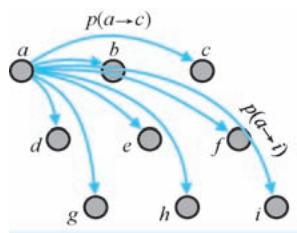

  
●图 2-16 状态转移概率示意

面对上述马尔可夫链，GBVS 模型通过寻找其平稳分布（equilibrium distribution）来确定某一位置出现某一特征的概率，而这一概率值，即所谓的激活值。所谓平稳分布，简单理解即在上述状态转移概率的不断调整下，不再发生改变的状态分布。图2-17 即为以图 2-16 情况为例的平稳状态分布示意。平稳分布体现了一种在随机的状态转移下最终达到的稳定状态，这一点与我们的视觉系统在视觉场景中随机搜索在不同位置最终实现注意力的稳定投射是非常相似的。在 GBVS 模型中，平稳状态分布的计算可以通过状态转移概率矩阵连乘的迭代方法和求取特征值的直接方法两种方法实现。

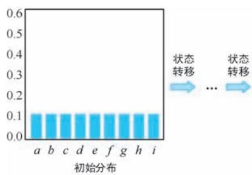

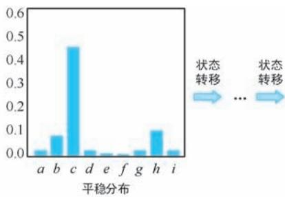

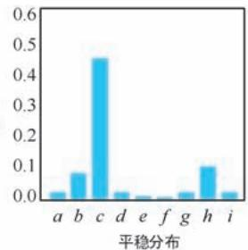  
●图 2-17 状态转移概率示意

针对激活图开展归一化的一个核心目的在于进一步突显差异，可谓 “让山更高，让谷更深”。在s3 步，GBVS 模型再次通过构造马尔可夫链的方式实现上述目标，只不过将图构造在已经得到的激活图之上，而并非基础特征图之上。除此之外，且将式 （2-12）的关系定义改造为

$$
w _ {2} ((i, j) \mid (p, q)) = A (p, q) \cdot F (i - p, j - q) \tag {2-14}
$$

式中， $A ( p , q )$ ）为位于位置 $( p , q )$ ）上已经计算得到的激活值。式 （2-14）表明激活值越大，则由位置$( i , j )$ ）指向其边的权重越大，这就意味着在随后的计算中位置 （p，q）越能 “吸引火力”，从而实现进一步突显显著位置的目的。

# 5. AIM：基于信息最大化的注视点预测

我们的视觉系统通过不断投射和转移注意力来获取有价值的视觉信息，那么怎么定义 “有价值”？从信息论的角度，所谓 “有价值”的事物就是那些具有最大信息量的事物。因此，沿着信息论的思路，可以认为视觉注意力的投射与转移总是以最大化视觉系统获取到的信息量作为驱动的。在这一思路的指导下，2006 年，加拿大约克大学的两位学者 Bruce 和 Tsotsos[6] 联合发表文章，提出一种基于信息最大化的显著性（Saliency Based on Information Maximization） 模型 （以下将其简称为 “AIM 模型”，

其中 “A”取自 “Attention”首字母）。AIM模型的注视点预测分为独立特征提取、特征密度估计、联合似然计算和自信息计算四个关键步骤，如图 2-18 所示。

在独立特征提取环节，AIM 模型并未直接采用类似 ITTI 模型那样的手工特征，而是以一组基函数 （basis function）的系数作为图像的特征表示。具体来说，对于以位置 $( i , j )$ 为中心的一个图像邻域 $C _ { i , j }$ ，计算其在 $N$ 个基函数 $\{ \varphi _ { 1 } , \cdots , \varphi _ { N } \}$ }下的表示系数 $a _ { i , j , k }$ ，使得

$$
C _ {i, j} \approx a _ {i, j, 1} \varphi_ {1} + a _ {i, j, 2} \varphi_ {2} \dots + a _ {i, j, N} \varphi_ {N} \tag {2-15}
$$

成立，则将 $\{ a _ { i , j , 1 } , \cdots , a _ { i , j , N } \}$ }作为对应图像邻域的特征表示。这里，所谓的基函数为一组形如

  
●图 2-18 AIM 模型的注视点预测过程示意

Garbor 滤波核那样的基础图像元素，世间所有图像都能够用这组基础图像元素组合而成。在 AIM 模型中，基函数是通过独立分量分析（Independent Component Analysis，ICA） 方法得到的：从 3600 幅自然图像中随机抽取了36 万个具有固定大小的图像块，然后利用 ICA 获取这些图像块的 $N$ 个独立分量作为基函数。值得一提的是，在 CV 领域，类似上述提取图像特征的方法非常常见，可以认为 ICA 构造了一个新的坐标系，而作为特征的系数即可视为原始像素在这个新坐标系下的坐标，系数的计算通过求解线性方程组即可获取。我们知道，AIM 模型追求的是信息量 （具体在 AIM 模型中特指自信息量）的最大化。而信息论中，信息量都是基于概率分布计算的，因此需要对图像特征引入不确定性，并且为这一不确定性进行概率建模，这便是特征密度估计环节需要完成的工作。所谓的特征密度估计即给出以位置 （i，j）为中心、第 $k$ 维特征的概率 $p ( w _ { i , j , k } = a _ { i , j , k } )$ ）。在 AIM 模型中，使用核密度估计（KernelDensity Estimation，KDE）这种非参数密度估计方式对上述概率进行建模，其具体形式为

$$
p \left(w _ {i, j, k} = a _ {i, j, k}\right) = \frac {1}{\sigma \sqrt {2 \pi}} \sum_ {\forall s, t \in \psi} \omega (s, t) e ^ {\frac {- \left(a _ {i , j , k} - a _ {s , t , k}\right) ^ {2}}{2 \sigma^ {2}}} \tag {2-16}
$$

式中， $w _ { i , j , k }$ 为以位置 $( i , j )$ ）为中心、第 $k$ 维特征对应的随机变量，而 $a _ { i , j , k }$ 表示其具体的取值，即也是直接的特征观测值； $\omega ( s , t )$ ）为归一化因子，有 $\sum _ { s , \ t } \omega ( s , \ t ) = 1$ ； $\psi$ 为密度估计的范围，即在评估某位置的特征取值时，需要周围多大范围的区域做出贡献，在 AIM 模型中，该范围为整幅图像。有了上述概率密度估计，也就是知道了在任意位置的任意维度观测到任意特征值的可能性，这即是单一维度特征的似然概率（Likelihood）。有了单一维度，接下来需要考虑所有维度特征的联合似然计算，记作$p ( \pmb { w } _ { i , j } ) = p ( w _ { i , j , 1 } = a _ { i , j , 1 } , \cdots , w _ { i , j , N } = a _ { i , j , N } )$ ）。由于 ICA 的独立性，该联合概率可以表示为单一维度似然概率的连乘积，即

$$
p \left(\boldsymbol {w} _ {i, j}\right) = \prod_ {k = 1} ^ {N} p \left(\boldsymbol {w} _ {i, j, k} = a _ {i, j, k}\right) \tag {2-17}
$$

所谓联合似然，即 “一次性”取到一组 $N$ 维特征的联合概率。有了联合概率，最后一步即基于该联合似然概率开展自信息计算，构建显著性图。显著性图上位于 （i，j）位置的显著性值即为依据上

述联合似然概率计算得到的自信息（Self-information）

$$
- \log p \left(\boldsymbol {w} _ {i, j}\right) \tag {2-18}
$$

在信息论中，自信息定义为概率的负对数，这就意味着概率越小的事件所含有的信息量越大。这一点也很好理解，“稀松平常”的事件不会受到关注，反而是那些小概率事件才能吸引眼球。有了显著性图，接下来的工作就 “一马平川”了———按照显著性值的从大到小逐个确定注视点，自然就做到信息量最大化的目标。

在宏观思路上，AIM 模型与前文介绍的 GBVS 模型是类似的，二者都是以某位置出现某特征的可能性作为显著性的判断标准。区别在于二者在表达可能性的手段上不同：AIM 是按照特征的联合似然来表示可能性，而 GBVS 中是用马尔可夫平稳分布表示可能性。

# 6. SR：用频率域的谱残差表示显著信息

认知神经科学的研究成果表明，人类的视觉系统经过长期进化，具备了一种能够以 “最经济”方式对外界环境做出反应的机制———抑制对频繁出现冗余信息的响应，同时仅对新颖信息保持敏感。上述对信息加工机制基本假设被称为高效编码原理（efficient coding principle）。在这一理论的指导下，华人学者侯晓迪[7] 还在上海交通大学读本科时，就在 2007 年的 CVPR 会议发表了基于谱残差（SpectralResidual，SR）的注视点预测方法。首先，SR 模型以高效编码原理为理论依据，认为我们获得的任意一幅图像也都可以认为是新颖信息和冗余信息的合成，表示为

$$
H (\text {I m a g e}) = H (\text {I n n o v a t i o n}) + H (\text {P r i o r K n o w l d e g e}) \tag {2-19}
$$

式中，H（Innovation）和 H（PriorKnowledge）分别代表了图像中 “特立独行”的新颖信息成分和 “司空见惯”的冗余信息成分。SR 模型的核心目标即移除图像的冗余信息，保留下来的新颖信息即被认为是那些能够吸引注视点的显著性信息。那么我们自然会问，什么信息属于 “司空见惯”的冗余信息？答案是那些在所有图像中都存在的、具有普适性的统计信息。具体到 SR 模型中，作者充分借鉴了一种被称为 “1 / f 定律”的图像尺度不变形统计特征来刻画冗余信息———在频率域，自然图像的振幅均值与周期成正比，即

$$
\operatorname {E} [ \mathcal {A} (f) ] \propto 1 / f \tag {2-20}
$$

式中， $\mathcal { A } ( f )$ ）为频率域中频率 $f$ 对应的振幅，即振幅谱。上述统计规律体现了两个要点：第一，几乎天下所有图像的振幅谱整体看都 “长得差不多”；第二，天下所有图像的平均振幅谱与频率成反比且光滑。为了进一步凸显特征差异，SR 模型对上述振幅谱取对数，即使用对数谱 （Log Spectrum，LS）作为冗余信息的统计表示，而那些图像所具有新颖性的显著信息则表现为与对数谱的偏差，这种偏差就是所谓的谱残差，SR 模型的核心思想就是保留图像谱残差所承载的显著性信息，其整体工作流程如图 2-19 所示。

在图2-19 所示的流程中，首先通过傅里叶变换（Fourier Transform）将输入的原始图像变换到频率域，分别获得其振幅谱 $\mathcal { A } ( f )$ ）和相位谱 $\mathcal { P } ( f )$ ），该步骤分别如式 （2-21）和式 （2-22）所示；然后对振幅谱取对数得到其对数谱表示 $\mathcal { L } \left( f \right)$ ），该步骤如式 （2-23）所示；考虑到自然图像平均振幅谱均值的局部线性特性，接下来对频谱进行均值滤波处理以近似该重要特性，然后再从对数谱中移除该滤波成分，得到谱残差 $\mathcal { R } \left( f \right)$ ），该步骤如式 （2-24）所示；最后，利用傅里叶逆变换（Inverse FourierTransform）将谱残差从频率域变换回空间域，再经过高斯平滑等后处理操作，即得到输入图像对应的

显著性图 （x），该步骤如式 （2-25）所示

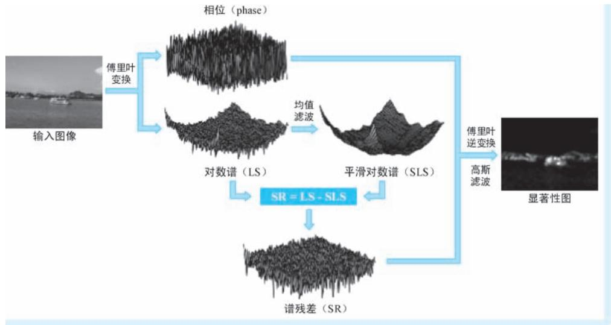  
●图 2-19 SR 模型的整体工作流程

$$
\mathcal {A} (f) = \text {A m p l i t u d e} (F T (I (x))) \tag {2-21}
$$

$$
\mathcal {P} (f) = \text {P h a s e} (\operatorname {F F T} (I (x))) \tag {2-22}
$$

$$
\mathcal {L} (f) = \log \mathcal {A} (f) \tag {2-23}
$$

$$
\mathcal {R} (f) = \mathcal {L} (f) - h _ {n} (f) * \mathcal {L} (f) \tag {2-24}
$$

$$
\mathcal {S} (x) = \mathcal {G} (x) * \operatorname {I F T} \left(\exp (\mathcal {R} (f) + \mathrm {i} \mathcal {P} (f))\right) ^ {2} \tag {2-25}
$$

式中， $I ( x )$ ）为输入原始图像； $F T ( ~ \cdot ~ )$ ）和 $\operatorname { I F T } ( \mathbf { \Sigma } \cdot \mathbf { \Sigma } )$ ）分别表示傅里叶变换和傅里叶逆变换操作；Amplitude（·）和 Phase（·）分别为从傅里叶变换结果中提取振幅谱和相位谱的操作； $h _ { n } ( f ) * { \mathcal { L } } \left( f \right)$ ）即表示在对数谱$\mathcal { L } \left( f \right)$ ）上执行窗口大小为 $n$ 的均值滤波操作； $g ( x )$ ）为对傅里叶逆变换结果所做的高斯滤波操作；式（2-25）中平方操作的目的是为了增强显著性的信号。如果说前文介绍的几种典型的注视点预测方法都是在空间域上进行的，那么 SR 模型则独辟蹊径，从频率域入手，借助了视觉系统抑冗这一生理背景，将注视点的预测问题表述为谱残差的抽取问题，可以说 SR 模型给出了一种注视点预测的新思路。

# 7. SUN：基于贝叶斯框架的视觉显著性

站在概率的视角，位于显著性图上某一个位置的显著性值，都可以看作是该点是否具有显著性的可能性。正规地，设 z 表示视觉场景中的一个点，假设有一个二值随机变量 $C$ 标志着其是否具有显著性： $C$ 取值1 或0 分别表示显著或不显著，然后再以随机变量 $L$ 和 $F$ 分别表示点的空间位置和其具有的视觉特征，则点 $z$ 的显著性 $s _ { z }$ 可以表示为以 $L$ 和 $F$ 为条件的条件概率 $p ( \ C = 1 \mid L { = } l _ { z } , F { = } f _ { z } )$ ），其中 $l _ { z }$ 和$f _ { z }$ 分别为位置和特征的具体取值，该条件概率可以视为是显著性标志的后验概率。那么，既然是后验概率，自然可以利用贝叶斯公式对其进行进一步的整理和表示。在这一思路的指导下，来自加州大学圣迭戈分校的 Lingyun Zhang 等[8] 学者于 2008 年提出了基于自然统计量的显著性（Saliency Using Naturalstatistics，SUN）框架，这是一个用于图像注视点预测的完整贝叶斯框架。次年，Christopher Kanan

等[9] 基于上述框架，发文对其进行进一步完善 （两篇文章的模型都叫 “SUN”，而且作者基本是相同的团队。但是区别在于，Lingyun Zhang 等提出的贝叶斯框架，其中包括了 “自下而上”和 “自上而下”两方面，但是作者只针对其中 “自下而上”的部分进行了详细的讨论；而 Christopher Kanan 基于SUN 框架，对其中 “自上而下”的机制进行了深入研究。所以为了方便阐述，下文我们分别将整贝叶斯框架简称为 “SUN 框架”，分别将 “自下而上”和 “自上而下”的讨论简称为 “SUN-BU 模型”和“SUN-TD 模型”）。SUN 框架首先利用贝叶斯公式，对上述条件概率进行整理，得到

$$
s _ {z} = p (C = 1 \mid L = l _ {z}, F = f _ {z}) = \frac {p (L = l _ {z} , F = f _ {z} \mid C = 1) p (C = 1)}{p (L = l _ {z} , F = f _ {z})} \tag {2-26}
$$

为了简化表示，SUN 模型对上式进行两个独立性假设：第一，位置和特征相互独立，即有 $p \left( L \right)$ $\begin{array} { r } { l _ { z } , F = f _ { z } ) = p \left( L = l _ { z } \right) p \left( F = f _ { z } \right) } \end{array}$ ）；第二，给定条件 $C$ 下、位置和特征独立，即有 $p \left( \angle = l _ { z } , F = f _ { z } \mid C = 1 \right) =$ $p ( L { = } l _ { z } | C { = } 1 ) p ( F { = } f _ { z } | C { = } 1 )$ 。我们认为以上的两点独立性的假设是合理的：前者认为在什么位置与出现什么样的特征没有关系，后者认为某一显著点出现的位置和其具有的特征之间没有关系。因此，上述条件概率可以进一步表示为

$$
\begin{array}{l} s _ {z} = \frac {p (L = l _ {z} \mid C = 1) p (F = f _ {z} \mid C = 1) p (C = 1)}{p (L = l _ {z}) p (F = f _ {z})} \tag {2-27} \\ = \frac {1}{p (F = f _ {z})} \cdot p (F = f _ {z} \mid C = 1) \cdot p (C = 1 \mid L = l _ {z}) \\ \end{array}
$$

式中，条件概率 $p \big ( \mathrm { \it C } = 1 | { \mathrm { \it L } } = l _ { z } , F = f _ { z } \big )$ ）被拆分为3 部分：第一部分中的 $p ( F { = } f _ { z } )$ ）纯粹表示了视觉特征 $f _ { z }$ 出现的概率，该概率以 “自下而上”的方式体现了图像特征的客观分布规律。不难发现，概率 $p ( F { = } f _ { z } )$ 在分母位置，这就意味着特征越是罕见，则显著性越强，这一点与AIM 模型 “越意外就越显著”以及BS 框架 “概率越小信息量越大”的理念是相同的；第二部分的 $\scriptstyle p ( F = f _ { z } \mid C = 1 ,$ ）表达了 “显著目标大概具有什么样的特征”这一可能性，因此被称为特征似然概率；第三部分的 $p ( C = 1 \mid L = l _ { z } )$ ）被称为位置先验概率，表达了 “哪里会比较显著”这一可能性，这一概率也比较容易理解，例如，在某些显著性检测算法中就认为位置是决定显著性的因素之一，处于视野居中位置的物体往往更加容易受到关注。需要强调的是，无论是特征似然概率还是位置先验概率，都蕴含了和知识、历史经验有关的可能性，因此都体现出 “自上而下”的特征。对式 （2-27）两边取对数有

$$
\begin{array}{l} \log s _ {z} = - \log p (F = f _ {z}) + \\ \log p (F = f _ {z} \mid C = 1) + \tag {2-28} \\ \log p (C = 1 \mid L = l _ {z}) \\ \end{array}
$$

在式 （2-28）所示的对数概率表示中， $- \mathrm { l o g } p ( F = f _ { z } )$ $F { = } f _ { z } ~$ ）即为特征的自信息。在 SUN-BU 模型中，只将自信息这一 “自下而上”的部分作为重点研究对象，而将后面两个 “自下而上”的部分省略。对自信息进行建模，重要的就是给出特征分布的具体表达式，而给出分布表达式的前提是确定怎么描述特征。在特征提取方面，SUN-BU 给出了基于高斯差分（Difference of Gaussian，DoG）滤波和线性 ICA 滤波两种特征提取方式。其中针对 DoG 滤波，首先将原始图像红 （r）、绿 （g）、蓝 （b）的 3 通道表示，转变为强度 （I）、红/ 绿竞争 （RB）、蓝/ 黄竞争 （BY）的 3 通道表示

$$
I = r + g + b
$$

$$
R G = r - g \tag {2-29}
$$

$$
B Y = b - \frac {r}{2} - \frac {\operatorname* {m i n} (r , g)}{2}
$$

然后，在每个通道上利用如下定义的 DoG 滤波核执行滤波操作，提取 DoG 特征

$$
\operatorname {D o G} (x, y) = \frac {1}{\sigma^ {2}} \mathrm {e} ^ {- \frac {x ^ {2} + y ^ {2}}{\sigma^ {2}}} - \frac {1}{(1 . 6 \sigma) ^ {2}} \mathrm {e} ^ {- \frac {x ^ {2} + y ^ {2}}{(1 . 6 \sigma) ^ {2}}} \tag {2-30}
$$

式中， $\sigma$ 为 DoG 滤波器的尺度参数。在 SUN-BU 模型中，DoG 滤波在 $\sigma { = } 4$ 、 $\sigma = 8$ 、 $\sigma = 1 6$ 和 $\sigma = 3 2$ 像素4 个尺度上进行，因此面对3 个新构造的通道，共计得到 12 个滤波表示，每个图像位置都将这 12个滤波响应作为其特征表示，记作 $\{ f _ { 1 } , \cdots , f _ { 1 2 } \}$ }。为了构建 $p ( F { = } f _ { z } )$ ），SUN-BU 在 138 幅自然图像上进行特征统计和拟合，将每种特征建模为广义高斯分布（Generalized Gaussian Distribution，GGD。该分布在某些文献中也被称为 “Exponential Power Distribution”，即所谓的 “指数幂分布”）

$$
p \left(f _ {i}; \sigma_ {i}, \theta_ {i}\right) = \frac {1}{2 \sigma_ {i} \Gamma \left(\frac {1}{\theta_ {i}}\right)} \mathrm {e} ^ {- \left| \frac {f _ {i}}{\sigma_ {i}} \right| \theta_ {i}} \tag {2-31}
$$

式中， $\Gamma ( \mathbf { \theta } \cdot \mathbf { \theta } )$ ）为伽马函数； $f _ { i }$ 即为 DoG 滤波得到的第 i 个特征，其中 $i = 1 , \cdots , 1 2$ $i = 1$ ； $\theta _ { i }$ 和 $\sigma _ { i }$ 分别为 $f _ { i }$ 分布模型的尺度和形状参数，SUN-BU 通过拟合为每一维特征计算这两个参数。为了简化计算，SUN-BU 认为12 个特征的分布是相互独立的，因此自信息的计算最终可以表示为

$$
\begin{array}{l} \log s _ {z} \approx - \log p (F = f _ {z}) = - \log p (f _ {1}, \dots , f _ {1 2}) \\ = - \log \prod_ {i = 1} ^ {1 2} p \left(f _ {i}; \sigma_ {i}, \theta_ {i}\right) = - \sum_ {i = 1} ^ {1 2} \log p \left(f _ {i}; \sigma_ {i}, \theta_ {i}\right) \tag {2-32} \\ = \sum_ {i = 1} ^ {1 2} \left| \frac {f _ {i}}{\sigma_ {i}} \right| ^ {\theta_ {i}} + \text {c o n s t} \\ \end{array}
$$

在基于线性 ICA 滤波的特征提取中，与 AIM 模型类似，SUN-BU 在公开的大规模数据集随机抽取大量$1 1 \times 1 1$ 大小的图像块，然后再在其上应用 ICA 算法，得到362 个 ICA 基础滤波核，因此在线性 ICA 滤波特征提取方法中，每一个位置的特征维度从 DoG 的 12 维提升为 362 维。在获得特征表示后，随后的概率建模与 DoG 相同，也是使用 GGD 进行，这里不再赘述。

SUN 框架给出了 “自下而上”和 “自上而下”的完整框架，而 SUN-BU 只填了其中 “自下而上”的 “坑”，2009 年的 SUN-TD 则将其目标定位到 “自上而下”的部分。首先，为了简化计算，SUN-TD模型对位置先验概率进行了忽略，即认为显著目标出现在哪里的可能性是相同的，从而式 （2-22）可以整理为

$$
\begin{array}{l} \log s _ {z} \approx - \log p (F = f _ {z}) + \log p (F = f _ {z} \mid C = 1) \\ = \log \frac {p (F = f _ {z} \mid C = 1)}{p (F = f _ {z})} \tag {2-33} \\ = \log \frac {p (F = f _ {z} , C = 1)}{p (F = f _ {z}) p (C = 1)} \\ \end{array}
$$

经过上述整理，显著性值被表达为显著目标的存在性和视觉特征的点间互信息（Pointwise Mutual

Information，PMI）。这就意味着视觉显著性体现为显著目标与其视觉特征的关联程度。事实上，如果将 $C$ 视为更加广义的类别标签时，标识某类别对象图像位置的热力分布也可以视为是类别与特征的互信息———当特征和对应类别相匹配时，对应位置就 “热”，反之则 “冷”，此处 $C$ 作为显著性二值标志可以视为是分类问题中的二分类特例。面对显著性检测这种单目标任务， $p$ $C = 1$ ） 表达了 “全天下显著点的出现频率”，故可以视其为常量。因此，沿着 PMI 的定义继续往下整理，有

$$
\begin{array}{l} \log \frac {p (F = f _ {z} , C = 1)}{p (F = f _ {z}) p (C = 1)} = \log \frac {p (F = f _ {z} , C = 1)}{p (F = f _ {z})} - \log p (C = 1) \tag {2-34} \\ = \log p (C = 1 \mid F = f _ {z}) - \log p (C = 1) \\ = \log p (C = 1 \mid F = f _ {z}) + \text {c o n s t} \\ \end{array}
$$

经过层层简化，SUN-UD 模型将SUN 框架中最开始的 $\log p ( C = 1 | L = l _ { z } , F = f _ { z } )$ ），简化为 $\scriptstyle \log p ( C = 1 \mid F = f _ { _ z } )$ ）再加上一个常数，看似没做什么实质性操作。但是，仔细观察不难发现，条件概率 $p \big ( C = 1 | F = f _ { z } \big )$ ）不正是我们用于分类的判别模型？这岂不是使用一个分类器在每个位置预测一个概率就完成了注视点的预测？答案的确简单如此：SUN-UD 模型利用具有真实眼动数据标注的公开数据集作为训练数据，将SUN-BU 中的线性 ICA 滤波响应经过主成分分析 （Principal Component Analysis，PCA） 得到的 94 维特征作为输入，训练基于支持向量机（Support Vector Machine，SVM）的分类器以实现上述分类。不知不觉，SUN-UD 模型走上了监督学习的道路，也正如上文所说，具有标注信息的训练数据包含了人类已有认知，也正是因此，SUN-UD 体现出 “自上而下”的鲜明特色。

# 8. IS：利用图像标识抑制背景信息

在前文中我们已经介绍过，侯晓迪等于2007 年提出的 SR 模型充分利用自然图像对数谱分布接近这一统计规律，借助剥离的思想，在频率域中通过计算谱残差来提取图像的新颖信息成分，并以此表示图像的显著特征。同样是还在变换域，利用剥离的思想，侯晓迪[10] 于 2012 年在 IEEE TPAMI 上再次发表文章，提出基于图像标识 （Image Signature）的稀疏显著区域提取模型 （以下简称为 “IS 模型”）。IS 模型将显著区域定位问题视为前景背景剥离 （figure-ground separation） 问题，并在此基础上做了两个稀疏性假设：第一，作为前景的显著目标在空间域是稀疏的；第二，背景在频率域是稀疏的。所谓空间域稀疏，简单说就是显著物体在图像上占得面积比例小，这一点很好理解，毕竟 “满屏”显著就等于没有显著；而频率域稀疏，则是指在频率域中，非零系数只占其中的少数。相比 5 年前的 SR 模型，IS 模型的理论背景更为深刻，但是表现形式更加简洁。IS 模型的整体工作流程如图 2-20 所示。

首先，给定单通道图像 $I ( x )$ ），IS 模型对图像标识 $\mathcal { I S } ( x )$ ）的定义为

$$
\mathcal {I S} (x) = \operatorname {s i g n} (D C T (I (x)) \tag {2-35}
$$

式中， $D C T ( \mathbf { \partial } \cdot \mathbf { \partial } )$ ）表示离散余弦变换（Discrete Cosine Transform，DCT）， $\mathrm { s i g n } ( x )$ ）为符号函数：当 $x { > } 0$ 时，$\mathrm { s i g n } ( x ) = 1$ ；当 $x = 0$ 时， $\mathrm { s i g n } ( x ) = 0$ ；当 $x { < } 0$ 时， $\mathrm { s i g n } \left( x \right) = - 1$ 。不难看出，所谓的图像标识，即为图像在 DCT 域的 $^ { \{ 1 , 0 - 1 \} }$ }三值编码表示。侯晓迪等在文章中已经证明，在满足上述两点稀疏性假设的条件下，图像标识中蕴含了绝大多数前景信息，而背景信息得到显著抑制。然后，再通过反离散余弦变换（Inverse Discrete Cosine Transform，IDCT） 对图像标识进行空间域重构

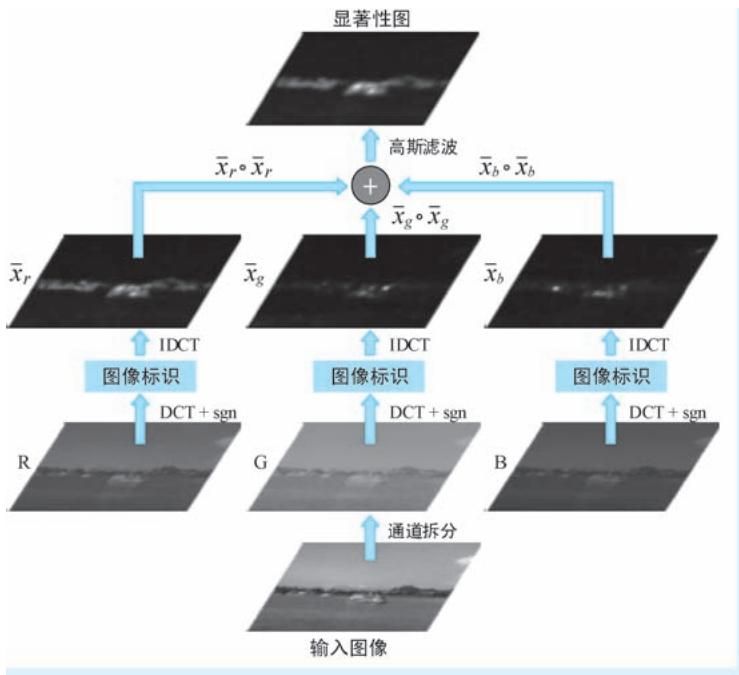  
●图 2-20 IS 模型的整体工作流程

$$
\bar {x} = I D C T (\mathcal {I S} (x)) \tag {2-36}
$$

式中，x即为图像标识的空间域表示，其中绝大多数信息都是具有显著特征的前景信息。接下来对其进行平方增强和高斯滤波处理，得到最终的显著性图

$$
\mathcal {S} (x) = g (x) * (\bar {x} \circ \bar {x}) \tag {2-37}
$$

式中，运算符 “”表示哈达玛积 （Hadamard product），简单说就是矩阵或向量的逐元素相乘； $g ( x )$ 为对平方增强后的显著性图所做的高斯滤波操作。针对彩色图像，IS 模型分通道获得图像标识的空间域重构，然后分别对其进行平方增强再进行融合和高斯滤波，即 $\mathcal { S } \left( x \right) = g ( x ) \ast \sum _ { i = 1 } ^ { C } \left( \overline { { x } } _ { i } \circ \overline { { x } } _ { i } \right)$ ）， 其中下标 i 表示通道下标，C 表示通道个数。

# 9. SERC：区域相比得到的显著性

前文介绍了多个注视点预测方法，这些方法可谓思路各异、各有千秋。但无论是何种方法，都将视觉特征的提取与表达作为其核心工作，后续显著性的评估都是基于提取得到的视觉特征完成的。然而，特征的显著与否是一个相对的概念，如 “大草原上的一匹斑马很显著，而斑马群里的一匹斑马就不那么显著”一样，显著不显著可以说是在场景内部 “比” 出来的。然而，前文介绍的诸多方法中，似乎都缺少了在图像内部开展特征相对显著性评估这一关键性操作。正是出于这一考虑，Erkut Erdem等[11] 学者于 2013 提出 SERC （Visual Saliency Estimation by nonlinearly integrating features using RegionCovariances）模型，SERC 模型以图像的一个个不重叠的局部区域作为基本处理单元，针对每一个区域，计算其特征间的协方差矩阵作为该区域的特征描述，而所谓的显著区域，就是那些与周边区域相比，特征描述 “与众不同”的区域。例如，在图 2-21a 和图 2-21b 所示的图像及其对应的协方差矩阵

中， $D$ 、 $E$ 和 $F$ 三个显著区域的协方差矩阵非常类似，而相比位于背景范围的A、 $B$ 和 $C$ 三个区域的协方差矩阵，其间的差异却十分明显。

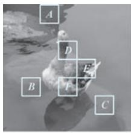  
a)

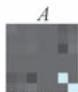

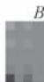

  
b)

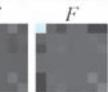

●图 2-21 不同图像区域的协方差矩阵对比及区域显著性计算示意  
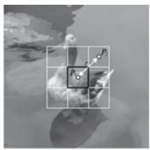  
a）图像上的6 个区域 b）6 个区域对应的协方差矩阵 c）显著性计算方法示意 $r = 1$ 的情形）

在特征提取方面，SERC 模型首先针对每一个像素位置提取一个 $k$ 维特征，这些特征可以非常简单。例如，SERC 模型在实现细节部分的介绍中，即以颜色、梯度和位置 3 类共计 7 维简单特征作为上述特征表达

$$
\left(L, a, b, \left| \frac {\partial I}{\partial x} \right|, \left| \frac {\partial I}{\partial y} \right|, x, y\right) ^ {T} \tag {2-38}
$$

式中， $L , \ a$ $a$ 和 $b$ 分别为 LAB 颜色空间的3 个颜色分量； $\mid \partial I / \partial x$ |和|∂I/∂y|分别为水平和垂直方向的两个图像梯度特征； $x$ 和 $y$ 分别为像素的水平与垂直位置， $x$ 和 $y$ 在此处用于表达空间特征。这样一来，有 $k = 7$ 。针对一个有 $n$ 个像素的区域 $R$ ，则可以获得 $n$ 个 $k$ 维特征。接下来，在这些特征之间计算协方差矩阵作为该区域的特征描述，即

$$
\boldsymbol {C} _ {R} = \frac {1}{n - 1} \sum_ {i = 1} ^ {n} \left(\boldsymbol {f} _ {i} - \boldsymbol {\mu}\right) \left(\boldsymbol {f} _ {i} - \boldsymbol {\mu}\right) ^ {\mathrm {T}} \tag {2-39}
$$

式中， $\left\{ { \pmb f } _ { i } \right\} _ { i = 1 , \cdots , n }$ 即为 $n$ 个 $k$ 维特征； $\pmb { \mu }$ 为其均值；协方差矩阵 $\mathbf { { \cal { C } } } _ { R }$ 为一个 $k$ 阶对称矩阵。协方差矩阵提供了一种自然的方式来组合不同的视觉特征，其对角线元素表示特征的方差，而非对角线元素表示特征之间的相关性。对于两个协方差矩阵 $\boldsymbol { C } _ { j }$ 和 $| C _ { k }$ ，定义其之间的距离为

$$
\rho \left(\boldsymbol {C} _ {j}, \boldsymbol {C} _ {k}\right) = \sqrt {\sum_ {i = 1} ^ {n} \ln^ {2} \lambda_ {i} \left(\boldsymbol {C} _ {j} , \boldsymbol {C} _ {k}\right)} \tag {2-40}
$$

式中， $\{ \lambda _ { i } ( C _ { j } , C _ { k } ) \} _ { i = 1 , \cdots , n }$ 为矩阵 $\mathbf { { C } } _ { j }$ 和 $| C _ { k }$ 的广义特征值（generalized eigenvalues），满足 $\lambda _ { i } C _ { j } { \pmb x } _ { i } = C _ { k } { \pmb x } _ { i }$ ，其中 $\mathbf { \boldsymbol { x } } _ { i }$ 为其对应的广义特征向量。在接下来进行的显著性计算阶段，SERC 模型将某区域 $R _ { i }$ 的显著性$S ( R _ { i } )$ ）定义为该区域与其周边半径 $r$ 之内、所有区域差异性（dissimilarity）的平均值 （如图 2-21c 所示），即

$$
S \left(R _ {i}\right) = \frac {1}{m} \sum_ {j = 1} ^ {m} \operatorname {d i s s} \left(R _ {i}, R _ {j}\right) \tag {2-41}
$$

式中， $\mathrm { d i s s } ( R _ { i } , R _ { j } )$ ）表示区域 $R _ { i }$ 和 $R _ { j }$ 的差异度量； $m$ 为以 $R _ { i }$ 为中心、 $r$ 为半径的相邻区域数量。针对上述差异度量，SERC 模型给出了基于协方差特征的差异度量和基于协方差与平均特征的差异度量两种具体实现方式。其中，基于协方差特征的差异度量 $d _ { 1 } ( R _ { i } , R _ { j } )$ ）即是在式 （2-40）给出的协方差距离基

础上添加区域中心距离因子，即

$$
\operatorname {d i s s} \left(R _ {i}, R _ {j}\right) \triangleq d _ {1} \left(R _ {i}, R _ {j}\right) = \frac {\rho \left(\boldsymbol {C} _ {i} , \boldsymbol {C} _ {j}\right)}{1 + \left\| \boldsymbol {p} _ {i} - \boldsymbol {p} _ {j} \right\|} \tag {2-42}
$$

式中， ${ \pmb p } _ { i }$ 和 $\pmb { p } _ { j }$ 分别为区域 $R _ { i }$ 和 $R _ { _ { J } }$ 的中心点坐标。基于协方差与平均特征的差异度量 $d _ { 2 } ( R _ { i } , R _ { j }$ ）要相对复杂一些，定义为

$$
\operatorname {d i s s} \left(R _ {i}, R _ {j}\right) \triangleq d _ {2} \left(R _ {i}, R _ {j}\right) = \frac {\left\| \boldsymbol {\psi} \left(\boldsymbol {C} _ {i}\right) - \boldsymbol {\psi} \left(\boldsymbol {C} _ {j}\right) \right\|}{1 + \left\| \boldsymbol {p} _ {i} - \boldsymbol {p} _ {j} \right\|} \tag {2-43}
$$

式中， $\pmb { \psi } ( \pmb { C } )$ ）为表示由协方差矩阵 $c$ 的一阶统计量构造得到的新的特征表示，该特征由均值特征和协方差矩阵的 “Sigma 点”（Sigma Points）向量拼接得到

$$
\boldsymbol {\psi} (\boldsymbol {C}) = \left(\boldsymbol {\mu} ^ {\mathrm {T}}, \boldsymbol {s} _ {1} ^ {\mathrm {T}}, \dots , \boldsymbol {s} _ {k} ^ {\mathrm {T}}, \boldsymbol {s} _ {k + 1} ^ {\mathrm {T}}, \dots , \boldsymbol {s} _ {2 k} ^ {\mathrm {T}}\right) ^ {\mathrm {T}} \tag {2-44}
$$

式中， $\pmb { \mu }$ 为区域中 $n$ 个 $k$ 维特征的均值；其含义同式 （2-39）； $\left\{ \begin{array} { l } { \pmb { S } _ { i } } \end{array} \right\} _ { i = 1 , \cdots , k , k + 1 , \cdots , 2 k }$ 即为协方差矩阵的“Sigma 点”，定义为

$$
F _ {k} \left(a _ {x}, I\right) = \left\{ \begin{array}{l l} \alpha \sqrt {k} \boldsymbol {L} _ {i}, & 1 \leqslant i \leqslant k \\ - \alpha \sqrt {k} \boldsymbol {L} _ {i - k}, & k + 1 \leqslant i \leqslant 2 k \end{array} \right. \tag {2-45}
$$

式中， $\pmb { { L } } _ { i }$ 为 $k$ 阶协方差矩阵 $c$ 对应乔里斯基分解（Cholesky decomposition）得到下三角矩阵的第 $i$ 个列向量；在 SERC 模型中，系数 $\alpha$ 取 $\sqrt { 2 }$ 。从式 （2-43） ～式 （2-45），我们以 “倒序”的方式不断对公式中的符号进行展开，这种方式可能不够清晰明了，那么按照 “正序”，特征 ${ \pmb { \psi } } ( { \pmb { C } } )$ ）的构造过程包括如下的六个步骤：第一步，给定一个有 $n$ 个像素的区域，对每个像素位置按照式 （2-38）计算 $n$ 个 $k$ 维特征 $\left\{ { \pmb f } _ { i } \right\} _ { i = 1 , \cdots , n }$ ；第二步，由 $\left\{ { \pmb f } _ { i } \right\} _ { i = 1 , \cdots , n }$ ，求取特征均值 $\mathbfcal { \mu }$ ；第三步，对协方差矩阵 $c$ 进行乔里斯基分解，有 $\pmb { C } = \pmb { L } \pmb { L } ^ { \mathrm { T } }$ ，其中 $\pmb { L }$ 为下三角矩阵；第四步，将 $\pmb { L }$ 按列分块，将列向量 $\mathbf { \cdot } \mathbf { L } _ { 1 }$ $\mathbf { \Omega } _ { L _ { 1 } } , \cdots , \mathbf { \Omega } _ { L _ { k } }$ 拼成一个 $\cdot k ^ { 2 }$ 维长向量并乘以系数 $\alpha \sqrt { k }$ ，即得到 $\mathbf { \sigma } _ { s _ { 1 } } ^ { \mathrm { T } } , \cdots , s _ { k } ^ { \mathrm { T } }$ ；第五步，将系数换为 $- \alpha \sqrt { k }$ ，重复操作第四步，得到 $| \pmb { s } _ { k + 1 } ^ { \mathrm { T } }$ ，…，$\pmb { s } _ { 2 k } ^ { \mathrm { T } }$ ；第六步，也是最后一步，将第二、四、五步得到的三个向量拼成一个大向量作为区域的特征表示，即为 ${ \pmb { \psi } } ( { \pmb { C } } )$ ）。

考虑到位于视野中心的物体往往更能吸引人的注意，所以 SERC 模型在每一个区域的显著性上，又添加了一个表示该区域与图像中心位置差异的权重，即所谓的 “中心偏差” （center bias）机制。除此之外，考虑到显著目标物的尺寸充满了随机性，故 SERC 模型通过设定不同的区域尺寸参数开展多尺度的显著性检测。在此基础上，对不同尺度的显著性图进行对应位置的乘积，再经过高斯平滑得到最终的显著性图。这一过程很好理解，故这里不再赘述。

# 10. EDN：第一个类深度学习模型

2012 年可以算作是深度学习（Deep Learning，DL）的元年，因为在这一年，基于卷积神经网络（Convolutional Neural Networks，CNN） 架构的 AlexNet 模型横空出世，在 ImageNet 挑战赛上取得碾压式的成绩，才真正将 DL 带入人们的视野。在这一时期，也有学者开始借鉴 DL 的思路，在显著性检测领域开展类似的研究工作。2014 年，Eleonora Vig 等[12] 三名哈佛大学的学者在 CVPR 会议上发表文章，提出用于视觉显著性检测的深度网络集成（Ensemble of Deep Networks，EDN）模型，EDN 将层次特征学习引入到视觉显著性领域，在表现形式上，EDN 已经有了现代 CNN 的影子，并且更重要的是，

EDN 在当时几乎所有的公开数据集上都做到 “SOTA”了。EDN 的整体工作流程如图 2-22 所示。

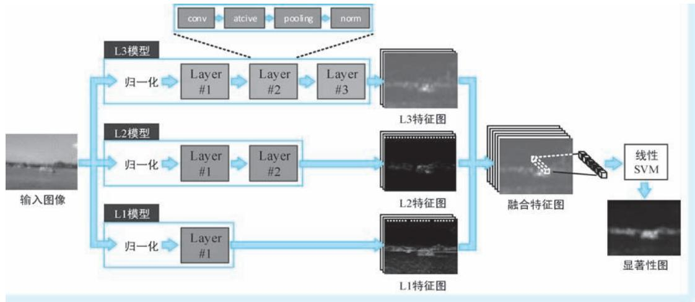  
●图 2-22 EDN 模型的整体工作流程

EDN 的重点工作包括了特征表达和特征学习两个大的方面。其中，在特征表达方面，EDN 使用的特征提取器已经与CNN 的结构 “形似”———每一个被称为 “层”（layer）的结构中都包括四个基本操作：卷积、激活、池化与归一化，而这正是我们在 CNN 中常见的 “四驾马车”。EDN 将这种特征表达称为 “仿生显著性特征”（Bio-inspired saliency features）。在卷积操作中，EDN 使用一组服从均匀分布的kl （其中，l 表示层下标）个滤波器作用在同一个输入上，即可得到一组具有 $k ^ { l }$ 个通道的特征图作为输出。但是，EDN 与 CNN “形似”但 “神不似”：EDN 卷积核中的参数一旦从均匀分布中采样就不再发生改变，而 CNN 的核心精神则是通过学习确定这些卷积核参数。另外，在 EDN 中，反而是卷积核的尺寸和数量才是需要搜索得到的模型参数，而这些参数在CNN 中却是事先确定的固定值。得到卷积特征图后，EDN 采用有界激活函数 （bounded activation function）对其进行激活处理，所谓有界激活，即将输入中小于下界 $\cdot \gamma _ { \mathrm { { m i n } } } ^ { l }$ 和是大于上界 $\cdot \gamma _ { \mathrm { m a x } } ^ { l }$ 的值分别裁剪至 $\dot { \cdot } \gamma _ { \mathrm { m i n } } ^ { l }$ 和 $| \gamma _ { \mathrm { m a x } } ^ { l } |$ ，其余值则保持不变。经过激活后的特征图将进行空间池化处理。空间池化操作可以表示为 $P ^ { l } = D S _ { \alpha } \left( \sqrt [ p l ] { ( A ^ { l } ) ^ { p ^ { l } } * { \bf 1 } _ { a l \times a l } } \right)$ ，其中 $| A ^ { l }$ 和 $| P ^ { l }$ 分别为输入的激活特征和池化操作的输出特征； ${ \mathbf { 1 } } _ { a l \times a l }$ l表示尺寸为 $\cdot a ^ { l } \times a ^ { l }$ 的全 1 矩阵，将其作为卷积核作用在$( A ^ { l } ) ^ { \dag }$ 即表示在其上 $\boldsymbol { a } ^ { l } \times \boldsymbol { a } ^ { l }$ 的区域进行求和； $D S _ { \alpha } ( \mathbf { \theta } \cdot \mathbf { \theta } )$ ）表示因子为 $\alpha$ 的降采样操作； $p ^ { l }$ 为幂次参数。不难看出与 CNN 相比，EDN 的池化操作增加了 $p ^ { l }$ 的乘幂和对应开方操作。最后一步操作为对池化特征进行的归一化操作。EDN 的归一化操作简单说就是在 $\mathit { b } ^ { l } \times \mathit { b } ^ { l }$ 的局部区域内用特征减去均值再进行分段拉伸操作。在原文中，EDN 给出的归一化操作在形式上比较复杂，我们这里就不再对其进行详细讨论。为了进一步增加特征表达能力，EDN 将上述层结构进行堆叠，形成特征提取模型，分别将具有 1 层、2层和3 层的特征提取模型记作 L1、L2 和 L3 模型。

EDN 的第二项重点工作为特征学习。所谓特征学习，即确定到底提取什么样的视觉特征才能够最好的表现图像的显著性。在 EDN 中，上述问题被进一步具体化为如何从模型空间中选择若干最优模型，以及如何对这些模型的输出特征进行有效集成的问题。EDN 采用模型搜索结合监督学习的方式来

解决上述问题。首先，EDN 为每一个模型参数 （准确地说是超参数）设定了一个搜索空间，例如，卷积操作中，卷积核尺寸的搜索空间为 $s ^ { l } \in \{ 3 , 5 , 7 , 9 \}$ }，卷积核个数的搜索空间为 $k ^ { l } \in \{ 1 6 , 3 2 , 6 4 , 1 2 8 , 2 5 6 \}$ ，池化操作中，幂次参数的搜索空间为 $p ^ { l } \in \{ 1 , 2 , 1 0 \}$ }等。然后，利用随机搜索（random search）和引导式搜索（guided search）相结合的方式确定最优模型参数。在两种搜索策略中，前者体现了 “蛮力冒猜”，凭的是运气，而后者则体现为监督学习下的有向搜索。在 EDN 中，监督学习使用的训练样本为MIT1003 公开数据集，该数据集中包含1003 幅具有真实受试者注视点记录的样本图像。在监督策略方面，EDN 模型显著性的预测建模为 “显著/ 非显著”的二分类任务，分类器采用简单线性 SVM 分类器，损失函数即为预测得到的显著性标签与样本数据中显著性真值标签之间的误差。值得一提的是，在整个监督学习过程中，EDN 将模型参数的搜索与 SVM 分类器的参数训练 “一勺子烩了”，这一点在某种程度上体现出了很多现代 CNN 模型所具有的 “端到端”训练思想，但是区别在于 EDN 的模型参数无法像CNN 那样通过损失函数的误差反向传播进行修正，而是只能通过搜索得到。在模型搜索的过程中，EDN 使用了粗略搜索和精确搜索两阶段搜索策略：在粗略搜索阶段，首先在 RGB 颜色空间表示输入的情况下，以独立的方式粗略搜索出 2000 个 L1 模型、2200 个 L2 模型和 2800 个 L3 模型。其中1200 个L2 模型和2400 个L3 模型采用随机搜索方式得到，而其余模型则以引导式搜索的方式得到；然后，将输入图像变换到 YUV 颜色空间，再以独立的方式搜索得到1900 个 L1 模型，1700 个 L2 模型和1900 个 L3 模型，其中有600 个模型是在随机搜索模式下得到。在精确搜索阶段，在第一阶段已经获取的 L1 到 L3 三类模型中，每类再选择5 ～ 10 个表现最优的模型㊀①，以最少 2 个、最多 8 个模型组合的方式，将这些模型的输出特征进行通道维拼接并输入 SVM 分类器进行特征评估，进一步确定最优模型及其组合。经过大约1000 次试验，得到了6 个结构不同的最优模型，其中包括随机搜索得到的 3个L3-RGB 模型和由引导式搜索得到的1 个L2-YUV 和两个L3-YUV 模型。有了最优特征提取模型及其特征集成策略，也有了 SVM 分类器，可谓 “万事俱备”———针对任意输入图像，利用特征提取器提取视觉特征，再将每个位置的特征输入分类器预测该位置的显著性值，显著性图唾手可得。

EDN 模型诞生于 DL 刚刚在 CV 领域兴起的关键时期，采用了与 CNN 非常类似的层级特征提取结构，并且也以搜索的方式避免使用手工特征，这一点在某种程度上体现了 DL 数据驱动下的特征学习机制这一核心思想。除此之外，EDN 将注视点预测任务明确的建模为基于公开数据集的监督学习任务，这与日后 CNN 统治下各类 CV 任务的研究模式也是类似的。然而，与 CNN 模型能够实现卷积参数级别的细粒度训练相比，EDN 的模型参数确定仅在超参数级别，且最优参数的确定是 “试”出来的，无法通过分类器损失函数的误差反向传播方式来实现调整，因此 EDN 还不能算作真正意义的 DL模型，所以我们姑且称之为 “类深度学习”模型吧。

# 11. DeepFix：基于全卷积网络的端到端预测

2012 年后，随着各类公开数据集的不断丰富、网络性能的不断提升，以及算力资源的不断丰富，CNN 在 CV 领域迅速兴起，可谓 “无 CNN 不 CV”。其中，在各类 CNN 的架构中，“将卷积进行到底”的全卷积网络（Fully Convolutional Network，FCN）能够保持图像二维结构，在图像语义分割等逐位置

预测的任务中具有得天独厚的优势。显然，以获得显著性图为目的注视点预测任务属于典型的逐位置预测任务，FCN 结构自然有其用武之地。2015 年，Kruthiventi 等[13] 三位印度学者提出了基于 FCN 结构的注视点预测模型 DeepFix，实现了注视点预测的 “端到端”训练与预测。DeepFix 模型的整体架构图如图 2-23 所示。

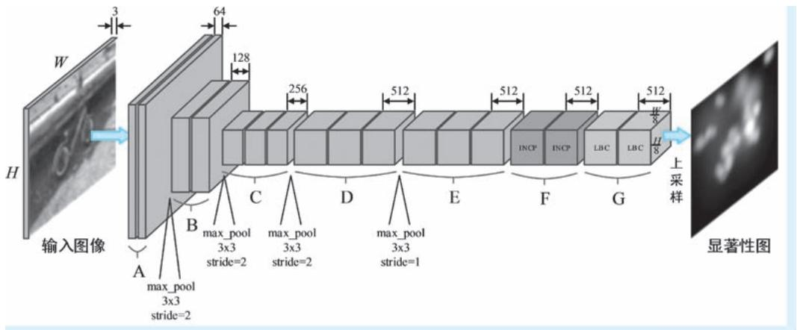  
●图 2-23 DeepFix 模型的整体架构图

DeepFix 模型以 RGB 三通道彩色图像作为输入，其整个网络结构分为 7 组卷积结构，我们分别用A 到 G 来表示。其中，前5 组 （A 到 E 组）卷积结构与著名的 VGG-16 网络类似，每组都包含两个或3 个具有相同参数卷积操作的堆叠：A 组包含两个 $3 { \times } 3 { \times } 6 4$ 卷积㊀，B 组包含两个 $3 { \times } 3 { \times } 1 2 8$ 卷积，C 组包含3 个 $3 { \times } 3 { \times } 2 5 6$ 卷积，D 组和E 组各包含3 个 $3 { \times } 3 { \times } 5 1 2$ 的卷积，不过为了在不增加参数量的前提下增加卷积的感受野，E 组中的 3 个卷积均为膨胀系数为 2 的 “膨胀卷积”（“dilation convolution”，所谓膨胀即在卷积核中加洞，因此在某些文献中，膨胀卷积也被称为 “空洞卷积”，对应的英文名为

“atrous convolution” ）。在 DeepFix 模型的前 4组 （A ～ D 组）卷积结构后，都添加了最大池化操作。在前3 组 （A～C 组）之后，特征图的尺寸降低到原始输入的 1/8，在随后的池化和卷积操作中，通过设定步长参数，所有的特征图都保持在这一尺寸。受到 GoogLeNet 的启发，DeepFix 使用两个类似 Inception 卷积模块的结构来捕获多尺度语义信息，F 组即包含两个这样的Inception 模块，其结构如图2-24所示。

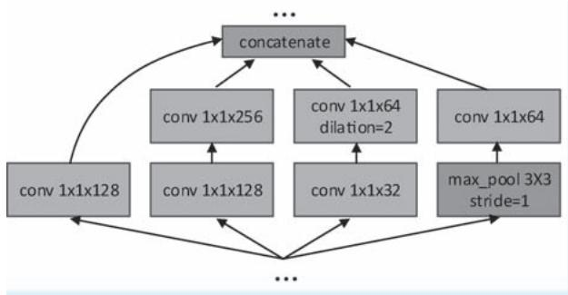  
●图 2-24 DeepFix 使用的 Inception 卷积模块结构

前文我们已经提及，人类的视觉系统更加倾向于在视野的中心位置投射更多的注意力，因此，很多显著性检测模型都添加了中心偏差操作以模拟上述生理机制。在 DeepFix 中，通过一种叫作 “位置偏差卷积”（Location Biased Convolution，LBC） 的特殊操作来实现中心偏差机制，位于最后一组 （G组）的两个模块即为 LBC 模块。在 LBC 模块中，首先在输入的 512 通道特征图的基础上，添加了 16个人工通道，这16 个人工通道是由具有不同水平、垂直方差的二维高斯分布生成的强度图，以此表达了不同尺度下、注意力投射 “中心强、四周弱”的空间分布规律。这样一来，原始输入的特征图通道数从512 增加到528。然后，在新的特征图上运用一般的 $3 { \times } 3 { \times } 5 1 2$ 卷积操作，新添加的16 个通道强度将体现为权重与原始512 通道特征图上的原始特征进行融合，体现中心偏差作用。不难看出，LBC的设计是简单而巧妙的：LBC 模块利用了 “将空间信息特征化”这一思想，仅套用现有框架，没有引进任何新操作；输入输出的特征图维度相同，能够作为即插即用的模块嵌入到任何现有网络结构之中；不会阻碍梯度的反向传播，因此支持 “端到端”训练。图2-25 为 LBC 模块结构示意。

  
●图 2-25 LBC 模块结构示意

DeepFix 基于多个业界公开的显著性检测数据集来进行模型训练和评估。在训练环节，但凡与VGG-16 网络能够 “对得上”的结构 （如 A ～ E 组），DeepFix 首先利用 VGG-16 提供的现有分类网络参数作为初值对其进行初始化，使得对这些结构的训练能够 “站在巨人的肩膀上”。接下来，在正式训练时，DeepFix 又采用了粗略训练结合精确训练的两阶段模式优化模型参数。其中在粗略训练阶段，DeepFix 基于 SALICON 数据集进行训练。尽管 SALICON 数据集中的标注信息并不是真正实验得到的眼动数据记录，但该数据集贵在规模庞大，包含了 15000 幅图像。依托如此众多的训练样本，能够使得模型参数快速朝着 “正路”走。接下来，DeepFix 从 CAT2000 数据集和 MIT1003 两个数据集分别提取1800 和900 幅训练样本，开展第二阶段的精确训练。除了前文已经提及的 MIT1003 数据集，CAT2000数据集包含了4000 幅图像，这些图像涉及了卡通、艺术作品、卫星图像、室内外场景、随机图像和线条图等20 个不同类别。与 SALICON 数据集不同，MIT1003 和 CAT2000 两个数据集都是具有真实标注的眼动记录数据集，但是规模较 SALICON 数据集小得多。在具体训练策略方面，DeepFix 的操作就相对简单：使用上述几个公开数据集提供的标注数据作为真值，计算预测显著性图与真实显著性图之间的欧几里得距离作为损失，采用带有动量的随机梯度下降 （Stochastic Gradient Descent，SGD）法进行

两阶段监督训练的方式优化模型参数。

DeepFix 借助成熟的 CNN 架构并进行有针对性的模型改进，实现 “端到端”的视觉注视点预测，基于公开数据集开展训练和测评，可以说在整个模式上，DeepFix 已经 “非常的 CNN”，对于后续基于DL 的显著性检测工作有着较强的借鉴意义。

# 2. 2. 2 显著物体检测

下面我们介绍视觉显著性检测中的显著物体检测模型，这些模型以区域或物体的显著性为分析对象，以提取一个 “与众不同”的物体为目的，属于纯粹的计算机模型。在下文中，我们对模型的分析从2007 年提出的 LDSO 模型开始，一直到2015 年提出的 SCHED 模型结束，同样涉及11 个经典模型。

# 1. LDSO：将显著物体检测建模为二值分割

视觉注视点预测任务如同让计算机回答 “如果你是人类，那么你将怎样在场景中移动或聚焦目光”这一问题，因此注视点预测任务有着很强的心理和生理学背景。但是与之不同的是，显著物体检测任务关心的仅仅是 “什么东西显著”这一问题，因此说显著物体检测是一种更加纯粹的 CV 任务。2007 年，西安交通大学的 Liu Tie[14] 与微软亚洲研究院的几名学者在 CVPR 会议上公布了一种显著物体检测的学习（Learning to Detect A Salient Object，LDSO）架构，将显著物体检测问题视为基于监督训练的图像二值分割问题。可以说是 LDSO 将 “物体说”带入人们的视野。除此之外，在提出 LDSO 的文章中，学者们还公开了一个用于显著物体检测的大规模数据集，供大家训练或评估显著物体检测模型之用。该数据集拥有超过60000 幅含有显著物体的图像，这些图像是从来自不同渠道的130099 幅高质量图像中精心筛选得到，其中的显著物体以二值掩膜（binary mask）和包围框（bounding box）两种方式进行了标注。为了保证数据的准确性，学者们组织了多重标注和精度评估，可以说无论是规模还是质量，该数据集都是用于显著物体检测任务的首个高质量公开数据集。

我们说 LDSO 将显著物体检测问题建模为图像的二值分割问题。所谓图像的二值分割，即给定图像 I，预测其对应的二值标签 $A = \left\{ a _ { x } \right\}$ }，其中 $a _ { x } \in \{ 0 , 1 \}$ }为像素 $x$ 对应的表达其显著与否的二值标签———1 表示显著，0 表示非显著。站在概率图模型的视角，将图像上的每一个像素及其对应的标签均视为随机变量，这些随机变量构成了一个无向图模型，其中图像 $\pmb { I }$ 中的每一个像素均为观测变量，其对应标签 $\pmb { A }$ 为未知变量。那么对上述二值标签的预测任务可以等价为对条件概率 $p \left( A \left| I \right. \right)$ ）进行建模，最优的二值标签使得条件概率 $p \left( A \mid I \right)$ ）取得最大值。而在概率图模型中，条件随机场（ConditionalRandom Field，CRF）就是建模上述条件概率的利器，这也正是 LDSO 的主体思路。令 $p \left( A \mid I ; \lambda \right) =$ ${ \frac { 1 } { Z ( I ) } } \mathbf { e } ^ { - E ( A \mid I ; { \pmb { \lambda } } ) }$ e-E（A|I；λ） ，其中，Z（I）= ∑ $\begin{array} { r } { Z ( \pmb { I } ) = \ \sum _ { \pmb { A } } \ \mathrm { e } ^ { - E ( \pmb { A } \mid \pmb { I } ; \ \pmb { A } ) } } \end{array}$ 为归一化因子，使得其能够作为一个合法的概率表示；$E ( A \mid I ; \lambda )$ ）称为能量函数（energy function），其定义为单像素显著性与像素间显著性的和

$$
E (\boldsymbol {A} \mid \boldsymbol {I}; \boldsymbol {\lambda}) = \sum_ {x} \sum_ {k = 1} ^ {K} \lambda_ {k} F _ {k} \left(a _ {x}, \boldsymbol {I}\right) + \sum_ {x, x ^ {\prime}} S \left(a _ {x}, a _ {x ^ {\prime}}, \boldsymbol {I}\right) \tag {2-46}
$$

式中， $F _ { \mathrm { } _ { k } } ( a _ { x } , \pmb { I } )$ ）表示像素 $x$ 对应 $K$ 维显著性中的第 $k$ 个分量， $\pmb { \lambda } = \{ \lambda _ { k } \} _ { k = 1 } ^ { K }$ 为其对应权重，也是模型的待定参数； $S ( a _ { x } , a _ { x ^ { \prime } } , J )$ ）表示像素 $x$ 和 $x ^ { \prime }$ 之间的差异特征，其中像素 $x ^ { \prime }$ 为像素 $x$ 的相邻像素。上述能量函数可以简单理解为：LDSO 使用了 $K$ 种视觉特征提取方法 （这一点可以类比 ITTI 模型中的强度、颜

色和方向三类视觉特征）提取视觉特征，每一种视觉特征都会计算得到一个或几个显著性分量，第 1项双重求和即表示将所有位置的所有分量显著性进行求和，可以认为是 “单像素显著性总能量”。由于该项只涉及单像素上的能量，故该项在很多有关 CRF 文献中被称为 “一元项” （unary term）；第 2项表达了所有像素与其周边相邻像素的差异总和，可以认为是 “差异特征总能量”。由于该项考虑到不同像素间的关系，故该项在很多文献中也被称为 “二元项” （pairwise term）。在式 （2-46） 中，显著性分量 $F _ { \boldsymbol { k } } ( a _ { x } , I )$ ）的定义为

$$
F _ {k} \left(a _ {x}, I\right) = \left\{ \begin{array}{l} f _ {k} (x, I), a _ {x} = 0 \\ 1 - f _ {k} (x, I), a _ {x} = 1 \end{array} \right. \tag {2-47}
$$

式中， $f _ { k } ( x , \pmb { I } ) \in [ 0 , 1 ]$ ]为特征提取得到的第 $k$ 维视觉特征图。对于像素间差异特征 $S ( a _ { x } , a _ { x ^ { ' } } , I )$ ），其定义为

$$
S \left(a _ {x}, a _ {x ^ {\prime}}, I\right) = \left| a _ {x} - a _ {x ^ {\prime}} \right| \cdot \mathrm {e} ^ {- \beta \cdot d _ {x, x ^ {\prime}}} \tag {2-48}
$$

式中， $d _ { x , x ^ { \prime } } = \lVert I _ { x } - I _ { x ^ { \prime } }$ 为像素 $x ^ { \prime }$ 与像素 $x$ 的颜色差异， $\beta$ 为其权重。不难看出在最小化能量函数的过程中， $S ( a _ { x } , a _ { x ^ { \prime } } , J )$ ）起到了用像素颜色约束二值标签的作用：当两个相邻像素的颜色接近时，若其被赋予不同的二值标签 （即 $a _ { x }$ 和 $\boldsymbol { a } _ { x ^ { \prime } }$ 不同为0 或同为1），则会受到惩罚。

在式 （2-46）所示的能量函数中，首先需要确定不同分量显著性分量的线性组系数 $\pmb { \lambda } = \{ \lambda _ { k } \} _ { k = 1 } ^ { K }$ 在给定 $N$ 组样本图像 $\{ { \cal I } ^ { n } , { \cal A } ^ { n } \} _ { n = 1 } ^ { N }$ 的情况下，则可以通过最大似然估计（Maximum Likelihood Estimation，MLE）来确定最优参数 $\pmb { \lambda } ^ { * }$ ，最优参数 $\pmb { \lambda } ^ { * }$ 使得对数自然函数取得最大值，即

$$
\boldsymbol {\lambda} ^ {*} = \arg \max  _ {\boldsymbol {\lambda}} \sum_ {n = 1} ^ {N} \log p (\boldsymbol {A} ^ {n} \mid \boldsymbol {I} ^ {n}; \boldsymbol {\lambda}) \tag {2-49}
$$

LDSO 使用梯度下降法来完成上述优化过程，给出了上述目标函数对参数 $\pmb { \lambda }$ 梯度的表达式，但是这个表达式非常复杂。另外，在优化过程中还需用到信念传播等复杂的算法，对这些算法本身的讨论将远远超过本书的内容范畴，因此考虑到篇幅限制，这里就不再展开详细讨论。

上文我们介绍了 LDSO 的整体框架，特征的问题只是草草带过，下面我们来介绍 LDSO 使用了哪些视觉特征。在 LDSO 中，使用了多尺度对比度（Multi-Scale Contrast，MSC）、 “中心-外围” 直方图（Center-Surround Histogram，CSH） 和颜色-空间分布（Color Spatial-Distribution，CSD） 三种视觉特征。

MSC 特征为局部特征，定义为多尺度高斯金字塔上像素局部差异强度的合成，为

$$
f _ {m s c} (x, I) = \sum_ {l = 1} ^ {L} \sum_ {x ^ {\prime} \in N (x)} \left\| I _ {x} ^ {l} - I _ {x ^ {\prime}} ^ {l} \right\| ^ {2} \tag {2-50}
$$

式中， $L$ 为高斯金字塔的尺度数，在 LDSO 中，取 $L = 6$ ； $N ( x )$ ）为以像素 $x$ 为中心的局部窗口，LDSO中 $N ( x )$ ）为取以像素 $x$ 为中心的 $9 \times 9$ 的局部窗口； $\pmb { I } _ { x } ^ { l }$ 和 $\pmb { I } _ { x ^ { \prime } } ^ { l }$ 分别为第 $l$ 尺度高斯金字塔图像中位于像素 $x$ 和像素 $x ^ { \prime }$ 的颜色向量。

CSH 特征为区域特征，其基本出发点为：显著物体所在区域与其外围区域的特征差异较大 （如图2-26a 的位置 A 所示），而非显著区域与其外围区域的特征差异较小 （如图2-26a 的位置 $B$ 所示）。

考虑到特征的鲁棒性，LDSO 使用 RGB 颜色直方图表示区域特征，特征之间差异使用卡方距离$\chi ^ { 2 } ( R _ { x } , \overline { { R } } _ { x } )$ ）来度量，其中， $R _ { x }$ 和 $\vert \overline { { R } } _ { x }$ 分别表示以像素 $x$ 为中心的中心矩形和外围矩形㊀①；两向量 $\pmb { a }$ 与 $\pmb { b }$ 之

间的卡方距离定义为 $\chi ^ { 2 } ( a , \ b ) = \frac { 1 } { 2 } \sum _ { i } \frac { ( a _ { i } - b _ { i } ) ^ { 2 } } { a _ { i } + b _ { i } } { } _ { } ^ { }$ 。 接下来，针对某一个外围矩形 ${ \mathbf { } } . R _ { x }$ ，定义其最显著中心矩形 $R _ { x } ^ { * }$ 为其内部的一个与之有着最大卡方距离的同心矩形，即有 $R _ { x } ^ { * } = \arg \operatorname* { m a x } _ { R _ { x } } \chi ^ { 2 } \left( R _ { x } , \overline { { R } } _ { x } \right)$ 。R图2-26b 即为最显著中心矩形区域示意。寻找 ${ \boldsymbol { R } } _ { x } ^ { * }$ 的过程可以说是试出来的，为了减少尝试次数，LDSO 对 $R _ { x }$ 尺寸和长宽比的搜索范围做了限制：其中边长搜索范围为图像最短边的 $0 . 1 \sim 0 . 7$ 倍，而矩形长宽比的搜索范围为 $\left\{ \begin{array} { l l }  0 . 5 , 0 . 7 5 , 1 . 0 , 1 . 5 , 2 . 0 \right\} \end{array}$ }。最显著中心矩形与其外围矩形之间的卡方距离$\chi ^ { 2 } ( R _ { x } ^ { * } \ , \overline { { R } } _ { x } )$ ）即为最显著距离。遍历图像的所有位置，在每一个位置都可以计算出一个最显著中心矩形及其对应的最显著距离。有了上述计算方法，接下来就可以计算任意像素 $x$ 的 CSH 特征，像素 $x$ 的CSH 特征定义为其周边像素最显著距离的空间位置加权求和

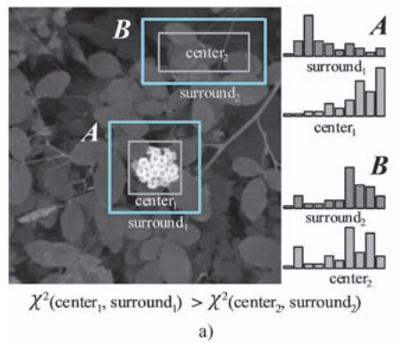

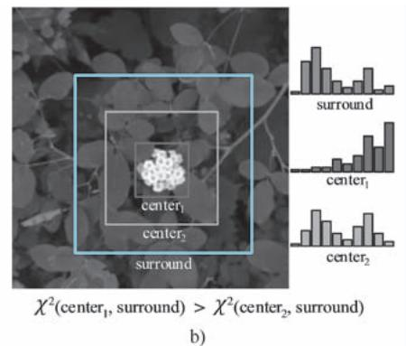  
●图 2-26 显著区域与非显著区域的中心-外围特征对比最显著中心区域示意a）显著区域与非显著区域的中心-外围特征对比 b）最显著中心矩形区域示意

$$
f _ {c s h} (x, I) = \sum_ {\left\{x ^ {\prime} \mid x \in R _ {x ^ {\prime}} ^ {*} \right\}} w _ {x x ^ {\prime}} \chi^ {2} \left(R _ {x ^ {\prime}} ^ {*}, \bar {R} _ {x ^ {\prime}} ^ {*}\right) \tag {2-51}
$$

式中， $w _ { x x ^ { \prime } } = \exp \big ( - 0 . 5 \sigma _ { x ^ { \prime } } ^ { - 2 } \big \| x { - } x ^ { \prime } \big \| ^ { 2 } \big )$ ）为基于空间位置构造的高斯衰减权重系数，其中 $\boldsymbol { \sigma } _ { x ^ { \prime } }$ 为其方差，在

LDSO 中设置其为 ${ \boldsymbol { R } } _ { x ^ { \prime } } ^ { * }$ 最大边长的 1/3；而这里所谓的“周边像素”，即定义为在当前像素 $x$ 周围，最显著中心矩形包含了像素 $x$ 的那些像素，该集合即记作上式中的$\{ x ^ { \prime } | x \in R _ { x ^ { \prime } } ^ { * } \ \}$ }。图2-27 为针对两个位置计算 CSH 特征的示意。其中，左右两图分别示意了 3 个周围像素和 4 个周围像素加权求和的情形。

CSD 特征为全局特征，其基本出发点为：图像上若一种颜色分布很广，则显著性目标就不太可能含有该种颜色。上述出发点非常容易理解，试想在漫漫黄沙中，远远的有一头棕色骆驼，大面积的黄沙自然不是关注的重点，反倒是占了较小区域的棕色骆驼吸引了眼球。因

  
a）

  
b)   
●图 2-27 CSH 特征计算示意

a）3 个周边像素对当前像素进行空间加权求和示意 b）4 个周边像素对当前像素进行空间加权求和示意

此，可以利用颜色的空间分布特征来表达显著性物体的全局特征。首先，LDSO 将图像的颜色分布表达为高斯混合模型（Gaussian Mixture Model，GMM），即有 $p ( \pmb { I } _ { x } ) = \sum _ { k = 1 } ^ { K } \pi _ { k } \mathcal { N } ( \pmb { I } _ { x } \mid \pmb { \mu } _ { k } , \pmb { \Sigma } _ { k } )$ ， 所谓GMM 模型，即认为图像上的颜色分布呈现出 $K$ 簇聚集，每一个颜色聚集都被建模为一个高斯分布，而整体的颜色分布为这些高斯分布的加权和。GMM 模型的参数为 $\{ \pi _ { k } , \pmb { \mu } _ { k } , \pmb { \Sigma } _ { k } \} _ { k = 1 } ^ { K }$ ，其中 $\pi _ { k }$ 、 ${ \pmb \mu } _ { k }$ 和 $\Sigma _ { k }$ 分别表示第 $k$ 个颜色高斯分量 （以下简称为 “颜色分量”）的权重、颜色均值向量以及协方差矩阵；$K$ 为全部聚集的个数。那么，某一个图像像素隶属于第 $k$ 个颜色分量的概率为

$$
p (k \mid I _ {x}) = \frac {\pi_ {k} \mathcal {N} \left(I _ {x} \mid \boldsymbol {\mu} _ {k} , \boldsymbol {\Sigma} _ {k}\right)}{\sum_ {k = 1} ^ {K} \pi_ {k} \mathcal {N} \left(I _ {x} \mid \boldsymbol {\mu} _ {k} , \boldsymbol {\Sigma} _ {k}\right)} \tag {2-52}
$$

LDSO 使用颜色的水平方差（horizontal variance） 和垂直方差（vertical variance） 来刻画某颜色在两个空间方向上的波动情况。其中，第 $k$ 个颜色分量水平方差的计算方法为

$$
V _ {h} (k) = \frac {1}{| X | _ {k}} \sum_ {x} p (k \mid I _ {x}) \cdot | x _ {h} - M _ {h} (k) | ^ {2} \tag {2-53}
$$

式中， $x _ { h }$ 为像素 $x$ 的水平坐标； $\begin{array} { r } { \vert X \vert _ { _ k } = \sum _ { x } p \big ( k | I _ { x } \big ) } \end{array}$ ）为所有隶属于第 $k$ 个颜色分量的总概率，在这里作为归一化因子； $M _ { h } ( k ) = \frac { 1 } { \mid \boldsymbol { \cal X } \mid _ { _ k } } \sum _ { x } \boldsymbol { p } ( k \mid \boldsymbol { \cal I } _ { x } ) \cdot \boldsymbol { x } _ { h }$ ，可以视为第 $k$ 个颜色分量在水平位置的分布均值，即表明第 $k$ 个颜色分量平均意义上出现在图像的第几列。按照上述定义，也可以很容易的得到颜色分量的垂直方差 $\textstyle V _ { \scriptscriptstyle v } ( k )$ ）。有了 $V _ { v } ( k )$ ），令 $V ( \boldsymbol { k } ) = V _ { h } ( \boldsymbol { k } ) + V _ { v } ( \boldsymbol { k } )$ ）作为颜色的综合空间方差。有了上述一系列铺垫，最后，定义图像的 CSD 特征为

$$
f _ {\mathrm {c s d}} (x, I) = \sum_ {k} P (k \mid I _ {x}) \cdot (1 - V (k)) \tag {2-54}
$$

在式 （2-54）中，不难看出 CSD 特征与颜色在全图的空间分布程度反相关，这与我们在前文所说CSD 特征的出发点一致。

到这里，我们对 LDSO 模型的讨论就告一段落了。LDSO 将显著目标检测视为有监督的二值分割问题，基于自己构造的大规模高精度数据集开展训练和测试，不难看出 LDSO 似乎已经不那么 “仿生”。至此，以 LDSO 为代表的显著目标检测逐渐变为一个纯粹的 CV 任务。纵观后续研究，绝大多数相关方向的模型也都按照这一模式开展。因此我们说 LDSO 掀起了视觉显著性检测方向的一个新的浪潮。

# 2. FT：频率调谐显著性区域检测

碧波上漂浮着的一片火红的枫叶，我们只要看一眼就能立即注意到它并且认出它，这是因为除了作为前景的枫叶与作为背景的水面之间存在着显著的颜色差异外，还因为枫叶有着明确的、独特的掌状形状，可以说是在 “掌形”及其围着的 “一团火红”两个因素的共同加持下，我们才投射下了注意力并产生了正确的认知。不难看出，在诸多视觉特征中，边缘特征是某物体能够 “称得上是该物体”的一类重要视觉特征。然而，很多显著性检测方法生成的显著性区域分辨率很低，边界不够清晰，可以说在物体边缘处是 “模棱两可，不清不楚”，尤其是很多显著目标检测被定义为一系列后续认知任务的基础任务，正如我们在上面枫叶的例子中所说的那样，掌状的形状是我们实现认知的一个关键因素，那么对显著物体边缘提取的完整性便对认知起着事关重要的作用。正是出于上述考虑，Achanta等[15] 学者在 2009 年的 CVPR 会议上提出了频率调谐显著性区域检测模型 （Frequency-tuned Salient

Region Detection，以下简称 “FT 模型”）。在文章中，Achanta 等几位学者首先从频率损失角度，逐个分析了 ITTI、GBVS 和 SR 等5 种经典显著性检测模型无法生成具有清晰边缘显著物体的原因，结论是一致的也是很好理解的，那就是这几种经典模型都涉及模糊和降采样操作，带有物体边缘的高频信息在这些操作中被大幅减弱。例如在 ITTI 模型中，构造了 9 个尺度的高斯金字塔 （第 0 尺度为原始图像），每个尺度金字塔图像都是在上一尺度图像上执行 1 / 2 降采样并进行模糊操作得到，在第 8 次降采样和模糊操作之后，空间频率的范围仅剩下 $[ 0 , \pi / 2 5 6 ]$ ]，物体边缘所蕴含的高频信息可以说已经损失殆尽。

既然原因已经明确，FT 便 “对症下药”，给出了相应的解决方案，即在显著特征提取的过程中有针对性地进行频率取舍，使得在大幅舍弃非显著性信息的同时，尽可能保留类似物体边缘这种重要的视觉信息。FT 首先对显著物体检测设定了三个目标㊀①：第一，大的显著性物体要突出显示；第二，显著物体的边缘要清晰；第三，需要抑制图像中的噪声。FT 采用带通滤波器（band pass filter）来达到上述三个目标。设 $\omega _ { l c }$ 和 $\omega _ { h c }$ 分别为带通滤波的低频和高频截断值，在上述 3 个目标的要求下，对带通滤波器的宏观设计策略为：为了保留大面积的具有低频信息的显著物体 （如图 2-28a 中 A 所示的枫叶），需要将 $\omega _ { l c }$ 设置到一个比较低的值 （为了达到目标 1 的要求）；为了保留显著物体边缘 （图 2-28a 中 B

所示的枫叶边界），则需要较多的保留图像中的高频信息，这就意味着 $\omega _ { l c }$ 的值需要设置得比较高（为了达到目标 2 的要求）；为了能够去除图像中的高频噪声，特别是具有一定模式的重复性噪声（如图2-28a 中，C 所示的重复性波浪线），需要将图像中的最高频率信息舍弃 （为了达到目标 3的要求）。综上所述，在图 2-28 的示例中，FT 要求针对图 2-28a 所示的原始输入图像，给出图2-28b 所示的理想显著物体检测结果作为输出。

  
a）

  
b)   
●图 2-28 FT 的理想显著物体检测结果示意a）原始输入图像示意 b）理想显著物体检测输出示意

与上文已经介绍过的 SUN-BU 模型类似，FT 也使用高斯差分（Difference of Gaussian，DoG） 滤波来实现带通滤波，并以此作为图像的显著性表示。对 DoG 滤波器的定义在式 （2-30）中已经给出，这里的在写法上稍有不同，所以我们对其再次给出如下

$$
\begin{array}{l} \operatorname {D o G} (x, y) = \frac {1}{2 \pi} \left(\frac {1}{\sigma_ {1} ^ {2}} \mathrm {e} ^ {- \frac {x ^ {2} + y ^ {2}}{\sigma_ {1} ^ {2}}} - \frac {1}{\sigma_ {2} ^ {2}} \mathrm {e} ^ {- \frac {x ^ {2} + y ^ {2}}{\sigma_ {2} ^ {2}}}\right) \tag {2-55} \\ = G (x, y, \sigma_ {1}) - G (x, y, \sigma_ {2}) \\ \end{array}
$$

式中， $\sigma _ { 1 }$ 和 $\sigma _ { 2 }$ 为 DoG 滤波器中用于进行高斯差分的两个标准差参数 $\sigma _ { 1 } { > } \sigma _ { 2 }$ ），而 DoG 带通滤波器的带通宽度正是由这两个参数的比值 $\rho { = } \sigma _ { 1 } / \sigma _ { 2 }$ 来控制。令 $\sigma _ { 2 } = \sigma$ ，则有 $\sigma _ { 1 } { = } \rho \sigma$ ，考虑 $N$ 个相邻窄带滤波器 （即标准差为 $\rho ^ { n + 1 } \sigma$ 和标准差为 $\rho ^ { n } \sigma$ 的高斯差分）的叠加可以表示为

$$
\begin{array}{l} \sum_ {n = 1} ^ {N} G (x, y, \boldsymbol {\rho} ^ {n + 1} \sigma) - G (x, y, \boldsymbol {\rho} ^ {n} \sigma) \\ = G (x, y, \rho^ {N} \sigma) - G (x, y, \sigma) \tag {2-56} \\ \end{array}
$$

式 （2-56）表示多个相邻窄带滤波器 DoG 滤波结果的叠加，等效于最后一个标准差 $\rho ^ { N } \sigma$ 与第一个标准差 $\rho \sigma$ 的高斯差分，简单说就是 “一个个做相邻窄带带通”等同于 “一次性从头到尾做一个宽带带通”。不难看出，我们在上文所说的带通滤波的两个截断值 $\omega _ { l c }$ 和 $\omega _ { h c }$ ，在这里分别由 $\sigma _ { 1 }$ 和 $\sigma _ { 2 }$ 来决定，为了达到上文讨论的宽带带通滤波的要求，我们只需要 $\sigma _ { 1 }$ 和 $\sigma _ { 2 }$ 的比例设置得足够悬殊即可。按照这一 “两头走极端”的思路，首先，为了保留显著物体的低频信息，FT 将 $\sigma _ { 1 }$ 推向无穷大，而以无穷大标准差的高斯滤波核对图像进行滤波，等价于求取整幅图像的平均值；然后，为了过滤高频噪声也处于计算成本的考量，FT 使用5 阶二项式滤波器 （binomial filter）[1，4，6，4，1]/16 来近似高斯滤波，从而将高频截断值 $\omega _ { h c }$ 控制在 $\pi / 2 . 7 5$ 。因此，给定图像 $\pmb { I }$ ，其显著性图的计算可以进一步表示为

$$
S (x, y) = \left\| I _ {\mu} - I _ {\omega_ {l e}} (x, y) \right\| \tag {2-57}
$$

式中， $I _ { \mu }$ 为图像 $\pmb { I }$ 的平均值 （考虑到是图像在多通道上处理，故这里为均值向量）； $\pmb { I } _ { \omega _ { h c } }$ 为对图像进行二项式滤波的结果； · 表示对向量的 L2 范数。经过上述推导，FT 对显著物体的检测过程变得十分清晰整洁：首先，输入的图像 “兵分两路”，一路对其开展逐通道的均值计算，构造均值图像 $I _ { \mu }$ ，另一路对其进行逐通道二项式滤波，得到原始图像的模糊版本 $\pmb { I } _ { \omega _ { h c } }$ ；然后逐像素计算均值图像与模糊图像颜色差值的二范数，得到最终的显著性图。上述步骤如图 2-29 所示。

  
●图 2-29 FT 模型的显著物体检测流程

到这里，我们对 FT 模型的介绍就结束了。回头看去，FT 模型的提出可谓是环环相扣：首先分析了5 种经典显著性检测模型无法有效保持显著物体边缘信息的原因———显著特征提取的过程中损失了过多的高频信息；然后就此提出了显著物体检测需要达到的 3 个目标，由此提出了基于带通滤波的显著物体检测思路，同时强调了带通滤波截断值需要满足的条件；随后，提出了基于 DoG 的带通滤波实现方法和最佳参数选择方案；最后推导出了一种形式非常简单，但是确实非常有效的显著物体检测方法。FT 模型的特点可以概括为：问题明确、理论深刻、实现简单。

# 3. SSO：先构造显著性图再分割的两阶段模型

对一幅图像进行显著物体检测一般包括两个步骤，第一步是遍历图像，为每一个像素预测一个显著性的分值；第二步是将具有显著性的区域与图像中其他场景分割开来。在 2010 年的 ECCV 大会上，Rahtu 等学者提出的显著物体检测方法 （以下简称 “SSO 模型”），实现针对静态图像或视频 （这里我们不对视频做展开讨论）中的显著物体检测[15][16] 。SSO 模型正是上述 “两步走”思路的忠实体现，其研究工作重点围绕两个问题展开：像素级的显著性度量问题以及显著物体分割问题。

首先是显著性度量（saliency measure）问题。上文介绍的 LDSO 模型以嵌套矩形的方式，通过提取“中心-外围”差异的 CSH 特征来表达图像的局部特征。CSH 特征的出发点在于：若某物体具有显著性，则其所在区域与其外围区域间会存在比较大的特征差异，反之亦反。与 LDSO 模型 “大框套小框”的思想类似，SSO 也是在图像中的局部矩形区域中讨论显著性问题：SSO 首先选择一个矩形区域

W （以下简称为 “外框”），在其内部嵌套一个内小的矩形区域 $K$ （以下简称为 “显著框”），将外框 $W$ 内但在显著框 $K$ 之外的部分称为 $B$ （即外框 $\mathbb { W }$ 中抠掉显著框 $K$ 剩下的镂空区域，以下简称为“背景框”）。SSO 认为所有位于显著框 $K$ 中的点都是具有显著性的，而背景框 $B$ 则表示了显著物体外围的局部上下文背景。设随机变量 $Z$ 表示 $W$ 中像素的取值，用来描述 W 中像素的分布。那么给定 $K$ 中的某一个像素 $x \in K$ ，其显著性度量被定义为如下的条件概率

$$
S _ {0} (x) = p (Z \in K | F (Z) \in Q _ {F (x)}) \tag {2-58}
$$

式中， $F ( x )$ ）表示对像素 $x$ 进行的某种特征提取，这里的特征可以是颜色、纹理等任意视觉特征； $Q _ { F ( x ) }$ 是特征分布直方图中 $F ( x )$ ）所在的柄，落入相同柄中的特征是相似特征。上述条件概率中，条件部分的 $F ( Z ) \in Q _ { F ( x ) }$ ”表达了像素 $Z$ 的特征 $F ( Z )$ ）与 $F ( x )$ ）落在同一个柄中，即特征相似； $Z \in K$ ”即表示像素位于显著框中。因此，上述条件概率定义表明：若像素 $x$ 上的特征与显著框中点的特征是相似的（与背景框中点的特征是不同的），则像素 $x$ 就是显著的。坦白地讲，上述以条件概率定义的显著性多少

有些让人感到费解，为了进一步说明，下面我们举两个 “极端”的例子：若 $p ( Z \in K ^ { | } F ( Z ) \in Q _ { F ( x ) } ) \approx 1$ ，则表明与显著框中像素特征相似的像素几乎还都处于显著框中，那么显著框相对背景框中的背景，自然是显著的。例如，在图 2-30a 的示例中，像素 $x$ 的特征是 “白花花”，而具有相似特征的像素 $Z _ { \scriptscriptstyle 1 }$ 和 $Z _ { 2 }$ 都落在显著框 $K$ 中；与之相反，若 $p ( Z \in K ^ { | } F ( Z ) \in$ ${ Q _ { F ( x ) } } ) \approx 0$ ，则有 $p ( Z \in B \mid F ( Z ) \in Q _ { F ( x ) } ) \approx 1$ ，这就意味着 “显著框中像素 $x$ 的特征与背景框中像素特征相似”这一事件几乎是必然事件，而我们说背景框中的像素全部是背景，这样一来，显著框与背景框几乎无差别，显著框中的像素自然就没有显著性。

  
a)

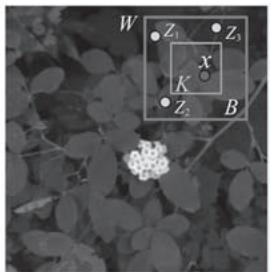  
b）  
●图 2-30 像素显著性的两种极端情况示例

a）像素 $x$ 的显著性约等于 1 的情况  
b）像素 $x$ 的显著性约等于 0 的情况

例如，在图2-30b 的示例中，像素 $x$ 的特征是 “绿油油”，而具有相似特征的像素 $Z _ { \scriptscriptstyle 1 }$ 、 $Z _ { 2 }$ 和 $Z _ { 3 }$ 都落在背景框 $B$ 中。简而言之，某一像素显著性的强与弱，取决于与它具有相似特征的像素是落在显著框 $K$ 中还是背景框 $B$ 中。

为了简化写法，下面分别用 $H _ { 0 }$ 、 $H _ { 1 }$ 和 $F ( x )$ ）表示 $Z \in K$ 、 $Z \in B$ 和 $F ( Z ) \in Q _ { F ( x ) }$ ，然后利用贝叶斯公式，将上述条件概率整理为

$$
S _ {0} (x) = p \left(H _ {0} \mid F (x)\right) = \frac {p \left(F (x) \mid H _ {0}\right) p \left(H _ {0}\right)}{p \left(F (x) \mid H _ {0}\right) p \left(H _ {0}\right) + p \left(F (x) \mid H _ {1}\right) p \left(H _ {1}\right)} \tag {2-59}
$$

不难看出，式 （2-59）定义的显著性表达了像素 $x$ 具有特征 $F ( x )$ ）的条件下其具有显著性的后验概率。式中， $p ( H _ { 0 } )$ ）和 $p ( H _ { 1 } )$ ）分别表示像素落入显著框和背景框的概率，显而易见，这两个概率之比即为显著框 $K$ 和背景框 $B$ 的面积之比，这就意味着如果我们使用相同尺寸比例的显著框和背景框，则上述两个概率为常数，这样会为计算带来极大的便捷性。我们令 $p ( H _ { 0 } ) = p _ { 0 }$ ，则有 $p ( H _ { 1 } ) = 1 - p _ { 0 }$ ，其中 $0 { < } p _ { 0 } { < } 1$ 为一事先给定的常数，如令 $\cdot p _ { 0 } = 0 . 2 5$ ，则 $p ( H _ { 0 } ) = 0 . 2 5$ ， $p ( H _ { 1 } ) = 0 . 7 5$ ； $p ( F ( x ) \mid H _ { 0 } )$ ）和 $p ( F ( x ) \mid H _ { 1 } )$ ）分别表示显著框和背景框中像素的特征分布情况，这两个分布的本质即为两个框中特征分布的直方图，

我们暂时先将二者分别记作 $h _ { K } ( x )$ ）和 $h _ { B } ( x )$ ）。图 2-31 为图像某位置显著性度量的计算示意。

考虑到特征提取函数 $F ( x )$ ）的微小改变都会改变 $S _ { 0 } ( x )$ ）的取值，因此为了提高鲁棒性，分别对 $\cdot h _ { \scriptscriptstyle K } ( x )$ ）和 $h _ { B } ( x )$ ）做基于高斯平滑的正则化处理，得到其对应的正则化直方图（normalized histogram）：令$h _ { K , \alpha } ( \boldsymbol { x } ) = \mathcal { N } ( \boldsymbol { g } _ { \alpha } ( \boldsymbol { x } ) \ast \boldsymbol { h } _ { K } ( \boldsymbol { x } ) )$ ），其中 $\displaystyle g _ { \alpha } ( x ) = c _ { \alpha } \mathrm { e } ^ { - \frac { x ^ { 2 } } { 2 \alpha } }$ 为以 $\alpha$ 为参数的高斯平滑函数； $\mathcal { N } ( f ( x ) ) = f ( x ) / \sum _ { x } f ( x )$ ）为归一化操作。按照相同的方式，也可以得到 $h _ { B } ( x )$ ）对应的正则化直方图 $h _ { B , \alpha } ( \boldsymbol { x } )$ ）。将上述这一切操作与符号替换带入式 （2-59），可以得到针对像素 $x$ 的显著性度

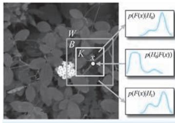  
●图 2-31 显著性度量计算示意

$$
S _ {\alpha} (x) = \frac {h _ {K , \alpha} (x) p _ {0}}{h _ {K , \alpha} (x) p \left(H _ {0}\right) + h _ {B , \alpha} (x) \left(1 - p _ {0}\right)} \tag {2-60}
$$

针对整幅图像的显著性图是通过在图像上滑动具有不同比例的窗口 $\mathbb { W }$ 来实现。在窗口的滑动过程中，在每个窗口位置构建显著框和背景框的特征直方图 $h _ { K } ( x )$ ）和 $h _ { B } ( x )$ ，并对其进行平滑处理得到对应的正则化直方图 $h _ { K , \alpha } ( \boldsymbol { x } )$ ）和$h _ { B , \alpha } ( x )$ ，然后再按照式 （2-60），在每个窗口位置和尺寸比例下 （SSO 采用的四个滑窗预设宽度和高度为{（10，25），（30，30），（50，50），（40，70）}），计算显著框 $K$ 中每个像素的显著性度量值 $S _ { \alpha } ( x )$ ）。当某一像素被多个滑窗重复计算时，其显著性值取多个显著性度量值中的最大值，例如，在图 2-32a 中，像素 $x$ 在滑窗$W _ { 1 }$ 和 $\mathbb { W } _ { 2 }$ 分别计算得到两个显著性度量 $S _ { 1 } ( x )$ ）和$S _ { 2 } ( x )$ ），则最终像素 $x$ 显著性度量为二者中的最

大者 $S ( x ) { = } \operatorname* { m a x } \left\{ S _ { 1 } ( x ) , S _ { 2 } ( x ) \right\}$ }。经过整幅图像的遍历后，每个像素位置都会产生一个显著性值，即得到了整幅图像对应的显著性图，如图2-32b 所示。

谈完显著性度量问题，下面我们来讨论显著物体分割问题，利用上文介绍的显著性度量方法遍历整幅图像，我们将得到一幅显著性图，但是显著性图中的每一个位置都表示一个显著性强度值，还不是真正意义的显著物体二值标签值，显著物体分割即基于已经得到的显著性图，构造显著物体的二值标签图。SSO 将上述显著物体分割任务正式描述为：给定一幅有 $N$ 个像素的图像 $\pmb { I }$ ，将其像素的序列记作 $\pmb { I } = ( \pmb { I } _ { 1 } , \cdots , \pmb { I } _ { N } )$ ），其中 $\boldsymbol { I } _ { n } = \big ( L _ { n } , a _ { n } , b _ { n } \big )$ ）为第 $n$ 个像素的 LAB 颜色分量。按照显著性度量计算方法，计算将得每个像素的显著性度量序列，记作 $\pmb { s } = \left( s _ { 1 } , \cdots , s _ { N } \right)$ ），其中 $s _ { n } \in \left[ 0 , 1 \right]$ ]为第 $n$ 个像素对应的显著性度量。显著物体分割任务即确定对应的二值标签序列 $\pmb { A } = \left( a _ { 1 } , \cdots , a _ { N } \right)$ ），其中 $a _ { n } \in \{ 0 , 1 \}$ }为第 $n$ 个像素对应的显著物体二值标签：取值为0 或1 分别表示该像素隶属于背景或是显著物体。SSO 基于原始

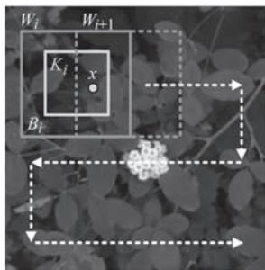  
a)

. 图 2-32 基于滑窗的逐位置显著性计算与得到的显著性图  
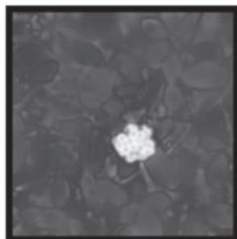  
a）基于滑窗的逐位置显著性计算示意  
b）全图遍历完毕后得到的显著性图

图像和已经获得的显著性图，使用 CRF 来完成上述显著物体二值标签的确定任务，之所以选择 CRF模型，是因为 CRF 能够很好地对像素之间的关系进行建模，这与显著物体检测实现对象级分割的目的是契合的。最终的显著物体二值标签使得以下能量函数达到最小值

$$
\begin{array}{l} E (A, I, s) = \sum_ {n = 1} ^ {N} w _ {S} U ^ {S} \left(a _ {n}, s _ {n}\right) + \\ \sum_ {n = 1} ^ {N} w _ {C} U ^ {C} \left(a _ {n}, I _ {n}\right) + \tag {2-61} \\ \sum_ {(n, m) \in \varepsilon} V \left(a _ {n}, a _ {m}, I _ {n}, I _ {m}\right) \\ \end{array}
$$

式 （2-61）中的能量函数一共包括三项，其中前两项只涉及单个像素位置 （像素下标只涉及 $n$ ），故为一元项， $w _ { s }$ 和 $w _ { C }$ 分别为这两项的系数；第三项涉及了相邻两像素之间的关系 （像素下标涉及 $n$ 和$m$ ），故为二元项。进一步，前两项中的 $U ^ { S } ( a _ { n } , s _ { n } )$ ）和 $\boldsymbol { U } ^ { C } ( a _ { n } , \pmb { I } _ { n } )$ ）分别被称为 “一元显著项” （unarysaliency term） 和 “一元颜色项” （unary color term），二者分别描述了二值显著标签 $a _ { n }$ 如何受到已有显著性度量 $s _ { n }$ 以及像素颜色 $\boldsymbol { I } _ { n }$ 的约束；第三项中的 $V ( a _ { n } , a _ { m } , I _ { n } , I _ { m } )$ ）综合考虑了相邻两像素之间颜色与二值标签的关系，要求两个空间位置接近的像素如果颜色接近，则二值显著性标签也要接近，故该项约束了二值显著性标签相对颜色和空间位置的一致性，从而进一步约束了显著物体检测结果的完整性。考虑到SSO 在原文中对上述3 项的具体表达式以及CRF 模型求解过程都很复杂，这里就不对其进行过多的展开。

SSO 将显著物体检测任务分为了显著性图的构建和显著物体分割两个阶段。在第一阶段首先明确

给出了显著性的计算方法，即所谓的 “显著性度量”，然后通过滑动窗口的全图像遍历得到整幅图像的显著性图。在第二阶段，通过构建实现二值显著物体分割的 CRF 模型，以图像颜色、显著性值以及像素空间位置关系作为约束，得到一个能够表达完整显著物体的二值分割结果。

# 4. CAS：上下文感知的显著性检测

一般来说，在一幅图像中，主要物体 （dominantobject）承载了图像绝大多数的视觉信息，也最能够吸引人的注意力，因此前文介绍的几种显著物体检测模型都只是以提取图像中的主要物体为目标，甚至要求背景剥离得越干净越好。然而，主要物体本身虽然重要，但是在某些特殊的应用场合，其所在上下文信息的重要性也不可小觑，特别是将显著性检测作为其他 CV 任务的前置任务时，对主要物体所处环境上下文提取的缺失可能会影响后续任务的开展，甚至会带来严重的偏差。例如，在图2-33 所示的三组 （按行分组）图像示例中，我们分别为每幅图像事先给出了

  
b)

●图 2-33 仅提取主要物体和提取主要物体及上下文的对比  
  
a）原始图像及文字描述 b）仅提取主要物体示意c）提取主要物体及上下文示意

一句话的描述，希望提取得到的显著区域 （黄色边界所示区域）能够与这些话产生最佳的匹配，其中第一列为原始图像及其对应的文字描述，第二列和第三列图像分别为只提取主要物体和同时提取主要物体及其上下文区域的示意。不难看出，在第一组例子中，由于句子中只描述了 “鸭子”，故只提取鸭子这一主要物体就足够表达句子所承载的信息。然而在第二组和第三组例子中，仅提取 “小姑娘”和 “花伞”这两个主要物体则远远不够，毕竟文字描述中除了 “小姑娘”还有 “野花丛”，除了 “花伞”还有 “落叶路”。

针对上述问题，Goferman 等[17] 几位以色列理工学院的学者在 2010 年的 CVPR 会议上提出了一种带有上下文感知的显著性检测方法 （Context-aware saliency detection，下文简称为 “CAS 模型” ）。CAS 的基本思想是：显著区域无论是在其所处的局部环境中还是全局环境中，都具有独特性。因此，CAS 不仅要检测出图像中的主要物体，还要提取那些具有显著性的背景信息作为围绕主要物体的上下文信息。具体来说，CAS 在实现显著区域检测时，综合考量了如下四点心理学基本原则：第一条原则，对局部低级特征的考量，如对像素的颜色、比度等低级视觉特征的提取与表达等；第二条原则，对全局显著性的考量，如显著特征不可能在整幅图像上频繁出现，因此需要考虑对频繁出现特征的抑制和对显著特征的保留；第三条原则，对视觉元素组织规则的考量，如要求具有显著性的像素应该是聚集在一起的，而不是分散在整幅图像上；第四条原则，对高级语义的考量，如图像上是否包括人脸信息等。

针对上述第一条原则和第三条原则，CAS 使用 LAB 颜色作为低级视觉特征，并综合考虑像素之间的空间位置，构造像素之间的差异计算方法 （也即 “不相似度”）为

$$
d \left(\boldsymbol {p} _ {i}, \boldsymbol {p} _ {j}\right) = \frac {d _ {\text {c o l o r}} \left(\boldsymbol {p} _ {i} , \boldsymbol {p} _ {j}\right)}{1 + c \cdot d _ {\text {p o s i t i o n}} \left(\boldsymbol {p} _ {i} , \boldsymbol {p} _ {j}\right)} \tag {2-62}
$$

式中， $\pmb { p } _ { i }$ 和 ${ \pmb p } _ { j }$ 分别为以像素 $i$ 和像素 $j$ 为中心的两个图像块，这些块中的像素已经从原始的 RGB 颜色表示转为 LAB 颜色表示，并且在此基础上进行了归一化和向量化处理， $d _ { \mathrm { c o l o r } } ( \pmb { p } _ { i } , \pmb { p } _ { j } )$ ）即为基于上述颜色向量计算得到的两个图像块之间的欧几里得距离。在 CAS 中，图像块的尺寸设定为 $7 \times 7$ 像素，并且在遍历的过程中进行 $50 \%$ 的重叠； $d _ { \mathrm { p o s i t i o n } } ( \pmb { p } _ { i } , \pmb { p } _ { j } )$ ）为像素 $i$ 和像素 $j$ 空间位置的欧几里得距离，其中像素坐标也进行了相对图像尺寸的归一化处理； $c$ 为事先给定的常数，在 CAS 中， $c = 3$ 。

针对第二条的全局显著性原则，CAS 基于当前图像块与图像上所有图像块之间的差异平均值构造当前图像块的全局显著性。在实际的显著性计算中，考虑到评估图像块 $\pmb { p } _ { i }$ 的显著性没有必要遍历全部图像块，故 CAS 仅选择与之最接近的 $K$ 个图像块计算平均差异，毕竟如果最接近的差异都很大，那当前图像块自然是显著的。除此之外，为了应对显著物体可能存在的尺度多样性，CAS 在多尺度图像上以及多尺度图像间开展显著性的计算，计算方法为

$$
S _ {i} ^ {r} = 1 - \exp \left\{- \frac {1}{K} \left(\sum_ {k = 1} ^ {K} \mathrm {d} \left(\boldsymbol {p} _ {i} ^ {r}, \boldsymbol {q} _ {k} ^ {r _ {k}}\right)\right) \right\} \tag {2-63}
$$

式中， $S _ { i } ^ { r }$ 即为在尺度 $r$ 下像素 i 所具有的显著性， $\pmb { p } _ { i } ^ { r }$ 为该尺度下像素 i 对应的图像块； $\pmb q _ { k } ^ { r _ { k } }$ k为尺度 $r _ { k }$ 下、第 $k$ 个与 $\pmb { p } _ { i } ^ { r }$ 具有最小差异的图像块，其中 $r _ { k } \in \{ r , r / 2 , r / 4 \}$ }，这就意味着CAS 在考虑某一尺度下的显著性时，会综合应用当前尺度及其后两个尺度的图像块特征。图 2-34 为跨尺度进行图像块差异计算的示意。

在多个尺度显著性 $S _ { i } ^ { r } ( r { = } 1 , \cdots , R )$ ）计算完毕后，最终的显著性即为所有尺度显著性的平均值，即为

$$
\bar {S} _ {i} = \frac {1}{R} \sum_ {r = 1} ^ {R} S _ {i} ^ {r} \tag {2-64}
$$

直到此处，我们只讨论了如果获得一幅常规的显著性图，还没有涉及任何的 “上下文感知”操作。心理学研究成果表明，在视觉场景获得注意的主要物体之外，也会获得一定的注意力投射，只不过这些位置获得注意力强度会变弱，且距离主要物体越远的位置，得到的注意越微弱。按照这一思路，CAS 在主要物体之外分配额外的注意力作为其上下文。首先，不难看出，上式中的 $\overline { { S } } _ { i }$ 是一个介于0 和1 之间的值，那么针对整幅图像对应的显著性图，CAS 以 0. 8 作为阈值再对其进行一次二值分割，将所有显著性取值大于 0.8 的像素视为能够获得视觉注

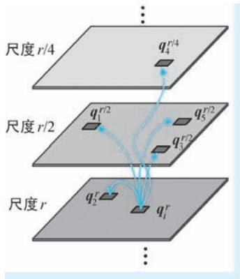  
●图 2-34 跨尺度图像块差异计算示意 $K = 5$ 的情形）

意力的像素 （attended pixel），也即隶属于主要物体的像素，上述操作等同于完成了显著物体检测。接下来，在已经获得主要物体之外的背景区域像素，利用距离反向加权对其进行显著性的计算，这些获得显著性赋值的背景像素将作为主要物体的上下文像素。上下文显著性的计算方法为

$$
\hat {S} _ {j} = \left\{ \begin{array}{l l} 0, & \bar {S} _ {i} \leqslant 0. 8 \\ \bar {S} _ {i} \cdot (1 - d _ {\text {f o c i}} (i, j)), & \bar {S} _ {i} > 0. 8 \end{array} \right. \tag {2-65}
$$

式中， $\hat { \boldsymbol { S } } _ { j }$ 即为上下文像素 $j$ 上赋予获得的显著性； $\overline { { S } } _ { i }$ 为按照式 （2-64）计算得到的、距离像素 $j$ 最近的主要物体像素的显著性值； $d _ { \mathrm { f o c i } } ( i , j )$ ）为像素 $i$ 和像素 $j$ 空间位置的欧几里得距离，其中两个像素位置也进行了相对图像尺寸的归一化处理。

对于第四条原则，CAS 只考虑了人脸信息，而且使用了现成的人脸检测算法。CAS 将人脸检测得到的人脸区域直接作为主要物体区域。关于这部分内容这里我们不做过多展开。

在很多 CV 应用中，都要求自动提取图像中的重要内容，并基于这些重要内容进行后续处理和分析，而这里所谓的 “重要内容”往往指的就是具有视觉显著性的内容，这就意味着图像显著性检测的结果直接影响到后续处理和分析的质量。在图2-33 中，我们已经举了若干例子说明显著物体上下文信息的提取对图像语义表达的重要性，为了进一步说明显著性检测对于后续 CV 任务的重要意义，我们下面再举一例。试想这样一幅画面：一匹斑马正在河边喝水，水中有一只鳄鱼正 “鳄视眈眈”准备偷袭斑马。画面最合理的含义应该是 “一条鳄鱼准备袭击斑马”或 “危险正在逼近斑马”等。然而，如果我们按照视觉显著性仅仅提取了斑马，那么得到的图像就只能表达 “一匹斑马”的含义，而 “一匹斑马”所携带的语义非常多，甚至可以联想出 “悠闲自得” 的画面，这与原始画面所给人传达的紧张、窒息的情绪相比可谓大相径庭。但是，如果我们提取的显著区域除了斑马这一主要物体，还涵盖了鳄鱼这一上下文信息，那么得到图像所携带的语义就能够更加忠实的表现图像的原本含义。经过上文的分析我们不难发现，CAS 的上下文感知机制在类似上述 CV 应用中有着巨大的优势。Goferman 等学者在文末也给出了 CAS 的两个典型的应用场景：图像重定向（image retargeting）和拼贴画生成（collage creation）。其中，图像重定向根据图像内容的重要程度选择性地去除图像的部分内容，以满足

对图像不同尺寸需求，简单说就是 “取图像之精华，去图像之糟粕，变图像之尺寸”。而拼贴画生成是指从一系列图像中抽取重要内容，将重要内容以自然、有机的方式融合在一起形成一幅新的图像。这一技术在海报生成、艺术画创作等应用中非常实用，例如，微软于2008 年发布的相册工具 AutoCol-lage，允许用户将相册中的多张照片融合在一起，其背后使用的就是自动拼贴画生成技术。无论是图像重定向还是拼贴画生成，都是以显著性检测作为第一个处理步骤的，也正是由于 CAS 能够在提取主要物体的同时能够兼顾到其上下文信息，使得其能够更好地抓住图像的内容主旨，因此在上述两项任务中均有着不俗的表现。

# 5. HC 与 RC：基于全局对比度的显著性检测

俗话说 “显著不显著是比出来的”。因此有很多显著性检测算法都是通过对比的方式来获得显著像素或显著物体。但是，以对比的方式开展显著性检测，至少要面对两个关键问题：拿什么比？怎么比？前者涉及用什么颗粒度看待图像问题，而后者则代表了如何度量对比度的问题。2011 年，程明明老师[18] 团队在 CVPR 会议上发表了 《基于全局对比的显著区域检测》，在其中提出了基于直方图的对比度（Histogram-based Contrast，HC） 和基于区域的对比度（Region-based Contrast，RC） 一对全局显著性对比方法的 “并蒂莲”。对于第一个 “拿什么比”的问题，上述两种方法给出的答案分别是拿像素颜色和拿区域颜色比；而对于第二个 “怎么比”的问题，两种给出的答案均是比全局对比度。

我们首先介绍 HC 方法。HC 是一种在颜色统计量之间构造的对比方法，该方法评估了图像每一个像素在颜色方面是否具有全局显著性。对于像素 $I _ { \phantom { } _ { x } }$ ，假设其对应的颜色为 $\boldsymbol { c } _ { l }$ ，则其显著性 $S _ { x }$ 也即颜色$\boldsymbol { c } _ { l }$ 的显著性，被定义为以该颜色出现频率作为权重对颜色距离之间进行的加权线性组合，即有

$$
S _ {x} = S \left(\boldsymbol {c} _ {l}\right) = \sum_ {j = 1} ^ {n} f \left(\boldsymbol {c} _ {j}\right) \cdot D \left(\boldsymbol {c} _ {l}, \boldsymbol {c} _ {j}\right) \tag {2-66}
$$

式中， $f ( \pmb { c } _ { j } )$ ）为颜色 $\boldsymbol { c } _ { l }$ 在全图所有颜色中出现的频率；$n$ 为图像所有不同颜色的数量； $D ( \pmb { c } _ { l } , \pmb { c } _ { j } )$ ）为 LAB 颜色空间中，颜色 $\boldsymbol { c } _ { l }$ 与 $c _ { j }$ 之间的距离度量。不难看出，HC方法实际上是将一个个像素的全局显著性转换到了颜色空间进行，其计算的是某一种颜色的显著性。图2-35 示意了两幅图像及其对应的7 柄颜色直方图示意。以其中左图中的像素 $x _ { 1 }$ 为例，其颜色为 $\pmb { c } _ { 2 }$ ，则按照式 （2-66），可以计算其显著性为： ${ { S } _ { { { x } _ { 1 } } } } = S (  { { { \pmb { c } } _ { { } _ { 2 } } } } ) =$ $0 . 5 9 D \left( \textit { \textbf { c } } _ { 2 } , \textit { \textbf { c } } _ { 1 } \right) + 0 . 1 0 D \left( \textit { \textbf { c } } _ { 2 } , \textit { \textbf { c } } _ { 3 } \right) + 0 . 0 5 D \left( \textit { \textbf { c } } _ { 2 } , \textit { \textbf { c } } _ { 4 } \right) +$ $0 . 0 3 D ( \pmb { c } _ { 2 } , \pmb { c } _ { 5 } ) + 0 . 0 2 D ( \pmb { c } _ { 2 } , \pmb { c } _ { 6 } ) + 0 . 0 1 D ( \pmb { c } _ { 2 } , \pmb { c } _ { 7 } )$ 。

  
●图 2-35 图像及其颜色直方图示意

HC 方法计算显著性的原理非常简单，但是在实际操作时需要考虑计算量问题。按照式 （2-66），假设图像的像素数为 $N$ ，颜色总数为 $n$ ，则其时间复杂度为 $O \left( N \right) + O \left( n ^ { 2 } \right)$ ，试想当颜色数量极大时（如真彩色的 $\boldsymbol { | 2 5 6 ^ { 3 } }$ 种颜色），计算量将会多么惊人，因此需要对颜色直方图中的颜色数量进行合理的控制。在原文中，颜色数量一般设置为85 种，这就意味着用图像中最具代表的85 种颜色来量化原图像。除此之外，考虑到颜色的量化过程中，很接近的两种颜色很可能由于硬性截断而被分配到不同直方图柄中，从而导致显著性结果的计算偏差。为此，HC 对上述颜色显著性的定义进行了改进，其替换为

近似颜色所具有显著性的加权平均，这种加权平均的实质就是某种意义的平滑处理。针对某颜色 $c$ ，改进版颜色显著性的定义为

$$
S ^ {\prime} (\boldsymbol {c}) = \frac {1}{(m - 1) T} \sum_ {i = 1} ^ {m} (T - D (\boldsymbol {c}, \boldsymbol {c} _ {i})) \cdot S (\boldsymbol {c} _ {i}) \tag {2-67}
$$

式中， $T = { \sum } _ { i = 1 } ^ { m } { \cal D } ( \pmb { c } , \ \pmb { c } _ { i } )$ ）为颜色 $c$ 与其最接近的 $m$ 个颜色的距离之和，HC 中，取 $m = 4 / n$ ；由于$\begin{array} { r } { \sum _ { i = 1 } ^ { m } \bigl ( T - D ( \pmb { c } , \pmb { c } _ { i } ) \bigr ) = \left( m - 1 \right) T } \end{array}$ ， 故上式前添加了 $1 / [ \left( m - 1 \right) T ]$ ]的归一化因子。

HC 方法以像素为最小单位计算显著性，而 RC 方法则以区域为单位计算显著性，接下来我们讨论RC 方法。在 RC 方法中，首先对图像进行分割，然后对分割得到的区域建立颜色直方图，针对每一个区域 $r _ { k }$ ，其显著性定义为该区域颜色与图像其他所有区域颜色的对比度，有

$$
S \left(r _ {k}\right) = w _ {s} \left(r _ {k}\right) \sum_ {r _ {k} \neq r _ {i}} w \left(r _ {k}, r _ {i}\right) \cdot D _ {r} \left(r _ {k}, r _ {i}\right) \tag {2-68}
$$

式中， $D _ { r } ( r _ { k } , r _ { i } )$ ）为区域 $r _ { k }$ 与 $r _ { i }$ 之间的颜色距离度量， $w \left( r _ { k } , r _ { i } \right)$ ）为其权重系数。在 RC 中， $w \left( r _ { k } , r _ { i } \right) =$ $\exp ( - D _ { s } ( r _ { k } , r _ { i } ) / \sigma _ { s } ^ { 2 } ) \cdot N _ { i }$ ，综合表达两区域间的空间位置关系和面积两个因素㊀①，其中， $D _ { s } \left( r _ { k } , r _ { i } \right)$ ）区域 $r _ { k }$ 与 $r _ { i }$ 之间的空间距离， $N _ { i }$ 为区域 $r _ { i }$ 中的像素数； $\sigma _ { s }$ 为控制空间权重的系数， $\sigma _ { s }$ 越大，则越倾向于将距离较远区域纳入显著性的计算； $w _ { s } ( r _ { k } ) = \exp ( - 9 d _ { k } ^ { 2 } )$ ）为区域 $r _ { k }$ 的中心偏差因子，其中 $d _ { k }$ 为区域 $r _ { k }$ 中像素距离图像中心的平均距离，该因子使得越靠近图像中心的区域越具有高的显著性。式 （2-68）中，区域颜色距离度量 $\cdot D _ { r } ( r _ { k } , r _ { i } )$ ）的定义为

$$
D _ {r} \left(r _ {k}, r _ {i}\right) = \sum_ {v} ^ {n _ {k}} \sum_ {u} ^ {n _ {i}} f \left(\boldsymbol {c} _ {k, v}\right) f \left(\boldsymbol {c} _ {i, u}\right) D \left(\boldsymbol {c} _ {k, v}, \boldsymbol {c} _ {i, u}\right) \tag {2-69}
$$

式中， $n _ { k }$ 和 $n _ { i }$ 分别为区域 $r _ { k }$ 与 $r _ { i }$ 中的颜色个数； $f ( \pmb { c } _ { k , v } )$ ）和 $\cdot f ( \pmb { c } _ { i , u } )$ ）分别表示在上述两区域中，第 $v$ 种和第$u$ 种颜色出现的频率，而 $D ( \pmb { c } _ { k , v } , \pmb { c } _ { i , u } )$ ）表示这两种颜色的距离度量。上述颜色频率和颜色距离度量与HC 方法中相关的概念是相同的：在 HC 方法中，式 （2-66）给出了两种颜色之间的对比，而区域中的颜色可能是多样的，故式 （2-69）给出的区域间颜色度量定义为两区域所有颜色两两对比的总和。图2-36 为 RC 方法中计算区域全局对比度的示意。

  
a）

b)   
●图 2-36 区域的全局对比度计算示意 （以区域 $r _ { 1 }$ 为例）  
  
a）原始图像 b）分割图像及区域全局对比度计算示意

在获得显著性检测结果之后，几位学者将得到的显著性图与著名的 GrabCut[19] 图像前景分割算法相结合，结合得到的新方法被称为 “SaliencyCut”。SaliencyCut 借助 GrabCut 提升了自身对显著物体的提取质量，GrabCut 也在显著性图的赋能下降低了对人工交互的依赖，同时也克服了人工框选可能引入的噪声干扰，可以说二者是强强联合，相互成就。下面我们首先简要回顾一下 GrabCut 方法。GrabCut 是一种交互式前景分割算法，用户只需在前景物体外围简单勾选一个矩形区域，算法即自动完成区域内的前景目标提取，与手工抠图需要精细勾画前景物体边界相比，GrabCut 具有很高的自动化程度。GrabCut 是一种基于 “图割”（GraphCut）的交互式图像分割技术，其以图结构存储区域和边界信息，利用 “最大流/最小割” （Max-flow / Min-cut）的思路，通过迭代的方式在图上 “切出最优的一刀”以区分前景和背景。在 GrabCut 中，以 “三元图”（trimap） $T = \big ( \mathit { T } _ { \mathit { B } } , \mathit { T } _ { \mathit { U } } , \mathit { T } _ { \mathit { F } } \big )$ ）来表达图像的前景和背景信息，其中 $T _ { \scriptscriptstyle B }$ 、 $T _ { \scriptscriptstyle F }$ 和 $T _ { \mathit { v } }$ 分别表示背景、前景和 “模棱两可”的未知区域，在GrabCut 执行过程中的任意时刻，图像中的每个像素都属于 $T$ 中的某一种情形。

在初始化阶段，SaliencyCut 首先以某一阈值对 RC 方法得到的显著性图进行二值化处理，将其中显著性大于阈值的最大联通区域作为显著物体的初始标注 （如图2-37d 所示），这样一来 GrabCut 要求手工勾选矩形大致范围的环节都可以省略了。接下来，按照上述二值显著物体标注构造初始三元图：位于显著物体标注内的位置标注为 $T _ { \mathit { v } }$ ，即表示未知，其余部分标注为 $T _ { \scriptscriptstyle B }$ ，即表示背景 （如图2-37e 所示）。而标准 GrabCut 方法以手工框选矩形区域为界，内部为未知区域，外部为背景区域 （如图 2-37c所示），显然，与标准 GrabCut 相比，SaliencyCut 构造的初始三元图与前景物体的真实区域更加契合，可以说为后续分割操作打下了一个好基础。

  
a

  
b)

  
d)

●图 2-37 标准 GrabCut 与 SaliencyCut 初始三元图的对比示意  
  
a）原始图像 b）用户初始矩形标注 c）GrabCut 初始三元图 d）显著物体初始标注 e）SaliencyCut 初始三元图（注：在图 c 和图 e 所示的三元图中，彩色区域为背景区域，透明区域为未知区域）

在分割阶段，SaliencyCut 利用多轮 GrabCut 分割不断对显著物体的提取结果进行优化。在每轮GrabCut 迭代执行完毕后，SaliencyCut 都针对 GrabCut 输出的三元图做膨胀和腐蚀两种形态学操作，以获得新的三元图作为下一轮迭代的初值。其中，将膨胀区域以外的区域设置为背景，而将腐蚀区域以内的区域设置为前景区域。上述形态学操作的目的在于：膨胀操作用来开辟更多的未知区域，给后续GrabCut 分割提供更广阔的搜索空间；腐蚀操作减小了前景的面积，以更加 “保守但可靠”的方式为后续 GrabCut 分割提供前景标注。通过初值设定和迭代改进，SaliencyCut 在显著性检测与 GrabCut 分割的合力作用下，得到更加精准的显著目标检测提取结果。

到这里，对程明明老师团队工作的主要内容就基本讨论完毕了，简单来说，我们介绍的核心内容有三个：HC、RC 和 SaliencyCut。当然，在程明明老师的原文中，还讨论了诸多基于显著性检测的下游 CV 应用，内容十分丰富详实，不过限于篇幅和主题限制，我们这里不再详细展开介绍。

# 6. SF：基于超像素分割的显著性滤波

还是 “拿什么比”和 “怎么比”两个问题，有学者也给出了掷地有声的回答：拿超像素比，用对比滤波的方式比———2012 年，Perazzi 等[20] 来自迪士尼研究院和斯坦福大学的学者们提出了显著性滤波（Saliency Filters，SF）方法，该方法基于对比滤波实现针对图像显著区域的检测。具体来说，SF 的工作包括了图像抽象、颜色显著性计算、空间分布计算和显著性赋值四个基本步骤。

图像抽象（image abstraction）将图像分解为不同的基础元素，这些基础元素保持了原始图像的必

要结构信息，但是忽略了图像噪声等不希望得到的琐碎细节。在 SF 中，采用超像素（superpixels）分割技术实现对图像的抽象。超像素分割指的是将具有相似纹理、颜色、亮度等特征的相邻像素构成具有一定视觉意义的不规则像素块，这些像素块在后续处理中被视为不可再分元素，就和一个个像素一样，因此叫作“超像素”。在 CV 领域应用最为广泛的超像素分割方法莫过于 Achanta 等于 2010 年提出的简单线性迭代聚类（Simple Linear Iterative Clustering， SLIC ） 方 法[21] ，SLIC 分 割 按 照 指 定 的 超 像 素 个 数 和 紧 凑 度（compactness）参数，通过局部聚类的方式生成超像素，具有思想简单、高效便捷的优点，在各类 CV 应用中被广泛使用，SF 也是用基于 SLIC 的超像素分割作为其图像抽象方法。SLIC 分割处理的像素为 5 维向量表示 $( L , a , b , x , y )$ ），其中 $( L , a , b )$ ）为原始 RGB 颜色空间变换到 LAB 颜色空间中的颜色向量； $( x , y )$ ）为像素的坐标位置。图2-38 为基于 SLIC 的图像超像素分割示意。图中三列图像分别为原始图像以及超像素数为 250 和500 的超像素分割结果 （分割紧凑度参数设置均为15）。

  
a）

  
b)

●图 2-38 基于 SLIC 的图像超像素分割示意  
  
a）原始图像 b）超像素数为 250 的 SLIC 分割结果c）超像素数为 500 的 SLIC 分割结果

颜色显著性计算基于图像抽象环节得到的超像素开展，用来评估超像素在颜色方面的显著性。SF的显著性为全局显著性：对于超像素 i，给定其 LAB 空间表示的颜色向量 $c _ { i }$ （超像素颜色即为超像素对应像素块中的颜色平均值）及其位置 $\pmb { p } _ { i }$ ，其显著性定义为该超像素与其他所有超像素 $j$ 之间差异的总和，有

$$
C _ {i} = \sum_ {j = 1} ^ {N} \| \boldsymbol {c} _ {i} - \boldsymbol {c} _ {j} \| ^ {2} \cdot w (\boldsymbol {p} _ {i}, \boldsymbol {p} _ {j}) \tag {2-70}
$$

式中， $N$ 为分割得到所有超像素的个数； · 表示对向量的 L2 范数； $w \left( p _ { i } , p _ { j } \right)$ ）为超像素 $i$ 和 $j$ 所在空间位置之间的某种度量，下文中将其简记为 $w _ { i j } ^ { \left( p \right) }$ ）。按照式 （2-70） 所示的显著性计算方法计算全部超

像素的显著性，其时间复杂度为 $O ( N ^ { 2 } )$ （需要为 $N$ 个超像素计算显著性，而在计算每个超像素显著性的时候还需要遍历所有超像素）。为了简化计算，SF 使用高斯滤波的近似方式将超像素显著性计算的时间复杂度降低到 $O ( N )$ ）。首先对式 （2-70）中的 L2 范数进行展开，有

$$
\begin{array}{l} C _ {i} = \sum_ {j = 1} ^ {N} \left\| \boldsymbol {c} _ {i} - \boldsymbol {c} _ {j} \right\| ^ {2} w _ {i j} ^ {(p)} \tag {2-71} \\ = \left\| \boldsymbol {c} _ {i} \right\| ^ {2} \sum_ {j = 1} ^ {N} w _ {i j} ^ {(p)} - 2 \boldsymbol {c} _ {i} ^ {\mathrm {T}} \left(\sum_ {j = 1} ^ {N} \boldsymbol {c} _ {j} w _ {i j} ^ {(p)}\right) + \sum_ {j = 1} ^ {N} \left\| \boldsymbol {c} _ {j} \right\| ^ {2} w _ {i j} ^ {(p)} \\ \end{array}
$$

式中，SF 将 $\mathbf { \dot { \cdot } } w _ { i j } ^ { ( p ) }$ 构造为高斯权重 $\mathbf { \nabla } : w _ { i j } ^ { ( p ) } = \frac { 1 } { z _ { i } } \mathrm { e x p } \bigg ( - \frac { 1 } { 2 ~ { \sigma } _ { p } ^ { 2 } } \big \| { \pmb p } _ { i } - { \pmb p } _ { j } \big \| ^ { 2 } \bigg )$ ，其中 $\sigma _ { { } _ { p } }$ 为控制空间作用范围的标准差参2 σ 2p数，在 SF 中， $\sigma _ { { } _ { p } } = 0 . 2 5$ ； $z _ { i }$ 为归一化因子，使得 $\sum _ { j = 1 } ^ { N } w _ { i j } ^ { ( p ) } = 1$ 。 在式 （2-71）中，展开形式包括了三项：第一项仅剩下 $\left\| \boldsymbol { c } _ { i } \right\| ^ { 2 }$ ，即 LAB 颜色向量分量的平方和；第二、三项等价于将 $\cdot w _ { i j } ^ { ( p ) }$ ）视为高斯滤波核、分别对 $c$ 和 $\| c \| ^ { 2 }$ 开展的平滑滤波。图2-39c 为针对4 幅示例图像得到的超像素颜色显著性计算结果。

●图 2-39 SF 显著性检测各阶段结果示意  
  
a）原始图像 b）超像素分割 c）颜色显著性 d）空间分布 e）超像素综合显著性 f）逐像素显著性

空间分布计算通过评估特征在空间上的分布情况来表达超像素在空间上的显著性：特征在空间上分布紧凑的对象，相较于特征分布分散的对象会更加显著。绝大多数显著性检测方法也都将特征的空间分布作为显著性评估的一个重要因素，例如，在前文介绍的 LDSO 模型中，CSD 特征即用颜色的水平方差和垂直方差表示颜色特征的空间分布。SF 空间分布的计算方法几乎可以 “照搬”颜色显著性的计算方法，只不过颜色显著性用空间为颜色差异加权，而空间分布则为颜色、位置差异加权。针对超像素 i，定义其空间分布为

$$
D _ {i} = \sum_ {j = 1} ^ {N} \left\| \boldsymbol {p} _ {j} - \boldsymbol {\mu} _ {i} \right\| ^ {2} \cdot w \left(\boldsymbol {c} _ {i}, \boldsymbol {c} _ {j}\right) \tag {2-72}
$$

式中， $w ( { \pmb { c } } _ { i } , { \pmb { c } } _ { j } ) = \frac { 1 } { z _ { i } } \mathrm { e x p } \bigg ( - \frac { 1 } { 2 { \pmb { \sigma } } _ { c } ^ { 2 } } { \| { \pmb { c } } _ { i } - { \pmb { c } } _ { j } { \| { \vphantom { \bigg { ( } } } ^ { 2 } \bigg ) }  \bigg . \bigg . }$ 为使用超像素颜色 $c _ { i }$ 和 $c _ { j }$ j构造的高斯权重，其中参数 $\sigma _ { c } = 2 0$ ，

下文将其简记为 $w _ { i j } ^ { ( c ) }$ ，且有 $\sum _ { j = 1 } ^ { N } w _ { i j } ^ { ( c ) } = 1$ N ； $\pmb { \mu } _ { i } = \sum _ { j = 1 } ^ { N } \pmb { p } _ { j } \ : w _ { i j } ^ { ( c ) }$ 表示颜色 $c _ { i }$ 的加权平均位置。依照颜色显著性计算的模式，对上式进行类似的展开，得到

$$
\begin{array}{l} D _ {i} = \left\| \boldsymbol {p} _ {j} - \boldsymbol {\mu} _ {i} \right\| ^ {2} w _ {i j} ^ {(c)} \tag {2-73} \\ = \sum_ {j = 1} ^ {N} \left\| \boldsymbol {p} _ {j} \right\| ^ {2} w _ {i j} ^ {(c)} - 2 \boldsymbol {\mu} _ {i} ^ {\mathrm {T}} \left(\sum_ {j = 1} ^ {N} \boldsymbol {p} _ {j} w _ {i j} ^ {(c)}\right) + \left\| \boldsymbol {\mu} _ {i} \right\| ^ {2} \sum_ {j = 1} ^ {N} w _ {i j} ^ {(c)} \\ \end{array}
$$

式中，展开得到三项中的第二项，按照 ${ \pmb \mu } _ { i }$ 的定义， $\sum _ { j = 1 } ^ { N } { p _ { j } w _ { i j } ^ { ( c ) } }$ 就是 ${ \pmb \mu } _ { i }$ ，因此第二项中的 $2 \pmb { \mu } _ { i } ^ { \operatorname { T } } \big ( \sum _ { j = 1 } ^ { N } \pmb { p } _ { j } \pmb { w } _ { i j } ^ { ( c ) } \big )$ ）$\mathbf { \mu } = \mathbf { \mu } _ { \pmb { \mu } _ { i } \pmb { \mu } _ { i } } = \| \mathbf { \mu } _ { \pmb { \mu } _ { i } } \| ^ { 2 }$ ； 第三项中，由于 $\sum _ { j = 1 } ^ { N } w _ { i j } ^ { ( c ) } = 1$ ， 故就剩下 $\| \pmb { \mu } _ { i }$ 2 。因此式 （2-73）可以进一步简化为 $D _ { i } = \sum _ { j = 1 } ^ { N } \| \pmb { p } _ { j } \| ^ { 2 } w _ { i j } ^ { ( c ) } - \| \pmb { \mu } _ { i } \| ^ { 2 }$ ， 其中的二项分别可以视为以滤波核 $\cdot w _ { i j } ^ { ( c ) }$ ）分别对 $\| p _ { j }$ 2 和 $\pmb { p } _ { j }$ 开展的高斯平滑滤波。图 2-39d 为针对四幅示例图像得到的特征空间分布计算结果。针对每一个超像素，计算得到其颜色显著性 $C _ { i }$ 和空间分布 $D _ { i }$ 后，定义其综合显著性为

$$
S _ {i} = C _ {i} \cdot \mathrm {e} ^ {- k \cdot D _ {i}} \tag {2-74}
$$

式中， $k$ 为指数的缩放系数，在 SF 中取 $k = 6$ 。图2-39e 为针对四幅示例图像得到的超像素综合显著性结果。

上述几个环节得到的显著性图是超像素级别的，显著性赋值即将超像素的 “大线条”显著性赋予原始像素，以提高显著性表达的分辨率，完成从抽象回到具体的过程。SF 将像素级的显著性定义为其周边超像素显著性的加权线性组合，即

$$
\widetilde {S} _ {i} = \sum_ {j = 1} ^ {N} w _ {i j} \cdot S _ {j} \tag {2-75}
$$

式中，wij $w _ { i j } = { \frac { 1 } { z _ { i } } } \mathrm { e x p } { \bigg ( } - { \frac { 1 } { 2 } } ( \alpha \parallel \mathbf { c } _ { i } - \mathbf { c } _ { j } \parallel ^ { 2 } + \beta \parallel p _ { i } - p _ { j } \parallel ^ { 2 } ) { \bigg ) }$ ，为综合考虑周边超像素与当前像素的颜色和位置关系的高斯权重系数， $\alpha$ 和 $\beta$ 分别为上述两种因素的控制系数，在 SF 中，取 $\alpha { = } \beta { = } 1 / 3 0$ 。看到高斯权重，按照我们在上文介绍的方法，容易想到上述加权求的计算自然也可以表达为高斯滤波，这是继颜色显著性计算和空间分布计算之后，SF 第三次利用高斯滤波来简化计算。图 2-39f 示意了将超像素显著性分配给原始像素的效果。

到这里，我们对 SF 模型的讨论就结束了，不得不说 SF 显著性检测的 “四步走”方法非常清晰明确，可谓先由具体到抽象，在抽象算完再回到具体。尤其是在对比计算环节，SF 将对比计算表达为高斯滤波，可以说是非常巧妙的，正是这一原因，方法被命名为 “显著性滤波”。

# 7. HSD：使用层级架构的显著物体检测

生活常识告诉我们，在不同尺度上观察某一幅图像，能够引起我们注意的内容也会不同，可谓“远看是美女，近看有雀斑”。除此之外，图像上的显著物体有大有小，充满了随机性。这都意味着在单一尺度分析图像显著特征容易产生 “横看成岭侧成峰，远近高低各不同”的偏差。特别是当某些显著物体内部也存在很大的差异时，上述问题就变得更加明显而棘手。例如，图像上有一个穿黄衣服黑裤子的人，单看其上身或下身，两个区域都可以算作是显著区域。然而，正如格式塔法则所强调的认知具有完整性那样，从我们的整体认知视角，整个人才是真正意义的显著物体，而非其具有高对比度的局部区域。正是出于对上述问题的考量，在 2013 年的 CVPR 会议上，Qiong Yan 等[22] 四位来自香港

中文大学的学者提出了层级显著物体检测（Hierarchical Saliency Detection，HSD）框架。HSD 显著物体检测框架基于多尺度分割得到的图像区域提取多尺度 “显著性线索” （saliency cues）㊀①，并构造层级的树状结构表达不同尺度下显著性之间的关系，通过最小化能量函数实现最终的显著性的推断，从而实现高质量的显著物体检测。HSD 进行显著物体检测的整体流程包括多尺度图像分割、多尺度显著性线索提取和层级显著性推断三大步骤，如图2-40 所示。

  
●图 2-40 HSD 模型的显著物体检测流程

多尺度图像分割步骤用来形成不同尺度下显著性的基本计算单元。HSD 在 CIELUV 颜色空间，采用基于分水岭（watershed）的图像分割技术进行多尺度分割，形成三个尺度的分割图，分别记作 $L _ { 1 }$ 、$L _ { 2 }$ 和 $L _ { 3 }$ ，其中 $L _ { 1 }$ 和 $L _ { 3 }$ 分别为最精细和最粗略尺度的分割图。在 HSD 中，每个粗略尺度分割图都是在下层精细尺度分割图上以相邻区域合并方式得到，最精细的 $L _ { 1 }$ 层则产生于过分割 （over-segmentation）得到初始分割的区域合并操作。在区域和并过程中，HSD 采用了 “区域尺度” （region scale）作为区域是否需要合并的判据：若某区域的尺度小于某阈值，则将其与相邻区域合并。HSD 将区域尺度定义为区域能够包含的最大内接正方形的边长，以区域尺度因子指导区域合并，能够防止产生过于细小的区域，从而更好地保证了显著物体的完整性。试想如图2-41 所示的场景，草原上站着一匹斑马，自然我们期望提取的显著物体是斑马。但是斑马身上的黑白相间条纹区域，每一个区域相比其邻接区域都

具有极大的差异，因此，这些条纹状区域很容易成为显著性评估的基本计算单元。而按照 HSD 区域尺度的定义，这些具有 “细长条”形状的区域都具有很小的尺度，故都倾向于与相邻区域合并。这样一来，显著性的分析单元更倾向于是整匹斑马，而不是斑马身上的黑白条纹。为了达到“在不同尺度看不同细节”的效果，HSD 在分割图时构造了三个尺度，分别设置了 3、17 和 33 像素作为其区域尺度阈值。

多尺度显著线索提取在每个尺度的分割图像上计算区

  
●图 2-41 区域尺度因子能够有效避免长条状区域成为显著性评估的计算单元

域的显著性表征，也即我们前文所说的显著性特征。HSD 为每个区域计算局部对比（local contrast）和位置启发（location heuristic）两种显著性线索。其中，区域的局部对比线索体现了当前区域及其周边一定空间范围内其他区域的加权颜色对比，其定义与程明明老师 RC 方法中对比度的定义类似，局部对比显著性线索的计算方法为

$$
C _ {i} = \sum_ {j = 1} ^ {N} w \left(R _ {j}\right) \cdot \phi (i, j) \cdot \left\| \boldsymbol {c} _ {i} - \boldsymbol {c} _ {j} \right\| \tag {2-76}
$$

式中， $N$ 为当前尺度图像分割的区域总数； $\boldsymbol { c } _ { i }$ 和 $c _ { j }$ 分别为区域 $R _ { i }$ 和区域 $R _ { j }$ 的颜色向量， $\| \pmb { c } _ { i } - \pmb { c } _ { j }$ 计算了两颜色之间的 L2 范数距离； $w ( R _ { j } )$ ）表示区域 $R _ { j }$ 中的像素个数； $\begin{array} { r } { \phi ( i , j ) = \exp ( - D ( R _ { i } , R _ { j } ) / \sigma ^ { 2 } ) } \end{array}$ ）为控制空间距离对区域颜色影响的高斯权重，其中 $D ( R _ { i } , R _ { j } )$ ）表示区域 $R _ { i }$ 和区域 $R _ { j }$ 中心点之间的欧几里得距离，$\sigma$ 为高斯权重的标准差超参数。位置启发线索类似于前文介绍过的中心偏差———越靠近图像中心的物体越显著。HSD 的位置启发线索定义为

$$
H _ {i} = \frac {1}{w \left(R _ {i}\right)} \sum_ {x _ {i} \in R _ {i}} \mathrm {e} ^ {- \lambda \cdot \| x _ {i} - x _ {c} \| ^ {2}} \tag {2-77}
$$

式中， $\mathbf { \boldsymbol { x } } _ { i }$ 和 $\boldsymbol { x } _ { c }$ 分别表示区域 $R _ { i }$ 中的像素坐标和图像中心像素坐标；λ 为控制空间距离影响的超参数，在 HSD 中，取 $\lambda = 9$ 。有了上述 $C _ { i }$ 和 $H _ { i }$ ，HSD 通过直接相乘将二者合成，作为区域的显著性值，即

$$
\bar {s} _ {i} = C _ {i} \cdot H _ {i} \tag {2-78}
$$

层级显著性推断环节完成最终显著性图的构造。在每个尺度的每个图像区域上运用式 （2-74）给出的显著性计算方法，都会得到一个该区域对应的显著性值，接下来就需要考虑如何将 3 个尺度显著性图融合在一起的问题。考虑到 HSD 在逐尺度的区域合并过程中，会自然地产生一个分层的树状结构：每个图像区域都是树结构中的节点，其中合并前的区域作为叶子节点，而合并后的区域为根节点。因此，HSD 巧妙地借助基于树状结构的图模型 （graphical model），以层级推断的方式获得最佳的显著性融合结果。其中，推断初值正是按照式 （2-78）为每个区域计算得到的显著性值。将第 l 层第 i个节点的显著性初值记作 $\boldsymbol { : } \overline { { s } } _ { i } ^ { l }$ ，其对应的待求最优显著性值记作 $s _ { i } ^ { l }$ ，将所有待求最优显著性值的集合 $\left\{ s _ { i } ^ { l } \right\}$ 记作 S。HSD 的层级显著性推断的目标即最小化如下能量函数

$$
E (S) = \sum_ {l} \sum_ {i} E _ {D} \left(s _ {i} ^ {l}\right) + \sum_ {l} \sum_ {i, R _ {i} ^ {l} \subseteq R _ {j} ^ {l + 1}} E _ {S} \left(s _ {i} ^ {l}, s _ {j} ^ {l + 1}\right) \tag {2-79}
$$

式 （2-79）表示的能量函数包括两项，第一项中的 $E _ { D } { \big ( } s _ { i } ^ { l } { \big ) }$ ）称为数据项（data term），定义为 $E _ { D } { \big ( } s _ { i } ^ { l } { \big ) } =$ $\beta ^ { l } \parallel s _ { i } ^ { l } - \overline { { s } } _ { i } ^ { l } \parallel ^ { 2 }$ 。其中， $\beta ^ { l }$ 为对第 $l$ 层赋予的数据项权重因子。不难看出，数据要求最优显著性的值不能与初值偏差太远；第二项中的 $E _ { s } \big ( s _ { i } ^ { l } , s _ { j } ^ { l + 1 } \big )$ ）称为层级项（hierarchy term），该项定义为 $E _ { s } \big ( s _ { i } ^ { l } , s _ { j } ^ { l + 1 } \big ) =$ $\gamma ^ { l } \left\| s _ { i } ^ { l } - s _ { j } ^ { l + 1 } \right\|$ 2 。其中， $s _ { j } ^ { l + 1 }$ 与 $s _ { i } ^ { l }$ 是父子节点关系， $\gamma ^ { l }$ 为对第 $l$ 层赋予的层级项权重因子。可以看出，层级项要求父子节点之间的显著性值不能差太远。HSD 采用信念传播（belief propagation）算法实现对上述能量函数E （S）的最优化，这里就不再展开叙述。

HSD 是一种具有层级架构的显著物体检测模型，我们认为其最大贡献在于提出了区域尺度指导下的层级区域合并机制和层级显著性推断机制，在显著物体检测的过程中，一方面充分发挥了不同尺度对图像细节和结构的表达能力，同时也在最大程度上保证了显著物体提取的完整性。

# 8. DRFI：基于显著性判别和整合的显著物体检测

上文介绍的 HSD 等多数显著物体检测方法均是使用颜色、纹理、形状等基本图像特征及其之间的

对比差异来表达像素或图像区域的显著性。那么问题来了，这些特征得到的显著性是否与人类的认知吻合？另外，在多尺度显著特征融合时，哪种融合机制最好？在 2013 年的 CVPR 会议上，HuanzuJiang 等[23] 学者提出了判别区域特征整合（Discriminative Regional Feature Integration，DRFI） 框架，对上述两个问题给出了简明扼要的回答——— “学出来”。DFRI 进行显著物体检测的整体流程包括多尺度图像分割、多尺度显著性计算和多尺度显著性融合三大步骤，如图2-42 所示。

  
●图 2-42 DRFI 模型的显著物体检测流程

多尺度图像分割（Multi-level segmentation）步骤用来形成不同尺度下显著性的基本计算单元。DFRI 采用基于图（Graph-based）的图像分割技术将图像分割为 $M$ 个级别，记作 $\{ L _ { 1 } , \cdots , L _ { M } \}$ }。其中，DFRI 以过分割 （over-segmentation）的方式首先生成最精细级别的分割图 $L _ { 1 }$ ，然后通过合并相邻区域的方式不断形成更粗略的分割图 $L _ { 2 } , L _ { 3 } , \cdots$ $L _ { 2 }$ ，直至最粗略的分割级别 $L _ { y }$ 。随后，DFRI 针对每级分割结果的每个区域，提取区域对比类、属性类和背景类三类显著性特征，并将这些特征表达为向量格式，记作 $\pmb { x } = \big ( \pmb { x } _ { c } ^ { \mathrm { T } } , \pmb { x } _ { p } ^ { \mathrm { T } } , \pmb { x } _ { b } ^ { \mathrm { T } } \big ) ^ { \mathrm { T } }$ ，其中 $\pmb { x } _ { c } ^ { \operatorname { T } }$ 、 $ { \boldsymbol { { x } } } _ { p } ^ { \mathrm { { T } } }$ 和 $\pmb { x } _ { b } ^ { \mathrm { T } }$ 分别为上述三类特征的向量表示；在接下来的多尺度显著性计算阶段，DFRI 以特征向量 $\boldsymbol { x }$ 为输入，将其带入一个训练好的随机森林（Random Forest，RF）判别器，通过判别的方式为每个区域预测一个其属于显著物体的值，这一过程可以表示为 $a = f ( \pmb { x } )$ ）。这样一来，针对 $M$ 级分割结果，将得到 $M$ 个显著性图，记作 $\{ S _ { 1 } , \cdots , S _ { M } \}$ }；最后，在多尺度显著性融合阶段，DFRI 利用学习得到的线性组合参数对上述 $M$ 个显著性图进行线性组合，得到最终的显著性图 $s =$ $\sum _ { m = 1 } ^ { M } w _ { m } S _ { m }$ 。

在上文中，我们一笔带过了提取区域三类显著性特征这一重要话题，下面我们就来详细讨论这方面的内容。三类特征中的第一类特征为区域对比特征（Regional contrast descriptor），提取该类特征正是秉承了 “显著不显著是比出来的”这一核心思想。区域对比特征可以表示为 $\mathrm { d i f f } ( \pmb { \nu } ^ { R } , \pmb { \nu } ^ { N } )$ ），其中 $\nu ^ { R }$ 和$\pmb { \nu } ^ { N }$ 分别为当前区域和相邻区域的基础视觉特征 （有多个邻域的，将这些邻域视为一个整体）。基础视觉特征包括了8 组颜色特征和纹理特征，记作 $\pmb { \nu } = \left( \pmb { a } _ { 1 } , \pmb { a } _ { 2 } , \pmb { r } , \pmb { r } , \pmb { h } _ { 1 } , \cdots , \pmb { h } _ { 4 } \right)$ ），其中， $\pmb { a } _ { 1 }$ 和 $\pmb { a } _ { 2 }$ 分别为区域像

素在 RGB 和 LAB 颜色表示下的平均值向量，其维度均为 3 维； $r$ 和 $r$ 分别为 Leung-Malik （LM） 滤波的绝对响应和最大响应，其维度分别为15 维和1 维； $\pmb { h } _ { 1 }$ 为LAB 颜色直方图，维度为2048 维 $8 \times 1 6 \times 1 6$ ）；$\pmb { h } _ { 2 }$ 和 $\pmb { h } _ { 3 }$ 分别为色调 （hue）和饱和度 （saturation） 直方图，其维度均为 8 维； $\pmb { h } _ { 4 }$ 为纹理基元 （texton）直方图，其维度为65 维。针对上述基础视觉特征，区域对比特征的计算方法包括两类：针对向量类特征，计算两向量分量的绝对差值，结果维度保持不变，因此针对 $\pmb { a } _ { 1 }$ 、 $\pmb { a } _ { 2 }$ 、 $r$ 和 $r$ 四组特征，区域对比特征的计算输出维度仍然为3 维、3 维、15 维和 1 维；针对直方图类特征，计算二者之间的卡方距离，无论输入的直方图的柱数有多少，输出均为 1 维，因此针对特征 $\pmb { h } _ { 1 } \sim \pmb { h } _ { 4 }$ ，区域对比特征计算的输出维度均为 1 维。综上所述，区域对比特征为一个 26 维特征向量。第二类特征为区域属性特征（regional property descriptor），该类特征的维度为34 维，代表了区域自身的外观、几何等一般属性，其中外观特征试图描述区域中颜色和纹理的分布情况，包括 RGB、LAB 和 HSV 颜色通道的方差、LM 滤波响应的方差等；而几何特征则刻画了区域的大小和位置，这些属性有助于描述显著物体及背景的空间分布，包括区域归一化坐标均值、归一化周长以及外界矩形长宽比等。第三类特征为区域背景特征（regional backgroundness descriptor） 用来表征区域属于背景的可能性。但是，考虑到具有相似特征的图像区域可能在一幅图像中属于背景，而在其他图像中属于显著物体，因此仅凭某些区域独立特征难以

判断其是背景还是显著物体，这就意味着与区域对比特征类似，区域的背景特征也是 “比出来的”。经过对 MSRA-B 数据集中的 5000幅图像的进行分析，Jiang 等学者发现 $9 8 \%$ 的背景像素位于距离图像边界15 像素以内的区域，因此将这些区域作为 “伪背景”（pseudo-background）区域，而 DFRI 将图像区域的背景特征定义为区域与伪背景区域之间基础视觉特征的差异，记作 $\mathrm { d i f f } ( \pmb { \nu } ^ { R } , \pmb { \nu } ^ { B } )$ ），其中 $\nu ^ { R }$ 和 $\nu ^ { B }$ 分别为当前区域和伪背景区域的基础视觉特征，这些视觉特征的内容以及其间差异的计算方法与区域对比特征相同，因此 DFRI 的区域背景特征也是一个26 维特征向量。这样一来，DFRI 显著性特征的维度为86 维 $2 6 + 3 4 + 2 6 = 8 6$ ）。图 2-43 示意了上述三种显著性特征的计算方法。

  
●图 2-43 DRFI 模型三种显著性特征的计算方法示意

谈完特征的问题，接下来我们谈谈 DFRI 的学习问题。DFRI 的学习包括了两个具体任务：第一个任务为构造将86 维显著性特征 $\pmb { x } = \big ( \pmb { x } _ { c } ^ { \mathrm { T } } , \pmb { x } _ { p } ^ { \mathrm { T } } , \pmb { x } _ { b } ^ { \mathrm { T } } \big )$ ）T 映射为显著性值的随机森林判别器，第二个任务为获取将多尺度显著性图融合为最终显著性图的最优线性组合系数。在第一个学习任务中，DFRI 首先利用带有真实显著物体标注的公开数据集构造区域级的真值标注，这一过程将区域的显著特征与区域是显著物体或是背景的标签进行绑定。但是考虑到图像分割得到的图像区域与真实的显著物体难以完美吻合，因此 DFRI 在对区域赋予真值的过程中，对区域与真值的重叠面积进行了约束：若某区域有超过$80 \%$ 的面积在真值中处于显著物体内部，则将该区域视为显著物体，并给予其 1 的真值赋值；若某区域有超过 $80 \%$ 的面积在真值中隶属于背景，则对该区域赋予 0 的背景标签。有了真值标签后，DFRI即利用标准训练方法构造随机森林判别器。在第二个学习任务中，设有显著物体真实标注 $S ^ { * }$ ，DFRI以 arg minw $\left\| S ^ { * } \mathrm { ~ - ~ } \sum _ { m = 1 } ^ { M } w _ { m } S _ { m } \right\| ^ { 2 }$ 为目标函数开展回归优化，求取多尺度显著性融合的最优线性组合系数。

DFRI 是一种基于判别和显著特征整合的显著物体检测模型，在针对多个公开数据集的测评中都取得了不俗的效果。结合作者在文中的自我总结，我们认为 DFRI 的成功主要归功于三个方面：多尺度分割及特征表达、基于学习的显著性判别和基于学习的多尺度显著性整合。其中，多尺度分割及特征表达为显著性的计算提供了多尺度环境，避免了单一尺度显著物体表达中容易产生的表达不充分或过分琐碎的现实问题；基于学习的显著性判别通过学习构建了从多尺度显著特征到显著性值的映射关系；而基于学习的多尺度显著性整合则通过学习给出了多尺度显著性图之间的融合策略。尽管 DFRI的学习机制不涉及特征学习，相较于后续的 CNN 模型学习简单得多，但是 DFRI 这种通过学习发掘数据规律的方法已经带有数据驱动下统计机器学习的特点，对后续工作具有非常好的借鉴意义。

# 9. SGMR：使用流形排序的显著物体检测

前文我们介绍的绝大多数显著物体检测方法都是通过分析前景与其周围局部对比度或与整幅图像对比度来确定其显著性，可以说是以 “硬刚”的方式直面显著物体。也有一少部分方法试图用 “排除法”来解决显著物体检测的问题———将图像背景剥离，剩下的就是显著物体。2013 年，Chuan Yang等[24] 学者在 CVPR 会议上者提出利用一种基于图的流形排序（Graph-based manifold ranking） 模型 （以下简称为 “SGMR 模型”），独辟蹊径，以排序（ranking）的思路实现显著物体检测的方法。SGMR 模型进行显著物体的检测包括两个阶段，简单来说就是：第一阶段依背景排序反找前景显著物体，第二阶段依上阶段获得前景再次排序来优化前景显著物体。图2-44 示意了 SGMR 进行显著物体检测的整体流程。

  
●图 2-44 SGMR 模型的显著物体检测流程

既然叫 “基于图的流形排序”，那我们首先需要简单说说三个基本概念：第一个概念是 “排序”所谓排序，就是给定一个查询（query），针对一个具有多个数据项的数据集，按照与查询的相关程度为每一个数据项指定一个先后顺序。排序的应用我们几乎天天都能遇见：搜索引擎的相关网页检索、电

商的商品推荐、参考文献的引用分析等都涉及排序的问题；第二个概念是 “流形排序”。所谓流形排序，顾名思义，就是在 “流形”上排序，即假设待排序的数据集还构成一定的几何结构———流形，并且在排序的过程中通过挖掘和利用这些几何结构来实现排序；第三个概念为 “基于图的流形排序”这种排序即在流形排序思想基础上，将排序的数据集表达为图结构，其中图中的每一个节点即为数据集中的数据项，而图中的边表示数据项之间的关系。在 SGMR 模型中，首先对流形排序给了严格定义：设有一个具有 $n$ 个数据点的数据集，记作 $\ b X = \{ \ b x _ { 1 } , \cdots , \ b x _ { n } \} \in \ b \mathrm { R } ^ { m \times n }$ ，其中每个数据点都是一个 $m$ 维向量。在这些数据点中，有一部分数据点被指定为查询点（也称为 “种子点”），排序的目的即按照与查询点的相关性给其余的数据点排序。数据点是查询点还是待排序点，使用一个 $n$ 维指示向量 $y =$ $\left[ y _ { 1 } , \cdots , y _ { n } \right]$ T 来表示：若数据点 $\mathbf { \boldsymbol { x } } _ { i }$ 为查询点，则有 $\cdot _ { y _ { i } } = 1$ ，否则 $\rvert _ { y _ { i } } = 0$ ；排序任务的实质即构造排序函数$f : X { \longrightarrow } \mathrm { R } ^ { n }$ ，为每一个数据点指定一个排序值。因此，排序函数可以表达为向量形式 $\ b { f } = \left[ f _ { 1 } , \cdots , f _ { n } \right] ^ { \mathrm { ~ T ~ } } ,$ 。接下来，基于上述数据集构造图结构 $G = \left( \ V , E \right)$ ），其中节点 $V$ 表示数据集中的数据点，边 $E$ 表示数据点之间的关系，用 $n$ 阶关联矩阵 （affinity matrix） $\pmb { W } = \left[ \begin{array} { l } { w _ { i j } } \end{array} \right] _ { n \times n }$ 来表示，其中元素 $w _ { i j }$ 表示节点 $i$ 和节点 $j$ 之间的关系。基于关联矩阵 $W$ ，即可计算度矩阵 （degree matrix） $\pmb { { \cal D } } = \mathrm { d i a g } \left( \mathrm { \it d _ { 1 1 } } , \cdots , \mathrm { \it d _ { { n n } } } \right)$ ），其中 $d _ { i i } \ =$ $\sum _ { j } w _ { i j }$ ， 表示节点 $i$ 与所有节点关系之和。有了上述准备，即可通过求解如下最优化目标来获取数据集的最优排序

$$
\boldsymbol {f} ^ {*} = \operatorname {a r g m i n} _ {f} \frac {1}{2} \left(\sum_ {i, j = 1} ^ {n} w _ {i j} \left\| \frac {f _ {i}}{\sqrt {d _ {i i}}} - \frac {f _ {j}}{\sqrt {d _ {j j}}} \right\| ^ {2} + \mu \sum_ {i = 1} ^ {n} \| f _ {i} - y _ {i} \| ^ {2}\right) \tag {2-80}
$$

式中，优化目标中的两项分别为平滑约束项和拟合约束，前者要求一个好的排序在相邻数据点上不能有太剧烈的波动，而后者要求排序结果也不应该与初始分配相差太多；参数 $\mu$ 是用于平衡二者关系的系数。利用 “求导得零”方式，上式的最优解可以表示为 $\pmb { f } ^ { * } = ( \pmb { I } - \alpha \pmb { S } ) ^ { - 1 } \mathbf { y }$ 。其中， $\pmb { I }$ 为单位矩阵， $\alpha =$ $1 / ( 1 { + } \mu )$ ），S 为归一化拉普拉斯矩阵 （Laplacian matrix）， $\pmb { S } = \pmb { D } ^ { - 1 / 2 } \pmb { W } \pmb { D } ^ { - 1 / 2 }$ 。

SGMR 的第一阶段为依背景排序。这一阶段基于 “图像边界多是背景”这一先验知识开展，通过排序的方法生成初始显著性图。由上文的介绍可知，要开展基于图的流形排序，前提有两个，即构建图结构并标记查询点。第一个问题为如何构建图结构。SGMR 首先通过 SLIC 对图像进行单一尺度的图

像分割，分割得到的每一个区域即作为图中的节点。在构建边时，针对每一个未处于图像边界的区域，构建该区域与其相邻区域、以及与相邻区域具有共同边界其他区域之间的 $k$ 个边连接㊀①；针对处在图像四个边界的区域，在两两相邻区域之间都构造边连接。图 2-45 为基于超像素分割的图结构建立示意。边上的权重定义为$w _ { i j } = \exp ( - \| \pmb { c } _ { i } - \pmb { c } _ { j } \| / \pmb { \sigma } ^ { 2 } )$ ）。其中， $\boldsymbol { c } _ { i }$ 和 $c _ { j }$ 分别表示超像素 $i$ 和超像素 $j$ 的 LAB 颜色向量； $\sigma$ 为控制

a)   
b)   
●图 2-45 SGMR 模型的图构造示意   
  
a）原始图像 b）超像素分割及图模型示意

因子。第二个问题为如何标记查询点。Chuan Yang 等学者通过对诸多图像的分析发现，绝大多数显著物体都集中在图像的中央位置，位于图像四个边界的区域往往是背景区域 （这一结论在直觉上也很容易验证）。这就意味着只要将这些背景区域作为查询点，对其余区域进行排序，那么排的越靠后的区域自然就具有高的显著性。SGMR 分别将贴近图像上、下、左、右四个边界的区域作为查询点，进行四次排序，形成四组排序结果，分别记作 $\pmb { f } _ { t } ^ { * }$ 、 $\pmb { f } _ { b } ^ { * }$ 、 $\pmb { f } _ { l } ^ { * }$ 和 $\pmb { f } _ { r } ^ { * }$ 。这四组排序结果分别表示图像所有的分割区域与图像四个边界的区域的相关程度排序，而我们说 SGMR 假设边缘区域是背景，这就意味着在这轮排序中，排名越靠后反而就越像前景。因此，可以将每个区域的显著性表达为排序的反置，即$S _ { t , b , l , r } ( \boldsymbol { i } ) = 1 \ – \bar { \pmb { f } } _ { t , b , l , r } ^ { * } ( \boldsymbol { i } )$ ），其中 $\bar { \pmb f } _ { t , b , l , r } ^ { * }$ 表示归一化排序得分。最后，将四个区域显著性图进行相乘，作为第一阶段的输出。

SGMR 的第二阶段为依前景排序。该阶段以第一阶段得到的初始显著区域作为查询点，再次进行排序得到最终的显著性图。在这一阶段，首先对第一阶段得到的合成显著性图进行二值化操作，在二值化中 “胜出”的区域即那些在依背景排序中的 “最差生”。以这些二值化为前景显著物体的区域为查询点，SGMR 第二次对全图区域执行排序操作，这一阶段对第一阶段获得的初步前景显著物体进行完善和优化，查缺补漏，输出最终的显著物体检测结果。

SGMR 提出了一种两阶段显著物体检测方法，两个阶段都应用了基于图的流行排序的方法，分别完成 “看看谁不像背景”和 “看看谁还和最不像背景的那些区域像”。可以说思路新颖，成效显著。

# 10. MDF：基于多尺度深度特征的显著物体检测

和其他 CV 任务相同，如何表达图像特征也是显著物体检测任务中的核心问题。2012 年，以 CNN为代表的深度学习技术在 CV 领域掀起一轮新的浪潮之后，放弃手工特征在 CV 工作者中迅速形成共识。在2015 年的 CVPR 会议上，提出的多个显著物体检测的新方法无一例外都用到了 CNN 作为视觉特征提取器。其中，香港中文大学的 Guanbin Li 等[25] 学者提出的基于多尺度深度特征（Multiscale DeepFeatures，MDF）的显著物体检测方法就是其中的典型代表。MDF 方法利用三个 CNN 结构，分别针对图像区域、区域的邻域以及整幅图像三个尺度提取特征 （简称为 “S-3CNN ”），然后再将上述特征融合后，通过训练得到全连接网络实现显著性预测。图 2-46 为 MDF 显著物体检测方法的整体架构示意。

MDF 方法对显著性的计算基于区域进行，其整体执行流程为：首先，MDF 对图像进行基于图的图像分割，形成一个个不相交的图像区域，后续显著性的预测均针对这些图像区域逐个开展，这一点与日后广为流行的 FCN 结构逐像素 “端到端”的预测方法有着显著区别。接下来，与 DRFI 方法的思路类似，考虑到区域的显著性由区域本身特征、区域与其邻域对比特征以及区域与全图对比特征共同决定，因此 MDF 使用具有三个 CNN 网络的 S-3CNN 结构，分别提取当前区域、当前区域邻域以及整幅图像的特征，这三种特征分别被称为 “特征 A ”“特征 B ”和 “特征 C ”。上述三个 CNN 结构完全相同，都具有五个卷积层 （图 2-46 中的 “conv_1” 至 “conv_5”） 和两个全连接层 （图 2-46 中的“FC_6”和 “FG_7”），其中两个全连接层的神经元个数均为 4096。针对特征 A 和特征 B 的提取，MDF 利用图像分割获取的矩形区域进行子图像裁剪送入网络：其中针对特征 A，为了减少背景影响，MDF 采用区域边界进行掩膜操作，在矩形边框以内、区域以外的像素采用图像均值进行填充；针对特

征 B，直接使用当前区域一阶邻域的外界矩形进行子图像裁剪。需要说明的是，MDF不对 S-3CNN 结构的参数进行训练，而是使用 “拿来主义”，直接采用 ImageNet 分类任务训练得到的模型参数作为其参数，属于典型的类别监督下的特征提取器。因此，为了迎合分类网络对输入图像尺寸的要求，MDF在将图像输入三个网之前，都将其缩放至$2 2 7 \times 2 2 7$ 的尺寸。在得到特征A、B 和C 后，MDF 对其进行拼接，将合并得到的特征送入两个均具有 300 个神经元的全连接层（图 2-46中的 “FC _8” 和 “FG _9”） 进行充分 “搅拌”，然后再将输出特征送入输出层，输出层对其进行降维后再利用 softmax函数进行概率化，输出当前区域是否具有显著性的二值预测结果。

在训练阶段，MDF 采用具有逐像素二值显著性真值标注的公开数据集进行模型参数的监督训练，涉及参数调整的结构仅包括最后的两个全连接层和输出层。考虑到图像分割和逐像素显著物体真值标注可能存在无

  
●图 2-46 MDF 显著物体检测方法的整体架构

法对应的问题，MDF 采用 $70 \%$ 的重叠率作为区域真值赋值的阈值：只有那些具有 $70 \%$ 及以上的像素被真值标注为显著物体或背景的区域才被作为正负样本分别赋予 1 或0。

为了克服单一尺度分割导致区域过大或过于琐碎的问题，MDF 显著物体检测在多级分割结果上分别进行。首先，对于输入图像进行 $M$ 级分割，然后分别对每个级别的分割结果执行一遍上述显著性预测的操作，将得到的多级显著物体检测结果记作 $\{ S _ { m } \} _ { m = 1 } ^ { M }$ 。然后，对多级显著物体检测结果以线性组合的方式进行融合得到最终的结果。线性组合系数的获取方法与前文介绍的 DFRI 相同，即以arg mi $\mathrm { n } _ { _ { w _ { m } } } \left\| S ^ { * } \ - \ \sum _ { m = 1 } ^ { M } w _ { _ m } \ S _ { _ m } \right\| ^ { 2 }$ 为目标㊀①，通过回归的方法得到。其中 $" s "$ 为真实显著物体标注。

从多尺度特征提取到多级显著物体检测结果的融合，在 MDF 身上都不难看到 DFRI 的影子，但是MDF 的可贵之处在于将 CNN 作为特征提取器而规避了手工特征，使得图像特征的表达能力得到显著提升，因此在显著物体检测结果方面也取得了良好的效果。尽管与随后 “端到端”的显著物体检测方法相比，MDF 的训练和预测存在明显的脱节问题，但是如同 R-CNN 之于目标检测那样，MDF 与其他

一些基于 CNN 的方法一起，为深度学习应用于显著物体检测任务开启了一个良好的开端。

# 11. SCHED：带有短连接的多尺度显著物体检测深度模型

绝大多数显著物体检测任务都是以逐像素的显著性二值标签预测作为其输出形式，而这一任务模式的本质就是图像的二值分割。自从在图像语义分割领域大放异彩之后，FCN 以其所具有的能够保持图像二维结构、支持 “端到端”训练等得天独厚的优势，在显著物体检测任务中也受到广泛青睐。在图像语义分割任务中，尺度问题不容忽视：一方面要求得到的分割区域具有语义的完整性，即得够“格式塔”，另一方面还要求分割结果的分辨率不能有过多的损失，区域的边界得足够清晰鲜锐。在2015 年的 ICCV 会议上，屠卓文老师团队提出了著名的整体嵌套边缘检测（Holistically-Nested EdgeDetection，HED ）模型[26] ，将边缘检测这一基础图像任务视为区分图像边缘与非边缘的二值分割问题。HED 模型在 FCN 架构的基础上添加多路侧边连接 （side output）提取多尺度边缘特征并进行多尺度特征融合，以 “端到端”的方式将深度学习应用于边缘检测这一基础的视觉任务，产生了惊人的效果。鉴于 HED 模型的优异表现，2017 年，Qibin Hou 等学者在 CVPR 会议上提出一种应用于显著物体检测的新模型 （以下简称为 “SCHED 模型”）[27] ，该模型在 HED 网络结构的基础上，通过添加短连接（shot connection）结构来更加充分的表达显著物体的多尺度特征。

讨论 SCHED 前，必须先得聊聊 HED 模型。HED 模型以 VGG16 网络作为其主干网络结构，在其上进行了大幅改造。首先，HED 砍掉 VGG16 网络的最后一个阶段，即移除第五个池化层和最后两个全连接层；然后，在每个阶段卷积操作 （即 VGG16 网络中的 conv1_2、conv2_2、conv3_3、conv4_3 和conv5_3 层）后均引出侧边连接得到多尺度边缘预测结果 $\{ \hat { Y } _ { \mathrm { s i d e } } ^ { ( i ) } \} _ { \ i = 1 , \cdots , 5 }$ 。在这些侧边连接中，首先对多通道卷积结果进行 $1 \times 1 \times 1$ 卷积、上采样操作，使得其具有单一通道且与输出图像具有相同的尺寸，然后再对其应用 sigmoid 函数进行概率化操作，使得其能够表达 “像素属于边缘”这一事件的概率。然后对这五个侧边预测进行通道维度的拼接，然后再次使用 $1 \times 1 \times 1$ 卷积得到融合边缘预测结果 $\hat { Y } _ { f u s e }$ 。为了充分利用不同尺度边缘预测的优势，HED 将侧边边缘预测结果与融合预测结果的平均值作为模型对图像边缘的最终预测结果，即

$$
\hat {Y} _ {\mathrm {H E D}} = \text {A v e r a g e} \left(\hat {Y} _ {\text {f u s e}}, \hat {Y} _ {\text {s i d e}} ^ {(1)}, \dots , \hat {Y} _ {\text {s i d e}} ^ {(5)}\right) \tag {2-81}
$$

在训练阶段，HED 以具有二值边缘标注的真值标注作为监督数据，其训练的宗旨概括起来就是两句话，即 “侧边预测得像真值，融合预测也得像真值”，体现在损失函数方面即在五个侧边预测和融合特征上均设置损失函数开展监督，最终的总体损失函数被构造为上述六个损失函数的线性组合。考虑到图像上边缘和非边缘像素数量对比悬殊，会导致类别样本数量失衡的问题，HED 对标准交叉熵损失函数进行改造，采用具有类别平衡机制的交叉熵函数作为损失函数。以侧边边缘预测为例，损失函数定义为

$$
\begin{array}{l} L \left(\hat {Y} _ {\text {s i d e}} ^ {(i)}, Y\right) = - \beta \sum_ {j \in Y _ {c}} \log p \left(y _ {j} ^ {(i)} = 1 \mid X\right) \tag {2-82} \\ - (1 - \beta) \sum_ {j \in Y _ {-}} \log p \left(y _ {j} ^ {(i)} = 0 \mid X\right) \\ \end{array}
$$

式中， $p \big ( y _ { j } ^ { ( i ) } = 1 | X \big )$ ）和 $p \big ( y _ { j } ^ { ( i ) } = 0 | \boldsymbol { X } \big )$ ）分别表示侧边通过 sigmoid 函数进行概率化操作后，将像素预测为边缘或是非边缘的概率； $\beta = \vert \ : Y _ { - } \vert / \vert \ : Y \vert$ 和 $( 1 - \beta ) = | Y _ { + } | / | Y |$ 分别为负样本像素和正样本像素在所有像素

中的数量占比，作为类别平衡系数。其中， $Y _ { + }$ 和Y 分别表示真值中标注为边缘和非边缘的像素下标，$\mid Y _ { + } \mid$ 、|Y |和|Y|分别表示正负样本像素个数和像素总数。不难看出，HED 采用了一种 “占比越小权重越大”的策略，以避免代表少量边缘像素的损失被大量非边缘像素损失所淹没。图 2-47 示意了HED 边缘检测模型的整体架构。

  
●图 2-47 HED 边缘检测模型整体架构

说完 HED，我们回过头来继续讨论我们的 “主角”———用于进行显著物体检测任务的 SCHED 模型。SCHED 在如下观点的驱动下开展网络结构改造：较深的侧边输出能够表达显著区域的位置，但以丢失细节为代价，而较浅侧边输出则侧重于低层视觉特征表达，但是缺乏全局信息。因此，为了综合利用空间位置信息和图像底层特征，SCHED 模型在 HED 结构的基础上，在侧边连接中进一步引入短连接，将深层侧边特征与浅层侧边特征融合，来实现特征的进一步融合。SCHED 的短连接结构分为两种：第一种结构我们称之为单阶短连接结构，即在每个侧边 （除了最浅层侧边）与其前一层侧边之间构造直接短连接，如图2-48b 所示。这种结构体现了 “融合后再融合”的间接融合思路；第二种结构我们称之为完备短连接结构，即在每个侧边输出 （除了最浅层侧边）与其所有前层侧边之间构造直接短连接，如图2-48c 所示。这一结构除了具有第一种结构间接融合的特点之外，还具有 “一步到位”的直接融合，特征融合得更加充分完全。

●图 2-48 HED 与 SCHED 结构对比示意  
  
a）HED 结构 b）SCHED 单阶短连接结构 c）SCHED 完备短连接结构

在特征融合方面，SCHED 采用 “一降、二升、三拼、四融、五概率” 的方式进行不同尺度侧边特征的融合并得到对显著物体检测的输出。其中，“一降”是指采用两个 $1 \times 1$ 卷积分别将两个侧边多通道特征图输入降低为单通道特征图；“二升”是指将上述卷积输出结果中具有较小尺寸 （位于深层

的侧边）的特征图上采样至与另外一个特征图具有相同的尺寸，上采样的倍率取决于两个侧边之间的层次关系；“三拼” 即指利用通道维拼接整合上述两个相同尺寸的单通道特征图； “四融”是指再次使用一个 $1 \times 1 \times 1$ 卷积操作将上述双通道拼接特征图融合为单通道特征图； “五概率”即指利用 sigmoid 函数进行概率化操作，为每个像素预测其隶属于显著物体的概率。图 2-49 示

意了上述特征融合与形成侧边输出的模式示意，其中已经用数字标出上述五个步骤。

  
●图 2-49 SCHED 的特征融合方法及侧边输出示意

在侧边设置方面，SCHED 与 HED 类似，也是采用 VGG16 作为主干网络结构，也是在每个卷积阶段后引出侧边通路。但是 SCHED 保留了 VGG16 第五阶段后的池化层 （pool5 层），并且该池化层后再引出一个侧边通路，因此 SCHED 的侧边有六条，上述侧边通路从主干网络引出后，首先进行若干卷积操作，然后再通过特征融合后输出多尺度显著物体检测结果 $\{ \hat { Z } _ { \mathrm { s i d e } } ^ { ( i ) } \} _ { \ i = 1 , . . . , 6 }$ 。接下来，SCHED 对这些侧边输出进行通道拼接再进行 $1 \times 1 \times 1$ 卷积操作融合得到融合输出 $\hat { \boldsymbol Z } _ { \mathrm { f u s e } }$ 。在监督训练过程中，与 HED 模型类似，SCHED 采用显著物体二值标注真值作为像素级监督数据，也是通过在不同尺度和融合预测上设置交叉熵损失函数来开展监督训练。在推理阶段，SCHED 将第二～四个侧边预测结果与融合预测结果的平均值作为最终的显著物体检测结果，即有 $\cdot \hat { Z } _ { \mathrm { S C H E D } } = \mathrm { A v e r a g e } \big ( \hat { Z } _ { \mathrm { f u s e } } , \hat { Z } _ { \mathrm { s i d e } } ^ { ( 2 ) } , \hat { Z } _ { \mathrm { s i d e } } ^ { ( 3 ) } , \hat { Z } _ { \mathrm { s i d e } } ^ { ( 4 ) } \big ) \ ,$ $\hat { \boldsymbol Z } _ { \mathrm { f u s e } }$ 。

SCHED 模型衍生自 HED 模型，并充分借鉴了 HED 模型多尺度侧边预测和融合的网络结构。为了

进一步发挥不同层次特征的优势，SCHED 在侧边连接间添加短连接让不同尺度的特征能够更加充分地“搅拌”。SCHED 模型是一种典型的基于深度学习的显著物体检测 “端到端”架构，其基于现有成熟分类网络、利用公开数据集训练测评的模式在日后成为显著物体检测方向甚至是整个 CV 领域的主流模式。

# 2.3 注意力机制的计算机视觉应用与模型剖析

在 CV 领域，除了上文介绍的视觉显著性检测这一 “就注意力研究注意力”的方向之外，与注意力有关的研究更多地集中在注意力机制的研究，即研究在各类 CV 任务中如何引进注意力机制，使其能够赋能并提升各类CV 算法的效果。在视觉Transformer 模型广泛使用之前，CV 领域的注意力机制研究也经历了从针对具体任务的专用注意力模型构建，到 “放之四海皆准”的通用注意力模块研究的发展历程。在本部分内容中，我们即按照时间顺序，从三个方面，对共计10 个模型开展详细分析。

# 2. 3. 1 目标搜索与识别目标搜索与识别

CNN 模型一问世就几乎包揽了所有视觉任务的冠军，真可谓 “红得发紫”。但是，计算量大、对GPU 资源要求高一直是其饱受诟病的缺陷之一。在针对高分辨率图像完成分类、目标检测等任务时，上述缺陷暴露得更加明显，让人 “左右为难”———全图保持高分辨率输入网络，对显存的需求大到让人难以承受；全图降低分辨率再输入网络，有助于分类和目标识别的图像细节信息又损失殆尽。面对这种困境，一种自然而然的想法是能否在图像重要的位置使用高分辨率，其他不重要位置使用低分辨率甚至直接舍弃不处理？我们下文中即将介绍的 RAM 和 DRAM 两个模型，即在目标任务的驱动下、利用注意力从图像上检索重点位置，以支持目标检索与识别等下游 CV 应用。

# 1. RAM：序列决策思路下的注意力模型

在 2014 年，来自谷歌 DeepMind 的 Mnih 等[28] 三位学者提出循环注意力模型（Recurrent AttentionModel，RAM），可以看作是一种可嵌入在其他视觉任务模型的注意力子模型，该模型利用 RNN 结构，按照序列决策 （sequential decision）的思路，从图像或者视频中以自适应方式不断挑选重要区域并对其进行高分辨率处理，而这些所谓的 “重要区域”即为那些能够为视觉任务带来决定性影响的注意力投射区域。RAM 模型不可微，其训练过程只能通过强化学习方式来实现，因此该模型是典型的硬性注意力模型。

RAM 的核心结构包括三个：G 传感器㊀①、G 网络（glimpse network），以及 RNN 序列决策架构。其中 G 传感器完成对给定图像区域中不同视野下子图的抽取；G 网络实现对这些子图进行特征编码以及位置信息融合；RNN 架构针对不同步骤 G 网络特征输出进行序列决策。下面就分别对上述三个结构进行讨论。

G 传感器：在步骤 $t$ ，G 传感器针对当前图像 $x _ { t }$ （针对输入图像 $x$ 的第 $t$ 次 “观察”）以上一步（第 $t - 1$ 步）获得的注意力投射位置 $l _ { t - 1 }$ 为中心，抽取具有不同视野范围的子图像，然后对这些子图像进行统一尺寸缩放再编码得到类视网膜（retina-like，即中心固定的放射状视野区域）局部特征$\rho ( x _ { t } , l _ { t - 1 } )$ ）。尽管 G 传感器接受的输入为整幅图像，但是它没有观察全图的权限，仅能观察到以 $l _ { t - 1 }$ 为中心的局部图像区域。较输入图像相比，G 传感器输出的特征维度要低得多，这也是 “glimpse”一词的来源。图2-50 为 G 传感器的工作方式示意。

  
●图 2-50 G 传感器工作方式示意

G 网络：在步骤 $t$ ，G 网络分别针对 G 传感器得到该步骤的局部特征 $\rho \left( \boldsymbol { x } _ { t } , \boldsymbol { l } _ { t - 1 } \right)$ ）和位置 $l _ { t - 1 }$ 进行变换，然后对变换结果再次进行融合变换，得到针对步骤 $t$ 的 G 特征 （图像-位置特征表示） $g _ { \iota }$ 。G 网络提取 G 特征的过程可以用变换 $g _ { \scriptscriptstyle t } = f _ { \scriptscriptstyle g } ( \rho ( x _ { \scriptscriptstyle t } , l _ { \scriptscriptstyle t - 1 } ) , l _ { \scriptscriptstyle t - 1 } ; \theta _ { \scriptscriptstyle g } )$ ）来表示，其中 $\theta _ { g } = \{ \theta _ { g } ^ { 0 } , \theta _ { g } ^ { 1 } , \theta _ { g } ^ { 2 } \}$ }， $\boldsymbol { \theta } _ { g } ^ { 0 }$ 、 $\boldsymbol { \theta } _ { g } ^ { 1 }$ 和 ${ | \theta _ { g } ^ { 2 } }$ 分别为针对局部特征 $\rho ( x _ { t } , l _ { t - 1 } )$ ）、位置 $l _ { t - 1 }$ 以及融合后特征的变换参数，每个变换均表示为单层感知器形式，每个输出神经元以 ReLU 作为激活函数，式 （2-83）为 G 特征计算过程的 “伪数学”表示

$$
\mathbf {g} _ {t} = \operatorname {R e L U} \left(\theta_ {g} ^ {2} \cdot \left(\operatorname {R e L U} \left(\theta_ {g} ^ {0} \cdot \rho \left(x _ {t}, l _ {t - 1}\right)\right) + \operatorname {R e L U} \left(\theta_ {g} ^ {1} \cdot l _ {t - 1}\right)\right)\right) \tag {2-83}
$$

图 2-51 为 G 网络的结构及工作方式示意。

  
●图 2-51 G 网络结构及工作方式示意

RNN 序列决策架构：在 RAM 中，G 传感器和 G 网络 （实际可以将 G 传感器视为 G 网络的一个特征输入模块）仅实现在某一步骤 $t$ 中、针对一个给定位置的图像区域进行 G 特征提取。但是这些位置是怎么产生的？这才是核心问题所在。上文已经进行过介绍，在硬性注意力模型中，吸引注意力的关键位置是在一系列步骤中 “挑选”得到的，而 RAM 作为硬性注意力模型的代表，正是通过 RNN 架构来实现这一位置序列决策过程：针对步骤 $t$ ，G 网络以图像 $x _ { t }$ 和在 t-1 步骤得到的注意力投射位置 $l _ { t - 1 }$ 作为输入，得到对应的 G 特征 ${ \bf \mathcal { G } } _ { t }$ 。然后通过构造映射 $h _ { t } { = } f _ { h } ( h _ { t - 1 } , g _ { t } ; \theta _ { h } )$ ）获得当前 RNN 单元的隐状态向

量 $h _ { t }$ ，在 RAM 中，该映射表达为一个神经网络 （在 RAM 中称之为 core network，即核心网络）， $\theta _ { h }$ 为其参数。上述映射以 $t - 1$ 步骤的隐状态 $h _ { t - 1 }$ 和 G 特征 $g _ { t }$ 作为输入，因此可以认为当前隐状态 $h _ { t }$ 是之前隐状态 （包含了不同位置的 G 特征信息）和当前 G 特征的融合。得到当前隐状态 $h _ { t }$ 后，再分别构造以 $\theta _ { l }$ 为参数的位置动作网络 $\mathscr { f } _ { l } ( h _ { t } ; \theta _ { l } )$ ）和以 $\theta _ { a }$ 为参数的环境动作网络 $f _ { a } ( h _ { t + 1 } ; \theta _ { a } )$ ），分别完成下一个注意力投射位置 $l _ { t }$ 和环境变量 $\boldsymbol { a } _ { t }$ 的预测㊀①。这里需要对所谓 “动作”（action）的概念再进行一次强调：从数据的表现形式上看， $l _ { t }$ 和 $a _ { t }$ 均为向量， $l _ { t }$ 表示二维位置，即 $\boldsymbol { l } _ { t } \in \mathrm { R } ^ { 2 }$ （仅针对一幅图，不考虑批次维度），而 $a _ { t }$ 的具体含义是和任务相关的，例如，在分类任务中， $a _ { t }$ 往往表示为图像在不同类别之间的概率分布，即 $\boldsymbol a _ { t } \in \mathrm { \mathrm { R } } ^ { \mathrm { c l a s s \_ n u m } }$ （其中 class_num 为类别个数）。但是两个向量怎么表示 “动作”呢？这是因为从序列决策角度来看， $l _ { t }$ 和 $a _ { t }$ 又分别表示了步骤 $t$ 带来的两个动作： $l _ { t }$ 表示将注意力投射位置由 $l _ { t - 1 }$ 变为 $l _ { t }$ 这一动作，而 $\boldsymbol { a } _ { t }$ 表示将环境变量从 $a _ { t - 1 }$ 变为 $a _ { t }$ 这一动作 （如分类任务中调整图像类别的预测分布），即 $l _ { t }$ 和 $a _ { t }$ 分别表达了下一瞥位置变更和图像属性变更这两个动作。正是因为这个原因，上文才对两个网络从动作角度进行了重新命名。图2-52 为 RAM 的 RNN 序列决策架构示例。

  
●图 2-52 RNN 序列决策架构示例

位置动作网络 $f _ { l } : \mathrm { R } ^ { \mathrm { h i d e n \_ d i m } } { \longrightarrow } \mathrm { R } ^ { 2 }$ 实现一个从隐状态向量到二维坐标向量的映射，其中 hidden_dim为隐状态向量维度。在步骤 $t$ 中，RAM 通过对以位置网络 $f _ { l } ( h _ { t } ; \theta _ { l } )$ ）为参数的分布进行采样，得到下一个注意力投射位置 $l _ { t }$ 的预测，即 $l _ { t } { \sim } p ( { \bf \Delta } \cdot { \bf \Delta } | f _ { l } ( h _ { t } ; \theta _ { l } ) )$ ）。具体实现时，分布 $p ( { \mathbf { \theta } } \cdotp | f _ { l } ( h _ { t } ; \theta _ { l } )$ ）被建模为一个各向同性的二维高斯分布，其均值为位置网络 $f _ { l } ( h _ { t } ; \theta _ { l } )$ ）的输出，方差 $\boldsymbol { \sigma } _ { l } ^ { 2 }$ 为一个事先指定的常数。在高斯分布设定下，上述抽样可以表达为

$$
l _ {t} \sim \mathcal {N} \left(l \mid f _ {l} \left(h _ {t}; \theta_ {l}\right), \operatorname {d i a g} \left(\sigma_ {l} ^ {2}, \sigma_ {l} ^ {2}\right)\right) \tag {2-84}
$$

式 （2-84）表明了下一个注意力投射位置 $l _ { t }$ 通过在位置网络输出的坐标上添加了一个均值被零向量、

方差为 $\boldsymbol { \sigma } _ { l } ^ { 2 }$ 的高斯噪声向量得到，即 $l _ { t } = f _ { l } ( h _ { t } ; \theta _ { l } ) + \varepsilon , \varepsilon \sim \mathcal { N } ( 0 , \mathrm { d i a g } ( \sigma _ { l } ^ { 2 } , \sigma _ { l } ^ { 2 } ) ) ,$ 。

在步骤 $t$ 中，环境动作网络会产生一个环境变量 $\boldsymbol { a } _ { t }$ ，该变量表示当前步骤对输入图像属性的判断。$a _ { t }$ 也可以称为环境动作，之所以能如此称呼是因为动作 $a _ { t - 1 } { \longrightarrow } a _ { t }$ 的执行有可能会对整个环境带来影响。例如，在一个图像分类任务中，环境变量表示预测得到的类别概率分布，若 $a _ { t - 1 }$ 和 $a _ { t }$ 中取得最大概率的下标位置发生变化，则表示对图像的类别属性带来了影响。一般的，与注意力投射位置 $l _ { t }$ 类似， $a _ { t }$ 的取值也可以通过采样得到，即 $a _ { \scriptscriptstyle t } { \sim } p ( { \mathrm { ~ \bf ~ \cdot ~ } } | f _ { a } ( h _ { { \scriptscriptstyle t + 1 } } ; \theta _ { a } ) )$ ）。具体到分类任务中，对 $a _ { t }$ 更方便的计算方法即对环境动作网络的输出进行 softmax 计算，以获得图像在不同类别之间的概率分布。

作为典型的硬性注意力模型，RAM 通过强化学习（Reinforcement Learning）的方式实现各步骤的决策。而强化学习的核心即为对智能体（agent，在 RAM 中每一步操作可以看作是一个有智能的机器人在不同信息输入下进行决策，这个机器人就是所谓的 “智能体”）在做出不同动作时给予不同的激励（reward）以使其不断向最终目标逼近。因此在 RAM 中，也需要对每一步的动作进行激励。在步骤 $t$ ，智能体在执行完操作后即获得激励信号 $r _ { t }$ ，那么在经历了 $T$ 个步骤后，智能体获得的激励总和为 $R =$ $\sum { _ { t = 1 } ^ { T } } r _ { t }$ ， 而模型优化的目标就是最大化该激励总和。在图像分类的应用场景中，如果在 $T$ 步后对图像类别预测正确，设定 $r _ { T } = 1$ ，否则设定 $r _ { T } = 0 ^ { \odot }$ ①。 $T$ 步骤后，智能体留下了一个与环境进行交互的历史轨迹（trajectory），记作 $: \tau _ { _ { T } } = x _ { 1 } , l _ { 1 } , a _ { 1 } , \cdots , x _ { _ T } , l _ { _ T } , a _ { _ T }$ （其中 $x$ 表示环境， $l$ 和 $a$ 表示交互动作）。由于历史轨迹具有随机性，因此可将其视为一个随机序列，假设其分布为 $p ( \tau _ { \tau } ; \theta )$ ），其中 $\theta$ 为其参数。这里的 $\theta$ 也就是RNN 的模型参数 （即RNN 在参数 $\theta$ 的控制下、在 $T$ 步骤后产生一个环境交互随机序列 $| \tau _ { { _ T } }$ ）。另外，由于激励是由交互动作决定的 （不同的动作会带来不同的激励），故总激励可以表达为历史轨迹的随机函数，即 $R = R ( \tau _ { _ { T } } )$ ）。因此最大化激励总和即等价于最大化如下数学期望

$$
J (\theta) = \sum_ {\tau_ {T}} P \left(\tau_ {T}; \theta\right) R \left(\tau_ {T}\right) = \mathrm {E} _ {\tau_ {T - p} \left(\tau_ {T}; \theta\right)} \left[ R \left(\tau_ {T}\right) \right] \tag {2-85}
$$

式 （2-85）表达的优化目标为：确定最优的 RNN 模型参数 $\theta$ ，以使得其在 $T$ 步骤结束后，智能体获得总激励的数学期望取得最大值。对上式计算关于 $\theta$ 的梯度为

$$
\nabla_ {\theta} J = \sum_ {\tau_ {r}} \nabla_ {\theta} p \left(\tau_ {T}; \theta\right) R \left(\tau_ {T}\right) = \sum_ {\tau_ {r}} R \left(\tau_ {T}\right) p \left(\tau_ {T}; \theta\right) \nabla_ {\theta} \log p \left(\tau_ {T}; \theta\right) \tag {2-86}
$$

式 （2-86）可以进一步表达为数学期望，即 $\nabla _ { \theta } J = \mathrm { E } _ { \tau _ { r } \sim p ( \tau _ { r } ; \theta ) } \left[ R ( \tau _ { { \tau } } ) \nabla _ { \theta } \mathrm { l o g } p ( \tau _ { r } ; \theta ) \right]$ 。然而计算该数学期望的绝对取值需要遍历 $\{ \tau _ { \scriptscriptstyle T }$ 的所有取值可能，而这是根本无法实现的。因此这里我们需要 “祭出”蒙特卡洛方法（Monte Carlo method），即通过采样（sampling）的方式对数学期望进行近似㊁②，有

$$
\begin{array}{l} \nabla_ {\theta} J = \mathrm {E} _ {\tau_ {\tau - p (\tau_ {\tau}; \theta)}} [ R (\tau_ {T}) \quad \nabla_ {\theta} \log p (\tau_ {T}; \theta) ] \\ \approx \frac {1}{N} \sum_ {n} ^ {N} R \left(\tau_ {T} ^ {n}\right) \quad \nabla_ {\theta} \log P \left(\tau_ {T} ^ {n}; \theta\right) \tag {2-87} \\ = \frac {1}{N} \sum_ {n} ^ {N} \sum_ {t} ^ {T} R \left(\tau_ {T} ^ {n}\right) \quad \nabla_ {\theta} \log \pi \left(l _ {t} ^ {n}, a _ {t} ^ {n} \mid \tau_ {t} ^ {n}; \theta\right) \\ \end{array}
$$

式中， $\tau _ { _ { T } } ^ { n }$ 为分布 $p ( \tau _ { \tau } ; \theta )$ ）的第 $n$ 个采样； $\tau _ { { \scriptscriptstyle t } } = x _ { 1 } , l _ { 1 } , a _ { 1 } , \cdots , x _ { { \scriptscriptstyle t } - 1 } , l _ { { \scriptscriptstyle t } - 1 } , a _ { { \scriptscriptstyle t } - 1 } , x _ { { \scriptscriptstyle t } }$ $x _ { t }$ 表示在步骤 t，智能体已经产生的交互轨迹， $\pi \big ( l _ { t } ^ { n } , a _ { t } ^ { n } | \tau _ { t } ^ { n } ; \theta \big )$ ）则表示在此时，智能体做出动作 $\boldsymbol { l } _ { t } ^ { n }$ 和 $\boldsymbol { { \vert a _ { t } ^ { n } } }$ 的概率，上角标 $n$ 表示第 $n$ 趟序列决策过程。在强化学习中， $\pi \big ( l _ { t } ^ { n } , a _ { t } ^ { n } | \tau _ { t } ^ { n } ; \theta \big )$ ）称为针对步骤 $t$ 的 “策略” （policy），按照以上方式对参数梯度进行确定的方法称为决策梯度（policy gradient）方法。为了克服采样带来的梯度波动，RAM 将基线（baseline）机制引入梯度的计算过程，改造后的参数梯度计算方法为

$$
\nabla_ {\theta} J \approx \frac {1}{N} \sum_ {n} ^ {N} \sum_ {t} ^ {T} \left(R \left(\tau_ {T} ^ {n}\right) - b _ {t}\right) \quad \nabla_ {\theta} \log \pi \left(l _ {t} ^ {n}, a _ {t} ^ {n} \mid \tau_ {t} ^ {n}; \theta\right) \tag {2-88}
$$

式中， $b _ { t }$ 即为基线。式 （2-88）即可能 “一边倒”的激励 $R ( \tau _ { T } ^ { n } ) ^ { \bigcirc }$ ①替换为 “有正有负”的激励 $( R ( \pmb { \tau } _ { T } ^ { n } ) - b _ { t } )$ ），这样能够在很大程度上降低梯度波动。在确定基线 $b _ { t }$ 时，最直接的方法即令其等于当前步骤已经获得激励的均值，即 $b _ { \iota } { = } \mathrm { E } _ { \tau _ { \iota } { \sim } \pi ( l _ { \iota } ^ { n } , a _ { \iota } ^ { n } \mid \tau _ { \iota } ^ { n } ; \theta ) } \left[ R ( \tau _ { \iota } ) \right]$ 。当然，还有很多应用中将其构造为对应步骤 RNN 隐变量的一个函数。

对 RAM 模型基本原理的讨论到这里就算结束了。RAM 模型对图像的分析过程可以用图 2-53 所示“瓢虫看图”的例子做以类比：一只瓢虫趴在一幅图像上看图，但是它每次只能看到身体下方的一小块图像 （即注意力投射区域，如图中白色实线边框所示）。在某一时刻 t，瓢虫所在位置为 $l _ { t - 1 }$ （在开始的时候瓢虫趴在一个随机位置 $l _ { 0 }$ ），它收集当前所看见图像的信息 （即 G 传感器抽取的类视网膜特征）并将其与位置信息进行综合 （即 G 网络进行的图像-位置特征融合）得到一个信息表示 $g _ { t }$ 。然后瓢虫将该信息和其脑子中对图像已有的认知信息 $h _ { t - 1 }$ 进行再次整合 （即 RNN 单元完成的工作），得到一个对图像新的认知信息 $h _ { t }$ 。然后，瓢虫按照当前认知信息 $h _ { t }$ 做出对图像状态的判断 $a _ { t }$ ，并决定下一个看图位置 $l _ { t }$ （如图中彩色实线边框所示，白色虚线边框表示历史看图位置），如果瓢虫判断对了，就给它一个奖励。瓢虫以获得最多奖励为目标在图像上不断前行，在奖励的 “诱惑”下，不断在图像上选择重点区域并对图像状态做出更加恰当的判断。

  
●图 2-53 RAM 的图像分析过程类比

# 2. DRAM：多目标识别的实用化 RAM

RAM 模型使用强化学习的方式，将注意力投射位置的确定看作是智能体与环境的交互，通过激励机制，模型一边确定注意力投向哪里，一边完成图像类别预测等视觉任务。可以说注意力模型提升了

视觉任务的表现，而视觉任务也促进了注意力模型的改善，二者可谓相互成就。然而，RAM 模型只给出了诸如 MINIST 手写数字这样目标单一且简单数据集上的应用，可以说仅仅算开了个头，模型在实际复杂场景中的应用能力还有待进一步论证。正是基于上述原因，来自谷歌 DeepMind 团队的 Ba 等[29]三位学者在 2014 年 的 ICLR 会 议 上 提 出 了 深 度 循 环 注 意 力 模 型 （Deep Recurrent Attention Model，DRAM）。DRAM 模型也同样是采用强化学习方法，实现了复杂场景下的多目标识别。从技术角度看，DRAM 模型和 RAM 模型在基本思想和实现架构等方面有很多相似之处，因此可以认为 DRAM 模型是RAM 模型的多目标识别升级版。但是更重要的是，正如其原文中所说，DRAM 实现的是 “learningWHERE and WHAT”，而目标 “在哪”和 “是什么” 这两个问题正好又是目标检测任务的核心问题。因此，从应用范畴角度看，DRAM 在某种程度上可以视为注意力模型助力目标识别任务的典型代表㊀①。

与 RAM 相比，DRAM 的结构要复杂一些，其核心结构包括五个子网络结构：G 网络（glimpsenetwork）、循环网络（recurrent network）、输出网络（emission network）、上下文网络（context network）和分类网络（classification network）。

G 网络：与 RAM 类似，DRAM 中的 G 网络也是用来将图像上注意力投射区域的图像信息与空间信息进行融合。具体来说，在步骤 $t$ ，G 网络接受位置 $\boldsymbol { l } _ { t } ^ { \odot }$ ②和按照位置 $l _ { t }$ 在图像上获取的子图像块 $x _ { t }$ ，输出图像-空间融合特征 $g _ { t }$ （以下同样简称为 “G 特征”），该过程表示为㊂

$$
g _ {t} = G \left(x _ {t}, l _ {t}\right) = G _ {\mathrm {i m g}} \left(x _ {t}; W _ {\mathrm {i m g}}\right) \circ G _ {\mathrm {l o c}} \left(l _ {t}; W _ {\mathrm {l o c}}\right) \tag {2-89}
$$

式中， $G _ { \mathrm { i m g } } ( x _ { t } ; W _ { \mathrm { i m g } } )$ ）和 $G _ { \mathrm { l o c } } ( l _ { t } ; W _ { \mathrm { l o c } } )$ ）分别表示以 $W _ { \mathrm { i m g } }$ 和 $W _ { \mathrm { l o c } }$ 为参数图像特征提取函数和位置特征提取函数。在 DRAM 中，函数 $G _ { \mathrm { i m g } }$ 被构造为一个CNN 结构，该结构包括三个无池化操作的隐含卷积层和一个全连接层，而函数 $G _ { \mathrm { l o c } }$ 被构造为一个全连接网络。函数 $G _ { \mathrm { i m g } }$ 和 $G _ { \mathrm { l o c } }$ 的输出具有相同的维度，G 网络最终输出的 G 特征 $g _ { t }$ 通过对上述两个特征进行逐元素相乘 （上式中用运算符 “°”表示）得到。

循环网络：循环网络以连贯的方式将历史信息与当前输入信息进行融合，不同步骤的网络单元上携带了当前及以前步骤获得的所有信息，循环网络结构非常有利于以序列方式展开，在不同 “浓度”的信息下进行决策。与 RAM 中 RNN 结构不同的是，DRAM 使用双层 RNN 结构。分别用 $h _ { t } ^ { ( 1 ) }$ ）和 ${ h } _ { t } ^ { ( 2 ) }$ ）表示在步骤 $t$ 中DRAM 第一层和第二层的RNN 隐状态单元，其中 ${ h } _ { t } ^ { ( 1 ) }$ ）接受当前的G 特征 $g _ { t }$ ，然后将其与第一层中之前步骤保存的特征 $h _ { t - 1 } ^ { ( 1 ) }$ ）进行融合；而 ${ h } _ { t } ^ { ( 2 ) }$ ）以 $h _ { t } ^ { ( 1 ) }$ ）的输出作为输入，再将其与第二层中之前步

骤保存的特征 ${ h } _ { t - 1 } ^ { ( 2 ) }$ ）进行融合。上述信息处理过程用公式表示为

$$
h _ {t} ^ {(1)} = R _ {r} \left(g _ {t}, h _ {t - 1} ^ {(1)}; W _ {r} ^ {(1)}\right), h _ {t} ^ {(2)} = R _ {r} \left(h _ {t} ^ {(1)}, h _ {t - 1} ^ {(2)}; W _ {r} ^ {(2)}\right) \tag {2-90}
$$

式中， $R _ { \prime }$ 为 RNN 的特征融合函数， $\overline { { W } } _ { r } ^ { ( 1 ) }$ 和 $\boldsymbol { W } _ { r } ^ { ( 2 ) }$ ）分别为该函数针对第一层和第二层的融合参数。在 DRAM 中，为了保持更长的记忆， $R _ { r }$ 被构造为 LSTM 单元。图 2-54 示意了DRAM 在第 t-1、 $t$ 和 $t { + } 1$ 步骤的双层 RNN 结构。

  
●图 2-54 DRAM 的双层 RNN 结构示意

$\circleddash$ 但是与目标识别或检测不同的是，DRAM 不以精准确定目标包围框位置作为目的。  
$\circleddash$ 在 RAM 位置下标比此处少 1，即表示为 $l _ { t - 1 }$ 。  
$\circledast$ 为了保持与 RAM 符号的连贯性，在针对 DRAM 的讨论中，部分符号与原文不一致，请读者注意。

输出网络：输出网络用 RNN 隐状态向量预测下一个注意力投射位置。该网络以当前步骤第二层RNN 单元的隐状态向量 ${ h } _ { t } ^ { ( 2 ) }$ 作为输入，预测下一个注意力投射位置 $l _ { t + 1 }$ 。该预测过程表示为 $l _ { t + 1 } =$ $E ( h _ { t } ^ { ( 2 ) } ; W _ { e } )$ 。在 DRAM 中，上述输出网络被构造为一个带有隐含层的全连接网络，其中 $\mathbb { W } _ { e }$ 为其参数。

上下文网络：上下文网络以整幅图像的降采样版本作为输入，为 RNN 第二层特征提供初始隐状态，表示为

$$
h _ {0} ^ {(2)} = C \left(I _ {c}; W _ {c}\right) \tag {2-91}
$$

式中， $I _ { c }$ 为整幅图像的降采样版本，W 为网络参数。在DRAM 中，上下文网络被构造为CNN 结构，包括三个卷积层和一个全连接层，该网络输出的特征向量蕴含了整幅图像的信息，为 RNN 提供了粗略的全图特征，这也是 “上下文”一词的由来㊀①。

分类网络：分类网络用 RNN 隐状态向量预测图像类别。具体来说，该网络以 RNN 第一层最后一步 （第 $T$ 步）的隐状态向量作为输入，输出当前图像在各类别间的概率分布。分类网络表示为

$$
p (y \mid I) = O \left(h _ {T} ^ {(1)}; W _ {o}\right) \tag {2-92}
$$

在 DRAM 中，分类网络为一个全连接网络，在网络最后具有一个 softmax 层以实现概率预测。

上述五个网络各有分工，各司其职：G 网络获取当前图像块的特征；循环网络融合历史特征；输出网络预测下一步位置；上下文网络提供全图特征作为隐状态初值；分类网络预测图像类别。DRAM是由这五个子网络组成的有机整体，将他们 “拼”在一起，即得到如图2-55 所示的 DRAM 架构全貌。

  
●图 2-55 DRAM 的完整架构示意

上文中已经对 DRAM 架构的组成、各部分功能以及整个模型的运作方式进行了详细的讨论。但是，有了 “骨架”，还缺 “血肉”，这里的 “血肉”就是以上五个网络的参数，将这些参数的集合记

为 W，即

$$
W = \left\{W _ {\text {i m g}}, W _ {\text {l o c}}, W _ {r} ^ {(1)}, W _ {r} ^ {(2)}, W _ {e}, W _ {c}, W _ {o} \right\} \tag {2-93}
$$

下面就来介绍针对这些参数的学习过程。为简单起见，首先讨论单一目标的情况。设 $I$ 和 $y$ 分别表示输入图像及其对应的类别标签，则分类任务的监督学习可以建模为：最大化给定图像 $I$ 和参数 $\mathbb { W }$ 的条件下，标签 $y$ 的对数似然函数 $\log p \ ( \boldsymbol { y } \mid \boldsymbol { I } , \boldsymbol { W } )$ ）。将注意力投射位置 l 作为中间隐变量引 入 分 布$p ( \boldsymbol { y } \vert \boldsymbol { I } , \boldsymbol { W } )$ ），有

$$
\log p (y \mid I, W) = \log \sum_ {l} p (l \mid I, W) p (y \mid l, I, W) \tag {2-94}
$$

式 （2-94）即表示在联合分布 $p ( \boldsymbol { y } , l \boldsymbol { | } I , \boldsymbol { W } )$ ）中将隐变量 $l$ 边缘化。接下来，首先应用琴生不等式（JensenInequality），构造上述对数似然函数的下界函数 $\mathcal { F }$ ，以优化该下界函数代替优化原始的对数似然函数

$$
\begin{array}{l} \mathcal {F} = \sum_ {l} p (l \mid I, W) \log p (y \mid l, I, W) \tag {2-95} \\ \leqslant \log \sum_ {l} p (l \mid I, W) \log p (y \mid l, I, W) \\ \end{array}
$$

式中， $\mathcal { F }$ 称为对数似然函数 $\log p ( y | l , I , W )$ ）的变分下界（variational lower bound）。对参数的学习规则即为对上述下界函数 $\mathcal { F }$ 计算关于参数 $W$ 的梯度，即

$$
\begin{array}{l} \frac {\partial \mathcal {F}}{\partial W} = \sum_ {l} p (l \mid I, W) \left[ \frac {\partial \log p (y \mid l , I , W)}{\partial W} + \log p (y \mid l, I, W) \frac {\partial \log p (l \mid I , W)}{\partial W} \right] \tag {2-96} \\ = \mathrm {E} _ {l \sim p (l \mid I, W)} \left[ \frac {\partial \log p (y \mid l , I , W)}{\partial W} + \log p (y \mid l, I, W) \frac {\partial \log p (l \mid I , W)}{\partial W} \right] \\ \end{array}
$$

又遇见难以计算的数学期望，蒙特卡洛方法又有用武之地。上述学习规则的 “采样版”近似计算方法为

$$
\frac {\partial \mathcal {F}}{\partial W} \approx \frac {1}{N} \sum_ {n = 1} ^ {N} \left(\frac {\partial \log p (y \mid \widetilde {l} ^ {n} , I , W)}{\partial W} + \log p (y \mid \widetilde {l} ^ {n}, I, W) \frac {\partial \log p (\widetilde {l} ^ {n} \mid I , W)}{\partial W}\right) \tag {2-97}
$$

式中， ${ \tilde { l } } ^ { n }$ 为分布 $p ( l | I , W )$ ）的第 $n \left( n = 1 , \cdots , N \right)$ ）个采样。与RAM 的做法类似，RDAM 同样在每一个步骤将分布 $p ( l | I , W )$ ）建模为各向同性二维高斯分布。因此在步骤 $t$ 中、下一个注意力投射位置的第 $n$ 次采样表示为

$$
\tilde {l} _ {t} ^ {n} \sim p \left(l _ {t} \mid I, W\right) = \mathcal {N} \left(l _ {t}; \hat {l} _ {t}, \operatorname {d i a g} \left(\sigma_ {l} ^ {2}, \sigma_ {l} ^ {2}\right)\right) \tag {2-98}
$$

式中， $\hat { l } _ { t }$ 为上述高斯分布的均值向量，在 DRAM中即为输出网络在当前步骤得到的输出向量；方差 $\cdot \sigma _ { \iota } ^ { 2 }$ 为一个事先指定的常数。图2-56 为注意力投射位置的高斯采样示意。

按照上文已经形成的思维定式，当出现梯度、对数似然和采样这 “三兄弟”时，梯度波动的问题也会随之而来。DRAM 又是以惯用的基线

  
●图 2-56 DRAM 注意力投射位置的高斯采样示意

方法来应对这一问题。首先引入0 / 1 指标 $R$ ：若 $\dot { \boldsymbol { y } } = \operatorname * { a r g m a x } _ { \boldsymbol { y } } \log p \left( \boldsymbol { y } \mid \widetilde { \boldsymbol { l } } ^ { \textit { n } } , \boldsymbol { I } , \boldsymbol { W } \right)$ ），则 $R = 1$ ，否则 $R = 0$ ，因此 $R$ 为一个类别预测正确与否的指示器，可以看出 $R$ 与 RAM 中的激励是等价的。然后再为每一个步骤构造基线 $b _ { t }$

$$
b _ {t} = E _ {\text {b a s e}} \left(h _ {t} ^ {(2)}; W _ {\text {b a s e}}\right) \tag {2-99}
$$

式 （2-99）中的 $E _ { \mathrm { b a s e } }$ 被实现为一个作用在第二层隐状态向量上的非线性函数 （一个线性变换再加sigmoid 非线性激活），其中 $W _ { \mathrm { b a s e } }$ 为其参数，因此有 $b _ { t } \in ( 0 , 1 )$ ）。添加基线机制的参数估计方法为

$$
\frac {\partial \mathcal {F}}{\partial W} \approx \frac {1}{N} \sum_ {n = 1} ^ {N} \left(\frac {\partial \log p (y \mid \widetilde {l} ^ {n} , I , W)}{\partial W} + \lambda (R - b) \frac {\partial \log p (\widetilde {l} ^ {n} \mid I , W)}{\partial W}\right) \tag {2-100}
$$

式中， $\lambda$ 事先指定的权重系数，用来在类别梯度项和位置梯度项之间进行平衡。从强化学习的角度，0/1 指示器即为按照类别预测结果得到的激励值。因此，DRAM 的学习规则与 RAM 中的学习规则是等价的，只不过是策略梯度规则的两种表达形式而已。

正如文章标题所说，DRAM 的真正威力是多目标的识别。有了上文对单目标识别的理论铺垫，多目标识别的方法也水到渠成。在多目标识别任务中，DRAM 接受一幅图作为输入，预测一系列的类别标签，并在一步步实现类别预测的同时，一步步 “探测”每类对象在图像上的位置 （即与类别关联的注意力投射位置）。在多目标任务的训练环节，图像的类别标签以序列的形式提供，记作 $y _ { 1 ; s } =$ $\{ y _ { 1 } , y _ { 2 } , \cdots , y _ { s } \}$ }，为了方便处理，每个标签序列具有固定长度 S。针对序列标签预测的对数似然函数为

$$
\begin{array}{l} \log p \left(y _ {1: S} \mid I, W\right) = \log \prod_ {s = 1} ^ {S} p \left(y _ {s} \mid I, W\right) \tag {2-101} \\ = \sum_ {s = 1} ^ {S} \log \sum_ {l} p \left(l _ {s} \mid I, W\right) \log p \left(y _ {s} \mid l _ {s}, I, W\right) \\ \end{array}
$$

式中，假设图像预测的不同类别是相互独立的，因此多目标识别变为多个单目标识别。按照单目标识别的学习规则仿写多目标识别的学习规则如下

$$
\frac {\partial \mathcal {F}}{\partial W} \approx \frac {1}{N} \sum_ {s = 1} ^ {S} \sum_ {n = 1} ^ {N} \left(\frac {\partial \log p \left(y _ {s} \mid \tilde {l} _ {s} ^ {n} , I , W\right)}{\partial W} + \lambda \left(R _ {s} - b\right) \frac {\partial \log p \left(\tilde {l} _ {s} ^ {n} \mid I , W\right)}{\partial W}\right) \tag {2-102}
$$

式中， $R _ { s } = \textstyle \sum _ { j < s } R _ { j }$ 为类别预测指标函数，表示从第一类目标开始一直到当前的第 $s$ 类目标、已经正确预测的总次数。从强化学习角度看，即也是已经得到的类别预测动作获得的总激励。

作为 RAM 的升级版本，DRAM 与 RAM 结构类似，也是利用 RNN 架构，以一步步决定 “看哪里，是什么”的方式实现 “端到端”的多目标识别，这里的 “哪里”即注意力的投射位置。在实用化方面，DRAM 较 RAM 前进了一大步。从学习目标的形式来看，RAM 从强化学习的角度入手，以最大化整体激励作为目标，而 DRAM 以最大化类别预测的对数似然函数为目标，前者直接应用策略梯度算法，而后者则是参数的最大似然估计。但是，在 DRAM 使用 0 / 1 指示器后， “殊途” 得以 “同归”，两个模型的本质实现了统一。因此，RAM 和 DRAM 为基于 RNN 架构的注意力模型提供了两种思考问题的角度。

# 2. 3. 2 细粒度分类

图像分类是 CV 领域最基本的任务之一。随着技术的发展，尤其是深度学习技术的进步，应用于

分类任务的新模型和新算法不断涌现，一次次刷新着图像分类的记录。然而，需求总是无止境的，可谓 “水涨船高”，人们对分类的要求也不断提高，其中一个重要的要求即对图像类别预测的进一步精细化，细粒度图像分类（fine-grained image classification）任务在此需求下应运而生。细粒度图像分类有时也被称为亚类别图像分类（sub-category image classification），是近年来 CV 领域的一个热门研究方向，也是 CV 领域一项极具挑战的研究课题——— “别只是告诉我是猫还是狗，请告诉我是萨摩耶还是哈士奇；别再只给我说是轿车还是货车，请给我说是奔驰还是宝马，抑或进一步是宝马 3 系还是宝马 5 系，是08 款还是09 款……”。类别的精细化意味着模型不能只停留在宏观尺度上进行粗略类别划分，而是要进入更加微观的尺度 “洞察秋毫”，细粒度图像的类别划分更加细化，类别之间差异更加细微，只能借助于微小的局部差异才能对不同类别进行区分，而这些微小差异是需要 “集中注意力”才能发现并加以区分。因此，细粒度图像分类为视觉注意力模型找到一个绝佳的应用场景———让分类任务驱动注意力模型去发现那些细微但有差异的区域，进而促进模型实现更加准确的图像分类。下文中我们即针对三种基于注意力机制的经典细粒度图像分类模型展开介绍。

# 1. TLAM：用于细粒度分类的两级注意力

在 2015 年的 CVPR 会议上，Tianjun Xiao 等[30] 学者提出了基于深度网络的两级注意力模型（Two-Level Attention Model，TLAM）来实现细粒度图像分类。在 TLAM 中，两个级别对应的子模型分别称为对象级注意力模型（object-level attention） 模型和部件级注意力模型（part-level attention model），前者用来实现整体目标发现，而后者用来完成局部差异判别。之所以使用两级架构，灵感来自简单直觉，在原文中，作者举了一个非常形象的例子说明这个问题：我们先 “看到”一只狗，然后深入细节再详细区分到底是吉娃娃还是其他狗。即第一级模型负责 “看到”狗，第二级模型负责分辨吉娃娃区别于其他狗的局部细节特征。在 TLAM 中，涉及的多个 CNN 架构都是以获得 2012 年 ImageNet 挑战赛冠军的AlexNet 网络作为其具体实现。转眼10 年已过，为了方便读者在下文中进行参考也为了致敬，我们在开始 TLAM 的讨论前将 AlexNet 这一经典网络结构再次呈现，如图2-57 所示。

  
●图 2-57 AlexNet 深度网络结构

对象级注意力模型用来 “看到”整体目标，具体包括两方面的工作：父类图像筛选和构建域内细粒度分类网络。其中，父类图像筛选从训练样本中抽取那些我们所关心的父类目标样本。例如，我们

的细粒度分类任务需要对鸟进一步细分为相思鸟、云雀等子类别，那么父类图像筛选即从所有训练样本图像中抽取那些包含 “鸟”这一父类对象的图像块。在 TLAM 中，父类图像筛选通过一个被称为对象级 FilterNet 的 CNN 架构来完成。该网络为 AlexNet 架构，并且已经在 ILSVR2012 1K 细粒度分类公开数据集上经过充分训练，这里只用其进行推理预测。在这一操作中，与 RCNN 目标检测模型相同，TLAM 首先利用选择性搜索 （selective search）算法得到可能包含父类目标物的候选区域，这些候选区域是尺寸各异、数量繁多且高度重叠的。然后将这些候选区域内的图像块输入 FilterNet 预测其隶属于1000 种细类别中的概率分布，对所有我们关心的细类别预测概率进行求和作为父类预测概率，最后保留那些父类预测概率高于某阈值的所有图像块作为新的图像集合，而那些容易产生干扰的背景区域得到有效滤除。我们还是以鸟类的细分类为例，选择性搜索得到的诸多图像块送入 FilterNet，预测得到1000 个类别的概率分布，其中包括若干鸟的子类，如 “相思鸟”“云雀”“黄鹂”和 “鹦鹉”等，我们把这些鸟的子类对应的预测概率求和作为 “鸟类” 的概率预测，然后按照阈值筛选出所有含有“鸟”的图像块㊀①。图2-58 示意了对象级 FilterNet 应用于父类图像筛选的工作流程。对象级注意力模型完成的第二个工作为构建域内细粒度分类网络。在这一项工作中，TLAM 基于父类图像筛选步骤得到的图像块训练一个细粒度分类器 DomainNet，该分类器对父类图像进行进一步的细分类预测，也正是因为这步操作已经局限在关心类别的 “域内”，所以才被冠以 “domain”的名称。DomainNet 作用有两个：一方面，DomainNet 本身就是一个能够预测子类概率的分类模型，在 TLAM 的框架中起到部分细粒度分类的作用；另一方面，DomainNet 为后续第二级操作提供了局部特征的提取和表达方法。

  
●图 2-58 对象级 FilterNet 应用于父类图像筛选的工作流程

能够决定细粒度类别判定结果的微小的差异往往由局部特征来体现，TLAM 的第二级操作———对象级注意力模型，即实现对上述局部特征的提取与表达。在 TLAM 之前，可变形部件描述（Deformable Part descriptors，DPD）和部件 RCNN （Part-RCNN）等模型已经证明了局部特征在细粒度分类中扮演的重要作用，受到上述思路的启发，TLAM 提出了利用卷积操作中神经元响应具有聚集的特性开展局部特征提取。以鸟类的细分类任务为例，上述聚集特性体现为在某个卷积层的多个卷积操作中，某些卷积负责对鸟头特征的提取，某些卷积负责对鸟身特征的提取，而另一些卷积则负责对鸟腿特征的提取等，这些局部特征往往是能够对鸟类实现细分类的重要特征。TLAM 首先利用谱聚类

（spectral clustering） 对 DomainNet 的第四个卷积 （AlexNet 的 conv_4 层） 中不同通道的特征进行聚类分析，将其划分为 $k$ 个聚类，而与之对应卷积运算也随之分组。图 2-59 为 TLAM 局部特征聚类的示意，示意中 $k = 3$ 。卷积有了分组，那么即可以利用这些分组卷积进行部件检测（part detection），所谓部件检测，即在所有已经得到的区域建议中，找出那些最能够代表某个聚类的区域。操作过程为：首先在图像块送入 conv_4 层之前，对其进行缩放处理，使其尺寸与 conv_4 卷积层的感受野相同，这样一来，conv_4 层的每一个卷积都会为其产生一个激活值，将这些激活值按聚类分别进行求和，即为每一个图像块计算得到 $k$ 个聚类得分；反过来，当处理完毕所有图像块后，针对其中的任一个聚类，选

择其中在该聚类上取得最大聚类得分的图像块作为最具代表性的部件子图像。上述步骤等价于在第一级提取的所有候选子图像中，再进行了进一步的筛选，从而得到最能够代表部件的子图像。有了部件子图像，再对其进行尺寸缩放，输 DomainNet获得其激活值，将这些激活值与整幅图像的激活值进行拼接。基于上述拼接结果，TLAM 训练一个SVM 细粒度分类器，实现针对部件层级图像的细粒度分类。

  
●图 2-59 局部特征提取示意 （以 $k = 3$ 为例）

给定一张输入图像，TLAM 对其执行细粒度分类的 “连贯动作”分为如下五个步骤：第一步为整体粗筛。利用选择性搜索形成候选图像区域，然后利用 FilterNet 对这些图像块进行过滤，只保留与父类有关的图像块，去除背景干扰。在鸟类细分类的例子中，即留下 “与鸟有关”的图像块。当然，这些图像块可能包含鸟的各个部位，而且高度冗余。第二步为整体细分类。利用 DomainNet 对保留下来的图像块进行细类别得分预测，将所有图像块得分进行求和得到 object_score。在鸟类细分类的例子中，即利用 DomainNet 对留下 “与鸟有关”的所有图像块进行细分类，对得分预测进行求和。第三步为部件筛选。然后利用 DomainNet 第四个卷积输出的聚集特性从之前的图像块中筛选出 $k$ 个典型部件图像，在鸟类细分类的例子中，即从 “与鸟有关”的图像块中，筛选出鸟头、鸟身、鸟腿等典型的图像块。第四步为部件细分类。针对这些部件再次利用 DomainNet 开展激活值计算，并且将上述部件激活值与全图激活值进行拼接，带入 SVM 分类器预测 part_score；第五步为综合结果。最后，综合对象级得分与部件级得分，得到细粒度分类的最终结果 final_score $=$ object_score $+ \alpha$ ·part_score。图 2-60 示意了上述步骤，其中步骤编号已经在图中标出。

不难看出，TLAM 已经和传统意义的 “一图一标签”的分类任务架构有着显著的差异，尤其是TLAM 利用区域建议引进对象和部件这种具有明显位置属性的要素，带有明显目标检测的风格，而这也正是基于空间注意力的一个重要体现。TLAM 通过 “聚焦、再聚焦”的两级操作实现图像细粒度分类：在初步聚焦操作中，TLAM 以 “看大不看小”的方式，将面向 “万事万物”的图像样本 “下沉”到我们关系的问题类别，因此这一步可以理解为是注意力首次粗聚焦；在再聚焦操作中，TLAM 将目光聚焦到能够支持细粒度类别分辨的细小特征上，开展部件层面的特征提取与表达，因此这一步可以认为是注意力精细化再聚焦，在某种意义上看，也体现了注意力的两阶段特性。

  
●图 2-60 TLAM 进行细粒度分类的完整过程示意

# 2. RA-CNN：用于细粒度分类的循环注意力

众所周知，在宏观尺度下对图像进行分类，能够表征不同类别差异的微小特征会被图像中其他无用信息所淹没。面对这一困境，一种自然的想法是将分类操作聚焦到具有差异特征的区域上进行，如果以上这些进行聚焦的区域还不足以进行类别区分，那就再聚焦一次，而这里的聚焦即注意力的投射。循环注意力卷积神经网络（Recurrent Attention Convolutional Neural Network，RA-CNN） 模型正是以上述常识作为基本思路提出的。2017 年，微软亚洲研究院的 Jianlong Fu 等[31] 人在 CVPR 会议上提出了 RA-CNN 模型。文章主标题 “离得更近，看得更清”（“Look Closer to See Better”）已经对该模型的基本原理进行了精准的概括———类似在观察场景时不断拉近摄像机的镜头，在需要投射注意力的区域投射更强的注意力，即 “在重点找重点”。图2-61 还是以年款级车型分类为例，示意了 RA-CNN 的循环注意力投射机制———全车难以区分年款，那就聚焦到车头，车头还是难以区分年款，那就聚焦到车灯。下面我们即对 RA-CNN 这一经典模型展开详细讨论。

  
●图 2-61 RA-CNN 循环注意力的执行示意

RA-CNN 的分类是在从粗略到精细三个尺度上进行的，三个尺度的输入图像分别记作 $a _ { 1 }$ 、 $a _ { 2 }$ 和$a _ { 3 }$ ，其中 $a _ { 1 }$ 为原始图像， $a _ { 2 }$ 和 $a _ { 3 }$ 均为由上一尺度图像中注意力投射区域得到的子图像。因此三个尺度的图像关系可以简单表示为 $a _ { \mathrm { 1 } } { = } I _ { \mathrm { o r g } }$ ， $a _ { 2 } = \mathrm { a t t e n d } ( a _ { 1 } )$ ， $a _ { 3 } = \mathrm { a t t e n d } \left( a _ { 2 } \right)$ ，其中 $I _ { \mathrm { o r g } }$ 表示原始图像，attend（·）表示注意力投射机制 （包括注意力投射位置预测和子图像生成两个方面）。在每一个尺度，图像首先被输入一个 CNN 结构进行特征提取，三个尺度使用的 CNN 结构均相同，但是各自拥有独立的网络参数。在 CNN 结构的最后一个卷积层 （如 VGG16 结构中的 conv5_3 层或 VGG19 结构中的 conv5_4 层）之后，均跟着一个类别预测子网络，该网络包括一个全连接层，和一个softmax 层，为每个尺度的图像预测其在不同类别之间的概率分布，针对三个尺度预测得到的类别概率分布分别记作 $\pmb { Y } ^ { ( 1 ) }$ ）、 $Y ^ { ( 2 ) }$ ）和$\pmb { Y } ^ { ( 3 ) }$ ）。针对在 $a _ { 1 }$ 和 $\boldsymbol { a } _ { 2 }$ 尺度，除了类别预测子网络，还有一个与之平行的网络分支，称为注意力建议网络（Attention Proposal Network，APN），该网络用来预测注意力投射位置，即产生 attend（·）机制所依赖的位置信息，用该投射位置与当前尺度输入图像相结合即形成下一尺度的输入图像，即所谓的重点位置 “抠图”。RA-CNN 中的 APN 和 Faster -RCNN 目标检测模型中的区域建议网络 （Region ProposalNetwork，RPN）有些类似，二者均是基于卷积特征预测矩形包围框的位置，而且都是以分支网络的形式存在。但是 RPN 预测若干个可能是目标的候选区域作为后续类别判定和位置修正的基础数据，而APN 预测一个注意力投射位置，该位置为更细化尺度提供分类用的图像输入，也为更细化的注意力“再投射”提供背景图像。RA-CNN 的整体框架结构如图2-62 所示。

  
●图 2-62 RA-CNN 模型整体架构

RA-CNN 中每个尺度的类别预测网络和其他基于 CNN 的分类模型没有太多区别，这里就不再重复介绍，下面主要对 APN 的技术细节做讨论。APN 是 RA-CNN 用来产生注意力投射区域的核心结构，该子网络以卷积特征 （即每个尺度在输入全连接层之前的卷积特征） $\boldsymbol { F } _ { \mathrm { c o n v } }$ 为输入，预测一个正方形注

意力投射区域的坐标，表示为

$$
\left(t _ {x}, t _ {y}, t _ {l}\right) = f _ {\mathrm {a p n}} \left(\boldsymbol {F} _ {\mathrm {c o n v}}; \boldsymbol {W} _ {\mathrm {a p n}}\right) \tag {2-103}
$$

式中， $( t _ { x } , t _ { y } )$ ）为预测得到注意力投射区域的中心点坐标， $t _ { l }$ 为该区域边长的一半 （即正方形边长为$2 t _ { l }$ ），确定上述三个值即可以唯一确定区域位置。 $f _ { \mathrm { a p n } }$ 为 APN 所表达的映射， $W _ { \mathrm { a p n } }$ 为该映射参数。在RA-CNN 中，上述 APN 映射被构造为一个输出三维向量的全连接层， $W _ { \mathrm { a p n } }$ 即为其权重。得到位置预测结果后，需要将该位置套叠在当前尺度的输入图像上，将注意力投射区域裁剪出来然后再将其放大。实现裁剪的一般做法即通过原始图像与注意力掩膜之间的逐元素相乘来实现，表示为

$$
\boldsymbol {X} ^ {\mathrm {a t t}} = \boldsymbol {X} \circ \boldsymbol {M} \left(t _ {x}, t _ {y}, t _ {l}\right) \tag {2-104}
$$

式中， $X$ 和 $\textstyle | X ^ { \mathrm { a t t } }$ 分别表示原始图像和裁剪后图像； $M ( t _ { x } , t _ { y } , t _ { l } )$ ）为按照位置 $( t _ { x } , t _ { y } , t _ { l } )$ ）确定的注意力掩膜；“°”为逐位置相乘运算。通常情况下，将 $M$ 构造为一个 $0 / 1$ 掩膜图像即可实现最 “干脆利落”的图像裁剪，但是在基于梯度反向传播算法中，对 APN 参数 $W _ { \mathrm { a p n } }$ 的更新需要计算梯度 $\partial M / \partial W _ { \mathrm { a p n } }$ （梯度反向传播到达 APN 的形式为： $\partial X ^ { \mathrm { a t t } } / \partial W _ { \mathrm { a p n } } = X \circ  \partial M / \partial W _ { \mathrm { a p n } }$ ）的计算，如果 $M$ 为一个二值掩膜，则梯度 $\partial M / \partial W _ { \mathrm { a p n } }$ 不存在，梯度反向传播到了 APN 就会 “掉链子”。因此，需要将 $M$ 构造为一个光滑函数，在 RA-CNN 中，注意力掩膜的构造方法

$$
\boldsymbol {M} (x, y; t _ {x}, t _ {y}, t _ {l}) = \left(h \left(x - t _ {\mathrm {x l}}\right) - h \left(x - t _ {\mathrm {x b r}}\right)\right) \tag {2-105}
$$

$$
\cdot \left(h \left(y - t _ {\mathrm {y t}}\right) - h \left(y - t _ {\mathrm {y b r}}\right)\right)
$$

式中， $t _ { \mathrm { x t l } } = t _ { x } - t _ { l }$ ， $t _ { \mathrm { x b r } } = t _ { x } + t _ { l }$ ， $t _ { \mathrm { y t l } } = t _ { y } - t _ { l }$ ， $t _ { \mathrm { y b r } } = t _ { y } + t _ { l }$ 分别为方形注意力投射区域的左、右、上、下边界坐标。 $h ( \mathbf { \theta } \cdot \mathbf { \theta } )$ 为带有指数参数 $k$ 的逻辑函数 （logistic function），即

$$
h (x) = \frac {1}{1 + \mathrm {e} ^ {- k x}} \tag {2-106}
$$

在 $h ( x )$ ）中， $k$ 取值越大，函数体现出的 “S”形曲线也将越来越陡，当 $k$ 取值足够大时， $h \left( x \right)$ ）的取值就只与 $x$ 的正负有关：当 $x { > } 0$ 时，有 $h ( x ) \approx 1$ ；而 $x { > } 0$ 时，有 $h ( x ) \approx 0$ ，此时就能够用 $h ( x )$ ）去近似阶跃函数。在二维情况下，当 $t _ { \mathrm { x t l } } < x < t _ { \mathrm { x t l } }$ 且 $t _ { \mathrm { y t l } } < y < t _ { \mathrm { y t l } }$ 时，有掩膜值约等于1，否则掩膜值约等于 0，此时构造出的注意力掩膜可以近似二维方脉冲函数（boxcar function），所谓的二维方脉冲函数即二值掩膜。但是无论 $k$ 大到何种程度，掩膜都是光滑的，这样一来即实现了 “图也抠了，导也求了”。图 2-63 分别为使用二值掩膜和光滑掩膜的对比示意 （以一维情况为例）。

  
a)

b)   
●图 2-63 二值掩膜与光滑掩膜对比示意 （以一维情况为例）  
  
a）二值掩膜 b）光滑掩膜

然后，RA-CNN 以双线性插值 （bilinear interpolation）的方式，将注意力投射区域中的子图像放大至原始图像尺寸，以方便进行下一尺度的特征提取、分类以及注意力投射位置预测等操作，关于双线性插值的相关内容这里不再赘述。

在模型训练时，RA-CNN 的损失包括两部分：每个尺度内的类别损失和相邻尺度间的排序损失（ranking loss），损失函数定义如下

$$
L _ {\mathrm {r a - c n n}} = \sum_ {s = 1} ^ {3} L _ {\mathrm {c l s}} \left(\mathbf {Y} ^ {(s)}, \mathbf {Y} ^ {*}\right) + \sum_ {s = 1} ^ {2} L _ {\text {r a n k}} \left(p _ {t} ^ {(s)}, p _ {t} ^ {(s + 1)}\right) \tag {2-107}
$$

式中，第一项的 $L _ { \mathrm { c l s } }$ 为类别损失函数，其中 $\pmb { Y } ^ { ( s ) }$ 表示第 $s$ 尺度中由 softmax 预测得到的类别概率分布；$Y ^ { * }$ 为以独热编码形式给出的真实类别。 $L _ { \mathrm { c l s } }$ 定义为交叉熵损失，即

$$
L _ {\mathrm {c l s}} \left(\boldsymbol {Y} ^ {(s)}, \boldsymbol {Y} ^ {*}\right) = - \sum_ {i} p _ {i} ^ {*} \log p _ {i} ^ {(s)} \tag {2-108}
$$

式中， ${ p } _ { i } ^ { * }$ 为真实类别分布 $Y ^ { * }$ 中第 $i$ 个类别的概率， $p _ { i } ^ { ( s ) }$ ）表示第 $s$ 尺度预测类别分布 $\pmb { Y } ^ { ( s ) }$ ）中第 $i$ 个类别的预测概率㊀①。在 RA-CNN 损失函数中，第2 项的 $L _ { \mathrm { r a n k } }$ 为排序损失函数，主要目的是对 APN 进行约束，该损失函数的定义为

$$
L _ {\text {r a n k}} \left(p _ {t} ^ {(s)}, p _ {t} ^ {(s + 1)}\right) = \max  \left\{0, p _ {t} ^ {(s)} - p _ {t} ^ {(s + 1)} + \text {m a r g i n} \right\} \tag {2-109}
$$

式中， $\boldsymbol { p } _ { t } ^ { ( s ) }$ 和 $p _ { t } ^ { ( s + 1 ) }$ ）分别表示在第 $s$ 尺度和第 $s { + 1 }$ 尺度、真实类别标签为 $t$ 的图像被预测属于类别 $t$ 的概率 （例如，分别用0 和1 表示 “猫”和 “狗”两个类别，假设针对一幅狗的图像，有真实类别标签$t = 1$ 。假设预测其类别概率分布为 $Y = \{ p _ { 0 } = 0 . 3 , p _ { 1 } = 0 . 7 \}$ }，则有 $\dot { p } _ { t } = 0 . 7$ ）；margin $\geqslant 0$ 为一个事先指定的间隔常量。在式 （2-109）中，当 $p _ { t } ^ { ( s ) } - p _ { t } ^ { ( s + 1 ) } + \mathrm { m a r g i n } > 0$ 时，有 $L _ { \mathrm { r a n k } } { > } 0$ 。这就意味着在新尺度的类别预测中，要求对真实类别的预测概率 （可以看作是类别得分）比上一尺度对应的预测概率要高，且拉开的差距至少与 margin 持平，否则将会被惩罚。简而言之，就是要求 “同比得分”要有所增长，而且涨幅不能小于某一预期值。在图2-64 所示的车型细分类的例子中，图像的真实标签为 “林肯大陆”，在三个尺度上预测其是 “林肯大陆” 的概率分别为 $p _ { t } ^ { ( 1 ) } = 0 . 4$ 、 $p _ { t } ^ { ( 2 ) } = 0 . 8$ 和 $p _ { t } ^ { ( 3 ) } = 0 . 9$ ，可以看出 “同比”相比，得分均有增长。但是如果设定 margin $\mathrm { . } = 0 , 3$ ，则有 $L _ { \mathrm { r a n k } } \big ( p _ { t } ^ { ( 0 ) } , p _ { t } ^ { ( 1 ) } \big ) = 0$ ，但 $L _ { \mathrm { r a n k } } \big ( p _ { t } ^ { ( 1 ) } , p _ { t } ^ { ( 2 ) } \big ) = 0 . 2$ ，这就意味着第二次注意力投射尽管在 “正确的道路上”又往前走了一步，但是进步的幅度未达到预期水平。

为了让注意力投射位置确定和细粒度分类这两个方面能够更好地 “成就对方”，RA-CNN 在训练阶段使用的一些技巧和策略也值得进行讨论。RA-CNN 的整个训练流程分为三步：第一步为初始化特征提取网络。RA-CNN 使用基于ImageNet 分类任务得到的VGG 预训练参数去初始化每个尺度的特征提取网络，获得一个 “起点较高”的特征提取器。第二步为初始化 APN 参数。用上述特征提取网络对输入图像进行特征提取，抽取其最后一个卷积特征 （如 VGG19 中的 conv5_4 层），在该特征图上搜索卷积响应值最高的区域，并以同样的方式在精细化尺度获得更小的区域，用这些区域 “假装”作为不通尺度的注意力投射区域，以此进行 APN 的预训练，从而得到一个相对 “靠谱” 的初级 APN。第三步为类别预测和 APN 两个结构的交替训练。首先固定 APN，然后针对三个尺度优化类别预测损失，更新特征提取网络和类别预测子网络中的参数，直到收敛；然后固定特征提取网络和类别预测子网络

的参数，转为最小化排序损失，以此来更新两个 APN 中的参数，使得其对注意力投射位置的确定能力得以进一步增强。

  
●图 2-64 三个尺度的精细化类别预测示意

RA-CNN 以一种 “近乎常理，人尽皆知”的思路，通过不断地在图像上聚焦注意力，找出图像中有助于对类别进行区分的细微区域，然后不断用这些区域提取的特征进行更加精确的分类和更加细化的再聚焦。实践结果表明 RA-CNN 应用在 UB Birds、Stanford Dogs 和 Stanford Cars 三个细粒度分类图像数据集上，使得分类准确率提升了 $3 , 3 \%$ 、 $3 . 7 \%$ 和 $3 , 8 \%$ ，可谓架构设计精良，效果明显，不愧是注意力应用于细粒度分类的经典之作。

# 3. MA-CNN：用于细粒度分类的多部件注意力

正所谓 “差异仅在毫厘间”，提取并分辨细节差异是图像细粒度分类任务的核心工作，这一点已经在TLAM 的 “整体部分两步走”和RA-CNN 的 “不断抵近观察”中得到充分体现。分辨细节差异涉及两个关键问题：细节在哪里和细节如何表达。例如，我们需要对两种长相很接近的鸟进行细分类，而二者仅在嘴的位置有所差异。那么，第一个问题即如何聚焦鸟嘴，第二个问题即如何表达鸟嘴。很多已有的细粒度分类模型以独立的眼光看待上述两个问题，如先独立的定位区域，然后再考虑如何表达其特征。但是，如同到底是因位置而注意还是因特征而注意难以说清那样，上述两个问题是高度关联的。2017 年，Heliang Zheng 等[32] 学者在 ICCV 会议上提出了多注意力卷积神经网络（multi-attentionconvolutional neural network，MA-CNN） 模型。该模型提出了一种新颖的部件学习 （part learning） 方法，将部件的定位和特征表达作为一个整体进行统一学习，二者相互加强，相互成就。MA-CNN 的核心工作有两个：第一个工作是部件定位与特征表达，该工作通过构造通道分组加权子网络 （channelgrouping and weighting sub-network，以下简称为 “CGW 子网络” ） 来表达待细分类对象不同部件的位置和特征，这也是注意力机制在 MA-CNN 中的重要体现；第二个工作是通道分组与部件分类双任务训练，为的是体现上述 “细节在哪里”和 “细节如何表达”两个方面的问题在统一的目标驱动下得到综合考量，共同进步。

部件定位与特征表达通过 CGW 子网络结构来完成，CGW 子网络背后蕴含的逻辑是：卷积特征图

的每个通道往往是对特定视觉模式的响应，这就意味着如果我们按照通道响应峰值的位置对通道进行分组，分组的结果自然对应着不同部件的特征。例如，以鸟类细分类任务为例，在某个卷积特征图中，一些通道负责对鸟头进行响应，而一些通道负责对鸟腿进行响应，那么如果我们知道了哪些通道是负责对鸟头进行响应的，那么对这些通道特征进行整合，自然就是对鸟头这一部件的表达，鸟腿也是如此。这样一来，部件的定位问题就转换为通道的分组问题。对于一个具体通道，在其 “看遍”图像数据集中的所有图像后，其响应峰值出现的位置将会留下一串坐标向量，记作

$$
\left[ t _ {x} ^ {1}, t _ {y} ^ {1}, t _ {x} ^ {2}, t _ {y} ^ {2}, \dots , t _ {x} ^ {\Omega}, t _ {y} ^ {\Omega} \right] \tag {2-110}
$$

式中， $t _ { x } ^ { i }$ ， $t _ { y } ^ { i }$ 为该通道对于第 i 幅图像的响应峰值坐标， $\varOmega$ 为图像数据集中所有图像个数。上述坐标向量即作为通道分组的特征向量。之所以能够使用响应峰值坐标向量作为通道分组的特征，根本原因还

是在于卷积运算具有平移不变（translation invariant） 特性。所谓平移不变，即部件在原图上平移到哪里，负责对其进行响应卷积通道上的峰值就 “跟随”到哪里。为了能够更加明了的说明上述问题，我们以图 2-65 所示的简单示例进行进一步说明。在该例中，卷积特征图有四个通道，通道上的 “小尖尖”即表示响应峰值。从图上通道峰值出现的位置可以看出，通道 1 和通道 3对于输入的两幅图像，形成了几乎相同的响应峰值位置向量，而通道2 和通道 4 则 “各成一派”。即对通道进行分组的结果为：通道1、3 为一组，通道2、4 各为一组。回看图像不难发现，通道 1、3 负责对圆形进行响应，通道 2、4 分别负责对正方形和三角形进行响应。试将形状换回 “鸟头”“鸟身”和 “鸟腿”，也是相同的道理。

  
●图 2-65 以特征通道响应峰值进行通道分组示意

在实现层面，所谓特征通道分组就是给每个特征通道一个分组指标。设卷积特征图的通道数为 c，分组个数为 $N$ ，则对于第 $i$ 个分组，可以用0-1 编码向量表示各通道隶属于该分组的情况，有

$$
\boldsymbol {g} _ {i} = \left[ \mathbf {1} \{1 \}, \dots , \mathbf {1} \{j \}, \dots , \mathbf {1} \{c \} \right] \tag {2-111}
$$

式中，1 $\{ j \} = 1$ 和 1 $\ \{ j \} = 0$ 分别表示第 $j$ 个通道属于或是不属于第 $i$ 个分组。在图 2-65 所示的例子中，有 $\pmb { \mathscr { g } } _ { 1 } = \left[ 1 , 0 , 1 , 0 \right]$ ]， $\pmb { \mathscr { g } } _ { 2 } = \left[ 0 , 1 , 0 , 0 \right]$ ， $\pmb { \mathscr { g } } _ { 3 } = \left[ 0 , 0 , 0 , 1 \right]$ ]。可以看出，上述 0-1 编码向量即体现了通道域硬注意力的筛选机制———对于某向量，将其中元素1 对应的通道进行加和，即得到了卷积操作对部件的总响应，这一总响应充分蕴含了部件的位置信息，也即实现了将注意力投射到部件。但是，上述分组指标向量无法直接构造，因为这需要遍历整个数据集才能获得完整的响应峰值坐标。为了能够让通道分组操作在训练的同时完成，MA-CNN 利用 CGW 子网络，将 $N$ 个输出为 $c$ 维全连接层作用在卷积特征图上，预测得到上述指标向量的近似值。对于第 $i$ 个全连接层的操作，可以表示为 $\pmb { d } _ { i } { = } f _ { i } ( \pmb { F } _ { \mathrm { c o n v } } )$ ）。其中， $\boldsymbol { F } _ { \mathrm { c o n v } }$ 为输入的多通道卷积特征图， $f _ { i } ( \cdot \cdot )$ ）表示对作用在其上的全连接操作。输出 $\pmb { d } _ { i } = \left[ d _ { i } ^ { \left( 1 \right) } , \cdots , \cdots \right]$ ，$d _ { i } ^ { ( c ) }$ ]为一个 $c$ 维向量，其中元素 $d _ { i } ^ { ( j ) }$ ）描述了第 $j$ 个特征通道对于第 $i$ 个分组的隶属程度。可以想象，与上文 $\pmb { \mathscr { g } } _ { i }$ 利用0 和1 表示通道隶属分组的 “生硬”方式不同，利用全连接层预测得到分组隶属程度往往

不是整数。因此，这里的注意力体现为通道域柔性注意力机制。在得到 $\pmb { d } _ { i }$ 后，即可利用其为每个部件获取部件注意力图（part attention map），计算方法为用 $\pmb { d } _ { i }$ 中的元素作为权重对通道进行加权求和并进行sigmoid 概率化，即

$$
\boldsymbol {M} _ {i} = \operatorname {s i g m o i d} \left(\sum_ {j = 1} ^ {c} d _ {i} ^ {(j)} \cdot \left[ \boldsymbol {F} _ {\text {c o n v}} \right] _ {j}\right) \tag {2-112}
$$

式中， $\left[ F _ { \mathrm { c o n v } } \right] _ { j }$ 表示输入卷积特征的第 $j$ 个特征通道，输出矩阵 $M _ { i }$ 即表示对第 $i$ 个部件进行空间注意力投射的柔性掩膜。有了部件的柔性掩膜，即可将其 “罩在”特征图上，抽取所有通道的部件特征再求和，从而获得部件的融合特征，即

$$
\boldsymbol {P} _ {i} = \sum_ {j = 1} ^ {c} \left[ \boldsymbol {F} _ {\text {c o n v}} \right] _ {j} \circ \boldsymbol {M} _ {i} \tag {2-113}
$$

式中，符号 “°”表示逐位置乘法运算。图 2-66 为 MA-RNN 利用 CGW 子网络进行部件定位与部件特征表达的方法示意。

  
●图 2-66 CGW 子网络部件定位与特征表达示意

MA-CNN 利用双任务训练来实现通道分组与部件分类的整体训练。在损失函数设计方面，MA-CNN 的整体损失函数被定义为部件分类和通道分组两方面损失函数的合成，写作㊀

$$
L _ {\mathrm {m a - c n n}} = \sum_ {i = 1} ^ {N} L _ {\mathrm {c l s}} \left(\mathbf {Y} ^ {(i)}, \mathbf {Y} ^ {*}\right) + L _ {\mathrm {c n g}} \left(\mathbf {M} _ {i}\right) \tag {2-114}
$$

式中，第一项的 $L _ { \mathrm { c l s } }$ 为部件分类损失函数，其中 $\pmb { Y } ^ { ( i ) }$ ）为模型基于第 $i$ 个部件特征 $P _ { i }$ 得到的类别预测， $Y ^ { * }$ 为类别真值。和一般的分类任务相同， $L _ { \mathrm { c l s } }$ 也被定义为交叉熵损失函数。需要注意的是， $L _ { \mathrm { c l s } }$ 是定义在

部件类别预测和真实类别之间的，而在整体损失函数中，对部件类别损失进行求和，这就意味着MA-CNN 要求每个部件的类别都得逼近目标类别———鸟嘴得像鸟，鸟身也得像鸟。第二项的 $L _ { \mathrm { c n g } }$ 为通道分组损失函数，该损失函数要求分组得到的部件一方面要紧凑，即部件得 “成团”，不能散落的到处都是；另一方面还要部件具有多样性，即不能是分完组了发现都是 “鸟头”。因此在上述两个要求下， $L _ { \mathrm { c n g } }$ 的构成包括两个部分，定义为

$$
L _ {\mathrm {c} \text {e} \mathrm {g}} \left(\boldsymbol {M} _ {i}\right) = \operatorname {D i s t} \left(\boldsymbol {M} _ {i}\right) + \lambda \cdot \operatorname {D i v} \left(\boldsymbol {M} _ {i}\right) \tag {2-115}
$$

式中， $\mathrm { D i s t } ( { \cal M } _ { i } )$ ）约束了部件注意力图 $M _ { i }$ 上取值的紧凑程度，即要求部件不能太松散； $\mathrm { D i v } \left( M _ { i } \right)$ ）限制了当前部件注意力图 $M _ { i }$ 与其他部件部件注意力图之间的接近程度，即保证部件间的多样性； $\lambda$ 为平衡上述二者关系的权重因子。其中， $\mathrm { D i s t } ( { \cal M } _ { i } )$ ）的定义

$$
\operatorname {D i s t} \left(\boldsymbol {M} _ {i}\right) = \sum_ {(x, y) \in \boldsymbol {M} _ {i}} m _ {i} (x, y) \left(\left\| x - t _ {x} \right\| ^ {2} + \left\| y - t _ {y} \right\| ^ {2}\right) \tag {2-116}
$$

式中， $( x , y )$ ）为注意力图 $M _ { i }$ 中的坐标位置， $m _ { i } ( x , y )$ ）为在该位置对应的部件注意力强度值； ${ \left( { { t } _ { x } } , { { t } _ { y } } \right) }$ ）为注意力图 $M _ { i }$ 中的峰值位置㊀①。可以看出 $\mathrm { D i s t } ( { \cal M } _ { i } )$ ）以峰值为中心对注意力图上的取值做了约束：如果位置离峰值位置远，注意力的取值就不能太大。在式 （2-115）中，多样性约束函数 $\operatorname { D i v } ( M _ { i } )$ ）定义为

$$
\operatorname {D i v} \left(\boldsymbol {M} _ {i}\right) = \sum_ {(x, y) \in \boldsymbol {M} _ {i}} m _ {i} (x, y) \left(\max  _ {k \neq i} m _ {k} (x, y) - \text {m a r g i n}\right) \tag {2-117}
$$

式中， $\mathrm { m a x } _ { k \neq i } m _ { k } ( x , y )$ ）为除了第 $i$ 个部件注意力图外，其他部件注意力图在 $( x , y )$ ）位置取值中的最大值；margin 为了防止噪声干扰设定的一个边界常数。式 （2-117）意味着如果某位置的注意力最大值已经很大，那么当前注意力的取值就不能太大，否则将受到惩罚，反之亦反。这就意味着 $\operatorname { D i v } \left( M _ { i } \right)$ ）要在所有部件注意力图上造成一种 “你高我低”的局面，以此达到对部件多样性的约束目的。

MA-CNN 在 UC Birds、FGVC Aircraft 和 Stanford Cars 三个公开细粒度分类数据集上进行实验和对比，结果自然是 “SOTA”了。在注意力的应用模式方面，与前文已经介绍过的、只差一个字母的RA-CNN 相比，MA-CNN 与其最主要的区别就体现在这个字母上：RA-CNN 默认只有一个注意力区域，并且以循环的方式盯着这一个位置不断抵近观察。而在 MA-CNN 中，认为一幅图中可以有多个注意力投射区域，这也是其名称中冠以 “多注意力”的原因，我们认为这一想法显然更具有合理性，毕竟细粒度的差异往往不止一处。除此之外，我们认为 MA-CNN 模型最值得关注的创新点有两个方面：第一，利用卷积操作的平移不变特性，将用于细粒度分类的部件定位转换为通道分组问题，这一思路非常的巧妙，也是注意力机制在 MA-CNN 中的重要体现；第二，基于卷积特征预测通道域注意力权重，并且将这些权重的确定过程嵌入到整个分类任务中进行整体训练———一边是注意力权重确定好了，另一边是类别预测也准了，这也是日后注意力机制最主流的应用模式。

# 2. 3. 3 神经网络中的通用注意力模块

上文介绍的几种注意力机制都是针对目标搜索识别、细粒度分类两种具体 CV 任务而设计，因此可以将其视为是专用型注意力机制。那么是否可以将注意力机制构造为一个与具体任务无关的 CNN 的模块，使其能够无缝嵌入到任何 CNN 任务模型中呢？这样一来，这些注意力模块就能够与整个 CNN

任务模型进行一体化训练，以 “放之四海皆准，润物细无声”的方式发挥注意力的作用、赋能各类任务模型。在下文中，即对五种经典的注意力模块进行详细介绍。

# 1. STN：空间变换下的注意力机制

一个理想的识别系统在面对物体发生平移、旋转、倾斜和缩放等姿态变化时，应该仍然能够给出正确的分析结果。例如，在图2-67a 的示例中，无论对手写数字 “8”进行了何种空间变换，识别系统都应该输出唯一的正确结果——— “8”。然而，CNN 使用的卷积操作具有的平移不变特性，会使得卷积特征响应随着物体的平移而平移，而在分类网络最后的 “拉向量”（flatten）操作，会使得二维空间一个微小的平移都会引起一维特征向量的剧烈变化。例如，在图 2-67b 的示例中，彩色图案在竖直方向产生一个像素的平移，就导致输出特征向量与平以前特征向量之间产生了天壤之别的差异。除了平移，旋转、倾斜、缩放等其他变化对 CNN 分类带来的影响更加严重。为了增强 CNN 的空间不变特性，人们在其中广泛使用多级池化（pooling）操作，尽管池化操作能够通过特征的空间聚合，能够在一定程度上降低 CNN 对输入信号空间位置的敏感程度，但是池化操作只在一个很小的区域进行 （如常用的 $2 \times 2$ 池化），太过 “局部”，对空间不变特性能力的提升非常有限。正是出于上述原因，2015 年，Jaderberg 等[33] 来自谷歌 DeepMind 团队的四名学者在 NIPS 上联名发文，提出了著名的空间变换网络（Spatial Transformer Network，STN）模型㊀①，通过在图像上投射注意力以选择最相关的区域，然后针对这些区域进行空间变换，对其进行姿态的标准化，以简化后续层中的识别操作。值得注意的是，STN 能够作为模块在任意的位置和任意的次数插入已有 CNN 结构中，并且能够通过标准反向传播进行端到端训练。

  
●图 2-67 几种典型的空间变换示意和平移引发特征向量剧烈变化示意a）几种典型的空间变换示意 （以二维仿射变换为例） b）平移引发特征向量剧烈变化示意

STN 的核心模块叫作空间变换模块（Spatial Transformer Module，STM）。STM 以多通道的特征图作为输入，将其加工成一个新的特征图，其中包括定位网络（Localisation Network）、网格生成器（Grid

Generator）和采样器（Sampler）三个子结构，分别完成空间变换参数预测、坐标映射构建和特征点采样三项工作。其结构可以用图2-68 来表示。

  
●图 2-68 STM 结构示意

定位网络用来预测空间变换参数。定位网络以特征图 $U$ 作为输入，以空间变换参数 $\pmb \theta$ 作为输出，可以记作 $\pmb { \theta } { = } f _ { \mathrm { l o c } } ( \pmb { U } )$ ）。其中输入特征图 $\pmb { U }$ 的维度为 $H \times W \times C$ 。定位网络可以构造为任意网络结构，只不过要求输出层的维度要与后续空间变换参数的维度相匹配，而空间变换参数的维度又取决于我们要解决空间变换的种类。例如，针对2 维仿射变换 （affine transform）， $\pmb \theta$ 的维度为6 维；针对2 维透视变换（projection transform）， $\pmb \theta$ 的维度为 9 维；而针对 3 维仿射变换， $\pmb \theta$ 的维度为 12 维等。这也意味着，理论上 STM 可以支持各种变换类型。

网格生成器基于定位网络的输出参数，构建输入特征图与输出特征图之间的坐标映射关系，简单来说就是确定输出特征图的某个位置是从输入特征图中的哪里获得特征取值。令 $G _ { i } = \left( x _ { i } ^ { t } , y _ { i } ^ { t } \right)$ ）表示输出特征图 $V$ 上的某个坐标位置，可以将网格生成器完成的坐标映射表示为 $T _ { \theta } ( G _ { i } )$ ）。其中特征图 $V$ 的维度为 $H ^ { \prime } { \times } W ^ { \prime } { \times } C$ 。针对2 维仿射变换，上述映射可以进一步表示为

$$
\left( \begin{array}{l} x _ {i} ^ {s} \\ y _ {i} ^ {s} \end{array} \right) = T _ {\boldsymbol {\theta}} (G _ {i}) = A _ {\boldsymbol {\theta}} \left( \begin{array}{l} x _ {i} ^ {t} \\ y _ {i} ^ {t} \\ 1 \end{array} \right) = \left( \begin{array}{c c c} \theta_ {1 1} & \theta_ {1 2} & \theta_ {1 3} \\ \theta_ {2 1} & \theta_ {2 2} & \theta_ {2 3} \end{array} \right) \left( \begin{array}{l} x _ {i} ^ {t} \\ y _ {i} ^ {t} \\ 1 \end{array} \right) \tag {2-118}
$$

式中， $( x _ { i } ^ { s } , y _ { i } ^ { s } )$ ）表示输入特征图上的坐标位置； $A _ { \theta }$ 即为定位网络预测得到的6 个仿射变换参数拼成的变换矩阵。我们可以通过对 $A _ { \theta }$ 施加更多的约束以使得变换的目的更加明确。例如，如果令

$$
\boldsymbol {A} _ {\theta} = \left( \begin{array}{l l l} s _ {x} & 0 & t _ {x} \\ 0 & s _ {y} & t _ {y} \end{array} \right) \tag {2-119}
$$

其中， $s _ { x }$ 和 $s _ { y }$ 分别表示水平和竖直方向的缩放系数，而 $( \mathrm { \Delta } t _ { x } , \mathrm { \Delta } t _ { y } )$ ）为坐标平移参数，则表示变换仅涉及缩放和平移，不涉及旋转。因此该变换可以表示对任意长宽比矩形包围框的预测，此时 $\pmb \theta$ 的维度为 4维———预测4 个值，让其分别指代 $s _ { x }$ 、 $s _ { y }$ 、 $t _ { x }$ 和 $t _ { y }$ ，将它们填入 $A _ { \theta }$ 中对应的位置做变换即可；再例如，令 ${ \cal { s } } _ { x } = { \cal { s } } _ { y }$ ，则表示水平和竖直方向缩放比例相同，任意长宽比的矩形被进一步限制为任意边长的正方

形，此时 $\pmb \theta$ 的维度为 3 维；抑或是更为极端，令${ \mathscr { s } } _ { x } = { \mathscr { s } } _ { y } = 0$ ，参数就剩下 $t _ { x }$ 和 $t _ { y }$ ，变换就变为一个简单的点位预测，此时 $\pmb \theta$ 的维度为2 维。在执行过程中，上述坐标映射以 “逆向查找”的方式确定坐标对应关系：遍历输出特征图的每一个位置，利用上式逐个计算这些位置应该从输入特征图的什么位置获取特征取值。图 2-69 以手写数字 “5” 为例，示意了输入特征图和输出特征图之间的坐标映射工作原理。

采样器按照网格生成器构建两个特征图之间的坐标映射关系进行特征点采样，从而实现为输出特征图赋值。定位网络预测得到的空间变换参数往往

  
●图 2-69 输入特征图和输出特征图之间的坐标映射工作原理 （以手写数字 “5”为例）

不会是整数，因此按照式 （2-118）计算得到的输入特征图坐标 $( \boldsymbol { x } _ { i } ^ { s } , \boldsymbol { y } _ { i } ^ { s } )$ ）也不会是整数，这就意味着需要通过插值才能确定输出值，而插值需要按照一定规则从输入特征图上取值，因此也称为采样㊀①。对于输出特征图第 $c$ 个通道、位于 $( x _ { i } ^ { t } , y _ { i } ^ { t }$ ）位置的输出值 $V _ { i } ^ { c }$ ，通用的采样方法可以表示为

$$
V _ {i} ^ {c} = \sum_ {n} ^ {H} \sum_ {m} ^ {W} U _ {n m} ^ {c} k \left(x _ {i} ^ {s} - m; \Phi_ {x}\right) k \left(y _ {i} ^ {s} - n; \Phi_ {y}\right) \tag {2-120}
$$

$$
w h e r e \forall i \in \{1, \dots , H ^ {\prime} \times W ^ {\prime} \}, \forall c \in \{1, \dots , C \}
$$

式中， $U _ { n m } ^ { c }$ 为输入特征图第 $c$ 个通道、位于位置 $( m , n )$ ）处的特征取值； $k ( \mathbf { \theta } \cdot \mathbf { \zeta } )$ ）为通用采样核（samplingkernel），定义了采样空间权重， $\Phi _ { x }$ 和 $| \Phi _ { y }$ 分别为其水平和竖直方向的参数。理论上， $k ( \mathbf { \theta } \cdot \mathbf { \zeta } )$ ）可以采用任意形式，且只要可以针对输入定义了偏导数，采样操作就具有了可微（differentiable）特性，STM 也就能够无缝嵌入到基于梯度下降优化的 CNN 框架中，从而实现 “端到端”训练。在 STM 中，给出了两种采样核的具体形式，其中，第一种为整数采样核（integer sampling kernel），定义为㊁

$$
V _ {i} ^ {c} = \sum_ {n} ^ {H} \sum_ {m} ^ {W} U _ {n m} ^ {c} \delta \left(\left\lfloor x _ {i} ^ {s} + 0. 5 \right\rfloor , m\right) \delta \left(\left\lfloor y _ {i} ^ {s} + 0. 5 \right\rfloor , n\right) \tag {2-121}
$$

式中，㊣·」为向下取整运算，因此 $x { + } 0 . 5 \perp$ 」表示对 $x$ 进行 “四舍五入”取整操作； $\delta ( i , j )$ ）为克罗内克（Kronecker）函数，该函数定义为：若 $i = j$ ，有 $\delta ( \ : i , j ) = 1$ ，否则 $\delta ( i , j ) = 0$ 。式 （2-121）表示对位置坐标 $( x _ { i } ^ { s } , y _ { i } ^ { s } )$ ）进行四舍五入取整，然后从输入特征图的对应位置取值作为输出，简单理解就是 “就近”找整数坐标位置并取值。STM 给出的第二种采样函数的形式为双线性采样核（bilinear sampling kernel），定义为

$$
V _ {i} ^ {c} = \sum_ {n} ^ {H} \sum_ {m} ^ {W} U _ {n m} ^ {c} \max  (0, 1 - | x _ {i} ^ {s} - m |) \max  (0, 1 - | y _ {i} ^ {s} - n |) \tag {2-122}
$$

式中，“max”一方面将采样的操作限制在 $( \boldsymbol { x } _ { i } ^ { s } , \boldsymbol { y } _ { i } ^ { s }$ ）落入的网格中，另一方面实现采样以距离作为权重。其中，空间位置限制作用体现为：在所有 $( m , n )$ ）表示的位置中，若其距离与 $( \boldsymbol { x } _ { i } ^ { s } , \boldsymbol { y } _ { i } ^ { s }$ ）大于 1 个网格，则放弃处理。以水平方向为例，若 $m$ 与 $\mathrm { i } x _ { i } ^ { s }$ 距离超过1 个网格，有 $\mid x _ { i } ^ { s } - m \mid > 1$ ，则 $1 - \vert x _ { i } ^ { s } - m \vert < 0$ ，而

$\operatorname* { m a x } ( 0 , 1 - \vert x _ { i } ^ { s } - m \vert ) = 0$ ，竖直方向也是同理；距离权重作用体现为：若 $m$ 与 $\mathrm { { \dot { \Pi } } } _ { i } \mathrm { { \dot { \pi } } } _ { i } ^ { s }$ 距离小于1 个网格，则有 $\operatorname* { m a x } ( 0 , 1 - \mid x _ { i } ^ { s } - m \mid ) =$ $\vert x _ { i } ^ { s } - m \vert$ 为水平距离分量，该值将作为取值权重，对 $U _ { n m } ^ { c }$ 进行加权求和，竖直方向亦是如此。图 2-70 为整数采样和双线性采样两种采样方法的模式示意，其中蓝色圆圈表示点位 $( x _ { i } ^ { s } , y _ { i } ^ { s } )$ ）。

就如同在手写算子时，写完 “Forward”函数还得写“Backward”函数一样，上文的采样明确了 STM 中特征数据由 $U$ 到 $V$ 的前向传播过程，下面还需要考虑梯度由 $V$

  
a）

b)   
●图 2-70 整数采样和双线性采样示意  
  
a）整数采样 b）双线性采样

到 $U$ 的反向传播过程，即需要给出 $\partial V _ { i } ^ { c } / \partial U _ { n m } ^ { c }$ 、 $\partial V _ { i } ^ { c } / \partial x _ { i } ^ { s }$ 、 $\partial V _ { i } ^ { c } / \partial y _ { i } ^ { s }$ 以及 $\partial V _ { i } ^ { c } / \partial \pmb { \theta }$ 的明确定义。否则 STM 嵌入 CNN 后，训练中的梯度反向传播到了 STM 这里就会 “掉链子”。针对式 （2-121）所示的整数采样，其偏导数可以表示为

$$
\frac {\partial V _ {i} ^ {c}}{\partial U _ {n m} ^ {c}} = \sum_ {n} ^ {H} \sum_ {m} ^ {W} \delta \left(\left\lfloor x _ {i} ^ {s} + 0. 5 \right\rfloor , m\right) \delta \left(\left\lfloor y _ {i} ^ {s} + 0. 5 \right\rfloor , n\right) \tag {2-123}
$$

$$
\frac {\partial V _ {i} ^ {c}}{\partial x _ {i} ^ {s}} = \sum_ {n} ^ {H} \sum_ {m} ^ {W} U _ {n m} ^ {c} \delta (\left\lfloor y _ {i} ^ {s} + 0. 5 \right\rfloor , n) \left\{ \begin{array}{l l} 1, & \left\lfloor x _ {i} ^ {s} + 0. 5 \right\rfloor = m \\ 0, & \left\lfloor x _ {i} ^ {s} + 0. 5 \right\rfloor \neq m \end{array} \right. \tag {2-124}
$$

针对式 （2-122）所示的双线性采样，其偏导数可以表示为

$$
\frac {\partial V _ {i} ^ {c}}{\partial U _ {n m} ^ {c}} = \sum_ {n} ^ {H} \sum_ {m} ^ {W} \max  (0, 1 - | x _ {i} ^ {s} - m |) \max  (0, 1 - | y _ {i} ^ {s} - n |) \tag {2-125}
$$

$$
\frac {\partial V _ {i} ^ {c}}{\partial x _ {i} ^ {s}} = \sum_ {n} ^ {H} \sum_ {m} ^ {W} U _ {n m} ^ {c} \max  (0, 1 - | y _ {i} ^ {s} - n |) \left\{ \begin{array}{l l} 0, & | m - x _ {i} ^ {s} | \geqslant 1 \\ 1, & m > x _ {i} ^ {s} \\ - 1, & m <   x _ {i} ^ {s} \end{array} \right. \tag {2-126}
$$

对于 $\partial V _ { i } ^ { c } / \partial y _ { i } ^ { s }$ 的表达式，可以分别按照式 （2-124）和式 （2-126）改写得到，这里不再赘述。已经有了$\partial V _ { i } ^ { c } / \partial x _ { i } ^ { s }$ 和 $\partial V _ { i } ^ { c } / \partial y _ { i } ^ { s }$ ，按照线性关系，很容易得到 $\partial V _ { i } ^ { c } / \partial \pmb { \theta }$ 的表达式，这里也不再赘述。

说完 STM 的工作原理，下面我们来聊聊它怎么用的问题。STM 是一个网络模块，其核心功能即完成特征图空间形变的校正。但是 STM 不能独立工作，需要将其作为组件嵌入到完成各类 CV 任务的CNN 结构中，与 CNN 无缝融为一个整体进行训练和推理，这种嵌入了 STM 的 CNN 结构即空间变换网络———STN，注意力机制的作用也在 STN 中体现。在 STN 的论文中，作者给出了一系列的实验和分析，包括六个具体的 CV 应用：扭曲手写数字识别、街景门牌号 （Street View House Numbers，SVHN）识别、细粒度分类、手写数字加法、高维空间变换和联合定位 （co-localization）。下面我们对其中前三种典型应用进行分析。这三个应用也分别示范了 STM 与 CNN 架构结合的 3 模式：单模块嵌入、多模块串行和多模块并行。

在扭曲手写数字识别实验中，学者们首先对标准 MNIST 数据集进行 “无情扭曲”，构造出 “扭曲版”手写数字数据集。这里的扭曲操作包括四种：旋转 （简记为 “R 型”）、旋转 $^ +$ 缩放 $^ +$ 平移 （简记为 “RTS 型”）、透视变换 （简记为 “P 型”）和弹性扭曲 （elastic warping，简记为 “E 型”）。为

了进行对比，学者们分别训练了一个全连接网络和一个标准 CNN 在 “扭曲版”版数据集上进行训练和推理作为基线模型，结果可以说是 “惨不忍睹”。然后，学者们将 STM 放置在两个网络分类层之前，再进行统一训练。其中，STM 的采样器均采用双线性采样核，但是空间变换尝试了仿射变换、透视变换和 16 点薄板样条变换 （thin plate spline transformation） 三种。结果表明，STN 能够有效提升神经网络对扭曲手写数字识别的准确率。值得一提的是，通过对 STM 输入输出进行分析，利用式（2-118）反向计算输出特征V 对应到输入图像上的位置并进行可视化，可以发现STM 能够比较准确且自然地将 “目光”聚焦到分类任务的主体目标上。图2-71 示意了 STM 与 CNN 结合应用于扭曲手写数字识别的网络架构。

  
●图 2-71 STM 与 CNN 结合应用于扭曲手写数字识别的网络架构示意

SVHN 识别是指从带有数字门牌号的街景自然照片中识别出这些数字及数字序列。由于在自然场景中，受到光照、拍摄角度、背景以及门牌号规格差异的影响，SVHN 识别任务面对的情况更加多样，图像的变形更加复杂，因此识别难度也更高。在 STN 的实验中，采用了吴恩达 （Andrew $\mathrm { N g }$ ）老师团队公开的 SVHN 数据集进行训练和测评，该数据集中包括超过 20 万幅来自谷歌街景的真实门牌号图像㊀①，每幅图像中的门牌号包含1 ～ 5 个数字。STN 采用的基线CNN 模型包括了8 个卷积层和3 个全连接层，每个全连接层的输出维度均为3072 维。为了实现 1～5 个数字的预测，在最后一个全连接层之后，再跟着5 个输出维度为11 维的平行的全连接层分支，每个分支最后都接着一个 softmax 操作进行11 维概率化，从而实现针对10 个数字以及 “非数字”共计11 个类别的预测。STN 的改造工作包括两个方面：第一个方面，在输入之后、所有卷积操作之前放置一个 STM （该结构在 STN 的论文中称为“单模型”），该模块中的定位网络包括两个卷积层和两个全连接层，每个全连接层的输出维度均为32 维；第二个方面，在前四个卷积层的每层后都分别放置一个 STM （这些结构在 STN 的论文中称为“多模型”），这些模块中的定位网络两个维度为 32 维的全连接层。上述两种 STM 的空间变换方式均为仿射变换 （即在32 维后还会跟着一个6 维的全连接操作）和双线性插值。5 个串联的 STM 相当对

输入图像进行了5 次连续空间变换，因此将 5 个 STM 预测得到的变换矩阵相乘，即得到整体空间变换。将上述变换对应区域进行原始图叠加可视化，同样可以看到 STM 比较准确地定位到门牌号所在位置，并得到较为理想的校正结果。图2-72 示意了 STM 与 CNN 结合应用于 SVHN 识别的网络架构。

  
●图 2-72 STM 与 CNN 结合应用于 SVHN 识别的网络架构示意 （其中仅示意了 3 个 STM）

在细粒度分类实验中，STN 在 CUB-200-2011 birds 鸟类细粒度分类公开数据集上开展训练和测评数据，基线 CNN 模型选择当年已经在 ImageNet 上做到 “SOTA”的 Inception （V1）网络。细粒度分类的核心问题在于显著区域定位及其特征表达，针对显著区域定位问题，STN 采用多个平行的 STM 扮演多注意力机制，通过在输入图像上选择多个显著区域，来获取图像上待分类对象的代表性部件。所有的 STM 共享一个定位网络，即一个定位网络进行一次预测，形成多套空间变换参数供多个 STM 使用。为了简化操作，在进行细粒度分类时，STN 将输入图像的尺寸固定为 $4 4 8 \times 4 4 8$ ，而显著区域的尺寸设定为 $2 2 4 \times 2 2 4$ 。既然显著区域尺寸固定且为正方形，那么这样一来，情况同式 （2-119）中 ${ \mathscr { s } } _ { x } = { \mathscr { s } } _ { y } = 0$ 的情形，STM 定位网络仅用来预测点位，因此一套STM 的变换参数为2 维，设使用平行STM 的个数为 $N$ （STM 的个数即部件的个数，在STN 中，分别尝试了 $N = 2$ 和 $N = 4$ 的两种情形），则在共享定位网络的情况下，定位网络的输出为 $2 N$ 维。在结构方面，定位网络基于 Inception 网络进行改造得到，改造内容包括：首先，去掉 Inception 网络用于分类的所有全连接层和最后一个池化层，裁剪得到网络输出张量的维度为 $7 { \times } 7 { \times } 1 0 2 4$ ；利用一个 $1 \times 1 \times 1 2 8$ 的卷积操作将上述 1024 通道特征图的通道数降低至 128；在上述结构之后构造一个 $2 N$ 维的全连接层，作为 $N$ 套变换参数的输出。针对显著特征表达问题，多个共享定位网络的 STM 结构完成多个显著区域的位置预测后，针对每个显著区域的子图像，STN 同样采用了 Inception 网络对其进行特征表达，但是移除了最后一个用于 ImageNet 分类的 1000 维的全连接层，因此输出向量的维度变为 1024 维。最后一步为特征融合与类别预测，对多个 Inception 网络得到的多个1024 维的特征通过拼接融合，再经过一个 200 维的全连接和 softmax 概率化操作，最终即得到对 CUB-200-2011 数据集中200 种鸟类类别的概率预测。图2-73 示意了 STM 与 CNN 结合应用于细粒度分类的网络架构。该图示意了 $N = 2$ 的情形，即利用2 个 STM 结构在输入图像的两个位置投射注意力，获得待分类对象的2 个代表性部件。

上文中，我们从STM 的工作原理及其与CNN 结合得到产物———STN 的CV 应用两个方面进行了较

为详细的讨论。细心的读者可能会发现，我们在这一部分很少提到 “注意力”这一关键词。但是，读到这里，相信读者早已经体会到 STN 中注意力机制的体现———空间变换的对象正是注意力投射的结果，只不过注意力并没有以 “显式”的方式体现而已。可以说 STN 在以空间变换之名，一方面投射了注意力，一方面也应用了注意力。不得不说，STN 不愧是一项优秀的工作，令人拍手叫绝。

  
●图 2-73 STM 与 CNN 结合应用于细粒度分类的网络架构示意 （其中示意了 2 个 STM 结构）

# 2. SENet：“挤压”出的通道域注意力模块

我们知道，无论在心理学领域还是在生理学领域，注意力机制都具有位置和特征两方面因素的考量，前者体现了 “哪儿重要”的问题，而后者表达了 “什么重要”的问题。到了 CNN “横行”CV 领域的时代，“位置说”和 “特征说”有了进一步的延伸———每一个卷积特征图的宽度维和高度维构成了空间域，而通道维则表示特征域。因此上述两个因素就进一步体现为注意力的权重到底是作用在特征图不同位置还是不同通道的问题。如果说我们在前文介绍的诸多工作中，绝大多数注意力机制都体现为空间位置的权重，即都体现了注意力的空间特性，那么这里我们将要介绍的 SENet 就是通道域注意力机制的典型代表。SENet 的全称是 “Squeeze-and-Excitation Networks”，翻译为中文就是 “挤压与激发网络”，其作者为胡杰 （Hu Jie）等[34] 来自Momenta 公司和牛津大学的三名学者。SENet 的核心结构被称为 “挤压与激发块”（Squeeze-and-Excitation Block，SEB）作为一个简单的模块级架构，能够在任意的位置、任意的个数嵌入到应用于任何 CV 任务的任何结构的 CNN 架构中，由 SEB 赋能的 CNN结构即所谓的 SENet。SENet 在不显著增加计算量的情况下，让注意力在 “无声无息”中有效赋能各类 CV 任务。与上文中介绍 STN 的方法类似，我们这里也按照先 SEB 再 SENet 的顺序展开讨论。

首先我们介绍SEB 的结构和工作原理。SEB 的结构和原理非常简单，整体上来看与STM 类似，概括为一句大白话就是 “分出一支一顿操作，然后回过头来收拾自己。”具体来说，SEB 结构跟在任意变换 $\pmb { F } _ { t r } : \pmb { X } \mathrm { \longrightarrow } \pmb { U }$ 之后，其中 $X$ 和 $U$ 为多通道特征图，二者的维度分别为 $H ^ { \prime } { \times } W ^ { \prime } { \times } C ^ { \prime }$ 和 $H \times W \times C$ ； $\boldsymbol { F } _ { t r }$ 可以是包括卷积在内的任意变换。在获得特征图 $U$ 后，SEB 用包含有 “挤压”和 “激发”两个操作的分支结构产生通道域注意力权重，然后将其再作用到特征图 $U$ 上，得到一个维度相同但在通道信息有侧重的新特征图 $\tilde { X }$ 。其中，挤压操作用 $F _ { e q } ( \ \cdot \ )$ ）来表示，该操作逐通道将每个通道的二维特征图 “浓缩”

成一个值，因此对于输入的 $C$ 通道特征图，将得到具有 $C$ 个值的向量，记作z，其维度表示为 $1 \times 1 \times C$ 。挤压操作如同将一张纸揉成一团，这也正是 “挤压”一词的由来。在 SEB 中，挤压操作用全局平均池化（global average pooling）来实现。挤压后面跟着 “激发”，激发操作用来形成通道域注意力权重，用$\boldsymbol { F } _ { e x } ( \ \cdot \ , W )$ ）来表示。在 SEB 中， $\boldsymbol { F } _ { e x }$ 被构造为两个全连接层，最终的全连接层输出再利用 sigmoid 函数进行概率化。激发操作的公式化表示为

$$
s = F _ {e x} (z, W) = \sigma \left(W _ {2} \delta \left(W _ {1} z\right)\right) \tag {2-127}
$$

式中， $W _ { 1 } \in \mathrm { R } ^ { \frac { C } { r } \times c }$ 和 $\boldsymbol { W } _ { 2 } \in \mathrm { R } ^ { c \times \frac { C } { r } }$ 分别为两个全连接层的参数，其中 $r { > } 1$ 为维度缩放比例参数；δ（·）和$\sigma ( \mathbf { \theta } \cdot \mathbf { \theta } )$ ）分别为 ReLU 和 sigmoid 激活函数。不难看出，SEB 将两个全连接层构造为 “先小后大”的对称沙漏形状，数据经过该结构，维度先从 $C$ 维降低到 $C / r$ 维，然后再恢复到 $C$ 维。维度的一降一升等价于先编码后解码，起到对冗余信息的滤除作用。另外需要注意的是，SEB 要的通过注意力对某些通道进行适当强化或抑制，但不能出现 “你高我就低”甚至是 “一家独大”的局面，即要求以 “非排他”的形成注意力的权重。因此，SEB 使用sigmoid 函数对向量中的每个元素独立处理，而不是像很多其他注意力模型那样使用 softmax 函数对整个向量进行概率化。这就意味着 SEB 得到的通道域注意力权重向量不满足归一化 （求和得1）性质。在得到 $C$ 个注意力权重之后，即以其分别作为因子与 $\pmb { U }$ 中的对应通道相乘，得到输出特征图 $\tilde { X }$ 。SEB 的基本结构如图 2-74 所示。

  
●图 2-74 SEB 结构示意

接下来我们来看看 SEB 如何与 CNN 网络整合。SENet 作为一个轻量级模块，可以很容易地嵌入到任何 CNN 架构中。例如，针对 VGG 等网络，任何卷积操作都可以视为是 SEB 中的变换 $\boldsymbol { F } _ { t r }$ 。在 SENet的论文中，学者们给出了 SEB 与 Inception 网络和 ResNet 两种经典 CNN 网络整合的结构，前者称为SE-Inception 网络，后者称为 SE-ResNet 网络。在 SE-Inception 中，将原 Inception 网络中的 Inception 模块视为变换 $\boldsymbol { F } _ { t r }$ ，也即在相邻的两个 Inception 模块之间 “塞” 一个 SEB 进去。而面对 ResNet，SE-ResNet则将每一个残差块的残差分支视为变换 $\boldsymbol { F } _ { t r }$ ，这也就意味着在每个 ResNet 残差块结构中的残差分支后面再续一个 SEB。因此在 SE-ResNet 中，残差块呈现出 “分支套分支”的结构。图 2-75 分别示意了 SE-Inception 和 SE-ResNet 网络的基本模块。

除了 Inception 网络和 ResNet 网络，几位学者还给出了 SEB 与其他诸多经典 CNN 结构整合构造

SENet 的方案、配置及实验，但考虑到这部分内容与本书主旨相关性不高，这里我们就不再赘述。简单来说，我们认为 SENet 的特点概括起来就两点：简单且有效。先说简单，SEB 从特征图上分出一支预测出一组权重再逐通道作用到原特征图上，再无其他操作，可谓干净利落；再说有效，在通道域注意力机制的助力下，SENet 以极大的优势斩获了最后一届 ImageNet 2017 图像分类竞赛的冠军，足以证明其有效性。

b)   
●图 2-75 SE-Inception 模块与 SE-ResNet 模块结构示意  
  
a）SE-Inception 模块 b）SE-ResNet 模块

# 3. Non-local：自注意力机制的视觉应用

在开展某些 CV 任务时，要求我们必须进行长范围的关系建模，这里的 “范围”可以是图像上的空间范围，也可以是视频中的时间范围，抑或是空间时间兼顾。然而，广泛使用的CNN 结构是一种典型的局部特征提取方法———只考虑了感受野范围内一小块图像中像素之间的关联，而缺少对图像全局特征的综合把握，因此长范围依赖关系建模能力也十分有限。正是出于对上述问题的考虑，2017 年，还在卡内基·梅隆大学读博士的王小龙 （Xiaolong Wang）老师与RBG、何恺明等[35] 几位CV 界大牛联名提出非局部神经网络（Non-local Neural Network，以下简称 “Non-local 网络”）模型，有效捕捉序列中各个元素间的依赖关系。在这里，所谓的序列可以是单幅图像的不同位置 （即空间序列），也可以是视频中的不同帧 （即时间序列），还可以是视频中不同帧的不同位置 （即时空序列）。Non-local 网

络的结构非常简单，用几个卷积操作 “拼拼凑凑”就能得到，实现起来非常容易。与前文介绍的 STM和 SEB 类似，Non-local 网络也是一个通用的 “积木”，可以将其嵌入到任意具体 CV 任务模型中的任意位置，可谓 “即插即用”。为了验证 Non-local 网络的有效性，原文中给出其在目标检测、分割和姿态估计三方面的应用，结果表明使用 Non-local 网络在增加微小计算量的基础上带来大幅度的精度提高。需要说明的是，可谓是 “左看成岭侧成峰”，Non-local 网络从不同的视角看待，就具有不同的历史沿革和 应 用 场 景： Non-local 网 络 是 一 种 “神 经 化 ” 的 非 局 部 均 值 （Non-local Means ） 滤 波，Non-local 网络是一个表达了不同位置或不同时刻像素间关系的图模型，Non-local 网络是一种用于序列分析的前馈模型，Non-local 网络是自注意力机制的体现等。本部分内容为对视觉注意力的讨论，在这里我们自然着重从自注意力角度看待 Non-local 网络。下面我们就对 Non-local 网络的原理和应用展开深入分析。

Non-local 网络以神经网络的形式表达了从集合 $\boldsymbol { x }$ 到集合 y 的映射，而映射表达了 “当前位置的对应输出由全体数据加权得到”这一基本思路，其一般模型为

$$
\mathbf {y} _ {i} = \frac {1}{C (x)} \sum_ {\forall j} f \left(\mathbf {x} _ {i}, \mathbf {x} _ {j}\right) g \left(\mathbf {x} _ {j}\right) \tag {2-128}
$$

式中， $\boldsymbol { x }$ 为输入序列，可以表示一幅图像、一段视频等，更一般则是表示序列的某种特征，如 CNN 中的卷积特征图等； $\textbf { y }$ 为对应的输出序列。序列 $\boldsymbol { x }$ 和 $\textbf { y }$ 两个序列具有相同的元素个数；i、 $j$ 均为两个集合的元素下标，这里的下标可以表达空间位置、时间位置 （时刻）或是时空位置； $f ( \pmb { x } _ { i } , \pmb { x } _ { j } )$ ）为作用在输入序列第 i、 $j$ 两个位置元素上的标量函数，在这里扮演权重系数； $g ( \pmb { x } _ { j } )$ ）为作用在输入序列第 $j$ 个位置元素上的某种变换函数； $C ( { \pmb x } )$ ）为权重归一化函数，使得 $\frac { 1 } { C ( \boldsymbol { x } ) } \sum _ { \forall ^ { j } } f ( \pmb { x } _ { i } , \ \pmb { x } _ { j } ) = 1$ 。 从以上公式可以直观地看出，对于任意一个输出位置的计算，都需要输入序列中所有位置元素的参与，这便是其名称中“非局部”的含义，这一点与卷积的局部操作有着本质区别。以我们常用的 $3 \times 3$ 卷积为例，仅仅做到了 $i - 1 \leqslant j \leqslant i + 1 ^ { \prime \prime }$ ”，这与 Non-local 网络中的 “∀j”相去甚远。除此之外，与全连接网络中权重系数是通过训练得到的不同， $f ( \pmb { x } _ { i } , \pmb { x } _ { j } )$ ）作为权重系数是通过输入序列中元素 “自己和自己”计算得到的。因此站在注意力机制的视角，正是这种 “自娱自乐”的模式，决定了 Non-local 网络属于自注意力机制的应用，而 $f ( \pmb { x } _ { i } , \pmb { x } _ { j } )$ ）即为注意力的权重，表达了在计算当前值时，所有其他的 “队友们”以多少权重参与其中。

在式 （2-128）所示的一般模型中，对函数 $g , f$ $f$ 和 $C$ 只给出了抽象表达。在实际构造网络时则需要确定其具体形式。在 Non-local 网络中，首先， $g ( \pmb { x } _ { j } )$ ）被确定为针对 $\boldsymbol { x } _ { j }$ 的线性变换 $g ( \pmb { x } _ { j } ) = \pmb { W } _ { g } \pmb { x } _ { j }$ ，其中$W _ { g }$ 为一个学习得到的权重矩阵。当 $\boldsymbol { x }$ 为一幅图像或图像对应的特征图时， $g$ 即可以表示为一个 $1 \times 1 \times d _ { v }$ 卷积操作，其中 $d _ { v }$ 为 $\boldsymbol { x }$ 的维度，也即上述特征图的通道数。确定了 $g$ ，下面就得确定 $f$ ，而 $C$ 作为 $f$ 的归一化因子，不同的 $f$ 也决定了不同的 $C$ 。具体来说，Non-local 网络给出了四种 $f$ 的设定形式，分别为：高斯（Gaussian）、嵌入高斯（embedded Gaussian）、点积（dot product） 和拼接（concatenation）。在对$f$ 不同的设定下，归一化函数 $C$ 也具有不同的形式，下面我们就分别对其进行讨论。

第一种为高斯设定。在高斯设定下，Non-local 网络的注意力权重系数实现为 “两向量点积的指数函数”，也即高斯函数，这一点与非局部均值滤波中的方式相同，表示为

$$
f \left(\boldsymbol {x} _ {i}, \boldsymbol {x} _ {j}\right) = e ^ {\boldsymbol {x} _ {i} ^ {T} \boldsymbol {x} _ {j}} \tag {2-129}
$$

式中，指数部分的 $\pmb { x } _ { i } ^ { \mathrm { T } } \pmb { x } _ { j }$ 为点积形式表示的向量间相似度，对应的归一化函数为 $C ( \pmb { x } ) = \mathrm { ~ \sum ~ } _ { \forall j } \exp ( \pmb { x } _ { i } ^ { \mathrm { T } } \pmb { x } _ { j } )$ 。在高斯设定下，将 f、 $g$ 和 $C$ 的具体表达式代入式 （2-128）所示 Non-local 网络的一般形式，有

$$
\mathbf {y} _ {i} = \frac {1}{\sum_ {\forall j} e ^ {\mathbf {x} _ {j} ^ {\mathrm {T}} \mathbf {x} _ {j}}} \sum_ {\forall j} e ^ {\left(\mathbf {x} _ {j} ^ {\mathrm {T}} \mathbf {x} _ {j}\right)} \cdot \mathbf {x} _ {j} = \sum_ {\forall j} \frac {e ^ {\left(\mathbf {x} _ {j} ^ {\mathrm {T}} \mathbf {x} _ {j}\right)}}{\sum_ {\forall j} e ^ {\left(\mathbf {x} _ {j} ^ {\mathrm {T}} \mathbf {x} _ {j}\right)}} \mathbf {x} _ {j} \tag {2-130}
$$

从式 （2-130）中我们看到了 softmax 函数的影子，我们抽取其中的 softmax 函数部分，并将上式整理为矩阵形式，有

$$
\boldsymbol {y} = \operatorname {s o f t m a x} \left(\boldsymbol {x} ^ {\mathrm {T}} \boldsymbol {x}\right) \boldsymbol {W} _ {g} \boldsymbol {x} \tag {2-131}
$$

第二种为嵌入高斯设定。在嵌入高斯设定下，Non-local 网络的注意力权重系数函数实现为 “两变换后向量点积的指数函数”，表示为

$$
f \left(\boldsymbol {x} _ {i}, \boldsymbol {x} _ {j}\right) = \mathrm {e} ^ {\theta \left(\boldsymbol {x} _ {i}\right) ^ {*} \phi \left(\boldsymbol {x} _ {j}\right)} \tag {2-132}
$$

式中，函数 $\theta ( \ \cdot \ )$ ）和 $\phi ( \mathbf { \partial } \cdot \mathbf { \partial } )$ ）分别为对 $\mathbf { \boldsymbol { x } } _ { i }$ 和 $\boldsymbol { x } _ { j }$ 的变换 （嵌入）函数，在Non-local 网络中，这两个变换也构造为线性变换，即有 $\theta ( \pmb { x } _ { i } ) = W _ { \theta } \pmb { x } _ { i }$ 和 $\boldsymbol { \phi } ( \boldsymbol { x } _ { j } ) = \boldsymbol { W } _ { \phi } \boldsymbol { x } _ { j }$ ，其中 $W _ { \theta }$ 和 $W _ { \phi }$ 分别为两个学习得到的线性变换系数矩阵。与嵌入高斯匹配的归一化函数为 $C ( \pmb { x } ) = \sum _ { \forall j } \exp ( \theta ( \pmb { x } _ { i } ) ^ { \top } \phi ( \pmb { x } _ { j } ) )$ ）。 将 f、 $g$ 和 $C$ 的具体表达式代入 Non-local 网络的一般形式，并以矩阵形式表示，有

$$
\boldsymbol {y} = \operatorname {s o f t m a x} \left(\boldsymbol {x} ^ {\mathrm {T}} \boldsymbol {W} _ {\theta} ^ {\mathrm {T}} \boldsymbol {W} _ {\phi} \boldsymbol {x}\right) \left(\boldsymbol {W} _ {g} \boldsymbol {x}\right) \tag {2-133}
$$

第三种为点积设定。在点积设定下，Non-local 网络的权重系数函数实现为 “两变换后向量的点积”，表示为

$$
f \left(\boldsymbol {x} _ {i}, \boldsymbol {x} _ {j}\right) = \theta \left(\boldsymbol {x} _ {i}\right) ^ {\mathrm {T}} \phi \left(\boldsymbol {x} _ {j}\right) \tag {2-134}
$$

式中，函数 $\theta ( \mathbf { \partial } \cdot \mathbf { \partial } )$ ）和 $\phi ( \mathbf { \partial } \cdot \mathbf { \partial } )$ ）的定义与嵌入高斯设定中对应函数的定义相同。为了简化梯度计算，不再使用 $C ( \textbf x ) = \sum _ { \mathrm { ~ \scriptsize ~ v ~ } j } f ( \textbf x _ { i } , \textbf { \em x } _ { j } )$ ）作为归一化函数，而是直接以 $C ( { \pmb x } ) = N$ 这一简化版本取代之，其中 $N$ 为序列 $\boldsymbol { x }$ 的长度。与嵌入高斯的主要区别在于点积设定下，注意力权重系数没有通过softmax 函数进行概率化操作，即不对权重系数进行归一化。

第四种为拼接设定。在拼接设定下，Non-local 网络的权重系数函数实现为 “拼接向量各维度加权和的激活值”，表示为

$$
f \left(\boldsymbol {x} _ {i}, \boldsymbol {x} _ {j}\right) = \operatorname {R e L U} \left(\boldsymbol {w} _ {f} ^ {\mathrm {T}} \operatorname {c o n c a t} \left(\boldsymbol {x} _ {i}, \boldsymbol {x} _ {j}\right)\right) \tag {2-135}
$$

式中， ${ \boldsymbol w } _ { f } ^ { \mathrm { T } } \in \mathrm { R } ^ { 2 d _ { v } }$ v为一个学习得到的权重向量，其以内积的形式将 $\mathbf { \boldsymbol { x } } _ { i }$ 和 $\boldsymbol { x } _ { j }$ 的拼接结果变换为一个标量，该标量再经过 ReLU 函数进行激活得到最终的注意力权重系数。与点积设定类似，拼接设定也简单使用序列长度作为归一化函数，即有 $C ( x ) = N$ 。

上文已经提到，Non-local 网络是一个通用模块，可以很方便地像搭积木那样嵌入到其他 CV 模型中，这种结构称之为 “非局部块”（“Non-local block”，以下称为 “Non-local 块”），一般以残差块的形式体现，即

$$
\boldsymbol {z} _ {i} = \boldsymbol {W} _ {z} \boldsymbol {y} _ {i} + \boldsymbol {x} _ {i} \tag {2-136}
$$

式中， $\pmb { y } _ { i }$ 为 Non-local 网络的输出，得到该输出后，首先对其进行线性变换 $W _ { \boldsymbol { z } } \mathbf { y } _ { i }$ ，然后再与输入 $\mathbf { \boldsymbol { x } } _ { i }$ 进行合成， $+ { \mathbf { } } { \mathbf { } } { \mathbf { } } + { \mathbf { } } { \mathbf { } } \mathbf { \cdot } \mathbf { } \mathbf { \sigma } $ ”即表示了残差连接。使用残差结构的优点在于可以很 “柔和”的将一个 Non-local 块插

入一个预训练的模型中继续训练㊀①。在实现中，为了降低计算量，Non-local 块一般构造为 “瓶颈”（bottleneck）的形态，而 “瓶颈”表现在特征图的通道上：首先，以卷积方式实现变换 $W _ { \theta } \boldsymbol { x }$ 、 $W _ { \phi } \pmb { x }$ 和$W _ { \mathrm { g } } { \pmb x }$ ，设定其输出特征图的通道数均为输入特征图的一半，基于这些低维特征图完成后续的注意力权重系数的计算。然后，再通过同样是以卷积方式表达的变换 $W _ { z } { \bf y }$ ，将输出特征图的维度恢复至原始维度，从而使其能够进一步与原始输入进行求和运算。这样一来，Non-local 保证了输入和输出具有相同的尺寸，“嵌入”其他模型变得易如反掌。图2-76 示意了针对某一图像特征图，对其进行 Non-local 块处理的示意图 （该图示意了针对空间序列的Non-local 操作，其中假设提取得到的特征图尺寸为 $H { \times } W { \times } 1 0 2 4$ ，采用嵌入高斯设定）。

  
●图 2-76 Non-local 块工作模式示意

在针对视频这种时空序列数据进行分类等操作时，Non-local 网络的处理方式与针对静态图像空间序列的处理方式类似。只不过在静态图像中，自注意力机制考虑的仅仅是某像素与其他所有位置像素的关系，而在视频序列中，自注意力机制考虑的是某帧上的某像素与所有帧上的所有像素之间的关系。图2-77 示意了 Non-local 网络在时空序列上的工作机制。

  
●图 2-77 Non-local 网络在时空序列上的工作机制示意

设输入的视频一共有 $T$ 帧 （在图 2-77 的示意中有 $T = 5$ ），针对每一帧图像获取的特征图维度为$H \times W \times d _ { v }$ ，其中 H、 $W$ 和 $d _ { \imath }$ 分别为每帧图像特征图的高度、宽度以及通道数，那么输入序列 $\boldsymbol { x }$ 可以表达为一个 $T \times H \times W \times d _ { \iota }$ 维张量。Non-local 块的处理过程包括如下六个步骤：第一步，对输入序列分别进行三个 $1 \times 1 \times 1$ 、输出通道数为 $\frac { d _ { v } } { 2 }$ 的卷积操作，得到三个维度为 $T \times H \times W \times \frac { d _ { v } } { 2 }$ 的特征图；第二步，对三个特征图进行形状变换 （“reshape”操作），得到三个特征图的矩阵表示，将这三个矩阵分别记作 $\varrho$ 、K$T H W \times \frac { d \boldsymbol { \mathbf { \rho } } _ { v } } { 2 }$ dv $\frac { d _ { v } } { 2 } { \times } T H W$ $T H W \times \frac { d _ { v } } { 2 }$ dv ㊀和 $V$ ，其维度分别为 、 和 ①；第三步，利用 softmax $Q ^ { \mathrm { { T } } } K )$ ）计算归一化的注意力权重系数；第四步，将注意力权重系数作用到 $V$ 上，即计算 softmax $( Q ^ { \mathrm { { T } } } K ) V$ ，得到一个 THW×$\frac { d _ { v } } { 2 }$ 矩阵；第五步，将第四步得到的矩阵进行形状变换，得到一个 $T \times H \times W \times \frac { d _ { v } } { 2 }$ 维张量，将该张量记为 y；第六步，对张量 $\textbf { y }$ 进行 $1 \times 1 \times 1$ 、输出通道数为 $d _ { v }$ 的卷积操作，得到一个 $T \times H \times W \times d _ { v }$ 维张量，该张量即为 $W _ { z } y$ ，然后再将其与 $\boldsymbol { x }$ 相加得到最终输出 z。

Non-local 网络受非局部均值滤波这一经典图像去噪方法的启发，将其 “神经化”和模块化，形成了一个能够广泛应用于各类 CV 任务的通用网络模块。Non-local 网络在对数据加工时，以 “看全部，算当前”的思路使用全局信息，对图像不同空间位置、特别是视频帧与帧之间的长距离依赖关系进行了很好的建模。从注意力的角度，Non-local 网络通过向量内积再概率化的方式与 Transformer 中自注意力机制的应用模式是高度一致的。不得不说，Non-local 网络是自注意力机制应用于 CV 领域的一项经典工作。

# 4. CBAM：串联通道注意力和空间注意力的通用模块

面对 “哪儿重要”和 “什么重要”这两个老生常谈的问题，难道我们就不能 “鱼和熊掌来个兼得”？何况有前文 SENet 的 “打样”，我们难道不能再预测一个空间维度的注意力权重作用到特征图上？如果能想到上面的思路，那么就和我们即将介绍的工作想到一块儿了。2018 年，Sanghyun Woo等[36] 四名来自韩国的学者在 ECCV 会议上发文提出 “卷积块注意力模块” （Convolutional BlockAttention Module，CBAM）网络结构。给定一个卷积特征图，CBAM 沿着通道和空间两个独立的维度依次预测注意力权重，然后再将注意力权重作用在输入特征图上，从而实现对特征图通道和空间位置上“划重点”。CBAM 的结构如图 2-78 所示。

  
●图 2-78 CBAM 结构示意

设输入的特征图为 $\pmb { F }$ ，其维度为 $H \times W \times C$ 。与 SENet 类似，CBAM 首先基于 $\pmb { F }$ 预测出一个 $1 \times 1 \times C$ 的向量作为通道域注意力权重，然后将其与 $F$ 做逐通道相乘，实现注意力的通道域作用，形成新的特征图 $F ^ { \prime }$ ，其维度为 $H \times W \times C$ ；然后，再基于特征图 $F ^ { \prime }$ 预测一个 $H \times W \times 1$ 的空间域注意力权重，将其与$F ^ { \prime }$ 做逐位置相乘，实现注意力的空间域作用，形成特征图 $F ^ { \prime }$ 作为最终的输出， $F ^ { \prime \prime }$ 的维度仍然为 $H { \times } W { \times } C$ 。不难看出，一个 CBAM 是两个独立的注意力模块串联得到的。CBAM 中通道域和空间域注意力的产生和作用机制可以表示为

$$
\boldsymbol {F} ^ {\prime} = M _ {c} (\boldsymbol {F}) \circ \boldsymbol {F}
$$

$$
\boldsymbol {F} ^ {\prime \prime} = M _ {s} \left(\boldsymbol {F} ^ {\prime}\right) \circ \boldsymbol {F} ^ {\prime} \tag {2-137}
$$

式中， $M _ { c } ( \ \cdot \ )$ ）和 $M _ { s } ( \mathbf { \theta } \cdot \mathbf { \theta } )$ ）分别表示通道域和空间域注意力权重的生成操作；两式中的运算符 “°”分别表示逐通道相乘和逐位置相乘。

在通道域注意力模块中，CBAM 采用 “池化、全连接、融合、激活”的方式得到通道域注意力权重。其中，池化操作的目的与 SENet 通道域注意力模块中池化的目的类似，都是为了实现对通道特征的 “浓缩”，只不过与 SENet 的用均值代表通道不同，CBAM 中采用了最大池化和平均池化两个池化操作———一方面像 SENet 那样用均值代表通道，另一方面 “挑个最大的”来代表通道；进行两个池化操作后，再分别将两个输出代入同一个全连接网络进行变换。与 SENet 类似，上述全连接层具有3 层对称的沙漏结构，最终输出的向量维度保持不变；再得到最大池化和平均池化的变换结果后，再以逐元素相加的方式对两向量进行融合；最后，使用 sigmoid 函数对融合向量进行权重化。上述过程可以表示为

$$
M _ {c} (\boldsymbol {F}) = \sigma \left(\boldsymbol {W} _ {2} \delta \left(\boldsymbol {W} _ {1} \boldsymbol {F} _ {\max } ^ {c}\right) + \boldsymbol {W} _ {2} \delta \left(\boldsymbol {W} _ {1} \boldsymbol {F} _ {\text {a v g}} ^ {c}\right)\right) \tag {2-138}
$$

式中， $F _ { \mathrm { m a x } } ^ { c } \in \mathrm { R } ^ { 1 \times 1 \times C }$ 和 $[ { \cal F } _ { \mathrm { a v g } } ^ { c } \in \mathrm { R } ^ { 1 \times 1 \times C }$ 分别表示最大池化和平均池化的输出向量； $W _ { \scriptscriptstyle 1 } \in \mathrm { R } ^ { \frac { C } { r } \times C }$ 和 $\boldsymbol { W } _ { 2 } \in \mathrm { R } ^ { c \times \frac { C } { r } }$ 分别为两个全连接层的参数，其中 $r { > } 1$ 为维度缩放比例参数； $\delta ( \mathbf { \partial } \cdot \mathbf { \partial } )$ ）和 $\sigma ( \mathbf { \theta } \cdot \mathbf { \theta } )$ ）分别为 ReLU 和 sigmoid 激活函数。图2-79 为 CBAM 通道域注意力模块的结构示意。

  
●图 2-79 CBAM 通道域注意力模块结构示意

在空间域注意力模块中，CBAM 采用 “池化、卷积、激活”的方式得到空间域注意力权重。其中，池化操作沿着通道轴开展，同样也分别进行最大和平均两种池化操作，输出两个维度均为 $H \times W \times 1$ 的特征图，这两个特征图上的特征值即分别表示了沿着通道轴以最大和平均两种方式得到的 “浓缩”特征㊀①；然后按照通道维度对上述两个特征图进行拼接，并将拼接得到 $H \times W \times 2$ 维特征图再送入一个参数为 $7 \times 7 \times 1$ 的卷积操作，得到一个 $H \times W \times 1$ 维的特征图输出；最后对上述卷积特征图输出逐位置进行 sigmoid 激活，得到最终的空间位置注意力权重。上述过程可以表示为

$$
M _ {s} (\boldsymbol {F}) = \sigma \left(\operatorname {c o n v} _ {7 \times 7} \left(\operatorname {c o n c a t} \left(\boldsymbol {F} _ {\max } ^ {s}, \boldsymbol {F} _ {\text {a v g}} ^ {s}\right)\right)\right) \tag {2-139}
$$

式中， $\boldsymbol { F } _ { \mathrm { m a x } } ^ { s } \in \mathrm { R } ^ { H \times W \times 1 }$ 和 $[ { \boldsymbol { F } } _ { \mathrm { a v g } } ^ { s } \in \mathrm { R } ^ { H \times W \times 1 }$ 分别表示沿通道轴进行最大池化和平均池化的输出特征图；concat$( \mathbf { \partial } \cdot \mathbf { \partial } , \mathbf { \partial } \cdot \mathbf { \partial } )$ ）为按照通道维度的拼接操作； $\mathrm { c o n v } _ { 7 \times 7 } ( \ \cdot \ )$ 表示参数为 $7 \times 7 \times 1$ 的卷积操作，并且进行了 3 像素的补边 （padding） 操作。图 2-80 为 CBAM 空间域注意力模块的结构示意。

谈完原理我们谈集成。为了证明 CBAM 的有效性，几位学者将 CBAM 嵌入到多个现有主流的 CNN

  
●图 2-80 CBAM 空间域注意力模块结构示意

架构，通过开展图像分类和目标检测两类CV 任务进行对比实验。其中图像分类基于ImageNet-1K 公开数据集开展，目标检测分别基于 MS COCO 和 PASCAL VOC 2007 两个公开数据集开展。在图像分类中，学者们分别将 CBAM 与 ResNet （包括 18、34、50 和 101 层四种具体结构）、WideResNet18、ResNeXt （包括 50 层和 101 层两种具体结构）和 MobileNet 四种经典 CNN 架构进行集成。结果表明，在 CBAM 的加持下，图像分类的 Top-1 和 Top-5 错误率相较基本版本均降低了 1～2 个百分点㊁；在基于 MS COCO 公开数据集开展的目标检测实验中，学者们分别以 CBAM 嵌入的 ResNet50 和 ResNet101作为主干网络并构造 Faster R-CNN 目标检测模型。结果表明，在使用 CBAM 之后，目标检测的 mAP指标也提升了2 ～ 3 个百分点；在基于 PASCAL VOC 2007 公开数据集开展的目标检测实验中，学者们分别以 VGG16 和 MobileNet 作为主干网络，分别构建具有 CBAM 嵌入的 SSD 和 StairNet 目标检测模型，结果同样显示，目标检测的 mAP 指标提高了两个百分点。在具体的集成架构方面，学者们给出了其与 ResNet 残差块进行集成的架构示例，该架构 SE-ResNet 模块类似，简单来说就是在图2-78 所示的结构之外引入恒等映射直通连接，如图 2-81 所示。

在上文中，我们介绍了 CBAM 的工作原理和一些基本应用。CBAM 分别实现了通道域注意力和空间域注意力两个子模块，并将两个子模块进行串联，形成兼顾回答 “什么重要”和 “哪儿重要”两个问题的综合注意力模块。与前文介绍的 STN、SEM 类似，CBAM 可以在 CNN 架构中的任意位置，以任意的数量进行嵌入并进行一体化训练和推理，思路非常清晰，结构也非常简洁。

  
●图 2-81 CBAM 与 ResNet 的残差块集成结构示意

# 5. DANet：空间与通道并举的注意力模块

上文介绍的 CBAM 以串联方式组织通道域注意力和空间域注意力模块，以此来回答 “什么重要”和 “哪儿重要”两个重要问题。其中，通道域注意力在前，空间域注意力在后，空间域注意力模块以通道域注意力的输出作为输入。那么，如同电路有串并联之分，是否能够以互不干扰的并联方式组织两类注意力模块？答案自然是可定的———在2019 年的 CVPR 会议上，FU Jun 等[37] 七名学者联名发表文章，提出了双注意力网络（Dual Attention Network，DANet） 模型。DANet 以并列方式组织空间域注意力㊀①子模块和通道域注意力子模块，最后通过对并列结果进行融合使得模型兼顾两类注意力机制的综合作用。需要说明的是，尽管几位学者是在场景分割（Scene Segmentation）这一具体 CV 任务中提出的 DANet 模型，但是考虑到 DANet 的架构和应用方式具有通用模块特性，因此我们将其视为通用注意力模块并纳入本部分内容的讨论。另外，也正是因为场景分割对特征之间的依赖关系，尤其是长范围依赖关系提出更高的要求，因此与 Non-local 网络类似，DANet 在进行两种注意力模块的设计时，也将注意力构造为自注意力机制，以此来实现对长范围依赖关系进行建模。在最终的场景分割测评中，DANet 在自注意力机制的赋能下，表现 “SOTA”。DANet 中的双注意力模块由空间域注意力子模块和通道域注意力子模块并列构成，其整体结构如图 2-82 所示。

DANet 的双注意力模块可以将任意层级的特征图 $\boldsymbol { F } _ { \mathrm { i n } }$ 作为输入，以特征图 $\boldsymbol { F } _ { o u t }$ 作为输出。具体过程为：在获得输入特征图 $\boldsymbol { F } _ { i n }$ 后，分别对其进行两个卷积操作，得到两个特征图 $A _ { i }$ 和 $A _ { c }$ ，这两个特征图即为空间域注意力模块和通道域注意力模块各自的输入；经过两个注意力模块的作用之后，将得到两个维度均为 $H \times W \times C$ 的带有注意力作用的新特征图 $E _ { s }$ 和 $\pmb { { \cal E } } _ { c }$ ；最后以求和方式对上述两个特征图进行求和融合，对融合得到的特征图再进行一次卷积操作，得到整个注意力模块的输出 $\boldsymbol { F } _ { o u t }$ 。上述过程可以用公式表示为

$$
\boldsymbol {A} _ {s} = \operatorname {c o n v} \left(\boldsymbol {F} _ {i n}\right)
$$

$$
\boldsymbol {A} _ {c} = \operatorname {c o n v} \left(\boldsymbol {F} _ {\text {i n}}\right)
$$

$$
\boldsymbol {E} _ {s} = \text {a t t e n t i o n} _ {s} \left(\boldsymbol {A} _ {s}\right)
$$

  
●图 2-82 DANet 双注意力模块结构示意

$$
\boldsymbol {E} _ {c} = \text {a t t e n t i o n} _ {c} (\boldsymbol {A} _ {c})
$$

$$
\boldsymbol {F} _ {\text {o u t}} = \operatorname {c o n v} \left(\boldsymbol {E} _ {s} + \boldsymbol {E} _ {c}\right) \tag {2-140}
$$

式中，attention （·）和attention （·）分别表示空间注意力子模块和通道注意力子模块的数据加工过程。

在图 2-82 上半部分结构所示的空间域注意力子模块中，对于输入特征图 $\boldsymbol { A } _ { s } \in \mathrm { R } ^ { H \times \mathrm { W } \times C }$ ，DANet 首先将其送入三个不同的卷积操作，得到三个新的特征图，分别记作 $\pmb { B }$ 、 $c$ 和 $\pmb { D }$ 。这三个新特征图的维度与输入特征图 $A _ { s }$ 的维度相同，均为 $H \times W \times C$ ；接下来，针对特征图 $\pmb { B }$ 和 $c$ 进行变形 （reshape）操作，均将其变换为 $N { \times } C$ 维矩阵，分别记作 $\pmb { B } ^ { \prime }$ 和 $C ^ { \prime }$ ，其中 $N { = } H { \times } W$ 即为特征图中的像素个数；接下来计算矩阵乘法 $B ^ { \prime } C ^ { \prime \mathrm { T } }$ ，得到一个 $N$ 阶矩阵，其中位于第 $i$ 行第 $j$ 列位置的值，即表示输入特征图 $A _ { s }$ 在两个卷积的变换下，分别位于第 $i$ 个位置第 $j$ 个位置特征之间内积；然后，利用 softmax 对上述 $N$ 阶矩阵进行概率化，得到注意力权重矩阵，记作 $s$ ；有了注意力权重，还得找一个被作用对象，容易发现，第三路的特征图 $\pmb { D }$ 还未使用，那么对特征图 $\pmb { D }$ 进行 $N { \times } C$ 变形，得到 $\pmb { D } ^ { \prime }$ ，然后将注意力权重矩阵与其作用，即计算矩阵乘法 $\pmb { S D } ^ { \prime }$ ，从而实现为不同位置的特征进行加权。另外，DANet 也将空间域注意力模块构造为残差结构，即直接从特征图 $A _ { \cdot }$ 构造一条恒等映射连接到最后与上述注意力分支的输出进行融合，得到模块的最终输出 $E _ { s }$ 。将上述过程用公式表示，有

$$
\boldsymbol {B} ^ {\prime} = \operatorname {r e s h a p e} _ {N \times C} (\operatorname {c o n v} (\boldsymbol {A} _ {s}))
$$

$$
\boldsymbol {C} ^ {\prime} = \operatorname {r e s h a p e} _ {N \times C} (\operatorname {c o n v} (\boldsymbol {A} _ {s}))
$$

$$
\boldsymbol {D} ^ {\prime} = \operatorname {r e s h a p e} _ {N \times C} (\operatorname {c o n v} (\boldsymbol {A} _ {s})) \tag {2-141}
$$

$$
\boldsymbol {S} = \operatorname {s o f t m a x} \left(\boldsymbol {B} ^ {\prime} \boldsymbol {C} ^ {\prime \mathrm {T}}\right)
$$

$$
\boldsymbol {E} _ {s} = \alpha \cdot \operatorname {r e s h a p e} _ {H \times W \times C} (\boldsymbol {S D} ^ {\prime}) + \boldsymbol {A} _ {s}
$$

式中， $\alpha$ 为平衡注意力分支和恒等映射分支所添加的权重系数。不难看出，DANet 的空间域注意力模块 “兵分三路”的操作模式———分别将输入的特征图做三个变换，对前两个变换结果做内积再概率化算出注意力权重，然后再作用在第三个变换结果上，这与上文介绍的 Non-local 网络是一致的。注意力

分支之外再引入直通连接，这也与上文介绍的一系列注意力模块嵌入 CNN 架构的思路是相同的。另外，熟悉 Transformer 的读者自然一眼也能看出来谁是 “QKV 饰演者”。

在图2-82 下半部分结构所示的通道域注意力子模块中，DANet 的处理方式与空间域注意力的模式类似且更加简单。对于输入特征图 $\boldsymbol { A } _ { c } \in \mathrm { R } ^ { H \times W \times C }$ ，DANet 首先对其进行变形处理，得到一个其 “扁平化”版本 $\pmb { A } _ { c } ^ { \prime } \in \operatorname { R } ^ { N \times C }$ ；然后计算内积 $\left( A _ { c } ^ { \prime } \right) ^ { \mathrm { T } } A _ { c } ^ { \prime }$ ，得到一个 $C$ 阶矩阵；紧接着，利用softmax 对上述 $C$ 阶矩阵进行概率化，得到通道域注意力权重矩阵，记作 $X$ ；然后通过计算 $X \left( A _ { c } ^ { \prime } \right)$ T 实现通道域注意力对原始数据的作用；最后，添加从输入特征图 $\pmb { A }$ 到最后的恒等映射并融合，得到模块输出 $\pmb { { \cal E } } _ { c }$ ，从而将模块构造为残差结构。DANet 的通道域注意力模块的工作流程可以表示为

$$
\boldsymbol {A} _ {c} ^ {\prime} = \text {r e s h a p e} _ {N \times C} (\boldsymbol {A} _ {c})
$$

$$
\boldsymbol {X} = \operatorname {s o f t m a x} \left(\left(\boldsymbol {A} _ {c} ^ {\prime}\right) ^ {\mathrm {T}} \boldsymbol {A} _ {c} ^ {\prime}\right) \tag {2-142}
$$

$$
\boldsymbol {E} _ {c} = \boldsymbol {\beta} \cdot \operatorname {r e s h a p e} _ {H \times W \times C} \left(\boldsymbol {X} \left(\boldsymbol {A} _ {c} ^ {\prime}\right) ^ {\mathrm {T}}\right) + \boldsymbol {A} _ {c}
$$

式中， $\beta$ 同样为平衡注意力分支和恒等映射分支所添加的权重系数。

DANet 的双注意力模块以卷积特征图作为输入，也以卷积特征图作为输出，因此可以嵌入到任何现有的 CNN 架构中。在 DANet 的原文中，几位学者将双注意力模块放置在 ResNet 主干网络之后，与后续的各操作一同构成用于图像语义分割的 FCN 架构，其具体的参数配置和实验结果我们就不再赘述。我们认为 DANet 模型有两个方面是可圈可点的：第一，DANet 将两个注意力子模块构造为并联结构，兼顾考虑注意力的位置和特征两个重要因素；第二，为了捕获特征的长范围依赖关系，DANet 将两个注意力子模块都构造为具有残差连接的自注意力模块。另外，在结构方面，可以看出 DANet 结构同样非常清晰简洁，“对仗”也非常工整。

# 参 考 文 献

[1]MANCAS M，TAYLOR J G，FERRERA V P，et al. From Human Attention to Computational Attention [M]. New York：Springer，2016.   
[2]KOCH C，ULLMAN S. Shifts in selective visual attention：Towards the underlying neural circuitry [J]. HumanNeurobiology，1985，4 （4）：219-227.  
[3]ITTI L，KOCH C，NIEBUR E. A Model of Saliency-Based Visual Attention for Rapid Scene Analysis [J]. IEEETransactions on Pattern Analysis & Machine Intelligence，1998，20 （11）：1254-1259.  
[4]ITTI L ，BALDI P. Bayesian surprise attracts human attention [C]. Vancouver：Advances in Neural InformationProcessing Systems 18，2005.  
[5]HAREL C K J，PERONA P. Graph-based visual saliency [C]. Vancouver：Advances in Neural Information Processing Systems 19，2006.   
[6]BRUCE N B，TSOTSOS J K. Saliency Based on Information Maximization [C]. Vancouver：Advances in Neural Information Processing Systems 19，2006.   
[7]HOU X，ZHANG L. Saliency detection：A spectral residual approach [C]. Minneapolis：IEEE Conference on Computer Vision and Pattern Recognition，2007.   
[8]ZHANG L，TONG M H，MARKS T K，et al. SUN：A Bayesian framework for saliency using natural statistics

[J]. Journal of Vision，2008，8 （7）：32. 1-20.  
[9]KANAN C，TONG M H ，ZHANG L，et al. SUN：Top-down saliency using natural statistics [J]. Visual Cogni-tion，2009，17 （6 / 7）：979-1003.  
[10]HOU X，HAREL J，KOCH C. Image Signature：Highlighting Sparse Salient Regions [J]. IEEE Transactions onPattern Analysis & Machine Intelligence，2012，34 （1）：194-201.  
[11]ERDEM E，ERDEM A. Visual saliency estimation by nonlinearly integrating features using region covariances[J]. Journal of Vision，2013，13 （4）：11. 1-20.  
[12]VIG E，DORR M，COX D. Large-Scale Optimization of Hierarchical Features for Saliency Prediction in Natural Images [C]. Columbus：IEEE Conference on Computer Vision and Pattern Recognition，2014.   
[13] KRUTHIVENTI S S S，AYUSH K，Babu R V. Deepfix：A fully convolutional neural network for predictinghuman eye fixations [J]. IEEE Transactions on Image Processing，2017，26 （9）：4446-4456.  
[14]LIU T，SUN J，ZHENG N N，et al. Learning to Detect a Salient Object [C]. Minneapolis：IEEE Conference on Computer Vision and Pattern Recognition，2007.   
[15]ACHANTA R，HEMAMI S，ESTRADA F，et al. Frequency-tuned salient region detection [C]. Miami：IEEE Conference on Computer Vision and Pattern Recognition，2009.   
[16] RAHTU E，KANNALA J，SALO M，et al. Segmenting Salient Objects from Images and Videos [C ]. Heraklion：European Conference on Computer Vision 11，2010.   
[17]GOFERMAN S，ZELNIK-MANOR L，TAL A. Context-aware saliency detection [C]. San Francisco：IEEE Conference on Computer Vision and Pattern Recognition，2010.   
[18]CHENG M，ZHANG G，MITRA N J，et al. Global contrast based salient region detection [C]. Colorado Springs：IEEE Conference on Computer Vision and Pattern Recognition，2011.   
[19] ROTHER C，KOLMOGOROV V，BLAKE A. “GrabCut”- Interactive foreground extraction using iteratedgraph cuts [J]. ACM TOG，2004，23 （3）：309 - 314.  
[20]PERAZZI F，KRÄHENBÜHL P，PRITCH Y，et al. Saliency filters：Contrast based filtering for salient region detection [C]. Providence：IEEE Conference on Computer Vision and Pattern Recognition，2012.   
[21]ACHANTA R，SHAJI A，SMITH K，A. et al. SLIC Superpixels [R]. EPFL Technical Report 149300，2010. 3.   
[22]YAN Q，XU L，SHI J，et al. Hierarchical saliency detection [C]. Portland：IEEE Conference on Computer Vision and Pattern Recognition，2013.   
[23] JIANG H，WANG J，Yuan Z，et al. Salient object detection：A discriminative re gional feature integration approach [C]. Portland：IEEE Conference on Computer Vision and Pattern Recognition，2013.   
[24]YANG C，ZHANG L，LU H，et al. Saliency detection via graph-based manifold ranking [C]. Portland：IEEE Conference on Computer Vision and Pattern Recognition，2013.   
[25]LI C，YU Y. Visual saliency based on multiscale deep features [C]. Boston：IEEE Conference on Computer Vision and Pattern Recognition，2015.   
[26 ] XIE S， TU Z. Holistically-Nested Edge Detection [C ]. Santiago： International Conference on ComputerVision，2016.  
[27]HOU Q，CHENG M，HU X，et al. Deeply Supervised Salient Object Detection with Short Connections [C].

Hawaii：IEEE Conference on Computer Vision and Pattern Recognition，2017.   
[28]MNIH V，HEESS N，GRAVES A，et al. Recurrent Models of Visual Attention [C]. Montreal：Conference on Neural Information Processing Systems 28，2014.   
[29]BA J，MNIH V，KAVUKCUOGLU K. Multiple object recognition with visual attention [C]. Banff：International Conference on Learning Representations，2014.   
[30]XIAO T，XU Y，YANG K，et al. The Application of Two-Level Attention Models in Deep Convolutional Neural Network for Fine-Grained Image Classification [C]. Boston：IEEE Conference on Computer Vision and Pattern Recognition，2015.   
[31]FU J，ZHENG H，MEI T. Look closer to see better：Recurrent attention convolutional neural network for finegrained image recognition [C]. Hawaii：IEEE Conference on Computer Vision and Pattern Recognition，2017.   
[32]ZHENG H，FU J，MEI T，et al. Learning multi-attention convolutional neural network for fine-grained image recognition [C]. Venice：International Conference on Computer Vision，2017.   
[33]JADERBERG M，SIMONYAN K，ZISSERMAN A. Spatial transformer networks. Montreal：Conference on Neural Information Processing Systems 19，2015.   
[34]HU J，SHEN L，SUN G. Squeeze-and-excitation networks [C]. Salt Lake City：IEEE Conference on Computer Vision and Pattern Recognition，2018.   
[35]WANG X，GIRSHICK R，GUPTA A，et al. Non-local neural networks [C]. Salt Lake City：IEEE Conference on Computer Vision and Pattern Recognition，2018.   
[36]WOO S，PARK J，LEE J Y，et al. CBAM：Convolutional Block Attention Module [C]. Munich：European Conference on Computer Vision，2018.   
[37]FU J，LIU J，Tian H，et al. Dual attention network for scene segmentation [C]. Long Beach：IEEE Conference on Computer Vision and Pattern Recognition，2019.

#

#

# 自然语言处理中的注意力

#

从这一章开始，我们将转入人工智能中注意力研究与应用的另外一个重要 “战场”———NLP领域。与 CV 领域不同，NLP 领域中注意力的研究对象均为服务于各类 NLP 任务的注意力机制，并且在模型组织形式应用方面有着很强的趋势性：以 Transformer 作为分水岭，在其之前几乎全是带有注意力机制的 RNN 架构，而在其之后全部都是以实现自注意力机制的 Transformer 架构。在本章，我们从机器翻译的 Seq2Seq 模型谈起，讨论 NLP 领域与注意力有关的研究与应用。需要说明的是在算法剖析部分，在本章我们将目光集中在分水岭之前，即重点讨论 “前 Transformer”时代的各类算法及模型。针对 Transformer 以及基于 Transformer 各类 NLP 注意力模型的讨论，我们安排在后续章节进行。

# 机器翻译与 Seq2Seq 模型

在 NLP 领域，注意力机制首先被引入用于机器翻译的 Seq2Seq 模型，而 Seq2Seq 模型是一种基于RNN 架构、具有 “编码器-解码器”的神经机器翻译模型。为了帮助大家进一步梳理脉络，在下文中我们首先对机器翻译进行简要介绍，随后对 Seq2Seq 模型展开详细介绍。

# 3. 1. 1 机器翻译

机器翻译（Machine Translation），也称为自动翻译，是利用计算机将一种自然语言 （源语言）转换为另一种自然语言 （目标语言）的过程。简单来说，就是让计算机成为翻译员，帮助人们实现从一种语言到另一种语言的自动转换。机器翻译是计算语言学的一个分支，也是人工智能领域的一项重要研究方向，更是人们美好的期望。

有关机器翻译的相关研究可以追溯至 20 世纪30 年代初。在1933 年，法国工程师 G. B. 阿尔楚尼（G. B. Artsouni）提出了用机器翻译语言的想法，并获得了一项名为 “翻译机”的专利。同年，苏联发明家特洛扬斯基 （П. П. ТРОЯНСКИЙ）设计了将一种语言转换为另一种语言的机器，并登记公开了他的发明。在上述两名学者提出其发明的 1933 年，计算机还未诞生，二者的翻译装置均为机械装置。1946 年，第一台数字电子计算机 “ENIAC”在美国宾夕法尼亚大学诞生，计算机的强大计算能力令人震撼，人们也开始思索利用计算机开展机器翻译的问题。在随后的1949 年，受到战时利用计算机破译密码的启发，信息论的先驱、美国科学家瓦伦·韦弗 （Warren Weaver，1894—1978 年）撰写了一篇题为 《翻译》的备忘录 （The Translation Memorandum），正式提出机器翻译的思想，机器翻译研究的大门也就此打开，韦弗也因此被称为 “机器翻译之父”。1954 年，美国乔治敦大学与 IBM 公司合作，利用IBM-701 计算机将60 个俄语句子自动翻译为英语，这次实验被认为是世界上第一次机器翻译尝试，也让人们的心中燃起了希望。随后，在冷战的大背景下，美国和苏联两个超级大国均投入巨资来进行机器翻译研究。同时，一些欧洲国家也对机器翻译研究给予了相当大的重视。然而好景不长，就在人们充满希望准备大干一场时，反对的声音也随之产生———1964 年，美国科学院成立语言自动处理咨询委员会 （Automatic Language Processing Advisory Committee，ALPAC），调查机器翻译的研究情况，并于 1966 年 11 月公布了一个题为 《语言与机器》的报告 （Language and Machines，一般简称为“ALPAC 报告”），对机器翻译采取否定的态度，宣称 “在目前看，对机器翻译给予大力支持还没有

多少理由。”建议停止对机器翻译项目的资金支持。此报告一出，如同给机器翻译刚刚燃起的火苗浇了一盆冷水，多项机器翻译项目都被迫下马，对机器翻译的研究陷入了空前的萧条。但是，沉寂是短暂的，随着计算机技术的进步和语言学的发展，以及在信息服务需求的刺激下，对机器翻译的研究开始复苏并逐渐繁荣。20 世纪70 年代～20 世纪80 年代，业界研发出了多个机器翻译系统，其中，由加拿大蒙特利尔大学与加拿大联邦政府翻译局在 1976 年联合开发的 TAUM-METEO 系统，被认为是机器翻译由复苏走向繁荣的标志。早期的机器翻译系统均采用基于规则的机器翻译（rule-based machinetranslation）方法实现翻译。简单理解，基于规则的机器翻译即以 “遇见词语 A，应该理解为…，倘若遇见短语 B，则应该翻译为…”机械方式开展翻译工作。可以想象，在面对语言翻译、特别是长句翻译这一复杂问题时，规则设计将多么复杂且无从下手。出于上述原因，在 1993 年，Peter Brown 等四名来自 IBM 华盛顿研究中心的学者联合发表题为 《统计机器翻译的数学理论：参数估计》的著名文章[1] ，正式提出 “统计机器翻译” （Statistical Machine Translation，SMT） 这一重要思想，通过对大量的平行语料进行统计分析，构建统计翻译模型，进而使用此模型进行翻译。统计机器翻译简单理解就是在大规模语料数据上通过训练构造翻译模型。Peter Brown 等学者的研究奠定了现代机器翻译的基础。随着深度学习的兴起，机器翻译也随之进入一个新的发展期。2013 年，Nal Kalchbrenner 和 PhilBlunsom 两位来自牛津大学的学者提出了循环连续翻译模型（Recurrent Continuous Translation Models，RCTM）[2] 。RCTM 是一种具有编码器-解码器架构的 “端到端”翻译模型，其利用一维 CNN 将输入序列编码为连续向量，再利用 RNN 结构作为解码器将其转换为目标语言。可以说 RCTM 已经具备了现代机器翻译模型的基本形态，开创了神经机器翻译（Neural Machine Translation，NMT）的先河，机器翻译领域也进入了繁荣期。在随后的2014 年，我们下文的 “主角”———Seq2Seq 模型[3] 诞生，作者来自约书亚·本吉奥 （Yoshua Bengio）团队。Seq2Seq 模型同样采用编码器-解码器架构，其中二者都被构造为 RNN 结构：输入的自然语言序列被编码器 RNN 转换为一个中间向量，然后再被解码器 RNN 构造为输出的目标语言序列。但是我们知道，对于一个语言序列，其中不同词汇对于翻译的重要性是不同的，而标准 Seq2Seq 模型 “雨露均沾”的将整个输入编码为一个定长向量，一定会导致重要信息的损失。因此在随后，本吉奥团队基于 Seq2Seq 架构添加注意力机制，提出了大名鼎鼎的注意力 Seq2Seq模型[4] ，有效提升了机器翻译质量，在之后两年多的时间中，注意力 Seq2Seq 模型一直是机器翻译的主力军。但是，在应用注意力 Seq2Seq 模型进行机器翻译时，人们也逐渐发现其在处理长序列时难以对长范围依赖关系进行建模这一严重问题，于是在2017 年，谷歌团队针对这一问题用带有自注意力机制的 Transformer 架构[5] 给出了的明确答案。Transformer 为一种基于自注意力的新型 Seq2Seq 模型，诞生的同时就伴随着其在机器翻译方面表现出的惊人效果。2018 年，基于 Transformer 架构的 GPT 模型[6] 和 BERT 模型[7] 先后问世，又将机器翻译乃至 NLP 各类任务的水平推上一个新的高度。再往后直至今日，整个机器翻译领域的研究和应用也从此步入一个各种 “Former”层出不穷的爆发期。图 3-1示意了机器翻译领域的发展历史及关键节点㊀。

  
●图 3-1 机器翻译领域的发展历史及关键节点示意

我国对机器翻译的正式研究开始于20 世纪80 年代末。1988 年，机器翻译课题 “智能型机器翻译系统”被列为 “863”国家高技术研究发展重点课题，形成了当时具有世界先进水平的 EC-863 智能型英汉机器翻译系统。该系统是一种典型的基于规则的机器翻译系统，其中包括 4. 5 万英语基本词汇和25 万条汉语词条，还包括 15 万条特殊规则和成语规则以及 1500 余条通用规则。在随后的 90 年代，随着计算机在我国应用的普及，人们对翻译的需求也越来越迫切，国内多家软件厂商都先后研发了机器翻译软件，如我们所熟悉的 “金山词霸”和 “金山快译”就是这一时期的著名产品。2011 年，百度公司翻译服务 “百度翻译”正式上线，经过 10 余年发展，百度翻译支持全球 28 种语言互译、756个翻译方向，每日响应过亿次的翻译请求。随后，阿里巴巴、腾讯等互联网大厂也先后推出自己的机器翻译服务与软件。再例如，科大讯飞公司自1999 年成立以来，一直从事智能语音、自然语言理解等核心技术研究，该公司的机器翻译系统多次在国际机器翻译大赛上获得冠军。总而言之，我国在机器翻译领域虽然起步较晚，但经过短短 30 余年的不懈努力，目前已经在广度和深度方面达到世界先进水平，甚至在某些机器翻译的研究与应用方面达到世界领先，形成后来居上之势。

目前，机器翻译的应用和产品在我们的日常生活中随处可见，例如，我们随手打开谷歌翻译、百度翻译等网页，都能够很方便地在线即时翻译，这些翻译服务均支持源语言和目标语言任意切换；我们也可以手持 “阿尔法蛋”这样的集光电传感器、光学字符识别和机器翻译为一体的智能化产品，实现边扫描边翻译等。但是，每种语言都有自身特殊的语法，还存在着一词多义以及俗语和俚语等特殊的语言使用习惯，这就导致机器翻译机器变得异常困难。例如，在汉译英任务中，面对 “你这人真没意思，过年也不给我意思意思”这句话，其中 “意思”一词就具有不同的 “意思”。更重要的一点，人们通过语言传达情绪，而机器翻译很难实现丰富的情感表达。因此，机器翻译在准确度方面还亟待提升，离我们所期望的 “信、达、雅”这一终极目标还有很长一段路要走。

# 3. 1. 2 Seq2Seq 模型

在 NLP 领域，第一个使用注意力机制的模型为注意力 Seq2Seq 模型。“注意力 Seq2Seq”，顾名思义，即带有注意力机制的 Seq2Seq 模型。因此，在正式讨论 NLP 领域的注意力机制之前，我们需要首先理解 Seq2Seq 模型。Seq2Seq 模型诞生于2014 年，作者是 AI 领域世界级专家约书亚·本吉奥及其率领的研究团队[3] 。Seq2Seq 模型具有编码器-解码器 （Encoder-Decoder）架构，是一种典型的神经机器翻译模型，该模型能够以 “端到端”方式实现机器翻译。

Seq2Seq 模型的目标是将一个输入序列转换为一个输出序列，这也正是其 “序列到序列”（Sequence to Sequence）名称的由来。上述过程的精确表述为：给定一个长度为 $T$ 的输入序列 $\scriptstyle x = \{ x _ { 1 }$ ，$\cdots , x _ { T } \}$ }，Seq2Seq 模型通过编码器-解码器架构来产生一个长度为 $T ^ { \prime }$ 的目标序列 ${ \bf y } = \left\{ \boldsymbol { y } _ { 1 } , \cdots , \boldsymbol { y } _ { T ^ { \prime } } \right\}$ }作为对应的输出。当 $\boldsymbol { x }$ 和 $\textbf { y }$ 为不同语言时，即 Seq2Seq 模型完成真正意义的机器翻译功能。例如， $\boldsymbol { x }$ 为英语语句，而 $\textbf { y }$ 为其对应的中文译文；当 $\boldsymbol { x }$ 和 $\textbf { y }$ 为同种语言时， $\textbf { y }$ 则可以认为是 $\boldsymbol { x }$ 的另外一种表述 （如 $\boldsymbol { x }$ 为一篇中文新闻稿， $\textbf { y }$ 为与之对应的中文摘要等）。Seq2Seq 模型的整体架构如图3-2 所示。

  
●图 3-2 Seq2Seq 模型整体架构示意

Seq2Seq 模型将其编码器和解码器均构造为 RNN 结构。RNN 是一种用来处理序列数据的神经网络架构：面对输入序列 $\pmb { x } = \left\{ x _ { 1 } , \cdots , x _ { T } \right\}$ }，RNN 为其中的第 $t$ 个元素 $x _ { t } ( t = 1 , \cdots , T )$ ）计算一个对应的隐状态表示 $\pmb { h } _ { t }$ 和一个对应的可选输出 $_ { y _ { t } } \mathcal { O }$ ①。在计算隐状态时，RNN 会综合使用上一步隐状态 $\pmb { h } _ { t - 1 }$ 和当前步输入 $x _ { t }$ 来综合得到当前步的隐状态 $\pmb { h } _ { t }$ ，即有

$$
\boldsymbol {h} _ {t} = f \left(\boldsymbol {h} _ {t - 1}, x _ {t}\right) \tag {3-1}
$$

式中， $f$ 为针对输入 $x _ { t }$ 和隐状态 $\pmb { h } _ { t - 1 }$ 所开展的某种变换操作，其具体形式可简可繁：简能简到 “线性变

换加激活”———标准 RNN；繁能繁到 “各种门控制的一顿操作”———长短期记忆网络 （Long Short-Term Memory，LSTM）；抑或是 “LSTM 的门控简化版”———控循环单元 （Gated Recurrent Unit，GRU）等。在机器翻译任务中，上文的输入序列即为待翻译的一句话，其中每一个元素就是这句话中的一个字或词㊀①。不难看出，RNN 在决定当下输入的表示时，不是仅仅 “看着眼前” （即 $x _ { t }$ ），而是还要“想着过去”（即 $\pmb { h } _ { t - 1 }$ ），以此来建模历史对当下的影响。具体在机器翻译的应用中，历史信息即上文信息，这就意味着翻译模型在考虑当前词汇的表达时，不是仅考虑当前输入的待翻译词汇是什么，而是要看其出现的前文说了什么，这一特性在机器翻译中极其重要。例如，有如下两句英文需要翻译为中文，第一句为 “I want to read a magazine”，第二句为 “A gun magazine”。那么面对两句中的 “maga-zine”，我们是应当将其翻译为 “杂志”还是 “弹匣”呢？显然，前者应该翻译为 “杂志”，毕竟前文中出现了 “read”，自然 “读杂志”才能解释得通；而后者应当翻译为 “弹匣”，因为前文中出现“gun”，自然 “枪配弹匣”才更加合理。上述翻译的例子都说明在翻译的过程中需要 “朝前看” （当然，只是 “朝前看”也有问题，也有 “既朝前看也朝后看” 的模型），而 RNN 就具有这种本事，因此 RNN 也成为在进行序列分析时应用最为广泛的神经网络结构。

Seq2Seq 模型的编码器按照先后顺序逐个读取输入元素，针对每一个输入都会产生一个隐状态。在处理完整个输入序列 $x _ { 1 } , \cdots , x _ { T }$ 后，即也得到了其对应的隐状态序列 ${ \pmb h } _ { 0 } , { \pmb h } _ { 1 } , \cdots , { \pmb h } _ { T }$ ，其中， $\pmb { h } _ { 0 }$ 为计算隐状态 $\pmb { h } _ { 1 }$ 时用到的隐状态初值。然后，编码器基于上述隐状态再计算得到一个具有固定长度的上下文向量 $_ { x }$ ，以此作为整个输入序列的 “浓缩”表示。因此，Seq2Seq 模型的编码器可以表示为从输入序列$x _ { 1 } , \cdots , x _ { T }$ 到上下文向量 $c$ 的映射，表示为

$$
\boldsymbol {c} = \operatorname {e n c o d e} \left(x _ {1}, \dots , x _ {T}\right) \tag {3-2}
$$

获得上下文向量 $c$ 的具体方法有多种，只要蕴含输入序列的完整信息即可。其中最简单的方式是取 RNN 编码器的最后一个隐状态，即 ${ \pmb { c } } = { \pmb { h } } _ { T }$ ；也可以是最后一个隐状态的某种变换，即 $c = q \left( \pmb { h } _ { \tau } \right)$ ），还可以是针对所有隐状态做的某种变换，即 $\pmb { c } = \ b { q } ( \pmb { h } _ { 1 } , \cdots , \pmb { h } _ { T } )$ ）。

Seq2Seq 模型的解码器也被构造为 RNN 结构。该 RNN 结构以编码器输出的上下文向量 $c$ 作为输入，一边逐个产生自身的隐状态序列 ${ \pmb s } _ { 1 } , \cdots , { \pmb s } _ { T ^ { \prime } }$ ，一边逐个生成目标序列 $\lvert \boldsymbol { y } _ { 1 } , \cdots , \boldsymbol { y } _ { T ^ { \prime } }$ $\lvert \boldsymbol { y } _ { 1 }$ ，其中 $T ^ { \prime }$ 为输出序列的长度。在机器翻译任务中，序列 $x _ { 1 } , \cdots , x _ { T }$ $x _ { 1 }$ 即为输入的待翻译语句，而输出 $y _ { 1 }$ $y _ { 1 } , \cdots , y _ { T ^ { \prime } }$ $y _ { T ^ { \prime } }$ 则为其对应的译文。相较于编码器，Seq2Seq 解码器RNN 结构要复杂一些，其第 $t$ 步隐状态 $s _ { t } ( t = 1 , \cdots , T ^ { \prime } )$ ）由上下文向量 c、上一个隐状态 $\pmb { S } _ { t - 1 }$ ，以及上一个输出 $\boldsymbol { y } _ { t - 1 }$ 共同决定，表示为

$$
\boldsymbol {s} _ {t} = f \left(\boldsymbol {s} _ {t - 1}, y _ {t - 1}, \boldsymbol {c}\right) \tag {3-3}
$$

隐状态 $\mathbf { \boldsymbol { s } } _ { t }$ 即表示在解码器中，输出 $\boldsymbol { \mathcal { Y } } _ { t }$ 的某种内部表示。式 （3-3）相较于式 （3-1）所示的标准 RNN 的隐状态计算方法，除了隐状态前向依赖这一 “很 RNN”的特性没有改变之外，RNN 的隐状态计算方法存在着明显不同： $\mathbf { \boldsymbol { s } } _ { t }$ 依赖 $c$ ，这一点很好理解，毕竟解码器完成最终的目标序列输出，它必须能够看到输入序列，而上下文向量 $c$ 蕴含了整个输入序列的 “浓缩”信息； $\mathbf { \boldsymbol { s } } _ { t }$ 依赖 $\boldsymbol { y } _ { t - 1 }$ ，即表示决定当前隐状

态还是得看看上步 “说了什么”。例如，在上文所示的两个翻译的例子中，在决定 “magazine” 到底翻译成什么时，得看看前面已经翻译出了 “读”还是翻译出了 “枪”。对于第 $t$ 步的输出 $\boldsymbol { \mathcal { Y } } _ { t }$ ，其计算方法可以表示为

$$
y _ {t} = g \left(s _ {t}, y _ {t - 1}, c\right) \tag {3-4}
$$

从式 （3-4）可以看出， $\boldsymbol { y } _ { t }$ 对应的隐状态 $\mathbf { \boldsymbol { s } } _ { t }$ 、上一个输出 $\boldsymbol { y } _ { t - 1 }$ 以及上下文向量 $c$ 。其中， $\boldsymbol { y } _ { t }$ 依赖 $\mathbf { \boldsymbol { s } } _ { t }$ ，这是“天经地义”的，毕竟 $\mathbf { \boldsymbol { s } } _ { t }$ 就是 $\boldsymbol { y } _ { t }$ 对应的隐状态； $\boldsymbol { y } _ { t }$ 依赖 $| \mathcal { Y } _ { t - 1 }$ ，这一点很好理解———正所谓 “张嘴说话前，想想前面说了什么”； $\boldsymbol { y } _ { t }$ 依赖 $c$ ，表示当前要 “说出”的那个词，一定与输入语句的整体信息是高度相关的。 $g$ 为 RNN 计算单元。在机器翻译任务中， $g$ 中还包括概率化和 “选最大”操作，这是因为作为翻译得到的第 t 个输出词汇， $\boldsymbol { y } _ { t }$ 正是能够使得在给定输入以及一系列先前翻译输出这两个条件下概率取得最大的那个词汇，即

$$
y _ {t} = \arg \max  _ {y} (y \mid y _ {t - 1}, y _ {t - 2}, \dots , y _ {1}, c) \tag {3-5}
$$

Seq2Seq 模型使用 “端到端”的模式对编码器和解码器中的参数进行联合训练。训练用的样本集中包含了诸多输入序列和对应输出序列的成对样本，表示为 $\{ \mathbf { \Psi } ( \mathbf { \pmb { x } } ^ { ( i ) } , \mathbf { \pmb { y } } ^ { ( i ) } ) \} _ { i = 1 } ^ { N }$ 。其中， $\mathbf { \boldsymbol { x } } ^ { ( i ) }$ ）和 $\mathbf { y } ^ { ( i ) }$ ）分别为成对的输入和输出序列。在机器翻译任务中， $\mathbf { y } ^ { ( i ) }$ ）即为 $\mathbf { \boldsymbol { x } } ^ { ( i ) }$ 的正确译文，也即监督用的真值； $N$ 为样本集的大小。针对样本集中的单个样本 $( \boldsymbol { \textbf { x } } ^ { ( i ) } , \boldsymbol { \textbf { y } } ^ { ( i ) } )$ ，利用 MLE 的思想，最优的模型参数能够使得条件似然概率 $p _ { \theta } ( \mathbf { y } ^ { ( i ) } \mid \mathbf { x } ^ { ( i ) }$ ）取得最大，也即对数似然函数 $\log p _ { \theta } ( \mathbf { y } ^ { ( i ) } \mid \mathbf { x } ^ { ( i ) } ,$ ）取得最大。那么针对整个训练样本集，Seq2Seq 模型将参数的优化过程表达为上述对数似然函数在样本集上平均值的最大化过程，即

$$
\boldsymbol {\theta} ^ {*} = \arg \max  _ {\boldsymbol {\theta}} \frac {1}{N} \sum_ {i = 1} ^ {N} \log p _ {\boldsymbol {\theta}} \left(\mathbf {y} ^ {(i)} \mid \mathbf {x} ^ {(i)}\right) \tag {3-6}
$$

式中， $p _ { \pmb { \theta } } ( \mathbf { y } ^ { ( i ) } \mid \mathbf { x } ^ { ( i ) }$ ）表示在给定输入序列 $\mathbf { \boldsymbol { x } } ^ { ( i ) }$ 、获得输出序列 $\mathbf { y } ^ { ( i ) }$ ）的概率。那么，这一 “整句对整句”的条件概率具体到 Seq2Seq 模型中应该怎么计算？我们知道，对于一个联合分布，可以用链式法则将其展开为一系列条件概率的连乘积形式，因此有㊀

$$
\begin{array}{l} p _ {\boldsymbol {\theta}} (\boldsymbol {y} \mid \boldsymbol {x}) = p _ {\boldsymbol {\theta}} \left(y _ {1}, \dots , y _ {T ^ {\prime}} \mid \boldsymbol {c}\right) \tag {3-7} \\ = p _ {\boldsymbol {\theta}} \left(y _ {1} \mid \boldsymbol {c}\right) p _ {\boldsymbol {\theta}} \left(y _ {2} \mid y _ {1}, \boldsymbol {c}\right) \dots p _ {\boldsymbol {\theta}} \left(y _ {T ^ {\prime}} \mid y _ {T ^ {\prime} - 1}, \dots , y _ {1}, \boldsymbol {c}\right) \\ \end{array}
$$

将式 （3-7）与式 （3-5）进行对比不难发现，最右边展开式中的每一项条件概率正好对应解码器的每一个预测输出。这就意味着，如果我们将经过softmax 概率化后的解码器所有输出直接连乘，得到的结果就是 “整句对整句”的条件概率。按照上式对式 （3-6）进行细化，有

$$
\boldsymbol {\theta} ^ {*} = \arg \max  _ {\boldsymbol {\theta}} \frac {1}{N} \sum_ {i = 1} ^ {N} \sum_ {t = 1} ^ {T ^ {\prime}} \log p _ {\boldsymbol {\theta}} \left(y _ {t} ^ {(i)} \mid y _ {t - 1} ^ {(i)}, \dots , y _ {1} ^ {(i)}, \boldsymbol {x} ^ {(i)}\right) \tag {3-8}
$$

式 （3-8）将目标函数从句子级的表示细化到序列词汇级的表示。其中， $\boldsymbol { y } _ { t } ^ { ( i ) }$ ）表示样本集中第 $i ( i = 1$ ，$\cdots , N )$ ）个输出序列中的第 $t ( t = 1 , \cdots , T ^ { \prime } )$ ）个输出元素。

训练好的 $\mathrm { S e q } 2 \mathrm { S e q }$ 模型，一般有两种应用模式：第 1 种应用模式即标准的机器翻译———给定一个输入序列 $\boldsymbol { x }$ ，Seq2Seq 模型预测其输出序列 $\boldsymbol { y } ^ { * }$ ，预测模型可以表示为 $\textbf y ^ { * } = \arg \operatorname* { m a x } _ { \textbf { y } } p _ { \pmb { \theta } ^ { * } } \left( \pmb { y } \mid \pmb { x } \right)$ ）；第 2 种应用模式为针对两个序列的评分———给定任意的两个序列 $\boldsymbol { x }$ 和 $\textbf { y }$ ，Seq2Seq 模型给出 $\textbf { y }$ 作为 $\boldsymbol { x }$ 对应序列的

得分。例如， $\boldsymbol { x }$ 为一句英文， $\textbf { y }$ 为一句中文，Seq2Seq 模型给出 $\textbf { y }$ 作为 $\boldsymbol { x }$ 中文译文的得分，预测模型可以表示为 $s c o r e = p _ { \theta ^ { * } } ( \mathbf { y } \mid \pmb { x } )$ 。

Seq2Seq 模型可以认为是一个序列到序列转换的通用框架，可以完成诸如从中文到英文的翻译任务，也可以完成从文章到关键词的摘要提取任务，甚至可以完成从图像到文字的看图说话任务等。

# 3.2 自然语言处理中注意力机制的起源

在上文中，我们介绍了著名的 Seq2Seq 模型。Seq2Seq 模型自 2014 年诞生以来，就以其在机器翻译领域中的优异表现赢得了广泛关注并得到大量应用，其架构对机器翻译乃至整个 NLP 领域的影响直到今天依然存在。然而，随着人们对其研究和应用的深入，Seq2Seq 模型具有的先天不足也逐渐暴露。当然，也正是 Seq2Seq 模型的不足才催生了我们下面的 “主角”—— 注意力 Seq2Seq 模型。在下面的内容中，我们从 Seq2Seq 存在的问题谈起，着重介绍注意力 Seq2Seq 模型的原理和应用。

# 3. 2. 1 Seq2Seq 模型的问题

针对机器翻译等序列到序列的转换任务，我们认为 Seq2Seq 模型存在的明显缺陷主要体现在如下的两个方面。

第一，上下文向量语义表达能力有限。Seq2Seq 模型理论上可以接受任意长度的序列作为输入，但是机器翻译的实践表明，输入的序列越长，模型的翻译质量越差。产生这一问题的原因在于无论输入序列的长短，编码器都会将其 “浓缩”并 “抽象”的表达为一个具有固定长度的上下文向量 c。那么问题来了，当输入序列很长时，这么一个向量还能否表达输入序列的全部信息？毕竟上下文向量也就是一个维度最多不过几千的向量。试想在一个短文本摘要生成的应用中，或许能够表达新闻稿的全部语义信息，但是面对一篇长篇小说的翻译，上下文向量在语义信息表达方面将显得力不从心。

第二，输入序列 “不划重点，平等对待”。在上述编码器-解码器框架中，解码器能够看到编码器的唯一输出即为上下文向量 $c$ ，这就意味着在生成每一个目标元素 $\dot { \mathbf { \zeta } } _ { \boldsymbol { y } _ { i } }$ 时使用的上下文向量 $c$ 都是相同的，这也就意味着输入序列 $\boldsymbol { x }$ 中的每个元素对输出序列 $y$ 中的每一个元素都具有相同的影响力。这种现象是有悖常理的，毕竟在一个输入序列中，不同元素所携带的信息量是不同的，甚至是有天壤之别的，在翻译等任务中受到关注的程度也自然存在差异。例如，在英文到中文的机器翻译应用中，英文语句中的不定冠词 “a”或 “an”在英文书面表达时固然重要，在很多场合是不需要显式翻译的，而类似 “very”这样的副词在很多语句中却携带着很重的情感信息。这就意味着 Seq2Seq 模型这种对输入序列 “不划重点”，对其所有元素 “平等对待”的模式，难以实现准确且 “有温度”的语言翻译。

# 3. 2. 2 注意力 Seq2Seq 模型

为了解决 Seq2Seq 模型存在的问题，在2015 年，本吉奥团队的 Bahdanau 等学者在 ICLR 会议上发文提出了著名的注意力 Seq2Seq 模型[4] 。注意力 Seq2Seq 模型直面标准 Seq2Seq 的两个主要缺陷，提出了非常具针对性的改进，主要体现为不再要求编码器将输入序列的所有信息都压缩为一个固定长度

的上下文向量 $c$ ，取而代之的是将输入序列映射为多个下文向量 $\pmb { c } _ { 1 } , \cdots , \pmb { c } _ { T ^ { \prime } }$ ，其中， $\boldsymbol { c } _ { i }$ 是与输出 $y _ { i }$ 对应的上下文信息 $i = 1 , \cdots , T ^ { \prime } )$ ）。这样即从原来 Seq2Seq 模型的所有输出共享一个上下文向量变为了每个输出都独立拥有自己的上下文向量。图 3-3 示意了注意力 Seq2Seq 模型的整体架构。

下面我们对注意力 Seq2Seq 模型进行逐项 “拆解”。首先是解码器隐状态的计算问题，参照式 （3-3） 所示的 Seq2Seq 模型解码器隐状态计算法，对于注意力Seq2Seq 模型的解码器，第 $i$ 个隐状态的计算方法可以表示为

$$
\boldsymbol {s} _ {i} = f \left(\boldsymbol {s} _ {i - 1}, y _ {i - 1}, \boldsymbol {c} _ {i}\right) \tag {3-9}
$$

从式 （3-9） 可以看出，在注意力 Seq2Seq 模型解码器中，第 $i$ 个隐状态 $\pmb { s } _ { i } ( i = 1 , \cdots , T ^ { \prime } )$ ）依赖于上一个隐状态

  
●图 3-3 注意力 Seq2Seq 模型的整体架构

$\ \pmb { S } _ { i - 1 }$ 、上一个输出 $\textstyle | y _ { i - 1 }$ 以及自身专有的上下文向量 $\boldsymbol { c } _ { i }$ 。图 3-4 示意了 Seq2Seq 模型和注意力 Seq2Seq 模型在隐状态依赖模式方面的差异。

b)   
●图 3-4 Seq2Seq 模型和注意力 Seq2Seq 模型隐状态依赖模式对比示意  
  
a）Seq2Seq 模型 b）注意力 Seq2Seq 模型

那么重点来了， $\pmb { c } _ { i }$ 是怎么得到的？这正是注意力 Seq2Seq 模型中注意力机制的体现———每一个上下文向量 $\boldsymbol { c } _ { i }$ 为编码器所有隐状态向量的加权和，即

$$
\boldsymbol {c} _ {i} = \sum_ {j = 1} ^ {T} \alpha_ {i j} \boldsymbol {h} _ {j} \tag {3-10}
$$

式中， $\alpha _ { i j }$ 即为注意力权重系数（也称为注意力得分）。在编码器中，隐状态 $\pmb { h } _ { j }$ 蕴含了输入序列第 $j$ 个输入元素的信息㊀，因此对编码器隐状态按照不同权重求和表示在生成预测结果 $\mathbf { \nabla } \cdot \mathbf { y } _ { i }$ 时，对输入序列中的各个元素上分配的注意力是不同的——— $\mathbf { \bar { \alpha } } _ { i j }$ 越大，表示第 $i$ 个输出在第 $j$ 个输入上分配的注意力越多，即生成 i 个输出时受到第 $j$ 个输入的影响也就越大，反之亦反。图3-5 示意了针对上下文向量 $c _ { i }$ 的计算

方法。

为了进一步说明上述注意力机制的作用，我们下面再举一例。例如，在某个中文到英文的翻译中，输入中文序列为 “我爱我的女儿”，则编码器中的隐状态 $\pmb { h } _ { 1 } \sim \pmb { h } _ { 6 }$ 可以分别看作是 “我”“爱”“我”“的”“女”“儿” 这六个字的信息表达。在进行翻译时，与第一个输出 “I”对应的第一个上下文向量 $c _ { 1 }$ 应该将重点放在主语 “我”上，因此 $\alpha _ { 1 1 }$ 取值较大，而 $\alpha _ { 1 2 } \sim \alpha _ { 1 6 }$ 相对较小；与第二个输出 “love”对应的第二个上下文向量 $\pmb { c } _ { 2 }$ 的关注重点为动词“爱”，因此 $\mathbf { \Delta } _ { \left| \alpha _ { 2 2 } \right| }$ 权重占优；与第三个输出 “my”对应的第三个上下文向量 $c _ { 3 }$ 与代表 “我” 的 $\pmb { h } _ { 3 }$ 和代表 “的” 的 $\pmb { h } _ { 4 }$ 均高度相关，因此 $\textlangle \alpha _ { 3 3 }$ 和 $\lvert \alpha _ { 3 4 }$ 具有较大取值；与最后一个输出 “daughter” 对应的

  
●图 3-5 上下文向量 $\boldsymbol { c } _ { i }$ 的计算方法示意

最后一个上下文向量 $\pmb { c } _ { 4 }$ 的聚焦点在 “女儿”一词上，因此隐状态 $\pmb { h } _ { 5 }$ 和 $\pmb { h } _ { 6 }$ 对应的权重 $\mathbf { \alpha } _ { \cdot } \alpha _ { 4 5 }$ 和 $\log _ { 4 6 }$ 取值相对较大。图3-6 示意了上例的注意力权重的投射情况，其中，彩色三角表示取值大的注意力权重系数。

  
●图 3-6 中译英翻译示例中的注意力权重投射情况示意

剩下最后一个关键问题即如何得到注意力权重系数 $\mathscr { \mathbf { \alpha } } _ { . \mu }$ 了。首先， $\alpha _ { i j }$ 表示编码器第 $i$ 个隐状态对于第 $j$ 个上下文向量的注意力权重，因此有归一化性质，即有 $\sum _ { j = 1 } ^ { T } \alpha _ { i j } = 1$ 。 我们很容易想到利用softmax 函数进行概率化即可以达到上述目的，因此有

$$
\alpha_ {i j} = \frac {\exp \left(e _ {i j}\right)}{\sum_ {k = 1} ^ {T} \exp \left(e _ {i k}\right)} \tag {3-11}
$$

式中， $e _ { i j }$ 即为待概率化的 “logits”（在注意力 Seq2Seq 模型的原文中， $\boldsymbol { e } _ { i j }$ 也被称为 “能量”）。在注意力 $\mathrm { S e q } 2 \mathrm { S e q }$ 模型中，假设模型正在生成第 i 个输出 $\boldsymbol { y } _ { i }$ ，则 $\left| e _ { i j } \right|$ 由解码器上一个隐状态 $\pmb { S } _ { i - 1 }$ 以及编码器的第 $j$ 个隐状态 $\pmb { h } _ { j }$ 共同确定，表示为

$$
e _ {i j} = a \left(\boldsymbol {s} _ {i - 1}, \boldsymbol {h} _ {j}\right) \tag {3-12}
$$

从式 （3-12）中，我们可以看出两个问题：第一，注意力是作用在输入上的权重，但是对其进行计算时既用到输入信息也用到了输出信息 （这里，编码器的隐状态代表了输入信息，而解码器的隐状态分别代表了输出信息）。这是因为注意力 Seq2Seq 模型将注意力定义为在处理当前输出时，解码器隐状态 $\pmb { h } _ { j }$ 对于上一步输出隐状态 $\ \pmb { S } _ { i - 1 }$ 的重要性。也可以认为其将注意力建模为编码器隐状态 $\pmb { h } _ { j }$ 和解码器隐

状态 $\pmb { S } _ { i - 1 }$ 之间的匹配程度，因此 $a ( \mathbf { \partial } \cdot \mathbf { \partial } , \cdot \mathbf { \partial } )$ ）也称为 “对齐模型” （alignment model），而 $e _ { i j }$ 也经常被称为“对齐得分”（alignment score）。也正是因为上述原因，注意力 Seq2Seq 模型中的注意力是 “骑在”输

入和输出之间的，因此属于互注意力机制，而并非我们后续广泛应用的自注意力机制；第二，用到的解码器隐状态是上一个隐状态。这是因为注意力Seq2Seq 模型希望用上一步的输出影响当前的注意力权重。另外，解码器的隐状态及输出是按照顺序产生的，此时此刻当前的编码器的隐状态 $\mathbf { } _ { s _ { i } }$ 还没有产生，因此也只能使用距离最近且信息最为丰富的隐状态 $\ \pmb { S } _ { i - 1 }$ 。模型也希望用上一步的输出影响当前的注意力权重。图3-7为以 $\boldsymbol { e } _ { 2 * } \left( \ * = 1 , \cdots , T \right)$ ）为例，对其计算方法的图形化表示。

  
. 图 3-7 注意力 $\mathrm { S e q } 2 \mathrm { S e q } 2$ 模型注意力权重投射情况示意 （以 $e _ { 2 \ast }$ 为例）

在式 （3-12）中，对齐模型 $a ( \mathbf { \partial } \cdot \mathbf { \partial } , \cdot \mathbf { \partial } )$ ）的具体实现方式可以是多样的，在注意力 Seq2Seq 模型中，将其构造为一个前馈神经网络来实现对 $\cdot _ { e _ { i j } }$ 的预测。该神经网络的训练与整个模型其他部分的训练同时完成，即实现 “端到端”训练。在具体实现时，注意力 Seq2Seq 模型将上述前馈神经网络构造为单层感知器结构，有

$$
e _ {i j} = a \left(\boldsymbol {s} _ {i - 1}, \boldsymbol {h} _ {j}\right) = \boldsymbol {w} _ {3} ^ {\mathrm {T}} \tanh  \left(\boldsymbol {W} _ {1} \boldsymbol {s} _ {i - 1} + \boldsymbol {W} _ {2} \boldsymbol {h} _ {j}\right) \tag {3-13}
$$

式中， $w _ { 3 }$ 为参数向量， $\mathbf { { { W } } } _ { 1 }$ 和 $W _ { 2 }$ 分别为前馈神经网络参数矩阵；tanh（·）为双曲正切激活函数。

在上文中，我们已经强调了在进行机器翻译时 “朝前看”的重要性，而 RNN 就具有这种 “朝前看”的能力。但是，在很多场合，仅仅考虑上文信息是不够的，很多能够决定翻译结果的关键词往往出现在下文中。例如，针对 “A gun magazine”这句话，对 “magazine”的翻译看到前面的 “gun”就够了。那么面对 “Magazine of the gun”中的 “magazine”呢？要知道翻译它的时候 “gun”还没有出现。因此，很自然的想法就是在处理当元素时其上文下文信息全用。在这一思想的指导下，注意力Seq2Seq 模型将 $\mathrm { S e q } 2 \mathrm { S e q }$ 模型编码器中的标准 RNN 替换为双向 RNN 结构，以使得编码器在对输入序列

进行处理时能 “顾前又顾后”。所谓双向 RNN，即按照从前到后和从后到前两个方向，分别构造两条隐状态序列 $| { \vec { h } } =$ $\{ \vec { \pmb { h } } _ { 1 } , \cdots , \vec { \pmb { h } } _ { T } \}$ }和 $| \overleftarrow { \pmb { h } } = \left\{ \overleftarrow { \pmb { h } } _ { 1 } , \cdots , \overleftarrow { \pmb { h } } _ { T } \right\}$ }。其中， $\vec { \pmb { h } } _ { t } = f _ { 1 } ( \vec { \pmb { h } } _ { t - 1 } , x _ { t } )$ ）， $\overleftarrow { \pmb { h } } _ { t } =$ $f _ { 2 } ( \overleftarrow { \boldsymbol { h } } _ { t + 1 } , \boldsymbol { x } _ { t } )$ ）；隐状态上方的 “→” 和 $^ { \bullet } \gets$ ” 分别表示上述两个方向。最终的编码器隐状态为上述两个隐状态的融合，在注意力 Seq2Seq 模型中，以简单的拼接方式实现，即有$\pmb { h } _ { t } = \mathrm { c o n c a t } ( \overrightarrow { \pmb { h } } _ { t } , \overleftarrow { \pmb { h } } _ { t } )$ ）。图 3-8 示意了注意力 Seq2Seq 模型的双向 RNN 编码器架构。

  
●图 3-8 注意力 Seq2Seq 模型的双向 RNN 编码器架构示意

到这里，我们已经把注意力 Seq2Seq 模型的几个主要方面基本介绍完毕了。整体来看，注意力Seq2Seq 模型的特点可以总结为以下两点：第一点，注意力 $\mathrm { S e q } 2 \mathrm { S e q }$ 模型也是采用基于 RNN 的编码器-解码器架构。其中，编码器中的 RNN 为双向 RNN 结构，以使得模型可以捕获上下文信息；第二点，也是最重要的一点，注意力 Seq2Seq 模型为每个输出构建独立的上下文向量，而每个上下文向量则是通过对输入投射可学习的注意力权重综合得到。注意力 Seq2Seq 模型利用注意力机制，在面对文本翻

译、特别是长文本翻译等任务时，在很大程度上克服了 Seq2Seq 模型 “短视”的弊端，在诸多翻译应用中都取得了良好的效果，该模型在随后的 NLP 领域称霸若干载，对机器翻译，乃至整个 NLP 领域都有着深远的影响。

# 3. 3 经典算法剖析

自从2014 年注意力 Seq2Seq 模型诞生后，注意力机制的应用开始受到整个 NLP 领域的重视，随后诞生了不少经典模型。这些经典模型均是基于 RNN 网络结构，绝大多数也具有编码器-解码器的架构。但是，这些模型在具体架构设计与注意力的实现形式等方面各有特色，可谓可圈可点。接下来，我们将分类别对注意力 Seq2Seq 模型之后、Transformer 模型诞生之前，NLP 领域中的经典注意力模型进行详细分析。

# 3. 3. 1 全局注意力与局部注意力机制

我们知道在 CV 领域中，注意力机制 “有软也有硬”，其中前者体现了注意力 “人人有份”但强度有差异，而后者体现只看部分而忽略其他，且部分内注意力权重相等。在实现层面，前者一般实现为权重，而后者则实现为掩膜。在 NLP 领域，注意力机制也有全局注意力（global attention）和局部注意力（local attention）之分㊀①。其中，全局注意力的表现形式与 CV 领域的柔性注意力类似，也是以全局权重对输入序列的所有元素进行通盘考虑；而局部注意力与 CV 领域的硬性注意力的部分选择机制类似，也是只看输入序列的局部位置。容易看出，我们前文介绍的注意力 Seq2Seq 模型是典型的全局注意力机制。下面我们就来讨论一下 NLP 领域的全局注意力和局部注意力机制。2015 年，来自斯坦福大学的 Luong 等[8] 学者在其文章中明确给出了全局注意力和局部注意力的两种注意力模型 （在下文中，我们将 Luong 等提出的模型统称为 “Luong 模型”，而针对其中的两种注意力机制，分别简称为“Luong 全局注意力模型”或 “Luong 局部注意力模型”）。接下来我们分别对 Luong 全局注意力和局部注意力模型进行讨论。

我们首先来看 Luong 全局注意力模型。Luong 全局注意力模型与注意力 Seq2Seq 模型非常类似，也是以编码器隐状态和解码器隐状态之间对齐得分的概率化结果作为注意力权重，对所有输入进行加权求和来构造独立的上下文向量，然后再以上下文向量作为输入序列的中间表示指导解码器逐个产生输出。但是在具体实现方面，相较注意力 Seq2Seq 模型，Luong 全局注意力模型具有三点显著不同。其中，第一点不同体现在对齐得分的计算方法不同：在注意力 $\mathrm { S e q } 2 \mathrm { S e q }$ 模型中，第 $t$ 个输出对于第 $i$ 个输入的对齐得分产生于上一步解码器隐状态 $\pmb { S } _ { t - 1 }$ 和编码器隐状态 $\pmb { h } _ { i }$ 之间，即有 $\cdot \boldsymbol { e } _ { t i } = a \left( \boldsymbol { s } _ { t - 1 } , \boldsymbol { h } _ { i } \right)$ ）；而在 Luong全局注意力模型中，对齐得分由当前步骤解码器隐状态和 $\mathbf { \boldsymbol { s } } _ { t }$ 编码器隐状态 $\pmb { h } _ { i }$ 共同产生。除此之外，针对上述对齐模型 $a ( \mathbf { \partial } \cdot \mathbf { \partial } , \cdot \mathbf { \partial } )$ ，Luong 模型给出了三种不同的实现形式。第二点不同体现为解码器隐状态

的构造方法不同：在注意力 Seq2Seq 模型中，第 $t$ 步的解码器隐状态由解码器上一步隐状态、上一步输出以及当前步上下文向量的函数，即有 $s _ { t } = f ( \boldsymbol { s } _ { t - 1 } , \boldsymbol { y } _ { t - 1 } , \boldsymbol { c } _ { t } )$ ）；而在 Luong 全局注意力模型中，步骤 t 的解码器隐状态 $\mathbf { \boldsymbol { s } } _ { t }$ 与 $\boldsymbol { c } _ { t }$ 没有直接关系。第三点不同体现为产生输出的模式不同：注意力 Seq2Seq 模型直接基于解码器隐状态 $\mathbf { \boldsymbol { s } } _ { t }$ 产生对应输出 $\boldsymbol { y } _ { t }$ ；而 Luong 全局注意力模型在解码器中创建了额外的一系列隐状态 $\widetilde { \pmb { s } } _ { 1 }$ ，…， $\widetilde { \pmb { s } } _ { T ^ { \prime } }$ ———先由 $\mathbf { \boldsymbol { s } } _ { t }$ 和 $\mathbf { \boldsymbol { c } } _ { t }$ 一起生成 $\widetilde { \pmb { s } } _ { t }$ ，然后再基于 $\widetilde { \pmb { s } } _ { 1 }$ 产生对应输出 $\boldsymbol { y } _ { t }$ 。综合起来，Luong 全局注意力模型执行机器翻译的整体过程为：针对输入序列 $\boldsymbol { x } = \boldsymbol { x } _ { t } , \cdots , \boldsymbol { x } _ { T }$ ，编码器首先将其加工为对应的隐状态序列 ${ \pmb h } _ { 1 } , \cdots , { \pmb h } _ { T }$ $\pmb { h } _ { 1 }$ 。接下来解码器逐个构造隐状态和上下文向量，并产生对应输出———在步骤 $t$ 中，假设当前已经获得解码器隐状态 $\mathbf { \boldsymbol { s } } _ { t }$ ，则首先利用全局注意力机制构造上下文向量 $ { \boldsymbol { c } } _ { t }$ ，该过程也具有 “一对齐，二概率化，三加权”的 “三步走”模式，具体实现方式为 ${ \boldsymbol { e } } _ { t i } = a \left( \pmb { s } _ { t } , \pmb { h } _ { i } \right)$ ）， $\alpha _ { t i } = \exp ( e _ { t i } ^ { } ) / { \sum _ { \mathrm { ~ } k = 1 } ^ { \mathrm { ~ } T } } \exp ( e _ { i k } ^ { } )$ ）， $\boldsymbol { c } _ { t } ~ =$ $\sum _ { i = 1 } ^ { T } \alpha _ { t i } \pmb { h } _ { i }$ ； 然后利用 $\mathbf { \boldsymbol { s } } _ { t }$ 和 $\boldsymbol { c } _ { t }$ 生成 $\widetilde { \pmb { s } } _ { t }$ ，在 Luong 全局注意力模型中实现 $\widetilde { \textbf { \textit { s } } } _ { t } = \operatorname { t a n h } \left( \textbf { \textit { W } } _ { c } \cdot \mathrm { c o n c a t } \left( s _ { t } , \pmb { c } _ { t } \right) \right)$ ），其中 $W _ { c }$ 为可训练的线性变换参数矩阵；最后，基于 s～ t生成输出 $\boldsymbol { y } _ { t }$ ，在 Luong 全局注意力模型中，这一操作实现为 $p \big ( y _ { t } | y _ { 1 } , \cdots , y _ { t - 1 } , \pmb { x } \big ) = \mathrm { s o f t m a x } \big ( \pmb { W } _ { s } \tilde { \pmb { s } } _ { t } \big )$ ），其中 $W _ { s }$ 也为可训练的线性变换参数矩阵。图 3-9 分别为注意力 Seq2Seq 模型与 Luong 全局注意力模型的结构对比㊀①。

b)   
●图 3-9 注意力 Seq2Seq 模型与 Luong 全局注意力模型的结构对比示意  
  
a）注意力 Seq2Seq 模型 b）Luong 全局注意力模型

接下来我们再来看看 Luong 局部注意力模型。之所以要考虑局部注意力机制，主要是因为全局注意力模型在计算每一个输出都要所有输入项参与，计算量过于庞大。在面对长句翻译时，上述问题将表现得更加突出。因此，一个很自然的想法就是能不能不看全部，只看局部。具体来说就是在计算上下文向量时，仍然采用注意力权重对输入采用加权求和，只不过权重只对局部窗口中的输入项发挥作用，这也正是 Luong 局部注意力模型的思路：在步骤 t，记 $\mathsf { I } _ { \boldsymbol { p } _ { t } }$ 和 $D$ 分别表示注意力窗口的中心和半宽，其中 $D$ 是通过经验预先设定的某一具体的数值，则注意力窗口可以表示为 $\left[ { p } _ { t } { - } D , { p } _ { t } { + } D \right]$ ，窗口宽度为

$2 D + 1$ 。图 3-10 为 Luong 全局注意力模型和局部注意力模型的对比示意 （以 $D = 2$ 为例）。

  
b)   
●图 3-10 Luong 全局注意力模型和局部注意力模型的对比示意 （以 $D = 2$ 为例）a）Luong 全局注意力模型 b）Luong 局部注意力模型

针对如何确定 $\dot { \boldsymbol { p } } _ { t }$ 的问题，Luong 局部注意力模型给出了两种不同的实现方式：第一种方式称为“单调对齐” （monotonic alignment，在 Luong 局部注意力模型中也称为 “local-m” 模式），即直接令$p _ { t } = t$ ，即生成第 $t$ 个词的时候就在输入的第 $t$ 个位置 “前看一段，后看一段”。这种方式的优点是实现简单直接，但是缺点是位置不见得准确，毕竟在机器翻译时，输入序列和输出序列的长度、语义表达难以按照位置一一对应；第二种称为 “预测对齐”（predictive alignment，在 Luong 局部注意力模型中也称为 “local-p”模式），顾名思义，即注意力窗口的中心位置通过模型预测得到，具体方法为

$$
p _ {t} = T \cdot \operatorname {s i g m o i d} \left(\mathbf {v} _ {p} ^ {\mathrm {T}} \tanh  \left(\mathbf {W} _ {p} \mathbf {s} _ {t}\right)\right) \tag {3-14}
$$

式中， $\nu _ { _ { p } }$ 和 $W _ { p }$ 分别表示可训练的模型参数向量和参数矩阵； $T$ 为输入序列的长度。上式中的 sigmoid函数基于当前的解码器隐状态 $\mathbf { \boldsymbol { s } } _ { t }$ 预测出一个0～1 之间的实数，该实数作为长度比例作用到输入序列的长度 T 上，即得到了在输入序列中的相对位置。在计算对齐得分时，Luong 局部注意力模型在标准对齐模型上添加了高斯权重，即

$$
e _ {t i} = a \left(\boldsymbol {s} _ {t}, \boldsymbol {h} _ {i}\right) \cdot \mathrm {e} ^ {- \frac {\left(i - p _ {t}\right) ^ {2}}{2 \sigma^ {2}}}, p _ {t} - D \leqslant i \leqslant p _ {t} + D \tag {3-15}
$$

高斯权重的加入能够使得距离注意力窗口中心近的输入项得分高，反之亦反。

Luong 模型被认为是继注意力 Seq2Seq 模型之后，又一个经典的注意力模型。在整体架构方面，Luong 模型与注意力 Seq2Seq 模型类似，也是采用了基于 RNN 的编码器-解码器架构，但是在具体网络结构方面，Luong 模型将编码器和解码器均构造为层叠 LSTM 结构 （Stacked LSTM），这一点又与注意力Seq2Seq 模型中编码器和解码器分别采用双向 GRU 和单向GRU 结构不同。Luong 模型最大的贡献在于提出了全局注意力和局部注意力两种注意力机制。

# 3. 3. 2 层级注意力机制

视觉系统采用逐级加工的模式对视觉信息进行处理，因此在 CV 领域，人们从一开始就已经充分认识到在不同尺度处理数据的重要性，具有层级结构的视觉注意力模型也屡见不鲜。那么在 NLP 领域，面对一个语言序列，特别是整篇文档时，从多个尺度看待并输入语料进行重要性区分同样也有着重要意义。正是出于上述考虑，在2016 年，Zichao Yang 等[9] 六名来自 CMU 的学者提出了层级注意力网络（Hierarchical Attention Network，HAN） 模型，以实现针对文档的分类（document classification）。和

图像分类任务类似，所谓文档分类任务，简单来说就是针对一段长文本打类别标签。例如，针对一段新闻稿，按照题材可以区分其是新闻类、娱乐类，还是针对某人的一段话，按照表达的情感可以判断其是悲观或是乐观等。

HAN 模型对于文档分类有着两点核心认知：第一个认知即文档具有层级结构———文档由句子构成，而句子又是由词构成；第二个认识即在每个层级，每个元素对于整个文档分析的重要性也不同。具体到 HAN 的结构中，上述两点认知即体现为 HAN 具有词编码器 （word encoder） 和句编码器（sentence encoder）的双层编码器结构，以及在每个编码器后构造的对应层级的注意力结构———词注意力 （word attention）层和句注意力 （sentence attention） 层。HAN 模型进行文档分类包括了五个重要环节：词编码、词注意、句编码、句注意及文档类别预测，其整体架构如图3-11 所示。

词编码过程由词编码器来完成，用来为文档中的每个词形成内部编码表示。假设待分类的文档有 $L$ 个句子，每个句子中有 $T$ 个词，将第 $i$ 个句子中的第 $t$ 个词记作 $w _ { i t }$ ，词编码形成其内部编码表示，记作 $\pmb { h } _ { i t }$ 。和绝大多数 NLP 架构类似，

  
●图 3-11 HAN 模型的整体架构示意

针对词 $w _ { i t }$ ，编码器首先对其进行嵌入 （embedding）操作，得到其嵌入表示 $\pmb { x } _ { i t } = \pmb { w } _ { i t } \pmb { W } _ { e } ^ { \odot }$ ①。接下来，与注意力 Seq2Seq 模型类似，HAN 也是利用双向 GRU 模型构建词的隐状态：分别获得 $\boldsymbol { x } _ { i t }$ 在两个方向的隐状态 $\overrightarrow { \mathbf { h } } _ { i t } = \overrightarrow { \mathrm { G R U } } ( \mathbf { \boldsymbol { x } } _ { i t } )$ ）和 $\widetilde { | \pmb { h } _ { i t } } = \widetilde { \mathrm { G R U } } \left( \pmb { x } _ { i t } \right)$ ，然后将上述两个隐状态进行拼接得到词 $w _ { i t }$ 的编码表示，即 $\mathbf { \nabla } _ { \mathbf { \textstyle } h _ { i t } } =$ conca $( \overrightarrow { \pmb { h } } _ { i t } , \overleftarrow { \pmb { h } } _ { i t } )$ ）。

词注意过程在词注意力层中实现，该过程针对一句话中的所有词计算注意力权重，然后通过加权求和得到句向量（sentence vector）表示。例如，在图 3-10 中的词注意过程即示意了针对第二个句子的句向量构造。词注意过程又可分为全连接、注意力权重计算和加权求和3 个步骤，可以表示为

$$
\boldsymbol {u} _ {i t} = \tanh  \left(\boldsymbol {W} _ {w} \boldsymbol {h} _ {i t} + \boldsymbol {b} _ {w}\right) \tag {3-16}
$$

$$
\alpha_ {i t} = \frac {\exp \left(\boldsymbol {u} _ {i t} ^ {\mathrm {T}} \boldsymbol {u} _ {w}\right)}{\sum_ {k = 1} ^ {T} \exp \left(\boldsymbol {u} _ {i k} ^ {\mathrm {T}} \boldsymbol {u} _ {w}\right)} \tag {3-17}
$$

$$
\boldsymbol {s} _ {i} = \sum_ {t = 1} ^ {T} \alpha_ {i t} \boldsymbol {h} _ {i t} \tag {3-18}
$$

在式 （3-16）中， $\boldsymbol { W } _ { w }$ 和 $\pmb { b } _ { \scriptscriptstyle w }$ 为全连接网络的模型参数；在式 （3-17）中， $\pmb { u } _ { w }$ 被称为 “词上下文向量”（word context vector），该向量是对词的一种全局性的高层次表示。在注意力计算过程中可以视为 “标杆”。在 HAN 模型中，该向量以随机向量作为初值，在模型训练过程中也一并进行训练；在式（3-18）中，通过注意力权重加权求和得到的结果 $\mathbf { \boldsymbol { s } } _ { i }$ 即为针对第 $i$ 个句子的向量表示。

句编码过程由句编码器来实现，该过程以词注意力层输出的 $L$ 个句向量 $\pmb { s } _ { 1 } , \cdots , \pmb { s } _ { L }$ 作为输入，为文档中的每个句子形成内部编码表示。句编码器的架构与词编码器相同，也是双向 GRU 架构，也是以双向隐状态拼接结果作为每个句子的内部编码表示，即有 $\pmb { h } _ { i } = \mathrm { c o n c a t } ( \overrightarrow { \pmb { h } } _ { i } , \overleftarrow { \pmb { h } } _ { i } )$ $\pmb { h } _ { i } =$ ，其中 $\overrightarrow { \pmb { h } } _ { i } = \overrightarrow { \mathrm { G R U } } ( \pmb { s } _ { i } )$ ， $\overleftarrow { \pmb { h } } _ { i } =$ GRU ←—（s ），i = 1，…，L。

句注意过程由句注意力层实现，该过程对文档中所有句计算注意力权重，然后通过加权求和得到文档向量（document vector）表示。与词注意操作类似，句注意操作 “三步走”操作可以表示为

$$
\boldsymbol {u} _ {j} = \tanh  \left(\boldsymbol {W} _ {s} \boldsymbol {h} _ {j} + \boldsymbol {b} _ {s}\right) \tag {3-19}
$$

$$
\alpha_ {j} = \frac {\exp \left(\boldsymbol {u} _ {j} ^ {\mathrm {T}} \boldsymbol {u} _ {s}\right)}{\sum_ {k = 1} ^ {T} \exp \left(\boldsymbol {u} _ {k} ^ {\mathrm {T}} \boldsymbol {u} _ {s}\right)} \tag {3-20}
$$

$$
\boldsymbol {v} = \sum_ {j = 1} ^ {L} \alpha_ {j} \boldsymbol {h} _ {j} \tag {3-21}
$$

在式 （3-19）中， $W _ { s }$ 和 ${ \pmb b } _ { s }$ 为全连接网络的模型参数， $\pmb { h } _ { j }$ 即为句编码操作为第 $j$ 个句子构造的内部向量表示；在式 （3-20）中， $\pmb { u } _ { s }$ 被称为 “句子级上下文向量” （sentence level context vector），其作用与式（3-17）中词上下文向量 $\pmb { u } _ { w }$ 的作用相同，这里不再赘述；在式 （3-21）中， $\nu$ 即为 HAN 模型对整个文档的向量表示。经过句注意操作的加工，整个文档被 “浓缩”为一个向量表示。

有了文档向量，最后一步操作即文档类别预测。这一步可谓 “水到渠成”，HAN 采用标准的 “全连接 $^ +$ softmax”方式预测文档所属于的类别，即

$$
p = \operatorname {s o f t m a x} \left(\boldsymbol {W} _ {c} \boldsymbol {v} + \boldsymbol {b} _ {c}\right) \tag {3-22}
$$

式中，W 和 $\pmb { b } _ { c }$ 为全连接网络的模型参数； $p$ 为对类别的分布预测，其维度为分类的类别个数。在训练阶段，HAN 模型利用标准的交叉熵损失进行监督优化，这里就不再多说。

在原文的实验部分，学者们对 HAN 模型进行了文档分类实验和分析对比。结果表明，相较之前工作，HAN 模型能够有效提升文档分类精度。特别地，对预测为不同类别的文档，学者们对其中词或者句子获得的注意力权重进行了可视化。结果进一步表明，被投射了较强注意力的词或者句子，都和文档的类别高度相关。例如，在体育题材的新闻稿中，和运动、比赛有关的词或者句子都被 “高亮”显示了。这就从另一个侧面反映了 HAN 模型的注意力机制在助力文档分类任务时发挥了积极的作用。除此之外，作者对 HAN 模型的细节讨论还有很多，但是由于与我们讨论的注意力这一主题无关，故这里我们就不再详细展开。回过头再看 HAN 模型，不能不感叹其思路之清晰，结构之工整。HAN 模型最大的特色就是在层次认知和注意力认知的指引下，构造了具有层次结构的注意力模型———词注意力施加在词上 “浓缩”为句子，句注意力施加在句子上 “浓缩”为文档，可谓从细到粗，层层递进。

# 3. 3. 3 自注意力机制

我们知道，注意力机制有互注意力（inter-attention）和自注意力（self-attention）之分。其中，互注

意力特指那些注意力权重在源于目标之间产生的注意力机制。例如，在注意力 Seq2Seq 等模型中，注意力的计算需要编码器隐状态和解码器隐状态共同参与，故注意力 Seq2Seq 模型中的注意力属于典型的互注意力机制。而所谓的自注意力，在某些文献中也被称为 “内注意力” （intra-attention），顾名思义，就是指通过序列内部元素之间相互作用产生注意力权重的注意力机制。自注意力是一类非常重要的注意力机制，例如，在 NLP 领域乃至 CV 领域大放异彩的 Transformer 更是自注意力机制的典型代表。这里我们即对 Transformer 之前 NLP 领域的两种自注意力机制的经典应用进行剖析。

# 1. LSTMN：结合记忆的自注意力

人类能够轻松地处理结构化的序列数据。例如，在阅读一部小说时，我们能够一边阅读一边理清小说中人物之间的关系，掌握情节之间的脉络等。之所以我们能够达到如此之高的认知水平，是因为我们的认知系统能够通过记忆和注意的综合作用，以 “神不知鬼不觉”的方式构建各个语言要素之间的关系，从而进一步帮助我们实现准确的认知。在 NLP 领域，人们自然也希望计算机能够具有人类那样的阅读理解能力。在诸多模型中，作为专门用来处理序列数据的、具有记忆特性的神经网络结构，LSTM 能够较好地模拟人类的阅读行为———LSTM 将每个句子视为一个单词序列，以递归的方式将每个单词与其先前的记忆组合起来，直到得出整个句子的语义表示。然而，在实践中，尤其是在针对长句处理的任务中，人们也发现 LSTM 结构存在的显著缺陷：第一个缺陷即 “记忆压缩” （memorycompression）问题。所谓记忆压缩，简单来说就是由于记忆体容量有限，导致其无法表达整个序列的丰富语义。这一点很好理解，标准 LSTM 结构中只有一个记忆单元，在进行序列处理时，LSTM 以递归方式不断更新其中的内容，这就导致如果处理的序列太长，偏早期的记忆就会被严重稀释；第二个缺陷即缺乏结构表达能力的问题。该问题即体现为 LSTM 平等对待输入序列中的每一个元素并将其“混为一团”，而不会考虑输入序列中元素与元素之间的关系。为了解决上述问题，在 2016 年，来自爱丁堡大学的 Jianping Cheng[10] 等三名学者提出了用于机阅读的长短期记忆网络模型 （Long Short-TermMemory-Networks，以下简称为 “LSTMN 模型”）。LSTMN 以标准 LSTM 为基础，通过在标准 LSTM 结构上添加两个 “磁带” （tape）存储结构以保存历史信息，以及通过在处理每个输入时引入注意力机制以建模元素之间关系来更加逼真地模拟人类的阅读行为。

为了能够更加深刻地理解 LSTMN 模型，我们下面首先来简单温习一下 LSTM 模型。LSTM 模型是为了解决标准 RNN 存在的长期依赖问题而专门设计的时间循环神经网络结构。LSTM 在标准 RNN 单

一隐状态单元的基础上额外添加了记忆单元以表达长期记忆，并通过一套复杂的门控机制来控制隐状态和记忆单元的更新。图3-12 示意了标准 RNN 单元与 LSTM 单元输入输出的对比。

LSTM 对信息加工的过程为：在第 $t$ 步，LSTM 单元读入当前输入 $\boldsymbol { x } _ { t }$ （如一句话中的第 $t$ 个词），并接收到来自上一步的隐状态 $\pmb { h } _ { t - 1 }$ 和记忆 $\pmb { c } _ { t - 1 }$ 。LSTM 单元首先对 $\pmb { h } _ { t - 1 }$ 和$\boldsymbol { x } _ { t }$ 进行拼接操作，然后以非常 “工整”的方式对拼接结果开展3 个 “线性变换 $^ { \cdot + }$ 激活”的操作 （简单理解就是过了一个全连接网络）

●图 3-12 标准 RNN 单元与 LSTM单元输入输出的对比示意  
  
a）标准 RNN 单元 b）LSTM 单元

$$
\left\{ \begin{array}{l} \boldsymbol {i} _ {t} = \sigma \left(\boldsymbol {W} _ {i} \cdot \left[ \boldsymbol {h} _ {t - 1}, \boldsymbol {x} _ {t} \right] + \boldsymbol {b} _ {i}\right) \\ \boldsymbol {f} _ {t} = \sigma \left(\boldsymbol {W} _ {f} \cdot \left[ \boldsymbol {h} _ {t - 1}, \boldsymbol {x} _ {t} \right] + \boldsymbol {b} _ {f}\right) \\ \boldsymbol {o} _ {t} = \sigma \left(\boldsymbol {W} _ {o} \cdot \left[ \boldsymbol {h} _ {t - 1}, \boldsymbol {x} _ {t} \right] + \boldsymbol {b} _ {o}\right) \end{array} \right. \tag {3-23}
$$

式中， $\mathbf { } { W _ { i } }$ 、 $W _ { f }$ 、 $W _ { o }$ 、 $\pmb { b } _ { i }$ 、 ${ \pmb b } _ { f }$ 和 $\smash { \boldsymbol { b } } _ { o }$ 均为可训练的模型参数矩阵和参数向量； $\sigma ( \mathbf { \theta } \cdot \mathbf { \theta } )$ ）为 sigmoid 函数。不难看出，三个输出 $\dot { \pmb { \imath } } _ { t }$ 、 $\pmb { f } _ { t }$ 和 $\vert \pmb { o } _ { t }$ 的取值均在 0 ～ 1 之间，三者在 LSTM 中分别被称为 “输入门” （inputgate）、“遗忘门”（forget gate）和 “输出门”（output gate）。接下来 LSTM 单元针对拼接结果再次进行“线性变换 $^ { \cdot + }$ 激活”操作，以获得对 “新记忆”的表示，只不过这次的激活函数采用双曲正切函数，有

$$
\hat {\boldsymbol {c}} _ {t} = \tanh  \left(\boldsymbol {W} _ {c} \cdot \left[ \boldsymbol {h} _ {t - 1}, \boldsymbol {x} _ {t} \right] + \boldsymbol {b} _ {c}\right) \tag {3-24}
$$

式中，W 和 $\pmb { b } _ { c }$ 分别为可训练的模型参数矩阵和参数向量㊀。接下来，让我们 “忘掉一些旧记忆并加入一些新记忆”———LSTM 分别以遗忘门和输入门作为旧记忆 $\pmb { c } _ { t - 1 }$ 和新记忆 $\hat { \pmb { c } } _ { t }$ 的权重执行加权求和，获得当前步骤的更新后记忆，有

$$
\boldsymbol {c} _ {t} = \boldsymbol {f} _ {t} \circ \boldsymbol {c} _ {t - 1} + \boldsymbol {i} _ {t} \circ \hat {\boldsymbol {c}} _ {t} \tag {3-25}
$$

式中，符号 “°”表示向量的逐元素乘法运算。最后，LSTM 基于当前记忆 $\mathbf { \boldsymbol { c } } _ { t }$ ，并结合输出门计算当前步骤的隐状态 $\pmb { h } _ { t }$ ，有

$$
\boldsymbol {h} _ {t} = \boldsymbol {o} _ {t} \circ \operatorname {t a n h} \left(\boldsymbol {c} _ {t}\right) \tag {3-26}
$$

在标准 RNN 中，记忆仅通过隐状态来表示，而隐状态在每一个时刻都会被改变，因此这种记忆属于短期记忆，可谓转瞬即逝。而在 LSTM 中，额外引入的记忆单元在门控机制的作用下，以较为缓和的方式进行更新，可以 “串起”一个相对较长时间间隔的序列信息。记忆单元中保存记忆的周期明显长于标准 RNN 的短期记忆，但又远远短于能够表达整篇文章甚至整部小说的长期记忆，这也正是其名称——— “长短期记忆”的由来。

然而，在 Jianping Cheng 等学者的眼中，标准 LSTM 的记忆容量还是太小了。于是在 LSTMN 中所进行的第一个改进，即记忆 “扩容”———在标准 LSTM 结构的基础上，再额外引入两个存储结构以记录历史信息。其中，第一个存储结构称为 “记忆磁带”（memory tape），其中存储了当前步骤之前的所有历史记忆，记作 $\pmb { C } _ { t } = \big ( \pmb { c } _ { 1 } , \cdots , \pmb { c } _ { t - 1 } \big )$ ）；第二个结构称为 “隐状态磁带”（hidden tape），其中存储了当前步骤之前的所有历史隐状态，记作 $\pmb { H } _ { t } = ( \pmb { h } _ { 1 } , \cdots , \pmb { h } _ { t - 1 } )$ ）。有了存储，就需要讨论记忆和隐状态的更新机制，这便是 LSTMN 的第二点重要改进———利用自注意力机制构建当前输入与历史信息之间的关系。具体操作方式为：在第 $t$ 步，LSTMN 单元接收到当前输入 $\boldsymbol { x } _ { t }$ ，随即采用 “三步走”方式进行：通过神经网络计算其与隐状态磁带中每个历史隐状态之间的相关关系，即得到前文我们反复提及的 “对齐得

$\begin{array} { r } { \overrightarrow { \mathbf { j } } } \\ { \overrightarrow { \mathbf { j } } } \\ { \overrightarrow { \mathbf { j } } } \\ { \Bigg ( \overrightarrow { \mathbf { \sigma } } _ { t } \Bigg ) = \left( \begin{array} { c } { \sigma } \\ { \sigma } \\ { \sigma } \\ { \mathrm { t a n h } } \end{array} \right) W \cdot \left[ \boldsymbol { h } _ { t - 1 } , \boldsymbol { \mathbf { x } } _ { t } \right] , } \end{array}$ it㊀ 在一般的文献中，式 （3-22）和式 （3-23）往往会统一写作矩阵形式， 。其中参

数矩阵 W 包含了所有模型的参数。只不过在这里为了分步骤说明 LSTM 的工作机制，我们将其表达为分量形式。在下文中我们也将恢复矩阵形式的表示。

分”；再通过基于 softmax 函数的概率化操作将其转换为归一化的注意力权重；然后再利用注意力权重分别对历史隐状态和历史记忆进行加权求和，得到综合隐状态和综合记忆。以上三个步骤具体的实现方式为

$$
e _ {t i} = \boldsymbol {v} ^ {\mathrm {T}} \tanh  \left(\boldsymbol {W} _ {h} \boldsymbol {h} _ {i} + \boldsymbol {W} _ {x} \boldsymbol {x} _ {t} + \boldsymbol {W} _ {\widetilde {h}} \widetilde {\boldsymbol {h}} _ {t - 1}\right) \tag {3-27}
$$

$$
\alpha_ {t i} = \frac {\exp \left(e _ {t i}\right)}{\sum_ {k = 1} ^ {t - 1} \exp \left(e _ {t k}\right)} \tag {3-28}
$$

$$
\left( \begin{array}{l} \tilde {\boldsymbol {h}} _ {t} \\ \tilde {\boldsymbol {c}} _ {t} \end{array} \right) = \sum_ {i = 1} ^ {t - 1} \alpha_ {t i} \cdot \left( \begin{array}{l} \boldsymbol {h} _ {i} \\ \boldsymbol {c} _ {i} \end{array} \right) \tag {3-29}
$$

在式 （3-27）中，v、 $W _ { h }$ 、 $W _ { x }$ 和 $W _ { \widetilde { h } }$ 均为可训练的对齐模型参数；式 （3-28）即使用 softmax 函数对之前 t-1 个对齐得分进行的概率化操作；在式 （3-29）中， $\tilde { h } _ { \iota }$ t和 c t分别表示由注意力加权得到的综合隐状态和综合记忆。从以上过程很容易看出，LSTMN 在处理当前步骤的输入时，面对的当前记忆和隐状态是全部历史信息 “有轻有重”地融合。除此之外，我们也能够发现注意力产生于序列之间，因此LSTMN 中的注意力机制属于典型的自注意力机制㊀①。下面我们以图 3-13 所示的简单示例进行进一步说明。在句子 “I have a daughter. I love her very much. ” 中，单词 “her” 排在第 7 位，其对应的输入即为 $\mathbf { \boldsymbol { x } } _ { 7 }$ 。在对该单词进行处理时，记忆磁带和隐状态磁带中已经分别存储了前 6 步的记忆 $\pmb { c } _ { 1 } , \cdots , \pmb { c } _ { 6 }$ $c _ { 1 }$ 和

隐状态 $\pmb { h } _ { 1 } , \cdots , \pmb { h } _ { 6 }$ ，同时模型也保存了上一步的综合隐状态 $\widetilde { \pmb { h } } _ { 6 }$ 。LSTMN 利用式 （3-27）和式 （3-28），计算当前输入 $\mathbf { \boldsymbol { x } } _ { 7 }$ 与前 6 步所有输入 （以隐状态表示）之间的关系 $\alpha _ { 7 1 }$ $\alpha _ { 7 1 } , \alpha _ { 7 2 } , \cdots , \alpha _ { 7 6 }$ 。然后以此作为权重对前6 步的隐状态和记忆进行加权求和，得到综合隐状态 $\smash { \widetilde { \pmb { h } } _ { 7 } }$ 和综合记忆 $\tilde { \mathbf { c } } _ { 7 }$ 。在该示例中，由于 “her”与 “daughter”关系最为紧密，而与 “love” 关系的紧密程度次之，故 $\alpha _ { 7 4 }$ 在所有的权重中明显占优， $\alpha _ { 7 6 }$ 则略逊。

  
●图 3-13 LSTMN 模型的工作机制示意

有了综合隐状态和综合记忆，下面的操作便水到渠成———LSTMN 基于综合隐状态和综合记忆，按照标准 LSTM 的方式进行三个门控值以及输入记忆的预测，然后利用三个门控值作为 “信息阀门”更新记忆和隐状态，即有

$$
\left( \begin{array}{l} \boldsymbol {i} _ {t} \\ \boldsymbol {f} _ {t} \\ \boldsymbol {o} _ {t} \\ \hat {\boldsymbol {c}} _ {t} \end{array} \right) = \left( \begin{array}{c} \sigma \\ \sigma \\ \sigma \\ \tanh  \end{array} \right) \boldsymbol {W} \cdot [ \widetilde {\boldsymbol {h}} _ {t}, \boldsymbol {x} _ {t} ] \tag {3-30}
$$

$$
\boldsymbol {c} _ {t} = \boldsymbol {f} _ {t} \circ \tilde {\boldsymbol {c}} _ {t} + \boldsymbol {i} _ {t} \circ \hat {\boldsymbol {c}} _ {t} \tag {3-31}
$$

$$
\boldsymbol {h} _ {t} = \boldsymbol {o} _ {t} \circ \tanh  \left(\boldsymbol {c} _ {t}\right) \tag {3-32}
$$

LSTMN 是一种不针对任何具体 NLP 任务的通用架构，因此，理论上在任何基于 RNN 体系的 NLP模型中，都可以用其无缝替换 RNN 结构以提升语义理解效果。在 LSTMN 的原文中，学者们即给出了LSTMN 应用于诸如机器翻译等序列到序列建模的两种可能的架构。其中，第一种架构称为 “浅注意力融合” （shallow attention fusion），该架构简单来说就是注意力 Seq2Seq 模型的 LSTMN 版本———编码器和解码器都构造为带有 “双磁带存储”和自注意力机制的LSTMN，而编码器和解码器之间则按照注意力 $\mathrm { S e q } 2 \mathrm { S e q }$ 模型那样进行互注意力（inter-attention）的计算以获得上下文向量。第二种架构称为 “深注意力融合” （deep attention fusion，我们以下将其简称为 “DAF 模型”），DAF 模型也是具有基于LSTMN 的编码器-解码器的架构，下面我们就详细讨论注意力在该模型中的工作方式。假设我们有一个长度为 $T$ 的输入序列 ${ \pmb x } _ { 1 } , { \pmb x } _ { 2 } , \cdots , { \pmb x } _ { T }$ ，首先执行编码过程，作为编码器的 LSTMN 结构利用自身的磁带机制和自注意力机制，形成输入序列的中间编码表示，当编码器读取完毕整个输入序列后，其记忆磁带和隐状态磁带中已经存储了完整的编码器记忆和隐状态，我们将此时的编码器记忆磁带和隐状态磁带分别记作 $\pmb { A } = ( \pmb { \beta } _ { 1 } , \cdots , \pmb { \beta } _ { T } )$ ）和 $\pmb { Y } \pmb { = } ( \pmb { \gamma } _ { 1 } , \cdots , \pmb { \gamma } _ { T } )$ ）。接下来为解码过程，针对第 $t$ 个解码步骤，我们仍然将解码器 LSTMN 的记忆磁带和隐状态磁带分别记作 $\pmb { C } _ { t } = \big ( \pmb { c } _ { 1 } , \cdots , \pmb { c } _ { t - 1 } \big )$ ）和 $\pmb { H } _ { t } = ( \pmb { h } _ { 1 } , \cdots , \pmb { h } _ { t - 1 } )$ ）。解码器LSTMN 首先利用式 （2-27）～式 （3-29）计算当前步骤的解码器综合隐状态 $\smash { \widetilde { \pmb { h } } _ { t } }$ 和综合记忆 $\tilde { \mathbf { c } } _ { t }$ ，并按照式 （3-30）预测三个门控值以及新输入的记忆表示 $\cdot \hat { \pmb { c } } _ { t }$ 。接下来针对对应的第 $t$ 个输入 $\boldsymbol { x } _ { t }$ ，计算其与所有输入序列之间的关系，并将其表达为注意力权重对所有记忆和隐状态进行加权求和，即

$$
e _ {t j} ^ {\prime} = \boldsymbol {u} ^ {\mathrm {T}} \tanh  \left(\boldsymbol {W} _ {\gamma} \boldsymbol {\gamma} _ {j} + \boldsymbol {W} _ {x} \boldsymbol {x} _ {t} + \boldsymbol {W} _ {\gamma} \widetilde {\boldsymbol {\gamma}} _ {t - 1}\right) \tag {3-33}
$$

$$
\alpha^ {\prime} _ {t j} = \frac {\exp \left(e ^ {\prime} _ {t j}\right)}{\sum_ {k = 1} ^ {T} \exp \left(e ^ {\prime} _ {t k}\right)} \tag {3-34}
$$

$$
\binom {\widetilde {\boldsymbol {\gamma}} _ {t}} {\widetilde {\boldsymbol {\beta}} _ {t}} = \sum_ {j = 1} ^ {T} \alpha^ {\prime} _ {t j} \cdot \binom {\boldsymbol {\gamma} _ {j}} {\boldsymbol {\beta} _ {j}} \tag {3-35}
$$

以上三式与前文介绍 LSTMN 自注意力的计算方式非常类似。但是观察求和范围不难发现，计算相关关系以及注意力加权求和的范围不再是前 t-1 步，而是整个序列范围。这就意味着 $\tilde { \gamma } _ { t }$ 和 $\tilde { \pmb { \beta } } _ { t }$ 可以视为是以 $\mathbf { \boldsymbol { x } } _ { t }$ 为基准的、编码器的全局综合隐状态和全局综合记忆。接下来，再基于 $\widetilde { \gamma } _ { t }$ 与 $\boldsymbol { x } _ { t }$ 的拼接结果预测一个新的门控值

$$
\boldsymbol {r} _ {t} = \sigma \left(\boldsymbol {W} _ {r} \cdot \left[ \tilde {\boldsymbol {\gamma}} _ {t}, \boldsymbol {x} _ {t} \right]\right) \tag {3-36}
$$

式中，W 为可学习的模型参数。经过 sigmoid 函数处理得到的 $\boldsymbol { r } _ { t }$ ，其取值范围介于0 ～ 1 之间。接下来，解码器用更新自身记忆和隐状态，有

$$
\boldsymbol {c} _ {t} = \boldsymbol {r} _ {t} \circ \widetilde {\boldsymbol {\beta}} _ {t} + \boldsymbol {f} _ {t} \circ \widetilde {\boldsymbol {c}} _ {t} + \boldsymbol {i} _ {t} \circ \hat {\boldsymbol {c}} _ {t} \tag {3-37}
$$

$$
\boldsymbol {h} _ {t} = \boldsymbol {o} _ {t} \circ \tanh  \left(\boldsymbol {c} _ {t}\right) \tag {3-38}
$$

相较式 （3-31），式 （3-37）中多出了第一项的 $\boldsymbol { r } _ { t } \circ \tilde { \pmb { \beta } } _ { t }$ ，该项即表示被门 “拦住”部分信息后编码器的

全局综合记忆。式 （3-37）表明，解码器在更新自身记忆和隐状态时，不仅使用了解码器当前步骤之前的信息，还融入了编码器的全局信息，而这也正是 DAF 模型名称中 “深”的具体体现。

到这里，我们对 LSTMN 模型的讨论就告一段落了。LSTMN 模型通过引入磁带存储和自注意力机制，以 “站在当下并有重点的回忆过去”的方式，提升机器理解并表达结构化序列数据的能力。LSTMN 模型的作用过程可以用如下场景进行类比：在某一刻，我们看见某一事物，于是触景生情，我们记忆的闸门打开，往事一幕幕浮现在眼前。我们在记忆中搜索与当前事物类似的事物，并对这些记忆进行重新整理和归纳。在上述记忆机制的加持下，我们对当前这一事物有了更加深刻的认知。随后，我们脑海中的记忆也因为当前事物而发生了改变，变得更加完善。

# 2. SSA：用于句嵌入的自注意力

在上文中，我们已经多次提及词嵌入 （word embedding）这一重要概念。词嵌入是 NLP 领域的一种重要技术，该技术要求在将词映射为固定长度向量表示的同时，还要体现词的语义性质———具有相似语义的词，其嵌入向量也得接近。例如，同属于动物类的 “cat”和 “dog”两个词，对应的词嵌入向量在向量空间中应是接近的，而 “logic”一词可以说与前两者是风马牛不相及，故其在嵌入空间的向量应远离 “cat”和 “dog”两词对应的嵌入向量。然而，词仅仅是构成语言的最基本单元，在很多NLP 应用中，我们还要求对更高级别的语言单位———句子进行分析处理。例如，针对情感分析、观点分类等典型的 NLP 任务，我们要求针对一句话给出其某种属性的预测，这就意味着我们需要将一句话构造向量表示，这便是所谓的句嵌入（sentence embedding）操作。通常情况下，人们通过以下两种方式获得句嵌入向量：第一种方式为 “以词代句”，例如，可以将 RNN 的最后一个词对应的输出作为整个句子的向量表示，毕竟 RNN 按照顺序处理每一个词，故理论上最后一个输出蕴含了全部句子的信息；第二种方式为 “二次整合”，例如，可以在词嵌入的基础上进行池化、加权求和等各类整合操作，基于词的嵌入向量构造为句嵌入向量。例如，我们上文介绍的具有层级注意力机制的 HAN 模型就是这一方式的典型代表。相较于词嵌入，句嵌入的要求要高得多，毕竟 “话有三说”，句子可长可短，使用一个向量充分表达一句话的语义信息是一项非常具有挑战性的工作。在 2017 年的 ICLR 会议上，Zhouhan Lin 等[11] 学者提出了用于句嵌入的结构化自注意力（Structured Self-attention，以下我们将其简

称为 “SSA 模型”）。SSA 模型创造性的以一个矩阵作为一个句子的嵌入，矩阵中的每一行都通过自注意力机制来关注句子的不同部分。

SSA 模型的工作机制如图 3-14 所示。设输入句子的长度为 $n$ ，SSA 模型首先利用双向 LSTM 模型为句子中的每个词构建隐状态表示。我们将这些隐状态的序列记作

$$
\boldsymbol {H} = \left(\boldsymbol {h} _ {1}, \dots , \boldsymbol {h} _ {n}\right) \tag {3-39}
$$

式中，每一个隐状态都是两个方向 LSTM 隐状态拼接得到，即有 $\pmb { h } _ { t } = \mathrm { c o n c a t } \overrightarrow { \left( \pmb { h } _ { t } , \pmb { \overleftarrow { h } } _ { t } \right) }$ $\pmb { h } _ { t } =$ ，其中— $\overrightarrow { \pmb { h } } _ { t } = \overrightarrow { \mathrm { L S T M } } \left( \left. \pmb { w } _ { t } \right. \overrightarrow { \pmb { h } } _ { t - 1 } \right)$ ），$\widetilde { \pmb { h } } _ { t } = \widetilde { \mathrm { L S T M } } ( \pmb { w } _ { t } , \widetilde { \pmb { h } } _ { t + 1 } )$ ）， $t = 1$ ，…， $n$ ， ${ \pmb w } _ { t }$ 为 LSTM 模型的参数。假设 LSTM 每个单向隐状态向量的维度为 $u$ ，则上述

  
●图 3-14 SSA 模型的工作机制示意

矩阵 $\pmb { H }$ 的维度为 $n { \times } 2 { u }$ 。句嵌入的目标是将一个不定长度的句子映射为一个固定长度的嵌入表示，SSA模型通过对 $n$ 个隐状态取线性组合的方式达到这一目标，而线性组合的系数反映了各个隐状态的重要程度，也即我们已经非常熟悉的注意力权重。SSA 通过一个带有 softmax 函数的简单变换来预测这一系列的注意力权重，有

$$
\boldsymbol {a} = \operatorname {s o f t m a x} \left(\boldsymbol {w} _ {2} \tanh  \left(\boldsymbol {W} _ {1} \boldsymbol {H} ^ {\mathrm {T}}\right)\right) \tag {3-40}
$$

式中， ${ \pmb W } _ { 1 } \in { \mathbb R } ^ { d _ { a } \times 2 u }$ 和 $| { \pmb w } _ { 2 } \in \mathrm { R } ^ { d _ { a } }$ a分别为预测模型的参数矩阵和参数向量。可以看出， $\pmb { a }$ 即为一个 $n$ 维的归一化向量，也即注意力权重。我们将其作用在所有 $n$ 个隐状态上进行加权求和，即可得到一个 $_ { 2 u }$ 维的向量 $\pmb { m } = \pmb { a } ^ { \mathrm { T } } \pmb { H }$ ，该向量可看作是在一个注意力视角下的句子嵌入表示。如果我们希望从 $r$ 个视角看句子，那么我们就按照式 （3-40）的方式，形成 $r$ 套注意力权重再分别与隐状态向量进行加权求和即可，对应注意力权重计算的矩阵表示为

$$
\boldsymbol {A} = \operatorname {s o f t m a x} \left(\boldsymbol {W} _ {2} \tanh  \left(\boldsymbol {W} _ {1} \boldsymbol {H} ^ {\mathrm {T}}\right)\right) \tag {3-41}
$$

式中， $\pmb { W } _ { 2 } \in \operatorname { R } ^ { r ^ { \times d _ { a } } }$ 为模型的参数矩阵； $\boldsymbol { A } \in \mathrm { R } ^ { r ^ { \times n } }$ 即为注意力权重矩阵，该矩阵的行向量具有求和唯一的归一化性质。有了注意力权重矩阵，可以得到最终的句嵌入表示为

$$
\boldsymbol {M} = \boldsymbol {A} \boldsymbol {H} \tag {3-42}
$$

其中， $\pmb { M } \in \mathbb { R } ^ { r \times 2 u }$ 即为在 $r$ 个注意力视角下的句子嵌入表示， $_ { 2 u }$ 也即每个视角下的嵌入维度。不难看出，式 （3-41）实质上就是以 $\left. \mathbf { \nabla } W _ { 1 } , W _ { 2 } \right.$ }为模型参数的两层 MLP 网络。连同式 （3-42）一起，体现在模型结构上，即表示在双向 LSTM 之后，又添加了一个以 LSTM 隐状态为输入的两层 MLP 网络，预测出$r$ 组权重系数，然后再分别作用回LSTM 隐状态上，得到 $r$ 个 “浓缩”的向量表示，而这些向量表示构成的矩阵即作为整个句子的嵌入表示。但是，以上预测注意力权重的方式难以保证每次得到的注意力权重不会趋同。毕竟，我们试图从多个注意力视角下看待句子，自然不希望多个注意力得到的权重是一样的，否则多个视角就没有任何意义。为了达到上述多样性目标，学者们在训练损失函数上添加了如下惩罚项，使得当预测得到的注意力权重趋同时就会遭到惩罚

$$
P = \left\| \left(\boldsymbol {A} \boldsymbol {A} ^ {\mathrm {T}} - \boldsymbol {I}\right) \right\| _ {F} ^ {2} \tag {3-43}
$$

式中， $\pmb { I }$ 为 $r$ 阶单位矩阵； $\| \cdot \| _ { r }$ 为矩阵的 F 范数，上述惩罚简单理解就是 “矩阵版”的 L2 正则化约束； $A A ^ { \mathrm { T } }$ 为 $r$ 阶矩阵，其中位于非对角线位置的元素 $a _ { i j }$ ，即表示第 $i$ 组注意力权重和第 $j$ 组注意力权重之间的内积。我们考虑两个极端的情况：如果两个注意力完全相同，且有 $\pmb { a } _ { i } = \pmb { a } _ { j } = ( 1 , 0 , 0 )$ ），则有$a _ { i j } = 1$ ，这样一来 $A A ^ { \mathrm { T } }$ 为一个所有元素均为 1 的矩阵，那么对角线清零后剩余矩阵的 F 范数会非常之大。这种情况自然需要惩罚；相反，如果两个注意力权重完全不同，且有 $\pmb { a } _ { i } = \left( 1 , 0 , 0 \right)$ ）， $\pmb { a } _ { j } = \left( 0 , 1 , 0 \right)$ ），则有 $a _ { \scriptscriptstyle i j } = 0$ 。这样一来有 $\pmb { A } \pmb { A } ^ { \top } - \pmb { I } = \pmb { 0 }$ ，这种情况自然不需要进行任何惩罚。上面是两个非常极端的情况，二者均表示待注意的隐状态向量有三个。不同的是前者表示两次注意力都完全集中在第一个隐状态上，而后者则表示两次注意力分别完全集中在第一个隐状态和第二个隐状态上。在非极端情况下，有$0 < a _ { i j } < 1$ ，惩罚项发挥作用的程度也介于以上两种极端情况之间，这里就不再进行过多讨论。

SSA 模型围绕句嵌入这一关键问题开展一系列设计，归纳其特点可以用两个词来形容— —— 简单而深刻。其中，简单自然不必多说，两个公式搞定，可谓思路简单，实现也简单。下面我们重点说说“深刻”。首先，当看到 SSA 模型这种 “源自自身，改造自身”的注意力作用模式时，我们一定会感到似曾相识。没错，我们前文介绍的 SENet 和 CBAM 等 CV 领域的注意力模型便是此类套路———对于

一个特征图，首先将其送入一个能够产生注意力权重的神经网络分支，预测得到一系列注意力权重，然后再将这些权重重新作用回原始特征图，得到一个具有注意力 “加持”的新特征图。回到 SSA 模型，只不过就是把卷积特征图换为 LSTM 隐状态、把新的特征图换为句嵌入矩阵而已。其次，SSA 模型得到的句嵌入矩阵含有多个 （按照上文，具体说是 $r$ 个）嵌入向量，相当于我们从多个视角看一个相同的句子得到的多个 “版本”的表示。而熟悉 Transformer 的读者可能一眼就能看出，这正是所谓的“多头注意力”（multi-head attention）机制。的确，SSA 模型的句嵌入矩阵正是多头注意力的产物，话说谁说注意力非要在一个维度上开展呢？

# 3. 4 注意力机制的形式化表示

所谓注意力机制，简单来说就是针对一个具有多个元素的输入序列 （如对于输入的一句话，其中的每个元素即为该语句中的一个词或者词的某种特征表示），对其计算出一组能够表达重要性程度的值向量———注意力权重，然后以此权重对数据项进行加权求和作为输出序列中的一个元素或该元素的某种表示。因此，注意力机制的核心问题即如何计算上述注意力权重。如果说 CV 领域的注意力模型花样繁多，让人眼花缭乱，那么 NLP 领域中注意力机制的工作模式却相对一致，因此我们可以比较方便地给出其形式化的表示。注意力机制的形式化表示定义在查询（query）、键（key）和值（value）3 个集合之上，其中，注意力的权重由查询集合和键集合产生，然后再作用在值集合上。我们将上述三个集合分别记作 $\pmb { Q } = \{ \pmb { q } _ { 1 } , \cdots , \pmb { q } _ { N } \}$ }、 $K = \{ k _ { 1 } , \cdots , k _ { M } \}$ }和 $V = \{ \pmb { \nu } _ { 1 } , \cdots , \pmb { \nu } _ { M } \}$ }。三个集合中向量的维度分别为 $d _ { q }$ 、$d _ { k }$ 和 $d _ { v }$ 。注意力机制的工作模式可以表示为

$$
e _ {i j} = a \left(\boldsymbol {q} _ {i}, \boldsymbol {k} _ {j}\right) \tag {3-44}
$$

$$
\alpha_ {i j} = \frac {\exp \left(e _ {i j}\right)}{\sum_ {k = 1} ^ {M} \exp \left(e _ {i k}\right)} \tag {3-45}
$$

$$
\boldsymbol {c} _ {i} = \sum_ {j = 1} ^ {M} \alpha_ {i j} \boldsymbol {v} _ {j} \tag {3-46}
$$

在式 （3-44）中， $a ( \mathbf { \partial } \cdot \mathbf { \partial } , \cdot \mathbf { \partial } )$ ）即我们上文已经介绍过的对齐模型，该模型给出了查询向量 $\pmb { q } _ { i }$ 和键向量 $k _ { j }$ 之间的匹配程度；式 （3-45）实现对对齐得分的概率化，使得 $\sum _ { j = 1 } ^ { M } \alpha _ { i j } = 1$ ； 式 （3-45）完成对输入项的注意力加权求和。针对对齐模型，其具体实现方式可简可繁，例如，常见的实现形式包括如下两大类

$$
a \left(\boldsymbol {q} _ {i}, \boldsymbol {k} _ {j}\right) = \boldsymbol {\beta} \cdot \boldsymbol {q} _ {i} ^ {\mathrm {T}} \boldsymbol {W} \boldsymbol {k} _ {j} \tag {3-47}
$$

$$
a \left(\boldsymbol {q} _ {i}, \boldsymbol {k} _ {j}\right) = \mathrm {N N} \left(\boldsymbol {q} _ {i}, \boldsymbol {k} _ {j}\right) \tag {3-48}
$$

式 （3-47）所示的模式一般被称为 “乘积型” （multiplicative）对齐模型，其中 $W$ 为一个可学习的权重矩阵， $\beta$ 为缩放比例因子。特别地， $d _ { q } = d _ { k } = d$ ，且 $W$ 为一个 $d$ 阶单位矩阵，则有 $a ( { \pmb q } _ { i } , { \pmb k } _ { j } ) = { \pmb q } _ { i } ^ { \mathrm { T } } { \pmb k } _ { j }$ ，即对齐模型被简单地定义为两个向量的点积。故这种情况也被称为 “点积型”（dot-product） 对齐模型。大名鼎鼎的 Transformer 采用的就是这种简单的形式 （其中 $\beta = \sqrt { d _ { k } }$ ）；式 （3-48） 所示的模式表示使用神经网络预测对齐得分。其中 $\mathrm { N N } ( \pmb q _ { i } , \pmb k _ { j } )$ ）表示作用在向量 $\pmb { q } _ { i }$ 和 $k _ { j }$ 上的某种神经网络结构，因此我们称之为 “网络预测型”对齐模型。例如，在注意力 Seq2Seq 模型中，就采用多层感知器 （Mul-

tilayer perceptron，MLP） 来实现对齐得分的预测。我们将上述注意力机制作用的分量表示改写为矩阵表示，有

$$
\boldsymbol {C} = \operatorname {s o f t m a x} (a (\boldsymbol {Q}, \boldsymbol {K})) \boldsymbol {V} \tag {3-49}
$$

在式 （3-49）中，如果将 $a \left( Q , K \right)$ ）具体写作点积加缩放的模式，即有 $C = \mathrm { s o f t m a x } \bigg ( \frac { Q K ^ { \mathrm { T } } } { \sqrt { d _ { k } } } \bigg ) ~ V$ QKT ，这就得到Transformer 的缩放点积注意力（Scaled Dot-Product Attention）。

在上述注意力机制的表达中涉及了三个集合：查询集合 $\varrho$ 、键集合 $\pmb { K }$ 和值集合 $V$ 。但是，这些集合并非一定要来自不同的数据源，常见情况分为三种：第一种， $Q \neq K \neq V ^ { \ominus }$ ①，即三个集合互不同源，我们简称其为 QKV 模式；第二种， $Q \neq K = V$ ，即键和值集合是同源，但二者与查询集合不同源，我们简称这种模式为 QVV 模式。例如，在注意力 Seq2Seq 模型中，查询集合 $\varrho$ 由解码器隐状态集合 $\pmb { S }$ 扮演，而键集合 $\pmb { K }$ 和值集合 $V$ 均由编码器隐状态集合 $\pmb { h }$ 扮演。在多模态任务中， $\varrho$ 甚至可以是来自一种模态的数据，而 $\pmb { K }$ 和 $V$ 则是另外一种模态特征的表示；第三种， $Q = K = V$ ，即查询、键和值三个集合实际是 “一回事儿”，我们将这种模式简称为 VVV 模式。其中，也正是因为 VVV 模式下的注意力是以 “自嗨”的方式获得的，才将这种模式下的注意力称为 “自注意力”。为了对上述三种模式的注意力机制进行更加充分的说明，下面用一个试剂融合的例子进行类比。该例子可能并不那么恰当，但是至少能够部分说明问题。

假设有一堆瓶装的纯净试剂，每个瓶子的标签上贴着试剂的品名。因此在这里，试剂本身就是值，而品名对应的就是键。现在有一个品名清单，要依次按照该清单中的品名制作混合试剂 （假设不考虑化学反应），因此在这里，清单上的品名就是查询。混合试剂要用到所有单纯试剂，而且要求某单纯试剂在最终混合试剂中所占的比例由其标签品名与清单品名之间的相似度决定———相似度越高，占的比例也越高。这种模式即 QKV 模式。图3-15 为 QKV 模式下的 “试剂混合”示意。

  
●图 3-15 QKV 模式下的 “试剂混合”示意

同样还是制作混合试剂的问题，只是现在没有品名清单，只有一些其他类型的少量试剂样本，而且纯净试剂的瓶子上也没有贴标签。现在的任务是选择当前的某一个试剂样本，取不同比例的纯净试剂进行混合，每个纯净试剂的混合比例是按照其与样本试剂之间的相似度决定———试剂本身越相似，占的比例也越高。在这一示例中，样本试剂即是查询，而纯净试剂本身既是键也是值，这种模式即简称为 QVV 模式。图3-16 为 QVV 模式下的 “试剂混合”示意。

  
●图 3-16 QVV 模式下的 “试剂混合”示意

在上面问题的基础上再往前推进一步———标签也好，试剂样本也罢，一概都没有，就只有纯净试剂本身。现在的任务是通过混合纯净试剂的方式得到这些纯净试剂自己，这种模式下的混合比例取决于纯净试剂内部的相似度。这就意味着在此时此刻，每个纯净试剂本身既是键也是值，同时也是查询，这种模式即简称为 VVV 模式。图3-17 为 VVV 模式下的 “试剂混合”示意。

  
●图 3-17 VVV 模式下的 “试剂混合”示意

上述三种注意力模式中，QVV 和 VVV 两种模式应用最为广泛，因为二者蕴含了特征表示中的两个非常重要的问题：QVV 模式代表着如何用一个特征集合表示另一个集合，而 VVV 模式代表了如何用一个特征集合表示自己。

从心理学、生理学一路走来的我们，到这里对计算机领域的注意力仿佛产生了疑惑，我们不禁要问，这还是心理学、生理学意义上的注意力么？不得不说，到了此时此刻，注意力机制已经不再具有仿生属性。从纯粹的数学角度，所谓的注意力机制就是产生一组或多组权重，作用到某数据上得到新的数据的过程。所谓的注意力机制，可以理解为就是具有了在任务目标驱动下的、基于输入数据并能够对其进行自由调节的额外能力，只不过我们将这种额外能力冠以心理学、生理学名词——— “注意力”而已。

# 参 考 文 献

[1]BROWN P，PIETRA D，MERCER R. The mathematics of statistical machine translation：Parameter estimation[J]. Computational Linguistics，1993，19 （2）：263-311.  
[2] KALCHBRENNER N，BLUNSOM P. Recurrent continuous translation models [C ]. Seattle：Conference on Empirical Methods in Natural Language Processing，2013.   
[3]CHO K，VAN MERRIËNBOER B，GULCEHRE C，et al. Learning phrase representations using RNN encoderdecoder for statistical machine translation [OL]. （2014-9-3）[2022-11-1]. https：/ / arxiv. org / abs / 1406. 1078.   
[4]BAHDANAU D，CHO K，BENGIO Y. Neural Machine Translation by Jointly Learning to Align and Translate [OL]. （2016-5-19）[2022-11-1]. https：/ / arxiv. org / abs / 1409. 0473.

[5]VASWANI A，SHAZEER N，PARMAR N，et al. Attention Is All You Need [OL]. （2017-12-6）[2022-11-3]. https： / / arxiv. org / abs / 1706. 03762.   
[6]RADFORD A，NARASIMHAN K，SALIMANS T，et al. Improving Language Understanding by Generative Pre-Training [R]. OpenAI，2018.   
[7]DEVLIN J，CHANG M W，LEE K，et al. BERT：Pre-training of Deep Bidirectional Transformers for Language Understanding [OL]. （2019-5-24）[2022-11-4]. https：/ / arxiv. org / abs / 1810. 04805.   
[8]LUONG M T，PHAM H，MANNING C D. Effective approaches to attention based neural machine translation [OL]. （2015-9-20）[2022-11-6]. https：/ / arxiv. org / abs / 1508. 04025.   
[9]YANG Z，YANG D，DYER C，et al. Hierarchical attention networks for document classification [C]. San Diego： Annual Conference of the North American Chapter of the Association for Computational Linguistics，2016.   
[10] CHENG J，DONG L，LAPATA M. Long Short-Term Memory-Networks for Machine Reading [C]. Austin： Conference on Empirical Methods in Natural Language Processing，2016.   
[11]LIN Z，FENG M，SANTOS C N，et al. A structured self-attentive sentence embedding [OL]. （2017-3-9） [2022-11-12]. https：/ / arxiv. org / abs / 1703. 03130.

#

#

# “只要注意力”的

#

2017 年，谷歌大脑、谷歌研究院等团队联合发表文章 “Attention Is All You Need”，提出了一种新的注意力 Seq2Seq 模型，以取代之前以 RNN 作为编码器-解码器实现的 Seq2Seq 模型。该模型一次性地 “看见”所有输入的词汇，利用自注意力机制构建单词与单词之间的关系，将距离不同的单词进行结合。谷歌团队赋予新模型一个大名鼎鼎的名字———Transformer。尽管 Transformer 在诞生之际仅将目光放在机器翻译这一相对较小的领域，但是说它大名鼎鼎一点也不过分，现如今在 NLP 领域乃至 CV领域，可以说诸多有着 “逆天”表现的模型都是基于 Transformer 模型构造的。因此，Transformer 模型在现代 NLP 领域有着 “奠基者”的地位，其重要程度毋庸置疑。在本章，我们就对 Transformer 模型进行深入剖析。

需要说明的是，我们在本章重点讨论 Transformer 模型，对于机器翻译、RNN 结构、编码器-解码器架构等基础概念就不再进行过于详细地展开，需要了解细节内容的读者请参考第 3 章相关内容。

# 4.1 Transformer 的诞生

在 NLP 领域，Transformer 最主要的应用场景之一是序列转换（sequence transduction，在很多文献中也被称为 “序列到序列的翻译”，即 “sequence to senquence translation” ）。所谓序列转换，就是输入一个序列，输出与之对应的另一个序列。最典型的序列转换即机器翻译任务，例如，在汉英翻译中，输入的序列是汉语表示的一句话，而输出的序列即为对应的英语表达。

在 Transformer 产生之前，基于 RNN，尤其是基于 LSTM 和 GRU㊀①等带有门控机制循环神经网络构造的编码器-解码器结构，一直都被认为是序列转换的最佳模型。其中，2014 年提出的 $\mathrm { S e q } 2 \mathrm { S e q }$ 模型[1]就是此类模型的经典代表。使用 RNN 结构的目的就是为了实现对序列上下文信息以及不同范围元素间的依赖关系进行捕捉。为克服长序列产生的信息淹没问题，注意力机制被添加到标准的编码器-解码器架构中———注意力 Seq2Seq 模型应运而生[2] ，该机制通过在上下文序列构造时，为输入序列的不同元素赋予不同的注意力权重，从而使得序列中的重要元素被投射以高的注意力，这样一来，即使在长序列中，重要信息也难以被淹没。然而，基于 RNN 的架构存在着两个明显问题。第一个问题为 RNN难以开展并行处理。RNN 属于序列模型，需要以一个接一个的序列化方式进行信息处理，注意力权重需要等待序列全部输入模型之后才能确定，即需要 RNN 对序列 “从头看到尾”。这种架构无论是在训练环节还是推断环节，都具有大量的时间开销，难以充分发挥现代并行处理器的计算优势实现高效并行处理。第二个问题为 RNN 容易造成历史信息的稀释。我们还是以 “杂志/弹匣”的翻译问题为例，面对输入待翻译的句子 “A magazine is stuck in the gun. ”，其中的 “magazine” 到底应该翻译为 “杂志”还是 “弹匣”？当看到 “gun”一词时，将 “magazine” 翻译为 “弹匣” 才能确认无疑。在基于RNN 的机器翻译模型中，需要一步步顺序处理从 “magazine”到 “gun”的所有词语，而当它们相距较远时，RNN 中存储的信息还是会不断受到稀释，前文的信息早就到了 “九霄云外”，翻译效果常常难尽人意，而且效率非常很低。

看来问题出在 RNN 上，那么我们不禁要问一个问题：RNN 结构是否真的必要？2017 年，Ashish

Vaswani 等 $^ { [ 3 ] } 8$ 名来自谷歌大脑和谷歌研究院的学者联合发表文章 “Attention Is All You Need”，针对上述问题给出了明确的答案。“Attention is all you need”，这句话是文章标题，更像是一句口号——— “你只要注意力就行”，对应隐台词是 “RNN 不要也行”，大名鼎鼎的 Transformer 模型就此诞生，以取代之前以 RNN 作为编码器-解码器实现的 Seq2Seq 模型以及基于 RNN 的各类带有注意力的序列转换模型。

Transformer 的诞生可谓是 NLP 领域的 “一声炸雷”，宣告了 RNN 时代的终结。随后，很多 CV 领域的学者开始在多个 CV 应用上尝试使用 Transformer 架构，取得了良好的效果，在随后甚至在 CV 领域引发了彻底 “Transformer 化”的风潮。很多新闻报道都用上 “Transformer 到 CV 领域 ‘踢馆’”“Transformer 在 CV 领域又拿下一城”等劲爆的标题。一时间，CNN 在 CV 领域的地位仿佛也变得不那么稳固。

# 4.2 Transformer 的编码器-解码器架构

编码器-解码器 （encoder-decoder） 是序列转换中最常用的架构，Transformer 模型也采用该架构。但是在 Transformer 中，编码器和解码器不再是 RNN 结构，取而代之的是编码器栈（encoder stack）和解码器栈（decoder stack）。这里，所谓的 “栈”就是将同一结构重复堆叠多次的意思。具体在 Transformer 中，编码器栈和解码器栈中分别包含了串联的 $N$ 个 （在 Trans-former 模型中， $N = 6$ ）具有相同结构的编码器和解码器。图 4-1 示意了 Transformer 模型的编码器-解码器架构。

从图 4-1 所示的架构示意图中，我们可以看到Transformer 的整体架构非常 “整齐工整”：输入的序列整体送入编码器栈，其中的多个编码器对其进行逐级加工，为序列中的每个元素构造其内部编码表示；然后解码器栈再利用其堆叠的解码器逐级加工，输出最终的目标序列。

  
●图 4-1 Transformer 模型的编码器-解码器架构示意

然而，看似整齐工整的编码器-解码器结构在数据加工模式方面是有着显著差异的：其中，每一个编码器只以上一级编码器的输出作为输入 （当然，第一个编码器以原始序列作为输入），因此编码器对数据加工采用纯粹的逐级加工方式进行。除此之外，编码器栈采用真正并行的方式进行数据处理，即在每级加工时，看到的都是完整的序列，输出的也是完整序列对应的特征表示。然而，解码器栈的工作方式则不同，其中的每一个解码器 （不包括第一个解码器）除了以上一级解码器的输出作为输入，还同时以整个编码器栈的输出 （也即最后一个编码器输出）作为输入，因此解码器对数据的加工采用逐级跳级融合的方式进行。除此之外，与编码器栈的并行处理不同，解码器栈采用自回归（auto-

regressive）方式产生逐个输出序列。所谓自回归方式，即在生成当前的目标词汇时，会用到已经生成的全部词汇。例如，在图 4-1 中，Transformer 已经生成了 “I love my”，那么解码器栈会将这些已经生成的词汇作为其输入，解码器栈中的每个解码器会将其信息与输入 “我爱我的女儿”对应的内部编码序列进行综合加工和逐级处理，最终预测得到下一个目标词汇——— “daughter”。

# 4. 2. 1 编码器结构

Transformer 的编码器栈由一系列的编码器串联构成，其中的每一个编码器中又包含两个以串联方式组织的子模块。其中，第一个子模块被称为 “多头注意力”（Multi-Head Attention）模块，该模块中的注意力机制为自注意力机制；第二个子模块为一个简单的全连接前馈网络。除此之外，在两个子模块外还添加了两个残差连接，并且在其后还分别设置有两个归一化操作。图 4-2 所示为 Transformer 编码器的结构示意。

针对某一编码器，假设其输入和输出序列分别为${ \pmb x } = \left( { \pmb x } _ { 1 } , \cdots , { \pmb x } _ { T } \right)$ ）和 ${ \pmb y } = ( { \pmb y } _ { 1 } , \cdots , { \pmb y } _ { T } )$ ，其中 $T$ 为序列长度。则上述注意力和全连接前馈网络两个子模块对数据的加工过程可以分别表示为

$$
\boldsymbol {x} ^ {\prime} = \operatorname {L a y e r N o r m} (\boldsymbol {x} + \operatorname {A t t L a r y} (\boldsymbol {x})) \tag {4-1}
$$

$$
\mathbf {y} = \text {L a y e r N o r m} \left(\mathbf {x} ^ {\prime} + \text {F w d L a y e r} \left(\mathbf {x} ^ {\prime}\right)\right) \tag {4-2}
$$

  
●图 4-2 Transformer 编码器的结构示意

在式 （4-1） 中，AttLayer $( x )$ ）即表示作用在输入序列 $\boldsymbol { x }$ 上的多头注意力，其输出也是一个具有 $T$ 个元素的向量序列；LayerNorm（·）即表示对序列中的向量进行 “减均值，除标准差”的归一化操作。需要注意，这里用到的归一化方法是 “LayerNorm” 而不是 “BatchNorm”，至于二者的区别以及这里为什么用 “LayerNorm”，请读者参考 4.5 节内容。为了简化操作并保证残差连接能够有效开展，在Transformer 中，从词嵌入开始到每个层的输入与输出，所有向量都具有相同的维度 $d _ { \mathrm { m o d e l } } = 5 1 2$ ，这就意味着针对一个输入序列中的每一个元素，在 Transformer 的架构中，从输入到中间处理再到输出自始至终都被表达为一个 512 维的向量。在上式中，即有 $\boldsymbol { x }$ ， $\mathbf { { \boldsymbol { x } } ^ { \prime } }$ ， $\mathbf { y } \in \mathrm { R } ^ { T \times d _ { \mathrm { m o d e l } } }$ ，即 $T$ 个 $d _ { \mathrm { m o d e l } }$ 维的向量。在式（4-2） 中，FwdLayer $( { \pmb x } ^ { \prime } )$ ）即表示作用在注意力子模块输出序列 $\mathbf { { \boldsymbol { x } } ^ { \prime } }$ 之上的全连接前馈网络处理。需要说明的是，上述前馈神经网络是逐位置（position-wise）进行的，即针对向量序列中的每一个 512 维向量逐个进行相同的操作，所有向量共享参数㊀①。在 Transformer 中，前馈神经网络具有三层结构，其中输入层和输出层的维度均为 $d _ { \mathrm { { m o d e l } } } = 5 1 2$ ，而中间层的维度为 $d _ { f f } = 2 0 4 8$ 。其中，在第一个全连接操作之后设置有 ReLU 激活函数。针对注意力输出序列中的第 $i ( i = 1 , 2 , \cdots , T )$ ）个向量 $\mathbf { \mathcal { x } } _ { i } ^ { \prime }$ ，上述前馈神经网络的计算方式可以表示为

$$
\operatorname {F w d L a y e r} \left(\boldsymbol {x} _ {i} ^ {\prime}\right) = \operatorname {R e L U} \left(\boldsymbol {x} _ {i} ^ {\prime} \boldsymbol {W} _ {1} + \boldsymbol {b} _ {1}\right) \boldsymbol {W} _ {2} + \boldsymbol {b} _ {2} \tag {4-3}
$$

式中， ${ \pmb W } _ { 1 } \in { \mathbb R } ^ { d _ { \mathrm { m o d e l } } \times d _ { f f } }$ 和 $\pmb { W } _ { 2 } \in \mathrm { R } ^ { d _ { f f } \times d _ { \mathrm { m o d e l } } }$ 均为线性变换的参数矩阵， $\pmb { b } _ { 1 } \in \mathbb { R } ^ { d _ { f f } }$ f 和 $\pmb { b } _ { 2 } \in \mathrm { R } ^ { d _ { \mathrm { m o d e l } } }$ l均为线性变换的偏置向量㊀①； ${ \mathrm { R e L U } } ( x ) = \operatorname* { m a x } ( 0 , x )$ ）为 ReLU 激活操作。

# 4. 2. 2 解码器结构

Transformer 的解码器栈由一系列的解码器串联构成，其中的每一个解码器中又包含三个以串联方式组织的子模块，即相较编码器，解码器多出一个子模块。除了最后一个子模块与编码器相同，也是全连接前馈网络之外，前两个模块均为注意力模块。其中，第一个注意力模块称为 “掩膜多头注意力”（Masked Multi-Head Attention） 模块；第二个注意力模块为一个多头注意力模块。与编码器类似，在解码器的上述三个子模块外也添加了三个残差连接，并且在其后还分别设置有三个归一化操作。图4-3所示为 Transformer 解码器的结构示意。

在图4-3 所示的解码器结构中，第一个掩膜多头注意力模块，简单理解为就是多头注意力模块的“掩膜版本”，其输入纯粹来自上一个解码器的输出；第二个多头注意力子模块的完整名称是 “编码器-解码器注意力” （encoder-decoder attention） 模块，仅从名称上来看，想必应该是一种需要编码器和解码器数据共同参与的注意力模块。的确，该注

意力模块与编码器中的多头注意力模块在输入方面是不同的：该注意力模块一方面以掩膜多头注意力模块的输出作为输入，另一方面还以编码器栈的输出作为输入，而我们所说的每个解码器都接收编码器栈的输入就体现在这里。关于上述两个注意力模块的结构和工作模式，我们将在 4. 4 节进行展开讨论；针对最后一个全连接前馈网络模块，其结构与工作方式与编码器中的全连接前馈网络相同，我们这里就不再重复讨论了。

  
●图 4-3 Transformer 解码器的结构示意

# 4.3 Transformer 的输入与输出

Transformer 是一种典型的序列转换模型———输入是一个序列，输出是另外一个序列表示。这一过

程看似简单，但实则 “暗藏玄机”、可圈可点。在本节中，我们将对 Transformer 的输入和输出进行详细讨论。

# 4. 3. 1 词嵌入

以英译汉这一典型的序列转换应用为例，我们面对的输入序列由诸如 “I” “love” “my” 和“daughter”等这样的自然语言词汇构成，这些长短不一的词自然不能直接作为模型输入。那么我们如何表达这些词汇？在 “万物皆向量”思路的指引下，我们自然想到将每个词转换为向量表示。那么问题又来了，如何得到能够代表不同词的向量表示呢？

最直接、最简单的表示方法即将每个词以独热编码（one-hot encoding）的形式表示。首先，我们将所有词的集合称为 “词典”，这个词典中词的数量称为词典长度，记作 | V |。词典是无重复且有序的，每个词在词典中都有一个下标索引。所谓独热编码，即为每个词构造一个长度为|V|且只有唯一一个 1的 0-1 向量 $( 0 , \cdots , 0 , 1 , 0 , \cdots , 0 )$ ，向量中只有与该词在词典中下标位置相同的元素取 1，其余位置均取0。可谓 “诸人皆冷我独热”———独热编码由此得名。独热编码的长度可长可短，取决于词典长度，若使用比较完整的词典，那么词典长度| V |将异常庞大，有的甚至超过50 万 （如 《牛津英语词典》大约收录了55 万个英语单词），若使用简单词典 （如常用核心词汇），那么|V|的大小大约为几万的数量级。固定词典后，其长度 $\mid V \mid$ 即也固定，每个词都有唯一且长度固定的独热编码表示。

独热编码虽然简单，但是存在两个明显问题：第一，我们总是希望模型能够处理更多的词，这就意味当词典长度|V|越大越好，但是词典长度的增加会导致词特征的维度过高；第二，也是最主要的原因，即独热编码为二值编码，不同词对应编码两两正交，无法有效区分词汇的语义属性。例如，我们之前举过的一个例子， “cat”“dog”和 “logic”三个词，假设它们的对应的独热编码分别是（1，0，0，0）、（0，1，0，0）和（0，0，0，1）（简单起见，我们假设词典中只有四个词汇，即 $| \ V | = 4$ ），不难看出在向量空间中，三者是等距的。但是，按照很多实际应用的需求甚至是常识， “cat” 和 “dog” 同属动物类，其对应的特征应该接近，且要远离 “logic”这个抽象的词对应的特征表示。将一个自然语言的词汇，映射为一个固定长度，且能够按照任务要求区分词汇语义属性的技术，称为词嵌入（word em-bedding）。所谓的词嵌入，是一个宽泛的概念，广义上只要能够将自然词汇转为向量表示都能叫作词嵌入，因此词嵌入的形式可繁可简。先说 “繁” 的，例如，我们本章的主角———Transformer，很多应用都是将其视为词嵌入工具：手握一个谷歌预训练的 Transformer，输入一句话，然后我们接收其编码器输出，得到的每个 $d _ { \mathrm { m o d e l } }$ 维向量，就是对应输入词的嵌入表示。在这种应用中，我们将整个Transformer 视为词嵌入的模型，在早期的 Word2vec、GloVe 等模型也均是此类词嵌入工具。再说“简”的，在 NLP 领域，形式最为简单的词嵌入方式即为线性词嵌入，其最广的应用场景就是各类模型的输入前处理，我们在这里所讨论的词嵌入就特指此类。

线性词嵌入的方法非常简单———再对独热编码进行一次线性变换 $\pmb { x } _ { i } \pmb { W } _ { E } ^ { \bigodot }$ ①，其中 $\pmb { x } _ { i } \in \operatorname { R } ^ { \dag V \vert }$ 为某词的独热编码表示， $\pmb { W } _ { E } \in \mathrm { R } ^ { | V | \times d _ { \mathrm { m o d e l } } }$ 为可学习的嵌入矩阵。上述变换将得到一个新的 $d _ { \mathrm { m o d e l } }$ 维嵌入特征表示。特别地，当 $\begin{array} { r } { d _ { \mathrm { { m o d e l } } } \ll | \mathrm { ~ } V | } \end{array}$ 时，线性嵌入同时起到了很好的降维作用。下面是一个小例子，假设我们有一

个小词典，其长度 $| V | = 4$ ，我们期望得到的嵌入维度 $d _ { \mathrm { m o d e l } } = 3$ ，再假设某词对应的独热编码表示为$\pmb { x } _ { i } = \left( 0 , 1 , 0 , 0 \right)$ ，那么基于线性变换的词嵌入可以表示为

$$
\boldsymbol {x} _ {i} \boldsymbol {W} _ {E} = (0, 1, 0, 0) \left( \begin{array}{l l l} w _ {1 1} & w _ {1 2} & w _ {1 3} \\ w _ {2 1} & w _ {2 2} & w _ {2 3} \\ w _ {3 1} & w _ {3 2} & w _ {3 3} \\ w _ {4 1} & w _ {4 2} & w _ {4 3} \end{array} \right) = (w _ {2 1}, w _ {2 2}, w _ {2 3}) \tag {4-4}
$$

从式 （4-4）不难看出，独热编码作用在嵌入矩阵，等效于行向量抽取：假设独热编码向量 $\mathbf { \boldsymbol { x } } _ { i }$ 的独热位置为 $k$ ，则线性变换 $\pmb { x } _ { i } \pmb { W } _ { E }$ 表示从嵌入矩阵 $W _ { \varepsilon }$ 中抽取第 $k$ 行。

嵌入矩阵 $W _ { \varepsilon }$ 可以以两种模式使用。第一种模式为 “拿来主义”，即利用一个其他的模型产生该矩阵，并将其作为固定值在当前模型中使用。这样一来，嵌入矩阵 $W _ { \varepsilon }$ 就是一个单纯的查找表 （look-uptable），词嵌入也变为纯粹的矩阵 “抽行”操作；第二种模式为一体化训练，即将嵌入矩阵 $W _ { \varepsilon }$ 也作为模型参数，参加模型的整体训练。这样一来，随着模型的训练，嵌入矩阵的内容会不断进行更新，从而使得不同词对应的嵌入向量在任务的驱动下形成能够更好表达语义特征的嵌入向量。在上述两种方式中，第二种是应用最为广泛的方式，Transformer 中的输入嵌入也采取该方式进行。

# 4. 3. 2 位置编码

无论是什么语言，句子中的词都是有序的，即每个词都是位置相关的 （position-wise）。同一个词出现在句子中的不同位置，对其转换的结果可能也会大相径庭。举一个汉译英的例子：对于中文句子“我爱我女儿”，第一个 “我”和第三个 “我”，尽管都是 “我”，纯粹的词嵌入给出二者的嵌入向量必定完全相同。但是我们都知道，第一个 “我”应该翻译为 “I”，第三个 “我” 应该翻译为 “my”。显然，仅靠词嵌入向量表达不同位置的词是不够的，这就意味着我们需在模型中引入某种表达位置的机制。

对位置进行表示的最常用手段即给词嵌入向量 “加点料”———对于每一个词，在其词嵌入向量的基础上再添加一个和其位置有关的矫正向量。上述矫正向量的产生一般又包括位置嵌入（positionalembedding）和位置编码（positional encoding）两种具体的实现方式。其中位置嵌入的方式与前文介绍的词嵌入方式类似，也可以通过线性变换方式实现，只不过这里独热编码的长度为最大句子长度，其中的独热元素位置为当前词在整个句子中的位置，位置嵌入矩阵也随着整个模型的训练进行一体化训练。GPT 和 BERT 等著名的模型都是采用此类方式为每个词嵌入向量添加位置校正向量的。而位置编码则不同，位置有关的矫正向量是预先构造好的，且具有不同位置、不同取值的固定向量。我们的主角 Transfermer 即采用此方式作为表达位置的机制。

如何构造位置编码，具体来说必须满足两方面的要求：第一，取值得合理。位置信息作为矫正量，取值不能太大，否则容易 “跑飞”，取值也不能太小，否则加了也白加。可训练的嵌入不涉及这个问题，矫正量毕竟可以通过训练进行自然调整，“跑飞”的还能再拽回来，值小了还能拉上去；第，能够分辨位置。每个位置对应的编码应该尽量不同，即编码要对位置具有分辨能力，这就意味着编码得尽量 “花哨”。为了满足上述要求，Transfermer 使用正弦和余弦函数来构造位置编码，有

$$
\left\{ \begin{array}{l} P E (\text {p o s}, 2 i) = \sin \left(\frac {1}{1 0 0 0 0 ^ {2 i / d _ {\mathrm {m o d e l}}} \text {p o s}}\right) \\ P E (\text {p o s}, 2 i + 1) = \cos \left(\frac {1}{1 0 0 0 0 ^ {2 i / d _ {\mathrm {m o d e l}}} \text {p o s}}\right) \end{array} \right. \tag {4-5}
$$

式中，pos 表示位置，i 表示特征维度， $P E ( p , * ) \in \mathrm { R } ^ { d _ { \mathrm { m o d e l } } }$ l即表示给第 $p$ 个词嵌入向量添加的位置校正

向量。那么，Transformer 的位置编码如何考量上述两方面要求的？为了满足第一个要求，Transformer使用了正弦和余弦函数，这样大不过 1，小不过负1，取值适中；针对第二个要求，由于函数的周期性，为防止整周期矫正量相同的问题，Transformer在不同的维度使用不同的频率———低维用高频，高维用低频；另外，为了让两个相邻的维度产生差异，Transformer 在偶数维度用正弦，奇数维度用余弦。简单来说，在 Transformer 基于正余弦的位置编码中，用维度控制频率，用位置控制相位。位置编码 PE 是定义在位置-维度平面上的二元函数，图 4-4 所示为位置编码可视化的效果 （以 200 个位置和 300 个特征维度为例）。

  
●图 4-4 位置编码可视化的效果 （以200 个位置和 300 个特征维度为例）

综上所述，面对一个输入序列，Transformer 为其构造模型输入的过程为：首先，针对序列中的每一个词，将其独热编码与词嵌入矩阵相乘，得到对应的词嵌入向量序列；然后，按照词所在序列中的位置，利用式 （4-5），为每个词构造位置编码向量，词嵌入向量和位置编码向量的维度均为 $d _ { \mathrm { m o d e l } }$ ；最后，将上述两组向量进行求和，即得到带有位置信息的词向量序列，该向量序列即作为 Transformer 的输入。图4-5 示意了 Transformer 构造输入向量的过程。该示例以中文语句 “我宝贝闺女”中排在第 3位的 “贝”字为例。

  
●图 4-5 Transformer 构造输入向量的过程示意

细心的读者阅读 Transformer 原文时，可能会发现在整体架构图 （原文中的图 1）中，词嵌入加位置编码的操作不仅仅只是针对输入序列进行，在解码器栈中也包括了一个针对输出序列的嵌入和位置编码操作，这是怎么回事？这是因为 Transformer 的解码过程采用自回归方式进行，这就意味着在解码产生当前词汇时，会将在当前步骤以前生成的目标序列再次输入解码器栈 （如图 4-1 中，当前步骤之前已经生成的目标序列 “I love my”），那么针对这些已经得到的目标序列词汇，自然也需要经过嵌

入为位置编码处理后才能输入模型。

# 4. 3. 3 Transformer 的输出

谈完 Transformer 的输入，我们接下来讨论其输出。在 Transformer 中，输出由解码器栈来完成，而与编码器栈的一次性看见所有输入的并行处理方式不同，解码器栈一个接一个产生输出，且在构造当前步骤输出时，除了依赖编码器栈得到输入序列的内部编码外，还依赖当前步骤以前的所有已经产生的输出，因此 Transformer 的解码过程是遵循典型的自回归模式。Transformer 编码与自回归生成目标序列过程可以用如下两式简单表示

$$
\boldsymbol {h} _ {1}, \dots , \boldsymbol {h} _ {n} = \operatorname {e n c o d e} \left(\boldsymbol {x} _ {1}, \dots , \boldsymbol {x} _ {n}\right) \tag {4-6}
$$

$$
\mathbf {y} _ {t} = \operatorname {d e c o d e} \left(\mathbf {h} _ {1}, \dots , \mathbf {h} _ {n}, \mathbf {y} _ {1}, \dots , \mathbf {y} _ {t - 1}\right), t = 1, \dots , m \tag {4-7}
$$

式 （4-6）中， $\boldsymbol { x } _ { 1 } , \cdots , \boldsymbol { x } _ { n }$ 表示长度为 $n$ 的输入序列； $\pmb { h } _ { 1 } , \cdots , \pmb { h } _ { n }$ 为编码器栈对输入序列处理后得到的输出； $\boldsymbol { y } _ { t }$ 为解码器栈产生的第 $t$ 个输出， ${ \bf y } _ { 1 } , \cdots , { \bf y } _ { t - 1 }$ 即表示第 $t$ 步之前的输出序列； $m$ 为输出序列的长度。因此，仅从输出依赖关系来看，Transformer 的输出产生过程与 Seq2Seq 模型类似———看看之前产生的，也看看所有输出的，然后决定当前的。

对于输入序列中的每一个元素，从一开始就被表示为 $d _ { \mathrm { m o d e l } }$ 维的向量，在随后各级编码器和解码器的处理过程中，这一维度都不会改变㊀①。这也就意味着如果我们直接在最后一个解码器获取输出，得到的将是一系列 $d _ { \mathrm { m o d e l } }$ 维的向量。在机器翻译任务中，为了直接预测目标词汇，Transformer 在上述向量后再进行一次线性变换，将 $d _ { \mathrm { m o d e l } }$ 维的向量变换为一个 $\mid V ^ { \prime }$ 维向量，这里 $\mid V ^ { \prime }$ 即为目标语言的词典长度，然后利用 softmax 函数对该向量进行概率化，即得到其在目标词汇空间的概率分布㊁②。从概率视角看，词汇的生成过程就是对条件概率 $p ( { \pmb y } _ { t } \vert { \pmb y } _ { 1 } , \cdots , { \pmb y } _ { t - 1 } , { \pmb x } _ { 1 } , \cdots , { \pmb x } _ { n } )$ ）的建模过程。图 4-6 示意了 Transformer执行机器翻译的步骤 （以最开始的两个步骤为例）。

图4-6 示意了一个简单的汉译英过程。输入的中文句子为 “我的宝贝闺女”，共计6 个字。首先是编码过程，编码器栈以并行的方式输出每个字 （假设我们就是以中文字作为最小处理单元，不做分词处理）对应的内部编码表示 $\pmb { h } _ { 1 } \sim \pmb { h } _ { 6 }$ 。上述 6 个编码向量会在解码过程中被每个层级的解码器使用 （具体来说是被每个解码器中的第二个多头注意力模块使用）；接下来为解码过程，在第一步中，解码器还没有产生任何输出，因此此时给解码器一个表示开始的专用符号 $< \mathrm { B O S } > ^ { , , \circledast }$ ③，解码器栈综合该专用符号和编码器栈输出 $\pmb { h } _ { 1 } \sim \pmb { h } _ { 6 }$ ，预测得到第一个输出词汇 “My”；在第二步中，已经产生的输出“My”来到输入端，与 ${ \mathrm { < B O S > } }$ ”一起作为解码器栈的输入，解码器栈综合二者及 $\pmb { h } _ { 1 } \sim \pmb { h } _ { 6 }$ ，预测得到

第二个输出词汇 “baby”，如此这般，依次执行。

●图 4-6 Transformer 执行机器翻译的步骤示意 （以最开始的两个步骤为例）  
  
a）第一步：生成词汇 “My” b）第二步：生成词汇 “baby”

# Transformer 的注意力机制

在上文中，我们着重介绍了 Transformer 的架构，有关注意力的问题我们一笔带过。那么在下面的部分，我们就回到重点，介绍 Transformer 中的注意力机制及其工作原理。在第 3 章的最后一部分，我们针对注意力机制给出了形式化的表示，在 Transformer 中，几位学者对这一形式化表达进行了进一步强化，Transformer 中的注意力机制也是正对这一形式化表示的忠实体现，那么下面我们首先对注意力的形式化表示进行简单的回顾。

注意力机制可以形式化地表示为：注意力机制可以被描述为一个函数，该函数将一个查询（query，简写为 $\pmb q$ ）和一个具有 $M$ 个元素的键-值 （key-value，分别简写为 $\pmb { K }$ 和 $V$ ）集合 （这个键-值集合也称之为 “source”，即 “源”）映射为一个值 （value）。其中，查询、键与值均为向量。上述函数可以表示为 attention： $( q , \{ k _ { i } , \pmb { \nu } _ { i } \} _ { i = 1 } ^ { M } ) { \longrightarrow } V _ { \astrosun }$ 。在具体计算时，注意力的计算还是我们所熟悉的 “三步走”：第一步为相似度计算，即计算查询向量 $\pmb q$ 与集合 $\{ \pmb { k } _ { i } , \pmb { \nu } _ { i } \} _ { i = 1 } ^ { M }$ 中的每一个键向量 $\pmb { k } _ { i } ( i = 1 , 2 , \cdots , M )$ ）之间的相似度，从而得到 $M$ 个相似度，表示为

$$
\text {s i m i l a r l y} (\boldsymbol {q}, \left\{\boldsymbol {k} _ {i}, \boldsymbol {v} _ {i} \right\} _ {i = 1} ^ {M}) = (\text {s i m i l a r l y} (\boldsymbol {q}, \boldsymbol {k} _ {1}), \dots , \text {s i m i l a r l y} (\boldsymbol {q}, \boldsymbol {k} _ {M})) \tag {4-8}
$$

式中，similarly（·，·）为相似度函数，也即我们前文反复提及的对齐函数。我们也知道，其最简单的实现形式即为对输入的两个向量计算点积，当然也可以使用基于神经网络的预测等其他的方法来实现相似度的计算；第二步为概率化操作，即利用softmax 函数对上述相似度向量进行概率化，使得其具有求和等于1 的归一化性质，即

$$
\left(\alpha_ {1}, \dots , \alpha_ {M}\right) = \operatorname {s o f t m a x} \left(\text {s i m i l a r l y} \left(\boldsymbol {q}, \left\{\boldsymbol {k} _ {i}, \boldsymbol {v} _ {i} \right\} _ {i = 1} ^ {M}\right)\right) \tag {4-9}
$$

式中， $\alpha _ { 1 } , \cdots , \alpha _ { M }$ $\alpha _ { 1 }$ $\alpha _ { M }$ 即为 $M$ 个注意力权重，且有 $\sum { \sp { M } } _ { i = 1 } ^ { M } \alpha _ { i } = 1$ ； 第三步为加权求和，即利用概率化后得到

的注意力权重，对集合 $\{ \pmb { k } _ { i } , \pmb { \nu } _ { i } \} _ { i = 1 } ^ { M }$ 中的值集合 $\{ \pmb { \nu } _ { i } \} _ { i = 1 } ^ { M }$ 进行加权求和，得到具有注意力 “加持”的最终输出 v，有

$$
\boldsymbol {v} = \operatorname {a t t e n t i o n} \left(\boldsymbol {q}, \left\{\boldsymbol {k} _ {i}, \boldsymbol {v} _ {i} \right\} _ {i = 1} ^ {M}\right) = \sum_ {i = 1} ^ {M} \alpha_ {i} \boldsymbol {v} _ {i} \tag {4-10}
$$

注意力聚焦的过程体现在权重系数上，权重越大表示投射更多的注意力在对应的值上，即权重代表了信息的重要性。所谓的注意力机制，就是用查询 $\pmb q$ ，通过在键集合 $\{ \pmb { k } _ { i } \} _ { i = 1 } ^ { M }$ 中执行相似度查询，从而获取值集合 $\{ \pmb { \nu } _ { i } \} _ { i = 1 } ^ { M }$ 中的关键值，并将其整合为新值 $\nu$ 的过程。

在 Transformer 中，具体给出了两种注意力的实现方式：缩放点积注意力（Scaled Dot-Product Atten-tion） 和多头注意力（Multi-Head Attention）。

# 4. 4. 1 缩放点积注意力

在 Transformer 中，缩放点积注意力是最简单的注意力模型，也是所有其他注意力模型的基础，其定义为

$$
\operatorname {a t t e n t i o n} _ {s} (\boldsymbol {Q}, \boldsymbol {K}, \boldsymbol {V}) = \operatorname {s o f t m a x} \left(\frac {\boldsymbol {Q} \boldsymbol {K} ^ {\mathrm {T}}}{\sqrt {d _ {k}}}\right) \boldsymbol {V} \tag {4-11}
$$

式 （4-11）与式 （4-8） ～式 （4-10）中一次只计算一个注意力输出不同，这里采用紧凑的矩阵形式一次性得到多个注意力结果。其中，设查询向量的维度为 $d _ { k }$ ， $\varrho$ 为将 $M _ { q }$ 个查询向量作为行向量拼成的矩阵形式，故有 $\ b { Q } \in \mathbb { R } ^ { M _ { q } \times d _ { i } }$ ； $\pmb { K }$ 和 $V$ 分别为矩阵表示的键集合和值集合，设键向量的个数为 $M _ { k }$ ，且键向量的维度与查询向量的维度相同，因此有 $\pmb { K } \in \mathbb { R } ^ { M _ { k } \times d _ { k } }$ ；设值向量的维度为 $d _ { v }$ ，且其个数与键向量个数相

同，故有 $V \in \mathbb { R } ^ { M _ { k } \times d _ { v } }$ 。上述注意力输出的结果为一个 ${ M _ { q } } \times { d _ { v } }$ 维矩阵，其中的每一行都表示对应查询向量与所有键向量作用形成注意力权重后，对所有值向量进行加权求和的结果。考虑到当 $d _ { k }$ 很大时，点积结果将变得非常离散，因此对点积结果除以 $\sqrt { d _ { k } }$ 进行归一化处理。正是由于有 $1 / \sqrt { d _ { k } }$ 的缩放因子，该注意力才被冠名 “缩放点积”。图 4-7 所示为缩放点积注意力的数据流图表示和矩阵形式的计算示例 （其中，虚线框所示的掩膜操作为可选操作，只有在解码器中的自注意力模块才会使用）。

  
●图 4-7 缩放点积注意力的数据流图表示和矩阵形式的计算示例

在图4-7 所示的示例中，查询向量有5 个，即 $M _ { \mathrm { \it q } } = 5$ ；每个查询向量的维度均为 3，即 $d _ { k } = 3$ ，因此有 $\ b { Q } \in \mathrm { R } ^ { 5 \times 3 }$ ；键-值集合中的元素个数为 4，即 ${ M } _ {  { \boldsymbol { k } } } = 4$ ；值向量的维度为 6，即 $d _ { v } = 6$ ，因此有 $\pmb { K } \in$ $\mathrm { R } ^ { 4 \times 3 }$ 、 $V \in \mathrm { R } ^ { 4 \times 6 }$ ，这样一来， ${ Q K } ^ { \mathrm { T } } / \sqrt { d _ { k } }$ 即得到一个 5 行 4 列的矩阵；接下来的 softmax 函数对该矩阵行进行按行归一化处理；最后将上述归一化矩阵与矩阵 $V$ 进行乘积，得到一个 5 行 6 列的矩阵，其中第$i$ 个行向量，即对应于查询 $\pmb { q } _ { i }$ 的注意力模型输出。

# 4. 4. 2 多头注意力

在 Transformer 中，在编码器和解码器中实际应用的都是多头注意力机制，该注意力基本操作流程包括多路线性变换、多路缩放点积注意力计算、多路融合与再次线性变换四个步骤。其中，第一步的多路线性变换起着 “分头”的作用———针对查询集合 $\varrho$ 、键集合 $\pmb { K }$ 和值集合 $V$ ，分别进行 $h$ 个线性变换，这里的 $h$ 即我们要分出的 “头数”。上述线性变换，相当于将每个集合 “幻化”出 $h$ 个版本，其中的第 i 个头的查询、键和值集合可以表示为

$$
\boldsymbol {Q} _ {i} ^ {\prime} = \boldsymbol {Q} \boldsymbol {W} _ {i} ^ {Q}, \boldsymbol {K} _ {i} ^ {\prime} = \boldsymbol {K} \boldsymbol {W} _ {i} ^ {K}, \boldsymbol {V} _ {i} ^ {\prime} = \boldsymbol {V} \boldsymbol {W} _ {i} ^ {V} \tag {4-12}
$$

式中，各集合的元素个数及向量维度设定与式 （4-9） 相同。其中， $\pmb { W } _ { i } ^ { Q } \in \mathrm { R } ^ { d _ { \mathrm { m o d e l } } \times d _ { k } }$ 、 $\pmb { W } _ { i } ^ { K } \in \mathbb { R } ^ { d _ { \mathrm { m o d e l } } \times d _ { k } }$ 以及$\boldsymbol { W } _ { i } ^ { V } \in \mathrm { R } ^ { d _ { \mathrm { m o d e l } } \times d _ { v } }$ 均为可学习线性变换参数矩阵。需要说明的是，为了控制计算量，一般在分头后，都会将查询向量和值向量的维度适当降低，例如，在 Transformer 基础版本中，头数 $h = 8$ ，而 $d _ { \boldsymbol { k } } = d _ { \boldsymbol { v } } = d _ { \mathrm { m o d e l } } / h = 6 4$ ，最后的线性变换会将维度再次恢复到 $d _ { \mathrm { m o d e l } }$ ；第二步的多路缩放点积注意力计算基于每个头的查询、键和值集合，按照式 （4-9）的方法，执行缩放点积注意力的计算，即

$$
\boldsymbol {H} _ {i} = \text {a t t e n t i o n} _ {s} \left(\boldsymbol {Q} _ {i} ^ {\prime}, \boldsymbol {K} _ {i} ^ {\prime}, \boldsymbol {V} _ {i} ^ {\prime}\right) = \operatorname {s o f t m a x} \left(\frac {\boldsymbol {Q} _ {i} ^ {\prime} \boldsymbol {K} _ {i} ^ {\prime \mathrm {T}}}{\sqrt {d _ {k}}}\right) \boldsymbol {V} _ {i} ^ {\prime} \tag {4-13}
$$

第三步的多路融合通过拼接操作，将 $h$ 路缩放点积注意力结果进行整合，有

$$
\boldsymbol {H} _ {f} = \operatorname {c o n c a t} \left(\boldsymbol {H} _ {1}, \dots , \boldsymbol {H} _ {h}\right) \tag {4-14}
$$

式中，拼接方式以 “横铺”方式进行，因此有 $\pmb { H } _ { f } \in \operatorname { R } ^ { M _ { q } \times h d _ { v } }$ 。第四步的再次线性变换一方面对拼接结果进行进一步融合，同时还将拼接结果恢复到我们所需要的向量维度，有

$$
\operatorname {a t t e n t i o n} _ {m} (\boldsymbol {Q}, \boldsymbol {K}, \boldsymbol {V}) = \boldsymbol {H} _ {f} \boldsymbol {W} ^ {0} \tag {4-15}
$$

式中， $W ^ { o } \in \mathrm { R } ^ { h d , \times d _ { \mathrm { m o d e l } } }$ 为可学习线性变换参数矩阵。图 4-8 示意了多头注意力的数据流图表示和矩阵形式的计算示例 （在该例中，有 $d _ { k } = 3$ 、 $d _ { v } = 6$ 、 ${ M _ { \mathrm { \Delta } } } = 4$ 、 ${ M _ { k } = 3 }$ 。需要说明的是在本例中，没有采用 $d _ { k } = d _ { v } =$

  
●图 4-8 多头注意力的数据流图表示和矩阵形式的计算示例

$d _ { \mathrm { m o d e l } } / h$ 的设定，即不做中间的降维操作）。

简单理解，多头注意力就是多路执行并融合的缩放点积注意力。不难看出，所谓的多头注意力机制，和我们在前文所说的多个视角下的注意力机制是异曲同工的。

# 4.4.3 编码器与解码器中的注意力模块

在第3 章的最后部分，我们按照查询、键和值3 个集合的来源，将注意力机制分为了 3 种典型模式：QKV 模式、QVV 模式和 VVV 模式。其中 QVV 模式和 VVV 模式应用最为广泛———前者表示的是产生于集合之间的互注意力机制，而后者则表示的是产生于集合自身的自注意力机制。

在 Transformer 中，编码器中的注意力模块为 VVV 模式的自注意力模块，而在解码器中包括了两个注意力模块，第一个为 VVV 模式的自注意力模块，第二个为 QVV 模式的互注意力模块。更具体来说，同样是 VVV 模式的自注意力，编码器和解码器中的两个自注意力模块还有着很大区别：后者在标准自注意力的基础上添加了 “看前不看后”的掩膜操作。也就是说从细节看，Transformer 中包括了三种注意力模块。这样的设计是出于什么考量？在下文中，我们就来讨论编码器和解码器中的注意力模块的原理和结构。

# 1. 编码器中的标准自注意力模块

Transformer 的每个编码器中具有唯一的注意力模块，该模块具有我们上文介绍的标准多头注意力结构，属于典型的 VVV 模式。其中，查询集合、键集合以及值集合来源相同，均为上一个编码器对输入序列作用得到的编码向量序列 （如果是第一个编码器，则为带有位置信息的词嵌入向量序列）。之所以采用上述设计，原因存在于：编码的核心工作就要捕捉输入序列中元素与元素之间的关系，使得每个元素对应的编码向量中充分蕴含了上下文语义信息。在实现方式上，Transformer 的编码器一次性看到一个完整的序列，以并行的方式对每个元素进行编码，这也为自注意力的开展提供了极大的便捷。

例如，在翻译句子 “The dog is barking at the bird because it is angry” 时，定冠词 “The” 除了和“dog”有关，剩下别无他意；而站在 “dog”的立场，它在做什么？它在 “barking”，针对谁？针对“bird”，为什么？因为 “angry”；再例如，对于单词 “it”，它到底指代的是 “dog” 还是 “bird” 等。一句话中，词与词之间关系如此复杂，站在不同词的视角，句中其他词对其的关系和影响力各不相同。还是以对 “it”一词的编码为例，编码器自注意力模块就是为了在对其进行编码时，尽量使得“dog”对其具有更高的影响力———毕竟在本句中，作为代词的 “it” 压根和前文的 “dog” 就是一回事。图 4-9 所示为针对上述翻译问题的一个自注意力模块工作方式示意，其中 $\pmb { x } _ { 1 } , \cdots , \pmb { x } _ { 1 1 }$ 分别代表句子中每个词的编码 （为简化起见不考虑句子开始/ 结束等辅助符号）， ${ \bf y } _ { 1 } , \cdots , { \bf y } _ { 1 1 }$ 分别为自注意力模块对每个词的输出， $\alpha _ { i , j }$ 即为自注意力模型输出 $\pmb { y } _ { i }$ 时在输入 $\boldsymbol { x } _ { j }$ 上投射的注意力权重。图4-9 以 ${ \bf y } _ { 9 }$ （即针对 “it”一词）为例，示意了各输入编码上某种可能的注意力权重分配。

# 2. 解码器中的掩膜自注意力模块

Transformer 的每个解码器都包括两个注意力模块，其中第一个注意力模块也具有多头自注意力结构，故也属于 VVV 模式。但是相较于编码器中的自注意力模块，该模块添加了掩膜（mask）机制。这

是因为 Transformer 的解码过程采用自回归方式进行，即产生目标序列时，词是一个一个 “蹦” 出来的，这就意味着在产生当前目标词汇时，我们根本不知道下面会输出什么。例如，在图 4-6 所示的英译汉的例子中，Transformer 对目标词汇的生成过程是：得到输入 ${ \bf \Phi } < { \bf B } 0 { \bf S } > { \bf \Phi }$ ”，输出 “My”，然后输入${ \mathrm { < B O S > } }$ ”和 “My”，再输出 “baby”，如此不断重复，每一步的输入都比上一步的输入多一个最新产生的目标词汇。图4-10 示意了解码器输入序列随步骤变化与掩膜工作机制，其中每一行表示一个步骤的解码输入序列。

  
●图 4-9 自注意力模块工作方式示意

●图 4-10 解码器输入序列随步骤变化与掩膜工作机制示意  
  
a）解码器输入序列随步骤的变化示意 b）掩膜工作机制示意

这就意味着在这种不知后续 “剧情”的情况下，我们只能用到当前生成步骤及其之前的输入序列进行注意力的计算和加权作用。在进行实际序列预测时，这不算什么问题，因为实际情况就是如此———目前已经生成的词我们知道，未来生成什么也的确不知道，自然想用也用不了，那么我们可以很容易在不完整的输入上应用注意力机制并产生当前步骤的输出。然而在训练环节，情况就变得大不一样。在训练环节中，一个输入的源序列及其对应的目标序列构成一组训练样本，后者是前者的真值，我们自然是完全知道的。而 Transformer 以并行的方式一次性将目标序列送入解码器栈㊀，并且一

次性获得所有对应的输出，如果我们在其中仍然使用 “看到全部”的自注意力机制，就会导致训练和预测的行为模式产生严重的不一致。因此，我们需要有一种机制能够挡住当前预测步骤之后的输入序列，使其不得参与当前输出的生成。在上述需求下，掩膜自注意力机制应运而生。图4-11 示意了掩膜自注意力模块的工作方式。

  
●图 4-11 掩膜自注意力模块的工作方式示意

在图4-11 所示的例子中，当前正在产生第6 个输出 ${ \bf y } _ { 6 }$ （对应的输入为单词 “the”），对注意力权重的计算以及加权求和只能在前 6 个输入上进行，即有 ${ \bf y } _ { 6 } = \sum _ { \mathrm { \Delta } k = 1 } ^ { 6 } \alpha _ { 6 , \mathrm { \Delta } k } { \bf x } _ { k }$ $\mathbf { \nabla } _ { k } \mathbf { x } _ { k }$ ， 其中 $\sum _ { k = 1 } ^ { 6 } \alpha _ { 6 , \ k } = 1$ 。 实现时，在缩放点积注意力中，可以很容易通过掩膜矩阵的方式

$$
\operatorname {a t t e n t i o n} _ {m s} (\boldsymbol {Q}, \boldsymbol {K}, \boldsymbol {V}) = \operatorname {s o f t m a x} \left(\frac {\boldsymbol {Q} \boldsymbol {K} ^ {\mathrm {T}} \circ \boldsymbol {M}}{\sqrt {d _ {k}}}\right) \boldsymbol {V} \tag {4-16}
$$

式中，M 为一个 $M _ { q } \times M _ { k }$ 的二值掩膜矩阵，其上三角元素位置表示遮掩位置；符号 “”表示矩阵的逐元素操作运算； $\mathbf { \boldsymbol { Q } } \mathbf { \boldsymbol { K } } ^ { \mathrm { T } } \circ \mathbf { \boldsymbol { M } } ^ { \prime }$ ”即表示将 $\boldsymbol { Q } \boldsymbol { K } ^ { \mathrm { T } }$ 的上三角部分 “抹去”，随后的 softmax 函数即仅按行在未抹去的元素上进行概率化操作 （在具体实现时， $\boldsymbol { Q } \boldsymbol { K } ^ { \mathrm { T } } \circ \boldsymbol { M }$ 操作即将 $\boldsymbol { Q } \boldsymbol { K } ^ { \mathrm { T } }$ 的掩膜位置改写为 “-inf”，这样一来在 softmax 函数作用后该位置会被清零）。为了进一步说明基于矩阵表示掩膜注意力的作用模式，我们再次以图4-7 中的示例进行举例说明，为了不失一般性，假设集合 $\varrho$ 、 $\pmb { K }$ 和 $V$ 均不同源，即 QKV模式。其中，查询向量有5 个，分别记作 $\pmb { q } _ { 1 } , \cdots , \pmb { q } _ { s }$ ，键值集合的元素个数均为 4 个，我们将键集合和值集合分别记作 $\pmb { k } _ { 1 } , \cdots , \pmb { k } _ { 4 } \Re \pmb { \mathrm { | \vec { \mathrm { u } } \pmb { \mathrm { v } } _ { 1 } } }$ $\pmb { k } _ { 1 }$ ，…， $\nu _ { 4 }$ 。在该示例中，每个值向量的维度 $k _ { v } = 6$ 。将上述向量分别作为行向量排布，即得到矩阵 $\varrho$ 、 $\pmb { K }$ 和 $V$ ，记作

$$
\boldsymbol {Q} = \left( \begin{array}{c} \boldsymbol {q} _ {1} \\ \vdots \\ \boldsymbol {q} _ {5} \end{array} \right), \boldsymbol {K} = \left( \begin{array}{c} \boldsymbol {k} _ {1} \\ \vdots \\ \boldsymbol {k} _ {4} \end{array} \right), \boldsymbol {V} = \left( \begin{array}{c} \boldsymbol {v} _ {1} \\ \vdots \\ \boldsymbol {v} _ {4} \end{array} \right) \tag {4-17}
$$

因此， $\boldsymbol { Q K } ^ { \mathrm { T } } \circ \boldsymbol { M }$ 可以表示为

$$
\boldsymbol {Q} \boldsymbol {K} ^ {\mathrm {T}} \circ \boldsymbol {M} = \left( \begin{array}{c c c} \boldsymbol {q} _ {1} \boldsymbol {k} _ {1} ^ {\mathrm {T}} & \dots & \boldsymbol {q} _ {1} \boldsymbol {k} _ {4} ^ {\mathrm {T}} \\ \vdots & & \vdots \\ \boldsymbol {q} _ {5} \boldsymbol {k} _ {1} ^ {\mathrm {T}} & \dots & \boldsymbol {q} _ {5} \boldsymbol {k} _ {4} ^ {\mathrm {T}} \end{array} \right) \circ \left( \begin{array}{l l l l} 1 & 0 & 0 & 0 \\ 1 & 1 & 0 & 0 \\ 1 & 1 & 1 & 0 \\ 1 & 1 & 1 & 1 \\ 1 & 1 & 1 & 1 \end{array} \right) \tag {4-18}
$$

在式 （4-18）的掩膜矩阵 $M$ 中，我们分别用 “0” 和 “1” 两个符号表示期望抹去和保留的位置。从式 （4-18）可以看出，经过掩膜矩阵 $M$ 的按位置遮掩， $\boldsymbol { Q } \boldsymbol { K } ^ { \mathrm { T } }$ 的上角区域被无效化，其余部分呈现阶梯状。接下来，按照式 （4-14）计算注意力机制的输出，有

$$
\begin{array}{l} \operatorname {a t t e n t i o n} _ {m s} (\boldsymbol {Q}, \boldsymbol {K}, \boldsymbol {V}) = \operatorname {s o f t m a x} \left(\frac {\boldsymbol {Q} \boldsymbol {K} ^ {\mathrm {T}} \circ \boldsymbol {M}}{\sqrt {d _ {k}}}\right) \boldsymbol {V} \\ = \left( \begin{array}{c c c c} \alpha_ {1 1} & 0 & 0 & 0 \\ \alpha_ {2 1} & \alpha_ {2 2} & 0 & 0 \\ \vdots & \vdots & \vdots & 0 \\ \alpha_ {5 1} & \alpha_ {5 2} & \dots & \alpha_ {5 4} \end{array} \right) \left( \begin{array}{c} v _ {1} \\ \vdots \\ v _ {4} \end{array} \right) \tag {4-19} \\ \end{array}
$$

式中，有 $\sum _ { j } \alpha _ { i j } = 1$ ， 其中 $i = 1$ ，…，5。上述注意力机制的输出为一个 $5 \times 6$ 矩阵。以该矩阵的第 2、第3 及第5 行为例，三个行向量分别表示以查询 $\pmb q _ { 2 }$ 、查询 $\pmb q _ { 3 }$ 对应的掩膜注意力输出，表示为

$$
\begin{array}{l} \text {a t t e n i t i o n} _ {m s} \left(\boldsymbol {q} _ {2}, \boldsymbol {K}, \boldsymbol {V}\right) = \alpha_ {2 1} \boldsymbol {v} _ {1} + \alpha_ {2 2} \boldsymbol {v} _ {2} \\ \operatorname {a t t e n t i o n} _ {m s} \left(\boldsymbol {q} _ {3}, \boldsymbol {K}, \boldsymbol {V}\right) = \alpha_ {3 1} \boldsymbol {v} _ {1} + \alpha_ {3 2} \boldsymbol {v} _ {2} + \alpha_ {3 3} \boldsymbol {v} _ {3} \tag {4-20} \\ \operatorname {a t t e n t i o n} _ {m s} \left(\boldsymbol {q} _ {5}, \boldsymbol {K}, \boldsymbol {V}\right) = \alpha_ {5 1} \boldsymbol {v} _ {1} + \alpha_ {5 2} \boldsymbol {v} _ {2} + \alpha_ {5 3} \boldsymbol {v} _ {3} + \alpha_ {5 4} \boldsymbol {v} _ {4} \\ \end{array}
$$

式中，对于 $\pmb q _ { 2 }$ 和 $\pmb q _ { 3 }$ ，还只能看到部分值向量，但是到了 $\pmb q _ { 5 }$ 就可以看到完整的值向量 （实际上从 $\pmb q _ { 4 }$ 开始就可以看到完整的值向量了，这是因为在该示例中，查询向量的数量多于键-值数量的缘故）。在以上的示例中，我们以 QKV 模式的注意力机制进行举例说明。回到解码器中的掩膜自注意力模块，以上情形将变得更加简单： $\varrho { \cal K } ^ { \mathrm { T } }$ 和掩膜矩阵 M 均为方阵，计算得到注意力权重矩阵将是严格的下三角矩阵。这就意味着为每一个查询向量计算注意力输出时，严格有

$$
\text {a t t e n t i o n} _ {m s} \left(\boldsymbol {q} _ {i}, \boldsymbol {K}, \boldsymbol {V}\right) = \alpha_ {i 1} \boldsymbol {v} _ {1} + \dots + \alpha_ {i i} \boldsymbol {v} _ {i} \tag {4-21}
$$

从上文的介绍可以看出，利用掩膜矩阵可以轻松实现遮掩后续输入和并行处理两个重要目标。回过头来，我们再回味 Transformer 的掩膜注意力机制到底是什么。总结为一句话，那就是在并行的数据处理中，为了让训练环节也像预测环节那样遵循 “不知未来”的分步模式，在我们明明知道完整的目标序列的情况下，故意对后续输入 “装作不知道”，只在前序输入上计算并应用注意力的一种自注意力机制。

# 3. 解码器中的互注意力模块

Transformer 解码器中的第二个注意力模块称为 “编码器-解码器注意力”模块。仅从其名称我们就可以猜测出该注意力是一种构造于编码器和解码器之间的互注意力模块，属于典型的 QVV 模式。的确如此，在编码器-解码器注意力模块中，查询集合来自当前解码器上一模块的输出，而键、值集合

相同，均为编码器栈的输出序列，即为输入序列构建的内部编码序列。因此可以看出，编码器-解码器注意力使用一个集合查询另一个集合，然后再进行 “有轻有重”的信息融合，属于典型的互注意力机制。

编码器-解码器注意力模块的输入是上一级掩膜自注意力模块 （包括残差融合和归一化）对目标

序列的加工输出。针对其中的某一个向量，该注意力模块以其作为查询向量，构建其与编码器栈输出编码序列中所有编码向量间的相似关系，然后通过概率化操作将这些相似关系转化为注意力权重，最后再利用这些注意力权重对所有编码向量进行加权求和，得到对应的输出。图4-12 示意了编码器-解码器注意力模块的工作方式。

在图4-12 所示汉译英的示例中，输入的中文句子是 “我的宝贝闺女”，Transformer 的编码器栈对这6 个字进行编码，得到其内部编码序列 $\pmb { h } _ { 1 } , \cdots , \pmb { h } _ { 6 }$ ；假设当前步骤输入到解码器栈的目标序列是 ${ \mathrm { < B O S > } }$ My baby”，针对其中的最新一个词汇 “baby”，前一个掩膜自注意力模块对其加工得到的向量为 $\pmb q _ { 3 }$ 。编码器-解码注意力模块为其计算输出 ${ \bf y } _ { 3 }$ 的过程为

  
●图 4-12 编码器-解码器注意力模块的工作方式示意

$$
\left(\alpha_ {3, 1}, \dots , \alpha_ {3, 6}\right) = \operatorname {s o f t m a x} \left(\frac {1}{\sqrt {d _ {k}}} \boldsymbol {q} _ {3} \boldsymbol {h} _ {1} ^ {\mathrm {T}}, \dots , \frac {1}{\sqrt {d _ {k}}} \boldsymbol {q} _ {3} \boldsymbol {h} _ {6} ^ {\mathrm {T}}\right) \tag {4-22}
$$

$$
\mathbf {y} _ {3} = \sum_ {i = 1} ^ {6} \alpha_ {3, i} \mathbf {h} _ {i} \tag {4-23}
$$

编码器-解码器注意力模块的计算方法非常简单，但是其在 Transformer 中扮演的角色却非常重要，可谓 “简约而不简单”。具体来说，我们认为编码器-解码器注意力模块的 “不简单”体现在三个方面：第一，构建起了编码器到解码器之间的信息桥梁。我们知道在基于编码器-解码器的序列转换架构中，解码器产生输入序列的内部编码，而解码器基于该编码产生目标输出。但是纵观 Transformer 的解码器栈部分，我们会发现只有编码器-解码器注意力模块以内部编码存在关系，可以说该注意力模块扮演了从输入到输出信息桥梁的角色。试想如果没有编码器-解码注意力模块的存在，解码过程岂不和“瞎猜”无异？第二，在产生解码输出时有侧重地参考了全部输入信息。输出什么得看输入，但是输入不见得对输出都有帮助，这就意味着需要有侧重的参考输入信息，而编码器-解码器注意力模块所起的就是这一作用。例如，在图4-12 所示的例子中， $\pmb q _ { 3 }$ 是词汇 “baby”对应的向量，那么显然与输入中的 “宝贝”具有最高的语义相关性，因此在对其进行解码输出时，“宝贝”二字对应的特征占有更高的权重；第三，与掩膜自注意力模块形成 “主内”与 “主外”的搭配。序列内部元素之间的关系很重要，掩膜自注意力模块探索的正是这一序列内部关系。然而，在序列转换任务中，还需要在理清序列内部关系基础上，充分参考并理解输入序列的语义，才能产生与输入语义相符合的目标序列。而编码

器-解码器注意力模块就起着理解输入序列语义信息的关键作用。

# 4.5 些其他问题

在上文中，我们对 Transformer 的架构，特别是其核心的注意力机制进行了详细讨论。但是，在Transformer 模型中，还包括了很多值得探讨的其他问题。那么在本部分，我们就对 Transformer 模型中那些 “主干”问题以外，但是又可圈可点的其他问题进行进一步讨论，其中不乏决定算法成败的“tricks” 和 “tips”。

# 4. 5. 1 BatchNorm 与 LayerNorm

归一化（normalization，有些文献也称为 “正则化”或 “规范化”）操作已经被广泛认为是能够提升算法性能的必备操作，该操作将数据 “拽”到相同的分布水平㊀①。在 CV 领域，应用最为广泛，甚至说是 “标配”的归一化方式为批归一化（Batch Normlization，以下简称为 “BatchNorm”）[4] 。而在NLP 领域，公认有效的归一化方式却是层归一化（Layer Normlization，以下简称为 “LayerNorm”）[5] 。在 Transformer 中自然也不例外———解码器中和解码器的每个子模块后，都添加了 LayerNorm 操作。无论是 BatchNorm 还是 LayerNorm，所做的都是 “减均值，除标准差” 的操作，即两种归一化方法都是将数据转换为标准正态分布。那么二者区别何在？NLP 领域又为何钟情 LayerNorm？

我们首先来看 BatchNorm 。BatchNorm 将不同样本相同维度的特征处理为相同的分布。图 4-13 示意了针对一维样本这一最简单的情形 BatchNorm 的工作模式。在该示例中，一个批次中包含了 $n$ 个具有 $m$ 维特的样本，记作 $\pmb { x } ^ { ( 1 ) } , \cdots , \pmb { x } ^ { ( n ) }$ ，我们将其中第 $k$ 个样本的第 $i$ 维特征记作 $\mathrm { : } \boldsymbol { x } _ { i } ^ { ( k ) }$ ）。BatchNorm 首先针

对每个维度的 $n$ 个特征计算均值和标准差。对于第 $i ( i = 1$ ，$\cdots , m )$ ）维特征，得到的均值和标准差分别记作 $\mathbf { \dot { \mu } } _ { \mu _ { i } }$ 和 $\boldsymbol { \sigma } _ { i }$ 。接下来就是减去均值再除以标准差的操作： $y _ { i } ^ { ( k ) } = \big ( x _ { i } ^ { ( k ) } - \mu _ { i } \big ) /$ $\sigma _ { i }$ ，其中 $y _ { i } ^ { ( k ) }$ ）即为 BatchNorm 输出的第 $k$ 个样本的第 $i$ 维特征。以上述方法对一维数据进行归一化的操作非常常见。假设我们以身高和体重两个指标刻画一个人，即特征维度为2，我们采集了20 个人的身高和体重数据，即样本数为 20。要知道身高数据的表示可能是 $1 7 5 \mathrm { c m }$ 、 $1 8 2 \mathrm { c m }$ 等，而体重数据往往形如 $6 3 \mathrm { k g }$ 、 $7 2 \mathrm { k g }$ 等，很明显，从数值来看，身高和体重数据是 “风马牛不相及”的两个分布，但是经过上述BatchNorm 的加工，二者分布均成为标准正态分布。

  
●图 4-13 一维样本的 BatchNorm工作模式示意

BatchNorm 真正广泛应用还当属在深度学习爆发后的 CV 领域。在这一应用场景中，一个批次中的样本不再是一个一维向量，而是一个三维张量，这个三维张量往往是原始彩色图像或是多通道的卷积

特征图。图4-14 示意了针对三维张量情形 BatchNorm 的工作模式。这里的 $\pmb { x } ^ { ( 1 ) } , \cdots , \pmb { x } ^ { ( n ) }$ 表示一个批次中的 $n$ 个特征图，也即 $n$ 个图像样本，每个特征图均具有 $m$ 个通道。通道即可视为特征的维度，故 BatchNorm 将同一通道的所有特征视为一个分布并将其标准化。具体计算过程与针对一维特征的归一化类似：首先计算每个通道的均值和方差，但是参与计算的不再是 $n$ 个特征，而是 $W { \times } H { \times } n$ 个特征一起计算，其中 $W$ 和 $H$ 分别为特征图的宽和高。得到均值和方差后，再用每个通道的每个位置减去对应通道的均值并除以对应通道的方差，即得到归一化后的特征图。

  
●图 4-14 三维张量的  
BatchNorm 工作模式示意

BatchNorm 针对同一特征，以跨样本的方式开展归一化，因此不会破坏不同样本同一特征之间的关系，毕竟 “减均值，除标准差”就是一个平移加缩放的线性操作。在 “身高体重”的例子中，这就意味着 “归一化前是高个的归一化后仍然是高个，归一化前胖的归一化后也不会变瘦”。这一性质进而决定了经过归一化操作后，样本之间仍然具有可比较性。但是，特征与特征之间不再具有可比较性。

需要说明的是，BatchNorm “减均值，除标准差”的操作看似简单，但是除了在其背后有诸如内部协变量偏移等较为深刻的理论考量之外，在实际应用时也涉及批次均值标准差与以全局均值标准差怎么用、全局均值标准差如何更新、可训练的尺度变换和平移参数的引入等诸多细节问题，可以说即便是用好 BatchNorm 也着实不易。但是考虑到这些细节与我们此处讨论的问题无关，故在此处也不进行深入展开。

我们接下来看 LayerNorm 。对于一个 NLP 模型，一个批次的输入包括若干个独立的句子，每个句子又由不定长度的词构成，句子中的每个词又被表达为一个定长向量。因此，每个句子被视为批次中

的一个样本，句子中的多个词特征构成句子特征，只不过不同句子的特征长度不一定相同。考虑到在以张量表示的样本批次要求样本必须具有相同长度，故需要对于长度不足的句子进行补齐 （padding）操作。图 4-15 所示为 NLP 模型的输入形式示意，其中的虚线框表示补齐的零向量。在该示例中，一个批次中包括了 “准备去打水”“一打啤酒”和 “我的宝贝闺女”三句话，故批次中的样本个数为 3；假设将第三句话的长度作为序列的最大长度，则序列长度为 6；至于词特征的维度，由模型自行确定，例如，在RNN 模型中，词特征的维度往往就是RNN 隐状态向量的维度，在前文介绍的Transformer 中即为 d 。 $d _ { \mathrm { m o d e l } }$

  
●图 4-15 NLP 模型的输入形式示意

按照 BatchNorm 的思路，将批次中不同样本同一维特征视为相同分布，即对所有句子处于相同位置的词向量执行 “减均值，除标准差”的操作。显然，这是极不合理的，原因有二，首先是无法计算。这是因为句子长短不一，某些位置有值某些位置为空，根本无法执行归一化计算。例如，在

图4-15 所示的例子中，最长的句子是 “我的宝贝闺女”，句子长度为 6。其中位于第 5 位的 “闺”字在第一句中对应位置为 “水”字，但在第二句中对应位置是空值，而该句中处在第6 位的 “女”字则在其他两句的对应位置均为空值。显然，基于 BatchNorm 的归一化无从谈起。其次是没意义。归一化的目的是将具有相同性质的数据转化为标准正态分布，其结果并不会破坏数据之间的可比较性。例如，在前文 “身高体重”的例子中，参与归一化的数据分别是所有的身高数据和体重数据，二者中任何一组数据具有明确且相同的物理意义。但是，不同句子相同位置的词汇不具有相同性质，也不需要进行比较。例如，在图 4-15 的示例中，以第 3 个位置为例，三个句子在该位置的字分别是 “去”“啤”和 “宝”，三者何谈具有相同属性或相同物理意义？另外，三个句子是独立处理的，三者自然也不会涉及比较的问题。

BatchNorm 走不通，那么我们换个思路。既然归一化不会改变数据的可比较性，那我们就看看在哪些数据之间需要进行比较。还是以图4-15 为例，前两句中都有 “打”字，这两个 “打”字到底是什么含义，仅凭一个字根本无法确定，我们需要分析其所在句子中上下文才能准确确定其含义。进一步说，其含义是其与同一句中其他词 “比”出来的。除此之外，Transformer 在构建句内关系时使用的自注意力机制，正是将某个词与同句中其他词 “比”出的相似度。这样一来，答案已经浮现在眼

前———我们要保留句子中词与词之间的可比较性，因此我们需要对整个句子进行归一化操作，这也正是LayerNorm 的归一化方式———计算一个句子的均值和标准差，然后对句中的每个词做归一化操作。LayerNorm所做的操作类似于在一个句子中找到一个 “语义中心”，然后将句子中的所有词都聚集在这个中心的周围，而句中词与词之间的比较关系不会遭到破坏。如果在图4-15 所示的例子中，将词特征的维度压缩为 1维，并且假设每个句子的长度均相同，那么该例子就退化为多个一维样本的情形。不难发现在这种情形下，LayerNorm 就是 “转置版” 的 BatchNorm。图 4-16 示意了针对一维样本批次进行 BatchNorm 和 LayerNorm 归一化的差异。

●图 4-16 针对一维样本批次进行 BatchNorm和 LayerNorm 归一化的差异示意  
  
a）BatchNorm 操作示意 b）LayerNorm 操作示意

以批次将多个样本组织起来送入神经网络能够减少数据吞吐量、提升计算效率，也为模型训练提供了更多的统计信息。然而，即便是一个批次样本同时输入，神经网络每一层的处理对象仍然是一个样本。因此，LayerNorm 针对样本的归一化，等同于对层的输入进行归一化。除此之外，我们在图4-15 的示例中，也能感受到 LayerNorm 是在批次中不同位置逐层进行归一化的。正是这一原因，LayerNorm 才得以获得 “层归一化”的名称。

下面我们来简单总结 BatchNorm 和 LayerNorm 的差异。归根结底，两种归一化方法的差异主要体现在二者因面对任务的不同而引起的作用对象差异，以及其由此引发的一系列使用方法的不同。首先，最根本的不同即 BatchNorm 和 LayerNorm 的作用对象不同— ——BatchNorm 认为相同维的特征具有相同分布，因此在特征维度上开展归一化操作，归一化的结果保持样本之间的可比较性。而 LayerNorm

认为每个样本内的特征具有相同分布，因此针对每一个样本进行归一化处理，保持相同样本内部不同对象的可比较性。由于上述根本差异的存在，引出了一系列使用方法的不同：BatchNorm 在批次中执行跨样本的归一化操作，这就意味着批次的构成和规模会直接影响BatchNorm 的效果。BatchNorm 需要平衡小批次统计量和整体样本统计量之间的关系，还需要考虑利用批次统计量更新全局统计量的方法，这也涉及训练和测试阶段使用的统计量有 “批次版”和 “全局版”的问题等。而这些问题到了LayerNorm 就都不再是问题———LayerNorm 的归一化操作只在样本内部独立开展，实际可以完全忽略批次的存在。因此也不用考虑保存和更新的问题且训练和测试应用模式完全一致，均值和标准差随算随用。

# 4. 5. 2 模型训练的 Teacher Forcing 模式

在 Transformer 的训练阶段，应用了 Teacher Forcing 模式。Teacher Forcing 模式是一种旨在提升序列模型训练稳定性、加速模型收敛的技术。要讨论 Teacher Forcing，我们还得从 “自回归”预测这一被提及多次的概念说起。所谓自回归预测，简单来说就是基于已经产生的预测结果预测下一步的输出。这一模式在序列预测中被广泛应用，Transformer 也不例外。然而，自回归模式存在着一个巨大的弊端，那就是很容易产生错误的累积，可谓 “一步错，步步错，且越错越离谱”。上述缺陷在模型的训练环节，尤其是在训练初期阶段，将体现得更加明显。那是因为此时的解码器还是一个 “小白”，很难得到靠谱的预测结果。在这一阶段，错误累积问题就变得极其严重，模型训练也变得极不稳定，很难收敛。除此之外，自回归模式只能以串行方式进行，这就意味着很难以并行化的方式开展训练以提升效率。

正是因为自回归模式在训练时存在的缺陷，人们在序列模型训练时引入了 Teacher Forcing 模式。所谓 Teacher Forcing 模式，就是在训练时不再以模型预测作为输入，取而代之的是以目标真值（groundtruth）作为输入，其名称中的 “Teacher”自然指的就是真值。在训练阶段，假设我们的一组训练样本为 $\left\{ \ \left( x _ { 1 } , \cdots , x _ { n } \right) , \left( \ \widetilde { y } _ { \ 1 } , \cdots , \widetilde { y } _ { \ n } \right) \right\}$ }，其中， $x _ { 1 } , \cdots , x _ { n }$ 为输入序列， $\widetilde { \boldsymbol { y } } _ { 1 } , \cdots , \widetilde { \boldsymbol { y } } _ { m }$ 为其对应的目标真值序列，我们以 $\downarrow _ { \mathcal { Y } _ { 1 } , \mathcal { Y } _ { 2 } }$ ，…表示模型的预测结果。则在第 $t$ 个生成步骤，自回归模式和 Teacher Forcing 模式下的目

标生成可以分别表示为 $\boldsymbol { y } _ { t } ^ { } =$ generate ${ \big ( } y _ { 1 } , \cdots , y _ { t - 1 } { \big ) }$ ）和$\boldsymbol { y } _ { t } =$ generate $( \tilde { y } _ { 1 } , \cdots , \tilde { y } _ { n - 1 } ) ^ { \bigcirc }$ ①。图 4-17 示意了自回归模式与 Teacher Forcing 模 式 在 目 标 序 列 生 成 时 的差异。

不难看出，Teacher Forcing 模式下的模型训练以“看着标准答案做题”的方式进行———看到的都是正确答案，只要做好当前一步的预测就好。其最大的特点即能够在训练的时候不断矫正模型的预测结果，从而消除了错误的累积效应。毕竟是在 “正确

  
b)   
●图 4-17 自回归模式和 Teacher Forcing模式在目标序列生成时的差异a）自回归模式 b）Teacher Forcing 模式

答案”指引下进行预测，模型训练的稳定性得到大大增强，收敛速度也得以大幅提升。除此之外，Teacher Forcing 模式在 Transformer 中还有着另一个重要意义———我们可以一次性输入全部目标序列，可以以并行的方式一次性输出完整的目标序列，训练效率大幅提升。即便是为了模拟预测环节的单步预测，也可以利用上文介绍的掩膜机制很容易达到目的。

但是，Teacher Forcing 模式存在的问题也是明显的，相较于自回归模式的 “纯粹靠自己”，TeacherForcing 模式走到了 “纯粹靠标准答案”的另一个极端。显而易见，这也是有问题的，毕竟到了真正的序列转换任务中，“老师”没了，还是得 “靠自己”。这种因 Teacher Forcing 模式导致的模型在训练环节和预测环节存在行为差异的现象被称为 “曝光误差” （exposure bias）。随后，有不少工作都是围绕解决曝光误差问题展开的。其中最经典的方法莫过于 2015 年谷歌提出的 “计划采样” （ScheduledSampling）方法[6] ，该方法针对 RNN 架构进行。在 2019 年，又有学者通过改造 Transformer 架构，将计划采样机制应用到 Transformer 中[7] 。计划采样的核心思想非常简单朴素：既然自回归模式的全靠自

身预测结果和 Teacher Forcing 模式的全靠真值均不可取，那取折中方案如何？计划采样的折中方案即在每一步的预测时，以一定的概率随机选择是用模型输出还是用真值。上述选择概率是随着训练的推进不断调整的：模型在训练初期尚属 “小白”，还是应该更多地依赖真值，故需将使用真值的概率调整得高一些。随着模型的不断训练，“小白”逐渐变为 “大佬”，故对模型自身的输出变得越来越信任，使用模型输出的概率也逐渐增大。图 4-18 示意了计划采样模式下的序列生成模式。图4-18 中的概率 $p$ 和 $1 - p$ 即为选择模型输出和选择真值的概率。关于计划采样的更多细节，以及其他针对解决曝光误差问题的工作，我们这里就不再进行过多讨论。

  
●图 4-18 计划采样模式下的序列生成模式示意

# 4. 5. 3 序列预测的 Beam Search 方法

如果说 Teacher Forcing 模式讨论的是在模型训练环节相信谁的问题，那么接下来要介绍的 BeamSearch 方法就是要讨论在实际预测环节如何构造一个理想输出的问题。

首先，什么是理想的输出序列？我们先考虑全局最优输出。从概率的视角，全局最优输出序列就是指在整个词空间中，使得输出序列联合概率取得最大词汇的组合。将输出序列记作 $y = y _ { 1 } , \cdots , y _ { m }$ ，将其中的最优序列记作 $\boldsymbol { y } ^ { * }$ ，即满足 $\textbf { \textit { y } } ^ { * } = \arg \operatorname* { m a x } p \left( \textbf { \textit { y } } \right) = \arg \operatorname* { m a x } p \left( \boldsymbol { \gamma } _ { 1 } , \cdots , \boldsymbol { \gamma } _ { m } \right)$ ）。例如，有一个小词典，其中只有3 个词，我们将3 个词分别记作 A、B 和 C，假设输出序列长度为2 （即 $m = 2$ ），则在词空间中，输出序列可能的情况包括 9 种，即：AA、AB、AC、BA、BB、BC、CA、CB、CC。倘若其中某个组合的概率在9 个概率中取得最大值，那么该组合就是全局最优输出序列。按照联合分布的链式法则，可以将联合分布展开为条件概率的连乘形式，即有

$$
\begin{array}{l} p (\mathbf {y}) = p \left(y _ {1}, \dots , y _ {m}\right) \tag {4-24} \\ = p \left(y _ {1}\right) p \left(y _ {2} \mid y _ {1}\right) \dots p \left(y _ {m} \mid y _ {1}, \dots , y _ {m - 1}\right) \\ \end{array}
$$

式中，等式最右边的条件概率连乘形式正是自回归预测的概率模型： $p ( \boldsymbol { y } _ { 1 } )$ ）表示对第 1 个词的概率预测 （基于输入 “＜BOS＞”）， $p ( y _ { 2 } \vert y _ { 1 } )$ ）表示基于上一步生成词 $| y _ { 1 }$ 对第 2 个词的概率预测， $p ( \boldsymbol { y } _ { 3 } | \boldsymbol { y } _ { 1 } , \boldsymbol { y } _ { 2 } )$

表示基于上两步生成词 $| y _ { 1 }$ 、 $y _ { 2 }$ 对第 3 个词的概率预测等。不难看出，要获得全局最优输出，需要遍历词序列的所有可能组成并在其中挑选概率最大者，因此这种构造输出序列的方式被称为穷举搜索（exhaustive search） 法。在图 4-19 中，我们同样以上文的 “ABC”为例，示意了基于穷举搜索的序列构造方法。在该例中，假设输出序列长度 $m = 2$ 。

对于自回归模式的序列模型，穷举搜索意味着在进行第$t$ 步预测时，无论在 $t - 1$ 步输出了什么，在当前步骤要让输入序列 $\lvert \boldsymbol { y } _ { 1 } , \cdots , \boldsymbol { y } _ { t - 1 }$ $\lvert \boldsymbol { y } _ { 1 }$ 取遍所有可能的词汇组合作为模型输入。例如，在图4-19 的示例中，第 1 步预测产生概率 $p \left( \boldsymbol { y } _ { 1 } = \boldsymbol { A } \right)$ ）、$p ( \boldsymbol { y } _ { 1 } = \boldsymbol { B } )$ ）和 $p ( y _ { 1 } = C )$ ）；第2 步，需要将 A、B 和 C 都作为模型输入，方可计算出概率值 $p \left( \boldsymbol { y } _ { 2 } \mid \boldsymbol { y } _ { 1 } = \boldsymbol { A } \right)$ ）、 $p \left( \boldsymbol { y } _ { 2 } \mid \boldsymbol { y } _ { 1 } = B \right)$ ）和$p \big ( y _ { 2 } | y _ { 1 } = C \big )$ ）；假设还有第 3 步 （图中只示例了两步的情形，

  
●图 4-19 基于穷举搜索的序列构造方法示意

但是为了说明问题，这里假设还有第 3 步，即目标序列长度 $m \geqslant 3$ ），就需要将 $y _ { 1 }$ ， $y _ { 2 }$ 取遍所有词的组合，才能算出9 个形如 $p ( \boldsymbol { y } _ { 3 } | \boldsymbol { y } _ { 1 } = \boldsymbol { A } , \boldsymbol { y } _ { 2 } = \boldsymbol { A } )$ ）、 $p \left( \boldsymbol { y } _ { 3 } | \boldsymbol { y } _ { 1 } = \boldsymbol { A } , \boldsymbol { y } _ { 2 } = \boldsymbol { B } \right)$ ）等形式的条件概率值。除此之外，穷举搜索需要执行到最后一步才能获得最优输出序列。在上述示例中，第 1 步计算 $p ( y _ { 1 } )$ ），词 C 具有最大概率预测值，但是此时我们不能直接输出 C，因为还没有处理到最后，所以不能着急，后面没准还有“黑马杀出”；第 2 步预测 $p ( y _ { 2 } | y _ { 1 } )$ ），得到 9 个具体点概率值。然后我们计算 $p \left( \boldsymbol { y } _ { 1 } , \boldsymbol { y } _ { 2 } \right) = p \left( \boldsymbol { y } _ { 1 } \right) p \left( \boldsymbol { y } _ { 2 } \mid \boldsymbol { y } _ { 1 } \right)$ ，最终 $p \left( \begin{array} { r } { { { y } _ { 1 } } = { { B } } , { { y } _ { 2 } } = { A } } \end{array} \right) = 0 . 2 1$ 具有联合概率的最大值，故输出的最优序列是BA。回过头我们发现，在第1 步占优的 C 果然落选，但这就是穷举搜索的性质：看的是联合分布表示的全局最优，可谓 “不计一城一地之得失”。

但是显而易见，穷举搜索太靠蛮力了。当我们使用一个大辞典时，穷举搜索的计算量将暴增，直接导致该方法无法实际使用。既然不能掌握全局，那么 “只看眼前”如何？在这一思路的指导下，人们提出了贪心搜索（greedy search）法。在自回归模式的序列预测中，所谓应用贪心搜索，就是在进行第 $t$ 步预测时，以 t-1 步得到具有最大概率的预测词汇作为输入，以该词汇作为条件计算条件概率，然后将使得该条件概率达到最大值的词汇作为第 $t$ 步输出。贪心搜索不会关心输出序列的联合概率是否达到最大值。在图4-20 中，我们仍以上文的 “ABC”为例，示意了基于贪心搜索的序列构造方法，其中假设输出序列长度 $m = 3$ 。在该例中，第1 步预测产生概率 $p ( \boldsymbol { y } _ { 1 } = \boldsymbol { A } )$ ）、 $p \big ( \boldsymbol { y } _ { 1 } = \boldsymbol { B } \big )$ ）和 $p ( y _ { 1 } = C )$ ），其中

$p ( \boldsymbol { y } _ { 1 } = \boldsymbol { C } ) = 0 . 4$ 为最大值，故该步骤输出词 C；第 2 步，将词 C 输入模型，计算条件概率 $p \left( \boldsymbol { y } _ { 2 } \mid \boldsymbol { y } _ { 1 } = C \right)$ ）。在 3 个概率中， $p \left( \boldsymbol { y } _ { 2 } = \boldsymbol { A } \mid \boldsymbol { y } _ { 1 } = \boldsymbol { C } \right) = 0 . 4$ 为最大值，故该步骤输出词 A；到了第3 步，将词 A 作为模型输入，计算条件概率 $p \left( \boldsymbol { y } _ { 2 } \left| \boldsymbol { y } _ { 1 } = \boldsymbol { C } , \boldsymbol { y } _ { 2 } = \boldsymbol { A } \right. \right)$ ），最终 $p \left( \left. y _ { 2 } = B \right| y _ { 1 } = C , y _ { 2 } = A \right) = 0 . 5$ 概率最大，故该步骤输出词 $\mathrm { B }$ 。因此在贪心搜索模式下，最终的输出序列为 CAB，显然 CAB 不见得是全局最优输出。

  
●图 4-20 基于贪心搜索的序列构造方法示意

穷举搜索和贪心搜索是两种极端的搜索方法———前者 “放眼全局”，后者 “只看眼前”。但是两种方法都有严重的问题，穷举搜索计算量太大，无法实用，而贪心搜索 “目光短浅”，容易产生误差的累积。既然两个极端方法都有问题，那么只能采取一些折中手段。集束搜索（beam search）是其中最经典的方法，Transformer 在进行序列生成时，使用的也正是该方法。这里的 “集束”一词非常形象———在第 t 步的词预测中，既不像穷举搜索那样用到全部词的组合，也不像贪心搜索那样只用到前面最大的那个预测词汇，而是用到上一步概率值排在前 $k$ 个的词预测作为当前步骤的输入，这里的 k被称为 “集束宽度”（beam width）。在 Transformer 中，对集束宽度的设置为 4。图 4-21 示意了基于集束搜索的序列构造方法。在该例中，假设集束宽度 $k = 2$ ，输出序列长度 $m = 3$ 。

  
●图 4-21 基于集束搜索的序列构造方法示意 （以 $k = 2$ ， $m = 3$ 为例）

在图4-21 所示的例子中，第 1 步仍然预测产生概率 $p \left( \boldsymbol { y } _ { 1 } = \boldsymbol { A } \right)$ ）、 $p \left( \boldsymbol { y } _ { 1 } = \boldsymbol { B } \right)$ ）和 $p \left( \boldsymbol { y } _ { 1 } = C \right)$ ），其中$p ( \boldsymbol { y } _ { 1 } = \boldsymbol { C } ) = 0 . 5$ 和 $p ( \boldsymbol { y } _ { 1 } = \boldsymbol { C } ) = 0 . 4$ 分别位于概率排序中的 “老大”和 “老二”，故 “分叉路”就从此二者起步；到了第2 步，分别将词A 和词C 送入模型，预测得到两组概率值： $p ( \boldsymbol { y } _ { 2 } | \boldsymbol { y } _ { 1 } = \boldsymbol { A } )$ ）和 $p \big ( y _ { 2 } | y _ { 1 } = C \big )$ ）。以其中第1 组概率为例， $p \left( \left. y _ { 2 } = A \right| y _ { 1 } = A \right) = 0 . 6$ 和 $p \big ( \boldsymbol { y } _ { 2 } = \boldsymbol { B } \mid \boldsymbol { y } _ { 1 } = \boldsymbol { A } \big ) = 0 . 3$ 分别排在 “概率榜”第 1 位和第2 位，故到了第3 步，再把词 A 和词 B 送入模型，再次预测两组条件概率 $p \left( \left. y _ { 3 } \right| y _ { 1 } = A , y _ { 2 } = A \right)$ ）和$p \big ( y _ { 3 } | y _ { 1 } = B , y _ { 2 } = A \big )$ ）……到了最后，我们得到 12 个条件概率，故可以按照链式法则计算得到 12 个联合概率，其中路径 AAC 对应的联合概率取值最大，故 AAC 就是集束搜索的输出序列。不难发现，集束搜索计算的也是在联合概率中搜索最大值，只不过与穷举搜索算遍所有取值联合概率不同的是，集束搜索在逐级 “Top-k”挑选的机制下只计算了其中一少部分概率。例如，在集束搜索的例子中我们算了12 个联合概率，但是如果在图 4-19 所示穷举搜索的例子中再算一步，将得到 27 个联合概率。因此，集束搜索得到的也不是全局最优输出序列。

相较于穷举搜索和贪心搜索，集束搜索在计算量和准确性方面进行了平衡。特别是，当 $k = \mid V \mid$

时，集束搜索就变成了穷举搜索，其中|V|为词典大小，而当 $k = 1$ 时，集束搜索就退化为贪心搜索。从数据结构角度看，穷举搜索是| V |叉树结构，贪心搜索是链表，而集束搜索是 $k$ 叉树结构。

# 参 考 文 献

[1]CHO K，VAN MERRIËNBOER B，GULCEHRE C，et al. Learning phrase representations using RNN encoder-decoder for statistical machine translation [OL]. （2014-9-3）[2022-11-15]. https：/ / arxiv. org / abs / 1406. 1078.   
[2]BAHDANAU D，CHO K，BENGIO Y. Neural Machine Translation by Jointly Learning to Align and Translate [OL]. （2016-5-19）[2022-11-15]. https：/ / arxiv. org / abs / 1409. 0473，2014.   
[3]VASWANI A，SHAZEER N，PARMAR N，et al. Attention Is All You Need [OL]. （2017-12-6）[2022-11-3]. https： / / arxiv. org / abs / 1706. 03762.   
[4]IOFFE S，SZEGEDY C. Batch normalization：Accelerating deep network training by reducing internal covariate shift [C]. Lille：International Conference on Machine Learning，2015.   
[5]Ba J L，Liros J R，HINTON G E. Layer normalization [OL]. （2016-7-21）[2022-12-1]. https：/ / arxiv. org / abs / 1607. 06450.   
[6]BENGIO S，VINYALS O，JAITLY N，et al. Scheduled sampling for sequence prediction with recurrent neural networks [C]. Montreal：Conference on Neural Information Processing Systems 29，2015.   
[7]MIHAYLOVA T，MARTINS A F T. Scheduled sampling for transformers [OL]. （2019-6-18）[2022-12-17]. https： / / arxiv. org / abs / 1906. 07651.