#

由于数据资源和应用的特殊性，绝大多数现代 NLP 应用模型的构建过程都被拆分成任务无关的预训练与任务相关的微调适配两个阶段：前一阶段试图以 “阅尽天下之书”之势，构造一个能够深刻表达语言结构、语义信息等重要语言特征、但是又与具体 NLP 任务无关的通用模型，而后一阶段则以上述通用模型为起点，站在巨人的肩膀上，围绕自己具体的 NLP 下游任务进行适配，从而实现适配模型针对具体任务的快速迁移。这些基于大规模语料库构建的 NLP 通用模型即所谓的 “预训练模型”（Pre-Trained Models，PTMs）。近年来在 NLP 领域，预训练加适配的模式已经蔚然成风，甚至已经形成了标准范式。特别地，在 Transformer 模型诞生后，以 BERT 和 GPT 为代表的一系列基于 Transformer预训练模型犹如雨后春笋，席卷了整个 NLP 领域，现如今俨然已经成为预训练模型的代名词。一时间，Transformer 可谓在预训练模型中 “一统江湖”。

在本章，我们首先对语言建模 （Language Modeling）问题展开讨论，毕竟几乎所有预训练模型都是在构造语言模型；接下来，我们围绕 NLP 领域的两种主流的预训练范式进行简要介绍；随后，我们带领大家对NLP 领域预训练模型的总体情况进行概览；最后，我们从BERT 和GPT 这两个著名模型开始，对基于 Transformer 的多个经典预训练模型展开详细讨论和算法剖析。特别需要说明的是，追溯预训练模型的历史，距今也有10 年时间，因此对其展开讨论必将是一个非常庞大的话题。但是考虑到本书的核心研究对象是注意力，我们在本章的讨论重点将放在各类 “former”身上，毕竟这才是注意力之所在。对预训练模型的讨论将采取 “点到为止”的策略。如果读者需要对其进行详细了解，请参见复旦大学邱锡鹏[1] 老师团队发表的综述性长文，其中对预训练模型的背景、发展史以及分类都进行了非常详实的论述。

# 5.1 语言建模

语言是词的序列，但不是任何词序列都能称得上是语言，只有那些满足语法规则，承载语义信息的词序列才能算得上是语言。那么如何定义一个词的序列是不是一句合理的语言呢？这便是语言建模问题。

语言建模得到一个概率模型，即语言模型，该模型衡量了一个词序列作为语言的自然性和合理性。其秉承的思想非常简单朴素：如果一个词序列是语言，那么这个词序列出现的概率应该比较大。简而言之，所谓一个语言模型，就是定义在一个词序列上的分布，刻画了序列出现的可能性。具体来说，就给定一个具有 $T$ 个词的任意语言序列 $s = ( w _ { 1 } , w _ { 2 } , \cdots , w _ { T } ) \mathcal { O }$ ①，语言模型定义了其联合分布 $p \left( s \right) =$ $p ( w _ { 1 } , w _ { 2 } , \cdots , w _ { T } )$ ）。说白了就是任意抽一些词 （或者是字，但是为了简化起见，我们以下不区分词和字，一律用 “词”），语言模型按照我们人类正常的思绪，给出了它能作为一句 “人话”的概率。例如，给定两个中文语言序列 $s _ { A }$ 和 $s _ { B }$ ，其序列内容分别为 “我有一个宝贝女儿” 和 “儿我贝一宝个女有”，如果我们认为前者更像是一句 “人话”，则有 $p ( s _ { A } ) { > } p ( s _ { B } )$ ）。语言建模即围绕如何计算上述联合概率这一核心问题展开。

# 5. 1. 1 从统计语言模型到神经网络语言模型

早期的语言模型为统计语言模型（Statistical Language Model）。对于一个词序列，统计语言模型以频率统计这一简单直接的方式计算其联合概率。所谓频率统计，即对于一个给定的语句，我们依托语料库计算其出现的频率———如果一个语句在语料库中出现过，且出现的频率越高，我们就越倾向于认为其是一句合理的语言。反过来，如果有一句 “话”，但这句 “话”压根就没有任何人类说过用过，那么它自然也不能算作是语言。具体来说，给定一个语句 $s _ { i }$ ，基于频率统计近似计算其联合概率可以表示为$\mathrm { c o u n t } ( s _ { i } ) / \sum _ { k } \mathrm { c o u n t } ( s _ { k } )$ ）， 其中 count（si）表示语句 $s _ { i }$ 在整个语料库中出现的次数， $\sum _ { k } \mathrm { c o u n t } ( s _ { k } )$ $\mathbf { \sigma } _ { s _ { k } } )$ ）表示语料库中所有序列的个数。

但是，上述将整个语句作为频率统计单元的做法没有太大实际意义。首先，在语料中，相同的语句往往不会大量重复，否则语料就没有意义。这就意味着对于任意语句，在语料中出现的频率可能都很低；另外，语句有长有短，例如，短句 “早上好”，一般就比长句 “我有一个宝贝女儿”在语料库中出现的频次高，但是我们也并不能认为前者就比后者更像是一句 “人话”。既然以整个语句作为单位进行频率统计有问题，那么我们是否可以缩小单位进行统计？这便是 N 元语言模型的思想。首先，我们利用链式法则将上述联合概率表示为条件概率的连乘表示，有

$$
\begin{array}{l} p (s) = p \left(w _ {1}, \dots , w _ {T}\right) \\ = p \left(w _ {1}\right) p \left(w _ {2} \mid w _ {1}\right) \dots p \left(w _ {T} \mid w _ {1}, \dots , w _ {T - 1}\right) \tag {5-1} \\ = \prod_ {t = 1} ^ {T} p \left(w _ {t} \mid w _ {1}, \dots , w _ {t - 1}\right) \\ \end{array}
$$

上式是无条件成立的，其中条件概率 $p ( w _ { t } | w _ { 1 } , \cdots , w _ { t - 1 } )$ ）表示在给定前面 $t - 1$ 个词条件下、出现第 $t$ 个词的概率，这就意味着在考虑任何一个词，都要考虑其之间所有词，但是，这未免太过复杂，故我们可以引入马尔可夫 （Markov）假设，即将完全依赖降低为局部依赖。例如，最极端的局部依赖为 “只依赖自己”，也即认为语句中的词与词相互独立，表示为 $p ( w _ { t } | w _ { 1 } , \cdots , w _ { t - 1 } ) \approx p ( w _ { t } )$ ），因此联合概率被非常极端地简化为

$$
p (s) = p \left(w _ {1}, \dots , w _ {T}\right) \approx p \left(w _ {1}\right) p \left(w _ {2}\right) \dots p \left(w _ {T}\right) \tag {5-2}
$$

式中，词与词之间 “了无牵挂”，我们的处理单元由整句变单词。该模型被形象地称为一元语言模型（unigram language model），即 “N 元语言模型”中 N 等于 1 的情况。但是，我们都知道语句中的词是有依赖关系的，而一元语言模型这种极端模型太过简单粗暴，因此在实际应用中很少使用。应用较多的是二元语言模型（bigram language model）、三元语言模型（trigram language model） 等依赖范围更广的语言模型。以二元语言模型为例，顾名思义，即往前看一个词，即认为 $p \left( w _ { t } \mid w _ { 1 } , \cdots , w _ { t - 1 } \right) \approx p \left( w _ { t } \mid w _ { t - 1 } \right)$ ，这便是最标准的马尔可夫模型。在上述假设下，联合概率即可以表示为

$$
\begin{array}{l} p (s) = p \left(w _ {1}, \dots , w _ {T}\right) \\ \approx p \left(w _ {1}\right) p \left(w _ {2} \mid w _ {1}\right) p \left(w _ {3} \mid w _ {2}\right) \dots p \left(w _ {T} \mid w _ {T - 1}\right) \tag {5-3} \\ = \prod_ {t = 1} ^ {T} p \left(w _ {t} \mid w _ {t - 1}\right) \\ \end{array}
$$

对于上式中的条件概率 $p ( w _ { t } | w _ { t - 1 } )$ ），如果按照频率统计的方式计算，则有

$$
p \left(w _ {t} \mid w _ {t - 1}\right) = \frac {p \left(w _ {t - 1} , w _ {t}\right)}{p \left(w _ {t - 1}\right)} \approx \frac {\operatorname {c o u n t} \left(w _ {t - 1} , w _ {t}\right)}{\operatorname {c o u n t} \left(w _ {t - 1}\right)} \tag {5-4}
$$

利用二元语言模型对一个语句进行概率计算时，会将相邻的两个词视为一体，计算其在语料中出现的概率，然后再将所有两两组合计算得到的概率相乘作为语句出现的概率。对于三元语言模型，则进一步往前看两个词，即假定 $p \left( w _ { t } | w _ { 1 } , \cdots , w _ { t - 1 } \right) \approx p \left( w _ { t } | w _ { t - 2 } , w _ { t - 1 } \right)$ ）。以此类推，对于 N 等于 $n$ 的情况，即考虑当前词与其之前 $n { - } 1$ 个词之间的依赖关系，因此上述条件概率可以表示为 $p ( w _ { t } | w _ { t - n + 1 } , \cdots , w _ { t - 1 } )$ ）。可以看出，N 元语言模型就是具有 N 阶马尔可夫假设下序列模型，语言序列中的可能出现的词即为状态，我们所建模的条件概率就是马尔可夫模型的状态转移概率。

N 元语言模型是一种非常简单高效的语言模型。然而，其在实际应用中也存在严重问题。主要表现为：概率计算依托语料库，这就对语料库中语料的分布提出了严苛的要求，很容易产生数据稀疏的问题。例如，针对语句 “我很开心”和 “我很高兴”，其中 “开心”和 “高兴”含义十分接近，即我们希望 $p$ （开心|很） ${ \approx } p$ （高兴| 很）”。但是，如果语料库只收录了 “很开心” 和 “很高兴” 中的一个词组，则就会导致另外一个词组对应的条件概率为零，这显然是非常不合理的。但是，语料库不可能将所有的词组都收录在内，因此数据稀疏是必然现象。针对这一问题，学者们提出了大量的平滑方法，试图填补语料库中的 “空洞”。关于 N 元语言模型的更多原理和细节，推荐读者参阅中科院自动化所宗成庆老师[2] 所著的 《统计自然语言处理》一书。

语言模型针对一个词序列，给出其 “以此排列成句”的联合概率。在实现时，最重要的问题即如何计算条件概率 $p ( w _ { t } | w _ { 1 } , \cdots , w _ { t - 1 } )$ ）。上文介绍的 N 元语言模型虽然简单高效，但也因其存在的棘手问题让学者们纠结多年。然而，“纠结”止步于 2000 年———约书亚·本吉奥及其团队[3] 在 NIPS 发表文

章，提出 了 著 名 的 神 经 网 络 语 言 模 型 （Neural Network LanguageModel，NNLM）———把条件概率预测的问题交给神经网络来完成。本吉奥 $\mathrm { N N L M } ^ { \mathrm { \odot } }$ 架构的工作模式如图5-1 所示。

与 N 元语言模型相同，对于一个具有 $T$ 个词的输入序列 $s =$ ${ \left( { { w _ { 1 } } , { w _ { 2 } } , \cdots , { w _ { T } } } \right) }$ ），NNLM 首先也是对其进行 $n$ 元假设———当前词汇与其之前的 $n { - } 1$ 个词具有依赖关系，即假设 $p ( w _ { t } | w _ { 1 } , \cdots , w _ { t - 1 } ) \approx p ( w _ { t } |$ $w _ { t - n + 1 } , \cdots , w _ { t - 1 } )$ ）。当然在另一方面，固定依赖范围 $n$ 也是为了使神经网络中的向量长度保持一致，不随序列长度的变化而变化。在上述假设下，本吉奥 NNLM 利用神经网络来建模条件概率 $p \left( \boldsymbol { w } _ { t } \mid \boldsymbol { w } _ { t - n + 1 } \right)$ ，$\cdots , w _ { t - 1 } ,$ ）———针对第 $t$ 个词，神经网络以其之前 $n - 1$ 个词 $w _ { t - n + 1 } , \cdots$ ，$w _ { t - 1 }$ 为输入，以一个离散的概率分布作为输出 （通过 softmax 函数实现），该概率分布即代表了上述条件概率。本吉奥 NNLM 可以抽象地表示为

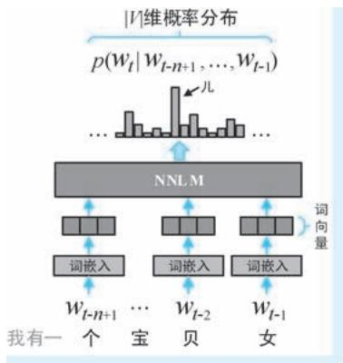  
●图 5-1 本吉奥 NNLM 架构的工作模式示意

$$
f _ {\mathrm {N N}} \left(w _ {t - n + 1}, \dots , w _ {t - 1}; \theta\right) = p \left(w _ {t} \mid w _ {t - n + 1}, \dots , w _ {t - 1}; \theta\right) \tag {5-5}
$$

式中， $\theta$ 表示神经网络的参数。在图5-1 所示的例子中，输入语句为 “我有一个宝贝女儿”，长度为 8（为了简化，这里不考虑语句的起止符号且以单字作为处理单位）。假设当前 $t = 8$ （对应 “儿” 字），在五元语言模型假设下，我们朝前取四个词一直到 “个”字。则模型输入的词序列为子句 “个宝贝女”，模型输出一个长度与词典大小| V |相同的概率分布，即表示条件概率 $p ( w _ { 8 } | w _ { 4 } =$ 个， $w _ { 5 } =$ 宝， $w _ { 6 } =$ 贝， ${ } w _ { 7 } = { }$ 女）”。有了条件概率，我们就能很容易的进行词预测和句联合概率的计算。在词预测任务中，使得条件概率最大的那个 $w _ { t }$ 的取值，就是 $t$ 时刻的词预测输出。例如在上例中， $w _ { 8 } =$ “儿”使得条件概率最大，故在此刻就应该输出 “儿”；针对句联合概率计算任务，可以利用近似关系 $p ( w _ { 1 } , \cdots , w _ { T } ) \approx$ $\prod _ { t = 1 } ^ { T } p ( w _ { t } \mid w _ { t - n + 1 } , \cdots , w _ { t - 1 } )$ ）计算整个语句的联合概率。

本吉奥NNLM 考虑局部依赖，这一点与N 元语言模型是类似的。但是相较于N 元语言模型的频率统计模式，本吉奥 NNLM 采用模型预测的方式获得条件概率，因此首先需要通过训练获得模型的最优参数 $\theta$ 。做参数估计自然首选最大似然估计。因此我们带入样本，最大化对数似然函数，以此获得模型的最优参数。因此即有

$$
\begin{array}{l} \theta^ {*} = \arg \max  _ {\theta} \log p (w _ {1}, \dots , w _ {T}; \theta) + R (\theta) \\ \approx \arg \max  _ {\theta} \log \prod_ {t = 1} ^ {T} p \left(w _ {t} \mid w _ {t - n + 1}, \dots , w _ {t - 1}; \theta\right) + R (\theta) \tag {5-6} \\ = \arg \max  _ {\theta} \sum_ {t = 1} ^ {T} \log p \left(w _ {t} \mid w _ {t - n + 1}, \dots , w _ {t - 1}; \theta\right) + R (\theta) \\ \end{array}
$$

式中， $R ( \theta )$ ）为针对参数的正则化项。上述最大似然估计即认为语料库中的所有语料样本都相互独立且服从语言模型定义的那个联合分布，那么最优参数的估计过程就看看到底是在什么样的参数下、该联合分布能够以最大的可能性采样出这些语料样本。

在本吉奥发表 NNLM 模型之后，NNLM 以其强大的建模能力迅速受到 NLP 领域的广泛关注，尤其是伴随着由深度学习带来的神经网络复兴，利用神经网络开展语言建模便成为语言建模的最主要、甚至是唯一方式，这一局面直到今日仍然未曾改变。

# 5.1.2 单向语言模型与双向语言模型

无论是基于统计的 N 元语言模型还是本吉奥的 NNLM，建模的对象都是条件概率 $p ( w _ { t } | w _ { 1 } , \cdots , w _ { t - 1 } )$ ），显然，该条件概率仅表达了当前词对上文的依赖关系。对于这种 “只往前看”的语言模型，我们称之为前向语言模型。在日常生活中，我们天天使用的输入法就是前向语言模型的典型应用———键入一些词汇，输入法就会自动按照已经输入的词汇联想出后续输入，给我们带来极大的方便。在 NLP 领域，应用前向语言的模型也非常常见，例如，靠处理序列数据 “起家”的标准 RNN 结构，就天然具备表达前向依赖关系的能力；再例如，随后产生的基于Transformer 架构的GPT 等著名模型，其构造的语言模型也是前向语言模型。但是，在很多时候，仅仅考虑上文依赖是不够的，下面我们再次用 “杂志与弹匣”的例子来说明这一问题：对于两个待翻译的英文语句 “gun magazine”和 “magazine of a gun”，对于 “magazine”一词的含义，在第一句中可以依据其前文的 “gun”做出正确判断，前文依赖自然没问题。但是对于第二句，对其翻译起决定性作用的 “gun”出现在其下文位置，显然只考虑上文是

不够的。于是人们开始考虑为条件概率 $p ( w _ { t } \mid w _ { t + 1 } , \cdots , w _ { T } )$ ）建模，以此考虑对下文依赖关系，这便是后向语言模型。我们将 “只看一边”的前向语言模型和后向语言模型均称为单向语言模型（当然，几乎没有纯粹使用后项语言模型的，往往都是和前向语言模型一起构造双向语言模型）。图5-2 为前向语言模型和后向语言模型的对比示意。

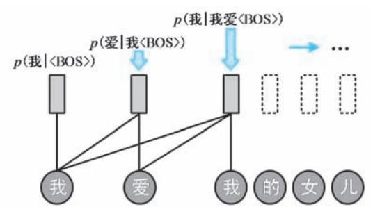  
a）

b）  
●图 5-2 前向语言模型和后向语言模型的对比示意  
  
a）前向语言模型 b）后向语言模型

双向语言模型（Bidirectional Language Model），顾名思义，就是 “既往前看，也往后看”、同时考虑上下文依赖的语言模型。利用神经网络实现双向语言模型的方式主要包括双结构和单结构两种。其中，双结构方式是指分别利用一个前向语言模型和后向语言模型进行两个方向的条件概率预测。这两个单向语言模型有独立参数，在训练过程中可以利用一个综合的目标函数对两组参数进行统一的训练。以 ELMo 模型[7] 为例，其双向语言模型的训练目标可以表示为

$$
\theta^ {*} = \left(\theta_ {1} ^ {*}, \theta_ {2} ^ {*}\right) = \arg \max  _ {\theta_ {1}, \theta_ {2}} \left(\mathcal {L} _ {1} (s; \theta_ {1}) + \mathcal {L} _ {2} (s; \theta_ {2})\right) \tag {5-7}
$$

式中， $\mathcal { L } _ { 1 } ( s ; \theta _ { 1 } ) = \sum _ { t = 1 } ^ { T } \log p ( w _ { t } \mid w _ { 1 } , \cdots , w _ { t - 1 } ; \theta _ { 1 } )$ ）为前向语言模型对应的对数似然函数， $\theta _ { 1 }$ 为其参数；$\mathcal { L } _ { 2 } ( s ; \theta _ { 2 } ) = \sum _ { t = 1 } ^ { T } \log p ( w _ { t } \mid w _ { t + 1 } , \cdots , w _ { T } ; \theta _ { 2 } )$ ）为后向语言模型对应的对数似然函数， $\theta _ { 2 }$ 为其参数。上式表明，对于第 $t$ 个位置出现的那个词，得被从前往后和从后往前的两个模型都 “认可”才行。图 5-3 示意了上述双结构双向语言模型工作方式。

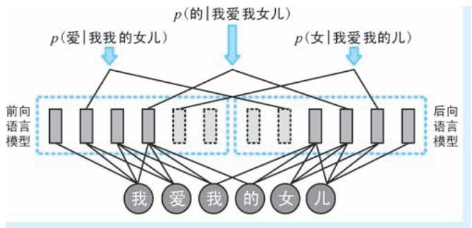  
●图 5-3 双结构双向语言模型的工作方式示意

基于单结构的双向语言模型用一个神经网络模型表达上下文依赖关系。例如，我们以著名的 BERT 模型[10] 为例，其语言模型训练的目标函数可以表示为㊀

$$
\theta^ {*} = \arg \max  _ {\theta} \sum_ {t = 1} ^ {T} \log p \left(w _ {t} \mid w _ {1}, \dots , w _ {t - 1}, w _ {t + 1}, \dots , w _ {T}; \theta\right) \tag {5-8}
$$

在式 （5-8）中，从分布的条件部分可以很容易地看出双向依赖关系，$\theta$ 为该分布的参数。图5-4 示意了上述基于单结构的双向语言模型的工作方式。

  
●图 5-4 单结构双向语言模型的工作方式示意

# 5. 1. 3 自回归语言模型与自编码语言模型

根据上文内容预测下一个词汇或者根据下文内容预测上一个词汇，这样逐个产生词汇的语言模型被称为自回归语言模型（Autoregressive Language Model）。因此可以看出，我们上文介绍的单向语言模型也都属于自回归语言模型。特别地，尽管在 ELMo 模型中使用了上文和下文两方面的信息，但是上述两方面的依赖关系在两个独立的单向语言模型中实现，因此 ELMo 也属于自回归语言模型。

除了自回归语言模型，语言模型还有另外一种重要类型，即自编码语言模型（AutoencodingLanguage Model）。所谓自编码语言模型，就是让模型一次性的得到一个完整语句，并在任意一个位置，都能够充分对该位置的上下文信息进行考量与综合，测出该位置应该出现的那个正确词汇。这就意味着模型能够 “吃透”上下文语义信息。也正是因为该类语言模型有着自编码器 （autoencoder）架

构 “自己构造自己”的特性，因此才被冠以 “自编码”的名号。BERT 系列模型便是自编码语言模型的典型代表，其采用掩膜语 言 模 型 （Masked Language Model） 受“完形填空” 思想的启发，通过刻意遮掩或是篡改输入语句中的某些词汇，来进一步增加模型对上下文关系的理解能力㊁②，可以说将自编码的思想运用得更加极致。图 5-5 为自回归语言模型和自编码语言模型的对比示意。

  
a)

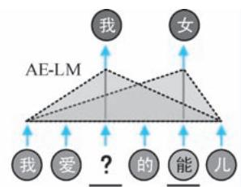  
b)   
●图 5-5 自回归语言模型和自编码语言模型对比示意a）自回归语言模型 b）自编码语言模型 （以掩膜语言模型为例）

在图5-5 所示的对比示例中，输入的原始语句均为 “我爱我的女儿”。在图 5-5a 所示的自回归语言模型中，当前的输入模型的部分语句为 “我爱我的女”，模型依据这些前文信息推测第 6 个 “儿”

字；而在图5-5b 所示的自编码语言模型中，我们刻意将第 3 个位置的 “的”字遮住 （即将这个位置替换为 “＜MASK＞”标志），并将第5 个位置的 “女”字篡改为 “能”字，于是模型输入的语句变为“我爱＜MASK＞的能儿”。然后我们试图让语言模型能够在第 3、5 个位置上预测出正确的字。

需要说明的是，上述我们对语言模型的分类相对宏观，但是很多预训练模型在实现时会采用很多特殊的具体形式。关于更多语言模型的实现细节，我们将在对具体模型的分析中做详细介绍。

# 5.2 自然语言处理中的预训练范式

Transformer 诞生以来，“预训练 $^ +$ 微调” （pre-train and fine-turning） 范式成为 NLP 领域应用最为广泛、也是最为成功的模型构造和下游任务适配模式。在 “预训练 $^ +$ 微调”范式下，人们的工作重点从训练具体的任务模型转变为构造具有通用能力的预训练模型，整个领域也逐渐形成了 “大厂预训练我微调”的上下游分工局面。但是，可谓 “量变引起质变”，随着预训练模型规模的不断增大， “预训练 $\cdot +$ 微调”范式在数据和算力资源方面对下游任务的微调训练提出了极大的挑战。那么，是否能够改变 “预训练 $^ +$ 微调”的工作模式，使得下游任务适配的工作不至于如此之重？为了解决上述问题，一种新范式——— “预训练 $\vdots +$ 提示” （pre-train and prompt-turning） 范式应运而生。下面，我们即围绕 “预训练 $\vdots +$ 微调”和 “预训练 $\cdot +$ 提示”两种 NLP 领域的经典预训练范式展开介绍。

# 5. 2. 1 “预训练 $^ +$ 微调”范式

“预训练 $\cdot +$ 微调”该范式体现的核心思想即迁移学习（Transfer Learning）的思想，而这一思想在人工智能领域被广泛应用。例如，在 CV 领域，斯坦福大学李飞飞教授团队主导构建的 ImageNet 大规模图像数据集，以及围绕该数据集开展的大规模视觉识别挑战赛 ILSVRC，是推动 CV 领域深度学习技术进展的重要力量，也是预训练模型的 “诞生地”———在挑战赛中夺魁的很多深度网络模型，连同其基于 ImageNet 数据集训练得到的模型参数，都被作为很多自定义 CV 任务的预训练模型，我们基于这些预训练模型继续前行。

那么到了 NLP 领域，为什么要使用预训练模型？我们认为原因有三：第一，与 CV 领域类似，预训练模型能够让我们在进行下游任务适配时能够站在一个相对较高的起点，不必从 “一穷二白” 开始。正所谓 “站在巨人的肩膀上”，我们的模型训练才更有可能快速收敛，从而实现对自己的特定任务的快速适配；第二，也是 NLP 领域的客观原因所致，那就是由于处理对象和任务的特殊性，可获取的带标注语料数据奇缺。毕竟对自然语言标注的难度与 CV 中对图像、视频标注的难度不在一个数量级。CV 领域的标注主要靠的是感知技能，即但凡认得出就能标注，不需要太多专业知识。但是对语言的标注需要认知技能，即标注需要应用语法、句法、语用等专业知识。这就意味着面对浩如烟海的语言资料，我们即使投入再大的人力物力也只能对其进行少量标注，标注的结果还有可能标准不一，参差不齐。因此，我们难以向 CV 那样，在 NLP 领域构造一个动辄百万千万样本的大规模数据集；第三，NLP 领域有取之不尽用之不竭的无标注语料资源，文字记录伴随人类文明一路不断产生，新闻、小说、论文、歌词等以文字表述的任何形式的资料都可以作为模型训练语料库，这为 NLP 模型的训练提供了坚实的数据基础。综上所述，我们对下游任务高起点的要求、标注资源的稀缺以及无标注语料

资源的极大丰富共同构成 NLP 领域 “预训练 $\cdot +$ 微调”范式产生的最根本原因———预训练阶段要解决的关键问题是借助大规模语料资源，抽取那些语言的共性结构和关系，而微调适配阶段要解决的是如何借助小规模的专用数据集，进行模型能力的 “垂直下沉”的问题。前者要的是 “广”，后者则更多关注于 “专”；前者在乎学习得到抽象的语言特征表示，后者更侧重达到具体任务的目标。事实上，预训练加微调适配的方式和我们人类的学习过程非常类似：小时候我们学习组词造句，学习语法句法等纯粹的语言知识，这就是预训练；长大后，我们投身不同专业，在具体专业术语构成的更加细化的语言体系中，带着特定目继续深耕，这如同微调适配。图5-6 示意了现代 NLP 预训练模型的构建与应用模式。

  
●图 5-6 NLP 预训练模型的构建与应用模式示意

如图5-6 所示，NLP 预训练模型的构建与应用包括了两大阶段。第一阶段即为预训练阶段，该阶段的输出即为一个能够 “读懂”语言、但又与具体任务无关的预训练模型。在现代 NLP 领域，绝大多数预训练均为语言建模（Language Modeling），得到的模型即为语言模型（Language Model），该训练过程也均是基于超大规模无标注语料库，以无监督的方式开展㊀。之所以要构建语言模型，是因为语料

库中包括了海量的自然语言序列，这些语言序列以 “内蕴”的方式体现了语言的语法结构、词与词之间的关系等重要信息，这些重要信息作为语言的共性信息天然存在。而语言模型正是能够发掘这些语言共性结构和关系的概率模型。随着公开数据集的不断完善，在获得语言模型之后，很多工作还会以已得到的语言模型为基础模型，针对文本蕴含、符号标注、问答等诸多公开 NLP 任务，利用这些任务提供的带有标注信息的公开数据集进行有监督的微调训练。该步骤的作用首先是利用下游任务证明语言模型的有效性。其次，该步骤作为语言模型与用户专用模型之间的桥梁，其目的旨在能够在语言模型的基础上，朝着具体应用更进一步，让下游的微调适配能够再 “省点力气”。当然，这一步骤不是所有模型都做的，某些模型预训练阶段只构建语言模型。因此我们在图 5-6 中以虚线框表示。第二个阶段为模型的微调适配。该步骤以第一阶段得到的预训练模型为基础模型，以用户手头的专用数据集作为训练数据，在用户端以监督训练的方式完成。该步骤的目的在于让 NLP 模型 “下沉”到用户的业务场景，使其能够完成用户特有的 NLP 任务。例如，在图 5-6 中，我们示意了两个微调适配的场景。在第一个场景中，一名财经领域的人士，希望通过模型抽取财经资讯的摘要，那就需要在财经这一细化数据上训练一个摘要生成模型；在第二个场景中，一个文学爱好者希望自动判断当代诗歌所蕴含的感情色彩，那就需要在当代诗歌这一细化数据集上训练一个情感派别模型等。

可以看出，从预训练到微调适配，训练所基于的数据规模是越来越小的，但与应用领域的结合却是越来越深的，预训练和微调适配的方式体现的正是递进和迁移的思想。

# 5. 2. 2 “预训练 $^ +$ 提示”范式

随着预训练模型规模的不断增大，“预训练 $\vdots +$ 微调”范式存在的弊端也暴露无遗，主要体现在两个方面：第一，下游任务的微调适配需要以监督学习方式开展，这就意味着要求下游用户必须准备大量的标注数据供模型微调训练使用，这无疑需要投入海量的人力资源。即便是有了训练数据，但是在面对庞大而复杂的预训练大模型时，下游用户往往根本 “训不动”；第二，仍碍于预训练模型的规模，对计算机资源奇高的要求，一般下游用户根本 “训不起”。“预训练 $^ +$ 微调”范式避免了用户的模型参数微调，取而代之的是在用户提示下开展下游任务适配，从而实现以 “零样本学习” （Zero-ShotLearning）、“单样本学习” （One-Shot Learning） 或 “小样本学习” （Few-Shot Learning） 模式来完成各类下游任务。

在 “预训练 $\vdots +$ 微调”范式下，预训练与微调两个阶段具有完全不同的输入与训练目标。以 BERT模型为例，其在预训练阶段通过 “＜MASK＞”标识符构造掩膜语言模型，即训练模型学会 “完形填空”。但是到了下游任务的微调阶段，输入序列中自然不会再有 “＜MASK＞”标识符，而且面对的任务也变为了诸如分类等与预训练截然不同的任务。这就意味着为了将模型从预训练的状态 “强掰”到我们下游任务的状态，我们势必要在微调阶段增加额外的结构和参数，与此同时还需投入大量的训练数据和资源。模型规模越大，微调训练所需的资源投入就越大。这便是 “预训练 $^ +$ 微调”范式在大模型面前越来越难以为继的最主要原因。既然问题出在两个阶段模式的不一致上，那么我们在下游任务适配时，如果依旧保持预训练的输入、目标与架构不变，适配工作是否能变得容易一些呢？这正是提示学习（Prompt Learning）的核心思想。为说明这一思想，我们还得回到 BERT 模型的预训练和下游任务微调上。首先，谷歌基于大规模语料，以自监督方式进行掩膜语言建模，得到 BERT 预训练模型。

手握预训练好的 BERT，我们即需要开展下游任务的微调训练。以情感分析等语句分类下游任务的微调适配为例，在 “预训练 $\cdot +$ 微调”范式下，最简单、最常见的方式即获得 BERT 对整个语句的特征表示 （获取句首 “＜CLS＞”标识符对应的特征输出，具体方式我们将在下文进行详细介绍），然后在其后添加线性变换等子结构，使用softmax 进行语句类别的概率预测。所谓的微调就是以有监督的方式一体化训练 BERT 模型基础参数以及新添加的子结构参数。两阶段的不一致也由此产生。那么既然预训练阶段是 “完形填空”，我们也将下游任务整理为 “完形填空”的形式不就实现了两阶段的统一？例如，针对语句 “今天阳光明媚，春光和煦”进行情感分类，如果我们将情感分类下游任务的输入改写为 “今天阳光明媚，春光和煦。今天的天气真是 ”，空中需要模型填入的词汇即能够表达对语句“今天阳光明媚，春光和煦”的情感。这样一来，下游任务与预训练阶段一样都变为 “完形填空”任务了。“今天的天气真是”即我们为了下游任务所额外构造的 “prompt”。准确地讲，所谓提示学习，即不显著改变预训练语言模型结构和参数的情况下，通过向输入中增加 “提示”，将下游任务改造为文本生成任务，从而实现上下游任务统一的一种学习方法。

“预训练 $: +$ 提示”范式也包括了两个阶段，第一个阶段为预训练模型的构造阶段，该阶段发生的“故事”与上文介绍 “预训练 $\cdot +$ 微调”范式中的预训练阶段并无太大的差异。但是在第二阶段，我们从 “fine-turning” 转变为 “prompt-turning” ———通过合理的构造提示模板 （prompt template），来给预训练模型提供一个 “熟悉的环境”，从而使其能够在提示下给出正确输出。当然，操作还未结束，我们还需要增加输出文本到目标域映射的后处理操作。例如，还是在上文的情感分类任务中，我们需要模型预测0、1 和2 三个数值分别表示的正面、负面和中性情感。而在提示学习模式下，模型生成的词汇是随机的，例如，可以是 “好”、“不错”等，我们需要将这些词汇映射到三种情感结论上。

作为 NLP 的一种新范式，“预训练 $^ +$ 提示”以其在下游任务适配时对资源低依赖的巨大优势，受到 “NLPer”们的广泛关注并在 NLP 领域引发巨大热情，被 GPT、T5 等诸多大模型作为其适配下游任务的方式，使得我们这些用户能够更加轻松地开展下游任务适配，甚至可以做到 “拿来就用”。

# 5. 3 预训练模型概览

近年来，NLP 领域最具有革命性，也是最令人们欣喜的进展莫过于诸多优秀预训练模型的出现及其广泛应用。预训练模型的发展可以追溯到到本吉奥于 2000 年提出的 NNLM 模型[3] ，该模型以神经网络建模语言模型，奠定了现代预训练模型的最基本形式，故我们将其视为是 NLP 预训练模型的开端。经过十几年的发展，领域中涌现出诸多预训练模型，所扮演的角色也从相对单一的获取词嵌入表示到 NLP “全能选手”。特别是在 2018 年，在 Transformer 诞生后，OpenAI 和谷歌先后提出 GPT 与BERT 两个基于 Transformer 的预训练模型，给 NLP 领域带来了突飞猛进的进展，随后，基于Transformer 架构的预训练模型更是犹如井喷般涌现。图 5-7 示意了 NLP 领域近十几年来产生的一些经典的预训练模型㊀。

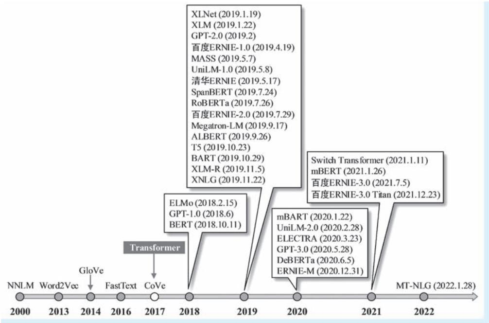  
●图 5-7 NLP 领域一些经典预训练模型的发展历程示意

我们知道，预训练模型的核心任务即将输入的词汇转换为特征向量，即获得词汇的嵌入表示。按照模型在进行词嵌入时是否依赖其所在上下文信息这一角度，预训练模型可以分为静态词嵌入和动态词嵌入两代。其中，第一代预训练模型也被称为非上下文词嵌入（Non-contextual word embedding），最经典的实现莫过于 2013 年谷歌提出并开源的词嵌入工具 $\mathrm { W o r d } 2 \mathrm { V e c } ^ { [ 4 ] }$ ，其中实现了连续词袋模型（Continuous Bag-of-Words，CBOW） 和连续 Skip-Gram 两个具体的词嵌入模型；在 2014 年，Jeffrey Pen-nington 等[5] 来自斯坦福大学的学者提出了 GloVe 模型则是一种利用全局信息的静态词嵌入模型；2017年，Facebook 开源的 FastText 也是一个与 Word2Vec 类似、但功能更加强大的静态词向量计算和文本分类工具库。然而，静态词嵌入的本质就是一个词向量的查找表，这就意味着只要词相同，对应的嵌入向量也相同。静态词嵌入存的两个显著问题，第一个问题即 “超出词汇表” （Out Of Vocabulary，OOV）的问题———一个输入的词汇超出了词典的范围，则自然也 “查不出”向量来。第二个问题即无法解决一词多义的问题，例如，我们在上文中多次举例的 “magazine”，我们自然希望其在作为 “弹匣”和 “杂志”时的词嵌入特征是不同的。为了克服静态词嵌入的弊端，人们开始构建第二代预训练模型，即动态词嵌入模型。在动态词嵌入模型中，词汇的嵌入表示随着其所在上下文语境的不同而改变，因此也被称为上下文词嵌入 （Contextual word embedding） 模型。2017 年，Bryan McCann 等[6] 学者通过 LSTM 构造具有编码器-解码器的 Seq2Seq 模型。在该模型中，LSTM 结构即表达了词汇特征的前文依赖关系；2018 年提出的 ELMo 模型[7] ，则采用双向 LSTM 结构建模输入语句中词汇的上下文依赖关系。ELMo 被誉为是前 Transformer 时代最优秀的动态词嵌入模型。目前，广为人知的各类基于Transformer 的预训练模型，更是利用自注意力机制来表达词汇之间的上下文语义，故自然也属于第二代预训练模型的范畴。

在架构方面，从2000 年至今，NLP 预训练模型的架构大致可以分为三大类：基于前向神经网络的模型、基于 RNN （含 LSTM 和 GRU）的模型和基于 Transformer 架构的模型。其中，本吉奥的 NNLM自然是基于前向神经网络的模型不必说，Word2Vec 和 FastText 中实现的 CBOW 和连续 Skip-Gram 等模型，也是基于前向神经网络的典型代表；而在 “只要注意力”的Transformer 诞生之前，人们还在 “只要 RNN”———RNN 架构在预训练模型占据绝对主导地位，各个模型正是利用 RNN 的记忆特性来处理自然语言这一序列数据，建模词汇之间的依赖关系；2017 年，谷歌提出具有划时代意义的 Transformer模型[5] ，该模型以层叠的注意力模块构造具有编码器-解码器的 Seq2Seq 模型，在机器翻译这一具体领域取得了重大进展。早先，Transformer 模型本身并未引起太大的轰动，反而在随后的2018 年，OpenAI和谷歌先后提出的 GPT [9] 和 BERT [10] 两个模型，才算是真正 “带火” 了 Transformer，特别是谷歌的BERT，更是刷榜 11 个 NLP 任务，一时风光无限。从此人们开始正视 Transformer 架构的价值，RNN架构迅速退出历史舞台，预训练模型领域变为自注意力的天下。在这些基于 Transformer 的预训练模型中，又包括了基于编码器、基于解码器以及基于编码器-解码器三种不同的结构。其中，基于编码器的预训练模型一般也被称为自编码语言模型，BERT 便是此类模型的典型代表。随后，XLNet[13] 、RoBERTa[14] 、ALBERT[15] 等著名模型也均基于 Transformer 编码器构造，都算作是 BERT 模型的升级版。这些后来居上的模型在 NLP 任务榜上反复 “碾压”，不断提高基线水平；基于解码器的预训练模型一般被称为自回归语言模型，纯粹采用此架构的预训练模型不多，最具代表性的模型即 OpenAI 的GPT 系列；基于 Transformer 编码器-解码器的架构主要用来完成序列到序列的任务，其中 MASS[17] 、BART[18] 等模型就采用了标准的 Transformer 编码器-解码器架构。而微软提出的 UniLM[19] 看似只使用了 Transformer 编码器结构，但是其利用了 BERT 的双语句输入机制，以 “类编码器”架构实现了自编码和自回归两种语言模型；而百度提出的 ERNIE-3. 0 系列[24][25] 则采用了具有 “上下结构”的编码器-解码器架构来适配更加全面的 NLP 任务。

在 “后 Transformer”时代，不同预训练模型适配的下游 NLP 任务则各有侧重。其中以 BERT 及其改进模型为代表自编码语言模型更容易在语句分类等自然语言理解 （Natural Language Understanding，NLU）方面具有突出的表现，而自回归语言模型表达的前项语言依赖关系与自然语言生成 （NaturalLanguage Generation，NLG）任务更加 “登对”，故在预训练模型需要适配机器翻译、文本摘要等自然语言生成任务时，很多模型都会将自回归语言模型作为其输出端。例如，原生 Transformer、MASS 和BART 模型就采用了 “前自编码，后自回归”的———自编码操作来获得输入语句的完整语义并形成中间编码，而自回归操作则负责完成语言的逐个生成。而 GPT 系列模型则一路只用自回归语言模型。特别是从 GPT-2.0 开始，OpenAI 更是利用纯粹的自回归语言模型，结合提示学习，以 “一切皆生成”的方式来实现预训练模型下游任务的应用。除此之外，以 UniLM 和百度 ERNIE-3.0 为代表的模型更是希望能够兼顾自然语言理解和生成两类任务———在适配自然语言理解任务时，将模型当作 BERT 来使用，而在适配自然语言生成任务时，模型摇身一变又作为 GPT 来使用。基于 Transformer 的 NLP 预训练模型众多，为了帮助大家梳理其中一些经典模型的发展脉络，我们也仿照清华大学 NLP 实验室（THUNLP）那张著名的预训练模型图谱，针对部分基于 Transformer 架构的经典预训练模型，绘制了一幅表达模型改进关系的图谱，如图5-8 所示。其中，前面标注有小圆圈的预训练模型，我们将在下文中进行详细介绍。

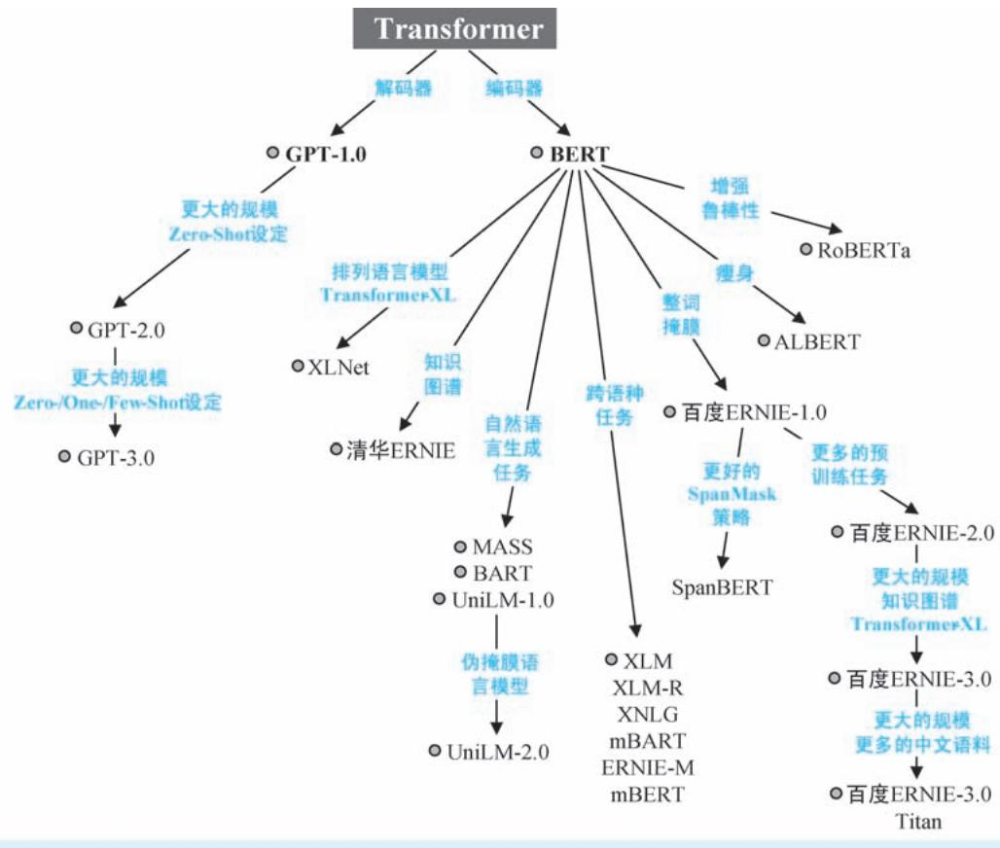  
●图 5-8 部分基于 Transformer 的经典预训练模型

Transformer 模型诞生后，GPT 和 BERT “兵分两路，分头前进”。事实上，我们可以将后 Transformer时代的各类预训练模型都视为 BERT 和 GPT 两个模型的改进模型。只不过 BERT 和 GPT 走出了完全不同的两个体系：BERT 更像是手机操作系统中的安卓———完全开放，谁都能改，深受各层次、各机构从业者的推崇，故改进版本众多，可谓枝繁叶茂，让一般用户使用 NLP 的前沿技术成为可能；而 GPT更像是手机操作系统中的苹果———大厂制造，功能强大，但是十分封闭且商业气息浓厚。因此对 GPT模型的改进只局限在 OpenAI 内部进行。然而，不得不说，GPT 在很大程度上也引领了 NLP 行业的发展，虽然相较 BERT 模型的 “繁花似锦”，GPT 模型的改进版本可谓甚少。但不鸣则已一鸣惊人，可谓出手即精品。2022 年底，ChatGPT 的闪亮登场就是一个活生生的例子。

# 基于 Transformer 的预训练模型

2017 年，谷歌提出用于序列转换的 Transformer 模型，在其中创造性地使用完全的注意力模块替代RNN 结构以实现注意力机制。Transformer 一诞生就在机器翻译中取得了碾压性的好成绩。但是，机器翻译毕竟只是诸多NLP 任务中的一种，还不能凸显Transformer 的威力。人们不禁想，既然机器翻译这

一NLP 核心任务Transformer 都能胜任，那么以其作为基础模型构造预训练模型，让它能够对接更多的NLP 下游任务，是不是也能产生全面的颠覆性的效果？的确，接下来的 “剧情”就是这么发展的。

2018 年，OpenAI 和谷歌两家公司先后提出了著名的 GPT 模型和 BERT 模型，这两种模型可以说是基于 Transformer 架构预训练模型的先驱。我们知道 Transformer 具有编码器-解码器的对称架构，而GPT 和 BERT 模型则各取了一半———GPT 以 Transformer 的解码器作为基础架构，随后，OpenAI 相继提出了第二代 GPT 和第三代 GPT 模型。也正是因为 GPT 基于 Transformer 的解码器构造，故我们形象地称之为 Transformer 的 “右手” （按照 “左编码，右解码” 的一般图示方法）；而作为 “左手” 的BERT 模型则来自 Transformer 的编码器。BERT 模型一诞生便在 NLP 领域的 11 个任务刷榜。特别是在之后，诸多基于 BERT 架构的预训练模型如同雨后春笋不断涌现，其中不乏超越基本 BERT 模型的优秀预训练模型———BERT 分支可谓枝繁叶茂。

Transformer 之后，GPT 和 BERT 这两个基于 Transformer 的分支走出了不同的发展轨迹和格局。如果用手机操作系统来做类比，GPT 像是苹果系统，完整、封闭且 “高冷”；而 BERT 更像是安卓系统，谁都能改谁懂能用，非常开放，非常 “亲民”。正是因为这些后续预训练模型在 NLP 领域的优秀表现，才使得人们开始重新审视并重视 Transformer 的价值。在本部分，我们首先重点分析 GPT 和 BERT两个 “骨灰级”预训练模型，然后对基于 Transformer 的多个经典预训练模型展开深入剖析。

# 5. 4. 1 GPT：Transformer 的“右手”

2018 年 6 月，Alec Radford 等[9] 四名来自 OpenAI 的学者提出了生成式预训练（Generative Pre-Train-ing）模型，这便是大名鼎鼎的GPT 模型㊀①。在提出GPT 模型文章的引言部分，作者说道：“针对语言理解任务，我们探索了一种使用无监督预训练和有监督微调相结合的半监督方法。目标旨在学习一种通用的语言表达，从而使得其经过少量适配就可以适应广泛的 NLP 任务。”这段话可谓把 GPT 的手段和目的说得再清晰不过了：手段是半监督训练 （即 “半监督 $=$ 无监督的预训练 $\vdots +$ 有监督的微调”），目的是构建一个能够快速适配诸多 NLP 任务的通用语言表示。可以说前者讨论了 GPT 是怎么来的，而后者涉及拿到 GPT 后怎么用在其他 NLP 任务。也正是从 GPT 开始，开启了无监督语言模型预训练与基于公开任务有监督微调相结合的预训练模型构造标准模式 （即图 5-6 所示的第一阶段所示的两个步骤）。在下文中，我们即围绕基本结构、无监督预训练、有监督微调以及下游任务适配四个问题对GPT 模型展开讨论。

# 1. GPT 的基本结构

GPT 是基于 Transformer 的解码器栈构造得到的。但是与基础版 Transformer 相比，GPT 对其中每个解码器的结构做了简化：在 Transformer 中，每个解码器中包括掩膜多头自注意力、编-解码注意力和全连接前馈网络三个子模块。而 GPT 去掉了其中的编-解码注意力模块，仅保留掩膜多头自注意力和全连接前馈网络两个子模块。这是因为在 Transformer 中，编-解码注意力模块用来完成输入输出之间的信息传递，其查询集合 $\varrho$ 是来自其前面的掩膜多头注意力模块，而键集合 $\pmb { K }$ 和值集合 $V$ 均是由编

码器栈的输出来扮演。但是在 GPT 中，已经不涉及Transformer 的编码器栈部分，自然也没有这个注意力模块所需要的 $\pmb { K }$ 和 V，因此直接拿掉是最简单的方法。除此之外，相较于基础版 Transformer，GPT 对模型的规模进行了扩充：解码器个数从6 个增加到 12 个，每个多头注意力模块中的注意力“头数”从 8 个增加到 12 个，内部特征的维度 $d _ { \mathrm { m o d e l } }$ 也从512 维增加到 768 维，在全连接前馈网络中，隐含层的维度由 2048 维增加到 3072 维。GPT 模型的总参数量约为 1.1 亿，这一规模与 CV 领域的VGG-19 基本类似。图 5-9 示意了 GPT 模型的整体架构及其解码器结构。

在输入方面，针对一个长度为 $T$ 、用独热编码表示的输入序列 $\pmb { X } = ( \pmb { x } _ { 1 } , \cdots , \pmb { x } _ { T } )$ ，GPT 首先对其进行词嵌入和位置嵌入，表示为

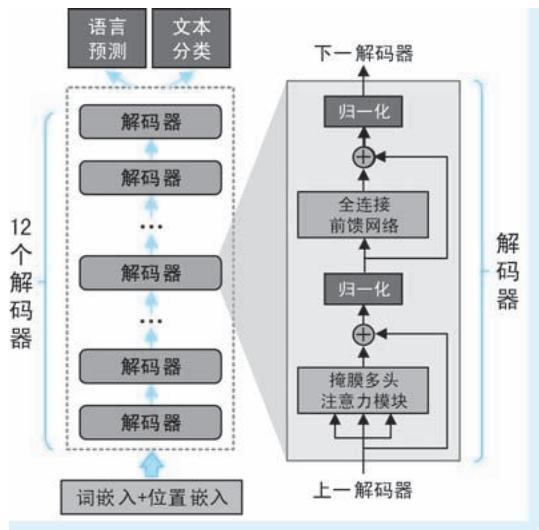  
●图 5-9 GPT 模型的整体架构与其解码器结构示意

$$
\boldsymbol {H} _ {0} = \boldsymbol {X} \boldsymbol {W} _ {E} + \boldsymbol {W} _ {P} \tag {5-9}
$$

式中， $\boldsymbol { W } _ { \boldsymbol { E } } \in \mathrm { R } ^ { \vert V \vert \times d _ { \mathrm { m o d e l } } }$ l和 $\boldsymbol { W } _ { P } \in \mathrm { R } ^ { T \times d _ { \mathrm { m o d e l } } }$ l分别为词嵌入矩阵和位置嵌入矩阵。关于词嵌入我们在前文中做过介绍，这里不再赘述。这里简单对位置嵌入做以介绍。考虑到无论是什么语言，语句中的词都是有序的，即每个词都是位置相关的 （position-wise），因此需要在建立语言模型时引入某种表达位置的机制。在Transformer 中，使用正弦和余弦函数来构造位置编码。但是在GPT 中，采用了更加灵活的位置嵌入机制，在词嵌入特征的基础上再添加上位置信息： $X W _ { \varepsilon }$ 的每一行为基础的词嵌入特征向量，而 $W _ { P }$ 每行对应了一个位置，那么可以将 $W _ { P }$ 的第 $i$ 行数据看作是位置的函数 $f ( i ) \in \mathbf { R } ^ { d _ { \mathrm { m o d e l } } }$ ， $i \in [ 1 , T ]$ ]，那么输出 $H _ { 0 } \in$ $\mathrm { R } ^ { T \times d _ { \mathrm { m o d e l } } }$ 的每一行特征都可以看作是位置相关的词嵌入特征。GPT 以随机方式初始化 $W _ { P }$ ，希望通过训练一并调整 $W _ { P }$ 中的数据，从而实现在此后的预测中能够为词嵌入特征给予位置相关的合理修正。

# 2. GPT 的无监督预训练

GPT 的无监督预训练主要依托 BooksCorpus 语料数据集完成，该数据集包括了 7000 多本各流派的书籍，可以说语料规模是相当的庞大。该阶段的训练目标为构造标准的前向语言模型。具体来说，针对输入列 ${ \pmb X } = ( { \pmb x } _ { 1 } , \cdots , { \pmb x } _ { T } )$ ，GPT 前向语言模型的条件依赖关系可以表示为

$$
p (\boldsymbol {X}; \boldsymbol {\theta}) = p \left(\boldsymbol {x} _ {1}, \dots , \boldsymbol {x} _ {T}; \boldsymbol {\theta}\right) \approx \prod_ {t = 1} ^ {T} p \left(\boldsymbol {x} _ {t} \mid \boldsymbol {x} _ {t - k}, \dots , \boldsymbol {x} _ {t - 1}; \boldsymbol {\theta}\right) \tag {5-10}
$$

式中， $\pmb \theta$ 即为待训练的模型参数。从式 （5-10）可以看出，GPT 的语言模型对每个词向前考虑 $k$ 个词的依赖关系，也即具有 $k { + 1 }$ 元语言模型假设 （在 GPT 原文中，将 $k$ 称为 “context window”，即上下文窗口）。按照最大似然估计的思路，语言模型的最优参数使得上述概率的对数似然函数 $\mathcal { L } _ { l m } ( \pmb { \theta } )$ ）取得最大值，即

$$
\begin{array}{l} \boldsymbol {\theta} ^ {*} = \arg \max  _ {\theta} \mathcal {L} _ {l m} (\boldsymbol {\theta}) \\ = \arg \max  _ {\theta} \log \prod_ {t = 1} ^ {T} p \left(\boldsymbol {x} _ {t} \mid \boldsymbol {x} _ {t - k}, \dots , \boldsymbol {x} _ {t - 1}; \boldsymbol {\theta}\right) \tag {5-11} \\ = \arg \max  _ {\theta} \sum_ {t = 1} ^ {T} \log p \left(\boldsymbol {x} _ {t} \mid \boldsymbol {x} _ {t - k}, \dots , \boldsymbol {x} _ {t - 1}; \boldsymbol {\theta}\right) \\ \end{array}
$$

在上述优化目标中，条件概率 $p ( \pmb { x } _ { t } | \pmb { x } _ { t - k } , \cdots , \pmb { x } _ { t - 1 } ; \pmb { \theta } )$ ）是对下一词汇的预测模型，这也正是 GPT 名称中有 “生成式”（generative）一词的原因。GPT 之所以使用 Transformer 解码器，就是由于 GPT具有 “一个接一个”的词汇预测模式———解码器中的掩膜多头注意力正好能够利用遮掩机制，很方便的针对并行输入制造出序列处理的 “假象”。关于掩膜注意力机制的工作模式，我们已经在上一章进行过详细讨论。但是，需要注意的是，由于 GPT 的前向依赖是 $k$ 步的局部依赖，因此需要掩膜注意力模块能够 “遮前也遮后”，而非 Transformer 标准掩膜的仅遮掩后续词汇。当然，GPT 的掩膜要求可以通过合理设置掩膜矩阵中的元素分布来实现。图5-10 示意了 GPT 前向语言模型进行下一词汇预测的模式示意。

GPT 模型一次性的得到完整的序列输入，但是在掩膜多头自注意力模块的作用下，等效于从前往后逐个看到输入序列，并逐个得到下一个词对应的词向量，这些词向量经过反嵌入和概率化操作，即可得到我们需要的前向依赖条件概率。例如，在图 5-9

  
●图 5-10 GPT 前向语言模型下一词汇预测模式示意

所示的例子中，对于第 $t$ 个步骤，GPT 以 “往前看 $k$ 个词”的方式，得到输入序列 ${ \pmb x } _ { t - k } , \cdots , { \pmb x } _ { t - 1 } ( { \pmb x } _ { 1 } , \cdots ,$ $\boldsymbol { x } _ { t - k }$ ，$\boldsymbol { x } _ { t - k - 1 }$ 以及 $\pmb { x } _ { t } , \cdots , \pmb { x } _ { T }$ $\mathbf { \boldsymbol { x } } _ { t }$ 都被掩膜注意力模块遮掩），经过模型逐个产生一个输出向量 $\mathbf { y } _ { t }$ ，将其与反嵌入矩阵进行作用，并经过 softmax 进行概率化，即得到一个维度为|V|的离散概率分布作为对下一个词的预测。上述过程可以表示为

$$
p \left(\boldsymbol {x} _ {t} \mid \boldsymbol {x} _ {t - k}, \dots , \boldsymbol {x} _ {t - 1}; \boldsymbol {\theta}\right) = \operatorname {s o f t m a x} \left(\boldsymbol {y} _ {t} \boldsymbol {W} _ {E} ^ {\mathrm {T}}\right) \tag {5-12}
$$

式中， $\boldsymbol { W } _ { \boldsymbol { E } } ^ { \mathrm { T } } \in \mathrm { R } ^ { d _ { \mathrm { m o d e l } } \times | \textit { V } | }$ 为反嵌入矩阵，可以看出，其正是词嵌入矩阵的转置，即词嵌入和反嵌入共享参数，这一点与 Transformer 是相同的。

# 3. GPT 的有监督微调

经过无监督语言模型的预训练，可以说 GPT 已经是一个初步具备理解语言的模型了，但是为了使得 GPT 模型的参数能够更好地适配 NLP 其他下游任务，GPT 会再进行一轮有监督的微调训练。GPT的监督微调被设定为一个文本分类任务：组织一个带有标签的数据集 ，每一个样本都是由一个词序列 （即一个语句） $\pmb { X } \pmb { = } \left( \pmb { x } _ { 1 } , \cdots , \pmb { x } _ { m } \right)$ ）及其对应的类别标签 $l$ 构成。GPT 对最后一个输出词向量进行线性变换，再利用 softmax 函数进行概率化，从而得到类别标签的概率分布㊀①。该过程可以表示为

$$
p \left(l \mid x _ {1}, \dots , x _ {m}; \boldsymbol {\theta}\right) = \operatorname {s o f t m a x} \left(\mathbf {y} _ {m} \mathbf {W} _ {y}\right) \tag {5-13}
$$

式中， ${ \pmb y } _ { m } \in { \mathbb R } ^ { d _ { \mathrm { m o d e l } } }$ 为输入词汇 $x _ { m }$ 对应的输出向量； ${ \pmb W } _ { \gamma } \in { \mathbb R } ^ { d _ { \mathrm { m o d e l } } \times c }$ 为待学习的线性变换矩阵，其中 $c$ 为文本分类任务中的类别数。经过 softmax 操作后，即得到一个 $c$ 维的离散概率分布，表示对输入语句的类别预测。之所以使用最后一个词汇对应的向量作为整个语句的表示，那是因为该向量已经 “浓缩”了

整个语句的语义信息。上述文本分类的工作方式可以用图 5-11 来表示。

GPT 的有监督微调训练仍按照最大似然估计的思想进行———对于数据集 中的所有样本，最优模型参数 $\mathbf { \nabla } \cdot \mathbf { \mathcal { \epsilon } } \cdot \mathbf { \mathcal { \epsilon } }$ 使得所有文本类别预测概率的对数似然函数 $\mathcal { L } _ { \mathrm { c l s } } ( \pmb { \theta } )$ ）取得最大值，即有

$$
\begin{array}{l} \boldsymbol {\theta} ^ {*} = \arg \max  _ {\theta} \mathcal {L} _ {\mathrm {c l s}} (\boldsymbol {\theta}) \\ = \arg \max  _ {\theta} \log \prod_ {(X, l) \in \mathcal {C}} p (l \mid x _ {1}, \dots , x _ {m}; \boldsymbol {\theta}) \tag {5-14} \\ = \arg \max  _ {\theta} \sum_ {(X, l) \in \mathcal {C}} \log p (l \mid x _ {1}, \dots , x _ {m}; \boldsymbol {\theta}) \\ \end{array}
$$

式中，数据集 中的所有样本独立同分布，即 “你预测你的，我预测我的”，互不干扰，故可以将所有样本的联合预测概率表示为每个独立预测概率的连乘形式。为了避免有监督微调将语言模型训练中辛辛苦苦得到的参数 “拉偏”，GPT 在文本分类微调训练的同时，同步训练语言模型。即在该阶段，GPT 同时进行了有监督文本分类和无监督语言模型的双任务联合训练。上述联合训练的目标函数为

$$
\boldsymbol {\theta} ^ {*} = \arg \max  _ {\theta} \left(L _ {\mathrm {c l s}} (\boldsymbol {\theta}) + \lambda \cdot L _ {l m} (\boldsymbol {\theta})\right) \tag {5-15}
$$

式中，λ 为调节两个任务目标函数的权重因子。为了进一步说明 GPT 联合训练的方式，我们以图 5-12再进行详细举例说明。

  
●图 5-11 GPT 文本类别预测模式示意

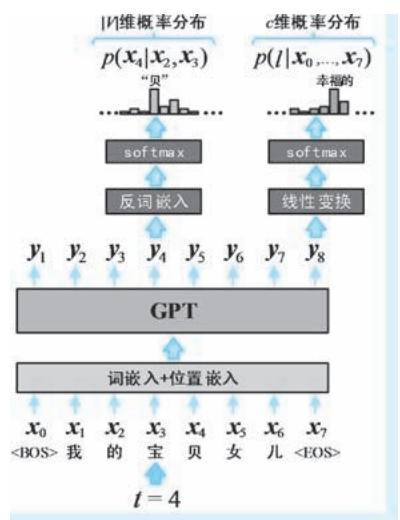  
●图 5-12 GPT 双任务联合训练示意 （以 $k = 2$ 为例）

在图5-12 所示的示例中，我们假设语言模型的前向依赖范围为 2 （即 $k = 2$ ，当然在实际应用中对依赖范围的设定要大得多，这里只是为了举例方便）。我们还假设训练数据集中只有一个样本，其中语句为 ${ \displaystyle - \mathrm { B O S } > }$ 我的宝贝女儿 ${ \mathrm { < E O S > } }$ ”，对应的文本类别标签为 “幸福的”。在上述语句中，含起止标志共计8 个词汇，我们以 $\pmb { X } \pmb { = } ( \pmb { x } _ { 0 } , \cdots , \pmb { x } _ { 7 } )$ ）作为其独热编码表示。首先，GPT 对其进行词嵌入和位置嵌入操作，即 $\pmb { H } _ { 0 } = \pmb { X } \pmb { W } _ { E } + \pmb { W } _ { P }$ ；随后， $\pmb { H } _ { 0 }$ 被送入 GPT 模型，经过一番加工，得到输出的词向量序列${ \bf y } _ { 1 } , \cdots , { \bf y } _ { 8 }$ ，其中每个向量的维度均为 $d _ { \mathrm { m o d e l } }$ ，而且在掩膜注意力模块的作用下，每个词向量只与其前方

的两个输入词汇具有依赖关系 （除了 $\mathbf { y } _ { 1 }$ ）；我们利用式 （5-12） 分别对 ${ \bf y } _ { 1 } , \cdots , { \bf y } _ { 8 }$ 进行反词嵌入和概率化，即得到一系列的条件概率 $p ( \pmb { x } _ { 1 } | \pmb { x } _ { 0 } )$ ）， $p \left( \pmb { x } _ { 2 } \vert \pmb { x } _ { 0 } , \pmb { x } _ { 1 } \right) , \cdots , p \left( \pmb { x } _ { 8 } \vert \pmb { x } _ { 6 } , \pmb { x } _ { 7 } \right)$ ）。在图 5-12 中，示意了其中的$p ( \pmb { x } _ { 4 } | \pmb { x } _ { 2 } , \pmb { x } _ { 3 } )$ ），即 $t = 4$ 的情形。因此语言模型的目标函数即可以写作 $L _ { l m } \left( \pmb { \theta } \right) = \log p \left( \pmb { x } _ { 1 } \mid \pmb { x } _ { 0 } ; \pmb { \theta } \right) +$ $p \big ( \pmb { x } _ { 2 } | \pmb { x } _ { 0 } , \pmb { x } _ { 1 } ; \pmb { \theta } \big ) + \dots + p \big ( \pmb { x } _ { 8 } | \pmb { x } _ { 6 } , \pmb { x } _ { 7 } ; \pmb { \theta } \big )$ ）；对于最后一个输出向量 $y _ { 8 }$ ，我们利用式 （5-13）对其进行线性变换和概率化，即得到文本类别的预测概率 $p ( l | \pmb { x } _ { 0 } , \cdots , \pmb { x } _ { 7 } ; \pmb { \theta } )$ ），对应的文本分类任务的目标函数 $L _ { \mathrm { c l s } } ( \pmb \theta ) =$ $\log p ( l | \mathbf { x } _ { 0 } , \cdots , \mathbf { x } _ { \gamma } ; \pmb { \theta } )$ ）（因为我们假设数据集中只有上述唯一样本，相较式 （5-14），这里省略了求和操作）。将两个任务的目标函数进行整合，即得到式 （5-15）所示的联合损失函数㊀①。

# 4. GPT 的下游任务适配

为了证明 GPT 作为预训练模型能够顺畅对接更多的 NLP 下游任务，学者们在无监督预训练和有监督微调训练的基础上，又基于多个带标注信息的 NLP 公开数据集，通过在基本 GPT 模型上进行结构微调整，进行了多个 NLP 下游任务的适配尝试，给出了 GPT 应用于文本分类（包括 SST-2 和 ColLA两个任务/ 数据集）、自然语言推理（包括 SNLI、MNLI、QNLI、RTE 和 SciTail 五个任务/ 数据集）、语义相似性判断（包括 MRPC、QQP 和 STS-B 三个任务/ 数据集）和多选（RACE 和 Story Cloze 两个任务/数据集）四大类 NLP 下游任务的可能架构。特别地，经过实验对比分析，GPT 面对上述四大类任务的12 个公开任务/数据集，将其中的 9 个做到了 “SOTA”的水平，可谓成绩斐然。下面我们就来介绍 GPT 模型适配上述四类 NLP 任务时，可能采用的架构和数据组织方式。

文本分类任务要求为给定的一个语句预测一个类别标签，属于针对单一语句的单值预测任务。GPT 的适配架构和上文介绍的有监督微调训练中文本分类的架构是相同的———即接收最后输出特征，然后对其进行线性变换和概率化操作，从而得到针对该语句的类别标签预测结果。图 5-13a 示意了GPT 应用于文本分类任务的模型架构示意。

自然语言推理也称为文本蕴含，即给出一个语句作为前提 （premise）和另一个语句作为猜测（hypothesis），预测后者是否能够从前者推理得到。预测结果包括对 （T）、错 （F） 或是无法判断（U）三种情况。自然语言推理为针对两个语句的单值预测任务。GPT 给出的架构为：将两个语句做拼接，在 “接缝”处打上分隔标识 “＜SEP＞”（即 “separator”的简写），将上述拼接序列作为整体统一送入GPT，然后接收最后一个输出特征后，进行目标维度为3 维的线性变换，最后使用softmax 进行概率化得到能够表达推理结果的三维的离散分布。图5-13b 示意了 GPT 应用于自然语言推理任务的模型架构示意。

语义相似性判断任务要求针对给定的两个语句，判断其蕴含的语义是否相似。理论上，语义相似性判断也是一种针对两个语句的单值预测任务，但是 GPT 却给出了一种使用孪生 GPT 结构这一更加合理的方案，其基本思想是：两句话如果语义相似，则无论是放在前面还是放在后面，输出的特征应该不会有太大改变 （如图5-14a 所示）；与之相反，如果两句话的语义差异很大，前后互换则输出的特征将发生较大的变化 （如图5-14b 所示）。

●图 5-13 GPT 应用于文本分类任务和自然语言推理任务的架构示意  
  
a）文本分类任务架构 b）自然语言推理任务架构

●图 5-14 GPT 应用于语义相似性判断任务的架构示意  
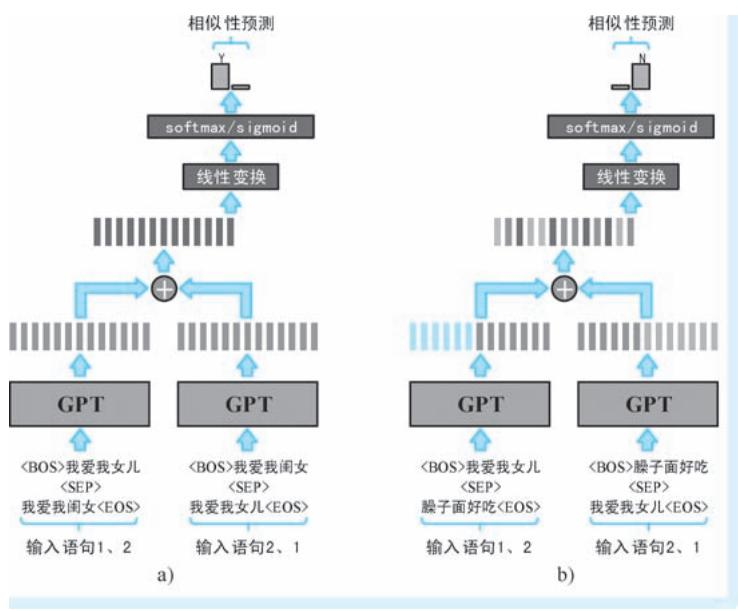  
a）两语句语义相似的情形示意 b）两语句语义不相似的情形示意

多选任务即基于阅读理解的多选一任务，也是问答任务的一种形式———给模型输入一段语料 （如一篇短文） $z$ 和一个问题 $q$ ，以及一个候选答案集合 $\{ a _ { 1 } , \cdots , a _ { d } \}$ } （其中 $d$ 为可选答案的个数），模型从候选答案集合中选择一个最佳答案。多选任务很像我们所做的阅读理解———读一篇文章，然后做几道四选一的单项选择题。针对问答任务，GPT 给出的架构为：首先对语料 $z$ 和问题 $q$ 做中间不加任何分隔标识的 “无缝”拼接，然后再将这个拼接结果分别与每一个答案 $a _ { k }$ $a _ { k } , k = 1 , \cdots , d$ 做 “有缝”拼接（中间打上 “＜SEP＞”分隔标识），从而得到 $d$ 个拼接序列，其中的第 $k$ 个序列形如 $[ z , q , { < } \mathrm { S E P } { > } , a _ { k } ]$ 。

然后分别将上述 $d$ 个拼接序列送入 $d$ 个并列的 GPT 结构，每个 GPT 结构后边都跟着一个线性变换，将每个 GPT 的最后一个输出向量都映射为一个标量。如此一来， $d$ 个并列的 GPT 结构将得到 $d$ 个标量，也即一个 $d$ 维向量。最后在使用 softmax 对这一$d$ 维向量进行概率化，即得到在答案空间的概率分布。图5-15 为 GPT 应用于问答任务的架构示意。

在本部分内容中，我们讨论了经典预训练模型 GPT。该模型可以说是在 Trans-former 开了好 头 之 后，基 于 Transformer 架构构建的第一种经典的 NLP 预训练模型。

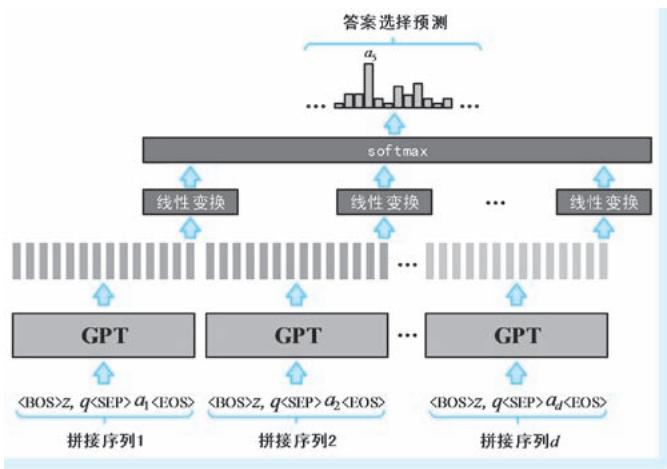  
●图 5-15 GPT 应用于问答任务的架构示意

尽管 GPT 在效果上与一些后来的模型相比不算出众，但是作为 Transformer “解码器系”预训练模型的开启者，它对 Transformer 的应用方式是非常直接明了，也给后续的研究带来重要影响。更何况在我们介绍的第一代 GPT 身后，还站着 GPT-2 和 GPT-3 这两个 NLP “怪兽”呢。

# 5. 4. 2 BERT：Transformer 的“左手”

2018 年 10 月，在 Transformer 诞生一年多以后，Jacob Devlin 等[10] 四名来自谷歌的学者终于基于自家 Transformer 架构，推出了著名的 NLP 预训练模型———BERT。我们认为 BERT 模型绝对是值得详细讨论的，原因有三：第一，Transformer 是谷歌的，BERT 也是谷歌的，基于自家提出的架构做的预训练模型，想必功力应该更加了得；第二，BERT 模型确实很优秀，一诞生就在NLP 领域的11 个任务上刷了榜，可谓光环闪耀；第三，与 GPT 逐渐变得大而全、商业味越来越浓相比，BERT 是朝着 “接地气”方向走的，对我们来说更加能 “玩得起”。

BERT 是 “Bidirectional Encoder Representations from Transformers” 的简称，翻译成中文是 “基于Transformer 的双向编码器表示”。一方面谷歌生生凑出了儿童节目 《芝麻街》 （Sesame Street）的角色“BERT”这个名字，趣味性十足；另一方面，除了使用 Transformer 架构，这个名字还强调了另外两件重要的事： “双向”———BERT 对语言前后两个方向的依赖关系进行了概率建模； “编码器”———BERT 只采用 Transformer 架构的编码器部分，所以我们称之为 Transformer 的 “左手”。接下来，我们就对 BERT 这一重要的预训练模型展开详细介绍。

# 1. BERT 的基本结构

作为 Transformer 的 “左手”，BERT 将 Transformer 的编码器栈作为其基本架构。因此 BERT 由一系列的 Transformer 编码器堆叠而成，每个编码器中都包括了一个多头自注意力子模块和一个全连接前馈网络子模块。但是与基本 Transformer 的编码器栈相比，BERT 对模型的规模进行了扩充。在 BERT的论文中，给出了基础版（BERT-Base）和大规模版（BERT-Large）两种模型架构。其中，BERT-Base

包括了 12 层编码器，内部特征的维度 $d _ { \mathrm { m o d e l } } \odot$ ①为 768 维，多头注意力模块的 “头数”为 12 个，总参数量约为 1. 1 亿。BERT-Base 的参数规模与 GPT-1. 0 类似，对标 CV 领域，则与 VGG-19 模型的规模在相同量级；在BERT Large 中，编码器层数增加到24 层，内部特征的维度 $d _ { \mathrm { m o d e l } }$ 增加到1024 维，多头注意力模块的 “头数”也多达16 个，总参数量约为3.4 亿。另外，每个全连接前馈网络也均是三层结构，中间层的维度为 $4 \times d _ { \mathrm { m o d e l } }$ ，即在 BERT-Base 模型中，中间层维度为 3072 维，该维度与 GPT-1. 0 相同，在 BERT-Large 模型中，中间层维度为 4096 维。

相较于标准 Transformer 的编码器栈，BERT 模型除了在规模上大幅增加之外，并未进行特殊的结构改造，故我们在这里不再对其结构进行详细描述。需要了解细节的读者请参阅上一章的内容。

# 2. BERT 的输入表示

为了能够更加顺畅的对接 NLP 的下游任务，BERT 的输入可以是一句话也可以是两句话。其中一句话用来应对文本分类等一元输入的问题，而两句话用来应对下句预测 （Next Sentence Prediction，NSP）等二元输入的问题。

BERT 针对输入序列，首先会对其进行嵌入操作，即获得对每个输入词的 $d _ { \mathrm { m o d e l } }$ 维向量表达，该向量表达将作为BERT 多层编码器的输入。BERT 对原始序列的输入表示操作包括了符号化（tokenization）和嵌入（embedding）两大步骤，而其中嵌入又是符号嵌入（Token Embedding）、片段嵌入（SegmentationEmbedding）和位置嵌入（Positional Embedding）三种不同嵌入的合成㊁②。图 5-16 为 BERT 模型的输入表示示意。

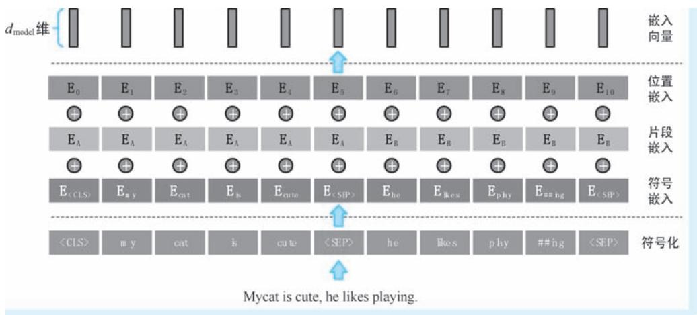  
●图 5-16 BERT 模型的输入表示示意

输入表示的第一步为符号化（tokenization）。BERT 在进行嵌入之前，首先对输入的语句进行符号化操作，符号化的过程包括基于 WordPiece 的子词处理和添加标识符两个环节。下面我们先简单说说

WordPiece，但是由于篇幅所限，我们这里只做 “蜻蜓点水”的介绍。所谓子词 （sub-word）处理问题，即我们如何选择语言序列的处理粒度问题。对待一句中文，我们可以将单个字作为最小处理单元。但是，中文在单个汉字之上还有词语 （甚至成语）的概念，而某些词语才是表达语义的最小单元，很多时候站在单字视角很难获得一个有价值的语义信息。例如， “玻璃”一词，二字拆来，单看“玻”或是单看 “璃”都不具备语义信息，但一旦放在一起，那含义再清晰不过了。因此我们也可以通过分词得到语义信息更加明确的词组 （从语句往下叫 “分词”，从字往上反而应该叫 “组词”），再以词组作为 NLP 的最小处理单元。

然而，英文与中文不同，英文本身就有单词的概念，在语句中单词天然的以空格或者标点作为分隔，这是对语言处理有利的一面。但是英文还有诸如 “look”“looked”“looks” 和 “looking” 的时态特问题，也有 “big”“bigger”和 “biggest”的比较级最高级问题，这又是英文处理比较棘手的一面。我们知道，每一个英文单词首先都要基于词典做向量表示，如果将所有时态、所有级的动词和形容词一股脑加入词典中，那词典必然变得异常庞大臃肿 （试想我们需要在词典中先把所有动词列一遍，然后再将每个动词的 “单三”模式一遍，“过去时”列一遍， “现在时”列一遍…这将一件多么可怕的事情）。更何况，很多词在不同 “版本”下表达的语义是相同的，例如，“look”“looked”“looks”和“looking”都表示 “看”，根本不用区分到底是 “一般看”“过去看”“单三看”还是 “正在看”。这

就意味着应该选择一种更加合理的语言表示粒度，让语义表达更加自然的同时降低词典冗余。正是在这种背景下，子词模型应运而生。 “子词”，从字面意思就是将单词再做进一步拆分，获得一种介于词和字母之间的中间粒度表示。在子词模型中，WordPiece 正是其中的一种经典处理方式———动词是动词，形容词是形容词，不同版本只体现为挂载不同的词缀———词与缀灵活组合 “幻化”出万千版本。图 5-17 示意了某“toy”版词典及其对应的符号化示例 （该图仅用作举例，并不代表 BERT 的实际 WordPiece 操作）。

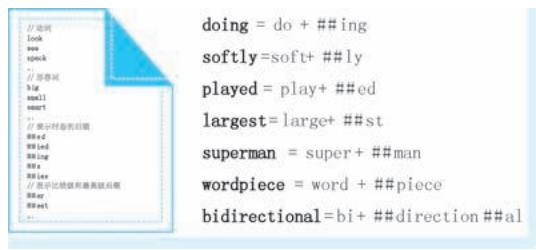  
●图 5-17 某 “toy”版词典及其对应的 WordPiece 符号化示例

符号化后，BERT 也和其他模型一样，为了给后续的NLP 下游任务提供更多的信息，会在语句中加入一些特定的标识符，将某些特定的含义带到下游去。其中最典型的就是在句前句末添加 “＜CLS＞”和“＜SEP＞”，除此之外还有在训练掩膜语言模型时加 “＜MASK＞”等㊀。

输入表示的第二步为嵌入操作。BERT 的词嵌入由符号嵌入、片段嵌入和位置嵌入合成得到，表示为

$$
\boldsymbol {E} = \boldsymbol {E} _ {\mathrm {t o k}} + \boldsymbol {E} _ {\mathrm {s e g}} + \boldsymbol {E} _ {\mathrm {p o s}} \tag {5-16}
$$

式中， $E _ { \mathrm { t o k } }$ 、 $E _ { \mathrm { s e g } }$ 和 $E _ { \mathrm { p o s } }$ 均为维度为 $T \times d _ { \mathrm { m o d e l } }$ 的矩阵，其中 $T$ 为输入序列的长度。这些矩阵的行向量分别为由符号嵌入、片段嵌入和位置嵌入得到的嵌入向量。其中，符号嵌入即词嵌入，表示为 $E _ { \mathrm { t o k } } =$

$X _ { \mathrm { { t o k } } } W _ { \mathrm { { t o k } } }$ 。其中， $X _ { \mathrm { { t o k } } }$ 为基于词典为输入序列构造独热编码矩阵，每行代表一个词汇的独热编码向量；$W _ { \mathrm { t o k } } \in \mathrm { R } ^ { \vert V \vert \times d _ { \mathrm { m o d e l } } }$ 为可学习的词嵌入矩阵，其中 | V | 为词典长度。对于词嵌入我们在前文中已经讨论过多次，这里就不再赘述。片段嵌入是 BERT 中面对双序列输入采取的一种特殊嵌入。片段嵌入为每一个输入获得一个表达其到底属于第一句还是第二句的描述向量。和符号嵌入一样，片段嵌入也是通过从一个可学习的片段嵌入矩阵 $\boldsymbol { W } _ { \mathrm { s e g } } \in \mathrm { R } ^ { | \boldsymbol { S } | \times d _ { \mathrm { m a l } } }$ 中 “抽行”得到，这里| S | 为片段个数。在 BERT 做双句区分，即有 $\mid S \mid = 2$ 。这就意味着，所有在同一语句中的词，其对应的片段嵌入向量也相同。例如，输入的两个语句为 “宝贝”和 “女儿”，我们期望得到的嵌入维度 $d _ { \mathrm { m o d e l } } = 3$ 。首先我们用词的所述序列下标为每个词汇做独热编码表示，属于同一个语句的词汇具有相同的编码，然后再与片段嵌入矩阵做矩阵乘法得到嵌入结果，即有

$$
\boldsymbol {X} _ {\mathrm {s e g}} \boldsymbol {W} _ {\mathrm {s e g}} = \left( \begin{array}{l l} 1 & 0 \\ 1 & 0 \\ 0 & 1 \\ 0 & 1 \end{array} \right) \left( \begin{array}{c c c} w _ {1 1} & w _ {1 2} & w _ {1 3} \\ w _ {2 1} & w _ {2 2} & w _ {2 3} \end{array} \right) = \left( \begin{array}{l l l} w _ {1 1} & w _ {1 2} & w _ {1 3} \\ w _ {1 1} & w _ {1 2} & w _ {1 2} \\ w _ {2 1} & w _ {2 2} & w _ {2 3} \\ w _ {2 1} & w _ {2 2} & w _ {2 3} \end{array} \right) \tag {5-17}
$$

需要说明的是，上述嵌入可以扩展到针对符号任意属性的嵌入，而不是拘泥于仅针对符号到底属于哪句话这种简单的属性。比如，针对符号的词性做嵌入，我们将词性划分为动词、名词、形容词、冠词、介词、过去时后缀、动名词后缀、单三后缀、比较级后缀、最高级后缀 10 种，即输入的任何符号都具有上述10 种词性中的任意一种，则 $\vert { S } \vert = 1 0$ 。另外，谷歌提供的官方代码也支持对符号任意属性的嵌入，其中默认 $\vert S \vert = 1 6$ 。下面我们再看位置嵌入。与GPT 类似，BERT 也放弃了Transformer 的位置编码，也采用位置嵌入的方式为每个词汇表达位置信息。位置嵌入也可以表达为独热编码与嵌入矩阵相乘的方式来获得，即有 $E _ { \mathrm { p o s } } = X _ { \mathrm { p o s } } W _ { \mathrm { p o s } }$ ，其中， $X _ { \mathrm { p o s } }$ 为一个 $T \times | P$ |矩阵㊀①，每行代表一个词汇的位置独热编码：排在第 $i$ 个位置的词汇，向量的第 $i$ 个位置为 1、其余位置全为 0； $W _ { \mathrm { p o s } } \in \mathrm { R } ^ { \vert P \vert \times d _ { \mathrm { m o d e l } } }$ 为可学习的词嵌入矩阵。上述符号嵌入、片段嵌入和位置嵌入都可以表达为独热编码和嵌入矩阵相乘的统一格式，即有㊁

$$
\boldsymbol {E} ^ {T \times d _ {\text {m o d e l}}} = \boldsymbol {X} _ {\text {t o k}} ^ {T \times | V |} \boldsymbol {W} _ {\text {t o k}} ^ {| V | \times d _ {\text {m o d e l}}} + \boldsymbol {X} _ {\text {s e g}} ^ {T \times | S |} \boldsymbol {W} _ {\text {s e g}} ^ {| S | \times d _ {\text {m o d e l}}} + \boldsymbol {X} _ {\text {p o s}} ^ {T \times | P |} \boldsymbol {W} _ {\text {p o s}} ^ {| P | \times d _ {\text {m o d e l}}} \tag {5-18}
$$

形象理解，上面的嵌入合成有点像在调颜色，先有一个基于字典的符号嵌入作为基础颜色；然后按照符号类型属性 （BERT 为语句的隶属关系）添加颜色，相同的符号类型添加相同的颜色，于是具有相同属性符号的颜色就接近了一些；然后再按照位置，进一步添加不同的颜色，最终得到一个 “花里胡哨”的、包含有三类信息的词向量表示。从实现角度理解，三个 “独热”编码向量与嵌入矩阵相乘，等价于构造三个以 “独热”编码向量作为输入、输入维度分别为| V |、| S | 和 $\mid P \mid$ 、输出维度均为$d _ { \mathrm { m o d e l } }$ 的全连接网络。求和即为特征融合。图 5-18a 示意了这一特征融合模式的网络结构。另外，三个“独热”编码向量与三个嵌入矩阵相乘的格式，按照矩阵分块，也可以改写为

$$
\boldsymbol {E} ^ {T \times d _ {\mathrm {m o d e l}}} = \left( \begin{array}{l l l} \boldsymbol {X} _ {\mathrm {t o k}} ^ {T \times | V |} & \boldsymbol {X} _ {\mathrm {s e g}} ^ {T \times | S |} & \boldsymbol {X} _ {\mathrm {p o s}} ^ {T \times | P |} \end{array} \right) \left( \begin{array}{l} \boldsymbol {W} _ {\mathrm {t o k}} ^ {| V | \times d _ {\mathrm {m o d e l}}} \\ \boldsymbol {W} _ {\mathrm {s e g}} ^ {| S | \times d _ {\mathrm {m o d e l}}} \\ \boldsymbol {W} _ {\mathrm {p o s}} ^ {| P | \times d _ {\mathrm {m o d e l}}} \end{array} \right) \tag {5-19}
$$

式中，由 $X _ { \mathrm { { t o k } } }$ 、 $X _ { \mathrm { s e g } }$ 和 $X _ { \mathrm { p o s } }$ 横向构造的矩阵，按行看就是三种独热编码的 “concat” 操作。在这种模式下，之前的三个全连接网络变为一个大的全连接网络，其输入维度为 $\mid V \mid + \mid S \mid + \mid P \mid$ ，输出维度仍为$d _ { \mathrm { m o d e l } }$ 。对应的网络结构如图 5-18b 所示。

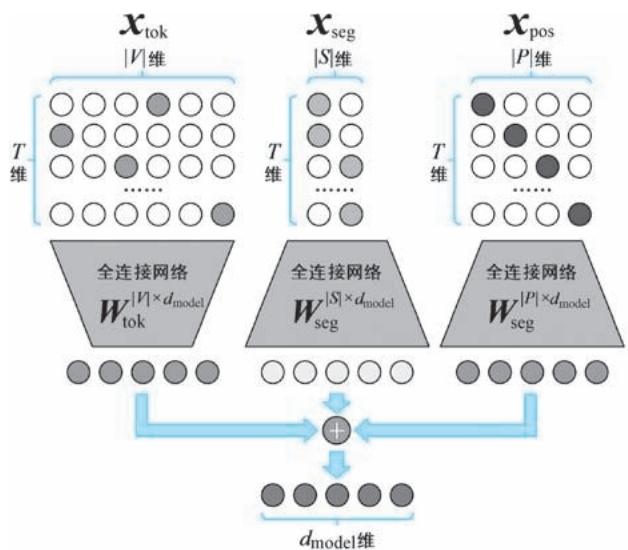  
a）

b）  
●图 5-18 符号嵌入、片段嵌入和位置嵌入的两种实现形式示意  
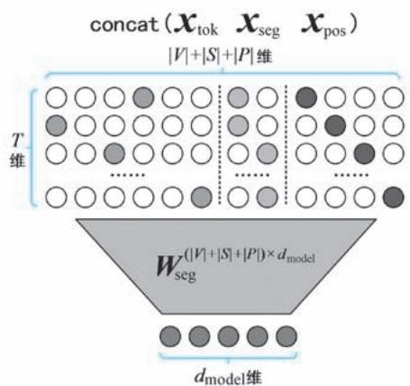  
a）利用三个全连接网络进行嵌入操作示意 b）利用一个全连接网络进行嵌入操作示意

# 3. BERT 的自监督预训练

与 GPT 类似，BERT 模型的构造也包括自监督预训练和有监督微调两部分，这里我们讨论自监督预训练部分。BERT 的自监督的预训练包括了掩膜语言模型（Masked Language Model）和下句预测（Next Sentence Prediction）两个任务，二者都是以自监督㊀①的方式实现训练。两个训练任务都也是基于公开的大规模语料库开展。这些语料库包括拥有 8 亿词汇量的 BooksCorpus 库和拥有 25 亿词汇量的维基百科，其中维基百科去掉了列表、表格标题等元素，只取正经文章部分。

BERT 第一个预训练任务为掩膜语言模型训练。按照我们上文对语言模型的分类，掩膜语言模型属于单结构双向自编码语言模型。所谓 “单结构双向”，体现为 BERT 仅使用 Transformer 编码器栈这一单一结构，在其中自注意力机制的作用下，实现在进行每一个词汇的生成时，都能够充分 “搅拌”上下文信息，同时考虑上文依赖和下文依赖关系；而关于 “自编码”我们在前文已经进行过讨论—BERT 在训练语言模型时，一次性看见整个序列，并且在随机位置故意遮挡或篡改一些词汇，要求模

型能够在输出端预测出这些词汇。这与自编码器 “自己构造自己”具有类似模式，故 BERT 构造的语言模型也属于典型的自编码型语言模型。

学过英语的读者一定对 “完形填空”（cloze，即 “克漏字”）这一题型不会感到陌生。所谓完形填空，就是在连贯的文章中去掉一些词语，形成空格，要求答题者结合上下文，从给出的备选答案中选出一个最佳的答案，从而使文章完整、通顺。这就意味着要想做好完形填空，就得吃透文章的上下文语义。受完形填空思想的启发，BERT 针对输入序列，刻意掩盖其中的某些词汇，要求模型在这些地方正确预测缺少词汇，从而使得模型具备对上下文关系的理解能力。这种刻意的遮挡原始输入的做法即所谓的掩膜，这种带掩膜的语言模型就是掩膜语言模型。BERT 在进行掩膜语言模型训练时，随机将输入序列中的某些符号替换为 “＜MASK＞”标识符，实现对其的刻意遮掩。带掩膜标识符的符号序列通过模型获得输出特征后，针对 “＜MASK＞”标识符对应的输出特征，将被遮掩的符号作为预测的目标，通过最大化被遮掩符号的条件概率，实现掩膜的语言模的训练。简单来说，BERT 要求模型只依赖上下文就能正确地完成 “填空”，反过来说，如果模型能够填空，说明其基本读懂了语言。从概率的视角，假设输入的词汇为 $w _ { 1 } , \cdots , w _ { T }$ ，其中第 $t$ 个词被遮掩，则掩膜语言模型的条件概率可以表示为 $p ( w _ { t } | w _ { 1 } , \cdots , w _ { t - 1 } , < \mathrm { M A S K } > , w _ { t + 1 } , \cdots , w _ { T } )$ $p ( w _ { t } | w _ { 1 } , \cdots , w _ { t - 1 }$ 。下面我们再举一个小例子：假设模型的输入序列为 “我爱我的女儿”，通过随机确定掩膜打在第5 个字上 （为了简化，在这个例子中我们假设不考虑句首的

“＜CLS＞”和句尾的 $^ { * } < \mathrm { S E P > ^ { * , * } }$ ）。然后通过 $ { \mathrm { ~  ~ \omega ~ } } ^ { * } < \mathrm { M A S K } > ^ {  { \prime } }$ ”标识符对第 5 个符号的“女”字做替换遮掩，得到带掩膜的输入“我爱我的＜MASK＞儿”。将该序列输入模型，在模型输出端接收 “＜MASK＞”对应的特征，然后做变换和概率化，以最大化“p $w _ { 5 } =$ 女|我爱我的＜MASK＞儿；θ）”为目标指导模型训练。如果模型能够成功预测“＜MASK＞”对应的正确字，即表明模型在没有任何关于 “女”字信息输入的条件下，仅仅靠着上下文就推测出此处 “有女”，等同于让模型学会做 “我爱我的儿”这道填空题。图5-19a 中示意了上述例子。

  
a）

b)   
●图 5-19 BERT 掩膜语言训练的遮掩和篡改模式示意  
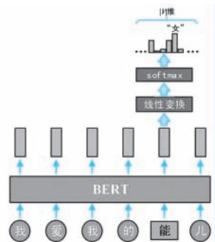  
a）遮掩模式示意  
b）篡改模式示意

这还不算完，BERT 给语言模型还提出了更高的要求———通过刻意篡改的方式再给模型训练增加难度。BERT 随机的将输入序列中的某些符号替换为词典中的任意符号，要求模型在篡改的位置也能实现对正确符号的预测。如果说掩膜语言模型训练是要求模型 “不给看都知道该说的什么”，那么篡改模式的训练则要求模型 “给看个错的都知道该说什么”。例如在图 5-19b 中，刻意将第 5 个 “女”字替换为 “能”字，如果在此处还能预测为 “女”字，那模型算是理解到了语言的精髓，这种模式对应的条件概率模型为 $p ( w _ { t } | w _ { 1 } , \cdots , w _ { t - 1 } , w _ { t } ^ { \prime } , w _ { t + 1 } , \cdots , w _ { T } )$ ），其中 $w _ { t } ^ { \prime }$ 为第 $t$ 个位置篡改后的词汇。篡改模式的训练方式与掩膜模式的训练方式相同，这里就不再赘述。

在 BERT 用来做训练语言训练的所有序列样本中，八成序列做遮挡处理，一成做篡改处理，一成

保持不变。三种模式对输入序列中一定的比例 （如 $1 5 \%$ ）的词汇进行处理并进行预测监督㊀①。

BERT 第二个预训练任务为下句预测任务训练。所谓下句预测，即给模型一次性输入两个语句———语句 A 和语句 B，模型输出语句 B 是不是可以作为语句 A 的下一句。如果说掩膜语言模型表达了同一语句中词与词之间的关系，那下句预测反映了语句之间语义的一致性，表达的是语句级别的语义关系。

BERT 针对下句预测任务的训练也通过自监督的方式进行：从一篇正式的文章中，取相邻的两句话分别作为语句 A 和语句 B，这样语句 B 一定是语句 A 的下一句，因为既然上述两个语句来自真实语料，表明真实中 “人类就是这么说话的”，这就需要训练模型做出正面输出 “IsNext”；将两句 “风马牛不相及”的语句 （如从两篇不同主题的文章中抽取两句话）放在一起作为语句 A 和语句 B，这是典型的 “上句不接下句”，故需要训练模型做出负面输出——— “NotNext”。尽管在 “下句预测”这一任务名称中有 “预测” 一词，乍一看以为模型能 “接话” 似的，但本质是为一个二分类判别任务。BERT 首先对语句 A 和语句 B 进行 “有缝”拼接，然后将拼接序列送入模型，针对句首 “＜CLS＞”标识符对应的聚合特征，首先经过一个线性变换，然后再进行 softmax （或 sigmoid）的概率化操作，从而得到语句 B 是否是语句 A 的下句预测。图 5-20 示意了 BERT 下句预测任务的工作模式示意。

我们说 BERT 的预训练包括掩膜语言模型和下句预测两个子任务。预训练时，针对一组相同的样本数据，BERT 针对两个任务进行一体化训练：一方面使用遮掩、篡改以及保持处理做掩膜语言模型的自监督，另一方面从 “＜CLS＞”位置获取聚合特征做下句预测任务的字监督，预训练的总损失定义为两个任务的损失之和，BERT 的预训练目标即最小化总损失，上述训练模式如图5-21 所示。

  
●图 5-20 BERT 下句预测任务的工作模式示意

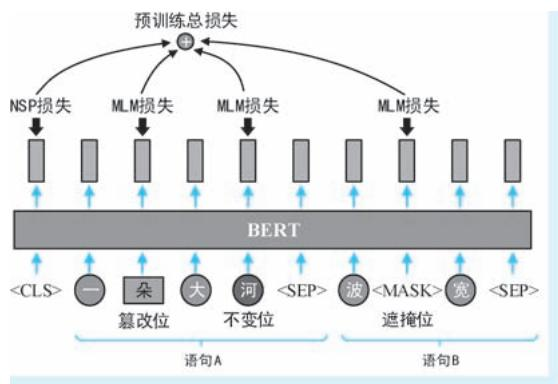  
●图 5-21 BERT 对掩膜语言模型和下句预测任务的一体化训练模式示意

# 4. BERT 的下游任务适配

那么经过掩膜语言模型和下句预测得到的 BERT，怎么对接下游的诸多 NLP 任务呢？BERT 给我们示范了其针对11 个公开任务/数据集适配下游任务的模式及其表现出的惊人效果。这 11 个数任务/

数据集为：MultiNLI、QQP、QNLI、SST-2、CoLA、MRPC、STS-B、RTE、SQuAD、NER 和 SWAG。以上 11 个 NLP 任务涉及了 GLUE、SQuAD v1. 1、SQuAD v2. 0 和 CoNLL-2003 NER 等多个任务组 / 数据集组。按照实现架构的相似性，我们将 BERT 下游任务架适配的架构分为四大类㊀①：文本分类（包括SST-2 和 CoLA 两个单句分类任务，也包括 MNLI、QQP、QNLI、STS-B、MRPC、RTE 六个双句分类任务）、抽取式问答（如 SQuAD 系列任务）、常识推理（如 SWAG 任务） 和符号标注（如 NER 任务）。下面对上述任务进行逐个说明。

第一个任务为文本分类任务。BERT 的文本分类包括针对单句的分类和针对双句的分类两种。前者实现对单一输入语句某种属性的判别。例如，给定输入 “今天真是晴朗的一天”，判断其表达的感情色彩到底是乐观的还是悲观的，这是典型的单句二分类任务；而后者则是一种 “广义”的分类，实现对两个语句关系的判别：例如，给定两个输入语句 “新春大吉”和 “新年快乐”，判断其表达的语义相似程度的等级，这是典型的双句多分类任务；BERT 预训练中的下句预测任务，也是针对双句的典型二分类任务；抑或是以 “是、否、未知”三种情况作为输出的文本蕴含任务也属于基于双语句输入的三分类任务。需要说明的是，在 GPT 的下游任务适配中，我们将基于两个语句的自然语言推理和语义相似性判断视为一个独立任务，而非文本分类的任务。这是因为 GPT 模型为单句输入模型，故需要对输入的形式进行调整才能适配上述两个任务。但是 BERT 为了应对此类进行了双语句输入架构设计，可以说 BERT “天生”具有处理双语句的能力，故可以实现针对单语句和双语句分类的架构统一。无论是单句分类还是双句分类，BERT 的操作模式都可以表示为获取聚合特征、线性变换、概率化三个步骤。该过程可以表示为 softmax $( \boldsymbol { \mathbf { y } } _ { \mathrm { c l s } } \boldsymbol { \mathbf { W } } )$ ），其中， $\mathbf { y } _ { \mathrm { c l s } }$ 为句首 “＜CLS＞”标志位对应的输出特征，W$\in \mathbf { R } ^ { d _ { \mathrm { m o d e l } } \times K }$ 为可学习线性变换参数，其中 $K$ 为分类的类别个数。关于分类任务的模型架构，请大家参考图5-17 所示的下句预测任务的模型架构。

第二个任务为抽取式问答（Extractive Question Answering）任务。抽取式问答是问答任务中的一种形式，该任务特指在一个文章段落 （paragraph）中找出所问问题 （question）的答案，而段落中含有问题的答案。例如，问题为 “我国第一名航天员是谁”，段落文字为 “2003 年，杨利伟乘由长征二号F 火箭运载的神舟五号飞船首次进入太空，成为我国第一名航天员”。自然，问题的答案为 “杨利伟”。这是一个非常酷的 NLP 任务———模型通过阅读一大段文字，具备了回答问题的能力，这不正是传说中的阅读理解么？不过，不像人类阅读理解那样能 “口吐莲花”般地组织带有主观色彩的答案，BERT 做的阅读理解只是从段落中选取一个子序列作为问题的答案而已。因此，问答任务的本质就是在给定文章段落序列中，预测能够作为问题答案子序列的起止位置。和双句分类的输入模式类似，BERT 在进行抽取式问答任务时，将问题作为语句 A，将文章段落作为语句 B，组织为 ${ < } \mathrm { C L S } >$ question＜SEP＞paragraph＜SEP＞”的格式。抽取式问答任务适配训练的目标即让预测答案的起止位置贴近答案真实的起止位置，损失函数的定义为

$$
L _ {\text {s t a r t}} = \operatorname {d i s t} \left(\operatorname {s o f t m a x} \left(\boldsymbol {Y} \boldsymbol {s} ^ {\mathrm {T}}\right), g t _ {-} \text {s t a r t} _ {-} \text {p o s}\right) \tag {5-20}
$$

$$
L _ {\text {e n d}} = \operatorname {d i s t} \left(\operatorname {s o f t m a x} \left(\mathbf {Y e} ^ {\mathrm {T}}\right), g t _ {-} \text {e n d} _ {-} \text {p o s}\right) \tag {5-21}
$$

$$
L _ {\mathrm {e q a}} = \left(L _ {\mathrm {s t a r t}} + L _ {\mathrm {e n d}}\right) / 2 \tag {5-22}
$$

在式 （5-20）和式 （5-21）中， $\pmb { Y } \in \mathrm { R } ^ { T \times d _ { \mathrm { m o d e l } } }$ 为 BERT 输出特征拼成的矩阵表示，其中 $T$ 为输出序列的长度；s， $\pmb { e } \in \mathrm { R } ^ { d _ { \mathrm { m o d e l } } }$ 均为一个为需要学习的、表示起始和终止位置的参数向量 （在 BERT 的原文中，s和 $\pmb { e }$ 分别称为 “start vector” 和 “end vector” ）；因此，softmax $Y s ^ { \mathrm { ^ T } }$ ）和 softmax $Y e ^ { \mathrm { ^ { T } } }$ ）都会得到一个 $T$ 维概率分布，其中第 $t$ 个值分别表示对应词汇作为答案起点和终点的概率；gt_start_pos 和 gt_end_pos为答案在序列中起点位置和终点位置的真值标注，以 $T$ 维独热编码表示； $\operatorname { d i s t } ( \mathbf { \partial } \cdot \mathbf { \partial } , \cdot \mathbf { \partial } )$ ）为预测位置和位置真值之间的损失，最常用的即为交叉熵损失函数。最终的损失函数即为起始位置预测损失和终止位置预测损失的平均值，如式 （5-22）所示。图5-22 示意了BERT 针对抽取式问答任务构造的模型架构。

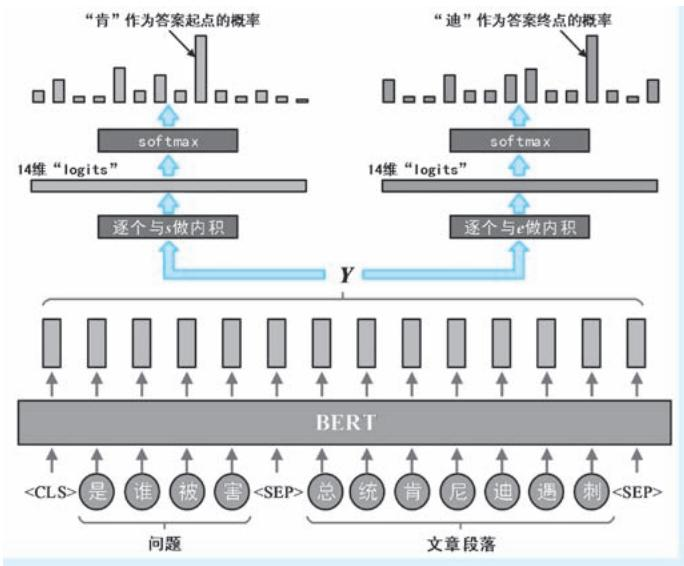  
●图 5-22 BERT 应用于抽取式问答任务的架构示意

第三个任务为常识推理（Commonsense Inference）任务。所谓常识推理任务，即给定一个陈述句和若干个候选语句，判断第一个陈述句与后面几个候选语句中的哪一句在语义层面最有逻辑的连续性。例如，第一句为 “我吃了一大碗面”，给定的四个候选语句为 “（A）天很蓝；（B）水很清；（C）人很多；（D）我很饱”。自然，按照人类正常的思维方式，答案是选 D。从形式上看，常识推理是一种多选一的任务，从任务属性上看也属于自然语言推理的一类。做常识推理任务训练，可以从两个思路考虑架构 （为了方便描述，我们设候选答案个数为 $N$ ，即 $N$ 选 1”任务）：第一种思路为将一个 “N选1”任务看作是 $N$ 个独立的双句二分类任务。操作方法为让第一句与候选语句分别 “组队”送入模型，当第一句与正确的答案一起送入模型时，尽可能输出 “连续”结论，否则输出 “不连续”结论。上述模式利用了前文介绍的分类 （具体来说是双句分类）任务架构实现，而且可以将 $N$ 个组合序列组织为一个批次，一次性送入模型。这种思路的优点在于模型仅独立考虑每个序列之间双句关系，所以可以将多个 $N$ 选1”问题的所有 “陈述-答案”双句组合编入一个批次；第二种思路为将任务看作是针对整个问题的 $N$ 分类。具体操作方法为：让第一句与 $N$ 个候选语句分别 “组队”，然后将这 $N$ 个拼接序列组成一个批次一次性送入模型。在模型的输出端获取批次中 $N$ 个序列 “＜CLS＞”位对应的 $N$ 个

聚合特征。构造变换，将上述 $N$ 个 $d _ { \mathrm { m o d e l } }$ 维特征变换为一个 $N$ 维向量 （即将每个 $N$ 维向量压为标量）。利用 softmax 对上述向量做概率化，结果中第 $t$ 个元素表示预测第 $t$ 个选项是正确选项的概率。问题的正确选项在训练样本中已经给出，因此就可以用真值实现监督训练。不难看出，第二种思路是将一个$N$ 选1”问题看作一个整体问题处理的，后面的变换在某种程度上起到了特征融合的作用，因此该思路的优点是考虑了各个选项之间的关系，这一点在几个选项语义接近时很有用。但是缺点是一个批次只能对应 “一道题”，在批次组织的灵活性方面较第一种思路差很多。第一种实现思路可以完全按照分类任务的架构开展微调训练，这里不再赘述。下面我们仅对第二种思路的实现方式进行介绍，这也是 BERT 采用的方式。BERT 针对常识推理的 $N$ 选1”任务，训练的优化目标可以表示为

$$
L _ {\mathrm {g c i}} = \operatorname {d i s t} \left(\text {s o f t m a x} \left(\hat {\boldsymbol {C}} \boldsymbol {q} ^ {\mathrm {T}}\right), g t \_ \text {a n s w e r}\right) \tag {5-23}
$$

式中， $\hat { \boldsymbol { C } } \in \mathrm { R } ^ { N \times d _ { \mathrm { m o d e l } } }$ 为 BERT 针对 $N$ 个 “陈述-答案”双句组合，得到 $N$ 个聚合特征拼接成的矩阵表示，其中 $N$ 为候选答案的个数，也即批次的大小； $q \in$ $\mathrm { R } ^ { d _ { \mathrm { m o d e l } } }$ 为需要学习的参数向量； $\hat { \boldsymbol { C } } \pmb q ^ { \mathrm { { T } } } \in { \mathbb { R } } ^ { N }$ ，其中第 $i$ 个元素表示批次第 $i$ 个序列的聚合特征 $C _ { i }$ 与 $\pmb q$ 的内积 $\mathbf { \Phi } _ { i } ^ { \prime } = 1 , \cdots , N )$ ）；然后将 softmax 作用在 $\hat { C } q ^ { \mathrm { { T } } }$ 进行概率化操作，即得到一个 $N$ 维的概率分布，即表示 $N$ 个答案与所给陈述句具有连续型的概率；gt_answer为标注真值，以独热编码表示； $\operatorname { d i s t } ( \mathbf { \partial } \cdot \mathbf { \partial } , \cdot \mathbf { \partial } )$ 为预测答案和答案真值之间的损失，最常用的即为交叉熵损失函数。图 5-23 示意了 BERT 针对常识推理任务构造的模型架构。

第四个任务为符号标注任务。所谓符号标注，就是为输入序列中的每一个符号都赋予一个预定义的标签。因此，符号标注是一个典型的符号级分类

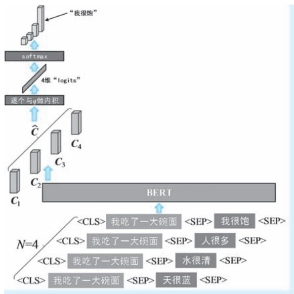  
●图 5-23 BERT 应用于常识推理任务的架构示意

任务———将每个输入符号都划分到预定义标签代表类别中的某一类，而类别数就是预定义标签集的大小。在 NLP 领域，著名的命名实体识别（Named Entity Recognition，NER）就是典型的符号标注任务。NER 是指识别文章报刊等语料中具有特定意义的对象实体，主要包括人名、地名、机构名、专有名词等。NER 是信息抽取的前置任务———只有先将具有特殊意义的词标记出来，才能做进一步的分析应用。BERT 为每一个词汇输出一个向量表示，符号标注既然是一个符号级的分类任务，那我们在每个符号对应的向量表示后再接一个分类器即可。事实上，BERT 对于掩膜语言模型构造本质上也是一个符号标注任务———在特定位置预测输出的词汇，只不过这个分类的类别数与词典长度相等，类别就是“哪个词”。再结合前面介绍 BERT 参数微调训练惯用线性变换的 “套路”，我们给出 BERT 用于符号标注任务的优化目标

$$
L _ {\text {a n n}} = \frac {1}{T} \sum_ {t = 1} ^ {T} \operatorname {d i s t} \left(\operatorname {s o f t m a x} \left(\mathbf {y} _ {t} \mathbf {A} ^ {\mathbf {T}}\right), g t _ {-} a n n _ {t}\right) \tag {5-24}
$$

式中， $T$ 为输入序列的长度； $\boldsymbol { \mathbf { \mathit { y } } } _ { t } \in \mathrm { R } ^ { d _ { \mathrm { m o d e l } } }$ 为BERT 对第 $t$ 个输入词汇构造的输出向量；$\pmb { A } \in \mathrm { R } ^ { K \times d _ { \mathrm { m o d e l } } }$ 为需要学习的变换参数矩阵，其中 $K$ 为标注的类别数；softmax $\left( \boldsymbol { \mathbf { y } } _ { t } \boldsymbol { \mathbf { \overset { . } { A } } } ^ { \mathrm { T } } \right) \in \boldsymbol { \mathrm { R } } ^ { K }$ 即表示针对第 $t$ 个输入词汇在 $K$ 个标注类别上的预测概率；gt_annt为对于第 $t$ 个输入的标注真值，以独热编码表示； $\operatorname { d i s t } ( \mathbf { \partial } \cdot \mathbf { \partial } , \cdot \mathbf { \partial } )$ 为预测类别和类别真值之间的损失，最常用的同样为交叉熵损失函数。图 5-24 示意了BERT 针对符号标注任务构造的模型架构（为了方便示意，我们这次假设做了分词处理）。

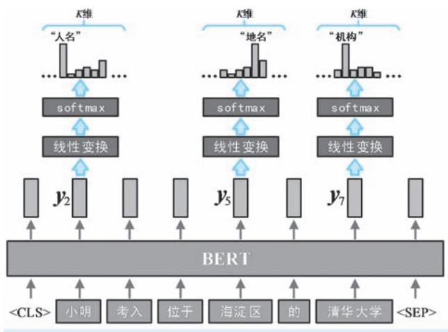  
●图 5-24 BERT 应用于符号标注任务的架构示意

到这里，我们对 BERT 的讨论就告一段落了。洋洋洒洒，写了过万字。我们之所以在 BERT 上用了这么多笔墨，主要是因为 BERT 作为 Transformer 诞生后、NLP 领域基于 Transformer 架构最重要的一个预训练模型，可谓 “系出名门，光芒闪耀”。BERT 为后续很多预训练模型奠定了基础，指明了方向。非常重要，也非常值得细细品味。

GPT （1. 0 版本）和BERT 这两个大明星 “出道”以后，人们都意识到了Transformer 的巨大威力，基于Transformer 架构的预训练模型也如井喷般在NLP 领域蓬勃发展起来。在接下来的内容中，我们按照时间顺序，对 GPT 与 BERT 之后，多个基于 Transformer 架构的经典 NLP 预训练模型进行介绍和分析。

# 5. 4. 3 Transformer-XL 与 XLNet：从任意长输入到“更好的 BERT”

Transformer 以并行方式一次性读入一个完整序列，利用自注意力机制构建序列元素之间的关系，最终一次性产生输出序列。为了支持上述并行处理，Transformer 只支持固定长度的序列输入 （如Transformer 支持512 个词汇）：对于长度不足的输入序列需进行补齐操作，而对超过长度限制的序列要进行裁剪操作。对于短句分析，这样的模式自然不存在什么问题，但是在面对一个长句乃至一篇文章这类超长输入序列时，要求定长序列输入的模式将难以应对。既然 Transformer 在进行语言分析时如此厉害，自然不能存在不支持任意长度序列输入这样的 “bug”———在 Transformer 诞生后，很多学者便意识到这一问题，并提出了改进方案。其中，最简单最直接的想法及 “化整为零”的分段处理思路———将超长文本拆分为一个个具有固定长度的片段，然后分别让模型在不同分段上独立处理。但是，针对片段的独立处理意味着认为片段具有独立的语义，不同片段中词汇的位置信息也是自成体系。这样的处理方式然是有大问题的，独立处理意味着认为片段具有独立的语义和独立的位置信息，这显然是不合理的。毕竟一段文章并不是一句句毫无关系语句的生拼硬凑，硬性的分段一定会人为带来语义割裂，形成上下文碎片 （context fragmentation）。

为了缓解上述问题，Al-Rfou 等[11] 学者于 2018 年 8 月提出了一种具有 64 层 Transformer 解码器架构的字符级 （character-level）语言模型，该模型使用了 “分段训练加滑窗推理”的模式。尽管该模型

在一定程度上解决了变长序列的输入问题，但是其采用的滑窗推理的方式需要占用非常惊人的计算资源，速度很慢。为了能够更加完美的解决输入长度限制的问题，Zihang Dai 和 Zhilin Yang 等六名来自CMU 和谷歌的学者于 2019 年 1 月和 6 月先后提出 Transformer-XL[12] 和 XLNet[13] 两个基于 Transformer的模型：前者围绕 Transformer 无法接受变长输入序列这一具体问题，提出了一系列改进；而后者则是基于 Transformer-XL 探索得到的有益成果，构造的一个完整的预训练模型。

# 1. Transformer-XL：打破定长输入的限制

我们先看 Transformer-XL 模型[12] ，该模型的提出旨在让 Transformer 能够处理超长文本序列，其名称中的 “XL”便是 “eXtra Long”的简写。整体来看，Transformer-XL 模型仍然遵循分段处理的模式，但是相较于独立分段处理，Transformer-XL 为了解决上下文碎片和推理速度慢的问题，引入分段递归（segment-level recurrence） 和相对位置编码（relative positional encoding） 两个重要机制：前者旨在构建片段与片段之间的关系，而后者使得在分段处理时能够有效整合词汇的位置信息。

我们首先来看看 Transformer-XL 的分段递归机制。在训练阶段，Transformer-XL 会使用一个额外的、具有固定长度的存储空间来保存上一个片段的隐状态㊀①。在进行当前片段处理时，会将这些存储的隐状态与当前片段进行交互和信息整合，从而建立起两个片段之间的联系。具体来说，我们将Transformer 接受的固定序列长度记为 $T$ ，将模型的层数记作 $N$ （即编码器或解码器的个数）。我们用下标 和 $| \tau + 1$ 来区分两个相邻的片段 （可以将 和 $| \tau + 1$ 分别视为上一片段和当前片段）。对于第 $n { - } 1$ 层，两个相邻的 片 段 的 隐 状 态 分 别 表 示 为 $\pmb { H } _ { \tau } ^ { ( n - 1 ) }$ 和 $\pmb { H } _ { \tau + 1 } ^ { ( n - 1 ) }$ ，这 里， $\pmb { H } _ { \tau } ^ { ( n - 1 ) }$ ）和 $\pmb { H } _ { \tau + 1 } ^ { ( n - 1 ) }$ 均 为 $T \times d _ { \mathrm { m o d e l } }$ 矩 阵。Transformer-XL 采用如下方式计算第二个片段的第 $n$ 层输出

$$
\tilde {\boldsymbol {H}} _ {\tau + 1} ^ {(n - 1)} = \operatorname {c o n c a t} \left(\operatorname {S G} \left(\boldsymbol {H} _ {\tau} ^ {(n - 1)}\right), \boldsymbol {H} _ {\tau + 1} ^ {(n - 1)}\right) \tag {5-25}
$$

$$
\left\{ \begin{array}{l} \boldsymbol {Q} _ {\tau + 1} ^ {(n)} = \boldsymbol {H} _ {\tau + 1} ^ {(n - 1)} \boldsymbol {W} _ {q} ^ {\mathrm {T}} \\ \boldsymbol {K} _ {\tau + 1} ^ {(n)} = \tilde {\boldsymbol {H}} _ {\tau + 1} ^ {(n - 1)} \boldsymbol {W} _ {k} ^ {\mathrm {T}} \\ \boldsymbol {V} _ {\tau + 1} ^ {(n)} = \tilde {\boldsymbol {H}} _ {\tau + 1} ^ {(n - 1)} \boldsymbol {W} _ {v} ^ {\mathrm {T}} \end{array} \right. \tag {5-26}
$$

$$
\boldsymbol {H} _ {\tau + 1} ^ {(n)} = \operatorname {T r m} _ {-} \text {l a y e r} \left(\boldsymbol {Q} _ {\tau + 1} ^ {(n)}, \boldsymbol {K} _ {\tau + 1} ^ {(n)}, \boldsymbol {V} _ {\tau + 1} ^ {(n)}\right) \tag {5-27}
$$

在式 （5-25）中，concat 拼接按照序列长度维度进行，即 $\tilde { \pmb { H } } _ { \tau + 1 } ^ { ( n - 1 ) } \in \mathrm { R } ^ { 2 T \times d _ { \mathrm { m a d e l } } }$ l即表示将两个长度为 $T$ 的序列拼接为一个长度为 2T 的序列；式中 SG（·）为 “Stop Gradient”的简写，SG $\mathbf { \nabla } [ \pmb { H } _ { \tau } ^ { ( n - 1 ) }$ ）即表明在进行前向传播的时候正常使用 $\pmb { H } _ { \tau } ^ { ( n - 1 ) }$ ）值，但是训练阶段 $\pmb { H } _ { \tau } ^ { ( n - 1 ) }$ ）不参与梯度回传，这就意味着 $\pmb { H } _ { \tau } ^ { ( n - 1 ) }$ ）只作为纯粹的存储数据使用；式 （5-26）给出了 Transformer 层在进行注意力计算时，查询、键和值集合的来源：查询集合由当前片段的隐状态来扮演，而键-值集合的角色则由上一片段和当前片段拼接得到的联合序列扮演。在三式中， $\boldsymbol { W } _ { \boldsymbol { q } } ^ { \mathrm { T } }$ 、 $\boldsymbol { W } _ { k } ^ { \mathrm { T } }$ 和 $\boldsymbol { W } _ { \boldsymbol { v } } ^ { \mathrm { T } }$ 均为可学习的线性变换矩阵；式 （5-27）表示一个 Transformer 层的完整操作，该层即以 ${ Q } _ { \tau + 1 } ^ { ( n ) }$ 、 ${ \pmb K } _ { \tau + 1 } ^ { ( n ) }$ 和 $V _ { \tau + 1 } ^ { ( n ) }$ ）作为输入，其中经过多头注意力和全连接前馈网络两个子模块的加工，输出当前片段对应的隐状态。从上述过程可以看出，Transformer-XL 正是利用注意力机制，

以当前短序列查询历史———当前长序列的方式获得注意力权重，然后并进行特征整合，从而建立起两个片段之间的关联关系。这一操作等价于在进行当前片段处理时，以上一个片段的缓存信息作为参考上文，可以说思路非常的巧妙。图5-25 示意了独立片段处理模式 （在 Transformer-XL 的文章中称之为“Vanilla Transformer”）与 Transformer-XL 使用分段递归模式的对比示意。在图中我们示意了三个片段，分别以 -1、 和 $| \tau + 1$ 来表示。其中图5-25b 中的蓝色线段表示当前片段对上一片段的依赖关系，但这些依赖关系在训练阶段不涉及梯度回传。

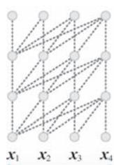  
片段t-1

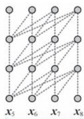  
片段T

  
片段τ+1

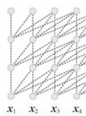  
片段t-1

  
片段t（无梯度）

  
片段τ+1  
a)   
b)   
●图 5-25 独立片段处理模式与分段递归处理模式对比示意  
a）独立片段处理模式  
b）分段递归处理模式

需要注意的是，Transformer-XL 使用的注意力机制为掩膜注意力机制———在进行某一词汇特征的构造时，掩膜注意力机制一方面遮挡后续词汇，使得注意力权重的计算和特征整合仅在当前词汇之前进行，因此 Transformer-XL 属于自回归前向语言模型；另一方面，与 GPT 的前向非完全依赖类似，Transformer-XL 对上文的依赖也是具有 “N-gram”假设的。例如，在图 5-25b 中，位于第 $n$ 层的某隐状态节点仅与 $n { - } 1$ 层的四个隐状态有注意力依赖关系，因此属于五元语言模型。图5-26 示意了在分段递归处理模式下，针对两个片段的前向完全依赖和局部依赖的对比。

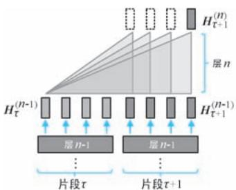  
a）

  
  
●图 5-26 分段递归处理模式下的前向完全依赖和局部依赖的对比示意  
a）前向完全依赖示意  
b）前向局部依赖示意

为了避免人为割裂文本的语义，Al-Rfou 等学者在模型推理阶段采用了滑窗方案，试图以更加“丝滑”的方式进行长句推理。所谓滑窗模式即针对一段长文本，按照一定步长，从头至尾，在相邻的定长片段上进行独立推理，然后在模型的输出端接收片段最后一个词汇对应的输出。图 5-27a 示意

了上述滑窗模式的操作过程。不难看出，滑窗推理模式看似 “无缝”，但却存在两个显著缺陷。第一个缺陷为无法进行超长距离的依赖建模，毕竟在每一个滑窗位置的独立处理，使得模型能够表达的序列依赖长度不会超过片段长度 T；第二个缺陷即计算量太过庞大，对于每一个滑窗对应的序列片段，都会进行一次完整的模型推理。试想我们面对一段超长文本，以步长为 1 进行滑窗推理，滑窗独立推理方式所需的计算量将是惊人的。Transformer-XL 模型则能够在很大程度上解决上述两个问题。对于依赖建模问题，Transformer-XL 采用的缓存和复用机制，会带来形如

$$
\boldsymbol {H} _ {S} ^ {(N)} = \operatorname {d e p e n d} \left(\boldsymbol {H} _ {S - 1} ^ {(N - 1)}, \boldsymbol {H} _ {S} ^ {(N - 1)}\right)
$$

$$
\begin{array}{l} \boldsymbol {H} _ {S - 1} ^ {(N - 1)} = \operatorname {d e p e n d} \left(\boldsymbol {H} _ {S - 2} ^ {(N - 2)}, \boldsymbol {H} _ {S - 1} ^ {(N - 2)}\right) \\ \dots \end{array} \tag {5-28}
$$

$$
\boldsymbol {H} _ {2} ^ {(2)} = \operatorname {d e p e n d} \left(\boldsymbol {H} _ {1} ^ {(1)}, \boldsymbol {H} _ {2} ^ {(1)}\right)
$$

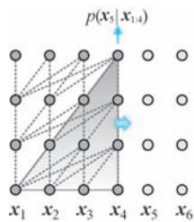

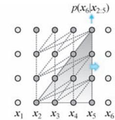  
a）

b)   
●图 5-27 滑窗独立推理模式与 Transformer-XL 的推理模式对比示意  
  
a）滑窗独立推理模式示意  
b）Transformer-XL 推理模式示意

的递归依赖关系。式 （5-28）中 $N$ 为模型的层数，S 为所有片段的个数； “depend”表示泛指的依赖关系。从式 （5-28）可以看出，Transformer-XL 可以表达的序列依赖关系非常长，并且和模型的层数相关———最后一个片段的最终输出依赖了第一个片段的第一层输出。图 5-27b 示意了 Transformer-XL 的推理过程；针对计算效率问题，Transformer-XL 缓存上一个片段的层输出并被在下一个片段的处理中重复使用，这种方式避免了大量的冗余计算，故相较于滑窗独立推理方式，Transformer-XL 带来的效率提升十分显著。

我们接下来再看看 Transformer-XL 的相对位置编码机制。标准 Transformer 以绝对位置编码来表示词汇的位置信息。这里的 “绝对”即指词汇的位置编码代表的就是其在语句中的绝对位置。但是在分段处理模式下，每个片段都以独立方式处理，故都具有独立的位置索引。这样一来，绝对编码方式会导致我们不能区分不同片段内、处于相同位置词汇的先后顺序，例如，假设输入的完整语句 “I have avery cute daughter” 被拆分为 “I have a” 和 “very cute daughter” 两个片段， “have” 和 “cute” 在各自的分段中均排在第二位，如果按照绝对编码方式，二者将具有相同的位置信息表示，这显然是不合理的。正是因为绝对编码存在的问题，人们提出了相对位置编码机制。绝对编码与相对位置编码的区别在于：在绝对位置编码机制中，所有词汇都具有唯一的位置表示，这一表示不随着查询词汇的改变而改变。例如，假设第i 个词汇的位置编码向量为 $\pmb { u } _ { i }$ ，则无论是以第j 个词汇做查询还是以第 $k$ 个词汇

做查询，第 $i$ 个词汇的位置编码都是 $\pmb { u } _ { i }$ ；而相对位置编码则 “站在什么山上唱什么歌”—— —每个词汇的位置编码会随着查询词汇的改变而改变。例如，以第 $j$ 个词汇做查询时，第 $i$ 个词汇对应的位置编码向量为$r _ { j - i }$ ，而当查询词汇变为第 $k$ 个词汇时，第 $i$ 个词汇对应的位置编码就相应的变为 $r _ { k - i }$ 。可以看出，相对位置编码抛弃了绝对位置编码中词汇到底在全句中 “排老几”的争论，词汇的位置信息只以当前查询词汇为基准，这也正是 “相对”一词的由来。既然不再考虑词汇的全句位置，那么分段处理模式自然是合理的。下面，我们就从具有绝对位置编码的自注意力机制开始谈起，经过一步步的改造得到 Transformer-XL 使用的相对注意力编码机制。

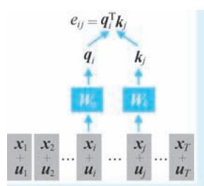  
●图 5-28 具有绝对位置编码的自注意力机制示意

首先，如图5-28 所示，假设输入的序列有 $T$ 个词汇，对于其中的第 $i$ 个和第 $j$ 个词汇，我们分别用 $\mathbf { \boldsymbol { x } } _ { i }$ 和 $\boldsymbol { x } _ { j }$ 表示二者的词嵌入向量，用 $\pmb { u } _ { i }$ 和 $\pmb { u } _ { j }$ 分别表示其对应的绝对位置编码向量。多头自注意力首先对两个向量进行线性变换，分别得到查询向量 $\pmb { q } _ { i } = \pmb { W } _ { q } ^ { \mathrm { T } } \big ( \pmb { x } _ { i } + \pmb { u } _ { i } \big )$ ）和键向量 $\pmb { k } _ { j } = \pmb { W } _ { k } ^ { \mathrm { T } } ( \pmb { x } _ { j } { + } \pmb { u } _ { j } ) ^ { \ominus }$ ①。然后构建两个词汇之间的关系，也即所谓的对齐操作。最常见的对齐操作即向量内积，即有 ${ \boldsymbol { e } } _ { i j } ^ { \mathrm { a b s } } = { \pmb q } _ { i } ^ { \mathrm { T } } { \pmb k } _ { j }$ ，我们将 $\pmb { q } _ { i }$ 和 $k _ { j }$ 带入内积表示，并展开有

$$
\begin{array}{l} e _ {i j} ^ {\text {a b s}} = \boldsymbol {q} _ {i} ^ {\mathrm {T}} \boldsymbol {k} _ {j} = \left(\boldsymbol {x} _ {i} + \boldsymbol {u} _ {i}\right) ^ {\mathrm {T}} \boldsymbol {W} _ {q} ^ {\mathrm {T}} \boldsymbol {W} _ {k} ^ {\mathrm {T}} \left(\boldsymbol {x} _ {j} + \boldsymbol {u} _ {j}\right) \tag {5-29} \\ = \boldsymbol {x} _ {i} ^ {\mathrm {T}} \boldsymbol {W} _ {q} ^ {\mathrm {T}} \boldsymbol {W} _ {k} ^ {\mathrm {T}} \boldsymbol {x} _ {j} + \boldsymbol {x} _ {i} ^ {\mathrm {T}} \boldsymbol {W} _ {q} ^ {\mathrm {T}} \boldsymbol {W} _ {k} ^ {\mathrm {T}} \boldsymbol {u} _ {j} + \boldsymbol {u} _ {i} ^ {\mathrm {T}} \boldsymbol {W} _ {q} ^ {\mathrm {T}} \boldsymbol {W} _ {k} ^ {\mathrm {T}} \boldsymbol {x} _ {j} + \boldsymbol {u} _ {i} ^ {\mathrm {T}} \boldsymbol {W} _ {q} ^ {\mathrm {T}} \boldsymbol {W} _ {k} ^ {\mathrm {T}} \boldsymbol {u} _ {j} \\ \end{array}
$$

以上的展开式包括了四个交叉项：第一项为词向量 $\mathbf { \boldsymbol { x } } _ { i }$ 和 $\boldsymbol { x } _ { j }$ 之间的关系 （忽略其中的 $\boldsymbol { W } _ { \boldsymbol { q } } ^ { \mathrm { T } } \boldsymbol { W } _ { \boldsymbol { k } } ^ { \mathrm { T } }$ ，只看两端的 $\pmb { x } _ { i } ^ { \mathrm { T } }$ 和 $\boldsymbol { x } _ { j }$ ，后面三项也类似）；第二项表示词向量 $\mathbf { \boldsymbol { x } } _ { i }$ 和位置编码向量 $\pmb { u } _ { j }$ 之间的关系；第三项体现了位置编码向量 $\pmb { u } _ { i }$ 和词向量 $\boldsymbol { x } _ { j }$ 之间的关系；第四项表达了位置编码向量 $\pmb { u } _ { i }$ 和 $\pmb { u } _ { j }$ 之间的关系。基于式（5-29），我们进行以下三方面的改造：第一个改造为 “绝对改相对”。 $\pmb { u } _ { i }$ 是基准查询向量对应的位置编码，因此我们只需简单地将另外一个位置编码向量 “相对化”———将 $\pmb { u } _ { j }$ 替换为 $r _ { i - j }$ ，即将绝对位置编码下的对齐操作改造为相对位置编码下的对齐操作；第二个改造为内容与位置分组。上式第一、三项中的 $\boldsymbol { W } _ { k } ^ { \mathrm { T } }$ 为词嵌入向量 $\boldsymbol { x } _ { j }$ 的系数矩阵，而第二、四项中相同的 $\boldsymbol { W } _ { k } ^ { \mathrm { T } }$ 又作为相对位置编码向量 $r _ { i - j }$ 的系数矩阵。我们知道， $\boldsymbol { x } _ { j }$ 和 $r _ { i - j }$ 属于不同性质的向量，前者为词嵌入向量，也被称为基于内容的键向量（content-based key vector），而后者为相对位置编码向量，也被称为基于位置的键向量 （location-basedkey vector）。为了让模型能够区分上述两类向量，我们使用 $\boldsymbol { W } _ { k , E }$ 和 $\boldsymbol { W } _ { k , R }$ 两个新矩阵分别作为 $\boldsymbol { x } _ { j }$ 和 $r _ { i - j }$ 的线性变换系数矩阵，即将第一、三项中 $\boldsymbol { W } _ { k } ^ { \mathrm { T } }$ 替换为 $\boldsymbol { W } _ { k , E }$ ，将第二、四项中 $\boldsymbol { W } _ { k } ^ { \mathrm { T } }$ 替换为 $\boldsymbol { W } _ { k , R }$ ；第三个改造为构造全局查询基准。 $\pmb { u } _ { i }$ 表示基准查询向量对应的位置编码。既然是基准，就应 “放之四海皆准”，即可以将基准位置编码表示为一个与位置无关的全局向量。这一点是很好理解的：相对位置编码模式下，我们需要的就仅仅是一个相对基准的差异信息，至于基准具体在哪个位置反而无所谓。式

（5-29）中的后两项都包括 $\pmb { u } _ { i } ^ { \mathrm { T } } \pmb { W } _ { q } ^ { \mathrm { T } }$ ，即都表示针对基准位置向量的线性变换，其结果为一个 $d _ { \mathrm { m o d e l } }$ 维向量。于是我们将第三项中的 $\pmb { u } _ { i } ^ { \mathrm { T } } \pmb { W } _ { q } ^ { \mathrm { T } }$ 替换为 $\pmb { u } ^ { \operatorname { T } }$ ，将第四项中的 $\pmb { u } _ { i } ^ { \mathrm { T } } \pmb { W } _ { q } ^ { \mathrm { T } }$ 替换为 $\pmb { \nu } ^ { \mathrm { T } }$ ， $\pmb { u } ^ { \mathrm { T } }$ 和 $\pmb { \nu } ^ { \mathrm { T } }$ 都是可学习的参数向量㊀①。经过上述三方面改造，我们即得到新的相对位置编码表示

$$
e _ {i j} ^ {\mathrm {r e l}} = \boldsymbol {x} _ {i} ^ {\mathrm {T}} \boldsymbol {W} _ {q} ^ {\mathrm {T}} \boldsymbol {W} _ {k, E} \boldsymbol {x} _ {j} + \boldsymbol {x} _ {i} ^ {\mathrm {T}} \boldsymbol {W} _ {q} ^ {\mathrm {T}} \boldsymbol {W} _ {k, R} \boldsymbol {r} _ {i - j} + \boldsymbol {u} ^ {\mathrm {T}} \boldsymbol {W} _ {k, E} \boldsymbol {x} _ {j} + \boldsymbol {v} ^ {\mathrm {T}} \boldsymbol {W} _ {k, R} \boldsymbol {r} _ {i - j} \tag {5-30}
$$

式 （5-30）即为 Transformer-XL 相对位置编码模式的对齐模型。下面，我们将分段递归和相对位置编码两个机制结合，即可勾勒出 Transformer-XL 模型的整体架构———对于一个具有 $N$ 层的 Transformer-XL模型，其中第 $n$ 层的数据加工的完整过程为 （假设注意力为单头注意力）

$$
\tilde {\boldsymbol {H}} _ {\tau} ^ {(n - 1)} = \operatorname {c o n c a t} \left(\operatorname {S G} \left(\boldsymbol {H} _ {\tau - 1} ^ {(n - 1)}\right), \boldsymbol {H} _ {\tau} ^ {(n - 1)}\right) \tag {5-31}
$$

$$
\left\{ \begin{array}{l} \boldsymbol {Q} _ {\tau} ^ {(n)} = \boldsymbol {H} _ {\tau} ^ {(n - 1)} \left(\boldsymbol {W} _ {q} ^ {(n)}\right) ^ {\mathrm {T}} \\ \boldsymbol {K} _ {\tau} ^ {(n)} = \widetilde {\boldsymbol {H}} _ {\tau} ^ {(n - 1)} \left(\boldsymbol {W} _ {k, E} ^ {(n)}\right) ^ {\mathrm {T}} \\ \boldsymbol {V} _ {\tau} ^ {(n)} = \widetilde {\boldsymbol {H}} _ {\tau} ^ {(n - 1)} \left(\boldsymbol {W} _ {v} ^ {(n)}\right) ^ {\mathrm {T}} \end{array} \right. \tag {5-32}
$$

$$
\begin{array}{l} \boldsymbol {E} _ {\tau , i, j} ^ {(n)} = \left(\boldsymbol {Q} _ {\tau , i} ^ {(n)}\right) ^ {\mathrm {T}} \boldsymbol {K} _ {\tau , j} ^ {(n)} + \left(\boldsymbol {Q} _ {\tau , i} ^ {(n)}\right) ^ {\mathrm {T}} \boldsymbol {W} _ {k, R} ^ {(n)} \boldsymbol {r} _ {i - j} \tag {5-33} \\ + \boldsymbol {u} ^ {\mathrm {T}} \boldsymbol {K} _ {\tau , j} ^ {(n)} + \boldsymbol {v} ^ {\mathrm {T}} \boldsymbol {W} _ {k, R} ^ {(n)} \boldsymbol {r} _ {i - j} \\ \end{array}
$$

$$
\boldsymbol {A} _ {\tau} ^ {(n)} = \operatorname {M a s k e d S o f t m a x} \left(\boldsymbol {E} _ {\tau} ^ {(n)}\right) \boldsymbol {V} _ {\tau} ^ {(n)} \tag {5-34}
$$

$$
\boldsymbol {O} _ {\tau} ^ {(n)} = \text {L a y e r N o r m} \left(\operatorname {L i n e a r} \left(\boldsymbol {A} _ {\tau} ^ {(n)}\right) + \boldsymbol {H} _ {\tau} ^ {(n - 1)}\right) \tag {5-35}
$$

$$
\boldsymbol {H} _ {\tau} ^ {(n)} = \operatorname {F w d L a y e r} \left(\boldsymbol {O} _ {\tau} ^ {(n)}\right) \tag {5-36}
$$

以上六个公式将一个 Transformer-XL 层的数据加工过程描述得再清晰不过：式 （5-31） 为 “记忆与当前的碰撞”———将上一片段上一层的存储隐状态与当前片段上一层的隐状态进行拼接㊁②；式 （5-32）利用线性变换构造查询、键和值三个矩阵。这些矩阵中的每列代表一个特征向量；式 （5-33）表示在Transformer-XL 相对位置编码模式下、第 i 个查询向量与第 $j$ 个键向量的对齐得分；式 （5-34）实现注意力权重的计算和加权求和。其中的 “MaskedSoftmax”为带有掩膜机制的 softmax 概率化操作，其中掩膜机制即实现 “不看下文”的自回归和 “看部分上文”的语言模型双向遮掩功能；式 （5-35）示意了注意力模块的残差连接和层归一化操作；式 （5-36）即为最后的逐位置全连接前馈神经网络结构㊂③。

这里，我们对 Transformer-XL 模型的核心内容基本算是讨论完毕。Transformer-XL 通过引入分段递归和相对位置编码两个重要机制，旨在解决标准 Transformer 模型无法接受任意长度序列输入这一关键性问题。Transformer-XL 虽然不是一个完整的预训练模型，但其目的明确具体，为我们即将介绍的XLNet 模型奠定了坚实的基础。

# 2. XLNet：“更好的 BERT”

接下来，我们移步到 XLNet 模型[13] 。先来看看模型定位。XLNet 是一个可以与 BERT 和 GPT 等模型比肩的预训练模型。这就意味着其提出的意图就是奔着成为 NLP “全能型选手” 这一宏伟目标去的。因此 XLNet 不像 Transformer-XL 那样将眼光聚焦到某一类具体问题，甚至也不像标准 Transformer那样将目标锁定在机器翻译这一单一任务。再来介绍诞生背景。XLNet 比自家的 BERT 晚诞生了 8 个月，旨在找到并解决BERT 存在的问题。那么BERT 有什么问题呢？简而言之，BERT 构造的自编码语言模型能够有效捕捉语言的上下文双向信息，这一点远胜无法进行双向建模的自回归语言模型。然而，BERT 基于带有 “＜MASK＞”标识的语言序列进行模型预训练，这与无 “＜MASK＞”标识的下游任务适配存在着严重的不一致，而自回归语言模型反而不存在这一问题。因此，XLNet 构造了一种能够兼顾自回归语言模型和自编码语言模型优点的新型语言模型———排列语言模型 （PermutationLanguage Model）；然后介绍模型架构。XLNet 是一种基于 Transformer-XL 架构的预训练模型，其名称中的 “XL”即为对 “Transformer-XL”指代。XLNet 继承了 Transformer-XL 模型分段递归和相对位置编码两个重要机制，使得模型能够接收超长序列输入，并且能够开展快速推理；最后来看看 XLNet 的成绩。XLNet 通过克服 BERT 存在的缺陷，在20 个公开任务/ 数据集上超越了 BERT，可谓成绩斐然。也正是因为这一原因，XLNet 一度被称为 “更好的 BERT”。

XLNet 开宗明义，首次㊀将领域中的语言模型分为自回归语言模型和自编码语言模型两大 “阵营”，前者以 ELMo 和 GPT 构造的预训练语言模型为代表，而后者则以 BERT 使用的掩膜语言模型为代表。自回归语言模型按照行文顺序对语句中词汇的单方向依赖关系进行建模，是语言模型数学定义的自然表达。该模式对机器翻译、文本摘要等生成类下游任务也非常友好，故应用最为广泛。然而，自回归语言模型最大的缺点在于其不能同时构建上下文的双向依赖关系，故其对语言的表达能力难以令人满意。正是因为上述原因，BERT 放弃了单向语言模型，以构建双向语言模型作为其预训练目标，通过在输入序列中添加掩膜机制， “逼着”模型猜词填空以提升其对上下文语义的理解能力。然而，BERT 的掩膜语言模型也存在着两个明显的问题。

第一个问题，BERT 的预训练与下游任务微调间存在显著差异。BERT 在训练掩膜语言模型时，随机将输入序列中的某些词汇替换为 “＜MASK＞”标识。而在下游任务中，模型输入的语句中却不存在这些 “＜MASK＞”。这就意味着 BERT 在两种任务的训练中使用了不同分布的数据：前者带有人为添加的噪声，而后者则使用干净数据。我们都知道，以不同分布数据训练得到模型为基础进行微调是非常困难的。除此之外，预训练与下游任务微调的任务目标也相去甚远：前者的本质是构造一个去噪模型，而后者旨在完成分类等其他 NLP 任务。

第二个问题，BERT 忽略了被遮掩词汇之间的关系。在 BERT 掩膜语言模型训练中，一个序列中被遮掩的词汇可能不止一处，我们以 “所有遮掩词汇预测概率的对数之和取得最大值”作为训练目标，但是要知道这里之所以能够使用 “之和”，是因为引入了独立性假设。为了理解这一问题，我们简单回顾 BERT 掩膜语言模型的训练方法。首先，对于一个长度为 $T$ 的输入序列 $w$ ，BERT 将其中的

部分词汇替换为 “＜MASK＞”。我们将带有 “＜MASK＞”标识的输入序列和被遮掩的词汇集合分别记作w^ 和w，则掩膜语言模型的训练目标为

$$
\theta^ {*} = \arg \max  _ {\theta} \log (\bar {w} | \hat {w}; \theta) \approx \arg \max  _ {\theta} \sum_ {t = 1} ^ {T} m _ {t} \log (\bar {w} _ {t} | \hat {w}; \theta) \tag {5-37}
$$

式中， $m _ { t }$ 为遮掩标志位，起到求和筛选的作用———若序列中第 t 个词汇被遮掩，则有 $\mathbf { \dot { m } } _ { t } = 1$ ，否则 $m _ { t } = 0$ ；$\overline { { w } } _ { t }$ 为位于第 $t$ 个位置的被遮掩词汇。上式中 “≈”右边的部分即为求和模式的优化目标，而这也正是联合概率在独立假设下因子化的结果。但是，上述独立性假设往往是不合理的。例如，假设一个原始的输入是 “我爱我的女儿”，经过 BERT 的遮掩操作，输入的数据变为 “我爱我的＜MASK＞＜MASK＞”。显然，我们可以按照第一个 “＜MASK＞”遮掩的 “女”字轻易地猜出第二个 “＜MASK＞”代表的“儿”字，这就意味着被遮掩的词之间是并不独立的。上述两个 BERT 自编码语言模型的缺陷，却是自回归语言模型的优势所在。既然两类语言模型各有所长，优势互补，那么是否可以构造一种新的语言模型，取二者之长，避二者之短呢？在这一思路的指导下，XLNet 提出了一种新的语言模型———排列语言模型（Permutation Language Model）。

首先我们来讨论 XLNet 的第一个法宝———排列语言模型。排列语言模型的本质还是一种自回归语言模型，XLNet 将其的预训练称为广义自回归语言预训练（Generalized Autoregressive Pretraining）。相较于自回归语言模型和自编码语言模型，排列语言模型综合了二者的优势：第一，排列语言模型能够进行双向语言建模，弥补了自回归模型无法捕捉上下文依赖关系这一短板；第二，排列语言模型取消了BERT 语言模型中的掩膜机制，使得上述因 “＜MASK＞”引发的问题都得到较为有效的解决。

具体来说，给定一个长度为 $T$ 的输入序列 $\pmb { w } = \boldsymbol { w } _ { 1 } , \cdots , \boldsymbol { w } _ { T }$ ，针对其中第 $t$ 个词汇 $w _ { t }$ ，自回归语言模型建立了该词汇与上文全部词汇㊀①或与下文全部词汇之间的依赖关系，即所谓的前向语言模型和后向语言模型。二者对应的条件概率分别可以表示为 $p \left( \left. w _ { t } \right| w _ { 1 } , \cdots , w _ { t - 1 } \right)$ ）和 $p \left( \boldsymbol { w } _ { t } \mid \boldsymbol { w } _ { t + 1 } , \cdots , \boldsymbol { w } _ { T } \right)$ ）；而在 BERT的掩膜语言模型中，假设 $w _ { t }$ 为被遮掩词汇，则掩膜语言模型构建了 “＜MASK＞”与整个上下文之间的依赖关系，对应的条件概率可以表示为 $p \left( \boldsymbol { w } _ { t } \mid \boldsymbol { w } _ { 1 } , \cdots , \boldsymbol { w } _ { t - 1 } , < \mathrm { M A S K } > , \boldsymbol { w } _ { t + 1 } , \cdots , \boldsymbol { w } _ { T } \right)$ ；XLNet 的排列语言模型则给出了一种 “全方位”的解决方案———其构造了 $w _ { t }$ 与上下文所有可能词汇或词汇组合的依赖关系。这就意味着针对 $w _ { t }$ ，排列语言模型的概率模型对应了一组条件概率，我们将其表示为 $p ( w _ { t } | \tilde { \mathbf { w } } )$ ）。其中， $\widetilde { w }$ 为语句 $w$ 中任意多个词汇、以任意顺序构成的集合。例如， $\widetilde { w }$ 也可以是 $w _ { t }$ 的上文词汇序列或下文词汇序列，这就是前向语言模型和后向语言模型； $\widetilde { w }$ 也可以是 $w _ { t }$ 的上下文序列，这便是双向语言模型； $\widetilde { w }$ 可以包含 $w$ 中的一个词汇、两个词汇，抑或是任意多个词汇，即表示更加灵活广泛的依赖关系； $\widetilde { w }$ 甚至可以是空集，即有 $p ( w _ { t } | \tilde { \mathbf { w } } ) = p \big ( w _ { t } \big )$ ），这便表示 $w _ { t }$ 谁也不依赖， “独成一派”。我们再举一个例子：输入的语句是 “我的女儿”，对于其中排在第 3 位的 “女”字，排列语言模型认为其和“儿”有关系，和 “我”有关系，和 “我的”有关系，和 “我的儿”有关系等。可以看出，排列语言模型建立了一种完备的、广泛的依赖关系———可谓把输入序列 “掰开了揉碎了”建立起的 “全方位”依赖。排列语言模型的依赖关系可以用 “一排下标，二朝前看”的方式来构造。下面我们用一个

“toy”序来列举例说明。设序列长度为 3 （即 $T = 3$ ），记作 $w = w _ { 1 } , w _ { 2 } , w _ { 3 }$ ，假设希望为其中的 $w _ { 2 }$ 构造排列语言模型对应的概率模型。经过观察可以容易看出，排列语言模型包含的条件概率有 4 个，即p（w ）、 $p ( w _ { 2 } \vert w _ { 1 } )$ ）、 $p ( w _ { 2 } \vert w _ { 3 } )$ ）和 $p ( w _ { 2 } \vert w _ { 1 } , w _ { 3 } )$ ）。按照 “一排下标，二朝前看”的方式，第一步为 “排下标”：我们将原始下标序列词汇的下标记作 {1，2，3}，则其所有可能的排列有 $3 ! = 6$ 种，有

$$
\{\{2, 1, 3 \}, \{2, 3, 1 \}, \{1, 2, 3 \}, \{3, 2, 1 \}, \{1, 3, 2 \}, \{3, 1, 2 \} \} \tag {5-38}
$$

为了构建词汇 $w _ { 2 }$ 的依赖关系，我们从上述排列集合中取出每一种排列，将位于下标 “2”左边的所有下标作为其所依赖的词汇下标，这便是所谓的 “朝前看”。例如，在排列{2，1，3}和{2，3，1}中， “2”左边没其他下标，即表示 $w _ { 2 }$ 不依赖任何词汇，对应的条件概率为 $p \left( w _ { 2 } \right)$ ）；在排列{1，2，3}和{3，2，1}中，位于 “2”左边的下标分别为 “1”和 “3”，即分别对应条件概率 $p ( w _ { 2 } | w _ { 1 } )$ ）和 $p ( w _ { 2 } | w _ { 3 } )$ ）；在排列{1，3，2}和{3，1，2}中，位于 “2”左边的下标分别为 “1，3”和 “3，1”，即表示条件概率 $p ( w _ { 2 } \mid w _ { 1 } , w _ { 3 } ) ^ { \bigcirc }$ ①。上述 “朝前看”即只看上文不看下文，因此在形式上相当于在排列的基础上构造了自回归语言模型。但是变换回原始排列顺序，则又会呈现出已处于不同位置的若干词汇预测另一位置词汇的形式，而后者和 BERT 的遮掩机制非常类似。因此可以看出，排列语言模型利用排列机制，以自回归之名行自编码之实，在实现双向语言建模的同时又规避了 “＜MASK＞噪声”，思路非常巧妙。图 5-29 给出了上述示例对应排列语言模型词汇依赖关系的示意㊁。

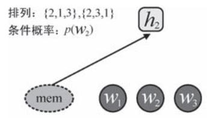

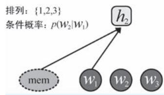

  
●图 5-29 排列语言模型词汇依赖关系的示意 （以长度为 3 的序列为例）

下面我们来讨论排列语言模型的优化目标。还是借助上文 “toy”版的例子，只不过这里我们换一个视角，不再固定某词汇考察其在不同排列中的依赖关系，而是锁定某一排列考察其中词汇间的依赖关系。首先，以排列{2，3，1}为例，其代表的序列为 $w _ { 2 } , w _ { 3 } , w _ { 1 }$ ，按照惯例，我们利用链式法则对该序列的联合分布进行因子化，有

$$
p \left(w _ {2}, w _ {3}, w _ {1}\right) = p \left(w _ {2}\right) p \left(w _ {3} \mid w _ {2}\right) p \left(w _ {1} \mid w _ {2}, w _ {3}\right) \tag {5-39}
$$

可以看出，固定一个排列后，链式法则自然给出了词汇的前向依赖关系，即前向语言模型㊀①。接下来，我们假设具有不同排序的词汇序列之间是相互独立的，即认为

$$
p \left(\left\{w _ {2}, w _ {1}, w _ {3} \right\}, \dots , \left\{w _ {3}, w _ {1}, w _ {2} \right\}\right) = p \left(w _ {2}, w _ {1}, w _ {3}\right) \dots p \left(w _ {3}, w _ {1}, w _ {2}\right) \tag {5-40}
$$

然后，按照式 （5-39）所示的方式，对上式等号右边的每个联合分布再做展开，即可得到 18 个概率的连乘积形式，这些连乘积形如 “∏6 ∏3 $\Pi _ { 6 \mathcal { F } ^ { \ddag \ddag \ddag \ddag \ddag } } \Pi$ …”。 假设上述概率分布具有待优化参数 $\theta$ ，则排列语言模型的优化目标就是获得能够使得联合概率 $p ( \{ w _ { 2 } , w _ { 1 } , w _ { 3 } \} , \cdots , \{ w _ { 3 } , w _ { 1 } , w _ { 2 } \} ; \theta )$ ）取得最大值的那个 θ。接下来的 “剧情”想必大家都非常熟悉———按照最大似然估计的套路，我们对18 个连乘的概率取对数，即得到形如 $\mathcal { L } \left( \theta \right) = \sum$ $\textstyle \sum$ 3 $p ( \cdots ; \theta )$ ）”的似然函数。我们对其进行最大化获得最优参数，即实现了排列语言模型的优化目标。到这里，我们即以非常 “toy”口吻给出了排列语言模型的定义及其优化目标。不难看出，排列语言模型在形式上可以视为是一系列基于排列的前向语言模型。也正是因为这一原因，排列语言模型在很多场合也被划入自回归语言模型的范畴。

正规地，针对一个长度为 $T$ 的序列 $w _ { 1 } , \cdots , w _ { T }$ ，我们将其词汇下标 $\{ 1 , \cdots , T \}$ }所有可能的排列构成组成一个集合，记作 $\mathcal { Z } _ { \mathit { T } }$ ，集合中有 T！种排列。对于其中的任意一种排列 $z \in \mathcal { Z } _ { r }$ ，我们用 $z _ { t }$ 表示其中第 $t$ 个元素，用 $z _ { < t }$ 表示 $t$ 之前的 $t - 1$ 个元素。按照我们上文给出的 “toy”版推导，即可得到排列语言模型的理论目标函数

$$
\theta^ {*} = \arg \max  _ {\theta} \sum_ {z \in \mathcal {Z} _ {T}} \sum_ {t = 1} ^ {T} \log p \left(w _ {z _ {t}} \mid w _ {z _ {<   t}}; \theta\right) \tag {5-41}
$$

上述目标函数表示，对于一个给定序列，我们需要让所有词汇在所有排列模式下、前向依赖条件概率的对数似然函数之和取得最大值。其中，内层求和表示遍历序列中的所有词汇，外层求和则表示取遍所有排列。但是显而易见，上式只在理论上具有合理性，在实际计算中则根本无法使用。毕竟对于一个长度为 $T$ 的序列，其可能的排列个数多达 T！种，面对于一个超长序列，排列种数可谓是一个天文数字。在实际应用中，XLNet 利用排列抽样的思想对上述优化目标进行改进，从而大幅降低上述优化计算的计算量，改造后的目标函数为

$$
\theta^ {*} = \arg \max  _ {\theta} \mathrm {E} _ {z - \mathcal {Z} _ {T}} \left[ \sum_ {t = 1} ^ {T} \log p \left(w _ {z _ {t}} \mid w _ {z _ {<   t}}; \theta\right) \right] \tag {5-42}
$$

以上目标函数将所有排列的集合 ${ \mathcal { Z } } _ { T }$ 视为排列的分布。作为某一具体排列，z 被视为采样自上述分布的一个样本。以上目标函数代表的优化任务即为构造 “平均排列”意义下的前向语言模型。

上面我们给出了排列语言模型的形式和优化目标，但原理简单实现难———XLNet 为了实现上述模型的预训练可谓煞费苦心。首先，按照直觉，既然排列语言模型等价于排列后的前向语言模型，那么我们直接对输入语句中的词汇进行随机排列，不就可以套用现有架构、借助掩膜注意力机制实现前向语言模型的预训练？至少笔者在学习 XLNet 最初就有这样的疑问。答案自然是否定的，如果我们进行词汇重排，就等于在预训练时使用乱序语句，而在下游任务适配时使用正常顺序的语句，这无异于是在人为造成预训练与下游任务微调的不一致。语言模型给出一句话是 “人话”的概率，我们如果随机打乱词汇顺序，那还算 “人话”吗？在这些 “乱序”的语句上训练得到的语言模型自然也没有任何意义。话说回来，BERT 打个 “＜MASK＞”标识我们都无法接受，何况是随机打乱顺序？因此，我们需

要清晰地认识到 XLNet 的排列语言模型仅是借助排列这一工具来构造和刻画词汇的广泛依赖关系，并不需要我们对输入的序列做 “物理上”的重排。上文所说的前向依赖仅仅在形式上像是前向依赖而已。例如在上文 “toy”版的例子中，条件概率 $p ( w _ { 2 } \vert w _ { 1 } , w _ { 3 } )$ ）仅表示 $w _ { 2 }$ 与词汇 $w _ { 1 }$ 和 $w _ { 3 }$ 有关系，这和实际三个词汇是按什么顺序排列的没有任何关系，并不代表实际的词汇顺序就是 $w _ { 1 }$ ， $w _ { 3 }$ ， $w _ { 2 }$ 。因此，在XLNet 进行排列语言模型预训练时，并不对输入语句中的词汇进行重新排列———语句还是那个正常顺序的语句，只不过借助一系列重排下标来表达广泛依赖关系。这样一来，现有的框架自然无法套用。

进行词预测，需要明确 “从哪里来，到哪里去”的问题———用处于哪些位置的词汇预测哪些位置的词汇。无论是自回归语言模型还是自编码语言模型，上述两个问题都是非常明确的：在自回归语言模型中，我们按照自然词序，用前 t-1 个词预测第 $t$ 个词；而在 BERT 的掩膜语言模型中，我们用全部词汇预测那个被遮掩的词汇， “＜MASK＞”就是目标词汇位置。在排列语言模型中，针对用哪些词

汇预测这一个问题是好解决的，毕竟 Transformer 的掩膜注意力机制已经给出了方法，即通过合理的掩膜设定即可只让那些需要参与预测的词汇被注意到，实现类似图5-26 那样的随意 “挖洞”的效果。图5-30 为针对排列 “3，2，4，1”的掩膜示意。其中，左边为在排列上的掩膜矩阵，这种形式即前向语言模型中标准的 “看前不看后”掩膜机制；右边为对应到原始词序上的掩膜设定。在该排列中，3 只能看见 3 （这里我们假设自己能看到自己），2 能看见2 和 3，4 能看见 2、3 和 4，1 能看见所有位置㊀①。

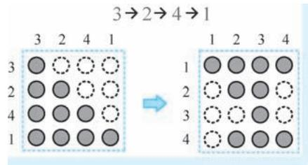  
●图 5-30 针对排列 “3，2，4，1”的掩膜示意

“从哪里来”的问题好办，但是 “到哪里去”的问题就不那么好解决了。主要原因在于现成自回归语言模型的词汇预测方法无法为重排语言模型直接套用。为了说明这一问题，我们首先来看看自回归语言模型的词汇预测模型。给定前 t-1 个词汇 $w _ { z _ { < t } }$ ，自回归语言模型预测在第 t 个位置出现词汇 $x$ 的概率为

$$
p \left(W _ {z _ {t}} = x \mid w _ {z _ {<   t}}; \theta\right) = \frac {\exp \left(E (x) ^ {\mathrm {T}} h \left(w _ {z _ {<   t}} ; \theta\right)\right)}{\sum_ {x ^ {\prime}} \exp \left(E \left(x ^ {\prime}\right) ^ {\mathrm {T}} h \left(w _ {z _ {<   t}} ; \theta\right)\right)} \tag {5-43}
$$

式中， $E ( x )$ ）表示对词汇 $x$ 的嵌入表示； $h ( w _ { z _ { < t } } ; \theta )$ ）即表示 Transformer 在适当掩膜机制的作用下对 $w _ { z _ { < t } }$ 构建的特征表示。当然，也可以是 RNN 逐个对 $w _ { z _ { < t } }$ 进行加工得到的隐状态向量。观察等号右边计算softmax 的部分，俨然只与预测词汇的内容有关，而与其位置毫无关系，即等号左边的 $z _ { t }$ 无论是多少，只要 “词是那个词”，计算的概率都是相同的。和位置无关在自回归语言模型中没有任何问题，因为我们知道预测是按照词汇的输入顺序进行的———给模型输入 $w _ { 1 }$ ， $w _ { 2 }$ ，模型建模的条件概率一定是$p ( w _ { 3 } \vert w _ { 1 } , w _ { 2 } )$ ），即预测的词汇一定是 $w _ { 3 }$ 。但是在排列语言模型中，当词序重排后，到底预测的是哪个词出现了歧义。例如，我们给模型喂进 $w _ { 1 } , w _ { 2 }$ ，模型预测了一个词 $x$ ，我们根本不知道 $x$ 到底是排列

$w _ { 1 } , w _ { 2 } , w _ { 3 } , w _ { 4 }$ $w _ { 4 }$ 中的 $w _ { 3 }$ ，还是排列 $w _ { 1 } , w _ { 2 } , w _ { 4 } , w _ { 3 }$ $w _ { 3 }$ 中的 $w _ { 4 }$ ，因为按照式 （5-43） 计算条件概率，有$p \left( \left. w _ { 3 } = x \right| w _ { 1 } , w _ { 2 } \right) = p \left( \left. w _ { 4 } = x \right| w _ { 1 } , w _ { 2 } \right)$ 。这样的语言模型无法表达语言的连贯性，即认为 “我的宝贝”和“我的贝宝”都是同等合理的语言。既然问题出在没有位置信息上，XLNet 便对式 （5-43）进行改造，添加位置信息

$$
p \left(W _ {z _ {t}} = x \mid w _ {z _ {<   t}}; \theta\right) = \frac {\exp \left(E (x) ^ {\mathrm {T}} g \left(w _ {z _ {<   t}} , z _ {t} ; \theta\right)\right)}{\sum_ {x ^ {\prime}} \exp \left(E \left(x ^ {\prime}\right) ^ {\mathrm {T}} g \left(w _ {z _ {<   t}} , z _ {t} ; \theta\right)\right)} \tag {5-44}
$$

式中， $g ( w _ { z _ { < t } } , z _ { t } ; \theta )$ ）为改进后的模型输出特征，其中添加了预测词汇的位置信息 $z _ { t }$ 。经过上述改造，等同于将上例中的 $p ( w _ { 3 } \vert w _ { 1 } , w _ { 2 } )$ ）和 $p ( w _ { 4 } | w _ { 1 } , w _ { 2 } )$ ）分别改造为 $p \left( \boldsymbol { w } _ { 3 } \mid \boldsymbol { w } _ { 1 } , \boldsymbol { w } _ { 2 } , 3 \right)$ ）和 $p ( w _ { 4 } \mid w _ { 1 } , w _ { 2 } , 4 )$ ）。如果说式 （5-43）表示了输入词汇序列 $w _ { z _ { < t } }$ ，输出词汇 $x$ 的概率，而式 （5-44）则表达了输入词汇序列 $w _ { z _ { < t } }$ ，

在位置 $z _ { t }$ 输出词汇 $x$ 的概率。那么如何构造一个能够表达 $g ( w _ { z _ { < t } } , z _ { t } ; \theta )$ ）的架构？XLNet 认为这样的架构需要满足两点要求：第一点要求，在预测单词 $w _ { z _ { t } }$ 时，模型只能用到其位置信息 $z _ { t }$ ，而不能用到词汇的内容信息$w _ { z _ { t } }$ 。为何需要位置信息上文我们已经说得很清楚，不能包含内容信息也很好理解：总不能让模型在预测词汇时提前提供正确答案；第二点要求，在预测 $w _ { z _ { t } }$ 之后的其他单词 $w _ { z _ { k } } ( k { > } t )$ ）时㊀①，模型则需编码内容信息 $w _ { z _ { t } }$ 。图 5-31 针对排列 “3，2，4，1” 示意了上述两种情况。在图5-31a 中，预测词汇 $w _ { 2 }$ 需要用到 $w _ { 3 }$ 的内容信息和$w _ { 2 }$ 的位置信息，但是不能用到 $w _ { 2 }$ 的内容信息；在图5-31b 中，预测词汇 $w _ { 4 }$ 需要用到 $w _ { 2 }$ 和 $w _ { 3 }$ 的内容信息，以及 $w _ { 4 }$ 的位置信息，但是不能使用 $w _ { 4 }$ 的内容信息。

●图 5-31 位置与内容要求示意  
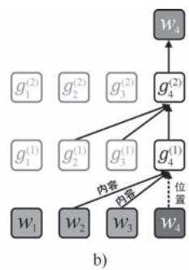  
a）预测 $w _ { 2 }$ 时不需要编码 $w _ { 2 }$ 的内容信息  
b）预测 $w _ { 4 }$ 时需要编码 $w _ { 2 }$ 和 $w _ { 3 }$ 的内容信息

无论是标准 Transformer 的位置编码还是 BERT 的位置嵌入，都将位置信息与内容信息进行了整合，即我们在模型中使用的词向量中既编码了内容信息也编码了位置信息。因此，为了解决上述问题，就需要将词汇的内容信息和位置信息剥离。XLNet 的做法为将标准 Transformer 的单一输入、以及各层的单一隐状态表示均改为两套，其中一套被称为查询特征表示（query representation），记作$g ( w _ { z _ { < t } } , z _ { t } ; \theta )$ ），简记作 ${ { \boldsymbol { g } } _ { z _ { t } } } ^ { * }$ 。查询特征只与上文内容信息 $w _ { z _ { < t } }$ 和位置 $z _ { t }$ 有关，而与当前内容信息 $w _ { z _ { t } }$ 无关；另一套被称为内容特征表示（content representation），记作 $h \left( \boldsymbol { w } _ { z _ { s t } } ; \boldsymbol { \theta } \right)$ ），简记作 $h _ { z _ { t } }$ 。内容特征与标准Transformer 中的隐状态向量没有什么本质区别，编码了上文内容㊁②信息 $w _ { z _ { < t } }$ 和当前内容信息 $w _ { z _ { t } }$ （请读者注意下标的 “≤”号，即表示包括了自身和上文内容信息）；基于上述两套特征表示，XLNet 提出了一种具有两路操作的注意力机制— 掩膜双流自注意力（Masked Two-Stream Self-Attention）。

“双流”注意力中的第一个注意力为查询流 （query stream）注意力。该注意力的设计即为了满足

“预测我但看不见我”的第一点要求。在该注意力中，查询特征作为查询向量，由排列决定的、但不包括当前词汇的上下文内容特征作为键-值集合，表示为

$$
g _ {z _ {t}} ^ {(m)} \leftarrow \text {a t t e n t i o n} \left(\boldsymbol {Q} = g _ {z _ {t}} ^ {(m - 1)}, \boldsymbol {K} = \boldsymbol {V} = h _ {z _ {c t}} ^ {(m - 1)}; \theta\right) \tag {5-45}
$$

式中，查询向量自身包含了位置信息。同时，正是因为在计算注意力权重和特征整合时，未使用到当前词汇的内容特征，因此不涉及 “提前给答案”的问题。图 5-32a 示意了查询流注意力的工作模式。该图同样针对排列 “3，2，4，1”，以生成词汇 $w _ { 4 }$ 对应的新查询特征表示为例。在上述排列中， $w _ { 4 }$ 依赖排在其左边的 $w _ { 2 }$ 和 $w _ { 3 }$ ，故在计算注意力时，以 $w _ { 4 }$ 对应的查询特征 $\cdot _ { g _ { 4 } ^ { ( 0 ) } }$ ）在集合 $\{ h _ { 2 } ^ { ( 0 ) }$ ）， ${ \bf \nabla } , h _ { 3 } ^ { ( 0 ) }$ }上执行查询并按照注意力权重进行特征整合，得到输出 ${ \underline { { \boldsymbol { g } } } } _ { 4 } ^ { ( 1 ) }$ 。

“双流”注意力中的第二个注意力即内容流 （content stream）注意力，该注意力机制围绕内容特征进行，体现了 “预测别人能看见我”的第二点要求。其对信息的加工过程与标准自注意力机制别无二致，表示为

$$
h _ {z _ {t}} ^ {(m)} \leftarrow \text {a t t e n t i o n} \left(\boldsymbol {Q} = h _ {z _ {t}} ^ {(m - 1)}, \boldsymbol {K} = \boldsymbol {V} = h _ {z _ {\leqslant t}} ^ {(m - 1)}; \theta\right) \tag {5-46}
$$

式中， $\varrho$ 、K 和 $V$ 即我们非常熟悉的查询、键集合和值集合；上标的 $m - 1$ ”和 $m$ ”分别表示在一个具有 $M$ 层的网络结构中，位于第 $m { - } 1$ 层和 $m$ 层的内容特征。式 （5-46）体现了标准自注意力机制的工作模式———获得哪个位置的输出，就以哪个位置的元素作为查询，计算其与其他元素之间的对齐得分，然后转换为注意力权重后再进行加权特征整合。只不过在这里，被查询的集合是由排列确定的、包含了当前词汇的上下文词汇。例如，在图5-32b 中，我们以排列 “3，2，4，1”为例，3 与 2 都排在4 的左边，故在处理 $w _ { 4 }$ 时，我们以 $w _ { 4 }$ 对应的内容特征 ${ h } _ { 4 } ^ { ( 0 ) }$ ）作为查询向量，在包括其自身的键集合$\{ h _ { 2 } ^ { ( 0 ) }$ ，h（0）3 ， ${ \mathbf { \nabla } } _ { { h _ { 4 } ^ { \left( 0 \right) } } }$ }上执行查询、计算注意力权重进行特征合成，得到输出特征 $h _ { 4 } ^ { ( 1 ) }$ ）。

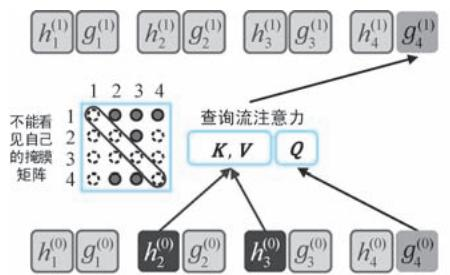  
a)

b)   
●图 5-32 查询流注意力与内容流注意力工作模式示意  
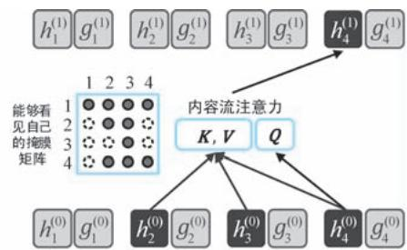  
a）查询流注意力 b）内容流注意力

XLNet 将两个数据流组合在一起使用。在抽样一个排列后，XLNet 会针对内容流注意力和查询流注意力分别构造两个注意力掩膜矩阵，前者 “能够看见自己”，而后者 “不能看见自己”。针对每一层的每个位置，都在掩膜矩阵的指示下，分别求出内容特征 $h _ { t } ^ { ( m ) }$ ）和查询特征 $\cdot g _ { t } ^ { ( m ) }$ ）。当某个位置的单词需要被预测时，则该位置只用到其对应的查询特征，由于查询表示中不包括自身位置对应词汇的内容信息，因此时不存在内容信息泄露的问题；反之，如果某个位置的单词被用作其他位置的单词预测，那么该单词的内容信息也将被用到。在模型的第一层，XLNet 使用每个输入词汇的词嵌入特征 $E ( x _ { t } )$ ）作

为对应的内容特征 ${ h } _ { t } ^ { ( 0 ) }$ ），而使用一个待训练的特征向量 $\pmb { u }$ 作为每个词汇的查询向量 ${ \boldsymbol g } _ { t } ^ { ( 0 ) }$

在语言模型预训练阶段，为了让模型能够更好地理解上下文，XLNet 只获取查询流注意力的输出，做到 “不偷看答案”。当然，在这一阶段，每层的各个内容特征 ${ h _ { t } ^ { ( m ) } }$ ）也是需要计算出来的，毕竟计算${ \underline { { \boldsymbol { g } } } } _ { t } ^ { ( m ) }$ ）时会用到它们；而到了下游任务微调阶段，XLNet 则会改为使用内容流注意力，这样便又回到了传统的自注意力结构，可谓 “毫无违和感”。因此，我们可以这么理解 XLNet 的双流注意力机制：XLNet 的核心仍然是一套标准的自注意力架构，体现为双流注意力中的内容流注意力。但是，为了提升模型的语言预测能力，XLNet 又添加了一套在词预测时使用的、与内容流注意力共享参数的并列注意力机制，即查询流注意力。在这套注意力中，不会使用待预测词汇本身的内容信息。这便使得在语言模型预训练中，模型能够更加有效地挖掘词汇的上下文信息，更深刻地理解语义。一个完整的XLNet 的双流注意力架构如图 5-33 所示 （以排列 “3，2，4，1”为例）。

  
●图 5-33 XLNet 双流注意力架构示意 （以排列 “3，2，4，1”为例）

为了提升训练效率，在获取某一随机排列之后，XLNet 只选择预测排在后部一定比例的词汇，这便是所谓的部分预测（Partial Prediction）。预测的词汇通过一个超参数 $K$ 来控制，即预测整个语句中的约1/ K 个词汇。这一操作与 BERT 将语句中 $1 5 \%$ 词汇替换为 “＜MASK＞”的操作类似，只不过 XLNet不打 “＜MASK＞”标识，不会人为制造噪声。例如，针对一个有 9 个词汇的语句，我们抽样得到一个可能的词汇排序为 “8，4，9，3，1，2，6，7，5”，假设 $K = 3$ ，即对语句中1/3 的词汇进行预测，语言模型的训练即要模型学会完成形如 “8，4，9，3，1，2，_，_，_”的 “填空题”。

XLNet 的第二个法宝即继承了 Transformer-XL 架构。为了能够像 Transformer-XL 那样接受超长序列输入，XLNet 继承了 Transformer-XL 模型的分段递归和相对位置编码两个重要机制。相对位置编码我们在这里不做过多讨论，我们仅简单看看 XLNet 的分段递归机制。假设有两个长度均为 $T$ 的片段，XLNet 分段递归机制的工作流程为：首先，针对两个片段的下标 $[ 1 , 2 , \cdots , T ]$ ]和 $T \dag 1 , T \dag 2 , \cdots , 2 T \dag$ ]分别构造排列z～和 z；然后按照上文介绍的方式，在排列z～下处理第一个片段，将每一层得到的内容特征都

进行缓存。对于第 $m$ 层，我们将缓存的内容特征序列记作 $\tilde { \mathbf { H } } ^ { ( m ) } = \tilde { h } _ { 1 } ^ { ( m ) }$ ，…，h～ （m） T ；接下来处理第二个片段，首先按照 Transform-XL 的标准方式进行特征的拼接操作，只不过在 XLNet 中，需要按照排列 $\mathbf { z }$ 给出的词汇依赖关系，区分查询流和内容流做不同的拼接操作———前者是 $\tilde { \pmb { H } } ^ { ( m ) }$ ）和 $h _ { z _ { < t } } ^ { ( m - 1 ) }$ ）的拼接，而后者则是 $\tilde { \mathbf { \cal { H } } } ^ { ( m ) }$ ）和 $h _ { z _ { \leqslant t } } ^ { ( m - 1 ) }$ ）的拼接。上述拼接结果将分别作为查询流注意力和内容流注意力的键值集合；最后，分别利用查询特征或内容特征作为查询在上述键值集合上执行注意力作用，为每个位置生成新的查询特征或内容特征。下式以内容流注意力为例，示意了其在分段递归模式下的计算方法

$$
h _ {z _ {t}} ^ {(m)} \leftarrow \text {a t t e n t i o n} \left(\boldsymbol {Q} = h _ {z _ {t}} ^ {(m - 1)}, \boldsymbol {K} = \boldsymbol {V} = \left[ \operatorname {S G} \left(\tilde {\boldsymbol {H}} ^ {(m - 1)}\right), h _ {z _ {\leqslant t}} ^ {(m - 1)} \right]; \theta\right) \tag {5-47}
$$

式中，“[·，·]”表示按照序列长度进行的拼接操作。在图 5-34 中，我们以排列 “3，2，4，1”为例，分别示意了分段递归模式下，查询流注意力和内容流注意力机制的工作方式。其中，图 5-34a 中的虚线表示在计算当前位置的查询特征时，只能使用自身的位置信息但不得使用自身的内容信息。

  
a）

b)   
●图 5-34 分段递归模式下查询流注意力与内容流注意力工作模式示意  
  
a）查询流注意力 b）内容流注意力

XLNet 的第三个法宝为使用更多的数据。模型结构设计优秀了，剩下就是给模型注入充足的 “燃料”，让模型动起来了。这里，模型所需的 “燃料”自然就是语料数据。XLNet 模型的语言模型预训练用到了 BooksCorpus、英语维基百科、Giga5、ClueWeb 2012-B 和 Common Crawl 五个大型语料库，训练用纯文本语料的总规模超过150GB。150GB 的纯文本可不是一个小数字，要知道 BERT 在训练掩膜语言模型时仅用到 BooksCorpus 一个语料库，XLNet 用到的语料规模是其 10 倍以上。也正是因为这一原因，很多人认为 XLNet 能够超越 BERT，模型的优化设计起到多大作用不好说，但是大规模的训练数据一定起到 “大力出奇迹”的效果。

到这里，我们对 XLNet 模型的讨论就告一段落了。可以看出，XLNet 将诸多有利的因素进行了有机整合，涉及的内容还是相当多的。总体来看，XLNet 的核心要点包括三个方面：第一，巧妙地利用排列机制，提出了兼顾自回归和自编码语言模型优点，同时又摒弃二者缺陷的排列语言模型，实现了语言上下文依赖关系的建模，这也是 XLNet 的最大贡献；第二，借助 Transform-XL 分段递归和相对编码机制，使得模型能够接受不限长度的序列作为输入，大幅提升模型处理长文本的能力；第三，在语言训练阶段给模型 “喂入”尽可能多的数据，使得模型能够 “阅尽天下之书”。

# 5. 4. 4 RoBERTa 与 ALBERT：“鲁棒版 BERT”与“瘦身版 BERT”

BERT 在 NLP 预训练领域 “火”了之后，基于 BERT 的预训练模型可谓层出不穷。在这些模型构造的过程中，有些学者从训练数据、参数选择、训练方法等诸多方面开展全面优化设计，通过精心调优深挖 BERT 的潜力，从而进一步强化 BERT 模型的能力；还有一些学者认为 BERT 性能虽好，但是体量还是过于庞大，于是展开了针对 BERT 的 “瘦身”操作。试图使其变得轻量化，从而谁都能用得起，到哪都能跑。我们即将介绍的两个模型 RoBERTa 和 ALBERT，便是上述两种思路下的经典作品，接下来我们就分别看看这两种 BERT 模型。

# 1. RoBERTa：“鲁棒版 BERT”

2019 年 7 月，Yinhan Liu 等[14] 10 名来自 Facebook AI 的学者提出了一种 “鲁棒优化 BERT 的方法”（Robustly optimized BERT approach，RoBERTa），使得 BERT 在诸多自然语言理解任务上的表现有了进一步提升，其性能完胜当时所有的 “后 BERT”模型。准确地讲，RoBERTa 不是一种新的预训练模型，而是一套针对 BERT 的优化方法。因此在模型层面，RoBERTa 的本质就是 BERT，但却是一个经过一系列精心优化得到的高性能 BERT。

在正式介绍 RoBERTa 的优化手段和效果之前，我们需要简单做以说明。在 RoBERTa 的原文中，学者们的工作包括了三个阶段。第一阶段为基于 BERT-Base 架构进行的各类优化操作的尝试和分析，旨在论证哪些优化操作是有效的；第二阶段才真正构造 RoBERTa 模型。在该步骤中，使用的架构从BERT-Base 变为BERT-Large，一方面先把模型规模 “拉满”，不在规模上 “留余地”，另一方面更是为了和具有最好性能的原生 BERT 作对比。在该步骤中，直接应用第一步的探索得到四种有效的优化方法，并增加了对数据量和迭代轮数两个新因素的考量。因此，准确地讲，只有基于 BERT-Large架构、应用了六个 （第一阶段评估了四个，第二阶段评估了两个）优化手段构造的模型才是 Ro-BERTa 模型；第三阶段即针对 RoBERTa 进行实验对比，考察其在诸多自然语言理解任务上的表现情况。图 5-35 即为 RoBERTa 三个阶段工作的示意。在下文中，我们将第一阶段和第二阶段合并，重点介绍 RoBERTa 所采取的六个优化手段，随后我们也会简单介绍 RoBERTa 在对接自然语言理解下游任务时的表现。

  
●图 5-35 RoBERTa 三个阶段工作的示意 （圆圈标号即对应三个阶段）

第一个优化即使用动态掩膜。和 BERT 相同，RoBERTa 的预训练目标同样是掩膜语言模型，故需要随机的对输入语句中的词汇进行遮掩操作。在原生 BERT 中，这些遮掩操作是在线下完成的，即将同一个训练语句复制多份，然后针对其做不同随机遮掩，从而得到诸多版本的 “完形填空”试题。但是，这种离线模式需要占用大量的存储空间。RoBERTa 所做的改进就是将 BERT 的离线掩膜操作改为在线动态模式，即在模型训练读取训练语句时，才在语句的随机位置进行 “＜MASK＞” 替换。当然，笔者个人认为将动态掩膜视为一项优化着实有些牵强。毕竟 BERT 的做法本身就太过死板，无谓的占用了大量硬盘空间。与之接近的在线数据增广等操作早已被广泛使用，RoBERTa 的做法实际上是 “纠偏”。另外，RoBERTa 使用的 “动态掩膜”和 “静态掩膜”两种提法也是令人迷惑的，第一印象总让人觉得是算法层面的创新，但实际上二者仅仅涉及数据组织形式方面的问题。

第二个优化即改进输入格式并取消下句预测。原生 BERT 支持双句输入，预训练包括了掩膜语言模型和下句预测任务训练两个目标。膜语言模型训练的重要性不言而喻，但是下句预测训练的必要性却饱受争议。针对下句预测任务的训练，原生 BERT 以 0. 5 的概率从同一文档中抽取连续的两个语言片段作为正样本，以0.5 的概率从不同的文档随机抽取两个语言片段拼接后作为负样本，下句预测训练的目的旨在让模型学习语言的连贯性———通过训练使得模型能够正确判断第二个片段是否为第一个片段的连续下文片段。为了考察两个语句形式对结果的影响，以及开展下句预测训练是否必要，Ro-BERTa 构造了四种模式并对其进行实验对比。其中，第一种模式为 “Segment-pair+NSP”。该模式与BERT 采取的模式相同，即双片段拼接输入并进行下句预测训练。这里，我们首先需要区分 “片段”（segment）和 “语句”（sentence）两个不同概念。前者是指连续的 “一片”语言，其中可能包括多个自然语句，而后者就是指以标点符号分割的自然语句；第二种模式为 “Sentence-pair+NSP”，即双语句拼接输入并进行下句预测训练。该组合在形式上与第一种组合基本一致，仅是将片段改为语句。既然是语句，就意味着双句拼接的长度不太可能超过 512 的长度限制 （很少有两个自然语句拼在一起超过512 个词的，否则会 “喘不上气”）。故在这种模式中，RoBERTa 通过增加批次样本数量保证输入的规模；第三种模式为 “Full-sentences”。在该模式下，RoBERTa 以连续方式从一个或多个文档中抽取完整语句进行拼接，直到长度达到512 这一最大长度限制为止。连续语句的抽取可以跨越文档边界，当跨越文档边界时，RoBERTa 会在对应位置插入 “＜SEP＞”标识符作为分割标识。除此之外，在该模式中不进行下句预测的训练；第四种模式为 “Doc-sentences”。与 “Full-sentences”类似，在该模式中，Ro-BERTa 也是进行连续语句的抽取与拼接，但是不同的是，本模式不允许跨越文档边界。那么形成拼接序列的长度不满足512 时 （即达到文档结尾还未达到允许的序列最大长度），则 RoBERTa 会自动扩充一个批次。同样，“Doc-sentences”模式不包括下句预测的训练。RoBERTa 按照上述四种模式构造四个预训练模型，分别在 SQuAD、MNLI-m、SST-2 和 RACE 四个自然语言理解公开任务/ 数据集上进行微调和对比测试。结果表明，“Full-sentences”和 “Doc-sentences”两种模式的效果最优，这即意味着针对下句预测的训练不是必需的。而在上述两种模式中，“Doc-sentences”表现最优，故被RoBERTa 最终采用。

第三个优化即增大批次规模。诸多神经机器翻译的工作已经表明，当学习率适当提高时，使用大的批次规模 （batch size，即一次性训练输入给模型的序列数）进行训练可以提高优化速度，也能够提升最终任务性能。原生 BERT 的批次规模为256，训练执行100 万步。以梯度累积作为计算量的评估，上述 BERT 的训练模式等同于以2000 的批次规模执行12.5 万步训练，也等同于以8000 的批次规模执

行3.1 万步训练。那么在相同的计算量下，上述三个批次规模中，哪一种训练出的模型更好呢？RoBERTa 对该问题进行了测评 （为与 BERT 进行对比，都使用 BooksCorpus 和英语维基百科两个语料库），结论是批次规模大的模型的效果好。当然，就 RoBERTa 给出的指标来看，笔者认为上述结论稍显牵强，尽管 $2 0 0 0 { + } 1 2 . 5 $ 万” 的训练规模设定的确最优，但是 $8 0 0 0 + 3 . 1$ 万” 反而输给了 BERT的 $2 5 6 + 1 0 0$ 万”。但是话又说回来，也可能是不同的学习率造成的差异……关于这个问题这里我们不做过多纠结。毕竟后续有很多预训练模型都采纳了大批次规模这一做法，例如，很多大模型的训练批规模达到百万级别，至少增加批次规模能够加快模型的收敛速度是毋庸置疑的。

第四个优化即改变文本编码方式。语言处理的粒度选择对于 NLP 模型来说至关重要———粒度太小则语义表达能力不足且词典过大，而粒度太大又容易造成 OOV 问题。将输入序列加工为模型所能接受的粒度即为所谓的符号化操作。目前，很多预训练模型都是采用基于字节对编码（Byte PairEncoding，BPE）的子词构造技术来实现输入序列的符号化。BPE 通过不断统计相邻字符在序列的出现频率，来考察其是否适合作为一个整体符号独立存在。按照粒度进行分类，常用的 BPE 包括字符级（character-level）和词汇级 （word-level）等形式。原生 BERT 即使用字符级 BPE，词典中包括约 3 万的词汇，其中的字符均为 Unicode 双字节编码表示。RoBERTa 认为 BERT 的符号化粒度还是过大，无法克服很多稀有词汇，容易产生 “OOV”的问题。为了解决上述问题，RoBERTa 借鉴了 GPT-2.0 的做法，使用力度更小的字节级 BPE （byte-level BPE）进行输入的符号化表示和词典构造，从而词典的规模增加至大约5 万。几位作者坚信基于字节级 BPE 的符号化能够提升模型性能，但是针对其的实验和对比还有待进行。

第五个优化即增加训练数据。增加训练数据，无疑是提升模型性能最鲁棒的手段之一，RoBERTa的作者们自然也是这么想的。BERT 在的预训练中，使用了 BooksCorpus 和英语维基百科两个语料库，二者拥有的词汇量分别为8 亿和25 亿，语料总规模大约为16GB。而 RoBERTa 使用的预训练数据，除了包 括 BERT 用 到 的 BooksCorpus 和 英 语 维 基 百 科 之 外， 进 一 步 增 加 了 CC-News （76GB ）、OpenWebText （38GB）和 Stories （31GB）三个语料数据集，总的数据规模较 BERT 扩大了 10 倍，达到惊人的161GB。图5-36 示意了 RoBERTa 使用四个语料数据集的规模和比例。其中，我们对 BERT使用的数据集进行了特殊标注。

  
●图 5-36 RoBERTa 使用四个语料数据的规模和比例示意

第六个优化即增加训练步数。该优化步骤与增大批次规模是相辅相成的，都是为了让模型见过更多的数据，使得训练更加充分。RoBERTa 对采用不同规模训练数据和不同训练迭代步数对模型性能的影响进行了综合评估，该评估以预训练模型适配 SQuAD、MNLI-m 和 SST-2 三个下游任务的成绩为标准。RoBERTa 以递进方式组织测评，包括如下三组核心实验：第一组实验验证 “优化 $1 \sim 4 +$ 优化 6”的有效性。针对BERT 采用的16GB 语料库，RoBERTa 分别将批次规模和训练步数设定为8000 步和10万步。结果表明，RoBERTa 相较原生 BERT-Large 模型，性能具有明显提升。该结果表明，将第一阶段确定的四种优化方法 （优化 1 ～ 4）与增加训练步数 （优化 6）相结合，在提升模型性能方面卓有成效。该实验事实上也证明了 RoBERTa 比 BERT 效果好，不是仅靠 “堆数据”得来的；第二组实验验证 “优化5”的有效性。RoBERTa 将训练数据 “拉满” 至 161GB，同样采用 8000 样本的批次规模和10 万的训练步数，测评结果显示，模型效果相较 RoBERTa 在第一组实验中的表现有进一步提升。这说明增加训练数据 （优化5）就能够有效提升模型性能；第三组实验验证 “优化 6” 的有效性。Ro-BERTa 保持161GB 的训练数据规模和8000 的批次规模不变，分别将训练步数增加到 30 万步和 50 万步。实验结果表明，RoBERTa 模型性能在第二组实验的基础上再次提升，且随着训练步数越多，效果越好。上述三组实验递进做完，RoBERTa 已经 “满配”，性能也达到最优。

最后我们简单看看 RoBERTa 在自然语言理解下游任务中的表现。按照我们上文介绍的 “顶配”优化方法，RoBERTa 将得到的预训练模型在 GLUE、SQuAD 和 RACE 三大自然语言理解公开任务/数据集上进行微调适配实验。其中，GLUE 包括了 MNLI、QNLI、QQP、RTE、SST、MRPC、CoLA、STS和 WNLI 九个子任务，而 SQuAD 包括 1. 1 和 2. 0 两个版本。针对 GLUE，RoBERTa 采取了两种不同模式的微调设置。其中，第一种模式为基于 GLUE 训练数据集、针对九个子任务分别进行的独立微调适配。在该模式下，RoBERTa 在所有子任务上都超越了 BERT-Large 和 XLNet，博得 “满堂彩”；第二种模式为基于 GLUE 积分榜测试数据集进行的模型微调。在该组实验中，所有参评的其他模型都进行了多任务微调。在该模式下，RoBERTa 在全部的九个子任务中获得四个冠军，并且平均得分最高。在针对 SQuAD 和 RACE 的测评中，除了在个别指标上略逊于 XLNet 模型之外，RoBERTa 在其他的指标上均超越了 XLNet 等参评模型。

到此，我们对 RoBERTa 模型的讨论就告一段落了。可能有读者会认为 RoBERTa 没有什么创新之处，不值得去讨论。的确，RoBERTa 确实没有提出什么新架构、新理念，就连其作者们也承认这一点，在其文章中一再谦虚强调自己做的是一件重复性研究 （“replication study”一词在文中出现了四次）。但是，我们认为 RoBERTa 还是非常值得研究的，原因有三：第一，RoBERTa 构建了预训练模型性能的新基线。RoBERTa 将预训练模型的性能提到一个新高度，后续诸多模型都是将 RoBERTa 作为比超对象。仅凭这一点，我们认为 RoBERTa 对领域的发展带来很大的促进作用。第二，RoBERTa 的优化方法为后续模型提供了思路。RoBERTa 使用的大批次、长时间训练等看似简单的操作，都被后续预训练模型采纳。事实也证明这些操作用的确有效。特别是在希望模型的性能指标再往上走那么一点点的 “紧要关头”，RoBERTa 提出的调参方法往往立竿见影。第三，RoBERTa 的优化方法为工程化应用提供了思路。调参工作往往是绝大多数从业者的日常工作，笔者的工作亦是如此。在实际工程化应用中，“能 work”“效果好”才是第一要务。我们虽不能像大咖那样提出新模型，但是能把参数调好，让模型好用也是大功一件。RoBERTa 使用的诸多优化方法针对很多任务来说是真的管用，都可以作为

我们日常调参工作的参考和指导。

# 2. ALBERT：“瘦身版 BERT”

为了追求模型的效果，NLP 预训练模型的规模越来越大。但是增大模型规模在给效果带来提升的同时，也给模型的训练、部署所需的计算机资源提出了更高的要求，很多模型甚至大到在一般的硬件上根本无法加载，人们直呼 “玩不起”。2019 年 9 月，时任谷歌研究员的蓝振忠 （Zhenzhong Lan）老师[15] 连同另外 5 名来自谷歌研究院和芝加哥丰田技术学院 （Toyota Technological Institute at Chicago，TTIC）的学者联名发文，提出一种 “轻量化 BERT ” 架构（A Lite BERT ，ALBERT），大幅为 BERT“瘦身”，更加神奇的是 BERT “瘦身”后的性能还有大幅提升，不禁让人拍手称奇。ALBERT 的核心工作可以用 $2 + 1$ ”来表示——— “2”即 ALBERT 为了解决 BERT 模型存储占用过高、训练时间太长的问题，提出的两种消减模型参数的方法；“1”则表示在其开展的一项预训练优化工作。

ALBERT 所采取第一个消减参数量的方法为降低符号嵌入操作的参数规模。在原文中，该工作被称为 “factorized embedding parameterization”，即 “因子化的嵌入参数”。我们知道，任何预训练模型都会对输入词汇进行嵌入操作，且词嵌入向量的维度也往往和模型内部特征维度保持一致，该维度我们在 Transformer 中用 $d _ { \mathrm { m o d e l } }$ 表示，在 BERT-Base 模型中， $d _ { \mathrm { m o d e l } } = 7 6 8$ ，而在 BERT-Large 模型中， $d _ { \mathrm { m o d e l } } =$ 1024。词嵌入通过用使用独热编码从嵌入矩阵中 “抽行”得到，嵌入矩阵维度为 $\mid V \mid \times d _ { \mathrm { m o d e l } }$ ， 其中 | V |为词典中的词汇数量，例如，在 BERT 中， $\mid V \mid \approx 3 0 0 0 0$ 。以 BERT-Lage 模型为例，词嵌入矩阵的参数量约为3000 万。但是有研究表明，模型内部特征和词嵌入特征关系不大，故词嵌入特征可以使用一个较小的维度，我们将其记作 $d _ { \mathrm { w o r d } }$ 。秉承这一思路，ALBERT 针对词嵌入矩阵瘦身的方法非常简单———先用一个 $\mid V \mid \times d _ { \mathrm { w o r d } }$ 维矩阵将| V |维独热编码变换为 $d _ { \mathrm { w o r d } }$ 维嵌入向量，然后再利用一个 $d _ { \mathrm { w o r d } } { \times } d _ { \mathrm { m o d e l } }$ 维矩阵，将该向量变换回模型所需的 $d _ { \mathrm { m o d e l } }$ 维向量输入。这样一来，原本的一个大参数矩阵变为两个小参数矩阵，改进后的词嵌入操作参数量为 $\mid V \mid \times d _ { \mathrm { w o r d } } + d _ { \mathrm { w o r d } } \times d _ { \mathrm { m o d e l } }$ 。容易看出，当 $d _ { \mathrm { w o r d } } \ll d _ { \mathrm { m o d e l } }$ 时，模型词嵌入矩阵的参数量将大幅降低。例如，在 ALBERT 中，作者们经过对比分析，认为 $d _ { \mathrm { w o r d } } = 1 2 8$ 是一个合理的取值。在这一设定下，BERT-Base 词嵌入操作所需的参数量降低至397 万。

ALBERT 所采取第二个消减参数量的方法即跨层参数共享（Cross-layer parameter sharing）。我们在分析 Transformer 架构的参数量时就已经提到，Transformer 编码器中注意力模块和全连接前馈网络才是参数 “大户”，随着模型层数的不断增加，上述两个模块将导致模型参数总量的暴增。和这二者相比，上面针对词嵌入矩阵参数的消减简直就是 “毛毛雨”。那么是否可以让这些编码器共享一份参数呢？2018 年 7 月，Mostafa Dehghani 等[16] 来自阿姆斯特丹大学、DeepMind 和谷歌大脑的学者们提出了 Uni-versal Transformer 模型，在其中提出了具有循环结构的 Transformer 架构。所谓循环结构，即不再像标准 Transformer 那样由多个不同的编码器层和解码器层堆叠构造编码器栈和解码器栈，而是分别只使用一个编码器层和解码器层，通过对其进行 “将输出再作为输入”模式的循环调用，以共享权重的方式来完成对输入序列编码和解码操作，其中循环调用的步数即可视为是传统模型的层数。图 5-37 即为Universal Transformer 循环编码器和解码器结构示意㊀①。其中的 “转换函数” （transition function） 可以理解为是对注意力模块输出特征的进一步变换，可以以全连接前馈网络、可分离卷积等不同操作作为

其具体实现。在 ALBERT 模型中，作者们借鉴了 Universal Transformer 模型的参 数 共享机制，但由于 ALBERT 基于 BERT 模型，故只涉及图中虚线框所示的编码器部分，即将唯一一份多头自注意力模块和全连接前馈网络参数全局共享。当然，需要说明的是，一个编码器层循环调用 $L$ 次与 $L$ 个编码器层按照顺序进行调用，在计算量方面不会有区别，故 ALBERT 不会带来推理速度上的提升。

经过上述两个参数精简操作，ALBERT的参数规模较原生 BERT 大幅降低。而节约下来的存储空间，可以用于增大内部特征的维度来使得模型更 “宽”，从而保证模型的表达能力不发生下降。具体来说，ALBERT包括了四种不同规模的模型架构，

●图 5-37 Universal Transformer 循环编码器和解码器结构示意  
  
（ALBERT 只采用虚线框中的编码器部分）

其中 ALBERT-Base、ALBERT-Large，分别对标 BERT 同等规模的版本。为了进一步比较模型规模，作者针对 BERT 又构造了更大规模版本的模型 BERT-xLarge，针对 ALBERT 也构造了同等规模的版本ALBERT-xLarge 与之对应。除此之外，还构造了一个更大规模的版本 ALBERT-xxLarge。图 5-38 示意了四种 ALBERT 模型的规模和参数量。其中，斜线后的参数表示与之对标 BERT 模型的对应参数。模型参数量这一关键参数我们使用加粗字体表示。从该图可以看出，相较于原生 BERT，ALBERT 模型在参数精简方面非常显著，特别是针对BERT-Large 模型，ALBERT 的参数仅为其1/18。另外，我们也可以从中看出，ALBERT 最大规模的版本———xxLarge 并不是以增加模型深度来扩大规模，相反，ALBERT-xxLarge 模型仅有区区12 层编码器，反倒是内部特征的维度达到惊人的 4096 维，这是典型的“又浅又宽”的模型。事实上，很多预训练模型也都将模型 “增宽”作为扩大规模的方式，如著名的GPT-3. 0 即用到该方式。

  
●图 5-38 ALBERT 四种规模模型的参数对比示意

在预训练目标方面，ALBERT 也针对原生 BERT 提出了改进措施———以语句顺序预测损失（Sentence-order prediction）取代了原生 BERT 的下句预测损失。上文介绍的 RoBERTa 已经在预训练阶

段变相取消了原生 BERT 的下句预测预训练任务，那么 ALBERT 算是正式将其 “打入冷宫”———ALBERT 的作者们承认建模语句之间关系的必要性，但认为像BERT 那样以 “连续来自相同文档为正，来自不同文档则为负”为监督目标的下句预测方式却发挥不了太大的作用。故 ALBERT 以两个语句顺序的正确与否作为新的监督目标取而代之。具体来说，语句顺序预测任务的正样本与下句预测任务相同，即来自相同文档的连续语句。但是负样本则是通过对来自相同文档的连续语句交换顺序构造得到。例如，“因为我中午没吃饭，所以我很饿”是正样本，而 “所以我很饿，因为我中午没吃饭”是负样本。我们可以认为，正样本具有人类正常语句该有的顺序，体现了人类正常的说话方式，而负样本则代表了 “颠倒先生”所说的那些语无伦次的不正常语句。

最后我们看看 ALBERT 模型实验对比的相关内容。与上文介绍的 RoBERTa 相同，ALBERT 也是在GLUE、SQuAD 和RACE 三大自然语言理解公开任务/数据集上进行微调适配和实验对比。如图5-39 所示，ALBERT 的实验分为两大类㊀①。第一类即为常见的性能对比实验，即和其他模型 “比高低、比刷榜”；第二类实验为模型配置论证实验，即探索自身在什么配置下能够达到最好性能，该类实验与 Ro-BERTa 调优实验是类似的。第一类的性能对比实验又包括两组，其中，第一组实验在 ALBERT 与BERT 之间展开，毕竟后者是前者的直接对标对象。在该组实验中，双方最主要的 “参赛选手”分别是具有 2. 35 亿参数量的 ALBERT-xxLarge 和具有 3. 34 亿参数量的 BERT-Large。结论是：在 SQuADv1. 1、SQuAD v2. 0、MNLI （GLUE 中的子任务）、SST-2 （GLUE 中的子任务）和 RACE 五个具代表性的自然语言理解子任务中，ALBERT “碾压式”地完胜 BERT。即便是只有 6000 万参数量的 ALBERT-xLarge，其水平已经和 BERT-Large 持平，这就意味着 ALBERT 采用 1 / 5 的参数量达到了原生 BERT 的最高水平，这真是一个不得了的进步。另外，从该组实验中我们还能看到一个细节：生造出的 “最大规模版 BERT”———BERT-xLarge，徒有 12. 7 亿的庞大参数量，成绩竟然垫底，其表现反而不及更小规模的 BERT-Large，甚至不如最小规模的 BERT-Base。笔者认为这一结果是不正常的，也许是 BERT-xLarge并未得到充分训练的缘故。第二组实验为正式的 “刷榜”对比实验，毕竟超过了 BERT 只能证明参数精简有效这一结论，在 ALBERT 诞生之时，BERT 已经不再代表预训练模型的最高水平。在该组实验中，对比模型除了 BERT-Large，还进一步增加了 XLNet 和 RoBERTa 等 “高手”。该组实验的任务设置

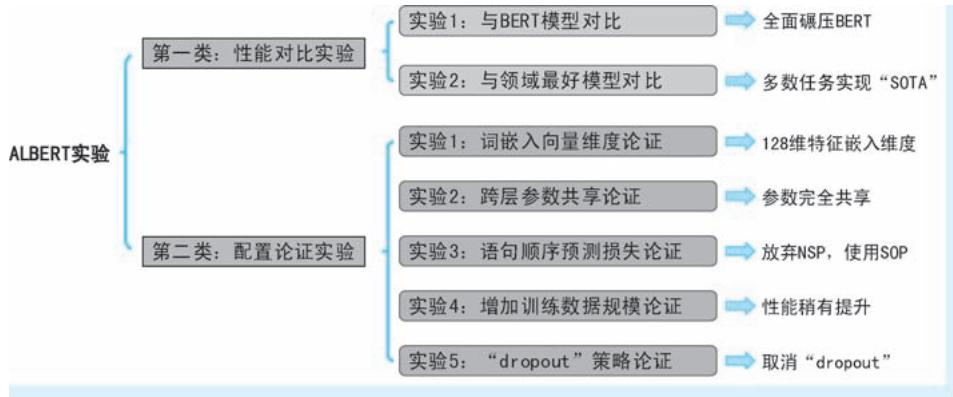  
●图 5-39 ALBERT 的实验设计及结论示意

和微调模式与 RoBERTa 类似，其中 ALBERT 也像 RoBERTa 那样增加了训练的步数，包括经过 100 万步和150 万步训练的两个模型。针对 GLUE 任务/数据集的实验结论为：在针对九个子任务分别进行的独立微调适配模式下，ALBERT-1. 5M 获得九个任务全胜的战绩 （其中在 QQP 和 MRPC 两个子任务上与 RoBERTa 打成平手），ALBERT-1M 相较 ALBERT-1. 5M 虽有差距，但表现也十分出色。这一结果除了证明 ALBERT 本身在模型层面所具有的优势之外，也再次证明了增加训练步骤能够带来性能提升这一结论；在基于 GLUE 积分榜测试数据集进行的模型微调模式下，ALBERT 在九个任务中获得六个冠军，并且九个任务的平均得分最高；针对 SQuAD （包括 v1. 1 和 v2. 0 两个版本）和 RACE 两个任务/数据集的实验对比中，ALBERT 在所有子任务上获胜。第二类的模型配置论证实验包括五组具体实验。前三组实验分别对应 ALBERT 所做的三点改进措施，三组实验均基于 ALBERT-Base 架构开展。其中，第一组实验用来确定词嵌入向量维度。由于只评估词嵌入向量的维度，故作者们将跨层共享参数与各层独立参数两种架构都纳入了测评，每种架构又分别考察了词嵌入向量维度在 64、128、256 和768 四种维度下的表现。结论为：在不进行参数共享 （即标准 BERT 模式）时，词嵌入向量维度越大越好，但是优势非常微弱，即便是采用 64 维和 128 维的短向量，效果也完全可以接受，这就再次证明了词嵌入与模型特征在维度上关系不大这一结论；在跨层参数共享模式下，128 维效果最佳。最后经过综合考量，ALBERT 选择128 维作为其最终特征嵌入维度，这一结论我们已经在前文中直接使用。这一结果很好理解，毕竟 ALBERT 消减参数最主要的举措就是跨层参数共享，故该模式下的最优结果有着“最高话语权”。第二组实验用于论证跨层参数共享的有效性。既然考察对象是跨层参数共享，那么词嵌入维度这次又成为可变因素，故 ALBERT 又分别在768 和 128 维两个词嵌入维度下开展对比，每种模式又包括了只共享注意力模块参数、只共享全连接前馈网络、参数完全共享和参数完全不共享四种具体设定。实验结论是：在不同词嵌入维度下，无论采用哪种共享模式，甚至是根本不进行跨层参数共享，模型效果之间的差异都极其微小。既然如此，ALBERT 自然选择参数精简最显著、实现也最简单的参数完全共享模式。第三组实验论证了语句顺序预测损失的有效性。在该组实验中，作者们对比了不做语句预测、下句预测和语句顺序预测三种模式下的预训练模型性能。结论是 ALBERT 使用的语句顺序预测任务能够显著提升预训练模型的效果。第四组实验用来论证增加预训练数据必要性。我们可以看到增加数据可以给模型性能带来较小的提升，但是在少量任务上不升反降。第五组实验用于考察是否使用 “dropout”策略。结论为取消 “dropout”策略，特别是 ALBERT 还得到了取消 “dropout”策略能够显著提升掩膜语言模型训练效果这一结论。

最后，我们对 ALBERT 进行简单的总结。客观地讲，如果单单看创新性，ALBERT 并没有提出多么亮眼的创新，故在很多人的眼里，ALBERT 属于 “老瓶装新酒”。但是，我们认为 ALBERT 瞄着BERT “瘦身”这一目标稳扎稳打，其工作无疑是成功的。该工作对整个领域，尤其是工业应用领域的贡献也是巨大的。“瘦身”后的 BERT 在性能上还能如此之好，也足见作者们的功力深厚。除此之外，几位作者在针对的实验设计与对比方面做了扎实的工作，同样非常值得我们学习。

# 5. 4. 5 MASS、BART 与 UniLM：序列到序列的模型

NLP 是一个相对宽泛的概念。按照任务属性，NLP 任务一般又被分为自然语言理解（NaturalLanguage Understanding，NLU） 和自然语言生成（Natural Language Generation，NLG） 两大类。其中，

自然语言理解重在理解，其核心任务包括：从语言文本中抽取实体、关系、事件等有用信息供下游任务使用；对语言组成元素———字、词、短语以及语句进行有效的特征学习与表达；针对文本开展感情色彩和其他属性的判别；对文本中的词汇进行属性标注；围绕文本进行信息检索与推理等。简而言之，自然语言理解是围绕让计算机理解人类自然语言和文字这一终极目标开展的各类分析工作，我们上文介绍的文本分类、自然语言推理、抽取式问答、命名实体识别等诸多任务均属于自然语言理解的范畴；自然语言生成任务旨在生成。相较于语言理解，其核心任务就显得非常 “纯粹”———让计算机能够产生人类可以理解的自然语言。最常见的生成方式莫过于文本到文本的生成，例如，机器翻译、文摘生成等均属于典型的文本到文本生成任务。广义的自然语言生成还包括跨模态生成任务，例如，“看图说话”（Image Captioning）就是典型的由图像到文本的生成应用。

在 Transformer 诞生后，NLP 领域诞生了诸多基于 Transformer 架构的预训练模型。在这些预训练模型中，BERT 和 GPT 是其中最为突出的两种。二者皆是基于 Transformer 架构，只不过前者取了 Trans-former 的编码器部分，而后者应用了 Transformer 的解码器部分。在两种模型中，BERT 属于自编码语言模型，而自编码语言模型核心要务为 “编码”———为输入序列中的词汇构造特征表达，为的是为下游的自然语言理解任务提供优质特征，因此更加适合自然语言理解任务，BERT 在各类自然语言理解任务上 “刷榜”就充分证明了这一点；GPT 属于自回归语言模型，自回归语言模型利用前文预测下一词汇，更加符合诸如机器翻译等逐词预测的任务模式，因此在形式上更加适合自然语言生成任务。但是，由于只使用了 Transformer 的解码器，缺少了编码特征的支持，特别是缺少了从编码器到解码器间的注意力作用，GPT 在自然语言生成任务上的表现也不尽如人意。为了语言生成，我们能不能把BERT 和 GPT 硬性拼在一起，让 BERT 负责编码，让 GPT 负责生成呢？答案自然是否定的，各自的架构在各自的训练目标下进行独立训练，难以做到 “步调一致”，特别是跨在编码器和解码器之间的注意力模块根本无法得到有效训练。如此 “生拉硬拽”得到模型自然不会有好的效果。

自然语言生成是典型的序列到序列（Sequence to Sequence，以下简称为 “Seq2Seq”）任务，那么我们是否可以构造一个 Seq2Seq 模型，来专门作为自然语言生成的预训练模型？在下文中，我们就介绍三个经典的 Seq2Seq 模型：MASS[17] 、BART[18] 和 UniLM[19][20]㊀①。三个模型均诞生于 2019 年，其中MASS 和 UniLM 两个模型均为微软出品，而 BART 则是由 Facebook AI 打造；MASS 模型旨在为语言生成任务打造预训练模型，而 BART 和 UniLM 则更加有 “野心”———试图在自然语言理解和自然语言生成两大类任务上做到 “通吃”。

# 1. MASS：序列到序列预训练模型的开始

我们讨 论 的 第 一 个 模 型 为 MASS 模 型。 MASS 的 全 称 为 “MAsked Sequence to Sequence pre-training”，即 “掩膜序列到序列预训练”模型。该模型诞生于 2019 年 5 月，作者是 Kaitao Song 等[17]五名来自微软和南京大学的学者。MASS 模型旨在为各类语言生成下游任务提供预训练模型。在模型架构方面，相较于 GPT 的只用 Transformer 解码器和 BERT 的只用 Transformer 编码器，MASS 使用了完整的 Transformer 编码器-解码器架构，通过一体化训练，使其能够有效应对自然语言生成任务。和其

他预训练模型类似，MASS 的工作也分为模型预训练和下游语言生成任务适配两块主要内容。结果表明，MASS 作为预训练模型，在机器翻译、文摘生成和会话响应生成三大类自然语言生成任务的八个公开数据集上，成绩均超越了基线模型。图5-40 为 MASS 编码器-解码器架构示意。

  
●图 5-40 MASS 的编码器-解码器架构示意 （其中 “_”表示被遮掩词汇）

首先我们再来简单回顾一下 Seq2Seq 模型。Seq2Seq 模型也称为序列转换模型，即给定一个长度为 $T$ 的输入序列 $\pmb { x } = \{ x _ { 1 } , \cdots , x _ { T } \}$ }，Seq2Seq 模型产生一个长度为 $T ^ { \prime }$ 的目标序列 ${ \bf y } = \{ { y } _ { 1 } , \cdots , { y } _ { T ^ { \prime } } \}$ }作为其对应的输出，当 $\boldsymbol { x }$ 和 $\textbf { y }$ 为不同语言时，Seq2Seq 模型完成的就是机器翻译任务；当 $\boldsymbol { x }$ 和 $\textbf { y }$ 为同种语言时，$\textbf { y }$ 则可以认为是 $\boldsymbol { x }$ 的另外一种表述，例如， $\boldsymbol { x }$ 为一篇文章， $\textbf { y }$ 为与之对应的摘要等。Seq2Seq 模型进行序列转换的概率模型可以表示为 $p ( \mathbf { \boldsymbol { y } } \vert \mathbf { \boldsymbol { x } } ; \theta )$ ），其中 $\theta$ 为模型参数。针对一个平行语料库，可以构造对数似然函数 $\mathcal { L } \left( \theta ; \left( X , Y \right) \right) = \sum _ { \mathbf { \Phi } ( \pmb { x } , \pmb { y } ) \in ( X , Y ) } \log p ( \pmb { y } \mid \pmb { x } ; \theta )$ ）作为模型优化的目标函数，其中 $( X , Y )$ ）表示平行语料， $( \pmb { x } , \pmb { y } ) \in ( X , Y )$ ）为其中的一组语句对。针对条件概率 $p ( \pmb { y } | \pmb { x } ; \theta )$ ），我们可以利用连式法则对其进行因子化表示，即 $p ( \pmb { y } \mid \pmb { x } ; \pmb { \theta } ) = \prod _ { t = 1 } ^ { T ^ { \prime } } p ( y _ { t } \mid y _ { < t } , \pmb { x } ; \pmb { \theta } )$ ）。 在编码器-解码器架构中，编码器读取输入序列并将其表达为某种中间特征表示，而解码器则按照上述中间表示和已经生成的词汇，以自回归的方式，通过预测下一个词汇的条件概率，来确定该输出什么词。

接下来我们来讨论 MASS 模型的预训练。MASS 模型的预训练即构造一个具有编码器-解码器架构的 $\mathrm { S e q } 2 \mathrm { S e q }$ 模型，使得其在得到一个存在遮掩片段的输入序列时，能够预测出该被遮掩的片段。具体来说，MASS 是受到 BERT 掩膜语言模型的启发，在编码器的输入端，首先对输入进行遮掩操作，但是与 BERT 随机遮掩个别单词不同，MASS 一次性遮掩一个连续片段：设 $\pmb { x } = \{ x _ { 1 } , \cdots , x _ { T } \}$ }为一个长度为$T$ 输入序列，MASS 将其中第 $u$ 个词到第 $v$ 个词之间的片段进行遮掩，其中 $0 < u < v < T$ 。我们将被遮掩的片段和具有遮掩的整个序列分别记作 $x ^ { u : v }$ 和 $x ^ { \backslash u : v }$ 。例如，在图 5-40 的示例中，输入的序列为 $x =$ $\{ x _ { 1 } , \cdots , x _ { 8 } \}$ }，遮掩操作从第3 个词汇开始，到第6 个词汇结束，故有 $u = 3$ 、 $v = 6$ ；被遮掩的语句片段$x ^ { u : v }$ 即为 $x _ { 3 } x _ { 4 } x _ { 5 } x _ { 6 }$ ”；具有遮掩的输入序列x \ u：v 即表示 $^ { \iota } x _ { 1 } x _ { 2 } { < } \mathrm { M A S K } { > } { < } \mathrm { M A S K } { > } { < } \mathrm { M A S K } { > } { < } \mathrm { M A S K } { > } { < } \mathrm { M A S K } { > } { x _ { 7 } x _ { 8 } } ^ { , { \circ } } { \odot } \mathrm { ~ K ~ }$ ①。MASS 的预训练目标即为基于被遮挡的原序列预测被遮挡的片段，目标函数可以表示为最大化如下对数似然函数

$$
\begin{array}{l} \mathcal {L} (\theta ; (X, Y)) = \frac {1}{| X |} \sum_ {x \in X} \log p \left(x ^ {u: v} \mid x ^ {\backslash u: v}; \theta\right) \tag {5-48} \\ = \frac {1}{| X |} \sum_ {\boldsymbol {x} \in X} \log \prod_ {t = u} ^ {v} p \left(x _ {t} ^ {u: v} \mid x _ {<   t} ^ {u: v}, x ^ {\backslash u: v}; \theta\right) \\ \end{array}
$$

式中， $\mid X \mid$ 为语料库中单语种语句的数量。从条件概率 $p \left( \mathbf { \Phi } x _ { t } ^ { u : v } \mid x _ { < t } ^ { u : v } , x ^ { \backslash u : v } ; \theta \right)$ ）的形式可以看出三个要点：第一， $x _ { t } ^ { u : v }$ 作为待预测词汇，其下标 $t$ 从 $u$ 遍历到 $v$ ，这就意味着 MASS 只预测被遮掩的片段。例如在图5-40 的示例中，输入端片段 ${ x _ { 3 } x _ { 4 } x _ { 5 } x _ { 6 } }$ ”被遮掩，则解码器就预测该片段，其他的词则不作预测目标；第二，上述条件概率体现了自回归模式的逐词预测模式———用 “＜MASK＞”预测 $x _ { 3 }$ ，用＜MASK＞$x _ { 3 }$ 预测 $x _ { 4 }$ ……用 $x _ { 3 } x _ { 4 } x _ { 5 }$ 预测 $x _ { 6 } \Theta$ ①，这一点与 GPT 模型是类似的；第三，条件概率的条件 $\cdot x ^ { \mathrm { ~ } ^ { \backslash ~ u : v } }$ 即代表被遮掩的输入序列，在 MASS 的编码器-解码器架构中，具体表现为编码器针对输入序列构造的中间特征表示，如在图5-40 的示例中的 $h _ { 1 } \sim h _ { 8 }$ 。将上述条件概率改写作 $p ( x _ { t } ^ { u : v } \mid x _ { < t } ^ { u : v } , h ^ { 1 : T } ; \theta )$ ）会更加清晰。在解码器产生输出时，这些中间特征将作为解码器中的编-解码器注意力模块的键-值集合，供在词汇生成时进行特征的加权合成之用。

为了在预训练时 “高标准、严要求”，MASS 对编码器和解码器的输入进行了 “互补”式掩膜操作———编码器输入中被遮掩的片段在解码器输入中则不做遮掩，如以上示例中的 ${ x _ { 3 } x _ { 4 } x _ { 5 } x _ { 6 } }$ ”。在这种训练要求下，就逼着编码器能挖掘未被遮掩词汇的语义，生成更加优质的特征表示供解码器使用；而编码器输入中不遮掩的片段，则在解码器输入中进行遮掩，例如，以上示例中的片段 $x _ { 1 } x _ { 2 }$ 和 $x _ { 7 } x _ { 8 }$ 。这么做的目的也是进一步使得编码器、解码器以及二者之间的注意力模块能够在训练中 “共同进步”。例如，在图5-40 的示例中，生成 $x _ { 3 }$ 时，解码器的输入只有前面三个 “＜MASK＞”，这就意味着解码器本身不能给 $x _ { 3 }$ 的生成提供什么有效信息，真正能给生成带来帮助的反倒是通过注意力模块得到的编码器输出特征。简单来说，互补式遮掩的目的在于让编码器和解码器进入 “互逼对方”的模式。这样一来，MASS 的预训练即以 “端到端”的方式，一体化训练了一个针对片段的掩膜语言模型和一个前向的自回归语言模型。

至于 MASS 与 BERT、GPT 两个模型的关系，几位作者也给出了解读：MASS 是一种介于 BERT 和GPT 之间的模型———在 MASS 模型中， $k = v - u + 1$ 作为超参数，控制了被遮掩片段的长度。当 $k = 1$ 时，

即编码器只遮掩一个词汇，而解码器端在输入全部为 “＜MASK＞”情况下、利用全部来自编码器的信息来预测上述被遮掩的词汇。这样一来，解码器-解码器的一体化训练就变为训练一个具有掩膜的编码器结构，而这便是 BERT 掩膜语言模型的训练目标。图 5-41a示意了这一情形；另外一个极端即 $k = T$ 的情形，即编码器的输入全部都被遮掩。这样一来，编码器等于在无任何有效输入的状态下“胡乱”编码，解码器生成词汇就只能 “全靠自己”，而这就是 GPT 前向语言模型预训练需要达到的训练效果。图 5-41b 示意了上

●图 5-41 MASS 模型中 $k = 1$ 和 $k = T$   
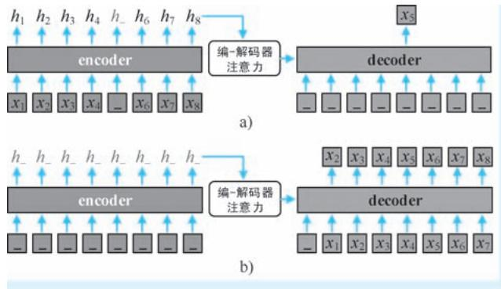  
两种情况的对比示意   
a） $k = 1$ 的情形 b） $k = T$ 的情形

述情形。

在预训练架构方面，MASS 的预训练模型使用了完整的 Transformer 编码器-解码器架构，其中编码器和解码器中均包含6 层，模型内部特征向量的维度均为1024 维，全连接前馈网络中隐含层的维度为4096 维；在预训练数据方面，MASS 基于WMT News Crawl 单一语种语料数据集进行模型预训练。数据集中的语料数据搜集自2007—2017 年，涉及英语、法语和德语三种语言，三种单语语料库的语句数量1. 9 亿、6200 万和 2. 7 亿。为了增加模型对低资源语言的支持，还增加了针对罗马尼亚语（Romanian）的预训练。具体来说，针对机器翻译任务，MASS 在上述四种单语种语料库上进行训练，而针对文摘生成和会话响应生成两种任务，则 MASS 只在英语语料库上进行模型预训练。为了让模型能够区分语种，MASS 模型在输入时也进行了语种嵌入操作；在词汇遮掩设置方面，与 BERT 类似，MASS 所有语句样本中，对其中 $80 \%$ 的语句进行遮挡处理， $10 \%$ 做篡改处理，另外的 $10 \%$ 则保持不变。在遮挡或篡改的语句中，MASS 选择其中随机位置、长度约为整个语句 $50 \%$ 的片段进行处理。

最后来我们来看看 MASS 模型的下游任务微调适配。MASS 对机器翻译、文摘生成和会话响应生成三类自然语言生成下游任务进行了微调适配和测评。其中，机器翻译任务又具体包括无监督机器翻译和针对低资源语言的有监督机器翻译两类。在无监督机器翻译中，由于缺少平行语料，MASS 基于上述单语种语料，采用反向翻译的方式构造出伪双语数据进行训练。在针对 WMT14 英语-法语、WMT16 英语-德语和英语-罗马尼亚语三组语言的共计六个机器翻译任务中，MASS 完胜多个现有的机器翻译模型，其中就包括了我们下文要介绍的 XLM 模型；在低资源语言有监督翻译任务中，MASS 从上述三个机器翻译数据集中分别抽取 1 万、10 万、100 万语句对，模拟低资源语言环境进行有监督机器翻译任务微调适配，结果表明，MASS 模型也超越了 XLM 模型；针对文本摘要任务，MASS 以 Giga-word 英文文摘语料库作为微调训练数据集，分别将文章和摘要作为编码器输入和解码器输入进行微调训练。测评结果也超过了其他两种模型架构；会话响应生成任务要求计算机能够对输入对话做出灵活响应。MASS 基于 Cornell 电影对话语料库作为训练数据进行微调训练，结果也表明 MASS 模型能够针对会话响应生成任务得到良好的效果。但是需要说明的是，笔者认为 MASS 在针对下游任务微调适配的细节并未给出太多的介绍，并且在模型对比方面也不算很充分，故这里我们也不做过多展开。

# 2. BART：序列去噪视角下的预训练模型

我们讨论的第二个模型为 BART 模型。BART 模型首次提出于2019 年10 月底，作者是 Mike Lewis等[18] 八名来自 Facebook AI 的学者。BART 模型的全称为 “Bidirectional and Auto-Regressive Transform-ers”，从字面意思理解，即 “兼有双向语言建模和自回归机制的 Transformer”。在架构方面，BART 继承了 Transformer 标准的六层编码器和六层解码器架构。其中，编码器和解码器扮演的角色与 MASS 中编码器和解码器的角色是类似的———编码器像 BERT 那样，利用掩膜机制建立双向语言模型，而解码器则像 GPT 那样以自回归的方式产生输出。BART 在文章中开宗明义，明确给出了其使用的编码器-解码器架构与 BERT 编码器架构、GPT 解码器架构在词汇预测模式方面的本质区别，上述三个模型的对比如图5-42 所示。

在预训练阶段，BART 将预训练的目标定义为破坏文档恢复— 在编码器-解码器架构中，编码器的输入即为被破坏的文档序列，而解码器输出的序列即为恢复后的文档序列。BART 在恢复文档与未经破坏文档之间构造交叉熵损失。“被破坏”等价于 “有噪声”，因此 BART 对破坏文档进行恢复的过

程，等价于针对带有噪声数据进行的去噪操作，BART 在文章题目中明确提到了 “去噪”。在架构方面，BART 扮演的正是去噪自编码器的角色，故在很多文献对模型进行的细化分类中，BART 也被划分入去噪自编码语言建模的范畴。事实上，关于对文档的破坏，BART 大量借鉴了 BERT 的掩膜思路，毕竟遮掩也是破坏的一种，只不过 BART 眼里的破坏具有任意性，因此使用包括掩膜在内的更多破坏方法。具体来说，BART 使用的破坏方法有五种，包括：符号遮掩 （Token Masking）、符号删除（Token Deleting ）、 文 本 填 充 （Text Infilling ）、 语 句 重 排 （Sentence Permutation ） 和 文 档 轮 换（Document Rotation）。

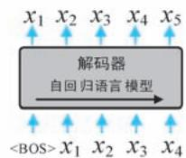

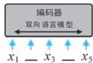

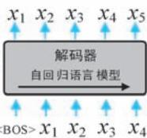  
  
●图 5-42 BART 编码器-解码器与 BERT 编码器、GPT 解码器架构的对比示意a）BERT 的编码器架构 b）GPT 的解码器架构 c）BART 的编码器-解码器架构

下面我们结合一个简单的示例，对 BART 的上述五种破坏操作进行介绍。在该示例中，假设输入的文档内容为 $x _ { 1 } x _ { 2 } x _ { 3 } . x _ { 4 } x _ { 5 }$ ”，其中包括两个语句： $x _ { 1 } x _ { 2 } x _ { 3 }$ ”和 $x _ { 4 } x _ { 5 }$ ” （注意个语句中间有句号分隔，句号也算作一个词汇）。在上述五种破坏操作中，符号遮掩与 BERT 的掩膜操作相同，即利用“＜MASK＞”标识符随机替换输入语句中的词汇。例如，我们随机选中 $x _ { 2 }$ 和 $x _ { 4 }$ 两个词汇，将二者均替换为 “＜MASK＞”标识符，得到的新文档即 $\cdot _ { x _ { 1 } < \mathrm { M A S K } > x _ { 3 } }$ . $< \mathrm { M A S K } > x _ { 5 }$ ”。符号删除即随机从输入语句中删除词汇，要求模型必须知道在什么位置缺少了词汇。例如，在上例中，我们随机选中 $x _ { 1 }$ 和 $x _ { 4 }$ 两个词汇，直接将其删除，于是得到的新文档为 ${ \bf \Phi } _ { x _ { 2 } x _ { 3 } . } { x _ { 5 } } \ $ ”。文本填充即随机将一段连续的词汇替换为一个 “＜MASK＞”标识符，连续词汇的长度服从 $\lambda = 3$ 的泊松分布。当连续长度为 0 就相当于插入一个“＜MASK＞”标识符。例如，在上例中，我们随机将 $x _ { 2 } x _ { 3 }$ 两个连续词汇被替换为一个 “＜MASK＞”标识符，在 $x _ { 4 }$ 和 $x _ { 5 }$ 之间插入一个 “＜MASK＞”标识符，于是得到新文档 $\mathbf { \dot { \sigma } } x _ { 1 } { < } \mathbf { M } \mathbf { A } \mathbf { S } \mathbf { K } >$ . $x _ { 4 } { < } \mathrm { M A S K } { > } x _ { 5 }$ ”。语句重排即将文档中的语句进行随机重新排列。例如，我们将语句 $x _ { 1 } x _ { 2 } x _ { 3 }$ ”和 $x _ { 4 } x _ { 5 }$ ”交换顺序，得到新的文档 $\mathbf { \dot { \sigma } } _ { x _ { 4 } x _ { 5 } . \ x _ { 1 } x _ { 2 } x _ { 3 } } ,$ ”。文档轮换即随机取文档中的一个词汇，使用循环移位的方式，将上述选中词汇之前的序列挪动到文档尾部，使得选中词汇排在新序列的第一位。例如，在上例中，我们随机选中词汇 $x _ { 3 }$ ，然后将其前部的 $x _ { 1 } x _ { 2 }$ 循环移动到文档最后，于是 $x _ { 3 }$ 成为文档的第一个词汇。文档轮换形成的新文档为 $x _ { 3 } . \ x _ { 4 } x _ { 5 } x _ { 1 } x _ { 2 }$ ”。

在下游任务微调适配训练方面，BART 给出了其针对序列分类 （Sequence Classification）、符号分类 （Token Classification）、序列生成 （Sequence Generation） 和机器翻译四类任务进行模型微调适配的可能架构和方法。其中序列分类和符号分类即我们前文所说的文本分类和符号标注，二者分别代表了语句级和词汇级的分类任务，因此属于典型的自然语言理解任务；而序列生成和机器翻译则属于典型的自然语言生成任务。需要说明的是，从广义上讲，机器翻译也属于序列生成任务，但是在 BART 这

里进行了区分。此处的序列生成特指生成式问答或文本摘要等任务，这些任务均为同语种的序列生成任务，而机器翻译则是跨语种的语言生成任务。BART 针对上述序列生成和机器翻译两类任务采取了不同的架构。图5-43 示意了 BART 预训练模型应用于上述四类下游任务进行适配训练的架构。

●图 5-43 BART 下游任务适配训练的架构示意  
  
a）序列分类任务 b）符号分类任务 c）序列生成任务 d）机器翻译任务

在图5-43 中，图5-43a 示意了 BART 针对序列分类任务的微调训练架构。在该架构中，BART 首先将输入语句同时输入编码器和解码器，解码器以自回归方式输出每个词汇对应的隐变量向量。BART 只接收其中最后一个隐变量向量作为整句的特征表示，然后通过构造线分类器 （线性变换加softmax 概率化）来实现序列类别的预测。在这里，取最后一个隐变量向量作为整个语句的语义代表是没有问题的，毕竟解码器以前向依赖的自回归方式运行，和 LSTM 类似，最后一个隐变量中已经 “浓缩”了整个语句的语义。图5-43b 示意了 BART 针对符号分类任务的微调训练架构。在该架构中，序列的输入方式与 BART 应对序列分类训练任务的输入方式是相同的，只不过 BART 获取解码器的所有输出隐变量作为每一个词汇的特征表示。然后针对这些特征构造分类器来实现词汇级的类别预测。在图5-43c 中，我们以生成式摘要为例，示意了 BART 针对序列生成任务的微调训练架构。在该架构中，BART 将原文和目标摘要分别作为编码器和解码器的输入，其中编码器充分理解原文，并产生针对原文的中间向量表示，解码器则通过编-解码注意力机制 “注意”这些原文语义，然后以自回归的方式生成摘要。事实上，在 BART 的视角中，文本摘要也可以视为是一类去噪工作：摘要是淹没在原文噪声中的精华，因此文本摘要所做的工作就是针对原文的 “取精华”和 “去糟粕”。图 5-43d 示意了BART 对接机器翻译任务所采用的架构。在该架构中，BART 首先将原编码器的嵌入层替换为一个具有随机参数的新编码器，经过端到端的训练，该编码器实现源语句到 BART 可以开展去噪操作语句的初步过渡。具体来说，BART 针对机器翻译任务的微调训练分为两个步骤：在第一步训练中，大部分参数都被冻结，仅有新增编码器的全部参数、位置嵌入矩阵，以及BART 原编码器第一层自注意力模块

的线性变换矩阵三类参数会得到更新；在第二步训练中，再以少量的迭代步数对全部参数进行整体更新。

在 BART 采取的五种文档破坏模式中，到底哪种破坏或是破坏组合构造的预训练模型最为有效呢？为了回答上述问题，BART 以不同模式训练得到的预训练模型作为基础，构造针对 SQuAD （抽取式问答）、MNLI （自然语言推理）、ELI5 （生成式问答）、SXum （新闻摘要任务）、ConvAI2 （对话响应生成）和 CNN/DM （新闻摘要任务）六个公开任务/数据集的下游任务适配模型，以预训练模型在下游任务中的表现作为其评价标准。在上述六个公开任务/数据集中，针对 SQuAD 和 MNLI 两个任务/数据集，BART 分别采用上文介绍的符号分类和序列分类两种任务架构来应对；而针对其余四个任务/数据集，则采用上述序列生成任务架构作为其适配架构。测评的破坏模式有六种，包括上述五种破坏模式中的每一个单一模式，再加上 “文本填充 $^ +$ 语句重排” 这一混合破坏模式；对比对象包括六个，包括：BERT-base （BERT 只用于完成自然语言理解任务，故只在 SQuAD 和 MNLI 上有结果）、GPT 使用的前向语言模型、XLNet 使用的排列语言模型、BERT 使用的掩膜语言模型、UniLM 使用的多任务语言模型 （这里的 UniLM 特指 UniLM-1. 0 模型，我们下文会进行详细介绍）以及 MASS 使用的Seq2Seq 语言模型。在针对六个公开任务/数据集的测试结果中，BART 的 “6 选手”在其中的四个任务上取得最优，只有针对 MNLI 和 FLI5 两个任务的第一名分别被 BERT-Base 和前向语言模型夺走。经过上述对比，BART 的作者们得出如下四条结论㊀①：第一，不同的预训练模式对下游任务的适配能力各有千秋，预训练目标的选择虽然重要，但不是影响结果的唯一因素，我们认为这一条可以算作是总结论；第二，单独使用文档轮换或语句重排效果不佳，反而是词汇的遮掩或删除非常有效；第三，GPT 使用的前向语言模型对于生成类任务非常有效，例如，在针对 ELI5，前向语言模型的表现完胜BART 的所有模式；第四，双向语言建模对 SquAD 这类抽取式问答任务非常有帮助。

最后，几位作者构造了一个具有 12 层编/ 解码器的大规模 BART 模型，并借鉴 RoBERTa 的大批次、长时间训练方式，试图对 BART 的极限能力进行了全方位的评估。具体评估内容和结果如下：针对 SquAD （包括1. 1 和2. 0）和 GLUE 两个任务/数据集的共计 10 个自然语言理解任务，给出了其与BERT、UniLM-1. 0、XLNet、RoBERTa 四个完整预训练模型的对比，结果显示，BART 在其中五个任务上取胜，另外5 个冠军全部被 “超级 BERT”———RoBERTa 夺走。这也许是 “大力出奇迹”；在针对 CNN / DailyMail 和 Xsum 两个新闻摘要任务，BART 取得完胜战绩，其中对手就包括我们下文将要介绍的 UniLM-1. 0 模型；在针对 ConvAI2 的应答生成任务中，BART 也超越了注意力 Seq2Seq 等传统模型；在 ELI5 生成式问答任务中，BART 也在 ROUGE-L 指标上超越了当时最好的模型；在基于 WMT16罗马尼亚语-英语翻译数据集的机器翻译任务中，BART 以基于英语训练得到的预训练模型作为基础，原编码器前添加了一个具有6 层的新编码器作为语言过渡，利用反向翻译策略的微调训练，其机器翻译结果超越了原生 Transformer。可以看出，大规模 BART 模型的表现也的确不俗。

# 3. UniLM：只用编码器的通用预训练模型

我们最后着重讨论两个模型— UniLM “双雄” 。UniLM 的全称是 “Unified Language Model”，即“通用语言模型”。从模型名称即可看出，UniLM 的目标不单单是应对自然语言生成任务，而是要在自

然语言理解和自然语言生成两大任务上实现 “双开花”。UniLM-1. 0 作者为董力 （Li Dong）老师等[19]九名来自微软亚研究院的学者。相较于 MASS 和 BART 两个模型使用完整的 Transformer 编码器-解码器，UniLM-1. 0 只使用了单一的 Transformer 编码器架构，因此在架构方面，UniLM-1. 0 与 BERT 基本相同。特别是在输入方面，UniLM-1. 0 模型接受双句拼接输入，并且对输入进行符号、片段和位置三种嵌入的合成，这便与BERT 更加类似。然而，UniLM-1.0 与 BERT 是 “形似而神不似”，尤其是在面对双句输入时，其内部工作机制更是 “别有玄机”。接下来我们就对 UniLM-1. 0 这一通用模型做以分析。

作为预训练模型，构造语言模型是标配，所以我们先来讨论 UniLM-1.0 的通用语言模型预训练。首先，受到 BERT 的启发，UniLM-1. 0 也将语言模型的预训练设计为 “完形填空”任务———在输入序列中将某些词汇随机替换为 “＜MASK＞”标识符，让模型预测在对应的位置对被遮掩的词汇进行预测。但是，在前文中我们已经说过语言模型有单向和双向之分。例如，ELMo 模型训练了前向和后向两个语言模型，而 GPT 的语言模型只考虑前向语言依赖，即前向语言模型，但是 BERT 则使用了单一Transformer 架构构造了双向语言模型，实现了语言的上下文建模等。在 UniLM-1. 0 模型中，为了进一步吃透语义，并且为了达到 “通用”的目的，UniLM-1. 0 的 “完形填空”任务包括了四个训练目标：单向语言模型、双向语言模型、序列到序列语言模型（以下简称为 “Seq2Seq 语言模型”） 和下句预测四个方面的训练目标。

UniLM-1.0 的单向语言模型即意味着让模型在做完形填空题时只按照上文或者只按照下文猜词。例如，输入的语句为 $^ { \ast } < \mathrm { C L S } > x _ { 1 } x _ { 2 } < \mathrm { M A S K } > x _ { 4 } < \mathrm { S E P } > ^ { , \ast } \Theta$ ①，在前向语言模型中，在对 “＜MASK＞” 遮掩的词汇 $x _ { 3 }$ 进行预测时，自注意力只能作用到 “＜CLS＞”、 $x _ { 1 }$ 、 $x _ { 2 }$ 及其自身；而在后向语言模型中，对 $x _ { 3 }$ 的预测只能用到 “＜MASK＞”、 $x _ { 4 }$ 和 ${ \bf \langle { S E P > } } ^ { \prime }$ ”。在对 GPT 模型的介绍中，我们已经说过，上述 “遮前挡后”的操作可以用掩膜注意力机制轻松实现。图5-44 分别为上述两种单向语言模型词汇间的依赖关系及其对应的掩膜矩阵示意㊁②。

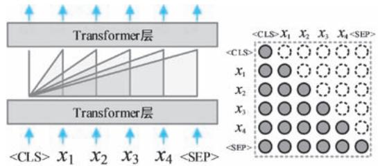

b)   
●图 5-44 两种单向语言模型词汇间的依赖关系及其对应的掩膜矩阵示意  
  
a）前向语言模型 b）后向语言模型

UniLM-1.0 的双向语言模型与 BERT 相同，即同时基于上下文对被遮掩词汇进行预测。当然，这种模式也可以用掩膜注意力机制统一实现，只不过掩膜矩阵全部设置为可见标志，图5-45 示意了双向语言模型词汇间的依赖关系及其对应的掩膜矩阵。

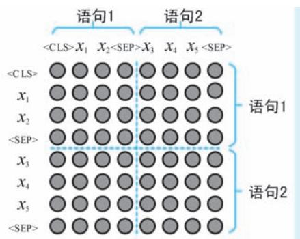  
●图 5-45 双向语言模型词汇间的依赖关系及其对应的掩膜矩阵示意

UniLM-1.0 的Seq2Seq 语言模型是专门针对双句输入设计的一种特殊的语言模型，也是UniLM-1.0最大的创新之处。在该模型中，针对第一个语句，词汇与词汇之间是双向依赖关系，即针对每个词的预测都能用到第一个语句中的所有词汇；在第二个语句中，只为词汇构造前向依赖关系。例如，假设$x _ { 1 } x _ { 2 }$ ”和 ${ { \dot { x } } _ { 3 } } { x _ { 4 } } { x _ { 5 } }$ ”分别为输入的两个语句，将其构成双句输入即为 $ { ^ \circ } < \mathrm { C L S } > x _ { 1 } x _ { 2 } < \mathrm { S E P } > x _ { 3 } x _ { 4 } x _ { 5 } < \mathrm { S E P }$ ＞”。那么对于第一句中的 $x _ { 1 }$ 和 $x _ { 2 }$ ，其依赖关系为前四个词汇，即 $\ ^ { \cdot } < \mathrm { C L S } > x _ { 1 } x _ { 2 } < \mathrm { S E P } > ^ { , \cdot }$ ”，而对于第二句中的 $x _ { 4 }$ ，对其预测只能用包括其自身在内的前 6 个词汇，即 $< \mathrm { C L S } > x _ { 1 } x _ { 2 } < \mathrm { S E P } > x _ { 3 } "$ ”。UniLM-1. 0 之所以针对输入的两个语句进行不同的依赖设定，这是因为在 UniLM-1. 0 序列转化的任务中，两个语句分别代表了源语句和目标语句，要想预测得到一个好的目标语句，就必须充分掌握源语句的语义，因此 UniLM-1. 0 选择了 BERT 那样的双向语言模型；而对于第二个语句，为了使得模型具有出自回归模式的逐词输出特性，UniLM-1. 0 就将第二句的依赖关系构造为 GPT 模式的前向依赖。Seq2Seq 语言模型针对两个语句的依赖关系也可以使用掩膜注意力机制统一实现，只不过掩膜矩阵的前一半为 “全可见”模式，而后一半为 “只见前文”模式，图5-46 示意了Seq2Seq 语言模型词汇间的依赖关系及其对应的掩膜矩阵。

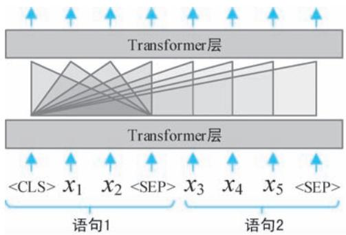

  
●图 5-46 Seq2Seq 语言模型词汇间的依赖关系及其对应的掩膜矩阵示意

UniLM-1.0 的下句预测预训练的操作方式与 BERT 下句预测的方式相同，在上文对 BERT 模型的介绍中，我们已经进行了解读，故在这里不再赘述。

说完语言模型，下面我们来看UniLM-1. 0 的预训练配置。在模型架构方面，UniLM-1. 0 采用BERT大规模版 （BERT-Large）模型作为其预训练模型的基本结构。即 UniLM-1. 0 拥有 24 个 Transformer 编码器层，内部特征的维度为 1024 维，多头注意力模块的 “头数”为 16 个，模型总参数量约为 3. 4亿。模型能够接收的序列长度限制为 512。在训练数据方面，UniLM-1.0 采用 BooksCorpus 和英语维基百科作为语言模型预训练的语料库。和BERT 相同，UniLM-1. 0 也采用WordPiece 方法构造词典，词典包含了 28996 个条目。在语言模型训练目标设定方面，针对一个输入批次的所有样本语句，其中用于双向语言模型和 Seq2Seq 语言模型训练的样本比例均为 1/3，用于前向语言模型和后项语言模型训练的样本占 1 / 6 的比例。UniLM-1. 0 会以约 $1 5 \%$ 的比例，针对两个输入语句的随机位置，在输出端进行词汇预测，并通过最小化词汇真值与上述预测结果之间交叉熵损失实现语言模型的自监督训练。在这些被预测的词汇中，以 “＜MASK＞”标识符遮掩和随机篡改的比例分别占到 $80 \%$ 和 $10 \%$ ，其余 $10 \%$ 保持不变。

作为通用语言模型，接下来我们就来看看 UniLM-1.0 模型如何支持自然语言理解和自然语言生成两类下游任务的微调适配。在面对自然语言理解任务时，UniLM-1. 0 就会 “变身” BERT———UniLM-1.0 包含 Transformer 的编码器部分，以提取优质特征为目标，于是我们可以在句首接收 ${ \mathrm { < C L S > } }$ ”标识符对应的、蕴含有全部语句语义信息的聚合特征，然后像 BERT 那样通过线性变换和概率化等操作，去获得包括单句情感、双句是否具有蕴含关系等我们想要的任何预测结果，微调训练的损失也即构建在真值，在上述预测概率之间。上述微调适配操作很好理解，毕竟在架构和数据组织方面，UniLM-1. 0 和 BERT 别无二致，在预训练方式方面二者也相差无几，故 BERT 怎么适配自然语言理解下游任务，UniLM-1. 0 就照着做即可；在面对自然语言生成任务时，UniLM-1. 0 的双句输入模式和Seq2Seq 语言模型就派上了用场。以序列生成任务为例，UniLM-1. 0 将源语句和目标语句进行双句拼接，得到形如 $< \mathrm { C L S } > S _ { 1 } < \mathrm { S E P } > S _ { 2 } < \mathrm { S E P } > "$ ”的输入格式。按照我们上文介绍的 Seq2Seq 语言模型的方式，UniLM-1. 0 按照一定的比例在第二个语句 $S _ { 2 }$ 上进行随机遮掩，通过让模型在第二个语句上进行 “完形填空”训练来实现目标序列生成任务的微调。在 UniLM-1. 0 的实验和分析部分，作者们给出了 UniLM-1. 0 应用于抽取式问答、情绪分析、文本相似性、复述检测和自然语言推理等诸多自然语言理解任务的实验结果，也给出了 UniLM-1.0 应用于文本摘要、生成式问答、问题生成与响应生成等自然语言生成任务的实验结果。经过详实的对比分析，可以看出，针对上述两大类任务，UniLM-1. 0 的确发挥了通用模型的作用———在几乎所有任务/数据集上，UniLM-1.0 都超越了现有模型的效果，针对某些任务，在某些指标上，UniLM-1.0 的表现甚至是碾压式的。不难看出，UniLM-1.0 使用单一架构同时支持两类NLP下游任务，正是其作为通用模型的核心所在。

讨论完 UniLM-1. 0，接下来我们就再聊聊其继任者— UniLM-2. 0 模型 [20] 。在上文中我们已经说过，自编码语言模型适合自然语言理解任务，而自回归语言模型则更适合自然语言生成任务。观察UniLM 模型对双句输入的加工模式，我们仿佛已经看见 “一半自编码，一半自回归”的影子，只不过几位作者并没有明确给出上述提法。到了 2020 年 2 月，微软亚洲研究院在 UniLM 模型的基础上提出了 UniLM-2.0 模型，在其中明确提出了通过自编码语言模型和自回归语言模型联合训练的方式来构造

通用预训练模型。UniLM-2.0 模型拥有更加紧凑的结构，其构造的预训练语言模型整体叫作 “伪掩膜语言模型”（Pseudo Masked Language Model，PMLM）。伪掩膜语言模型具体包括了自编码语言模型和部分自回归语言模型（Partially Autoregressive Language Model） 两种不同语言模型的训练目标。

第一种语言模型即和 BERT 一样的自编码语言模型。UniLM-2. 0 通过在输入序列中随机将词汇替换为 “＜MASK＞”标识符㊀①（为了简化并于其他标识符统一，我们在下文中将其简写为 “＜M＞”），在输出端预测这些词汇并以自监督的方式实现对该语言模型的训练。针对自回归上述掩膜语言模型的训练损失函数可以表示为

$$
L _ {A E} (\theta) = - \sum_ {\boldsymbol {x} \in \mathcal {D}} \log \prod_ {m \in M} p \left(x _ {m} \mid x _ {\backslash M}; \theta\right) \tag {5-49}
$$

式中， $\mathcal { D }$ 表示用于训练的语料， $\boldsymbol { x }$ 表示其中的一个语句；M 为被遮掩的位置集合， $x _ { m }$ 和 $x _ { \ l \backslash M }$ 分别表示被遮掩的词汇和未被遮掩的词汇集合；符号 “\ ”表示集合减法。上式很清晰地体现了用全部未遮掩词汇预测遮掩词汇的模式，且认为被遮掩的词汇之间相互独立，语句与语句之间也相互独立。

第二种语言模型称为 “部分自回归语言模型” （Partially Autoregressive Language Model），这也是为UniLM 最核心的创新点。我们知道，XLNet 模型最大的贡献即排列语言模型，UniLM-2. 0 充分意识到排列的意义，在其部分自回归语言模型也采用了排列的思路。只不过与 XLNet 对整个输入序列进行排列不同，UniLM-2. 0 对被遮掩的单个词汇或片段进行排列。而部分自回归语言模型正是基于这些排列，以 “看前不看后”的方式构建词汇依赖关系并开展预测。也正是因为能够支持片段预测和前向依赖建模，该模型才以 “部分”和 “自回归”冠名。我们用 $M = \left\{ \begin{array} { l l } { M _ { 1 } , \cdots , M _ { \scriptscriptstyle { | M | } } } \end{array} \right\}$ }表示被随机遮掩单个位置或连续位置的某一种排列，其中元素 $M _ { i }$ 即表示一个被遮掩的单个位置或连续多个位置。则对于一个输入语句，在排列 M 下，被遮掩词汇的概率可以分解为

$$
\begin{array}{l} p \left(x _ {M} \mid x _ {\backslash M}\right) = \prod_ {i = 1} ^ {| M |} p \left(x _ {M _ {i}} \mid x _ {\backslash M _ {\geqslant i}}\right) \tag {5-50} \\ = \prod_ {i = 1} ^ {| M |} \prod_ {m \in M _ {i}} p \left(x _ {m} \mid x _ {\backslash M _ {\geqslant i}}\right) \\ \end{array}
$$

式中， $x _ { M }$ 和 $x _ { \ l \backslash M }$ 分别表示被遮掩词汇和 “挖去” 遮掩词汇的输入序列； $\boldsymbol { x } _ { M _ { i } } = \{ \boldsymbol { x } _ { m } \} _ { m \in M _ { i } }$ 即表示排列 $M$ 中、第 $i$ 组遮掩位置对应的词汇序列； $M _ { \geqslant i } = \cup _ { j \geqslant i } M _ { j }$ 即表示在排列 $M$ 中， $M _ { i }$ 及 $M _ { i }$ 以后的位置集合；$\backslash M _ { \geqslant i }$ ”是只从整个序列的位置集合中扣除 $M _ { \geqslant i }$ 对应的位置集合，因此条件概率 $p ( \boldsymbol { x } _ { M _ { i } } | \boldsymbol { x } _ { \backslash M _ { \geqslant i } } )$ ）在 $M _ { i }$ 对应遮挡词汇预测时，是不会使用其自身以及排在其之后位置词汇的。

在刚看到式 （5-50）时，读者可能会感到有些费解，下面我们举一个例子对上式进行进一步说明。假设输入语句包含 6 个词汇，记作 $x = x _ { 1 } \cdots x _ { 6 }$ 。在被遮掩词汇总量不超过一定比例的前提下，我们首先经过多次随机位置选取，从6 个位置中确定若干遮掩位置，这些位置可以是单一位置，也可以是连续的若干位置㊁②。假设经过上述操作，我们得到的遮掩词汇为 $x _ { 2 } x _ { 4 } x _ { 5 }$ 。而易见，按照词汇的连续型，上述遮掩位置可以分为两组——— $\mathbf { - } x _ { 2 }$ 独成一组， $x _ { 4 } x _ { 5 }$ 为另一组。两组遮掩位置能形成的排列方式也有两种，即 ${ x _ { 2 } } \longrightarrow { x _ { 4 } x _ { 5 } }$ 和 ${ x _ { 4 } x _ { 5 } } \mathrm { \longrightarrow } x _ { 2 }$ 。上文中的 $M$ 就代表上述两种排列中的一种，故 $| M | = 2$ 。我们假设 M 表示

排列 ${ x _ { 2 } } \longrightarrow { x _ { 4 } x _ { 5 } }$ ，即有 $M = \left\{ \begin{array} { c } { { \left\{ 2 \right\} , \left\{ 4 , 5 \right\} } } \end{array} \right\}$ }，其中 $M _ { 1 } = \left\{ 2 \right\}$ }， $M _ { \scriptscriptstyle 2 } = \{ 4 , 5 \}$ }。在式 （5-50）中，条件概率$p ( x _ { M } | x _ { \backslash M } )$ ）即表示在不使用这些被遮掩词汇的条件下预测这些词汇的概率，其中 $x _ { M }$ 和 $x _ { \ l \backslash M }$ 即分别表示词汇集合 $\{ x _ { 2 } , x _ { 4 } , x _ { 5 } \}$ }和 $\left\{ x _ { 1 } , x _ { 3 } , x _ { 6 } \right\}$ }；接下来我们再看因子分解式 $p ( \boldsymbol { x } _ { M _ { i } } | \boldsymbol { x } _ { \mathtt { M } _ { \ge i } } )$ ）：当 $i = 1$ 时， $M _ { \geq 1 } = M _ { 1 } \cup M _ { 2 }$ $= \{ 2 , 4 , 5 \}$ }， $\backslash M _ { \geqslant 1 }$ 即表示从完整序列位置集合中扣除{2，4，5}，故 $\backslash M _ { \geqslant 1 } = \left\{ 1 , 3 , 6 \right\}$ }，则 $p ( x _ { M _ { 1 } } | x _ { \mathsf { M } _ { \infty 1 } } )$ ）表示的概率为 $p ( x _ { 2 } \vert x _ { 1 } , x _ { 3 } , x _ { 6 } )$ ；当 $i = 2$ 时， $M _ { \geq 2 } = M _ { 2 } = \{ 4 , 5 \}$ }， $\backslash M _ { \geq 2 } = \left\{ 1 , 2 , 3 , 6 \right\}$ }，故 $p \big ( x _ { M _ { 2 } } | x _ { \backslash M _ { \simeq 2 } } \big )$ ）表示的概率为 $p ( \boldsymbol { x } _ { 4 } , \boldsymbol { x } _ { 5 } | \boldsymbol { x } _ { 1 } , \boldsymbol { x } _ { 2 } , \boldsymbol { x } _ { 3 } , \boldsymbol { x } _ { 6 } )$ ）。式 （5-50）第二个等号后的分解式，即假设遮掩片段中各词汇相互独立。例如，当 $i = 2$ 时，有 $\begin{array} { r } { p \big ( { x _ { 4 } } , { x _ { 5 } } | { x _ { \backslash \{ 4 , 5 \} } } \big ) = p \big ( { x _ { 4 } } | { x _ { \backslash \{ 4 , 5 \} } } \big ) p \big ( { x _ { 5 } } | { x _ { \backslash \{ 4 , 5 \} } } \big ) } \end{array}$ ）。图 5-47 即针对上述示例，示意了自编码语言模型和部分自回归语言模型的词汇预测方法，其中词汇下方的数字代表位置嵌入，虚线仅表示位置对应。

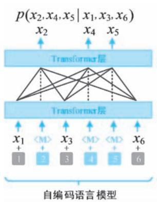

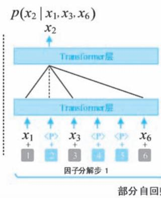

  
●图 5-47 自编码语言模型和部分自回归语言模型的词汇预测方法示意

考虑到排列的种类很多，|M|组遮掩词汇就会有|M|！种排列方式，并且在选择遮掩词汇时充满了随机性，故 UniLM-2. 0 也仿照 XLNet，采用数学期望来表示部分自回归语言模型的损失函数，即有

$$
L _ {P A R} (\theta) = - \sum_ {\boldsymbol {x} \in \mathcal {D}} \mathrm {E} _ {M \sim \mathcal {M}} [ \log p (x _ {M} | x _ {\backslash M}; \theta) ] \tag {5-51}
$$

式中，M～ 即表示从排列分布 中采样一个具体的排列 M；数学期望表示了 “平均排列”下、预测遮掩词汇的对数似然概率。在实际计算中，进行完备数学期望的计算是不现实的，故 UniLM-2. 0 同样采用了 XLNet 的方法，即针对一个输入语句，仅随机构造一组遮掩排列来进行部分自回归语言模型的训练。

在上文中，我们分别介绍了自编码语言模型和部分自回归语言模型两个目标，下面我们就看看二者的合体———伪掩膜语言模型。式 （5-50）给出了条件该概率 $p \big ( \boldsymbol { x } _ { M } | \boldsymbol { x } _ { \mathsf { u } } \big )$ ）的因子分解。然而，其中不同因子表示的词汇预测会用到不同的上下文环境。例如，在上面的示例中，针对第一步因子分解$p ( x _ { M _ { 1 } } | x _ { \backslash M _ { \infty } } )$ ），在预测 $x _ { 2 }$ 时，需要遮掩词汇 $x _ { 2 } x _ { 4 } x _ { 5 }$ ，但是到了第二步因子分解 $p \big ( x _ { M _ { 2 } } | x _ { \backslash M _ { \simeq 2 } } \big )$ ），在预测 $x _ { 4 }$ 和$x _ { 5 }$ 时，需要遮掩词汇是 $x _ { 4 } x _ { 5 }$ ，即在上一步被遮掩的 $x _ { 2 }$ 又得 “重见天日”。这就意味着我们需要为每一个因子构造一套 “完形填空”，这显然是不现实的。UniLM-2.0 即利用伪掩膜语言模型来解决上述问题，并实现对两种语言模型进行一体化训练。首先，针对输入语句，UniLM-2.0 并不像 BERT 那样直接将词汇替换为 $<  { \mathbf { M } } > { \mathbf { \ ' } }$ ”，而是保留所有输入词汇不变，只是在被遮掩的词汇之后插入 ${ \mathrm { < P > } }$ ” 和

“＜M＞”两种特定的标识符，前者中的 “P”正是 “Pseudo”的简写。也正是因为不对词汇进行真正的遮掩，UniLM-2. 0 的语言模型才叫 “伪掩膜”语言模型。这些插入的标识符与其代表的词汇具有相同位置嵌入向量。因此，经过词向量和位置嵌入向量的合成后，我们可以将这些标志位视为是规避了词汇内容信息，但却蕴含词汇位置信息的输入向量表示，而那些未被遮掩的输入向量中同时包括词汇的内容信息和位置信息。这不禁让我们想起了 XLNet 双流注意力机制。没错，UniLM-2. 0 就是这么考虑的，只不换了一种更加紧凑的架构。下面我们继续围绕上述示例来介绍伪掩膜语言模型的工作机制。对于序列 $x _ { 1 } \cdots x _ { 6 }$ 和遮掩词汇为 $x _ { 2 } x _ { 4 } x _ { 5 }$ ，插入标识符后的序列变为 $x _ { 1 } x _ { 2 } < \mathrm { P } _ { 2 } > < \mathrm { M } _ { 2 } > x _ { 3 } x _ { 4 } x _ { 5 } < \mathrm { P } _ { 4 } > < \mathrm { P } _ { 5 } > < \mathrm { M } _ { 4 } > < \mathrm { M } _ { 5 } > x _ { 6 }$ （为了方便读者看清标识符代表的词汇，我们加上了下标，实际模型中是不包含下标的）。标识符“ ${ \bf { \Lambda } } { \bf { < M > } }$ ”用来进行自编码语言模型的词预测，我们在其对应的位置产生预测词汇。对于被遮掩词汇$x _ { 2 } x _ { 4 } x _ { 5 }$ ，我们以 $x _ { 2 }$ 为例，其预测模型为 $p \left( x _ { 2 } \mid x _ { \mid ( 2 , 4 , 5 \mid \mathbf { \Lambda } ) } \right) = p \left( x _ { 2 } \mid x _ { 1 } , x _ { 3 } , x _ { 6 } \right)$ ），即对 $x _ { 2 }$ 的预测依赖 $x _ { 1 } x _ { 3 } x _ { 6 }$ 。同时，按照 XLNet “预测自己不看自己内容，但看自己位置” 的原则，对 $x _ { 2 }$ 的预测还要用到 $< \mathbf { M } _ { 2 } > ^ { \prime \prime }$ ”。对于 $x _ { 4 }$ 和 $x _ { 5 }$ 的预测也按照相同的方式进行。图5-48a 示意了上述自编码语言模型的工作机制。在部分自回归语言模型中，我们在标识符 ${ \bf \Phi } { \bf < P > } ^ { \bf \prime }$ ”的对应位置产生预测输出。还是以排列 ${ x _ { 2 } } \longrightarrow { x _ { 4 } x _ { 5 } }$ 为例，第一步因子分解对应的条件概率为 $p ( x _ { 2 } | x _ { \backslash \{ 2 , 4 , 5 \} } )$ ）。预测 $x _ { 2 }$ ，则在 ${ \mathrm { < P } } _ { 2 } >$ ”对应位置输出预测词汇，上述条件概率表示对 $x _ { 2 }$ 的预测依赖 $x _ { 1 } x _ { 3 } x _ { 6 }$ ，另外还需要加一个 $x _ { 2 }$ 的自身位置 $\mathrm { \langle P _ { 2 } \rangle ^ { \prime } }$ ”。第二步因子分解对应的条件概率为 $p ( x _ { 4 } x _ { 5 } | x _ { \backslash \{ 4 , 5 \} } )$ ），其中 $x _ { \backslash \{ 4 , 5 \} } = x _ { 1 } x _ { 2 } x _ { 3 } x _ { 6 }$ ，在对 $x _ { 4 }$ 和 $x _ { 5 }$ 分别预测输出分别在 $\mathrm { { < P _ { 4 } > } ^ { \prime \prime } }$ 和 ${ \mathrm { < P } } _ { 5 } >$ ”对应位置产生。除了 ${ x _ { 1 } x _ { 2 } x _ { 3 } x _ { 6 } }$ 作为两个词汇的依赖词汇，对 $x _ { 4 }$ 和 $x _ { 5 }$ 的预测还要用到二者的位置信息，即 $\mathrm { \langle P _ { 4 } \rangle }$ ”和 ${ \mathrm { < P } } _ { 5 } >$ ”。图5-48b 和图 5-48c 分别示意了上述两个因子分解步骤词汇预测的方式。需要说明的是，为了统一操作，在 UniLM-2.0 中，规定所有 ${ \bf { \Lambda } } { \bf { < M > } }$ ”标识在部分自回归语言模型中均为可见，所以我们也遵循了这一原则。

  
a）

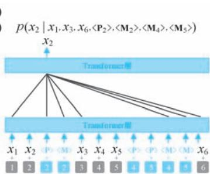

●图 5-48 自编码语言模型和部分自回归语言模型的词汇预测方法示意  
  
a）自编码语言模型 b）部分自回归语言模型 （第一步因子分解） c）部分自回归语言模型 （第二步因子分解）

在上述伪掩膜语言模型的训练中，为了给待预测设定不同的上下文依赖，我们很自然的又会使用掩膜自注意力机制。至于掩膜矩阵如何构造，想必读者已经轻车熟路，我们这里就不再进行过多讨论。伪掩膜语言模型通过运用两种伪掩膜标识符，巧妙地实现了自编码语言模型和部分自回归语言模型的一体化自监督训练：给定一个输入语句，首先随机采样一个遮掩的排列，针对上述排列中的所有遮掩位置，在原始语句中插入 “＜P＞”和 ${ \bf { \Lambda } } { \bf { < M > } }$ ”两种特定的标识符；然后利用标准自编码语言模型

在标识有 “＜M＞”的位置预测词汇，并利用式 （5-49）计算预测损失；然后按照遮掩排列给出的因子分解，构造预测词汇的上下文依赖关系，然后在标识有 “＜P＞”的位置预测词汇，并利用式 （5-51）计算预测损。伪掩膜语言模型的总体损失即上述两种语言模型损失之和，有

$$
L _ {\mathrm {P M L M}} (\theta) = L _ {A E} (\theta) + L _ {\mathrm {P A R}} (\theta) \tag {5-52}
$$

可能有读者会诧异，既然是自回归，建立的就是前向语言模型，反应在词汇依赖上即表现为前向

依赖关系，但是为什么在 UniLM-2.0 的部分自回归语言模型中没有看出前向依赖这一特性呢？需要说明的是，和 XLNet 相同， “看前不看后” 的前向依赖关系只体现在排列上，恢复到词汇的原始输入顺序自然就不再满足。事实上，我们可以将词汇按照原始顺序和排列顺序组织为双句模式，例如，对于序列 $x _ { 1 } \cdots x _ { 6 }$ 和遮掩词汇排列 ${ x _ { 2 } } \longrightarrow { x _ { 4 } x _ { 5 } }$ ，按照上述方法组织的双句输入即为 $x _ { 1 } x _ { 2 } x _ { 3 } x _ { 4 } x _ { 5 } x _ { 6 } x _ { 2 } x _ { 4 } x _ { 5 }$ 。然后分别在第一个语句中添加 ${ \bf { \Lambda } } { \bf { < M > } }$ ”标识符，在第二个语句中添加 “＜P＞”标识符，即可得到如图 5-49 所示的 “左半部分自编码，右半部分自回归”的形式，这一形式便与 UniLM-1.0 的形式接近了。出于简化的目的，我们在图中省略了 $< { \mathrm { C L S } } > ^ { \prime }$ ” 和“＜SEP＞”标识符。

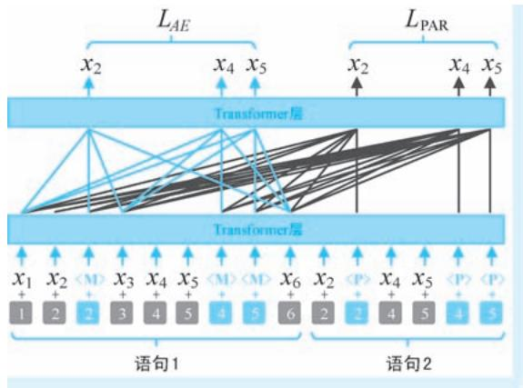  
●图 5-49 将原始语句和掩膜词汇进行双句拼接模式下的词汇预测示意

下面我们简单看看 UniLM-2.0 如何针对自然语言理解和自然语言生成两类任务进行微调适配。在针对自然语言理解任务的微调训练中，与UniLM-1. 0 模型相同，UniLM-2. 0 也是化身为BERT，从句首${ \mathrm { < B O S > } }$ ”对应位置获取输出，然后再做各类预测和监督训练，具体方式这里不再赘述；针对自然语言生成任务的微调训练，UniLM-2.0 首先将源语句和目标语句进行双句拼接，得到 $< \mathrm { C L S } > S _ { 1 } < \mathrm { S E P } > S _ { 2 } < \mathrm { S E P } > ^ { \prime \prime }$ ”的输入形式。针对其中的源语句 $S _ { 1 }$ ，UniLM-2. 0 以自编码的方式进行词汇预测和监督，即每个输出词汇都会 “注意到” $S _ { 1 }$ 中的所有词汇，目的旨在让模型充分理解源语句的语义；对目标语句的处理则按照自回归方式进行。我们知道，标识符 “＜P＞”代表了部分自回归语言模型的预测位置，故 UniLM-2.0为 $S _ { 2 }$ 中每个词汇都添加 “＜P＞”标识符，然后再利用自注意力机制，以自回归的方式预测对应位置的词汇并进行监督。至于 UniLM-2. 0 模型具体进行了哪些任务适配与测评，以及测评效果如何等内容，请读者自行查阅相关文献，我们这里不再进行详细讨论。

三个模型讨论完毕，我们将其放在一起进行对比总结。首先在设计目标方面，MASS、BART 和UniLM 都具备序列到序列的生成能力，因此三者都能够适配自然语言生成任务。特别是 UniLM 模型，更是在通用性方面狠下功夫，希望模型能够在自然语言理解和自然语言生成两大类任务上做到 “双丰收”。既然要生成目标语言，那么必须充分理解源语言，故三个模型都采用了双向自编码语言模型来构造对输入源语言的编码表示。只不过在实现架构和训练方法上，三个模型却各有特色：MASS 和BART 都采用了完整的 Transformer 编码器-解码器架构———编码器负责对源语言进行理解和编码，而解码器负责目标语言生成，二者分工明确。其中，MASS 模型利用编码器片段掩膜，以及与之对应的解

码器互补掩膜，开展一体化训练，使得模型的编码器能够充分理解语义，而解码器能够来适应词汇生成。而 BART 模型则将预训练的目标定义为去噪———在编码器的输入端以多种方式刻意破坏输入序列，然后训练模型恢复文档，从而让模型更加充分地理解语义。因此，MASS 和 BART 模型的本质都是一个 BERT 与 GPT 的 “合体”。与上述两个模型的 “中规中矩”相比，UniLM 仅使用了 Transformer编码器架构，无论在架构上还是在对接自然语言理解任务上，其与 BERT 模型都非常类似，因此在应对自然语言理解任务时，UniLM 至少能够做到不输 BERT。但是在适配自然语言生成任务时，UniLM的内部操作则与 BERT 有着本质区别———UniLM 充分利用 BERT 双句输入的机制，分别将源语句与目标语句作为前后句，对前者自编码，对后者自回归，可谓 “一鱼两吃”。因此，UniLM 也可以视为是BERT 和 GPT 的组合，只不过与 MASS 和 BART 那样的显式构造不同，UniLM 更像是将 BERT 和 GPT进行横向无缝拼接，并隐藏在一个 BERT 的 “外壳”之中。除此之外，在 UniLM-2. 0 模型中，作者们还充分借鉴了 XLNet 的排列语言模型和双流自注意力思想，创造性地提出了伪掩膜语言模型，使得模型在结构上更加统一和紧凑。

# 5. 4. 6 ERNIE“双雄”：借助外部数据的增强模型

2019 年，“芝麻街”在 NLP 领域的势力得到进一步壮大———在4 月和5 月，先后诞生了两个叫作“ERNIE”的预训练模型。前者的全称为 “通过知识集成来增强表示” （Enhanced Representationthrough kNowledge IntEgration），该模型由 Yu Sun 等[21] 10 名来自百度的学者提出；而后者的全称为“信息实体增 强 的 语 言 表 示” （Enhanced Language RepresentatioN with Informative Entities），则 是 由Zhengyan Zhang 等[22] 6 名来自清华大学和华为诺亚的学者联袂提出。从名称可以看出，二者均借助了外部信息来提升自身的语言表示能力。

为了区分上述两派 “ERNIE”，我们将来自清华的 ERNIE 简称为 “清华 ERNIE ”。对于百度提出的 ERNIE 模型，我们首先将 2019 年 4 月百度提出的首个 ERNIE 模型称为 “百度 ERNIE-1. 0”，之所以是 “1.0”，这是因为百度 ERNIE 实际上是一个 “人丁兴旺”大家族———在 1.0 版模型之后，同一批作者在同年 7 月、2021 年 7 月以及 2021 年 12 月又先后提出了 ERNIE-2. 0[23] 、ERNIE-3. 0[24]和ERNIE-3. 0 Titan[25] 三个升级版模型。因此，我们也将来自百度的 ERNIE 模型表述为 “百度 ERNIE-版本号”的形式。需要特别说明的是，从2019 年4 月提出首个 ERNIE 模型开始，百度公司即借助自身强大的研发能力，特别是依托其在语料资源方面所具有的得天独厚的优势，不断提升模型对语言的理解能力，终于在 NLP 领域、特别是中文 NLP 领域占据了一席之地。其中，可训练参数量高达 2600 亿的ERNIE-3. 0 Titan （也被称为 “文心ERNIE”或 “文心大模型”），更是被誉为 “史上最强中文预训练模型”。2022 年6 月，百度基于 ERNIE-3. 0 Titan 打造的手机虚拟 AI 助手 “度晓晓”，在写作、绘画等创作方向上展现出卓越的能力。

两派均叫作 “ERNIE”的模型让我们看见了两种可能：第一，在 NLP 模型训练时可以引入更多外部信息以进一步提升模型的表达能力；第二，为了凑 “芝麻街”的角色是可以不顾及首字母原则，当然后者是玩笑话。百度 ERNIE 的提出早于清华 ERNIE，故按照时间顺序理应先介绍百度 ERNIE 才是。但是，考虑到清华 ERNIE 借助外部知识的模式更加直接，而且我们需要借助其来阐述实体关系的概念和引入外部信息的意义。当我们理解了清华 ERNIE 的思路之后，理解百度 ERNIE 的创新点也就水到

渠成。故在下文中，下面我们按照 “先清华后百度” 的顺序，分别对 ERNIE 这两路 “双雄” 展开讨论。

# 1. 清华 ERNIE：借助知识图谱的增强模型

实体（entity） 和关系（relationship） 是对现实世界中事物以及事物之间联系的一种抽象表示。其中实体表示一个个离散的对象，如城市、计算机、歌曲等，而关系则描述了两个或更多实体如何相互关联，例如，程序与计算机这两个实体之间的关系就是前者“运行在”后者之上。我们所说的自然语句也是常常蕴含实体和关系，例如，语句 “1993 年，李健从哈尔滨来到清华园。他一路心怀音乐梦想，于 10 年后推出 《似水流年》”㊀①，其中蕴含的实体关系可以用图 5-50 表示。其中， “李健” “哈尔滨” “清华园”和 “《似水流年》”均为实体 （事实上 “音乐”“梦想”等也是实体，但是这里我们只以主要实体举例）㊁②。

  
●图 5-50 实体关系图示意 （其中，虚线箭头表示从语句中抽取的关系，而实现箭头表示已经存在的客观知识）

读完上面的语句，我们可以很容易地了解到：李健生长在哈尔滨，他毕业的大学是清华大学，他是音乐专辑 《似水流年》的创作者。之所以我们能够得到上述正确认知，是因为在表面文字下，实际上还蕴含了很多的背景知识。例如，哈尔滨是一座城市，清华园是清华大学的别称，而清华大学是一所大学，《似水流年》是一张音乐专辑的名称。如果没有上述背景知识，仅仅通过表面文字，我们很难就很给李健打上 “哈尔滨人”“清华毕业生”和 “音乐创作人”这样的精准标签。一般的预训练模型以 “浮于文字表面，读到什么算什么”的工作模式进行构造，很难发掘那些更加深刻的、认知层面的信息。清华 ERNIE [22] 就是针对上述问题，通过将现有大规模知识图谱（Knowledge Graph）所富含的实体-关系信息作为文本语料分析的重要背景知识补充，使得模型能够在自然语言理解的水平上 “更上一层楼”。

几位作者认为，若想将知识图谱所蕴含的外部知识整合进语言模型，有两个核心问题必须解决。第一个问题即针对结构化数据的编码表示问题。知识图谱具有典型的图结构，无法直接使用，所谓的编码就是将其中的实体和关系转换为向量表示。第二个问题即异构特征的融合问题。我们知道，自然语言属于非结构化数据，而知识图谱是典型的结构化数据，自然语言语句中的词特征和知识图谱得到的实体/关系嵌入特征处于不同的特征空间。如何构造一个有效的预训练任务，实现对自然语言蕴含的语义信息与知识图谱所承载的外部知识有机的融合，是一个非常具有挑战性的工作。针对第一个问

题，作者们借助了 TransE 模型[26] 来实现对知识图谱进行嵌入操作，从而得到图谱中实体的向量表示，进而作为清华 ERNIE 模型提供外部知识的特征表示。TransE 模型是一种于 2013 年提出的、用于对结构化知识进行嵌入表示的经典模型。针对一个以三元组集合 $\left\{ \begin{array} { l l } { ( h , l , t ) } \end{array} \right\}$ }表示的知识图谱，TransE 以$t - h \approx l ^ { \mathrm { { ; } } }$ ”为目标，将所有实体和关系转换为向量表示。其中， $h$ 和 $t$ 表示知识图谱中的两个实体 （h和 $t$ 分别代表头实体和尾实体），l 表示其间关系。简单来看，TransE 模型认为实体和关系的嵌入向量应该满足 “两个实体之间的差异就是其间关系”这一约束条件。例如，在图 5-43 的示例中，如果仅是单看实体 “清华园”，那么它可以代表清华大学、街道甚至是火车和公交站点等，但是它与 “清华大学”这一实体之间，就差了 “是别称”这一层关系。至于 TransE 的详细原理以及如何使用的问题，这里就不做深究了，毕竟清华 ERNIE 也采取了 “拿来主义”。我们只要知道经过 TransE 的操作，知识图谱中的实体已经转换为向量表示即可。下面我们来重点讨论第二个问题，即清华 ERNIE 如何通过模型的构造和预训练任务的设计来实现两种异构数据的融合。

首先我们来看看清华 ERNIE 的架构设计。如图 5-51 所示，清华 ERNIE 模型包括两个核心结构：符号编码器（Token Encoder，以下简称为 “T-编码器”） 和知识编码器（Knowledgeable Encoder，以下

简称为 “K-编码器”）。其中，T-编码器用来对输入的自然语言序列进行编码，从而获得每个词汇对应的特征表示。T-编码器由 $N$ 层标准 Transformer 编码器堆叠而成，因此可以认为其就是一个 Transformer 编码器栈，或者说其就是一个 $N$ 层 “小BERT”。T-编码器对输入语句的加工可以简单表示为 $\mid w _ { 1 } , \cdots , w _ { n } \mid = \mathrm { T } - \mathrm { E n c o d e r } \left( \{ \ w _ { 1 } , \cdots , w _ { n } \} \right)$ ）。其中， $\{ w _ { 1 } , \cdots , w _ { n } \}$ }和 $\{ \pmb { w } _ { 1 } , \cdots , \pmb { w } _ { n } \}$ }分别表示 T-编码器的输入词汇序列和输出特征序列， $n$ 为序列长度。当然，与BERT 相同，T-编码器在接收到原始输入词汇后，首先也会对其进行词嵌入、片段嵌入和位置嵌入的 “三嵌入”合成操作。接下来就到了 K-编码器大显身手的时候了。K-编码器由 $M$ 个堆叠的聚合器（aggregator）构成，用来完成对T-编码器输出 $\{ \pmb { w } _ { 1 } , \cdots , \pmb { w } _ { n } \}$ }与知识图谱实体嵌入表示$\{ \pmb { e } _ { 1 } , \cdots , \pmb { e } _ { m } \}$ }的融合操作，其中 $m$ 为实体个数。K-编码器对上述两路输入的加工过程可以表示为

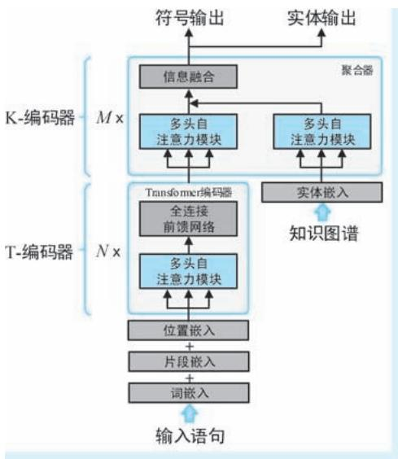  
●图 5-51 清华 ERNIE 模型架构图

$$
\left\{\boldsymbol {w} _ {1} ^ {o}, \dots , \boldsymbol {w} _ {n} ^ {o} \right\}, \left\{\boldsymbol {e} _ {1} ^ {o}, \dots , \boldsymbol {e} _ {n} ^ {o} \right\} =
$$

$$
\text {K - E n c o d e r} \left(\left\{\boldsymbol {w} _ {1}, \dots , \boldsymbol {w} _ {n} \right\}, \left\{\boldsymbol {e} _ {1}, \dots , \boldsymbol {e} _ {m} \right\}\right) \tag {5-53}
$$

式中， $\{ \pmb { w } _ { 1 } ^ { o } , \cdots , \pmb { w } _ { n } ^ { o } \}$ }和 $\{ e _ { 1 } ^ { o } , \cdots , e _ { n } ^ { o } \}$ }分别为 K-编码器的双路输出，用来作为更多下游任务的特征输入。K-编码器中的每一个聚合器都具有词汇嵌入和实体嵌入两路特征输入。在第 i 个聚合器中，首先利用两个并行的多头自注意力模块对上述两路输入进行加工，该过程可以表示为

$$
\left\{\widetilde {\boldsymbol {w}} _ {1} ^ {(i)}, \dots , \widetilde {\boldsymbol {w}} _ {n} ^ {(i)} \right\} = \text {a t t e n t i o n} \left(\boldsymbol {w} _ {1} ^ {(i - 1)}, \dots , \boldsymbol {w} _ {n} ^ {(i - 1)}\right) \tag {5-54}
$$

$$
\{\widetilde {\boldsymbol {e}} _ {1} ^ {(i)}, \dots , \widetilde {\boldsymbol {e}} _ {m} ^ {(i)} \} = \text {a t t e n t i o n} \left(\boldsymbol {e} _ {1} ^ {(i - 1)}, \dots , \boldsymbol {e} _ {m} ^ {(i - 1)}\right) \tag {5-55}
$$

在以上两式中， $\{ \pmb { w } _ { 1 } ^ { ( i - 1 ) }$ $\{ \pmb { w } _ { 1 } ^ { ( i - 1 ) } , \cdots , \pmb { w } _ { n } ^ { ( i - 1 ) } \}$ }和 $\{ e _ { 1 } ^ { ( i - 1 ) } , \cdots , e _ { n } ^ { ( i - 1 ) } \}$ $\{ \pmb { e } _ { 1 } ^ { ( i - 1 ) }$ }分别表示两个多头自注意力模块的输入， $\{ \widetilde { \pmb { w } } _ { 1 } ^ { ( i ) } , \cdots , \widetilde { \pmb { w } } _ { n } ^ { ( i ) } \}$ 和 $\{ \ : \widetilde { \pmb { e } } _ { 1 } ^ { \ : ( i ) } , \cdots , \widetilde { \pmb { e } } _ { m } ^ { \ : ( i ) } \ : \}$ }为其对应的输出；attention（·）为标准的多头自注意力操作。再接下来，聚合器就要对两种异构特征进行融合操作，该操作包括两种具体情形。第一种情形即输入词汇与实体能够匹配的情形，即所谓输入的词汇与知识图谱的实体能够 “对齐”。在这种情形下，对于输入的词汇 $w _ { j }$ 及其对齐的实体 $\cdot e _ { j }$ ，清华 ERNIE 按照如下的方式进行特征融合

$$
\boldsymbol {h} _ {j} = \sigma \left(\widetilde {\boldsymbol {W}} _ {t} ^ {(i)} \widetilde {\boldsymbol {w}} _ {j} ^ {(i)} + \widetilde {\boldsymbol {W}} _ {\boldsymbol {e}} ^ {(i)} \widetilde {\boldsymbol {e}} _ {k} ^ {(i)} + \widetilde {\boldsymbol {b}} ^ {(i)}\right) \tag {5-56}
$$

$$
\boldsymbol {w} _ {j} ^ {(i)} = \sigma \left(\boldsymbol {W} _ {t} ^ {(i)} \boldsymbol {h} _ {j} + \boldsymbol {b} _ {t} ^ {(i)}\right) \tag {5-57}
$$

$$
\boldsymbol {e} _ {k} ^ {(i)} = \sigma \left(\boldsymbol {W} _ {e} ^ {(i)} \boldsymbol {h} _ {j} + \boldsymbol {b} _ {e} ^ {(i)}\right) \tag {5-58}
$$

在以上三式中，式 （5-56）表示针对对齐异构特征 $\tilde { \pmb { w } } _ { j } ^ { ( i ) }$ ）和 $\tilde { \pmb { e } } _ { k } ^ { ( i ) }$ ）所进行的融合操作。其中 $\tilde { \pmb { W } } _ { t } ^ { ( i ) }$ ）、 $\tilde { \pmb { W } } _ { e } ^ { ( i ) }$ ）为可训练的线性变换参数矩阵， $\widetilde { \pmb { b } } ^ { ( i ) }$ ）为对应的偏置向量；针对式 （5-56）得到的融合特征 $\pmb { h } _ { j }$ ，式 （5-57）和式 （5-58）分别采用 “线性变换 $^ { + }$ 激活”的方式，“兵分两路”，将已经融合的特征再次分开，分别得到蕴含有实体信息的词汇特征输出 ${ \pmb w } _ { j } ^ { ( i ) }$ ）和蕴含有词汇信息的实体特征输出 $\pmb { e } _ { k } ^ { ( i ) }$ ，其中 $\pmb { W } _ { t } ^ { ( i ) }$ ）和 $\pmb { W } _ { e } ^ { ( i ) }$ ）为可训练的线性变换参数矩阵； $\pmb { b } _ { t } ^ { ( i ) }$ 和 $\pmb { b } _ { e } ^ { ( i ) }$ 为对应的偏置向量；以上三式中的 $\sigma ( \mathbf { \theta } \cdot \mathbf { \theta } )$ ）均表示 GELU 激活函数。第二种情形为输入符号不存在与之对齐实体的情形。该情形意味着我们只有 $w _ { j }$ ，而没有与之匹配的实体 $\cdot e _ { j }$ 。在这种情形下，特征融合操作仅体现为针对纯粹词汇特征进行的双重线性变换而已，表示为

$$
\boldsymbol {h} _ {j} = \sigma \left(\widetilde {\boldsymbol {W}} _ {t} ^ {(i)} \widetilde {\boldsymbol {w}} _ {j} ^ {(i)} + \widetilde {\boldsymbol {b}} ^ {(i)}\right) \tag {5-59}
$$

$$
\boldsymbol {w} _ {j} ^ {(i)} = \sigma \left(\boldsymbol {W} _ {t} ^ {(i)} \boldsymbol {h} _ {j} + \boldsymbol {b} _ {t} ^ {(i)}\right) \tag {5-60}
$$

图5-52 示意了 K-编码器中第 i 个聚合器的工作模式。其中，我们假设对输入的中文语句进行了分词处理㊀①。在该示例中，我们假设输入语句中的词汇 “李健” “哈 尔 滨” 和“《似水流年》”能够在知识图谱中找到对应的实体，故按照第一种情形进行特征融合处理；而 “1993 年”和 “从”则属于只有词汇没有实体的情形，故对其按照第二种情形进行纯粹的变换操作。

接下来我们来看看清华 ERNIE 的预训练任务。清华 ERNIE 的预训练任务有三个，其中，除了像 BERT 那样使用标准语言掩膜模型和下句预测两个预训练任务之外，为了能

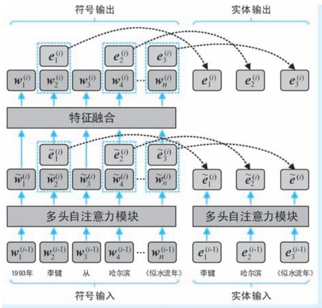  
●图 5-52 聚合器工作模式示意

够将知识图谱中所蕴含的实体信息有效添加到语言表示中，作者们专门设计了一种新的预训练任务——— “去噪实体自编码器” （denoising entity auto-encoder，dAE）。清华 ERNIE 的整体预训练损失即掩膜语言模型、下句预测以及去噪实体自编码器三个任务的损失之和，预训练即针对上述合成损失的优化过程。针对掩膜语言模型与下句预测两个任务的预训练，我们在前文中已经讨论过多次，这里就不再赘述，下面我们着重讨论去噪实体自编码器的训练任务。去噪实体自编码器的训练任务针对那些具有对齐关系的 “词汇-实体”进行。在训练时，以随机方式掩盖其中的部分实体，然后训练模型能够通过词汇预测与之对齐的实体。因此可以看出，去噪实体自编码器任务也是一种 “完形填空”任务，只不过要求模型在空中填入实体。假设我们有一个输入的自然语言序列 $\{ w _ { 1 } , \cdots , w _ { n } \}$ }和实体序列$\{ e _ { 1 } , \cdots , e _ { m } \}$ }，针对输入词汇 $w _ { i }$ ，定义其对齐实体分布（aligned entity distribution） 为

$$
p \left(e _ {j} \mid w _ {i}\right) = \frac {\exp \left(\operatorname {l i n e a r} \left(\boldsymbol {w} _ {i} ^ {o}\right) \boldsymbol {e} _ {j}\right)}{\sum_ {k = 1} ^ {m} \exp \left(\operatorname {l i n e a r} \left(\boldsymbol {w} _ {i} ^ {o}\right) \boldsymbol {e} _ {k}\right)} \tag {5-61}
$$

式 （5-61）给出了由词汇 $w _ { i }$ 预测与之对齐实体的条件概率模型，表达了给定词汇 $w _ { i }$ ，某实体 $\cdot e _ { j }$ 能够与之对齐的可能性。其中，linear（·）表示一个线性变换操作。需要注意的是，式 （5-61）中的 $\pmb { w } _ { i } ^ { o }$ 表示整个 ERNIE 模型针对第 $i$ 个输入词汇加工得到的最终输出向量 （也即 K-编码器的输出向量），这就意味着，如果输入词汇 $w _ { i }$ 有真正的实体对应，则经过 M 层聚合器的融合操作后， $\pmb { w } _ { i } ^ { o }$ 已经是一个注入实体信息的词特征，而 $\dot { \boldsymbol e } _ { j }$ 则表示最初的实体嵌入向量 （由 TransE 得到 “原汁原味”的实体嵌入向量）。式（5-61）表明，若混合有实体信息的词汇特征与某实体原始特征接近，则二者的对齐程度越高。ERNIE在预训练中，通过交叉熵损失来评估预测实体与真实实体之间的接近程度，从而倒逼模型提升词汇嵌入和特征融合的水平。下面我们还是以上述示例为例稍做说明。假设知识图谱中只有三个实体，分别表示音乐人李健、哈尔滨市以及专辑 《似水流年》，我们分别将其中表示哈尔滨市的实体及其嵌入特征记作 $e _ { \mathrm { H a r b i n } }$ 和 $e _ { \mathrm { H a r b i n } }$ （下标 “Harbin”即表示哈尔滨。另外请务必注意粗细体之分）。对于输入的自然语句，我们将其中的词汇 “哈尔滨” 记作 $w _ { \mathrm { H a r b i n } }$ 。显然， $w _ { \mathrm { H a r b i n } }$ 与 $e _ { \mathrm { H a r b i n } }$ 具有对齐关系。这就意味着$w _ { \mathrm { H a r b i n } }$ 对应的实体真值可以表示为独热编码 [0，1，0] （三个实体， $e _ { \mathrm { H a r b i n } }$ 排第二位）。经过 ERNIE 两个编码器的加工， $w _ { \mathrm { H a r b i n } }$ 对应的输出向量为 $\pmb { w } _ { \mathrm { H a r b i n } } ^ { o }$ 。这时， $\pmb { w } _ { \mathrm { H a r b i n } } ^ { o }$ 中已经融合了 $w _ { \mathrm { H a r b i n } }$ 和 $| e _ { \mathrm { H a r b i n } }$ 的信息，我们简单表示为 ${ \pmb w } _ { \mathrm { H a r b i n } } ^ { o } = f ( w _ { \mathrm { H a r b i n } } , e _ { \mathrm { H a r b i n } } ; \theta )$ ），这里的 $^ { \dag } f ( \mathrm { ~  ~ \cdot ~ } ; \theta )$ ）” 即表示 ERNIE 中 T-编码器和 K-编码器的数据加工操作， $\theta$ 为其参数。然后利用式 （5-61），取遍所有实体，即可得到一个具有三个元素的向量，即表示针对 “哈尔滨”一词，模型预测其在所有实体上的概率分布。这样一来，我们即可以像标准分类任务那样，利用交叉熵来评估实体预测概率与实体真值之间的损失，从而指导对模型参数 $\theta$ 的优化。除此之外，与 BERT 类似，ERNIE 对去噪实体自编码器的预训练任务也设定了比例策略：针对所有对齐的 “词汇-实体”，将其中的 $5 \%$ 进行随机实体替换操作，该操作类似于 BERT的词汇篡改；将 $1 5 \%$ 进行遮掩操作，类似于 BERT 的 “＜MASK ＞” 遮掩；其余的 “词汇-实体” 则维持不变。

清华 ERNIE 可以适配两类下游任务。第一类任务即我们非常熟悉的一般自然语言理解任务。在适配该类下游任务时，清华 ERNIE 的操作模式与 BERT 适配下游任务的模式是类似的。例如，可以使用句首 “＜CLS＞”对应的输出特征作为整个语句的聚合特征执行分类操作等。第二类任务即知识驱动型

任务 （knowledge-driven tasks）。 清 华 ERNIE 以 关 系 分 类 （relation classification ） 和 实 体 归 类 （entitytyping）两个具体任务为例，给出了其微调适配的可能方案。其中，关系分类也称为关系抽取（relation extraction），即要求模型根据上下文，预测给定两个实体之间关系的类别。一种常用、也是最容易的方式即在模型的输出端，获取自然语言中两个实体的特征输出，将两个特征进行拼接后再进行分类预测。而清华 ERNIE 提出了另外一种更加简单的方式，即在输入语句中额外引入 “＜HD ＞” 和“＜TL＞”两个新的标识符，分别用来标识头实体和尾实体的位置，从而将输入序列改造为 “…＜HD＞头实体 $< \mathrm { H D } > \cdots < \mathrm { T L } >$ ＞尾实体＜ TL ＞…”的格式。然后根据 “＜CLS＞”符号来确定关系的类别。实体归类任务与命名实体识别任务类似。针对该任务，清华 ERNIE 采取的方式与关系分类任务采取的方式类似，并且更加简单———通过在输入语句中添加标识符 “＜ENT ＞” 来标识实体位置，然后也通过“＜CLS＞”符号来确定实体的类别。事实上，我们可以以超文本标记语言 （HTML）中形如 “＜TABLE ＞＜/TABLE＞”标记的含义来类比清华 ERNIE 引入新标识符的作用。

关于清华 ERNIE 的训练数据及其在下游任务上的表现，请读者自行查阅相关文献，我们在这里就不再详细讨论了。下面我们简单对该模型进行总结。清华 ERNIE 最显著的创新莫过于通过异构信息的融合来增强语言模型的性能：首先，使用 TransE 获得知识图谱中实体的嵌入表示，然后利用 K-编码器将其与 T-编码器得到的词汇嵌入表示进行融合，通过掩膜语言模型、下句预测和去噪实体自编码器三个任务来实现模型的训练。清华 ERNIE 以知识图谱 “赋能”语言模型，使得语言模型具有更加强大的表达能力，可以说思路是非常新颖的。

# 2. 百度 ERNIE：从“全词掩膜”到超级模型

在本部分内容中，我们来看看百度提出的系列 ERNIE 模型。首先是该家族的首位成员———百度ERNIE-1. 0 [21] 。相较于清华 ERNIE 直接将知识图谱作为外部信息输入这一 “赤裸裸”的做法，百度ERNIE-1. 0 使用外部信息的方式要 “含蓄”得多———受到 BERT 掩膜语言模型及其在自然语言理解方面卓越表现的启发，百度 ERNIE-1.0 将外部信息的注入都表现为对输入词汇的遮掩，即通过设置不同类型的 “完形填空”来训练模型理解语言。如果要用一个关键词来形容百度 ERNIE-1.0，那这个关键词一定就是 “Mask”。百度ERNIE-1.0 进一步将BERT 掩膜语言模型扩展到三个层次：词汇级（在原文中称为 “Basic-level”，即 “基础级”）、短语级（Phrase-level）和实体级（Entity-level）。其中，短语级和实体级两种掩膜操作是百度ERNIE-1.0 所特有的，也正是其对外部信息使用的体现。图5-53 为百度ERNIE-1.0 使用三种掩膜语言模型的对比示意。

  
●图 5-53 百度 ERNIE-1. 0 使用三种掩膜语言模型的对比示意

词汇级掩膜操作与 BERT 是类似的，即针对输入语义中单个词汇进行随机掩膜，并让模型在词汇这一基础层面具备对语言的理解。例如，针对英文，遮掩的对象就是英文单词或子词；对于中文，遮

掩的对象就是中文字符。在遮掩比例方面，百度 ERNIE-1.0 也以 $1 5 \%$ 的比例进行随机遮掩。

短语级掩膜操作遮掩的对象为短语。所谓短语，即一组具有独立语义的连续词汇或字符。相较于词汇级掩膜，短语级掩膜所针对的对象在语义层面上又上了一个层次。例如在英文中，针对短语“come on”，我们很容易地知道它是 “加油”的意思。但是如果我们只是站在词汇的层次，孤立看“come”或者只看 “on”两个单词，则短语原本所具有的含义将不复存在；再例如在中文中， “玻”和 “璃”放在一起构成 “玻璃”是有明确意义的，但是单看 “玻”或者 “璃”都是没有任何意义的。短语级掩膜语言模型的训练任务相当于让模型学会做短语的 “完形填空” 题目。例如，对于题目“ ，the bus is comming！”，空中需要填入的最佳短语是 “hurry up”。在百度 ERNIE-1. 0 中，作者们使用词汇分析和语言分割工具来获得语句中短语的边界。在短语级掩膜语言模型的训练中，百度ERNIE-1. 0 随机对其中的短语进行遮掩，并监督模型对其进行正确预测。实际上，针对输入语句，百度 ERNIE-1.0 借助一些外部工具来决定短语的边界位置，在这一过程中，来自外部的知识已经在 “不知不觉”中被引入。

实体级掩膜操作，顾名思义，遮掩的对象和要求模型预测的对象均为实体。在很多场合中，相较于词汇和短语，实体在语句中往往扮演着更加重要的角色。还记得我们在清华 ERNIE 中举的那个例子吗？整个语句都在描述李健的一些经历，故音乐人李健就是其中最核心的实体。在实体级掩膜语言模型的训练中，与短语级语言模型的处理方式类似，百度 ERNIE-1.0 首先也是借助外部工具得到输入语句中的命名实体 （named entity），然后以实体为单位进行随机遮掩和预测监督。当然，上述外部工具自然也可以包括清华 ERNIE 所使用的知识图谱。例如，以图 5-50 所示的知识图谱为例，针对图 5-53所示的输入语句 “音乐人李健是 《似水流年》的创作者”，显然我们需要对 “李健”和 “《似水流年》”进行遮挡。在利用实体掩膜构造语言模型时，外部的知识也在 “不经意间”被作为先验知识应用到语言模型的训练中。类似百度 ERNIE-1. 0 这种遮挡短语、实体等有意义语言单元的工作模式也称为 “整词遮掩”（Whole Word Masking，WWM） 故百度 ERNIE-1. 0 也在很多文献中被称为ERNIE-WWM。

在预训练阶段，针对上述三种语言模型的训练是逐级开展的———先是词汇级，然后是短语级，最后才是实体级。随着训练的深入，模型对语义理解的层次也不断地提升。相较于原生 BERT，百度ERNIE-1.0 没有引入任何新的结构，故在模型架构、训练任务设定等方面都可以直接套用 BERT 模型。与清华ERNIE 直接使用外部信息的显式模式相比，百度ERNIE-1.0 模型将外部信息转化为遮掩不同语言单元的掩膜策略，以隐式方式使用外部信息，因此模型更加简洁灵活，为后续各版本 ERNIE 模型奠定了良好的基础。

下面我们再简单看看后续几个版本的百度ERNIE 模型。2019 年7 月，百度的学者们在1.0 版模型的基础上，提出了百度 ERNIE-2. 0 模型[23] 。百度 ERNIE-2. 0 具有两个显著的特点：更加丰富的预训练任务和连续学习（continual learning）机制。在预训练任务方面，百度 ERNIE-2. 0 在 1. 0 模型的基础上，极大丰富了预训练任务的内容，设计了词汇级（word-aware）、结构级（structure-aware） 和语义级（semantic-aware）三大类共计七种预训练任务，这些预训练任务就是以自监督或弱监督的方式进行训练。其中，在词汇级预训练任务中，有一种被称为 “知识掩膜” （Knowledge Masking）的任务，该任务就是百度 ERNIE-1.0 所采用的、针对短语和实体进行的 “完形填空”任务。其余的各类预训练任

务，均为作者们结合自身对语言规则和规律的理解，从语法、句法、结构、关系等诸多角度的考量设计构造。由于预训练任务众多，为了让模型能够针对输入序列区分任务，百度 ERNIE-2. 0 在 BERT 的三种嵌入的基础上，也对任务进行了编码，又输入序列增加了任务嵌入（task embedding）。这样一来，百度 ERNIE-2. 0 模型的输入是符号嵌入、位置嵌入、语句嵌入与任务嵌入四个嵌入操作的合成。百度ERNIE-2. 0 模型的架构如图5-54 所示。针对如此众多的任务，如何组织预训练？直接构造一个包含所有任务的多任务训练目标进行一体化训练，各个任务之间恐怕会相互掣肘，训练难以有效收敛；如果一个任务接一个任务训练，模型难免会学了新忘了旧， “狗熊搬苞米”。为了解决这一问题，百度ERNIE-2. 0 采用了一种增量式的训练模式，即所谓的连续训练机制。所谓连续训练即先训练任务一，然后添加任务二，一体化训练任务一和任务二，然后再添加任务三，一体化训练任务一、任务二和任务三…以此类推，直到引入所有任务，实现 “最高段位”的一体化训练。这种增量式的训练机制，使得每个新任务的训练都是基于旧任务得到的模型参数开展，新旧任务一起滚动向前。

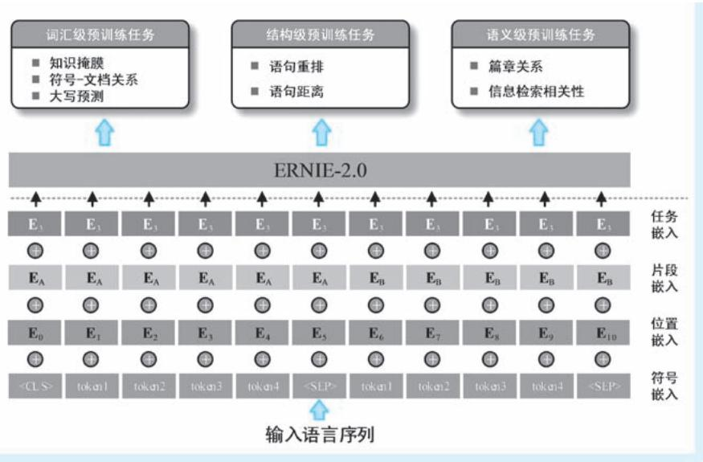  
●图 5-54 百度 ERNIE-2. 0 模型的架构示意

下面我们来看看百度大模型的起点— ERNIE-3. 0。随着 T5、GPT-3. 0 等大模型的推出，百度的学者们再也按捺不住心情，开始借助自身的大规模数据优势，构造自己的全能大模型。于是在2021 年7 月，百度 ERNIE-3.0 模型[23] 应运而生了。该模型的主要亮点有两个：第一，在架构方面，百度ERNIE-3. 0 采用自编码和自回归相结合的架构，既可以应对自然语言理解任务，也可以适应自然语言生成任务。因此，与 UniLM 等模型类似，百度 ERNIE-3. 0 也是通用型语言模型———要做到所有NLP 任务 “通吃”；第二，在外部知识应用方面，类似于清华 ERNIE 的思路，为了让语言模型能够理解知识、利用知识，百度 ERNIE-3. 0 的训练也应用了标准自然语言语料和知识图谱两种异构数据资源，训练数据的总规模达到4TB，这4TB 的训练数据，支撑了百度 ERNIE-3. 0 模型的100 亿参数的训练。

首先聊聊百度 ERNIE-3.0 的整体架构。ERNIE-3.0 整体架构分为上下两个部分，其中，基础部分

被称为通用表示模块（Universal Representation Module），该模块接收语言序列和知识图谱两种异构数据作为输入，扮演了通用语义特征提取器的角色。通用表示模块由多层 Transformer 层构成，其规模非常庞大———包括了48 个Transformer 层，其中每层的注意力头数为64 头，中间特征维度为4096 维；百度ERNIE-3. 0 的上层结构为特定任务模块（Task-specific Representation Modules），该模块以通用表示模块提取得到的通用特征作为输入，承担了进一步提取特定任务语义特征的功能，其中参数由特定任务的目标来确定。特定任务模块包括了自然语言理解和自然语言生成两个并列的网络结构 （以下分别将两个网络结构简称为 “NLU 网络”和 “NLG 网络”），分别用于对接两类不同的 NLP 任务。相较于通

用表示模块，特定任务模块的两个网络规模要小得多，基本与 BERT-Large 模型一致———包括了12 层 Transformer 层，其中注意力头数为 12 头，中间特征维度为 768 维。因此可以看出，尽管百度 ERNIE-3. 0 采用自编码和自回归相结合的方式应对自然语言理解和自然语言生成两类任务，但是其架构与 MASS、BART 的完整编码器-解码器，或是 UniLM 那样一个编码器 “分半使用”的架构是不同的。除此之外，无论是通用表示模块还是特定任务模块，为了让模型能够接受超长序列输入，百度 ERNIE-3. 0 都采用 Transformer-XL 作为其主干网络结构。图 5-55 示意了百度 ERNIE-3. 0模型的整体架构。

  
●图 5-55 百度 ERNIE-3. 0 模型整体架构示意

在模型预训练方面，百度 ERNIE-3. 0 的预训练任务同样非常丰富，包括了三大类：词汇级（word-aware）预训练任务、结构级（structure-aware）预训练任务与知识级（knowledge-aware）预训练任务。词汇级预训练任务包括了知识掩膜语言建模 （Knowledge Masked Language Modeling） 和文档语言建模（Document Language Modeling）两个子任务。其中，知识掩膜语言建模是从百度 ERNIE 两个早期版本一路继承下来的，针对短语和实体的掩膜预训练任务；而文档语言建模，则是为了训练 ERNIE-3. 0 的语言生成能力，针对长文档开展的标准语言模型构建任务。结构级预训练任务继承自百度 ERNIE-2.0，也包括了语句重排 （Sentence Reordering） 和语句距离 （Sentence Distance） 两个子任务。前者通过训练模型识别语句的重排顺序，使得其能够正确地理解语句关系，而后者作为下句预测任务的升级版，通过训练模型辨识两个语句的相邻关系，使得模型能够理解语句级信息。百度 ERNIE-3. 0 的知识级预训练任务被称作 “通用知识-文本预测” （Universal Knowledge-Text Prediction）。该训练任务也是以掩膜操作作为具体实现，因此可以将其视为是知识掩膜语言建模的扩展。但是与知识掩膜语言建模只依赖非结构化的自然语言序列不同的是，通用知识-文本预测任务需要自然语言序列和知识图谱两种异构数据输入。在训练时，百度 ERNIE-3. 0 首先将知识图谱的三元组与自然语言文本进行拼接，在其中随机遮掩三元组的关系或是语句中的词汇，然后利用剩下的输入预测遮掩的对象。其中，关系预测与关系抽取任务类似，要求模型必须 “注意”并利用语句中头实体和尾实体的提及；而词汇预测不仅考虑了句子中的依赖信息，还考虑了知识图谱三元组中的实体与实体之间的关系。实际上，百度 ERNIE-3.0

“互相预测”的模式，正体现了关系抽取远程监督 （Distant Supervision）算法中关于知识图谱与自然语言之间关系的核心思想———如果两个实体之间存在关系，那么包含上述两实体 （提及）的自然语言一定蕴含了这样的关系。在上述三大类共计五种预训练任务中，百度 ERNIE-3. 0 利用知识掩膜语言建模任务来训练 NLU 网络，使得其具备对词法的理解能力；利用语句重排和语句距离两个任务的训练来增强模型捕获句法信息的能力；通过通用知识-文本预测任务来提高模型的知识记忆和推理能力；同时，利用文档语言建模任务训练 NLG 网络，使得其能够适配自然语言生成类任务。但是，在预训练策略方面，笔者认为作者们给出的阐述是不充分的：例如，在进行预训练时，通用表示模块、NLU 网络与 NLG 网络三个结构是一体化训练还是分步骤训练等问题，文中并未进行明确说明。此外，作者们在训练过程部分仅仅强调了进行渐进式训练，但是如何不断增加训练的复杂度等具体内容却没有给出明确交代。因此，关于预训练策略及过程，我们就不在这里妄加猜测。另外，关于百度 ERNIE-3. 0 的表现，自然是 “SOTA”满满。特别是在中文自然语言理解这一细化方向，百度 ERNIE-3. 0 更是特色鲜明。至于模型表现的具体指标，请读者查阅原文，我们这里不再赘述。

为了进一步挖掘 ERNIE-3. 0 的潜力，百度于 2021 年 12 月公布了 ERNIE-3. 0 的 “同比例放大”版模型——— ERNIE-3. 0 Titan [25] 。百度 ERNIE-3. 0 Titan 模型拥有 2600 亿可训练参数，在规模上已经完胜了 GPT-3. 0 的 1750 亿参数量，可谓是一个 “巨无霸”模型。在整体架构方面，百度 ERNIE-3. 0Titan 继承了3.0 版模型的双层架构，并且也是使用Transformer-XL 作为模型的主干。但是在规模方面，针对其中通用表示模块的规模进行了 “加宽”处理：通用表示模块中有 48 个 Transformer 层，在层数方面与3.0 版模型保持一致，但是其中每层的注意力头数增加至 192 头，中间特征维度也激增到12288 维，显然，这一 “增肥”操作是受到了 GPT-3.0 的启发。至于 NLU 网络和 NLG 网络两个上层子结构，其结构则与百度 ERNIE-3.0 保持一致，依然相对 “清瘦”。在预训练任务方面，除了继承3.0 版模型的三类五种任务之外，百度 ERNIE-3.0 Titan 在知识级任务中增加了一种称为 “可信可控生成” （Credible and Controllable Generations） 的任务，来约束模型生成语言的分布，使得其 “更加靠谱”。所谓可信可控生成，即借助生成式对抗网络的思路，通过增加一个自监督对抗监督（self-supervised adversarial）损失，使得生成语言的分布与真实语言的分布尽量接近———如果生成的语言和真实的语言真假难辨，那么就意味着模型生成语言的水平已经相当了得。在训练数据方面，除了百度ERNIE-3. 0 使用的 4TB 高质量中文语料数据之外，百度 ERNIE-3. 0 Titan 又构建了 ERNIE-3. 0 对抗数据集 （ERNIE 3. 0 adversarial dataset） 和 ERNIE-3. 0 可控数据集 （ERNIE 3. 0 controllable dataset） 两个额外的数据集来支持模型训练。除此之外，由于模型规模太过于庞大，作者们专门为百度 ERNIE-3. 0Titan 设计了高效的训练和推理架构和机制，利用细粒度混合并行、异构硬件训练 （鹏城实验室的NPU 与百度的GPU）等策略开展模型的分布式训练，并且训练过程中充分考虑了针对硬件故障的容错机制。另外，由于模型规模太过庞大，导致其训练所需计算资源过高，作者们还为ERNIE-3.0 Titan 模型设计了在线蒸馏 （Online Distillation）框架，以降低其训练过程中的资源占用。

到这里，我们对百度 ERNIE-3.0 Titan 的介绍就告一段落了。事实上，与该模型有关的细节还很多，我们这里就不再一一介绍了。这是因为一方面，这些内容与本书的主题关系不大；另一方面，以笔者的水平恐怕难以对如此复杂的细节进行详实准确的介绍。毕竟构造一个类似ERNIE-3. 0 Titan 这样的超级模型，需要算法、软件、硬件等诸多专业人事的协作，这是一个十分庞大的系统工程。如果说

百度 ERNIE-1.0 和2.0 模型的对标对象是 BERT 等早期的预训练模型，所做出的工作就是 “刷刷榜”，与其他模型 “打打架”，那么从 ERNIE-3. 0 开始，百度的目标已经很明确———即应用大规语料与知识，打造一个全能型的自然语言处理产品。就像 GPT-3. 0 之于 OpenAI 那样，百度需要占据中文语言处理这一NLP 的重要子领域的霸主地位，ERNIE-3.0 以及3.0 Titan 就是其战略布局中的重要一环。从百度ERNIE-3. 0 开始，百度所做的工作已经不再单单是一项学术研究，这些模型已经被设定了更加宏伟的目标，被赋予了更加重要的商业使命。这些模型已经从早期模型的 “作坊制造”，变为真正意义的“大厂出品”。

# 5. 4. 7 XLM：跨语种预训练语言模型

以BERT 和GPT 为代表的预训练模型在NLP 领域的诸多任务上取得成功。但是这些预训练模型都是依托单语言语料、特别是基于英文语料打造，可以说掌握的都是 “单一语言技能”。但是，世间的语言并非只有英语一种，是否能够构造一种具有跨语种能力的预训练模型？在这一想法的驱使下，2019 年 1 月，Guillaume Lample 和 Alexis Conneau[27] 两名来自 Facebook AI 的学者提出了一种跨语种的预训练模型— ——XLM 模型，开启了基于Transformer 架构 （准确地说是基于BERT 架构）构造跨语种预训练模型的先河。下面我们就来讨论 XLM 模型。XLM 的重点工作包括两大方面，即跨语种语言建模与跨语种下游任务适配，如图5-56 所示。

  
●图 5-56 XLM 的重点工作示意

我们首先来讨论 XLM 的跨语种语言建模。XLM 的跨语种语言建模包括了三个具体目标：因果语言建模 （Causal Language Modeling，CLM）、掩膜语言建模 （Masked Language Modeling，MLM） 和翻译语言建模 （Translation Language Modeling，TLM）。其中，前两种语言模型的构建都是基于单语种语料库、以无监督方式进行，而第三个训练则是基于平行语料库㊀以有监督的方式进行。

在语料准备方面，XLM 使用了 $N$ 个单语种语料，记作 $\{  C _ { i } \} _ { 1 = 1 , \cdots , N }$ 。例如， $C _ { 1 }$ 表示英文语料、 $C _ { 2 }$ 为中文语料、 $C _ { 3 }$ 为日文语料等。对于其中某种单语语料 $C _ { i }$ ，我们假设其中的语句数量为 $n _ { i }$ 。但是考虑到样本均衡问题，在训练时，XLM 以概率 $q _ { i } ^ { \phantom { } } = p _ { i } ^ { \alpha } / ( { \sum } _ { j = 1 } ^ { N } p _ { j } ^ { \alpha } )$ ）作为针对语种 $C _ { i }$ 的采样概率。其中， $p _ { i } ~ =$

$n _ { i } / ( \sum _ { k = 1 } ^ { N } n _ { k } )$ ）即为第 $i$ 个单语语料中的语句占所有语料语句的比例； $\alpha$ 为一个指数控制参数，在 XLM中， $\alpha = 0 . 5$ 。例如，我们分别用 $C _ { 1 }$ 、 $C _ { 2 }$ 和 $\vert C _ { 3 }$ 分别表示英文、中文和日文语料，三个语料库中语句的条数分别为100、90 和10，对应的语句比例分别为 $_ { p _ { 1 } } = 0 . 5$ 、 $p _ { 2 } = 0 . 4 5$ 和 $| p _ { 3 } = 0 . 0 5$ 。如果直接按照上述频率进行语句采样，语句样本几乎都会来自英文和中文语料库，日文几乎将无法得到训练。我们按照XLM 给出的采样概率计算，有 $q _ { 1 } \approx 0 . 4 4$ 、 $q _ { 3 } \approx 0 . 4 2$ 和 $q _ { 3 } \approx 0 . 1 4$ ，可以看出情况得到一定程度的改观。在词典组织方面，XLM 以字节对编码方式，将所有语种的词汇编入一个统一的共享词典，以改善不同语种词语的对齐效果。

XLM 跨语种语言建模的第一个目标为因果语言建模。这里，所谓的因果语言模型就是我们所说的前项语言模型 $p ( w _ { t } | w _ { 1 } , \cdots , w _ { t - 1 } ; \theta )$ ———上文是因，下文是果，只不过作者换了个 “时髦”的名称。因果语言模型的训练基于单语种语料库以无监督的方式进行，关于此部分训练内容我们不做过多的阐述。

XLM 跨语种语言建模的第二个目标为掩膜语言建模。XLM 的掩膜语言模型训练与 BERT 的掩膜语言模型训练非常类似，也是通过在输入序列中以 “＜MASK＞”标识符随机进行人为的词汇遮掩。但是，相较于 BERT，XLM 做了两方面的调整：第一，取消了 BERT 输入中标志每个词汇隶属哪个语句的片段嵌入 （Segmentation Embedding），取而代之的是语种嵌入，即告知模型当前输入属于什么语种，例如，在图5-57 中，“en”标志即表明当前输入为英文；第二，XLM 取消了 BERT 双句输入的限制，允许一次性给模型输入多个语句片段，但是要求每个片段中词汇的数量不得超过 256，超出部分将做截断处理。图5-57 为 XLM 的掩膜语言建模示意。

  
●图 5-57 XLM 的掩膜语言建模示意

XLM 跨语种语言建模的第三个目标为翻译语言建模。无论是因果语言模型还是掩膜语言模型，XLM 都是使用来自单一语种的语料对其进行训练，跨语种操作仅体现为在语言模型训练中，从多个语种语料库中抽取不同语言的语句作为训练样本。而 XLM 的翻译语言模型训练才能算作是真正意义的多语种训练。翻译语言模型是掩膜语言模型的扩展，只不过在翻译语言模型中，XLM 将来自平行语料库的、互为译文的源语句和目标语句进行拼接作为模型输入。为了标识两个语句的语种，语种嵌入便

发挥了作用，例如，在图5-58 的示例中，我们分别用 “en”和 “chs”表示英文和中文，并以此为每个词汇构造语种嵌入向量。XLM 同时会对源语句和目标语句中的随机位置进行 “＜MASK＞”遮掩并对这些位置的词汇进行预测。这样，预测源语句中被遮掩的词汇时，在注意力机制的帮助下，模型既可以注意到待预测词汇在源语句中的上下文词汇，还会应用到目标语句中的词汇。反之亦是如此。这就逼着模型在正确预测词汇这一目标的驱使下开展两种语言的相互表示，两种语言在训练过程中也实现在特征表示层面的对齐。上述语言模型的训练仿佛是在做一段双语混合型的完形填空，我们可以借助两种语言综合考量到底应该填入什么词汇。图 5-58 为 XLM 的翻译语言建模示意。在该例中，输入的两个语句来自中英翻译语料库，两个语句分别为 “my baby daughter”和 “我的宝贝女儿”。在英文语句中，“my”和 “daughter”两个词汇被遮掩，在中文语句中，“我”和 “宝”两个字被遮掩。我们可以想象，在预测英文词汇 “daughter”时，中文的 “女儿” 二字应该会被投以较高的注意力权重；而在预测中文的 “宝”字时，想必英文的 “baby”将贡献更多的力量。

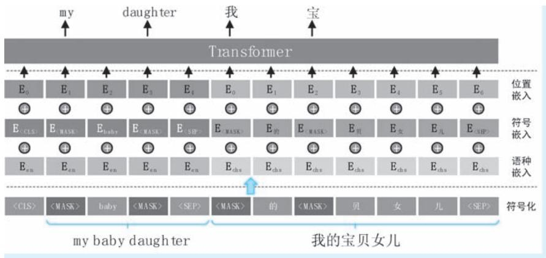  
●图 5-58 XLM 的翻译语言建模示意

我们接下来讨论XLM 的跨语种下游任务适配。为了证明XLM 作为跨语种预训练模型具有的潜力，学者们给出了 XLM 应用于四种跨语种下游任务适配的尝试。这四种下游任务分别是跨语种文本分类、机器翻译、低资源语言建模和无监督跨语言词嵌入。

跨语种文本分类任务特指针对不同语种开展的自然语言推理任务 （XNLI），此类任务经常也被称为文本蕴涵任务。该任务的数据集中包括了用多种语言表示的前提和猜测语句对。针对该任务，XLM采用的架构与 BERT 适配自然语言推理任务时采用的架构相同———在输入端，XLM 将前提语句和猜测语句进行拼接作为模型的双句输入；在输出端，XLM 也经过获取聚合特征、线性变换、概率化三个步骤得到最终的预测结果。该过程可以表示为 softmax $( \boldsymbol { \mathbf { \mathit { y } } } _ { \mathrm { c l s } } \boldsymbol { \mathbf { \mathit { W } } } )$ ），其中， $\mathbf { y } _ { \mathrm { c l s } }$ 为句首 ${ < } \mathrm { C L S } { > }$ ”标志位对应的输出特征， $\pmb { W } \in \mathrm { R } ^ { d _ { \mathrm { m o d e l } } \times 3 }$ 为可学习线性变换参数。Softmax 输出的三维概率分布即表示模型对猜测与前提关系的判断———对、错或是无法判断。需要说明的是，XLM 仅基于 XNLI 数据集中的英文语料进行文本分类任务微调训练，然后，使用微调得到的模型在包括英文在内的 15 种语种的自然语言推理任务上进行测试。结果表明，XLM 以 “掩膜语言模型 $\cdot ^ { + }$ 翻译语言模型”相组合训练得到的跨语种预训练语言模型，经过基于英文语料的微调后，在 15 个语种的文本分类任务上均达到了 “SOTA” 的水平。

XLM 这种 “zero-shot”的能力，在某种意义上正说明其在跨语种语言模型构建阶段打下了坚实的基础。

机器翻译任务是典型的 “序列到序列” 任务，一般都被构造为编码器-解码器架构。XLM 围绕机器翻译任务，证明了以跨语种语言预训练模型初始化编码器或解码器，能够对机器翻译的结果带来显著提升。具体来说，机器翻译包括有监督机器翻译 （Supervised Machine Translation）和无监督机器翻译 （Unsupervised Machine Translation，UMT）两大类任务。其中，有监督机器翻译即我们常见的、基于平行语料训练的机器翻译模型。针对此类任务，XLM 基于 WMT16 罗马尼亚语-英语翻译数据集进行机器翻译测试。结果表明，以掩膜语言模型作为预训练模型、以 “双向翻译 $^ +$ 反向回译”模式进行训练得到的翻译模型取得 “SOTA”的成绩；无监督机器翻译特指在面对小语种翻译等平行语料资源匮乏的翻译任务时，不依托平行语料所开展的机器翻译模型构造。针对此类任务，Guillaume Lample 等XLM 作者在先前提出了一种基于去噪自编码器架构的无监督机器翻译架构。在这里，XLM 沿着上述思路继续前行———以跨语种预训练语言模型初始化编码器和解码器，以提升无监督翻译的性能。XLM在英语-法语、英语-德语以及英语-罗马尼亚语三组语言、共计六个翻译任务上开展实验，结果表明，以掩膜语言模型初始化编码器和解码器，在上述六个翻译任务中的五个任务上 （不包括 “英译德”）达到了 “SOTA”的翻译结果；以掩膜语言模型初始化编码器，以随机方式初始化解码器这一组合取得了 “英译德”任务的最好水平。

低资源语言建模（Low-resource language modeling）任务是指针对语料资源匮乏的语种进行的语言模型构造。而正是因为语料资源的匮乏，使得对低资源语言构造的语言模型对语言规则的理解往往难以充分，对语言的表达能力往往也很差。在针对低资源语言的建模中，XLM 得到如下的结论：基于多种语言训练的语言模型，其性能远远超过基于单一低资源语言得到语言模型的性能。特别是在语法接近的语言间训练多语言模型，上述优势将体现得更加明显。在具体的实验中，XLM 针对尼泊尔语 （Ne-pali）作为目标语言，以针对其构建语言模型的困惑度 （perplexity）作为评判指标，开展了针对纯粹尼泊尔语、尼泊尔语 $^ { \cdot + }$ 英语、尼泊尔语 $^ { \cdot + }$ 海地语 （Hindi）以及尼泊尔语 $^ +$ 海地语 $^ +$ 英语四种组织方式的对比实验。实验结果表明，纯粹使用尼泊尔语训练得到的语言模型效果最差；尼泊尔语 $^ +$ 海地语的组合明显优于尼泊尔语 $^ +$ 英语的组合，主要原因在于相较于英语，海地语与尼泊尔语在语法和词根上更为接近；尼泊尔语 $^ { \cdot + }$ 海地语 $^ +$ 英语这一组合则取得了最佳成绩。XLM 针对低资源语言建模的实验在某种意义上证明了跨语种语言模型训练能够发掘语言之间的语义互补性。

无监督跨语言词嵌入（Unsupervised cross-lingual word embeddings） 任务即将来自不同语种的词汇映射到一个共享的嵌入特征空间，使得语义相同但来自不同语言的词汇在该空间中具有相同或接近的特征向量表示。为了验证 XLM 模型在跨语言词嵌入方面的能力，学者们分别以特征的余弦距离、L2 距离以及跨语言词汇相似度三个指标作为特征接近程度的评估指标，在 Semeval-2017 task 2 任务/ 数据集㊀①上开展跨语言词嵌入实验。结果表明，XLM 能够让来自不同语言具有近似语义的词汇在嵌入空间中特征更加接近，这就意味着 XLM 能够利用其跨语种优势，在不同语言间发挥良好的对齐作用。

到这里，我们对 XLM 模型的核心工作即讨论完毕了。可以看出，无论是在模型架构还是在算法层面，XLM 并未涉及多少创新性工作，可谓 “朴实无华”。但是，作为基于 Transformer 架构跨语种语言模型的开山之作，XLM 仅仅通过简单的数据组织和微调训练，就能够使得模型在跨语种分类和机器翻译等重要任务上取得传统模型的好成绩，也在低质量语言建模和跨语言特征表达等重要基础性工作上有着不俗表现，足以证明了 Transformer 架构在跨语种语言处理方面所具有的强大潜力。在 XLM 之后，诞生了多个跨语种模型，XLM 为这些模型的研发奠定了良好的基础。

# 5. 4. 8 GPT-2. 0 与 GPT-3. 0：超级模型

谈到NLP 领域的预训练模型，怎么能少了OpenAI 的GPT 家族？该家族在NLP 预训练乃至整个NLP 领域都是一个丰碑式的存在。家族的元老———GPT-1. 0 模型诞生于 2018 年 6 月，比大名鼎鼎的 BERT 还早问世 4 个月。GPT-1. 0 可以视为是最早基于 Transformer 架构的预训练模型，在诸多NLP 任务上取得了碾压式的胜利。GPT-1. 0 作为自回归语言模型的代表，一直是后续预训练模型借鉴和对比的重要对象。到了2019 年2 月，GPT-1. 0 的后继者———GPT-2. 0 模型闪亮登场，该模型以其强大的文本生成能力在领域内引起轰动，在整个 2019 年都具有极高的 “出镜率”。一年后的2020 年 5 月，更具革命性的 GPT-3. 0 模型诞生，其能够生成的文章令人难辨真伪，经常被人们以“惊艳”“逆天”“炸裂”等词形容。其具有的能力甚至被人们形容为 “无所不能”…从 GPT-2. 0到 GPT-3. 0，甚至再到最近 “火到天际” 的聊天机器人 ChatGPT，除了高性能，GPT 系列模型还有两大标签———封闭和庞大。其中，封闭指的是 OpenAI 对 GPT 闭源，在官方层面只是发布训练好的模型接口供大家调用，其他团队很难复现其效果。这种做法与学术界秉承的开放与分享的思想截然相悖。这种做法也让很多崇尚开源精神的人对其大加指责；GPT 模型的第二个标签为庞大，从GPT-2. 0 开始，模型在参数规模以及支持其训练的数据规模上就变得异常庞大，GPT-2. 0 提高了NLP 领域的 “准入”门槛，在整个 NLP 领域掀起了一股攀比模型规模的风气，也让很多学者发出“小团队难以出大成果” 的感叹。但是，无论如何都得承认，GPT 对 NLP 领域的贡献是巨大的，影响也是极其深远的。

在前文中，我们已经对 GPT-1. 0 模型进行了详细的分析。在下文中，我们就针对其更加著名的两个继任者———GPT-2.0 和 GPT-3.0 进行逐一讨论。之所以我们将对二者的讨论放在了最后，是因为GPT 模型，尤其是 GPT-3.0 模型的能力实在太强悍了，正所谓 “压轴戏放后面”吧。

# 1. GPT-2. 0：大模型的开端

GPT-2. 0 模型诞生于 2019 年 2 月，作者是 Alec Radford 等[28] 6 名来自 OpenAI 的学者，其第一作者Alec Radford 也正是 GPT-1. 0 模型的第一作者 （当然，两个模型的最后作者也相同）。GPT-2. 0 的文章题目为 “Language Models are Unsupervised Multitask Learners”，即 “语言模型是无监督的学习器”。仅从上述标题就能看出 GPT-2. 0 在构造和应用模式方面的两点端倪：第一，GPT-2. 0 构造的还是语言模型；第二，上述语言模型在对接各类下游任务时，不需要进行有监督的训练。

当前，绝大多数表现出色的机器学习模型都是基于大量具有人工标注的数据集，以监督学习方式构造的。然而，上述方式有两个显著问题，一是对训练数据的要求过高，需要在标签制作方面投入大

量人力，二是这些模型的通用性往往令人担忧，数据的分布稍有改变，模型的性能就会显著下降。尽管在机器学习中，已经有很多工作致力于多任务学习 （Multitask learning），即在训练过程中引入多任务数据并进行多目标的一体化训练。但是在 NLP 领域，上述多任务学习的模式并不常见，目前 NLP领域最主流、也是最为有效的方式还是 “预训练加下游任务微调”模式———第一阶段以无监督方式学习语言共性，而第二阶段则以有监督的方式让模型学习任务特性。然而即便如此，下游任务微调阶段也依赖有标注的样本数据，对数据要求仍然较高，除此之外，该阶段也是以单任务训练模式展开，模型通用性不足这一问题仍然存在。GPT-2. 0 即试图改变上述模式，其核心目标即创建一个不需要使用监督数据进行微调训练，就可以适配下游多种任务的通用模型。其对接下游任务不需要进行监督训练，即在下游任务微调适配时做了零样本学习（Zero-Shot Learning）的任务设定，也正是 GPT-2.0 的技术亮点。GPT-2. 0 给自己设定了一个非常宏伟的目标，相当于说 “我训练好的模型，拿去直接用便是”。

先说说 GPT-2.0 的训练任务。任何单一 NLP 单一任务都可以视为是对条件概率 $p$ （output | input）的估计。这一点很好理解，例如，在前向语言模型中，input 为一段上文词汇序列，而 output 为下一个词汇；而在掩膜语言模型中，input 为整个输入序列，而 output 为被遮掩的词汇；在文本分类中，input 为输入序列，output 为文本对应的类别；在符号标注任务中，input 为输入序列，output 为每个词汇对应的类别；在机器翻译任务中，input 为源语句，output 为与之对应的目标语句等。面对不同任务，条件概率 $p$ （output | input）都被构造为不同的架构，即所谓的单任务模型。为了让上述条件概率能够建模不同任务，GPT-2. 0 将任务的标识也纳入条件概率的条件部分，即构造的条件概率变为 $p$ （output | input，task_prompt）。显然，GPT-2. 0 以提示学习作为其适配下游任务的模式。在该模式下，模型的一条训练样本可以形 如 “Translate Chinese to English， Chinese text， English text” 或 是 “Answer the question，document，question，answer”等。在上述两例中，站在语言视角，二者均为合法的自然语言；但是按照任务属性，上述两个语料样本显然又分别针对机器翻译和问答任务两个具体任务。这样一来，GPT-2. 0 将任务描述也视为是训练语料的模式，即将任务适配操作进行 “数据化”和 “样本化”，通过类似语言模型的无监督训练方式，同时构造语言模型和任务模型。下面我们再举两个简单的例子加以说明。例如，当读到语句 “我爱我的宝贝女儿的英文翻译为 I love my baby daughter”时，首先我们充分掌握了它的语义，毕竟这是一句合理的人类语言，该操作可以视为是在语言模型层面的认知成果；第二，从任务属性角度看，我们实际掌握了一项具体的汉译英能力；再例如，面对语句 “要说中国进入太空的第一人是谁，我的答案自然是杨利伟”，除了语言层面的理解，在任务层面，我们实际上已经学会了 “中国第一代航天员是谁”这一问题的答案。事实上，GPT-2.0 的这一操作，已经不知不觉打开了 “Prompt” 的大门——— “Translate Chinese to English” 和 “Answer the question” 等我们可以认为就是 “伪装为”为文本，但却又是作为任务标识符的提示。GPT-2.0 的核心工作还是以无监督的方式构建语言模型。关于语言模型的构造和训练目标，我们已经在上文对 GPT-1. 0 的介绍中进行了详细地讨论，而且在对其他模型的分析中也反复提及，故这里就不再赘述。

接下来我们再来看看 GPT-2. 0 的训练数据集。训练语言模型需要大规模的语料库来支撑，现有绝大多数预训练模型的多以新闻文章、维基百科或小说等语料作为训练数据。除了上述现成的文章或文字作品，互联网可以作为一个取之不尽用之不竭语料资源库，受到很多学者和机构的青睐。人

们通过构造网络爬虫收集大量网页文本，构造更大规模的、跨领域的语料数据，以此作为构造 NLP预训练模型重要的数据基础。例如，谷歌经过多年网页爬取形成的 Common Crawl 语料库，其中包含了 PB 级的文本数据，这些数据可以供研究者免费下载使用。然而，GPT-2. 0 认为网页爬虫抽取的语料虽然规模够大，但质量却难以保证，其中包含了大量的垃圾信息。故 GPT-2. 0 亲自动手打造了一个高质量的大规模语料库———WebText。为了构造 WebText 语料库，GPT-2. 0 将目标锁定到拥有几亿活跃用户、被誉为 “互联网头版”、以新闻聚合和评论为特点的美国社交网络———Reddit。选择 Reddit 的原因有两点：第一个原因是 Reddit 在数据规模上有保证。Reddit 是一个老牌社交网站，经过多年的发展，拥有大量用户，积累了海量的文本数据，数据涉及的领域也可谓包罗万象；第二个原因是 Reddit 在数据质量方面有保证。Reddit 中的发帖和评论都是人工针对特定问题或目的编写的，在质量方面，相较于用爬虫爬取的任意网页要高得多。特别是 Reddit 以使用一个被称为“Karma” 的得分对发帖和回复质量进行标识，这一人为评分可以视为是对语料可靠性的标注，对Reddit 语料的进一步筛选提供了遍历，例如，WebText 中就只选择了那些 Karma 得分高于 3 的语料链接。按照 Karma 得分，GPT-2. 0 从 Reddit 网站获取了 4500 万个文章链接，然后爬取这些链接对应的 HTML 文本；然后，针对这些进一步进行清洗，最终得到的 WebText 语料库中超过 800 万个文档，纯文本数据超过 40GB。上述数据规模已经是其 “前辈” GPT-1. 0 模型训练使用数据规模的 8倍。几位作者对这些数据进行了分析，其中包括了大量带有提示性的语句，即认为这些数据是可以支撑上述任务建模目标的。

有了大规模数据，下面就是构造大规模模型。实话实说，除了对层归一化操作的位置做了调整之外，GPT-2. 0 在纯粹架构层面没有什么创新之处———和 GPT-1. 0 相同，GPT-2. 0 也是只用到Transformer 的解码器部分。只不过 GPT-2. 0 给出了从小到大四种规模的架构。上述这四种从小到大架构的称呼分别为 “小规模版”（Small）、“中等规模版”（Medium）、“大规模版”（Large）和 “超大规模版” （Extra Large，简称为 “XL”）。这四种版本模型的规模如图 5-59 所示。其中，GPT-2. 0-Small版的规模与 BERT-Base 版、GPT-1. 0 两个模型的规模相同，包含 12 个 Transformer 解码器，总参数量约为 1. 1 亿，而 GPT-2. 0-Medium 版的规模与 BERT-Large 版规模相当，拥有 24 个 Transformer 解码器，总参数量约为 3. 45 亿。显然，GPT-2. 0-Medium 是对标 BERT-Large 的。最大规模的 GPT-2. 0 模型拥有超过15 亿的参数量，相较于当年的那个 “小 BERT”，可谓是相当可观的规模增长。在输入方面，GPT-2. 0 也是以字节对编码（BPE）方式构造输入，词典中的词汇量也相应扩充至 50257。同时，GPT-2.0 也将模型输入的序列长度从512 增加到1024。

  
●图 5-59 GPT-2. 0 四个版本模型规模的对比示意

在实验对比方面，GPT-2. 0 进行了两组实验。第一组实验为零样本实验，在这一组实验中，作者以 “拿来就用” 的方式对 GPT-2. 0 进行了考察和对比。当然在这一组实验上，GPT-2. 0 模型的表现自然是相当的 “SOTA”。对于本组实验，我们不做过多展开，毕竟 GPT-2. 0 主打零样本这一亮点，自然结果不会差，也不能差；第二组实验为真正意义的 NLP 任务实验。GPT-2. 0 模型基于斯坦福 CoQA、WMT14 英语-法语、CNN / Daily Maily 以及谷歌 Natural Questions Corpus 四个公开任务 /数据集，分别进行了阅读理解、机器翻译、文本摘要和问答四个 NLP 任务的应用和对比。至于对比的结果，我们应该分为两个角度看：首先，仅仅看结果，GPT-2. 0 的表现是不好的。除了在阅读理解任务上 GPT-2. 0 和 $\mathrm { D r Q A }$ 、PGNet 具有可比性之外，剩下的三个任务都不及现有模型。其中针对文本摘要任务，GPT-2. 0 输给了传统的注意力 Seq2Seq 模型，而对于问答任务，GPT-2. 0 的表现更是 “惨不忍睹”。如此宏伟的目标，如此大的模型规模，在 “不 SOTA 就不好意思出来打招呼”的年代，GPT-2. 0 的实际表现难免让人感到沮丧。但是，从另外一个角度看，我们应该看到希望：首先，这是 GPT-2. 0 在 “zero-shot” 模式下的实验结果，如果从 “zero-shot” 这么激进的目标稍微回撤一些，到 “few-shot” 呢？其次，在上述四个任务中，每一个任务都表现出模型越大效果越好的性质，那么如果将模型的规模再进行扩大，是否能够带来更大的突破呢？正是在上述两点思路的指引下，GPT-3. 0 诞生了。

# 2. GPT-3. 0：“逆天”的万能大模型

2020 年 5 月，来自 OpenAI 的 Tom B. Brown 等[29]31 名学者联名撰写 75 页技术报告 “LanguageModels are Few-Shot Learners”，提出了著名的 GPT-3. 0 模型。相较于 GPT-2. 0，GPT-3. 0 有以下三个特点：第一，在模型规模方面，GPT-3. 0 的模型异常庞大，可训练的参数量多达 1750 亿。这一参数规模是 GPT-2. 0-XL 版本模型的 116 倍有余。第二，在下游任务适配方法方面，GPT-3. 0 不再使用 GPT-2. 0的零样本学习模式，而是采用更加务实的小样本学习设定，这一点在 GPT-3. 0 的报告题目中已经表达的非常清楚。除此之外，GPT-3.0 在针对下游任务适配时，不会做任何梯度更新操作。毕竟如此大规模的模型，整体更新权重是一件不现实的事情。第三，在 NLP 任务的效果方面，相较于 GPT-2.0 的“拉跨”表现，GPT-3.0 可谓 “一雪前耻”，效果 “逆天”。特别是 GPT-3.0 生成的某些文字，已经和人类的水平相差无几，几乎能够做到以假乱真的程度。

我们先说模型架构。与前两代 GPT 模型相同，GPT-3.0 还是一种基于 Transformer 解码器的自回归语言模型。在报告中，针对 GPT-3. 0 给出了 8 种不同规模的模型架构，按照规模从小到大依次是：Small 版、Medium 版、Large 版、XL 版、2. 7B 版、6. 7B 版、13B 版和 175B 版。其中，从 2. 7B 开始，各模型都是以模型参数量作为版本标识。上述8 个版本模型的规模如图5-60 所示㊀①。可以看出在规模上，GPT-3. 0-Small 对标 GPT-1. 0 和 BERT-Base 两个模型，而 GPT-3. 0-Medium 对标 BERT-Large 模型；GPT-3. 0-Large 与GPT-2. 0-Large 虽然在参数量上非常接近，但是前者较后者的层数少了12 层，但是特征维度从1280 维增加到1536 维。在175B 模型之前，各版本的GPT-3. 0 模型在解码器层数方面都相对“克制”，没有 “一言不合就翻倍”，也没有超越 GPT-2. 0-Large 的 48 层。但是这些模型的特征维度都

相对较大，且注意力的头数也相对较多，故属于 “浅而宽”的模型；直至 GPT-3. 0-175B，解码器层数激增到96 层，特征维度过万，可谓 “既深又宽”，规模十分惊人。

  
●图 5-60 GPT-3. 0 的八个版本模型的规模对比示意

接下来我们再来看看 GPT-3. 0 的训练数据。大模型需要大规模数据支持，那么我们不禁要问，GPT-2.0 就已经用到多达 40GB 的纯文本语料数据做训练，那么对于百倍于 GPT-2. 0 规模的 GPT-3. 0，需要什么规模的数据才能支撑得起其训练？首先，在 GPT-2.0 训练中 “看不上”的 Common Crawl 数据集，在 GPT-3. 0 中也用上了。毕竟该数据集在数据量上占有极大的优势，能够快速弥补数据缺口。GPT-3. 0 获取的 Common Crawl 数据覆盖了 2016—2019 四年时间，原始纯文本数据量高达 $4 5 \mathrm { T B }$ 。当然，为了克服 Common Crawl 数据质量低的问题，GPT-3.0 对其进行了两种清洗操作：第一种操作为低质量数据过滤。GPT-3.0 以 GPT-2.0 使用的 WebText 数据集作为高质量参考数据，利用文本相似性对 Com-mon Crawl 的原始数据进行质量判定，滤除其中的低质量的数据；第二种操作为文档级模糊去重（fuzzydeduplication），即按照序列相似度滤除重复文档，以减少数据冗余。经过上述清洗后的 Common Crawl数据集规模大约为570GB。在上述 Common Crawl 数据的基础上，GPT-3.0 进一步引入四个高精度语料数据作为训练样本补充，包括：扩展版 WebText 数据集 （简称 “WebText2”）、两个网上图书语料数据集 （GPT-3.0 将二者简称为 “Books1”和 “Books2”），以及被预训练模型广泛使用的维基百科语料库。图5-61 示意了上述五个数据集的规模对比。除此之外，考虑到数据集在质量上仍存在高低之

  
●图 5-61 GPT-3. 0 使用五个训练数据集的规模对比示意

分，故 GPT-3. 0 在训练时，对样本的采样权重也进行了策略设定，以使得质量低的数据集提供样本的机会少一些，而质量高的数据集提供样本的机会多一些。

在面对下游任务时，GPT-3. 0 提出的适配模式是革命性的。为了体会 GPT-3. 0 的 “革命性”，我们首先回顾一下传统的模型微调方法。模型微调发生在面对一个全新下游任务，或是已经进行了简单微调、但是模型面对任务效果还欠佳之时。在微调训练时，我们首先会收集带有标签的样本数据，然后利用损失函数的回传梯度去校正全部或部分模型参数，使得模型能够逐渐适应该下游任务。可以看出，传统的模型微调训练是以离线方式开展的，可谓牵一发而动全身。而 GPT-3. 0 以简单的提示（prompt） 方式让模型学会下游任务的适配，其格式可以表示 “task_desc [example（s）]prompt”。其中 “task_desc” 为任务描述，例如，希望机器完成英语到汉语的翻译，任务描述可以表示为 “Translate English to Chinese”； “[example（s）]” 表示 0 个、1 个或若干个样本 （如在英译汉的例子中，一个样本即形如 “baby daughter $= >$ 宝贝女儿”的源语句-目标语句对）；“prompt”为提示，即示意机器 “开始答题”，例如，在上例中，提示为 “my daughter = ＞” 即要求模型开始对“my daughter”执行英语到汉语的翻译。“[example （s）]”中样本的数量，对应了 GPT-3. 0 的三种任务设定：没有样本即对应 GPT-3. 0 的零样本学习（Zero-shot Learning）模式，拿来就用；一个样本即单样本学习（One-shot Learning）模式，先给个示例感受感受；1 ～ 100 个样本对应 GPT-3. 0 的小样本学习（Few-shot Learning）模式，给若干示例熟悉熟悉。可以看出，GPT-3. 0 的下游适配以在线方式进行，样本和任务执行很自然的融为一体。特别是 GPT-3.0 不会做任何梯度更新操作，避免了大规模参数更新这一棘手问题，对下游任务的适配十分友好便利。下面我们再举一个不恰当的例子说明传统微调训练模式和 GPT-3.0 提示模式的区别：小明同学不会做题，于是老师给他发了一大堆习题让他回家练习，经过一个月的苦练后，小明 “重出江湖”…这是传统微调训练；老师给小明同学说 “做题！嗯？不会？给你个例子，还不会？再给你两个例子，这下做吧”，于是小明学会了做题…这便是 GPT-3. 0的提示模式。图5-62 示意了 GPT-3.0 的三种下游任务对接模式设定。其中在小样本模式的示意中，包括了5 条样本。

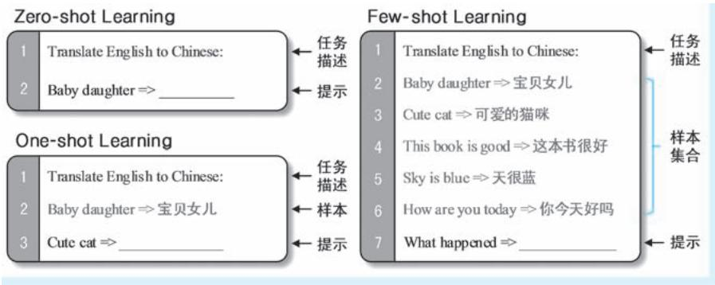  
●图 5-62 GPT-3. 0 的三种下游任务对接模式示意

GPT-3. 0 是如何实现上述 “惊艳”效果的？这就不得不提 GPT-3. 0 用到的上下文学习（in-contextlearning）技术。首先，我们给上下文学习下一个 “非官方”定义：所谓上下文学习，就是一种在不

改变模型参数的条件下㊀，根据当前语境动态调整输出的机制。上下文学习以 “One-/Few-Shot”的方式，实现针对难以训练的大模型 （如 GPT-3. 0 等），或是不具备微调条件的其他模型 （如部署在用户端的模型）的预测效果提升。如果说一般的机器学习以模型 $f ( x ; \theta ) = y$ 表示由 $x$ 预测 $y$ 的过程，那么上下文学习即可以表示为 $f ^ { \prime } ( \begin{array} { r l } \end{array}  , e x a m p l e s : \theta ) = y$ 。其中， $x$ 对应提示， $\theta$ 为模型参数，examples 即样本。在机器翻译任务中， $x$ 和 $y$ 即分别代表源语句和目标语句，examples 即为作为样本的若干平行语料对。显然，在下文学习中，当 examples 发生改变，即便是模型 $\theta$ 不发生改变，模型输出也会随之改变。因此，上下文学习并不是一种传统意义上的、以更新模型参数为目的的学习过程。如果说传统的微调操作是 “发自深处的改变”，那么上下文学习如同 “见人说人话，见鬼说鬼话”。我们与其将 “example（s）”叫作训练样本，还不如说是给模型 “打了个样”。GPT-3. 0 能够实现上下文学习靠的是两件法宝。其中，第一件法宝即 “一切输入皆文本，一切任务皆生成”的思想。在 GPT-3. 0 （在 GPT-2. 0 中也是如此）中，不会在提供给模型的文字中区分什么是任务描述，哪句是样本，抑或是谁是提示，它们都被视为普通文本。而上述这些文本又会被拼在一起，作为待输出结果的参考上文，于是 GPT-3. 0 模型要做的唯一操作就是基于上文生成下文。在图 5-62 中的单样本的示例中，语句生成的问题可以表示为“Translate English to Chinese：Baby daughter $= >$ 宝贝女儿 Cute cat $= >$ __”。我们将空格之前的语句不加区分地视为一个整体，这样一来，模型此时此刻的输入已经与 GPT-3.0 预训练阶段的输入一致———都是自回归语言模型的下文预测任务 （当然，站在自编码语言的视角，这也是一道 “完形填空”试题，只不过空格总是在文本的最后位置）。这样一来，GPT-3.0 可以文本生成应对任意 NLP 任务。GPT-3. 0仰仗的第二件法宝即 Transformer 提供的注意力机制。尽管 GPT-3. 0 并没有公布其实现上下文学习的细节，但是我们能够想象，注意力机制一定在其中发挥着重要作用。毕竟模型参数一旦训练完毕就会固定，但注意力权重是随着输入改变的、运行于模型参数之外的一套自由参数。当我们改变了给模型的输入样本，相当于改变了模型输入，因此注意力权重也会按照新的上下文重新计算，最终的输出也会随之调整。因此我们认为 GPT-3.0 借助注意力机制的特性实现了上下文学习功能。图5-63 示意了针对一个虚构的 “toy 版”机器翻译任务，在不同样本条件下，注意力权重的改变 （图中体现为线条颜色的变化）以及最终输出的改变。在该虚构的示例中，输入的样本分别为 “Baby daughter $= >$ 宝贝女儿”

  
●图 5-63 注意力权重随提示改变的示意 （以一个虚构的机器翻译任务为例）

和 “Sky is blue $= >$ 天很蓝”，模型再依据不同的输入计算了不同的注意力权重，最终导致两者对“Cute cat”的翻译分别为 “可爱的猫咪”和 “萌猫”。当然，需要强调是，我们这里仅用上述极简示例说明注意力机制能够基于不同输入产生不同输出，但不涉及 GPT-3.0 的实现细节，因为我们不清楚细节。另外，上下文学习本身是一个非常庞大的话题，相关的研究工作也有很多，故这里不作为GPT-3. 0 的内容进行讨论。关于上下文学习的详细内容也不在这里做过多的讨论。

最后我们简单看看 GPT-3. 0 模型的表现。GPT-3. 0 在报告中，给出了其在 42 个 NLP 公开任务/数据集上的实验结果和对比分析。总结起来，其结论体现为如下三个方面：第一，在三种任务设定中，小样本学习效果最好，单样本学习效果次之，零样本学习效果最差。显然，这一结果在情理之中。第二，在 GPT-3. 0 给出 8 种规模的模型中，模型规模越大，效果越好，自然 GPT-3. 0-175B 模型的效果最优。第三，在 “Few-shot”设定下，GPT-3. 0-175B 模型将 42 个 NLP 任务中多个做到 “SOTA”的水平。尽管离我们期望的 “全面 SOTA”还有一定距离，但是要知道这是在基于几个样本、在上下文学习模式下得到的结果。当然，想必 GPT-3. 0 收集更多的有标签数据，做真正意义的参数微调一定能大幅提升效果，但是这样一来，GPT-3.0 “死活不做参数微调”这一创新点也就不复存在了。关于 GPT-3. 0 模型更多的表现，“坊间传闻”已经够多。至于详细的实验数据，也请读者参考报告原文，其中有几十页的实验和分析，我们就不在这里展开讨论了。

依托 “宇宙级”的语料资源和模型规模，秉承 “一切输入皆文本，一切任务皆生成”的思想，GPT-3.0 打破了不同任务在数据组织和输出形式等方面的一切壁垒，也给 GPT-3.0 及其后续模型带来了无限可能。事实上，在GPT-3.0 眼中，早已没有了下游任务的概念。尽管GPT-3. 0 对NLP 下游任务的表现离完美还相差甚远，但是如同考试成绩差不意味着能力低一样，GPT-3. 0 及其后续模型的综合能力有目共睹。OpenAI 给 GPT 设定的目标远不止完成若干公开任务即宣告万事大吉这么简单。也许在 OpenAI 的科学家眼中，GPT 担负着给 NLP 领域带来革命性进步的使命，甚至有朝一日能够改变人类的社交方式。除此之外，虽然人们对 GPT-3.0 庞大和封闭的质疑就从来没有停止过，但是我们也确确实实能从 GPT 模型体会到 NLP 领域的不断进步，甚至能够感受到 NLP 的未来。

# 参 考 文 献

[1]QIU X，SUN T，XU Y，et al. Pre-trained models for natural language processing：A survey [J]. Science China Technological Sciences，63 （10），1872-1897. 2020.   
[2]宗成庆 . 统计自然语言处理 [M]. 2 版 . 北京：清华大学出版社，2013.  
[3]BENGIO Y，DUCHARME R，VINCENT P. A neural probabilistic language model [C]. Denver：Neural Information Processing Systems，2000.   
[4] MIKOLOV T，CHEN K，CORRADO G，et al. Efficient Estimation of Word Representations in Vector Space [OL]. （2013-9-7）[2023-2-1]. https：/ / arxiv. org / abs / 1301. 3781.   
[5]PENNINGTON J，SOCHER R，MANNING C. Glove：Global Vectors for Word Representation [C ]. Doha： Conference on Empirical Methods in Natural Language Processing，2014.   
[6]MCCANN B，BRADBURY J，XIONG C，et al. Learned in Translation：Contextualized Word Vectors [OL]. （2016-6-20）[2023-2-5]. https：/ / arxiv. org / abs / 1301. 3781.

[7]PETERS M ，NEUMANN M ，IYYER M ，et al. Deep Contextualized Word Representations [OL]. （2018-3-22）[2023-2-5]. https： / / arxiv. org / abs / 1802. 05365.  
[8]VASWANI A，SHAZEER N，PARMAR N，et al. Attention Is All You Need [OL]. （2017-12-6）[2023-2-5]. https： / / arxiv. org / abs / 1706. 03762.   
[9]RADFORD A，NARASIMHAN K，SALIMANS T，et al. Improving Language Understanding by Generative Pre-Training [R]. OpenAI，2018.   
[10]DEVLIN J，CHANG M W，LEE K，et al. BERT：Pre-training of Deep Bidirectional Transformers for Language Understanding [OL]. （2019-5-24）[2023-2-5]. https：/ / arxiv. org / abs / 1810. 04805.   
[11]AL-RFOU R，CHOE D，CONSTANT N，et al. Character-Level Language Modeling with Deeper Self-Attention [OL]. （2018-12-10）[2023-2-10]. https：/ / arxiv. org / abs / 1808. 04444.   
[12]DAI Z，YANG Z，YANG Y，et al. Transformer-XL：Attentive Language Models Beyond a Fixed-Length Context [OL]. （2019-6-2）[2023-2-11]. https：/ / arxiv. org / abs / 1901. 02860.   
[13]YANG Z，DAI Z，YANG Y，et al. XLNet：Generalized Autoregressive Pretraining for Language Understanding [OL]. （2020-1-2）[2023-2-15]. https：/ / arxiv. org / abs / 1906. 08237.   
[14] LIU Y，OTT M，GOYAL N，et al. RoBERTa：A Robustly Optimized BERT Pretraining Approach [OL]. （2019-7-26）[2023-2-19]. https：/ / arxiv. org / abs / 1907. 11692.   
[15]LAN Z，CHEN M，GOODMAN S，et al. ALBERT：A Lite BERT for Self-supervised Learning of Language Representations [OL]. （2020-2-9）[2023-3-2]. https：/ / arxiv. org / abs / 1909. 11942.   
[16] DEHGHANI M，GOUWS S，VINYALS O，et al. Universal transformers [OL]. （2019-3-5）[2023-3-5].https： / / arxiv. org / abs / 1807. 03819.  
[17]SONG K，TAN X，QIN T，et al. MASS：Masked Sequence to Sequence Pre-training for Language Generation [OL]. （2019-6-21）[2023-3-5]. https：/ / arxiv. org / abs / 1905. 02450.   
[18]LEWIS M，LIU Y，GOYAL N，et al. BART：Denoising Sequence-to-Sequence Pre-training for Natural Language Generation，Translation，and Comprehension [OL]. （2019-10-29）[2023-3-9]. https：/ / arxiv. org / abs / 1910. 13461.   
[19]DONG L，YANG N，WANG W，et al. Unified Language Model Pre-training for Natural Language Understanding and Generation [OL]. （2019-10-15）[2023-3-9]. https：/ / arxiv. org / abs / 1905. 03197.   
[20]BAO H，DONG L，WEI F，et al. UniLMv2：Pseudo-Masked Language Models for Unified Language Model Pre-Training [OL]. （2020-2-28）[2023-4-1]. https：/ / arxiv. org / abs / 2002. 12804.   
[21] SUN Y，WANG S，LI Y，et al. ERNIE：Enhanced Representation through Knowledge Integration [OL ]. （2019-4-19）[2023-3-1]. https：/ / arxiv. org / abs / 1904. 09223.   
[22]ZHANG Z ，HAN X ，LIU Z ，et al. ERNIE：Enhanced Language Representation with Informative Entities [OL]. （2019-6-4）[2023-3-2]. https：/ / arxiv. org / abs / 1905. 07129.   
[23]SUN Y，WANG S，LI Y，et al. ERNIE 2. 0：A Continual Pre-training Framework for Language Understanding [OL]. （2019-11-21）[2023-3-7]. https：/ / arxiv. org / abs / 1907. 12412.   
[24]SUN Y，WANG S，FENG S，et al. ERNIE 3. 0：Large-scale Knowledge Enhanced Pre-training for Language Understanding and Generation [OL]. （2021-7-5）[2023-3-11]. https：/ / arxiv. org / abs / 2107. 02137.

[25]WANG S，SUN Y，XIANG Y，et al. ERNIE 3. 0 Titan：Exploring Larger-scale Knowledge Enhanced Pretraining for Language Understanding and Generation [OL]. （2021-12-23）[2023-3-11]. https：/ / arxiv. org / abs / 2112. 12731.   
[26]BORDES A，USUNIER N，GARCIA-DURAN A，et al. Translating embeddings for modeling multi-relational data [C]. Lake Tahoe：Neural Information Processing Systems，2013.   
[27]LAMPLE G，CONNEAU A. Cross-lingual Language Model Pretraining [OL]. （2019-1-22）[2023-3-14]. https：/ / arxiv. org / abs / 1901. 07291.   
[28]RADFORD A，WU J，CHILD R，et al. Language Models are Unsupervised Multitask Learners [R]. OpenAI，2019.   
[29]BROWN T B，MANN B，RYDER N，et al. Language Models are Few-Shot Learners [OL]. （2020-7-22） [2023-3-15]. https：/ / arxiv. org / abs / 2005. 14165.

#

#

# 计算机视觉中的

#

从2018 年开始，一系列基于 Transformer 架构的预训练模型犹如雨后春笋，席卷了整个 NLP 领域，Transformer 瞬间在 NLP 领域 “一统江湖”。既然 Transformer 如此优秀，那么其在 CV 领域是否也能够一显身手呢？怀着试试看的想法，人们在 2020 年开始了 Transformer 在 CV 领域的 “试水”，希望在NLP 领域大红大紫的 Transformer 也能与 CV 应用擦出火花。到了 2021 年，Transformer 的 CV 应用进入爆发期，发 展 势 态 何 止 是 擦 出 火 花，那 简 直 是 “浓 烟 滚 滚，火 光 冲 天”，甚 至 人 们 开 始 讨 论Transformer 是否能够替代 CNN 的问题。很多新闻报道都用上 “Transformer 到 CV 领域 ‘踢馆’”“Transformer 在 CV 领域又拿下一城”等劲爆的标题。

在第二章已经对部分 CV 领域的部分注意力模型进行过分析，但这些模型的提出时间均早于Transformer。在本章，我们就将目光聚焦到 2020—2022 年，对 “后 Transformer” 时代 CV 领域有关注意力机制的探索、研究与应用进展进行讨论，特别是对在 CV 领域进行 “攻城略地”的多种经典视觉Transformer （Vision Transformer） 模型㊀①进行详细分析。

# 视觉 Transformer 模型概览

我们首先简单回顾一下 Transformer 在 NLP 领域的故事。2017 年，谷歌提出 Transformer 模型。Transformer 是一个具有编码器-解码器架构的 Seq2Seq 模型，其中的编码器以多层自注意力机制对输入语句进行上下文建模，而解码器一方面利用自注意力机制对现有输入进行内部关系建模，另一方面利用互注意力机制对当前输入和编码向量进行关系交互。Transformer 一经问世就在机器翻译任务上取得碾压式的好成绩。2018 年，OpenAI 和谷歌先后提出 GPT 和 BERT 两个基于 Transformer 的预训练模型，二者分别基于自回归和自编码这两种不同的思路、以自监督训练的方式构建语言模型，从而为下游NLP 任务提供优质的、任务无关的通用语言表示。特别是其中的 BERT 模型，更是在适配下游 NLP 任务时，几乎取得了 “满堂彩”的好成绩，充分展示了以 Transformer 为架构、使用 “自监督预训练 $\vdots +$ 有监督微调”模式的强大潜力。随后，人们深刻认识到 Transformer 的威力，于是 Transformer 在 NLP 领域的热情被彻底点燃。在随后的两年间，涌现出一大批基于Transformer 的NLP 预训练模型。其中高潮出现在2019 年，形成百家争鸣，百花齐放的局面。然而，从2020 开始，整个 NLP 世界似乎开始慢慢冷静下来，新模型的提出速度明显放缓。笔者认为产生该局面的原因有两个：第一，以 OpenAI 为代表的大厂借助自身的数据优势和算力资源优势，生生将 NLP 领域带入大模型时代，很多学者或机构发现仅凭自己手头这点资源根本做不出有影响力的工作。而那些大厂们也都闷下头来布局未来 “憋大招”，为日后强人工智能系统的构建积蓄力量。第二，很多机构和学者，意识到了 Transformer 的潜力不应该仅停留在 NLP 领域，于是他们将注意力投射到 “隔壁”的 CV 领域，开始了 Transformer 在 CV领域的尝试，Transformer 在 CV 领域的故事开始于 2020 年，这便是我们所熟知的视觉 Transformer 。图6-1 即示意了这条 “故事线”。其中我们将具有里程碑意义的工作标为蓝色，后面标注有小圆圈的模型，我们将在下文中进行详细介绍。

  
●图 6-1 Transformer 视觉应用发展历程示意

2020 年———起步之年。各种基于 Transformer 的模型在 CV 各方面纷纷崭露头角。这些模型虽不完善，但是却让人们看见了 Transformer 的视觉应用潜力，为后续工作指明了方向，也提供了巨大的改进的舞台。

故事的第一个 “主角”是 Facebook AI 于 2020 年 5 月提出的 DETR[1] ，该模型可以算作是 Trans-former 在CV 领域的首秀。DETR 的出现多少让人有些意外，毕竟一般的 “试水”工作都是先做基础任务再增加难度，但是 DETR 上来就将目标定位在目标检测这一相对复杂的 CV 任务上，而且是瞄着“端到端”这一大问题去的，不得不佩服作者们的勇气和功底。DETR 即作为 Transformer 应用于目标检测的开山之作，随后产生了大量的改进版本，形成各种以 “DETR”命名的目标检测模型，其中最具代表性的模型即为商汤科技于2020 年10 月提出的 Deformable DETR[2] 。该模型借鉴了可变形卷积的思想，让注意力投射的区域也可以动态改变，将 DETR 的目标检测、特别是小目标检测的精度提高了一大截。而2020 年11 月，北京大学提出的端到端目标检测模型 ACT[3] ，则是瞄准了 DETR 在高分辨率图像输入时计算量大的 “痛点”，利用局部敏感哈希 （Locality Sensitive Hashing，LSH）技术对查询特征进行自适应聚类，大幅降低自注意力的计算量。

GPT 是基于词汇的 NLP 预训练模型，那么将其架构照搬到 CV 领域，将词汇换为像素是否可行？2020 年7 月，OpenAI GPT-2. 0 的原班作者团队即在上述思路的指引下，直接利用GPT-2. 0 的架构，构造了应用于 CV 领域的 iGPT 模型[4] 。iGPT 是第一个具有纯 Transformer 架构的 CV 模型，并且同时将NLP 预训练范式首次完整地引入 CV 领域。尽管在很多下游任务上，iGPT 的表现距离 “SOTA”相差甚远，但其最重要的贡献莫过于证明了在 NLP 领域广泛应用的 “预训练 $^ +$ 微调”范式在 CV 领域也是可行的。iGPT 的诞生也为后续多种 CV 预训练模型的设计构建奠定了基础。

Transformer 处理的是离散的词汇序列，那么将图像打成小块排成序列，像词汇那样送入Transformer 是否可行？在这种思路的指导下，2020 年 10 月，谷歌的 ViT 模型[5] 诞生了。该模型认为一幅图像 “值16x16 个词”———通过图像均匀分块、嵌入并添加位置信息等操作，将图像整理为

Transformer 完全可以接受的序列输入格式。ViT 模型的实现极为简单，甚至看似是将 BERT “硬套”在图像上使用，但却给日后整个视觉 Transformer 的发展带来了深远影响，随后诞生的以 “ViT”命名的模型可谓雨后春笋。正是因为 ViT 的工作，使得 CNN 在 CV 领域的地位出现了动摇。ViT 让人们意识到 Transformer 在 CV 应用的两个最大特点：第一，只有大规模数据才能 “喂饱” Transformer；第二，只要训练数据够多，ViT 性能的提升几乎无上限。正是由于 ViT 模型对数据和计算资源的高依赖，2020 年 12 月 Facebook AI 提出了 DeiT 模型[6] 。DeiT 模型通过引入知识蒸馏技术，利用 “拼不过你，我就学你”的思路，将 ViT 的性能提升了一大步，同时也大幅降低了其对数据和计算资源的依赖，实用化得以大幅提高。

与目标检测类似，图像的语义分割也属于典型的密集预测 （Dense Prediction）任务，而在 CV 领域，语义分割的 “阵地”一直被全卷积网络 （Fully Convolutional Networks，FCN） 牢牢占据。那么是否能用 Transformer 进行语义分割呢？全面 Transformer 化如果太过激进，那么只替换 FCN 中的 CNN 主干网络如何呢？在该思路下，复旦大学于2020 年 12 月提出用于图像语义分割的 SETR 模型，该模型将两种标准 FCN 模型中，ViT 替换 CNN 主干，在解码器中仍保持原有的 CNN 结构。实验结果表明，SETR 模型的表现甩出标准 FCN 模型一大截。原来 Transformer 可以、至少可以部分完成语义分割这种密集预测任务。

我们知道，自注意力的最大的优势就是能够以灵活的方式开展关系建模，而卷积则更适合进行图像局部特征的提取 （我们在下文中会详细对比卷积和自注意力的差异），二者可谓各有千秋，那么是否能够在细粒度㊀①上对二者进行 “混搭”，从而综合二者的优势呢？2020 年 11 月，来自法国高等师范学院的学者们提出 $\mathrm { C o n V i T } ^ { [ 9 ] }$ ，以门控位置自注意力 （Gated Positional Self-Attention，GPSA） 模块替换标准自注意力模块，在自注意力机制中注入卷积的 “灵魂”。通过上述方式改造 BeiT 模型后，BeiT 模型的图像分类表现全面超越自我。可以看出，ConViT 是一种典型的以卷积增强 Transformer 能力的模型。

图像的语义分割已经算是相对底层的视觉任务，但是还有学者独辟蹊径，将目标集中在更加底层的图像处理任务上，北京大学与2020 年 12 月提出的 $\mathrm { { I P T } ^ { [ 1 0 ] } }$ ]就是其中的典型代表。IPT 将去噪、超分辨率等图像处理视为序列转换的任务，其主干采用 Transformer 的编码器-解码器架构。通过在主干首尾分别添加多头和多尾结构以应对不同的图像处理任务。

2021 年—— 爆发之年。2021 年，Transformer 在 CV 领域的火爆场面和 2019 年其在 NLP 领域的盛况有的一拼。如果说2020 年 Transformer 在 CV 领域的应用完成了 “可行性论证”，得到了 “方案可行”的结论，那么到了2021 年，自然就进入对其进行深化研究与应用的新阶段。我们认为这一阶段的研究趋势有两大特点：第一，人们开始反观 CNN 的优势，让 ViT 向 CNN 的模式靠拢；第二，人们不再拘泥于具体 CV 任务，而是将目光集中在能够适用于各类 CV 任务的通用型主干网络上，可谓“全都好，才算真的好”。特别地，进一步受到 NLP 预训练模型的启发 （抑或说是刺激），同时考虑到Transformer 依赖大规模训练数据的现实问题，人们开始质疑有监督训练的必要性，因此在此阶段，基

于 Transformer 的 CV 自监督预训练模型也得到长足进展，并且得到了 “方案可行”甚至 “大有可为”的结论。

首先，人们开始冷静分析CNN 的优势，认为其局部特征提取、空间关系建模和层级信息加工是其能够很好应用于 CV 任务的三大法宝。但是回头再看原生 ViT，其直接将图像分块展平为序列，试图“硬套” Transformer 的做法未免太过粗糙、太不 “图像” 了。因此针对 ViT，一个最主要的优化方向即让它像 CNN 那样工作。在这一思路的指引下，诞生了诸多 ViT 的变体模型。在这些变体模型中，我们认为最为经典的模型有四个：T2T-ViT （2021 年 1 月）[11] 、PVT （2021 年 2 月）[12] 、TNT （2021 年 2月）[13] 和 Swin Transformer （2021 年 3 月）[14] 。其中，除了 T2T-ViT 任务设定为仅针对图像分类任务之外，其他的三个模型均为通用主干网络模型，即都可以应用于包括目标检测、图像分割等密集预测任务在内的各类 CV 下游任务。其中，T2T-ViT 利用 T2T 模块实现局部特征的注意力投射与融合，试图像 CNN 那样体现特征的空间局部特性。其在 ImageNet 上的分类精度高于 ResNet 网络；PVT 则将 ViT加工构造为多个阶段，在不同的阶段使用位置融合与嵌入机制，不断缩小特征图的分辨率并增加了特征图的通道数，模仿了 CNN 的多尺度特性。尽管 PVT 在图像分类任务上与其他视觉 Transformer 成绩相当，但是其在针对目标检测和语义分割等密集预测任务上却表现得十分出色；TNT 则通过两路Transformer 结构分别对图像块和图像 “块中块”分别进行自注意力处理并进行融合，同时开展像块间与图像块内两种尺度关系的建模。实验结果也表明 TNT 在图像分类任务上表现不俗，在密集预测任务上具有更大的优势；最厉害的模型要数 Swin Transformer，该模型虽具有纯粹 Transformer 架构，但却像极了 CNN———局部特征提取、空间关系建模和层级信息加工，CNN 该有的特性它都有。SwinTransformer 在多个 CV 任务上取得了碾压式的好成绩，以其优异的表现，证明了 Transformer 在 CV 领域能用，而且很好用。除此之外，我们还要说说香港大学于 2020 年 5 月提出的语义分割模型 SegForm-er[21] ，虽然该模型的任务设定仅为语义分割，但是其主干网络已经和上面介绍的三个通用主干网络非常类似，想必作为主干应用于更多的 CV 任务，也会取得不俗的效果。

针对 ViT，是否可以像 CNN 那样，通过增加层数，来提高模型的特征表达能力？2021 年3 月，新加坡国立大学提出的DeepViT 模型[15] ，即通过重注意机制来克服随Transformer 结构加深产生的注意力坍塌问题。DeepViT 可以将标准 ViT 的深度增加至32 层，并取得更高的分类精度；在 DeepViT 提出的9 天后，Facebook AI 提出的 CaiT 模型[16] ，则通过对残差结构、初始化策略等重新设计，来保证模型在增加层数时，特征依然能够保持稳定。经过改进，CaiT 能够将 ViT 的层数轻易增加到 48 层，并且在 ImageNet 数据集上达到 $8 6 . 5 \%$ 的 top-1 分类精度。

对于 CNN 和 Transformer 混合架构方面的研究，在2021 年也有了新进展。我们认为其中比较经典的工作有 4 个：BoTNet （2021 年 1 月，伯克利大学）[17] 、CeiT （2021 年 3 月，商汤科技）[18] 、CvT（2021 年 3 月，麦吉尔大学）[19] 和 CoAtNet （2021 年 6 月，谷歌）[20] 。其中，除了 BoTNet 是以 Trans-former 增强 CNN 模型之外，其余的三个模型都属于以卷积增强 Transformer 的模式。除此之外，以上四种模型的 “混搭”粒度是不同的，粒度从小到大排序为 CoAtNet＜CvT＜BoTNet＜CeiT。其中，CoAtNet直接在注意力权重的计算中 “动手术”，因此属于最细粒度的 “混搭”；CvT 在 Transformer 编码器层中的自注意力模块中，以卷积投影方式引入卷积思想，故与ConViT 类似，CvT 属于注意力模块级的 “混搭”；BoTNet 整体来看就是一个 ResNet 网络，但是其中每一个瓶颈块中的 $3 { \times } 3$ 卷积层都已经被 “神不

知鬼不觉”的被替换为一个多头自注意力层。因此 BoTNet 属于层级别的 “混搭”；在 CeiT 中，CNN被作为 ViT 模型的前置模块，用来提取基础视觉特征。因此和 DETR 类似，CeiT 的架构混合属于大粒度的网络级 “混搭”。

2021 年最让人振奋的莫过于CV 自监督预训练模型的进展。何恺明及其在Facebook AI 的团队提出的 MoCo 系列模型，从 2019 年[22][23] 一路走来 （v1：2019 年 11 月，v2：2020 年 3 月），到 2021 年（2021 年 4 月） 终于走到基于 Transformer 的 v3 版本[24] ，连同随后 Facebook AI 提出的另一个基于Transformer 的预训练模型 DINO[26] ，让人们看到在对比学习框架下，Transformer 能够很好地提取通用视觉特征表示；而微软亚洲研究院于 2021 年 6 月提出的预训练模型 BEIT-1. 0[27] ，以及 Facebook AI 何恺明团队于 2021 年 11 月提出的预训练模型 MAE[30] ，则证明在 CV 领域像 BERT 那样经过自监督方式构造自编码预训练模型，提取得到的通用视觉特征，同样能够很好赋能诸多 CV 下游任务。

2022 年— 恢复平静之年。相较于 2021 年视觉 Transformer 的大爆发，在 2022 年，纯粹视觉Transformer 模型相关的新模型数量明显变少。笔者认为产生这一现象的原因有两个：第一，针对纯粹视觉 Transformer 的研究与应用进入深水区，绝大多数的模型均是对先前模型的修补和完善，极具创新性的模型几乎没有；第二，也是最重要的原因，那就是在 2021 年，在视觉 Transformer 的研究锣鼓喧天进行之际，CV 与 NLP 整合的多模态模型也在如火如荼地开展。因此在2022 年，有更多学者将目光转向视觉-语言多模态模型构建这一更加具有挑战性的研究方向。而这些和多模态有关的研究正是我们下一章的重点讨论内容。

# 6.2 卷积还是注意力？卷积还是注意力？

CNN 已经牢牢 “盘踞”CV 领域十多年，可以说是 “无 CNN 不 CV”。其取得的成绩有目共睹，为 CV 领域带来巨大的推动作用。然而，随着 Transformer 的 CV 应用不断增多，无数工作已经证明，Transformer 的核心数据加工机制———注意力机制也能够很好的应用在图像上，甚至能够在很多任务上实现超越CNN 的效果。那么卷积与注意力有什么异同呢？下面我们就试着针对这一问题进行讨论。先抛结论，我们认为，总体而言二者是 “形似而神不似”———看着都差不多，但是在作用机制上有着本质区别。

首先我们来看看注意力和 CNN 的 “形似”。无论是注意力机制还是 CNN 中的卷积操作，抑或是全连接操作，在实现层面看，都是以加权求和的模式对数据进行加工。加权求和可以分为加权和求和两方面来看，前者是对数据进行有差别的对待，而后者是做数据融合。从这一点看无论注意力还是CNN 中的卷积也差不多是在做这件事。尤其是在 Transformer 中，多头注意力在后面还有一个特征融合过程，在操作套路上和CNN 中逐通道卷积最后沿着通道求和做特征融合就更加相像了。甚至我们可以认为CNN 中的卷积是在全图范围内，只对当前卷积窗口中投射了全部的注意力而已。然后我们重点看看注意力与 CNN 的 “神不似”，笔者认为可以从如下四个视角分析二者的差异。

1）“静态权重 vs 动态权重”。在训练阶段，CNN 模型在损失函数的驱动下不断更新卷积操作的权重参数，使得模型预测结果尽可能地与真值贴近。但是一旦训练结束，这些卷积参数就固定下来。在推理阶段，无论输入的数据是什么，CNN 都会采用相同的权重对其进行加权求和的卷积运算。因此

可以看出，CNN 使用的是静态权重；而注意力机制则不同，注意力权重是由查询在键集合上通过相似度计算得到的，而这里的查询、键值集合都是输入数据。这就意味着注意力的权重是由输入决定的，是 “随着输入走”的。

2）“特征响应 vs 关系建模”。CNN 通过学习来确定卷积参数，实现任务驱动下的自适应特征提取，从而避免了手工特征设计这一烦琐复杂的工作。但是不管怎样，卷积特征提取的目的就是获取图像在不同卷积模板下的响应，而不同卷积模板代表了对不同视觉特征的提取，如边缘特征、角点特征等。因此，CNN 中的卷积操作与 Gabor 等卷积特征提取并无本质区别；而注意力机制则完全不同，其所完成的工作是站在某一输入对象的 “立场” 上，考察其与其他 “同僚” 之间的关系，看看这些“同僚”对自己的重要性如何。并以此重要性作为权重，让 “同僚们” 为自己贡献力量。前者称为“查询”（query），被考察的 “同僚”称为 “键” （key），而合成的元素称为 “值” （value）。例如，在 NLP 中，注意力机制所构建的是词汇与其上下文词汇之间的关系，而在 CV 中，注意力机制则构建了某像素与其他像素之间的关系 （空间域注意力）、某通道与其他通道之间的关系 （通道域/特征域），或者是视频中某帧与其他帧之间的关系 （时间域注意力） 等。因此，我们也可以认为 CNN 中的卷积是一种绝对的特征响应获取，而注意力机制则是一种相对的关系建模。  
3）“局部操作 vs 全局操作”。我们知道，除了特征学习和逐层加工两个特性，CNN 的操作还具有局部和参数共享两个重要特性。其中，局部特性特指卷积操作在图像的局部窗口中进行，特别是在VGG 网络之后，人们更加倾向于使用 $3 { \times } 3$ 这样的小尺寸卷积进行特征提取。而所谓的参数共享，即无论卷积窗口作用在图像上什么位置，其使用的权重都是一样的 （当然，如果参数不共享也不能称为卷积了），即 “换个位置再算一次”；注意力机制则不同，除了刻意要求局部作用，绝大多数注意力机制都采用全局注意力以建模更广范围的依赖关系，也就是说其加权求和操作在形式上，反而更像是全连接操作 （注意我们这里说的是 “形式上”，即也是 “形似而神不似”）。这就意味着，我们需要堆叠多个卷积层才能建模较大范围图像特征的依赖关系，但是如果使用自注意力机制，我们仅需要使用一个自注意力层就能够达到上述目的。即便是在局部范围进行注意力作用 （如在 NLP 中的掩膜自注意力等），由于具有 “随数据走”的特性，故作用在不同区域的注意力权重也是不一样的，即 “此局部非彼局部”。  
4）“归纳偏好 vs 灵活自由”。在各类机器学习任务中，往往需要我们对分析的数据进行一些假设，并依据这些假设进行模型架构设计。在机器学习领域，这些人为针对数据或是算法模型设定的假设被称为 “归纳偏好”（inductive bias），也称为 “学习偏好”（learning bias）。归纳偏好在机器学习模型泛化到未知数据的能力中起着重要作用。例如，在进行线性回归时，我们就假设了输入数据和输出数据具有线性关系并通过观测数据构造该关系，对于未知数据也 “照此办理”；我们使用K-近邻算法，就假设了与某实体同类的其他实体一定出现在它的周围等。到了深度学习这一机器学习的子领域，我们认为信息应该 “逐级加工，层层抽象”，因此才有了层数越来越深的神经网络模型。到了 CNN 这一具体架构，归纳偏好体现的就更加明显，除了信息逐级加工这一假设之外，我们还认为信息具有空间局部性 （locality），而且还需要做到特征提取的平移不变性 （即无论对象出现在哪里，其特征响应就平移到哪里），因此我们便使用了共享权重的滑动卷积进行局部特征的提取。强的归纳偏好给数据分析和模型构建带来的最大好处在于不需要过多的样本，就能实现模型的快速收敛达到全局最优。还是以一维数据的线性回归为例，理论上我们只需要两个观测样本就能唯一确定那条直线。也正是因为

CNN 模型具有很强的归纳偏好，我们才能够在相对较小的数据集 （如 ImageNet-1K 数据集）上快速训练得到一个性能不错的CNN 模型。然而，归纳偏好是一把双刃剑，强的假设意味着弱的灵活性，当训练数据增多、数据的多样性增加后，CNN 模型的提升反而变得乏力，这就是很多文献中常常说 CNN“天花板低”的问题。然而到了注意力模型，情况正好相反，我们不再有类似卷积那样强的假设，信息整合的方案完全按照输入数据之间的关系自由进行。相较于卷积，注意力模型具有极大的灵活性，极大的灵活性一方面意味着模型具有极大的性能提升潜力，但另一方面也意味着需要巨量的数据才能挖掘出模型的潜力，而且模型训练变得更加不稳定。

从以上分析，读者们也许已经隐约感受到，相较于卷积操作，注意力机制的灵活程度要高很多：注意力权重能随着输入数据关系的改变而 “因地制宜”的调整，不像卷积参数训练完了就一成不变；同样是加权计算，通过学习得到注意力权重可以分布在任意位置、任意形状，而不像卷积那样只能局限在一个小格子里进行。同时，由于 CNN 比自注意力有着更强的归纳偏好，故 CNN 模型往往更容易训练。在文献 [31]中，几位学者对自注意力与卷积之间的关系进行了更加深刻的讨论，认为自注意力操作可以通过学习做出与卷积类似的数据加工行为。具体来说，几位学者的工作包括两个方面：第一，从理论角度，证明了使用相对位置编码的单个多头注意力层可以表达任何卷积层；第二，经过实验观察，前几个自注意力层的确在查询像素周围的矩形区域内存在较强的权重投射，这一现象与卷积的矩形感受野类似。上述几位学者们说得很 “含蓄”，翻译为大白话就是理论和实践都表明，只要经过合理的构造和良好的训练，卷积能干的事儿自注意力也能干。也就是说，卷积可以认为是一种增加了限制条件的自注意力模型。也正是因为自注意力模型的灵活性，使得其需要更大量的训练数据来防止过拟合问题的产生，反倒是CNN 在不需要太大量数据的情况下就能够达到一个相对较好的效果，这一点在 ViT[1] 中也得到证明。

# 6.3 Transformer 的计算机视觉应用与算法剖析

下面即到了我们对经典模型的分析时间。首先，我们按照图像分类、目标检测和图像分割三大CV 任务，对多种针对具体视觉任务的 Transformer 模型进行分类并逐一进行深入剖析。除此之外，受到 NLP 自监督预训练模型的启发，人们也以 Transformer 作为基础模型，以自监督的方式构造了诸多CV 领域的预训练模型。这些预训练模型虽然不针对任何具体任务，但却为各下游 CV 任务提供了高质量的通用视觉特征表示。基于 Transformer 的 CV 预训练模型拉近了 CV 领域和 NLP 领域之间的 “gap”，促进了两个领域模型的统一，笔者认为此类模型相较于具体的任务模型有着更大的发展潜力。故在最后，我们还增加了针对 CV 自监督预训练模型的讨论㊀。

# 6. 3. 1 图像分类与通用主干网络

图像分类是最基础的视觉任务，因此也被视为是各类 CV 任务的 “母任务”，各新模型，尤其是主干网络模型往往都是在图像分类任务上先取得 “SOTA”、证明有效性后，然后再作为其他各类 CV任务模型的基础进行进一步拓展。在下文中，我们即对基于 Transformer 的图像分类与通用主干网络模型展开剖析，其中涉及的经典模型总计有12 个。

# 1. ViT 与 DeiT：开启视觉 Transformer 的时代

作为各类 CV 任务的基础任务，图像分类相对简单，最能体现模型本身的性能。在 ImageNet 这样的大规模数据集的支持下，模型训练也比较容易开展，故图像分类是各种新模型 “试水”的战场，Transformer 自然也不例外。在本部分内容中，我们将介绍两个模型，第一个就是 2020 年 10 月提谷歌出的视觉 Transformer ㊀①（Vision Transformer，ViT） 模型[5] ，该模型可以算作是各类视觉 Transformer 的“鼻祖”模型；而第二个模型为 2020 年 12 月 Facebook AI 提出的 DeiT 模型[6] 。DeiT 模型引入知识蒸馏技术，将 ViT 的实用化往前推进了一大步，也为 ViT 模型的性能构造了基线。

我们讨论的第一个模型为谷歌的 ViT 模型。2020 年 10 月，Alexey Dosovitskiy 等[5] 12 名来自谷歌的学者提出了用于图像分类的视觉 Transformer，即 ViT 模型。尽管 ViT 并不是 Transformer 在 CV 领域的首次尝试，也并未对 Transformer 进行什么针对性地改进，但它确是纯 Transformer 架构的 CV “首秀”。我们千万不要小看这个 “纯”字，因为它释放了 Transformer 试图颠覆 CNN 在 CV 领域地位的明确信号。就和当年 Transformer 的 “你只要注意力”一样，ViT 论文的题目也充满了挑战的口吻———“一幅图 就 是 16x16 个 词” （An image is worth 16x16 words），既 然 图 像 都 当 词 看 了， 那 直 接 用Transformer 就好了。

我们先看谷歌的原生 ViT 模型（以下简称为 “ViT 模型”）。ViT 的模型架构非常简单，如图 6-2所示。简单看，ViT 模型就是一个适配了序列分类任务的 CV 版 BERT 模型。具体来说，给定一幅图

  
●图 6-2 ViT 模型的整体架构示意

像，ViT 对其进行分类的过程包括了如下五个步骤：第一步为图像分块。ViT 对输入的图像进行均匀分块，然后对每一个图像块进行 “拉向量”（flatten）操作。经过上述操作，整幅图像将被表达为一个二维矩阵，其维度为 $N { \times } ( P ^ { 2 } \cdot C )$ ），其中， $N$ 为图像块个数，例如，在图 6-2 的示意中， $N$ 为 9，而在ViT 的 “16x16 个词”中， $N$ 则为 256； $P$ 和 $C$ 分别表示图像块的尺寸和图像的通道数。上述分块操作相当于将图像整理为了一个长度为 $N$ 的序列，正好对了 Transformer 的 “胃口”。第二步为图像块线性嵌入。ViT 对每个图像块进行一个可学习的线性变换，将图像块从 $P ^ { 2 } \cdot C$ 维的原始像素向量变换为Transformer 所需要的 $d _ { \mathrm { m o d e l } }$ 维向量。线性变换操作相当于 NLP 中将输入的词汇从独热编码表示加工为嵌入向量表示，因此在 ViT 中，上述操作的输出被称为图像块嵌入 （patch embeddings）向量。第三步为图像块嵌入与位置嵌入的合成。与自然语言分析需要词汇位置信息类似，针对图像的分析与图像的空间位置也是息息相关。因此，ViT 也在图像块嵌入向量的基础上添加位置嵌入信息。我们知道，对于任意一个图像块，其空间位置既可以用在所有图像块中的一维下标表示，也可以用其所在行列的二维位置表示。在 ViT 中，为了考察位置嵌入的必要性和方式，几位作者尝试了一维绝对位置嵌入、二维绝对位置嵌入和相对位置嵌入三种具体的位置嵌入模式，并将其与不进行位置嵌入的模式进行对比。得到的结论为：进行位置嵌入是必要的，但是具体采用上述三种方式的哪一种却没有太大区别。第四步为 Transformer 的数据加工。经过前三步的操作，一幅图像已经被表达为了一个向量的序列，其中每个向量都具有图像和位置的融合信息。这样一来，图像的表达形式已经和 Transformer 所需的输入形式完全一致，下一步就水到渠成了———Transformer 像处理词汇序列那样处理每一个图像块，并得到与之对应的向量输出。当然，为了在输出端接收聚合特征，ViT 在上述序列前面虚构出一个称为类别符号（class token）的特殊向量，该向量的功能与 BERT 中的 “＜CLS＞”标志位的功能相同。第五步为图像的类别预测。这一步操作与 BERT 进行语句分类的模式完全一致，都是在 Transformer 输出端获取类别符号对应的图像聚合特征，在其后接上多层感知器结构和softmax 概率化操作，从而得到最终的图像类别预测。需要说明的是，尽管我们说 ViT 就是 CV 版的 BERT，但是相较于 BERT，ViT 在结构和输入方面也存在着两点差异：第一，受部分 NLP 模型的启发，ViT 在其 Transformer 编码器中也采用了前置的层归一化操作 （即层归一化放置在注意力模块各全连接前馈网络之前）；第二，由于图像分块个数固定，因此 ViT 不需要像 Transformer 在面对不同长度语句输入时进行补全和裁剪操作。

在 ViT 模型中，使用了三种不同规模的 Transformer 架构：基础版 （ViT-Base）、大规模版 （ViT-Large）和超大规模版 （ViT-Huge），三种模型的配置对比如图6-3 所示。不难看出，ViT 基础版和大规模版的模型架构分别与 BERT 基础版和大规模版的架构是相同的。

  
●图 6-3 ViT 三个版本模型规模的对比示意

最后我们来简单看看 ViT 在图像分类任务上的表现。与 ViT 同台竞技的模型有两个：BiT （BigTransfer） 和 Noisy Student，二者均为谷歌自家提出的模型，分别采用改进版 ResNet 和 EfficientNet 架构。之所以选择这两种模型作为对比对象是因为二者都极具代表性———BiT 作为一个预训练模型，获取通用视觉特征表示，然后利用迁移学习技术实现对多种下游 CV 任务的良好适配。ViT 在实验中涉及迁移学习的应用，故要和迁移学习的 “高手过招”；而 Noisy Student 则利用自监督技术，大幅提升并刷新了 ImageNet 分类任务的成绩榜，属于当年图像分类任务的 “SOTA”模型。比分类自然要和该任务的冠军比。ViT 方派出的 “参赛选手”也有两个，分别简称为 “ViT-H / 14”和 “ViT-L / 16”。其中 ViT-H 和 ViT-L 分别表示 ViT 的超大规模版 （ViT-Huge） 和大规模版 （ViT-Large），其后数字 14 和16 表示采用图像块的尺寸分别为 $1 4 \times 1 4$ 和 $1 6 \times 1 6$ 。实验结果表明：如直接在 ImageNet 数据集上做训练，ViT 模型的效果不及 BiT 的 ResNet，自然更无法和 Noisy Student 的 EfficientNet 相比。但是，如果将 ViT 模型在具有三亿图像规模的谷歌 JFT 300M 数据集上做预训练，然后再在 ImageNet 数据集上进行微调，其分类成绩可以与 EfficientNet 媲美。既然增加训练数据就能 “涨点”，那训练 ViT 需要多少数据呢？为了验证 ViT 模型的性能与训练数据规模的关系，作者们将 JFT 的训练数据从1000 万逐渐增加到 3 亿供分别训练 CNN 和 ViT 两个模型进行对比。结果表明，CNN 模型的性能在 1000 万数据集上远远优于 ViT，并且在数据增加的早期，模型性能也随之提升。然后到了后期，无论数据量怎么增加，其效果的提升几乎陷入停滞。反观 ViT 模型的性能，却是 “一路向好”。上述实验结果说明两个问题：第一，CNN 在较小的数据集上就能达到较好的效果，但是模型的瓶颈效应也非常明显；第二，只要肯增加训练数据，ViT 的图像分类效果能够实现 “SOTA”，并且性能仍有大幅提升空间。这正体现了“灵活的模型需要大规模数据喂养”这一观点。

经过对 ViT 模型的学习，读者们可能会有这样的感觉：ViT 就是在图像上 “生套”BERT 模型，仿佛没有太多创新之处。的确，在 ViT 进行图像分类的五个步骤中，前三个步骤都是为了将图像加工为 Transformer 能够接受的格式，抹平二者之间的 “gap”，而后面两步的操作就是标准的 BERT 应用。因此，仅从模型的技术创新性这一角度上来看，ViT 的确没有太多可圈可点的地方。但是，我们更应该看到的是 ViT 的战略意图和其所带来的影响，ViT 以 “拿来主义”这种看似简单的方式换了一个领域使用纯 Transformer 架构，这何尝不是一种更加大胆的创新？更重要的是，ViT 希望向人们传达的信号 “Transformer is all you need”。也正是因为 ViT 的工作，使得看似在 CV 领域牢不可破的 CNN 迅速出现了裂痕。

我们讨论的第二个模型为 Facebook AI 的 DeiT 。ViT 模型的确让人眼前一亮，证明了纯 Transformer架构在 CV 领域应用的可能性，也让我们看到了其光明的前景。但是 ViT 所需的训练资源却又让人望而却步，大呼 “玩不起”———如果直接使用 ImageNet-1K 数据集训练 ViT，其结果与 CNN 不具备可比性，甚至可以用 “惨不忍睹”来形容。倘若希望得到好的效果，就需要大规模训练数据的支持。例如，预训练ViT 的JFT 300M 为谷歌私有数据集，其图像规模达到3 亿，很少有用户能拥有如此规模的数据资源。有了大规模数据集，对算力资源的要求自然水涨船高。例如，基于 ImageNet-21K 数据集，谷歌在八核 TPUv3 标准云上花费了大约30 天的时间，才完成 ViT-L/16 模型的预训练。

为了克服原生 ViT 难训练、资源要求高的问题，2020 年 12 月，Hugo Touvron 等[6] 来自 FacebookAI 和法国索邦大学的六名学者联名提出 DeiT （Data-effificient image Transformers） 模型。简而言之，

DeiT 最重要的贡献在于，使用知识蒸馏（Knowledge Distillation）策略，仅依托 ImageNet-1K 数据集，在单台计算机上以不超过 3 天的时间就训练得到一个 ViT-Base 模型，并且将分类任务的水平做到接近“SOTA”，可谓成绩斐然。需要说明的是，就像 RoBERTa 之于 BERT 那样，DeiT 并不是一个新模型，其构造的仍是 ViT 模型，但是一个对训练资源低要求的 ViT。具体来说，DeiT 选择 ViT 基础版模型（ViT-Base）作为调优对象，简称为 DeiT-B。除此之外，为了验证知识蒸馏的有效性，作者们还构造了另外两种具有更小 Transformer 规模的结构：DeiT-Ti （“Ti”为 “Tiny”的简写）和 DeiT-S （“S”为“Small”的简写）。两个模型均包含12 层 Transformer 编码器，注意力的头数分别为 3 头和 6 头，中间特征的维度分别为 192 维和384 维，参数量分别为500 万和2200 万。

我们先简单聊聊知识蒸馏。知识蒸馏的理念由杰弗里·辛顿 （Geoffrey Hinton）于 2015 年首次提出[7] ，其核心思想即用一个好模型监督另一个差模型的训练，使得后者能够达到与前者接近的性能。在知识蒸馏中，二者分别被形象地称为 “教师模型” （teacher model）和 “学生模型” （studentmodel）。教师模型一般都是复杂的高性能模型，而学生模型往往具有较低的复杂度，也更适合推理和部署。知识蒸馏即试图通过 “老师教学生”的训练方式实现知识迁移，使得学生模型能够以简化的结构达到教师模型的高性能，做到 “鱼和熊掌兼得”。图 6-4 示意了知识蒸馏的一般架构。知识蒸馏的核心工作即损失函数的设计，最简单、应用最为广泛的损失函数一般包括了 “类别预测损失”和 “蒸馏损失”两个方面。其中，前者要求学生预测的类别要贴近真值 （如图 6-4 中的 “Loss #1”）；后者则要求学生模型预测的类别接近教师模型给出的类别 （如图 6-4 中的 “Loss #2”）。

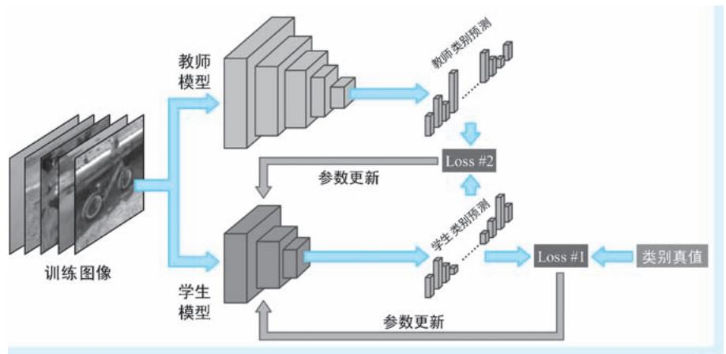  
●图 6-4 知识蒸馏的一般架构示意

DeiT 给出了 “软蒸馏” （soft distillation） 和 “硬标签蒸馏” （hard-label distillation） 两种知识蒸馏训模式。其中，在软蒸馏模式下，损失函数的定义为

$$
L _ {\text {s o f t}} = (1 - \lambda) \cdot L _ {C E} \left(\psi \left(Z _ {s}\right), y\right) + \lambda T ^ {2} \cdot K L \left(\psi \left(\frac {Z _ {s}}{T}\right), \psi \left(\frac {Z _ {t}}{T}\right)\right) \tag {6-1}
$$

式中， $Z _ { s }$ 和 $Z _ { t }$ 分别表示教师模型和学生模型输出的 “logits”； $T$ 为 “蒸馏温度” （distillation temperature）；$\psi ( \ \cdot \ )$ ）为 softmax 损失函数； $L _ { c E } ( \ \cdot \ , \ \cdot \ )$ ）和 $K L ( \mathbf { \partial } \cdot \mathbf { \partial } , \cdot \mathbf { \partial } )$ ）分别表示交叉熵损失和 KL 散度 （Kullback-Leibler divergence） 损失； $\lambda$ 为平衡上述两种损失的超参数； $y$ 为独热编码表示的类别真值。正因为上

述约束都是构建在概率分布上，故被认为是 “soft”的。有 “软”就有 “硬”———我们也可以将约束直接构建在类别标签上，这便是 DeiT 的硬标签蒸馏损失。硬标签蒸馏模式下的损失函数定义为

$$
L _ {\text {h a r d}} = \frac {1}{2} L _ {C E} \left(\psi \left(Z _ {s}\right), y\right) + \frac {1}{2} L _ {C E} \left(\psi \left(Z _ {s}\right), y _ {t}\right) \tag {6-2}
$$

式中， $\boldsymbol { y } _ { t }$ 为教师模型的预测标签，以独热编码表示。正因为是在学生模型的预测概率与标签之间比距离，故上式中的两项全部都是用交叉熵损失。

在 DeiT 中，学生模型自然是那个难训练的 ViT。为了让 ViT 模型在类别真值和教师输出双重约束下开展训练，DeiT 在原生 ViT 的类别符号 （class token）之外，又引进了一种新的标识符作为输入———蒸馏符号（distillation token）。蒸馏符号被添加到了输入序列的尾部，Transformer 编码器对其加工过程与类别符号完全相同，也和其他输入一起经过多层自注意力机制的作用。类别符号与蒸馏符号一头一尾，其对应的输出特征分别用来计算 ViT 模型的类别预测损失和蒸馏损失。图 6-5 示意了 DeiT知识蒸馏的架构。

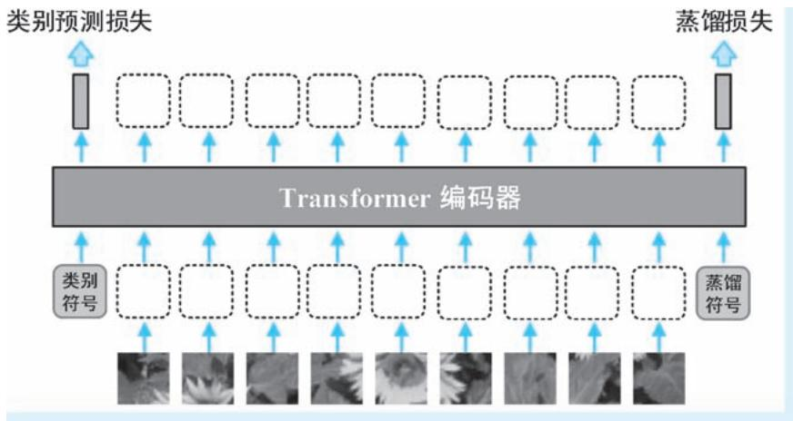  
●图 6-5 DeiT 知识蒸馏的架构示意

在实验部分，作者们一共设计了三组实验。其中，第一组实验为 “选老师” 的实验。对手是CNN，老师自然也是 CNN———在该实验中，作者们选择了何凯明提出的四种 RegNetY 模型作为教师模型。实验结果表明，学生的确能够在老师的帮助下 “健康成长”。特别地，我们在其中还可以观察到一个非常有趣的现象，即学生模型竟然能够超越教师模型的性能。第二组实验为不同蒸馏方式的对比。实验表明，在诸多不同蒸馏方式的组合中，硬标签蒸馏方式表现最佳。第三组实验即 “排行榜”实验。作者们选择的对比对象模型非常多，包括 ResNet （四种）、RegNet （三种）、EfficientNet-B （10种）、KDforAA-B8、ViT （两种）。己方的选手包括了各种规模、各种不同训练策略下得到的12 个 DeiT模型。其中，最好的DeiT 模型在基于ImageNet-1K 数据集的图像分类任务上取得了 $8 5 . 2 \%$ 的 Top-1 精度，这一成绩位于排行榜的第二位，仅仅比 KDforAA-B8 的 $8 5 . 8 \%$ 差了一点点，将 ResNet 系列模型 （包括18、50、101 和 152 层四种，对应的 Top-1 精度分别为 $6 9 . 8 \%$ 、 $7 6 . 2 \%$ 、 $7 7 . 4 \%$ 和 $7 8 . 3 \%$ ）远远甩在身后。需要说明的是，在原生 ViT 模型中取得最高分类水平的 ViT-H 并未在对比模型序列中，该模型在

ImageNet-1K 数据集上的 Top-1 分类精度达到 $8 8 . 5 5 \%$ 的 “SOTA”水平。但是我们要知道，该模型的参数量高达6 亿，并且是在 JFT 300M 私有数据集上花了大力气预训练，然后又在 ImageNet 上经过微调才取得的好成绩。

在上文中，我们对 FAIR 的 DeiT 模型展开介绍。该模型的本质还是 ViT 模型，但是却是一个仅仅依赖小规模数据就可以达到很好分类精度的高性能 ViT。在降低 ViT 所需数据规模和计算机资源依赖的努力中，DeiT 并没有在模型架构等方面 “直面硬扛”，而是走了蒸馏学习这一巧妙的 “借力”路线——— “比不过你，我就学你”。如果说谷歌的 ViT 开创了纯 Transformer 架构应用于 CV 任务的先河，那么 FAIR 的 DeiT 则将视觉 Transformer 的实用化往前又提升了一大步。因此我们可以认为是 DeiT 产生，才带火了 ViT。

# 2. T2T-ViT 到 Swin Transformer：“更图像”的 Transformer

我们知道，局部特征提取、空间关系建模和层级信息加工是视觉认知中的三大重要环节。CNN 之所以能够在 CV 领域大获成功，正是因为其遵循并模仿了上述视觉加工的特性———利用卷积操作在不破坏图像空间结构的前提下抽取图像的局部特征，利用层级结构不断对局部特征进行聚合和抽象。ViT 的成功让人们看到了Transformer 在CV 领域应用的前景。但是Transformer 毕竟是 “舶来品”，为了直接套用现成 Transformer 结构，ViT 直接将图像分块拼成序列，这种操作破坏了图像的空间结构和局部特征，也不具备层级视觉加工机制，未免太过粗糙，对图像 “太不尊重”，效果自然也不会太好。

我们不禁要问，能否让 ViT “更图像”一些，甚至能像 CNN 那样工作？这是一个非常有意义的研究方向，ViT 诞生之后，也有很多学者和机构投身此方向。本部分将要介绍的四个模型便是这一方向的经典模型，分别为：新加坡国立大学的 T2T-ViT [11] 、南京大学的 PVT [12] 、华为诺亚的 TNT [13] 和微软亚洲研究院的 Swin Transformer [14] 。这四个模型均为 2021 年提出。其中，T2T-ViT 和 Swin Trans-former 均于 ICCV 2021 会议上正式公布，PVT 和 TNT 则分别发表于 CVPR 2021 和 NeurIPS 2021 会议。特别地，Swin Transformer 是其中登峰造极之作，实现碾压 CNN，斩获 ICCV 2021 的最佳论文奖 （即马尔奖），自然也是我们介绍的重点模型。

我们讨论的第一个模型为 T2T-ViT 模型。2021 年 1 月，Li Yuan 等[11] 来自新加坡国立大学和依图科技的学者联名提出 “符号到符号的 ViT” （Token-to-Token ViT，T2T-ViT）模型。被 T2T-ViT 锁定的原生 ViT 的 “痛点”有两个：第一个痛点即 ViT 破坏了图像的局部特征。这一点很好理解，ViT 直接图像分块和符号化操作方式打散了图像的二维结构，原本空间上接近且有联系的视觉特征被人为地割裂。这一操作和对二维特征的 “拉向量”（flatten）操作是类似的。第二个痛点是作者们通过对特征的可视化观察得到的。首先，在 ViT 使用 Transformer 编码器主干网络产生的特征中，存在很多空白特征，这就意味着注意力模块在特征提取中存在冗余；其次，有内容的特征图也是 “鼻子不是鼻子，眼不是眼”。反观与之对比的 ResNet50 网络，其特征图均表现出诸如边缘、角点以及各类纹理等明显视觉特征。这就意味着 ViT 使用的 Transformer 网络无法表达丰富的视觉特征。简而言之，第二个痛点就是使用 Transformer 作为主干提取得到的视觉特征，看起来 “很不视觉”。针对第一个痛点，作者们的解决思路即构造 T2T 模块（Tokens-to-Token module）。该模块将空间位置接近的特征拼接在一起，从而实现局部特征的融合；针对第二个痛点，作者们采用了深而窄 （deep-narrow）的 Transformer 结构作为主干网络，试图让特征提取变得更加集中也更加深入。作者们将上述 Transformer 主干结构称为

“T2T-ViT 主干” （T2T-ViT Backbone）。一个完整的 T2T-ViT 模型即由一个 T2T 模块和一个 T2T-ViT 主干串联得到。其架构如图6-6 所示。

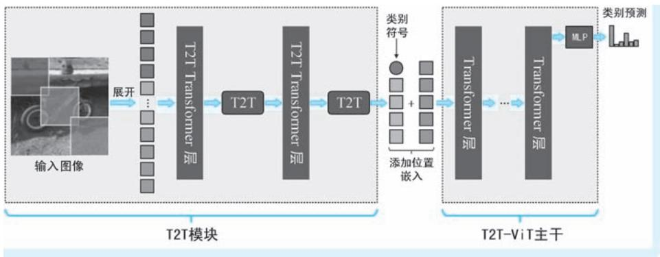  
●图 6-6 T2T-ViT 模型的整体架构示意

我们首先来重点讨论 T2T 模块，该模块也是整个 T2T-ViT 模型的核心所在。从图 6-6 可以看出，T2T 模块与原始图像作为输入，经过一系列 T2T 操作 （T2T Process） 与 T2T Transformer 层的加工后，输出图像块的嵌入向量序列。紧接着，在该向量序列的首位添加类别符号，然后再进行位置信息融合，得到的融合特征随后又被送入T2T-ViT 主干结构进行进一步的注意力加工并实现最终的类别预测。因此可以看出，在架构层面，T2T-ViT 模型对原生 ViT 的最大改进就是以 T2T 模块替换了其图像块线性嵌入操作。在 T2T 模块中，每一个 T2T 操作都会按照空间区域，完成一次序列的重排，而接下来的T2T Transformer 层则完成对 T2T 操作输出序列的注意力加工。这里，T2T Transformer 层是对一般任意Transformer 编码器的泛称，即该结构可以是一个标准 Transformer 编码器层，也可以是任意 Transformer层的变体。T2T 操作则包括了重结构化（re-structurization）和软拆分（soft split）两个操作步骤。其中，所谓重结构化就是通过变形操作将已经序列化的符号序列变回与原图像对应的二维结构，毕竟在图像上 “划区域”还是在二维结构上最容易；软拆分指的是针对重结构化后二维结构，按照空间位置划分，再将其展开（unfold）并融合为新的符号序列。正是因为 T2T 的输入和输出均为符号序列，模型才得名 “Token-to-Token”。另外，考虑到特征在空间上的连续性，在空间位置划分时，采用了类似卷积操作的滑动窗口方式，即区域窗口之间存在重叠，这便是 “soft”的由来。图6-7 即示意了T2T 操作的流程。在该示例中，我们假设输入的符号特征维度为 $C$ ，序列长度为 9。假设图像块的原有组织模式是 $3 { \times } 3$ 。则重结构化操作将这些符号变形回到 $3 { \times } 3$ 的形状。假设我们使用 $2 \times 2$ 的区域窗口，滑动步长（stride）为 1，则第一个区域中将包含符号（1，2，4，5），其余的三个区域将分别包含符号（2，3，5，6）、（4，5，7，8）和（5，6，8，9）。最后，利用展开操作，沿着特征维度将位于相同区域中的特征进行拼接得到新的特征，从而实现空间局部特征的融合。每一个新特征的维度均为 $\textit { C k } ^ { 2 }$ 维，其中 $k$ 为区域窗口尺寸（该例中 $k = 2$ ），T2T 操作输出序列的长度变为滑动窗口的总数。因此，T2T 操作也会采用类似卷积的外扩 （padding）操作，以保证输出序列长度的一致。对 CNN 中卷积底层实现比较熟悉的读者也许会发现，T2T 操作中的展开步骤非常类似卷积实现中的 “im2col”操作：在计算特征图的卷积时，为了规避卷积操作的多重循环，“im2col”操作以带有冗余的方式将特征图展开为矩阵，然后便用CUDA 提

供的通用矩阵乘法运算大幅简化卷积运算。计算结束后，再利用 “col2im”操作将结果矩阵整理为特征图的形式，而这一步等同于 T2T 操作的变形步骤。显然，“im2col”操作属于典型的 “空间换时间”策略。而 T2T 操作是典型的 “空间换空间”———前者是显存，而后者为位置。

  
●图 6-7 T2T 操作流程示意

然后来我们看看 T2T-ViT 主干结构。在上文中我们已经提到，作者们在对原生 ViT 主干网络特征的可视化分析中，发现其难以有效表达视觉特征，因此需要为 T2T-ViT 寻找一种更加有效的主干网络结构。可是在当时，除了 ViT 模型，再没有视觉 Transformer 的网络设计可供参考，故作者们只能借助CNN 的设计经验来设计基于 Transformer 的网络结构。具体来说，尝试了 CNN 的设计思路一共有五种，包括：稠密连接 （参考 DenseNet）、深而窄或浅而宽的网络 （参考 Wide-ResNet）、通道注意力 （参考SENet）、使用更多头的注意力 （参考 ResNeXt）和 Ghost 操作 （参考 GhostNet）。经过大量实验，作者们最终选择了构造深而窄的 Transformer 网络作为 T2T-ViT 的主干网络。按照深而窄的原则，作者们大幅削减了 Transformer 中间特征的维度 （256 ～ 512 维不等） 和 MLP 的隐含层特征的维度 （512 ～ 1536 维不等）。在深度方面，为了方便与现有模型进行对比，作者们按照参数规模，设计了具有不同深度的T2T-ViT 模型主干结构。其中，具有 14、19 和 24 层 T2T-ViT 主干的 T2T-ViT 模型对标了 ResNet50、101 和 152 三个模型；而具有 7 层和 8 层 T2T-ViT 主干的 T2T-ViT 模型分别与 MobileNetV1 和 V2 两个模型具有接近的参数量。

我们讨论的第二个模型为 PVT 模型。PVT 模型的全称为 “Pyramid Vision Transformer”，即 “金字塔视觉 Transformer ”。顾名思义，就是使用了层级结构的视觉 Transformer 模型。PVT 模型诞生于 2021年2 月，作者是 Wenhai Wang 等[12] 学者 （作者单位涉及南京大学、香港大学、南京理工大学、IIAI 和商汤科技）。之所以提出 PVT 模型，旨在克服 ViT 模型只能用于图像级分类，但无法应对目标检测、图像分割等像素级视觉任务的弊端，而上述像素级任务即所谓的密集预测（dense prediction）任务。与之相反，密集预测任务确是 CNN 模型非常擅长的。例如，我们可以利用全卷积网络 （FullyConvolutional Networks，FCN），以输出特征图的每一个特征预测逐位置预测语义类别，这便是完成语义分割任务，我们还可以在输出特征图的每个位置预测物体包围框信息，这就实现了目标检测等。图6-8 示意了 PVT 模型的整体结构。

  
●图 6-8 PVT 模型整体结构示意

如图6-8 所示，整个 PVT 模型分为了四个处理阶段 （stages），每个阶段又都包括了一个图像块嵌入和一个 Transformer 编码器结构，分别完成对上一阶段输出特征图的嵌入和注意力加工，其中 $i = 1$ ，2，3，4 表示处理阶段的下标。四个阶段相对原始图像的降采样因子分别为 1 / 4、1 / 8、1 / 16 和 1 / 32，产生的特征图记作 $\{ F _ { 1 } , F _ { 2 } , F _ { 3 } , F _ { 4 } \}$ }。我们知道，在 CNN 的层级结构中，特征图的尺寸随着层级的加深逐渐减小，但通道数往往随之增加。因此，PVT 也借鉴了这一思路，四个特征图的通道数分别为：$C _ { 1 } = 6 4$ 、 $C _ { 2 } = 1 2 8$ 、 $C _ { 3 } = 3 2 0$ 、 $C _ { 4 } = 5 1 2$ 。

具体来说，PVT 的每一个处理阶段都包括分块、展平、位置融合与嵌入、注意力加工和形状恢复五个具体步骤。下面我们以第一个处理阶段为例，对上述五个步骤进行逐一介绍。第一个处理阶段以原始图像作为输入，输出特征图 $F _ { 1 }$ 。我们假设输入图像的尺寸为 $2 2 4 \times 2 2 4 \times 3$ ，分块尺寸 $\dot { \boldsymbol { p } } _ { 1 } = 4$ （即进行$4 { \times } 4$ 像素分块），目标特征图 $F _ { 1 }$ 的通道数 $C _ { 1 } = 6 4$ 。第一步为图像分块。在 $4 \times 4$ 像素的小尺寸分块下，输入图像被分为3136 块。第二步为特征展平。该步骤即通过 “flattan”操作将个维度为 $4 { \times } 4 { \times } 3$ 的图像块展开为一个48 维向量，这样一来，总共3136 个图像块将被组织成为一个 $3 1 3 6 \times 4 8$ 的矩阵，即可以视为一个具有3136 个 “词”的序列；第三步为位置融合与嵌入。与标准 ViT 模型相同，该步骤首先在每一个特征上添加一个48 维的位置嵌入向量，然后再以一个可学习的线性变换作用于上述合成向量，从而将向量的维度从 48 维升到 64 维。经过上述线性变换，整个输入特征的维度已经变为$3 1 3 6 \times 6 4$ 。第四步为注意力加工。在该步骤中，上一步骤得到的 $3 1 3 6 \times 6 4$ 维的特征序列，被送入一个含有 $L _ { 1 }$ 层编码器的 Transformer 结构进行多层注意力机制的加工。不同规模 PVT 版本使用了不同深度的 Transformer 结构，以 TVT-Tiny 为例， $L _ { 1 } = 2$ 。Transformer 编码器不会改变输入特征的维度，故该步骤的输出维度仍为 $3 1 3 6 \times 6 4$ 。第五步为形状恢复。该步骤将 $3 1 3 6 \times 6 4$ 维二维序列特征 “reshape” 回$5 6 { \times } 5 6 { \times } 6 4$ 维的特征图，以便保持图像的二维空间形状以方便下一阶段的分块操作。上述特征图即为第一阶段的特征输出 $F _ { 1 }$ 。在紧接其后的第二个处理阶段，又会按照 $_ { { p } _ { 2 } } = 2$ 的分块尺寸重复上述操作过程。图6-9 以第 $i$ 个操作阶段为例，对上述五个步骤操作的详细流程示意。

自注意力在为每一个位置计算输出时，都会 “注意到”其他所有位置，因此计算量大是Transformer 存在的一个公认问题。到了 PVT 模型，这一问题随着小尺寸分块和层级结构的应用被进一步放大。为了防止计算量的暴增，PVT 的作者提出了一种称为 “空间缩小注意力” （Spatial-ReductionAttention，SRA）模块，以取代 Transformer 编码器中的标准自注意力模块。SRA 的做法非常简单：用原始特征图的特征作为查询，去 “注意”并合成该特征图的缩略版本。这样一来，在保持输出尺寸不

变 （输出尺寸与查询对应）的前提下，注意力模块的计算量也随着参与特征的大幅减少而降低。缩略特征图通过在局部区域内进行特征的线性组合得到，这一操作以类似平均池化的操作方式进行，只不过与池化的固定系数不同，SRA 通过学习得到上述线性组合的系数。SRA 局部特征合成区域的尺寸称为缩小比例（reduction ratio）。在 PVT 四个处理阶段的 Transformer 结构中，应用了不同的缩小比例，分别为 $R _ { 1 } = 8$ 、 $R _ { 2 } = 4$ 、 $R _ { 3 } = 2$ 、 $R _ { 4 } = 1$ 。可以看出，SRA 的缩小比例随着特征图尺寸减小，这一点也很好理解，毕竟在大的特征图上做缩略图才更能起到降低运算量的目的。

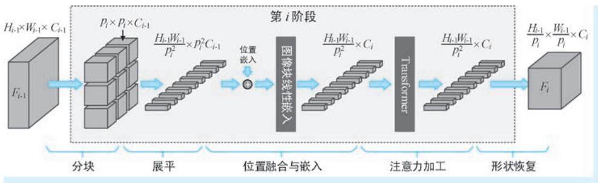  
图 6-9 PVT 处理阶段的具体执行流程示意 （以第 i 个阶段为例）

到这里，我们对 PVT 模型的讨论就告一段落了。就模型结构而言，PVT 模型在每个处理阶段中所做的操作与标准 ViT 模型是基本相同的，只不过在其后又额外添加了一个形状恢复操作，以使其能够输出类似 CNN 那样的特征图。因此，整个 PVT 模型可以视为多个 ViT 模型层级串联。可以说，PVT是一种 “很 CNN”的 Transformer：相较于标准视觉 Transformer，PVT 使用了 $4 { \times } 4$ 的小尺寸图像块，大幅提高了特征的空间分辨率，这一点对密集预测任务非常重要。同时，PVT 引入金字塔层级结构，特征图尺寸逐渐变小，从而使得计算量能够让人接受；而相较于标准 CNN，PVT 通过 Transformer 提供的自注意力机制注意一次性的 “注意”整幅图像的全部特征，从而实现了图像块的全局关系建模。

我们讨论的第三个模型为 TNT 模型。TNT 模型于2021 年2 月提出，其 arXiv 的首发时间就比 PVT晚了 3 天 （PVT 是 2 月 24 日，TNT 是 2 月 27 日）。该模型的作者是 Kai Han 等[13] 学者，作者单位涉及华为诺亚、中国科学院大学和澳门大学。TNT 模型的全称为 “Transformer iN Transformer”，仅从模型名称，我们除了能看出作者们非要借 “炸药的名义”之外，还联想到了 “Network iN Network”（NIN）这一经典模型，因此熟悉NIN 的读者可能也揣摩出了TNT 在结构上的 “端倪”。TNT 的确也像NIN 那样，构造了 “网络中有网络”的嵌套结构。之所以要采取这种结构，主要原因在于原生 ViT 采用的图像分块再向量化的机制，仅能在全局尺度上建模图像块与块之间的关系。而图像块中的像素却混为一体，局部特征遭到严重破坏。为了解决上述问题，TNT 对图像进行了 “分块再分块”的两级图像分块机制，通过两路 Transformer 结构分别对上述两级图像分块进行处理并进行融合，同时兼顾图像块间与图像块内两种尺度关系的建模，从而提升模型对图像特征的表达能力。TNT 模型的整体架构如图6-10 所示。

TNT 模型的输入部分与一般视觉 Transformer 模型类似，也包括三个步骤：第一步为图像分块。给定一幅输入图像，TNT 首先也对图像进行分块操作，只不过这里的分块包括了两个级别。其中，第一级分块的方式与标准ViT 相同，该步骤将整幅图像均分为 $N$ 个图像块 （例如，在图6-10 中， $N = 3 { \times } 3 =$ 9）。我们将上述图像分块表示为 $( X ^ { 1 } , X ^ { 2 } , \cdots , X ^ { N } )$ ）；接下来的第二级分块在每个一级图像块的内部进

行，即将每个一级图像块再均分为 $M$ 个子块 （例如，在图6-10 中，同样有 $\ M = 3 \times 3 = 9$ ）。对于其中第i 个一级分块 $X ^ { i }$ ${ \bf \Phi } ( i = 1 , \cdots , N )$ ），其对应的二级分块可以记为 $X ^ { i } { \longrightarrow } (  { \boldsymbol { { x } } } ^ { i , 1 } ,  { \boldsymbol { { x } } } ^ { i , 2 } , \cdots ,  { \boldsymbol { { x } } } ^ { i , M } )$ ）；第二步为线性嵌入。TNT 对 “flatten”后的图像块进行线性嵌入操作，使其具有与后续操作匹配的特征维度。在 TNT中，一幅图像被类比为一篇文章，那么一级图像块即可以视为构成文章的语句，而二级子块即对应构成语句的词汇。因此，TNT 分别将针对上述两级图像块开展的线性嵌入称为 “视觉语句” （visual sen-tences）嵌入和 “视觉词汇”（visual words）嵌入，二者的嵌入维度分别为 $d$ 和 $c$ ；第三步为位置信息融合。得到上述两类线性嵌入的向量后，即将其与位置嵌入向量相加以实现图像和位置信息的融合。在这里，针对一、二级图像块的嵌入向量，TNT 分别对其添加全局位置信息和局部位置信息，前者体现 “语句在文章”中的位置，而后者体现 “词汇在语句”中的位置。以上的第二步和第三步操作可以分别用如下两式表示

  
●图 6-10 TNT 模型的整体架构示意

$$
Z _ {0} ^ {i} = P E _ {\text {g l o b a l}} (i) + \operatorname {l i n e a r} (\text {f l a t t e n} (X ^ {i})) \tag {6-3}
$$

$$
y _ {0} ^ {i, j} = P E _ {\text {l o c a l}} (j) + \text {l i n e a r} (\text {f l a t t e n} (x ^ {i, j})) \tag {6-4}
$$

式中，符号下标表示 TNT 的层下标，故这里的 “0”即表示输入； $P E _ { \mathrm { g l o b a l } } ( i )$ ）和 $P E _ { \mathrm { { l o c a l } } } ( j )$ ）分别表示全局位置 i 和局部位置 j 对应的位置嵌入向量；flatten（·）和 linear（·）分别表示向量化和线性变换操作。接下来就到了 “重头戏”———逐层注意力加工环节。整个 TNT 模型由 $L$ 个堆叠的 TNT 块㊀ （TNT

Block）构成，每层 TNT 块对数据的加工都分两路开展———二级图像块特征送入一个小 Transformer 层，得到的输出再兵分两路，一路直接作为输出交给下一层使用，另一路与对应的一级图像块特征融合，融合结果又被送入全局的大 Transformer 处理。为了简单起见，我们就以第一层 TNT 块的处理过程为例进行详细说明。在第一层 TNT 块的操作中，第 $i$ 个一级图像块所有子块特征 （融合有局部位置信息），可以表示为一个特征序列 $\boldsymbol { Y } _ { 0 } ^ { i } = \big ( y _ { 0 } ^ { i , 1 } , y _ { 0 } ^ { i , 2 } , \cdots , y _ { 0 } ^ { i , M } \big ) \in \mathrm { R } ^ { M \times c }$ （一共 $M$ 个子块，每个子块被表达为一个 $c$ 维的融合特征），该序列首先被送入一个 Transformer 层，借助其自注意力机制来实现图像块内部子块之间关系的建模，该层被称为 “内 Transformer 块” （Inner Transformer Block）。内 Transformer 块对其加工结果仍为一个 $M { \times } c$ 序列，该过程可以表示为

$$
Y _ {1} ^ {i} = \left(y _ {1} ^ {i, 1}, y _ {1} ^ {i, 2}, \dots , y _ {1} ^ {i, M}\right) = \operatorname {T r a n s f o r m e r} _ {i n} \left(y _ {0} ^ {i, 1}, y _ {0} ^ {i, 2}, \dots , y _ {0} ^ {i, M}\right) \tag {6-5}
$$

内 Transformer 块的输出 $\boldsymbol { Y } _ { 1 } ^ { i }$ ，一方面直接作为第一层 TNT 块的输出，传递给下一层 TNT 块以供其中的内 Transformer 块继续加工，另一方面则交给对应的一级图像块特征进行融合，为其 “注入”局部图像特征。融合方法为

$$
\widetilde {Z} _ {0} ^ {i} = Z _ {0} ^ {i} + \text {l i n e a r} \left(\operatorname {c o n c a t} \left(y _ {1} ^ {i, 1}, y _ {1} ^ {i, 2}, \dots , y _ {1} ^ {i, M}\right)\right) \tag {6-6}
$$

式中，linear（·）为线性变换操作，将输入特征的维度变换至 $d$ 维，以满足向量的求和条件。为了减少参数量，在相同 TNT 块内，内 Transformer 块在各个图像块上是参数共享的。接下来，与 ViT 类似，TNT 在上述融合序列的首部添加类别符号，将得到的序列送入一个被称为 “外 Transformer 块”（OuterTransformer Block）的全局注意力层进行块间关系建模，该过程可以表示为

$$
\left(Z _ {1} ^ {\mathrm {c l s}}, Z _ {1} ^ {1}, \dots , Z _ {1} ^ {N}\right) = \operatorname {T r a n s f o r m e r} _ {\text {o u t}} \left(Z _ {0} ^ {\mathrm {c l s}}, \widetilde {Z} _ {0} ^ {1}, \dots , \widetilde {Z} _ {0} ^ {N}\right) \tag {6-7}
$$

式中， $( Z _ { 1 } ^ { \mathrm { c l s } } , Z _ { 1 } ^ { 1 } , \cdots , Z _ { 1 } ^ { N } ) \in \mathrm { R } ^ { ( N + 1 ) \times d }$ 即表示第一层 TNT 块对一级图像块的特征输，后续 TNT 各层的操作也是以类似方式进行。经过 $L$ 层TNT 块的加工，将得到一级图像块的最终输出 ${ ( Z _ { L } ^ { \mathrm { c l s } } , Z _ { L } ^ { 1 } , \cdots , Z _ { L } ^ { N } ) }$ ）。上述输出形式与标准 ViT 别无二致，只不过对于每个图像块特征，其中已经融合了其内部更加丰富的细节信息。在对接图像分类任务时，TNT 即在 $\smash { \boldsymbol { Z } _ { L } ^ { \mathrm { c l s } } }$ 后添加 MLP 结构和 softmax 来实现类别预测。

通过控制 Transformer 的内部向量维度、多头注意力的头数等参数，作者们构造了三种不同规模的TNT 模型，包括：微型版 （TNT-Ti）、小规模版 （TNT-S）和基础版 （TNT-B）。三种模型均以 $2 2 4 \times$ 224 分辨率的图像作为输入，两级图像的分块尺寸分别为 $1 6 \times 1 6$ 和 $4 { \times } 4$ 像素。三种模型均包含 12 层TNT 块，在三种规模的模型中，内 Transformer 块的内部特征维度 $c$ 分别为 12、24 和 40，注意力头数分别为2、4 和4；外Transformer 块的内部特征维度 $d$ 分别为192、384 和640，注意力头数分别为3、6和 10。三种规模 TNT 模型的参数量分别为 610 万、2380 万和 6560 万。

最后，我们对 TNT 模型进行简单总结。TNT 模型的提出旨在克服原生 ViT 模型忽略图像块内细节特征这一问题，通过引入双重嵌套 Transformer 结构，在两个尺度同时构建图像块之间以及图像块内部的关系，通过将后者特征与前者特征相融合提高模型对图像特征的表达能力。因此可以看出，TNT 模型的本质就是全局注意力和局部子注意力机制的综合应用。

我们讨论的第四个模型为Swin Transformer 模型。2021 年3 月，来自微软亚洲研究院的胡瀚老师团队[14] 提出了大名鼎鼎 Swin Transformer 模型。在随后的半年时间里，该团队又陆续构造了多个 SwinTransformer 的变体模型，应用于更加广泛的 CV 任务，这些模型可谓个个都是 “叫好又叫座”，几乎实现了 Transformer 在 CV 领域的全面 “SOTA”，在诸多视觉任务上构造了新的 “baseline”。正因如此，

在 2021 年 10 月，Swin Transformer 斩获了 ICCV 最佳论文奖 （即马尔奖）。Swin Transformer 之所以有如此大的影响力，效果好自然不必说，更最重的原因在于：在其之前的各类视觉 Transformer 模型仅仅证明了 Transformer 在 CV 领域的可用性，而 Swin Transformer 则通过其在一系列 CV 任务上的强大表现，证明了 Transformer 能够在 CV 领域广泛应用，甚至完全取代 CNN。

Swin Transformer 要解决的关键问题有两个：第一个问题即多尺度问题。这也正是 CV 与 NLP 相比最显著的差异之一。例如，在前车检测任务中，视频中的车辆有远有近，尺度差异极大。而标准Transformer 在单一尺度下进行数据加工，如果直接将其应用于 CV 领域，势必难以应对上述多尺度问题。第二个问题即计算量问题。Transformer 默认采用全局自注意力机制，即在计算每个位置的输出时要求所有位置都参与计算，在面对图像这种密集型数据结构时，计算量之大将超乎想象。针对第一个问题，Swin Transformer 的解决方案为构造层级结构，使得其能够像 CNN 那样进行层级式的多尺度特征提取。这一思想并不稀奇，我们前文介绍的 PVT 模型也正是基于这一出发点考量；针对第二个问题，Swin Transformer 的应对方法即引入移动窗口（shifted windows）机制。在这里，“移动窗口”又可以再分为 “移动”和 “窗口”两个方面进行理解。首先是 “窗口”，顾名思义，即让自注意力的计算在局部窗口中进行，在上文介绍的 TNT 模型中，内 Transformer 块就采用了这一模式。局部窗口操作可以大幅降低计算的复杂度。例如，一幅图像的尺寸为 $N { \times } N$ 像素，如果直接在像素上计算全局自注意力，则其时间复杂度为 $O ( N ^ { 2 } )$ ）。如果我们将上述图像拆分为 $K$ 个 $n { \times } n$ 的图像块，再在每个局部块中分别执行自注意力计算，则时间复杂度为 $O ( K \cdot n ^ { 2 } )$ ），这里的 $K$ 往往是不随数据规模发生改变常数 （例如，在原生 ViT 中 $K = 1 6 \times 1 6 = 2 5 6$ ），故在该模式下时间复杂度实际为 $O ( n ^ { 2 } )$ ）。光有 “窗口”还不够，更重要的是窗口还能 “移动”———Swin Transformer 通过窗口的移动操作，在相邻窗口之间建立了联系，从而防止独立窗口处理带来的特征割裂问题。正因如此，移动窗口也是 Swin Transformer 模型最大的贡献之一。回过头来我们再看文章的题目——— “Hierarchical Vision Transformer using Shifted Windows”，即 “带有移动窗口的层级视觉Transformer”，已经将 Swin Transformer 的特性表达得非常清晰，模型名称中的 “Swin” 正是 “Shift windows” 简写。Swin Transformer 模型的整体架构如图 6-11 所示。

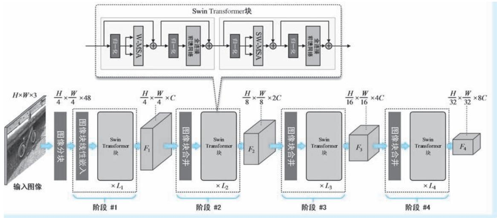  
●图 6-11 Swin Transformer 模型的整体架构示意

整个 Swin Transformer 模型包括四个操作阶段 （stage），实现多尺度视觉特征的提取。在获得一个$H \times W \times 3$ 的输入图像后，Swin Transformer 首先按照标准 ViT 模型的做法，对图像进行不重叠的均匀分块处理，图像分块的尺寸为 $4 { \times } 4$ 像素，因此每个图像块原始像素的特征维度为 $4 \times 4 \times 3 = 4 8$ 。经过分块处理之后，整个图像被表示为一 $\frac { H } { 4 } \times \frac { W } { 4 } \times 4 8$ 的原始特征图。在第一阶段，Swin Transformer 首先采用一个线性变换将上述特征映射为第一阶段后续加工所需的数据维度，该维度我们用 $C$ 来表示。直到这一步，Swin Transformer 所做的操作和标准 ViT 是相同的。接下来，经过线性变换后的特征图被送入 $L _ { 1 }$ 个串联的 Transformer 块进行加工。但是，这些 Transformer 块已经不再是标准 Transformer 结构，它们都包括了改进的自注意力模块，以实现基于窗口的自注意力计算，上述改进版 Transformer 块被称成为Swin Transformer 块（Swin Transformer Block）。在接下来的第二阶段，为了实现层级特征表示，SwinTransformer 首先利用一个图像块合并（patch merging） 操作用来降低特征图的空间分辨率，该操作与CNN 网络中、各阶段间的池化操作具有类似的功能。具体来说，图像块合并操作包括了降采样、拼接和线性变换三个具体环节。其中，在降采样环节，为了将输入特征图的尺寸减半，故采用间隔为 2 像素，以 “隔一个选一个”的方式实现的特征图的空间降采样。经过降采样，一个维度为 $H \times W \times C$ 的特征图，就变为四个维度为 $\frac { H } { 2 } \times \frac { W } { 2 } \times C$ 的特征图；接下来的拼接环节将上述四个特征图沿着通道维度拼接，从而得到 $\frac { H } { 2 } \times \frac { W } { 2 } { \times } 4 C$ 的特征图；第三个环节用来将特征图的通道数从 4C 降低至 $2 C$ 。该操作以沿通道维度进行线性变换的方式实现，因此需要执行 2C 组线性变换。当然，在实际程序实现时，上述线性变换等价于对 $\frac { H } { 2 } \times \frac { W } { 2 } \times 4 C$ 维特征图执行 $1 \times 1 \times 2 C$ 的卷积操作。图 6-12 示意了上述图像块合并操作的流程。在该图中，我们将第一步和第二步进行了合并，并且以相同颜色表示同一组采样点。经过图像块合并操作，Swin Transformer 也与 CNN 结构具有类似的多尺度特征提取模式：每经过一个操作阶段，特征图的尺寸减半而通道加倍。完成图像块合并后，得到的新特征同样会被送入若干个串联的 Swin Transformer 块进行加工，这里，我们将串联 Swin Transformer 块的个数记作 $L _ { 2 }$ 。同理，在随后的第三阶段和第四阶段，对特征的加工操作和第二阶段完全相同，只不过其中 Swin Transformer 块的个数存在差异，我们分别将后续两阶段 Transformer 块的个数记作 $L _ { 3 }$ 和 $L _ { 4 }$ 。经过四个阶段的处理后，SwinTransformer 最终以 $\frac { H } { 3 2 } { \times } \frac { W } { 3 2 } { \times } 8 C$ 维的特征图作为输出。

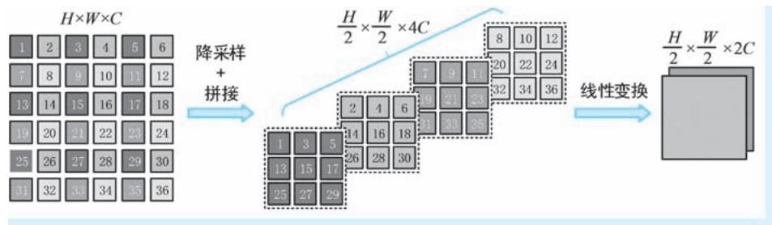  
●图 6-12 图像块合并操作示意

下面我们来重点讨论 Swin Transformer 块的结构。Swin Transformer 块是 Swin Transformer 模型中的最关键结构，用来完成基于窗口的注意力计算。每一个Swin Transformer 块即可视为一个Transformer 编码器，其中也包括一个自注意力模块和一个全连接前馈网络子模块，这两个子模块都具有残差连接和层归一化操作，只不过 Swin Transformer 也采用了前置的层归一化模式。然而，Swin Transformer 块使用了与标准多头注意力不同的两种自注意力模块，即窗口多头自注意力（Windowed Multi-head Self-Atten-tion，W-MSA） 模块和移动窗口多头自注意力（Shifted Window Multi-head Self-Attention，SW-MSA） 模块。对于 “多头自注意力”，想必大家已经非常熟悉，下面我们更多的来理解 “窗口”。W-MSA 即无重叠的局部窗口注意力———将特征图均匀地拆分为若干个互不重叠的窗口，然后在每个窗口中开展注意力计算，我们以 Swin-T 模型的第一阶段为例，假设输入图像的维度为 $2 2 4 \times 2 2 4 \times 3$ ，经过 $4 { \times } 4$ 分块和图像块线性嵌入后，我们将得到一个 $5 6 \times 5 6 \times 9 6$ （在 Swin-T 中， $C = 9 6$ ）的特征图。接下来，W-MSA以 $7 \times 7$ 窗口再对 $5 6 \times 5 6 \times 9 6$ 的特征图进行空间均匀分块，即得到 $8 \times 8 = 6 4$ 个子窗口，则W-MSA 对注意力的计算就在这64 个子窗口中进行———每一个输出特征都是由其对应窗口中的49 个96 维特征向量加权求和得到。图6-13a 示意了 W-MSA 注意力机制的工作模式。在该例中，输入特征图的尺寸为 $8 \times 8$ （这里我们忽略通道维度），局部窗口的大小为 $4 { \times } 4$ ，则拆分得到的窗口数为 $2 \times 2 = 4$ 个。W-MSA 的注意力计算就在这4 个 $4 { \times } 4$ 的局部窗口中进行。W-MSA 基于局部窗口的注意力计算能够大幅降低注意力的计算量，但是却忽略窗口与窗口之间的关系，从而无法实现图像的全局关系建模，这显然又背离了自注意力机制的初衷。为解决这一问题，作者们提出了 SW-MSA 模块，让原本划分在不同窗口的特征能够有机会一起进行注意力的计算，从而建立窗口与窗口之间的联系。移动窗口的构造方法为：对于一个 “罩在”特征图上的、网格尺寸为 $M { \times } M$ 的均匀网格，SW-MSA 将其平移 $\mathbf { \lambda } \cdot \lfloor M / 2 \rfloor , \lfloor M / 2 \rfloor ,$ ）的距离 （其中 “㊣·」”为向下取整操作。在Swin Transformer 中，默认 $M = 7$ ，故窗口的平移距离为3），然后再以此网格对特征图进行窗口划分。例如，在图 6-13b 的示例中，W-MSA 中原本的 4 个拆分窗口，经过平移后即变为9 个 （读者在这里假设网格有无限大，而且只考虑其与特征图的重叠部分）。接下来，SW-MSA 模块即在新的拆分窗口中进行局部的注意力计算，如图 6-13c 所示。为了能够实现局部注意力计算并进行窗口间通信并举，在 Swin Transformer 中，都是将具有 W-MSA 模块和 SW-MSA 模块的两个 Swin Transformer 块进行串联使用，前者在输入特征图上进行不重叠窗口拆分并进行局部注意力计算，而后者以前者的输出作为输入，在前者的窗口设置上进行平移操作，通过在平移后窗口内计算注意力以构建窗口之间的语义关系。

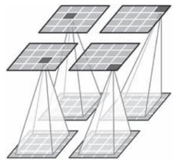  
a）

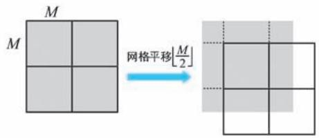  
b)

c）  
●图 6-13 W-MSA 和 SW-MSA 两种自注意力的计算模式示意  
  
a）W-MSA 的原始窗口注意力示意 b）窗口移动示意 c）SW-MSA 的移动窗口注意力示意

上述移动窗口的原理是非常简单的，但是在实现方面却存在着比较大的问题，那就是窗口移动将导致窗口数量的增加，同时还会带来窗口的尺寸不一致。例如，在图 6-14b 的示例中，经过移动操作后，窗口的数量从4 个增加到9 个，并且产生了4 种不同尺寸的窗口，其中只有中间窗口的尺寸与移动前窗口尺寸相同。我们知道，为了提高模型对数据的加工效率，我们往往将输入的多个序列组织为批次，但是组织批次的前提是其中的序列长度必须一致，上述移动窗口显然不满足要求。为了能够执行批次计算，最简单的思路莫过于采用加 “padding”方式将窗口扩充到统一的尺寸，但是上述做法无疑大幅增加了注意力的计算量。例如，在图 6-14c 的示例中，橙色区域即为外扩区域，但是计算注意力的窗口数量不再是 4 个，而是 9 个。为此，在 SW-MSA 中，采用了 “循环移动”（cyclic shift）与掩膜 MSA （Masked MSA）相结合的机制来实现高效的批次计算。所谓循环移动，即在网格进行右下方平移后，在图像块右下方填补左上方 “身后”的数据。例如，在图6-14d 中，我们将左上方的 A 块填补到新窗口的右下方，分别将左方的 B 块和上方的 C 块复制到新窗口的右侧和下方。这样一来，新的窗口仍然为4 个，且具有相同的尺寸，如图中的实线边框所示。接下来，SW-MSA 即将每个窗口中的特征组成数据批次，利用掩膜 MSA 进行局部窗口中的注意力计算，最后，再利用 “逆循环移动”（reverse cyclic shift），将扩充位置对应的注意力输出填回原来的位置，如图 6-14e 所示。

图 6-14 移动窗口与循环移动示意  
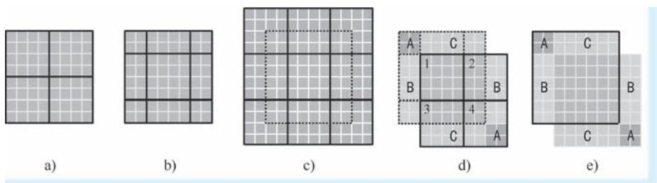  
a）原始窗口示意 b）移动窗口示意 c）窗口外扩示意 d）循环移动示意 e）逆循环移动示意

尽管循环移动没有增加窗口数量，也使得窗口具有统一的尺寸以便于批次组织，但是该做法有悖于注意力机制旨在发掘特征间潜在关系的初衷：循环移动把空间本不相邻的图像区域强制划入相同窗口，这样一来，如果在窗口中对这些本无关系的特征进行注意力的计算，势必造成图像语义关系的混乱。例如，在图6-14d 的示例中，除了1 号窗口不存在这样的问题之外，其他窗口都存在该问题。例如，2 号和3 号窗口则均包含了来自两个区域的特征；而 4 号窗口的问题就更为严重，其中包含了来自四个区域的特征。为了解决上述问题，Swin Transformer 再次祭出我们熟悉的 “mask”大法———掩膜MSA ，让注意力只在那些应该建立关系的特征之间进行。这里，“应该建立关系”的特征即那些原本在空间上相邻的特征。下面我们以图6-14d 中的3 号窗口为例，简单介绍掩膜 MSA 的工作机制。我们假设这些特征的维度均为 $d$ 。为了简化，这里不考虑多头注意力机制和线性变换。在 3 号窗口中，一共有16 个特征，在这些特征中，来自两个不同区域的特征各有 8 个。我们首先将这 16 个特征排列为一个 $1 6 { \times } d$ 矩阵，该矩阵即是查询矩阵 $\varrho$ ，也是键值矩阵 $\pmb { K }$ 和V。上述矩阵的前8 行和后8 行分别表示来自不同区域的特征。我们知道，自注意力的计算机表示为 softmax $Q K ^ { \mathrm { T } } / \sqrt { d } ) V$ ，因此 $\boldsymbol { Q } \boldsymbol { K } ^ { \mathrm { T } }$ 将得到一个$1 6 \times 1 6$ 的矩阵。按照矩阵分块，该矩阵主对角线的两个分块分别为两个区域特征自己的内积矩阵，即

那些 “应该建立关系”的特征，而副对角线的两个子矩阵则为跨区域特征的内积矩阵，不应该参与注意力矩阵的 “混血”情况。故掩膜 MSA 就针对上述两个位于副对角线上的混合子矩阵进行遮掩操作。如图6-15 示意了针对图6-14d 中的 4 个窗口的掩膜 MSA 示意。其中，1 号窗口为 “什么都不掩” 的模式。

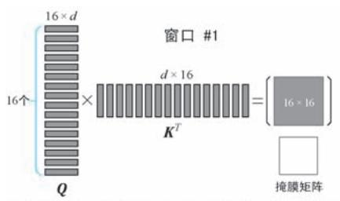

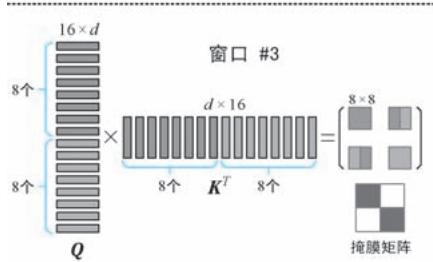

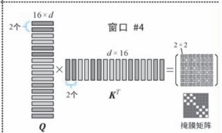  
●图 6-15 针对 4 个窗口的掩膜 MSA 计算示意

在模型结构方面，作者们提出了4 种不同规模的 Swin Transformer 模型：Swin-T （微型版）、Swin-S（小规模版）、Swin-B （基础版）和 Swin-L （大规模版）。这 4 种规模第一阶段特征维度 $C$ 分别为 96、96、128 和192。随后3 个阶段特征维度均按照2C、4C 和8C 组织；在上述4 个版本的模型中，4 个阶段 Swin Transformer 块的个数设定分别为{2，2，6，2}、{2，2，18，2}、{2，2，18，2}和{2，2，18，2}。之所以Swin Transformer 块的个数均为偶数，正是因为 Swin Transformer 将具有 W-MSA 模块和 SW-MSA 模块的两个 Swin Transformer 块进行串联使用的缘故。在参数规模上，Swin-T 与 ResNet50 和 DeiT-S 两个模型接近，而 Swin-S 则与 ResNet101 模型类似。

Swin Transformer 作为主干网络，如何与各种 CV 任务适配？简而言之，在 CV 任务中我们怎么用VGG、ResNet 等 CNN 主干网络，那么我们就怎么用 Swin Transformer。我们已经看到，在接收到一幅图像后，Swin Transformer 利用4 个阶段的操作对其一路加工，得到 4 种不同尺度的特征图。这些特征图在维度上与 VGG、ResNet 等多阶段 CNN 模型别无二致，直接替换就是。因此，Swin Transformer 是一个 “很 CNN” 的 Transformer。

最后，我们来看看 Swin Transformer 在 CV 领域的 “逆天” 表现。主干网络的测评一定绕不开 CV三大任务，Swin Transformer 也是如此。我们首先来看分类任务。在基于 ImageNet-1K 数据集的测评中，与视觉 Transformer 分类任务中取得 “SOTA” 的 DeiT 模型 （Swin-T 和 Swin-B 分别对标 DeiT-S 个 DeiT-B）相比，其 top-1 分类精度均提高了 $1 . 5 \%$ 左右，相较于更早期的标准 ViT 模型，Swin Transformer 更是碾压式的存在；相较于 CNN 分类模型，之前各视觉 Transformer 难以望其项背的 EfficientNet （B7），

这次终于被超越，但是 Swin Transformer 的领先优势不够明显，而且在参数规模和计算量方面，Effi-cientNet 更具优势。不过需要说明的是，RegNet 和 EfficientNet 这两个效果不错的模型是通过模型搜索得到的，这就意味着 Swin Transformer 还是具有相当的潜力。再来看看目标检测任务。针对该任务的测评基于 COCO 数据集开展。首先，作者们选择了4 个目标检测模型，同样也是通过替换不同主干网络的方式来测试主干网络的性能。上述 4 个目标检测模型分别 为：Cascade Mask R-CNN、ATSS、RepPoints v2 和 Sparse RCNN。至于结论，简而言之就是无论是普通目标检测还是实例分割，SwinTransformer 碾压了所有 “SOTA”水平的CNN 主干网络。具体实验包括3 组。第1 组实验即针对上述4个模型，分别将其主干网络替换为Swin-T 和ResNet50。对比结果为：以Swin-T 作为主干网络的4 种目标检测模型，其性能相较于同等参数规模的 ResNet50 高出约 $3 \% \sim 4 \%$ 。在第 2 组实验中，作者们选定Cascade Mask R-CNN 模型，替换多个主干网络并对比其性能。在该组实验中，为了公平起见，作者们也是按照参数规模进行分组。测评结果为：在同等参数规模下，Swin-T 超越了 ResNet50 和 DeiT-S，Swin-S 超越了 ResNet101-32，而 Swin-B 超越了 ResNet101-64。值得一提的是，在上述 “竞争对手”中，效果最好的模型为 ResNet101-64 （参数规模 1. 4 亿）。但是，即便是最为 “瘦小”的 Swin-T 模型（参数量为8600 万），都能轻松将其击败———后者较前者检测精度高出约 $2 \%$ 。第3 组实验属于系统级实验，即不再顾及公平性，能用的手段都用上，看看模型最高能够达到的水平。结论为：Swin-L 在HTC 的加持下，目标检测的精度比 “SOTA”模型 Copy-paste 高约 $2 \% \sim 3 \%$ 。最后我们再来看看语义分割任务。针对该任务的测评数据集为 ADE20K。对比结论为：以 Swin-L 为主干网络的 UperNet 模型，图像分割 mIoU 成绩达到 $5 3 . 5 \%$ ，远远高出纪录保持者———SETR 模型 （以 ViT-Large 为主干，在下文中我们会对该模型进行详细讨论）的 $5 0 . 3 \%$ 。之前 CNN 模型的最好成绩是以 ResNeSt-200 为主干网络的 DeepLabV3+模型，该模型的 mIoU 指标为 $4 8 . 4 \%$ 。从 SETR 即可以看出，采用视觉 Transformer 作为语义分割模型的优势，而 Swin Transformer 进一步扩大了这一优势。从 Swin Transformer 在 CV 三大任务的表现可以得到如下综合结论：就图像分类任务，Swin Transformer 基本与 CNN 的最好水平打成平手，但是对于目标检测和图像分割这两类密集预测任务，Swin Transformer 具有绝对优势。

关于 Swin Transformer 模型，需要探讨的内容还有很多，在具体实现时更是有很多细节需要注意，但是受篇幅和内容的限制，我们在这里就不做过多的展开。下面我们简单对 Swin Transformer 进行总结。针对原生 ViT，Swin Transformer 要解决的关键问题有两个———多尺度特征表示的问题和降低计算量的问题。针对第一个问题，Swin Transformer 引入层级结构，并通过在每个阶段的前部添加图像块合并操作来降低特征图的分辨率，使得整个模型具有了类似CNN 模型那样的多尺度特征表示模式；针对第二个问题，Swin Transformer 引入局部窗口的注意力计算模式，大幅降低注意力的计算量，特别是提出移动窗口机制，解决了独立窗口特征无法交互的问题。Swin Transformer 以其优异的表现，证明了Transformer 在 CV 领域能用，而且很好用。可以说，Swin Transformer 奠定了 CV 各类任务新的 “base-line”。直到今日，在各个排行榜上盘踞榜首的模型，多多少少都与Swin Transformer 有关系，可见其在CV 领域影响深远。

# 3. DeepViT 与 CaiT：更深的结构

我们知道，增加神经网络的深度能够显著提升模型的表达能力。相较于传统神经网络模型，深度学习模型性能之所以能够大幅提升，其中很大一部分原因是使用了更深的网络结构。在 CV 领域中，

我们使用的CNN 模型在改进激活函数和残差结构的加持下，更是能够轻松达到数百层的深度。无数事实也证明，这些具有深层结构的CNN 模型，性能上也比浅层模型有着大幅提升。那么我们是否也可以依葫芦画瓢，通过增加视觉 Transformer 模型的深度，来进一步提升其在 CV 任务上的表现？的确，也有学者们想到了这一点———接下来我们将要介绍的 DeepViT [15] 和 CaiT [16] 两个模型就是受上述思想启发下所设计的视觉 Transformer 模型。

我们讨论的第一个模型为 DeepViT 模型。该模型于 2021 年 3 月提出，作者是 Daquan Zhou 等[15] 来自新加坡国立大学和字节跳动的8 名学者。DeepViT 模型的最大贡献在于通过实验发现并解决 ViT 模型在层数 （即 Transformer 编码器数量） 增加时产生的 “注意力坍塌” （attention collapse） 现象。所谓注意力坍塌，即随着 Transformer 结构的加深，层与层之间的注意力权重逐渐变得相似，甚至在某些层之后变得几乎相同，这就意味着自注意力捕获丰富特征的能力随着 ViT 的变深严重退化，可谓 “注意力涣散”。DeepViT 是一个实验味道很浓的工作，包括三个方面：第一，实验观察，深入分析 ViT 模型注意力坍塌现象；第二，提出方案，提出了 “重注意”（re-attention）机制以克服上述问题；第三，测试效果，将标准 ViT 中的自注意力模块替换为重注意力模块，使得 ViT 的深度能够增加至32 层。相较于直接在 ViT 中堆叠相同数量的 Transformer 块，其在 ImageNet-1K 数据集上的 top-1 分类精度提升了约 $1 , 6 \%$ 。

首先是实验观察。在 ViT 中，为了度量第 $p$ 层与第 $q$ 层 Transformer 块之间注意力图的相似性，作者们引入了余弦矩阵 $\mathbf { \boldsymbol { M } } ^ { p , q } \in \operatorname { R } ^ { H \times T }$ ，其中 $H$ 为 Transformer 块中注意力的头数， $T$ 为输入符号序列的长度，例如，在 $1 6 \times 1 6$ 个词”的 ViT 中， $T = 2 5 6$ 。余弦矩阵 $M ^ { p , q }$ 中，位于第 $h$ 行第 $t$ 列元素 $M _ { h , t } ^ { p , q }$ 的计算方法为

$$
M _ {h, t} ^ {p, q} = \frac {\left(\boldsymbol {a} _ {h , t} ^ {p}\right) ^ {\mathrm {T}} \boldsymbol {a} _ {h , t} ^ {q}}{\left\| \boldsymbol {a} _ {h , t} ^ {p} \right\| \left\| \boldsymbol {a} _ {h , t} ^ {q} \right\|} \tag {6-8}
$$

式中， $\pmb { a } _ { h , t } ^ { p }$ 和 $\textstyle | \pmb { a } _ { h , t } ^ { q } |$ 均为 $T$ 维向量，分别表示在 $p$ 、 $q$ 两层中，对于第 $h$ 个注意力头，在构造第 $t$ 个符号时所有输入序列为其贡献的注意力权重。简而言之，DeepViT 用式 （6-8）所示的余弦距离，表达了相同注意力头、相同位置注意力权重在不同层上的差异。有了相似性度量方法，作者们随即基于 ImageNet-1K 数据集训练不同深度 ViT 模型 （12 ～ 32 层），利用上述相似性度量方法来分析注意力坍塌的现象。我们直接看结论。第一个结论，随着层数的增加，注意力权重开始趋同———作者们观察到，在 17 层之后，在相邻的 $k$ $k = 1$ ，2，3）个层中，对于相同的注意力头，超过 $90 \%$ 的符号注意力权重的相似度超过相似度平局值，且随着层数的加深，这一现象还有加剧之势；第二个结论，各个注意力头之间的注意力权重并不趋同。观察发现，无论层数怎么增加，在相同的层中，不同注意力头中注意力权重相似度符号的比例，一直保持在 $30 \%$ 以下，这表明多头注意力的确在维护注意力的多样性方面起到重要作用。

再说解决方案。实验观察得到的第二个结论表明，ViT 注意力权重具有 “层内跨头多样”的特性。那么既然如此，是否可以在每层中以不同头的注意力权重作为基础，再构造出一套新的注意力权重，从而进一步增加层间注意力权重的多样性呢？这便是 DeepViT 重注意力模块的核心思想———重注意力模块以 $H$ 头注意力计算得到的注意力权重为基 （basis），额外引入一个可训练的线性变换矩阵 θ$\in \boldsymbol { \mathrm { R } } ^ { H \times H }$ ，通过对已经得到的注意力权重进行线性变换，从而再 “幻化”出一套新的注意力权重。重注

意力的计算方法为

$$
\operatorname {r e a t t e n t i o n} (\boldsymbol {Q}, \boldsymbol {K}, \boldsymbol {V}) = \operatorname {n o r m} \left(\boldsymbol {\theta} \cdot \operatorname {s o f t m a x} \left(\frac {\boldsymbol {Q} \boldsymbol {K} ^ {\mathrm {T}}}{\sqrt {d}}\right)\right) \boldsymbol {V} \tag {6-9}
$$

式中， $Q , K , V \in \mathrm { R } ^ { T \times H d }$ 表示多头注意力中的查询矩阵、键矩阵和值矩阵。需要读者注意，这些矩阵都将每个头对应矩阵横向拼接得到。以其中的 $\varrho$ 为例，有 $\pmb { Q } = ( \pmb { Q } _ { 1 } , \cdots , \pmb { Q } _ { H } )$ ），其中 $\pmb { \mathcal { Q } } _ { h } \in \operatorname { R } ^ { T \times d } ( h = 1 , \cdots , H )$ ）表示第 $h$ 头注意力的查询矩阵，其中每行都是一个 $d$ 维的查询向量。矩阵 $\pmb { K }$ 和 $V$ 的组织形式与 $\varrho$ 相同。简而言之， $H$ 头自注意力模块产生 $H$ 个注意力权重矩阵，重注意力所做的工作，即通过构造 $H$ 组线性组合系数 （每组线性组合系数均为一个 $H$ 维可学习向量），将其变换为另外 $H$ 个新的注意力权重矩阵。

我们讨论的第二个模型为 CaiT 模型。CaiT 的全称是 “Class-Attention in image Transformers”，即“带有类注意力的视觉 Transformer”。该模型在 arXiv 的首发时间为 2021 年 3 月 31 日，比上文介绍的DeepViT 的首发时间晚了九天，作者是 Hugo Touvron 等[16] 五名来自 Facebook AI 和法国索邦大学的学者。

CaiT 模型的主要贡献有两个：LayerScale 结构和类注意力机制。其中，LayerScale 是一种带有归一化操作的残差结构，通过在自注意力模块中添加 LayerScale 操作，旨在解决随着模型深度增加而随即产生的梯度不稳定的问题，使得深层模型的训练优化变得更加有效；类注意力 （class-attention） 机制的应用旨在用来缓解类别符号 （即 CV 版 “＜CLS＞”）的 “尴尬局面”：类别符号对应的特征既要作为全图代表特征用于后续的分类任务，还要和其他图像块特征一起指导注意力关系的构建，这可以说是两个 “风马牛不相及” 的任务。在 CaiT 中，即采用了前段自注意力加后段类注意力的分段模式，并结合类别符号后移的策略来解决上述矛盾。

我们探讨的第一个话题即 LayerScale 结构。首先，我们来体会一下作者们提出 LayerScale 结构的“心路历程”：很多实验已经证明，直接增加 ViT 模型的深度将导致模型训练变得异常困难，因此深层ViT 模型的表现往往也难以让人满意。反观 CNN 那边却是 “风生水起”———对上百层结构的训练不在话下且效果绝佳。CNN 之所以能以近乎无限制的方式增加深度，一个很重要的原因在于残差结构（re-sidual architectures）的使用。带有归一化的残差结构能够保证深层模型在训练时也能获得稳定的梯度，从而防止模型在深度增加时产生退化的现象。这也正是以 ResNet 为代表的残差网络在 CNN 领域经久不衰的原因。然而，事实上在 Transformer 编码器㊀①中，自注意力模块和全连接前馈网络也是具有残差结构和归一化操作的，那为什么 ViT 仍不好训练呢？这恐怕是原生 Transformer 的残差结构在很大程度上不适合 CV 任务的原因。纵观学界，人们已经就残差结构的设计和归一化操作参数的初始化问题展开过广泛的讨论，也形成了不少相关的成果，如 Fixup、ReZero 和 SkipInit 等。于是作者们借鉴了这些成果的思路，提出了用于 ViT 的 LayerScale 结构，并且也在随后的实验中证明了 LayerScale 是有效的。图 6-16 为 LayerScale 和另外四种典型残差结构的对比。其中， “ATT / FFN”表示注意力模块或全连接前馈网络。

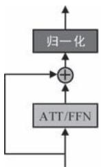

  
c

  
d)

e)   
●图 6-16 LayerScale 与另外四种典型残差结构的对比示意  
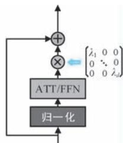  
a）标准 Transformer 残差结构 b）ViT 残差结构 c）ReZero / SkipInit / Fixup 残差结构  
d）“归一化 $\cdot ^ { + }$ 缩放因子”残差结构 e）LayerScale 残差结构

Fixup、ReZero 和 SkipInit 三种方法移除了前置的归一化操作，而是在其残差结构中引入一个可学习的缩放因子 $\alpha$ ，如图 6-16c 所示。其中，Fixup 和 ReZero 分别以 1 和0 作为其初值。除此之外，上述三种方法除了移除前置的归一化操作，还在训练阶段取消了在训练初期使用的学习率的 “warmup”策略。但是作者们按照上述方式训练 ViT 模型，发现训练过程无法稳定收敛，反而是把归一化操作和“warmup”策略用上反而能够很好地训练 ViT 模型。这样一来，残差结构就变为图 6-16d 所示的样子。经过分析，作者们认为缩放因子 $\alpha$ 在促进模型训收敛中起到关键作用。既然将一个标量因子作用到整个特征向量上都如此有效，那么在特征的每个维度都应用独立的缩放因子，给残差通路以更多的缩放自由度，效果会不会更好？这便是 LayerScale 的思路———LayerScale 用 $d$ 阶对角矩阵作用在注意力模块或全连接前馈网络的输出上，为 $d$ 维特征的每个维度执行缩放操作。其对角线元素即为 $d$ 个可学习的缩放因子。图6-16e 为 LayerScale 残差结构示意。具有 LayerScale 结构的编码器对数据的完整加工过程可以表示为

$$
x _ {l} ^ {\prime} = x _ {l} + \operatorname {d i a g} \left(\lambda_ {l, 1}, \dots , \lambda_ {l, d}\right) \times \operatorname {A t t L a y e r} \left(\operatorname {L a y e r N o r m} \left(x _ {l}\right)\right)
$$

$$
x _ {l + 1} = x _ {l} ^ {\prime} + \operatorname {d i a g} \left(\lambda_ {l, 1} ^ {\prime}, \dots , \lambda_ {l, d} ^ {\prime}\right) \times \text {F w d L a y e r} \left(\text {L a y e r N o r m} \left(x _ {l} ^ {\prime}\right)\right) \tag {6-10}
$$

式中，l 为编码器层下标； $\mathrm { d i a g } \big ( \lambda _ { l , 1 } , \cdots , \lambda _ { l , d } \big )$ ）和 $\mathrm { d i a g } \big ( \lambda _ { l , 1 } ^ { \prime } , \cdots , \lambda _ { l , d } ^ { \prime } \big )$ ）分别为作用于注意力模块和全连接前馈网络输出的 $d$ 阶对角矩阵。对于位于对角线上的缩放因子，CaiT 以很小的值 $\varepsilon$ 作为其初值：在 18层之前， $\varepsilon = 0 , 1$ ，在 18～24 层， $\varepsilon = 1 0 ^ { - 5 }$ ，在更深的层中，有 $\varepsilon = 1 0 ^ { - 6 }$ 。

我们探讨的第二个话题即类注意力结构。我们知道，ViT 模型继承了 BERT 的 “＜CLS ＞”机制，也在图像块序列的前部添加类别符号。该符号在多层注意力的加工中，与其他图像块特征 “水乳交融”，最终得到的聚合特征被用来进一步进行分类操作。类别符号扮演了两个矛盾的角色：一方面，在注意力加工时，类别符号 “假扮”为图像块，在图像块间引导自注意力的投射，构建图像块之间的关系；另一方面，类别符号又在分类目标的要求下，成为 “精华吸取器”，提取、概括那些有利于分类的图像块特征。为了解决上述矛盾，作者们提出了类注意力（Class Attention，CA）机制，并将整个网络结构构造为自注意力和类注意力两个阶段。其中，类注意力也是一种多头注意力机制，用来从已经得到的图像块特征中抽取并归纳信息。假设我们已经有了 $N$ 个图像块对应的特征表示 ${ \pmb x } _ { 1 } , \cdots , { \pmb x } _ { N }$ ，首先，如同标准ViT 那样，我们在其前部插入类别特征 $\boldsymbol { x } _ { \mathit { c l s } }$ （即在架构的某阶段，类别符号对应的嵌入特

征），即得到一个长度为 $N { + 1 }$ 的序列，记作 $\boldsymbol { z } = \left[ \vphantom { \sum _ { c l s } } \mathbf { x } _ { c l s } , \mathbf { x } _ { 1 } , \cdots , \mathbf { x } _ { N } \right] \in \mathrm { R } ^ { ( N + 1 ) \times d }$ 。假设类注意力中的头数有 $H$ 个，对于其中第 $i$ 个头，类注意力首先通过线性变换构造注意力计算所需的查询、键和值，有㊀

$$
\boldsymbol {q} _ {i} = \boldsymbol {x} _ {\text {c l s}} \boldsymbol {W} _ {i} ^ {q} + \boldsymbol {b} _ {i} ^ {q}, \boldsymbol {K} _ {i} = z \boldsymbol {W} _ {i} ^ {k} + \left[ \boldsymbol {b} _ {i} ^ {k} \right], \boldsymbol {V} _ {i} = z \boldsymbol {W} _ {i} ^ {v} + \left[ \boldsymbol {b} _ {i} ^ {v} \right] \tag {6-11}
$$

式中， $\pmb { W } _ { i } ^ { q }$ $\boldsymbol { W } _ { i } ^ { q } , \boldsymbol { W } _ { i } ^ { k } , \boldsymbol { W } _ { i } ^ { v } \in \mathrm { R } ^ { d \times d }$ $\boldsymbol { W } _ { i } ^ { k }$ 为可学习的线性变换矩阵， $\pmb { b } _ { q } , \pmb { b } _ { k } , \pmb { b } _ { v } \in \mathrm { { R } } ^ { d }$ 为可学习的线性变换偏置向量；$[ { \pmb b } _ { i } ^ { * } ] \in { \mathrm { R } } ^ { ( N + 1 ) \times d }$ 为行向量 $\boldsymbol { b } _ { i } ^ { * } \in \mathrm { R } ^ { d }$ 平铺 $\cdot \vert { \cal N } { + } 1$ ）行构建的矩阵。在以上三式中，有 $\pmb q _ { i } \in \mathbb { R } ^ { d } , \pmb K _ { i } \in \mathbb { R } ^ { ( N + 1 ) \times d }$ $\pmb q _ { i } \in \mathbb { R } ^ { d }$ ，$V _ { i } \in \mathrm { R } ^ { ( N + 1 ) \times d }$ 。在有了查询、键和值之后，即可计算类注意力的权重矩阵，并进行特征合成和最终的变换操作，有

$$
\boldsymbol {A} = \operatorname {s o f t m a x} \left(\boldsymbol {Q} \boldsymbol {K} ^ {\mathrm {T}} / \sqrt {d / H}\right) \tag {6-12}
$$

$$
\boldsymbol {o} _ {c a} = \boldsymbol {W} _ {o} \boldsymbol {A} \boldsymbol {V} + \boldsymbol {b} _ {o} \tag {6-13}
$$

在式 （6-12）中， $\boldsymbol { Q } \in \mathrm { R } ^ { H \times d }$ ，其中第 $i$ 行即为第 $i$ 头注意力中的查询向量 $\pmb { q } _ { i }$ ； ${ \pmb K } \in { \mathbb R } ^ { ( N + 1 ) \times H d }$ 为 $\pmb { K } _ { i }$ 横向拼接得到的 $H$ 头键矩阵；输出 $\pmb { A } \in \operatorname { R } ^ { H \times ( N + 1 ) }$ 即为类注意力的权重矩阵。在式 （6-13）中， ${ \pmb V } \in { \bf R } ^ { ( N + 1 ) \times H d }$ 为 $V _ { i }$ 横向拼接得到的 $H$ 头值矩阵， $A V$ 即表示多个值向量的注意力融合； $\boldsymbol { W } _ { o } \in \mathrm { R } ^ { d \times d }$ 和 $\boldsymbol { b } _ { o } \in \mathrm { R } ^ { d }$ 分别为获得最终输出的线性变换的系数矩阵和偏置向量。

不难看出，在类注意力中，类别特征扮演了查询的角色，而已经获取的图像块特征 （当然，也包括类别特征自己）则扮演了键和值的角色。将类别特征在图像块特征的集合上执行查询，从而计算出以图像块特征表达类别特征的注意力权重，最终实现图像块特征的融合。这样一来，我们发现类别符号的任务变得单一了———只用来做特征提取与归纳，为后续的全图分类做特征准备。有了类注意力模块，接下来我们来看看其具体应用— —两阶段架构。为了将图像块关系构建操作与分类特征的归纳操作分开，作者们为 CaiT 设计了两阶段架构。其中，第一阶段为自注意力阶段，该阶段只接收图像块的嵌入特征，通过多层自注意力加工 （带有 LayerScale 残差结构） 来构建这些图像块特征之间的关系。与原生 ViT 不同，CaiT 的自注意力阶段不需要类别符号参与；第二阶段为类注意力阶段，类别符号在本阶段才 “闪亮登场”，此时的图像块特征已经是固定值，类注意力模块只是考虑如何将这些既有的图像块特征整合起来用于后续分类这一项工作。为了给类别特征更多的非线性加工，作者们在每个类注意力模块之后，还对类别特征进行了一次全连接前馈网络的架构操作。图 6-17 即原生 ViT 架构与CaiT 架构对比示意 （其中，MHSA、CA 和 FFN 分别表示多头自注意力、类注意力和全连接前馈网络）。在 CaiT 中，我们仿佛看见了编码器-解码器的影子———编码器充分挖掘输入元素之间的关系，对其进行中间特征表示；解码器基于中间特征表示进行各类后续加工，形成最终输出。对应到 CaiT 中，自注意力阶段和类注意力阶段分别扮演了编码器和解码器的角色，前者构造图像块之间的关系，得到其中间特征表示，而后者基于图像块特征进行类别特征融合，以应对后续的类别预测。

按照注意力的头数和 Transformer 中间特征维度，作者们构造了四种不同宽度的 CaiT 模型—CaiT-XXS （“eXtra eXtra Small” 版，四头 192 维）、CaiT-XS （“eXtra Small” 版，六头 288 维）、CaiT-S （“Small”版，八头 384 维）和 CaiT-M （“Medium”版，16 头 768 维）。其中 CaiT-S 和 CaiT-M 作为“刷榜主力”，其规模对标 DeiT-S 和 DeiT-M。在上述每种宽度的模型中，又包括了若干不同深度的模

型，例如，CaiT-S 又包括了具有24 层、36 层和48 层三种不同深度的模型 （这里的深度指的是自注意力阶段中编码器的层数），分别记作 CaiT-S-24、CaiT-S-36 和 CaiT-S-48。上述模型均具有 $\mathbf { X } + 2$ ”的两阶段结构，其中 “X”即为上面的24 层、36 层等， $^ { + 2 }$ ”即表示在其后添加一个两层的、带有全连接前馈网络的类注意力层。

b）  
●图 6-17 原生 ViT 架构与 CaiT 架构对比示意 （其中，MHSA、CA 和 FFN 分别表示多头自注意力、类注意力和全连接前馈网络）  
  
a）ViT 架构 b）CaiT 架构

# 4. BoTNet 到 CoAtNet：Transformer 与 CNN 的“混搭”

我们知道，CNN 的优势在于局部视觉特征提取和多尺度表达，而 Transformer 的强项在于其能够灵活地构建数据之间的依赖关系。既然 CNN 与 Transformer 各有优点，那么是否能够将二者进行 “混搭”，让其 “强强联手”呢？在下文中，我们将详细讨论4 个 Transformer 与 CNN “混搭”的模型—BoTNet[17] 、CeiT[18] 、CvT[19] 和 CoAtNet[20] 。

我们讨论的第一个模型为 BoTNet 。模型于 2021 年 1 月提出，作者是 Aravind Srinivas 等[17] 六名来自伯克利和谷歌的学者。请读者们注意，Transformer 的第一作者 Ashish Vaswani 也名列 BoTNet 的作者名单。BoTNet 的提出旨在借助自注意力机制的全局关系建模能力来弥补卷积操作的 “短视”弊端。这一思路很好理解，试想我们需要分析一幅足球运动员射门的图像，运动员在图像的左下角，而腾空的足球已经飞到图像的正中间，而球门在图像的右上角。按照CNN 的局部操作模式，运动员、足球、球门三个对象的特征几乎不会 “相遇”，这就意味着我们不会得到 “起脚射门，足球奔着球门飞去”这样的理解结果。反倒是自注意力的全局信息加工能够容易地构建球员、足球和球门的关系。

BoTNet 名称中的 “BoT” 为 “Bottleneck Transformer” 的简称，直译为 “瓶颈 Transformer”。瓶颈Transformer 的结构非常简单：将 ResNet 瓶颈块 （Bottleneck block） 中的 $3 { \times } 3$ 卷积替换为多头自注意力（Multi-Head Self-Attention，MHSA） 层即可。图 6-18 示意了瓶颈 Transformer 与 ResNet 瓶颈结构的对比。可以看出，BoTNet 是一种典型的利用 Transformer 赋能 CNN 的模型。同时，瓶颈 Transformer 也可以视为是一种构造网络的基础模块，在外部根本无法感知其存在，可谓即插即用。有了瓶颈Transformer 这一基础模块，接下来就是构造 BoTNet 这一主干网结构了。作者基于 ResNet 构造

BotNet———将 ResNet 最后三个瓶颈块替换为瓶颈Transformer 即可，非常简洁。

接下来我们就来看看瓶颈 Transformer 中 MHSA层的具体结构。如图 6-19 所示，假设输入的特征图维度为 $H \times W \times C$ （这里，为了简化说明，我们省略了“batch”维度，并且也只考虑单头注意力的情形）。在获得该特征图之后，瓶颈 Transformer 所做的第一步操作即通过三个 $1 \times 1 \times C$ 的卷积操作将其 “幻化”为三个特征图，即我们再熟悉不过的 $\varrho$ 、 $\pmb { K }$ 和 $V$ 。需要注意，以上三者均来自图像的内容；接下来即兵分两路，分别进行内容对内容（content-content）的查询和内容对位置（content-position） 的查询。我们先看看第一路———内容对内容的查询。分别对 $\varrho$ 和 $\pmb { K }$

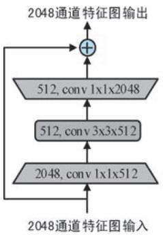

b)   
●图 6-18 ResNet 瓶颈结构与瓶颈Transformer 结构的对比示意  
  
a）ResNet 瓶颈结构 b）瓶颈 Transformer 结构

进行展开操作，得到两个 $H W { \times } C$ 矩阵 （我们仍将二者记作 $\varrho$ 和 $\pmb { K }$ ），然后计算 $Q K ^ { \mathrm { T } } \in \operatorname { R } ^ { H \mathrm { W } \times H W }$ 作为内容对内容的查询相似度结果；然后是第二路———内容对位置的查询。在该路操作中，我们首先用 ${ \pmb R } _ { h } \in \qquad $ $\mathrm { R } ^ { H \times 1 \times C }$ 和 $\pmb { R } _ { \imath \imath } \in \mathrm { R } ^ { 1 \times \mathbb { W } \times C }$ 分别代表垂直和水平方向上的相对位置信息矩阵。二者被构造为两个可学习的参数矩阵，分别为不同行和不同列的特征进行差异化标识。然后，将 $\pmb { R } _ { h }$ 和 $\pmb { R } _ { w }$ 在宽度和高度维上复制扩展，即可得到两个 $H \times W \times C$ 维位置编码矩阵 （我们仍记作 $\pmb { R } _ { h }$ 和 $\pmb { R } _ { w }$ ）。令 $\pmb { R } = \pmb { R } _ { h } + \pmb { R } _ { w }$ ，便得到融合了垂直和

  
●图 6-19 瓶颈 Transformer 中 MHSA 层结构示意

水平两个方向位置特征的位置编码矩阵。接下来计算 $Q R ^ { \mathrm { T } } \in \mathrm { R } ^ { H \mathrm { W } \times H W }$ 作为内容对位置的查询相似度；接下来即计算注意力权重并执行对值的加权求和 $V ^ { \prime } = \operatorname { s o f t m a x } \left( \mathbf { \nabla } Q K ^ { \mathrm { { T } } } { + } Q R ^ { \mathrm { { T } } } \right) V _ { \mathrm { { o } } }$ 。在这里，值集合 $V$ 已经变形为 $H W { \times } C$ 的形状， $V ^ { \prime }$ 即为在内容和位置 “加持下”的特征输出；最后一步，再将 $V ^ { \prime }$ 变换回 $H \times W \times C$ 的形状作为 MHSA 层的最终输出。

我们已经在第2 章中讨论了 Non-local 网络，熟悉的读者可能已经感到 MHSA 层与 Non-local 网络多少有些类似。的确，Non-local 网络也是一种基于自注意力机制、用来捕捉特征长距离依赖关系的模块级网络结构。作者们认为，MHSA 层和 Non-local 网络之间存在三点主要区别。第一，MHSA 更多的借鉴了 Transformer 的思想，应用了位置编码和多头机制；第二，Non-local 网络获得特征图输入后，会将其通道数降低为原来的 1 / 2，而瓶颈 Transformer 则与 ResNet 瓶颈相同，通道数降低为原始通道的1/4，例如，在图6-18 中，输入输出特征图的通道数首先从 2048 降到 512，MHSA 架构结束后再提升为2048；第三，Non-local 块一般以一个额外的结构插入 ResNet 的主干中，而 MHSA 则直接替换ResNet 瓶颈结构中间的卷积层，颗粒度更小，对 CNN 的改造可以更加的 “神不知鬼不觉”。

我们讨论的第二个模型为 CeiT 。CeiT 的全称为 “卷积增强的图像 Transformer ” （Convolution-enhancedimage Transformer），提出时间为 2021 年 3 月，其作者为 Kun Yuan 等[18] 六名来自商汤科技和南洋理工大学的学者。CeiT 提出的目的也是为了综合 CNN 和 Transformer 各自的优势———利用 CNN 提取图像局部特征，利用 Transformer 构建这些特征之间的长范围依赖关系。只不过与 BoTNet 模型不同的是，BoTNet 以 Transformer 增强 CNN 模型性能，而 CeiT 所做的正如其模型名称———在 Transformer 中使用类似 CNN 操作模式，让 CNN 赋能 Transformer。具体来说，CeiT 对原生 ViT 的改进包括三个方面。第一，设计了一个称为 “图像到符号” （Image-to-Tokens，I2T ）的前置模块，该模块从低级视觉特征中构建图像分块，从而避免了直接在原始图像上进行的分块；第二，将 Transformer 编码器中的全连接前馈网络替换为局部增强前馈（Locally-enhanced Feed-Forward，LeFF ） 层，该层在空间维度构建符号之间的局部相关性；第三，提出逐层类别符号注意力（Layer-wise Class-token Attention，LCA ） 模块，用来将来自不同深度的类别特征进行整合，并进行最终的类别预测。图6-20 为 CeiT 模型的整体架构示意。

首先我们来看看 I2T 模块。所谓的 I2T 模块，简单来说就是一个轻量级的 CNN 网络，其中包括一个带有归一化操作的卷积操作和一个最大池化操作。I2T 模块输出的卷积特征相较于原始图像具有更小的尺寸但更多的通道数，该操作相当于对原始输入图像进行了一次低级视觉特征提取和聚合的预处理。I2T 模块输出特征的抽象程度和丰富程度已经相较于原始 RGB 图像前进了一步。接下来，在分块和嵌入操作，即在 I2T 模块输出的特征图上进行，得到的嵌入向量序列连同类别符号将一并送入后续的结构进行加工。

接下来我们重点来讨论 LeFF 层。一个标准的 Transformer 层包括多头注意力 （MHSA）和全连接前馈网络 （FFN）两个模块。在CeiT 的主干结构中，MHSA 模块保持不变，但是FFN 层已经被替换为LeFF 层，也正是 LeFF 层对数据的加工使得 CeiT 能够在 Transformer 中向 CNN 那样提取图像的局部特征。在获取上一 MHSA 模块的 $N { + 1 }$ 个 $d$ 维特征 $N$ 个图像特征和一个类别特征）后，LeFF 层通过五个步骤的操作来完成对数据的加工，如图 6-21 所示。第一步为线性变换操作，LeFF 通过一个可学习的线性变换，将 $N$ 个图像特征变换为 $D$ 维特征；第二步为形状恢复操作，即将第一步操作获得的 $N { \times } D$ 维特征变回图像的二维结构，即得到一个 $\scriptstyle \cdot \sqrt { N } \times \sqrt { N } \times D$ 维的特征图。其中 $D$ 即为特征图的通道数；第三

步为逐通道卷积操作，该步骤在每个通道 “切片”上执行空间卷积操作，以捕获局部空间区域的图像特征。当然，为了保持序列长度不发生改变，在上述卷积中会使用外扩 （padding）处理；第四步为展平操作，该步骤将上一步卷积操作得到的二维特征图再变形回 $N { \times } D$ 维的特征序列形式；第五步为线性变换操作，该步骤与第一步中的线性变换作用相反———将 $D$ 维特征再恢复到原始的 $d$ 维。在 LeFF 层中，类别特征不参与任何加工，以 “直通”方式送入输出序列。不难看出，逐通道卷积是 LeFF 中最关键的一步操作。该操作在局部空间窗口中提取图像特征。

  
●图 6-20 CeiT 模型的整体架构示意

  
●图 6-21 LeFF 层的信息加工流程示意

最后我们再来看看 LCA 模块。在 CNN 中，随着网络深度的加深，特征图的感受野也逐渐增大，在 ViT 中也有类似的现象———随着 ViT 模型深度的增加，注意力的范围也逐渐增大。在 CNN 中，对不同层的特征进行融合是一种常见操作，CeiT 中的LCA 模块扮演的也正是类似的功能。只不过其融合的是每个层的类别特征。LCA 模块对不同层的类别特征拼接后，即得到一个 $L { \times } d$ 维的序列，其中 $L$ 为CeiT 主干网络的层数。LCA 模块将该序列又送入一个标准 Transformer 编码器，经过自注意力机制的加工后，CeiT 编码器输出获得最后一层类别符号对应的输出作为分类特征执行最终的类别预测。

在网络结构方面，作者为 CeiT 构造了三种不同规模的模型：微型版 （CeiT-T，参数量 640 万）、小规模版 （CeiT-S，参数量 2420 万）和基础版 （CeiT-B，参数量 8660 万）。在上述三种模型中，I2T模块的设置均相同———卷积层中卷积核的尺寸为 $7 \times 7$ ，步长为2，最大池化层的池化窗口为 $3 { \times } 3$ ，步长为2。I2T 模块输出的特征图的通道数均为 32；三种模型主干结构中编码器的层数均为 12 层，MHSA中注意力的头数分别为3、6 和12。中间特征的维度分别为 192 维、384 维和 768 维。因此可以看出，三种 CeiT 模型在规模上的差别体现为模型的宽度。

我们讨论的第三个模型为 CvT 。与 CeiT 类似，CvT 也是一种将卷积思想引入 Transformer 的模型。该模型提出于 2021 年 3 月，作者是 Haiping $\mathbb { W } \mathbf { u }$ 等[19] 七名来自加拿大麦吉尔大学和微软公司的学者。与上文介绍的几种 “混搭”模型相同，CvT 将卷积操作引入 Transformer 的原因同样是为了利用卷积操作给 Transformer 增加局部特征提取能力。具体来说，CvT 主要通过在标准 ViT 结构上进行的两点改进来实现上述目标，这两种改进均和卷积有关。第一点改进即增加卷积符号嵌入（Convolutional TokenEmbedding）操作，该操作实现对输入特征图㊀①空间局部特征的嵌入；第二点改进即以卷积 Transformer块（Convolutional Transformer Block） 替换原生 ViT 中的 Transformer 编码器，在其中以卷积特征作为多头注意力的输入。上述卷积符号嵌入还有一个 “副产品”———可以通过设定卷积窗口的尺寸、步长，以及卷积输出个数来控制输出特征的长度和维度，这便为 CvT 模型带来了类似 CNN 那样的多尺度特征表达能力。因此在 CvT 中，作者们将一个卷积符号嵌入与若干个卷积 Transformer 块级联为一个操作阶段，CvT 模型便可以构造为类似 ResNet 那样的多阶段架构，而且实现了特征图的尺寸越来越小，通道越来越多的效果。图6-22 为 CvT 模型的整体架构示意。

  
●图 6-22 CvT 模型的整体架构示意

首先我们来看看 CvT 的第一点改进— 卷积符号嵌入。所谓卷积符号嵌入，即利用与卷积相同的滑动窗口模式对输入图像或特征图进行局部特征的提取。与标准 ViT 直接分块不同的是，可以通过设

定步长、外扩等参数来控制局部窗口的重叠度。设 $\boldsymbol { F } _ { i - 1 } \in \mathbf { R } ^ { H _ { i - 1 } \times W _ { i - 1 } \times C _ { i - 1 } }$ 为第 $i$ 阶段的特征输入，该阶段的卷积符号嵌入可以表示为 $\boldsymbol { F } _ { i } = f ( \boldsymbol { F } _ { i - 1 } )$ ），其中 $F _ { i } \in \mathrm { R } ^ { H _ { i } \times W _ { i } \times C _ { i } }$ 为输出特征图。对 $\cdot F _ { i }$ 尺寸的计算方法与卷积特征图尺寸的计算方法完全相同。以高度为例，假设卷积窗口的尺寸为 $k { \times } k$ ，外扩为 $p$ ，卷积步长为 s，则输出特征图的高度为 $H _ { i } = \lfloor { \bigl ( } H _ { i - 1 } + 2 p - k { \bigr ) } / s + 1 \rfloor$ 。输出特征图的通道数 $C _ { i }$ 为事先设定好的超参数。在获得输出的二维特征图之后，对其进行展平操作———将二维特征图变为以 $H _ { i } W _ { i } \times C _ { i }$ 的特征序列形式，以满足后续 Transformer 层的输入维度要求㊀①。不难看出，CvT 卷积符号嵌入就是 ViT 图像块嵌入的重叠窗口版本，其基本思路与 CeiT 模型中 I2T 模块也有类似之处，只不过图像块嵌入和 I2T 模块都是针对输入图像的预处理模块，在进入 Transformer 之前做一次就好，而 CvT 的卷积符号嵌入在每个阶段都得做一次，因此其扮演了操作阶段预处理模块的角色。除此之外，相较于 I2T 模块，卷积符号嵌入不涉及池化操作，因此其带来的降采样效果完全以卷积操作的 “内缩”来实现。

接下来我们来看看 CvT 的第二点改进— 卷积 Transformer 块。在原生 ViT 的 Transformer 层中，自注意力模块使用的查询、键和值都是基于整个输入序列构造的，这种全局构造模式彻底抛弃了图像的局部信息。为了克服这一弊端，作者们再次想起了卷积。在卷积 Transformer 块中，这一利用卷积来实现的自注意力输入构造模式被称为 “卷积投影” （Convolutional Projection）。卷积投影的数据加工过程为：在接收到一个 $H W { \times } C$ 维向量序列后，首先对其进行形状恢复操作，得到 $H \times W \times C$ 维的特征图形式；接下来，利用三个深度可分离卷积（depth-wise separable convolution）㊁②“幻化” 出三个特征图，这三个特征图经过展平操作后，即分别作为后续自注意力模块所需的 $\varrho$ 、 $\pmb { K }$ 和 $V$ 。卷积投影在 Q、K、 $V$ 的构造过程中，以卷积操作隐式加入了局部特征提取机制，可以说是非常巧妙的。该做法更加 “有机”，更加能套用现有框架来实现。图6-23a 为 CvT 卷积 Transformer 块的结构示意。卷积投影的实现方法有两种：标准卷积投影和挤压卷积投影（squeezed convolutional projection）。在标准卷积投影中，三个深度可分离卷积采用相同的步长设定 （当然卷积窗口与外扩设定也相同），故得到的三个特征图具有相同的维度；而在挤压卷积投影中，进行查询特征图构造时，采用步长为 1 的设定，而进行键和值特征图构造时，则采用了步长为2 的设定，这就意味着键和值特征图的尺寸小于查询特征图的尺寸。这样一来，注意力的计算量将大幅降低。图6-23b 为上述两种卷积投影方法工作模式的示意。

作者们构造了三种不同规模的 CvT 模型，三种模型均具有三阶段，分别记作 CvT-13、CvT-21 和CvT-W24，其中模型的数字后缀表示三个阶段中卷积Transformer 块的个数。在上述三个版本的模型中，三个阶段卷积 Transformer 块的个数设定分别为{1，2，10}、{1，4，16}和{2，2，20}。CvT-13 和 CvT-21 模型除了层数存在差异之外，对应阶段卷积符号嵌入和卷积 Transformer 块的超参数设置均相同；而CvT-W24模型除了层数更深之外，模型中特征的维度也进行了相应的增加 （名称中的 “W”即“Wide”的简写）———三个阶段的卷积符号嵌入特征维度分别为 192 维、768 维和 1024 维，每阶段卷积 Transformer 块中的特征维度也随之进行了调整。

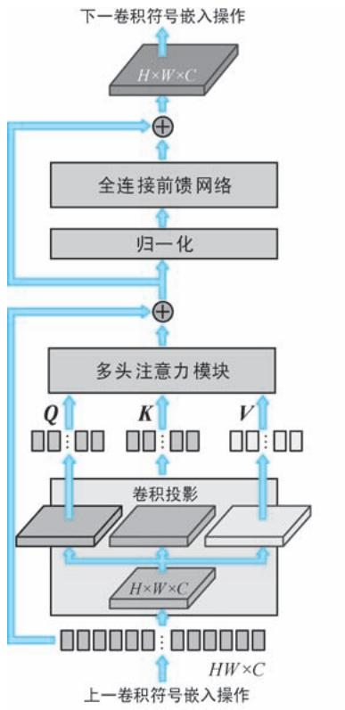  
a）

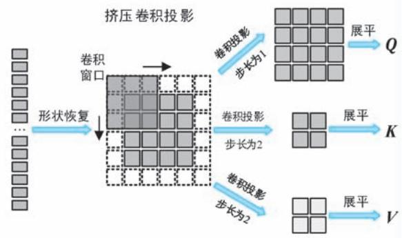  
b)   
●图 6-23 CvT 卷积 Transformer 块的结构与两种卷积投影方法的工作模式示意a）CvT 卷积 Transformer 块结构示意 b）两种卷积投影方法的工作模式示意

我们讨论的第四个模型为 CoAtNet 。CoAtNet 模型于 2021 年 6 月提出，作者是 Zihang Dai 等[20] 四名来自谷歌的学者。模型名称中的 “CoAt” 即 “Convolution and self-Attention” 的简写。由此可见，CoAtNet 也是一个 CNN 与 Transformer “联姻” 的模型。之所以要将 CNN 和 Transformer 进行整合，目的无外乎还是希望二者能够取长补短。作者们给出的具体理由如下：CNN 在归纳偏好性质的加持下，在小规模数据集上就能达到一个比较理想的性能。但随着训练数据的继续增加，模型性能提升步伐随之减慢，性能提升达到天花板。反观 Transformer，由于注意力机制的灵活性，很难用小数据集将其“喂饱”，故 Transformer 在小规模数据集上性能不佳。但是随着数据量的不断增加，模型性能一路飙升，动力强劲，这就意味着 Transformer 模型有着更大的容量（capacity）。CoAtNet 模型旨在综合 CNN和 Transformer 上述优势，最终达到文章题目所说的 “All Data Sizes”———在什么规模的数据集都能训练出一个高性能模型。在构造 CoAtNet 时，作者们考量的主要问题有两个：

第一个问题为如何对卷积与自注意力进行有机结合。我们来看看 CoAtNet 的思路。首先，我们还是先回顾一下卷积计算和自注意力计算方法，如下所示

$$
y _ {i} = \sum_ {j \in \mathcal {L} (i)} w _ {i, j} \cdot x _ {j} \tag {6-14}
$$

$$
\mathbf {y} _ {i} = \sum_ {j \in \mathcal {G}} A _ {i, j} \cdot \mathbf {x} _ {j} = \sum_ {j \in \mathcal {G}} \frac {\exp \left(\mathbf {x} _ {i} ^ {\mathrm {T}} \mathbf {x} _ {j}\right)}{\sum_ {k \in \mathcal {G}} \exp \left(\mathbf {x} _ {i} ^ {\mathrm {T}} \mathbf {x} _ {k}\right)} \cdot \mathbf {x} _ {j} \tag {6-15}
$$

在式 （6-14）中， $\mathcal { L } ( i )$ ）为以位置 $i$ 为中心的一个矩形区域，如我们常用的 $3 { \times } 3$ 卷积区域等；卷积操作即为以 $w _ { i , j }$ 为权重，在位置 $i$ 为中心的矩形区域 $\mathcal { L } ( i )$ ）中、对其中各元素的加权求和操作㊀①；式 （6-15）即为我们非常熟悉的自注意力计算方法，其中，加权求和的范围不再是局部窗口，而是全局空间位置，以 $\mathcal { G }$ 表示； $A _ { i , j }$ 即为经过 softmax 进行归一化处理的相似度。对比卷积和自注意力的计算方法容易看出，卷积相较于自注意力具有平移不变（translation equivariance）特性，该特性正是CNN 能够很好应用于 CV 任务最重要的归纳偏好之一。而自注意力机制的优势在于自适应动态权重和全局感受野，这两点反而又是卷积操作所不具备的。作者们认为卷积和自注意力最理想的 “联姻”效果即应该同时具备上述三点优势，即平移不变性、自适应权重和全局感受野。因此，作者们给出了一种非常简单而直接的做法，即将全局静态卷积核和自适应的注意力矩阵直接进行求和，有

$$
\mathbf {y} _ {i} = \sum_ {j \in \mathbb {G}} \frac {\exp \left(\mathbf {x} _ {i} ^ {\mathrm {T}} \mathbf {x} _ {j} + w _ {i , j}\right)}{\sum_ {k \in \mathbb {G}} \exp \left(\mathbf {x} _ {i} ^ {\mathrm {T}} \mathbf {x} _ {k} + w _ {i , k}\right)} \cdot \mathbf {x} _ {j} \tag {6-16}
$$

从式 （6-16）可以看出，对注意力权重的计算不再仅仅基于输入数据 $\pmb { x } _ { i } ^ { \mathrm { { T } } } \pmb { x } _ { j }$ ，而是进一步依赖了能够体现平移不变特性的静态参数 $w _ { i , j }$ ，可谓 “动静结合”㊁ ②。熟悉相对自注意力 （Relation-aware Self-Attention）的读者可能已经看出，上述自注意力就是相对自注意力一种变体，故在 CoAtNet 中，该注意力也被称为 “相对自注意力”，并以其替换 Transformer 编码器中的标准自注意力模块。

第二个问题即如何将卷积层和 Transformer 层堆叠为一个完整的网络架构。对于 CNN 基础模块选型问题，作者们以 MBConv 模块作为基本 CNN 模块，该模块具有 “逆瓶颈” （inverted bottleneck）残差结构。针对输入特征图，MBConv 模块首先利用 $1 \times 1$ 卷积进行升维，将特征图的通道数增加至原来的四倍，然后在此基础上进行深度可分离卷积操作，最后再通过一个 $1 \times 1$ 卷积进行降维处理。在该模块中，特征维度先增后减，呈现出与瓶颈块 “细腰” 相反的 “大肚子” 形态，故才被形象地称为“逆瓶颈”结构。MBConv 模块被广泛应用于 MobileNet 和 EfficientNet 等经典 CNN 模型。确定了 CNN基础模块，下面就是如何将 CNN 模块和 Transformer 层堆叠在一起的问题。考虑到相对注意力的计算量过大，作者们采用了如下方案：将整个架构设计为多个具有降采样的阶段，前几个阶段为 CNN 模块，当特征图的规模降低到一定程度时，再堆叠若干带有相对自注意力模块的 Transformer 层进行进一步加工。长话短说，经过大量实验对比，在充分权衡模型泛化能力和容量两方面因素后，作者们最终确定 “C-C-T-T”方案作为 CoAtNet 的最终架构，其中 “C”和 “T”即分别代表 CNN 结构和 Trans-former 结构。我们将上述四个阶段简记为 S1～S4，每个阶段包含的 MBConv 模块或 Transformer 层的个数分别为 $L _ { \mathrm { 1 } } \sim L _ { \mathrm { 4 } }$ 。除此之外，作者在上述四个阶段前还添加了一个具有两层卷积结构的 CNN 主

干阶段 （stem stage），简记为 S0，在 S4 阶段之后添加全局池化和全连接操作，以实现后续的特征加工和类别预测。图 6-24 示意了一个完整的五阶段 CoAtNet 网络结构。与 ResNet 等多阶段 CNN 架构类似，在 CoAtNet 中，随着阶段的加深，各阶段输出特征图的尺寸也不断减半，通道数也不断增加。

  
●图 6-24 CoAtNet 整体网络结构示意 （图中 “DConv”表示深度可分离卷积， $\mathrm { \Delta } \cdot \mathrm { S } = 2$ ”表示卷积步长为 2， $\mathrm { E } = 4$ ”表示 CNN 或 FFN 结构中，中间特征维度是输入特征维度的四倍）

通过设定各阶段模块的层数和特征的维度，作者们构造了五种规模的 CoAtNet 模型，分别记作CoAtNet-0～ CoAtNet-4。在上述五个模型中，五个阶段的模块层数分别为 （即图 6-24 中的 $C _ { 1 } \sim C _ { 5 }$ ）：{2，2，3，5，2}、{2，2，6，14，2}、{2，2，6，14，2}、{2，2，6，14，2}和{2，2，12，28，2}；五个阶段输出特征图的通道数 分 别 为：{64，96，192，384，768}、{64，96，192，384，768}、{128，128，256，512，1024}、{192，192，384，768，1536}和{192，192，12，768，1536}。从上述模型的规模设定，不难看出作者们的良苦用心：其中 CoAtNet-0 是 “最浅最窄”的模型，CoAtNet- 1 则是 CoAtNet-0 的加深版；而随后的CoAtNet-2～CoAtNet-3 与 CoAtNet - 1 模型的深度保持一致，但是模型宽度不断增加；最大规模的CoAtNet-4 模型与 CoAtNet-3 宽度相同，但是阶段 S2 和 S4 中，MBConv 和 Transformer 编码器个数均进行加倍。

# 6. 3. 2 目标检测

目标检测任务是 CV 领域最重要的研究方向之一，也是各类视觉分析系统中最重要的应用之一。目标标检测是指在静态图像或视频中，定位出某些特定目标的位置，一般以包围框 （Bounding box）加类别的形式给出结果。在下文中，我们即围绕两种基于 Transformer 的目标检测模型展开讨论。

# 1. DETR：基于 Transformer 的端到端目标检测

与图像分类的一张图赋予一个类别以及图像分割的一个像素赋予一个类别的模式不同，目标检测需要预测包围框的位置和所框对象类别两类对象。也就是说，目标检测任务期望达到的理想目标是“框的位置准”且 “类别判断准”。正是因为目标检测任务包括了 “找目标和判类别”两个目标，故相较于图像分类和图像分割任务，目标检测模型的结构和预测流程往往要复杂得多。2014 年的 R-CNN

是 CNN 应用于目标检测任务的开山之作，该方法一经问世就刷新了目标检测的世界纪录。但是，R-CNN模型太复杂了，执行一次目标检测需竟然包括五个步骤：基于选择性搜索 （Selective Search）生成区域建议、利用CNN 提取局部图像特征、利用SVM 进行特征分类、基于边框回归 （Bounding BoxRegression）修正区域建议位置和基于非极大值抑制 （Non-Maximum Suppression，NMS）滤除冗余预测结果。在随后的日子里，CV 领域涌现出一大批新的、基于 CNN 的目标检测模型，学者们在设计这些模型时，简化架构无疑是重点发力方向。在图6-25 中，我们示意了 Faster R-CNN 与 Yolo-V1 这两种常用的目标检测模型，二者分别是两阶段 （two-stage）和单阶段 （one-stage）模型的代表。在前者中，整个目标检测包括了两个阶段，第一阶段先要生成候选包围框，即传说中的区域建议 （region proposals），该阶段为后续阶段提供可能出现目标的位置，然后再在第二阶段从这些候选框中实现类别判断和边框位置微调。可以看出 Faster R-CNN 已经将区域建议生成、预测等关键环节全部 “网络化”；而在后者中，模型产生预测结果的过程则更为精简：输入原始图像，输出一个代表结果的张量，其中编码了目标的位置信息和类别概率。目标检测过程中没有额外环节和分支。但是即便如此，目标检测模型的结构仍是复杂的，距离 “一头赶进活猪，一头取香肠”的工作模式还相差甚远。很少有模型能够做到真正意义的端到端操作，至少基于 NMS 进行后处理这一步操作是难以避免的。

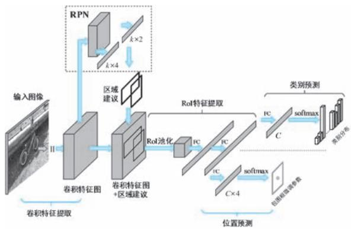  
a)

  
b)   
●图 6-25 Faster R-CNN 与 Yolo-V1 两种目标检测模型架构的对比示意a）Faster R-CNN 两阶段架构示意 b）Yolo-V1 单阶段架构示意

接下来即进入我们正题———DETR。2020 年 5 月，Nicolas Carion 等[1] 六名来自 Facebook AI 的学者在 arXiv 提出大名鼎鼎的目标检测 Transformer （DEtection TRansformer）模型，简称 DETR。随后该文章在当年的ECCV 大会上正式公布。DETR 一经提出，就在CV 领域引发了轰动，甚至一度被认为最有可能获得 ECCV 2020 最佳论文奖。之所以 DETR 能够引起如此强烈的反响，主要在于其创造了两个 “第一”：DETR 是第一个成功将 Transformer 架构应用 CV 任务的模型；DETR 是第一个真正意义上的端到端目标检测模型———模型输出的就是最终目标检测结果，什么后处理都不用。因此，即无论是模型架构还是任务模式，DETR 无疑都是里程碑式的工作。

我们先来看 DETR 模型的整体架构。如图6-26 所示，DETR 的整体架构分为四个部分：CNN 特征提取主干网络、Transformer 编码器、Transformer 解码器和目标检测头结构。其中，CNN 特征提取主干

网络用来获取图像的二维特征表示。对于输入图像 $\pmb { x } \in \mathrm { R } ^ { H _ { 0 } \times W _ { 0 } \times 3 }$ ，CNN 结构对其进行逐级特征提取，最终得到一个具有 1 / 32 降采样的特征图 $\pmb { f } \in \operatorname { R } ^ { H \times W \times C }$ 作为特征表示，其中， $H = H _ { 0 } / 3 2$ 、 $W = W _ { 0 } / 3 2$ 为输出特征图的高度和宽度， $C$ 为通道数。在具体实现时，DETR 选择了 ResNet50 和 ResNet101 两种 CNN 主干结构，对应的 DETR 模型分别被称为 “DETR-R50”和 “DETR-R101”。除此之外，作者们还尝试了在上述两种 ResNet 模型的最后阶段使用膨胀卷积等改造，对应的 DETR 模型分别叫作 “DETR-DC5”和“DETR-DC5-R101”。Transformer 编码器的作用即为对上述特征进行逐级编码，利用自注意力机制来构建特征之间的全局关系。DETR 使用的 Transformer 编码器具有六层结构，每一个编码器与标准编码器结构也别无二致，都具有多头自注意力和全连接前馈网络两个子模块。当然，为了让特征能够与Transformer 编码器相匹配，DETR 首先利用 $1 \times 1 \times d$ 卷积特征图 $f$ 进行进一步加工，将特征图维度 （即通道数） 从 C 降低到 Transformer 所需的维度 d （如 C = 2048，d = 256），得到特征图记作 z0 ∈RH×W×d 。 $C$ $d$ $C = 2 0 4 8$ $d = 2 5 6$ $z _ { 0 } \in \mathrm { R } ^ { H \times W \times d }$ 除此之外，考虑到 Transformer 不会考虑输入序列中各元素的顺序，为了让特征带有位置信息，DETR也在输入特征上添加了固定位置编码。上述添加位置信息的实现非常简单，构造一个 $H \times W \times d$ 维的灰度渐变图，直接添加到 $z _ { 0 }$ 上即可。最后，再将带有位置信息的特征图展平为 $H W { \times } d$ 维的特征序列作为Transformer 编码器的输入。Transformer 编码器最终将输出一个 $H W { \times } d$ 维特征序列，作为输入序列的编码表示。Transformer 解码器用来产生固定个数的目标特征。Transformer 解码器的输入序列具有固定长度，用 $N$ 表示，该值即表示一幅图像中可能产生的最多目标个数，在 DETR 中， $N = 1 0 0$ 。Transformer解码器的输入为一个 $N { \times } d$ 维特征序列，称为 “目标查询”（object queries）。目标查询序列中的特征以位置编码作为初值，在随后的训练中连同模型的其他部分一起更新。这些目标查询特征输入解码器后，解码器中的编-解码器注意力模块以其作为查询，在编码特征上查询并进行注意力特征融合，经过反复的注意力加工，最终得到 $N { \times } d$ 维的输出特征序列。因此，如果将Transformer 解码器看作一个生成器的话，目标查询可以视为是生成过程的种子点 （当然在训练阶段，种子点也参与训练）；如果与之前基于锚点 （anchor-based） 的目标检测模型作类比，那么目标查询就扮演了锚点（anchor） 的角色——— 以位置编码作为初值，相当于在不同位置上进行了 “锚定”。随后，解码器借助注意力机制，结合图像特征 （体现为编码器得到的编码）在这些锚点特征上进行调整，得到最终目标特征。需要说明的是，相较于标准 Transformer 解码器以自回归方式逐个产生输出的方式，DETR 解码器以并行输入、

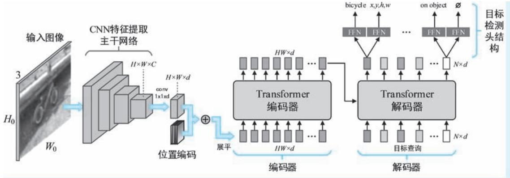  
. 图 6-26 DETR 整体架构示意

并行加工的方式进行，一次性得到全部 $N$ 个输出。目标检测头结构用来输出最终的目标检测结果。Transformer 解码器输出 $N$ 个 $d$ 维特征，每一个特征都会分别送入两个全连接网络结构，分别进行对象类别的预测和对象目标的预测。其中，前者通过 softmax 函数产生一个 $K + 1$ 维的概率预测，其中 $K$ 为目标类别总数， $+ 1$ ”表示背景类别，即 “no object”类；后者将输出一个长度为 4 的向量表示目标框的位置。我们看到，DETR 一次性输出全部目标预测结果，这些预测目标之间没有顺序，也没有相互关系，因此 DETR 采用的目标检测往往被称为 “集合预测” （set prediction） 模式。可以看出，DETR 真正做到了一端送图像、一端取结果的端到端预测，没有诸如 NMS 后处理操作，整个过程一气呵成，非常简洁流畅。

接下来我们来讨论 DETR 模型的训练损失函数设计。我们知道，所有的监督学习都需要计算预测和真值间的损失，才能通过梯度下降的方式监督模型训练。而在目标检测任务中，要想计算损失，前提就是我们必须知道预测目标和真值目标之间的匹配关系。例如，我们需要训练一个针对猫的检测模型，某幅作为训练样本的图像上已经正确标注了两个猫的目标框。我们也通过模型预测了若干目标框。所谓匹配问题，就是需要在我们预测的目标框中，确定哪些框是 “奔着”第一只猫去的，哪些框试图以第二只猫为目标。只有这样，才能让真值目标作为老师，督促模型不断向好。在绝大多数现有的目标检测模型中，上述匹配关系都是通过计算预测目标框和真值目标框之间的重叠度来实现：那些与真值目标框重叠大于某一阈值的预测目标框即作为与真值匹配的预测目标框。但是，上述模式会产生多对一的匹配关系，毕竟与真值目标框具有高重叠度的预测目标框不见得只有一个。既然训练时允许多对一，那预测时也一定会出现一个目标上套着多个包围框的问题，于是基于NMS 的后处理环节就变得必不可少。但是，DETR 号称不需要 NMS 的后处理操作，那么就只能使用一对一的匹配方式。DETR 一次性的产生固定的 $N$ 个目标预测，而图像中实际的目标数量小于该值且随机，那么所谓的一对一匹配问题，就是在预测目标和真值目标两个集合里确定哪些元素具有最合理的一一对应关系，“一个萝卜一个坑”。我们用 $\boldsymbol { y } = \left\{ \boldsymbol { y } _ { i } \right\} _ { i = 1 } ^ { N ^ { \prime } }$ 表示真值目标集合，其中， $N ^ { \prime }$ 为真值目标的个数；用 $\hat { y } = \left\{ \hat { y } _ { i } \right\} _ { i = 1 } ^ { N }$ 表示 DETR 的 $N$ 个预测目标，这里有 $N { > } N ^ { \prime }$ 。首先，为了方便匹配，DETR 在集合 $y$ 中填充空元素“∅”（即表示 “no object”类别），使得两个集合的元素数量相等，然后通过最小化如下综合代价函数来确定两个集合的一一匹配方案

$$
\hat {\sigma} = \arg \min  _ {\sigma \in \mathfrak {S} _ {N}} \sum_ {i = 1} ^ {N} \mathcal {L} _ {\text {m a t c h}} \left(y _ {i}, \hat {y} _ {\sigma (i)}\right) \tag {6-17}
$$

式中， $\mathfrak { S } _ { N }$ 表示所有匹配方案的集合； $\mathcal { L } _ { \mathrm { m a t c h } } \big ( y _ { i } , \hat { y } _ { \sigma ( i ) } \big )$ ）即表示真值目标 $\dot { \cdot } y _ { i }$ 与以 $\sigma ( i )$ ）为下标的预测目标之间的两两匹配代价。上述优化目标的最优解即在所有可能的匹配方案中使得代价之和达到最小的匹配方案。该问题为一个标准的二分图匹配（bipartite matching）问题，DETR 采用经典的匈牙利算法（Hun-garian algorithm）对其进行求解。关于二分图匹配和匈牙利算法的相关问题，请读者自行查阅文献，这里不再赘述。无论是预测目标还是真值目标，都包括了类别和位置两方面内容，故 $\mathbf { \mathcal { I } } _ { i }$ 可以进一步写作 $\mathrm { : } y _ { i } = \left( c _ { i } , b _ { i } \right)$ ），其中 $c _ { i }$ 和 $b _ { i }$ 分别表示真值y 的类别标签 （包括 “no object”类别）和包围框相对坐标。匹配代价函数自然也包含了对上述两方面的综合考量，具体的定义为： $\mathcal { L } _ { \mathrm { m a t c h } } ( \boldsymbol { y } _ { i } , \hat { \boldsymbol { y } } _ { \sigma ( i ) } ) = - \mathbf { 1 } _ { \left\{ c _ { i } \neq \emptyset \right\} } \hat { p } _ { \sigma ( i ) } ( c _ { i } ) +$ $\mathbf { 1 } _ { \{ c _ { i } \neq \emptyset \} } \mathcal { L } _ { \mathrm { b o x } } ( b _ { i } , \hat { b } _ { \sigma ( i ) } )$ ），其中， $\mathbf { 1 } _ { \{ \mathrm { e x p r } \} }$ ” 为一个 0-1 二值函数———当 expr = true 时， $\mathbf { 1 } _ { \{ \mathrm { e x p r } \} } = 1$ ，否则$\mathbf { 1 } _ { \{ \mathrm { e x p r } \} } = 0$ ；上式中的 $\mathbf { 1 } _ { \{ c _ { i } \neq \emptyset \} }$ }即表示只考虑那些真值目标的类别不是 “no object”的情况； $\hat { p } _ { \sigma ( i ) } ( c _ { i } )$ ）表示

对于预测目标 $\hat { \ y } _ { \sigma ( i ) }$ ，其类别预测为 $c _ { i }$ 的概率，显然这是类别正确的情况，故第一项为负，表示对该情况进行奖励； $\mathcal { L } _ { \mathrm { b o x } } ( b _ { i } , \hat { b } _ { \sigma ( i ) }$ ）即表示真值目标包围框与预测包围框之间的位置损失。建立了一对一匹配关系，即可以计算预测目标与真值目标之间的损失。损失函数的定义与 $\mathcal { L } _ { \mathrm { m a t c h } }$ 的定义非常接近，也包含了类别损失和位置损失两项，其具体定义为

$$
\mathcal {L} _ {\text {H u n g a r i a n}} (y, \hat {y}) = \sum_ {i = 1} ^ {N} \left[ - \log \hat {p} _ {\hat {\sigma} (i)} \left(c _ {i}\right) + \mathbf {1} _ {\{c _ {i} \neq \varnothing \}} \mathcal {L} _ {\text {b o x}} \left(b _ {i}, \hat {b} _ {\hat {\sigma} (i)}\right) \right] \tag {6-18}
$$

式中，需要读者注意两个问题：第一，由于损失计算是在最优匹配方案已经确定的基础上进行的，故所有的预测目标的下标都 “戴了帽子”；第二，与上文中对 $\mathcal { L } _ { \mathrm { m a t c h } } ( y _ { i } , \hat { y } _ { \sigma ( i ) }$ ）函数定义不同的是，本式中的第一项没有进行 $\mathbf { \ddot { \Pi } } ^ { 4 6 } \mathbf { 1 } _ { \{ c _ { i } \neq \varnothing \} }$ }”过滤，这是因为我们不仅需要计算目标正样本的类别预测损失，还需要计算负样本的类别损失。式 （6-18）中的第一项就是标准类别的交叉熵损失。简单来讲，式 （6-18）表示了无论预测为目标还是背景，都会计算类别预测损失，但是只有其中预测为目标的才有真值目标与之对应，因此才会进一步计算包围框损失。在 DETR 中，包围框预测损失 $\mathcal { L } _ { \mathrm { b o x } } ( b _ { i } , \hat { b } _ { \hat { \sigma } ( i ) }$ ）定义为 GIoU损失和 L1 损失的合成，有

$$
\mathcal {L} _ {\text {b o x}} \left(b _ {i}, \hat {b} _ {\hat {\sigma} (i)}\right) = \lambda_ {\mathrm {i o u}} \left(b _ {i}, \hat {b} _ {\hat {\sigma} (i)}\right) + \lambda_ {\mathrm {L 1}} \left\| b _ {i} - \hat {b} _ {\hat {\sigma} (i)} \right\| _ {1} \tag {6-19}
$$

式中， $\lambda _ { \mathrm { i o u } }$ 和 $| \lambda _ { \mathrm { L 1 } }$ 分别表示平衡 GIoU 损失和 L1 损失的权重因子。回过头去，我们可能已经感受到DETR 在预测真值匹配、损失函数的设计两方面，与已有基于锚点的目标检测模型并无本质区别。但是，DETR 为了规避冗余预测，要求匹配必须一对一，从而保证在预测阶段，目标的预测产生也是一步到位。

DETR 采用了完整的 Transformer 编码器-解码器架构。那么我们不禁要问，编码器和解码器中的注意力在目标检测中到底起到什么作用？针对上述问题，作者们在文章中开展了非常有趣的可视化实验和分析。第一组可视化实验用来分析 Transformer 编码器自注意力机制的作用。作者们在图像的不同目标物上各选择一个点，分别以这些点作为查询，看看编码器自注意力权重的分布情况。可视化结果表明，上述查询点在自身物体上都投射了较强的注意力，甚至注意力热图体现出了实例分割的效果。图6-27a 示意了这一现象 （该图为示意图，并不是真实模型的运行结果，下同）。第二组可视化实验用来分析 Transformer 解码器注意力机制的作用。作者们将预测不同目标对应特征的注意力权重进行了可视化，结果表明，不同目标的注意力都分布在其局部位置，如物体边缘等，6-27b 为这一现象的示意图。经过上述两种可视化分析，作者们得到的最终结论为：DETR 使用的 Transformer 编码器和解码器在整个模型中都起到关键作用，前者站在全局视角利用自注意力机制有效拆分对象实例，而后者基于前者的输出，利用注意力机制捕获不同对象的关键特征用于后续任务。

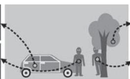  
a）

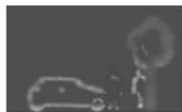  
b)   
●图 6-27 编码器与解码器注意力作用示意 （注：该图为示意图，并不是真实算法的运行结果）a）编码器自注意力权重分布示意 b）解码器注意力权重分布示意

最后我们简单来聊一聊 DETR 的表现。首先自然是目标检测任务上的表现，测评数据集为 COCO2017。DETR 和 Faster R-CNN 系列模型㊀①的对比结论为：DETR 最优版本———DETR-DC5-R101 模型与Faster R-CNN-R101-FPN $^ +$ 模型的平均 AP 指标难分伯仲，而 Faster R-CNN 在执行速度上更具优势。除此之外，作者们还对目标进行了大、中、小尺寸的细分，分别比较上述三种尺寸物体下两种模型的表现差异。结论为：对于小目标，Faster R-CNN-R101-FPN $^ +$ 模型具有显著优势，而对于中、大尺寸目标物，DETR-DC5-R101 则更具优势。作者分析产生上述现象的原因主要在于 DETR 采用全局注意力机制，故无论目标物有多大，DETR 都能有效应对。然而，DETR 的结构太过简单，没有采用锚点和多尺度检测机制，也没有使用过于精致的目标检测头结构，故对小目标的检测不够友好。除了目标检测，作者们还对 DETR 进行了全景分割（panoptic segmentation） 任务的实验。结果表明，较于 Panop-ticFPN $^ { + + }$ 、UPSnet 等经典全景分割模型，DETR 也能取得相当出众的效果。

到这里，我们对 DETR 模型的讨论就告一段落了。DETR 将 Transformer 编码器-解码器架构引入CV 目标检测模型，将目标检测视为集合预测任务，大幅精简了目标检测模型的架构和流程。不得不说，DETR 的确是一项非常具有开创性的工作。但是 DETR 也存在着诸如训练时间长、对小目标的检测能力差的问题。但是，瑕不掩瑜，开山之作往往都不是完美的。相较于上述问题，人们更多看到的是 DETR 的潜力，随后产生了 DETR 的诸多变体模型。这些后继的 “DETR 们”正是沿着 DETR 开启的方向，不断提高目标检测以及其他 CV 任务的水平。

# 2. Deformable DETR：基于可变形注意力的端到端目标检测

在上文中，我们详细讨论了大名鼎鼎的 DETR 模型，该模型作为第一个真正意义上的端到端目标检测模型，其优势和重大意义想必大家已经深有感受，这里便不再多说，下面我们只说问题。在DETR 原文最后的结论部分，作者们也坦言，DETR 存在两个亟须改进的问题：一个是训练模型需要很长的时间，另一个是模型对小目标的检测能力不足。

2020 年 10 月，Xizhou Zhu 等[2]六名学者在 arXiv 上联袂提出 “可变形 DETR ” （DeformableDETR）模型，旨在解决上述两个问题。该工作随后在次年的 ICLR 会议上正式公布，作者单位涉及商汤科技、中国科学技术大学和香港中文大学。作者们对 DETR 产生上述问题的原因进行了分析：第一个问题是由于 Transformer 注意力机制的全局作用特性所导致———在初始初始阶段，随机初始化的注意力权重 “雨露均沾、不偏不倚”，丝毫未起到划重点的作用。而在一幅图像中，真正需要注意的区域往往是小且稀疏的。因此，模型需要大量的迭代才能让注意力真正 “活跃”起来，去注意那些具有重要价值的局部位置。实际也的确如此，例如，在 COCO 数据集上，DETR 需要迭代 500 轮才能收敛。第二个问题来自 DETR 的架构设计。很多现代目标检测模型都采用了多尺度架构，在高分辨率特征图上预测小目标，在低分辨率的特征图上预测大目标。但是 DETR 的目标预测仅在单一尺度上进行。而且，考虑到为了降低 Transformer 的计算压力，DETR 利用前置的 CNN 主干网络将特征图的尺寸降低至输入图像尺寸的1/32，小目标的特征早已不复存在。如果直接增加输入图像或特征图的分辨率以改善特征图的细节信息，那么 DETR 中自注意力所需的计算量将激增。

Deformable DETR 的作者们解决上述问题的心路历程大致是这样的：几乎所有的问题都是出在Transformer 上———全局注意力一方面计算量太大，以至于人们不敢轻易提升输入图像或特征图的分辨率，另一方面，全局注意力从均匀投射到有重点的稀疏投射，需要耗费长时间的迭代训练。那么是否可以变全局为局部，只让部分的元素参加注意力的计算？除此之外，目标物有圆有方、有长有扁，使用固定尺寸的局部注意力计算肯定不是最佳选择，那么是否可以让参与注意力计算的区域是一个可变的任意区域呢？正巧，MSRA 在早先提出的可变形卷积（Deformable Convolution）就采取了类似的思路，通过在规则的卷积网格上添加可学习的偏移，从而实现基于更加贴合物体形态区域的特征提取。但是，卷积不能进行关系建模，那么一个最佳的解决方案莫过于让注意力机制像可变形卷积那样工作。于是，我们的主角— —可变形注意力（Deformable Attention）在这一思路下诞生。图 6-28 示意了全局注意力、局部固定区域注意力和可变形注意力的工作模式对比。

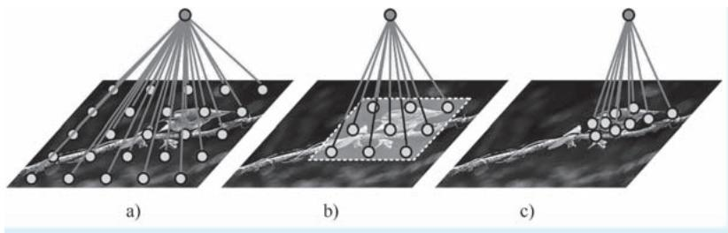  
●图 6-28 全局注意力、局部固定区域注意力和可变形注意力的工作模式对比示意a）全局注意力 b）局部固定区域注意力 c）可变形注意力

在 Deformable DETR 中，实 现 上 述 机 制 的 模 块 即 为 可 变 形 注 意 力 模 块 （Deformable AttentionModule）。无论输入特征图的空间大小如何，可变形注意力模块的注意力权重只会投射在参考位置（reference location）㊀①周围的一小组关键采样点上，从而规避了标准注意力 “全员参与”带来的计算量问题。请读者注意，这里的 “参考位置”即特征图上的一个计算注意力区域的基准位置，而 “关键采样点”即通过在参考位置上添加位置偏移量，得到的若干新位置，这些位置对应的特征即后续注意力加工的数据来源。Deformable DETR 的可变形注意力模块也具有多头结构，下面我们 “从简入奢”，先从单头注意力谈起。首先我们有一个查询向量 $\boldsymbol { z } _ { q } \in \operatorname { R } ^ { C }$ ，和一个输入特征图 $\pmb { x } \in \operatorname { R } ^ { H \times W \times C }$ ，在特征图上有一个参考位置，记作 $\pmb { p } _ { q } = ( x _ { q } , y _ { q } )$ ）；我们将 $\pmb { p } _ { q }$ 对应在特征图上的特征称记作 $x _ { p _ { q } }$ （即在特征图 $\pmb { p } _ { q }$ 的位置沿通道方向 “挖”一个向量）。则针对查询 $z _ { q }$ 、特征图 $\boldsymbol { x }$ ，以及其上的基准位置 $\pmb { p } _ { q }$ ，单头版可变形注意力的计算方法为

$$
\text {a t t e n t i o n} _ {s h - d e f} \left(\boldsymbol {z} _ {q}, \boldsymbol {p} _ {q}, \boldsymbol {x}\right) = \sum_ {k = 1} ^ {K} A _ {q, k} \cdot \left(\boldsymbol {W} ^ {V} \cdot \boldsymbol {x} _ {\boldsymbol {p} _ {q} + \Delta \boldsymbol {p} _ {q, k}}\right) \tag {6-20}
$$

式中， $K$ 为参与注意力计算的特征个数， $K { \ll } H { \times } W$ ； $\Delta \pmb { p } _ { q , k } \in \operatorname { R } ^ { 2 }$ 表示相对于参考位置的第 $k ( k = 1 , \cdots , K )$ 个坐标偏移量，该偏移量是由查询特征 $z _ { q }$ 通过一个可学习的线性变换预测得到； $x _ { p _ { q } + \Delta p _ { q , k } }$ 则表示在特征图 $\boldsymbol { x }$ 上位于位置 $\pmb { p } _ { q } + \Delta \pmb { p } _ { q , k }$ 的特征； $\boldsymbol { W } ^ { V } \in \mathrm { R } ^ { c \times c }$ 为可学习的线性变换矩阵，变换的结果即得到用于注意力

计算的值向量； $A _ { q , k }$ 即由查询向量和键向量计算得到的概率化注意力权重， $\sum _ { k = 1 } ^ { K } A _ { q , \ k } = 1$ 。 这里的查询向量为原始查询向量的线性变换 ${ \cal W } ^ { \boldsymbol { Q } } \cdot \boldsymbol { z } _ { \boldsymbol { q } }$ ，键向量为图像特征的线性变换 $\boldsymbol { W } ^ { K } \cdot \boldsymbol { x } _ { p _ { q } + \Delta p _ { q , k } }$ ，其中 $W ^ { Q }$ $\mathbf { { \mathbf { } } } W ^ { Q } , W ^ { K }$ $\in \mathbf { R } ^ { c \times c }$ 均为可学习的线性变换矩阵；最外层的求和即利用该权重执行对 $K$ 个值向量的加权求和，即得到由采样点聚合得到的 $z _ { q }$ 对应的聚合特征。说完基本原理，还需要补充说明两个问题：第一，上述注意力的查询向量与键-值集合并不同源，这是为了更一般化的考量。只有在自注意力模式下，查询向量z 就是来自特征图 $\boldsymbol { x }$ 位于 $\pmb { p } _ { q }$ 的特征 $x _ { p _ { q } }$ ，即某特征与自己周边的特征计算注意力；第二，通过神经网络预测的结果难以是整数，故特征 $x _ { p _ { q } + \Delta p _ { q , k } }$ 是通过其周边特征双线性插值得到。图 6-29 示意了可变形注意力模块的工作机制 （以单头注意力为例，其中 $K = 4$ ）。

  
●图 6-29 可变形注意力模块的工作机制示意 （以单头注意力为例，其中 $K { = } 4$ ）

假设注意力为 $M$ 头结构，我们可以很容易地将式 （6-20）所示的单头版本注意力计算方法拓展为多头版，所需操作只有三步：第一，将线性变换矩阵、坐标偏移量和注意力权重改造为每头一份的模式，我们只需在相关符号的下标部分添加头结构下标 $m ( m = 1 , \cdots , M )$ ）即可；第二，为了降低计算量，各头注意力都会采用低维特征，这里我们将此维度表示为 $C _ { v }$ ，而 $C _ { v } = C / M$ 。因此，对应的线性变换矩阵的维度也需要随之调整，如其中 $W ^ { Q }$ 、 $\boldsymbol { W } ^ { K }$ 和 $W ^ { V }$ 的维度均需要从 $C { \times } C$ 变为 $C _ { v } { \times } C$ ；最后，还需要添加多头注意力的特征变换和融合操作。综上所述，多头版可变形注意力的计算方法为

$$
\begin{array}{l} \text {a t t e n t i o n} _ {\text {m h - d e f}} \left(\boldsymbol {z} _ {q}, \boldsymbol {p} _ {q}, \boldsymbol {x}\right) \tag {6-21} \\ = \sum_ {m = 1} ^ {M} \boldsymbol {W} _ {m} \left[ \sum_ {k = 1} ^ {K} A _ {m, q, k} \cdot \left(\boldsymbol {W} _ {m} ^ {V} \cdot \boldsymbol {x} _ {\boldsymbol {p} _ {q} + \Delta \boldsymbol {p} _ {m}, q, k}\right) \right] \\ \end{array}
$$

式中， $\boldsymbol { W } _ { m } \in \mathrm { R } ^ { C \times C , }$ 为针对第 $m$ 头注意力的线性变换矩阵，该线性变换将各头注意力输出特征的维度从$C _ { v }$ 维恢复到 $C$ 维；最外层的求和即多头融合操作。

接下来我们来看看 Deformable DETR 的多尺度结构设计。一说到多尺度目标检测，我们最先想到的恐怕就是特征金字塔网络（Feature Pyramid Network，FPN）结构。但是 Deformable DETR 的作者们在文中开宗明义——— “我们的多尺度模型不需要 FPN”。Deformable DETR 多尺度结构的设计可谓十分直接大胆：在式 （6-21）中，我们只有一个特征图 $\boldsymbol { x }$ ，那么如果我们有 “一摞”多尺度特征图，并且将在单层特征图上的坐标偏移和注意力特征融合扩展到多层的立体空间中呢？这便是多尺度可变形注意

力的基本思想。令 $\{ \boldsymbol { x } ^ { l } \} _ { l = 1 } ^ { L }$ 为 $L$ 个多尺度特征图， $\pmb { x } ^ { l } \in \mathbb { R } ^ { H _ { l } \times W _ { l } \times C }$ 为其中第 $l$ 个层级的特征图；令 $\hat { \pmb { p } } _ { { \boldsymbol q } } \in [ 0 , 1 ] ^ { 2 }$ 表示归一化参考位置。按照上述思路，对式 （6-21） 进行扩展，得到 Deformable DETR 的多尺度可变形注意力的计算方法，有

$$
\begin{array}{l} \text {a t t e n t i o n} _ {\text {m s - d e f}} \left(\boldsymbol {z} _ {q}, \hat {\boldsymbol {p}} _ {q}, \left\{\boldsymbol {x} ^ {l} \right\} _ {l = 1} ^ {L}\right) \tag {6-22} \\ = \sum_ {m = 1} ^ {M} \boldsymbol {W} _ {m} \left[ \sum_ {l = 1} ^ {L} \sum_ {k = 1} ^ {K} A _ {m, l, q, k} \cdot \left(\boldsymbol {W} _ {m} ^ {V} \cdot \boldsymbol {x} _ {\phi_ {l} (\hat {\boldsymbol {p}} _ {q}) + \Delta \boldsymbol {p} _ {m, l, q, k}} ^ {l}\right) \right] \\ \end{array}
$$

式中， $\Delta { p } _ { { \scriptscriptstyle m } , l , q , k }$ 表示在第 $m$ 个注意力头中位于第 $l$ 层级的特征图上，第 $k$ 个采样位置的坐标偏移量预测，这里的坐标偏移以绝对坐标表示。另外还需读者注意，上述偏移量在不同层级是不同的； $A _ { \scriptscriptstyle m , l , q , k }$ 为注意力权重矩阵，有 $\sum _ { l = 1 } ^ { L } \sum _ { k \mathop { = } 1 } ^ { K } A _ { m , \ l , \ q , \ k } = 1$ $_ k = 1$ ； 由于这里的 $\pmb { p } _ { q }$ 为归一化坐标，（0，0）和（1，1）分别表示图像的左上角和右下角，这就意味着需要对其进行坐标的绝对化才能计算采样坐标， $\phi _ { l } ( { \pmb p } _ { q } )$ ）即表示在第 l 个尺度的特征图上，对 ${ \pmb p } _ { q }$ 进行的比例放大操作。上述注意力机制背后的思想是非常容易理解的：例如，在一幅人脸图像中，鼻子和眼睛、嘴一定是有关系的，那么我们构造出同一幅图像不同的分辨率版本，鼻子与不同分辨率下的眼睛和嘴的关系仍然存在。这里的鼻子就好比我们的查询向量，而眼睛和嘴则代表了注意力中的键-值向量。

上文我们对 Deformable DETR 的核心注意力模块进行了详细介绍，下面我们就来看看 DeformableDETR 模型的结构。首先在整体架构方面，Deformable DETR 与标准 DETR 类似，也采用了 “前 CNN，后 Transformer”的整体架构———前者为后者提供多尺度特征，而后者进行特征编码和目标预测。在实现时，作者们使用 ResNet 网络作为 CNN 主干来提取多尺度图像特征。下面我们来看看 DeformableDETR 的编码器。首先，Deformable DETR 将标准的 Transformer 编码器模块全部替换为上述多尺度可变形注意力模块。其所需的多尺度特征正是来自前面的 CNN 主干。我们将编码器输入的多尺度特征仍表示为 $\{ \boldsymbol { x } ^ { l } \} _ { l = 1 } ^ { L }$ ，在具体实现时，Deformable DETR 使用了四个层级，即 $L = 4$ 。这四个层级的特征图来自ResNet 主干网络的不同阶段，并通过后续的卷积操作分别进行加工处理：前三个层级的特征图 $\boldsymbol { x } ^ { 1 }$ 、 $\scriptstyle { \mathbf { x } } ^ { 2 }$ 和 $\boldsymbol { x } ^ { 3 }$ ，分别来自 ResNet 网络 $C _ { 3 }$ 、 $C _ { 4 }$ 和 $| C _ { 5 }$ 三个阶段的特征图输出，然后均使用 $1 \times 1 \times 2 5 6$ 卷积进行降维操作 （ResNet 三个阶段输出特征图的通道数分别为 512、1024 和 2048）， $\boldsymbol { x } ^ { 1 }$ 、 $\scriptstyle { \mathbf { x } } ^ { 2 }$ 和 $\boldsymbol { x } ^ { 3 }$ 相较于原始图像，降采样率分别为 1 / 8、1 / 16 和 1 / 32；第四个层级特征图 $x ^ { 4 }$ 同样来自 $C _ { 5 }$ 阶段的特征图输出，只不过随后的卷积操作不再是 $1 \times 1 \times 2 5 6$ ，而是 $3 \times 3 \times 2 5 6$ ，并且步长为 2，因此特征图 $\scriptstyle { \mathbf { x } } ^ { 4 }$ 的分辨率为原始图像的1/ 64。Deformable DETR 每一层编码器的输入输出形式，均为与 $\{ \boldsymbol { x } ^ { l } \} _ { l = 1 } ^ { L }$ 具有相同分辨率的多尺度特征图。我们假设某层编码器的输入为 $\{ \boldsymbol { x } ^ { l } \} _ { l = 1 } ^ { L }$ ，输出为 $\{ \mathbf { y } ^ { l } \} _ { l = 1 } ^ { L }$ ，则单个编码器的工作流程为：遍历 $\boldsymbol { x } ^ { l }$ 中的每一个特征，以其作为查询向量，以其位置作为参考位置，然后通过在不同层级上预测坐标偏移获得需要注意的若干特征 （如图6-30 三角形所示），然后执行注意力权重的计算和特征合成，再经过FFN、归一化等操作，最终得到的结果即作为 $\mathbf { y } ^ { l }$ 中对应位置的输出特征 （如图 6-30 圆圈所示）。最后，按照上述方式遍历输入中的所有层级。说完编码器，我们再来看看 Deformable DETR 的解码器。与标准DETR 相同，Deformable DETR 解码器的输入也是一个以位置编码为初值目标查询序列。在每一个解码器层中，都包括了两个串联的注意力模块 （当然还有归一化和全连接前馈网络操作），第一个为标准的多头自注意力模块，在该模块中，目标查询向量内部进行交互和特征融合，注意力的键-值集合均是查询向量序列自身；第二个注意力模块称作 “多尺度可变形交叉注意力”（multi-scale deformable cross-

attention）模块，其实质还是用于编码器和解码器数据通信的编-解码注意力模块，只不过相较于Transformer 标准编-解码器注意力模块，Deformable DETR 将其替换为了多尺度可变形注意力模块。在该模块中，解码器输入的目标查询向量即作为注意力计算的查询向量，而编码器输出的多尺度特征图则作为注意力的键和值，以目标查询在编码器输出特征图上进行特征融合。对于某一目标查询向量，Deformable DETR 首先通过一个可学习的线性变换，将其映射为一个长度为 2 的向量，然后再利用sigmoid 函数将其元素都压缩到（0，1）范围，即作为其对应的归一化参考位置 $\hat { { \pmb p } } _ { \textsc { q } }$ 。图 6-30 示意了Deformable DETR 的完整架构。

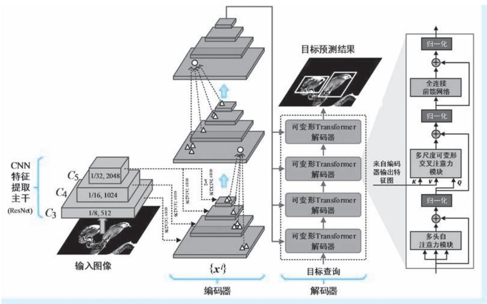  
●图 6-30 Deformable DETR 目标检测模型的整体架构示意

在原文中，作者们还讨论了诸多 Deformable DETR 模型的细节问题，但是考虑到与本书内容的相关性，这里就不再详细讨论。下面我们直接看 Deformable DETR 的表现。第一组实验在 Faster R-CNN+FPN、DETR 和 Deformable DETR 三种模型之间展开，实验结论为：在训练时间方面，Deformable DETR在 COCO 2017 数据集上，比另外两个模型所需的训练时间都短，特别是与公认训练慢的 DETR 相比，Deformable DETR 的训练时间缩短为其 1 / 10；在推理速度方面，由于 Deformable DETR 将全局注意力改为局部注意力，使得注意力机制的计算量大幅降低。相较于 DETR，Deformable DETR 的推理速度提升到其1. 6 倍，该速度仅比以快著称的 Faster R-CNN 慢了 $20 \%$ ；在检测精度方面，相较于 DETR，De-formable DETR 的目标检测精度，特别是对小目标物的检测精度有明显提高。特别地，在迭代包围框精调和两阶段目标检测模式 （即带有区域建议生成环节的 Deformable DETR 模型）的加持下，DeformableDETR 的精度优势变得更加明显；第二组实验为 “SOTA”排名对比。结论为：在使用迭代包围框精调和两阶段目标检测模式的基础上，使用 ResNet101 和 ResNeXt101 作为 CNN 主干网络，Deformable

DETR 的目标检测的 AP 精度分别达到 $4 8 . 7 \%$ 和 $4 9 . 0 \%$ ；若再将标准 CNN 主干也 “可变形化”———替换为可变形卷积版的 ResNeXt101，则 Deformable DETR 的目标检测精度能够进一步提高到 $5 0 . 1 \%$ ；如果在测试阶段运用水平翻转和多尺度变换层测试时增广 （test-time augmentation，即所谓的 “TTA”），则 Deformable DETR 的目标检测精度能够达到 $5 2 . 3 \%$ 。

# 6. 3. 3 图像分割

图像语义分割 （Semantic Segmentation）作为初级 CV 任务，在图像的每一个位置预测一个语义类别，为后续分析提供区域标注信息。Transformer 在 CV 领域开始 “试水”以来，人们不禁又要提出那个熟悉的问题———将基于 CNN 的图像分割模型换为 Transformer 是否可以？答案是肯定的。下文我们即对两种基于 Transformer 的图像分割模型进行剖析。

# 1. SETR：“Tranformer 版”FCN

CNN 中的 FCN 以其具有的密集预测优势，一直是图像语义分割任务中的绝对霸主。但是在 Trans-former 诞生后，情况发生改变———2020 年 12 月，来自复旦大学的 Sixiao Zheng 等[8] 11 名学者提出 “图像分割 Transformer ” （SEgmentation TRansformer，SETR） 模型，可以视为是以 Transformer 撼动 FCN 霸主地位的开始。

语义分割与图像分类最大的区别在于：语义分割为逐位置的密集预测任务，因此不能破坏图像的二维结构。同时，还要求得到的区域边缘尽可能清晰、鲜锐，即分割图的分辨率要足够高。面对第一个要求，FCN 不会像 CNN 那样在最后添加 “拉向量” 操作，而是针对输入图像采取一路卷积操作，这正是 “全卷积”的含义。上述层级卷积结构一般被称为编码器，用于压缩图像的分辨率并逐级提取更加抽象的语义特征。然而，随着特征图尺寸的不断降低，分割结果的分辨率必然难以保证。因此，很多 FCN 模型又会在编码器结构上添加一些附加结构以保证模型能够产生高分辨率的分割图，这些附加模块一般也被称为解码器。最为典型的解码器结构有两种：第一种，在后方添加由反卷积层构成的解码器结构，不断将在编码器中损失的分辨率再 “卷上去”；第二种，添加多尺度特征融合机制，将浅层特征直接 “拉到”最后去与深层特征整合，把损失的细节特征再 “补回去”。到这里，我们实际上已经对 SETR 的架构有了清晰的认识———SETR 以 Transformer 编码器作为语义分割模型的编码器（即主干网络），然后分别基于反卷积和多尺度特征融合两种附加结构构造了两种 SETR 模型，分别称为 SETR-PUP 和 SETR-MLA （后缀 “PUP” 和 “MLA” 分别是 “Progressive UPsampling” 和 “Multi-Level feature Aggregation” 的简写）㊀①。图 6-31 示意了 SETR 模型的整体架构 （以大规模版为例）。

可以看出，SETR 的编码器基本上就是一个标准的 ViT 模型，只不过因为不是应用于分类任务，故无需在输入序列最前面插入类别符号。编码器的输入也是基于图像块特征进行———图像首先被拆分为 $1 6 \times 1 6$ 个图像块，然后通过线性嵌入并添加位置嵌入向量后作为编码器的输入。我们将 SETR 编码器的层数记作 $L _ { e }$ ，将所有编码器的输出记作 $\{ Z ^ { l } \} _ { l = 1 } ^ { L _ { e } }$ ， $\boldsymbol { Z } ^ { l } \in \mathrm { R } ^ { ( H W / N ^ { 2 } ) \times d }$ ，其中 $d$ 即为 Transformer 编码器的

中间特征维度。例如，在图6-31 的示例中， $d = 1 0 2 4$ 。接下来，作者们给出了两种具有不同结构解码器的 SETR 模型，其中，第一种是 SETR-PUP 模型。SETR-PUP 的解码器仅针对编码器最后一层输出$Z ^ { L _ { e } }$ （也是整个编码器的最终输出）进行加工，运用一系列反卷积以不断提高特征图的分辨率。首先，通过形状恢复将 $\cdot \frac { H W } { 1 6 ^ { 2 } } { \times } d$ 维特征序列恢复为 $\frac { H } { 1 6 } { \times } \frac { W } { 1 6 } { \times } d$ 维的特征图形式。接下来，在上述特征图上连续进行四次 $\times 2$ 上采样的反卷积操作，即将特征图的分辨率恢复到原始水平。其中，最后一个反卷积操作输出的特征通道数即为语义类别数，记作 $K$ 。例如，对于 Cityscapes 数据集， $K = 1 9$ 。最后一个特征图上的每个位置与原始像素一一对应，在每个位置沿着通道维度运用softmax 即可预测该像素对应的予以类别；第二种是 SETR-MLA 模型。MLA 解码器会针对编码器中不同层级的特征进行融合，然后再进行语义类别预测。作者们希望能够通过这样的操作实现 FCN 跨层多尺度特征融合的类似效果㊀：位于编码器浅层的特征被注意力加工的还不够充分，因此想必更加贴近输入图像本身的低级特征。而位于编码器的深层特征已经被注意力机制 “蹂躏”过多次，故理论上具有更加贴近任务目标的语义信息。为了挑选特征所在层级，SETR 引入了层级步长 M 作为控制因子。MLA 解码器处理的层级编码器特征可以

  
●图 6-31 SETR 模型的整体架构示意 （以大规模版为例）

表示为 $\{ Z ^ { m } \}$ } $\cdot \cdot \sp { \prime } { } m = L _ { e } \sp { } / M , 2 L _ { e } \sp { } / M , \cdots , M L _ { e } \sp { } / M \sb { e } \sp { } / M \sb { e } \sp { } \nonumber$ ）。例如，在图 6-31 的示例中，有 $M = 4$ ，故 MLA 解码器加工的编码器特征为 $\{ Z ^ { 6 } , Z ^ { 1 2 } , Z ^ { 1 8 } , Z ^ { 2 4 } \}$ }。获取到 $M$ 个编码器多尺度特征后，MLA 解码器首先也是对其进行形状恢复操作，得到 $M$ 个 $\cdot \frac { H } { 1 6 } { \times } \frac { W } { 1 6 } { \times } d$ 维特征图。接下来即对于这些特征图均进行三层卷积操作，三个卷积操作的卷积核尺寸分别为 $1 \times 1$ 、 $3 { \times } 3$ 和 $3 \times 3$ 。其中第一、三层卷积都会减半特征图的通道数，而第三层卷积还会对特征图进行 $\times 4$ 的空间上采样。因此，经过上述操作，将得到 $M$ 个维度为 $\frac { H } { 4 } \times \frac { W } { 4 } \times \frac { d } { 4 }$ 的特征图。随后，上述特征图进行逐像素融合后，再经过一个 $^ { \cdot \times 2 }$ 上采样的反卷积操作，将特征图的尺寸进一步恢复至 $H \times W$ ，通道数也调整至 $K$ 个通道，接下来即进行逐位置的语义类别预测。

通过设定 Transformer 编码器的各项参数，SETR 也给出了两种不同规模的模型版本———基础版（Base 版）和大规模版 （Large 版）。其中，前者的 Transformer 编码器拥有 12 层，特征维度为 768 维，多头注意力的头数为12。这一参数规模与 ViT-Base 相同；而在后者中，编码器的层数为 24 层，特征维度为 1024 维，多头注意力的头数为 16。大规模版 Transformer 主干结构与 ViT-Large 具有相同的规模。

最后我们来看看 SETR 在图像语义分割任务上的表现。作者们基于 CityScapes、ADE20K 和PASCAL Context 三个主流数据集进行语义分割实验。下面我们直接说结论：针对以上三个数据集，在多尺度推理模式下，采用大规模 Transformer 编码器的 SETR 模型都取得了 “SOTA” 的水平 （在 City-Scapes、ADE20K 和 Pascal Context 数据集上，取得最佳成绩的 SETR 分别使用了 PUP、MLA 和 MLA 解码器结构）。SETR 模型的表现甩出基本 FCN 模型一大截，也超过了 DANet、OCRNet、UperNet 和 Dee-pLab ${ \mathrm { V } } 3 +$ 等经典 CNN 语义分割模型。但是需要说明的是，上述几个 CNN 模型均使用 ResNet101 主干网络，SETR-MLA 模型的参数量是其参数量的5 倍以上。具体的指标请读者自行查阅原文，我们在这里不进行详细讨论。

# 2. SegFormer：高效的多尺度语义分割模型

我们知道，标准 ViT 模型在进行视觉提取与表示时存在着两个显著问题。第一个问题即标准 ViT在单一尺度上进行数据加工，无法进行多尺度的特征表示，这对很多视觉任务、特别是密集预测任务是非常不利的；第二个问题即计算量问题，这是由 Transformer 自注意力机制的性质决定的。这一问题在图像语义分割这种密集预测任务中就体现得更加明显，甚至是难以调和的———要想得到高分辨率的预测结果就不能将图像或特征图缩得太小，但是不缩小计算量又会大到难以接受。

在 ViT 中引进多尺度架构是解决上述问题的有效手段。自从 ViT 诞生以来，为了将其进一步的“CV 化”，很多学者做了大量的努力，我们上文所介绍的 PVT、TNT 等模型，以及大名鼎鼎的 SwinTransformer，都在 Transformer 架构应用时使用了类似 CNN 那样的多尺度架构———一方面以获得多尺度的特征表达，另一方面通过不断降低特征图分辨率以减少自注意力的计算量。然而，我们上文介绍的SETR 模型，其诞生之际，尚处在视觉 Transformer 的起步阶段㊀，上述多尺度主干网络尚未提出。尽

管 SETR 的作者们也通过融合不同层级的特征，在改善特征丰富性方面做出努力，但是受到标准Transformer 结构的限制，难以做到真正意义的多尺度处理。在这一背景下，2021 年 5 月，Enze Xie等[21] 六名来自香港大学、南京大学、英伟达和加州理工学院的学者提出用于语义分割的 SegFormer 模型，通过对编码器和解码器两个结构的改进来提升图像语义分割的水平：在编码器部分，将标准Transformer 编码器 （也即ViT）替换为层级Transformer 编码器，用于提取从精细到粗略的多尺度特征；在解码器部分，使用一个轻量级的完全 MLP （ALL-MLP）解码器，来融合上述多尺度特征。SegFormer 的整体架构如图 6-32 所示。

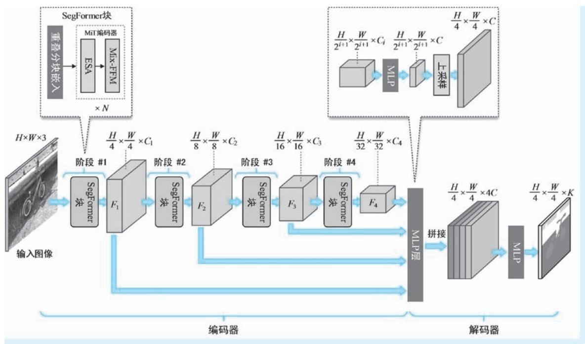  
●图 6-32 SegFormer 模型的整体架构示意

我们先来看看 SegFormer 的编码器结构。针对输入的 $H \times W \times 3$ 图像，编码器通过四个连续的操作阶段对其加工，生成四个不同尺度、不同通道数的特征图 $\{ F _ { 1 } , F _ { 2 } , F _ { 3 } , F _ { 4 } \}$ }。上述四个特征图的分辨率分别为原始图像分辨率的 $\{ 1 / 4 , 1 / 8 , 1 / 1 6 , 1 / 3 2 \}$ }，特征图的通道数记作 $\{ C _ { 1 } , C _ { 2 } , C _ { 3 } , C _ { 4 } \}$ }，其中 $C _ { i } { > } C _ { i - 1 }$ ，即也像 CNN 那样，特征图越小但通道数越多。我们将完成每一个操作阶段的结构称为一个 “SegFormer块”㊀①。每个 SegFormer 块又包括了两个部分：一个重叠块合并（Overlap Patch Merging）模块和 $N$ 个串联的混合 Transformer 编码器（Mix Transformer，以下简称为 “MiT 编码器”）。重叠块合并模块用来调

整特征图的维度，即使得不同阶段的特征图尺寸逐渐缩小，但通道数逐渐增加。具体来说，重叠块合并模块在特征图上利用滑动窗口实现局部特征嵌入变换，因此也可以类似卷积那样，通过设定窗口尺寸、步长和外扩等操作，来控制输出特征的维度。例如，在第一个阶段，设定的窗口尺寸为 $7 \times 7$ 、步长为4、外扩为3，使得输出特征图相对原始输入图像产生1/4 的降采样，在随后的三个阶段的重叠块合并模块中，采用了尺寸为 $3 { \times } 3$ 、步长为 2、外扩为 1 的窗口设置，从而使得输出特征图的尺寸相较于输入特征图均具有1 / 2 的降采样。MiT 编码器与标准 Transformer 编码器类似，也包括了一个自注意力模块和一个全连接前馈网络模块 （当然还包括归一化操作和残差结构）。但是在 SegFormer 中，作者们对上述两个模块进行了改进，分别称为 “高效自注意力” （Efficient Self-Attention，ESA） 模块和“混合全连接前馈网络” （Mix Feed-Forward Network，Mix-FFN）。ESA 模块采取与 PVT 模型 “空间缩小注意力” （SRA）模块相同的思路，即通过引入缩小键-值序列的长度来降低输入的数据规模，使得自注意力机制的计算更加高效。以键序列为例，该操作具体操作方式为：针对维度为 $N { \times } C$ （即 $N$ 个 $C$ 维特征）的键特征序列，首先通过变形操作将其变为 $N / R { \times } C \cdot R$ （即 $N / R$ 个 $C \cdot R$ 维特征），其中， $R$ 为一个缩放因子超参数；然后通过一个可学习的线性变换其中的每一个 $C \cdot R$ 维特征变换回 $C$ 维，即得到 N/ R 个 $C$ 维特征，在特征维度不变的前提下，键序列的长度缩小为原长度的 $1 / R$ 。值序列也采取相同的方式削减长度。可以看出，ESA 模块的本质即将输入序列中相邻的 $R$ 个键-值特征通过线性组合构成为一个特征后再做注意力。而在具体实现时，SEA 模块采用卷积核尺寸为 $\sqrt { R } \times \sqrt { R }$ 、步长为 $\sqrt { R }$ 的卷积操作来实现，这一点与 PVT 的操作模式一致。作者们在 SegFormer 四个处理阶段中，应用了不同的缩小比例，分别为 $R _ { 1 } = 6 4$ 、 $R _ { 2 } = 1 6$ 、 $R _ { 3 } = 4$ 、 $R _ { 4 } = 1 \Theta$ ①。ESA 模块之后即为 Mix-FFN 模块，该模块用来加工特征图的局部特征。这里的 “mix”就体现为将 $3 { \times } 3$ 卷积与 MLP 整合起来。其对数据的加工过程为：针对 ESA 模块输出的特征序列，首先对其进行逐特征的标准 MLP 操作，接下来，将得到的特征序列变形回二维特征图模式，对其执行带有外扩的 $3 { \times } 3$ 深度可分离卷积操作；然后将输出的卷积特征图变换回特征序列，再对每个特征执行 MLP 操作。因此相较于 Transformer 编码器中的标准 FFN模块，Mix-FFN 模块将其替换为两个 FFN 中间加一个 $3 { \times } 3$ 卷积的结构。

我们先来看看 SegFormer 的解码器结构。SegFormer 对解码器的设计理念是简单、高效，因此其采用了完全的 MLP 结构。首先，解码器针对特征图 $F _ { \scriptscriptstyle i } ( i = 1 , 2 , 3 , 4 )$ ）进行线性变换，将其特征维度从 $C _ { i }$ 维降低到 $C$ 维，这里 $C$ 为预设维度，再将其上采样到1/4 的降采样尺寸。然后，解码器将输出的四个维度为 $\frac { H } { 4 } \times \frac { W } { 4 } \times C$ 的特征图进行通道维的拼接操作，得到一 $\frac { H } { 4 } \times \frac { W } { 4 } \times 4 C$ 维特征图，再在对其进行基于MLP 的操作，得到 $\lceil \frac { H } { 4 } \times \frac { W } { 4 } \times K$ ，其中 $K$ 即为语义分割的类别数。随后，通过在通道维上进行 softmax 操作即作为该位置的语义类别预测。

最后，我们看看 SegFormer 的表现。通过设置 SegFormer 的深度和特征维度，作者们构造了六个不同版本的 SegFormer 模型，记作 SegFormer-B0～ SegFormer-B5。其中 B0 模型是最轻量化的版本，用于和其他实时分割模型进行对比，从 $\mathrm { B 0 \sim B 5 }$ ，模型规模逐渐增大，模型性能也越来越强，其中B4 和B5 是

作为 “不顾一切冲指标”的模型。作者们在 ADE20K、Cityscapes 和 COCO-Stuff 三个图像语义分割数据集上进行算法测评。测评结论为：在 ADE20K 数据集上，SegFormer-B0 仅有 380 万模型参数和8. 4GB FLOP 的计算量，但其 mIoU 精度达到 $3 7 . 4 \%$ ，在参数量、计算量等方面优于所有其他对比模型。例如，与 $\mathrm { D e e p l o b V } 3 +$ （以 MobileNetV2 作为主干网络） 相比，SegFormer-B0 的图像分割速度为7. 4 帧/秒 （FPS），速度更快，同时 mIoU 还高出了 $3 , 4 \%$ 。性能最佳的 SegFormer-B5 模型，其 mIoU 精度达到 $5 1 . 8 \%$ 。该精度明显优于所有其他方法，其中包括了当时的 “SOTA”模型 SETR，同时运行效率显著提高。在 CityScapes 数据集上，SegFormer-B0 达到了 15. 2 FPS 的分割速度和 $7 6 . 2 \%$ 的 mIoU 精度，与 DeeplabV3+相比，该模型的精度提升了 $1 . 3 \%$ ，速度提升了 2 倍；精度最高的 SegFormer-B5 模型的 mIoU 精度达到 $8 4 . 0 \%$ ，超过当时 “SOTA” 模型 （SETR-Large） 约 $1 , 8 \%$ ，其运行速度比 SETR快了 5 倍，但是参数量只有其 1 / 4。在 COCO Stuff 数据集上，作者们复现了 DeeplabV3+、OCRNet 和SETR 三个模型 （上述三个模型没有在 COCO Stuff 数据集上的公开测试结果）。SegFormer-B5 仅用 8470万参数量就达到 $4 6 . 7 \%$ 的mIoU 精度，其规模是SETR 的1 / 4，但是精度比SETR 提高了 $0 . 9 \%$ 。综上所述，上述实验对比表明了 SegFormer 在语义分割中的准确性、计算成本和模型规模方面都具有明显优势。

# 6. 3. 4 自监督预训练模型

我们知道在 NLP 领域，“预训练 $^ +$ 微调”已经成为一种操作范式———预训练阶段以自监督的方式让模型学习语言表示，而微调阶段通过小规模的有监督训练让模型适配各类下游任务。在 CV 领域，也有学者利用无监督训练方式，构建能够进行图像基本特征表达的预训练模型。下文我们将对四种经典的自监督预训练模型进行深入讨论。

# 1. iGPT：“CV 版”GPT

2019 年5 月，OpenAI 的 GPT-2.0 模型诞生，该模型以其强大的生成能力在 NLP 领域着实引起了不小的轰动。可就在大家还在讨论 GPT 给 NLP 领域会带来何种推动之际，几位作者已经把目光转移至 CV 领域，动起了构造 CV 版预训练模型的念头。2020 年 7 月，Mark Chen 等[4] 八名来自 OpenAI 的学者在ICML 上公布了他们的 “CV 版GPT”—— 图像 GPT （image GPT ，iGPT） 模型。图 6-33 示意了iGPT 的整体构造过程。

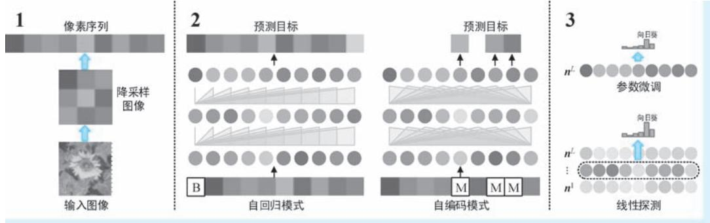  
●图 6-33 iGPT 模型的整体构造流程示意

如图6-33 所示，iGPT 模型的整体构造过程包括了三个部分。第一部分为输入图像的序列化。关于这一问题想必读者们已经非常熟悉：无论手头数据是何种形式，只要能够转为特征序列，那么就可以作为 Transformer 的输入，在 iGPT 中自然也是如此。与 ViT 直接将图像分块、以块特征构造为序列不同，iGPT 使用低分辨率图像的像素直接构成输入序列，这正是文章题目中 “from pixels”的由来。之所以采用低分辨率，那是因为直接将图像 “拉直”为一个向量作为输入序列将导致序列过长、计算量过大，例如， $2 2 4 \times 2 2 4 \times 3$ 原始图像对应的序列长度为 150528 $2 2 4 \times 2 2 4 \times 3 = 1 5 0 5 2 8 ,$ ）。为此，作者们对图像进行了降采样处理，得到 $3 2 \times 3 2 \times 3$ 或者 $6 4 \times 6 4 \times 3$ 等不同的低分辨率图像。然而，即便是小到$3 2 \times 3 2 \times 3$ 的图像，其序列长度也达到 3072 $3 2 \times 3 2 \times 3 = 3 0 7 2 \rangle$ ），然而分辨率再也不能降低了，再降图像就 “没法看”了。为了解决上述问题，作者采用 $k = 5 1 2$ 的 $\mathbf { k }$ -means 聚类，获得 512 个颜色中心，以这512 种颜色表示天下所有颜色。这一具有512 种颜色的颜色表即等同于我们在 NLP 中使用的词典。这样一来，任何一个 RGB 颜色即可以表示为一个颜色表下标，序列的长度减少到 1024 $3 2 \times 3 2 \times 1 =$ 1024），为原长度的1 / 3。剩下的操作就已经和词汇序列别无二致———将每个像素位置表达为 512 维独热编码，然后利用一个可学习的嵌入操作将其再变化为 Transformer 所需的输入维度 $d$ 。第二部分为模型预训练。作者们选择自回归和自编码两种方式中的一种对模型进行自监督预训练。在第一种模式中，模型被当作标准 GPT 进行预训练———在序列起始位置添加 ${ < } \mathrm { B O S } >$ ” 标志位，然后以利用掩膜自注意力机制遮蔽后续像素，利用已经 “看到”的前方像素逐个预测下一像素，让模型构建颜色的前向依赖关系；在第二种模式中，模型被当作 BERT 进行预训练———通过随机遮掩输入序列中的像素，让模型基于上下文像素做 “颜色完形填空”。第三部分模型评估。为了验证预训练模型的有效性，作者们采用参数微调和线性探测（linear probing）两种方式对预训练模型进行评估。对于一个具有 $L$ 层的iGPT 模型，我们将其每一层产生的输出序列记作 ${ \bf \dot { \theta } } n ^ { l } ( l = 1 , \cdots , L )$ ）。参数微调同时优化自监督像素预测和有监督分类两个目标，损失函数可以记作 $L { = } L _ { \mathrm { g e n } } { + } L _ { \mathrm { c l s } }$ 。其中， $L _ { \mathrm { g e n } }$ 即预训练相同目标下的损失 （自回归或自编码中的一种）； $L _ { \mathrm { c l s } }$ 为有监督的图像分类损失，作者们首先基于最后一层特征序列计算特征均值 （维度为 $d$ ），然后，对该均值特征进行线性投影和概率化操作， $L _ { \mathrm { c l s } }$ 预测值与真值之间的交叉熵损失。在参数微调训练中，整个模型的参数 （包括嵌入、所有解码器层，以及添加的线性变换等）都是要进行一体化更新的；在线性探测中，预训练模型被作为一个固定的特征提取器使用，故其参数不进行更新。在线性探测评估中，所有层特征输出 ${ \pmb n } ^ { 1 } , \cdots , { \pmb n } ^ { L }$ ${ \pmb n } ^ { 1 }$ 都会涉及，同样，作者对每层输出特征计算均值，然后通过线性变换作为分类 “logits”。在上述评估中，只会更新线性分类器参数。经过对结果的分析，作者们认为处于中间层的特征具有最佳的表达能力。

在模型规模方面，作者们一共构造了四种不同规模的 iGPT 模型，按照规模从小到大依次为：小规模版 （iGPT-S）、中等规模版 （iGPT-M）、大规模版 （iGPT-L）和超大规模版 （iGPT-XL）。上述四种模型的 Transformer 解码器层数分别为 24、36、48 和 60 层，中间特征维度分比为 512、1024、1536和 3072 维；参数量分比为 7600 万、4. 55 亿、14 亿㊀①和 68 亿。可以看出，iGPT 各规模模型并不与GPT-2. 0 各规模模型具有一一对应关系，显然 iGPT 比 GPT-2. 0 要 “大一号”。其中，只有 iGPT-L 和GPT-2. 0-XL 规模接近，二者均具有48 层解码器结构，只不过二者的中间特征维度稍有区别，前者为

1536 维，而后者为 1600 维。

接下来我们来看 iGPT 的实验部分。为了论证 iGPT 的结构、预训练模式对结果的影响，作者组织了一系列实验。我们选择其中最重要的四组实验进行分析。在这四组实验中，前两组实验都是基于ImageNet 数据集以自回归模式开展预训练，然后针对 CIFAR-10、CIFAR-100 和 STL-10 三个数据集进行适配和测评。第一组实验，分析到底哪一层特征比较有效。该组实验针对 iGPT-L 模型 （48 层）开展。得到的结论为：并不是越深的特征越有效，反而是第 20 层左右的特征能够达到最佳的分类精度，在以上三个数据集上均得到相同结论。特别地，在 CIFAR-10 数据集上，分别以最后一层特征和最优特征进行分类，前者比后者精度下降了 $2 , 4 \%$ 。第二组实验，论证模型规模与性能之间的关系。作者们对比了 iGPT-S / M / L 三个模型，结论是：模型规模越大效果越好，并且也像 GPT-2. 0 那样表现出了“看不见天花板”的现象。在上述三个数据集上，iGPT 的线性探测精度 （最佳特征配合与之微调后的线性分类器达到的精度）超过了 ResNet152 和 SimCLR 两个经典监督训练模型。第三组实验，测评基于 ImageNet 数据的线性探测分类精度。在该实验中，作者们基于更大规模的网络数据集进行预训练，然后在 ImageNet 上进行适配。结论为：iGPT-XL 在 $6 4 \times 6 4 \times 3$ 的图像分辨率下，达到 $7 2 . 0 \%$ 的 top-1 分类精度，这一水平高于 BigBiGAN、MoCo、CPC 等多个模型，但是距离大规模版 SimCLR 模型仍有差距。而且 iGPT-XL 的参数规模是大规模版 SimCLR 的20 倍。第四组实验，测试预训练到底用自回归方式好还是有自编码方式好。实验结论是：在线性探测模式下，自编码预训练模式远差于采用自回归预训练模式。例如，在 CIFAR-10 数据集上，前者较后者低了 $1 \%$ ，而在 ImageNet 数据集上，前者较后者低了 $6 \%$ ；在参数微调模式下，二者的差距变小，例如，在 CIFAR-10 数据集上，自编码模式比自回归模式低了 $0 . 4 \%$ ，而在 ImageNet 数据集上，自编码模式比自回归模式达到的精度还略高。

最后，我们对 iGPT 模型进行简单总结。粗略地看，iGPT 仿佛就是 GPT 的作者 “随手”将自己的NLP 模型拿到 CV 领域用了用，无论在模型架构还是训练模式等方面，基本上就是照搬 GPT （还有BERT），看似不具有太多创新性的工作。除此之外，iGPT 模型参数量极大，因此只能处理极低分辨率图像，就连 $6 4 \times 6 4$ 这样的 “马赛克”图像在 iGPT 的眼中都算是 “奢侈品”。同时，iGPT 训练时需要的计算资源也十分惊人，例如，作者们在文中提到，在 Tesla V100 上的训练 iGPT-L 模型大约需要2500 天，这可不是个人或一般机构能够支持的训练资源投入。但是，即便 iGPT 所具有里程碑意义是不容否定的：iGPT 是第一个具有纯Transformer 架构的CV 模型，并且同时将NLP 预训练范式首次完整的引入 CV 领域。尽管在具体 CV 任务上没能做到完美的 “SOTA”，但是 iGPT 已超越了一众经典的CV 监督训练模型，这已经证明了在 NLP 领域广泛应用的 “预训练 $^ +$ 微调” 范式在 CV 领域也是可行的。当然，iGPT 也让人们进一步看到了 Transformer 应用于 CV 领域的巨大潜力。

# 2. MoCo v3：基于对比学习的预训练模型

相较于监督学习，自监督学习不依赖人工标注，因此受到学界各方向学者的广泛关注。人工智能世界级专家、图领奖得主Yann LeCun 甚至认为自监督学习才是能够给人工智能带来革命性推动的关键性技术。说到自监督学习，怎能不谈对比学习（Contrastive Learning）？对比学习以其灵活、简单、效果好等诸多优势，成为近些年自监督学习领域中最炙手可热的研究方向之一。甚至可以认为正是因为对比学习的产生，才打破了 CV 领域 “内卷”的僵局。

所谓对比学习，就是一种在没有标签的情况下，通过让模型辨别哪些数据相似、哪些数据不相似

来学习数据特征的一种自监督学习方法。也就是说，对比学习不像监督学习那样在需要绝对类别的驱动下提取视觉特征，而只需要在抽象特征空间上学会对数据的区分，即仅需要通过对比、以相对的方式得到视觉特征表示即可。例如，在图6-34 的示例中，我们有四幅输入图像，分别记作 $x _ { 1 } \sim x _ { 4 }$ ，显而易见，图像 $x _ { 1 }$ 和 $x _ { 2 }$ 具有相同的类别，都是鸭子，而图像 $x _ { 3 }$ 和 $x _ { 4 }$ 属于另外一种类别———花。而对比学习不需要我们能够明确区分谁是鸭子谁是花，而是只是要求学习得到的特征在特征空间表现出同类特征接近、不同类特征远离的性质即可。为此，对比学习需要我们首先设计一个任务框架，使得能够通过任务的训练来获取所需的特征表示；除此之外，还需要我们构造一个奖惩机制来确定模型的优化方向。上述两点考量正是现代对比学习的两个关键要素：代理任务（pretext task）和损失函数。所谓代理任务，即指该任务并非我们所关注的那个真正的、最终的任务，但是通过完成该任务，模型能够学习到一种对下游任务非常有益的特征表示。例如，在 BERT 预训练中，代理任务是 “完形填空”，而这一任务和各类下游任务没有任何关系，但却为下游任务提供了重要的通用语言表示；训练一个以重构输入作为任务目标的自编码器模型，这一重构任务在实际应用中除了去噪仿佛再无他用。但是通过完成上述任务，我们可以将编码器输出的隐变量作为图像的特征表示———这一特征强大到足够重建自身；在图6-34 所示的示例中，我们终极目标可能是图像分类，但是在代理任务中，我们却将 $x _ { 1 }$ 、 $x _ { 2 }$ 或$x _ { 3 }$ 、 $x _ { 4 }$ 放一起作为正样本对，而从两个类别图像中各选一个放在一起即算作负样本对。代理任务的本质就是一个判别谁是正负样本对的分类任务。该任务看似与最终的分类任务毫无关系，但是完成该任务后，图像特征已经 “聚集”，再进行类别划分将变得非常容易。对比学习中的损失函数即特指对比损失函数 （contrastive loss function），用来在代理任务训练时，定量评估任务的产出什么算好、怎样是坏，何种时候该奖励，何种情况该惩罚。同时将误差反向传播进行模型修正，为代理任务的训练指明优化方向。

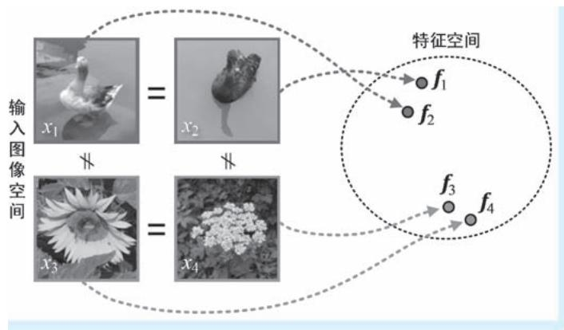  
●图 6-34 对比学习模式示意

说起对比学习，何恺明及其团队提出的 MoCo 系列模型可以说是里程碑式的存在。迄今为止，MoCo 系列模型具体包括三个版本，分别简称为 MoCo v1 [22] 、v2 [23] 和 v3 [24] ，三个版本 MoCo 模型的提出时间 （arXiv 首发时间）分别为2019 年11 月、2020 年3 月和2021 年 4 月。在上述三个版本的模型中，只有v3 版使用了Transformer 架构，也就是说理论上只有MoCo v3 与本书的主旨有关系。但是考

虑到三个版本模型的技术连续性，同时考虑到 MoCo 模型在自监督学习领域中的重要性，在本部分内容中，我们将从 MoCo v1 开始，首先对前两个早期版本的 MoCo 进模型行介绍，最终顺理成章地抵达具有 Transformer 架构的 MoCo v3。

我们介绍的第一个模型为 MoCo v1。总体来看，MoCo v1 采用对比学习中常用的个体判别（instancediscrimination）任务作为其代理任务。所谓个体判别任务，即把每一幅图像都视为一个类别，希望模型可以学习到图像的特征表示，从而实现图像的区分。标准个体识别任务的实现思路非常简单，例如，我们可以将同一幅图像上随机裁剪得到图像块彼此构成正样本对，而裁剪自不同图像的图像块则算作负样本对㊀①。个体判别任务即要求前两者间的相似度尽可能大，而后两者间的相似度尽可能小。以图6-35 为例，假设我们有两幅图像，记作图像1 和2，首选从两幅图像中随机裁剪得到若干图像块作为训练样本集合。接下来我们从来自图像1 的图像块集合中抽取一个图像块 A 作为基准，该图像块经过编码器 $q$ 的编码操作，得到对应向量表示 $\pmb q$ ，该项量一般称为锚点（anchor） 或查询（query） 向量㊁②。这里的编码器 $q$ 和 $k$ 可以是任意的神经网络结构，二者可以完全不同或参数部分共享，抑或是参数完全共享。然后我们再从两个集合中各抽取一个图像块 B 和 C，经过编码器 $k$ 的编码操作，得到对应向量表示 $\pmb { k } _ { 0 }$ 和 $\pmb { k } _ { 1 }$ ，这两个向量均被称为键（key）向量。显然， $\pmb q$ 和 $\pmb { k } _ { 0 }$ 同源 （来自同一幅图像的特征），故二者构成正样本特征对 （或称键 $\pmb { k } _ { 0 }$ 是查询 $\pmb q$ 的正样本特征），其间的相似度应尽可能大，而 q和 $\pmb { k } _ { 1 }$ 不同源 （来自不同图像的特征），故二者构成负样本特征对 （或称键 $\pmb { k } _ { 1 }$ 是查询 $\pmb q$ 的负样本特征），其间的相似度应该尽可能小。

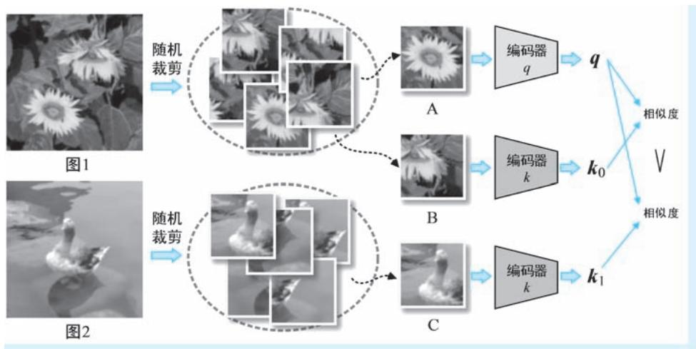  
●图 6-35 个体判别任务示意

讨论完代理任务这一关键要素，接下我们来看看对比学习的第二个关键要素— ——对比损失函数。假设我们手头有一个查询向量 q，和一个由键向量构成的字典，记作 $\{ \pmb { k } _ { 0 } , \pmb { k } _ { 1 } , \cdots , \pmb { k } _ { K } \}$ }，其中，只有一个键向量与查询向量构成正样本对，我们将该键向量记作 $\pmb { k } _ { + }$ 。对比损失函数要求具有如下性质：当 $\pmb q$ 与正样本 $\pmb { k } _ { + }$ 相似并且与其他所有键不相似时，对比损失函数的输出损失值要很小，否则要很大。在MoCo v1 中，采用了对比学习中常用的 InfoNCE 损失作为对比损失函数，该损失函数以向量内积作为相似性度量，定义为

$$
\mathcal {L} (\boldsymbol {q}, \boldsymbol {k}) = - \log \frac {\exp \left(\boldsymbol {q} ^ {\mathrm {T}} \boldsymbol {k} _ {+} / \tau\right)}{\sum_ {i = 0} ^ {K} \exp \left(\boldsymbol {q} ^ {\mathrm {T}} \boldsymbol {k} _ {i} / \tau\right)} \tag {6-23}
$$

式中， 为一个被称为温度的超参数，控制了损失函数的平滑程度。从 InfoNCE 的定义不难看出，该函数的分子部分鼓励正样本之间的相似度越大越好，而分母则期望任意负样本之间的向量相似度越小越好。分母上的求和在所有键集合上进行，因此，InfoNCE 的主体部分可以视为是在一个 $\textstyle K + 1$ ）分类softmax 函数中、将 $\pmb q$ 划入类别 $k _ { + }$ 的概率。在 InfoNCE 损失函数的指导下，我们即可得到所期望的对比学习目标。

在个体判别代理任务的设定下，每一张图都是一个类别，即站在任意一幅图像的视角，全天下的图像都是自己的负样本。这就意味着在训练时，需要构建一个大字典，从而含有足够多的负样本向量才能支撑上述设定。在 MoCo v1 诞生之前，存在两种经典的训练模式。第一种模式为端到端模式，如图6-36a 所示。在该模式中，对于一个给定的、作为查询图像样本 $x ^ { q }$ （即扮演图 6-35 中图像块 A 的角色），然后选择一个正样本 $\boldsymbol { \cdot } \boldsymbol { x } _ { 0 } ^ { k }$ （即与 $\cdot \boldsymbol { x } ^ { q }$ 同源的图像，如图 6-35 中图像块 B 的角色）和一系列负样本（即与 $\cdot \boldsymbol { x } ^ { q }$ 不同源的图像），组织为一个图像样本批次，记作 $\{ x _ { 0 } ^ { k } , x _ { 1 } ^ { k } , x _ { 2 } ^ { k } \cdots \}$ }。随后，编码器 $q$ 将图像 $x ^ { q }$ 编码为查询向量 $\pmb q$ ，图像批次则被编码器 $k$ 编码为键字典 $\{ \pmb { k } _ { 0 } , \pmb { k } _ { 1 } , \pmb { k } _ { 2 } \cdots \}$ ，接下来即以查询向量对键字典中所有的键向量计算相似度并计算对比损失，然后将梯度反向传播给两个编码器，以实现对二者的参数更新，这也正是 “端到端”的含义。不难看出，在该模式下，字典的大小等同于批次的大小。但是受到存储和算力的限制，批次的容量不能取的太大，这就意味着该模式难以提供足够数量的负样本。因此，人们提出了记忆体（memory bank）的模式，如图 6-36b 所示。在该模式中，数据集中所有图像的特征都保存在记忆体中。在每一步迭代时，确定查询图像样本 $\cdot x ^ { q }$ 并得到其查询向量 $\pmb q$ 后，都会从记忆体中随机采样一个特征批次作为键字典，然后将 $\pmb q$ 与其进行相似度和对比损失计算。只不过在记忆

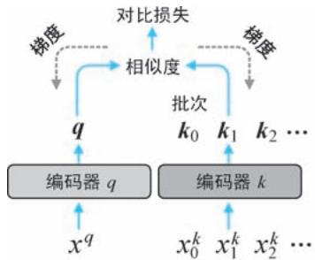  
a)

b）  
●图 6-36 MoCo v1 产生前的两种经典训练模式示意  
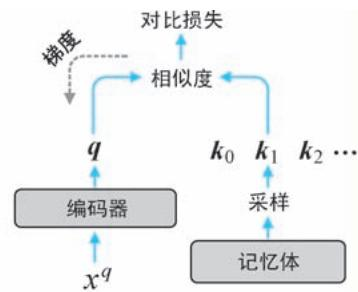  
a）端到端模式 b）记忆体模式

体的模式下，由于记忆体并不包含可学习参数，故梯度反向传播只针对编码器分支进行。在实现时，记忆体被组织为硬盘上的特征数据文件，故在构造大字典这一问题上可以完全不考虑计算资源的限制。但是这种模式存在的最大问题就是特征一致性差的问题。该问题由记忆体的更新机制所导致：在每一次迭代后，编码器的参数都会被更新。为了获得 “最新鲜”的键特征，紧接着还会将被抽样到的样本再过一次编码器，以编码器输出特征更新记忆体中与之对应的特征。但是问题来了，在随机采样模式下，编码器的参数是不断变化的，记忆体中的特征来自不同迭代步骤的编码器，有的特征可能甚至都没有被更新过 （即一次都没有被采样过）。也就是说可以认为记忆体中存储的特征压根就不是一个编码器产生的，这便导致特征的不一致性。

综上所述，端到端模式能保证特征的一致性，但是键词典大小不够，而记忆体的模式可以不用考虑键词典大小的问题，但是特征的一致性又无法保证，这便是 MoCo v1 需要解决的痛点问题。于是，终于在兜兜转转之后，我们总算要触及 MoCo v1 的核心工作———基于动量对比（Momentum Con-trast） 的自监督视觉特征学习，而 “MoCo” 这一名称正是由单词 “Momentum” 和 “Contrast” 的前两个字母拼凑而成。针对上述痛点问题，MoCo v1 的解决方案非常简单，概括起来包括三个方面。第一，在结构方面，MoCo v1 也使用了两个编码器，这两个编码器结构完全相同，但是参数不共享。两个编码器的作用与端到端模式中两个编码器的作用相同：前者为查询编码器，用于将查询图像样本 $x ^ { q }$ 编码为查询向量 $\pmb q$ ，而后者被称为 “动量编码器” （momentum encoder），用来产生查询向量。在 MoCo v1 中，上述编码器都以 ResNet 作为其具体实现架构。但是与端到端模式不同的是，MoCo v1 仅利用回传梯度更新查询编码器的参数。第二，在数据结构方面，MoCo v1 中有两个数据结构，一个是样本批次 （batch），用来存储新读入的图像样本数据，假设其容量为 $N$ ；另一个重要的数据结构就是队列（queue），其容量为 $K$ ，且 $K \gg N$ ，因此能够放入更多的键向量。在具体实现时，为了整批次的存储键数据， $K$ 一般都取 $N$ 的整倍数，例如，在 MoCo v1 中，有 $N = 2 5 6$ ，而 $K =$ $2 5 6 N = 6 5 5 3 6$ 。之所以使用队列这一数据结构，目的就是利用其 “先进先出” （First In First Out，FIFO）性质让最旧的特征出队 （dequeue），最新的特征入队 （enqueue），从而保证其中特征是最“新鲜”的。不难看出，MoCo v1 的队列即与记忆体模式中的记忆体具有类似的作用。第三，在参数更新模式方面，由对比损失函数产生的回传梯度将只进行查询编码器的参数更新。而动量编码器的参数则采用动量更新模式进行———以查询编码器的最新参数与自己的动量编码器的旧参数进行加权求和，即有

$$
\boldsymbol {\theta} _ {k} ^ {(i)} \leftarrow m \cdot \boldsymbol {\theta} _ {k} ^ {(i - 1)} + (1 - m) \cdot \boldsymbol {\theta} _ {q} ^ {(i)} \tag {6-24}
$$

式中， $\pmb { \theta } _ { k }$ 和 $[ \pmb { \theta } _ { q }$ 分别表示动量编码器的旧参数和查询编码器的更新后参数 （上标表示迭代步骤）； $m \in$ [0，1）为动量超参数———当 $m { \approx } 0$ 时，即表示让动量编码器尽量保持旧参数，而当 $m \approx 1$ 时，即表明更倾向于使用查询编码器的新参数替换旧参数。在 MoCo v1 中，考虑到为了保持键队列中的特征的一致性，取 $m = 0 . 9 9 9$ ，这就意味着动量编码器的更新非常缓慢。

在 MoCo v1 的原文中，作者们以伪代码的方式给出了其进行一次迭代的完整流程。按照其伪代码示意，我们对其中的关键步骤进行整理，将一个完整迭代流程归纳为六个步骤，如图6-37 所示 （图中所示的圆圈标号即与下文的步骤对应）。第一步为样本批次构造。从数据集中随机抽取 $N$ 幅图像构成一个批次，记作 $\{ x _ { 1 } , x _ { 2 } , \cdots , x _ { N } \}$ }，然后对其中的任一幅图像进行两次随机增强 （如随机裁剪），即产生

$N$ 对同源样本。我们将两次增强得到的图像样本表示为两个集合，前者即作为查询图像样本，而后者作为与之对应的正样本，分别记作 $\left\{ x _ { 1 } ^ { q } , x _ { 2 } ^ { q } , \cdots , x _ { N } ^ { q } \right\}$ }和 $\{ x _ { 1 } ^ { k } , x _ { 2 } ^ { k } , \cdots , x _ { N } ^ { k } \}$ }，其中 $ { { | x _ { i } ^ { q } } \rvert }$ 和 $\{ \boldsymbol { x } _ { i } ^ { k }$ 为同源图像样本。第二步为特征表示。我们将查询图像样本 $\{ x _ { 1 } ^ { q } , x _ { 2 } ^ { q } , \cdots , x _ { N } ^ { q } \}$ }送入查询编码器，得到对应的查询向量 $\{ \pmb q _ { 1 } , \pmb q _ { 2 } , \cdots , \pmb q _ { N } \}$ }；将图像样本 $\{ x _ { 1 } ^ { k } , x _ { 2 } ^ { k } , \cdots , x _ { N } ^ { k } \}$ }送入动量编码器，得到其对应的键向量 $\{ k _ { 1 } , k _ { 2 } , \cdots , k _ { N } \}$ }。然后，我们再从键队列中取出全部 $K$ 个键向量 $\{ \pmb { k } _ { 1 } ^ { - } , \pmb { k } _ { 2 } ^ { - } , \cdots , \pmb { k } _ { K } ^ { - } \}$ }，这些键向量全部都是负样本向量，所以我们在上标上以负号表示。第三步为相似度和对比损失计算。站在查询向量 $\pmb { q } _ { i }$ 的 “立场上”，只有 $\pmb { k } _ { i }$ 是其正样本，而$\pmb { k } _ { 1 } ^ { - } , \pmb { k } _ { 2 } ^ { - } , \cdots , \pmb { k } _ { K } ^ { - }$ 都是其负样本。这样我们就可以按照式 （6-23）的方式计算相似度并进而计算对比损失。以 $\pmb { q } _ { i }$ 为例，式 （6-23）的分子和部分即为 $\exp ( { q _ { i } ^ { \mathrm { T } } pmb { k } _ { i } / \tau } )$ ），分母部分即为 $\begin{array} { r } { \exp ( \pmb { q } _ { i } ^ { \mathrm { T } } \pmb { k } _ { i } / \tau ) + \sum _ { j = 1 } ^ { K } \exp ( \pmb { q } _ { i } ^ { \mathrm { T } } \pmb { k } _ { j } ^ { - } / \tau ) , } \end{array}$ 。第四步为查询编码器参数更新。在该步骤中，以对比损失函数回传的梯度更新查询编码器参数。此时的动量编码器梯度回传通路是阻断的。第五步为动量编码器参数更新。该步骤即按照式 （6-24）所示的方式，利用第四步对查询编码器的参数更新结果，以动量更新方式更新动量编码器参数。第六步为键队列更新。此时的 $\{ \pmb { k } _ { 1 } , \pmb { k } _ { 2 } , \cdots , \pmb { k } _ { N } \}$ }可谓 “新鲜出炉”，故需要将其反写到键队列中去。按照 “先进先出”的原则，让位于队列头部最早批次的 $N$ 个特征出队，让 $\{ \pmb { k } _ { 1 } , \pmb { k } _ { 2 } , \cdots , \pmb { k } _ { N } \}$ }在队尾入队。这样一来，键队列中特征保持了最大程度的 “新鲜度”。

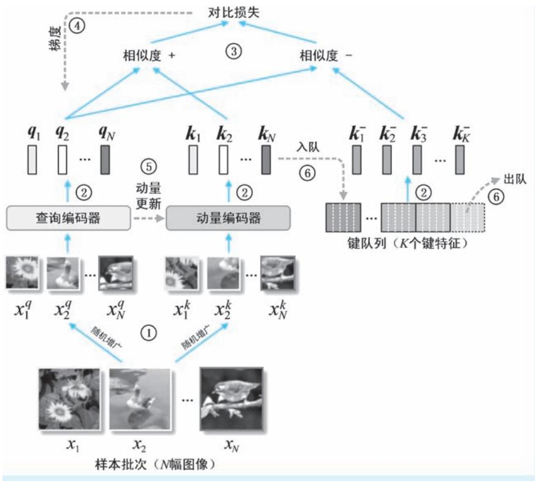  
●图 6-37 MoCo v1 一次迭代的完整流程示意

到这里，我们对 MoCo v1 的关键工作算是分析完毕了，最后我们简单聊聊 MoCo v1 的表现和意义。作者对 MoCo v1 进行了大量的实验和对比，得到的结论概括起来就是三句话：比端到端和记忆

体两种模式都好；比其他经典自监督模型都好；在下游 CV 任务中表现优异。其中，得到第一条结论是必然的，毕竟解决痛点的模型自然不会比 “痛点模型”表现差。对于第二条结论，如果比其他预训练模型差，不会成为 CVPR 最佳论文提名。最重要的是第三条结论———MoCo v1 在 PASCALVOC、COCO 和其他数据集上的 7 项目标检测或图像分割任务中可以优于其他监督预训练模型，在某些任务上甚至能够表现出明显优势。这一结论着实让人振奋，这表明在许多视觉任务上，相较于有监督学习，自监督表示学习所达到的性能已经可以与其媲美，甚至实现 “超车”，这就意味着我们不依赖大规模标注数据训练模型可能不再是梦想。MoCo v1 的里程碑意义也正体现在此。

2020 年 2 月，Ting Chen 等[25] 来自谷歌的学者 （Geoffrey Hinton 也在作者之列） 提出另一个著名的自监督模型— SimCLR 。SimCLR 与 MoCo v1 最大的区别有三点：第一，采用了图 6-36a 所示的端到端模式，毕竟谷歌有大量 TPU 计算资源可用，可以直接使用大规模的批次 （如采用 4000 或 8000 的样本批次容量）提供足够数量的负样本，而不需要使用记忆体、队列等额外结构；第二，在编码器提取特征表示和对比损失之间，添加一个可学习的非线性变换，以进一步提高得到特征的质量；第三，使用了更加丰富强大的数据增强方法。结果显示，SimCLR 的表现超越了当时所有的自监督模型，其中自然也包括 MoCo v1。Facebook AI 的 MoCo v2[23] 就在这一背景下产生。MoCo v2 提出的目的，旨在通过借鉴 SimCLR 的一些思路来改进 v1 版模型，从而证明 MoCo 架构本身是很优秀的，通过增加一些 “tricks”还能提高性能———正如其文章题目所说，构造 “improved baselines”。因此可以看出，严格意义上，MoCo v2 不能算作一个新的模型，除此之外，其文章也只有两页，更像是一个实验报告。

上文已经提及，SimCLR 与 MoCo v1 的区别主要体现为三个方面，那么 MoCo v2 需要借鉴 SimCLR的哪些内容呢？首先，SimCLR 采用大规模的批次来容纳更多的负样本，对于这一点，作者们认为着实没必要借鉴，毕竟 MoCo v1 采用队列来存放更多的负样本特征，批次规模再大也大不过队列。除此之外，队列结构是 MoCo v1 最大的创新点之一，自然也不能轻易否定自己。剩下可借鉴的就剩下两点了，这也正是 MoCo v2 的改进思路：第一，在两个编码器后再添加 MLP 结构，实现对特征的非线性变换；第二，在 MoCo v1 的原始增强模式中增加模糊增强 （blur augmentation）策略。在上述两方面的改进之下，MoCo v2 终于反超 SimCLR，让 MoCo 重回 “SOTA 宝座”，构造了 CV 自监督模型的新基线。具体实验对比请读者自行查阅相关文献，这里不进行详细讨论。

下面我们进入和本书主旨真正有关的模型———MoCo v3。MoCo v1 和 v2 两个模型的提出时间分别为 2019 年 11 月和 2020 年 3 月，此时 Transformer 还未在 CV 领域 “试水” （DETR 可以认为是 Trans-former 的 CV “首秀”，其提出时间为 2020 年 5 月）。2020 年 10 月，具有纯粹 Transformer 架构的 ViT模型诞生，随后各类 ViT 的变体模型开始在 CV 领域 “大杀四方”，证明了 Transformer 在 CV 领域不仅能用，而且潜力巨大，甚至能够成为 CNN 的替代品。这便是 MoCo v3 的诞生背景。MoCo v3 提出于2021 年 4 月，作者为陈鑫磊 （Xinlei Chen）、谢赛宁 （Saining Xie） 和何恺明 （Kaiming He）[24] 三名来自 Facebook AI 的学者。

就模型架构和方法而言，正如作者坦言，MoCo v3 在严格意义上不能算是一项非常具有创新性的工作。其核心工作就是通过实验来讨论如何以自监督的方式训练 ViT 模型，以获得高质量的视觉特征表示。正如文章题目所说的那样，MoCo v3 是 “训练自监督视觉 Transformer 的一项实验性研究”。但

是，笔者认为 MoCo v3 的工作是十分有意义的，原因有二：第一，自监督需要 ViT 。就自监督表示学习而言，先前的模型都是基于 CNN 架构的，这些模型性能虽在不断提升，却也逐渐步入瓶颈。ViT 模型在各类 CV 任务上的表现犹如一股新风，其性能潜力也令人鼓舞。那么 Transformer 是否能够取代CNN、为 CV 自监督表示学习注入一针强心剂？MoCo v3 所做的正是这样的尝试。第二，ViT 需要自监督。就 ViT 模型而言，只有在大量数据的支持下才能发挥其真正威力，而大规模标注数据是难以获取的。因此探索其在无标签数据上自监督训练方法，以获得能够轻松应用于下游任务的强大视觉特征表示有着很强的现实意义。总之，MoCo v3 是一项填补空白的工作：在 MoCo v3 诞生之前，尽管已经有了类似 iGPT 这样的、基于 Transformer 架构的 CV 自监督模型，但是其照搬了 NLP 中最常用的自回归和自编码任务作为其代理任务。然而众所周知，在 CV 自监督模型中，最常用、效果最好的仍然是对比学习 （也即孪生网络）框架，因此基于 “Transformer 架构 $^ +$ 对比学习”框架的 CV 自监督表示学习方法还尚属空白。而 MoCo v3 所做的工作就是填补这块空白。

与 MoCo v1 和 v2 相比，MoCo v3 同样采用了查询编码器和动量编码器的双编码器架构，其中前者直接采用回传梯度进行参数更新，而后者采用动量更新模式进行参数更新。但是，相较于 MoCo v1 和v2，MoCo v3 最显著变化有两方面：第一，两个编码器的主干均采用 ViT 结构。这就意味着在 ViT 的输入端需要进行图像分块、线性嵌入和位置嵌入等输入构造工作，在 ViT 的输出端还要采取特征聚合操作得到能够代表整幅图像的特征表示。除此之外，参考 MoCo v2 的做法，作者们在两个编码器的主干结构后都还添加了基于 MLP 的非线性变换，该结构在 MoCo v3 中被称为 “投影头” （projectionhead）结构。对于键编码器，在投影头结构后又额外添加了另外一个称为 “预测头” （prediction

head）的 MLP 结构。即查询编码器的结构为“ViT 主干 $^ +$ 投影头 $^ +$ 预测头”，而动量编码器的结构为 “ViT 主干 $^ +$ 投影头”。第二，MoCov3 取消了键队列这一数据结构，取而代之的是更大的批次 （如 4096）。查询、正样本和负样本都按照批次中图像的实际情况。

图 6-38 示意了 MoCo v3 在一次迭代中的五个步骤，下面我们也以该图为例介绍一下流程。第一步为样本批次构造。首先获取 $N$ 幅图像构成批次 $\{ x _ { 1 } , x _ { 2 } , \cdots , x _ { N } \}$ }，然后对其中的任一幅图像进行两次随机增强，得到两组图像样本集合，分别记作 $\{ x _ { 1 } ^ { A } , x _ { 2 } ^ { A } , \cdots , x _ { N } ^ { A } \}$ }和$\{ x _ { 1 } ^ { B } , x _ { 2 } ^ { B } , \cdots , x _ { N } ^ { B } \}$ }。第二步为特征表示。分别将上述两组图像样本送入查询编码器，得到与之对应的两组查询向量，分别记作 $\pmb q ^ { A } = \{ { \pmb q } _ { 1 } ^ { A } , { \pmb q } _ { 2 } ^ { A }$ ，$\cdots , \pmb { q } _ { N } ^ { A } \}$ }和 $\pmb { q } ^ { B } = \{ \pmb { q } _ { 1 } ^ { B } , \pmb { q } _ { 2 } ^ { B } , \cdots , \pmb { q } _ { N } ^ { B } \}$ }。再分别将上述两组图像样本送入动量编码器，得到与之对应的两组键向量，分别记作 $\pmb { k } ^ { A } = \{ \pmb { k } _ { 1 } ^ { A } , \pmb { k } _ { 2 } ^ { A } , \cdots , \pmb { k } _ { N } ^ { A } \}$

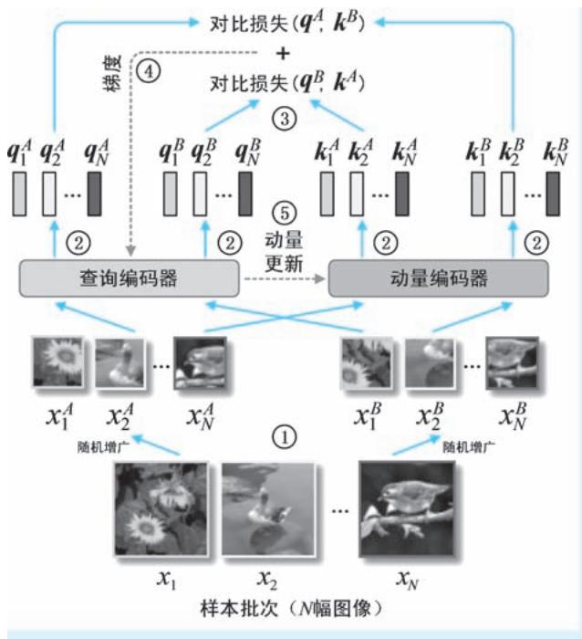  
●图 6-38 MoCo v3 一次迭代的完整流程示意

和 $\pmb { k } ^ { B } = \{ \pmb { k } _ { 1 } ^ { B } , \pmb { k } _ { 2 } ^ { B } , \cdots , \pmb { k } _ { N } ^ { B } \} \odot$ 。第三步为相似度和对比损失计算。在查询向量集合 $\pmb q ^ { 4 }$ 和键向量集合 $\pmb { k } ^ { B }$ 中，$\pmb q _ { i } ^ { A }$ 和 $\pmb { k } _ { i } ^ { B }$ 互为正样本，而 $\pmb q _ { i } ^ { A }$ 和 $\pmb { k } _ { j } ^ { B } ( i \neq j )$ ）互为负样本，因此可以按照式 （6-23）计算两个集合的相似度和对比损失 $\pmb { \mathcal { L } } ( \pmb { q } ^ { A } , \pmb { k } ^ { B } )$ ）；同理，也可以按照相同的方法计算 $\pmb q ^ { B }$ 和 $\pmb { k } ^ { A }$ 之间的对比损失 $\mathcal { L } \left( \pmb q ^ { B } , \pmb { k } ^ { A } \right)$ ）。最终，MoCo v3 的整体损失函数即上述两个损失函数之和，即 $\begin{array} { r } { \mathcal { L } \left( \pmb { q } , \pmb { k } \right) = \mathcal { L } \left( \pmb { q } ^ { A } , \pmb { k } ^ { B } \right) + \mathcal { L } \left( \pmb { q } ^ { B } , \pmb { k } ^ { A } \right) } \end{array}$ ）。第四步为查询编码器更新。与 MoCo v1 相同，采用损失函数回传梯度更新查询编码器参数。第五步为动量编码器参数更新。同样按照 MoCo v1 的方式，利用动量更新方式更新动量编码器参数。当然，这里仅会用到查询编码器 ViT 主干和投影头结构中的参数。

MoCo v3 采用了 “ViT 主干 $^ { \cdot + }$ 对比学习”这一新颖的架构。那么我们不禁要问，是否简单地将传统对比学习模型中的 CNN 主干替换为 ViT 主干，就能轻易开展训练，最终实现 “炸裂”的效果呢？恐怕事情没有这么简单。首先，作者们通过大量实验，分析了 ViT 模型进行自监督训练的不稳定性（instability）。于是作者们从批次大小、学习率和优化器三个基础因素入手，探索保证自监督 ViT 能够稳定训练的策略。在 MoCo v3 的原文中，作者们就上述问题的讨论投入大量的笔墨，因此这部分内容才是 MoCo v3 的核心工作。

第一个考量的因素为批次大小 （batch size）。本批次大小是一个非常重要的因素，在诸多 ViT 模型的训练中已经证明，训练批次大小与模型性能有直接关系。另外，从 MoCo v1 一路走来，我们也知道批次大小关系到负样本的多少，这一点在对比学习架构中非常关键。在该实验中，作者们使用 Ad-amW 优化器，并将基准学习率固定为 1. 0e-4，实验 1024、2048、4096 和 6144 四种批次大小下的模型表现。作者在训练的每一轮 （epoch）结束后，都计算一次模型的 KNN 精度 （KNN Accuracy，读者不必细究其实现方法，仅需知道 KNN 精度就是一种精度评定准则即可。该值越大，表示模型越好），以观察不同批次大小下，不同迭代轮的精度情况。实现结果表示，批次规模越大，在训练过程中越容易产生震荡现象。当批次大小增加到6144 时，模型训练产生严重震荡，如图 6-39a 所示。在 100 轮迭代完毕后，测评在四种批次大小下得到 MoCo v3 的线性探测精度，结果分别为 $7 1 . 5 \%$ 、 $7 2 . 6 \%$ 、 $7 2 . 2 \%$ 和 $6 9 . 7 \%$ 。可以看出随着批次大小的增加，模型精度先增后减，即并不是批次越大模型效果越好。

第二个考量的因素为学习率 （learning rate）。作者们以 $l r _ { \mathrm { b a s e } } { \times } b a t c h \_ s i z e / 2 5 5$ $l r _ { \mathrm { b a s e } }$ 作为 MoCo v3 训练的学习率，通过调整基准学习率超参数 $\cdot l r _ { \mathrm { b a s e } }$ 来考察其对模型训练和性能的影响。在该实验中，作者们使用AdamW 优化器，并将批次大小固定为4096，实验的基准学习率包括0. 5e-4、1. 0e-4 和1. 5e-4 三种。KNN 精度曲线表明，学习率越小训练越稳定，如图 6-39b 所示。在 100 轮迭代完毕后，测评在三种基准学习率下得到 MoCo v3 的线性探测精度，结果分别为 $7 0 . 4 \%$ 、 $7 2 . 2 \%$ 和 $7 1 . 5 \%$ 。显然，最小基准学习率0. 5e-4 稳定虽稳定，但是 “结局最差”。作者认为产生上述现象的原因是欠拟合的缘故。

第三个考量的因素为优化器 （optimizer）。在训练 ViT 及其变体模型 （如标准 ViT、DeiT 等）时，人们通常选择使用 AdamW 优化器对模型进行优化。而在进行基于大规模样本批次的自监督模型 （如SimCLR、BYOL 等）训练时，LARS 优化器又是最常见的选择。另外，LAMB 作为一种分层自适应规模批次的优化技术，以 Adam 作为其基础算法，可以说是综合了前两种优化器的优势，其 “既适合

ViT 模型，又适合大批次无监督”的双重优势与 MoCo v3 的需求非常契合。因此，作者们针对 LAMB优化器开展实验。结果表明在适当设定学习率的情况下，LAMB 优化器能够很好地对 MoCo v3 模型进行优化。当学习率设置过大时，迭代的 KNN 精度将下降。但是，从 KNN 曲线可以看出，尽管训练KNN 曲线是平滑的，但是中间却出现了比较严重的退化现象。图 6-39c 示意了不同学习率下 LAMB 优化器的 KNN 精度曲线。

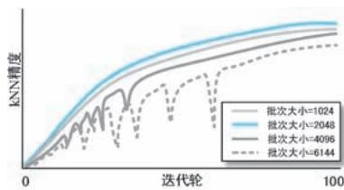

  
b)

●图 6-39 KNN 精度曲线示意 （注：该图为示意图，并不是真实算法的运行结果）  
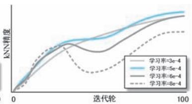  
a）不同批次大小下的 KNN 精度曲线 b）不同基础学习率下的KNN 精度曲线 c）不同学习率下LAMB 优化器的 KNN 精度曲线

经过逐层对梯度幅值 （在 MoCo v3 即具有最大绝对值的梯度值，即无穷范数）的分析，作者们认为正是因为训练时梯度产生的突变 （表现为梯度幅值上的尖峰），导致训练的不稳定性 （表现为 KNN精度曲线的突然下陷）。分析结果还表明，梯度突变的问题往往先在第一层产生，经过若干步迭代后，在最后一层也会发生类似的现象。第一层就产生跳变，莫非是图像块嵌入操作 “惹的祸”？怀着试试看的思路，作者们尝试冻结图像块嵌入的参数，即一经随机初始化后，就不再对其进行更新 （即对该层输出设置 “停止梯度”标志）。上述尝试的结果是十分惊人的，如此简单的改进竟然解决了 ViT 自监督训练的稳定性问题，KNN 精度曲线变得非常平滑，不得不佩服作者们直觉的敏锐和功力的深厚。

最后，我们简单看看 MoCo v3 的表现。为了评估 MoCo v3 模型的表现，作者们开展了三组关键实验。第一组实验对比在 MoCo v3 和iGPT 之间展开，之所以选择和iGPT 进行对比，是因为此时就iGPT这一个基于纯 Transformer 架构的自监督模型。显而易见，这是在纯 Transformer 架构下、对比学习与自回归 （也包括自编码）自监督之间的对比。对比结果简单来说就是MoCo v3 碾压iGPT。例如，以基于ImageNet 数据集的线性探测精度作为评估指标，iGPT 的最好水平为 $7 2 . 0 \%$ 的 top-1 精度，该精度由最大规模的 iGPT-XL 取得，其参数量高达68. 01 亿。而 MoCo v3 以 ViT-B 为主干，仅仅使用8600 万的参数量，就达到了 $7 6 . 7 \%$ 的 top-1 精度，若将主干结构替换为更大的 ViT-L，并使用批归一化（BatchNorm） 和 $7 \times 7$ 的图像分块尺寸 （原文中将该配置下的模型简称为 “ViT-BN-L/7”），参数量为3. 04 亿，其分类精度能够进一步提升到 $8 1 . 0 \%$ 。第二组实验即为和 “SOTA”自监督模型的对比。结果表明，MoCo v3 完胜 SimCLR v2 和 BYOL 这两个当时的 “SOTA”模型。其中，上述两个对比模型均采用 ResNet 作为其主干结构，这也证明了 ViT 作为主干结构的优势。第三组实验为 ViT 规模实验。作者们对比了 MoCo v3 在使用不同规模 ViT 主干结构时的性能，结果同样表明模型越大，效果越好，这又一次证明了 Transformer 视觉应用的潜力。

无独有偶，在 MoCo v3 诞生后的 20 多天 （2021 年 4 月 29 日，MoCo v3 的 arXiv 首发时间为 2021

年 4 月 5 日），Facebook AI 的另外一个团队又提出一个基于 Transformer 的自监督模型— 无标签自蒸馏（self-DIstillation with NO labels，DINO）㊀①[26] 。DINO 模型的思想与 MoCo v3 非常相似，也拥有两个并列的 ViT 网络结构，而且也是一个基于梯度进行参数更新，一个基于动量进行参数更新。只不过对于MoCo 来说，左边的网络结构叫作查询编码器，右边的网络叫作键编码器，而在 DINO 中，二者分别被称为学生网络 （student network） 和教师网络 （teacher network），即 DINO 以知识蒸馏的框架来刻画自监督任务。为了探索在自监督模式下、自注意力到底 “注意到”什么，作者们也像 DETR 那样，对若干参考点的注意力图进行了可视化，结果表明注意力图上产生类似语义分割的对象化效果。这结果无疑就是非常有趣甚至令人振奋的，这说明在毫无真值标注的数据上，通过自监督训练，模型竟然学习到了正确的语义特征。随后，有很多工作正是借助 DINO 的这一特点，将其作为主干模型应用于目标检测等更多的 CV 下游任务中。

# 3. BEIT：“CV 版”BERT

在上文中，我们说iGPT 是 “CV 版”的GPT，那么在NLP 领域与GPT 并驾齐驱的BERT，是否也能搞个 “CV 版”呢？这个问题算是问着了，我们下面即将介绍的 BEIT 就是这样的模型。BEIT 模型提出于2021 年6 月，作者为来自微软亚洲研究院的董力 （Dong Li）老师[27] 及其团队。BEIT 的全称为“Bidirectional Encoder representation from Image Transformers”，即 “基于视觉 Transformer 的双向编码器表示”。而 BERT 的全称为 “Bidirectional Encoder Representations from Transformers”，一词之差，一切尽在不言中，这显然就是要构造 “CV 版”的 BERT 啊。另外，需要特别说明的是，BEIT 包含了一系列优秀的模型：2021 年 6 月提出的是第一代 BEIT 模型[27] （下文称为 BEIT-1. 0），算作开篇；2022 年8 月 12 日，几位作者在 arXiv 上提交了第二代 BEIT 模型[28] （下文称为 BEIT-2. 0），该模型是对 1. 0 版模型的完善和改进；紧接着，作者们于 8 月 22 日在 arXiv 上提交了第三代 BEIT 模型[29] ，该模型可以适配全部CV 语言和视觉-语言任务，属于多模态通用模型。在下文中，我们主要围绕BEIT-1. 0 模型进行讨论，在最后也会对 BEIT-2. 0 进行简要介绍。

与 iGPT 直接 “照搬”GPT 到 CV 领域不同㊁，BEIT-1. 0 在将 BERT 模型应用于 CV 领域时还做了很多创新性工作，主要创新点体现在两个方面：第一，使用离散变分自编码器（discrete Variational Au-toEncoder，dVAE）将图像编码成视觉符号（visual tokens）序列；第二，以自监督方式预训练 ViT 模型（本质就是 BERT），预测被遮掩图像图像块对应的视觉符号。上述预训练操作与 BERT 的掩膜语言模型非常类似，因此被称为掩膜图像模型（Masked Image Model，MIM）。BEIT-1. 0 模型的整体架构如图 6-40 所示。

在 BEIT-1.0 模型中，图像有两种表示方法：视觉符号表示和图像块表示。我们下面先来看看图像的视觉符号表示。在 NLP 应用中，第一步需要构建一个词典，然后将输入语句中的每个词汇都以其在词典中的下标进行表示，这一操作就是对输入语句的符号化。那么在 CV 领域也可以进行类似的操作——— 将图像表达为一个离散序列，其中的每一个元素都是其在某一 “视觉词典”（Visual Dictionary，在某些文献中也称为 “视觉码本”，即 “Visual Codebook”）中的下标，这便是图像的视觉符号表示。

在BEIT-1. 0 中，视觉词典的长度| V | ，这就意味着每个视觉符号都是一个1～ |V|之间的整数。BEIT-1. 0 模型通过 dVAE 模型来获得图像的视觉符号表示。dVAE 是一种具有编码器-解码器架构的神经网络模型，其训练目标即 “重塑自己”———在输入端送入一幅图像，编码器对其进行编码从而得到对应的中间特征表示，然后解码器对其进行解码得到重构图像，dVAE 的训练目标即要求重构图像与输入图像尽可能地接近。上述训练目标的核心要义即好编码器能够产生好特征，而好特征能够完美重构自己。当然，对于 dVAE 最多的应用不是重构图像，而是获取图像的特征表示，该应用方式即在推理阶段只保留编码器部分，向其输入图像，然后获取其输出的中间特征即作为图像的特征表示㊀①。在 BEIT-1.0 中即采用上述应用模式：以独立阶段训练 dVAE 模型，在 BEIT-1. 0 预训练阶段只是用其编码器部分，得到的即视觉符号。离散自编码器中的 “离散”及要求视觉符号必须是满足词典长的整数。对于一幅尺寸为 $H \times W$ 的输入图像，经过 dVAE 编码器的编码，将得到一个 $N { \times } N$ 的视觉符号矩阵。例如，BEIT-1. 0 将 $2 2 4 \times 2 2 4$ 图像表示为 $1 4 \times 1 4$ 的视觉符号矩阵。BEIT-1. 0 对图像的第二种表示就是图像块表示，这一表示方法与 ViT 等模型是一致的。首先对 $H \times W$ 的输入图像进行 $N { \times } N$ 均匀分块，然后对每个图像块进行展平和线性嵌入操作。图像分块的数量与视觉符号的数量保持一致，目的就是为了让图像块能够和视觉符号按照位置一一对应。例如，BEIT-1. 0 也是将 $2 2 4 \times 2 2 4$ 图像表示为 $1 4 \times 1 4$ 的视觉符号矩阵，即每个图像块的尺寸为 $1 6 \times 1 6$ 像素。

  
●图 6-40 BEIT-1. 0 模型的整体架构示意

㊀ 请读者注意，我们上面对 dVAE 的描述并未体现 “离散变分自编码器”中的 “离散”和 “变分”，而是标准的“自编码器”（AutoEncoder，AE）。考虑到 dVAE 的训练模式和应用方式与 AE 并无太大区别，所以在这里我们简单借用了 AE 的概念。笔者认为对变分自编码器乃至离散变分自编码器的讨论将是一个庞大的话题，特别是前者涉及变分推断等复杂的内容，因此展开讨论反而会冲淡主题。故读者在这里只需将 dVAE 视为 AE，知道其大致怎么使用即可。更加深入的概念请自行查阅其他文献。

接下来就是 BEIT-1.0 的重头戏———预训练。BEIT-1.0 预训练的目标即构造掩膜图像模型，视觉符号和图像块这两种表示也正在预训练中关联起来———前者作为后者的预测真值。获得一幅输入图像后，BEIT-1. 0 对其进行兵分两路的操作，一路利用已经训练好的 dVAE 编码器 （此时的解码器已经弃而不用）对其进行架构，得到其对应的 $N { \times } N$ 的视觉符号矩阵，这一矩阵即作为预训练的真值；另一路被送入了分块分支，得到 $N { \times } N$ 的图像分块，并对其进行线性嵌入后添加位置嵌入。为了让模型与ViT 兼容，BEIT-1.0 也在序列前部添加起始符号 （在图 6-40 中，我们以 “S”表示该符号）。经上述架构后，得到的图像块特征表示为 $[ { \pmb e } _ { s } , { \pmb E } { \pmb x } _ { 1 } , { \pmb E } { \pmb x } _ { 2 } , \cdots , { \pmb E } { \pmb x } _ { N ^ { 2 } } ] + { \pmb E } _ { \mathrm { p o s } }$ ，其中 $e _ { s }$ 为起始符号对应的嵌入表示；$E x _ { i } \in \mathbb { R } ^ { d }$ 表示对 $i ( i = 1 , \cdots , N ^ { 2 } )$ ）个图像块展平向量的线性嵌入 （这里 $d$ 即为后续 ViT 模型的特征维度）； $\pmb { { E } } _ { \mathrm { p o s } } \in \mathrm { R } ^ { N ^ { \pm } \times d }$ 为位置嵌入向量序列。得到分块后，就要对其中的某些图像块进行遮掩操作了。BEIT-1. 0 对其中约 $40 \%$ 的图像块进行随机遮掩。但是考虑到图像的局部空间特性，BEIT-1. 0 并不像BERT 那样以单个词汇进行随机遮掩，而是使用了一种称为 “分块遮掩” （Blockwise Masking）的机制，一次性遮掩空间相邻的若干图像块。具体的遮掩方法即将被遮掩图像块的线性嵌入替换为一个可学习的嵌入 $\pmb { \mathscr { e } } _ { M }$ 。BEIT-1. 0 的分块遮掩机制可以视为 SpanBERT 和 ERNIE 等遮掩独立语义单元模式的“CV 版”。随后，带有遮掩标识的特征序列被送入一个 $L$ 层的 ViT 模型，经过逐层自注意力加工后，在输出端即可获得每个输入元素对应的特征表示，记作 $\left[ \pmb { h } _ { s } ^ { L } , \pmb { h } _ { 1 } ^ { L } , \pmb { h } _ { 2 } ^ { L } , \cdots , \pmb { h } _ { N ^ { 2 } } ^ { L } \right]$ 。最后就到了自监督环节，按照 BERT “遮挡谁才预测谁”的思路，BEIT-1. 0 只对被遮挡图像块进行自监督训练。在 ViT 输出的最后，BEIT-1. 0 添加了一个被称为 “掩膜图像模型头” （Masked Image Modeling Head） 的结构，该结构在预训练阶段的作用就是基于遮掩图像块对应的特征输出预测视觉符号。具体方法即对被遮掩图像块输出的 $d$ 维特征进行线性变换得到 | V | 维 “logits”，然后利用 softmax 操作即可得对视觉符号的预测概率。而就在此时此刻，由第一路分支获得的视觉符号作为真值早就 “等在那里”，通过构建二者之间的损失函数即可实现对 BEIT-1.0 模型的监督训练。可以看出，BEIT-1.0 模型的预训练就是训练模型完成图像补全这样的 “完形填空”，但是所填入的内容并不是图像块本身，而是视觉符号。事实上，我们可以将视觉符号视为图像块的类别———在 BEIT-1. 0 的视角中， “全天下” 的图像一共分为|V|类，BEIT-1. 0 的预训练相当于图像块级别的类别监督，这一点与 NLP 中的 NER 类似，只不过在BER 中，命名实体的类别是人工标注的，而 BEIT-1. 0 中的 “类别”是 dVAE 产生的，即整体来看是“自监督”的。

在预训练设置方面，BEIT-1. 0 采用的视觉词典的长度| V| 为 8192。在 Transformer 架构方面，BEIT-1. 0 分别使用了 ViT-Base 和 ViT-Large 两种结构，分别称为 BEIT-Base 和 BEIT-Large。前者拥有 12 层Transformer 编码器，768 维特征和 12 头自注意力，而后者拥有 24 层 Transformer 编码器，1024 维特征和16 头自注意力。BEIT 的预训练在ImageNet-1K 数据集上进行，训练时采用了随机缩放后裁剪、水平翻转和颜色抖动等数据增广方式。

在 BEIT-1.0 预训练完毕后，作者们也像 BERT 那样，通过在基础模型上添加一些任务结构，以实现对下游 CV 任务的参数微调适配。在原文中，作者们给出了 BEIT-1.0 作为预训练模型，针对图像分类和语义分割两种具体任务的适配方式。在进行图像分类任务适配时，作者们在 ViT 主干结构后添加分类层，该层首先对全部输出特征进行平均池化操作，然后对特征均值进行线性变换和概率化操作，即得到最终的整图级类别预测。上述操作可以简单地表示为 softmax $\arg ( \pmb { h } _ { 1 } ^ { L } , \pmb { h } _ { 2 } ^ { L } , \cdots , \pmb { h } _ { N ^ { 2 } } ^ { L } ) \ \cdot \ \pmb { W } _ { c } \ \rangle$ ），其中

$\boldsymbol { W } _ { c } \in \mathrm { R } ^ { d \times K }$ 为可学习的线性变换矩阵 （其中 $K$ 为类别个数）。请读者注意，BEIT-1. 0 在适配图像分类任务时，并未像 ViT 那样使用类别符号对应的聚合特征，而是使用了全部输出特征；在进行语义分割任务适配时，作者们参考了 SETR-PUP 架构，在 BEIT-1. 0 主干后又添加了一系列反卷积操作构成的解码器结构，以实现语义分割所要求的密集预测。

下面我们来看看 BEIT-1.0 在下游任务上的表现。实验结果表明，无论是针对图像分类任务还是语义分割任务，BEIT 都取得了 “SOTA”的成绩。针对图像分类任务，BEIT-1. 0 的表现概括来说包括两个方面：第一方面，与采用随机初始化训练 （即从头开始训练）的监督模型 ViT 和 DeiT 相比，预训练的 BEIT 模型在 ImageNet-1K 和 CIFAR-100 数据集上的性能都有显著提高。例如，BEIT-Base 模型在ImageNet-1K 数据集上取得了 $8 3 . 2 \%$ 的top-1 分类精度，这一结果远超具有相同训练配置DeiT 的分类精度；BEIT-Large 在 ImageNet-1K （使用 $3 8 4 \times 3 8 4$ 分辨率图像） 数据集上经无监督预训练之后，其 top-1分类精度达到 $8 6 . 3 \%$ ，这一水平甚至超过了 ViT-L 通过 ImageNet-22K 预训练、再在 ImageNet-1K 数据集上执行微调后的分类水平。值得注意的是，在较小规模的 CIFAR-100 数据集上，从头训练的 ViT 的top-1 分类精度仅为 $4 8 . 5 \%$ ，而 BEIT-1. 0 在预训练的赋能下，达到了 $9 0 . 1 \%$ 的 top-1 精度。这就意味着相较于一般监督模型，BEIT-1. 0 通过无监督的预训练，后续仅需要进行简单的有监督微调即可达到一个较高的水平，从而能够大幅节省标注资源。第二方面，在与 iGPT、MoCo v3 和 DINO 三种基于Transformer 架 构 的 预 训 练 模 型 的 对 比 中， BEIT-1. 0 也 取 得 了 “SOTA” 的 成 绩。 例 如， 在 基 于ImageNet-1K 数据集的测评中，BEIT-1. 0 超过了 MoCo v3 和 DINO 两个优秀的模型。在 CIFAR-100 上也明显优于 MoCo v3，与 DINO 基本持平并略高。针对语义分割任务，作者们首先也是基于 ImageNet 数据集对 BEIT-1.0 模型进行预训练，然后在 ADE20K 数据集进行微调适配及测评，测评结论为：BEIT-1.0 比监督预训练获得了更好的性能，而且更重要的是 BEIT 不需要基于人工标注的数据进行有监督的预训练。

2022 年8 月，作者们提出了 BEIT-1. 0 的升级版本— BEIT-2. 0 [28] 。与 BEIT-1. 0 相同，BEIT-2. 0的训练阶段也包括了视觉符号表示和掩膜图像模型预训练两个部分。但是作者们对上述两个部分都进行了改进。其中针对第一部分，BEIT-2. 0 引入矢量量化的知识蒸馏（Vector-Quantized Knowledge Distil-lation，VQ-KD）机制，提升了视觉符号的表达能力。这也是2.0 对1.0 模型的最大改进。这一改进直接体现在了文章的题目中。之所以要对视觉符号表达进行改进，这是因为视觉符号是作为训练真值使用的，因此我们要求它必须足够够准确。而 BEIT-2.0 所做的改进，相当于构造了更加精准的视觉词典，随后以此词典表达所有图像；针对第二部分，BEIT-2. 0 利用附加的轻量级 ViT 结构对类别特征和图像块特征构建的聚合特征 （在 BEIT-2. 0 中称为 “patch aggregation strategy”，即 “块聚合策略”）进行再加工，从而进一步提升了类别特征对全图的语义表达能力。

首先我们来看看 BEIT-2.0 的第一个改进，即如何构造视觉符号表示。与 BEIT-1.0 类似，在训练阶段，BEIT-2.0 模型也通过自监督方式训练一个编码器-解码器结构的类 AE 模型，编码器首先根据可学习码本（codebook，码本也就是我们所说的视觉词典）将输入图像表达为离散符号；然后，解码器以重建由教师模型产生的语义特征作为目标。在随后的预训练阶段，编码器输出的离散符号即作为图像的视觉符号表示。上述描述中有两个关键词： “码本” 和 “教师模型”，这两个关键词也正体现了BEIT-2. 0 对BEIT-1. 0 模型的最大改进———前者即体现为 “量化”，对应 “VQ”；后者即 “知识蒸馏”，

对应 “KD”。在量化部分中，作者们参考了 VQ-VAE 的做法针对输入的图像，编码器首先为每个图像块编码生成特征表示 （以下简称 “生成特征”），该特征是连续特征。接下来，使用生成特征在当前码本中找到与之最为接近的码本特征，该码本特征所在码本中的下标即作为对应图像块的离散视觉符号。这样一来，一个无限可能的连续特征被表达为码本长度范围内有限的整数，这便是所谓的量化表示。在 BEIT-2. 0 中，假设 $N { \times } N$ 个图像块得到的生成特征表示记作 $\pmb { h } _ { 1 } , \cdots , \pmb { h } _ { N ^ { 2 } }$ ，对于其中第 $i$ 个图像块，其对应的视觉符号 $z _ { i }$ 即与其具有最近欧式距离的码本特征所在的下标，即有 $z _ { i } = \mathrm { m i n } _ { j } \left\| \boldsymbol { \ell } _ { 2 } ( \pmb { h } _ { i } ) - \boldsymbol { \ell } _ { 2 } ( \pmb { \nu } _ { j } ) \right\| _ { 2 }$ 。其中， $\{ \pmb { \nu } _ { 1 } , \cdots , \pmb { \nu } _ { \scriptscriptstyle { | V | } } \}$ }即表示长度为|V|的码本特征； $\ell _ { 2 } ( \mathbf { \ell } \cdot \mathbf { \ell } )$ ）即表示向量的 L2 归一化操作。在训练阶段，与图像块特征对应的 （即具有最小欧氏距离的）码本特征 $\{ \ell _ { z } ( \pmb { \nu } _ { z _ { i } } ) \} _ { i = 1 } ^ { N ^ { 2 } }$ 被送入解码器进行重构。但是与 BEIT-1. 0 的重构原图不同，BEIT-2. 0 让输出特征 $\left\{ { \pmb o } _ { i } \right\} _ { i = 1 } ^ { N ^ { 2 } }$ 以重构教师模型获得的语义特征为目标，这里的教师模型即为 DINO 和 CLIP，这便是 BEIT-2. 0 所采用的知识蒸馏机制。将教师模型对第 $i$ 个图像块得到的语义特征 （以下简称为 “教师特征”）记作 ${ \bf \ddot { \mathbf { \mathit { t } } } } _ { i }$ ，BEIT-2. 0 以输出特征 $\mathbf { \dot { \mathbf { \xi } } } _ { \mathbf { \sigma } } \mathbf { \sigma } _ { \mathbf { \dot { \varepsilon } } }$ 与其之间的余弦距离作为相似性度量。VQ-KD 的整体训练目标可以表示为最大化模型预测特征与教师特征间的余弦相似度的同时最小化生成特征和码本特征之间距离，有

$$
\max  \sum_ {x \in \mathcal {D}} \sum_ {i = 1} ^ {N ^ {2}} c \left(\boldsymbol {o} _ {i}, \boldsymbol {t} _ {i}\right) - d \left(\operatorname {S G} \left[ \ell_ {2} \left(\boldsymbol {h} _ {i}\right) \right], \ell_ {2} \left(\boldsymbol {v} _ {z _ {i}}\right)\right) - d \left(\ell_ {2} \left(\boldsymbol {h} _ {i}\right), \operatorname {S G} \left[ \ell_ {2} \left(\boldsymbol {v} _ {z _ {i}}\right) \right]\right) \tag {6-25}
$$

式中， $x \in \mathcal { D }$ 表示遍历所有训练数据集 $\mathcal { D }$ 中的所有图像 $x$ ； $\mathbf { c } \left( \pmb { o } _ { i } , \pmb { t } _ { i } \right)$ ）表示针对第 $i$ 个图像块、模型重构特征 $\mathbf { \dot { \mathbf { \rho } } } _ { \mathbf { \sigma } } \mathbf { \sigma } _ { \mathbf { \dot { \mathbf { \rho } } } }$ 与教师特征 $\mathbf { \dot { \mathbf { \ell } } } _ { \mathbf { \ell } _ { i } }$ 之间的余弦相似度； $\operatorname { d } ( \pmb { a } , \pmb { b } ) = \| \pmb { a } - \pmb { b } \| _ { 2 } ^ { 2 }$ 为向量欧氏距离的平方；SG[·]表示 “停止梯度”（Stop Gradient）标志。之所以存在 “停止梯度”的问题，是由于量化操作是采用 “argmin”方式“挑”出距离最近的码本特征，而这个 “挑”的动作是不可导的，这就意味着梯度从损失函数回传到解码器，想再往前传给解码器时，量化操作却 “掉了链子”。因此在 BEIT-2.0 中，采用了 “直通梯度” （Straight-Through Gradients） 模式进行编码器参数更新———若生成特征 $\pmb { h } _ { i }$ 对应的最近码本特征为$\nu _ { z _ { i } }$ ，则就把后者的梯度直接复制给前者，可谓 “谁是伙伴，谁就负责全部梯度”㊀①。在式 （6-25）中，$\mathrm { d } \left( \mathrm { S G } [ \ell _ { 2 } ( \pmb { h } _ { i } ) ] , \ell _ { 2 } ( \pmb { \nu } _ { z _ { i } } ) \right) ,$ ）表示梯度不回传编码器但回传给码本特征，即表示 “按住”编码器只更新码本；而后面的 $\mathrm { d } ( \ell _ { 2 } ( h _ { i } ) , \mathrm { S G } [ \ell _ { 2 } ( \nu _ { z _ { i } } ) ] )$ $\mathrm { d } \big ( \ell _ { 2 } ( { \boldsymbol { h } } _ { i } )$ ）则正好相反———梯度不回传码本，只以直通模式传播给编码器，即表示 “按住”码本只更新编码器。

接下来我们来看看 BEIT-2.0 的第二个改进，即如何进行预训练。在通过 VQ-KD 得到图像的视觉符号之后，便可以将其作为目标真值执行 ViT 模型的预训练。BEIT-1.0 仅进行了掩膜图像模型的预训练，但是在 BEIT-2.0 中，除了上述预训练目标，为了学习图像的全局信息，作者们也在输入图像块特征的首部 （末尾也没问题）添加了分类符号 （即 “＜CLS＞”标识符），然后通过对分类符号的预训练来得到图像的全局信息。对于一个 $N { \times } N$ 分块的图像块输入，经过 $L$ 层ViT 模型的加工，将得到特征输出序列 $\pmb { h } _ { c l s } ^ { L } , \pmb { h } _ { 1 } ^ { L } , \pmb { h } _ { 2 } ^ { L } , \cdots , \pmb { h } _ { N ^ { 2 } } ^ { L }$ $\pmb { h } _ { c l s } ^ { L }$ ，其中 $\pmb { h } _ { c l s } ^ { L }$ 即为分类符号对应的特征输出 （以下简称为 “分类特征”）。BEIT-2. 0

的预训练目标有两个，第一个即掩膜图像模型预训练— 针对 $\pmb { h } _ { 1 } ^ { L } , \pmb { h } _ { 2 } ^ { L } , \cdots , \pmb { h } _ { N ^ { 2 } } ^ { L }$ 中被遮掩的位置，以其对应的视觉符号作为真值进行自监督训练；第二个预训练目标被称为分类符号预训练。目的旨在让分类特征 $\pmb { h } _ { c l s } ^ { L }$ 能够更好地表示整幅图像的特征。上述预训练的具体执行过程为：将最后一层的分类特征 $\pmb { h } _ { c l s } ^ { L }$ 与 ViT 第 $l$ 层的图像块特征 $\pmb { h } _ { 1 } ^ { l } , \pmb { h } _ { 2 } ^ { l } , \cdots , \pmb { h } _ { N ^ { 2 } } ^ { l }$ 进行拼接，得到 ${ \pmb S } = ( { \pmb h } _ { c l s } ^ { L } , { \pmb h } _ { 1 } ^ { l } , { \pmb h } _ { 2 } ^ { l } , \cdots , { \pmb h } _ { N ^ { 2 } } ^ { l } )$ ）。上述拼接操作在原文中被称为 “块聚合策略”；接下来再将拼接特征序列 $s$ 输入到一个简单 （在 BEIT-2. 0 中使用两层Transformer 编码）的 ViT 模型进行注意力加工，最后再来预测一次遮掩图像块对应的视觉符号。其中，使用到的掩膜图像模型头结构与第一个目标使用的头结构是参数共享的。分类符号预训练的思想为：将表达能力不强的浅层图像块特征作为 “差队友”与最终的类别特征进行 “组队”，在此基础上要求模型能够进行优质的视觉符号预测，这就逼着类别特征要具有强有力的全图像表达能力，方能带领 “弱队”取得好的预测结果。图6-41 示意了 BEIT-2.0 的预训练架构。

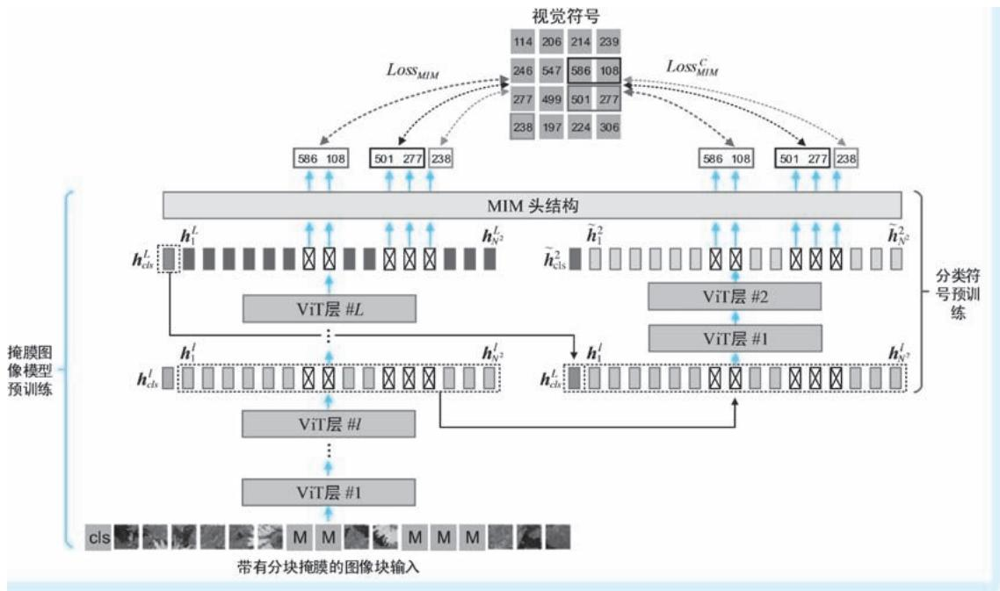  
●图 6-41 BEIT-2. 0 的预训练架构示意

在测评环节，作者首先将 BEIT-2.0 模型在 ImageNet-1K 数据集上进行预训练，然后将预训练得到的 BEIT-2.0 模型应用于图像分类和语义分割两种 CV 下游任务的适配。分类任务基于 ImageNet-1K 数据集展开，基础版 BEIT-V2 模型 （以 ViT-B/16 作为主干结构）的 top-1 分类精度达到 $8 5 . 0 \%$ ，在长时间训练 （1600 epochs，下同）策略下，上述精度能够进一步达到 $8 5 . 5 \%$ ，如果在此基础上再添加中间任务微调 （基于 ImageNet-22K 数据集，下同） 策略，BEIT-V2 的 top-1 分类精度能够达到 $8 6 . 5 \%$ 的“SOTA”水平。如果将模型替换为大规模版 （以 ViT-L / 16 作为主干结构），上述三种适配模式下的top-1 分类精度分别为 $8 6 . 6 \%$ 、 $8 7 . 3 \%$ 和 $8 8 . 4 \%$ ；语义分割任务基于 ADE20K 数据集进行，基础版BEIT-V2 达到的 mIoU 分割精度为 $5 2 . 7 \%$ ，在长时间训练和进一步添加中间任务微调两种策略下，分

割精度达到 $5 3 . 1 \%$ 和 $5 3 . 5 \%$ ；使用大规模版 BEIT-2.0 模型，上述三种适配模式下的 mIoU 分割精度分别为 $5 5 . 0 \%$ 、 $5 6 . 7 \%$ 和 $5 7 . 5 \%$ 。BEIT-2. 0 模型在下游两种 CV 任务上的表现完胜前任 BEIT-1. 0 模型，相较于其他基于掩膜图像模型目标构造的预训练模型，BEIT-2. 0 模型也取得了 “SOTA”的成绩。

# 4. MAE：基于自编码器的预训练模型

在上文中，我们为读者们介绍了 BEIT 模型，这是一个很像 BERT 的 CV 预训练模型———对输入图像进行分块处理并随机遮掩其中部分图像块，以自监督方式训练一个 ViT 模型，让其能够在输出端恢复这些被遮掩图像块，从而 “逼着”ViT 模型理解上下文图像语义特征。但是，我们知道 BEIT 模型试图恢复的并不是图像块本身，而是其对应的视觉符号。这就意味着 BEIT 模型必须事先在预训练模型之外，构造一个用来获取图像视觉符号的模型。那么我们不禁要问，是否能够训练模型重构图像块像素，而非其他表示，从而使得整个模型更加的简洁、更加的端到端呢？答案是肯定的，我们下文即将介绍的掩膜自编码器（Masked AutoEncoder，MAE）模型便是如此。MAE 模型于 2021 年 11 月，作者还是何恺明及其在 Facebook AI 研究团队[30] ，也即提出 MoCo 模型的原班人马。如果说 MoCo v3 是作者们以Transformer 为主干、在对比学习框架下构造的CV 自监督模型，那么在MAE 模型中，作者们采取了自编码这一更 “BERT”的技术路线。

在 MAE 的原文中，作者们开篇就进行了一番 “灵魂拷问”：为什么基于自编码模式的自监督预训练在 NLP 领域大行其道，但是在 CV 领域却明显滞后呢？作者分析其原因具体有三。第一，架构差异。CV 领域长期牢牢被 CNN 所统治，在 CNN 架构中开展掩膜或者位置嵌入等很 “NLP”的操作并不容易。当然，在 ViT 诞生之后，上述情况得到很大改观，两个领域之间的 “gap” 已经逐步缩小。第二，信息密度差异。自然语言可以认为是已经经过人类认知处理的产出物，因此其信息密度要远远高于图像、视频这样的具有大量信息冗余的视觉信号㊀①。这就意味着不能直接将 BERT 的掩膜机制照搬到 CV 领域，至少在图像遮挡策略上应该做调整。第三，解码器设计问题。这一问题还是因自然语言与视觉信号的差异所引起：自然语言已经是有限的符号化表示，因此在 BERT 的自编码模型中，所谓对被遮掩词汇的解码器 “重构”仅仅体现为对应隐编码向量的简单变换和分类 （例如，使用 MLP 结构结合softmax 预测被遮掩词汇对应的词典概率）。甚至我们认为在BERT 中压根就没有显式的解码器；但是在 CV 中，视觉信号是无限空间表示，因此对像素级的重构就严重依赖解码器设计，无法使用BERT 那样轻量化到近乎不存在的解码器就能够完成像素级重构。也正是因为这一原因，上文介绍的BEIT 模型才选择重构视觉符号，而非重构像素本身。

针对上述三个问题中的第一个问题，作者们的解决方案就是使用 ViT 而非 CNN，这样便很容易地开展分块遮掩和位置信息融合等操作。当然，这一做法并非首创，上文介绍的 iGPT 和 BEIT 两个模型早就采用了这一模式。针对第二个问题，作者们认为既然图像本身就含有大量冗余信息，那多遮掩一些也无妨。因此作者们即采用大比例的图像块随机遮掩这一简单的策略，并证明了这一方式的有效性。上述遮掩策略与 BERT 的操作正好相反，毕竟自然语言信息密度很高，每个词汇可能都承载了重要的语义信息，故 BERT “不敢”遮掩太多词汇 （一般只对输入序列中 $1 5 \%$ 的词汇进行遮掩）。但是

MAE 的遮掩比例超过 $7 5 \%$ ；针对第三个问题，为了恢复像素级视觉信号，作者们使用了比 BERT“重”得多的解码器结构，且该结构也为 ViT 结构，只不过相较于编码器中 ViT，解码器要轻量化不少。这便是 MAE 模型，一个具有 ViT 编码器-解码器架构、以像素级重构大比例遮掩图像块为目标的CV 自监督模型。MAE 模型的整体预训练架构如图6-42 所示。

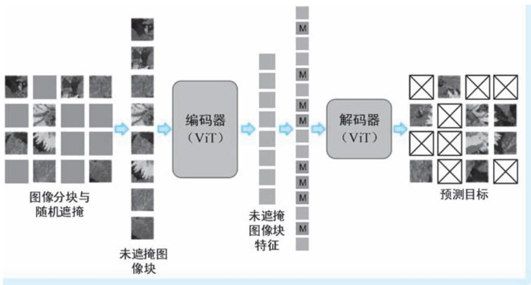  
●图 6-42 MAE 整体预训练架构示意

如图6-42 所示，MAE 的预训练架构非常简单，其利用编码器对输入的图像块进行编码，然后再通过解码器对被遮掩的图像块进行重构，然后用被遮掩图像块的真值监督编码器的编码和解码器的重构，可谓一气呵成，清晰明了。下面我们重点了解一些其中的细节。在编码部分，与 ViT 的标准操作相同，输入图像首先被均匀的分为图像块，然后这些图像块被展平为向量，并进行线性嵌入并添加位置嵌入，然后随机地选择其中一少部分 （如 $2 5 \%$ ）作为不做遮挡的图像块特征，送入编码器进行编码，其余的大部分图像块 （如 $7 5 \%$ ）就视为是被遮掩图像块。请读者注意，MAE 只对那些没有被遮挡的图像块进行编码，这一操作方式与 BERT 是不同的，在 BERT 中，“＜MASK＞”标识符也被视为普通词汇参与编码。由于在 MAE 中，未被遮掩的图像块只占到一小部分，因此上述做法能够大幅降低编码器的计算量。除此之外，MAE 也像 ViT 那样，在输入序列的首部添加分类符号，该分类符号对应的编码输出将为后续的线性探测和微调提供全图聚合特征。在解码部分，在获得编码器对未遮掩图像块的编码特征后，MAE 首先对这些输出特征再进行一次线性嵌入操作，使得其维度与后续的解码器相适配。然后按照原图的遮掩位置，将掩膜特征填充回去。这里所谓的掩膜特征就是一个随机初始化的、维度与解码器特征维度相同的可学习向量，且所有掩膜特征共享参数。随后，上述完整的特征序列再一次被添加上位置信息。可以看出，解码器的解码对象包括了未遮掩图像块的编码器输出特征与遮掩图像块对应的掩膜特征，且两类特征都按照原始位置添加了位置信息；在损失计算部分，解码器为每一个图像块 （包括遮掩的和未遮掩的）输出一个解码器特征，然后 MAE 再对其进行一次线性变换，使得其维度能够与原始图像块的像素特征维度相同，即 $K ^ { 2 } C$ 。其中， $K$ 和 $C$ 即为原始图像的分块尺寸和通道数。这样一来，形状一致了，就方便进行逐像素损失计算了。随后，MAE 采用标准的均方误差 （Mean Squared Error，MSE）作为评估被遮掩图像块预测值与真值之间的损失，并回传梯度更新

编码器和解码器参数，以及各嵌入操作的参数。请读者注意，MAE 与 BERT 相同，只在被遮掩对象上设置损失进行监督。当然，作者们在原文的脚注中提到尝试了对所有图像块进行监督的模式，但是该模式效果稍差，故未被 MAE 采用。

最后我们来看看 MAE 的实验部分。在实验环节，作者们对 MAE 的性能和超参数配置进行了全方位的实验评估。整体来看，开展的实验包括两大部分：基于 ImageNet-1K 的分类实验和基于其他数据集的迁移学习实验。其中，在基于 ImageNet-1K 的分类实验中，第一个实验为基线模型构造。作者们以 ViT-L/16 模型作为其编码器 （即主干），首先在 ImageNet-1K 数据集上进行自监督预训练，然后再在相同的数据集上进行有监督的端到端微调 （即全部参数可调）和线性探测 （即固定主干网络，仅调整最后的线性变换参数）两种模式的适配，并在验证集上报告两种模式的 top-1 精度。作者们将端到端微调模式构造的 ViT 模型作为 MAE 基线模型，该模型经过 50 轮的微调迭代，top-1 精度达到$8 4 . 9 \%$ ，相较于从头训练 ViT-L / 16 的 $7 6 . 5 \%$ （经过200 轮迭代），精度上有着质的飞跃。这就意味着模型最终的精度表现与采用何种预训练方式有着紧密的关系；基于 ImageNet-1K 数据集的第二组实验即各种超参数设置的消融实验，改组实验也均包括端到端微调和线性探测两种模式，具体包括：图像块遮掩比例、解码器深度/宽度、遮掩符号使用、重构目标设计、数据增强、掩膜采样策略和迭代轮数等诸多方面。这组实验内容非常丰富，这里我们就不再详细展开，请读者自行查阅原文。基于 Ima-geNet-1K 数据集的第三组实验即 “SOTA” 对比实验。该组实验包括了两个具体实验，在第一个实验中，作者们将 MAE 与 DINO、MoCo v3 和 BEIT 三个自监督模型进行了对比。结果表明，包括 MAE 在内的四种模型表现十分接近 （MAE 稍高），但是 MAE 具有运行速度快、结构简单的巨大优势。特别是在使用 ViT-H/ 14 模型， $4 4 8 \times 4 4 8$ 分辨率下，MAE 的 top-1 精度达到 “SOTA”的 $8 7 . 8 \%$ 。在第二个实验中，作者们以 ViT-L/16 为主干，分别进行自监督预训练和有监督预训练两种模式下的精度对比，前者即 MAE 模式，后者即标准 ViT 模式。结果表明，MAE 仅凭 ImageNet-1K 数据集进行自监督预训练，其性能几乎与标准ViT 模型在JFT 300M 超大规模数据集进行有监督预训练达到的精度接近，而且表现出随着模型规模变大，精度也不断提升的现象。在迁移学习实验中，作者们将预训练得到 MAE的 ViT 作为主干应用于图像检测/分割 （即实例分割任务，任务模型为 Mask R-CNN，数据集为COCO）、语义分割 （任务模型为 UperNet，数据集为 ADE20K） 和分类 （数据集为 iNaturalists 和Places）三种下游 CV 任务。实验结果表明，基于 ImageNet-1K 进行预训练得到的 ViT 主干可以有效适配各类下游任务，其结果略好于当年的 “SOTA” 预训练模型 BEIT。但是，就架构简洁程度而言，MAE 相较于预测视觉符号的 BEIT 有着巨大优势。

# 参 考 文 献

[1]CARION N，MASSA F，SYNNAEVE G，et al. End-to-End Object Detection with Transformers [OL]. （2020-5-28） [2023-3-29]. https：/ / arxiv. org / abs / 2005. 12872.   
[2]ZHU X，SU W，LU L，et al. Deformable DETR：Deformable transformers for end-to-end object detection [OL]. （2021-3-18）[2023-3-30]. https：/ / arxiv. org / abs / 2010. 04159.   
[3] ZHENG M，GAO P，ZHANG R，et al. End-to-End Object Detection with Adaptive Clustering Transformer [OL]. （2021-12-18）[2023-4-12]. https：/ / arxiv. org / abs / 2011. 09315.

[4]CHEN M，RADFORD A，CHILD R，et al. Generative Pretraining From Pixels [C]. Vienna：International Conference on Machine Learning，2020.   
[5]DOSOVITSKIY A，BEYER L，KOLESNIKOV A，et al. An image is worth 16x16 words：Transformers for image recognition at scale [OL]. （2021-6-3）[2023-4-14]. https：/ / arxiv. org / abs / 2010. 11929.   
[6]TOUVRON H，CORD M，DOUZE M，et al. Training data-efficient image transformers & distillation through attention [OL]. （2021-6-15）[2023-4-19]. https：/ / arxiv. org / abs / 2012. 12877.   
[7]HINTON G，VINYALS O，DEAN J. Distilling the Knowledge in a Neural Network [OL]. （2015-3-9）[2023-4- 19]. https： / / arxiv. org / abs / 1503. 02531.   
[8]ZHENG S，LU J，ZHAO H，et al. Rethinking Semantic Segmentation from a Sequence-to-Sequence Perspective with Transformers [OL]. （2021-7-25）[2023-4-19]. https：/ / arxiv. org / abs / 2012. 15840.   
[9] D ASCOLI S，TOUVRON H，LEAVITT M，et al. Improving Vision Transformers with Soft Convolutional Inductive Biases [OL]. （2021-6-10）[2023-4-19]. https：/ / arxiv. org / abs / 2103. 10697.   
[10]CHEN H，WANG Y，GUO T，et al. Pre-Trained Image Processing Transformer [OL]. （2021-11-8）[2023-4-19]. https： / / arxiv. org / abs / 2012. 00364.   
[11]YUAN L，CHEN Y，WANG T，et al. Tokens-to-Token ViT：Training Vision Transformers from Scratch on ImageNet [OL]. （2021-11-30）[2023-4-20]. https：/ / arxiv. org / abs / 2101. 11986.   
[12]WANG W，XIE E，LI X，et al. Pyramid Vision Transformer：A Versatile Backbone for Dense Prediction without Convolutions [OL]. （2021-8-11）[2023-4-20]. https：/ / arxiv. org / abs / 2102. 12122.   
[13]HAN K，XIAO A，WU E，et al. Transformer in Transformer [OL]. （2021-10-26）[2023-4-20]. https：/ / arxiv. org / abs / 2103. 00112.   
[14] LIU Z，LIN Y，CAO Y，et al. Swin Transformer：Hierarchical Vision Transformer using Shifted Windows [OL]. （2021-8-17）[2023-4-20]. https：/ / arxiv. org / abs / 2103. 14030.   
[15]ZHOU D，KANG B，JIN X，et al. DeepViT：Towards Deeper Vision Transformer [OL]. （2021-4-19）[2023- 4-20]. https： / / arxiv. org / abs / 2103. 11886.   
[16]TOUVRON H，CORD M，SABLAYROLLES A，et al. Going deeper with Image Transformers [OL]. （2021-4-7） [2023-4-20]. https：/ / arxiv. org / abs / 2103. 17239.   
[17]SRINIVAS A，LIN T，PARMAR N，et al. Bottleneck Transformers for Visual Recognition [OL]. （2021-8-2） [2023-4-20]. https：/ / arxiv. org / abs / 2101. 11605.   
[18]YUAN K，GUO S，ZHOU A，et al. Incorporating Convolution Designs into Visual Transformers [OL]. （2021- 4-20）[2023-4-20]. https：/ / arxiv. org / abs / 2103. 11816.   
[19]WU P，XIAO B，CODELLA N，et al. CvT：Introducing Convolutions to Vision Transformers [OL]. （2021-3- 29）[2023-4-20]. https：/ / arxiv. org / abs / 2103. 15808.   
[20]DAI Z，LIU H，LE Q V，et al. CoAtNet：Marrying Convolution and Attention for All Data Sizes [OL]. （2021- 9-15）[2023-4-20]. https：/ / arxiv. org / abs / 2106. 04803.   
[21]XIE E， WANG W， ANANDKUMAR A， et al. SegFormer： Simple and Efficient Design for SemanticSegmentation with Transformers [OL]. （2021-10-25）[2023-4-20]. https：/ / arxiv. org / abs / 2105. 15203.  
[22]HE K，FAN H，WU Y，et al. Momentum Contrast for Unsupervised Visual Representation Learning [OL].

（2020-3-23）[2023-4-22]. https：/ / arxiv. org / abs / 1911. 05722.   
[23] CHEN X，FAN H，GIRSHICK R，et al. Improved Baselines with Momentum Contrastive Learning [OL ]. （2020-3-9）[2023-4-22]. https：/ / arxiv. org / abs / 2003. 04297.   
[24]CHEN X，XIE S，HE K. An Empirical Study of Training Self-Supervised Vision Transformers [OL]. （2021-8- 16）[2023-4-22]. https：/ / arxiv. org / abs / 2104. 02057.   
[25]CHEN T，KORNBLITH S，NOROUZI M，et al. A Simple Framework for Contrastive Learning of Visual Representations [OL]. （2021-7-1）[2023-4-22]. https：/ / arxiv. org / abs / 2002. 05709.   
[26]CARON M，TOUVRON H，MISRA I，et al. Emerging Properties in Self-Supervised Vision Transformers [OL]. （2021-5-24）[2023-4-22]. https：/ / arxiv. org / abs / 2104. 14294.   
[27]BAO H，DONG L，PIAO S，et al. BEIT：BERT Pre-Training of Image Transformers [OL]. （2022-9-3） [2023-4-23]. https：/ / arxiv. org / abs / 2106. 08254.   
[28]PENG Z，DONG L，BAO H，et al. BEIT V2：Masked Image Modeling with Vector-Quantized Visual Tokenizers [OL]. （2022-10-3）[2023-4-23]. https：/ / arxiv. org / abs / 2208. 06366.   
[29]WANG W，BAO H，DONG L，et al. Image as a Foreign Language：BEIT Pretraining for All Vision and Vision-Language Tasks [OL]. （2022-8-31）[2023-4-23]. https：/ / arxiv. org / abs / 2208. 10442.   
[30]HE K，CHEN X，XIE S，et al. Masked Autoencoders Are Scalable Vision Learners [OL]. （2021-12-19） [2023-4-23]. https：/ / arxiv. org / abs / 2111. 06377.   
[31] CORDONNIER J B，LOUKAS A，JAGGI M. On the Relationship between Self-Attention and Convolutional Layers [OL]. （2020-1-10）[2023-4-23]. https：/ / arxiv. org / abs / 1911. 03584.