#

# 多模态机器学习中的注意力机制

每一种信息的来源或者形式都称为一种模态（Modality）。对于人类，眼睛、鼻子、耳朵、触觉系统都是从外界获取信息的传感器，它们所获得的外界信息都是一种独立的模态———视觉模态、嗅觉模态、听觉模态和触觉模态。我们人类就生活在一个多种模态相互交融的环境中，可以说我们所做的一些认知都是基于多模态信息完成的。在日常生活中，对多模态信息处理的例子比比皆是：我们在和某人聊天时，一边听着对方的声音一边看着其表情和动作，听觉和视觉两种模态的信号被我们同时加工；我们在享受美食时，所谓的 “色香味俱全”就是我们对美食的多模态认知；我们看见一块烧红的铁块，并感受到其阵阵热浪，做出了 “它很烫”的正确判断，这便是我们动用视觉和触觉两种模态得到的判断结果等。

计算机与我们 “生活在”同一个多模态的世界———其所处理的图像、语音、视频、文字等也是典型的多模态信息。计算机如果想象我们人类一样理解我们周围的世界，那么它必须能够解释和处理多模态信息。多模态机器学习（MultiModel Machine Learning，MMML）便是能够处理、关联并分析来自多种模态信息的机器学习分支。多模态机器学习公认是未来 AI 领域最重要的研究方向之一。而在多模态机器学习模型中，注意力机制在区分特征重要性、建立特征关系等方面，扮演着重要的角色。在本章中，我们即将注意力转移到另外一个注意力应用更加宏伟的舞台———多模态机器学习领域。该领域可以说是当今人工智能发展最为活跃、成果最为璀璨的领域。

# 多模态技术发展史多模态技术发展史

我们先来简要回顾一下多模态机器学习的历史。在国际计算语言学学会 （Association for Computa-tional Linguistics，ACL）2017 年召开的大会上，来自 CMU 的 LP Morency 教授将多模态机器学习的整个发展历程概括为四个阶段[1] 。图7-1 示意了多模态技术发展历程中的主要 “故事线”。

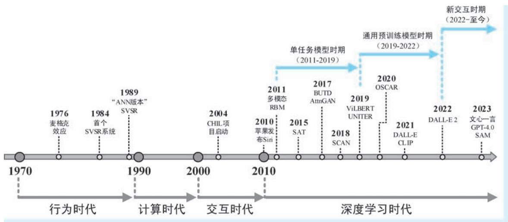  
●图 7-1 多模态技术发展历程中的主要 “故事线”示意

第一个阶段被称为 “行为时代”（The Behavioral Era，1970—1980 年年末）。该阶段，主要是一些

认知心理学家，从认知科学的视角研究我们人类自身对多模态信息的加工机制，发现了诸多对后续多模态研究有着建设性意义的认知现象。其中，最具有代表性的研究成果莫过于 “麦格克效应”（McGurk effect）。麦格克效应是 20 世纪 70 年代中期，英国萨里大学的心理学家哈里·麦格克 （HarryMcGurk）和约翰·麦克唐纳 （John MacDonald）发现的一种有趣的认知现象。两位科学家通过实验发现人类的听觉会受到视觉的影响，经常会产生误听现象，甚至还会在脑海中虚构出第三种不存在的声音———当明明听到的是 “啊”，但是看到的口型却是 “喔”时，我们往往不会认为听到了 “啊”，甚至还会产生幻觉，认为听到的是 “咦”这一压根就不存在的第三种声音。麦格克效应体现了人类在语音感知过程中与听觉和视觉之间的相互作用，表明人类在进行声音辨识时，视觉会对听觉系统的工作施加重要影响。1976 年，这两位心理学家在 《自然》杂志上发表了上述研究成果。文章的标题非常有趣，叫作 “听见唇动与看见声音” “Hearing Lips and Seeing Voices”。

第二个阶段被称为 “计算时代” （The Computational Era，1980 年年末—2000 年）。在这一阶段，人们开始构建一些简单模型对多模态信息进行分析，其中代表性的应用包括多模态视听语音识别（Audio-Visual Speech Recognition，AVSR）、多模态情感计算 （Affective computing） 等。这一阶段的多模态模型具有两个典型特点，第一，模型结构相对简单，如使用浅层神经网络、马尔可夫链等；第二，该阶段的模型往往具有比较厚重的仿生学背景。例如，在 1984 年，伊利诺伊大学的 Eric Petajan在其博士学位论文中认为计算机对纯粹语音信号的自动识别是不准确的，应该利用唇读 （lipreading）等视觉信号来增强自动语音识别能力，就像人类在听觉退化时使用唇读来增强语音辨识能力一样。基于上述思想，Petajan 研发了一个自动唇读系统，综合处理音频和口型视频双模态信号，可以说这是世界上第一个完整的 AVSR 系统；1989 年，来自马里兰大学的 Ben P. Yuhas 等三名学者基于麦格克效应，利用浅层神经网络对语音和视觉信息进行整合，以提高语音辨识的准确率，特别是在语音信号带有噪声时，视频信号对其信息的补充作用就变得十分明显。

第三个阶段被称为 “交互时代”（The Interaction Era，2000—2010 年）。在这一阶段，人们主要从多媒体人机交互的角度入手，研究多模态识别问题，试图让人与机器像人与人之间那样开展互动。上述研 究 方 向 还 有 一 个 专 有 名 称———多 模 态 人 机 交 互 （Multimodal Human-Computer Interaction，MMHCI）。例如，CMU 的 Alex Waibel 教授主导的 CHIL （Computers in the Human Interaction Loop） 项目，旨在将计算机置于人类交互循环中，多传感器多模态信号处理，开展面对面人机交互；我们耳熟能详的苹果语音助手 Siri，便是处于本阶段美国历史上最大规模人工智能项目 CALO （CognitiveAssistant that Learns and Organizes） 的产物。在这一阶段，多模态模型主要还是通过浅层网络、概率图模型、支持向量机等所谓的 “传统机器学习”方法构造。

第四个阶段为 “深度学习时代”（The Deep Learning Era，2000 年至今）。2011 年，来自斯坦福大学的 Jiquan Ngiam 等[2] 学者 （我们所熟悉的 Andrew $\mathrm { N g }$ 老师也是作者之一）在 ICML 会议上发表文章，提出了一系列多模态学习任务，并给出了如何利用受限玻尔兹曼机 （Restricted Boltzmann Machine，RBM）学习不同模态数据特征以应对这些任务的具体模式。作者们还展示了跨模态特征学习的方法，证明了在使用多个模态 （例如，使用音频和视频两种输入）时，学习得到的特征具有更强大的表达能力。该工作可以算是深度学习多模态机器学习的开山之作。随后，深度学习技术逐渐成为 AI 领域的主导技术，同时人们开始拥有更强大的计算资源以及规模更加庞大、信息也更为丰富的多模态数据

集，基于深度学习的多模态机器学习也在诸多有利因素的加持下逐渐繁荣起来。

在最近的五到六年间，CV 和 NLP 两个领域取得突飞猛进的进展，于是视觉语言 （Vision-Language，VL）双模态模型的研究也随即进入爆发时期，成为多模态机器学习领域中最重要、也是成果最为丰硕的研究方向。尤其是在最近两年，视觉语言模型所取得的长足进步，将多模态机器学习乃至整个人工智能领域推到了一个前所未有的高度，让人们不禁认为人工智能真的要来了。如果按照模型的任务性质分类，整个深度学习时代可以细分为三个具体时期。

第一个时期为单任务模型时期（2011—2019 年）。顾名思义，在该时期绝大多数的多模态模型均为仅用来完成单一任务，例如，此时期的视觉语言模型都旨在完成看图说话 （Image Captioning，IC）、视觉问答 （Visual Question Answer，VQA） 和图文匹配 （Image-Text Matching，ITM） 等单一任务。

第二个时期为通用预训练模型时期（2019—2022 年）。之所以视觉语言模型也走上预训练模型的道路，主要原因还是受到预训练范式在 NLP 领域和 CV 领域取得成绩的鼓舞和激励。人们已经不再将目光局限在一个个具体的视觉语言任务上，而是倾向于像 NLP 中的 BERT 和 GPT 那样，打造能够应用于各种下游视觉语言任务的通用预训练模型。其中开山之作为佐治亚理工大学于 2019 年 8 月提出的任务无关视觉语言模型 ViLBERT[3] ，随后诞生了诸多视觉语言版 “BERT 们” 和 “GPT 们”。当然，最具里程碑意义的视觉语言预训练模型莫过于 2021 年2 月由 OpenAI 提出的基于对比学习的 CLIP[4] 。

第三个时期我们称之为 “新交互时期”（2022 年至今）。这是一个人工智能领域发生深刻变革的时期。首先，人工智能内容生成 （AI Generated Content，AIGC）技术突飞猛进。例如，在 2021 年 2月，OpenAI 提出的 DALL- $E ^ { [ 5 ] }$ 文本-图像生成模型，能够基于自然语言生成以假乱真的图像；2022 年 4月，OpenAI 在其 DALL-E $2 ^ { [ 6 ] }$ ]中，将 CLIP 与扩散模型 （Diffusion Models）[7][8][9][10] 进行强强联合，达到了更加惊艳的文本到图像生成效果。2022 年年底，ChatGPT 闪亮登场，其能够与人类开展流畅自然的对话，着实令人震惊不已；到了 2023 年，受到广泛关注的百度文心一言、微软的 GPT-4. 0 以及其他一些视觉语言大模型也相继诞生，在这些大模型中，计算机几乎已经能够以图文并茂的方式和人类进行灵活交互；2023 年 4 月，Meta （即原 Facebook） 发布 “分割一切模型” （Segment Anything Model，SAM），该模型首次将 NLP 领域的提示学习范式引入 CV 领域，通过提示方式与机器交互，试图让机器能够掌握物体的一般概念，即所谓 “分割万物”。SAM 的诞生，将 “以数据为中心的人工智能”（Data-Centric AI）这一理念又往前推进了一大步。在新交互时期，相较于上述多模态机器学习第三阶段的交互时代，这一时期的交互水平已经有了质的飞跃，可谓今非昔比。人们似乎已经看到，通用人工智能 （Artificial General Intelligence，AGI） 离我们越来越近。

# 7. 2 多模态机器学习面临的挑战

2017 年，LP Morency 教授在 ACL 会议上，将多模态机器学习所面临的技术挑战概括为五大方面，包括表示 （Representation）、 翻 译 （Translation）、 对 齐 （Alignment）、 融 合 （Fusion） 和 协 同 学 习（Co-learning）[1][12] 。到了 2022 年，经过对五年多模态机器学习发展的重新审视和概括，LP Morency教授在 CVPR 会议以及随后发表的关于多模态机器学习的综述性文章中，与时俱进地将上述五大挑战订正为六大挑战，即：表示、对齐、推理 （Reasoning）、生成 （Generation）、迁移 （Transference） 和

量化 （Quantification）[13] 。在上述挑战中，绝大多数都与注意力机制高度相关。下面，我们对两个版本的挑战 （以下简称为 “1. 0 版挑战”和 “2. 0 版挑战”）进行重新整合，将注意力机制在多模态机器学习中的应用分为多模态表示、多模态对齐和跨模态生成三大类。

应用1———多模态表示（Multimodel Representation）。多模态表示是多模态机器学习中最为基础的任务 （或挑战）之一。多模态表示旨在挖掘多种模态数据之间的互补性和冗余性，对多种异质信息进行有机整合，实现模态间的信息互补和冗余滤除，从而得到更加强大的特征表示。例如，在构造 AVSR系统时，同时收集语音和口型视频两种模态的数据。但是语音信号可能含有噪声，我们便可以将语音信号和口型视觉信号相结合来更准确地判断某人到底说了什么等。具体来说，多模态表示又主要包括两大研究方向：联合表示（Joint Representation） 和协同表示（Coordinated Representation）㊀①。其中，联合表示将多模态数据变换到一个共同的特征空间，得到不同模态的联合表示，即实现 “多变一”。在该模式中，注意力机制体现为在多个模态的数据上交叉注意 （cross-attention），能够有效确定信息整合时 “多路人马”参与了多少、参与多大程度，并进行跨模态关系建模。图 7-2a 示意了联合表示方式及注意力的工作模式 （其中不同连线颜色的不同深浅表示不同强度的注意力权重）；而协同表示将每个模态变换到不同空间，但是这些空间之间互相具有约束关系 （例如，使用特征之间的余弦距离进行特征约束等）。例如，以 CLIP[4] 为代表的图文对比学习就属于典型的协同表示学习：图像和文本 “各走各的路”，然后用对比损失来约束两个模态特征之间的关系。在协同表示模式中，注意力机制可以分别独立施加在两个独立的数据之上，在最终目标的驱动下关注各自的重点，以使得不同模态特征表达的能力更加强大。

应用 2———多模态对齐（Multimodel Alignment）㊁②。多模态对齐就是构建不同模态信息之间的对应关系。例如，在 AVSR 系统中，同时采集了语音信号和口型视频信号，那么每一个语音和口型都具有对应关系，而将二者相关联的 “纽带”就是两种模态共同表达的那个客观存在的，但存在于隐空间的真实语言内容；在视觉定位 （Visual Grounding）任务中，给定一幅图像和一段文字描述，需要确定与文字中的词或者短语对应的图像区域，在该应用中，进行对齐的多模态元素即文字中的词汇与图像中的区域等。多模态对齐可以分为显式对齐（Explicit Alignment）和隐式对齐（Implicit Alignment）两种具体模式㊂③。其中，显式对齐指的是针对两个不同模态的信号，明确给出其对应关系。前文我们提到的视觉定位任务就是一种典型的多模态显式对齐；而隐式对齐并不以输出对齐结果为目的，而是应用在

其他多模态任务的中间环节，为特征表示与融合等其他环节提供服务。两种对齐方式有点像视觉显著性检测和注意力机制之间的关系———显式对齐就是以对齐为目的，而隐式对齐则是在其他应用中“不知不觉”用到对齐，因此，准确地讲隐式对齐并不是一种平行于表示的独立工作。在对齐任务中，通过跨模态构建元素之间注意力权重，以此表达其中一个模态中的某元素和另一模态所有元素的关联强度。例如，在图 7-2c 所示的示例中，模态#2 中的第 2、第 7 个元素分别对模态#1 中第 3、第 6 个元素投射有强的注意力。因此，我们认为模态#2、#1 中，元素{2，3}以及元素 {7，6} 就具有对齐关系。

应用 3———跨模态生成（Cross-model Generation）。跨模态生成旨在基于一个模态的信号构造另一个模态的对应表示。LP Morency 教授按照目标模态内容的多少，将多模态生成细分为三大类㊀①，即：总结（summarization）、翻译（translation）和创造（creation）。其中，总结特指减少内容的跨模态生成，目的在于突出显示输入中最突出的部分。例如，在看图说话任务中，给定一幅图像，需要以一个词汇对图像进行概括，显然，这是一个信息凝练的过程。在这一模式下，注意力 “划重点”的机制就显得尤为重要———从诸多源模态的信号中确定核心要素并生成其在目标模态中的对应表示，即做到 “捡最重要的说”；翻译即指保持信息内容的模态到模态转换。翻译任务要求保持跨模态对齐的一致性，即所谓的 “一到一”生成。例如，在某些看图说话任务中，要求 “有什么说什么”，这便是所谓的翻译任务。在这种模式下，“有什么”这件事本身就是注意力机制的输出，只不过与总结任务相比，此处注意力的投射区域为多个；所谓创造即指由少到多的生成，允许在生成过程中带有合理的 “发挥”。例如，在近期十分火爆的AIGC 中，我们给定一个短语 “一头小熊”，希望计算机输出对应的图像。计算机为我们输出了一幅正在爬树的棕色小熊。“爬树”和 “棕色”我们并未要求，这显然是模型的合理化发挥。在创造模式中，注意力机制主要在于关系表达——— “爬树”与小熊有关系，“棕色”与小熊也有关系。图7-2d 为注意力机制应用于跨模态生成的示意。在该例中，注意力在模态#1 中的第 2 个元素以及在第6、7 个元素上投射有比较强的注意力，那么针对两个注意力投射区域，生成与之对应的语言模态表示 “two” 和 “six & seven”。

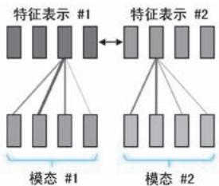  
b)

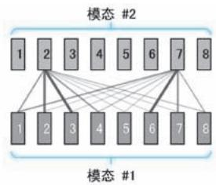

d   
●图 7-2 多模态表示、多模态对齐和跨模态生成示意 （其中不同连线颜色的不同深浅表示不同强度的注意力权重）  
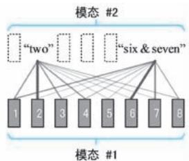  
a）联合表示  
b）协同表示  
c）多模态对齐   
d）跨模态生成

除此之外，无论是在 “1.0 版挑战”还是在 “2.0 版挑战”中，LP Morency 教授将多模态协同学习（Multimodel Co-learning）作为多模态机器学习的挑战之一㊀①。多模态协同学习通过在模态及其表示之间转移知识，旨在发掘其中一种模态的有价值信息来帮助另一模态建模，简单理解就是 “在做某一个模态的任务时，用到了其他模态的信息”。多模态协同学习的一个重要应用场景即利用数据资源丰富且质量高的某模态信息去协助那些数据资源匮乏模态任务的开展。例如，我们在构建一个纯语音辨识系统时，考虑到语音信号存在比较严重的噪声干扰，为了让语音特征表示更具鲁棒性，我们可以在训练阶段引入口型视频信号，利用其对语音信号的特征表示进行约束和校正；再例如，在诸多视觉语言任务中，有一大类模型属于 “文本引导的视觉任务” （Text-Guided Visual Tasks），针对此类任务的视觉语言模型通过综合学习语言特征和图像特征，将前者作为后者的 “提示” （prompt），为后者补充引导信息，从而进一步提升图像分类、目标检测、语义分割等 CV 任务的水平。然而，多模态协同学习并不是一种具体的多模态数据的处理操作，而是从目的角度阐述的一种框架，因此在其实现过程中会涉及多模态表示、对齐或者生成等各种多模态数据处理，而正如上文所说，这些处理正是注意力机制重要的应用场景。

# 7.3 视觉语言多模态模型视觉语言多模态模型

所谓视觉语言 （Vision-Language，VL）模型，顾名思义就是构建于视觉与自然语言两种模态上的机器学习模型。CV 和 NLP 是人工智能领域中最重要的两个分支，而二者的 “联姻”———视觉语言模型必然也是多模态机器学习中最重要的方向之一。特别是在 2018 年后，CV 和 NLP 两个领域取得突飞猛进的进展，于是对于视觉语言模型的研究也进入爆发时期，视觉语言也逐渐成为整个多模态机器学习领域受到关注最多、发展最为迅猛、前景最为广阔的研究与应用方向，特别是在2022 年后，视觉语言多模态方面的研究成果更是让人惊喜连连。在某种意义上讲，视觉语言模型已经可以作为整个多模态机器学习的代名词。因此，我们在下文中也将目光聚焦到视觉语言模型这一更加具体的多模态机器学习方向，其依托思想、所用技术在其他模态数据分析的应用中也同样适用。

# 7. 3. 1 视觉语言任务简介 视觉语言任务简介

下面我们首先简单介绍视觉语言任务。总体来看，视觉语言任务分为生成（Generation）、理解（Understanding）、检索（Retrieval）、视觉定位（Visual Grounding） 和提示驱动视觉任务（Prompt-GuidedVisual Tasks）五大类。其中生成类任务和理解类任务可以视为 NLP 领域中 NLG 和 NLU 任务的 “图文版”。每大类任务下又细分为若干子任务，如图7-3 所示。

  
●图 7-3 主要的视觉语言任务示意

视觉语言生成任务指在图像㊀①模态和文本模态之间，开展跨模态的生成，可以与NLP 中的机器翻译任务做类比。既然是跨模态生成，那么必然涉及生成的方向问题，即包括图像到文本的生成（Image-to-Text Generation） 和文本到图像的生成（Text-to-Image Generation） 两种具体的任务。其中，图像到文本的生成也称为 “看图说话”（Image Captioning）任务，简单来说就是输入一幅图像，输出能够对这幅图像进行描述的一句话或是一组关键词。该任务要求计算机一方面实现对图像的理解———能够识别图像中的物体和场景，另一方面还要求机器实现类似于人的语言组织能力———用合理的语言将其理解的图像内容表达出来。文本到图像的生成则是相反的过程：给定一段文字或是一组关键词，要求计算机以一幅能够表达其语义的图像作为输出。该任务要求计算机一方面理解 “人话”，另一方面还需要其“会画画”。相较于图像到文本的生成，文本到图像的生成更加具有挑战性。毕竟从图像生成文本等同于信息摘要，要去除信息冗余，“捡重点的说”即可。例如，所给的图像展示了一幅鸭子游泳的场景，无论图像上显示什么样的鸭子在怎样的水里游泳，只要生成的描述文本中有 “鸭子”和 “游泳”，生成任务基本就算过关，至于是不是在鸭子之前冠以 “漂亮的”或者 “水”是 “碧绿的”还是 “清澈的”，都无伤大雅。但是从文本生成图像则正好相反，这是一个做加法的过程，文字中涉及的内容需要体现，还需要 “无中生有”地添加一些视觉冗余信息才能使得生成的图像更加自然逼真。例如，给定的文字是 “鸭子游泳”四个字，那生成的图像还得考虑鸭子的羽毛是什么颜色、泳姿如何等，水是什么颜色，是不是有波纹，鸭子在水中的倒影等在所给文本以外的信息，特别是还要将这些虚构出的内容与文本要求的 “必选科目”完美的结合。近些年，文本到图像生成的技术可谓突飞猛进，生成的

图像以假乱真，构成了基于人工智能的内容生成 （AI Generated Content，AIGC）技术的重要组成部分。图7-4 为图像到文本和文本到图像生成两种任务的示意。其中第一行和第二行示意了针对三幅给定的图像的文本生成结果 （注：该图为示意，并不是任何真实算法的运行结果）；第二行和第三行为基于给定文本进行图像生成的示意 （注：采用 Craiyon㊀①生成）。

  
A baby girl inred is ridinga bicycle.

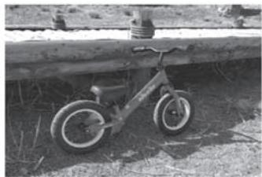  
Apink baby bicycle is leaning against the wooden bridge.

  
A duck is standing on a stone in the water.

●图 7-4 图像到文本和文本到图像生成两种任务的示意  
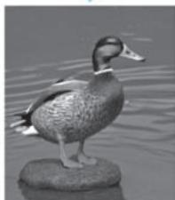  
（注：图像到本文的生成为笔者虚构，文本到图像的生成采用 Craiyon 实现）

视觉语言理解任务一般包括视觉问答（Visual Question Answer，VQA）、视觉对话（Visual Dialog，VD）、视觉推理（Visual Reasoning，VR）和视觉蕴含（Visual Entailment，VE） 四个子任务，视觉语言理解可以视为 NLP 中 NLU 任务在图文多模态场景中的扩展。其中，视觉问答要求计算机按照视觉内容回答问题，其具体的任务定义为：给定一幅图像和一段问题文本，要求计算机基于图像回答该问题。因此，视觉问答任务可以表示为 answer $=$ VQA（image，question）。例如，在图 7-5a 所示的示例中，我们给的计算输入为一幅图像以及问题 “船是什么颜色的”，计算机按照图像实际内容给出了 “白色”这一正确答案。视觉对话要求计算机以自然的对话语言与人类就视觉内容进行有意义的对话，其具体任务设定为：给定一幅图像、一个对话历史记录和一个关于图像的后续问题，要求计算机回答这个问题。视觉对话任务可以表示为 answer $^ { \ast = }$ VD（image，dialog，question）。相较于视觉问答任务，视觉对话任务的输入多了对话历史记录，这就要求模型具备更强的语言理解能力，能够从对话内容中抽取 “蛛丝马迹”，毕竟对话历史记录是自然而连续的，其中存在大量的代词，这就要求计算机能够理解这些代词具体指代的是什么。例如，在图7-5b 所示的示例中，给定了一幅向日葵的图像，以及一系列关于该图像的历史对话，并且提出了 “花是什么颜色的”问题，模型按照图像和历史对话，给出了 “黄色”

这一正确答案。视觉推理任务与视觉问答任务类似，也是要求计算机回答问题，但是视觉推理的问题涉及更多细化的对象属性及其关系，形式也更加多样，这就要求计算机对图像和语言的理解更加深刻。最基本的视觉推理任务㊀①（以下简称为 “基本视觉推理任务”） 简单来说就是按照 “一图加一问”给出回答，表示为 answer $=$ VR（image，question）。例如，在图 7-5c 所示的示例中，针对所给图像提出 “自行车后边是一座木桥吗”这样带有对象关系的问题，计算机给出了正面答复。在视觉推理中，还包括两幅图像加一个文本的输入模式，此类视觉推理任务一般被称为 “自然语言视觉推理”（Natural Language Visual Reasoning，NLVR），表示为 answe $=$ NLVR（image ， ${ \mathrm { i m a g e } } _ { 2 }$ ，statement）。其中，文本一般为针对两幅图像关系的陈述或者问题，任务要求模型理解两幅图像的内容，判断陈述的正确与否或是对问题进行作答。例如，在图7-5d 所示的示例中，针对给定的两幅图像和 “左图鸭子数量是右图三倍”的陈述，计算机给出了 “真”的判断结果。2018 年 11 月，Rowan Zellers 等[14] 来自华盛顿大学的学者们提出了上述基本视觉推理任务的升级版———视觉常识推理（Visual CommonsenseReasoning，VCR）任务并公开了相关数据集。视觉常识推理是一种非常具有挑战性的视觉语言任务，需要计算机首先根据图像内容开展视觉问答，然后再根据自身掌握的常识开展推理。上述两个步骤可以表示 answer $\mathbf { \partial } \cdot = \mathrm { V Q A }$ $^ { \ast = }$ （image，question）和 reason $=$ CR（commonsense，answer） （其中 “CR” 为 “Common-sense Reasoning”的简写）。Rowan Zellers 等学者对该任务的具体设定为：给定一幅图像，以包围框标注其中的一些对象，首先让计算机回答第一道形如 “某对象在做什么”或 “对象 A 对对象 B 做某事是因为什么”的选择题，然后再要求计算机按照常识做第二道选择题以回答为什么做出上述选择。例如，在图7-5e 所示的示例中，给定了一幅图像以及其上某一建筑的标注 “Building 1” （当有多个目标物时，即以 “Building 2”“Building 3”的方式续写），第一个问题是问 “Building 1”为何种设施，计算机对图文进行充分理解后，选择了 “铁路隧道”这一正确答案；紧接着，再从四个答案中选择 “因为有铁路”作为做出第一步选择的理由。视觉蕴含任务是文本蕴含任务的 “图像前提版”———在文本蕴含任务中，给定一个语句作为前提 （premise），再给定另一个语句作为猜测 （hypothesis），预测后者是否能够从前者推理得到。但是在视觉蕴含任务中，需要将前提替换为一幅图像，即要求计算机判断是否能够通过图像推理得到文本表示的猜测。视觉蕴含任务可以表示为 answer $\mathbf { \tau } =$ VE（image，hypothe-sis）。例如，在图7-5f 所示的示例中，基于我们给定的图像，在给定的三点猜测 （分别记作H1～H3）中，猜测 “小女孩在滑轮滑”显然是成立的 （答案为 T），猜测 “小女孩在吃午饭”显然是不成立的（答案为 F）；而从给定图像无法看出运动速度，故对于猜测 “小女孩滑的很快”是否成立无法做出判断 （答案为 U）。

视觉语言检索任务也称为 “图文匹配”任务 （Image-Text Matching，ITM），其中包括图像到文本的检索（Image-to-Text Retrieval） 和文本到图像的检索（Text-to-Image Retrieval） 两个子任务，二者互为逆过程。其中，前者特指给定一幅图像，从文本库中检索得到与之相匹配的文本，如图 7-6a 所示；而后者则是给定一段文本描述，从图像库中检索与之匹配的图像，如图7-6b 所示。无论是哪个方向的检索，视觉语言检索任务的核心工作都是计算图像和文本的相似度。目前，计算图像和文本相似度的方

式包括基于融合特征的相似度预测和基于独立特征的相似度计算两种，二者分别对应多模态特征表示中的联合表示和协同表示。其中，基于融合特征的相似度预测可以表示为 similarly $=$ sim_pred（joint_repr（image，text）），即先将图像和文本特征进行 “充分搅拌”，然后再基于联合特征开展相似度预测；而基于独立特征的相似度计算可以表示为 similarly $=$ dist（repr（image），repr（text）），即让图像和文本“各走各的路”，分别获得两种模态的特征表示后，再计算二者的相似度。

  
Q:What color is the boat?   
A:White.   
a)

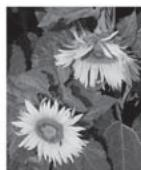  
Dialoghistory   
X:How many   
flowers are there?   
Y:Two.   
X:Do they have   
leaves?   
Y:Yes.

Q:What color are the flowers? Q:What color are the flowers?

  
A:Yellow.   
b)

  
Q: Is there a wooden bridge behind the bicycle?   
A:Yes.  
c

  
S:The number of ducks inthe leftimage is three times that in theright image.   
A:True.

  
d

  
Q: What facility is the[Building 1]?   
A)A house.   
B)A railway tunnel.   
C)Achimney.   
D)Adam.   
→A) Therc is a train passing by.   
为何B)Thereare workers working   
选BC)Thereisarailway.   
D） built in the mountains.   
e)

  
H2: The litle gid moves vcry fast   
H3: A litte girl is cating her lunch.

H1: A little girlis rollerskating.

  
A1:T

  
A2:U

  
A3:F   
  
●图 7-5 视觉语言理解任务的子任务示意 （注：该图为示意，并不是任何真实算法的运行结果）

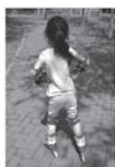  
a）视觉问答 b）视觉对话 c）基本视觉推理 d）自然语言视觉推理 e）视觉常识推理 f）视觉蕴含

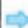  
Alittle girl is roller skating. (score:0.99)   
A people is running.(score:0.93)   
Aperson who is exercising. (score:0.92)   
Agirl onthe playground.(score:0.87)   
A girl is walking (score:0.77)

  
a)

  
A duck is standing on a stone in the water.

  
  
●图 7-6 视觉语言检索任务示意 （注：该图为示意，并不是任何真实算法的运行结果）  
a）图像到文本的检索  
b）文本到图像的检索

视觉语言视觉定位任务旨在基于自然语言查询来定位图像中最相关的对象或区域。其中查询可以是一个短语、一个句子，甚至是一个多回合的对话。不难看出，视觉定位任务要求计算机做到图像区域与词汇、短语等文本元素的对齐，因此我们可以将其简单理解为多模态对齐的可视化任务。视觉定位任务具体包括短语定位（Phrase Grounding，PG） 和指代表达理解（Referring Expression Comprehension，REC）两个主要子任务㊀①。其中，短语定位任务要求计算机将所给文本中的名词性短语在图像上进行定位，简单理解就是实现将文本描述的物体与图像描述物体进行对齐。例如，在图 7-7a 中，描述文本为 “一只鸟站在有两个果实的树枝上”，其中名词性短语包括 “一只鸟”“两个果实”和 “树枝”，故短语定位就需要在图上将上述要素全都定位出来 （图中左右两图分别为包围框和热力图两种定位方式，下同）；而在指代表达理解任务中，对计算机的要求就高了一大截：文本描述中包含了对象间关系，以及关于对象的各种描述，任务要求计算机只在图上定位特指的对象，而非短语定位那样定位所有名词。例如，在图7-7b 中，文本特指的是 “那只站在树枝上的鸟”，故计算机的定位输出只能就是“那只鸟”，而不能包括其他。除此之外，视觉定位还包括了一些更加具体的定位任务，例如， “基于人的视觉定位” （Person-Centric Visual Grounding，PCVG） 就要求在图像上定位文本所描述的具体人名。假设文本描述了一场篮球比赛，其中某两个著名球员正在激烈争球，则基于人的视觉定位就要求计算机在相关的新闻图片中定位两位球员，以辅助读者快速在图像上聚焦。当然，基于人的视觉属于短语定位的范畴，毕竟人名也是名词，而其也应该纳入指代表达理解的范畴，毕竟人名可以视为最为直接的人物指代。

  
A bird stands on a branch with two fruits.

  
a）

  
A bird still standing on the branch next to the onethatis flying away.

b）  
图 7-7 两种视觉定位任务示意 （注：该图为示意，并不是任何真实算法的运行结果）  
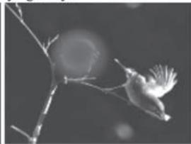  
a）短语定位 b）指代表达理解

提示驱动视觉任务完成的仍是图像分类、检测和分割等标准 CV 任务。但是在执行上述任务时，需要给模型以合理的文字 （甚至是其他交互信息）作为提示，使得模型能够按照提示得到相应的处理结果。相较于标准 CV 任务，提示驱动视觉任务最大的特点在于 “提示变则结果变”，因此更加灵活高效，具有强大的 “zero-shot”适配能力。提示驱动视觉任务的本质就是 NLP 领域广泛使用提示学习

（Prompt Learning），而提示学习在 NLP 中的强大威力想必大家已经通过 ChatGPT 深深地领教过。但是需要说明的是，与前面四种有明确定义和公开数据集的视觉语言任务不同，提示驱动视觉任务并不能算作是一种严格的任务定义，而更多地算是一种新兴的 CV 任务模式。但是就在几个月前，随着交互式模型构建方式的兴起，以 Meta AI 为代表的大机构也已经着手建立提示驱动分割任务及大规模数据集了，相信在不久的将来，提示驱动视觉任务一定会全面繁荣起来。

# 7.3.2 视觉语言模型中的注意力机制

人们对视觉语言多模态模型的研究起步于2000 年左右，十几年间，已经诞生了不下百种模型，其中包括应用于各类视觉语言任务的专用模型，而可以适配各类视觉语言下游任务的通用预训练模型更是数不胜数。按照注意力模型的架构，视觉语言模型中对注意力研究与应用可以分为四个时期，如图 7-8 所示。

  
●图 7-8 视觉语言模型的中注意力的阶段及经典模型示意

第一个时期为 “无注意力时期”（—2015 年）。在该时期，人们已经开始构造看图说话、图文检索等单任务视觉语言模型。但是尚未在这些多模态模型中使用注意力机制。毕竟在该时期，单模态领域注意力机制的使用也刚刚起步。

第二个时期为 “注意力 $\mathrm { R N N + C N N }$ 时期”（2015—2019 年）。2014 年，人们开始使用注意力SeqSeq 模型代替标准的 SeqSeq 模型，注意力机制在 NLP 领域的应用也随机拉开序幕。受到注意力Seq2Seq 的启发，约书亚·本吉奥及其团队于2015 年提出用于看图说话任务的SAT （Show，Attend andTell）模型[15] ，该模型也是一个具有编码器-解码器的 Seq2Seq 模型，其中图像编码器具有 CNN 结构，而解码器部分则是带有注意力的 RNN 结构。SAT 模型的提出开启了视觉语言模型中注意力应用的先河。在随后，诞生了一批带有注意力机制的视觉语言模型，用来完成看图说话、视觉问答等单一多模态任务。针对图像和文本双模态输入，这些模型均采用 CNN 结构和 RNN 结构分别对其进行编码表示，而注意力也都表现为用于两种特征交互的交叉注意力机制。

第三个时期为 “Transformer+CNN 时期”（2019—2021 年）。2017 年，NLP 领域出了一件大事—Transformer 模型诞生。随后，整个 NLP 领域的模型清一色的从 RNN 架构变为 Transformer 架构，这股

浪潮自然也波及视觉语言双模态模型中的语言处理部分———视觉语言模型中的文本编码器瞬间全部“Transformer 化”。但是，此时 Transformer 在 CV 领域尚处于 “试水”阶段，故视觉语言模型中的图像编码器仍被 CNN 架构牢牢统治。除此之外，基于 Transformer 架构的预训练模型在 NLP 领域已经风靡已久。因此在视觉语言领域，人们也开始着手构造类似 BERT 和 GPT 的 “图文版”预训练模型。在这一时期，注意力的工作机制包括两种，一种为在两路模态特征之间以 “互查”方式进行特征融合的交叉注意力；另一种在文本单模态特征加工时使用的自注意力机制。

第四个时期为 “Transformer 主导时期” （2021 年至今）。2021 年，视觉 Transformer 在 CV 领域广泛使用，CNN 的地位也受到了严峻挑战。与此同时，在视觉语言多模态领域，人们也开始诟病以重量级 CNN （特别是目标检测模型）作为图像编码器太过臃肿的问题。视觉 Transformer 的诞生可谓 “久旱逢甘霖”———视觉 Transformer 开始全面介入视觉语言模型。在该阶段，视觉语言模型的架构总体上分为两种，第一种架构为后期融合 （late fusion） 架构。该架构一般具有 “双塔” 形态———文本编码器和图像编码器首先对两种模态的特征进行独立加工，后期再进行模态融合。而上述两种模态的编码器全都采用 Transformer 架构。因此，在这一架构下，注意力的使用体现为 “自注意力 $^ +$ 交叉注意力”模式——— “双塔”内部的单模态特征处理使用的是自注意力机制，而交叉注意力则应用于后期模态融合操作中跨模态交互。第二种架构为先期融合 （early fusion）架构。该架构一般具有 “单塔”形态图像块被视为词汇，也像词汇那样进行各类嵌入操作，随后与文本一并送入一个统一的Transformer 模型。此时此刻，图像和文本的特征已经别无二致，因此一开始就利用自注意力机制让两种模态的特征 “水乳交融”。

# 7.4 经典多模态模型剖析经典多模态模型剖析

接下来，我们分四部分对视觉语言模型以及其中的注意力机制进行剖析。其中，第一部分为对早期单任务视觉语言模型的剖析，这些模型都是针对看图说话、视觉问答等单一视觉语言任务而设计的；第二部分为对视觉语言预训练模型的剖析，这些模型是作为适配各类具体视觉语言下游任务的通用基础模型而构造的；第三部分为针对提示驱动下 CV 模型的讨论，这些模型都是针对 CV 任务而设计的，但却都采用了提示驱动的新模式；第四部分为针对几种新型图像生成模型的剖析，而这些模型都是当代 AIGC 领域的经典模型。

# 7. 4. 1 早期单任务视觉语言模型

早期有关视觉语言多模态的工作多集中在单一任务上，以 “一任务一模型”的方式开展模型构造，注意力机制的赋能也是如此。那么在这部分内容中，我们对早期的经典单任务视觉语言模型展开分析，其中涉及的具体模型包括五个，针对视觉语言任务包括图像到文本的生成任务 （以下将该任务简称为 “看图说话”）、视觉问答任务、文本到图像的生成和视觉语言检索任务 （以下将该任务简称为 “图文匹配”）四种。

# 1. SAT：看图说话

在 NLP 领域，机器翻译是典型的序列到序列任务，最早的模型基于 RNN 编码器-解码器的

Seq2Seq 模型。而到了图文多模态任务中，看图说话要求针对输入的图像生成文本描述，其本质也是一种翻译任务，只不过是跨了图像和文本两个模态而已。因此在 2014 年 11 月，Oriol Vinyals等[22] 四名来自谷歌的学者参考标准 Seq2Seq 模型的思路，提出了应用于看图说话任务的 “Show andTell”模型（以下简称 “ST 模型”），该模型也具有编码器-解码器架构，只不过面对图像的编码器换为了 CNN。请读者注意，ST 模型的名称里没有 “Attend”，这就意味着该模型未使用注意力机制，故 ST 模型可视为标准 $\mathrm { S e q } 2 \mathrm { S e q }$ 模型的图文版。随后，注意力 $\mathrm { S e q } 2 \mathrm { S e q }$ 模型诞生，该模型在标准Seq2Seq 模型上引入注意力机制以提高机器翻译的质量。那么，是否能够在 ST 模型的基础上，也增加注意力机制，使得看图说话能够更加有效呢？这便是我们下文的主角———SAT 模型。2015 年 2月，Kelvin Xu 等[15] 学者受注意力 Seq2Seq 模型的启发，在 ST 模型的基础上，提出了看图说话模型SAT （简称来自论文题目 “Show，Attend and Tell” ）。SAT 模型既是注意力 Seq2Seq 的图文版，又是 ST 模型的注意力版。作为视觉注意力应用的开山之作 （自然也是视觉语言模型中注意力机制的开山之作），SAT 模型为看图说话任务乃至整个多模态机器学习方向打开了注意力的大门，影响极其深远。

图7-9 示意了 SAT 模型的工作模式。SAT 模型也采用了编码器-解码器架构。下面，我们从六个方面将其与机器翻译的注意力 Seq2Seq 模型进行对比。首先是四点不同：在输入方面，注意力 Seq2Seq模型面对的是一段语言序列，而 SAT 模型面对的是一幅图像；在处理单元方面，注意力 Seq2Seq 模型

的处理单元为字、词等具有时间关系的语言单位，而 SAT 模型的处理单元为具有空间关系的图像区域；在编码器架构方面，注意力 Seq2Seq 模型使用 RNN 作为编码器架构，而 SAT 模型采用 CNN（准确地讲是 FCN）作为编码器架构；在注意力作用模式方面，注意力 Seq2Seq 模型的注意力机制体现为针对不同语言单位的注意力权重，而在 SAT 模型中则体现为针对不同位置卷积特征的注意力权重。然后是两点相同：在解码器架构方面，二者均采用 RNN 作为解码器架构；在输出方面，二者均以语言序列作为输出。

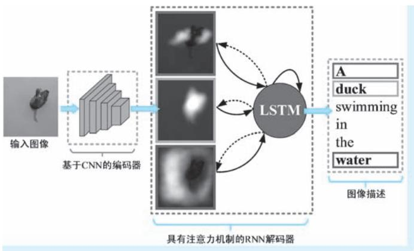  
●图 7-9 SAT 模型的工作模式示意

在注意力 Seq2Seq 模型中，编码器为 RNN 架构 （准确地讲是 LSTM），输入单词序列中的每个词汇都有一个隐状态向量作为对应词汇的特征表示。与之类似，SAT 采用 FCN 作为编码器，FCN 输出特征图与原始图像按照位置也具有对应关系。图7-10 为注意力 Seq2Seq 模型与 SAT 模型的对比示意。在图 7-10a 的注意力 Seq2Seq 模型中，RNN 隐状态 $h _ { 7 }$ 为输入序列中 “水”一词的特征表示。而在图7-10b SAT 模型中，FCN 输出特征图的某一位置也代表了原图与之对应区域的特征表示，这一区域同样也是 “水”，只不过这里的 “水”是一种视觉形式的存在。

在 SAT 模型中，FCN 作为编码器，针对输入图像的 $L$ 个位置输出 $L$ 个向量作为其特征表示，每个

特征向量的维度为 $D$ ，表示为㊀

$$
h = \left\{\boldsymbol {h} _ {1}, \boldsymbol {h} _ {2}, \dots , \boldsymbol {h} _ {L} \right\}, \boldsymbol {h} _ {i} \in \mathrm {R} ^ {D} \tag {7-1}
$$

  
a）

●图 7-10 注意力 Seq2Seq 模型与 SAT 模型的对比示意  
  
a）注意力 Seq2Seq 模型 b）SAT 模型

注意力 Seq2Seq 模型中的注意力体现为将基本 Seq2Seq 模型中的单一上下文序列替换为多个具有不同侧重的上下文序列，而每个上下文序列又是不同注意力权重下各特征表示的加权和，因此注意力模型的核心就是获取这些注意力权重。SAT 模型也是以类似的方式引入注意力机制，其核心也是针对多个上下文序列在每个卷积特征上指定一个注意力权重。针对第 $t$ 步的描述词汇生成，与该步骤匹配的上下文序列为 $\mathbf { \boldsymbol { c } } _ { t }$ ，对应每个卷积特征上的注意力权重记作 $\cdot \alpha _ { t i } ( i = 1 , 2 , \cdots , L )$ ），则所谓的注意力模型表达为一个函数 $f _ { \mathrm { a t t } }$ （在注意力 Seq2Seq 模型中对应函数称之为对齐模型 $a$ ）。在 SAT 模型中，该函数表达为一个 MLP 结构，其输入为上一步解码器隐状态 $\pmb { S } _ { t - 1 }$ 以及针对位置 $i$ 提取的卷积特征 $\pmb { h } _ { i }$ ，输出为注意力强度 （归一化之前的注意力权重），即

$$
e _ {t i} = f _ {\text {a t t}} \left(\boldsymbol {s} _ {t - 1}, \boldsymbol {h} _ {i}\right), i = 1, 2, \dots , L \tag {7-2}
$$

然后，同样使用 softmax 函数得到归一化注意力权重 $\alpha _ { t i } = \exp ( \boldsymbol { e } _ { t i } ) / \sum _ { \boldsymbol { k } = 1 } ^ { L } \exp ( \boldsymbol { e } _ { t { \boldsymbol { k } } } )$ 。 图 7-11 “鸭子游泳”例子中， $t = 1$ 和 $t = 2$ 时的注意力权重分布示意 （在该例中，FCN 输出的特征图尺寸为 $7 \times 7$ ，即$L = 4 9$ ）。

  
●图 7-11 “鸭子游泳”例子中， $t = 1$ 和 $t = 2$ 时的注意力权重分布示意

在不同的步骤 t，FCN 特征图的每一个特征位置 i，都有一个注意力权重 $\alpha _ { t i }$ 与之对应。有了注意力权重，SAT 模型通过构造注意力函数 $\phi$ ，将所有位置卷积特征与对应注意力权重进行融合，得到一个

上下文特征 $\mathbf { \boldsymbol { c } } _ { t }$

$$
\boldsymbol {c} _ {t} = \phi \left(\left\{\alpha_ {t i} \right\}, \left\{\boldsymbol {h} _ {i} \right\}\right), i = 1, 2, \dots , L \tag {7-3}
$$

通过构造不同的注意力函数 $\phi$ ，SAT 模型给出了两种可选的注意力机制：确定柔性注意力（Deterministic Soft Attention） 机制和随机硬性注意力（Stochastic Hard Attention） 机制。在确定柔性注意力机制中，注意力权重 $\cdot \alpha _ { t i }$ 扮演的角色是表达在第 $t$ 步中卷积特征 $\pmb { h } _ { i }$ 参与上下文序列 $\mathbf { \boldsymbol { c } } _ { t }$ 合成操作时的重要性，对应到输入图像即为分配到图像不同区域的注意力权重。这与注意力 Seq2Seq 模型中的注意力权重的作用是相同的，注意力函数 $\phi$ 的形式也是加权和，即

$$
\boldsymbol {c} _ {t} = \sum_ {i = 1} ^ {L} \alpha_ {t i} \boldsymbol {h} _ {i} \tag {7-4}
$$

在这种注意力机制下，整个模型光滑可微，符合对柔性注意力模型的定义，因此可以利用基于梯度反向传播来进行端到端的训练。SAT 模型在确定性柔性注意力机制下的损失函数定义为

$$
L _ {d} = - \log p (\mathbf {y} \mid \mathbf {x}) + \lambda \sum_ {i = 1} ^ {L} \left(1 - \sum_ {t = 1} ^ {C} \alpha_ {t i}\right) ^ {2} \tag {7-5}
$$

式中，第一项为主损失函数，定义为在给定输入图像 $\boldsymbol { x }$ 的条件下、输出词汇 $\textbf { y }$ 的负对数似然函数，这里显然是用到了最大似然估计；第二项为约束项， $\lambda$ 为事先给定的约束项权重系数。该约束项要求相同位置的注意力权重在不同步骤下的取值之和趋近于 1，有 $\sum _ { t = 1 } ^ { C } \alpha _ { t i } \approx 1$ ， 即要求同一位置在所有步骤中至少得到了 “关注”（可以是在所有步骤中 “旗鼓相当”的关注，也可以是在某一步中给予 “重点关注”）。添加这一约束的目的是为了能够令注意力在不同位置的分配更加多样，从而使得最终输出的词汇更具有丰富性。例如，还是在上述 “鸭子游泳”的例子中，如果在所有步骤中，水所在位置永远得不到注意力分配，即针对这些区域有“ $\sum _ { t = 1 } ^ { C } \alpha _ { t \ x } \approx 0 ^ { , }$ ”， 这就意味着在最终得到的词汇中，永远不可能出现 “水” 这一词汇。图 7-12 以 “鸭子游泳” 为例，SAT 模型柔性注意力机制工作流程示意 （其中假设输入图像的尺寸为 $2 2 4 \times 2 2 4$ ，由 FCN 得到特征图的尺寸为 $1 4 \times 1 4 \times 5 1 2$ ，因此有$L = 1 4 \times 1 4 = 1 9 6$ 、 $D = 5 1 2$ 。假设词典维度 $K = 1 0 0 0 0$ ，词嵌入维度 $m = 5 1 2$ ，LSTM 隐状态向量维度$n = 1 0 2 4$ ）。

柔性注意力体现了参与特征合成 “贡献”，而硬性注意力则反映了 “资格”———在随机硬性注意力机制中，FCN 特征图上只有一个位置的特征 “有资格”参与上下文序列的合成，从而进一步输入解码器进行后续的描述生成工作，这一 “有资格”位置即为注意力投射点 （对应到输入图像上即为一个注意力投射矩形区域）。这种注意力机制的实质就是区域选择，相当于图像描述生成只会针对被认为是重要的区域进行，该操作方式完全符合对硬性注意力模型的定义，其名称中 “硬性”一词也是来源于此。令 $b _ { t i }$ 为一个0/1 指示器，在第 $t$ 步描述词汇生成中，若处于位置 $i$ 的特征被确定为注意力投射位置，则 $b _ { t i } = 1$ ，而对于其他位置 $\boldsymbol { j } ( \boldsymbol { j } \neq \boldsymbol { i } )$ ），有 $b _ { t j } = 0$ 。因此，向量 $\pmb { b } _ { { t } }$ 可以视为第 $t$ 步注意力的 “独热”掩膜。在这种机制下上下文序列的计算方式以纯粹的 “挑选”方式进行，即

$$
\boldsymbol {c} _ {t} = \sum_ {i = 1} ^ {L} b _ {t i} \boldsymbol {h} _ {i} \tag {7-6}
$$

在确定 $b _ { t i }$ 时，可以将随机向量 $\pmb { b } _ { { t } }$ 视为服从以 $\{ \alpha _ { t i } \}$ }， $i = 1$ ，2，…， $L$ 为参数的多维伯努利分布（Multinoulli Distribution， $L$ 维），表示为

$$
p \left(\boldsymbol {b} _ {t i} = 1 \mid \boldsymbol {b} _ {j <   t}, \boldsymbol {h}\right) = \alpha_ {t i} \tag {7-7}
$$

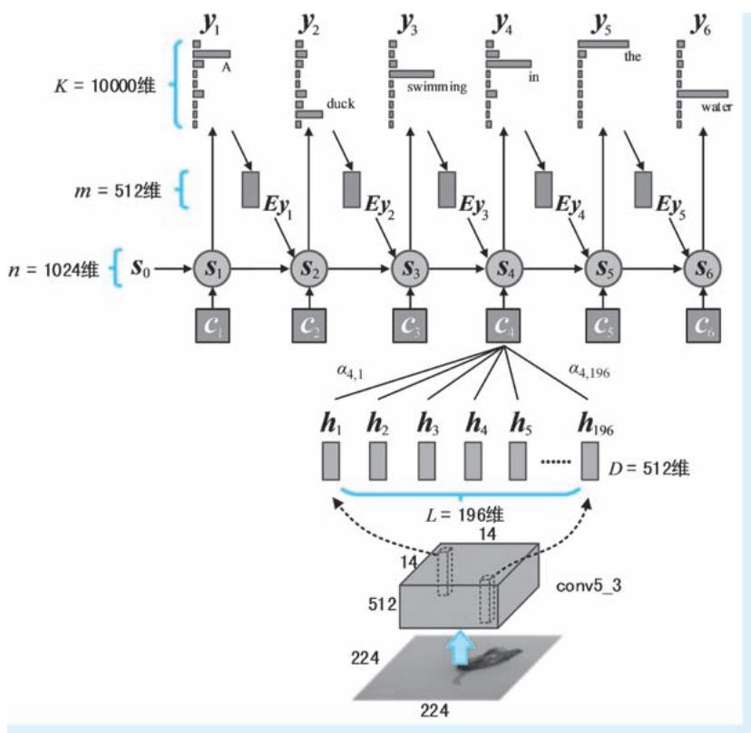  
●图 7-12 SAT 模型柔性注意力机制工作流程示意

式中，概率 $\cdot \alpha _ { t i }$ 表示在给定图像特征 h 以及之前步骤 $j$ $( j { < } t )$ ）已获得注意力掩膜 $\pmb { b } _ { j < t }$ 的条件下，当前步骤t 中处于位置 $i$ 的特征 （即对应图像区域）“有资格”（即 $b _ { t i } = 1$ ）进行后续词汇生成的可能性。用 y 表示解码器最终输出的描述词汇序列，则最优的生成词汇序列 $\boldsymbol { y } ^ { * }$ 能够使得在给定图像特征 $\pmb { h }$ 的条件下，输出序列 $\textbf { y }$ 的对数似然函数取得最大值，即

$$
\boldsymbol {y} ^ {*} = \operatorname {a r g m a x} _ {\boldsymbol {y}} \log p (\boldsymbol {y} \mid \boldsymbol {h}) \tag {7-8}
$$

而 $\textbf { y }$ 的边缘分布可以通过在 $\textbf { y }$ 与 $b$ 的联合分布中对 $b$ 进行边缘化得到 （在这里 $b$ 可以认为是模型的隐变量），即 $p ( \pmb { y } \mid \pmb { h } ) = \sum _ { b } p ( \pmb { y } , b \mid \pmb { h } )$ ，而 $p ( { \pmb y } , b | { \pmb h } ) = p ( { \pmb y } | b , { \pmb h } ) p ( b | { \pmb h } )$ ，因此有

$$
\log p (\mathbf {y} \mid \mathbf {h}) = \log \sum_ {b} p (\mathbf {y} \mid b, \mathbf {h}) p (b \mid \mathbf {h}) \tag {7-9}
$$

令 $L _ { s } = \ \sum _ { b } p ( b \mid \pmb { h } ) \mathrm { l o g } p ( \pmb { y } \mid b , \pmb { h } )$ ， 按照琴生不等式（Jensen Inequality），有 $L _ { s } \leqslant \log \sum _ { b } p ( \pmb { y } \mid b , \pmb { h } ) p ( b \mid \pmb { h } )$ ，即有 $L _ { \it s } \leqslant \log p \left( \boldsymbol { y } \left| \boldsymbol { h } \right. \right)$ 。这就说明 $L _ { s }$ 是所求对数似然函数 $\log p ( \pmb { y } | h )$ ）的下界。这样一来，最大化对数似然$\log p ( \pmb { y } | \pmb { h } )$ ）的问题以优化其下界 $L _ { s }$ 的方式取而代之，因此 $L _ { s }$ 即为模型新的目标函数。设 $\mathbb { W }$ 为 $L _ { s }$ 中的待学习参数，则针对 $L _ { s }$ 计算关于 $\mathbb { W }$ 的梯度有

$$
\frac {\partial L _ {s}}{\partial W} = \sum_ {b} p (b \mid \boldsymbol {h}) \left[ \frac {\partial p (\boldsymbol {y} \mid b , \boldsymbol {h})}{\partial W} + \log p (\boldsymbol {y} \mid b, \boldsymbol {h}) \frac {\partial p (b \mid \boldsymbol {h})}{\partial W} \right] \tag {7-10}
$$

式中，将方括号中的部分视为一个函数，即可以将其表达为数学期望的形式 $\operatorname { E } _ { b \sim p ( b \mid h ) } \left[ { \frac { \partial p ( y \mid b , \pmb { h } ) } { \partial W } } + \right.$ $\log p ( { \pmb y } \mid b , { \pmb h } ) \frac { \partial p ( b \mid { \pmb h } ) } { \partial { \pmb W } } \bigg ]$ 。针对上述期望，需要遍历 $b$ 的所有可能才可以精确得到，因此 SAT 模型通过蒙特卡洛方法以采样的方式近似计算，也正是因为引入采样，这里的注意力才被冠以 “随机”的名称。首先，由于注意力掩膜 $\pmb { b } _ { { t } }$ 服从以 $\left\{ \alpha _ { t i } \right\}$ }为参数的多维伯努利分布，因此对于第 $t$ 步注意力的 “独热”掩膜可以通过从多维伯努利分布中采样得到，即有 $\widetilde { \boldsymbol { b } } _ { \mathbf { \Lambda } _ { t } } \sim \mathrm { M u l t i n o u l l i } _ { { L } } ( \mathbf { \Lambda } \{ \mathbf { \Lambda } \alpha _ { t i } \mathbf { \Lambda } \} \mathbf { \Lambda } )$ $\left\{ \alpha _ { t i } \right\}$ 。在该分布中，参数$\left\{ \alpha _ { t i } \right\}$ }为一组 $L$ 维离散概率分布，有 $\sum { _ i } ^ { L } \alpha _ { t i } = 1$ 。 $\alpha _ { t i }$ 的取值表示在位置 $i$ 出现 1，而其他位置出现 0 的概率。例如， $\pmb { \alpha } _ { t } = \{ 0 . 1 , 0 . 2 , 0 . 7 \}$ }，表示 $\left\{ 1 , 0 , 0 \right\}$ }、{0，1，0}和 $\left\{ 0 , 0 , 1 \right\}$ }这三种情况的出现概率分别为0. 1、0. 2 和 $0 . 7$ 。在上例中，所谓采样是指 $\widetilde { b } _ { \perp }$ 每次可以随机出现上述三种情况中的任意一种，只不过是经过足够多次采样后，三种情况占总采样次数的比例分别约为一成、二成和七成。进行 $N$ 次抽样，梯度 $\partial L _ { s } / \partial W$ 可依据函数在采样点上的均值近似计算，即

$$
\frac {\partial L _ {s}}{\partial W} \approx \frac {1}{N} \sum_ {n = 1} ^ {N} \left(\frac {\partial p (\mathbf {y} \mid \widetilde {b} ^ {n} , \mathbf {h})}{\partial W} + \log p (\mathbf {y} \mid \widetilde {b} ^ {n}, \mathbf {h}) \frac {\partial p (\widetilde {b} ^ {n} \mid \mathbf {h})}{\partial W}\right) \tag {7-11}
$$

在以上述蒙特卡洛方法进行梯度估计时，SAT 模型通过使用滑动平均基线（moving average baseline）方法来减少梯度波动。滑动平均的基本思想为：在以迭代方式进行某变量的更新时，为了防止数值的剧烈抖动，将最新取值与前一次取值按照一定比例合成，作为变量的当前赋值 （形如 $[ { x ^ { \prime } } ^ { ( n + 1 ) }  w _ { 1 } x ^ { ( n ) } + w _ { 2 } x ^ { ( n + 1 ) }$ ）。考虑到上式中梯度估计的不稳定性主要是由无界函数 $\log p ( \mathbf { y } \mid \tilde { b } ^ { n } , \pmb { h } )$ ）产生，因此基线构建也针对该函数进行。滑动平均基线以累积方式进行构造：在第 $k$ 个迭代批次中，当前基线 $r _ { k }$ 为 $\log p ( \mathbf { y } \mid \widetilde { b } ^ { n } , \pmb { h } )$ ）的最新取值与前一基线取值的合成，即

$$
r _ {k} = 0. 9 r _ {k - 1} + 0. 1 \log p (\mathbf {y} \mid \widetilde {\boldsymbol {b}} _ {k}, \boldsymbol {h}) \tag {7-12}
$$

$r _ { k }$ 以 9：1 的比例对旧取值和新取值进行融合。基线随着迭代的进行不断构建，迭代完成，基线也随即构建完成。获得基线后，以 $( \log p ( \mathbf { y } \mid \tilde { b } ^ { n } , \pmb { h } ) - r )$ ）替代原始学习规则中的 $\log p ( \mathbf { y } \mid \tilde { b } ^ { n } , \pmb { h } )$ ），即实现对 “不安定因素” 的中心化处理㊀①。除此之外，为了进一步降低梯度波动，引入多维伯努利分布的熵（entropy） $\mathrm { H } \left[ \textit { b } \right] = \sum _ { \textit { b } } p ( \textit { b } | \textbf { \textit { h } } ) \log p ( \textit { b } | \textbf { \textit { h } } )$ ）作为第二重约束。加入上述两方面约束条件后，最终的参数梯度估计方法 （即学习规则）为

$$
\frac {\partial L _ {s}}{\partial W} \approx \frac {1}{N} \sum_ {n = 1} ^ {N} \left(\frac {\partial p (\mathbf {y} \mid \widetilde {b} ^ {n} , \mathbf {h})}{\partial W} + \lambda_ {r} \left(\log p (\mathbf {y} \mid \widetilde {b} ^ {n}, \mathbf {h}) - r\right) \frac {\partial p (\widetilde {b} ^ {n} \mid \mathbf {h})}{\partial W} + \lambda_ {e} \frac {\partial H [ \widetilde {b} ^ {n} ]}{\partial W}\right) \tag {7-13}
$$

式中， $\lambda$ 和λ 为事先指定的超参数，分别为针对滑动平均和熵约束的权重系数。实际上，以上学习规则与强化学习的思路是等价的：由注意力机制选择的一系列挑选操作所获得的奖励与注意力轨迹下生成目标描述语句的对数似然成正比。有了上述的 “可实现”梯度，SAT 即可以利用强化学习决策梯度

的思路进行注意力的投射和目标语句输出，具体方式这里不再赘述。

以上便是我们对著名 SAT 模型的讨论。SAT 模型将注意力 Seq2Seq 模型的思路应用于从 “看图说话”这一图像到文本的跨域生成工作，思路可以说是相当的清晰，为后续相关领域的研究奠定了重要的基础。然而，相信读者已经感觉到，SAT 模型涉及的内容十分 “硬核”，这一点仅从原文长达 22 页的篇幅和大量的公式也可以看出。如果读者没有完全看懂 SAT 模型中的细节也没关系，只要理解了注意力机制在 SAT 中以 “注意哪里就说出什么”的方式助力文本描述生成，并且还知道上述 “注意”又包括了以梯度下降实现的 “柔性注意力”和以强化学习实现的 “硬性注意力”两种模式，就算是掌握了 SAT 注意力机制应用的核心要领了。

# 2. SAN：视觉问答

我们讨论的第二个模型为 SAN 。SAN 模型诞生于 2015 年 11 月，作者是 Zichao Yang 等[16] 五名来自 CMU 和微软研究院的学者。SAN 模型专门针对视觉问答任务而设计，其全称为 “堆叠注意力网络”（Stacked Attention Networks）。视觉问答的输入包括图像和问题文本，要求计算机按照图像回答问题。因此，SAN 模型采用了典型的双塔结构，一路获得图像特征表示，另一路获得文本特征表示。注意力机制的作用则体现为以文本特征作为查询与图像特征进行交互和特征合成。除此之外，为了提升融合特征的表达能力，作者们将上述注意力操作组织为层级结构，即所谓的 “Stacked”。在两个模态编码器㊀①的选择方面，作者们使用 CNN 作为图像编码器，而尝试了 LSTM 和 CNN 两种不同的文本编码器结构。SAN 模型的整体架构如图7-13 所示 （其中文本编码器以 LSTM 为例）。

  
●图 7-13 SAN 模型的整体架构示意

在获取图像特征表达方面，作者们使用 VGG 网络作为图像编码器。输入的图像维度为 $4 4 8 \times 4 4 8 \times 3$ ，经过编码器的逐级加工，输出特征图的维度为 $1 4 \times 1 4 \times 5 1 2$ $1 / 3 2$ 的降采样）。该操作可以表示为 $F _ { I } =$ $\mathrm { C N N } _ { \mathrm { v g g } } ( I )$ ）。其中每一个512 维特征都与原始图像上的 $3 2 \times 3 2$ 区域对应，我们将每一个特征向量记作$\pmb { f } _ { i } ( i { = } 1 , \cdots , 1 9 6 )$ 。接下来，SAN 对这196 个512 维向量进行线性变换和激活操作，即 $V _ { _ { I } } { = } \mathrm { t a n h } \left( \mathbf { { \cal W } } _ { _ { I } } \mathbf { { \cal F } } _ { _ { I } } { + } { \pmb { b } } _ { _ { i } } \right)$ ，$V _ { I } \in \mathrm { R } ^ { d \times 1 9 6 }$ ，其中第 $i$ 列向量 $\cdot \boldsymbol { \nu } _ { i } \in \mathbb { R } ^ { d }$ 即表示第 $i$ 个图像位置对应的视觉特征， $d$ 为其维度。

在获取文本特征表达方面，作者们尝试了基于 LSTM 和 CNN 的两种文本编码器结构。首先，我们将问题文本序列记作 ${ \pmb q } = ( { \pmb q } _ { 1 } , \cdots , { \pmb q } _ { T } )$ ），其中 $\pmb q _ { t } ( t = 1 , \cdots , T )$ ）表示其中第 $t$ 个词汇的独热编码表示，T 为序列长度。在基于 LSTM 的文本编码器中，首先进行词嵌入操作，然后再将嵌入特征逐个送入 LSTM。LSTM 将在每个时间步 “吐出”一个隐状态向量作为已经读到的文本特征表达。上述编码过程可以表示为 $\pmb { x } _ { t } = \pmb { W } _ { e } \pmb { q } _ { t }$ ， $\pmb { h } _ { t } = \mathrm { L S T M } ( \pmb { x } _ { t } , \pmb { h } _ { t - 1 } )$ 。最后，SAN 取 LSTM 最后一个隐状态的输出作为对整个问题文本的特征表达，即令 ${ \bf \nabla } \cdot { \bf { \vec { \nu } } } _ { Q } = { \bf { \vec { h } } } _ { T }$ 。在 SAN 的原文中， $\nu _ { Q }$ 被称为 “问题特征” （question vector）；在基于 CNN的文本特征编码器中，第一步操作自然也是词嵌入操作；接下来，SAN 在嵌入特征上采取卷积操作，卷积窗口的尺寸包括 1、2 和 3 三种，分别对应一元 （unigram）、二元 （bigram）和三元 （trigram）语言特征表示。我们将其中窗口大小为 $c$ 的卷积操作对应的特征输出记作 $\pmb { h } _ { c } = ( \pmb { h } _ { c , 1 } , \cdots , \pmb { h } _ { c , T - c + 1 } )$ ）（由于不加外扩操作，故在窗口为 $c$ 的卷积操作下，长度为 $T$ 的序列输出长度变为 $T { - } c + 1$ ），第 $t$ 个卷积输出$\pmb { h } _ { c , t } = \operatorname { t a n h } \left( \mathbf { \delta } W _ { c } \pmb { x } _ { t : t + c - 1 } + \pmb { b } _ { c } \right)$ ），其中， $\boldsymbol x _ { t : t + c - 1 }$ 表示词嵌入序列中从第 $t$ 到 $t + c - 1$ 的局部词嵌入向量； $W _ { c }$ c 和 $\pmb { b } _ { c }$ c分别为卷积核和偏置参数。请读者注意， $\pmb { h } _ { c , t }$ 的维度可以与 $\boldsymbol { x } _ { t }$ 不同；接下来按照时间轴进行最大池化操

作，表示为 $\widetilde { \pmb { h } } _ { c } = \operatorname* { m a x } _ { t } ( \pmb { h } _ { c , 1 } , \cdots , \pmb { h } _ { c , T - c + 1 } )$ ；最后，将$\widetilde { \pmb { h } } _ { 1 }$ 、 $\widetilde { \pmb { h } } _ { 2 }$ 和 $\widetilde { \pmb { h } } _ { 3 }$ 进行拼接，即得到问题文本的特征表示，记作 $\mathbf { \tilde { \rho } } : \mathbf { \mathcal { V } } _ { Q } = \big [ \tilde { \pmb { h } } _ { 1 } , \tilde { \pmb { h } } _ { 2 } , \tilde { \pmb { h } } _ { 3 } \big ]$ ]。图 7-14 示意了基于 CNN 的文本特征编码器的工作流程。在该示例中，问题文本的长度为 $T = 8$ ；词嵌入特征维度为4；三个卷积操作后输出特征序列的长度分别为8、7、6，其中的特征维度均为 3；针对三个特征序列进行时间轴的最大池化，则每个特征序列都会得到一个长度为 3 的向量。经过拼接，最终得到的文本特征表示 $\nu _ { Q }$ 为一个长度为 9 的向量。

  
●图 7-14 基于 CNN 的文本特征编码器的工作流程示意

有了两种模态的特征表示，下面就看二者如何通过注意力机制进行信息交互。针对图像，我们有了 CNN 提取的196 个视觉特征向量表示 $\langle \pmb { \nu } _ { 1 } , \cdots , \pmb { \nu } _ { 1 9 6 }$ $\mathbf { \Delta } _ { \mathbf { \mathcal { V } } _ { 1 } }$ ，针对问题文本，我们也有了经过LSTM 或卷积提取的文本特征表示 ${ \bf { \dot { \rho } } } ( { \bf { \dot { \rho } } } ) _ { \varrho }$ 。首先，SAN 将上述两种特征表示送入一个单层神经网络进行融合，然后再利用softmax 函数算出一组注意力权重，上述操作表示为

$$
\boldsymbol {H} _ {A} = \tanh  \left(\boldsymbol {W} _ {I, A} \cdot \boldsymbol {V} _ {I} \oplus \left(\boldsymbol {W} _ {Q, A} \cdot \boldsymbol {v} _ {Q} + \boldsymbol {b} _ {A}\right)\right) \tag {7-14}
$$

$$
\boldsymbol {p} _ {A} = \operatorname {s o f t m a x} \left(\boldsymbol {W} _ {P} \cdot \boldsymbol {H} _ {A} + \boldsymbol {b} _ {P}\right) \tag {7-15}
$$

在式 7-14 中， $V _ { I } \in \mathrm { R } ^ { d \times m }$ 和 $[ \pmb { \nu } _ { Q } \in \operatorname { R } ^ { d }$ 分别为视觉特征表示 （矩阵）和问题本文特征向量，其中 $d$ 和 $m$ 分别为特征维度和特征个数 （特征个数也就是图像的区域数，具体来说就是 $1 4 \times 1 4 = 1 9 6$ ）； $\boldsymbol { W } _ { I , A }$ 和 $\pmb { W } _ { Q , A }$ 为针对上述两种模态特征的线性变换参数，二者的维度均为 $k { \times } d$ ； $\pmb { b } _ { A } \in \mathbb { R } ^ { k }$ 为文本特征线性变换的偏置向量；操作 $\ A \textcircled { + } b$ ”表示矩阵 $\pmb { A }$ 和向量 $\pmb { b }$ 的 “求和”操作：将矩阵 $\pmb { A }$ 的每一列都与向量 $\pmb { b }$ 相加。经过式7-14 的加工，输出矩阵 $\pmb { H } _ { A }$ 的维度为 $k \times m$ ；在式 7-15 中，首先 $\pmb { H } _ { A }$ 再进行一次线性变换，其中$\boldsymbol { W } _ { P } \in \mathrm { R } ^ { 1 \times k }$ 、 $\pmb { b } _ { P } \in \operatorname { R } ^ { m }$ 均为线性变换的参数。上述线性变换将得到一个长度为 $m$ 的向量，该向量经过 soft-

max 的概率化操作后，得到一个同等长度的概率分布，这便是站在文本特征立场上的 $m$ 个视觉特征的注意力权重。有了注意力权重，下面就是针对视觉特征的注意力加权以及与文本特征的融合操作，表示为

$$
\widetilde {\boldsymbol {v}} _ {I} = \sum_ {i = 1} ^ {m} p _ {i} \boldsymbol {v} _ {i} \tag {7-16}
$$

$$
\boldsymbol {u} = \widetilde {\boldsymbol {v}} _ {I} + \boldsymbol {v} _ {Q} \tag {7-17}
$$

在以上两式中， $\widetilde { \pmb { { v } } } _ { I }$ 为整幅图像的特征表示，该特征是对图像各区域特征以不同注意力作为权重的合成结果； $\pmb { u }$ 为融合后的文本特征，即以上述图像特征作为修正量对原始文本特征 ${ \bf \dot { \rho } } _ { g }$ 进行修正。在上文中，我们仅仅示意了基于注意力机制的单次图像-文本交互过程，为了让两个模态的信息能够进一步 “水乳交融”，SAN 将上述操作进行堆叠，构造了能够实现多次交互层级的注意网络结构。我们将层级数记作 $L$ ，对于其中的第 l 层，将上述单次交互的公式改造为层级模式只需做两点改进：第一，将各网络参数都替换为各层自身的参数；第二，将每层所用的文本特征替换为上一层输出的融合后特征。这一操作非常简单，请读者自行查阅 SAN 原文，这里我们不做过多展开。在获得最后一层的文本融合特征 $\pmb { u } ^ { L }$ 后，SAN 再对其进行一次线性变换和 softmax 的概率化操作，可得到答案词汇对应的词典概率，即 $\pmb { p } _ { \llangle n s } = \mathrm { s o f t m a x } \big ( \pmb { W } _ { u } \pmb { \cdot } \pmb { u } ^ { L } + \pmb { b } _ { u } \big )$ ）。

在上文中，我们介绍了用于视觉问答任务的 SAN 模型。SAN 模型具有典型双塔结构，分别针对视觉问答任务的图像和问题文本获取特征表达。在该模型中，注意力为互注意力机制，文本特征被用作查询与视觉特征进行交互，将得到的注意力权重对视觉特征做有重点的合成，然后再对自身进行特征补充并进行答案预测。

# 3. BUTD：看图说话与视觉问答

人类视觉的注意力有自下而上和自上而下之分，前者体现了认知对象客观上所具有的能够引起人注意的特征，而后者则是指人们调用记忆等已有的认知体系，对关心的对象投射更多主观上的关注。对应到计算机领域，自下而上的注意力体现为与任务无关的图像显著性，而自上而下的注意力则体现为任务驱动下的数据重要性区分。2017 年 7 月，Peter Anderson 等[17] 七名学者提出针对看图说话和视觉问答两种任务的自下而上和自上而下（Bottom-Up and Top-Down，BUTD）注意力模型。

在 BUTD 模型中，所谓的自下而上的注意力（Buttom-Up Attention）体现为通用局部图像特征提取，这与看图说话和视觉问答这两个具体任务无关。BUTD 所要求的区域要求具有 “objectness”特性，即提取的图像特征得是某 “东西”的特征。为了达到这一目的，BUTD 采用 Faster R-CNN 目标检测模型来获取上述局部区域，这便是我们上文所说的 “OD-based”区域特征。需要注意的是，BUTD 只会利用 Faster R-CNN 得到的目标框位置信息。因此，准确地讲，Faster R-CNN 在 BUTD 中扮演的是区域建议生成的角色。在得到上述 $k$ 个大小不一的包围后，BUTD 会将这些边框 “套在”ResNet101 网络最后输出的特征图上，计算每个目标框图中的特征均值作为该区域的特征表示。我们将上述视觉特征表示记作 $V { = } \left( \pmb { \nu } _ { 1 } , \cdots , \pmb { \nu } _ { k } \right)$ ）， $\boldsymbol { \nu } _ { i } \in \mathrm { R } ^ { d }$ 。这里 $\mathbf { \nabla } _ { \boldsymbol { p } _ { i } }$ 表示 Faster R-CNN 产生的第 $i$ 个目标框的视觉特征 （目标框中所有卷积特征的均值）， $d$ 为其维度，具体在 ResNet101 网络中， $d = 2 0 4 8$ 。为了构造一个高质量的区域特征表示模型，作者们首先基于 ImageNet 数据集对 ResNet101 主干网络进行预训练，然后将以上述预训练

参数作为 Faster R-CNN 模型主干网络的初值，再在 Visual Genome 数据集上进行目标检测模型的训练。

针对看图说话任务，BUTD 模型也采用了编码器-解码器架构，其中上文提到的基于 Faster R-CNN模型的区域视觉提取即扮演了视觉特征编码器的角色，解码器则采用了LSTM 结构。但是与标准LSTM结构不同的是，BUTD 采用了双层 LSTM 单元，分别叫作 “自上而下注意力 LSTM ”[17] （Top-DownAttention LSTM，以下简称为 “TDA-LSTM” ） 单元和 “语言 LSTM ” （Language LSTM，以下简称为“L-LSTM”）单元，其中，前者在看图说话目标的驱动下，为视觉特征计算自上而下的柔性注意力权重，而后者负责生成目标词汇 （即预测词汇在词典中的概率）。在下文中我们分别以上标 1、2 标识上述两个 LSTM 的输入输出。在步骤 $t$ 中，TDA-LSTM 单元的信息加工过程可以表示为

$$
\boldsymbol {h} _ {t} ^ {1} = \operatorname {L S T M} \left(\boldsymbol {x} _ {t} ^ {1}, \boldsymbol {h} _ {t - 1} ^ {1}\right) \tag {7-18}
$$

式中， $ { \boldsymbol { { x } } } _ { t } ^ { 1 }$ 、 $\pmb { h } _ { t - 1 } ^ { 1 }$ 和 $\pmb { h } _ { t } ^ { 1 }$ 分别为 TDA-LSTM 单元的当前输入、上一步的隐状态和本步骤的隐状态输出。 $\pmb { x } _ { t } ^ { 1 } =$ $[ \pmb { h } _ { t - 1 } ^ { 2 } , \overline { { \pmb { \nu } } } , \hat { \bf y } _ { t - 1 } ]$ ]为三个特征的拼接： $\boldsymbol { h } _ { t - 1 } ^ { 2 }$ 为上一步骤 L-LSTM 单元的隐状态向量输出 （也将 TDA-LSTM 和L-LSTM 视为整体，上一步隐状态输出）； $\overline { { \pmb { \nu } } } = \sum _ { i = 1 } ^ { k } { \pmb { \nu } } _ { i } / k$ 为 $k$ 个视觉特征的平均值； $\hat { \mathbf { y } } _ { t - 1 } ~ = ~ \mathbf { W } _ { e }$ ·onehot $( \pmb { y } _ { t - 1 }$ ）表示上一步骤预测词汇的词嵌入向量，其中 $W _ { e }$ 为可学习的线性嵌入矩阵，onehot $( \pmb { y } _ { t - 1 }$ ）表示上一步预测词汇概率 $\boldsymbol { y } _ { t - 1 }$ 对应的独热编码表示㊀①。可以看出 $ { \boldsymbol { { x } } } _ { t } ^ { 1 }$ 中融入的三方面信息包括：LSTM 的最新状态、图像的整体特征和到目前为止产生的词汇输出。目的在于为 TDA-LSTM 单元提供更加丰富的上文资料。在获得 TDA-LSTM 单元的输出 $h _ { t } ^ { 1 }$ 后，接下来 BUTD 即利用一个 MLP 网络，在其与 $k$ 个图像特征之间，预测一组归一化注意力权重 $\mathbf { \widetilde { \mathbf { \alpha } } } _ { \mathbf { \alpha } } ( \mathbf { \widetilde { \mathbf { \alpha } } } _ { t } \in \mathbf { \mathbb { R } } ^ { k }$ ，具体方法为

$$
a _ {i, t} = \boldsymbol {w} _ {a} ^ {\mathrm {T}} \tanh  \left(\boldsymbol {W} _ {v a} \boldsymbol {v} _ {i} + \boldsymbol {W} _ {h a} \boldsymbol {h} _ {t} ^ {\mathrm {I}}\right) \tag {7-19}
$$

$$
\boldsymbol {\alpha} _ {i} = \operatorname {s o f t m a x} \left(\left\{a _ {i, t} \right\} _ {i = 1} ^ {k}\right) \tag {7-20}
$$

式中， $\mathbf { { W } } _ { v a }$ 和 $W _ { h a }$ 均为可学习的线性变换矩阵， $\pmb { w } _ { a } ^ { \operatorname { T } }$ 为可学习的参数向量。不难看出，上述注意力属于典型的互注意力机制。有了注意力权重，可以用其对所有视觉特征进行加权，表示为 $\hat { \boldsymbol { \nu } } = \sum _ { \mathrm { ~ \scriptsize ~ i ~ = ~ 1 ~ } } \boldsymbol { a } _ { i , \mathrm { ~ \scriptsize ~ t ~ } } \cdot \boldsymbol { \nu } _ { i \mathrm { ~ \scriptsize ~ c ~ } }$ 。L-LSTM对信息的加工过程可以表示为 $\pmb { h } _ { t } ^ { 2 } = \mathrm { L S T M } \big ( \pmb { x } _ { t } ^ { 2 } , \pmb { h } _ { t - 1 } ^ { 2 } \big )$ ）。其中， $\pmb { x } _ { t } ^ { 2 } = \left[ \hat { \pmb { \nu } } , \pmb { h } _ { t } ^ { 1 } \right]$ ]为注意力合成视觉特征和 TDA-LSTM 的输出隐状态的拼接， $ { \boldsymbol { h } } _ { t } ^ { 2 }$ 为该 LSTM 单元的输出；在得到 $ { \boldsymbol { h } } _ { t } ^ { 2 }$ 后，BUTD 对其进行线性变换和 softmax 的概率化操作，来预测第 $t$ 步输出词汇在词典中的概率，表示为 $p ( \mathbf { y } _ { t } | \mathbf { y } _ { 1 : t - 1 } ) =$ softmax $W _ { p }$ $\pmb { h } _ { t } ^ { 2 } { + } \pmb { b } _ { p }$ ），其中 $W _ { p }$ 和 $\pmb { b } _ { p }$ 分别为可学习的线性变换矩阵和偏置向量。图 7-15 示意了 BUTD 看图说话任务的整体模型架构。

针对视觉问答任务，BUTD 采用了典型的 “视觉编码器 $^ +$ 文本编码器”的双塔结构。其中，视觉编码器结构与看图说话任务中的视觉编码器相同，同样是基于 Faster R-CNN 的区域视觉特征；而针对问题的文本编码器则采用了GRU 结构，自然也是属于基于RNN 结构的文本编码器。关于视觉编码器，我们这里不再重复，假设已经有视觉特征 $V { = } \left( \pmb { \nu } _ { 1 } , \cdots , \pmb { \nu } _ { k } \right)$ ）， $\pmb { \nu } _ { i } \in \operatorname { R } ^ { d }$ ，下面我们主要讨论两路特征的融合问题。首先，对于问题文本，在对其中的每个词汇进行嵌入操作后输入 GRU 网络，获取 GRU 结构的

最后一个隐状态输出 $\pmb q$ 作为其特征表示，然后基于该特征为每一个视觉特征计算一个注意力权重，该过程可以表示为

$$
a _ {i} = \boldsymbol {w} _ {a} ^ {\mathrm {T}} f _ {a} ([ \boldsymbol {v} _ {i}, \boldsymbol {q} ]) \tag {7-21}
$$

$$
\left\{\alpha_ {t} \right\} = \operatorname {s o f t m a x} \left(\left\{a _ {i} \right\} _ {i = 1} ^ {k}\right) \tag {7-22}
$$

  
●图 7-15 BUTD 看图说话任务的整体模型架构示意

式中， ${ \pmb w } _ { a } ^ { \operatorname { T } }$ 为可学习的参数向量； $f _ { a } ( \ \cdot \ )$ ）表示任意神经网络结构。在获得注意力权重后，即可用该权重对视觉特征进行注意力加权融合，有 $\hat { \textbf { \textit { v } } } = \sum _ { i = 1 } { a _ { i } \textbf { \cdot } \textbf { \boldsymbol { v } } _ { i } }$ 。 这里的v^可以认为是问题文本注意力 “赋能”下的整体视觉特征。接下来，对文本特征 $\pmb q$ 和视觉特征v^再分别进行两路神经网络加工，使其具有相同的维度，然后对二者进行逐元素相乘进行进一步融合，最后对融合结果再进行神经网络加工和线性变换，最后通过概率化操作，可以预测得到答案文本的词典概率。上述过程可以表示为

$$
\boldsymbol {h} = f _ {q} (\boldsymbol {q}) \circ f _ {v} (\hat {\boldsymbol {v}}) \tag {7-23}
$$

$$
p (y \mid V, q) = \operatorname {s o f t m a x} \left(\boldsymbol {W} _ {p} f _ {o} (\boldsymbol {h})\right) \tag {7-24}
$$

式中，f （·）、f （·）和 $f _ { o } ( \ \cdot \ )$ ）均表示任意神经网络结构；符号 “°”表示向量的逐元素相乘。不难看出，BUTD 将文本特征构造为 “直通”分支； $\boldsymbol { W } _ { \flat }$ 为可学习的线性变换参数，将输入特征的维度变换到词典大小；最后的 softmax 操作对上述 “logits”向量进行概率化处理，即表示答案词汇在词典上的概率分布。图7-16 示意了 BUTD 视觉问答任务的整体模型架构。

到这里，我们对 BUTD 模型的介绍就告一段落了。BUTD 针对看图说话和视觉问答两个具体的图文双模态任务设计，前者旨在跨模态的生成，而后者属于典型的视觉语言理解。在看图说话任务中，

BUTD 使用了标准的编码器-解码器架构，而在视觉问答任务中，BUTD 则采用了视觉编码器和文本编码器并列的双塔型结构，两路特征的首次 “碰撞”为注意力机制作用下的视觉特征融合，再次 “碰撞”为直通文本特征与融合视觉特征的最终整合。在两种任务模型中，BUTD 均采用基于 FasterR-CNN 的区域特征作为视觉特征表示，这些特征与具体的视觉语言任务无关，故被称为自下而上的注意力，这也是 BUTD 模型最大的贡献所在，后续还有诸多视觉语言模型也均采用类似的设计。就自下而上注意力而言，BUTD 对视觉特征的提取以目标区域为单位，故属于典型的硬性注意力机制，注意力反映到原图上就是 “一块一块”的。而在两种任务模型中，针对视觉特征施加的自上而下的注意力权重具有概率分布性质，故显然属于柔性注意力机制的范畴。特别是在视觉问答模型中，自上而下的注意力还表现为跨模态的注意力。

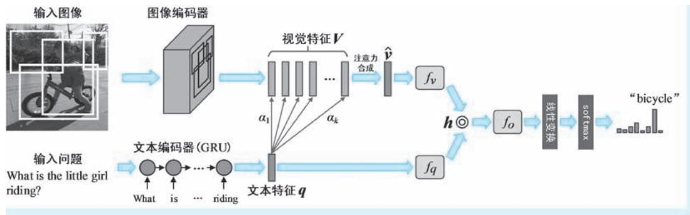  
●图 7-16 BUTD 视觉问答任务的整体模型架构示意

# 4. AttnGAN：文本到图像的生成

模式识别的本质问题是分类———输入一个特征，输出它对应的类别。分类，用一个更加学术、更加专业的词来说叫 “判别”。判别的结果是为后续机器决策提供依托数据，因此，判别在人工智能中的重要性不言而喻。然而，判别虽然重要，但是总让人感觉不那么 “高级”，总带着一种 “问：你饿吗？答：我不饿”的 “憨傻感”。要是让计算机能够连续地生成我们要的任何图像，那岂不是比简单地做个选择题高端大气上档次得多？如果我们以一段文本描述我们想要的内容，计算机按照该文本生成与之对应的图像，这便是图文跨模态生成任务中的从文本到图像的生成任务，属于我们前文介绍SAT 和 BUTD 两个模型的 “逆操作”。

说到图像生成，怎么能绕开大名鼎鼎的 GAN？2014 年 6 月，Ian Goodfellow 等[19] 学者提出了生成式对抗网络（Generative Adversarial Networks，GAN）。该模型以随机数为输入，以我们所需内容的图像作为输出。但是这个模型怎么能让生成的图像以假乱真呢？Goodfellow 巧妙地采用对抗机制来训练它———先生成一幅假图，尽可能让判图员无法分辨其真伪，提升判图员的水平，然后再生成一幅更加逼真的假图，尽量让判图员丧失判别真伪的能力，如此往复，一个能够以假乱真的图像生成器就诞生了。GAN 模型自诞生以来，可谓开辟了一个生成式模型的新阵地，Goodfellow 也赢得了 “GAN 之父”的美名。我们下文将要介绍的就是一种基于 GAN 的文本到图像生成模型，其全称为注意力生成式对抗网络（Attentional Generative Adversarial Networks，AttnGAN）。AttnGAN 模型的提出时间为 2017 年 11

月，作者 Tao $\mathrm { X u }$ 等[18] 七名来自理海大学和其他机构的学者。该模型通过注意力来关注自然语言描述中的相关词汇，来合成图像中不同子区域的细粒度信息。需要说明的是，AttnGAN 并不是第一个基于GAN 的文本到图像生成模型，但是相较于之前模型将整个文本描述编码为一个向量表示的 “粗犷”生成，AttnGAN 正如其题目所强调的 “Fine-Grained”的那样重在 “抠细节”，这也正是注意力机制所发挥的重要作用。

为了让读者们能够更容易地理解 AttnGAN，下面我们首先对其基础———标准 GAN （即 2014 年Goodfellow 提出的 GAN 模型）和条件 GAN [20] （Conditional GANs，CGAN）两个模型进行简单介绍。标准 GAN 采用生成器和判别器交替训练的模式让二者的水平 “水涨船高”———首先给定一个随机向量z，将其送入一个生成器 $G$ ，得到对应的生成数据 $\hat { \bf { x } } = G ( z )$ ），然后将其与真实数据 $\boldsymbol { x }$ 放在一起，训练一个判别器 $D$ （即二分类的分类器），使得判别器能够辨别真假。因此，在固定生成器的情况下，对判别器的优化目标可以表示为

$$
D ^ {*} = \operatorname {a r g m a x} _ {D} \mathrm {E} _ {x \sim p _ {r}} [ \log D (\boldsymbol {x}) ] + \mathrm {E} _ {\hat {x} \sim p _ {g}} [ \log (1 - D (\hat {\boldsymbol {x}})) ] \tag {7-25}
$$

式中， $p _ { i }$ 和 $\| p _ { g }$ 分别表示真实数据和生成数据的分布； $D ( x )$ ）表示将数据 $\boldsymbol { x }$ 判断为真的概率。上式包括了两项，其中第一项要求 “检验员”在平均意义下 （数学期望）、将真实数据判断为真的可能性 （对数似然）要尽量大；而第二项要求 “检验员”在平均意义下，将假数据误判为假的可能性要尽量大。$D ^ { * }$ 表示在当前生成器下，训练得到的最优判别器。有了最优判别器，接下来就轮到提升 “造假” 水平了———在固定最优判别器的情况下，对生成器的优化目标可以表示为

$$
G ^ {*} = \operatorname {a r g m i n} _ {G} \mathrm {E} _ {\hat {x} \sim p _ {g}} [ \log (1 - D ^ {*} (\hat {\mathbf {x}})) ] \tag {7-26}
$$

式中， $D ^ { * } \left( \hat { \boldsymbol { x } } \right)$ ）表示最优判别器 $D ^ { * }$ 将生成数据x^ 判断为真的概率， $1 - D ^ { * } \left( \hat { { \pmb x } } \right)$ ）则表示将其判断为假的概率。因此，以上优化目标即要求平均意义下，生成器要使得生成的假数据被判别器判断为假的可能性最小。图7-17a 为标准 GAN 结构的示意。

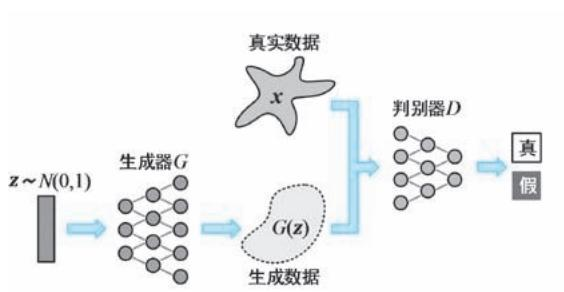  
a）

●图 7-17 标准 GAN 与 CGAN 结构对比示意  
  
a）标准 GAN b）CGAN

GAN 的思路非常新颖，但是其最大问题是生成数据不可控。那么是否可以引入一个控制条件，使得 GAN 的数据生成能够在附加条件的引导下开展呢？这是一个非常现实的诉求，例如，在图像生成任务中，我们可以将所需生成的图像类别作为条件，使得 GAN 能够生成我们要种类的图像。CGAN 便是在上述需求下应运而生的。CGAN 对标准 GAN 的改进非常简单，即在生成器和判别器数据项的基础

上，再添加一个附加条件即可———将生成器和判别器相应地改变为 $G ( z , c )$ ）和 $D ( \pmb { x } , c )$ ），即分别实现在上述条件下的生成和真假辨别。在 CGAN 中，附加条件可以是任何类型的数据，因此，CGAN 实质上就是一个多模态模型。图7-17b 为 CGAN 结构的示意。

有了上面的基础，下面我们正式进入 AttnGAN 部分的内容。就整体结构而言，AttnGAN 就是一个实现从文本到图像生成的 CGAN 模型，生成的 “起点”仍为随机向量，附加条件就是所给的文本描述。但是与标准 CGAN 不同的是，AttnGAN 的生成器具有 $m$ 个层级，记作 ${ ( G _ { 0 } , G _ { 1 } , \cdots , G _ { m - 1 } ) }$ ）。其中，每个生成器都具有一个前置的图像特征构造器 （以下简称为 “特征构造器”），记作 $( F _ { 0 } , F _ { 1 } , \cdots$ ，$F _ { m - 1 }$ ），上述特征构造器都会生成对应层级的图像特征，记作 $( \pmb { h } _ { 0 } , \pmb { h } _ { 1 } , \cdots , \pmb { h } _ { m - 1 } )$ ）。而每一个生成器都基于上述输出特征来生成图像。多个生成器对应多个判别器，这些判别器在自己的层级上，结合条件判断生成图像的真假，表示为 $D _ { i } ( \hat { \pmb x } _ { i } , c )$ $D _ { i } ( \hat { \pmb x } _ { i } , c ) , i = 0 , \cdots , m - 1$ 。对于第一个特征构造器 $F _ { 0 }$ ，其输入在形式上与CGAN 是相同的———以文本描述整体特征表示为条件的随机噪声向量z。对于后续特征构造器 $\mathbf { \partial } _ { : } F _ { _ i } ( { \bf \nabla } _ { i } { = } 1 , \cdots$ ，$m - 1$ ），其输入包括两路：一路为上一级特征构造器的输出 $\pmb { h } _ { i - 1 }$ ，另一路特征为注意力加权的词特征，上述注意力权重通过 $\pmb { h } _ { i - 1 }$ 与词特征之间的计算得到。上述过程可以表示为

$$
\boldsymbol {h} _ {0} = F _ {0} \left(\boldsymbol {z}, F ^ {c a} (\bar {\boldsymbol {e}})\right) \tag {7-27}
$$

$$
\boldsymbol {h} _ {i} = F _ {i} \left(\boldsymbol {h} _ {i - 1}, F _ {i} ^ {\text {a t t n}} (\boldsymbol {e}, \boldsymbol {h} _ {i - 1})\right), i = 1, \dots , m - 1 \tag {7-28}
$$

$$
\hat {\boldsymbol {x}} _ {i} = G _ {i} \left(\boldsymbol {h} _ {i}\right) \tag {7-29}
$$

式中， $z \sim N ( 0 , 1 )$ ）为随机向量； $\bar { e }$ 为文本描述的整体特征表示，该特征表示通过文本编码器得到， $F ^ { \mathrm { c a } }$ 表示对上述特征的某种变换操作， $F ^ { \mathrm { c a } } ( \overline { { e } } )$ ）即作为 z 的附加条件；在以上各式中， $F ^ { \mathrm { c a } }$ 、 $\boldsymbol { F } _ { i } ^ { \mathrm { a t t n } }$ 、 $F _ { i }$ 和 $G _ { i }$ 均被实现为神经网络结构。在式7-28 中，注意力模型 ${ \cal F } ^ { \mathrm { a t t n } } ( e , \pmb { h } )$ ）（为了方便描述，我们忽略了层级下标）具有两个输入：文本描述的词特征序列 $\pmb { e } = \left( \pmb { e } _ { 1 } , \cdots , \pmb { e } _ { T } \right) \in \mathbf { R } ^ { D \times T }$ 和上一级特征构造器输出的图像特征 $h \in$ $\mathrm { R } ^ { \hat { D } \times N }$ 。其中 $D$ 和 $\hat { | D }$ 分别表示词特征和图像特征的维度； $T$ 和 $N$ 分别为文本描述的长度和图像区域的个数。为了将词特征映射到图像的语义空间，AttnGAN 首先对词特征执行线性变换，表示为 ${ \pmb e } ^ { \prime } = { \pmb U } { \pmb e }$ ，其中$\pmb { U } \in \mathbf { R } ^ { \hat { \cal D } \times \cal D }$ 。接下来，即以每个图像局部特征 $\mathbf { \nabla } _ { h }$ 中的每一列）作为查询，去所有词特征 $\pmb { e } ^ { \prime } = \left( \pmb { e } _ { 1 } ^ { \prime } , \cdots , \pmb { e } _ { T } ^ { \prime } \right)$ ）中“求关注”，然后再按照得到的注意力权重对所有词特征进行合成，具体方法如下

$$
\alpha_ {j, t} = \frac {\exp \left(\boldsymbol {h} _ {j} ^ {\mathrm {T}} \boldsymbol {e} _ {t} ^ {\prime}\right)}{\sum_ {k = 1} ^ {\mathrm {T}} \exp \left(\boldsymbol {h} _ {j} ^ {\mathrm {T}} \boldsymbol {e} _ {k} ^ {\prime}\right)} \tag {7-30}
$$

$$
\boldsymbol {c} _ {j} = \sum_ {t = 1} ^ {\mathrm {T}} \alpha_ {j, t} \boldsymbol {e} _ {t} ^ {\prime} \tag {7-31}
$$

式中， $\alpha _ { j , t }$ 表示对于第 $j$ 个图像局部特征 $\pmb { h } _ { j }$ 在第 $t$ 个词特征 $\cdot e _ { t } ^ { \prime }$ 上施加的注意力权重； $c _ { j }$ 则表示针对 $\pmb { h } _ { j }$ 的注意力合成特征，在 AttnGAN 中，该合成特征被称为 “词上下文特征” （word-context feature）。对于所有的 $N$ 个图像局部特征，我们都可以按照上述方法计算得到其对应的词上下文特征，即有 $F ^ { \mathrm { a t t n } } ( e , h ) =$ $( \pmb { c } _ { 1 } , \pmb { c } _ { 2 } , \cdots , \pmb { c } _ { N } ) \in \operatorname { R } ^ { \hat { D } \times N }$ 。接下来，图像特征和相应的词上下文特征被送入下一阶段的特征构造器以生成图像。图7-18 为 AttnGAN 的整体架构示意 （注：该图中的图像并不是任何真实算法的运行结果）。

为了让生成的图像与输入的文本描述能够更加匹配，AttnGAN 在上述生成结构的基础上，又添加了一个称为 “深度注意力多模态相似度模型” （Deep Attentional Multimodal Similarity Model，DAMSM）

的结构，目的就是在区域与词汇这一细粒度层级上评估图像与文本之间的相似度。DAMSM 包括了两个编码器结构：一个文本编码器和一个图像编码器，二者一前一后。其中，文本编码器前文我们已经多次提及，该编码器一方面生成文本描述的整体特征表示e，一方面生成文本描述的词特征序列 $e =$ $( e _ { 1 } , \cdots , e _ { T } )$ ）。文本编码器为双向 LSTM 结构，其中每个词汇都对应两个 LSTM 的隐状态向量，AttnGAN将二者拼接作为每个词汇的特征表示，同时将最后一个拼接得到的隐状态特征作为文本描述的整体特征表示。AttnGAN 使用 CNN 作为其图像编码器。图像编码器作用在生成图像上，将其加工为特征图。在具体实现中，AttnGAN 采用在 ImageNet 预训练得到的 Inception-v3 网络作为图像编码器，特征图取自其 “mixed_6e”层，在输入图像为 $2 9 9 \times 2 9 9$ 的尺寸下，上述特征图的维度为 $1 7 \times 1 7 \times 7 6 8$ 。因此，对上述特征图进行变形操作，即得到 289 个 768 维特征作为图像的局部特征表示，记作 $\ b { f } \in \mathrm { R } ^ { 7 6 8 \times 2 8 9 }$ 。同时，再从 Inception-v3 网络的最后平均池化层抽取图像的全局特征 $\bar { \boldsymbol { f } } \in \mathrm { R } ^ { 2 0 4 8 }$ 。然后，分别对局部特征和全局特征进行线性变换，将其特征维度统一到词特征的维度，有 $\nu = W f , \ \overline { { { \nu } } } = \overline { { { W f } } } ,$ 。其中， $\pmb { \nu } \in \mathbf { R } ^ { D \times 2 8 9 }$ ，每一列均为一个图像局部特征，而 $\overline { { \pmb { { v } } } } \in \mathrm { R } ^ { D }$ 则表示图像的全局特征。有了词特征，也有了图像局部特征，接下来就需要计算二者之间的相似度，注意力再次派上用场，只不过这次 “角色互换”———词特征作为查询，图像局部特征被施加注意力并进行加权合成。按照式 （7-30）和式 （7-31）类似的方式㊀①，对于每个词特征，都会有一个 “区域上下文特征”（region-context feature）与之对应，记作 $( \pmb { c } _ { 1 } ^ { \prime } , \pmb { c } _ { 2 } ^ { \prime } , \cdots$ ，${ \pmb { c } } _ { T } ^ { \prime } ) \in \mathrm { R } ^ { D \times T }$ 。对于第 $i$ 个词汇，AttnGAN 使用词特征和区域上下文特征之间的余弦距离作为二者相关性的度量，即有 $R ( \pmb { e } _ { i } , \pmb { c } _ { i } ^ { \prime } ) = ( \pmb { e } _ { i } ^ { \operatorname { T } } \pmb { c } _ { i } ^ { \prime } ) / ( \ \lVert \pmb { e } _ { i } \rVert \lVert \pmb { c } _ { i } ^ { \prime } \rVert )$ ）。对于给定的图像 Q 和文本描述 $S$ ，AttnGAN 将在注意力驱动下，整幅图像和整句文本描述间的匹配得分定义为

  
图 7-18 AttnGAN 的整体架构示意 （注：该图中的图像并不是任何真实算法的运行结果）

$$
R (Q, S) = \log \left(\sum_ {i = 1} ^ {\mathrm {T}} \exp \left(\gamma_ {2} \cdot R \left(\boldsymbol {e} _ {i}, \boldsymbol {c} _ {i} ^ {\prime}\right)\right)\right) ^ {\frac {1}{\gamma_ {2}}} \tag {7-32}
$$

式中， $\gamma _ { 2 }$ 为一个预设因子，用来控制对最相关的词-区域上下文特征的放大程度。

最后，我们来看看 AttnGAN 的损失函数。AttnGAN 的损失函数包括图像生成损失和基于 DAMSM的文本-图像匹配损失两部分，因此总体损失函数可以表示为

$$
\mathcal {L} = \mathcal {L} _ {G} + \mathcal {L} _ {\text {D A M S M}} \tag {7-33}
$$

式中， $\mathcal { L } _ { G } = \sum _ { i = 0 } ^ { m - 1 } \mathcal { L } _ { G _ { i } }$ 表示 $m$ 个层级所有图像生成损失函数 $\mathcal { L } _ { G _ { i } }$ 的合成。其中 $\mathcal { L } _ { G _ { i } }$ 的定义为

$$
\mathcal {L} _ {G _ {i}} = - \frac {1}{2} \mathrm {E} _ {\hat {\mathbf {x}} _ {i} - p _ {g i}} \left[ \log \left(D _ {i} ^ {*} (\hat {\mathbf {x}} _ {i})\right) \right] - \frac {1}{2} \mathrm {E} _ {\hat {\mathbf {x}} _ {i} - p _ {g i}} \left[ \log \left(D _ {i} ^ {*} (\hat {\mathbf {x}} _ {i}, \bar {\mathbf {e}})\right) \right] \tag {7-34}
$$

式中， $\hat { \pmb { x } } _ { i }$ 表示第 $i$ 个层级的生成图像， $D _ { i } ^ { * } ( \hat { { \bf x } } _ { i } )$ 表示该层级当前判别器 $D _ { i } ^ { * }$ 将其判断为真实图像的概率；$p _ { g _ { i } }$ 表示该层级生成图像的分布。上式包括两项，其中第一项中的不包括条件与式 （7-26）所示的优化目标等价，即标准 GAN 生成器的优化目标；而第二项带有文本描述条件e，这是 CGAN 的生成器优化目标。以上损失函数表明 AttnGAN 综合了标准 GAN 和条件 GAN 生成器的两种优化目标。下面我们再看判别器的损失函数。判别器损失函数的定义为

$$
\begin{array}{l} \mathcal {L} _ {D _ {i}} = - \frac {1}{2} \mathrm {E} _ {\boldsymbol {x} _ {i} - p r _ {i}} \left[ \log D _ {i} \left(\boldsymbol {x} _ {i}\right) \right] + \mathrm {E} _ {\hat {\boldsymbol {x}} _ {i} - p g _ {i}} \left[ \log \left(1 - D \left(\hat {\boldsymbol {x}} _ {i}\right)\right) \right] - \tag {7-35} \\ \frac {1}{2} \mathrm {E} _ {x _ {i} - p _ {r _ {i}}} \left[ \log D _ {i} \left(\boldsymbol {x} _ {i}, \overline {{\boldsymbol {e}}}\right) \right] + \mathrm {E} _ {\hat {\boldsymbol {x}} _ {i} - p _ {g i}} \left[ \log \left(1 - D (\hat {\boldsymbol {x}}, \overline {{\boldsymbol {e}}})\right) \right] \\ \end{array}
$$

式中， ${ { p } _ { { { r } _ { i } } } }$ 表示第 $i$ 个层级真实图像的分布。以上损失函数也包括两部分，其中第一部分与式 （7-25）等价，即标准 GAN 的判别器优化目标，而第二部分对应其 “条件版”。接下来我们回到式 （7-33），再来看看文本-图像匹配损失函数 $\mathcal { L } _ { \mathrm { D A M S M } }$ 的定义。假设针对一个批次的 M 个文本描述进行了图像生成，得到了 $M$ 个文本-图像对，记作 $\{ Q _ { i } , S _ { i } \} _ { i } ^ { M }$ ，其中 $Q _ { i }$ 表示对文本描述 $S _ { i }$ 生成的图像。AttnGAN 按照下式定义文本描述 $S _ { i }$ 与图像 $Q _ { i }$ 匹配的后验概率

$$
p \left(S _ {i} \mid Q _ {i}\right) = \frac {\exp \left(\gamma_ {3} \cdot R \left(Q _ {i} , S _ {i}\right)\right)}{\sum_ {k = 1} ^ {M} \exp \left(\gamma_ {3} \cdot R \left(Q _ {i} , S _ {k}\right)\right)} \tag {7-36}
$$

式中， $\gamma _ { 3 }$ 为平滑因子。我们知道，在所有的 $M$ 个文本描述中，只有 $S _ { i }$ 是与 $Q _ { i }$ 匹配的，因此可以将上述后验概率的负对数作为一个损失函数，有

$$
\mathcal {L} _ {1} ^ {w} = - \sum_ {i = 1} ^ {M} \log p \left(S _ {i} \mid Q _ {i}\right) \tag {7-37}
$$

同理，将式 7-36 和式 7-37 中的文本和图像对换，还可以得到第二个损失函数 $\mathcal { L } _ { 2 } ^ { w } = - \sum _ { i = 1 } ^ { M } \log p ( Q _ { i } \mid S _ { i } )$ 。然后将式 7-32 中的 $R ( Q , S )$ ）替换为 $( { \overline { { e } } } ^ { \mathrm { T } } { \overline { { \nu } } } ) / ( \left\| { \overline { { e } } } \right\| \left\| { \overline { { \nu } } } \right\| )$ ）的 “全局特征版”，按照以上方式又会得到两个损失函数，分别记作 $\mathcal { L } _ { 1 } ^ { s }$ 和 $\mathcal { L } _ { 2 } ^ { s }$ 。损失函数 $\mathcal { L } _ { \mathrm { D A M S M } }$ 定义为上述4 个损失函数之和，即 $\mathcal { L } _ { \mathrm { { D A M S M } } } = \mathcal { L } _ { 1 } ^ { w } + \mathcal { L } _ { 2 } ^ { w } + \mathcal { L } _ { 1 } ^ { s } + \mathcal { L } _ { 2 } ^ { s }$ 。

到这里我们对 AttnGAN 模型的讨论就结束了。AttnGAN 完成从文本到图像的跨模态生成任务，其本质为一个多层级的 CGAN 模型。注意力机制在其中完成了两个功能：第一，细粒度信息的整合。AttnGAN 像 CGAN 那样看到的是作为条件的整句特征，但是随着生成步骤的推进，不断利用注意力机制考察图像区域特征与词汇特征之间的关系，将细粒度的语言特征整合进来，随着信息量的补充，生

成的图像分辨率也逐渐提高，细节也更加丰富。第二，输入与输出的匹配约束。为了让生成的图像与输入的文本描述能够更好匹配，AttnGAN 利用注意力机制度量二者之间的匹配程度，约束了生成的图像能够与输入文本描述更加匹配。

# 5. SCAN：图文匹配

图文匹配任务的核心就是计算输入图像与文本描述之间的相似度。下面我们即将介绍的堆叠交叉注意力网络（Stacked Cross Attention Network，SCAN）模型是一种专门针对图文匹配任务的视觉语言模型。该模型的提出时间为 2018 年 3 月，作者是 Kuang-Huei Lee 等[21] 五名来自微软和京东的学者。SCAN 的总体思路非常清晰明了：将文本中的单词和图像区域映射到一个公共的嵌入空间中，应用堆叠交叉注意力实现图像区域特征和单词特征的对齐，从而推断整幅图像和整个文本之间的相似性。就整体架构而言，SCAN 模型具有典型的双塔型架构，其中图像编码器与 BUTD 模型相同，也采用 FasterR-CNN 加 ResNet101 的结构，因此 SCAN 图像编码器属于 “OD-Based”类型；而文本编码器采用了双向 GRU 结构。

我们首先来看看 SCAN 中的核心———堆叠交叉注意力（Stacked Cross Attention，SCA）。SCA 的输入有两个：图像区域特征序列 $( \pmb { \nu } _ { 1 } , \cdots , \pmb { \nu } _ { N } )$ ）， $\pmb { \nu } _ { i } \in \mathbb { R } ^ { D }$ 和文本中词的特征序列 $( e _ { 1 } , \cdots , e _ { T } )$ ）， $\pmb { e } _ { i } \in \mathbb { R } ^ { D }$ 。其中 $N$ 和$T$ 分别为图像的区域个数和文本长度， $D$ 为特征的维度 （至于如何得到上述两组特征，我们将在下文介绍。这里请读者假设认为已经有特征在手，并且已经映射到公共的 $D$ 维空间）。SCA 输出图像和文本之间的相似性得分。SCA 在推断相似性的同时，以不同的方式注意图像区域和词汇，将两者作为对方的上下文信息。SCA 包括了图像-文本堆叠交叉注意力（Image-Text Stacked Cross Attention，以下简称为 “IT-SCA” ） 和 文 本-图 像 堆 叠 交 叉 注 意 力 （Image-Text Stacked Cross Attention， 以 下 简 称 为“TI-SCA”）两种具体的形式。

IT-SCA 站在图像的视角考察文本。首先针对 $N$ 个图像特征和 $T$ 个词汇特征，跨模态计算特征两两之间的余弦距离作为其相似性度量。对于第 $i$ 个图像特征和第 $j$ 个词汇特征，即有 $\boldsymbol { s } _ { i , j } = \big ( \boldsymbol { \nu } _ { i } ^ { \mathrm { T } } \boldsymbol { e } _ { j } \big ) /$ $( \left\| \pmb { \nu } _ { i } \right\| \left\| \pmb { e } _ { j } \right\| ) , i \in \left[ 1 , N \right] , j \in \left[ 1 , T \right]$ $( \| \pmb { \nu } _ { i } \| \| \pmb { e } _ { j } \| )$ 。然后，对其进行负值清零和归一化处理，有 $\bar { s } _ { i , j } ~ = ~ \left[ s _ { i , j } \right] _ { + } / $ $\sqrt { \sum _ { i } \left[ s _ { i , j } \right] _ { + } ^ { 2 } }$ ， 其中 $[ x ] _ { + } = \operatorname* { m a x } \left( x , 0 \right)$ 。接下来便是 “轻车熟路”的操作———向词特征映射注意力并且基于注意力权重进行加权求和，有

$$
\alpha_ {i, j} = \frac {\exp \left(\gamma_ {1} \bar {s} _ {i , j}\right)}{\sum_ {k = 1} ^ {T} \exp \left(\gamma_ {1} \bar {s} _ {i , k}\right)} \tag {7-38}
$$

$$
\boldsymbol {a} _ {i} ^ {t} = \sum_ {j = 1} ^ {T} \alpha_ {i, j} \boldsymbol {e} _ {j} \tag {7-39}
$$

式中， $\alpha _ { i , j }$ 为第 $i$ 个图像特征映射在第 $j$ 个词汇特征上的注意力权重； $\pmb { a } _ { i } ^ { t }$ 为站在第 i 个图像区域 “立场上”的文本特征表达 （上标 “t”为 “text”的简写。在 SCAN 的原文中，该特征被称为 “attendedsentence vector”，即 “被注意的语句向量”，但是在下文我们也按照AttnGAN 的提法，将其称为图像区域对应的 “词上下文特征”）。接下来，再运用一次余弦距离来表示第 i 个图像特征与其词上下文特征之间的相关性，有 $R ( \pmb { \nu } _ { i } , \pmb { a } _ { i } ^ { t } ) = ( \pmb { \nu } _ { i } ^ { \operatorname { T } } \pmb { a } _ { i } ^ { t } ) / ( \ \lVert \pmb { \nu } _ { i } \rVert \lVert \pmb { a } _ { i } ^ { t } \rVert )$ 。有了上述相关性的定义，SCAN 采用两种方式计算整幅图像与整个语句之间的相似度：第一种方式按照 AttnGAN 中 DAMSM 的方式进行计算，即有

$R ( \mathbf { \boldsymbol { Q } } , \mathbf { \boldsymbol { S } } ) = \log \big ( \sum _ { i = 1 } ^ { N } \exp ( \gamma _ { 2 } \cdot R ( \mathbf { \boldsymbol { \nu } } _ { i } , \mathbf { \boldsymbol { a } } _ { i } ^ { t } ) \big ) \big ) ^ { ( 1 / \gamma _ { 2 } ) }$ ）（1 / γ2） ； 第 二 种 方 式 直 接 对 N 个 相 似 度 取 平 均 值， 即 有 $N$ $R ( Q , S ) = \sum _ { i = 1 } ^ { N } R \big ( \pmb { \nu } _ { i } , \pmb { a } _ { i } ^ { t } \big ) / N ,$ 。 需要说明的是，在 SCAN 原文中，作者将上述过程分为两个阶段，第一个阶段由图像特征 “注意”词汇，第二个阶段为计算相似度，这也正是 “stacked”的含义。但是在上文中我们并未分阶段描述。图7-19 示意了 IT-SCA 的工作模式 （该例中，示意了第二种图像-文本相似度计算方法）。

  
●图 7-19 IT-SCA 的工作模式示意

IT-SCA 站在文本的视角考察图像。有了 AttnGAN 中 DAMSM 的经验，我们能够很容易地联想到只要将 TI-SCA 中的图像和文本的位置互换，改为由词汇特征 “注意”图像特征，然后再对后者进行合成，最后计算相似度，就可以将 TI-SCA 变为 IT-SCA。下面我们就按照上述思路，对 TI-SCA 进行修改，给出 IT-SCA 下图文相似度计算方法。首先，将 $s _ { i , j }$ 替换为 $\lceil \overline { { s } } _ { i , j }$ ，其中 $i \in \left[ 1 , T \right] , j \in \left[ 1 , N \right]$ 。 $\overline { { s } } _ { i , j }$ 为以余弦距离表示的第 $i$ 个词汇特征和第 $j$ 个图像特征之间的相似度；将 $\cdot \alpha _ { i , j }$ 替换为 $\alpha _ { i , j } ^ { \prime }$ ，表示第 $i$ 个词汇特征映射在第 $j$ 个图像特征上的注意力权重；将 $\mathbf { \dot { \mathbf { a } } } _ { i } ^ { t } \mathbf { \dot { \mathbf { a } } } _ { i } ^ { t }$ 替换为 ${ \bf \Pi } _ { { \bf i } } ^ { \pmb { a } _ { i } ^ { v } }$ ，即为站在第 $i$ 个词汇 “立场上”的图像区域特征表达 （上标 $v$ ” 为 “vision” 的 简 写。 在 SCAN 的 原 文 中， 该 特 征 被 称 为 “attended imagevector”，即 “被注意的图像向量”，但是我们仍将其称为词汇对应的 “区域上下文特征”）；将 $R ( \pmb { \nu } _ { i }$ ，$\pmb { a } _ { i } ^ { t }$ ）替换为 $R ^ { \prime } ( e _ { i } , { \pmb { a } } _ { i } ^ { v } )$ ），即为以余弦距离表示的第 $i$ 个词汇特征与其区域上下文特征之间的相关性；将 $R$ $( Q , S )$ ）替换为 $R ^ { \prime } ( Q , S )$ ），即表示在 IT-SCA 模式下整幅图像 Q 与整句文本 $S$ 之间的相似度。图 7-20 示意了 TI-SCA 的工作模式 （该例中，也同样以 “平均版”相似度为例）。

那么，上文反复提及的图像特征和文本特征是怎么来的？对于图像特征，SCAN 借鉴了 BUTD 的方法，通过 Faster R-CNN 提供具有对象意义的图像区域，然后在每个区域中取特征均值进行线性变换得到，即有 $\pmb { \nu } _ { i } = \pmb { W } _ { v } \pmb { f } _ { i } + \pmb { b } _ { v }$ ；对于文本特征，SCAN 将双向 GRU 单元隐状态的平均值作为对应词汇的特征表示，即有 $\pmb { e } _ { i } = ( \overrightarrow { \pmb { h } } _ { i } + \overleftarrow { \pmb { h } } _ { i } ) / 2$ 。关于上述特征表示的问题，我们在前文已经讨论过多次，这里不再赘述。

接下来我们来看看 SCAN 的损失函数。SCAN 采用三元 （Triplet）损失函数来指导模型训练，具体方式为：在每个训练批次中，对于一组图文正样本 $Q$ ， $S$ （即具有匹配关系的一幅图像和一段文本描述），我们分别以 $\hat { Q } _ { h } = \arg \operatorname* { m a x } _ { q \neq Q } R ( q , S )$ ）和 $\hat { | S } _ { h } = \arg \operatorname* { m a x } _ { s \neq S } R ( \mathrm { \Delta } Q , s )$ ）表示其最难图像负样本和最难文本负样本。所谓的最难图像负样本，就是指在训练批次中，与文本 $S$ 相似度最大 （即 “最不像”）的那幅图像，而所谓的最难文本负样本，就是指在批次中与图像相似度最大的文本。按照上述设定，SCAN 的

三元损失函数定义为

$$
\mathcal {L} (Q, S) = \left[ \alpha - R (Q, S) + R (Q, \hat {S} _ {h}) \right] _ {+} + \left[ \alpha - R (Q, S) + R (\hat {Q} _ {h}, S) \right] _ {+} \tag {7-40}
$$

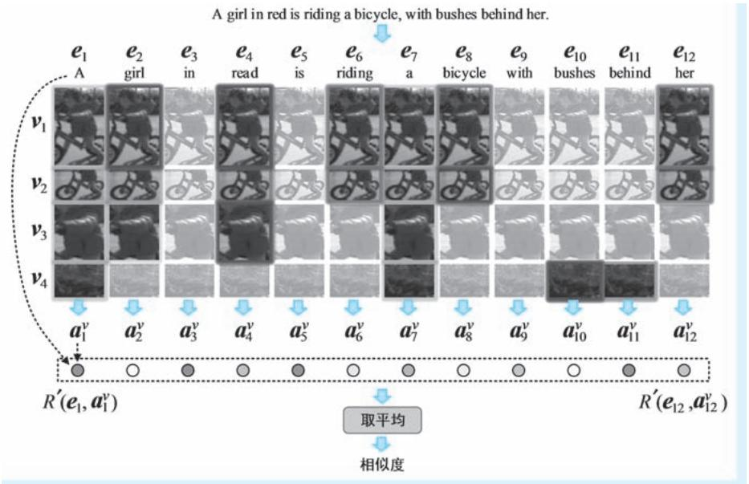  
●图 7-20 TI-SCA 的工作模式示意

式中， $R ( \ Q , S )$ ）、 $R ( \boldsymbol { Q } , \hat { \boldsymbol { S } } _ { h } )$ ）和 $R ( \hat { Q } _ { h } , S )$ ）分别表示具有匹配关系的图像与文本、图像与最不匹配的文本，以及文本与最不匹配图像之间的相似度。在三者中，第一个为正样本，其余两个均为极端情况的负样本； $\left[ x \right] _ { + } = \operatorname* { m a x } \left( x , 0 \right)$ ； $\alpha { > } 0$ 为间隔 （margin）超参数。上式要求，正样本对之间的相似度要比极端负样本的相似度大，而且还得大出一个间隔 $\alpha$ ，否则就会遭到惩罚。例如，在上式的第一项中，若$R ( \mathbf { \nabla } Q , \hat { S } _ { h } ) - R ( \mathbf { \nabla } Q , S ) > \alpha$ ，则有 $\alpha ^ { - } R ( \mathrm { \nabla } Q , S ) + R ( \mathrm { \nabla } Q , \hat { S } _ { h } ) < 0$ ，经过 “max”处理则得到0，对于损失函数来说为不做惩罚的情况；若 $R ( \mathbf { \nabla } Q , \hat { S } _ { h } ) - R ( \mathbf { \nabla } Q , S ) < \alpha$ ，则有 $\alpha ^ { - } R \left( \mathbf { \nabla } Q , S \right) + R \left( \mathbf { \nabla } Q , \hat { S } _ { h } \right) > 0$ ，经过 “max”处理则保持不变 ${ > } 0 { \mathrm { ~ } }$ ），对于损失函数来说这种情况需要惩罚。同理，上式中的第二项也是如此，只不过是对图像和文本做了互换而已。

到这里，读者朋友们应该已经看出，SCAN 模型与上文 AttnGAN 中的 DAMSM 几乎如出一辙，二者都基于交叉注意力计算图像与文本描述之间的相似度，其中也都用到了 “角色互换”，两种模型中图像和文本的地位也都 “对仗工整”。没错，DAMSM 的实质就是一个图文匹配模型，只不过并没有直面图文匹配任务，而是作为生成模型训练过程中的一个约束条件。除此之外，DAMSM 并未使用目标检测模型提取局部特征作为图像的特征表示，而是直接使用了卷积特征。因此按照上文对图像编码器的分类，DAMSM 的图像编码器属于 “Grid-based”类型，而 SCAN 的则属于 “OD-based”类型。

# 7. 4. 2 视觉语言预训练模型

从2019 年开始，人们对视觉语言双模态预训练模型的研究与应用也如火如荼地开展起来，下面我

们即按照其在 arXiv 的首发时间安排，从模型整体架构、多模态编码器结构、注意力机制的工作模式、预训练以及下游任务适配等几个主要方面，对10 个经典的视觉语言模型进行分析。

# 1. ViLBERT：图文预训练模型的开山之作

在 NLP 领域，很多预训练模型都是基于 BERT 这一经典模型打造的，那么是否能够对 BERT 再进行扩展，令其能够获得视觉和语言的联合表示来支持下游视觉语言任务呢？2019 年 8 月，Jiasen Lu等[3] 五名学者提出的 ViLBERT （Vision and Language BERT ）模型便是上述思路下的开山之作。

在整体架构方面，如图7-21 所示，ViLBERT 模型具有典型的视觉-语言双塔型结构，其中，图像编码器和文本编码器首先分别对两种模态的数据特征表示；随后，作者们引入具有协同注意力机制的Transformer （Co-attentional Transformer） 编码器 （以下简称 “Co-TRM 编码器” ） 对上述两路特征表示进行 “相互注意”，使得两种模态信息在注意力机制的作用下实现 “水乳交融”；最后，两种模态的信息再次兵分两路，各自表示，但是此时的特征已经经过对方 “赋能”，信息变得更加丰富，特征的表达能力更加强大。

  
●图 7-21 ViLBERT 模型的整体架构示意 （“TRM”表示标准 Transformer 编码器）

在图像编码器方面，ViLBERT 也采用了 “OD-based”模式———利用 Faster R-CNN 目标检测模型给出得分最高的10～36 个目标位置，从 ResNet101 网络得到特征图上抽取区域特征，然后计算每个位置的特征均值作为对应区域的特征表示。考虑到目标检测的结果是随机的，ViLBERT 将目标框的位置信息作为位置编码与上述图像局部特征进行融合。原始位置信息包括五维，其中包括四个归一化的坐标位置和包围框面积所占比例。在位置编码之前，ViLBERT 会使用线性变换将其维度提升至图像特征的维度，使得随后可以对二者进行求和操作。

在文本编码器方面，ViLBERT 直接使用了 BERT-Base 模型 （12 层 Transformer 编码器，每层包括12 个自注意力头，中间特征维度为 768 维）对输入语言序列进行编码。显然，ViLBERT 使用了比较“重”的文本编码器，之所以采用这种设计，原因在于作者们认为文本语义比图像语义 “藏得更深”，更难理解，因此需要使用更加复杂的模型来更好地获得其中的语义。

在注意力机制方面，ViLBERT 采用了 $K$ 个基于 Transformer 的特征融合层，每层中都包括一个Co-TRM 块和一个标准的 Transformer 编码器 （在图 7-21 中以 “TRM”表示），其中，前者利用协同注意力机制对两种模态的特征进行融合，而后者则针对独立模态信息进行处理。图 7-22 为标准单模态Transformer 编码器与双模态 Co-TRM 编码器的结构对比示意。可以看出，相较于标准单模态Transformer 编码器，一个 Co-TRM 编码器包括两个对称的 Transformer 编码器，二者分别实现对图像

（在图中对应下标 “v”）和文本 （在图中对应下标 “w”）的编码。但是各自的多头注意力模块均以“站在自身立场上关注对方”的方式引入另外一个模态的信息：在图像编码器中，图像特征扮演查询集合 $\mathbf { \nabla } Q _ { v }$ ，文本特征扮演键-值集合 $\{ K _ { w } , V _ { w } \}$ }；而在文本编码器中，文本特征扮演查询集合 $\mathbf { Q } _ { w }$ ，而图像特征扮演键-值集合 $\{ K _ { v } , V _ { v } \}$ }。因此，Co-TRM 中的注意力机制是典型的跨模态交叉注意力机制。在Co-TRM 中，中间特征维度为 1024 维，注意力的头数为 8 个。

  
a)

  
b)   
●图 7-22 标准单模态 Transformer 编码器与双模态 Co-TRM 编码器的结构对比示意a）标准单模态 Transformer 编码器 b）双模态 Co-TRM 编码器

在预训练目标方面，ViLBERT 模型的预训练目标包括三个，即掩膜语言建模、掩膜视觉建模和图文匹配㊀①。在前两个预训练任务中，作者们也仿照标准 BERT 的做法，在输入中随机遮掩 $1 5 \%$ 的词汇特征和图像特征，然后利用未遮掩的图像和文本特征对其进行预测。在被选中进行遮掩处理的图像特征中，有大约 $90 \%$ 的图像特征会做清零处理 （即遮掩），其余 $10 \%$ 则保持不变。除此之外，ViLBERT对于被遮掩的图像并不进行图像特征重构，而是以其语义类别作为监督信息，而这些语义类别正是Faster R-CNN 预测目标的类别。这一操作与我们上文介绍的 BEIT-1. 0 和2. 0 模型所采用的预训练目标类似。在图文匹配预训练任务中，训练目标为预测图像-文本对是否能够匹配，简而言之就是本文和图像是不是 “说的是一回事儿”。在输入中，AiLBERT 在图像特征序列的起始添加图像标志 $< \mathrm { I M G } > "$ ”，在文本序列的起始分类标志 “＜CLS＞”，分别将二者对应的最终输出 $\pmb { h } _ { \ll \mathrm { I M G } > }$ 和 $ { \boldsymbol { h } } _ { \mathrm { < C L S > } }$ 作为视觉输入和语言输入的整体表示。ViLBERT 首先对上述两个向量进行逐元素相乘得到融合特征 （以下简称为 “图文融合特征”），然后再构造一个线性分类器对图像与文本的匹配与否进行二值预测。在 Conceptual

Captions 数据集中，训练数据为具有匹配关系的图像-文本对，自然这些样本对都属于正样本对。ViL-BERT 通过随机组合的图像和文本描述，构造出负样本对。

在下游视觉语言任务适配方面，作者们将 ViLBERT 在四个视觉语言任务上进行了微调适配，这四个任务包括：视觉问答、视觉常识推理、指代表达理解和文本到图像的检索。针对视觉问答任务的微调适配基于 VQA 2. 0 数据集进行，该任务模型所采用的架构与图文匹配预训练任务的架构类似，也是首先构造图文融合特征，然后再基于该特征进行3129 个可能答案的预测。在视觉常识推理任务中，由于视觉常识推理任务包括了 $\mathrm { Q \to A }$ 和 $\mathrm { Q A } { \longrightarrow } \mathrm { R }$ 两个子任务，每个子任务都是四选一的多选模式，故 ViL-BERT 也采用了两个步骤来完成该任务。在完成 $\mathrm { Q \to A }$ 子任务时，ViLBERT 将问题文本分别与四个答案选项文本进行拼接，然后再与图像组合，即得到四组输入，表示为{[question，choicei]，image $\left. \begin{array} { l } { 4 } \\ { i = 1 } \end{array} \right.$ 。然后，将上述四组输入组成批次送入 ViLBERT 模型，在获得的四个图文融合特征上应用线性变换和四维概率化操作，从而得到问题答案的预测 （具体方式请读者参见上文对 BERT 常识推理下游任务的做法）。在完成 $\mathrm { Q A } { \longrightarrow } \mathrm { R }$ 子任务时，ViLBERT 同样将架构组织为 “批次上的选择题”，只不过将上述输入中的 “问题”部分替换为 “问题 $^ +$ 正确选项”，将第一道选择题中的选项替换为第二道选择题中作为理由的选项。指代表达理解任务的微调适配基于 $\operatorname { R e f C O C O + }$ 上开展。对于该任务，ViLBERT 采取的适配方案为：针对一幅图像，获取其中每一个局部区域的最终特征后，对其进行一次线性变换，再预测其真实指代目标的得分。在微调训练时，当图像区域与指代目标真值位置的 IoU 大于 0.5 时，则认为该区域为正样本，即尽量要求上述匹配得分接近 1，否则将其作为负样本，尽量要求预测的匹配得分接近0。因此可以看出，在指代表达理解任务中，ViLBERT 任务模型的本质就是一个文本辅助下的单目标类别的目标检测模型，这里的单目标就是那个在语言中 “被指代”的目标。在推理阶段，直接使用具有最高得分的图像区域作为模型输出即可。针对文本到图像的检索任务，其微调训练在 Flickr30K数据集上进行，在对该任务模型的训练中，与视觉常识推理任务模型类似，作者们也将该任务的适配架构构造为一个四选一的任务：构造四个图文样本对，其中只有一个是真正匹配的，其余三个为干样本，这些样本通过随机描述替换和随机图像替换等方式得到。将上述四组图文样本对送入 ViLBERT，按照图文匹配任务的方式即可预测得到四个对齐得分，然后对四个对齐得分应用softmax 概率化，将问题再转化为一个四分类任务———让那个真正匹配的样本对在分类中 “胜出”。需要注意，上述四选一模式只有在进行微调训练时用到，在推理阶段只需像标准图文匹配任务那样，向模型送入一个图像文本对，模型预测二者的对齐得分即作为其相似度。但是在视觉常识推理任务中，无论是在训练还是推理阶段，给模型送入的样本对个数都必须是四的整倍数，每四个一组构成一道选择题答案。

# 2. LXMERT：双塔 Transformer 的图文预训练模型

LXMERT 模型的提出时间为 2019 年 8 月，作者为 Hao Tan 和 Mohit Bansal[23] 两位来自北卡罗来纳大学 教 堂 山 分 校 的 学 者。 LXMERT 的 全 称 为 “Learning Cross-Modality Encoder Representations fromTransformers”。从其名称可以容易看出，LXMERT 模型与 ViLBERT 类似，也是一种利用 Transformer 编码器进行跨模态交互，从而获得融合多模态信息特征表示的模型。

在整体架构方面，如图7-23 所示，LXMERT 模型的整体架构与 ViLBERT 非常类似，也具有典型的视觉-语言双塔型结构，图像编码器和文本编码器首先分头获取两种模态数据特征的特征表示，随后跟着的一系列基于 Transformer 的跨模态编码器让两路特征 “相互注意”，以实现跨模态的特征融合，

最终两种模态的数据带着对方的信息再次 “分道扬镳”。但是，与 ViLBERT 不同的是，LXMERT 除了视觉特征和语言特征两路输出之外，还将输入文本句首添加的 “＜CLS＞”标识符对应的输出特征单独剥离出来 （即语言特征输出是不包括该标志位的其余部分）作为第三路输出，该特征被称为跨模态输出（Cross-Modality Output），被应用于一些特殊的跨模态任务。

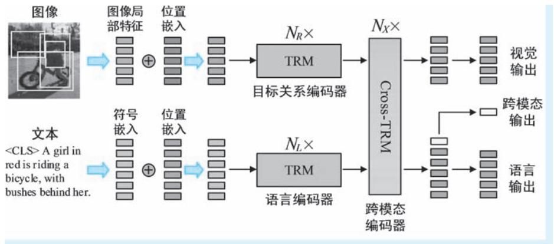  
●图 7-23 LXMERT 模型的整体架构示意 （其中 “TRM”和 “Cross-TRM”分别表示标准 Transformer 编码器和跨模态 Transformer 编码器）

在图像编码器方面，LXMERT 同样采用基于 Faster R-CNN （采用 ResNet101 作为主干网络）的图像区域特征作为编码器输入，故也属于典型的 “OD-based”视觉特征。在进行编码器的正式处理之前，LXMERT 在每个图像特征上都添加了位置信息。这里的位置信息就是 Faster R-CNN 给出目标区域的四个坐标值。具体融合方式为：分别对局部区域的2048 维 RoI 特征和四个坐标值进行线性变换，将二者的维度统一到后续编码器所需的维度，然后对二者取平均值。LXMERT 的图像编码器被称为 “目标关系编码器” （Object-Relationship Encoder），其中包括了 $\mathrm { \Delta } N _ { R }$ 个堆叠的 Transformer 编码器；在文本编码器方面，LXMERT 同样采用了 Transformer 架构，其中包括了 $\mathrm { \Delta } N _ { L }$ 个堆叠的 Transformer 编码器。在进行文本编码之前，LXMERT 首先在输入文本序列的首部添加 “＜CLS＞”标识符，然后再对其中的词汇进行符号嵌入并添加位置信息。在具体实现时，文本编码器和图像编码器的层数分别为 9 层和 5 层 （即$N _ { \scriptscriptstyle L } = 9$ ， $N _ { R } { = } 5$ ），二者各层的参数设置均与 BERT-Base 相同。可以看出，相较于 ViLBERT，LXMERT的图像编码器明显 “重”了很多，但是仍比文本编码器简单。作者认为图像特征在进入 Transformer 编码器之前，已经被101 层的 CNN 深度加工过，因此针对视觉特征可以使用规模较小的编码器。

在注意力机制方面，LXMERT 的做法与 ViLBERT 基本相同，也是利用注意力机制在两个模态之间的数据上相互 “注意”，从而实现信息的交互合成。在 LXMERT 中，完成上述功能的模块被称为跨模态编码器（cross-modality encoder）。其中包括了 $\mathrm { \Delta } N _ { \mathrm { \Delta } X }$ （在具体实现中， $N _ { \scriptscriptstyle { X } } = 5$ ）个层级，在每个层级中都包括三个子模块。其中第一个子模块即跨模态交叉注意力模块，LXMERT 即通过该模块以跨模态 “互查”的交叉方式执行模态间信息交互，在其后为一个自注意力模块和一个全连接前馈网络，用来对融合特征在进行独立加工。因此可以看出，所谓的跨模态 Transformer 编码器，就是在一个标准Transformer 编码器的最前面添加一个交叉注意力模块。

在预训练目标方面，LXMERT 模型的预训练目标包括掩膜语言建模、掩膜视觉建模、图文匹配和视觉问答㊀①。其中，掩膜语言模建模 （在原文中作者将其称为 “Masked Cross-Modality Language Model-ing”即 “掩膜跨模态语言建模”）在 $1 5 \%$ 的随机词汇上以 “＜MASK＞” 标识符标志其被遮掩，然后在语言模态分支的输出上，利用未遮掩的图像和词汇特征预测这些词汇。图 7-24 最下方的 “MLM”部分即为该任务的示意。掩膜视觉建模 （在原文中作者将其称为 “Masked Object Prediction”即 “遮掩目标预测”）随机遮掩 $1 5 \%$ 的图像特征 （将图像的 RoI 特征向量清零），然后在视觉模态分支的输出上，利用未遮掩的图像和词汇特征预测这些视觉目标。既然是视觉目标预测，自然就包括对视觉特征本身的预测和对目标类别的预测两大类。上述两个子任务在 LXMERT 模型中分别被称为 RoI 特征回归 （RoI-Feature Regression） 和检测标签预测 （Detected-Label Classification）。其中，前者利用 L2 损失来约束预测特征与真值特征之间的距离；而后者则在输出特征后再添加分类器，预测图像区域特征对应的目标类别。容易看出，RoI 特征回归子任务要求模型能够实现视觉特征重构，而检测标签预测子任务则相当于让模型完成双模态的目标检测任务。上述两种子任务的真值均由 Faster R-CNN 模型提供。图7-24 最上方的 “MVM”部分即为掩膜视觉建模任务的示意。图文匹配任务和视觉问答任务基于跨模态特征 （“＜CLS＞”标志对应的特征）进行。模型的输入为已知是否具有匹配关系的一幅图像和一段问题文本，图文匹配任务即要求模型预测上述两个输入是否具有匹配关系，而视觉问答任务则要求模型根据图像回答问题。构造上述两个子任务模型的方法为在跨模态特征后添加两个并列的分类器，分别实现对图文匹配 （二分类） 和问题答案 （多分类） 的预测。图 7-24 中间的 “ITM & VQA”部分即为该任务的示意。

  
●图 7-24 LXMERT 模型的预训练任务示意

在下游视觉语言任务适配方面，作者们将 LXMERT 在视觉问答和自然语言推理两类㊁视觉语言任务上进行了微调适配。针对视觉问答任务，LXMERT 的预训练阶段已经涉及，架构也是现成的架构，

$\circleddash$ 在 LXMERT 的原文中，作者们将图文匹配和视觉问答任务视为跨模态任务的两个子任务。  
$\circleddash$ 在 LXMERT 的原文中，作者们在 VQA、GQA 和 NLVR2 三个数据集/任务上进行微调适配，但是我们认为 GQA 本身就是视觉问答任务，且 LXMERT 对二者也采取了相同的任务架构，故我们将前两者合并，统称为视觉问答任务。

这里只需在其他数据集上做微调即可；在自然语言推理任务中，由于任务的输入为两幅图像和一段文本陈述，故作者们分别将两幅图与文本 “组队”，构造出形如{imagei，stagement $\left. \begin{array} { r l } \end{array} \right\} _ { i = 1 , 2 }$ 两个输入，将其组织为批次送入 LXMERT 模型，然后将两次多模态输出的结果再次进行拼接融合，进行线性变换再进行监督分类。

# 3. VisualBERT：一体化特征加工

上文介绍的 ViLBERT 和 LXMERT 两个模型均采用了经典的双塔型结构，两路模型对图像和文本信息分头进行加工，交叉注意力在其中进行两种模态的信息交互。那么，如果将图像和文本映射入一个公共的空间进行表示，然后像针对处理单模态信息那样使用 Transformer 的自注意力机制将两个模态的信息进行充分融合岂不更加简单？我们下面即将介绍的 VisualBERT 就具有这样的架构。VisualBERT模型的提出时间为 2019 年 8 月，作者为 Liunian Harold Li 等[24] 五名学者。

整体架构如图 7-25 所示，VisualBERT模型由一系列 Transformer 编码器堆叠而成，可以说 VisualBERT 的本质就是一个 BERT模型 （具体在实现时，作者们使用的就是BERT-Base 模型），只不过在其处理的信息中，一半是图像，一半是文本。所有针对双模态信息的融合操作全部交给了 Trans-former 中的自注意力机制来完成。

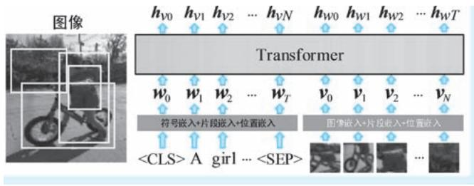  
●图 7-25 VisualBERT 模型的整体架构示意

在模型输入方面，VisualBERT 针对文本输入完全采用了 BERT 的方式———在输入文本序列前后分别添加 “＜CLS＞”和 “＜SEP＞”标识符，然后对每个词汇进行符号嵌入、片段嵌入和位置嵌入的合成操作。在这里，符号嵌入、位置嵌入与标准 BERT 完全相同，而片段嵌入则用来标识每一个元素到底是文本特征还是图像特征。容易看出，这一做法与 BERT 针对双句输入所采用片段嵌入如出一辙，只不过 BERT 用片段嵌入来标识词汇来自两个语句中的哪一句。针对图像特征，VisualBERT 也是采用了三个嵌入合成的方式来构造输入。其中第一个嵌入为图像嵌入，即利用目标检测模型获取的目标区域中的卷积特征标识，显然，VisualBERT 的图像特征表示也是 “OD-based”；第二个嵌入为片段嵌入，该操作与词汇片段嵌入的目的完全相同；第三个嵌入为位置嵌入，在原文中并未明确给出位置嵌入的具体方法，请读者将其理解为针对每一个局部特征添加了一个位置标示向量即可。经过上述处理之后，文本中的词汇特征和图像特征已经具有相同的维度，两种模态的数据完全可以视为 BERT 中的两个语句，因此后续 Transformer 编码器即可以对其进行 “毫无违和感”的一体化加工。

在预训练目标方面，VisualBERT 模型的预训练目标包括两个：掩膜语言建模和图文匹配。在掩膜语言建模预训练中，VisualBERT 利用未进行遮掩的图像和词汇特征来预测被遮掩的词汇，具体实现方法与标准的掩膜语言建模别无二致；在针对图文匹配任务的预训练中，VisualBERT 进行的操作与ViLBERT 也十分类似———给模型输入图像-文本样本对，其中有 $50 \%$ 样本为正样本对，即文本能够描述图像，而另外 $50 \%$ 的样本对为随机绑定的负样本对。图文匹配任务即要求模型尽量正确判断图像和文本是否能匹配。

在下游视觉语言任务适配方面，作者们将 VisualBERT 在四个视觉语言任务上进行了微调适配，这

四个任务包括：视觉问答、视觉常识推理、自然语言推理和短语定位。针对视觉问答任务，适配的方式等同于预训练中的掩膜语言建模，只不过在这里，“＜MASK＞”标识符不用于替换任何词汇，只是添加到问题文本的最后，VisualBERT 将该标识符对应的最终特征表示送入一个分类器，从而实现对问题答案的预测；针对视觉常识推理任务，VisualBERT 的做法与 ViLBERT 基本相同，同样采用 “批次拼接大法”，只不过 VisualBERT 在后续分类以 “＜MASK＞”对应特征为输入，而 ViLBERT 则基于图文融合特征开展后续分类；在自然语言推理任务中，VisualBERT 使用的任务架构与 LXMERT 基本相同———分别将两幅图像与文本陈述组合，然后组成批次送入模型，在两个输出上进行分类；在短语定位任务中，作者们基于 Flickr30k Entities 数据集开展模型适配。该数据集同时标注了图像及其文本描述中的实体 （在图像上以包围框形式标注，在文本中则以实体短语在文本中的起止位置标注），旨在评测模型是否能够在图像和文本之间对齐相同实体。为了完成上述任务，首先得确定正样本特征。方法为：将 Faster R-CNN 给出的目标框与数据集中的图像真值位置进行 IoU 计算，将其中阈值大于 0.5的图像区域特征视为正样本特征。接下来即进行对齐监督训练，作者们额外引入了一个多头自注意力层，将多头注意力在相同特征上的注意力平均值作为对齐得分的预测。例如，需要在图像上定位文本中提到的实体 “bird”，那么利用上述方式获得其在图像上与之对齐的那个 “视觉 bird”的注意力权重，微调训练的目标即让该注意力权重尽量接近于 1。

# 4. UNITER：通用图像-文本表示学习

上文介绍的 VisualBERT 已经将 “双塔”变 “单塔”，在架构层面已经实现统一。那么是否能够让其在预训练和下游任务适配中接受更多任务的训练，让其能够 “通吃”所有任务呢？很多学者按照这一思路提出了诸多模型，我们下文介绍的 UNITER 模型就是其中的典型代表。UNITER 模型的全称为“通用图像-文本表示”（“UNiversal Image-TExt Representation”），这里所谓的 “通用”简单来说就是“什么活都能干”㊀。该模型的提出时间为 2019 年 9 月，作者为 Yen-Chun Chen 等[25] 八名来自微软的学者。

在整体架构方面，如图7-26 所示，UNITER 模型也具有 “BERT 型”架构，输入的序列也是一半

图像，一半文本，多层自注意力机制针对两种模态的特征 “充分搅拌”。按照 Trans-former 架构的规模，UNITER 又包括基础版（UNITER-Base） 和 大 规 模 版 （UNITER-Large）两种规模，二者与 BERT 对应规模模型参数设置保持一致。无论是模型架构还是功能，UNITER 俨然就是一个 “图文版 BERT”。

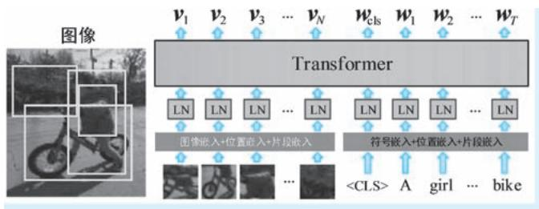  
●图 7-26 UNITER 模型的整体架构示意

在模型输入方面，针对图像特征，UNITER 同样属于 “OD-based”类型，我们的老朋友 FasterR-CNN 再次登场。视觉特征的表示包括卷积特征和位置特征的合成，其中前者即为区域卷积特征的均

值，而后者为七维位置特征 （包围框的四个归一化坐标，再加上包围框的宽、高和面积）。两种类型的特征经过线性变换维度统一后即进行求和。针对文本特征，UNITER 直接采用了 BERT 的方式，将符号嵌入特征和位置嵌入特征进行求和。除此之外，为了区分特征到底来自图像还是文本，UNITER也参考了 BERT 的做法，在上述合成特征的基础上添加了片段嵌入特征，最后合成后的特征经过层归一化处理，即作为 UNITER 模型的输入。

在预训练目标方面，UNITER 模型的预训练目标包括四个：掩膜语言建模、掩膜图像建模、图文匹配和词汇-区域对齐。其中，对于掩膜语言建模这一预训练目标，UNITER 做法没有太多特别之处———利用未遮掩的图像和文本特征预测被遮掩 （约 $1 5 \%$ 的比例㊀①）的词汇。掩膜图像任务即利用为遮掩的图像和文本特征预测被遮掩 （约 $1 5 \%$ 的比例） 图像区域。针对该预训练任务，作者们为UNITER 设定了三个子任务：遮掩特征区域回归 （Masked Region Feature Regression，MRFR）、遮掩区域分类 （Masked Region Classification，MRC） 和基于 KL 散度的遮掩区域分类 （Masked Region Classifi-cation with KL-Divergence，MRC-kl）。其中，MRFR 子任务的设定目的与 LXMERT 模型中 RoI 特征回归子任务相同，都是为了让模型能够基于双模态信息重构被遮掩的图像特征。UNITER 同样采用 L2 距离作为重构特征和真值特征 （Faster R-CNN 提取的区域特征）之间的损失度量。后两个子任务都是为了让 UNITER 模型能够根据多模态特征正确预测目标类别。二者的区别在于：MRC 子任务以标准交叉熵损失对预测类别和真值类别 （即由 Faster R-CNN 给出的目标类别预测）进行损失计算和监督，这里的标签为 0-1 硬标签；而 MRC-kl 子任务即为 MRC 任务的 “软标签”版 （即 softmax 输出的概率，不做argmax 的找最大处理），即通过 KL 散度直接对预测类别概率和真值类别概率 （即 Faster R-CNN 给出的目标概率预测）之间的距离进行计算，以此作为损失来对模型进行监督。之所以使用软标签进行监督，这是因为 Faster R-CNN 给出的预测结果实际也并非真值，直接将其 “硬化”作为真值多少有些武断；在图文匹配任务中，作者们在文本输入之前添加 “＜CLS＞”标识符，以其对应的输出特征作为全局多模态特征。图文匹配是一个典型的全局二分类任务，故 UNITER 基于上述全局多模态特征构造分类器，以实现对图像和文本匹配与否的二值预测；词汇-区域对齐任务即要求模型能够在图像局部特征和词汇特征之间建立匹配关系。针对这一任务，作者们使用了一种基于最优运输 （Optimal Transport）理论的新方法。我们分别将模型得到的图像特征序列记作 $\pmb { \nu } = \left( \pmb { \nu } _ { 1 } , \cdots , \pmb { \nu } _ { N } \right)$ ），将词汇特征序列记作 $w =$ $( \pmb { w } _ { 1 } , \cdots , \pmb { w } _ { T } )$ ），其中 $N$ 和 $T$ 分别为图像区域个数和文本长度。我们可以将最优运输问题理解为求解如何以最小代价将一堆货物码放为另外一种形态的问题。运输的计划有多种，最优运输问题即要求在所有运输计划中选择代价最小的一种。在上述货物中，如果将原货物和目标货物替换为两种分布，那么最小代价 （即最优运输计划对应的代价）则定义了两种分布之间的距离，该距离一般称为 “沃瑟斯坦距离” （Wasserstein Distance，简称为 “W 距离” ） 或 “推土机距离” （Earth Mover's Distance），著名的 WGAN 中的 “W”即为 “Wasserstein”的首字母。对应到 UNITER 的预训练任务中，图像特征序列v 和词汇特征序列 $w$ 即被视为运输前后的两个分布。UNITER 的预训练方法为：首先，按照 $\nu$ 和 $w$ 计算其间的 $W$ 距离 $\mathrm { w d i s t } ( \nu , \ w ) = \sum _ { i = 1 } ^ { T } \sum _ { j = 1 } ^ { N } { \cal T } _ { i , j } ^ { * } c ( \nu _ { i } , \ w _ { j } )$ 。 其中， $c ( \pmb { \nu } _ { i } , \pmb { w } _ { j } )$ ）表示向量 $\mathbf { \nu } _ { \nu _ { i } }$ 和 ${ \bf \ddot { \it w } } _ { j }$ 之间的运

输代价，在UNITER 中具体实现为 $c \left( \pmb { \nu } _ { i } , \pmb { w } _ { j } \right) = 1 - ( \pmb { \nu } _ { i } ^ { \mathrm { T } } \pmb { w } _ { j } ) / ( \| \pmb { \nu } _ { i } \| \| \pmb { w } _ { j } \| )$ ）。对应到我们 “挪货物”的例子中，即从位置i 到位置 $j$ 需要走多远。 $\pmb { T } ^ { * } \in \mathbb { R } ^ { T \times N }$ 即最优运输计划矩阵，其中元素 $\cdot T _ { i , j } ^ { * }$ 为从位置i 到 $j$ 的运输代价。对应到我们 “挪货物”的例子中，即从位置 $i$ 到位置 $j$ 挪多少货物。距离就是损失———UNITER 针对词汇-区域对齐任务，即以上述 $\mathbb { W }$ 距离作为词汇和图像区域的对齐损失函数，要求针对具有匹配关系的图像和文本，模型应尽可能地将二者对齐。图7-27 示意了 UNITER 的四种预训练任务。

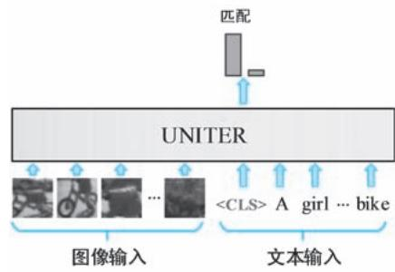

●图 7-27 UNITER 的四种预训练任务示意  
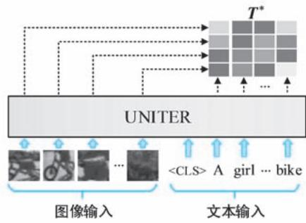  
a）掩膜语言建模 b）掩膜图像建模 c）图文匹配 d）词汇-区域对齐

在下游视觉语言任务适配方面，作者们在视觉问答、图文匹配、视觉蕴含、视觉常识推理、自然语言视觉推理和指代表达理解六个下游任务的共计九个数据集上对 UNITER 模型进行了微调适配。其中，视觉问答、图文匹配和视觉蕴含三种任务，属于典型的基于图文二元输入的分类问题，故UNITER 对其使用了相同的架构，该架构相较于其他模型算得上是中规中矩———将图像和文本一并送入模型，然后将 “＜CLS＞”标识符对应的模型输出特征送入一个 MLP 分类器，预测所需要的概率分布。在上述三个任务中，上述概率分布分别为：答案词汇的概率 （维度为词典大小）、是否匹配的二分类概率，以及图文蕴含关系的三分类概率。针对视觉常识推理任务，UNITER 也采用了与VisualBERT 和 ViLBERT 同样的 “批次拼接大法”———在 $\mathrm { Q \to A }$ 和 $\mathrm { Q A } { \longrightarrow } \mathrm { R }$ 两个步骤中，均采用四个图文拼接作为模型输入，要求模型完成四选一的选择题。针对自然语言推理这一 “双图 $^ +$ 文本”的模式，作者们为 UNITER 设计了三种适配方案：Triplet 方案、Pair 方案和 Pair-BiAttn 方案。在 Triplet 方案中，将两幅图像的区域特征进行拼接，然后再与文本特征组合一并送入网络。整理来看，模型的输入仍然

为一半图像一半文本，只不过图像的那一半可以再一分为二，分别为来自两幅图像的区域特征。随后再对 “＜CLS＞”标识符对应输出特征执行分类，预测输入文本是否能够作为两幅图像的正确陈述。在Pair 方案中，分别将两幅图像与陈述文本进行拼接，输入两次 UNITER 模型，得到两组联合特征表示。然后将两个 “＜CLS＞”特征进行融合和 MLP 加工，最后再执行二分类操作。Pair-BiAttn 方案为增强版Pair 方案，其输入组织与 Pair 方案完全相同，只不过在 Pair 输出的两组联合特征表示之后，再使用一个双向注意力 （Bidirectional Attention，BiAttn）层，对两个联合表示进行一次注意力机制的作用。然后再对注意力层的输出特征进行融合并进行最终的二分类预测；针对指代表达理解任务，UNITER 在图像特征输出后添加一个 MLP 结构，为每一个图像特征预测一个对齐得分，取其中得分最高特征对应的图像区域作为最有可能的指代区域输出。

# 5. VLP：兼顾理解与生成的预训练模型

NLP 任务又可以具体细分为 NLU 和 NLG 两类任务，有些模型适合做 NLU 任务，如 BERT 等，有些模型用来专攻 NLG 任务，如 GPT （还包括 Transformer “本尊”）等。但是也有学者在试图用一个模型 “通吃”上述两类任务，例如，我们在上文中介绍的UniLM 就是其中的典型代表。理解和生成的“争论”在视觉语言多模态领域自然也存在。例如，上文介绍的 ViLBERT、LXMERT、VisualBERT 都是针对理解任务设计，即便是 “通吃”的 UNITER 模型，也只做到 “通吃”理解类任务。那么是否能够构造一款既能够完成生成任务、又能应用于理解任务的预训练模型呢？我们下文介绍的 VLP（Vision-Language Pre-training） 模型即属于此类视觉语言预训练模型。VLP 模型提出于 2019 年 9 月，作者是 Luowei Zhou 等[26] 六名来自密歇根大学和微软的学者。当然，作者们对 VLP 模型的任务设定相对保守，选择了生成任务中的看图说话，以及理解任务中的视觉问答作为其发力方向。

在整体架构方面，VLP 模型也是由一系列的 Transformer 编码器构成，输入模式同样也是图像和文本并列的双模态一体化输入。但是，尽管看上去 VLP 模型在整体架构上与上文介绍的 VisualBERT 和UNITER 别无二致，但是在实质上 VLP 模型中可谓 “别有洞天”———在面对理解类任务时，VLP 模型拥有纯粹的双模态编码器架构，在这种模式下，VLP 与 VisualBERT 和 UNITER 并无本质区别；但是在面对生成类任务 （在 VLP 中就是看图说话这一图像到文本的生成）时，VLP 又摇身一变成为了跨模态生成的编码器-解码器架构。可能有些读者会发现，VLP 这种看似是编码器，但是能转变角色、完成理解和生成两类任务的模式，和之前讨论过的 UniLM 模型非常相似。没错，VLP 可以视为是 UniLM模型的 “图文版”———将UniLM 模型双句拼接输入的第一句替换为图像特征。作者们在原文中也多次提及 UniLM，甚至以 UniLM 作为 VLP 模型的参数初值。图7-28 示意了 VLP 模型的两种预训练架构。

在模型输入方面，VLP 使用的图像特征仍为 “OD-based”特征———将 Faster R-CNN 目标检测模型（主干网络为带有 FPN 结构的 ResNeXt101）获取的区域特征与各种其他特征进行合成，只不过相较于上文介绍的模型，VLP 图像特征的合成中还添加了目标检测的类别信息。假设模型输入的图像区域特征序列为 $\{ \pmb { r } _ { i } \} _ { i = 1 } ^ { N }$ ，其中 $N$ 为区域个数， $\pmb { r } _ { i } = \pmb { W } _ { r } \pmb { f } _ { i } + \pmb { W } _ { p } \left[ \operatorname { L N } \left( \ \pmb { W } _ { c } \pmb { c } _ { i } \right) , \operatorname { L N } \left( \ \pmb { W } _ { g } \pmb { g } _ { i } \right) \right] + \pmb { W } _ { s } \pmb { s } _ { i }$ 。这里， $f _ { i }$ 、 $\boldsymbol { c } _ { i }$ 、 $\pmb { g } _ { i }$ 和 $\mathbf { \boldsymbol { s } } _ { i }$ 分别表示目标区域的 RoI 特征、目标类别分布 （向量）包围框的五维位置 （四个坐标值加上相对面积）和特征的片段标识； $W _ { r }$ 、 $W _ { c }$ 、 $W _ { _ { g } }$ 、 $W _ { s }$ 和 $W _ { p }$ 均为可学习线性嵌入参数矩阵； $\mathrm { L N } ( \mathbf { \partial } \cdot \mathbf { \partial } )$ ）为层归一化操作。对于文本中的每一个词汇，VLP 直接使用了 BERT 的方式，对其进行符号嵌入、位置嵌入和片段嵌入的三个嵌入合成，合成后的词汇序列记作 $\left\{ { \bf y } _ { i } \right\} _ { i = 1 } ^ { T }$ 。除此之外，作者们在整个输入序列最开

始、两个模态数据之间和最末尾分别添加 “＜CLS＞”“＜SEP＞”和 “＜STOP＞”标识符。因此，VLP 模型的整体输入形如（＜CLS＞，r ，…，r ，＜SEP＞，y ，… $, { \bf y } _ { T }$ ，＜STOP＞）∈Rd×U ，其中 $d$ 为特征维度， $U { = } N { + } T { + } 3$ 。

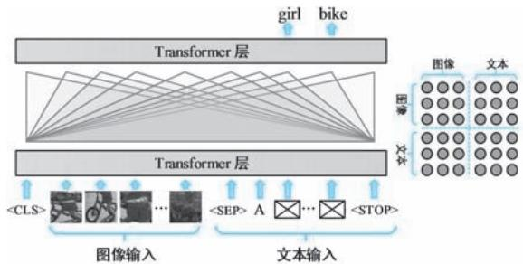

●图 7-28 VLP 模型的两种预训练架构示意  
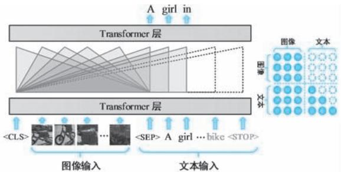  
a）掩膜语言建模的预训练架构 b）Seq2Seq 建模的预训练架构

在编码器方面，VLP 中的 Transformer 编码器会随着任务转变角色。当面对理解类任务时，图像和文本被视为地位平等的两路输入，Transformer 编码器通过其中的自注意力机制对两路特征进行充分“搅拌”，最终得到双模态的联合特征表示。在这种模式下，VLP 的工作模式与 VisualBERT 和 UNITER并无本质区别；但是在面对生成类任务 （在 VLP 中就是看图说话这一图像到文本的生成）时，VLP摇身一变成为编码器-解码器架构。其中的 Transformer 一分为二，前半部分作为图像编码器，利用双向自注意力机制对图像上下文特征进行充分交互，充分理解图像语义；后半部分为自回归解码器，其中的掩膜注意力机制使得其在生成词汇时无法 “注意”其后词汇，只能依赖图像编码特征即在其之前生成的词汇。在上述两种模式中，注意力的投射范围通过掩膜矩阵控制。

在预训练目标方面，VLP 的作者们将 UniLM 的单向语言建模、双向语言建模、序列到序列语言建模 （以下简称为 “Seq2Seq 建模”）和下句预测四个预训练目标减少到两个：双向语言建模和Seq2Seq 建模，这两种预训练目标即分别对应理解和生成两类任务。其中，双向语言建模即掩膜语言建模，VLP 对其中 $1 5 \%$ 随机词汇的输出上进行监督，在这 $1 5 \%$ 的词汇中，八成做 “＜MASK＞”操作，一成做随机篡改，其余一成保持不变。VLP 即通过让模型学习图文阅读材料，然后在文本上进行 “完形填空”训练。图7-28a 示意了掩膜语言建模的预训练架构。Seq2Seq 建模的预训练目标可以表示为最大化条件概率 $p \big ( \hat { \pmb y } _ { t } | \pmb r _ { 1 } , \cdots , \pmb r _ { N } , \hat { \pmb y } _ { 1 } , \cdots , \hat { \pmb y } _ { t - 1 } ; \pmb \theta \big )$ ），其中的条件部分即为全部的图像特征 $( \pmb { r } _ { 1 } , \cdots , \pmb { r } _ { N } )$ ）以及当前步骤之前已经生成的词汇特征 $( \widehat { \mathbf { y } } _ { 1 } , \cdots , \widehat { \mathbf { y } } _ { t - 1 } )$ ）； $\theta$ 为需要优化的模型参数。可以看出，在该预训练目标下，实际上就是训练一个基于 Transformer 的 Seq2Seq 模型，原序列为图像区域，目标序列为文本。上述“只向前看”的方式可以通过掩膜注意力机制轻松实现。图7-28b 示意了 $\mathrm { S e q } 2 \mathrm { S e q }$ 建模的预训练架构。

在下游视觉语言任务适配方面，VLP 适配的下游任务包括视觉问答和看图说话两种，二者分别是理解类任务和生成类任务的典型代表。针对视觉问答任务，VLP 的任务架构相较于前文介绍的几个模型来说大同小异：将图像和问题文本并列送入模型，然后在模型输出端接收类别标识符 “＜CLS＞”和分隔标识符 “＜SEP＞”对应的特征，以逐元素相乘的方式对二者进行融合，最后再将融合特征送入

MLP 分类器来预测问题答案。针对看图说话任务的微调适配就是 Seq2Seq 建模———输入图像，然后以自回归方式逐个预测输出词汇并进行监督训练。具体方法为：首先将图像特征序列前后分别添加“＜CLS＞”和 “＜SEP＞”标识符，然后在其后再添加一个 “＜MASK＞” 标识符作为开始生成标志，在输出端获得其对应的特征并进行词汇预测；将该词汇替换上述 “＜MASK＞”标识符，再在序列最后再添加一个 “＜MASK＞”标识符作为下一个词汇预测的启动标志，以此类推，直到 “＜STOP ＞” 标识符的出现。在获得预测词汇后，即可以计算其与真值文本序列之间的损失来对模型进行监督微调。

# 6. OSCAR：将对象标签作为对齐线索

上文介绍的 VisualBERT、UNITER 和 VLP 模型都具有 “图像区域特征 $^ +$ 文本特征+Transformer” 的整体架构。随后，上述配置似乎成了标配，被大量视觉语言预训练模型所采用。在该架构中，图像区域特征和文本特征被并列送入 Transformer 结构，Transformer 利用其自注意力机制，在不同视觉语言任务的驱动下，来实现两种模态语义信息的对齐㊀①。然而，上述做法存在着一个明显的问题，那就是以最终视觉语言任务作为驱动，其能够给跨模态对齐带来的指导信息是不够清晰明确的，尤其是当数据存在大量的冗余信息 （噪声）时，上述对齐将变得异常困难。例如，我们有一幅图像，上面有一只猫和一只狗，但是与之匹配的描述语句为 “A black dog with blue eyes stood next to a cute cat. ”。我们需要完成的对齐任务就是建立图像上猫和狗两个区域与文本中 “cat”和 “dog”两个词汇的对应关系，文本中 “可爱的”“黑色”“蓝眼睛”等修饰性语言都可以视为对齐任务的干扰信息。这就意味着我们的模型必须学会抽丝剥茧，将重点锁定到需要真正对齐的输入上。这一要求在任务驱动的端到端 “黑盒”模式下是非常困难的。为了克服上述问题，2020 年 4 月，Xiujun Li 等[27] 12 名来自微软和华盛顿大学的学者提出对象语义对齐预训练（Object-SemantiCs Aligned PRe-training，OSCAR） 模型。OSCAR模型的思路非常简单：难对齐的核心原因在于没有提供足够明确的线索，那么如果把目标检测模型给出的对象标签 （object tags）文本化也作为模型输入，岂不是最直接明了的线索？例如，在我们上文“猫狗”的例子中，目标检测模型检测出了图像上的猫和狗，那么我们就将二者对应的对象标签文本“cat”和 “dog”也作为除图像和文本描述之外的第三种输入，作为对齐的直接线索，使得对齐变得更加容易。在 OSCAR 模型中，上述对象标签文本被称为对齐的 “锚点”（anchor points）。

整体架构如图 7-29 所示，OSCAR 模型也具有基于 Transformer 编码器 （准确地讲是 BERT）的架

  
●图 7-29 OSCAR 模型的整体架构示意

构，输入模式同样也是文本与图像区域并列的混合型输入。按照其中 Transformer 结构的规模，OS-CAR 也有两种不同规模的版本：基础版 （OSCAR-B）和大规模版 （OSCAR-L），两种模型的参数设定与 BERT 对应规模模型相同，且作者们也在模型初始化时使用对应规模 BERT 模型作为参数初值。

在模型输入方面，OSCAR 模型将一般视觉语言的双序列输入形式改为 “描述文本+对象标签+图像区域”的三元组形式 （原文将该输入形式称为 “Word-Tag-Image 三元组”）。其中，描述文本和图像区域与前文介绍模型别无二致，前者作为后者的描述。输入中的图像区域同样来自 Faster R-CNN 的目标检测输出，故 OSCAR 的图像特征仍属于 “OD-Based”类型；而三元组输入中的即为 FasterR-CNN 目标检测输出类别的文本表示，对象标签的加入也正是 OSCAR 的创新之处。例如，在图 7-29所示的例子中，目标检测模型从输入图像上检测出两个目标，类别标签分别为 “girl”和 “bike”，则将上述两个区域和两个文本标签分别作为三元组输入中的图像区域输入和对象标签输入。对于其中的文本特征 （包括描述文本和对象标签），OSCAR 对其进行词嵌入操作，针对图像区域特征，OSCAR 的做法也与前文介绍模型类似———将区域卷积特征与包围框位置特征融合，然后通过线性变换将其维度与词嵌入特征统一。经过上述嵌入之后，我们将 OSCAR 模型输入的三元组记作 $( w , q , \nu )$ ）。 ${ \pmb w } \in \mathrm { R } ^ { d \times T }$ 和$ { \boldsymbol \nu } \in  { \mathrm { R } } ^ { d \times N }$ 即分别为描述文本和图像区域的嵌入特征序列， $\pmb q \in \mathrm { R } ^ { d \times N }$ 表示对象标签 （文本）的嵌入特征序列，这里的 $\pmb q$ 即所谓的锚点。其中 $d$ 为嵌入特征维度 （也即后续 Transformer 结构的中间特征维度），$T$ 和 $N$ 分别为描述文本的长度和图像区域的个数。在进行 Transformer 模型输入之前，OSCAR 在序列首部添加 ${ < } \mathrm { C L S } >$ ”标识符，在三元数据之间插入 ${ \mathrm { < S E P > } }$ ”标识符，即整个模型输入形如$< \mathrm { C L S } > w < \mathrm { S E P } > q < \mathrm { S E P } > \nu ,$ ） $\in \mathbf { R } ^ { d \times U }$ ，其中 $U { = } T { + } 2 N { + } 3$ 。

在预训练目标方面，OSCAR 从两个视角看待输入的三元组：词典视角（Dictionary View，DV）和模态视角（Modality View，MV）。每个视角都将三元输入划分为两个组别。其中，词典视角按照特征的表现形式分组。在该视角下，描述文本 $w$ 和对象标签 $\pmb q$ 划分为语言组别，而图像区域 $\nu$ 独自构成图像组别。这一分组很好理解，即文本一组，图像一组。模态视角按照特征来源进行分组。在该视角下，描述文本 $w$ 独自属于语言组别，而对象标签 $\pmb q$ 和图像区域 $\nu$ 同属于图像组别㊀①。上述两个视角下的三元组输入可以表示为

$$
M V \triangleq ((\boldsymbol {w}, \boldsymbol {q}), \boldsymbol {v}) = (\boldsymbol {w}, (\boldsymbol {q}, \boldsymbol {v})) \triangleq D V \tag {7-41}
$$

两种视角对应了两种不同的预训练目标。在词典视角下，OSCAR 的预训练目标即为掩膜语言建模。因为在该视角下， $w$ 与 $\pmb q$ 均为文本表示，二者中的词汇来自相同的词典，共享语义空间，故理论上 $w$ 与 $\pmb q$ 中的任何一个词汇都可以被其他词汇，以及图像特征有关。我们令 $\mathbf { \nabla } \cdot \mathbf { w ^ { \prime } } = \left[ \mathbf { \nabla } w \mathbf { \nabla } , q \right]$ ]，即将描述文本和目标标签拼接，视为一段新的文本。这样一来，OSCAR 模型的输入与前文介绍的双模态模型相同。下面的操作想必读者已经非常熟悉———以 $1 5 \%$ 的比例对 $\pmb { w } ^ { \prime }$ ′中的词汇进行随机遮掩，然后利用其余未遮掩的词汇特征和图像特征预测这些被遮掩词汇。在模态视角下，OSCAR 的预训练目标基于对比损失 （Contrastive Loss）完成。具体操作方法十分简单：在图像组别 $( \pmb q , \pmb \nu )$ ）中，以 $50 \%$ 的概率将其中的目

标标签序列 $\pmb q$ 随机替换为一个与图像不相关的错误标签序列 $\pmb q ^ { - }$ （在原文中将这一操作称为 “制造污染”。与之对应，我们将能够与图像对应的正确目标标签序列记作 $\pmb q ^ { + }$ ），然后接收句首 ${ \mathrm { < C L S > } } ^ { \prime }$ ”标识符对应的全局多模态特征，并对其进行匹配与否的二分类预测———在 $( { \pmb w } , ( { \pmb q } ^ { + } , { \pmb v } ) ) ,$ ）出现时，要求模型尽可能为1，而当 $( { \pmb w } , ( { \pmb q } ^ { - } , { \pmb v } )$ ）出现时，要求模型输出0。OSCAR 的整体预训练目标即上述两个视角下预训练目标的综合 （整体损失函数即两个视角损失函数之和）。

在下游视觉语言任务适配方面，VLP 适配的下游任务包括四种：图文匹配、看图说话、视觉问答和自然语言视觉推理。在图文匹配任务中，作者们选择正确匹配和随机错误匹配的图像-文本对分别作为正样本和负样本送入模型，然后基于 “＜CLS＞”对应输出特征构建二分类器，以预测图像和文本的匹配得分；在看图说话任务中，OSCAR 采用了 VLP 的做法，在图像部分利用自注意力机制进行双向编码，在文本部分则利用 “不看后面”的掩膜注意力机制，以及不断后移的 “＜MASK＞”标识符作为指示逐个生成词汇；在视觉问答任务中，OSCAR 所采用的任务架构与图文匹配类似，同样是将任务模型构造为一个双模态输入的分类模型，只不过类别个数为词典长度；在自然语言视觉推理任务中，OSCAR 也采用了上文介绍模型的常用架构———两幅图与陈述分别捆绑，进行两次模型加工，然后再两组多模态输出结果上执行分类。

# 7. ViLT：放弃 CNN 的“图文版 ViT”

上文介绍的多个视觉语言预训练模型有一个共同的特点，即其中的图像特征都来源于一个目标检测模型，这便是所谓的 “OD-Based”图像特征。这样做的好处在于目标检测模型为后续工作提供了与任务无关的、具有物体化 （objectness） 属性的视觉特征，实现了类似自下而上的预注意机制。然而，其缺点也非常明显，主要体现在两个方面：第一，整个模型的构被造割裂为两个阶段———先构造目标检测模型，后构造多模态模型，前者以离线方式为后者提供图像特征，无法实现端到端训练；第二，模型的体量过于庞大。首先，为了达到比较好的目标检测效果，目标检测模型往往具有复杂的结构；其次，诸多工作也在实践中证明，多模态模型一般也需要复杂的结构才能够达到良好的跨模态交互效果。如此一来，重量级的视觉特征提取加上重量级的多模态交互，将导致整个模型十分臃肿，运行效率也非常低下。那么，我们很自然的要问一个问题，目标检测模型是必需吗？甚至一定要使用 CNN 特征吗？2020 年 10 月，ViT 的诞生为人们打开了另一扇窗，随后各类基于 ViT 的 CV 模型也不断地告诉我们 “CNN 也许不是必需的”。在这一背景下，我们下文的主角———ViLT （Vision-and-Language Transformer） 模型应运而生。该模型彻底放弃基于 CNN 的图像特征提取 （自然也就放弃了 Faster R-CNN 等目标检测模型），取而代之的是 ViT 分块图像处理机制。ViLT 大幅简化了模型架构。将原本视觉语言模型中 “视觉 CNN，语言 Transformer” 的全部统一到Transformer 架构上来。ViLT 模 型 的 提 出 时 间 为 2021 年 2 月，作 者 是 Wonjae Kim 等[28]三 名 韩 国学者。

在整体架构方面，一个视觉语言模型一般包括视觉编码器 （Vision Encoder，VE）、文本编码器（Text Encoder，TE）和模态交互 （Modality Interaction，MI）三个主要模块。这些模块可繁可简，可轻可重。ViLT 的作者们在其文章开篇，首先按照三个模块的复杂程度，将现有视觉语言模型的架构分为四大类。我们在其基础上额外再增加一种，将多模态模型的架构分为五类，如图7-30 所示。我们下面也从这五种不同架构说起。

●图 7-30 按照三个模块的规模对视觉语言模型的五种分类  
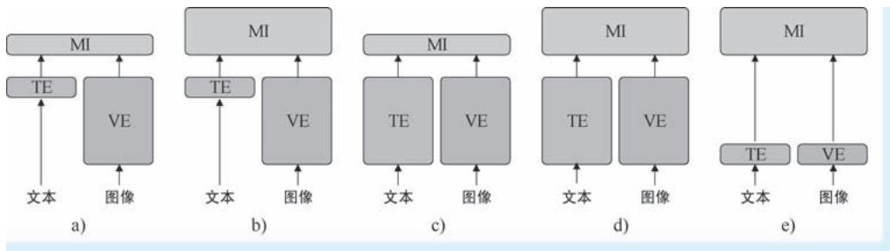  
a）轻文本，重图像，轻交互 b）轻文本，重图像，重交互 c）重文本，重图像，轻交互  
d）重文本，重图像，重交互 e）轻文本，轻图像，重交互

第一种架构简单来说即 “轻文本，重图像，轻交互”（如图7-30a 所示）。在该类架构中，绝大多数的计算资源都投入在视觉一侧，文本编码及后续的模态交互部分与之相比则显得十分单薄。例如，在我们前文介绍的 SCAN 模型中，视觉特征的提取用到了 Faster R-CNN 加 ResNet101 这一重量级的结构，而文本特征的提取用了很简单的双向 GRU。在后续的模态交互中，仅使用了单次注意力投射的特征融合机制。第二种架构具有 “轻文本，重图像，重交互”的模式 （如图 7-30b 所示）。在该类架构中，文本编码器和视觉编码器仍 “一高一矮”，但是人们已经意识到模态交互的重要性，故使用了重量级的模态交互模块，从而使得跨模态特征的融合能够更加充分。我们前文介绍的 VisualBERT、UNITER 模型均属于此类。在这些模型中，图像特征还是由重量级的目标检测模型来提供，在融合前对文本输入的处理也只有 “薄薄一层”嵌入操作，而后续的模态融合则由多层 Transformer 结构来完成。第三种架构具有 “重文本，重图像，轻交互”的特点 （如图 7-30c 所示）。该类架构如同在双塔之上搭了块石板———视觉和文本编码器模型都为 “重量级选手”，二者 “势均力敌”，但后续的模态交互部分却相对简单。例如，著名的 CLIP 模型就属于此类架构。第四种架构的特点为 “重文本，重图像，重交互”（如图7-30d 所示）。在该类架构中，三个模块都具有比较大的规模。例如，在我们上文介绍的 ViLBERT 中，图像编码器使用了 Faster R-CNN 与 ResNet101，但是文本编码器使用了 BERT，可以说无论是图像还是文本，编码器都相对复杂。后续的模态交互也使用了多层交叉 Transformer 结构，LXMERT 模型也具有类似的形式。第五种架构为 “轻文本，轻图像，重交互”的模式 （如图 7-30e 所示）。在该类架构中，计算的全部 “火力”几乎都集中在了模态交互模块，在其之前对文本和图像的编码工作都退化到只剩下嵌入操作。我们将要介绍的 ViLT 模型即采用此类架构。请读者注意，上述几种架构的演变和发展是随着 CV 和 NLP 领域技术的变革同步进行的，带有浓厚的时代背景。例如，在 Transformer 诞生前，CNN 和 RNN 分别作为图像特征表示和文本特征表示的霸主，前者相较于后者具有更加复杂的结构，故此时视觉语言模型的文本编码器都很轻量化；而在 Transformer 诞生后，RNN 迅速被 Transformer 取代，故文本编码器开始 “加重”，除此之外，人们也开始意识到深层模态交互对联合特征表示学习的重要性，尤其是认识到基于 Transformer 注意力机制能够有效进行跨模态的特征关系建模后，模态交互模块也开始变得 “厚重”起来；接下来，单塔型视觉语言模型开始风靡，这些模型像 BERT 那样对文本输入仅进行简单地嵌入处理，但是此时此刻，CNN 在 CV 领域的影响力还在，故基于目标检测的视觉特征表示仍被广泛使用；再后来，ViT 模型诞生，其对图像分块处理的方

式与词汇处理十分一致，既然如此，那就拿掉 CNN，将两种模态的输入进行统一，前期对二者只做嵌入操作，将联合特征表示的工作全都交给后续的 Transformer 来完成，这便得到上述第五种架构，也即ViLT 的诞生背景。图7-31 示意了 ViLT 模型的整体架构。不难看出，正如其名称那样，ViLT 就是添加了并列文本输入的多模态 ViT 模型。

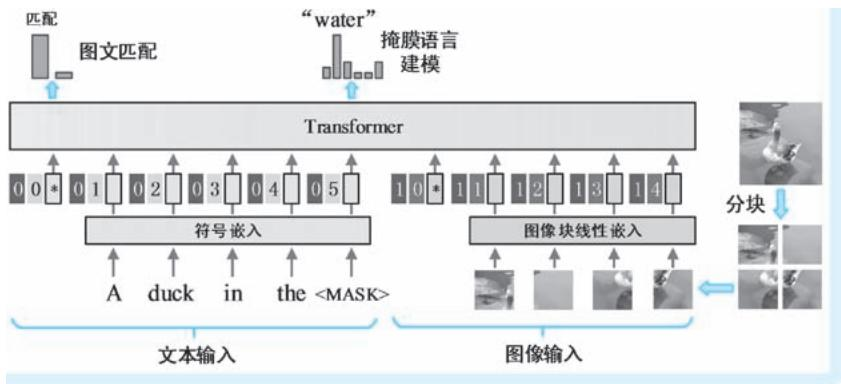  
●图 7-31 ViLT 模型的整体架构示意

在模型输入方面，ViLT 模型的输入可以理解为 “一半 BERT，一半 ViT”：对于文本输入，ViLT对其进行符号嵌入和位置嵌入的合成；对于图像输入，ViLT 首先进行分块处理，然后对图像分块进行展平、线性嵌入并添加位置嵌入。对于上述两种输入，ViLT 同样增加了标识数据来源的片段嵌入，并且分别在两种输入之前添加分类标志，即 “＜CLS＞”标识符。

在预训练目标方面，ViLT 模型的预训练目标有两个，即图文匹配和掩膜语言模型。其中前者被建模为一个针对正确匹配和错误匹配图像-文本样本的二分类任务，该任务使用句首分类标识对应的输出特征作为分类特征；在后者中，和其他模型类似，同样要求模型基于图文阅读材料完成 “完形填空”任务。

在下游视觉语言任务适配方面，ViLT 适配的下游任务包括视觉问答、自然语言视觉推理和图文匹配三种。三种下游任务都可以视为基于双模态输入的分类任务，因此其采用的实现架构都是基于分类标识对应输出特征的分类架构。其中，针对自然语言视觉推理任务的 “双图像加文本”的输入，ViLT也采用了两次图文捆绑输入再分类的模式。

# 8. ALBEF：“先对齐再融合”

对多模态特征进行融合能够弥补单一模态的信息短板，使得特征具有更强的表达能力。但是，融合的前提是两种模态特征需要是对齐的，否则将风马牛不相及的特征融合在一起，不但起不到提升特征表达能力的作用，反而会大大降低特征的质量。在上一章，我们简单介绍了自监督学习的利器— ——对比学习。对比学习的目标即让具有匹配关系的特征聚集，让不匹配的特征远离，其目标不正是对齐吗？只不过前文介绍的对比学习模型都只针对图像这一单模态特征罢了。那么在图像和文本这两种不同模态间是否也可以开展对比学习来实现二者的对齐？我们接下来介绍的 ALBEF 模型就秉承了这一思路㊀①。该

模型名称体现对齐对于多模态特征融合的重要性——— “先对齐再融合” （ALign BEfore Fuse），其中的对齐操作就是基于对比学习来完成。ALBEF 模型的提出时间为 2021 年7 月，作者是 Junnan Li 等[29] 六名来自 Salesforce Research 的学者。

在整体架构方面，如图7-32 所示，ALBEF 包含了一个图像编码器、一个文本编码器和一个多模态编码器 （即我们前文中所说的 “模态交互模块”）。以上三个编码器均为 Transformer 架构，其中，图像编码器为一个12 层的 ViT-B / 16 模型，作者们基于 ImageNet-1K 对该模型进行了预训练；文本和多模态编码器均为六层 Transformer 结构。其中，相较于标准 Transformer，多模态编码器在自注意力模块之后添加了一个交叉注意力模块，用来在图像和文本两路特征上以 “查询对方”的方式进行交互融合。文本编码器和多模态编码器分别以预训练 BERT-Base 模型的前六层和后六层进行初始化。因此，按照上文对视觉语言预训练模型架构的分类，ALBEF 属于 “重文本，重图像，重交互”型架构㊀①，相当于将一个 BERT 模型一劈两半，前一半保持不变用来对文本进行编码，对后一半 BERT 进行多模态改造，再另找一个 ViT 对图像特征进行编码，将图像特征和文本特征一起送入后半段 BERT 模型中去集中加工。ALBEF 属于典型的双塔型架构，但是其在双塔顶端 “搭块石板”之前，在其间还先建立了一座桥梁，这便是针对双模态特征的对齐操作。除了上述三个 “摆在明面”上的编码器 （以下简称为 “当前编码器”），在 ALBEF 的架构中，还存在一套被称为动量编码器的 “幕后英雄”。动量编码器中的两个单模态编码器和多模态编码器与上述三个编码器具有完全相同的结构。ALBEF 一方面以动量更新方式更新动量编码器中的参数，使得其参数变化平滑稳定，从而克服因训练样本中含有噪声而导致模型训练的剧烈震荡；另一方面，也是最重要的方面，即将动量编码器的 “伪目标” （pseudo-tar-gets）作为预训练任务的约束条件。这便是所谓的 “动量蒸馏”（Momentum Distillation）机制。

  
●图 7-32 ALBEF 模型的整体架构示意 （其中，SA、CA 和 FFN分别为自注意力、交叉注意力和全连接前馈网络）

在预训练目标方面，ALBEF 采用了 “三合一”的预训练目标———掩膜语言建模、图文匹配和对比学习。其中掩膜语言建模和图文匹配预训练任务的目标和架构与前文介绍的模型基本一致———前者也是基于未遮掩的图文特征来预测被遮掩词汇，后者则基于多模态编码器对 “＜CLS＞”标识符得到的输出特征进行二分类，预测图像和文本的是否匹配，我们将上述两种任务的损失函数分别记作 $\mathcal { L } _ { \mathrm { m l m } }$ 和$\mathcal { L } _ { \mathrm { i t m } }$ ，二者的具体表达形式这里不过多展开。ALBEF 最具创新性的预训练任务是图文对比学习任务。在该任务中，作者们借鉴了 MoCo v1 对比学习中的队列机制，将动量编码器产生的最新的 $M$ 个的图像特征和文本特征存储为两个队列，然后将另外一个模态的当前特征视为查询，构建其与队列中历史特征的相似度，然后再利用 InfoNCE 损失进行对比学习的监督。具体流程为：对于一组相同图像-文本输入，我们将当前图像编码器和文本编码器对其的输出 （即 ${ \mathrm { \Omega } } { < } \mathrm { C L S } { \mathrm { \Omega } } { \mathrm { \Omega } }$ ”标识符对应的特征输出）记作$\nu _ { \mathrm { c l s } }$ 和 $| { \pmb w } _ { \mathrm { c l s } }$ ，将动量编码器两个单模态编码器对应的特征表示记作v′ 和 $| \pmb { w } _ { \mathrm { c l s } } ^ { \prime }$ 。首先，以内积方式定义如下两个图文相似度： $s ( I , T ) = \left(  { \boldsymbol { \nu } } _ { \mathrm { c l s } } \right) ^ { \mathrm { T } }  { \boldsymbol { w } } _ { \mathrm { c l s } } ^ { \prime }$ 和 $s ( T , I ) = ( \boldsymbol { w } _ { \mathrm { c l s } } ) ^ { \mathrm { T } } \boldsymbol { \nu } _ { \mathrm { c l s } } ^ { \prime } \mathcal { O }$ ①，其中，前者表示当前图像特征与动量文本特征之间的相似度，后者表示当前文本特征与动量图像特征之间的相似度。基于上述相似度，利用softmax 计算当前图像特征与 $M$ 个历史文本特征的归一化相似度，以及当前文本特征与 $M$ 个历史图像特征的归一化相似度，有

$$
p _ {m} ^ {i 2 t} (I) = \frac {\exp \left(S \left(I , T _ {m}\right) / \tau\right)}{\sum_ {m = 1} ^ {M} \exp \left(S \left(I , T _ {m}\right) / \tau\right)}, p _ {m} ^ {t 2 i} (T) = \frac {\exp \left(S \left(T , I _ {m}\right) / \tau\right)}{\sum_ {m = 1} ^ {M} \exp \left(S \left(T , I _ {m}\right) / \tau\right)} \tag {7-42}
$$

式中， $T _ { { \scriptscriptstyle m } }$ 和 $\vert I _ { m }$ 分别表示文本特征队列和图像特征队列中的第 $m$ 个特征； 为一个可学习的温度的参数。设 ${ \boldsymbol { y } } ^ { i 2 t } ( I )$ ）为图像 $I$ 与文本特征队列匹配真值的独特编码表示 （即文本队列中只有一个是与图像匹配的，向量只在该位置 “独热”）。同理，设 $\mathbf { y } ^ { t 2 i } ( T )$ ）为文本 $T$ 与图像特征队列匹配真值的独特编码表示，则即可通过交叉熵计算预测相似度与真值之间的损失。在ALBEF 的原文中，对比损失即为上述两个交叉熵损失的平均值，将其表达为如下数学希望的形式

$$
\mathcal {L} _ {\mathrm {i t c}} = \frac {1}{2} \mathrm {E} _ {(I, T) \sim D} \left[ \mathrm {C E} \left(\boldsymbol {y} ^ {i 2 t} (I), \boldsymbol {p} ^ {i 2 t} (I)\right) + \mathrm {C E} \left(\boldsymbol {y} ^ {t 2 i} (T), \boldsymbol {p} ^ {t 2 i} (T)\right) \right] \tag {7-43}
$$

式中， $\pmb { p } ^ { i 2 t } ( I ) = \{ p _ { m } ^ { i 2 t } ( I ) \} _ { m = 1 } ^ { M }$ 为归一化的图像-文本相似度向量； $\pmb { p } ^ { t 2 i } ( \tau ) = \{ p _ { m } ^ { t 2 i } ( I ) \} _ { m = 1 } ^ { M }$ 为归一化的文本-图像相似度向量；CE（·，·）表示交叉熵损失函数。有了以上对比损失函数的定义，ALBEF 的整体预训练损失就是掩膜语言建模、图文匹配和图文对比损失之和，即 $\mathcal { L } _ { \mathrm { { m l m } } } + \mathcal { L } _ { \mathrm { { i t m } } } + \mathcal { L } _ { \mathrm { { i t c } } }$ 。除此之外，由于在 M个向量中，只有一个正样本，那么相似度最高的负样本就是所谓的 “难负样本” （hard negative）。故ALBEF 的对比学习还有一个 “副产品”，就是同时扮演了难样本挖掘的角色，为图文匹配预训练提供更加有价值的图文样本对。

考虑到绝大多训练数据都是来源于网络，图像-文本对中均存在着大量噪声 （文本中存在和图像不相关的词汇，图像中存在文本中没有的对象等），如果直接利用这些带有噪声的数据进行模型训练，

模型在训练时 “一会儿天上，一会儿地下”，无法稳定收敛。为了使得模型训练不容易受到噪声干扰，ALBEF 引入了动量蒸馏机制。所谓动量蒸馏，即分别将当前编码器和动量编码器视为学生模型和教师模型，同样的输入一分为二，利用后者的输出作为前者输出的约束条件。毕竟动量编码器是采用动量更新这一柔和的方式更新的，其输出会更加稳定。具体来说，针对图文对比预训练任务，首先以$s ^ { \prime } ( I , T ) = \left( \nu _ { \mathrm { c l s } } ^ { \prime } \right) ^ { \mathrm { T } } \mathbf { w } _ { \mathrm { c l s } } ^ { \prime }$ 和 $s ^ { \prime } ( T , I ) = \bigl ( \boldsymbol { w } _ { \mathrm { c l s } } ^ { \prime } \bigr ) ^ { \mathrm { T } } \boldsymbol { \nu } _ { \mathrm { c l s } } ^ { \prime } \bigr \odot$ ①来表示动量编码器跨模态特征相似度，并按照式 （7-42）的方式计算图像-文本和文本-图像归一化相似度，分别记作 $\pmb { q } ^ { i 2 t } ( I )$ ）和 $\pmb q ^ { t 2 i } ( T )$ ）。此时此刻，针对图像-文本，我们有了两组归一化相似度，分别为由当前编码器得到的 “学生激进版”相似度 $p ^ { i 2 t } ( I )$ ），和自动量编码器得到的 “教师稳定版”相似度 $\pmb q ^ { i 2 t } \left( I \right)$ ，对于文本-图像，亦同样有 $\boldsymbol { p } ^ { t 2 i } \left( \begin{array} { l } { T } \end{array} \right)$ ）和 $\pmb q ^ { t 2 i } \left( T \right)$ ）。故ALBEF 将 $\pmb q ^ { i 2 t } ( I )$ ）和 $\pmb q ^ { t 2 i } ( T )$ ）作为柔性的 “伪目标”来约束 $p ^ { i 2 t } ( I )$ ）和 $\pmb { p } ^ { t 2 i } ( T )$ ）。添加动量蒸馏机制后，新的“动量蒸馏版”对比学习损失函数改变为

$$
\mathcal {L} _ {\mathrm {i t c}} ^ {\mathrm {m o d}} = (1 - \alpha) \mathcal {L} _ {\mathrm {i t c}} + \tag {7-44}
$$

$$
\frac {\alpha}{2} \mathrm {E} _ {(I, T) \sim D} \left[ \mathrm {K L} \left(\boldsymbol {p} ^ {i 2 t} (I) \mid \boldsymbol {q} ^ {i 2 t} (I)\right) + \mathrm {K L} \left(\boldsymbol {p} ^ {t 2 i} (T) \mid \boldsymbol {q} ^ {t 2 i} (T)\right) \right]
$$

式中， ${ \mathrm { K L } } ( \ { \cdot } \ { | \ { \cdot } \ } )$ ）为两个分布之间的 KL 散度； $\alpha$ 为平衡原对比学习损失 $\mathcal { L } _ { \mathrm { i t c } }$ 和约束项之间的超参数权重。同样，掩膜语言建模的损失函数同样也有 “动量蒸馏版”，即

$$
\mathcal {L} _ {\mathrm {m l m}} ^ {\mathrm {m o d}} = (1 - \alpha) \mathcal {L} _ {\mathrm {m l m}} + \alpha \operatorname {E} _ {(I, \hat {T}) \sim D} [ \mathrm {K L} (\boldsymbol {q} ^ {\mathrm {m s k}} (I, \hat {T}) | \boldsymbol {p} ^ {\mathrm {m s k}} (I, \hat {T})) ] \tag {7-45}
$$

式中， ${ \pmb q } ^ { \mathrm { m s k } } ( I , { \hat { T } } )$ ）和 $\pmb { p } ^ { \mathrm { m s k } } ( I , \hat { T } )$ ）分别为动量多模态编码器和当前多模态编码器对遮掩词汇的预测概率，二者分别为教师模型和学生模型的预测结果。ALBEF 即利用 KL 散度对二者进行约束使得二者尽可能接近； $\alpha$ 同样为平衡原对掩膜语言建模损失 $\mathcal { L } _ { \mathrm { m l m } }$ 和约束项之间的超参数权重因子。

在下游视觉语言任务适配方面，ALBEF 适配的下游任务包括图文匹配、视觉蕴含、视觉问答、自然语言视觉推理和视觉定位五种。其中，图文匹配和视觉蕴含任务属于典型的分类任务，特别是在ALBEF 的预训练任务中已经又设计了图文匹配任务，故在微调阶段，ALBEF 同样基于多模态编码器“＜CLS＞”标识符输出特征分类的方式来进行微调训练。对于视觉问答任务，前文介绍的模型多是针对选择型问答任务，在该模式下，任务本身仍然是一个分类问题。但是ALBEF 则将视觉问答任务建模为生成式任务，即针对问题，基于图像生成答案文本。针对这一任务设定，ALBEF 在多模态编码器之后又添加了一个自回归解码器 （在 ALBEF 的原文中称为 “答案解码器”），分别以 “＜CLS＞”和“＜SEP＞”标识符作为生成的起始和结束标识。答案解码器在结构方面与多模态编码器是一致的，故其初始化参数直接使用了多模态编码器参数。ALBEF 利用前向语言模型建模对答案编码器参数进行微调。图7-33a 示意了 ALBEF 针对视觉问答任务所采取的任务架构。对于自然语言视觉推理任务，作者们对原始ALBEF 的架构进行了扩展，使得其能够接受两幅图像输入。在新架构中，两幅图像分别被两个共享参数的图像编码器编码。而在多模态编码器中，每个编码器层都替换为两层 （每层仍具有图7-32 所示的三个模块），两层编码器分别针对两幅图像特征和文本特征进行联合加工———其中的交叉注意力模块在自己 “负责”图像与文本之间开展 “互查”并进行特征融合。最后，在多模态编码器

输出端接收 “＜CLS＞”标识符对应的特征执行陈述是否成立的二值预测。图7-33b 示意了 ALBEF 针对自然语言视觉推理任务所采用的任务架构。上述两个多模态模块的初值相同，二者中的交叉注意力参数共享键值线性变换参数。

●图 7-33 ALBEF 针对视觉问答和自然语言视觉推理任务的架构示意  
  
a）视觉问答架构 b）自然语言视觉推理架构

# 9. BLIP-1. 0：自举预训练的通用模型

近年来，人们在视觉语言预训练方面的研究取得了长足的进展，但是仍面临着两个问题：第一个问题即模型通用性问题。我们构造的预训练模型是否能够兼顾理解任务和生成任务？在上文介绍的诸多预训练模型中，除了 VLP 模型借鉴了 UniLM 模型的思路，针对理解和生成两类进行了有益的探索之外，绝大多数视觉语言预训练模型都是针理解类任务而设计。第二个问题即训练数据质量的问题。为了让模型能够 “见多识广”，就需要以超大规模的图文数据对其进行训练，如此大规模的数据需求紧靠人工标注是绝无可能满足的，这就需要大量使用互联网爬取的图文数据来扩充训练数据的规模甚至作为训练数据的主体。然而，来自互联网的数据质量难以保证，其中存在着大量噪声，无法保证模型的有效训练。2022 年 1 月，ALBEF 的第一作者，来自 Salesforce Research 的华人学者 Junnan Li[30] ，联合另外三名学者提出了 BLIP （Bootstrapping Language-Image Pre-training，为了和 BLIP-2 区分，我们以下将其称为 “BLIP-1. 0”） 模型，旨在解决上述两个关键问题：针对第一个问题 （原文中称之为“模型视角”），作者们设计了一种新架构———编-解码器的多模态混合（Multimodal mixture of Encoder-Decoder，MED）架构，旨在统一视觉语言理解和生成。MED 是一种多功能新架构，其可以作为一个单模态编码器，或是基于图像的文本编码器 （image-grounded text encoder），抑或是基于图像的文本解码器 （image-grounded text decoder）。为了对 MED 进行预训练，作者们为其设计了相应的预训练任务。针对第二个问题 （原文中称之为 “数据视角”），作者们提出了一种模型与数据集滚动前进的新框架———描述与过滤（Captioning and Filtering，CapFilt）。该方法被称为数据集自举 （Dataset Bootstrap-ping），即利用 BLIP 的理解与生成能力，不断对训练数据进行清洗，再以干净的数据训练模型，如此反复，实现 “模型清洗数据，数据反哺模型，二者共同进步”。

在整体架构方面，如图7-34 所示，BLIP-1.0 模型中包括了四个 Transformer 结构，以支撑其多任务要求。这四个 Transformer 结构分别为图像编码器、文本编码器、基于图像的文本编码器和基于图像

的文本解码器。其中，图像编码器用来对输入图像进行编码，该编码器可以视为一个标准的 ViT 模型———以图像块作为输入，并在输入的一端添加类别符号，最终以类别符号对应的输出特征作为图像特征；文本编码器就是一个标准的 BERT 模型，在输入的文本序列前添加 “＜CLS＞”标识符，以其对应的特征输出作为文本特征；基于图像的文本编码器就是ALBEF 中的多模态编码器，其一方面接收文本输入 （在输入首部添加 “＜Encode＞”标识符㊀①），另一方面通过其中的交叉注意力模块接收并融合图像特征，输出的特征即为经过图像 “赋能”的文本特征，其中 “＜Encode＞”标识符对应的输出特征即作为代表图文的多模态特征；基于图像的文本解码器是一个自回归的多模态解码器，用来实现逐个词汇预测，可以将其视为一个具有图像 “赋能”的 GPT 模型。该解码器中的掩膜自注意力模块以“朝前看”的方式对输入文本进行前向关系构建，其后的交叉注意力模块再为其注入图像特征。该模块以 “＜Decode＞”标识符作为词汇生成的起始标识。

  
●图 7-34 BLIP-1. 0 模型的整体架构和预训练任务示意 （其中，SA、CA 和 FFN分别为自注意力、交叉注意力和全连接前馈网络）

在预训练目标方面，作者们为 BLIP-1. 0 的四个结构设计了三个预训练任务：图文对比学习、图文匹配和前向语言建模。其中，图文对比学习在图像编码器和文本编码器这两个单模态编码器之间展开，其预训练任务、目标与 ALBEF 是相同的，其中也采用了 ALBEF 的动量编码器机制。图文匹配任务涉及了图像编码器和基于图像的文本编码器两个编码器结构，由后者得到的图文多模态特征 （即“＜Encode＞”标识符对应的特征）随后被送入一个二分类头结构来预测输入图像和文本是否匹配。在图文匹配任务中，为了提高训练的针对性，作者们同样采取了 ALBEF 的难负样本发掘机制。由此可见，除了没有开展掩膜语言建模，上述三个编码器对应的两个预训练任务相当于构造了一个ALBEF 预训练模型；掩膜语言任务同时训练了图像编码器和基于图像的文本解码器两个结构，二者构成了一个完整的编码器-解码器架构。基于图像的文本解码器以自回归的方式产生词汇，前向语言建模即以交叉

熵损失来评估预测词汇与真值词汇之间的差异，从而指导上述编码器和解码器的参数更新。三个预训练任务的开展，四个结构能够实现有机配合。BLIP-1.0 多任务支持的精妙设计即体现于此：按照下游任务要求组合所需的结构，而这些结构组合在预训练阶段进行了充分的训练。例如，当下游任务需要对图像或文本进行单模态编码时，图像编码器和文本编码器可以独立发挥功能；在适配图像文本理解类任务时，图像编码器和基于图像的文本编码器这一组合就可以派上用场，二者在预训练阶段早就“深度合作过”，并且图文之间还进行了对齐操作；在面对看图说话这样的图文生成任务时，BLIP-1. 0又 “掏出”图像编码器和基于图像的文本解码器两个结构进行组合，前者对图像进行充分理解，后者生成与之匹配的文本描述，二者同样早就在预训练阶段 “打过配合”。

除了多功能架构和预训练目标方面的创新，BLIP 最具创造性的贡献莫过于建立了数据集自举这一新的滚动训练机制。图7-35 示意了这一机制的工作流程，接下来我们按照该图示走一遍流程。第一步为预训练（如图中 $\textcircled{1}$ 所示）。按照上文所述的方式以三个任务对 MED 的四个结构进行预训练。预训练的数据集包括了两个子集，其中一部分为人工标注图像-文本对 $\left\{ \begin{array} { l l } { \left( I _ { h } , T _ { h } \right) } \end{array} \right\}$ }，另一部分为互联网爬取的图像-文本对 $\left\{ \begin{array} { l } { \left( I _ { w } , T _ { w } \right) } \end{array} \right\}$ （下标中的 “h”和 “w”分别为 “human” 和 “web” 的首字母）。在两个子数据集中，人工数据集质量高，但很稀缺，而互联网数据规模庞大，但是质量很差。第二步为针对性微调（如图中 $\textcircled{2}$ 所示）。针对性微调使用的训练数据为人工高质量数据 $\{ I _ { h } , T _ { h } \}$ }。微调的方向有两个，其中一个方向即利用前向语言建模来训练模型，使得其具有更强的文本生成能力 （图中下方分支），经过生成加强的 MED 称为 “描述器”（captioner），它特别擅长 “说话”；另一个微调方向为利用对比学习和图文匹配任务来增强模型的图文判别能力 （图中上方分支），经过判别强化的 MED 模型被称为“过滤器”（filter），它特别擅长图文判断。第三步为描述生成（如图中 $\textcircled{3}$ 所示）。利用描述器善于生成的优势，对网络图像数据集 $. I _ { w }$ 进行文本描述生成，我们将生成的文本集合记作 $T _ { s }$ 。然而，由于其中的文本描述是计算机生成的，一定存在着与图像不匹的情况。这一步骤即 “CapFilt”中的 “Cap”步骤。第四步为样本过滤（如图中 $\textcircled{4}$ 所示）。目前，我们手头有两个质量不高的图像-文本数据集，其中一个为预训练数据集中的互联网数据集 $\left\{ \begin{array} { l } { \left( I _ { w } , T _ { w } \right) } \end{array} \right\}$ }，另外一个就是由描述器针对互联网图像生成描述得到的数据集 $\left\{ \ \left( I _ { w } , T _ { s } \right) \ \right\}$ }。该步骤即借助过滤器擅长进行图文判断的优势，针对上述两个数据集进行过滤，挑选出其中图文匹配程度高的数据集。我们将挑选结果分别记作 $\left\{ \begin{array} { l } { \left( I _ { _ { w } } , \overline { { T } } _ { w } \right) \dag } \end{array} \right\}$ }和 $\left\{ \ ( I _ { w } , \overline { { T } } _ { s } ) \ \right\}$ }。这一步骤即

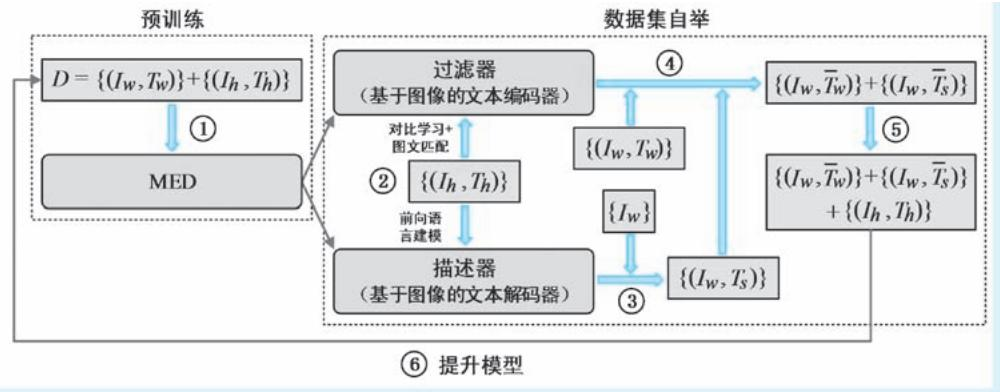  
●图 7-35 BLIP-1. 0 “CapFilt”自举机制的流程示意

“CapFilt”中的 “Filt”步骤。第五步为训练数据集构造（如图中 $\textcircled{5}$ 所示）。经过过滤操作，得以保留的数据集 $\{ ( I _ { w } , \overline { { T } } _ { w } )$ ）}和 $\{ ( I _ { w } , \overline { { T } } _ { s } )$ }已经较之前准确得多，那么我们将上述两个数据集与人工标注数据集合并，构成新的、质量提升的数据集，记作 $D = \{ \ : ( I _ { \boldsymbol { w } } , \overline { { { T } } } _ { \boldsymbol { w } } ) \} + \{ \ : ( I _ { \boldsymbol { w } } , \overline { { { T } } } _ { \boldsymbol { s } } ) \} + \{ \ : ( I _ { \boldsymbol { h } } , T _ { \boldsymbol { h } } ) \}$ }。第六步为模型提升（如图中 $\textcircled{6}$ 所示）。将提升质量的数据集 $D$ 作为预训练数据集，再对 MED 进行更高水平的预训练。

在下游视觉语言任务适配方面，作者们将 BLIP-1. 0 预训练模型在图文匹配、看图说话、视觉问答、自然语言视觉理解和视觉对话五个任务上进行微调适配。其中，图文匹配和看图说话与三个预训练任务中的两个任务是重合的，故只需沿用对应预训练任务的架构和目标，继续在新的数据集上进一步微调即可。在视觉问答任务中，作者们同样按照 ALBEF 的思路，以问题生成替代常见的问题选择，故视觉问答任务属于一个典型的生成任务。针对该任务，BLIP-1. 0 采用的任务架构涉及图像编码器、基于图像的文本编码器和基于图像的文本解码器三个结构：其中图像编码器用来提取图像特征，基于图像的文本编码器以形如 “＜Encode＞ question”的文本序列进行输入，并利用交叉注意力与图像特征进行交互；基于图像的文本解码器以得到的图文联合特征作为输入，以自回归的方式生成答案词汇。针对自然语言视觉理解任务，BLIP-1. 0 也借鉴了 ALBEF 将多模态编码器每层 “一变二” 的操作，但是这里 “一变二”的操作不是将多模态编码器中的一层编码器替换为两层，而是将一层编码器中的交叉注意力模块从一个变为并列的两个，分别针对两幅图像进行图像-文本信息交互。在两个交叉注意力模块后，再通过一个融合模块对双路信息进行融合。最后，通过对 “＜Encode＞”标识符对应特征进行分类来预测陈述语句是否正确。针对视觉对话任务，BLIP-1.0 使用了三个编码器。其中第一个编码器为图像编码器，用来对图像进行编码；第二个编码器被称为描述编码器 （Caption Encoder），这是一个基于图像的文本编码器，该编码器的输入形如 “＜ Encode ＞ caption”，输出被称为图像-描述嵌入（image-caption embeddings），其中的交叉注意力模块实现上述文本描述特征与图像特征的交互；第三个编码器称为对话编码器 （Dialog Encoder），该编码器将问题、答案与历史对话三类文本进行拼接，形如 “＜Encoder＞ question answer dialog_history”，利用交叉注意力将上述文本输入的特征与图像-描述嵌入进行交互，最后再基于 “＜Encoder＞”对应的特征输出进行答案预测。

# 10. BLIP-2. 0：构建大模型之间的桥梁

近几年间，NLP 模型的体量越来越大，我们逐渐进入了大规模语言模型 （Large Language Model，LLM）时代。特别是在 2022 年底，ChatGPT 的诞生在 NLP 乃至整个人工智能领域引起巨大震动。ChatGPT 以其清晰的逻辑、流畅的行文，让人们深刻意识到原来以 “阅尽天下之书”方式训练出来的LLM 真的可以理解人类语言并执行深层次推理。那么我们不禁要问，这些 LLM 只能处理语言这一单一模态的数据，是否能够让其进一步支持多模态，从而实现与人类的图文交互呢？㊀①。此时此刻，视觉语言多模态领域已经诞生了诸多模型，但是这些模型绝大多数都在做一些诸如 “单选”“判断”的简单 “题型”，即便是支持文本生成，也都停留在诸如简短图像描述生成这样的简单生成任务上，与LLM 的 “口吐莲花”相比可谓天壤之别。与此同时，以 ViT 为代表的预训练图像编码器也在 CV 领域

“大杀四方”。那么我们不禁又要问，是否可以将 CV 中的优秀图像编码器与 LLM 嫁接？我们能够想到最直接的嫁接方案有两个：第一个方案为不做任何训练，直接将图像编码器与 LLM 对接，将高质量图像特征送给高水平的 “语言大师”，但是这种方案显然是不可取的，图像编码器得到的特征根本就不是为 LLM 任务设计的，LLM 所需的特征也不是图像编码器所能提供的，二者可谓 “都活在自己的世界里”；第二个方案为将图像编码器与 LLM 对接，然后设计一系列视觉语言任务，让两个模型进行端到端训练。但是一个现实问题马上就摆在眼前，大模型在给我们带来强大处理能力的同时，几乎也剥夺了我们对其开展训练的可能———面对如此巨大的模型，以一般机构所拥有的训练数据积累和算力资源，根本训练不动，也训练不起。

两种极端方案都不可取，那么折中方案来了———不去训练模型本身，而是构造连接两种模型的桥梁，抹平不同模态特征之间的鸿沟。下文将要介绍的 BLIP-2. 0 模型即是在 “撮合” 思路下最经典的工作之一。BLIP-2. 0 模型的提出时间为 2023 年 1 月，作者与 ALBEF 和 BLIP-1. 0 相同，仍是华人学者Junnan Li[31] 及其所在 Salesforce Research 团队。BLIP-2. 0 模型最大贡献在于开启了一种多模态大模型应用的新范式，该范式可以任意组合并充分利用两个预训练好的视觉编码器和语言模型，而不是以端到端方式训练整个架构。可以看出，上述范式在模型越来越 “训不动”的今天，意义十分重大。

在整体架构方面，如图7-36 所示，BLIP-2. 0 的核心结构就是一个夹在图像编码器和 LLM 间的轻量化 Transformer 结构，该结构称为查询 Transformer （Query Transformer，简称为 “Q-Former” ）。上述图像编码器和 LLM 是冻结的，即 “大厂已经训练好的”，这就意味着在整个架构中，唯一可以通过训练调整参数的结构就只有 Q-Former。BLIP-2. 0 所做的工作就是承前启后———训练 Q-Former，使其能够从图像编码器获取最有益于生成的图像特征，让 LLM 开展更高质量的文本生成。这便是 BLIP-2.0 中针对预训练模型的两个 “bootstrapping”———前者针对的是图像模型，而后者针对语言模型。如图 7-37所示，在 Q-Former 中，包含了两个基于 Transformer 的子结构，这两个子结构均包含 $N$ 层编码器，而每层编码器都共用同一个自注意力层 （即图中的 “SA”层）。其中，第一个 Transformer 子结构为图像Transformer ，其主体输入为一组可学习的、固定个数的查询向量 （例如，在 BLIP-2. 0 中查询向量的个数为32，维度为768）。这些查询向量首先通过自注意力机制进行相互交互，然后再通过交叉注意力模块与图像特征进行交互，实现图像特征的注意力合成。由于查询向量的个数是固定的，则能够实现输出特征个数与输入图像的分辨率 （或分块个数）无关。除此之外，由于共用自注意力层的原因，查询特征还能够在某些预训练任务中与另一个 Transformer 子结构中的文本特征进行交互。Q-Former 的第二个 Transformer 子结构为文本 Transformer ，其输入为一段自然语言文本，文本 Transformer 即扮演了文本编码器或文本解码器的角色。

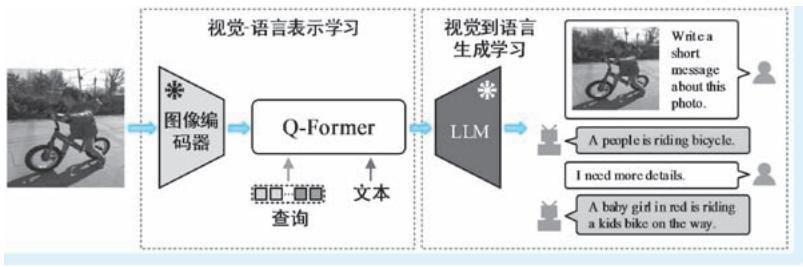  
●图 7-36 BLIP-2. 0 模型的整体架构示意

  
●图 7-37 Q-Former 结构与第一阶段预训练任务示意

在预训练目标方面，BLIP-2. 0 对 Q-Former 的预训练分为了两个阶段，分别为针对冻结图像编码器的视觉-语言表示学习（vision-language representation learning） 阶段和针对冻结 LLM 的视觉到语言生成学习（vision-to-language generative learning） 阶段，分别对应 Q-Former 的 “承前” 和 “启后” 两个角色。下面我们就分别对两个阶段的预训练目的和任务进行分析。

第一阶段训练预训练的目的在于 “承前”———通过查询向量查找并提取冻结图像编码器产生的图像特征，这些图像特征要贴近自然语言。该阶段的预训练目标有三个：图文对比学习、图文匹配和基于图像的文本生成 （Image-Grounded Text Generation）。其中，图文对比学习任务的目的和操作方式与ALBEF 和 BLIP-1.0 类似，对比的两种模态特征分别为由查询向量 “查出来”的图像特征和文本特征，目的旨在让两种模态的特征能够对齐。在对比学习任务中，两种模态的特征是 “最后才见面”的，故自注意力层在中间是 “断开”的———自注意力机制的加工仅在单一模态内部进行，即 “图像看不见文本，文本看不见图像”。图文匹配任务同样与 ALBEF 和 BLIP-1.0 类似，目的在于要求模型在特征融合的情况下，能够正确做出输入图像和文本是否 “说一件事”的判断。例如，在图 7-37 所示的示例中，图像和文本是匹配的，故图文匹配的结果输出应该是 “真”才可以。在图文匹配任务中，我们要求特征是全面融合的，故在该任务模式下，自注意力体现为模态内、模态间的全连接模式，即 “图像文本互相可见”。基于图像的文本生成任务也即前向语言建模任务，旨在训练模型能够看图说话，且其所说的要和给定的匹配文本尽可能地接近。在该任务下，Q-Former 就已经成为和 UniLM、VLP 类似的“两半”结构———前一半为图像编码器，其中的注意力为标准的完全型注意力，“全面开放”，而文本Transformer 扮演后一半文本解码器的角色，负责以自回归的方式逐个产生词汇，故对于每个词汇的生成依赖全部图像特征及其之前的文本特征。在该任务模式下，注意力机制的表现方式为 “图像内部相互可见，图像看不见文本，文本能看见图像以及前文”。图 7-38 分别示意了上述三种预训练任务下的注意力投射模式和对应的掩膜设置。

第二阶段训练预训练的目的在于 “启后”———将 Q-Former 与冻结参数的 LLM 对接，借助 LLM 强大的语言生成能力，使其能够生成高质量的文本描述。由于不同的 LLM 的特征输入特征维度不同，因此首先对 Q-Former 产生的视觉特征 （即查询向量对应的输出，在原文中将其称为查询嵌入特征）进行线性变换，使得其能够满足 LLM 的输入维度。变换后的视觉特征作为输入文本特征的前置特征，扮

演了 LLM 在语言生成时的柔性视觉提示 （soft visual prompts）㊀①。在该阶段，作者们实验了针对两种不同架构 LLM 的对接方案，如图 7-39 所示。第一种为基于解码器 （decode-based） 的 LLM，此类 LLM以 OPT 为代表 （如果对 OPT 不熟悉，可以认为其就是 GPT-3. 0）；第二种为基于编码器-解码器 （en-coder-decoder-based） 的 LLM，此类 LLM 以 FlanT5 为代表。针对第一种 LLM，预训练的目标为语言模型，冻结的 LLM 的任务就是生成基于 Q-Former 输出视觉特征的文本；针对第二种 LLM，BLIP-2.0 使用前缀语言建模 （prefix language modeling） 作为预训练目标。首先将文本分成两部分，将 Q-Former 输

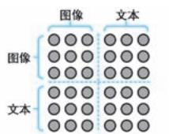

  
●图 7-38 BILP-2. 0 第一阶段三种预训练任务的注意力投射模式和对应的掩膜设置示意a）图文对比学习 b）图文匹配 c）基于图像的文本生成

  
●图 7-39 BILP-2. 0 对接两种 LLM 的模式示意  
a）基于解码器的 LLM （如 OPT） b）基于编码器-解码器的 LLM （如 FlanT5）

出的视觉特征与前缀文本进行连接，作为 LLM 编码器的输入，后缀文本则用作 LLM 解码器 （也即整个编码器-解码器模型）的生成目标。但是，笔者认为作者在原文中并未明确给出具体的预训练任务和架构。不过通过后续 BLIP-2. 0 对视觉问答等生成类任务的适配模式可以猜测得出，这里的预训练会一起更新图像编码器和 Q-Former 的参数，但是 LLM 一直保持冻结。具体细节我们不再过多讨论，总而言之，如果说第一阶段预训练的本质是让图像特征贴近文本，那么第二阶段预训练的本质就是为LLM 构造优质提示，让其能够 “说”出我们所要。

在下游视觉语言任务适配方面，作者们首先将 BLIP-2.0 应用于带有文本指令的 “zero-shot”图像到文本生成任务，这也是 BLIP-2. 0 最令人拍手叫绝的应用方式。针对此类任务，BLIP-2. 0 都采用了在图像特征后附加文本提示作为 LLM 输入的简单模式，其中图像特征即来自 Q-Former 的输出。以“zero-shot”视觉问答任务为例，在对接 OPT 模型 （基于解码器架构）时，文本提示的形式为 “Ques-tion：{} Answer：”，在对接 FlanT5 模型 （基于编码器-解码器架构） 时，文本提示的形式为“Question：{}Short answer：”。在优质视觉特征的加持下，LMM 果然开始 “侃侃而谈”。除此之外，作者们还针对看图说话、视觉问答㊀①和图文匹配三个视觉语言任务对 BLIP-2. 0 进行了参数微调适配，其中前看图说话和视觉问答为生成类任务，而图文匹配为理解类任务。在看图说话任务中，同样以 Q-Former 生成的图像特征加文本提示 “a photo of”作为 LLM 的初始输入，然后在冻结 LLM 参数的状态下，以语言建模为目标训练微调图像编码器和 Q-Former 的参数；在视觉问答任务中，BLIP-2. 0 同样是微调图像编码器和Q-Former，冻结LLM。LLM 接收到Q-Former 的特征输出和问题文本，然后被要求回答问题，损失函数即定义在 LLM 给出答案和真值答案之上。为了让 Q-Former 产生的图像特征能够和问题更加相关，在训练时，问题文本同样会作为 Q-Former 的输入。随着训练，Q-Former 中的交叉注意力会将注意力集中在与文本关系最密切的图像区域上。图文匹配任务不涉及文本生成，故不需要 LLM参与，BLIP-2.0 直接在第一阶段预训练架构和任务上继续微调即可，然后基于融合特征进行图文匹配得分的预测。当然，为了让模型更加具有任务的针对性，作者们同时也对图像编码器的参数进行了一体化的微调。

最后我们对 BLIP-2.0 模型做以简单总结。第一，BLIP-2.0 所解决的是如何让 LLM 在保持冻结的状态下能够支持图文多模态的问题。BLIP-2.0 以 “训练不动你，我就适配你”的思路开展模型结构及预训练任务的设计，思路非常的巧妙，结果也相当的惊艳。第二，也是最重要的一点，BLIP-2. 0 所开展 “撮合”适配工作的本质仍是多模态特征的对齐———将图像和文本特征在相同的特征空间对齐后，“图就是文，文就是图”。BLIP-2. 0 与 ALBEF、BLIP-1. 0 的作者相同，ALBEF 以对齐 “起家”，在随后的两个模型中，对齐的理念也贯穿始终。由此可见，对齐工作不愧是多模态模型构建中最核心的工作。

# 7. 4. 3 提示驱动 CV 模型

在 NLP 领域，“预训练 $^ +$ 提示”是继 “预训练 $\cdot +$ 微调”范式之后的又一流行范式。该范式不需要针

对下游任务进行微调训练，具有 “提示变则结果变”的性质，能够以 “zero-shot”方式实现下游任务的适配，已经是当今大规模语言模型与用户进行交互的主流方式。近年来，在视觉语言多模态方向，也诞生了很多提示驱动的 CV 模型，这些任务完成的仍是图像分类、检测和分割等标准 CV 任务。但是在执行上述任务时，需要给模型合理的文字 （甚至是其他交互信息）作为提示，使得模型能够按照提示得到相应的处理结果。下面，我们即对四个在提示驱动下工作的 CV 模型展开讨论。

# 1. CLIP：文本提示下的图像分类

提到视觉语言多模态模型，怎么能少了大名鼎鼎的 CLIP？CLIP 模型由 OpenAI 出品，其诞生时间为 2021 年 2 月，作者是 Alec Radford 等[4] 12 名学者。可谓 OpenAI 出手必是精品———在预训练阶段，CLIP 采用图像-文本的对比学习机制，对齐那些 “说同一件事”的图像和文本，无论思路还是模型架构都极其简单；在图像类别预测阶段，CLIP 创造性的利用提示学习机制，在不进行任何微调的情况下（即 “zero-shot”模式下），竟然在 ImageNet 分类任务上和监督训练得到的 ResNet50 战成平手，这着实是一个令人震撼的成绩。可以说，CLIP 的诞生颠覆了 CV 模型的构造和使用模式，开创了文本指导CV 模型的新方向。

在预训练架构方面，CLIP 模型对比学习预训练架构如图 7-40 所示。就该示意图而言，想必对对比学习稍有了解的读者也能够很快理解 CLIP 的训练方法：CLIP 模型具有典型的双塔型架构，对于一组具有 $N$ 个图像-文本对的样本批次，将其中文本部分利用文本编码器进行编码，得到 $N$ 个文本特征表示，记作 $\{ \pmb { T } _ { i } \} _ { i = 1 } ^ { N }$ ；图像部分则送入图像编码器，得到 $N$ 个图像特征表示，记作 $\{ { \pmb I } _ { i } \} _ { i = 1 } ^ { N }$ 。对比学习需要定义正样本和负样本，那么此时此刻，谁是正样本谁是负样本是显然的：具有匹配关系的图像-文本

对是正样本，因为他们 “说的是一回事”，不具有匹配关系的图像-文本对自然就是负样本。如果两组特征以矩阵表示，即对角线上的 $N$ 个图文特征为正样本，其余的 $N ^ { 2 } - N$ 个图文特征则为负样本。在 CLIP 中，采用了常用的 InfoNCE 损失作为对比损失函数 （其中温度超参数为0.07，采用余弦相似度作为特征间的相似性度量）。自监督学习模型的训练往往需要大数据 集 来 支 撑， 为 此，OpenAI 构造了一个拥有 4 亿的图像-文本数据集作为 CLIP 的训练样本，可谓相当的财大气粗。

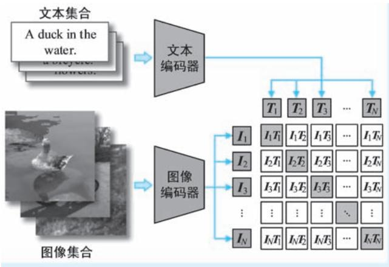  
●图 7-40 CLIP 模型的对比学习预训练架构示意

在编码器方面，CLIP 以 Transformer 作为文本编码器，而图像编码器则可以是 CNN㊀①，抑或是视觉 Transformer。对于文本编码器，在送入 Transformer 之前，也对其中的每一个词汇进行了符号嵌入和位置嵌入操作，并添加 “＜CLS＞”标识符。最终以 “＜CLS＞”标识符对应的输出向量作为整个文本的特征表示；对于图像编码器，在使用CNN 架构时，CLIP 以注意力池化 （attention pooling）代替全局平

均池化，将CNN 输出的特征图转化为特征向量，并以其作为整幅图像的特征表示。这里的注意力池化可以理解为一个具有单层结构的小视觉 Transformer，只不过其以特征本身进行而非图像块特征作为输入；在使用视觉 Transformer 作为图像编码器时，首先对图像进行分块和 “flatten”操作，然后对其进行线性嵌入并添加位置信息，然后在序列前部添加类别符号，最后以此类别符号对应的特征输出作为整幅图像的特征表示。经过上述两路编码处理，图像和文本数据映射到一个公共特征空间，然后通过对比学习将两种表达相同 “东西”的特征表示匹配起来。

在下游任务适配方面，CLIP 与前文介绍诸多预训练模型的最大不同在于它根本不做参数微调，不会在预训练模型上添加诸如分类头等与具体任务有关的任何附加结构。简而言之，CLIP 要实现的是“zero-shot”模式下的下游任务适配㊀①。下面我们具体看看 CLIP 怎么进行适配，要知道 CLIP 模型的任务设定是图像分类，即在使用 CLIP 时是没有文本输入的，这与预训练时以图像-文本双模态数据作为训练样本的场景是截然不同的。为此，CLIP 的作者们将提示学习的思路引入分类：没有文本没关系，那就给图像 “硬配”一个文本———将所有的类别文本标签带入提示模板 “A photo of a $\{ { \mathrm { l a b e l } } \}$ }. ”（即以类别文本标签替换掉其中的 “{label}”），然后利用文本编码器对这些文本进行编码，逐个与图像编码比较相似度，取相似度最高者作为图像分类结果。图 7-41 示意了 CLIP 执行图像分类任务的流程。在其中，假设全部类别有 $K$ 个，对应的文本标签为 “duck”“plane”“bicycle”等，将这些标签带入提示，即构成了 “A photo of a duck. ” “A photo of a plane. ” “A photo of a bicycle. ” 等语句。使用训练好的文本编码器对上述 $K$ 个语句分别进行编码，即得到 $K$ 个文本特征表示 $\mathbf { \Omega } _ { T _ { 1 } } , \cdots , T _ { \scriptscriptstyle K }$ $\mathbf { \mathcal { T } } _ { 1 }$ 。然后将图像编码器获得的图像特征表示 $I _ { \imath }$ 与上述 $K$ 个文本特征逐一计算余弦相似度，选择其中最相似者即可。在该示例中，文本 “A photo of a bicycle. ” 当选，那么 “bicycle” 即是类别预测结果。CLIP 可谓将提示学习的核心思想体现得淋漓尽致：通过合理设计提示模板，将模型 “带回到当年学习时的状态”。当然，提示模板的设计也是很考究的，需要和预训练时的文本描述尽量接近，才能让模型回忆起 “当年的状态”。使用不同提示模板时图像分类的效果可谓天壤之别。为此，作者们在 CLIP 的原文使用大量

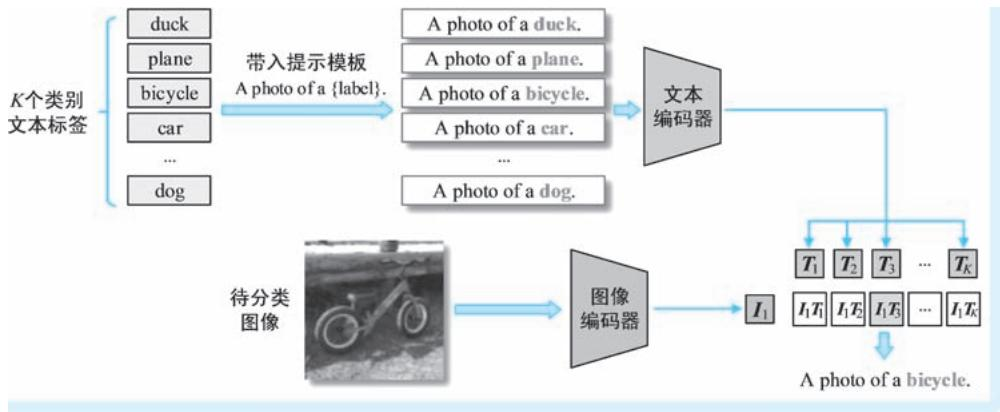  
●图 7-41 CLIP 执行图像分类的模式示意

篇幅就提示模板的设计问题进行了讨论，这一工作被称为提示工程 （prompt engineering）。

至于 CLIP 在各个数据集上的迁移效果，我们这里不再详细展开，读者们可以自行参考原文了解细节。我们下面只说 CLIP 模型的贡献。首先，就预训练架构而言，可以说 CLIP 除了简单没有太多可圈可点的地方，甚至可以将其视为 “图文版 SimCLR”。但是在下游任务适配方面，CLIP 采用的适配方式确是十分新颖的，甚至用 “脑洞大开”来形容也毫不过分。CLIP 给人们带来的最大惊喜莫过其颠覆了分类必须训练、至少需要微调模型的传统认知。甚至在增加类别时，CLIP 也不需要训练模型，只要把新类别的标签文本带入即可，在预训练时只要让模型见得够多，这一新增类别大概率会被命中。简而言之，CLIP 为 CV 任务开辟了新模式，让人们意识到 “原来 CV 任务可以这样做”。

# 2. GLIP：文本提示下的目标检测

在上文中我们介绍了著名的 CLIP 模型，该模型将图像类别文本化，利用图文对比学习机制，将传统的图像分类任务建模为全局尺度下、语句和图像特征的对齐任务。而在图文多模态任务中，视觉定位 （Visual Grounding，这里更多指的是名词短语的视觉定位）要求模型在图像上定位文本描述中的实体，其本质为词汇和图像区域的双模态特征对齐任务。反观 CV 领域的目标检测，则要求从图像上找到目标位置并预测其类别，似乎和视觉定位有着极大的相似性。那么为什么不能将目标类别同样进行文本化，通过构造其与图像区域特征之间的特征对齐关系，从而将目标检测任务和视觉定位任务统一起来呢？我们下文将要介绍的 GLIP 模型就给出了肯定的答案。GLIP 的全称为 “Grounded Language-Image Pre-training”，即 “定位语言-视觉预训练”，GLIP 模型的提出时间为 2021 年 12 月，作者是Liunian Harold Li 等[32] 12 名来自 UCLA 和微软等机构的学者。

在预训练架构方面，GLIP 模型预训练架构如图 7-42 所示。看到该架构图，刚从 CLIP 模型中走出来的我们，第一感觉莫过于 GLIP 和 CLIP 简直太像了。的确，GLIP 也采用了典型的双塔型结构分别对图像文本特征进行编码，也是以点积 （特别是也在架构图上表示为点积矩阵）作为特征间的相似性度量等，哪怕两个模型在名称上也就只差了一个字母。但是两个模型之间是存在着显著差异的。第一点差异体现在处理的粒度方面。CLIP 对比学习的对象是整图特征和整句特征，而 GLIP 对比学习的对象是图像局部特征和词汇特征，这也是二者最为显著的差异。也正是因为这一原因，两个模型的训练输入也有着明显的差异：CLIP 的输入为图像-文本序列，而 GLIP 的输入则是图像区域-名词短语 （目标类别）序列。第二点差异体现在特征融合方面。CLIP 利用双塔结构对两种模态数据进行独立加工，在最后进行相似度计算前，两路信息根本不会 “碰面”；而在 GLIP 中，为了让两种模态进行充分融合，两路特征在进行最后的特征对比之前就已经进行了多次 “私下勾兑”。GLIP 中，上述多层级早期融合被称为跨模态深度融合（cross-modality deep fusion）。第三点差异体现为优化目标的差异。CLIP 为图像分类模型，不涉及定位问题，因此类别预测正确是其唯一目标。但是 GLIP 目标检测模型，不仅要求类别正确，还要求位置准确。故在损失函数方面，GLIP 除了具有约束类别预测的对齐损失（Alignment Loss） 之外，还增加了定位损失 （Localization Loss），以要求模型能够进行目标的准确定位。

在预训练输入方面，视觉定位任务的输入包括图像及其文本描述两种，标注信息包括文本中的实体名词，以及图像上与之对应的位置。但是在目标检测任务中，训练数据的组织形式只有目标位置和类别。为了将目标检测任务统一到视觉定位任务，作者们采用了一种极其直接的方法，就是将所有候

选目标类别的对应文本用 “. ”分隔，拼为一段长文本，以此长文本作为文本模态的输入。例如，针对 COCO 的80 类目标检测数据集，改造后的文本输入即为点号连接的 80 个类别单词，形如 “Per-son. Bicycle … hairdryer. ”的形式。这样一来，GLIP 的预训练数据集就包括 “正经”的视觉定位数据集和各大目标检测数据集的 “视觉定位版”。

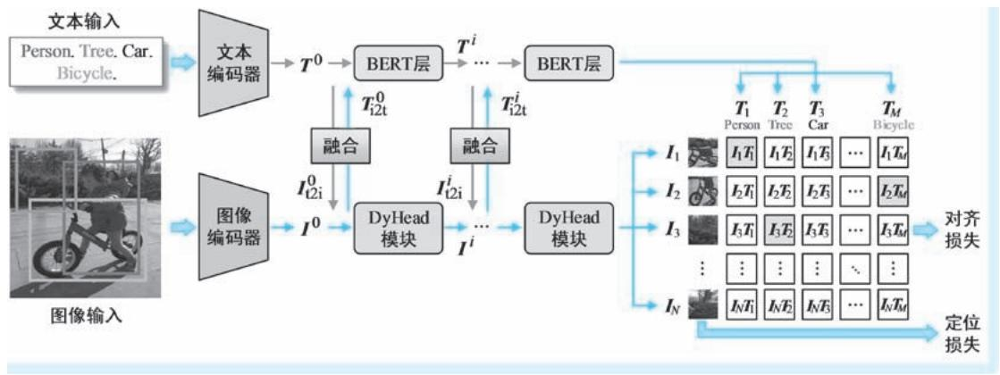  
●图 7-42 GLIP 模型的预训练架构示意

在编码器方面，GLIP 首先将文本和图像分别送入主干文本编码器和主干图像编码器进行初步编码，其中前者实现为 BERT，而后者被构造为 Swin Transformer，两个主干编码器对文本和图像的特征输出分别记作 $T ^ { 0 }$ 和I0 。接下来，GLIP 则利用跨模态深度融合机制，以 “交叉注意融合 $^ +$ 自注意”的层级结构对两种模态的特征进行不断融合和加工。其中，交叉注意融合通过交叉意力模块来完成；而对于自注意加工，两个模态使用了不同的结构：文本分支采用单层 Transformer 层 （在图 7-42 中称为“BERT 层”）来完成，而图像分支则采用 DyHead 模块来实现。上述多模态融合机制中，每个层级信息的融合方式可以表示为

$$
\boldsymbol {T} _ {\mathrm {i} 2 \mathrm {i}} ^ {i}, \boldsymbol {I} _ {\mathrm {t} 2 \mathrm {i}} ^ {i} = \operatorname {X M H A} \left(\boldsymbol {T} ^ {i}, \boldsymbol {I} ^ {i}\right), i = 0, \dots , L - 1 \tag {7-46}
$$

$$
\boldsymbol {T} ^ {i + 1} = \operatorname {B E R T L a y e r} \left(\boldsymbol {T} ^ {i} + \boldsymbol {T} _ {\mathrm {i} 2 \mathrm {t}} ^ {i}\right) \tag {7-47}
$$

$$
\boldsymbol {I} ^ {i + 1} = \text {D y H e a d M o d u l e} \left(\boldsymbol {I} ^ {i} + \boldsymbol {I} _ {1 2 i} ^ {i}\right) \tag {7-48}
$$

式中， $\pmb { T } ^ { i }$ 和 $\boldsymbol { { \mathbf { \mathit { I } } } } ^ { i }$ 分别表示第 i 层的文本特征和图像特征； $L$ 为 DyHead 结构中 DyHead 模块的个数；在式（7-46）中，XMHA 为交叉多头自注意力模块，以 “相互注意”的方式对两种模态输入进行融合， $\pmb { T } _ { \mathrm { i } 2 \mathrm { t } } ^ { i }$ 和 $\lvert { I } _ { \mathrm { t } 2 \mathrm { i } } ^ { i }$ 为其输出，分别表示了带有图像特征的文本信息和带有文本特征的图像信息；在式 （7-47）和式（7-48）中，BERTLayer 和 DyHeadModule 分别表示对融合特征进行的基于 Transformer 的自注意力加工和基于 DyHead 自注意力加工。经过上述处理，对于长度为 $M$ 的文本序列，我们将得到其对应词汇特征序列 $\pmb { T } \pmb { = } \left( \pmb { T } _ { 1 } , \cdots , \pmb { T } _ { M } \right)$ ），其中 $\pmb { T } _ { i } \in \mathbb { R } ^ { d }$ （ $d$ 为特征维度，下同）；对于输入图像，我们也将得到其对应的$N$ 个区域特征表示 $\pmb { I } = ( \pmb { I } _ { 1 } , \cdots , \pmb { I } _ { N } )$ ），其中 $\pmb { I } _ { i } \in \operatorname { R } ^ { d \odot }$ ①。

在预训练目标方面，标准目标检测任务的训练目标有两个，即 “定位准 $^ +$ 类别准”，而 GLIP 为了

将目标检测统一到视觉定位任务上来，将预训练目标调整为 “定位准 $^ +$ 对得齐”。我们首先看看一般的目标检测如何进行监督训练。首先，在获得第 i 个图像区域特征表示 $I _ { i }$ 后，都会基于其进行包围框回归 （bounding-box regression）和类别预测㊀①。前者预测位置，后者预测类别，二者加起来即表示在位置 $i$ 处预测一个目标。在有了预测目标框后，就会计算其与所有真值目标框重叠度，判断其是正样本还是负样本。如果是正样本，即在预测目标框和与其匹配的真值目标框之间就会计算出一个位置损失，记作 $\mathcal { L } _ { \mathrm { l o c } }$ ；如果是负样本，则不会计算上述位置损失，毕竟预测目标框和 “空气”匹配；接下来需要预测类别并计算类别损失。首先对 $I _ { i }$ 进行线性变换预测其与所有类别的相似度，有 $\mathbf { \sigma } _ { \mathbf { \sigma } _ { i } } ^ { \cdot \mathrm { { c l s } } } = \pmb { I } _ { i } \mathbf { W } ^ { \mathrm { { T } } }$ ，其中 ${ \pmb W } \in { \mathbb R } ^ { c \times d }$ 为可学习的线性变换参数矩阵 $c$ 为目标类别数）， ${ \pmb S } _ { i } ^ { \mathrm { c l s } } \in \mathrm { R } ^ { c }$ 即为类别预测结果；接下来即可以利用交叉熵损失函数计算预测类别和真值类别之间的损失，即 $\mathcal { L } _ { \mathrm { \mathrm { \scriptsize ~ c l s } } } = \mathrm { C E } \left( \mathrm { \ s o f t m a x } \left( \mathbf { \boldsymbol { s } } _ { i } ^ { \mathrm { { c l s } } } \right) , \mathbf { \boldsymbol { g } } _ { i } \right)$ ，其中 $\mathbf { \delta } _ { \mathbf { \delta } _ { \mathbf { \delta } _ { \mathbf { \delta } _ { \mathbf { \delta } _ { \mathbf { \delta } _ { \delta _ { \delta } } } } } } }$ 即为与位置 $i$ 匹配的类别真值 （以独热编码表示）。最终的综合损失即为上述两个损失之和，即有 $\mathscr { L } =$ $\pmb { \mathcal { L } } _ { \mathrm { l o c } } + \pmb { \mathcal { L } } _ { \mathrm { c l s } }$ 。回到 GLIP 模型， $\mathcal { L } _ { \mathrm { l o c } }$ 该怎算还怎么算，但是对于类别预测损失中的相似度稍作变化———以视觉特征与所有词汇文本之间点积作为相似度，代替目标检测中基于线性变换预测的相似度，即有 $\mathbf { \dot { \boldsymbol { s } } } _ { i } ^ { \mathrm { g r d } }$ $\mathbf { \Lambda } = \mathbf { \Lambda } _ { I _ { i } } \mathbf { { \cal T } } ^ { \mathrm { T } }$ ，这里 ${ \pmb S } _ { i } ^ { \mathrm { g r d } } \in \mathrm { R } ^ { M }$ 即表示视觉特征 $I _ { i }$ 与所有词汇特征 $\pmb { T } _ { 1 }$ ，…， $\pmb { T } _ { M }$ 之间的相似度 （即图 7-42 所示矩阵中的一行）。千万别小看这一小点改变，前后两种相似度的计算方法是有着本质区别的：目标检测中的相似度是基于特征直接预测出来的，而 GLIP 中的类别相似度是通过两个模态特征对比出来的，相似度反映的就是二者的对齐得分。综上所述，GLIP 类别预测预训练目标的整体流程可以简单表示为

$$
\boldsymbol {T} = \operatorname {e n c} _ {L} (\text {p r o m p t}), \boldsymbol {I} = \operatorname {e n c} _ {V} (\text {i m a g e}) \tag {7-49}
$$

$$
\boldsymbol {S} ^ {\mathrm {g r d}} = \boldsymbol {I T} ^ {\mathrm {T}} \tag {7-50}
$$

$$
\mathcal {L} _ {\mathrm {c l s}} = \operatorname {C E} (\text {s o f t m a x} (S ^ {\text {g r d}}), G) \tag {7-51}
$$

在以上各式中，式 （7-49）示意了文本和图像编码的过程；式 （7-50）为图像区域特征与词汇特征的相似度计算；式 （7-51）为类别预测损失函数的计算，其中 ${ \pmb G } \in \mathrm { R } ^ { M \times N }$ ，每行均为独热编码表示的真值类别。

在下游任务适配方面，作者们以两种模式考察 GLIP 模型的迁移能力，一种是与 CLIP 类似的“zero-shot”迁移，另一种为有监督的迁移学习。其中，在 “zero-shot”模式的迁移任务中，GLIP 所做的操作与 CLIP 非常类似———输入一幅图像，将所有类别拼凑为一个语句作为提示。经过两个编码器的编码后，基于图像区域特征预测位置，然后取与图像特征 “对得最齐”的类别 （准确地讲是类别文本对应的类别）作为其类别预测结果。对于第二种有监督的迁移学习，GLIP 即采用与预训练类似的方式进行继续微调即可，这里不再过多展开。

# 3. LSeg：文本提示下的语义分割

在上文中，我们先后介绍了 CLIP 和 GLIP 两个模型，前者在文本提示下实现零样本图像分类，而后者可以在文本提示下执行目标检测。在 “文本提示下系列”中，从任务属性角度，CV 三大任务还缺图像分割；就图文交互级别而言，有了图像级，有了区域级，现在就差像素级。下面，图像分割来了———2022 年 1 月，Boyi Li 等[33] 五名学者提出 “语言驱动下的语义分割” （Language-driven Semantic

Segmentation）模型，该模型简称为 “LSeg”，能够实现在文本化分割类别的驱动下，给出不同的分割结果。整体来看，LSeg 执行语义分割的流程分为三个步骤：单模态特征表示、词-像素相似度计算和空间正则化。图7-43 即为 LSeg 图像语义分割的流程示意。

  
●图 7-43 LSeg 执行图像语义分割的整体流程示意

单模态特征表示即利用文本编码器和图像编码器分别对提示文本和待分割图像进行编码，获取二者的特征表示。LSeg 也采用了经典的双塔型架构。其中，在文本处理分支，LSeg 将希望得到的分割类别文本化，拼成一条语句，然后将其送入一个基于 Transformer 架构的文本编码器以获取其特征表示，这里我们将文本编码器得到的词汇特征序列记作 $\pmb { T } \pmb { = } \left( \pmb { T } _ { 1 } , \cdots , \pmb { T } _ { M } \right)$ ），其中 $\pmb { T } _ { i } \in \mathbb { R } ^ { d }$ （ $d$ 为特征维度，M 为分割类别数），即表示第 i 个类别文本的特征表示。为了 “站在巨人的肩膀上”， $\mathrm { L S e g }$ 直接照搬了CLIP 的文本编码器结构，并使用了 CLIP 文本编码器的参数作为初值。笔者认为这一选择是非常明智的，毕竟 CLIP “见过”四亿数据，其文本编码器编码类别文本必定是一把好手。图像编码器就更简单了，无论什么结构，只要最终能够输出与原图位置具有对应关系的特征图就可以。在 LSeg 模型中，作者们以密集预测 Transformer （Dense Prediction Transformer，DPT） 作为图像编码器架构。对于以一幅 $H \times W \times 3$ 的输入图像，DPT 将其加工为一个 $\widetilde { \boldsymbol { H } } \times \widetilde { \boldsymbol { W } } \times \boldsymbol { d }$ 的特征图为其特征表示。在 LSeg 的设定中， ${ \tilde { H } } =$ H / 2， W～ = W / 2。

词-像素相似度计算即以点乘方式计算每个位置图像特征与所有词汇特征之间的相似度。具体计算方法非常简单：对于第一步得到图像特征图 $( i , j )$ ）位置的 $d$ 维特征 $I _ { i j }$ ，计算其与所有词汇特征的点乘，即得到一个 $M$ 维特征相似度向量，有 $\boldsymbol { F } _ { i j } = \boldsymbol { I } _ { i j } \boldsymbol { T } ^ { \mathrm { T } }$ 。遍历图像特征图的所有位置，即得到词-像素相似度张量（原文中称之为词-像素相关张量，即 “Word-pixel correlation tensor”），其维度为 $\tilde { H } \times \tilde { W } { \times } M$ 。随后在每个位置沿着通道轴使用 softmax 即可以得到该位置像素所属类别的概率预测。可以看出，这便是CLIP 相似度矩阵的像素级 “立体版”。

空间正则化（Spatial regularization）即通过上采样将低分辨率的分割预测图恢复到原始分辨率，这也是一般语义分割模型都必须做的一步后处理工作。上采样一般通过插值和反卷积两种方式进行。需要注意的是，此时 LSeg 的类别预测已经完成，而预测结果就体现在通道上，这就意味着所选的上采样

操作不能混合通道数据。这样一来，上采样要么通过插值方式实现，要么在反卷积时进行逐通道（depth-wise）加工。这部分内容我们不做过多讨论。

最后，我们简单聊聊 LSeg 模型的训练和特点。至于 LSeg 怎么训练，想必熟悉 CLIP 的读者此时此刻早已心知肚明，没错，就是对比学习———在有待分割图像及其对应的分割真值图后，正负样本的定义已经非常清晰：每个像素特征与其对应真值类别的文本特征构成正样本对，而与其他类别的文本特征构成负样本对。有了正负样本定义，对比学习就能够无缝开展。再说 LSeg 分割的特点。相较于一般语义分割模型 （即非多模态的语义分割模型），LSeg 分割模型的最大特点在于分割结果是随着提示文本变化的，简单来说就是 “你让我分割出什么我就分割出什么”。具体而言，LSeg 与一般分割模型的区别体现在：一般语义分割模型输出类别的范围与预定义类别是相同的，毕竟其采用预测方式确定类别就是奔着预定义类别去的，得到的预测结果就是在预定义类别上的概率分布；而 LSeg 语义分割模型输出类别的范围与提示文本中给出的类别一致，毕竟 LSeg 通过词汇-像素相似度来确定类别，没有出现在文本中的类别压根就不会参与相似度的计算。同时这也就意味着，LSeg 的分割结果可能会 “超纲”，也即 LSeg 具有 “zero-shot”的分割能力———当文本提示中出现了一个全新的类别，某像素特征都有可能与其词特征非常接近，从而将其作为该像素的类别预测。上述种种现象进一步说明了提示的重要性。

# 4. SAM：“交互亦模态，万物皆提示”的分割大模型

上文介绍的 CLIP、GLIP 和 LSeg 都属于文本提示下的 CV 模型，这些模型都具有图像加文本提示的双模态输入方式，模型通过图文交互生成结果。相较于传统 CV 模型，这些提示驱动模型最大的特点莫过于具有强大的 “zero-shot”能力——— “管他是不是我的任务，只要提示让我做的我就去做”，这也是此类模型极具魅力的所在。但是我们不禁要问，提示是否只能是文本？是否能够是有助于 CV 任务开展的任意提示信息？2023 年 4 月，Alexander Kirillov 等[11] 12 名来自 Meta AI 的学者提出具有颠覆性的交互式图像分割模型——— “分割一切模型”（Segment Anything Model，SAM）。

作为一个图像分割模型，SAM 的提示信息不再是单一的文本，而可以是标记前景或背景的点、粗略的包围框或掩膜 （即不规则区域），还可以是随意的自然语言，甚至还包括任何能够指示模型 “要分割什么”的提示信息。SAM 即将这些交互信息视为图像之外的另外一种模态，将其与图像进行交互，从而得到最终的分割结果。我们可以将SAM 执行图像分割的模式以如下情景类比：一个美工在计算机上用 Photoshop 编辑图像，旁边站着产品经理不断提出需求。产品经理可用手指着屏幕示意美工“改改这里”（点提示），或者用手在屏幕上随便画个框或区域让产品经理 “修修这里” （包围框提示和掩膜提示），或者直接对美工说 “把右边的字改大点” （语言提示）等。当然需要强调的是，严格意义上，SAM 不属于视觉语言模型，毕竟提示信息不仅仅是语言，还要考虑到内容的连续型，我们暂且将上述提示视为 “广义语言”，故将对 SAM 模型的讨论安排在此处。

在整体架构方面，如图7-44 所示，SAM 包括图像编码器、提示编码器和掩膜解码器三个主要结构。其中前两个结构分别对两种模态输入进行编码，而掩膜解码器则用来进行双模态特征融合和预测输出。在 SAM 中，图像编码器具有比较大的体量，而提示编码器和掩膜解码器都采用了轻量化设计。故按照上文我们对架构的分类，SAM 具有典型的 “轻文本，重图像，轻交互”的双塔型架构。

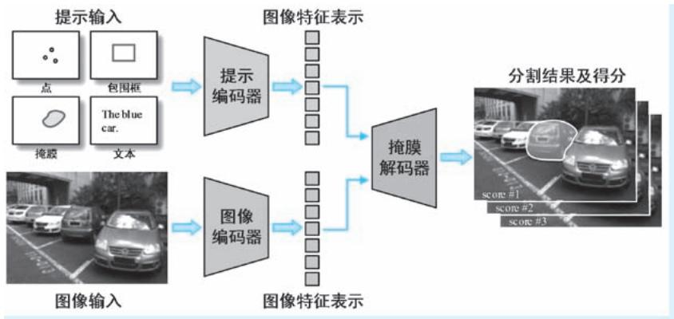  
●图 7-44 SAM 模型整体架构示意

图像编码器用来获得待分割图像的特征表示。作者们直接采用了基于 MAE 预训练的 ViT-H/16 模型。输入图像的分辨率为 $1 0 2 4 \times 1 0 2 4$ （以图像长边计，对短边进行填充）。输出特征图具有 1 / 16 的降采样率。在得到 ViT 的输出后，随后再对其先后进行 $1 \times 1 \times 2 5 6$ 卷积和 $3 \times 3 \times 2 5 6$ 卷积 （带有层归一化操作，最后的 $3 { \times } 3$ 卷积具有1 像素外扩），最终以 $6 4 \times 6 4 \times 2 5 6$ 的特征图作为输入图像的特征表示。

提示编码器用来将各类提示转换为特征表示。SAM 将输入的提示分为稀疏提示和稠密提示两种，其中稀疏提示即指的是点、边框和文本三种类型的提示，而稠密提示特指掩膜型提示。其中，每个点提示都包括了点的坐标及其是前景或背景的类别标识，提示编码器则以可学习类别嵌入加上其位置编码作为特征表示；针对包围框型提示，提示编码器将其表达为一对嵌入特征：将左上角点表示为位置编码加上 “左上角”对应的可学习嵌入，将右下角点则表示为其位置编码加上 “右下角”对应的可学习嵌入；针对文本型提示，SAM 则直接使用了 CLIP 的文本编码器的输出作为文本提示的特征表示。掩膜型提示为一幅与原始图像等比例的二值图像，其分辨率为原始图像的 1/4，提示编码器首先对其进行两次 $2 \times 2$ 、步长为2 的卷积操作，将分辨率再降低为原始掩膜图像的 1/4 （即输入图像分辨率的1/16），两次卷积的输出通道数分别为4 和16。最后再使用一次 $1 \times 1 \times 2 5 6$ 卷积，将得到的 256 通道特征图作为掩膜提示对应的特征表示，该表示将与图像特征进行逐位置的求和。综上所述，无论提示是哪种形式，提示编码器都将其转换为一个256 维特征的序列。

掩膜解码器将图像特征和提示特征进行融合并输出最终的分割结果。首先，SAM 在针对提示特征序列中插入一个可学习的标志特征，该特征即扮演 “＜CLS＞”的角色，被称为 “输出符号” （outputtoken）。接下来掩膜解码器用两轮解码操作对提示特征和图像特征进行交互，并在最后进行分割掩膜图的预测。每一轮解码操作包括了四个步骤：第一步为对提示特征的自注意力加工，该步骤旨在在提示特征内部进行信息融合；第二步为提示到图像的注意，在步骤中，将提示特征作为查询，在图像特征上投射注意力并进行特征整合，从而更新提示特征；第三步为提示特征后处理，在每个提示特征后进行 MLP 加工；第四步为图像到提示的注意，在该步骤中，图像特征被作为查询，在提示特征上投射注意力并进行整合，更新图像特征，这一步也是SAM 比较独特的操作，一般的多模态模型都只会开展提示到图像的查询。第二轮解码器操作基于更新后的提示特征和图像特征进行。特别地，第二轮解码的输入为更新后提示特征和原始提示特征之和，添加原始提示的目的是为了给模型进行再次提示以

“加深印象”。在第二轮解码操作完成后，即需要进行分割结果的预测。一方面，将解码得到的图像特征通过两个 $2 \times$ 反卷积 （步长均为2，输出通道数分别为64 和32）进行 $4 \times$ 的上采样，最终输出的特征图维度为 $2 5 6 \times 2 5 6 \times 3 2$ 。另一方面，将解码得到提示特征和图像特征再次进行提示到图像的交叉注意力加工，接下来即基于 $4 \times$ 上采样特征图和上述交叉注意力的输出来预测分割掩膜和对应得分。考虑到分割结果可能出现歧义 （如原文中给出的衣服和人的例子———如果一个点提示位于衣服上时，到底是分割衣服还是穿着衣服的人），故掩膜解码器一次性的输出三个分割掩膜，每个掩膜图都对应着一个得分预测。上述分割掩膜和得分利用两个预测头结构分别得到。其中，第一个预测头结构完成分割掩膜预测，其中包括三个 MLP 结构，每个 MLP 输出特征向量的维度与图像特征图的通道数相同，均为32 维。逐个将图像特征图每个位置的 32 维特向量征与一个 MLP 输出的 32 维特征做点积，即得到一个 $2 5 6 \times 2 5 6$ 的输出，这便是一个分割掩膜的预测结果，按照该方式遍历三个MLP 的特征输出，即得到三个分割掩膜预测；第二个预测头为一个 MLP 结构，其输出一个三维向量，即作为上述三个分割掩膜的得分预测。图7-45 示意了掩膜解码器的工作流程。

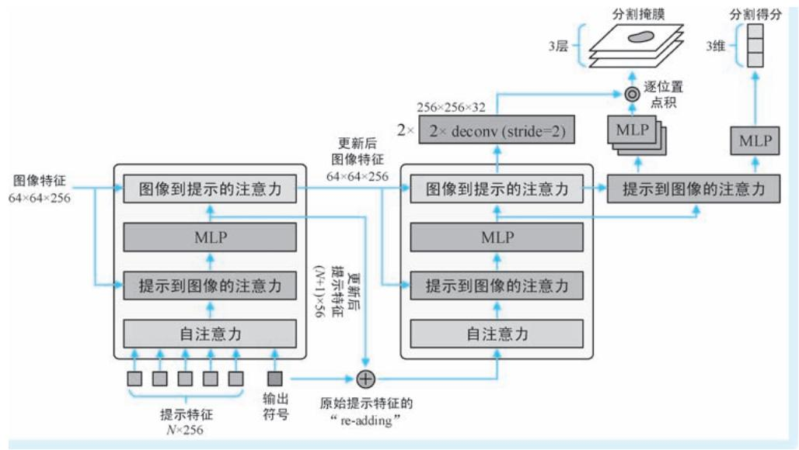  
●图 7-45 掩膜解码器的工作流程示意

在训练阶段，作者们基于真值掩膜标注，以模拟提示输入的方式，交互式地训练 SAM。例如，点型的提示以相同概率随机产生在目标内或背景上 （其类别标签即按照其出现的实际位置进行赋予），目标框即取自目标掩膜的外接矩形。当然，为了更像未来的人工输入，包围框的位置添加了随机噪声。掩膜型的提示也通过类似的方式产生。通过不断进行提示-分割迭代，不断按照分割预测结果进行提示的调整，实现最终的模型训练。

最后，我们来简单聊聊 SAM 的意义。作为一种提示驱动的图像分割模型，SAM 将提示信息从单一的文本形式扩展到任意交互形态，可以说思路非常新颖。但是除了模型层面的创新，笔者认为 SAM给整个 CV 领域带来的影响远不止如此。第一，SAM 颠覆了 CV 模型的构造和使用方式。从原来的针对特定数据集训练专用模型的方式，转变为 “大模型就在那里，提合理要求就是”的新模式。我们现

在绝大多数从业者都是在研发应用于专项任务的专用 CV 模型，要想效果好，拼的是调参的功力。但是 SAM 诞生后情况变了———效果好不好，全看提示是否到位。因此很多从业者都产生了 “饭碗不保”的担忧。第二，从模型中心 （Model-Centric）到数据中心 （Data-Centric） 的转变。现在的情况是，数据集构造和模型构造 “两张皮”，算法工程师所做的工作就是等着别人标好数据，自己 “围着模型转”，这便是典型的模型中心模式。但是，SAM 给出了一种 “数据促模型，模型滚数据”的循环新模式，数据集构建和模型训练的界限已经不再分明，甚至融为了一体。除此之外，我们应该看到Meta AI的宏大愿景，这一点在 SAM 原文的一开始已经阐述得非常清楚———Mata AI 希望做的事情叫作 “分割一切”项目 （Segment Anything Project），其中包括三项具体工作：第一项工作为构建一种新的任务，该任务称为 “可提示分割” （promptable segmentation）任务，模型的输入就是一幅图像及对其的提示信息，输出即为模型在提示下、针对图像得到的分割结果；第二项工作即构建一个能够完成上述任务的模型，我们上文介绍的 SAM 即是该工作的产物；第三项工作，便是通过人机交互的 “滚动”模式，构建一个具有10 亿级掩膜标注的超大规模的数据集。综上所述，有了任务设定和大规模数据集，还有了示范模型，可谓三位一体，Mata AI 这是要创建一种图像分割或是其他密集预测乃至整个 CV 及多模态任务的新模式、新生态。

# 7.4.4 新型生成模型

近年来，随着 NLP 和 CV 技术的进步，以文本到图像生成为核心的 AIGC 技术也迎来了突飞猛进的发展，人们终于可以和计算机进行图文交互，甚至还诞生了 “AI 画师”这一新职业。在下文中，我们就对三个新型图像生成模型的背景和原理展开介绍。

# 1. DALL-E：基于 dVAE 和 Transformer 的图像生成

文本到图像的生成任务要求模型基于人类的自然语言生成与之相匹配的逼真图像，是视觉语言多模态任务中的一项重要任务，也一直也是人们的梦想和多年的追求目标。然而，图像生成是一项极具挑战性的任务。为了让图像的生成满足真实、多样，以及和文本匹配等诸多条件，需要构造多种分支结构、引进各种损失函数。因此，此类生成模型往往具有非常复杂的结构并且优化困难，我们从前文介绍的 AttnGAN 模型便可见一斑。2017 年，谷歌 Transformer，尤其是随后 OpenAI GPT 系列预训练生成式模型的诞生，将机器翻译等文本生成水平提高到了一个前所未有的高度，而这些 NLP 的生成模型都具有基于Transformer 的简单架构。那么，是否可以借鉴NLP 文本生成方面的有益思路架构，在大幅简化模型结构的同时，将文本到图像生成任务提高一个层次呢？2021 年2 月，Aditya Ramesh 等[5] 八名来自OpenAI的学者提出了 “零样本文本到图像的生成” （Zero-Shot Text-to-Image Generation）模型，即诞生于上述背景下的经典工作。学者们将该模型昵称为 “DALL-E ”（读作 “达利”），旨在向超现实主义艺术家萨尔瓦多·达利 （Salvador Dali）和皮克斯动画电影 《机器人总动员》中的机器人瓦力 （WALL-E）的致敬。

为了理解 DALL-E 从文本到图像生成的过程，我们首先简单回顾一下自编码器（AutoEncoder，AE）模型㊀进行图像编码与重构的过程。如图 7-46 所示，对于一幅输入图像，AE 首先利用图像编码器将

其编码到特征空间，即获得其特征表示 （在某些场合也将该特征表示称作图像的隐状态特征），然后再以上述特征表示作为输入，利用一个图像解码器对其进行解码，将其恢复到图像空间。AE 模型采用自监督端到端模式训练，训练目标就是 “重塑自己” 一幅图像经过编码器编码，再经过解码器重构，要求输出图像与输入图像越接近越好。当上述目的达到时，就意味着编码器和解码器都

  
●图 7-46 自编码器的图像编码与重构示意

很 “优秀”：编码器能够将图像编码为一个高质量的特征 （一般这个特征的维度要远低于原始图像），该特征质量高到没有损失信息；解码器基于一个 “浓缩版”的特征能够 “真真切切”地恢复出原始图像。

一个训练好的 AE 模型一般来说都是 “拆开”用的。例如，在上一章我们介绍的 BEIT 模型，就使用了 AE 的前半段———给定一幅图像，利用图像编码器获得其特征表示，这也是 AE 最常见的 “打开方式”。但是我们这里先考虑要使用 AE 的后半段———如果我们手头上的已经有了一个图像的特征表示，就可以利用解码器将其恢复为图像，也即完成了图像生成操作。但是，图像特征从哪里来？我们可以继续 “往前倒”：假如该图像特征不是像 AE 那样来由图像编码器产生，而是通过某种模态转换操作从文本特征转换而来，而文本特征又是文本编码器对某一文本的编码表示…于是，我们已经以“倒序”的方式打通了从文本生成图像的完整链路，这也正是 DALL-E 模型由文生图的整体流程。DALL-E 从文本到图像生成的过程包括了四个步骤。第一步为文本编码。针对输入的文本描述，通过文本编码器将其转换为文本特征表示。第二步为模态转换。这一步操作类似于机器翻译———将源语言特征表示转换为目标语言特征。只不过 DALL-E 中，这里的源语言和目标语言特征分别对应文本特征和图像特征。第三步图像解码。这一步已经回到了 AE 的下半段，即利用图像解码器对图像特征进行解码，重构图像。第四步为后处理。目的在于让生成的图像具有更高的质量。其中，就跨模态特征转换到底使用什么模型这一问题恐怕已经没有任何悬念———非 Transformer 结构莫属。图 7-47 示意了DALL-E 文本到图像生成的整体流程。

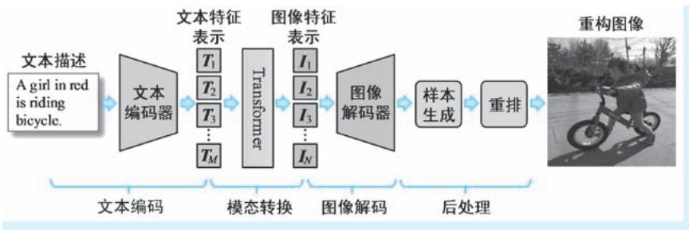  
●图 7-47 DALL-E 文本到图像生成的整体流程示意

经过上述讨论，我们已经了解了 DALL-E 模型的工作流程。但是还有两个重要问题还未落实。第

一个问题，图像特征到底是什么？第二个问题，从文本到图像进行模态转换的 Transformer 怎么训练？上述两个问题即对应了 DALL-E 的两个阶段训练。其中，第一阶段即为训练图像的编码表示，第二阶段为训练特征转换模型。图7-48 为 DALL-E 两阶段训练流程示意。

  
●图 7-48 DALL-E 两阶段训练流程示意

在第一个训练阶段，DALL-E 以自监督训练的方式，训练一个离散变分自编码器（discreteVariational AutoEncoder，dVAE）。输入一幅图像，dVAE 将图像表达为一个离散特征序列，其中的每一个元素都是其在一个 “视觉词典”（Visual Dictionary，在某些文献中也称为 “视觉码本”，即 “VisualCodebook”）中的下标，该下标称为视觉符号。有了视觉符号，dVAE 的解码器即可以将其恢复为图像。具体在 DALL-E 中，dVAE 的编码器和解码器都是 CNN 结构，针对一幅 $2 5 6 \times 2 5 6 \times 3$ 的输入图像，dVAE 将其编码为 $3 2 \times 3 2$ 个视觉符号，视觉码本的大小为 8192。原文将第一阶段 dVAE 的训练形象地称为 “视觉码本学习” （Learning the Visual Codebook）。我们在上一章中介绍的 BEIT 模型，也使用dVAE 模型提取图像特征表示，之所以 dVAE 广受青睐，原因有二：第一，dVAE 能够实现大幅数据压缩，例如，在 DALL-E 中，dVAE 产生的图像特征只有 1024 个元素 $3 2 \times 3 2 = 1 0 2 4 .$ ）；第二，dVAE 实现图像分块进行离散的视觉符号表示，对图像的表达形式与词汇非常类似，故能够和词汇符号进行统一处理。

在第二个训练阶段，该阶段被称为 “先验分布学习”（Learning the Prior），即训练一个稀疏 Trans-former 解码器模型，使得其能够将文本特征转换为图像特征，训练的样本为一系列具有匹配关系的图像-文本对。针对其中的一组输入，DALL-E 利用第一阶段训练好的 dVAE 编码器对其中的图像进行编码，得到输入图像的特征表示，其长度为 $3 2 \times 3 2 = 1 0 2 4$ ，视觉词典大小为 8192；利用一个字节对编码器 （BPE-encoder）对文本进行编码，得到输入文本的特征表示，其长度为 256，词典大小为 16384。此时，训练 Transformer 模型所需的输入和真值输出已经就位。然后，将两路特征表示进行拼接，送入Transformer 解码器进行图像特征预测。请读者注意，如果我们要完成特征转换任务 （如机器翻译任

务），标准模型需要使用编码器-解码器两个结构———前者一次性看见所有并对其进行逐级加工，而后者采用 “看前不看后”的自回归方式进行目标特征生成。而这里只是用了 Transformer 的解码器，这是因为 DALL-E 也采用了 “前一半编码，后一半解码” 的模式，通过注意力的掩膜来控制特征依赖关系。想必读者对该架构已经非常熟悉，前文介绍的 NLP 预训练模型 UniLM，以及上文介绍的视觉语言预训练模型 VisualBERT、UNITER 和 VLP 等在完成生成类任务时均采用了这一架构。DALL-E 使用Transformer 的规模非常庞大，其层数高达 64 层，每个多头自注意力模块的头数为 62，每头注意力的特征维度为64，整个模型的参数量达到120 亿。在 DALL-E 的稀疏 Transformer 解码器中，使用了行注意力、列注意力和卷积注意力三种不同的稀疏注意力掩膜来控制注意力的作用范围。关于三种注意力的具体掩膜形式，我们这里不再详细展开，请感兴趣的读者阅读 DALL-E 原文或稀疏 Transformer 有关的文献。

推理阶段，在获得 Transformer 输出的图像特征表示之后，即可以利用 dVAE 的解码器进行后续的图像生成操作。作为变分自编码器 （Variational AutoEncoder，VAE）的一种，dVAE 解码器在图像特征表示上添加一个小的随机噪声扰动，然后在此基础上重构图像，这就意味着 dVAE 的图像生成是具有随机性的，那么 DALL-E 到底以哪一幅或者哪些图像作为最终输出？这就需引入所谓的重排（rerank-ing）操作。重排操作的思想非常简单———生成的图像与输入文本描述匹配程度越高，就越有优先输出的资格。重排的具体方法为：计算所有生成图像与输入文本之间的相似度并进行排序，将图文相似度高的前几幅图像作为输出。显而易见，重排操作的核心就是完成一个图文匹配任务，DALL-E 会利用一个训练好的对比学习模型 （如前文介绍的 CLIP 模型） 来完成上述工作。这样一来，整个 DALL-E会用到三个模型：一个用来提取图像特征和进行图像重构的 dVAE 模型，一个用来完成文本特征到图像特征转换的 Transformer 模型，以及一个用来进行图文相似度计算的对比学习模型。

# 2. DALL-E 2：基于 CLIP 和扩散模型的图像生成

我们上文介绍了 DALL-E 模型，该模型分别以 BPE 编码器和 dVAE 编码器作为文本和图像编码器，以获得文本特征和图像特征，然后以 Transformer 实现文本到图像特征的转换，最后再以 dVAE 的解码器实现图像生成。在 DALL-E 诞生后不久，无论是图文特征表示方面还是图像生成方面，都取得了长足的进展。首先是图文特征表示方面，OpenAI 自家的 CLIP 模型可以说是里程碑般的存在。CLIP在超大规模的图像-文本数据集上开展基于对比学习的自监督训练，可以同时学习得到带有文本语义特征的图像特征和带有图像信息的文本特征。再说图像生成方面，在 2020 年以前，图像生成主要依靠“两驾马车”，分别是基于 VAE 的图像生成模型和基于 GAN 的图像生成模型。例如，DALL-E 就属于VAE “阵营”的生成模型。而 GAN 模型的分支更是枝繁叶茂，算得上是图像生成的绝对主力。但是，GAN 模型存在着两个比较严重的问题：一个问题是模型训练不稳定，简单来说就是 “难训”；另一个问题就是生成图像更多的要求 “保真”，但是在多样性方面却难以令人满意。2015 年，Jascha Sohl-Dickstein 等[7] 四名来自斯坦福大学和伯克利大学的学者提出著名的扩散概率模型（Diffusion ProbabilisticModels，DPM）。随后，各类扩散模型不断登场，GAN 模型当年的盛世在扩散模型阵营重演，特别是在 CV 领域，扩散模型生成的图像以假乱真，且极具多样化。让众人看到了扩散在视觉方面的潜力。图文特征表示和图像生成是文本到图像生成模型两个最核心的模块，既然两个方向都更新换代了，那么 DALL-E 是否能够 “借着东风”再往前走一步呢？于是在 DALL-E 模型诞生一年后的 2022 年 4 月，

OpenAI 推出新一代文本到图像生成模型 DALL-E 2 [6] ，该模型即以 CLIP 和扩散模型分别作为图文特征编码器和图像生成器，根据文本描述，生成高分辨率的、以假乱真，甚至是带有玄幻色彩的图像。

上文我们已经对 CLIP 模型进行了讨论，下面我们就对 DALL-E 2 模型涉及的另一个重要模块———扩散模型做简单讨论。但是需要说明的是，扩散模型有着非常深刻的数学背景，并且变种模型也非常多。受到篇幅和作者能力的限制，我们下面对扩散模型的讨论旨在为 DALL-E 2 做铺垫，因此只会涉及与 DALL-E 2 有直接关系的扩散模型，讨论的深度也仅会停留在 “科普”层面，只说结论，回避推导。

我们讨论的第一个扩散模型为伯克利大学提出的去噪扩散概率模型（Denoising DiffusionProbabilistic Models，DDPM）[8] ，其提出时间为 2020 年 6 月。DDPM 正式将扩散模型应用于 CV 领域，可以算作扩散模型应用于图像生成方面的开山之作，将扩散模型带到了一个新高度。说到 DDPM，首先需要了解扩散过程（diffusion process）。扩散过程也称为前向过程 （forward process），简单来说，就是在一幅干净的图像上不断添加高斯噪声，最终利用噪声将图像信息完全淹没的过程。 “扩散模型”中的 “扩散”一词也来源来源于物理学概念———添加噪声的过程就如同在水中倒入颜料，刚开始的时候颜料和水还 “丝丝分明”，但是随着颜料不断倒入，水和颜料逐渐融为一体，最后难以区分。图7-49 上方箭头方向即为扩散过程的示意。其中 $x _ { 0 }$ 表示无任何噪声污染的原始图像，我们在其上添加高斯噪声，得到少量噪声污染的图像 $x _ { 1 }$ ，然后再在 $x _ { 1 }$ 上添加高斯噪声，得到进一步污染的图像 $x _ { 2 }$ …以此类推，经过 $T$ 步高斯噪声的添加，我们最终得到了一个什么也看不出来的噪声图像 $x _ { T }$ 。DDPM 将每一步扩散过程表示为上一步图像和噪声的加权融合，表示为

$$
x _ {t} = \sqrt {\alpha_ {t}} \cdot x _ {t - 1} + \sqrt {1 - \alpha_ {t}} \cdot \epsilon_ {t - 1} \tag {7-52}
$$

  
●图 7-49 DDPM 的扩散过程和去噪过程示意 （每幅图像右上角的图标为图像分布示意）

式中， $\mathbf { \epsilon } \mathbf { \epsilon } \mathbf { \epsilon } _ { t - 1 } \sim \mathcal { N } ( 0 , 1 )$ ）为高斯噪声； $\{ \alpha _ { t } \} _ { t = 1 } ^ { T }$ 为一系列预先设定的超参数列表，用来控制上一步图像和噪声的混合比例，在很多文献中被称为噪声计划表 （noise schedule）。式 （7-52）表示了相邻两幅图像变化递归公式，那么还可以构造出从 $x _ { 0 }$ 到 $x _ { t }$ 的 “一步到位”的噪声污染模型，有

$$
x _ {t} = \sqrt {\bar {\alpha} _ {t}} \cdot x _ {0} + \sqrt {1 - \bar {\alpha} _ {t}} \cdot \epsilon \tag {7-53}
$$

其中 $\mathbf { \epsilon } \in \mathcal { N } ( 0 , 1 )$ ）为高斯噪声 （即高斯噪声的生成和步骤无关）； $\overline { { \alpha } } _ { t } = \alpha _ { t } \alpha _ { t - 1 } \cdots \alpha _ { 1 }$ ；本身高斯噪声采样与步骤无关，故直接将 $\epsilon _ { t - 1 }$ 改写为 $\mathbf { \boldsymbol { \epsilon } } \sim \mathcal { N } \left( \mathbf { \boldsymbol { 0 } } , \mathbf { \boldsymbol { 1 } } \right)$ 。有了前向的添加噪声，那必定有反向的去噪过程（denoising process）。去噪过程为扩散过程的逆过程，即在每一步骤上进行噪声估计，通过迭代一步步将被噪声污染的图像 $x _ { t }$ 恢复到最干净的图像 $x _ { 0 }$ ，图7-49 下方箭头即示意了这一过程。每一步去噪过程可以表示为

$$
x _ {t - 1} = \frac {1}{\sqrt {\alpha_ {t}}} \cdot x _ {t} - \frac {\sqrt {1 - \alpha_ {t}}}{\sqrt {\alpha_ {t}}} \cdot \epsilon_ {\theta} (x _ {t}, t) + \sigma_ {t} z \tag {7-54}
$$

式中， $\boldsymbol { \epsilon } _ { \theta } ( x _ { t } , t )$ ）即为 DDPM 针对步骤 $t$ 和噪声图像 $x _ { t }$ ，通过 U-Net 得到噪声估计， $\theta$ 为噪声估计模型的参数； $z \sim \mathcal { N } ( 0 , 1 )$ ）为一个高斯噪声， $\sigma _ { t }$ 为一个事先设定、和步骤有关的常量 （与 $\alpha _ { t }$ 类似）； $\boldsymbol { \sigma } _ { t } \boldsymbol { z }$ 即表示经过噪声剥离后，得到的结果和真值还 “差了那么点”的一个随机值。从采样的视角 （也即生成的视角），式 （7-54）可以表示为 $x _ { t - 1 } \sim \mathcal { N } \left( \mu _ { \theta } ( x _ { t } ) , \Sigma _ { t } \right)$ ）。如果我们将Σ 也作为估计模型的输出，上述采样过程可以进一步表示为

$$
x _ {t - 1} \sim \mathcal {N} \left(\mu_ {\theta} \left(x _ {t}\right), \Sigma_ {\theta} \left(x _ {t}\right)\right) \tag {7-55}
$$

DDPM 以 U-Net 模型实现对 $\cdot _ { \theta } ( x _ { t } , t )$ ）的预测，所谓 DDPM 的训练，即确定 U-Net 模型的参数 $\theta$ ，使得噪声预测值和噪声真值之间的差异达到最小化。图7-50 示意了DDPM 的训练流程，每一次迭代都包括四个步骤 （在图中用带圆圈的数字表示）：第一步为扩散过程。获取一幅干净的图像 $x _ { 0 }$ ，随机产生一个高斯噪声 $\mathbf { \epsilon } \in \mathcal { N } \left( 0 , 1 \right)$ ），然后再随机产生一个步骤值 $t$ ，利用式 （7-53） 所示的 “一步到位” 方法，利用噪声将 $x _ { 0 }$ 污染为 $x _ { t }$ （需要结合 $\{ \overline { { \alpha } } _ { t } \} _ { t = 1 } ^ { T } )$ ）。第二步为噪声估计。首先将时间进行嵌入表示，然

后将其与噪声图像 $x _ { t }$ 一起送入一个 U-Net 网络，U-Net 网络的输出则为步骤 $t$ 下图像 $x _ { t }$ 中的噪声估计值 $\mathbf { \epsilon } _ { \theta } ( x _ { t } , t )$ ）。在DDPM 中，为了增加 U-Net 的全局建模能力，作者们在其中增加了若干单头自注意力模块。第三步为噪声差异损失计算。在扩散过程中人为生成的噪声 $\epsilon$ 是已知的，因此可以作为噪声估计的真值，计算二者之间的损失。第四步为模型参数更新。基于第三步得到的损失，指导更新 U-Net模型的参数。有了噪声估计模型，就可以很容易地进行图像生成了：从 （0，1）中随机产生一幅噪声图像，将其视为经过极端噪声污染的图像 $x _ { T }$ ，然后按照上述方式 “抽丝剥茧”，一步步将其恢复到 $x _ { 0 }$ 的过程，即为图像生成的过程。

  
●图 7-50 DDPM 的训练流程示意

我们介绍的第二类扩散模型为带有引导的扩散模型（Guided Diffusion Models）。上文中的 DDPM 与标准 GAN 模型类似，从随机噪声生成图像，属于无条件图像生成模型。然而，就像条件 GAN 之于标准 GAN 那样，人们自然希望生成的结果符合我们预期，不能 “野蛮生长”。于是带有附加条件的系列扩散模型应运而生，这一类模型即被称为带有引导的扩散模型。按照引导信息的加入方式，带有引导的扩散模型可以分为分类器引导（classifier guidance） 扩散模型和无分类器引导（classifier-free guidance）

扩散模型两大类。其中，前者为 OpenAI 于2021 年5 月提出[9] ，该模型被称为 “消融扩散模型”（Ab-lated Diffusion Model。ADM），代表扩散模型阵营赢得了击败 GAN 的关键一战；而后者则由谷歌在2021 年12 月召开的 NeurIPS 会议上提出[10] 。两种扩散模型体现了不同的思想：前者借助外部模型（一般为分类器）的输出作为引导条件来指导扩散模型的去噪过程，该类模型的特点是不用修改扩散模型本身。对于那些不想训练或训练不起扩散模型的个人或机构而言，这是一种非常友好的引导方式；而后者直接将所需的引导条件作为模型输入的一部分，从而让扩散模型见到这个条件后就可以直接生成我们想要的输出。此类模型从扩散模型训练的一开始就为其注入引导 “基因”，这便等同于训练一种全新的扩散模型，意味着模型的训练需要大规模的图像数据和引导数据 （这里的引导数据一般是与图像匹配的多模态数据），因此只有 OpenAI、谷歌这种大公司才能承担得起，我们下文将要介绍的 DALL-E 2，以及目前几乎所有的图像生成模型都采用的这种方式。在 DDPM （无条件扩散模型）中，我们将步骤 $t$ 到步骤 t-1 的去噪模型记作 $\cdot p _ { \theta } ( x _ { t - 1 } \mid x _ { t } )$ ），则在分类器引导扩散模型中，在给定额外的类别标签条件 $y$ 后，去噪过程可以表示为

$$
p _ {\theta , \phi} \left(x _ {t - 1} \mid x _ {t}, y\right) = Z \cdot p _ {\theta} \left(x _ {t - 1} \mid x _ {t}\right) \cdot p _ {\phi} (y \mid x _ {t}) \tag {7-56}
$$

式中， $Z$ 为一个归一化因子； $p _ { \phi } ( \boldsymbol { y } \vert \boldsymbol { x } _ { t } )$ ）即为对 $x _ { t }$ 进行类别预测的概率模型， $\phi$ 为其参数。可以看出，作为原扩散模型的单步去噪模型， $p _ { \theta } \big ( \boldsymbol { x } _ { t - 1 } \ : | \boldsymbol { x } _ { t } \big )$ ）仍在那里，未发生任何改变。这即证明在分类器引导扩散模型中，原扩散模型是保持不变的，只需额外训练一个分类器，然后在去噪过程中将类别预测结果整合进来即可。在上述模式下，式 （7-55）的采样过程需要改写为

$$
x _ {t - 1} \sim \mathcal {N} \left(\mu_ {\theta} \left(x _ {t}\right) + s \cdot \Sigma_ {\theta} \left(x _ {t}\right) \cdot \nabla_ {x _ {t}} \log p _ {\phi} \left(y \mid x _ {t}\right), \Sigma_ {\theta} \left(x _ {t}\right)\right) \tag {7-57}
$$

式中，s 为一个预先设定的常量系数。式 （7-57）表明，我们在每一步去噪 （生成）过程中，在计算高斯分布的均值时，需要为其加上方差及分类梯度项的乘积。值得一提的是，ADM 模型针对 U-Net 网络也开展了很多有益的改进工作，其中和注意力机制有关的改进具体包括两个方面：第一，将 DDPM的单头注意力改为多头；第二，将 DDPM 仅在 $1 6 \times 1 6$ 的单一分辨率尺度上的注意力计算，改造为在$3 2 \times 3 2$ 、 $1 6 \times 1 6$ 和 $8 \times 8$ 三种分辨率尺度上进行。

分类器引导扩散模型存在显著的问题，它需要额外训练一个分类模型，除了过于烦琐之外，更重要的问题在于引导条件的引入太过死板，基本上只能对接判别模型的输出，不利于在大规模数据上联合更加丰富的多源特征 （如后续的多模态引导）开展一体化训练。为了克服上述问题，人们提出了无分类器引导扩散模型。在该模型中，相邻两步的去噪模型可以表示为 $\smash { p _ { \theta } ( x _ { t - 1 } \mid x _ { t } , y ) = \mathcal { N } ( \mu _ { \theta } ( x _ { t } , y ) }$ ），$\textstyle \sum _ { \theta } ( x _ { t } )$ ）），其中 $\vert \mu _ { \theta } ( x _ { t } , y )$ ）形式与式 （7-54）所示 DDPM 十分接近，即

$$
\mu_ {\theta} \left(x _ {t}, y\right) = \frac {1}{\sqrt {\alpha_ {t}}} \cdot x _ {t} - \frac {\sqrt {1 - \alpha_ {t}}}{\sqrt {\alpha_ {t}}} \cdot \epsilon_ {\theta} \left(x _ {t}, t, y\right) \tag {7-58}
$$

相较于 DDPM，无分类器引导扩散模型的噪声预测从 ${ \bf \Psi } _ { \bf \epsilon } \epsilon _ { \theta } \big ( { x _ { t } } , t \big )$ ）变为 $\mathbf { \epsilon } _ { \epsilon _ { \theta } } ( x _ { t } , t , y )$ ），即增加了引导条件作为模型输入。相较于分类器引导扩散模型，这里不需要额外训练一个分类模型。在对无类别引导扩散模型进行训练时，为了让其兼顾无条件 （即标准 DDPM）生成和有条件生成两种功能，往往以固定的概率将引导条件 $y$ 置为控制 （即令 $y = \emptyset$ ），使得模型 “时而受控，时而自由”，从而做到 “有条件的自由发挥”。

我们介绍的第三个扩散模型为 OpenAI 的 GLIDE [34] 。GLIDE 模型的提出时间为 2021 年 12 月，其全称为 “Guided Language to Image Diffusion for Generation and Editing”。显而易见，GLIDE 是一个文本引导的、用于图像生成和编辑㊀①的扩散模型。具体而言，GLIDE 是一个以文本描述作为引导条件的无分类器引导扩散模型，即将噪声预测模型具体化为 $\mathbf { \epsilon } _ { \theta _ { \theta } } ( x _ { t } , t , c a p t i o n )$ ）。可以说 GLIDE 是在 DALL-E 诞生后，OpenAI 基于扩散模型这一图像生成的最优模型，借助自身强大的数据和计算资源优势，以 “大力出奇迹”的方式，对 DALL-E 所做的第一次改进。对于输入的、作为引导信息的文本描述，GLIDE模型使用一个 Transformer 的文本编码器获取其特征表示，并进行噪声预测模型的特征注入。具体操作包括两个方面：第一，针对长度为 $K$ 的特征，GLIDE 取出其最后一个输出特征作为文本的整体描述，添加到 U-Net 的每一个残差模块进行特征融合。这一操作与 DDPM 中对步骤 t 嵌入表示的使用模式类似；第二，将最终输出的 $K$ 个词汇特征进行分别的不同维度的线性变换，将变换结果与不同注意力模块中的特征进行拼接，然后进行一体化的注意力加工。

有了上述几个扩散模型的基础，我们就可以正式讨论 DALL-E 2 模型。接下来我们同样按照介绍DALL-E 的方式，从后往前推，厘清 DALL-E 2 从文本到图像生成的大致脉络。首先，我们有了DDPM，相当于有了一个图像生成工具，它能够基于图像特征生成最终的图像㊁②，因此 DDPM 扮演了图像解码器的角色；那么图像特征从哪里来？自然是从文本特征转换而来，在两代 DALL-E 中，这一步操作都被称为先验（prior）学习。在上文介绍的 DALL-E 中，这一转换工作由 Transformer 解码器（也即 GPT）以自回归方式来完成，但是在 DALL-E 2 中，作者们除了使用上述自回归方式，还尝试了扩散模型，扩散模型的起点 （即 $x _ { t }$ ）为文本特征，而目标 （即 $x _ { 0 }$ ）为图像特征；文本特征的来源自然不用多说，就是OpenAI 自家CLIP 文本编码器对输入文本描述的加工。这样一来，DALL-E 2 的从文本到图像的生成过程 （即推理）就包括三大步骤：第一步，文本到文本特征。针对输入的文本描述，首先利用 CLIP 文本编码器将其加工为特征表示；第二步，文本特征到图像特征。利用先验学习得到的转换模型，将文本特征转换为图像特征；第三步，图形特征到图像。该步骤即利用扩散模型对图像特征进行解码，生成最终的图像。在这一步，DALL-E 2 即使用了改进版的 GLIDE 模型。

与 DALL-E 的两阶段训练类似，DALL-E 2 模型的训练过程也分为两大阶段。在第一个训练阶段，DALL-E 2 以对比学习的方式，利用图像-文本对数据，训练一个 CLIP 模型，如图 7-51 上半部分示意；在第二个训练阶段，训练数据仍然为图像-文本对，此时 CLIP 模型即被冻结，然后基于其提取的特征训练两个模型。其中，第一个模型即从文本特征到图像特征的转换模型 （即原文中的先验学习模型构造），对其训练的输入数据为 CLIP 得到的文本特征，而用来作为监督的真值数据即为 CLIP 模型得到的图像特征。在原文中，作者们对比了两种不同架构的特征转换模型，其中第一种模型与 DALL-E 相同，也是基于 Transformer 的自回归转换模型 （也即 GPT 模型），第二种为以文本特征作为引导信息的扩散模型；第二个模型训练即构造基于 GLIDE 的图像解码器，训练的输入数据即为上述图像特征，而

目标图像即为输入图像，其示意如图7-51 下半部分所示。经过上述分析容易看出，DALL-E 2 是非常依赖 CLIP 模型的，尤其是其图像生成过程，相当于将 CLIP 图像特征恢复为图像，即进行了 CLIP 图像编码的逆过程，因此在 DALL-E 2 的原文中，将自己称为 “UnCLIP 模型”。DALL-E 2 论文题目中的“CLIP Latent”也正是因为其图像生成使用了 CLIP 模型提取的特征。

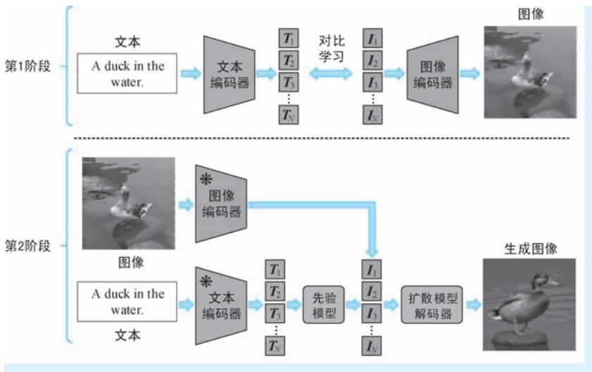  
●图 7-51 DALL-E 2 两阶段训练流程示意

我们从一般扩散模型到带有引导的扩散模型 （又包括分类引导和无分类引导两种），再到文本引导的扩散模型，总算将DALL-E 2 模型的核心工作讨论清楚。可以看出，就模型结构本身而言，DALL-E 2 执行文本到图像生成的步骤同样遵循了 DALL-E 的 “三段式”模式———从文本到文本特征，再从文本特征到图像特征，最后从图像特征到图像。就创新性而言，说 DALL-E 2 是一个 “缝合”模型一点也不为过，毕竟几乎所有模块都是用现成最好的模型———图文特征表示用的是自己的 CLIP，图像生成用的是自家的 GLIDE。但是，我们能够从 DALL-E 2 模型上看到 OpenAI 的两点过人之处：第一，卓越的工程化能力，OpenAI 投入了大量的结构优化和精细化参数调节工作，才能将模型 “缝合”到如此自然且效果出众；第二，不断探索的精神，无论是扩散模型还是文本到图像的生成模型，OpenAI 的身影可谓随处可见，都能够在恰当的时机，将相关技术往前猛推一步，也常常使人眼前一亮。不断地技术积累，再加上自身雄厚资源的支撑，最终才得到 DALL-E 2 看似 “缝合”但实则是集大成者的优秀工作。

# 3. LDM：AI 绘图的“绝世高手”

扩散模型在图像生成方面的表现可谓相当的 “SOTA”，但是其最大的问题莫过于对计算资源的要求太高，尤其是我们需要得到高分辨率的生成图像时，上述缺陷将是致命的。扩散模型计算量大，最重要的原因在于其所有的扩散过程都是在原始像素空间进行。那么，我们是否可以将扩散模型从像素空间转换到低维特征空间，从而使得计算量能够大幅降低呢？2021 年 12 月，Robin Rombach 等[35] 四名学者提出潜扩散模型（Latent Diffusion Model，LDM），即将标准扩散模型的扩散操作搬到自编码器的特征空间中进行。相较于图像像素这一 “摆在明面”的空间，LDM 的工作环境为无法直接观测的潜表示空间 （latent representation space），LDM 也因此而得名。

在训练架构方面，LDM 与 DALL-E 模型类似，其整体形如一个 “夹心面包”。其中 “面包”部分为一个自编码器模型 （两片面包分别对应自编码器中的编码器和解码器），而其中的 “夹心”部分则是一个扩散模型。除此之外，LDM 还有一个可选的 “多功能调味盒”———通用条件模块，该模块可以对文本、图像等多形式的外部多模态信息进行编码，将其作为扩散模型的引导条件注入噪声预测模型，将 LDM 中的扩散模型构造为带有多模态引导的扩散模型 （准确地说为无分类器引导扩散模型）；当需要 LDM 进行无条件图像生成时，将条件模块的输出置为空即可。图7-52 为 LDM 的整体训练架构示意。“面包”和 “夹心”要分头制作———LDM 模型的训练也分为的两个独立的阶段。

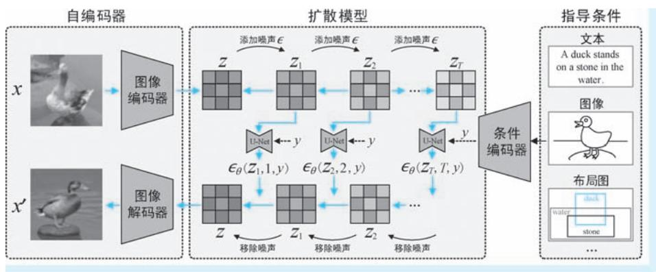  
●图 7-52 LDM 的整体训练架构示意

第一阶段训练旨在构造一个自编码器模型，以获得图像的潜特征表示，从而为后续扩散模型的高效加工提供数据基础。在原文中，将利用自编码器获得图像潜特征表示的过程称为 “感知图像压缩”（Perceptual Image Compression）。感知图像压缩具体的工作流程为：输入一幅彩色图像 $\boldsymbol { x } \in \mathrm { R } ^ { H \times W \times 3 }$ ，自编码器模型中的编码器将其编码为潜特征表示，表示为 $z = \operatorname { e n c } \left( x \right)$ ），其中 $z \in \mathrm { R } ^ { h \times w \times c }$ ；然后解码器能够对其进行重建，将其恢复到原始图像空间，即 $x ^ { \prime } = \operatorname { d e c } \left( z \right) = \operatorname * { d e c } \left( \operatorname { e n c } \left( x \right) \right)$ 。潜特征表示 $z$ 对于原始图像具有 $2 ^ { m }$ 的降采样率，即有 $H / h = W / w = 2 ^ { m }$ ，其中 $m = 1 , 2 , \cdots$ 。为了让 $z$ 能够稳健高效地表达原始图像，作者们在训练自编码模型时设置了多种监督目标，还尝试添加了 KL-Reg 和 VQ-Reg 两种正则化约束。

第二阶段训练即基于潜特征表示训练扩散模型。我们首先将经过 $T$ 步扩散形成的潜特征表示序列记作 $\left\{ \begin{array} { l } { { \boldsymbol { z } } _ { t } \nmid } \\ { { \boldsymbol { z } } _ { t } } \end{array} \right\} _ { t = 0 } ^ { T }$ ，其中 $z _ { t } = z _ { t - 1 } + \epsilon$ ， $\epsilon \sim \mathcal { N } ( 0 , 1 )$ ）为高斯噪声， $z _ { t }$ 即为噪声 “污染版”的 $z _ { t - 1 }$ ， $z _ { 0 }$ 即为编码器形成的最原始特征 $z$ 。LDM 扩散模型的训练任务即构造噪声估计模型 $\boldsymbol { \epsilon } _ { \theta } \big ( z _ { t } , t , \boldsymbol { y } \big )$ ），使得其能够尽量准确地估计每一步的噪声。LDM 的优化目标可以表示为最小化如下数学期望

$$
\mathcal {L} _ {l d m} (\theta) = \mathrm {E} _ {z = \mathrm {e n c} (x), \epsilon - \mathcal {N} (0, 1), t - \{1, T \}} [ \| \epsilon - \epsilon_ {\theta} (z _ {t}, t, y) \| _ {2} ^ {2} ] \tag {7-59}
$$

式 （7-59）表示的 LDM 优化过程为：针对输入的图像 $x$ ，首先利用编码器得到其对应的潜特征表示$z = \operatorname { e n c } ( x )$ ）；然后产生随机噪声 $\epsilon$ 和随机步骤t，利用 “一步到位”的方式，构造出 $z$ 在扩散步骤 $t$ 下的“污染版”特征 $z _ { t }$ ；接着利用噪声估计模型估计当前步骤的噪声 ${ \bf \dot { \epsilon } } _ { \theta } ( z _ { t } , t , y )$ ），这里的 $y$ 即表示外部的引导条件㊀①，该引导条件可以是文本、图像，以及布局图 （layerout，即标注不同对象在图上位置的标注

图）等多种形式，当 $y = \emptyset$ 时，即表示 LDM 为无条件生成模型；最后利用 L2 距离计算其与真实噪声之间 $\epsilon$ 的差异，LDM 优化目标即要求二者尽可能地接近。正是因为步骤 t 的采样是随机的，所以采用数学期望来表示平均意义下的最优噪声估计。

下面我们来看看 LDM 使用引导条件的机制。在上文的讨论中，已经反复提及噪声预测模型$\mathbf { \epsilon } _ { \theta } ( z _ { t } , t , \mathcal { I } )$ ），在 LDM 中，该模型同样也是使用一个 U-Net 网络来实现。噪声预测模型有三个输入，其中的 $y$ 即代表一个来自外部的引导条件，目的旨在让扩散模型在引导下开展工作。LDM 的引导条件是具有通用性的，可以是类别标签、一段描述性文本，也可以是一幅图像，甚至是一幅布局图。也就是说 LDM 支持 “anything image”模式的图像生成，文本到图像的生成只是其中的一种具体形式。简单来说，但凡能够数字化表示的信息都可以放在 LDM 的 “多功能调味盒”中。LDM 使用一个条件编码器 （Conditiona Encoder）对上述引导条件进行编码表示，我们将该编码工作记作 $\pmb { \tau } _ { \phi } ( y ) \in \mathbf { R } ^ { M \times d _ { \tau } }$ ，其中M 和 $d$ 分别为特征表示的长度和维度， $\phi$ 为条件编码器参数。为了与引导条件进行特征整合，LDM 在U-Net 模型中添加了多个层级的交叉注意力模块，在这些注意力模块中，U-Net 对 $z _ { t }$ 进行加工得到的中间特征 （可以理解为预测噪声的某中间特征表示）作为查询，在引导条件特征上进行查询和注意力合成。具体来说，对于第i 个层级的交叉注意力模块，注意力计算所需的查询集合、键值集合的计算方法㊀

$$
\boldsymbol {Q} ^ {(i)} = \varphi_ {i} \left(\boldsymbol {z} _ {t}\right) \cdot \boldsymbol {W} _ {Q} ^ {(i)},
$$

$$
\boldsymbol {K} ^ {(i)} = \tau_ {\phi} (y) \cdot \boldsymbol {W} _ {K} ^ {(i)},
$$

$$
\boldsymbol {V} ^ {(i)} = \tau_ {\phi} (y) \cdot \boldsymbol {W} _ {V} ^ {(i)} \tag {7-60}
$$

式中， $\varphi _ { i } ( z _ { t } ) \in \mathbb { R } ^ { N \times d _ { \epsilon } ^ { i } }$ 为 U-Net 第 $i$ 层中间特征的 “展平”表示； $\boldsymbol { W } _ { \boldsymbol { Q } } ^ { ( i ) } \in \mathrm { R } ^ { d _ { \epsilon } ^ { i \times d } }$ 、 ${ \pmb W } _ { K } ^ { ( i ) } \in { \mathbb R } ^ { d _ { \tau } \times d }$ 和 $\pmb { W } _ { V } ^ { ( i ) } \in \mathrm { R } ^ { d _ { \tau } \times d }$ 分为查询、键和值特征的线性变换矩阵。有了 $\varrho$ 、 $\pmb { K }$ 和 $V$ ，我们可以计算按照注意力的标准形式计算注意力的权重并对特征进行融合，将引导条件特征注入 U-Net 的每一层级注意力模块。LDM 的训练即对 $\cdot _ { \phi }$ 与 $\dot { \epsilon } _ { \theta }$ 进行联合优化。

训练好的 LDM 非常容易使用，下面我们就以文本到图像生成为例对其使用方法进行介绍。如图7-53 所示，输入一段文本描述，首先利用文本编码器 （即上文介绍条件编码器 $\boldsymbol { \cdot } \boldsymbol { \tau } _ { \phi }$ 的文本版本）对其进行编码，获得文本特征表示，该特征表示将作为后续扩散模型的引导条件；然后构造一个与潜特征

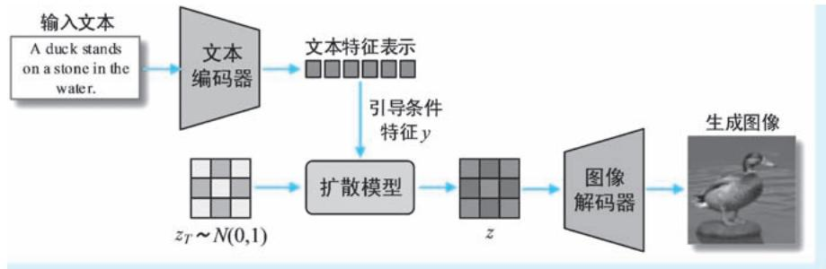  
●图 7-53 LDM 进行文本到图像生成的流程示意

表示具有相同维度的随机张量，该张量即可以视为 “污染到极致”的潜特征表示 $z _ { T }$ ；接下来即进入扩散模型的去噪操作，该操作基于 $z _ { T }$ ，结合文本引导条件特征，一步步获得 $z _ { T }$ 的 “最干净版本” $z$ ；最后，即利用训练好自编码器中的解码器，将潜特征表示 $z$ 恢复到图像空间，这便是最终的图像生成结果。

最后，我们对 LDM 进行简单的总结。LDM 的诞生将图像生成应用推向一个新高度。除了显著提升了传统扩散模型的计算效率之外，LDM 模型还具有两个明显优势：第一，支持高质量的图像生成。LDM 可以生成很高分辨率的图像，其中包含丰富的细节，哪怕是巨幅风景画的生成，LDM 也不在话下。这也是 LDM 最直接的优势。第二，功能十分强大。LDM 能够很好地应用于无条件图像生成、图像修复 （inpainting）和图像超分辨率 （super-resolution） 等各类单模态应用，还能够以文本、图像等多种模态信息作为引导条件，开展文本到图像生成等各类多模态应用。也正是因为 LDM 的强大能力和巨大潜力，在其后诞生了一系列在特征层面开展工作的扩散模型，为 AIGC 领域带来前所未有的繁荣，这一类模型有着一个响当当的名字——— “稳定扩散模型” （Stable Diffusion Models）。现如今，AIGC 领域所有耳熟能详的 AI 绘图系统，清一色都是基于稳定扩散模型打造。

# 参 考 文 献

[1]MORENCY L P，BALTRUSAITIS T. Tutorial on Multimodal Machine Learning [C]. Vancouver：Annual Meeting of the Association for Computational Linguistics，2017.   
[2]NGIAM J，KHOSLA A，KIM M，et al. Multimodal Deep Learning [C]. Bellevue：International Conference on Machine Learning，2011.   
[3]LU J，BATRA D，PARIKH D，et al. ViLBERT：Pretraining Task-Agnostic Visiolinguistic Representations for Vision-and-Language Tasks [OL]. （2019-8-6）[2023-4-25]. https：/ / arxiv. org / abs / 1908. 02265.   
[4] RADFORD A，KIM J W，HALLACY C，et al. Learning Transferable Visual Models From Natural Language Supervision [OL]. （2021-2-26）[2023-4-26]. https：/ / arxiv. org / abs / 2103. 000201.   
[5]RAMESH A，PAVLOV M，GOH G，et al. Zero-Shot Text-to-Image Generation. 2021 [OL]. （2021-2-26） [2023-4-26]. https：/ / arxiv. org / abs / 2102. 12092.   
[6]RAMESH A，DHARIWAL P，NICHOL A，et al. Hierarchical Text-Conditional Image Generation with CLIP Latents [OL]. （2022-4-13）[2023-4-26]. https：/ / arxiv. org / abs / 2204. 06125.   
[7]DICKSTEIN J S，WEISS E A，MAHESWARANATHAN N，et al. Deep Unsupervised Learning using Nonequilibrium Thermodynamics [OL]. （2015-11-18）[2023-4-27]. https：/ / arxiv. org / abs / 1503. 03585.   
[8]HO J，JAIN A，ABBEEL P. Denoising Diffusion Probabilistic Models [OL]. （2020-12-16）[2023-4-27].https： / / arxiv. org / abs / 1503. 03585.  
[9]DHARIWAL P，NICHOL A. Diffusion Models Beat GANs on Image Synthesis [OL]. （2021-6-1）[2023-4-27]. https：/ / arxiv. org / abs / 1503. 03585.   
[10 ] HO J，SALIMANS T. Classifier-Free Diffusion Guidance [C ]. OnLine：Conference on Neural Information Processing Systems 35，2021.   
[11]KIRILLOV A，MINTUN E，RAVI N，et al. Segment Anything [OL]. （2023-4-5）[2023-4-28]. https：/ / arxiv. org / abs / 2304. 02643.   
[12]BALTRUSAITIS B，AHUJA C，MORENCY L. Multimodal Machine Learning：A Survey and Taxonomy [OL].

（2017-8-1）[2023-4-28]. https：/ / arxiv. org / abs / 1705. 09406.  
[13]LIANG PP，ZADEH A，MORENCY LP，et al. Foundations and Trends in Multimodal Machine Learning： Principles，Challenges，and Open Question [OL]. （2023-2-20）[2023-4-28]. https：/ / arxiv. org / abs / 2209. 03430.   
[14]ZELLERS R，BISK Y，FARHADI A，et al. From Recognition to Cognition：Visual Commonsense Reasoning [OL]. （2019-3-26）[2023-4-28]. https：/ / arxiv. org / abs / 1811. 10830.   
[15]XU K，BA J，KIROS R，et al. Show，Attend and Tell：Neural Image Caption Generation with Visual Attention [OL]. （2016-1-26）[2023-4-28]. https：/ / arxiv. org / abs / 1502. 03044.   
[16]YANG Z，HE X，GAO J，et al. Stacked Attention Networks for Image Question Answering [OL]. （2016-1- 26）[2023-5-1]. https：/ / arxiv. org / abs / 1511. 02274.   
[17]ANDERSON P，HE X，BUEHLER C，et al. Bottom-Up and Top-Down Attention for Image Captioning and Visual Question Answering [OL]. （2018-3-14）[2023-5-1]. https：/ / arxiv. org / abs / 1707. 07998.   
[18]XU T，ZHANG P，HUANG Q，et al. Fine-Grained Text to Image Generation with Attentional Generative Adversarial Networks [OL]. （2017-11-28）[2023-5-1]. https：/ / arxiv. org / abs / 1711. 10485.   
[19]GOODFELLOW I J，PougET-ABADIE J，MIRZA M，et al. Generative Adversarial Networks [OL]. （2014-6- 10）[2023-5-1]. https：/ / arxiv. org / abs / 1406. 2661.   
[20]MIRZA M，OSINDERO S. Conditional Generative Adversarial Nets [OL]. （2014-11-6）[2023-5-2]. https：/ / arxiv. org / abs / 1411. 1784.   
[21]LEE K H，CHEN X，HUA G，et al. Stacked Cross Attention for Image-Text Matching [OL]. （2018-7-23） [2023-5-2]. https：/ / arxiv. org / abs / 1803. 08024.   
[22] VINYALS O，TOSHEV A，BENGIO S，et al. Show and Tell：A Neural Image Caption Generator [OL]. （2016-3-19）[2023-5-2]. https：/ / arxiv. org / abs / 1502. 03044.   
[23]TAN H，BANSAL M. LXMERT：Learning Cross-Modality Encoder Representations from Transformers [OL]. （2019-12-3）[2023-5-2]. https：/ / arxiv. org / abs / 1908. 07490.   
[24]LI L H，YATSKAR M，YIN D，et al. VisualBERT：A Simple and Performant Baseline for Vision and Language [OL]. （2019-8-9）[2023-5-2]. https：/ / arxiv. org / abs / 1908. 03557.   
[25]CHEN Y C，LI L，YU L，et al. UNITER：UNiversal Image-TExt Representation Learning [OL]. （2020-7-17） [2023-5-2]. https： / / arxiv. org / abs / 1909. 11740.   
[26]ZHOU L，PALANGI H，ZHANG L，et al. Unified Vision-Language Pre-Training for Image Captioning and VQA [OL]. （2019-12-4）[2023-5-2]. https：/ / arxiv. org / abs / 1909. 11059.   
[27]LI X，LI C，ZHANG P，et al. Oscar：Object-Semantics Aligned Pre-training for Vision-Language Tasks [OL]. （2020-7-26）[2023-5-2]. https：/ / arxiv. org / abs / 2004. 06165.   
[28]KIM W，SON B，KIM I. ViLT：Vision-and-Language Transformer Without Convolution or Region Supervision [OL]. （2021-6-10）[2023-5-3]. https：/ / arxiv. org / abs / 2102. 03334.   
[29]LI J，SELVARAJU R R，GOTMARE A D，et al. Align before Fuse：Vision and Language Representation Learning with Momentum Distillation [OL]. （2021-10-7）[2023-5-3]. https：/ / arxiv. org / abs / 2107. 07651.   
[30]LI J，LI D，XIONG C，et al. BLIP：Bootstrapping Language-Image Pre-training for Unified Vision-Language