#

#

全2册


# 目 录

版权信息

上册

内容提要

版权声明

对本书的赞誉

序

方法不止，智能无疆

唯思想永恒

中文版致谢

前言

资源与服务

第一部分人工智能基础

第1章绪论

1.1什么是人工智能  
1.2人工智能的基础   
1.3人工智能的历史  
1.4目前的先进技术  
1.5人工智能的风险和收益   
小结  
第2章智能体  
2.1智能体和环境   
2.2良好行为：理性的概念  
2.3环境的本质  
2.4智能体的结构   
小结  
第二部分问题求解  
第3章通过搜索进行问题求解  
3.1问题求解智能体  
3.2问题示例  
3.3搜索算法  
3.4无信息搜索策略

3.5有信息（启发式）搜索策略  
3.6 启发式函数

小结

第4章复杂环境中的搜索

4.1局部搜索和最优化问题  
4.2连续空间中的局部搜索  
4.3使用非确定性动作的搜索  
4.4部分可观测环境中的搜索  
4.5在线搜索智能体和未知环境 小结

第5章对抗搜索和博弈

5.1 博弈论  
5.2博弈中的优化决策  
5.3启发式树搜索   
5.4蒙特卡罗树搜索   
5.5随机博弈   
5.6部分可观测博弈  
5.7博弈搜索算法的局限性小结

第6章约束满足问题

6.1定义约束满足问题  
6.2约束传播：CSP中的推断  
6.3 CSP的回溯搜索   
6.4 CSP的局部搜索   
6.5问题的结构

小结

第三部分知识、推理和规划

第7章逻辑智能体

7.1基于知识的智能体  
7.2 wumpus世界  
7.3 逻辑   
7.4命题逻辑：一种非常简单的逻辑  
7.5命题定理证明

7.6 高效命题模型检验  
7.7 基于命题逻辑的智能体小结

第8章 一阶逻辑

8.1 回顾表示  
8.2 一阶逻辑的语法和语义  
8.3 使用一阶逻辑  
8.4 一阶逻辑中的知识工程小结

第9章一阶逻辑中的推断

9.1 命题推断与一阶推断   
9.2 合一与一阶推断  
9.3 前向链接  
9.4 反向链接  
9.5 归结

小结

第10章知识表示

10.1本体论工程  
10.2类别与对象   
10.3 事件  
10.4精神对象和模态逻辑  
10.5类别的推理系统  
10.6用缺省信息推理

小结

第11章自动规划

11.1经典规划的定义  
11.2经典规划的算法  
11.3规划的启发式方法  
11.4 分层规划  
11.5非确定性域的规划和行动  
11.6时间、调度和资源  
11.7规划方法分析小结

第四部分不确定知识和不确定推理

第12章不确定性的量化

12.1 不确定性下的动作  
12.2 基本概率记号  
12.3 使用完全联合分布进行推断  
12.4 独立性  
12.5 贝叶斯法则及其应用  
12.6 朴素贝叶斯模型  
12.7 重游wumpus世界

小结

第13章概率推理

13.1 不确定域的知识表示  
13.2 贝叶斯网络的语义  
13.3 贝叶斯网络中的精确推断  
13.4 贝叶斯网络中的近似推理  
13.5 因果网络小结

第14章时间上的概率推理

14.1 时间与不确定性  
14.2 时序模型中的推断  
14.3 隐马尔可夫模型  
14.4 卡尔曼滤波器  
14.5 动态贝叶斯网络小结

第15章概率编程

15.1 关系概率模型  
15.2 开宇宙概率模型  
15.3 追踪复杂世界  
15.4 作为概率模型的程序小结

第16章做简单决策  
16.1 在不确定性下结合信念与愿望  
16.2 效用理论基础

16.3 效用函数  
16.4 多属性效用函数  
16.5 决策网络  
16.6 信息价值  
16.7 未知偏好

小结

第17章 做复杂决策  
17.1 序贯决策问题  
17.2 MDP的算法  
17.3 老虎机问题  
17.4 部分可观测MDP  
17.5 求解POMDP的算法

小结

第18章 多智能体决策  
18.1 多智能体环境的特性  
18.2 非合作博弈论  
18.3 合作博弈论  
18.4 做集体决策

小结

下册  
第五部分 机器学习  
第19章 样例学习  
19.1 学习的形式  
19.2 监督学习   
19.3 决策树学习   
19.4 模型选择与模型优化  
19.5 学习理论  
19.6 线性回归与分类   
19.7 非参数模型  
19.8 集成学习  
19.9 开发机器学习系统

小结

第20章 概率模型学习

20.1 统计学习   
20.2 完全数据学习  
20.3 隐变量学习：EM算法

小结

第21章 深度学习

21.1 简单前馈网络  
21.2 深度学习的计算图  
21.3 卷积网络  
21.4 学习算法  
21.5 泛化  
21.6 循环神经网络  
21.7 无监督学习与迁移学习  
21.8 应用

小结

第22章 强化学习

22.1 从奖励中学习  
22.2 被动强化学习  
22.3 主动强化学习  
22.4 强化学习中的泛化  
22.5 策略搜索   
22.6 学徒学习与逆强化学习  
22.7 强化学习的应用

小结

第六部分沟通、感知和行动  
第23章 自然语言处理  
23.1 语言模型  
23.2 文法  
23.3 句法分析  
23.4 扩展文法  
23.5 真实自然语言的复杂性  
23.6 自然语言任务

小结

第24章 自然语言处理中的深度学习

24.1 词嵌入  
24.2 自然语言处理中的循环神经网络  
24.3 序列到序列模型  
24.4 Transformer架构  
24.5 预训练和迁移学习   
24.6 最高水平（SOTA）

小结

第25章计算机视觉

25.1 引言  
25.2 图像形成  
25.3 简单图像特征   
25.4 图像分类  
25.5 物体检测   
25.6 三维世界  
25.7 计算机视觉的应用

小结

第26章机器人学

26.1 机器人  
26.2 机器人硬件  
26.3 机器人学解决哪些问题  
26.4 机器人感知  
26.5 规划与控制  
26.6 规划不确定的运动  
26.7 机器人学中的强化学习  
26.8 人类与机器人  
26.9 其他机器人框架  
26.10 应用领域

小结

第七部分总结

第27章人工智能的哲学、伦理和安全性

27.1 人工智能的极限  
27.2 机器能真正地思考吗  
27.3 人工智能的伦理

小结

第28章人工智能的未来

28.1 人工智能组件  
28.2 人工智能架构

附录A 数学背景知识

A.1 复杂性分析和O()记号  
A.2向量，矩阵和线性代数  
A.3概率分布

附录B关于语言与算法的说明

B.1用巴克斯-诺尔范式（BNF）定义语言  
B.2用伪代码描述算法  
B.3在线补充材料

版权信息

书名：人工智能：现代方法·第4版（全2册）

作者：【美国】斯图尔特·罗素【美国】彼得·诺维格

译者：张博雅陈坤

出版社：人民邮电出版社有限公司

出版时间：2022-12-01

ISBN：9787115598103

# 内容提要

本书全面、深入地探讨了人工智能（AI）领域的理论和实践，以统一的风格将当今流行的人工智能思想和术语融合到引起广泛关注的应用中，真正做到理论和实践相结合。全书分7个部分，共28章，理论部分介绍了人工智能研究的主要理论和方法并追溯了两千多年前的相关思想，内容主要包括逻辑、概率和连续数学，感知、推理、学习和行动，公平、信任、社会公益和安全；实践部分完美地践行了“现代”理念，实际应用选择当下热度较高的微电子设备、机器人行星探测器、拥有几十亿用户的在线服务、AlphaZero、人形机器人、自动驾驶、人工智能辅助医疗等。

本书适合作为高等院校人工智能相关专业本科生和研究生的教材，也可以作为相关领域专业人员的参考书。

# 版权声明

Authorized translation from the English language edition, entitled ARTIFICIAL INTELLIGENCE: A MODERN APPROACH, 4th Edition by RUSSELL, STUART; NORVIG, PETER, published by Pearson Education, Inc, Copyright $^ { © }$ 2021, 2010, 2003 by Pearson Education, Inc. or its affiliates.

All rights reserved. No part of this book may be reproduced or transmitted in any form or by any means, electronic or mechanical, including photocopying, recording or by any information storage retrieval system, without permission from Pearson Education, Inc.

CHINESE SIMPLIFIED language edition published by POSTS AND TELECOM PRESS CO., LTD., Copyright $^ { © }$ 2022.

本书中文简体字版由Pearson EducationInc授权人民邮电出版社独家出版。未经出版者书面许可，不得以任何方式复制或抄袭本书内容。

本书封面贴有Pearson Education（培生教育出版集团）激光防伪标签，无标签者不得销售。

献给洛伊、戈登、露西、乔治和艾萨克。— 斯图尔特·罗素

献给克丽丝、伊莎贝拉和朱丽叶。— 彼得·诺维格

# 对本书的赞誉

（按姓氏拼音字母排序）

这是一本关于人工智能的百科全书，堪称人工智能教材的典范。本科时我曾在人工智能课上学过这本书的第3版。很多年过去了，深度学习给世界带来了惊喜，推动了自然语言处理、计算机视觉、机器人学的快速发展，也为社会带来了伦理、公平性和安全性的新挑战。我很欣喜地看到第4版引入了这些领域大量最新研究成果。如果你想了解人工智能的全貌，不要错过这本书。

阿斯顿·张（Aston Zhang）

亚马逊资深科学家

《动手学深度学习》作者、ICLR杰出论文奖

这是人工智能领域世界范围内最经典、最全面、最具影响力的教材，覆盖了人工智能领域所有重要子领域的核心问题、算法思想和现实应用。第4版加入了深度学习、多智能体系统、机器人、人工智能伦理等前沿领域的最新进展和挑战，更适合作为不同层次和领域的研究人员及学生的人工智能入门教材。

安波

新加坡南洋理工大学教授

这本书以智能体为主题思想，在统一的大框架下全面系统地阐述了人工智能的理论方法和技术。本书第4版内容丰富，资料翔实，理论结合实践，延续了作为人工智能领域国际经典教材的风范。同时，第4版也与时俱进，增加了包括深度学习在内的人工智能最新进展的内容，做到了经典与前沿并存，共展人工智能之魅力。

邓志鸿

北京大学智能学院教授

《人工智能：现代方法》是一本经典教材。“现代方法”选择从当下的角度讲述人工智能的故事，而贯穿全书的核心方法论是“智能体”。以计算机为载体的人工智能，揭开了机器智能大幕的一角，制造更复杂的机器，实现更强大的智能，机器智能将为科学研究创造无穷无尽的新对象。在这个意义上，智能是“科学的无尽疆域”，而人工智能这个“现代方法”，正是开疆拓土的动力之源。方法不止，智能无疆，“人工智能：现代方法”这个书名可以永远延续下去。

黄铁军

北京智源人工智能研究院院长

北京大学计算机学院教授

本书是享誉世界的人工智能经典教材，我在读博期间就学习过其第3版，内容全面翔实，介绍深入浅出，既是初学者理想的入门教材，也是人工智能从业者的案头参考书。很高兴这本书的第4版被译介到国内，新版增加了2010年以来深度学习等最新前沿技术动态，新章节的贡献者有朱迪亚·珀尔（JudeaPearl）和伊恩·古德费洛（IanGoodfellow）等知名学者。期待这本新版教材更好地推动我国人工智能的发展。

刘知远

清华大学计算机科学与技术系长聘副教授

这是一本不可多得的全面介绍人工智能基本方法的教科书，自20世纪90年代中期出版以来，至今已经出版了4版，被全球很多大学作为教科书使用。本人曾经组织本组教师和学生翻译过这本书的第2版。本书最大的特点是系统性强，涉及人工智能的方方面面，是学习人工智能、全面了解人工智能的优秀教科书。

马少平

清华大学计算机科学与技术系教授

中国人工智能学会副监事长

中国中文信息学会副理事长

广义上讲，人类所发现的规律、提出的思想、发明的工具，都是人工智能的一部分，最终都是为了认识世界和改造世界。面对复杂的现实世界，人类智者长期苦苦探索，特别是第二次世界大战之后，产生了繁杂的规律、思想、工具。因此，对人类在人工智能方方面面的探索进行有效总结，形成百科全书式的教材，是一项非常必要且具有挑战性的工作。作者不仅需要深厚的学术素养，还需要宽广的学术视野，如果还有一流的文笔，那就更难得了。幸运的是，本书的作者，正是这样的学者。

# 毛先领

北京理工大学副教授

人工智能领域的特点是知识点散、前置知识多、技术迭代快，因此写一本全面深入的人工智能教材是一件很难的事。本书是人工智能领域的经典教材，全方位描述了人工智能的主要分支和技术方向，提供了人工智能领域的全景图。经过20多年的不断优化，目前本书已经是第4版。和第3版相比，本书增加了深度学习、人工智能伦理等近年来的热点研究内容，非常适合对人工智能技术感兴趣的读者阅读。强烈推荐！

# 邱锡鹏

复旦大学计算机科学技术学院教授

本书是在世界范围内广受欢迎的人工智能教材之一，其最鲜明的特点有二：第一，一卷在手，人工智能方方面面的主要知识被系统性地一网打尽，经典知识内容与前沿知识内容取舍剪裁别具匠心，深具章法，驾轻就熟，相得益彰，颇有一种“包藏人工智能宇宙之机，吞吐人工智能天地之志”的架势；第二，文字阐述深入浅出，言简意赅，旁征博引，详略得当，同时适合初学者以及在人工智能领域已有一定经验和造诣者这两大类人群阅读和学习，各取所需，甘之若饴。本书冠以人工智能的“现代方法”，可谓实至名归。特别是在以勃兴于2011年的深度学习模型为基本表征的人工智能走到山重水复、柳暗花明的当前形势下，其中的“现代”二字就显得更为重要。人们正呼唤着下一代人工智能新境界的到来。2022年10月，包括两位图灵奖得主约书亚·本吉奥（YoshuaBengio）和杨立昆（YannLeCun）在内的一批学者撰文提出了“具身图灵测试”的概念，强调机器系统与世界环境的具身交互研究是开拓下一代人工智能创新方法的关键要义，而这一点与本书从“智能体”的视角总揽全篇的前瞻性思路不谋而合。显然，深度学习远不能包打天下，复杂开放环境下智能任务的解决离不开多种理论、方法和技术手段在“具身智能”条件下的兼包并蓄、融会贯通，这就对人工智能研究者在知识结构体系上提出了更高的要求，而本书恰好具备能够满足这种要求缺一不可的广博性和深刻性。

# 孙茂松

清华大学计算机科学与技术系教授

清华大学人工智能研究院常务副院长

欧洲科学院外籍院士

在炒作和质疑声中，人工智能技术不断倔强而真实地成长。可以预见并且逐渐成为现实的是，智能化革命就如同当年的信息化革命一样，会给很多领域和行业带来革命性的变化。人工智能也从一门选修型前沿学科，逐渐演化成一门必修型基础学科。要了解人工智能，一本全面的人工智能教材必不可少，眼前的这本书出自名家，是一本享誉世界的经典教材，翻译质量也非常高。相信这本经典之作能带你踏入人工智能之门。

# 王斌

小米集团技术委员会主席、人工智能实验室主任

本书是人工智能的经典之作，覆盖启发式搜索、知识表示、统计机器学习、强化学习等模型和算法，为读者呈现领域全景图。人工智能涉及的知识门类广，而且各部分相对独立，作者凭借渊博的学识和对学科深入的理解，系统化编排各个知识点，提供了成体系的人工智能学习路径，实在是大师级的作品。更难能可贵的是，本书行文流畅、样例丰富，知识点还附带背景和拓展，作为课内外读物的阅读体验都很棒。

我个人与这本书也有很深的缘分。在学生时代，这是我学习人工智能的教材，带我入门。从教之后，我又以本书为教材讲授人工智能，反复翻看，常读常新。我从学生到老师，整个时间跨度超过十年，而这本书也出了新的版本。希望它可以陪伴更多读者探索人工智能的世界。

魏忠钰

# 复旦大学大数据学院长聘副教授

本书是继“西瓜书”和“花书”之后又一部大师之作。本书简称为AIMA，其历史其实更为久远，几乎可以认为是国际上关于人工智能的标准教材。两位作者斯图尔特·罗素和彼得·诺维格是打通学术和产业“任督二脉”的大师。相比于“花书”的作者，本书的两位作者可以被归类为“传统派”，他们认为机器智能并不一定要学习生物智能，机器可以通过更擅长的计算、更完美的数学模型以及大数据下的去模型化来实现智能。因此，在2009年出版第3版时，彼得·诺维格无法预测到近10年深度学习在诸多领域（特别是他擅长的自然语言处理、机器翻译）的快速进展，而作为强化学习的高手，斯图尔特·罗素也不会预想到深度强化学习在决策应用中的流光溢彩。第4版中融入了两位大师基于人工智能近10年最新进展的深度思考。同时，作者也是人工智能伦理和哲学的思想家，他们在最后一章中回答了人工智能未来走向和关乎人类命运的几乎所有问题。这是一本大部头的书，若能日拱一卒，势必功不唐捐。

吴甘沙

驭势科技董事长/CEO

这本书长期以来都是美国大部分知名大学人工智能课程的教科书，今天也已经被全世界1500多所大学采用为教材，其内容覆盖了到每一版出版时为止世界人工智能的主流技术和方法。说它权威，是因为这本书是几乎所有人工智能从业者的参考书，但凡人们对某些人工智能的概念发生争议时，就会以这本书的讲述为准。

这本书版本更新的过程与人工智能的发展过程是相一致的。通过这本书，读者不仅能够掌握与人工智能相关的理论和技术，还能把握人工智能发展的规律。因此，这是一本适合各类人群的专业好书。

吴军

人工智能专家、畅销书作家

人工智能与计算机技术几乎同时起步，但与计算机技术几乎线性的发展路径不同，人工智能的发展路径经历了几次大的转向，目前越来越依赖于数据科学和高性能计算机器的发展，因而知识和技术覆盖范围非常广泛。作为一本经典教材，本书提纲挈领，像百科全书一样涵盖了人工智能的大部分领域，每章几乎都对应了一个人工智能问题或技术分支，甚至可以单独成为一门课程。本书的特色是不纠缠于技术和工程细节，直击问题的本质和方法的底层逻辑，在帮助读者形成人工智能领域知识的整体大框架的基础上，增强读者对人工智能基础问题和技术方法的理解和进一步学习的能力。

肖睿

北大青鸟研究院院长

课工场创始人

这是一本教材，但不是传统意义上的教材，它用现代思想凸显人工智能及相关工作的发展脉络，用“智能体”贯穿全书知识点的诠释，各章内容自然衔接，易于理解与掌握。

这不仅是一本教材，还是一本“大”百科全书，它全方位探讨了人工智能领域的方方面面，涵盖了从基础知识、模型方法、工具技术、社会伦理到应用专题等各个层面，是一本人工智能的高级工具书。

这是一本面向人工智能大领域的“大”书，作者也是大学者，连译者都是大学者领衔的团队，堪称经典之作，非常值得初学者、从业者、教师及科研工作者等专业人员阅读。

俞勇

上海交通大学特聘教授

上海交通大学ACM班创始人

首批“国家高层次人才特殊支持计划”教学名师

人工智能是一个大领域，该书是一本“大”书，作者是大学者。该书全方位探究了人工智能这一领域，涵盖了从基础知识、模型方法、社会伦理到应用专题等各个层面。正如作者在前言中所提到的，本版中约25%的内容是全新的，剩下的75%也做了大量修改，以呈现出更加完整的人工智能领域图景，且本版中22%的参考文献是2010年以后发布的。此外，作者邀请了9位相关方向最有代表性的学者撰写了部分内容……此外，书中还讨论了人工智能面临的哲学、伦理和安全等社会问题。

书中也蕴含了作者对人工智能的理解和思考，处处闪烁着思想的光辉，耐人回味……我本人在阅读时受到的启发良多，获益颇丰。

张志华

北京大学数学科学学院教授

本书可谓是一流学者撰写一流教材的典范，作者是国际人工智能领域知名专家、ACM/AAAI会士、曾获IJCAI卓越研究奖、AAAI费根鲍姆奖、AAAI/EAAI杰出教育家奖、ACM杰出教育家奖等荣誉，自1995年第1版出版以来，已被全球1500多所大学用作人工智能入门教科书。人民邮电出版社隆重推出第4版中文版，无疑是中文读者的福音。

周志华

南京大学计算机科学与技术系主任兼人工智能学院院长

ACM/AAAI会士

欧洲科学院外籍院士

# 序

斯图尔特·罗素教授和彼得·诺维格博士的《人工智能：现代方法》一书，是美国最为经典、最具权威性的大学教科书。说它经典，是因为这本书长期以来都是美国大部分知名大学人工智能课程的教科书，今天也已经被全世界1500多所大学采用为教材，其内容覆盖了到每一版出版时为止世界人工智能的主流技术和方法。说它权威，是因为这本书是几乎所有人工智能从业者的参考书，但凡人们对某些人工智能的概念发生争议时，就会以这本书的讲述为准。

2002年，我有幸成为诺维格博士的下属，先后在谷歌公司的搜索部门以及研究部门从事与机器学习相关的工作。诺维格博士是作为人工智能专家和科技管理者，被谷歌公司请来负责研发工作的。在我和他共事的十多年里，我们在研究工作中和私底下有很多交流。诺维格博士是一个卓有远见的管理者，也是一名基础极为扎实的技术专家。他并没有因为繁忙的管理工作而放松对新技术的学习和研究。

罗素教授是诺维格博士的同事和朋友，他一直活跃在人工智能学术研究的第一线，并曾经担任加利福尼亚大学伯克利分校计算机系主任。罗素教授的研究横跨人工智能的很多领域，包括机器学习、统计模型、知识表示、实时决策、计算机视觉，以及近年来比较热门的强化学习。

可以讲，这两位作者是近20年来世界人工智能领域最权威的学者，他们每过一段时间都会更新这本已经非常畅销的教科书，将最新的研究成果和理论方法增补进去。而我有幸见证了他们每一次版本升级的过程。

《人工智能：现代方法》的第1版出版于1995年，当时虽然已经有了基于数据的方法，但是从20世纪60年代到20世纪80年代，传统的人工智能方法依然在学术界占主导地位。因此本书第1版的主要内容只包含了这次出版的第4版的第二部分和第三部分，即智能问题的求解和有关知识表示与推理的部分。20世纪90年代其实是人工智能发展的转折点，传统的基于规则和推理的人工智能发展走到了今天，数据驱动的人工智能方法变得越来越重要。因此，在2003年，两位作者更新了这本书，加入了与统计有关的内容，即这次出版的第4版的第四部分和第五部分。在21世纪的前10年，人工智能中的机器学习、自然语言处理和计算机视觉三个领域发展迅猛，因此，几年后，诺维格和罗素决定再次更新升级这本书。在那几年里，诺维格博士和我们这些一线的研究人员有着密切的沟通和讨论，而罗素教授一直在伯克利教学和做科研，因此他们掌握着最新的人工智能发展动态。但是，由于当时他们都在各自的机构担任要职，非常繁忙，写书的事情一拖再拖。最后，诺维格博士为了专心写书，申请了三个月的学术休假，在远离喧嚣的加拉帕戈斯群岛专心写作。两位作者最终在2009年完成了本书的第3版，第3版加入了当时全世界最新的人工智能研究成果，并且构建了这本书今天的结构。

进入21世纪的第二个十年，人工智能的发展进入到一个黄金期。人工智能以大数据、深度学习、增强学习为基础方法，在很多领域取得了重大突破，不仅解决了众多科研问题，还将数据挖掘、计算机视觉、自然语言处理、机器人、机器学习等技术应用到了更广泛的领域。这期间，诺维格博士也不再承担谷歌公司的管理工作，他在大学里潜心教学，和罗素教授一道，把他们在课堂上所讲授的人工智能的前沿知识增加到现在的第4版中，同时他们在全书的第一部分和最后一部分加入了关于对人工智能历史和全貌的详细描述，以及他们对人工智能社会意义的理解。虽然从结构上看，第3版和第4版相差不大，但是第4版增加了大约四分之一的新内容，特别是与深度学习和强化学习有关的内容。同时，他们更新了之前版本中已有章节的部分内容，删除了一些过时的内容（主要是那些曾经使用过的，现在不再重要的人工智能方法和技术）。因此，可以讲目前这本书的第4版几乎涵盖了人工智能从业者需要了解的人工智能领域的所有基本内容。对比第1版，第4版的厚度几乎是它的两倍。

由于这是一本近千页的“巨著”，内容非常多，信息量极大，不同的读者在阅读这本书时可能需要采用不同的方式。第一类读者应该是正在从事人工智能研究的人，包括高校的研究生、教师和公司里的研究人员。我建议这一类读者从头到尾认真阅读每一章，如果有必要，还需要阅读其中一些参考文献，这样才能对人工智能有完整的、深刻的理解。第二类读者是大学的本科生。他们应该在任课老师的指导下系统阅读每一部分中的重点内容。相比较而言，从第四部分开始的内容更新也更重要，需要重点阅读，当然第一部分是对人工智能的全面描述，对每一个人了解这个领域大有裨益。第三类读者是已经对人工智能有了一定了解，在工作中需要用到人工智能技术的人，如公司里的工程师或者做研究的博士生。他们可以把这本书作为参考书阅读，用到哪一部分内容直接阅读即可。这本书的好处是，每一部分，甚至每一章都相对独立，跳过前面的内容不影响阅读后面的内容。当

然，如果还有一些非计算机专业的读者对人工智能感兴趣，重点阅读第一部分和最后一部分就好了。如果这些读者依然有兴趣阅读全书也是没有问题的，因为这本书语言浅显易懂，逻辑性强，并不需要读者具有很强的技术背景，大家只要跟随作者的思路从每一章的开始阅读即可。如果遇到不懂的地方，可以直接跳过去。相比书中的一些公式和算法，更重要的是读懂书中的概念，并且了解每一种方法的来龙去脉。

《人工智能：现代方法》一书版本更新的过程与人工智能的发展过程是相一致的。通过这本书，读者不仅能够掌握与人工智能相关的理论和技术，还能把握人工智能发展的规律。因此，这是一本适合各类人群的专业好书。

吴军

2022年11月于巴尔的摩

# 方法不止，智能无疆

《人工智能：现代方法》是一本经典教材。我和作者斯图尔特·罗素教授相识，和译者团队的张志华教授相熟，特别高兴为最新中文版写几句话。

书名中的“现代方法”，罗素教授的标准解释是“选择从当下的角度讲述人工智能的故事”。从初版到现在的第4版，确实如此。比如，这一版的第五部分“机器学习”就重点介绍了过去十年的热点，特别是深度学习和强化学习，如果再加上第六部分“沟通、感知和行动”中的自然语言处理、计算机视觉和机器人学，这两部分似乎就是“现代”人工智能的全部，为什么还要前面四个部分呢？

要回答这个问题，需要对“现代方法”做另一个层次的解读，这关乎人工智能这门学科的性质。

我认为，人工智能首先是一门技术，和计算机、互联网等技术类似，不同于物理学和生命科学那样的科学。科学是寻求事物和现象背后的规律，例如揭示宇宙奥秘的万有引力定律、相对论和量子力学，揭示生命奥秘的进化论和基因。技术是创造新事物和新现象，例如以指南针为代表的中国四大发明，以飞机和计算机为代表的现代技术。

技术发明和科学发现是两种独立的原始创新活动，把科学视为技术的基础，这是偏见。有些技术确实是基于既有科学原理，例如原子弹是核物理发展到一定阶段的产物，但原理只提供了可能性，没有链式反应和内爆技术等一系列技术发明，原子弹不会成为必然。有些技术并不基于科学原理，例如计算机的基础是图灵可计算理论，这是“人工”理论。更多技术在发明时并不明白背后的原理，例如指南针发明时并无电磁学，飞机发明时并无空气动力学。人工智能也一样，深度学习成功应用后，可解释性成为热点，至今理论还在探索中。如果没有深度学习的发明和实践，可解释性理论又从何而来呢？

人工智能研究是应该寻求理论基础，还是应该探索实现更强智能的新方法？两者都该做，但后者是主旋律：先有方法和实现，后有理论解释，先有智能技术，后有智能科学，如此迭代发展。智能技术无止境，智能科学也无止境，可以有解释现有人工智能的专门理论，没有指导未来人工智能的通用理论。

经典人工智能时代，我国的最大贡献是机器定理证明的“吴方法”。吴方法提出前一年，吴文俊院士曾撰文指出：“西方数学史家往往以希腊式的严密推理相标榜，并以中国数学从来没有达到演绎科学的形式相指责。然而,我们已经看到, 在微积分的发明上希腊形式的那种脆弱性以及与之相较中国式数学的生命力。”后来，他更明确地指出：“它（中国数学）重视计算，是计算性，构造性，也是算法性的。大部分的重要结果都以‘术’的形式表示，而‘术’通常相当于现代的算法。”算法不是数学推理，而是人构造问题解决方案，就是方法。

从探索实现智能的方法论角度看这本书，就容易看出“大而有序”：第二部分“问题求解”是人在设计搜索、博弈和约束满足问题的解决方案；第三部分“知识、推理和规划”是人定义逻辑推理、人整理知识以及人设计的“自动规划”；第四部分“不确定知识和不确定推理”引入了不确定性和概率方法，以实现更强智能，但所有智能仍然是人设计决定的；第五部分“机器学习”，人类后退一步，只设计学习方法，让机器自己“学习”，特别是强化学习，只定义基本规则，智能主要来自与环境的交互，智能实现重大跃升。然而，深度学习和强化学习虽然更强大，但学到的知识是隐式的，获得的智能不可解释，要打开机器学习的“黑盒”，还需要前四部分的传统方法，当然也可能需要探索全新方法。就此而言，没有比“现代方法”更好的词来概括这本书了。

贯穿全书的核心方法论是“智能体”。罗素教授把人工智能定义为“对从环境中接受感知并执行行动的智能体的研究”。这个概念稍加扩展，就既能概括以机器为载体的人工智能，也能概括以有机体为载体的生物智能— 生物就是感知环境并适应环境的有机智能体。更一般地，我认为“智能是系统通过获取和加工信息而获得的一种能力，从而实现从简单到复杂的演化”，这当然也同时涵盖了生物智能和机器智能。

在自然界已知的事物和现象中，人和人脑是最复杂的系统，人类智能是最复杂的现象，因此，脑科学被视为 自然科学的最后疆域 。然而，没有理由相信，人类是生物进化的最后阶段，人类智能是最高水平的智能，有机体是智能的唯一载体。以计算机为载体的人工智能，揭开了机器智能大幕的一角，制造更复杂的机器，实现更强大的智能，机器智能将为科学研究创造无穷无尽的新对象。在这个意义上，智能是“科学的无尽疆域”，而人工智能这个“现代方法”，正是开疆拓土的动力之源。

方法不止，智能无疆，“人工智能：现代方法”这个书名可以永远延续下去。

黄铁军

2022年10月15日

# 唯思想永恒

深度学习是机器学习最前沿的领域，它促进了人工智能技术产生了革命性进展，特别是给计算机视觉、语音识别、自然语言处理、棋牌游戏以及某些科学领域带来了颠覆性的突破。深度学习同时驱动了新的机器学习范式产生，比如生成对抗学习、元学习等；并使强化学习和因果学习得以“复兴”，展示更为强大的潜力。斯图尔特·罗素（StuartRussell）和彼得·诺维格（PeterNorvig）两位教授的这本书在这一背景下于2021年年初出版正应其时。

人工智能是一个大领域，该书是一本“大”书，作者是大学者。该书全方位探究了人工智能这一领域，涵盖了从基础知识、模型方法、社会伦理到应用专题等各个层面。正如作者在前言中所提到的，本版中约25%的内容是全新的，剩下的75%也做了大量修改，以呈现出更加完整的人工智能领域图景，且本版中22%的参考文献是2010年以后发布的。此外，作者邀请了9位相关方向最有代表性的学者撰写了部分内容。本书主要包括5方面的内容：问题求解的搜索方法，基于知识的推理和规划方法（逻辑和知识表示），知识和推理中的不确定性（概率推理、概率编程和多智能体决策），机器学习（概率方法、深度学习和强化学习），应用专题（自然语言处理、计算机视觉和机器人学）。此外，书中还讨论了人工智能面临的哲学、伦理和安全等社会问题。书中也蕴含了作者对人工智能的理解和思考，处处闪烁着思想的光辉，耐人回味。比如，本版的封面展示了人工智能各个发展阶段的部分重要事件和人物，体现了作者的别具匠心。第1章关于人工智能的思想、历史发展等的论述深刻、透彻和精辟。第28章讨论某些具有前瞻性的想法和方向。我本人在阅读时受到的启发良多，获益颇丰。

“南朝四百八十寺，多少楼台烟雨中。”人工智能试图模拟人类的行为和思维，是一个最富有期待和遐想的学科，其发展波澜壮阔、起伏跌宕。她经历了热情高涨和期望无限的早期（1952—1969），通用搜索机制局限所导致的回落期（1966—1973），以专家系统为代表的基于规则学习的崛起期（1969—1986），神经网络联结主义的回归期（1986—1995），统计机器学习的复兴期（1995—现


在），以及大数据驱动的深度学习的突破期（2006—现在）。 $\longrightarrow$ 人工智能从哲学、数学、经济学、神经科学、心理学、计算机科学、控制科学、语言学等诸多学科中汲取思想、观点和技术，滋养并发展自身。机器学习试图从数据或经验中学习进而提升机器的能力或性能，这不同于人工智能，但她是目前趋向人工智能的一个最重要或有效的途径。

人工智能是思想发轫、观点争鸣、技术创新的汇集地，是学术英雄辈出的荟萃地。人工智能的发展历程告诉我们：发展人工智能技术需要高度的想象力、创造力和执行力，需要务实、理性、严谨的求是态度。人工智能未来仍会经历波折，各种潮流、观点也会纷争喧嚣，但沉淀下来的是隽永的思想。

我非常感谢人民邮电出版社杨海玲编辑的信任，邀请我的学生来承担该书的中文翻译。译稿的初稿是由我的博士生张博雅、陈坤，已毕业的硕士田超、吴凡和赵申剑，以及博士后顾卓尔完成的。博雅和陈坤对全书译稿进行了统一审校，我的其他在读博士生也参与了相关章节的审校。他们的背景分别是统计学、数据科学和计算机科学，这有益于他们合作翻译该书。然而他们在人工智能领域仍都是新人，知识结构还不全面，但是他们勤于学习、执行力极强、工作专注。在半年左右的时间内完成了译著的初稿，之后又经过自校对、交叉校对等环节力图使译著保持正确性和一致性。我为他们的责任心和独立工作能力感到自豪。

由于我们深感自己的中英文能力都有限，译文还是比较生涩，难免出现不当之处，而且我们特别担心未能完整地传达出原作者的真实思想和观点。因此，我们强烈地建议有条件的读者去阅读英文原著，也非常期待大家继续指正译著，以便今后进一步修订完善。我恳请读者多给予译者以鼓励。请把你们的批评留给我，这是我作为他们的导师必须要承担的。

最后，我希望我的学生们能享受其翻译过程，翻译和阅读这么一部大书得以领略艾伦·图灵、冯·诺依曼、诺伯特·维纳、理查德·贝尔曼、库尔特·哥德尔、约翰·麦卡锡、马文·明斯基、唐纳德·米奇、爱德华·费根鲍姆、艾伦·纽厄尔、赫伯特·西蒙等在人工智能领域中的工作，感悟他们的思想、领略他们的智慧，何其美哉！我们当谦卑再谦卑，勤奋更勤奋。是以代写此序为勉！

张志华

2022年9月12日

# 中文版致谢

首先，我们要感谢原作者在本书翻译时给予我们的帮助，感谢人民邮电出版社对我们的信任和支持。

这是一本“大”书，涵盖了人工智能的广泛领域。我们几位译者来自不同专业，能力有限且工作量巨大。在翻译过程中，许多老师和同学给予我们很大的帮助。在此我们一一列出，以表示我们衷心的感谢！

特别感谢韩燮教授审校了全书的第三部分（即第7章～第11章）。赵融和郭新东同学审校了第26章。

我们实验室的其他同学帮助我们进行了校对：陈雨静（第1章和第2章），崔圣宇（第3章部分），罗维俭（第3章部分和第4章），彭洋（第5章和第6章），韩雨泽（第12章），张宇航（第13章），梁家栋（第14章），谢广增（第15章），王迩东（第16章），李翔（第17章），金昊（第18章），谢楚焓（第20章），林大超（第21章），杨文昊（第22章），程昊（第23章和第24章），胡一征（第25章），林诗韵、赵悦楷和张良宇（第27章和第28章）。我们还要感谢邓辉、李威、秦钢、王晓雷、魏太云、肖睿、姚远和张淞等专家进行了专业性审读。

他们对译文中的专业术语、中文语句、算法、公式以及原文中可能存在的问题等提出了很多宝贵的修改意见，增强了译文的准确性和可读性。当然，现在的译文仍存在一些没有及时发现的问题，因此修订工作仍将继续。我们恳请读者能提供反馈，以便我们在后续版本中修正问题。

此外，我们还要感谢刘艳云老师，感谢她帮助我们与出版社沟通交流，处理相关事务。

最后，感谢我们的导师张志华教授，感谢老师在翻译过程中的指导和对译文的审校。

张博雅（北京大学前沿交叉学科研究院）

陈坤（北京大学数学科学学院）

2022年9月15日

# 前言

人工智能 （artificialintelligence，AI）是一个大领域，本书也是一本“大”书。我们试图全方位探索这一领域。书中内容涵盖逻辑、概率和连续数学，感知、推理、学习和行动，以及公平、信任、社会公益和安全，应用范围从微电子设备到机器人行星探测器，再到拥有几十亿用户的在线服务。

本书的副书名是“现代方法”。这意味着我们选择从当下的角度讲述人工智能的故事。我们使用当今流行的思想和术语重新构建早期的工作，将现有已知的内容融合到统一的框架中。对那些因为研究领域不是本书所及而没有受到本书重视的人，我们深表歉意。

第4版新变化

第4版反映了自2010年第3版面世以来人工智能领域发生的下列变化。

●由于数据、计算资源和新算法的可用性增强，我们更关注机器学习而不是人工设计的知识工程。

●我们增加了专门的章节介绍深度学习、概率编程和多智能体系统的相关内容。

● 我们修订了自然语言理解、机器人学和计算机视觉的内容，以反映深度学习的影响。

●我们在第26章“机器人学”中包括了与人类互动的机器人以及强化学习在机器人学中的应用。

●之前，我们将人工智能的目的定义为创建一些试图最大化期望效用的系统，其中具体效用信息目标——由系统的人类设计师提供。现在我们不再假设目标是固定的，也不再假设人工智能系统知道目标，相反，人工智能系统可能不确定人类的真正目标。它必须学习到要最大化的内容，必须在不确定目标的情况下也能适当地发挥作用。

●我们增加了人工智能对社会影响的相关内容，包括道德、公平、信任和安全等重要问题。

●我们把习题从每章末尾移到了网站。这让我们能够不断添加、更新和改进习题，以满足教师的需求并反映这一领域和人工智能相关软件工具的进展。

●书中约25%的内容是全新的，剩下的75%也做了大量修改，以呈现出更加统一的人工智能领域图景。本版中22%的参考文献是2010年以后发布的。

本书概述

智能体 （intelligentagent）的概念是贯穿整本书的主题思想。我们将人工智能定义为对从环境中接收感知并执行动作的智能体的研究。每个这样的智能体都要实现一个将感知序列映射为动作的函数，我们介绍了表示这些函数的不同方法，如反应型智能体、实时规划器、决策论系统和深度学习系统。我们强调，学习既是构造良好系统的方法，也是将设计者的影响范围扩展到未知环境的方法。我们没有把机器人学和视觉看作独立定义的问题，而是将其看作实现目标的服务。我们强调任务环境在确定合适的智能体设计中的重要性。

我们的主要目标是传达在过去70多年的人工智能研究和过去2000多年的相关工作中涌现出来的思想。在表达这些思想时，我们在保持准确性的前提下尽量避免过于拘泥于形式。书中提供了数学公式和伪代码算法，让关键思想具体化；附录A中给出了数学概念和符号，附录B中给出了伪代码。

本书主要用作本科人工智能课程或课程序列的教科书。全书共28章，每章大约需要一周的课时，因此完成整本书的教学需要两个学期。如果课程只有一个学期，可以按教师和学生的兴趣选择部分章节进行教学。本书也可用于研究生课程（可能需要增加参考文献中建议的一些主要资料），或者用于自学或作为参考书。

在本书中，定义了新术语 的地方都会以灰色粗体显示，术语的后续重要用法也以黑色粗体显示。

阅读本书唯一的先修要求是对计算机科学基本概念（算法、数据结构、复杂性）的熟悉程度达到大学二年级的水平。大学一年级的微积分和线性代数知识对一些主题的阅读很有帮助。

# 在线资源

在线资源可通过培生教育集团的官方网站或本书的配套网站获得。本书的配套网站上有以下内容。

●习题、编程项目和研究项目。这些不再放在每章末尾，只在网站提供。在本书中，我们将使用“习题6.NARY”之类的名称引用在线习题。网站的说明允许读者按名称或主题查找习题。  
● 使用Python、Java和其他编程语言实现的本书中的算法（目前托管在GitHub上）。  
●1500多所使用过本书的学校名单，其中许多都附有在线课程材料和教学大纲的链接。  
●供学生和教师使用的补充材料及其链接。  
●书中可能存在的错误以及关于如何报告书中错误的说明。

# 图书封面

封面描绘了加里·卡斯帕罗夫（Garry Kasparov）与IBM的“深蓝”（Deep Blue）计算机在1997年国际象棋对抗赛中第六盘决胜局的最终局面。在这场比赛中，“深蓝”击败了卡斯帕罗夫（执黑棋），这是计算机首次在国际象棋比赛中战胜人类世界冠军。卡斯帕罗夫位于封面顶部，他的右边是前世界冠军李世石和DeepMind的A lphaG o进行历史性围棋比赛的第二局的关键局面。A lphaG o 的第37手违背了几个世纪以来的围棋正统观念，人类专家认为这是一个令人尴尬的错误，但结果证明这一走法是正确的。封面上，左上角是由波士顿动力公司制造的Atlas人形机器人，埃达·洛芙莱斯（AdaLovelace，世界上第一位计算机程序员）和艾伦·图灵（Alan Turing，他的基础工作定义了人工智能）之间的是自动驾驶汽车感知环境的画面，棋盘底部是火星探测漫游者机器人和逻辑学研究先驱亚里士多德的雕像，英文书名背后是亚里士多德的《论动物的运动》（DeMotu Animalium ）中的规划算法，棋盘面上的文字是联合国全面禁止核试验条约组织（UN ComprehensiveNuclear-Test-Ban Treaty Organization）使用的用于从地震信号中检测核爆炸的概率编程模型。

# 致谢

制作一本书需要无数人的帮助。600多人阅读了本书的部分内容，并提出了改进意见。我们感谢他们所有人。在这里，我们只列出几位特别重要的贡献者。首先是撰稿人：

● 朱迪亚·珀尔（Judea Pearl）（13.5节）；  
● 维卡什·曼辛卡（Vikash Mansinghka）（15.4节）；  
● 迈克尔·伍尔德里奇（Michael Wooldridge）（第18章）；  
● 伊恩·古德费洛（Ian Goodfellow）（第21章）；  
● 雅各布·德夫林（Jacob Devlin）和张明伟（Ming-Wei Chang）（第24章）；  
● 吉滕德拉·马利克（Jitendra Malik）和戴维·福赛思（David Forsyth）（第25章）；  
● 安卡·德拉甘（Anca Dragan）（第26章）。

然后是本书出版过程中的关键角色：

● 辛西娅·杨（Cynthia Yeung）和玛莉卡·坎托（Malika Cantor）（项目管理）；  
●朱莉·萨斯曼（JulieSussman）和汤姆·加洛韦（TomGalloway）（文字加工和写作建议）；  
● 奥马里·斯蒂芬斯（Omari Stephens）（插图）；  
● 特蕾西·约翰逊（Tracy Johnson）（编辑）；  
●埃琳·奥尔特（Erin Ault）和罗丝·克南（RoseKernan）（封面设计和颜色转换）；

● 纳林·奇伯（Nalin Chhibber）、萨姆·戈托（Sam Goto）、雷蒙·拉卡兹（Raymond de Lacaze）拉维·莫汉（Ravi Mohan）、夏兰·奥赖利（Ciaran O ’ Reilly）、阿米特·帕特尔（Amit Patel）、德拉戈米尔·拉迪夫（Dragomir Radiv）和萨马格拉·夏尔马（Samagra Sharma）（在线代码开发和指导）；

● Google Summer of Code students（在线代码开发）。

斯图尔特想要感谢 他的妻子洛伊·谢弗洛特（Loy Sheflott），感谢她无尽的耐心和无限的智慧。他希望戈登（Gordon）、露西（Lucy）、乔治（George）和艾萨克（Isaac）能很快读到本书，并原谅他在本书上花了这么长时间。感谢RUGS（Russell’s Unusual Group of Students）一如既往地提供了非同寻常的帮助。

彼得想要感谢 他的父母托尔斯滕（Torsten）和格尔达（Gerda）让他迈出第一步，感谢他的妻子克丽丝（Kris）、孩子伊莎贝拉（Isabella）和朱丽叶（Juliet）、同事、老板以及朋友在他漫长的写作和修改过程中鼓励和包容他。

# 资源与服务

本书由异步社区出品，社区（https://www.epubit.com/）为您提供相关资源和后续服务。


您还可以扫码右侧二维码，关注【异步社区】微信公众号，回复“e59810”直接获取，同时可以获得异步社区15天VIP会员卡，近千本电子书免费畅读。

配套资源

本书提供全书彩图、伪代码、各章的参考文献与历史注释及完整的参考文献。您可以扫描下方二维码，发送“59810”，添加异步助手，获取本书配套资源。


提交勘误

作者和编辑尽最大努力来确保书中内容的准确性，但难免会存在疏漏。欢迎您将发现的问题反馈给我们，帮助我们提升图书的质量。

当您发现错误时，请登录异步社区，按书名搜索，进入本书页面，单击“提交勘误”，输入勘误信息，单击“提交”按钮即可。本书的作者和编辑会对您提交的勘误进行审核，确认并接受后，您将获赠异步社区的积分。积分可用于在异步社区兑换优惠券、样书或奖品。

扫码关注本书

扫描下方二维码，您将会在异步社区微信服务号中看到本书信息及相关的服务提示。

  
与我们联系

我们的联系邮箱是contact@epubit.com.cn。

如果您对本书有任何疑问或建议，请您发邮件给我们，并请在邮件标题中注明本书书名，以便我们更高效地做出反馈。

如果您有兴趣出版图书、录制教学视频或者参与技术审校等工作，可以通过邮件与本书责任编辑联系（yanghailing@ptpress.com.cn）。

如果您来自学校、培训机构或企业，想批量购买本书或异步社区出版的其他图书，也可以发邮件给我们。

如果您在网上发现有针对异步社区出品图书的各种形式的盗版行为，包括对图书全部或部分内容的非授权传播，请您将怀疑有侵权行为的链接通过邮件发给我们。您的这一举动是对作者权益的保护，也是我们持续为您提供有价值的内容的动力之源。

关于异步社区和异步图书

“异步社区”是人民邮电出版社旗下IT专业图书社区，致力于出版精品IT图书和相关学习产品，为作译者提供优质出版服务。异步社区创办于2015年8月，提供大量精品IT图书和电子书，以及高品质技术文章和视频课程。更多详情请访问异步社区官网https://www.epubit.com。

“异步图书”是由异步社区编辑团队策划出版的精品IT专业图书的品牌，依托于人民邮电出版社的计算机图书出版积累和专业编辑团队，相关图书在封面上印有异步图书的LOGO。异步图书的出版领域包括软件开发、大数据、AI、测试、前端、网络技术等。


异步社区


微信服务号

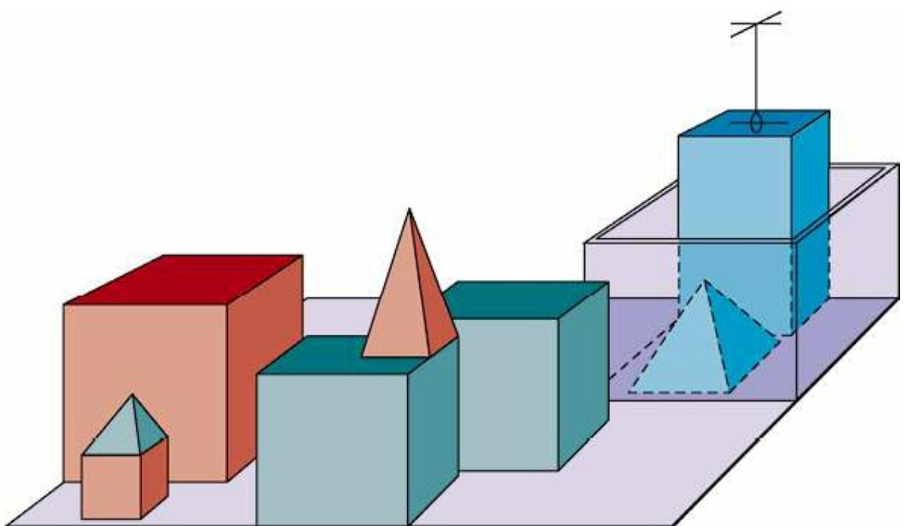  
图1-3积木世界的场景。Shrdlu（Winograd, 1972）刚刚完成了一个命令——“找到一块比你所持有的积木块更高的积木块，并把它放进盒子里”

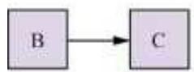  
（a）原子表示

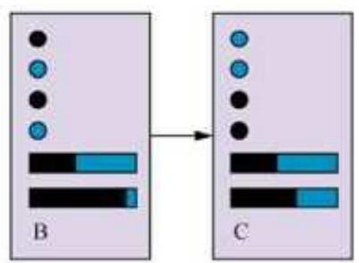  
（b）因子化表示

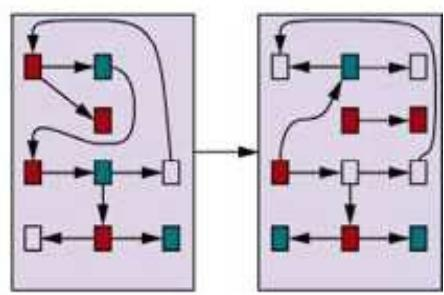  
（c）结构化表示

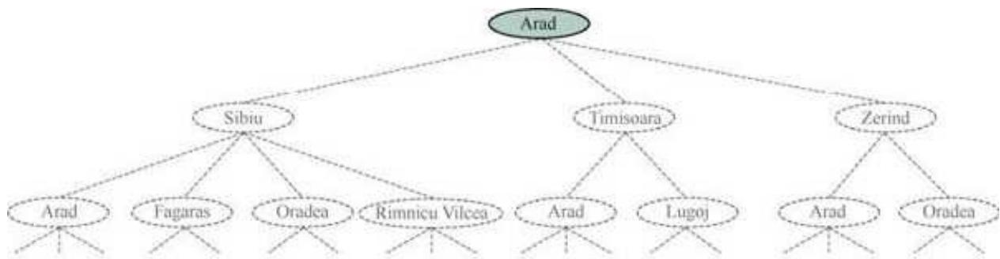  
图2-16表示状态及其之间转移的3种方法：（a）原子表示一个状态（如B或C）是没有内部结构的黑盒；（b）因子化表示状态由属性值向量组成，值可以是布尔值、实值或一组固定符号中的一个；（c）结构化表示状态包括对象，每个对象可能有自己的属性以及与其他对象的关系  
图3-43棵部分搜索树，用于寻找从Arad到Bucharest的路线。已扩展节点用淡紫色和粗体字母表示；边界上已生成但未被扩展的节点用绿色表示；对应于这两种类型节点的状态集被称为已达。接下来可能生成的节点用虚线表示。注意，在最下面的树中，有一个从Arad到Sibiu再到Arad的环，这不可能是最优路径，因此搜索不应该从那里继续

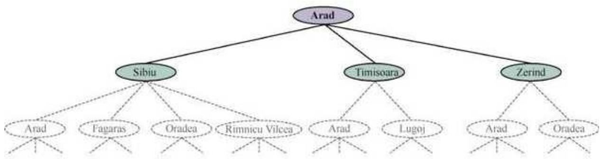

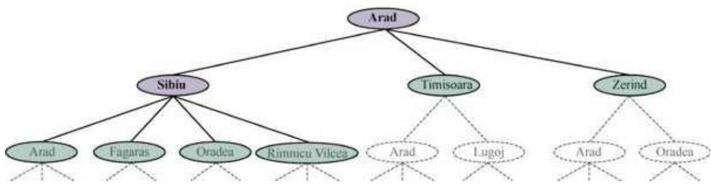  
图3-43棵部分搜索树，用于寻找从Arad到Bucharest的路线。已扩展节点用淡紫色和粗体字母表示；边界上已生成但未被扩展的节点用绿色表示；对应于这两种类型节点的状态集被称为已达。接

下来可能生成的节点用虚线表示。注意，在最下面的树中，有一个从Arad到Sibiu再到Arad的环，这不可能是最优路径，因此搜索不应该从那里继续（续）

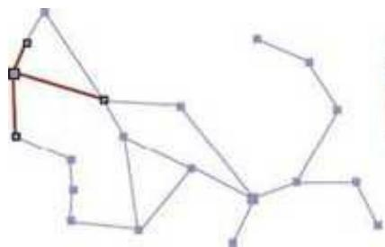

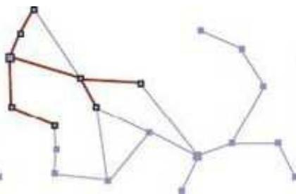

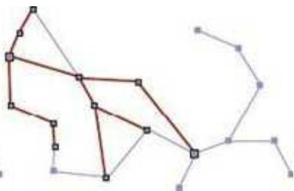  
图3-5由图3-1中的罗马尼亚问题的图搜索生成的搜索树序列。在每一阶段，我们扩展边界上的每个节点，使用所有不指向已达状态的可用动作延伸每条路径。需要注意的是，在第三阶段，最高位置的城市（Oradea）有两个后继城市，这两个城市都已经有其他路径到达，所以没有路径可以从Oradea延伸

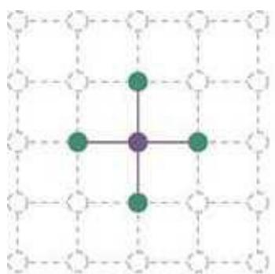

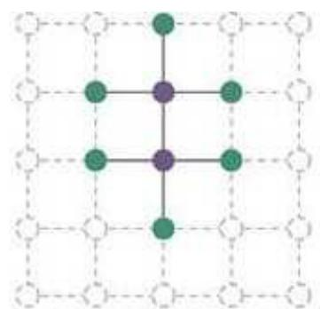


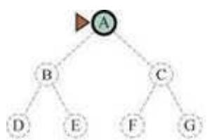  
图3-6以矩形网格问题为例说明图搜索的分离性质。边界（绿色）分离了内部（淡紫色）和外部（虚线）。边界是已达但尚未扩展的节点（及相应的状态）的集合；内部是已被扩展的节点（及相应的状态）的集合；外部是尚未到达的状态的集合。在（a）中，只有根节点被扩展。在（b）中，上面的边界节点被扩展。在（c）中，按顺时针顺序扩展根节点的其他后继节点

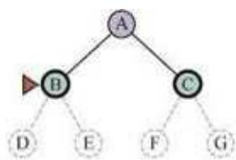

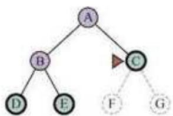

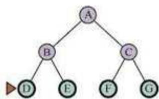  
图3-8简单二叉树上的广度优先搜索。每个阶段接下来要扩展的节点用三角形标记表示

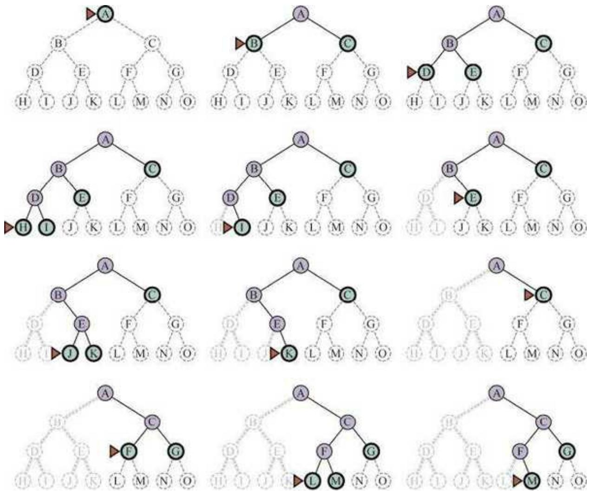

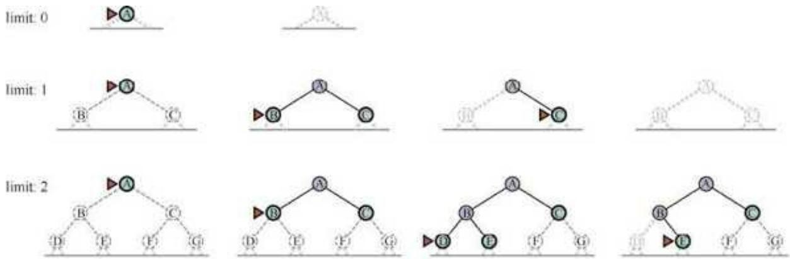  
图3-11二叉树的深度优先搜索过程中，从开始状态A到目标M，共12步（从左到右，从上到下）。边界节点为绿色，用三角形表示下一步要扩展的节点。已扩展的节点为淡紫色，潜在的未来节点用模糊的虚线表示。边界中没有后继的已扩展节点（用非常模糊的线表示）可以丢弃  
图3-13二叉树上的迭代加深搜索的4次迭代（目标为M），深度界限从0到3。注意，内部节点形成了一条路径。三角形标记下一步要扩展的节点，边界为加粗轮廓的绿色节点，非常模糊的节点可被证明不可能是这种深度界限下的解的一部分

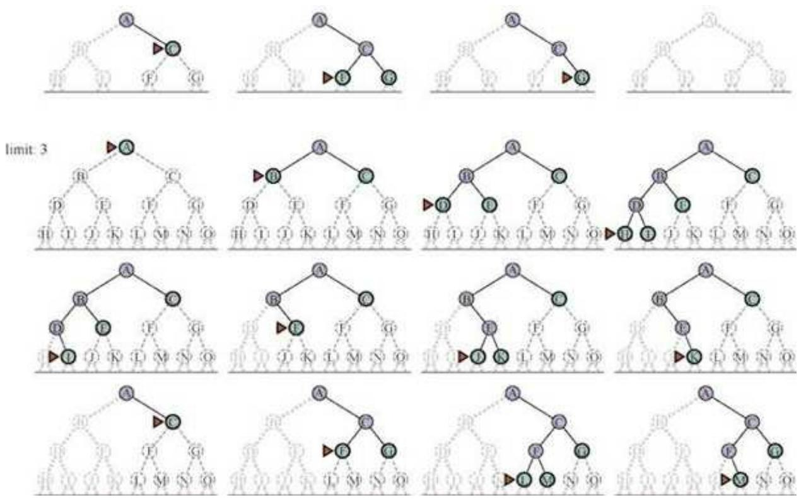  
图3-13二叉树上的迭代加深搜索的4次迭代（目标为M），深度界限从0到3。注意，内部节点形成了一条路径。三角形标记下一步要扩展的节点，边界为加粗轮廓的绿色节点，非常模糊的节点可被证明不可能是这种深度界限下的解的一部分（续）

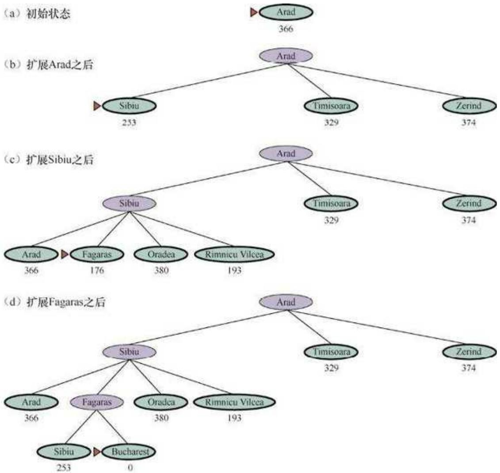  
图3-17 基于直线距离启发式函数 $h _ { \mathrm { { \scriptsize ~ S L D } } }$ 的贪心最佳优先树状搜索的各个阶段（目标为Bucharest）。节点上标有 $h$ 值

  
（a）初始状态  
（b）扩展Arad之后

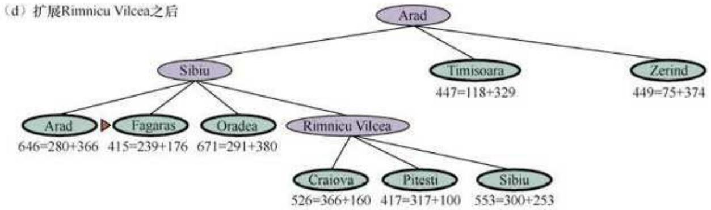


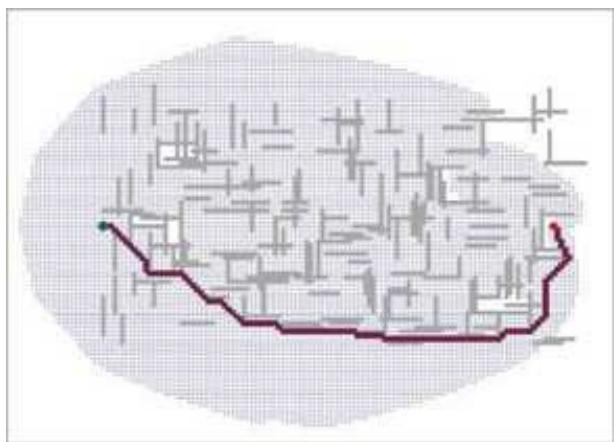  
图3-18 A * 搜索的各个阶段（目标为Bucharest）。节点上标有 ， $h$ 值为图3-16中得到的到Bucharest的直线距离

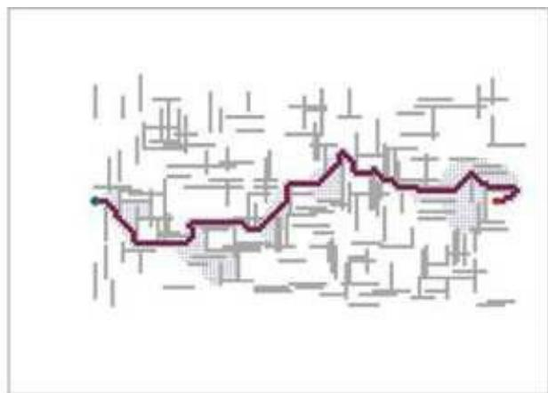

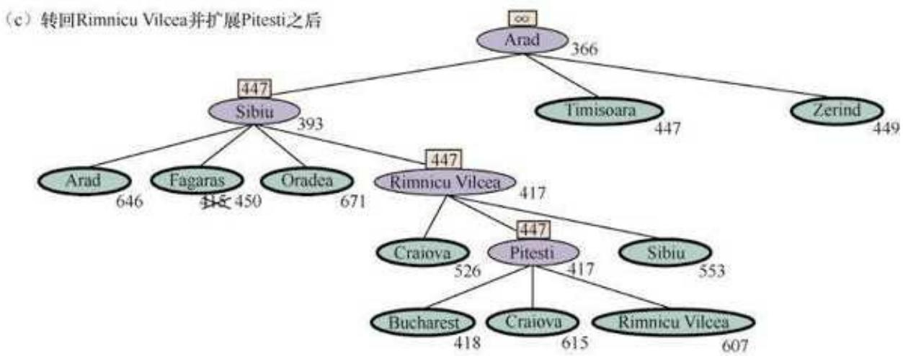  
图3-21同一网格上的两种搜索：（a）A * 搜索，（b）加权A * 搜索，权重 $W = 2$ 。灰色线条表示障碍，紫色线是一条从绿色起始点到红色目标点的路径，较小的点是每次搜索到达的状态。在这个特定问题上，加权A * 搜索探索的状态数不到A*搜索探索的状态数的七分之一，找到的路径的代价只比最优代价大了 $5 \%$   
图3-23使用RBFS搜索到Bucharest的最短路线的各个阶段。每次递归调用的f_ limit值标注在每个当前节点的上方，每个节点上都标有它的 f代价。（a）沿着经过Rimnicu Vilcea的路径前进，直到当前最优叶节点（Pitesti）的值比最优备选路径（Fagaras）差。（b）递归回溯，被遗忘子树的最优叶节点值（417）被备份到Rimnicu Vilcea；接着扩展Fagaras，得到最优叶节点值450。（c）递归回溯，被遗忘子树的最优叶节点值（450）被备份到Fagaras；然后扩展Rimnicu Vilcea。这一次，因为最优备选路径（经由Timisoara）的代价至少为447，所以继续扩展Bucharest

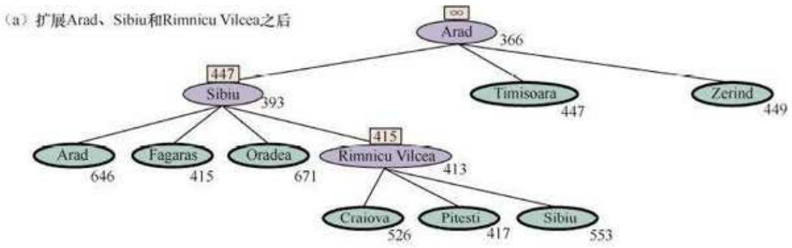

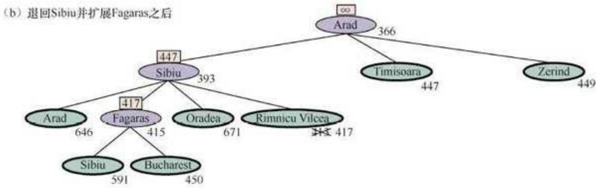

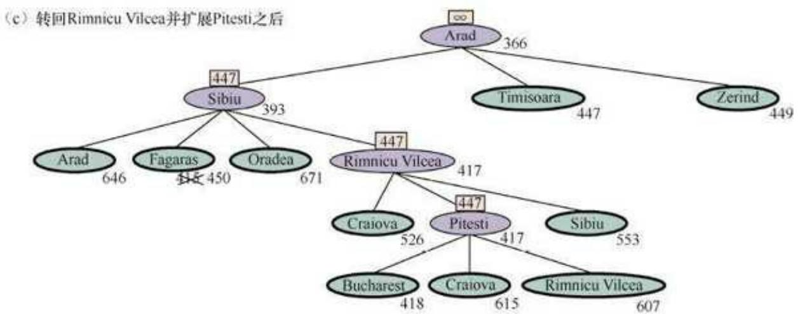  
图3-23使用RBFS搜索到Bucharest的最短路线的各个阶段。每次递归调用的 f_ limit值标注在每个当前节点的上方，每个节点上都标有它的 $f$ 代价。（a）沿着经过Rimnicu Vilcea的路径前进，直到当前最优叶节点（Pitesti）的值比最优备选路径（Fagaras）差。（b）递归回溯，被遗忘子树的最优叶节点值（417）被备份到Rimnicu Vilcea；接着扩展Fagaras，得到最优叶节点值450。（c）递归回溯，被遗忘子树的最优叶节点值（450）被备份到Fagaras；然后扩展Rimnicu Vilcea。这一次，因为最优备选路径（经由Timisoara）的代价至少为447，所以继续扩展Bucharest（续）

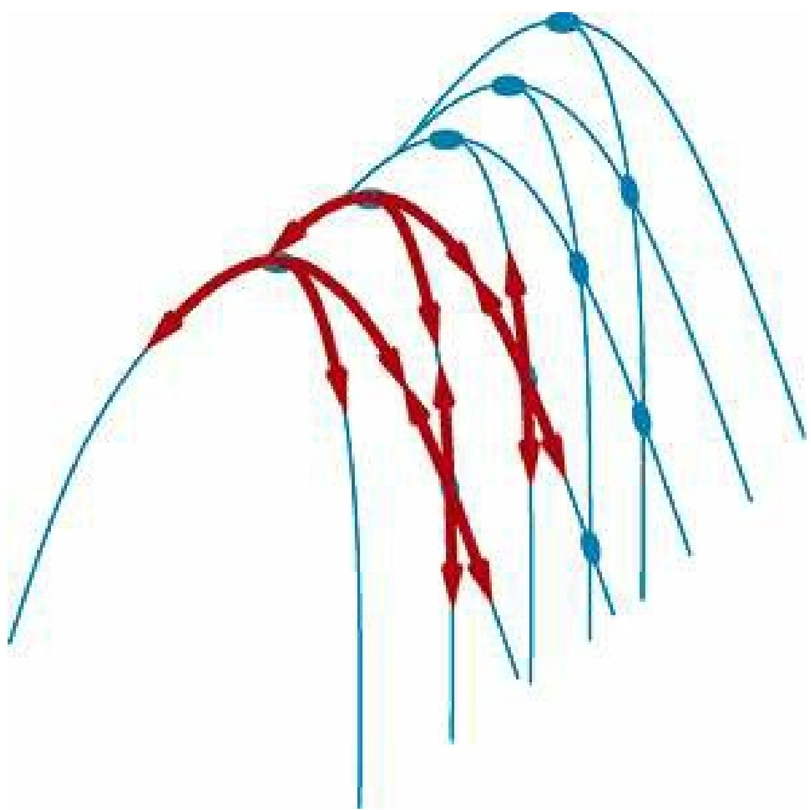

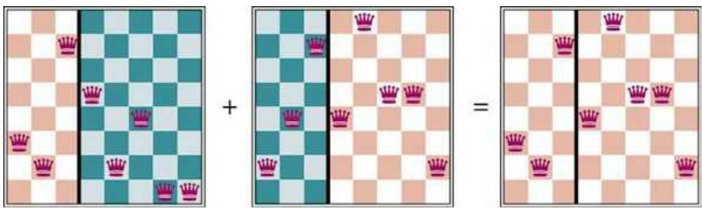  
图4-4 岭为爬山法带来困难的示意图。状态网格（蓝色圆点）叠加在从左到右上升的岭上，形成了一个彼此不直接相连的局部极大值序列。从每个局部极大值出发，所有可选动作都指向下坡。这样的拓扑在低维状态空间中很常见，例如二维平面中的点。但是在具有成百上千个维度的状态空间中，这种直观图并不成立，而且通常至少存在几个维度使得算法有可能漏掉岭和平台区  
图4-7 对应于图4-6c中前两个亲本和图4-6d中第一个后代的8皇后状态。在杂交步中，丢弃绿色列，保留红色列。（图4-6中数字的解释：第1行是最下面一行，第8行是最上面一行）

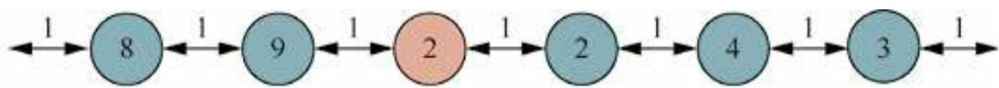

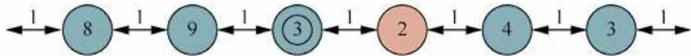

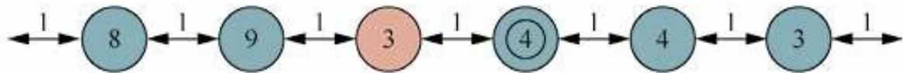

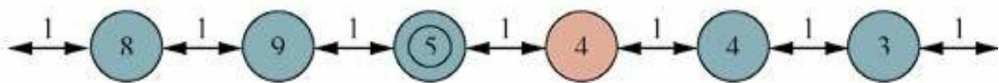

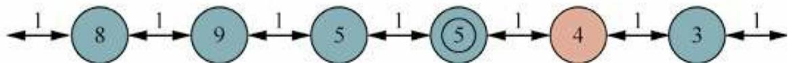  
  
图4-23一维状态空间上LRTA * 的5次迭代。每个状态都标有H (s)，即到达目标的当前代价估计值，每个连接的动作代价为1。红色状态表示智能体的位置，每次迭代所更新的代价估计值以双圈标记

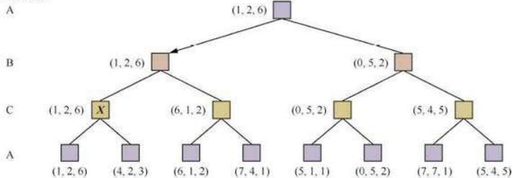  
轮到移动的玩家  
图5-4 三人博弈的博弈树的前三层，3个玩家为 A、B、 C。每个节点都标有3个玩家各自的效用值。最佳移动标示在根节点上

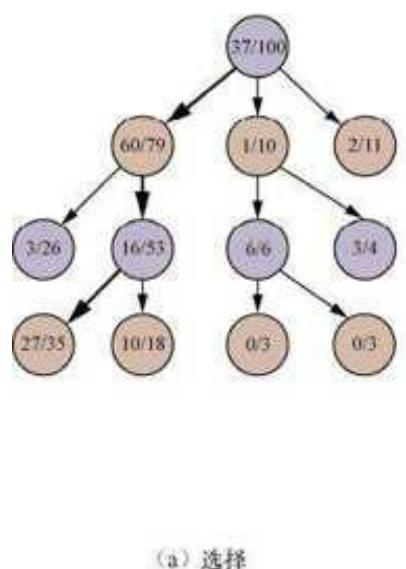

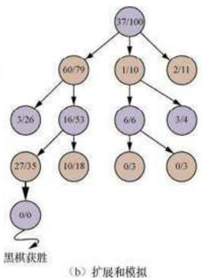

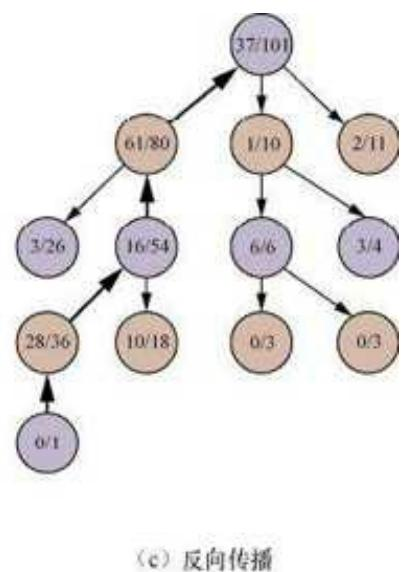  
图5-10使用蒙特卡罗树搜索（MCTS）选择移动的算法的一次迭代，该算法使用“应用于树搜索的

置信上界”法（UCT）作为选择度量，此时已完成了100次迭代。（a）选择移动，沿着树一直向下，到标记为27/35（35次模拟中黑方赢了27次）的叶节点结束。（b）扩展所选节点并进行模拟，最终黑方获胜。（c）将模拟结果沿树反向传播

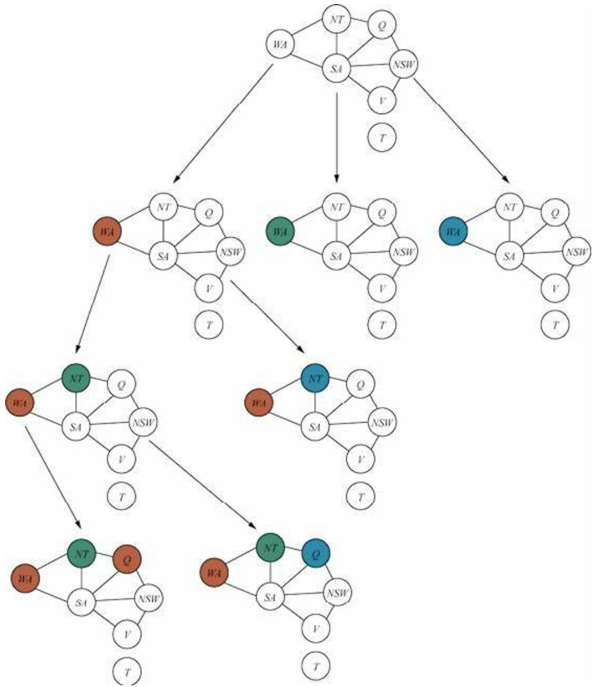

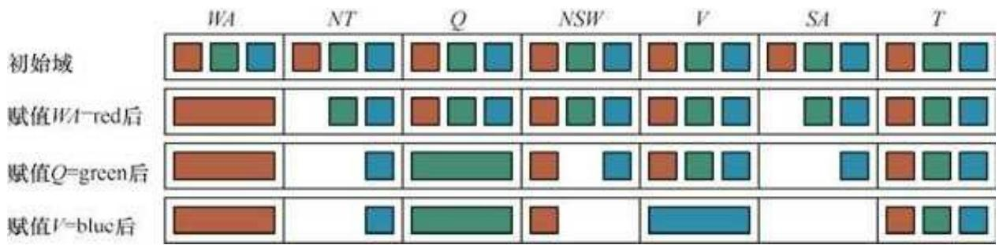  
图6-6图6-1中地图着色问题的部分搜索树  
图6-7带前向检验的地图着色搜索过程。首先赋值 WA=red；然后前向检验从其相邻变量 NT和 SA的域中删除red。赋值 Q = green后，从 NT 、 SA 和 NSW 的域中删除green。赋值 V = blue后，从NSW和SA的域中删除blue，此时SA没有合法值

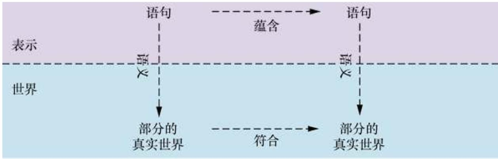  
图7-6 语句是智能体的物理结构，而推理是从旧结构构建新结构的过程。逻辑推理应当确保新结构所表示的部分世界确实能够从旧结构所表示的部分世界推得

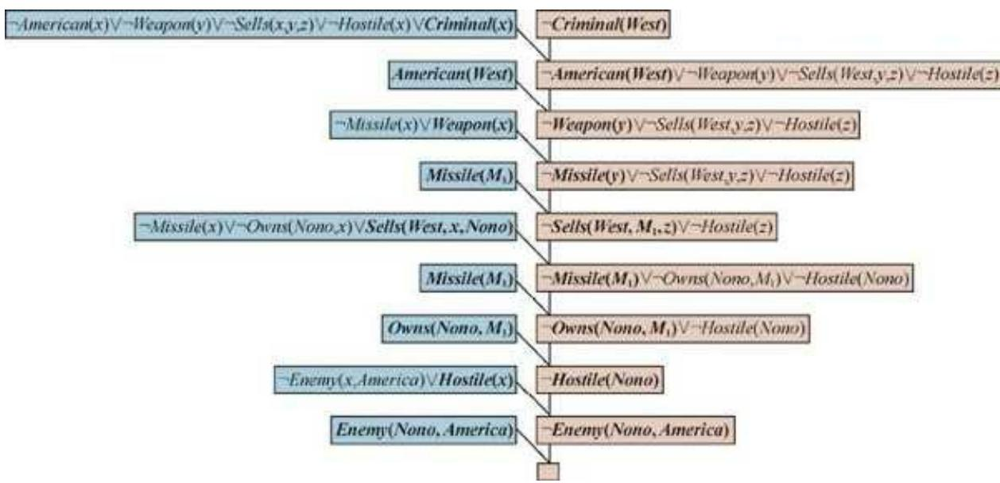

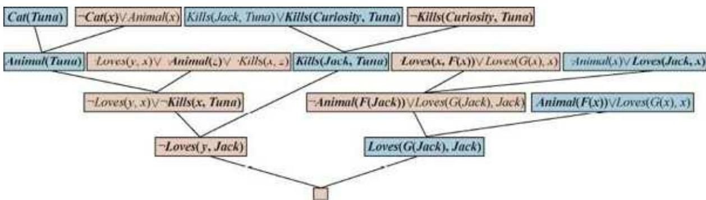  
图9-10 归结证明韦斯特有罪。每个归结步骤中，合一文字用加粗字体表示，带有正文字的子句用蓝底表示  
图9-11 好奇心害死猫的归结证明。注意，在推导子句 Loves ( G ( Jack ), Jack )时使用了因子分解。还要注意，在右上角，合一 Loves ( x , F ( x ))和 Loves ( Jack , x )只有在变量标准化分离后才可以进行

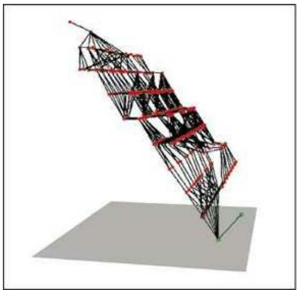

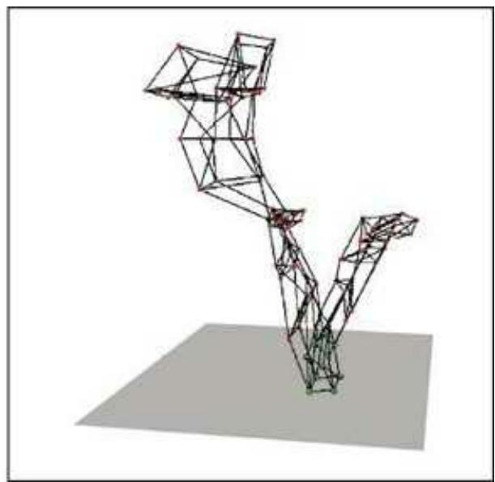  
图11-6 使用忽略删除列表启发式方法的规划问题的两个状态空间。底部平面以上的高度是一个状态的启发式得分；底部平面的状态是目标。由于不存在局部极小值，所以搜索目标很简单直接。图片来自（Hoffmann, 2005）

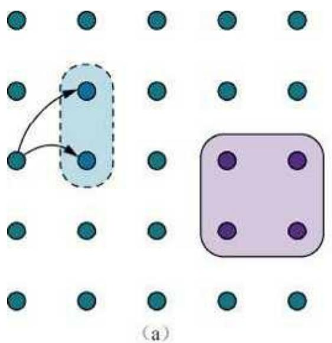

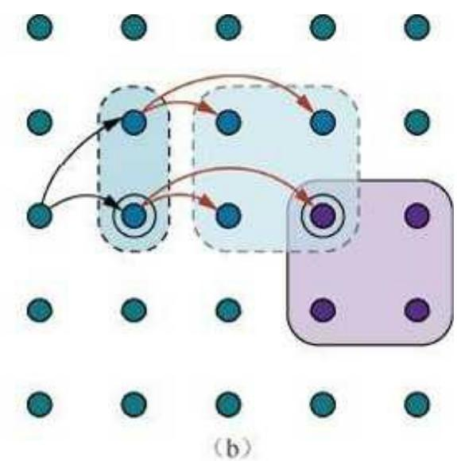  
图11-9 可达集的语义示例。目标状态集用紫色阴影表示。黑色和红色箭头分别表示 $h _ { 1 }$ 和 $h _ { 2 }$ 的可能实现。（a）在状态s中HLA $h _ { \mathrm { ~ 1 ~ } }$ 的可达集。（b）序列[ $h _ { 1 } , h _ { 2 } ]$ 的可达集。因为它与目标集相交，所以序列实现了目标

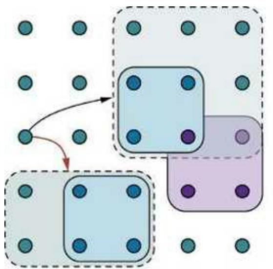

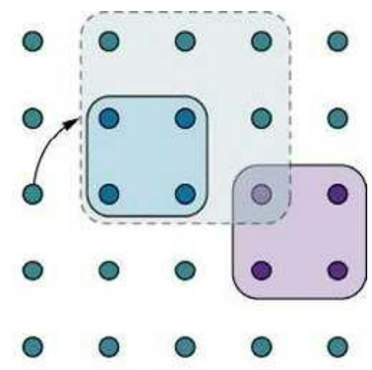

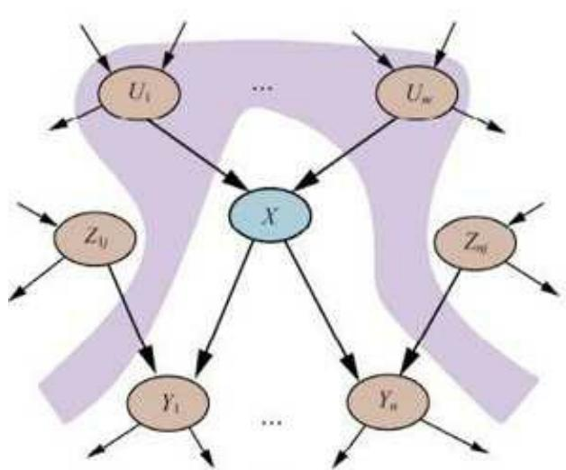  
图11-10 具有近似描述的高层规划的目标达成。目标状态集用紫色阴影表示。对于每个规划将显示悲观（实线，浅蓝色）和乐观（虚线，浅绿色）可达集。（a）黑色箭头所指的规划的确达成了目标，而红色箭头所指的规划完全没有达成目标。（b）可能达成目标（乐观可达集相交的目标）但未必会达成目标（悲观可达集与目标不相交）的规划。该规划需要进一步细化，以确定它是否真的达成了目标

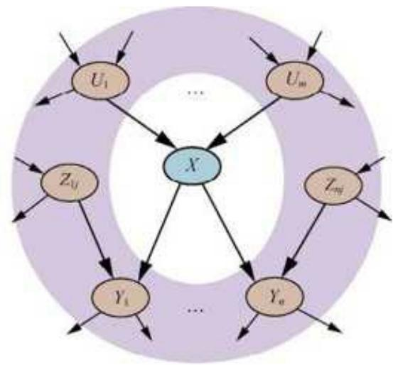  
  
图13-4 （a）给定父节点（浅紫色区域中所示的 $U _ { i }$ ），节点 $X$ 条件独立于它的非子孙节点（例如， $Z _ { i j }$ ）。（b）给定它的马尔可夫毯（浅紫色区域），节点 $X$ 条件独立于网络中的所有其他节点

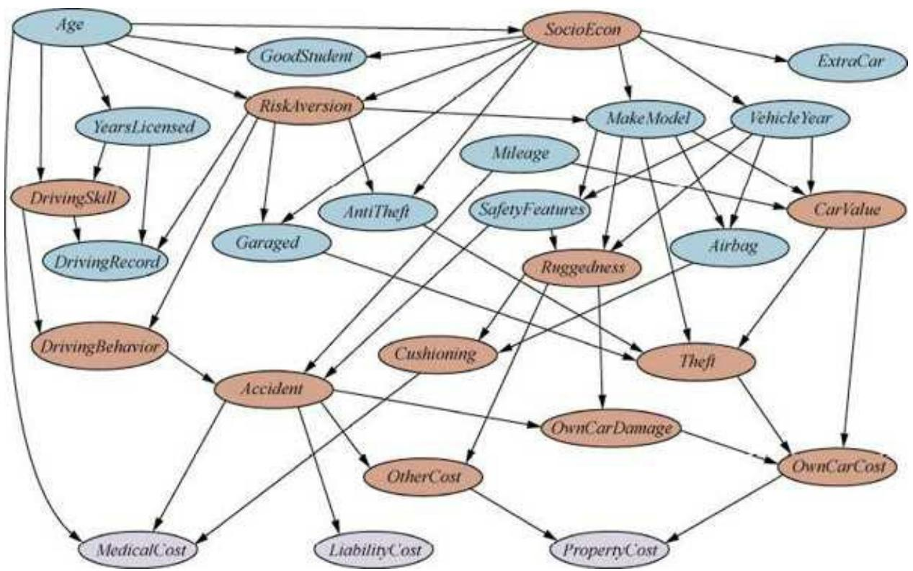

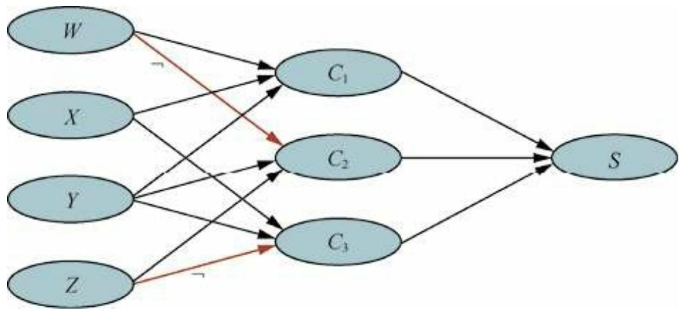  
图13-9用于评估汽车保险申请的贝叶斯网络  
图13-14 3-CNF语句 的贝叶斯网络编码

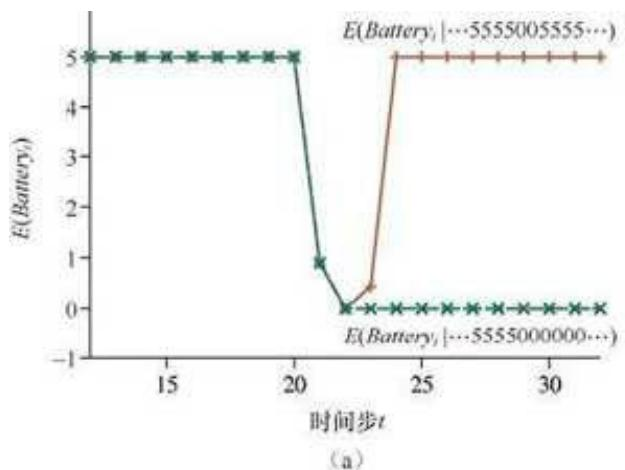

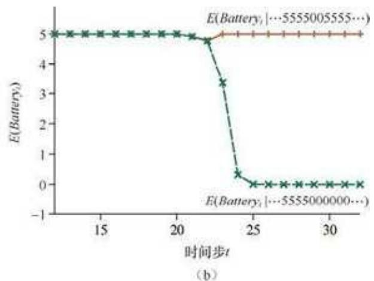  
图14-14（a）红色曲线：除 $t = 2 1$ 和 $t = 2 2$ 为0外，其他观测都为5的观测序列的Battery 期望值轨迹，采用简单高斯误差模型。绿色曲线：从t=21开始观测值维持在0的轨迹。（b）瞬时故障模型运行了同样的实验。瞬时故障处理良好，但持续故障导致对电池电量的过度悲观

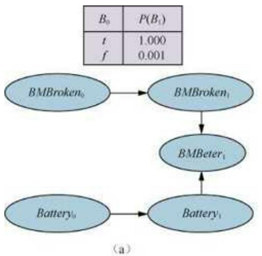

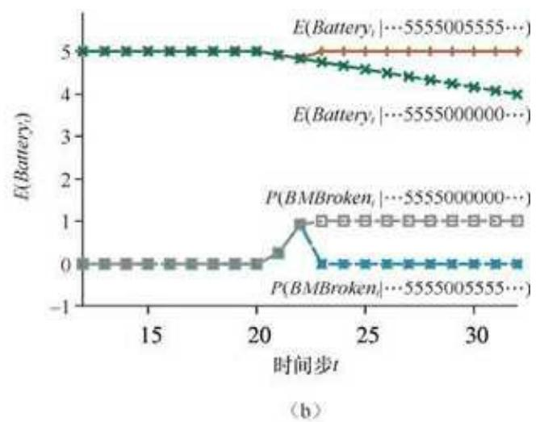

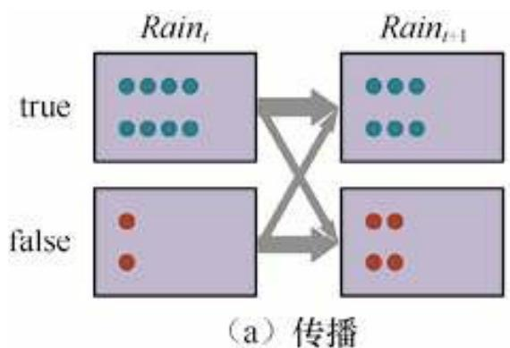  
图14-15（a）一个显示建模电池传感器持续故障要求的传感器状态变量的动态贝叶斯网络片段。（b）上方曲线为对“瞬时故障”与“持续故障”的Battery 的期望值轨迹，下方曲线为给定两个观测序列的 BMBroken 的概率轨迹

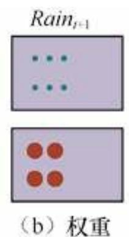

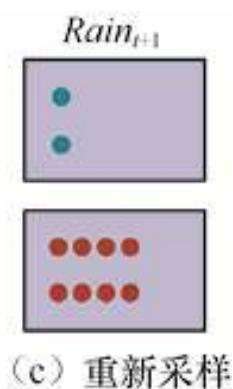  
图14-18N=10的雨伞动态贝叶斯网络的粒子滤波更新循环，显示每个状态的样本总体。（a）在时刻 t，有8个样本表示rain，有2个样本表示 $\lnot$ 。每个状态通过转移模型采样下一个状态向前传播。在时刻t+1，有6个样本表示rain，有4个样本表示 $\lnot$ 。（b）在时刻t+1观测到。每个样本通过这个观测的似然来进行加权，权重如圆的大小所示。（c）从当前的集合中通过加权随机选择产生一个新的集合，共有10个样本，其中2个样本表示 rain，8个样本表示Srgin

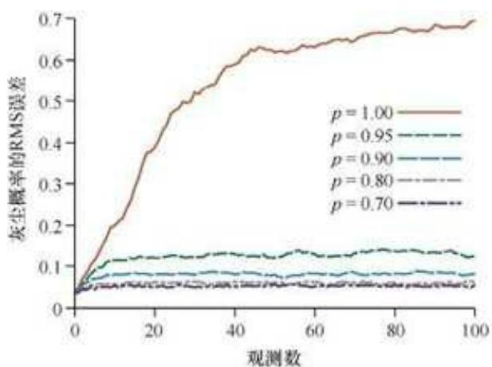

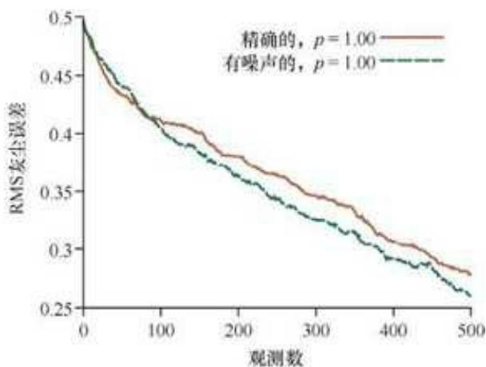

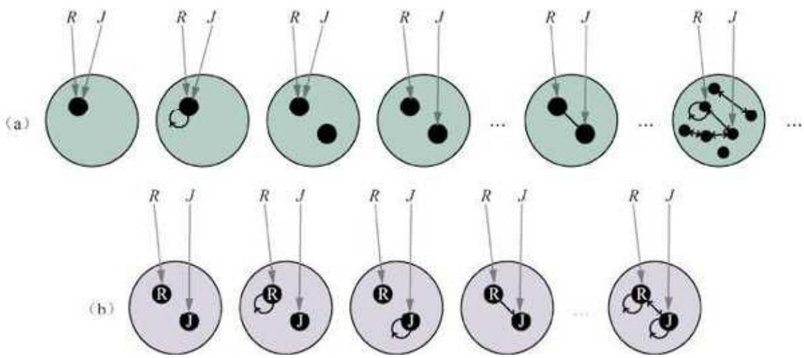  
图14-21（a）具有1000个粒子的标准粒子滤波算法的性能，在不同的灰尘持久性p 下，显示与精确推断相比边际灰尘概率的均方根（RMS）误差。（b）Rao-Blackwellized粒子滤波（100个粒子）性能与真实情况的比较，包含精确的位置传感和噪声墙传感，灰尘是确定性的。数据是超过20次运行的平均值  
图15-1（a）在一阶逻辑的标准语义下，具有两个常量符号 R和 $J$ 以及一个二元关系符号的语言的全部可能世界的集合的部分成员。（b）数据库语义下的可能世界。常量符号的解释是固定的，每个常量符号都对应唯一的对象

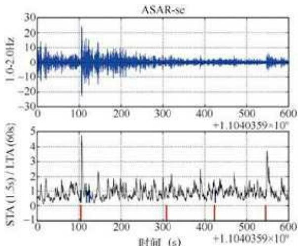

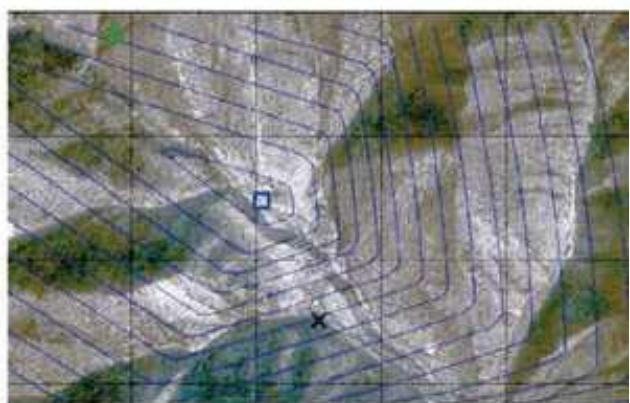

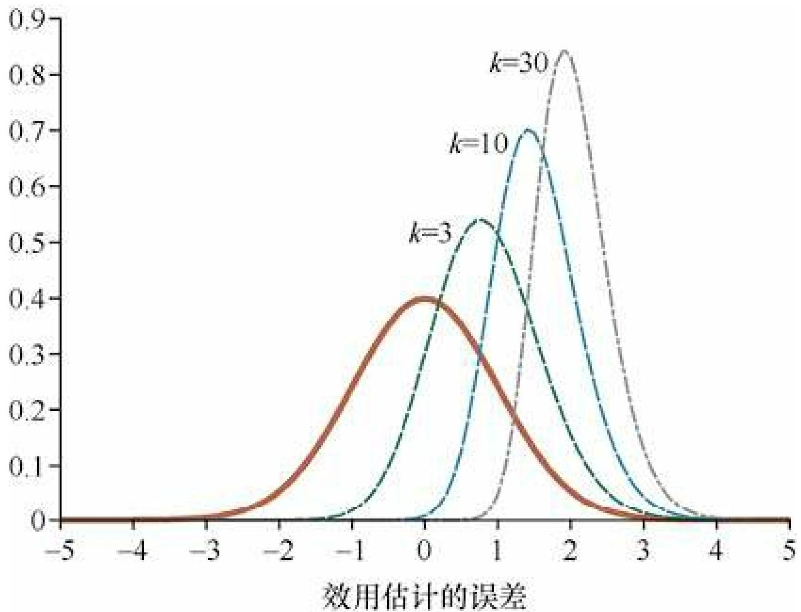  
图15-7（a）上图：在澳大利亚艾利斯斯普林斯市记录的地震波形实例。下图：用于检测地震波到达时间的处理后的波形。蓝线是自动检测的地震波到达，红线是真正的地震波到达。（b）2013年2月12日朝鲜核试验地点估计：联合国CTBTO最新事件公报（左上角绿色三角形），NET-VISA（中间蓝色方块）。地下试验设施的入口（以“x”标记）距离NET-VISA的估计0.75公里。轮廓线显示NET-VISA的后验位置分布。图片由CTBTO筹备委员会提供  
图16-3选择k个选项中的最佳选项引起的不合理的乐观：我们假设每个选项的真实效用为0，但效用估计是单位正态分布（棕色曲线）。其他曲线展示了 k=3、10和30时估计最大值的分布

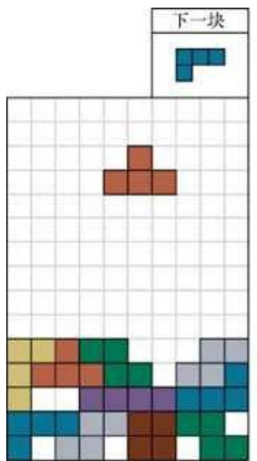  
（a）

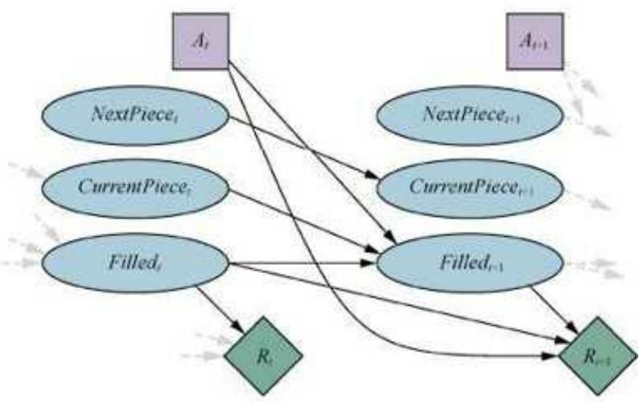

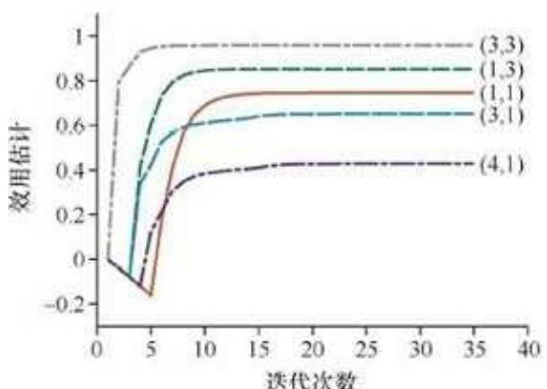  
图17-5（a）俄罗斯方块游戏。位于顶部中心的T型块可以落在任何方向和任何水平位置。如果某一行被补全，则该行消失，上方的行向下移动，智能体得1分。下一块（这里是右上方的L形块）成为当前的一块，并出现一个新的下一块，从7种类型中随机选择。如果棋盘被填满，游戏结束。（b）俄罗斯方块MDP的DDN

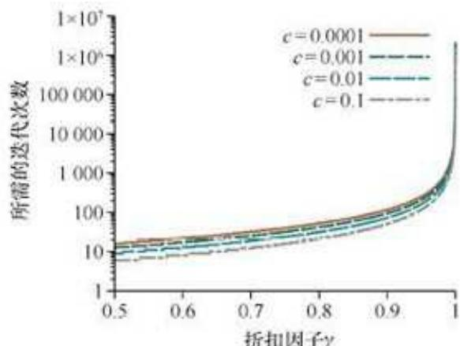  
  
图17-7（a）显示被选择状态使用价值迭代的效用演变的图。（b）对于 $c$ 不同的值，为保证误差最多为 所需的价值迭代次数，作为折扣因子 的函数

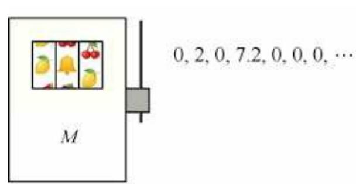

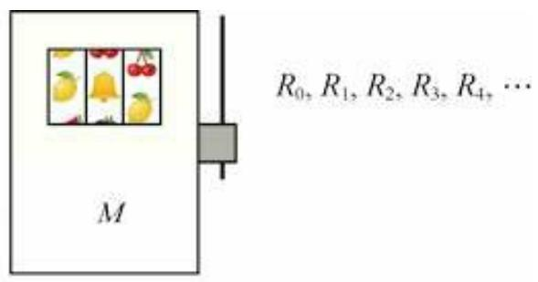

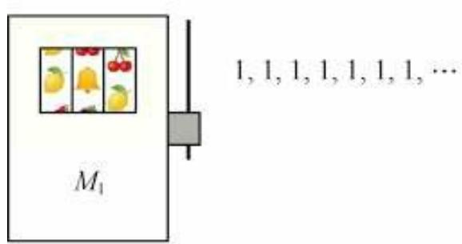

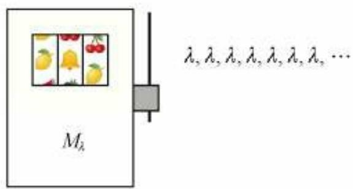

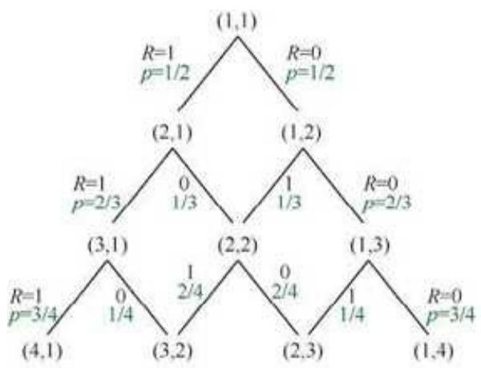  
图17-12（a）一个简单的有两个臂的确定性老虎机问题。臂可以以任何顺序拉动，每个臂产生所示的奖励序列。（b）关于（a）中的老虎机的一个更普遍的情况，其中第一个臂给出任意奖励序列，第二个臂给出一个固定的奖励 λ

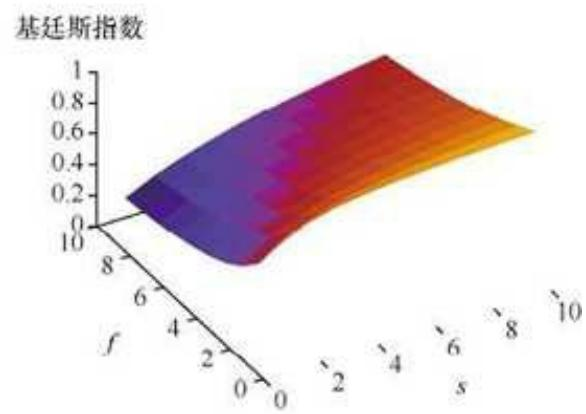  
  
图17-14（a）伯努利老虎机的状态、奖励与转移概率。（b）伯努利老虎机过程的状态的基廷斯指数

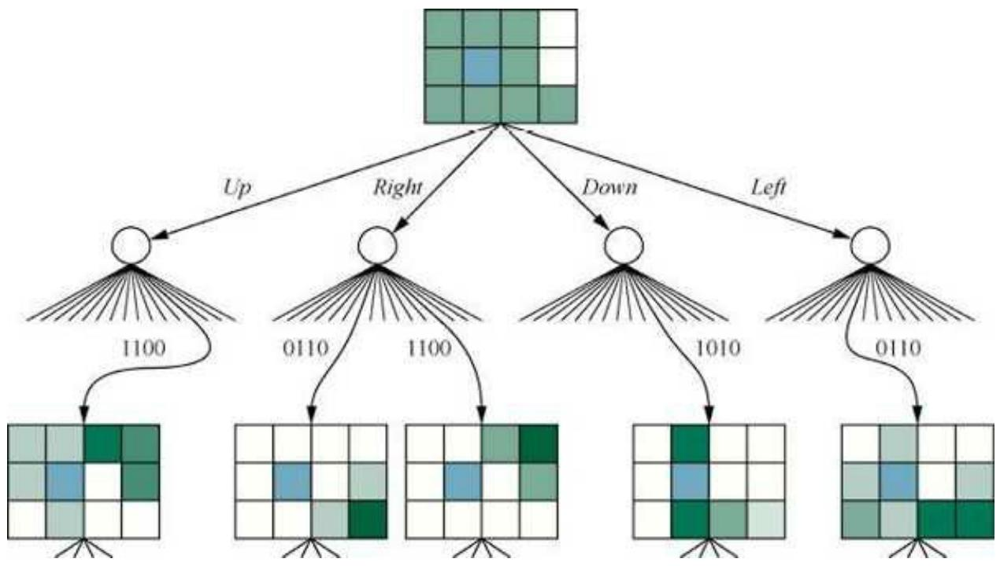  
图17-17具有均匀初始信念状态的4×3 POMDP的最大化期望树的一部分。信念状态用与存在于每个位置的概率成正比的深浅来描述

  
图17-18 墙传感误差 $\varepsilon = 0 . 2$ 的4×3 POMDP中感知、信念状态和动作的序列。注意，之前的 Left 是安全的，它们不太可能落入(4,2)，并迫使智能体的位置变成少量的可能位置。Up 移动后，智能体认为它可能在(3,3)中，但也可能在(1,3)中。幸运的是，Right在这两种情况下都是一个好主意，所以它选择 Right ，发现它之前在(1, 3)，现在在(2, 3)，然后继续 Right ，达到目标

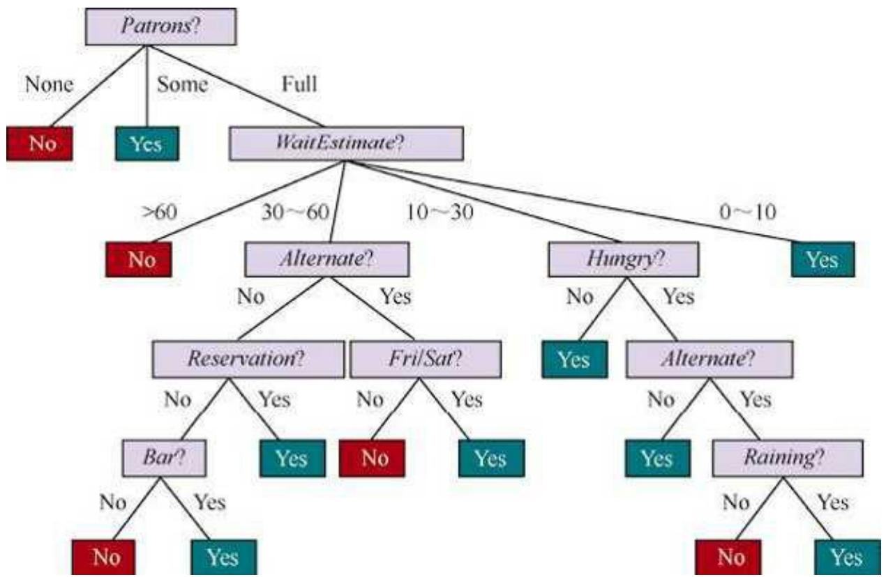

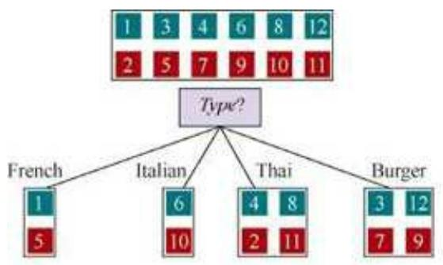  
图19-3决定是否在餐厅等待的决策树

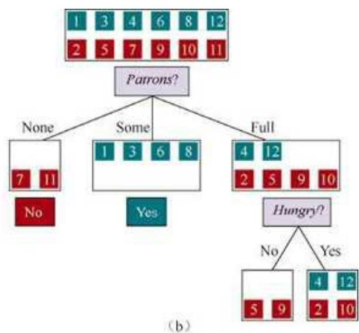  
图19-4通过测试属性来对样例进行分割。在每一个节点中我们给出剩余样例的正（绿色方框）负（红色方框）情况。（a）根据 Type 分割样例，没有为我们分辨正负带来帮助。（b）根据 Patrons分割样例，很好地区分了正负样例。在根据 Patrons进行分类之后， Hungry是相对较好的第二个测试属性

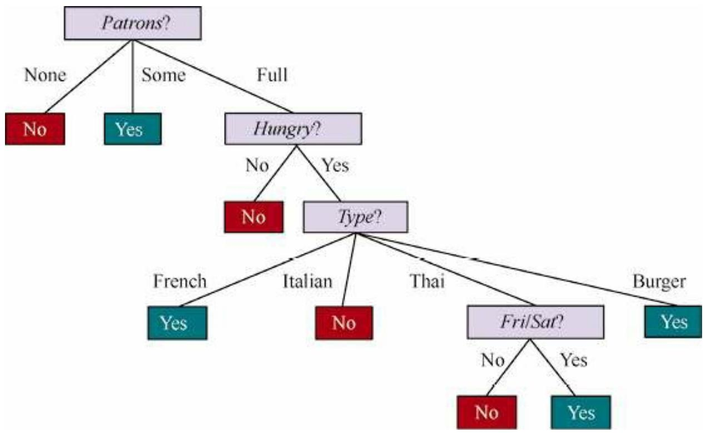  
图19-6根据12样例训练集推断出的决策树

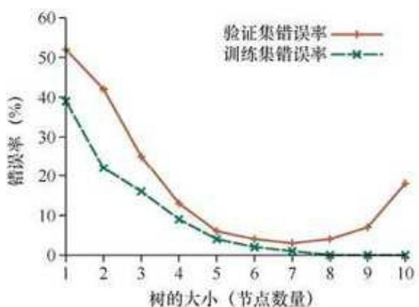

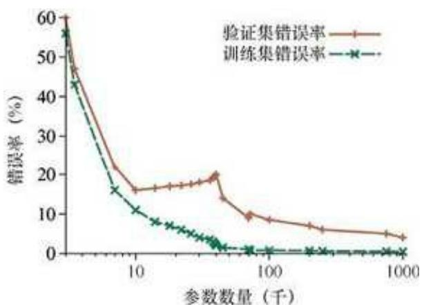  
  
图19-9两个不同问题上不同复杂性模型的训练误差（下方绿线）和验证误差（上方橙色线）。模型选择算法Model-Selection 将选择验证误差最小的模型对应的超参数值。（a）模型类是决策树，超参数是节点数量。数据来自餐厅等待问题。最佳的超参数大小为7。（b）模型类是卷积神经网络（见21.3节），超参数是网络中常规参数的数量。数据是数字图像的MNIST数据集，任务是识别手写数字的照片。效果最好的超参数是1 000 000（注意坐标的对数刻度）

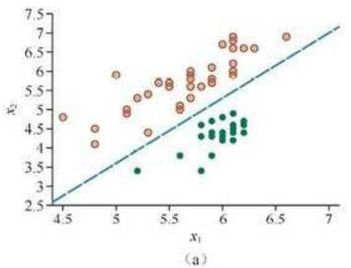

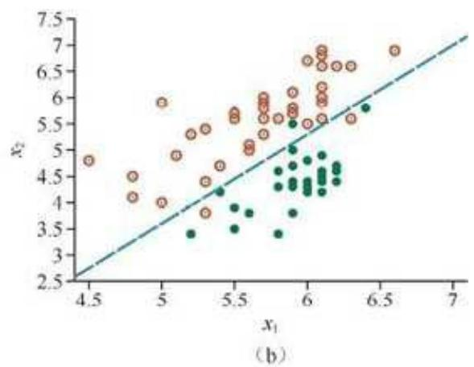

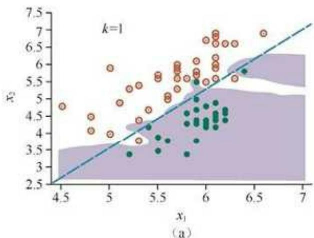  
图19-15（a）两种类型地震数据，包含体波震级x 和面波震级x ，数据来源于1982～1990年在亚洲和中东发生的地震（橙色空心圆）和地底爆炸（绿色实心圆）（Kebeasy etal., 1998）。图中还绘制了类之间的决策边界。（b）同一个领域，有比之前更多的数据点。此时地震和爆炸不再是线性可分的

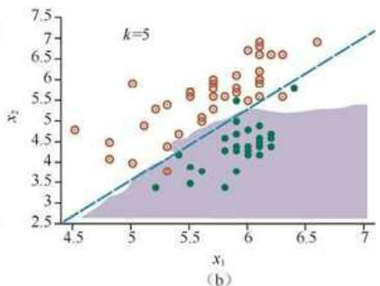

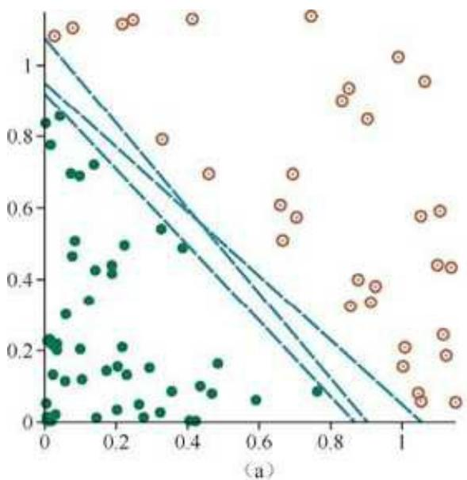  
图19-19 （a）一个 $k$ 近邻模型，该图显示了图19-15中数据的爆炸一类的范围，其中 $k = 1$ 。可以明显看到有过拟合现象。（b）当k=5时，该数据集上的过拟合现象消失了

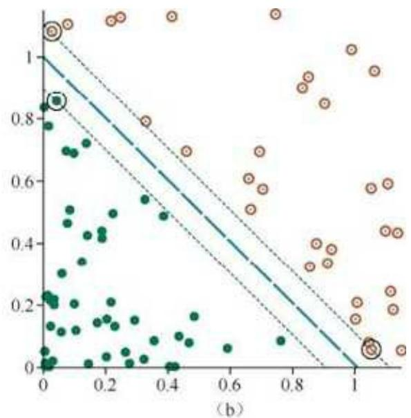  
图19-21支持向量机分类器：（a）两类点（橙色空心圆和绿色实心圆）和3个候选线性分离器。（b）极大边距分离器（粗线）位于边距 （虚线之间的区域）的中间。 支持向量 （带有大黑圈的

点）是最靠近分离器的，本图中有3个

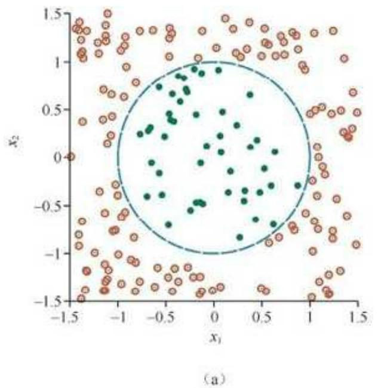

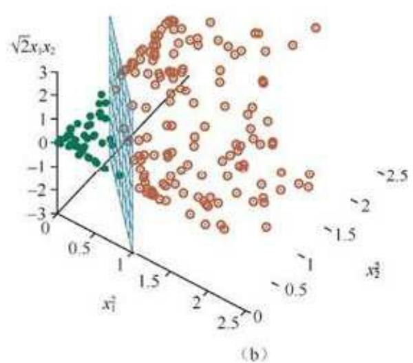  
图19-22（a）一个二维训练集，其中正样例为绿色实心圆，负样例为橙色空心圆。图中还给出了真实的决策边界 。（b）映射到三维输入空间 $( x _ { 7 } ^ { 2 } , x _ { 2 } ^ { 2 } , \sqrt { 2 } x , x _ { 2 } )$ 后的相同数据。（a）中的圆形决策边界变成三维空间中的线性决策边界。图19-21b给出了（b）中分离器的特写

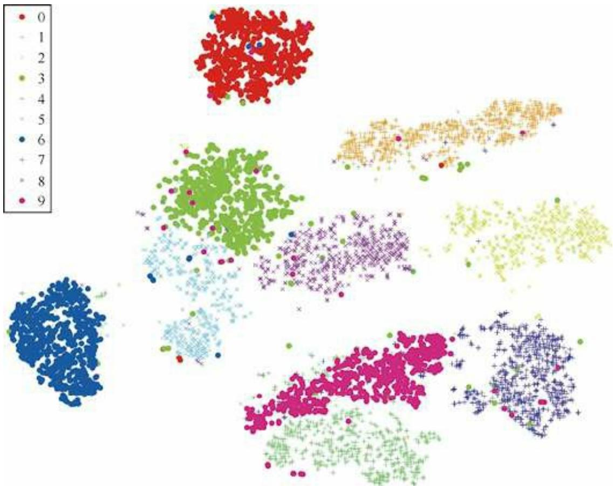  
图19-27MNIST数据集上的二维 t-SNE平面图，该数据集收集了60 000幅手写数字图像，每幅28像素×28像素，因此是784维。可以清楚地看到10个数字的聚类簇，每个聚类簇之间都存在一些混淆；例如，顶部是数字0的聚类簇，但是在聚类簇的范围内有一些表示数字3和6的数据点。t-SNE

算法找到了一种突出聚类簇间差异的表示

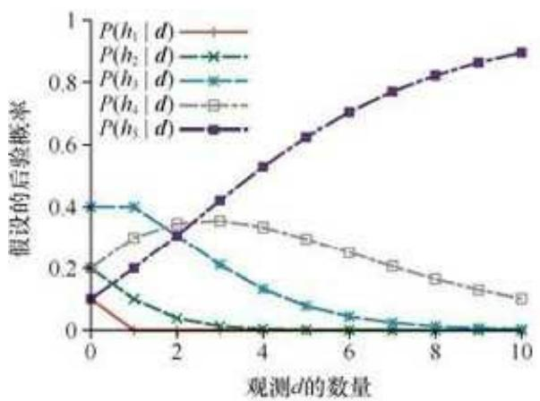

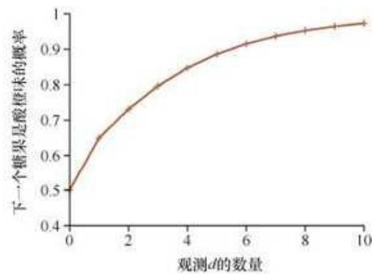  
  
图20-1 （a）根据式（20-1）得到的后验概率 $P ( \mathbb { A } _ { i } | \ d _ { 1 ^ { \flat } } \cdot \cdot \cdot , d _ { y } )$ 。观测数量 $N$ 为 $1 { \sim } 1 0$ ，且每一个观测都是酸橙味的糖果。（b）基于式（20-2）的贝叶斯预测 PDN $P ( D _ { N + 1 } = \operatorname { l i m e } \mid d _ { 1 } , \cdots , d _ { N } )$

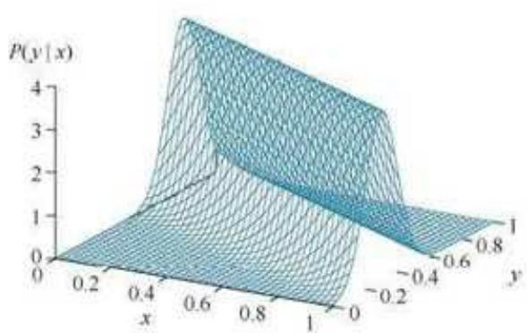

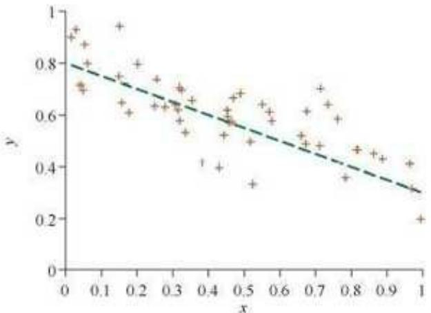

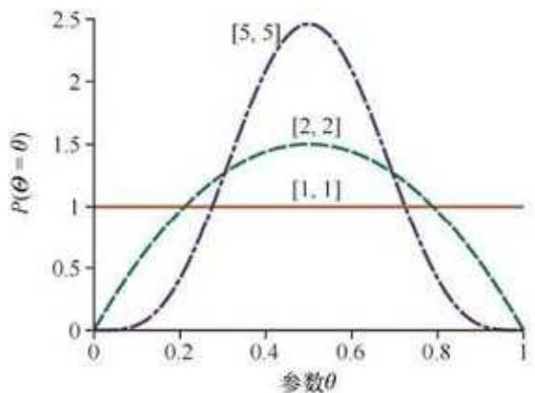  
图20-4（a）高斯线性模型，它表述为 加上固定方差的高斯噪声。（b）由该模型生成的50个数据点，以及它的最佳拟合直线

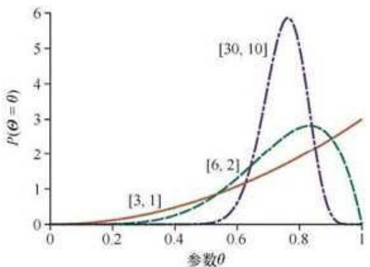  
  
图20-5 不同 $( a , b )$ 下 Beta $( a , b )$ 分布的例子

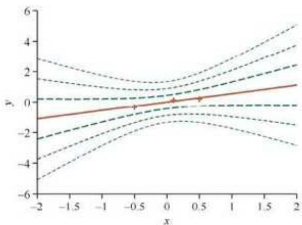

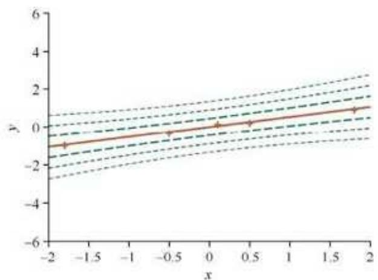

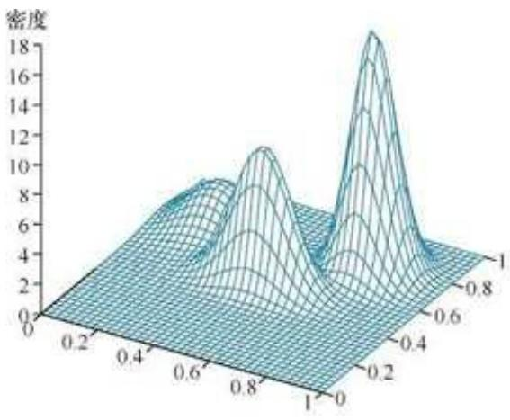  
图20-7贝叶斯线性回归模型，它被约束为经过原点且噪声方差固定为 $\sigma ^ { 2 } =$ 。误差为±1、±2和±3个标准差的密度预测等高线也在图中给出。（a）其中3个数据点距离原点较近，因此斜率相当不确定，其方差 。注意，当离观测到的数据点距离增大时，预测的不确定性也逐渐增大。（b）相比前一幅图多出两个距离较远的数据点，此时斜率 $\pmb \theta$ 被较严格地约束，其方差为。密度预测中剩余的方差几乎完全来源于噪声的固定方差 $\sigma ^ { 2 }$

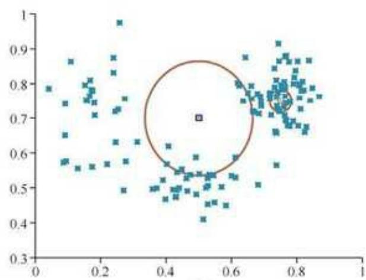

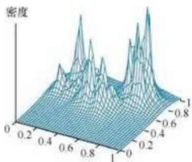  
图20-8（a）图20-12a中所给出的混合高斯模型的三维样貌。（b）从混合高斯模型中采样的128个数据点、两个查询点（小方块）以及它们的10近邻（大圆圈以及右边的小圆圈）

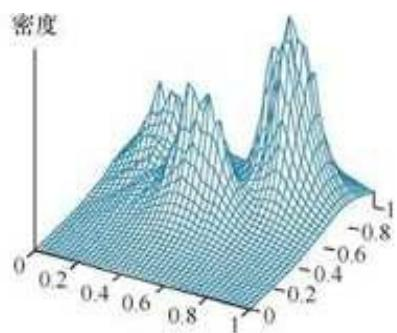

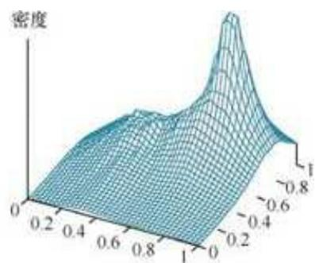  
  
图20-9 应用 $k$ 近邻进行密度估计，所用的数据为图20-8b中的数据，分别对应k=3、10和40。 $k =$ 3的结果过于尖锐，40的结果过于光滑，而10的结果接近真实情况。最好的 $k$ 值可以通过交叉验证进行选择

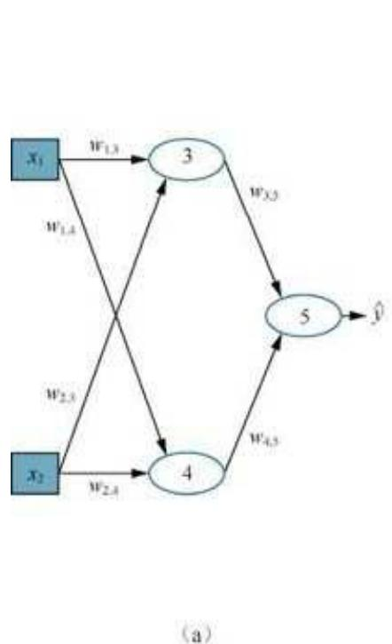

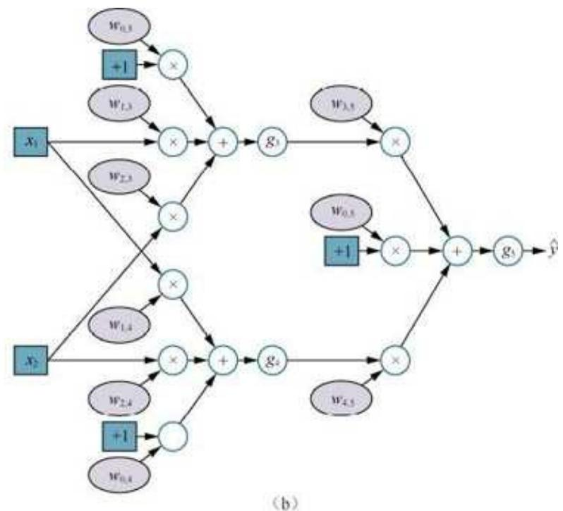

  
图21-3（a）具有两个输入、一个包含两个单元的隐藏层和一个输出单元的神经网络，其中虚拟输入及其权重没有在图中给出。（b）将（a）中的网络分解为完整的计算图  
图21-9生成模型如何使用 $z$ 空间中的不同方向来表示人脸不同方面的信息。实际上我们可以在 $z$ 空间中进行运算。这里的图像都是从学习到的模型中生成的，并且图像解释了当我们解码 $\pmb { z }$ 空间中的不同点时会发生什么。我们从“戴眼镜的男人”这个对象的坐标出发，减去“男人”的坐标，再加上“女人”的坐标，得到“戴眼镜的女人”的坐标。图像经许可摘自（Radford etal.,2015）

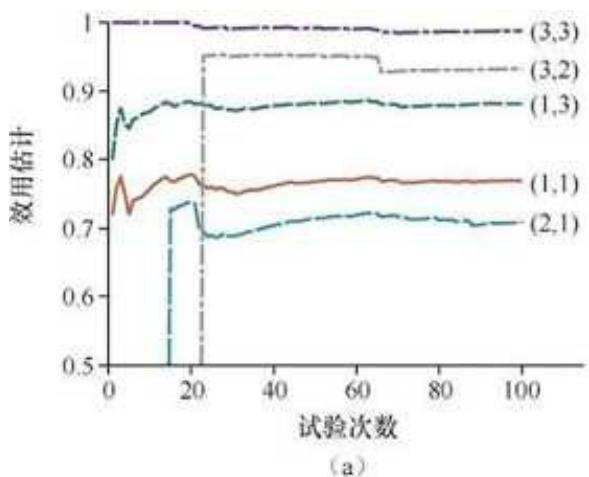

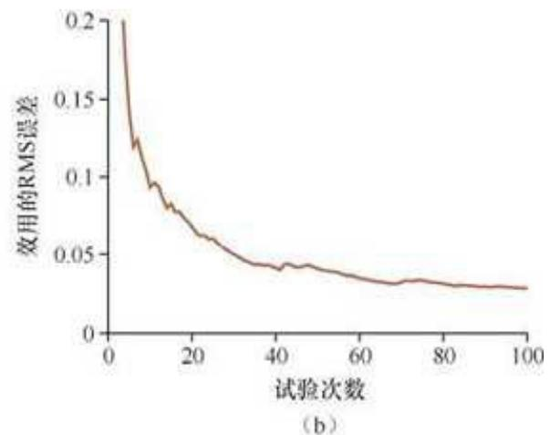

图22-3 在给定图22-1所示的最优策略情况下，关于4×3世界问题的被动自适应动态规划的学习曲线。（a）选定某个状态子集，其效用估计值与试验次数的关系。注意，对于很少被访问的状态(2,1)和(3, 2)，它们分别在第14次和第23次试验才被“发现”连接到位于(4, 3)处的+1退出状态。（b） $U$ (1, 1)估计的均方根误差（见附录 A），所示的结果为50组，每组执行100次试验的平均值

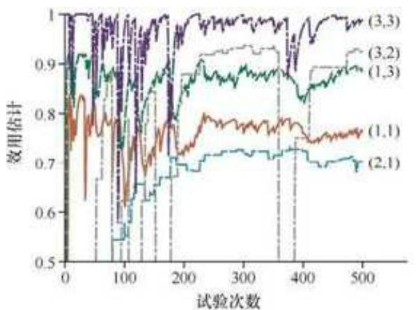

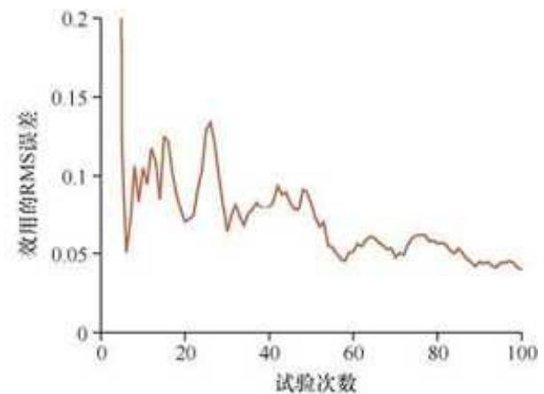

  
图22-54×3世界问题中，TD的学习曲线。（a）选定的状态子集的效用估计与试验次数的关系。此为单组执行500次试验的结果。可以与图22-3a中的每组执行100次试验的结果进行比较。（b） $U$ (1, 1)估计的均方根误差，所示结果为50组、每组执行100次试验的平均值  
图25-4这张照片展示了各种照明的效果。不锈钢佐料壶上发生镜面反射。洋葱和胡萝卜是亮的漫反射表面，因为它们面向光照射的方向。阴影部分出现在根本看不到光源的表面点上。在锅中存在一些暗的漫反射表面，光线沿着切线角度照射进来（锅内还有一些其他阴影）。该照片由RymanCabannes/Image Professionals GmbH/Alamy Stock Photo拍摄


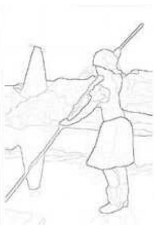


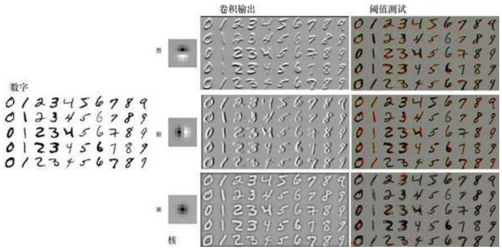  
图25-10（a）原始图像。（b）图像的边界轮廓，其中P 值越高，轮廓颜色越深。（c）通过对图像精细划分得到的各个分割区域，其中每个区域使用区域中的平均颜色进行填充。（d）通过对图像进行较粗糙的分割得到的各个分割区域，粗糙分割将导致得到的区域更少（图片由PabloArbelaez、Michael Maire、Charless Fowkes和Jitendra Malik提供）  
图25-12最左侧是MNIST数据集中的一些图像。中间图的左侧为3个卷积核。它们以实际大小（图中的小方块）给出，并放大以显示其内容：中度灰色的值为0，浅色表示正值，深色表示负值。中间图的右中侧给出了将左侧这些核应用于图像的结果。最右侧给出了响应大于阈值（绿色）与小于阈值（红色）的像素。注意，这里（从上到下）给出了一个水平条检测器、一个竖条检测器和（更难注意到的）一个尾端检测器。这些检测器关注条的对比度，因此（例如）顶部亮底部暗的水平条产生正（绿色）响应，顶部暗底部亮的水平条产生负（红色）响应。这些检测器有一定的效果，但它们不是完美的

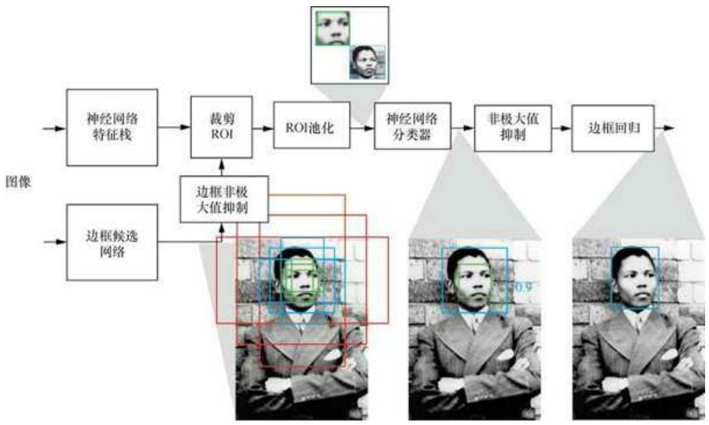  
图25-13快速RCNN使用两个网络。一张年轻时的纳尔逊·曼德拉的照片被输入物体检测器。一个网络用于计算候选图像框（称为“锚框”）的物体检测得分，这些框以网格上的点为中心。每个网格点对应着9个锚框（3种尺寸，每种尺寸包含3种纵横比）。对于示例图像，内部的绿色框和外部的蓝色框通过了物体检测。第二个网络是一个特征栈，用于计算适合分类的图像表示。具有最高得分的框将从特征图中分割出来，通过ROI池化进行尺寸标准化，再传给分类器。注意，蓝色框的得分高于绿色框，并且与绿色框重叠，因此绿色框将被非极大值抑制算法拒绝。最后，我们对蓝色框进行边框回归，使其符合人脸的形状。这意味着对位置、比例和纵横比的相对粗粒度的采样不会降低预测准确率。照片由Sipa/Shutterstock提供

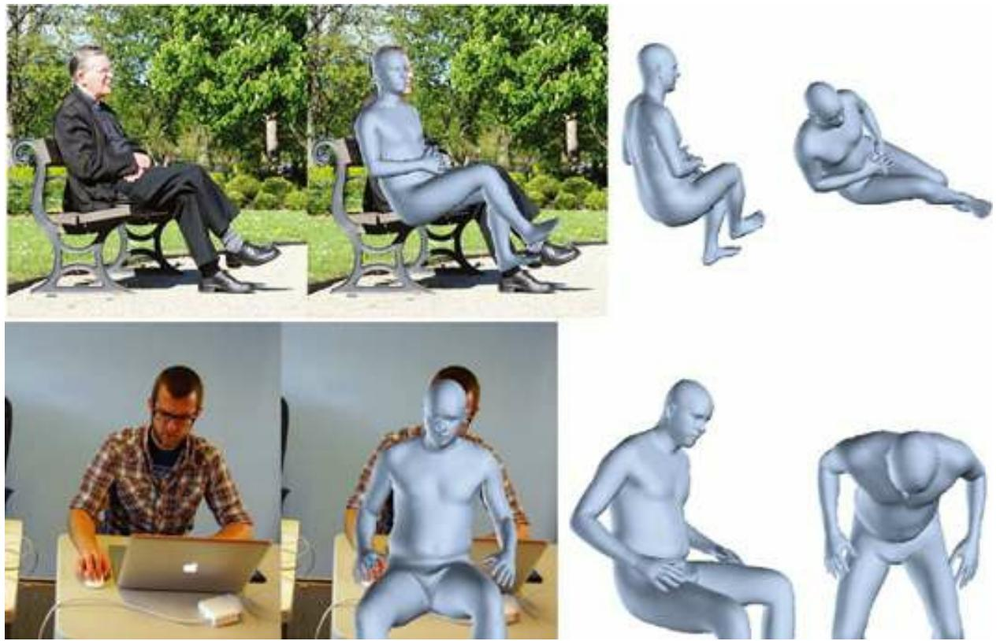  
图25-16从单一的图像中重建人类模型目前已经可以实现。两行图片都展示了基于单个图像的三维

身体形状重建。这些重建是有可能的，因为一些方法可以估计关节的位置、关节在三维中的角度、身体的形状以及身体相对于图像的位姿。每行包括以下内容：最左图 为一张图片，中左图 为原图与重建出的身体叠加的图片，中右图 为重建出的身体的另一个视图，最右图 是重建出的身体的另一个不同视图。考查身体的不同视图使得在重建中隐藏错误变得更加困难。图由AngjooKanazawa提供，并用（Kanazawa et al. , 2018a）中提出的系统加以处理

  
图25-17同一个动作看起来很不一样，不同的动作看起来很相似。这些例子是来自一个数据集中的自然动作，其标签由数据集的管理员进行选择，而不是由算法预测的。上面3幅图表示标签为“打开冰箱”的样本，有的是特写，有的是远处拍摄。下面3幅图表示标签为“从冰箱里拿东西”的样本。注意，在两排图像中，图像里的人的手是如何靠近冰箱门的——若要区分不同的情况，就需要对手的位置和门的位置做出相当微妙的判断。图由David Fouhey提供，摘自（Fouhey etal.,2018）中给出的数据集

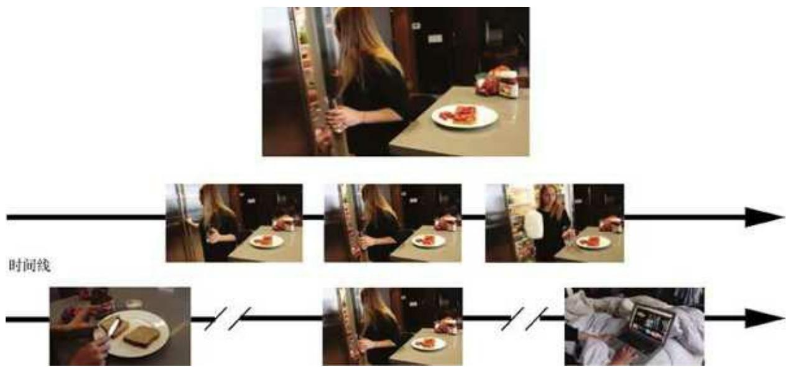  
图25-18我们所说的动作取决于时间尺度。对于最上面的单幅图像，最好的描述是“打开冰箱”（当你打算关上冰箱时，你不会盯着里面的东西）。但是，如果你看完了一段视频短片（由中间一行图像表示），关于这个动作的最佳描述就是“从冰箱里拿牛奶”。如果你看完了一段较长的视频（由最下面一行图像表示），关于这个动作的最佳描述是“准备点心”。这说明了行为的一种构成方式：从冰箱中拿牛奶有时是准备点心的一部分，而打开冰箱通常是从冰箱中拿牛奶的一部分。图由DavidFouhey提供，摘自（Fouhey et al. , 2018）中给出的数据集

  
A baby eating a piece of food in his mouth

  
A young boy eating

  
Asmall bird is perched onabranch

  
A small brown bear is

  
图25-19自动图像标题系统给出了一些好的结果和一些失败的结果。左边的两个标题很好地描述了各自的图像，尽管“eating…in hismouth”是一个不流畅的表达，这是早期标题系统所使用的循环神经网络语言模型的一个相当典型的特点。根据右边的两个标题，我们认为标题系统似乎不了解松鼠，所以从环境猜测该动物；它也没有意识到这两只松鼠在吃东西。图片来源：geraine/Shutterstock、ESB Professional/Shutterstock、BushAlex/Shutterstock、Maria.Tem/Shutterstock。所示图像与用于生成标题的原始图像相似但不完全相同。原始图像见（Aneja et al. , 2018）  
Q.What is thecat wearing?

  
Q.What is the weather like?

  
Q.What surface is this?

  
Q.What toppings areon thepizza? A.Mushrooms

  
Q.How many holes are in the pizza

  
Q.What letter is on the racket?

  
Q.What color is the ight front leg A.Brow

  
Q.Why is the sign bent？

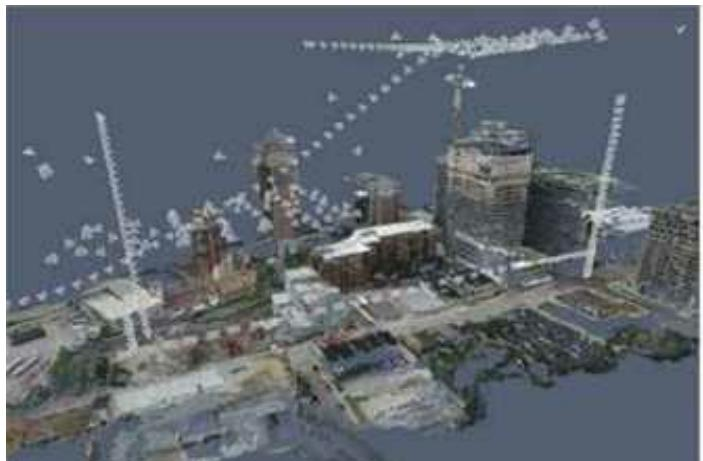  
图25-20视觉问答系统产生关于图像的自然语言问题的答案（通常从多项选择中选择）。顶部：该系统对有关图像的一些相当棘手的问题给出了非常合适的答案。 底部： 不太令人满意的答案。例如，系统被要求猜测比萨饼上的洞的个数，但系统并不知道什么算洞，而且洞本身很难计数。类似地，系统认为猫的腿的颜色是棕色，这是因为图片背景是棕色的，并且系统不能正确定位猫的腿。图片来源：（顶部）Tobyanna/Shutterstock、679411/Shutterstock、ESBProfessional/Shutterstock、Africa Studio/Shutterstock，（底部）Stuart Russell、Maxisport/Shutterstock、Chendongshan/Shutterstock、Scott Biales DitchTheMap/Shutterstock。所示的图像与用于问答系统的原始图像相似但不完全相同，原始图像见（Goyaletal.,2017）

  
图25-21多视图立体算法根据运动结构图像生成的建筑工地的三维模型。它们可以帮助建筑公司通

过比较目前三维模型实际搭建的进度与建筑计划来协调大型建筑工作。 左图： 基于无人机拍摄图像重建出的可视化几何模型。重建出的三维点以彩色呈现，因此结果看起来像是目前的真实进度（注意用起重机完成的部分建筑）。这些小金字塔表示无人机拍摄图像时的位姿，以便对飞行轨迹进行可视化。 右图： 这些系统实际上是施工队所使用的；作为协调会议的一部分，该团队正在查看竣工场地的模型，并将其与建筑平面图进行比较。图由Derek Hoiem、Mani Golparvar-Fard和Reconstruct提供，模型由商业系统制作


  
图25-22如果你已经看过很多鸟类物种的图片（ 上图 ），你可以利用它们从一个新的图片（下图）中生成一个三维重建模型。你需要确保所有的物体都有一个相当类似的几何结构（所以如果你看到的是麻雀，那么鸵鸟的图片将对你没有任何帮助），但分类方法可以解决这个问题。你可以从许多图像中估计出图像中的纹理是如何分布在物体上的，从而完成对你尚未观察到的鸟的纹理估计（下图 ）。图由Angjoo Kanazawa提供，模型用（Kanazawa et al. , 2018b）中提供的系统生成。上方图片来源于Satori/123RF，左下图来源于Four Oaks/Shutterstock

  
图25-23左图为真实场景的图像。在右图中，计算机图形物体已插入场景中。你可以看到光线看上去来自正确的方向，并且物体看起来也投射了效果不错的阴影。尽管生成的图像在光线和阴影方面有较小的误差，但这个图像仍是令人信服的，因为人类并不擅长分辨这些误差。图由Kevin Karsch提供，模型用（Karsch et al. , 2011）中提供的系统生成

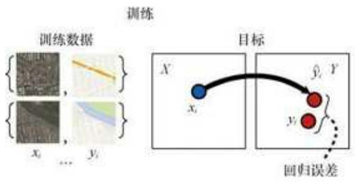

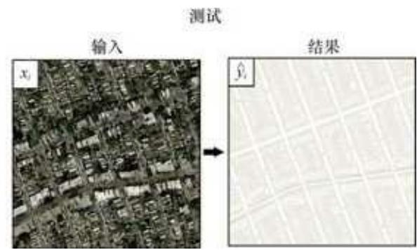

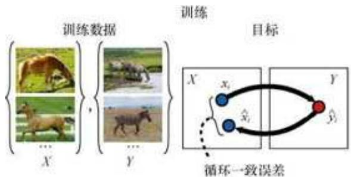  
图25-24成对图像的转换，其中输入由航空影像和相应的道路图组成，我们的目标是训练一个从航空影像生成道路图的网络（该系统还可以学习从道路图生成航空影像。）网络通过比较 $\hat { \pmb { y } } _ { e }$ （ X型样本 x 的输出）和 Y型的正确输出 $y _ { i }$ 进行训练。在测试时，网络必须从新的 $X$ 型输入中生成新的Y 型图像。图由Phillip Isola、Jun-Yan Zhu和Alexei A. Efros提供，模型用（Isola et al. , 2017）中提供的系统生成。地图数据©2019 Google

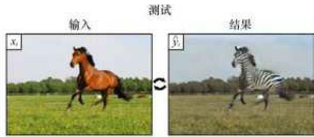

  
图25-25未配对图像转换：给定两组图像（ $X$ 型是马， Y型是斑马），但没有对应的配对，我们要学习将马转换成斑马。该方法训练两个预测器：一个将 $X$ 型映射为 Y 型，另一个将 Y 型映射为 $X$ 型。如果第一个网络将马 $x _ { i }$ 映射为斑马 $\hat { \pmb { y } } _ { e }$ ，那么第二个网络应当把 $\hat { \pmb { y } } _ { e }$ 映射回原始的 $x _ { i }$ 。两个网络利用 $x _ { i }$ 和 $\pmb { \hat { x } } _ { i }$ 之间的差进行训练。从 $Y$ 型到 $X$ 型再回到 Y 型的循环必须是封闭的。这样的网络可以成功地对图像进行丰富的变换。图由Alexei A. Efros提供，见（Zhu et al. , 2017）。正在奔跑的马的照片由Justyna Furmanchyk Gibaszek/Shutterstock拍摄


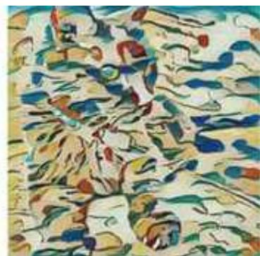  
图25-26风格转换：将内容为猫的照片与抽象绘画的风格相结合，生成经过抽象风格渲染的猫的新图像（右图）。中间这幅画为Wassily Kandinsky绘制的 Lyrisches 或 The Lyrical （公共领域），左图猫的照片为Cosmo

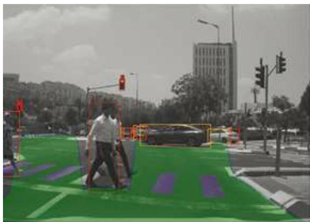

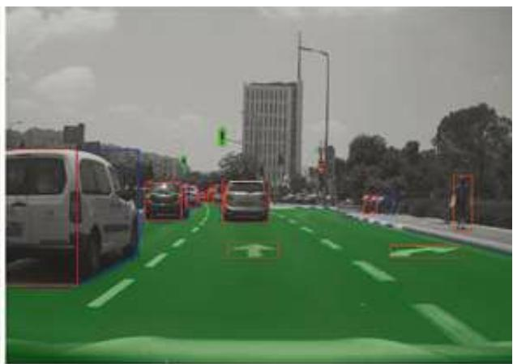


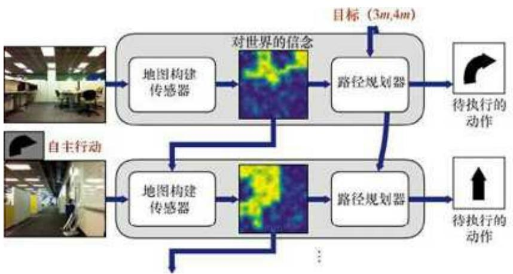  
图25-28MobileEye研发的基于摄像头的自动车辆传感装置。 顶部： 两张来自前置摄像头的照片，照片的拍摄相隔几秒。绿色区域为自由空间——车辆在不久的将来可以实际移动到的区域。系统使用表示侧面的三维边框来表示物体（红色表示后部，蓝色表示右侧，黄色表示左侧，绿色表示前部）。其中物体包括车辆、行人、自行车道内边缘标志（横向控制所需）、其他标线道路和人行横道标志、交通标志和交通信号灯。动物、路杆和锥桶、人行道、护栏和其他一般物体（例如，从卡车后面掉下来的沙发）没有在图中给出。然后用三维位置和速度对每个物体进行标记。 底部： 根据检测到的物体刻画的环境的完整物理模型（图中所示为MobileEye的仅基于视觉的系统产生的结果）。图像由MobileEye提供

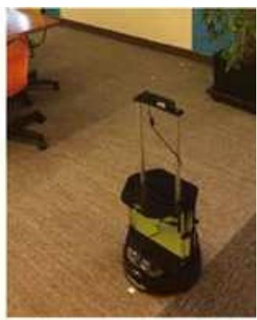  
图25-29导航功能通过分解成地图构建：和路径规划两个问题来实现。在每一个连续的时间步中，来自地图构建传感器的信息将用来逐步地建立一个关于世界的不确定的模型。该模型连同其规范目标一起传入路径规划器，路径规划器输出机器人为实现目标应该采取的下一个动作。关于世界的模型可以是纯粹的几何模型（如经典的SLAM），也可以是语义模型（通过学习得到），甚至可以是拓扑模型（基于地标）。我们在右图中给出实际的机器人的图片。图由Saurabh Gupta提供

  
（a）


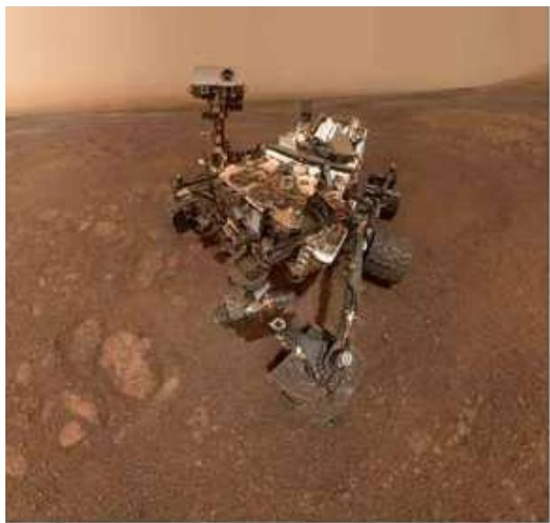  
图26-1（a）具有定制末端效应器的工业机器人。图片来源：Macor/123RF。（b）安装在轮椅上的Kinova $^ \mathrm { \textregistered }$ JACO $^ \mathrm { \textregistered }$ Assistive Robot 机械臂。Kinova和JACO是Kinova股份有限公司的商标  
（）

  
  
图26-2（a）美国国家航空航天局的好奇号巡视器在火星上自拍。图片来自美国国家航空航天局。（b）Skydio无人机伴随一家人骑行。图片由Skydio提供

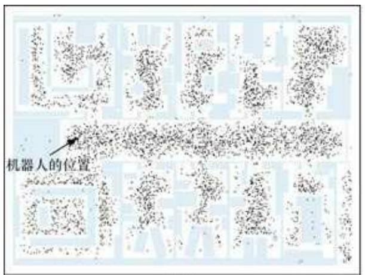

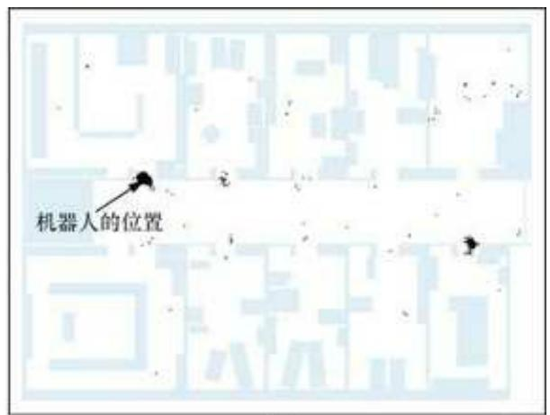

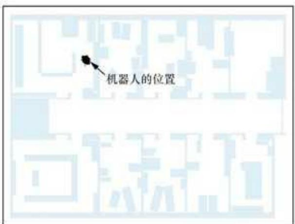  
）

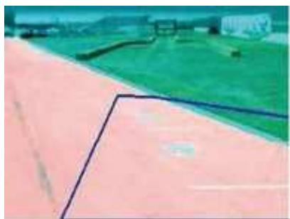  
图26-7蒙特卡罗定位，这是一种用于移动机器人定位的粒子滤波算法。（a）起初，全局具有不确定性。（b）在导航到（对称的）走廊后形成近似双峰的不确定性。（c）在进入到特定的房间后形成单峰不确定性

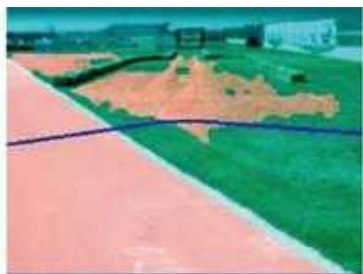

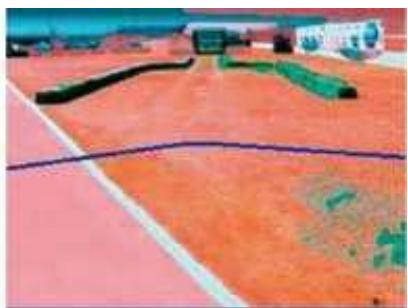  
  
图26-10使用适应性视觉取得的一系列“可行驶表面”分类。（a）只有路面被分类为可行驶的（粉色区域）。蓝色的V形线表示车辆的行驶方向。（b）车辆被迫驶离路面，分类器开始将部分草地分类为可行驶的。（c）车辆更新了它的可行驶表面模型，以将草地视作路面。图片由Sebastian Thrun提供

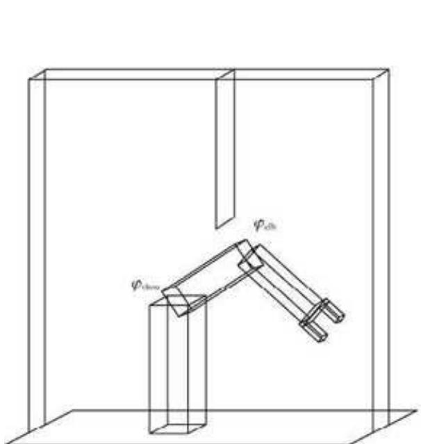

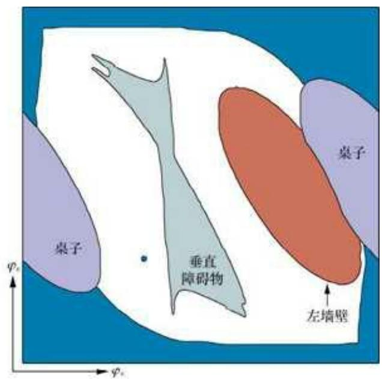

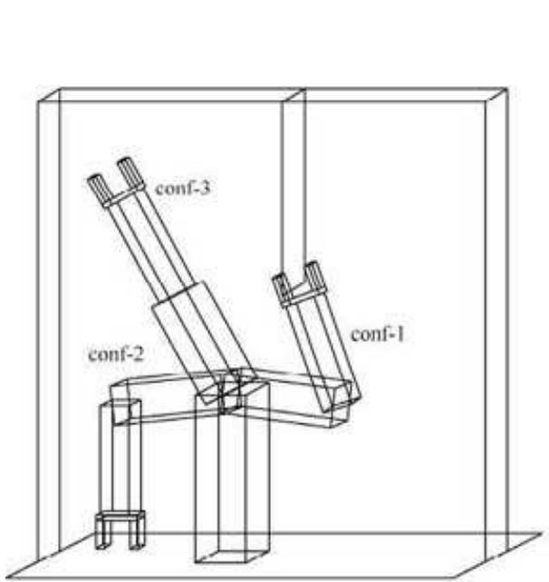  
图26-12（a）有两个自由度的机械臂的工作空间表示。工作空间是一个盒子，其中扁平障碍物悬挂在天花板上。（b）同一个机器人的构形空间。只有空间中的白色区域是没有碰撞的构形。图中的点对应左图所示的机器人构形

  
  
图26-13工作空间和构形空间中的3个机器人构形

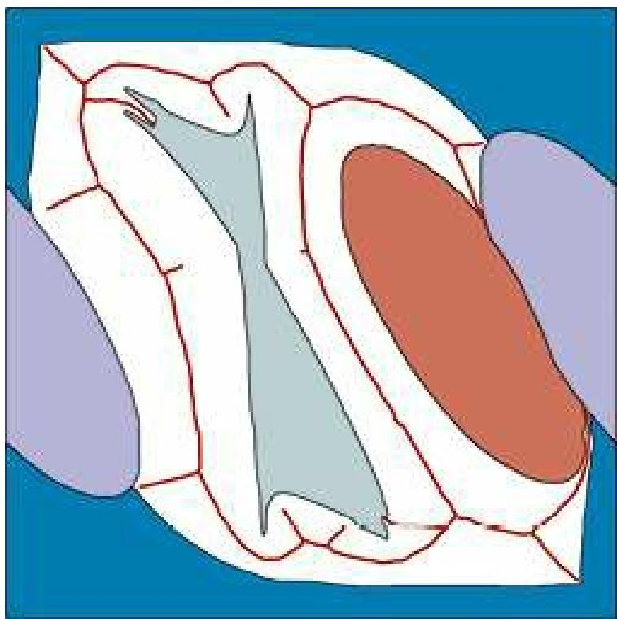

  
图26-15沃罗诺伊图式展示了构形空间中与周围两个或多个障碍物等距的点的集合（红色线）

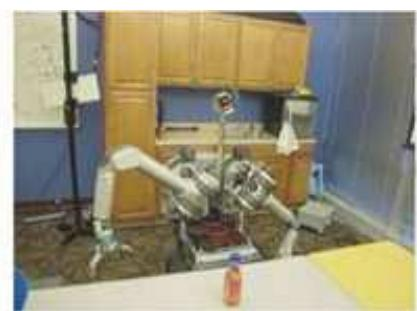

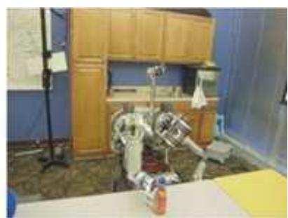

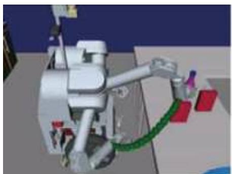  
图26-19 RRT生成并经过“走捷径”后期处理的截图。图片由Anca Dragan提供

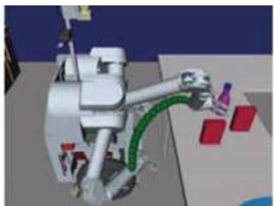

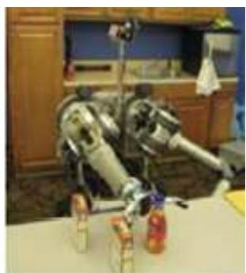  
图26-21用轨迹优化器解决了伸手抓住瓶子的任务。左图：为末端效应器绘制的初始轨迹。中图：优化后的最终轨迹。右图：目标构形。图片由Anca Dragan提供，见（Ratliff et al., 2009）


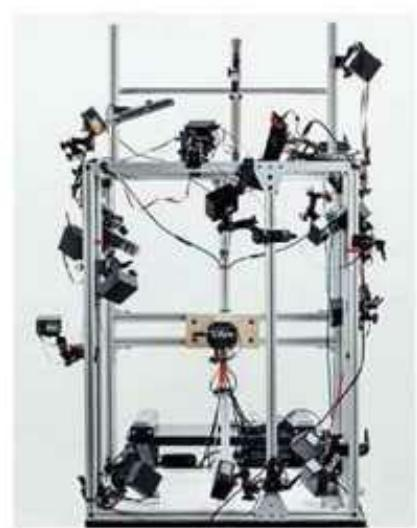

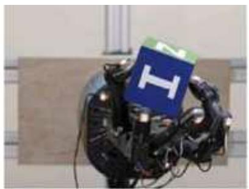

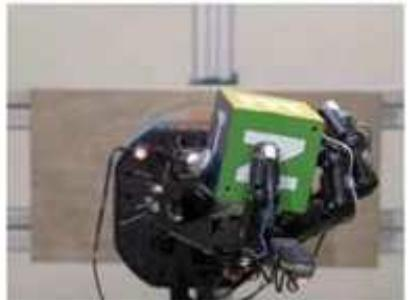  
（c）

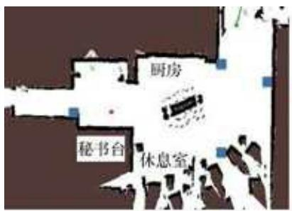  
图26-26训练健壮的策略。（a）在一个操作物体的机械手上多次运行模拟，物理学参数和照明情况是随机的。图片由Wojciech Zaremba提供。（b）真实世界环境中，单个机械手处于笼子中央，周围有摄像头和测距器。（c）模拟和真实世界训练产生了多个抓住物体的策略，此处有捏住和四指握两种。图片由OpenAI提供，见（Andrychowicz et al , 2018a）

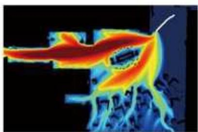  
（b)

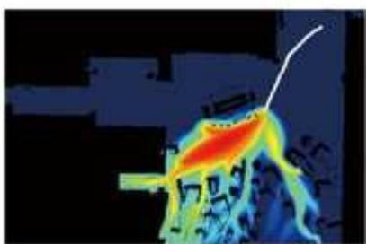

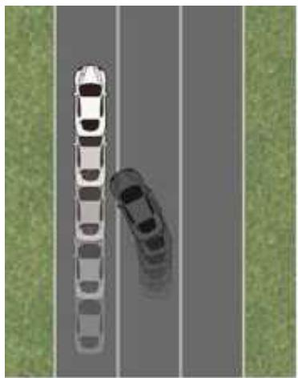  
图26-27假设人类在给定目标的情况下的理性带有噪声时进行预测：机器人使用过往动作来更新对人类目标的信念，并使用这个信念预测未来动作。（a）房间的地图。（b）看到小部分人类轨迹时的预测（白色路径）。（c）看到更多人类动作时的预测：机器人现在知道人类没有走向左边的走廊，因为如果那是人类的目标，到目前为止的行进路径就是一条糟糕的路径。图片由Brian D.Ziebart提供，见（Ziebart et al. , 2009）

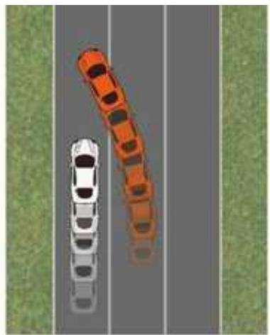

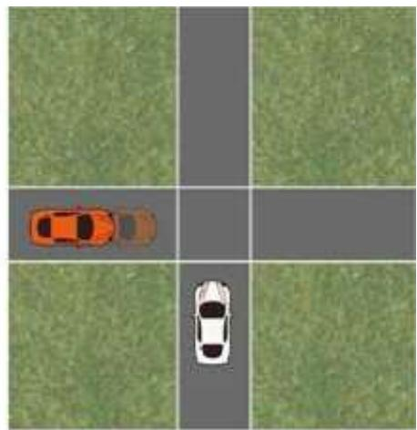  
（b）  
图26-28（a）左图：自主驾驶汽车（中间车道）预测人类司机（左侧车道）要继续前进，并规划

了减速并入该车后方的轨迹。右图：自主驾驶汽车考虑了它的动作对人类动作的影响，发觉它可以依靠人类司机的减速来并入前方。（b）在交叉路口，同样的算法产生了不寻常的策略：自主驾驶汽车发觉它可以通过稍稍后退来使人类司机（底部）更快地通过路口。图片由Anca Dragan提供，见（Sadigh et al. , 2016）

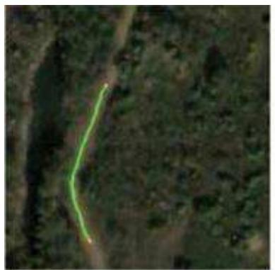

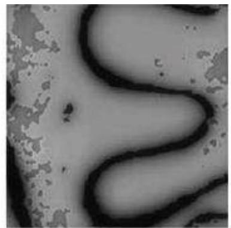

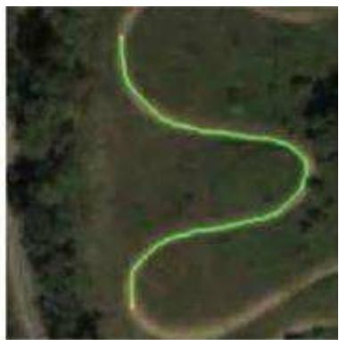

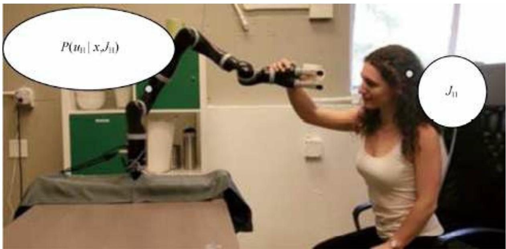  
图26-29（a）向移动机器人展示保持在土路上的演示。（b）机器人推断所需的代价函数，将其用于新场景中，且知道使道路上的代价较低。（c）机器人对新场景规划了一条同样在道路上的路径，重现了演示中隐含的偏好。图片由Nathan Ratliff and James A. Bagnell提供，见（Ratliff et al.,2006）  
图26-30人类教学者把机器人向下拽来教它离桌子更近一些。机器人正确地更新了它对所需代价函数的理解，并开始对代价函数进行优化。图片由Anca Dragan提供，见（Sefidgar et al. , 2017）

  
（a）

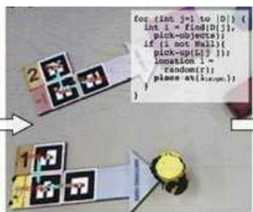

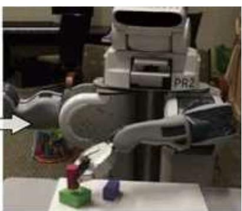

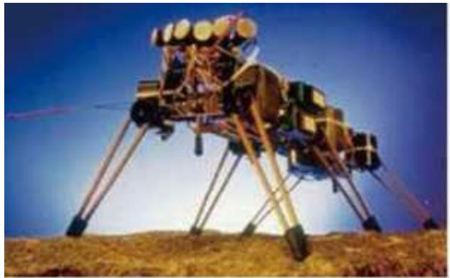  
图26-31一个编程接口，在机器人的工作空间中放置专门设计的程序块，以选择物体并指定高层级动作。图片由Maya Cakmak提供，见（Sefidgar et al., 2017）

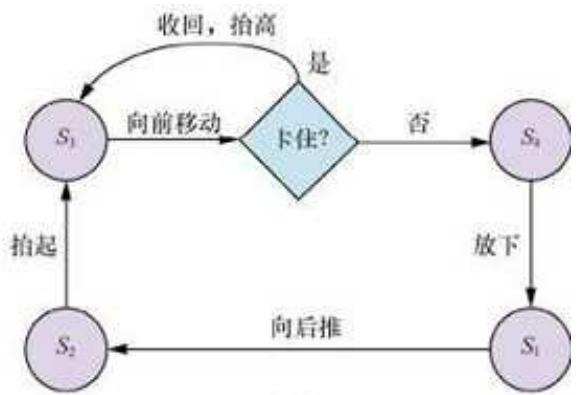

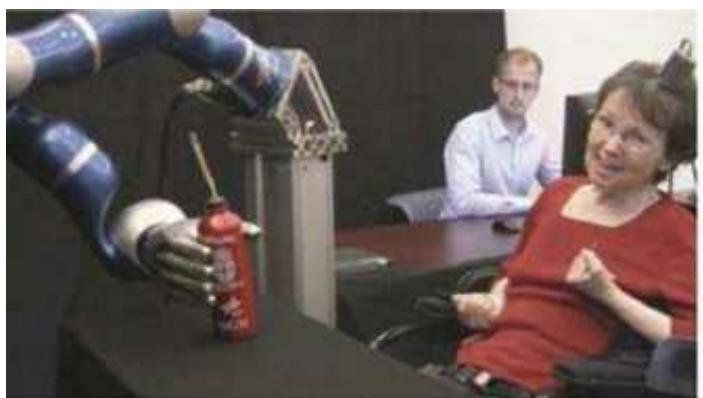  
图26-32 （a）六足机器人Genghis。图片由Rodney A. Brooks提供。（b）用于控制一条腿的增强有限状态机（AFSM）。AFSM对传感器反馈进行反应：如果腿在前摆阶段卡住，则会逐渐增加高度  
（a）.


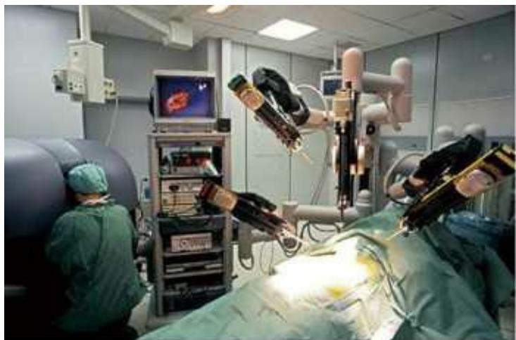  
图26-33（a）一位用脑机接口控制机械臂抓取饮料的患者。图片由布朗大学提供。（b）吸尘器机器人Roomba。照片来自HANDOUT/KRT/Newscom

  
（b）  
图26-34（a）手术室内的外科手术机器人。照片来自Patrick Landmann/科学图片库。（b）医院运输机器人。照片来自Wired

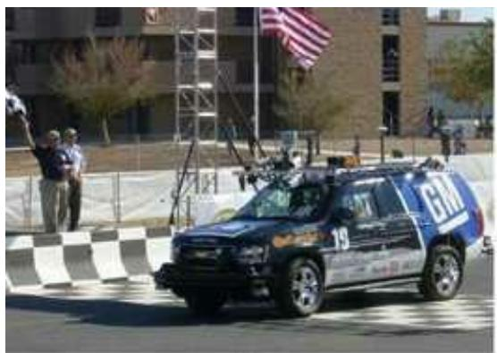

  
（b）

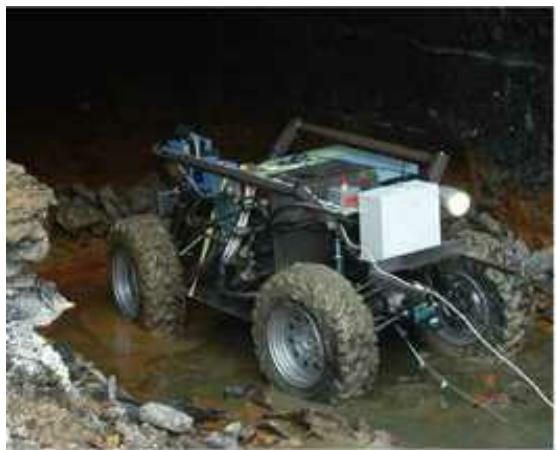  
图26-35 （a）赢得DARPA城市挑战赛的自主汽车B oss 。照片由 Tangi Quemener/AFP/GettyImages/Newscom拍摄，由Sebastian Thrun提供。（b）展示Waymo自主汽车（绿色轨迹上的白车）的感知和预测的空中视角。其他车辆（蓝色方块）和行人（橙色方块）及其预期轨迹也展示在图中。道路/人行道边界为黄色。照片由Waymo提供

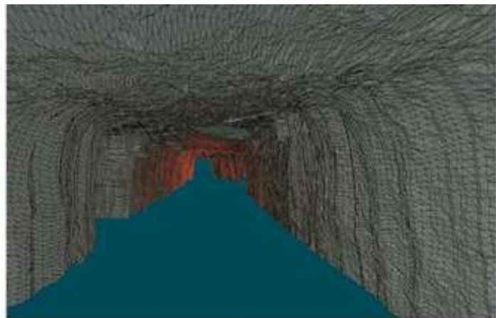  
  
图26-36（a）机器人为废弃煤矿绘制地图。（b）机器人获取的该煤矿三维地图。图片由SebastianThrun提供

第一部分

人工智能基础

# 第1章绪论

在本章中，我们将解释为什么我们认为人工智能是一个最值得研究的课题，并试图定义人工智能究竟是什么。这是开启人工智能学习之旅之前不错的准备。

我们称自己为智人（有智慧的人），因为 智能 （intelligence）对我们来说尤其重要。几千年来，我们一直试图理解我们是如何思考和行动的，也就是不断地了解我们的大脑是如何凭借它那小部分物质去感知、理解、预测并操纵一个远比其自身更大更复杂的世界。 人工智能 （artificialintelligence，AI）领域不仅涉及理解，还涉及构建智能实体。这些智能实体机器需要在各种各样新奇的情况下，计算如何有效和安全地行动。

人工智能经常被各种调查列为最有趣、发展最快的领域之一，现在每年创造的价值超过一万亿美元。人工智能专家李开复预测称，人工智能对世界的影响“将超过人类历史上的任何事物”。此外，人工智能的研究前沿仍是开放的。学习较古老科学（如物理学）的学生可能会认为最好的想法都已经被伽利略、牛顿、居里夫人、爱因斯坦等人发现了，但当下人工智能仍然为专业人员提供了许多机会。

目前，人工智能包含大量不同的子领域，从学习、推理、感知等通用领域到下棋、证明数学定理、写诗、驾车或诊断疾病等特定领域。人工智能可以与任何智能任务产生联系，是真正普遍存在的领域。

# 1.1 什么是人工智能

我们声称人工智能很有趣，但是我们还没有描述它是什么。历史上研究人员研究过几种不同版本的人工智能。有些根据对人类行为的复刻来定义智能，而另一些更喜欢用“理性 ”（rationality）来抽象正式地定义智能，直观上的理解是做“正确的事情”。智能主题的本身也各不相同：一些人将智能视为内部思维过程 和推理 的属性，而另一些人则关注智能的外部特征，也就是智能行为。


从人与理性 $\underline { { \phantom { 1 0 } } }$ 以及思想与行为这两个维度来看，有4种可能的组合，而且这4种组合都有其追随者和相应的研究项目。他们所使用的方法必然是不同的：追求类人智能必须在某种程度上是与心理学相关的经验科学，包括对真实人类行为和思维过程的观察和假设；而理性主义方法涉及数学和工程的结合，并与统计学、控制理论和经济学相联系。各个研究团体既互相轻视又互相帮助。接下来，让我们更细致地探讨这4种方法。

# 1.1.1 类人行为：图灵测试方法

图灵测试 （Turing test）是由艾伦·图灵（Alan Turing）提出的（Turing, 1950），它被设计成一个思维实验，用以回避“机器能思考吗？”这个哲学上模糊的问题。如果人类提问者在提出一些书面问题后无法分辨书面回答是来自人还是来自计算机，那么计算机就能通过测试。在第27章中，我们会讨论图灵测试的细节，以及一台通过图灵测试的计算机是否真的具备智能。目前，为计算机编程使其能够通过严格的应用测试尚有大量工作要做。计算机需要具备下列能力：

● 自然语言处理 （natural language processing），以使用人类语言成功地交流；  
● 知识表示 （knowledge representation），以存储它所知道或听到的内容；  
● 自动推理 （automated reasoning），以回答问题并得出新的结论；  
● 机器学习 （machine learning），以适应新的环境，并检测和推断模式。

图灵认为，没有必要对人进行物理模拟来证明智能。然而，其他研究人员提出了 完全图灵测试（totalTuring test），该测试需要与真实世界中的对象和人进行交互。为了通过完全图灵测试，机器人还需要具备下列能力：

● 计算机视觉 （computer vision）和语音识别功能，以感知世界；  
●机器人学 （robotics），以操纵对象并行动。

以上6个学科构成了人工智能的大部分内容。然而，人工智能研究人员很少把精力用在通过图灵测试上，他们认为研究智能的基本原理更为重要。当工程师和发明家停止模仿鸟类，转而使用风洞并学习空气动力学时，对“人工飞行”的探索取得了成功。航空工程学著作并未将其领域的目标定义为制造“能像鸽子一样飞行，甚至可以骗过其他真鸽子的机器”。

# 1.1.2 类人思考：认知建模方法

我们必须知道人类是如何思考的，才能说程序像人类一样思考。我们可以通过3种方式了解人类的思维：

● 内省 （introspection）——试图在自己进行思维活动时捕获思维；  
● 心理实验 （psychological experiment）——观察一个人的行为；  
● 大脑成像 （brain imaging）—— 观察大脑的活动。

一旦我们有了足够精确的心智理论，就有可能把这个理论表达为计算机程序。如果程序的输入/输出行为与相应的人类行为相匹配，那就表明程序的某些机制也可能在人类中存在。

例如，开发通用问题求解器（General Problem Solver，GPS）的艾伦·纽厄尔（Alan Newell）和赫伯特·西蒙（Herbert Simon）并不仅仅满足于让他们的程序正确地求解问题，他们更关心的是将推理步骤的顺序和时机与求解相同问题的人类测试者进行比较（NewellandSimon,1961）。认知科学（cognitive science）这一跨学科领域汇集了人工智能的计算机模型和心理学的实验技术，用以构建精确且可测试的人类心智理论。

认知科学本身是一个引人入胜的领域，值得用多本教科书和至少一部百科全书（Wilson andKeil,1999）来介绍。我们会偶尔评论人工智能技术和人类认知之间的异同，但真正的认知科学必须建立在对人类或动物实验研究的基础上。这里，我们假设读者只有一台可以做实验的计算机，因此我们将把这方面的内容留给其他书籍。

在人工智能发展的早期，这两种方法经常会混淆。有作者认为，如果算法在某个任务中表现良好，就会是建模人类表现的良好模型，反之亦然。而现代作者将这两种主张分开，这种区分使人工智能和认知科学都得到了更快的发展。这两个领域相互促进，值得一提的是计算机视觉领域，它将神经生理学证据整合到了计算模型中。最近，将神经影像学方法与分析数据的机器学习技术相结合，开启了“读心”能力（即查明人类内心思想的语义内容）的研究。这种能力反过来可以进一步揭示人类认知的运作方式。

# 1.1.3 理性思考：“思维法则”方法

希腊哲学家亚里士多德是最早试图法则化“正确思维”的人之一，他将其定义为无可辩驳的推理过程。他的三段论 （syllogism）为论证结构提供了模式，当给出正确的前提时，总能得出正确的结论。举个经典的例子，当给出前提 苏格拉底是人 和 所有人都是凡人 时，可以得出结论 苏格拉底是凡人。 ［这个例子可能是塞克斯都·恩披里柯（Sextus Empiricus）提出的而不是亚里士多德提出的。］这些思维法则被认为支配着思想的运作，他们的研究开创了一个称为逻辑 （logic）的领域。

19世纪的逻辑学家建立了一套精确的符号系统，用于描述世界上物体及其之间的关系。这与普通算术表示系统形成对比，后者只提供关于数的描述。到1965年，任何用逻辑符号描述的可解问题在原则上都可以用程序求解。人工智能中所谓的逻辑主义 （logicism）传统希望在此类程序的基础上创建智能系统。

按照常规的理解，逻辑要求关于世界的认知是确定的，而实际上这很难实现。例如，我们对政治或战争规则的了解远不如对国际象棋或算术规则的了解。概率 （probability）论填补了这一鸿沟，允许我们在掌握不确定信息的情况下进行严格的推理。原则上，它允许我们构建全面的理性思维模型，从原始的感知到对世界运作方式的理解，再到对未来的预测。它无法做到的是形成智能行为。为此，我们还需要关于理性行为的理论，仅靠理性思考是不够的。

# 1.1.4 理性行为：理性智能体方法

智能体 （agent）就是某种能够采取行动的东西（agent来自拉丁语agere，意为“做”）。当然，所有计算机程序都可以完成一些任务，但我们期望计算机智能体能够完成更多的任务：自主运行、感知环境、长期持续存在、适应变化以及制定和实现目标。理性智能体 （rationalagent）需要为取得最佳结果或在存在不确定性时取得最佳期望结果而采取行动。

基于人工智能的“思维法则”方法重视正确的推断。做出正确的推断有时是理性智能体的一部分，因为采取理性行为的一种方式是推断出某个给定的行为是最优的，然后根据这个结论采取行动。但是，理性行为的有些方式并不能说与推断有关。例如，从火炉前退缩是一种反射作用，这通常比经过深思熟虑后采取的较慢的动作更为成功。

通过图灵测试所需的所有技能也使智能体得以采取理性行为。知识表示和推理能让智能体做出较好的决策。我们需要具备生成易于理解的自然语言句子的能力，以便在复杂的社会中生存。我们需要学习不仅是为了博学多才，也是为了提升我们产生高效行为的能力，尤其是在新环境下，这种能力更加重要。

与其他方法相比，基于人工智能的理性智能体方法有两个优点。首先，它比“思维法则”方法更普

适，因为正确的推断只是实现理性的几种可能机制之一。其次，它更适合科学发展。理性的标准在数学上是明确定义且完全普适的。我们经常可以从这个标准规范中得出可以被证明能够实现的智能体设计，而把模仿人类行为或思维过程作为目标的设计在很大程度上是不可能的。

由于上述这些原因，在人工智能领域的大部分历史中，基于理性智能体的方法都占据了上风。在最初的几十年里，理性智能体建立在逻辑的基础上，并为了实现特定目标制定了明确的规划。后来，基于概率论和机器学习的方法可以使智能体在不确定性下做出决策，以获得最佳期望结果。简而言之，人工智能专注于研究和构建做正确的事情的智能体 ，其中正确的事情是我们提供给智能体的目标定义。这种通用范式非常普遍，以至于我们可以称之为 标准模型 （standard model）。它不仅适用于人工智能，也适用于其他领域。控制理论中，控制器使代价函数最小化；运筹学中，策略使奖励的总和最大化；统计学中，决策规则使损失函数最小；经济学中，决策者追求效用或某种意义的社会福利最大化。

然而在复杂的环境中，完美理性（总是采取精确的最优动作）是不可行的，它的计算代价太高了，因此需要对标准模型做一些重要的改进。第5章和第17章会探讨 有限理性 （limited rationality）的问题，也就是在没有足够时间进行所有可能的计算的情况下，适当地采取行动。但是，完美理性仍然是理论分析的良好出发点。

# 1.1.5


自标准模型被提出以来，其一直是人工智能研究的指南，但从长远来看，它可能不是一个正确的模型，原因是标准模型假设我们总是为机器提供完全指定的目标。

人为定义的任务，如国际象棋或最短路径计算之类的，都附带固有的目标，因此标准模型是适用的。然而，在真实世界中，我们越来越难以完全正确地指定目标。例如，在设计自动驾驶汽车时，我们可能会认为目标是安全到达目的地。但是，由于存在其他司机失误、设备故障等原因，在任何道路上行驶都有可能受伤，因此，严格的安全目标是要求待在车库里而不要上路驾驶。向目的地前进和承担受伤风险是需要权衡的，应该如何进行这种权衡？此外，我们能在多大程度上允许汽车采取会惹恼其他司机的行动？汽车应该在多大程度上调控其加速、转向和刹车动作，以避免摇晃乘客？这类问题很难预先回答。在人机交互的整个领域，这些问题尤其严重，自动驾驶只是其中一个例子。

在我们的真实需求和施加给机器的目标之间达成一致的问题称为价值对齐问题 （valuealignmentproblem），即施加给机器的价值或目标必须与人类的一致。如果我们在实验室或模拟器中开发人工智能系统（就像该领域的大多数历史案例一样），就可以轻松地解决目标指定不正确的问题：重置系统、修复目标然后重试。随着人工智能的发展，越来越强大的智能系统需要部署在真实世界中，这种方法不再可行。部署了错误目标的系统将会导致负面影响，而且，系统越智能，其负面影响就越严重。

回想看似没有问题的国际象棋案例，想象一下，如果机器足够智能，可以推断并采取超出棋盘限制的动作，会发生什么。例如，它可能试图通过催眠或勒索对手，或贿赂观众在对手思考时发出噪声

等手段来增加获胜的机会。 $-$ 它也可能会为自己劫持额外的计算能力。 这些行为不是“愚蠢”或“疯狂”的，这些行为是将获胜定义为机器唯一目标的逻辑 结果 。

一台实现固定目标的机器可能会出现很多不当行为，要预测所有不当行为是不可能的。因此，我们有足够理由认为标准模型是不充分的。我们不希望机器“聪明”地实现它们的目标，而是希望它们实现我们的目标。如果我们不能将这些目标完美地传达给机器，就需要一个新的表述，也就是机器正在实现我们的目标，但对于目标是什么则是不确定的 。当一台机器意识到它不了解完整的目标时，它就会有谨慎行动的动机，会寻求许可，并通过观察来更多地了解我们的偏好，遵守人为控制。最终，我们想要的是对人类 可证益的 （provably beneficial）智能体。我们将在1.5节中讨论这个主题。


# 1.2 人工智能的基础

在本节中，我们将简要介绍为人工智能提供思想、观点和技术的学科的历史。像任何历史一样，本书只关注少数人物、事件和思想，而忽略其他同样重要的。我们围绕一系列问题来组织这段历史。我们不希望带给读者这样一种印象：这些问题是各个学科唯一要解决的问题，或者各个学科都将人工智能作为最终成果而努力。

# 1.2.1 哲学

●可以使用形式化规则得出有效结论吗？  
●思维是如何从物质大脑中产生的？  
●知识从何而来？  
●知识如何导致行为？

亚里士多德（Aristotle，公元前384—公元前322）制定了一套精确的法则来统御思维的理性部分，他是历史上第一位这样做的哲学家。他发展了一套非正式的三段论系统进行适当的推理，该系统原则上允许人们在给定初始前提下机械地得出结论。

拉蒙·鲁尔（Ramon Llull，约1232—1315）设计了一种推理系统，发表为 Ars Magna （即 The GreatArt）（Llull, 1305） [1] 。鲁尔试图使用实际的机械设备——一组可以旋转成不同排列的纸盘—实现他的系统。

大约在1500年，列奥纳多·达·芬奇（Leonardo da Vinci，1452—1519）设计了一台机械计算器，虽然当时并未制造，但最近的重构表明该设计是可行的。第一台已知的计算器是在1623年前后由德国科学家威廉·席卡德（Wilhelm Schickard，1592—1635）制造的。布莱兹·帕斯卡（Blaise Pascal，1623—1662）于1642年建造了滚轮式加法器（Pascaline），并写道：“它产生的效用似乎比动物的所有行为更接近思维。”戈特弗里德·威廉·莱布尼茨（Gottfried Wilhelm Leibniz，1646—1716）制造了一台机械设备，旨在根据概念而非数值进行操作，但其应用范围相当有限。托马斯·霍布斯（Thomas Hobbes，1588—1679）在《利维坦》（ Leviathan ）一书中提出了会思考的机器的想法，用他的话说就是一种“人造动物”，设想“心脏无非就是发条，神经只是一些游丝，而关节不过是一些齿轮”。他还主张推理就像是数值计算，认为“推理就是一种计算，也就是相加减”。


有观点认为，思维至少在某种程度上是根据逻辑或数值规则运作的，可以建立模仿其中的一些规则的物理系统。也有观点说，思维本身就是这样一个物理系统。勒内·笛卡儿（RenéDescartes，1596—1650）首次清晰地讨论了思维与物质之间的区别。他指出，思维的纯粹物理概念似乎没有给自由意志留下多少空间。如果思维完全受物理法则支配，那么它拥有的自由意志不会比一块“决定”往下掉的石头多。笛卡儿是二元论 （dualism）的支持者。他认为，人类思维（灵魂或者精神）的一部分处于自然之外，不受物理定律的约束。但是，动物不具备这种二元特性，它们可以被视为机器。

唯物主义 （materialism）是二元论的一种替代，它认为大脑根据物理定律的运作构成了思维。自由意志仅仅是实体对可选决策的感知。物理主义 （physicalism）和自然主义 （naturalism）这两个术语也被用于描述这类与超自然观点相反的观点。

如果给定可以操纵知识的实体思维，接下来的问题就是建立知识的来源。经验主义（empiricism）运动始于弗朗西斯·培根（Francis Bacon，1561—1626）的《新工具》（ NovumOrganum ） [2] 一书，并以约翰·洛克（John Locke，1632—1704）的名言“知识归根到底都来源于经验”为特征。

大卫·休谟（David Hume，1711—1776）的《人性论》（ A Treatise of Human Nature ）（Hume,1739）提出了现在称为归纳法 （induction）的原则：通过暴露要素之间的重复联系获得一般规则。

以路德维希·维特根斯坦（Ludwig Wittgenstein，1889—1951）和伯特兰·罗素（Bertrand Russell，1872—1970）的工作为基础，著名的维也纳学派（Sigmund,2017）——一群在20世纪20年代及20世纪30年代聚集在维也纳的哲学家和数学家——发展了 逻辑实证主义 （logical positivism）学说。该学说认为，所有知识都可以通过逻辑理论来描述，逻辑理论最终与对应于感知输入的 观察语句（observation sentence）相联系。因此，逻辑实证主义结合了理性主义和经验主义。

鲁道夫·卡纳普（Rudolf Carnap，1891—1970）和卡尔·亨佩尔（Carl Hempel，1905—1997）的 确证理论 （confirmation theory）试图通过量化应分配给逻辑语句的信念度来分析从经验中获取知识，信念度的取值基于逻辑语句与确证或否定它们的观察之间的联系。卡纳普的《世界的逻辑构造》（The Logical Structure of the World ）（Carnap, 1928）也许是最先提出将思维视为计算过程这一理论的著作。

思维的哲学图景中最后一个要素是知识与动作之间的联系。这个问题对人工智能来说至关重要，因为智能不仅需要推理，还需要动作。而且，只有理解了怎样的行为是合理的，才能理解如何构建行为是合理的（或理性的）智能体。

亚里士多德在《论动物的运动》（DeMotu Animalium ）中指出，动作的合理性是通过目标和动作结果的知识之间的逻辑联系来证明的：

但是，思考有时伴随着行为，有时却没有，有时伴随着行动，有时却没有，这是如何发生的？这看起来和对不变的对象进行推理和推断时发生的情况几乎是一样的。但是在那种情况下，结局是一个推测性的命题……而在这里，由两个前提得出的结论是一个行为……我需要覆盖物；斗篷是一种覆盖物。我需要一件斗篷。我需要什么，我必须做什么；我需要一件斗篷。我必须做一件斗篷。结论是，“我必须做一件斗篷”，这是一个行为。

在《尼各马可伦理学》（Nicomachean Ethics）（第三卷第3章，1112b）中，亚里士多德进一步阐述了这个主题，并提出了一个算法：

我们考虑的不是目的，而是实现目的的手段。医生并不考虑是否要使一个人健康，演说家并不考虑是否要去说服听众……他们是先确定一个目的，然后考虑用什么手段和方式来达到目的。如果有几种手段，他们考虑的就是哪种手段最能实现目的。如果只有一种手段，他们考虑的就是怎样利用这一手段去达到目的，这一手段又需要通过哪种手段来获得。这样，他们就在所发现的东西中一直追溯到最初的东西……分析的终点也就是起点。如果恰巧遇到不可能的事情，例如需要钱却得不到钱，那么就放弃这种考虑。而所谓可能的事情，就是以我们自身能力可以做到的那些事情。


2300年后，纽厄尔和西蒙在他们的通用问题求解器 （GeneralProblemSolver）程序中实现了亚里士多德的算法。我们现在将其称为贪婪回归规划系统（见第11章）。在人工智能理论研究的前几十年中，基于逻辑规划以实现确定目标的方法占据主导地位。

纯粹从行为的角度来思考实现目标通常是有用的，但在某些情况是不适用的。例如，如果有几种不同的方法可以实现目标，我们就需要某种方法来进行选择。更重要的是，确定性地实现一个目标可能是无法做到的，但某些行为仍然必须被实施。那该如何决策呢？安托万·阿尔诺（AntoineArnauld）（Arnauld,1662）分析了赌博中的理性决策概念，提出了一种量化公式，可以最大化期望收入的货币价值。后来，丹尼尔·伯努利（Daniel Bernoulli）（Bernoulli, 1738）引入了更普适的效用 （utility）概念，可以体现结果的内在主观价值。如第16章所述，在不确定性下，理性决策的现代概念涉及最大化期望效用。

在道德和公共政策方面，决策者必须考虑多个个体的利益。杰里米·边沁（Jeremy Bentham）（Bentham, 1823）和约翰·斯图尔特·穆勒（John Stuart Mill）（Mill, 1863）提出了 功利主义（utilitarianism）思想：基于效用最大化的理性决策应该适用于人类活动的所有领域，包括代表许多个体做出公共政策的决策。功利主义是一种特殊的结果主义 （consequentialism），行为的预期结果决定了正确与否。

相反，伊曼努尔·康德（ImmanuelKant）在1785年提出了一种基于规则或义务伦理学（deontological ethics）的理论。在该理论中，“做正确的事”不是由结果决定的，而是由管理可行行为的普适社会法则所决定的，可行行为包括“不要撒谎”“不要杀人”等。因此，如果期望的好处大于

坏处，那么功利主义者可以撒一个善意的谎言，但康德主义者则不能这样做，因为撒谎本质上就是错误的。穆勒承认规则的价值，但将其理解为基于第一性原理对结果进行推理的高效决策程序。许多现代人工智能系统正是采用了这种方法。

# 1.2.2 数学

●得出有效结论的形式化规则是什么？  
● 什么可以被计算？   
●如何使用不确定的信息进行推理？

哲学家们提出了人工智能的一些基本理念，但人工智能要成为正规科学，需要逻辑和概率的数学化，并引入一个新的数学分支——计算。

形式化逻辑 （formallogic）的思想可以追溯到古希腊、古印度和古代中国的哲学家，但它的数学发展真正始于乔治·布尔（George Boole，1815—1864）的工作。布尔提出了命题和布尔逻辑的细节（Boole, 1847）。1879年，戈特洛布·弗雷格（Gottlob Frege，1848—1925）将布尔逻辑扩展到包括


对象和关系，创建了沿用至今的一阶逻辑

作用外，还激发了哥德尔和图灵的工作，这些工作 支撑了计算本身。

。一阶逻辑除了在人工智能研究的早期发挥核心

概率 （probability）论可以视为信息不确定情况下的广义逻辑，这对人工智能来说是非常重要的考虑。吉罗拉莫·卡尔达诺（Gerolamo Cardano，1501—1576）首先提出了概率的概念，并根据赌博事件的可能结果对其进行了刻画。1654年，布莱兹·帕斯卡（BlaisePascal，1623—1662）在给皮埃尔·费马（PierreFermat，1601—1665）的信中展示了如何预测一个未完成的赌博游戏的结局，并为赌徒分配平均收益。概率很快成为定量科学的重要组成部分，用于处理不确定的度量和不完备的理论。雅各布·伯努利（JacobBernoulli，1654—1705，丹尼尔·伯努利的叔叔）、皮埃尔·拉普拉斯（PierreLaplace，1749—1827）等人发展了这一理论，并引入了新的统计方法。托马斯·贝叶斯（ThomasBayes，1702—1761）提出了根据新证据更新概率的法则。贝叶斯法则是人工智能系统的重要工具。

概率的形式化结合数据的可用性，使 统计学 （statistics）成为了一个新研究领域。最早的应用之一是1662年约翰·格兰特（John Graunt）对伦敦人口普查数据的分析。罗纳德·费舍尔（RonaldFisher）被认为是第一位现代统计学家，他汇总了概率、实验设计、数据分析和计算等思想（Fisher,1922）。在1919年，他坚称，如果没有机械计算器“百万富翁”（Millionaire，第一个可以做乘法的计算器），他就无法进行工作，尽管这台计算器的成本远远超过了他的年薪（Ross,2012）。

计算的历史与数字的历史一样古老，但用于计算最大公约数的欧几里得算法被认为是第一个非平凡的算法 （algorithm）。“算法”一词源自一位9世纪的数学家穆罕默德·本·穆萨·阿尔·花剌子模（Muhammad ibn Musaal-Khwarizmi），他的著作还将阿拉伯数字和代数引入了欧洲。布尔等人讨论了逻辑演绎的算法，到19世纪末，人们开始努力将一般的数学推理形式化为逻辑演绎。

库尔特·哥德尔（KurtGödel，1906—1978）表明，虽然存在一种有效方法能够证明弗雷格和罗素的一阶逻辑中的任何真实陈述，但是一阶逻辑无法满足表征自然数所需的数学归纳原理。1931年，哥德尔证明关于演绎的限制确实存在。哥德尔的 不完全性定理 （incompletenesstheorem）表明，在任何像皮亚诺算术（Peano arithmetic，自然数的基本理论）这样强的形式化理论中，必然存在一些没有证明的真实陈述。

这个基本结果也可以解释为作用于整数上的某些函数无法用算法表示，即它们无法被计算。这促使艾伦·图灵（Alan Turing，1912—1954）试图准确地描述哪些函数是 可计算的 ，即能够通过有效的过程进行计算。丘奇-图灵论题（Church-Turing thesis）提出将图灵机（Turing, 1936）可计算的函数作为可计算性的一般概念。图灵还表明，存在某些任何图灵机都无法计算的函数。例如，没有一台机器能够在广义上判断给定程序是会根据给定的输入返回答案，还是永远运行下去。

尽管可计算性 （computability）对理解计算很重要，但 易处理性 （tractability）的概念对人工智能的影响更大。粗略地说，如果解决一个问题实例所需的时间随着问题规模呈指数增长，那么这个

问题就是难处理的。在20世纪60年代中期，复杂性的多项式增长和指数增长之间的区别首次被强调（Cobham,1964;Edmonds,1965）。因为指数级增长意味着即使是中等规模的问题实例也无法在合理的时间内解决，所以易处理性很重要。

由斯蒂芬·库克（Stephen Cook）（Cook, 1971）和理查德·卡普（Richard Karp）（Karp, 1972）开创的 NP完全性 （NP-completeness）理论为分析问题的易处理性提供了基础：任何可以归约到NP完全的问题都可能是难处理的。（尽管尚未证明NP完全问题一定是难处理的，但大多数理论家都相信这一点。）这些结果与大众媒体对第一台计算机的乐观态度——“比爱因斯坦还快的电子超级大脑！”——形成了鲜明对比。尽管计算机的速度在不断提高，但对资源的谨慎使用和必要的缺陷将成为智能系统的特征。粗略地说，世界是一个极大 的问题实例！

# 1.2.3 经济学

● 我们应该如何根据自己的偏好做出决定？  
●当其他人可能不支持时，我们应该怎么做？  
●当收益可能在很遥远的未来时，我们应该怎么做？

经济学起源于1776年，当时亚当·斯密（AdamSmith，1723—1790）发表了《国富论》（全名为《国民财富的性质和原因的研究》， An Inquiry into the Nature and Causes of the Weallth of Nations）。斯密建议将经济视为由许多关注自身利益的独立主体组成，但他并不主张将金融贪婪作为道德立场。他在较早的著作《道德情操论》（ The Theory of Moral Sentiments ）（Smith, 1759）开篇就指出，对他人福祉的关注是每个个体利益的重要组成部分。

大多数人认为经济学就是关于钱的，而实际上第一个对不确定性下的决策进行数学分析的是安托万·阿尔诺（Arnauld,1662）的最大期望值公式，而这一分析也的确是与赌注的货币价值相关。丹尼尔·伯努利（Bernoulli, 1738）注意到，这个公式似乎不适用于更大规模的金钱，例如对海上贸易远征的投资。于是，他提出了基于期望效用最大化的原则，并指出额外货币的边际效用会随着一个人获得更多货币而减少，从而解释了大众的投资选择。

里昂·瓦尔拉斯（Léon Walras，1834—1910）为效用理论提供了一个更为普适的基础，即对任何结果（不仅仅是货币结果）的投机偏好。弗兰克·拉姆齐（Frank Ramsey）（Ramsey, 1931）以及后来约翰·冯·诺伊曼（John von Neumann）和奥斯卡·摩根斯特恩（Oskar Morgenstern）在他们的著作《博弈论与经济行为》（ The Theory of Games and Economic Behavior ）（Neumann andMorgenstern, 1944）中对这一理论进一步改进。经济学不再是研究金钱的学科，而是对欲望和偏好的研究。

决策论 （decision theory）结合了概率论和效用理论，为在不确定性下做出个体决策（经济的或其他的）提供了一个形式化完整的框架，也就是说，概率适当地描述了决策者所处的环境。这适用于“大型”经济体，在这种经济体中，每个主体都无须关注其他独立主体的行为。对“小型”经济体而言更像是一场 博弈 （game）：一个参与者的行为可以显著影响另一个参与者的效用（积极或消极的）。冯·诺依曼和摩根斯特恩对博弈论 （gametheory）的发展［也可以参考（Luceand Raiffa,1957）］得出了令人惊讶的结果，即对于某些博弈，理性智能体应该采用随机（或至少看起来是随机）的策略。与决策论不同，博弈论并没有为行为的选择提供明确的指示。人工智能中涉及多个智能体的决策将在多智能体系统 （multiagentsystem）的主题下探讨（第18章）。

经济学家（除了一些例外）没有解决上面列出的第三个问题：当行为的收益不是立即产生的，而是在几个连续的行为后产生时，应该如何做出理性的决策。这个课题在 运筹学 （operationsresearch）的领域探讨，运筹学出现在第二次世界大战期间英国对雷达安装的优化工作中，后来发展出了无数民用应用。理查德·贝尔曼（Richard Bellman）（Bellman,1957）的工作将一类序贯决策问题进行了形式化，称为马尔可夫决策过程 （Markov decision process），我们将在第17章研究该问题，并在第22章以 强化学习 （reinforcementlearning）的主题研究该问题。

经济学和运筹学的工作对理性智能体的概念做出了很大贡献，但是多年来的人工智能研究是沿着完全独立的道路发展的。原因之一是做出理性决策显然是复杂的。人工智能的先驱赫伯特·西蒙（HerbertSimon,1916—2001）凭借其早期工作在1978年获得了诺贝尔经济学奖，他指出基于满意度 （satisficing）的决策模型（做出“够好”的决策，而不是费力地计算最优决策）可以更好地描述实际的人类行为（Simon,1947）。自20世纪90年代以来，人工智能的决策理论技术重新引起了人

们的兴趣。

# 1.2.4 神经科学

# ●大脑如何处理信息？

神经科学 （neuroscience）是对神经系统（尤其是对大脑）的研究。尽管大脑进行思考的确切方式是科学的奥秘之一，但大脑确实是能思考的现实已经被人们接受了数千年，因为有证据表明，对头部的强烈打击会导致精神丧失。人们也早就知道人的大脑在某种程度上是不同的，大约在公元前


335年，亚里士多德写道：“在所有动物中，人类的大脑与身体大小的比例最大。” $\longrightarrow$ 然而，直到18世纪中叶，大脑才被广泛认为是意识的所在地。在此之前，意识所在地的候选位置包括心脏和脾脏。

1861年，保罗·布罗卡（PaulBroca，1824—1880）对脑损伤患者中的失语症（语言缺陷）进行了调查研究，他在大脑左半球发现一个局部区域（现在被称为布罗卡氏区域）负责语音的产生，从而开


始了对大脑功能组织的研究。 $\_$ 那时，人们已经知道大脑主要由神经细胞或神经元（neuron）组成，但直到1873年，卡米洛·高尔基（Camillo Golgi，1843—1926）才发明了一种可以观察单个神经元的染色技术（见图1-1）。圣地亚哥·拉蒙-卡哈尔（Santiago Ramon y Cajal，1852—


1934）在神经组织的开创性研究中使用了该技术。 $-$ 现在人们普遍认为认知功能是由这些结构的电化学反应产生的。也就是说， 一组简单的细胞就可以产生思维、行为和意识。如约翰·希尔勒（John Searle）（Searle, 1992）的精辟名言所说： 大脑产生 思想 。

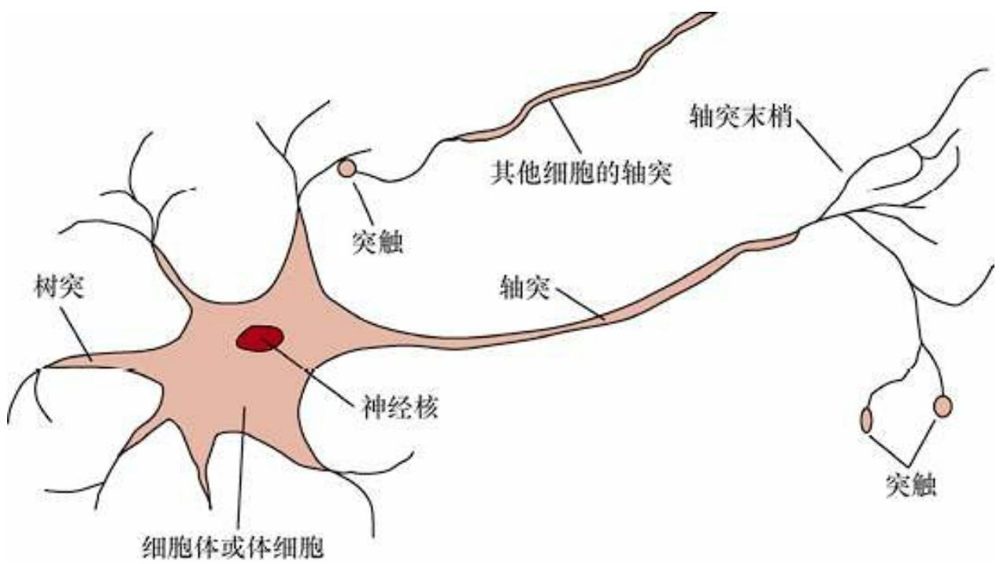  
图1-1神经细胞或神经元的部分。每个神经元都由一个包含神经核的细胞体或体细胞组成。许多从细胞体中分支出来的纤维状被称为树突，其中的长纤维被称为轴突。轴突伸展的距离很长，比这张图上显示的要长得多。轴突一般长1厘米（是细胞体直径的100倍），但也可以达到1米。一个神经元在称为突触的连接处与其他10～100 000个神经元建立连接。信号通过复杂的电化学反应从一个神经元传递到其他神经元。这些信号可以在短期内控制大脑活动，还可以长期改变神经元的连通性。这些机制被认为是大脑学习的基础。大多数信息都在大脑皮质（大脑的外层）中处理的。基本的组织单元似乎是直径约0.5毫米的柱状组织，包含约20 000个神经元，并延伸到整个皮质（人类皮

# 质深度约4毫米）

现在，我们有了一些关于大脑区域和身体部位之间映射关系的数据，这些部位是受大脑控制或者是接收感官输入的。这样的映射可以在几周内发生根本性的变化，而有些动物似乎具有多个映射。此外，我们还没有完全理解当一个区域受损时其他区域是如何接管其功能的。而且，关于个人记忆是如何存储的，或者更高层次的认知功能是如何运作的，目前几乎没有任何相关理论。

1929年，汉斯·伯杰（HansBerger）发明脑电图仪（EEG），开启了对完整大脑活动的测量。功能磁共振成像（fMRI）的发展（Ogawa et al. , 1990; Cabeza and Nyberg, 2001）为神经科学家提供了前所未有的大脑活动的详细图像，从而使测量能够以有趣的方式与正在进行的认知过程相对应。神经元活动的单细胞电记录技术和 光遗传学 （optogenetics）方法的进展（Crick, 1999; Zemelman et al .,2002;Han and Boyden, 2007）增强了这些功能，从而可以测量和控制被修改为对光敏感的单个神经元。

用于传感和运动控制的 脑机接口 （brain-machine interface）的发展（Lebedev and Nicolelis, 2006）不仅有望恢复残疾人的功能，还揭示了神经系统许多方面的奥秘。这项工作的一项重要发现是，大脑能够自我调整，使自己成功与外部设备进行交互，就像对待另一个感觉器官或肢体一样。

大脑和数字计算机有不同的特性。如图1-2所示，计算机的周期时间比大脑快一百万倍。虽然与高端个人计算机相比，大脑拥有更多的存储和互连，但最大的超级计算机在某些指标上已经与大脑相当。未来主义者充分利用这些数字，指出了一个即将到来的 奇点 （singularity），在这个奇点上计算机达到了超越人类的性能水平（Vinge, 1993; Kurzweil, 2005; Doctorow and Stross, 2012），然后会进一步迅速提高。但是比较原始数字并不是特别有用。即使计算机的容量到达无限也无济于事，在理解智能方面仍然需要进一步的概念突破（见第28章）。粗略地说，如果没有正确的理论，更快的机器只会更快地给出错误的答案。

<table><tr><td></td><td>超级计算机</td><td>个人计算机</td><td>人类大脑</td></tr><tr><td>计算单元</td><td>10^6个GPU+CPU</td><td>8个CPU内核</td><td>10^6列</td></tr><tr><td></td><td>10^15个晶体管</td><td>10^10个晶体管</td><td>10^11个神经元</td></tr><tr><td>存储单元</td><td>10^16字节(10PB)RAM</td><td>10^10字节(10GB)RAM</td><td>10^11个神经元</td></tr><tr><td></td><td>10^17字节(100PB)磁盘</td><td>10^12字节(1TB)磁盘</td><td>10^14个突触</td></tr><tr><td>周期时间</td><td>10^-9秒</td><td>10^-9秒</td><td>10^-3秒</td></tr><tr><td>运算/秒</td><td>10^18</td><td>10^10</td><td>10^17</td></tr></table>

图1-2 领先的超级计算机Summit（Feldman, 2017）、2019年的典型个人计算机和人类大脑的粗略对比。数千年来，人类大脑的能力并没有发生太大变化，而超级计算机的计算能力已经从20世纪60年代的百万次浮点运算（MFLOP）提高到了20世纪80年代的十亿次浮点运算（GFLOP）、20世纪90年代的万亿次浮点运算（TFLOP）、2008年的千万亿次浮点运算（PFLOP）以及2018年的百亿亿次浮点运算（exaFLOP，1 exaFLOP = 10 $1 8$ 次浮点运算/秒）

# 1.2.5 心理学

●人类和动物是如何思考和行为的？

科学心理学的起源通常可以追溯到德国物理学家赫尔曼·冯·赫尔姆霍茨（Hermann von Helmholtz，1821—1894）和他的学生威廉·温特（Wilhelm Wundt，1832—1920）的工作。赫尔姆霍茨将科学方法应用于人类视觉的研究，他的 Handbook of Physiological Optics 被描述为“关于人类视觉的物理学和生理学的最重要的专著”（Nalwa,1993,p.15）。1879年，温特在莱比锡大学开设了第一个实验心理学实验室。温特坚持严格控制的实验，他实验室的工作人员在进行感知或联想任务的同时，内省他们的思维过程。严格的控制在很大程度上帮助心理学成为了一门科学，但是数据的主观性质使得实验者不太可能会推翻自己的理论。

另外，研究动物行为的生物学家缺乏内省的数据，于是发展了一种客观的方法，赫伯特·詹宁斯（Herbert S. Jennings）（Jennings, 1906）在他有影响力的著作 Behavior of the Lower Organisms 中对

此进行了描述。约翰·沃森（John Watson，1878—1958）领导的 行为主义 （behaviorism）运动将这一观点应用于人类，以内省无法提供可靠证据为由，拒绝任何涉及心理过程的理论。行为主义者坚持只研究施加动物的感知（或 刺激 ）及其产生的行为（或反应）的客观度量。行为主义发现了很多关于老鼠和鸽子的知识，但是在理解人类方面却不太成功。

认知心理学 （cognitivepsychology）认为大脑是一个信息处理设备，这至少可以追溯到威廉·詹姆斯（WilliamJames，1842—1910）的著作。赫尔姆霍茨也坚持认为感知涉及一种无意识的逻辑推断形式。在美国，认知观点在很大程度上被行为主义所掩盖，但在弗雷德里克·巴特利特（FredericBartlett，1886—1969）所领导的剑桥大学应用心理学系，认知模型得以蓬勃发展。巴特利特的学生和继任者肯尼斯·克雷克（Kenneth Craik）（Craik, 1943）所著的 The Nature of Explanation 强有力地重新确立了诸如信念和目标之类的“精神”术语的合法性，认为它们就像用压力和温度来讨论气体一样科学，尽管气体是由既不具有压力又不具有温度的分子组成。

克雷克指出了知识型智能体的3个关键步骤：（1）刺激必须转化为一种内在表示；（2）认知过程处理表示，从而产生新的内部表示；（3）这些过程反过来又被重新转化为行为。他清晰地解释了为什么这是一个良好的智能体设计：

如果有机体拥有一个“小规模的模型”，建模了外部现实及其在脑海中可能采取的行为，那么它就能够尝试各种选择，得出哪个是最好的，并在未来出现情况之前加以应对。有机体可以利用过去的知识处理现在和未来的情况，并在各方面以更全面、更安全、更有力的方式应对紧急情况。（Craik,1943）

继1945年克雷克死于自行车事故之后，唐纳德·布劳德本特（Donald Broadbent）继续从事这一工作。布劳德本特的 Perception and Communication （Broadbent, 1958）是最早将心理现象建模为信息处理的著作之一。与此同时的美国，计算机建模的发展导致了 认知科学 （cognitivescience）领域的诞生。这个领域可以说是开始于1956年9月麻省理工学院的一次研讨会上，并且仅仅两个月后，人工智能本身就“诞生”了。

在研讨会上，乔治·米勒（George Miller）发表了“ The Magic Number Seven ”，诺姆·乔姆斯基（Noam Chomsky）发表了“ Three Models of Language ”，艾伦·纽厄尔和赫伯特·西蒙发表了“ TheLogic Theory Machine ”。这3篇影响广泛的论文分别展示了如何使用计算机模型处理记忆、语言和逻辑思维的心理学问题。现在心理学家普遍认为“认知理论应该就像一个计算机程序”（Anderson,1980），也就是说，认知理论应该从信息处理的角度来描述认知功能的运作。

为了综述目的，我们将 人机交互 （human-computer interaction，HCI）领域归于心理学下。人机交互的先驱之一道格·恩格巴特（Doug Engelbart）倡导 智能增强 （intelligence augmentation）的理念（IA而非AI）。他认为，计算机应该增强人类的能力，而不是完全自动化人类的任务。1968年，在恩格巴特的“所有演示之母”（motherofalldemos）上首次展示了计算机鼠标、窗口系统、超文本和视频会议，所有这些都是为了展示人类知识工作者可以通过某些智能增强来共同完成工作。

今天，我们更倾向于将IA和AI视为同一枚硬币的两面，前者强调人类控制，而后者强调机器的智能行为，都是机器有利于人类所必需的。

# 1.2.6 计算机工程

●如何构建高效的计算机？

现代数字电子计算机是由陷入第二次世界大战中的3个国家的科学家们独立且几乎同时发明的。第一台可操作的计算机是由艾伦·图灵的团队于1943年建造的机电希思·罗宾逊（Heath Robinson


），它的唯一目的是破译德国的情报。1943年，同一小组开发了Colossus，这是一款基于

真空管的强大通用机器。[3] 第一台可操作的可编程计算机是Z-3，是德国工程师康拉德·楚泽（Konrad Zuse）在1941年发明的。楚泽还发明了浮点数和第一个高级编程语言Plankalkül。第一台电子 计算机ABC是约翰·阿塔纳索夫（John Atanasoff）和他的学生克利福德·贝里（Clifford Berry）在1940年至1942年间在爱荷华州立大学组装的。阿塔纳索夫的研究很少得到支持或认可，而ENIAC作为宾夕法尼亚大学秘密军事项目的一部分被证明是现代计算机最有影响力的先驱。ENIAC的开发团队包括了约翰·莫奇利（John Mauchly）和约翰·普雷斯伯·埃克特（J. Presper

Eckert）等工程师。

从那时起，每一代计算机硬件更新都带来了速度和容量的提升以及价格的下降，这是摩尔定律（Moore’slaw）所描述的趋势。直到2005年之前，大约每18个月CPU的性能就会翻一番，但功耗问题导致制造商开始增加CPU的核数而不是提高CPU的时钟频率。目前的预期是，未来性能的增加将来自于大量的并行性，这体现了与大脑特性奇妙的一致性。在应对不确定的世界时，基于这一理念设计硬件：不需要64位的数字精度，只需16位（如bfloat16 格式）甚至8位就足够了，这可以使处理速度更快。

已经出现了一些针对人工智能应用进行调整的硬件，如图形处理单元（GPU）、张量处理单元（TPU）和晶圆级引擎（WSE）。从20世纪60年代到大约2012年，用于训练顶级机器学习应用的计算能力遵循了摩尔定律。从2012年开始，情况发生了变化：从2012年到2018年，这一数字增长了30万倍，大约每100天翻一番（Amodei and Hernandez, 2018）。在2014年花一整天训练的机器学习模型在2018年只需两分钟就可以训练完成（Ying et al ., 2018）。尽管 量子计算 （quantumcomputing）还不实用，但它有望为人工智能算法的一些重要子方向提供更显著的加速。

毋庸置疑，在电子计算机出现之前计算设备就已经存在了。最早的自动化机器可追溯到17世纪（见1.2.1节的讨论）。第一台 可编程 机器是由约瑟夫·玛丽·雅卡尔（Joseph Marie Jacquard，1752—1834）于1805年发明的提花织布机，它使用打孔卡片来存储编织图案的指令。

19世纪中期，查尔斯·巴贝奇（Charles Babbage，1792—1871）设计了两台计算机，但都没有完成。差分机的目的是为工程和科学项目计算数学表。它最终于1991年建成并投入使用（Swade,2000）。巴贝奇的分析机更有雄心：它包括可寻址内存、基于雅卡尔打孔卡的存储程序以及有条件的跳转。这是第一台能够进行通用计算的机器。

巴贝奇的同事埃达·洛芙莱斯（AdaLovelace，诗人拜伦勋爵的女儿）理解了计算机的潜力，将其描述为“一种能思考或者……能推理的机器”，能够对“宇宙中所有事物”进行推理（Lovelace,1843）。她还预测到了人工智能的技术成熟度曲线，并提出：“我们最好防范可能夸大分析机能力的想法。”遗憾的是，巴贝奇的机器和洛芙莱斯的思想已基本被遗忘了。

人工智能还得益于计算机科学软件方面的发展，后者提供了编写现代程序所需的操作系统、编程语言和工具（以及有关它们的论文）。而这也是人工智能对其有回馈的领域：人工智能工作开创的许多想法正重归主流计算机科学，包括分时、交互式解释器、使用窗口和鼠标的个人计算机、快速开发环境、链表数据类型、自动存储管理，以及符号式编程、函数式编程、说明性编程和面向对象编程的关键概念。

# 1.2.7 控制理论与控制论

●人造物如何在它们自己的控制下运行？

居住在亚历山大城的古希腊工程师克特西比乌斯（Ktesibios，约公元前250年）建造了第一个自我控制的机器：一台水钟，其特点是拥有一个可以保持恒定水流速度的调节器。这一发明改变了人造物可以做什么的定义。在此之前，只有生物才能根据环境的变化来改变自己的行为。其他自调节反馈控制系统的示例工作包括由詹姆斯·瓦特（JamesWatt，1736—1918）创建的蒸汽机调节器以及科内利斯·德雷贝尔（CornelisDrebbel，1572—1633，潜艇发明者）发明的恒温器。詹姆斯·克拉克·麦克斯韦（James Clerk Maxwell）（Maxwell, 1868）开创了控制系统的数学理论。

第二次世界大战后，控制理论 （controltheory）发展的核心人物是诺伯特·维纳（NorbertWiener，1894—1964）。维纳是一位杰出的数学家，在对生物和机械控制系统及其与认知的联系产生兴趣之前，曾与伯特兰·罗素等人合作。像克雷克（把控制系统作为心理模型）一样，维纳和他的同事阿图罗·罗森布鲁斯（Arturo Rosenblueth）以及朱利安·毕格罗（Julian Bigelow）挑战了行为主义正统派（Rosenblueth etal., 1943）。他们认为具有目的的行为源于试图最小化“错误”的调节机制，即当前状态和目标状态之间的差异。20世纪40年代后期，维纳与沃伦·麦卡洛克（WarrenMcCulloch）、沃尔特·皮茨（WalterPitts）和约翰·冯·诺伊曼一起组织了一系列有影响力的会议，探索关于认知的新数学和计算模型。维纳的《控制论》（ Cybernetics）（Wiener,1948）成为畅销书，使大众意识到了人工智能机器的可能性。

与此同时，英国控制论专家罗斯·艾什比（W.RossAshby）开创了类似的思想（Ashby,1940）。艾什比、图灵、沃尔特和其他一些学者为“那些在维纳的书出现之前就有维纳想法的人”组织了推理俱

乐部 。艾什比在《大脑设计》（ Design for a Brain ）（Ashby, 1948, 1952）一书中详细阐述了他的想法，即可以通过自我平衡 （homeostatic）设备来实现智能，该设备使用恰当的反馈回路来实现稳定的自适应行为。

现代控制理论，特别是被称为随机最优控制的分支，其目标是设计随时间最小化代价函数 （costfunction）的系统。这与人工智能的标准模型——设计性能最优的系统大致相符。尽管人工智能和控制理论的创始人之间有着密切的联系，为什么它们却是两个不同的领域呢？答案在于参与者所熟悉的数学技术与每种世界观所包含的对应问题是紧密结合的。微积分和矩阵代数是控制理论的工具，它们适用于固定的连续变量集描述的系统，而人工智能的建立在一定程度上是为了避开这些可感知的局限性。逻辑推理和计算工具使人工智能研究人员能够考虑语言、视觉和符号规划等问题，而这些问题完全超出了控制理论家的研究范围。

# 1.2.8 语言学

●语言是如何与思维联系的？

1957年，斯金纳（B. F. Skinner）发表了 Verbal Behavior ，包含该领域最著名的专家对语言学习的行为主义方法的全面详细的描述。但奇怪的是，一篇对这本书的评述也像这本书一样广为人知，几乎扼杀了大众对行为主义的兴趣。评述的作者是语言学家诺姆·乔姆斯基，彼时他刚刚出版了一本关于他自己理论的书《句法结构》（ Syntactic Structure ）。乔姆斯基指出，行为主义理论并没有解决语言创造力的概念，它没有解释孩子们如何理解并造出他们从未听过的句子。乔姆斯基以句法模型为基础的理论可以追溯到古印度语言学家波你尼（Panini，约公元前350年）。该理论可以解释语言创造力，而且与以前的理论不同，它足够形式化，原则上可以被程序化。

现代语言学和人工智能几乎同时“诞生”，并一起成长，交叉于一个称为计算语言学（computational linguistics）或 自然语言处理 （natural language processing）的混合领域。相比1957年，理解语言复杂了许多。理解语言需要理解主题和上下文，而不仅仅是理解句子结构。这似乎是显而易见的，但直到20世纪60年代才得到广泛认可。 知识表示 （knowledge representation）（关于如何将知识转化为计算机可以推理的形式的研究）的大部分早期工作与语言相关联，并受到语言学研究的启发，而语言学研究反过来又与数十年的语言哲学分析工作有关联。

# 1.3 人工智能的历史

总结人工智能历史里程碑的快速方法是列出图灵奖得主：马文·明斯基（Marvin Minsky）（1969年图灵奖得主）和约翰·麦卡锡（JohnMcCarthy）（1971年图灵奖得主）定义了基于表示和推理的领域基础；艾伦·纽厄尔（Allen Newell）和赫伯特·西蒙（Herbert Simon）（1975年图灵奖得主）提出了关于问题求解和人类认知的符号模型；爱德华·费根鲍姆（EdFeigenbaum）和劳伊·雷迪（RajReddy）（1994年图灵奖得主）开发了通过对人类知识编码来解决真实世界问题的专家系统；朱迪亚·珀尔（JudeaPearl）（2011年图灵奖得主）提出了通过原则性的方式处理不确定性的概率因果推理技术；最近的是约书亚·本吉奥（Yoshua Bengio）、杰弗里·辛顿（Geoffrey Hinton）和杨立昆


（Yann LeCun）（2018年图灵奖得主） $\_$ ，他们将“深度学习”（多层神经网络）作为现代计算的关键部分。本节的其余部分将更详细地介绍人工智能历史的每个阶段。

# 1.3.1 人工智能的诞生（1943—1956）

现在普遍认为由沃伦·麦卡洛克和沃尔特·皮茨（McCulloch andPitts,1943）完成的工作是人工智能的第一项研究工作。他们受到皮茨的顾问尼古拉斯·拉舍夫斯基（NicolasRashevsky）（1936,1938）对数学建模工作的启发，选择了3方面的资源构建模型：基础生理学知识和大脑神经元的功能，罗素和怀特海（Whitehead）对命题逻辑的形式化分析，以及图灵的计算理论。他们提出了一种人工神经元模型，其中每个神经元的特征是“开”或“关”，并且会因足够数量的相邻神经元受到刺激而切换为“开”。神经元的状态被认为是“事实上等同于提出其充分激活的命题”。例如，他们证明任何可计算的函数都可以通过一些神经元互相连接的网络来计算，以及所有的逻辑联结词（AND、OR、NOT等）都可以通过简单的网络结构来实现。麦卡洛克和皮茨还表明适当定义的网络可以学习。唐纳德·赫布（Donald Hebb）（Hebb,1949）示范了用于修改神经元之间连接强度的简单更新规则。他的规则，现在称为 赫布型学习 （Hebbian learning），至今仍是一种有影响力的模式。

哈佛大学的两名本科生马文·明斯基（Marvin Minsky，1927—2016）和迪安·埃德蒙兹（DeanEdmonds）在1950年建造了第一台神经网络计算机——SNARC。SNARC使用了3000个真空管和B-24轰炸机上一个多余的自动驾驶装置来模拟由40个神经元组成的网络。后来，明斯基在普林斯顿大学研究了神经网络中的通用计算。他的博士学位委员会对这类工作是否应该被视为数学持怀疑态度，但据说冯·诺伊曼评价：“如果现在还不能被视为数学，总有一天会的。”

还有许多早期工作可以被描述为人工智能，包括1952年由曼彻斯特大学的克里斯托弗·斯特雷奇（Christopher Strachey）和IBM公司的亚瑟·塞缪尔（Arthur Samuel）分别独立开发的西洋跳棋程序。然而，还是图灵的观点最有影响力。早在1947年，他就在伦敦数学协会（London MathematicalSociety）就这一主题发表了演讲，并在其1950年的文章“ Computing Machinery and Intelligence ”中阐明了有说服力的议程。在论文中，他介绍了图灵测试、机器学习、遗传算法和强化学习。如第27章所述，也回答了许多针对人工智能的质疑。他还认为，通过开发学习算法然后教会机器，而不是手工编写智能程序，将更容易创造出人类水平的人工智能。他在随后的演讲中警告说，实现这一目标对人类来说可能不是最好的事情。

1955年，达特茅斯学院的约翰·麦卡锡说服明斯基、克劳德·香农（ClaudeShannon）和纳撒尼尔·罗切斯特（NathanielRochester）帮助他召集对自动机理论、神经网络和智能研究感兴趣的美国研究人员。他们于1956年夏天在达特茅斯组织了为期两个月的研讨会。这场研讨会共有10位与会者，其


中包括来自卡内基理工学院 $\_$ 的艾伦·纽厄尔和赫伯特·西蒙、普林斯顿大学的特伦查德·摩尔（Trenchard More）、IBM的亚瑟·塞缪尔以及来自麻省理工学院的雷·所罗门诺夫（Ray


Solomonoff）和奥利弗·赛弗里奇（Oliver Selfridge）。该提案指出：

1956年夏天，我们提议在新罕布什尔州汉诺威的达特茅斯学院进行为期两个月共10人参与的人工智能研讨。这次研讨是基于这样的假设：理论上可以精确描述学习的每个方面或智能的任何特征，从

而可以制造机器来对其进行模拟。我们将试图寻找让机器使用语言，形成抽象和概念，解决人类特有的各种问题并改进自身的方法。我们认为，如果一个精心挑选的科学家团队在一整个夏天里共同研究这些问题，则可以在一个或多个方面取得重大进展。

尽管有这种乐观的预测，但达特茅斯的研讨会并没有带来任何突破。纽厄尔和西蒙提出了也许是最成熟的工作——一个称为“逻辑理论家”（LogicTheorist，LT）的数学定理证明系统。西蒙声称：“我们已经发明了一种能够进行非数值思维的计算机程序，从而解决了神圣的身心问题。”


研讨会结束后不久，这个程序就已经能证明罗素和怀特海的 Principia Mathematica 第2章中

的大多数定理。据报道，当罗素被告知LT提出了一个比 Principia Mathematica 书中更精巧的证明时，罗素感到很高兴。但《符号逻辑杂志》（ The Journal of Symbolic Logic ）的编辑们没被打动，他们拒绝了由纽厄尔、西蒙和逻辑理论家合著的论文。

# 1.3.2 早期热情高涨，期望无限（1952—1969）

20世纪50年代的知识界总体上倾向于相信“机器永远不能做X”。（见第27章中图灵收集的 $X$ 的详细列表。）人工智能研究人员自然而然地一个接一个地演示 $X$ 以回应。他们特别关注那些被认为能够显示人类智能的任务，包括游戏、谜题、数学和智商测试。约翰·麦卡锡将这段时期称为“瞧，妈，不需要人动手操控！”（Look，Ma，no hands!）时代。

纽厄尔和西蒙继LT成功之后又推出了通用问题求解器，即GPS。与LT不同，GPS从一开始就被设计为模仿人类求解问题的协议。结果表明，在它可以处理的有限类型的难题中，该程序考虑的子目标和可能采取的行为的顺序与人类处理相同问题的顺序类似。因此，GPS可能是第一个体现“人类思维”方式的程序。作为认知模型，GPS和后续程序的成功使得纽厄尔和西蒙（1976）提出了著名的物理符号系统 （physicalsymbolsystem）假说，该假说认为“物理符号系统具有进行一般智能动作的必要和充分方法”。意思是，任何显示出智能的系统（人类或机器）必须通过操作由符号组成的数据结构来运行。之后我们会看到这个假说已经受到了多方面的挑战。

在IBM，纳撒尼尔·罗切斯特和他的同事开发了首批人工智能程序。赫伯特·盖伦特（HerbertGelernter）（Gelernter, 1959）构造了几何定理证明程序（Geometry Theorem Prover），它能够证明许多数学学生认为相当棘手的定理。这项工作是现代数学定理证明程序的先驱。

从长远来看，这一时期所有探索性工作中，最有影响力的可能是亚瑟·萨缪尔对西洋跳棋的研究。通过使用现在称之为强化学习的方法（见第22章），萨缪尔的程序可以以业余高手的水平进行对抗。因此，他驳斥了计算机只能执行被告知的事情的观点：他的程序很快学会了玩游戏，甚至比其创造者玩得更好。该程序于1956年在电视上演示，给人留下了深刻的印象。和图灵一样，萨缪尔也很难找到使用计算机的机会，他只能晚上工作，使用仍在IBM制造工厂测试场地上还未出厂的计算机。萨缪尔的程序是许多后继系统的前身，如TD-G ammon （Tesauro, 1992）和A lpha G o （Silveretal. ,2016）。TD-G ammon 是世界上最好的西洋双陆棋棋手之一，而A lphaG o 因击败人类世界围棋冠军而震惊世界（见第5章）。

1958年，约翰·麦卡锡为人工智能做出了两项重要贡献。在麻省理工学院人工智能实验室备忘录1号中，他定义了高级语言Lisp，Lisp在接下来的30年中成为了最重要的人工智能编程语言。在一篇题为“Programswith Common Sense”的论文中，麦卡锡为基于知识和推理的人工智能系统提出了概念性议案。这篇论文描述了“建议接受者”（AdviceTaker），这是一个假想程序，它包含了世界的一般知识，并可以利用它得出行动规划。这个概念可以用简单的逻辑公理来说明，这些逻辑公理足以生成一个开车去机场的规划。该程序还被设计为能在正常运行过程中接受新的公理，从而实现无须重新编程就能够在新领域中运行。因此，“建议接受者”体现了知识表示和推理的核心原则：对世界及其运作进行形式化、明确的表示，并且通过演绎来操作这种表示是很有用的。这篇论文影响了人工智能的发展历程，至今仍有意义。

1958年也是马文·明斯基转到麻省理工学院的一年。然而，他与麦卡锡的最初合作并没有持续。麦卡锡强调形式逻辑中的表示和推理，而明斯基则对程序工作并最终形成反逻辑的观点更感兴趣。1963年，麦卡锡在斯坦福大学建立了人工智能实验室。1965年亚伯拉罕·鲁滨逊（J.A.Robinson）归结原理（一阶逻辑的完备定理证明算法；见第9章）的发现推进了麦卡锡使用逻辑来构建最终“建议接受者”的计划。麦卡锡在斯坦福大学的工作中强调了逻辑推理的通用方法。逻辑的应用包括柯德尔·格林（Cordell Green）的问答和规划系统（Green, 1969b）以及斯坦福研究所（SRI）的Shakey

机器人项目，后者（将在第26章中进一步讨论）是第一个展示逻辑推理和物理活动完全集成的项目。

在麻省理工学院，明斯基指导了一批学生，他们选择了一些似乎需要智能才能求解的有限问题。这些有限的领域被称为 微世界 （microworld）。詹姆斯·斯莱格尔（James Slagle）的S aint 程序（Slagle, 1963）能够求解大学一年级课程中典型封闭形式的微积分问题。托马斯·埃文斯（ThomasEvans）的A nalogy 程序（Evans,1968）能够解决智商测试中常见的几何类比问题。丹尼尔·博布罗（Daniel Bobrow）的S tudent 项目（Bobrow, 1967）能够求解代数故事问题，例如：

如果汤姆获得的客户数量是他投放的广告数量的20%的平方的两倍，已知他投放的广告数量是45，那么汤姆获得的客户数量是多少？

最著名的微世界是积木世界 （blocksworld），由一组放置在桌面上的实心积木组成（或者更常见的是模拟桌面），如图1-3所示。在这个世界中，一个典型的任务是用机械手以某种方式重新排列积木，这个机械手一次可以拿起一块积木。积木世界孕育了戴维·哈夫曼（David Huffman）（Huffman, 1971）的视觉项目、戴维·沃尔茨（David Waltz）（Waltz, 1975）的视觉和约束传播工作、帕特里克·温斯顿（Patrick Winston）（Winston, 1970）的学习理论、特里·温诺格拉德（TerryWinograd）（Winograd, 1972）的自然语言理解程序以及斯科特·法尔曼（Scott Fahlman）（Fahlman, 1974）的规划器。

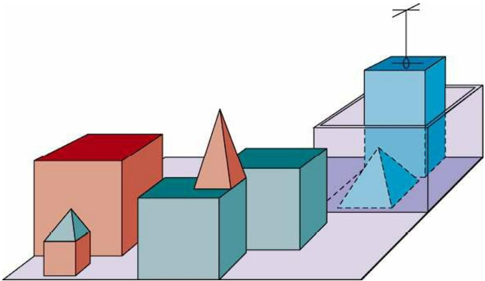  
图1-3积木世界的场景。Shrdlu（Winograd, 1972）刚刚完成了一个命令——“找到一块比你所持有的积木块更高的积木块，并把它放进盒子里”

建立在麦卡洛克和皮茨提出的神经网络上的早期工作也蓬勃发展。什穆埃尔·温诺格拉德（ShmuelWinograd）和杰克·考恩（Jack Cowan）的研究（Winograd and Cowan, 1963）展示了大量元素如何共同代表一个独立的概念，同时提升稳健性和并行性。赫布的学习方法分别得到了伯尼·维德罗（Bernie Widrow）（Widrow and Hoff, 1960; Widrow, 1962）和弗兰克·罗森布拉特（FrankRosenblatt）（Rosenblatt, 1962）的改进，他们的网络分别被称为 线性自适应神经网络 （adaline）和 感知机 （perceptron）。 感知机收敛定理 （perceptron convergence theorem）（Block et al .,1962）指出，学习算法可以调整感知机的连接强度来拟合任何输入数据（前提是存在这样的拟合）。

# 1.3.3 一些现实（1966—1973）

从一开始，人工智能研究人员对未来成功的预测毫不避讳。下面这句1957年赫伯特·西蒙的名言经常被引用：

我的目的不是使大家感到惊讶或震惊，我可以总结出的最简单的说法是，现在世界上存在着能够思考、学习和创造的机器。此外，它们的这些能力将迅速提高，在可见的未来内，它们能够处理的问题范围将与人类思维的应用范围一样广泛。

虽然“可见的未来”这个词是模糊的，但西蒙也做出了更具体的预测：10年内，计算机将成为国际象棋冠军以及机器将能证明重要的数学定理。实际上，这些预测的实现（或近似实现）用了40年时间，远远超过10年。当初西蒙的过度自信来自于早期人工智能系统在简单示例任务上的出色表现。但是，在几乎所有情况下，这些早期系统在更困难的问题上都失败了。

失败有两个主要原因。第一个主要原因是许多早期人工智能系统主要基于人类如何执行任务的“知情内省型”，而不是基于对任务、解的含义以及算法需要做什么才能可靠地产生解的仔细分析。

第二个主要原因是对人工智能要求解的问题的复杂性缺乏认识。大多数早期的问题求解系统都会尝试组合不同的步骤，直到找到解为止。这一策略最初奏效是因为微世界所包含的对象非常少，因此可能的动作非常少，解的动作序列也非常短。在计算复杂性理论发展完备之前，人们普遍认为“扩展”到更大的问题仅仅是需要更快的硬件和更大的内存。但是当研究人员无法证明涉及几十个事实的定理时，伴随着归结定理证明发展而来的乐观情绪很快就受到了打击。 一般而言，程序可以找到解的事实并不意味着该程序具备任何在实践中找到解所需的 机制。

无限计算能力的幻想并不局限于求解问题的程序。早期的机器进化 （machineevolution）［现在称为 遗传编程 （genetic programming）］实验（Friedberg, 1958; Friedberg et al ., 1959）基于绝对正确的信念，即通过对机器代码程序进行一系列适当的小变异，就可以为任何特定任务生成表现良好的程序。这个想法就是通过选择过程来尝试随机突变，并保留似乎有用的突变。尽管使用了长达数千小时的CPU时间，但几乎没有任何进展。

未能处理“组合爆炸”是莱特希尔报告（Lighthill, 1973）中对人工智能的主要批评之一，基于这份报告，英国政府决定在除两所大学外的所有大学中停止支持人工智能研究。（口述传说描绘了一幅稍有不同、更加丰富多彩的画面，但带有政治野心和个人好恶的描述都不是本书的话题。）

此外，产生智能行为的基础结构存在一些根本限制也是导致失败的原因。例如，明斯基和派珀特的著作 Perceptrons （Minsky and Papert, 1969）证明，尽管感知机（一种简单的神经网络形式）被证明可以学习它们能够表示的任何事物，但它们能表示的事物很少。举例来说，我们无法训练双输入感知机来判断它的两个输入是否相同。尽管他们的研究结果并不适用于更复杂的多层网络，但用于神经网络研究的经费很快就减少到几乎为零。讽刺的是，在20世纪80年代和21世纪10年代再次引起神经网络研究巨大复兴的新反向传播学习算法，早在20世纪60年代初已经在其他情景下得到了发展（Kelley, 1960; Bryson, 1962）。

# 1.3.4 专家系统（1969—1986）

在人工智能研究的前十年提出的问题求解是一种通用搜索机制，试图将基本的推理步骤串在一起，找到完整的解。这种方法被称为 弱方法 （weak method），这种方法虽然很普适，但它不能扩展到大型或困难的问题实例上。弱方法的替代方案是使用更强大的领域特定的知识，这些知识允许更大规模的推理步骤，并且可以更轻松地处理特定专业领域中发生的典型案例。有人可能会说，必须已经差不多知道答案才能解决一个难题。

D endral程序（Buchananetal. , 1969）是这种方法的早期例子。它是在斯坦福大学开发的，爱德华·费根鲍姆（曾是赫伯特·西蒙的学生）、布鲁斯·布坎南（BruceBuchanan，从哲学家转行的计算机科学家）和乔舒亚·莱德伯格（JoshuaLederberg，诺贝尔生理学或医学奖得主，遗传学家）联手解决了从质谱仪提供的信息推断分子结构的问题。该程序的输入包括分子的基本分子式（如C 6H 13NO ）和质谱，其中质谱给出了分子被电子束轰击时产生的各种碎片的质量。例如，质谱可能在m =15处有一个峰，这对应于甲基（CH ）碎片的质量。

朴素版本的程序生成所有可能的符合分子式的结构，然后预测每个结构在质谱仪中的观测结果，并将其与实际质谱进行比较。正如人们所预期的，这对中等规模的分子来说也是难以处理的。Dendral的研究人员咨询了分析化学家，并发现他们通过寻找质谱中已知的峰模式来工作，这些峰表明分子中的常见子结构。例如，以下规则用于识别酮（C=O）结构（分子量28）：

如果 M是整个分子的质量，且在 x 和 x 处有两个峰，并且

（a） x 1 + x 2 = M + 28； （b） x 1 − 28 是一个高峰；（c） x 2 − 28 是一 个高峰；（d） $x _ { 1 }$ 和 $x _ { 2 }$ 中至

少有一处是 高峰，

则 该分子含有酮基。

认识到分子包含特定的子结构，可以极大地减少可能候选项的量级。据作者称，D endral之所以强大，是因为它不是以第一性原理的形式，而是以高效“食谱”的形式体现了质谱的相关知识（Feigenbaumetal.,1971）。D endral的意义在于它是第一个成功的 知识密集型系统：它的专业知识来源于大量专用规则。1971年，费根鲍姆和斯坦福大学的其他研究人员开启了启发式编程项目（heuristic programming project，HPP），以此来研究 专家系统 （expert system）的新方法可以在多大程度上应用到其他领域。

接下来的一个主要工作是用于诊断血液感染的Mycin 系统。Mycin 有大约450条规则，它能够表现得和一些专家一样好，甚至比初级医生要好得多。Mycin 与D endral有两个主要区别。首先，不像D endral规则，不存在可以推导出Mycin 规则的一般理论模型，Mycin 规则不得不从大量的专家访谈中获得。其次，规则必须反映与医学知识相关的不确定性。Mycin引入了一种称为确定性因子（certainty factor）的不确定性计算（见第13章），这在当时似乎与医生评估证据对诊断影响的方式非常吻合。

第一个成功的商用专家系统R1在数字设备公司（Digital Equipment Corporation，DEC）投入使用（McDermott, 1982），该程序帮助公司配置新计算机系统的订单。截至1986年，它每年为公司节省约4000万美元。到1988年，DEC的人工智能小组已经部署了40个专家系统，而且还有更多的专家系统在开发中。同时期，杜邦公司有100个专家系统在使用，500个在开发。当时几乎每家美国大公司都有自己的人工智能团队，不是在使用专家系统，就是在研究专家系统。

领域知识的重要性在自然语言理解领域也很突出。尽管特里·温诺格拉德的Shrdlu系统取得了成功，但它的方法并没有扩展到更一般的任务：对于歧义消解之类的问题，它使用了依赖于积木世界中微小范围的简单规则。

包括麻省理工学院的尤金·查尔尼克（EugeneCharniak）和耶鲁大学的罗杰·尚克（RogerSchank）在内的几位研究人员一致认为，强大的语言理解需要关于世界的一般知识以及使用这些知识的一般方法。（尚克进一步声称，“根本就没有语法这回事”，这让很多语言学家感到不安，但确实引发了一场有益的讨论。）尚克和他的学生们建立了一系列的程序（Schank and Abelson, 1977; Wilensky,1978;Schank and Riesbeck, 1981），这些程序都用于理解自然语言。但是，重点不在于语言 本身，而在于用语言理解所需的知识来表示和推理问题。

在真实世界中的广泛应用引发了表示和推理工具的广泛发展。有些是基于逻辑的，例如，Prolog语言在欧洲和日本流行，而Planner家族在美国流行。其他人则遵循明斯基的框架 （frame）思想（Minsky,1975），采用了一种更结构化的方法，将有关特定对象和事件类型的事实组合起来，并将这些类型组织成类似于生物分类法的大型分类层次结构。

1981年，日本政府宣布了“第五代计算机”计划，这是一个十年计划，旨在建造运行Prolog的大规模并行智能计算机。按现在的货币系统衡量，预算将超过13亿美元。作为回应，美国成立了微电子与计算机技术公司（Microelectronics and Computer Technology Corporation，MCC），这是一个旨在确保国家竞争力的联盟。在这两个项目中，人工智能都是广泛努力的一部分，包括芯片设计和人机界面研究。在英国，阿尔维（Alvey）报告恢复了被莱特希尔报告取消的资助资金。然而，这些项目都没有在新型的人工智能能力或经济影响方面下实现其宏伟目标。

总的来说，人工智能行业从1980年的几百万美元增长到1988年的数十亿美元，还产生了数百家构建专家系统、视觉系统、机器人以及专门服务于这些目的的软硬件的公司。

但此后不久，经历了一段被称为“人工智能冬天”的时期，许多公司因未能兑现夸张的承诺而停滞。事实证明，为复杂领域构建和维护专家系统是困难的，一部分原因是系统使用的推理方法在面临不确定性时会崩溃，另一部分原因是系统无法从经验中学习。

在20世纪80年代中期，至少有4个不同的团队重新发明了最早在20世纪60年代初期发展起来的 反向传播 （back-propagation）学习算法。该算法被应用于计算机科学和心理学中的许多学习问题，Parallel Distributed Processing 合集（Rumelhart and McClelland, 1986）中的结果的广泛传播引起了极大的轰动。

这些所谓的联结主义 （connectionist）模型被一些人视为纽厄尔和西蒙的符号模型以及麦卡锡和其他人的逻辑主义方法的直接竞争对手。人类在某种程度上操纵符号似乎是显而易见的——事实上，人类学家特伦斯·迪肯（Terrence Deacon）在其著作《符号化动物》（ The Symbolic Species ）（Deacon,1997）中指出，这是人类的 决定性特征。与此相反，20世纪80年代和21世纪10年代神经网络复兴的领军人物杰弗里·辛顿将符号描述为“人工智能的光以太”（19世纪许多物理学家认为电磁波传播的介质是光以太，但其实这种介质不存在）。事实上，我们在语言中命名的许多概念，经过仔细检查后，都未能获得早期人工智能研究人员希望以公理形式描述逻辑定义的充要条件。联结主义模型可能以一种更流畅和不精确的方式形成内部概念，更适配真实世界的混乱。它们还具备从样本中学习的能力，它们可以将它们的预测输出值与问题的真实值进行比较，并修改参数以减少差异，使它们在未来的样本中更有可能表现良好。

# 1.3.6 概率推理和机器学习（1987—现在）

专家系统的脆弱性导致了一种新的、更科学的方法，结合了概率而不是布尔逻辑，基于机器学习而


不是手工编码，重视实验结果而不是哲学主张。 现在更普遍的是，基于现有理论而不是提出全新的理论，基于严格的定理或可靠的实验方法（Cohen, 1995）而不是基于直觉的主张，以及展示与真实世界应用的相关性而不是虚拟的示例。

共享的基准问题集成为了展示进度的标准，包括加利福尼亚大学欧文分校的机器学习数据集库、用于规划算法的国际规划竞赛、用于语音识别的LibriSpeech语料库、用于手写数字识别的MNIST数据集、用于图像物体识别的ImageNet和COCO、用于自然语言问答的SQ u AD、机器翻译的WMT竞赛以及布尔可满足性求解器国际SAT竞赛。

人工智能的创立在一定程度上是对控制理论和统计等现有领域局限性的反抗，但在这一时期，它吸纳了这些领域的积极成果。正如戴维·麦卡莱斯特（David McAllester）（McAllester, 1998）所说：

在人工智能早期，符号计算的新形式（例如框架和语义网络）使大部分经典理论过时，这似乎是合理的。这导致了一种孤立主义，即人工智能在很大程度上与计算机科学的其他领域分离。这种孤立主义目前正在被摒弃。人们认识到，机器学习不应该独立于信息论，不确定推理不应该独立于随机建模，搜索不应该独立于经典优化和控制，自动推理不应该独立于形式化方法和静态分析。

语音识别领域对这种模式进行了说明。20世纪70年代，研究人员尝试了各种不同的架构和方法，许多是相当暂时和脆弱的，并且只能处理几个精心挑选的例子。在20世纪80年代，使用隐马尔可夫模型 （hidden Markov model，HMM）的方法开始主导这一领域。HMM有两个相关的方面。首先，它们基于严格的数学理论。这使得语音研究人员能够在其他领域数十年数学成果的基础上进行开发。其次，它们是在大量真实语音数据的语料库上训练而产生的。这确保了健壮性，并且在严格的盲测中，HMM的分数稳步提高。因此，语音技术和手写体字符识别的相关领域向广泛的工业和消费级应用过渡。注意，并没有科学证据表明人类使用HMM识别语音，HMM只是为理解和求解问题提供了一个数学框架。然而，在1.3.8节中我们将看到，深度学习已经破坏了这种舒适的叙述。

1988年是人工智能与统计学、运筹学、决策论和控制理论等其他领域相联系的重要一年。朱迪亚·珀尔的 Probabilistic Reasoning in Intelligent Systems （Pearl, 1988）使概率和决策论在人工智能中得到了新的认可。珀尔对贝叶斯网络的发展产生了一种用于表示不确定的知识的严格而有效的形式体系，以及用于概率推理的实用算法。第12～16章涵盖了这个领域，此外最近的发展大大提升了概率形式体系的表达能力，第20章描述了从数据中学习贝叶斯网络 （Bayesian network）和相关模型的方法。

1988年的第二个主要贡献是理查德·萨顿（Rich Sutton）的工作，他将强化学习（20世纪50年代被用于亚瑟·塞缪尔的西洋跳棋程序中）与运筹学领域开发的马尔可夫决策过程（Markov decisionprocesse，MDP）联系起来。随后，大量工作将人工智能规划研究与MDP联系起来，强化学习领域在机器人和过程控制方面找到了应用，并获得了深厚的理论基础。

人工智能对数据、统计建模、优化和机器学习的新认识带来的结果是，计算机视觉、机器人技术、语音识别、多智能体系统和自然语言处理等子领域逐渐统一，此前这些子领域在某种程度上已经脱离了核心人工智能。重新统一的过程在应用方面（例如，在此期间实用机器人的部署大大扩展）和关于人工智能核心问题更好的理论理解方面都产生了显著的效用。

# 1.3.7 大数据（2001—现在）

计算能力的显著进步和互联网的创建促进了巨大数据集的创建，这种现象有时被称为 大数据 （bigdata）。这些数据集包括数万亿字的文本、数十亿的图像、数十亿小时的语音和视频，以及海量的基因组数据、车辆跟踪数据、点击流数据、社交网络数据等。

这导致了专为利用非常大的数据集而设计的学习算法的开发。通常，这类数据集中的绝大多数例子都 没有标签 。例如，在雅让斯基关于词义消歧的著作（Yarowsky, 1995）中，出现的一个词（如“plant”），并没有在数据集中标明这是指植物还是工厂。然而，如果有足够大的数据集，合适的学习算法在识别句意的任务上可以达到超过96%的准确率。此外，班科和布里尔认为，将数据集的规模增加两到三个数量级所获得的性能提升会超过调整算法带来的性能提升（Banko and Brill,2001）。

类似的现象似乎也发生在计算机视觉任务中，例如填补照片中的破洞（要么是由损坏造成的，要么是挖除前朋友造成的）。海斯和埃弗罗斯（Haysand Efros, 2007）开发了一种巧妙的方法，从类似的图像中混合像素。他们发现，该技术在仅包含数千幅图像的数据库中效果不佳，但在拥有数百万幅图像的数据库中，该技术超过了质量阈值。不久之后，ImageNet数据库（Deng et al. , 2009）中可用的数千万幅图像引发了计算机视觉领域的一场革命。

大数据的可用性和向机器学习的转变帮助人工智能恢复了商业吸引力（Havenstein, 2005; Halevy etal. , 2009）。大数据是2011年IBM的Watson系统在《危险边缘》（ Jeopardy! ）问答游戏中战胜人类冠军的关键因素，这一事件深深影响了公众对人工智能的看法。

# 1.3.8 深度学习（2011—现在）

深度学习 （deep learning）是指使用多层简单的、可调整的计算单元的机器学习。早在20世纪70年代，研究人员就对这类网络进行了实验，并在20世纪90年代以 卷积神经网络 （convolutionalneuralnetwork）（LeCun et al. , 1995）的形式在手写数字识别方面取得了一定的成功。然而，直到2011年，深度学习方法才真正开始流行起来，首先是在语音识别领域，然后是在视觉物体识别领域。

在2012年的ImageNet竞赛中，需要将图像分类为1000个类别之一（犰狳、书架、开瓶器等）。多伦多大学杰弗里·辛顿团队开发的深度学习系统（Krizhevsky etal., 2013）比以前基于手工特征的系统有了显著改进。从那时起，深度学习系统在某些视觉任务上的表现超过了人类，但在其他一些任务上还显落后。在语音识别、机器翻译、医疗诊断和博弈方面也有类似的进展。A lphaGo （Silver etal.,2016,2017, 2018）之所以能够战胜人类顶尖的围棋棋手，是因为它使用了深度网络来表示评价函数。

这些非凡的成功使学生、公司、投资者、政府、媒体和公众对人工智能的兴趣重新高涨。似乎每周都有新的人工智能应用接近或超过人类表现的消息，通常伴随着加速成功或人工智能新寒冬的猜测。

深度学习在很大程度上依赖于强大的硬件，一个标准的计算机CPU每秒可以进行10 9 或10 10 次运算。运行在特定硬件（例如GPU、TPU或FPGA）上的深度学习算法，每秒可能进行10 14 ～10 17 次运算，主要是高度并行化的矩阵和向量运算。当然，深度学习还依赖于大量训练数据的可用性，以及一些算法技巧（见第21章）。

# 1.4 目前的先进技术

斯坦福大学的人工智能百年研究（也称为AI100）召集了专家小组来提供人工智能最先进技术的报告。2016年的报告（Stone et al. , 2016; Grosz and Stone, 2018）总结：“未来人工智能的应用将大幅增加，包括更多的自动驾驶汽车、医疗诊断和针对性的治疗，以及对老年人护理的物理援助”，并且“社会现在正处于关键时刻，将决定如何以促进而不是阻碍自由、平等和透明等民主价值观的方式部署基于人工智能的技术”。AI100还在其网站上创建了一个人工智能指数 （AIIndex），以帮助跟踪人工智能的进展。以下列举了与2000年基线相比（除非另有说明），2018年和2019年报告的一些亮点。

● 出版物：人工智能论文数量在2010年至2019年间增长了20倍，达到每年约2万篇。最受欢迎的类别是机器学习（2009年至2017年，arXiv.org上的机器学习论文数量每年都会翻一番）。其次是计算机视觉和自然语言处理。  
●情绪：大约70%的人工智能新闻文章是中性的，但正面基调的文章从2016年的12%上升到2018年的30%。最常见的问题是道德问题——数据隐私和算法偏见。  
●学生：与2010年基线相比，课程注册人数在美国增加了5倍，全球增加了16倍。人工智能是计算机科学中最受欢迎的专业。  
●多样性：全球人工智能领域的教授中，大约80%是男性，20%是女性。博士生和行业招聘也有类似的数字。  
●会议：NeurIPS的参会人数比2012年增加了8倍，达到13 500人。其他会议的参会人数年增长率约为30%。  
●行业：美国的人工智能初创公司数量增长了20倍，达到800多家。  
● 国际化：中国每年发表的论文多于美国，与整个欧洲一样多。但是，在引用加权影响方面，美国作者领先中国作者50%。从人工智能招聘人数看，新加坡、巴西、澳大利亚、加拿大和印度是增长最快的国家。  
●视觉：物体检测的错误率（大规模视觉识别挑战，LSVRC）从2010年的28%下降到2017年的2%，超过了人类的表现。自2015年以来，开放式视觉问答（VQA）的准确率从55%提高到68%，但仍远落后于人类83%的表现。  
●速度：在过去两年中，图像识别任务的训练时间减少了100倍。顶级人工智能应用使用的计算能力每3.4个月就会翻一番。  
●语言：以斯坦福问答数据集（SQ uAD）的F1分数衡量的问答准确率，自2015年到2019年从60分提升到95分，在SQ u AD2版本上进展更快，仅在一年内从62分提升到90分。这两个分数都超过了人类表现。  
●人类基准：截至2019年，人工智能系统在多个领域达到或超越人类表现，包括国际象棋、围棋、扑克、《吃豆人》（Pac-Man）、《危险边缘》（Jeopardy!）、ImageNet物体检测、有限域中的语音识别、约束域中的英文翻译、《雷神之锤3》（QuakeIII）、《刀塔2》（Dota 2 ）、《星际争霸II》（ StarCraftII）、Atari的各种游戏、皮肤癌检测、前列腺癌检测、蛋白质折叠、糖尿病视网膜病变诊断等。

人工智能系统何时（如果可以的话）能够在各种任务中达到人类水平的表现？马丁·福特（MartinFord）（Ford, 2018）通过对人工智能专家的访谈发现这一目标时间的范围很广，从2029年到2200年，均值为2099年。在一项类似的调查中（Graceetal.,2017），50%的受访者认为这可能在2066年发生，有10%的人认为这最早可能在2025年发生，少数人则认为“不可能”。对于我们是需要根本性的新突破，还是仅仅对现有方法进行改进，专家们也存在分歧。但是不要过于严肃对待他们的预测，正如菲利普·泰洛克（PhilipTetlock）（Tetlock,2017）在预测世界事件领域所证明的那样，专家并不比业余爱好者预测得更准。

未来的人工智能系统将如何运作？我们还不能确定。正如本节所详述的，这个领域采用了几个关于

它本身的故事：首先是一个大胆的想法，即机器的智能是可能的，然后是它可以通过将专家知识编码成逻辑来实现，接着是建模世界的概率模型将成为主要工具，以及最近的机器学习将产生可能根本不基于任何易于理解的理论的模型。未来将揭示接下来会出现什么模式。

人工智能现在能做什么？也许不像一些更乐观的媒体文章让人相信的那样多，但仍然很多，以下是一些例子。

自动驾驶： 自动驾驶的历史可以追溯到20世纪20年代的无线电遥控汽车，而在20世纪80年代首次展示了没有特殊向导的自动道路驾驶（Kanade et al. , 1986; Dickmanns and Zapp, 1987）。在2005年的212公里沙漠赛道DARPA挑战赛（Thrun, 2006）和 2007 年繁忙城市道路的城市挑战赛上，自动驾驶汽车成功展示之后，自动驾驶汽车的开发竞赛正式开始。2018年，Waymo的测试车辆在公共道路上行驶超过1600万公里，没有发生严重事故，其中人类司机每9650公里才介入一次接管控制。不久之后，该公司开始提供商业机器人出租车服务。

自2016年以来，自动固定翼无人机一直在为卢旺达提供跨境血液输送服务。四轴飞行器可以进行出色的特技飞行，可以在构建三维地图的同时探索建筑，并进行自主编队。

腿足式机器人： 雷伯特等人制作的四足机器人BigDog（Raibert et al. , 2008），颠覆了我们对机器人如何行动的概念——不再是好莱坞电影中机器人缓慢、僵硬、左右摇摆的步态，而是类似于动物，并且能够在被推倒或在结冰的水坑上滑倒时恢复站立。类人机器人Atlas不仅能在崎岖不平的路况中行走，还可以跳到箱子上，做后空翻后可以稳定落地（Ackerman and Guizzo,2016）。

自动规划和调度： 在距离地球1.6亿公里的太空，美国国家航空航天局（NASA）的“远程智能体”程序成为第一个控制航天器操作调度的机载自动规划程序（Jonsson etal.,2000）。远程智能体根据地面指定的高级目标生成规划，并监控这些规划的执行（在出现问题时检测、诊断和恢复）。现在，E uropa 规划工具包（Barreiro et al. , 2012）被用于NASA火星探测器的日常操作，而S extant系统（Winternitz,2017）允许航天器在全球GPS系统之外进行深空自主导航。

在1991年海湾危机期间，美国军队部署了动态分析和重新规划工具D art（Crossand Walker,1994），为运输进行自动化的后勤规划和调度。规划涉及的交通工具、货物和人员达5万之多，并且必须考虑起点、目的地、路线、运输能力、港口和机场能力以及解决所有参数之间的矛盾。美国国防高级研究计划局（Defense Advanced Research Project Agency，DARPA）表示，这一应用取得的效果足以回报DARPA过去30年在人工智能领域的投资。

每天，优步（Uber）等网约车公司和谷歌地图等地图服务为数亿用户提供行车向导，在考虑当前和预测未来交通状况的基础上快速规划最佳路线。

机器翻译： 在线机器翻译系统现在可以阅读超过100种语言的文档，涵盖99%的人类使用的母语，每天为数亿用户翻译数千亿词语。虽然翻译结果还不完美，但通常足以理解。对于具有大量训练数据的密切相关的语言（如法语和英语），在特定领域内的翻译效果已经接近于人类的水平（Wuetal. , 2016b）。

语音识别： 2017年，微软表示其会话语音识别系统的单词错误率已降至5.1%，与人类在Switchboard任务（转录电话对话）中的表现相当（Xiong etal.,2017）。现在全世界大约三分之一的计算机交互是通过语音而不是键盘完成的，另外Skype提供了10种语言的实时语音翻译。Alexa、Siri、Cortana和谷歌都提供了可以回答用户问题和执行任务的助手。例如，谷歌Duplex服务使用语音识别和语音合成为用户预订餐厅，它能够代表用户进行流畅的对话。

推荐： Amazon、Facebook、Netflix、Spotify、YouTube、Walmart等公司利用机器学习技术，根据用户过去的经历和其他类似的人群为用户推荐可能喜欢的内容。推荐系统领域有着悠久的历史（Resnickand Varian, 1997），但由于分析内容（文本、音乐、视频）以及历史和元数据的新深度学习方法的出现，推荐系统正在迅速发生变化（van den Oord et al. , 2014; Zhang et al. , 2017）。垃圾邮件过滤也可以被认为是推荐（或不推荐）的一种形式。目前的人工智能技术可以过滤掉99.9%以上的垃圾邮件，电子邮件服务还可以推荐潜在收件人以及可能回复的文本。

博弈： 1997年，当“深蓝”（Deep Blue）击败国际象棋世界冠军加里·卡斯帕罗夫（GarryKasparov）后，人类霸权的捍卫者把希望寄托在了围棋上。当时，天体物理学家、围棋爱好者皮特·赫特（PietHut）预测称：“计算机在围棋上击败人类需要一百年的时间（甚至可能更久）。”但仅仅20年后，A lphaG o 就超过了所有人类棋手（Silveretal.,2017）。世界冠军柯洁说：“去年的A

lphaG o 还比较接近于人，现在它越来越像围棋之神。”A lphaG o 得益于对人类棋手过去数十万场棋局的研究以及对团队中围棋专家的知识提炼。

后继项目A lpha Z ero 不再借助人类输入，只通过游戏规则就能够自我学习并击败所有对手，在围棋、国际象棋和日本将棋领域击败了包括人类和机器在内的对手（Silver et al ., 2018）。与此同时，人类冠军在各种游戏中被人工智能系统击败，包括《危险边缘》（Ferrucci et al. , 2010）、扑克（Bowling et al. , 2015; Moravčík et al. , 2017; Brown and Sandholm, 2019），以及电子游戏《刀塔2》（Fernandez and Mahlmann, 2018）、《星际争霸II》（Vinyals et al. , 2019）、《雷神之锤3》（Jaderberg et al. , 2019）。

图像理解： 计算机视觉研究人员不再满足于在具有挑战性的ImageNet物体识别任务上超越人类的准确性，他们开始研究更困难的图像描述问题。一些令人印象深刻的例子包括“一个人在土路上骑摩托车”“两个比萨饼放在炉顶的烤箱上”和“一群年轻人在玩飞盘”（Vinyalsetal. ,2017b）。然而，目前的系统还远远不够完善，一个“装满大量食物和饮料的冰箱”原来是一个被许多小贴纸遮挡住部分的禁止停车的标志。

医学： 现在，人工智能算法在多种疾病的诊断方面（尤其是基于图像的诊断）已经达到或超过了专家医生的水平。例如，对阿尔茨海默病（Ding et al. , 2018）、转移性癌症（Liu et al. , 2017;Esteva et al. , 2017）、眼科疾病（Gulshan et al ., 2016）和皮肤病（Liu et al. , 2019c)的诊断。一项系统回顾和汇总分析（Liu etal., 2019a）发现，人工智能程序的平均表现与医疗保健专业人员相当。目前医疗人工智能的重点之一是促进人机合作。例如，Lyna系统在诊断转移性乳腺癌方面达到了99.6%的总体准确性，优于独立的人类专家，但两者联合的效果仍然会更好（Liu et al. , 2018;Steiner et al. , 2018）。

目前，限制这些技术推广的不是诊断准确性，而是需要证明临床结果的改善，并确保透明度、无偏见和数据隐私（Topol,2019）。2017年，只有两项医疗人工智能应用获得FDA批准，但这一数字在2018年增至12项，并在持续上升。

气候科学： 一个科学家团队凭借深度学习模型获得了2018年戈登·贝尔奖，该模型发现了之前隐藏在气候数据中的极端天气事件的详细信息。他们使用了一台具有专用GPU硬件，运算性能超过exaop级别（每秒1018 次运算）的超级计算机，这是第一个实现这一目标的机器学习程序（Kurth etal ., 2018）。Rolnick等人（Rolnick et al ., 2019）提供了一个60页的目录，其中列举了机器学习可用于应对气候变化的方式。

这些只是几个目前存在的人工智能系统的例子。这不是魔法或科幻小说，而是科学、工程和数学，本书将对此进行介绍。

# 1.5 人工智能的风险和收益

弗朗西斯·培根是一位被誉为创造科学方法的哲学家，他在《论古人的智慧》（TheWisdom oftheAncients）（1609）一书中指出：“机械艺术的用途是模糊的，它既可用于治疗，也可用于伤害。”随着人工智能在经济、社会、科学、医疗、金融和军事领域发挥越来越重要的作用，我们应该考虑一下它可能带来的伤害和补救措施——用现代的说法，就是风险和收益。这里总结的话题在第27章和第28章中有更深入的讨论。

首先从收益说起。简而言之，我们的整个文明是人类智慧的产物。如果我们有机会获得更强大的机器智能，我们的理想上限就会大大提高。人工智能和机器人技术可以将人类从繁重的重复性工作中解放出来，并大幅增加商品和服务的生产，这可能预示着一个和平富足的时代的到来。加速科学研究的能力可以治愈疾病，并解决气候变化和资源短缺问题。正如谷歌DeepMind首席执行官德米斯·哈萨比斯（DemisHassabis）所建议的那样：“首先解决人工智能问题，然后再用人工智能解决其他所有问题。”

然而，早在我们有机会“解决人工智能”之前，我们就会因误用人工智能而招致风险，无论这是无意的还是其他原因。其中一些风险已经很明显，而另一些似乎基于当前趋势。

●致命性自主武器：联合国将其定义为无须人工干预即可定位、选择并击杀人类目标的武器。这种武器的一个主要问题在于它们的可扩展性——不需要人类监督意味着一小群人就可以部署任意数量的武器，并且这些武器的打击目标可以是通过任何可行的识别准则来定义的人类。自主武器所需的技术类似于自动驾驶汽车所需的技术。关于致命性自主武器潜在风险的非正式专家讨论始于2014年的联合国会议，并于2017年进入正式的官方专家组的条约审议阶段。

●监视和劝诱：安全人员监视电话线路、视频摄像头、电子邮件和其他消息渠道的代价昂贵、乏味且存在法律问题，但可以以一种可扩展的方式使用人工智能（语音识别、计算机视觉、自然语言理解）对个人进行大规模监视并检测感兴趣的活动。基于机器学习技术，通过社交媒体为个人量身定制信息流，可以在一定程度上修改和控制政治行为，这一问题在2016年开始的美国总统选举中变得显而易见。

●有偏决策：在评估假释和贷款申请等任务中，粗心或故意滥用机器学习算法可能会导致因种族、性别或其他受保护类别而产生有偏见的决策。通常，数据本身反映了社会中普遍存在的偏见。

●就业影响：关于机器会减少工作岗位的担忧由来已久。故事从来都不是简单的。机器能够完成一些人类可能会做的工作，但它们也让人类更有生产力，因此更适合被雇佣；让公司更具盈利能力，因此能够支付更高的工资。它们可能使一些本来不切实际的活动在经济上可行。它们的使用通常会导致财富增加，但往往会将财富从劳动力向资本转移，从而进一步加剧不平等。之前的技术进步（如机械织布机的发明），对就业造成了严重的影响，但最终人们还是找到了新的工作。另外，人工智能也有可能从事这些新的工作。这个话题正迅速成为世界各地经济学家和政府关注的焦点。

●安全关键的应用：随着人工智能技术的进步，它们越来越多地应用于高风险、安全关键的应用，如驾驶汽车和管理城市供水。已经发生过致命事故，这凸显了对使用机器学习技术开发的系统进行正式验证和统计风险分析的困难。人工智能领域需要制定技术和道德标准，至少要与其他工程和医疗领域中普遍存在的标准相当，而这些标准关乎人们的生命。

●网络安全：人工智能技术可用于防御网络攻击，如检测异常的行为模式，但这些技术也能用于增强恶意软件的威力、生存能力和扩散能力。例如，强化学习方法已被用于创建高效的工具，这些工具可以进行自动化、个性化的勒索和钓鱼攻击。

我们将在27.3节更深入地讨论这些主题。随着人工智能系统变得越来越强大，它们将更多承担以前由人类扮演的社会角色。正如人类过去曾利用这些角色作恶一样，可以预见，人类可能会在这些角色中滥用人工智能系统而作恶更多。上面给出的所有例子都指出了治理的重要性，以及最终监管的重要性。目前，研究团体和参与人工智能研究的主要公司已经为人工智能相关活动制定了自愿自治原则（见27.3节）。各国政府和国际组织正在设立咨询机构，为每个具体的用例制定适当的条例，准备应对经济和社会影响，并利用人工智能的能力来解决重大的社会问题。

长期来看呢？我们能否实现长期以来的目标：创造出与人类智力相当或更强大的智能？如果我们做到了，然后呢？

在人工智能的大部分历史上，这些问题都被日常工作所掩盖——让人工智能系统做任何事情，哪怕是远程智能。与任何广泛的学科一样，绝大多数人工智能研究人员专注于特定的子领域，例如博弈、知识表示、视觉或自然语言理解，通常假设这些子领域的进展将有助于实现更广泛的人工智能目标。尼尔斯·约翰·尼尔森（Nils John Nilsson）（Nilsson, 1995）作为SRI的Shakey项目的最初负责人之一，提醒了该领域那些更广泛的目标，并警告说这些子领域本身有成为目标的风险。后来，一些有影响力的人工智能创始人，包括约翰·麦卡锡（McCarthy, 2007）、马文·明斯基（Minsky,2007）和帕特里克·温斯顿（Bealand Winston,2009），都认同尼尔森的警告，认为人工智能应该回归其本源，而不是专注于具体应用中可衡量的性能，用赫伯特·西蒙的话来说就是“会思考、会学习、会创造的机器”。他们将这种努力方向称为 人类级别的人工智能 （human-levelAI，HLAI）—机器应该能够学会做人类可以做到的任何事情。他们在2004年召开了第一次研讨会（Minskyet al. , 2004）。另一个有着类似目标的工作是 通用人工智能 （artificial general Intelligence，AGI）运动（Goertzel and Pennachin, 2007），在2008年举行了第一次会议并组织出版了 The Journal ofArtificial General Intelligen ce 。

大约在同一时间，人们担心创造远远超过人类能力的超级人工智能 （artificialsuperintelligence，ASI）可能是个坏主意（Yudkowsky, 2008; Omohundro, 2008）。图灵（Turing, 1996）在1951年曼彻斯特的一场演讲中也提出了同样的观点，他借鉴了塞缪尔·巴特勒（Samuel Butler）（Butler,1863）的早期观点： [1]

似乎很可能，机器思维方法一旦开始，用不了多久它就会超越我们微弱的力量……因此，在某个阶段，我们应该需要期待机器能够受控制，就像塞缪尔·巴特勒在Erewhon 中所提到的那样。

随着深度学习方面的最新进展，尼克·波斯特洛姆（Nick Bostrom）的《超级智能》（Superintelligence ）（2014）等图书的出版，以及斯蒂芬·霍金（Stephen Hawking）、比尔·盖茨（Bill Gates）、马丁·里斯（Martin Rees）和埃隆·马斯克（Elon Musk）的公开声明，这些担忧只会变得更加普遍。

对创造超级智能机器的想法产生普遍的不安感是自然的。我们可以称之为大猩猩问题 （gorillaproblem）：大约700万年前，一种现已灭绝的灵长类进化了，一个分支进化为大猩猩，另一个分支进化为人类。今天，大猩猩对人类分支不太满意，大猩猩根本无法控制自己的未来。如果这是成功创造出超级人工智能的结果（人类放弃对未来的控制），那么我们也许应该停止人工智能的研究，并且作为一个必然的结果，放弃人工智能可能带来的好处。这就是图灵警告的本质：我们可能无法控制比我们更聪明的机器。

如果超级人工智能是一个来自外太空的黑匣子，那么谨慎地打开这个黑匣子确实是明智之举。但事实并非如此：我们设计了人工智能系统，所以如果它们最终“掌控了自己”，那将是设计失败的结果（正如图灵所说）。

为了避免这种结果，我们需要了解潜在失败的根源。诺伯特·维纳（Wiener, 1960）在看到亚瑟·塞缪尔的西洋跳棋程序学会下棋并打败其创造者后，开始考虑人工智能的长远未来，他说：

如果我们为了达到目的而使用一个我们无法有效干预其运作方式的机械智能体……那么我们最好能完全确定设定给机器的目标是我们真正想要实现的。

许多文化都有关于人类向神灵、精灵、魔术师或魔鬼索取东西的神话。在这些故事中，他们总是得到了他们真正想要的东西并最终后悔。如果还有第三个愿望的话，那就是撤销前两个。我们将其称为 迈达斯国王问题 （King Midas problem）：迈达斯是希腊神话中的传奇国王，他要求他所接触的


一切都变成黄金，但他在接触了他的食物、饮料和家人后，就后悔了。 1.1.5节中我们已经提到过这个问题，将固定目标设定给机器的标准模型需要进行重大修改。解决维纳困境的方法根本不是“给机器设定一个明确的目的”。相反，我们希望机器努力实现人类的目标，但知道它们并不确切地知道这些目标是什么。

遗憾的是，迄今为止，几乎所有的人工智能研究都是在标准模型下进行的，这意味着这版书中几乎所有的技术材料都反映了这一知识框架。然而，在新框架内已经有一些初步成果。在第16章中，我们指出，当且仅当机器对人类的目标不确定时，机器才有积极的动机允许自己关闭。在第18章中，我们设计并研究辅助博弈 （assistancegame），它在数学上描述了一种情况，即人类有一个目标而

机器试图实现它，但最初不确定目标是什么。在第22章中，我们解释 逆向强化学习 （inversereinforcementlearning）的方法，它允许机器通过观察人类的选择来更多地了解人类的偏好。在第27章中，我们探讨两个主要的困难：首先，我们的选择取决于我们的偏好，这是通过一个非常复杂、难以逆向的认知结构来实现的；其次，我们人类可能在一开始就没有一致的偏好（无论是作为个人还是作为一个群体），所以人工智能系统可能并不清楚应该为我们做什么。

[1] 甚至在更早的1847年，《原始解释者》（ Primitive Expounder ）的编辑理查德·桑顿（RichardThornton）就对机械计算器大加抨击：“思想……超越自身，并通过发明机器进行自我思考来消除自身存在的必要性……但是谁知道，当这种机器变得更加完美的时候，它会不会想出一个规划来弥补自己的所有缺陷，然后想出超出常人所能理解的思想！”

小结

本章定义了人工智能并阐述了其发展的文化背景。本章要点如下。

●不同的人对人工智能的期望不同。首先要问的两个重要问题是：你关心的是思想还是行为？你想模拟人类，还是试图达到最佳结果？  
●根据我们所说的标准模型，人工智能主要关注理性行为 。理想的智能体会在某种情况下采取可能的最佳行为，在这个意义下，我们研究了智能体 的构建问题。  
●这个简单的想法需要两个改进：首先，任何智能体（无论是人还是其他物体）选择理性行为的能力都受到决策计算难度的限制；其次，机器的概念需要从追求明确目标转变到追求目标以造福人类，虽然不确定这些目标是什么。  
●哲学家们（追溯到公元前400年）暗示大脑在某些方面就像一台机器，操作用某种内部语言编码的知识，并且这种思维可以用来选择要采取的行动，从而认为人工智能是有可能实现的。  
●数学家提供了运算逻辑的确定性陈述以及不确定的概率陈述的工具，也为理解计算和算法推理奠定了基础。  
●经济学家将决策问题形式化，使决策者的期望效用最大化。  
●神经科学家发现了一些关于大脑如何工作的事实，以及大脑与计算机的相似和不同之处。  
●心理学家采纳了人类和动物可以被视为信息处理机器的观点。语言学家指出，语言的使用符合这一模式。  
●计算机工程师提供了更加强大的机器，使人工智能应用成为可能，而软件工程师使它们更加易用。  
●控制理论涉及在环境反馈的基础上设计最优行为的设备。最初，控制理论的数学工具与人工智能中使用的大不相同，但这两个领域越来越接近。  
●人工智能的历史经历了成功、盲目乐观以及由此导致的热情丧失和资金削减的循环，也存在引入全新创造性的方法和系统地改进最佳方法的循环。  
●与最初的几十年相比，人工智能在理论和方法上都已经相当成熟。随着人工智能面对的问题变得越来越复杂，该领域从布尔逻辑转向概率推理，从手工编码知识转向基于数据的机器学习。这推动了真实系统功能的改进以及与其他学科更大程度的集成。  
●随着人工智能系统在真实世界中的应用，必须考虑各种风险和道德后果。  
●从长远来看，我们面临着控制超级智能的人工智能系统的难题，它们可能以不可预测的方式进化。解决这个问题似乎需要改变我们对人工智能的设想。

读者服务：


微信扫码关注【异步社区】微信公众号，回复“e59810”获取本书配套资源以及异步社区15天VIP会员卡，近千本电子书免费畅读。

# 第2章

# 智能体

我们在此讨论智能体的本质，完美的或不完美的、环境的多样性以及由此产生的智能体类型的集合。

第1章将理性智能体 （rationalagent）的概念确定为研究人工智能的方法的核心。本章将使这个概念更加具体。我们将看到，在任何可以想象的环境中运行的各种智能体都可以应用理性的概念。本书的计划是使用这个概念来制定一小组设计原则，并用于构建成功的智能体，可以合理地称之为智能 系统。

我们从检查智能体、环境以及它们之间的耦合开始。观察到某些智能体比其他智能体表现得更好，可以自然而然地引出理性智能体的概念，即行为尽可能好。智能体的行为取决于环境的性质。我们将对环境进行粗略分类，并展示环境的属性如何影响智能体的设计。我们描述一些基本的“框架”智能体设计，本书余下的部分将充实相关内容。

# 2.1 智能体和环境

任何通过 传感器 （sensor）感知环境 （environment）并通过执行器 （actuator）作用于该环境的事物都可以被视为智能体 （agent）。这个简单的想法如图2-1所示。一个人类智能体以眼睛、耳朵和其他器官作为传感器，以手、腿、声道等作为执行器。机器人智能体可能以摄像头和红外测距仪作为传感器，还有各种电动机作为执行器。软件智能体接收文件内容、网络数据包和人工输入（键盘/鼠标/触摸屏/语音）作为传感输入，并通过写入文件、发送网络数据包、显示信息或生成声音对环境进行操作。环境可以是一切，甚至是整个宇宙！实际上，我们在设计智能体时关心的只是宇宙中某一部分的状态，即影响智能体感知以及受智能体动作影响的部分。

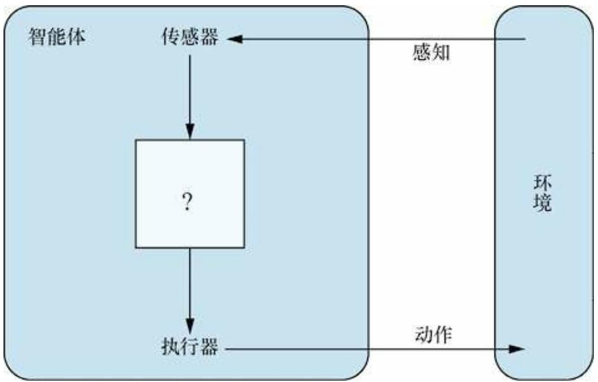  
图2-1 智能体通过传感器和执行器与环境交互

我们使用术语感知 （percept）来表示智能体的传感器正在感知的内容。智能体的感知序列（perceptsequence）是智能体所感知的一切的完整历史。一般而言，一个智能体在任何给定时刻的动作选择可能取决于其内置知识和迄今为止观察到的整个感知序列，而不是它未感知到的任何事物。通过为每个可能的感知序列指定智能体的动作选择，我们或多或少地说明了关于智能体的所有内容。从数学上讲，我们说智能体的行为由智能体函数 （agentfunction）描述，该函数将任意给定的感知序列映射到一个动作。

可以想象将描述任何给定智能体的智能体函数制成表格。对大多数智能体来说，这将是一个非常大的表，事实上是无限的（除非限制考虑的感知序列长度）。给定一个要进行实验的智能体，原则


上，我们可以通过尝试所有可能的感知序列并记录智能体响应的动作来构建此表 $\_$ 。当然，该表只是该智能体的外部特征。在内部，人工智能体的智能体函数将由 智能体程序 （agentprogram）实现。区别这两种观点很重要，智能体函数是一种抽象的数学描述，而智能体程序是一个具体的实现，可以在某些物理系统中运行。

为了阐明这些想法，我们举一个简单的例子——真空吸尘器世界。在一个由方格组成的世界中，包含一个机器人真空吸尘器智能体，其中的方格可以是脏的，也可以是干净的。图2-2展示了只有两个方格——方格A和方格B——的情况。真空吸尘器智能体可以感知它在哪个方格中，以及方格中是否干净。智能体从方格A开始。可选的操作包括向右移动、向左移动、吸尘或什么都不做。


一个非常简单的智能体函数如下：如果当前方格是脏的，就吸尘；否则，移动到另一个方智能体函数的部分表格如图2-3所示，实现它的智能体程序如图2-8所示。

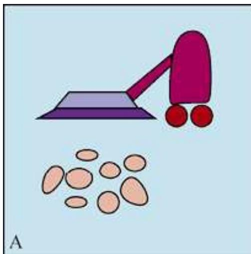

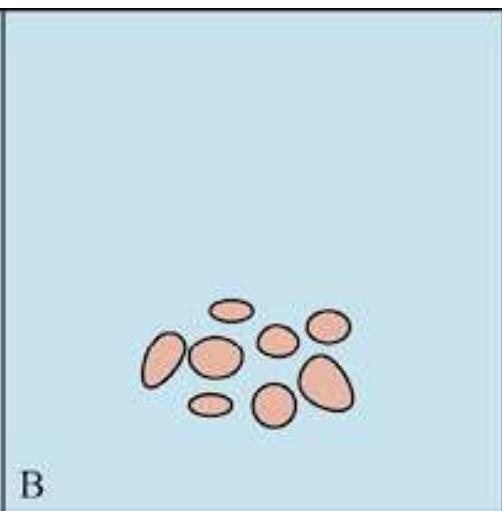  
图2-2 一个只有两个方格的真空吸尘器世界。每个位置可以是干净的，也可以是脏的，智能体可以向左移动或向右移动，可以清理它所占据的方格。不同版本的真空吸尘器世界允许不同的规则，例如智能体可以感知什么，它的动作是否总是成功等

从图2-3中可以看到，通过以各种方式填充右边的列可以简单地定义各种真空世界的智能体。那么，显而易见的问题是：填充表格的正确方法是什么？换句话说，是什么使智能体表现好或坏、聪明或愚蠢？我们将在2.2节中回答这些问题。

在结束本节之前，我们应该强调，智能体这一概念旨在成为分析系统的工具，而不是将世界划分为智能体和非智能体的绝对表征。人们可以将手持计算器视为一个智能体，它在给定感知序列“2+2=”时选择显示“4”的动作，但这样的分析很难帮助我们理解计算器。在某种意义上，工程的所有领域都可以被视为设计与世界互动的人工制品，人工智能运行在（作者认为是）这个系列最有趣的一端，在这一端，人工制品具有重要的计算资源，任务环境需要非凡的决策。

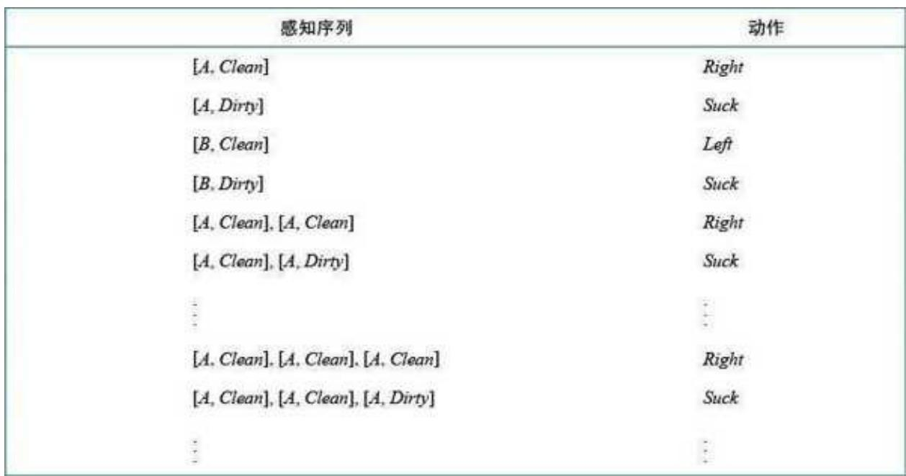  
图2-3 图2-2所示的真空吸尘器世界的简单智能体函数的部分表项。如果当前方格是脏的，智能体就会进行清理，否则它将移到另一个方格。注意，除非限制可能感知序列的长度，否则该表的大小是无限的

# 2.2 良好行为：理性的概念

理性智能体 （rationalagent）是做正确事情的事物。显然，做正确的事情比做错误的事情要好，但是做正确的事情意味着什么呢？

# 2.2.1 性能度量

道德哲学发展了几种不同“正确事情”的概念，但人工智能通常坚持一种称为 结果主义（consequentialism）的概念：我们通过结果来评估智能体的行为。当智能体进入环境时，它会根据接受的感知产生一个动作序列。这一动作序列会导致环境经历一系列的状态。如果序列是理想的，则智能体表现良好。这种可取性的概念由 性能度量 （performance measure）描述，该度量评估任何给定环境状态的序列。

人类有自己的欲望和偏好，因此，人类有适用于自身的理性概念。这一概念与成功地选择产生环境状态序列的行动有关，这些环境状态序列从人类的角度来看是可取的。但是，机器没有自己的欲望和偏好，至少在最初，性能度量是在机器设计者的头脑中或者是在机器受众的头脑中。我们将看到，一些智能体设计具有性能度量的显式表示（一个版本），而在其他设计中，性能度量完全是隐式的，智能体可能会做正确的事情，但它不知道为什么。

回顾诺伯特·维纳的警告，以确保“施以机器的目的是我们真正想要的目的”（1.5节），注意，正确地制定性能度量可能非常困难。例如，考虑2.1节中的真空吸尘器智能体，我们可能会建议用单个8小时班次中清理的灰尘量来度量性能。当然，有了理性的智能体，你所要求的就是你所得到的。然而一个理性的智能体可以通过清理灰尘，然后将其全部倾倒在地板上，然后再次清理，如此反复，从而最大化这一性能度量。更合适的性能度量是奖励拥有干净地板的智能体。例如，在每个时间步中，每个干净的方格都可以获得1分（可能会对耗电和产生的噪音进行惩罚）。作为一般规则，更好的做法是根据一个人在环境中真正想要实现的目标，而不是根据一个人认为智能体应该如何表现来设计性能度量。

即使避免了明显的缺陷，一些棘手的问题仍然存在。例如，上一段中“干净地板”的概念是基于一段时间内的平均整洁度。然而，两个不同的智能体可以达到相同的平均整洁度，其中一个智能体工作始终保持一般水平，而另一个智能体短时间工作效率很高但需要长时间的休息。哪种工作方式更可取似乎是保洁科学的好课题，但实际上这是一个具有深远影响的深刻哲学问题。大起大落、不计后果的生活，和安全但单调的生活，哪个更好？一个人人都生活在中度贫困的经济体，和一个有些人生活富裕而另一些人非常贫困的经济体，哪个更好？我们把这些问题留给勤奋的读者作为习题。

对于本书的大部分内容，我们将假设性能度量可以正确地指定。然而，出于前面所述原因，我们必须接受这样一种可能性：我们可能会将错误的目的施加给机器，确切地说，就是1.5节描述的迈达斯国王问题。此外，当设计一款软件（其副本将属于不同的用户）时，我们无法预测每个用户的确切偏好。因此，我们可能需要构建相应的智能体，它能够反映真实性能度量的初始不确定性，并随着时间的推移对其了解更多，第16章、第18章和第22章介绍了此类智能体。

# 2.2.2 理性

在任何时候，理性取决于以下4方面：

●定义成功标准的性能度量；  
●智能体对环境的先验知识；  
●智能体可以执行的动作；  
●智能体到目前为止的感知序列。

这引出了理性智能体的定义 ：

对于每个可能的感知序列，给定感知序列提供的证据和智能体所拥有的任何先验知识，理性智能体应该选择一个期望最大化其性能度量的动作。

考虑一个简单的真空吸尘器智能体，如果一个方格是脏的就清理它，如果不脏就移动到另一个方格，这就是图2-3中给出的智能体函数。它是理性智能体吗？这需要看情况了！首先，我们需要说明性能度量是什么，对环境了解多少，以及智能体具有哪些传感器和执行器。我们假设：

●在1000个时间步的“生命周期”内，性能度量在每个时间步为每个干净的方格奖励1分；  
●环境的“地理信息”是先验的（图2-2），但灰尘的分布和智能体的初始位置不是先验的，干净的方格会继续保持干净，吸尘（Suck）动作会清理当前方格，向左（Left）或向右（Right）的动作使智能体移动一个方格，如果该动作会让智能体移动到环境之外，智能体将保持在原来的位置；  
● 可用的动作仅有向右（ Right ）、向左（ Left ）和吸尘（ Su ck ）；  
● 智能体能够正确感知其位置以及该位置是否有灰尘。

在这种情况下，智能体确实是理性的，它的预期性能至少与任何其他智能体一样。

显而易见，同一个智能体在不同的情况下可能会变得不理性。例如，一旦清除了所有灰尘，该智能体将会毫无必要地反复来回；如果性能度量考虑对每个动作罚1分，那么智能体的表现就会很差。在确定所有方格都干净的情况下，一个更好的智能体不会做任何事情。如果干净的方格可能再次变脏，智能体应该偶尔检查，并在必要时重新清理。如果环境的地理信息是未知的，智能体则需要对其进行探索 （explore）。习题2.VACR要求在这些情况下设计智能体。

# 2.2.3 全知、学习和自主

我们需要仔细区分理性和全知 （omniscience）。全知的智能体能预知其行动的实际结果，并能据此采取行动，但在现实中，全知是不可能的。考虑这样一个例子：有一天我正沿着香榭丽舍大街散步，我看到街对面的一位老朋友。附近没有车流，我也没有别的事要做，所以理性上，我会开始过


马路。与此同时，在10千米的高空，一架飞过的客机上有一扇货舱门脱落下来 $-$ ，在我到达马路对面之前，我就被压扁了。我过马路是不理性的吗？我的讣告上不太可能写“试图过马路的白痴”。

这个例子表明，理性不等同于完美。理性使期望性能最大化，而完美使实际性能最大化。不要求完美不仅仅是对智能体公平的问题。关键是，如果我们期望一个智能体做事后证明是最好的行动，就不可能设计一个符合规范的智能体，除非我们改进占卜水晶球或时间机器的性能。

因此，我们对理性的定义并不需要全知，因为理性决策只取决于迄今为止的感知序列。我们还必须确保我们没有无意中允许智能体进行低智的行动。例如，如果一个智能体在穿过繁忙的道路之前没有向两边看，那么它的感知序列将不会告诉它有一辆大卡车正在以高速接近。我们对理性的定义是不是说现在就可以过马路了？绝非如此！

首先，考虑到这种缺乏信息的感知序列，过马路是不理性的：不观察路况就过马路发生事故的风险太大。其次，理性智能体在上街之前应该选择“观察”动作，因为观察有助于最大化期望性能。采取行动来改变未来的感知，有时被称为 信息收集 （information gathering），这是理性的一个重要组成部分，将在第16章中详细介绍。信息收集的另一个例子是真空吸尘器在最初未知的环境中必须进行的 探索 （exploration）。

我们的定义要求理性智能体不仅要收集信息，还要尽可能多地从它所感知到的东西中学习（learn）。智能体的初始配置可以反映对环境的一些先验知识，但随着智能体获得经验，这可能会被修改和增强。在一些极端情况下，环境完全是先验已知的和完全可预测的。在这种情况下，智能体不需要感知或学习，只需正确地运行。

当然，这样的智能体是脆弱的。如卑微的粪甲虫例子，在挖出巢穴产卵后，它会从附近的一堆粪中取出一团粪来堵住入口。如果粪球在途中被截下，粪甲虫根本不会注意到粪球已经不见了，仍会继续它的任务，并滑稽地用不存在的粪球堵住巢穴。进化已经在粪甲虫的行为中建立了一个假设，当它被违反时，不成功的行为就会产生。

稍微聪明一点的是掘土黄蜂。雌性掘土黄蜂会挖一个洞，出去刺一只毛毛虫并把它拖到洞口，再次

进入洞里检查一切是否正常，然后把毛毛虫拖进洞里再去产卵。当蜂卵孵化时，毛毛虫会充当食物来源。到目前为止还不错，但如果昆虫学家在掘土黄蜂检查洞穴时将毛毛虫移动几厘米远，它将回到其规划中的“把毛毛虫拖到洞口”步骤，即使经过数十次移动毛毛虫的干预，它仍然继续执行该规划而不进行修改，不断地重新检查洞穴。掘土黄蜂无法知道其固有规划正在失败，因此不会改变规划。

如果在某种程度上，智能体依赖于其设计者的先验知识，而不是其自身的感知和学习过程，我们就说该智能体缺乏 自主性 （autonomy）。一个理性的智能体应该是自主的，它应该学习如何弥补部分或不正确的先验知识。例如，能学习预测何时何地会出现额外灰尘的真空吸尘器比不能学习预测的要好。

实际上，我们很少从一开始就要求智能体完全自主：除非设计者提供一些帮助，否则当智能体几乎没有经验或完全没有经验时，它将不得不随机行动。正如进化为动物提供了足够的内建反射，使其能够生存足够长的时间来学习一样，为人工智能体提供一些初始知识和学习能力也是合理的。在充分体验相应环境后，理性智能体的行为可以有效地独立于其先验知识。因此，结合学习能够让我们设计单个理性智能体，它能在各种各样的环境中取得成功。

# 2.3 环境的本质

既然已经有了理性的定义，考虑构建理性智能体的准备几乎已经完成。然而，还必须考虑任务环境 （taskenvironment），它本质上是“问题”，理性智能体是“解决方案”。我们首先展示如何指定任务环境，并用一些示例说明该过程。然后，展示任务环境的多种形式。任务环境的性质直接影响智能体程序的恰当设计。

# 2.3.1 指定任务环境

在讨论简单的真空吸尘器智能体的理性时，我们必须指定性能度量、环境以及智能体的执行器和传感器。我们将所有这些都归在任务环境的范畴下，基于首字母缩写规则，我们称其为PEAS（Performance，Environment，Actuator，Sensor）描述。在设计智能体时，第一步必须始终是尽可能完整地指定任务环境。

真空吸尘器世界是一个简单的例子，让我们考虑一个更复杂的问题：自动驾驶出租车司机。图2-4总结了出租车任务环境的PEAS描述。我们将在以下段落中更详细地讨论每个元素。

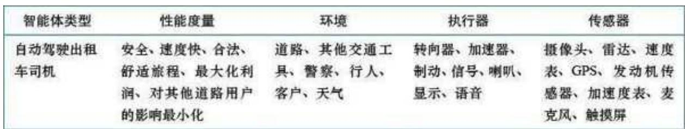  
图2-4 自动驾驶出租车司机任务环境的PEAS描述

首先，我们希望自动驾驶追求的 性能度量 （performance measure）是什么？理想的标准包括到达正确的目的地，尽量减少油耗和磨损，尽量减少行程时间或成本，尽量减少违反交通法规和对其他驾驶员的干扰，最大限度地提高安全性和乘客舒适度，最大化利润。显然，其中一些目标是相互冲突的，因此需要权衡。

接下来，出租车将面临什么样的驾驶 环境 （environment）？任何出租车司机都必须能够在各种道路上行驶，如乡村车道、城市小巷以及12车道的高速公路。道路上有其他交通工具、行人、流浪动物、道路工程、警车、水坑和坑洼。出租车还必须与潜在以及实际的乘客互动。另外，还有一些可选项。出租车可以选择在很少下雪的南加利福尼亚州或者经常下雪的阿拉斯加运营。它可能总是靠右行驶，或者我们可能希望它足够灵活，在英国或日本时可以靠左行驶。显然，环境越受限，设计问题就越容易解决。

自动驾驶出租车的执行器 （actuator）包括可供人类驾驶员使用的器件，例如通过加速器控制发动机以及控制转向和制动。此外，它还需要输出到显示屏或语音合成器，以便与乘客进行对话，或许还需要某种方式与其他车辆进行礼貌的或其他方式的沟通。

出租车的基本传感器 （sensor）将包括一个或多个摄像头以便观察，以及激光雷达和超声波传感器以便检测其他车辆和障碍物的距离。为了避免超速罚单，出租车应该有一个速度表，而为了正确控制车辆（特别是在弯道上），它应该有一个加速度表。要确定车辆的机械状态，需要发动机、燃油和电气系统的传感器常规阵列。像许多人类驾驶者一样，它可能需要获取GPS信号，这样就不会迷路。最后，乘客需要触摸屏或语音输入才能说明目的地。

图2-5中简要列举了一些其他智能体类型的基本PEAS元素。更多示例参见习题2.PEAS。这些示例包括物理环境和虚拟环境。注意，虚拟任务环境可能与“真实”世界一样复杂。例如，在拍卖和转售网站上进行交易的 软件智能体 （softwareagent），或称软件机器人或软机器人 （softbot），为数百万其他用户和数十亿对象提供交易，其中许多对象具有真实的图片。

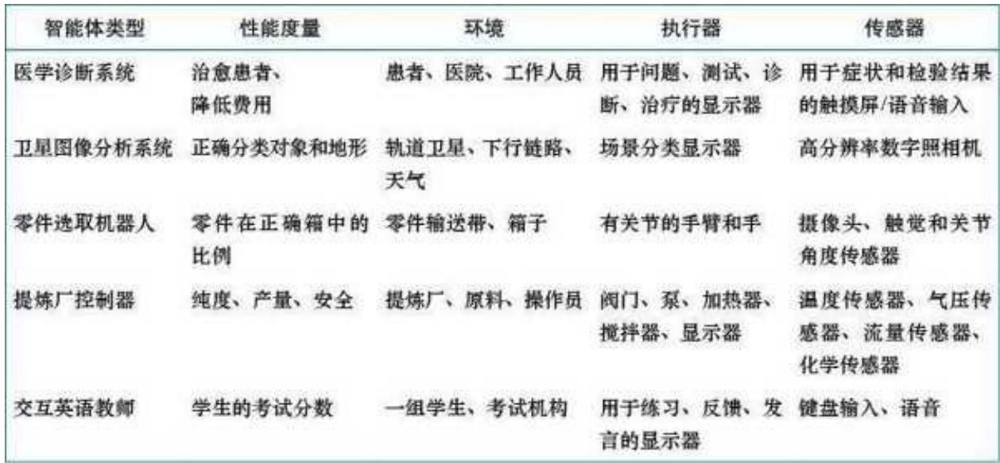  
图2-5 智能体类型及其PEAS描述的示例

# 2.3.2 任务环境的属性

人工智能中可能出现的任务环境范围显然非常广泛。然而，我们可以确定相当少的维度，并根据这些维度对任务环境进行分类。这些维度在很大程度上决定了恰当的智能体设计以及智能体实现的主要技术系列的适用性。首先我们列出维度，然后分析几个任务环境，阐明思路。这里的定义是非形式化的，后面的章节提供了每种环境的更精确的陈述和示例。

完全可观测的 （fully observable）与 部分可观测的 （partially observable）：如果智能体的传感器能让它在每个时间点都能访问环境的完整状态，那么我们说任务环境是完全可观测的。如果传感器检测到与动作选择相关的所有方面，那么任务环境就是有效的完全可观测的，而所谓的相关又取决于性能度量标准。完全可观测的环境很容易处理，因为智能体不需要维护任何内部状态来追踪世界。由于传感器噪声大且不准确，或者由于传感器数据中缺少部分状态，环境可能部分可观测。例如，只有一个局部灰尘传感器的真空吸尘器无法判断其他方格是否有灰尘，自动驾驶出租车无法感知其他司机的想法。如果智能体根本没有传感器，那么环境是 不可观测的 （unobservable）。在这种情况下，有人可能会认为智能体的困境是无解的，但是正如我们在第4章中讨论的那样，智能体的目标可能仍然可以实现，有时甚至是确定可以实现的。

单智能体的 （single-agent）与 多智能体的 （multiagent）：单智能体和多智能体环境之间的区别似乎足够简单。例如，独自解决纵横字谜的智能体显然处于单智能体环境中，而下国际象棋的智能体则处于二智能体环境中。然而，这里也有一些微妙的问题。首先，我们已经描述了如何将一个实体视为智能体，但没有解释哪些实体必须视为智能体。智能体A（例如出租车司机）是否必须将对象B（另一辆车）视为智能体，还是可以仅将其视为根据物理定律运行的对象，类似于海滩上的波浪或随风飘动的树叶？关键的区别在于B的行为是否被最佳地描述为一个性能度量的最大化，而这一性能度量的值取决于智能体A的行为。

例如，国际象棋中的对手实体B正试图最大化其性能度量，根据国际象棋规则，这将最小化智能体A的性能度量。因此，国际象棋是一个竞争性 （competitive）的多智能体环境。但是，在出租车驾驶环境中，避免碰撞使所有智能体的性能度量最大化，因此它是一个部分合作的 （cooperative）多智能体环境。它还具有部分竞争性，例如，一个停车位只能停一辆车。

多智能体环境中的智能体设计问题通常与单智能体环境下有较大差异。例如，在多智能体环境中，通信通常作为一种理性行为出现；在某些竞争环境中，随机行为是理性的，因为它避免了一些可预测性的陷阱。

确定性的 （deterministic）与非确定性的 （nondeterministic）：如果环境的下一个状态完全由当前状态和智能体执行的动作决定，那么我们说环境是确定性的，否则是非确定性的。原则上，在完全可观测的确定性环境中，智能体不需要担心不确定性。然而，如果环境是部分可观测的，那么它可能是非确定性的。

大多数真实情况非常复杂，以至于不可能追踪所有未观测到的方面；出于实际目的，必须将其视为非确定性的。从这个意义上讲，出租车驾驶显然是非确定性的，因为人们永远无法准确地预测交通行为。此外，轮胎可能会意外爆胎，发动机可能会在没有警告的情况下失灵。我们描述的真空吸尘器世界是确定性的，但变化可能包括非确定性因素，如随机出现的灰尘和不可靠的吸力机制（参考习题2.VFIN）。

最后注意一点，随机的 （stochastic）一词被一些人用作“非确定性”的同义词，但我们会区分这两个术语。如果环境模型显式地处理概率（例如，“明天的降雨可能性为25%”），那么它是随机的；如果可能性没有被量化，那么它是“非确定性的”（例如，“明天有可能下雨”）。

回合式的 （episodic）与序贯的 （sequential）：在回合式任务环境中，智能体的经验被划分为原子式的回合。在每一回合中，智能体接收一个感知，然后执行单个动作。至关重要的是，下一回合并不依赖于前几回合采取的动作。许多分类任务是回合式的。例如，在装配流水线上检测缺陷零件的智能体需要根据当前零件做出每个决策，而无须考虑以前的决策；而且，当前的决策并不影响下


一个零件是否有缺陷。但是，在序贯环境中，当前决策可能会影响未来所有决策。 $\rfloor$ 国际象棋和出租车驾驶是序贯的：在这两种情况下，短期行为可能会产生长期影响。因为在回合式环境下智能体不需要提前思考，所以要比序贯环境简单很多。

静态的 （static）与动态的 （dynamic）：如果环境在智能体思考时发生了变化，我们就说该智能体的环境是动态的，否则是静态的。静态环境很容易处理，因为智能体在决定某个操作时不需要一直关注世界，也不需要担心时间的流逝。但是，动态环境会不断地询问智能体想要采取什么行动，如果它还没有决定，那就等同于什么都不做。如果环境本身不会随着时间的推移而改变，但智能体的性能分数会改变，我们就说环境是 半动态的 （semidynamic）。驾驶出租车显然是动态的，因为驾驶算法在计划下一步该做什么时，其他车辆和出租车本身在不断移动。在用时钟计时的情况下国际象棋是半动态的。填字游戏是静态的。

离散的 （discrete）与连续的 （continuous）：离散/连续的区别适用于环境的 状态、处理时间的方式以及智能体的感知和动作。例如，国际象棋环境具有有限数量的不同状态（不包括时钟）。国际象棋也有一组离散的感知和动作。驾驶出租车是一个连续状态和连续时间的问题，出租车和其他车辆的速度和位置是一系列连续的值，并随着时间平稳地变化。出租车的驾驶动作也是连续的（转向角等）。严格来说，来自数字照相机的输入是离散的，但通常被视为表示连续变化的强度和位置。

已知的 （known）与未知的 （unknown）：严格来说，这种区别不是指环境本身，而是指智能体（或设计者）对环境“物理定律”的认知状态。在已知环境中，所有行动的结果（如果环境是非确定性的，则对应结果的概率）都是既定的。显然，如果环境未知，智能体将不得不了解它是如何工作的，才能做出正确的决策。

已知和未知环境之间的区别与完全可观测和部分可观测环境之间的区别不同。一个已知 的环境很可能是部分可观测的，例如，在纸牌游戏中，知道规则但仍然无法看到尚未翻转的牌。相反，个未知 环境可以是完全可观测的，如一个全新的电子游戏，屏幕可能会显示整个游戏状态，但在尝试之前并不知道各个按钮的作用。

如2.2.1节所述，性能度量本身可能是未知的，这可能是因为设计者不确定如何正确地描述，也可能是因为最终用户（其偏好很重要）是未知的。例如，出租车司机通常不知道新乘客是喜欢悠闲还是快速的旅程，是喜欢谨慎还是激进的驾驶风格。虚拟个人助理一开始对新主人的个人喜好一无所知。在这种情况下，智能体可以基于与设计者或用户的进一步交互来了解更多关于性能度量的信息。继而，这表明，任务环境必须被视为一个多智能体环境。

最困难的情况是部分可观测的、 多智能体的、 非确定性的、 序贯的 、动态的、 连续的 且未知的。驾驶出租车除了驾驶员的环境大多是已知的，在所有其他方面都很难。在一个陌生的国家驾驶租来的汽车，那里有不熟悉的地理环境、不同的交通法规以及焦虑的乘客，这令人更加紧张。

图2-6列出了许多熟悉环境的属性。注意，这些属性并不总是一成不变的。例如，因为将患者的患病过程作为智能体建模并不适合，所以我们将医疗诊断任务列为单智能体，但是医疗诊断系统还可能必须应对顽固的病人和多疑的工作人员，因此环境还具有多智能体的方面。此外，如果我们将任务设想为根据症状列表进行诊断，那么医疗诊断是回合式的；如果任务包括提出一系列测试、评估

治疗过程中的进展、处理多个患者等，那么则是序贯的。

<table><tr><td>任务环境</td><td>可观测</td><td>智能体</td><td>确定性</td><td>回合式</td><td>静态</td><td>离散</td></tr><tr><td>填字游戏</td><td>完全</td><td>单</td><td>确定性</td><td>序贯</td><td>静态</td><td>离散</td></tr><tr><td>限时国际象棋</td><td>完全</td><td>多</td><td>确定性</td><td>序贯</td><td>半动态</td><td>离散</td></tr><tr><td>扑克</td><td>部分</td><td>多</td><td>非确定性</td><td>序贯</td><td>静态</td><td>离散</td></tr><tr><td>西洋双陆棋</td><td>完全</td><td>多</td><td>非确定性</td><td>序贯</td><td>静态</td><td>离散</td></tr><tr><td>驾驶出租车</td><td>部分</td><td>多</td><td>非确定性</td><td>序贯</td><td>动态</td><td>连续</td></tr><tr><td>医疗诊断</td><td>部分</td><td>单</td><td>非确定性</td><td>序贯</td><td>动态</td><td>连续</td></tr><tr><td>图片分析</td><td>完全</td><td>单</td><td>确定性</td><td>回合式</td><td>半动态</td><td>连续</td></tr><tr><td>零件选取机器人</td><td>部分</td><td>单</td><td>非确定性</td><td>回合式</td><td>动态</td><td>连续</td></tr><tr><td>提炼厂控制器</td><td>部分</td><td>单</td><td>非确定性</td><td>序贯</td><td>动态</td><td>连续</td></tr><tr><td>交互英语教师</td><td>部分</td><td>多</td><td>非确定性</td><td>序贯</td><td>动态</td><td>离散</td></tr></table>

图2-6任务环境的例子及其特征

因为如前所述，“已知的/未知的”不是严格意义上的环境属性，所以图2-6中没有包含此列。对于某些环境，例如国际象棋和扑克，很容易为智能体提供完整的规则知识，但考虑智能体如何在没有这些知识的情况下学会玩这些游戏仍然是有趣的。

与本书相关的代码库包括多个环境实现以及用于评估智能体性能的通用环境模拟器。实验通常不是针对单个环境进行的，而是针对从环境类 （environmentclass）中抽象的许多环境进行的。例如，要在模拟交通中评估出租车司机，我们需要运行具有不同的交通状况、照明和天气条件的多次模拟。我们关注智能体在环境类上的平均性能。

# 2.4 智能体的结构

到目前为止，我们通过描述行为 （即在任意给定的感知序列之后执行的动作）讨论了智能体。现在我们必须迎难而上来讨论智能体内部是如何工作的。人工智能的工作是设计一个智能体程序（agent program）实现智能体函数，即从感知到动作的映射。假设该程序将运行在某种具有物理传感器和执行器的计算设备上，我们称之为智能体架构 （agentarchitecture）：

智能体 =架构 +程序

显然，我们选择的程序必须是适合相应架构的程序。如果程序打算推荐 步行 这样的动作，那么对应的架构最好有腿。架构可能只是一台普通PC，也可能是一辆带有多台车载计算机、摄像头和其他传感器的机器人汽车。通常，架构使程序可以使用来自传感器的感知，然后运行程序，并将程序生成的动作选择反馈给执行器。尽管本书第25章和第26章涉及传感器和执行器，但其余大部分内容都是关于设计智能体程序的。

# 2.4.1 智能体程序

我们在本书中设计的智能体程序都有相同的框架：它们将当前感知作为传感器的输入，并将动作返


回给执行器。 $\_$ 注意智能体程序（将当前感知作为输入）和智能体函数（可能依赖整个感知历史）之间的差异。因为环境中没有其他可用信息，所以智能体程序别无选择，只能将当前感知作为输入。如果智能体的动作需要依赖于整个感知序列，那么智能体必须记住历史感知。

我们用附录B中定义的简单伪代码语言描述智能体程序。（在线代码库包含真实编程语言的实现。）图2-7显示了一个相当简单的智能体程序，它记录感知序列，然后使用它来索引动作表，以决定要执行的动作。动作表（如图2-3中给出的真空吸尘器世界示例）明确表示了智能体程序所体现的智能体函数。作为设计者，为了以这种方式构建理性智能体，我们必须构造一个表，该表包含每个可能的感知序列所对应的适当动作。

function TABLE-DRIVEN-AGENT(percept)returns一个动作

persistent:percepts，初始为空的序列

table，以感知序列为索引的动作表，初始为完全确定

将percept添加到percepts的末尾

action LOOKUP(percepts,table)

return action

图2-7 每个新感知都会调用Table-D riven -A gent程序，并且每次返回一个动作。它在内存中保留了完整的感知序列

表驱动的智能体构建方法注定失败，深入思考这一问题会很有启发性。设 $\mathcal { P }$ 为可能的感知集，T

为智能体的生存期（对应它将接收的感知总数），查找表将包含 条记录。考虑自动驾驶出租车：来自单个摄像头（通常是8个摄像头）的视觉输入速度约为70 MB/s（每秒30帧，每帧1080像素×720像素，每个像素包含24位颜色信息），驾驶1小时后，将会生成一张超过10 600 000000 000 条记录的表。即使是作为真实世界中微小的、表现良好的片段的国际象棋，其查找表也至少有10150 条记录。相比之下，可观测宇宙中的原子数量少于1080 个。这些表的巨大规模意味着：（a）这个宇宙中没有任何物理智能体有空间存储表；（b）设计者没有时间创建表；（c）任何智能体都无法从其经验中学习所有正确的记录。

尽管如此，假设表填充正确，Table-D riven-A gent确实做了我们想要做的事情：它实现了所需的智能体函数。

人工智能面临的关键挑战是找出编写程序的方法，尽可能从一个小程序而不是从一个大表中产生理性行为。

历史上有许多例子表明，在其他领域可以成功地做到这一点：例如,20世纪70年代以前，工程师和学生使用的巨大平方根表格，现在已经被电子计算器上运行的仅有5行代码的牛顿方法所取代。现在问题是，人工智能能像牛顿处理平方根那样处理一般智能行为吗？我们相信答案是肯定的。

在本节剩余部分中，我们将概述4种基本的智能体程序，它们体现了几乎所有智能系统的基本原理：

●简单反射型智能体；  
●基于模型的反射型智能体；  
●基于目标的智能体；  
●基于效用的智能体。

每种智能体程序以特定的方式组合特定的组件来产生动作。2.4.6节大致解释了如何将所有这些智能体转换为学习型智能体，以提高其组件的性能，从而产生更好的动作。2.4.7节描述在智能体中表示组件本身的各种方式。这种多样性为这一领域和这本书本身提供了一个主要的组织原则。

# 2.4.2 简单反射型智能体

最简单的智能体是简单反射型智能体 （simplereflex agent）。这些智能体根据当前感知选择动作，忽略感知历史的其余部分。例如，真空吸尘器的智能体函数在图2-3所示，是一种简单反射型智能体，因为它的决策仅基于当前位置以及该位置是否有灰尘。该智能体的智能体程序如图2-8所示。

functionREFLEx-VACUUM-AGENET([location,status]）returns-个动作

if status $=$ Dirty then return Suck else if location $= A$ then return Right else if location $= B$ then return Left

图2-8 在只有两个位置的真空吸尘器环境中，简单反射型智能体的智能体程序，该程序实现图2-3中列出的智能体函数

注意，与之前对应的表相比，真空吸尘器的程序确实非常轻量。最明显的简化来自忽略感知历史，这将相关感知序列的数量从 T 减少到 。进一步的简化基于以下事实：动作不依赖于位置，只依赖于当前方格是否有灰尘。虽然我们已经使用if-then-else语句来编写智能体程序，但它非常简单，可以将其实现为布尔电路。

即使在更复杂的环境中，也会出现简单的反射行为。想象自己是自动驾驶出租车司机。如果前面的汽车刹车并且刹车灯亮起，那么你应该注意到这一点并开始刹车。换句话说，你通过对视觉输入进行一些处理来建立我们称之为“前面的汽车正在刹车”的条件。然后，这会触发智能体程序中的既定联结，对应动作“启动刹车”。我们称这样的联结为 条件-动作规则 （condition-action rule） [1] ，写作：

如果 前面的车正在刹车，则 启动刹车。

人类也有许多这样的联结，其中一些是习得反应（如驾驶），而另一些则是先天反射（如在有东西接近眼睛时眨眼）。在本书中，我们展示了学习和实现这种联结的几种不同方式。

图2-8所示的程序限定于一个特定的真空吸尘器环境。一种更通用、更灵活的方法是，首先为条件操作规则构建通用解释器，然后为特定任务环境创建规则集。图2-9给出了通用程序的结构示意图，展示条件-动作规则如何在智能体中建立从感知到动作的联结。如果这看起来普通，不要担

心，很快就会变得更加有趣。

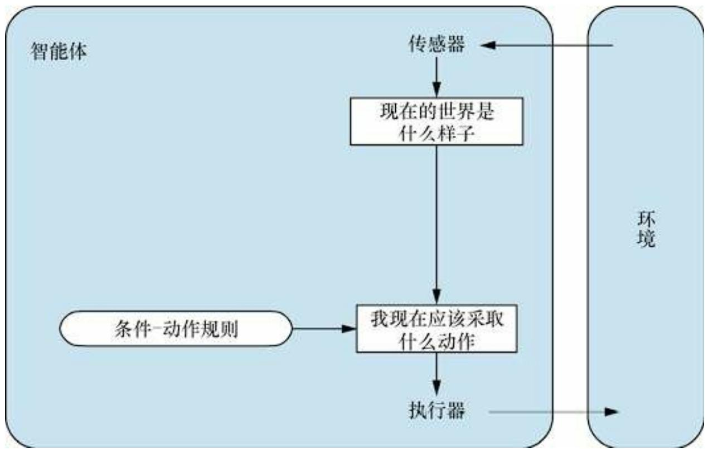  
图2-10简单反射型智能体。它根据一条规则进行操作，该规则的条件与感知定义的当前状态相匹配

图2-9简单反射型智能体的示意图。我们使用矩形表示智能体决策过程的当前内部状态，使用椭圆表示过程中使用的背景信息

图2-9中智能体对应的智能体程序如图2-10所示。I nterpret -I nput 函数根据 percept 生成当前状态的抽象描述。给定状态描述，Rule-Match函数返回规则集中匹配的第一条规则。注意，关于“规则”和“匹配”的描述纯粹是概念性的。如上所述，实际实现可以像实现布尔电路的逻辑门集合一样简单。或者，也可以使用“神经”电路，其中逻辑门由人工神经网络中的非线性单元代替（见第21章）。

function SIMPLE-REFLEX-AGENT(percept)returns一个动作

persistent:rules，一组条件-动作规则

state $\leftarrow$ INTERPRET-INPUT(percept) rule $\leftarrow$ RULE-MATCH(state, rules) action $\leftarrow$ rule.ACTION return action

简单反射型智能体具有值得赞扬的简单特性，但它们的智能有限。图2-10中的智能体只有在当前感知的基础上才能做出正确的决策，也就是说，只有在环境完全可观测的情况下才可行 。

即使是轻微的不可观测性也会造成严重的问题。例如，前面给出的刹车规则假设前车正在刹车的条件可以通过当前的感知（视频的单帧）确定。如果前车有一个安装在中间的（因此是唯一可识别的）刹车灯，这是可行的。但是，旧款车型的尾灯、刹车灯和转向灯的配置各不相同，而且从单幅图像中分辨出汽车是在刹车还是仅仅打开了尾灯不是总能做到的。一个简单反射型智能体在这样一辆车后面行驶，要么会连续不必要地刹车，或者更糟的是根本就不刹车。

我们在真空吸尘器世界中也可以看到类似的问题。假设一个简单的真空吸尘器反射型智能体没有位置传感器，只有一个灰尘传感器。这样的智能体只有两种可能的感知：[ Dirty ]和[ Clean ]。它可以用吸尘（ Suck）来响应[Dirty]，它该如何响应[Clean]呢？如果碰巧从方格A开始，向左（ Left）移动会（永远）失败，如果从方格B开始，向右（ Right）移动会（永远）失败。对在部分可观测环境中工作的简单反射型智能体而言，无限循环通常是不可避免的。

如果智能体可以随机化 （randomize）其操作，则可以跳出无限循环。例如，如果真空吸尘器智能体感知到[ Clean ]，它可能会通过抛硬币来选择左右。我们很容易就能证明智能体将平均通过两步到达另一个方格。如果方格是脏的，智能体将清理它，任务就会完成。因此，随机化的简单反射型智能体可能优于确定性的简单反射型智能体。

我们在2.3节中提到，在某些多智能体环境中，正确的随机行为是理性的。在单智能体环境中，随机化通常是不理性的。在某些情况下，这是一个有用的技巧，可以帮助简单反射型智能体，但在大多数情况下，我们可以使用更复杂的确定性智能体以做得更好。

# 2.4.3 基于模型的反射型智能体

处理部分可观测性的最有效方法是让智能体追踪它现在观测不到的部分世界。也就是说，智能体应该维护某种依赖于感知历史的 内部状态 （internalstate），从而至少反映当前状态的一些未观测到的方面。对于刹车问题，内部状态范围不仅限于摄像头拍摄图像的前一帧，要让智能体能够检测车辆边缘的两个红灯何时同时亮起或熄灭。对于其他驾驶任务，如变道，如果智能体无法同时看到其他车辆，则需要追踪它们的位置。为了在任何时候都能驾驶，智能体需要追踪其钥匙的位置。

随着时间的推移，更新这些内部状态信息需要在智能体程序中以某种形式编码两种知识。首先，需要一些关于世界如何随时间变化的信息，这些信息大致可以分为两部分：智能体行为的影响和世界如何独立于智能体而发展。例如，当智能体顺时针转动方向盘时，汽车就会向右转；而下雨时，汽车的摄像头就会被淋湿。这种关于“世界如何运转”的知识（无论是在简单的布尔电路中还是在完整的科学理论中实现）被称为世界的转移模型 （transition model）。

其次，我们需要一些关于世界状态如何反映在智能体感知中的信息。例如，当前面的汽车开始刹车时，前向摄像头的图像中会出现一个或多个亮起的红色区域；当摄像头被淋湿时，图像中会出现水滴状物体并部分遮挡道路。这种知识称为 传感器模型 （sensormodel）。

转移模型和传感器模型结合在一起让智能体能够在传感器受限的情况下尽可能地跟踪世界的状态。使用此类模型的智能体称为基于模型的智能体 （model-based agent）。

图2-11给出了基于模型的反射型智能体的结构，它具有内部状态，展示了当前感知如何与旧的内部状态相结合，并基于世界如何运转的模型生成当前状态的更新描述。智能体程序如图2-12所示。有趣的部分是函数U pdate-State，它负责创建新的内部状态描述。模型和状态的表示方式的细节因环境类型和智能体设计中使用的特定技术而异。

无论使用哪种表示，智能体几乎不可能准确地确定部分可观测环境的当前状态。相反，标有“现在的世界是什么样子”（图2-11）的框表示智能体的“最佳猜测”（或者在具有多种可能性的情况下的最佳猜测）。例如，一辆自动驾驶出租车可能无法看到停在它前面的大卡车周围的情况，只能猜测是什么导致了拥堵。因此，关于当前状态的不确定性可能是不可避免的，但智能体仍然需要做出决定。

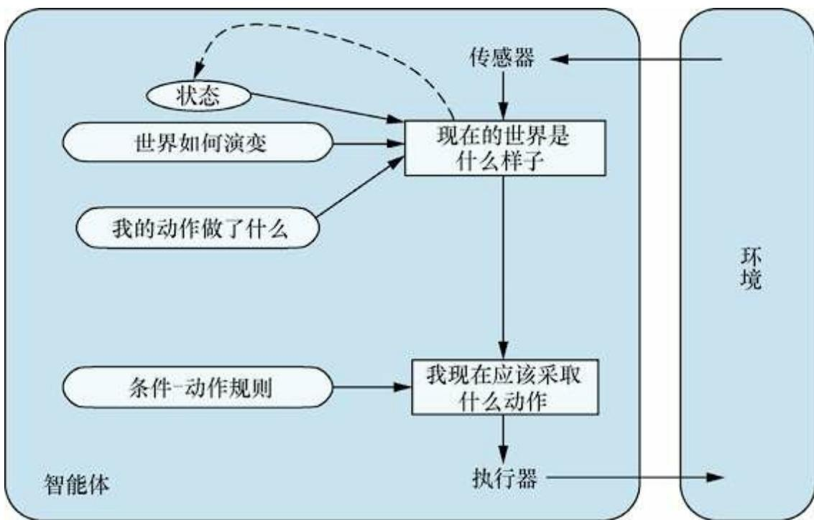  
图2-12基于模型的反射型智能体。它使用内部模型追踪世界的当前状态，然后以与反射型智能体相同的方式选择动作

图2-11基于模型的智能体

functionMODEL-BASED-REFLEX-AGENT(percept)returns-个动作

persistent:state，智能体对世界状态的当前理解

transition_model，关于下一个状态如何决定于当前状态和动作的描述

sensor_model，关于当前世界状态如何反映到智能体感知的描述

rules，一组条件-动作规则

action，最近的动作，初始为空

state UPDATE-S(state,ctionecept,tnsitionodel,sorel

rule RULE-MATCH(state,rules)

action rule.ACTION

return action

# 2.4.4 基于目标的智能体

了解环境的现状并不总是足以决定做什么。例如，在一个路口，出租车可以左转、右转或直行。正确的决定取决于出租车要去哪里。换句话说，除了当前状态的描述之外，智能体还需要某种描述理想情况的目标 信息，例如设定特定的目的地。智能体程序可以将其与模型（与基于模型的反射型智能体中使用的信息相同）相结合，并选择实现目标的动作。图2-13展示了基于目标的智能体结构。

有时，基于目标的动作选择很直接，例如，单个动作能够立刻实现目标的情况。有时会更棘手，例如，智能体为了找到实现目标的方法而不得不考虑很长的复杂序列。 搜索 （第3～5章）和 规划（第11章）是人工智能的子领域，专门用于寻找实现智能体目标的动作序列。

注意，这类决策从根本上不同于前面描述的条件-动作规则，因为它涉及对未来的考虑，包括“如果我这样做会发生什么？”和“这会让我快乐吗？”在反射型智能体设计中，这种信息并没有被明确地

表示出来，因为内置规则直接从感知映射到动作。反射型智能体在看到刹车灯时刹车，但它不知道为什么。基于目标的智能体在看到刹车灯时会刹车，因为这是它预测的唯一动作，这个动作可以实现不撞到其他汽车的目标。

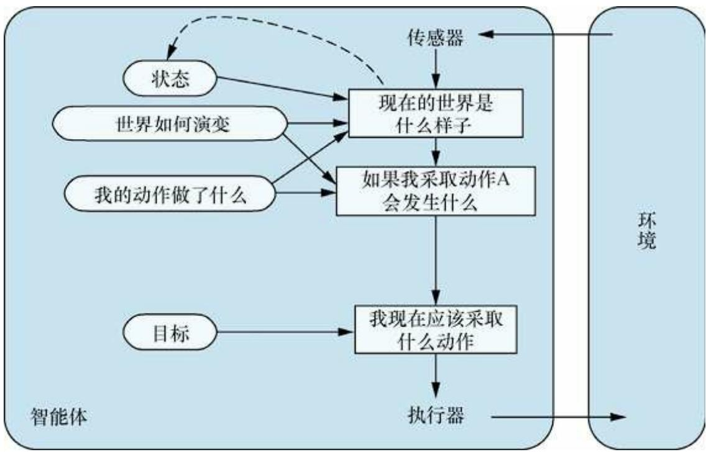  
图2-13基于模型、基于目标的智能体。它追踪世界状态以及它试图实现的一系列目标，并选择一项最终能够实现目标的动作

尽管基于目标的智能体看起来效率较低，但它更灵活，因为支持其决策的知识是显式表示的，并且可以修改。例如，只要将目的地指定为目标，就可以很容易地更改基于目标的智能体的行为，以到达不同的目的地。反射型智能体关于何时转弯和何时直行的规则只适用于单一目的地，这些规则必须全部更换才能去新的目的地。

# 2.4.5 基于效用的智能体

在大多数环境中，仅靠目标并不足以产生高质量的行为。例如，许多动作序列都能使出租车到达目的地（从而实现目标），但有些动作序列比其他动作序列更快、更安全、更可靠或更便宜。目标只是在“快乐”和“不快乐”状态之间提供了一个粗略的二元区别。更一般的性能度量应该允许根据不同世界状态的“快乐”程度对智能体进行比较。经济学家和计算机科学家通常用 效用 （utility）这个词


来代替“快乐”，因为“快乐”听起来不是很科学。

我们已经看到，性能度量会给任何给定的环境状态序列打分，因此它可以很容易地区分到达出租车目的地所采取的更可取和更不可取的方式。智能体的效用函数 （utility function）本质上是性能度量的内部化。如果内部效用函数和外部性能度量一致，那么根据外部性能度量选择动作，以使其效用最大化的智能体是理性的。

再次强调，这不是理性的唯一实现方式，我们已经看到了一个适用于真空吸尘器世界的理性智能体程序（图2-8），但并不知道它的效用函数是什么。与基于目标的智能体一样，基于效用的智能体在灵活性和学习方面有很多优势。此外，在两种情况下，仅靠目标是不充分的，但基于效用的智能体仍然可以做出理性的决策。首先，当存在相互冲突的目标时，只能实现其中的一部分（例如速度和安全），效用函数会进行适当的权衡。其次，当智能体有多个目标实现，但没有一个目标可以确定地实现时，效用提供了一种方法，可以权衡目标的重要性和成功的可能性。

部分可观测性和非确定性在真实世界中普遍存在，因此，不确定性下的决策也普遍存在。从技术上讲，基于效用的理性智能体会选择能够最大化其动作结果期望效用 （expected utility）的动作，也

就是在给定每个结果的概率和效用的情况下，智能体期望得到的平均效用（附录A更精确地定义了期望）。在第16章中，我们证明，任何理性智能体的行为都必须表现得好像拥有一个效用函数，并试图最大化其期望值。具有显式效用函数的智能体可以使用通用算法做出理性决策，该算法不依赖于特定效用函数的最大化。通过这种方式，理性的“全局”定义（将那些具有最高性能的智能体函数指定为理性）变成了对理性智能体设计的“局部”约束，并可以通过一个简单的程序来表示。

基于效用的智能体结构如图2-14所示。基于效用的智能体程序见第16章和第17章，其中设计了决策型智能体，必须处理非确定性或部分可观测环境中固有的不确定性。如第18章所述，多智能体环境中的决策也在效用理论的框架下进行了研究。

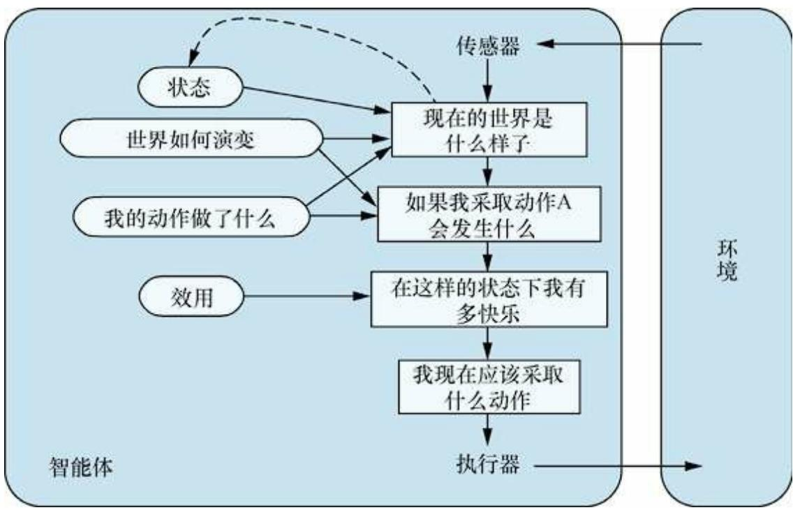  
图2-14基于模型、基于效用的智能体。它使用了一个世界模型以及一个效用函数来衡量它在各状态之间的偏好，然后选择产生最佳期望效用的动作，其中期望效用是通过对所有可能的结果状态和对应概率加权所得

说到这里，读者可能会想，“这么简单吗？只需要构建能够最大化期望效用的智能体，我们就完成了？ 这类智能体确实是智能的，但这并不简单。基于效用的智能体必须对其环境进行建模和跟踪，这些任务涉及大量关于感知、表示、推理和学习的研究。这些研究结果填满了本书的许多章节。选择效用最大化的行动方案也是一项艰巨的任务，需要更多的章节描述精巧的算法。即使使用这些算法，由于计算复杂性，完美理性在实践中通常是无法实现的（正如我们在第1章中所指出的）。我们还应该注意到，并非所有基于效用的智能体都是基于模型的。我们将在第22章和第26章中看到， 无模型的智能体 （model-free agent）可以学习在特定情况下什么样的动作是最好的，而不必确切地了解该动作如何改变环境。

最后，所有这些都假设设计者能够正确地指定效用函数，第17章、第18章和第22章将更深入讨论未知效用函数的问题。

# 2.4.6 学习型智能体

我们已经描述了一些智能体程序和选择动作的方法。到目前为止，我们还没有解释智能体程序是如何产生的。在图灵（Turing，1950）早期的著名论文中，他考虑手动编程实现智能机器的想法。他估计了这可能需要多少工作量，并得出结论，“似乎需要一些更快捷的方法”。他提出的方法是构造学习型机器，然后教它们。在人工智能的许多领域，这是目前创建最先进系统的首选方法。任何类型的智能体（基于模型、基于目标、基于效用等）都可以构建（或不构建）成学习型智能体。

正如我们之前提到的，学习还有另一个优势：它让智能体能够在最初未知的环境中运作，并变得比其最初的知识可能允许的能力更强。在本节中，我们简要介绍学习型智能体的主要思想。在整本书

中，我们对特定类型智能体中的学习因素和方法的评论贯穿全书。第19～22章将更加深入地介绍学习算法本身。

学习型智能体可分为4个概念组件，如图2-15所示。最重要的区别在于负责提升的 学习元素（learning element）和负责选择外部行动的 性能元素 （performance element）。性能元素是我们之前认为的整个智能体：它接受感知并决定动作。学习元素使用来自 评估者 （critic）对智能体表现的反馈，并以此确定应该如何修改性能元素以在未来做得更好。

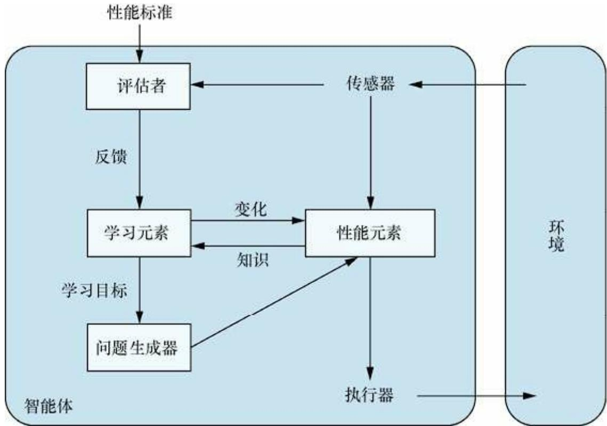  
图2-15通用学习型智能体。“性能元素”框表示我们之前认为的整个智能体程序，现在“学习元素”框可以修改该程序以提升其性能

学习元素的设计在很大程度上取决于性能元素的设计。当设计者试图设计一个学习某种能力的智能体时，第一个问题不是“我要如何让它学习这个？”而是“一旦智能体学会了如何做，它将使用什么样的性能元素？”给定性能元素的设计，可以构造学习机制来改进智能体的每个部分。

评估者告诉学习元素：智能体在固定性能标准方面的表现如何。评估者是必要的，因为感知本身并不会指示智能体是否成功。例如，国际象棋程序可能会收到一个感知，提示它已将死对手，但它需要一个性能标准来知道这是一件好事；感知本身并没有这么说。确定性能标准很重要。从概念上讲，应该把它看作完全在智能体之外，因为智能体不能修改性能标准以适应自己的行为。

学习型智能体的最后一个组件是问题生成器 （problemgenerator）。它负责建议动作，这些动作将获得全新和信息丰富的经验。如果性能元素完全根据自己的方式，它会继续选择已知最好的动作。但如果智能体愿意进行一些探索，并在短期内做一些可能不太理想的动作，那么从长远来看，它可能会发现更好的动作。问题生成器的工作是建议这些探索性行动。这就是科学家在进行实验时所做的。伽利略并不认为从比萨斜塔顶端扔石头本身有价值。他并不是想要打碎石头或改造不幸行人的大脑。他的目的是通过确定更好的物体运动理论来改造自己的大脑。

学习元素可以对智能体图（图2-9、图2-11、图2-13和图2-14）中显示的任何“知识”组件进行更改。最简单的情况是直接从感知序列学习。观察成对相继的环境状态可以让智能体了解“我的动作做了什么”以及“世界如何演变”以响应其动作。例如，如果自动驾驶出租车在湿滑路面上行驶时进行一定程度的刹车，那么它很快就会发现实际减速多少，以及它是否滑出路面。问题生成器可能会识别出模型中需要改进的某些部分，并建议进行实验，例如在不同条件下的不同路面上尝试刹车。

无论外部性能标准如何，改进基于模型的智能体的组件，使其更好地符合现实几乎总是一个好主

意。（从计算的角度来看，在某些情况下简单但稍微不准确的模型比完美但极其复杂的模型更好。）当智能体试图学习反射组件或效用函数时，需要外部标准的信息。

例如，假设出租车司机因为乘客在旅途中感到非常不适，没有收到小费。外部性能标准必须告知智能体，小费的损失对其整体性能有负面影响；然后，该智能体可能会了解到暴力操作有损其自身的效用。从某种意义上说，性能标准将传入感知的一部分区分为奖励 （reward）或惩罚 （penalty ），以提供对智能体行为质量的直接反馈。动物的疼痛和饥饿等固有的性能标准可以通过这种方式理解。

更一般地说，人类的选择可以提供有关人类偏好的信息。例如，假设出租车不知道人们通常不喜欢噪声，于是决定不停地按喇叭以确保行人知道它即将到来。随之而来的人类行为，如盖住耳朵、说脏话甚至可能剪断喇叭上的电线，将为智能体提供更新其效用函数的证据。这个问题将在第22章进一步讨论。

总之，智能体有各种各样的组件，这些组件可以在智能体程序中以多种方式表示，因此学习方法之间似乎存在很大差异。然而，主题仍然是统一的：智能体中的学习可以概括为对智能体的各个组件进行修改的过程，使各组件与可用的反馈信息更接近，从而提升智能体的整体性能。

# 2.4.7 智能体程序的组件如何工作

我们已经将智能体程序（用非常高级的术语）描述为由各种组件组成，其功能是回答诸如“现在的世界是什么样的？”“我现在应该采取什么动作？”“我的动作将导致什么？”等问题。人工智能学生的下一个问题是，“这些组件究竟是如何工作的？”要正确回答这个问题大约需要一千页的篇幅，但在这里我们希望读者能够注意一些基本区别，即组件表示智能体所处环境的各种方式之间的区别。

粗略地说，我们可以通过一个复杂性和表达能力不断增加的横轴来描述表示，即原子表示、因子化表示和结构化表示。为了辅助说明这些观点，我们可以考虑特定的智能体组件，例如处理“我的动作会导致什么”。这个组件描述了作为采取动作的结果可能在环境中引起的变化，图2-16展示了如何表示这些转移的示意图。

在原子表示 （atomicrepresentation）中，世界的每一个状态都是不可分割的，它没有内部结构。考虑这样一个任务：通过城市序列找到一条从某个国家的一端到另一端的行车路线（我们在图3-1中会解决这个问题）。为了解决这个问题，将世界状态简化为所处城市的名称就足够了，这就是单一的知识原子，也是一个“黑盒”，它唯一可分辨的属性是与另一个黑盒相同或不同。搜索和博弈中的标准算法（第3～5章）、隐马尔可夫模型（第14章）以及马尔可夫决策过程（第17章）都基于原子表示。

因子化表示 （factored representation）将每个状态拆分为一组固定的变量 或属性 ，每个变量或属性都可以有一个值 。考虑同一驾驶问题更真实的描述，即我们需要关注的不仅仅是一个城市或另一个城市的原子位置，可能还需要关注油箱中的汽油量、当前的GPS坐标、油量警示灯是否工作、通行费、收音机上的电台等。两个不同的原子状态没有任何共同点（只是不同的黑盒），但两个不同的因子化状态可以共享某些属性（如位于某个特定的GPS位置），而其他属性不同（如有大量汽油或没有汽油），这使得研究如何将一种状态转换为另一种状态变得更加容易。人工智能的许多重要领域都基于因子化表示，包括约束满足算法（第6章）、命题逻辑（第7章）、规划（第11章）、贝叶斯网络（第12～16章）以及各种机器学习算法。

  
（a）原子表示

  
（b）因子化表示

  
（c）结构化表示  
图2-16表示状态及其之间转移的3种方法：（a）原子表示一个状态（如B或C）是没有内部结构的黑盒；（b）因子化表示状态由属性值向量组成，值可以是布尔值、实值或一组固定符号中的一个；（c）结构化表示状态包括对象，每个对象可能有自己的属性以及与其他对象的关系

出于许多目的，我们需要将世界理解为存在着相互关联 的事物，而不仅仅是具有值的变量。例如，我们可能会注意到前面有一辆卡车正在倒车进入一个奶牛场的车道，但一头散养的奶牛挡住了卡车的路。因子化表示不太可能为属性 Truck Ahead Backing Into DairyFarm Driveway BlockedByLoose Cow 预先配备true或false的值。这就需要一个 结构化表示 （structured representation），在这种表示中可以明确地描述诸如奶牛和卡车之类的对象及其各种不同的关系（见图2-16c）。结构化表示是关系数据库和一阶逻辑（第8～10章）、一阶概率模型（第15章）和大部分自然语言理解（第23章和第24章）的基础。事实上，人类用自然语言表达的大部分内容都与对象及其关系有关。

如前所述，原子表示、因子化表示和结构化表示所在的轴是表达性 （expressiveness）增强的轴。粗略地说，可以通过简洁的描述捕捉到更具表达性的表示，表达性差的表示也可以捕捉到一切，但需要更多描述。通常，表达性更强的语言更简洁；例如，国际象棋规则可以用一两页结构化表示语言（如一阶逻辑）来描述，但需要数千页因子化表示语言（如命题逻辑）来描述，而需要10 38 页的原子语言（如有限状态自动机）来描述。但是，随着表示能力的增强，推理和学习变得更加复杂。为了在避免缺点的同时获得表达性表示的好处，真实世界中的智能系统可能需要轴上的所有点同时运行。

另一个表示轴涉及从概念到物理记忆中位置的映射，包括计算机的内存和大脑的记忆。如果概念和记忆位置之间存在一对一的映射，我们称之为 局部表示 （localistrepresentation）。但是，如果一个概念的表示分布在多个记忆位置，并且每个记忆位置被用作多个不同概念表示的一部分，我们称之为分布式表示 （distributed representation）。分布式表示对噪声和信息丢失更健壮。使用局部表示，从概念到记忆位置的映射是随机的，如果传输错误而导致几位乱码，我们可能会将卡车（Truck）与无关的概念停战（Truce）混淆。但在分布式表示中，可以把每个概念想象成多维空间中的一个点，即使有一些乱码，也会移动到该空间中附近的点，其具有相似的含义。

[1] 也称为 情境-动作规则 、 产生式系统 或 if-then规则。

小结

本章是人工智能的旋风之旅，在这个过程中我们认为人工智能是智能体设计的科学。本章要回顾的要点如下。

●智能体 是在环境中感知和行动的事物。智能体的智能体函数 指定智能体在响应任意感知序列时所采取的动作。  
●性能度量 评估智能体在环境中的行为。给定到目前为止所看到的感知序列，理性智能体 的动作是为了最大化性能度量的期望值。  
●任务环境 规范包括性能度量、外部环境、执行器和传感器。在设计智能体时，第一步必须始终是尽可能完整地指定任务环境。  
● 任务环境在几个重要维度上有所不同。它们可以是完全可观测的或部分可观测的、单智能体的或多智能体的、确定性的或非确定性的、回合式的或序贯的、静态的或动态的、离散的或连续的、已知的或未知的。  
●在性能度量未知或难以正确指定的情况下，智能体优化错误目标的风险很大。在这种情况下，智能体设计应该反映真实目标的不确定性。  
●智能体程序 实现智能体函数。存在各种基本的智能体编程，反映了决策过程中明确使用的信息类型。这些设计在效率、紧凑性和灵活性方面各不相同。智能体程序的适当设计取决于环境的性质。  
●简单反射型智能体 直接响应感知，而基于模型的反射型智能体 保持内部状态以跟踪当前感知中不明晰的世界状态。基于目标的智能体 采取行动来实现目标，而基于效用的智能体 试图最大化自己期望的“快乐”。  
●所有智能体都可以通过学习 提升性能。

读者服务：


微信扫码关注【异步社区】微信公众号，回复“e59810”获取本书配套资源以及异步社区15天VIP会员卡，近千本电子书免费畅读。

# 第二部分问题求解

# 第3章

# 通过搜索进行问题求解

在本章中，我们讨论一个智能体是如何向前搜索，找到一个动作序列来实现它的最终目标。

当要采取的正确动作不是很明显时，智能体可能需要提前规划：考虑一个形成通往目标状态路径的动作 序列 。这样的智能体被称为 问题求解智能体 （problem-solving agent），它所进行的计算过程被称为搜索 （search）。

如2.4.7节所述，问题求解智能体使用 原子 （atomic）表示，也就是说，世界状态被视为一个整体，其内部结构对问题求解算法来说是不可见的。使用状态的因子化 （factored）表示 或结构化（structured）表示的智能体称为规划智能体 （planningagent），第7章和第11章中将会讨论。

我们将在本书中介绍若干搜索算法。在本章中，我们将只考虑最简单的环境，即回合式的、单智能体的、完全可观测的、确定性的、静态的、离散的和已知的环境，并对 有信息 （informed）算法和无信息 （uninformed）算法进行区分。在有信息算法中，智能体可以估计自己到目标的距离，而在无信息算法中不能进行这样的估计。第4章会讨论更一般的环境中的问题，第5章则考虑了多智能体的情形。

本章使用了渐近复杂性的概念（即O (n )表示法）。不熟悉这些概念的读者可以参阅附录A。

# 3.1 问题求解智能体

想象一下，一个智能体正在罗马尼亚度假。它想参观景点，想学习罗马尼亚语，想享受罗马尼亚的夜生活但又不想宿醉，等等。这一决策问题是复杂的。现在，假设智能体目前位于Arad，并且买了一张第二天从Bucharest起飞且不能退款的机票。智能体观察路牌后发现，从Arad出发有3条路：条通往Sibiu，一条通往Timisoara，还有一条通往Zerind。但这都不是它的目的地，所以除非智能体


熟悉罗马尼亚的地理环境，不然它不知道该走哪条路。

如果智能体没有额外信息，也就是说，如果环境是未知的 （unknown），那么智能体只能随机执行一个动作。这种情况将在第4章讨论。在本章中，我们假设智能体总是能够访问与世界相关的信息，例如图3-1中的地图。有了这些信息，智能体可以执行以下4个阶段的问题求解过程。

●目标形式化 （goalformulation）：智能体的目标为到达Bucharest。目标通过限制智能体的目的和需要考虑的动作来组织其行为。

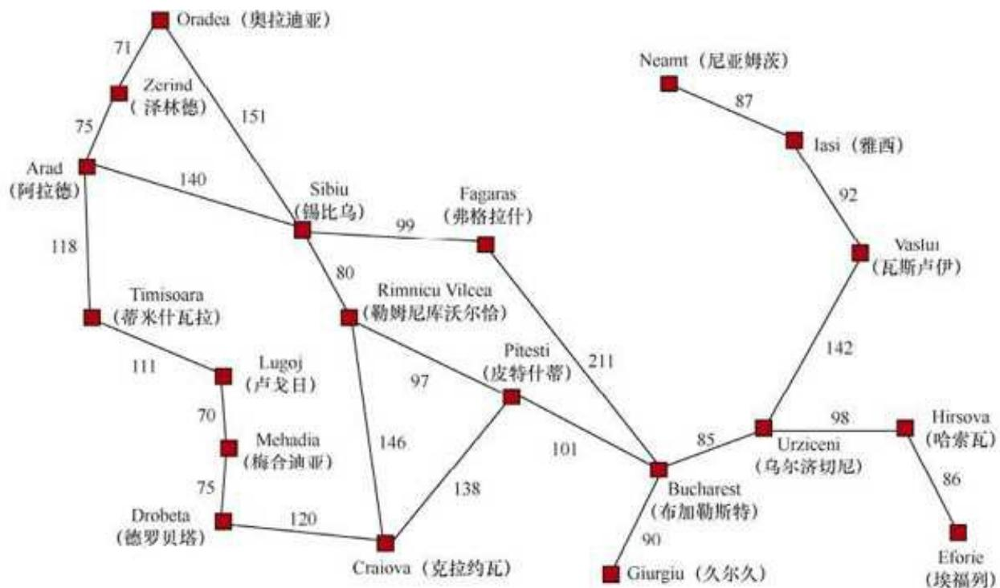  
图3-1 罗马尼亚部分地区的简化道路图，道路距离单位为英里（1英里=1.61千米）

● 问题形式化 （problem formulation）：智能体刻画实现目标所必需的状态和动作——进而得到这个世界中与实现目标相关的部分所构成的抽象模型。对智能体来说，一个好的模型应该考虑从一个城市到其相邻城市的动作，这时，状态中只有“当前所在城市”会由于动作而改变。  
●搜索 （search）：在真实世界中采取任何动作之前，智能体会在其模型中模拟一系列动作，并进行搜索，直到找到一个能到达目标的动作序列。这样的序列称为解 （solution）。智能体可能不得不模拟多个无法到达目标的序列，但最终它要么找到一个解（例如从Arad到Sibiu到Fagaras再到Bucharest），要么发现问题是无解的。  
●执行 （execution）：现在智能体可以执行解中的动作，一次执行一个动作。

一个重要的性质是，在一个完全可观测的、确定性的、已知的环境中， 任何问题的解都是一个固定的动作序列：开车到Sibiu，然后到Fagaras，最后到达Bucharest。如果模型是正确的，那么一旦智能体找到了一个解，它就可以在执行动作时忽略它的感知（“闭上眼睛”），因为解一定会到达目标。控制理论家称之为 开环 （open-loop）系统，因为忽略感知打破了智能体和环境之间的环路。

如果模型有可能是不正确的，或者环境是非确定性的，那么监控感知的 闭环 （closed-loop）方法会更安全（见4.4节）。

在部分可观测或非确定性环境中，问题的解将是一个根据感知推荐不同的未来动作的分支策略。例如，智能体可能规划从Arad开车到Sibiu，但还需要一个应变规划，以防它不小心到了Zerind或者发现了“Drum Închis”（道路封闭）的标志。

# 3.1.1 搜索问题和解

搜索 问题 （problem）的形式化定义如下。

● 可能的环境 状态 （state）的集合，我们称之为 状态空间 （state space）。  
● 智能体启动时的 初始状态 （initial state），例如 Ar ad 。  
●一个或多个 目标状态 （goalstate）的集合。有时问题只有一个目标状态（如 Bucharest），有时存在若干个可供选择的目标状态，也有时目标是由一个适用于许多状态（可能是无限多个状态）的属性所定义的。例如，在一个真空吸尘器世界里，目标可能是让任何位置都没有灰尘，而无论该状态的其他情况如何。我们通过给问题指定一个Is-G oal方法来将这3种可能性都考虑在内。在本章中，为了简单起见，我们有时会直接用“目标”一词，它表示“任一可能的目标状态”。  
●智能体可以采取的行动 （action）。给定一个状态s，A ctions(s)将返回在 s中可以执行的有限


动作集合。我们称集合中的任一动作在s中都是适用的 （applicable）。例如：

$$
A C T I O N S (A r a d) = \{T o S i b i u, T o T i m i s o a r a, T o Z e r i n d \}
$$

● 转移模型 （transition model）用于描述每个动作所起到的作用。R esult ( s , a )将返回在状态 s 中执行动作a所产生的状态。例如：

$$
\text {R E S U L T} (A r a d, \text {T o Z e r i n d}) = \text {Z e r i n d}
$$

● 动作代价函数 （action cost function），在编程中记作A ction -C ost ( s , a , s' )，在数学运算中记作 c ( s , a , s' )。它给出了在状态 s 中执行动作 a 从而转移到状态 s' 的数值代价。问题求解智能体应该使用反映其自身性能指标的代价函数；例如，对于寻径智能体，动作代价可能是以英里为单位的长度（如图3-1所示），也可能是完成动作所花费的时间。

一个动作序列形成一条路径 （path），而解 （solution）是一条从初始状态到某个目标状态的路径。我们假设动作代价是可累加的；也就是说，一条路径的总代价是各个动作代价的总和。最优解 （optimal solution）是所有解中路径代价最小的解。在本章中，我们假设所有的动作代价都为正，以减少复杂性。[1]

状态空间可以用图 （graph）来表示，图中的顶点表示状态，顶点之间的有向边表示动作。图3-1所示的罗马尼亚地图就是这样一个图，每条道路表示两种动作，即两个方向各表示一种。

# 3.1.2 问题形式化

我们将前文中去往Bucharest的问题形式化为一个模型 （model）— —一种抽象的数学描述，而不是真实存在的实物。与简单的原子状态描述Arad 相比，实际的旅行的世界状态包括很多内容：旅行伙伴、当时的广播节目、窗外的风景、附近是否有执法人员、到下一个休息站的距离、道路状况、天气、交通等。所有这些因素都被排除在我们的模型之外，因为它们与寻找前往Bucharest的路线问题无关。

从表示中剔除细节的过程称为抽象 （abstraction）。一个良好的问题形式化应该具有适度的细节层次。如果智能体的动作细化到“右脚向前移动1厘米”或“方向盘向左转动1度”的层次上，那它可能永远都找不到走出停车场的路，更不用说去Bucharest了。

我们能更精确地定义合适的 抽象层级 （level of abstraction）吗？我们所选择的抽象状态和动作对应于大量具体的世界状态和动作序列。现在考虑抽象问题的解，例如，从Arad到Sibiu，到RimnicuVilcea，到Pitesti，再到Bucharest的路径。这个抽象解对应于大量更详细的路径。例如，从Sibiu开往Rimnicu Vilcea的途中，我们可以打开收音机，而在其他的旅程中关掉收音机。

如果我们能够将任何抽象解细化为更详细的世界中的解，那么这种抽象就是合理的；一个充分条件


是，对于“in Arad”的每个详细状态，都有一条到达“in Sibiu”状态的详细路径，以此类推。 $\_$ 如果执行解中的每个动作都比原始问题更容易，那么抽象是有用的；在我们的示例中，“从Arad开车到Sibiu”的动作，任何一个一般水平的司机都可以在不进一步搜索或规划的情况下完成。因此，选择一个好的抽象需要删除尽可能多的细节，同时保留合理性，并确保抽象动作易于执行。如果没有构造有用的抽象的能力，智能体将被真实世界完全淹没。

[1]在任何存在负代价环的问题中，代价最优解为在这个环中循环无限次。不存在负代价环时，Bellman-Ford算法和Floyd-Warshall算法（本章暂未涉及）可以处理负代价动作。只要连续的零代价动作的数量是有限的，处理零代价动作就很容易。例如，假设有一个机器人，其移动的代价为正，但旋转90°的代价为0；只要连续旋转90°动作的数量不超过3个，本章的算法就可以处理这个问题。存在无限多个任意小的动作代价的问题也很复杂。考虑Zeno悖论的情况，存在一个动作，它每次向目标移动剩余距离的二分之一，代价为上一次移动代价的二分之一。这个问题不存在动作数量有限的解，但为了防止搜索在没有完全到达目标的情况下采取无限数量的动作，我们可以要求所有动作的代价至少为， ， 为某个较小的正值。

# 3.2 问题示例

问题求解的方法已被应用于大量任务环境中。我们在这里列出一些典型问题，区分为标准化问题和真实世界问题。 标准化问题 （standardized problem）常用于说明或训练各种问题求解方法。它具有简洁、准确的描述，因此适合作为研究人员比较算法性能的基准。真实世界问题 （real-worldproblem），如机器人导航，则意味着这一问题的解是人们实际使用的，且问题的形式化是独特的而非标准化的，因为例如在机器人导航问题中，每个机器人具有不同的传感器，产生不同的数据。

# 3.2.1 标准化问题

网格世界 （gridworld）问题是一个由正方形单元格组成的二维矩形阵列，在这个阵列中，智能体可以从一个单元格移动到另一个单元格。一般来说，智能体可以水平或垂直地移动到任何无障碍的相邻单元格，在某些问题中还可以沿对角线移动。单元格中可以包含智能体能拿起、推开或施加其他动作的物体，也可以存在阻止智能体进入单元格内的墙壁或其他不可逾越的障碍。2.1节中的真空吸尘器世界 （vacuumworld）可以表示为一个网格世界问题。

● 状态： 即哪些对象在哪些单元格中。在真空吸尘器世界中，对象就是智能体和灰尘。对于只有两个单元格的简单情形，智能体可以位于这两个单元格中的任何一个，每个单元格都可能存在灰尘，所以共有2×2×2 = 8个状态（见图3-2）。一般来说，存在 n 个单元格的真空吸尘器环境有 n ×2n 个状态。  
●初始状态： 任一状态都可以被指定为初始状态。  
● 动作： 在只有两个单元格的情形中，我们可以定义3种动作，即吸尘（ Suck ）、向左（ Left ）移动和向右（Right）移动。在二维多单元格世界中，我们则需要更多种移动动作。我们可以增加向上（ Upward ）和向下（ Downward ）的动作，从而得到4种 绝对的 （absolute）移动动作，或者可以将其转换为 以自我为中心的动作 ，即从相对于智能体的角度来定义，例如，向前（Forward ）、向后（ Backward ）、右转（ TurnRight ）和左转（ TurnLe ft ）。  
●转移模型： Suck将去除单元格内的任何灰尘；Forward 将智能体朝它所面对的方向向前移动一个单元格，除非它撞到墙（在这种情况下，这个行动不起作用）。Backward 让智能体朝相反的方向移动一个单元格，而TurnRight和TurnLeft则将智能体的朝向旋转90°。  
●目标状态： 每个单元格都保持干净的状态。  
●动作代价： 每个动作的代价都是1。

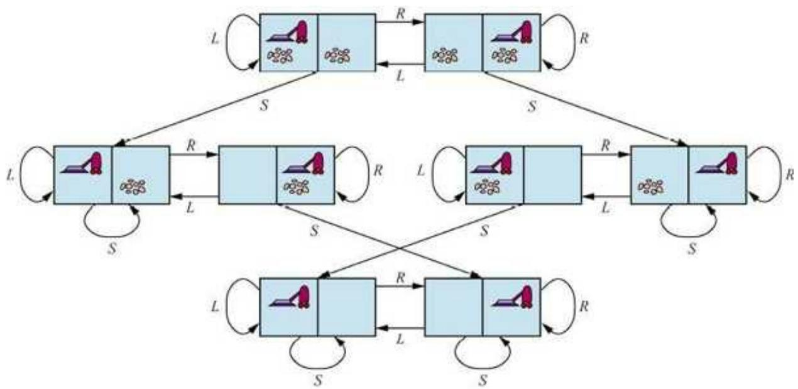  
图3-2 两个单元格的真空吸尘器世界的状态空间图。共有8个状态，每个状态有3种动作： $L =$ Left

（向左）、 R = Right （向右）、 S = Suck （吸尘）

另一种类型的网格世界是推箱子问题 （sokoban puzzle），在这个问题中，智能体的目标是将一些散落在网格中的箱子推到指定的存储位置。每个单元格最多容纳一个箱子。当智能体向前移动到放有一个箱子的单元格，而箱子另一侧的单元格为空时，箱子和智能体都向前移动一格。智能体不能把一个箱子推到另一个箱子上或墙上。对于存在n 个无障碍单元格和b 个箱子的世界，共有个状态；例如，在一个存在12个箱子的8×8网格中，有超过200万亿个状态。

在 滑块问题 （sliding-tile puzzle）中，若干滑块（有时称为块或片）排列在一个有若干空白区域的网格中，其中滑块可以滑进空白区域。它的一个变体是汽车华容道问题（Rush Hour puzzle），在这个问题中，我们需要在6×6的网格中滑动汽车和卡车，目标是将一辆汽车从交通堵塞中解救出来。滑块问题中最著名的变体是 8数码问题 （8-puzzle）（见图3-3），它由一个3×3的网格、8个带编号的滑块和一个空格组成，目标是达到指定的状态，如图3-3中右侧所示。类似的还有由4×4的网格组成的15数码问题 （15-puzzle）。对8数码问题做如下形式化处理。

●状态： 指定每个滑块位置的状态描述。  
● 初始状态： 任何状态都可以被指定为初始状态。注意，可以根据奇偶性划分状态空间——任何给定目标都可以从恰好一半的可能初始状态到达（见习题3.PART）。  
● 动作： 虽然在真实世界中是滑块在移动，但描述动作的最简单方法是假设空格执行 Left 、 Right、Up或Down动作。如果空格位于边缘或角落，则不是所有的动作都可用。  
●转移模型： 将状态和动作映射为一个结果状态；例如，图3-3中，对于初始状态，我们采取 Left动作，那么结果状态中滑块5和空格将交换位置。  
●目标状态： 尽管任何状态都可以作为目标状态，但我们通常用有序编号指定目标状态，如图3-3所示。  
●动作代价： 每个动作的代价都为1。

注意，每个问题的形式化都涉及抽象。8数码问题中的动作被抽象为它们的开始状态和结束状态，忽略滑块滑动的中间位置。我们已经通过抽象除去了一些动作，例如，当滑块被卡住时需要晃动木板，并排除了用刀取出滑块然后再放回去的可能性。最终只剩下对规则的描述，避免了实际操作的所有细节。

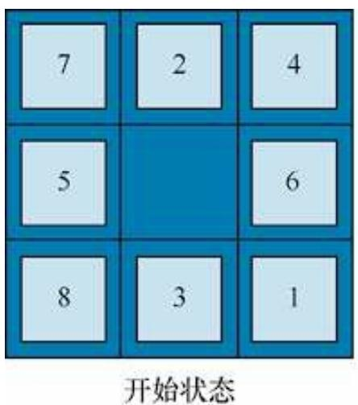

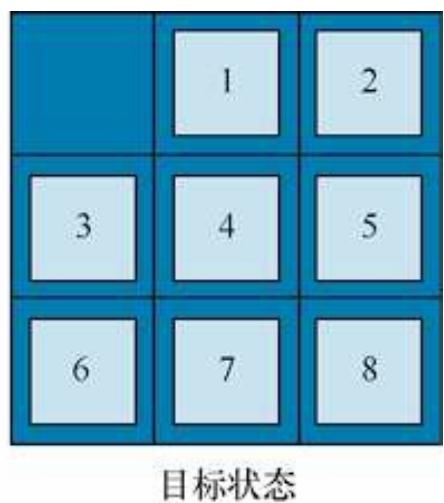  
图3-3 8数码问题的一个典型实例

我们介绍的最后一个标准化问题是由高德纳（Knuth,1964）设计的，它说明了无限状态空间是如何产生的。高德纳推测，通过只由平方根、向下取整和阶乘操作组成的序列可以从数字4得到任何正整数。例如，我们可以这样从4得到5：

$$
\left\lfloor \sqrt {\sqrt {\sqrt {\sqrt {(4 !)} !}}} \right\rfloor = 5
$$

问题定义很简单，如下所述。

●状态： 正实数。  
● 初始状态： 4。  
● 动作： 应用平方根、向下取整或阶乘操作（阶乘仅用于整数）。  
● 转移模型： 根据运算的数学定义给出。  
●目标状态： 所求的正整数。  
● 动作代价： 每个动作的代价都是1。

这一问题的状态空间是无限的：对于任意大于2的整数，阶乘操作总是产生一个更大的整数。这个问题很有趣，因为它探索了非常大的数字：从4到5的最短路径生成了数字(4!)!=620 448 401 733239 439 360 000。无限状态空间经常出现在涉及数学表达式生成、电路、证明、程序和其他递归定义对象的任务中。

# 3.2.2 真实世界问题

我们已经了解了如何根据指定的位置和沿着它们之间的边进行的位置转移来定义 寻径问题 （route-finding problem）。寻径算法有许多应用场景。其中一些是上文中罗马尼亚例子的直接扩展，例如提供导航的网站和车载系统等。（需要考虑的主要复杂因素是因与交通相关的延迟而导致的代价变化，以及因道路封闭而导致的路线变更。）另一些例如计算机网络中的视频流路由、军事行动规划和飞机航线规划系统等，则更加复杂。下面介绍旅行规划网站必须解决的航空旅行问题。

●状态： 每个状态显然包括当前位置（例如，某个机场）和当前时间。此外，由于每个动作（一个航段）的代价可能依赖于之前的航段、票价基础以及它们是国内航班还是国际航班，状态必须记录这些额外的“历史”信息。  
●初始状态： 用户家所在的机场。  
●动作： 在当前时间之后，从当前位置乘坐任意航班任意舱位起飞，如果需要，还要留出足够的时间在机场中转。  
●转移模型： 乘坐航班产生的结果状态将航班的目的地作为新的当前位置，将航班的到达时间作为新的当前时间。  
●目标状态： 目的地城市。有时目标可能更复杂一点，例如“乘坐直达航班到达目的地”。  
●动作代价： 金钱成本、等待时间、飞行时间、海关和入境手续、舱位质量、当日时间、飞机类型、常旅客奖励积分等的组合。

商业旅行咨询系统使用的就是上述问题的形式化。不过，在处理航空公司错综复杂的票价结构时，还会有许多额外的复杂因素。例如，任何有经验的旅行者都知道，并不是所有的航空旅行都能按计划进行。因此，一个真正好的系统应该包括应变规划— 如航班延误或者错过转机时的应对方案。

旅行问题 （touring problem）描述的是一组必须访问的地点，而非单一目的地。旅行商问题（traveling salesperson problem，TSP），就是一个旅行问题，即地图上每个城市都必须被访问。其目标是找到代价小于 C的旅行路线（在优化版本中，目标是找到代价最低的旅行路线）。为了提高TSP算法的性能，科研人员付出了大量的努力。该算法也可以扩展到处理车队问题。例如，规划波士顿校车路线的搜索优化算法为人们节约了500万美元，减少了交通拥堵和空气污染，同时还为司机和学生节省了时间（Bertsimasetal. , 2019）。除了规划行程，搜索算法还被用于规划自动电路

板钻孔机钻头的运动和装料机在车间内的移动等任务。

超大规模集成电路布图 （VLSIlayout）问题需要在一个芯片上定位数百万个元件和连接点，以最小化芯片面积、电路延迟和杂散电容，并最大化成品率。布图问题在逻辑设计阶段之后，通常分为两个部分： 单元布图 （cell layout）和 通道布线 （channel routing）。在单元布图中，电路的基本元件分组为若干单元，每个单元执行一些特定功能。每个单元都有固定的占用区域（大小和形状），并且需要与其他每个单元建立一定数量的连接。单元布图的目的是将单元彼此不重叠地放置在芯片上，并且单元之间有足够的空间布置连线。通道布线的目的则是通过单元之间的间隙为每条导线寻找特定的路线。这些搜索问题极其复杂，但绝对值得研究。

机器人导航 （robotnavigation）是寻径问题的一个推广。机器人不必沿着明确的路径（如罗马尼亚的道路）行走，而是可以四处游走，实际上是自己走自己的路。对于在平面上移动的圆形机器人，空间本质上是二维的。当机器人的手臂和腿也必须受到控制时，搜索空间就变成了多维的——每个关节角都是一个维度。为了使基本上连续的搜索空间变成有限空间，需要一些更先进的技术（见第26章）。除了问题的复杂性外，真正的机器人还必须处理传感器读取错误、电动机控制中的错误、部分可观测性以及可能改变环境的其他智能体等问题。

自20世纪70年代以来，由机器人对复杂物体（例如电动机）进行 自动装配排序 （automaticassembly sequencing）已成为标准的工业实践。算法首先找到一个可行的装配序列，然后对装配过程进行优化。将装配线上的人工劳动减少到最低限度可以节省大量时间和成本。装配问题的目标是找到某个对象的各个零件的组装顺序。如果顺序错误，那么只能撤消某些已完成的工序，否则无法在序列的后面添加其他部分。检查序列中动作的可行性是与机器人导航问题密切相关的几何搜索难题。因此，合法动作的生成是装配排序问题中代价较高的部分。任何实用算法都必须尽量避免探索全部的状态空间，而应只探索状态空间中的很小一部分。一类重要的装配问题是 蛋白质设计（protein design），其目的是找到一种氨基酸序列，该序列能够折叠成具有正确特性的三维蛋白质结构，以治疗某些疾病。

# 3.3 搜索算法

搜索算法 （searchalgorithm）将搜索问题作为输入并返回问题的解或报告failure（当解不存在时）。在本章中，我们考虑在状态空间图上叠加一棵搜索树 （search tree）的算法，该算法从初始状态形成各条路径，并试图找到一条可以达到某个目标状态的路径。搜索树中的每个节点（node）对应于状态空间中的一个状态，搜索树中的边对应于动作。树的根对应于问题的初始状态。

理解状态空间和搜索树之间的区别非常重要。状态空间描述了世界的（可能无限的）状态集，以及允许从一个状态转移到另一个状态的动作。搜索树描述了这些状态之间通向目标的路径。搜索树可以有多条路径（因此可以有多个节点）到达任何给定状态，但树中的每个节点都只有唯一一条返回根的路径（与所有树一样）。

图3-4展示了寻找从Arad到Bucharest的路径的前几步。搜索树的根节点位于初始状态，Arad。我们可以按如下方式 扩展 （expand）节点：考虑该状态的可用动作A ctions，使用Result函数查看这些动作指向何处，并为每个结果状态 生成 （generating）一个新节点，称为 子节点 （child node）或 后继节点 （successor node）。每个子节点的 父节点 （parent node）都是Arad。

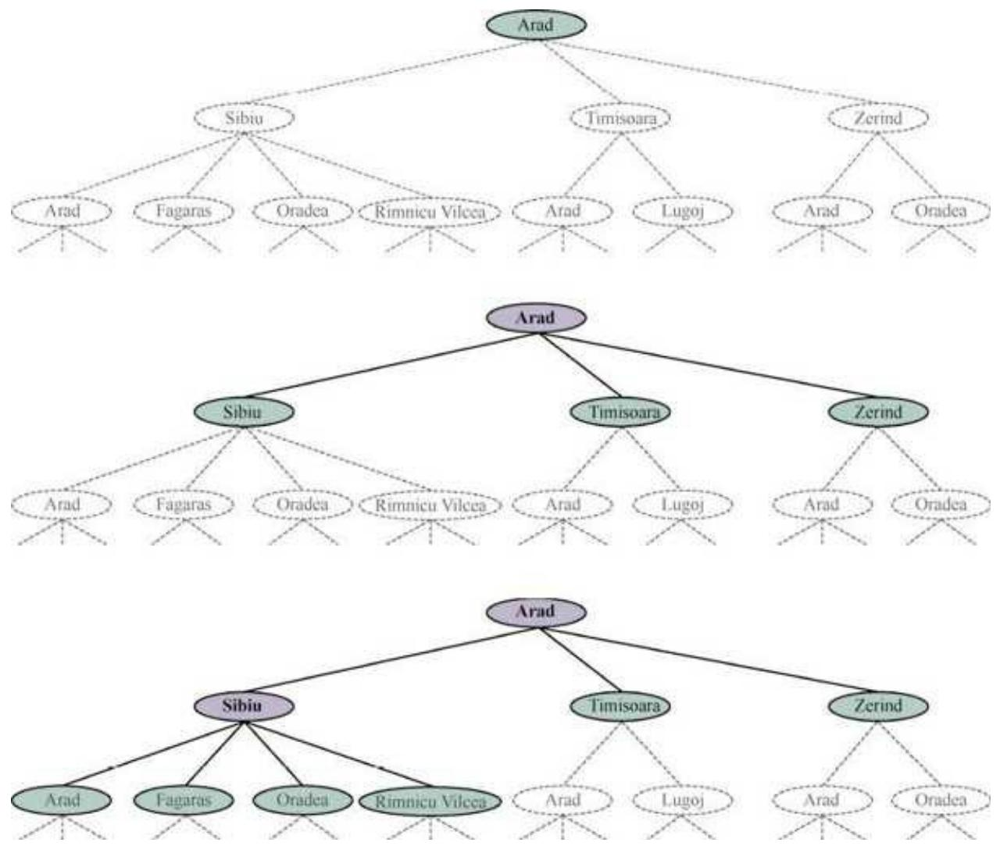  
图3-4 3棵部分搜索树，用于寻找从Arad到Bucharest的路线。已扩展节点用淡紫色和粗体字母表示；边界上已生成但未被扩展的节点用绿色表示；对应于这两种类型节点的状态集被称为已达。接下来可能生成的节点用虚线表示。注意，在最下面的树中，有一个从Arad到Sibiu再到Arad的环，这不可能是最优路径，因此搜索不应该从那里继续

现在我们必须从这3个子节点中选择一个考虑下一步扩展。这就是搜索的本质——先跟踪一个选

项，之后再考虑其他选项。假定我们选择先扩展Sibiu。结果如图3-4中最下面的搜索树所示，我们得到了6个未被扩展的节点（以绿色节点显示）。我们称之为搜索树的边界 （frontier）。任何已经生成过节点的状态都称为 已达 （reached）状态（无论该节点是否被扩展）。 [1] 图3-5为叠加在状态空间图上的搜索树。

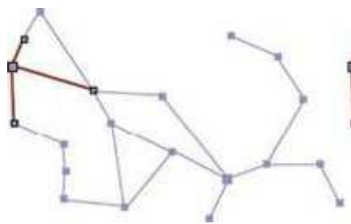

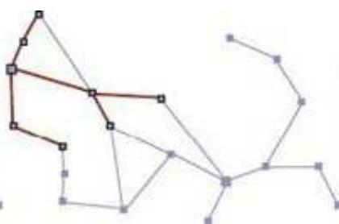

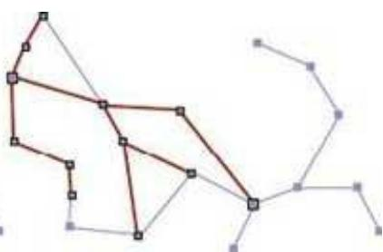  
图3-5 由图3-1中的罗马尼亚问题的图搜索生成的搜索树序列。在每一阶段，我们扩展边界上的每个节点，使用所有不指向已达状态的可用动作延伸每条路径。需要注意的是，在第三阶段，最高位置的城市（Oradea）有两个后继城市，这两个城市都已经有其他路径到达，所以没有路径可以从Oradea延伸

注意，边界 分离 （separate）了状态空间图的两个区域，即内部区域（其中每个状态都已被扩展）和外部区域（尚未到达的状态）。该属性如图3-6所示。

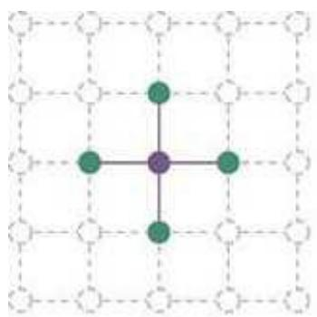

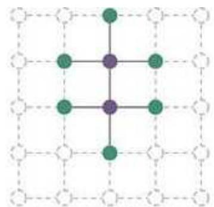

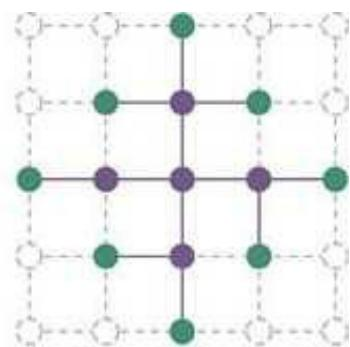  
  
图3-6 以矩形网格问题为例说明图搜索的分离性质。边界（绿色）分离了内部（淡紫色）和外部（虚线）。边界是已达但尚未扩展的节点（及相应的状态）的集合；内部是已被扩展的节点（及相应的状态）的集合；外部是尚未到达的状态的集合。在（a）中，只有根节点被扩展。在（b）中，上面的边界节点被扩展。在（c）中，按顺时针顺序扩展根节点的其他后继节点

# 3.3.1 最佳优先搜索

我们如何决定下一步从边界扩展哪个节点？最佳优先搜索 （best-firstsearch）是一种非常通用的方法，在这种方法中，我们选择使得某个评价函数 （evaluation function）f(n )的值最小的节点 n。算法如图3-7所示。在每次迭代中，选择边界上具有最小f(n )值的一个节点，如果它的状态是目标状态，则返回这个节点，否则调用Expand 生成子节点。对于每个子节点，如果之前未到达过该子节点，则将其添加到边界；如果到达该子节点的当前路径的代价比之前任何路径都要小，则将其重新添加到边界。该算法要么返回failure，要么返回一个节点（表示一条通往目标的路径）。通过使用不同的 f(n )函数，可以得到不同的具体算法，本章将介绍这些算法。

function BEST-FIRST-SEARCH(problem,f)returns一个解节点或failure node $\leftarrow$ NODE(State $\equiv$ problem.INIaIAL)   
frontier $\leftarrow$ 一个以 $f$ 排序的优先队列，其中一个元素为node reached $\leftarrow$ 一个查找表，其中一个条目的键为problem.INITAI,值为node while not Is-EMPTY(frontier)do node $\leftarrow$ POP(frontier) if problem.Is-GOAL(node.STATE) then return node for each child in EXPAND(problem,node) do s-child.STATE if s不在reached中or child.PATH-COST $<  <$ reached[s].PATH-COST then reached[s] $\leftarrow$ child 将child添加到frontier中 return failure   
function EXPAND(problem,node)yields节点   
s-node.STATE   
for each action in problem ACTIONS(s) do $s^{\prime}\gets$ problem.RESULT(s,action) cost $\leftarrow$ node.PATH-COST $+$ problem.ACTION-COST(s,action,s') yieldNODE(STATE $= s^{\prime}$ PARENT $\equiv$ node,ACTION $\equiv$ action,PATH-COST $\equiv$ cost)

图3-7最佳优先搜索算法以及扩展节点的函数。这里使用的数据结构将在3.3.2节中介绍。 yield的说明见附录B

# 3.3.2 搜索数据结构

搜索算法需要一个数据结构来跟踪搜索树。树中的节点 （node）由一个包含4个组成部分的数据结构表示。

● node .S tat e ：节点对应的状态。   
●node.Parent：父节点，即树中生成该节点的节点。  
●node.A ction ：父节点生成该节点时采取的动作。  
● node .P ath -C os t ：从初始状态到此节点的路径总代价。在数学公式中，一般使用 $g$ ( node )表示P ath -C o st 。

通过从一个节点返回的Parent指针，我们可以复原到达该节点的路径上的状态和动作。从一个目标节点开始复原，我们就可以得到问题的解。

我们需要一个数据结构来存储边界 。一个恰当的选择是某种 队列 （queue），因为边界上的操作有以下几个。

● I s -E mpty ( frontier )：返回true当且仅当边界中没有节点。  
●Pop (frontier)：返回边界中的第一个节点并将它从边界中删除。

● T op ( frontier )：返回（但不删除）边界中的第一个节点。  
● A dd ( node , frontier )：将节点插入队列中的适当位置。

搜索算法使用了3种不同类型的队列。

● 优先队列 （priority queue）首先弹出根据评价函数 $f$ 计算得到的代价最小的节点。它被用于最佳优先搜索。  
● FIFO队列 （FIFO queue），即先进先出队列（first-in-first-out queue），首先弹出最先添加到队列中的节点；它被用于广度优先搜索。  
● LIFO队列 （LIFO queue），即后进先出队列（last-in-first-out queue），也称为 栈（stack） ，首先弹出最近添加的节点；它被用于深度优先搜索。

已达状态可以存储为一个查找表（例如，哈希表），其中每个键是一个状态，对应的值是该状态的节点。

# 3.3.3 冗余路径

图3-4（最下面一排）所示的搜索树包含了一条从Arad到Sibiu再回到Arad的路径。这时我们称Arad为搜索树中的一个 重复状态 （repeated state），在本例中该重复状态是由循环 （cycle）［也称为环路 （loopy path）］生成的。因此，即使状态空间只有20种状态，完整的搜索树也是无限的，因为遍历循环的频率没有限制。

循环是冗余路径 （redundantpath）的一种特殊情况。例如，我们可以通过路径Arad—Sibiu（总长140英里）或路径Arad—Zerind—Oradea—Sibiu（总长297英里）到达Sibiu。第二条路径是冗余的是到达相同状态的一种比较差的方式——在我们寻找最优路径时不需要考虑它。

考虑一个10×10网格世界中的智能体，它能够移动到8个相邻方格中的任何一个。如果没有障碍，智能体可以在9步或更少的移动内到达100个方格中的任何一个。但是长度为9的路径的数量几乎是89 （由于网格边缘的存在，路径数稍微少了一点），超过了1亿条。也就是说，平均意义下，有超过100万条长度为9的冗余路径到达同一个单元格，如果我们消除了冗余路径，搜索完成的速度可以快大约100万倍。俗话说， 不记得历史的算法注定要重复历史。有3种方法可以解决这一问题。

第一，我们可以记住之前到达的所有状态（就像最佳优先搜索一样），这样能够检测到所有冗余路径，并只保留每个状态的最优路径。这适用于存在大量冗余路径的状态空间，当内存可以容纳下已达状态表时，它是首选方法。

第二，我们不必担心对过去的重复。在一些问题形式化中，很少或不可能出现两条路径到达相同状态。以装配问题为例，每个动作都会将一个零件添加到一个不断发展的装配中，零件是有序的，因此可以先添加A，然后再添加 B，但不能先添加B，然后再添加 A。对于这些问题, 如果我们不记录已达状态也不检查冗余路径，则可以节省内存空间。如果搜索算法会检查冗余路径，我们称之为

图搜索 （graph search）；否则，称之为 树状搜索 （tree-like search） 。图3-7中的B est -First-Search 算法是一种图搜索算法；如果删除所有对 reached 的引用，即为树状搜索，它使用更少的内存，但会出现到达相同状态的冗余路径，因此运行速度会更慢。

第三，我们可以选择折中方法，检查循环，但通常不检查冗余路径。由于每个节点都有一个父指针链，因此可以通过跟踪父指针链来查看路径末端的状态之前是否在路径中出现过，从而不需要额外内存即可检查是否存在循环。某些算法实现一直沿着这个链向上移动，从而消除了所有循环。另一些算法实现仅跟踪少数几个链接（例如，到父节点、祖父节点和曾祖父节点），因此仅需花费固定的时间就可以消除所有短循环（并依靠其他机制来处理长循环）。

# 3.3.4 问题求解性能评估

在开始设计各种搜索算法之前，需要考虑在这些算法中进行选择时所使用的标准。我们可以从以下4个方面评价算法的性能。

● 完备性 （completeness）：当存在解时，算法是否能保证找到解，当不存在解时，是否能保证报告失败？


● 代价最优性 （cost optimality）：它是否找到了所有解中路径代价最小的解？  
● 时间复杂性 （time complexity）：找到解需要多长时间？可以用秒数来衡量，或者更抽象地用状态和动作的数量来衡量。  
● 空间复杂性 （space complexity）：执行搜索需要多少内存？

为了理解完备性，考虑一个具有单一目标的搜索问题。这个目标可能是状态空间的任何地方；因此，一个完备的算法必须能够系统地探索从初始状态可以到达的每一个状态。在有限状态空间中，这是很容易实现的：只要我们跟踪路径并切断循环（例如，Arad到Sibiu再到Arad），最终我们将到达每一个可到达的状态。

在无限状态空间中，则需要更加小心。例如，在高德纳的“4”问题中反复应用“阶乘”操作的算法将沿着从4到4!到(4!)!……的无限路径行进。同样地，在一个没有障碍的无限网格上，沿着直线不停前进也会形成由新状态组成的无限路径。在这两种情况下，算法永远不会返回它之前到达的状态，但它是不完备的，因为状态空间中的大部分状态永远都不会到达。

完备的搜索算法探索无限状态空间的方式必须是 系统的 （systematic），以确保它最终能够到达与初始状态相关的任何状态。例如，在无限网格上，一种系统搜索方法是螺旋路径，它覆盖了距离原点s步远的所有单元格，然后移动到 s+1步远的单元格。遗憾的是，在一个不存在解的无限状态空间中，一个合理的算法会一直搜索，它不会终止，因为它不知道下一个状态是否是目标状态。

时间复杂性和空间复杂性与问题的困难程度相关。在理论计算机科学中，一种典型的度量方式是状态空间图的大小， ，其中 是图中顶点（状态节点）的数量， 是边（不同的状态/动作对）的数量。当状态空间图是显式的数据结构（如罗马尼亚地图）时，这种度量是合适的。但在许多人工智能问题中，状态空间图只是由初始状态、动作和转移模型隐式地表示。对于隐式的状态空间，复杂性可以用3个量来衡量： $d$ ，最优解的 深度 （depth）或动作数； m ，任意路径的最大动作数；b ，需要考虑的节点的 分支因子 （branching factor）或后继节点数。

[1] 一些作者将边界称为 开节点表 ，这在地理学上不太容易引起共鸣，在计算上也不太合适，因为在这里，队列比表更有效。这些作者还使用闭节点表 一词来指代之前已扩展的节点的集合，在我们的术语中，这些节点为已达节点去掉边界节点后的剩余节点。

# 3.4 无信息搜索策略

无信息搜索算法不提供有关某个状态与目标状态的接近程度的任何线索。例如，考虑一个位于Arad且目标为Bucharest的智能体。一个对罗马尼亚地理一无所知的无信息智能体无法判断第一步应该前往Zerind还是Sibiu。相比之下，了解每个城市位置的有信息智能体（3.5节）则知道Sibiu距离Bucharest更近，因此Sibiu更有可能在最短路线上。

# 3.4.1 广度优先搜索

当所有动作的代价相同时，正确的策略是采用广度优先搜索 （breadth-firstsearch），即先扩展根节点，然后扩展根节点的所有后继节点，再扩展后继节点的后继，以此类推。这是一种系统的搜索策略，因此即使在无限状态空间上也是完备的。我们可以通过调用Best-First-Search实现广度优先搜索，其中评价函数f(n )是节点的深度，即到达该节点所需的动作数。

然而，我们可以通过一些技巧来提高算法效率。先进先出队列比优先队列速度更快，并且能提供正确的节点顺序：新节点（总是比其父节点更深）进入队列的队尾，而旧节点，即比新节点浅的节点，首先被扩展。此外， reached 可以是一组状态，而不是状态到节点的映射，因为一旦到达某个状态，我们就再也找不到到达该状态的更好路径了。这也意味着我们可以进行早期目标测试（earlygoaltest），即在生成节点后立即检查该节点是否为一个解，而不是像最佳优先搜索使用的后期目标测试 （lategoaltest）那样，等节点弹出队列后再检查该节点是否为一个解。图3-8展示了在二叉树上进行广度优先搜索的过程，图3-9展示了使用早期目标测试来提高效率的算法。

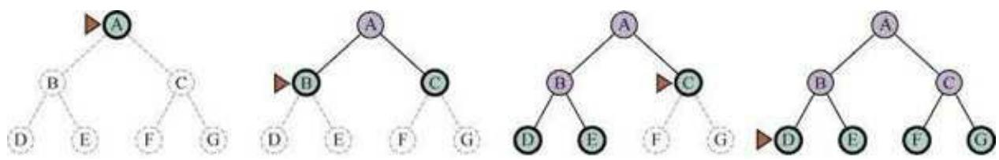  
图3-8 简单二叉树上的广度优先搜索。每个阶段接下来要扩展的节点用三角形标记表示

functionBREADTH-FIRST-SEARCH(problem)returns一个解节点或failure   
node $\leftarrow$ NODE(problem.INITIAL)  
if problem.Is-GOAL(node.STATE) then return node  
frontier $\leftarrow$ 一个FIFO队列，其中一个元素为node  
reached $\leftarrow$ {problem.INITIAL}  
while not Is-EMPTY(frontier) do  
node $\leftarrow$ POP(frontier)  
for each child in EXPAND(problem, node) do  
s $\leftarrow$ child.STATE  
if problem.Is-GOAL(s) then return child  
if s不在reached中then  
将s添加到reached  
将child添加到frontier  
return failure

```txt
function UNIFORM-COST-SEARCH(problem) returns 一个解节点或failure return BEST-FIRST-SEARCH(problem, PATH-COST)
```

图3-9 广度优先搜索和一致代价搜索算法

广度优先搜索总是能找到一个动作最少的解，因为当它生成深度为d 的节点时，说明它已经生成了深度为d-1的所有节点，如果其中一个节点是解，它应该已经被找到了。这意味着，对于所有动作都具有相同代价的问题，它是代价最优的，但对于不具有该特性的问题，则不一定是最优的。这两种情况都是完备的。在时间和空间方面，想象我们在搜索一棵均衡树，其中每个状态都有b 个后继。搜索树的根生成b个节点，每个节点又生成b 个节点，第二层总共是 $b ^ { 2 }$ 个节点。每个节点又生成b 个节点，从而在第三层产生 $b ^ { 3 }$ 个节点，以此类推。现在假设解的深度为 $d$ ，那么生成的节点总数为

$$
1 + b + b ^ {2} + b ^ {3} + \dots + b ^ {d} = O (b ^ {d})
$$

所有节点都存储在内存中，所以时间复杂性和空间复杂性都是 O (b d)。这样的指数级上界是可怕的。举一个典型的真实世界中的例子，考虑一个分支因子b=10、处理速度为每秒100万节点、内存需求为1 KB/节点的问题。深度d =10的搜索将花费不到3小时的时间，但需要10 TB的内存。对广度优先搜索来说，内存需求是一个比执行时间更严重的问题。但时间仍然是一个重要因素。深度d =14时，即使有无限内存，搜索也需要3.5年。一般来说，除了最小的问题实例，指数级复杂性的搜索问题无法通过无信息搜索求解。

# 3.4.2 Dijkstra算法或一致代价搜索

当动作具有不同的代价时，一个显而易见的选择是使用最佳优先搜索，评价函数为从根到当前节点的路径的代价。理论计算机科学界称之为Dijkstra算法，人工智能界则称之为一致代价搜索（uniform-costsearch）。不同于广度优先搜索在深度一致的波（首先是深度1，然后是深度2，以此类推）中展开，一致代价搜索算法的思想是在路径代价一致的波中展开。该算法可以通过调用Best -F irst -S earch 实现，评价函数为P ath -C ost ，如图3-9所示。

考虑图3-10，问题是从Sibiu到达Bucharest。Sibiu的后继是Rimnicu Vilcea和Fagaras，代价分别为80和99。然后扩展代价最小的节点Rimnicu Vilcea，加入节点Pitesti，其代价为80 + 97 = 177。此时代价最小的节点是Fagaras，所以接着扩展Fagaras，加入节点Bucharest，代价为99 + 211 = 310。目标节点是Bucharest，但算法只在扩展节点时测试其是否为目标节点，而不是在生成节点时测试，因此它还没有检测到这是一条通往目标的路径。

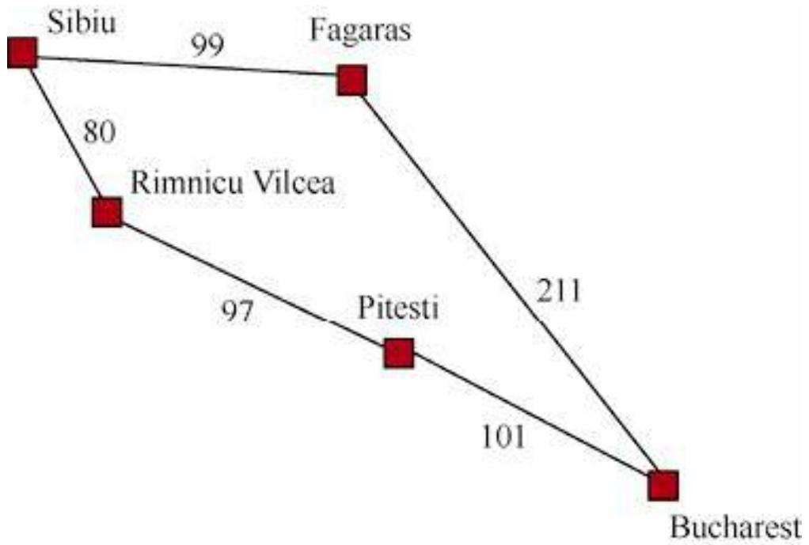  
图3-10 罗马尼亚问题状态空间的一部分，选择这部分来说明一致代价搜索

算法继续进行，接下来选择Pitesti进行扩展，添加到Bucharest的第二条路径，代价为80 +97 +101 =278。它的代价更低，因此用它取代reached 中之前的路径，并添加到frontier中。结果证明，这个节点目前具有最小代价，因此它被认为是下一个要扩展的节点，此时我们发现它是一个目标节点，从而返回该节点。注意，如果我们在生成节点时检查目标，而不是在扩展代价最小的节点时检查，那么我们将返回一个代价更高的路径（即经过Fagaras的路径）。

一致代价搜索的复杂性用C* 和 表示， C* 是最优解的代价 [1] ， 是每个动作代价的下界，。那么算法在最坏情况下的时间复杂性和空间复杂性是 ， 比 $b ^ { d }$ 大得多。这是因为一致代价搜索在探索包含一个可能有用的高代价动作的路径之前，可能会先探索具有低代价动作的大型树。当所有动作代价相同时， 等于 bd +1 ，这时一致代价搜索类似于广度优先搜索。

一致代价搜索是完备的，也是代价最优的，因为它找到的第一个解的代价至少与边界上的任何其他节点的代价一样小。一致代价搜索会按照代价递增的顺序系统地考虑所有路径，而不会陷入一直沿单一无限路径探索的困境（假设所有动作的代价 $> g > 0$ ）。

# 3.4.3 深度优先搜索与内存问题

深度优先搜索 （depth-firstsearch）总是优先扩展边界中最深的节点。它可以通过调用Best-First-Search 来实现，其中评价函数 f为深度的负数。然而，它通常不是以图搜索的形式实现而是以树状搜索（不维护已达状态表）的形式实现。搜索的过程如图3-11所示，搜索先直接到达搜索树的最深层，这里的节点不存在后继节点。然后，搜索将“回退”到下一个仍存在未扩展后继节点的最深的节点。深度优先搜索不是代价最优的，它会返回它找到的第一个解，即使这个解不是路径代价最小的。

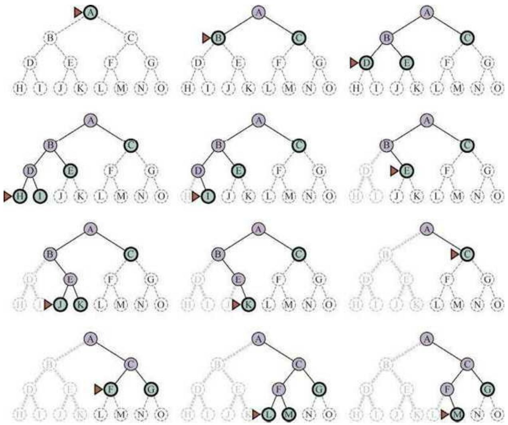

图3-11二叉树的深度优先搜索过程中，从开始状态A到目标M，共12步（从左到右，从上到下）。边界节点为绿色，用三角形表示下一步要扩展的节点。已扩展的节点为淡紫色，潜在的未来节点用模糊的虚线表示。边界中没有后继的已扩展节点（用非常模糊的线表示）可以丢弃

对于树型的有限状态空间，算法是有效且完备的。对于无环状态空间，算法可能会通过不同路径多次扩展同一状态，但是（最终）将系统地探索整个空间。

在有环状态空间中，深度优先搜索算法可能陷入无限循环；因此，一些深度优先搜索算法的实现会检查每个新节点是否存在循环。在无限状态空间中，深度优先搜索不是系统性的：即使没有循环，它也可能陷入无限路径。因此，深度优先搜索是不完备的。

那么，为什么还会有人选择使用深度优先搜索而不是广度优先搜索或最佳优先搜索呢？答案是，对于使用树状搜索可以处理的问题，深度优先搜索对内存的需求要小得多。深度优先搜索根本不保留reached 表，并且边界集很小：如果将广度优先搜索中的边界集视为不断扩展的球体的表面，那么深度优先搜索中的边界集只是球体的半径。

对于图3-11所示的有限树状状态空间，深度优先的树状搜索所花费的时间与状态数成正比，其空间复杂性仅为 O (bm )，其中 b 是分支因子，m 是树的最大深度。有些问题在广度优先搜索时需要EB量级的内存，而在深度优先搜索时仅需要KB量级。由于其对内存的节约使用，深度优先树状搜索已经成为许多人工智能领域的基本工具，例如，约束满足（第6章）、命题可满足性（第7章）和逻辑编程（第9章）。

回溯搜索 （backtracking search）是深度优先搜索的一种变体，它使用的内存更少。（详见第6章。）在回溯搜索中，一次只生成一个后继，而不是所有后继节点；每个部分扩展的节点会记住下一个要生成的后继节点。此外，回溯通过直接修改当前状态描述而不是为一个全新的状态分配内存来生成后继状态。这将内存需求减少到只有一个状态描述和一条具有O (m )个动作的路径；与深度优先搜索的O (bm )个状态相比，节省了大量资源。通过回溯，我们还可以为当前路径上的状态维护一个有效的集合数据结构，从而使检查循环的时间从O (m )减少到O (1)。为了使回溯起作用，我们必须能够在回溯时撤销每个动作。回溯对许多具有大型状态描述的问题（例如机器人组装）的成功求解至关重要。

# 3.4.4 深度受限和迭代加深搜索

为了避免深度优先搜索陷入无限路径，我们可以使用 深度受限搜索 （depth-limited search）。这是一个深度优先搜索的改进版本，在深度受限搜索中，我们设置深度界限 ，将深度 上的所有节点视为其不存在后继节点（见图3-12）。深度受限搜索算法的时间复杂性为 O (b )，空间复杂性为 O (b )。遗憾的是，如果我们对 的选择不当，算法将无法得到解，成为不完备的算法。

由于深度优先搜索是一种树状搜索，通常无法避免在冗余路径上浪费时间，但我们可以以一定的计算时间为代价来消除循环。沿着父节点向上查看几个节点，就能检测出大多数循环；更长的循环则由深度界限处理。

有时可以根据对问题的了解选择一个较好的深度界限。例如，罗马尼亚地图上有20个城市。因此，

C=19是一个有效的界限。但是如果行细研究地图，我们会发现，从任何一个城市到达另一个城市最多需要9步。这个数值称为状态空间图的 直径 （diameter），它为我们提供了更好的深度界限，从而可以更有效地进行深度受限搜索。然而，对于大多数问题，在求解问题之前，我们无法知道什么深度界限是好的。

迭代加深搜索 （iterative deepening search）解决了如何选择一个合适的 的问题，方法是尝试所有值：首先是0，然后是1，然后是2，依次类推——直到找到一个解，或者深度受限搜索返回 failure值（而不是 cutoff值）。算法如图3-12所示。迭代加深搜索结合了深度优先和广度优先搜索的许多优点。和深度优先搜索一样，它对内存的需求也不大：当问题存在解时，是O (bd )，在不存在解的有限状态空间上，是 O (bm )。与广度优先搜索一样，迭代加深搜索对于所有动作都具有相同代价的问题是最优的，并且在有限无环状态空间上是完备的，或者说在任何有限状态空间上，当我们检查路径节点上所有的循环时，它都是完备的。

function ITERATIVE-DEEPENING-SEARCH(problem) returns a new point or failure  
for depth = 0 to $\infty$ do  
    result ← DEPTH-LIMITED-SEARCH(problem, depth)  
if result ≠ cutoff then return result  
function DEPTH-LIMITED-SEARCH(problem, $\ell$ ) returns a new point or failure or cutoff  
frontier ← a LIFO队列（栈），其中一个元素为NODE(problem.INitial)  
result ← failure  
while not Is-EMPTY(frontier) do  
    node ← POP(frontier)  
if problem.Is-GOAL(node.STATE) then return node  
if DEPTH(node) > $\ell$ then  
    result ← cutoff  
else if not Is-CYCLE(node) do  
    for each child in EXPAND(problem, node) do  
        child添加到frontier  
return result

图3-12迭代加深和深度受限树状搜索。迭代加深搜索反复调用界限递增的深度受限搜索。它返回以下3种类型的值中的一种：一个解节点；当它搜索了所有节点，证明在任何深度都不存在解时，返回 failur e ；当在比 $\ell$ 更深的层上可能存在解时，返回cutoff。这是一种树状搜索算法，它不记录reached 状态，因此比最佳优先搜索使用的内存要少得多，但存在通过不同路径多次访问相同状态的风险。另外，如果Is-Cycle检验函数不检查所有环，那么算法可能会陷入一个无限循环

存在解时，时间复杂性为 O (b d)，不存在解时，时间复杂性为 O (b m )。与广度优先搜索相同，迭代加深搜索的每次迭代也会生成一个新层级，但是广度优先搜索将所有节点都存储在内存中，而迭代加深搜索则会重复之前的层级，从而以花费更多的时间为代价节省了内存。图3-13展示了二叉搜索树上的迭代加深搜索的4次迭代，在第4次迭代时找到了解。

迭代加深搜索可能看起来很浪费，因为搜索树顶端附近的状态被多次重复生成。但是对于许多状态空间，大多数节点位于底层，所以上层是否重复并不重要。在迭代加深搜索中，底层（深度d ）的节点被生成一次，倒数第二层的节点被生成两次，以此类推，直到根节点的子节点（生成d 次）。所以在最坏情况下生成的节点总数是

$$
N (\mathrm {I D S}) = (d) b ^ {1} + (d - 1) b ^ {2} + (d - 2) b ^ {3} + \dots + b ^ {d}
$$

时间复杂性为 O (b d)——与广度优先搜索相近。例如，当b =10、 d =5时，生成的节点数分别为

$$
N (\mathrm {I D S}) = 5 0 + 4 0 0 + 3 0 0 0 + 2 0 0 0 0 + 1 0 0 0 0 0 = 1 2 3 4 5 0
$$

$$
N (\mathrm {B F S}) = 1 0 + 1 0 0 + 1 0 0 0 + 1 0 0 0 0 + 1 0 0 0 0 0 = 1 1 1 1 1 0
$$

如果你确实很在意重复的问题，可以使用一种混合方法，即先运行广度优先搜索，直到几乎消耗掉所有可用内存，然后对边界集中的所有节点应用迭代加深搜索。 通常，当搜索状态空间大于内存容量而且解的深度未知时，迭代加深搜索是首选的无信息搜索方法。

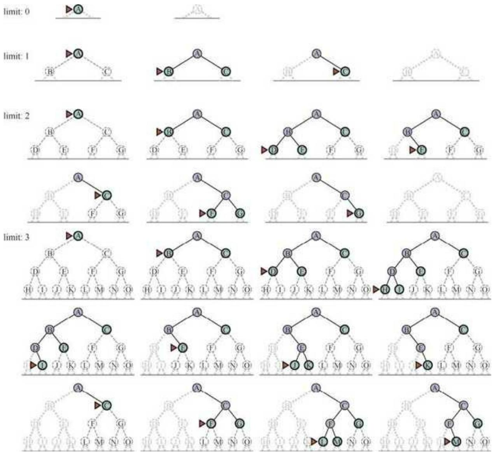  
图3-13二叉搜索树上的迭代加深搜索的4次迭代（目标为M），深度界限从0到3。注意，内部节点形成了一条路径。三角形标记下一步要扩展的节点，边界为加粗轮廓的绿色节点，非常模糊的节点可被证明不可能是这种深度界限下的解的一部分

# 3.4.5 双向搜索

到目前为止，我们介绍的算法都是从一个初始状态开始，最终到达多个可能目标状态中的任意一个。另一种称为双向搜索 （bidirectionalsearch）的方法则同时从初始状态正向搜索和从目标状态反向搜索，直到这两个搜索相遇。算法的动机是， $b ^ { d 2 } + b ^ { d 2 }$ 要比 $b ^ { d }$ 小得多（例如，当 $b = d =$ 10时，复杂性不到之前算法的五万分之一）。

为此，我们需要维护两个边界集和两个已达状态表，并且要能反向推理：如果状态 $s ^ { \prime }$ 是 $s$ 的正向后继，那么我们需要知道s是 $s ^ { \prime }$ 的反向后继。当两个边界触碰到一起时，我们就找到了一个解。[2]

双向搜索有很多不同版本，就像有很多不同的单向搜索算法一样。在这一节中，我们将介绍双向最佳优先搜索。尽管存在两个独立的边界，但接下来要扩展的节点始终是两个边界中的评价函数值最小的节点。当函数为路径代价时，我们得到双向一致代价搜索，如果最优路径的代价是 $C ^ { * }$ ，则不C扩展代价大于 的节点。这将使得速度大大提高。

一般的最佳优先双向搜索算法如图3-14所示。我们传入问题和评价函数的两个版本，一个是正向的

（下标F），另一个是反向的（下标B）。当评价函数是路径代价时，找到的第一个解将是最优解，但是对于不同的评价函数，这一结论不一定是正确的。因此，我们会记录迄今为止找到的最优解，并且可能不得不多次更新最优解，直到Terminated 测试证明不可能再有更好的解。

function BiBF-SEARCH(prolem $f_{\mathrm{p}}$ problem $\mathbf{\dot{f}}_{\mathrm{B}},f_{\mathrm{B}})$ returns一个解节点或failure node $\mathbb{F}\leftarrow$ NODE(problem.INI1IAL）//初始状态节点 node $\mathbb{B}\leftarrow$ NODE(problem.INI1IAL）//目标状态节点 frontier $\mathbb{F}$ 按 $f_{\mathrm{F}}$ 排序的优先队列，其中一个元素为nodefrontier $\mathbb{B}\leftarrow$ 按 $f_{\mathrm{B}}$ 排序的优先队列，其中一个元素为nodeREached $\mathbb{F}\leftarrow$ 一个查找表，其中一个条目的键是nodeSTATE且值是nodeREached $\mathbb{B}\leftarrow$ 一个查找表，其中一个条目的键是nodeSTATE且值是nodeBSolution $\leftarrow$ failure while not TERMINATED solution,frontier,frontier)do if $f_{\mathrm{F}}(\mathrm{TOP}(\mathrm{frontier}_{\mathrm{F}})) <   f_{\mathrm{B}}(\mathrm{TOP}(\mathrm{frontier}_{\mathrm{B}}))$ then solution $\leftarrow$ PROCEED(F,problem,F,frontier,F, reached,F, reached,B,solution) else solution $\leftarrow$ PROCEED(B,problem,F,frontier,B, reached,B, reached,F,solution) return solution

function PROCEED(dir, problem, frontier, reached, reached2, solution) returns一个解 //在frontier上扩展节点，对照reached中的另一个边界 //变量dir是方向：要么是F（代表正向），要么是B（代表反向） node $\leftarrow$ POP(frontier)   
for each child in EXPAND(problem, node) do $s\gets$ child.STATE if s不在reached中orPATH-COST(child) $<  <   \mathrm{PATH - COST(reached[s])}$ then reached[s] $\leftarrow$ child   
将child添加到frontier   
if s不在reached中then solution $\leftarrow$ JOIN-NODES(dir, child, reached2[s]) if PATH-COST(soluion) $<  <   \mathrm{PATH - COST(soluon)}$ then solution $\leftarrow$ solution2   
return solution

图3-14双向最佳优先搜索维护两个边界集和两个已达状态表。当一个边界中的路径到达另一半搜索已达状态时，这两条路径（通过Join-N odes函数）被连起来构成一个解。我们得到的第一个解不一定是最优的；函数Terminated 决定了什么时候停止寻找新的解

# 3.4.6 无信息搜索算法对比

图3-15根据3.3.4节中列出的4个评价标准对无信息搜索算法进行了比较。这种比较适用于不检查重复状态的树状搜索版本。对于检查重复状态的图搜索，主要区别在于，对于有限状态空间，深度优先搜索是完备的，并且空间复杂性和时间复杂性受到状态空间大小（顶点和边的数量，）的限制。

<table><tr><td>指标</td><td>广度优先</td><td>一致代价</td><td>深度优先</td><td>深度受限</td><td>迭代加深</td><td>双向（如适用）</td></tr><tr><td>完备性</td><td>是1</td><td>是1,2</td><td>否</td><td>否</td><td>是1</td><td>是1,4</td></tr><tr><td>代价最优</td><td>是3</td><td>是</td><td>否</td><td>否</td><td>是3</td><td>是3,4</td></tr><tr><td>时间复杂性</td><td>O(b4)</td><td>O(b1+C*λ)</td><td>O(bm)</td><td>O(b4)</td><td>O(b4)</td><td>O(bd2)</td></tr><tr><td>空间复杂性</td><td>O(b6)</td><td>O(b1+C*λ)</td><td>O(bm)</td><td>O(b4)</td><td>O(bd)</td><td>O(bd2)</td></tr></table>

注：1如果b是有限的且状态空间要么有解要么有限，则算法是完备的，2如果所有动作的代价都≥ $\varepsilon > 0$ 算法是完备的。3如果动作代价都相同，算法是代价最优的。4如果两个方向均使用广度优先搜索或一致代价搜索  
图3-15搜索算法比较。b 是分支因子； $m$ 是搜索树的最大深度；d 是最浅层解的深度，当不存在解时为m ； 是深度界限  
[1]在这里，以及整本书中，C* 中的“* ”表示C的最优值。  
[2]在我们的实现中，reached 数据结构支持查询给定状态是否为其成员，而边界数据结构（一个优先队列）不支持，因此我们使用 reached 检查是否互相触碰；但从概念上讲，我们查询的是这两个边界是否已经相遇。通过将每个目标状态的节点加载到反向边界和反向已达表中，可以将实现扩展为处理多个目标状态。

# 3.5 有信息（启发式）搜索策略

本节将展示有信息搜索 （informedsearch）策略——使用关于目标位置的特定领域线索——如何比无信息搜索策略更有效地找到解。线索以 启发式函数 （heuristic function）的形式出现，记为 h (n )： [1]

h ( n ) = 从节点 $n$ 的状态到目标状态的最小代价路径的代价估计值

例如，在寻径问题中，我们可以通过计算地图上两点之间的直线距离来估计从当前状态到目标的距离。我们将在3.6节中详细研究启发式函数及其来源。

# 3.5.1 贪心最佳优先搜索

贪心最佳优先搜索 （greedy best-first search）是最佳优先搜索的一种形式，它首先扩展 h ( n )值最小的节点——看起来最接近目标的节点——因为这样可能可以更快找到解。因此，评价函数 f ( n )= h ( n )。

让我们看看这种算法如何求解罗马尼亚寻径问题；我们使用直线距离 （straight-linedistance）作为启发式函数，记为 h SLD。如果目标是Bucharest，我们需要知道到Bucharest的直线距离，如图3-16所示。例如， h SLD ( Arad ) = 366。注意，无法从问题描述本身（即A ctions 和R esult 函数）来计算 $h _ { \mathrm { { \scriptsize ~ S L D } } }$ 的值。此外，根据经验可知， h SLD与实际道路距离相关，因此是一个有用的启发式函数。

图3-17展示了使用 $h _ { \mathrm { { \scriptsize ~ S L D } } }$ 搜索从Arad到Bucharest的路径的贪心最佳优先搜索的过程。从Arad扩展的第一个节点是Sibiu，因为启发式函数认为它比Zerind或Timisoara更接近Bucharest。下一个要扩展的节点是Fagaras，因为根据启发式函数，它现在最接近Bucharest。Fagaras接着生成了Bucharest，即目标节点。对于这一特定问题，使用 h SLD的贪心最佳优先搜索无须扩展不在解路径上的节点就找到了解。但是，它找到的解并不是代价最优的：经由Sibiu和Fagaras到达Bucharest的路径比经过Rimnicu Vilcea和Pitesti的路径长32英里。这就是为什么这种算法会被称为“贪心的”——在每次迭代中，它都会做出在当前看来最优的（即可以最接近目标的）选择，但这也会导致贪心法在全局意义上可能产生比谨慎的算法更糟糕的结果。

  
图3-16 h SLD （到Bucharest的直线距离）的值

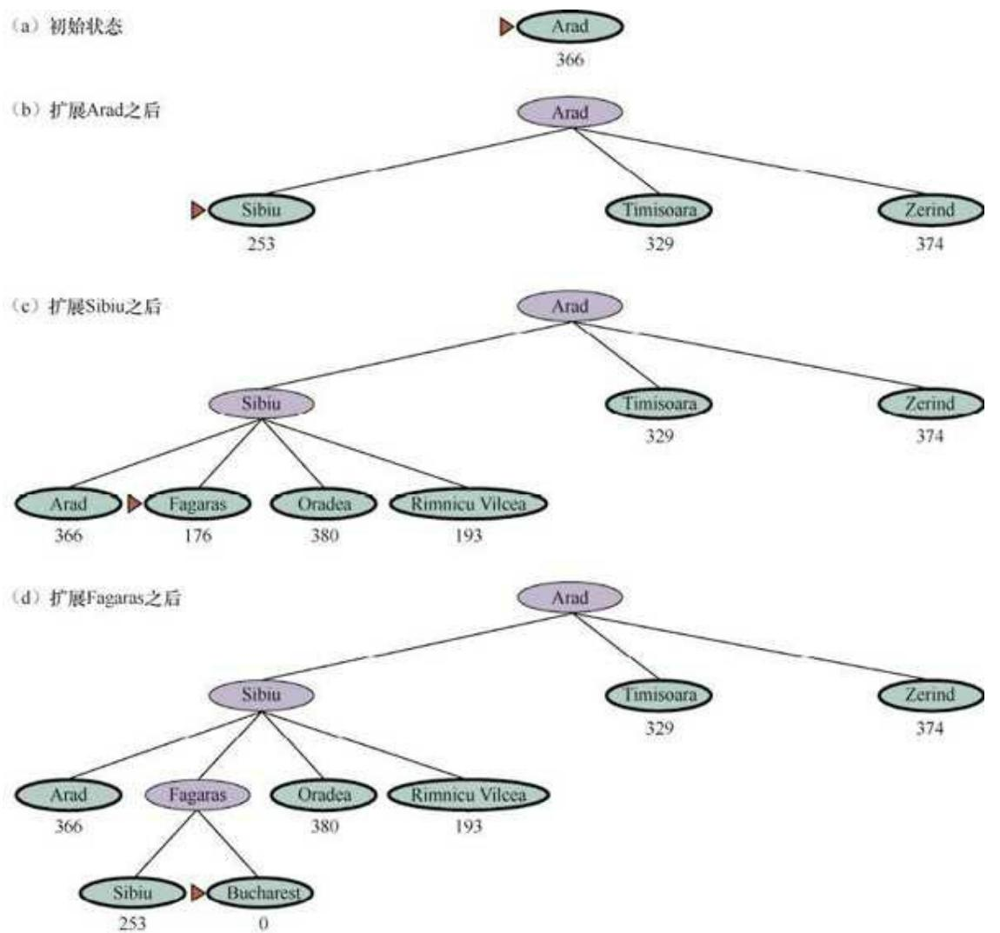  
图3-17 基于直线距离启发式函数 $h _ { \mathrm { { \scriptsize ~ S L D } } }$ 的贪心最佳优先树状搜索的各个阶段（目标为Bucharest）。节点上标有 h 值

贪心最佳优先图搜索在有限状态空间中是完备的，但在无限状态空间中是不完备的。最坏情况下的时间复杂性和空间复杂性是 。然而，使用一个好的启发式函数，复杂性可以大大降低，对于某些问题可以达到 O ( bm )。

# 3.5.2 A * 搜索

最常见的有信息搜索算法是A * 搜索 （A *search）（读为“A星搜索”），这是一种最佳优先搜索，评价函数为

$$
f (n) = g (n) + h (n)
$$

其中g (n )是从初始状态到节点 $n$ 的路径代价， h(n )是从节点 $n$ 到一个目标状态的最短路径的代价估计值，因此我们有

f ( n ) = 经过 $n$ 到一个目标状态的最优路径的代价估计值

在图3-18中，我们展示了目标为Bucharest的A * 搜索过程。 $g$ 的值由图3-1中的动作代价计算得到，h 的值在图3-16中给出。注意，Bucharest首先出现在图3-18的步骤e的边界中，但算法并没有选择它来进行扩展（因此它没有被检测为一个解），因为此时它不是边界中代价最小的节点（f=450）——代价最小的节点是Pitesti（f=417）。换句话说，可能存在一个经过Pitesti的解，代价低至417，所以算法不会满足于一个代价为450的解。在图3-18的步骤f中，另一条到Bucharest的路径

此时代价最小（ f = 418），因此它被选中并被检测为最优解。

A * 搜索是完备的。[2] 它是否是代价最优则取决于启发式函数的某些性质。一个关键性质是可容许性 （admissibility）：一个 可容许的启发式 （admissible heuristic）函数永远不会高估到达某个目标的代价。（因此，一个可容许的启发式函数是乐观的。）

对于可容许的启发式函数，A * 是代价最优的，我们可以通过反证法来证明这一点。假设最优路径的代价为 $C ^ { * }$ ，但是该算法返回的路径代价为 $C \geq C ^ { * }$ ，那么最优路径上一定存在某个未扩展的节点n （因为如果最优路径上的所有节点都已被扩展，那么算法返回的将是这个最优解）。因此，使用符号 g * ( n )表示从起点到 $n$ 的最优路径的代价， $\boldsymbol { h } ^ { * } ( n )$ 表示从 $n$ 到最近目标的最优路径的代价，我们将得到

$$
f (n) > C ^ {*}
$$

（否则 $\boldsymbol { n }$ 将是已扩展节点）

$$
f (n) = g (n) + h (n)
$$

（根据定义）

$$
f (n) = g ^ {*} (n) + h (n)
$$

（因为 $n$ 在一条最优路径上）

$$
f (n) \leqslant g ^ {*} (n) + h ^ {*} (n)
$$

（根据可容许性， $h \left( n \right) \leqslant h ^ { * } ( n )$ ）

$$
f (n) \leqslant C ^ {*}
$$

（根据定义， $C ^ { ^ { * } } = g ^ { ^ * } ( n ) + h ^ { ^ * } ( n )$ ）

第一行和最后一行矛盾，所以“算法可能返回次优路径”的假设一定是错误的——A * 一定只返回代价最优路径。

另一个稍强的性质为 一致性 （consistency）。如果对于每个节点 $n$ 以及由动作 $a$ 生成的 $n$ 的每个后继节点n '有以下条件，则启发式函数 h (n )是一致的：

$$
h (n) \leqslant c (n, a, n ^ {\prime}) + h \left(n ^ {\prime}\right)
$$

这是三角不等式 （triangleinequality）的一种形式，它规定三角形的一条边不能大于其他两条边之和（见图3-19）。一致的启发式函数的一个实例是上文中的直线距离 h SLD。

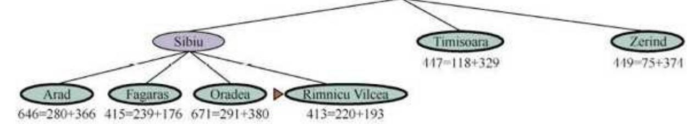  
（a）初始状态  
（b）扩展Arad之后


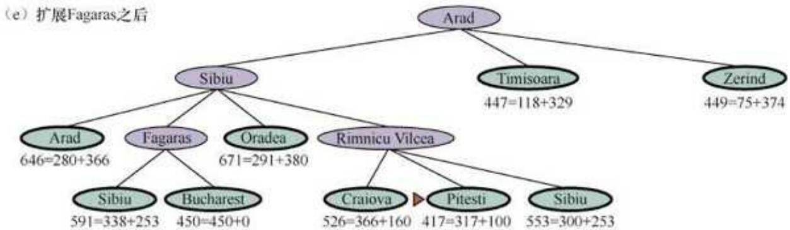

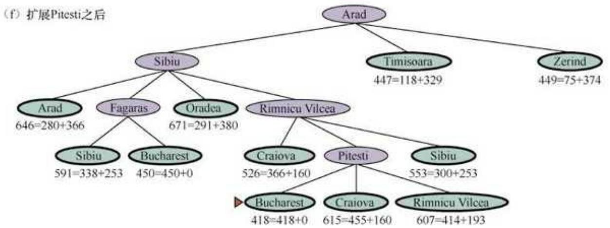

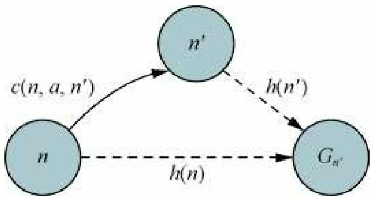  
图3-18 A * 搜索的各个阶段（目标为Bucharest）。节点上标有 $f = g + h$ ， $h$ 值为图3-16中得到的到Bucharest的直线距离  
图3-19三角不等式：如果启发式函数h 是 一致 的，那么单个数值h (n )小于从n 到 n'的动作代价值 c ( n , a , n' )加上启发式函数的估计值 h ( n' )的和

一致的启发式函数都是可容许的（反过来不成立），因此，使用一致的启发式函数的A * 搜索都是代价最优的。此外，如果使用一致的启发式函数，算法第一次到达某个状态时，它就在一条最优路径上，因此我们永远不需要将某个状态重复添加到边界中，也不必更改 reached 中的条目。但是，如果使用不一致的启发式函数，最终可能导致多个路径到达相同状态，而且如果每条新路径的路径代价都小于前一条路径，最终在边界中该状态会有多个节点，这会耗费时间和空间。因此，有些A* 搜索算法的实现会注意让一个状态只进入边界一次，如果找到了到达该状态的更优路径，那么该状态的所有后继都会更新（这要求节点除了父指针外还要有子指针）。这些复杂性使得许多研究人员在实现A * 搜索时避免使用不一致的启发式函数，但费尔纳等人（Felneretal.,2011）认为，最坏的结果在实践中很少发生，因此不应该害怕不一致的启发式函数。

如果采用不可容许的启发式函数，那么A * 搜索可能是代价最优的，也可能不是。存在两种情况使得A * 搜索是代价最优的：第一，如果存在一条代价最优路径，对于该路径上的所有节点 n ， h ( n)都是可容许的，那么无论启发式函数在路径外状态上的值如何，算法都能找到这条路径。第二，假设最优解的代价为 $C ^ { * }$ ，次优解的代价为 $C _ { 2 }$ ，如果 h (n )高估了部分代价但又没有高估太多，都不超过 $C _ { 2 } - C ^ { * }$ ，那么也可以保证A * 返回的解是代价最优的。

# 3.5.3 搜索等值线

一种对搜索进行可视化的方法是在状态空间中绘制等值线 （contour），就像在地形图中绘制等高线一样。如图3-20所示，在标记为400的等值线内，所有节点都有

，以此类推。因为A * 扩展的是f代价最小的边界节点，所以它 $f ( n ) = g ( n ) + h ( n ) \leqslant 4 0 0$ 是从初始节点扇形地向外扩展，以 $f$ 值递增的同心带状方式添加节点。

致代价搜索中也存在等值线，但是等值线表示 $g$ 代价，而不是 $g + h$ 。一致代价搜索中，等值线将以初始状态为圆心呈“圆形”向各个方向均匀扩展，而不是偏向于目标状态。对于具有好的启发式函数的A * 搜索， $g + h$ 带将朝一个目标状态延伸（如图3-20所示），并且在最优路径周围收敛变窄。

需要清楚的是，扩展路径时， $g$ 代价是 单调的 （monotonic）：路径代价始终随着路径的延伸而不


断增加，因为动作代价始终为正。

因此，所得到的同心等值线彼此不会交叉，如果希望画上的任意两个节点之间画一条线。

但 代价是否单调递增则并不显然。当你将一条路径从 $n$ 扩展到 $n ^ { \prime }$ 时，代价从变为 。消去 $g \left( n \right)$ 项，我们可以看到，当且仅当

时，路径代价单调递增。换句话说，当且仅当启发式函数是一


致的时，路径代价单调递增。 但需要注意的是，一条路径可能会在一行中贡献若干个具有相同 g ( n ) + h ( n )得分的节点；当 h 的减少量恰好等于刚刚采取的动作代价时，就会发生这种情况（例如，在一个网格问题中，当 n 与目标在同一行然后向目标迈进一步时， g 增加1， h 减少1）。如果 $C ^ { * }$ 是最优解路径的代价，那么以下说法成立。

●A * 搜索将扩展从初始状态可以到达并且路径上的每个节点都满足 的所有节点。我们称这些节点为 必然扩展节点 （surely expanded node）。  
● A * 搜索可能会在选出目标节点之前扩展某些恰好在“目标等值线”（即 $f ( n ) = C ^ { * }$ ）上的节点。  
● A * 搜索不扩展 的节点。

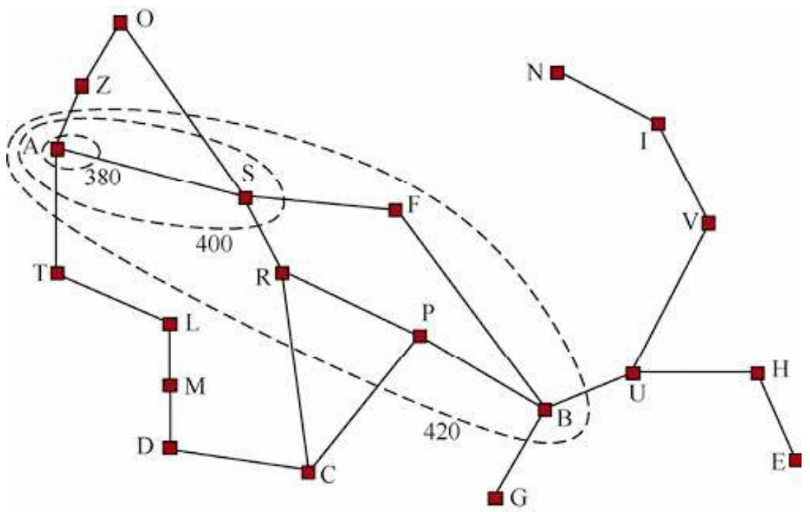  
图3-20罗马尼亚地图，其中等值线为 $f = 3 8 0$ 、 $f = 4 0 0$ 和 $f = 4 2 0$ ，初始状态为Arad。给定等值线内的节点的代价 $f = g + h$ 小于或等于等值线值

我们认为具有一致启发式函数的A * 搜索是效率最优 （optimally efficient）的，因为任何从初始状态扩展搜索路径并使用相同启发式信息的算法都必须扩展A * 的所有必然扩展节点（因为任何一个必然扩展节点都可能是某个最优解的一部分）。对于 $f ( n ) { = } C ^ { * }$ 的节点，某个算法可能运气好，首先选择了最优节点，而另一个算法就没这么幸运。我们在定义最优效率时不考虑这种差异。

A * 之所以高效，是因为它会对那些对于寻找最优解没有帮助的搜索树节点进行剪枝（pruning）。在图3-18b中，我们看到，对于Timisoara， $f = 4 4 7$ ；对于Zerind， $f = 4 4 9$ 。即使它们是根的子节点并且是采用一致代价搜索或广度优先搜索时首先扩展的节点，它们也永远不会被A *搜索扩展，因为A * 会首先找到 $f = 4 1 8$ 的解。对许多人工智能领域来说，剪枝（不必进行检查就可以排除不正确的答案）非常重要。

在所有这些算法中，A * 搜索都是完备的、代价最优的和效率最优的，这是相当令人满意的结果。遗憾的是，这并不意味着A * 适用于所有搜索需求。问题在于，对于许多问题，所扩展的节点数可能是解路径长度的指数级。例如，考虑一个具有超强吸力的真空吸尘器世界，它可以以单位代价清

理任一方格却不需要访问该方格。在这种情况下，可以按任何顺序清理方格。如果开始时有 $N$ 个脏的方格，则有 $2 ^ { N }$ 种状态，其中某个子集已被清理；所有这些状态都在最优解路径上，因此满足，所以所有这些状态都会被A * 搜索访问。 $f ( n ) < C ^ { \prime }$

# 3.5.4 满意搜索：不可容许的启发式函数与加权A* 搜索

A * 搜索有很多好的性质，但它扩展了大量节点。如果我们愿意接受次优但“足够好”的解——我们称之为满意 （satisficing）解，则可以探索更少的节点（花费更少的时间和空间）。如果我们允许A * 搜索使用不可容许的启发式函数 （inadmissibleheuristic）（它可能会高估到达某个目标的代价），那么我们就有可能错过最优解，但是该启发式函数可能更准确，从而减少了需要扩展的节点数。例如，道路工程师知道弯道指数 （detourindex）的概念，它是应用于直线距离的乘数，用来说明道路的典型曲率。弯道指数1.3意味着如果两个城市的直线距离相距10千米，那么它们之间的最优路径的一个恰当的估计值是13千米。对于大多数地区，弯道指数的范围是1.2到1.6。

不仅仅是与道路相关的问题，我们还可以将这一思想应用于任何问题，我们采用一种称为加权A*搜索 （weighted A* search）的方法，对启发式函数的值进行更重的加权，评价函数为

，其中 。

图3-21为一个网格世界中的搜索问题。在图3-21a中，A * 搜索必须探索大部分状态空间才能找到最优解。在图3-21b中，加权A * 搜索找到一个代价稍高的解，但搜索时间要快得多。我们看到，加权搜索使得已达状态的等值线专注于趋向某个目标。这意味着需要探索的状态变少，但如果最优路径偏离加权搜索的等值线（就像在这种情况下一样），则无法找到最优路径。一般来说，如果最优解的代价是 $C ^ { * }$ ，那么加权A * 搜索将找到一个代价介于 $C ^ { * }$ 和 $W \times C ^ { * }$ 之间的解；但在实践中，通常结果更接近于 $C ^ { * }$ 而不是 $W \times C ^ { * }$ 。

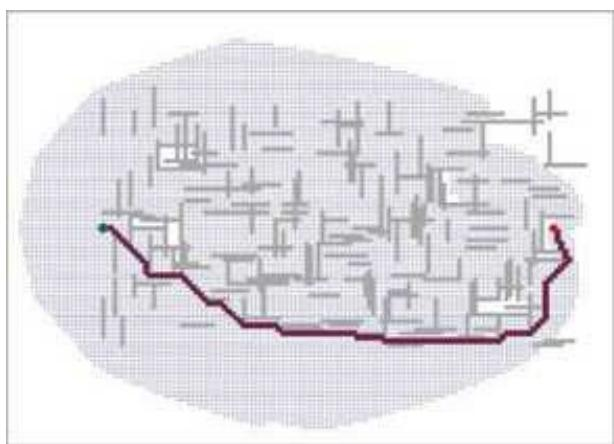

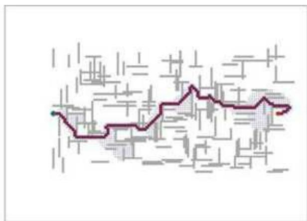  
  
图3-21同一网格上的两种搜索：（a）A * 搜索，（b）加权A * 搜索，权重 $W = 2$ 。灰色线条表示障碍，紫色线是一条从绿色起始点到红色目标点的路径，较小的点是每次搜索到达的状态。在这个特定问题上，加权A * 搜索探索的状态数不到A * 搜索探索的状态数的七分之一，找到的路径的代价只比最优代价大了 $5 \%$

我们已经考虑过以各种方式组合 $g$ 和 $h$ 来评价状态的搜索方法；加权A * 搜索可以看作是其他方法的一般化。

A * 搜索 ： $g ( n ) + h ( n ) ( \overline { { \mathbb { W } } } = 1 )$

一致代价搜索：

贪心最佳优先搜索： $h ( n ) ( \overline { { W } } = + \infty )$

加权 A * 搜索：

你可以称加权A * 搜索为“有点贪心的搜索”：就像贪心最佳优先搜索一样，它使得搜索专注于趋向一个目标；但是，它不会完全忽略路径代价，并且会暂停代价高昂但进展甚微的路径。

次优的搜索算法有很多，其区别在于“足够好”的标准。在 有界次优搜索 （bounded suboptimalsearch）中，我们寻找一个能保证代价在最优代价的常数因子 W 倍内的解。加权A * 搜索提供了这一保证。在 有界代价搜索 （bounded-cost search）中，我们寻找一个代价小于某个常数 C 的解。在无界代价搜索 （unbounded-costsearch）中，我们接受任何代价的解，只要能快速找到它。

无界代价搜索算法的一个例子是快速搜索 （speedy search），它是一种贪心最佳优先搜索，使用到达目标所需动作个数的估计值作为启发式函数，不考虑这些动作的代价。因此，对于所有动作都具有相同代价的问题，它等于贪心最佳优先搜索，但当动作具有不同代价时，它往往会导致搜索快速找到一个代价可能很高的解。

# 3.5.5 内存受限搜索

A * 搜索的主要问题是它对内存的使用较多。在本节中，我们将介绍一些可以节省空间的实现技巧和一些能够更好地利用可用空间的全新算法。

内存被分为frontier状态和reached 状态。在我们所实现的最佳优先搜索中，边界上的状态存储在两个位置：边界中的一个节点（因此我们可以决定下一步扩展哪个节点）和已达状态表中的一个表项（因此我们知道之前是否访问过该状态）。对于许多问题（例如探索网格），这种重复不是关注点，因为frontier要比reached 小得多，所以复制边界中的状态所需内存相对较少。但是有些算法实现只保留这两个位置中的其中一个，从而节省了一点空间，其代价是算法变得更复杂（可能会减慢速度）。

另一种可能性是，当我们能够证明不再需要某些状态时，就将它们从 reached 中删除。对于某些问题，我们可以利用分离性质（图3-6），同时禁止掉头行动，以确保所有行动要么是从边界向外移动，要么是移动到另一个边界状态。在这种情况下，我们只需检查边界就能判断是否有冗余路径，并且可以删除reached 状态表。

对于其他问题，我们可以维护引用计数 （referencecount）——到达某一状态的次数，并且在再也没有路径可以到达该状态时将其从 reached 表中删除。例如，在网格世界中，每个状态只能从它的4个邻居状态到达，一旦我们已经到达了一个状态4次，就可以将它从表中删除。

现在，我们考虑旨在节省内存使用的新算法。

束搜索 （beamsearch）对边界的大小进行了限制。最简单的方法是只保留具有最优 $f$ 值的 k个节点，放弃其他已扩展节点。这当然会导致搜索变成不完备的和次优的算法，但我们可以选取合适的$k$ 以充分利用可用内存，算法执行速度也会更快，因为它只扩展了较少的节点。对于许多问题，它可以找到很好的近似最优解。你可以将一致代价搜索或A * 搜索看作在同心等值线的各个方向扩展，而将束搜索看作只探索这些等值线的主要部分，即包含k个最佳候选的部分。

另一种形式的束搜索并不严格限制边界的大小，而是保留 f值在最优 $f$ 值的 $\pmb { \delta }$ 范围内的所有节点。这样的话，当存在几个强得分节点时，只会保留几个节点，但如果不存在强节点，则会保留更多节点，直到出现一个强节点。

迭代加深A*搜索 （iterative-deepening A * search，IDA * ）之于A * 搜索，就像迭代加深搜索之于深度优先搜索一样：IDA * 既拥有A * 的优点，又不要求在内存中保留所有已达状态，这样做的代价是需要多次访问某些状态。它是一种非常重要且常用的用于解决内存不足问题的算法。

在标准的迭代加深搜索中，截断值为深度，每次迭代深度增加1。而在IDA * 中，截断值是 f代价（g +h ）；在每次迭代中，新的截断值为超过上一次迭代截断值的节点中最小的f代价。换句话说，每次迭代都会彻底地搜索一个 $f$ 等值线，找到一个刚好超出该等值线的节点，并使用该节点的f代价作为下一个等值线。像8数码这样的问题，每条路径的 $f$ 代价都是整数，这非常有效地使得每次迭代都朝着目标稳步前进。如果最优解的代价是C* ，那么迭代的次数不可能超过 C* （例如，

最难的8数码问题的迭代次数不超过31）。但对于每个节点的f代价都不相同的问题，每一个新的等值线可能只包含一个新节点，并且迭代次数可能等于状态数。

递归最佳优先搜索 （recursive best-first search，RBFS）（见图3-22）试图模拟标准的最佳优先搜索的操作，但仅仅使用线性空间。RBFS类似于递归深度优先搜索，但它不是沿着当前路径无限地向下搜索，而是使用f_limit变量跟踪从当前节点的任意祖先节点可得到的最优备选路径的 $f$ 值。如果当前节点超过了这个限制，那么递归将回到备选路径上。随着递归的展开，RBFS将路径上每个节点的 $f$ 值替换为一个 倒推值 （backed-up value）—— 其子节点的最优f值。通过这种方式，RBFS可以记住被它遗忘的子树中最优叶节点的 f值，因此，在之后的某个时刻，RBFS可以决定是否要重新扩展该子树。图3-23展示了RBFS是如何到达Bucharest的。

function RECURSIVE-BEST-FIRST-SEARCH(problem) returns a new problem  
solution, fvalue $\leftarrow$ RBFS(problem, NODE(problem.INitial), $\infty$ )  
return solution  
function RBFS(problem, node, f_limit) returns a new problem, which is a new problem.  
if problem.Is-GOAL(node.STATE) then return node  
successors $\leftarrow$ LIST(EXPAND(node))  
if successors为空 then return failure, $\infty$ for each s in successors do //用前一次搜索中的值更新 $f$ $s.f \gets \max(s.PATH-COST + h(s), node.f)$ while true do  
best $\leftarrow$ successors 中 $f$ 值最低的节点  
if best.f > f_limit then return failure, best.f  
alternative $\leftarrow$ successors 中第二低的 $f$ 值  
result, best.f $\leftarrow$ RBFS(problem, best, min(f_limit, alternative))  
if result ≠ failure then return result, best.f

图3-22递归最佳优先搜索算法

在一定程度上，RBFS比IDA * 更高效，但仍然存在重复生成大量节点的问题。在图3-23的示例中，RBFS沿着经过Rimnicu Vilcea的路径，然后“改变主意”去尝试经过Fagaras，然后又“回心转意”。之所以会发生这些改变，是因为每次扩展当前的最优路径时，它的 f值很可能增加——对于靠近目标的节点，h 值通常不那么乐观。当这种情况发生时，次优路径可能会成为最优路径，因此搜索必须回溯。每一次改变对应于IDA * 的一次迭代，并且可能需要多次重新扩展已经遗忘的节点，以重建最优路径，并对该路径再扩展一个节点。

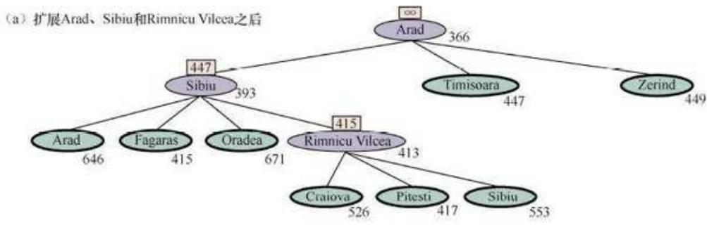

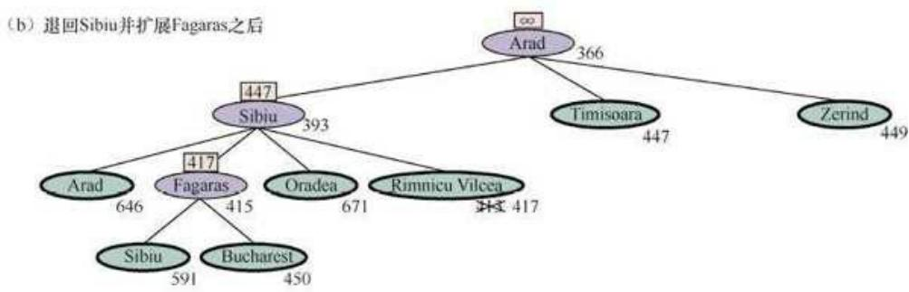

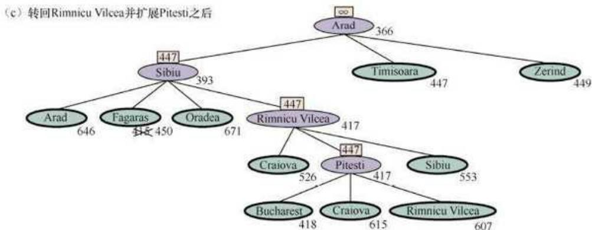  
图3-23使用RBFS搜索到Bucharest的最短路线的各个阶段。每次递归调用的f_ limit值标注在每个当前节点的上方，每个节点上都标有它的 f代价。（a）沿着经过Rimnicu Vilcea的路径前进，直到当前最优叶节点（Pitesti）的值比最优备选路径（Fagaras）差。（b）递归回溯，被遗忘子树的最优叶节点值（417）被备份到Rimnicu Vilcea；接着扩展Fagaras，得到最优叶节点值450。（c）递归回溯，被遗忘子树的最优叶节点值（450）被备份到Fagaras；然后扩展Rimnicu Vilcea。这一次，因为最优备选路径（经由Timisoara）的代价至少为447，所以继续扩展Bucharest

如果启发式函数 h (n )是可容许的，那么RBFS是最优的。它的空间复杂性在最深的最优解的深度上是线性的，但时间复杂性很难刻画：既取决于启发式函数的准确性，也取决于最优路径随节点扩展变化的频率。它按照f得分递增的顺序来扩展节点，即使 $f$ 是非单调的。

IDA * 和RBFS使用内存太少，它们的时间复杂性会受到影响。在两次迭代之间，IDA * 只保留一个数值：当前的 $f$ 代价限制。RBFS在内存中保留了更多的信息，但它只使用线性空间：即使有更多的内存可用，RBFS也无法利用。因为它们会遗忘它们所做的大部分事情，这两种算法都可能会多次重复探索相同状态。

因此，确定我们有多少可用内存并允许算法使用所有内存似乎是明智的。执行这样操作的两种算法是 MA* （memory-bounded A * ，内存受限的A * ）和 SMA* （simplified MA * ，简化的MA * ）。SMA * 更简单一些，所以我们介绍SMA * 。SMA * 很像A * 算法，不断扩展最优叶节点，直到内存被填满。此时，它不能再为搜索树添加新节点，除非删除旧节点。SMA * 总是丢弃最差的叶节点，即 f值最大的叶节点。和RBFS一样，SMA * 将被遗忘节点的值备份到其父节点。这样，被遗忘子树的祖先知道该子树中最优路径的质量。有了这一信息，只有在所有其他路径看起来都比它已经遗忘的路径更差时，SMA * 才会重新生成该子树。这意味着如果节点 $n$ 的所有后代都被遗忘了，那么尽管我们不知道从 n 开始应该走哪条路径，但我们仍知道是否应该从 n 开始走。

本书附带的在线代码库中描述了完整的SMA * 算法。有一点值得注意，我们之前提到SMA * 将扩展最优叶节点，删除最差叶节点。如果所有叶节点的 $f$ 值都相同呢？为了避免算法选择同一个节点进行删除和扩展操作，SMA * 扩展最新的最优叶节点并删除最老的最差叶节点。当只有一个叶节点时，这两者是同一个节点，但在这种情况下，当前的搜索树一定是一条从根节点到叶节点的占满所有内存的单一路径。如果叶节点不是目标节点，那么即使它在最优解路径上，也无法在可用内存范围内得到这个解。因此，完全可以丢弃该节点，就好像它没有后继节点一样。

如果存在任意可达解，也就是说，如果最浅的目标节点的深度 d 小于内存大小（用节点数表示），那么SMA * 就是完备的。如果存在可达的最优解，那么SMA * 就是最优的；否则，就返回当前最优的可达解。在实践中，SMA * 是寻找最优解的一个相当稳健的选择，特别是当状态空间是一个图、行动代价不一致，并且生成节点的总开销相比维护边界集和已达集的总开销更大时。

然而，在非常困难的问题上，常常会出现SMA * 被迫在许多候选解路径之间来回不断切换的情况，只有一小部分路径可以存入内存。［这类似于磁盘分页系统中的 抖动 （thrashing）问题。］那么，重复生成相同节点就需要额外的时间，这意味着，在给定无限内存的情况下可以用A * 实际求解的问题，对于SMA * 将变得难以处理。也就是说，从计算时间的角度，内存限制会使问题变得难以处理。虽然还没有现有理论解释如何在时间和内存之间权衡，但这似乎是一个不可避免的问题。唯一的出路是放弃最优性要求。

# 3.5.6 双向启发式搜索

我们发现，在单向最佳优先搜索中，使用 f ( n ) = g ( n ) + h ( n )作为评价函数可以得到A * 搜索，保证找到代价最优的解（假设h 是可容许的），同时在所扩展的节点数上效率最优。

在双向最佳优先搜索中，我们也可以尝试使用 f ( n ) = g ( n ) + h ( n )，但遗憾的是，即使使用可容许的启发式函数，算法也不能保证可以找到代价最优的解，更不能保证效率最优。可以证明的是，在双向搜索中一定会被扩展的并不是单个的节点，而是节点对（分别来自两个边界），因此任何效率证明都必须考虑节点对（Eckerle et al. , 2017）。

我们先介绍一些新的符号。对于正向搜索（以初始状态作为根节点）中的节点，我们用 f F( n ) = gF( n ) + h F( n )作为评价函数；对于反向搜索（以某个目标状态作为根节点）中的节点，我们用 $f$ B(n )=g (n )+h (n )作为评价函数。尽管正向搜索和反向搜索求解的是同一个问题，但它们具有不同的评价函数，这是因为，启发式函数依据其努力方向是目标状态还是初始状态而有所不同。我们假设启发式函数是可容许的。

考虑从初始状态到节点 $m$ 的正向路径和从目标到节点n 的反向路径。我们可以如下定义一个解代价的下界（这个解先沿着前向路径从初始状态到达m ，然后以某种方式到达n ，最后再沿着后向路径从 $n$ 到达目标）。

$$
l b (m, n) = \max  \left(g _ {\mathrm {F}} (m) + g _ {\mathrm {B}} (n), f _ {\mathrm {F}} (m), f _ {\mathrm {B}} (n)\right)
$$

换句话说，这样一条路径的代价一定不小于两部分路径代价之和（因为它们之间的剩余连接一定具有非负代价），而且也一定不小于任一部分的 $f$ 代价估计值（因为启发式的估计是乐观的）。因此，有如下的定理：对于任意一对节点 m 和n ，若lb (m , n )小于最优代价 C* ，那么算法必须扩展 m 或n ，因为经过这两个节点的路径是一个潜在的最优解。然而，一个难题是我们无法确定扩展这两者中的哪个节点才是最优的，因此，没有一个双向搜索算法可以保证效率最优——如果算法总是首先选择一对节点中错误的那个进行扩展，那么任何算法都可能需要扩展到最小节点数两倍的节点。一些双向启发式搜索算法显式地管理一个(m ,n )节点对队列，但我们将坚持双向最佳优先搜索（图3-14），它有两个边界优先队列，并使用模拟 lb 准则的评价函数：

$$
f _ {2} (n) = \max  (2 g (n), g (n) + h (n))
$$

接下来要扩展的节点将是 $f _ { 2 }$ 值最小的节点；它可以来自任何一个边界。这个 $f _ { 2 }$ 函数保证算法永远不会扩展（来自任一边界的） $g ( n ) > C ^ { * } / 2$ 的节点。当两个边界相交时，任一边界内的节点都不存在超过 $C ^ { * } / 2$ 的路径代价，在这种意义上，我们可以说搜索的两部分“在中间相遇”。图3-24为

一个双向搜索的示例。

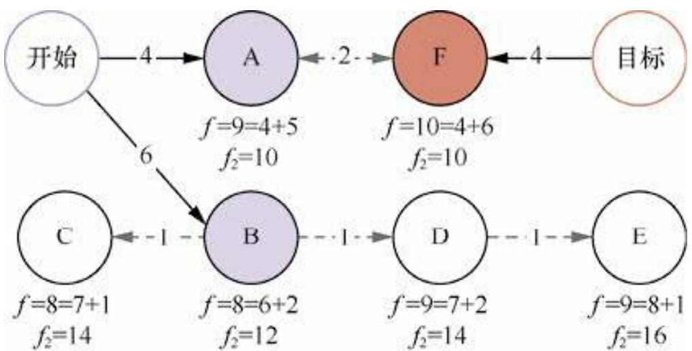  
图3-24双向搜索维护两个边界：左半部分，节点A和B是开始状态的后继；右半部分，节点F是目标状态的逆向后继。每个节点都标有 $f = g + h$ 值和 $f _ { 2 } = \operatorname* { m a x } ( 2 g , g + h$ )值。（ $g$ 值是每个箭头上所显示的动作代价的总和； $h$ 值是任意的，而且不能从图中的任何内容推出。）最优解“开始-A-F-目标”的代价 ${ C } ^ { * } = 4 + 2 + 4 = 1 0$ ，这意味着一个在中间相遇的双向算法不应该扩展任何

的节点；实际上，下一个要扩展的节点是A或F（ g=4），这将引导我们找到一个最 $c ^ { 4 } / 2 = 5$ $g = 4$ 优解。如果我们首先扩展 $f$ 代价最低的节点，那么下一个扩展的将是B和C，D和E将与A并列，但它们的 ，因此当 $f _ { 2 }$ 是评价函数时它们永远不会被扩展

我们已经介绍了一种方法，即用 $h _ { \mathrm { ~ F ~ } }$ 估计到目标的距离（或者说，当问题有多个目标状态时，估计到最近目标的距离），用 $h _ { \mathrm { ~ B ~ } }$ 估计到开始状态的距离。这就是所谓的front-to-end搜索。另一种方法是front-to-front搜索，它试图估计到另一个边界的距离。显然，如果边界内有数百万个节点，那么对每个节点应用启发式函数然后取最小值是非常低效的。但它可以从边界中抽样几个节点。在某些特定问题域中，可以对边界进行总结，例如，在网格搜索问题中，我们可以递增地计算边界的界限框，并使用到界限框的距离作为启发式函数。

双向搜索有时比单向搜索更有效，有时则不然。一般来说，如果我们有一个很好的启发式函数，那么A * 搜索会生成专注于目标的搜索等值线，使用双向搜索则增益不大。使用一般的启发式函数时，在中间相遇的双向搜索往往会扩展较少的节点，因此双向搜索是首选方法。在启发式函数较差的最坏情况下，搜索算法将不再专注于目标，并且双向搜索具有与A * 相同的渐近复杂性。使用 f 2评价函数和可容许的启发式函数 h 的双向搜索算法是完备且最优的。

[1]这看起来可能很奇怪，启发式函数真正需要的只是节点的状态，但作用对象却是节点。一般使用 h (n )而不是 h (s)，是为了与评价函数 f(n )和路径代价g (n )保持一致。  
[2]再强调一次，假设所有动作的代价都 $> \delta > 0$ ，状态空间要么有解，要么有限。

# 3.6 启发式函数

在本节中，我们将研究启发式函数的准确性是如何影响搜索性能的，并考虑如何构造启发式函数。我们将8数码问题作为主要示例。如3.2节所述，它的目标是将滑块水平或竖直地滑动到空格中，直到棋盘布局与目标布局一致（图3-25）。

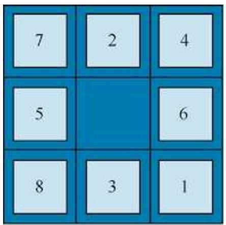  
开始状态

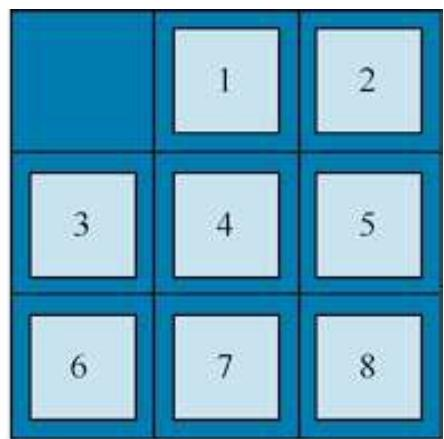  
目标状态   
图3-25 8数码问题的典型实例。最短的解需要26步动作

在一个8数码问题中，存在9!/2 = 181 400个可达状态，所以搜索算法可以轻松地将它们全部保存在内存中。但是对于15数码问题，存在16!/2个状态（超过10万亿个），因此，为了搜索这个空间，我们需要借助一个较好的可容许的启发式函数。对于15数码问题，这样的启发式函数有着悠久的历史。下面介绍两个常用的选择。

●h =错位滑块的数量（不包括空格）。图3-25中，所有的8个滑块都不在原位，所以开始状态的h = 8。 $h _ { \mathrm { ~ 1 ~ } }$ 是一个可容许的启发式函数，因为任何错位滑块都至少需要一次移动才能回到正确的位置。  
● $h _ { 2 } =$ 滑块到其目标位置距离的总和。因为滑块不能沿对角线移动，所以距离是水平距离和垂直距离之和——有时称为城市街区距离或曼哈顿距离 （Manhattandistance）。 $h _ { 2 }$ 也是可容许的，因为任何移动操作所能做的就是将一个滑块向目标移近一步。图3-25中开始状态的滑块1到滑块8得到的曼哈顿距离为

$$
h _ {2} = 3 + 1 + 2 + 2 + 2 + 3 + 3 + 2 = 1 8
$$

正如我们希望的那样，这两种方法都没有高估实际的解代价26。

# 3.6.1 启发式函数的准确性对性能的影响

一种描述启发式函数质量的方法是 有效分支因子 （effective branching factor） $b ^ { * }$ 。如果针对一个特定问题，A * 搜索所生成的总节点数是 $n$ ，而解的深度是 $d$ ，那么 $b ^ { * }$ 就是深度为 $d$ 的均衡树要包含 $n + 1$ 个节点所必需的分支因子。因此有

$$
n + 1 = 1 + b ^ {*} + (b ^ {*}) ^ {2} + \dots + (b ^ {*}) ^ {d}
$$

例如，如果A * 用52个节点在第5层上找到了一个解，那么有效分支因子是1.92。在不同的问题实例中，有效分支因子可能会发生变化，但通常对于特定领域（如8数码问题），在所有复杂的问题实例中它都是相当恒定的。因此，对一小部分问题的 $b ^ { * }$ 进行实验测量可以为启发式函数的总体有用性提供良好的指导。设计良好的启发式函数的 $b ^ { * }$ 接近1，使得我们能以合理的计算代价求解相当大的问题。

科尔夫和里德（KorfandReid,1998）认为，对于一个使用给定启发式函数 $h$ 的A * 剪枝，刻画其效果的一个更好方式是： 有效深度 （effective depth）相比于真实深度的减少量 $k _ { h }$ （一个常数）。

这意味着相较于无信息搜索的代价 O ( bd)，上述方法的总搜索代价为 。他们在魔方和n 数码问题上的实验结果表明，这一公式可以准确地预测各种解长度范围内（至少对于大于 $k _ { h }$ 的解长度）的抽样问题实例的总搜索代价。

在图3-26中，我们生成了随机8数码问题，并使用无信息广度优先搜索和使用 $h _ { \mathrm { ~ 1 ~ } }$ 或 $h _ { 2 }$ 的A * 搜索求解该问题，报告了每种搜索策略和每种解长度所生成的平均节点数及相应的有效分支因子。结果表明， $h _ { 2 }$ 优于 $h _ { \mathrm { ~ 1 ~ } }$ ，两者都优于无启发式算法。

<table><tr><td colspan="4">搜索代价:生成的节点数</td><td colspan="3">有效分支因子</td></tr><tr><td>d</td><td>BFS</td><td>A*(h1)</td><td>A*(h2)</td><td>BFS</td><td>A*(h1)</td><td>A*(h2)</td></tr><tr><td>6</td><td>128</td><td>24</td><td>19</td><td>2.01</td><td>1.42</td><td>1.34</td></tr><tr><td>8</td><td>368</td><td>48</td><td>31</td><td>1.91</td><td>1.40</td><td>1.30</td></tr><tr><td>10</td><td>1033</td><td>116</td><td>48</td><td>1.85</td><td>1.43</td><td>1.27</td></tr><tr><td>12</td><td>2672</td><td>279</td><td>84</td><td>1.80</td><td>1.45</td><td>1.28</td></tr><tr><td>14</td><td>6783</td><td>678</td><td>174</td><td>1.77</td><td>1.47</td><td>1.31</td></tr><tr><td>16</td><td>17 270</td><td>1683</td><td>364</td><td>1.74</td><td>1.48</td><td>1.32</td></tr><tr><td>18</td><td>41 558</td><td>4102</td><td>751</td><td>1.72</td><td>1.49</td><td>1.34</td></tr><tr><td>20</td><td>91 493</td><td>9905</td><td>1318</td><td>1.69</td><td>1.50</td><td>1.34</td></tr><tr><td>22</td><td>175 921</td><td>22 955</td><td>2548</td><td>1.66</td><td>1.50</td><td>1.34</td></tr><tr><td>24</td><td>290 082</td><td>53 039</td><td>5733</td><td>1.62</td><td>1.50</td><td>1.36</td></tr><tr><td>26</td><td>395 355</td><td>110 372</td><td>10 080</td><td>1.58</td><td>1.50</td><td>1.35</td></tr><tr><td>28</td><td>463 234</td><td>202 565</td><td>22 055</td><td>1.53</td><td>1.49</td><td>1.36</td></tr></table>

图3-26 使用广度优先搜索、使用 $h _ { \mathrm { ~ 1 ~ } }$ （错位滑块）的A * 搜索或使用 $h _ { 2 }$ （曼哈顿距离）的A * 搜索求解8数码问题的搜索代价和有效分支因子的比较。每个解长度 $d$ （ $6 \sim 2 8$ ）的数据为100多个实例的平均结果

有人可能会问， $h _ { 2 }$ 是否总是优于 $h _ { \mathrm { ~ 1 ~ } }$ 。答案是“基本上，是的”。从这两种启发式函数的定义可以看出，对于任意节点 $n$ ，都有 $h _ { 2 } ( n ) \geq h _ { 1 } ( n )$ 。因此我们说 $h _ { 2 }$ 占优于 （dominate） $h _ { \mathrm { ~ 1 ~ } }$ 。优势可以直接转化为效率：使用 h 2的A * 永远不会比使用 h 1的A * 扩展更多的节点（除了 $h _ { 2 }$ $h _ { 1 }$ $f ( n ) = C ^ { * }$ 的节点）。证明很简单。回想一下3.5.3节观察到的，每个 $f ( n ) < C ^ { \prime }$ 的节点都一定会被扩展。也就是说，当 $h$ 一致时，每个 $h ( n ) < C ^ { * } - g ( n )$ 的节点都一定会被扩展。但是，因为对于所有节点， $h _ { 2 }$ 至少和 $h _ { \mathrm { ~ 1 ~ } }$ 一样大，每个在 $h _ { 2 }$ 下一定会被扩展的节点在 $h _ { 1 }$ 下也一定会被扩展，而 $h _ { \mathrm { ~ 1 ~ } }$ 还可能导致其他的节点也被扩展。因此，通常情况下，只要启发式函数是一致的并且其计算时间不太长，使用具有较高值的启发式函数效果都会更好。

# 3.6.2 从松弛问题出发生成启发式函数

我们已经看到，对于8数码问题， $h _ { \mathrm { ~ 1 ~ } }$ （错位滑块）和 $h _ { 2 }$ （曼哈顿距离）都是相当好的启发式函数，其中 $h _ { 2 }$ 更好。人们是怎么想出 $h _ { 2 }$ 这样的启发式函数的？计算机是否有可能自动地设计出这种启发式函数？

$h _ { 1 }$ 和 $h _ { 2 }$ 是对8数码问题剩余路径长度的估计，但对简化版本的问题来说，它们也是非常精确的路径长度。如果改变游戏规则，即滑块可以移动到任何地方，而不是只能移动到相邻的空格，那么 h将给出最短解的准确长度。类似地，如果一个滑块可以向任意方向移动一个方格，甚至移动到一个被占用的方格上，那么 $h _ { 2 }$ 将给出最短解的准确长度。减少了对动作的限制条件的问题称为松弛

问题 （relaxed problem）。松弛问题的状态空间图是原始状态空间的一个超图，因为删除限制条件会导致原图中边的增加。

因为松弛问题向状态空间图中添加了一些边，根据定义，原问题的任一最优解也是松弛问题的一个解；但是，如果增加的边提供了捷径，松弛问题可能有更好的解。因此，松弛问题中最优解的代价可以作为原问题的一个可容许的启发式函数 。此外，因为得到的启发式函数是松弛问题的准确代价，所以它一定满足三角不等式，因此它是一致的（见3.5.2节）。


如果用形式语言定义一个问题，则可以自动构造它的松弛问题。的行动描述为

例如，如果将8数码问题

如果方格 X 与方格 Y 相邻，且 Y 是空格，那么滑块可以从方格 X 移动到方 格 Y 。

我们可以通过删除一个或两个条件来生成3种松弛问题。

（a）如果方格 $X$ 与方格 Y 相邻，那么滑块可以从方格 $X$ 移动到方 格 Y 。  
（b）如果方格 Y 是空格，那么滑块可以从方格 $X$ 移动到方 格 Y 。  
（c）滑块可以从方格 $X$ 移动到方 格Y。

由（a）可以推导出 $h _ { 2 }$ （曼哈顿距离）。原因是，如果我们将每个滑块依次移动到其目标位置，那么 $h _ { 2 }$ 就是准确的步数。由（b）推导出的启发式函数将在习题3.GASC中讨论。由（c）我们可以推导出 $h _ { \mathrm { ~ 1 ~ } }$ （错位滑块），因为如果可以仅用一步就将滑块移动到其预期目标位置，那么 $h _ { \mathrm { ~ 1 ~ } }$ 就是准确的步数。需要注意的是，通过这种方法生成的松弛问题本质上不需要搜索就能求解，因为松弛规则将问题分解为8个独立的子问题。如果松弛问题本身很难求解，那么获取相应的启发式函数值的代价将非常高。

A bsolver程序可以通过“松弛问题”方法及各种其他技术从问题定义中自动生成启发式函数（Prieditis,1993）。A bsolver为8数码问题生成了一种新的启发式函数，它优于任何已有的启发式函数。此外，A bsolver为著名的魔方问题找到了第一种有效的启发式函数。

如果一个可容许的启发式函数集合 $h _ { 1 } , . . . , h _ { m }$ 可以求解同一个问题，但没有一个函数明显优于其他函数，那么我们应该选择哪个函数？事实证明，我们可以通过如下定义，得到最优的启发式函数：

$$
h (n) = \max  \left\{h _ {1} (n), \dots , h _ {k} (n) \right\}
$$

这种复合启发式函数将选择对于所讨论节点最准确的函数。因为 $h _ { i }$ 都是可容许的，所以 $h$ 也是可容许的（如果 $h _ { i }$ 都是一致的，则 $h$ 也是一致的）。此外，h 优于所有组成它的启发式函数。唯一的缺点是h (n )的计算时间更长。如果考虑这一问题，另一种选择是在每次评价时随机选择一个启发式函数，或者使用机器学习算法来预测哪个启发式函数是最优的。这样做可能会导致启发式函数失去一致性（即使每个 $h _ { i }$ 都是一致的），但在实践中，它通常能更快地求解问题。

# 3.6.3 从子问题出发生成启发式函数：模式数据库

可容许的启发式函数也可以由给定问题的子问题 （subproblem）的解代价推导得到。例如，图3-27为图3-25中8数码问题实例的一个子问题。子问题涉及将滑块1、2、3、4和空格分别放置到正确位置。显然，这个子问题最优解的代价是完整问题代价的一个下界。在某些情况下，它比曼哈顿距离更准确。

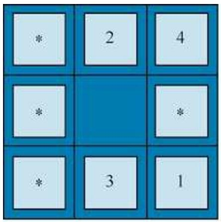  
开始状态

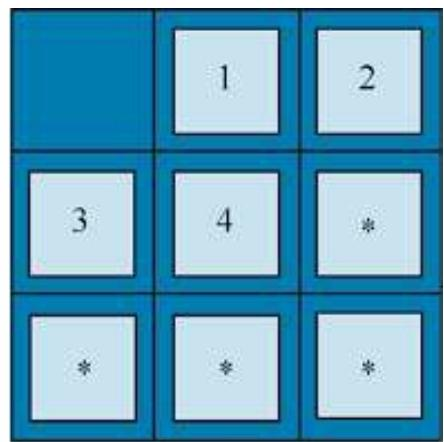  
目标状态   
图3-27图3-25中所给出的8数码实例的子问题。任务是将滑块1、2、3、4和空格放置到正确位置，而不考虑其他滑块的情况

模式数据库 （pattern database）的思想是为每个可能的子问题（在我们的示例中，为4个滑块和空格的所有可能排列）存储准确的解代价。（数据库中将有9×8×7×6×5 =15 120种模式。其他4个滑块与子问题的求解无关，但移动这些滑块将计入子问题的解代价。）然后，通过在数据库中查找相应的子问题，为搜索过程中遇到的每个状态计算一个可容许的启发式函数 h 。数据库本身是从

日标状态反向遗索并记录所退到的每个新模式的代价来构建的 $\underline { { \cdots } } = \underline { { \cdots } }$ 这一搜索的开销将分摊到后续的问题实例中，因此如果我们需要求解很多问题，那么这种方法是有意义的。

与空格搭配的滑块1-2-3-4的选择是相当随意的；我们还可以为5-6-7-8、2-4-6-8等建立数据库。每个数据库产生一种可容许的启发式函数，正如前文所述，可以通过取最大值对这些启发式函数进行组合。这种组合的启发式函数要比曼哈顿距离精确得多；求解随机15数码问题时所生成的节点数可以减少到千分之一。然而，每增加一个数据库，收益会随之减少，内存和计算成本也会增加。

你们可能想知道从1-2-3-4数据库和5-6-7-8数据库中得到的启发式函数是否可以相加，因为这两个子问题似乎没有重叠。这会是一个可容许的启发式函数吗？答案是否定的，因为对于一个给定的状态，1-2-3-4子问题和5-6-7-8子问题的解一定会有一些重复操作——1-2-3-4不可能在不接触5-6-7-8的情况下移动到位，反之亦然。但是，如果我们不计入这些操作，换句话说，如果我们让其他滑块直接消失呢？也就是说，我们不记录求解1-2-3-4子问题的总代价，而只记录与1-2-3-4有关的操作数。那么这两个代价的和仍然是求解完整问题代价的一个下界。这就是不相交模式数据库 （disjointpattern database）的思想。有了这样的数据库，可以在几毫秒内求解随机的15数码问题——与使用曼哈顿距离相比，生成的节点数不到原来的万分之一。对于24数码问题，则可以获得大约一百万倍的加速。不相交模式数据库适用于滑块数码问题，因为每次移动只涉及一个滑块，因而原问题可以被划分成若干个子问题使得每次移动只影响一个子问题。

# 3.6.4 使用地标生成启发式函数

一些在线服务可以托管含有数千万个顶点的地图，并在毫秒内找到代价最优的驾驶路线。即使是我们之前提到的最优的搜索算法，做到这一点也要比这些在线服务多耗费100万倍的时间。那在线服务是怎么做到这一点的呢？这里有很多技巧，但最重要的是对一些最优路径代价的 预计算（precomputation）。虽然预计算可能相当耗时，但只需完成一次预计算，就可以摊销数十亿用户的搜索请求。

我们可以通过预计算并存储每对顶点之间的最优路径代价来生成完美的启发式函数。这需要

空间和 时间——对于含有1万个顶点的图很实用，但对于1000万个顶点，这样的复杂性不可接受。

更好的方法是从顶点中选择一些（也许10个或20个） 地标点 （landmark point） 。然后，对于图中每个地标 $L$ 和每个其他顶点 $\nu$ ，我们计算并存储 $\boldsymbol { C } ^ { * } ( \boldsymbol { v } , \boldsymbol { L } )$ ，即从 $v$ 到 $L$ 的最优路径的准确代价。（我们同样需要 $C ^ { \mathbf { \alpha } ^ { * } } ( L , v )$ ；在无向图上， $C ^ { \mathbf { \alpha } ^ { * } } ( L , v )$ 与 $\boldsymbol { C } ^ { * } ( \boldsymbol { v } , \boldsymbol { L } )$ 相同；在有向图上，如单行道，我们则需要单独计算 $\boldsymbol { C } ^ { * } ( L , \nu )$ 。）给定存储的 $C ^ { * }$ 表，我们可以很容易地创建出一个高效的（尽管是不可容许的）启发式函数：在所有地标中，从当前节点到地标然后到目标节点代价的最小值为

$$
h _ {\mathrm {L}} (n) = \min  _ {L \in L a n d m a r k s} C ^ {*} (n, L) + C ^ {*} (L, g o a l)
$$

如果最优路径刚好经过一个地标，这个启发式函数将是准确的；否则，这个启发式函数就是不可容许的——它高估了到目标的代价。在A * 搜索中，如果启发式函数是准确的，那么一旦到达一个位于最优路径上的节点，此后所扩展的每个节点都将位于最优路径上。把等值线想象为沿着这条最优路径前进。搜索将沿着最优路径进行，在每次迭代中加入一个代价为c的动作，然后到达一个 $h$ 值减少 c的结果状态，这意味着在整条路径上总的 $f = g + h$ 得分将保持在常量C* 。

一些寻径算法通过在图中添加捷径 （shortcut）——人工定义的对应于一条最优多行动路径的边来节省更多的时间。例如，如果我们在美国最大的100个城市之间预先定义了捷径，并且尝试从位于加利福尼亚州的加利福尼亚大学伯克利分校校区导航到纽约的纽约大学，那么我们可以走萨克拉门托（Sacramento）到曼哈顿（Manhattan）之间的捷径，一次动作就能覆盖90%的路径。

h (n )是高效的，但不是可容许的。只要稍加注意，我们就可以提出一种既高效又可容许的启发式函数：

$$
h _ {\mathrm {D H}} (n) = \max  _ {L \in L a n d m a r k s} | C ^ {*} (n, L) - C ^ {*} (g o a l, L) |
$$

这被称为差分启发式 （differentialheuristic）函数（因为包含减法）。可以把它理解为在比目标还要远的某个位置设置一个地标点。如果目标恰好在从 n 到该地标点的最优路径上，那么“考虑从n到 $L$ 的完整路径，然后减去这条路径的最后一部分，即从goal到 $L$ ，即可得到从n 到goal的这段路径的准确代价”。如果目标稍微偏离到地标的最优路径，启发式函数将是不准确的，但仍然是可容许的。比目标近的地标是没有用的；例如，一个恰好位于 n 和 goal 正中间的地标将导致 h DH=0，这是没有用的。

下面我们介绍几种选择地标点的方法。随机选择速度较快，但如果我们多花些功夫将地标分散开来，使得它们彼此之间不太接近，我们将得到更好的结果。贪心方法是随机选择第一个地标，然后找到离它最远的点，将其添加到地标集合中，接着在每次迭代中添加离最近地标最远的点。如果你有用户过去的搜索请求日志，那么你可以选择搜索中经常请求的地点作为地标。对于差分启发式函数，地标分布在图的周界上更好。因此，一个比较好的技术是找到图的质心，围绕质心划分出 $k$ 个楔形（就像饼状图一样），并在每个楔形中选择离中心最远的顶点。

地标在寻径问题上尤其有效，这是由世界上道路的布局方式导致的：许多交通运输实际上都是在地标之间穿行，所以土木工程师在这些路线上修建最宽、最快的道路；地标式搜索可以更轻松地复原这些路线。

# 3.6.5 学习以更好地搜索

我们介绍了几种固定的搜索策略（广度优先、A * 等），这些都是计算机科学家精心设计和编程实现的。那么智能体能自己学习如何更好地搜索吗？答案是肯定的，这种方法基于一个重要的概念，元级状态空间 （metalevelstatespace）。元级状态空间中的每个状态将捕捉在普通状态空间（例如罗马尼亚地图）进行搜索的程序的内部（计算）状态。［为了区分这两个概念，我们将罗马尼亚地图称为 对象级状态空间 （object-levelstatespace）。］例如，A * 算法的内部状态由当前搜索树组成。元级状态空间中的每个动作都是一个改变内部状态的计算步；例如，A * 中的每一个计算步扩展一个叶节点，并将其后续节点添加到树中。因此，图3-18展示了一个逐渐增大的搜索树序列，它描述了元级状态空间中的一条路径，路径上的每个状态都是一棵对象级搜索树。

现在，图3-18中的路径共有5步，包括一个扩展Fagaras的步骤，这一步不是非常有用。对于更困难的问题，将存在很多这样的错误步骤，元级学习 （metalevellearning）算法可以从这些经验中学习，以避免探索毫无希望的子树。这种学习算法将在第22章中介绍。学习的目标是对计算开销和路径代价进行权衡，以最小化求解问题的总代价 。

# 3.6.6 从经验中学习启发式函数

我们已经看到，生成启发式函数的一种方法是设计一个容易找到最优解的松弛问题，另一种选择是从经验中学习。这里的“经验”意味着，例如，求解大量8数码问题。一个8数码问题的每个最优解都提供了一个“（目 标，路径 ）”对作为示例。可以利用学习算法通过这些示例构造一个函数h ，（幸运的话）它可以近似搜索过程中出现的其他状态的真实路径代价。这些方法中的大多数学习到的都是启发式函数的一个不完美的近似，因此存在启发式函数不可容许的风险。这必然导致算法需要在学习时间、搜索运行时间和解的代价之间进行权衡。机器学习技术将在第19章中介绍。第22章中介绍的强化学习方法也适用于搜索问题。

如果除了原始状态描述外，还提供与预测启发式函数值相关的状态 特征 （feature），那么一些机器学习技术将表现得更好。例如，“错位滑块数”这一特征可能有助于预测8数码问题中状态与目标的实际距离。我们将这一特征记作 $x _ { 1 } ( n )$ 。我们可以使用100个随机生成的8数码配置，并收集其真实解代价的统计数据。我们可能会发现，当x (n )=5时，平均的解代价大约是14，等等。当然，可以使用多种特征。例如，第二个特征 $x _ { 2 }$ (n )可能是“在当前状态相邻而在目标状态中不相邻的滑块对的数量”。如何对 $x _ { 1 } ( n )$ 和x (n )进行组合来预测 h (n )？一种常见的方法是线性组合：

$$
h (n) = c _ {1} x _ {1} (n) + c _ {2} x _ {2} (n)
$$

可以调整常数 $c _ { 1 }$ 和 $c _ { 2 }$ 以适应随机生成的配置中实际数据的值。我们希望 $c _ { 1 }$ 和 $c _ { 2 }$ 都是正值，因为错位滑块和不正确的相邻对都会使得问题更难求解。注意，这个启发式函数满足目标状态 $h \left( n \right)$ =0的条件，但它不一定是可容许的或一致的。

小结

本章对搜索算法进行了介绍，智能体可以用这些算法在各种环境中选择动作序列——只要环境是回合式的、单智能体的、完全可观测的、确定性的、静态的、离散的和已知的。算法需要在搜索所需时间、可用内存和解的质量之间进行权衡。如果我们对于启发式函数的形式拥有额外的领域相关知识来估计给定状态离目标有多远，或者我们预计算涉及模式或地标的部分解，算法会更高效。

●在智能体开始搜索之前，必须形式化一个良定义的问题 。  
●问题由5部分组成：初始状态 、动作 集合、描述这些动作结果的 转移模型 、目标状态 集合和动作代价函数 。  
●问题的环境用状态空间图 表示。通过状态空间（一系列动作）从初始状态到达一个目标状态的路径 是一个 解 。  
●搜索算法通常将状态和动作看作原子的 ，即没有任何内部结构（尽管我们在学习时引入了状态特征）。  
●根据完备性 、代价最优性 、 时间复杂性 和空间复杂性 来评估搜索算法。  
●无信息搜索 方法只能访问问题定义。算法构建一棵搜索树，试图找到一个解。算法会根据其首先扩展的节点而有所不同。  
❏最佳优先搜索 根据评价函数 选择节点进行扩展。  
❏广度优先搜索 首先扩展深度最浅的节点；它是完备的，对于单位动作代价是最优的，但具有指数级空间复杂性。  
❏一致代价搜索 扩展路径代价 g(n )最小的节点，对于一般的动作代价是最优的。  
❏深度优先搜索 首先扩展最深的未扩展节点。它既不是完备的也不是最优的，但具有线性级空间复杂性。深度受限搜索 增加了一个深度限制。  
❏迭代加深搜索 在不断增加的深度限制上调用深度优先搜索，直到找到一个目标。当完成全部循环检查时，它是完备的，同时对于单位动作代价是最优的，且具有与广度优先搜索相当的时间复杂性和线性级空间复杂性。  
❏双向搜索 扩展两个边界，一个围绕初始状态，另一个围绕目标，当两个边界相遇时搜索停止。  
●有信息搜索 方法可以访问启发式函数 h (n )来估计从 $n$ 到目标的解代价。它们可以访问一些附加信息，例如，存有解代价的模式数据库。  
❏贪心最佳优先搜索 扩展 $h \left( n \right)$ 值最小的节点。它不是最优的，但通常效率很高。  
❏ A*搜索 扩展 $f ( n ) = g \left( n \right) + h \left( n \right)$ 值最小的节点。在 $h \left( n \right)$ 可容许的条件下，A * 是完备的、最优的。对于许多问题，A * 的空间复杂性仍然很高。  
❏双向 $\mathbf { A } ^ { * }$ 搜索 有时比A * 搜索本身更高效。  
❏IDA*（迭代加深A * 搜索）是A * 搜索的迭代加深版本，它解决了空间复杂性问题。  
❏RBFS（递归最佳优先搜索）和SMA* （简化的内存受限A * ）搜索是健壮的最优搜索算法，它们仅使用有限的内存；如果时间充足，它们可以解决对A * 来说内存不足的问题。  
❏束搜索 限制了边界的大小；因此它是非完备的、次优的，但束搜索通常能找到相当好的解，运行速度也比完备搜索更快。  
❏加权A*搜索将搜索专注于一个目标，以扩展更少的节点，但它牺牲了最优性。

●启发式搜索算法的性能取决于启发式函数的质量。我们有时可以通过松弛问题定义、在模式数据库中存储预计算的子问题的解代价、定义地标点，或者从问题类的经验中学习来构建良好的启发式函数。

读者服务：


微信扫码关注【异步社区】微信公众号，回复“e59810”获取本书配套资源以及异步社区15天VIP会员卡，近千本电子书免费畅读。

# 第4章

# 复杂环境中的搜索

在本章中，我们放宽了第3章的简化假设，以更接近真实世界。

第3章讨论了完全可观测的、确定性的、静态的、已知的环境中的问题，问题的解是一个动作序列。在本章中，我们将放宽这些限制。首先，我们考虑这样一个问题，即寻找一个好的状态而不考虑到达该状态的路径，状态包括离散状态（4.1节）和连续状态（4.2节）。然后，我们放宽了确定性假设（4.3节）和可观测性假设（4.4节）。在一个非确定性的世界中，智能体将需要一个条件规划，并根据它所观测到的情况执行不同的动作——例如，红灯停，绿灯行。对于部分可观测性环境，智能体还需要记录它的可能状态。最后，4.5节将指导智能体使用在线搜索 （onlinesearch）通过一个未知空间，在未知空间中一边前进一边学习。

# 4.1 局部搜索和最优化问题

在第3章的搜索问题中，我们希望找到一条通过搜索空间的路径，如一条从Arad到Bucharest的路径。但有时我们只关心最终状态，而不是到达状态的路径。例如，在8皇后问题中（图4-3），我们只关心如何找到8个皇后的有效最终配置（因为如果知道配置，重构它的创建步骤就非常简单）。这也适用于许多重要应用，例如集成电路设计、工厂车间布局、作业车间调度、自动编程、电信网络优化、农作物种植规划和投资组合管理。

局部搜索 （localsearch）算法的操作是从一个起始状态搜索到其相邻状态，它不记录路径，也不记录已达状态集。这意味着它们不是系统性的——可能永远不会探索问题的解实际所在的那部分搜索空间。但是，它们有两个主要优点：（1）使用很少的内存；（2）通常可以在系统性算法不适用的大型或无限状态空间中找到合理的解。

局部搜索算法也可以求解 最优化问题 （optimization problem），其目标是根据 目标函数（objective function）找到最优状态。

为了理解局部搜索，我们考虑在状态空间地形图 （state-spacelandscape）中布局的问题状态，如图4-1所示。地形图中的每个点（状态）都有一个“标高”，由目标函数值定义。如果标高对应于目标函数，那么目的就是找到最高峰——全局极大值 （globalmaximum）——我们称这个过程为 爬山 （hillclimbing）；如果标高对应于代价，那么目的就是找到最低谷——全局极小值 （globalminimum）——我们称之为 梯度下降 （gradient descent）。

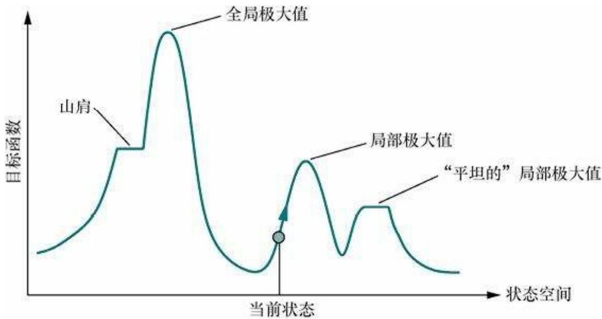  
图4-1 一维状态空间地形图，其标高对应于目标函数。目的是找到全局极大值

# 4.1.1 爬山搜索

爬山搜索算法如图4-2所示。它记录当前状态并在每次迭代中移动到值最大的相邻状态，也就是说，它朝最陡上升 （steepestascent）的方向前进。当它到达一个没有邻居具有更高值的“峰值”时，算法终止。爬山法不会考虑超出当前状态的直接邻居之外的状态。这就像是一个健忘的人在大雾中试图找到珠穆朗玛峰的顶峰。注意，使用爬山搜索的一种方法是使用启发式代价函数的负值作为目标函数；算法将局部地爬升至到目标的启发式距离最小的状态。

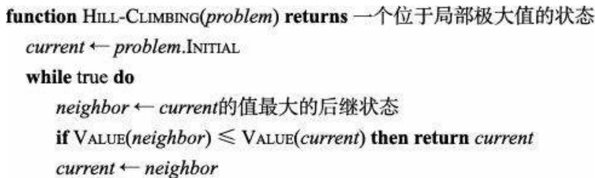  
图4-2 爬山搜索算法是最基本的局部搜索技术。在每一步中，当前节点被其最优邻居节点替换

我们将使用8皇后问题（图4-3）进一步说明爬山法。我们将使用一个完整状态形式化 （complete-stateformulation），即每个状态都包含解的所有组成部分，但它们可能并不都在正确的位置。在这种情况下，每个状态都包括在棋盘上放置8个皇后，每列一个。初始状态是随机选择的，状态后继是通过将一个皇后移动到同一列中的另一格所生成的所有可能状态（所以每个状态有8×7 =56个后继）。启发式代价函数h 是可相互攻击的皇后对的数量；只有当该状态是一个解时，h 值才是0。（如果两个皇后在同一条线上，即使它们之间存在一个中间棋子，这两个皇后也会被视为形成相互攻击。）图4-3b展示了一个h =17的状态以及它所有后继的h 值。

爬山法有时被称为贪心局部搜索 （greedy localsearch），因为它只是选择最优的邻居状态，而不事先考虑下一步该如何走。虽然贪婪被视为七宗罪之一，但事实证明，贪心算法往往相当有效。爬山法可以在求解问题时取得快速进展，因为它通常可以很容易地改善一个差的状态。例如，只需5步就可以从图4-3b的状态到达图4-3a的状态，该状态的h =1，与解非常接近。遗憾的是，爬山法可能会由于以下原因而陷入困境。

●局部极大值 （localmaxima）：局部极大值是一个比它每个相邻状态都高但比全局极大值低的峰顶。爬山法到达局部极大值附近就会被向上拉向峰顶，但随后将困在局部极大值处无路可走。图4-1示意性地说明了这一问题。更具体地说，图4-3a中的状态是一个局部极大值（即代价h 的局部极小值）；不管移动哪个皇后都会让情况变得更差。

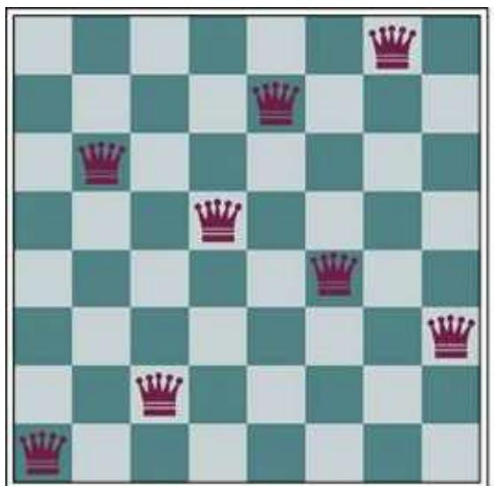

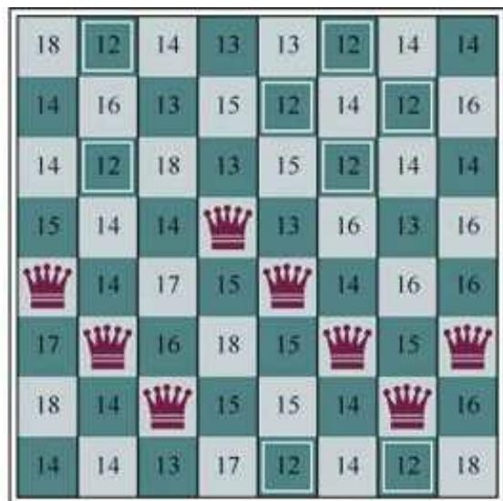  
  
图4-3 （a）8皇后问题：在棋盘上放置8个皇后，使得它们不能互相攻击。（皇后会攻击同一行、同一列或对角线上的任何棋子。）当前状态非常接近于一个解，除了第4列和第7列的两个皇后会沿对角线互相攻击。（b）一个8皇后状态，其启发式代价估计值 h=17。棋盘显示了通过在同一列移动皇后而获得的每一个可能后继的h 值。有8个移动并列最优，其h =12。爬山法将选择它们中的一个

●岭 （ridge）：如图4-4 所示。岭的存在将导致一系列局部极大值，对于贪心算法，这是很难处理的。

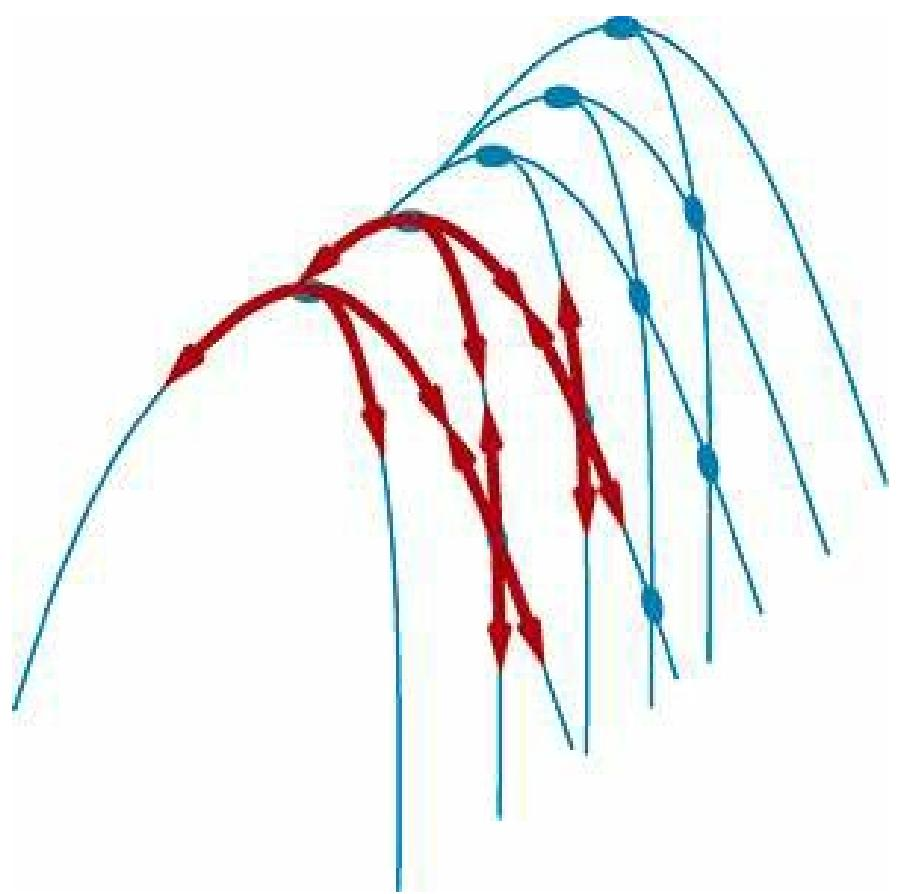  
图4-4岭为爬山法带来困难的示意图。状态网格（蓝色圆点）叠加在从左到右上升的岭上，形成了个彼此不直接相连的局部极大值序列。从每个局部极大值出发，所有可选动作都指向下坡。这样的拓扑在低维状态空间中很常见，例如二维平面中的点。但是在具有成百上千个维度的状态空间中，这种直观图并不成立，而且通常至少存在几个维度使得算法有可能漏掉岭和平台区

●平台区 （plateau）：平台区是指状态空间地形图中的平坦区域。它可能是一块平坦的局部极大值，不存在上坡的出口；也可能是一个 山肩 （shoulder），从山肩出发还有可能继续前进（参见图4-1）。爬山搜索可能会迷失在平台区上。

在每种情况下，算法都会到达一个无法再取得进展的点。从一个随机生成的8皇后状态开始，在86%的情况下，最陡上升爬山法会被卡住，它只能解决14%的问题实例。但是，它求解速度很快，成功找到解时平均步数为4，被卡住时平均步数为3，这对一个具有 万个状态的状态空间来说不算糟糕。

我们怎么才能求解更多问题？一个答案是当我们到达一个平台区时继续前进——允许横向移动（sidewaysmove），希望这个平台区真的是一个山肩，如图4-1所示。但如果我们实际上位于一块平坦的局部极大值上，那么算法就会陷入死循环。因此，我们可以限制连续横向移动的次数，如在100次连续横向移动之后停止。这种方法将爬山法成功求解问题实例的百分比从14%提高到了94%。成功是有代价的：平均下来，对每个成功实例算法需要运行约21步，失败实例约64步。

爬山法存在很多变体。随机爬山法 （stochastichillclimbing）在上坡行动中随机选择一个；被选中的概率随着上坡陡度的变化而变化。这种方法通常比最陡上升法收敛得更慢，但在某些状态地形图中，它能找到更好的解。首选爬山法 （first-choicehillclimbing）通过不断随机地生成后继直到生成一个比当前状态更好的后继为止来实现随机爬山。当一个状态存在众多（如数千个）后继时，这是一个很好的策略。

另一种变体是随机重启爬山法 （random-restarthillclimbing），它来自于一句格言：“如果一开始没有成功，那么尝试，再尝试。”它从随机生成的初始状态开始，执行一系列爬山搜索，直到找到目标。算法完备的概率为1，因为它最终会生成一个目标状态作为初始状态。如果每一次爬山搜索成功的概率为p ，那么需要重启的期望次数为1 /p 。对于不允许横向移动的8皇后实例，

，所以大概需要7次迭代才能找到一个目标（6次失败，1次成功）。所需步数的期望为一次成功迭代的代价加上 $( 1 - p ) / p$ 倍的失败代价，总共约为22步。当允许横向移动时，平均需要次迭代， 步。因此，对于8皇后问题，随机重启爬山法是非常有效的。即使有300万个皇后，这种方法也能在很短的时间内找到解。 [1]

爬山法是否能成功在很大程度上取决于状态空间地形图的形状：如果几乎不存在局部极大值和平台区，那么随机重启爬山法可以很快找到一个好的解。但是，许多实际问题的地形图看起来更像是平地上散布着一群秃顶豪猪，每个豪猪的刺上还住着微型豪猪。NP困难问题（参见附录A）通常存在指数级数量的局部极大值。尽管如此，在几次重启后，通常也可以找到相当好的局部极大值。

# 4.1.2 模拟退火

从不“下坡”，即从不向值较低（或代价较高）的状态移动的爬山算法总是很容易陷入局部极大值。相比之下，纯粹的随机游走算法不考虑状态值，而是随机移动到一个后继状态，它最终能够找到全局极大值，但它的效率非常低。因此，尝试将爬山法和随机游走结合起来以同时获得高效性和完备性，似乎是合理的。

模拟退火 （simulated annealing）就是这样一种算法。在冶金学中， 退火 （annealing）是一种通过将金属或玻璃加热到高温然后逐渐冷却的方法使材料达到低能量结晶态以进行回火或硬化的过程。为了更好地解释模拟退火，我们将关注点从爬山转换为梯度下降 （gradientdescent）（即，最小化代价），想象这样一项任务，把一个乒乓球放入一个崎岖表面的最深的裂缝中。如果只是让球滚动，它会停在一个局部极小值。如果晃动平面，乒乓球会从局部极小值中弹出来——也许会弹到更深的局部极小值中，在那里它将耗费更多的时间。诀窍是晃动幅度要足够大，以使球从局部极小值中弹出，但又不能太大，以至于从全局极小值中弹出。模拟退火就是开始时用力晃动（即高温），然后逐渐降低晃动强度（即降低温度）。

模拟退火算法的总体结构（图4-5）与爬山法类似。然而，它不是选择 最佳移动，而是选择 随机移动。如果该移动使得情况改善，那么它总是会被接受。否则，算法以小于1的概率接受该移动。概率随着该移动的“坏的程度”——评估值变差的量 $\Delta E$ ——呈指数级下降。概率也会随“温度”T的降低而减小：开始时 T较高，“坏”的移动更有可能被接受，当 T降低时，可能性也逐渐降低。如果 schedule所设置的 T降到0的速度足够慢，那么玻尔兹曼分布 AET 的一个性质是所有概率都集中在全局极大值上，即算法将以接近1的概率找到全局极大值。

functionSIMULATED-ANNEALING(problem,schedule)returns-个解状态

current $\leftarrow$ problem.INITIAL  
for $t = 1$ to $\infty$ do $T\gets$ schedule(t)  
if $T = 0$ then return current  
next $\leftarrow$ current的一个随机选择的后继状态 $\Delta E\gets$ VALUE(current)-VALUE(next)  
if $\Delta E > 0$ then current $\leftarrow$ next  
else current $\leftarrow$ next仅以e的概率

图4-5模拟退火算法，一种允许某些下坡移动的随机爬山法。输入的schedule是关于时间的函数，它决定了“温度”T的值

从20世纪80年代开始，模拟退火就被用于求解VLSI布图问题。它已广泛应用于工厂调度和其他大规模优化任务。

# 4.1.3 局部束搜索

对于内存限制问题，在内存中只保存一个节点似乎有些极端。 局部束搜索 （localbeamsearch）算

法记录 $k$ 个状态而不是只记录一个。它从k个随机生成的状态开始。在每一步中，生成全部 k个状态的所有后继状态。如果其中任意一个是目标状态，那么算法停止。否则，它将从完整列表中选择k个最佳后继并重复上述操作。

从第一印象来看，具有k个状态的局部束搜索似乎只不过是并行（而非串行）地运行 $k$ 次随机重启。事实上，这两种算法是完全不同的。在随机重启搜索中，每个搜索进程独立运行。而在局部束搜索中，有用信息将在并行的搜索线程之间传递。实际上，生成最佳后继的那些状态会对其他状态说：“过来，这里的草更绿！”算法将很快放弃那些没有效果的搜索并把资源转移到取得最大进展的路径上。

如果 k个状态之间缺乏多样性，局部束搜索可能会受到影响——k个状态可能聚集在状态空间的一块小区域内，导致搜索只不过是 $k$ 倍慢版本的爬山法。一种被称作随机束搜索 （stochasticbeamsearch）的变体可以帮助缓解这个问题，它类似于随机爬山法。随机束搜索不是选择最佳的k个后继状态，而是选择概率与它对应的目标函数值成正比的后继状态，从而增加了多样性。

# 4.1.4 进化算法

进化算法 （evolutionary algorithm）可以看作随机束搜索的变体，算法的动机明显来自生物学中自然选择的隐喻：一个由个体（状态）组成的种群，其中最适应环境（值最高）的个体可以生成后代（后继状态）来繁衍下一代，这个过程被称为 重组 （recombination）。进化算法存在无数种形式，它们按照以下方式变化。

●种群规模。

●每个个体的表示。在遗传算法 （geneticalgorithm）中，每个个体都是有限字母表上的一个字符串（通常是一个布尔字符串），就像DNA是字母表ACGT上的一个字符串一样。在进化策略（evolution strategy）中，个体是实数序列，而在 遗传编程 （genetic programming）中，个体是计算机程序。

● 混合数， $\pmb { \rho }$ ，是一起形成后代的亲本的数量。最常见的情况是 $\rho = 2$ ：双亲结合它们的“基因”（它们表示的一部分）来形成后代。当 $\pmb { \rho } { = } 1$ 时，为随机束搜索（可以看作无性繁殖）。

也是可能的，这在自然界中很少发生，但很容易在计算机上进行模拟。 $\rho > 2$

●选择 （selection）过程。选择将成为下一代亲本的个体：一种可能是从所有个体中选择，被选中的概率与其适应度得分成正比。另一种可能是随机选择 $n$ 个个体（ $n > \rho$ ），然后选择最适合的$\pmb { \rho }$ 个个体作为亲本。

● 重组过程。一种常见的方法（假设 ）是随机选择一个 杂交点 （crossover point）来分割每个父字符串，并将这些部分重新组合以形成两个子串，一个是亲本1的第一部分和亲本2的第二部分的组合；另一个是亲本1的第二部分和亲本2的第一部分的组合。

●突变率 （mutation rate），它决定了后代在其表示上发生随机突变的频率。一旦产生了一个后代，其组成中的每位都将以与突变率相等的概率被翻转。

●下一代的构成。可能只包括新形成的后代，也可能还包括一些上一代中得分最高的个体［这种做法被称为精英主义 （elitism），它确保总体适应度永远不会随着时间的推移而下降］。而淘汰（culling），即丢弃所有分数低于给定阈值的个体，会使得进化加速（Baum et al. , 1995）。

图4-6a为由4个8位数字符串组成的种群，每个字符串代表8皇后问题的一个状态：第c位数字表示第c列中皇后的行号。在图4-6b中，每个状态根据适应度函数进行评级。适应度越高越好，所以对于8皇后问题，我们使用非攻击皇后对的数量作为适应度，解的适应度为8×7/2 =28。图4-6b中4个状态的值分别为24、23、20和11。然后将适应度得分归一化为概率，结果显示在图4-6b中的适应度旁边。

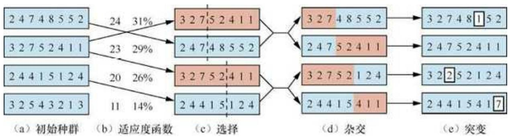  
图4-6遗传算法，图示为表示8皇后状态的数字字符串。（a）中的初始种群根据（b）中的适应度函数进行排序从而得到（c）中的配对，（d）是产生的后代，（e）是可能发生的突变

在图4-6c中，根据图4-6b中的概率选出两对父字符串。注意，有一个个体被选择了两次，还有一个没有被选择。对于每一对被选择的亲本，随机选择一个杂交点（虚线）。在图4-6d中，我们在杂交点处交叉两个父串，以生成新的后代。例如，第一对亲本中的第一个子串从第一个父串获得前三个数字（327），从第二个父串获得剩余数字（48552）。这一重组步骤中所包含的8皇后状态如图4-7所示。

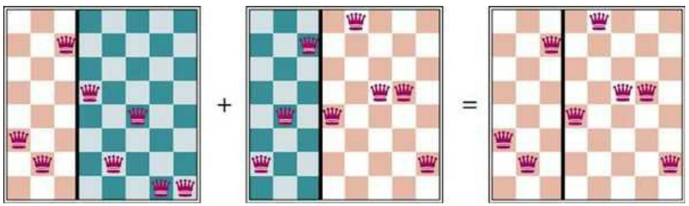  
图4-7对应于图4-6c中前两个亲本和图4-6d中第一个后代的8皇后状态。在杂交步中，丢弃绿色列，保留红色列。（图4-6中数字的解释：第1行是最下面一行，第8行是最上面一行）

最后，在图4-6e中，每个字符串中的每个位置都以某个很小的独立概率发生随机突变。第一个、第三个和第四个后代的某个位发生了突变。在8皇后问题中，这相当于随机选择一个皇后，并将其随机移动到它所在列的某个位置。通常情况下，早期的种群是多样化的，所以在搜索过程的早期阶段，杂交常常在状态空间中采取较大的步调（类似于模拟退火）。在经过许多代选择提高了适应度后，种群的多样性减少，步调也随之变小。图4-8介绍了实现所有这些步骤的算法。

function GENETIC-ALGORITHM(population,fitness) returns 一个个体  
repeat  
weights $\leftarrow$ WEIGHTED-BY(population,fitness)  
population2 $\leftarrow$ 空列表  
for $i = 1$ to SIZE(population) do  
parent1, parent2 $\leftarrow$ WEIGHTED-RANDOM-CHOICES(population, weights, 2)  
child $\leftarrow$ REPRODUCE(parent1, parent2)  
if (小的随机概率) then child $\leftarrow$ MUTATE(child)  
将child添加到population2中  
population $\leftarrow$ population2  
until 某个个体足够适应，或者已经经过了足够长的时间  
return 依据fitness选出的population中的最优个体  
function REPRODUCE(parent1, parent2) returns 一个个体 $n \leftarrow$ LENGTH(parent1) $c \leftarrow$ 从1到 $n$ 的随机数  
return APPEND(SUBSTRING(parent1, 1, c), SUBSTRING(parent2, c + 1, n))

图4-8遗传算法。在这个函数中，population 是种群中个体的有序列表， weights是每个个体所对应的适应度值的列表，而fitness是计算这些值的函数

遗传算法类似于随机束搜索，但增加了杂交操作。如果存在可以执行有用功能的区域，杂交操作是有利的。例如，将前3列皇后分别放在第2行、第4行和第6行（在这些位置上它们不会互相攻击），就组成了一个有用的区域，它可以与其他个体中出现的其他有用区域相结合，从而形成一个解。数学上可以证明，如果这些区域没有任何用途——例如，如果遗传密码的位置是随机排列的——那么杂交就没有任何优势。

遗传算法理论用模式 （schema）思想来解释它是如何运作的，模式是指其中某些位未确定的子串。例如，模式246*****表示前3个皇后分别位于位置2、4和6的所有8皇后状态。与该模式相匹配的字符串（例如24613578）称作该模式的实例 （instance）。可以证明，如果某模式实例的平均适应度高于平均值，那么该模式的实例数量将随着时间推移而不断增加。

# 进化和搜索

进化 论是由查尔斯·达尔文（Charles Darwin）（Darwin, 1859）和艾尔弗雷德·拉塞尔·华莱士（Alfred Russel Wallace）（Wallace, 1858）各自独立提出的。它的中心思想很简单：变异发生在繁殖过程中，并将在后代中以一定比例保存下来，大概与它们对生殖适应度的影响成比例。

达尔文在《物种起源》（ On the Origin of Species by Means of Natural Selection ）中的理论没有解释生物体的特征是如何遗传和改变的。控制这些过程的概率定律由修道士格雷戈尔·孟德尔（GregorMendel）（Mendel, 1866）首先发现，他使用豌豆进行了实验。很久之后，沃森和克里克（Watsonand Crick,1953）确定了DNA分子的结构及其AGTC（腺嘌呤、鸟嘌呤、胸腺嘧啶、胞嘧啶）序列。在标准模型中，基因序列上某点发生突变和“杂交”（后代的DNA通过合成父母双方的DNA长片段产生）都会导致变异。

进化和局部搜索算法的相似性前文已经介绍过了；随机束搜索和进化的主要区别在于是否为 有性生殖，有性生殖中后代是由多个 而非单个个体产生的。然而，进化的实际机制比大多数遗传算法要丰富得多。例如，突变包括DNA的逆转、复制和大段移动；有些病毒会从一个生物体中借用DNA再将其自身插入另一个生物体；还有一些转座基因只是在基因组中把自己复制成千上万次。

甚至还有一些基因会破坏不携带该基因的可能配对对象的细胞，从而增加它们自身的复制机会。最重要的是，基因自身对基因组复制和翻译成生物体的机制进行编码。在遗传算法中，这些机制是单

独的程序，不体现在被操作的字符串中。

达尔文进化论可能看起来效率很低，它盲目地产生了大约10 43 个生物体，却丝毫没有改进它的搜索启发式函数。但是学习在进化中确实起着作用。尽管另一位伟大的法国博物学家让·拉马克（Jean Lamarck）（Lamarck,1809）曾错误地提出，生物体一生中通过适应而获得的特性会遗传给后代，但詹姆斯·鲍德温（JamesBaldwin）（Baldwin,1896）提出的表面上相似的理论则是正确的：学习可以有效地放宽适应度要求，从而加快进化速度。如果一个生物体具有一种不太适应环境的特性，但它也具有足够的可塑性，可以学习以一种有益的方式适应环境，那么生物体会将这种特性传递下去。计算机仿真（Hinton and Nowlan, 1987）证实了 鲍德温效应 （Baldwin effect）是真实存在的，其结果是，难以学习的事情最终会存在于基因组中，而容易学习的事情不必进入基因组（Morgan and Griffiths, 2015）。

显然，如果相邻位之间完全不相关，效果就没那么显著，因为几乎不存在功能一致的连续区域。当模式对应于解中有意义的组件时，遗传算法效果最优。例如，如果字符串表示天线，那么模式则表示天线的各组成部分，如反射器和导向器。一个好的组件可能在各种不同的设计中都是好的。这表明，遗传算法的成功依赖于精细的表示工程。

实际上，遗传算法在广泛的最优化方法中占有一席之地（Marlerand Arora, 2004），尤其是复杂结构问题，如电路布图或作业车间调度，以及最近的深度神经网络架构演变（Miikkulainen etal.,2019）。目前还不清楚遗传算法的吸引力是来自于它在特定任务上的性能优势，还是来自于进化本身。

[1]卢比等人（Luby etal.,1993）建议在搜索固定次数之后重启，并表明这比让每次搜索都无限期地继续下去要有效得多。

# 4.2 连续空间中的局部搜索

在第2章中，我们解释了离散环境和连续环境之间的区别，并指出大多数的真实世界环境都是连续的。连续动作空间的分支因子是无限的，因此我们目前介绍的大多数算法（除了首选爬山法和模拟退火）都无法处理连续空间。

本节将非常简要地介绍一些连续空间的局部搜索技术。关于这个主题的文献有很多。许多基本技术


起源于牛顿和莱布尼茨发明微积分之后的17世纪。用，包括学习、视觉和机器人技术相关的章节。

本书的一些章节会介绍这些技术的应

考虑一个实例。假设我们希望在罗马尼亚新建3个机场，使得地图上每个城市到其最近机场的直线距离平方和最小。（罗马尼亚地图见图3-1。）状态空间定义为3个机场的坐标：( x 1, y 1)、( x 2, y)和(x ,y )。这是一个六维空间；我们也可以说状态由6个变量 （variable）定义。一般地，状态定义为 $n$ 维向量， $\pmb { x }$ 。在这个空间中移动对应于移动地图上的一个或多个机场。对于任一特定状态，一旦计算出最近城市，目标函数 $f ( x ) = f ( x _ { 1 } , y _ { 1 } , x _ { 2 } , y _ { 2 } , x _ { 3 } , y _ { 3 } )$ )的计算就会变得相对容易。设 $C _ { i }$ 是最近机场（在状态 $_ x$ 下）为机场i的城市集合。那么，我们有

$$
f (x) = f \left(x _ {1}, y _ {1}, x _ {2}, y _ {2}, x _ {3}, y _ {3}\right) = \sum_ {t = 1} ^ {3} \sum_ {c \in C _ {t}} \left(x _ {t} - x _ {c}\right) ^ {2} + \left(y _ {t} - y _ {c}\right) ^ {2} \tag {4-1}
$$

这一方程不仅对于状态x 是正确的，而且对于 $_ x$ 局部邻域中的状态也是正确的。然而，对全局来说，它是不正确的；如果我们偏离x太远（通过大幅改变一个或多个机场的位置），那么该机场的最近城市集合会发生变化，我们需要重新计算 C i。

处理连续状态空间的一种方法是离散化 （discretize）。例如，我们可以将 $( x _ { i } , y _ { i } )$ )的位置限制在矩形网格上间距为 $\pmb { \delta }$ 的固定点，而不是允许它的位置可以为连续二维空间中的任意点。那么，空间中的每个状态将存在12个后继（对应于将6个变量分别增加 $\pm \delta$ ），而不是之前的无限多个。然后我们就可以对离散空间应用任意局部搜索算法。或者，我们可以通过随机采样后继状态，即在随机方向上移动一个小量 ，使分支因子变为有限值。通过两个相邻点之间目标函数值的变化来衡量进度的方法称为经验梯度 （empiricalgradient）法。经验梯度搜索与离散化状态空间中的最陡上升爬山法相同。随着时间逐渐减小 $\pmb { \delta }$ 的值可以得到更准确的解，但不一定在极限范围内收敛到全局最优值。

通常我们有一个以数学形式表达的目标函数，这样我们就可以用微积分来解析地而非经验地求解问题。许多方法都试图利用地形图的梯度 （gradient）来找到最大值。目标函数的梯度是一个向量 $\bigtriangledown$ $f$ ，它给出了最陡斜面的长度和方向。对于我们的问题，有

$$
\nabla f = \left(\frac {\partial f}{\partial x _ {1}}, \frac {\partial f}{\partial y _ {1}}, \frac {\partial f}{\partial x _ {2}}, \frac {\partial f}{\partial y _ {2}}, \frac {\partial f}{\partial x _ {3}}, \frac {\partial f}{\partial y _ {3}}\right)
$$

在某些情况下，我们可以通过解∇f=0方程找到一个极大值。（这是可以做到的，例如，如果我们只新建一个机场；问题的解是所有城市坐标的算术平均值。）然而，在许多情况下，这个方程不存在闭式解。例如，对于3个机场的情况，梯度的表达式依赖于当前状态中哪些城市离各个机场最近。这意味着我们只能局部地（而非全局地）计算梯度，例如，

$$
\frac {\partial f}{\partial x _ {1}} = 2 \sum_ {c \in C _ {1}} \left(x _ {1} - x _ {c}\right) \tag {4-2}
$$

给定一个局部正确的梯度表达式，我们可以根据下式来更新当前状态从而实现最陡上升爬山法：

$$
\boldsymbol {x} \leftarrow \boldsymbol {x} + a \nabla f (\boldsymbol {x})
$$

其中 $\pmb { \alpha }$ 是一个很小的常数，通常称为 步长 （step size）。存在很多调整 $\pmb { \alpha }$ 的方法。基本问题是，如果 $\pmb { \alpha }$ 太小，需要的迭代步太多；如果 $\pmb { \alpha }$ 太大，搜索可能会越过最大值。线搜索 （linesearch）技术试图通过不断延伸当前梯度方向——通常通过对 $\pmb { \alpha }$ 反复加倍——直到 $f$ 再次开始减小来克服上述困境。出现上述现象的点成为新的当前状态。在这点上如何选择新的方向，有几种不同的方法。

对于许多问题，最有效的算法是古老的 牛顿-拉弗森法 （Newton-Raphson method）。这是一种求函数根（即求解g (x)=0形式的方程）的通用方法。它的工作原理是根据牛顿公式计算根x的一个新的估计值：

$$
x \leftarrow x - g (x) / g ^ {\prime} (x)
$$

要找到 $f$ 的最大值或最小值，需要找到使得梯度为零向量（即 $\nabla f ( x ) = 0$ ）的 $_ x$ 。因此，牛顿公式中的 $g \left( x \right)$ 为 $\nabla f ( \pmb { x } )$ ，更新方程可以写成矩阵-向量形式：

$$
\boldsymbol {x} \leftarrow \boldsymbol {x} - \boldsymbol {H} _ {f} ^ {- 1} (\boldsymbol {x}) \nabla f (\boldsymbol {x})
$$

其中 $\pmb { H } _ { f } ( \pmb { x } )$ 为二阶导数的 黑塞矩阵 （Hessian matrix），其元素 $H _ { i j }$ 由 给出。对于上述机场问题实例，从式（4-2）可以看出， $\pmb { H } _ { f } ( \pmb { x } )$ 相当简单：非对角元素为零，机场 i的对角线元素的值恰好为C 中城市数目的两倍。每一时刻的计算表明，每一步更新将机场i直接移动到 $C _ { i }$ 的质心处，即式（4-1）中f的局部表达式的最小值。[1] 然而，对于高维问题，计算黑塞矩阵的 n 2个元素以及对它求逆的开销可能非常昂贵，因此产生了许多牛顿-拉弗森法的近似版本。

局部搜索方法在连续状态空间和离散状态空间中一样，同样受到局部极大值、岭和平台区的影响。随机重启和模拟退火通常很有用。然而，高维连续空间非常大，算法很容易陷入困境。

最后一个话题是约束优化 （constrained optimization）。如果一个优化问题的解必须满足对变量值的一些硬性约束，那么这个问题就是受约束的。例如，在机场选址问题中，我们可能会将选址限制在罗马尼亚境内的陆地上（而不是某个湖中心）。约束优化问题的难度取决于约束和目标函数的性质。最著名的一类问题是 线性规划 （linear programming）问题，其约束必须是能构成凸集的线性不等式[2] ，目标函数也必须是线性的。线性规划的时间复杂性是关于变量数目的多项式。

线性规划可能是最广泛研究和最有用的优化方法。它是更一般的凸优化 （convex optimization）问题的一种特例，允许约束区域为任意凸区域，目标函数为约束区域内的任意凸函数。在一定条件下，凸优化问题也是多项式时间内可解的，即使有上千个变量，也可能是实际可行的。机器学习和控制理论中的几个重要问题可以形式化为凸优化问题（见第20章）。

[1]一般来说，牛顿-拉弗森更新可以看作在x 处用一个二次曲面拟合 f，下一步则直接移动到该曲面的最小值——如果f是二次的，则也是f的最小值。  
[2]如果点集 S中任意两点的连线也包含在S中，则称S是凸的。凸函数 （convex function）是指其上方空间构成凸集的函数；根据定义，凸函数没有局部（相对于全局）极小值。

# 4.3 使用非确定性动作的搜索

在第3章中，我们假设环境为完全可观测的、确定性的、已知的。因此，智能体可以观测到初始状态，计算出可以到达目标的动作序列，然后“闭着眼睛”执行这些动作，而不需要使用自己的感知。

然而，当环境部分可观测时，智能体并不确定它处于什么状态；当环境是非确定性的时，智能体不知道在执行某个动作后将转移到什么状态。这意味着智能体所思考的不再是“我现在位于s 状态，如果我执行a动作，我将会进入s 状态”，而是“我现在位于s 或s 状态，如果我执行 a动作，我将会进入 s 2、 s 4或 s 5状态”。我们把智能体认为其可能位于的物理状态集合称为 信念状态（belief state）。

在部分可观测的和非确定性的环境中，问题的解不再是一个序列，而是一个条件规划（conditionalplan）（有时也称为应变规划或策略），条件规划根据智能体在执行规划时接收到的感知来指定动作。本节先讨论非确定性，部分可观测性留待4.4节讨论。

# 4.3.1 不稳定的真空吸尘器世界

如图4-9所示，第2章中的真空吸尘器世界具有8种状态。有3种动作——向左Left、向右Right和吸尘 Suck ，目标是清理所有的灰尘（状态7和8）。如果环境是完全可观测的、确定性的和完全已知的，那么使用第3章的任意算法都很容易求解这个问题，它的解是一个动作序列。例如，如果初始状态是1，那么动作序列[ Suck , Right , Suck ]可以到达目标状态8。

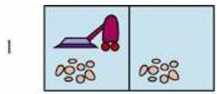

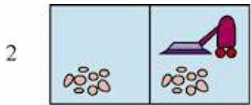

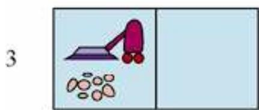

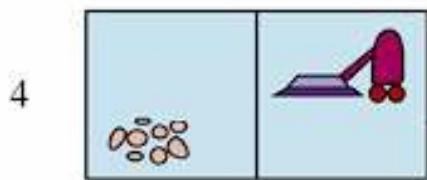

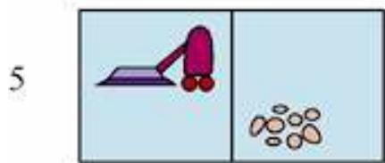

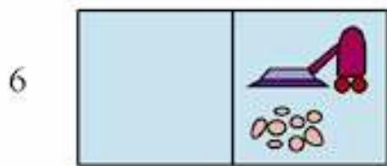

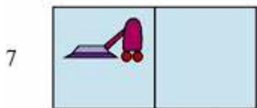

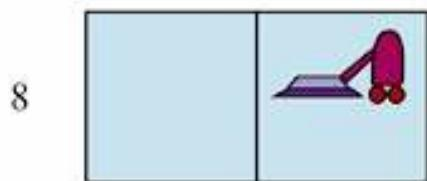  
图4-9 真空吸尘器世界的8种可能状态；状态7和8是目标状态

现在假设我们以一个功能强大但不稳定的真空吸尘器的形式引入非确定性。在不稳定的真空吸尘器世界中，Suck的工作原理如下。

●在一个脏的方格中，Suck会清理这一方格，有时也会清理它的相邻方格。


● 在一个干净方格中， Suck 有时反而会把灰尘弄到地面上。

为了更准确地形式化这一问题，我们需要推广第3章的转移模型 概念。我们不使用返回单个结果状态的Result函数来定义转移模型，而是使用返回一组可能的结果状态的新的Result函数。例如，在不稳定的真空吸尘器世界中，状态1中的Suck动作要么只清理当前位置，要么同时清理两个位置：

$$
\text {R E S U L T s} (1, \text {S u c k}) = \{5, 7 \}
$$

如果我们是从状态1开始，那么没有任何一个单独的动作序列能够求解问题，因此我们需要如下的条件规划：

$$
[ \text {S u c k}, \text {I f S t a t e} = 5 \text {t h e n [ R i g h t , S u c k ] e l s e} ]) \tag {4-3}
$$

我们看到，条件规划可以包含if– then– else步骤；这意味着解是树而不是序列。这里的if语句中的条件用来测试当前状态；这是智能体在运行时能够观测到的，但规划时还不知道。或者，我们也可以用公式来测试感知而不是状态。真实物理世界中的许多问题都是应变问题，因为不可能对未来进行准确预测。因此，许多人在走路时都会睁着眼睛。

# 4.3.2 与或搜索树

我们如何得到这些非确定性问题的条件解？和第3章一样，我们首先从构造搜索树开始，但是这里的树有一个不同的特性。在确定性环境中，分支是由智能体在每个状态下自己的选择引入的：我可以执行这个动作或那个动作。我们称这些节点为或节点 （ORnode）。例如，在真空吸尘器世界中，智能体在或节点上选择 Left 、 Right 或 Suck 。而在非确定性环境中，环境对每个动作的结果的选择也会引入分支。我们称这些节点为 与节点 （AND node）。例如，状态1中的Suck动作会产生信念状态{5,7}，因此智能体需要为状态5与状态7分别找到一个规划。这两种节点交替出现，形成如图4-10所示的 与或树 （AND–OR tree）。

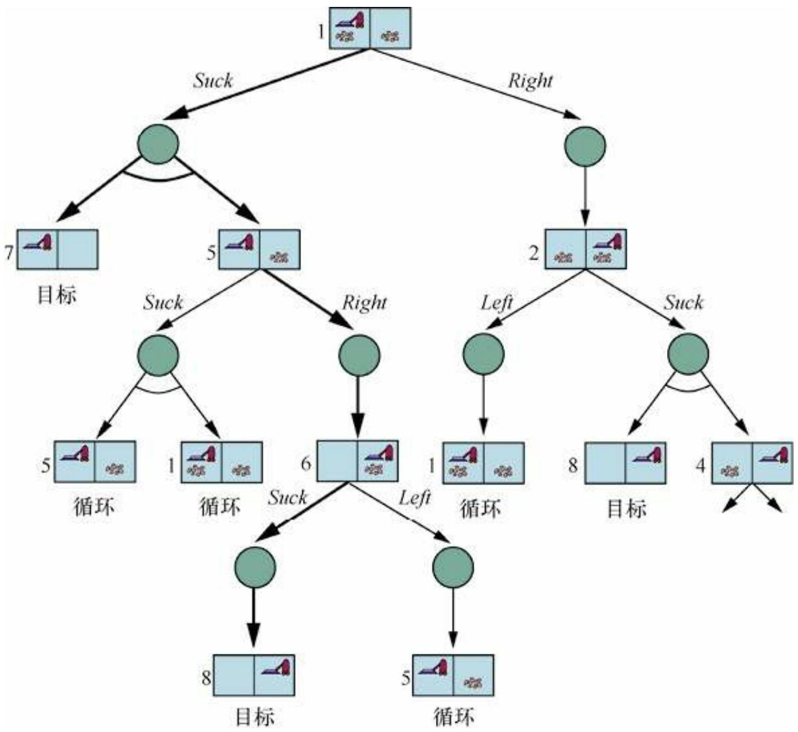  
图4-10不稳定的真空吸尘器世界搜索树的前两层。状态节点是必须选择某个动作的或节点。与节点（用圆圈表示）上的每个结果都必须处理，结果分支间用弧线连接。找到的解用粗线标识

与或搜索问题的解是完整搜索树的一棵子树：（1）每个叶子都是一个目标节点，（2）在每个或节点上选择一个动作，（3）每个与节点包括所有结果分支。解在图中用粗线标识；对应于式（4-3）中的规划。

图4-11给出了与或图搜索的深度优先递归算法。该算法的一个关键是它处理环的方法，环经常出现在非确定性问题中（例如，动作有时不起作用，或者一个意外的影响被纠正）。如果当前状态与从根到它的路径上的某个状态相同，就返回失败。这并不意味着从当前状态出发没有解；这仅仅意味着，如果存在一个非循环解，那么它肯定可以从当前状态的早期镜像到达，因此可以丢弃新的镜像。有了这一检查，可以确保算法在任何有限状态空间中都能终止，因为每条路径都必定到达一个目标、一个死胡同或一个重复状态。注意，该算法并不检查当前状态是否是从根出发的其他路径上的某个状态的重复状态，这一点对效率来说很重要。

function AND-OR-SEARCH(problem) returns a condition that returns the problem.  
return OR-SEARCH(problem, problem.Initial,[])  
function OR-SEARCH(problem, state, path) returns a condition that returns the problem.  
if problem.Is-GOAL(state) then return the condition  
if Is-Cycle(state, path) then return failure  
for each action in problem.ACTIONS(state) do  
    plan $\leftarrow$ AND-SEARCH(problem, RESULTS(state, action), [state] + [path])  
    if plan ≠ failure then return [action] + [plan]  
return failure  
function AND-SEARCH(problem, states, path) returns a condition that returns the condition  
for each $s_i$ in states do  
    plan $\leftarrow$ OR-SEARCH(problem, $s_i$ , path)  
    if plan $\equiv$ failure then return failure  
return [if $s_1$ then plan $\equiv$ s2 then plan $\equiv$ s3 else ... if $s_{n-1}$ then plan $\equiv$ s4 else plan $\equiv$ s5]

图4-11非确定性环境生成的与或图的搜索算法。解是一个条件规划，它考虑每一个非确定性的结果，并为每个结果制定规划

与或图也可以使用广度优先或最佳优先的方式进行探索。我们必须修改启发式函数的概念，即估计一个条件解而不是一个序列的代价，但可容许性的概念可以继续保留，而且存在类似的用于寻找最优解的A * 算法（参见本章末尾的参考文献与历史注释）。

# 4.3.3 反复尝试

考虑一个光滑的真空吸尘器世界，它与普通的（稳定的）真空吸尘器世界基本相同，但移动操作有时会失效，使得智能体停在原地。例如，在状态1中执行 Right将产生信念状态{1,2}。图4-12为部分搜索图；显然，从状态1出发不存在非循环解，A nd -O r-Search将返回失败。然而，存在一个循环解 （cyclicsolution），即反复尝试Right动作，直到它生效。我们可以用一个新的while结构来表示上述过程：

$$
[ \text {S u c k}, \text {w h i l e} S t a t e = 5 \text {d o R i g h t}, \text {S u c k} ]
$$

或者用 标签 （label）表示规划的某一部分，之后可以引用这个标签：

$$
[ S u c k, L _ {1}: R i g h t, \text {i f} S t a t e = 5 \text {t h e n} L _ {1} \text {e l s e} S u c k ]
$$

什么时候可以考虑将循环规划作为解？最小条件是每个叶节点都是一个目标状态，并且叶节点可以从规划中的任意点到达。除此之外，我们还要考虑造成非确定性的原因。如果情况确实是，真空吸尘器机器人的驱动机制在某些时间工作，但在其他时间真空吸尘器会发生随机、独立地滑动，那么智能体可以保证，如果动作重复足够多次，最终总会生效，规划也会成功。但是，如果这种非确定性来自机器人或环境的一些尚未观测到的原因（例如，传动带断了，那么机器人将永远不会移动），重复这个动作也没有用。

为了便于理解，我们可以认为，它是将初始问题形式（完全可观测的，非确定性的）转化为另一种形式（部分可观测的，确定性的），其中循环规划的失败正是由于传动带的某个不可观测的特性。在第12章中，我们将讨论如何判断几种不确定可能性中哪个可能性更大。

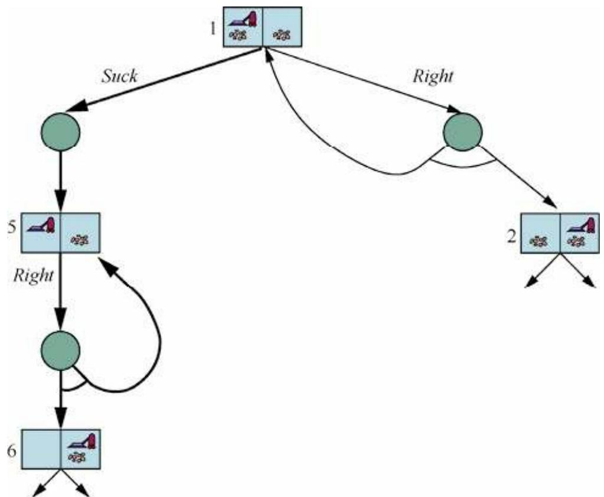  
图4-12光滑的真空吸尘器世界的部分搜索图，（一些）循环已经明确地标出。这个问题的所有解都是循环规划，因为真空吸尘器无法稳定地移动

# 4.4 部分可观测环境中的搜索

现在我们考虑部分可观测性问题，即智能体的感知不足以确定准确的状态。这意味着，智能体的一些动作将致力于减少当前状态的不确定性。

# 4.4.1 无观测信息的搜索

当智能体的感知根本不提供任何信息时，问题就变成了无传感器 （sensorless）问题，或称一致性（conformant）问题。起初，你可能会认为，如果无传感器智能体不知道起始状态，那它就无法求解问题，但出人意料的是，无传感器解非常普遍且有用，主要是因为它们不依赖于传感器是否正常工作。例如，在制造系统中，已经开发出许多巧妙的方法，通过使用一系列行动而无须任何感知，从未知初始位置正确定位零件。有时，即使存在可感知的条件规划，无传感器规划也会更好。例如，医生通常会开一种广谱抗生素，而不是使用条件规划：先验血，接着等待结果，然后再开一种更具体的抗生素。这种无传感器规划节省了时间和金钱，并且避免了在检测结果出来之前感染恶化的风险。

考虑一个（确定性）真空吸尘器世界的无传感器版本。假设智能体知道它所在世界的地理环境，但不知道它自己的位置和灰尘的分布。在这种情况下，它的初始信念状态为{1,2, 3, 4, 5, 6,7,8}（见图4-9）。现在，如果智能体执行Right动作，它将位于{2,4, 6, 8}中的某个状态——智能体在没有感知的情况下获得了信息！执行[ Right , Suck ]之后，智能体将总是位于{4, 8}中的某个状态。最终，无论初始状态是什么，执行[ Right , Suck , Left , Suck ]之后，智能体必定会到达目标状态7。我们称，智能体可以强迫 （coerce）世界到达状态7。

无传感器问题的解是一个动作序列，而不是条件规划（因为它没有感知）。但是，我们是在信念状


在信念状态空间中，问题是完全可观测的，因为智器问题的解（如果有的话）始终是一个动作序列。这后接收到的感知是完全可预测的——它们总是空境是非确定性的，这也是正确的。

态空间而非物理状态空间中进行搜索。

我们可以为无传感器搜索问题介绍新的算法。但是，如果我们将底层物理问题转化为信念状态问题，我们就可以使用第3章中现有的算法，即，对信念状态而非物理状态进行搜索。原问题P，由Actions 、Result 等组成，信念状态问题则包括以下部分。

●状态： 信念状态空间包含物理状态的每一个可能子集。如果原问题 $P$ 有 $N$ 个状态，那么信念状态问题有2N 个信念状态，尽管有很多状态都无法从初始状态到达。

●初始状态： 通常，初始信念状态包含 $P$ 中的所有状态，尽管在某些情况下，智能体具有更多的先验知识。

● 动作： 这部分有点棘手。假设智能体位于信念状态 $\tilde { \boldsymbol { b } } = \{ s _ { 1 9 } s _ { 2 } \}$ ，但是

；那么智能体就无法确定哪些动作是合法的。如果我们假定非 $\mathrm { A G T O N S } _ { p } ( s _ { 1 } ) \neq \mathrm { A G T O N S } _ { p } ( s _ { 2 } )$ 法动作不会对环境产生影响，那么执行当前信念状态 $^ { b }$ 下的任意物理状态的所有动作的并集都是安全的。

$$
\text {A C T I O N S} (b) = \bigcup_ {s \in b} \text {A C T I O N S} _ {P} (s)
$$

但是，如果非法动作可能导致严重后果，那么只允许执行动作的交集（对所有状态都合法的动作的集合）更安全。对于真空吸尘器世界，每个状态都具有相同的合法动作，所以两种方法将给出相同的结果。

●转移模型： 对于确定性动作，对于每个当前可能状态，新的信念状态中都存在一个如下结果状态（尽管一些结果状态可能是相同的）。

$$
\boldsymbol {b} ^ {\prime} = \operatorname {R e s u l t} (\boldsymbol {b}, \boldsymbol {a}) = \{s ^ {\prime}: s ^ {\prime} = \operatorname {R e s u l t} _ {P} (s, \boldsymbol {a}) \text {且} s \in \boldsymbol {b} \} \tag {4-4}
$$

对于非确定性动作，新的信念状态则包含了将该动作应用于当前信念状态中的任一状态的所有可能结果。

$$
\begin{array}{l} b ^ {\prime} = \operatorname {R e s u l t} (b, a) = \left\{s ^ {\prime}: s ^ {\prime} \in \operatorname {R e s u l t S} _ {P} (s, a) \text {且} s \in b \right\} \\ = \bigcup_ {s \in b} \operatorname {R E S U L T S} _ {P} (s, a) \\ \end{array}
$$

对于确定性动作， $b ^ { \prime }$ 不会大于 b ，而对于非确定性动作， $b ^ { \prime }$ 可能会大于 b （见图4-13）。

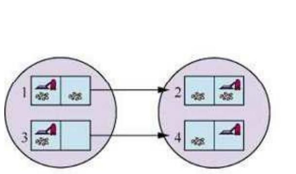

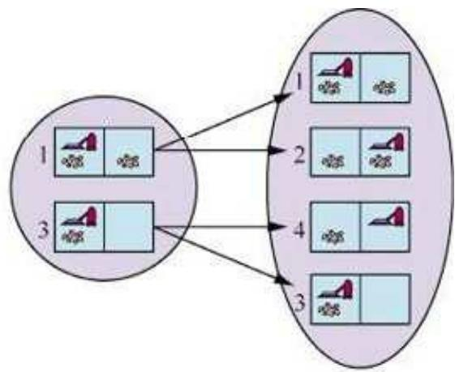  
  
图4-13 （a）预测在无传感器真空吸尘器世界执行确定性动作Right后的下一个信念状态；（b）在光滑的无传感器真空吸尘器世界中的同一状态下执行同一动作的预测

●目标测试： 如果信念状态中的任一状态s满足底层问题的目标测试，Is-G oal (s)，则智能体有可能到达了目标。如果所有状态都满足Is-G oal (s)，则智能体必定到达了目标。我们的目标是使得智能体必定到达了目标。  
●路径代价： 这部分也很棘手。如果同一动作在不同状态下代价不同，那么在给定信念状态下执行动作的代价是几种不同值中的一种。（这导致了一类新的问题，我们将在习题4.MVAL中讨论。）现在我们假定同一动作在所有状态下具有相同代价，因此动作代价可以直接从底层物理问题中转换。

图4-14为确定性无传感器真空吸尘器世界的可达信念状态空间。在2 8 =256种可能信念状态中只有12种可以到达。

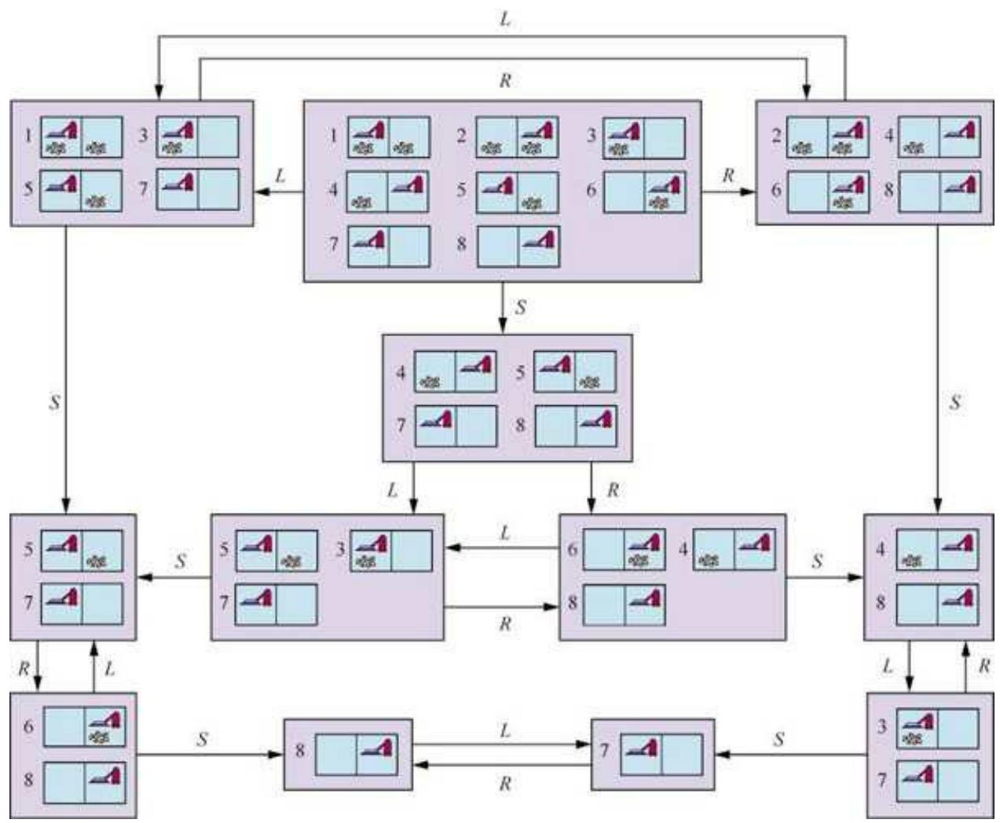  
图4-14确定性无传感器真空吸尘器世界的信念状态空间的可达部分。每个矩形框对应一个信念状态。在任何给定点，智能体都有一个信念状态，但它不知道自己位于哪个物理状态。初始信念状态（完全未知）位于最上面的中间方框

上述定义确保信念状态问题的形式化能够从底层物理问题的定义自动构建。一旦完成，就可以用第3章的任何普通搜索算法求解无传感器问题。

在一般的图搜索中，需要检测新到达的状态之前是否已经到达过。这也适用于信念状态；例如，在图4-14中，动作序列[ Suck , Left , Suck ]从初始状态出发，到达与序列[ Right , Left , Suck ]相同的信念状态，即，{5,7}。现在，考虑[Left]到达的信念状态，{1,3, 5, 7}。显然，这与{5, 7}不同，但它是{5,7}的超集。我们可以抛弃（剪枝）任何一个这样的信念状态超集。为什么？因为从{1,3, 5,7}出发的解一定也是任何单一状态1、3、5和7的解，因此，它也是这些单一状态任意组合的解，例如{5, 7}；因此我们没有必要试着求解{1, 3, 5, 7}，可以专注于求解更严格简单的信念状态{5, 7}。

反过来，如果已经生成{1, 3, 5, 7}，并且发现它是可解的，那么它的任何子集，如{5, 7}，可以确保也是可解的。（如果我有一个解，它在我对自己处于何种状态“非常困惑”时都是有效的，那么在我“不那么困惑”时它仍然是有效的。）这种额外剪枝可能会显著提高无传感器问题的求解效率。

然而，即使有这样的改进，我们所介绍的无传感器问题求解方法在实践中也几乎是不可行的。一个问题是信念状态空间非常庞大——我们在第3章中看到过，一个大小为 $N$ 的搜索空间已经过于庞大，而现在我们搜索空间的大小为2 $N$ 。此外，搜索空间中的每个元素都是一个不超过 $N$ 个元素的集合。对于较大的 $N$ ，内存空间甚至不足以表示单个的信念状态。

一种解决方案是用更紧凑的描述来表示信念状态。例如，在英语中，我们可以用“Nothing”表示初始状态；我们可以用“Not in the rightmost column”表示执行 Left 动作后的信念状态，等等。第7章介绍了如何在形式化表示模式中实现上述表示。

另一种方法是避免使用标准搜索算法，它们将信念状态看作和任何其他问题状态一样的黑盒。然而，我们可以选择查看信念状态内部，并设计增量信念状态搜索 （incrementalbelief-statesearch）算法，即，每次只为一个物理状态建立解。例如，在无传感器真空吸尘器世界中，初始信念状态为{1,2,3, 4, 5, 6,7,8}，我们必须找到一个在所有8种状态下都有效的动作序列。我们可以先找到状态1的解；然后检查它对于状态2是否有效；如果无效，则回溯寻找状态1的另一个解，以此类推。

正如与或搜索必须为与节点上的每个分支找到解一样，这一算法也必须为信念状态下的每个物理状态找到解；区别在于与或搜索可以为每个分支找到不同的解，而增量信念状态搜索必须找到一个对所有状态都有效的解。

增量方法的主要优点是，它通常能够快速检测出失败——当一个信念状态无解时，通常情况下，它的子集（包含最先检测的几个状态）也是无解的。在某些情况下，这将导致与信念状态规模成正比的加速，信念状态本身可能就和物理状态空间一样大。

# 4.4.2 部分可观测环境中的搜索

对许多问题来说，没有感知就无法求解。例如，求解无传感器8数码问题是不可能的。但是，一点点感知可能就有很大帮助：如果我们能够看到左上角的方格，就能求解8数码问题。解包括依次将每个滑片移动到可观测的方格中，并从那时起记录该滑片的位置。

对于部分可观测问题，问题形式化将定义一个P ercept ( s )函数，它返回智能体在给定状态下接收到的感知。如果感知是非确定性的，那么我们可以使用P ercepts 函数返回可能感知的集合。对于完全可观测问题，每个状态 s 下，P ercept ( s ) = s ，对于无传感器问题，P ercept ( s )= nu ll 。

考虑一个局部感知真空吸尘器世界，智能体拥有一个位置传感器（在左侧方格中生成感知 $L$ ，右侧方格中生成感知 $R$ ）和一个灰尘传感器（当前方格内有灰尘时生成感知 Dirty，否则生成Clean）。因此，状态1的P ercept 为[ L , Dirty ]。对于部分可观测的情况，通常会存在几个状态产生相同感知的情况；状态3也会产生[L, Dirty]。因此，给定这一初始感知，初始信念状态将为{1,3}。我们可以将部分可观测问题信念状态之间的转移模型分为3个阶段，如图4-15所示。

● 预测 （prediction）阶段与无传感器问题相同，计算由动作所导致的信念状态，R esult ( b , a )。为了强调这是一个预测，我们将其记为 b ˆ = R esult ( b , a )，其中 b 上方的“hat”表示“估计值”，我们还可以使用P redict ( b , a )代替R esult ( b , a )。

● 可能感知 （possible percept）阶段计算在预测的信念状态下可以观测到的感知集合（用字母 o 表示观测到的感知）：

$$
\text {P O S S I B L E - P E R C E P T S} (\hat {b}) = \{o: o = \text {P E R C E P T} (s) \text {且} s \in \hat {b} \}
$$

●更新 （update）阶段为每个可能感知计算其可能得到的信念状态。更新后的信念状态 $b _ { o }$ 是 $^ { b }$ ˆ中可能产生这一感知的状态集合：

$$
b _ {o} = \text {U P D A T E} (\hat {b}, o) = \{s: o = \text {P E R C E P T} (s) \text {且} s \in \hat {b} \}
$$

●智能体需要在规划阶段处理可能的感知，因为在执行规划之前它不知道实际的感知。注意，在预测阶段，物理环境中的非确定性会扩大信念状态，但每个更新后的信念状态 $b _ { o }$ 不会大于预测的信念状态b ˆ；观测到的感知只能帮助减少不确定性。此外，对于确定性感知，不同感知的信念状态是不相交的，从而形成原始预测信念状态的一个划分。

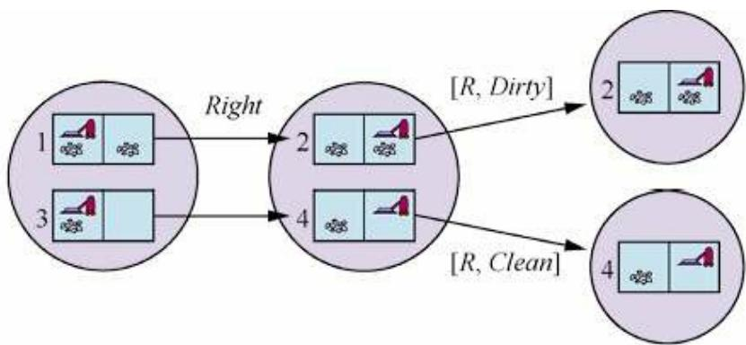

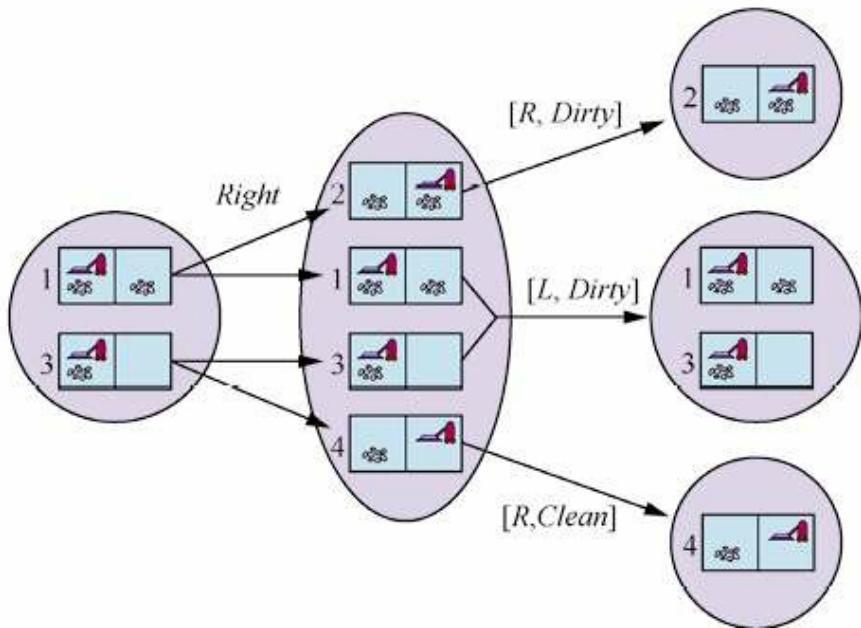  
  
图4-15局部感知真空吸尘器世界中的两个转移实例。（a）确定性世界中，在初始信念状态下执行Right动作，所得到的新的预测信念状态有两个可能的物理状态；对于这些状态，可能的感知是[R, Dirty]和[R, Clean ]，从而得到两种信念状态，每种都只包含一个物理状态。（b）光滑世界中，在初始信念状态下执行 Right 动作，所得到的新的信念状态具有4个物理状态；对于这些状态，可能的感知是[ L , Dirty ]、[ R , Dirty ]和[ R , Clean ]，从而得到图中所示的3种信念状态

综合这3个阶段，我们可以得到由给定动作及后续的可能感知所产生的可能信念状态：

$$
\begin{array}{r l} & \text {R E S U L T S} (b, a) = \left\{b _ {o}: b _ {o} = \text {U P D A T E} (\text {P R e d i c t} (b, a), o) \text {且} \right. \\ & \left. o \in \text {P O S S I B L E - P E R C E P T S} (\text {P R e d i c t} (b, a)) \right\} \end{array} \tag {4-5}
$$

# 4.4.3 求解部分可观测问题

4.4.2节介绍了在给定Percept函数的情况下，如何从底层物理问题推导出非确定性信念状态问题的Results函数。使用这一形式化，可以直接应用图4-11的与或搜索算法得到问题的解。图4-16为局部感知真空吸尘器世界的部分搜索树，假定初始感知为[ $L$ , Dirty]。它的解是一个条件规划：

$$
[ S u c k, R i g h t, \text {i f} B s t a t e = \{6 \} \text {t h e n} S u c k \text {e l s e} [ ])
$$

注意，因为我们是在信念状态问题中应用与或搜索算法，所以它返回的条件规划所测试的是信念状态，而非实际状态。这是应该的：在部分可观测环境中，智能体并不知道实际状态。

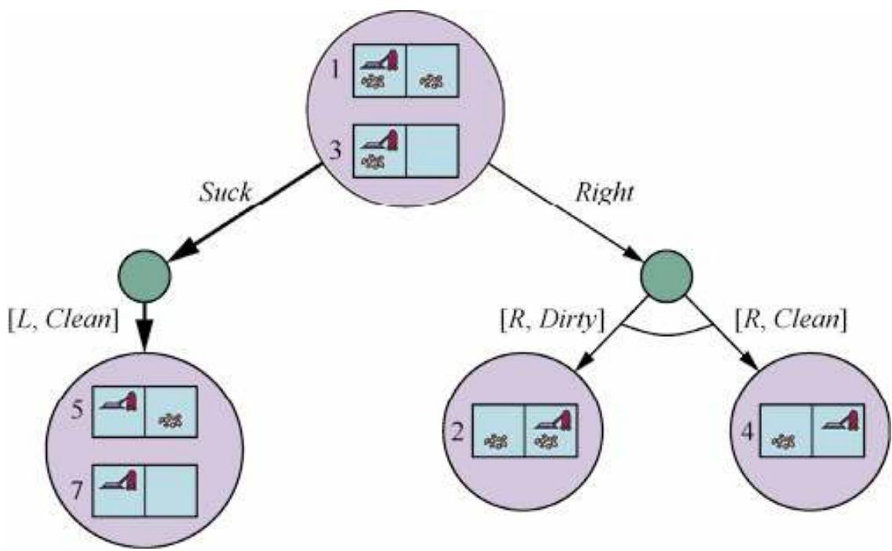  
图4-16局部感知真空吸尘器世界问题的第一层与或搜索树， Suck是解序列中的第一个动作

与标准搜索算法应用于无传感器问题的情况一样，与或搜索算法将信念状态看作和任何其他问题状态一样的黑盒。可以通过检查先前生成的信念状态——它们是当前状态的子集或超集——来改进这一点，就像求解无传感器问题一样。同样可以推导出与无传感器问题中描述的那些算法类似的增量搜索算法。与黑盒方法相比，它们提供了显著的加速。

# 4.4.4 部分可观测环境中的智能体

部分可观测环境中的智能体先对问题形式化，接着调用搜索算法（例如A nd -O r-Search）求解，然后执行解步骤。这种智能体和完全可观测确定性环境中的智能体之间有两个主要区别。首先，问题的解将是一个条件规划而不是一个序列；为了执行if-then-else表达式，智能体需要测试if语句中的条件并执行正确的条件分支。其次，智能体需要在执行动作和接收感知时维护其信念状态。这一过程类似于式（4-5）中的预测-观测-更新过程，但更加简单，因为感知是由环境给出的，而不是由智能体自己计算的。给定初始信念状态b 、动作 a 、感知o ，则新的信念状态为

$$
\boldsymbol {b} ^ {\prime} = \text {U P D A T E} (\text {P R e d i c t} (\boldsymbol {b}, \boldsymbol {a}), o) \tag {4-6}
$$

考虑一个类幼儿园真空吸尘器世界，智能体只能感知当前方格的状态，任一方格在任一时刻都有可


图4-17为此环境中所维护的信念状

能变脏，除非智能体恰好在那一时刻主动清理该方格。 态。

在部分可观测环境中——涵盖绝大多数真实世界环境——维护自身的信念状态是任何智能系统的核心功能。这一功能有很多不同的名称，包括监视 （monitoring）、过滤 （filtering）和状态评估（stateestimation）。式（4-6）称为递归状态评估器，因为它根据前一状态计算新的信念状态，而不是检查整个感知序列。如果智能体不想“落后”，计算速度必须和感知进入的速度一样快。随着环境越来越复杂，智能体将只有时间计算近似信念状态，它可能重点关注感知对当前感兴趣的环境方面的影响。关于这一问题的大部分工作都是用概率论的工具处理随机的连续状态的环境，详见第14章。

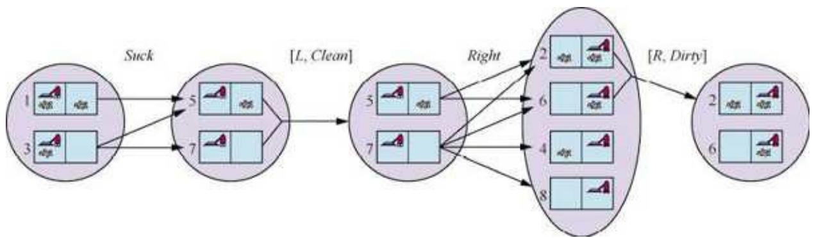  
图4-17在局部感知的类幼儿园真空吸尘器世界中，信念状态维护的两个预测-更新周期

在本节中，我们将展示一个离散环境中的实例，其传感器是确定性的，动作是非确定性的。这个实例中涉及的机器人具有特定的状态评估任务，该任务称为定位 （localization）：即在给定世界地图和一系列感知及行动的情况下，找到自己的位置。机器人放置在图4-18所示的迷宫环境中。它配备了4个声呐传感器，可以判断在4个罗盘方向上是否存在障碍物——外墙或者图中的深色阴影方格。感知以位向量的形式出现，每一位依次代表北、东、南、西方向，所以1011表示北、南、西方向有障碍物。

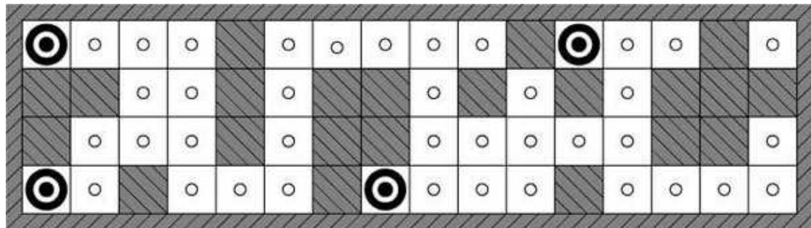  
（a）观测到E1=1011后，机器人的可能位置

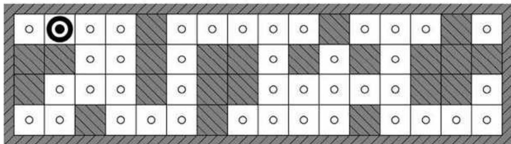  
（b）观测到E=1011和E=1010后，机器人的可能位置  
图4-18机器人的可能位置， $\odot$ ，（a）一次观测 $E _ { 1 } = 1 0 1 1$ 后。（b）移动一个方格并进行第二次观测 $E _ { 2 } = 1 0 1 0$ 后。如果传感器没有噪声且转移模型是准确的，那么只有一个可能位置与这两个观测序列一致

我们假设传感器所提供的数据完全正确，而且机器人拥有正确的环境地图。但遗憾的是，机器人的导航系统发生故障，所以当它执行Right动作时，会随机移动到一个相邻方格。机器人的任务是确定它的当前位置。

假设机器人刚刚启动，并不知道自己的位置——那么它的初始信念状态b 为包含所有位置的集合。接着机器人接收到感知1011，并使用公式 b o = U pdate (1011)进行更新，得到如图4-18a所示的4个位置。查看整个迷宫你会发现这是仅有的4个可以产生感知1011的位置。

接下来，机器人执行 Right 动作，但结果是非确定性的。新的信念状态， $b _ { a } = \mathrm { P }$ redict ( $b _ { o }$ , Right)，包含了与 $b _ { o }$ 中的位置相邻的所有位置。当接收到第二个感知1010时，机器人执行U pdate ( $b _ { a }$ ,1010)，此时信念状态已经只剩图4-18b所示的一个位置。这是下式得到的唯一位置：

# UPDATE(PREDICT(UPDATE(b,1011),Right),1010)

对于非确定性动作，Predict阶段信念状态增加，但是U pdate阶段信念状态又减少回去——只要感知提供了有用的识别信息。有时感知对定位帮助不大：如果存在一个或多个很长的东西向走廊，那么机器人可能会接收到一个很长的1010感知序列，但它永远不会知道它在走廊的哪一位置。但对于地理上存在合理差异的环境，定位往往会迅速收敛到单个点，即使动作是非确定性的。

如果传感器发生故障怎么办？如果我们只能用布尔逻辑进行推理，那么我们就无法判断每个传感器位的正误，相当于没有任何感知信息。但我们将看到，概率推理（第12章）允许我们从故障传感器中提取有用信息，只要它出错的时间不超过一半。

# 4.5 在线搜索智能体和未知环境

到目前为止，我们主要关注使用离线搜索 （offlinesearch）算法的智能体。它们在执行第一个动


作之前就已经计算出一个完整的解。相比之下，在线搜索 （onlinesearch） 智能体则交替进行计算和动作：它首先执行一个动作，然后观测环境并计算下一个动作。在线搜索适用于动态或半动态环境，因为在这些环境中停止不动或计算时间太长都要付出代价。在线搜索在非确定性领域也很有用，因为它允许智能体将计算精力集中在实际发生的偶然事件上，而不是那些也许会发生但很可能不会发生的事件。

当然，这里需要权衡：智能体提前规划得越多，发现自己陷入困境的频率越低。在未知环境中，智能体不清楚存在什么状态或者动作会产生什么结果，必须使用自身的动作作为实验来了解环境。

在线搜索的一个典型实例是地图构建问题 （mapping problem）：机器人放置在一个未知建筑中，它必须进行探索以绘制一个从A到B的地图。逃离迷宫的方法——有抱负的古代英雄所需的知识也是在线搜索算法的实例。然而，空间探索并不是在线探索的唯一形式。以一个新生儿为例：它可能可以做许多举动，却不知道这些动作的后果，而且它只体验过少数几个它能达到的可能状态。

# 4.5.1 在线搜索问题

求解在线搜索问题需要交替进行计算、感知和动作。我们首先假设环境是确定性的和完全可观测的（第17章放宽了这些假设），并规定智能体只知道以下内容。

● A ctions ( s )，状态 s 下的合法动作。  
●c(s,a,s')，在状态s下执行动作a 到达状态 s'的代价。注意，前提是智能体知道 s'是结果。  
● I s -G oal ( s )，目标测试。

特别要注意的是，智能体不能确定Result(s,a )的值，除非它确实在s中执行了a 。例如，在图4-19所示的迷宫问题中，智能体并不知道从(1,1)执行Up动作会到达(1, 2)；也不知道再执行 Down动作会回到(1,1)。在某些应用中可以减少这种无知— —例如，机器人探测器可能知道它是如何移动的，只是不知道障碍物的位置。

最后，智能体可能可以访问一个可容许的启发式函数h(s)，该函数对从当前状态到目标状态的距离进行估计。例如，在图4-19中，智能体可能知道目标的位置，从而可以使用曼哈顿距离启发式函数（3.6节）。

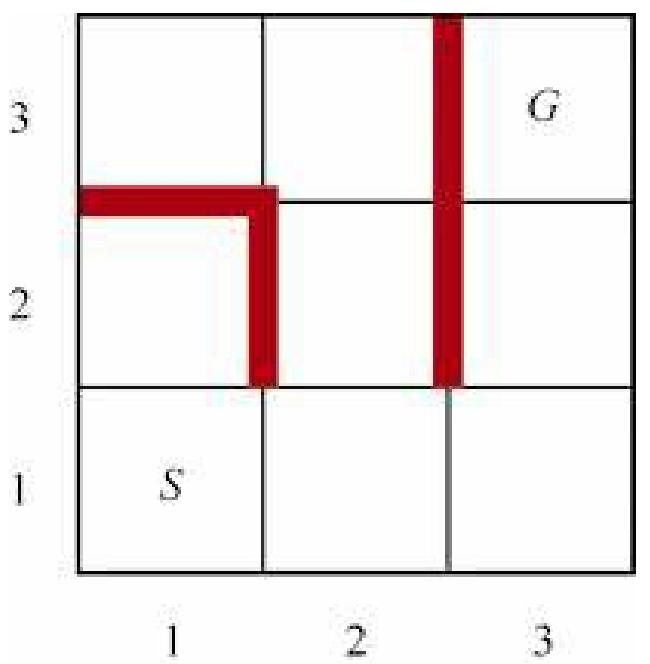  
图4-19 一个简单的迷宫问题。智能体必须从S 出发到达 $G$ ，但它对环境一无所知

通常，智能体的目标是以最小代价到达目标状态。（另一个可能目标是简单地探索整个环境。）代价是智能体在移动过程中产生的总的路径代价。通常将它与智能体事先知道搜索空间时所产生的路径代价（即已知环境中的最优路径）进行比较。在在线算法的术语中，这种比较被称为竞争比（competitive ratio），我们希望它尽可能地小。

在线探索器很容易陷入死胡同 （dead-end）：无法到达任何目标状态的状态。如果智能体不知道每个动作的后果，它可能会“跳进陷阱”，因此永远无法到达目标。一般来说，没有一种算法能在所有状态空间中都避免进入死胡同。以图4-20a中的两个死胡同状态空间为例。对已经访问过状态S 和A的在线搜索算法来说，它无法分辨自己是处于顶部的状态还是底部的状态；根据智能体观测到的感知信息，这两个状态看起来是相同的。因此，它不可能知道如何在两个状态空间中选择正确的动作。这是一个 对手论证 （adversary argument）的实例——想象对手在智能体探索状态空间时构建状态空间，并将目标和死胡同放在它所选择的任何地方，如图4-20b所示。

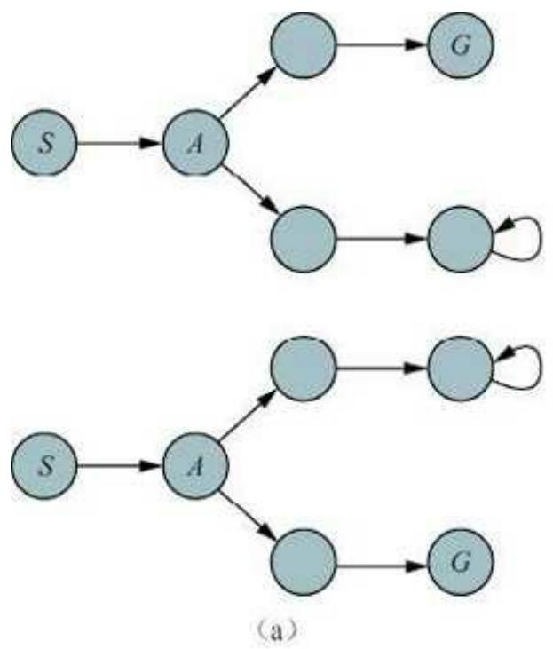

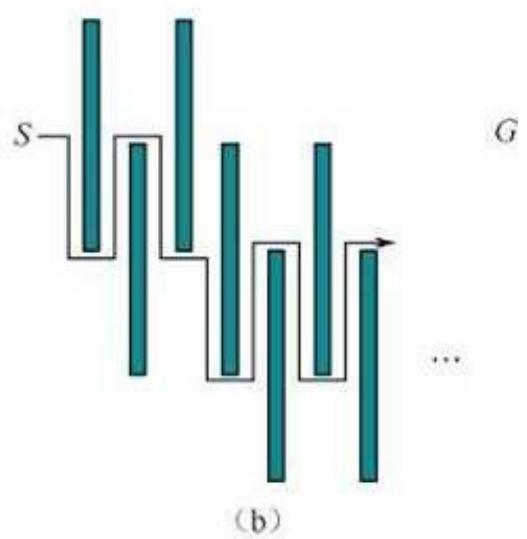

图4-20（a）两个可能将在线搜索智能体引入死胡同的状态空间。任何给定智能体都会在至少一个空间中失败。（b）二维环境实例，将导致在线搜索智能体沿着一条任意低效的路线到达目标。无论智能体做出何种选择，对手都会用另一堵很长很薄的墙来阻挡这条路线，这样智能体所走的路径就会比最优可能路径长得多

死胡同是机器人探索中的一个真正的难点——楼梯、斜坡、悬崖、单行道甚至自然地形中都存在从它出发某些动作不可逆 （irreversible）的状态——没有办法回到之前的状态。我们提出的探索算法只保证在可安全探索 （safely explorable）的状态空间中是有效的，也就是说，从每个可达状态出发都存在可以到达的目标状态。所有动作都可逆的状态空间，如迷宫和8数码，显然是可安全探索的（如果它们有解的话）。我们将在22.3.2节中更深入地讨论安全探索的话题。

即使在可安全探索的环境中，如果存在代价无界的路径，也不能保证竞争比有界。在动作不可逆的环境中，很容易发现上述结论，但事实上，可逆情况下也是如此，如图4-20b所示。因此，通常会根据整个状态空间的大小来描述在线搜索算法的性能，而不是仅仅根据最浅层目标的深度。

# 4.5.2 在线搜索智能体

可观测环境中的在线智能体在每个动作之后都会接收到一个感知，告诉它目前到达了哪一状态，通过这些信息，智能体可以更新它的环境地图。更新后的地图将用于规划下一步。规划和动作交替进行意味着在线搜索算法与之前介绍的离线搜索算法有很大不同：离线算法探索其状态空间 模型 ，而在线算法探索真实世界。例如，A * 可以在空间的某部分扩展一个节点，然后马上在空间的另一相距很远的部分扩展另一个节点，因为节点扩展设计的是模拟动作而非真实动作。

另外，在线算法只能找到其实际占据的状态的后继。为了避免长途跋涉到一个相距较远的状态来扩展下一个节点，按照局部顺序扩展节点似乎更好。深度优先搜索恰好具有这一性质，因为（如果算法不用回溯）下一个扩展节点是前一个扩展节点的子节点。

图4-21为在线深度优先探索智能体（动作是确定性但未知的）。智能体将它的地图存储在一个result[s,a ]表中，记录了在状态 s下执行动作 a 所产生的状态。（对于非确定性动作，智能体可以在results[s,a ]中记录状态集合。）只要当前状态存在未探索过的动作，智能体就会尝试其中一个动作。当智能体尝试完某个状态下的所有动作时，问题就来了。在离线深度优先搜索中，我们只是将状态从队列中删除；而在线搜索中，智能体必须在物理世界中回溯。在深度优先搜索中，这意味着回溯到智能体进入当前状态前的最近状态。为了实现这一点，算法需要维护另一个表，表中列出了每个状态尚未回溯到的前驱状态。如果智能体已经没有可回溯的状态，那么搜索就完成了。

function ONLINE-DFS-Agent(problem, $s^{\prime}$ )returns一个动作  
persistent: $s$ ，a，之前的状态和动作，初始为空result，将 $(s,a)$ 映射到 $s^{\prime}$ 的表，初始为空untried，将s映射到未探索动作列表的表unbacktracked，将s映射到未回溯状态队列的表ifproblem.Is-GoAL(s')then return stopif $s^{\prime}$ 是一个（不在untried中的）新状态then untried[s] $\leftarrow$ problem.ACTIONS(s')if $s$ 不空 thenresult[s,a] $\leftarrow s^{\prime}$ 将s添加到unbacktracked[s']的队尾ifuntried[s']为空thenifunbacktracked[s']为空then return stop $s^{\prime},a\gets null,$ 使得result[s',b]=POP(unbacktracked[s'])的动作belse $a\gets \mathrm{POP}(\mathrm{untried}[s^{\prime}])$ $s\gets s^{\prime}$ return a

我们建议读者在求解图4-19中的迷宫问题时跟踪O nline-DFS-A gent的进度。很容易看到，最坏情况下，智能体最终恰好要遍历状态空间中的每个连接两次。对探索来说，这是最优的；但是，对寻找目标来说，如果在初始状态旁边恰好有一个目标状态，智能体的竞争比将变得无限差。在线迭代加深算法可以解决这一问题；对于均衡树环境，这样一个智能体的竞争比是一个很小的常数。

由于其回溯方法，O nline-DFS-A gent只在动作可逆的状态空间中有效。在一般的状态空间中，有一些更复杂的算法，但是这类算法的竞争比都不是有界的。

# 4.5.3 在线局部搜索

与深度优先搜索一样，爬山搜索在节点扩展上也有局部性。事实上，因为爬山搜索在内存中只保存一个当前状态，它已经是在线搜索算法！遗憾的是，基础算法并不适用于探索，因为智能体会陷入局部极大值而无路可走。此外，不能使用随机重启，因为智能体无法将自己瞬移到一个新的初始状态。

相比于随机重启，我们可以考虑使用随机游走 （randomwalk）来探索环境。随机游走只是从当前状态中随机选择一个可用动作，可以优先考虑尚未尝试的动作。容易证明，当空间有限且可安全探

索时，随机游走最终会找到一个目标或完成探索。 $-$ 但是，这一过程可能非常慢。图4-22为 但是，这一过程可能非常慢。图4-22为一个环境实例，在这个环境中，随机游走将耗费指数级的步骤来寻找目标，因为对于第一行除 S 之外的每个状态，后退的可能性是前进的两倍。当然，这个例子是人为设计的，但是真实世界中许多状态空间的拓扑结构都会导致这类随机游走“陷阱”。

  
图4-21使用深度优先探索的在线搜索智能体。智能体只有在每个动作都可以被其他动作“撤消”的状态空间中才能安全地探索

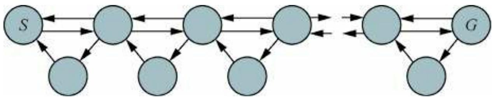  
图4-23一维状态空间上LRTA * 的5次迭代。每个状态都标有 H (s)，即到达目标的当前代价估计值，每个连接的动作代价为1。红色状态表示智能体的位置，每次迭代所更新的代价估计值以双圈标记

图4-22环境实例，随机游走需要耗费指数级的步骤来寻找目标

事实证明，增加爬山法的内存而非随机性是一种更有效的方法。基本思想是，存储从已访问的每个状态出发到达目标所需代价的“当前最佳估计” H ( s )。 H ( s )开始时只是启发式估计，然后根据智能体在状态空间中获得的经验不断更新。

图4-23为一维状态空间中的一个简单示例。在图4-23a中，智能体似乎陷入了位于红色状态的局部极小值。智能体不应该停留在原地，而应该根据其邻居节点的当前代价估计值选择到达目标的最优路径。经由邻居节点s'到达目标的估计代价等于到达s'的代价加上从s'到达目标的估计代价，即c(s, a ,s')+H (s')。在这个示例中，有2个动作，估计代价分别为向左1 +9，向右1 +2，因此最好向右移动。

在图4-23b中，显然，将图4-23a中红色状态的代价估计为2是过于乐观的。因为最佳移动的代价为1，而且其结果状态离目标状态至少还有2步，所以红色状态离目标一定至少还有3步，所以应该相应地更新红色状态的 $H$ ，如图4-23b所示。继续上述过程，智能体将再来回移动两次，每次都会更新 $H$ 并“拉平”局部极小值，直到它逃逸到右侧。

能够实现上述方案的智能体称为 实时学习A* （learning real-time A * ，LRTA * ）智能体，如图4-24所示。同O nline-DFS-A gent一样，它用 result表构建环境地图。它首先更新刚刚离开的状态的代价估计值，然后根据当前的代价估计值选择“显然最佳”移动。一个重要的细节是，在状态 s下尚未尝试的动作总是被假定为以最少的可能代价，即 h ( s )直接到达目标。这种 不确定性下的乐观主义 （optimism under uncertainty）鼓励智能体去探索新的、可能更有希望的路径。

functionLRTA*-AGENT(problem,s',h)returns-个动作

persistent:s,a，之前的状态和动作，初始为空

result，将(s,a)映射到s的表，初始为空

H，将s映射到一个代价估计值的表，初始为空

ifIs-GOAL(s）then return stop

ifs是一个（不在H中的）新状态then $H [ s ] \longleftarrow h ( s )$

ifs不空then

$$
r e s u l t [ s, a ] \leftarrow s ^ {\prime}
$$

$$
H [ s ] \leftarrow \min  _ {b \in \text {A c t i o n s} (s)} \mathrm {L R T A} ^ {*} - \operatorname {C o s t} (\text {p r o b l e m}, s, b, \text {r e s u l t} [ s, b ], H)
$$

$$
\begin{array}{l} a \leftarrow \operatorname {a r g m i n} _ {b \in \text {A C T I O N S} (s)} \text {L R T A} ^ {*} - \text {C o s t} (\text {p r o b l e m}, s ^ {\prime}, b, \text {r e s u l t} [ s ^ {\prime}, b ], H) \end{array}
$$

$$
s \leftarrow s ^ {\prime}
$$

returna

function LRTA*-CosT(problem, $s , a , s ^ { \prime } , H )$ returns一个代价估计值

ifs未定义thenreturn $h ( s )$

elsereturnproblem.ACTION $\mathrm { C o s r } ( s , a , s ) + H [ s { \AA } ]$

图4-24LRTA *-A gent根据相邻状态的值选择动作，智能体在状态空间中移动时更新状态值

LRTA * 智能体保证在任何有限的、可安全探索的环境中都能找到目标。然而，不同于A * ，LRTA* 在无限状态空间中是不完备的——在某些情况下，它可能被无限地引入歧途。在最坏情况下，探索状态数为n 的环境可能需要O ( $n ^ { 2 }$ )步，但通常情况下会比这种情况好得多。LRTA * 智能体只是一 个庞大的在线智能体家族中的一员，可以通过以不同方式指定动作选择规则和更新规则来定义。我们将在第22章中详细讨论这一发源于随机环境的在线智能体家族。

# 4.5.4 在线搜索中的学习

在线搜索智能体初始时对环境的无知为我们提供了一些学习的机会。首先，智能体通过记录它们的每一次经验来学习环境“地图”——更准确地说，学习每种状态下每个动作的结果。其次，当智能体以正确的方式探索状态空间时，局部搜索智能体可以利用局部更新规则获得每个状态代价更准确的估计值。一旦知道代价的准确值，只需移动到代价最低的后继状态就能实现最优决策，也就是说，纯粹的爬山法就是一个最优策略。

如果按照我们的建议在图4-19的环境中跟踪O nline-DFS-A gent的行为，你会注意到智能体不是非常聪明。例如，在它已经知道Up 动作能够从(1,1)到达(1, 2)后，它仍然不知道Down 动作能回到(1, 1)，或者 Up 动作还能从(2, 1)到(2, 2)，从(2, 2)到(2, 3)，等等。一般来说，我们希望智能体能够学到， Up 在不遇到墙的情况下使得 y 坐标值增加， Down 则使得 y 坐标值降低，等等。

要实现这一点，我们需要做两件事。首先，需要对这类一般规则有一个形式的、可显式操纵的表示；到目前为止，信息都被隐藏在名为Result函数的黑盒中。第8～11章将专门讨论这个问题。其次，需要能够根据智能体所得到的具体观测信息构造合适的一般规则的算法。这些内容将在第19章中讨论。

如果我们预计将来会被要求求解多个类似问题，那么投入时间（和内存）使得这些未来搜索更容易是有意义的。有几种方法可以做到这一点，它们都属于 增量搜索 （incrementalsearch）的范畴。我们可以将搜索树保留在内存中，并复用在新问题中未发生改变的部分。我们可以保留启发式代价

函数h 的值，并在获得新信息时更新它们——要么是因为世界发生改变，要么是因为我们计算出了更好的估计值。或者我们可以保留最优路径的g 值，用它们拼凑出一个新的解，并在世界发生改变时对它们进行更新。

小结

本章讨论了部分可观测的、非确定性的、未知的和连续的环境中问题的搜索算法。

●局部搜索算法，如爬山法 ，在内存中只保留少量状态。这些方法已被应用于优化问题，其思想是找到一个高分值的状态，而不考虑进入该状态的路径。研究人员已经开发了一些随机局部搜索算法，包括模拟退火 ，当给定适当的冷却方案时它能返回最优解。  
●许多局部搜索方法同样适用于连续空间中的问题。线性规划 和凸优化 问题服从状态空间形状和目标函数性质上的某些限制，并且允许多项式时间算法，这些算法在实践中往往非常高效。对于一些数学上合式的问题，我们可以使用微积分找到梯度为零的最大值；对于其他问题，我们必须使用经验梯度，即测量两个邻近点间的适应度差值。  
●进化算法 是一种维护状态种群的随机爬山搜索。通过突变 和杂交 （结合状态对）产生新状态。  
●在非确定性 环境中，智能体可以应用与或搜索算法生成应变 规划，无论执行过程中出现何种结果，它都能实现目标。  
●如果环境是部分可观测的，信念状态 表示智能体可能位于的可能状态的集合。  
●标准搜索算法可以直接应用于信念状态空间求解无传感器问题 ，而信念状态与或搜索算法可以求解一般的部分可观测问题。在一个信念状态中逐状态构造解的增量算法通常效率更高。  
●探索问题 发生在智能体对环境的状态和动作一无所知时。对于可安全探索的环境，在线搜索智能体能够构建地图并找到目标（如果存在的话）。根据经验来更新启发式估计值提供了一种避免局部极小值的有效方法。

读者服务：


微信扫码关注【异步社区】微信公众号，回复“e59810”获取本书配套资源以及异步社区15天VIP会员卡，近千本电子书免费畅读。

# 第5章

对抗搜索和博弈

在本章中，我们将探索有其他智能体计划与我们对抗时的环境。

在本章中，我们将讨论竞争环境 （competitiveenvironment），在这种环境中，两个或两个以上的智能体具有互相冲突的目标，这引出了对抗搜索 （adversarialsearch）问题。我们将专注于讨论博


弈 $\_$ ，如国际象棋、围棋和扑克，而不是处理真实世界中的混乱冲突。对人工智能研究人员来说，这些博弈的简化特性是一个优势：博弈状态很容易表示，智能体通常仅能执行少数几个动作，而且动作的效果由明确的规则定义。对于体育比赛（如槌球和冰球），描述更加复杂，可能动作的范围更大，而且定义动作合法性的规则也不够明确。除足球机器人外，体育比赛并没有引起人工智能社区的很大兴趣。

# 5.1 博弈论

对于多智能体环境，我们至少可以有3种观点。第一种观点适用于智能体数量非常大的情况，即把它们看作一个经济 （economy）整体来考虑，这让我们可以做出例如“需求增长会导致价格上涨”这样的预测，而不需要预测任何个体智能体的动作。

第二种观点是，我们可以认为对抗智能体只是环境的一部分——这一部分让环境变成非确定性的。但如果我们以对雨建模一样的方式（例如，雨有时下，有时不下）对对手进行建模，我们就会忽略对手正在积极地尝试击败我们这一事实，而雨没有这样的意图。

第三种观点是用对抗博弈树搜索技术显式地对对抗智能体建模。这就是本章所涵盖的内容。我们从一类受限的博弈开始，定义最优移动并寻找最优移动的算法——极小化极大搜索 （minimaxsearch），它是与或搜索的一种推广（见图4-11）。我们指出， 剪枝 （pruning）通过忽略搜索树中对最优移动没有影响的部分来提高搜索效率。对于非平凡博弈，我们通常没有足够的时间以确保找到最优移动（即使使用剪枝），我们不得不在某个时刻停止搜索。

对于每一个我们选择在那里停止搜索的状态，我们都需要知道谁是获胜者。要回答这个问题，有一个选择：可以基于状态特征应用启发式评价函数 来估计谁是获胜者（5.3节），或者可以从该状态开始快速模拟至博弈结束，再取多次模拟结果的平均值（5.4节）。

5.5节讨论了包含机会因素（通过掷骰子或洗牌）的博弈，5.6节讨论了 不完美信息 （imperfectinformation）博弈（如扑克和桥牌，即并非所有牌对所有玩家都可见）。

双人零和博弈

人工智能领域中最常研究的博弈（例如国际象棋和围棋）是博弈论学者所称的确定性、双人、轮流、 完美信息 （perfect information）的 零和博弈 （zero-sum game）。“完美信息”是“完全可观

注 “零和”意味着对一方有利的东西将对另一方同等程度有害：不存在“双赢”结果。在博弈论中，我们通常用移动 （move）作为“动作”（action）的同义词，用局面（position）作为“状态”（state）的同义词。

$\underline { { \cdots } } = \underline { { \cdots } }$ 两个参与者轮流移动，直到博弈结束。博弈结束时，获胜者得分，而失败者受到惩罚。可以使用以下元素对博弈进行形式化定义。

●S ：初始状态 ，指定博弈开始时如何设置。  
●To-Move(s)：在状态s下，轮到其移动的参与者。  
●A ctions(s)：在状态s下，全体合法移动的集合  
● R esult ( s , a )： 转移模型 ，定义状态 s 下执行动作 a 所产生的结果状态。  
●Is-Terminal(s)： 终止测试 （terminaltest），博弈结束时返回真，否则返回假。博弈结束时的状态称为 终止状态 （terminal state）。  
●U tility(s, p)：效用函数 （也称为目标函数或收益函数），定义博弈结束时终止状态s下参与者 $p$ 得到的最终的数值收益。在国际象棋中，结果为赢、输或平局，收益分别为1、0或1/2。


一些博弈存在更大范围的可能结果，例如，西洋双陆棋的收益范围为0～192。

同第3章一样，初始状态、A ctions 函数和R esult 函数定义了 状态空间图 （state space graph）——

在图中，顶点表示状态，边表示移动，一个状态可以通过多条路径到达。如第3章所述，我们可以在图的一部分上叠加 搜索树 （search tree）以确定下一步移动。我们将完整的 博弈树 （gametree）定义为搜索树，它会记录每个一直到终止状态的移动序列。如果状态空间本身是无界的，或者博弈规则允许局面可以无限次重复，那么博弈树可能是无限的。

图5-1为井字棋（圈叉游戏tic-tac-toe）的部分博弈树。从初始状态开始， max 有9种可能的移动。游戏交替进行，max 放x ，min 放o ，直到到达对应于终止状态的叶节点，即一个玩家占据某一行，或者所有方格都被填满。每个叶节点上的数字是对 max 来说该终止状态的效用值，值越高对max 越有利，对 min 越不利（这也是玩家名字的由来）。

对井字棋来说，博弈树相对较小——不超过9!=362 880个终止节点（只有5478个不同状态）。但是对国际象棋来说，节点数超过10 40 ，所以博弈树被认为是一个在物理世界中无法实现的理论结构。

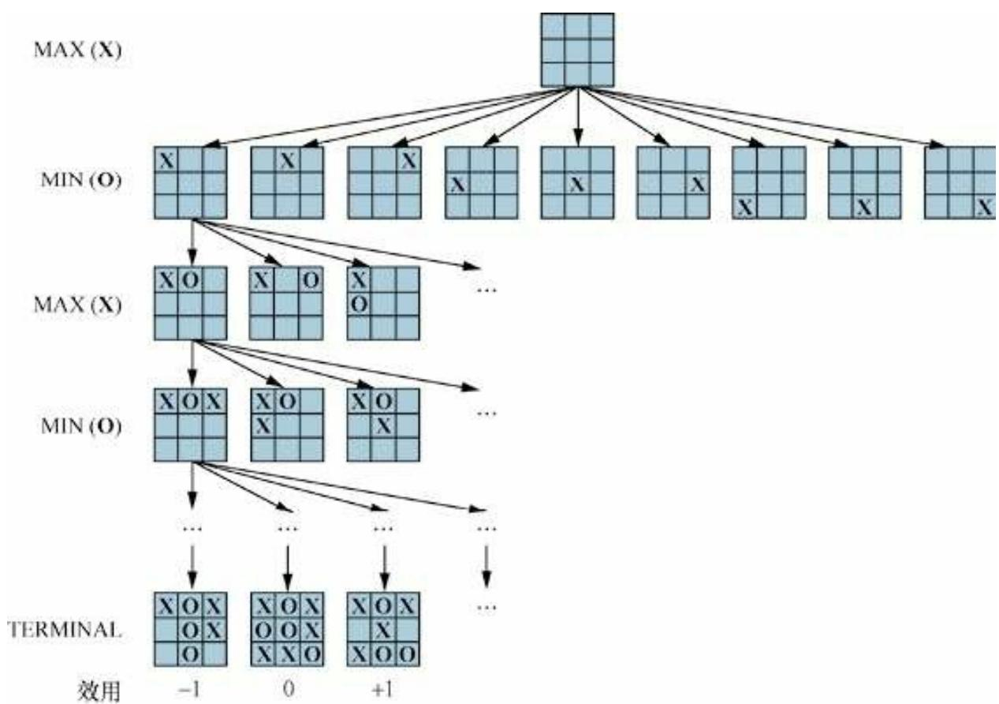  
图5-1 井字棋的（部分）博弈树。最上面的节点是初始状态， max 先移动，在某个空位上放一个 x。我们展示了树的一部分，给出min(o )和max(x )的交替移动，直到最终到达终止状态，根据博弈规则为终止状态分配效用值

# 5.2 博弈中的优化决策

max想要找到通往胜利的动作序列，但min 不希望max 获胜。这意味着max 的策略必须是一个条件规划— —一个随机应变策略，指定对 min 的每个可能移动的响应。在具有二元结果（赢或输）的博弈中，我们可以使用与或搜索（4.3.2节）生成条件规划。事实上，对于这类博弈，博弈的获胜策略的定义与非确定性规划问题的解的定义相同：在这两种情况下，无论“另一方”做什么，都必须保证己方能获得理想结果。对于具有多个结果分数的博弈，我们需要一种更一般的算法，即 极小化极大搜索 。

考虑图5-2中的简单博弈。根节点上 max 的可能移动被标记为 a 、 a 和 a 。 min 对 a 的可能响应为 b 1、 b 2、 b 3等。这个特殊游戏在 max 和 min 各移动一次后结束。（注意，在某些游戏中，“move”一词意味着双方都执行了一次移动，因此， ply 一词被用来明确表示一个玩家的一次移动，即我们在博弈树中又深入了一层。）博弈中终止状态的效用值范围为2～14。

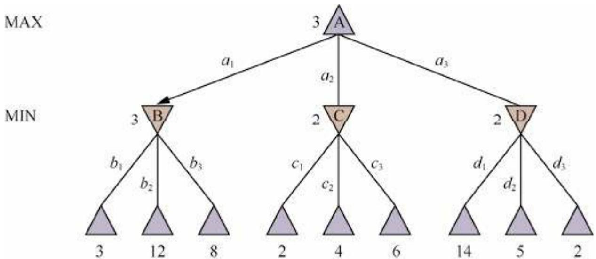  
图5-2 二层博弈树。△节点为“max节点”，即轮到 max 移动， $\triangledown$ 节点为“min 节点”。终止节点显示max的效用值，其他节点标记有它们的极小化极大值。max 在根节点的最佳移动是a ，因为它指向极小化极大值最高的状态，而 min的最佳响应是 $b _ { 1 }$ ，因为它指向极小化极大值最低的状态

给定博弈树，可以通过计算树中每个状态的极小化极大值 （minimaxvalue）确定最优策略，记为Minimax(s)。某一状态的极小化极大值是指，假设从该状态到博弈结束两个参与者都以最优策略行动 ，到达的终止状态对于max的效用值。终止状态的极小化极大值就是它的效用值。在非终止状态下，轮到 max移动时，max倾向于移动到极小化极大值最大的状态，而 min 倾向于移动到极小化极大值最小的状态（对max来说值最小，因此对min来说值最大）。所以有：

$$
\begin{array}{r l} & {\mathrm {M I N I M A X} (s) =} \\ & {\left\{ \begin{array}{l l} {\mathrm {U T I L I T Y} (s, \mathrm {M A X})} & {\text {如 果} \mathrm {I S - T E R M I N A L} (s)} \\ {\max  _ {a \in \text {A c t i o n s} (s)} \mathrm {M I N I M A X} (\mathrm {R E S U L T} (s, a))} & {\text {如 果} \mathrm {T O - M O V E} (s) = \mathrm {M A X}} \\ {\min  _ {a \in \text {A c t i o n s} (s)} \mathrm {M I N I M A X} (\mathrm {R E S U L T} (s, a))} & {\text {如 果} \mathrm {T O - M O V E} (s) = \mathrm {M I N}} \end{array} \right.} \end{array}
$$

让我们将上述定义应用于图5-2中的博弈树。底层的终止节点从U tility函数中获取它们的效用值。第一个 min节点，标记为B，存在3个后继状态，值分别为3、12和8，因此它的极小化极大值为3。类似地，另外两个min 节点的极小化极大值都为2。根节点为max节点，它的后继状态的极小化极大值分别为3、2和2，因此，它的极小化极大值为3。我们还可以在根节点处确定极小化极大决策 （minimaxdecision）：动作a 是max 的最优选择，因为它指向极小化极大值最大的状态。

max的最优策略假设min也是按照最优策略动作。如果min 不按照最优策略动作呢？那么max至少会表现得与它面对最优对手时一样好，甚至可能更好。然而，这并不意味着，面对次优对手时选