扩展形式与我们在第5章中所看到的博弈树的区别在于，它能够捕捉部分可观测性。博弈论者使用不完美信息 （imperfectinformation）这一术语来描述参与者对博弈的实际状态的不确定性。遗憾的是，逆向归纳法不适用于不完美信息博弈，而且一般来说，不完美信息博弈比完美信息博弈要复杂得多。

我们在5.6节中看到，在四国军棋这样的部分可观测游戏中，参与者可以在 信念状态 （beliefstate）空间上创建一棵博弈树。通过这棵树，我们可以看到在某些情况下，参与者可以找到导致强制将死对方的一个移动序列（一种策略），不论实际的初始状态是什么，也不论对手使用什么策略。然而，当无法保证将死对方时，第5章的方法并不能告诉参与者该做什么。如果参与者的最佳策略取决于对手的策略（反之亦然），那么极小化极大（或 ）方法本身无法找到解。扩展形式确实让我们能够找到解，因为它表示了所有参与者的信念状态——博弈论者称之为 信息集（information set）。从这个表示中我们可以找到均衡解，就像我们处理正则形式的博弈一样。

举一个序贯博弈的简单例子，我们在图17-1所示的4×3世界中放置两个智能体，并让它们同时移动，直到其中一个智能体到达一个出口方格并获得该方格的收益。如果我们规定，当两个智能体试图同时移动到同一个方格时，它们将不会发生任何移动（这在交通十字路口中是十分常见的），那么一些纯策略可能会永远停滞不前。因此，智能体需要使用一个混合策略来在这个游戏中取得良好的表现：在前进和原地不动之间随机选择。这正是以太网中用于解决数据包冲突问题的方法。

我们接着考虑一种非常简单的扑克游戏的变体。这个扑克游戏中的牌堆只有4张牌，两张A和两张K。我们给每人发一张牌。首先，第一个玩家可以选择将赌注从1点加码到2点，或者选择过牌。如果玩家1选择过牌，那么游戏结束；如果玩家1加码赌注，那么玩家2可以选择 叫牌 ，即接受游戏的赌注为2点这一事实，也可以选择 弃牌 ，直接丢掉1点。如果游戏没有以弃牌的方式结束，那么玩家的收益将取决于牌面：如果两个玩家拥有相同的牌，那么他们的收益便是0；否则，持有K的玩家将赌注支付给持有A的玩家。

这个博弈的扩展形式树如图18-5所示。玩家0即为 Chance；玩家1和2用三角形表示。每个动作都被描述为一个带标签的箭头，对应于加码、过牌、叫牌或弃牌，对 Chance 而言，4种标签代表了4种可能的牌（“AK”意味着玩家1得到A，玩家2得到K)。终止状态用矩形表示，其中标注着对应的玩家1和玩家人2的收益。信息集由带标记的虚线框表示。例如， $I _ { 1 , 1 }$ 表示玩家1的回合的信息集，他知道自己有A（但不知道玩家2有什么）。在信息集 $I _ { 2 . 1 }$ 所表示的玩家2的回合中，她知道自己有一张A，玩家1已经加码，但她不知道玩家1有什么牌。（由于二维纸张的限制，我们用两个框来表示该信息集，而不是一个框。）

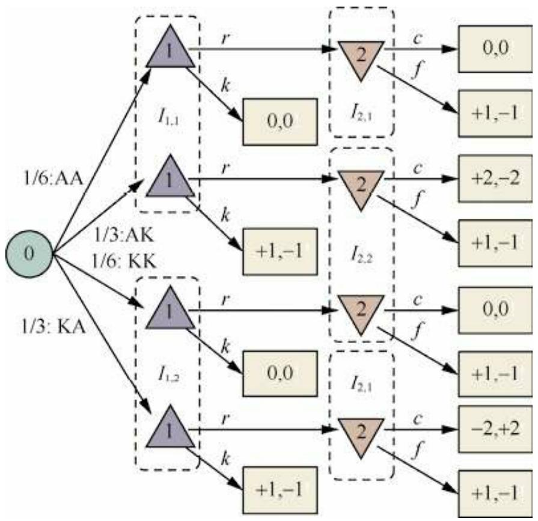  
图18-5 一种简化版本的扑克的扩展形式，有2个玩家，只有4张牌。移动是 r （加码）、 $f$ （弃牌）、 c（叫牌）和k（过牌）

求解扩展博弈的一种方法是将其转化为正则形式博弈。回想一下，正则形式是一个矩阵，其中每一行都标有玩家1的纯策略，每一列标有玩家2的纯策略。在一个扩展博弈中，玩家i的一个纯策略是对应于玩家的每个信息集的一个动作。所以在图18-5中，玩家1的一个纯策略可以是“在 $I _ { 1 . 1 }$ （即拥有A）时加码，在 $I _ { 1 , 2 }$ （即拥有K)时过牌”。在下面的支付矩阵中，我们称这个策略为 $r k$ 。同样，对玩家2来说，我们用cf策略表示“当我有A时叫牌，当我有K时弃牌”。因为这是一个零和博弈，下面的矩阵只给出了玩家1的收益；玩家2的收益总是其相反数：

```txt
2:cc 2:cf 2:ff 2:fc   
1:rr0 -1/61 7/6   
1:kr-1/3 -1/65/6 2/3   
1: rk 1/3 0 1/6 1/2   
1:kk0 0 0 0 
```

这个博弈非常简单，它有两个纯策略均衡，我们已经在表格中用粗体标出：玩家2的cf，玩家1的rk或kk。但一般来说，我们可以通过将博弈转换为正则形式，然后使用标准线性规划方法找到一个解（通常是一个混合策略）来解决扩展博弈。这种方法在理论上是可行的。但如果玩家拥有 $I$ 个信息集，每个信息集拥有a 个行动，那么他便拥有 aI 个纯策略。换句话说，正则形式矩阵的大小与信息集的数量成指数关系，所以在实践中，这种方法只适用于包含十几个状态的小型博弈树。像双人德州扑克这样的博弈有大约10 18 个状态，这样大的规模使得这种方法完全不可行。

有什么替代方案吗？在第5章中，我们看到了 搜索如何通过递增地生成树、裁剪一些分支以及启发式地评估非终止节点来处理拥有巨大博弈树的完美信息博弈。但这种方法不适用于不完美信息博弈，原因有以下两点：首先，这种博弈中的剪枝更加困难，因为我们需要考虑组合多个分支的混合策略，而不是总是选择最佳分支的纯策略。其次，这种博弈中对非终止节点的启发式评价也更加困难，因为我们处理的是信息集，不是单个状态。

科勒等人（Kolleretal. , 1996）试图使用另一种扩展博弈的表示方式来挽救这个局面，他们称之为

序列形式 （sequenceform），它的复杂度关于树的规模上仅是线性的，而不是指数量级的。序列形式表示的内容不是策略，而是树中的路径；路径数等于终止节点数。标准的线性规划方法可以再次用于这种表示。由此产生的系统可以在一到两分钟内求解含有25 000个状态的扑克游戏变体。与正则形式相比，这是一个指数级别的加速，但仍然远远不够处理含有10 18 个状态的双人德州扑克。

如果我们不能处理含有10 $^ { 1 8 }$ 个状态的博弈，也许我们可以通过把博弈改为更简单的形式来简化问题。例如，如果我持有一张A，并考虑下一张牌会让我凑成一对A的概率，那么我就不必关心下一张牌的花色；根据扑克的规则，任何一种花色都会产生相同效果。这意味着可以形成一种博弈的抽象 （abstraction），使得花色得以被忽略。最终的博弈树将会缩小4!=24倍。假设我们可以求解这个小博弈；这个博弈的解又与原始博弈有何关联？假设没有玩家会使用同花这一牌型（唯一一个让花色起作用的牌型），那么抽象博弈的解也将是原始博弈的解。然而，如果存在任一玩家考虑使用同花牌型，那么抽象博弈得到的解将只是原始博弈的一个近似解（但我们有可能计算出误差界）。

我们可以在许多情形下使用抽象的手段。例如，在一个每个玩家都有两张牌的博弈中，如果我拥有一对Q，那么其他玩家手牌可以被抽象为3个类：更大的（只有一对K或一对A）、相同的（一对Q）或者更小的（其他所有牌型）。然而，这种抽象可能太粗糙了。一个更好的抽象应该把“更小的”这一类情况细分为，例如，中对（从9到J的对子）、低对（更小的对子）和无对。上述的例子都是针对状态的抽象；同样的，我们也可以对动作进行抽象。例如，我们可以将投注限制为取值100 、101 、102 或103 ，而不是从1到1000之间的每个整数。或者我们可以忽略其中一轮的赌注。我们也可以通过只考虑可能交易的子集来对机会节点进行抽象。这相当于围棋程序中所使用的rollout技术。通过汇总所有这些抽象方法，我们可以将德州扑克的10 18 个状态减少到10 7 个状态，这个规模大小的问题可以用现有的技术求解。

在第5章中，我们已经见识过Libratus和DeepStack等扑克程序是如何在（双人）限注德州扑克中击败人类冠军玩家的。最近，Pluribus程序能够以两种形式在六人扑克游戏中击败人类冠军：一个桌上有1个人与5个程序副本，以及一个桌上有5个人与1个程序副本。这两种情形在复杂度上有一个巨50大的飞跃。对于一个对手的情况，对手的隐藏牌型有 =1225种可能。但如果存在5个对手，就有50选10约100亿种可能。Pluribus完全利用自我博弈的方式发展出一种基线策略，然后在实际博弈过程中修改策略以应对特定情况。Pluribus使用了多种技术的组合，其中包括蒙特卡罗树搜索、有限深度搜索和抽象。

扩展形式是一种通用的表示方式：它可以处理部分可观测的、多智能体的、随机的、序贯的、实时的环境，即2.3节所示环境属性列表中的大多数困难情况。但扩展形式也有两个局限性。首先，它不能很好地处理连续的状态和动作［尽管针对连续的情况已经有了一些扩展方法，例如， 古诺竞争 （Cournot competition）理论使用博弈论来解决两家公司在一个连续的空间中为他们的产品选择价格的问题］。其次，博弈论假设博弈是已知的 。博弈的某些部分可能被设定为某些参与者不可观测的，但必须知道哪些部分是不可观测的。当参与者随着时间的推移了解了博弈的未知结构时，这个模型就会开始失效。现在，让我们查看每一种不确定性的来源，以及它们是否可以在博弈论中进行表示。

动作 ：没有一种简单的方法能够在表示博弈的同时让参与者能够发现哪些动作是可用的。考虑计算机病毒编写者和安全专家之间的博弈。要解决的部分问题是预测病毒编写者下一步将采取什么行动。

策略 ：博弈论非常擅长表达“其他参与者的策略最初是未知的”这一观点——只要我们假设所有的智能体都是理性的。该理论并没有说明当其他参与者不完全理性时该怎么做。贝叶斯-纳什均衡（Bayes–Nash equilibrium）的概念部分地解决了这个问题：它是一个关于一个参与者对其他参与者的策略的先验概率分布的均衡，换句话说，它表达了一个参与者对其他参与者可能采取的策略的信念。

机会 ：如果一个博弈依赖于掷骰子，那么我们可以很容易地将其建模为一个具有均匀分布结果的机会节点。但如果这个骰子可能是不公平的呢？我们可以用另一个位于树的更高处的机会节点来表示，该节点拥有“骰子是公平的”与“骰子是不公平的”的两个分支，同时使得每一分支中的对应节点位于相同的信息集中（也就是说，参与者们不知道骰子是否公平）。如果我们怀疑对方知道这一信息，会发生什么？此时我们可以添加 另一个 机会节点，其中它的一个分支代表对手知道的情况，

另一个分支则代表对手不知道。

效用 ：如果我们不知道对手的效用怎么办？同样的，这也可以用一个机会节点来建模，使得在每个分支中其他智能体知道自己的效用，但我们不知道它们的效用。但如果我们不知道自己的效用呢？例如，如果我不知道自己会有多喜欢厨师的沙拉，我怎么知道订购一份沙拉是否是理性的呢？我们可以用另一个机会节点来建模，它指定了沙拉不可观测的“内在品质”。

因此，我们可以认识到博弈论擅长表示大多数不确定性的来源，但代价是每次添加另一个节点时树的规模都要翻倍；这种行为会导致树的规模很快就增长到巨大并且难以驾驭。出于对这一点和其他问题的考虑，博弈论主要被用于分析处于平衡状态的环境，而不是用于控制环境中的智能体。

# 18.2.5 不确定收益与辅助博弈

在第1章中，我们提到了设计能够在不确定人类真实目标下运行的人工智能系统的重要性。我们在第16章中介绍了一个关于个人偏好不确定性的简单模型，并以榴莲味冰激凌为例。通过在模型中添加一个新的潜在变量来表示未知的偏好，再加上一个适当的传感器模型（例如，观测冰激凌小样品的味道），不确定的偏好就可以以自然的方式得到处理。

第16章也研究了关机问题 （off-switch problem）：我们展示了一个对人类偏好不确定的机器人，它会服从人类并允许自己被关闭。在这个问题中，机器人 R对人类的偏好是不确定的，但是我们把 $H$ 的决定（是否关闭R）建模为她对R提出的动作的偏好的一个简单的、决定性的结果。在这里，我们将这个想法概括为一个完整的双人博弈，并称为 辅助博弈 （assistance game），其中 $H$ 和R都是玩家。我们假设H 遵循自己的偏好 $\pmb \theta$ 并根据它们采取行动，而R对 H 的偏好有着先验概率 。收益由 定义，并且对两个玩家来说是相同的： H 和 R 都希望最大化 H 的收益。通过 $\pmb \theta$ $H$ $R$ $H$ 这种方式，辅助博弈为第1章所介绍的有益人工智能概念提供了一个形式化模型。

除 $R$ 在开关问题中表现出的顺从行为（这是一种受限制的辅助博弈）外，在一般辅助博弈中作为均衡策略出现的其他动作还包括 $H$ 的动作和 $R$ 的动作，我们将前者描述为教学、奖励、命令、纠正、示范或解释，将后者描述为寻求许可、从示范中学习、偏好启发等。这些行为的关键在于它们无须形式化：通过求解博弈问题， $H$ 与 $R$ 自己解决了如何将偏好信息从 $H$ 传递给 R，从而使 $R$ 对$H$ 的服务更周到，我们无须事先规定 $H$ 将“给予奖励”或 $R$ 将“遵循指示”，尽管这些名词可能是对他们最终行为方式的合理解释。

为了进一步阐释辅助博弈，我们将考虑 回形针博弈 （paperclip game）。这是一个非常简单的博弈，在这个博弈中，人类 $H$ 具有向机器人 R发出一些关于她偏好的信息的动机。 R能够理解所发出的信号，这是因为它能解决这个博弈，因此可以理解 $H$ 的偏好并理解她以某种方式发出信号的原因。

博弈的步骤如图18-6所示，其中包括制作回形针和订书钉。 $H$ 的偏好由一个支付函数表示，该函数取决于制作的回形针和订书钉的数量，两者之间存在一个明确的“汇率”。 $H$ 的偏好参数 $\pmb \theta$ 表示回形针的相对价值（以美元为单位），例如，她可能认为回形针的价格是 $\theta = 0 . 4 5$ 美元，这意味着订书钉的价格是 $1 - \theta = 0 . 5 5$ 美元。所以，如果 H 制作了 $p$ 个回形针和s个订书钉，她的收益将是 $p \theta + s ( 1 - \theta )$ 美元。 $R$ 的先验概率是 $P ( \theta ) = U n i f o r m ( \theta ; 0 , 1 )$ 。在这个博弈中， $H$ 先采取行动，她可以选择制作2个回形针、制作2个订书钉或者每样制作1个。然后 $R$ 可以选择制作90个回形针、制作90个订书钉或者每样制作50个。

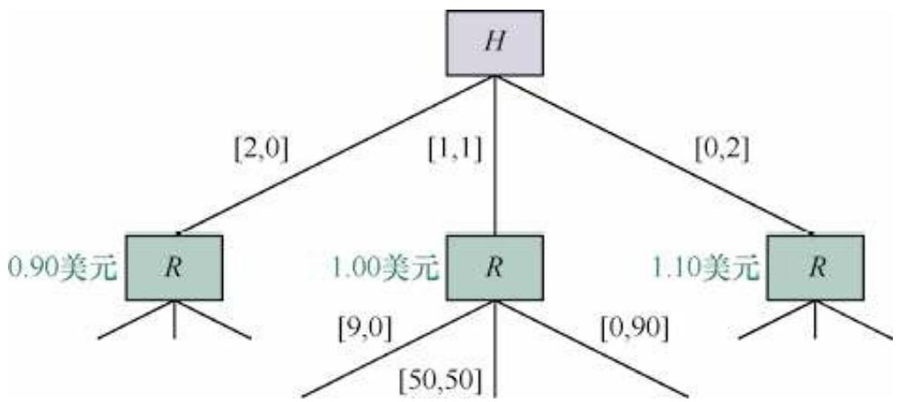  
图18-6 回形针博弈。每个分支都标有[p , s]，表示该分支制作的回形针和订书钉的数量。人类 $H$ 可以选择制作2个回形针、制作2个订书钉或者每样制作1个。（绿色斜体的值是假设 $\theta = 0$ ，在博弈结束时 $H$ 的值。）然后机器人 R可以选择制作90个回形针、制作90个订书钉或者每样制作50个

注意，如果 $H$ 单独做这件事，她只会制作两个订书钉，总价值为1.10美元（见图18-6中对树的第一层的标注）。但 $R$ 正在观测，并从 $H$ 的选择中学到了知识。它到底学到了什么？这取决于 $H$ 如何选择。而 $H$ 是如何做出选择的？那要看 $R$ 会怎么解释了。我们可以通过找到纳什均衡来解决这个循环。这种情况下的纳什均衡是唯一的，并且可以通过应用短视最佳反应来找到：选择 $H$ 的任一策略；根据 $H$ 的策略，为 $R$ 选择最佳策略；根据 R的策略，为 $H$ 选择最佳策略；以此类推。该过程如下所示。

（1）从 $H$ 的贪心策略开始：如果她偏好回形针，就制作2个回形针；如果她偏好订书钉，就制作2个订书钉；如果她没有偏好，就每样制作1个。  
（2）考虑到H 的策略， R必须考虑3种可能性。

a. 如果 R看到 $H$ 制作了两个回形针，制作推断她更偏好回形针，所以它现在相信回形针的值在0.5和1.0之间均匀分布，均值为0.75。在这种情况下，它的最佳计划是为 $H$ 制 作90个回形针，预期价值为67.5美元。  
b. 如果 $R$ 看到 $H$ 每样制作了1个，它推断她对回形针和订书钉的价值估计都是0.50，所以 最佳选择是每样制作50个。  
c. 如果 R看到 $H$ 制作了2个订书钉，那么按照与a中相同的原因，它应该制作90个订书钉。

（3）考虑到R的这个策略， $H$ 现在的最佳策略与步骤1中的贪心策略稍有不同。鉴于 $R$ 在观测到她每样制作一个后的反应是每样制作50个，那么如果她对两个物品不是完全无偏好，而是接近于无偏好的，她最好选择每样制作1个。事实上，如果她对回形针的估价在0.446到0.554之间，那么她的最优策略就是每样制作1个。  
（4）考虑到 $H$ 的新策略， $R$ 的策略保持不变。例如，如果她选择每样制作1个，它就推断回形针的值在0.446和0.554之间均匀分布，平均值为0.5，所以最佳选择是每样制作50个。因为 $R$ 的策略与第2步中的策略相同， $H$ 的最佳反应也将与第3步相同，那么我们就找到了均衡。

根据她的策略， $H$ 实际上是在用一种从均衡分析中产生的简单代码（或者说是一种语言）来告诉R她的偏好。注意，R从来没有确切地了解 $H$ 的偏好，但它了解的信息足以让它以采取她认为的最优行动，也就是说，它的行动与它确切地知道她的偏好时所做的行动相同。在上述假设以及 $H$ 正确地进行博弈的假设下， R被证明是有益于 $H$ 的。

短视最佳反应适用于这个例子和其他类似的例子，但不适用于更复杂的情况。我们可以证明，如果不存在会导致协调问题的关系，寻找辅助博弈的最优策略组合可以简化为求解一个状态空间为博弈基础状态空间加上人类偏好参数 $\pmb \theta$ 的POMDP。POMDP通常很难求解（17.5节），但是表示辅助博弈的POMDP有额外的结构，因此有一些更高效的算法适用于它。

辅助博弈可以进一步推广，以处理多个人类参与者、多个机器人、不完全理性的人类、不知道自己偏好的人类等情形。通过提供一个因子化表示或结构化表示的动作空间，而不是像回形针博弈中那样的简单原子动作，交流的机会便会大大增加。到目前为止，我们对这些变体的研究很少，但我们预计辅助博弈的关键性质仍然是正确的：机器人越智能，对人类的结果就越好。

# 18.3 合作博弈论

回想一下，在由合作博弈刻画的决策场景中，智能体可以形成相互合作的具有约束力的协约。与单独采取行动的情况相比，它们可以从额外的价值中获益。

我们首先将介绍一类 合作博弈 （cooperative game）的模型。在形式上，这些博弈可以看作“具有特征函数形式的可转移效用的合作博弈”。该模型的思想是，当一群智能体正在合作时，整体将获得一定的效用值，然后在群体成员之间进行分配。模型没有说明智能体将采取什么动作，博弈结构本身也没有说明如何分配获得的效用值（之后我们会具体说明）。

形式上，我们用公式G =(N, ν）表示合作博弈， $G$ 是由一组参与者 和一个特征函数 （characteristic function） ν 定义的，对参与者的每个子集 $c$ $\pmb { N }$ ，该函数给出了这组参与者如果选择一起工作所能获得的收益值。

通常情况下，我们假设参与者的空集值为 ，并且该函数是非负的（对所有 C， ）。在某些博弈中，我们进一步假设参与者独自采取行动会导致一无所获：对所有i∈N，v（{）=0。

# 18.3.1 联盟结构与结果

我们一般称参与者子集 $C$ 称为联盟 （coalition）。在日常使用中，“联盟”一词意味着一些有着共同目标的人的集合（如“制止枪支暴力联盟”），但在这里我们将把参与者的任何子集称为“联盟”，并把所有参与者的集合 $N$ 称为 大联盟 （grand coalition）。

在我们的模型中，每个参与者必须选择加入一个联盟（可以是只有一个参与者的联盟）。因此，联盟形成了一组参与者的 划分 （partition）。我们称这种划分为 联盟结构 （coalition structure）。在形式上，参与者集合N上的联盟结构是指联盟集合 ，满足

$$
C _ {i} \neq \{\}
$$

$$
C _ {i} \subseteq N
$$

$$
C _ {i} \cap C _ {j} = \{\} \text {对 所 有} i \neq j \in N
$$

$$
C _ {1} \bigcup \dots \bigcup C _ {k} = N
$$

例如，如果我们有 $N = \{ 1 , 2 , 3 \}$ ，则有7种可能的联盟

{1}, {2}, {3}, {1, 2}, {2, 3}, {3, 1}和{1, 2, 3}

以及5种可能的联盟结构

$\{ \{ 1 \} , \{ 2 \} , \{ 3 \} \} , \{ \{ 1 \} , \{ 2 , 3 \} \} , \{ \{ 2 \} , \{ 1 , 3 \} \} , \{ \{ 3 \} , \{ 3 \} , \{ 3 \} \} , \{ \{ 3 \} , \{ 1 , 2 \} \} \# \{ 1 , 2 , 3 \} \}$

我们使用符号 $C S \left( N \right)$ 表示参与者集合 $N$ 上的所有联盟结构的集合， CS(i)表示参与者i所属的联盟。

博弈的 结果 （outcome）是由参与者做出的选择［包括决定组成哪个联盟，以及选择如何分配每个联盟所获得的ν(C)值］决定的。形式上说，给定由 $( N , v )$ 定义的合作博弈，结果是由联盟结构和支付向量 （payoff vector） $\pmb { x } = ( \pmb { x } _ { 1 3 } \cdots , \pmb { x } _ { n } )$ （其中 $x _ { i }$ 是归属参与者 i 的值）组成的对( CS , x)。收益必须满足每个联盟C在其成员内分配它所有的值ν(C)的约束：

$$
\sum_ {i \in C} x _ {i} = \nu (C) \quad \text {对 所 有} C \in C S
$$

例如。给定博弈 ，其中， $\nu ( \{ 1 \} ) = 4 _ { \mathrm { ~ H ~ } } \nu ( \{ 2 , 3 \} ) = 1 0$ ，一个可能的结果是

$$
(\{\{1 \}, \{2, 3 \} \}, (4, 5, 5))
$$

也就是说，参与者1独自接受收益值4，而参与者2和3组队接受收益值10，并且他们选择平均分配。

一些合作博弈具有这样的特点：当两个联盟合并在一起时，它们的表现并不比分开时差。这个性质叫作 超可加性 （superadditivity）。在形式上，如果一个博弈的特征函数满足以下条件，那么它就是超可加的：

$$
v (C \bigcup D) \geqslant v (C) + v (D) \quad {\text {对 所 有}} C, D \subseteq N
$$

如果一个博弈是超可加的，那么大联盟获得的收益至少与其他联盟结构获得的收益相同或更高。然而，正如我们很快会看到的那样，超可加博弈并不总是以一个大联盟作为结果，这与参与者在囚徒困境中并不总是能得到一个集体理想的帕累托最优结果的原因差不多。

# 18.3.2 合作博弈中的策略

合作博弈论的基本假设是，参与者将对与谁合作做出策略决策。从直觉上看，参与者并不希望与低效率的参与者合作，他们会自然而然地寻找能够产生高联盟值的参与者。同时这些受欢迎的参与者也将进行自己的策略推理。在描述这个推理之前，我们需要一些进一步的定义。

一个合作博弈( N , ν )的 归责 （imputation）是满足以下两个条件的支付向量：

$$
\sum_ {i = 1} ^ {n} x _ {i} = \nu (N)
$$

$$
x _ {i} \geqslant \nu (\{i \}) \quad {\text {对 所 有}} i \in N
$$

第一个条件说明，归责必须分配大联盟的全部参与者；第二个条件被称为个体理性 （individualrationality），即每个参与者的收益至少与它独自工作时一样。

给定一个归责 $\pmb { x } = ( \pmb { x } _ { 1 } , \cdots , \pmb { x } _ { n } )$ 和联盟 $c$ $N$ ，我们定义 $x ( C )$ 为求和 $\sum \sigma C ^ { x _ { i } }$ ——由归责 $\pmb { x }$ 分配给 $C$ 的总收益。

接下来，我们将一个博弈(N,ν)的核 （core）定义为对每个可能的联盟 $c \subset N$ 满足条件的所有归责 x 的集合。因此，如果一个归责 x 不在核中，则存在某个联盟 $\pmb { x }$ $_ x$ $c$ ，使得 $v ( C ) > x ( C )$ 。 C 中的参与者将拒绝加入大联盟，因为他们认为联盟 $C$ 的结果更好。

因此，博弈的核包含了所有可能的支付向量，在这些向量里，所有联盟都认为他们不加入大联盟反而可以获得更大的收益。因此，如果核是空的，那么大联盟就不能形成，因为无论大联盟如何分配它的收益，一些较小的联盟都会拒绝加入。核的主要计算问题是它是否为空，以及特定的收益分配是否存在于核中。

核的定义自然地引出了下面的线性不等式系统（未知数是变量 x 1,…, x n，值 ν ( C )是常数）：

$$
x _ {i} \geqslant \nu (\{i \}) \quad \text {对 所 有} i \in N
$$

$$
\sum_ {i \in N} x _ {i} = \nu (N)
$$

$$
\sum_ {i \in C} x _ {i} \geqslant v (C)
$$

对所有CΩN

这些不等式的任一个解都将在核上定义一个归责。我们可以通过使用一个虚拟目标函数（例如，最大化 ）来将不等式表述为一个线性规划，这将允许我们在关于不等式数量的多项式时间 $\sum \limits _ { i \in N } x _ { i }$ 内计算出归责。困难的地方在于，这个问题中的不等式数量有指数多个（2n 种可能的联盟中的每一种）。因此，这种方法产生的是一种需要指数级运行时间的核非空性检查算法。算法的表现能否得到改善取决于所研究的博弈：对于许多类型的合作博弈，核非空性的检查问题是余NP完全的。下面我们给出一个例子。

在继续介绍之前，让我们先研究一个拥有空核的超可加博弈的例子。该博弈有3个参与者，其特征函数定义如下：

$$
\nu (C) = \left\{ \begin{array}{l l} 1, & \text {如 果} | C | \geqslant 2 \\ 0, & \text {其 他} \end{array} \right.
$$

现在考虑这个博弈的任一个归责 $\left( { { x } _ { 1 } } , { { x } _ { 2 } } , { { x } _ { 3 } } \right)$ 。由于 $w ( N ) = 1$ ，那么至少有一个参与者 i 有着，另外两个的总收益小于1。这两人可以结成不包含参与者 $i$ 的联盟，并共享收益值1。由于这个结论对一切归责都成立，它的核必定是空的。

核这一概念形式化了大联盟的稳定 这一理念——没有联盟能够从大联盟中脱离而获利。然而，核中可能包含 不合理 的归责，即可能有一名或多名参与者觉得自己遭受了不公平。假设，一个特征函数ν定义如下：

$$
v (\{1 \}) = v (\{2 \}) = 5
$$

$$
v (\{1, 2 \}) = 2 0
$$

在这里，合作所产生的收益比参与者单独工作所能获得的多了10，所以直觉上，在这种情况下选择合作是有意义的。容易看出，归责(6,14)是这个游戏的核：任何一方都不能拒绝这个合作以获得更高的效用。但从参与者1的角度看，这似乎不合理，因为盈余的9/10给了参与者2。因此，核的概念告诉我们什么时候可以形成一个大联盟，但它没有告诉我们如何分配收益。

假设形成了大联盟N，沙普利值 （Shapley value）是一个如何在参与者之间分配值 ν(N)的合理建议。它由诺贝尔奖得主劳埃德·沙普利（Lloyd Shapley）在20世纪50年代初提出，旨在制定一种公平分配方案。

公平是什么意思？根据参与者的眼睛颜色、性别或肤色分配 ν(N)是不公平的。学生们经常建议v(N)应该被平均分配，这看起来似乎是公平的，但这个建议会导致那些贡献很大的参与者和那些没有贡献的参与者获得同样的奖励。沙普利的观点是，分配值 ν(N)的唯一公平方法是根据每个参与者对创造值ν(N)的贡献来决定。

首先，我们需要定义参与者的边际贡献 （marginalcontribution）。参与者i对联盟 C做出的边际贡献是 i 加入联盟 C 将增加（或减少）的值。正式来说，参与者 i 对联盟 C 做出的边际贡献由 mc i( C )表示：

$$
m c _ {i} (C) = \nu (C \cup \{i \}) - \nu (C)
$$

现在，根据沙普利的建议（即每个参与者应该根据他们的贡献来获得回报）来定义收益分配方案，

我们首先尝试支付给每个参与者 i他们相对于包含所有其他参与者的联盟所增加的值：

$$
m c _ {i} (N - \{i \})
$$

这个方法的问题在于，它隐式地假设了参与者i是最后一个进入联盟的参与者。因此，沙普利建议，我们需要考虑大联盟形成的所有可能的方式，也就是说，参与者 $N$ 的所有可能的排列，并考虑参与者 i为排列中排在前面的参与者带来的值。在此基础上，一个参与者应该得到的奖励是，在所有可能的参与者排列中，参与者i对排序在 i前面的那组参与者的平均边际 贡献。

我们令 P 表示参与者 $N$ 的所有可能的排列（即顺序），用 $p , p ^ { \prime }$ ,…表示 P 中的成员。其中

$p \in \mathcal { P }$ 且 $i \in N$ ，我们用 $p _ { \mathrm { ~ i ~ } }$ 表示顺序 $p$ 中在 i 之前的参与者集合。那么博弈 $G$ 的沙普利值为如下定义的归责 ${ \phi } ( G ) = ( \phi _ { 1 } ( G ) , \cdots , \phi _ { n } ( G ) )$ ：

$$
\phi_ {i} (G) = \frac {1}{n !} \sum_ {p \in p} m c _ {i} \left(p _ {i}\right) \tag {18-1}
$$

这将使你相信沙普利值是一个合理的建议。但值得注意的是，它是一组表征“公平”收益分配方案的公理的唯一解。在定义这个公理前，我们需要引入更多的定义。

我们将虚拟参与者 （dummy player）定义为从未为联盟增加任何值的参与者i，即对所有

， 。如果两个参与者 i 和 j 总是对联盟做出 相同 的贡献，即对所有 $m c _ { i } ( \mathbf { O } ) = 0$ $j$ ，则称两个参与者是 对称参与者 （symmetric $m c _ { i } ( C ) = m c _ { j } ( C )$

players）。最后，若 $G = ( N , \nu )$ 与 $G ^ { \prime } = ( N , v )$ 是具有相同参与者集合的博弈，则 $G + G ^ { \prime }$ 是与 $G$ 或 $G ^ { \prime }$ 具有相同参与者集合，特征函数 $v "$ 由 ${ \pmb v } ^ { \pmb { \mu } }$ 由 $\nu ^ { \prime \prime } ( C ) = \nu ( C ) + \nu ^ { \prime } ( C )$ 定义的博弈。

在有了这些定义后，我们可以定义沙普利值所满足的公平性公理。

● 效率 ： $S _ { \mathrm { l e a v } } \phi _ { \mathrm { c } } ( G ) = \nu ( N )$ 。（所有值应该被分配。）  
● 虚拟参与者 ：如果 i 是 $G$ 中的一名虚拟参与者，则 ${ \phi } _ { i } ( G ) = 0$ 。（从不贡献任何东西的参与者永远不会得到任何东西。）  
● 对称性 ：如果 i 与 $j$ 在 $G$ 中是对称的，则 ${ \phi } _ { i } ( G ) = \phi _ { i } ( G )$ 。（做出相同贡献的参与者应该得到相同的收益。）  
● 可加性 ：博弈值是可加的——对所有博弈 和 ，对所有参与者i∈N，我们有Φ（G+G=中（G+Φ（G。

不可否认，可加性公理是相当技术性的。然而，如果我们接受了它并把它作为一个要求，我们可以得到以下的关键性质： 沙普利值是能满足这些公平性公理来分配联盟值的唯一 方式。

# 18.3.3 合作博弈中的计算

从理论的角度来看，我们现在得到了一个令人满意的解决办法。但是从计算的角度来看，我们需要知道如何 简洁地表示合作博弈，以及如何高效地计算 解概念（如核和沙普利值）。

特征函数显然可以通过一个表进行表示，即列出所有2 $n$ 个联盟的值 ν(C)。对大的n 来说，这是不可行的。人们设计了许多方法用于简洁地表示合作博弈，这些方法可以通过它们是否完整 来区分。一个完整的表示方案是能指够表示 任何合作博弈的方案。完整表示方案的缺点是，总是存在一些无法被简洁地表示的博弈。另一种选择是使用能够保证简洁但不保证完全的表示方案。

# 1. 边际贡献网络

接着我们将介绍一个称为 边际贡献网络 （marginal contribution net，MC网络）的表示方案。为方便表示，我们将介绍一个稍微简化的版本，与此同时，简化会使它不完全——完整版本的MC网络是一个完全的表示。

边际贡献网络的思想是将博弈 $( N , v )$ 的特征函数表示为联盟-值规则的集合，形式为： $( C _ { i } , x _ { i } )$ ，其中 $C _ { t }$ 是一个联盟， $x _ { i }$ 是一个数值。为了计算联盟 $C$ 的值，我们简单地对所有满足$C _ { t }$ $c$ 的规则( $C _ { i } , x _ { i } )$ 的值进行求和。因此，给定规则集合 $R = \{ ( C _ { 1 } , x _ { 1 } ) , \cdots , ( C _ { b } , x _ { k } ) \}$ ，对应的特征函数为

$$
\nu (C) = \sum \left\{x _ {i} \mid \left(C _ {i}, x _ {i}\right) \in R \text {且} C _ {i} \subseteq C \right\}
$$

假设我们有包含下面3条规则的规则集合 $R$ ：

$$
\left\{\left(\{1, 2 \}, 5\right), \left(\{2 \}, 2\right), \left(\{3 \}, 4\right) \right\}
$$

则我们有：

● $w ( \{ 1 \} ) = 0$ （没有应用规则）；  
$v ( \{ 3 \} ) = 4$ （第三条规则）；  
$v ( \{ 1 , 3 \} ) = 4$ （第三条规则）；  
● $v ( \{ 2 , 3 \} ) = 6$ （第二条规则和第三条规则）；  
● $v ( \{ 1 , 2 , 3 \} ) = 1 1$ （第一条规则、第二条规则和第三条规则）。

利用这种表示，我们可以在多项式时间内计算沙普利值。实现这一点的关键在于，每个规则都可以被理解为定义了一个关于自身的博弈，其中参与者是对称的。因此，利用沙普利公理的可加性和对称性，与规则集 $R$ 相关联的博弈中参与者 i的沙普利值的 为

$$
\phi_ {i} (R) = \sum_ {(C, x) \in R} \left\{ \begin{array}{l l} \frac {x}{| C |}, & \text {如 果} i \in C \\ 0, & \text {其 他} \end{array} \right.
$$

我们在这里给出的边际贡献网络版本并不是一个 完全的表示方案：存在一些博弈，其特征函数不能用上述形式的规则集表示。一种更丰富的边际贡献网络允许形式为 $( { \phi } , x )$ 的规则，其中 $\phi$ 是一个关于参与者 N的命题逻辑公式：如果联盟C对应 的一个令人满意的分配，则它满足条件 。

这个方案是一种完全表示，在最坏的情况下我们需要为每一个可能的联盟制定规则。此外，该方案可在多项式时间内计算沙普利值，尽管它们的基本原理是相同的，涉及的细节比上面描述的简单规则要更复杂。更多介绍参阅本章末尾的参考文献与历史注释一节。

# 2. 最大化社会福利的联盟结构

只要假设各智能体具有相同的目标，我们就可以从不同的角度看待合作博弈。例如，如果我们将智能体视为公司中的工人，那么由核心部门处理的与联盟形成相关的策略考虑就与工人们无关了。相反，我们可能希望将劳动力（智能体）组织成团队，以便最大化其整体生产力。从更广泛的意义上

说，我们希望找到一个能够使该体系的社会福利最大化的联盟，其中社会福利定义为各个联盟的价值之和。我们将一个联盟结构CS 的社会福利写作sw(CS )，定义如下：

$$
s w (C S) = \sum_ {C \in C S} \nu (C)
$$

一个关于 $G$ 的社会最优联盟结构CS * 是使得该数值最大化的联盟结构。寻找社会最优联盟结构是一个非常自然的计算问题，关于这个问题的研究数量已经超过了多智能体系统的研究：它有时被称为 集合划分问题 （set partitioning problem）。遗憾的是，这个问题是NP困难的，因为可能的联盟结构的数量随着参与者的数量呈指数增长。

因此，用朴素的穷举搜索法寻找最优联盟结构在一般情况下是不可行的。基于 联盟结构图（coalition structuregraph）的子空间搜索思想，我们可以提出一种高效的寻找最优联盟结构的方法。我们将结合例子更好地解释这一思想。

假设我们有一个涉及4个智能体的博弈， $N = \{ 1 , 2 , 3 , 4 \}$ 。这组智能体有15种可能的联盟结构。我们可以将它们组织成一个联盟结构图，如图18-7所示，图中 层的节点对应于所有恰好具有个联盟的联盟结构。图中向上的边表示下层节点的联盟划分为上层节点的两个独立联盟。

例如，图中有一条从{{1},{2,3,4}}指向{{1},{2},{3,4}}的边，这是因为后者的联盟结构是由前者通过将联盟{2, 3, 4}分解为联盟{2}与{3, 4}得到的。

最优联盟结构 CS * 就位于联盟结构图中的某处，因此如果我们想找到它，似乎就必须计算图中的每个节点。但是考虑到所有可能的联盟（不包括空联盟）都会出现在图中的底部两行——第一层与第二层。（当然，并不是所有可能的联盟结构都会出现在这两层中。）现在，假设我们把对可能的联盟结构的搜索限制在这两层上，不在图中继续往上搜索。令CS'为我们在这两层中找到的最佳联盟结构，CS * 为整体上最佳联盟结构。令C* 为所有可能联盟中价值最高的联盟：

$$
C ^ {*} \in \arg \max  _ {C \subseteq N} \nu (C)
$$

我们在联盟结构图的前两层中找到的最佳联盟结构的价值至少会等于可能的最佳联盟的价值：。这是因为在图的前两层中，每个可能的联盟都会出现在至少一个联盟结 $\operatorname { s u r } ( C S ) \geq \nu ( C )$ 构中。现在我们考虑最坏的情况，即 。

比较 sw ( CS' )与 sw ( CS *)的值。由于 sw ( CS' )是任何联盟结构中最高可能值，且有 n 个智能体（在图18-7所示的情况下 n = 4），则 sw ( CS *)的最高可能值为 。换句话说，在最坏的可能情况下，我们在图的前两层中找到的最优联盟结构的值将是最优联盟结构的值的1/ n ，其中 n 是智能体的数量。因此，虽然搜索图的前两层不能保证给我们 最优 联盟结构，但它保证得到的联盟结构不会比最优结构的1/n 差。在实际情况中，其结果往往会比这好得多。

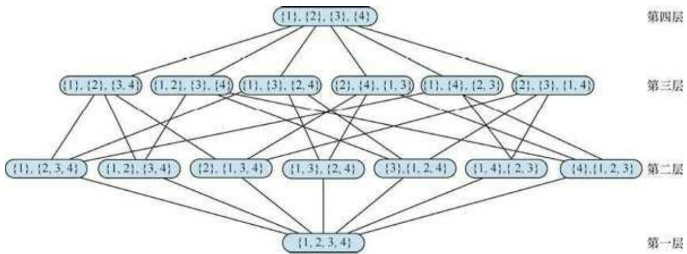  
图18-7 $N = \{ 1 , 2 , 3 , 4 \}$ 的联盟结构图。第一层的联盟结构包含单个联盟；第二层的联盟结构包含两个联盟，以此类推

# 18.4 做集体决策

现在我们将目光从智能体设计转向机制设计 （mechanismdesign），即为一组智能体设计合适的博弈。形式上，一个 机制 （mechanism）包括以下要素。

（1）一门用于描述智能体允许的策略集合的语言。  
（2）一个用于区分的智能体，称为 中心 （center），它从博弈中的智能体收集策略选择报告。（例如，拍卖师是拍卖的中心）  
（3）一个所有智能体都知道的结果规则，在给定智能体的策略选择的情况下，中心根据它来确定每个智能体的收益。

本节将讨论一些最重要的机制。

# 18.4.1 在合同网中分配任务

合同网协议 （contractnetprotocol）可能是人工智能中最古老也是最重要的多智能体问题的求解技术。它是一个用于任务共享的高级协议。顾名思义，合同网的灵感来自于公司之间使用合同的方式。

整个合同网协议分为4个主要阶段，如图18-8所示。该过程始于一个智能体，该智能体针对具体任务确定是否需要采取合作动作。对采取合作动作的需求可能源自几个方面，如智能体没有单独执行任务的能力，或者合作解决方案在某些方面可能会表现得更好（更快、更有效、更准确）。

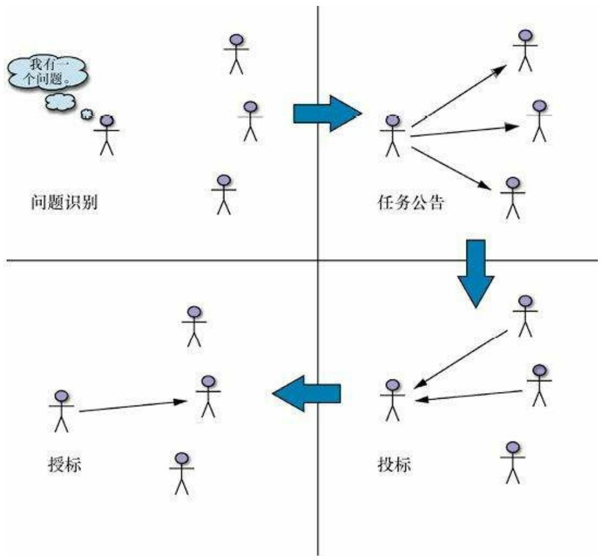  
图18-8 合同网任务分配协议

智能体通过一则 任务公告 （taskannouncement）消息将任务通知给合同网中的其他智能体，并在

任务持续期间充当该任务的管理器 （manager）。任务公告消息必须包含足够的信息，以便接收者判断它们是否愿意以及是否有足够能力承担任务。任务公告中包含的确切信息取决于应用领域。它可能是一些需要执行的代码；或者它可能是一个待实现目标的逻辑规范。任务公告还可能包括接收者可能需要的其他信息，如截止日期、服务质量需求等。

当智能体收到任务公告时，它必须根据自己的能力和偏好对该公告进行评估。特别是，每个智能体必须确定它是否有能力执行该任务，其次是该智能体是否愿意接受该公告。在此基础上，它可以提交对任务的 投标 （bid）。一个投标通常会表明投标人完成所发布任务的相关能力，以及执行该任务的所有条款和条件。

一般来说，一个管理器可能会收到关于一个任务公告的多个投标。根据投标中的信息，管理器将选择最合适的智能体（或多个智能体）来执行任务。投标成功的智能体将收到一条授标消息以得到通知，并成为任务的承包商，它需要对任务负责，直到任务完成。

实现合同网协议所需的主要计算任务可归纳为以下几个部分。

●任务公告处理。在收到任务公告后，智能体决定它是否希望为所公告的任务投标。  
●投标处理。在收到多个投标后，管理器必须决定将任务授予哪个智能体，然后授予任务。  
●授标处理。成功的投标人（承包商）必须尝试执行任务，这可能意味着生成新的子任务，这些子任务将通过进一步的任务公告发布。

除（或许正因为）合同网具有的简单这一优点以外，它可能是实现最广泛、研究最透彻的合作问题求解框架。它可以自然地应用于许多场景，例如，它的一个变体允许你在每次用Uber叫车时制定一个合同网。

# 18.4.2 通过拍卖分配稀缺资源

多智能体系统中最重要的问题之一是稀缺资源的分配问题；我们也可以简称它为“资源分配”问题，因为实际上最有用的资源在某种意义上是稀缺的。拍卖 （auction）是一种实现最重要资源分配的机制。在最简单的拍卖场景中，存在一个单一的资源和多个可能的投标人 （bidder）。对每个投标人 i 而言，这个物品的效用值为 v i。

在某些情况下，每个投标人对物品有一个 私有价值 （private value）。例如，一件俗气的毛衣可能对某个投标人很有吸引力，但对另一个投标人则毫无价值。

在其他情况下，例如拍卖石油区块的开采权，物品具有共有价值 （common value），即该区块将产生一定数额的金钱 $X$ ，1美元对所有投标人来说是平等的，但 $X$ 的实际价值是不确定的。不同的投标人拥有不同的信息，因此他们对物品真实价值的估计也不同。在这两种情况下，投标人最终都有他们自己的价值 v i 。给定 v i ，每个投标人都有机会在拍卖的适当时间投标 b i 。最高出价 b max中标，但所支付的金额不一定为 $b _ { \mathrm { { \ m a x } } }$ ；这是机制设计的一部分。

最著名的拍卖机制是 增价拍卖 （ascending-bid auction）或 英式拍卖 （English auction）， [1] 其中拍卖中心从要求最低（或保守）出价 $b _ { \mathrm { \ m i n } }$ 开始拍卖。如果有投标人愿意支付这个金额，那么该中心就会进一步要价 $b _ { \mathrm { \scriptsize ~ m i n } } + d$ ，增量为 d ，并在此基础上继续抬价。当没有人愿意再出价时，拍卖结束；此时最后一个投标人赢得物品，他需支付所投标的价格。

[1] 单词“auction”来自于拉丁语 augeo ，意为“增加”。

我们怎么知道这是不是一个好的机制呢？我们可以将拍卖的目标定为最大化卖方的期望收入，或者定为最大化全局效用。这些目标在某种程度上是有一定重叠的，因为最大化全局效用一个方面也需要确保拍卖的获胜者是对物品估价最高的智能体（因此它愿意支付最高的价格）。如果一个拍卖将物品卖给了对它们估价最高的智能体，我们称这个拍卖是有效的。增价拍卖通常既有效又能使收入最大化，但是如果保守价定得太高，估价最高的投标人可能不会出价，如果保守价定得太低，卖方的收入可能会减少。

拍卖机制能够实现的最重要的事情可能就是鼓励足够数量的投标人进入博弈，并阻止他们参与合

谋 （collusion）。合谋是指两个或两个以上投标人为操纵价格而达成的不公平的或非法的协约。它可能是参与者在不破坏拍卖机制的前提下私下达成的协约，也可能是参与者心照不宣地达成的协约。例如，在1999年，德国以同时拍卖的方式拍卖了10个手机频段（10个频段同时一次出价），使用的规则是任何出价都必须比之前的出价至少提高10%。该拍卖中只有两个可信的投标人，第一个出价的是曼内斯曼（Mannesman）公司，该公司在1～5号频段出价2000万德国马克，在6～10号频段出价1818万德国马克。为什么是1818万？T-Mobile公司的一位经理解释说，他们“把曼内斯曼的首次出价理解为要约”。双方都可以计算出，在1818万上增加10%是1999万；因此，曼内斯曼的出价可以被解读为“我们每一方可以以2000万德国马克的价格获得一半的频段；我们不要哄抬价格，不要把事情搞糟了”。而实际上，T-Mobile在6～10号频段出价2000万德国马克，拍卖的投标也到此结束。

德国政府得到的收益比他们期望的少，因为两家竞争对手能够利用投标机制就如何不竞争达成协约。从政府的观点来看，通过对机制采取任何一种改变都可能获得更好的结果：更高的保守价格；首价密封投标拍卖，这样竞争对手就不能通过他们的出价进行交流；或者是引进第三个投标人的激励。也许10%规则的机制设计是一个错误，因为它促成了从曼内斯曼公司到T-Mobile公司的精确信号传递。

一般来说，拍卖中如果存在更多的投标人，卖方和全局效用函数都会受益，但如果你考虑到没有获胜机会的投标人所浪费的时间成本，则全局效用会受到影响。鼓励更多投标人参与拍卖的一种方法是让拍卖机制对他们来说更简洁。毕竟，如果投标人需要太多的研究或计算，他们可能会决定把钱花在其他地方。

因此，投标人最好有一个占优策略 （dominantstrategy）。回想一下，“占优”意味着该策略能与所有其他策略相抗衡，这反过来意味着智能体可以不考虑其他策略而采用它。一个具有占优策略的智能体可以直接出价，而不用浪费时间考虑其他智能体可能的策略。智能体具有占优策略的机制被称为 防策略 （strategy-proof）机制。如果策略涉及投标人暴露他们的真实价值 v （一般而言都是如此），那么它就被称为真值暴露 （truth-revealing）或 真值 （truthful）拍卖；有时我们也会称其为 激励相容 （incentive compatible）。 显示原理 （revelation principle）认为，任何机制都可以转化为等价的真值暴露机制，因此，机制设计的一部分内容就是要找到这些等价的机制。

事实证明，增价拍卖拥有大多数我们想要的性质。此时拥有最高价值 $v _ { i }$ 的投标人以 $b _ { o } + d$ 的价格获得物品，其中 $b _ { o }$ 是所有其他智能体中最高的出价，而 $d$ 是拍卖方的增量[2] 。投标人有一个简单的占优策略：只要当前价格低于你的 $v _ { i }$ ，就继续出价。这种机制并不会完全暴露真值，因为中标者只暴露了他认为 $v _ { i } \geq b _ { a } + d$ 这一信息，我们可以得到 $v _ { i }$ 的下界，但不能得到一个确切的量。

[2] 实际上，在 $b _ { o } < v _ { i } < b _ { o } + d$ 的情况下，拥有最高价值 $v _ { i }$ 的智能体有小的机会没有拍得物品。减少增量 $d$ 可以使出现这种情况的机会任意小。

增价拍卖的一个缺点（从卖方的角度来看）是它会阻碍竞争。假设在手机频谱的竞标中，有一家优势公司，每个人都认为它能够利用现有的客户和基础设施，从而获得比其他公司更大的利润。潜在的竞争者会发现，他们没有机会进行增价竞标，因为优势公司总是可以出价更高。因此，竞争者可能根本不参与拍卖竞争，而优势公司最终以底价获胜。

英式拍卖的另一个缺点是高昂的沟通成本。它要求拍卖要么在同一个房间里进行，要么所有的投标人都必须有高速、安全的通信线路；此外，无论是哪种情况，所有参与者都必须花费时间参与若干轮的出价。

另一种对沟通需求较少的机制是密封投标拍卖 （sealed-bid auction）。在密封竞价拍卖中，每个投标人给出一个出价，并将出价告知拍卖师，同时不让其他投标人知道。在这种机制下，不存在简单的占优策略。如果你认为物品的价值是v ，并且你认为所有其他智能体的最高出价将是b ，那么你应该出价 （ 是一个很小的量，且整体需要小于 v i）。因此，你的出价取决于你对其他智能体的出价的估计，为了得到这个估计你需要做更多的工作。注意，在这个拍卖机制下具有最高价值 $v _ { i }$ 的智能体可能不会赢得拍卖。但是，这样的拍卖更具竞争性，减少了对优势投标者的偏见。

密封投标拍卖机制的一个略有不同的改版是次价密封投标拍卖 （sealed-bid second-price

auction），它也被称为维克里拍卖 （Vickrey auction）[3] 。在这种拍卖中，中标者支付第二高的价格，而不是他自己的出价。这种简单的修改完全消除了标准（或首价）密封投标拍卖所需的复杂考虑，因为这种拍卖下的占优策略是简单地出价v ；这一机制是真值暴露的。请注意，在给定出价 b 、值 v 以及其他智能体中最高出价 b 下，智能体的i效用为

[3] 以威廉·维克里（William Vickrey，1914—1996）的名字命名，他因这项研究获得了1996年的诺贝尔经济学奖，但却在得奖3天后死于心脏病发作。

$$
U _ {i} = \left\{ \begin{array}{l l} (v _ {i} - b _ {o}), & \text {如 果} b _ {i} > b _ {o} \\ 0, & \text {其 他} \end{array} \right.
$$

接下来我们将简要证明 $\boldsymbol { b } _ { i } = \boldsymbol { v } _ { i }$ 是一个占优策略。注意，当( $\boldsymbol { v } _ { i } - \boldsymbol { b } _ { o } )$ 为正时，任何赢得拍卖的出价都是最优的，特别地，出价 $v _ { i }$ 赢得了拍卖。但是，当( $\boldsymbol { v } _ { i } - \boldsymbol { b } _ { o }$ )为负时，任何导致输掉拍卖的出价都是最优的，特别地，出价 $v _ { i }$ 输掉了拍卖。因此，对 $b _ { o }$ 的所有可能值而言， $v _ { i }$ 是最优的，实际上，v 是唯一具有这种性质的投标。由于其简单性和对卖方和投标人的最低计算要求，维克里拍卖被广泛应用于分布式人工智能系统。

互联网搜索引擎每年会进行几万亿次拍卖，以出售伴随搜索结果一起出现的广告，在线拍卖网站每年会处理价值1000亿美元的商品，所有这些拍卖都使用维克里拍卖的不同形式。注意，此时卖方的期望值是 b ，这与英式拍卖在增量 $d$ 趋向于0的极限期望回报相同。这实际上是一个非常普遍的结果： 收入等价定理 （revenue equivalence theorem）指出，在投标人的价值 v i 只有他们自己知道（但他们知道用于采样这些价值的概率分布）的任何拍卖机制中，期望收入都相同。这一原则意味着各种机制并不是基于收入创造而进行竞争，而是基于其他指标。

尽管次价拍卖是真值暴露的，但以n +1个价格的拍卖来拍卖n 个商品并不是真值暴露。许多互联网搜索引擎使用这种机制来拍卖页面上 n个广告位。其中出价最高的人赢得第一位，第二高的人获得第二位，以此类推。每个获胜者都支付下一个较低的出价者的出价，但我们要知道，只有当搜索者实际点击广告时广告商才会付款。位于顶部的广告位被认为是更有价值的，因为它们更有可能受到关注并被点击。

假设有3个投标人 b 、b 与 $b _ { 3 }$ ，他们对一次点击的估值为v =200、v =180、v =100，并且有 n =2个广告位可用；我们已经知道，位于顶部的广告位有5%的机会会被点击，底部广告为有2%的机会被点击。如果所有投标人都如实投标，则 $b _ { 1 }$ 将赢得顶部广告位并为此支付180，其期望回报为 $( 2 0 0 - 1 8 0 ) { \times } 0 . 0 5 = 1$ 。第二个广告位将归于 $b _ { 2 }$ 。但是 $b _ { 1 }$ 可以发现，如果她在101～179的范围内任意出价，她将把顶部广告位让给 $b _ { 2 }$ ，赢得第二个广告位，由此产生(200 − 100)×0.02 = 2的期望回报。因此，在本例中， $b _ { 1 }$ 可以通过出价低于其真实价值而使其期望回报翻倍。

一般来说，在这种 $n + 1$ 价格拍卖中，投标人必须花费大量精力分析其他人的出价，以确定他们的最佳策略；即不存在简单的占优策略。

阿加沃尔等人（Aggarwaletal., 2006）证明，这个多广告位问题存在一个唯一的真值拍卖机制，在这个机制中，广告位 $j$ 的赢家为广告位 $j$ 的额外点击支付价格，这些点击是在广告位j而不是在广告位 j + 1获得的。中标者为较低位置的额外点击支付价格。在我们的例子中， b 1会如实出价200，并为顶部广告位的额外0.05 −0.02 =0.03点击支付180；但他只需要支付底部广告位的费用100，就可以获得剩下的0.02次点击。因此， b 的总收益将是(200 − 180)×0.03 + (200 − 100)×0.02 =2.6。

拍卖在人工智能中发挥作用的另一个例子是，一群智能体正在决定是否就一项联合规划进行合作。亨斯伯格和格罗斯（Hunsbergerand Grosz,2000）证明，这项任务可以通过拍卖有效地完成，其中智能体在拍卖中对联合规划中的角色进行竞标。

现在让我们来考虑另一种博弈——各国制定控制空气污染的政策。每个国家都有一个选择：他们可以以成本−10来实现必要的改变以减少污染，或者他们可以保持污染水平，这将给他们一个−5的净

效用（增加了医疗费用等），并连累其他国家得到−1的效用（因为空气是跨国家共享）。显然，每个国家的占优策略是保持污染水平，但如果有100个国家，每个国家都遵循这个政策，那么每个国家的总效用是−104，而如果每个国家都减少污染，他们的效用是−10。这种情况被称为 公地悲剧（tragedy ofthecommons）：如果没有人为公共资源的使用付费，那么它可能会以一种导致更低的智能体总效用的方式被利用。这与囚徒困境类似：博弈中存在另一种对各方都更好的解，但在当前博弈中，理性智能体似乎没有办法得出那个解。

处理公地悲剧的一种方法是将机制改为向每个使用公地的智能体收费。更一般地说，我们需要确保所有的 外部性 （externality）——在个体智能体事务中没有被识别出来的对全局效用的影响——是明确的。

正确定价是这种方法的困难之处。在极限情形下，这种方法相当于创建一种机制，在这种机制下，每个智能体都被有效地要求最大化全局效用，但它们可以通过做出一个局部决策来实现。在这个例子中，碳排放税将是实现这种机制的一个例子，它对公共资源的使用收费，如果实施得好，它将使全局效用最大化。

一种被称为Vickrey-Clarke-Groves机制（简称 VCG机制）的机制设计具有两个有利特点。首先，它能够将效用最大化，即最大化全局效用——所有各方的效用之和 。其次，这种机制是真值暴露的——所有智能体的占优策略会暴露其真实价值。他们没有必要进行复杂的战略投标计算。

我们将给出一个涉及公共物品分配问题的例子。假设一个城市打算安装一些免费的无线网络收发器。然而，可用的收发器的数量少于需要收发器的社区的数量。城市希望最大化全局效用，但如果它对每个社区委员会说“你会珍惜一个免费的无线收发器吗（顺便说一下，我们会把它们送给最珍惜它们的社区）？”那么每个社区都将有动机上报一个非常高的价值。VCG机制不鼓励这种做法，而是鼓励他们报告自己的真实价值。它的工作原理如下。

（1）中心要求每个智能体报告其对一件物品的价值 v i。  
（2）中心向赢家集合 W分配物品来最大化 。  
（3）中心为每个获胜的智能体计算它们个人在博弈中的存在对输家造成的损失（每个智能体的效用为0，但如果它们是赢家，可能会得到 v ）。  
（4）每个获胜的智能体向中心支付与这一损失相等的税。

例如，假设有3个可用的收发器和5个投标人，他们分别出价100、50、40、20和10。因此，赢家的集合 W 包含出价100、50和40的3个人，分配这些商品的全局效用是190。对每个赢家来说，如果他们没有参加博弈，20的出价将是一个赢家。因此，每个赢家向中心支付20的税。

所有的赢家都应该感到高兴，因为他们所缴的税低于他们的价值；所有的失败者都应该尽可能地高兴，因为他们对商品的估价低于所需的税。这就是为什么这个机制是真值暴露的。在本例中，关键的数值是20；如果你的真实价值低于20，那么出价高于20就是不合理的，反之亦然。由于关键价值可以是任意的（取决于其他投标人），这意味着任何不等于你的真实价值的出价总是不合理的。

VCG机制非常普遍，通过对上述的机制略做推广，我们可以将其应用于所有类型的博弈中，而不仅仅是拍卖。例如，在组合拍卖 （combinatorialauction）中，有多个不同的物品，每个投标人可以提出多个出价，每个出价对应物品的一个子集。在对地块进行招标时，一个投标人可能想要 X地块或 Y地块中的一块，但不想两块都要，另一个投标人可能需要任意3个相邻的地块，等等。

VCG机制可以用来寻找最优结果，并且尽管它需要处理 $N$ 个商品的2 $N$ 个子集，对最优结果的计算仍是NP完全的。注意，VCG机制是唯一的：其他所有最优机制本质上与它等价。

# 18.4.3 投票

我们要看的下一类机制是投票程序，它常在民主社会中用作政治决策的程序。对投票程序的研究源于 社会选择理论 （social choice theory）领域。

投票程序的基本设定如下。与之前一样，我们有一个智能体集合 $N = \{ 1 , \cdots , n \}$ ，在本节中他

们指投票者。这些投票者想要对一个可能结果集合 $\Omega = \{ \omega _ { 1 3 } , \omega _ { 2 3 } \cdots \}$ 做出决定。在政治选举中， $\pmb { \mathcal { Q } }$ 的每一个元素可以表示不同的候选人赢得选举。

每个投票者都在 $\pmb { \mathcal { Q } }$ 上有所偏好。这些偏好通常不是用数值效用来表示的，而是用定性比较来表示：我们把一个比较写作 $\omega \succ _ { i } \omega ^ { \prime }$ ，它意味着智能体 i 把结果 $\pmb { @ }$ 排在结果 $\acute { \pmb { c } } \acute { \pmb { \mathscr { P } } }$ 之前。在有3位候选人的选举中，智能体i可能会认为 $\omega _ { 2 } \approx _ { i } \omega _ { 3 } \gg _ { i } \omega _ { 1 }$ 。

社会选择理论的基本问题是将这些偏好结合起来，使用 社会福利函数 （socialwelfarefunction）得出一个 社会偏好顺序 （socialpreferenceorder）：从最偏好到最不偏好的一个候选人的排序。在某些情况下，我们只对 社会结果 （social outcome）感兴趣——整个群体最偏好的结果。我们用$\omega \succ \omega ^ { \prime }$ 来表示 在社会偏好顺序中排在 $\acute { \pmb { c } } \acute { \pmb { \mathscr { P } } }$ 之上。

一个更简单的设定是，我们不关心能否获得候选人的整体顺序，而只是想选择一组获胜者。社会选择函数 （socialchoicefunction）以每个投票者的偏好顺序为输入，输出一组获胜者。

民主社会希望得到一个反映投票者偏好的社会结果。遗憾的是，这并不总是那么简单。考虑 孔多塞悖论 （Condorcet’s Paradox），它是由马奎斯·孔多塞（Marquis de Condorcet，1743—1794）提出的一个著名例子。假设有3个结果 ，3个投票者 ，他们的偏好如下：

$$
\begin{array}{l} \omega_ {a} > _ {1} \omega_ {b} > _ {1} \omega_ {c} \\ \omega_ {c} > _ {2} \omega_ {a} > _ {2} \omega_ {b} \\ \omega_ {b} > _ {3} \omega_ {c} > _ {3} \omega_ {a} \tag {18-2} \\ \end{array}
$$

现在，假设我们必须根据这些偏好从3个候选人中选择一个。矛盾之处在于：

● 2/3 的投票者更偏好 $\omega _ { 3 }$ 而不是 $\pmb { \omega } _ { 1 }$   
● 2/3 的投票者更偏好 而不是 $\omega _ { 2 }$ ；  
●2/3 的投票者更偏好 $\omega _ { 2 }$ 而不是 $\omega _ { 3 }$ 。

因此，对于每个可能的赢家，我们可以找到另一个候选人，他至少被2/3的投票者更偏好。这表明，在某些情况下，无论我们选择哪种结果，大多数投票者都偏好不同的结果。一个自然的问题是，是否存在真正反映投票者偏好的“好的”社会选择程序。为了回答这个问题，我们需要明确一个规则是“好的”的具体含义。我们将列出一些好的社会福利函数应满足的性质。

● 帕累托条件 ：简单地说，如果每个投票者都把 $\omega _ { i }$ 排在 之上，则 。  
●孔多塞赢家条件：如果一个结果对大多数候选人来说偏好它超过所有其他结果，那么称其为孔多塞赢家。换句话说，孔多塞赢家是在两两选举中击败其他所有候选人的候选人。根据孔多塞赢家条件，如果 $\pmb { \mathcal { O } } _ { l }$ 是一个孔多塞赢家，则 $\pmb { \omega } _ { i }$ 应排在第一位。  
●无关选项的独立性 （IIA）：假设存在若干候选人，其中包括 $\pmb { \mathcal { O } } _ { l }$ 和 ，投票者的偏好是。假设有一个投票者改变了他的偏好，但并没有改变 和 的相对排序。则IIA条件认为 也不会改变。  
●没有独裁：社会福利函数不应该简单地输出一个投票者的偏好而忽略所有其他投票者。

这4个条件似乎是合理的，但由肯尼斯·阿罗（Kenneth Arrow）提出的、被称为阿罗定理 （Arrow’stheorem）的社会选择理论基本定理告诉我们，不可能同时满足所有4个条件（对至少有3个结果的投票情况而言）。这意味着，对于我们可能关心的任何社会选择机制，都存在一些导致有争议结果

的情况（可能是不寻常的或病态的）。然而，这并不意味着民主决策在大多数情况下是没有希望的。我们还没有介绍过任何实际的投票程序，所以现在我们将列举一些。

● 对于只有两名候选人的情况， 简单多数投票 （simple majority vote）（美国和英国采用的标准方法）是最受青睐的机制。我们询问每个投票者他们更喜欢哪一个候选人，得票最多的是获胜者。  
● 有两种以上的结果时， 多数投票 （plurality voting）是一种常用的机制。我们让每个投票者选出他们的首选，然后选出得到最多选票的候选人（在票数相等的情况下可能不止一个），即使没有人得到大多数投票。虽然多数投票很常见，但它经常受到人们的批评，因为多数投票产生了不受人们欢迎的结果。它的关键问题在于只考虑在每个投票者的偏好中排名靠前的候选人。  
● 博尔达计数 （Borda count）［以孔多塞同时代的竞争对手让-查尔斯·德博尔达（Jean-Charles deBorda）的姓氏命名］是一种考虑了投票者偏好排序中所有信息的投票程序。假设我们有k个候选人。对每个投票者i，我们取他们的偏好排序 ，给排名第一的候选人赋予得分k，给排名第二的候选人赋予得分k−1，以此类推，直到排名最后的候选人。每个候选人的总分就是他们的博尔达计数，为了获得社会结果 ，我们将结果按照他们的博尔达计数从高到低排序。这个系统的一个实际问题是，它要求投票者表达对所有候选人的偏好，而一些投票者可能只关心一部分候选人。  
● 在 认可投票 （approval voting）中，投票者提交他们认可的候选人的一个子集。获胜者是那些被大多数投票者认可的人。当任务是选择多个获胜者时，这个机制经常被使用。  
●在 排序复选制 （instantrunoffvoting）中，投票者对所有候选人进行排名，如果一位候选人获得了多数第一选票，就宣布他为获胜者。否则，第一选择得票数最少的候选人将被淘汰。这个候选人被从所有的偏好排序中删除（所以那些曾经把被淘汰的候选人作为他们的第一选择的投票者现在有另一个候选人作为他们的新的第一选择），然后重复这个过程。最终，将有候选人获得多数第一选票（除非有平局）。  
● 在 真多数原则投票 （true majority rule voting）中，赢家是在两两比较中击败其他候选人的候选人。投票者被要求对所有候选人进行完整的偏好排名。我们称 战胜 ，如果有更多的投票者选择 而不是 。这个系统的优点是，大多数人总是认同赢家，但它的缺点是，不是每一次选举都可以被决定，例如，在孔多塞悖论中，没有候选人赢得多数。

# 策略性操纵

除了阿罗定理，社会选择理论领域的另一个重要的负面结果是 Gibbard-Satterthwaite定理 。这一结果源自于选民可以从歪曲自己的偏好中获益的情况。

回想一下，社会选择函数将每个选民的偏好顺序作为输入，并将获胜候选人的集合作为输出。当然，每个选民都有他们自己的真实偏好，但在社会选择函数的定义中并没有要求选民 如实 报告他们的偏好；他们可以任意地声明他们的偏好。

在某些情况下，选民歪曲自己的偏好是有意义的。例如，在多数投票中，认为自己最喜欢的候选人没有获胜机会的选民可能会投票给他们的第二选择。这意味着多数投票是一个博弈，在这个博弈中，选民必须从策略上（考虑其他选民）来最大化他们的期望效用。

这就引出了一个有趣的问题：我们能否设计出一种不受此类操纵影响的投票机制— —一种真值暴露的机制？Gibbard–Satterthwaite定理告诉我们，这是不可能的： 对于有两个结果或更多结果的域，任何满足帕累托条件的社会选择函数要么是可操纵的，要么是独裁的。 也就是说，对于任何“合理的”社会选择程序，在某些情况下，选民原则上可以通过歪曲他们的偏好而受益。然而，它并没有告诉我们 如何进行这种操纵；也没有告诉我们这种操纵在实践中是否可行。

# 18.4.4 议价

议价或谈判是日常生活中经常使用的另一种机制。自20世纪50年代起，它就在博弈论中被研究，最近已成为自动化智能体的一项任务。当智能体需要就共同利益达成协约时，议价问题就应运而生。智能体根据特定的协议彼此提出报价（也称为提议或协约），并接受或拒绝每个报价。

# 1. 以交替报价协议议价

一种有影响力的议价协议是 交替报价议价模型 （alternating offers bargaining model）。为了简化问题，我们将再次假设只有两个智能体。议价在一系列轮次中进行。 $A _ { 1 }$ 从第0轮开始提出报价。如果 $A _ { 2 }$ 接受这个报价，那么这个报价就实现了。如果 $A _ { 2 }$ 拒绝了这个报价，那么谈判就进入下一轮。这一次A 提出报价， $A _ { 1 }$ 选择接受或拒绝，以此类推。如果谈判永远不会终止（因为智能体拒绝了每一个报价），那么我们将结果定义为 冲突交易 （conflictdeal）。一个方便的简化假设是，两个智能体都偏好在有限的时间内达成一个结果——任何一个结果都可以，而不是被困在无限浪费时间的冲突交易中。

我们将使用 分饼 （dividing a pie）的场景来进一步解释交替报价。在分饼场景中，存在一些价值为1的资源（饼），它可以被分为两部分，每个智能体获得其中一部分。在这种情况下，报价是一个( x , 1 − x )对，其中 x 是 $A _ { 1 }$ 得到的数量，1 −x是 $A _ { 2 }$ 得到的数量。可能的报价空间，即谈判集（negotiation set）是

$$
\{(x, 1 - x): 0 \leqslant x \leqslant 1 \}
$$

那么，智能体在这种情况下应该如何谈判呢？为了理解这个问题的答案，我们首先来看几个简单的例子。

首先，假设我们只允许进行一轮谈判。此时 $A _ { 1 }$ 提出了一个提议； $A _ { 2 }$ 可以接受它（在这种情况下交易得以实现），也可以拒绝它（在这种情况下冲突交易得以实现）。这是一个 最后通牒博弈（ultimatum game）。在这个例子中， 先行者 （first mover） $A _ { 1 }$ 拥有所有的权力。假设 $A _ { 1 }$ 提议得到所有的饼，也就是说，提议交易(1, 0)。如果 $A _ { 2 }$ 拒绝，则冲突交易得以实现；但根据定义， A 2更愿意得到0而不是冲突交易，所以 $A _ { 2 }$ 的更好的选择是接受提议。当然， $A _ { 1 }$ 不能得到比得到整个饼更好的结果。因此， $A _ { 1 }$ 提议得到整个饼， $A _ { 2 }$ 接受提议的这两种策略形成纳什均衡。

现在考虑我们允许两轮谈判的情况。现在权力转移了： $A _ { 2 }$ 可以简单地拒绝第一个报价，从而将博弈变成一个一轮博弈，其中 $A _ { 2 }$ 是先行者，因此他将得到整个饼。一般来说，如果轮数是固定的，那么最后一个提议的人就会得到所有的饼。

现在我们来看一下一般情况——轮数没有上限。假设 $A _ { 1 }$ 采用以下策略：

始终提议(1, 0)，始终拒绝任何 还价。

$A _ { 2 }$ 的最佳反应是什么？如果 $A _ { 2 }$ 继续拒绝该提议，那么智能体将永远进行谈判，根据定义，这是A （以及 $A _ { 1 }$ )所得到的最糟糕的结果。所以 $A _ { 2 }$ 只能接受 $A _ { 1 }$ 提出的第一个提议。这是一个纳什均衡。但是如果 $A _ { 1 }$ 采用以下策略：

始终提议(0.8, 0.2)，始终拒绝任何 还价。

通过类似的论证，我们可以看到，对于这个报价或 任何谈判集中可能的交易 ( x , 1 − x )， 存在一个谈判策略的纳什均衡对，其结果是在第一个时段中两人就该交易达成一致。

# 2.不耐心智能体

这个分析告诉我们，如果不限制轮数，那么议价问题将有无数个纳什均衡。所以我们加上这样一个假设：

对于任何结果 $x$ 和时刻 $t _ { 1 } , \ t _ { 2 }$ ，其中 $t _ { 1 } < t _ { 2 }$ ，两个智能体都更倾向于时刻 $t _ { 1 }$ 的结果 $x$ ，而不是时刻 $t _ { 2 }$ 的结果 $x$ 。

换句话说，智能体是不耐心的 。量化不耐心的一个标准方法是为每个智能体赋予一个折扣因子i （ $0 \leqslant \gamma _ { i } < 1 ,$ ）。假设智能体在谈判的某个时间点 $t$ 得到一片大小为 $x$ 的饼。饼 $x$ 在时刻 $t$ 的价值为 $\gamma _ { i } ^ { \mathrm { { ? } } } x$ 。因此在谈判的第一步（时刻0），该值为 $\gamma _ { i } ^ { 0 } x = x$ ，随后在任何时间点上的相同报价的价值将会更少。 $\gamma _ { i }$ 的值越大（接近1）意味着智能体更有耐心， $\gamma _ { i }$ 值越小意味着智能体耐心越少。

为了分析一般情况，我们与上面一样首先考虑固定期限内的议价。一轮议价的情况与上面给出的分析相同：我们只进行了一个最后通牒博弈。在两轮议价中，情况会发生变化，因为饼的价值根据折扣因子 $\gamma _ { i }$ 减小。假设 $A _ { 2 }$ 拒绝了 $A _ { 1 }$ 的初始提议。那么 $A _ { 2 }$ 会在第二轮最后通牒中得到整个饼。但是整个饼的价值减少了：它对 A 2只值 2。智能体 A 1可以考虑这个事实，报价 ， $A _ { 2 }$ $\boldsymbol { \gamma } _ { \mathrm { ~ } _ { 2 } }$ $A _ { 1 }$ $( 1 - \gamma _ { 2 } , \gamma _ { 2 } )$ $A _ { 2 }$ 最好接受这个报价，因为它在这个时间点不能做得比 $\boldsymbol { \gamma } _ { \mathrm { ~ 2 ~ } }$ 更好。（如果你担心会发生平局的情况，就可以考虑报价 $( 1 - ( Y _ { 2 } + \epsilon ) , Y _ { 2 } + \varepsilon )$ ，其中 $\pmb { \varepsilon }$ 是一个很小的值。）

因此， $A _ { 1 }$ 报价 $( 1 - \gamma _ { 2 } , \gamma _ { 2 } )$ 和 $A _ { 2 }$ 接受这两种策略是纳什均衡。耐心的参与者（拥有更大 $\boldsymbol { \gamma } _ { \mathrm { ~ } _ { 2 } }$ 的参与者）将能够在此协议下获得更大的饼：在此设定中，耐心确实是一种美德。

现在考虑一般情况，即回合数没有界限。与一轮情况一样， $A _ { 1 }$ 可以制定一个 $A _ { 2 }$ 应该接受的提议，因为它提供了 $A _ { 2 }$ 考虑折扣因子下最大可获得的价值。结果是 $A _ { 1 }$ 会得到

$$
\frac {1 - \gamma_ {2}}{1 - \gamma_ {1} \gamma_ {2}}
$$

A 得到剩余部分。

# 3. 任务导向域的谈判

在本小节中，我们将考虑任务导向域 （task-oriented domain）的谈判。在这样的域中存在一组必须执行的任务，每个任务最初分配给一组智能体。智能体可以通过对哪个智能体执行哪些任务进行谈判而获益。例如，假设一些任务需要在车床上完成，而另一些任务是在铣床上完成的，并且任何使用机器的智能体都必须花费大量的布置成本。那么此时一个智能体对另一个智能体说“我必须在铣床上工作；我来完成你所有的铣削任务，你来完成我所有的车床任务怎么样？”是有意义的。

与议价场景不同，我们从初始分配开始考虑，因此如果智能体未能就任何提议达成一致，它们将执行最初分配给它们的任务 。

为了简单起见，我们再次假设只有两个智能体。设 T 为所有任务的集合 ， 表示在时刻0初始分配给两个智能体的任务。 $T$ 中的每个任务必须分配给一个智能体。我们假设我们有一个代价函数c，对于每一组任务T'，它给出一个正实数 c(T')，表示执行任务T'的任何智能体的代价。（假设代价只取决于任务，而与执行任务的智能体无关。）代价函数是单调的——增加更多的任务并不会降低代价——什么都不做的成本为0，即 。例如，假设布置铣床的成本为10，每个铣床任务成本为1，那么2套铣床任务的成本为12，5套铣床任务的成本为15。

形式(T , T )的报价意味着智能体i承诺以成本c(T )执行一组任务 $T _ { i }$ 。智能体 i的效用是他们从接受这个报价中获得的收益——执行这组新任务的成本与最初分配的任务之间的差额：

$$
U _ {i} \left(\left(T _ {1}, T _ {2}\right)\right) = c \left(T _ {i}\right) - c \left(T _ {i} ^ {0}\right)
$$

如果对于两个智能体都有 $U _ { 2 } ( \{ T _ { 1 } , T _ { 2 } \} ) \geq 0$ ，则报价( $T _ { 1 } , T _ { 2 }$ )是 个体理性的 。如果一个交易不是个体理性的，那么至少有一个智能体可以通过简单地执行最初分配给它的任务而做得更好。

任务导向域（假设理性智能体）的谈判集是指既具有个体理性又具有帕累托最优的报价集。提出一个会被拒绝的个体非理性的报价是没有意义的，当有一个更好的报价能在不伤害其他人利益的情况下提高一个智能体的效用时，提出差一点报价也是没有意义的。

# 4. 单调让步协议

我们在此考虑的任务导向域的谈判协议称为 单调让步协议 （monotonic concession protocol）。该

协议的规则如下。

●谈判在一系列回合中进行。

● 在第一轮中，双方智能体 同时 从谈判集中提议一个交易 D i= ( T 1, T 2)。（这与我们之前看到的交替报价不同。）

●如果两个智能体分别提议交易 D 和 D ， 或 ，也就是说，如果一个智能体发现另一个智能体提议的交易至少一样好或者比自己的更好，那么协约达成。如果达成协约，则确定协约的规则如下：如果每个智能体的报价匹配或超过其他智能体的报价，则随机选择一个方案。如果只有一个提议超过或匹配其他的提议，那么这就是协约交易。  
●如果没有达成协约，谈判将继续进行另一轮同时提议。在第t+1轮中，每个智能体或者重复上一轮的提议，或者做出让步 ——一个被其他智能体更喜欢的提议（即有更高的效用）。  
●如果没有一个智能体做出让步，那么谈判终止，两个智能体实现冲突交易，执行最初分配给它们的任务。

由于可能交易集合是有限的，智能体不能无限期地进行谈判：要么智能体达成协约，要么双方在某一回合都不让步。然而，该协议并不能保证 很快 达成协约：由于可能的交易数量是 ，可以想象的是，谈判将以分配任务数量的指数形式持续数轮。

# 5. Zeuthen策略

到目前为止，我们还没有提到在任务导向域使用单调让步协议时，谈判参与者可能或应该如何行动。一种可能的策略是Zeuthen策略 。

Zeuthen策略的思想是衡量一个智能体 冒冲突风险的意愿。直觉上，如果当前提议和冲突交易之间的效用差异较小，智能体将更愿意冒冲突的风险。在这种情况下，如果谈判失败，执行冲突交易，智能体的损失是很少的，因此它更愿意冒冲突的风险，更不愿意让步。相反，如果智能体当前的提议和冲突交易之间的差异很大，那么智能体在冲突中会有更多的损失，因此不太愿意冒冲突的风险，而更愿意让步。智能体 i 对第 t 轮风险冲突的意愿 的度量如下：

$$
r i s k _ {i} ^ {t} = \frac {i \text {因 让 步 和 接 受} j \text {的 报 价 而 损 失 的 效 用}}{i \text {因 不 让 步 和 产 生 冲 突 而 损 失 的 效 用}}
$$

在达成协约之前， 的值将在0到1之间。 的值越高（接近1），表明i在冲突中损失越小，因此更愿意冒冲突的风险。

Zeuthen策略是，每个智能体的第一个提议应该是在谈判集中使其自身效用最大化的交易（可能不止一个）。然后，在第t轮谈判中让步的智能体应是风险值较小的一个，也就是当双方都不让步时在冲突中损失最大的智能体。

下一个要回答的问题是，智能体应该让步多少？Zeuthen策略给出的答案是，“仅仅足以改变对其他智能体的风险平衡”。也就是说，一个智能体应该做出最小的让步，以使另一个智能体在下一轮中让步。

Zeuthen策略还有最后一点可以改进。假设在某一个时间点上，两个智能体的风险相等。那么根据策略，双方都应该让步。但是在了解了这一点后，一个智能体可能会因为不让步而潜在地“背叛”策略，进而获益。为了避免双方在这一点上都让步的可能性，我们让智能体“抛硬币”来决定在风险相等的情况下谁应该让步，这是对该策略的一个小的改进。

在这种策略下，协约将是帕累托最优和个体理性的。然而，由于可能的交易空间在任务数量上是指数级的，遵循这种策略可能需要在每个谈判步骤的以 的复杂性计算代价函数。最后，Zeuthen策略（带有抛硬币规则）是处于纳什均衡状态。

# 小结

●当环境中有其他智能体需要合作或竞争时，多智能体规划 是必要的。我们可以制定联合规划，但如果两个智能体要就执行哪个联合规划达成一致，就必须以某种协调形式加以加强。  
●博弈论 描述的是在多个智能体相互作用的情况下，智能体的理性行为。博弈论之于多智能体决策，正如决策论之于单智能体决策。  
●博弈论中的解概念 旨在描述博弈的理性结果——如果每个智能体都采取理性行为的情况下可能出现的结果。  
●非合作博弈论 假设智能体必须独立做出决策。 纳什均衡 是非合作博弈论中最重要的解概念。纳什均衡是一种智能体没有动机偏离其指定策略的策略组合。我们有处理重复博弈和序贯博弈的技巧。  
●合作博弈论 考虑的是智能体为了合作而达成具有约束力的协约以形成联盟的设置。合作博弈中的解概念试图阐明哪些联盟是稳定的（核 ），以及如何公平分配联盟获得的值（沙普利值 ）。  
●对于某些重要得多智能体决策类有专门的技术：任务共享的合同网，被用来有效地分配稀缺资源的拍卖，就共同利益进行议价以达成协约，以及聚集偏好的投票程序。

  
读者服务：

微信扫码关注【异步社区】微信公众号，回复“e59810”获取本书配套资源以及异步社区15天VIP会员卡，近千本电子书免费畅读。

第五部分

机器学习

# 第19章

# 样例学习

我们用样例学习来描述智能体通过不断学习自己以往的经验从而改善自己的行为，并对未来进行预测的过程。

如果一个智能体通过对世界进行观测来提高它的性能，我们称其为智能体学习 （learning）。学习可以是简单的，例如记录一个购物清单，也可以是复杂的，例如爱因斯坦推断关于宇宙的新理论。当智能体是一台计算机时，我们称之为 机器学习 （machine learning）：一台计算机观测到一些数据，基于这些数据构建一个模型 （model），并将这个模型作为关于世界的一个假设（hypothesis）以及用于求解问题的软件的一部分。

为什么我们希望一台机器进行学习？为什么不通过合适的方式编程然后让它运行呢？这里有两个主要的原因。其一，程序的设计者无法预见未来所有可能发生的情形。举例来说，一个被设计用来导航迷宫的机器人必须掌握每一个它可能遇到的新迷宫的布局；一个用于预测股市价格的程序必须能适应各种股票涨跌的情形。其二，有时候设计者并不知道如何设计一个程序来求解目标问题。大多数人都能辨认自己家人的面孔，但是他们实现这一点利用的是潜意识，所以即使能力再强的程序员也不知道如何编写计算机程序来完成这项任务，除非他使用机器学习算法。

在本章中，我们将讨论多种模型类，包括决策树（19.3节）、线性模型（19.6节）、非参数模型（如最近邻模型）（19.7节）、集成模型（如随机森林）（19.8节），提供关于建立机器学习系统的实用方法（19.9节），并讨论机器学习的理论（19.1节至19.5节）。

# 19.1 学习的形式

一个智能体程序的各个组件都可以通过机器学习进行改进。改进及用于改进的技巧取决于下面几个因素：

●哪些组件可以被改进；  
● 智能体有哪些先验知识，这将影响模型构建；  
●有哪些数据，以及关于这些数据的反馈。

第2章中描述了一些智能体的设计。这些智能体的 组件 包括：

（1）从当前状态条件到动作的直接映射；  
（2）用于从感知序列推断世界相关性质的方法；  
（3）关于世界演化方式的信息，以及关于智能体可以采取的可能动作所导致的结果的信息；  
（4）表示状态意向的效用信息；  
（5）表示动作意向的动作-价值信息；  
（6）最希望达到的状态，即目标；  
（7）问题生成器、评判标准和使系统得以改进的学习元素。

这些组件中的任何一个都可以被学习到。我们设想一个可以通过观测人类司机行为来学习自动驾驶的汽车智能体。每次司机刹车时，这个智能体可以学习到一个关于什么时候该踩刹车的条件-动作规则（组件1）。通过观察大量包含公共汽车的照相机图像，它可以学习到如何辨认公共汽车（组件2）。通过尝试不同动作以及观测相应的结果（例如在潮湿的道路上艰难地刹车），它可以学习到动作相应的结果（组件3）。接着，如果它收到在旅途中被剧烈颠簸吓坏了的乘客们的抱怨，它可以学习到关于其总体效用函数的一个有效组件（组件4）。

机器学习技术已经成为软件工程的标准组成部分。无论何时你想搭建一个软件系统，即使你不认为它是一个人工智能主体，这个系统的组件也可能可以用机器学习的方式加以改进。例如，一个用于分析星系在引力透镜下的图像的软件可以通过机器学习的模型加速一千万倍（Hezaveh et al. ,2017）；通过采用另一种机器学习的模型可以将数据中心冷却的能耗降低40%（Gao, 2014）。图灵奖得主大卫·帕特森（DavidPatterson）和谷歌AI的掌门人杰夫·迪安（JeffDean）宣称，计算机体系结构的“黄金时代”的到来正归功于机器学习（Dean et al. , 2018）。

我们已经见过了一些关于智能体组件的模型示例：原子模型、因子化模型，以及基于逻辑的关系模型或基于概率的关系模型等。人们针对所有这些模型设计了广泛的学习算法。

本章中我们假设不存在关于这个智能体的先验知识 （priorknowledge）：它从零开始，从数据中学习。在21.7.2节中，我们将考虑迁移学习 （transferlearning），在这种情形下，一个领域的知识被迁移到一个新的领域，以更少的数据使学习过程进行得更快。我们当然还要假设系统的设计者选取了合适的模型框架，从而让学习过程变得更加有效。

从一组特定的观测结果得出一个普遍的规则，我们称之为归纳 （induction）。例如，我们观察到，过去的每一天太阳都会升起，因此我们推断太阳明天也会升起。这与我们在第7章中研究的演绎 （deduction）不同，因为归纳的结论可能是不正确的，然而在演绎中，只要前提是正确的，演绎的结论就保证是正确的。

本章将集中讨论输入为因子化表示 （factored representation）——属性值组成的向量——的问题。输入也可以是任意类型的数据结构，包括原子表示的数据和关系数据等。

当输出是一个有限集合中的某个值时（如晴天 /阴 天/雨天或者正确/错误），我们称该学习问题为 分类 （classification）。当输出是一个数值时（例如明天的温度，无论它是一个整数还是其

他实数），我们称该学习问题为 回归 （regression）（这个词有些晦涩难懂 [1] ）。

[1] 一个更好的名称是 函数逼近 或者 数值预测 。但在1886年，法国人弗朗西斯·高尔顿（FrancisGalton）写了一篇关于这一概念的富有影响力的文章regression to themean（例如，高个子父母的孩子很可能身高高于平均值，但没有父母那么高）。高尔顿用他所称的“回归线”给出了一些图示，之后读者逐渐把“回归”一词与函数逼近这一统计技术联系起来，而不是与回归于均值的主题联系起来。

伴随输入有3种类型的反馈 （feedback），它们决定了3种类型的学习。

●在监督学习 （supervisedlearning）中，智能体观测到输入-输出对，并学习从输入到输出的一个函数映射。举个例子来说，输入是照相机的图像，伴随输入的输出就是“公共汽车”或者“行人”等。诸如此类的输出，我们称之为标签 （label）。在智能体学习到一个函数之后，如果给它一个新的图像输入，它将预测一个合适的标签。对于踩刹车这一动作的学习（上述的组件1），其输入是当前的状态（车的速度和行驶方向、道路条件），输出是开始刹车到停车所需要行驶的距离。在这种情形下，智能体可以直接从自己的感知中获得输出值（在动作结束之后）；环境就是老师，智能体学习的是从当前状态到刹车距离的一个函数。

● 在 无监督学习 （unsupervised learning）中，智能体从没有任何显式反馈的输入中学习模式。最常见的无监督学习任务是聚类 （clustering）：通过输入样例来检测潜在的有价值的聚类簇。例如，我们从互联网上可以获取数百万个图像，一个计算机视觉系统可以识别一大类相似的、被人类称为“猫”的图像。

●在强化学习 （reinforcementlearning）中，智能体从一系列的强化——奖励与惩罚——中进行学习。举例来说，在一局国际象棋比赛结束时，智能体会被告知它赢了（奖励）还是输了（惩罚）。智能体判断之前采取的哪个动作该为这一结果负责，并且改变它的动作以在未来得到更多的奖励。

# 19.2 监督学习

更正式地说，监督学习的任务如下。

给定一个 训练集 （training set）含有 $N$ 个“输入-输出”对样例：

$$
(x _ {1}, y _ {1}), (x _ {2}, y _ {2}), \dots , (x _ {N}, y _ {N})
$$

其中每一对数据都由一个未知的函数 生成，

寻找一个函数 h 来近似真实的函数 $f$ 。

函数 h 被称为关于世界的 假设 （hypothesis）。它取自一个 假设空间 （hypothesis space） $_ \mathrm { H }$ ，其中包含所有可能的函数。例如，这个假设空间可能是最高次数为3的多项式集合、JavaScript函数的集合，也可能是所有3-SAT布尔逻辑公式的集合。

同样地，我们可以称h 是关于数据的 模型 ，它取自模型类 （modelclass）H ，也可以说它取自函数类 （function class）中的一个 函数 （function）。我们称输出 y 为 真实数据 （ground truth）我们希望模型能预测的正确答案。

那么，如何选择一个假设空间呢？我们可能有一些关于数据生成过程的先验知识。如果没有的话，可以采用探索性数据分析 （exploratory dataanalysis）：通过统计检验和可视化方法——直方图、散点图、箱形图——来探索数据以获得对数据的一些理解，以及洞察哪些假设空间可能是合适的。或者我们可以直接尝试多种不同的假设空间，然后评估哪个假设空间的效果最好。

有了假设空间后，如何从中选择一个好的假设呢？我们希望寻找一个一致性假设 （consistenthypothesis）：假设 h ，对训练集中的任意一个 x i ，都有 h ( x i ) = y i 。如果输出是连续值，我们不能期望模型输出与真实数据精确匹配；相反，我们可以寄希望于寻找一个 最佳拟合函数 （best-fitfunction），使得每一个 h ( x )与 y 非常接近（我们将在19.4.2节中给出正式表述）。

衡量一个假设的标准不是看它在训练集上的表现，而是取决于它如何处理尚未观测到的输入。我们可以使用一个 测试集 （test set）——第二组样本数据对( x i, y i)——来评估假设。如果 h 准确地预测了测试集的输出，我们称 $h$ 具有很好的泛化 （generalize）能力。

图19-1展示了一个学习算法所得到的函数 $h$ 依赖于假设所考虑的假设空间H 和给定的训练集。第一行的4幅图使用同一个训练集，训练集中包含13个(x,y)平面上的数据点。第二行的4幅图使用第二组由13个数据点组成的训练集；两个训练集都代表了某个未知的函数 f ( x )。每一列展示了不同假设空间中的最佳拟合假设h。

● 列1 ：直线；形如 的函数。对于这些数据点，不存在一致性假设的直线。

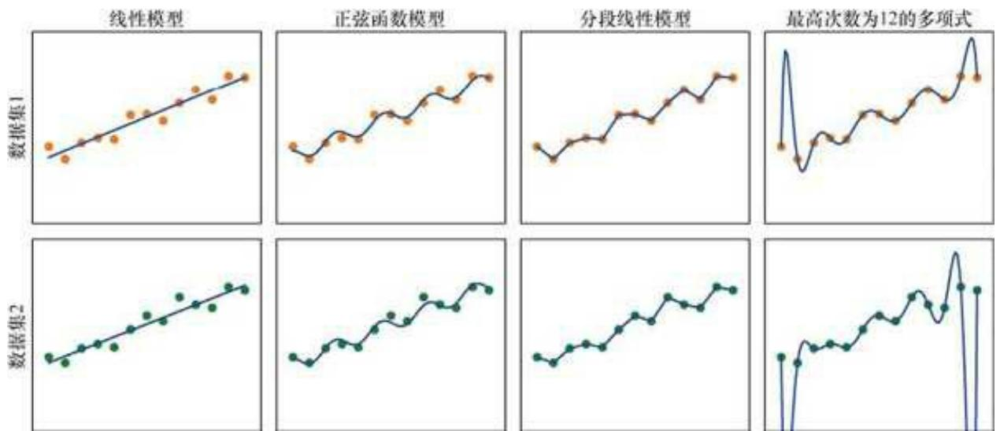  
图19-1 寻找拟合数据的假设。第一行：在数据集1上训练的来自4个不同假设空间的最佳拟合函数的4个图像。第二行：同样的4个函数，但是在稍有不同的数据集上进行训练得到的结果（数据集采样自相同的函数 f ( x )）

● 列2 ：形如 的正弦函数。这个假设并不是完全一致的，但是将两个数据集都拟合得非常好。  
●列3 ：分段线性函数，其中每一条线段从一个数据点连接到下一个数据点。这类函数永远是一致的。

$$
h (x) = \sum_ {i = 0} ^ {1 2} w _ {i} x ^ {j}
$$

●列4 ：形如

的12次多项式。这类函数是一致的：我们总是能找到一个12次

●多项式来准确地拟合13个不同点。但是假设是一致的并不意味着这是一个好的预测。

分析假设空间的一个方法是分析它们带来的偏差（不考虑训练集）和它们产生的方差（从一个训练集到另一个训练集）。

我们所说的 偏差 （bias）是指（不严格地）在不同的训练集上，假设所预测的值偏离期望值的平均趋势。偏差常常是由假设空间所施加的约束造成的。例如，当假设空间是线性函数时会导致较大的偏差：它只允许函数图像是一条直线。如果数据中除了直线的整体斜率以外还存在别的模式，线性函数将无法表示其他的模式。当一个假设不能找到数据中的模式时，我们称它是欠拟合（underfitting）的。但是，分段线性函数具有较小的偏差，其函数的形状是由数据决定的。

我们所说的 方差 （variance）是指由训练数据波动而导致假设的变化量。图19-1的两行所使用的数据集采样于同一个函数f(x)。两个数据集略有不同。对前三列函数来说，数据集的略微不同导致的假设差别比较小，我们称之为低方差的。但是第4列中的12次多项式函数则具有较大方差：可以看到它们在 x轴两端的表现差别很大。显然，这两个多项式中至少有一个多项式对正确的函数f(x)的拟合效果较差。当一个函数过于关注它用来训练的特定训练数据集，进而导致它在没有见过的数据上表现较差时，我们称该函数对数据集是过拟合 （overfitting）的。

通常这其中存在一个偏差-方差权衡 （bias-variancetradeoff）：在更复杂、低偏差的能较好拟合训练集的假设与更简单、低方差的可能泛化得更好的假设中做出选择。阿尔伯特·爱因斯坦（AlbertEinstein）曾于1933年说过，“任何理论的终极目标都是尽可能让不可削减的基本元素变得更加简单且更少，但也不能放弃对任何一个单一经验数据的充分阐释”。换句话说，爱因斯坦建议选择与数据相符的最简单的假设。这个原则可以追溯到14世纪的英国哲学家奥卡姆的威廉（Williamof

Oetam，他的原则如无必吸，勿增实体被称为奥望刀原则oarazor），因为它被用来“剔除”含糊的解释。

定义简单性并不容易。显然，只有两个参数的多项式比有13个参数的多项式简单。在19.3.4节中，我们将更加精确具体地表述这种直觉。然而，在第21章中，我们将会看到，深度神经网络模型往往可以泛化得非常好，尽管它们非常复杂——其中有些网络的参数达到数十亿个。所以，仅通过参数个数本身来衡量模型的适合程度并不是一个好方法。因此我们或许应该将目标定为选择“合适”而不是“简单”的模型类。我们将在19.4.1节中考虑这个问题。

在图19-1中，我们并不确定哪个假设是最佳的。如果我们知道数据所表示的内容，例如，一个网站的点击量每天都在增长，并且会根据一天的时间周期性变化，那么我们可能会更倾向于选择正弦函数。如果我们知道数据不是周期性的并且存在较大的噪声，那么我们可能倾向于选择线性函数。

在某些情形下，相比于仅仅判断一个假设是可能还是不可能的，分析者更愿意给出一个假设可能发生的概率。监督学习可以通过选择假设h * （在数据集上h * 发生概率最大）来实现：

$$
h ^ {*} = \underset {h \in \mathcal {H}} {\operatorname {a r g m a x}} P (h \mid d a t a)
$$

根据贝叶斯法则，上式等价于：

$$
h ^ {*} = \underset {h \in \mathcal {H}} {\operatorname {a r g m a x}} P (d a t a \mid h) P (h)
$$

于是我们可以认为，光滑的一次或二次多项式的先验概率 P(h )是较高的，而有较大波动的12次多项式的先验概率是较低的。当数据表示我们确实需要使用一些不寻常的函数进行拟合时，我们也可以使用这些不寻常的函数，但我们通过赋予它们一个较低的先验概率来尽可能避免这种情况。

为什么我们不将H 取为所有计算机程序或所有图灵机构成的类呢？这里存在一个问题， 在假设空间的表达能力与在该假设空间中寻找一个合适的假设所需的计算复杂性之间存在一种权衡。举例来说，根据数据拟合一条直线是易于计算的；然而拟合一个高次的多项式则较为困难；拟合一个图灵机则是不可判定的。我们倾向于选择简单假设空间的第二个原因是，我们可能会在学习完 $h$ 后使用它，当h 是一个线性函数时，计算 h (x)是很快的，然而计算任意的图灵机程序甚至不能保证程序终止。

基于这些原因，大多数关于学习的工作都集中在简单的表示上。近年来，人们对深度学习产生了极大的兴趣（第21章），它对函数的表示并不简单，但是 h(x)仍然只需使用适当的硬件进行有限步的计算就可以得到。

我们将看到，表达能力与复杂性的权衡并不简单：正如我们在第8章一阶逻辑中所看到的，通常情况下，表达性语言使 简单的假设能够与数据相匹配，而限制语言的表达能力则意味着任何一致性假设都必定是复杂的。

问题示例：餐厅等待问题

我们将详细描述一个监督学习问题的例子：决定是否在一家餐厅等待位置的问题。这个问题将贯穿整章，用于比较不同的模型类。在这个问题中，输出y是一个布尔变量，我们将其称为是否等待（WillWait）；当我们决定在餐厅等待位置时它的值为真 。输入 x是有10个属性值的向量，每个属性都是离散的值。

（1） 候补 （ Alternate ）：附近是否存在其他合适的可以代替的餐厅。  
（2）吧台（Bar）：该餐厅是否有舒适的吧台用于等待。  
（3）周五/六（Fri/Sat）：今天是否为周五或周六。  
（4） 饥饿 （ Hungry ）：现在是不是饿了。  
（5） 顾客 （ Patrons ）：目前餐厅有多少顾客（值为None、Some、Full）。  
（6）价格（Price）：餐厅的价格范围（$、$$,、$$$）。

（7） 下雨 （ Raining ）：外面是否正在下雨。  
（8） 预约 （ Reservation ）：我们是否有预订。  
（9） 种类 （ Type ）：餐厅种类（French、Italian、Thai或Burger）。  
（10）预 计等待 （WaitEstimate）：对等待时间的估计（ $\lfloor 0 \sim 1 0$ 分钟、 $1 0 \sim 3 0$ 分钟、 $3 0 \sim 6 0$ 分钟或 60分钟）。

图19-2给出了一组12个样例，这些样例取自本书作者罗素（SR）的切身经历。注意，数据量是很少的：输入属性的值一共有 种可能的组合，但是我们只得到了其中12个组合的正确输出，其他9204个结果可能为真，也可能为假，我们并不知道。这就是归纳的关键：我们需要通过仅有的12个样例，对缺失的9204个输出值给出最好的猜测。

图19-2餐厅等待问题领域的样例  

<table><tr><td rowspan="2">样例</td><td colspan="9">输入属性</td><td>输出</td></tr><tr><td>Alternate</td><td>Bar</td><td>Fri/Sat</td><td>Hungry</td><td>Patrons</td><td>Price</td><td>Raining</td><td>Reservation</td><td>Type</td><td>WaitEstimate</td></tr><tr><td>x1</td><td>Yes</td><td>No</td><td>No</td><td>Yes</td><td>Some</td><td>$$$</td><td>No</td><td>Yes</td><td>French</td><td>0 ~ 10</td></tr><tr><td>x2</td><td>Yes</td><td>No</td><td>No</td><td>Yes</td><td>Full</td><td>$</td><td>No</td><td>No</td><td>Thai</td><td>30 ~ 60</td></tr><tr><td>x3</td><td>No</td><td>Yes</td><td>No</td><td>No</td><td>Some</td><td>$</td><td>No</td><td>No</td><td>Burger</td><td>0 ~ 10</td></tr><tr><td>x4</td><td>Yes</td><td>No</td><td>Yes</td><td>Yes</td><td>Full</td><td>$</td><td>Yes</td><td>No</td><td>Thai</td><td>10 ~ 30</td></tr><tr><td>x5</td><td>Yes</td><td>No</td><td>Yes</td><td>No</td><td>Full</td><td>$$$</td><td>No</td><td>Yes</td><td>French</td><td>&gt;60</td></tr><tr><td>x6</td><td>No</td><td>Yes</td><td>No</td><td>Yes</td><td>Some</td><td>$$</td><td>Yes</td><td>Yes</td><td>Italian</td><td>0 ~ 10</td></tr><tr><td>x7</td><td>No</td><td>Yes</td><td>No</td><td>No</td><td>None</td><td>$</td><td>Yes</td><td>No</td><td>Burger</td><td>0 ~ 10</td></tr><tr><td>x8</td><td>No</td><td>No</td><td>No</td><td>Yes</td><td>Some</td><td>$$</td><td>Yes</td><td>Yes</td><td>Thai</td><td>0 ~ 10</td></tr><tr><td>x9</td><td>No</td><td>Yes</td><td>Yes</td><td>No</td><td>Full</td><td>$</td><td>Yes</td><td>No</td><td>Burger</td><td>&gt;60</td></tr><tr><td>x10</td><td>Yes</td><td>Yes</td><td>Yes</td><td>Yes</td><td>Full</td><td>$$$</td><td>No</td><td>Yes</td><td>Italian</td><td>10 ~ 30</td></tr><tr><td>x11</td><td>No</td><td>No</td><td>No</td><td>No</td><td>None</td><td>$</td><td>No</td><td>No</td><td>Thai</td><td>0 ~ 10</td></tr><tr><td>x12</td><td>Yes</td><td>Yes</td><td>Yes</td><td>Yes</td><td>Full</td><td>$</td><td>No</td><td>No</td><td>Burger</td><td>30 ~ 60</td></tr></table>

# 19.3 决策树学习

决策树 （decision tree）表示了这么一类函数——它将属性值向量映射到单个输出值（即“决策”）。决策树通过执行一系列测试来实现其决策，它从根节点出发，沿着适当的分支，直到到达叶节点为止。树中的每个内部节点对应于一个输入属性的测试，该节点的分支用该属性的所有可能值进行标记，叶节点指定了函数要返回的值。

通常来说，一个函数的输入与输出可以是离散的或连续的，这里我们只考虑输入为离散值，输出为真 （一个 正 样例）或 假 （一个 负 样例）的函数。我们称该情形为 布尔分类 （Booleanclassification）。我们用字母 $j$ 来标记样例（ x 代表第 $j$ 个样例的输入向量， y 代表该样例的输出），此外 x 代表第 $j$ 个样例的第 i 个属性。

如图19-3所示，该树代表了SR用于餐厅等待问题的决策函数。沿着树的分支，我们可以发现，Patrons = Full与 WaitEstimate = 0～10 的样例会被分类为正（即“yes”，我们将在餐厅等待）。

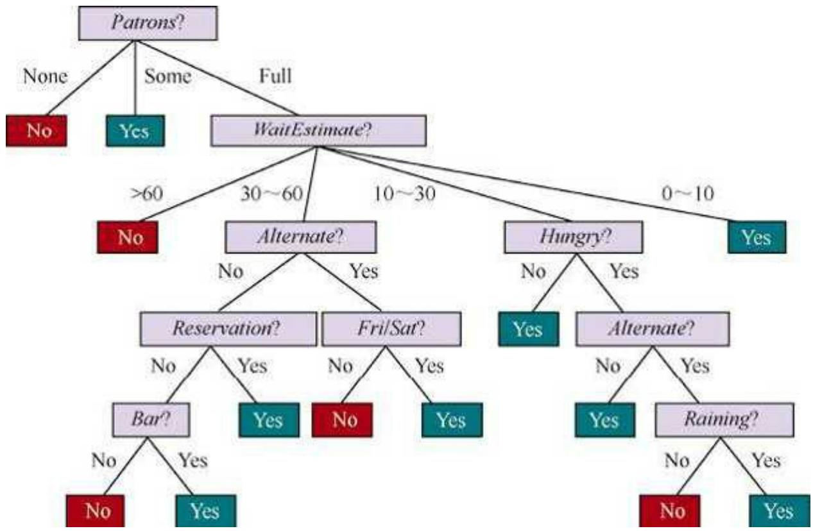  
图19-3 决定是否在餐厅等待的决策树

# 19.3.1 决策树的表达能力

一棵布尔型的决策树等价于如下形式的逻辑语句：

$$
O u t p u t \Leftrightarrow (P a t h _ {1} \vee P a t h _ {2} \vee \dots)
$$

其中每个Path 是从根节点到true叶节点的路径上的属性-值测试形式

的合取。因此，完整的表达式为析取范式的形式，这意味着命题逻辑中的任何函数都可以表示为决策树。

对许多问题，决策树会给出一个漂亮、简洁、容易理解的结果。实际上，许多内容为“如何……”的指南手册（如，汽车维修）都会按决策树形式来撰写。但有些函数并不能被简洁地表示，例如投票函数，当且仅当超过一半的输入为真时，它的输出为真，它需要指数量级大小的决策树来表示；奇

偶性函数也有这样的问题，当且仅当偶数个输入为真时，它的输出为真。当输入属性为实数值时，形如 的函数很难用决策树表示，因为该函数的决策边界为一条对角线，而所有的决策树将空间分割为矩形，即与坐标轴平行的方框。我们需要去堆积很多矩形方框以逼近对角线决策边界。换句话来说，决策树对一些函数来说是好表示的，而对另一些函数来说却是不合适的。

是否存在 一种表示方式使得任何 函数都能被有效地表示？遗憾的是，答案是否定的——函数的形式过多，无法用少量的位来全部表示。甚至即使仅仅考虑含会有2n 行，并且每一行的输出有 真 与 假 两种情形，因此存在 $n$ 个属性值的布尔函数，真值表也个不同的函数。如果属性值是$2 ^ { 2 ^ { 2 ^ { 2 } } }$ 20个，那么就存在 个函数，所以如果我们把表示限制在百万位内，我们就不能表示所有的这些函数。

# 19.3.2 从样例中学习决策树

我们希望找到一棵与图19-2中的样例保持一致并尽可能小的决策树。遗憾的是，要寻找一棵理论上最小且与样本一致的树是很困难的。但通过一些简单的启发式方法，我们可以高效地寻找一棵与最小的树接近的树。L earn -D ecision -T ree 算法采用贪心与分治的策略：我们总是首先测试当前最重要的属性，然后递归地去解决由该测试结果可能产生的更小的子问题。我们所说的“最重要的属性”指的是对一个样例的分类结果能产生最大影响的属性。这样的话，我们希望通过少量的测试来得到正确的分类结果，这意味着该树中的所有路径都比较短，整棵树的层数也比较浅。

图19-4a表明Type是一个较差的属性，因为它的输出有4种可能，并且每种可能中含有相同数量的正样例与负样例。另外，在图19-4b中我们发现Patrons是一个相当重要的属性，因为如果其值为None或者Some，那么剩余的样例将会有准确的输出（分别为No或者Yes）；如果其属性值为Full，仍将有混合的样例集。对于这些递归子问题，我们需要考虑以下4个方面。

（1）如果剩余的样例全为正（或全为负），那么我们已经达成目标，可以输出Yes或No。图19-4b给出了例子，这种情形发生于属性值为None和Some的分支中。  
（2）如果既有正样例又有负样例，那么需要继续选择最好的属性对样例进行分割。图19-4b中所示的是Hungry属性被用于分割剩余的样例。  
（3）如果分割后没有剩余的样例，则表示没有观测到该属性值组合的样例，将返回构造该节点的父节点的样例集中最常见的输出值。  
（4）如果分割后没有任何其他的属性剩余，但是存在正负两种样例，这意味着，这些样例有完全相同的属性值组合，但分类不同。这是可能发生的，或是因为数据中存在错误或噪声 （noise），或是因为该领域是非确定性的，再或是因为我们无法观测到可以区分样例的属性。此时的最好的选择就是返回剩余样例中最常见的输出值。

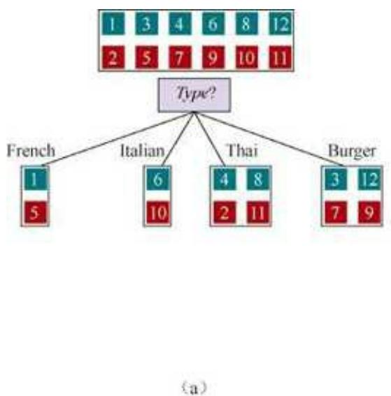

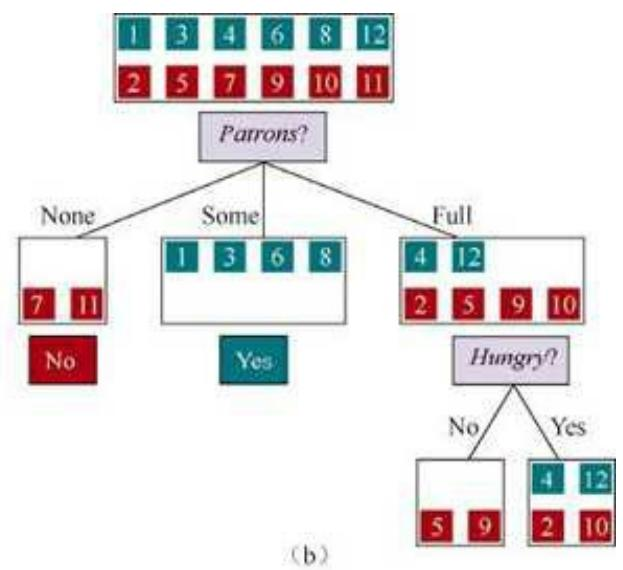

图19-4 通过测试属性来对样例进行分割。在每一个节点中我们给出剩余样例的正（绿色方框）负（红色方框）情况。（a）根据Type分割样例，没有为我们分辨正负带来帮助。（b）根据 Patrons分割样例，很好地区分了正负样例。在根据 Patrons 进行分类之后， Hungry 是相对较好的第二个测试属性

图19-5所示为Learn -D ecision -Tree算法。注意，样例集是算法的一个输入，但是样例不出现在算法所返回的任何树中。一棵树由内部节点上的属性的测试、分支上的属性值和叶节点上的输出组成。在19.3.3节中，我们将给出重要性函数Importance的细节。图19-6给出了学习算法在样本训练集上的输出结果。该树与我们在图19-3 中给出的原始树截然不同。一些读者可能会得出这样的结论：学习算法并没有很好地学习正确的函数。事实上，这是一个错误的结论。学习算法着眼于examples，而不是正确的函数，从现实来看，它的假设（见图19-6）不仅与所有样例一致，而且比原始的树简单得多！对于稍有不同的输入样例，树的形状可能会非常不同，但它所表示的函数是相似的。

functionLEARN-DEcIsioN-TREE(examples,atributes,parent examples)returns一棵树

if examples不为空 then return PLURality-VALUE(parent examples)  
else if所有examples有相同的分类then return 分类  
else if attributes为空 then return PLURality-VALUE(examples)  
else $A \leftarrow \operatorname{argmax}_{a \in \text{attributes}} \operatorname{IMPORTANCE}(a, \text{examples})$ tree $\leftarrow$ 一个以测试 $A$ 为根的新的决策树  
for each $A$ 中的值 $\nu$ do  
\[
\begin{aligned}
& \text{exs} \leftarrow \{e : e \in \text{examples and } e.A = \nu\}
\end{aligned}
\]  
subtree $\leftarrow$ LEARN-DECISION-TREE(exs, attributes-A, examples)  
将一个带有标签（ $A = \nu$ ）和子树 subtree 的分支加入 tree  
return tree

图19-5 决策树学习算法。重要性函数I mportance 将在19.3.3节中给出，函数P lurality -V alue 将选择样例集中最常见的输出，并随机地断开连接

  
图19-6根据12样例训练集推断出的决策树

学习算法不需要包含对 Raining 与 Reservation 两个属性的测试，因为它可以在没有这两个属性的情况下对所有样例进行分类。它还发现了一个有趣的、此前未被注意到的模式：SR会在周末等待泰国菜（Thai）。在一些没有任何样例被观测到的情形中，决策树也必然会犯一些错误。例如，决策树未观测到等待时间为0～10分钟但餐厅已客满的情况。在这种情况下，当Hungry属性值为假时，决策树的输出是No，即不等待，但SR肯定会选择等待。如果有更多的训练样例，决策树就可以在学习过程中纠正这个错误。

我们可以用 学习曲线 （learning curve）来评估学习算法的表现，如图19-7所示。在这个图中，有100个样例可供学习使用，我们将它们随机分割为一个训练集和一个测试集。我们使用训练集学习假设h ，并用测试集来度量其准确率。我们可以从大小为1个样例的训练集开始训练与测试的过程，每次增加1个训练样例，直到训练集包含99个样例。对于每种大小的训练集，我们实际操作时重复随机分割训练集和测试集的过程20次，并对这20次试验的结果取平均值。曲线的结果表明，随着训练集大小的增加，准确率将提高。出于这个原因，学习曲线也被称为 快乐图 （happygraph）。在这张图中，准确率最终达到了95%，并且从趋势上看，如果有更多的数据，曲线可能会继续上升。

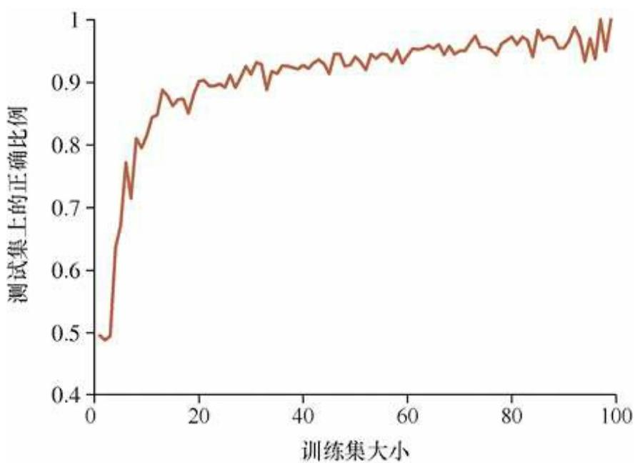  
图19-7一个决策树的学习曲线，数据集为从餐厅等待问题领域中随机产生的100个样例。图中每个点都是20次试验的均值

# 19.3.3 选择测试属性

决策树学习算法会选择重要性Importance最高的属性。我们现在将陈述如何使用信息增益这一概念来度量重要性。信息增益是从熵 （entropy）的角度进行定义的，而熵是信息论中最基本的量（Shannon and Weaver, 1949）。

熵是随机变量不确定性的度量；信息量越多，熵越小。一个只有一个可能值的随机变量（如一枚总是正面朝上的硬币）没有不确定性，因此它的熵为0。一枚公平的硬币在抛掷时出现正面或反面朝上的概率相同，我们将证明它的熵为“1位”。一个公平的四面骰子的熵为2位，因为它有2 2 种可能性相同的选择。现在考虑一枚不公平的硬币，它在99%的情况下都是正面朝上。直觉告诉我们，这枚硬币含有的不确定性比公平硬币要少——如果我们猜测正面朝上，只会有1%的情况是错的——所以我们希望它有一个接近于0，但为正的熵。一般情况下，若一个随机变量V取值为v 的概率为 P ( v k )，那么它的熵 H ( V )定义为

$$
H (V) = \sum_ {K} P \left(v _ {k}\right) \log_ {2} \frac {1}{P \left(v _ {k}\right)} = - \sum_ {k} P \left(v _ {k}\right) \log_ {2} P \left(v _ {k}\right)
$$

我们可以验证一枚公平硬币被抛掷的熵确实是1位：

$$
H (F a i r) = - (0. 5 \log_ {2} 0. 5 + 0. 5 \log_ {2} 0. 5) = 1
$$

而一个四面骰子的熵是2位：

$$
H (D i e 4) = - (0. 2 5 \log_ {2} 0. 2 5 + 0. 2 5 \log_ {2} 0. 2 5 + 0. 2 5 \log_ {2} 0. 2 5 + 0. 2 5 \log_ {2} 0. 2 5) = 2
$$

对于99%的情况出现正面的硬币，有

$$
H (L o a d e d) = - (0. 9 9 \log_ {2} 0. 9 9 + 0. 0 1 \log_ {2} 0. 0 1) \approx 0. 0 8 \text {位}
$$

一个布尔随机变量，如果其为真的概率是 $q$ ，则该变量的熵 B ( q )定义为

$$
B (q) = - (q \log_ {2} q + (1 - q) \log_ {2} (1 - q))
$$

因此， 。现在我们回过头来看决策树的学习。如果一个训练集包含 $p$ 个正样例和 $n$ 个负样例，则在整个集合上的输出变量的熵为

$$
H (O u t p u t) = B \left(\frac {p}{p + n}\right)
$$

在图19-2所示的餐厅训练集中，有 $p = n = 6$ ，因此相应的熵是 B (0.5)，或恰好为1位。对属性 A 的测试结果会给我们提供一些信息，从而减少一些整体的熵。我们可以通过观察属性测试后剩余的熵来度量这种减少。

若一个具有 $d$ 个不同值的属性A将训练集 $E$ 划分为子集 $E _ { 1 } , . . . , E _ { d }$ ，每个子集 $E _ { k }$ 含有 $p _ { \mathrm { ~ } k }$ 个正样例与 $n _ { k }$ 个负样例，那么如果我们沿着该分支前进，将需要额外的 $B ( p _ { k } / ( p _ { k } + n _ { k } ) )$ 位的信息来处理问题。从训练集中随机选取一个样例，它具有该属性的第 $k$ 个值（即该样例在 $E _ { k }$ 中的概率为$( p _ { k } + n _ { k } ) / ( p + n )$ ），因此在测试属性 A 后剩余的熵的期望为

$$
\operatorname {R e m a i n d e r} (A) = \sum_ {k = 1} ^ {d} \frac {p _ {k} + n _ {k}}{p + n} B \left(\frac {p _ {k}}{p _ {k} + n _ {k}}\right)
$$

通过测试属性 A 获得的 信息增益 （information gain）定义为熵减少的期望值：

$$
G a i n (A) = B \left(\frac {p}{p + n}\right) - R e m a i n d e r (A)
$$

事实上，Gain(A)正是我们实现重要性函数Importance需要的。回顾图19-4中所考虑的属性，有

$$
G a i n (P a t r o n s) = 1 - \left[ \frac {2}{1 2} B \left(\frac {0}{2}\right) + \frac {4}{1 2} B \left(\frac {4}{4}\right) + \frac {6}{1 2} B \left(\frac {2}{6}\right) \right] \approx 0. 5 4 1 \text {位}
$$

$$
G a i n (T y p e) = 1 - \left[ \frac {2}{1 2} B \left(\frac {1}{2}\right) + \frac {2}{1 2} B \left(\frac {1}{2}\right) + \frac {4}{1 2} B \left(\frac {2}{4}\right) + \frac {4}{1 2} B \left(\frac {2}{4}\right) \right] = 0 \text {位}
$$

这证实了我们的直觉，即 Patrons最适合作为优先考虑的分割属性。事实上， Patrons在所有的属性中有最大的信息增益，因此将被决策树学习算法选择作为树的根。

# 19.3.4 泛化与过拟合

我们希望我们的学习算法找到一个能够吻合训练数据的假设，但更重要的是，我们希望它能很好地推广到还没有被观测到的数据上。在图19-1中我们看到，一个高阶多项式可以拟合所有数据，但它在拟合数据时有不合理的剧烈波动：它拟合了数据，但可能发生过拟合。随着属性数量的增加，过拟合的可能性将越来越大，而随着训练样例数量的增加，过拟合的可能性会越来越小。较大的假设空间（例如，具有更多节点的决策树或具有更高阶数的多项式空间）具有更强的拟合和过拟合能力，某些模型类比其他模型类更容易过拟合。

对决策树来说，一种称为 决策树剪枝 （decision treepruning）的技术可以用于减轻过拟合。剪枝通过删去不明显相关的节点来实现。我们从一棵完整的树出发，它由Learn-D ecision -Tree生成。接着我们研究一个只有叶节点作为子节点的测试节点，如果该节点的测试效果为不相关——它只测试数据中的噪声——那么我们将删去该测试节点，并用它的叶节点替换它。重复这个过程，考虑每个只有叶节点作为子节点的测试节点，直到每个测试节点都被剪枝或按原样接受。

现在的问题是如何判断一个节点所测试的属性是否是不相关的属性。假设我们目前所考虑的节点由p 个正样例和n 个负样例组成。如果该节点测试的属性是不相关的，那么在我们的预期中，该测试

会将样例分割成多个子集，使得每个子集的正样例的比例与整个集合的比例 p /( p + n )大致相同，


因此信息增益将接近于0。 因而，低信息增益是判断属性是否不相关的一个很好的方法。现在的问题是，我们需要多大的增益才能在特定属性上进行分割？

我们可以用统计学中的 显著性检验 （significance test）来回答这个问题。该检验首先假设不存在基础的模式［所谓的 零假设 （null hyphothesis）］，然后对实际数据进行分析，并计算它们偏离零假设的程度。如果偏离程度在统计上不太可能发生（通常我们取5%或更低的概率作为阈值），那么这在一定程度上证明了数据中仍存在显著的模式。其中概率将根据随机抽样中偏差量的标准分布计算得到。

在这种情况下，相应的零假设是该属性是不相关的，因此对于一个无限大的样本集而言，信息增益将为0。我们需要计算的概率是在零假设下，一个大小为 $\nu = n + p$ 的样本集所呈现的与正负样例的期望分布的偏离状况的概率。我们可以通过比较每个子集中的正负样例的实际数量 $p _ {  { k } }$ 和 $n _ { k }$ 与假设该属性不相关情形下的期望数量 $\hat { p } _ { \star }$ 和 $\hat { n } _ { k }$ 来衡量这一偏差：

$$
\hat {p} _ {k} = p \times \frac {p _ {k} + n _ {k}}{p + n} \quad \hat {n} _ {k} = n \times \frac {p _ {k} + n _ {k}}{p + n}
$$

下式给出总偏差的一个简洁形式：

$$
\Delta = \sum_ {k = 1} ^ {d} \frac {\left(p _ {k} - \hat {p} _ {k}\right) ^ {2}}{\hat {p} _ {k}} + \frac {\left(n _ {k} - \hat {n} _ {k}\right) ^ {2}}{\hat {n} _ {k}}
$$

在零假设下， $\pmb { A }$ 将服从 $d - 1$ 个自由度的 $x ^ { 2 }$ 分布（卡方分布）。我们可以使用 $x ^ { 2 }$ 统计量来判断一个特定的 $\pmb { A }$ 值是接受还是拒绝了零假设。例如，餐厅的 Type 属性有4个值，因此分布有3个自由度。在 $5 \%$ 的置信水平下，总偏差 $\Delta = 7 . 8 2$ 或更大的值将拒绝零假设（在 $1 \%$ 的置信水平下，$\pmb { \mathscr { s } } = 1 1 . 3 5$ 或更大的值将拒绝零假设）。低于阈值的偏差值会让我们接受属性不相关这一零假设，因此树的相关分支应该被剪枝。这个方法被称为 $x ^ { 2 }$ 剪枝 （ pruning）。

有了剪枝的技术，我们允许样例中存在噪声。样例标签中的错误（例如，一个样例(x , No)被误标为(x ,Yes)）会使预测误差线性地增加，而样例描述中的错误（例如，样例的实际属性

被误标记 ）对误差具有渐近的影响，随着树收缩在更小的集合上运作，这种影响会变得更糟。当数据具有较大的噪声时，经过剪枝的树的性能将明显优于未剪枝的树。而且经过剪枝的树通常要小得多，因此更容易被理解，调用也更有效率。

最后一个需要提醒的地方：我们可能会认为 $\pmb { \chi }$ 剪枝和信息增益看起来很类似，那么为什么不使用一种被称为 提前停止 （early stopping）的方法将它们合并起来，即让决策树算法在没有好的属性来继续进行分割时停止生成节点，而不是平添麻烦地生成完所有不必要的节点，然后再将它们修剪掉呢？提前停止法的问题在于，它在我们找不出任何一个好的属性时即停止了程序，但有一些属性需要相互组合才会含有信息并发挥效果。例如，考虑含有两个二值属性的XOR函数，如果输入值的4种组合的样例数大致相等，那么这两个属性都不具有显著的信息，但正确的做法是先基于其中一个属性（不论是哪一个）进行分割，然后在下一个分割阶段，我们将得到非常有信息量且效果很好的分割。提前停止法可能会错过这一点，但是“先生成后剪枝”的方式可以正确地处理这种情况。

# 19.3.5 拓展决策树的适用范围

通过处理以下复杂情况，决策树可以得到更广泛的应用。

●缺失数据： 在许多问题领域中，并非每个样例的所有属性都是已知的。这些值可能没有被记

录，也可能因获得它们的代价太大而无法获得。这就产生了两个问题：首先，给定一棵完整的决策树，对于缺少一个测试属性的样例，应该如何将它分类？其次，当一些样例的属性值未知时，应该如何修改信息增益公式？这些问题留于习题19.MISS。

●连续属性与多值输入属性： 对于连续属性（如 身高、体重或 时间），可能每个样例都有不同的属性值。用信息增益来衡量属性将导致这样的属性得到理论上最高的信息增益，最终给出一棵以该属性为根的浅层树，其中每个可能值对应一个单样例子树。但是当我们需要对一个新的样例进行分类，且样例的该属性值并没有被观测过时，这棵树对我们没有帮助。

处理连续值的一个更好的方法是采用 分割点 （split point）测试— —一个关于属性值的不等式测试。例如，在树中的一个给定节点上， 体重 160的测试可能会提供最多的信息。找到好的分割点的有效方法是：首先对属性的值进行排序，然后只考虑将具有不同分类结果的两个相邻样例之间的值作为可能的分割点，同时以分割点得到的正负样例作为新样例继续算法。分割的实现是实际决策树学习应用中代价最高的部分。

对于不连续的或者排序没有意义的，但有大量可能值的属性（例如邮政编码或者信用卡号码 ），可以使用一种称为信息增益比 （information gain ratio）（见习题19.GAIN）的度量方法来避免算法将树分割成许多单样例子树。另一个有效的方法是采用形如A=v 的等式进行测试。例如，测试邮政编码=10002，可以在纽约市挑选出这个邮政编码下的一大群人，然后将其他所有人归并到“其他”子树中。

●连续值输出属性： 如果要预测一个数值类型的输出，那么我们需要的是一棵回归树 （regressiontree），而不是一棵分类树。回归树在每个叶节点上都有一个关于数值属性子集的线性函数，而不是一个单一的输出值。举个例子来说，两居室公寓的价格最终可能以一个关于占地面积和浴室数量的线性函数输出。学习算法必须能够决定何时停止对树进行分割并开始对属性应用线性回归（见19.6节）。 CART 这个名字代表分类与回归树（Classification And Regression Tree），用于涵盖这两个类别的树。

一个面向实际应用的决策树学习系统必须能够处理所有这些问题。处理连续值变量尤其重要，因为物理过程和金融过程所提供的都是数值数据。现实应用中已经出现了一些符合这些标准的商业软件包，并已用于开发数千个部署系统。在工业和商业的许多领域中，决策树仍是从数据集中寻找分类方法的首要方法。

决策树有很多优点：易于理解，可推广到大型数据集，处理离散输入和连续输入及分类和回归问题的多功能性。然而，它们的精确度可能是次优的（主要是由贪心搜索导致），并且如果树很深，那么在调用树为一个新的样例进行预测时可能会有昂贵的运行代价。决策树也是不稳定的（unstable），因为仅添加一个新的样例，就可能更改根上的测试结果，从而更改整个树。在19.8.2节中，我们将看到随机森林模型 （randomforestmodel）可以解决这些问题中的一部分。

# 19.4 模型选择与模型优化

在机器学习中，我们的目标是选择一个和未来的样例最佳拟合的假设。要做到这一点，我们需要定义“未来的样例”和“最佳拟合”。

首先，我们假设未来的样例类似于过去观测过的样本。我们称之为平稳性 （stationary）假设；若没有它，所有的方法都没有意义。我们假设每个样例E 都具有相同的先验概率分布：

$$
\boldsymbol {P} (E _ {j}) = \boldsymbol {P} (E _ {j + 1}) = \boldsymbol {P} (E _ {j + 2}) = \dots
$$

而且它与之前的样例是独立的：

$$
P (E _ {j}) = P (E _ {j} \mid E _ {j - 1}, E _ {j - 2}, \dots)
$$

对于满足这些等式的样例，我们称它们为 独立同分布的 或 i . i . d .。

下一步是定义“最佳拟合”。我们说最佳拟合是最小化 错误率 （error rate）——对于样例( x , y )，的比例——的假设。（稍后我们将对此内容进行推广，以允许不同的误差具有不同的代价，实际上倾向于信任“几乎”正确的答案。）我们可以通过对一个假设进行测试来估计其错误率：在一组称为测试集 的样例上评估它的表现。一个假设（或一个学生）在测试前偷看答案属于作弊行为。为确保这种情况不会发生，最简单的方法是将我们拥有的样例分割成两组：一组为用于训练从而得到假设的 训练集 ，另一组为用于评估假设的 测试集 。

如果我们只想建立一个假设，那么这个方法就足够了。但通常我们最终会得到多个假设：我们可能想要比较两个完全不同的机器学习模型，或者我们可能想要在同一个模型中调整不同的“旋钮”。例2如，在 剪枝中我们可以尝试不同的阈值对决策树进行剪枝，或者尝试不同次数的多项式。我们称这些“旋钮”为超参数 （hyperparameter），它们是对模型类而言的，而不是对单个模型。

假设一个研究者在一组 剪枝的超参数中训练出一个假设，并在测试集上测试了其错误率，然后继续尝试不同的超参数。没有任何一个单独的假设“偷看”或使用了测试集的数据，但整个 过程 通过研究者还是泄露了测试集的信息。

避免这种依赖性的方法是将测试集完全锁定——直到你完全完成了训练、实验、超参数调整、再训练这一系列过程。这意味着你需要3个数据集。

（1） 训练集 用于训练备选模型。  
（2） 验证集 （validation set）也被称为 开发集 （development set或dev set），用于评估备选模型并选择最佳的备选模型。  
（3） 测试集 用于无偏地估计最佳模型。

如果我们没有足够的数据来构成这3个数据集怎么办？我们可以使用一种称为k折交叉验证 （k-foldcross-validation）的方法从数据中获得更多子数据集。其思想是，每个样例都被作为训练数据和验证数据，从而提供双重功能，但又不同时提供。首先，我们将数据分割成k个相等大小的子集，然后进行 $k$ 轮学习；在每一轮中，1/k的数据被作为验证集，其余的样例被用于训练。 $k$ 轮的平均测试分数相比单个分数应该是一个更准确的估计。常用k值为5或10——足以给出一个在统计上较为准确的估计值，其代价是5到10倍的计算量。最极端的情形是k=n ，该情形也被称为 留一交叉验证 （leave-one-out cross-validation，LOOCV）。即使采用了交叉验证的方法，我们仍然需要一个单独的测试集。

在图19-1（见19.2节）中，我们注意到，一个线性的函数对数据集是欠拟合的，而高次多项式对数据是过拟合的。我们可以把找到一个好的假设这一目标分作两个子任务：模型选择 （modelselection） [1] ，即选择一个好的假设空间； 模型优化 （model optimization）（也称为 训练 ），即在这个空间中找到最佳假设。

[1]尽管“模型选择”这一名称已经被广泛运用，但更好的名称应该是“模型类选择”或“假设空间选择”。“模型”一词在文献中通常有3种不同层次的含义：宽泛的假设空间（如“多项式”）、固定超参数的假设空间（如“二次多项式”）以及所有参数固定了的特定假设（如 $5 x ^ { 2 } + 3 x - 2$ ）。

模型选择有一部分是定性的和主观的：基于我们对问题已有的一些了解与认识，我们可能会选择多项式函数而不选择决策树。模型选择的另一部分是定量的和经验性的：在多项式函数类中，我们可以选择次数为2的多项式，因为这个值在验证数据集上表现最好。

# 19.4.1 模型选择

图19-8描述了一个简单的模型选择算法。它以一个学习器Learner（例如，它可以是决策树学习器L earn -D ecision -T ree ）为参数。 Learner 选取一个在图中名为 size 的超参数，对于决策树而言，它可以是树中的节点数；对于多项式，它可以是函数的次数。模型选择Model-Selection 从size的最小值开始，得到一个简单的模型（这可能会导致数据欠拟合），之后采用较大的size值，并考虑更复杂的模型。最后，模型选择算法Model-Selection 将选择在验证数据上平均错误率最低的模型。

functionMoDEL-SELECTIoN(Learner,examples,k)returns一个（假设,错误率）对

err $\leftarrow$ 一个数组，以size为索引，存储验证集错误率  
training_set, test_set $\leftarrow$ examples划分成两个集合  
for size $= 1$ to $\infty$ do  
err[size] $\leftarrow$ CROSS-VALIDATION(Learner, size, training_set, k)  
if err开始显著增长then  
best_size $\leftarrow$ 使err[size]最小的size值  
h $\leftarrow$ Learner(best_size, training_set)  
return h, ERROR-RATE(h, test_set)

functionCRoss-VALIDATION(Learner,size,examples,kreturns错误率

$N\gets$ examples的个数  
err $\leftarrow 0$ for $i = 1$ tokdo validation_set $\leftarrow$ examples[(i-1)×N/k:i×N/k] training_set $\leftarrow$ examples-validation_set h $\leftarrow$ Learner(size,training_set) err $\leftarrow$ err+ERROR-RATE(h,validation_set)   
returnerrs/k //验证集的平均错误率，k折交叉验证

图19-8 选择验证误差最小的模型的算法。随着复杂性不断增加，算法建立了多个模型，并在验证数据集上选择经验错误率 err 最小的模型。 Learner ( size , examples )返回一个假设，其复杂性由参数 size 设置，并根据样例集 examples 进行训练。在交叉验证C ross -V alidation 中， for 循环的每次迭代都会选择一个不同部分的examples作为验证集，并保留其他样例作为训练集。然后它返回所有折的平均验证集误差。一旦我们确定了 size参数哪个值是最佳的，Model-Selection 将返回该参数下的在所有的训练样例上训练过的模型（如学习器/假设），以及它在所给测试样例上的错误率

在图19-9中，我们看到了在模型选择中可能发生的两种典型的模式。在图19-9a和图19-9b中，随着模型复杂性的增加，训练集误差单调减小（伴随着轻微的随机波动）。复杂性分别由图19-9a中的

决策树节点数量和图19-9b中的神经网络参数（ w ）数量衡量。对许多模型类来说，随着复杂性的增加，训练集误差将逐渐达到0。

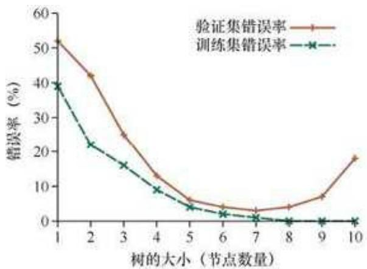

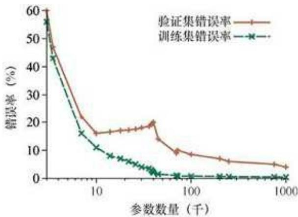  
  
图19-9两个不同问题上不同复杂性模型的训练误差（下方绿线）和验证误差（上方橙色线）。模型选择算法Model-Selection 将选择验证误差最小的模型对应的超参数值。（a）模型类是决策树，超参数是节点数量。数据来自餐厅等待问题。最佳的超参数大小为7。（b）模型类是卷积神经网络（见21.3节），超参数是网络中常规参数的数量。数据是数字图像的MNIST数据集，任务是识别手写数字的照片。效果最好的超参数是1 000 000（注意坐标的对数刻度）

关于在验证集误差上的表现，这两种情况有着显著的差异。在图19-9a中，我们看到了一个U形的验证集误差曲线：随着模型复杂性的增加，误差在一段时间内会先降低，但是当它到达一个临界点时，模型开始过拟合，验证误差逐渐增加。Model-Selection 将选择U形验证误差曲线中验证误差最低的值：在本例中是一个节点个数为7的树。这是最能平衡欠拟合和过拟合的位置。在图19-9b中，一开始我们观察到了与图19-9a中类似的U形曲线，但随后验证误差又开始减小；验证误差最低的点是实验结果中的最后一点，参数个数为1 000 000。

为什么有些验证误差曲线形如图19-9a所示而另一些形如图19-9b所示呢？根本问题在于不同的模型类如何利用其过强的表达能力，以及它们与当前问题的匹配程度。当我们加强一个模型类的表达能力时，我们通常会达到这样的程度：所有的训练样例都可以在模型中被完美地表达。例如，给定一个包含n 个不同样例的训练集，总有一个具有 n 个叶子节点的决策树可以表达所有的样例。


我们称一个完全拟合了所有训练数据的模型为对数据进行了 插值 （interpolated）。 当模型的表达能力接近于插值临界点时，模型类已经开始过拟合。这似乎是因为模型的大部分表达能力都集中在训练样例上，而剩余的表达能力以不代表验证数据集中的模式的方式随机分布。有些模型类永远不会从这种过拟合的表现中自主地恢复过来，例如图19-9a中的决策树。但是对于其他模型类，增加模型类的表达能力意味着有更多的候选函数，其中一些函数自然非常适合真实函数f(x)中的数据模式。表达能力越强，合适的表示函数就越多，优化方法就越有可能将结果落在其中一个之上。

深度神经网络（第21章）、核机器（19.7.5节）、随机森林（19.8.2节）和增强集成（19.8.4节）都具有验证误差随模型类表达能力增加而减小的特点，如图19-9b所示。

我们可以用以下不同方式来扩展模型选择算法：比较不同的模型类，通过让模型选择函数Model-Selection 使用决策树学习器D ecision -T ree -L earner 和多项式学习器P olynomial -L earner 进行比较，观察哪个表现更好来实现。我们可以允许多个超参数的存在，这意味着需要有更复杂的优化算法以确定超参数，如网格搜索（见19.9.3节），而不是线性搜索。

# 19.4.2 从错误率到损失函数

到目前为止，我们一直在试图降低错误率。这显然比最大化错误率要好，但这样是不够的。例如，将电子邮件分类为垃圾邮件或非垃圾邮件的问题。把非垃圾邮件归类为垃圾邮件（这可能导致漏掉

一封重要的邮件）比把垃圾邮件归类为非垃圾邮件（导致自己遭受几秒钟的骚扰）糟糕得多。因此，如果一个分类器所犯的大多数错误都是将垃圾邮件分类为非垃圾邮件，那么错误率为1%的该分类器将比错误率仅为0.5%但所犯的错误都是把非垃圾邮件分类为垃圾邮件的分类器要好。我们在第16章中看到，决策者应该最大化预期效用，那么学习器也应该最大化效用。然而，在机器学习中，传统的做法是将其表述为负面效用：最小化 损失函数 （loss function）而不是最大化效用函数。损失函数 定义为当正确的答案为 f ( x ) = y 时，模型预测出 的效用损失量：

$$
\begin{array}{l} L (x, y, \hat {y}) = U t i l i t y (\text {给 定 输 入} x, \text {使 用} y \text {的 结 果}) \\ - U t i l i t y \left(\text {给 定 输 入} x, \text {使 用} \hat {y} \text {的 结 果}\right) \\ \end{array}
$$

这是损失函数最一般的形式。我们通常使用的是更简单的形式 ，它独立于 x 。在本章的剩余部分中，我们将使用简化版本的损失函数，这意味着我们不能认为，将妈妈的来信错误分类比将讨厌的堂兄的来信错误分类更糟糕，但我们可以说，将非垃圾邮件归类为垃圾邮件要比将垃圾邮件归类为非垃圾邮件糟糕10倍：

$$
L (s p a m, n o s p a m) = 1, \quad L (n o s p a m, s p a m) = 1 0
$$

注意， $L$ ( y , y )始终为0；即根据定义，当你正确猜测时，我们认为没有损失。对于具有离散输出值的函数，我们可以为每个可能的误分类状况枚举出一个损失值，但输出值为实数时我们不能列举出所有可能性。当 f(x)函数值为137.035999时，我们对预测值 h (x)=137.036相当满意，但是如何衡量我们对此的满意程度呢？一般来说，小的误差总是比大的误差好；可以实现这种想法的两个函数为两者差的绝对值（称为 $L _ { 1 }$ 损失）和两者差的平方（称为 $L _ { 2 }$ 损失；将“2”理解为平方的意思）。对于离散值输出，如果我们希望达到最小化错误率，那么可以使用 $L _ { 0 / 1 }$ 损失函数，即对错误答案损失为1、对正确答案损失为0的损失函数：

绝对值损失： $L _ { 1 } ( y , \hat { y } ) = \left| y - \hat { y } \right|$

平方误差损失： $L _ { 2 } \left( y , \hat { y } \right) = \left( y - \hat { y } \right) ^ { 2 }$

0/1损失： $L _ { 0 / 1 } ( y , \hat { y } ) = 0$ 若 $\boldsymbol { y } = \boldsymbol { \hat { y } }$ ，否则1

从理论上来说，学习智能体通过选择最小化目前观测到的所有输入-输出对的预期损失的假设，来使其期望效用最大化。为了计算该期望，我们需要定义样例的先验概率分布 $P ( X , Y )$ 。令 为所有可能的输入-输出样例的集合。那么假设 $h$ （关于损失函数 $L$ ）的期望 泛化损失 （generalizationloss）为

$$
\operatorname {G e n L o s s} _ {L} (h) = \sum_ {(x, y) \in \varepsilon} L (y, h (x)) P (x, y)
$$

而最佳假设 $h ^ { * }$ 是使得期望泛化损失最小的假设：

$$
h ^ {*} = \underset {h \in \mathcal {H}} {\operatorname {a r g m i n}} G e n L o s s _ {L} (h)
$$

由于在大多数情况下，先验分布 P(x, y)是未知的，学习智能体只能在一组大小为 $N$ 的样例 $E$ 上用 经验损失 （empiricalloss）来估计泛化损失：

$$
E m p L o s s _ {L, E} (h) = \sum_ {(x, y) \in E} L (y, h (x)) \frac {1}{N}
$$

估计最佳假设 即为使得经验损失最小的假设：

$$
\hat {h} ^ {*} = \underset {h \in \mathcal {H}} {\operatorname {a r g m i n}} E m p L o s s _ {L, E} (h)
$$

得到的假设 与真实函数 f 不同，有4种可能的原因：不可实现性、方差、噪声和计算复杂性。

第一，如果假设空间H 实际上包含真实函数f，那么称该学习问题是可实现的 （realizable）。如果 $_ \mathrm { H }$ 是线性函数的集合，而真实函数 f是一个二次函数，那么无论有多少数据可供使用，都无法找到真实函数 $f$ 。第二， 方差 意味着我们所使用的学习算法通常会针对不同的样例集合返回不同的假设。如果问题是可实现的，那么方差会随着训练样例数量的增加而逐渐减小到0。第三，函数 $f$ 可能是非确定性的或有噪声的 （noisy）——对于同一个输入值x它可能返回不同的f(x)值。根据定义，噪声是无法被预测的（它只能被描述）。第四，当假设空间H 是一个庞大假设空间中的复杂函数时，系统地搜索所有可能性将是 难以计算的 （computationally intractable）；在这种情况下，搜索可以探索假设空间的一部分并返回一个相当好的假设，但并不能总是保证它是最佳的假设。

传统的统计学方法和早期的机器学习主要注重 小规模学习 （small-scale learning），其中训练样例的数量可能从几十个到几千个不等。此时泛化损失主要来源于假设空间中不包含真实函数 $f$ 而导致的近似误差，以及因为没有足够训练样例来限制方差而导致的估计误差。

近年来，人们越来越重视 大规模学习 （large-scale learning），它们通常有上百万的训练样例。在这样的问题中，泛化损失可能受到计算限制的约束，即如果有足够的数据和足够丰富的模型，我们可以找到一个非常接近真实函数 $f$ 的假设 h ，但是找到它的计算是复杂的，所以我们需要采用近似的方法。

# 19.4.3 正则化

在19.4.1节中，我们了解了如何使用交叉验证进行模型选择。模型选择的另一种方法是寻找一个假设，它直接最小化经验损失与假设复杂性度量的加权和，我们称之为总代价：

$$
\begin{array}{l} C o s t (h) = E m p L o s s (h) + \lambda C o m p l e x i t y (h) \\ \hat {h} ^ {*} = \underset {h \in \mathcal {H}} {\operatorname {a r g m i n}} C o s t (h) \\ \end{array}
$$

其中 是一个大于零的超参数，作为损失和假设复杂性度量之间的转换比率。如果选择了一个较好的 ，它可以很好地平衡简单函数中可能较大的经验损失与复杂函数中过拟合的倾向。

我们把这个过程称为正则化 （regularization），它显式地惩罚复杂假设的复杂性：我们希望寻找更规则的函数。我们现在结合了两种度量，即损失函数（L 或 $L$ ）和复杂性度量，我们称后者为正则化函数 （regularization function）。正则化函数的选择依赖于假设空间。例如，对多项式假设空间来说，系数平方和是正则化函数的一个不错选择——保持系数平方和较小将引导我们避开图19-1中剧烈波动的12次多项式。我们将在19.6.3节中给出一个这种正则化的例子。

另一种简化模型的方法是减少模型的维数。例如可以使用一个称为特征选择 （featureselection）

的过程来判断属性的相关性，然后丢弃不相关的属性。 剪 枝就是一种特征选择的方式。

在没有转换因子 的情况下，经验损失和复杂性将在同一尺度下进行度量，实际上这可能是可行的：它们都可以用计算机位来度量。首先我们将假设编码为图灵机程序，并计算其位数。然后计算对数据进行编码所需的位数，其中正确预测的样例的代价为零位，而错误预测的样例的代价取决于预测错误的严重程度。最小描述长度 （minimun description length，MDL）的假设为使所需的总位数最小化的假设。这个方法在一定情境下可以很好地工作，但是对于规模较小的问题，程序编码的选择——如何最好地将决策树编码为位字符串——将会影响结果。在第20章中，我们将为MDL方法提供一个概率层面的解释。

在19.4.1节中，我们描述了如何选择最佳的超参数值——通过对每个可能值应用交叉验证，直到验证错误率开始增大。当只存在一个超参数，且它的可能值不多时，这是一个很好的方法。但当存在多个超参数，或当它们具有连续值时，选择好的超参数值就较为困难。

最简单的超参数调整方法是手动调参 （hand-tuning）：根据个人以往的经验来猜测参数，在该参数下训练模型，并在验证集上测试其表现并分析结果，根据直觉得到参数调整的结果。之后重复此操作，直到获得满意的模型表现为止（运气不好的话，你可能会耗光时间、计算预算或耐心）。

如果只有几个超参数，且每个超参数都有比较少的可能值，那么一种称为网格搜索 （grid search）的更系统化的方法将是适用的：尝试所有超参数值的组合，观察哪个组合在验证集上表现得最好。不同的组合可以在不同的机器上并行运行，所以如果你有足够的计算资源，这种尝试过程将不会太缓慢，尽管在某些情况下，模型选择一次超参数并运行会占用很大的计算资源。

我们在第3章和第4章中提到的搜索策略也可以在此发挥作用。例如，如果两个超参数彼此独立，则可以分别对它们进行优化。

如果参数可能值的组合太多，那么考虑从所有可能的超参数可能值组合的集合中随机搜索（randomsearch）采样，并重复进行足够多次，只要你愿意花费时间和计算资源就能找到足够好的参数组合。此外，随机搜索也适用于处理连续值的超参数选择。

在每次训练需要花费很长时间的情况下，从每次训练中获取有用的信息将会对我们优化超参数有所帮助。 贝叶斯优化 （Bayesian optimization）将选择好的超参数值的任务本身视为一个机器学习问题，也就是说把超参数值 x 向量作为输入，把用这些超参数所建立与训练的模型在验证集上的总损失作为输出 y ；之后试图找到函数 ，来使损失 y 最小化。每次使用一组超参数进行训练时，都会得到一个新的 对，我们可以用它来更新对函数 $f$ 的形式的猜测。

超参数选择的核心思想是在探索（尝试新的超参数值）与利用（选择与先前得到的结果较好的超参数值接近的超参数值）之间进行权衡。这与我们在蒙特卡罗树搜索（5.4节）中看到的权衡类似，实际上，这里也使用了上置信界的概念来最大限度地减少遗憾。如果我们假设函数 $f$ 可以用一个高斯过程 （Gaussian process）来近似，那么在数学上函数 $f$ 的更新将表现得非常好。斯努克等人（Snoeketal. , 2013）从数学上对该方法做出了解释，并为该方法提供了实际应用层面的指导，结果表明，该方法的效果胜过手动调整的超参数（即便是调参专家所调出来的超参数）。

一种可以代替贝叶斯优化的方法是 基于群体的训练 （population-based training，PBT）。PBT首先使用随机搜索（并行地）训练大量模型，其中每个模型具有不同的超参数值。接着训练第二代模型，可以基于上一代中较好的参数值，通过对其使用遗传算法（4.1.4节）中的随机突变来选择新的超参数值。因此，基于群体的训练既有随机搜索的优点，即可以并行地执行许多次训练，又具有贝叶斯优化（或由专业人士进行手动调参）的优点，即我们可以从过去的训练结果中获取信息并提供给之后的超参数选取。

# 19.5 学习理论

我们如何确定我们所学的假设能够很好地预测还未被观测过的输入？也就是说，如果我们不知道目标函数 $f$ 是什么样子的，该如何确定假设 h是否接近目标函数f？这个问题已经存在了好几个世纪，奥卡姆、休谟等许多人都研究过。近几十年以来，又陆续出现了其他问题：要获得较好的假设，我们需要多少样例？我们应该选用什么假设空间？如果假设空间非常复杂，我们是否可以找到最佳的假设h，还是只能找到局部最佳的假设？h 应该有多大的复杂性？如何避免过拟合？我们将在本节中探讨这些问题。

我们从学习需要多少样例这一问题入手。从决策树学习在餐厅等待问题上的学习曲线（图19-7）中可以看出，使用更多训练数据有利于提高准确性。学习曲线是有一定效果的，但它仅限于特定问题的特定学习算法。那么是否有一些更通用的法则来衡量所需的样例数量？

诸如此类的问题我们统称为 计算学习理论 （computational learning theory），它是人工智能、统计学和计算机理论等学科交汇的理论。解决这个问题的基本原理是，在用少量的样例进行训练之后，那些非常不匹配的假设将有很高的概率被“排除”，因为它们将做出错误的预测。因此，如果一个假设与足够多的训练样例相一致，那么它不太可能是严重不匹配的，也就是说，它必须是 概率近似正确的 （probably approximately correct，PAC）。

任何返回概率近似正确的假设的学习算法都称为PAC学习 （PAClearning）算法。我们可以使用这种方法为各种学习算法提供性能限界。

与所有其他理论一样，PAC学习理论也是公理的逻辑结果。当一个定理（而不是一个政客）基于过去的知识对未来进行预言时，公理必须提供“基础”以支撑这种联系。对PAC学习而言，该“基础”是由19.4节中所介绍的平稳性假设提供的，该假设意味着，将来的样例将从与过去的样例相同的固定分布 中得出。（注意，我们可能不知道分布具体是什么样的，我们只知道它不会改变。）此外，出于方便考虑，我们将假定真实函数f是确定性的，并且是正在考虑的假设空间H 的一个成员。

最简单的PAC定理是有关布尔函数的，对布尔函数来说，0/1损失是较合适的损失函数。在前面的内容中我们非正式地给出了假设h的 错误率 的定义，在此给出正式的定义，即从平稳分布中得出的样例的泛化误差的期望：

$$
\operatorname {e r r o r} (h) = \operatorname {G e n L o s s} _ {L _ {0 / 1}} (h) = \sum_ {x, y} L _ {0 / 1} (y, h (x)) P (x, y)
$$

换句话说，error(h )是假设h 对新样例进行分类产生错误结果的概率。该错误率即为学习曲线实验中所测量的量。

如果一个假设满足 ，那么我们称该假设 h 是 近似正确 （approximately correct）的，其中 $\pmb { \varepsilon }$ 是一个较小的常数。我们将证明，能找到一个 $N$ ，使得在基于 $N$ 个样例进行训练之后，所有一致性假设都将有高概率是近似正确的。我们可以认为近似正确的假设在假设空间中是“接近”真实函数的：它位于真实函数 $f$ 周围的某个 $\pmb { \varepsilon }$ 球 （ $\pmb { \varepsilon }$ -ball）内。我们将该球外部的假设空间记为 H b ad 。 $_ \mathrm { H }$

对于一个“严重错误”的假设 $h _ { b } \in \mathcal { H } _ { \mathrm { b a d } }$ ，我们可以给出它与前 N 个样例都一致的概率的界限。首先，有 。因此，它与某个给定样例一致的概率最多为 。又由于样例是独立的，因此与 $N$ 个样例一致的概率上界为：

$$
P (h _ {\mathrm {b}} \text {与} N \text {个 样 例 一 致}) \leqslant (1 - \varepsilon) ^ {N}
$$

则“在 $\mathrm { H } _ { \mathrm { b a d } }$ 中至少含有一个与该 $N$ 个样例一致的假设”的概率将有上界，上界为各个假设与样例保持一致的概率的和：

$P ( \mathcal { H } _ { \mathrm { b a d } }$ 包含一个一致性假设 $) \leqslant | \mathcal { H } _ { \mathrm { b a d } } | ( 1 - \varepsilon ) ^ { N } \leqslant | \mathcal { H } | ( 1 - \varepsilon ) ^ { N }$

其中 $\mathrm { H } _ { \mathrm { b a d } }$ 为假设空间 H 的一个子集，因此有 $| \mathcal { H } _ { \mathrm { b a d } } | \leq | \mathcal { H } |$ 。我们希望能使这个事件发生的概率小于某个较小的正数 $\pmb { \delta }$ ：

$P ( \mathcal { H } _ { \mathrm { b a d } }$ 包含一个一致性假设 $) \leqslant | \mathcal { H } | ( 1 - \varepsilon ) ^ { N } \leqslant \delta$

由于 $1 - \sigma \leq e ^ { - \theta }$ ，通过较大的样例数

$$
N \geqslant \frac {1}{\varepsilon} \left(\ln \frac {1}{\delta} + \ln | \mathcal {H} |\right) \tag {19-1}
$$

我们可以得到相应的结论。因此学习算法在观测了这么多的样例之后，以至少 $1 - \delta$ 的概率，返回一个错误率至多为 的假设。换言之，它是概率近似正确的。所需的样例数量是关于 $\pmb { \varepsilon }$ 与 $\pmb { \delta }$ 的一个函数，被称为学习算法的 样本复杂性 （sample complexity）。

如我们之前所述，如果 H 是 n 个属性上所有布尔函数的集合，则 。 $\vert \gamma _ { \ell } \vert = 2 ^ { 2 ^ { n } }$ 因此，假设空间的样本复杂性增长速度为2 n 。因为所有可能的样例数也是2n ，所以这表明在所有布尔函数类中的PAC学习需要观测到几乎所有可能的样例。换个角度思考产生这样结果的原因： H 包含足够多假设，它可以区分以任何方式给定的任何样例集合。特别地，对于任何包含 $N$ 个样例的集合，与样例一致的假设的集合仍包含数量相等的预测 $x _ { N + 1 }$ 为正的假设和预测 $x _ { N + 1 }$ 为负的假设。

为了获得对未观测的样例的真实泛化状况，我们似乎需要以某种方式对假设空间进行限制。但是，如果我们确实限制了假设空间H ，则可能会完全排除真实的假设。有3种方法可以避免这种困境。

第一种方法是利用先验知识来解决这个问题。

第二种方法是我们在19.4.3节中介绍的，它要求算法不只是返回任何一致性假设，而是优先返回一个简单的假设（就像在决策树学习中所做的那样）。如果找到简单的一致性假设是比较容易的，那么其样本复杂性结果通常比仅基于一致性分析所得到的假设要好一些。

接下来我们要探讨的第三种方法注重布尔函数整个假设空间的可学习子集。该方法依赖于以下假设：受限的假设空间包含与真实函数f足够接近的假设h ；其好处是受限的假设空间可以更有效地泛化，并且通常更易于搜索。接下来我们将更详细地研究其中一种这样的受限假设空间。

PAC学习示例：学习决策列表

现在，我们将展示如何将PAC学习应用于新的假设空间：决策列表 （decision list）。决策列表包含一系列测试，每个测试都是一些文字的合取。如果一个测试应用于一个样例描述的结果是相符的，则决策列表将指定要返回的值。如果测试不相符，则将继续处理列表中的下一个测试。决策列表类似于决策树，但它的整体结构更简单：仅在一个方向上存在分支。相比之下，它的单个测试更为复杂。图19-10给出了一个代表以下假设的决策列表：

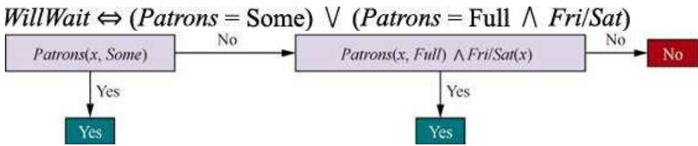  
图19-10 餐厅等待问题的决策列表

如果允许测试可以是任意大小的，那么决策列表将能表示任何布尔函数（习题19.DLEX）。另外，

如果我们将每个测试的大小限制为最多 $k$ 个文字，则学习算法将可能从少量样例中成功泛化。我们采用符号k-dl来表示最多包含k个合取的决策列表。图19-10中的样例即为2-DL。容易证明（习题19.DLEX）， k - dl 是 k-DT 的子集， k - DT 是深度最多为 $k$ 的所有决策树的集合。我们用 k - dl ( n)表示使用 n 个布尔属性的 k - dl 。

我们的第一个任务是证明k-dl是可学习的，也就是说， k-dl中的任何函数在经过合理数量的样例训练后，都可以被准确地近似。为证明这一点，我们需要计算所有可能假设的数量。我们将使用n 个属性且最多 k 个文字的合取式集合记为 Conj ( n , k )。由于决策列表是根据许多测试构建的，并且每个测试结果为Yes或No或不在决策列表中，所以最多存在 个不同的用于组成决策列表的测试。又由于这些测试可以按任意顺序进行排列，因此：

$$
| k \text {- D L} (n) | \leqslant 3 ^ {c} c! \text {其 中} c = | C o n j (n, k) |
$$

使用 n 个属性且最多 k 个文字的合取式的数量由下式给出：

$$
| C o n j (n, k) | = \sum_ {i = 0} ^ {k} \binom {2 n} {i} = O \left(n ^ {k}\right)
$$

因此，通过计算我们可以得到

$$
| k - \mathrm {D L} (n) | = 2 ^ {O \left(n ^ {k} \log_ {2} \left(n ^ {k}\right)\right)}
$$

我们将其代入式（19-1）来获得PAC学习中k-dl(n )函数所需的样例数，它是关于 $n$ 的多项式：

$$
N \geqslant \frac {1}{\varepsilon} \left(\ln \frac {1}{\delta} + O \left(n ^ {k} \log_ {2} \left(n ^ {k}\right)\right)\right)
$$

因此，对于较小的k，任何返回一致决策列表的算法都将在合理数量的样例中PAC学习k-dl函数。

下一个任务是找到一种可返回一致决策列表的有效算法。我们使用一种称为D ecision -List-Learning的贪心算法，该算法将反复查找与训练集的某些子集完全一致的测试。在找到这样的测试后，便将其添加到正在构建的决策列表中，并删除相应的样例。然后仅使用剩余的样例来构造决策列表的剩余部分。之后重复此过程，直到没有样例剩余为止。该算法如图19-11所示。

该算法没有给出选择下一个要添加到决策列表的测试的方法。尽管之前给出的形式化的结果也不依赖于选择方法，但优先选择小的测试并使它能与尽量多的统一分类样例匹配是一个合理的选择，这样会使决策列表整体尽可能紧凑。最简单的策略是找到与任意一个统一分类的子集匹配的最小测试t，而不考虑子集的大小。结果如图19-12所示，可以发现即便是这种简单的方法也能表现得很好。对于此问题，决策树的学习速度比决策列表要快一些，但对应的波动更大。两种方法的准确率在经过100次试验后均超过90%。

```txt
function DECISION-LIST-LEARNING(examples) returns 一个决策列表或failure  
if examples为空 then return 平凡的决策列表No  
t←与一个examples的非空子集examples对应的测试，使得examples的元素均为正样例或者负样例  
if不存在这样的tthen return failure  
if集合examples中的样例均为正then o←Yes else o←No  
return一个初始测试为t，输出为o，且由DECISION-LIST-LEARNING(examples-examples)给出剩余测试的决策列表
```

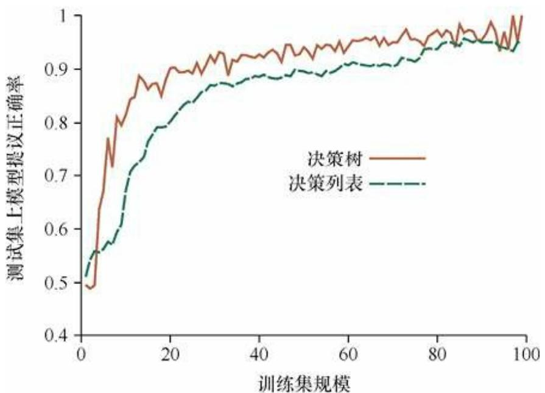  
图19-11学习决策列表的算法  
图19-12 D ecision -L ist -L earning 算法用于餐厅等待问题的学习曲线。L earn -D ecision -T ree 的曲线也在图中给出，用于比较；决策树在这个特定问题上表现得稍好一些

# 19.6 线性回归与分类

现在是时候将注意力从研究决策树和决策列表转移到另一个已经被使用了数百年的假设空间：关于连续值输入的线性函数 （linearfunction）。我们将从最简单的情况开始讨论：使用单变量线性函数进行回归，它也被称为“直线拟合”。19.6.3节将介绍多变量的情形。19.6.4节和19.6.5节将介绍如何通过应用硬阈值和软阈值将线性函数转换为分类器。

# 19.6.1 单变量线性回归

拥有输入 x 和输出 y 的单变量线性函数（直线）的形式是 ${ \boldsymbol { y } } = w _ { 1 } { \boldsymbol { x } } + w _ { 2 }$ ，其中 $w _ { \mathrm { ~ 0 ~ } }$ 和 $w _ { 1 }$ 为待学习的实值系数。之所以使用字母w，是因为我们将系数视为权重 （weight）。 $y$ 的值将随着一项或多项的相对权重的改变而改变。我们将 $\pmb { w }$ 定义为向量 $( w _ { 0 } , w _ { 1 } )$ ，并定义在此权重下的线性函数为

$$
h _ {w} (x) = w _ {1} x + w _ {0}
$$

图19-13a给出了 xy平面上的一个含有n个样例点的训练集，每个点代表房屋的占地面积和价格。我们要找到最匹配这些数据的线性函数h w，该任务被称为线性回归 （linearregression）。要用数据拟合出一条直线，我们实际上需要做的就是找到对应的权重值( $w _ { 0 } , w _ { 1 } )$ ，使得其经验损失最小。通常我们（回到高斯[1] ）采用平方误差损失函数 $L _ { 2 }$ ，并对所有训练样例进行求和：

[1] 高斯证明了，如果 y j 的观测值带有一个服从正态分布的噪声，那么使用 $L$ 2损失函数，并通过最小化误差的平方和，我们将得到w1和 w0的可能性最大的解。（如果输出值带有一个服从拉普拉斯分布的噪声，那么 $L$ 1损失函数将适用于这个情形。）

$$
L o s s \left(h _ {w}\right) = \sum_ {j = 1} ^ {N} L _ {2} \left(y _ {j}, h _ {w} \left(x _ {j}\right)\right) = \sum_ {j = 1} ^ {N} \left(y _ {j} - h _ {w} \left(x _ {j}\right)\right) ^ {2} = \sum_ {j = 1} ^ {N} \left(y _ {j} - \left(w _ {1} x _ {j} + w _ {0}\right)\right) ^ {2}
$$

我们希望找到特定的 $w ^ { \circ } = \arg \operatorname* { m i n } _ { \mu } L o s s ( h _ { \mu \nu } )$ 。当求和 $\Sigma _ { j = 1 } ^ { M } ( y _ { j } - ( w _ { 1 } x _ { j } + w _ { 0 } ) ) ^ { 2 }$ 达到最小时，它关于参数 $w _ { \mathrm { ~ 0 ~ } }$ 和 $w _ { 1 }$ 的偏导数为0：

$$
\frac {\partial}{\partial w _ {0}} \sum_ {j = 1} ^ {N} \left(y _ {j} - \left(w _ {1} x _ {j} + w _ {0}\right)\right) ^ {2} = 0; \quad \frac {\partial}{\partial w _ {1}} \sum_ {j = 1} ^ {N} \left(y _ {j} - \left(w _ {1} x _ {j} + w _ {0}\right)\right) ^ {2} = 0 \tag {19-2}
$$

此时该问题有唯一解：

$$
w _ {1} = \frac {N \left(\sum x _ {j} y _ {j}\right) - \left(\sum x _ {j}\right) \left(\sum y _ {j}\right)}{N \left(\sum x _ {j} ^ {2}\right) - \left(\sum x _ {j}\right) ^ {2}}; w _ {0} = \left(\sum y _ {j} - w _ {1} \left(\sum x _ {j}\right)\right) / N \tag {19-3}
$$

对于图19-13a中的样例，对应的解为 、 ，拥有该权重的直线已经在图中用虚线表示。

许多形式的学习都涉及调整权重以最大限度地减小损失，因此对损失函数在权重空间 （weightspace）——由所有可能权重值构成的空间——上的变化有一个直观认识是有帮助的。对于单变量线性回归，由 $w _ { \mathrm { ~ 0 ~ } }$ 和 $w _ { 1 }$ 定义的权重空间是一个二维空间，因此我们可以在三维图中绘制损失函数与 $w _ { \mathrm { ~ 0 ~ } }$ 和 $w _ { 1 }$ 的函数关系图（见图19-13b）。我们可以发现损失函数是凸 的（如第4章所定义）；对于采用 $L _ { 2 }$ 损失的每个线性回归问题，这个结果都是正确的，凸的性质意味着损失函数没有局部极小值。从某种意义上来说，线性回归模型到这里已经完成了；即如果需要线性地拟合数据，则直

接应用公式（19-3）即可。[2]

[2]需要注意的是：当存在与x无关的服从正态分布的噪声时， $L$ 2损失函数是合适的；所有的这些结果均依赖于平稳性假设等。

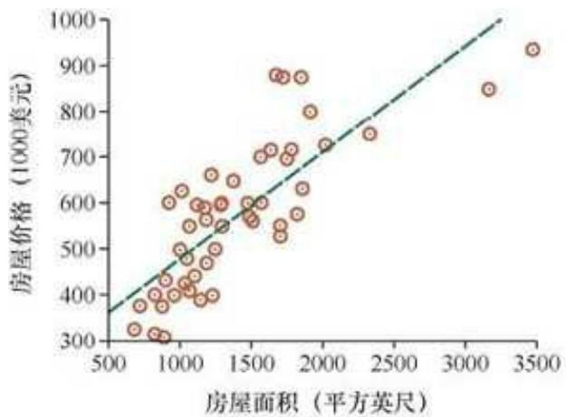

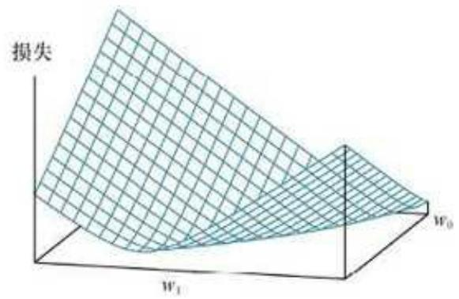  
  
图19-13 （a）2009年7月在加利福尼亚州伯克利出售的房屋的价格与建筑面积的数据点，以及使得平方误差损失最小的线性函数假设： 。（b）损失函数 关于不同的 $w _ { \mathrm { ~ 0 ~ } }$ 和 $w _ { 1 }$ 值的三维图。注意，损失函数是凸的，只存在一个全局最小值（注：1平方英尺=0.093平方米）

# 19.6.2 梯度下降

单变量线性回归模型有一个很好的性质，即利用最优解处的偏导数为0，我们很容易找到模型的最优解。但在其他模型中，情况并非总是如此，因此我们将在这里介绍另一种使损失函数最小化的方法，该方法不依赖于通过求解导数的零点来求解模型，并且可以应用于任何损失函数，无论它有多复杂。

如4.2节中所讨论的，我们可以通过逐步修改参数来搜索连续的权重空间。在前面我们将此算法称为爬山 算法，但现在我们的目标是将损失最小化，而不是将收益最大化，因此我们将使用梯度下降 （gradientdescent）一词。首先选择权重空间中的任何一点作为起点— 该问题中选择(w , w)平面上的一个点，然后计算梯度的估计值，并在最陡峭的下坡方向移动一小步，重复这一过程直到收敛到权重空间上某一点为止，它将在权重空间具有（局部）最小的损失。

对应的算法如下所示：

w←参数空间中的任一点

while not 收敛 do

for each w i in w do

$$
w _ {t} \leftarrow w _ {t} - \alpha \frac {\partial}{\partial w _ {t}} \operatorname {L o s s} (w) \tag {19-4}
$$

其中参数 $\pmb { \alpha }$ ，我们在4.2节中称之为步长 ，当我们试图最小化学习问题中的损失函数时，通常称之为学习率 （learningrate）。它可以是一个固定的常数，也可以随着学习过程的进行逐渐衰减。

对于单变量回归问题，其损失函数是二次的，因此偏导数将是线性的。［你只需要知道运算的链式法则 （chain rule）： ，再加上

$$
\frac {\partial}{\partial x} x ^ {2} = 2 x \text {和} \frac {\partial}{\partial x} x = 1
$$

推导出偏导数（即斜率）：

这一事实。］首先，我们在仅有一个训练样例 $( x , y )$ 的简化情形下，

$$
\begin{array}{l} \frac {\partial}{\partial w _ {i}} \operatorname {L o s s} (w) = \frac {\partial}{\partial w _ {i}} \left(y - h _ {w} (x)\right) ^ {2} = 2 \left(y - h _ {w} (x)\right) \times \frac {\partial}{\partial w _ {i}} \left(y - h _ {w} (x)\right) \\ = 2 \left(y - h _ {w} (x)\right) \times \frac {\partial}{\partial w _ {t}} \left(y - \left(w _ {1} x + w _ {0}\right)\right) \tag {19-5} \\ \end{array}
$$

对于具体的 $w _ { \mathrm { ~ 0 ~ } }$ 和 $w _ { 1 }$ ：

$$
\frac {\partial}{\partial w _ {0}} \operatorname {L o s s} (w) = - 2 \left(y - h _ {w} (x)\right); \quad \frac {\partial}{\partial w _ {1}} \operatorname {L o s s} (w) = - 2 \left(y - h _ {w} (x)\right) \times x
$$

将这两个偏导数代入式（19-4），并将系数2归入未定的学习率 $\pmb { \alpha }$ ，我们得到权重的学习规则如下：

$$
w _ {0} \leftarrow w _ {0} + \alpha (y - h _ {w} (x)); \quad w _ {1} \leftarrow w _ {1} + \alpha (y - h _ {w} (x)) \times x
$$

这些更新规则具有直观的意义：如果 $h _ { \mathrm { w } } ( x ) > y$ （即输出太大），那么需要稍微降低 $w _ { \mathrm { ~ 0 ~ } }$ ，如果x 是正输入则减小 $w _ { 1 }$ ，若是负输入则增加 $w _ { 1 }$ 。

前面的式子涵盖了一个训练样例的训练过程。对于 $N$ 个训练样例，我们希望最小化每个样例各自损失的总和。由于和的导数即是导数的和，因此有

$$
w _ {0} \leftarrow w _ {0} + \alpha \sum_ {j} \left(y _ {j} - h _ {w} \left(x _ {j}\right)\right); \quad w _ {1} \leftarrow w _ {1} + \alpha \sum_ {j} \left(y _ {j} - h _ {w} \left(x _ {j}\right)\right) \times x _ {j}
$$

这些更新法则构成了用于单变量线性回归的批梯度下降 （batch gradientdescent）学习法则（也称确定性梯度下降 ）。其损失曲面是凸的，这意味着训练不会陷入局部极小值，到全局最小值的收敛性可以保证（只要我们不选择一个过大的 $\pmb { \alpha }$ ），但是有可能非常慢：在每一步更新中我们必须对所有 $N$ 个训练样例进行求和，并且可能会进行很多轮更新。如果 $N$ 的大小超过处理器的内存大小，那么问题就更加复杂了。遍历了所有训练样例的一步更新，我们称之为 轮 （epoch）。

一种速度更快的变种是随机梯度下降 （stochasticgradientdescent，SGD）：它在每一步中随机选择少量训练样例，并根据式（19-5）进行更新。SGD的初始版本为在每一步中仅选择一个训练样例，但现在更常见的做法是从 $N$ 个样例中选择一个大小为 m 的小批量。假设我们有N=10 000个样例，并选择批量大小为m =100。那么在每一步中，我们都将计算量减小到原来的1/100，但是由于估算的平均梯度的标准误差与样例数的平方根成比例，因此标准误差仅增加10倍。因此，在本例中，虽然小批量SGD要花费10倍以上的步骤才能达到相同的收敛程度，但它仍然比全批量SGD快10倍。

根据CPU或GPU的结构，我们可以选择合适的 m 来利用并行向量运算，使得包含 m 个样例的更新几乎与仅包含单个样例的更新一样快。在这些条件下，我们会将m 视为针对各个学习问题需要进行调整的超参数。

小批量SGD的收敛性是没有严格保证的；因为它会在最小值附近波动，而不会稳定下来。在19.6.4节中我们将看到，一个逐渐降低学习率 $\pmb { \alpha }$ 的序列（如在模拟退火中所用）是如何确保算法收敛的。

SGD在在线的情境中可能会有较大作用，在这种情况下，新数据的产生是逐次逐个的，并且平稳性假设可能不成立。［实际上，SGD也称为在线梯度下降 （onlinegradientdescent）。］在选择了一

个较好的学习率 $\pmb { \alpha }$ 后，模型就会逐渐优化，并记住它过去学到的一些知识，还可以适应蕴含在新数据中的分布的变化。

SGD已经被广泛地应用于除线性回归以外的模型，尤其是神经网络。即使损失平面不是凸的，该方法也已被证明可以有效地找到接近全局最小值的性质良好的局部极小值。

# 19.6.3 多变量线性回归

我们可以轻松地将上述方法推广到多变量线性回归 （multivariablelinearregression）问题，在该问题中每个样例 $x _ { j }$ 是一个 $n$ 元向量。[3] 我们的假设空间是由形如下式的函数构成的集合：

[3] 有需要的读者不妨参考附录A来简要了解线性代数的基本内容。另外，注意，我们使用术语“多变量回归”来表示输入是多个值的向量，但是输出是单个变量。对于输出也是多个变量的向量的情况，我们将使用术语“多元回归”。但是，在其他著作中存在互换使用这两个术语的现象。

$$
h _ {w} \left(x _ {j}\right) = w _ {0} + w _ {1} x _ {j, 1} + \dots + w _ {n} x _ {j, n} = w _ {0} + \sum_ {i} w _ {i} x _ {j, i}
$$

其中 $w _ { \mathrm { ~ 0 ~ } }$ 项（截距）与其他项截然不同。我们可以通过引入一个虚拟输入属性 $x _ { j , 0 }$ 来解决这个问题，该属性始终等于1。那么 $h$ 将用权重与输入向量的点积（或等价的，权重转置与输入向量的矩阵内积）来表示：

$$
h _ {w} \left(\boldsymbol {x} _ {j}\right) = \boldsymbol {w} \cdot \boldsymbol {x} _ {j} = \boldsymbol {w} ^ {\top} \boldsymbol {x} _ {j} = \sum_ {i} w _ {i} x _ {j, i}
$$

最佳的权重向量 $w ^ { \ast }$ 为最小化样例上的平方误差损失：

$$
\boldsymbol {w} ^ {*} = \underset {\boldsymbol {w}} {\operatorname {a r g m i n}} \sum_ {j} L _ {2} \left(y _ {j}, \boldsymbol {w} \cdot \boldsymbol {x} _ {j}\right)
$$

实际上，多变量线性回归并不比我们刚刚介绍的单变量情况复杂很多。梯度下降将收敛到损失函数的（唯一）最小值。每个权重 w 的更新式为

$$
w _ {i} \leftarrow w _ {i} + a \sum_ {j} \left(y _ {j} - h _ {w} \left(x _ {j}\right)\right) \times x _ {j, i} \tag {19-6}
$$

利用线性代数和向量的运算，还可以解析地求解最小化损失函数的 w 。令 y 为训练样例的输出向量， X 为 数据矩阵 （data matrix），即每行为一个 n 维样例的输入矩阵。则我们预测的输出向量为 ，所有训练数据上的平方误差损失为

$$
L (\boldsymbol {w}) = \| \hat {\boldsymbol {y}} - \boldsymbol {y} ^ {2} \| = \| X \boldsymbol {w} - \boldsymbol {y} \| ^ {2}
$$

令其梯度为0：

$$
\nabla_ {w} L (w) = 2 X ^ {\top} (X w - y) = 0
$$

整理后，我们可以得到最小化损失函数的权重为

$$
\boldsymbol {w} ^ {*} = \left(\boldsymbol {X} ^ {\intercal} \boldsymbol {X}\right) ^ {- 1} \boldsymbol {X} ^ {\intercal} \boldsymbol {y} \tag {19-7}
$$

我们称表达式 $( X ^ { \prime } X ) ^ { - 1 } X ^ { \prime }$ 为数据矩阵的伪逆 （pseudoinverse），并且式（19-7）称为 正规方程

（normal equation）。

使用单变量线性回归时，我们不必担心过拟合的问题。但是在高维空间中进行多变量线性回归时，某些看上去有用但实际上无关紧要的变量可能会导致过拟合。

因此，对于多变量线性函数，通常使用 正则化 的方法来避免过拟合。之前我们说到，正则化是指我们可以将假设的总体代价——同时计算经验损失和假设的复杂性——最小化：

$$
C o s t (h) = E m p L o s s (h) + \lambda C o m p l e x i t y (h)
$$

对线性函数来说，函数的复杂性取决于权重的大小，我们可以考虑如下的正则化函数族：

$$
\text {C o m p l e x i t y} \left(h _ {w}\right) = L _ {q} (w) = \sum_ {i} \left| w _ {i} \right| ^ {q}
$$

它和损失函数的联系在于，当 $q = 1$ 时，它是 $L _ { 1 }$ 正则化[4] ，它最小化输入的绝对值和；当q =2时，它就是 $L _ { 2 }$ 正则化，最小化输入的平方和。那么应该选择哪个正则化函数？这取决于待解决的特定问题，但总的来说， L 1正则化有一个重要的优势：它倾向于生成一个 稀疏模型 （sparsemodel）。也就是说，它通常能将许多权重置为0，从而表明相应的特征是完全不相关的——就像Learn-D ecision -Tree所做的一样（尽管是通过不同的机制来实现的）。舍弃一些特征的假设对人类而言更容易理解，并且不太可能过拟合。

[4] 符号 $L$ 1和 $L$ 2同时用于表示损失函数和正则化函数，可能会出现混淆。事实上它们不必成对使用：你可以将 $L$ 2损失与 $L$ 1正则化结合使用，反之亦然。

图19-14直观地说明了为什么 $L _ { \textrm { 1 } }$ 正则化可能会导致某些权重为0，而 $L _ { 2 }$ 正则化却不会。注意，最小化 等价于在约束 下最小化 Loss (w )，其中 c 是某个与 相关的常数。可以看到，在图19-14a中，菱形框表示 L 1复杂性小于 c 的二维权重空间中的点w的集合，模型的解必须在此框内的某个位置。同心椭圆代表损失函数的等高线，其中心点对应的损失最小。我们希望在这个方框中找到最接近损失函数最小值的点；从图中可以看到，由于方框是有棱角的，因此对于损失函数任意值对应的等高线，方框的角通常会触碰到最接近最小值的等高线。棱角处的参数自然是在某些维度上值为0的点。

在图19-14b中，我们对 L 复杂性也进行了相同的处理，该度量对应的形状是一个圆而不是菱形。在这种情形下我们可以看到，交点一般没有理由出现在某一个轴上。因此， $L _ { 2 }$ 正则化不会有产生0权重的倾向。在很多问题上的经验性证据表明，在 $L _ { 2 }$ 正则化的情形下，找到一个性质良好的h所需的样例数与不相关特征的数量是呈线性关系的，但是在 $L _ { 1 }$ 正则化的情形下则是对数级别的。

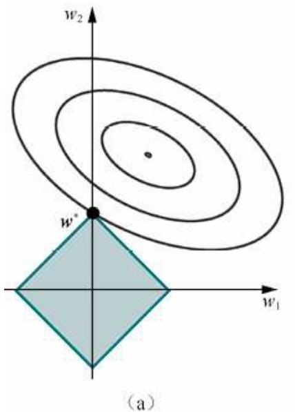

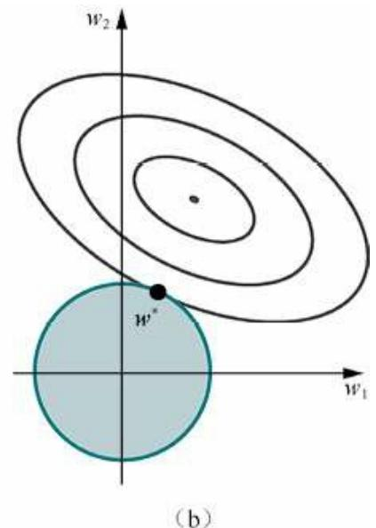

图19-14 $L _ { 1 }$ 正则化倾向于产生一个稀疏模型的解释。（a）在 $L _ { 1 }$ 正则化（菱形框）的情况下，正则化约束内的最小损失（同心等高线）一般会出现在某一条轴上，这意味着一个权重为0；（b）在$L _ { 2 }$ 正则化（圆形）的情况下，最小损失可能出现在圆周上的任何位置，因而不会偏向0权重

另一种看待 $L _ { 1 }$ 正则化与 $L _ { 2 }$ 正则化区别的方式是， $L _ { \textrm { 1 } }$ 正则化对维度轴的选取是严肃的，而 $L _ { 2 }$ 正则化将它们看得很随意。 $L _ { 2 }$ 函数是球对称的，因此具有一定的旋转不变性。设想一个平面中的一组点，它们有坐标 $x$ 和 y 。现在假设我们将维度轴旋转45°，将会得到一组不同的坐标( x' , y' )，它们代表相同的点。如果在旋转前后我们应用L 正则化，则模型训练后会得到与之前相同的点（尽管该点将使用新的坐标 $( \boldsymbol x ^ { \prime } , \boldsymbol y ^ { \prime } )$ )进行表示）。在轴的确是任意选取的情况下，例如，在二维坐标轴指向东、北方向或指向东北、东南方向都无关紧要的情况下，选择 L 正则化将是恰当的。使用 $L$ 1正则化时，我们将得到不同的答案，因为 $L _ { 1 }$ 函数不是旋转不变的。因此当维度轴不可交换时，选择 $L _ { 1 }$ 正则化是适当的；将代表“浴室数量”的轴旋转45°从而指向“使用面积”是没有意义的。

# 19.6.4 带有硬阈值的线性分类器

线性函数可用于回归，也可以用于分类。例如，图19-15a中有两类数据点，分别代表地震（地震学家对此感兴趣）和地底爆炸（军备控制专家或军事专家对此感兴趣）。每个点由两个输入值 $x _ { 1 }$ 和x 组成，分别代表根据地震信号所计算出的体波震级和面波震级。我们的分类任务是基于这些训练数据学习一个假设 h ，它将获取新的数据点 $\left( { { x } _ { 1 } } , { { x } _ { 2 } } \right)$ ，对于地震将返回0，对于爆炸将返回1。

决策边界 （decision boundary）是一条直线、一个平面或者更高维的面，它将地震和地底爆炸这两类数据分离。在图19-15a中，决策边界是一条直线。线性决策边界也被称为线性分离器 （linearseparator），而允许这种分离器存在的数据我们称之为 线性可分 （linear separable）的数据。在该数据中，线性分离器为

$$
x _ {2} = 1. 7 x _ {1} - 4. 9 \text {或} - 4. 9 + 1. 7 x _ {1} - x _ {2} = 0
$$

那些我们希望被分类为1的爆炸处于直线的右下方区域，它们是满足 $- 4 . 9 + 1 . 7 x _ { 1 } - x _ { 2 } > 0$ 的数据点，而分类为地震的数据点满足 $- 4 . 9 + 1 . 7 x _ { 1 } - x _ { 2 } < 0$ 。我们可以把这个等式更简洁地表示为向量的点乘的形式。令 $\pmb { x _ { 0 } } = \pmb { 1 }$ ，则等式相当于：

$$
- 4. 9 x _ {0} + 1. 7 x _ {1} - x _ {2} = 0
$$

此外我们定义权重向量，

$$
w = \langle - 4. 9, 1. 7, - 1 \rangle
$$

那么分类假设则可以表示为

$$
h _ {w} (x) = 1 _ {\text {如 果}} w \cdot x \geqslant 0, \text {否 则} 0
$$

或者，我们可以定义一个 阈值函数 （threshold function）来表示假设，它以线性函数 作为输入：

$$
h _ {w} (\boldsymbol {x}) = \text {T h r e s h o l d} (\boldsymbol {w} \cdot \boldsymbol {x}), \text {其 中} \text {T h r e s h o l d} (z) = 1, \text {如 果} z \geqslant 0; \text {否 则} 0
$$

阈值函数如图19-17a所示。

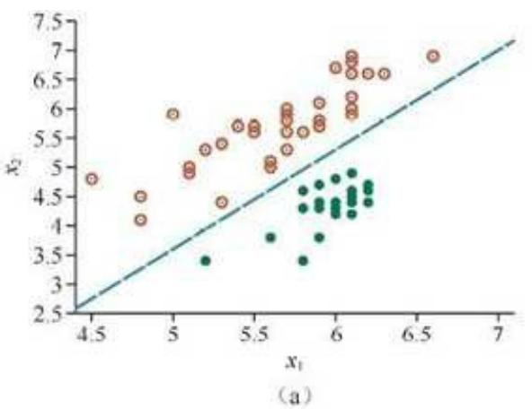

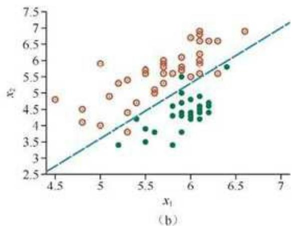  
图19-15（a）两种类型地震数据，包含体波震级x 和面波震级x ，数据来源于1982～1990年在亚洲和中东发生的地震（橙色空心圆）和地底爆炸（绿色实心圆）（Kebeasy etal., 1998）。图中还绘制了类之间的决策边界。（b）同一个领域，有比之前更多的数据点。此时地震和爆炸不再是线性可分的

既然h w(x )已经有了明确定义的数学形式，我们可以考虑选择权重w以最小化损失函数。在19.6.1节和19.6.3节中，我们通过闭式解（通过求解梯度为零来求解权重）和在权重空间中采用梯度下降来找到最优参数。在这个问题中这两个方法都不可行，因为在权重空间中除了使的点外，几乎所有地方的梯度都是零，并且在这些点上的梯度是没有定义的。

尽管如此，该问题还是存在一个简单的权重更新算法，该算法可以收敛到一个解（即可以收敛到一个对数据进行完美分类的线性分离器），前提是该数据是线性可分的。对于一个样例( x , y )，我们采取

$$
w _ {i} \leftarrow w _ {i} + \alpha \left(y - h _ {n} (x)\right) \times x _ {i} \tag {19-8}
$$

该式基本上与式（19-6）相同，即与线性回归的更新规则相同。该规则被称为感知机学习规则（perceptron learning rule），命名的原因将在第21章给出。由于我们所考虑的问题是0/1分类问题，所以学习过程会有些不同。真值 $y$ 和假设的输出h w(x )均有值0或1，因此有以下3种可能发生的状况。

● 若输出是正确的（即 $y = h _ { m } ( x )$ ），那么权重将不会改变。  
● 如果 y 为1而 h w ( x )为0，那么当相应的输入 $x _ { i }$ 是正数时 $w _ { i }$ 将 增大 ，当 $x _ { i }$ 是负数时 $w _ { i }$ 将 减小 。这是有直观意义的，因为我们希望相应的 $w \cdot x$ 会更大，进而使得 $h ( x )$ 的输出为1。  
●如果y为0而h w(x )为1，那么当相应的输入 $x _ { i }$ 是正数时 $w _ { i }$ 将减小，当x 是负数时 $w _ { i }$ 将增大 。这是有直观意义的，因为我们希望相应的 会更小，进而使得 的输出为0。

在该更新规则中，每一次更新一般随机选择一个样例进行学习（正如随机梯度下降中的做法）。图19-16a给出了该学习规则应用于图19-15a所示的地震/爆炸数据的 训练曲线 （training curve）。训练曲线所示是学习过程中每一次更新后分类器的表现。该曲线表明，在该更新规则下，参数将收敛到误差为0的线性分离器上。“收敛”的过程并不十分顺利，但最终还是成功的。对于包含63个样例的数据集，该过程需要657步更新才能收敛，因此每个样例平均出现大约10次。通常来说，不同次运行之间的方差很大。

我们之前提到，当数据点线性可分时，感知机学习规则会收敛到理想的线性分离器。但是如果数据不符合条件怎么办？这种情况在真实世界中是很普遍的。例如，在图19-15b中将凯比西等人（Kebeasy et al. , 1998）绘制图19-15a时丢弃的数据点补回去。在图19-16b中，我们发现感知机学习规则即使在经过1万次更新后也无法收敛：即使它多次到达了使得该问题的错误最少的解（3个错误分类），该算法仍在不断改变权重。通常来说，如果采用一个固定的学习率 $\pmb { \alpha }$ ，感知机学习规则可能不会收敛到一个稳定的解，但是如果 $\pmb { \alpha }$ 以O (1/t)的速度衰减，其中t是迭代次数，则可以

证明，当样例以一个随机序列的形式逐个输入时，该更新规则会收敛到最小误差解。[5] 我们还可以证明寻找最小误差解是NP困难的，因此我们所希望的算法收敛需要的样例可能是非常多的。图19-16c给出了学习率 $\alpha ( t ) = 1 0 0 0 / ( 1 0 0 0 + t )$ 下的训练过程：即使在100 000次迭代后，收敛仍然不是完美的，但它比固定学习率 $\pmb { \alpha }$ 的情况好得多。

[5]从理论上讲，我们要求 $\sum \limits _ { i = 1 } ^ { + \infty } a ( t ) = + \infty$ （）=+和 $\sum \limits _ { n = 1 } ^ { + \infty } a ^ { 2 } ( t ) < + \infty$ 。学习率 $o o ( \hat { \varepsilon } ) = O ( 1 / \hat { \varepsilon } )$ 满足这些条件。通常我们会使用 $c / ( c + 1 )$ ，其中 $c$ 为一个相当大的常数。

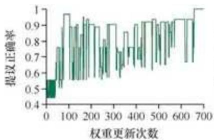

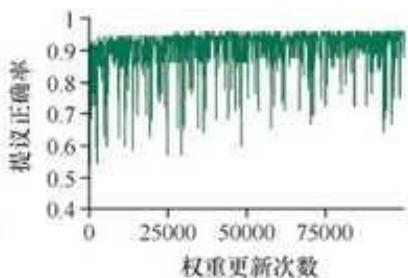

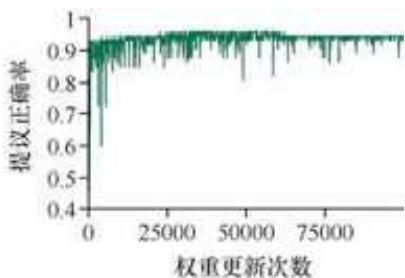  
  
图19-16（a）给定图19-15a中的地震/爆炸数据，模型在总训练集上的准确度与感知机学习规则训练的迭代次数的关系图。（b）对图19-15b中带噪声的、不可分离的数据绘制相同的图；注意x轴刻度有所改变。（c）学习率 $\alpha ( t ) =$ 时，绘制与（b）中相同的图

# 19.6.5 基于逻辑斯谛回归的线性分类器

我们已经看到，将线性函数的输出作为一个阈值函数的输入可以建立一个线性分类器。然而，硬阈值导致了一些问题：假设h w(x )是不可微的甚至关于输入和权重是不连续的。这使得使用感知机规则进行学习成为一种非常不可预测的冒险。除此之外，线性分类器始终输出一个确定性的1或0预测，即使对于非常接近于边界的样本也是如此。如果能将一些样例明确分类为0或1，而将其他处于边界的样本分类为“不清楚”，将是一个更好的结果。

所有这些问题都可以通过软阈值这一扩展方法来解决— 通过使用一个连续的、可微的函数来近似硬阈值函数。在第13章中，我们看到了两个类似于软阈值的函数：标准正态分布的积分（用于概率单位模型）和逻辑斯谛函数（用于logit模型）。尽管这两个函数的形状非常相似，但逻辑斯谛函数具有更好的数学性质：

$$
\operatorname {L o g i s t i c} (z) = \frac {1}{1 + e ^ {- z}}
$$

该函数如图19-17b所示。用逻辑斯谛函数代替阈值函数，我们可以得到

$$
h _ {w} (\boldsymbol {x}) = \operatorname {L o g i s t i c} (\boldsymbol {w} \cdot \boldsymbol {x}) = \frac {1}{1 + e ^ {- w \cdot x}}
$$

图19-17c所示的例子为关于双输入地震/爆炸问题的逻辑斯谛回归假设。注意其输出是一个介于0～1的数字，它可以解释为标签类为1的概率。假设在输入空间中形成一个软化边界，对位于该边界中心的任何输入，该概率为0.5，并且随着数据远离边界而接近0或1。

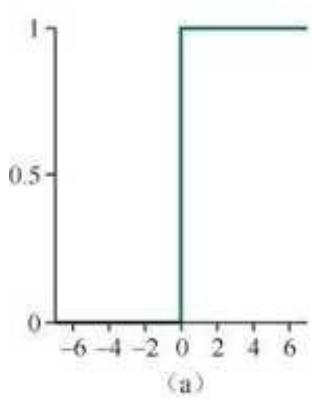

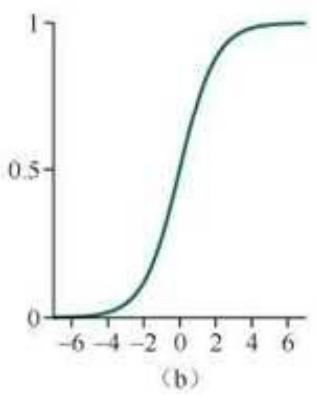

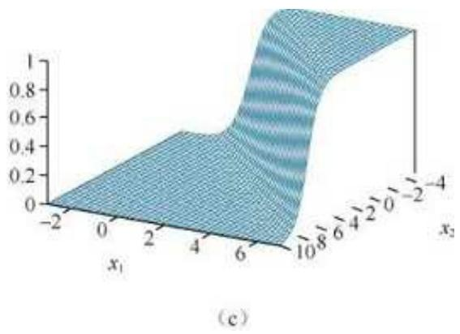  
图19-17（a）硬阈值函数Threshold(z)，输出为0/1。注意，该函数在z=0处是不可微的。（b）

1Logistic（z）=逻辑斯谛函数 ，也称为sigmoid函数。（c）对于图19-15b中数据的逻辑斯谛回归假设

拟合该模型的权重以最小化数据集上的损失的过程，称为 逻辑斯谛回归 （logistic regression）。在该模型中，没有简单的闭式解可以找到w的最优值，但是梯度下降的计算很直接。我们的假设不再只输出0或1，可以使用 $L _ { 2 }$ 损失函数。为了保持公式的可读性，我们将使用g 表示逻辑斯谛函数，并使用 $g ^ { \prime }$ 作为其导数。

对于单个样例( x , y )，在使用 h 的实际形式前，梯度的推导与线性回归［式（19-5）］中的推导相同。（对于此处的推导，我们需要再次使用链式法则。）有

$$
\begin{array}{l} \frac {\partial}{\partial w _ {i}} \operatorname {L o s s} (\boldsymbol {w}) = \frac {\partial}{\partial w _ {i}} (y - h _ {w} (\boldsymbol {x})) ^ {2} \\ = 2 \left(y - h _ {w} (x)\right) \times \frac {\partial}{\partial w _ {i}} \left(y - h _ {w} (x)\right) \\ = - 2 \left(y - h _ {w} (x)\right) \times g ^ {\prime} (\boldsymbol {w} \cdot \boldsymbol {x}) \times \frac {\partial}{\partial w _ {i}} \boldsymbol {w} \cdot \boldsymbol {x} \\ = - 2 \left(y - h _ {w} (x)\right) \times g ^ {\prime} (w \cdot x) \times x _ {i} \\ \end{array}
$$

逻辑斯谛函数的导数 $g ^ { \prime }$ 满足 ，因此有

$$
g ^ {\prime} (\boldsymbol {w} \cdot \boldsymbol {x}) = g (\boldsymbol {w} \cdot \boldsymbol {x}) (1 - g (\boldsymbol {w} \cdot \boldsymbol {x})) = h _ {w} (\boldsymbol {x}) (1 - h _ {w} (\boldsymbol {x}))
$$

因此，为最小化损失而进行的权重更新每一次都朝着标签与预测之间的差 $( y - h _ { p } ( x ) )$ 的方向迈出一步，并且步长取决于常数 $\pmb { \alpha }$ 和 $g ^ { \prime }$ ：

$$
w _ {i} \leftarrow w _ {i} + \alpha \left(y - h _ {w} (x)\right) \times h _ {w} (x) \left(1 - h _ {w} (x)\right) \times x _ {i} \tag {19-9}
$$

用逻辑斯谛回归代替线性阈值分类器并重复图19-16中的实验，我们得到图19-18所示的结果。图19-18a中的数据是线性可分的，此时逻辑斯谛回归的收敛速度相对更慢，但收敛的过程可预测性更高。在图19-18b和图19-18c中，数据分别是带有噪声的和不可分的，逻辑斯谛回归的收敛速度明显更快，更稳定。这些优势往往会延续到实际应用中，目前逻辑斯谛回归已经成为医学、市场营销、调查分析、信用评分、公共卫生和其他应用中最流行的分类技术之一。

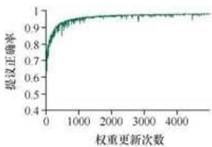

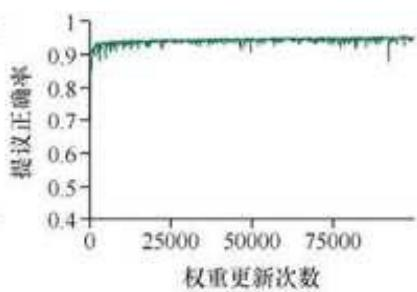

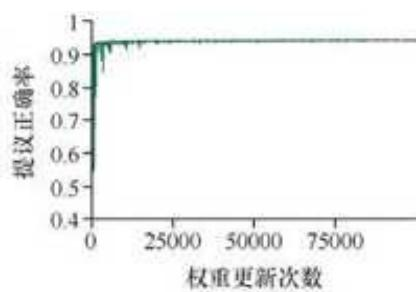  
  
图19-18重复使用逻辑斯谛回归进行图19-16中的实验。（a）中的图包含了5000次迭代，而不是700次，而（b）和（c）中的图使用与之前相同的坐标刻度

# 19.7 非参数模型

线性回归使用训练数据来估计一组固定的参数w。根据参数定义假设hw(x )，此时我们已经可以丢弃训练数据了，因为它们的信息都由 w 包含。通过参数个数固定的参数集（与训练样例的数量无关）来汇总数据信息的学习模型称为 参数模型 （parametric model）。

如果数据集较小，则对可行假设有严格的限制是有道理的，这可以避免过拟合。但是当要学习数百万或数十亿个样例时，用数据本身表示自己似乎是一个更好的想法，而不是强行用很小的参数向量进行表示。如果数据表明正确答案是一个波动剧烈的函数，那么我们不应局限于线性或波动不太剧烈的函数。

非参数模型 （nonparametricmodel）是指无法用参数个数固定的参数集来表示的模型。例如，图19-1中的分段线性函数将所有数据点保留为模型的一部分。这样做的学习方法也被称为基于实例的学习 （instance-based learning）或 基于记忆的学习 （memory-based learning）。最简单的基于实例的学习方法是 查表 （tablelookup）：取所有的训练样例，将它们放在查找表中，然后在需要访问 h ( x )时，查看 x 是否在表中；如果是，则返回相应的 y 。

这种方法的问题在于它不能很好地泛化：当x 不在表中时，我们没有信息去输出一个合理的值。

# 19.7.1 最近邻模型

我们可以对查表法进行一些细微的改进：给定待查询的 $\boldsymbol { x } _ { q }$ ，我们寻找最接近它的 $k$ 个样例，而不是寻找等于 $\scriptstyle { \pmb x } _ { q }$ 的样例。这样的方法称为 k近邻 （ $k$ -nearest neighbors）查找。我们使用符号 NN ( k, $x _ { q } .$ )表示 $\boldsymbol { x } _ { q }$ 的 $k$ 个最近邻邻居的集合。

为了实现分类，我们找到一组邻居 $N N ( k , { \pmb x } _ { q } )$ ，并以最常见的输出值为例，如果 $k = 3$ 且输出值为〈Yes,No,Yes〉，则分类结果将为Yes。为了避免二分类结果数量相同，通常将 $k$ 选择为奇数。

为了实现回归，我们可以取 $k$ 个邻居的平均值或中位数，也可以在最近邻邻居上求解一个线性回归问题。图19-1中的分段线性函数使用 $\scriptstyle { \pmb { x } } _ { q }$ 的左右两个数据点求解一个（简单的）线性回归问题。（当数据点 $x _ { i }$ 等距离分布时，这两个点为两个最近邻邻居。）

在图19-19中，我们关于图19-15中的地震数据集分别给出了k=1和k=5时 $k$ 近邻分类的决策边界。和参数方法一样，非参数方法仍会面临欠拟合和过拟合的问题。在该问题中，1近邻将会过拟合。它对右上方的深色离群值和坐标为(5.4,3.7)的白色离群值反应太大。5近邻的决策边界较好，但较高的 $k$ 会导致欠拟合。通常，我们可以使用交叉验证来选择k的最佳值。

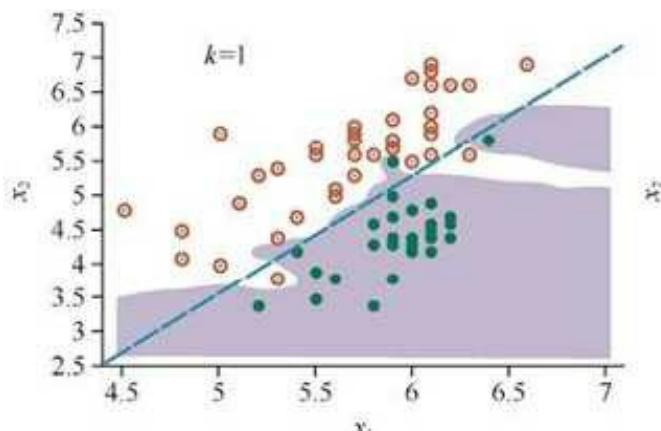

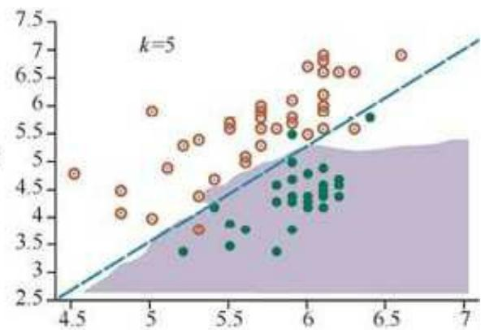  
  
  
图19-19 （a）一个 $k$ 近邻模型，该图显示了图19-15中数据的爆炸一类的范围，其中k=1。可以明显看到有过拟合现象。（b）当k=5时，该数据集上的过拟合现象消失了

“最近”一词意味着距离度量。那么如何测量从查询点x 到样例点x 的距离呢？通常，我们使用

闵可夫斯基距离 （Minkowski distance）或 $L ^ { p }$ 范数，其定义为

$$
L ^ {p} \left(\boldsymbol {x} _ {j}, \boldsymbol {x} _ {q}\right) = \left(\sum_ {i} \left| x _ {j, i} - x _ {q, i} \right| ^ {p}\right) ^ {1 / p}
$$

当p =2时，它为欧几里得距离，当p =1时，它代表曼哈顿距离。对于布尔属性值，两个数据点不同的属性的数量称为 汉明距离 （Hamming distance）。如果维度所测量的是度量单位相似的特性，例如零件的宽度、高度和深度，我们通常使用欧几里得距离；如果维度的度量单位不相似，例如患者的年龄、体重和性别，则通常使用曼哈顿距离。注意，如果我们使用每个维度的原始数据来建模，则总距离将受到任何维度上单位变化的影响。也就是说，如果将高度的度量单位从米更改为英里，而 宽度和深度的度量单位保持不变，那么我们将得到不同的最近邻。此外，如何比较年龄和体重这两种差异呢？一种常见的方法是对每一个测量维度进行归一化 （normalization）。我们可以计算每个维度上的平均值 和标准偏差 $\sigma _ { t }$ ，然后重新缩放它们，使得 x j,i变为。一个更复杂的方法称为 马氏距离 （Mahalanobis distance），它考虑了维度之间的协方差。

如果我们有低维空间中的大量数据，最近邻模型的效果将非常好：通常会有足够多的近距离数据点来获得较好的答案。但是随着维数的增加，我们会遇到一个问题：在高维空间中，最接近的数据点之间的距离通常并不小！我们考虑在 $n$ 维单位超立方体内部均匀分布的数据集（包含 $N$ 个点）上的 $k$ 近邻模型。我们将点的 $k$ 邻域定义为包含 $k$ 个最近邻的最小超立方体。令 $\ell$ 为邻域的平均边长，那么（包含 $k$ 个点的）邻域体积为 $\ell ^ { \mu }$ ，整个立方体（包含全部 $N$ 个数据点）的体积为1。因此平均而言有 。取 n 次方根我们可以得到 。 $\ell ^ { n } = k / N$ $n$ $e = ( k / \Delta \gamma ) ^ { 1 / n }$

具体来说，令 $k = 1 0$ 且 $N = 1 0 0 0 0 0 0 0$ 。在二维情况（ $n = 2$ ；单位正方形）下，邻域平均边长$\ell = 0 . 0 0 3$ ，它只是单位正方形的一小部分，在三维情形中，边长也仅为单位立方体的边长的2%。但是当维度达到17维时， 就长达单位超立方体的边长的一半，而在200维空间中，边长比例高达 $9 4 \%$ 。这个问题被称为 维数灾难 （curse of dimensionality）。

另一个看待该问题的方式是：有单位超立方体的一个薄壳，该薄壳厚度仅为超立方体的1%，考虑落在薄壳中的点。它们是一些离群值；通常，我们很难为它们找到好的估计值，因为我们对这些点的推断方式是外推而不是向内插值。在一维情形下，这些离群值仅占单位线段的2%（满足x<0.01或 $x > 0 . 9 9$ 的那些点），但在200维空间中，超过98%的点都将落在此薄壳内—几乎所有的点都是离群点。在图19-20b中，我们可以看到最近邻方法对离群点的拟合效果是较差的。

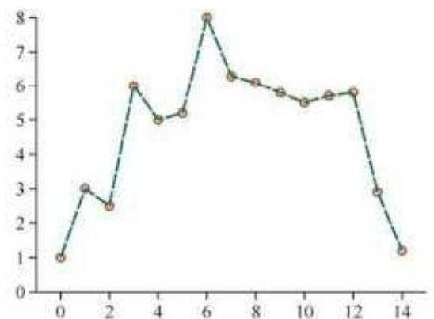

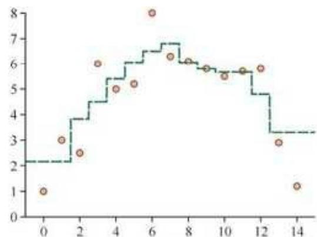

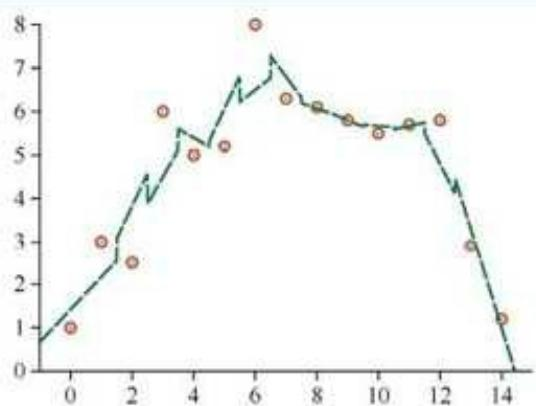

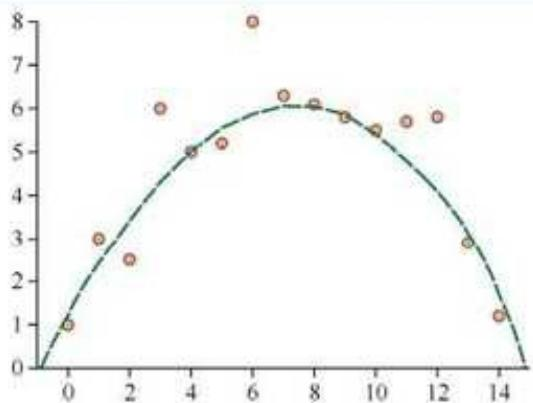  
  
图19-20非参数回归模型：（a）直接连接数据点。（b）3近邻均值模型。（c）3近邻线性回归模型。（d）局部加权回归，核宽度为10

函数在概念上是简单的，即给定一个包含 $N$ 个样例的数据集和一个查询点 $\pmb { x } _ { q }$ ，遍历这些样例，测量每个样例与 $\boldsymbol { x } _ { q }$ 的距离，并选择其中距离最近的 $k$ 个。如果我们满足于找到一个执行时间为 O ( N )的实现方法，那么该方法已经足够了。但是基于实例的方法是为大型数据集设计的，因此我们需要一些速度更快的算法。在19.7.2节和19.7.3节中我们将介绍如何使用树和哈希表来加快计算。

# 19.7.2 使用 $\pmb { k }$ -d树寻找最近邻

我们将具有任意维数的数据集上的平衡二叉树称为k-d树 （k-d tree），即 $k$ 维树。 k-d树的构造类似于平衡二叉树的构造。我们从一组样例开始，在根节点处通过根据第i个维度的测试

来分割它们，其中 m 是第 i 个维度信息的中位数；因此半数的样例将会落到树的左分支，剩余的样例落到右分支。接着我们再根据左右两个样例集递归地创建树，并在剩余样例少于两个时停止算法。要选择在树的每个节点上用于分割的数据维度，我们可以简单地在树的第 i层选择维度imod n 即可。（注意，随着我们沿着树逐渐往下分割，我们可能需要在任何给定维度上进行多次分割。）另一种方法是在值域分布最广的维度上进行分割。

从k-d树中进行精确查找和从二叉树中进行查找是一样的（稍微复杂一点的是，需要关注在每个节点上所测试的是哪个数据维度）。但是，最近邻的查找更为复杂。当我们沿着分支前进时，每一次样例集都被分割成两半，在某些情况下我们可以忽略一半的样例，但并不总是这样。有时我们要查询的点非常接近于分划边界。查询点本身可能在边界的左侧，但 $k$ 个最近邻中的一个或多个实际上可能在右侧。

我们必须通过计算查询点到分划边界的距离来衡量这种情况发生的可能性，若在边界左侧找不到比该距离更近的 $k$ 个样例，则需在该分划边界的两侧搜索。出于这个原因，k-d树适用于样例数多于维数（最好至少存在2 n 个样例）的情形。因此，当我们有上千个样例且维度不超过10或者样例数上百万且维度不超过20时，k-d树是一个很好的选择。

哈希表可能是一个比二叉树更快捷的查找方式。但哈希码依赖于精确的匹配，我们如何使用哈希表找到最近邻呢？哈希码在箱子（值容器）中随机分布数值，但是我们希望将距离近的数据点分在同一组并分布于同一个箱子中，因此我们需要使用 局部敏感哈希 （Locality-Sensitive Hash，LSH）。

我们无法使用哈希表来精确地找到 $N N ( k , { \pmb x } _ { q } )$ ，但通过巧妙地使用随机算法，可以找到一个近似结果。首先，我们定义一个近似近邻 （approximatenear-neighbor）问题：给定样例点数据集和查询点 $\boldsymbol { x } _ { q }$ ，以高概率找到 $\boldsymbol { x } _ { q }$ 附近的一个或多个样例点。更准确地说，如果 $\boldsymbol { x } _ { q }$ 的半径为 r 的球内存在点 $x _ { j }$ ，则该算法很有可能会找到一点 $\pmb { x } _ { j ^ { \prime } }$ ，它与 $\boldsymbol { x } _ { q }$ 的距离小于 cr 。如果半径 $r$ 内没有数据点，则允许该算法宣告寻找失败。常数 $c$ 的值和“高概率”的值是该算法的超参数。

为了求解近似近邻，我们需要一个哈希函数 $g \left( \pmb { x } \right)$ ，该函数具有以下性质：对于任意两个数据点 $x _ { j }$ 和 $\boldsymbol { x } _ { j } ,$ ，如果它们的距离大于 cr，则它们具有相同哈希码的概率很小；如果其距离小于 $r$ ，则相应的概率很高。为简单起见，我们将每个数据点视为一个二进制位串。（任何非布尔特征都可以编码为一组布尔特征。）

从直觉上讲，如果 n维空间的数据点是靠在一起的，即距离很近的，那么当把它们投影到一个一维空间（一条直线）上时，它们也必定是靠近的。实际上，我们可以将线离散化为多个箱子——哈希桶，以高概率将相近的点投影到同一箱子中。彼此距离较远的点往往会投影到不同的箱子中，但是总会有一些投影巧合地将相距较远的点同时投影到同一箱子中。因此，存储数据点 $\pmb { x } _ { q }$ 的箱子包含许多（但不是全部）靠近 $\pmb { x } _ { q }$ 的点，但它也可能包含一些距离 $\pmb { x } _ { q }$ 较远的点。

LSH的技巧在于它创建了多个随机投影并将其进行组合。一个随机投影只是位串表示的一个随机子集。我们选择 $\pmb { \ell }$ 个不同的随机投影并创建 $\pmb { \ell }$ 个哈希表 $g _ { 1 } ( x ) , \cdots , g _ { d } ( x )$ ，然后将所有样例输入到每个哈希表中。给定查询点 $\boldsymbol { x } _ { q }$ ，在每个哈希表箱子 $\mathbf { g } _ { i } ( \pmb { x } _ { q } )$ 中获取点集，并将这些集合取并集作为一组候选点 $C$ 。然后我们计算 $\boldsymbol { x } _ { q }$ 到 $C$ 中每一个点的实际距离，并返回其中 $k$ 个距离最近的点。每个接近 $\boldsymbol { x } _ { q }$ 的点都以高概率出现在至少一个箱子中，虽然箱子中也会存在一些距离较远的点，但我们可以忽略这些点。对于现实中的大型问题，例如在含有1300万幅512维Web图像的数据集中找到其近邻（Torralbaetal.,2008），局部敏感哈希仅需要查找1300万幅图像中的几千幅就能找到最近邻，相比穷举法或 $k$ -d树方法，速度提高了上千倍。

# 19.7.4 非参数回归

现在我们考虑将非参数方法用于 回归 问题，而非分类问题。图19-20给出了一些非参数模型的例子。在图19-20a中，我们使用了也许是所有模型中最简单的方法，非正式地称为“点连接”，正式一点也可以称为“分段线性非参数回归”。该模型构造了一个函数h (x)，当给定一个查询点 $\boldsymbol { x } _ { q }$ 时，该函数考虑紧邻在 $x _ { q }$ 的左右两侧的样例，并在它们两点之间进行内插值。当数据中的噪声很小时，这种简单的方法效果还不错，这就是为什么它是电子表格的图表软件所用的标准技术。但是当数据噪声较大时，这个方法得出的函数将变得很尖锐，并且不能很好地泛化。

k 近邻回归 （nearest-neighbors regression）在点连接的基础上做了改善。我们不使用查询点 $x _ { q }$ 左右两侧的两个样例进行预测，而是使用 k个最近邻。（在这里我们使用 k=3。）尽管这个方法所得的函数是不连续的，但较大的 $k$ 值会倾向于使尖峰的幅度减小并变得平滑。图19-20给出了 $k$ 近邻回归的两个实现方式。在图19-20b中，我们采用 k个近邻的平均值，即 h (x)是 $k$ 个点的平均值。注意，在离群点 x = 0和 x = 14处这一估计的表现不太好，因为所有信息都来自同一侧（数据内侧），从而忽略了数据的趋势。在图19-20c中，我们进行了 $k$ 近邻线性回归，该回归通过k个样例去找到最佳拟合直线。这样可以更好地刻画离群值的变化趋势，但是函数仍然是不连续的。在图19-20b和图19-20c中，剩下的未提及的问题是如何选择合适的 $k$ 值。解决方法通常是使用交叉验证。

局部加权回归 （locally weighted regression）（图19-20d）的方法利用了近邻的优势，且没有不连续性。为了避免h (x)中的不连续性，我们需要避免用于估计h (x)的样例集中的不连续性。局部加权回归的基本思想是，在每个查询点 x q上，接近 x q的样例将被赋予较高的权重，而距离较远

的样例权重较小，最远的样例则将没有权重。权重的大小随距离的变化通常是渐变的，而不是突变的。

我们使用一个 核 （kernel）来确定每个样例的权重，该函数的输入是查询点与样例点之间的距离。核函数是关于距离递减的函数，其最大值在0处取到，因此 将赋予更接近我们希望预测的查询点 $\boldsymbol { x } _ { q }$ 的样例 $x _ { j }$ 更高的权重。核函数值在 $\pmb { x }$ 的整个输入空间上的积分必须是有限的，如果我们令其积分为1，则将使一些计算变得更容易。

图19-20d中的函数是使用二次核 K（d）=max(0,1-（2|d|/w）²） 生成的，其核宽度为 w=10。其他形状的函数，例如高斯核函数，也经常被使用。通常来说，核宽度比实际形状更重要：这是模型的超参数，最好通过交叉验证来选择。如果核宽太大，将可能欠拟合；如果核宽太小，将可能过拟合。在图19-20d中，核宽度为10时给出了一条看起来恰到好处的平滑曲线。

利用核函数进行局部加权回归很容易。对于给定的查询点x ，我们只需要解决以下加权回归问题：

$$
\boldsymbol {w} ^ {*} = \underset {\boldsymbol {w}} {\operatorname {a r g m i n}} \sum_ {j} \mathcal {K} \left(\text {D i s t a n c e} \left(\boldsymbol {x} _ {q}, \boldsymbol {x} _ {j}\right)\right) \left(y _ {j} - \boldsymbol {w} \cdot \boldsymbol {x} _ {j}\right) ^ {2}
$$

其中， Distance是最近邻方法中讨论的任意距离度量。它给出的相应模型即为。

注意，每当有一个新的查询点出现时，我们都需要重新解一个回归问题——这就是所谓局部 的含义。（在传统的线性回归中，我们只需要解一个全局的回归问题，然后对任何查询点使用相同的预测函数 h w。）能减轻这些额外工作的一个事实是，每个回归问题都是容易求解的，因为它仅考虑权重非零的样例——处于查询核宽度内的样例。当核宽度较小时，样本点可能只有少量几个。

大多数非参数模型都有一个优点，即可以轻松应用留一交叉验证而无须重新计算所有内容。例如，使用 k 近邻模型时，每当给定一个新的测试样例( x , y )，我们只需检索一次其 k 个最近邻，计算其每个样例的损失 并记录，对于每个不属于其 k 个最近邻的样例，该结果即为它们的留一法结果。接着我们搜索 k+1最近邻，并记录前 $k$ 个近邻中每一个的留一法结果。对于 $N$ 个样例，整个过程的计算复杂性为 O ( k )，而不是 O ( kN )。

# 19.7.5 支持向量机

在21世纪初期，当你对某个领域没有任何专门的先验知识时， 支持向量机 （support vectormachine，SVM）是最流行的解决监督学习问题的“现成”方法。这一地位现在已经被深度学习网络和随机森林取代了，但是SVM仍拥有3个具有吸引力的特性。

（1）支持向量机构造了一个 极大边距分离器 ，即到样例点距离最大的决策边界。这有助于它们较好地泛化。  
（2）支持向量机构造了一个 线性分离超平面，但是它们能通过使用所谓的核技巧 来将数据嵌入更高维空间中。通常原始输入空间中不是线性可分的数据很容易在高维空间中被分离。  
（3）支持向量机是非参数的— —其分离超平面是由一组样例点而不是参数值的集合定义的。虽然例如最近邻等模型需要保留所有样例的信息，但SVM模型仅需要保留最靠近分离平面的样例—通常是一个较小的常数乘以维数。因此，SVM结合了非参数模型和参数模型的优点：它们可以灵活地表示复杂的函数，同时可以防止过拟合。

在图19-21a中，我们面临一个二分类问题，它有3个候选的决策边界，每个候选决策边界都是线性分离器。它们中的每一个都与所有样例一致，因此从0/1损失的角度来看，每个分离器都将是同样好的。逻辑斯谛回归也会找到某个分界线，其确切位置取决于所有样例点。SVM的关键亮点在于，它认为某些样例比其他样例更重要，并且更注重这些样例点，这可能会带来更好的泛化性能。

我们来研究一下图19-21a的3个分离器中处于最下面的那一个。它非常接近5个黑色样例。尽管它正

确地对所有样例进行了分类，并从而最大限度地减小了损失，但我们仍为有如此之多的样例离分离器很近感到担忧，可能有其他的黑色样例落在该分离器的错误一侧。

SVM试图解决这样的问题：SVM并不是最小化训练数据上的期望经验损失，而是最小化期望泛化损失。我们不知道尚未观测的样例可能出现在哪里，但是在概率假设下，它们是从与之前所观测到的样例相同的分布中采样得到的，计算学习理论（19.5节）提出的一些观点表明，选择与到目前为止我们所观测到的样例相距最远的分离器，可以实现最小化泛化损失。我们称此分离器为极大边距分离器 （maximum margin separator），如图19-21b所示。 边距 （margin）是图中虚线所围成的区域的宽度，即从分离器到最近的样例点的距离的两倍。

那么我们如何找到该分离器？在给出公式前，我们先给出一些记号。传统上SVM使用如下约定：分类标签为+1和−1，而不是到目前为止我们一直使用的+1和0。同样，虽然我们先前将截距加入到权重向量 w 中（并将相应的恒为1的虚拟变量记为 x j,0），但SVM并没有这样做，它仍将截距作为单独的参数b 。

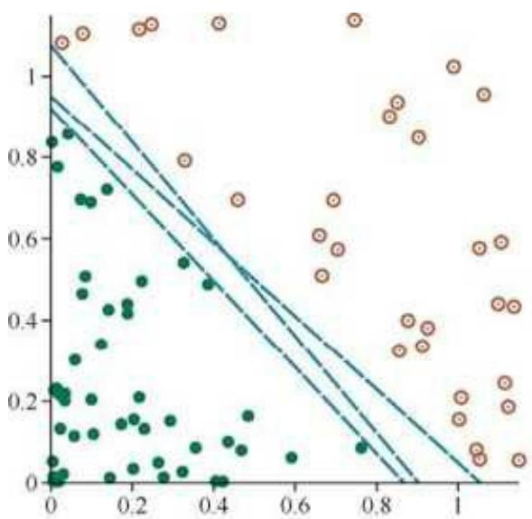

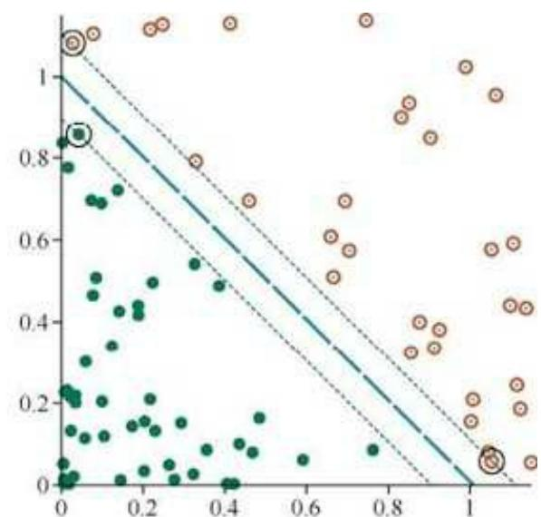  
  
图19-21支持向量机分类器：（a）两类点（橙色空心圆和绿色实心圆）和3个候选线性分离器。（b）极大边距分离器（粗线）位于边距 （虚线之间的区域）的中间。支持向量 （带有大黑圈的点）是最靠近分离器的，本图中有3个

考虑到这一点，将分离器定义为点集 。我们可以使用梯度下降来搜索 w和 b 的空间，以找到在正确分类所有样例的同时最大化边界距离的参数。

但事实上，还有另一种方法可以解决此问题。我们将不会给出具体的细节，大致思想是，存在另一种称为对偶形式的表示形式，我们通过求解对偶问题，可找到原问题的最优解：

$$
\underset {\alpha} {\operatorname {a r g m a x}} \sum_ {j} \alpha_ {j} - \frac {1}{2} \sum_ {j, k} \alpha_ {j} \alpha_ {k} y _ {j} y _ {k} \left(x _ {j} \cdot x _ {k}\right) \tag {19-10}
$$

满足约束 和 。这是一个 二次规划 （quadratic programming）优化问题，解决它需要有好的软件包。在找到向量 $\pmb { \alpha }$ 之后，我们就可以利用等式 得到w，或者仍可以用对偶形式表示模型。优化问题［式（19-10）］具有3个重要性质。首先，其表达式是凸的；因此它有一个可以被有效方法找到的全局最大值。其次，数据仅以成对数据的点积形式输入表达式。第二个特性也适用于分离器本身的等式。一旦计算出最优的 ，则分离器为[1]

[1] 函数sign( x )对正数 $x$ 返回 $+ 1$ ，对负数 $x$ 返回−1。

$$
h (\boldsymbol {x}) = \operatorname {s i g n} \left(\sum_ {j} \alpha_ {j} y _ {j} \left(\boldsymbol {x} \cdot \boldsymbol {x} _ {j}\right) - b\right) \tag {19-11}
$$

最后一个重要的性质是，除 支持向量 （support vector，即最靠近分离器的点）外，每个数据点对应的权重 为0。（它们之所以称为“支持”向量，是因为它们“支撑”起了分离平面。）由于支持向量通常比样例量少得多，因此SVM将拥有参数模型的某些优势。

如果样例不是线性可分的怎么办？图19-22a表示了由属性 $\pmb { x } = ( x _ { 1 } , x _ { 2 }$ )定义的输入空间，在圆形区域内有正样例（y=+1），在外部有负样例（ y=-1）。显然，没有线性分离器可解决此问题。现在，我们考虑重新表示输入数据，也就是说，将每个输入向量 $\pmb { x }$ 映射到新的特征值向量F(x )。特别地，让我们采用如下3个特征：

$$
f _ {1} = x _ {1} ^ {2}, \quad f _ {2} = x _ {2} ^ {2}, \quad f _ {3} = \sqrt {2} x _ {1} x _ {2} \tag {19-12}
$$

我们很快就会看到选择这些特征的原因，但现在先看一下采用新特征后发生了什么。图19-22b给出了这3个特征定义的新的三维空间中的数据；数据在此空间内是线性可分的！这种现象实际上相当普遍：如果将数据映射到足够高维度的空间中，那么它们几乎总是线性可分的——如果从充分多的方向上观察一组数据点，你就很可能会找到一个方向使它们在这个方向上是分离的。在这个问题中，我们仅使用了3个维度； [2] 习题19.SVME要求证明4个维度的特征足以线性分离平面中任何位置的圆（不仅是以原点为圆心的圆），5个维度足以线性分离任何椭圆。一般来说（某些特殊情况除外），如果我们有 $N$ 个数据点，则它们在 $N$ -1维或更大的空间中总是可分离的（习题19.EMBE）。

[2]读者可能会发现，我们本可以只使用 $f$ 1和 $f 2$ ，但是三维的映射可以更好地解释这个想法。

我们通常不指望能在输入空间x 中找到线性分离器，但是我们只需通过简单地在式（19-10）中用替换 ，即可在高维特征空间 F ( x )中找到线性分离器。这一做法本身并不具有很大意义，即在任何学习算法中用 F(x )替换 $_ x$ 都具有所需的效果，但是点积的确具有某些特殊的性质。事实表明，通常不需要首先为每个点计算 F ，而是可以直接计算 $F$ 。在式（19-12）定义的三维特征空间中，运用一点线性代数的知识，有

$$
F \left(\boldsymbol {x} _ {j}\right) \cdot F \left(\boldsymbol {x} _ {k}\right) = \left(\boldsymbol {x} _ {j} \cdot \boldsymbol {x} _ {k}\right) ^ {2}
$$

（这解释了为什么 $f _ { 3 }$ 中带有 $\sqrt { 2 }$ 。）表达式 $( x _ { 1 } \cdot x _ { k } ) ^ { 2 }$ 被称为 核函数 （kernel function） [3] ，它通常被写作 。核函数是输入数据对在某个相应特征空间中的点积。因此，通过简单地 $K ( x _ { y } , x _ { b } )$ 用一个核函数 替换式（19-10）中的 ，便可以在高维特征空间 F ( x )中找到线 $K ( x _ { y } , x _ { b } )$ $\pmb { x _ { j } } \cdot \pmb { x _ { k } }$ 性分离器。我们可以在更高维度的空间中进行学习，但是我们只需计算核函数，而不是每个数据点的全部的特征。

[3]这里的“核函数”的用法与局部加权回归中的核函数略有不同。一些SVM核是距离度量，但并不都是如此。

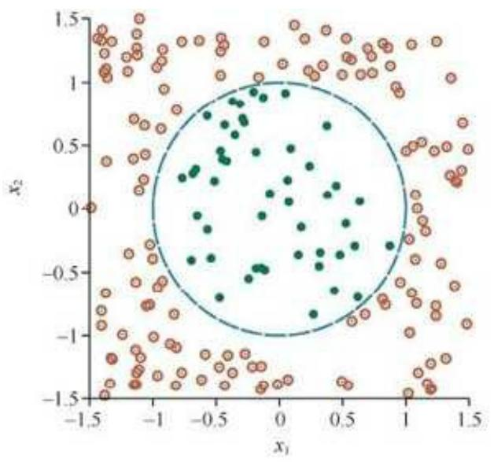

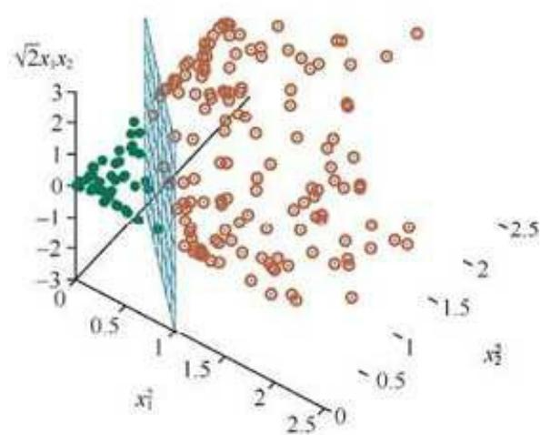  
  
图19-22 （a）一个二维训练集，其中正样例为绿色实心圆，负样例为橙色空心圆。图中还给出了真实的决策边界 。（b）映射到三维输入空间 $( x _ { 7 } ^ { 2 } , x _ { 2 } ^ { 2 } , \sqrt { 2 } x , x _ { 2 } )$ 后的相同数据。（a）中的圆形决策边界变成三维空间中的线性决策边界。图19-21b给出了（b）中分离器的特写

接下来我们可以看到，核函数 $K ( x _ { j } , x _ { k } ) = ( x _ { j } \cdot x _ { k } ) ^ { 2 }$ 不是一个特别的存在。它仅对应于某个特定的高维特征空间，其他核函数可能对应于其他特征空间。数学上一个可敬的结果—— 默瑟定理（Mercer’s theorem）（Mercer, 1909）——告诉我们，任何“合理的” [4] 核函数都对应于某个特征空间。这些特征空间可能非常大，即使对于看起来普通平常的核函数也是如此。例如，多项式核（polynomial kernel） $K ( x , x _ { k } ) = ( 1 + x _ { j } \cdot x _ { k } ) ^ { \alpha }$ 对应于一个维度为 d 的指数的特征空间。一个比较常用的核函数是高斯核： K（xx）=e-x² $K ( x _ { j } , x _ { k } ) = e ^ { + | x _ { j } - x _ { k } | ^ { 2 } }$ 。

[4] 这里的“合理的”意味着矩阵 $\mathbf { \delta E _ { A } } = \mathbf { \delta E } ( \mathbf { \delta x _ { A } } , \mathbf { \delta x _ { A } } )$ 是正定的。

# 19.7.6 核技巧

这就是比较巧妙的 核技巧 （kernel trick）：将这些核函数代入式（19-10），可以在数十亿维度（甚至无限多维）的特征空间中高效地找到最优线性分离器。将生成的线性分离器映射回原始输入空间后，可以对应于任意一个在正样例和负样例之间的波动的非线性决策边界。

对于含有固有噪声的数据，我们可能不希望在某些高维空间中使用线性分离器。相反地，我们可能希望在较低维度的空间中找到一个决策面，该决策面可能不会完全准确地将数据分类，但会反映出带有噪声的数据的真实性。这样的分类器被称为软边距 （softmargin）分类器，它允许样本落在决策边界的错误一侧，但同时赋予它们与将其移回正确一侧所需距离成正比的惩罚。

核方法不仅可以用于寻找最优线性分离器的学习算法，而且可以应用于任何其他可描述为仅用到数据对点积的算法，例如式（19-10）和式（19-11）。在将算法描述为点积后，将点积替换为核函数，我们就有了该算法的核化 （kernelization）算法。

# 19.8 集成学习

到目前为止，我们已经研究了使用单个假设进行预测的学习方法。集成学习 （ensemblelearning）选择一个由一系列假设h ,h ,…, h 构成的集合，通过平均、投票或其他形式的机器学习方法将它们的预测进行组合。我们称单独的假设为基模型 （basemodel），其组合后的模型为 集成模型（ensemble model）。

这样做的原因有两个。第一个原因是可以减少偏差。基模型的假设空间可能过于局限，进而造成了很大的偏差（例如逻辑斯谛回归中线性决策边界的偏差）。与基模型相比，集成模型有更强大的表达能力，因此偏差会较小。图19-23给出了3个线性分类器，它们的集成模型可以表示一个三角形区域，而单个线性分类器则无法表示该区域。n 个线性分类器的集成能实现更多的函数，而所需的计算量仅为n倍；这通常比使用一个更大的假设空间好，因为更大的假设空间可能会成倍地增加计算量。

第二个原因是集成方法可以减少方差。考虑一个K=5的二分类器的集成，我们采用多数表决的方式将它们组合在一起。如果集成模型误分类了一个新的样例，那么5个基分类器中至少有3个对样例进行了误分类 。我们希望这个概率比单个分类器进行错误分类的概率要小。为了对此进行量化，假设你已经训练了一个在80%的情况下能分类正确的分类器。现在我们构造一个由5个分类器集成的模型，其中每个基分类器都在数据集的不同子集上进行训练，因而它们将是独立的。假设这么做会导致单个训练器性能下降，每个分类器仅在75%的情况下是正确的。但在总体上，由于我们假设分类器是独立的，则在89%的情况下该多数表决的方法将会给出正确的结果（如果有17个分类器，正确率则为99%）。

实际上，独立性假设是不合理的——每个单独的分类器共享了一些相同的数据和假设，因此它们不是完全独立的，并且将共享一些相同的错误。但是，如果基分类器至少在某种程度上是不相关的，则集成学习将减少错误分类的情况。现在我们将关注4种集成方法：自助聚合法、随机森林法、堆叠法和自适应提升法。

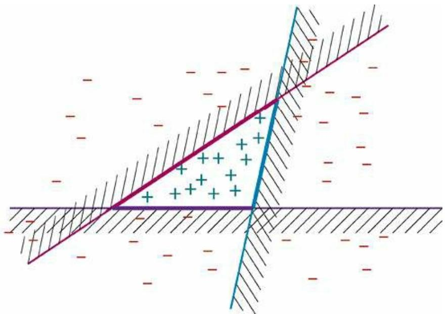  
图19-23 通过集成学习的方法提升表达能力。我们使用3个线性阈值假设，每个假设在不带阴影的一面都是正分类，将所有被这3个面同时分类为正的样例分类为正。所得的三角形区域是在原始假 设空间中无法被表达的假设

# 19.8.1 自助聚合法

在自助聚合法 （bagging）[1] 中，我们通过采样并替换原始训练集来生成 $K$ 个不同的训练集。具体来说，我们从训练集中随机选取 $N$ 个样例，这些样本中的每一个都可能是我们之前选择过的一个样例。然后，我们在这 $N$ 个样例上运行机器学习算法，并获得一个假设。我们重复这个过程 $K$

次即得到 $K$ 个不同的假设。然后当我们要对新的输入进行预测时，我们汇总来自所有 $K$ 个假设的预测。对于分类问题，这意味着进行相对多数投票（对于二分类，为绝对多数投票）。对于回归问题，最终输出为平均值：

[1] 在统计学中，有放回的重复采样方法被称为 自助法 （bootstrap），bagging是“自助聚合”（bootstrap aggregating）的缩写。

$$
h (\boldsymbol {x}) = \frac {1}{K} \sum_ {i = 1} ^ {K} h _ {i} (\boldsymbol {x})
$$

自助聚合法可减少方差，而且当数据集较为有限或基模型可能存在过拟合时，自助聚合法是一个标准的解决方案。自助聚合法可应用于任何类型的模型，但最常用于决策树模型中。这是容易理解的，因为决策树是不稳定的：一组稍微不同的样例可能导致完全不同的树。自助聚合法可以减弱这种差异性。如果你可以同时访问多台计算机，那么自助聚合法也是高效的，因为可以并行地计算每个假设。

# 19.8.2 随机森林法

遗憾的是，自助聚合法集成的决策树经常会导致输出为相关性很高的K个树。如果存在一个具有很高的信息增益的属性，那么它很可能是大多数树的根。随机森林 （randomforest）模型是决策树自助聚合法的一种形式，不同的是我们进行了额外的步骤来使 $K$ 个树的集合更加多样化，从而减小方差。随机森林可用于分类或回归问题。

随机森林的主要思想是随机化属性选择（而不是训练样例）。在构造树的过程中，对于每个分割点，我们从属性中随机抽样，并计算哪个属性有最高的信息增益。如果我们共有n 个属性，则一个常用的默认选择是在每个分割点随机选择 个属性（对于分类问题），或选择n /3个属性（对于回归问题）。

一个进一步的改进方案是在选择分割点数值时引入随机性：对于每个选定的属性，我们从属性值域内随机均匀地采样几个候选值；接着我们选择其中具有最高信息增益的值。这将会使森林中的每棵树都有较大可能是不同的。以这种方式构造的树我们称之为 极端随机树 （extremely randomizedtrees，ExtraTrees）。

随机森林的构造效率是很高的。你可能会认为，创建K棵树并集成将花费K倍的时间，但结果并没有这么坏，原因有以下3点：（a）每个分割点选择的速度都更快，因为我们考虑的属性数量较少；（b）可以省略对每个树的剪枝，因为集成本身将减小过拟合；（c）如果我们恰好有 $K$ 台计算机可用，我们可以并行构造所有的树。例如，阿黛尔·卡特勒（AdeleCutler）曾在报告中表明，对于一个有100个属性的问题，即使我们仅有3个CPU可供使用，此时构造 K=100棵树并构成森林所花费的时间只相当于在一个CPU上构造单个决策树。

训练随机森林所需的超参数都可以通过交叉验证来选取：树的数量 $K$ ，每棵树使用的样例数量 $N$ （通常用完整数据集的百分比表示），每次分割使用的属性数量（通常用属性总数的函数表示，例如 ），以及我们使用ExtraTrees时尝试的随机分割点的数目。我们也可以用 袋外误差 （out-of-bag error）来代替一般的交叉验证：对每个样例考虑恰好仅不含有这个样例的树，在此基础上对错误率取平均。

已有的知识告诉我们，复杂的模型可能容易过拟合，对于决策树也是如此，并且我们发现剪枝 可以防止过拟合。随机森林是一个复杂的、未剪枝的模型，但是它们可以避免过拟合。随着我们不断通过向森林中添加更多树来增强其性能，它们在验证集上的错误率也会随之下降。其变化曲线通常看起来像图19-9b，而不是图19-9a。

布赖曼（Breiman,2001）给出了一个数学证明，他证明了（几乎在所有情况下）随着向森林中添加更多树，该误差趋于收敛，而且它不会增长。一种看待这个现象的方法是，随机选择属性会生成各式各样的树，从而减小了方差，但是由于我们不需要剪枝，因此它们可以以更高的密度覆盖整个输入空间。一定数量的树可以涵盖仅在数据中出现几次的独特属性情形，而它们的投票将是决定性的，但它们的投票可能被其他不含有这些属性的树超过。也就是说，随机森林并非完全避免了过拟

合。尽管其错误率在极限意义下不会增加，但这并不意味着误差将为零。

随机森林在各种应用问题中效果都非常出色。在Kaggle数据科学比赛中，它们是2011年至2014年夺冠团队最热衷的方法，并且至今仍是一种普遍的方法（尽管近年来的获胜队伍更普遍运用 深度学习 和梯度提升法 ）。R语言中的randomForest程序包也是特别受欢迎的。在金融领域，随机森林已应用于信用卡违约预测、家庭收入预测和期权定价等，在机械领域中的应用包括机器故障诊断和遥感，在生物信息学和医学中的应用包括糖尿病性视网膜病变、微阵列基因表达、质谱蛋白质表达分析、生物标志物发现以及蛋白质相互作用预测等。

# 19.8.3 堆叠法

自助聚合法对在不同数据上用同一模型类训练出的多个基模型进行组合，而 堆叠泛化 （stackedgeneralization ，或简称为堆叠）的方法则对在相同数据上使用不同模型类训练的多个基模型进行组合。例如，假设餐厅等待问题数据集的第一行数据如下所示：

$$
x _ {1} = \text {Y e s}, \text {N o}, \text {N o}, \text {Y e s}, \text {S o m e}, \mathbb {S} \mathbb {S} \mathbb {S}, \text {N o}, \text {Y e s}, \text {F r e n c h}, 0 \sim 1 0; y _ {1} = \text {Y e s}
$$

我们将数据分为训练集、验证集和测试集，并使用训练集来训练3个不同的基模型——SVM模型、逻辑回归模型和决策树模型。

接下来我们考虑数据的验证集，对于每一行数据使用从3个基模型得出的预测进行增广，从而使数据的每一行具有如下形式（其中模型的预测以粗体显示）：

$$
x _ {2} = \text {Y e s}, \text {N o}, \text {N o}, \text {Y e s}, \text {F u l l}, \text {S}, \text {N o}, \text {N o}, \text {T h a i}, 3 0 \sim 6 0, \text {Y e s}, \text {N o}, \text {N o}; y _ {2} = \text {N o}
$$

我们使用此验证集来训练新的集成模型，如逻辑斯谛回归模型（不必是基模型类之一）。集成模型可以使用原始数据和合适的预测进行学习。它可能会学习到基模型的加权平均，例如，它们的预测以50%:30%:20%的比例加权。或者它可能会学习到数据与预测之间的非线性联系，例如，在等待时间较长时，集成模型也许会更信任SVM模型的预测。我们使用相同的训练数据来训练每个基模型，然后使用留出的验证数据（加上基模型预测）来训练集成模型。如果需要，也可以使用交叉验证。

该方法称为“堆叠”，因为可以将其视为由基模型构成第一层，并在基模型层的输出上进行操作进而建立的集成模型。实际上，我们也可以堆叠多个层，每一层都在前一层的输出上进行操作。堆叠的方法可以减小偏差，并且通常所获得的模型性能要优于任何单个基模型。数据科学比赛（例如Kaggle和KDD Cup）的获胜团队经常使用堆叠法，因为每个人可以独立工作，各自完善自己负责的基模型，之后汇聚在一起建立最终的堆叠集成模型。

# 19.8.4 自适应提升法

运用最广泛的集成方法是自适应提升法 （boosting）。为理解其工作原理，我们首先需要引入 加权训练集 （weighted training set）的概念。其做法是给每个样例赋予一个权重 w j− 0，该权重描述了样例在训练过程中应计数的次数。例如，如果一个样例的权重为3，而其他样例的权重均为1，则相当于在训练集中有3个该样例的副本。

自适应提升法从所有样例具有相等的权重 $w _ { j } = 1$ 开始。根据该训练集，我们训练第一个假设 $h _ { \mathrm { ~ 1 ~ } }$ 。通常来说，h 会对一些训练样例进行正确分类，而对某些训练样例则会分类错误。我们希望下一个假设能在被分类错误的样例中表现得更好，因此我们将增加它们的权重，同时减小正确分类的样例的权重。

基于这个重新进行加权得到的训练集，我们训练得到假设 $h _ { 2 }$ 。这一过程将以这种方式不断进行，直到生成 $K$ 个假设，其中K是自适应提升算法的输入之一。难以分类的样例将逐渐获得越来越大的权重，直到算法强行构造了一个假设，使这些样例可以正确分类。值得注意的是，这是一个贪心算法，且它不会回退，即一旦算法选择了某个假设h ，它就永远不会抛弃该选择，而是会添加新的假设。它也是一种序贯算法，因此我们无法像自助聚合法一样并行计算所有假设。

为获得最终的集成模型，我们像自助聚合法一样让每个假设进行投票，不同的是，每个假设的投票效果需要进行加权——在各自的加权训练集上表现得更好的假设将获得更大的投票权重。对于回归

或二分类问题，我们有

$$
h (\boldsymbol {x}) = \sum_ {i = 1} ^ {K} z _ {i} h _ {i} (\boldsymbol {x})
$$

其中 z i是第 i 个假设的权重。（该假设的权重与样例的权重是不同的。）

图19-24直观地表明了该算法的运作方式。在自适应提升法的基本思路下，有多种方法可以用于调整样例权重和组合各个假设。所有这些变种都有一个相同的基本思想，即当我们基于一个假设去获得另一个假设时，学习困难的样例会变得越来越重要。就像我们将在第20章中看到的贝叶斯学习一样，贝叶斯学习也为更准确的假设提供了更多权重。

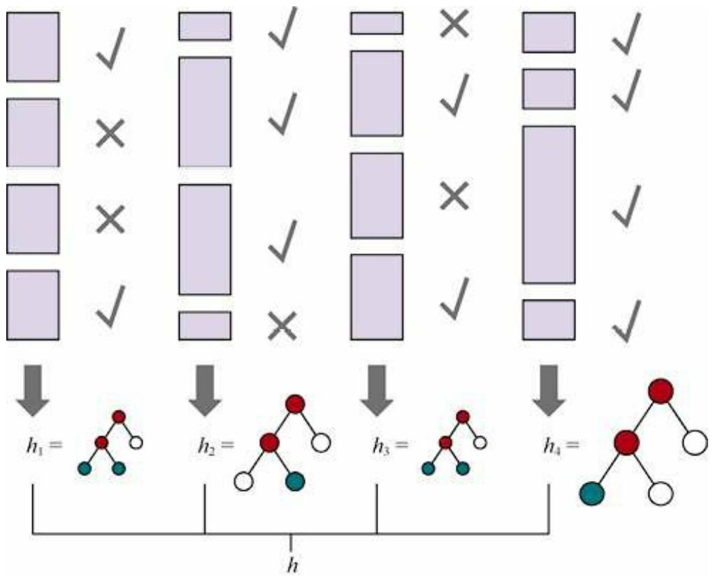  
图19-24自适应提升算法的运作方式。每个阴影矩形对应一个样例。矩形的高度对应于样例的权重。勾和叉号表示该样例是否在当前假设下正确分类。决策树的大小代表该假设在最终集成模型中的权重大小

图19-25给出了一种称为A daBoost的特定算法。它经常与决策树一起使用构成假设，通常该决策树的大小是受限制的。A daBoost具有非常重要的性质：如果输入的学习算法 $L$ 是弱学习 （weaklearning）算法——这意味着 $L$ 总是在训练集上返回准确度略高于随机猜想的假设（即，对布尔分类问题来说，假设的准确度为50%+ ），那么A daBoost将返回一个假设，对于足够大的 $K$ ，该假设能对训练数据进行完美的分类。因此，该算法提升 了原始学习算法对训练数据预测的准确性。

function ADABoosT(examples, $L , K )$ returns一个假设

inputs:examples，由N个带标签的样例 $( x _ { 1 } , y _ { 1 } ) , \cdots , ( x _ { N } , y _ { N } )$ 组成的集合

L学习算法

K，集成中的假设个数

localvariables:w代表样例权重的N维向量，初始为全1/N

h，代表K个假设的向量

z代表K个假设权重的向量

$\varepsilon \gets$ 一个小的正数，用于规避除以零的情况

for $k = 1$ to $K$ do

$\pmb { h } [ k ]  L ( e x a m p l e s , w )$

error0

for $j = 1$ to $N$ do//计算h[k]的总错误率

if ${ \pmb h } [ k ] ( x _ { j } ) \neq y _ { j }$ thenerror←error+w[j]

iferror $> 1 / 2$ then break from loop

e $r r o r \gets \operatorname* { m i n } ( e r r o r , 1 - \varepsilon )$

forj=1toNdo //赋予h[k出错的样例更大的权重

图19-25用于集成学习的自适应提升方法的A daBoost变体。该算法通过对训练样例进行连续加权来生成假设。函数Weighted -Majority 每次生成一个假设，该假设返回假设h中投票数最高的输出值，其投票权重为 z 。对于回归问题或者标签为1和-1的二分类问题类，该输出即为∑ kh [ k ] z [ k ]

换句话说，只要基模型比随机猜测更好，我们就可以通过自适应提升的方法消除基模型中的任何大小的偏差。（在所给出的伪代码中，如果我们得到的假设比随机猜测性能差，就停止生成假设。）无论原始假设空间的表达能力如何，希望学习的函数多么复杂，该结果都是成立的。具体而言，我们在图19-25中选择了有关权重的精确公式（即error/(1 –error)），这样的选择是为了方便从数学上证明其性质（Freund and Schapire, 1996）。当然，该方法并不能保证泛化性能，即对未观测的样例的分类准确性。

现在让我们看看自适应提升法用于餐厅等待问题数据的效果。我们将选择一个被称为决策树桩（decision stump）的模型类作为原始假设空间，决策树桩是指只在根节点处进行了一次测试的决策树。图19-26a中位于下方的曲线表明，未使用提升的决策树桩对该数据集不是很有效，使用100个训练样例进行训练后的训练集准确率仅为81%。在应用了自适应提升法之后（ K=5），性能会更好，使用100个样例进行训练后训练集准确率达到93%。

随着集成规模 $K$ 的增加，将发生一件有趣的事情。图19-26b给出了训练集表现（在100个样例上）与 $K$ 的关系。我们注意到，当 $K$ 为20时，训练误差达到0。也就是说，由20个决策树桩组合的加权多数投票集成模型足以准确地拟合100个样例——这是插值点。随着我们向集成模型中添加更多的决策树桩，训练误差将恒为零。该图还表明， 在训练集误差达到0后的很长一段时间，测试集性能仍在继续提高。 在K=20时，测试集准确率为0.95（或0.05误差率），直到K=137时，性能提高到0.98，然后逐渐下降到0.95。

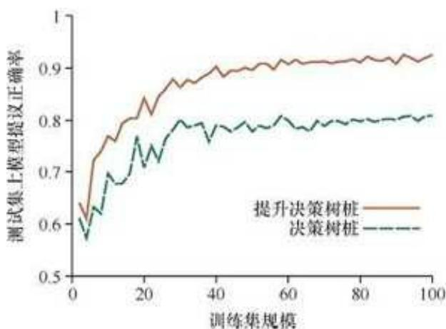

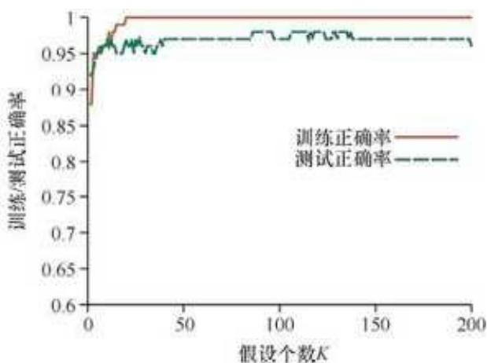  
  
图19-26（a）当K=5时，在餐厅等待问题数据集上，提升后的决策树桩与未提升的决策树桩的性能对比。（b）训练集和测试集上正确的比例与 $K$ （集成模型中假设的数量）的关系。值得注意的是，即使在训练精度达到1之后，即在整体模型已经准确拟合数据之后，测试集的准确率仍会略有提高

这一发现对于不同数据集和假设空间都非常可靠，它在第一次被发现时令人十分惊讶。奥卡姆剃刀原理告诉我们，除非必要，不要让假设变得过于复杂，但是该图告诉我们，随着整体假设变得更加复杂，预测性能也会有所改善！为此人们提出了各种解释。一种观点认为，自适应提升法类似于贝叶斯学习 （见第20章）——可以证明这是一种最优学习算法，随着更多的假设加入到集成中，近似值会提高。另一个可能的解释是，进一步添加假设，可以使集成模型对正样例与负样例之间的边界更加置信，这有助于对新样例进行分类。

# 19.8.5 梯度提升法

对于因子化表格数据的回归和分类问题，梯度提升 ［gradientboosting，有时称为梯度提升机（GBM），或梯度提升回归树（GBRT）］已成为一种非常热门的方法。顾名思义，梯度提升法是一种使用了梯度下降的自适应提升法。回想一下，在A daBoost中，我们从一个假设h 出发，并用一系列假设对其进行自适应提升，这些假设更加注重之前假设分类错误的样例。在梯度提升法中，我们还引入了新的自适应提升假设，这些假设并不关注特定的样例，而注重正确答案与先前假设所给出的答案之间的梯度 。

像其他使用了梯度下降的算法一样，我们从可微的损失函数入手。我们可以将平方误差损失用于回归，将对数损失用于分类。与A daBoost中一样，有了基模型后，我们构造决策树。在19.6.2节中，我们使用梯度下降来获得最小化损失的模型参数——计算损失函数，并朝损失函数降低最快的方向更新参数。使用梯度提升法时，我们不会更新现有模型的参数，我们更新的是下一个决策树的参数，但是必须通过沿着梯度的方向移动来减小损失。

就像我们在19.4.3节中看到的模型一样， 正则化 有助于防止过拟合。其具体形式可以是限制决策树的数量或大小（就其深度或节点数而言）。正则化可以来自学习率 $\pmb { \alpha }$ ，它表示沿梯度方向移动的距离；其值通常在0.1～0.3之间，学习率越小意味着我们在集成时需要的决策树越多。

梯度提升法可以用当下流行的XGBoost（极限梯度提升）软件包实现，该软件包通常用于解决工业中的大规模应用（针对有数十亿个样例的问题），数据科学竞赛的获胜队伍也经常使用它（2015年，KDD Cup前十名中的团队都使用了它）。XGBoost使用剪枝和正则化进行梯度提升，并确保运行的高效性，它仔细组织内存以避免缓存未命中，并允许在多台计算机上进行并行计算。

# 19.8.6 在线学习

到目前为止，我们在本章中所研究的所有内容均基于数据的i.i.d（独立同分布）的假设。一方面，这是一个明智的假设：如果将来的样本与过去观测的样本不是相似的，那么我们如何进行预测呢？另一方面，这个假设本身是一个比较强的假设：我们知道过去观测到的数据与将来的数据之间存在某些相关性，而在复杂的情况下，我们不可能保证所有将来的数据都独立于给定的过去的数据。

在本节中，我们将研究当数据不是i.i.d时（当数据的分布随时间改变时）应该如何使用模型。在这种情况下，我们进行预测的时间点就比较重要了，因此我们将采用被称为在线学习 （onlinelearning）的概念：智能体从外界接收输入 x j，并预测相应的 y j，然后知晓正确的答案，再对 $x _ { j }$ 重复该过程，并以此类推。也许人们认为这项任务是不太可能完成的——如果外界是敌对的，那么我们的所有预测都可能是错误的。事实证明，我们可以为这样的过程做出一些理论保证。

让我们考虑如下情形：输入中包含一些专家的预测。例如，每天有K个专家预测股市将上涨还是下跌，而我们的任务是汇总这些预测并做出自己的预测。一种方法是研究每个专家过去的表现，并选择与他们过去的表现成比例的方式给予他们相应的信任。该方法称为随机加权多数算法（randomized weighted majority algorithm）。我们可以用更正式的方法表述：

初始化一个权重集合 全为 1

for each 需要解决的问题 do

（1）从专家处收到预测  
（2）根据权重比例随机选择一个专家 $k ^ { * } : P ( k ) = w _ { k }$   
（3） yield $\hat { y } _ { \kappa }$ 作为专家 $k ^ { * }$ 对这个问题的答案  
（4）收到正确的答案 y  
（5）对每一个 y ˆ k y 的专家 k ，更新 $y  { \mathrm { ~ \hat { ~ } { ~ } ~ } } _ { k } \neq y$ $k$ $w _ { k } \gets \beta w _ { k }$   
（6）归一化权重使得 $\sum _ { k } w _ { k } = 1$

其中 $\beta$ 是一个常数， $0 < \beta < 1$ ，该常数描述的是我们给每一个判断错误的专家添加惩罚的程度。

我们用遗憾 （regret）来衡量该算法是否成功。遗憾是指与我们事后知道的拥有最佳预测记录的专家相比，算法所犯的额外错误数量。设 $M ^ { * }$ 为最好的专家所犯的错误数量，那么由随机加权多数算法产生的错误数 $M$ 将有如下的上界：[2]

[2]布卢姆（Blum,1996）给出了一个巧妙的证明。

$$
M <   \frac {M ^ {*} \ln (1 / \beta) + \ln K}{1 - \beta}
$$

这一上界适用于 任何 样例序列，即使是对手选择的最差样本。具体来说，当我们有 $K = 1 0$ 个专家时，如果选择 ${ \pmb \beta } = { \pmb 1 } / { 2 }$ ，那么错误量有上界 $1 . 3 9 M ^ { ^ { \ast } } + 4 . 6$ ；如果 $\beta = 3 / 4$ ，则它以 $1 . 1 5 M ^ { \ast } +$ 9.2为上界。通常来说，如果 $\beta$ 接近于1，那么从长远来看，我们将会对数据的变化做出响应；如果预测最好的专家发生了改变，我们不久就会掌握这一变化。但是，如果在算法开始时给予所有专家同等的信任，那么我们将会付出一定的代价——可能会在较长时间内收到坏专家的建议。当接近于0时，这两个因素的情况恰好相反。注意，我们可以通过选择 $\beta$ ，使得从长远来看 M 渐近于 M * 。我们称这样的学习为 无悔学习 （no-regret learning），因为每次试验的平均遗憾随着试验次数的增加而趋向于0。

在线学习适用于数据可能随时间快速变化的情形。对于拥有不断增长的（即使增长是缓慢的）大量数据的应用，它也是有效的。例如，对于拥有数百万个Web图像的数据集，我们不希望在每次添加一个新图像时都重新进行训练。此时使用在线学习的算法以允许不断添加图像将会是更加实用的。对于大多数针对最小化损失函数设计的学习算法，都有一个对应的最小化遗憾的在线学习版本。对

于这些在线算法中的许多算法，其遗憾都有一定的上界保证。

与专家小组的预测相比，我们的模型表现和专家之间的差距有如此严格的上界，这样的结果似乎令人惊讶。更令人惊讶的是，当这样的专家组发布有关政治竞选或体育赛事的预言时，公众非常愿意相信专家的预测，而对于知道他们的错误率不感兴趣。

# 19.9 开发机器学习系统

在本节中，我们将注重于解释机器学习的理论。使用机器学习的方法解决实际问题的具体实践是一门独立的学科。在过去的50年中，软件行业发展出了一套软件开发方法，使（传统）软件项目成功的可能性更大。但是对于机器学习项目，我们仍处于定义机器学习方法的早期阶段，我们的工具和技术还不够完善。接下来我们将叙述该开发过程中一系列典型的分解步骤。

# 19.9.1 问题形式化

第一步要弄清楚待解决的问题，这一步将分为两个部分。第一部分是“我要为用户解决什么问题”，诸如“使用户更容易整理和访问他们的照片”这样的答案过于含糊；而“帮助用户寻找与特定词条匹配的所有照片，例如巴黎”会更明晰。第二部分是“机器学习可以解决该问题的哪些部分”，也许我们会着眼于“学习将照片映射到一组标签的函数；在给定标签进行查询时，我们检索带有该标签的所有照片”。

为了使这一点更具体化，你需要为机器学习制定一个损失函数，它在一定程度上可以衡量系统在预测正确标签时的准确度。这个你制定的损失函数应该与你的真正目标相关联，但通常是不完全相同的——你的真正目标或许是最大化你在系统中获得、保持的用户数量以及它们产生的收入。这些是你应该关注的指标，但你不一定要直接以这些指标为目标构建机器学习模型。

如果你已经将要解决的问题分解为多个部分的子问题，那么你可能会发现有一些子问题可以由经典的程序来处理，而不需要机器学习。例如，对于用户想要寻找“最佳照片”的需求，你可以实现一个简单的程序，即按照关注和查看的数量对照片进行排序。一旦你让整个系统发展到了可处理的地步，就可以回过头去优化，用更复杂的机器学习模型代替简单的子模型。

问题形式化的一部分是确定你是在处理监督学习、无监督学习还是强化学习的问题。它们之间的区别并不总是那么明显。在 半监督学习 （semisupervised learning）中，我们拥有一些有标签的样例，并用它们从大量的无标签样例中挖掘更多的信息。这已成为一种常见的方法，例如新兴公司需要快速标记一些样例，以帮助机器学习系统更好地利用剩余的无标签样例。

在一些情况下你可以选择使用哪种学习方法。例如，考虑一个向客户推荐歌曲或电影的系统。我们可以将其视为一个监督学习问题，其输入为客户的信息，其输出标签是客户是否喜欢该推荐，我们也可以将其视为一个强化学习问题，其中系统执行一系列推荐操作，并偶尔从给予好评的顾客中得到奖励。

标签本身可能并不像我们所希望的那样一定正确。设想一下，你正试图构建一个系统，希望通过照片来猜测一个人的年龄。你通过让人们上传照片并陈述他们的年龄来收集一些有标签的样例，这就是一个监督学习过程。但实际上有些人谎报了年龄。这不仅仅是因为数据中存在随机噪声，更确切地说，这种不准确的情况是系统性的，找到不准确的数据是一个基于图像、自我报告的年龄和真实（未知）年龄的无监督学习问题。因此，噪声和标签的缺乏在监督学习和无监督学习之间形成了一个整体。 弱监督学习 （weakly supervised learning）关注的问题就是当标签有噪声、不精确或被随意提供时的情形。

# 19.9.2 数据收集、评估和管理

每一个机器学习项目都需要数据；在图像识别项目中，我们有免费的图像数据集可以使用，如ImageNet，它拥有1400多万张图像，其标签大约有2万种。有时我们可能不得已需要自己制造数据，这些数据可以由我们自己动手制作来完成，或者通过网络向付费工作者或无偿志愿者进行众包 。有时数据来源于用户。例如，Waze导航服务鼓励用户上传关于交通堵塞的数据，并利用该数据为所有用户提供最新的导航指示。当你没有足够的数据时，可以使用迁移学习的方法（见21.7.2节）：从公开可用的数据集（或已在此数据上预训练过的模型）开始，逐渐添加用户输入的特定数据并再次训练。

如果你将系统开放给用户，则用户可以提供反馈——他可能会注重某一个选项而忽略了其他项目。这时你需要一个能够处理这些数据的策略，其中包括能够保护隐私的操作（见27.3.2节），以确保你对收集到的数据有适当的许可，并能确保用户数据的完整性，且用户知道你将如何处理这些数据。你还需要确保操作流程是公平无偏差的（见27.3.3节）。如果你觉得有些数据过于敏感而无法

收集，但它们对你的机器学习模型很有用，则可以考虑采用联邦学习的方法，即数据仍保留在用户设备上，但模型参数以保护私有数据的方式进行共享。

保留所有数据的数据源头 （dataprovenance）是一个很好的做法。对于数据集中的每一列，你应该知道其确切的定义、数据的来源、可能的取值及它被如何处理过，还应知道是否有过某个时间段数据传输中断，以及某个数据源的定义是否随着时间的推移而演变。如果要跨时间段对结果进行比较，那么你需要知道上述这些。

如果你打算依赖其他人生成的数据，那么这些点将尤其重要— 他们的需求和你的需求可能有分歧，导致他们可能最终会改变生成数据的方式，甚至可能会停止更新数据。因此你需要监视你的数据源来捕捉这些信息。拥有一个可靠、灵活、安全的数据处理途径比机器学习算法的确切细节更为关键。考虑到涉及隐私的相关法律法规，数据的源头也是非常重要的。

对于任何任务，都有关于数据的一些问题：这是适合我任务的数据吗？它是否拥有足够的正确输入，使得我们能够训练模型？它包含我想要预测的输出吗？如果没有，我可以建立一个无监督的模型吗？或者我可以标记一部分数据，然后进行半监督学习？是否有与之相关的数据？拥有1400万幅图像是一件好事，但是如果你的所有用户都是对某个特定主题感兴趣的专家，那么一个通用数据库将没有多大用处——你仍需要找出对应特定主题的图像。训练数据有多少才是足够的？（我需要收集更多数据吗？我可以丢弃一些数据以加快计算吗？）回答这个问题的最佳方法是通过与一个训练集大小已知的类似项目进行比较来推断。

当你开始进行学习后，可以画一条学习曲线（见图19-7），并观察有更多的数据是否会有帮助，或者学习是否已经停滞。对于你所需要的训练样例的数量，有很多特殊的、不严谨的经验法则：学习困难的问题通常要几百万个数据；一般问题需要近1000个数据；一个分类问题中的每个类需要有几百个或几千个数据；比模型的参数个数多10倍的样例；比输入特征个数多10倍的样例；对于输入特征个数为d的问题，需要O (d logd )量级的样例；非线性模型需要比线性模型更多的样例；如果需要更高的精度，样例需求量就更多；如果使用了正则化，样例量需求就减少；需要足够的样例来获得必要的统计能力以拒绝分类中的零假设。所有这些规则都告诫我们，建议尝试过去对类似问题有效的方法。

你也应该谨慎地看待你的数据。是否有数据存在输入错误？如何处理丢失的数据？如果你从你的用户（或其他人）那里收集数据，他们中的一些人会与你的系统相对抗吗？文本数据中是否存在拼写错误或术语不一致？（例如，“Apple”“AAPL”和“Apple Inc.”是否都指同一家公司？）你将需要一个过程来找出和纠正所有这些潜在的数据错误。

当数据有限时，数据增强 （dataaugmentation）的方法会有所助益。例如，对于图像数据集，可以通过对每个图像进行旋转、平移、裁剪、缩放、更改亮度或颜色平衡及添加噪声来创建这个图像的多个版本。只要这些变化很小，图像标签就应该保持不变，并且在这种增强数据上训练得到的模型将更加健壮。

有时数据的量是足够的，但被划分为不平衡类 （unbalancedclass）。例如，一个有关信用卡交易的数据集可能包含1000万个有效交易和1000个欺诈交易。一个对于任何输入都判定为“有效”的分类器将在这个数据集上获得99.99%的准确率。为了处理这个问题，分类器还必须更多地关注欺诈交易样例。为了做到这一点，你可以对多数类进行 欠采样 （undersampling）（即忽略一些“有效”类的样例）或对少数类过采样 （over-sample）（即复制一些“欺诈”类的样例）。你也可以使用一个加权损失函数，对误判一个“欺诈”类样例进行更大的惩罚。

自适应提升法也可以帮助模型更加关注少数类。如果你使用的是集成方法，就可以通过更改集成投票的规则来实现，那么即使只有少数集成投票支持“欺诈”，最终响应也可能是“欺诈”。你也可以通过使用SMOTE（Chawla et al. , 2002）或 A dasyn （He et al. , 2008）等技术生成合成数据来帮助不平衡类达到平衡。

你应该仔细考虑数据中的离群值 （outlier）。所谓离群值是指与其他数据点距离很远的数据点。例如，在餐厅等待问题中，如果价格是一个数值而不是一个分类值，如果一个样例的价格是316美元，而所有其他样例的价格都是30美元或更少，那么这个样例就是一个离群值。像线性回归这样的方法很容易受到离群值的影响，因为它们在考虑所有输入样例后形成一个全局的线性模型，它们不能将离群值与其他样例点区别对待，因此单个离群值可能对模型的所有参数产生很大的影响。

对于像价格这样值域是正数的属性，我们可以通过数据变换，取每个值的对数来减少离群值的影

响，此时20美元、25美元和316美元将变为1.3、1.4和2.5。这是有意义的，从实践的角度来看，高值对模型的影响将会变小；从理论的角度来看，正如我们在16.3.2节中看到的，货币的效用是对数的。

像决策树这样由多个局部模型构建整体模型的方法可以单独处理离群值：最大值是300美元还是31美元是无关紧要的；无论哪种情况，决策树都可以在处理完价格−30的样本后在自己的局部节点中处理这个离群值。这使得决策树（以及随机森林法和梯度提升法）对离群值更具健壮性。

# 1.特征工程

在修正了明显的错误数据之后，你可能还需要对数据进行预处理，以使其更易于模型使用。我们已经看到过具体的处理过程：对于一个连续值的输入，如等待时长，强行把它们放置到某个区域（0～10分钟、10～30分钟、30～60分钟，或者 $>$ 60分钟）。领域知识可以告诉你哪些阈值是重要的，如在研究投票模式时按照年龄−18岁将人群进行区分。我们还看到（19.7节），当数据归一化为标准差为1时，最近邻算法的性能更好。对于类别特征（如晴天/阴天/雨天），将数据转换为其中一个特征为true的3个单独布尔特征通常很有效果［我们称之为 独热编码 （one-hotencoding）］。当机器学习模型是神经网络时，这特别有用。

你还可以根据已有的领域知识引入新特征。例如，给定一个关于客户购买信息的数据集，其中每个条目都有一个日期特征，你可能希望使用新特征来扩充数据——该日期是周末或假日。

再举一个例子，我们现在要估算待售房屋的真实价值。图19-13给出了这个问题的一个简单版本，我们对房屋面积和要价进行线性回归。但我们真正想估算的是房子的售价，而不是要价。为了解决这个问题，我们需要实际销售额的数据。但这并不意味着应该抛弃关于要价的数据，我们可以把它作为输入特征之一。除房子的大小之外，我们还需要更多的信息：房间、卧室和浴室的数量，厨房和浴室最近是否进行了改造，房子的年代以及可能的维修状况，是否有集中供暖和中央空调，院子的大小和景观的状况。

我们还需要这个地段和邻里的信息。但如何定义邻里关系呢？按邮政编码？如果一个邮政编码同时横跨一个理想的社区和一个不理想的社区呢？学区如何处理？应该把学区名称作为一个特征，还是把平均考试分数作为特征？做好特征工程是成功的关键。正如佩德罗·多明戈斯（PedroDomingos）（Domingos, 2012）所说：“归根结底，一些机器学习项目成功了，一些失败了。它们有什么区别？最重要的因素是所使用的特征。”

# 2.探索性数据分析与可视化

约翰·图基（John Tukey）（Tukey, 1977）首先提出了术语 探索性数据分析 （exploratory dataanalysis，EDA），它用于探索数据以获得对数据的理解，而不是直接进行预测或测试假设。这一过程主要是通过可视化来完成的，但也可以通过简要的统计来完成。查看一些直方图或散点图通常有助于确定数据是否丢失或错误，观察数据是正态分布还是重尾分布，以及判断什么样的学习模型可能是合适的。

一个有效的方法是对数据进行聚类，然后在每个聚类簇的中心可视化一个原型数据点。例如，在图像的数据集中，我们可以识别出一簇猫脸，这簇数据的附近是一簇熟睡的猫，而其他聚类簇描绘了其他对象。为了构建聚类簇，我们要在可视化和建模之间进行若干次迭代，我们需要一个距离函数来告诉我们哪些项彼此接近。但是，要选择一个好的距离函数，我们需要对数据有一些感觉。

检测远离原型的离群值通常对我们也很有帮助。这些离群值可以被认为是原型模型的批评者 ，也可以让我们直观地感觉到系统可能会犯什么类型的错误。一只披着狮子装扮的猫就是一个例子。

计算机显示设备（屏幕或纸张）是二维的，这意味着我们很容易将二维数据可视化。我们的眼睛在理解被投影到二维的三维数据方面很有经验。但许多数据集都有几十甚至数百万个维度。为了使它们可视化，我们可以进行降维，将数据投影到二维的平面图上（有时投影到三维，然后交互地进行

# 探索）。


投影的平面图不能保持数据点之间的所有关系，但留有数据的一些性质，即原始数据集中的类似点在投影平面图中是紧密相连的。一种称为 t分布随机近邻嵌入 （t-distributed stochastic neighbor

embedding，t-SNE）的方法就是这样做的。图19-27中显示了MNIST数字识别数据集的 t -SNE平面图。有一些数据分析和可视化包，如Pandas、Bokeh和Tableau，它们可以使数据更容易处理。

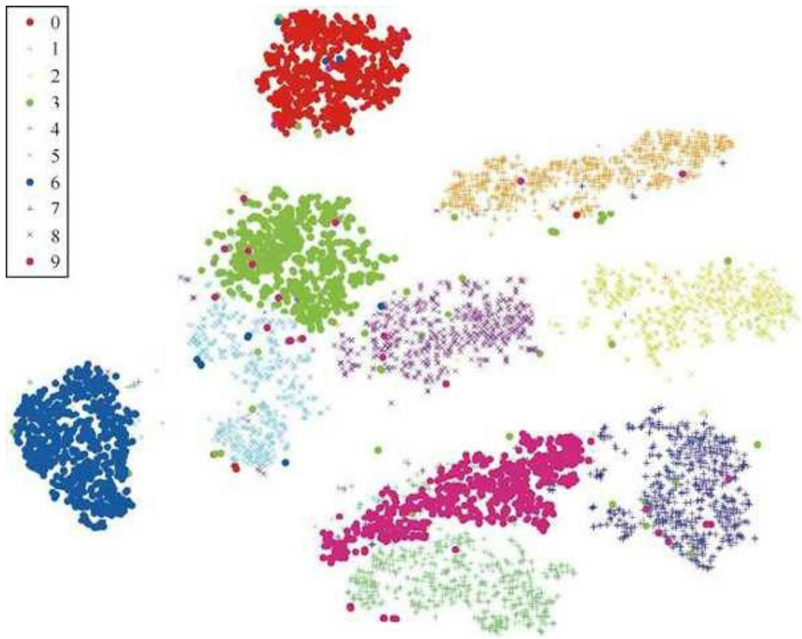  
图19-27MNIST数据集上的二维t-SNE平面图，该数据集收集了60 000幅手写数字图像，每幅28像素×28像素，因此是784维。可以清楚地看到10个数字的聚类簇，每个聚类簇之间都存在一些混淆；例如，顶部是数字0的聚类簇，但是在聚类簇的范围内有一些表示数字3和6的数据点。 t -SNE算法找到了一种突出聚类簇间差异的表示

# 19.9.3 模型选择与训练

有了干净的数据和对数据的直观感觉，是时候建立一个模型了。这意味着我们要选择一个模型类（如随机森林模型、深度神经网络模型或集成模型），使用训练数据训练模型，利用验证数据来调优模型类的所有超参数（如树的数目或层数），对过程进行调试，最后用测试数据对模型进行评估。

没有方法能够保证能挑选到最好的模型类，但有一些粗略的指导方针。当有很多分类特征，且你认为其中许多特征可能是不相关的时，随机森林是好用的。当你有大量的数据但没有先验知识，并且你不想在恰好选择正确的特征（只要少于20个）上花太多工夫时，非参数方法是很好的选择。然而，非参数方法通常会给出一个运行成本更高的函数 h 。

如果数据是线性可分的，或者可以通过巧妙的特征工程将其转换为线性可分的，逻辑回归表现得很好。当数据集不太大时，支持向量机是一种很值得尝试的方法，它们在可分数据上的表现类似于逻辑回归，并且在高维数据上表现得更好。处理模式识别的问题，如图像或语音处理，通常用深度神经网络（见第21章）。

超参数的选择可以结合以往的经验来完成，选取过去在类似问题中表现得较好的超参数并在其中搜索：用多个可能的超参数值来运行实验。随着运行的实验越来越多，你会有尝试不同的模型的直

觉。但是，如果你用验证数据来衡量模型的性能，并获得新模型的直觉，进而运行更多的实验，那么你就有可能过拟合验证数据。如果你有足够的数据，可能需要有若干个独立的验证数据集来避免此问题。如果你打算对验证数据进行仔细查看，而不是仅仅对其运行评估，这一点尤其重要。

假设你正在构建一个分类器，例如构建一个能对垃圾邮件进行分类的系统。我们将“把一封正常邮件标记为垃圾邮件”称为 假阳性 （falsepositive）。在假阳性和假阴性（把一封垃圾邮件标记为正常邮件）之间会有一个平衡，如果你更多地想防止正常邮件落入垃圾邮件文件夹，那么你最终必然也会向收件箱发送更多垃圾邮件。但什么是最好的权衡方法呢？你可以尝试使用不同的超参数值，并得到两种错误的不同的错误率，即这个权衡的若干个不同的选择。一种称为接收者操作特征（receiver operation characteristic，ROC）曲线的图表可为每个超参数值绘制假阳性和真阳性的曲线，有助于对可能成为权衡的好的选择的值可视化。一种称为“ROC曲线下方面积”（areaundertheROCcurve，AUC）的度量为ROC曲线提供了一个单数值摘要，如果你想部署一个系统并让每个用户可以选择他们的权衡点，AUC是很有用的。

分类问题的另一个有效的可视化工具是 混淆矩阵 （confusion matrix）：一个二维计数表，它显示了每个类别被正确分类或误分类的频率。

除了损失函数，其他因素也存在权衡。如果你能训练一个股票市场预测模型，使它让你每次交易都赚10美元，这将是很伟大的；但是，如果它每次预测的计算成本是20美元，模型就是没用的。在手机上运行一个机器翻译程序，它可以让你阅读国外城市的标志，这对你是有帮助的；但是如果在使用该程序一小时后手机电量被耗尽，那么该程序就不一定了。你可以跟进影响系统接受或拒绝的所有因素，并设计一个方案，使得在这个过程中你可以反复快速获得新想法、运行实验和评估实验结果，以查看你是否取得了进展。让这个迭代过程变快是机器学习成功的最重要因素之一。

# 19.9.4 信任、可解释性、可说明性

我们已经描述了一种机器学习方法，在该方法中，你可以使用训练数据构建模型，通过验证数据来选择超参数，并使用测试数据获得模型的最终衡量。在这个指标上做得好是你信任 该模型的一个必要条件，但它并不充分。并且不仅是你，还有其他利益相关者，包括监管机构、立法者、新闻界和用户，也对该系统的可信度（以及相关属性，如可靠性、责任性和安全性）感兴趣。

一个机器学习系统本质上仍是一个软件，因此仍可以使用所有用于检验和验证任何软件系统的典型工具来建立信任。

●源代码控制 ： 用于版本控制、构建和缺陷/问题跟踪的系统。

●测试 ：所有组件的单元测试，包括简单的典型测试用例和棘手的对抗测试用例、模糊测试（生成随机输入）、回归测试、负载测试和系统集成测试：这些对于任何软件系统都很重要。对于机器学习，我们还要对训练数据集、验证数据集和测试数据集进行测试。

●审查 ：代码走查和审查、隐私审查、公平性审查（见27.3.3节）和其他法律合规性审查。

●监控 ：仪表盘和警报，以确保系统已启动并运行，并继续以高精度运行。

●问责 ：当系统出错时会发生什么？对系统做出的决定进行投诉或申诉的过程是什么？我们怎样才能追踪到谁该对错误负责？社会期望（但并不总是得到）银行、政客和法律对做出的重要决策负责，他们也期望包括机器学习系统在内的软件系统对做出的决策负责。

此外，还有一些因素对机器学习系统特别重要，我们接下来将详细介绍。

可解释性 （interpretability）：如果你能观察实际模型并理解为什么它会在得到给定输入后给出的特定输出，以及当输入发生变化时输出将如何变化，我们就称此机器学习模型是可解释的


。决策树模型被认为是高度可解释的；在决策树中，某个样本遵循 Patrons=Full且

WaitEstimate=0～10将使决策树给出 wait的决策，这是可以理解的。决策树是可解释的有两个原因。首先，我们人类有理解IF/THEN规则的经验。（相比之下，人类很难直观地理解像神经网络模型那样的矩阵乘积与激活函数的结果。）其次，决策树在某种意义上是按照可解释性进行构造的，树的根节点就是具有最高信息增益的属性。

线性回归模型也被认为是可解释的；我们可以研究一个预测公寓租金的模型，根据这个模型，每增加一间卧室，租金就会增加500美元。其中的想法“如果我改变x，输出会怎样变化？”是可解释性的核心。当然，相关性不是因果关系，所以可解释的模型所解释的是会发生什么，但不一定是为什么 。

可说明性 （explainability）：一个可说明的模型可以帮助你理解“为什么某个输入对应着某个输出”。术语可解释性来自于对实际模型的剖析，而可说明性可以通过单独的过程说明。也就是说，模型本身可能是一个很难理解的黑匣子，但是说明模块可以总结模型的工作。对于一个将某图片分类为狗的神经网络图像识别系统，如果我们试图直接解释该模型，我们能得到的最好的结果是“卷积层后，softmax层中输出为狗 的激活性高于任何其他类”。这不是一个令人信服的结论。但是，一个单独的说明模块应该能够检查神经网络模型，并给出说明“它有4条腿、皮毛、尾巴、松软的耳朵和长长的鼻子；它比狼小，躺在狗床上，所以我认为它是狗”。说明是建立信任的一种方式， 一些法规，如欧洲GDPR（General Data Protection Regulation，通用数据保护条例）要求系统提供说明。

作为单独的说明模块的一个例子，局部可解释的模型不可知说明（local interpretable model-agnosticexplanation，LIME）系统的工作原理如下：无论你使用什么模型类，LIME都会构建一个可解释模型，它通常是决策树或线性模型，该模型将近似你给的模型，然后通过解释线性模型来创建说明以说明每个特征的重要性。LIME通过将机器学习模型视为一个黑盒来实现这一点，并用不同的随机输入值来测试它，从而创建一个数据集，从中可以建立可解释的模型。这种方法适用于结构化数据，但不适用于像图像这样的数据，因为图像中每个像素都是一个特征，但没有单独一个像素本身是“重要的”。

有时我们选择模型类是因为它的可说明性——我们可能会选择决策树而不是神经网络，不是因为它有更高的精度，而是因为它的可说明性让我们对它更加信任。

然而，一个简单的说明可能会导致错误的安全感。毕竟，我们通常选择使用机器学习模型（而不是手工编写的传统程序），因为我们试图解决的问题本身就很复杂，而且我们不知道如何编写传统程序。在这种情况下，我们不应该期望每个预测都有一个简单的说明。

如果你建立一个机器学习模型主要是为了理解这个领域，那么可解释性和可说明性将帮助你理解这个领域。但是，如果你只是想要性能最好的软件，那么相比于说明，测试可能会给你更多的信心和信任。例如在下面的问题中你会信任哪一个：一架从未飞行过但详细说明了为什么它是安全的实验飞机，或者一架安全地完成了100次飞行并经过精心维护但却没有任何关于安全保证的说明的飞机？

# 19.9.5 操作、监控和维护

一旦你对模型的性能已经满意，就可以把它部署给用户，这时你将面临更多的挑战。首先，你要面临用户输入的 长尾 （long tail）问题。你可能已经在一个大型测试集上测试了你的系统，但是如果该系统很受欢迎，你很快就会看到之前从未测试过的输入。你需要知道你的模型是否适用于它们，这意味着你需要监控 （monitoring）模型在实时数据上的表现——跟踪统计数据、构建一个仪表盘使得在关键指标低于阈值时发送警报。除了自动更新用户交互的统计数据外，你可能还需要雇用和培训人员来维护系统并对其运行状态进行估计与评价。

其次，你要面临非平稳性 （nonstationary）问题——外部世界会随时间变化。假设你的系统将电子邮件分类为垃圾邮件或非垃圾邮件，一旦你成功分类一批垃圾邮件，垃圾邮件发送者将看到你做了什么，并改变他们的战术，发送一种你之前没有见过的新类型的邮件。非垃圾邮件也在发展，因为用户改变了他们所使用的电子邮件与短信或桌面与移动服务的组合。

你将不断面临这样一个问题：一个已经过良好测试但依据旧数据构建的模型，与一个依据最新数据构建但尚未在实际使用中测试的模型相比，哪一个更好？

不同的系统对于时效性有不同的要求：对于有些问题，它们可能每天甚至每小时都有一个新的适用模型，而另一些问题可以使用同一个模型来解决，并保持数月。如果你打算每个小时都构建一个新的模型，那么为每次更新都进行繁重的测试与手动检查是不切实际的。你需要将测试与发布进行自动化，使得小的更改可以自动完成但较大的更改需要合理的审查。你可以将它视为每个新数据不断更新已有模型的在线模型和每有一个新版本都需要重新构建的离线模型之间的权衡。

不仅数据会发生变化——例如垃圾邮件中会使用新的词汇，整个数据模式也可能会发生变化——你可能需要对垃圾邮件进行分类，需要做出调整使得模型能对垃圾文本消息邮件、垃圾语音消息邮件、垃圾视频邮件等进行分类。图19-28给出了一个一般性的准则，以指导实践人员选择适当的测试和监控水平。

# 特征测试和数据测试

（1）特征的期望是在某个模式中捕获的。（2）所有特征都是有益的。（3）特征的成本不应该过高。  
（4）特征应遵循元级要求。（5）数据流应该有适当的隐私控制。（6）系统可以较快地引入新的特征。  
（7）完整测试过所有输入特征代码。

# 模型部署测试

（1）每个模型的规范都要经过代码审查并检入到存储库中。（2）离线技术指标和线上服务指标应相关联。  
（3）所有的超参数都是经过调优的。（4）模型的过时性及其影响是已知的。（5）简单的模型不一定更好。（6）模型在关键的数据切片上的表现都足够好。（7）模型已经通过了能够被包含在系统中的测试。

# 机器学习基础架构测试

（1）训练是可复现的。（2）模型规范代码需经过单元测试。（3）机器学习的整个流程需经过集成测试。（4）在模型提供现实服务前已经检验过模型的质量。（5）模型允许人员通过具体观测训练过程中的每个样例每一步的计算来进行调试。（6）模型在上线生产环境前需经过灰度测试。（7）模型可以快速且安全地进行版本回滚。

# 机器学习的监控测试

（1）依赖关系的改变会触发通知。（2）训练和服务输入满足数据不变性。（3）训练和线上服务特征计算相同值。（4）模型不应该太陈旧。（5）模型是数值稳定的。（6）模型在训练速度、服务延迟、吞吐量或RAM利用率方面不应该倒退。（7）模型在服务数据上不应该有预测质量的倒退。

图19-28用于评价部署具有充分测试的机器学习模型的一系列准则。节选自布雷克等人的论文（Breck etal., 2016），该作者还提供了一个评分的指标

小结

本章介绍了机器学习，重点介绍了基于样例的监督学习。本章的重点如下。

● 学习有多种形式，这取决于智能体的形式、可以进行改进的组件和可获得的反馈。  
● 如果可用的反馈提供了每个样例输入的正确答案，那么我们称该学习问题为 监督学习 ，其任务是学习某个函数 y=h(x)。当学习一个输出为连续或有序值（如体重）的函数时，我们称之为回归 ；当学习一个具有少量可能输出类别的函数时，我们称之为 分类 。  
●我们希望学习到一个函数，它不仅与现有的数据保持一致，而且与未来出现的数据也很可能一致。我们需要在与数据的一致性和假设的简单性之间做出权衡。  
●决策树 可以表示任何一个布尔函数。基于信息增益 的启发式算法为寻找一个简单且一致的决策树提供了一个有效途径。  
●一个学习算法的表现可以通过学习曲线 进行可视化，它所给出的是模型在测试集 上的预测准确率关于 训练集 大小的函数关系。  
●当有多个模型可供选择时，模型选择 可以通过在验证集上进行交叉验证 来选出较好的超参数。一旦超参数被选取，我们就可以使用所有的训练数据来构建最好的模型。  
●不是所有的错误都是平等的。损失函数 可以告诉我们一个错误的严重程度，那么我们的目标则是最小化验证集上的损失函数。  
●计算学习理论 分析了归纳式学习的样本复杂性和计算复杂性。在假设空间的表达能力与学习的容易程度之间应当有一个权衡。  
●线性回归 是一个被广泛运用的模型，它的最优参数值可以被精确地计算出来或者通过梯度下降搜索找到，其中梯度下降搜索是一种可以用于解决不存在闭式解的模型的技术。  
●一个带有硬阈值的线性分类器——也被称为感知机 ——可以通过简单的参数更新规则训练，并且能拟合线性可分 的数据。对于线性不可分的数据，这个更新规则将不能收敛。  
●逻辑斯谛回归 将感知机所用的硬阈值替换为由逻辑斯谛函数定义的软阈值。即使是带噪声的线性不可分数据集，梯度下降也能在该模型中表现得很好。  
●非参数模型 使用所有的数据来单独做每一个预测，而不是试图用若干个参数总结出数据中的信息。例如最近邻 与局部加权回归 。  
●支持向量机 通过寻找带有最大边距 的线性分离器来改进分类的泛化表现。即使原数据不是线性可分的，核方法 也可以隐式地将输入数据投影到可能存在线性分离器的高维空间中。  
●自助聚合法 与自适应提升法 这样的集成方法通常比单独的方法表现得更好。在在线学习 中，即使数据的分布不断变化，我们也可以通过聚集专家们的意见来达到任意程度接近最好的专家的表现。  
●构建一个良好的机器学习模型要求我们在从数据管理到模型选择和优化，再到持续性维护的整个开发过程中都有一定经验。

读者服务：


微信扫码关注【异步社区】微信公众号，回复“e59810”获取本书配套资源以及异步社区15天VIP会员卡，近千本电子书免费畅读。

# 第20章

# 概率模型学习

在本章中，我们将学习视为一种从观测中进行不确定的推理的形式，并设计模型来表示不确定的世界。

我们在第12章中指出，现实环境中的不确定性是普遍存在的。智能体可以利用概率论和决策论的方法来处理不确定性，但它们首先必须从经验中学习到关于世界的概率理论。本章将通过学习任务表述为概率推断过程（20.1节）的方式解释它们如何做到这一点。我们将看到贝叶斯观点下的学习是非常强大的，它为噪声、过拟合和最优预测问题提供了通用的解决方案。本章还考虑这样一个事实：一个非全知全能的智能体永远不可能确定哪种描述世界的理论是正确的，但它仍然需要选择一种理论来进行决策。

我们将在20.2节和20.3节中介绍概率模型——主要是贝叶斯网络——的学习方法。本章中的一些内容是相当数学化的，尽管大部分内容不必深入了解细节也可以理解。阅读第12章、第13章和浏览附录A的内容可能会对本章的学习有所帮助。

# 20.1 统计学习

本章的核心概念与第19章的一样，是 数据 和假设 。在这里，数据可以看作证据 ——描述相关领域的一部分随机变量或所有随机变量的实例；假设是关于相关领域如何运作的一些概率理论，逻辑理论是其中的一个特例。

考虑一个简单的例子。我们喜欢的某款惊喜糖果有两种口味：樱桃味（好吃）和酸橙味（难吃）。糖果的制造商有一种特殊的幽默感——它对两种口味的糖果采用同样的包装。这些糖果统一分装在同样包装的大糖果袋里进行售卖，因此我们无法从袋子的外观上辨别袋中的糖果口味，只知道它们有5种可能的组合方式：

h ：100% 樱桃味

h ：75% 樱桃味 + 25% 酸橙味

h ： $5 0 \%$ 樱桃味 $+ 5 0 \%$ 酸橙味

h ： $2 5 \%$ 樱桃味 $+ 7 5 \%$ 酸橙味

$h _ { \mathrm { ~ 5 ~ } }$ ： $1 0 0 \%$ 酸橙味

给定一袋未拆袋的糖果，用随机变量 $H$ （以代表假设)表示糖果袋的类型，其可能的值为从 $h _ { 1 }$ 至$h _ { \mathrm { ~ 5 ~ } }$ 。当然， $H$ 不能被直接观测到。但随着袋中的糖果逐颗被打开与辨认，越来越多的数据也逐渐被揭示——我们记为 $D _ { 1 } , D _ { 2 } , \cdots , D _ { N }$ $D _ { N }$ ，其中每个 $D _ { i }$ 是一个随机变量，其可能的值为cherry（樱桃味）或lime（酸橙味）。智能体要完成的基本任务是预测下一块糖果的口味。


尽管从表面上看这个情景很简单，但它还是引出了许多重要的问题。智能体确实需要推断关于其所在“世界”的理论，尽管这个问题中的理论很简单。

贝叶斯学习 （Bayesianlearning）是指基于给定的数据计算每个假设发生的概率，并在此基础上进行预测。也就是说，这个预测是通过对所有假设按概率加权求和所得的，而不是仅仅使用了单个“最佳”假设。通过这种方法，学习就可以归约为概率推断。

令 $\pmb { D }$ 代表所有的数据，其观测值为 d 。贝叶斯方法中的关键量是假设先验 P(h )和在每个假设下数据的 似然 。每个假设的概率可以通过贝叶斯法则得到

$$
P \left(h _ {i} \mid d\right) = \alpha P (d \mid h _ {i}) P \left(h _ {i}\right) \tag {20-1}
$$

现在，假定我们想要对一个未知量 $X$ 做出预测，那么我们有

$$
P (X \mid d) = \sum_ {i} P (X \mid h _ {i}) P (h _ {i} \mid d) \tag {20-2}
$$

其中每一个假设都参与决定了 $X$ 的分布。这个式子说明预测是通过对每个假设的预测进行加权平均得到的，其中根据式（20-1）可知，权重 与假设 h 的先验概率以及它与数据的拟合 $P ( h _ { i } | d )$ $h _ { i }$ 程度成正比。从本质上说，假设本身是原始数据与预测之间的一个“中间人”。

对于上述糖果示例，我们暂定假设 $h _ { \ 1 } , . . . , h _ { \ 5 }$ 的先验分布为 $\langle 0 . 1 , 0 . 2 , 0 . 4 , 0 . 2 , 0 . 1 \rangle$ ，正如制造商在广告中宣传的那样。那么在观测是独立同分布（见19.4节）的假定下，数据的似然可以按如下方式计算：

$$
P (d \mid h _ {i}) = \prod_ {j} P (d _ {j} \mid h _ {i}) \tag {20-3}
$$

举个例子来说，假定一个糖果袋是一个全为酸橙糖果的糖果袋（h ），并且前10颗糖果均为酸橙味，因为在 $h _ { 3 }$ 糖果袋中只有一半的糖果为酸橙味，所以 $P ( d \mid h _ { 3 } )$ 将为0 . 5 10 。 [1] 图20-1a给出了5种假设的后验概率随着10颗酸橙味糖果逐颗被观测的变化过程。注意，每个概率是以它们的先验概率值作为出发点，因此 $h _ { 3 }$ 是初始状态下可能性最大的选择，在观测到1颗酸橙味糖果后也是如此。在打开2颗酸橙味糖果后，h 是可能性最大的。打开3颗后，h （可怕的全酸橙糖果袋）是可能性最大的。连续10次之后，我们认命了。图20-1b表示我们对下一颗糖果为酸橙味的概率预测，它基于式（20-2）。正如我们所料，它单调递增，并渐近于1。

[1]我们事先说明过糖果袋中的糖果数目非常多；否则，独立同分布的假设将不成立。严格来说，更为正确（但是更不卫生）的做法是在分辨出糖果口味后重新包装糖果并放回袋中。

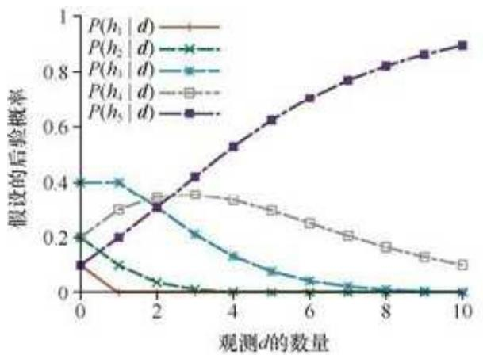

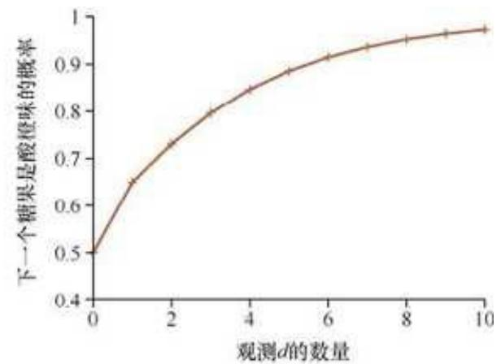  
  
图20-1 （a）根据式（20-1）得到的后验概率 。观测数量 N 为1～10，且每一个观测都是酸橙味的糖果。（b）基于式（20-2）的贝叶斯预测 $P ( D _ { N + 1 }$ =lme|d

这个例子表明，贝叶斯预测最终会与真实的假设吻合。这是贝叶斯学习的一个特点。对于任何固定的先验，如果它没有将真实的假设排除在外，那么在一定的技术条件下，错误假设的后验概率最终会消失。有这样的结果仅仅是因为无限地生成“反常的”数据的概率非常小。（这一点类似于第19章中关于PAC学习的讨论。）更重要的是，无论数据集大小，贝叶斯预测都是 最优的。给定了假设先验之后，任何其他预测都不太可能正确。

当然，贝叶斯学习的最优性是有代价的。对于真实的学习问题，如我们在第19章中所见，假设空间通常非常大或无限大。在某些情况下，式（20-2）中的求和（或连续情况下的积分）可以容易地计算，但在大多数情况下，我们必须采用近似或简化的方法。

一种常见的近似方法（在科学研究中经常采用的）是，基于单个可能性最大的假设——使得最大化的h — $P ( h _ { i } | d )$ $h _ { i }$ —进行预测。这样的假设通常被称为最大后验 （maximumaposteriori，MAP）假设。从 $p ( X \mid d ) \approx P ( X \mid h _ { \mathrm { M A P } } )$ 的意义上来说，由MAP假设 $h _ { \mathrm { { \scriptsize ~ M A P } } }$ 所做出的预测近似于贝叶斯方法所做出的预测。在我们的糖果例子中，在连续3次观测到酸橙糖之后有 $h _ { \mathrm { { \scriptsize ~ M A P } } } = h _ { \mathrm { { \scriptsize ~ 5 } } }$ 5，因此MAP学习器预测第四颗糖果是酸橙糖的概率为1.0，这比图20-1b所示的贝叶斯预测概率0.8更有风险。随着数据量越来越多，MAP预测和贝叶斯预测将变得越来越接近，因为与MAP假设竞争的其他假设的可能性越来越低。

找到MAP假设通常比贝叶斯学习更简单（尽管在这个例子中没有体现），因为它仅要求求解一个优化问题，而不是一个大规模求和或积分的问题。

在贝叶斯学习和MAP学习中，假设先验P(h )都起着重要的作用。我们在第19章中看到，当假设

空间表达能力过强时，也就是说，当它包含许多与数据集高度一致的假设时，可能会出现 过拟合。贝叶斯学习和MAP学习利用先验知识来约束假设的复杂性。通常情况下，越复杂的假设对应的先验概率越低，其中部分原因是它们数量太多了。但是，越复杂的假设拟合数据的能力越强。（一个极端的例子是，查表法可以精确地拟合数据。）因此，假设的先验体现了假设的复杂性与其数据拟合程度之间的权衡。

在逻辑函数的情况下，即 $H$ 只包含 确定性的 假设（例如 $h _ { \mathrm { ~ 1 ~ } }$ 表示所有的糖果都是樱桃味），我们可以更清楚地看到这种权衡的效果。在这种情况下，如果假设 h i是一致的， 则为1，否则为0。此时注意式（20-1），我们发现 $h _ { \mathrm { { \scriptsize ~ M A P } } }$ 将是 与数据一致的最简单的逻辑理论。 因此，最大后验学习自然体现了奥卡姆剃刀。

另一个看待复杂性和拟合程度之间权衡的观点通过对式（20-1）的两边取对数体现。此时，选择使$P ( d | h _ { i } ) P ( h _ { i } )$ 最大化的 h MAP等价于最小化下式： $h _ { \mathrm { { \scriptsize ~ M A P } } }$

$$
- \log_ {2} P (d \mid h _ {i}) - \log_ {2} P (h _ {i})
$$

利用我们在19.3.3节中介绍的信息编码和概率之间的联系，我们可以看到 $- \log _ { 2 } P ( h _ { i } )$ 等于说明假设 h i所需的位数。此外， $- \log _ { 2 } P ( d | h _ { i } )$ 是给定假设时说明数据所需的额外位数。（为了更好理解，我们可以考虑，如果假设确切地预测了数据，就好像假设为 $h _ { \mathrm { ~ 5 ~ } }$ 和一连串出现的酸橙味糖果一样，那么此时我们不需要任何额外位数，则 。）因此，MAP学习所选择的是能最大程度压缩数据的假设。同样的任务可以通过称为 最小描述长度 （MDL）的学习方法更直接地阐述。MAP学习通过给更简单的假设赋予更高的概率来体现其简单性，而MDL则通过计算假设和数据在二进制编码中的位数来直接体现简单性。

最后一个简化是通过假定假设空间具有均匀 先验分布得出的。在这种情况下，MAP学习被简化为选择一个使 $P ( d \mid h _ { i } )$ 最大的 $h _ { i }$ 。这就是所谓的 最大似然 （maximum-likelihood）假设， h ml 。最大似然学习在统计学中非常常用，是许多不相信假设先验主观性质的研究者所使用的准则。当没有理由采用某个先验或倾向于某个假设（例如所有的假设都同样复杂）时，最大似然是一个合理的方法。

当数据集很大时，假设的先验分布就不那么重要了，因为来自数据的证据足够强大，足以淹没假设的先验分布。这意味着在大数据集的情况下，最大似然学习是贝叶斯学习和MAP学习的一个很好的近似，但在小数据集上可能会出现问题（我们将在后面看到）。

# 20.2 完全数据学习

假设我们要学习一个概率模型，给定数据是从该概率模型生成的，那么学习这个概率模型的一般性任务被称为密度估计 （density estimation）。（密度估计最初用于连续变量的概率密度函数，但现在也用于离散分布。）密度估计是一种无监督学习。本节将介绍其最简单的情形，即拥有完全数据 的情形。当每个数据点包含所学习的概率模型的每个变量的值时，我们称数据是完全的。对于结构固定的概率模型，我们注重于参数学习 （parameterlearning），即寻找其参数数值。例如，我们可能对学习具有给定结构的贝叶斯网络中的条件概率感兴趣。我们还将简要地探讨结构学习和非参数密度估计问题。

# 20.2.1 最大似然参数学习：离散模型

假设我们从一个新的生产商手中买入了一袋可能含有樱桃味和酸橙味糖果的糖果袋，其中糖果口味的比例完全未知。樱桃味糖果所占的比例可以是0和1之间的任意一个数。在这种情形下，我们将有一个连续的假设集。这种情况下的参数 记为 ，表示樱桃味糖果所占的比例，其对应的假设为。（此时酸橙味糖果所占的比例恰好为 。）如果我们假设所有的比例有相同的先验可能性，那么采用最大似然估计是合理的。如果我们使用一个贝叶斯网络对这种情境建模，则只需要一个随机变量—— flavor （对应于从袋中随机选取一颗糖果的口味），它的值为cherry或者lime，其中cherry的概率为 （见图20-2a）。现在假设我们已经打开了 $N$ 颗糖果，其中有 $c$ 颗为樱桃味，$\bar { \ell } = N - \bar { c }$ 颗为酸橙味。根据式（20-3），该特定数据集的似然为

$$
P (\boldsymbol {d} \mid h _ {\theta}) = \prod_ {j = 1} ^ {N} P (d _ {j} \mid h _ {\theta}) = \theta^ {c} \cdot (1 - \theta) ^ {\ell}
$$

最大似然假设所需的参数即为使得上式最大化的参数 $\pmb { \theta }$ 。由于log函数是单调函数，我们可以通过最大化 对数似然 （loglikelihood）来得到同一个参数值：

$$
L (\boldsymbol {d} \mid h _ {\theta}) = \log P (\boldsymbol {d} \mid h _ {\theta}) = \sum_ {j = 1} ^ {N} \log P (d _ {j} \mid h _ {\theta}) = c \log \theta + \ell \log (1 - \theta)
$$

（通过取对数，我们把数据乘积归约为数据求和，通常这更易于我们将其最大化。）为寻找使得似然最大的 ，我们对 $L$ 关于 $\pmb \theta$ 进行微分并令其微分结果为0：

$$
\frac {\mathrm {d} L \left(\boldsymbol {d} \mid h _ {\theta}\right)}{\mathrm {d} \theta} = \frac {c}{\theta} - \frac {\ell}{1 - \theta} = 0 \quad \Rightarrow \quad \theta = \frac {c}{c + \ell} = \frac {c}{N}
$$

那么最大似然假设 $h _ { \mathrm { ~ M L ~ } }$ 将断言，糖果袋中樱桃口味的真实比例是到目前为止所打开观测到的糖果中樱桃口味的占比！

从表面上看，我们做了大量的工作却得到了一些看上去很显然的结果。但实际上，我们已经给出了最大似然参数学习的标准方法，这是一种应用范围广泛的方法。

（1）将数据的似然写成关于参数的函数的形式。  
（2）写下对数似然关于每个参数的导数。  
（3）解出使得导数为0的参数。

最后一步通常是最棘手的一步。在我们的例子中它是简单的，但我们即将看到，在很多情形下我们需要使用迭代求解的算法或其他数值优化方法，正如我们在4.2节所提到的。（我们将需要验证其黑塞矩阵是负定的。）这个例子还说明了最大似然学习中普遍存在的一个重要问题：当数据集非常小以至于一些事件还未发生时 $-$ 如，还没有樱桃味的糖果被观测到 $-$ 最大似然假设将把这

些事件的概率置为0。 有很多技巧可以用于避免这个问题，例如，我们可以将所有事件发生次数的计数初始化为1而不是0。

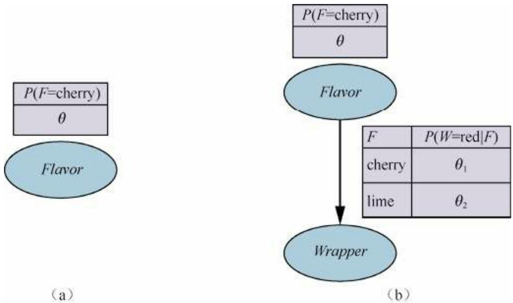  
图20-2 （a）樱桃味糖果和酸橙味糖果比例未知情况下的贝叶斯网络。（b）包装颜色（依概率）与糖果口味相关情况下的模型

让我们来看另一个例子。假设一个新的糖果生产商希望通过使用红、绿两种不同颜色的糖果包装来给顾客一点关于口味的小提示。在选定一颗糖果后，其包装 在概率上服从某个未知的条件分布，该分布取决于糖果的口味。图20-2b给出了对应的概率模型。该模型有3个参数，即 、 和。有了这些参数，我们可以从贝叶斯网络的标准语义（见13.4节）中得到观测到一颗带有绿色包装的樱桃味糖果的似然：

$$
\begin{array}{l} P (F l a v o r = \text {c h e r r y}, W r a p p e r = g r e e n \mid h _ {\theta , \theta_ {1}, \theta_ {2}}) \\ = P (F l a v o r = \text {c h e r r y} \mid h _ {\theta , \theta_ {1}, \theta_ {2}}) P (\text {W r a p p e r} = \text {g r e e n} \mid \text {F l a v o r} = \text {c h e r r y}, h _ {\theta , \theta_ {1}, \theta_ {2}}) \\ = \theta \cdot (1 - \theta_ {1}) \\ \end{array}
$$

现在假设我们打开了 $N$ 颗糖果，其中c颗是樱桃味的， 颗是酸橙味的。包装的计数如下： $r _ { e }$ 颗樱桃味糖果的包装为红色， 颗樱桃味糖果的包装为绿色， $r _ { \ell }$ 颗酸橙味糖果的包装为红色，颗酸橙味糖果的包装为绿色。则该数据的似然为

$$
P (d \mid h _ {\theta , \theta_ {1}, \theta_ {2}}) = \theta^ {c} (1 - \theta) ^ {\ell} \cdot \theta_ {1} ^ {r _ {c}} (1 - \theta_ {1}) ^ {g _ {c}} \cdot \theta_ {2} ^ {r _ {\ell}} (1 - \theta_ {2}) ^ {g _ {\ell}}
$$

这个式子看起来非常糟糕，取对数会有帮助：

$$
L = [ c \log \theta + \ell \log (1 - \theta) ] + [ r _ {c} \log \theta_ {1} + g _ {c} \log (1 - \theta_ {1}) ] + [ r _ {\ell} \log \theta_ {2} + g _ {\ell} \log (1 - \theta_ {2}) ]
$$

取对数的好处显而易见：对数似然的具体形式是3项求和，其中每一项包含单独的一个参数。当我们令对数似然对每个参数求导并置为0时，我们得到3个独立的方程，其中每一个方程只含有一个参数：

$$
\begin{array}{l} \frac {\partial L}{\partial \theta} = \frac {c}{\theta} - \frac {\ell}{1 - \theta} = 0 \quad \Rightarrow \quad \theta = \frac {c}{c + \ell} \\ \frac {\partial L}{\partial \theta_ {1}} = \frac {r _ {c}}{\theta_ {1}} - \frac {g _ {c}}{1 - \theta_ {1}} = 0 \quad \Rightarrow \quad \theta_ {1} = \frac {r _ {c}}{r _ {c} + g _ {c}} \\ \frac {\partial L}{\partial \theta_ {2}} = \frac {r _ {\ell}}{\theta_ {2}} - \frac {g _ {\ell}}{1 - \theta_ {2}} = 0 \quad \Rightarrow \quad \theta_ {2} = \frac {r _ {\ell}}{r _ {c} + g _ {\ell}} \\ \end{array}
$$

其中参数 $\pmb \theta$ 的结果与上一个例子相同。参数 的解，即一个樱桃味糖果有红色包装的概率，是观测到的樱桃味糖果中红色包装的比例，参数 的解也与之类似。

这些结果看上去非常简洁，并且容易发现我们可以将它推广到任意的条件概率以表格形式呈现的贝叶斯网络。其中一个最关键的要点在于，一旦我们有了完全数据，贝叶斯网络的最大似然参数学习问题将可以被分解为一些分离的学习问题，每个问题对应一个参数。（非表格形式的情形见习题20.NORX，其中每个参数将影响若干个条件概率。）第二个要点是，给定其父变量，变量的参数值恰好是该变量值在每一个父变量值下观测到的频率。和之前所提到的一样，当数据集很小时，我们仍要小心地避免出现0次事件的情况。

# 20.2.2 朴素贝叶斯模型

机器学习中最常用的贝叶斯网络模型是在第13章中介绍过的 朴素贝叶斯 模型。在该模型中，“类”变量 C （将被预测）称为根，“属性”变量 X 称为叶。该模型被称为是“朴素的”，因为它假设属性在给定类的情况下是相互条件独立的。（图20-2b中给出的模型是一个朴素贝叶斯模型，具有类Flavor和唯一属性Wrapper。）在变量为布尔变量的情况下，其参数为

$$
\theta = P (C = \text {t r u e}), \theta_ {i 1} = P (X _ {i} = \text {t r u e} \mid C = \text {t r u e}), \theta_ {i 2} = P (X _ {i} = \text {t r u e} \mid C = \text {f a l s e})
$$

寻找最大似然参数值的方法与图20-2b中使用的方法完全一样。一旦模型已经用该方法训练完成，它就可以被用于给类别 C 还未被观测过的新样例分类。当观测到的属性值为 x 1,…, x n时，其属于某一类的概率由下式给出：

$$
\boldsymbol {P} (C \mid x _ {1}, \dots , x _ {n}) = \alpha \boldsymbol {P} (C) \prod_ {i} \boldsymbol {P} (x _ {i} \mid C)
$$

通过选择可能性最大的类，我们可以获得一个确定性的预测。图20-3给出了将该方法用于第19章中的餐厅等待问题所得到的学习曲线。该方法学习得相当好，但不及决策树学习；这是合理的，因为真实的假设是一个决策树，而决策树不能被朴素贝叶斯模型准确地表达。朴素贝叶斯在很多实际应用中的表现令人吃惊，它的增强版（习题20.BNBX）是最有效的通用学习算法之一。朴素贝叶斯可以很好地推广到大规模的问题上：当有n 个布尔属性时，我们只需要2 n +1个参数，且不需要任何的搜索就能找到朴素贝叶斯最大似然假设 h 。最后，朴素贝叶斯学习系统可以很好地处理噪声或缺失数据，并且能在这类情况发生时给出适当的概率预测。它们的主要缺点是，条件独立性假设在实际中通常不成立；正如我们在第13章中所说，该假设会导致对某些概率做出过度自信的估计，使得它们接近0或1，尤其是在具有大量属性的情况下。

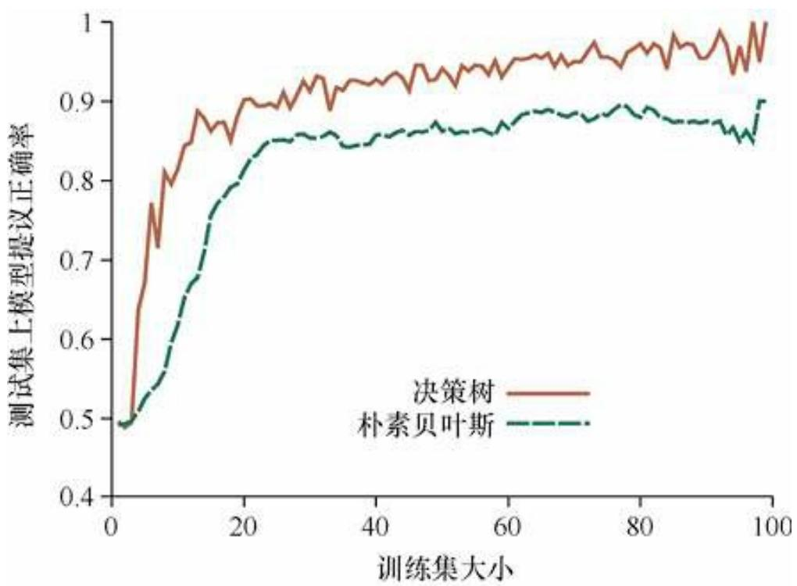  
图20-3将朴素贝叶斯学习应用于第19章餐厅等待问题得到的学习曲线；决策树的学习曲线也在图中给出，用于比较

# 20.2.3 生成模型和判别模型

接下来我们将区分两种不同的作为分类器的机器学习模型：生成模型与判别模型。 生成模型（generativemodel）对每一类的概率分布进行建模，例如，12.6.1节中提及的朴素贝叶斯文本分类器，它为每个可能的文本类型建立一个单独的模型— 一个用于体育，一个用于天气，等等。每个模型包含该模型对应类的先验，例如 ，以及对应的条件分布。根据这些我们可以计算出联合概率，并且我们可以随机生成weather类别文章中有代表性的单词。

判别模型 （discriminativemodel）直接学习类别之间的决策边界，即学习

。给定一个输入样例，一个判别模型将会输出一个类别，但你不能使用判别模型生成某个类别下具有代表性的单词。逻辑斯谛回归、决策树以及支持向量机都是判别模型。

由于判别模型把所有的精力都放在定义决策边界上，也就是说，它们实际所执行的任务就是我们要求它们执行的分类任务，因此在训练数据集可以任意大的情况下，它们往往在极限情况下表现得更好。然而在数据有限的情况下，生成模型有时会表现得更好。吴恩达和乔丹（Ng and Jordan,2002）在15个（小）数据集上比较了生成模型（朴素贝叶斯分类器）和判别模型（逻辑斯谛回归分类器）的表现，发现在使用了全部数据的情况下，判别模型在15个数据集中的9个数据集上表现得更好，但在只使用少量数据的情况下，生成模型在15个数据集中的14个上表现更好。

# 20.2.4 最大似然参数学习：连续模型

例如我们在第13章中介绍的线性高斯 模型，它是一种连续概率模型。由于连续变量在实际应用中普遍存在，因此了解如何从数据中学习连续模型的参数是非常重要的。最大似然学习的原理在连续和离散情况下是相同的。

让我们从一个非常简单的例子入手：学习单变量高斯密度函数的参数。也就是说，我们假设数据按如下分布生成：

$$
P (x) = \frac {1}{\sigma \sqrt {2 \pi}} e ^ {- \frac {(x - \mu) ^ {2}}{2 \sigma^ {2}}}
$$

这个模型的参数为均值 $\pmb { \mu }$ 以及标准差 $\pmb { \sigma }$ 。（注意，归一化常数取决于 $\pmb { \sigma }$ ，因此我们不能忽略它。）假设我们有观测值 $\pmb { x } _ { \pmb { y } }$ 。那么其对数似然为

$$
L = \sum_ {j = 1} ^ {N} \log \frac {1}{\sigma \sqrt {2 \pi}} e ^ {- \frac {(x _ {j} - \mu) ^ {2}}{2 \sigma^ {2}}} = N (- \log \sqrt {2 \pi} - \log \sigma) - \sum_ {j = 1} ^ {N} \frac {(x _ {j} - \mu) ^ {2}}{2 \sigma^ {2}}
$$

我们像一般做法所做的那样令其导数为0，得到

$$
\begin{array}{l} \frac {\partial L}{\partial \mu} = - \frac {1}{\sigma^ {2}} \sum_ {j = 1} ^ {N} (x _ {j} - \mu) = 0 \quad \Rightarrow \mu = \frac {\sum_ {j} x _ {j}}{N} \\ \frac {\partial L}{\partial \sigma} = - \frac {N}{\sigma} + \frac {1}{\sigma^ {3}} \sum_ {j = 1} ^ {N} \left(x _ {j} - \mu\right) ^ {2} = 0 \quad \Rightarrow \quad \sigma = \sqrt {\frac {\sum_ {j} \left(x _ {j} - \mu\right) ^ {2}}{N}} \tag {20-4} \\ \end{array}
$$

也就是说，均值的最大似然值正是样本均值，标准差的最大似然值是样本方差的平方根。同样，这些结果证实了我们的“常识”。

现在考虑一个线性高斯模型，它有一个连续的父变量 $X$ 和一个连续的子变量Y。如13.2.3节所述，Y 服从高斯分布，其均值线性地依赖于 X ，其标准差是固定的。为了学习条件分布 ， $X$ $P ( Y \mid X )$ 我们可以最大化条件似然：

$$
P (y \mid x) = \frac {1}{\sigma \sqrt {2 \pi}} e ^ {\frac {(y - \left(\theta_ {1} x + \theta_ {2}\right)) ^ {2}}{2 \sigma^ {2}}} \tag {20-5}
$$

其中参数为 $\pmb { \theta } _ { 1 }$ 、 $\theta _ { 2 }$ 和 $\pmb { \sigma }$ 。数据是 $( x _ { j } , y _ { j } )$ 对的集合，如图20-4所示。运用一般的方法（习题20.LINR），我们可以找到参数的最大似然值。但这个例子的重点在于，如果我们仅考虑定义 $x$ 和y 之间线性关系的参数 $\pmb { \theta } _ { 1 } \hbar \pmb { \theta } _ { 2 }$ ，那么最大化这些参数的对数似然与 最小化 式（20-5）中指数的分子 $( y - ( \theta _ { 1 } x + \theta _ { 2 } ) ) ^ { 2 }$ 是等价的。这恰好是 $L _ { 2 }$ 损失，即实际值 $y$ 和预测值 $\theta _ { 1 } x + \theta _ { 2 }$ 之间的平方误差。

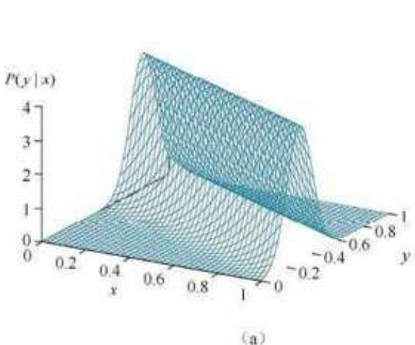

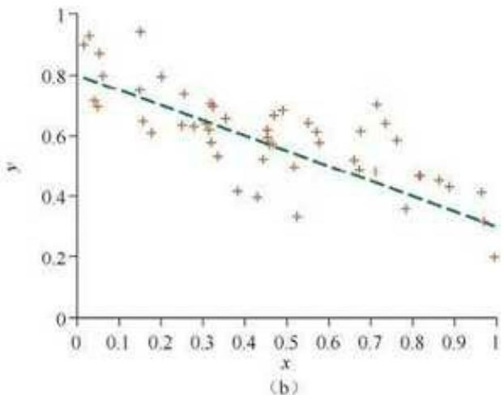

图20-4 （a）高斯线性模型，它表述为 加上固定方差的高斯噪声。（b）由该模型生成的50个数据点，以及它的最佳拟合直线

这也恰好是19.6节中所描述的标准线性回归 过程要最小化的量。现在我们得到了更深刻的理解：如果数据的生成过程带有固定方差的高斯噪声，那么最小化误差平方和恰好给出最大似然线性模型。

# 20.2.5 贝叶斯参数学习

最大似然学习方法虽然过程简单，但在小数据集情况下存在严重缺陷。例如，在观测到一颗樱桃味的糖果后，最大似然假设认为该袋子中100%都是樱桃味糖果（即， ）。除非其假设先验是糖果袋中要么全为樱桃味糖果要么全为酸橙味糖果，否则这将是一个不合理的结论。而更有可能的情况是，这个糖果袋混合了酸橙味和樱桃味的糖果。基于贝叶斯方法的参数学习过程从一个关于假设的先验分布开始，随着新数据出现而不断更新该分布。

图20-2a中的糖果例子有一个参数 ：随机挑选一颗糖果，它为樱桃味的概率。从贝叶斯角度看来， 定义了假设空间， $\pmb \theta$ 是随机变量 的一个未知值；假设的先验是先验分布 $P ( \theta )$ 。因此， 是糖果袋中含有 比例的樱桃味糖果的先验概率。 $P ( \theta = \theta )$ $\pmb \theta$

如果参数 $\pmb \theta$ 可以是介于0和1之间的任意一个值，那么 $P ( \theta )$ 将是一个连续的概率密度函数（见附录A.3）。如果我们对 $\pmb \theta$ 的可能的值没有任何的信息，那么我们可以采用均匀分布$P ( \theta ) = U n i f o r m ( \theta ; 0 , 1 )$ 作为先验，它意味着任何取值都是等可能的。

分布 （beta distribution）是一个更为灵活的概率密度函数族。每个 分布由两个 超参数 [1]（hyperparameter） $a$ 和 $^ { b }$ 定义：

[1]它们被称为超参数，是因为它们参数化了 $\pmb \theta$ 的分布，而 $\pmb \theta$ 本身就是一个参数。

$$
B e t a (\theta ; a, b) = \alpha \theta^ {a - 1} (1 - \theta) ^ {b - 1} \tag {20-6}
$$

其中 $\pmb \theta$ 的取值范围为[0 , 1]。 $\pmb { \alpha }$ 为归一化常数，它使得分布的积分为1，它取决于 $a$ 和 $^ { b }$ 。图20-5给出了在不同的 $a$ 和 $^ { b }$ 取值下分布的情况。 分布的均值为 $a / ( a + b )$ ，因此较大的 $a$ 值表明更靠近1。较大的 $a + b$ 值会导致分布有更突出的尖峰，这也意味着对 $\pmb { \theta }$ 估计更确定。容易发现，均匀分布密度函数与 Beta (1, 1)相同：平均值为1/2，且分布平坦。

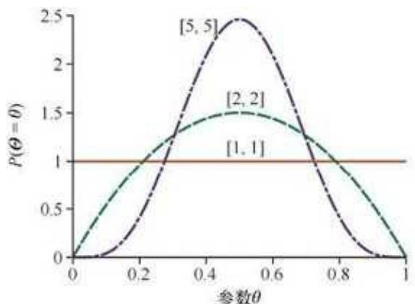

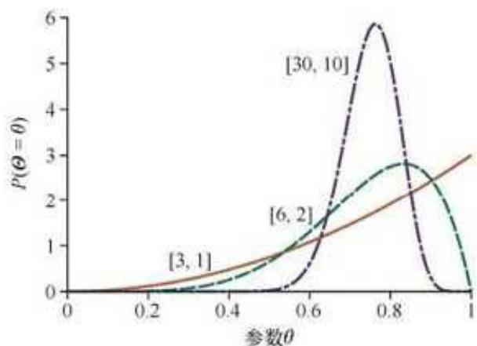  
  
图20-5 不同 $( a , b )$ 下 Beta $( a , b )$ 分布的例子

除灵活性以外， 分布族还有一个很好的性质：如果参数 有先验 Beta ( a, b )，那么在一个数据

点被观测之后，其参数 的后验分布仍是一个 分布。换句话说， 分布在这种更新规则下是封闭的。 分布族被称为布尔变量分布族的 共轭先验 （conjugate prior）。 [2] 为了弄清楚这一点，假设我们观测到了一颗樱桃味的糖果，那么我们有

[2]其他的共轭分布族包括关于离散多元分布参数的狄利克雷 分布族以及关于高斯分布参数的正态威沙特 分布族。详见（Bernardo and Smith, 1994）。

$$
\begin{array}{l} P (\theta \mid D _ {1} = \text {c h e r r y}) = \alpha P (D _ {1} = \text {c h e r r y} \mid \theta) P (\theta) \\ = \alpha^ {\prime} \theta \cdot B e t a (\theta ; a, b) = \alpha^ {\prime} \theta \cdot \theta^ {a - 1} (1 - \theta) ^ {b - 1} \\ = \alpha^ {\prime} \theta^ {a} (1 - \theta) ^ {b - 1} = \alpha^ {\prime} B e t a (\theta ; a + 1, b) \\ \end{array}
$$

因此，在观测完这个樱桃味的糖果后，我们简单地增大了参数 a 的值；同样，在观测到一颗酸橙味的糖果之后，我们增大参数b 的值。因此，我们可以将超参数 a 和b 看作 虚拟计数 （virtualcount），因为先验分布 Beta(a,b )可被视为是从均匀分布先验Beta (1,1)出发，并且已经“虚拟”地观测到a −1次樱桃味糖果和b – 1次酸橙味糖果。

保持 a 和 $^ { b }$ 两者比值不变，不断增大 a 和 $^ { b }$ ，通过观测一系列 分布，我们可以清楚地观测到参数 的后验分布随着数据增多的变化情况。例如，假设实际上一袋糖果中75%是樱桃味糖果。图20-5b显示了序列 Beta (3 , 1)、 Beta (6 , 2)、 Beta (30 , 10)。显然，该分布正向着以参数 真实值为中心的窄峰收敛。因此，对于大数据集，贝叶斯学习（至少在这种情形下）所收敛到的值与最大似然学习相同。

现在让我们考虑一个更复杂的例子。如图20-2b所示的网络有3个参数， $\pmb \theta$ 、 和 $\theta _ { 2 }$ ，其中 $\theta _ { 1 }$ 代表樱桃味糖果中包装为红色的概率， $\theta _ { 2 }$ 代表酸橙味糖果中包装为红色的概率。贝叶斯假设的先验必须包含3个参数，也就是说，我们需要确定 $P ( \Theta , \Theta _ { 1 } , \Theta _ { 2 } )$ $\theta _ { 2 } )$ 。一般来说，我们会假定 参数独立性 ：

$$
P (\theta , \theta_ {1}, \theta_ {2}) = P (\theta) P (\theta_ {1}) P (\theta_ {2})
$$

有了这个假设，每个参数就可以有它自己的 分布，且当新数据产生时可以独立地进行更新。图20-6展示了如何将假设先验和任意数据合并到贝叶斯网络中，其中每个参数变量都对应一个节点。

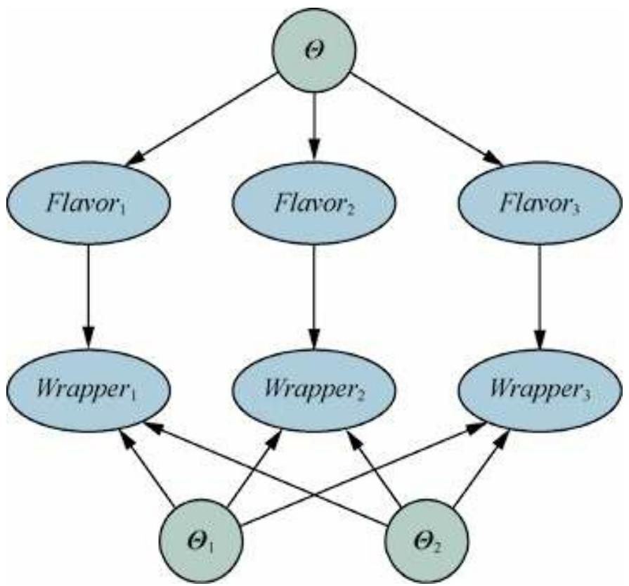  
图20-6 与贝叶斯学习过程对应的贝叶斯网络。后验分布的参数 $\boldsymbol { \vartheta }$ 、 和 $\mathcal { B } _ { 2 }$ 将根据它们的先验分布以及数据 Flavor $i$ 和 Wrapper i 进行推断

节点 $\pmb { \theta }$ 、 和 $\theta _ { 2 }$ 没有父节点。我们加入节点 Wrapper i 与 Flavor $i$ 用于表示第 i 个被观测到的糖果包装以及对应的糖果口味。Flavor $i$ 取决于口味对应的参数 ：

$$
P (F l a v o r _ {i} = \text {c h e r r y} \mid \boldsymbol {\theta} = \theta) = \theta
$$

Wrapper i 取决于参数 $\theta _ { 1 } \varepsilon _ { \mathrm { l } } \theta _ { 2 }$ ：

$$
\begin{array}{l} P (W r a p p e r _ {i} = \text {r e d} | F l a v o r _ {i} = \text {c h e r r y}, \boldsymbol {\Theta} _ {1} = \theta_ {1}) = \theta_ {1} \\ P (W r a p p e r _ {i} = \text {r e d} | F l a v o r _ {i} = \text {l i m e}, \boldsymbol {\Theta} _ {2} = \theta_ {2}) = \theta_ {2} \end{array}
$$

现在，图20-2b中原始贝叶斯网络的整个贝叶斯学习过程就可以按图20-6所示的方法表示为派生贝叶斯网络中的推断问题，其中数据和参数在该网络中以节点形式存在。在我们将所有的新信息添加为节点后，我们可以开始考虑参数变量（在该例子中即为 、 和 ）。在这种表述下我们只需要考虑唯一的学习算法——贝叶斯网络的推断算法。

当然，这样构建出来的网络的性质与第13章中所描述的网络有些不同，因为代表训练集的信息变量的数量可能很大，而且连续值参数变量也普遍存在。精确的推断通常不可能实现，除非是在非常简单的情形下，如朴素贝叶斯模型。实际建模中通常会使用近似的推断方法，如MCMC（13.4.2节）；为此，许多统计软件包也提供了MCMC的高效实现。

# 20.2.6 贝叶斯线性回归

在本节中我们将介绍如何将贝叶斯方法应用于标准统计任务：线性回归。我们在19.6节中介绍了最小化误差平方和的传统方法，并在20.2.4节中将其重新解释为求解带有高斯误差的模型的最大似然。这些方法都给出了单独的最佳假设：一条具有特定斜率和截距值的直线，以及一个固定的数据预测误差的方差。这些方法没有提供对于斜率和截距值的置信度的度量。

此外，如果要预测一个离现有数据点很远的新数据点的函数值，则假设该点的预测误差与已观测数据点附近的数据点的预测误差相同似乎是没有道理的。一个更合理的情况应该为数据点离观测数据越远，则其预测误差越大，因为斜率的微小变化将导致较远的数据点的预测值发生较大变化。

贝叶斯方法解决了这两个问题。如前一节所述，其总体思路是为模型参数——线性模型系数和噪声方差提供先验，然后在给定数据的情况下计算参数的后验概率值。对于多元数据和噪声模型未知的情况，这种做法会导致相当复杂的线性代数运算，所以我们现在将着眼于一个简单的情况：单变量数据，其模型被约束为必经过原点，且噪声模型已知——一个方差为 的正态分布。那么我们将只有一个参数 且模型可以表示为

$$
P (y \mid x, \theta) = \mathcal {N} \left(y; \theta x, \sigma_ {y} ^ {2}\right) = \frac {1}{\sigma \sqrt {2 \pi}} e ^ {- \frac {1}{2} \left(\frac {(y - \theta x) ^ {2}}{\sigma^ {2}}\right)} \tag {20-7}
$$

因为对数似然中参数 $\pmb \theta$ 的次数为二次，因此参数 $\pmb \theta$ 的一个合适的共轭先验将也是高斯分布。这将确保 $\pmb \theta$ 的后验分布也是高斯的。我们给定参数先验分布的均值 $\theta _ { 0 }$ 和方差 $\sigma _ { 0 } ^ { 2 }$ ，那么其先验为

$$
P (\theta) = \mathcal {N} \left(\theta ; \theta_ {0}, \sigma_ {0} ^ {2}\right) = \frac {1}{\sigma_ {0} \sqrt {2 \pi}} e ^ {- \frac {1}{2} \left(\frac {\left(\theta - \theta_ {0}\right) ^ {2}}{\sigma_ {0} ^ {2}}\right)} \tag {20-8}
$$

基于即将被建模的数据，人们可能对参数 $\pmb \theta$ 应当选取什么样的值有一定想法，又或者对它完全没有想法。如果是后一种情况，那么将 $\theta _ { 0 }$ 置为0且选择较大的 $\sigma _ { 0 } ^ { 2 }$ 是一个比较合理的方法，即所谓的无信息先验 （uninformative prior）。最后，我们可以为每个数据点的 $x$ 值设置一个先验 P ( x )，但是这对分析来说是完全无关紧要的，因为它不依赖于参数 $\pmb \theta$ 。

现在我们已经完成了设定，可以利用式（20-1）： $P ( \theta | d ) \propto P ( d | \theta ) P ( \theta )$ 计算参数 $\pmb \theta$ 的后验分布。如果观测到的数据点为 $d = ( x _ { 1 } , y _ { 1 } ) , \cdots , ( x _ { N } , y _ { N } )$ ，那么该数据集的似然可以由式（20-7）得到，如下式所示：

$$
\begin{array}{l} P (\theta | d) = \left(\prod_ {i} P (x _ {i})\right) \prod_ {i} P (y _ {i} | x _ {i}, \theta) = \alpha \prod_ {i} e ^ {- \frac {1}{2} \left(\frac {(y _ {i} - \theta x _ {i}) ^ {2}}{\sigma^ {2}}\right)} \\ = \alpha e ^ {- \frac {1}{2} \sum_ {i} \left(\frac {\left(y _ {i} - \theta x _ {i}\right) ^ {2}}{\sigma^ {2}}\right)} \\ \end{array}
$$

其中我们已经将数据x的先验以及N元高斯的归一化系数归结为常数 $\pmb { \alpha }$ ，它与参数 $\pmb \theta$ 独立。现在我们将该式与式（20-8）所给的参数先验相结合，得到其后验：

$$
P (\theta \mid d) = \alpha^ {\prime \prime} e ^ {- \frac {1}{2} \left(\frac {(\theta - \theta_ {0}) ^ {2}}{\sigma_ {0} ^ {2}}\right)} e ^ {- \frac {1}{2} \sum_ {i} \left(\frac {(y _ {i} - \theta x _ {i}) ^ {2}}{\sigma^ {2}}\right)}
$$

这看起来较为复杂，但实际上其每一个指数部分都是关于参数 $\pmb \theta$ 的一个二次函数，因此对指数进行求和也将是一个二次函数。由此， $\pmb \theta$ 后验分布也将是一个高斯分布。利用与14.4节中相似的代数方法，我们可以得到

$$
P (\theta \mid d) = \alpha^ {m} e ^ {- \frac {1}{2} \left(\frac {\left(\theta - \theta_ {N}\right) ^ {2}}{\sigma_ {N} ^ {2}}\right)}
$$

其中“更新”后的均值与方差为

$$
\theta_ {N} = \frac {\sigma^ {2} \theta_ {0} + \sigma_ {0} ^ {2} \sum_ {i} x _ {i} y _ {i}}{\sigma^ {2} + \sigma_ {0} ^ {2} \sum_ {i} x _ {i} ^ {2}} \quad \text {和} \quad \sigma_ {N} ^ {2} = \frac {\sigma^ {2} \sigma_ {0} ^ {2}}{\sigma^ {2} + \sigma_ {0} ^ {2} \sum_ {i} x _ {i} ^ {2}}
$$

将会很小，而后验方差 让我们进一步考虑这些等式的意义。当数据紧密地集中在 x轴上原点附近的某个小邻域内时， 将会较大，基本上等于先验方差 。这与我们所设想的相一 2 2${ \pmb v } _ { \pmb { M } }$ $\omega _ { 0 }$ 将会较大，且后验方差 致：数据对直线围绕原点的旋转影响较小。相反地，如果数据在坐标轴上的分布范围很广，那么 定 ${ \pmb v } _ { \pmb { M } }$ 将会较小，近似等于 ， 即数据对模型的斜率会有较严格的约束。

为了预测某个特定数据点的函数值，我们需要对所有参数 的可能值进行积分，正如式（20-2）所示：

$$
\begin{array}{l} P (y | x, d) = \int_ {- \infty} ^ {\infty} P (y | x, d, \theta) P (\theta | x, d) d \theta = \int_ {- \infty} ^ {\infty} P (y | x, \theta) P (\theta | d) d \theta \\ = \alpha \int_ {- \infty} ^ {\infty} e ^ {- \frac {1}{2} \left(\frac {(y - \theta x) ^ {2}}{\sigma^ {2}}\right)} e ^ {- \frac {1}{2} \left(\frac {(\theta - \theta_ {N}) ^ {2}}{\sigma_ {N} ^ {2}}\right)} d \theta \\ \end{array}
$$

同样的，这两个指数的和仍是关于参数 的二次函数，因此参数 $\pmb \theta$ 的分布仍为高斯分布，且积分为1。剩下的与 y 相关的一项来源与另一个高斯分布：

$$
P (y \mid x, d) \propto e ^ {- \frac {1}{2} \left(\frac {(y - \theta_ {N} x) ^ {2}}{\sigma^ {2} + \sigma_ {N} ^ {2} x ^ {2}}\right)}
$$

通过观察这个表达式，我们可以发现y的预测的均值为 $\theta _ { N } x$ ，也就意味着它取决于参数 $\pmb \theta$ 的后验均值。预测的方差等于模型噪声方差 $\pmb { \sigma } ^ { 2 }$ 加上与 $x ^ { 2 }$ 成正比的一项，这也意味着预测的标准差将随着数据与原点距离的增加而渐近线性地增加。图20-7说明了这种现象。正如我们在本节开头所提到的，对距离较远的观测点进行观测具有更大的不确定性是有据可依的。

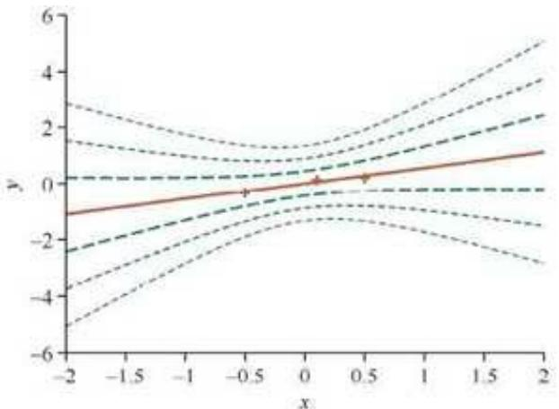

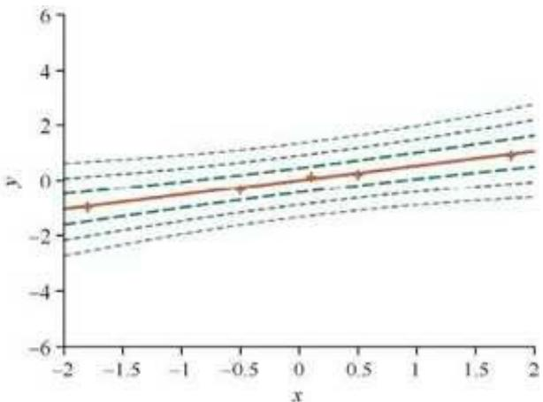

图20-7贝叶斯线性回归模型，它被约束为经过原点且噪声方差固定为 。误差为±1、±2和±3个标准差的密度预测等高线也在图中给出。（a）其中3个数据点距离原点较近，因此斜率相当不确定，其方差 $\sigma _ { w } ^ { 2 } \approx 0 . 3 8 6 1$ 。注意，当离观测到的数据点距离增大时，预测的不确定性也逐渐增大。（b）相比前一幅图多出两个距离较远的数据点，此时斜率 $\theta$ 被较严格地约束，其方差为。密度预测中剩余的方差几乎完全来源于噪声的固定方差 $\scriptstyle { \pmb { \sigma } } ^ { 2 }$

# 20.2.7 贝叶斯网络结构学习

到目前为止，我们都假设贝叶斯网络的结构是事先给定的，我们只试图学习其中的参数。网络结构代表了待解决问题的相关领域的基本因果知识，对专家或者一些用户来说，这些因果知识可能是简单的，容易得到的。但在某些情况下，因果模型可能是不可用的或存在争议的（例如，某些公司长期以来一直声称吸烟不会导致癌症；某些公司声称二氧化碳浓度对气候没有影响），因此，从数据中学习贝叶斯网络的结构是非常重要的。本节将简要概述该方面的一些主要思想。

最直白的方法是通过搜索得到一个好的模型。我们可以从一个不包含任何链接的模型出发，逐步为每个节点添加父节点，并用我们刚刚介绍的方法估计参数，并评估所得模型的准确性。或者，我们可以从我们对结构的某个原始的猜测出发，使用爬山算法或模拟退火搜索对其进行修改，并在每次结构修改后重新调整参数。其中结构修改可以包括反转、添加或删除链接。在这个过程中，我们不能产生环，因此许多算法都假设变量的顺序是给定的，并且一个节点的父节点只可能是在序关系中排在该点之前的点（就像第13章中描述的构造过程一样）。为保证一般性，我们的搜索还需要遍历所有可能的序关系。

有两种方法可用于判断我们某个时刻找到的模型是否有一个好的结构。第一个方法是检验数据是否满足了该结构中所隐含的条件独立性。例如，对餐厅等待问题使用朴素贝叶斯模型时，我们假设：

$$
\boldsymbol {P} (\text {H u n g r y}, \text {B a r} \mid \text {W i l l W a i t}) = \boldsymbol {P} (\text {H u n g r y} \mid \text {W i l l W a i t}) \boldsymbol {P} (\text {B a r} \mid \text {W i l l W a i t})
$$

我们可以检验在数据中相同的等式在相应的条件频率之间是否成立。但是，即使结构准确描述了该领域的真正因果关系，数据集中的统计波动也会使得等式永远不会精确地成立，因此我们需要进行适当的统计检验以判断是否有足够的证据表明独立性假设不成立。所得网络的复杂性将取决于此检验使用的阈值——独立性检验越严格，添加到模型中的链接就越多，也就可能导致更高程度的过拟合。

更符合本章思想的方法是评估所得模型对数据的解释程度（在概率意义上），但我们必须谨慎地考虑如何度量这一点。如果我们只试图找到最大似然假设，那么我们最终会得到一个完全连通的网络，因为向一个节点添加更多的父节点并不会导致似然降低（习题20.MLPA）。因此我们必须以某种方式对模型的复杂性进行惩罚。MAP（或MDL）方法只是简单地在比较不同结构之前从每个结构对应的似然中减去一个惩罚（在参数估计之后）。贝叶斯方法赋予结构和参数一个联合先验分布，这通常会导致有太多的结构需要进行求和（结构数量关于变量数量是超指数级的），所以在实践中大多数人采用MCMC的方法对结构进行采样。

复杂性惩罚（无论是通过MAP或贝叶斯方法得到的）表明了网络中条件分布的最优结构和表示性质之间的重要联系。对于表格化的分布，对节点分布的复杂性惩罚将随着父节点数的增加而呈指数增长，但是对于噪声或分布，它的增长速度只是线性的。这意味着，与使用表格化分布的学习相比，使用噪声或（或其他简洁的参数化）模型的学习往往会学习到具有更多父节点结构。

# 20.2.8 非参数模型密度估计

通过采用19.7节中的非参数方法，我们可以学习到一个概率模型，而无须对其结构和参数化有任何假设。 非参数密度估计 （nonparametric density estimation）任务通常需要在连续域中完成，例如图20-8a所示。该图给出了由两个连续变量定义的空间上的概率密度函数。在图20-8b中，我们可以看到采样于该密度函数的数据点。我们要考虑的问题是，是否能从样本中复原模型。

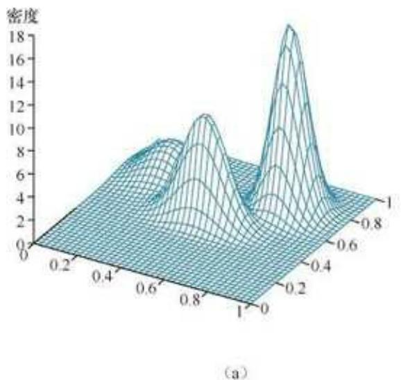

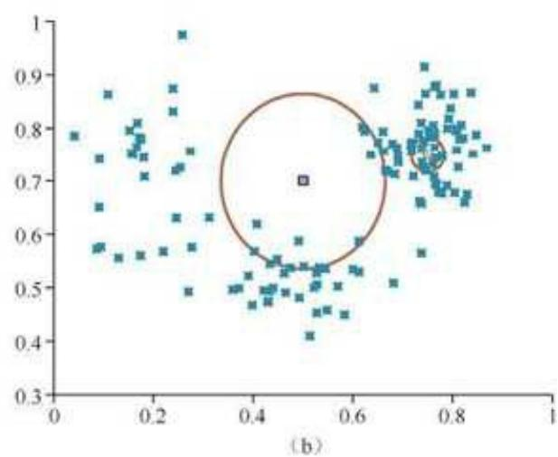  
图20-8（a）图20-12a中所给出的混合高斯模型的三维样貌。（b）从混合高斯模型中采样的128个数据点、两个查询点（小方块）以及它们的10近邻（大圆圈以及右边的小圆圈）

首先我们将考虑 $\pmb { k }$ 近邻模型。（在第19章中我们介绍过将最近邻模型用于分类与回归；在这里我们将看到它们如何应用于密度估计。）给定一组数据样本点，为估计某个查询点 x 的未知概率密度，我们可以简单地估计数据点落在查询点 x 附近的密度。图20-8b中标出了两个查询点（用小方块标记）。对于每个查询点，我们画出了以它为圆心且至少包含10个近邻的最小圆，即10近邻。我们可以发现位于中间的圆较大，意味着对应的密度较小，而位于右边的圆较小，意味着对应的密度较大。在图20-9中，我们采用不同的 $k$ 给出了3种 $k$ 近邻密度估计。直观上可以清楚地看出图20-9b是接近正确模型的，图20-9a的局部过于尖锐（ $k$ 过小），而图20-9c过于光滑（k过大）。

另一种可行的方法是使用 核函数 ，正如我们在局部加权回归中所做的那样。为了在密度估计中应用核函数，我们假设每个数据点都将生成一个与自己相关的密度函数。举个例子来说，我们可以采用在每个维度上标准差均为w的球形高斯核。那么对于查询点x ，我们给出的密度估计值为数据核函数的均值：

$$
P (\pmb {x}) = \frac {1}{N} \sum_ {j = 1} ^ {N} \mathcal {K} (\pmb {x}, \pmb {x} _ {j}), \quad \mathcal {K} (\pmb {x}, \pmb {x} _ {j}) = \frac {1}{(w ^ {2} \sqrt {2 \pi}) ^ {d}} e ^ {- \frac {D (\pmb {x} , \pmb {x} _ {j}) ^ {2}}{2 w ^ {2}}}
$$

其中， d 表示数据 x 的维度， $D$ 表示欧几里得距离函数。我们剩下的问题是如何为核宽度w选择一个合适的值；图20-10给出了不同的宽度值对应的结果，可以发现它们分别对应着“太小”“正好”“太大”这3种结果。我们可以通过交叉验证的方法来选择一个好的 w值。

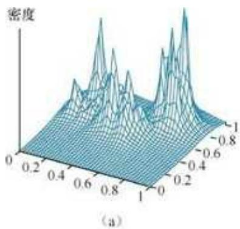

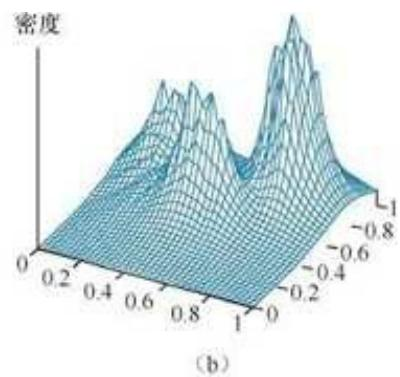

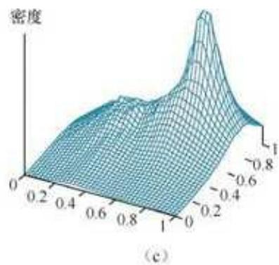  
图20-9应用 k近邻进行密度估计，所用的数据为图20-8b中的数据，分别对应 k=3、10和 40。 k=3的结果过于尖锐，40的结果过于光滑，而10的结果接近真实情况。最好的 $k$ 值可以通过交叉验证进行选择

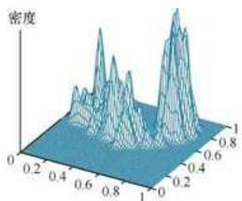

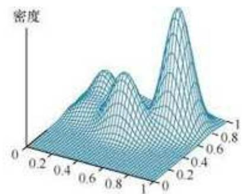

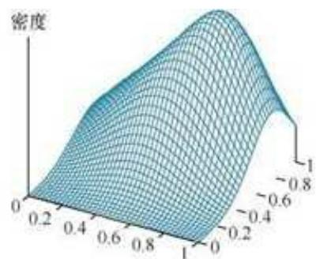  
  
图20-10使用核函数进行密度估计，所用数据为图20-8b中的数据，分别采用了 w=0 . 02、0 .07和0. 20的高斯核。其中 w=0 . 07的结果最接近真实情况

# 20.3 隐变量学习：EM算法

在20.2节中，我们讨论了数据完全可观测的情形。而在现实生活中，许多问题存在隐变量（hidden variable），有时也称为隐藏变量（latentvariable），这些变量在数据中是未被观测的。例如，医疗记录通常包括观测到的症状、医生的诊断以及采用的治疗方法，可能还有治疗的结果，但很少包含对疾病本身的直接观测！（注意，诊断区别于 疾病；诊断在因果关系中是观测到症状之后的结果，而这些症状是由疾病引起的。）读者可能会问：“如果没有观测到疾病，我们能否仅根据观测到的变量构建一个模型？”图20-11给出了该问题的答案。它给出了一个小型的、虚构的心脏病诊断模型。它有3个可观测的易感因素和3个可观测的症状（这些症状过于负面，这里就不介绍了）。假设每个变量有3个可能的值（分别是none、moderate和severe）。如果我们从图20-11a所示的网络中移除隐变量，使其成为图20-11b所示的网络，那么所需参数的个数将从78增加到708。因此，隐变量可以大大减少确定一个贝叶斯网络所需参数的个数。同样也可以大大减少所需学习的参数的个数。

隐变量很重要，但它们的存在也确实使学习问题复杂化。在图20-11a所示的例子中，给定其父变量的值，如何学习 心脏病（HeartDisease）的条件分布并不是很明晰，因为我们不知道每种情况下HeartDisease的具体值，同样的问题也出现在学习症状的分布时。本节将介绍一种被称为期望最大化 （expectation-maximization，EM）的算法，它以一种适用范围广泛的方式解决了这个问题。我们将给出3个例子，然后再给出一般性的描述。该算法最初看起来可能十分神奇，但是一旦我们了解了其思想，我们就可以在大量的学习问题中应用EM。

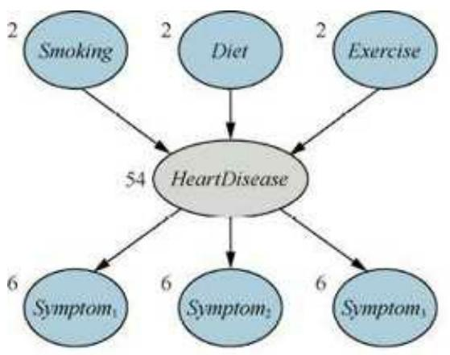

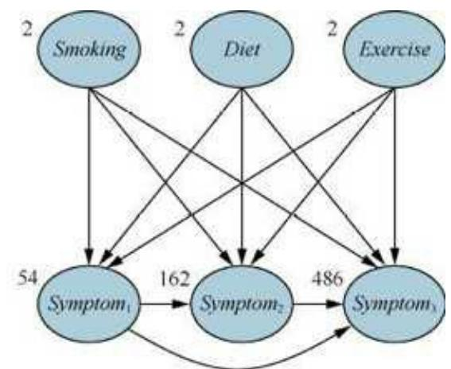  
  
图20-11 （a）一个简单的心脏病诊断网络，其中HeartDisease是一个隐变量。每个变量有3个可能的值，并标明了每个变量对应的条件独立参数的个数，其总数为78。（b）去除隐变量HeartDisease之后的等效网络。注意，给定了父变量值后，症状对应的变量不再是条件独立的。这个网络有708个参数

# 20.3.1 无监督聚类：学习混合高斯

无监督聚类 （unsupervisedclustering）是在一个对象集合中识别多个类别的问题。该问题被称为是无监督的，是因为数据没有被赋予类别标签。举个例子来说，假设我们记录了十万颗恒星的光谱；我们想知道光谱的数据是否告诉我们恒星存在不同的类型？如果是，其中有多少种类型？它们对应的特征是什么？我们都熟悉诸如“红巨星”和“白矮星”这样的术语，但是恒星本身并不附带这些标签，因此天文学家不得不使用无监督聚类的方法来区分恒星的类别。还有其他一些例子，如林奈生物分类法中对种、属、目、门等的区分，以及为一般对象创造自然类别（见第10章）。

无监督聚类以数据为出发点。图20-12b给出了500个数据点，每个数据点指定了两个连续属性的值。数据点可能对应于恒星，而属性可能对应于两个特定频率下的光谱强度。接下来，我们需要了解什么样的概率分布可能产生这些数据。聚类假设了数据是从某个混合分布 P中生成的。该分布由k个分量组成，每个分量本身是一个分布。数据点通过以下方法生成：首先选择其中一个分量，然后从该分量采样一个样本，从而生成一个数据点。令随机变量C为数据对应的分量，其值为1,…,k；那么混合分布将由下式给出：

$$
P (\boldsymbol {x}) = \sum_ {i = 1} ^ {k} P (C = i) P (\boldsymbol {x} \mid C = i)
$$

其中 $_ x$ 表示数据点属性的值。对于连续数据，多元高斯分布是各个分量分布的一个自然选择，这就是所谓的 混合高斯 分布族。混合高斯分布的参数为 $w _ { i } = P ( C = i )$ （各分量的权重）、（各分量的均值），以及 （各分量的协方差）。图20-12a给出了由3个分量组成的混合高斯；事实上，该混合高斯是图20-12b中数据的来源，也是图20-8a所示的模型。

相应的无监督聚类问题则是从原始数据（例如图20-12b中的数据）中复原出高斯混合模型（例如图20-12a所示的模型）。显然，如果我们知道每个数据点由哪个分量生成，那么就很容易复原对应的高斯分布分量：我们可以选择所有来自同一个给定分量的数据点，然后应用（多元版本的）式（20-4）对一组数据拟合其高斯参数。另外，如果我们知道每个分量的参数，那么我们至少可以给出每个数据点属于某个分量的概率。

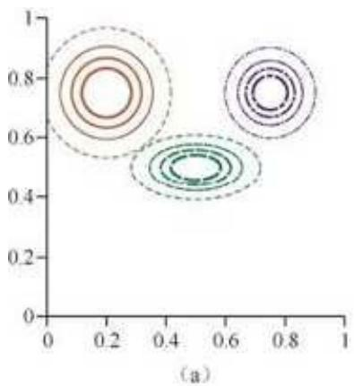

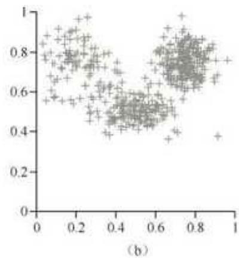

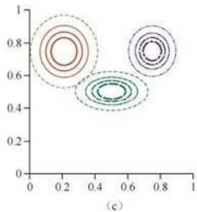  
图20-12 （a）由3个分量组成的混合高斯模型，其权重（从左到右）分别为0.2、0.3和0.5。（b）采样于（a）中模型的500个数据点。（c）根据（b）中的数据点，使用EM算法重建出的模型

这里的问题在于我们既不知道数据点源自哪个分量，也不知道模型的参数。在这种情况下，EM的基本想法是假设我们知道模型的参数，然后推断每个数据点属于各个分量的概率。在该步骤后，我们重新使用数据拟合各个分量，其中每个分量的拟合都将用到整个数据集，每个数据点的权重由它属于该分量的概率给出。我们将重复这个过程直到算法收敛。本质上，我们所做的事情是基于当前的模型推断隐变量— —数据点属于某个分量——的概率分布，进而“完善”数据。对于混合高斯模型，我们可以任意地初始化混合模型参数，然后进行以下两个步骤的迭代。

（1） E步 ：计算概率 ，即数据点 $x _ { j }$ 是由分量 $i$ 生成的概率。根据贝叶斯法则，我们有 。其中 $P ( x , | C = i )$ 项是 $x _ { j }$ 在第 i 个高斯分量中的概率， P ( C = i )项是第 $i$ 个高斯分量的权重。定义 $n _ { 1 } = \sum p _ { y }$ ，即分配至第 i 个分量的数据点的有效个数。  
（2）M步 ：按照以下式子计算新的均值、方差和各分量的权重。

$$
\begin{array}{l} \mu_ {i} \leftarrow \sum_ {j} p _ {i j} x _ {j} / n _ {i} \\ \Sigma_ {i} \leftarrow \sum_ {j} p _ {i j} \left(x _ {j} - \mu_ {i}\right) \left(x _ {j} - \mu_ {i}\right) ^ {\top} / n _ {i} \\ w _ {i} \leftarrow n _ {i} / N \\ \end{array}
$$

其中， $N$ 为数据点的总个数。E步也称 期望步 ，它可以视为计算 隐指示 （hidden indicator）变量Z 的期望值 $p _ { \ i j }$ 的步骤，若数据 x 由第 i个分量生成，则 Z 为1，否则为0。M步也称 最大化步，其目标是寻找给定隐指示变量的期望情况下，使数据的似然最大化的新参数。

将EM算法应用于图20-12a中数据所学习到的最终模型如图20-12c所示，它与生成这些数据的真实模型几乎没有差别。图20-13a给出了当前模型下数据的对数似然随着EM算法迭代过程的变化图。

需要注意两点。第一，最终学习到的模型的对数似然值略高于用于生成数据的真实模型的对数似然值。这可能看起来有些令人惊讶，但它简单地反映了这样一个事实：数据是随机生成的，也许没有精确地反映出真实的模型。第二，在EM算法的进行过程中，数据的对数似然在每一次迭代后都将提升。通常情况下，这个现象是可以被证明的。此外，在一些条件下（这些条件在大多数情况下是成立的），我们还可以证明EM算法将达到似然函数的局部极大值。（在极少数情况下，它可能会达到一个鞍点，甚至一个局部极小值。）从这个意义上说，EM类似于基于梯度的爬山算法，但需要注意的是它没有“步长”这一参数。

EM算法并不总是如图20-13a所示那样顺利。举个例子来说，它可能导致某个高斯分量发生退化，使得它仅仅包含一个数据点。那么它的方差将趋向于零，且它的似然将趋向无穷！如果我们不知道混合模型中有多少个分量，我们就需要尝试不同的分量个数，即尝试不同的 k值，并观测哪个值的效果最好，但这也可能导致发生另一些错误。还有一个问题是，两个分量可能会“合并”，导致它们有相同的均值和方差，且它们共享数据点。这种退化的局部极大值是一个严重的问题，特别是在高维情况下。一种解决方案是对模型参数赋予先验并采用MAP版本的EM算法。另一种解决方案是，如果某个分量太小或太接近于另一个分量，则使用新的随机参数重置该分量。一个合理的初始化方法对算法也有帮助。

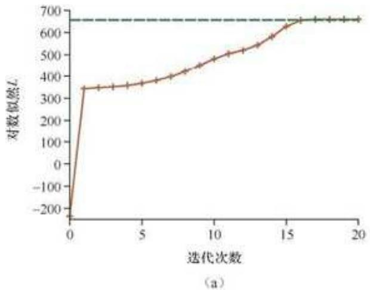

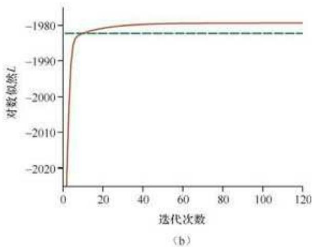  
图20-13数据的对数似然 $L$ 关于EM算法迭代次数的函数关系。水平线表示真实模型下数据的对数似然。（a）图20-12中的混合高斯模型对应的变化图。（b）图20-14a中的贝叶斯网络对应的变化图

# 20.3.2 学习带隐变量的贝叶斯网络参数值

为学习带隐变量的贝叶斯网络，我们将使用与在混合高斯模型中所使用的方法相同的有效方法。图20-14a给出了一个例子：我们有两袋混合在一起的糖果。糖果有3个特征：除口味 （ Flavor）和包装（ Wrapper）外，一些糖果中间还有夹心 （Holes），而有些糖果没有。糖果在每个糖果袋中的分布状况可以用 朴素贝叶斯 模型进行描述：在给定糖果袋的情况下，特征之间是独立的，但每个特征的条件概率取决于这个糖果袋的状况。该模型的参数如下： 为糖果取自糖果袋1的先验概率； 与 $\theta _ { P 2 }$ 分别是给定糖果取自于糖果袋1或糖果袋2后，它是樱桃口味的概率； 与 $\theta _ { m }$ $\theta _ { m }$ 是在同样的给定条件下糖果包装为红色的概率； $\theta _ { B \Pi }$ 和 $\theta _ { E 2 }$ 是在同样的给定条件下糖果有夹心的概率。

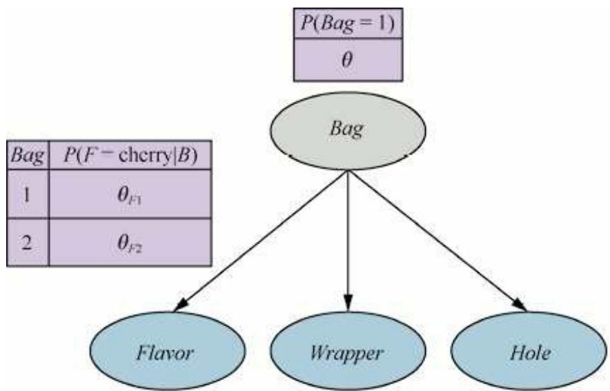

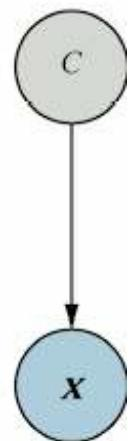  
  
图20-14（a）关于糖果的混合模型。不同口味、包装的比例以及是否有夹心取决于糖果袋，该变量是不可观测的。（b）混合高斯模型的贝叶斯网络。可观测变量 $\pmb { X }$ 的均值和协方差取决于分量 $C$

整体的模型是一个混合模型：它可以表示为两个不同分布的加权和，且每个分布是独立的单变量分布的乘积。（事实上，我们也可以将混合高斯建模为一个贝叶斯网络，正如图20-14b所示。）在该图中，糖果袋是一个隐变量，因为一旦糖果混合在一起，我们就不再能知道每个糖果来自哪个糖果袋。在这种情况下，我们能通过观测混合物中的糖果来复原这两个袋子的真实情况吗？我们将用EM算法迭代来求解这个问题。首先，我们考虑数据的情况。假设我们从一个模型中生成了1000个样本，模型的真实参数如下：

$$
\theta = 0. 5, \theta_ {F 1} = \theta_ {W 1} = \theta_ {H 1} = 0. 8, \theta_ {F 2} = \theta_ {W 2} = \theta_ {H 2} = 0. 3 \tag {20-9}
$$

也就是说，糖果来自于两个糖果袋的概率相等；第一个糖果袋中的糖果大部分是樱桃口味、红色包装且有夹心；第二个糖果袋中的糖果大部分是酸橙口味、绿色包装且没有夹心。所有8种可能的糖果出现的次数如下：


我们先对参数进行初始化。为了简化计算，我们任意地选取初始值如下：

$$
\theta^ {(0)} = 0. 6, \theta_ {F 1} ^ {(0)} = \theta_ {W 1} ^ {(0)} = \theta_ {H 1} ^ {(0)} = 0. 6, \theta_ {F 2} ^ {(0)} = \theta_ {W 2} ^ {(0)} = \theta_ {H 2} ^ {(0)} = 0. 4 \tag {20-10}
$$

首先，我们考虑参数 $\pmb \theta$ 。在数据全部可观测的情况下，我们可以根据糖果来自于糖果袋1以及糖果袋2的个数对其进行直接估计。由于糖果袋是一个隐变量，我们可以转而计算糖果个数的期望。糖果个数的期望 是每个糖果来自于糖果袋1的概率之和：

$$
\theta^ {(1)} = \hat {N} (B a g = 1) / N = \sum_ {j = 1} ^ {N} P (B a g = 1 | f l a v o r _ {j}, w r a p p e r _ {j}, h o l e s _ {j}) / N
$$

这些概率可以使用贝叶斯网络的任意一种推断算法来计算。在这个朴素贝叶斯模型的例子中，我们可以利用贝叶斯法则以及条件独立性计算得到

$$
\theta^ {(1)} = \frac {1}{N} \sum_ {j = 1} ^ {N} \frac {P (f l a v o r _ {j} \mid B a g = 1) P (w r a p p e r _ {j} \mid B a g = 1) P (h o l e s _ {j} \mid B a g = 1) P (B a g = 1)}{\sum_ {i} P (f l a v o r _ {j} \mid B a g = i) P (w r a p p e r _ {j} \mid B a g = i) P (h o l e s _ {j} \mid B a g = i) P (B a g = i)}
$$

举例来说，对于273颗红色包装、樱桃味、有夹心的糖果，应用该公式我们可以计算得到其权重为

$$
\frac {2 7 3}{1 0 0 0} \cdot \frac {\theta_ {F 1} ^ {(0)} \theta_ {W 1} ^ {(0)} \theta_ {H 1} ^ {(0)} \theta^ {(0)}}{\theta_ {F 1} ^ {(0)} \theta_ {W 1} ^ {(0)} \theta_ {H 1} ^ {(0)} \theta^ {(0)} + \theta_ {F 2} ^ {(0)} \theta_ {W 2} ^ {(0)} \theta_ {H 2} ^ {(0)} (1 - \theta^ {(0)})} \approx 0. 2 2 7 9 7
$$

接着计算表中其他种类糖果对应的权重，可以得到 。

现在让我们考虑其他的参数，例如 $\theta _ { p _ { 1 } }$ 。在数据完全可观测的情形下，我们可以直接通过观测到糖果袋1中的樱桃味和酸橙味糖果数量来估计该参数值。糖果袋1中的樱桃味糖果数量的期望可以由下式给出：

$$
\sum_ {j: F l a v o r _ {j} = \text {c h e r r y}} P (B a g = 1 | F l a v o r _ {j} = \text {c h e r r y}, w r a p p e r _ {j}, \text {h o l e s} _ {j})
$$

同样的，这些概率值可以通过贝叶斯网络算法计算得到。通过这些计算，我们可以得到参数新的估计值：

$$
\theta^ {(1)} = 0. 6 1 2 4, \theta_ {R 1} ^ {(1)} = 0. 6 6 8 4, \theta_ {W 1} ^ {(1)} = 0. 6 4 8 3, \theta_ {H 1} ^ {(1)} = 0. 6 5 5 8
$$

$$
\theta_ {F 2} ^ {(1)} = 0. 3 8 8 7, \theta_ {W 2} ^ {(1)} = 0. 3 8 1 7, \theta_ {B 1} ^ {(1)} = 0. 3 8 2 7 \tag {20-11}
$$

数据的对数似然的初始值约为−2044，在第一次迭代之后达到了约−2021，如图20-13b所示。也就是说，一次参数更新将似然函数本身提高了约 倍。在10次迭代后，学习到的模型相比原始模型拟合得更好（L=−1982.214）。10次迭代后，算法的进展变得非常缓慢。这样的现象在EM算法中并不少见，实际中许多系统将EM与基于梯度的算法相结合，例如牛顿-拉弗森法（见第4章），它可以用于学习过程的最后阶段。

通过这个例子，我们可以总结出一般性的规律，即在带隐变量的贝叶斯网络学习中，参数更新可以从每个样例的推断结果中直接得到。更进一步地，每个参数的估计都只需要用到局部的后验概率。 这里的“局部”意味着每个变量 X i的条件概率表（CPT）可以从仅涉及 X i及其父节点 U i的后验概率中学习得到。令 为CPT中的参数 ，其更新由计数期望归一化后给出，如下：

$$
\theta_ {i j k} \leftarrow \hat {N} \left(X _ {i} = x _ {i j}, U _ {i} = u _ {i k}\right) / \hat {N} \left(U _ {i} = u _ {i k}\right)
$$

我们可以通过任意的贝叶斯网络推断算法计算每个样例出现的概率 ，并通过对样本求和来获得计数的期望。对于包含变量消去步骤的特定算法，所有这些概率都可以作为一般推断过程的副产品直接获得，而不需要额外的计算来获得这些概率值。此外，对于每个参数，学习所需的信息都可以在本地获得。

现在我们回想一下EM算法在这个例子中，即从7（2 3 – 1)个观测到的计数数据复原7个参数的过程中发挥了什么作用。（在给定7个计数后，第8个计数是固定的，因为计数的总和是1000。）如果刻画每个糖果所需的属性只有两个而不是3个（例如，没有“夹心”这一属性），我们将有5个参数 ，但我们只有3（22 –1）个观测到的计数。在这种情况下，我们不可能复原糖果混合的权重 $\pmb \theta$ 或者用于混合的两个糖果袋的属性。我们称这样的两个属性的模型不是 可辨识的 。

贝叶斯网络的可辨识性是一个棘手的问题。可以注意到，即使有3个属性和7个计数，我们也不能唯地复原模型，因为将两个糖果袋信息互换后，两个模型在观测层面仍是等价的。基于不同的参数初始化方式下，EM将收敛到如下两个结果之一：糖果袋1大部分是樱桃口味，糖果袋2大部分是酸

橙口味，或者恰好与之相反。这种不可辨识性对从未观测到的变量来说是不可避免的。

# 20.3.3 学习隐马尔可夫模型

最后，我们将EM算法应用于学习隐马尔可夫模型（HMM）中的转移概率。回顾一下，我们在14.3节中提到，隐马尔可夫模型可以用一个带有单个离散状态变量的动态贝叶斯网络来表示，如图20-15所示。每个数据点为一个长度有限的观测序列，因此要解决的问题是从一组观测序列（或仅从一个长序列）中学习转移概率。

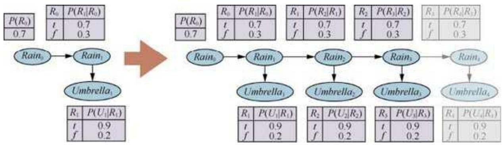  
图20-15表示隐马尔可夫模型的动态贝叶斯网络展开图（重复图14-16）

我们已经介绍过如何学习贝叶斯网络，但在这里情况会更复杂：在贝叶斯网络中，每个参数都是分离的；但在隐马尔可夫模型中，对于任意时刻t，从状态i到状态 $j$ 的转移概率

$\theta _ { i j l } = P ( X _ { l + 1 } = j | X _ { t } = i )$ 是相等的，即对任意时刻t有 。为了估计从状态 i 到状态 $j$ 的转移概率，我们只需计算系统在状态i经过一次转移后到达状态 $j$ 的次数比例的期望：

$$
\theta_ {i j} \leftarrow \sum_ {t} \hat {N} \left(X _ {t + 1} = j, X _ {t} = i\right) / \sum_ {i} \hat {N} \left(X _ {t} = i\right)
$$

计数的期望可以通过HMM推断算法进行计算。通过简单修改图14-4所示的前向-后向 算法，我们可以计算所需的概率。重要的一点在于，所需的概率是通过 平滑 而不是 滤波 的方法获得的。滤波方法所给出的是给定过去状态下当前状态的概率分布，而平滑方法给出的是给定所有证据下的分布，这里的证据包括特定转移发生后的事件发生情况。在谋杀案中，证据通常是在犯罪发生之后（即从状态i到状态j）获得的。

# 20.3.4 EM算法的一般形式

我们已经看到了EM算法的几个实例。在每个实例中，我们都需要对每个样例计算其隐变量的期望，然后把该期望看作观测值并用它们重新计算参数。令x 为所有样例中的所有观测值，并令Z为所有样例中的所有隐变量，设 $\pmb { \theta }$ 是概率模型中的所有参数。那么对应的EM算法可以表示为

$$
\theta^ {(i + 1)} = \underset {\theta} {\operatorname {a r g m a x}} \sum_ {z} P (Z = z \mid x, \theta^ {(i)}) L (x, Z = z \mid \theta)
$$

EM算法可以由上式简单概括。E步是求和计算，即计算分布 下“完整”数据对数似然的期望，其中该分布为给定数据后隐变量的后验分布。M步则是选取参数使得该对数似然的期望达到最大。对于混合高斯模型，隐变量为 $Z _ { i j }$ ，当样例 $j$ 由分量 i生成时其值为1。对于贝叶斯网络， Z ij是样例 $j$ 中未观测到的变量 X i的值。对于HMM， $Z _ { j t }$ 是样例序列 $j$ 在时刻 t 所处的状态。根据算法的一般形式，我们一旦明确了适当的隐变量形式，就可以在特定应用场景中导出对应的EM算法。

在理解了EM的一般思想后，我们很容易得到它的各种变体和改进版本。在许多情况下（如大型贝叶斯网络），E步所要求的隐变量后验概率计算是很困难的。研究结果表明，在E步中对计算采用

近似的方法仍然可以得到有效的学习算法。例如，使用诸如MCMC（见13.4节）一类的采样算法可以将学习过程变得非常直观：MCMC访问的每个状态（隐变量和观测到的变量的组合）都可以作为一个完整的观测看待。因此，我们可以在每次MCMC转移之后直接更新参数。其他形式的近似推断，如变分法和循环信念传播，也被证明可以有效地学习非常大的网络。

# 20.3.5 学习带隐变量的贝叶斯网络结构

在20.2.7节中，我们讨论了如何使用完全数据学习贝叶斯网络结构的问题。当未观测到的变量会对观测到的数据产生影响时，事情就变得复杂了。在最简单的情况下，一个人类专家可能会告诉学习算法存在某些特定的隐变量，然后我们可以利用算法在网络结构中找到隐变量的位置。例如，一个算法试图学习图20-11a所示的结构，并且它已经知道HeartDisease（一个三值的变量）应当被包含在模型中。在完全数据情况下，整个算法有一个用于在所有网络结构中搜索的外部循环和一个用于在给定结构下拟合网络参数的内部循环。

如果学习算法没有被告知存在哪些隐变量，那么我们有两种选择：第一种选择是假设数据是完整的，这可能会迫使算法学习一个参数十分密集的模型，如图20-11b中的模型；第二种选择是创造新的隐变量以简化模型。后一种选择可以通过在结构搜索中提供新的修改选项来实现：除修改链接之外，算法还可以选择添加或删除隐变量或更改其参数个数。当然，算法不会知道它创建的新变量叫作 HeartDisease ；它也不会为这些值赋予有意义的名称。幸运的是，新创建的隐变量通常与已有的变量存在联系，因此人类专家通常可以通过观测新变量附近的局部条件分布来确定其具体含义。

在完全数据情况下，单纯的最大似然结构学习将导致学习到一个全连接网络（并且是一个没有隐变量的网络），因此我们需要引入某种形式的复杂性惩罚。我们也可以应用MCMC来采样大量可能的网络结构，从而近似贝叶斯学习。例如，我们可以学习一个分量数量未知的混合高斯模型并对分量数量进行采样；混合高斯模型的分量数量的近似后验分布将由MCMC的采样频率给出。

在完全数据的情形下，学习参数的内部循环是非常快的，只需从数据集中获取条件频率即可。当存在隐变量时，内部循环可能需要采用EM或基于梯度的算法进行多次迭代，并且每次迭代都涉及贝叶斯网络的后验概率计算，这本身就是一个NP困难问题。到目前为止，对学习复杂模型来说，这种方法仍是不实际的。

一个可能的改进是所谓的结构EM（structuralEM）算法，它的模式与普通的（参数）EM算法基本相同，不同的是该算法可以同时更新结构及参数。一般的EM算法使用当前参数计算E步中的计数期望，然后在M步中利用这些计数期望来选择新的参数，与之类似地，结构EM算法使用当前结构计算计数期望，然后在M步中利用这些计数来估计潜在的新结构的可能性（这区别于外部循环/内部循环的方法，外部循环/内部循环方法对每个潜在结构都重新计算新的计数期望）。通过这样的方法，结构EM算法可以对网络进行多次结构更改，而无须重新计算计数期望，并且能够学习到非平凡的贝叶斯网络结构。结构EM算法的搜索空间是包含所有结构的空间，而不是包含结构和参数的组合空间。尽管如此，结构学习中存在的问题还没有得到很好的解决，这方面仍有许多工作有待完成。

小结

统计学习方法的范围十分广泛，从简单的平均值计算到如贝叶斯网络等复杂模型的构建。它们的应用范围遍及计算机科学、工程学、计算生物学、神经科学、心理学和物理学。在本章中，我们介绍了一些基本的思想，并给出了有一定数学基础的分析。本章要点如下。

●贝叶斯学习 方法将学习表述为概率推断的形式，利用观测值对假设空间的先验分布进行更新。这个方法很好地呈现了奥卡姆剃刀原理，但它很难处理更复杂的假设空间。  
●最大后验 （MAP）学习选择给定数据下可能性最大的假设。该方法同样利用了假设的先验分布，并且该方法通常比贝叶斯学习更易处理。  
●最大似然 学习选择使得数据的似然最大的假设；它等价于使用均匀分布作为先验的最大后验学习。在例如线性回归或完全可观测的贝叶斯网络等简单的情形中，我们容易找到最大似然的闭式解。朴素贝叶斯 学习也是一个运用范围广泛且特别有效的方法。  
●当一些变量被隐藏时，期望最大化 （EM）算法可以找到局部最大似然解。其应用包括高斯混合模型的无监督聚类、贝叶斯网络学习和隐马尔可夫模型的学习。  
●学习贝叶斯网络的结构是模型选择 的一个例子。它通常涉及结构空间中的离散搜索。我们需要一些方法来权衡模型的复杂性和拟合程度。  
●非参数模型 通过一些数据点集合来表示某一分布，因此它的参数数量将随着训练集的增大而增加。最近邻方法寻找离查询点最近的样例，而核方法则考虑所有样例基于距离的加权组合。

统计学习一直以来都是一个非常火热的研究领域，无论是在理论上还是在实践中，它都已取得了巨大的进展。现如今，统计学习方法已经可以用来学习几乎所有能做精确或近似推断的模型。

读者服务：


微信扫码关注【异步社区】微信公众号，回复“e59810”获取本书配套资源以及异步社区15天VIP会员卡，近千本电子书免费畅读。

# 第21章

# 深度学习

深度学习通过梯度下降算法学习多层迭代的网络架构，它在人工智能的主要子领域中具有重要影响力。

深度学习 （deeplearning）是机器学习中一系列技术的组合，它的假设具有复杂代数电路的形式，且其中的连接强度是可调整的。“深度”的含义是指电路通常被设计成多 层 （layer），这意味着从输入到输出的计算路径包含较多计算步骤。深度学习是目前应用最广泛的方法，例如它在视觉对象识别、机器翻译、语音识别、语音合成和图像合成中的应用，它在强化学习应用中也起着重要的作用（见第22章）。

深度学习起源于早期的用计算电路模拟大脑神经元网络的工作（McCulloch and Pitts, 1943）。因此，通过深度学习方法训练的网络通常被称为 神经网络 （neural network），尽管它与真实的神经细胞和结构之间的相似性仅仅停留于表面。

虽然深度学习取得成功的真正原因尚未完全明晰，但与第19章所述的一些方法相比，它具有不言而喻的优势，在处理图像等高维数据时尤为明显。举例来说，虽然线性回归和逻辑斯谛回归等方法可以处理大量的输入变量，但每个样本从输入到输出的计算路径都非常短——只是乘以某个权重后加到总输出中。此外，不同的输入变量各自独立地影响输出而不相互影响（图21-1a）。这大大限制了这些模型的表达能力。它们只能表示输入空间中的线性函数与边界，而真实世界中的大多数概念要比这复杂得多。

另外，决策列表和决策树能够实现较长的计算路径，这些路径可能依赖于较多的输入变量，但只是对很小的一部分输入向量而言（图21-1b）。如果一个决策树对一定部分的可能输入有很长的计算路径，那么它的输入变量的数量必将是指数级的。深度学习的基本思想是训练电路，使其计算路径可以很长，进而使得所有输入变量之间以复杂的方式相互作用（图21-1c）。事实证明，这些电路模型具有足够的表达能力，它们在许多重要类型的学习问题中都能够拟合复杂的真实数据。

21.1节将介绍简单的前馈网络及其组成部分，以及使用这类网络进行学习的要点；21.2节将更详细地介绍如何将深层网络组合在一起；21.3节将介绍卷积神经网络，这类网络在视觉应用中尤为重要；21.4节和21.5节将更详细地介绍从数据中训练网络的算法和改进泛化性能的方法；21.6节将介绍具有循环结构的网络，这类网络非常适用于时序数据；21.7节将介绍将深度学习用于监督学习以外的任务的方法；最后，21.8节将简略概述深度学习的广泛应用场景。

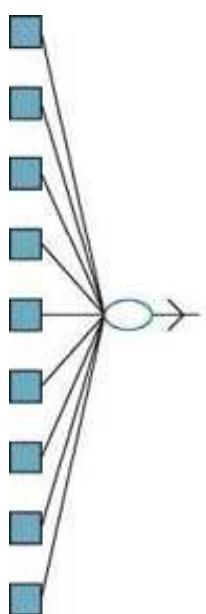

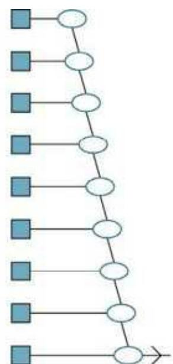

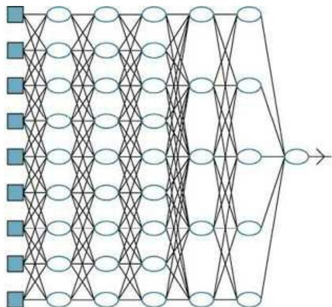  
  
图21-1 （a）浅层模型，例如线性回归，其输入到输出之间的计算路径很短。（b）决策列表网络（19.5节）中可能存在某些具有长计算路径的输入，但大多数计算路径都较短。（c）深度学习网

络具有更长的计算路径，且每个变量都能与所有其他变量相互作用

# 21.1 简单前馈网络

顾名思义，前馈网络 （feedforwardnetwork）是只在一个方向上有连接的网络，也就是说，它是一个有向无环图且有指定的输入和输出节点。每个节点计算一个关于输入的函数，并将结果传递给网络中的后续节点。信息从输入节点流向输出节点从而通过网络，且没有环路。另外，循环网络（recurrentnetwork）将其中间输出或最终输出反馈到自己的输入中。这意味着网络中的信号值将形成一个具有内部状态或记忆的动态系统。我们将在21.6节探讨循环网络。

布尔电路是前馈网络的一个例子，它实现了布尔函数。在布尔电路中，输入被限制为0或1，每个节点是关于输入的简单布尔函数，节点的输出也为0或1。在神经网络中，输入值通常是连续的，节点接受连续的输入并产生连续的输出。节点的一部分输入也可能是网络的 参数 ，网络通过调整这些参数值，使网络整体拟合训练数据，以此来进行学习。

# 21.1.1 网络作为复杂函数

网络中的每个节点称为一个单元 （unit）。传统上，根据麦卡洛克和皮茨（McCulloch and Pitts，1943）所提出的设计，一个单元将计算来自前驱节点的输入的加权和，并使用一个非线性的函数产生该节点的输出。令 a j为单元 j 的输出，并令 w i,j为从单元 i 到单元 j 的连接的权重，有

$$
a _ {j} = g _ {j} \left(\sum_ {i} w _ {i, j} a _ {i}\right) \equiv g _ {j} \left(i n _ {j}\right)
$$

其中 $g _ { j }$ 为用于单元 $j$ 的非线性 激活函数 （activation function）， in j 是单元 $j$ 的输入的加权和。

如19.6.3节所述，我们规定每个单元都有一个来自虚拟单元0的额外输入，这个来自虚拟单元0的输入固定为+1，并且该输入有权重 w 0,j。这样一来，即使前一层的输出均为0，单元 j 的输入的加权和in 也是非0的。根据这样的规则，我们可以将上述式子表述为向量的形式：

$$
\boldsymbol {a} _ {j} = \boldsymbol {g} _ {j} \left(\boldsymbol {w} ^ {\mathrm {T}} \boldsymbol {x}\right) \tag {21-1}
$$

其中， w 是关于单元 $j$ 的输入的权重向量（包括 w 0,j）， x 是单元 j 的输入向量（包括+1）。

激活函数是非线性的这一事实非常重要，因为如果它不是非线性的，那么任意多个单元组成的网络将仍然只能表示一个线性函数。这种非线性使得由足够多的单元组成的网络能够表示任意函数。万能近似 （universalapproximation）定理表明，一个网络只要有两层计算单元，且其中第一层是非线性的，第二层是线性的，那么它就可以以任意精度逼近任何连续函数。定理的证明思路大致如下：由于单元个数为指数级别的网络可以表示指数多个输入空间中的不同位置不同高度的“凸起”，因此可以逼近所需的函数。换句话说，足够大的网络可以实现连续函数的查找表，就像足够大的决策树可以实现布尔函数的查找表一样。

有许多不同种类的激活函数，其中最常见的有以下几类。

●逻辑斯谛函数或sigmoid函数，我们在逻辑斯谛回归中也曾用到它（见第19章）：

$$
\sigma (x) = 1 / \left(1 + e ^ {- x}\right)
$$

● ReLU 函数，ReLU是 修正线性单元 （rectified linear unit）的简写：

$$
\operatorname {R e L U} (x) = \max  (0, x)
$$

● softplus 函数，它是ReLU函数的光滑版本：

$$
\operatorname {s o f t p l u s} (x) = \log \left(1 + e ^ {x}\right)
$$

softplus函数的导数为sigmoid函数。

● tanh 函数：

$$
\tanh (x) = \frac {\mathrm {e} ^ {2 x} - 1}{\mathrm {e} ^ {2 x} + 1}
$$

可以发现tanh函数的值域为 。tanh函数是sigmoid经过伸缩与平移后的版本，即tanh（x）=20（2x）-1

这些函数如图21-2所示。不难发现它们都是单调不减的，这意味着它们的导数 $g ^ { \prime }$ 是非负的。在后面的章节中，我们将对激活函数的选择做更多的解释。

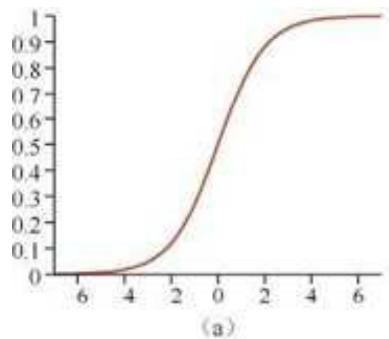

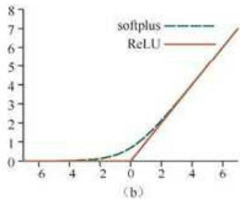

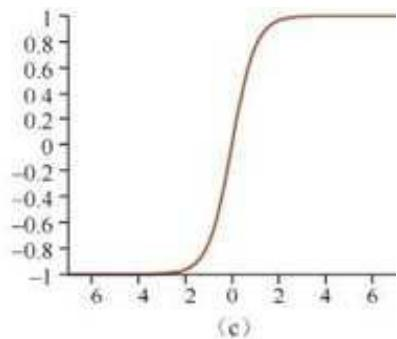  
图21-2 深度学习系统中常用的激活函数：（a）逻辑斯谛函数或sigmoid函数。（b）ReLU函数和softplus函数。（c）tanh函数

将多个单元组合到一个网络中会产生一个复杂的函数，它是由单个单元表示的代数表达式的组合。例如，图21-3a所示的网络表示了一个由权重 w 参数化的函数 h w ( x )，它将二元的输入向量 x 映射为标量输出值 。函数的内部结构与网络的结构相对应。例如，我们可以将某个输出 的表达式写成

$$
\begin{array}{l} \hat {y} = g _ {5} \left(i n _ {5}\right) = g _ {5} \left(w _ {0, 5} + w _ {3, 5} a _ {3} + w _ {4, 5} a _ {4}\right) \\ = g _ {3} \left(w _ {0, 5} + w _ {3, 5} g _ {3} \left(i n _ {3}\right) + w _ {4, 5} g _ {4} \left(i n _ {4}\right)\right) \\ = g _ {3} \left(w _ {0, 5} + w _ {3, 5} g _ {3} \left(w _ {0, 3} + w _ {1, 3} x _ {1} + w _ {2, 3} x _ {2}\right) \right. \\ + w _ {4, 5} g _ {4} \left(w _ {0, 4} + w _ {1, 4} x _ {1} + w _ {2, 4} x _ {2}\right)) \tag {21-2} \\ \end{array}
$$

如此一来，我们可以将输出 表示为关于输入和权重的函数 h w ( x )。

图21-3a给出了神经网络相关书籍中描述网络的传统方式。一个更一般的方法是把网络看作一个计算图 （computation graph）或 数据流图 （dataflow graph）——本质上它是一个电路，其中每个节点代表一个基本运算。图21-3b给出了与图21-3a中网络相对应的计算图，该图显式地表达了整个计算过程的每个元素。它还将输入（蓝色）和权重（淡紫色）进行了区分，我们可以调整权重，使输出 与训练数据中的真实值 y 更接近。每个权重就像一个音量控制旋钮，它决定了图中的下一个节点从特定前驱节点中听到了多少声音。

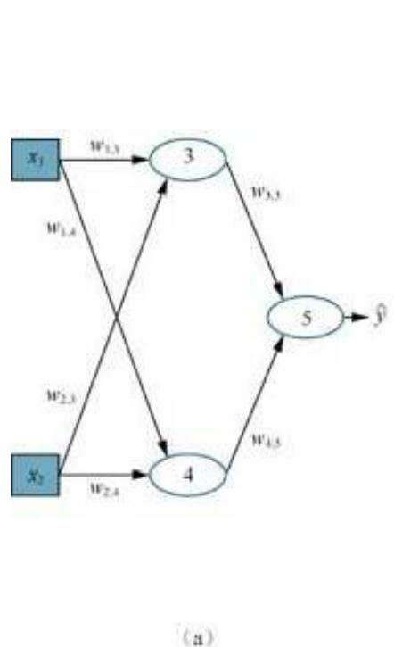

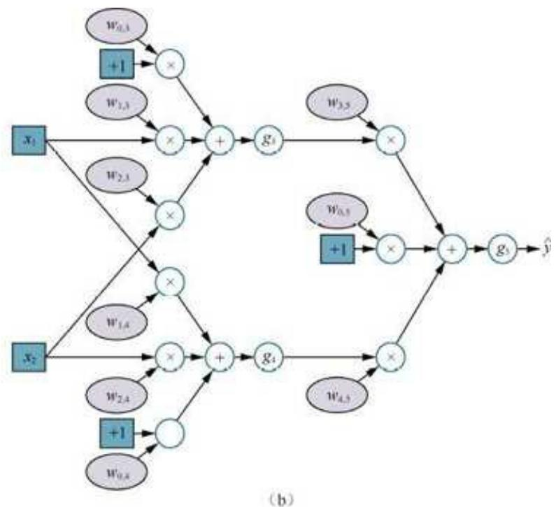  
图21-3（a）具有两个输入、一个包含两个单元的隐藏层和一个输出单元的神经网络，其中虚拟输入及其权重没有在图中给出。（b）将（a）中的网络分解为完整的计算图

与式（21-1）中以向量形式描述单元的方式类似，我们可以对整个网络进行类似的操作。我们通常以 W 表示权重矩阵；对于该网络， W (1) 表示第一层的权重（ w 1,3、 w 1,4等）， W (2) 表示第二层的权重（ $w _ { 3 , 5 }$ 等）。最后，记第一层和第二层中的激活函数为 $\pmb { g }$ (1) 和 $\pmb { g } ^ { ( 2 ) }$ 。那么整个网络可以写为

$$
h _ {n} (x) = g ^ {(2)} \left(W ^ {(2)} g ^ {(1)} \left(W ^ {(1)} x\right)\right) \tag {21-3}
$$

与式（21-2）一样，这个表达式也对应于一个计算图，尽管它比图21-3b中的计算图简单得多：在该图中只有一条“链”，其中每一层都附带权重矩阵。

图21-3b中的计算图相对来说规模较小且层数较浅，但其中的思想适用于所有形式的深度学习：我们通过构造计算图并调整其权重以拟合数据。图21-3b中的图同时也称作全连接的 （fullyconnected），即每一层中的每个节点都与下一层中的每个节点存在连接。这在某种意义上是默认的选择，但我们将在21.3节中看到，合理选择网络的连接性对于实现高效学习十分重要。

# 21.1.2 梯度与学习

在19.6节中，我们介绍了一种基于梯度下降 的监督学习方法：计算损失函数关于权重的梯度，并沿梯度方向调整权重以降低损失函数。（如果读者尚未阅读19.6节，我们强烈建议在继续阅读接下来的内容之前阅读19.6节。）我们可以用完全相同的方法学习计算图中的权重。对于输出层（outputlayer），即产生网络输出的层，其单元对应的权重的梯度计算过程与19.6节中的计算方式基本相同。对于 隐藏层 （hidden layer），它们与输出没有直接联系，其单元对应的权重的梯度计算过程会稍微复杂一点。

现在我们考虑使用平方损失函数 $L _ { 2 }$ ，我们将计算图21-3中的网络关于单个训练样例(x ,y)的梯度。（对于多个样例，其梯度仅仅是单个样例的梯度之和。）设网络输出的预测为，其真实值为 y ，那么我们有

$$
L o s s (h _ {w}) = L _ {2} (y, h _ {w} (\boldsymbol {x})) = \left\| y - h _ {w} (\boldsymbol {x}) \right\| ^ {2} = (y - \hat {y}) ^ {2}
$$

为了计算损失函数关于权重的梯度，我们需要使用与第19章中相同的分析工具——主要是 链式法则 ， $\partial g ( f ( x ) ) / \partial x = g ^ { \prime } ( f ( x ) ) \partial f ( x ) / \partial x$ 。我们将从简单的例子入手：一个连接到输出单元的权重，如 $w _ { 3 , 5 }$ 。我们直接在定义网络的表达式，即式（21-2）中进行运算：

$$
\begin{array}{l} \frac {\partial}{\partial w _ {3 , 5}} \operatorname {L o s s} \left(h _ {w}\right) = \frac {\partial}{\partial w _ {3 , 5}} (y - \hat {y}) ^ {2} = - 2 (y - \hat {y}) \frac {\partial \hat {y}}{\partial w _ {3 , 5}} \\ = - 2 (y - \hat {y}) \frac {\partial}{\partial w _ {3 , 5}} g _ {5} \left(i n _ {5}\right) = - 2 (y - \hat {y}) g _ {5} ^ {\prime} \left(i n _ {5}\right) \frac {\partial}{\partial w _ {3 , 5}} i n _ {5} \\ = - 2 (y - \hat {y}) g _ {5} ^ {\prime} \left(i n _ {5}\right) \frac {\partial}{\partial w _ {3 , 5}} \left(w _ {0, 5} + w _ {3, 5} a _ {3} + w _ {4, 5} a _ {4}\right) \\ = - 2 (y - \hat {y}) g _ {5} ^ {\prime} (i n _ {5}) a _ {3} \\ \end{array}
$$

（21-4）

最后一行得以简化是因为 $w _ { \mathrm { ~ 0 , 5 ~ } }$ 和 $w _ { \ 4 , 5 } a _ { \ 4 }$ 不依赖于 $w _ { 3 , 5 }$ ，也不依赖于 $w _ { 3 , 5 }$ 的系数 $a _ { 3 }$ 。

比这稍微复杂一点的情况是考虑与输出单元没有直接联系的一个权重，如 $w _ { 1 , 3 }$ 。在这种情形下，我们必须多应用一次链式法则。其中前几个步骤是相同的，因此我们略去它们：

$$
\begin{array}{l} \frac {\partial}{\partial w _ {1 , 3}} \operatorname {L o s s} \left(h _ {w}\right) = - 2 (y - \hat {y}) g _ {5} ^ {\prime} \left(i n _ {5}\right) \frac {\partial}{\partial w _ {1 , 3}} \left(w _ {0, 5} + w _ {3, 5} a _ {3} + w _ {4, 5} a _ {4}\right) \\ = - 2 (y - \hat {y}) g _ {5} ^ {\prime} \left(i n _ {5}\right) w _ {3, 5} \frac {\partial}{\partial w _ {1 , 3}} a _ {3} \\ = - 2 (y - \hat {y}) g _ {5} ^ {\prime} \left(i n _ {5}\right) w _ {3, 5} \frac {\partial}{\partial w _ {1 , 3}} g _ {3} \left(i n _ {3}\right) \\ = - 2 (y - \hat {y}) g _ {5} ^ {\prime} \left(i n _ {3}\right) w _ {3, 5} g _ {3} ^ {\prime} \left(i n _ {3}\right) \frac {\partial}{\partial w _ {1 , 3}} i n _ {3} \\ = - 2 (y - \hat {y}) g _ {5} ^ {\prime} \left(i n _ {5}\right) w _ {3, 5} g _ {3} ^ {\prime} \left(i n _ {3}\right) \frac {\partial}{\partial w _ {1 , 3}} \left(w _ {0, 3} + w _ {1, 3} x _ {1} + w _ {2, 3} x _ {2}\right) \\ = - 2 (y - \hat {y}) g _ {5} ^ {\prime} (i n _ {5}) w _ {3, 5} g _ {3} ^ {\prime} (i n _ {3}) x _ {1} \\ \end{array}
$$

（21-5）

由此，对于损失函数关于权重 $w \mathrm { ~ } 3 , 5$ 和 $w \mathrm { ~ } 1 , 3$ 的梯度，我们有了相当简单的表达式。

如果我们定义 $\Delta _ { s } = 2 \left( \hat { y } - y \right) g _ { s } ^ { \prime } \left( \bar { i } n _ { s } \right)$ 为第5单元接收到输入产生的某种“感知误差”，那么损失函数关于 $w _ { 3 , 5 }$ 的梯度为 $\Delta _ { 5 } a _ { 3 }$ 。这是很有道理的：如果 $\Delta$ 是正的，这意味着 $\hat { y }$ 过大（ g ′ 总是非负的）；如果 $a _ { \textup { 3 } }$ 也是正的，那么增大 $w _ { 3 , 5 }$ 只会让结果变得更糟，而如果 $a _ { 3 }$ 是负的，那么增大$w _ { 3 , 5 }$ 会减少误差。 $a _ { 3 }$ 的大小也很重要：如果在这个训练样例中 $a _ { \textup { 3 } }$ 很小，那么 $w _ { 3 , 5 }$ 在产生误差方面并不是主要的，也不需要做太大改变。

如果我们定义 $\Delta _ { 3 } = \Delta _ { 5 } w _ { 3 , 5 } g _ { 3 } ^ { \prime } ( i n _ { 3 } )$ ，那么关于 w 的梯度则为 $\Delta \pmb { x _ { 1 } }$ 。因此，单元3关于输入的感知误差为单元5关于输入的感知误差乘以从单元5返回到单元3的路径的信息。这种现象是十分普遍的，并由此引出了 反向传播 （back-propagation）一词，它表示输出的误差通过网络进行回传的方式。

这些梯度表达式的另一个重要特征是它们以局部导数 为因子。如前所述，这些导数总是0（在sigmoid、softplus和tanh函数的情况下）或正好为0（在ReLU的情况下）。如果导数很小或为0，这意味着修改与单位 j 相关的权重对其输出的影响可以忽略不计。这样的结果是，层数较多的深度网络可能会遭遇 梯度消失 （vanishing gradient）——误差信号通过网络进行反向传播时完全消失。21.3.3节为此问题提供了一种解决方案。

我们已经展示了，在我们给出的简单网络示例中，梯度的表达式十分简单，它可以通过将信息从输出单元传回网络来计算。事实证明，这个特点是一般性的。事实上，正如我们将在21.4.1节中所述， 任何前馈计算图的梯度计算与基本的计算图具有相同的结构。这个性质由微分法则直接保证。

我们已经介绍了梯度计算的烦琐细节，但不用担心：对于每一个新的网络结构，我们不需要重新推导式（21-4）和式（21-5）！所有这些梯度都可以通过 自动微分 （automatic differentiation）的方


法进行计算，这一方法系统地应用微积分法则来计算任何数值程序的梯度。 事实上，深度学习中的反向传播方法只是 反向模式 （reversemode）微分的一种应用，它在网络输入多、输出相对较少的情况下应用由外而内的链式法则，并利用了动态规划的效率优势。

所有深度学习的主流软件包都提供了自动微分的功能，因此用户可以自由地试验不同的网络结构、激活函数、损失函数及其组合，而无须进行大量的微积分来推导每个实验的新学习算法。这引导了一种称为端到端学习 （end-to-end learning）的方法，在这种方法中，机器翻译等任务的复杂计算系统可以由几个可训练的子系统组成；整个系统将以端到端的方式根据输入/输出对进行训练。使用这种方法，设计者只需对整个系统的结构有一个模糊的概念，无须预先确切地知道每个子系统应该做什么，或者如何对输入和输出进行标记。

# 21.2 深度学习的计算图

我们已经了解了深度学习的基本思想：将假设表示为具有可调整权重的计算图，并通过计算损失函数相对于这些权重的梯度来拟合训练数据。现在我们将考虑如何组成一个计算图。我们从输入层开始，在这里训练样例或测试样例 x 被编码为输入节点的值。然后我们考虑输出层，它将输出 与 A真值y进行比较，得到用于调整权重的学习信号。最后，我们考虑网络中的隐藏层。

# 21.2.1 输入编码

计算图的输入和输出节点是指与输入数据x 和输出数据y直接连接的节点。输入数据的编码通常是直接的，至少对每个训练样本包含n个输入属性值的因子化数据来说是这样的。如果属性是布尔值，那么我们将有n 个输入节点；通常，false映射为输入0，true映射为输入1，尽管有时也会使用−1和+1。对于数值属性，无论是它是整数值还是实值，我们通常都按原样使用，尽管它们可能会被缩放到某个固定范围内；如果不同样例之间的数量级存在较大差别，那么可以将这些值映射到对数尺度下。

图像不太符合因子化数据的范畴。尽管包含X像素×Y像素的RGB图像可以看作3XY个整数值属性（通常取值范围为{0,…, 255}），但这将忽略RGB三元组属于图像中同一像素的事实，也忽略了像素之间的邻接关系十分重要这一事实。当然，我们可以将相邻的像素映射到网络中相邻的输入节点上，但是如果网络的内部各层完全连通，那么邻接关系将完全失去意义。实际上，用于图像数据的网络具有类似数组的内部结构，其目的是反映“邻接”这一含义。我们将在21.3节中更详细地看到这一点。

对于具有两个以上取值范围的类别属性（如第19章中餐厅等待问题中的 Type属性，其值为French、Italian、Thai或Burger），我们通常采用所谓的 独热编码 （one-hot encoding）对其进行编码。具有d个可能值的属性由d 个独立的输入位表示。对任意给定的值，相应的输入位被设置为1，剩下的其他位将被设置为0。这通常比将其值映射到整数的效果更好。如果我们将Type这一属性表示为整数，那么Thai将为3，Burger将为4。由于网络是连续函数的组合，因此它必然要注意数值的邻接关系，但在这种情况下，Thai和Burger之间的数值邻接的实际意义微乎其微。

# 21.2.2 输出层与损失函数

在网络的输出端，将原始数据值编码为图输出节点的实际值y这一问题与输入编码问题大致相同。例如，如果网络试图预测第12章中的 Weather变量，它的取值范围为

，那么我们将使用一个4位的独热编码。

我们已经花了一定篇幅考虑数据的标签 y ，那么对于预测值 ，我们希望它表现得如何呢？在理想情况下，我们希望预测值与我们希望的y值完全匹配，此时损失将为0——我们就完成了学习任务。实际中这种情况很少发生，尤其是在我们开始调整权重之前！因此，我们需要思考不正确的输出值意味着什么，以及如何衡量损失。在推导式（21-4）和式（21-5）中的梯度时，我们采用了平方误差损失函数，这使得代数运算较为简洁，但这不是唯一的选择。事实上，在大多数深度学习实际应用中，更常见的做法是将输出值表述为概率，并使用负对数似然 作为损失函数，就像我们在第20章中对最大似然 学习所做的那样。

最大似然学习的目标是寻找使观测数据的概率最大化的w。由于对数函数是单调函数，这等价于最大化数据的对数似然，因此也等价于最小化负对数似然，即损失函数。（回想在第20章中，取对数的做法使得概率的乘积变成求和，这更便于导数计算。）换句话说，我们希望找到使得 $N$ 个样例的负对数似然之和最小化的w* ：

$$
w ^ {*} = \underset {w} {\operatorname {a r g m i n}} - \sum_ {j = 1} ^ {N} \log P _ {w} \left(y _ {j} \mid x _ {j}\right) \tag {21-6}
$$

在深度学习的相关文献中，最小化交叉熵 （cross-entropy）损失是一种常见的方法。交叉熵，记为$H ( P , Q )$ ，是两个分布 $P$ 和Q 之间差异性的一种度量。 [1] 它的一般性定义如下：

[1] 交叉熵不是一般意义下的距离，因为 $H ( P , P )$ 不为零；相反，它等于熵 $H ( P )$ 。我们容易证明有 $H ( P , Q ) = H ( P ) + D _ { E G } ( P | | Q )$ ，其中 $D K L$ 为 库尔贝克-莱布勒散度 （Kullback-Leiblerdivergence），它满足 $\mathscr { D } _ { \varpi } ( P | | P ) = 0$ 。因此，对于固定的 $P$ ，改变 $Q$ 使得交叉熵达到最小等价于最小化KL散度。

$$
H (P, Q) = E _ {z \sim P (z)} [ \log Q (z) ] = \int P (z) \log Q (z) d z \tag {21-7}
$$

在机器学习中，我们通常取定义中的 P 为训练样例的真实分布 $\vec { P } ^ { * } ( x , y )$ ，并令 Q 为假设的预测。通过调整 w 使交叉熵 最小化，从而使得假设预测的分布与真实分布尽可能接近。实际上，我们并不能成功地最小化该交叉熵，因为我们无法获得数据的真实分布 ；但我们可以从 中采样以获得样本，因此式（21-6）中对实际数据的求和将近似于式（21-7）中的期望值。

为了最小化负对数似然（或交叉熵），我们需要将网络的输出表述为概率。例如，如果网络有一个激活函数为sigmoid的输出单元，并且它正在学习布尔分类，我们可以将输出值直接解释为样例属于正类的概率（事实上，这正是逻辑斯谛回归的做法，见19.4节）因此，对于布尔分类问题，我们通常在输出层使用sigmoid激活函数。

多分类问题在机器学习中非常常见。例如，用于对象识别的分类器通常需要识别成千上万个不同类别的对象。试图预测句子中下一个单词的自然语言模型可能需要在成千上万个可能的单词中进行选择。对于这种预测，我们需要网络输出一个关于分类的分布，也就是说，如果有d 个可能的答案，那么我们需要d 个表示概率且总和为1的输出节点。

为了实现这一点，我们将使用一个 softmax 层，对于一个给定的输入向量，它将输出一个 d 维向量。其中输出向量的第 k 个元素由下式给出：

$$
\operatorname {s o f t m a x} (\mathbf {i n}) _ {k} = \frac {\mathrm {e} ^ {\mathbf {i n} _ {k}}}{\sum_ {k ^ {\prime} = 1} ^ {d} \mathrm {e} ^ {\mathbf {i n} _ {k ^ {\prime}}}}
$$

根据其函数构造方式可知，softmax函数输出一个元素和为1的非负向量。通常，每个输出节点的输入in 是前一层输出的加权线性和。由于采用了指数函数，softmax层将放大输入之间的差异：例如，如果一个输入向量为 ，那么其输出将为〈0.946, 0.047, 0.006, 0.001〉。尽管如此，softmax与max函数不同，它是光滑可微的（习题21.SOFG）。容易证明sigmoid是 d = 2情形下的softmax（习题21.SMSG）。换句话说，正如sigmoid单元通过网络传播二进制类（binaryclass）信息一样，softmax单元将传播多类（multiclass）信息。

对于回归问题，即目标值 y 是连续值的问题，我们通常使用线性输出层（换句话说， ， 即没有任何激活函数g），并将其解释为具有固定方差的高斯预测的平均值。正如我们在20.2.4节中指出的，最大化固定方差高斯分布的似然（即最小化负对数似然）等价于最小化平方误差。因此，一个线性的输出层可以理解为经典的线性回归。该线性回归的输入特征是前一层的输出，它通常是原始输入在网络中经过多重非线性变换得到的结果。

还有许多可供选择的输出层。例如，混合密度 （mixturedensity）层表示使用混合高斯分布的输出层（见20.3.1节以了解混合高斯的更多细节）。这样的输出层将预测每个混合成分的相对频率、每个成分的平均值和每个成分的方差。只要这些输出值被损失函数恰当地解释为真实输出值y的概率，那么在训练之后，网络将在由前一层给出的特征空间中拟合混合高斯模型。

# 21.2.3 隐藏层

在训练过程中，神经网络将被提供大量的输入值x 和与输入相应的输出值y。在处理输入向量x时，神经网络将执行若干次中间计算，最终输出y。我们可以把网络每一层计算得到的值看作输入

x 的不同表示，那么每一层都将把前一层生成的表示转换为新的表示。如果这些转换都顺利进行，那么所有这些转换的组合将成功把输入转换为我们想要的输出。事实上，深度学习能达到很好效果的一个前提是有一个从输入到输出的复杂的端到端转换（例如，从图像输入到输出类别“长颈鹿”），它由许多层相对简单的转换组合组成，其中每一层都很容易通过局部更新学习。

在形成这些内部转换的过程中，深层网络经常可以发现一些有意义的数据的中间表示。例如，学习目标为识别图像中复杂对象的网络可能会形成一个用于检测有用子单元（如图像中的边、角、椭圆、眼睛、脸）的内部层。当然这种结果也不一定会发生—— 深度网络可能会形成一些内部层，其意义对人类来说是难以理解的，尽管它的输出仍然是正确的。

神经网络的隐藏层通常不如输出层那么多样化。在对多层网络研究的前25年中（约1985—2010年），人们几乎只使用sigmoid和tanh作为内部节点的激活函数。2010年前后，ReLU和softplus逐渐变得流行，其中部分原因是人们认为它们可以避免21.1.2节中提到的梯度消失问题。一些在越来越深的网络中进行的实验表明，在许多情况下，如果权重总数固定，使用较深且相对较窄的网络通常比使用较浅且较宽的网络有更好的学习效果。21.5节中的图21-7给出了反映该现象的一个经典示例。

当然，除了考虑宽度和深度之外，计算图还需要考虑许多其他结构。在撰写本书时，人们对为什么某些结构似乎在某些特定问题上比其他结构工作得更好这一问题几乎还没有什么理解。实验者通常依赖于自身的经验，他们在关于如何设计网络以及在网络效果较差时如何修复网络等方面有一些直觉，就像厨师在如何设计食谱以及如何在味道不好时改善食品方面有一定的直觉一样。因此，一个有助于快速探索和评估不同结构的工具对解决实际问题至关重要。

# 21.3 卷积网络

我们在21.2.1节中提到，不能把图像简单看作输入为像素值的向量，其主要原因是像素之间的邻接关系非常重要。如果我们用完全连通的层构造网络并以一个图像作为输入，那么无论是用未受干扰的图像进行训练，还是用所有像素都经过多次随机排列的图像进行训练，我们都会得到相同的结果。此外，假设图像有n 个像素输入且第一个隐藏层有n 个单元。如果输入和第一个隐藏层完全连接，则意味着网络有 $n ^ { 2 }$ 个权重；对于一个典型的百万像素RGB图像，它的权重将有9万亿个。如此庞大的参数空间意味着需要大量的训练图像和庞大的计算预算来运行训练算法。

这些层面的考虑提示我们应该这样构造第一个隐藏层：每个隐藏单元只接收来自图像的一个小局部区域的输入。 这样的做法将一举两得。首先，它至少在局部上注重了邻接关系。（我们稍后将看到，如果后续层也具有相同的局部性，那么网络将在全局意义下注重邻接性。）其次，它减少了权重的数量：如果每个局部区域有 个像素，那么权重的总数量将为 。

到目前为止我们对网络结构的构思还不错，但是我们忽略了图像的另一个重要性质：简单来说，任何在图像的一个小局部区域中可以检测到的物体（如眼睛或者一片草坪），如果它们出现在图像的另一个小局部区域内，那么从视觉上看它们将是一样的。换言之，我们希望网络在处理图像数据时，能在小尺度到中等尺度上表现出近似空间不变性 （spatialinvariance）[1] 。我们不一定期望图像的上半部分与下半部分相似，因此存在一个尺度，一旦超过这个尺度，空间不变性就不再成立。

[1]类似的想法可以用于处理时序数据，例如音频波形。它们通常表现出 时间不变性 ——一个单词无论在一天中任何时间说出来，它听上去都是一样的。循环神经网络（21.6节）本身带有时间不变性。

局部空间不变性可以通过将隐藏单元与一个局部区域的连接的l个权重限制为对于每个隐藏单元都相等来实现。（也就是说，对于隐藏单元 i 和 j ，权重 与权重 $w _ { Q }$ 相等)。这使得隐藏单元能成为特征检测器，且无论特征出现在图像中哪个位置都能被检测到。通常，我们希望第一个隐藏层能检测多种特征，而不仅仅是一种；因此，对于图像的每个局部区域，我们可能有d个具有不同权重集合的隐藏单元。这意味着权重的总数将有dl个，这个数字不仅远小于 $n ^ { 2 }$ ，而且实际上与图像大小n 无关。因此，利用一些先验知识（即邻接关系和空间不变性），我们可以设计出参数少得多、学习速度更快的模型。

卷积神经网络 （convolutional neural network，CNN）是一种至少在较浅的层中包含空间局部连接的网络，并且在每一层中，单元之间权重是相同的。将多个局部区域内权重置为相同的权重模式称为核 （kernel），将核应用于图像像素（或后续层中的空间上有序的单元）的过程称为卷积


核与卷积最简单的表达方式是用一维表示，而不是二维或更高维的表示，因此我们将假设输入向量x的大小为 n，它对应于一维图像中的n个像素，核向量k 的大小为 $l$ 。（为了简单起见，我们令l为一个奇数。）所有的思想都容易直接推广到更高维的情况。

我们用符号∗表示卷积运算，例如 z = x ∗ k 。其运算定义如下：

$$
z _ {i} = \sum_ {j = 1} ^ {l} k _ {j} x _ {j + i - (j + 1) / 2} \tag {21-8}
$$

换句话说，第i个位置的输出为核 k与 x中以x 为中心、宽度为 $l$ 的片段的内积。

我们在图21-4中以核向量[+1, −1,+1]为例对该过程作出说明，它的检测目标是一维图像中较暗的点（在二维情况中可能是较暗的线）。注意，在这个例子中，核的中心之间隔着2像素的距离；我们称核所用的步长 （stride）s=2。注意，输出层的像素相对较少：由于步长的存在，像素的数量从n 减少到大约 n / s （在二维情况下，像素的数量大约为 n / s s ，其中， s 和 s 分别代表图像在

x方向和y方向上的步长）。我们之所以说“大约”，是因为图像在边缘处需要特别考虑：在图21-4中，卷积过程在图像边缘停止，但是我们也可以用额外的像素对输入进行扩充（可以是0，也可以等于外部像素），这样一来，核就可以精确地被应用⌊n /s⌋次。对于较小的核，我们通常采用s=1，因此输出将与图像具有相同的大小（见图21-5）。

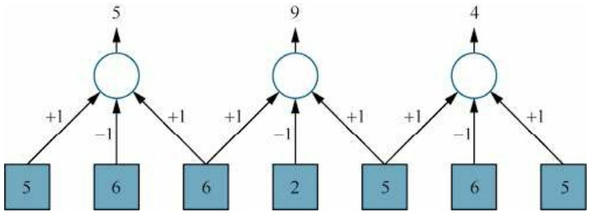  
图21-4 一维卷积运算的例子，其中核大小l=3，步长s=2。其中响应的峰值集中在较暗（光强较低）的输入像素上。在将结果输入下一个隐藏层之前，它们通常会经过一个非线性激活函数（未在图中给出）

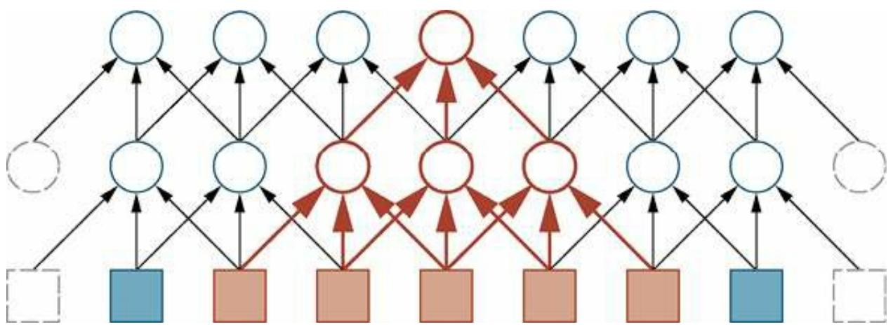  
图21-5 一个处理一维图像数据的卷积神经网络的前两层，其核大小 l=3，步长s=1。最左侧与最右侧作了填充，以使隐藏层与输入有相同的大小。红色所标记的区域是第二层隐藏层中某个单元的感受野。一般来说，越深的单元其感受野的范围越大

利用一个具有合适的嵌套循环结构的程序，我们可以简单地实现核应用于图像的运算；同时，它也可以表述为单步矩阵运算，就像式（21-1）中权重矩阵的应用一样。例如，图21-4中所示的卷积操作可以看作如下的矩阵乘法：

$$
\left( \begin{array}{c c c c c c c} + 1 & - 1 & + 1 & 0 & 0 & 0 & 0 \\ 0 & 0 & + 1 & - 1 & + 1 & 0 & 0 \\ 0 & 0 & 0 & 0 & + 1 & - 1 & + 1 \end{array} \right) \left( \begin{array}{l} 5 \\ 6 \\ 6 \\ 2 \\ 5 \\ 6 \\ 5 \end{array} \right) = \left( \begin{array}{l} 5 \\ 9 \\ 4 \\ 2 \\ 5 \\ 6 \\ 5 \end{array} \right) \tag {21-9}
$$

在这个权重矩阵中，核出现在每一行，并按照步长相对于前一行进行移动，我们不必显式地构造权重矩阵（因为它大部分的位置为0），但是卷积可以看作一个线性矩阵运算这一事实暗示我们，梯度下降可以简单且高效地应用于CNN，就像它可以应用于普通的神经网络一样。

如前所述，我们将会有d 个核，而不是只有一个；因此，当步长为1时，输出的大小将增大 d倍。这意味着一个二维的输入数组将输出三维的隐藏单元数组，其中第三维的大小为 $d$ 。以这种方式对隐藏层进行组织是很重要的，这使得来自图像的某个特定位置的所有核输出都将与该位置相联系。但与表示图像的维度不同，这个额外的“核维度”没有任何邻接性质，因此对该维度应用卷积运算是没有意义的。

CNN灵感最初来自于神经科学中提出的视觉皮层模型。在这些模型中，神经元的感受野（receptivefield）是指感觉输入中能够影响神经元激活状态的部分。在一个卷积神经网络中，第一个隐藏层中一个单元的感受野会很小——恰好为核的大小，即 $l$ 个像素。在网络的更深层中，一个单元的感受野会大得多。图21-5说明了第二个隐藏层中的一个单元的感受野，该单元的感受野包含5个像素。如图21-5所示，当步长为1时，第 m 个隐藏层中的节点的感受野大小将为 ；因此，其增长速度关于m 是线性的。（在二维图像中，每个维度的感受野都随m 线性增长，因此，感受野面积的增长将是二次的。）当步长大于1时，第m 层中的每个像素将表示第m −1层中的 s 个像素；因此，感受野将以 的速度增长，即与网络深度呈指数关系。池化层也会产生同样的效果，我们将在下面进行讨论。

# 21.3.1 池化与下采样

神经网络中的池化 （pooling）层用一个值来提取前一层中的一组相邻单元的信息。与卷积层类似，池化层也有一个大小为l，步长为 s的核，但是它的运算方式是固定的，而不是学习得到的。通常来说，池化层不与激活函数相连接。它有两种常见的形式。

●平均池化计算l个输入的平均值。这等价于采用一个均匀的核 进行卷积。如果我们令l=s，那么其效果将为粗化图像的分辨率——以s尺度进行下采样 （downsample）。在池化之后，一个占用10 s个像素的对象将只占用10个像素。对于同一个学习得到的分类器，如果它能识别出原始图像中大小为10个像素的对象，那么它也将能识别出池化后的图像中的该对象，即使在原始图像中该对象因为太大而难以识别。换句话说，平均池化有助于多尺度下的识别。同时，它还降低了后续层中所需的权重数量，从而降低了计算成本并加快了学习速度。

●最大池化计算l个输入的最大值。它同样可以单纯用于下采样，但它在语义上与平均池化有一些不同。现在假设我们将最大池化用于图21-4中的隐藏层[5, 9,4]：其结果将为9，这说明，在输入图像中，该核所检测的区域内存在一个较暗的点。换句话说，最大池化实现的是逻辑析取的运算，表明该单元的感受野内存在某个特征。

如果我们的目标是将图像归类为c类中的一类，那么网络的最后一层将是具有c个输出单元的softmax。卷积神经网络的浅层的大小通常与图像大小相近，所以在浅层与输出层之间必然存在某些层，这些层使得层的大小显著下降。步长大于1的卷积层和池化层都能实现减小层的大小的效果。我们也可以通过使用一个输出单元比输入单元少的全连接层来实现层的大小的缩减。通常，在卷积神经网络最后的softmax层之前都会有一个到两个这样的层。

我们已经在式（21-1）与式（21-3）中注意到，矩阵与向量的表示有助于保持数学推导的简洁与优雅，而且能提供关于计算图的简明描述。向量和矩阵是张量 （tensor）在一维和二维情况下的特


例，在深度学习术语中，张量可以是任意多维的数组。

对于卷积神经网络，张量是一种跟踪数据在网络各层传输过程中的“形状”的表示方法。这一点很重要，因为卷积的概念依赖于邻接的概念：我们假定了相邻的数据是语义相关的，因此将张量运算用于数据的局部区域是有意义的。此外，利用适当的语言构造张量并应用算子，可以将神经网络的每一层简洁地描述为张量输入到张量输出的映射。

将卷积神经网络描述为张量运算的最后一个原因是出于对计算效率的考虑：如果将一个网络表述为张量运算的序列，那么深度学习软件包能生成底层计算结构高度优化的编译代码。深度学习的程序通常在GPU（图形处理器）或TPU（张量处理器）上运行，这使得高度并行运算成为可能。例如，谷歌研发的第三代TPU pods的计算能力相当于一千万台笔记本计算机。如果你要使用一个较大的数据集训练一个较大的卷积神经网络，那么利用这些能力至关重要。因此，我们每次运算通常会同时处理一批图像，而不是每次处理一个图像；这也与随机梯度下降算法每次计算关于小批量训练样例的梯度的方式相吻合，正如我们将在21.4节中看到的那样。

让我们用一个示例来说明这些特点。假设我们将使用256像素×256像素的RGB图像进行训练，每个批量的大小为64。在这种情况下，输入将是一个四维张量，其大小为256×256×3×64。接着我们使用96个大小为5×5×3的核对其进行处理，其中 x方向和y方向上的步长均为2。这使得输出张量的大小为128×128×96×64。我们通常称这样的张量为 特征映射 （featuremap），因为它所给出的是核在整个图像上提取出的特征。在该例中，它由96个 通道 组成，其中每个通道携带一个特征的信息。注意，和输入张量不同，该特征映射不再拥有专门的颜色通道；尽管如此，如果学习算法发现颜色对于网络最终的预测有帮助，它仍可能出现在各个特征通道中。

# 21.3.3 残差网络

残差网络 （residualnetwork）是用来构造深层网络且同时避免梯度消失问题的一种流行且成功的方法。

典型的深层模型采用的层使用第 i– 1层的全部特征表示来学习第 i层的新的表示。利用我们在式（21-3)中介绍的矩阵与向量的表示形式，并记 $z ^ { ( 0 ) }$ 为第 i 层的单元的值，那么我们有

$$
z ^ {(i)} = f \left(z ^ {(i - 1)}\right) = g ^ {(i)} \left(W ^ {(i)} z ^ {(i - 1)}\right)
$$

由于网络的每一层将前一层的表示完全取代，所以每一层所做的操作必须有意义。每一层必须至少保留前一层中所包含的与任务相关的信息。如果我们将任意某一层i的权重置为零，即，那么整个网络将无法工作。如果我们同时令 $\widehat { B } ^ { ( 1 - 1 ) } = 0$ ，网络甚至无法学习：第 i 层无法学习是因为它接收到的来自第i– 1层的输入没有任何差异性，第i– 1层无法学习是因为在梯度的反向传播过程中，来自第 i层的梯度始终为零。当然，这些是比较极端的例子，但是它们说明了隐藏层作为网络信号传输的中间过程，应当满足一定要求。

残差网络的核心思想在于，它认为每一层应当对前一层的表示进行 扰动 ，而不是完全 替换 它。如果学习到的扰动较小，那么后一层的输出将接近于前一层的输出。这样的想法可以由如下的第 i层关于第i−1层的式子表述：

$$
z ^ {(t)} = g _ {r} ^ {(t)} \left(z ^ {(t - 1)} + f \left(z ^ {(t - 1)}\right)\right) \tag {21-10}
$$

其中g r表示残差层的激活函数。这里我们把 f看作 残差 ，它对从第 i−1层传递到第 i层的默认信息进行扰动。我们通常选择带有一个非线性层与一个线性层的神经网络作为计算残差的函数：

$$
f (z) = V g (W z)
$$

其中 W 和 V 为学习到的带一般偏差权重的权重矩阵。

残差网络使得有效地学习一个极度深层的网络成为可能。考虑一下，如果我们将某一层置为 $\mathbf { V } = \mathbf { 0 }$ 以使该层失效会发生什么。那么残差 $f$ 将会消失，式（21-10）将被化简为

$$
z ^ {(i)} = \mathbf {g} _ {r} (z ^ {(i - 1)})
$$

现在我们假设 g 由ReLU激活函数构成， 同样也为关于其输入的ReLU函数：

。在这种情况下，我们有

$$
z ^ {(i)} = g _ {r} \left(z ^ {(i - 1)}\right) = \operatorname {R e L U} \left(z ^ {(i - 1)}\right) = \operatorname {R e L U} \left(\operatorname {R e L U} \left(\mathbf {i n} ^ {(i - 1)}\right)\right) = \operatorname {R e L U} \left(\mathbf {i n} ^ {(i - 1)}\right) = z ^ {(i - 1)}
$$

其中倒数第二步成立是因为ReLU(ReLU( x )) = ReLU( x )。换句话说，在以ReLU为激活函数的残差网络中，一个权重为零的层将仅仅把它的输入原封不动地输出。网络的其他部分可以认为这一层不存在。对于残差网络，传递信息是其固有的特征，然而传统的网络必须 学习如何传递信息，并且可能会因为参数选取不当从而导致灾难性的失败。

残差网络通常与卷积层一起用于视觉应用，但事实上，残差网络是一种通用的网络结构，它使深度网络更加健壮，并使研究人员能够更自由地设计复杂和异构的网络并进行实验。在撰写本书时，层数达数百层的残差网络已经不罕见了。这类网络的设计正在迅速发展，因此即使我们可以对其提供某些额外的细节描述，它们在本书出版印刷之前可能就已经过时了。如果读者希望了解特定应用场景下的最佳网络架构，建议查阅最近的研究出版物。

# 21.4 学习算法

神经网络的训练意味着调整网络的参数以使训练集上的损失函数达到最小。原则上，任何优化算法都可以应用其中。但在实际应用中，现代神经网络几乎都采用随机梯度下降（SGD）或其一些变种进行训练。

我们在19.6.2节中介绍了标准梯度下降及其随机版本。在此，我们的目标是最小化损失函数 $L$ ( w)，其中w表示网络的所有参数。梯度下降的每一步更新有如下形式：

$$
w \leftarrow w - \alpha \nabla_ {w} L (w)
$$

其中 $\pmb { \alpha }$ 为学习率。对于标准梯度下降，损失函数 $L$ 的定义是关于整个训练集的。对于SGD，它在每次更新中只考虑随机选取 m 个样例的小批量。

正如我们在4.2节中所述，关于高维连续空间优化方法的文献有很多，其中包括大量对标准梯度下降算法的改进。我们在此不一一探讨，但其中有一些与训练神经网络高度相关的想法是值得一提的。

●大多数用于解决实际问题的神经网络，其权重w的维度非常高，训练集也非常巨大。这些难点迫使我们使用批量大小m 相对较小的SGD：随机性有助于算法摆脱高维权重空间中的局部极小值（就像模拟退火那样，见4.1节）；而且小批量保证了每一步权重更新的计算成本都是一个较小的常数，且它与训练集的大小无关。  
●由于SGD的批量中每个训练样例对梯度的贡献可以独立计算，因此批量大小通常选取能最大限度地利用GPU或TPU硬件的并行能力的大小。  
●为了改进收敛效果，一个常用的好方法是选择一个随时间逐步减小的学习率。选择一个合适的学习率时间表通常需要经过实验与试错。  
●在接近损失函数的局部极小值或全局极小值时，小批量的梯度会消失，但通常伴随着较大的方差，这导致梯度指向完全错误的方向，致使收敛变得困难。这个问题的一个解决方法是在训练的过程中增大批量大小，另一个解决方法则是利用动量 （momentum）的思想，它保留之前批量的平均梯度以弥补批量较小的不足。  
●必须注意处理可能由溢出、下溢和舍入误差而产生的数值不稳定性。在softmax、sigmoid和tanh激活函数的指数运算中，以及在使用非常深的网络和循环网络（21.6节）进行迭代计算时（导致激活或梯度的消失或爆炸），这些问题尤其严重。

总的来说，网络权重的学习过程通常是一个收益递减的过程。我们将一直运行算法，直到测试误差不再随着时间的增加而减少。一般来说，这并不意味着我们已经达到了损失函数的全局极小值或局部极小值。相反，这意味着，要继续降低损失就不得不采用非常小的步长以及不切实际的大量步骤，意味着额外的步骤只会导致过拟合，或者意味着梯度的估计太不准确以至于无法取得进一步的进展。

# 21.4.1 计算图中的梯度计算

在21.1.2节中，我们推导了某个特定（非常简单的）网络中损失函数关于权重的梯度。我们观察到，梯度可以通过将误差信息从网络的输出层反向传播到隐藏层来计算。我们还认为，这个结果适用于任何一般的前馈计算图。在本节中，我们将解释它是如何运作的。

图21-6给出了计算图中的一个一般中间节点。（节点h的入度和出度均为2，这与分析过程无关。）在向前传递过程中，节点根据来自节点 $f$ 和 $g$ 的输入计算某任意函数 h 。反过来，节点 h 将其值传递给节点 $j$ 和 $k$ 。

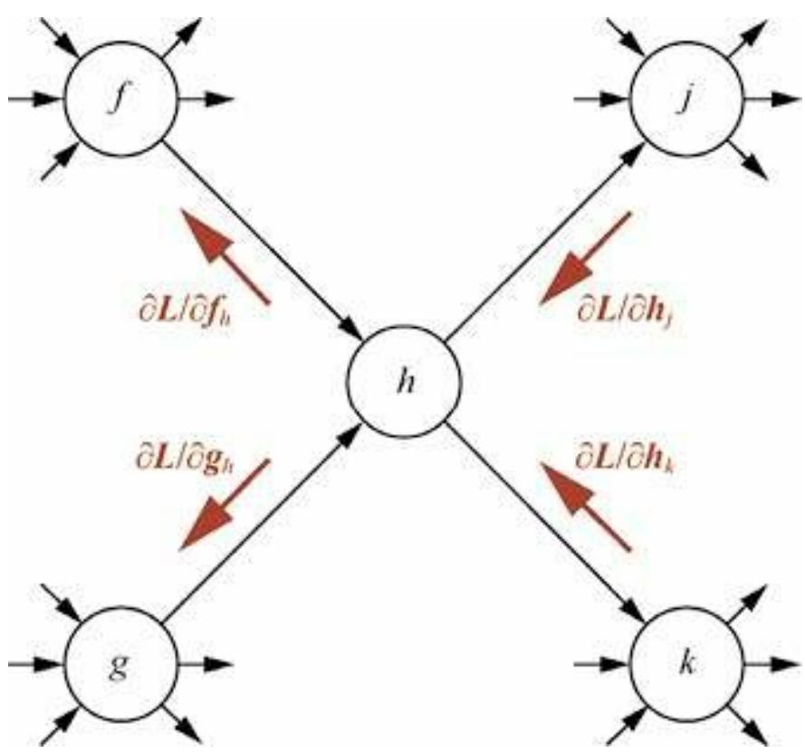  
图21-6 任意计算图中梯度信息反向传播的图示。网络输出的前向计算从左到右进行，梯度的反向传播从右到左进行

反向传播过程将消息沿着网络中的每个连接传回。在每个节点上，传入的消息将被收集起来，并在计算后将新消息传递给下一层。如图21-6所示，这些消息均为损失函数 $L$ 的偏导数。例如，后向消息 息 为损失函数 L 关于 j 的第一个输入（即从 h 到 j 的前向消息）的偏导数。现在，节点 $L$ $j$ $j$ h 通过节点 $j$ 和节点 $k$ 对损失函数 $L$ 产生影响，因此我们有

$$
\partial L / \partial h = \partial L / \partial h _ {j} + \partial L / \partial h _ {k} \tag {21-11}
$$

利用式（21-11），节点h 可以收集来自节点 $j$ 和节点 $k$ 的传入消息并计算损失函数 $L$ 关于 $h$ 的导数。现在，为计算传出消息 与 ，我们需要用到

$$
\frac {\partial L}{\partial f _ {h}} = \frac {\partial L}{\partial h} \frac {\partial h}{\partial f _ {h}} \text {和} \frac {\partial L}{\partial g _ {h}} = \frac {\partial L}{\partial h} \frac {\partial h}{\partial g _ {h}} \tag {21-12}
$$

在式（21-12）中， $a = 1 0$ 已通过式（21-11）计算得到，且 与 恰好分别是h 关于第一个与第二个参数的导数。举例来说，如果 $h$ 是一个乘法节点（即 ），那么将有 与 。深度学习的软件包通常都带有节点类型（加法、乘法、sigmoid等）的库，对于每个类型的节点，软件都知道如何根据式（21-12）的要求计算自己的导数。

反向传播的过程从输出节点出发，其中每个初始消息 是根据预测值 和训练数据中的真实值y直接从 $L$ 的表达式计算得到的。在每个内部节点，传入的后向消息将根据式（21-11）进行求和，传出消息将根据式（21-12）得到。在该计算图中的每个代表权重w的节点处，该过程都将终止（例如，图21-3b中的淡紫色椭圆）。此时，关于w的传入消息的总和即为 ——恰好是我们更新 w所需的梯度。习题21.BPRE要求将此过程应用于图21-3中的简单网络，以重新推导式（21-4）和式（21-5）中的梯度表达式。

卷积网络（21.3节）和循环网络（21.6节）中所使用的权重共享通过将每个共享权重的节点视为计算图中具有多重输出的单个节点来实现。在反向传播过程中，这将导致有多重的传入梯度消息。根据式（21-11），这意味着关于被共享的权重的梯度是网络中相关联的每个位置的梯度贡献的总和。

从对反向传播过程的描述中，我们可以清楚地看出，它的计算代价与计算图中的节点数呈线性关系，这与前向计算的代价是一样的。此外，由于网络在完成设计之后，节点的类型通常已经固定，因此所有的梯度计算都可以预先以符号形式准备好，并针对图中的每个节点编译成高效的代码。注意，图21-6中的消息不必是标量，它们可以是向量、矩阵或更高维的张量，这样梯度计算就可以被安排到GPU或TPU上，以利用其并行计算能力。

反向传播的一个缺点是，它需要存储正向传播期间所计算的大部分中间值，以便计算反向传播中的梯度。这意味着训练网络的总内存开销与整个网络中的单元数成正比。因此，尽管网络本身可以仅用具有大量循环的代码隐式地表示，而不需要根据数据的结构显式地表示，但反向传播的代码仍要求显式地存储所有的中间结果。

# 21.4.2 批量归一化

批量归一化 （batch normalization）是一种常用的技巧，它通过对每个小批量样例在网络内部层生成的值进行重新缩放来提高SGD的收敛速度。尽管在撰写本书时，人们对它能发挥有效作用的原因还没有清晰的理解，但鉴于它在实践中带来了巨大的优势，我们将对它的讨论囊括在本书中。在某种程度上，批量归一化的效果似乎与残差网络的效果相似。

考虑网络中的某个节点 z ，节点 z 关于其中 m 个样例的输出值为 z 1,…, z m。批量归一化将每一个z i替换为一个新的值 ：

$$
\hat {z} _ {i} = \gamma \frac {z _ {i} - \mu}{\sqrt {\varepsilon + \sigma^ {2}}} + \beta
$$

其中 $\pmb { \mu }$ 是小批量中的z的均值， 是 的标准差， 是一个用于防止除法中分母为零的较小的常数， 以及 是可学习的参数。

批量归一化根据 $\pmb { \rho }$ 和 值，对中间量的均值和方差进行归一化。这使得训练一个深层网络变得简单得多。如果某一层的权重非常小，并且该层的标准差减小至接近0，那么如果没有批量归一化，该层的信息就会丢失。批量归一化可以防止这种情况的发生，也使得人们不必对网络中所有权重进行仔细地初始化，就可以确保每一层中的节点处于使得信息能够顺利传播的合适范围。

为了引入批量归一化，我们通常在网络参数中引入参数 $\beta$ 与 ，它们可以关于每个节点是特定的，或者关于层是特定的，如此一来它们也将被包括在学习过程中。在训练完成后， 与 将被固定为它们所学习到的值。

# 21.5 泛化

到目前为止，我们已经描述了如何利用神经网络拟合某个训练集，但是在机器学习中，我们的目标是将模型推广到以前没有见过的新数据上，这一能力可以通过模型在测试集上的性能进行度量。在本节中，我们将重点介绍3种提高泛化性能的方法：选择正确的网络架构、对较大的权重进行惩罚以及在训练过程中对通过网络的值进行随机扰动。

# 21.5.1 选择正确的网络架构

在深度学习的研究中，有大量工作的内容是寻找一个泛化能力强的网络架构。事实上，对于每种特定类型的数据（图像、语音、文本、视频等），搜索不同的网络架构，以及改变层数、连通性、每层中节点的类型等方法已经使得网络在这些数据上的表现取得了巨大的进步。[1]

[1]注意，这类渐进的、探索性的工作大部分是由研究生完成，因此一些人也将该过程称为研究生下降 （graduate student descent，GSD）。

些神经网络架构被显式设计成对特定类型数据具有较好的泛化性能：卷积网络所编码的思想为，相同的特征提取器在空间网格中的所有位置都适用；而循环网络所编码的思想为，相同的更新规则在时序数据流中的所有位置都适用。在这些假设成立的前提下，我们预期卷积架构在图像问题上有更好的泛化性能，循环网络在处理文本和音频信号时有更好的泛化性能。

深度学习领域中最重要的经验性研究结果之一是，当两个网络的权重数量接近时，更深的网络通常具有更好的泛化性能。图21-7在一个简单的实际应用——门牌识别中验证了这个效应。结果表明，对于任意的固定数量的参数，11层网络的测试集误差总是比3层网络的测试集误差小得多。

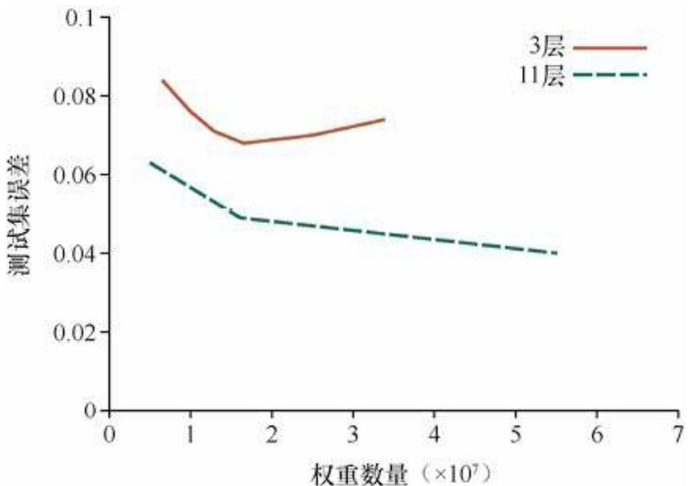  
图21-7 3层和11层卷积网络的测试集误差与层的宽度（权重的总数）的关系。图中使用的数据来源于早期版本的谷歌系统，该系统用于把街景车所拍摄的照片中的地址进行转录（Goodfellow et al. ,2014）

深度学习系统在某些任务上表现良好，但并非对所有任务都如此。对于具有高维输入的图像、视频、语音信号等任务，它们的性能优于任何其他纯粹的机器学习方法。第19章中描述的大多数算法所能处理的高维输入仅限于特征通过人工设计的预处理方法降低维数的情况。这种预处理方法在2010年之前盛行，但它的表现与深度学习系统的表现没有可比性。

显然，深度学习模型捕捉到了关于这些任务的一些重要信息。特别地，深度学习方法的成功意味着

这些任务可以通过步数相对较少（10～10 3 步，而不是10 $^ { \dag }$ 步）的并行程序来解决。这也许并不奇怪，因为这些任务对大脑来说通常可以在不到1秒的时间内完成，1秒对于几十次连续的神经元放电活动是足够的。此外，通过观察深度卷积网络在视觉任务中所学习到的中间层表示，我们发现网络处理图像的过程可以视为提取场景中的一系列越来越抽象的表示的过程，这一过程从细小的边、点以及角的特征开始，到整个对象和多个对象的排列结束。

另外，因为深度学习模型是简单的电路，它们缺乏我们在一阶逻辑（第8章）和上下文无关语法（第23章）中看到的组合与量化表达能力。

虽然深度学习模型在很多情况下都有很好的泛化能力，但也可能产生某些不直观的错误。它们倾向于产生不连续的输入-输出映射，因此对输入的一个小幅度扰动可能导致输出产生一个较大的扰动。例如，仅改变某个“狗”的图像中的几个像素，就使网络将该“狗”分类为鸵鸟或校车是可能的，尽管改变后的图像看起来仍很像一只狗。这种改变后得到的图像被称为 对抗样例 （adversarialexample）。

在低维空间寻找对抗样例较为困难。但是对于具有百万像素值的图像，通常情况下，即使大部分像素有助于将图像分类在空间中属于“狗”的区域，仍有一些维度的像素值的位置接近于“狗”与另一个类别的分类边界。一个有能力对网络进行反向工程的对抗机制可以找到使图像越过分类边界的最小向量。

对抗样例的首次发现引出了两个广阔的研究方向：一个是寻找不易受到对抗性攻击的学习算法和网络架构，另一个是对各种学习系统进行更有效的对抗性攻击。到目前为止，攻击者似乎占据优势。事实上，虽然我们最初假设人们需要访问经过训练的网络的内部，以便专门为该网络构造一个对抗样例，但事实证明，人们可以构造出具有 健壮性的对抗样例，它能误导拥有不同的架构、超参数以及训练过程的网络。这些现象表明，深度学习模型识别物体的方式与人类视觉系统的工作方式截然不同。

# 21.5.2 神经架构搜索

遗憾的是，我们还没有一套明确的指导方针来帮助你为特定问题选择最佳的网络架构。成功部署深度学习解决方案需要经验和良好的判断力。

从最早期的神经网络研究开始，人们就尝试将架构选择的过程自动化。我们可以将其视为超参数优化（19.4.4节），其中超参数决定网络的深度、宽度、连接性和其他特征。然而，要做的选择太多了，像网格搜索这样的简单方法不能在合理的时间内考虑所有的可能性。

因此，我们通常使用神经架构搜索 （neuralarchitecturesearch）来探索可能的网络架构的状态空间。本书前面介绍的许多搜索技术和学习技术也已经应用于神经架构搜索。

进化算法一直以来较为盛行，这是因为它既可以对网络进行重组（将两个网络的一部分连接在一起），也可以进行变异（添加或移除一层或更改一个参数值）。爬山算法也可以与变异操作一起使用。一些研究者将这个问题归为强化学习问题，一些研究者将其归结为贝叶斯优化问题。另一种可能的做法是将架构的概率视为连续可微空间，并使用梯度下降来寻找局部最优解。

对于所有这些搜索方法，一个主要的困难是估计候选网络的价值。评估架构的一种直接的方法是在多批量的测试集上对其进行训练，并在验证集上评估其准确性。但对于大型网络，这一过程可能需要在GPU上运行很多天。

因此，有许多方法试图通过去除或至少减少昂贵的训练过程来加速该评估过程。我们可以在更小的数据集上训练。我们也可以针对少量批次进行训练，并预测随着更多批次训练，网络表现将如何改进。我们可以使用简化版的网络架构，同时希望保留完整网络的性质。我们还可以训练一个大的网络，然后搜索网络中性能更好的子图，这种搜索可以很快进行，因为子图将共享参数，且不必重新训练。

另一种方法是学习一个启发式评价函数（就像我们在A * 搜索中所做的那样）。也就是说，从选择几百种网络架构开始，并对它们进行训练和评估。这给了我们一组（网络，分数）数据对。然后我们将学习从网络特征到预测分数的映射。这时，我们可以生成大量的候选网络，并快速估计它们的价值。在搜索完整个网络空间之后，我们可以用完整的训练过程对最佳网络进行全面的评估。

在19.4.3节中，我们看到 正则化 （限制模型的复杂性）有助于泛化，它在深度学习模型中也能发挥作用。在神经网络领域中，我们通常称这种方法为 权重衰减 （weight decay）。

权重衰减的方式包括对用于训练神经网络的损失函数添加惩罚项 $\lambda \sum _ { i , j } \overline { N } _ { i , j } ^ { 2 }$ ，其中， $\lambda$ 是控制惩罚强度的超参数，求和是对网络中的所有权重进行的。使用 $\lambda = 0$ 相当于不采用权重衰减，而使用更大的 意味着鼓励权重减小。通常使用的权重衰减系数 $\lambda$ 接近 $1 0 ^ { - 4 }$ 。

选择一个特定的网络架构可以看作对假设空间的一个绝对约束：一个函数要么在该架构中是可表示的，要么不是。损失函数惩罚项（如权重衰减）提供了一个更宽松的约束：用较大权重表示的函数也属于函数族，但训练集必须提供更多倾向于选择这些函数而不是选择小权重函数的证据。

要解释神经网络中权重衰减的作用并不容易。在采用sigmoid作为激活函数的网络中，我们通常假设权重衰减有助于使激活保持在sigmoid的线性部分附近，从而避免参数陷入可能导致梯度消失的平坦区域。对于ReLU激活函数，权重衰减似乎也是有帮助的，但是权重衰减在sigmoid情境下有意义的解释似乎不再适用该场景，因为ReLU的输出要么是线性的，要么是零。此外，对于残差连接，权重衰减鼓励网络在相邻层之间具有较小的差异，而不是较小的权重绝对值。尽管在许多架构中，权重衰减的表现存在差异，但权重衰减仍然应用广泛且十分有效。

对权重衰减的有利作用的一种解释是，它实现了一种最大后验（MAP）学习（见20.1节）。令 X和y为代表整个训练集的输入和输出，最大后验假设h 满足

$$
\begin{array}{l} h _ {\mathrm {M A P}} = \underset {w} {\operatorname {a r g m a x}} P (y \mid X, W) P (W) \\ = \underset {w} {\operatorname {a r g m i n}} \left[ - \log P (y \mid X, W) - \log P (W) \right] \\ \end{array}
$$

其中第一项是一般的交叉熵损失；第二项倾向于选择先验分布下可能性较高的权重。如果我们令

$$
\log P (\boldsymbol {W}) = - \lambda \sum_ {i, j} W _ {i, j} ^ {2}
$$

这意味着P(W)是一个零均值高斯先验。

# 21.5.4 暂退法

另一种通过干预网络以减少测试集误差的方法是 暂退法 （dropout），其代价是使得网络更难拟合训练集。在训练的每一步中，暂退法都会随机选择单元的子集并令其停用，从而创建一个新网络，并在新网络中应用一步反向传播学习。这是训练一个大规模集成网络的粗略和低成本的近似方法（见19.8节）。

更具体地说，假设我们所使用的是批量大小为 m 的随机梯度下降。对于每个批量，暂退算法将以下过程应用于网络的每个节点：每个单元的输出以概率 p乘以因子1/p ；否则，该单元的输出将固定为零。暂退法通常应用于隐藏层，且采用p =0.5；对于输入单元，通常 p =0.8效果最好。这个过程将产生一个单元数量接近原网络一半的简化网络，并应用批量大小为m 的训练样例在该网络上进行反向传播。该过程将以这样的方式不断进行，直到训练完成。在测试阶段，模型将不采用暂退法。

我们可以从以下几个角度看待暂退法。

●通过在训练时引入噪声，这将迫使模型对噪声具有健壮性。  
●如上所述，暂退法近似了精简网络的大规模集成。对于线性模型，这一说法可以被严格解析验证，而对于深度学习模型，这一说法在实验上是成立的。

●通过暂退法训练得到的隐藏单元必须学会成为有用的隐藏单元；它们还必须学会与众多其他可能的隐藏单元集合相兼容，这些隐藏单元集合可能包含在完整模型中，也可能不包含在完整模型中。这类似于自然选择对基因进化的指导过程：每个基因不仅本身能发挥有效功能，而且必须与其他基因协同工作，这些基因在未来生物体中的作用可能会有很大差异。

●暂退法应用于深度网络靠后的层中，这迫使模型做出的最终决策更加健壮，这是因为网络将更加关注样例所有的抽象特征，而不是只关注其中一个而忽略其他特征。例如，用于分辨动物图像的分类器可能仅通过观察动物的鼻子就能够在训练集上获得高性能，但是在鼻子被遮挡或损坏的测试样本上，该分类器可能会失效。在使用了暂退法的情况下，会出现内层中代表“鼻子”的单元全部被置为零的训练情况，这会迫使学习过程找到另外的识别特征。注意，试图通过向输入数据添加噪声来实现相同程度的健壮性将是困难的：没有简单的方法可以提前知道网络将关注“鼻子”，也没有简单的方法可以自动地从每个图像中删除“鼻子”。

总的来说，暂退法迫使模型为每一个输入学习多个健壮的解释。这使得模型具有很好的泛化能力，但也使其更难拟合训练集，因此通常需要使用更大的模型并对其进行更多次的迭代训练。

# 21.6 循环神经网络

循环神经网络（recurrentneuralnetwork，RNN）不同于前馈网络，因为它允许计算图中存在环。在我们接下来将考虑的所有情况中，每个环都将有一个延迟，使得单元可以把在较早的时间步中所得的输出作为输入。（在没有延迟的情况下，循环电路可能会达到不一致的状态。）这使得RNN具有内部状态或记忆 （memory）：在较早时间步中接收的输入会影响RNN对当前输入的响应。

RNN也可用于执行更一般的计算（毕竟，普通的计算机就是具有记忆的布尔电路），并用于对真实的神经系统建模，其中许多系统都包含循环连接。在这里，我们将着重讨论如何使用RNN来分析时序数据，其中我们假设在每个时间步，有一个新的输入向量 x t到达。

作为分析时序数据的工具，RNN可以与第14章中介绍的隐马尔可夫模型、动态贝叶斯网络和卡尔曼滤波器进行比较（在继续阅读本章内容之前，回顾这一章的内容可能对读者很有帮助）。与这些模型一样，RNN中也存在 马尔可夫假设 （见14.1节）：网络的隐藏状态z 足以捕获所有先前输入的信息。此外，我们假设可以利用函数 来描述RNN对隐藏状态的更新过程，其中fw为某个参数化的函数。一旦经过训练，这个函数将表示一个关于时间齐次的过程（14.1节）实际上是一个普适的量化表述，由fw表示的动态过程将适用于所有时间步。因此，与前馈网络相比，RNN有了更强的表达能力，正如卷积网络一样，也正如动态贝叶斯网络比常规的贝叶斯网络有了更强的表达能力。事实上，如果你试图使用前馈网络来分析时序数据，那么输入层的固定大小将迫使网络仅收集到有限长度的窗口的数据，在这种情况下，网络将无法检测到数据中的长距离依赖关系。

# 21.6.1 训练基本的循环神经网络

我们将考虑一个基本的RNN模型，它有一个输入层x 、一个具有循环连接的隐藏层z和一个输出层y ，如图21-8a所示。假设在每个时间步中，我们都观测到训练数据 x 和 y 。以下等式定义的模型给出了时间步 t 的变量值：

$$
\begin{array}{l} z _ {t} = f _ {w} \left(z _ {t - 1}, x _ {t}\right) = g _ {x} \left(W _ {x, x} z _ {t - 1} + W _ {x, x} x _ {t}\right) \equiv g _ {x} \left(i n _ {x, t}\right) \\ \hat {y} _ {t} = g _ {y} \left(W _ {z, y} z _ {t}\right) \equiv g _ {y} \left(i n _ {y, t}\right) \tag {21-13} \\ \end{array}
$$

其中 $\pmb { g } _ { z }$ 和 $\pmb { { \mathscr { g } } } _ { y }$ 分别表示隐藏层和输出层的激活函数。一般地，我们假设每个单元有一个固定为 $+ 1$ 的额外的虚拟输入，以及一个与该输入相关联的权重。

给定一系列输入向量 $\pmb { x } _ { 1 } , . . . , \pmb { x } _ { T }$ ，以及观测到的输出 $y _ { 1 } , . . . , y _ { T }$ , 我们可以通过对网络进行 $T$ 步“展开”来将模型转换为前馈网络，如图21-8b所示。注意，权重矩阵 $\boldsymbol { W } _ { x , z }$ 、 $\boldsymbol { W } _ { z }$ , z 和 W z , y 在所有的时间步中是共享的。容易看出，在展开的网络中，我们可以用一般的方法计算梯度来训练权重；唯一的区别是，层与层之间权重共享使得梯度计算稍微复杂一些。

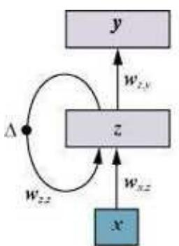

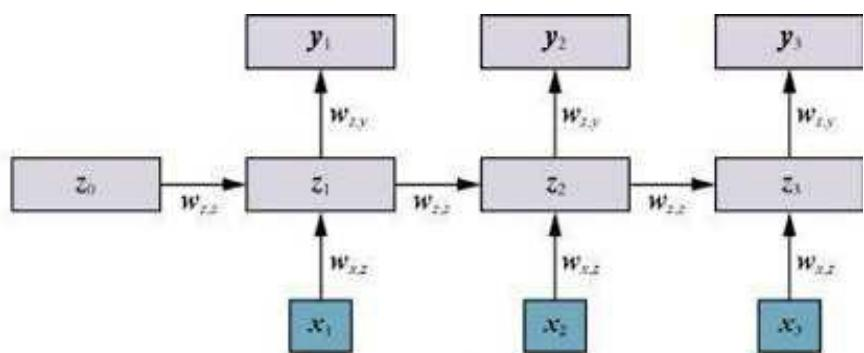  
  
图21-8 （a）基本的RNN模型的示意图，其中隐藏层z具有循环连接，符号 $\pmb { \Delta }$ 表示延迟。（b）同一网络在3个时间步上展开以创建前馈网络。注意，权重在所有时间步中是共享的

为了使计算式简洁，我们将给出一个只有一个输入单元、一个隐藏单元和一个输出单元的RNN的梯度计算。在这种情况下，我们显式地写出偏差项，则有 $z _ { t } = g _ { z } ( w _ { z , z } z _ { t - 1 } + w _ { x , z } x _ { t } + w _ { 0 , z } )$ 与。如式（21-4）和式（21-5）所示，我们将假设损失函数为平方误差 $\hat { y } _ { \mathrm { t } } = g _ { y } ( w _ { { \bf r } , y } z _ { \mathrm { t } } + w _ { 0 , y } )$ 损失 $L$ ——如此一来，我们只需对各个时间步求和。输入层和输出层权重 $w _ { x }$ , z 和 w z , y 的推导与式（21-4）基本相同，我们将其留作习题。对于隐藏层权重 $w _ { z , z }$ ，其前几个步骤也与式（21-4）的推导模式相同：

$$
\begin{array}{l} \frac {\partial L}{\partial w _ {z , s}} = \frac {\partial}{\partial w _ {z , z}} \sum_ {t = 1} ^ {T} \left(y _ {t} - \hat {y} _ {t}\right) ^ {2} = \sum_ {t = 1} ^ {T} - 2 \left(y _ {t} - \hat {y} _ {t}\right) \frac {\partial \hat {y} _ {t}}{\partial w _ {z , s}} \\ = \sum_ {t = 1} ^ {T} - 2 \left(y _ {t} - \hat {y} _ {t}\right) \frac {\partial}{\partial w _ {x , x}} g _ {y} \left(i n _ {y, t}\right) = \sum_ {t = 1} ^ {T} - 2 \left(y _ {t} - \hat {y} _ {t}\right) g _ {y} ^ {\prime} \left(i n _ {y, t}\right) \frac {\partial}{\partial w _ {x , x}} i n _ {y, t} \\ = \sum_ {t = 1} ^ {T} - 2 \left(y _ {t} - \hat {y} _ {t}\right) g _ {y} ^ {\prime} \left(i n _ {y, t}\right) \frac {\partial}{\partial w _ {x , z}} \left(w _ {z, y} z _ {t} + w _ {0, y}\right) \\ = \sum_ {t = 1} ^ {T} - 2 \left(y _ {t} - \hat {y} _ {t}\right) g _ {y} ^ {\prime} \left(i n _ {y, t}\right) w _ {x, y} \frac {\partial z _ {t}}{\partial w _ {z , z}} \\ \end{array}
$$

（21-14）

隐藏单元 $\textbf { \em z } _ { t }$ 的梯度可以从之前的时间步中获得，具体过程如下：

$$
\begin{array}{l} \frac {\partial z _ {t}}{\partial w _ {z , s}} = \frac {\partial}{\partial w _ {x , s}} g _ {z} \left(i n _ {z, t}\right) = g _ {z} ^ {\prime} \left(i n _ {z, t}\right) \frac {\partial}{\partial w _ {x , s}} i n _ {z, t} = g _ {z} ^ {\prime} \left(i n _ {z, t}\right) \frac {\partial}{\partial w _ {z , s}} \left(w _ {z, z} z _ {t - 1} + w _ {x, z} x _ {t} + w _ {0, z}\right) \\ = g _ {z} ^ {\prime} \left(i n _ {z, t}\right) \left(z _ {t - 1} + w _ {z, x} \frac {\partial z _ {t - 1}}{\partial w _ {z , z}}\right) \\ \end{array}
$$

（21-15）

其中，最后一行运用了乘法的求导法则： 。

通过观察式（21-15），我们可以注意到两点。第一，梯度的表达式是循环的：计算时间步t对梯度的贡献要用到时间步t– 1的贡献。如果我们以正确的方式对计算进行排序，那么梯度计算的总运行时间将与网络的大小呈线性关系。这种算法被称为 基于时间的反向传播 （back-propagationthrough time，BPTT），它通常由深度学习软件系统自动处理。第二，如果我们对该循环计算进行

迭代，可以注意到时间步T的梯度将包括与 $w _ { { \boldsymbol { z } } , { \boldsymbol { z } } } \prod _ { i = 1 } ^ { T } g _ { z } ^ { \prime } \left( i n _ { z , s } \right)$ 成正比的项。对于sigmoid、tanh和ReLU激活函数，它们有导数 ，因此，如果 $w _ { z , z } < 1$ ，简单RNN必然会面临梯度消失的问题（见21.2节）。另外，如果 $w _ { z , z } > 1$ ，我们可能会面临 梯度爆炸 （explodinggradient）的问题。（一般来说，这些结果取决于权重矩阵 $\boldsymbol { W } _ { z , z }$ 的第一特征值。）在21.6.2节中，我们将介绍一个更复杂的RNN设计，该设计旨在缓解这个问题。

# 21.6.2 长短期记忆RNN

为了使信息能够在多个时间步中被保存，人们设计了一些特殊的RNN架构。其中最常见的是长短期记忆 （long short-term memory，LSTM）。LSTM的长期记忆成分，称为 记忆单元 （memorycell），用字母c表示，基本上从一个时间步被复制到另一个时间步。［相比之下，基本的RNN在每个时间步将其记忆乘以权重矩阵，如式（21-13）所示。］新信息以直接加入记忆的方式进行更新，这样一来，梯度表达式将不会随着时间的推移进行乘法累积。LSTM还使用了 门单元 （gating

unit），它是控制LSTM中信息流的一个向量，通过控制相应信息向量的逐个元素相乘来实现。

●遗忘门 f决定了记忆单元中的每个元素是被记住了（将复制到下一个时间步）还是被遗忘了（重置为0）。  
●输入门 i决定了记忆单元中的每个元素是否被来自当前时间步的输入向量的新信息进行加法更新。  
●输出门 o 决定了记忆单元中的每个元素是否被转移到短期记忆z，它在基本的RNN中起着与隐藏状态类似的作用。

尽管在电路设计中，“门”一词通常意味着某个布尔函数，但LSTM中的门是宽泛的。例如，如果遗忘门向量的相应元素很小但不为零，则记忆单元向量的元素将被部分遗忘。门单元的值始终在[0,1]范围内，并且它是当前输入和先前隐藏状态经过sigmoid函数而获得的输出。具体来说，LSTM的更新公式如下：

$$
\begin{array}{l} \boldsymbol {f} _ {t} = \sigma \left(\boldsymbol {W} _ {x, f} \boldsymbol {x} _ {t} + \boldsymbol {W} _ {z, f} z _ {t - 1}\right) \\ \boldsymbol {i} _ {t} = \sigma \left(\boldsymbol {W} _ {x, i} \boldsymbol {x} _ {t} + \boldsymbol {W} _ {z, i} z _ {t - 1}\right) \\ \boldsymbol {o} _ {t} = \sigma \left(\boldsymbol {W} _ {x, o} \boldsymbol {x} _ {t} + \boldsymbol {W} _ {z, o} \boldsymbol {z} _ {t - 1}\right) \\ \boldsymbol {c} _ {t} = \boldsymbol {c} _ {t - 1} \odot \boldsymbol {f} _ {t} + \boldsymbol {i} _ {t} \odot \tanh  \left(\boldsymbol {W} _ {x, c} \boldsymbol {x} _ {t} + \boldsymbol {W} _ {z, c} \boldsymbol {z} _ {t - 1}\right) \\ z _ {t} = \tanh  (c _ {t}) \odot o _ {t} \\ \end{array}
$$

其中，各个权重矩阵 W的下标表示相应连接的起点和终点，⊙符号表示逐个元素相乘。

LSTM是RNN最早的实用形式之一。它们在包括语音识别和手写识别在内的各种任务中都表现出了极好的性能。第24章将介绍它们在自然语言处理中的应用。

# 21.7 无监督学习与迁移学习

到目前为止，我们所讨论的深度学习系统都是基于监督学习的，它要求每个训练样例都带有一个目标函数值。尽管这样的系统可以达到很高的测试集精度（ImageNet等竞赛结果已经证实），但相比人类来说，它们在处理同一个任务时通常需要更多带标签的数据。例如，一个孩子要做到在各种各样的环境和视野中稳定地识别出长颈鹿，他只需观察一张长颈鹿的图片，而不用观察几千张。显然，我们在深度学习中忽略了某些东西。实际上可能确实如此，在目前的监督深度学习方法下，一些任务是完全无法实现的，因为这些方法对带标签数据的需求远远超过人类（甚至宇宙）所能提供的范围。此外，即便在任务可行的情况下，标记大型数据集通常也需要花费稀缺而昂贵的人力。

基于这些原因，人们对一些能够减少对带标签数据的依赖的学习模式产生了浓厚的兴趣。正如我们在第19章中看到的，这些模式包括无监督学习 、迁移学习 和半监督学习 。无监督学习算法仅从无标签的输入x中进行学习，这些输入通常比有标签的样例更为丰富。无监督学习算法通常会产生一个生成模型，它可以生成真实的文本、图像、音频或视频，而不是简单地预测这些数据的标签。迁移学习算法需要一些有标签的样例，但通过研究不同任务中的有标签样例，迁移学习可以进一步提高算法的性能，从而可以利用更多的现有数据源。半监督学习算法同样需要一些有标签的样例，但它能通过研究无标签的样例进一步提高算法的性能。本节将介绍无监督学习和迁移学习的深度学习方法。尽管半监督学习也是深度学习社区中一个活跃的研究领域，但迄今为止，人们设计出的半监督学习方法尚未在实践中被广泛证明是有效的，因此我们不讨论它们。

# 21.7.1 无监督学习

监督学习算法的目标基本相同：给定一个输入x的训练集和相应的输出 y=f(x )，学习一个能够很好地近似 $f$ 的函数h。与之相反的，无监督学习算法将使用一组无标签样例 x的训练集。在本节中，我们将介绍这种算法可能尝试做的两件事。第一是学习新的表示法，例如图像的新特征，这将使得识别图像中的对象更容易。第二是学习一个生成模型，该模型通常采用概率分布的形式，并且可以从中生成新的样本。（第20章介绍的贝叶斯网络的学习算法属于这一类。）许多算法同时具有表示学习和生成建模的能力。

假设我们要学习一个联合分布 ，其中 z 是一组隐变量，即以某种方式表达数据 x 内容的未观测变量。出于本章的连贯性考虑，我们没有预先定义z变量的具体含义，无论它们如何选取，模型都可以自由地学习z与x之间的联系。例如，在手写数字图像上训练的模型可能会选择使用 z空间中的一个方向来表示笔划的粗细，一个方向表示墨水的颜色，另一个方向表示背景颜色，等等。对于人脸图像，学习算法可能会选择一个方向来表示性别，另一个方向来捕捉是否戴眼镜，如图21-9所示。

一个学习到的概率模型 将能同时实现表示学习（它从原始的 x 向量中构造出有意义的 z $\pmb { x }$ 向量）与生成模型：如果对 中的 $\mathbf { z }$ 变量进行积分，将得到 $P _ { \cal { W } } ( { \pmb x } )$ 。

  
图21-9 生成模型如何使用 z空间中的不同方向来表示人脸不同方面的信息。实际上我们可以在z空间中进行运算。这里的图像都是从学习到的模型中生成的，并且图像解释了当我们解码z空间中的不同点时会发生什么。我们从“戴眼镜的男人”这个对象的坐标出发，减去“男人”的坐标，再加

上“女人”的坐标，得到“戴眼镜的女人”的坐标。图像经许可摘自（Radford et al. , 2015）

1.概率主成分分析：一个简单的生成模型

$P _ { \cal { W } } ( { \pmb x } , { \pmb z } )$ 有许多可能的形式。 概率主成分分析 （probabilistic principal components analysis，PPCA）模型是最简单的模型之一。 [1] 在一个PPCA模型中， z 取自一个零均值的球形高斯分布， x通过 $\mathbf { z }$ 乘以权重矩阵W并添加球形高斯噪声来生成：

[1]标准主成分分析是将一个多元高斯函数拟合到原始输入数据中，然后选择最长轴作为椭球分布的主成分。

$$
P (z) = \mathcal {N} (z; \boldsymbol {0}, I)
$$

$$
P _ {W} (x \mid z) = \mathcal {N} (x; W z, \sigma^ {2} I)
$$

权重 W （以及可选的噪声参数 $\pmb { \sigma } ^ { 2 }$ ）可以通过最大化数据的似然学习得到，具体描述如下：

$$
P _ {W} (x) = \int P _ {W} (x, z) d z = N (x; 0, W W ^ {\top} + \sigma^ {2} I) \tag {21-16}
$$

关于W的最大化问题可以通过梯度方法或者高效的EM迭代算法（见20.3节）进行求解。在我们学习得到W后，新的数据样本可以由式（21-16）所给出的 $P _ { \cal { W } } ( { \pmb x } )$ 直接生成。此外，若某个新观测数据 $x$ 在式（21-16）中有非常低的概率，它可以被标记为潜在的异常数据。

对于PPCA，我们通常假设 z 的维数远小于 $_ x$ 的维数，这样模型就可以尽可能地用少量的特征来解释数据。通过计算 $P _ { \mathbb { M } } ( z \vert x )$ 的期望值 ，这些特征可以被提取出来用于标准分类器。

从概率主成分分析模型中生成数据非常简单：首先从固定的高斯先验中采样z，然后从均值为Wz的高斯分布中采样x 。我们很快会看到，许多其他生成模型的做法都与这个过程类似，但是它们将采用由深度模型定义的复杂映射，而不是从z空间到x 空间的线性映射。

2.自编码器

许多无监督深度学习算法的思想都基于自编码器 （autoencoder，AE）。自编码器是一个由两部分组成的模型：一个从 $\pmb { x }$ 映射到表示 的编码器和一个从表示 映射到观测数据 $\pmb { x }$ 的解码器。一般来说，编码器是一个参数化函数 $f$ ，解码器是一个参数化函数 $g$ 。我们通过对模型进行训练，使得$x \approx g ( f ( x ) )$ ，使得编码过程大致为解码过程的逆过程。函数 $f$ 和 $g$ 可以是由单个矩阵参数化的简单线性模型，也可以是一个深度神经网络。

一个非常简单的编码器是线性编码器，其中 $f$ 和 $g$ 均为线性函数且共享一个权重矩阵W：

$$
\hat {z} = f (\boldsymbol {x}) = W \boldsymbol {x}
$$

$$
\boldsymbol {x} = \boldsymbol {g} (\hat {\boldsymbol {z}}) = \boldsymbol {W} ^ {\top} \hat {\boldsymbol {z}}
$$

训练该模型的一种方法是通过最小化平方误差 使得 。其中的思想是通过训练W，使得一个低维的 将保留尽可能多的信息以重建高维数据 x 。这种线性自编码器与经典的主成分分析（PCA）密切相关。当z的维度为m 时，矩阵 W应学习到由数据的m 个主成分张成的矩阵（换句话说，即数据中具有最大方差的 m 个正交方向的集合，或者等价地说，是数据协方差矩阵特征值最大的m 个特征向量），这与PCA的做法完全相同。

PCA模型是一个简单的生成模型，它对应于一个简单的线性自编码器。这种对应关系表明，我们可能可以通过更复杂的自编码器来获得更复杂的生成模型。变分自编码器 （variationalautoencoder，VAE）为这个思想提供了一种方法。

我们曾在13.5节中简要介绍过变分法，它是一种在复杂概率模型中近似后验分布的方法，在这些模型中对大量隐变量进行求和或积分是非常困难的。变分法的思想是使用一个 变分后验 （variationalposterior） Q ( z )作为真实后验分布的近似值，它来自某个在计算上易处理的分布族。例如，我们可以从具有对角协方差矩阵的高斯分布族中选择 Q 。在所选择的易处理的分布族中， Q 将按尽可能接近真实的后验分布 的方式进行优化。

在我们的目标里，“尽可能”的含义是由KL散度定义的，我们已经在21.2节中介绍过它。它由下式给出：

$$
D _ {\mathrm {K L}} (Q (z) \| P (z \mid x)) = \int Q (z) \log \frac {Q (z)}{P (z \mid x)} d z
$$

它是 Q 与 P 的对数比率（关于 Q ）的均值。容易证明 ，其中等号成立当且仅当 Q 与 $P$ 完全相同。我们可以进一步定义 变分下界 （variational lower bound） L ，有时也称证据下界（evidence lower bound，ELBO），它的定义基于数据的对数似然：

$$
\mathcal {L} (\boldsymbol {x}, \boldsymbol {Q}) = \log P (\boldsymbol {x}) - D _ {\mathrm {K L}} (\boldsymbol {Q} (\boldsymbol {z}) \| P (\boldsymbol {z} \mid \boldsymbol {x})) \tag {21-17}
$$

我们可以发现L是log $P$ 的一个下界，这是因为KL散度是非负的。变分学习的目标是最大化关于参数 $\pmb { w }$ 的 L （而不是最大化log P ( x )），同时希望得到的解 $\boldsymbol { w } ^ { * }$ 也能最大化log $P \left( \pmb { x } \right)$ 。

如前所述，最大化L似乎看起来并不比最大化log $P$ 容易。幸运的是，我们可以将式（21-17）重新写成下述的便于计算的形式：

$$
\begin{array}{l} \mathcal {L} = \log P (\boldsymbol {x}) - \int Q (z) \log \frac {Q (z)}{P (z | \boldsymbol {x})} d z \\ = \int Q (z) \log Q (z) d z + \int Q (z) \log P (x) P (z | x) d z \\ = H (Q) + E _ {z \sim Q} \log P (z, x) \\ \end{array}
$$

其中 $H ( Q )$ 为分布 Q 的熵。对于一些变分族 $Q$ （例如高斯分布）， $H ( Q )$ 可以通过分析精确地给出。此外，期望项 可以通过从分布 Q 采样 z 来进行高效的无偏估计。对于每个 $E _ { z - Q } \log P ( z , x )$ $\mathbf { z }$ 样本， $P \left( \pmb { z } , \pmb { x } \right)$ 通常可以有效地被估计。举例来说，假设 $P$ 是一个贝叶斯网络，那么 $P ( z , x )$ 将是一系列条件概率的乘积，因为 $\mathbf { z }$ 和 $_ x$ 包含所有的变量。

变分自编码器提供了一种在深度学习场景中使用变分学习的方法。变分学习涉及最大化 L关于P和 Q 的参数的过程。对于一个变分自编码器，解码器 $g$ ( z )可以解释为 $\log P ( x | z )$ 。例如，解码器的输出可以定义为条件高斯分布的平均值。类似的，编码器f(x)的输出被解释为 Q 的参数，例如， Q 可以是均值为 f ( x )的高斯分布。如此一来，训练变分自编码器则意味着优化编码器 $f$ 和解码器 $g$ 的参数以最大化L的过程，这两个函数本身可以是任意复杂的深度网络。

# 3.深度自回归模型

自回归模型 （autoregressive model，或AR model）意味着向量 x 的每个元素 x 是基于向量其他元素进行预测得到的。这种模型不含有隐变量。如果x 的大小是固定的，那么AR模型可以看作一个完全可观测且可能完全连通的贝叶斯网络。这意味着根据AR模型计算给定数据向量的似然将是很简单的。同样的，预测一个缺失变量的值（在给定所有其他变量情况下），以及从模型中采样一个数据向量也将十分方便。

自回归模型最常见的一个应用是时序数据分析，其中 k 阶的AR模型将根据 预测 x t。用第14章中的术语来说，AR模型是一个没有隐变量的马尔可夫模型。用第23章的术语来说，一

个字母或单词序列的 n 元语法模型是一个 n − 1阶AR模型。

在经典AR模型中，变量是实值的，条件分布 是一个具有固定方差的线性高斯模型，其均值是 的线性组合— 一个标准的线性回归模型。经典AR模型的最大似然解由 尤尔-沃克方程 （Yule-Walker equations）给出，该方程与19.6节中的 正规方程 密切相关。

深度自回归模型 （deep autoregressive model）是一种将线性高斯模型替换为具有适当输出层的任意深度网络的模型，其具体形式取决于 x 是离散的还是连续的。这种自回归方法有一些最新的应用，其中包括由DeepMind开发的用于语音生成的WaveNet模型（van den Oord et al. , 2016a）。

WaveNet利用原始声音信号进行训练，每秒采样16 000次，采用多层卷积结构实现4 800阶非线性AR模型。在实际测试过程中，它被证实比之前最先进的语音生成系统更加真实。

# 4. 生成对抗网络

生成对抗网络 （generative adversarial network，GAN）实际上是一对结合在一起形成生成系统的网络。其中一个称为 生成器 （generator）的网络将 z值映射到 x ，以从分布Pw(x )中生成样本。一个典型的做法是从一个中等维度的标准高斯中采样 z，然后令其通过一个深层网络h w得到 x 。另一个称为 判别器 （discriminator）的网络是一个经过训练的分类器，它用于判断输入的x 为真（从训练集中获取的）或假（由生成器生成的）。GAN是一种隐式模型 （implicitmodel），即样本可以被生成，但其概率不易获得，而在贝叶斯网络中，样本的概率是样本生成路径上条件概率的乘积。

生成器与变分自编码器框架下的解码器有密切的联系。隐式建模的难点在于需要设计一个损失函数，使得使用来自分布的样本来训练模型成为可能，而不是最大化源自数据集的训练样例的似然。

生成器和判别器的训练是同时进行的，生成器将学习如何欺骗判别器，而判别器将学习如何准确区分真假数据。生成器和判别器之间的竞争可以用博弈论的语言来描述（见第18章），其核心观点是，在博弈的均衡状态下，生成器应完美地复现出训练样本的分布，如此一来判别器就不可能表现得比随机猜测更好。GAN在图像生成任务中已经取得了很大成功。例如，GAN可以创造一幅关于某个不存在的人的十分逼真的、高分辨率的图像（Karrasetal., 2017）。

# 5. 无监督翻译

广义地说，翻译任务的内容是将具有丰富结构的输入 x 转换成同样具有丰富结构的输出y。这里的“丰富结构”意味着数据是多维的，并且在各个维度之间具有有趣的统计依赖性。图像和自然语言句子有丰富的结构，但单一的数字（如类别的标号）没有丰富的结构。将一个句子从英语翻译成法语或将一张夜景照片转换成一张白天拍摄的等效照片都是翻译任务的例子。

监督翻译的过程包括收集多个(x ,y)对，然后训练模型，使得模型将每个 x 映射到相应的y。例如，机器翻译系统通常使用由专业翻译人员翻译的成对句子进行训练。对于其他类型的翻译，监督学习的训练数据可能不适用。例如，考虑一张包含许多正在移动的汽车和行人的夜景照片。为了能在白天环境下重新拍摄一张相同的照片，我们需要找到在夜间照片中的所有汽车和行人，并将它们恢复到原来的位置，这基本上是不切实际的。为了克服这一困难，可以考虑采用 无监督翻译（unsupervisedtranslation）方法，这种方法能够对许多x 样例和许多单独的y样例进行训练而不依赖于相应的(x , y)对。

无监督翻译方法通常是基于GAN的，例如，我们可以训练一个GAN生成器，利用它生成在x 条件下真实的 y样例，同时训练另一个GAN生成器来执行逆向的映射。GAN的训练框架使得我们可以训练生成器来生成多个可能样本中的任意一个，这些多个样本被判别器判断为给定 x 后y为真的样例，因此我们不需要传统监督学习中所需要的特定的成对的 y。我们将在25.7.5节中给出关于图像的无监督翻译的更多细节。

# 21.7.2 迁移学习和多任务学习

在 迁移学习 （transfer learning）中，一个学习任务的经验有助于智能体更好地学习另一个任务。例如，一个已经学会打网球的人通常更容易学习相关的运动，如壁球和墙网球；已经学会驾驶一种商用客机的飞行员将很快学会驾驶另一种机型；学过代数的学生学习微积分会更容易。

我们目前还不了解人类的迁移学习的机制。对于神经网络，学习的过程即为调整权重，因此迁移学习最合理的方法是将任务A学习中所得到的权重复制到将用于任务B训练的网络。然后使用任务B的数据，通过一般的梯度下降等方式来更新权重。通常来说，在任务B中使用较小的学习率比较合适，具体数值取决于两个任务的相似程度以及任务A中使用了多少数据。

注意，这种方法在选择任务时需要人类的专业知识介入：例如，网络在学习代数的训练中所学习到的权重可能并不适用于学习壁球的网络。此外，复制权重的方法要求两个任务的输入空间存在一个简单的映射，且两个网络具有基本相同的架构。

迁移学习成为热门领域的一个原因是它使得我们可以利用其他的高质量的训练完成的模型。例如，你可以下载一个预先训练过的用于视觉对象识别的模型，例如，在COCO数据集上训练过的ResNet-50模型，这将省去你几周的工作量。在此基础上，你可以通过为特定任务提供其他图像及其对应标签来修改模型参数。

假设你现在想对独轮车进行分类。你只有几百张不同的独轮车图片，但是COCO数据集在自行车、摩托车和滑板等每一个类别中都有超过3000幅图像。这意味着一个在COCO上完成预训练的模型对车轮、道路以及其他相关特征已经有了一定经验，这将有助于辨识独轮车的图像。

通常来说，你可能希望冻结预训练模型的前几层，因为这些层起到了特征检测器的作用，它们可能对你的新模型有较大帮助。新数据集将只修改较高层的参数，这些层用于识别特定问题的特征并对其进行分类。然而，有时传感器之间存在的差异也会导致我们需要从最底层开始重新训练。

我们再看另外一个示例，对搭建自然语言系统的人来说，目前常用的做法是从一个预先训练好的模型，如Ro BERTa模型（见24.6节）出发，它已经“了解”了很多日常语言的词汇和语法，下一步是以两个方式对模型进行微调。第一，我们要举例说明所需领域中使用的专业词汇，也许是医学领域（它将学习“心肌梗死”）或是金融领域（它将学习“信托责任”）。第二，我们在模型将要完成的任务上对模型进行训练，例如，如果模型将用于问答，就用问答对它进行训练。

一种非常重要的迁移学习考虑的是模拟和真实世界之间的迁移。举个例子来说，自动驾驶汽车的控制器可以通过训练来完成数十亿公里的模拟驾驶，这在真实世界中是不可能的。而后当控制器迁移到真实汽车上时，它就能快速适应新的环境。

多任务学习 （multitask learning）是迁移学习的一种形式，在这种学习中，我们同时训练一个关于多个目标的模型。例如，我们训练一个能同时进行词性标注、文档分类、语言检测、单词预测、句子难度建模、剽窃检测、句子蕴含和问答的系统，而不是训练一个可以进行词性标注的自然语言系统，然后将学习到的权重转移到一个新的任务，例如文档分类中。这里的想法是，为了解决这些任务中的其中任何一项，模型可能能够利用数据的表面特征。但如果要用一个公共的表示层同时解决所有8个问题，那么该模型将更有可能创建一个反映真实自然语言用法和内容的公共表示。

# 21.8 应用

深度学习已经成功地应用于人工智能的许多重要领域。若要更深入了解，我们建议读者参考相关章节：第22章中关于深度学习在强化学习系统中的应用，第24章中关于自然语言处理的应用，第25章（特别是25.4节）中关于计算机视觉的应用，以及第26章中关于机器人的应用。

# 21.8.1 视觉

我们从计算机视觉开始介绍，计算机视觉是对深度学习影响最大的应用领域，反之亦然。尽管自20世纪90年代以来，深度卷积网络已被用于笔迹识别等任务，且神经网络在2010年前后已经开始超越语音识别的生成概率模型，但直到AlexNet深度学习系统在2012年ImageNet竞赛中的大获成功，这才将深度学习推向了人们关注的中心。

ImageNet竞赛是一项监督学习任务，它共有120万幅图像，分为1000个不同的类别，并根据Top5得分——正确类别出现在概率最大的5个预测中的频率——对系统进行评估。AlexNet的错误率是15.3%，而表现仅次于它的系统的错误率超过了25%。AlexNet有5个卷积层，其中穿插着最大池化层，然后是3个全连接层。它采用ReLU激活函数，并利用GPU对6000万个权重的训练过程进行加速。

自2012年以来，随着网络设计、训练方法和计算资源的改进，ImageNet竞赛的Top5错误率已降至2%以下——远低于一个受过培训的人的错误率（约5%）。CNN已被应用于从汽车自动驾驶到黄瓜


分拣等各种视觉任务 。驾驶是视觉任务中要求最高的任务之一（详见25.7.6节和第26章）：算法不仅必须检测、定位、跟踪以及识别鸽子、纸袋和行人等，它还必须以近乎完美的精度实时完成这些任务。

# 21.8.2 自然语言处理

深度学习对机器翻译和语音识别等自然语言处理（naturallanguageprocessing，NLP）方面的应用也产生了巨大影响。深度学习在处理这些应用时存在一些优势，其中包括实现端到端学习的可能性、自动生成单词含义的内部表示以及学习到的编码器和解码器的可交换性。

端到端学习是指将整个系统构建为一个单一的、学习得到的函数 $f$ 。例如，用于机器翻译的函数 $f$ 可以将某个英语句子S 作为输入，并给出翻译出的日语句子S =f(S )。该函数 $f$ 可以通过训练得到，其中训练数据可以是人工翻译的成对句子（甚至成对文本，其中将对应的句子或短语进行匹配对齐是待解决问题的一部分）。更典型的流水线方法可能是首先从语法上分析 $S _ { \textrm { E } }$ ，然后理解其含义，再将该含义用日语重新表示为 S ，最后使用日语的语言模型对 S 进行后期编辑。这种运作方式有两个主要的缺点：第一，在每种情境下，错误都是混杂着出现的；第二，人类必须确定什么构成了“语法分析树”和“意义表示”，但对于这些概念，我们并没有容易获取的基本事实或数据，我们所拥有的关于它们的理论观点几乎必然是不完整的。

从我们现阶段对NLP的理解来看，流水线方法（至少在直观上，它似乎对应着人类翻译的工作模式）的表现已经被由深度学习实现的端到端方法超越。例如，吴永辉等人（Wuetal.,2016b）证明，相对于过去使用的基于流水线的方法，基于深度学习的端到端翻译将翻译错误减少了60%。截至2020年，机器翻译系统在法语和英语等语言上的表现已经达到了人类水平，这些语言有着庞大的可用的成对数据集，并且它们对于涵盖了地球上大多数人口的其他语言也是有用的。甚至有证据表明，在多种语言上训练的网络实际上确实学习到了一种内部的意义表示：例如，在学习将葡萄牙语翻译成英语和将英语翻译成西班牙语后，网络可以将葡萄牙语直接翻译成西班牙语，而训练集中无须包含任何的葡萄牙语/西班牙语句子对。

将深度学习应用于语言任务的最重要发现之一是，网络功能的大部分进展都基于将单个单词重新表示为高维空间中的向量，即所谓的词嵌入 （见24.1节）。这些向量通常提取自在大量文本上训练完成的网络的第一个隐藏层的权重，它们刻画了所用词汇上下文的某些统计量。由于具有相似含义的单词会用于相似的语境中，所以它们最终会在向量空间中较为接近。这使得网络能够有效地越过单词类别进行泛化，而无须人类预先定义这些类别。例如，以“约翰买了一个西瓜和两磅……”开头

的句子很可能会连接着“苹果”或“香蕉”，但不会连接着“钍”或“地理”。如果“苹果”和“香蕉”在内部层具有相似的表示，那么这样的预测就会容易得多。

# 21.8.3 强化学习

在强化学习（reinforcementlearning，RL）中，决策型智能体从一系列奖励信号中进行学习，这些信号提供了其行为质量的一些信息。强化学习的目标是优化未来奖励的总和。这一目标可以通过多种方式实现：用第17章的术语来说，智能体可以学习一个价值函数、一个Q函数或者一个策略等。从深度学习的角度看来，所有这些内容都是可以用计算图来表示的函数。例如，围棋中的价值函数将棋盘状态作为输入，并返回该状态下对智能体的对局优势程度的估计。虽然强化学习的训练方法与监督学习的方法不同，但多层计算图在大输入空间上表示复杂函数的能力已被证明是非常有效的。由此产生的研究领域称为 深度强化学习 （deep reinforcement learning）。

在20世纪50年代，亚瑟·塞缪尔在他的西洋跳棋强化学习工作中试验了价值函数的多层表示，但他发现实际上线性函数的近似效果最好。（这可能是因为他所使用的计算机性能不及现代的一个TPU性能的一千亿分之一。）深度强化学习的第一个重要的成功案例是DeepMind研究的Atari游戏智能体DQN（Mnihetal. , 2013）。这个智能体的不同副本被训练以进行几个不同的Atari电子游戏，并展示了诸如射击外星飞船、用桨弹跳球和驾驶模拟赛车等技能。在每种场景下，智能体从原始图像数据中学习Q函数，它得到的奖励是游戏得分。随后的工作表明，深度RL系统的智能体在57种不同的Atari游戏中的大部分都达到了超出常人的水平。DeepMind的A lphaG o 系统也利用深度强化学习在围棋比赛中击败了最强的人类选手（见第5章）。

尽管深度RL已经取得了令人瞩目的成功，但它仍然面临重大阻碍：它通常很难获得良好的性能，并且如果环境与训练数据稍有不同，则训练后的系统可能会表现得非常不可预测（Irpan, 2018）。与深度学习的其他应用相比，深度强化学习很少应用于商业环境。尽管如此，它仍然是一个非常活跃的研究领域。

小结

本章描述了学习由深度计算图表示的函数的方法。本章重点如下。

●神经网络 用参数化的线性阈值单元网络表示复杂的非线性函数。  
●反向传播 算法实现了在参数空间中使用梯度下降以最小化损失函数。  
●深度学习适用于复杂环境中的视觉对象识别、语音识别、自然语言处理和强化学习。  
●卷积网络特别适用于图像处理和其他具有网格拓扑结构的数据处理任务。  
●循环网络对于包括语言建模和机器翻译在内的序列处理任务是有效的。

读者服务：


微信扫码关注【异步社区】微信公众号，回复“e59810”获取本书配套资源以及异步社区15天VIP会员卡，近千本电子书免费畅读。

第22章

强化学习

在本章中，我们将看到智能体如何根据奖励与惩罚的经验学习，以使未来的奖励最大化。

在监督学习 中，智能体通过被动地观测“老师”提供的输入/输出样例对进行学习。在本章中，我们将看到智能体如何在没有“老师”的情况下，通过考虑自己的最终成功或失败，主动地从自己的经验中学习。

# 22.1 从奖励中学习

考虑学习下国际象棋的问题。首先我们将考虑使用第19～21章中的方法，将其视为监督学习问题。下棋智能体函数将棋盘局面作为输入并返回对应的棋子招式，因此我们通过为它提供关于国际象棋棋盘局面的样本来训练此函数，其中每个样本都标有正确的走法。现在，假设我们恰好有一个可用数据库，其中包括数百万局象棋大师的对局，每场对局都包含一系列的局面和走法。除少数例外，我们认为获胜者的招式即便不总是完美的，但也是较好。因此，我们得到了一个很有前途的训练集。现在的问题在于，与所有可能的国际象棋局面构成的空间（约10 40 个）相比，样本相当少（约108 个）。在新的对局中，人们很快就会遇到与数据库中的局面明显不同的局面，那么此时经过训练的智能体很可能会失效——不仅是因为它不知道自己下棋的目标是什么（把对手将死），它甚至不知道这些招式对棋子的局面有什么影响。当然，国际象棋只是真实世界的一小部分。对于更


加实际的问题，我们需要更大的专业数据库，而它们根本不存在。

取而代之的另一种选择是使用强化学习 （reinforcementlearning，RL），在这种学习中，智能体将与世界进行互动并定期收到反映其表现的奖励 （reward，或者用心理学的术语来说，即强化 ）。例如，在国际象棋中，获胜的奖励为1，失败的奖励为0，平局的奖励为1/2。我们已经在第17章马尔可夫决策过程（MDP）的例子中介绍过奖励的概念。事实上，强化学习的目标也是相同的：最大化期望奖励总和。强化学习不同于“仅仅解决MDP”，因为智能体没有将MDP作为待解决的问题，智能体本身处于MDP中。它可能不知道转移模型或奖励函数，它必须采取行动以了解更多信息。想象一下，你正在玩一个你不了解规则的新游戏，那么在你采取了若干个行动后，裁判会告诉你“你输了”。这个简单的例子就是强化学习的一个缩影。

从人工智能系统设计者的角度看来，向智能体提供奖励信号通常比提供有标签的行动样本要容易得多。首先，奖励函数通常非常简洁且易于指定（正如我们在国际象棋中看到的）：它只需几行代码就可以告诉国际象棋智能体这局比赛它赢了还是输了，或者告诉赛车智能体它赢得或输掉了比赛或者它崩溃了。其次，我们不必是相关领域的专家，即不需要能在任何情况下提供正确的动作，但如果我们试图应用监督学习的方法，那么这些将是必要的。

然而，事实证明，一点点的专业知识对强化学习有很大的帮助。同样考虑我们在前文中给出的两个例子，即国际象棋和赛车比赛的输赢奖励——我们称之为稀疏 （sparse）奖励，因为在绝大多数状态下，智能体根本没有得到任何有信息量的奖励信号。在网球和板球等游戏中，我们可以轻松地为每次击球得分与跑垒得分提供额外的奖励。在赛车比赛中，我们可以奖励在赛道上朝着正确方向前进的智能体。在学习爬行时，任何向前的运动都是一种进步。这些中间奖励将使学习变得更加容易。

只要我们可以为智能体提供正确的奖励信号，强化学习就提供了一种非常通用的构建人工智能系统的方法。对模拟环境来说尤其如此，因为在这种情况下我们不乏获得经验的机会。在强化学习系统中引入深度学习作为工具也使新的应用成为可能，其中包括从原始视觉输入学习玩Atari电子游戏（Mnih et al. , 2013）、控制机器人（Levine et al. , 2016）以及玩纸牌游戏（Brown and Sandholm,2017）。

实际上，人们已经设计了数百种不同的强化学习算法，其中有很多算法可以将第19～21章中的各种学习方法作为工具引入。在本章中，我们将介绍强化学习方法的基本思想，并通过一些例子让读者对各种方法有所了解。我们将这些方法按如下方式进行分类。

（1） 基于模型的强化学习 （model-based reinforcement learning）：在这些方法中，智能体使用环境的转移模型来帮助解释奖励信号并决定如何行动。模型最初可能是未知的，在这种情况下，智能体通过观测其行为的影响来学习模型，或者它也可能是已知的，例如，国际象棋程序可能知道国际象棋的规则，即便它不知道如何选择好的走法。在部分可观测的环境中，转移模型对于状态估计也是很有用的（见第14章）。基于模型的强化学习系统通常会学习一个效用函数 U (s)，（如第17章所述）它定义为状态s之后的奖励总和。[1]

[1]在强化学习的相关文献中，更多地涉及运筹学而不是经济学，效用函数通常称为价值函数并表示为 V ( s )。

（2） 无模型强化学习 （model-free reinforcement learning）：在这种方式中，智能体不知道环境的转移模型，并且也不会学习它。相反，它直接学习如何采取行为方式。其中主要有以下两种形式。

● 动作效用函数学习 （action-utility learning）：我们在第17章介绍了动作效用函数。动作效用学习的最常见形式是 Q学习 （Q-learning），即智能体学习 Q函数 （Q-function，或称质量函数） Q ( s, a )，这个函数代表从状态 s 出发，采取动作 a 的奖励的总和。给定一个Q函数，智能体可以通过寻找具有最高 Q 值的动作来决定在状态 s 下采取的行动。

● 策略搜索 （policy search）：智能体将学习一个策略 ，即从状态到动作的直接映射。用第2章的术语来说，这是一个反射型智能体 。

在22.2节中，我们将从 被动强化学习 （passive reinforcement learning）开始介绍，其中智能体的策略是固定的，其任务是学习状态（或状态-动作对）的效用。这一过程可能涉及对环境模型的学习。（如第17章所述，理解马尔可夫决策过程对于理解本节内容至关重要。）22.3节将介绍主动强化学习 （active reinforcement learning），在这种情况下，智能体必须弄清楚自己要做什么。它的主要问题是探索 ：为了学习在环境中如何采取行动，智能体必须尽可能多地尝试所处的环境。在22.4节中，我们将讨论智能体如何使用归纳学习（包括深度学习方法）从其经验中更快地学习。我们还讨论了其他的可以帮助改进RL以解决实际问题的方法，其中包括提供中间伪奖励来指导学习者，以及将行为组织成一个动作分层结构。22.5节将介绍策略搜索的方法。在22.6节中，我们将探讨学徒学习 ：使用演示而不是奖励信息来训练学习智能体。最后，22.7节将介绍强化学习的应用。

# 22.2 被动强化学习

我们从一个简单情形着手：具有少量动作和状态，且环境完全可观测，其中智能体已经有了能决定其动作的固定策略 。智能体将尝试学习效用函数 $U ^ { s } ( s )$ —从状态 s 出发，采用策略 所 — $\pmb { \pi }$ 得到的期望总折扣奖励。我们称之为 被动学习智能体 （passive learning agent）。

被动学习任务类似于策略评估 任务，它是17.2.2节中所描述的策略迭代算法的一部分。不同之处在于被动学习智能体并不知道转移模型 $P ( \pmb { s } ^ { \prime } | \pmb { s } , \pmb { a } )$ ，即在状态 s 下采取动作 $a$ 后到达状态 $s ^ { \prime }$ 的概率；同时它也不知道奖励函数 $R ( s , a , s )$ ，即每次转移后的奖励。

我们将使用第17章中介绍的4×3世界作为一个例子。图22-1给出了该环境下的最优策略和相应的效用。智能体在环境中根据其策略 $\pmb { \pi }$ 执行一组试验 （trial）。在每次试验中，智能体从状态(1, 1)出发，经历一系列状态转移，直到达到终止状态，即(4, 2)或(4, 3)之一。它既能感知到当前的状态，也能感知到达到该状态的转移所获得的奖励。典型的试验可能类似如下过程。

$$
\begin{array}{l} (1, 1) \xrightarrow [ U p ]{- 0. 0 4} (1, 2) \xrightarrow [ U p ]{- 0. 0 4} (1, 3) \xrightarrow [ R i g h t ]{- 0. 0 4} (1, 2) \xrightarrow [ U p ]{- 0. 0 4} (1, 3) \xrightarrow [ R i g h t ]{- 0. 0 4} (2, 3) \xrightarrow [ R i g h t ]{- 0. 0 4} (3, 3) \xrightarrow [ R i g h t ]{+ 1} (4, 3) \\ (1, 1) \xrightarrow [ U p ]{- 0. 0 4} (1, 2) \xrightarrow [ U p ]{- 0. 0 4} (1, 3) \xrightarrow [ R i g h t ]{- 0. 0 4} (2, 3) \xrightarrow [ R i g h t ]{- 0. 0 4} (3, 3) \xrightarrow [ R i g h t ]{- 0. 0 4} (3, 2) \xrightarrow [ U p ]{- 0. 0 4} (3, 3) \xrightarrow [ R i g h t ]{+ 1} (4, 3) \\ (1, 1) \xrightarrow [ U p ]{- 0. 0 4} (1, 2) \xrightarrow [ U p ]{- 0. 0 4} (1, 3) \xrightarrow [ R i g h t ]{- 0. 0 4} (2, 3) \xrightarrow [ R i g h t ]{- 0. 0 4} (3, 3) \xrightarrow [ R i g h t ]{- 0. 0 4} (3, 2) \xrightarrow [ U p ]{- 1} (4, 2) \\ \end{array}
$$

注意，我们在每个转移中都标注了到达下一个状态所采取的动作以及获得的奖励。我们的目标是利用有关奖励的信息来学习与每个非终止状态 s 有关的期望效用 。其中效用函数定义为遵循策略 $\pmb { \pi }$ 所能获得的（折扣）奖励的期望总和。如17.1节的式（17-2）所示，我们可以将其表述为

$$
U ^ {*} (s) = E \left[ \sum_ {t = 0} ^ {\infty} \gamma^ {t} R \left(S _ {t}, \pi \left(S _ {t}\right), S _ {t + 1}\right) \right] \tag {22-1}
$$

其中 $R ( S _ { n } , \pi ( S _ { t } ) , S _ { t + 1 } )$ 为在状态 $\boldsymbol { S } _ { t }$ 下采取动作 $\pi ( S )$ 到达 $\boldsymbol { S } _ { t + 1 }$ 所获得的奖励。需要注意的是， $\boldsymbol { S } _ { t }$ 是一个随机变量，它表示从初始状态 $\mathcal { S } _ { 0 } = \mathfrak { s }$ 出发，采取策略 $\pmb { \pi }$ ，在时刻 $t$ 到达的状态。我们还将在所有等式中引入一个 折扣因子 $\gamma$ ，但对于这个 $4 { \times } 3$ 世界，我们将采用 $\gamma = 1$ ，这意味着没有折扣。

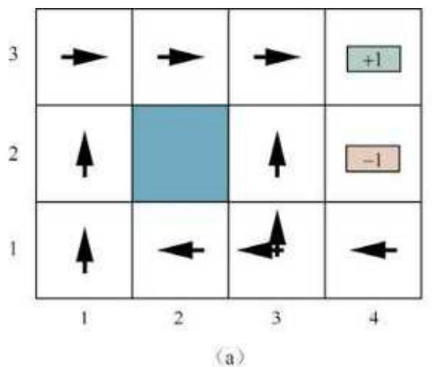

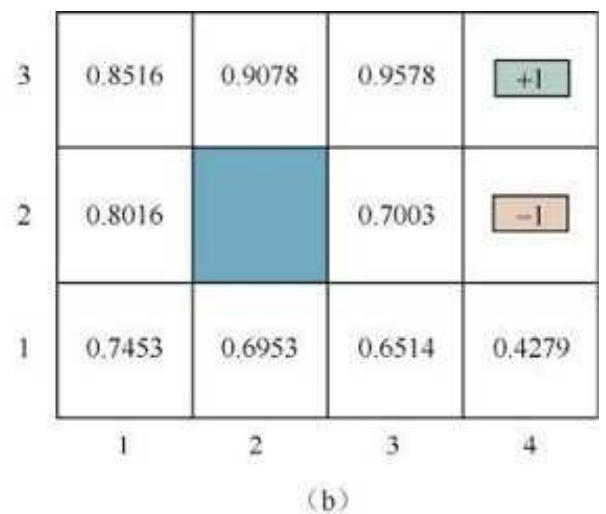  
图22-1 （a）R(s,a ,s')=−0.04的随机环境中非终止状态间转移的最优策略。其中状态(3, 1)有两种策略，因为在该状态中Left和Up都是最优的。我们之前已经在图17-2b中观测到了这一点。（b）给定策略 $\pmb { \pi }$ 后，4×3世界中各个状态的效用函数

# 22.2.1 直接效用估计

直接效用估计 （directutility estimation）的思想是，一个状态的效用定义为从该状态出发的期望总奖励——我们称其为期望预期奖励 （reward-to-go），并且每次试验将为每个访问过的状态提供一个它的数值样本。例如，在上面给出的3次试验中，第一次试验为状态(1,1)提供了总奖励为0.76的样本，为(1,2)提供了总奖励为0.80和0.88的两个样本，为状态(1, 3)提供了0.84和0.92两个样本，以此类推。因此，在每个序列的末尾，算法将计算每个状态的预期奖励，并相应地，采用平均的方法来更新每个状态的效用估计值。若试验的次数没有限制，样本平均值将收敛到式（22-1）中的真实期望值。

这意味着我们已经将强化学习简化为一个标准的监督学习问题，其中每个样例都是一对（状态,预期奖励）。我们有很多强大的监督学习算法，所以这种方法表面上看起来比较有前景，但它忽略了一个重要的约束：状态的效用取决于后继状态的奖励和期望效用。更具体地说，效用值应当满足固定策略的贝尔曼方程［另见式（17-14）］：

$$
U _ {i} (s) = \sum_ {s ^ {\prime}} P \left(s ^ {\prime} \mid s, \pi_ {i} (s)\right) \left[ R \left(s, \pi_ {i} (s), s ^ {\prime}\right) + \gamma U _ {i} \left(s ^ {\prime}\right) \right] \tag {22-2}
$$

忽略状态之间的联系并直接估计效用将导致错过学习的机会。例如，在上面给出的3次试验中的第二次试验，智能体到达了先前未访问过的状态(3,2)，接着下一个转移让它到达(3,3)，从第一次试验中，我们知道(3,3)具有很高的效用。那么贝尔曼方程立即表明(3,2)也可能也具有很高的效用，因为它将到达(3, 3)，但直接效用估计在试验结束之前无法学习到任何东西。更宽泛地说，我们可以将直接效用估计视为在比实际需要的更大的假设空间中搜索 $U$ ，因为它包含了许多不满足贝尔曼方程的函数。出于这个原因，该方法对应的算法通常收敛得非常缓慢。

# 22.2.2 自适应动态规划

利用 自适应动态规划 （adaptive dynamic programming，ADP）的智能体学习状态之间的转移模型并使用动态规划解决相应的马尔可夫决策过程，从而利用了状态效用之间的约束。对于被动学习智能体，这意味着可以将学习到的转移模型 和观测到的奖励 代入式（22-2）来求解各个状态的效用。正如我们在第17章对策略迭代的讨论中所述，当策略 固定时，这些贝尔曼方程是线性的方程组，因此我们可以使用任意的线性代数软件包来求解。

或者我们可以采用 修正策略迭代 （modified policy iteration）的方法（见17.2节），利用简化的价值迭代过程在每次学习模型发生更改后更新效用估计值。由于每次观测给模型带来的改变通常非常小，因此价值迭代过程可以使用先前的效用估计作为初始值，并且这样的做法通常会使迭代过程收敛得很快。

学习转移模型很容易，因为环境是完全可观测的。这意味着我们需要解决一个监督学习任务，其中每个训练样例的输入是一个状态-动作对( s , a )，输出为后续状态 $s ^ { \prime }$ 。转移模型 $P ( s ^ { \prime } | s , a )$ 将以表格形式表示，它可以通过累积计数 直接估计得到。该计数记录了在状态 s 下采取动作 a $N _ { s ^ { \prime } \mid s a }$ 后达到状态s′的频率。例如，在22.2节的第三次试验中，智能体在(3,3)状态执行了4次Right动作，且相应的结果为两次到达(3, 2)以及两次到达(4, 3)，因此 和将均被估计为1/2。

图22-2给出了被动自适应动态规划智能体的完整程序，它在4×3世界上的表现如图22-3所示。就其对价值估计速度的改进而言，自适应动态规划智能体仅受到它学习转移模型的能力的限制。从这个意义上说，它提供了一个能衡量任何其他强化学习算法的标准。然而，对于大的状态空间，它是难以实现的。例如，在西洋双陆棋中，它将需要求解包含1020 个未知数的大约1020 个方程。

function PASSIVE-ADP-LEARNER(percept) returns 一个动作  
inputs: percept, 指示当前状态 $s'$ 与奖励信号 $r$ 的某个感知  
persistent: $\pi$ , 一个确定性策略  
mdp, 一个转移模型为 $P$ 、奖励为 $R$ 、动作为 $A$ 、折扣因子为 $\gamma$ 的MDP $U$ , 关于状态效用的表, 初始化为空 $N_{x'|s,a}$ , 一个表, 用于某对状态与动作对应的结果状态出现次数的向量, 初始为零 $s, a$ , 之前的状态与动作, 初始为空

if $s^{\prime}$ 是一个新的状态then $U[s^{\prime}]\gets 0$ if $s$ 非空then  
增加 $N_{s^{\prime}|s,a}[s,a][s^{\prime}]$ $R[s,a,s^{\prime}]\gets r$ 将a加入A[s] $P(\cdot |s,a)\gets \mathrm{NORMALize}(N_{s^{\prime}|s,a}[s,a])$ $U\gets \mathrm{POLICYEVALUATION}(\pi ,U,mdp)$ $s,a\gets s^{\prime},\pi [s^{\prime}]$ return a

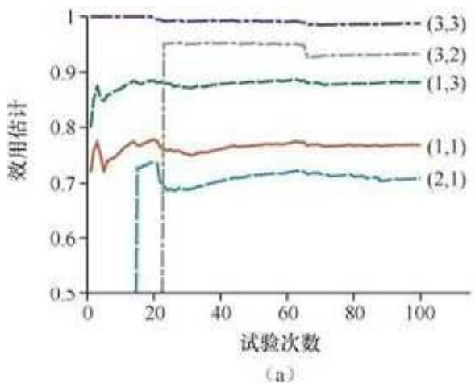  
图22-2基于自适应动态规划的被动强化学习智能体。智能体将选定一个 $\gamma$ 值，然后逐步计算MDP中的P与R值。其中Policy -Evaluation函数将求解固定策略的贝尔曼方程，正如17.2节中所述

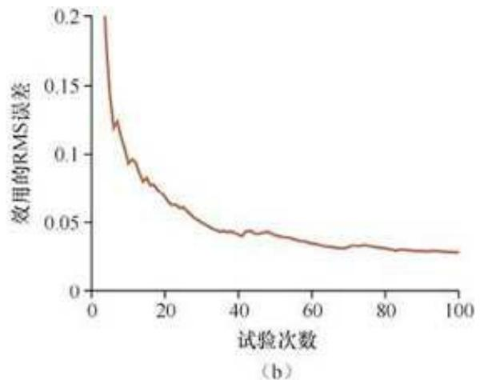  
图22-3在给定图22-1所示的最优策略情况下，关于4×3世界问题的被动自适应动态规划的学习曲线。（a）选定某个状态子集，其效用估计值与试验次数的关系。注意，对于很少被访问的状态(2,1)和(3,2)，它们分别在第14次和第23次试验才被“发现”连接到位于(4,3)处的+1退出状态。（b） $U$

(1, 1)估计的均方根误差（见附录 A），所示的结果为50组，每组执行100次试验的平均值

# 22.2.3 时序差分学习

在22.2.2节中，我们将贝尔曼方程应用于学习问题来求解潜在的MDP，但这不是将贝尔曼方程应用于学习问题的唯一方法。另一种方法是使用观测到的转移来更改观测状态的效用，从而迫使它们满足约束方程。例如，考虑22.2节的第二次试验中从状态(1, 3)到状态(2, 3)的转移。假设在第一次试验与估计后，效用的估计值为 和 。现在我们假设从状态(1, 3)到状态(2, 3)的这种转移会一直发生，这时效用将满足如下方程：

$$
U ^ {\pi} (1, 3) = - 0. 0 4 + U ^ {\pi} (2, 3)
$$

所以 $U ^ { \ast } ( 1 , 3 )$ 将为0.92。因此目前的估计值0.88是偏低的，它应该被提升。更一般地，如果一个转移为在状态 s 下采取动作 $\pi ( s )$ ，并到达了状态 $s ^ { \prime }$ ，我们则将如下更新规则应用于 ：

$$
U ^ {\pi} (s) \leftarrow U ^ {\pi} (s) + \alpha \left[ R (s, \pi (s), s ^ {\prime}) + \gamma U ^ {\pi} (s ^ {\prime}) - U ^ {\pi} (s) \right] \tag {22-3}
$$

这里， $\pmb { \alpha }$ 为 学习率 参数。由于此更新规则使用了相继状态（以及相继时间）之间效用的差分，因此通常被称为时序差分 （temporal-difference，TD）方程。与第19章中介绍的权重更新规则类似，如19.6节的式（19-6），TD项 实际上是关于误差的信息，更新旨在减少该误差。

所有时序差分方法都通过调整理想均衡的效用估计来实现学习目的，当效用估计正确时，理想均衡是局部成立的。在被动学习的情况下，该均衡解由式（22-2）给出。更新式（22-3）实际上确实能使智能体达到由式（22-2）给出的均衡，但其中还有一些细微的差别。首先，注意更新仅涉及观测到的后继状态s'，而实际上均衡条件涉及所有可能的下一个状态。人们可能会认为，当发生非常罕见的转移时，会导 致 发生较大的不正确的变化，但事实上，由于罕见的转移很少发生，即使该值本身也在持续波动， 的平均值在极限意义下仍将收敛到正确的值。

此外，如果我们将参数 $\pmb { \alpha }$ 设置为一个如图22-4所示的随着访问状态的次数的增加而减小的函数，那么 本身将收敛到正确的值。 [1] 图22-5给出了在4×3世界问题中的被动时序差分智能体的表现。它的学习速度不如自适应动态规划智能体快，并且看上去波动更强烈，但它更简单且对于每次观测所需的计算量也少得多。注意， TD 不需要通过转移模型来进行所需的更新。环境本身只提供由观测到的转移所给出的相邻状态之间的连接关系。

[1]我们在19.6节中给出了该方法需要满足的条件，在图22-5中，我们采用 ，它满足所需条件。

functionPAssIVE-TD-LEARNER(percept)returns一个动作

inputs:percept指示当前状态s与奖励信号r的某个感知

persistent: $\pi$ ，一个确定性策略

$s$ ，之前的状态，初始为空

U，关于状态效用的表，初始化为空

$N _ { _ { s } }$ ，关于状态出现频率的表，初始为零

ifs是一个新的状态then $U _ { [ s ] } \gets 0$

ifs非空then

增加N[s]

$$
U [ s ] \leftarrow U [ s ] + \alpha \left(N _ {s} [ s ]\right) \times \left(r + \gamma U [ s ^ {\prime} ] - U [ s ]\right)
$$

$$
s \leftarrow s ^ {\prime}
$$

$$
\operatorname {r e t u r n} \pi [ s ^ {\prime} ]
$$

图22-4一种使用时序差分方法学习效用估计的被动强化学习智能体。我们选择适当的步长函数$\alpha ( n )$ 以确保收敛

自适应动态规划与TD的方法是紧密联系的，两者都试图对效用估计进行局部调整，以使每个状态与其后继状态能“达成一致”。其中一个不同之处在于，TD方法调整状态的效用来达到与其观测到的后继状态一致［式（22-3）］，而自适应动态规划调整状态的效用来达到与所有可能发生的后继状态一致，这些状态将按概率进行加权求和［式（22-2）］。当TD的调整在大量转移上取平均时，这种差异就会消失，因为每个后继状态在转移的集合中发生的频率与其发生的概率大致成正比。一个更重要的区别在于，TD对每个观测到的转移都只进行单次调整，而自适应动态规划进行尽可能多的调整，以保持效用估计 U 和转移模型 P之间的一致性。尽管观测到的转移仅对 $P$ 产生局部的改变，但它可能会影响到整个 $U$ 。因此，TD可以看作对自适应动态规划的粗略但有效的近似。

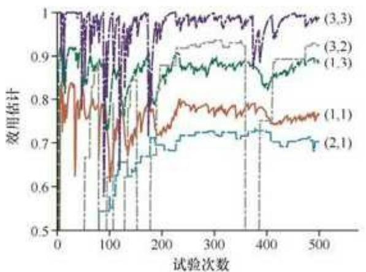

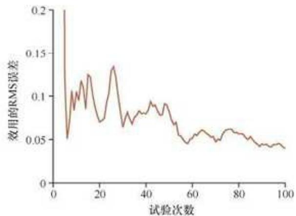  
  
图22-54×3世界问题中，TD的学习曲线。（a）选定的状态子集的效用估计与试验次数的关系。此为单组执行500次试验的结果。可以与图22-3a中的每组执行100次试验的结果进行比较。（b） $U$ (1, 1)估计的均方根误差，所示结果为50组、每组执行100次试验的平均值

从TD的角度看来，ADP所做的每一次调整都可以看作当前转移模型进行一次模拟产生的 伪经验（pseudoexperience）的结果。因此我们可以将TD方法进行推广，使用转移模型来生成多个伪经验

给定当前模型下，TD智能体认为 可能发生的转移。对于每个观测到的转移，TD智能体将生成大量的虚构的转移。这样一来，由此产生的效用估计将越来越接近ADP的效用估计值——当然，这种接近将以增加计算时间为代价。

同样，我们可以通过直接近似价值迭代或策略迭代算法的方式来生成更高效的自适应动态规划。尽管我们知道价值迭代算法是有效的，但如果我们的状态个数多达10 100 个，那么它将是难以处理的。幸运的是，在每次迭代中，对状态价值的必要调整中有一大部分是非常微小的调整，因此一种可行的能够快速给出合理结果的方法是限制每次观测到转移后进行调整的次数。我们还可以利用启发式的方法对可能的调整进行排序，以便对最重要的状态进行调整。一种称为 优先扫描（prioritized sweeping）启发式方法倾向于对那些高概率后继状态刚刚在自身的效用估计中经历了一次大调整的状态进行调整。

在运用了此类启发式方法后，就训练序列的数量而言，近似ADP算法的学习速度大致和完整ADP一样快，但就总体的计算量而言，其效率可以提高几个数量级（见习题22.PRSW）。这使得它们能够处理那些对完整ADP来说过大的状态空间。近似ADP算法还有另外一个优点：在学习一个新环境的早期阶段，转移模型 $P$ 往往会和正确模型差距较大，因此计算一个精确的效用函数来匹配它几乎没有意义。近似算法将使用可行的最小的调整规模，且该调整的规模将随着转移模型的逐渐精确而减小。这避免了在学习早期阶段可能发生的由于模型变化剧烈而导致的冗长的价值迭代过程。

# 22.3 主动强化学习

被动学习智能体有一个固定的策略来决定其行为，而 主动学习智能体 （active learning agent）可以自主决定采取什么动作。我们将从自适应动态规划（ADP）智能体开始入手，并考虑如何对它进行修改以利用这种新的自由度。

首先，智能体需要学习一个完整的转移模型，其中包含所有动作可能导致的结果及概率，而不仅仅是固定策略下的模型。Passive-ADP-A gent所使用的学习机制正好可以解决这个问题。接下来，我们需要考虑这样一个事实：智能体有一系列动作可供选择。它需要学习的效用是由最优策略所定义的效用，它们将满足贝尔曼方程（在这里再次给出）：

$$
U (s) = \max  _ {a \in A (s)} \sum_ {s ^ {\prime}} P \left(s ^ {\prime} \mid s, a\right) \left[ R \left(s, a, s ^ {\prime}\right) + \gamma U \left(s ^ {\prime}\right) \right] \tag {22-4}
$$

可以使用在第17章中介绍的价值迭代或策略迭代算法求解这些方程，以得到效用函数 $U$ 。

最后的问题是，智能体在每一步中该做什么。在获得对所学到的模型最优的效用函数 $U$ 后，智能体可以通过一步前瞻寻找并采取最大化期望效用的最优动作；或者，如果智能体使用的是策略迭代，那么我们现在已经得到了最优策略，因此它可以简单地执行最优策略建议的动作。但这样操作就正确吗？

# 22.3.1 探索

图22-6给出了ADP智能体的一系列试验的结果，在试验的每一步中，智能体都采用所学到的模型的最优策略建议的动作。智能体没有学习到正确的效用或正确的最优策略！取而代之的是，在第三次试验中，它发现了一个策略，该策略通过(2, 1)、(3, 1)、(3, 2)与(3, 3)，沿着较差的路径到达了+1奖励（见图22-6b）。接着，在一些变化较小的试验后，从第8次试验开始，智能体将坚持这一策略，并且再也不学习其他状态的效用，也就无法发现通过(1,2)、(1,3)和(2, 3)的最优路线。我们将该智能体称作贪心智能体 （greedyagent），因为它每一步都贪婪地执行当前认为的最优动作。贪心方法有时是有效的，使得对应的智能体会收敛到最优策略，但在很多情况下，它的效果并不理想。

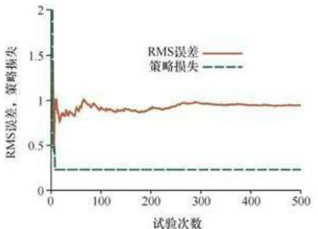

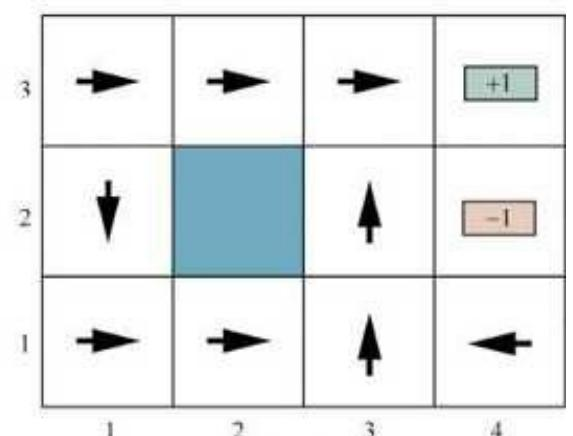  
  
图22-6 贪心ADP智能体的表现，它采取所学习到的模型下的最优策略所推荐的动作。（a）在所有9个非终止方格中取平均值的均方根（RMS）误差，以及(1,1)中的策略损失。我们可以看到，该策略很快地，在仅仅8次试验之后，就收敛到一个损失为0.235的次优策略。（b）贪心智能体在这个特定的试验序列中收敛到的次优策略。注意，(1, 2)状态中采取 Down 动作

为什么选择最优动作会导致次优的结果呢？答案是，学习到的模型与真实的环境不一样；因此，学习到的模型的最优结果可能在真实环境中是次优的。遗憾的是，智能体并不清楚真实环境是什么样子，因此它将无法计算真实环境下的最优动作。那么，它应该采取什么动作呢？

贪心智能体忽视了这样一个事实：动作不仅提供奖励，还以结果状态中感知的形式提供信息。回顾17.3节中的 老虎机问题 ，智能体必须在利用 当前最佳动作以最大化其短期奖励和探索 过去未知的状态以获得可能导致策略改变（以及在未来获得更大奖励）的信息之间进行权衡。在真实世界中，一个人时常需要进行抉择：继续在舒适圈度日，还是为了更好的生活去涉猎未知的世界。

虽然我们很难找到最优探索方案以精确地解决老虎机问题，但我们仍然有可能提出一个方案，使得智能体最终能将发现一个最优策略，尽管该方案可能需要花费比最优方案更长的探索时间。任何一个能找到这种最优策略的方案对于下一步行动的选取都不应该是贪心的，而应该是所谓“无限探索极限下的贪心”（greedy in the limit of infinite exploration， GLIE ）。GLIE方案必须在每个状态下对每个动作尝试任意多次，以避免错过最优动作。使用这种方案的ADP智能体最终将学习到正确的转移模型，在此基础上，它可以在不考虑探索的情况下行动。

基于GLIE的方案有若干种，最简单的一种是让智能体在时刻t以1/t的概率随机选择一个动作，否则就遵循贪心策略。虽然这个方法最终会收敛到最优策略，但收敛过程可能会很慢。一个更好的方法是对智能体不经常尝试的动作赋予较高的权重，同时倾向于避免采取智能体认为效用较低的动作（正如在5.4节中我们使用蒙特卡罗树搜索所做的那样）。这一过程可以通过改变约束方程，即式（22-4），为探索还相对不充分的状态-动作对赋予更高的效用估计来实现。

这相当于对可能的环境赋予一个乐观的先验，这也会使得智能体最初的行为就像各个位置都散布着很高的奖励一样。我们用U +(s)来表示对状态s的目标效用（即期望的预期奖励）的乐观估计，并用 N ( s , a )表示动作 a 在状态 s 中被尝试的次数。现在我们将对ADP学习智能体使用价值迭代，于是我们需要改写17.2节中的更新式（17-10）以引入乐观估计：

$$
U ^ {+} (s) \leftarrow \max  _ {a} f \left(\sum_ {s ^ {\prime}} P \left(s ^ {\prime} \mid s, a\right) \left[ R \left(s, a, s ^ {\prime}\right) + \gamma U ^ {+} \left(s ^ {\prime}\right) \right], N (s, a)\right) \tag {22-5}
$$

这里的 $f$ 表示 探索函数 （exploration function）。函数 f ( u , n )决定了贪心（倾向于选择效用函数 u较高的动作）如何与好奇心（倾向于选择不经常尝试且计数 n 较小的动作）进行权衡。该函数应关于 $u$ 递增，关于 n 递减。显然，存在许多满足这些条件的函数。一个特别简单的例子如下：

$$
f (u, n) = \left\{ \begin{array}{l l} R ^ {+}, & \text {当} n <   N _ {e} \\ u, & \text {其 他} \end{array} \right.
$$

其中 $R ^ { + }$ 是任何状态下对可获得的最佳可能奖励的乐观估计， $\boldsymbol { N } _ { e }$ 是一个固定的参数。这样的函数将迫使智能体对每个状态-动作对至少尝试 $\boldsymbol { N } _ { e }$ 次。式（22-5）右侧采用了 $U ^ { + }$ 而不是 $U$ ，这一点非常重要。随着探索的进行，接近初始状态的状态和动作可能会被尝试非常多次。如果我们使用U，即更悲观的效用估计，那么智能体很快就会变得不愿意探索更远的区域。使用 $U ^ { + }$ 意味着探索的好处是从未探索区域的边缘传递回来的，于是前往未探索区域的动作将有更高的权重，而不仅是那些本身不为人所熟悉的动作有更高的权重。

图22-7b清楚地展现了这种探索策略的效果：策略损失将快速收敛到0，这与贪心法的结果不同。只经过18次试验，智能体就找到了一个非常接近最优的策略。注意，效用估计中的RMS误差并没有很快收敛，这是因为智能体很快就停止了对状态空间中没有奖励的部分的探索，并且在此之后只是“偶然”地访问它们。然而对智能体来说，如果可以忽视一些不需要并且可避免的状态的精确效用，这将是非常有帮助的。例如当你正从悬崖上摔下来的时候，去学习哪个是最好的广播电台对你来说是没有多大意义的。

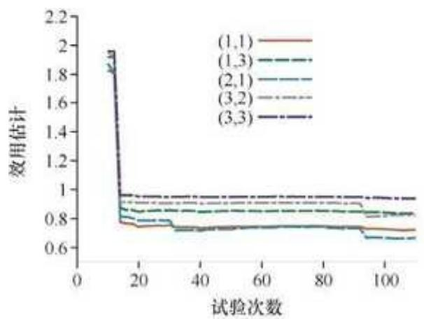

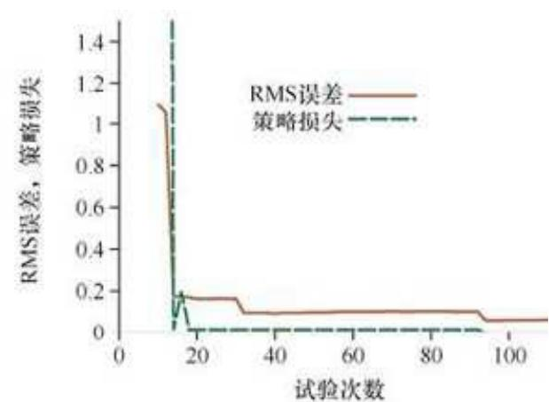  
  
图22-7 采用 $R ^ { \mathbf { \omega } + } = 2$ 及 $N _ { e } = 5$ 的探索性ADP智能体的表现。（a）某个选定状态的效用估计随时间的变化图。（b）效用估计以及相应的策略损失的RMS误差

# 22.3.2 安全探索

到目前为止，我们都假设智能体可以像我们所希望的那样自由地进行探索——任何负面的奖励只会改善它对世界的建模。也就是说，如果我们输了一盘棋，我们不会受到任何伤害（也许除了我们的自信心），无论我们学到什么，都会使我们在下一盘棋中成为更好的棋手。同样，在自动驾驶汽车的模拟环境中，我们可以探索汽车性能的极限，任何事故都会给我们提供更多的信息。如果车撞坏了，我们只需按一下复位按钮即可。

遗憾的是，真实世界没有那么宽容。如果你是一只小太阳鱼，你存活到成年的概率大约是0.00000001。在4.5节中所定义的在线搜索智能体环境下，许多动作是 不可逆的 ：不存在后续的动作序列可以将状态恢复到不可逆动作发生之前的状态。在最坏的情况下，智能体将进入到一个吸收态 （absorbing state），此时任何动作都不会改变当前的状态，智能体也不会得到任何奖励。

在许多实际情况中，我们无法承担我们的智能体采取不可逆的动作或进入吸收态的后果。例如，一个正在学习驾驶真正的汽车的智能体应该避免采取可能导致以下任何情况的动作：

●有大量负面奖励的状态，如严重车祸；  
● 无法脱离的状态，如将汽车开进深沟中；  
●将永久性地限制未来奖励的状态，例如损坏汽车发动机，使其最高速度降低。

我们仍可能最终陷入一种糟糕的状态，这要么是因为我们的模型未知，使得我们主动选择朝着一个结果糟糕的方向进行探索，要么是因为我们的模型不正确，以至于我们不知道一个给定的动作可能会带来灾难性的结果。图22-2中的算法使用最大似然估计（见第20章）学习转移模型，再仅根据估计的模型进行策略选择，就好像这个模型真是正确的模型一样。这不一定是个好主意！例如，一个不知道红绿灯是如何工作的出租车智能体可能会在一次或两次闯红灯却没有受到惩罚后制定一项荒唐的策略——无视所有的红灯。

一个更好的方法是选择一个对所有有机会成为真实模型的模型都相当有效的策略，即使该策略对于最大似然模型是次优的。我们将介绍3种带有这种思想的数学方法。

第一种方法为 贝叶斯强化学习 （Bayesian reinforcement learning），它对关于正确模型的假设 h 赋予一个先验概率P(h )，而后验概率 将在给定观测数据的情况下，通过贝叶斯法则得到。如果智能体在某一时刻决定停止学习，那么最优策略即为给出最高期望效用的策略。我们设为期望效用，它通过在模型 $h$ 中执行策略 $\pmb { \pi }$ 得到，并在所有可能的初始状态上取平均，那么有

$$
\pi^ {*} = \operatorname {a r g m a x} _ {\pi} \sum_ {h} P (h \mid e) U _ {h} ^ {\pi}
$$

在某些特殊情况下，我们甚至可以计算出此策略！然而，如果智能体将在未来继续学习，那么找到一个最优策略就变得相当困难，因为智能体必须考虑到未来的观测对其所学习到的转移模型的影响。这个问题变成了一个将状态看作模型上的分布的 探索 POMDP（exploration POMDP）的问题。原则上，这种探索POMDP问题可以在智能体进入世界之前被表述并解决（习题22.EPOM要求读者在扫雷游戏中进行分析，以找到最佳的第一步）。问题的解是一个完整的策略，它在给定任何可能的感知序列的情况下，将告诉智能体下一步要做什么。求解探索POMDP问题通常是非常棘手的，但这一概念为理解22.3节中所描述的探索问题提供了分析基础。

注意，再好的贝叶斯方法也并不能保护智能体使其免于过早死亡。没有什么办法能阻止智能体采取会导致吸收态的探索性动作，除非先验知识给出了关于危险的一些感知提示。例如，人们过去认为人类婴儿天生恐高，他们不会爬下悬崖，但事实证明并非如此（Adolphetal. ,2014）。

第二种方法来自健壮控制理论 （robustcontroltheory），它考虑一组可能模型H 而不赋予它们概率，在此基础上，最优健壮策略定义为 能在H 中最坏的情况下给出最佳结果的策略：

$$
\pi^ {*} = \operatorname {a r g m a x} _ {\pi} \min  _ {h} U _ {h} ^ {\pi}
$$

通常情况下，集合 H 为似然 超过某个阈值的模型的集合，因此健壮方法和贝叶斯方法是相联系的。

健壮控制方法可以看作智能体和对手之间的博弈，其中对于任何动作，对手都将选择最坏的可能结果，我们得到的策略即是博弈的极小化极大（minimax）解。我们的逻辑wumpus智能体（见7.7节）也是一个这样的健壮控制智能体：它考虑所有逻辑上可能的模型，并且不探索任何可能包含一个无底洞或wumpus的位置，因此它将在所有可能的假设中找到最坏情况下效用最大的动作。

第三种方法是最坏情况假设，这一想法的问题在于，它会导致行为过于保守。如果一辆自动驾驶的汽车认为其他所有的司机都可能与它相撞，那它别无选择，只能停在车库里。现实生活中充满了这样的风险-回报权衡。

使用强化学习的一个原因是为了避免对人类教师的需求（如在监督学习中），但事实证明，人类知识可以帮助维护系统的安全。一种方法是记录一位有经验的教师的一系列动作，使系统从一开始就合理地行动并从中学习与改进。另一种方法是人为地约束系统的行为，并让强化学习系统之外的程序执行这些约束。例如，在训练一架自动驾驶的直升机时，我们可以提供一个额外策略，该策略在直升机进入某个状态（从这个状态开始，任何进一步的不安全动作都将导致不可复原的结果）时接管其控制权——在这种状态下，安全控制员不能保证飞机能避免进入吸收态。在所有其他状态中，学习智能体都可以随心所欲地行动。

# 22.3.3 时序差分Q学习

现在假设我们已有一个主动ADP智能体，我们将考虑如何构造一个主动时序差分学习智能体。与之前的情境相比，这里最显著的区别在于智能体必须学习转移模型，以便它可以通过一步前瞻来选择基于U (s)的动作。TD智能体的模型获取问题与ADP智能体的模型获取问题是相同的，并且TD更新规则也相同。此外，可以证明，当训练序列的数目趋于无穷时，TD算法将收敛到与ADP算法相同的值。

Q学习 方法将通过学习动作效用函数Q (s, a )而不是学习效用函数U (s)来避免对模型本身的需求。 Q ( s , a )表示智能体在状态 s 下采取动作 a 并在其后采取最优行动的期望总折扣奖励。如果智能体已经知道Q函数，那么它可以通过简单地选择argmax Q (s, a )来实现最优行动，而不需要基于转移模型进行前瞻探索。

我们还可以推导出对于 Q 值的无模型TD更新规则。我们从关于 Q ( s , a )的贝尔曼方程出发，在这里重新给出式（17-8）：

$$
Q (s, a) = \sum_ {s ^ {\prime}} P \left(s ^ {\prime} \mid s, a\right) \left[ R \left(s, a, s ^ {\prime}\right) + \gamma \max  _ {a ^ {\prime}} Q \left(s ^ {\prime}, a ^ {\prime}\right) \right] \tag {22-6}
$$

基于此，我们可以效仿式（22-3）中效用函数的TD更新规则，给出Q学习的TD更新规则：

$$
Q (s, a) \leftarrow Q (s, a) + \alpha \left[ R \left(s, a, s ^ {\prime}\right) + \gamma \max  _ {a ^ {\prime}} Q \left(s ^ {\prime}, a ^ {\prime}\right) - Q (s, a) \right] \tag {22-7}
$$

每当智能体在状态 s 下执行动作 $a$ 并导致状态 s' 时，就会计算此更新。在式（22-3）中，

这一项表示更新试图最小化的误差。

这个等式的重要的性质在于它所不包含的内容： 无论在学习过程中还是动作选择中，时序差分Q学习智能体都不需要转移模型 $P ( \pmb { s } ^ { \prime } \mid \pmb { s } , \pmb { a } )$ 。如我们在本章开头所述，无模型方法可以应用于非常复杂的领域，因为它们不需要利用或者学习该模型。另外，Q学习智能体无法了解未来的信息，因此当奖励稀疏时智能体可能会遇到困难，并且此时它必须构造长的动作序列才能到达有奖励的部分。

图22-8给出了探索性时序差分Q学习智能体的完整设计。注意，它使用的探索函数 $f$ 与探索性ADP智能体所使用的函数f完全相同，因此我们需要保留所采取动作的统计信息（关于 $N$ 的表格）。如果我们使用一个更简单的探索策略，例如我们在一些步骤中随机地进行操作，且步骤数量随着时间的推移而减少，那么我们就可以省去这些统计信息。

functionQ-LEARNING-AGENT(percept)returns一个动作

inputs:percept，指示当前状态s与奖励信号r的某个感知

persistent: $\scriptstyle Q$ ，一个表，用于记录状态与动作对应的动作的值，初始为零$N _ { s a }$ ，一个记录状态-动作对出现的频率的表，初始为零$s , a$ ，之前的状态与动作，初始为空

ifs非空then

增加 $N _ { s a } [ s , a ]$

$$
Q [ s, a ] \leftarrow Q [ s, a ] + \alpha \left(N _ {s a} [ s, a ]\right) \left(r + \gamma \max  _ {a ^ {\prime}} Q \left[ s ^ {\prime}, a ^ {\prime} \right] - Q [ s, a ]\right)
$$

$$
s, a \leftarrow s ^ {\prime}, \operatorname {a r g m a x} _ {a ^ {\prime}} f (Q [ s ^ {\prime}, a ^ {\prime} ], N _ {s a} [ s ^ {\prime}, a ^ {\prime} ])
$$

returna

图22-8一个探索Q学习智能体。它是一个主动的学习器，学习每个情境下每个动作的Q (s,a )值。它采用了与探索ADP智能体所用相同的探索函数 f，但是避免了对转移模型的学习

SARSA ，即状态（state）、动作（action）、奖励（reward）、状态（state）、动作（action），是一种与Q学习紧密关联的方法。它的更新规则也与Q学习的更新规则［式（22-7）］非常相似，区别在于SARSA使用实际采取的动作 a'的 Q 值进行更新：

$$
Q (s, a) \leftarrow Q (s, a) + \alpha \left[ R (s, a, s ^ {\prime}) + \gamma Q \left(s ^ {\prime}, a ^ {\prime}\right) - Q (s, a) \right] \tag {22-8}
$$

该更新规则应用于每个 五元组之后，SARSA也因这个五元组得名。它与Q学习的区别非常细微：Q学习使用的是状态s′的最佳动作的Q 值，而SARSA将等待某个动作被实际执行并使用该动作的 Q 值。如果智能体是贪心的，并且总是采取具有最佳Q 值的动作，那么这两种算法是相同的。然而，当智能体进行探索时，两个算法将有所不同：如果探索产生负面奖励，SARSA会惩罚这个动作，而Q学习不会。

Q学习是一种 离策略 （off-policy）学习算法，因为它所学习的Q 值回答了问题“假设我停止使用我正在使用的任何策略，并依照（根据估计）选择最佳动作的策略开始行动，那么这个动作在该状态

下的价值是多少？”SARSA是一个 同策略 （on-policy）的算法，它通过学习 Q 值回答了问题“假设我坚持自己的策略，那么这个动作在该状态下的价值是多少？”Q学习比SARSA更灵活，因为Q学习智能体可以学习在各种探索策略的控制下如何表现良好。另外，如果整个策略部分地由其他智能体或程序控制，那么SARSA就是适用的，在这种情况下，我们最好学习实际发生的动作的Q函数，而不是学习智能体选择估计的最佳动作情况下将发生的动作的Q函数。Q学习和SARSA都能学到4×3世界中的最优策略，但它们的学习速度比ADP智能体慢得多。这是因为局部更新不会通过模型来保证所有Q 值之间的一致性。

# 22.4 强化学习中的泛化

到目前为止，我们都假设效用函数和Q函数可以用表格的形式表示，其中每个状态有一个输出值。这种方法适用于状态多达10 6 的状态空间，这对我们处在二维网格环境中的玩具模型来说已经足够了。但在有更多状态的现实环境中，其收敛速度会很慢。西洋双陆棋比大多数真实世界的应用简单，但它的状态已经多达约1020 个。我们不可能为了学习如何玩游戏而简单地访问每一个状态。

我们在第5章中介绍了评价函数 的概念，它是对我们想了解的潜在巨大状态空间的一个紧度量。在本章中，我们将把评价函数作为一个近似效用函数，我们将用术语函数近似 来表示构造一个关于真实效用函数或Q函数的紧的近似的过程。例如，我们可以使用特征的加权线性组合来近似效用函数：

$$
\hat {U} _ {\theta} (s) = \theta_ {1} f _ {1} (s) + \theta_ {2} f _ {2} (s) + \dots + \theta_ {n} f _ {n} (s)
$$

如此一来，强化学习算法将不需要学习表中的10 20 个状态值，只需学习20个参数值

，这些值可以令 很好地近似真实的效用函数。有时，这种效用函数近似方法会与前瞻搜索相结合，以做出更准确的决策。添加前瞻搜索意味着有效的行为可以从一个简单得多的效用函数近似器生成，而这个函数本身又可以从少得多的经验中学习得到。

函数近似的方法使得在非常大的状态空间中表示效用函数（或Q函数）变得可行，但它更重要的意义在于允许了归纳性的泛化：智能体可以从它访问过的状态泛化到它还没有访问过的状态。特索罗（Tesauro,1992）利用这一方法构建了一个西洋双陆棋游戏程序，尽管它只探索了西洋双陆棋完整状态空间的万亿分之一。

# 22.4.1 近似直接效用估计

直接效用估计的方法（22.2节）在状态空间中生成轨迹，并对每个状态获取从该状态出发直到终止的奖励总和。状态和获得的奖励之和构成了监督学习 算法的训练样例。例如，假设我们用一个简单的线性函数来表示4×3世界的效用函数，其中方格的特征是它们的x和y坐标。在这种情况下，我们有

$$
\hat {U} _ {\theta} (x, y) = \theta_ {0} + \theta_ {1} x + \theta_ {2} y \tag {22-9}
$$

因此，如果 ，那么 $\tilde { U } _ { \vartheta } ( 1 , 1 ) = 0 . 8$ 。给定一组试验，我们得到一组关 于 值的样本，并且我们可以使用标准线性回归（第19章）在最小化平方误差的意义下找到最佳拟合。

在强化学习中使用 在线 学习算法可以使每次试验后的参数更新更有意义。现在，假设我们运行一次试验，从(1, 1)出发获得的总奖励是0.4。这表明，目前的估计值 0.8太大，必须降低。那么我们如何通过调整参数实现这一点？与神经网络的学习一样，我们将给定一个误差函数，并计算它关于参数的梯度。若设 $u  { j }$ ( s )为在第 $j$ 次试验中从状态 s 出发观测到的总奖励，那么误差就定义为预测总奖励和实际总奖励的平方差的一半，即 。每个参数 关于误差的变化率为 ，为了使参数朝着误差减小的方向移动，我们进行如下更新：

$$
\theta_ {i} \leftarrow \theta_ {i} - \alpha \frac {\partial E _ {j} (s)}{\partial \theta_ {i}} = \theta_ {i} + \alpha [ u _ {j} (s) - \hat {U} _ {\theta} (s) ] \frac {\partial \hat {U} _ {\theta} (s)}{\partial \theta_ {i}} \tag {22-10}
$$

对于在线最小二乘法，这被称为 Widrow-Hoff法则 （Widrow–Hoff rule）或 delta法则 （deltarule）。对于式（22-9）中的线性函数近似器 ，我们将得到3个简单的更新规则： $\hat { U } _ { \theta } ( s )$

$$
\begin{array}{l} \theta_ {0} \leftarrow \theta_ {0} + \alpha \left[ u _ {j} (s) - \hat {U} _ {\theta} (s) \right] \\ \theta_ {1} \leftarrow \theta_ {1} + \alpha \left[ u _ {j} (s) - \hat {U} _ {\theta} (s) \right] x \\ \theta_ {2} \leftarrow \theta_ {2} + \alpha [ u _ {j} (s) - \hat {U} _ {\theta} (s) ] y \\ \end{array}
$$

我们可以将这些规则应用到实际样例中，其中 $\hat { U } _ { \pmb { \theta } } ( 1 , 1 )$ 为0.8， u j (1, 1)为0.4。参数 $\theta _ { 0 }$ $\theta _ { 1 }$ 和都将减小 ，从而降低样例(1, 1)的误差。注意， 改变参数 $\theta _ { i }$ 以响应观测到的两个状态之间的转移也会改变其他状态 的 值！ 这就是我们所说函数近似允许强化学习系统从经验中进行泛化的意思。

如果智能体使用函数近似的方法，只要假设空间不太大，并且包含一些与真实效用函数比较吻合的函数，智能体将学习得更快。习题22.APLM要求读者分别评估使用函数近似与不使用函数近似的直接效用估计的表现。在4×3世界中，函数近似方法带来的改进是明显的，但并不格外引人注目，因为这是一个非常小的简单状态空间。在一个大小为10×10、状态(10,10)的奖励为+1的世界里，函数近似的改进会更明显。

10×10世界非常适合采用线性效用函数，因为真正的效用函数是光滑的且几乎是线性的：它基本上是一个对角线的斜坡，其下端位于(1, 1)，上端位于(10,10)，另外，如果我们把+1奖励设在(5,5)位置，那么真正的效用则更像是一个金字塔，此时式（22-9）中所用的函数近似的效果将极差。

尽管如此，我们还有一线希望！记住，线性函数近似的关键在于函数关于特征是线性的。因此我们仍然可以选择关于状态的任意非线性函数作为特征。我们可以引入一个特征，例如 f 3( x , y ) =来度量状态到目标的距离。在使用了这一新特征后，线性函数近似器表现良好。

# 22.4.2 近似时序差分学习

我们同样可以将这些想法应用于时序差分学习器。我们要做的就是调整参数以减少相继状态之间的时序差分。时序差分公式和Q学习公式［式（22-3）和式（22-7）］的更新规则的新版本如下：

$$
\theta_ {i} \leftarrow \theta_ {i} + \alpha \left[ R (s, a, s ^ {\prime}) + \gamma \hat {U} _ {\theta} \left(s ^ {\prime}\right) - \hat {U} _ {\theta} (s) \right] \frac {\partial \hat {U} _ {\theta} (s)}{\partial \theta_ {i}} \tag {22-11}
$$

上式为效用函数的版本，下式为关于Q 值的版本：

$$
\theta_ {i} \leftarrow \theta_ {i} + \alpha \left[ R (s, a, s ^ {\prime}) + \gamma \max  _ {a ^ {\prime}} \hat {Q} _ {\theta} \left(s ^ {\prime}, a ^ {\prime}\right) - \hat {Q} _ {\theta} (s, a) \right] \frac {\partial \hat {Q} _ {\theta} (s , a)}{\partial \theta_ {i}} \tag {22-12}
$$

对于被动TD学习，当函数近似器关于特征呈线性 时，可以证明更新法则将收敛到最接近真实函数

的近似。 $\underline { { \cdots } } = \underline { { \cdots } }$ 在主动学习以及置如神经网络等非我性通数中，这样的结果几平是不可能的有一些非常简单的情境，使得即使假设空间中存在很好的解，在这些更新规则下，参数也将趋向无穷大。当然也有一些更复杂的算法可以避免这些问题，但到目前为止，利用通用函数近似进行强化

学习的研究仍发展得不十分充分。

除参数可能发散到无穷大之外，还有一个更糟糕的称为 灾难性遗忘 （catastrophicforgetting）的问题。假设你正在训练一辆自动驾驶汽车，使得它能在（模拟）道路上安全行驶且不发生碰撞。你为驶过道路的边缘分配了一个较高的负面奖励，并使用了道路位置的二次特征，使得汽车可以知道在道路中间行驶的效用高于靠近边缘行驶的效用。在一切顺利进行的情况下，这辆车将学会在路中间完美地行驶。几分钟后，你可能开始感到无聊，准备停止模拟并给出出色的结果。突然，车辆猛然转向，冲出了公路。为什么会发生这样的事？这是因为汽车学得太好了：因为它的学习目标是远离边缘，这可能会让它明白道路的整个中心区域是一个安全的地方，但它忘记了靠近边缘的区域是危险的。因此，价值函数的中心区域将是平坦的，二次特征的权重为零；在此基础上，线性特征的任何非零权重都会导致汽车滑出道路的一侧或另一侧。

一个解决这个问题的方法叫作 经验回放 （experience replay），它可以确保汽车定期重温之前训练时发生的撞车行为。该学习算法将保留整个学习过程中出现的轨迹，并对这些轨迹进行回放，以确保它不再访问的那部分状态空间上的价值函数仍然是准确的。

对于基于模型的强化学习系统，函数近似对学习关于环境的模型也有很大的帮助。注意，学习一个可观测环境的模型是一个监督 学习问题，因为下一个观测给出了上一个观测的结果状态。第19～21章中的任何监督学习方法都可以通过适当调整，应用到我们所需的关于完整状态描述的预测，而不仅仅是用于布尔分类或单个实值的预测。利用学习到的模型，智能体可以进行前瞻探索以改进其决策，并且可以执行内部模拟以改进它对 $U$ 或 $Q$ 的近似表示，而不需要缓慢且可能十分昂贵的真实世界中的经验。

对于部分可观测的环境，相应的学习问题要困难得多，因为下一个感知到的状态不再是状态预测问题的标签。如果我们知道隐藏变量是什么，以及它们与可观测变量之间的因果关系，那么我们就可以确定动态贝叶斯网络的结构，并利用EM算法来学习参数，就像第20章中所描述的一样。学习动态贝叶斯网络的内部结构和创建新的状态变量仍然是一个困难的问题。深度循环神经网络（21.6节）已经在某些情况下成功地构造了隐藏结构。

# 22.4.3 深度强化学习

有两个原因促使我们寻找性能超越线性函数的近似器：首先，对某些效用函数或Q函数来说，可能不存在近似效果较好的线性函数；其次，我们可能无法找到我们需要的特征，尤其是在一个新的领域中。如果仔细思考，这两点实际上可以归结为同一个原因：把 $U$ 或Q 表示为特征的线性组合总是 可能的 ，尤其是当我们有形如 或 的特征时，但是除非我们能提供这样的特征（以有效的可计算形式），否则线性函数近似器可能是不够的。

基于这些原因，研究人员从强化学习研究的早期开始就探索了更复杂的非线性函数近似器。目前，深度神经网络（第21章）在这方面非常火热，并且已经被证实，即使在输入是完全没有经过人为设计的特征提取的原始图像的情况下，深度神经网络也是有效的。如果训练过程一切顺利，深度神经网络本身实际上已经找到了有效的特征。并且如果网络的最后一层是线性的，我们就可以看到网络是用何种特征来建立自己的线性函数近似器。使用深度网络作为函数近似器的强化学习系统称为深度强化学习系统。

正如式（22-9）所示，深度网络是一个由 $\pmb { \theta }$ 参数化的函数，只是它的函数要复杂得多，其参数由所有网络层中的所有权重组成。尽管如此，式（22-11）和式（22-12）所需的梯度与监督学习所需的梯度相同，并且它们同样可以通过21.4节中所述的反向传播过程来计算。

正如我们在22.7节中所述，深度强化学习已经取得了非常显著的成果，其中包括在各种各样的电子游戏中进行学习并成为游戏专家，在围棋比赛中击败人类世界冠军，以及训练机器人并令其执行复杂任务。

尽管深度强化学习取得了令人印象深刻的成果，它仍然面临着巨大的阻碍：它通常很难有良好的表现，并且如果训练数据与真实环境稍有不同，训练系统的行为可能会变得非常不可预测。与深度学习的其他应用相比，深度强化学习很少应用于商业环境，然而，这仍是一个非常活跃的研究领域。

正如我们在本章的引言中所指出的，真实世界中环境的奖励可能非常稀疏：为了得到任何非0的奖励，我们需要执行很多的基元动作。例如，一个足球机器人在它丢球之前可能会向它的各个关节发送数十万条运动控制指令，而现在它必须找出哪一步做错了。我们用术语 信用分配 （creditassignment）命名该问题。除了进行数万亿场的足球比赛，使得负面奖励最终能反馈到应该对丢球负责的动作之外，还有更好的解决办法吗？

一种常见的方法称为 奖励函数设计 （reward shaping），它最初用于动物训练。该方法将为智能体提供额外的奖励，我们称之为 伪奖励 （pseudoreward），用于奖励智能体“取得进步”。例如，我们在机器人接触球或将球推进球门时对其提供伪奖励。这样的奖励可以极大地加快学习速度，而且提供起来也很简单，但该方法存在一种风险，即智能体会将学习的目标定为最大化伪奖励，而不是真正的奖励，例如，智能体可能会认为站在球旁边进行“振动”就可以与球多次接触。

在第17章中，我们介绍过一种在不改变最优策略的前提下修改奖励函数的方法。对于任意势函数和任意奖励函数 R ，我们可以构造一个新的奖励函数 R′ ，它有如下形式：

$$
R ^ {\prime} (s, a, s ^ {\prime}) = R (s, a, s ^ {\prime}) + \gamma \Phi (s ^ {\prime}) - \Phi (s)
$$

其中我们可以通过构造势函数 $\pmb { \phi }$ ，以反映我们所希望的部分状态，例如反映某个子目标的实现或者目前状态到我们希望的终止状态的距离。例如，足球机器人的势函数 $\pmb { \phi }$ 可以为机器人所在的球队拥有球权的状态赋予一个固定的奖励，同时对球到对手球门的距离的减少赋予另一个奖励。这都能使得整体的学习更快，同时不会妨碍机器人学习，例如，它仍会学习在局势有危险时回防到守门员附近。

# 22.4.5 分层强化学习

另一种处理过长动作序列的方法是把它们分成几个小片段，然后再把它们分成更小的片段，并以此类推，直到动作序列足够短，进而使学习变得容易。这种方法被称为分层强化学习 （hierarchicalreinforcement learning，HRL），它与第11章中所描述的 HTN规划 方法有很多共同点。例如，在足球比赛中，进球可以分解为获得控球权、传球给队友、从队友处接球、带球向球门移动和射门，每一个过程都可以进一步细分为更低层级的运动行为。显然，我们有多种方式获得球权和射门，有多个队友可选为传球对象，等等，所以每一个相对高层级的动作可能有许多不同的低层级实现。

为了更具体说明这一想法，我们将考虑一个简化的足球游戏 keepaway ，其中一个队伍的3名球员试图通过带球和传球以尽可能地延长控球时间，而另一队的两名球员则试图通过拦截传球或抢断控

球球员来获得控球权。 时间步的详细连续状态运动模型，是一个很好的强化学习系统测试平台。

分层强化学习智能体从一个局部程序 （partialprogram）出发，该程序刻画了智能体行为的某种分层结构。智能体程序的局部编程语言通过为必须通过学习得到的未指定的选择添加主程序的方式扩展了原始的编程语言。（在这里，我们采用编程语言的伪代码。）其中局部程序可以是任意复杂的，我们只要求它能终止。

不难看出，一般的RL是HRL的一个特例。在此，我们只提供了一个简单的局部程序，该程序允许智能体不断地从A(s)（即当前状态 s下可以执行动作的集合）中选择任意动作：

# while true do

# choose ( A ( s ))

其中choose操作允许智能体选择指定集合中的任意元素。通过学习如何做出每个选择，我们可以完善局部智能体程序并使其成为一个完整的程序，这就是学习过程。例如，学习过程可能将Q函数与每个选择相关联，在学习到Q函数之后，程序就可以在每次需要做出选择时选择 Q 值最高的选项来产生动作。

keepaway 的智能体程序会更有趣一些。我们先考虑“持球者”团队中单个球员的局部程序。在顶级联赛中，球员对动作的选择主要取决于球员是否持球：

while not I s -T erminal ( s ) do

if B all -I n -M y -P ossession ( s ) then choose ({P ass , H old , D ribb le })

else choose ({S tay , M ove , I ntercept -B a ll })

这些选择中的每一个都会调用一个子程序，而子程序本身可能又会做出进一步的选择，直到选择到一个可以直接执行的基元操作。例如，高层级动作传球（Pass）首先可以选择一个队友作为传球目标，也可以选择不采取任何动作，并在适当情况（例如如果没有人可以传球）下将程序控制权返回到更高层级：

choose ({P ass -T o ( choose (T eam M ates ( s ))), return })

在此之后，传球程序（Pass-To ）必须选择传球的速度和方向。虽然对于人类，即使一个人在足球方面没有任何专业知识，他也能比较轻易地向学习智能体提供较高层级的建议，但如果要制定决定踢球速度和方向的准则，使得能最大化保持控球权的概率，这对没有专业知识的人来说是很困难的。类似地，如何选择正确的队友进行传球或应该移动到哪里以使自己能够接到球，这也是困难的。局部程序为复杂行为提供了一般性的整体框架和结构化组织，而学习过程将解决所有细节问题。

HRL的理论基础建立在 联合状态空间 （joint state space）的概念之上，该状态空间的每个状态( s ,m )由一个物理状态 s和一个机器状态m 组成。机器状态由智能体程序的当前内部状态决定：当前调用的堆栈上每个子程序的程序计数器、参数值以及所有局部和全局变量的值。举例来说，如果智能体程序选择传球给队友A，并且正在计算传球的速度，那么A是传球（Pass-To ）的参数这一事实是当前机器状态的一部分。一个 选择状态 （choice state） 是指 m 的程序计数器正处于智能体程序中的一个选择点的状态。在两个选择状态之间，可能会发生任意数量的转移和物理动作，但它们都是预先注定的，我们可以这么理解：根据定义，智能体处于两个选择状态之间时不做任何选择。从本质上讲，分层强化学习智能体求解的是一个马尔可夫决策问题，它包含以下元素。

●状态为联合状态空间的选择状态 $\pmb { \sigma }$ 。

●在状态 $\pmb { \sigma }$ 采取的动作是由局部程序决定的状态 $\pmb { \sigma }$ 上可行的选择c。

● 奖励函数 $p ( \sigma , c , \sigma )$ 是在选择状态 $\pmb { \sigma }$ 和 $\pmb { \sigma } ^ { \prime }$ 之间发生的物理转移的期望奖励总和。

● 转移模型 $\forall ( \sigma , c , \sigma )$ 将通过一种显式的方法定义：如果 c 采用了一个物理动作 a ，那么 将来自物理模型 ；如果 c 采用了一个计算转移，例如调用了一个子程序，那么转移将根 $P ( \pmb { \mathscr { s } } ^ { \prime } | \pmb { \mathscr { s } } , \pmb { \mathscr { a } } )$ $c$ 据编程语言规则确定性地改变计算状态 $m$ 。 [1]

[1]由于在到达下一个选择状态之前，智能体可能会执行多个物理动作，因此严格来说，该问题是一个半马尔可夫决策过程问题，它允许动作具有不同的持续时间，包括随机持续时间。如果折扣因子 ，则动作持续时间将会影响对动作期间获得的奖励的折扣，这意味着必须加以额外的折扣。此外，转移模型应当包含关于持续时间的分布。

通过求解该决策问题，智能体可以找到与原局部程序一致的最优策略。

分层强化学习是学习复杂行为的一种有效方法。在keepaway游戏中，一个基于上述局部程序的HRL智能体学习到了一个策略，该策略在与标准的策略对抗时能够永远保有控球权——在此之前控球时间的纪录约为10秒，相比之下该策略有了显著的进步。该方法的一个重要特点是低层级的计数不是通常意义上的固定子程序。它们的选择对智能体程序的整个内部状态来说非常敏感，因此它们的行为常常会有不同的表现，这取决于它们在该程序中被调用的位置以及当时的情况。如有必要，低层次选择的Q函数可以通过一个有自己的奖励函数的单独的训练过程进行初始化，然后再集成到整个系统中，这样它们就可以在整个智能体面临各种情境时较好地发挥作用。

在22.4.4节中，我们看到设计奖励函数有助于学习复杂的行为。在HRL中，联合状态空间中的学习为奖励函数设计提供了有利条件。例如，为了帮助学习Pass-To 程序中用于准确传球的Q函数，

我们可以根据传球目标的位置和对手与该球员的距离提供一个奖励函数设计：球应该靠近接球者，并且远离对手。这个道理似乎是显而易见的，但是传球目标的位置并不是世界中物理状态的一部分。物理状态只包括球员和球的位置、方向和速度。在客观世界中没有“传球”和“目标”这两者，这些完全是内部结构。这意味着，无法向标准的RL系统提供这样有效的方案。

行为的分层结构也引导了一种对总体效用函数的自然的 加性分解 （additive decomposition）。不要忘了，效用是奖励随时间的总和，我们考虑一个序列，它有10个时间步，各时间步的奖励为[ r 1, r2,…, r 10]。假设在前5个时间步中，智能体正在执行 P ass -T o ( A ) ，而在剩下的5个时间步中，智能体正在执行M ove -I nto -S pace 操作。那么初始状态的效用就是P ass -T o 的总奖励和M ove -I nto-Space的总奖励之和。前者只取决于球是否成功传到A手中并让A有足够的时间和空间保有控球权，后者只取决于智能体是否到达好的位置去接球。换句话说，整体的效用可以分解成若干项，每一项只依赖于几个变量。反过来说，这也意味着这样的分层学习比学习依赖于所有变量的单一效用函数要快得多。这在某种程度上类似于贝叶斯网络简洁性中的表示定理（第13章）。

# 22.5 策略搜索

最后一个我们要讨论的用于强化学习问题的方法为策略搜索 （policysearch）。从某些层面来说，策略搜索是本章所有方法中最简单的一种，其核心思想是，只要策略的表现有所改进，就继续调整策略，直到停止。

让我们从策略本身出发进行介绍。记住，策略 $\pmb { \pi }$ 是一个将状态映射到动作的函数，我们主要感兴趣的是 $\pmb { \pi }$ 的 参数化表示，它的参数比状态空间中的状态少得多（正如22.4节所述）。例如，我们可以用一组参数化的Q函数来表示 $\pmb { \pi }$ ，每个函数对应一个动作，然后选取预测值最高的动作：

$$
\pi (s) = \underset {a} {\operatorname {a r g m a x}} \hat {Q} _ {\theta} (s, a) \tag {22-13}
$$

每个Q函数可以是如式（22-9）所示的线性函数，也可以是深层神经网络等非线性函数。策略搜索将调整参数 以改进策略。注意，如果策略由Q函数表示，那么策略搜索的过程就是学习Q函数的过程。但这个过程不同于Q 学习！

在利用函数近似进行Q学习的过程中，算法试图找到一个 $\pmb \theta$ 值，使 得 能“接近”最优Q函数 Q * $\hat { Q } _ { \theta }$ $Q ^ { * }$ ；而在策略搜索中，算法将找到一个让模型有良好表现的 $\pmb \theta$ 值。这两种方法得出的参数在数值上可能有很大差异。（例如，由 $\hat { Q } _ { \theta } ( s , a ) = Q ^ { * } ( s , a ) / 1 0 0$ 定义的近似Q函数对应的表现是最优的，但它与 $Q ^ { * }$ 并不接近。）另一个可以说明这种差异性的例子是 $\pi ( s )$ 的计算，例如，我们考虑使用近似效用函 数 进行深度为10的前瞻搜索，一个表现较好的 值所表示的近似效用函数 函数相差很远。 $\hat { \boldsymbol { U } } _ { \theta }$ $\pmb \theta$ 可能与真正的效用

式（22-13）中给出的策略表示存在一个问题，即如果动作是离散的，策略将是关于参数的不连续函数。也就是说，存在某些 $\pmb \theta$ 值，使得 $\pmb \theta$ 本身的微小变化会导致策略从一个动作切换到另一个动作。这意味着策略的价值也可能随着参数不连续地改变，这使得基于梯度的搜索变得困难。考虑到这个原因，策略搜索方法通常采用一种 随机策略 （stochastic policy）表示 $\pi _ { \theta } ( s , \alpha )$ ，它指定了在s状态下选择动作 a的概率。一种较为常用的表示是softmax 函数：

$$
\pi_ {\theta} (s, a) = \frac {\mathrm {e} ^ {\beta \hat {Q} _ {4} (s , a)}}{\sum_ {a ^ {\prime}} \mathrm {e} ^ {\beta \hat {Q} _ {4} (s , a ^ {\prime})}} \tag {22-14}
$$

参数 $\beta > 0$ 用于调节softmax的柔和程度：对于比 Q 值之间的间隔大的 $\beta$ 值，softmax的作用近似于取最大值操作，而对于接近于0的 $\beta$ 值，softmax近似于在备选动作中的均匀随机选择。对所有有限的 $\beta$ ，softmax都是关于 $\pmb \theta$ 的可微函数，因此策略价值（它连续地依赖于动作选择概率）也是关于 $\pmb \theta$ 的可微函数。

现在让我们着眼于可以改进策略的方法。我们从最简单的情况开始：确定性策略和确定性环境。令$\rho ( \theta )$ 为 策略价值 （policy value），即执行 $\pi _ { \theta }$ 时的期望的预期奖励。如果我们可以推导出 $\rho ( \theta )$ 的闭式表达式，那么我们就得到了一个第4章所描述的标准优化问题。在 $\rho ( \theta )$ 可微的前提下，我们可以根据 策略梯度 （policy gradient） 进行优化。相对地，如果我们不能得到 $\rho ( \theta )$ 的闭式表达式，我们可以简单地通过执行 $\pi _ { \theta }$ 并观测累积的奖励来计算它。我们可以通过爬山算法获得经验梯度 ，即评价每个参数的小增量所带来的策略价值变化。在一般的条件下，这个过程将收敛到策略空间的局部最优解。

当环境（或策略）是非确定性的时，问题将更加困难。假定我们使用爬山算法，它要求比较

和 对于较小的 $\Delta \theta$ 的差异。此时存在的问题是，每次试验的总奖励可能存在很大差异，因此从少量试验中估计出的策略价值将是相当不可靠的，而试图比较两个这样的估计将更加不可靠。一种简单的解决办法是进行大量试验，同时计算样本方差并用它来判断是否已经进行了足够多的试验，从而获得改进 $\rho ( \theta )$ 的可靠方向。遗憾的是，这个方法对许多实际问题是不可行的，在这些问题中，试验可能是昂贵的、耗时的，甚至可能是危险的。

对于非确定性策略 $\pi _ { \theta } ( s , a )$ ，我们可以直接从 $\pmb \theta$ 处的试验结果得到 $\pmb \theta$ 处的梯度 $\nabla _ { \theta } \rho ( \theta )$ 的无偏估计。为了简单起见，我们将对一个回合式环境的简单情形推导该估计，回合式环境中每个动作 a将获得奖励 $R ( s _ { 0 } , a , s _ { 0 } )$ ，而后环境将重新从 $s _ { 0 }$ 出发。在这种情况下，策略价值就是奖励的期望值，我们有

$$
\nabla_ {\theta} \rho (\theta) = \nabla_ {\theta} \sum_ {a} R (s _ {0}, a, s _ {0}) \pi_ {\theta} (s _ {0}, a) = \sum_ {a} R (s _ {0}, a, s _ {0}) \nabla_ {\theta} \pi_ {\theta} (s _ {0}, a)
$$

现在我们将使用一个简单的技巧，使得这个求和可以用由 $\pi d s _ { 0 } , a )$ 所定义的概率分布生成的样本来近似。假设我们总共做了 $N$ 次试验，其中第 $j$ 次试验采取的动作为 $a _ { j }$ 。那么我们有

$$
\begin{array}{l} \nabla_ {\theta} \rho (\theta) = \sum_ {a} \pi_ {\theta} (s _ {0}, a) \cdot \frac {R (s _ {0} , a , s _ {0}) \nabla_ {\theta} \pi_ {\theta} (s _ {0} , a)}{\pi_ {\theta} (s _ {0} , a)} \\ \approx \frac {1}{N} \sum_ {j = 1} ^ {N} \frac {R \left(s _ {0} , a _ {j} , s _ {0}\right) \nabla_ {\theta} \pi_ {\theta} \left(s _ {0} , a _ {j}\right)}{\pi_ {\theta} \left(s _ {0} , a _ {j}\right)}. \\ \end{array}
$$

因此，策略价值的真实梯度可以通过每个试验中有关动作选择概率的梯度项的总和来近似。在时序数据的情形中，该式可以进一步推广为

$$
\nabla_ {\theta} \rho (\theta) \approx \frac {1}{N} \sum_ {j = 1} ^ {N} \frac {u _ {j} (s) \nabla_ {\theta} \pi_ {\theta} (s , a _ {j})}{\pi_ {\theta} (s , a _ {j})}
$$

对于所访问的每个状态 s ， a 为第 $j$ 次试验中采取的动作， $u _ { j }$ ( s )为第 $j$ 次试验中从状态 s 出发获得的总奖励。由此产生的算法被称为Reinforce，它由罗恩·威廉姆斯（Ron Williams）提出（Williams,1992）。它通常比在每个 值上进行大量试验的爬山算法要有效得多。然而，它仍然比我们的需求慢得多。

考虑以下任务：给定两个关于21点纸牌游戏的策略，我们需要确定哪一个策略最好。这些策略可能会有诸如−0.21%和+0.06%的净回报，所以找出哪个更好对我们来说非常重要。一种方法是让每个策略与一个标准的“庄家”进行一定次数的博弈，然后衡量它们各自赢得的金额。正如我们所看到的，其中的问题在于，每一个策略可能获得的奖金会根据抽到的牌的好坏而剧烈波动。我们可能需要数以百万计次抽牌才能可靠地判断哪种策略更好。在爬山算法中使用随机抽样的方法比较两个相邻策略时，也会出现同样的问题。

21点纸牌游戏的一个更好的求解方法是预先生成一定数量的牌型，并对每个程序展示同一组牌型。通过这种方式，我们可以消除由于抽到的牌的差异而产生的衡量误差。此时我们只需几千手牌型就可以判断两个21点纸牌游戏的策略中哪一个更好。

这种思想被称为相关采样 （correlated sampling），它可以应用于一般的策略搜索，只要我们有一个随机数序列可重复的环境模拟器。策略搜索算法Pegasus（Ng and Jordan,2000）实现了相关采样，这是首批实现完全稳定的直升机自主飞行的算法之一（见图22-9b）。可以证明，确保每个策略价值都能得到较好地估计所需的随机序列的数目仅取决于策略空间的复杂性，而与底层领域的复杂性完全无关。

一些领域过于复杂，以至于很难在其中定义强化学习所需的奖励函数。例如，我们到底想让自动驾驶汽车做什么？当然，我们希望它到达目的地花费的时间不要太长，但它也不应开得太快，以免带来不必要的危险或超速罚单；它应该节省燃料或能源；它应该避免碰撞或由突然变速给乘客带来的剧烈晃动，但它仍可以在紧急情况下猛踩刹车，等等。为这些因素分配权重比较困难。更糟糕的是，我们几乎必然会忘记一些重要的因素，例如它有义务为其他司机着想。忽略一个因素通常会导致学习系统为被忽略的因素分配一个极端值，在这种情况下，汽车可能会为了使剩余的因素最大化而进行极不负责任的驾驶。

该问题的一种解决方法是在模拟中进行大量的测试并关注有问题的行为，再尝试通过修改奖励函数以消除这些行为。另一种解决方法是寻找有关适合的奖励函数的其他信息来源。这种信息来源之一是奖励函数已经完成优化（或几乎完成优化）的智能体的行为，在这个例子中来源可以是专业的人类驾驶员。

学徒学习 （apprenticeshiplearning）研究这样的问题：在提供了一些对专家的行为观测的基础上，我们如何让学习表现得较好。我们将给出专业驾驶的算法例子，并告诉学习者“像这样去做”。我们有（至少）两种方法来解决学徒学习问题。第一种方法我们已经在本章开头简要讨论过：假设环境是可观测的，我们对观测到的状态-动作对应用监督学习方法以学习策略 。这也被称作 模仿学习 （imitation learning），它在机器人技术方面取得了若干成果（见26.8节），但它也面临着学习较为脆弱这类问题：训练集中的微小误差将随着时间累积增长，并最终导致学习失败。并且模仿学习最多只能复现教师的表现，而不能超越教师的表现。当人类通过模仿进行学习时，我们有时会用贬义词“aping”（模仿得像笨拙的猿一样）来形容他们的做法。［在猿类之中，它们很有可能会使用“humaning”（模仿得像笨拙的人一样）这个词，这也许更具贬义。］这意味着，模仿学习者不明白为什么 它应该执行指定的动作。

学徒学习的第二种方法旨在理解原因：观察专家的行为（和结果状态），并试图找出专家所最大化的奖励函数。然后我们就可以得到一个关于这个奖励函数的最优策略。人们期望这种方法能从相对较少的专家行为样本中得到较为健壮的策略，毕竟强化学习领域本身是基于奖励函数（而不是策略或价值函数）是对任务最简洁、最健壮和可迁移的定义这样一种想法的。此外，如果学习者恰当地考虑了专家可能存在的次优问题，那么通过优化真实奖励函数的某个较为精确的近似函数，学习者可能会比专家表现得更好。我们称该方法为 逆强化学习 （inverse reinforcement learning，IRL）：通过观察策略来学习奖励，而不是通过观察奖励来学习策略。

那么在给定专家的行为后，我们如何找到专家所优化的奖励函数？我们暂且先假设专家的行为是理性的。在这种情况下，我们似乎应该寻找一个奖励函数 $\boldsymbol { R } ^ { * }$ ，使得专家策略下的期望总折扣奖励高于（或至少等于）任何其他可能策略下的期望总折扣奖励。

遗憾的是，我们会发现满足这个约束的奖励函数有很多，其中一个即 为 $R ^ { * } ( s , a , s ^ { n } ) = 0$ ，这是因为在没有任何奖励的情况下，任何策略都是理性的。[1] 这种方法的另一个问题是，专家是理性的这一假设是不现实的。这一假设意味着，例如，一个机器人观察发现，李世石在与A lpha G o 的对局中的一手棋最终导致棋局的失败，那么机器人只能假设李世石本身就想输掉比赛。

[1] 根据式（17-9），奖励函数 $R ^ { \prime } ( s , a , s ^ { \prime } ) = R ( s , a , s ^ { \prime } ) + \gamma \phi ( s ^ { \prime } ) - \phi ( s )$ 具有与 $R ( s , a , s )$ 完全相同的最优策略，因此我们只能在相差任意一个设计函数 $\phi ( \pmb { \mathscr { s } } )$ 的意义下恢复出奖励函数。这个问题并不十分严重，因为使用 $R ^ { \prime }$ 进行学习的机器人的行为会与使用“正确的” $R$ 进行训练的机器人表现得一样。

贝叶斯方法在避免 $R ^ { * } ( s , a , s ^ { n } ) = 0$ 能够解释任何观测到的行为这一问题上是有一定帮助的。（有关贝叶斯方法的内容见20.1节。）假设我们现在观测到数据为 $\pmb { d }$ ，并假设真实的奖励函数 $R$ 对应的假设为 h R。那么根据贝叶斯法则，我们有

$$
P \left(h _ {\mathrm {R}} \mid d\right) = \alpha P (d \mid h _ {\mathrm {R}}) P \left(h _ {\mathrm {R}}\right)
$$

设想一下，如果前面所述的 $P \left( h _ { \mathrm { ~ R ~ } } \right)$ 基于假设的简单性，那么假设 $R = 0$ 将有一个相当好的得分，因为0必然是简单的。另外，对于假设 ${ \pmb R } = { \mathbb 0 }$ ， $P ( d \mid h _ { \perp } )$ 是 无穷小 的，因为它不能解释为什么专家从巨大的行为空间中选择了这些特定行为，这些行为在假设为真的前提下是最优的。然而，对于具有唯一最优策略或具有相对较小的最优策略等价类的奖励函数 $R$ ， $P ( d \mid h _ { \mathrm { R } } )$ 将比这大得多。

考虑到专家偶尔可能会犯错误，我们将简单地允许 $P ( d \mid h _ { \mathrm { R } } )$ 在 $\pmb { d }$ 是奖励函数 $R$ 认为的次优行为时非0。这里我们必须指出，出于数学上的方便考虑（而不是出于对实际人类数据的忠实），我们一般假设一个真实Q函数为Q (s,a )的智能体不是通过确定性策略 进行选择，而是根据式（22-14）中softmax分布定义的随机策略给出。有时我们也称之为 玻尔兹曼合理性 （Boltzmann rationality），因为在统计力学中，玻尔兹曼分布中的状态发生概率指数地依赖于它们的能量级别。

在相关领域的文献中，已经有几十种形式的逆强化学习算法。其中最简单的一种称为特征匹配（featurematching）。它假设奖励函数可以写成特征的加权线性组合：

$$
R _ {\theta} (s, a, s ^ {\prime}) = \sum_ {t = 0} ^ {n} \theta_ {i} f _ {i} (s, a, s ^ {\prime}) = \theta \cdot f
$$

例如，驾驶领域中的特征可以包括速度、超出限速的速度、加速度、距离最近的障碍物等。

回想第17章中的式（17-2），从状态 $s _ { 0 }$ 出发执行策略 $\pmb { \pi }$ 的效用定义为

$$
U ^ {\pi} (s) = E \left[ \sum_ {t = 0} ^ {\infty} \gamma^ {t} R \left(S _ {t}, \pi \left(S _ {t}\right), S _ {t + 1}\right) \right]
$$

其中期望 $E$ 是关于由s和 $\pmb { \pi }$ 决定的状态序列上的概率分布的期望。因为 $R$ 被假定为特征值的线性组合，我们可以将上式重新表述成如下形式：

$$
\begin{array}{l} U ^ {\pi} (s) = E \left[ \sum_ {t = 0} ^ {\infty} \gamma^ {t} \sum_ {t = 1} ^ {n} \theta_ {i} f _ {i} \left(S _ {t}, \pi \left(S _ {t}\right), S _ {t + 1}\right) \right] \\ = \sum_ {t = 1} ^ {n} \theta_ {i} E \left[ \sum_ {t = 0} ^ {\infty} \gamma^ {t} f _ {i} \left(S _ {t}, \pi \left(S _ {t}\right), S _ {t + 1}\right) \right] \\ = \sum_ {t = 1} ^ {n} \theta_ {i} \mu_ {i} (\pi) = \theta \cdot \mu (\pi) \\ \end{array}
$$

其中，我们将 特征期望 （feature expectation） $\mu ( \pi )$ 定义为执行策略 $\pmb { \pi }$ 时特征 $f _ { i }$ 的期望折扣值。例如，如果 $f _ { i }$ 是车辆的超出限速的速度（高于限速），那么 $\mu ( \pi )$ 则是整个运动轨迹上的（依时间折扣）平均超速。关于特征期望的关键点在于：如果一个策略 产生的特征期望 与专家的策略 $\pi _ { \mathbf { Z } }$ 相吻合，那么根据专家自己的奖励函数， $\pmb { \pi }$ 将与专家的策略一样好。目前，我们无法度量专家策略的特征期望的准确值，但是我们可以利用观测到的轨迹上的平均值来近似它们。接下来，我们需要找到参数 的值，使得参数值所产生的策略的特征期望与专家策略在观测到的轨迹上的特征期望相吻合。下面的算法可以在任意希望的误差界下实现这一点。

●选择一个初始缺省策略

● 考虑 $j = 1 , 2 , \cdots$ 直到收敛：

❏求解参数 $\theta ^ { 0 }$ ，使得专家策略最大限度地优于根据期望效用 $\theta ^ { ( n ) } , \mu ( \pi )$ 得到的策略${ \mathfrak { X } } ^ { ( 0 ) } , \cdots , { \mathfrak { X } } ^ { ( 1 ) }$ 。  
❏令 $\pmb { \mathcal { M } }$ 为奖励函数 $R ^ { ( j ) } = \theta ^ { ( j ) } \cdot f$ 对应的最优策略。

该算法将收敛到一个与专家策略接近的策略，其中专家的策略是基于自身的奖励函数得到的。该算法只需 次迭代和 次专家演示，其中 n 为特征数量。

利用逆强化学习，机器人可以通过理解专家的动作来为自己学习一个好的策略。此外，在多智能体领域中，机器人还可以学习其他智能体所使用的策略，无论这些策略是竞争的还是合作的。最后，逆强化学习还可以用于科学研究（不用考虑任何智能体的设计问题），并能更好地理解人类和其他动物的行为。

逆强化学习中的一个关键假设是“专家”在单个智能体的MDP中的行为关于某些奖励函数是最优的，或接近最优的。如果学习者能够单向地观测专家的行为，而专家沉浸在他或她的工作中且不受其影响，那么这将是一个合理的假设。如果专家知道学习者的存在，这将不是一个合理的假设。例如，假设医学院中有一个机器人，它通过观测人类专家进行学习，希望成为一名外科医生。逆强化学习算法假设人类以通常的最优方式进行手术，机器人的存在不会对其产生影响。但事实并非如此：人类外科医生希望能让机器人（像其他医学生一样）学得又快又好，因此她会较大地改变自己的行为。她可能会一边进行手术一边解释她在做什么，她可能会指出需要避免的错误，例如切口太深或缝线太紧，她可能会描述一下手术中万一出了问题时的应急方案。但其实当医生单独进行手术时，这些行为都没有意义，因此逆强化学习算法将无法解释潜在的奖励函数。相反，我们需要将这种情况理解为一个双人辅助博弈，正如我们在18.2.5节中所述。

# 22.7 强化学习的应用

最后，我们介绍一些强化学习的应用。强化学习的应用包括游戏方面的应用（其中转移模型是已知的，目标是学习效用函数）和机器人方面的应用（其中模型最初是未知的）。

# 22.7.1 在电子游戏中的应用

在第1章中，我们介绍了了亚瑟·塞缪尔于1952年开始的关于西洋跳棋强化学习的早期工作。几十年后，人们再次尝试了这个问题，格里·特索罗（Gerry Tesauro）在他的西洋双陆棋工作中介绍了相关结果（Tesauro, 1990）。特索罗的第一次尝试设计了一个名为N eurogammon 的系统。它所用的方法是模仿学习的一种有趣的变体，它的输入是400局由特索罗自己与自己进行的游戏对局。Neurogammon 并没有直接学习策略，而是将每个转移( s , a , s' )转换为一组训练样本，其中每个样本的标签为 s' ，其含义为它比状态 s 下通过不同的移动到达的其他位置 s'' 更好。该网络分为两部分，一部分用于 s' ，另一部分用于 s'' ，并通过比较两部分的输出来选择更好的网络。以这样的方式，每一部分都将学习到一个评价函 数 。N eurogammon 在1989年举行的计算机奥林匹克竞赛中夺冠，这是有史以来第一个赢得计算机游戏锦标赛的学习程序，但它从未超越特索罗自己发挥中等时的水平。

由特索罗开发的另一个系统TD-G ammon （Tesauro, 1992）采用了里奇·萨顿（Rich Sutton）最近出版的书中的TD学习方法——本质上类似于由塞缪尔发展的探索方法，但该方法对如何正确地操作有了更深入的技术层面的理解。其评价函数是一个带有包含80个节点的隐藏层的全连接神经网络。（它还借鉴了一些N eurogammon 所使用的人工设计的输入特征。）经过30万局游戏的训练后，它达到了与世界排名前三的人类玩家相当的水平。世界排名前十的玩家基特·伍尔西（KitWoolsey）说道：“毫无疑问，在我看来，它对局面的判断远比我优秀。”

该领域的下一个挑战是从原始的感知输入（更接近真实世界的画面）中学习，而不是从离散的游戏界面表示中学习。自2012年以来，来自DeepMind的一个团队开发了所谓的深度Q网络 （deep Q-network，DQN）系统，这是第一个现代深度强化学习系统。DQN采用深度神经网络表示Q函数，除此之外它其实是典型的强化学习系统。DQN已经分别在49款不同的Atari电子游戏中训练过。它学会了模拟赛车、射击外星人的宇宙飞船以及用桨弹球。在每一种情形下，智能体都从原始图像数据中学习一个Q函数，其获得的奖励为游戏分数。总的来说，这个系统的表现基本上达到了人类专家的水平，尽管在个别游戏中它的表现不尽如人意。尤其是其中一个名为《蒙特祖马复仇》的游戏，该游戏被证实是很难被学习的，因为它需要非常长远的策略，同时奖励又过于稀疏。在后续的工作中也出现了能进行更广泛探索行为的深度强化学习系统，并且它们能够成功学习《蒙特祖马复仇》和其他难以学习的游戏。

DeepMind研发的A lphaG o 系统还使用深度强化学习在围棋比赛中击败了最高水平的人类选手（见第5章）。一个没有前瞻搜索的Q函数对于本质上只需反应能力的Atari游戏来说是足够的，然而在围棋中，我们需要实质性的前瞻搜索。基于这个原因，A lphaG o 同时学习了一个价值函数和一个Q函数，并通过预测哪些走法值得探索来指导搜索。由一个卷积神经网络实现的Q函数本身已经足够精确，它不需要任何搜索就已经可以击败大多数业余的人类选手。

# 22.7.2 在机器人控制中的应用

图22-9a所示的是著名的 车杆 平衡问题，它也被称为倒立摆 （inverted pendulum）问题。我们需要通过施加外力使手推车左右摇摆来使得摆杆大致保持竖直状态（ ），同时也需要保持位置x在轨道的限制范围内。关于这个看似简单的问题，人们已经发表了几千篇研究它的强化学习和控制理论的论文。该问题的一个困难之处在于状态变量x、 、 和 是连续的。然而动作被定义成离散的：向左急动或向右急动，即所谓的 乒乓控制 （bang-bang control）方案。

对这个问题进行学习的最早的工作是由米基和钱伯斯（Michieand Chambers,1968）完成的，他们所使用的是一个真实而非模拟的手推车和摆杆。他们所提出的Boxes算法能够在大约30次试验后令摆杆在长达一个多小时的时间内保持平衡。该算法首先将四维状态空间离散化为小方块（空间中的格点组成的方块，算法因此得名），在此基础上进行试验，直到摆杆倒下。负面的强化将与最后一个方块中的最后一个动作相关，然后沿着动作序列传递回来。改进的泛化和更快的学习可以通过使

用根据观测到的奖励变化自适应地划分状态空间的算法来获得，或者也可以通过使用关于状态连续的非线性函数近似器（如神经网络）来获得。如今，平衡一个三段倒立摆（3个摆杆端对端地连接在一起）已经成为一项普通的训练——这一高难度动作远远超出了大多数人类的能力，但它可以通过强化学习实现。

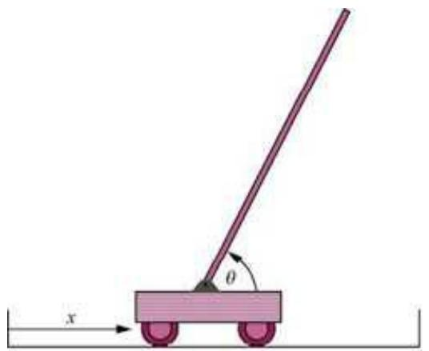

  
  
图22-9 （a）在移动的手推车上控制摆杆平衡的问题。控制器可以向左或向右推动手推车，同时该控制器可以观测手推车的位置x和速度x˙，以及杆的角度 $\theta$ 和角度变化率 $\bar { \pmb { \theta } }$ 。（b）一架自动驾驶直升机在演示非常困难的“机头向内水平圆”机动，该图由6幅延时图像叠加而成。该直升机由Pegasus策略搜索算法制定的策略控制（Ng etal.,2003）。研究员通过观测各种控制操作对真实直升机的影响，建立了仿真模型，然后在仿真模型上运行该算法。此外人们还为不同的操控问题开发了多种控制器。在所有情况下，控制器的性能都远远超过了使用遥控器操作的专业人类飞行员（图片由吴恩达提供）

更令人印象深刻的一项工作是强化学习在无线电控制直升机飞行中的应用（图22-9b）。这项工作通常在大型MDP上使用策略搜索来完成（Bagnell and Schneider, 2001; Ng et al. , 2003），并且通常与模仿学习以及对人类专家飞行员进行观测的逆强化学习相结合（Coatesetal.,2009）。

逆强化学习也已经成功应用于解释人类行为，其中包括基于16万千米GPS数据实现的出租车司机目的地预测和路线选择（Ziebartetal.,2008），以及通过对长达数小时的视频观测实现的对复杂环境中行人的详细身体运动的分析（Kitanietal.,2012）。在机器人领域，一次专家的演示就足以让四足动物LittleDog学习到涉及25个特征的奖励函数，并能让它灵活地穿越之前未观测过的岩石地形区域（Kolteretal.,2008）。关于强化学习和逆强化学习如何在机器人技术中加以使用的更多信息，参见26.7节和26.8节。

小结

本章研究了强化学习问题：一个智能体如何在环境未知，且只提供对环境的感知和偶尔的奖励情况下，对某项任务变得精通。强化学习是一种广泛应用于创建智能系统的模式。本章要点如下。

●智能体整体的设计限制了学习所需的信息类型。

❏ 基于模型的强化学习 智能体需要（或者配备有）环境的转移模型 $P ( \pmb { \mathscr { s } } ^ { \prime } | \pmb { \mathscr { s } } , \pmb { \mathscr { a } } )$ ，并学习效用函数 U ( s )。  
❏ 无模型强化学习 智能体可以学习一个动作效用函数 Q ( s , a )或学习一个策略 。 $\pi ( s )$   
● 效用函数可以通过如下几种方法进行学习。  
❏直接效用估计 将观测到的总奖励用于给定状态，作为学习其效用的样本直接来源。  
❏自适应动态规划 （ADP）从观测中学习模型和奖励函数，然后使用价值或策略迭代来获得效用或最优策略。ADP较好地利用了环境的邻接结构作为状态效用的局部约束。  
❏时序差分 （TD）方法调整效用估计，使其与后继状态的效用估计相一致。它可以被视为ADP方法的一个简单近似，而且学习不需要预先知道转移模型。此外，使用一个学习模型来产生伪经验可以学习得更快。  
● 我们可以通过ADP方法或TD方法学习动作效用函数或Q函数。在使用TD方法时，Q学习在学习或动作选择阶段都不需要模型，这简化了学习问题，但同时潜在地限制了它在复杂环境中的学习能力，因为智能体无法模拟可能的动作过程的结果。  
●当学习智能体在学习过程中进行动作选择时，它必须在这些动作的价值估计与学习潜在的有用新信息之间进行权衡。探索问题的精确解是无法获得的，但一些简单的启发式可以给出一个合理的结果。同时探索性智能体也必须注意避免过早陷入终止态。  
● 在大的状态空间中，强化学习算法必须对 U ( s )或 Q ( s , a )进行函数近似表示，以便在状态空间进行泛化。 深度强化学习 采用深度神经网络作为近似函数，并且已经在一些困难问题上取得了相当大的成功。  
●奖励设计 和 分层强化学习 有助于学习复杂的行为，特别是在奖励稀少且需要长动作序列才能获得奖励的情况下  
●策略搜索 方法直接对策略的表示进行操作，并试图根据观测到的表现对其进行改进。在随机领域中性能的剧烈变化是一个严重的问题，而在模拟领域中可以通过预先固定随机程度来克服这个难点。  
●当正确的奖励函数难以获得时，通过观测专家行为进行学徒学习 是一种有效的解决方案。模仿学习 将问题转换为从专家的状态-动作对中进行学习的监督学习问题。逆强化学习 从专家的行为中推断有关奖励函数的信息。

强化学习仍然是机器学习研究中最活跃的领域之一。它使我们从手动构造行为和标记监督学习所需的大量数据集（或不得不人工编写控制策略）中解脱出来。它在机器人技术中的应用前景是特别有价值的，该领域需要能够处理连续的、高维的、部分可观测环境的方法，在这样的环境中，成功的行为可能包含成千上万甚至数百万的基元动作。

我们在本章中介绍的强化学习方法有很多且错综复杂，这是因为（至少到目前为止）不存在一种公认的最佳方法。基于模型的方法和无模型的方法相比，其核心问题是关于智能体函数的最佳表示方式，这是人工智能的一个本质问题。正如我们在第1章中所说，许多人工智能研究的一个关键历史性特征（通常未说明）是它坚持基于知识 的方法。这相当于已经假设了，智能体函数的最佳表述方式是利用智能体所在环境的某些方面进行表示。有人认为，只要能够访问足够多的数据，无模型方法可以在任何领域获得成功。也许这在理论上是正确的，当然，世界上可能没有足够的数据使它

在实践中成为现实。（例如，我们很难想象无模型方法如何使人能够设计和建造出LIGO引力波探测器。）直觉告诉我们，随着环境变得更加复杂，基于模型方法的优势将变得越发明显。

读者服务：


微信扫码关注【异步社区】微信公众号，回复“e59810”获取本书配套资源以及异步社区15天VIP会员卡，近千本电子书免费畅读。

第六部分

沟通、感知和行动

# 第23章

# 自然语言处理

在本章中，我们将看到计算机如何使用自然语言与人类进行交流，并从人类所书写的内容中学习。

大约10万年前，人类学会了如何说话，大约5千年前，人类又学会了如何写字。人类语言的复杂性和多样性使得智人区别于其他所有物种。当然，人类还有一些其他的特有属性：没有任何其他物种像人类那样穿衣服，进行艺术创作，或者每天花两小时在社交媒体上交流。但是，艾伦·图灵所提出的智能测试是基于语言，而非艺术或服饰，也许是因为语言具有普适性，并且捕捉到了如此多的智能行为：一个演讲者演讲（或作家写作）的目标 是交流知识 ，他 组织 语言来表示 这些知识，然后采取行动 以实现这一目标。听众（或读者）感知 他们的语言并推断 其中的含义。这种通过语言的交流促进了文明的发展，是我们传播文化、法律、科学和技术知识的主要方式。计算机进行 自然语言处理 （natural language processing，NLP）有以下3个主要原因。

●与人类交流 。在很多情况下，人类使用语音与计算机进行交互是很方便的，而且在大多数情况下，使用自然语言要比使用一阶谓词演算等形式语言更加方便。  
●学习 。人类已经用自然语言记录了很多知识。仅维基百科就有3000万页事实知识，例如“婴猴是一种夜间活动的小型灵长类动物”，然而几乎没有任何一个这样的知识来源是用形式逻辑写成的。如果我们想让计算机系统知道很多知识，它最好能理解自然语言。  
●使用人工智能工具结合语言学、认知心理学和神经科学，促进对语言和语言使用的科学理解 。

在本章中，我们将探讨语言的各种数学模型，并讨论使用这些模型可以完成的任务。

# 23.1 语言模型

正如我们在第8章中所看到的，形式语言（如一阶逻辑）是精确定义的。文法 （grammar）定义合

法句的句法（注 语义规则 （semantic rule）定义其含义。

然而，自然语言（如英语或汉语）无法如此清晰地表示。

● 不同的人在不同的时间对于语言的判断会有所差别。所有人都会认为“Not to be invited is sad.”是一个合乎文法的英语语句，但是对于“To benotinvitedissad.”的合乎文法性则存在分歧。  
●自然语言是存在歧义的（“Hesaw herduck”可以理解为“他看到了她的鸭子”，也可以理解为“他看到她躲避某物”），也是模糊不清的（“That’s great!”没有准确说明它有多么好，也没有说明它是什么）。  
●自然语言没有正式定义从符号到对象的映射。在一阶逻辑中，“Richard”符号的两次使用必须指同一个人，但在自然语言中，同一单词或短语的两次出现可能指代世界上不同的事物。

如果我们不能在合乎文法字符串和不合文法字符串之间做出明确的布尔判别，我们至少可以知道每个字符串的可能性或不可能性有多大。

我们将 语言模型 （languagemodel）定义为描述任意字符串可能性的概率分布。这样一个模型应该认为“Do I dare disturb the universe?”作为一个英语字符串具有合理的概率，而“Universe dare the Idisturb do?”是英语字符串的可能性极低。

通过语言模型，我们可以预测文本中接下来可能出现的单词，从而为电子邮件或短信息提供补全建议。我们可以计算出对文本进行哪些更改会使其具有更高的概率，从而提供拼写或文法更正建议。通过一对语言模型，我们可以计算出一个句子最可能的翻译。用一些示例“问题-答案”对作为训练数据，我们可以计算出针对某一问题的最可能的答案。因此，语言模型是各种自然语言任务的核心。语言建模任务本身也可以作为衡量语言理解进度的通用基准。

自然语言是复杂的，因此任何语言模型充其量只能是自然语言的一个近似。语言学家爱德华·萨丕尔（EdwardSapir）曾说“没有一种语言是绝对一成不变的，任何文法都会有所遗漏”（Sapir,1921）。哲学家唐纳德·戴维森（DonaldDavidson）说过“如果语言是……一个明确定义的共享结构的话，就不存在语言这种东西”（Davidson, 1986），他的意思是说，没有一种像Python 3.8那样的确定性的英语语言模型，我们都有不同的模型，但我们仍然设法应对过去了，并进行交流。在本节中，我们将介绍一些简单的语言模型，这些模型显然是错误的，但是对某些任务来说仍然有用。

# 23.1.1 词袋模型

12.6.1节介绍了基于特定单词的朴素贝叶斯模型如何可靠地将句子分类。例如，下面的句子1被分类为business，句子2被分类为weather。

（1）Stocks rallied on Monday, with major indexes gaining 1% as optimism persisted over the first quarter earnings season.   
（2）Heavy rain continued to pound much of the east coast on Monday, with flood warnings issued in New York City and other locations.

在这一节，我们将回顾朴素贝叶斯模型，并将其转换为完整的语言模型。这意味着我们不仅想知道每个句子最可能属于哪一类别，我们还想知道所有句子和类别的联合概率分布。这意味着我们应该考虑句子中的所有单词。给定一个由单词 $w _ { N }$ 组成的句子（参考第14章，我们将其记为 $w _ { \mathrm { ~ } 1 : N }$ ），根据朴素贝叶斯公式［式（12.21）］，我们有

$$
\boldsymbol {P} \left(\text {C l a s s} \mid w _ {1: N}\right) = \alpha \boldsymbol {P} \left(\text {C l a s s}\right) \prod_ {j} \boldsymbol {P} \left(w _ {j} \mid \text {C l a s s}\right)
$$

朴素贝叶斯方法在字符串上的应用称为词袋模型 （bag-of-wordsmodel）。它是一种生成模型，描述了句子生成的过程：想象一下，对于每个类别（business、weather等），我们都有一个装满单词的袋子（你可以想象每个单词都写在袋子内的纸条上，一个单词越常见，重复的纸条就越多）。要生成一段文本，首先选择其中一个袋子并丢掉其他袋子。从那个袋子中随机抽出一个单词，这将是句子的第一个单词。然后将这个单词放回并抽取第二个单词。重复上述操作直到出现句末指示符（如句号）。

这一模型显然是错误的：它错误地假设每个单词都与其他单词无关，因此无法生成连贯的英语语句。但它确实使得我们可以使用朴素贝叶斯公式来进行准确分类：“stocks”和“earnings”这两个词明显指向business类，而“rain”和“cloudy”两个词则指向weather类。

我们可以通过在文本正文或语料库 （corpus）上进行监督训练来学习该模型所需的先验概率，文本的每个部分都标有它的类别。一个语料库通常由至少一百万字的文本和上万个不同词汇组成。最近，我们正在使用更大的语料库，例如，拥有25亿词的维基百科和拥有140亿词的iWeb语料库（来自2200万个网页）。

使用语料库，我们可以通过计算每一类别的常见程度来估计它们的先验概率P(Class)。我们还可以使用计数来估算给定类别的每个单词的条件概率 。例如，如果总共有3 000条文本，其中300条被分类为business，那么我们可以估计

。如果在business类中，总共有100 000个单词，而“stocks”一词出现了700次，那么我们可以估计

。当单词数目很大（且方差较小）时，通过计数进行估计的效果很好，但是在23.1.4节中，我们将看到一种在单词数目较小时估计概率的更好的方法。

有时，选择另一种机器学习方法（如逻辑斯谛回归、神经网络或支持向量机）可能比朴素贝叶斯方法效果更好。机器学习模型的特征是词汇表中的单词：“a”“aardvark”……“zyzzyva”，值是每个单词在文本中出现的次数（或者是一个布尔值，表示该单词是否在文本中出现）。这导致特征向量是高维且稀疏的——在语言模型中，可能有100 000个单词，因此特征向量的维数为100 000。但是对短文本来说，特征向量的绝大部分特征都是0。

正如我们所看到的，当我们进行特征选择 （featureselection），限制特征为单词中的一个子集时，某些机器学习模型效果会更好。我们可以删除非常罕见的单词（因为这些词的预测能力差异很大）和所有类别共有但对分类不起作用的单词（如“the”）。我们还可以将其他特征与基于单词的特征混合使用；例如，如果我们要对电子邮件进行分类，则可以为发件人添加以下特征：发送消息的时间、主题标题中的单词、是否存在非标准标点符号、大写字母的百分比、是否有附件等。

注意，判断单词是什么并不容易。“aren ’t”是一个单词，还是应该将它分解为“aren/’/t”或“are/n ’t”或其他形式？将文本划分为单词序列的过程称为分词 （tokenization）。

# 23.1.2 n 元单词模型

词袋模型具有一定局限性。例如，“quarter”一词在business和sports类中都很常见。但是“first quarterearnings report”这一由4个单词组成的序列只在business类中常见，“fourth quarter touchdownpasses”则只在sports类中常见。我们希望模型可以做出区分。我们可以调整词袋模型，将“first-quarterearningsreport”这样的特殊短语视为单个单词，但更具原则性的方法是引入一种新模型，其中每个单词都依赖于之前的单词。我们可以先让单词依赖于它所在句子中之前的所有单词：

$$
P \left(w _ {1: N}\right) = \prod_ {j = 1} ^ {N} P \left(w _ {j} \mid w _ {1: j - 1}\right)
$$

这个模型在某种意义上是完全“正确”的，因为它捕捉了单词间所有可能的交互，但它并不实用：当词汇表中有100000个单词，句子长度为40时，模型需要估计10 200 个参数。我们可以使用 马尔可夫链 模型折中，它只考虑 $n$ 个相邻单词之间的依赖关系，我们称之为n元模型 （n -grammodel）（gram源自希腊语词根gramma，意为“写下的东西”）：长度为 $n$ 的书面符号序列称为 $n$ 元。 [1]

当 n 分别为1、2和3时，我们将其分别称作一元（unigram，即1-gram）、二元（bigram，即2-gram）和三元（trigram，即3-gram）。在 n 元模型中，每个单词出现的概率仅依赖于前面的 n −1个单词，也就是说：

[1] 注意， n 元的书面符号序列的元素可以是单词、字符、音节或其他元素。——编者注

$$
\begin{array}{l} P \left(w _ {j} \mid w _ {1: j - 1}\right) = P \left(w _ {j} \mid w _ {j - n + 1: j - 1}\right) \\ P \left(w _ {1: N}\right) = \prod_ {j = 1} ^ {N} P \left(w _ {j} \mid w _ {j - n + 1: j - 1}\right). \\ \end{array}
$$

n 元模型适用于对报纸版面进行分类，它在其他分类任务上表现得也很好，如垃圾邮件检测（spam detection）（区分垃圾邮件和非垃圾邮件）、 情感分析 （sentiment analysis）（将电影或商品评论分类为正面评价或负面评价）以及 作者归属 （author attribution）（海明威与福克纳或莎士比亚的写作风格和使用词汇不同）。

# 23.1.3 其他 n 元模型

n 元单词模型的一种替代方法是 字符级模型 （character-level model），其中每个字符的概率由之前的 n −1个字符决定。这种方法有助于处理未知单词，也有助于处理倾向于将单词放在一起的语言，如丹麦语单词“Speciallægepraksisplanlægningsstabiliseringsperiode”。

字符级模型适用于语言识别 （languageidentification）任务，即给定一个文本，确定它是用哪种语言写的。即使是非常短的文本，如“Hello, world”或“Wie geht’s dir”， n 元字母模型也可以将第一个文本识别为英语，第二个文本识别为德语，通常可以达到99%以上的准确率。（像瑞典语和挪威语这样紧密相关的语言则比较难区分，通常需要更长的样本。对于这类语言，准确率在95%以内。）字符模型非常擅长某些特定的分类任务，例如，将“dextroamphetamine”识别为药品名称，“Kallenberger”识别为人名，“Plattsburg”识别为城市名，即使模型从未见过这些单词。

另一种可能的模型是 跳字 （skip-gram）模型，我们收集那些距离相近的单词，但是跳过它们之间的一个（或多个）单词。例如，给定法语文本“je ne comprends pas”，一跳二元（1-skip-bigram）应为“jecomprends”和“nepas”。收集这些内容有助于创建更好的法语模型，因为它告诉我们关于动词的词形变化（“je”之后应该用“comprends”，而不是“comprend”）和否定形式（“ne”应该与“pas”搭配）的信息。仅仅使用常规的二元模型，我们无法学到这些内容。

# 23.1.4 n 元模型的平滑

像“ofthe”之类的高频n 元在训练语料库中的计数值很高，因此它们的概率估计很可能是准确的：即使使用不同的训练语料库，我们也会获得相似的估计值。而低频 n 元由于计数值很低，容易受到随机噪声的干扰，方差较大。如果可以减小这种方差，我们的模型将表现得更好。

此外，我们可能需要处理包含未知单词或未登录词 （out-of-vocabulary）的文本。虽然未知单词或未登录词从未在训练语料库中出现过，但将这类单词的概率设为0是错误的，因为整个句子的概率P ( w )也将变为0。

对未知单词进行建模的一种方法是修改训练语料库，用特殊符号替换不常见单词，一般替换为<UNK> 。我们可以提前决定只保留部分单词。例如，50 000个最常见的单词，或者频率超过0.0001%的所有单词，并将剩下的单词替换为<UNK> 。然后，我们照常对语料库中的 n元计数，把<UNK> 符号看作同其他任意单词一样。当测试集中出现未知单词时，我们查找 <UNK> 的概率。有时，对于不同的类型，我们会使用不同的未知词符号。例如，可以用 <NUM> 替换一串数字，或者用<EMAIL> 替换电子邮件地址。［我们注意到，使用一个特殊符号，如 <S> ，来标记文本的开始（和结束）也是可取的。这样，当二元概率公式需要使用文本第一个单词前面的单词时，可以取到<S> ，而不是错误。］

即使处理了未知单词，我们也会遇到未知n 元的问题。例如，测试文本可能包含短语“colorlessaquamarineideas”，这3个单词可能在训练语料库中分别单独出现过，但从未以短语中的顺序出现。

问题在于，一些低概率的n 元出现在训练语料库中，而其他同样低概率的 n 元却从未出现。我们不希望其中一部分概率为0，而另一部分概率为一个很小的正数。我们希望对所有相似的 n元进行平滑 （smoothing）处理——为从未出现在训练语料库中的 n 元保留模型的一部分概率，以减小模型的方差。

18世纪，皮埃尔-西蒙·拉普拉斯（Pierre-Simon Laplace）提出了一种最简单的平滑方法，用来估计像“明天太阳不会升起”这样的罕见事件发生的概率。拉普拉斯的（不正确的）太阳系理论认为，太阳系大约有 N=200万天的历史。从数据上看，在过去的200万天里，太阳没有升起的概率是0，但我们并不想说这个概率完全就是0。拉普拉斯认为，如果我们采用均匀先验，并结合目前的证据，那么就可以得出，太阳明天不会升起的概率的最佳估计值为1/( N + 2)——它要么升起要么不升起（即分母中的2），以及均匀先验表明升起和不升起的概率相同（即分子中的1）。拉普拉斯平滑（也称为加1平滑）是朝着正确方向迈出的一步，但是对许多自然语言应用来说，它的效果很差。

另一种选择是回退模型 （backoffmodel），首先进行 n 元计数统计，如果某些序列的统计值很低（或为0），就回退到 n −1元。 线性插值平滑 （linear interpolation smoothing）就是一种通过线性插值将三元模型、二元模型和一元模型组合起来的回退模型。它将概率估计值定义为

$$
\hat {P} \left(c _ {i} \mid c _ {i - 2: i - 1}\right) = \lambda_ {3} P \left(c _ {i} \mid c _ {i - 2: i - 1}\right) + \lambda_ {2} P \left(c _ {i} \mid c _ {i - 1}\right) + \lambda_ {1} P \left(c _ {i}\right)
$$

其中 。参数值 可以是固定的，也可以使用EM算法训练得到。 的值也可能取决于计数值：如果三元计数值很高，则其对应的模型权重相对更大；如果三元计数值较低，那么二元模型和一元模型的权重会更大。

一些研究人员提出了更加复杂的平滑方法（如Witten-Bell和Kneser-Ney），而另一些研究人员则建议收集更大规模的语料库，这样即使是简单的平滑方法也能有很好的效果（其中一种方法被称为“stupid backoff”）。二者的目标相同：减小语言模型的方差。

# 23.1.5 单词表示

n 元模型为我们提供了一个可以准确预测单词序列概率的模型，例如，“a black cat”相较于“cat blacka”更可能是一个英语短语，因为“a black cat”在训练语料库的三元中出现的概率大约为0.000014%，而“catblack a”根本没有出现过。n 元单词模型所学到的一切，都是来自特定单词序列的计数值。

但是一个以英语为母语的人可能会从不同的角度解释：“ablack cat”之所以有效是因为它遵循一种熟悉的模式（冠词-形容词-名词），而“catblack a”则不然。

现在考虑短语“thefulvouskitten”。说英语的人可以看出它同样遵循冠词-形容词-名词的模式（即使他不知道“fulvous”表示“棕黄色”，也能意识到几乎所有以“-ous”结尾的单词都是形容词）。此外，他可以意识到“a”和“the”之间密切的句法联系，以及“cat”和“kitten”之间紧密的语义关系。因此，通过泛化，数据中“a black cat”的出现证明了“the fulvous kitten”也是有效的英语短语。

n 元模型则没有这样的泛化能力，因为它是一个原子模型：每个单词都是一个原子，与其他单词不同，且没有内部结构。在整本书中，我们看到，因子化模型或结构化模型可以提供更强的表达能力和更好的泛化能力。在24.1节中，我们将看到，一种被称为词嵌入 （word embedding）的因子化模型具有更好的泛化能力。

词典 （dictionary）是一种结构化单词模型，通常是人工构建的。例如， WordNet是一种机器可读格式的开源手工编写词典，已被证明适用于许多自然语言应用 [2] 。下面是WordNet中的“kitten”词条：

[2] 甚至适用于计算机视觉应用：WordNet提供了可供ImageNet使用的一组类别。

"kitten" <noun.animal> ("young domestic cat") IS A: young_mamma

"kitten" <verb.body> ("give birth to kittens") EXAMPLE: "our cat kittened again this year"

WordNet可以帮助你区分名词和动词，并获得其基本类别（小猫是一种年幼的哺乳动物，是一种哺乳动物，是一种动物），但它不会告诉你有关小猫的外貌或行为的详细信息。WordNet会告诉你，暹罗猫 和曼岛猫是猫的两个品种，但不会再告诉你有关品种的进一步信息。

# 23.1.6 词性标注

对单词进行分类的一种基本方法是依据它们的 词性 （part of speech，POS），也称为 词汇范畴（lexical category）或 词汇标注 （lexical tag）： 名词 、 动词 、 形容词 等。词性允许语言模型捕捉一般模式，例如，“英语中形容词通常在名词之前”（在其他语言中，如法语，则通常相反）。

所有人都会认同“名词”和“动词”是两种词性，但当我们深入到更细节的部分时，却没有一个明确的词性列表。图23-1为 Penn Treebank 中使用的45个标签，Penn Treebank是一个由超过300万个单词的文本组成，并用词性标签标记的语料库。稍后我们将看到，Penn Treebank还使用句法分析树对许多句子进行标记，语料库就是由此命名的。下面这段摘录里“from”被标记为介词（IN），“the”被标记为限定词（DT），等等：

为句子中每个单词分配词性的任务称为 词性标注 （part-of-speech tagging）。虽然这个任务本身不是很有趣，但它是许多其他自然语言处理任务（如问答或翻译）中非常有用的第一步。即使是文本语音合成（text-to-speech synthesis）这样的简单任务，也需要知道名词“record”与动词“record”的发音不同。在本节中，我们将看到如何将两个熟悉的模型应用于这一标注任务，在第24章中，我们将介绍第三种模型。

词性标注的一种常见模型是 隐马尔可夫模型 。回想14.3节中的内容，隐马尔可夫模型采用了证据观察的时间序列，预测可能产生该序列的最可能的隐藏状态。在14.3节的隐马尔可夫模型示例中，证据是观察到一个人带着雨伞（或不带雨伞）的情况，隐藏状态是外界下雨（或不下雨）。对于词性标注任务，证据是单词序列 W 1:N，隐藏状态是词性 C 1:N。

隐马尔可夫模型是一种生成模型，认为产生语言的方法是，从一种状态开始，如IN，介词状态，然后做两个选择：应该生成哪个单词（如 from ），以及接下来应该生成哪种状态（如DT）。除当前的词性状态之外，该模型不考虑任何上下文信息，也不知道句子真正要表达什么。但是，它是一个有用的模型——如果我们应用维特比算法 （14.2.3节）寻找最可能的隐藏状态（词性）序列，我们会发现标注达到了非常高的精度，通常在97%左右。

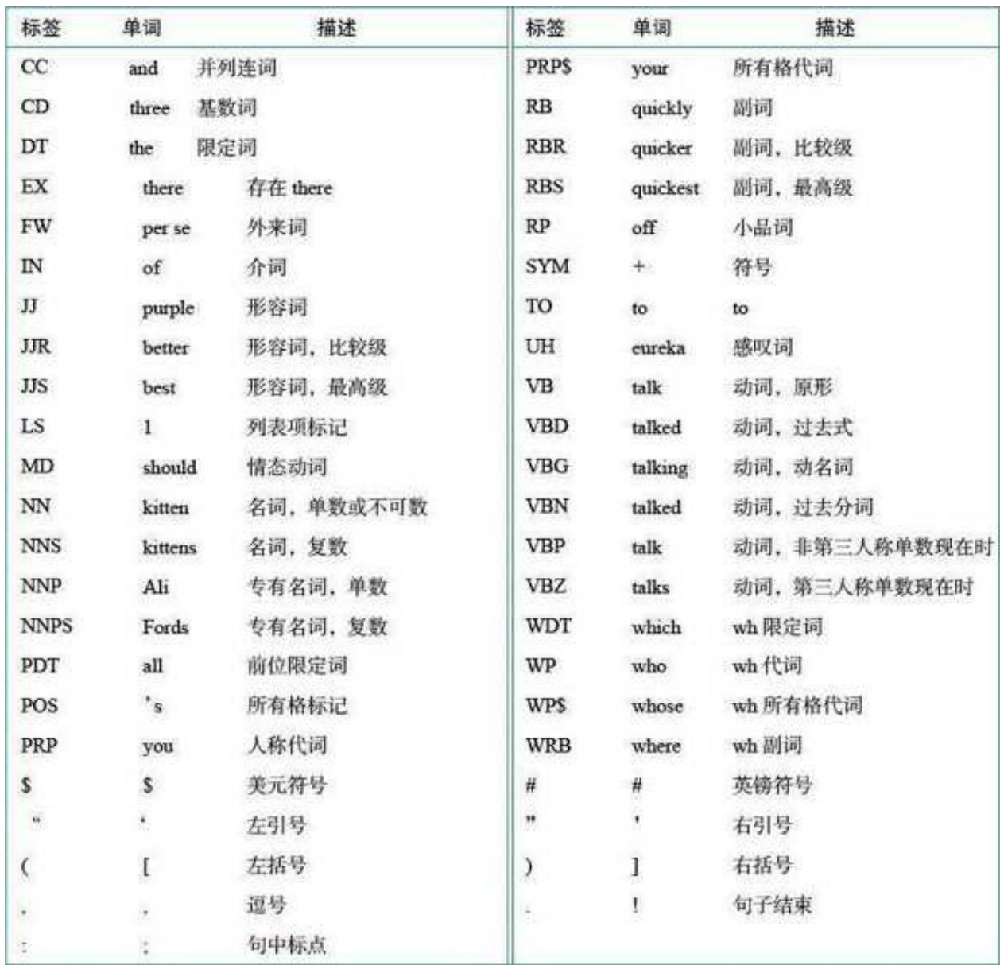  
图23-1 Penn Treebank语料库的词性标签（每个标签都有一个示例单词）（Marcus et al. , 1993）

要创建一个用于词性标注的隐马尔可夫模型，我们需要转移模型，它给出了一个词性紧跟另一词性的概率 ，以及传感器模型 $P ( W _ { t } | C _ { t } )$ 。例如，

表示给定一个情态动词（如would），下一个单词是动词 $P ( C _ { t } = V B \mid C _ { t - 1 } = M D ) = 0 . 8$ （如think）的概率为0.8。0.8这个数值是怎么来的？就像n 元模型一样，从语料库中进行计数统计，并进行适当的平滑处理。事实证明，Penn Treebank中有13 124个MD 实例，其中10 471个后面跟着 VB 。

对于传感器模型， 表示当我们选择情态动词时，10%的情况下我们会选择 would。这些数字同样来自带有平滑处理的语料库计数。

隐马尔可夫模型的一个缺点是，我们对语言的所有了解都必须用转移模型和传感器模型来表达。当前单词的词性仅由这两个模型的概率以及前一个单词的词性决定。对系统开发人员而言，得出以下结论是很难的，例如， 任何 以“ous”结尾的单词都可能是形容词，或者，在短语“attorneygeneral”中， attorney 是名词，而不是形容词。

幸运的是，逻辑斯谛回归 确实能够表示这样的信息。回想19.6.5节，在逻辑斯谛回归模型中，输入是特征值向量x 。然后，我们将这些特征与预训练的权重向量w进行点积w·x ，然后将和转换为0～1之间的数字，这个数字可以解释为该输入是一个类别的正例的概率。

逻辑斯谛回归模型中的权重对应于每个特征对每个类别的预测能力；权重值可以通过梯度下降法学习。对于词性标注，我们将建立45个不同的逻辑斯谛回归模型，每个词性使用一个模型。给定一个单词在特定上下文中的特征值，模型将给出该单词属于该类别的可能性。

接下来的问题是，这些特征应该是什么？词性标注器通常使用二元值特征，对正在标注的单词 $w _ { i }$ （可能还有其他相邻单词）以及分配给前一个单词的词性 $c _ { i - 1 }$ （可能还有更前面单词的词性）等信息进行编码。特征可能取决于单词的确切身份，它的某种拼写方式，或者它在词典条目的某个属性。一组词性标注特征可能包括：

$$
\begin{array}{l} w _ {i - 1} = ^ {\prime \prime} \mathrm {I} ^ {\prime \prime} w _ {i + 1} = ^ {\prime \prime} \text {f o r} \\ w _ {i - 1} = \text {" y o u "} c _ {i - 1} = \mathrm {I N} \\ \end{array}
$$

$w _ { i }$ ends with “ous” $w _ { i }$ contains a hyphen

$w _ { i }$ ends with “ly” $w _ { i }$ contains a digit

w i starts with “un” w $i$ is all uppercase

w i − 2 = “to” and c i − 1 = VB w i − 2 has attribute PRESENT

w i − 1 = “I” and w i +1 = “to” w i − 2 has attribute PAST

例如，单词“walk”可以是名词也可以是动词，但在“Iwalk to school”中，使用词性标注特征中最后一行左列的特征，我们可以将“walk”分类为动词（VBP）。另一个例子是，单词“cut”可以是名词（NN），也可以是过去时动词（VBD）或现在时动词（VBP）。给定句子“Yesterday I cut therope”，最后一行右列的特征可以帮助我们将“cut”标记为VBD，而在句子“Now I cut the rope”中，倒数第二行右列的特征可以帮助我们将“cut”标记为VBP。

总的来说，可能有100万个特征，但是对于任意给定的单词，只有几十个特征是非0的。这些特征通常是由人类专家手工设定的，他们会想出有趣的特征模板。

逻辑斯谛回归没有输入序列的概念——你给它一个单独的特征向量（单个单词的相关信息），它产生一个输出（一个标注）。但是，我们可以强制逻辑斯谛回归模型通过贪心搜索 来处理序列：首先为第一个单词选择最可能的标注，然后按照从左到右的顺序处理其余单词。在每一步，根据下式分配词性 c i：

$$
c _ {i} = \underset {c ^ {\prime} \in C a t e g o r i e s} {\operatorname {a r g m a x}} P \left(c ^ {\prime} \mid w _ {1: N}, c _ {1: i - 1}\right)
$$

也就是说，分类器可以查看句子中任意单词的任何非词性特征（因为这些特征都是固定的），以及任何为先前单词分配的词性。

注意，贪心搜索为每个单词做出确定性的词性选择，然后转到下一个单词；即使这一选择与句子后面的证据相矛盾，也不可能回过头来推翻这一选择。因此，算法速度很快。相比之下，维特比算法会维护一个表格，记录每一步中所有可能的词性选择，表格始终可以更改。这使得算法更加准确，但速度较慢。对于这两种算法，一个折中方案是束搜索 ，在每个时间步，我们考虑所有可能的词性，但只保留 $^ { b }$ 个最可能的标注，丢掉其他不太可能的标注。改变b 的大小是在速度和准确性之间进行权衡。

朴素贝叶斯模型和隐马尔可夫模型都是生成模型 （见20.2.3节）。也就是说，它们学习一个联合概率分布 P(W,C)，我们可以通过从这一概率分布中采样得到句子的第一个单词（和标注），然后每次添加一个单词来生成一条随机句子。

逻辑斯谛回归是一种 判别模型 。它学习一个条件概率分布 ，这意味着它可以根据给定的单词序列来分配词性，但不能生成随机句子。研究人员发现，通常，判别模型的错误率较低，可能是因为它们直接对预期输出进行建模，也可能是因为它们让分析者更容易创建附加特征。然

而，生成模型往往收敛得更快，因此在可用训练时间较短或训练数据有限时，可能会首选生成模型。

# 23.1.7 语言模型的比较

为了了解不同的 n 元模型的效果，我们对本书中的单词建立了一元模型（即词袋）、二元模型、三元模型和四元模型，然后从4个模型中随机采样单词序列。

● n = 1: logical are as are confusion a may right tries agent goal the was   
● $n = 2$ : systems are very similar computational approach would be represented   
● $n = 3$ : planning and scheduling are integrated the success of naive Bayes model is   
● n = 4: taking advantage of the structure of Bayesian networks and developed various languages for writing “templates”with logical variables, from which large networks could be constructed automatically for each problem instance

从这个小例子中可以清楚地看出，无论是对一般英语教材还是特定的人工智能教材的内容，一元模型都是很糟糕的近似，而四元模型虽然并不完美，但效果要好得多。接下来，为了演示样本如何在不同的训练源之间变化（当然不仅仅是为了好玩），我们在四元模型中添加了钦定版《圣经》的文本，从而产生了下面这些随机样本。

● Prove that any 3-SAT problem can be reduced to simpler ones using the laws of thy G od.   
● Masters, give unto your servants that which is true iff both P and Q in any model m by a simple experiment: put your hand unto, ye and your households for it is pleasa nt.   
● Many will intreat the LORD your God, Saying, No; but we will ignore this issue for now; Chapters 7 and 8 suggest methods for compactly representing very large belief stat es.   
● And it came to pass, as if it had no successo rs.   
● The direct utility estimation is just an instance of the general or algorithm in which new function symbols are constructed “on the fly.”For example, the first child of the Holy Gho st.

n 元模型有一个限制——随着 n 的增加，它们将生成更流畅的语言，但它们倾向于逐字复制训练数据中的长段落，而不是生成新的文本。具有更复杂的单词和上下文表示的语言模型可以在这方面做得更好。本章的其余部分说明了文法 （grammar）如何对语言模型进行改进，而第24章则展示了目前深度学习方法如何生成优秀的语言模型。例如，深度学习模型GPT-2在给定提示时可以生成流畅的英语样例。我们将本段的前两个句子[3] 提示给GPT-2模型，它产生了以下两个样本。

[3] 在原书中，本段的前两个句子为：There is a limit to n -gram models—as n increases, they will produce language that is more fluent, but they tend to reproduce long passages from their training data verbatim, rather than generate novel text. Language models with more complex representations of words and context can do better.——编者注

● Numerous studies have shown that the best language models that can generate language are those that use neural networks, and in particular that use deep learning to model speech. I have used one of these models to generate hundreds of sentences in multiple languages, and it has the ability to generate almost perfect translations of my training sentences. It’s a great model to have, and will save you a lot of time in the future when you need to translate between many languag es.

● These models can also do better if their samples are chosen at random, rather than by an expert in the domain. However, as a general rule, n-gram and language models that include a large number of features tend to produce text better, since these features contribute the most to language learning. To measure the performance of a model, I’ve made some sample sentences that I’d like to train to better understand speech and language models. You can read them to get a grasp of how the model predic ts.

可以看到，这些段落内容丰富而且文法流畅；此外，它们的主题也与提示语句相关。但是，句子之间并没有相互补充以形成一个连贯的论点。GPT-2语言模型是一个Transformer模型 （我们将在24.4节中介绍），在图24-14中，我们给出了GPT-2的其他示例。另一种Transformer模型是CTRL（conditional transformer language，条件Transformer语言）模型。它可以被更灵活地控制。在以下示例中，要求CTRL生成产品评论类的文本，指定评分分别为1和4（满分为5）。

● 1.0 : I bought this for my son who is a huge fan of the show. He was so excited to get it and when he opened it, we were all very disappointed. The quality of the product is terrible. It looks like something you would buy at a dollar sto re.   
● 4.0 : I bought this for my husband and he loves it. He has a small wrist so it is hard to find watches that fit him well. This one fits perfect ly.

# 23.2 文法

在第7章中，我们使用巴克斯-诺尔范式（Backus-Naurform，BNF）写下了一阶逻辑语言的文法。文法 （grammar）是一组规则，定义了合法短语的树结构，而 语言 （language）是遵循这些规则的句子集。

自然语言的使用方式与一阶逻辑形式语言并不完全一样——自然语言中不存在合法句和非法句之间的硬性界限，对于每个句子也没有单一的确定性的树结构。但是，层次结构在自然语言中非常重要。“Stocks rallied on Monday”一句中的“Stocks”一词不仅是一个单词，也不仅仅是一个名词；在这个句子中，它还是一个 名词短语 ，这个 名词短语 是其后 动词短语 的主语。诸如 名词短语 或 动词短语 之类的 句法范畴 （syntactic category）有助于对句子中每个位置上可能出现的单词进行约束， 短语结构 （phrase structure）则为句子的含义或 语义 提供了框架。

有许多语言模型基于分层句法结构的思想。在本节中，我们将介绍一种当前流行的模型，概率上下文无关文法 （probabilistic context-free grammar，PCFG）。概率文法为每个字符串分配一个概率，“上下文无关”意味着任一规则都可以在任何上下文中使用：句子开头的名词短语的规则与句子后面的另一个名词短语的规则相同，如果同一短语出现在两个不同位置，那么每次的概率都必须相同。我们将为一小段英语文本定义一个PCFG文法，该文法适用于探索wumpus世界的智能体之间的通信。我们称这种语言为E （见图23-2）。一个像

Adjs→Adjective [0.80]

Adjective Adjs [0.20]

这样的文法规则意味着句法范畴Adjs（形容词列表）可以由单个Adjective（形容词）组成（概率为0.80），也可以由 Adjective 加上可以构成 Adjs 的字符串组成（概率为0.20）。遗憾的是，该文法会 过生成 （overgeneration），也就是说，它会生成不符合文法的句子，如“Me go I”。它也会 欠生成 （undergeneration），也就是说，它无法生成部分符合文法规则的句子，如“I think the wumpus issmelly”。稍后我们将看到如何学习更好的文法；现在，我们专注于如何使用这种非常简单的文法。

$S\rightarrow NPVP$ [0.90] I+feel a breeze   
| S Conj S [0.10] I feel a breeze $^+$ and $^+$ It stinks $NP\to \mathit{Pronoun}$ [0.25] I   
Name [0.10] Ali   
Noun [0.10] pits   
Article Noun [0.25] the+wumpus   
Article Adjs Noun [0.05] the+smelly dead+wumpus Digit Digit [0.05] 34   
NP PP [0.10] the wumpus+in 1 3   
NP RelClause [0.05] the wumpus+that is smelly   
NP Conj NP [0.05] the wumpus $^+$ and $^+$ I   
VP $\rightarrow$ Verb [0.40] stinks   
VP NP [0.35] feel+a breeze   
VP Adjective [0.05] smells+dead   
VP PP [0.10] is+in 1 3   
VP Adverb [0.10] go+ahead   
Adjs $\rightarrow$ Adjective [0.80] smelly   
| Adjective Adj [0.20] smelly+dead   
PP $\rightarrow$ Prep NP [1.00] to+the east   
RelClause $\rightarrow$ RelPro VP [1.00] that $^+$ is smelly

图 $2 3 \mathrm { - } 2 \mathrm { E } _ { 0 }$ 的文法，每个规则都有示例短语。句法范畴包括句子（ S ）、名词短语（NP）、动词短语（VP）、形容词列表（Adjs）、介词短语（PP）和关系从句（ RelClause）

E 0 的词典

图23-3中定义了 词典 （lexicon）或允许使用的单词的列表。每个词汇范畴都以…结尾，表示该范畴中还有其他单词。对于名词、名称、动词、形容词和副词，列出所有单词是不可行的。每一类中不仅有成千上万的单词，而且还在不断增加新单词，如“humblebrag”或“microbiome”。这5个范畴被称为开放类 （open class）。代词、关系代词、冠词、介词和连词被称为封闭类 （closedclass），它们的单词数量很少（十几个），而且要经过几个世纪才发生变化，而不是几个月就发生变化。例如，“thee”和“thou”在17世纪是常用代词，在19世纪才逐渐减少使用，而如今仅在诗歌和某些地区的方言中才能看到。

Noun $\rightarrow$ stench [0.05] | breeze [0.10] | wumpus [0.15] | pits [0.05] | ... Verb $\rightarrow$ is [0.10] | feel [0.10] | smells [0.10] | stinks [0.05] | ... Adjective $\rightarrow$ right [0.10] | dead [0.05] | smelly [0.02] | breezy [0.02] | ... Adverb $\rightarrow$ here [0.05] | ahead [0.05] | nearby [0.02] | ... Pronoun $\rightarrow$ me [0.10] | you [0.03] | I [0.10] | it [0.10] | ... RelPro $\rightarrow$ that [0.40] | which [0.15] | who [0.20] | whom [0.02] | ... Name $\rightarrow$ Ali [0.01] | Bo [0.01] | Boston [0.01] | ... Article $\rightarrow$ the [0.40] | a [0.30] | an [0.10] | every [0.05] | ... Prep $\rightarrow$ to [0.20] | in [0.10] | in [0.05] | near [0.10] | ... Conj $\rightarrow$ and [0.50] | or [0.10] | but [0.20] | yet [0.02] | ... Digit $\rightarrow$ 0 [0.20] | 1 [0.20] | 2 [0.20] | 3 [0.20] | 4 [0.20] | ...

图 $2 3 – 3 \operatorname { E } _ { 0 }$ 的词典。 RelPro 是关系代词（relative pronoun）的缩写， Prep 是介词（preposition）的缩写， Conj 是连词（conjunction）的缩写。每一类的概率之和都为1

# 23.3 句法分析

句法分析 （parsing） [1] 是根据文法规则分析一串单词以获得其短语结构的过程。我们可以将它看作对有效句法分析树的搜索 ，树的叶节点是字符串中的单词。图23-4表示，我们可以从S 符号开始自顶向下搜索，也可以从单词开始自底向上搜索。然而，单纯的自顶向下或自底向上的句法分析策略可能很低效，因为它们最终可能会在搜索空间导致死胡同的区域中重复工作。考虑以下两个句子：

[1]“parsing”在计算语言学中译作“句法分析”，在计算机学科的编译原理中译作“语法分析”。因为本章主要是讲自然语言处理，所以此处的翻译遵循计算语言学中使用的术语，译为“句法分析”。编者注

Have the students in section 2 of Computer Science 101 take the exam.

Have the students in section 2 of Computer Science 101 taken the exam?

即使共享前10个单词，这两个句子的句法分析也存在很大差异，因为第一个句子是祈使句，而第二个是疑问句。从左到右的句法分析算法必须猜测第一个单词到底属于命令还是提问，而且至少到第11个单词，take或者taken ，算法才能判断它的猜测是否正确。如果算法一开始的猜测是错误的，那么它不得不一直回溯到第一个单词，然后在另一种解释下重新分析整个句子。

为了避免这种效率低下的情况，我们可以使用 动态规划 （dynamic programming）：每次分析子字符串时，存储分析结果，以免之后重复分析。例如，一旦我们发现“thestudentsin section 2 ofComputerScience101”是一个NP结构，我们就可以将结果记录在一种被称为 图表 （chart）的数据结构中。执行此操作的算法称为 图表句法分析器 （chart parser）。因为我们正在处理上下文无关文法，所以在搜索树的一个分支的上下文中找到的任何短语都可以在搜索树的任何其他分支中正常工作。图表句法分析器有很多类型，我们将介绍一种自底向上的图表句法分析算法的概率版本，称为CYK算法 ，该算法以其发明者姓氏的首字母命名：阿里·科克（AliCocke）、丹尼尔·扬格（Daniel Younger）和嵩忠雄（Tadeo Kasami）。 [2]

[2]有时，发明者按CKY顺序排序。

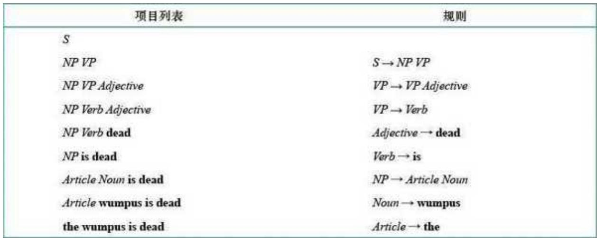  
图23-4 根据E 文法，对字符串“Thewumpusisdead”进行句法分析。对于自顶向下的句法分析，我们从S开始，在每一步中，将一个非终结符X与形式为（X→Y…）的规则匹配并将项目列表中的 X 替换为 Y … 。例如，用序列 NP VP 替换 S 。对于自底向上的句法分析，我们从“the wumpus isdead”开始，在每一步中，将一串记号，如（Y…），与规则（X→Y…）相匹配，并将记号替换为 X 。例如，用 Article 替换“the”或用 NP 替换 Article Noun

CYK算法如图23-5所示。它要求所有规则都必须为两种特定格式之一： 形式的词法规则，以及 X → Y Z [ p ]形式的句法规则，规则右边恰好有两个范畴。这种文法格式称为 乔姆斯基范式 （ChomskyNormalForm），它看上去是受限的，但其实不然：任何上下文无关文法都可

以自动转换为乔姆斯基范式。习题23.CNFX可以引导你思考这一转换过程。

functionCYK-PARsE(words，grammar)returns一个句法分析树表  
inputs: words,单词列表 grammar，LEXICALRULES和GRAMMARULES结构 $T\gets$ 一个表 // $T[X,i,k]$ 是涵盖words的最可能的X树 $P\gets$ 一个表，初始时全为0// $P[X,i,k]$ 表示树 $T[X,i,k]$ 的概率 //为每个单词插入词汇范畴  
for $i = 1$ to LEN( $\mathcal{W}$ ods)do for each $(X,p)$ in grammar.LEXICALRULES $(word_{i})$ do $P[X,i,i]\gets p$ $T[X,i,i]\gets \mathrm{TREE}(X,\mathrm{word}_i)$ //通过 $Y_{ij} + Z_{j + 1:k}$ 构建 $X_{ik}$ ，最短区间优先  
foreach $(i,j,k)$ in SUBSPANS(LEN( $\mathcal{W}$ ods))do for each $(X,Y,Z,p)$ in grammar.GRAMMARRULEs do $PYZ\gets P[Y,i,j]\times P[Z,j + 1,k]\times p$ if $PYZ > P[X,i,k]$ do $P[X,i,k]\gets PYZ$ $T[X,i,k]\gets \mathrm{TREE}(X,T[Y,i,j],T[Z,j + 1,k])$ return T  
functionSUBSPANS(N）yields $(i,j,k)$ 元组  
for length $= 2$ to N do for $i = 1$ to $N + 1 - length$ do $k\gets i + length - 1$ for $j = i$ to $k - 1$ do yield $(i,j,k)$

图23-5 CYK句法分析算法。给定一个单词序列，算法将找出该序列及其子序列的最可能的句法分析树。表 $P [ X , i , k$ ]表示的是单词串words 构成范畴X的最可能树的概率。输出表 $T [ X , i , k ]$ 则表示范畴 $X$ 涵盖位置 i到 $k$ 的最可能树。subspans函数返回涵盖单词串 words $i : k$ 的所有元组(i,j , k )，其中 $l \leq j < k$ ，按照 $i : k$ 区间长度递增的顺序列出元组，因此当我们需要把两个较短区间组合成一个更长的区间时，这两个较短区间都能在表中找到。L exical R ules ( word )返回一组( X , p)对，其中每个规则的形式为 X → word [ p ]，而G rammar R ules 则返回一组( X , Y , Z , p )元组，其中每个规则的形式为X→YZ[p ]

CYK算法中，表 $P$ 和表 $T$ 所需空间为 O ( n 2 m )，所需时间为 O ( n 3 m )，其中 $n$ 是句子中单词的数量， $m$ 是文法中非终结符的数量。如果我们希望算法适用于所有可能的上下文无关文法，那么CYK算法已经是最好的算法了。但实际上，我们只想对自然语言而不是所有可能文法进行句法分析。自然语言已经进化到易于实时理解的程度，而不是变得更加复杂，因此它们似乎应该适用于更快的句法分析算法。

为了尝试达到O (n )时间，我们可以以一种非常简单的方式应用A* 搜索：每个状态都是一个项目（单词或范畴）列表，如图23-4所示。初始状态是单词列表，目标状态是S 。状态的代价是到目前为止应用的规则所定义的概率的倒数，有很多启发式方法可以用来估计到目标的剩余距离；目前使用的最佳启发式方法来自应用句子语料库的机器学习。

使用A* 算法，我们不需要搜索整个状态空间，并且可以保证算法找到的第一个分析就是可能性最大的分析（假设是一个可容许的启发式）。它通常比CYK算法快，但（取决于文法的细节）仍然比 O ( n )慢。句法分析的示例结果如图23-6所示。

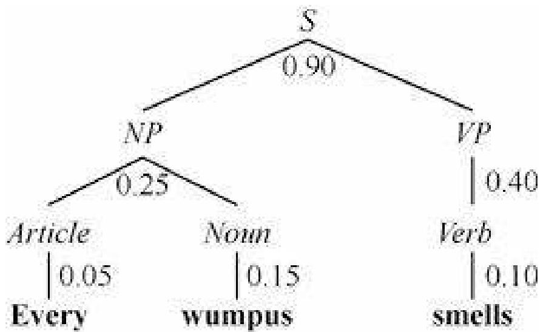  
图23-6 根据 E 0 文法得到的句子“Every wumpus smells”的句法分析树。树的每个内部节点均标有概 率。整个树的概率为 $\pmb { 0 . 9 \times }$ 0.25×0.05×0.15×0.40×0.10=0.0000675。它也可以以线性形 式写为：[ S [ NP [ Article every ][ Noun wumpus ]][ VP [ Verb smells ]]]

就像词性标注一样，我们可以使用 束搜索 进行句法分析，在任何时候我们都只考虑b 个最可能的选择。这意味着我们不能保证找到概率最高的分析，但是（通过周密的实现）分析器可以在O (n )时间内运行，并且在大多数情况下仍能找到最佳的句法分析。

b = 1的束搜索句法分析器称为 确定性句法分析器 （deterministic parser）。一种流行的确定性方法是 移位减少句法分析 （shift-reduce parsing），我们逐字遍历整个句子，在每一点上选择将单词移到成分栈上，或根据文法规则减少栈最顶端的成分。在NLP社区中，每种句法分析方式都有人使用。我们把机器学习应用于文法归纳问题时，即使可以将移位减少系统转换为PCFG（反之亦然），每个系统的归纳偏差以及泛化也是不一样的（Abney et al. , 1999）。

# 23.3.1 依存分析

另一种广泛使用的句法，称为 依存文法 （dependency grammar），它假定句法结构是由词汇项之间的二元关系形成的，不需要句法成分。图23-7展示了一个句子的依存分析和短语结构分析。

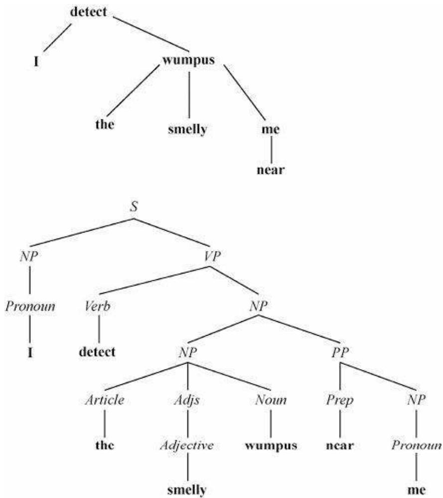  
图23-7 句子“ I detect the smelly wumpus near me ”的依存句法分析（上）和相应的短语结构分析（下）

从某种意义上说，依存文法和短语结构文法只是符号上的变体。如果用每个短语的中心词对短语结构树进行标记，就可以从中恢复出依存关系树。在另一个方向上，我们可以通过引入任意范畴将依存关系树转换为短语结构树（尽管我们并不总能以这种方式获得一棵自然的树）。

因此，我们不会因为一种符号更强而选择这种符号；我们更愿意选择一种更自然的符号— —要么对系统的开发人员来说更加熟悉，要么对必须学习句子结构的机器学习系统来说更加自然。通常，对词序几乎固定的语言（如英语）来说，短语结构树更加自然；对词序几乎无限制的语言（如拉丁语）来说，依存关系树更加自然，在这类语言中，词序更多地取决于语用学而不是句法范畴。

如今，依存文法的流行很大程度上源于Universal Dependencies项目（Nivre et al. , 2016），这是一个开源项目，它定义了一组关系并提供了来自70多种语言的数百万个经过句法分析后的句子。

# 23.3.2 从样例中学习句法分析器

为大规模的英语语句建立文法是一件费力且容易出错的事。这表明，直接 学习 文法规则（及其概率）比人工标注更好。为了应用监督学习方法，我们需要句子的输入/输出对及其句法分析树。

Penn Treebank是最著名的此类数据的来源，由用句法分析树结构标记的十万多个句子组成。图23-8为来自Penn Treebank的标记树。

```txt
[[S[NP-2 Her eyes]  
[VP] were  
[VP] glazed  
[NP*-2]  
[SBAR-ADV] as if  
[S[NP] she]  
[VP] did n't]  
[VP] hear [NP*-1]  
or  
[VP] [ADVP even] see [NP*-1]  
[NP-1] []]]]] 
```

图23-8 来自Penn Treebank的句子“Her eyes were glazed as if she didn’t hear or even see him.”的标记 树。需要注意一种我们还未涉及的文法现象：短语从树的一部分移动到另一部分。这棵树将短 语“hear or even see him”分析为由两个 VP 成分组成，[ VP hear [ NP *-1]]和[ VP [ ADVP even ] see [ NP*-1]]，两者都含有一个空缺，*-1，表示在树中其他地方被标记为[NP-1 him]的NP。类似 地，[ NP *-2]表示[ NP -2 Her eyes ]

给定一个树库（treebank），我们可以通过计算每个节点类型在树中出现的次数来创建PCFG（通常需要注意平滑低计数值）。在图23-8中，有两个[S [NP…][VP…]]形式的节点。我们将对这些节点以及语料库中其他所有根为S 的子树进行计数。如果一共有1000个S 节点，其中600个为上述形式，那么我们可以创建规则：

$$
S \rightarrow N P V P [ 0. 6 ]
$$

Penn Treebank一共有10 000多种不同的节点类型。这反映了一个事实：英语是一种复杂的语言，但同时也表明，创建树库的标注人员更偏爱扁树，也许比我们期望的还要扁。例如，“thegood andthebad”被标注为一个单独的名词短语，而不是两个名词短语连用，从而得到如下规则：

# NP→Article Noun Conjunction Article Noun

有数百种类似规则都将名词短语定义为中间某处为连词的范畴串。一种更简洁的文法用单个规则代替了所有名词短语连用的规则：

# NP → NP Conjunction NP

博德等人（Bod etal., 2003）（Bod,2008）展示了如何自动恢复像这样的一般化规则，大大减少了树库中规则的数量，他们还创建了一种文法，最终可以更好地泛化到之前未见过的句子。他们称这种方法为 面向数据的句法分析 （data-oriented parsing）。

我们已经看到，树库不是完美的——它们存在错误并且包含怪异的句法分析。此外，创建树库显然需要大量工作。这意味着，与所有还没有使用树来标记的文本相比，树库仍然相对较小。另一种方法是 无监督句法分析 （unsupervised parsing），我们使用不包含树的句子语料库学习新文法（或改进现有文法）。

向内-向外算法 （inside-outside algorithm）（Dodd, 1988）（这里不详细介绍）学习从不包含树的例句中估计PCFG中的概率，类似于前向-后向算法（图14-4）估计概率的方式。（Spitkovsky et al. ,

2010a）则提出了一种利用 课程学习 （curriculum learning）的无监督学习方法：从课程的简单部分开始——根据先验知识或注释可以轻松地分析只包含2个单词的无歧义简短句，如“Heleft”。每一个新的短句句法分析都会扩充系统知识，从而最终可以处理3个单词、4个单词，甚至是40个单词的句子。

我们还可以使用 半监督句法分析 （semisupervised parsing），首先使用少量树作为数据来构建初始文法，然后添加大量未分析的语句来改进文法。半监督方法可以利用 部分括号表示法 （partialbracketing）：我们可以使用由文本作者（而不是语言专家）用部分树状结构标记（采用HTML或其他类似注释形式）的广泛可用文本。在HTML文本中，大多数括号对应于句法成分，因此部分括号表示法有助于学习文法（Pereira and Schabes, 1992; Spitkovsky et al. , 2010b）。考虑下面来自报纸文章的HTML文本：

```txt
In 1998, however, as I <a>established in <i>The New Republic</i></a> and Bill Clinton just <a>confirmed in his memoirs</a>, Netanyahu changed his mind 
```

由<i></i> 标记包围的单词构成一个名词短语，由<a></a> 标记包围的两个单词串分别构成动词短语。

# 23.4 扩展文法

目前为止，我们已经处理了上下文无关文法 。但是，并不是每个NP都可以以相同的概率出现在每个上下文中。“I ate a banana”是符合文法的，但是“Me ate a banana”不符合文法，而“I ate a


bandanna”则不符合实际。

问题在于我们的文法侧重于词汇范畴，如代词，但尽管“I”和“me”都是代词，却只有“I”可以作为句子主语。同样，“banana”和“bandanna”都是名词，但前者更有可能成为“ate”的宾语。如语言学家所


说，代词“I”属于主格（即，动词的主语），而“me”属于宾格 $\_$ （即，动词的宾语）。他们还表明，“I”是第一人称（“you”是第二人称，“she”是第三人称），此外，“I”还是单数（“we”是复数）。像代词这样的范畴，已经用诸如“主格、第一人称单数”之类的特征进一步扩展，称为子范畴 （subcategory）。

在本节中，我们将展示文法如何表示这类知识，从而更精细地区分哪些句子更可能出现。我们还将展示如何以组合方式构造一个短语的语义表示。所有这些都可以通过 扩展文法 （augmentedgrammar）实现，其中非终结符不只是代词或 NP之类的原子符号，而是结构化表示。例如，名词短语“I”可以被表示为 NP ( Sbj , 1S , Speaker )，表示“主格，第一人称单数形式，其含义是说这句话的人”。相反，“me”将被表示为 NP ( Obj , 1S , Speaker )，表示它是宾格。

考虑序列“ Noun and Noun or Noun ”，这个序列可以被分析为“[ Noun and Noun ] or Noun ”或“ Nounand[NounorNoun ]”。上下文无关文法无法确定应该使用哪种分析，因为关于 NP连用的规则NP→ NP Conjunction NP [0.05]会赋予两个句法分析相同的概率。对于短语“spaghetti and meatballs orlasagna”和“spaghetti and pie or cake”，我们希望文法能够更偏向于将它们分析为“[[spaghetti andmeatballs] or lasagna]”和“[spaghetti and [pie or cake]]”。

词汇化PCFG（lexicalizedPCFG）是一种扩展文法，它允许我们根据短语中单词的属性而不仅仅是句法范畴来分配概率。如果说包含40个单词的句子的概率取决于所有的40个单词，那么数据会非常稀疏——这与我们使用n元模型时注意到的问题一样。为简化起见，我们引入了短语头（head）的概念——短语中最重要的词。因此，“banana”是 NP “a banana”的头，“ate”是 VP “ate abanana”的头。符号 VP(v)表示范畴为VP且头为v的短语。以下是一个词汇化PCFG：

$$
V P (v) \rightarrow V e r b (v) N P (n) \quad [ P _ {1} (v, n) ]
$$

$$
V P (v) \rightarrow V e r b (v) \quad [ P _ {2} (v) ]
$$

$$
N P (n) \rightarrow \text {A r t i c l e} (a) \operatorname {A d j s} (j) \operatorname {N o u n} (n) \quad [ P _ {3} (n, a) ]
$$

$$
N P (n) \rightarrow N P (n) \text {C o n j u n c t i o n} (c) N P (m) \quad [ P _ {4} (n, c, m) ]
$$

$$
V e r b (\mathbf {a t e}) \rightarrow \mathbf {a t e} \tag {0.002}
$$

$$
N o u n (\text {b a n a n a}) \rightarrow \text {b a n a n a} \tag {0.0007}
$$

这里 $P _ { \mathrm { ~ 1 ~ } } ( \boldsymbol { v } , \boldsymbol { n } )$ 表示一个头为 $v$ 的 VP加上一个头为 $n$ 的NP形成一个VP的概率。通过保证，我们可以让“ate a banana”的概率大于“ate a $P _ { 1 } ( a t e , b a n a n a ) > P _ { 1 } ( a t e , b a n d a n n a )$ bandanna”的概率。注意，由于我们仅考虑短语头，因此 $P _ { \mathrm { ~ 1 ~ } }$ 无法区分“ate a banana”和“ate a rancidbanana”。从概念上讲， $P _ { \mathrm { ~ 1 ~ } }$ 是一个庞大的概率表：如果词汇表中有5 000个动词和10 000个名词，那么 $P _ { \mathrm { ~ 1 ~ } }$ 需要5 000万个条目，但其中大多数不会被显式存储，而是通过平滑和回退导出。例如，我们可以从 $P _ { \mathrm { ~ 1 ~ } } ( \boldsymbol { v } , \boldsymbol { n } )$ 回退到仅依赖于 $v$ 的模型，这样的模型所需的参数只是原来的万分之一，但仍可以捕获重要的规则性，例如，相较于像“sleep”一样的不及物动词，“ate”这样的及物动词之后更可能跟NP（无论它的头是什么）。

在23.2节中，我们看到，E 的简单文法会过生成，产生诸如“Isaw she”或“Iseesher”之类的非句。为了避免这个问题，我们的文法必须知道，“her”而不是“she”，才是“saw”（或其他任何动词）的有效宾语，“see”而不是“sees”，才是主语“I”应该搭配的动词形式。

我们可以将这些事实完全编码在概率条目中，例如，对所有动词 v ， P 1( v , she )都是一个非常小的值。但是，使用附加变量来扩展 NP 范畴会更为简洁和模块化： NP ( c , pn , n )用于表示一个名词短语， c 表示格（主格或宾格）， pn 表示人称和单复数（如第三人称单数）， n 表示短语头。图23-9给出了处理这些附加变量的扩展词汇化文法。让我们详细地考虑一个文法规则：

$$
S (v) \rightarrow N P (S b j, p n, n) V P (p n, v) [ P _ {5} (n, v) ]
$$

$$
S (v) \rightarrow N P (S b j, p n, n) V P (p n, v) | \dots
$$

$$
N P (c, p n, n) \rightarrow \text {P r o n o u n} (c, p n, n) | N o u n (c, p n, n) | \dots
$$

$$
V P (p n, v) \rightarrow \text {V e r b} (p n, v) N P (O b j, p n, n) | \dots
$$

$$
P P (\text {h e a d}) \rightarrow \text {P r e p} (\text {h e a d}) N P (O b j, p n, h)
$$

$$
\text {P r o n o u n} (S b j, I S, \mathbf {I}) \rightarrow \mathbf {I}
$$

$$
\text {P r o n o u n} (\text {S b j .} 1 P, \text {w e}) \rightarrow \text {w e}
$$

$$
\text {P r o n o u n} (\text {O b j . I S , m e}) \rightarrow \text {m e}
$$

$$
\text {P r o n o u n} (\text {O b j . 3 P , t h e m}) \rightarrow \text {t h e m}
$$

$$
\text {V e r b} (3 S, \text {s e e}) \rightarrow \text {s e e}
$$

图23-9 保有格一致性、主语-动词一致性和短语头单词的扩展文法的一部分。大写字母开头的名称表示常量： Sbj和Obj表示主格和宾格；1S 表示第一人称单数； $1 P$ 和3P分别表示第一人称复数和第三人称复数。照例，小写名称是变量。简单起见，省略了概率

该规则表示，当一个 NP 后跟一个 VP 时，它们可以形成一个 S ，但前提是 NP 是主格（ Sbj ），并且NP和VP的人称和单复数（pn ）相同。（我们可以说它们是一致的。）如果前提成立，那么我们就获得了一个S 结构，它的头是VP中的动词。下面是一个词汇化规则示例，

$$
P r o n o u n (S b j, 1 S, I) \rightarrow \mathbf {I} [ 0. 0 0 5 ]
$$

它说明“I”是一个代词（主格，第一人称单数，头是“I”）。

# 23.4.1 语义解释

为了说明如何在文法中添加语义，我们从一个比英语更简单的示例开始：算术表达式的语义。图23-10给出了算术表达式的文法，其中每个规则都用一个描述短语语义解释的变量扩展。一个数字的语义（如“3”）是数字本身。表达式“3 +4”的语义是将运算符“+”作用于短语“3”和短语“4”的语义之上。这些文法规则遵循 组合语义 （compositional semantics）原则——短语的语义是其子短语语义的函数。图23-11展示了该文法下的3 + (4÷2)的分析树。树的根是 Exp (5)，表示一个语义解释为5的表达式。

```latex
\[
\begin{aligned}
& \text{Exp}(\text{op}(x_1, x_2)) \rightarrow \text{Exp}(x_1) \operatorname{Operator}(\text{op}) \text{Exp}(x_2) \\
& \text{Exp}(x) \rightarrow (\text{Exp}(x)) \\
& \text{Exp}(x) \rightarrow \text{Number}(x) \\
& \text{Number}(x) \rightarrow \text{Digit}(x) \\
& \text{Number}(10 \times x_1 + x_2) \rightarrow \text{Number}(x_1) \text{Digit}(x_2) \\
& \text{Operator}(+) \rightarrow + \\
& \text{Operator}(-) \rightarrow - \\
& \text{Operator}(\times) \rightarrow \times \\
& \text{Operator}(\div) \rightarrow \div \\
& \text{Digit}(0) \rightarrow 0 \\
& \text{Digit}(1) \rightarrow 1 \\
& ...
\end{aligned}
\] 
```

图23-10 算术表达式的文法，作了语义扩展。每个变量 x i表示一个成分的语义

现在，让我们继续讨论英语的语义，或者至少是一小部分英语的语义。我们将使用一阶逻辑进行语义表示。因此，简单例句“Ali loves Bo”的语义表示形式为 Loves ( Ali , Bo )。那么组成句子的短语呢？我们可以用逻辑项Ali表示 NP“Ali”。但是 VP“lovesBo”既不是逻辑项，也不是完整的逻辑语句。直观上，“lovesBo”是一种描述，可用于某个特定的人。（在这里，它

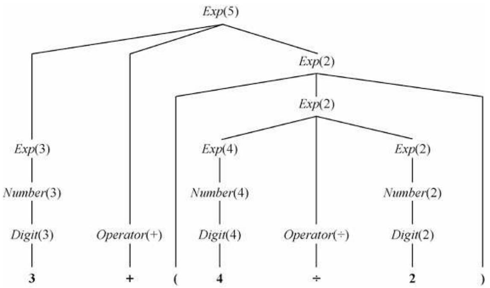  
图23-11字符串“3 +(4÷2)”的带语义解释的句法分析树

被用于描述Ali。）这意味着“lovesBo”是一个 谓词（predicate） ，它与表示某个人的项组合，形成一个完整的逻辑语句。

使用 记号（见8.2.3节），我们可以将“loves Bo”表示为谓词

# $\lambda x \ L o \nu e s ( x , B o )$

现在我们需要一条规则来说明“一个语义为 $n$ 的 NP 后跟一个语义为 pred 的 VP 将形成一个句子，

其语义为将 pred 应用于 $n$ 的结果”：

$$
S (p r e d (n)) \rightarrow N P (n) V P (p r e d)
$$

这条规则告诉我们“AlilovesBo”的语义解释为

$$
(\lambda x \text {L o v e s} (x, B o)) (A l i)
$$

这与 Loves ( Ali , Bo )是等价的。技术上，我们说这是 函数应用的 $\beta$ 归约。

通过我们目前所采取的方法，可以直接对其余的语义进行描述。因为 VP 被表示为谓词，所以动词也应该被表示为谓词。动词“loves”表示为 ，该谓词在给定参数 Bo 时返回谓词 。我们最终得到了图23-12所示的文法和分析树。在更完整的文法中，我们将所有扩展（语义、格、人称和短语头）一起放到一组规则中。在这里，我们仅展示语义扩展，以使规则的工作方式更加清晰。

$$
\begin{array}{l}S (p r e d (n)) \rightarrow N P (n) V P (p r e d)\\V P (p r e d (n)) \rightarrow V e r b (p r e d) N P (n)\\N P (n) \rightarrow N a m e (n)\end{array}
$$

$$
\begin{array}{l}\text {N a m e (A l i)} \rightarrow \text {A l i}\\\text {N a m e (B o)} \rightarrow \text {B o}\\\text {V e r b (\lambda y \lambda x L o v e s (x , y))} \rightarrow \text {l o v e s}\end{array}
$$

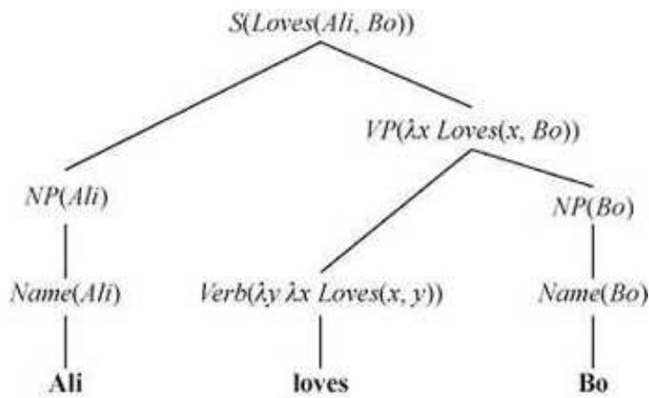  
  
图23-12（a）一种文法，可以推导出“AlilovesBo”（以及其他3个句子）的句法分析树和语义解释。每个范畴都用一个表示语义的参数进行扩展。（b）字符串“AlilovesBo”的带有语义解释的句法分析树

# 23.4.2 学习语义文法

遗憾的是，Penn Treebank中不包括句子的语义表示，只包括句法树。因此，如果我们要学习一个语义文法，还需要其他样例来源。泽特尔莫耶和科林斯（Zettlemoyerand Collins,2005）介绍了一个系统，该系统从样例中学习问答系统的文法，样例由一个句子和该句子的语义形式组成。

● 句子： What states border Texas?  
●逻辑形式：

给定大量上述样例对以及每个新领域的少量人工标注知识，系统就会生成合理的词汇条目（例如，“Texas”和“state”是名词，因此 state(Texas)为真），同时学习文法参数，使得系统可以将句子分析为语义表示。泽特尔莫耶和科林斯（Zettlemoyer and Collins, 2005）介绍的系统在两个由未参与学习的句子组成的不同测试集上达到了79%的准确率。赵凯和黄亮（Zhao and Huang, 2015）展示了一种运行速度更快的移位减少句法分析器，并实现了85%～89%的准确率。

这些系统的一个局限性在于训练数据包括逻辑形式。创建这样的训练数据代价昂贵，需要具有专业知识的人工注释者——并不是每个人都了解 演算和谓词逻辑的细微之处；而收集问题-答案对样例则要容易得多。

● 问题： What states border Texas?  
● 答案： Louisiana, Arkansas, Oklahoma, New Mexico.   
● 问题： How many times would Rhode Island fit into California?   
● 答案： 135

这样的问题-答案对在网络上非常常见，因此不需要专家指导就可以建立大型数据库。使用这种大型数据源，有可能构建出比使用标记有逻辑形式的小型数据库构建出的分析器性能更好的句法分析器（Liang et al. , 2011; Liang and Potts, 2015）。这些论文中描述的关键方法是创建一种内部逻辑形式，它是组合的，但不允许指数量级的搜索空间。

# 23.5 真实自然语言的复杂性

真实的英语文法是极其复杂的（其他语言也一样）。我们简要地给出一些导致这种复杂性的例子。

量词限定 （quantification）：考虑句子“Every agent feels a breeze.”该句子在 $\mathrm { ~ E ~ } _ { 0 }$ 下只有一种句法分析结果，但是在语义上却是有歧义的，是“存在一阵能被所有的智能体感觉到的微风”还是“每一个智能体感觉到一阵属于它自己的微风”？这两种解释可以表示为

∀ a a ∈ Agents ⇒

∃ b b ∈ Breezes ∧ Feel ( a , b );

∃ b b ∈ Breezes ∧ ∀ a a ∈ Agents ⇒

Feel ( a , b )

量词限定的一种标准方法是，文法不定义实际的逻辑语义语句，而是定义一种准逻辑形式（quasi-logical form），可以通过分析过程之外的算法将该形式转化为逻辑语句。这些算法可以有选择量词限定范围的优先规则——这些优先规则不需要直接反映在文法中。

语用学 （pragmatics）：我们已经展示了一个智能体是如何感知字符串并应用文法推导出一组可能的语义解释的。现在，我们通过添加有关当前情景的上下文相关信息来完成解释。对于语用信息最明显的需求是确定索引词 （indexical）的含义，索引词是一些直接指代当前情景的短语。例如，在句子“I am in Boston today”中，“I”和“today”都是索引词。单词“I”可以用 Speaker 表示，在不同时间指代不同对象，确定指代对象取决于听话者——这不是文法需要考虑的部分，而是一个语用学问题。

语用学的另一部分是解释说话者的意图。说话者的话语被认为是一种言语行为 （speech act），需要由听者辨认它是一种什么类型的行为，如提问、陈述、承诺、警告、命令等。类似“go to2 2”这样的命令暗指听者去行动。到目前为止，我们的S 文法只涵盖了陈述性语句。我们可以将其扩展为涵盖命令性语句——命令是一个动词短语，主语暗指听到命令的人：

# $S ( C o m m a n d ( p r e d ( H e a r e r ) ) ) \longrightarrow V P ( p r e d )$

长距离依存关系 （long-distance dependencies）：在图23-8中，我们看到“she didn’t hear or even seehim”的分析存在两个空缺，缺失了 NP “him”。我们可以用符号 来表示空缺：“she didn’t [hearor even see ] him.”通常，空缺与它所指代的 NP 之间的距离可以任意长：在“Who did the agent tellyou to give the gold to ?”中，空缺指代的是“Who”，相距11个单词。

可以使用一种复杂的扩展规则系统来确保缺失的NP可以正确匹配。规则很复杂；例如，NP连词 结构的分支中不能出现空缺：“What did she play [ NP Dungeons and ]?”是不符合文法的。但是， VP 连词结构的两个分支中可以出现同一空缺，如句子“What did you [ VP [ VP smell ] and [ VP shoot an arrow at ]]?”

时间和时态 （time and tense）：假设我们要表示“Ali loves Bo”和“Ali loved Bo”之间的区别。英语使用动词时态（过去时、现在时和将来时）表示某个事件的相对时间。表示事件时间的一个不错选择是10.3节介绍的事件演算符号。在事件演算中，我们有

Ali loves Bo: E 1 ∈ Loves ( Ali , Bo )∧ During ( Now , Extent ( E 1 ))

Ali loved Bo: E 2 ∈ Loves ( Ali , Bo )∧ After ( Now , Extent ( E 2 ))

这表明单词“loves”和“loved”的两个词汇规则应为

Verb ( λ y λ x e ∈ Loves ( x , y )∧ During ( Now , e )) → loves

Verb ( λ y λ x e ∈ Loves ( x , y )∧ After ( Now , e )) → loved

除这一变化之外，关于文法的其他所有内容都保持不变，这是一个好消息；这表明，如果我们能够轻松地添加动词时态之类的复合成分（尽管我们只是触及了描述时间和时态的完整文法的皮毛），那么我们的方向就是对的。

歧义 （ambiguity）：我们倾向于将歧义视为沟通失败；当听者意识到话语中的歧义时，意味着这句话是不清楚或令人困惑的。下面是报纸标题中摘录的一些例子：

Squad helps dog bite victim.

Police begin campaign to run down jaywalkers.

Helicopter powered by human flies.

Once-sagging cloth diaper industry saved by full dumps.

Include your children when baking cookies.

Portable toilet bombed; police have nothing to go on.

Milk drinkers are turning to powder.

Two sisters reunited after 18 years in checkout counter.

这样的困惑是例外。在大多数情况下，我们听到的话似乎是没有歧义的。因此，在20世纪60年代，当研究人员首次使用计算机分析语言时，他们惊讶地发现几乎每句话都是有歧义的，具有多种可能分析（有时是数百种），即使以该语言为母语的人也只能注意到其中一种。例如，我们将短语“brown rice and black beans”理解为“[brown rice] and [black beans]”，从未考虑过另一种概率很低的解释“brown [rice and black beans]”，其中形容词“brown”修饰整个短语，而不只是“rice”。当我们刚听到“Outside of a dog, a book is a person’s best friend”时，会将“outside of”理解为“except for”，当我们接着听到格劳乔·马克斯（Groucho Marx，美国喜剧演员）笑话的下一个句子“Inside of a dog it’stoo dark to read”时，我们就会觉得很好笑。

词汇歧义 （lexicalambiguity）是指一个单词有不止一种含义：“back”可以是副词（go back）、形容词（back door）、名词（the back of the room）、动词（back a candidate）或专有名词（加拿大努纳武特地区的一条河）。“Jack”可以是人名、名词（扑克牌、六角金属游戏片、航海旗、鱼、鸟、奶酪、插座等）或动词（用千斤顶顶起一辆汽车、拿着灯狩猎或用力击打棒球）。句法歧义（syntactic ambiguity）是指一个短语有多种分析，“I smelled a wumpus in 2, 2”有两种分析：一种是介词短语“in 2, 2”修饰名词，另一种是修饰动词。句法歧义会导致 语义歧义 （semanticambiguity），因为一种分析意思是活着的wumpus在位置(2, 2)，另一种分析意思是位置(2, 2)有死了的wumpus的臭味。在这种情况下，采用错误的解释可能导致智能体致命的错误。

字面义和比喻义之间也可能存在歧义。修辞格在诗歌中非常重要，在日常演讲中也很常见。借代（metonymy）是一种用一个对象代表另一个对象的修辞手法。当我们听到“Chryslerannounced anew model”（克莱斯勒公司发布了一种新车型）时，我们并不会觉得公司可以说话，而是明白是该公司的一位发言人宣布了这一消息。借代非常普遍，听众常常会下意识地对其进行解释。

遗憾的是，我们所写的文法很难这么灵活。为了正确处理借代的语义，我们需要引入一种全新层次的歧义。为此，我们可以通过提供两个对象来对句子中的每个短语进行语义解释：一个对象为该短语字面上指代的对象（克莱斯勒公司），另一个为借代指代的对象（发言人）。我们不得不说两者之间存在联系。在我们当前的文法中，“Chryslerannounced”被解释为

$$
x = \text {C h r y s l e r} \wedge e \in \text {A n n o u n c e} (x) \wedge \text {A f t e r} (\text {N o w}, \text {E x t e n t} (e))
$$

我们需要把它变为

$$
x = \text {C h r y s l e r} \wedge e \in \text {A n n o u n c e} (m) \wedge \text {A f t e r} (\text {N o w}, \text {E x t e n t} (e)) \wedge \text {M e t o n y m} (m, x)
$$

这就是说，有一个实体x等同于Chrysler，而另一个实体m 则进行了发布这一动作，两个实体存在借代关系。下一步是定义可以出现的借代关系类型。最简单的情况是根本不存在借代——字面对象