择极小化极大最优移动总是最好的。考虑这样一种情况，双方均按照最优策略行动，结果为平局，但max 有一种冒险的走法，在这种走法导致的状态下，min 有10种可能的响应，这些响应似乎都是合理的，但其中9种都会使min 输掉游戏，只有1种会使max 输掉游戏。如果max认为min 没有足够的计算能力找到最优移动，那么max 可能会尝试这种冒险的走法，因为9/10的获胜机会要比一个确定的平局好。

# 5.2.1 极小化极大搜索算法

现在我们来计算Minimax(s)，我们可以将其转化为一个搜索算法，即尝试所有动作然后选择其结果状态的Minimax值最大的动作作为max 的最佳移动。算法如图5-3所示。这是一种递归算法，它一直向下进行到叶节点，然后随着递归的展开通过搜索树倒推 极小化极大值。例如，图5-2中的算法，首先递归到左下角的3个节点，并对它们调用U tility 函数，发现它们的值分别为3、12和8。然后选择其中的最小值，3，并将其返回，作为节点B的倒推值。同理可得， C和 $D$ 的倒推值都为2。最后，我们选择3、2和2中的最大值3作为根节点的倒推值。

极小化极大算法对博弈树进行完整的深度优先探索。如果树的最大深度为m ，并且在每个点都有 b种合法移动，那么极小化极大算法的时间复杂度为O (b m )。对于一次生成所有动作的算法，空间复杂度为 O ( bm )，对于一次只生成一个动作的算法，空间复杂度为 O ( m )（见3.4.3节）。指数级的复杂度使得M inimax 无法应用于复杂博弈。例如，国际象棋的分支因子约为35，平均深度约为80层，搜索 $3 5 ^ { 8 0 } \approx 1 0 ^ { 1 2 3 }$ 个状态显然是不可行的。然而，M inimax 确实是对博弈进行数学分析的基础。通过以各种方式近似极小化极大分析，我们可以推导出更实用的算法。

function MINIMAX-SEARCH(game, state) returns a动作  
player $\leftarrow$ game.To-Move(state)  
value, move $\leftarrow$ MAX-VALUE(game, state)  
return move  
function MAX-VALUE(game, state) returns a (utility, move) for if game.Is-TERMINAL(state) then return gameUTILITY(state, player), null v, move $\leftarrow -\infty$ , null for each a in game.ACTIONS(state) do v2, a2 $\leftarrow$ MIN-VALUE(game, game.RESULT(state, a)) if v2 > v then v, move $\leftarrow v2$ , a return v, move  
function MIN-VALUE(game, state) returns a (utility, move) for if game.Is-TERMINAL(state) then return gameUTILITY(state, player), null v, move $\leftarrow +\infty$ , null for each a in game.ACTIONS(state) do v2, a2 $\leftarrow$ MAX-VALUE(game, game.RESULT(state, a)) if v2 < v then v, move $\leftarrow v2$ , a  
return v, move

图5-3 使用极小化极大计算最优移动的算法。最优移动是指，在假定对手移动是为了使效用值最小

的前提下，使终止状态效用值最大的移动。函数Max-V alue和Min -V alue遍历整个博弈树直到叶节点，以确定每个状态的倒推值以及如何移动以到达该状态

# 5.2.2 多人博弈中的最优决策

许多流行游戏都允许多个玩家参与。让我们来看看如何将极小化极大思想推广到多人博弈中。从技术角度来看，这很自然，但是也产生了一些有趣的新的概念上的问题。

首先，我们需要将每个节点的单一值替换为值向量。例如，在玩家 A 、 B 和 $C$ 参与的3人博弈中，每个节点都与一个向量 $\langle \nu _ { A } , \nu _ { B _ { 2 } } \nu _ { C } \rangle$ 相关联。对于终止状态，这一向量表示每个玩家各自在该状态得到的效用值。（在双人零和博弈中，二元向量可以简化为一个值，因为两个值总是互为相反数。）最简单的实现方法是让U tility 函数返回效用值向量。

现在我们要考虑非终止状态。考虑图5-4的博弈树中标为 $X$ 的节点。此时，轮到玩家 $C$ 选择如何移动。两种选择产生了效用值向量分别为 和

的两种终止状态，因为6大于3，所以 C 应该选择第一种移动。这 $C$ 意味着，如果到达状态 $X$ ，后续的博弈将产生效用值为 的终止状态。因此，这个向量就是 $X$ 的倒推值。一般地，节点 $n$ 的倒推值是对在该点进行选择的玩家来说效用值最大的后继状态的效用值向量。

任何参与多人博弈（如Diplomacy或SettlersofCatan游戏）的参与者都会很快意识到，比起双人博弈，多人博弈要复杂得多。多人博弈通常涉及参与者之间的正式或非正式联盟 （alliance）。联盟会随着博弈的发展建立和瓦解。我们如何理解这种行为？联盟是多人博弈中每个参与者都按照最优策略行动的自然结果吗？事实证明的确如此。

例如，假设现在A和B处于弱势，而 C处于强势。那么，对A和B来说，最理想的做法往往是一起攻击 $C$ ，而不是彼此攻击，以免 $C$ 对它们逐个消灭。这样的话，合作其实产生于纯粹的自私行为。当然，一旦 $C$ 在联合攻击下被削弱，联盟就失去了价值，A或 B都有可能违反协议。

# 轮到移动的玩家

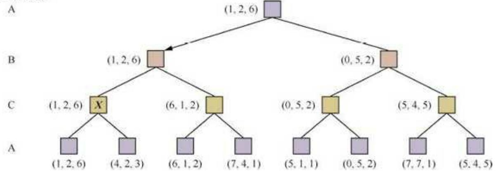  
图5-4三人博弈的博弈树的前三层，3个玩家为A、B、C。每个节点都标有3个玩家各自的效用值。最佳移动标示在根节点上

在某些情况下，显式联盟只是将无论如何都会发生的事情具体化。而在其他情况下，破坏联盟会被记录为社会污点，所以参与者必须权衡破坏联盟所带来的即时优势和失去信任所造成的长期劣势。有关这些复杂问题的更多讨论，详见18.2节。

如果博弈不是零和博弈，那么在只有两个参与者时，合作也可能发生。例如，假设存在一个效用值为 的终止状态，并且每个参与者最高的可能效用值也是1000。那么最优策略是双方都尽一切可能到达该状态，也就是说，参与者会自动合作以实现共同的期望目标。

博弈的状态数关于树的深度是指数量级的。没有一种算法可以完全消除指数项，但有时可以将它减半，即通过 剪枝 （见3.5.3节）消除对结果没有影响的树的大部分，从而不需要检查所有状态就能计算出正确的极小化极大决策。这种技术称为 $\mathbb { u } - \mathbb { p }$ 剪枝 （alpha-beta pruning）。

再次考虑图5-2中的双层博弈树。让我们再进行一次最优决策的计算，这一次要仔细观察在这个过程中的每个点上都获得了什么信息。步骤如图5-5所示。结果是，我们可以在无须评估其中两个叶节点的情况下就能确定极小化极大决策。

另一种考虑这一问题的方式是将Minimax 公式简化。假设图5-5中节点C的两个未评估的后继节点的值分别为 x和 y，则根节点的值为

$$
\begin{array}{l} \operatorname {M i n i m a x} (\text {r o o t}) = \max  (\min  (3, 1 2, 8), \min  (2, x, y), \min  (1 4, 5, 2)) \\ = \max  (3, \min  (2, x, y), 2) \\ = \max  (3, z, 2) \quad \text {其 中} z = \min  (2, x, y) \leqslant 2 \\ = 3 \\ \end{array}
$$

也就是说，根节点的值以及极小化极大决策与叶节点 x和y的值无关，因此可以将它们剪枝。

剪枝可以应用于任何深度的树，而且通常可以将整个子树而不只是叶节点剪枝。一般原则是：考虑树中某个位置的节点 n （见图5-6），玩家可以选择移动到 n 。如果玩家在树中同一层（如图5-6中的 $m ^ { \prime }$ ）或更上层的任何位置（如图5-6中的 $m$ ）有更好的选择，那么玩家永远都不愿移动到n 。所以，一旦我们对 n 有了足够的了解（通过检查它的某些后继）来得出上述结论，就可以将它剪枝。

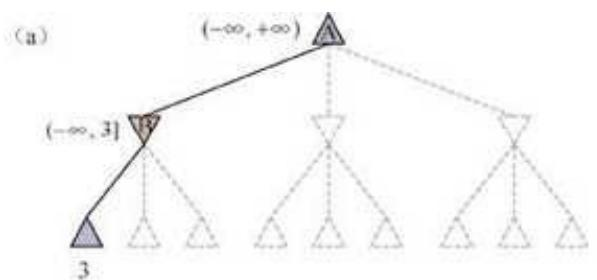

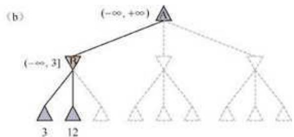

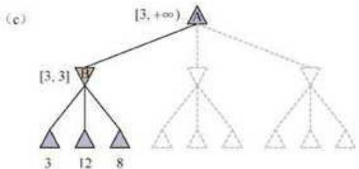

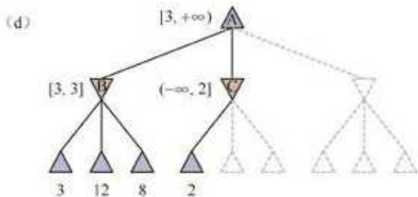

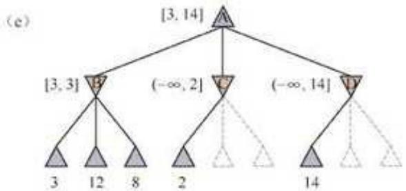

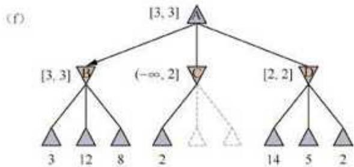  
图5-5图5-2中博弈树的最优决策计算过程。每一步都标有每个节点可能的值的范围。（a） B下面的第一个叶节点值为3。因此，作为 min 节点， B的值最多为3。（b）B下面的第二个叶节点值为

12， min 将避免移动到该节点，所以 B 的值仍然最多为3。（c） B 下面的第三个叶节点值为8，此时我们已经检查完了B的所有后继状态，所以B的值就是3。现在我们可以推断根节点的值至少是3，因为 max 在根节点处有值为3的选择。（d） C下面的第一个叶节点值为2。因此，作为min 节点， C 的值最多为2。但是我们知道 B 的值为3，所以 max 永远不会选择 $C$ 。因此，没有必要再去检查 C 的其他后继状态。这是 $\alpha \beta$ 剪枝的一个实例。（e） D 下面的第一个叶节点值为14，所以 D的值最多为14。这仍然高于 max 的最佳选择（即3），所以我们需要继续探索 $D$ 的后继状态。注意，此时根节点的所有后继都有界，所以根节点的值也最多为14。（f） $D$ 的第二个后继值为5，所以我们又需要继续探索。第三个后继值为2，所以 $D$ 的值就是2。最终， max 在根节点处的决策是移动到值为3的节点 B

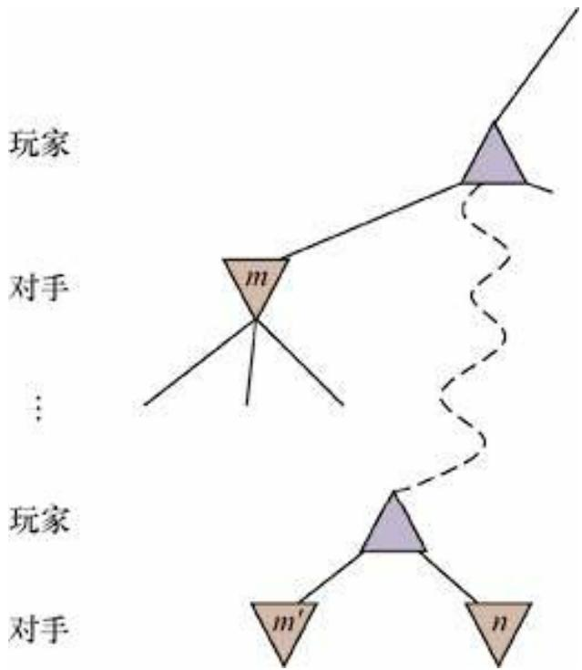  
图5-6 $\alpha - \beta$ 剪枝的一般情况。如果对玩家来说 $m$ 或 $m ^ { \prime }$ 要好于 $n$ ，那么我们永远都不会在博弈中到达 n

记住，极小化极大搜索是深度优先的，所以在任何时候我们只需考虑树中单个路径上的节点。

剪枝得名于M ax -V alue ( state , $\alpha , \beta )$ （见图5-7）中的两个额外参数，它们分别是路径上任何位置的倒推值的下界和上界。

$\pmb { \alpha } =$ 到目前为止，路径上发现的 max的任一选择点中最佳（即最大值）选择的值。也就是说，= “ 至少”。

= 到目前为止，路径上发现的 min 的任一选择点中最佳（即最小值）选择的值。也就是 说，= “ 至多”。

搜索不断更新 $\pmb { \alpha }$ 和 $\pmb { \rho }$ 的值，并且一旦当前节点的值比此时的 $\pmb { \alpha }$ （对于 max ）或 $\pmb { p }$ （对于min ）值更差，就剪掉该节点的剩余分支（即终止递归调用）。完整算法如图5-7所示。图5-5跟踪了博弈树上的算法进程。

function ALPHA-BETA-SEARCH(game, state) returns a动作 player $\leftarrow$ game.To-Move(state) value, move $\leftarrow$ MAX-VALUE(game, state, -∞, +∞) return move

function MAX-VALUE(game, state, $\alpha ,\beta$ )returns a (utility, move) for if game.IS-TERMINAL(state) then return game.UTILITY(state, player), null v, move $\leftarrow -\infty$ ,null   
for each a in game.ACTIOns(state) do   
v2,a2<-MIN-VALUE(game,game.RESULT(state,a), $\alpha ,\beta)$ if $\nu 2 > \nu$ then $\nu ,$ move $\leftarrow \nu 2,$ a $\alpha \leftarrow \mathrm{MAX}(\alpha ,\nu)$ if $\nu \geqslant \beta$ then return v, move   
return v, move

function MIN-VALUE(game, state, $\alpha ,\beta$ )returns a (utility, move) for if game.Is-TERMINAL(state) then return game.UTILITY(state, player), null v, move $\leftarrow +\infty$ ,null   
for each a in game.ACTIOns(state) do   
v2,a2<-MAX-VALUe(game,game.RESULT(state,a), $\alpha ,\beta)$ if $v2 <   v$ then   
v, move $\leftarrow v2$ a $\beta \leftarrow \mathrm{MAX}(\beta ,\nu)$ if $\nu \leqslant \alpha$ then return v, move   
return v, move

图5-7 搜索算法。注意，这些函数与图5-3中的Minimax -Search 函数相同，除了需要维护变量$\alpha$ 和 $\beta$ ，以及在值超出边界时截断搜索

# 5.2.4 移动顺序

剪枝的有效性很大程度上依赖于状态的检查顺序。例如，在图5-5e和图5-5f中，根本不能剪掉$D$ 的任何后继，因为最差的后继（从min 的角度来看）是最先生成的。如果最先生成 $D$ 的第三个后继，它的值为2，那么我们就可以剪掉另外两个后继。这表明，应该先检查有可能是最佳选择的后继节点。

如果能够完美地实现这一点， $\alpha - \beta$ 搜索算法只需要检查 个节点就能选出最佳移动，而 $a ( b ^ { m 2 } )$ 极小化极大算法需要 $O \left( b ^ { m } \right)$ 。这意味着有效分支因子从 b 变为了 $\sqrt { b }$ ，对国际象棋来说，大约从35变为了6。换句话说，在相同时间内，拥有完美移动顺序的 剪枝可以求解的树的深度大约是极小化极大算法的两倍。如果移动顺序随机，对于适当大小的 b ，需要检查的节点总数约为。显然我们现在无法实现 完美 移动顺序，否则，在这种情况下，可以用排序函数玩一 个完美的游戏！但通常我们可以非常接近完美。对国际象棋来说，一个非常简单的排序函数（例如，先尝试吃子，然后是威胁，再后是前进和后退）就能让检查的节点数减少到不超过最好情况

增加动态的移动排序方案，例如先尝试之前发现的最佳移动，能让我们非常接近理论极限。“之前”可能指上一次移动（通常面临同样的威胁），也可能来自之前通过迭代加深 （见3.4.4节）过程对当前移动的探索。首先，搜索一层并根据它们的评估结果记录这些移动的排名。然后再深入搜索一层，利用之前的排名指导移动顺序，以此类推。由于迭代加深过程而增加的搜索时间可以通过更好的移动顺序来弥补。这些最佳移动称为 绝招 （killermove），首先尝试绝招称为绝招启发式评价函数。

在3.3.3节中，我们指出通往重复状态的冗余路径会导致搜索代价呈指数级增长，而维护一个先前到达状态的表可以解决这个问题。在博弈树搜索中，重复状态的产生是由于 换位 （transposition）移动序列的不同排列最终导致相同的局面，这个问题可以通过 换位表 （transposition table）解决，它将缓存状态的启发式值。

例如，假设白方进行了移动 $w _ { 1 }$ ，而黑方用 $b _ { 1 }$ 应对，在棋盘的另一边有一个不相关的移动 w 2，黑方可以用 $b _ { 2 }$ 应对，我们搜索移动序列[ w 1 , b 1 , w 2 , b 2 ]，将其结果状态记为 s 。在探索了 s 下面一棵较大的子树之后，我们找到了它的倒推值，并将其存储在换位表中。当我们之后搜索移动序列[w ,b ,w ,b ]时，我们再次到达s，这时我们可以在表中查找它的值而无须重复搜索。在国际象棋中，换位表非常有效，在相同时间内能到达的搜索深度将扩大一倍。

即使采用 $\alpha = \beta$ 剪枝和精巧的移动顺序，极小化极大算法也不适用于国际象棋和围棋这样的游戏，因为在可用时间内仍然有太多状态需要探索。在关于计算机博弈的第一篇论文“Programming aComputer for Playing Chess”（Shannon, 1950）中，克劳德·香农意识到这一问题，并提出了两种策略。A型策略 （TypeA strategy）考虑搜索树中某一深度的所有可能的移动，然后使用启发式评价函数估计该深度下状态的效用值。它探索了树的宽但浅的部分。 B型策略 （Type B strategy）舍弃了那些看起来就很差的移动，“尽可能”走那些更有可能的路线。它探索了树的深但窄的部分。

历史上，大多数国际象棋程序都是A型策略（我们将在5.3节讨论），而围棋程序通常是B型策略（将在5.4节讨论），因为围棋的分支因子要高得多。最近，B型程序在各种游戏中都达到了世界冠军级水平，包括国际象棋（Silver et al. , 2018）。

# 5.3 启发 式 树 搜索

为了充分利用有限的计算时间，我们可以提前截断搜索，并对状态应用启发式评价函数 ，从而有效地将非终止节点转变为终止节点。换句话说，我们用Eval函数代替U tility函数，Eval对状态效用值进行估计。用截断测试 （cutofftest）代替终止测试，对于终止状态，截断测试必定返回真，但是它可以根据搜索深度和当前状态的任意属性自由决定何时终止搜索。这样我们得到了搜索深度d 处状态 s 的启发式极小化极大值的计算公式H-M inimax ( s , d )：

$$
\begin{array}{r l} & {\mathrm {H - M i n i m a x} (s, d) =} \\ & {\left\{ \begin{array}{l l} {\mathrm {E V A L} (s, \text {M A X})} & {\text {如 果 I S - C U T O F F} (s, d)} \\ {\max  _ {a \in \text {A c t i o n s} (s)} \mathrm {H - M i n i m a x} (\mathrm {R E S U L T} (s, a), d + 1)} & {\text {如 果 T O - M O V E} (s) = \mathrm {M A X}} \\ {\min  _ {a \in \text {A c t i o n s} (s)} \mathrm {H - M i n i m a x} (\mathrm {R E S U L T} (s, a), d + 1)} & {\text {如 果 T O - M O V E} (s) = \mathrm {M I N}} \end{array} \right.} \end{array}
$$

# 5.3.1 评价函数

就像第3章的启发式函数返回到目标距离的估计值一样，启发式评价函数E val ( s , p )向参与者 $p$ 返回状态 s 的期望效用的估计值。对于终止状态，一定是E val ( s , p ) = U tility ( s , p )，而对于非终止状态，估计值必须介于输和赢之间：

$$
\mathrm {U N L I M Y} (\text {l o s s}, p) \leqslant \operatorname {E v a l} (s, p) \leqslant \mathrm {U N L I M Y} (\text {w i n}, p)
$$

除了满足这些需求之外，一个好的评价函数是由什么组成的？首先，计算时间不能太长！（重点是加快搜索速度。）其次，评价函数应与实际的获胜机会密切相关。你可能会对“获胜机会”一词感到疑惑。毕竟，国际象棋并不是一种碰运气的游戏：我们确定地知道当前的状态，博弈没有任何随机性；如果双方都没有犯错，结果是预先确定的。但是，如果搜索必须在非终止状态截断，那么算法对这些状态的最终结果必然是不确定的（即使这种不确定性可以通过提供无限的计算资源来解决）。

让我们把这一思想进一步具体化。大多数评价函数需要计算状态的各种 特征 （feature），例如，在国际象棋中，我们将拥有白兵数目、黑兵数目、白后数目、黑后数目等特征。这些特征合在一起，定义了状态的各种类别或等价类：同一类别中的状态，对所有特征都具有相同值。例如，某一类别包含所有的“两兵对一兵”残局。任何给定类别都可能包含一些通往（以完美玩法）胜利的状态，一些通往平局的状态和一些通往失败的状态。

评价函数不知道到底是处于哪种状态，但它可以返回一个值来估计每个结果的状态比例。例如，假设我们的经验表明，在“两兵对一兵”类中，82%的状态通向胜利（效用值+1），2%导致失败（效用值0），16%为平局（效用值1/2）。那么，该类别中状态的合理评估为 期望值 （expectedvalue）：(0.82×+1) + (0.02×0) + (0.16×1/2) = 0.90。原则上，可以为每一个状态类确定一个期望值，这样我们就得到了适用于任何状态的评价函数。

在实践中，这种方法需要分析太多类别，因此需要非常多的经验去估计所有的可能性。与上述方法不同，大多数评价函数会分别计算每个特征的数值贡献，将它们结合起来得到总数值。几个世纪以来，国际象棋棋手们已经提出了一些使用这一思想评估局面价值的方法。例如，国际象棋入门书籍给出了各个棋子的子力价值 （materialvalue）估计：兵值1分，马或象值3分，车值5分，后值9分。其他特征，如“好的兵阵”和“王的安全”可能值半个兵。这些特征值简单地相加即可得到局面的评估值。

数学上，这种评价函数称为 加权线性函数 （weighted linear function），因为它可以表示为如下形式：

$$
\operatorname {E V A L} (s) = w _ {1} f _ {1} (s) + w _ {2} f _ {2} (s) + \dots + w _ {n} f _ {n} (s) = \sum_ {i = 1} ^ {n} w _ {i} f _ {i} (s)
$$

其中 $f _ { i }$ 是局面的某一特征（例如“白象数目”）， w i是其权重（表明该特征的重要性）。权重需要归一化，使总和始终保持在输（0）到赢（+1）的范围内。如图5-8a所示，一个兵的确定优势提供了很大的获胜可能性，而3个兵的确定优势则几乎必胜。之前提到，评价函数应与实际的获胜机会密切相关，但并不需要线性相关：如果状态 s 获胜的可能性是状态 s' 的两倍，并不意味着E val ( s )必须是E val ( s ' )的两倍，只需要E val ( s ) E val ( s ' )。

将特征的值相加似乎是合理的，但实际上它涉及一个很强的假设：每个特征的贡献独立于其他特征的值。因此，目前的国际象棋和其他游戏程序也会使用特征的非线性组合。例如，一对象的价值可能比单个象价值的两倍还要大，并且在残局时，象比之前价值更大，即当移动数这一特征很大或剩余棋子数 这一特征很小时。

如何得到特征和权重？它们不属于国际象棋规则，而是来自人类下棋的经验。在没有这种经验的游戏中，评价函数的权重可以通过第22章的机器学习技术来估计。将这些技术应用到国际象棋中，结果表明一个象确实相当于大约3个兵，而且似乎几个世纪的人类经验都可以在短短几小时的机器学习中被复制。

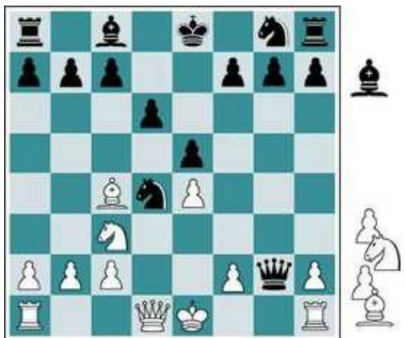  
（a）轮到白棋移动

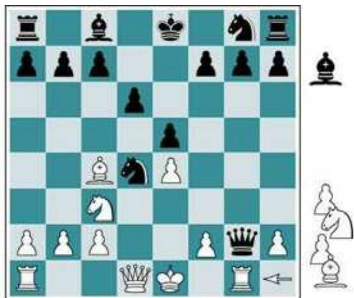  
（b）轮到白棋移动  
图5-8 两个国际象棋局面，只有右下角车的位置不同。在（a）中，黑方有一个马两个兵的优势，这足以取胜。在（b）中，白方将吃掉对方的皇后，这几乎是必胜的优势

# 5.3.2 截断搜索

下一步是修改A lpha-Beta-Search，让它在合适的时候调用启发式Eval函数截断搜索。我们把图5-7中提到Is-Terminal的两行代码替换为下面这行代码：

# ifgame.Is-CuoFF(state,depth)thenreturn game.EvAL(state,player),null

我们还必须记录一些信息，这样在每一次递归调用时可以逐渐增加当前的depth。控制搜索量最直接的方法是设置一个固定的深度限制，这样的话，对所有大于固定深度d 的depth（以及所有终止状态），Is-Cutoff(state, depth )都返回true。深度d 的选择取决于分配时间内所选择的移动。更稳健的方法是使用迭代加深（见第3章）。当时间耗尽时，程序将返回最深的已完成搜索所选择的移动。如果在每一轮迭代加深中，我们都维护换位表中的条目，那么作为奖励，后续轮次的速度将加快，我们可以使用评估值改进移动顺序。

由于评价函数只是一种近似，这些简单方法可能导致误差。重新考虑象棋中基于子力优势的简单评价函数。假设程序搜索到达了深度限制，例如到达图5-8b中的局面，即黑方多了一个马、两个兵。程序会将其报告为该状态的启发式值，从而认为该状态很可能导致黑方获胜。但其实白方下一步就可以不留退路地吃掉黑方的皇后。因此，这个局面实际上对白方有利，但这只有通过向前看才能知道。

评价函数只能应用于静态 （quiescent）局面，也就是说，在这些局面中不存在会使评估值大幅度摇摆变化的待定移动（例如吃掉皇后）。对于非静态局面，Is-Cutoff将返回false，并继续搜索直到到达静态局面。这种额外的静态搜索 （quiescencesearch）有时会被进一步限制为只考虑特定类

型的移动（例如吃子），它能快速消除当前局面的不确定性。

视野效应 （horizon effect）则更难消除。它是指程序面临一个将给我方造成严重损失而且基本无法避免的对方移动，但可以使用拖延战术暂时避开。考虑图5-9中的国际象棋局面。很明显，黑象已经无路可逃。例如，白车可以通过依次移动到h1、a1、a2吃掉黑象，在第6步完成吃子。

但黑方确实可以采取一系列移动，将象被吃掉这一结果推向“视野”以外。假设黑方搜索深度为8层。黑方的大多数出招都会导致象最终被吃掉，因此被标记为“坏招”。但黑棋也会考虑这样的移动序列，即先用兵来阻挡王，引诱王去吃兵。然后黑方可以同样地处理第二个兵。上述过程占用了太多步，在剩余的搜索步数内，象不会被吃掉。黑方自认为这一策略用两个兵保住了象，但实际上它所做的只是白白浪费了兵，象被吃掉是不可避免的，只是被推到了黑方能搜索到的视野之外。

缓解视野效应的一种策略是允许单步延伸 （singularextension），该策略是说，即使搜索本应在此状态截断，但是，如果在给定局面中有比其他所有移动都“明显更好”的一种移动，我们就允许算法继续沿着这个移动延伸搜索。在我们的例子中，搜索将发现白车的3次移动——h2到h1，h1到a1，从a1吃掉a2处的象——依次都是明显更好的移动，因此，即使兵的某个移动序列将搜索推到视野之外，这些明显更好的移动将有机会被延伸搜索。这会使树变得更深，但由于单步延伸通常很少，这一策略并不会增加很多节点，在实践中，它已被证明是有效的。

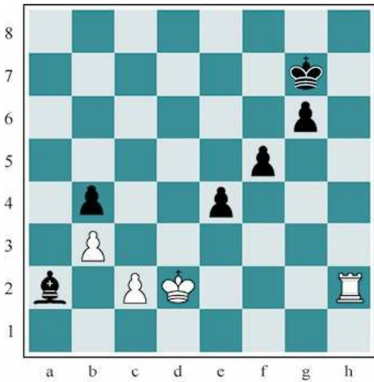  
图5-9视野效应。黑方移动后，黑象注定难逃厄运。但是黑方可以用兵来阻挡白方的王，引诱王去吃掉兵。这会将不可避免的象的损失推到视野之外，因此，搜索算法将牺牲兵的这一步看作“好招”

# 5.3.3 前向剪枝

剪枝将剪掉对最终评估没有影响的树的分支，但 前向剪枝 （forward pruning）将剪掉那些看上去很糟糕但也可能实际很好的移动。因此，这一策略以出错风险增大的代价节省了计算时间。用香农的话说，这是B型策略。显然，大多数人类棋手都会这么做，仅考虑每个局面的几步移动（至少是潜意识地）。

前向剪枝的一种方法是束搜索 （见4.1.3节）：在每一层，只考虑一“束”n 个最佳移动（根据评价函数），而不是所有可能的移动。遗憾的是，这种方法相当危险，因为无法保证最佳移动不被剪枝。

P rob C ut （概率截断，probabilistic cut）算法（Buro, 1995）是 搜索的前向剪枝版本，它使用

从先前经验中获得的统计数据来减少最佳移动被剪除的概率。 搜索将剪除所有 可证明 位于当 前 窗口之外的节点。P rob C ut 算法则剪除 有可能 位于窗口之外的节点。它通过执行浅 $( \alpha , \beta )$ 层搜索计算某个节点的倒推值 v ，然后利用过去的经验估计树中深度为 d 的节点的值 v 位于范围之外的可能性。布罗（Buro）将这种技术应用到了他的黑白棋程序L ogistello ，发现即使常规版本的黑白棋程序拥有两倍的可用时间，P rob C ut 版本依然以64%的获胜率击败了常规版本。

另一种技术，即 后期移动缩减 （late move reduction）技术，假设移动顺序已经调整好，因此在可能的移动的列表中后期才出现的移动不太可能是好的移动。这一技术没有将后期的移动完全删除，只是减少了搜索这些移动的深度，从而节省了时间。如果缩减后的搜索返回的值高于当前 $\pmb { \alpha }$ 值，我们可以重新运行全深度搜索。

结合本章介绍的所有技术，可以得到一个国际象棋（或其他游戏）程序。我们假设，已经实现了一个国际象棋评价函数— —一个使用静态搜索的合理截断测试。我们还假设，经过几个月的努力，可以在最新的个人计算机上每秒生成并评估大约100万个节点。国际象棋的分支因子平均约为35，而35 5 约等于5000万，因此，如果我们使用极小化极大搜索，在大约1分钟的计算时间内只能向前搜索5层。按照比赛规则，我们没有足够的时间去搜索第6层。平均水平的人类棋手就可以击败这样的程序，因为他们偶尔会向前规划6～8步。

通过 搜索和大型换位表，我们可以向前搜索大约14层，已经到达了专家级水平。我们可以将个人计算机换成一台拥有8个GPU的工作站，每秒可以计算超过10亿个节点，但如果要达到大师级水平，还需要一个经过精心调整的评价函数和一个存储残局招式的大型数据库。像Stockfish 这样的顶级国际象棋程序拥有所有这些功能，它在搜索树中通常能达到超过30的深度，远远超过任何一个人类棋手的能力。

# 5.3.4 搜索和查表

对一个国际象棋程序来说，开局就考虑一个包含10亿个博弈状态的树似乎有些过犹不及：漫长的搜索得出的结论仅仅是将兵放到e4（最常见的第一步）。一个世纪以来，许多国际象棋书籍都介绍了如何下好开局和残局（Tattersall, 1911）。因此，许多游戏程序使用 查表而非搜索来处理开局和残局也就不足为奇了

对于开局，计算机主要依靠人类的专业知识。可以从书中复制人类专家关于如何打好每个开局的最佳建议并将其输入表中供计算机使用。此外，计算机还可以从以前玩过的游戏的数据库中收集统计数据，以判断哪种开局最容易取胜。最开始的几步可能的局面很少，大多数局面都能存储在表中。通常，移动10～15步后，我们会到达一个很少见到的局面，程序必须从查表切换到搜索。

在游戏接近结束时，可能的局面又变少，因此更容易查表。这是计算机的专长：计算机对残局的分析能力远远超过了人类。新手玩家按照一些简单的规则就能在王、车对王（KRK）残局中获胜。而其他残局，例如王、象、马对王（KBNK），则很难掌握，也不存在简明的策略。

另外，计算机可以通过生成一种 策略 完全解决残局问题，这一策略是从每种可能状态到该状态下最佳移动的映射。这样计算机就可以在这个表中查到正确移动从而完美完成棋局。这个表由 逆向（retrograde）极小化极大搜索构建：首先考虑在棋盘上放置KBNK的所有方法。有些局面是白方获胜，将它们标为“赢”。然后反转国际象棋规则，做逆向移动。无论黑方的应对是什么，白方的任何一步最终位于“赢”局面的移动，都标为“赢”。继续上述搜索，直到所有可能局面都被解析为赢、输或平局，这样就得到了一个包含所有KBNK残局的准确无误的查询表。这种做法不仅适用于KBNK残局，也适用于所有棋子数不超过7的残局，这样的表格包含400万亿个状态。棋子数为8的表则包含40 000万亿个状态。

# 5.4 蒙特卡罗树搜索

对围棋来说，启发式 树搜索有两个主要缺点：首先，围棋的分支因子开始时为361，这意味着 搜索被限制在4～5层。其次，很难为围棋定义一个好的评价函数，因为子力价值并不是一个强有力的指标，而且大多数状态直到最后阶段都在不断变化。为了应对这两个挑战，现代围棋程序已经放弃了 搜索，而是使用一种称为 蒙特卡罗树搜索 （Monte Carlo tree search，MCTS）

的策略。


基本的MCTS策略不使用启发式评价函数。相反，状态值是根据从该状态开始的多次完整博奕 模拟 （simulation）的平均效用值估算的。一次模拟（也被称为一个playout或rollout）先为一个参与者选择移动，接着为另一个参与者选择，重复上述操作直到到达某个终止局面。这时，博弈规则（而非不可靠的启发式）决定输赢以及比分。对于那些只有输赢两种结果的博弈，“平均效用值”为“获胜百分比”。

在模拟中我们如何选择要采取的移动？如果只是随机选择，那么多次模拟之后，我们仅能得到“如果两个参与者都随机选择，那么最佳移动是什么？”这一问题的答案。对于一些简单游戏，这恰好与“如果两名参与者都玩得很好，那么最佳移动是什么？”的答案相同，但对大多数游戏却并非如此。为了从模拟中获得有用信息，我们需要一个模拟策略 （playoutpolicy），使其偏向于好的行动。对围棋和其他游戏来说，人们已经使用神经网络成功地从自我对弈中学习到了模拟策略。有时还会根据游戏的不同，使用不同的启发式方法，如国际象棋中的“考虑吃子”，或黑白棋中的“占据角落”。

给定了模拟策略，我们接下来需要决定两件事：从什么局面开始模拟，以及分配给每个局面多少次模拟？最简单的答案是纯蒙特卡罗搜索 （pureMonteCarlosearch），即从博弈当前状态开始做 $N$ 次模拟，并记录从当前局面开始哪一种可能移动胜率最高。

对于一些随机游戏，随着 $N$ 的增加，这一策略会收敛到最优策略，但对大多数博弈来说，这还不够——我们需要一个 选择策略 （selection policy），有选择地将计算资源集中在博弈树的重要部分上。选择策略需要平衡两个因素以做出更准确的估计：对那些模拟次数很少的状态的探索（exploration），以及对那些在过去的模拟中表现良好的状态的利用 （exploitation）。（有关探索/利用权衡的更多信息，请参阅17.3节。）蒙特卡罗树搜索维护一个搜索树，它在每次迭代（包含以下4个步骤）中不断增长，如图5-10所示。

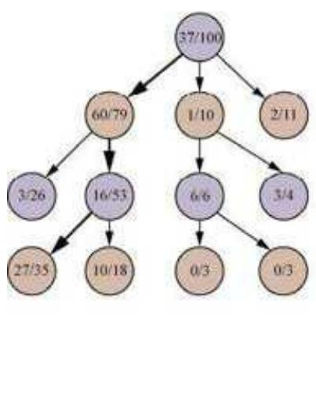

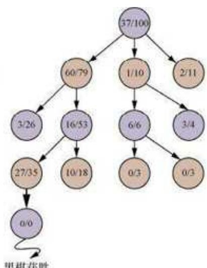  
（b）扩展和模拟

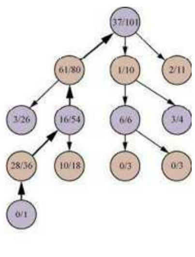  
）反向传播  
图5-10 使用蒙特卡罗树搜索（MCTS）选择移动的算法的一次迭代，该算法使用“应用于树搜索的置信上界”法（UCT）作为选择度量，此时已完成了100次迭代。（a）选择移动，沿着树一直向下，到标记为27/35（35次模拟中黑方赢了27次）的叶节点结束。（b）扩展所选节点并进行模拟，

最终黑方获胜。（c）将模拟结果沿树反向传播

●选择： 从搜索树的根节点开始，选择一个移动（在选择策略的指导下），到达一个后继节点，然后重复该过程，沿着树向下移动到叶节点。图5-10a为一棵搜索树，根表示白方刚刚移动的状态，到目前为止，白方已经在100次模拟中赢了37次。粗箭头表示黑方选择的移动，在它指向的节点上黑方赢了60/79次。这是3种移动中最高的胜率，所以选择它是一次利用。但为了探索，选择2/11节点也是合理的——只有11次模拟，该节点的估值仍有很高的不确定性，如果我们获得更多相关信息，它最终可能是最好的。继续选择直到到达标有27/35的叶节点。  
●扩展： 我们通过为所选节点生成一个新的子节点的方式增长搜索树，图5-10b中展示了标记为0/0的新节点。（一些版本在这一步中会生成多个子节点。）  
●模拟： 我们从新生成的子节点开始执行一次模拟，根据模拟策略为两个参与者选择移动。这些移动不会记录在搜索树中。在图中，模拟结果为黑方获胜。  
●反向传播： 我们现在使用模拟结果自底向上地更新所有搜索树节点。因为这次模拟的结果是黑方获胜，所以黑方节点的获胜次数和模拟次数都会增加，27/35变为28/36，60/79变为61/80。因为白方失败，其节点只增加模拟次数，所以16/53变为16/54，根节点的37/100变为37/101。

我们在固定次数的迭代中重复这4个步骤，或者迭代到所分配的时间耗尽，然后返回模拟次数最多的移动。

一种非常有效的选择策略称为“应用于树搜索的置信上界”，即UCT。它根据称为 UCB1 的置信上界公式对每个可能的移动排序。（详见17.3.3节。）对节点n 来说，公式为

$$
\mathrm {U C B 1} (n) = \frac {U (n)}{N (n)} + C \times \sqrt {\frac {\log N (\mathrm {P _ {A R E N T}} (n))}{N (n)}}
$$

其中 U ( n )为经过节点 n 的所有模拟的总效用值， N ( n )是经过节点 n 的模拟次数，P arent ( n )是

树中n 的父节点。因此 为利用项，即节点n的平均效用值。带有平方根的项是探索项：分母为N(n )，这意味着对只探索过几次的节点来说，这一项的值比较高；分子记录了我们对 n 的父节点的探索次数，这意味着，如果我们选择n 的概率不是0，那么随着计数的增加，探索项会趋于零，最终模拟次数将被分配给平均效用值最高的节点。

C 是一个平衡利用和探索的常数。有一种理论认为 C 应该是 ，但在实践中，程序员会尝试多个 $C$ 值，从中选择一个表现最好的。（有些程序则使用一些稍微不同的公式。例如，A lpha Z ero增加了一个行动概率项，由根据之前的自我对弈训练得到的神经网络计算。）当 C = 1.4时，图5-10中60/79节点的UCB1值最高，而当 C = 1.5时，2/11节点分值最高。

图5-11给出了完整的UCTMCTS算法。当迭代终止时，算法返回模拟次数最多的移动。你可能认为应该返回平均效用值最高的节点，但算法的思想是获胜65/100次的节点优于获胜2/3次的节点，因为后者有很多不确定性。在任何情况下，UCB1公式确保模拟次数最多的节点几乎总是拥有最高的获胜概率，因为随着模拟次数的增加，选择过程将越来越偏向获胜概率。

function MONTE-CARLO-TREE-SEARCH(state) returns a动作 tree $\leftarrow$ NODE(state) while Is-TIME-REMAINING() do leaf←SELECT-tree) child $\leftarrow$ EXPAND(leaf) result $\leftarrow$ SIMULATE(child) BACK-PROPAGATE(result, child) return ACTIONS(state)中指向模拟次数最多的节点的移动

图5-11 蒙特卡罗树搜索算法。首先，初始化博弈树 tree ，然后重复S elect /E xpand /S imulate /B ack-P ropagate 的循环，直到时间耗尽，最后返回指向模拟次数最多的节点的移动

计算一次模拟结果的时间对博弈树的深度来说是线性的，而不是指数级的，因为在每个选择点上只采用一个移动。这样我们就有足够的时间进行多次模拟。例如，假设有一个分支因子为32的博弈，博弈平均持续100步。如果我们有足够的计算能力可以在执行移动前考虑10亿个博弈状态，那么极小化极大算法可以搜索6层深度，具有完美行动顺序的 算法可以搜索12层深度，蒙特卡罗搜索算法可以搜索1000万次模拟。哪种方法更好呢？这取决于所用的启发式函数与选择策略、模拟策略的准确性的高下。

传统观点认为，对于围棋这种分支因子非常高（因此 $\alpha - \beta$ 搜索不够深）或者很难定义一个好的评价函数的游戏，蒙特卡罗搜索要优于 搜索。考虑到对手的目标是最小化得分， 搜索将选择指向可实现评价函数得分最高的节点的路径。因此，如果评价函数不准确， 搜索也会不准确。对单个节点的错误计算可能导致 搜索错误地选择（或避开）指向该节点的路径。而蒙特卡罗搜索依赖于多次模拟的聚合，因此不容易受到单次错误的影响。我们也可以将MCTS和评价函数结合起来：对一定数量的移动进行模拟，然后截断模拟，并在截断的节点上应用评价函数。

也可以将 搜索和蒙特卡罗搜索结合。例如，在可以持续很多步的博弈中，我们可能希望 提前终止模拟 （early playout termination），即终止持续太多步的模拟，并使用启发式评价函数对其进行评估，或者干脆宣布平局。

蒙特卡罗搜索可以应用于没有任何经验可以用来定义评价函数的全新博弈。只要我们知道博弈规则，蒙特卡罗搜索不需要任何附加信息。选择和模拟策略可以充分利用人工制定的专家知识，也可以通过仅仅使用自我对弈训练得到的神经网络来学习好的策略。

当单步移动可以改变游戏进程时，蒙特卡罗搜索存在缺陷，因为蒙特卡罗搜索的随机性意味着它可能不会考虑这一移动。换句话说，蒙特卡罗搜索中的B型剪枝意味着它可能根本没有探索关键路线。当博弈状态“明显”是一方或另一方获胜时（根据人类的知识和评价函数），蒙特卡罗搜索也存在缺陷，它仍然需要模拟很多步来验证获胜者。长期以来，人们一直认为，在国际象棋等具有较低分支因子和较好评价函数的游戏中， 搜索更好。但最近，蒙特卡罗方法在国际象棋及其他游戏中也取得了成功。

模拟未来的行动，观测结果，并根据结果来确定哪些行动是好的，这样的一般思想其实就是一种强化学习 思想，我们将在第22章中介绍。

# 5.5 随机博弈

包含随机因素（例如掷骰子）的随机博弈 （stochasticgame）使我们更接近现实生活的不可预测性。西洋双陆棋是一种典型的运气和技巧相结合的随机游戏。在图5-12的西洋双陆棋局面中，黑方掷出“6-5”，有4种可能走法［每种走法将一个棋子向前（顺时针）移动5步，另一个棋子向前移动6步］。

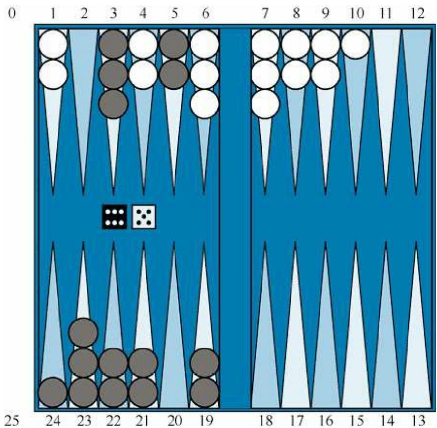  
图5-12 一个典型的西洋双陆棋局面。游戏的目标是把自己的所有棋子移出棋盘。黑方向25顺时针移动，白方向0逆时针移动。一个棋子可以移动到任何位置，除非那里有多个对方棋子；如果只有一个对方棋子，对方棋子就会被吃掉，然后必须从起点重新开始。图中所示的局面，黑棋已经掷出了6-5，必须从(5−11, 5−10)、(5−11, 19−24)、(5−10, 10−16)和(5−11, 11−16)这4种合法移动中选择，其中符号(5−11, 11−16)表示将一个棋子从位置5移动到位置11，另一个棋子从位置11移动到位置16

此时，黑方知道可以走什么棋，但不知道白方会掷出什么，因此也不知道白方的合法移动会是什么。这意味着黑方无法构建我们在国际象棋和井字棋中看到的那种标准博弈树。西洋双陆棋的博弈树除了 max和 min节点外，还必须包括 机会节点 （chancenode）。机会节点如图5-13中的圆圈所示。从每个机会节点引出的分支表示可能掷出的骰子点数，每个分支都标有掷出的点数及其概率。两个骰子有36种组合，每一种都是等可能的，但是，因为6-5和5-6是一样的，所以只有21种不同的点数组合。6个点数相同的组合（1-1到6-6）的概率都是1/36，即P(1−1)=1/36。其他15种不同组合的概率都是1/18。

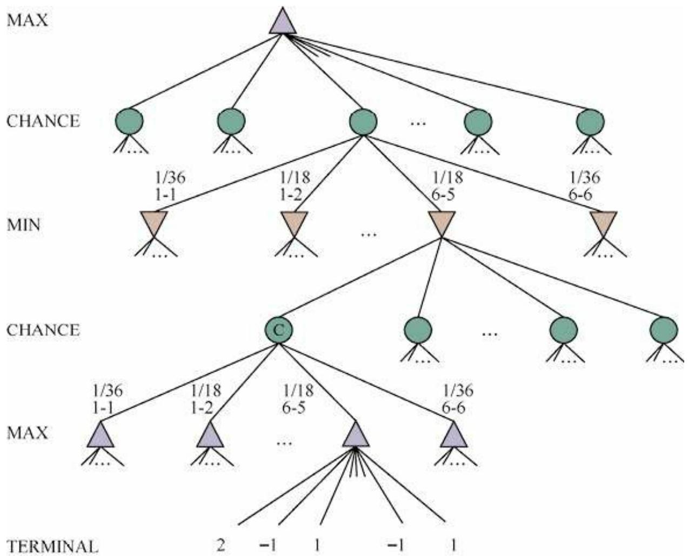  
图5-13 西洋双陆棋局面的博弈树图解

下一步是了解如何做出正确决策。显然，我们仍然想选择能够到达最佳局面的那一步棋。然而，局面没有明确的极小化极大值。我们只能计算局面的 期望值 （expected value）：机会节点所有可能结果的平均值。

可以将确定性博弈的极小化极大值推广为包含机会节点的博弈的期望极小化极大值（expectiminimax value）。终止节点、max 节点和min节点的工作方式与之前完全相同（注意，max 和min的合法移动取决于前一个机会节点的掷骰子结果）。对于机会节点，我们则计算期望值，即用每个机会动作的概率加权的所有结果的值之和：

$\begin{array}{rl} & \text{EXCEPTIMINIMAX}(s) = \\ & \left\{ \begin{array}{ll}\mathsf{U}\mathsf{T}\mathsf{I}\mathsf{L}\mathsf{I}\mathsf{Y}(s,\mathsf{MAX}) & \text{如果Is-TERMINAL}(s)\\ \mathsf{max}_a\mathsf{EXPTIMINIMAX}(\mathsf{RES}\mathsf{ULT}(s,a)) & \text{如果To-MOVE}(s) = \mathsf{MAX}\\ \mathsf{min}_a\mathsf{EXPTIMINIMAX}(\mathsf{RES}\mathsf{ULT}(s,a)) & \text{如果To-MOVE}(s) = \mathsf{MIN}\\ \sum_aP(r)\mathsf{EXPTIMINIMAX}(\mathsf{RES}\mathsf{ULT}(s,r)) & \text{如果To-MOVE}(s) = \mathsf{CHANGE} \end{array} \right. \end{array}$

其中，r表示可能的掷骰子结果（或其他概率事件），而Result $( \boldsymbol { s } , \boldsymbol { r } )$ 仍表示状态s，附加了掷骰子结果r。

机会博弈的评价函数

和极小化极大算法一样，可以通过在某点截断搜索并对每个叶节点应用评价函数来近似估计期望极小化极大值。有人可能会认为，西洋双陆棋等游戏的评价函数应该与国际象棋的评价函数类似—

更好的局面得分更高。但事实上，机会节点的存在意味着我们必须更加仔细地定义这些值。

图5-14表明：如果评价函数给叶节点分配的值为[1,2,3, 4]，那么移动 $a _ { 1 }$ 是最佳的；如果值为[1,20, 30, 400]，移动 $a _ { 2 }$ 是最佳的。因此，如果我们更改一些评估值，即使优先顺序保持不变，程序的选择也会完全不同。

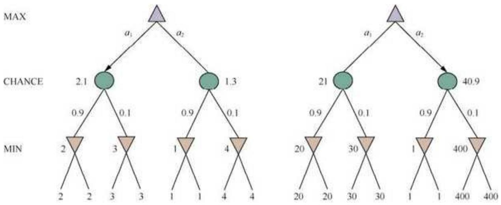  
图5-14在保持叶节点值排序不变的情况下，不同的叶节点赋值改变了最佳移动

为了避免这一问题，评价函数应该返回获胜概率 （对于结果非输或赢的博弈返回的是期望效用值）的正线性变换值。这是在不确定性下非常重要和普遍的性质，将在第16章进一步讨论。

如果程序事先知道游戏接下来的所有掷骰子结果，那么求解有骰子的游戏和求解没有骰子的游戏是一样的，即极小化极大算法的时间复杂度为 $O \left( b ^ { m } \right)$ ，其中 $^ { b }$ 为分支因子， $m$ 为博弈树的最大深度。因为期望极小化极大值还要考虑所有可能的掷骰子序列，它的时间复杂度为 $O \left( b ^ { m } n ^ { m } \right)$ ，其中n 是掷骰子的不同结果的数目。

即使将搜索深度限制在某个很小的值 d 内，与极小化极大算法相比，额外代价的存在也使得在大多数机会博弈中向前看很远是不现实的。在西洋双陆棋中， n 是21， b 通常是20左右，但在某些情况下，骰子数翻倍，b 可能高达4000。我们大概只能搜索3层。

换一种方式考虑这一问题： α-β 搜索的优势在于，在采取最佳玩法的情况下它忽略了那些未来不可能发生的情况。因此，它将精力集中于可能发生的情况。但在一个每次移动前都要掷两个骰子的游戏中，没有可能的移动序列，即使是最有可能的移动也只在2/36的情况下出现，因为执行移动的前提是，骰子点数是正确的组合从而使该移动合法。这是不确定性下的一个普遍问题：可能性急剧增多，制定详细的动作规划变得毫无意义，因为世界可能不会朝你规划的方向发展。

你可能会想到像 剪枝这样的方法也可以应用于包含机会节点的博弈树。事实证明的确可以。对 min 和 max 节点的分析不变，但可以用一点聪明才智对机会节点剪枝。考虑图5-13中的机会节点C，以及在计算其子节点时它的值发生了什么变化。在我们检查完 $C$ 的所有子节点之前是否有可能找到 C 的上界？（回想一下，这是 $C$ 剪枝剪除某个节点及其子树时需要的。）

乍一看，这似乎是不可能的，因为 C的值是它子节点值的平均，为了计算一组数字的平均值，我们必须查看所有的数字。但如果限制效用函数的可能值的范围，那么就可以得到平均值的范围而不需要查看每一个数字。例如，假设所有效用值都在−2和+2之间，那么叶节点的值是有界的，反过来，我们就可以在不检查所有子节点的情况下为机会节点的值设置上界。

在机会节点分支因子较高的博弈中——考虑Yahtzee这样的游戏，即每回合掷5个骰子——你可能要考虑前向剪枝，即采样少数几个可能的机会分支。或者，你可能想要完全避免使用评价函数，而选择蒙特卡罗树搜索，其中每次模拟都包含随机掷骰子。

# 5.6 部分可观测博弈

博比·费希尔（BobbyFischer）认为“国际象棋就是战争”，但国际象棋缺少真实战争的一个主要特征—— 部分可观测性 。在《战争之雾》（ Fog of War ）游戏中，敌人的行踪往往是未知的，除非与他直接接触。因此，战争中常常使用侦察兵和间谍来收集信息，用隐匿处和虚张声势来迷惑敌人。

部分可观测游戏也具有这些特征，因此与前文提到的游戏有本质不同。像《星际争霸》这样的电子游戏尤其具有挑战性，因为它是部分可观测、多智能体、非确定性、动态且未知的。

在确定性部分可观测博弈中，关于棋盘状态的不确定性完全来自无法获知对手做出的选择。这类博弈包括Battleship（每个玩家战舰的放置位置都对敌人隐藏）和Stratego（棋子的位置已知，但种类隐藏）这样的儿童游戏。我们考虑 四国军棋 （Kriegspiel）游戏，它是国际象棋的部分可观测变体，即完全看不到对方的棋子。其他游戏也有部分可观测版本：幻影围棋、幻影井字棋和ScreenShogi。

# 5.6.1 四国军棋：部分可观测的国际象棋

四国军棋的规则如下：白方和黑方各自只能看到自己一方的棋子。裁判可以看到所有棋子，他对比赛进行判定并定期向双方宣布。首先，白方向裁判提出合法移动（只要位置上没有黑方）。如果该位置有黑方占位，裁判会宣布移动“非法”，白方不断向裁判提出下一步的走法，直到找到一个合法移动——在这个过程中也了解到了黑方的位置。

一旦提出了一个合法移动，裁判会宣布以下一项或多项内容：如果在X处有吃子则宣布“在X上吃子”，如果黑王被将军，则宣布“被 $D$ 将军”，其中 $D$ 是将军的方向，可以是“马”“行”“列”“长对角线”或“短对角线”。如果黑方被将死或陷入僵局，裁判也会宣布；否则，轮到黑方行棋。

四国军棋看起来非常难处理，但人类可以很好地掌握它，计算机程序也开始迎头赶上。回顾4.4节和图4-14中介绍的信念状态 的概念——在给定目前为止所有历史感知的情况下，所有逻辑可能的棋盘状态的集合。初始时，白方的信念状态只有一个元素，因为黑方还没有移动。白方下了一步且黑方做出应对后，白方的信念状态就包含了20种局面，因为黑方对白方的任意一种开局都存在20种回应。

在游戏过程中跟踪信念状态正是状态评估 问题，4.4.4节中的式（4-6）给出了更新步骤。如果我们把对手看作不确定性的来源，那么可以把四国军棋的状态评估直接映射到4.4节的部分可观测的、非确定性的框架中；也就是说，白方所选移动的Results由白方自身移动带来的（可预测）结果和


黑方回应给出的不可预测结果组成。

给定当前的信念状态，白方可能会问：“我能赢吗？”对于部分可观测游戏，策略 的概念会发生改变，我们不需要规定如何回应对手的每个可能移动，而是需要规定如何回应玩家可能接收到的每种可能感知序列。

对四国军棋来说，必胜策略或确保将死 （guaranteed checkmate）是指，对于每种可能感知序列和当前信念状态中的每种可能棋盘状态，不管对手如何移动，该策略都会取胜。在这种定义下，对手的信念状态无关紧要——即使对手能看到所有棋子，这一策略也必须奏效。这大大简化了计算。图5-15为KRK（王车对王）残局必胜策略的一部分。在这种情况下，黑方只有一个棋子（王），所以可以通过在单个棋盘上标记黑王的所有可能位置来表示白方的信念状态。

如4.4节中所述，可以将一般的与或搜索算法应用于信念状态空间来寻找必胜策略。4.4.2节提到的增量信念状态算法通常能在中盘找到深度高达9的必胜策略——这远远超过了大多数人类棋手的能力。

除确保将死之外，四国军棋还存在一个在完全可观测游戏中毫无意义的全新概念：概率将死（probabilisticcheckmate）。在信念状态中的每一种棋盘状态下，这种将死都要奏效，而概率一词则来源于获胜玩家移动的随机性。要了解它的基本思想，可以考虑只用白王来捉住黑王的问题。通

过简单地随机移动，白王最终一定会吃掉黑王，这是因为，即使黑王总是设法逃跑，它也不可能永远都猜对正确的逃跑方向。在概率论的术语中，这一事件以概率1发生。

在这种意义上，KBNK残局——王、象、马对王— —一定会赢，白方为黑方提供一个无限的随机选择序列，黑方总是会猜错其中一个，因此暴露自己的位置，然后被将死。另外，KBBK残局的获胜概率是 。白方要想获胜，只能移动象（此时这个象不受保护）。如果黑方碰巧在正确的位置上并吃掉了象（如果象是受保护的，那么这步棋就是非法的），游戏就会变成平局。白方可以在一段很长的序列中随机选择一点来走这步险棋，这样会使 $\pmb { \varepsilon }$ 减小到一个任意小的常数，但无法将减小到零。

有时将死策略只对当前信念状态中的某些棋盘状态有效，而对其他状态无效。尝试这种策略可能会成功，导致 意外将死 （accidentalcheckmate）。这里的意外是指，如果黑方刚好在特定的位置，白方不会知道自己将会将死对方。（在人类博弈中，大多数将死都是偶然的。）这个想法自然引出了一个问题，给定策略有多大可能获胜，这又引出了一个问题，当前信念状态中的每种棋盘状态有多大可能是真正的棋盘状态。

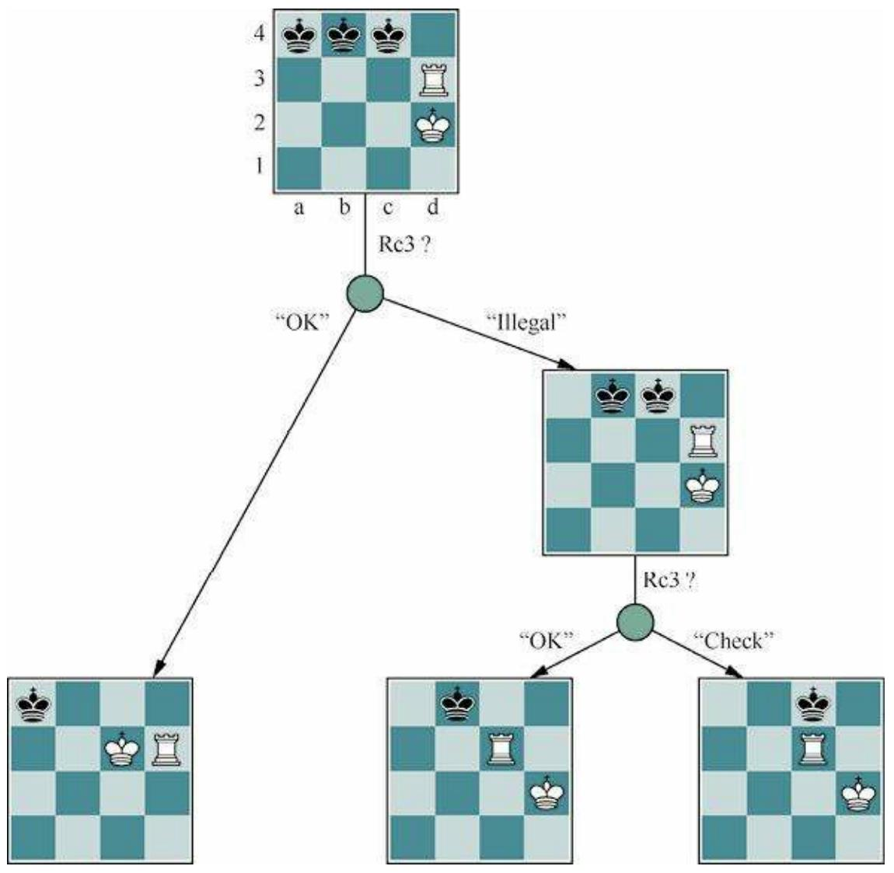  
图5-15 KRK残局必胜策略的一部分，图中为缩减后的棋盘。在初始信念状态中，黑王位于3种可能位置之一。通过一系列探索移动，该策略将黑王的范围缩小到其中一种。将死策略的剩余部分留作习题

人们的第一倾向可能认为当前信念状态中的所有棋盘状态都是等可能的——但这是错误的。例如，考虑黑方走第一步棋后白方的信念状态。根据定义（假设黑方遵循最优策略），黑方一定采取了最优移动，所以由次优移动产生的所有棋盘状态的概率应该为零。

这一论点也不完全正确，因为每个玩家的目标不仅仅是将棋子移动到正确的方格中，还需要最小化对手能掌握的关于自己位置的信息 。遵循任何可预测的“最优”策略都能为对手提供信息。因此，在部分可观测博弈中，最佳玩法需要一定 随机性 。（这也是餐厅卫生检查员进行随机 检查的原因。）这意味着他们偶尔要选择一些“本质上”较差的移动——但他们能从不可预测性上获益，因为对手不大可能为防御这些移动做好准备。

从这些考虑来看，似乎只有在给定最优随机策略的情况下，才能计算出当前信念状态中各种棋盘状态的概率；反过来，计算这一策略似乎需要知道棋盘可能处于的各种状态的概率。这个难题可以利用博弈论中均衡 解的概念解决，我们将在第17章中进一步探讨。均衡为每个玩家指定了一个最优随机策略。对四国军棋来说，计算均衡的代价太昂贵了。目前，一般四国军棋游戏的有效算法设计是一个开放的研究课题。大多数系统在自己的信念状态空间中执行有限深度的前瞻搜索，而不考虑对手的信念状态。评价函数与完全可观测博弈的评价函数类似，但包含一个新的组成部分，信念状态大小——越小越好！我们将在18.2节的博弈论主题下重新讨论部分可观测博弈。

# 5.6.2 纸牌游戏

桥牌、惠斯特牌、红心大战和扑克等纸牌游戏都具有随机的部分可观测性，即无法观测的信息是由随机发牌产生的。

乍一看，这些纸牌游戏似乎很像掷骰子：纸牌是随机分配的，并且决定了每个玩家的可能移动，但所有的“掷骰子”都发生在游戏的开始！尽管将纸牌游戏类比为掷骰子是错误的，但它提出了一种算法：将游戏的开始视为一个机会节点，每一种可能的发牌视为一个结果，然后使用E xpectiminimax公式选择最佳移动。注意，在这种方法中，唯一的机会节点是根节点；在那之后，游戏则是完全可观测的。这种方法有时被称为观测力平均 ，因为它假设，一旦发牌实际发生，游戏对双方都是完全可观测的。尽管这种策略在直观上具有吸引力，但有可能让人误入歧途。考虑下面这个故事。

第一天：道路A通向一桶金子，道路 B通向一个岔路口。你可以看到，岔路口左转是两桶金子，右转则会撞上一辆公共汽车。

第二天：道路A通向一桶金子，道路 B通向一个岔路口。你可以看到，岔路口右转是两桶金子，左转则会撞上一辆公共汽车。

第三天：道路A通向一桶金子，道路 B通向一个岔路口。你知道岔路口的一个分支通向两桶金子，另一个分支会撞上一辆公共汽车。遗憾地是，你不知道哪个分支通向金子。

观测力平均会得出以下推论：第一天，B是正确选择；第二天，B也是正确选择；第三天，情况和第一天或第二天一样，所以B仍然是正确选择。

现在我们可以看出观测力平均为什么会失败：它没有考虑智能体执行行动后所处的信念状态。完全忽略信念状态是不可取的，特别是当其中一种可能性是必死时。因为它假设每种未来状态都自动成为一个完美知识，观测力方法从不选择那些收集信息的行动（例如图5-15中的第一个移动），也不会选择那些向对手隐藏信息或向同伴提供信息的行动，因为它假定对方已经知道这些信息。在扑克


游戏中，它永远不会 虚张声势 （bluff） $\_$ ，因为它假设对手知道自己的牌。在第17章中，我们将介绍如何构造算法解决真正的部分可观测决策问题，得到最优均衡策略（见18.2节）。

尽管存在上述缺陷，观测力平均仍是一个有效策略，通过一些技巧可以使其更好地发挥作用。在大多数纸牌游戏中，可能的发牌结果数量都相当大。例如，在桥牌中，每个玩家只能看到四手牌中的

2两手，剩余两手各包含13张牌，所以可能的发牌结果有 =10 400 600种。即使求解一种发牌结果也是相当困难的，所以求解1000万种更是不可能的。处理这样巨大数目的一种方法是 抽象（abstraction）：将相似的手牌视为相同手牌。例如，手牌中的A和K非常重要，但是4或5就不那么重要了，可以将其抽象。

另一种处理方法是前向剪枝：只考虑一个小随机样本（样本数为 $N$ ），再次计算E xpectiminimax得分。即使是相当小的 $N$ （例如100～1000），这种方法也能提供很好的近似值。它也可以应用于确定性博弈，例如四国军棋（在四国军棋中，我们对游戏的可能的状态进行采样，而不是可能的发

牌），只要我们有方法估计每个状态的可能性。除了搜索整个博弈树，使用深度截断进行启发式搜索也很有帮助。

到目前为止，我们假设每种发牌结果的可能性相等。对于惠斯特牌和红心大战，这样的假设是有意义的。但是对于桥牌，比赛之前为叫牌阶段，在这个阶段中，每支队伍都会表明它要赢多少。由于玩家是根据自己持有的牌出价，因此其他玩家可以了解到每种发牌结果的概率P(s)。在决定如何玩这手牌时考虑这一点是很难的，原因就像我们在四国军棋的描述中所提到的：玩家在出价时，可能会尽量最小化传达给对手的信息。

计算机在扑克牌上的表现已经超出了人类水平。在为期20天的无限注德州扑克比赛中，扑克程序Libratus与4位世界顶尖的扑克玩家展开较量，并果断地将他们全部击败。因为在扑克中存在很多可能状态，Libratus使用抽象法减少状态空间：它可能会认为手牌AAA72和AAA64是等价的（它们都是“3个A和一些小牌”），并且可能认为赌200美元与赌201美元是一样的。但是Libratus也会监视其他玩家，如果它发现他们正在使用抽象法，它会立即做一些额外的计算填补这个漏洞。总的来说，它在超级计算机上耗费了2500万CPU小时才取得胜利。

Libratus的计算开销（以及A lphaZero 和其他系统的开销）表明，预算有限的研究人员可能无法达到世界冠军水平。从某种程度上来说，这是正确的：就像你不能指望在你的车库里用零部件组装出一辆F1冠军赛车一样，拥有超级计算机或专业硬件（如TPU）是有优势的。训练一个系统时尤其如此，但训练也可以通过众包完成。例如，开源LeelaZero 系统是A lphaZero的复现，它通过志愿参与者计算机上的自我对弈进行训练。一旦训练完成，实际比赛中的计算需求是适中的。A lphaStar在使用单个GPU的商用台式计算机上赢得了《星际争霸II》比赛，而A lphaZero 也可以在这种模式下运行。

# 5.7 博弈搜索算法的局限性

计算复杂博弈中的最优决策是非常困难的，因此所有算法都必须做出一些假设和近似。 搜索使用启发式评价函数作为近似，而蒙特卡罗搜索计算随机选择的模拟的近似平均值。选择哪种算法在一定程度上取决于每种博弈的特征：当分支因子较高或评价函数难以定义时，首选蒙特卡罗搜索。但这两种算法都存在其基本的局限性。

搜索的一个局限性是它容易受到启发式函数的近似误差的影响。图5-16为一个二层博弈树，极小化极大搜索会选择右边的分支，因为100 99。如果所有的评估值都是精确的，那么这就是正确的选择。但假设每个节点的评估值都有一个独立于其他节点的随机分布的误差，其标准差为 s。当s=5时，实际上71%的情况下是左侧分支更好，当s=2时，58%的情况下左侧分支更好（因为在这些情况下，右侧分支的4个叶节点之一可能小于99）。如果评价函数中的误差不是独立的，那么发生错误的可能性更大。这是很难避免的，因为我们没有一个很好的兄弟节点值之间依赖关系的模型。

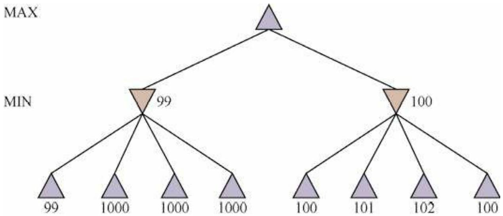  
图5-16 启发式极小化极大算法可能出错的二层博弈树

搜索和蒙特卡罗搜索的第二个局限性是，它们都是设计用于计算合法移动的（边界）值的。但有时其中一种移动显然是最佳的（例如，合法移动只有一种），在这种情况下，浪费时间计算它的值是没有意义的——最好是直接选择该移动。更好的搜索算法应该使用节点扩展的效用值的思想，选择效用值高的节点扩展，所谓高效用值的节点是指，有可能导致算法发现一个明显更好的移动。如果没有一个节点扩展的效用值高于它的代价（从时间上考虑），那么算法应该停止搜索并执行一个移动。这不仅适用于存在明显更好移动的情况，也适用于对称情况，在这种情况下，再多的搜索也无法证明一种移动比另一种更好。

这种关于计算该做什么的推理叫作元推理 （metareasoning）（关于推理的推理）。它不仅适用于博弈，也适用于任意一种推理。所有计算都是为了做出更好的决策，所有计算都有代价，并且都有可能导致决策质量的一定程度上的改进。蒙特卡罗搜索的确尝试进行元推理，将资源分配给树中最重要的部分，但不是以最优方式。

第三个局限性是 搜索和蒙特卡罗搜索都是在单步移动的层级上进行所有推理的。显然，这与人类玩游戏的方式不同：人类可以在更抽象的层级上进行推理，会考虑更高层级的目标（例如，诱捕对方的后），并使用该目标有选择地生成看似合理的规划。在第11章中，我们将学习这种类型的规划 ，在11.4节中，我们将介绍如何用从抽象表示到具体表示的层次结构进行规划。

第四个问题是能否将机器学习 融入博弈搜索过程。早期的游戏程序依靠人类的专业知识人为制定评价函数、开局库、搜索策略和高效技巧。我们才刚刚开始看到像A lphaZero 这样的程序（Silveretal.,2018），它依赖于自我对弈的机器学习，而非人类在特定游戏上的专业知识。我们将从第19

章开始深入探讨机器学习。

小结

我们探讨了各种各样的博弈，以理解什么是最佳玩法以及如何在实际中玩好游戏，还了解了智能体在任意类型的对抗性环境中应该如何行动。最重要的思想如下。

●博弈可以由初始状态 （棋盘如何设置）、每个状态下的合法 动作 、每个动作的结果 、终止测试 （说明什么时候博弈结束）以及应用于终止状态表明输赢和最终比分的效用函数 定义。  
●在具有完美信息 的离散、确定性、轮流的双人零和博弈中， 极小化极大算法 可以通过对博弈树的深度优先枚举选出最优移动。  
● 搜索算法可以计算出与极小化极大算法相同的最优移动，通过消除可证明与结果无关的子树来提高效率。  
● 通常，考虑整个博弈树是不可行的（即使是 搜索），所以我们需要在某个点截断搜索，然后应用启发式评价函数 估计状态的效用值。  
●蒙特卡罗树搜索（MCTS） 则是另一种方法，它不是通过应用启发式函数来评估状态，而是通过将游戏模拟到结束使用游戏规则来判断输赢。因为在模拟 过程中选择的移动可能不是最优移动，所以这个过程需要重复多次，对结果求平均值作为评估值。  
●许多游戏程序会预先计算开局和残局的最佳移动表，这样它们就可以直接查表而不用搜索。  
●机会博弈可以通过期望极小化极大算法 （极小化极大算法的扩展）来处理，该算法通过计算所有子节点的平均效用值并按每个子节点的概率加权来估计机会节点的平均效用值 。  
●在不完美信息 博弈中，例如四国军棋和扑克，最佳玩法需要对每个玩家当前和将来的信念状态进行推理。可以通过对缺失信息的每种可能配置上的动作值取平均得到一个简单的近似。  
●在国际象棋、跳棋、黑白棋、围棋、扑克及许多其他游戏中，程序已经彻底击败了人类冠军选手。在一些不完美信息博弈中人类仍然保持优势，如桥牌和四国军棋。在像《星际争霸》和《刀塔2》这样的电子游戏中，程序可以与人类专家媲美，但它们的成功可能一部分要归功于它们可以快速执行许多动作的能力。

读者服务：


微信扫码关注【异步社区】微信公众号，回复“e59810”获取本书配套资源以及异步社区15天VIP会员卡，近千本电子书免费畅读。

# 第6章

# 约束满足问题

在本章中，我们不把状态仅仅当作小黑盒，从而导出新的搜索方法和对问题结构的更深入理解。

第3章和第4章讨论了通过搜索状态空间进行问题求解的思想：状态空间是一个由节点表示状态，边表示动作的图。我们看到，领域特定的启发式算法可以估计从给定状态到达目标的代价，但从搜索算法的角度来看，每个状态都是原子的，即不可分割的— —一个没有内部结构的黑盒。对于每个问题，我们需要领域特定的代码来描述状态之间的转移。

在本章中，我们通过对每个状态使用 因子化表示 （factored representation）来打破黑盒：因子化表示为一组 变量 ，每个变量都有自己的 值 。当每个变量的值都满足对该变量的所有约束时，问题就解决了。以上述方式描述的问题称为 约束满足问题 （constraint satisfaction problem，CSP）。

CSP搜索算法利用了状态结构的优势，并且使用通用的而不是领域特定的启发式算法来求解复杂问题。其主要思想是，通过识别违反约束的变量/值组合来一次性消除大部分搜索空间。CSP的另一个优势是可以从问题描述中推导出行动和转移模型。

# 6.1 定义约束满足问题

约束满足问题由3个部分组成，即 X 、 D 和 C 。

● X 是变量集合， $\{ X _ { 1 } , \cdots , X _ { n } \}$ 。  
● D 是域集合， $\{ D _ { 1 } , \cdots , D _ { n } \}$ ，每个变量有一个域。  
●C是约束集合，用来规定允许的值的组合。

域 $D _ { i }$ ，由变量 $X _ { i }$ 的一组允许的值 $\{ v _ { 1 3 } \cdots , v _ { k } \}$ 组成。例如，布尔变量的域为。不同变量可以有不同大小的域。每个约束 $\mathrm { C } _ { j }$ 由 对组成，其中 scope 是该约束中的变量元组，而 rel 定义了这些值应该满足的 关系 （relation）。关系可以表示为满足约束的所有元组值的显式集合，或者表示为判断一个元组是否为关系成员的函数。例如，如果 $X _ { 1 }$ 和 $X _ { 2 }$ 的域都是{1, 2, 3}，那么约束“ $X _ { 1 }$ 必须大于 $X _ { 2 }$ ”可以表示为

$$
\langle (X _ {1}, X _ {2}), \{(3, 1), (3, 2), (2, 1) \} \rangle_ {\text {或}} \langle (X _ {1}, X _ {2}), X _ {1} > X _ {2} \rangle_ {\circ}
$$

CSP要处理变量 赋值 （assignment）问题，即 $\{ X _ { i } = \nu _ { i } , X _ { j } = \nu _ { j _ { 2 } } \cdots \}$ 。不违反任何约束的赋值称为 一致 （consistent）或合法赋值。 完整赋值 （complete assignment）是指每个变量都已被赋值；CSP的 解 （solution）是一致完整赋值。 部分赋值 （partial assignment）是指某些变量还未赋值，而 部分解 （partial solution）是一致部分赋值。一般来说，CSP求解是NP完全问题，尽管CSP的一些重要子类已经可以非常高效地求解。

# 6.1.1 问题示例：地图着色

也许你已经逛够了罗马尼亚，现在来看看澳大利亚地图（如图6-1a所示） $\underline { { \cdots } } = \underline { { \cdots } }$ 大利亚的州和地区，分别是：西澳大利亚州（Western Australia）、北部地区（North Territory）、昆士兰州（Queensland）、新南威尔士州（New South Wales）、维多利亚州（Victoria）、南澳大利亚州（South Australia）、塔斯马尼亚州（Tasmania）、澳大利亚首都直辖区（Australia CapitalTerritory）。我们的任务是给每个区域涂上红色、绿色或蓝色，要求相邻的两个区域颜色不能相

同。 为科式形式化为SP，我们有中的区核定为量，量为区的写：

$$
\mathcal {X} = \{W A, N T, Q, N S W, V, S A, T \}
$$

每个变量的域为集合 。约束要求相邻区域颜色不同。由于相邻区域的边界线有9段，所以有9个约束：

$$
\mathcal {C} = \{S A \neq W A, S A \neq N T, S A \neq Q, S A \neq N S W, S A \neq V, W A \neq N T, N T \neq Q, Q \neq N S W, N S W \neq V \}
$$

这里我们使用缩写。 是 $( ( \Sigma A , W A ) , \Sigma A \neq W A )$ 的缩写，其中 $\pmb { W } \pmb { A } \neq \pmb { W } \pmb { A }$ 可以依次完整枚举为：

$$
\{(\text {r e d}, \text {g r e e n}), (\text {r e d}, \text {b l u e}), (\text {g r e e n}, \text {r e d}), (\text {g r e e n}, \text {b l u e}), (\text {b l u e}, \text {r e d}), (\text {b l u e}, \text {g r e e n}) \}
$$

这个问题有很多可能的解，例如：

$$
\{W A = \text {r e d}, N T = \text {g r e e n}, Q = \text {r e d}, N S W = \text {g r e e n}, V = \text {r e d}, S A = \text {b l u e}, T = \text {r e d} \}
$$

将CSP可视化为 约束图 （constraint graph）非常有用，如图6-1b所示。图的节点对应于问题的变量，图的边连接同一约束中的任意两个变量。

为什么要将问题形式化为CSP呢？第一个原因是CSP可以自然地表示各种问题，将一个问题形式化为CSP通常很容易；第二个原因是多年的研究工作使得CSP求解器快速而高效；第三个原因是相比于原子的状态空间搜索器，CSP求解器可以快速消除大面积搜索空间。例如，一旦我们在澳大利亚问题中选择了 $\{ S A = \ b l \mathbf { u } \in \}$ ，就可以得出结论，它的5个相邻变量都不能取值为blue。不使用约束的搜索过程必须考虑这5个相邻变量的35 = 243种赋值；有了约束，我们只需考虑25 = 32种赋值，计算量减少了87%。

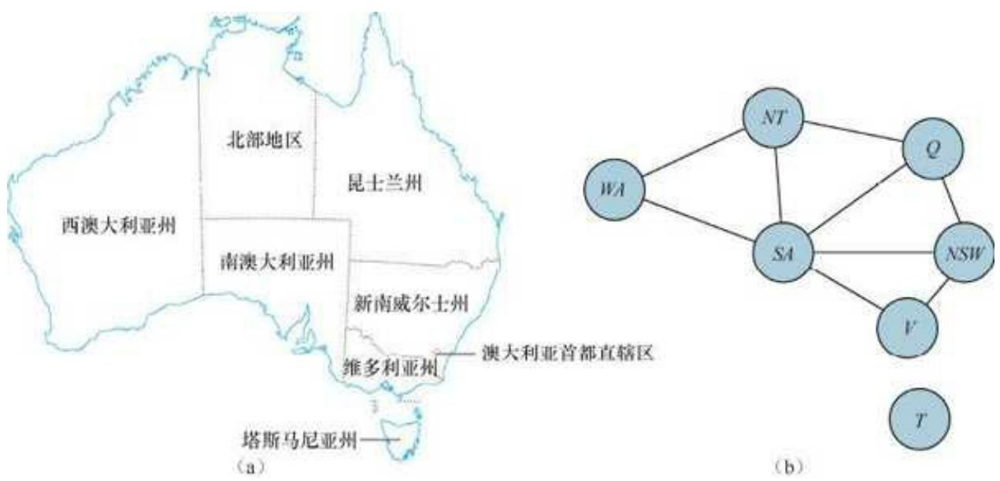  
图6-1 （a）澳大利亚的州和地区。对该地图着色可以看作约束满足问题（CSP）。目标是为每个区域分配颜色，使得相邻区域颜色不同。（b）用约束图表示地图着色问题

在原子的状态空间搜索中，我们只能问：这个特定状态是目标状态吗？不是？那么这一个呢？使用CSP，一旦发现某个部分赋值违反了约束，我们可以马上放弃对该部分赋值的进一步改进。此外，我们可以看出为什么某个赋值不是解——可以看出哪些变量违反了约束——从而把注意力集中在关键变量上。因此，许多原子状态空间搜索难以求解的问题形式化为CSP后都可以快速求解。

# 6.1.2 问题示例：车间作业调度

工厂有很多日常工作调度问题，要满足各种约束。在实践中，使用CSP技术可以求解很多这样的问题。考虑汽车装配调度问题。整个作业由不同任务组成，我们可以将每个任务建模成一个变量，其中每个变量的值为任务开始时间，由整数分钟数表示。约束为“一个任务必须在另一个任务之前完成”（例如，安装车轮必须在安装轮毂盖之前完成）和“一次只能同时执行一定数量的任务”等断言。约束还可以指定任务完成所需的时间。

我们考虑汽车装配的一小部分环节，包括15个任务：安装轮轴（axle）（前、后），固定4个车轮（wheel）（左和右、前和后），拧紧每个车轮的螺母（nuts），固定轮毂盖（cap），并检查（inspect）最终装配。我们可以将任务表示为15个变量：

$$
\mathcal {X} = \left\{A x l e _ {\mathrm {F}}, A x l e _ {\mathrm {B}}, W h e e l _ {\mathrm {R F}}, W h e e l _ {\mathrm {L F}}, W h e e l _ {\mathrm {R B}}, W h e e l _ {\mathrm {L B}}, N u t s _ {\mathrm {R F}}, \right.
$$

$$
N u t s _ {\mathrm {L F}}, N u t s _ {\mathrm {R B}}, N u t s _ {\mathrm {L B}}, C a p _ {\mathrm {R F}}, C a p _ {\mathrm {L F}}, C a p _ {\mathrm {R B}}, C a p _ {\mathrm {L B}}, \text {I n s p e c t} \}
$$

接着，我们需要表示各个任务间的优先约束 （precedenceconstraint）。当任务 $T _ { 1 }$ 必须在 $T _ { 2 }$ 之前完成且任务 $T _ { 1 }$ 所需时间为 $d _ { 1 }$ 时，我们将添加一个如下形式的算术约束：

$$
T _ {1} + d _ {1} \leqslant T _ {2}
$$

在这个示例中，轮轴必须在车轮安装前到位，安装一个轮轴需要10分钟，所以有

$$
\begin{array}{l} A x l e _ {\mathrm {F}} + 1 0 \leqslant W h e e l _ {\mathrm {R F}}; A x l e _ {\mathrm {F}} + 1 0 \leqslant W h e e l _ {\mathrm {L F}} \\ A x l e _ {\mathrm {B}} + 1 0 \leqslant W h e e l _ {\mathrm {R B}}; A x l e _ {\mathrm {B}} + 1 0 \leqslant W h e e l _ {\mathrm {L B}} \\ \end{array}
$$

接下来，我们必须固定每个车轮（需要1分钟），拧紧螺母（2分钟），最后安装轮毂盖（1分钟，但暂未表示）：

$$
\begin{array}{l} W h e e l _ {\mathrm {R F}} + 1 \leqslant N u t s _ {\mathrm {R F}}; N u t s _ {\mathrm {R F}} + 2 \leqslant C a p _ {\mathrm {R F}} \\ W h e e l _ {\mathrm {L F}} + 1 \leqslant N u t s _ {\mathrm {L F}}; N u t s _ {\mathrm {L F}} + 2 \leqslant C a p _ {\mathrm {L F}} \\ W h e e l _ {R B} + 1 \leqslant N u t s _ {R B}; N u t s _ {R B} + 2 \leqslant C a p _ {R B} \\ W h e e l _ {\mathrm {L B}} + 1 \leqslant N u t s _ {\mathrm {L B}}; N u t s _ {\mathrm {L B}} + 2 \leqslant C a p _ {\mathrm {L B}} \\ \end{array}
$$

假设有4个工人来安装车轮，但他们必须共用一个工具来辅助安装轮轴。此时我们需要一个 析取约束 （disjunctive constraint）表示 Axle 和 Axle 在时间上不能重叠：要么先做 Axle ，要么先做Axl e B ：

$$
\left(A x l e _ {\mathrm {F}} + 1 0 \leqslant A x l e _ {\mathrm {B}}\right) \text {或} \left(A x l e _ {\mathrm {B}} + 1 0 \leqslant A x l e _ {\mathrm {F}}\right)
$$

这一约束看起来更加复杂，结合了算术约束和逻辑约束。但它仍可以简化为 Axle 和Axle 可以取的一组值。

我们还需要说明，检查是最后一项任务，需要3分钟。对于除 Inspect外的每个变量，我们都需要添加一个 $X + d _ { X }$ 形式的约束。最后，假设我们需要在30分钟内完成整个装配任务。因此，所有变量的域被限制为

$$
D _ {i} = \{0, 1, 2, 3, \dots , 3 0 \}
$$

这一特定问题的求解非常琐碎，但CSP已经成功地应用于此类具有几千个变量的车间作业调度问题。

# 6.1.3 CSP形式体系的变体

最简单的CSP所涉及的变量具有离散有限域 （discrete, finitedomain）。地图着色问题和带有时间限制的调度问题都属于这类问题。8皇后问题（图4-3）也可以看作是一个有限域CSP，其中变量对应第1～8列中的皇后，每个变量的域为该列皇后可能的行号，。约束为不允许两个皇后在同一行或同一对角线上。

离散域也可以是无限的 （infinite），例如整数集或字符串集。（如果我们不对作业调度问题设置截止时间，那么每个变量的开始时间构成的域将是无限的。）对于无限域，我们必须使用类似这样的隐式约束，而不是显式的值元组。对于整数变量的 线性约束 （linearconstraint）（像刚刚给出的约束一样，每个变量都只以线性形式出现）存在特殊的求解算法（在这里不讨论）。可以证明，不存在求解整数变量上一般 非线性约束 （nonlinear constraint）的算法这个问题是不可判定的。

连续域 （continuousdomain）约束满足问题是真实世界中的常见问题，在运筹学领域得到了广泛研究。例如，哈勃太空望远镜的实验调度需要非常精确的观测时间，每次观测和机动的开始时间、结束时间都是连续值变量，必须服从各种天文的、优先级的和电力的约束。最著名的一类连续域CSP是线性规划问题，其约束必须为线性等式或不等式。 线性规划（linear programming） 问题可以

在关于变量个数的多项式时间内求解。此外人们还研究了具有不同类型约束和目标函数的问题—二次规划、二阶锥规划等。这些问题构成了应用数学的一个重要领域。

除了检查CSP中变量的类型以外，检查约束的类型也是很有用。最简单的类型是 一元约束 （unaryconstraint），它限制单个变量的值。例如，在地图着色问题中，南澳大利亚州人可能不喜欢绿色，我们可以用一元约束 表示。（变量的域的初始说明也可以看作一元约束。）

二元约束 （binary constraint）关系到两个变量。例如， 是一个二元约束。 二元CSP （binary CSP）只存在一元约束和二元约束，可以用如图6-1b所示的约束图表示。

我们也可以定义高阶约束。例如，三元约束 Between(X,Y, Z)可以定义为(（x,Y,Z），X<Y<Z或X>Y>Z）

包含任意个数变量的约束称为 全局约束 （global constraint）。（这个名称很传统，但容易混淆，因为它不需要包含问题中的所有变量）。最常见的全局约束之一是 Alldiff ，它表示约束中涉及的所有变量必须具有不同的值。在数独问题中（见6.2.6节），一行、一列或3×3框中的所有变量必须满足 Alldiff 约束。

另一个例子是 密码算术 （cryptarithmetic）谜题（图6-2a）。密码算术谜题中的每个字母代表一个不同数字。图6-2a中的情况，将表示为全局约束 Alldiff ( F , T , U , W , R , O )。4列上的加法约束可以写成如下 n 元约束：

$$
O + O = R + 1 0 \cdot C _ {1}
$$

$$
C _ {1} + W + W = U + 1 0 \cdot C _ {2}
$$

$$
C _ {2} + T + T = O + 1 0 \cdot C _ {3}
$$

$$
C _ {3} = F
$$

其中 $C _ { 1 }$ 、 $C _ { 2 }$ 和 $C _ { 3 }$ 为辅助变量，表示十位、百位或千位上的进位数。这些约束可以用 约束超图（constrainthypergraph）表示，如图6-2b所示。超图由普通节点（图中的圆圈）和表示 $n$ 元约束的超节点（正方形）组成，n 元约束为包含 n 个变量的约束。

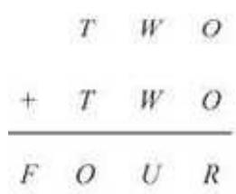

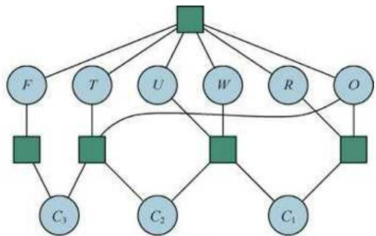  
  
图6-2（a）密码算术问题。不同字母表示不同数字，目的是找到使加法算式成立的代替字母的数字，附加约束为不允许前导零。（b）密码算术问题的约束超图，用来表示Alldiff约束（最上面的方框）以及每列的加法约束（中间的4个方框）。变量C 、 C 和 C 表示从右到左3列的进位数

或者，正如习题6.NARY需要你证明的，如果引入足够多的辅助变量，每个有限域约束都可以简化为一组二元约束。这意味着我们可以将任意一个CSP转换为只有二元约束的CSP，这将使算法设计

变得更加简单。将 n 元CSP转换为二元CSP的另一种方式是 对偶图 （dual graph）变换：创建一个新图，原图中的每个约束用新图中的一个变量表示，原图中的每对共享变量的约束用新图中的一个二元约束表示。

例如，考虑变量为 ${ \mathcal { X } } = \{ X , Y , Z \}$ 的CSP，每个变量的域为 $\{ 1 , 2 , 3 , 4 , 5 \}$ ，带有两个约束和 。对偶图的变量则为$X = \{ C _ { 1 } , C _ { 2 } \}$ ，对偶图中 $C _ { 1 }$ 变量的域为原问题 $C _ { 1 }$ 约束中的 $\{ ( x _ { i } , y _ { j } , z _ { k } ) \}$ 元组的集合，同样地， $C _ { 2 }$ 的域是 $\{ ( x _ { \theta } , y _ { j } ) \}$ 元组的集合。对偶图具有二元约束 $\langle ( C _ { 1 } , C _ { 2 } ) , R _ { 1 } \rangle$ ，其中 $R _ { 1 }$ 是 定义 $C  { 1 }$ 和 $C$ 2之间约束的新关系。在这种情况下，

$$
R _ {1} = \left\{\left(\left(1, 2, 3\right), (1, 2)\right), \left(\left(2, 3, 5\right), (2, 3)\right) \right\}.
$$

然而，我们可能更喜欢Alldiff这样的全局约束，而不是一组二元约束，这有两个原因。首先，使用Alldiff描述问题更简单而且更不容易出错。其次，可以为全局约束设计相比于基元约束更有效的专用推理算法。我们将在6.2.5节介绍这些推理算法。

到目前为止，我们所描述的约束都是绝对约束，违反这些约束的可能解将被排除。许多真实世界的CSP包含 偏好约束 （preferenceconstraint），偏好约束规定哪些解是首选的。例如，在大学排课问题中，存在绝对约束，如一个教授不可以同时上两门课。但也可能存在偏好约束： R教授可能更喜欢在上午上课，而 $N$ 教授更喜欢在下午上课。让 $R$ 教授在下午2点上课仍是一个可行解（除非 $R$ 教授碰巧是系主任），但不是最优解。

偏好约束通常可以编码为个别变量赋值的代价。例如，为 $R$ 教授分配一个下午时段相对于总体目标函数的代价为2分，而分配上午时段的代价为1分。通过这样的形式化，带偏好约束的CSP可以用基于路径的或局部的优化搜索方法求解。我们称这样的问题为 约束优化问题 （constrainedoptimization problem，COP）。线性规划是一类COP。

# 6.2 约束传播：CSP中的推断

原子的状态空间搜索算法只有一种方式：通过扩展节点来访问后继节点。CSP算法有不同选择。它可以通过选择一个新的变量赋值来生成后继，或者执行一种称为 约束传播 （constraintpropagation）的特定类型推断：使用约束减少一个变量的合法值的数量，这反过来又可以减少另一个变量的合法值，以此类推。其思想是，通过这一过程，当我们选择下一个变量赋值时，需要考虑的选项会减少。约束传播可以与搜索交替进行，也可以作为搜索开始前的预处理步骤。有时这种预处理就可以求解整个问题，所以根本不需要搜索。

约束传播的核心思想是 局部一致性 （local consistency）。如果我们将每个变量看作图中的一个节点（见图6-1b），将每个二元约束看作一条边，则增强图中每一部分局部一致性的过程会导致整个图中不一致的值被删除。局部一致性有几种不同类型，我们现在依次介绍。

# 6.2.1 节点一致性

如果单个变量的域中的所有值都满足该变量的一元约束，则该变量（对应于CSP图中的某个节点）是节点一致的。例如，在澳大利亚地图着色问题（图6-1）的变体中，南澳大利亚州人不喜欢绿色，变量 SA 的初始域为 ，可以通过删除green使其保持节点一致， SA 的域缩减为 。如果图中的每个变量都是节点一致的，那么整个图是节点一致的。

在求解过程开始时，通过缩减具有一元约束的变量的域，可以很容易地消除CSP中的所有一元约束。如前文所述，还可以将所有n元约束转换为二元约束。因此，一些CSP求解器只处理二元约束，要求用户提前消除其他约束。除非特别说明，本章的剩余部分都基于这一假设。

# 6.2.2 弧一致性

如果CSP中某一变量的域内的所有值都满足该变量的二元约束，那么该变量就是 弧一致的 （arc

consistent） 。更正式地说，对于变量 $X _ { i }$ 、 $X _ { j }$ ，如果对于当前域 $D _ { i }$ 中的每个值， $D _ { j }$ 中都存在一些值满足弧 $( X _ { i } , X _ { j }$ )上的二元约束，则称 $X _ { i }$ 相对于 $X _ { j }$ 是弧一致的。如果每个变量相对所有其他变量都是弧一致的，那么这个图就是弧一致的。例如，考虑约束 $Y = X ^ { 2 }$ ，其中 $X$ 和Y的域都是十进制数字。我们可以将这一约束显式地写为

（（x,(0,0）（1，1）.(24）(,）为 $X$ 相对于 Y 弧一致，我们将 $X$ 的域缩减为{0,1,2,3}。如果要使Y相对于X弧一致，那么 Y的域为{0,1, 4, 9}，此时整个CSP是弧一致的。但是，弧一致性对澳大利亚地图着色问题没有任何帮助。考虑(SA,WA)的如下不同色约束：

{（red，green),（red，blue),（green，red）,（green,blue),(blue,red）,（blue,green）}

无论为 SA（或WA）选择哪个值，另一变量都存在一个有效值。所以应用弧一致性对两个变量的域都没有影响。

最流行的增强弧一致性的算法为AC-3（见图6-3）。为了使每个变量保持弧一致，AC-3算法将维护一个弧队列。初始时，队列包含CSP中的所有弧。（每个二元约束都有两条弧，每个方向各一条。）然后AC-3从队列中弹出任意一条弧( $X _ { i } , X _ { j }$ )并使 X i相对于 $X _ { j }$ 弧一致。如果 $D _ { i }$ 保持不变，算法就会处理下一条弧。但是如果 $D _ { i }$ 得以修正（域变小），那么我们将所有的弧( $X _ { k } , X _ { i }$ )添加到队列中，其中 $X _ { k }$ 是 $X _ { i }$ 的邻居。这样做的原因是，即使之前已经处理过 $X _ { k }$ ，D 的变化也可能会进一步缩减 $D _ { k }$ 。如果 $D$ 变为空集，那么表示整个CSP不存在一致解，AC-3可以马上返回失败。否则，我们继续检查，不断尝试缩减变量的域，直到队列中没有弧。此时，我们得到了一个与原始CSP等价的CSP（它们的解相同），但弧一致CSP搜索起来会更快，因为它的变量的域更小。在某些情况下，它可以完全求解问题（通过将每个域的大小缩减为1），而在其他情况下，它可以证明解不存在（通过将某些域的大小缩减为0）。

functionAC-3（csp）returnsfalse（如果发现不一致）或true（其他情况）queue 一个弧的队列，初始化时包含csp中的所有弧

while queue不空do $(X_{i},X_{j})\gets \mathrm{POP}(queue)$ ifREVISE(csp,X,X)then if $D_{i}$ 的规模 $= 0$ then return false for each $X_{k}$ in $X_{i}$ NEIGHBORS- $\{X_j\}$ do 将 $(X_{k},X_{i})$ 添加到queue中   
return true

function REVISE(csp, $X_{i},X_{j}$ )returns true当且仅当我们修改 $X_{i}$ 的域  
revised $\leftarrow$ false  
foreach $x$ in $D_{i}$ do  
if $D_{j}$ 中不存在使 $(x,y)$ 满足 $(X_{i},X_{j})$ 约束的值then将 $x$ 从 $D_{i}$ 中删除  
revised $\leftarrow$ true  
return revised

图6-3 弧一致性算法AC-3。应用AC-3算法后，要么每条弧都是弧一致的，要么某些变量的域为空集，说明该CSP无解。“AC-3”这个名字来源于算法的发明者（Mackworth,1977），因为他论文中用到的算法是开发的第三个版本

AC-3的算法复杂性可以如下分析。假设CSP有n 个变量，每个变量的域大小不超过d ，带有c个二元约束（弧）。每个弧 $( X _ { k } , X _ { i } )$ )最多只能插入队列d 次，因为 $X _ { i }$ 最多有 $d$ 个值要删除。对弧一致性的检查可以在 $O ( d ^ { 2 } )$ 时间内完成，因此最坏情况下的时间复杂性为 $O ( c d ^ { 3 } )$ 。

# 6.2.3 路径一致性

假设我们要给澳大利亚地图涂上两种颜色，红色和蓝色。此时弧一致性不起作用，因为将弧的一端涂成红色，另一端涂成蓝色可以分别满足每个约束。但显然这个问题是无解的：因为西澳大利亚州、北领地和南澳大利亚州彼此相邻，仅仅是它们就需要至少3种颜色。

弧一致性利用弧（二元约束）将域（一元约束）收紧。为了求解地图着色等问题，我们需要更强的一致性概念。路径一致性 （path consistency）使用隐式约束（通过观测变量的三元组推断）将二元约束收紧。

考虑两个变量的集合 $\{ X _ { i } , X _ { j } \}$ 和第三个变量 $X _ { m }$ ，如果对于每个满足 $\{ X _ { i } , X _ { j } \}$ 上约束（如果有的话）的赋值 $\{ X _ { i } = a , X _ { j } = b \}$ ，都存在 $X _ { m }$ 的一个赋值满足 $\{ X _ { i } , X _ { m } \}$ 和 $\{ X _ { \mu } , X _ { j } \}$ 上的约束，则称 $\{ X _ { i s } X _ { j } \}$ 相对于 $X _ { m }$ 是路径一致的。这一名称是指从 $X _ { i }$ 途经 $X _ { m }$ 到 $X _ { j }$ 的路径的整体一致性。

让我们考虑用两种颜色为澳大利亚地图着色时的路径一致性。我们要使集合 $\{ \mathcal { W } A , S A \}$ 相对于NT路径一致。首先枚举集合的一致赋值。在这种情况下，只有两个一致赋值：

{WA=red,SA=blue和WA=blue, $S A = \pi e d \}$ 。可以看到，对于这两种赋值，NT不能是红色或蓝色（因为它会与WA或SA发生冲突）。因为NT不存在有效选择，所以我们消除了这两种赋值，最终 $\{ \mathcal { W } A , S A \}$ 不存在有效赋值。因此，我们知道了这个问题是无解的。

# 6.2.4 k 一致性

可以用 $\pmb { k }$ 一致性 （ k -consistency）的概念定义更强的传播形式。如果对于CSP的任意( k −1)个变量的集合以及这些变量的任意一致赋值，任意第 k个变量都存在一个一致赋值，则称该CSP是 $k$ 一致的。1一致性表示，给定空集，我们可以使任何单变量集合满足一致性，这就是我们所说的节点一致性。2一致性等价于弧一致性。对于二元约束图，3一致性等价于路径一致性。

如果一个CSP是 $k$ 一致的，也是(k−1)一致的，(k−2)一致的……一直到1一致的，则称它是强 k 一致的 （strongly $k$ -consistent）。现在假设我们有一个包含 n 个节点的CSP，并且是强 n 一致的（即当 $k = n$ 时，强 $k$ 一致），那么可以这样求解该问题：首先，为 $X _ { 1 }$ 选择一个一致值。然后因为图是2一致的，所以保证能为 $X _ { 2 }$ 选出一个一致值，因为它是3一致的，所以能为 $X _ { 3 }$ 选出一个值，以此类推。对于每个变量 $X _ { i }$ ，我们只需在它的域的 d 个值中搜索，就可以找到一个与 X 1,…, X i−1一致的值。总运行时间只有 $O ( n ^ { 2 } d )$ 。

当然，世界上没有免费的午餐：约束满足问题通常是NP完全的，任何建立 n 一致性的算法在最坏情况下的时间复杂性都是n 的指数级。更糟的是，n 一致性所需的空间复杂性也是n 的指数级。在实践中，确定适当的一致性检查层级基本上是一门经验科学。比较常见的是计算2一致性，其次是计算3一致性。

# 6.2.5 全局约束

前文提到，全局约束 涉及任意个数的变量（但不一定是所有变量）。实际问题中经常出现全局约束，可以通过专用算法处理这些约束，这些算法比目前介绍的一般方法更加高效。例如， Alldiff约束规定所有相关变量必须取不同的值（如上文的密码算术问题和下文的数独问题）。对 Alldiff约束进行不一致性检测的一种简单形式如下所示：如果约束中涉及m 个变量，而且它们一共具有n 个可能的不同值，且 $m \geq \pi$ ，那么约束不可能满足。

这将导出以下简单算法。首先，删除约束中任意一个单值变量（域中只有一个值的变量），并且从其余变量的域中删除该变量的值。只要还存在单值变量，就重复上述过程。如果在任一点上产生了空集，或者存在比剩余取值数更多的变量，则检测到了不一致性。

上述方法可以检测图6-1中赋值 的不一致性。注意，变量 SA 、 NT和 Q 是通过 Alldiff 约束有效连接的，因为每对都必须取两种不同颜色。将AC-3应用于这个部分赋值后， SA 、 NT 和 Q 的域都缩减为 。也就是说，我们有3个变量，但只有两种颜色，这违反了 Alldiff 约束。因此，对高阶约束进行简单一致性处理有时比对等价的二元约束集应用弧一致性更高效。

另一种重要的高阶约束是资源约束 （resourceconstraint），有时也称为 Atmost约束。例如，在一个调度问题中，设 P 1,…, P 4分别表示分配给4个任务的人数。分配总人数不超过10的约束写为。通过检验当前域的最小值之和可以检测不一致性。例如，如果每个变量的域都是{3, 4, 5, 6}，则不可能满足 Atmost 约束。另一个例子是，如果当前某个变量的域中的最大值加上所有其他变量的域的最小值超过约束，则可以通过删除该最大值来保持一致性。因此，如果示例中的每个变量的域都是{2,3, 4, 5, 6}，那么可以从每个域中删除5和6。

对于大规模的、具有整数值的资源有限问题（例如用几百辆车运送几千人的物流问题）将每个变量的域表示为一个大的整数集然后通过一致性检查方法逐渐缩减这个集合通常是不可能的。相反，域由上界和下界表示，通过 边界传播 （bound propagation）处理。例如，在航班调度问题中，假设存在两趟航班，F 和 $F$ ，其中飞机的容量分别为165和385。 F 和 $F$ 航班上乘客数量的初始域为

$$
D _ {1} = [ 0, 1 6 5 ] \text {和} D _ {2} = [ 0, 3 8 5 ]
$$

现在假设我们有附加约束，两趟航班所搭载的总乘客数必须是420： 。通过传播边界约束，我们将域缩减为

$$
D _ {1} = [ 3 5, 1 6 5 ] _ {\text {和}} D _ {2} = [ 2 5 5, 3 8 5 ]
$$

如果对于任意变量 X和它的上下界值，任意变量 Y，都存在满足 $X$ 和 Y之间约束的Y的值，则称CSP是边界一致的 （bounds-consistent）。这种边界传播在实际的约束问题中得到了广泛应用。

# 6.2.6 数独

数独 （Sudoku）游戏非常流行，它将数百万人引入了约束满足问题，尽管他们可能没有意识到这一点。数独棋盘由81个方格组成，有些方格预先填有1到9的数字。谜题是将所有剩余方格填满，并且任意一行、一列或3×3方框中不存在相同数字（见图6-4）。一行、一列或一个方框称为一个 单元 （unit）。

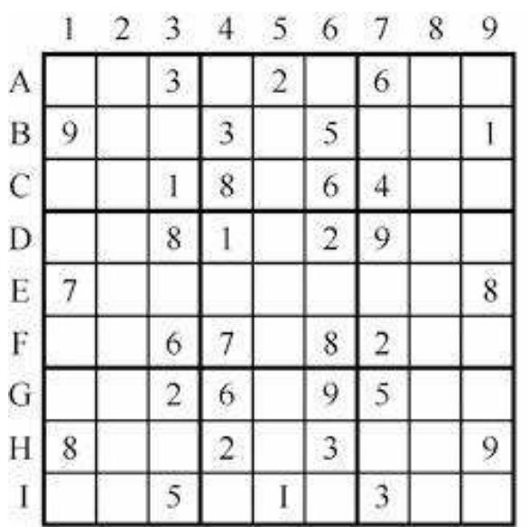  
（a）

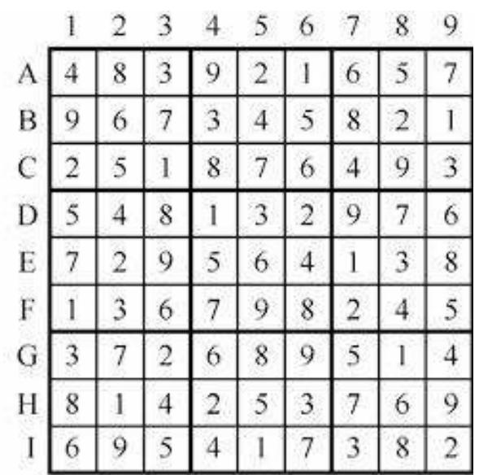  
（b）  
图6-4 （a）一个数独问题。（b）它的解

报纸和益智书籍上的数独游戏都有一个特点，即有且只有一个解。尽管有些问题手动求解很难，需要花费几十分钟，但CSP求解器每秒可以处理几千个问题。

可以将数独游戏看作含有81个变量的CSP，每个变量对应一个方格。用变量名 A1到A9表示第一行（从左到右）， I 1到 $I$ 9表示最后一行。空方格的域为{1, 2, 3, 4, 5, 6, 7, 8, 9}，预先填好的方格的域只有一个值。此外，还有27个不同的 Alldiff 约束，每个单元（行、列和含有9个方格的方框）各有一个 Alldiff 约束：

Alldiff ( A 1, A 2, A 3, A 4, A 5, A 6, A 7, A 8, A 9)

Alldiff ( B 1, B 2, B 3, B 4, B 5, B 6, B 7, B 8, B 9)

⋯

Alldiff ( A 1, B 1, C 1, D 1, E 1, F 1, G 1, H 1, I 1)

Alldiff ( A 2, B 2, C 2, D 2, E 2, F 2, G 2, H 2, I 2)

1

Alldiff ( A 1, A 2, A 3, B 1, B 2, B 3, C 1, C 2, C 3)

Alldiff ( A 4, A 5, A 6, B 4, B 5, B 6, C 4, C 5, C 6)

让我们看看弧一致性能带我们走多远。假设 Alldiff约束已被扩展为二元约束（例如 A1 A2 ），这样我们就可以直接应用AC-3算法。考虑图6-4a中的变量 $E$ 6 ——正中间方框中2、8之间的空格。

按照方框的约束，我们可以从 $E$ 6 的域中删除1、2、7和8。按照它所在列的约束，我们可以删除5、6、2、8、9和3（尽管2和8已经被删除）。此时 $E$ 6的域是{4}；换句话说，我们知道了 $E$ 6 的解。现在考虑变量 $I$ 6 ——最后一行中间方框中被1、3、3包围的空格。在它所在列应用弧一致性，可以删除5、6、2、4（因为我们现在知道 E 6 一定是4）、8、9和3。我们利用它和 $I$ 5 的弧一致性删除1，此时I6 的域中只剩下7。现在第6列中有8个已知值，所以根据弧一致性可以推出 A6定是1。沿着这样的思路继续推断，最终AC-3可以求解整个问题——所有变量的域都缩减为单个值，如图6-4b所示。

当然，如果每个数独问题都可以通过机械地应用AC-3求解，那么它很快就会失去吸引力，实际上AC-3只适用于最简单的数独问题。稍微困难一点的问题可以用PC-2求解，但需要花费更大的计算代价：在一个数独问题中，需要考虑255 960个不同的路径约束。为了求解最困难的数独问题并取得高效进展，我们必须更聪明一些。

事实上，数独对人类解谜者的吸引力在于，他们需要足智多谋地应用更复杂的推理策略。数独爱好者给这些策略取了各种有趣的名字，如“三链数删减法”。它的工作原理如下：在任一单元（行、列或方框）中，找到3个方格，它们的域包含相同的3个数字或这3个数字的子集。例如，这3个域可能是 、 和 。我们并不知道哪个方格是1、3或8，但我们知道这3个数字一定分布在这3个方格中。因此，我们可以将1、3和8从该单元中所有其他方格的域中删除。

有趣的是，这些方法并不只是专用于数独。对于数独，我们确实必须说它有81个变量，域是数字1～9，有27个 Alldiff约束。但除此之外，所有策略（弧一致性、路径一致性等）普遍适用于所有CSP，而不仅仅是数独问题。即使是三链数删减法，也是一种加强 Alldiff约束一致性的策略，而不是特定于数独本身。这就是CSP形式体系的作用：对于每个新问题域，我们只需按照约束定义问题，然后就可以使用一般的约束求解机制。

# 6.3 CSP的回溯搜索

有时我们完成约束传播过程后仍存在具有多个可能值的变量。在这种情况下，我们必须通过 搜索来求解问题。本节中我们将介绍用于部分赋值的回溯搜索算法，6.4节中我们将介绍用于完整赋值的局部搜索算法。

考虑标准的深度受限搜索（第3章）是如何求解CSP的。状态可能是一个部分赋值，而动作将对该赋值进行扩展，例如，在澳大利亚地图着色问题中，添加赋值NSW=red或 SA=blue。对于具有n个变量，域大小为d 的CSP，我们最终将得到一个搜索树，所有的完整赋值（因此所有的解）都是深度为 n的叶节点。但要注意，第一层的分支因子为nd ，因为n 个变量中的任意变量都可以取d个值中的任意值。下一层的分支因子是( n −1) d ，以此类推 n 层。所以树总共有 n !· dn 个叶节点，即使可能的完整赋值只有 $d ^ { n }$ 种！

如果意识到CSP具有的一个关键性质：可交换性 （commutativity），我们就可以消去因子 n !。如果任意给定的动作集合的应用顺序对结果没有影响，则称该问题是可交换的。在CSP中，不管我们先赋值 NSW=red，再赋值 SA=blue，还是交换顺序，都没有区别。因此，我们只需考虑搜索树中每个节点上的单个变量。在根节点上，我们可能需要在SA=red、SA=green和SA=blue之间做出选择，但我们永远不需要在NSW=red和SA=blue之间做出选择。在这一限制下，叶节点的数量减少到dn ，这正是我们所希望的。在树的每一层中，我们都必须选择要处理哪个变量，但我们永远不需要回溯这一选择。

图6-5为CSP的回溯搜索过程。它不断选择未赋值变量，然后依次尝试该变量的域中的所有值，试图通过递归调用将每个值扩展为一个解。如果调用成功，则返回解，如果调用失败，则将赋值恢复到前一状态，然后尝试下一个值。如果所有值都不成功，则返回失败。澳大利亚地图着色问题的部分搜索树如图6-6所示，其中我们按照 WA 、 NT 、 Q ……的顺序为变量赋值。

```txt
function BACKTRACKING-SEARCH(csp) returns a new block diagram of the return function.  
function BACKTRACK(csp, assignment) returns a new block diagram of the return function.  
function BACKTRACK(csp, assignment) returns a new block diagram of the return function.  
function BACKTRACK(csp, assignment) returns a new block diagram of the return function.  
function BACKTRACK(csp, assignment) returns a new block diagram of the return function.  
function BACKTRACK(csp, assignment) returns a new block diagram of the return function.  
function BACKTRACK(csp, assignment) returns a new blocks diagram of the return function.  
function BACKTRACK(csp, assignment) returns a new block diagram of the return function.  
function BACKTRACK(csp, assignment) returns a new block diagram of the return function.  
function BACKTRACK(csp, assignment) returns a new block diagram of the return function.  
function BACKTRACK(csp, assignment) returns a new block diagram of the return function.  
function BACK TRACK(csp, assignment) returns a new block diagram of the return function.  
function BACK TRACK(csp, assignment) returns a new block diagram of the return function.  
function BACK TRACK(csp, assignment) returns a new block diagram of the return function.  
function BACK TRACK(csp, assignment) returns a new block diagram of the return function.  
function BACK TRACK(csp, assignment) returns a new block diagram of the return function.  
function BACK TRACK(csp, assignment).  
function BACK TRACK(csp, assignment).  
function BACK TRACK(csp, assignment).  
function BACK TRACK(csp, assignment).  
function BACK TRACK(csp, assignment).  
function BACK TRACK(csp, assignment).  
function BACK TRACK(csp, assignment).  
function BACK TRACK(csp, assignment).  
function BACK TRACK(csp, assignment).  
function BACK TRACK(csp, assignment).  
function BACK TRACK(csp, assignment).  
function BACK TRACK(csp, assignment). 
```

图6-5 约束满足问题的简单回溯算法。该算法以第3章的递归深度优先搜索为模型。函数Select-Unassigned - V ariable 和O rder -D omain -V alues 实现了6.3.1节中讨论的通用启发式算法。函数Inference可以根据需要选择性地使用弧一致性、路径一致性或 $k$ 一致性检测。如果一个赋值导致了失败（无论是在Inference还是在Backtrack中），那么该赋值（包括从Inference得到的值）将被撤销，然后重新尝试一个新的赋值

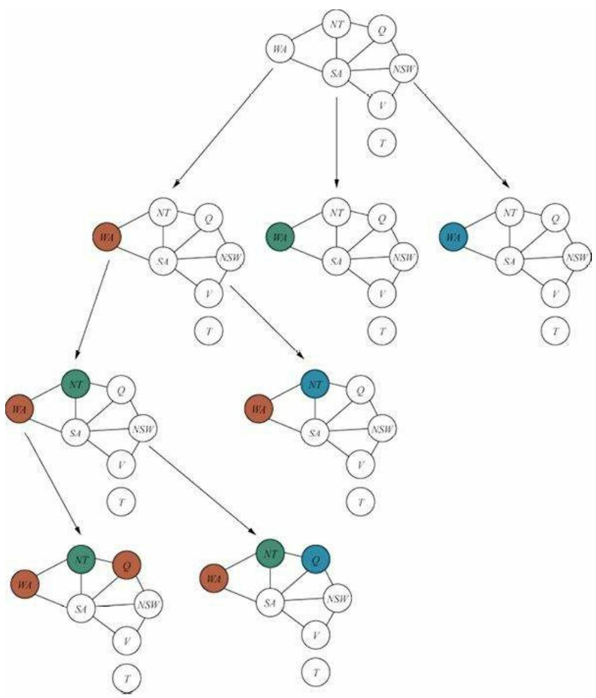  
图6-6 图6-1中地图着色问题的部分搜索树

注意，Backtracking -Search只维护状态（赋值）的单个表示，然后对它进行修改，而不是创建一个新的表示（见3.4.3节）。

第3章的无信息搜索算法只能通过提供领域特定的启发式算法来改进，然而，事实证明，回溯搜索可以使用领域无关的启发式算法进行改进，这些算法利用了CSP的因子化表示。在接下来的4节中，我们将介绍如何做到这一点。

● （6.3.1节）下一步应该给哪个变量赋值（S elect -U nassigned -V ariable ），以及应该以什么顺序尝试它的值（O rder -D omain -V alu es ）？  
● （6.3.2节）在每步搜索中应该执行怎样的推断（I nferen ce ）？  
●（6.3.3节）我们能在适当的时候回溯（Backtrack ）不止一步吗？  
●（6.3.4节）我们可以保存和复用搜索的部分结果吗？

# 6.3.1 变量排序和值排序

回溯算法中包含这样一行：

# Var←SELECT-UNASSIGNED-VARIABLE(CSp,aSSignment)

S elect -U nassigned -V ariable 的最简单的策略是使用静态排序：按列表顺序 选择变量。第二简单的策略是随机选择。这两种策略都不是最优的。例如，图6-6中，进行 WA=red和NT=green赋值后，SA只有一个可能的值，因此接下来应该对SA赋值 SA=blue而不是对Q 赋值：事实上，对SA赋值后，Q 、 NSW和 V的取值都是确定的。

这种直观的想法——选择“合法”值最少的变量——称为 最少剩余值 （minimum-remaining-value，MRV）启发式算法，也被称为“最受约束变量”或“失败优先”启发式算法，后一个名字是因为它选择了最有可能马上导致失败的变量，从而可以对搜索树剪枝。如果某一变量 $X$ 没有剩余合法值，那么MRV启发式算法将优先选择 X然后马上检测到失败——避免遍历其他变量进行无意义地搜索。MRV启发式算法通常比随机或静态排序表现得更好，有时会带来数量级上的效率差异，尽管结果可能因问题而异。

在选择澳大利亚地图的第一个着色区域时，MRV启发式算法完全不起作用，因为初始时每个区域都有3种合法颜色。在这种情况下，度启发式 （degreeheuristic）算法就派上用场了。它通过选择与其他未赋值变量的约束最多的变量来降低未来选择的分支因子。在图6-1中，SA的度最大，为5；除了变量T的度为0，其他变量的度为2或3。如果先赋值SA，我们就可以按顺时针或逆时针顺序访问5个陆地区域，并为每个区域赋予不同于 SA 和前一个区域的颜色。最少剩余值启发式算法通常效果更好，但度启发式算法可以打破僵局。

一旦选择了一个变量，算法必须决定按什么顺序检验它的值。 最少约束值 （least-constraining-value）启发式算法对此非常有效。它优先选择那些为约束图中相邻变量留下最多选择的值。例如，假设在图6-1中，我们已经生成了部分赋值 WA=red和 NT=green，并且下一步是为 Q 选择赋值。此时蓝色是一个糟糕的选择，因为它消除了 Q 的邻居SA的最后一个可选的合法值。因此，最少约束值启发式算法会优先选择红色而不是蓝色。一般来说，启发式算法试图为后续变量赋值留下最大的灵活性。

为什么变量选择是失败优先，而值选择是失败延后呢？每个变量最终都必须被赋值，因此通过选择那些有可能最先失败的变量，在统计意义上，需要通过回溯才能找到的成功赋值就会更少。对于值排序，关键在于我们只需要找到一个解；因此，先寻找最有可能的值是有意义的。如果我们的目标是枚举所有的解而不只是找到一个解，那么值排序就无关紧要了。

# 6.3.2 交替进行搜索和推理

我们已经讨论了AC-3算法如何在搜索前缩减变量的域。但在搜索过程中，推断的作用可能更大：每次我们为某个变量选择某个值时，都有一个全新的机会推断其相邻变量的新的域缩减。

推断的最简单形式之一是前向检验 （forward checking）。当变量 X被赋值时，前向检验过程为其建立弧一致性：对于每个通过约束与 $X$ 连接的未赋值变量 Y，从它的域中删除与 $X$ 的取值不一致的值。

图6-7为在澳大利亚地图CSP上使用前向检验进行回溯搜索的过程。关于这一示例，有两点需要注意。首先，需要注意，在赋值 WA = red和 Q = green后， NT 和 SA 的域缩减为单个值；通过从 WA和 Q 传播信息，我们可以完全消除这些变量上的分支。其次，需要注意，赋值 V = blue后， SA 的域为空集。因此，前向检验检测到部分赋值 $\pmb { Q }$ 与问题的约束不一致，算法立即回溯。

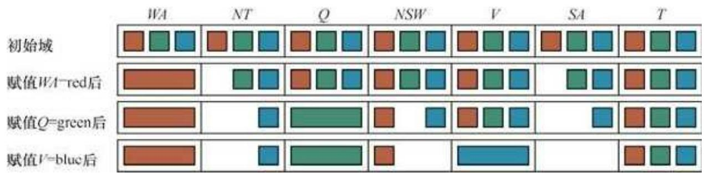

图6-7 带前向检验的地图着色搜索过程。首先赋值 WA = red；然后前向检验从其相邻变量 NT 和 SA的域中删除red。赋值 Q = green后，从 NT 、 SA 和 NSW 的域中删除green。赋值 V = blue后，从NSW 和 SA 的域中删除blue，此时 SA 没有合法值

对许多问题来说，将MRV启发式算法与前向检验相结合，可以使搜索更有效。考虑图6-7中的赋值。直观上，这一赋值似乎对它的相邻变量 NT 和 SA 有所约束，所以接下来应该先处理这些变量，然后是所有其他变量。MRV正是这么做的： NT和SA各有两个值，所以先选择其中一个，接着是另一个，然后依次是Q 、 NSW和V。最后 $T$ 仍然有3个可能的值，任意一个都是有效的。我们可以将前向检验看作一种以增量方式计算MRV启发式算法完成其工作所需信息的有效途径。

尽管前向检验能够检测出许多不一致，但它无法检测到所有的不一致。问题在于，它向前看得不够远。例如，考虑图6-7中的 Q = green一行。我们已经使 WA 和 Q 弧一致，但此时 NT 和 SA 的唯一可能的值都是蓝色，这违反了一致性，因为它们是相邻变量，相邻变量不能取相同的值。

维护弧一致性 （ maintaining arc consistency ，MAC ） 算法能检测出这类不一致性。当变量 X被赋值后，Inference程序调用AC-3，但我们开始时只考虑所有与 $X _ { i }$ 相邻的未赋值变量 $X _ { j }$ 的弧( X,X )，而不是CSP中的所有弧。从这出发，AC-3以通常的方式进行约束传播，如果任何变量的域缩减为空集，则AC-3调用失败，并立即回溯。我们可以看到，MAC严格来说比前向检验更强大，因为前向检验所做的事情与MAC对其队列的初始弧所做的相同；但与MAC不同的是，当变量的域发生变化时，前向检验不会递归地传播约束。

# 6.3.3 智能回溯：向后看

当搜索的一个分支失败时，图6-5中的Backtracking -Search算法将采取一种非常简单的策略：退回到上一个变量，并为其尝试一个不同的值。这称为 时序回溯 （chronological backtracking），因为时间上最近的决策点会被重新访问。在本节中，我们考虑更好的可能策略。

考虑一下，当我们按照固定的变量顺序 Q 、 NSW、V、 T、 SA、WA、NT应用图6-1中的简单回溯时会发生什么。假设我们已经生成了部分赋值

。当我们尝试下一个变量 SA 时，发现所有值都违反了约束。我们退回到 T ，为塔斯马尼亚州尝试一种新颜色！显然，这种做法是愚蠢的重新给塔斯马尼亚州着色并不能解决南澳大利亚州的问题。

一种更智能的方法是回溯到有可能求解这一问题的变量——导致 SA的某个可能值变成不可能值的变量。为此，我们将记录与SA的某些值冲突的赋值集合。该集合（在本例中为

）称为 SA 的 冲突集 （conflict set）。 回跳

（backjumping）方法将回溯到冲突集中最近的赋值，在本例中，回跳将越过塔斯马尼亚州，为V尝试一个新的值。通过修改B acktrack 算法，可以很容易地实现上述方法，即在检验合法值时，同时维护冲突集。如果找不到合法值，算法应该返回失败指示和冲突集中最近的元素。

眼尖的读者可能已经注意到，前向检验不需要额外工作就能提供冲突集：当前向检验根据赋值 X=x从 Y的域中删除一个值时，它应该将 X=x添加到 Y的冲突集中。如果Y的域中的最后一个值也被删除，那么Y的冲突集中的赋值也要被添加到 X的冲突集中。也就是说，我们现在知道X=x导致了（Y中的）矛盾，因此应该为X尝试不同赋值。

有眼力的读者可能已经注意到一些奇怪的事情：当域中的每个值都与当前赋值冲突时就会发生回跳，但前向检验能检测出这个事件并阻止搜索到达这样的节点！事实上，可以证明，每个被回跳剪除的分支也会被前向检验剪枝。因此，在前向检验搜索中，或者在使用更强一致性检验的搜索（如MAC）中，简单的回跳是多余的——你只需执行其中一项。

尽管存在上一段中的观测结果，回跳背后的思想仍然值得借鉴：基于失败原因进行回溯。当变量的域变为空集时，回跳发现失败，但在许多情况下，在很早之前分支就注定要失败。再次考虑部分赋值 （从我们前面的讨论来看，它是不一致的）。假设我们下一步尝试T=red，然后对NT、Q 、V和 SA赋值。我们知道，最后这4个变量不存在有效赋值，所以最终在NT处终止。现在，问题是，回溯到哪儿？回跳是不可行的，因为 NT确实存在与前面赋值过的变量一致的值—— NT没有导致失败的前面变量的完整冲突集。然而，我们知道， NT、Q 、

V和SA这4个变量放在一起会失败，是因为前面的一组变量一定与这4个变量有直接冲突。

这引出了（对于 NT这样的变量的）一种不同的、更深层次的冲突集概念：正是前面一组变量共同导致了 NT 连同任何后续变量都不存在一致解。在本例中，该集合是 WA 和 NSW ，所以算法应该跳过塔斯马尼亚州回溯到 NSW。使用以这种方式定义的冲突集的回跳算法称为冲突导向回跳（conflict-directed backjumping）。

现在我们必须解释如何计算这些新的冲突集。方法其实很简单。搜索分支的“终端”失败总是因为某个变量的域变为空集，该变量对应一个标准冲突集。在我们的例子中， SA失败，它的冲突集是（例如） 。我们回溯到 Q ， Q 将 SA 的冲突集（当然要减去 Q 本身）吸收到它自己的直接冲突集 $\{ M , N S W \}$ ，新的冲突集是 $\{ W A , N T , N S W \}$ 。也就是说，给定前面对的赋值，从 Q 向前是没有解的。因此，我们回溯到最近的变量 NT 。 NT 将吸收到它自己的直接冲突集 $\{ \mathcal { W } A \}$ 中，得到（如上一段所述）。现在算法回跳到 NSW ，这正是我们所希望的。总结一下：设 $X _ { j }$ 表示当前变量， conf ( $X _ { j }$ )表示它的冲突集。如果 $X _ { j }$ 的每个可能值都失败了，则回跳到 conf $( X _ { j }$ )中最近的变量 $X _ { i }$ ，并使用下列公式重新计算 $X _ { i }$ 的冲突集：

$$
\operatorname {c o n f} \left(X _ {i}\right) \leftarrow \operatorname {c o n f} \left(X _ {i}\right) \cup \operatorname {c o n f} \left(X _ {j}\right) - \left\{X _ {i} \right\}
$$

# 6.3.4 约束学习

当我们遇到矛盾时，回跳可以告诉我们要退回多远，这样我们就不会浪费时间去改变那些无法求解问题的变量。但我们也希望不要再遇到同样的问题。当搜索得出一个矛盾时，我们知道这是冲突集的某个子集引起的。约束学习 （constraintlearning）的思想是从冲突集中找出引起问题的最小变量集。这组变量及其相应值称为无用赋值 （no-good）。如果想要记录无用赋值，要么通过向CSP中添加一个新的约束禁止这种赋值组合，要么通过维护一个单独的缓存。

例如，考虑图6-6最下面一行中的状态 。前向检验告诉我们这个状态是一个无用赋值，因为 SA不存在有效赋值。在这种特定情况下，记录该无用赋值是没有意义的，因为一旦从搜索树中剪掉了这一分支，我们再也不会遇到这种组合。但假设图6-6中的搜索树实际上是更大的搜索树的一部分，该搜索树是从 V 和 T 的赋值开始的。那么将记录为无用赋值是有意义的，因为对于V和T的每一组可能赋值，我们都会再次遇到同样的问题。

前向检验或回跳可以有效地利用无用赋值。约束学习是现代CSP求解器用以提高复杂问题求解效率的最重要技术之一。

# 6.4 CSP的局部搜索

局部搜索算法（见4.1节）对于许多CSP的求解都非常有效。它们使用完整状态形式（见4.1.1节），即每一状态为所有变量赋值，搜索一次改变一个变量的值。例如，考虑6.1.3节中定义为CSP的8皇后问题。在图6-8中，我们从左边开始，对8个变量进行了完整赋值，通常该赋值会违反一些约束。然后我们随机选择一个发生冲突的变量，在此是最右边一列的Q 。我们希望改变它的值，从而更接近问题的解。最明显的方法是选择与其他变量冲突数最少的值—— 最少冲突 （min-conflict）启发式算法。

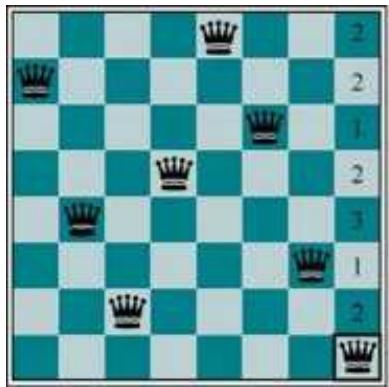

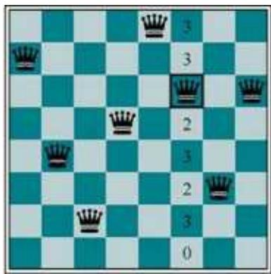

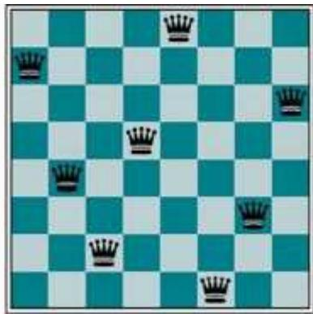  
图6-9 CSP的Min -Conflicts局部搜索算法。初始状态可以随机选择，也可以通过基于贪心法的赋值过程依次为每个变量选择最少冲突值。在给定当前赋值的其余部分后，Conflicts函数统计特定值违反约束的数量

图6-8 使用最少冲突法求解8皇后问题的示例。每步选择一个皇后，在其所在列重新分配位置。每个方格标有冲突数（在本例中是互相攻击的皇后个数）。算法随机选择发生冲突的皇后，将皇后移动到冲突最少的方格

在图6-8中，我们看到有两行都只违反了一个约束，我们选择让 $Q _ { 8 } = 3$ （也就是说，我们将皇后移动到第8列、第3行）。下一次迭代，在图6-8的中间棋盘上，我们选择 $Q _ { 6 }$ 作为要改变的变量，然后发现将该皇后移动到第8行不会发生冲突。此时不再有发生冲突的变量，所以我们找到了一个解。最少冲突算法如图6-9所示。[1]

[1]局部搜索可以很容易地扩展到约束优化问题（COP）。在这种情况下，爬山法和模拟退火的所有技术都可以用于优化目标函数。

functionMIN-CoNFLIcTs(csp,max_steps)returns-个解或failure

inputs:csp,约束满足问题max_steps,放弃前允许的步数  
current $\leftarrow$ tsp的一个初始完整赋值  
for $i = 1$ to max_steps doif current是csp的一个解then return currentvar $\leftarrow$ 从csp.VARIABLES中随机选取的冲突变量value $\leftarrow$ 对于var使CONFLICTS(csp,var,v,current)取得最小值的v值在current中设置 $\text{var} = \text{value}$ return failure

对许多CSP来说，最少冲突法都相当有效。神奇的是，在n皇后问题上，如果不计入皇后的初始布局，最少冲突法的运行时间基本上与问题规模无关。它甚至可以在（初始赋值后）平均50步内求解百万皇后问题。这一不同寻常的现象是20世纪90年代大量研究局部搜索和难易问题间区别的动力，

我们将在7.6.3节中讨论这些问题。粗略地说，用局部搜索求解 n皇后问题非常简单，因为解密集地分布在整个状态空间上。最少冲突法也适用于困难问题。例如，它已经被用于哈勃太空望远镜的观测调度，安排一周的观测调度所花费的时间可以从3周减少到大约10分钟。

4.1节中的所有局部搜索技术都可以应用于CSP，有些技术已被证实相当有效。最少冲突启发式算法下的CSP地形图通常存在一系列平台区。可能有数百万个变量赋值都只存在一个冲突。平台区搜索——允许横向移动到另一个得分相同的状态——可以帮助局部搜索走出平台区。这种在平台区的漫游可以由一种叫作禁忌搜索 的技术导引：维护一个最近访问过的状态的列表，并禁止算法返回那些状态。模拟退火也可以用于逃离平台区。

另一种技术称为约束加权 （constraintweighting），旨在集中搜索重要约束。每个约束都有一个数值权重，初始时都为1。在每步搜索中，算法找出使其所违反的约束的总权重最低的变量，并修改其值。然后，增加当前赋值所违反的每个约束的权重。这种做法有两个好处：它为平台区增加了地形因素，确保从当前状态进行改进是有可能的；它还引入了学习策略，随着时间推移，难以求解的约束会被分配更高的权重。

局部搜索的另一个优点是，当问题发生变化时，它可以用于在线设定的问题（见4.5节）。考虑一个航空公司每周航班调度问题。它可能涉及上千趟航班和上万名人员的分配，但机场的恶劣天气可能会打乱这一调度。我们希望以最少的改动修正日程表。这可以通过从当前调度开始的局部搜索算法轻松完成。使用新约束集的回溯搜索通常要花费更多时间，而且找到的解可能要对当前调度进行很多改动。

# 6.5 问题的结构

在这一节中，我们将研究如何利用由约束图表示的问题的结构来快速找到解。这里的大多数方法也适用于CSP之外的其他问题，例如概率推理。

处理复杂的真实世界问题的唯一可能方法是将其分解为若干子问题。回顾澳大利亚问题的约束图


（图6-1b和图6-12a），可以发现一个问题：塔斯马尼亚州和大陆不相连。 直观上看，对塔斯马尼亚州着色和对大陆着色显然是两个 独立子问题 （independent subproblem） 任何对大陆着色的解和任何对塔斯马尼亚州着色的解相结合都能得到整个地图的解。

可以简单地通过寻找约束图的 连通分量 （connected component）来确定独立性。每个连通分量对应一个子问题 $C S P _ { i }$ 。如果赋值 S i是 $C S P _ { i }$ 的解，那么 $\cup _ { i } s _ { i }$ 就是 $U _ { i } C S P _ { i }$ 的解。为什么这很重要？假设每个 $C S P _ { i }$ 具有所有 $n$ 个变量中的 $c$ 个变量，其中 $c$ 是一个常数。那么共有 $n / c$ 个子问题，求解每个子问题最多需要 $d ^ { c }$ 工作量，其中 $d$ 是域的大小。因此，总的工作量为 $O \left( d ^ { c } n / c \right)$ ，关于 $n$ 是线性的；如果不进行问题分解，总的工作量为 $O \left( d ^ { n } \right)$ ，关于 $n$ 是指数级的。让我们更具体地说：将一个具有100个变量的布尔CSP分解为4个子问题，那么最坏情况下的求解时间将从宇宙生命周期减少到不到1秒。

完全独立的子问题很好，但很少见。幸运的是，其他一些图结构也很容易求解。例如，当任意两个变量都只由一条路径连接时，约束图是一棵树 。我们将证明任何树状结构的CSP都可以在变量个

数的线性时间内求解。 这里的关是一种的定arc consistency）或DAC。变量顺序为 X 1 , X 2 ,…, X n 的CSP称为定向弧一致的，当且仅当，时，每个 X i相对于每个 X j都是弧一致的。 $X _ { i }$ $X _ { j }$

为了求解树状结构的CSP，首先选择任一变量作为树的根节点，然后选择变量顺序，每个变量必须在其父节点之后。这种排序称为 拓扑排序 （topological sort）。图6-10a为一棵树，图6-10b为一种可能的排序。任何有 $n$ 个节点的树都有n −1条边，所以可以在O (n )步内使得该图具有定向弧一致性，每一步都必须比较两个变量的最多 $d$ 个可能的值，总时间为O (nd 2)。一旦我们有了一个定向弧一致的图，就可以沿着变量列表选择任意剩余值。因为从父节点到其子节点的每条边都是弧一致的，所以，对于父节点选择的任何值，子节点都存在一个可选的有效值。这意味着我们不必回溯，可以沿着变量线性移动。完整算法如图6-11所示。

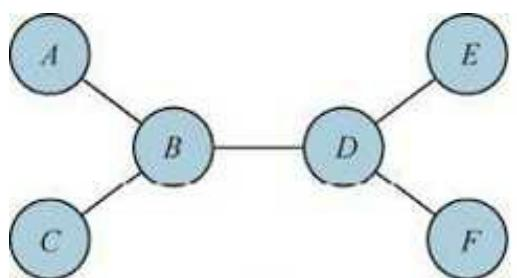

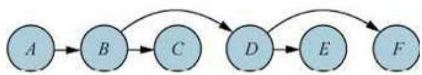  
  
图6-10 （a）树状结构CSP的约束图。（b）与以A为根节点的树一致的变量的线性排序。这称为变量的拓扑排序

既然我们有了关于树的高效算法，可以考虑更一般的约束图是否可以以某种方式简化为树结构。有两种方法可以做到这一点：删除节点（6.5.1节）或合并节点（6.5.2节）。

function TREE-CSP-SoLVER(csp)returns-个解或failure inputs:csp，具有X,D,C的CSP

$n\gets X$ 中变量个数  
assignment $\leftarrow$ 一个空的赋值  
root $\leftarrow X$ 中任一变量 $X\gets$ TOPOLOGICALSORT(X, root)  
for $j = n$ down to 2 do  
MAKE-ARC-CONSISTENT(PARENT $(X_{j}),X_{j})$ if不能取得一致then return failure  
for $i = 1$ to $n$ do  
assignment $[X_i]\gets D_i$ 中任一一致的值if没有一致值then return failure  
return assignment

# 6.5.1 割集调整

将约束图简化为树的第一种方法是为部分变量赋值使得剩余变量能够形成一棵树。考虑澳大利亚问题的约束图，如图6-12a所示。如果没有南澳大利亚州，这个图就会变成如图6-12b所示的一棵树。幸运的是，我们可以通过将SA固定为某个值并从其他变量的域中删除任何与 SA取值不一致的值来从图中删除南澳大利亚州。

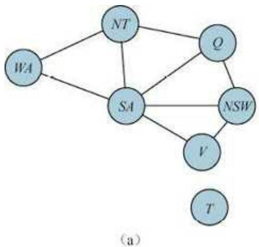  
图6-11 用于求解树状结构CSP的Tree-CSP-Solver算法。如果CSP有解，我们可以在线性时间内找到它；如果无解，将检测到矛盾

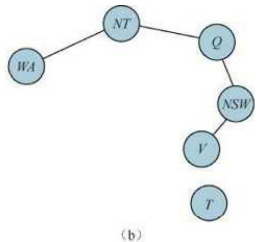  
图6-12 （a）图6-1中的原始约束图。（b）除去SA后，约束图变成由两棵树组成的森林

现在，删除 SA及其约束后，CSP的任意一个解都与SA的值一致。（这适用于二元CSP，在高阶约束下，情况会更加复杂。）因此，我们可以用上面给出的算法求解剩余的树，从而求解整个问题。当然，在一般情况下（与地图着色不同），为SA选择的值可能是错误的，因此我们需要尝试每个可能的值。一般算法如下。

（1）选择CSP变量的一个子集 S ，使得约束图在删除 S 后成为一棵树。 S 称为 环割集 （cyclecutset）。  
（2）对于满足S 上所有约束的 S中变量的每种可能赋值，

a. 从剩余变量的域中删除任何与S赋值不一致的值，并且

b.如果剩余的CSP存在一个解，那么将其连同S 的赋值一起返回。

如果环割集的大小为 c ，那么总运行时间为 寸 $O ( d ^ { c } \cdot ( n - c ) d ^ { 2 } )$ ：我们需要尝试 S 中变量的值的所有 dc 种组合，对于每种组合，我们需要求解一个大小为( n − c )的树问题。如果约束图“几乎是一棵树”，那么c将会非常小，相比于直接使用回溯法，将省掉巨大的开销——对100个布尔变量的示例来说，如果我们能找到一个大小为 c = 20的割集，时间开销可以从宇宙生命周期缩短到几分钟。然而，在最坏情况下，c可能高达(n −2)。寻找最小环割集问题是NP困难的，但有一些高效的近似算法。算法的总体过程称为割集调整 （cutsetconditioning），我们将在第13章详细讨论，在那里它将用于概率推理。

# 6.5.2 树分解

将约束图简化为树的第二种方法基于构建约束图的 树分解 （tree decomposition）：将原始图转换为树，树中的每个节点由一组变量组成，如图6-13所示。树分解必须满足以下3个要求。

●原始问题中的每个变量必须至少出现在一个树节点中。  
●如果两个变量在原始问题中由一个约束连接，那么它们必须同时出现（连同约束）在至少一个树节点中。  
●如果一个变量出现在两个树节点中，那么它必须出现在连接这两个节点的路径上的所有节点中。

前两个条件保证了所有变量和约束在树分解中都有表示。第三个条件似乎更具技术性，但保证了原始问题的任何变量无论在哪出现都具有相同的值：树中的约束表明一个树节点中的变量必须与其相邻节点中的相应变量具有相同的值。例如，图6-13中 SA出现在相连的所有4个节点中，因此树分解中的每条边都包含一个约束，一个节点中SA的值必须与下个节点中SA的值相同。你可以从图6-12中验证这种分解是有意义的。

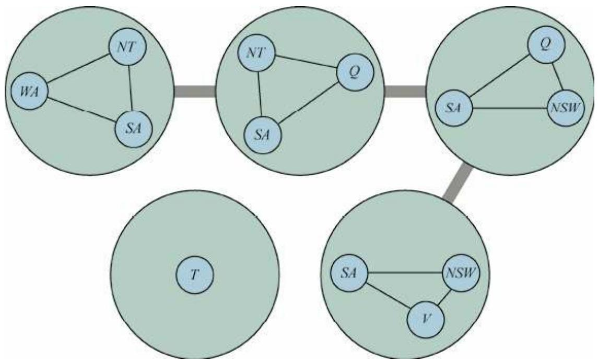  
图6-13图6-12a中约束图的一个树分解

一旦我们有了一个树状结构图，我们可以应用Tree-CSP-Solver在 O (nd 2)时间内得到解，其中 n是树节点的个数，d 是最大域的大小。但是要注意，在树中，域是一组值元组，而不只是单个值。

例如，图6-13中的左上节点表示在原始问题层级上，变量为 $\{ { \mathcal { W } } A , N T , S A \}$ ，域为，约束为 、 和 的子问题。而在树的 $\Omega \neq N T$ $W A \neq S A$ 层级上，节点表示单个变量，我们可以将其称为 SANTWA，它的值必须是一个由颜色组成的三元

组，如(red, green, blue)，但不能是(red, red, blue)，因为违反了原始问题中的 $\Omega \neq N T$ 约束。然后我们可以从这个节点移动到相邻节点，其变量为 SANTQ ，此时只有一个元组(red, green, blue)与SANTWA 的选择一致。对后两个节点重复完全相同的过程，但可以独立地为 T 作出任何选择。

使用T ree -CSP-S olver 算法可以在 O ( n d 2)时间内求解任何树分解问题，只要 $d$ 保持较小值，它都是高效的。回到100个布尔变量的示例，如果每个节点有10个变量，那么 $d = 2 \ ^ { 1 0 }$ ，我们可以在几秒内找到解。但如果有一个节点包含30个变量，则需要几个世纪的时间。

一个给定的图允许多种树分解，在选择分解时，目标是使子问题尽可能小。（将所有变量放在同一个节点中在技术上也是一棵树，但对求解问题没有帮助。）图的树分解的 树宽 （treewidth）为最大节点的大小减1，图本身的树宽定义为其所有树分解的最小宽度。如果一个图的树宽为 w，那么给定相应的树分解，该问题可以在O (n d w +1)时间内求解。因此，如果CSP的约束图树宽有界，则该CSP在多项式时间内是可解的。

遗憾的是，找出树宽最小的分解是一个NP困难问题，但有一些启发式方法在实践中效果很好。时间为 的割集分解和时间为 O ( n dw +1)的树分解哪个更好？每当有一个大小为c 的环割集时，也会有一个大小为 $w < c + 1$ 的树宽，并且在某些情况下它可能要小得多。所以从时间上考虑，应该选择树分解，但环割集方法的优点是，它可以在线性内存中执行，而树分解需要关于w的指数级内存。

# 6.5.3 值对称

到目前为止，我们已经讨论了约束图的结构。在变量的值中，或在约束关系本身的结构中，也可能存在重要的结构。考虑有d 种颜色的地图着色问题。对于每个一致解，实际上都有一组通过排列颜色名形成的 d !个解。例如，在澳大利亚地图中，我们知道 WA、 NT和SA肯定具有不同颜色，但实际上，将3种颜色分配给3个区域有3! = 6种方法。这称为 值对称 （value symmetry）。我们希望通过打破这种赋值对称性将搜索空间缩小 d !倍。可以通过引入 对称性破缺约束 （symmetry-breaking constraint）做到这一点。对于我们的例子，可以施加一个任意的排序约束，

，即要求3个值按字母顺序排列。这个约束保证了 d !个解中只有一个是可能解：{NT=blue,SA=green,WA=red}。

对于地图着色问题，很容易找到一个消除对称性的约束。一般来说，要消除所有的对称性是NP困难的，但打破值对称已被证明在许多问题上都是重要和有效的。

小结

●约束满足问题（CSP） 的状态为一组变量/值对，解的条件为一组变量约束。许多重要的真实问题都可以用CSP描述。  
●许多推断 技术利用约束排除某些变量赋值。这些约束包括节点一致性、弧一致性、路径一致性和 $k$ 一致性。  
●回溯搜索 是深度优先搜索的一种形式，通常用于求解CSP。推断可以与搜索交替进行。  
●最少剩余值 启发式算法和度 启发式算法是领域无关的方法，用于决定在回溯搜索中下一步选择哪个变量。最少约束值 启发式算法有助于决定对于给定变量首先尝试哪个值。回溯发生在某个变量找不到合法赋值时。冲突导向回跳 直接回溯到问题的根源。约束学习 记录在搜索过程中遇到的冲突，以免在以后的搜索中出现相同的冲突。  
●使用最少冲突 启发式算法的局部搜索也已成功地应用于约束满足问题。  
●CSP求解的复杂性与其约束图的结构密切相关。树状结构问题可以在线性时间内求解。割集调整可以将一般的CSP简化为树状结构的CSP，如果能找到一个较小的割集，算法会非常高效（只需线性内存）。树分解 技术将CSP转化为由子问题构成的树，当约束图的树宽 较小时，算法是高效的；然而，它们需要约束图树宽的指数级的内存。将割集调整和树分解相结合可以更好地权衡所需内存和时间。

读者服务：


微信扫码关注【异步社区】微信公众号，回复“e59810”获取本书配套资源以及异步社区15天VIP会员卡，近千本电子书免费畅读。

第三部分

知识、推理和规划

# 第7章

# 逻辑智能体

在本章中，我们设计能够表示复杂世界的智能体，它使用推断过程来获取关于这个世界的新表示，并使用这种表示来推导下一步该怎么做。

人类似乎具有知识，人类的知识能够帮助他们做事。在人工智能中， 基于知识的智能体（knowledge-based agent）对知识的内部 表示 （representation）进行 推理 （reasoning）来确定要采取的动作。

第3章和第4章的问题求解智能体具有知识，但这种知识是非常有限且死板的。它们知道可以采取哪些动作，也知道在某个状态采取某个动作将得到哪种结果，但它们不知道一般事实。例如，寻路智能体不知道一条路的长度不可能是负数公里，而8数码智能体也不知道两块瓷砖无法放置在同一个空格当中。问题求解智能体具有的知识对寻找从起点到终点的路径这种问题非常有用，但也仅限于此。

问题求解智能体所使用的原子表示也有很大的局限性。例如，在部分可观测的环境中，问题求解智能体表示它对当前状态的了解的唯一选项是列出所有可能的具体状态。我可以让一个人驱车前往一个人口不超过1万的美国小镇，但如果要让问题求解智能体来做这件事，我只能明确地将目标描述为大约1.6万个符合条件的小镇的集合。

第6章引入了我们的第一个因子化表示，其中状态被表示为对变量的赋值。这是朝正确方向前进的一步，它能使智能体的某些部分以与领域无关的方式运作，并支持更高效的算法。在本章中，我们将这一步延伸到它的逻辑结论，可以说，我们将逻辑 扩展为一类通用的表示，以支持基于知识的智能体。这些智能体可以组合或重组信息以适应各种用途。它可以与我们当下的需要毫不相关，就像数学家证明定理或天文学家计算地球的预期寿命一样。基于知识的智能体能够接受明确描述的目标作为任务，能够通过主动学习或被告知关于环境的新知识快速地获得完成任务的能力，也能够通过更新相关知识适应环境的变化。

我们在7.1节开始介绍智能体的总体设计。7.2节新引入了一个名为wumpus世界的简单环境，以便在不涉及任何技术细节的前提下，阐明基于知识的智能体的运作方式。随后我们在7.3节解释逻辑 的一般原理，在7.4节介绍命题逻辑 的具体细节。命题逻辑是一种因子化表示，尽管它的表达能力不如一阶逻辑 （第8章）这种标准的结构化表示，但却能够阐明逻辑的所有基本概念。命题逻辑还具有丰富的推断方法，我们将在7.5节和7.6节中描述这些内容。最后，7.7节将基于知识的智能体的概念与命题逻辑的技术结合起来，为wumpus世界构建了一个简单的智能体。

# 7.1 基于知识的智能体

基于知识的智能体的核心部件是它的 知识库 （knowledge base，KB）。知识库是一个 语句 集。（此处“语句”是一个术语。它与英语或其他自然语言的语句类似，但不完全相同。）这些语句用知识表示语言 （knowledge representation language）表达，代表了关于世界的某种断言。如果一条语句是直接给出的，而不是从其他语句推导而来的，我们就称它为公理 （axiom）。

向知识库添加新语句以及从知识库查询已知语句的方法是必不可少的。这些操作的标准名称分别是Tell（告知）和A sk（询问）。这两个操作都可能涉及 推断 （inference），也就是从原有语句中推导出新语句。推断必须符合以下要求：当向知识库询问（A sk ）时，答案应当遵循先前已经告知（Tell）知识库的内容而生成。我们将在本章后续部分仔细讲解何为“遵循”。现在，我们暂且将其理解为在推断过程中不能进行捏造。

图7-1展示了基于知识的智能体程序。与所有的智能体一样，基于知识的智能体以一个感知作为输入，返回一个动作。该智能体维护一个知识库KB，这个知识库最初可能包括一些背景知识（background knowledge）。

function KB-Agent(percept) returns a  
persistent: KB, a  
t, a  
TELL(KB, MAKE-PERCEPT-SENTENCE(percept, t))  
action $\leftarrow$ Ask(KB, MAKE-ACTION-QUERY(t))  
TELL(KB, MAKE-ACTION-SENTENCE(action, t))  
t $\leftarrow$ t + 1  
return action

图7-1 通用的基于知识的智能体。给定一个感知，智能体将这一感知添加进知识库，向知识库询问最优动作，并告知知识库它已经采取了这一动作

每次调用智能体程序时，程序会做3件事。首先，它告知知识库它所感知到的东西。然后，它询问知识库它应当采取什么动作。在回答这一查询时，可能会对关于世界的当前状态、可能的动作序列的执行结果等进行大量推理。最后，智能体程序告知知识库它选择的动作，并返回这一动作以便执行。

表示语言的细节隐藏在3个函数中，这3个函数一方面实现了传感器与执行器之间的接口，另一方面又实现了核心表示与推理系统的接口。Make-Percept-Sentence构建了一个语句，断言智能体在给定时间接收到给定的感知。Make-A ction-Q uery 构建了一个语句，询问当前时刻应当采取何种动作。最后，Make-A ction-Sentence构建了一个语句，断言选定的动作已经执行。推断机制的细节隐藏在Tell与A sk中。后续章节将阐明这些细节。

图7-1所示的基于知识的智能体看起来与第2章所述的具有内部状态的智能体非常相似。而由于Tell和A sk的定义，基于知识的智能体并不仅是普通的用来计算动作的程序。它受到位于知识层面（knowledgelevel）的描述的操控，我们只需要在知识层面明确智能体所具有的知识和它的目标，就可以决定它的行为。

例如，一辆自动驾驶出租车的任务是将一名乘客从旧金山送往马林县，它或许知道金门大桥是两地间的唯一通路。因此，我们可以猜测出租车将驶过金门大桥，因为它知道这样能达成目标。注意，这一分析与出租车在实现层面 （implementationlevel）的工作原理毫无关系。不论它是用链表或点阵图来实现地理知识，还是通过操纵寄存器中的符号串或在神经元网络中传递有噪声的信号来进行推理，都与我们的分析无关。

我们可以仅通过告知智能体必需的知识来构建基于知识的智能体。智能体设计者可以从空知识库开

始，逐条告知智能体语句，直到它明白如何在它的环境中运作。我们称之为陈述性 （declarative）系统构建方法。相对地，过程性 （procedural）方法将所需的行为直接编码为程序代码。在20世纪70年代和80年代，两种方法的提倡者进行了激烈的辩论。我们现在明白，成功的智能体在设计中常常需要将陈述性和过程性这两种方法的元素结合起来，而陈述性的知识也往往能够被编译成更有效的过程性代码。

我们还可以给基于知识的智能体赋予自主学习的机制，我们将在第19章讲解的这些机制。智能体能够利用这些机制从一系列感知中创建关于环境的一般知识。进行学习的智能体可以是完全自主的。

# 7.2 wumpus世界

本节我们将描述一个能够体现基于知识的智能体的价值的环境。wumpus世界 （wumpusworld）是一个洞穴，其中有许多房间，房间之间有走廊连接。在洞穴的某处潜伏着可怕的wumpus，这是一只会吃掉任何进入其房间的人的怪兽。智能体可以射杀wumpus，但智能体只有一支箭。一些房间有无底洞，能困住任何漫游到这些房间中的人（wumpus除外，它体型大得无法落入无底洞）。这个阴森环境的唯一回报是可能找到的金块。尽管以现代电子游戏的眼光来看，wumpus世界相当乏味，但它却能展示出智能的一些重要属性。

图7-2展示了一个简单的wumpus世界示例。任务环境的精确定义用2.3节所述的PEAS描述法给出。

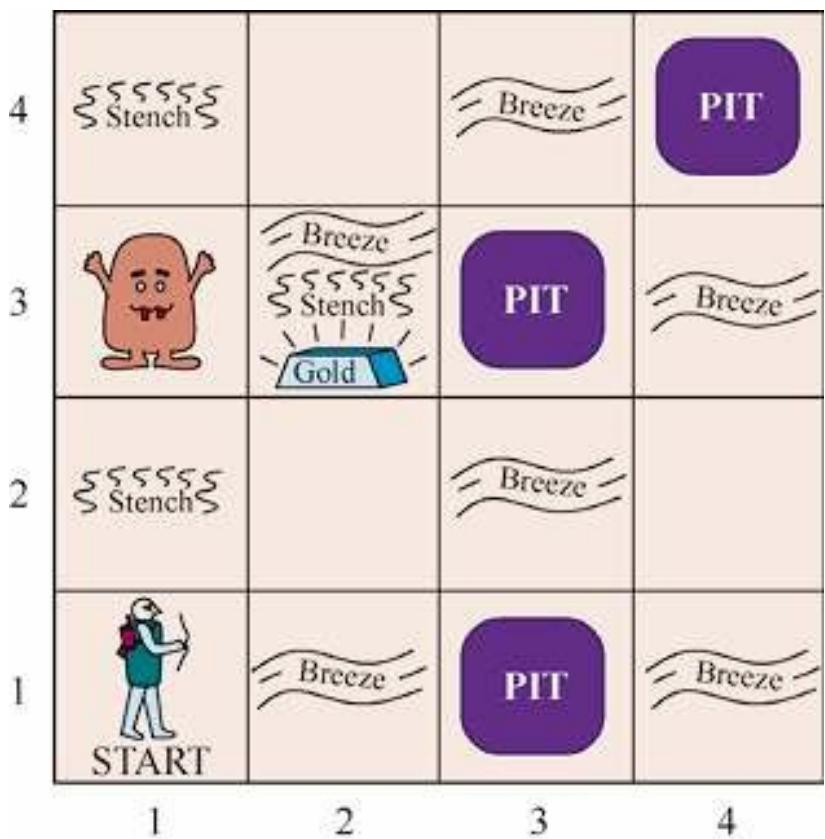  
图7-2 一个典型的wumpus世界。智能体位于左下角，面朝东（向右）

● 性能度量 ：带着金块从洞穴爬出+1000，跌入无底洞或被wumpus吞食−1000，每采取一个动作−1，用尽箭支−10。如果智能体死亡或爬出洞穴，游戏结束。  
● 环境 ：一个4×4的房间网格，网格四周环绕着围墙。智能体始终从标为[1, 1]的方格开始，面向东方。金块和wumpus的位置是根据均匀分布从除了起始方格的所有方格中随机选定的。另外，除起始方格外的每个方格都可能是无底洞，出现的概率为0.2。  
● 执行器 ：智能体可以向前（ Forward ）、左转（ TurnLeft ）90°和右转（ TurnRight ）90°。如果智能体进入有活着的wumpus或者有无底洞的方格，它将悲惨地死去。（但进入有死掉的wumpus的方格是安全的，尽管气味会很臭。）如果智能体试图前进并撞到墙，则智能体会原地不动。如果智能体与金块在同一个方格，抓取（Grab ）动作可以用于捡起金块。射击（ Shoot）动作可以用于向智能体面对的方向笔直地发射一支箭，这支箭会一直飞行，直到它命中wumpus（此时wumpus将被杀死）或击中墙壁。智能体只有一支箭，因此只有第一次射击动作有效。最后，攀爬（Climb ）动作可以用于爬出洞穴，但智能体仅能从方格[1, 1]爬出。  
●传感器 ：该智能体有5个传感器，每个传感器给出一个单一信息。

❏ 在与wumpus直接（非对角）相邻的方格中，智能体会感知到臭味（ Stench ）。  
❏在与无底洞直接相邻的方格中，智能体会感知到微风（Breeze）。  
❏ 在金块所在的方格中，智能体会感知到闪光（ Glitt er ）。  
❏ 智能体走向墙壁会感知到碰撞（ Bu mp ）。  
❏ 如果wumpus被杀死，它将发出惨叫（ Scream ），智能体可以在洞穴的任意位置感知到。

感知将以由5个符号组成的列表的形式传给智能体程序。例如，如果有臭味和微风，但没有闪光、碰撞和惨叫，智能体程序将收到[ Stench , Breeze , None , None , No ne ]。

我们可以在第2章所述的多个维度上描述wumpus环境。显然，它是确定性的、离散的、静态的且单智能体的。（好在wumpus不移动。）它是序贯的，因为只有采取很多动作后才可能得到奖励。它是部分可观测的，因为状态的一些方面是无法直接感知到的，如智能体的位置、wumpus的健康状况以及是否还有箭支可用。对于无底洞和wumpus的位置，我们可以将其看作状态中没有观测到的部分，在这种情况下，环境的转移模型是完全已知的，找出无底洞和wumpus的位置就能补全智能体对状态的知识；抑或，我们也可以说转移模型本身是未知的，因为智能体不知道哪些向前动作是致命的，在这种情况下，找出无底洞和wumpus的位置能够补全智能体对于转移模型的知识。

对于环境中的智能体，主要的挑战是它起初并不知道环境的配置。克服这种无知似乎需要逻辑推理。在wumpus世界的大多数情况中，智能体是有可能安全地拾取金块的。但智能体偶尔也需要在空手而归和冒死寻宝之间做出选择。大约21%的环境是极不公平的，因为这时金块位于无底洞中，或被无底洞包围。

我们来看一个基于知识的智能体是如何探索图7-2所示的wumpus世界的环境的。此处使用一种非形式化的知识表示语言，在网格中写下符号来表示（如图7-3和图7-4所示）。

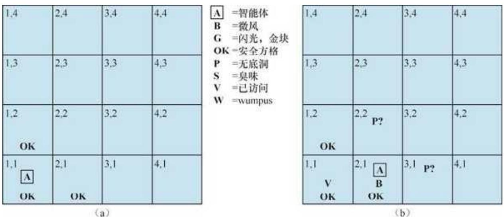  
图7-3 智能体在wumpus世界迈出的第一步。（a）在感知到[ None , None , None , None , None ]后的初始状态。（b）在移动到[2, 1]后感知到[ None , Breeze , None , None , None ]

智能体的初始知识库包括前述的环境规则。具体来说，智能体知道自己位于[1, 1]且[1,1]是安全的方格。我们在方格[1,1]中用“A”和“OK”分别进行表示。

第一个感知是[ None , None , None , None , None ]，据此智能体可以认定它的相邻方格[1, 2]和[2, 1]是安全的——它们是“OK”的。图7-3a展示了此时智能体的知识状态。

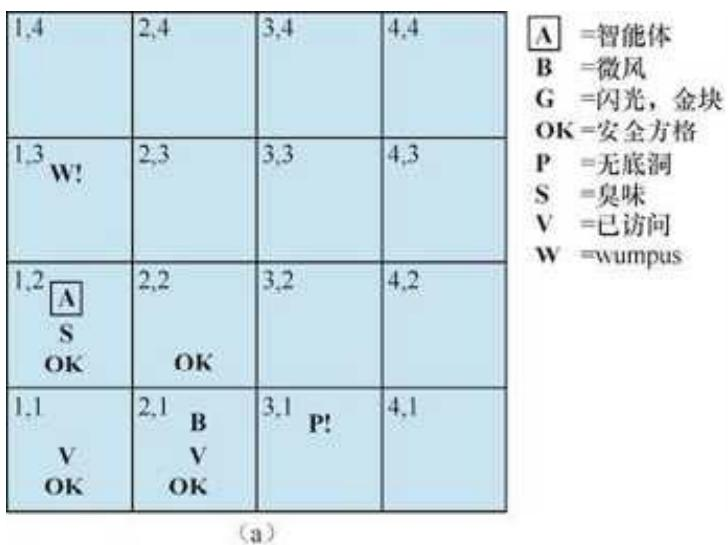

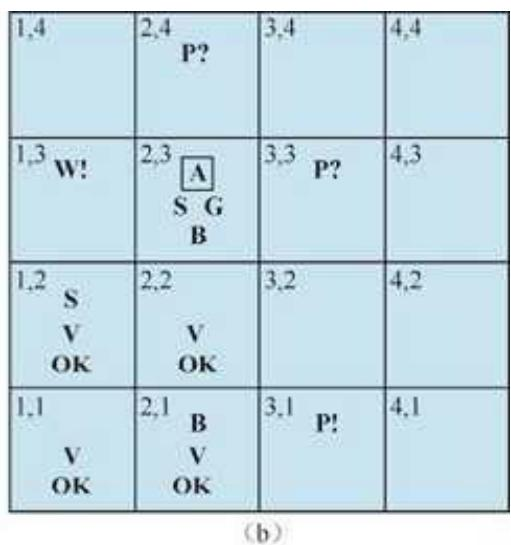  
图7-4 智能体运作时的两个后续状态。（a）回到[1, 1]再移动到[1, 2]后，感知到[ Stench , None , None , None , None ]。（b）来到[2, 2]再移动到[2, 3]，感知到[ Stench , Breeze , Glitter , None , None ]

一个谨慎的智能体只会移动到它所知的OK方格。我们假设智能体决定前进到[2, 1]。这个智能体在[2,1]感受到微风（用“B”表示），因此在相邻方格中必然存在无底洞。根据游戏规则，无底洞不可能在[1,1]，因此[2,2]和[3,1]其中之一必然有无底洞或二者都有。图7-3b中的记号“P?”表示这些方格中可能存在无底洞。此时，仅有一个已知的且未访问过的“OK”方格。因此这个心思缜密的智能体将扭头，回到[1, 1]，然后移步[1, 2]。

智能体在[1, 2]感知到臭味，导致知识状态变为图7-4a所示的状况。[1, 2]有臭味表明附近肯定有wumpus。但根据游戏规则wumpus不可能在[1, 1]，也不在[2, 2]（否则智能体先前在[2, 1]时会探测到臭味）。因此，智能体可以推断出wumpus在[1, 3]。记号“W!”表示这一推断。而[1, 2]没有微风表明[2,2]没有无底洞。考虑到智能体先前已经推断出[2, 2]或[3,1]中必然有无底洞，因此无底洞必然位于[3,1]。这是一次相当复杂的推断，因为它结合了在不同时间、不同地点获取的信息，并在缺乏感知的情况下迈出了关键的一步。

现在智能体已经证明了[2,2]中既没有无底洞也没有wumpus，因此可以移动到那里。我们没有展示智能体在[2, 2]的知识状态，姑且假设智能体转向并移动到[2,3]，形成了图7-4b所示的情况。在[2,3]中，智能体探测到闪光，因此它应该抓取金块然后回家。

注意，在智能体从可用信息中得出结论的每个情形下，如果可用信息是正确的，则可以保证结论都是正确的。这是逻辑推理的一个重要性质。本章剩余部分将描述如何构建能够表示信息并得出类似前述的结论的逻辑智能体。

# 7.3 逻辑

本节综述逻辑表示和推理的基本概念。这些漂亮的想法独立于逻辑的具体形式。因此，我们将形式的技术细节推后到7.4节介绍，本节代之以熟悉的普通算术问题作为示例。

在7.1节，我们说过知识库由语句组成。这些语句是根据表示语言的 语法 （syntax）表达的，语法规定了所有的合规语句。用简单的算术就能清晰地说明语法这个概念：“ x + y = 4”是合规的语句，而“ x 4 y +=”不是。

一种逻辑还必须定义语句的语义 ，或者说语句的含义。语义定义每条语句在每个可能世界中的真值 。例如，算术的语义指明“x+y=4”在一个x为2且y为2的世界为真，但在一个x为1且y为1的世界中为假。在标准的逻辑学中，每个可能世界中的每条语句要么为真，要么为假——没有中间地带。 [1]

[1] 第13章讨论的 模糊逻辑 （fuzzy logic）允许存在不同程度的真值。

当需要精确描述时，我们用 模型 来代替“可能世界”。可能世界可以被认为是（潜在的）真实环境，智能体可能在也可能不在其中，而模型是数学抽象，对于每个相关的语句，每个模型都有固定的真值（真或假）。非正式地举个例子：我们可以认为一个可能世界是让 x 个男士和 y 个女士坐在一张桌子边上玩桥牌，如果总共有4个人，则语句x+y=4为真。正式地说，可能的模型是对变量 x和y进行非负整数赋值的所有可能。每个这样的赋值都确定了任何一个变量为x和y的算术语句的真值。如果语句 $\pmb { \alpha }$ 在模型 m 中为真，我们说 m 满足 $\pmb { \alpha }$ ，有时也可以说 m 是 $\pmb { \alpha }$ 的一个模型。我们使用记号 来代表 的所有模型的集合。

有了真值的概念，我们就可以讨论逻辑推理了。这涉及语句之间的逻辑 蕴含 （entailment），即一个语句 逻辑上引发 另一语句。数学上，我们用 来表示语句 $\pmb { \alpha }$ 蕴含语句 $\beta$ 。蕴含的形式化定义是： $\alpha \models \beta$ 当且仅当在 $\pmb { \alpha }$ 为真的每个模型中 $\beta$ 也为真。用刚才介绍的记法，我们可以将其写作

$$
\alpha \vDash \beta_ {\text {当 且 仅 当}} M (\alpha) \subseteq M (\beta)
$$

（注意此处⊆的方向：若 ，则 $\pmb { \alpha }$ 是比 $\beta$ 更强 的断言，它排除了 更多 的可能世界。）蕴含关系用算术来说明会更为亲切一些：我们很容易理解语句 x =0蕴含语句 xy =0。显然，在任一 x为0的模型中， xy 也必然为0（而无论 y 的值是多少）。

我们可以将同样的分析应用于7.2节所述的wumpus世界推理的例子。考虑图7-3b所示的情形：智能体在[1,1]中什么都没有探测到，在[2, 1]中探测到微风。这些感知与智能体所具有的wumpus世界规则的知识一同构成了知识库。智能体所感兴趣的是相邻的方格[1, 2]、[2,2]和[3, 1]是否有无底洞。这3个方格中的每一个都可能有或没有无底洞，因此（暂且忽略这个世界的其他方面），总共有23=8个可能的模型。图7-5展示了这8个模型。[2]

[2]尽管该图用部分wumpus世界来表示模型，但模型实际上只是对类似“[1,2]中有无底洞”这样的语句进行真或假的赋值。从数学的角度来看，模型中并不需要有可怕的长毛wumpus。

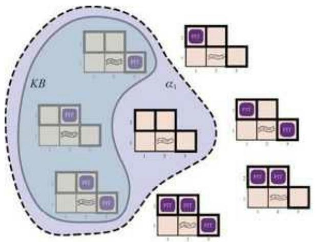

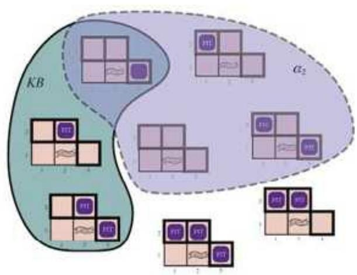  
  
图7-5 方格[1,2]、[2,2]和[3, 1]中无底洞存在性的可能的模型。在[1,1]中没有观测到任何东西且在[2, 1]中观测到微风的知识库用实线表示。（a）虚线表示 $\alpha _ { \uparrow }$ 的模型（[1, 2]中没有无底洞）。（b）虚线表示 $\alpha _ { z }$ 的模型（[2,2]中没有无底洞）

KB可以理解为一个语句的集合，或断言了所有单个语句的单个语句。在与智能体已知相矛盾的模型中，KB为假。例如，在所有[1,2]含有无底洞的模型中，KB都为假，因为[1,1]中没有微风。实际上，使 KB 为真的模型只有3个，这些模型在图7-5中用实线包围。我们现在考虑两个可能的结论：

= “ [1, 2] 中没有无底洞” = “ [2, 2] 中没有无 底洞”

在图7-5a和图7-5b中分别用虚线包围了 $\pmb { \alpha } _ { 1 }$ 和 $\alpha _ { 2 }$ 的模型。仔细观察后，我们可以得出

在所有 KB 为真的模型中， $\pmb { \alpha } _ { 1 }$ 也为真

因此， ，即[1,2]中没有无底洞。我们还可以得出 $\mathbf { \mathcal { K B } } \models \alpha _ { 1 }$

在一些 $K B$ 为真的模型中， $\alpha _ { 2 }$ 为假

因此，KB不蕴含 $\alpha _ { 2 }$ ，即智能体 无法断定[2,2]中没有无底洞。（也无法断定[2,2]中有无底

洞。）


前述的例子不仅阐明了什么是蕴含，还展示了如何用蕴含的定义来推导出结论，即进行逻辑推断。图7-5所示的推断算法被称为模型检验 ，因为这个示例枚举了所有可能的模型来检验在所有 KB为真的模型中 $\pmb { \alpha }$ 都为真，即 。

将KB的所有推论的集合比作干草堆而将 $\pmb { \alpha }$ 比做一根针或许有助于理解蕴含和推断。蕴含正如草堆中的针一样，而推断就像找到这根针的过程。一些形式化记法体现了这种区别：如果一个推断算法 i 可以从 KB 中推导出 $\pmb { \alpha }$ ，则记为

$$
K B \vdash_ {i} \alpha
$$

读作“ $\pmb { \alpha }$ 是由 i 从 KB 中推得的”或“ i 从 KB 推得 $\pmb { \alpha }$ ”。

一个仅推导蕴含语句的推断算法被称为是 可靠的 或保真的 。可靠性是极为重要的属性。一个不可靠的推断过程在运作时本质上会编造事实——它会声称发现了并不存在的针。我们很容易看出，模型检验在适用时[3] 是一个可靠的程序。

[3]如果模型空间是有限的，则模型检验是有效的，例如，在固定大小的wumpus世界中。而对算术

来说，模型空间是无限的：即使我们局限于整数范围，语句 x + y =4中 x 和 y 的值也是有无限多对的。

完备性 也是很重要的属性：如果一个推断算法能够推导出所有蕴含的语句，则它是完备的。真正的草堆大小是有限的，对其进行全面仔细的检查就一定能确定针在不在草堆里，这似乎是很显然的道理。然而，对许多知识库来说，推论的草堆是无限的，因而完备性就成了一个重大问题。


幸运的是，逻辑学中有完备的推断过程，其表达能力足以处理许多知识库。

我们已经描述了一个推理过程，在前提为真的任何世界中都保证结论为真。具体来说， 如果KB在真实世界中为真，则用可靠的推断过程从KB中推出的所有语句 $\pmb { \alpha }$ 在真实世界中也为真。因此，当推断过程在“语法”（例如，寄存器中的位或大脑中的电信号模式这样的内部物理结构）上进行操作时，这个过程 对应于一个真实世界的关系，即真实世界的某个部分为真是因为真实世界的其他一些部分为真。 [4] 这种世界与表示的对应如图7-6所示。

[4] 正如路德维希•维特根斯坦（Ludwig Wittgenstein）在其著名的《逻辑哲学论》（ Tractatus ）（Wittgenstein, 1922）中所述：“世界就是所有为真的一切。”

最后要考虑的问题是 落地 ，也就是逻辑推理过程与智能体所存在的真实环境的联系。尤其是， 我们如何知道 $K B$ 在真实世界中为真？（毕竟KB只是存在于智能体头脑中的“语法”。）这是一个哲学问题，众多的书籍都对此进行了讨论（见第27章）。一个简单的回答是，智能体的传感器创建了这个联系。例如，我们的wumpus世界智能体有嗅觉传感器。一旦有气味，智能体程序就会创建一条合适的语句。因此，一旦这条语句被包含在知识库中，就意味着它在真实世界中也为真。这样，感知语句的含义和真值就是由产生这些语句的感知过程和语句构建过程定义的。那么智能体知识的其他部分呢？例如，它对于“wumpus相邻的方格有臭味”这件事的信念呢？这不是单个感知的直接表示，而是一项一般规则，它可能是从感知的经验推导出的，却与经验陈述并不完全相同。这种一般规则是通过被称为 学习 的语句构建过程产生的，这是第五部分的主题。学习是难免会出错的。一种可能的情况是，wumpus有臭味但闰年2月29日这一天除外，因为这一天它要洗澡。因此， KB在真实世界中可能并不为真，但因为有很好的学习过程，我们对此就有理由乐观。

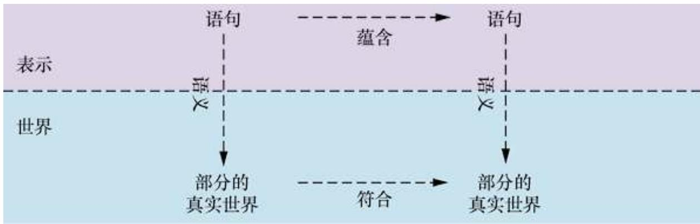  
图7-6语句是智能体的物理结构，而推理是从旧结构构建新结构的过程。逻辑推理应当确保新结构所表示的部分世界确实能够从旧结构所表示的部分世界推得

# 7.4 命题逻辑：一种非常简单的逻辑

本节讲解命题逻辑 （propositionallogic）。我们将阐述其语法（即语句的结构）和语义（确定语句真值的方法）。由此，我们将推导出一个简单的、语法的逻辑推断算法，它能够实现蕴含的语义概念。当然，这一切都仍将发生在wumpus世界中。

# 7.4.1 语法

命题逻辑的语法 定义合法的语句。 原子语句 （atomicsentence）由单个命题符号 （propositionsymbol）构成。每个这样的符号代表一个为真或假的命题。我们使用以大写字母开头的、可能包含其他字母或下标的符号来表示，例如 $P$ 、 Q 、 R 、 W 1,3以及 FacingEast 等。我们可以任意地进行命名，但通常选择一些有助记功能的名字，例如，使用W1,3代表“wumpus位于[1, 3]”。请记住，像 W1,3这样的符号是原子的，也就是说分开的W、1、3并非符号的有意义的部分。）有两个命题符号有固定的含义：True是永真命题，False是永假命题。使用括号和被称作 逻辑联结词（logical connective）的运算符可以将简单语句构造成 复合语句 （complex sentence）。常用的联结词有5个。

● （非）。类似 这样的语句称为 W 1,3的 否定 。一个 文字 要么是原子语句，即 正文字，要么是原子语句的否定，即 负文字 。  
● ∧（与）。主要联结词是∧的语句称为 合取式 ，例如 $\pmb { \mathcal { W } } _ { 1 , 3 } \wedge \pmb { P } _ { 3 , 1 }$ ，其各部分称为 合取子句。（∧看起来像是“And”中的“A”。）  
● ∨（或）。主要联结词是∨的语句称为 析取式 ，例如 $( W _ { 1 , 3 } \wedge P _ { 3 , 1 } ) \vee W _ { 2 , 2 }$ ，其各部分为析取子句 ，本例中分别为 $( W _ { 1 , 3 } \land P _ { 3 , 1 } )$ 和 $W 2 { , } 2$ 。

● （蕴涵）。如 $( W _ { 1 , 3 } \land P _ { 3 , 1 } ) \Rightarrow W _ { 2 , 2 }$ 这样的语句称为 蕴涵式 （implication）或条件式，其 前提 （premise）或 前件（antecedent） 是 ，其 结论 （conclusion）或 后件 $( W _ { 1 , 3 } \wedge P _ { 3 , 1 } )$ （consequent） 是 。蕴涵式也被称为 规则 （rule）或 if - then 声明。有时，蕴涵符号在一 $\neg \pmb { W } _ { 2 }$ 些书籍中写作 或 。

● （当且仅当）。语句 $\mathcal { W } _ { 1 , 3 } \Leftrightarrow \neg \mathcal { W } _ { 2 , 2 }$ 是 双向蕴涵式 （biconditional）。

图7-7给出了命题逻辑的形式文法。［附录B将会介绍巴克斯-诺尔范式（Backus-Naurform，BNF）的概念。］我们在BNF文法上附加了运算符优先级，以避免在使用多个运算符时出现歧义。“非”运算符的优先级最高，这意味着在语句 中， 的结合力更强，因此它等价于 $1 1 \Lambda B$ 而不是 。（这与普通算术一样： $- 2 + 4$ 等于2而不是−6。）我们也会适时地使用圆括号和方括号来明确语句结构，以改善可读性。

语句 $\rightarrow$ 原子语句|复合语句原子语句 $\rightarrow$ True|False|P|Q|R|…复合语句 $\rightarrow$ (语句)1 语句A语句语句V语句语句 $\Rightarrow$ 语句语句 $\Leftrightarrow$ 语句

运算符优先级：-,A，V，，

图7-7 命题逻辑中语句的BNF文法以及从高到低排列的运算符优先级

# 7.4.2 语义

了解了命题逻辑的语法后，我们来说明其语义。语义定义了用于判定特定模型中语句真值的规则。命题逻辑中，模型就是对每个命题符号设定真值 ，即真（true）或 假（false）。例如，如果知识库中的语句使用了命题符号 P 1,2、 P 2,2和 P 3,1，则一个可能模型为

$$
m _ {1} = \left\{P _ {1, 2} = \text {f a l s e}, P _ {2, 2} = \text {f a l s e}, P _ {3, 1} = \text {t r u e} \right\}
$$

由于含有3个命题符号，因此有2 $3$ =8种可能的模型，与图7-5所示的完全相同。但要注意，这些模型是纯粹的数学对象，不必与wumpus世界有关。P 只是符号，它可能代表“[1,2]中有无底洞”，也可能代表“我今天和明天都在巴黎”。

命题逻辑的语义必须指定在给定模型下如何计算任一语句的真值。这是以递归的方式实现的。所有语句都是由原子语句和5个联结词构建的。因此，我们需要指定如何计算原子语句的真值和用5个联结词构建的语句的真值。对原子语句来说这很简单。

●true在每个模型里都为真，false在每个模型里都为假。   
● 其余命题符号的真值必须在模型中直接指定。例如，在先前给出的模型 $m _ { 1 }$ 中， $P _ { 1 , 2 }$ 为假。

对于复合语句，有5条规则，它们对任一模型m 中的任一子句P和 $Q$ （原子语句或复合语句）都成立。

● $\mathcal { P }$ 为真，当且仅当在 $m$ 中 $P$ 为假。   
● 为真，当且仅当在 m 中 P 和 Q 都为真。 $P A Q$ $m$ $P$ $Q$   
● 为真，当且仅当在 m 中 P 或 Q 中至少一个为真。 $m$ $P$   
● 为真，除非在 m 中 P 为真而 Q 为假。 $m$ $P$ $Q$   
● 为真，当且仅当在 m 中 P 和 Q 都为真或都为假。 $P \Leftrightarrow Q$ $m$ $P$

这些规则也可以用真值表 表示。真值表指明在对复合语句的组成部分进行每种可能的真值赋值后，该复合语句的真值。图7-8给出了5个联结词的真值表。任一语句s关于任一模型 $m$ 的真值都可以用简单的递归求值来计算。例如，在模型 m 1中求语句 $m _ { 1 }$ $\mathcal { P } _ { 1 , 2 } \wedge ( { P } _ { 2 , 2 } \vee { P } _ { 3 , 1 } )$ 的值，得到。习题7.TRUV要求写出算法PL-T rue ?( $\Lambda$

s , m )，用于计算命题逻辑语句 $s$ 在模型 $m$ 中的真值。

<table><tr><td>P</td><td>Q</td><td>¬P</td><td>P ∧ Q</td><td>P ∨ Q</td><td>P ⇒ Q</td><td>P ⇌ Q</td></tr><tr><td>false</td><td>false</td><td>true</td><td>false</td><td>false</td><td>true</td><td>true</td></tr><tr><td>false</td><td>true</td><td>true</td><td>false</td><td>true</td><td>true</td><td>false</td></tr><tr><td>true</td><td>false</td><td>false</td><td>false</td><td>true</td><td>false</td><td>false</td></tr><tr><td>true</td><td>true</td><td>false</td><td>true</td><td>true</td><td>true</td><td>true</td></tr></table>

图7-8 5个逻辑联结词的真值表。若要使用真值表计算在 $P$ 为真、 $Q$ 为假时 $\pmb { \mathcal { P } }$ V $Q$ 的值，首先在左边找到 $P$ 为true而 Q 为false的行（第3行），然后找到该行位于 $\mathcal { Q }$ 列处的值，得到结果true“与”“或”“非”的真值表与我们对这些词的直观认识非常接近。可能会混淆的关键点是当 $P$ 为真或 $Q$ 为真，或者二者同时为真时， $\pmb { Q }$ 为真。而另一个联结词“排他或”（简称“异或”）则会在两

个子句都为真时为假。 注排他或设有公认的待号，有些人选择使用 、 或者⊕。

⇒的真值表可能不太符合人们对“P蕴涵Q ”或“若 P则Q ”的直观理解。一种解释是，命题逻辑并不要求 $P$ 和Q 之间有任何因果关系或相关性。（在一般的理解下）语句“5是奇数蕴涵东京是日本的首都”是命题逻辑中的真语句，尽管这句话相当奇怪。另一个容易混淆之处在于前件为假的所有蕴涵式都为真。例如，“5是偶数蕴涵Sam很聪明”为真，而不论Sam是否聪明。这似乎很怪异，但如果你将“ ”当作“如果 P 为真，则我可以断言 Q 为真，否则我无法断言”的话，就可以理解了。这条语句为假的唯一情形是当 P 为真而 Q 为假时。

当 与 均为真时，双向蕴涵式 为真，英语中常写作“ P if and only if Q”（ P 当且仅当 Q ）。wumpus世界的大部分规则都可以用 $\Leftrightarrow$ 很好地表示。例如， 当 一个方格的相邻方格中有无底洞，该方格有微风，而且， 仅当 一个方格的某个相邻方格中有无底洞，该方格有微风。因此，我们需要使用双向蕴涵式

$$
B _ {1, 1} \Leftrightarrow (P _ {1, 2} \vee P _ {2, 1})
$$

其中 $B _ { 1 , 1 }$ 代表[1, 1]有微风。

# 7.4.3 一个简单的知识库

我们已经定义了命题逻辑的语义，现在可以为wumpus世界构建一个知识库了。首先关注wumpus世界的不变部分，后面章节再处理其可变部分。对于每个位置[x, y]，需要用到下列符号：

当 $[ x , y ]$ 有无底洞 ， P x , y 为真。

当 wumpus 在 $[ x , y ]$ ， 不论其死活 $W x , y$ 都 为真。

当 $[ x , y ]$ 有微风， $B x , y$ 为真。

当 $[ x , y ]$ 处有臭味 ， $S x , y$ 为真。

当智能体位于位 置 [ x , y ]， $L x , y$ 为真。

我们写下的语句将足以推得 $\mathbb { P } _ { 1 , 2 }$ （[1, 2]中没有无底洞），正如7.3节用非形式化的方法所做的那样。我们用 $R _ { i }$ 代表每个语句，以便推导。

●[1,1]中没有无底洞：

$$
R _ {1}: - P _ {1, 1}
$$

● 一个方格有微风，当且仅当其相邻方格中有无底洞。必须对每个方格都进行这样的表示，在此我们只写出相关方格的表示：

$$
R _ {2}: B _ {1, 1} \Leftrightarrow (P _ {1, 2} \vee P _ {2, 1})
$$

$$
R _ {3}: B _ {2, 1} \Leftrightarrow (P _ {1, 1} \vee P _ {2, 2} \vee P _ {3, 1})
$$

●上述语句在所有wumpus世界中都为真。我们现在为智能体在这个特定世界中已访问过的前两个方格引入微风感知，以形成图7-3b所示的情形：

$$
\begin{array}{c} R _ {4}: - B _ {1, 1} \\ R _ {5}: B _ {2, 1} \end{array}
$$

# 7.4.4 一个简单的推断过程

我们现在的目标是确定对于一些语句 ， $\kappa B \models \alpha$ 是否成立。例如，我们的 KB 是否蕴含？我们的第一个推理算法是模型检验方法，它直接实现了蕴含的定义：枚举所有模型，检验 在KB为真的每个模型中是否为真。模型是对每个命题符号进行真或假的赋值。回到例子中的wumpus世界，它涉及的命题符号是 B 1, 1 、 B 2, 1 、 P 1, 1 、 P 1, 2 、 P 2, 1 、 P 2, 2 和 P 3, 1 。在有7个符号的情况下，总共有 $2 \ ^ { 7 } = 1 2 8$ 个可能的模型， KB 在其中3个模型中为真（如图7-9所示）。在这3个模型中， $\mathcal { \pmb { P } } _ { 1 , 2 }$ 为真，因此[1, 2]中没有无底洞。但是，在3个模型中， $P _ { 2 , 2 }$ 在其中两个模型中为真，在另一个模型中为假，因此我们还无法确定[2, 2]中是否有无底洞。

图7-9以更准确的形式再现了图7-5所示的推理。图7-10描述了一个确定命题逻辑中蕴含关系的通用算法。与6.3节所示的B acktracking -S earch 算法类似，TT-E ntails ?在符号赋值的有限空间中进行递归枚举。这个算法是 可靠的 ，因为它直接实现了蕴含的定义；这个算法也是 完备的 ，因为它对所有KB和 $\pmb { \alpha }$ 都适用，并且算法最后都会终止——因为需要检验的模型数量是有限的。

<table><tr><td>B1,1</td><td>B2,1</td><td>P1,1</td><td>P1,2</td><td>P2,1</td><td>P2,2</td><td>P3,1</td><td>R1</td><td>R2</td><td>R3</td><td>R4</td><td>R5</td><td>KB</td></tr><tr><td>false</td><td>false</td><td>false</td><td>false</td><td>false</td><td>false</td><td>false</td><td>true</td><td>true</td><td>true</td><td>true</td><td>false</td><td>false</td></tr><tr><td>false</td><td>false</td><td>false</td><td>false</td><td>false</td><td>false</td><td>true</td><td>true</td><td>true</td><td>false</td><td>true</td><td>false</td><td>false</td></tr><tr><td>:</td><td>:</td><td>:</td><td>:</td><td>:</td><td>:</td><td>:</td><td>:</td><td>:</td><td>:</td><td>:</td><td>:</td><td>:</td></tr><tr><td>false</td><td>true</td><td>false</td><td>false</td><td>false</td><td>false</td><td>false</td><td>true</td><td>true</td><td>false</td><td>true</td><td>true</td><td>false</td></tr><tr><td>false</td><td>true</td><td>false</td><td>false</td><td>false</td><td>false</td><td>true</td><td>true</td><td>true</td><td>true</td><td>true</td><td>true</td><td>true</td></tr><tr><td>false</td><td>true</td><td>false</td><td>false</td><td>false</td><td>false</td><td>false</td><td>true</td><td>true</td><td>true</td><td>true</td><td>true</td><td>true</td></tr><tr><td>false</td><td>true</td><td>false</td><td>false</td><td>true</td><td>false</td><td>false</td><td>true</td><td>false</td><td>false</td><td>true</td><td>true</td><td>false</td></tr><tr><td>:</td><td>:</td><td>:</td><td>:</td><td>:</td><td>:</td><td>:</td><td>:</td><td>:</td><td>:</td><td>:</td><td>:</td><td>:</td></tr><tr><td>true</td><td>true</td><td>true</td><td>true</td><td>true</td><td>true</td><td>true</td><td>false</td><td>true</td><td>true</td><td>false</td><td>true</td><td>false</td></tr></table>

图7-9根据文中所述的知识库构建的真值表。如果从 $R _ { 1 }$ 到 $R _ { 5 }$ 都为true，则KB为true。这种情况在全部128行中只出现了3次（在最右侧的列中用下划线标出）。在这3行中， $P _ { 1 , 2 }$ 均为false，因此[1,2]中没有无底洞。但是，[2, 2]中可能有（也可能没有）无底洞

function TT-ENTAILS $( K B , \alpha )$ returns true或false

inputs: $K B$ ，知识库，一个命题逻辑的语句

$\alpha$ ，查询，一个命题逻辑的语句

symbols $ K B$ 和α中的命题符号列表

returnTT-CHECK-ALL(KB,α,symbols,{}）

functionTT-CHEcK-ALL(KB,α,symbols,modelreturnstrue或false

ifEMPTY?（symbols）then

ifPL-TRUE?(KB,model) thenreturnPL-TRUE?（a,model)

else return true //当KB为false时，始终返回true

else

PFIRST(symbols)

rest+REsT(symbols)

return(TT-CHECK-ALL(KB,α,rest,modelU{P=true}）

and

TT-CHECK-ALL（KB,α,rest,modelU{P=false}))

图7-10用于确定命题蕴含的真值表枚举算法（TT代表真值表）。当语句在一个模型中成立，PL-True?返回true。变量model代表部分模型——对于部分符号的赋值。此处的关键字 and不是命题逻辑中的运算符，而是伪代码编程语言中的中缀；如果其两个参数中的任意一个为true，则返回true

当然，“有限数量”并不总是等同于“少量”。如果 KB和 $\pmb { \alpha }$ 总共含有 n 个符号，那么就会有2 n 个模型。这样，算法的时间复杂性就会达到 O (2 n)。（空间复杂性仅为O (n )，因为枚举是深度优先的。）在本章稍后部分，我们将展示一个在大多数情况下更高效的算法。遗憾的是，命题蕴含是余NP完全的（即很可能不比NP完全简单，见附录A），因此命题逻辑所有已知推断算法的最坏情况复杂性都是输入规模的指数 量级 。

# 7.5 命题定理证明

至此，我们已经展示了如何用模型检验判定蕴含关系：枚举模型，并验证语句在所有模型中必须成立。本节将展示如何通过定理证明 找出蕴含关系。定理证明对知识库中的语句直接应用推断规则，它能够在不检验模型的情况下，构建对所需语句的证明。如果模型的数量很多，但其证明很短，则定理证明会比模型检验更为高效。

在深入定理证明算法的细节之前，我们还需要了解一些与蕴含相关的概念。第一个概念是逻辑等价 （logical equivalence）：如果两个语句 $\pmb { \alpha }$ 和 $\beta$ 在相同的模型集合中都为真，则这两个语句逻辑等价，可以写作 $\alpha \equiv \beta$ 。（注意， $\equiv$ 用于对语句进行声明，而 $\Leftrightarrow$ 则用作语句的一部分。）例如，我们可以很容易地（用真值表）证明 与 是逻辑等价的。其他逻辑等价见图7-11。这些等价关系在逻辑中扮演的角色与算术恒等式在普通数学中的角色非常相似。等价的另一种定义为“任意两条语句 $\pmb { \alpha }$ 和 $\beta$ 是等价的，当且仅当它们互相蕴含”：

$$
\alpha \equiv \beta_ {\text {当 且 仅 当}} \alpha \vdash \beta_ {\text {且}} \beta \vdash \alpha
$$

第二个概念是有效性 （validity）。如果一条语句在 所有模型中都为真，则这条语句是有效的。例如，语句 是有效的。有效的语句也被称为重言式 （tautology）——它们必然为真。由于语句True在所有模型中都为真，所有有效的语句都逻辑等价于 True。有效语句有什么用？从蕴含的定义可以推导出古希腊人早已懂得的 演绎定理 （deduction theorem）：

对于任意语句 $\pmb { \alpha }$ 和 $\beta$ ， $\alpha \models \beta$ 当且仅当语句 $( \alpha \Rightarrow \beta )$ 是有 效的 。

（习题7.DEDU要求对其进行证明。）因此，可以像图7-10所示的推断算法那样，通过检验$( \alpha \Rightarrow \beta )$ 是否在每个模型中为真来确定 $\alpha \models \beta$ 是否成立，或者通过证明 $( \alpha \Rightarrow \beta )$ 等价于 True来确定 $\alpha \models \beta$ 是否成立。反过来，演绎定理表明每条有效的蕴涵语句都描述一个合法的推断。

（a△β）=(β△a）△的交换律

$( \alpha \lor \beta ) \equiv ( \beta \lor \alpha )$ V的交换律

$( ( \alpha \wedge \beta ) \wedge \gamma ) \equiv ( \alpha \wedge ( \beta \wedge \gamma ) )$ A的结合律

$( ( \alpha \lor \beta ) \lor \gamma ) \equiv ( \alpha \lor ( \beta \lor \gamma ) )$ V的结合律

$\lnot ( \lnot a ) \equiv a$ 双重否定律

$( a \Rightarrow \beta ) \equiv ( \neg \beta \Rightarrow \neg a )$ 假言易位

$( a \Rightarrow \beta ) \equiv ( \neg a \lor \beta )$ 蕴涵消去

$( \alpha \Leftrightarrow \beta ) \equiv ( ( \alpha \Rightarrow \beta ) \wedge ( \beta \Rightarrow \alpha ) )$ 等价消去

$\neg ( a \wedge \beta ) \equiv ( \neg a \vee \neg \beta )$ 德摩根律

$\neg ( a \lor \beta ) \equiv ( \neg a \land \neg \beta )$ 德摩根律

$( \alpha \wedge ( \beta \vee \gamma ) ) \equiv ( ( \alpha \wedge \beta ) \vee ( \alpha \wedge \gamma ) )$ A对V的分配律

$( \alpha \lor ( \beta \land \gamma ) ) \equiv ( ( \alpha \lor \beta ) \land ( \alpha \lor \gamma ) )$ V对∧的分配律

图7-11 标准的逻辑等价。符号 $_ \alpha$ 、 $\beta$ 、 $\gamma$ 代表任意命题逻辑语句

最后一个概念是 可满足性 （satisfiability）。如果一条语句在某些模型中为真或能够被满足，则

这条语句是可满足的。例如，前述的知识库中， 是可满足的，因为如图7-9所示，它在3个模型中为真。可以通过枚举可能的模型，直到找出满足语句的模型来验证可满足性。在命题逻辑中确定语句的可满足性的问题—— SAT 问题——是第一个被证明为NP完全的问题。计算机科学中的许多问题实际上都是可满足性问题。例如，第6章的所有约束满足问题询问约束是否可以通过某种赋值来满足。

有效性和可满足性当然是有联系的： $\pmb { \alpha }$ 是有效的，当且仅当 $\multimap$ 是不可满足的；换言之， $\pmb { \alpha }$ 是可满足的，当且仅当 $\multimap$ 不是有效的。我们还能得出下述非常有用的结论：

$$
\alpha \vDash \beta_ {\text {当 且 仅 当 语 句}} \alpha \wedge \neg \beta_ {\text {是 不 可 满 足 的}}
$$

通过检验 的不可满足性，可以从 $\pmb { \alpha }$ 证明 $\beta$ ，这正是数学证明方法中标准的归谬法（reductio ad absurdum，意为“归结为荒谬之物”）。它也被称为 反证法 或 矛盾法 。假设 $\beta$ 为假，并证明这会导致与已知公理 $\pmb { \alpha }$ 矛盾，这个矛盾的含义与声明语句 $( \alpha \Lambda - \beta )$ 是不可满足的完全相同。

# 7.5.1 推断与证明

本节介绍可以用于推导证明 的推断规则 。证明是一系列可以引向所需目标的结论。最著名的规则是 肯定前件 （Modus Ponens，mode that affirms的拉丁语），写作

$$
\frac {\alpha \Rightarrow \beta , \alpha}{\beta}
$$

它的意思是，当给出 $\pmb { \alpha }$ 和具有 $\alpha { \Rightarrow } \beta$ 形式的语句时，可以推导出语句 $\beta$ 。例如，如果给出（WumpusAheadA WumpusAlive)Shoot，并已知，可以推导出 Sho ot 。

另一个有用的推断规则是合取消去 （and-elimination），即可以从一个合取式推导出任一合取子句：

$$
\frac {\alpha \wedge \beta}{\alpha}
$$

例如，由 ，可推导出 WumpusAli ve 。

通过考虑 $\pmb { \alpha }$ 和 $\pmb { \mathcal { P } }$ 的可能真值，可以证明肯定前件和合取消去是可靠的。这些规则可用于任意适用的实例，不必枚举所有模型就可以生成可靠的推断。

图7-11所示的所有逻辑等价都可以用作推断规则。例如，等价消去可以产生两条推断规则：

$$
\frac {\alpha \Leftrightarrow \beta}{(\alpha \Rightarrow \beta) (\beta \Rightarrow \alpha)} \text {和} \frac {(\alpha \Rightarrow \beta) (\beta \Rightarrow \alpha)}{\alpha \Leftrightarrow \beta}
$$

并非所有推断规则都能像上面这样双向适用。例如，不能反向运用肯定前件规则，从 $\beta$ 得出$\alpha { \Rightarrow } \beta$ 和 $\pmb { \alpha }$ 。

让我们来看看这些推断规则和等价关系是如何应用于wumpus世界的。我们从含有 $R _ { 1 }$ 到 $R _ { 5 }$ 的知识库开始，演示如何证明 ，即证明[1, 2]中没有无底洞。 $\mathbb { P } _ { 1 , 2 }$

（1）对 $R _ { 2 }$ 使用等价消去，得到

$$
R _ {6}: B _ {1, 1} \Rightarrow \left(P _ {1, 2} \vee P _ {2, 1}\right)) \wedge \left(\left(P _ {1, 2} \vee P _ {2, 1}\right) \Rightarrow B _ {1, 1}\right)
$$

（2）对 $R _ { 6 }$ 使用合取消去，得到

$$
R _ {7}: \left(\left(P _ {1, 2} \vee P _ {2, 1}\right) \Rightarrow B _ {1, 1}\right)
$$

（3）假言易位逻辑等价关系得到

$$
R _ {8}: (- B _ {1, 1} \Rightarrow - (P _ {1, 2} \vee P _ {2, 1}))
$$

（4）对 $R _ { 8 }$ 和感知 R 4（即 $\mathbf { \Pi } \to \pmb { { \mathcal { B } } } _ { 1 , 1 }$ ）使用肯定前件，得到

$$
R _ {9}: \neg (P _ {1, 2} \vee P _ {2, 1})
$$

（5）使用德摩根律，得到结论

$$
R _ {1 0}: - P _ {1, 2} \wedge - P _ {2, 1}
$$

也就是，[1, 2]和[2,1]都没有无底洞。

应用第3章的任意搜索算法都可以找到构成这种证明的一系列步骤。只需要定义如下的证明问题。

● 初始状态（I nitial S tate ）：最初的知识库。  
●动作（A ctions）：动作的集合，它包含所有推断规则应用于所有符合上半部分推断规则的语句。  
●结果（Result）：一个动作的结果是将推断规则下半部分的语句实例加入知识库。  
● 目标（G oal ）：目标是含有我们试图证明的语句的状态。

这样，搜索证明就可以替代枚举模型。在许多实际案例中，找出某种证明的效率更高，因为证明可以忽略许多无关的命题，不论这种命题有多少 。例如，刚才给出的，得出 $- P _ { 1 , 2 } \Lambda - P _ { 2 , 1 }$ 的证明并没有提及命题 $B _ { 2 , 1 }$ 、 $P _ { 1 , 1 }$ 、 $P _ { 2 , 2 }$ 或 $P _ { 3 , 1 }$ 。由于目标命题 $P _ { 2 , 1 }$ 只出现于语句 $R _ { 2 }$ ，因此可以忽略它们；而 $R _ { 2 }$ 中的其他命题只出现在 $R _ { 4 }$ 和 $R _ { 2 }$ 中，因此 $R _ { 1 }$ 、 $R _ { 3 }$ 和 $R _ { 5 }$ 与证明无关。即使在知识库中再添加一百万条语句，这一结果依然成立。而简单的真值表算法将无法承受这种模型的指数级爆炸式增长。

逻辑系统的最后一个属性是单调性 ，它表明蕴含的语句集只能随着信息被加入知识库而增长。 [1]对于任意语句 和 ， $\pmb { \alpha }$ $\beta$

[1]违反单调性的非单调逻辑 刻画了人类推理的常见性质：改变想法。我们将在10.6节对其进行讨论。

如果 ，则

例如，假设知识库含有额外的断言 $\pmb { \rho }$ ，它表明世界中恰好有8个无底洞。这条知识可能有助于智能体得出额外的结论，但它不能使任何已经得出的结论 $\pmb { \alpha }$ 失效，例如[1,2]中没有无底洞这样的结论。单调性意味着只要在知识库中找到合适的前提，就可以使用推断规则——规则的结论必然是合理的，不论知识库中还有什么东西。

我们已经论证了目前所说的推断规则是可靠的，但还没讨论过使用这些规则的推断算法的完备性问题。像迭代加深搜索（3.4.4节）这样的搜索算法能够找到任意的可达目标，从这种意义上说它是完备的；但如果可用的推断规则不充分，则目标是不可达的——仅使用这些推断规则的证明是不存在的。例如，如果去掉等价消去规则，7.5.1节所述的证明就行不通了。本节我们只介绍一个推断规则—归结（resolution） ，当它与任意完备的搜索算法结合后，可以产生一个完备的推断算法。

我们从在wumpus世界使用简单的归结规则入手。考虑导致图7-4a所示状态的步骤开始：智能体从[2, 1]返回到[1, 1]，然后走到[1, 2]，它在此处感知到臭味，但没有微风。我们将如下事实添加到知识库中：

$$
\begin{array}{l} R _ {1 1}: - \neg B _ {1, 2} \\ R _ {1 2}: - P _ {1, 2} \Leftrightarrow (P _ {1, 1} \vee P _ {2, 2} \vee P _ {1, 3}) \\ \end{array}
$$

用先前推得 $R _ { 1 0 }$ 时使用的相同步骤，可以推出[2,2]和[1, 3]中没有无底洞（别忘了已知[1, 1]中没有无底洞）：

$$
\begin{array}{l} R _ {1 3}: \neg P _ {2, 2} \\ R _ {1 4}: - P _ {1, 3} \\ \end{array}
$$

还可以对 $R _ { 3 }$ 使用等价消去，然后对 $R _ { 5 }$ 使用肯定前件，以得到[1, 1]、[2,2]或[3, 1]中有无底洞的事实：

$$
R _ {1 5}: P _ {1, 1} \vee P _ {2, 2} \vee P _ {3, 1}
$$

现在我们首次运用归结规则： $R _ { 1 3 }$ 中的文字 $\mathbf { \delta } \to R _ { 2 , 2 }$ 与 $R$ 15中的文字 P 2,2归结，得到 归结句（resolvent）

$$
R _ {1 6}: P _ {1, 1} \vee P _ {3, 1}
$$

用自然语言描述：如果[1, 1]、[2, 2]或[3, 1]中必有无底洞，而[2, 2]中没有无底洞，则无底洞在[1, 1]或[3, 1]中。类似地， $R _ { 1 }$ 中的文字 $\mathcal { P } _ { 1 , 1 }$ 与 R 1 6 中的文字 P 1,1归结，得到 $R _ { 1 6 }$ $P$

$$
R _ {1 7}: P _ {3, 1}
$$

用自然语言描述：如果[1, 1]或[3,1]中有无底洞，无底洞又不在[1,1]中，则它在[3, 1]中。最后两步推断采用了 单元归结 （unit resolution）规则

$$
\frac {\ell_ {1} \vee \cdots \vee \ell_ {k} , \quad m}{\ell_ {1} \vee \cdots \vee \ell_ {i - 1} \vee \ell_ {i + 1} \vee \cdots \vee \ell_ {k}}
$$

其中每个 都是文字，而 和 m 是 互补文字 （即各自是对方的否定）。这样，单元归结推断规则使用一个 子句 （文字的析取式）以及一个文字，生成一个新的子句。注意，单个文字可看作是一个文字的析取式，也被称为 单元子句 。

单元归结规则可以推广为全归结 规则

$$
\ell_ {1} \vee \dots \vee \ell_ {k}, \quad m _ {1} \vee \dots \vee m _ {n}
$$

$$
\ell_ {1} \vee \dots \vee \ell_ {i - 1} \vee \ell_ {i + 1} \vee \dots \vee \ell_ {k} \vee m _ {1} \vee \dots \vee m _ {j - 1} \vee m _ {j + 1} \vee \dots \vee m _ {n}
$$

其中， li和 $m j$ 是互补文字。这表明归结使用两个子句并产生一个新的子句，该新子句包含除一对互补文字以外的原始子句的所有文字，例如，我们有

$$
\frac {P _ {1 , 1} \vee P _ {3 , 1} , \quad \neg P _ {1 , 1} \vee \neg P _ {2 , 2}}{P _ {3 , 1} \vee \neg P _ {2 , 2}}
$$

可以一次只归结一对互补文字。例如，可以归结 P 和 $\mathcal { P }$ 推得

$$
\frac {P \vee \neg Q \vee R , \quad \neg P \vee Q}{\neg Q \vee Q \vee R}
$$

但不能同时归结 P和 $Q$ 来推得 R。归结规则还有一个技术细节：结果子句只能含有每个文字的一

个副本。 去除文字的多个副本被称为 因子提取 。例如，如果我们用 $( A V - B )$ 归结，得到 $( A V A )$ ，通过因子提取简化为 A 。

通过对文字 $\ell _ { i }$ 和另一个子句中的互补文字 $m j$ 的讨论，我们可以很容易理解归结规则的可靠性。如果 $\ell _ { i }$ 为真，则 $m j$ 为假，因此 $m _ { 1 } \lor \cdots \lor m _ { H - 1 } \lor m _ { H + 1 } \lor \cdots \lor m _ { n }$ 必然为真，因为已知$m _ { 1 } V \cdots V _ { n _ { s } }$ 。如果 $\ell _ { i }$ 为假，则 $e _ { 1 } V \cdots V _ { e _ { n } } V _ { e _ { n } } V \cdots V _ { e _ { n } }$ 必为真，因为已知。现无论 为真还是为假，结论必然成立，这与归结法则所述的完全相同。 $R _ { 1 } V \cdots V _ { R _ { 2 } }$ $\ell _ { i }$

归结法则更为惊人的部分在于，它形成了一类完备推断过程的基础。基于归结的定理证明器可以对命题逻辑中的任意语 句 $\pmb { \alpha }$ 和 $\beta$ 确定 $\alpha \models \beta$ 是否成立 。接下来的“合取范式”和“归结算法”两小节将解释归结是如何完成这项任务的。

1. 合取范式

归结规则仅适用于子句（也就是文字的析取式），因此它似乎只能用于含有子句的知识库和查询。那么对于所有命题逻辑，它如何实现完备的推断过程？答案是，命题逻辑的所有语句逻辑上都等价于子句合取式。

形式为子句合取式的语句被称为 合取范式 （conjunctive normal form）或 CNF （见图7-12）。下面介绍把语句转换为CNF的过程。我们通过将语句 $B _ { 1 , 1 } \Leftrightarrow ( P _ { 1 , 2 } \lor P _ { 2 , 1 } )$ 转换为CNF来阐明这一过程。转换的步骤如下。

（1）消去 $\Leftrightarrow$ ，将 替换为 $( \alpha \Rightarrow \beta ) \land ( \beta \Rightarrow \alpha )$

$$
\left(B _ {1, 1} \Rightarrow \left(P _ {1, 2} \vee P _ {2, 1}\right)\right) \wedge \left(\left(P _ {1, 2} \vee P _ {2, 1}\right) \Rightarrow B _ {1, 1}\right)
$$

（2）消去 ，将 $\alpha { \Rightarrow } \beta$ 替换为

$$
(\neg B _ {1, 1} \vee P _ {1, 2} \vee P _ {2, 1}) \wedge (\neg (P _ {1, 2} \vee P _ {2, 1}) \vee B _ {1, 1})
$$

（3）CNF要求 只能在文字前出现，因此我们反复应用图7-11的如下等价关系“将 内移”：

$$
\begin{array}{l} \neg (\neg \alpha) \equiv \alpha \quad (\text {双 重 否 定 律}) \\ \neg (\alpha \wedge \beta) \equiv (\neg \alpha \vee \neg \beta) \quad (\text {德 摩 根 律}) \\ \neg (\alpha \vee \beta) \equiv (\neg \alpha \wedge \neg \beta) \quad (\text {德 摩 根 律}) \\ \end{array}
$$

本例中，我们只需运用最后一条规则一次：

$$
\left(\neg B _ {1, 1} \vee P _ {1, 2} \vee P _ {2, 1}\right) \wedge \left(\left(\neg P _ {1, 2} \wedge \neg P _ {2, 1}\right) \vee B _ {1, 1}\right)
$$

（4）现在我们得到了一个∧和∨嵌套、运算符直接作用于文字的语句。运用图7-11的分配律，尽可能地对∧分配∨：

$$
\left(\neg B _ {1, 1} \vee P _ {1, 2} \vee P _ {2, 1}\right) \wedge \left(\neg P _ {1, 2} \vee B _ {1, 1}\right) \wedge \left(\neg P _ {2, 1} \vee B _ {1, 1}\right)
$$

原始语句现在已经成为CNF，是3个子句的合取式。它读起来难了很多，但它可以作为归结过程的输入。

$$
\begin{array}{l} C N F \text {语 句} \rightarrow \text {子 句} _ {1} \rightarrow \wedge \dots \wedge \text {子 句} _ {n} \\ \text {子 句} \rightarrow \text {文 字} _ {1} \vee \dots \vee \text {文 字} _ {m} \\ \text {事 实} \rightarrow \text {符 号} \\ \text {文 字} \rightarrow \text {符 号} \mid - \text {符 号} \\ \text {符 号} \rightarrow P | Q | R | \dots \\ \end{array}
$$

霍恩子句范式 确定子句范式|目标子句范式

确定子句范式 Fact（符号AA符号） $\Rightarrow$ 符号

目标子句范式 （符号 $\Lambda \cdots \Lambda$ 符号） $\Rightarrow$ False

图7-12合取范式、霍恩子句、确定子句、目标子句的文法。形式如 这样的CNF子句可以写成确定子句

2. 归结算法

基于归结的推断过程使用7.5.1节介绍的反证法来进行证明。也就是说，为了证明 ，我们要证明 是不可满足的。我们通过证明矛盾来做到这一点。

图7-13展示了一个归结算法。首先， 被转换为CNF。然后，归结规则被应用在得到的子句上。每一对互补文字都被归结生成新的子句，如果新子句没有出现过，就将其加入子句集合。这一过程不断持续，直到发生下述的两件事情之一。

●没有可供添加的新子句，此时KB不蕴含 $\pmb { \alpha }$ ；  
●两个子句归结为空子句，此时KB蕴含 $\pmb { \alpha }$ 。

function PL-RESOLUTION(KB, a) returns true or false  
inputs: KB, 知识库，一个命题逻辑中的语句 $\alpha$ ，查询，一个命题逻辑中的语句  
clauses $\leftarrow KB \land \neg \alpha$ 的CNF表示的子句集合  
new $\leftarrow \{\}$ while true do  
for each 子句对 $C_{i}, C_{j}$ in clauses do  
resolvents $\leftarrow$ PL-RESOLVE $(C_{i}, C_{j})$ if resolvents 包含空子句 then return true  
new $\leftarrow$ new $\cup$ resolvents  
if new $\subseteq$ clauses then return false  
clauses $\leftarrow$ clauses $\cup$ new

图7-13简单的命题逻辑归结算法。PL-Resolve返回对其两个输入进行归结得到的所有可能子句集合

空子句是一个没有析取子句的析取式，它等价于False，因为仅当至少一个析取子句为真时析取式为真。另外，空子句仅在归结两个矛盾的单元子句（如 $P$ 和 $\mathcal { P }$ ）时出现。

我们可以将归结过程用在wumpus世界中一个很简单的推断中。当智能体位于[1,1]时，该处没有微风，因此相邻的方格没有无底洞。相关的知识库是

$$
K B = R _ {2} \wedge R _ {4} = \left(B _ {1, 1} \Leftrightarrow \left(P _ {1, 2} \vee P _ {2, 1}\right)\right) \wedge \neg B _ {1, 1}
$$

我们要证明 $\pmb { \alpha }$ ，即 $7 P _ { 1 , 2 }$ 。如果将 $( K B \Lambda \sim \alpha )$ 转换为CNF，我们就能得到在图7-14顶部所示的子句。该图的第二行列出了归结第一行后的子句。随后，当 $P _ { 1 , 2 }$ 与 $7 P _ { 1 , 2 }$ 归结后，我们得到了空子句，用小方块表示。观察图7-14，可以发现许多归结是毫无意义的。例如，子句$B _ { 1 , 1 } V - B _ { 1 , 1 } V P _ { 1 , 2 }$ 等价于 略所有含有两个 $\pmb { P } _ { 1 , 2 }$ ，进而等价于 True 。推出 True 为真并没有什么用 字的子句。

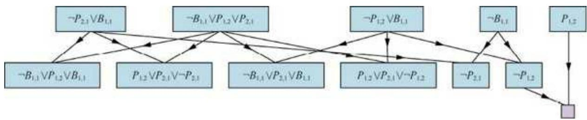  
图7-14 对wumpus世界的一个简单推断部分运用PL-R esolution 来证明查询 。顶行最左侧的4 $\mathcal { P } _ { 1 , 2 }$ 个子句的每一个与其他3个都互相成对，运用归结规则产生底行的子句。顶行的第3个和第4个子句结合生成 $\boldsymbol { \mathcal { P } } _ { 1 , 2 }$ ，它继而与 $P _ { 1 , 2 }$ 归结，生成空子句，表明查询被证明

# 3. 归结的完备性

作为对归结的讨论的总结，现在来了解为何PL-Resolution 是完备的。为此，我们引入子句集合S的 归结闭包 （resolution closure）RC(S )，即对 S 中子句及其生成子句反复使用归结规则可推得的所有子句的集合。归结闭包就是RL-R esolution 计算所得的变量 clauses 的最终值。易知 RC ( S )

必然是有限的：得益于因子提取，由 S 中出现的符号 P 1,…, P k 得出的子句数量是有限的。因此，PL-R esolution 总是能够终止。

命题逻辑中归结的完备性定理被称为 基本归结定理 （ground resolution theorem）：

如果一个子句集是不可满足的，则这些子句的归结闭包含有空子句。

定理的证明是通过其假言易位进行的：如果闭包RC(S )不含有空子句，则S 可满足。实际上，可以为 S 构建一个在P ,…,Pk上有适当真值的模型。构建过程如下：

对于 i从1 到 $k$ ，

● 如果 RC ( S ) 中的子句含有文字 $\mathcal { \mathbf { P _ { i } } }$ 且所有其他文字在对 P 1,…, P i −1 选定的赋值下为假，则对 P i 赋值为 false；  
● 否则，对 $P i$ 赋值为 true。

对 $P _ { 1 } , . . . , P _ { } k$ 的赋值是 S 的一个模型。要搞清楚这一点，我们假设其反面——在序列中的某处 i ，对符号 $P i$ 赋值使得某个子句 C 为假。此时，情况必然是 C 中所有其他文字都已经被对 P 1,…, P i−1的赋值定为假。因此， $C$ 的形式必然类似 或。如果只有其中一个在 RC ( S )中，则算法将对 P i 赋适当的值以使 $C$ 为真，因此仅在这两个子句都在 RC ( S )中时， C 才会为假。

现在，由于RC(S )在归结时是闭的，它会含有这两个子句的归结句，且这个归结句的所有文字已经被对 $P$ 1,…, P i −1的赋值定为假。这与我们的假设，即第一个为假的子句出现在 i 处矛盾。因此，我们证明了这种构建永远无法使 RC ( S )中的子句为假，也就是说它创建了一个 RC ( S )的模型。最后，由于 S 包含在 RC ( S )中，因此任意 RC ( S )的模型也是 S 本身的模型。

# 7.5.3 霍恩子句与确定子句

归结的完备性使其成为一种非常重要的推断方法。而许多实际情形并不需要用到归结的全部能力。一 些真实世界的知识库中的语句满足某些限制，这使得它们可以使用更为受限而更高效的推断算法。

其中一种受限形式是确定子句 （definiteclause），它是文字的析取式，其中 只有一个为正文字。例如，子句 是确定子句而 不是，因为它

更一般性的是霍恩子句 （Horn clause），它是文字的析取式，其中最多只有一个为正文字。因此所有的确定子句都是霍恩子句，没有正文字的子句也是霍恩子句——也被称为目标子句 （goalclause）。霍恩子句在归结时是闭的：如果归结两个霍恩子句，仍然会得到霍恩子句。还有一种类型是 k-CNF语句，它是每个子句最多含有 $k$ 个文字的CNF语句。

仅含有确定子句的知识库很有意义，原因有3个。

（1）每个确定子句都可以写成一个蕴涵式，前提是正文字的合取式，结论是一个正文字。（见习题7.DISJ。）例如，确定子句 可以写成蕴涵式。蕴涵形式的语句更容易理解：它说明如果智能体位于[1, 1]，且感知 $( L _ { 1 , 1 } \land B r e e z e ) \Rightarrow B _ { 1 , 1 }$ 到微风，则[1,1]有微风。在霍恩形式中，前提被称为体 （body）而结论被称为头 （head）。由单个正文字构成的语句，例如 $\textit { L } _ { 1 , 1 }$ ，被称为 事实 （fact）。它也可以写成 形式的蕴涵式，但只写成 $\textit { L } _ { 1 , 1 }$ 更为简洁。  
（2）用霍恩子句进行推断可以通过前向链接 （forward-chaining）算法和反向链接 （backward-chaining）算法完成，我们稍后会介绍。这些算法都很自然，因为它们的推断步骤很直观，便于人

类理解。这类推断是 逻辑编程 （logic programming）的基础，我们将在第9章进行讨论。

（3）用霍恩子句确定蕴含关系所需的时间与知识库大小呈线性关系，这格外令人满意。

# 7.5.4 前向链接与反向链接

前向链接算法PL-FC-E ntails? ( KB , q )确定单个命题符号 q （即查询）是否被确定子句的知识库所蕴含。它从知识库中的已知事实（正文字）开始。如果一个蕴涵式的所有前提都已知，则将其结论添加到已知事实的集合中。例如，如果 $\textit { L } _ { 1 , 1 }$ 和 Breeze 已知，且 在知识库中，则在知识库中添加 $B _ { 1 , 1 }$ 。这一过程持续进行，直到查询 $q$ 被添加，或直到无法进一步进行推断。这一算法在图7-15中展示，我们要记住的要点是它的运行时间是线性的。

用图和示例来理解算法是最好的办法。图7-16a展示了一个简单的霍恩子句知识库，其中有 A和B两个已知事实。图7-16b展示了绘制为与或图 （见第4章）的同一个知识库。在与或图中，用曲线连接的多个边表示一个合取式，每个边都要证明；而没有曲线连接的多个边表示一个析取式，证明任一边即可。图上很容易看懂前向链接是如何运作的。已知的叶节点（此处为A和B）具有真值之后，推断就会沿着图尽可能远地向上传递。当出现合取式时，传递过程开始等待，直到所有合取子句都已知。我们鼓励读者细致地研究这个示例。

function PL-FC-ENTAILS? $(KB,q)$ returns true or false  
inputs: KB, 知识库, 一个命题确定子句集  
q, 查询, 一个命题符号  
count $\leftarrow$ 一个表, 其中count[c]为子句c的初始符号数量  
inferred $\leftarrow$ 一个表, 其中inferred[s]初始对所有符号为false queue $\leftarrow$ 一个符号队列, 初始符号为KB中已知为true的符号  
while queue不空 do  
p $\leftarrow$ Pop(queue)  
if $p = q$ then return true  
if inferred[p] = false then  
inferred[p] $\leftarrow$ true  
foreach $p$ 在c.PREMISE中的知识库中的子句c do count[c]减1  
if count[c] = 0 then 将c.CONCLUSION添加到queue  
return false

图7-15命题逻辑的前向链接算法。 queue记录了已知为真但还没“处理过”的符号。表count记录每个蕴涵式尚未证明的前提数量。一旦queue中的新符号p 被处理，count就会为每个前提中出现p的蕴涵式减1（使用合适的索引方法，很容易在常数时间内完成）。如果count为0，则蕴涵式的所有前提都已知，因此其结论可以添加到queue。最后，我们还需要记录哪个符号已经被处理过，如此在已推断符号集inferred中的符号就无需被再次加入queue。这避免了重复的工作，也避免了由类似P⇒ Q 和 Q ⇒P这样的蕴涵式引起的循环

$$
P \Rightarrow Q
$$

$$
L \wedge M \Rightarrow P
$$

$$
B \wedge L \Rightarrow M
$$

$$
A \wedge P \Rightarrow L
$$

$$
A \wedge B \Rightarrow L
$$

A

B

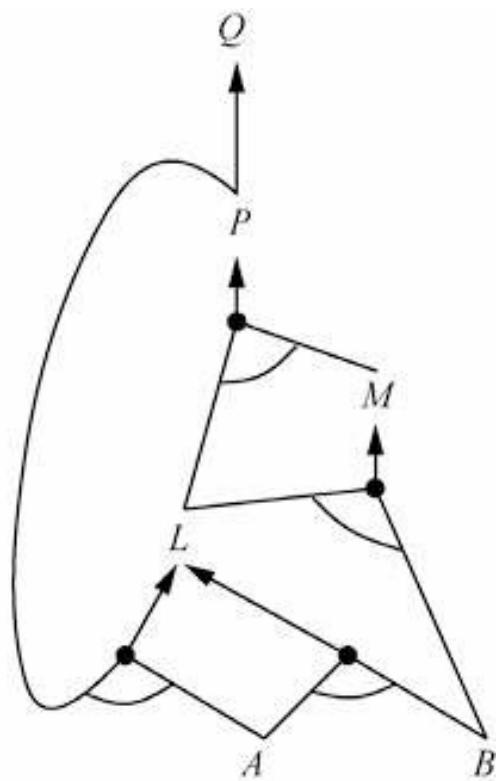  
  
  
图7-16 （a）一个霍恩子句集。（b）相应的与或图

显然，前向链接是 可靠的 ：每个推断实际上都是对肯定前件的运用。前向链接也是完备的 ：所有蕴含的原子语句都将被推得。要理解这一点，最简单的方法是考虑（在算法到达不动点，无法产生新推断的时候） inferred表格的最终状态。该表中每个推得的符号都为真，所有其他符号都为假。我们可以将这个表看作一个逻辑模型，且原始KB的每条确定子句在这个模型中都为真。

为理解这一点，可以假设其反面，即存在子句 $a _ { 1 } h \cdots \land a _ { k } \Rightarrow b$ 在模型中为假。则

在模型中必然为真，且 b 在模型中必然为假。这与我们假设的算法已经到达不动点相矛盾，因为我们此时可以将 $^ { b }$ 加入知识库。因此我们可以断定，不动点处推得的原子语句集定义了一个原始知识库的模型。更进一步地，知识库蕴含的任意原子语句 q 必然在其所有模型中都为真，在这个特定模型中也一样。因此，所有蕴含的原子语句q 必然会被算法推得。

前向链接是 数据驱动 （data-driven）推理这一更广泛概念的例子，也就是其注意力开始集中在已知数据的推理。它可以用于智能体，以便从收到的感知推导出结论，且常常是在没有特定查询的情况下。例如，wumpus世界的智能体可以用递增前向链接算法（即新的事实可以被加入队列来启动新的推断）将它的感知告知知识库。对人类来说，当获取新信息后会出现一定数量的数据驱动推理。例如，如果我在屋子里听到外面开始下雨，则我可能会想到取消野餐；但是，我大概不会想到邻居花园里最大的一朵玫瑰的第17片花瓣会淋湿——人类会对前向链接进行精心地控制，以免被无关的结果淹没。

反向链接算法如其名称所示，从查询开始反向运作。如果查询 q 已知为真，则不需要做任何操作。否则，算法将在知识库中找寻结论为q 的蕴涵式。如果这些蕴涵式的所有前提都可以（用反向链接）证明为真，则 q 为真。将反向链接算法用于图7-16的查询 Q 时，它反向地向图的下方运行，直到到达构成证明基础的已知事实集，即 A和B。算法实质上与图4-11的A nd -O r-G raph-Search算法完全相同。与前向链接一样，它的高效实现的时间复杂性是线性的。

反向链接是一种 目标导向推理 （goal-directed reasoning）。它对于回答类似“我现在该做什么？”和“我的钥匙在哪里？”这样的特定问题非常有用。通常，反向链接的代价远小于知识库规模的线性变化，因为这个过程仅涉及相关的事实。

本节，我们介绍两种高效的、基于模型检验的一般命题推断的算法，其中一种是基于回溯搜索的，另一种则基于局部爬山搜索。这些算法是命题逻辑的“技术”部分。首次阅读本章时可以略过本节内容。

我们描述的算法是用于可满足性检验的，即SAT问题。（如7.5节所述，可以通过检验 的不可满足性来检验蕴含 。）我们在7.5节中提到过找到满足逻辑语句的模型与找到约束满足问题的解的关系，因此这两种命题可满足性算法与6.3节的回溯算法和6.4节的局部搜索算法非常相似并不令人意外。尽管如此，这些算法本身还是极为重要的，因为许多计算机科学中的组合问题都可以被归为检验命题语句的可满足性。对可满足性算法的任何改进对于我们处理复杂性的能力都有巨大的作用。

# 7.6.1 完备的回溯算法

我们要探讨的第一个算法常称为戴维斯-普特南算法 （Davis-Putnamalgorithm），得名于马丁·戴维斯（Martin Davis）和希拉里·普特南（Hilary Putnam）的重要论文（Davis and Putnam, 1960）。这个算法实际上采用的是戴维斯、洛吉曼和洛夫兰所描述的版本（Davis,Logemann,and Loveland,1962），因此我们用所有4位作者姓氏的首字母DPLL命名这个算法。DPLL使用一个合取范式形式（即一个子句集）的语句作为输入。类似于B acktracking -S earch 和TT-E ntails ?，它本质上是递归地、深度优先地枚举可能的模型。它在TT-Entails?的基础上进行了3项改进。

●提前终止：算法可以用部分完成的模型来检测语句是否必然为真或为假。如果任一文字为真则子句为真，即使其他文字还没有真值；这样，整条语句在模型完成之前就可以断定其真值。例如，若 A 为真则语句 为真，无论 B 和 C 的值是什么。类似地，若任一子句为假，即其所有文字为假，则语句为假。同样，这种情形可能会在模型完成前很久就发生。提前终止避免了在搜索空间中检查全部子树。

●纯符号启发式方法：纯符号 是指在所有子句中“符号位”都相同的符号。例如，在3个子句、 和 中，A是纯符号，因为它只以正文字的形式出现；B也是纯符号，因为它总以负文字的形式出现。而C是不纯的。易知如果一条语句有模型，则存在一个模型对纯符号的赋值使其文字为真，因为这样做不会使子句为假。注意，在确定符号是否为纯时，算法可以忽略当前已构建的模型中已知为真的子句。例如，如果上述模型含有B=false，则子句 已经为真，且在剩余子句中 C 仅作为正文字出现，因此 C 变为纯符号。

● 单元子句启发式方法： 之前对 单元子句 的定义是只有一个文字的子句。在DPLL中，它也指那些除了一个文字外，其余文字都被模型赋值为false的子句。例如，如果模型含有 B = true，则简化为 ，这是一个单元子句。显然，要使这个子句为真， C 必须赋值为 $\pmb { \mathcal { C } }$ false。单元子句启发式方法在余下的部分出现分支前对所有这样的符号赋值。这种启发式的一个重要结果是，所有对知识库中的已有文字进行的证明（通过反证法）将立刻得证（见习题7.KNOW）。还要注意的是，对一个单元子句赋值可能会创建另一个单元子句，例如，当C被置为假， 也变成了单元子句，使得 A 被赋值为真。这种强制赋值的“级联”被称为 单元传播（unit propagation）。这类似于确定子句的前向链接。实际上，如果CNF表达式仅含有确定子句，则DPLL本质上复制了前向链接。（见习题7. DPLL。）

DPLL算法如图7-17所示，它给出了搜索程序的主要结构，但并未实现其细节。

function DPLL-SATISFIABLE?(s)returns true或falseinputs: $s$ ，一个命题逻辑中的语句

clauses $\gets i$ s的CNF表示的子句集合symbols $ s$ 中的命题符号列表returnDPLL(clauses,symbols,）

function DPLL(clauses, symbols, model) returns true or false  
if in model中每个子句都为true then return true  
if in model中clauses中的某个子句为false then return false  
P, value $\leftarrow$ FIND-PURE-SYMBOL(symbols, clauses, model)  
if P不空 then return DPLL(clauses, symbols - P, model $\cup \{P = \text{value}\}$ )  
P, value $\leftarrow$ FIND-UNIT-CLAUSE(clauses, model)  
if P不空 then return DPLL(clauses, symbols - P, model $\cup \{P = \text{value}\}$ )  
P $\leftarrow$ FIRST(symbols); rest $\leftarrow$ RESTsymbols)  
return DPLL(clauses, rest, model $\cup \{P = \text{true}\}$ ) or  
DPLL(clauses, rest, model $\cup \{P = \text{false}\}$ )

图7-17 用于检验命题逻辑语句可满足性的DPLL算法。F ind -P ure -S ymbol 和F ind -U nit -C lause背后的思路在正文中进行了介绍。这两个函数都返回一个符号（或返回空）以及要赋给这个符号的真值。和TT-E ntails ?一样，DPLL在部分模型上运行

图7-17没有展示使SAT求解器能够用于大规模问题的技巧。有趣的是，这些技巧实际上都很寻常，我们之前已经见过它们的其他形式。

（1） 分量分析 （如CSP中的塔斯马尼亚岛问题所见）：当DPLL为变量赋真值时，子句集可能会被分割成不相交的子集，我们称之为分量 ，它们没有共同的未赋值变量。给定一个高效探测这一状况的方法，求解器就可以通过对每个分量独立求解来加快速度。  
（2）变量排序与值排序 （如在6.3.1节的CSP中所见）：我们对DPLL的简单实现使用任意的变量顺序，并在赋值时总是先尝试赋真再尝试赋假。度启发式算法 （6.3.1节）建议在所有剩余子句中优先选择最常出现的变量。  
（3）智能回溯 （如在6.3.3节的CSP中所见）：许多用按时序回溯几小时都求解不了的问题，如果改用智能回溯直接回溯到导致冲突的相关点上，那么问题可以在几秒内求解。所有运用智能回溯的SAT求解器都使用冲突子句学习 的某种形式来记录冲突，以避免在后续的搜索中重复出现。通常只保留有限大小的冲突集，丢弃极少使用的冲突。  
（4）随机重启 （在4.1.1节用于爬山法）：有时单次运行似乎无法取得进展。此时，我们可以从搜索树的顶端重新开始，而非尝试继续搜索。重启后（对变量和值选取）进行不同的随机选择。第一次运行中学习到的子句在重启后依然被保留，这有助于对搜索空间进行剪枝。重启并不保证能更快地找到解，但它能够减小求解时间的方差。  
（5）聪明索引 （在许多算法中可以见到）：DPLL和其他现代求解器用到的加速方法需要快速索引“Xi作为正文字出现的子句集合”。这一任务相当复杂，因为算法所感兴趣的只是先前的变量赋值尚未满足的子句，因此索引结构必须在计算过程中动态更新。

有了这些改进，现代求解器可以处理有数千万个变量的问题。它们为诸如硬件验证和安全协议验证这样的领域带来革命性的变化。在此之前，这些领域需要十分费力的、手动证明。

我们已经在本书中见过了一些局部搜索算法，包括H ill -C limbing （4.1.1节）和S imulated -Annealing（4.1.2节）。只要我们选择了正确的评价函数，这些算法可就以被直接用于可满足性问题。由于目标是找出满足所有子句的赋值，一个对未满足的子句进行计数的评价函数就可以胜任这项工作。实际上，这正是用于CSP的M in -C onflict 算法所使用的量度（见6.4节）。这些算法都在完全赋值的空间采取动作，每次只翻转一个符号的真值。这个空间通常含有许多局部极小值，要跳出这些极小值，需要各种形式的随机方法。近年来，人们进行了大量实验，试图在贪婪性与随机性之间找到一个良好的平衡。

这些算法中最为简单和有效的算法之一是WalkSAT（如图7-18所示）。算法每次循环都选择一个未满足的子句，并在该子句中选择一个符号来翻转。选择要翻转的符号的方法有两种：（1）最小化新状态中未满足子句的数量的“最小冲突”方法；（2）随机挑选一个符号的“随机游走”方法。算法随机选取一种。

functionWALkSAT(clauses,p,max_flips)returns满足的模型或failure   
inputs: clauses, 命题逻辑的子句集合 $p$ , 选择“随机游走”动作的概率, 通常为0.5左右 max_flips, 放弃搜索前允许的值翻转次数

model $\leftarrow$ 对clauses中的符号随机赋值true/false  
for each $i = 1$ to max\_ flips do  
if model满足clauses then return model  
clause $\leftarrow$ 从clauses中随机选择的一个在model中为false的子句  
if RANDOM(0,1) $\leqslant p$ then  
在model中翻转一个从clause中随机选择的符号的值  
else 翻转clause中的符号以最大化已满足子句的数量  
return failure

图7-18通过随机翻转变量的值来检验可满足性的Walk SAT算法。这个算法有很多版本

当WalkSAT返回一个模型时，输入语句就是可满足的。但当它返回 failure时，则有两种可能的原因：语句不可满足，或我们需要多给算法一些时间。如果我们设定 且 p 0，WalkSAT最终将返回一个模型（如果存在的话），因为随机游走步骤终将遇到一个解。如果max_ flips为无穷大，而语句不可满足，则算法永远不会终止！

因此，当我们预计问题有解的时候，WalkSAT最为有用。例如，第3章和第6章讨论过的问题通常有解。但是，WalkSAT并不总是能检测到不可满足性，而对判定蕴含来说这是必备的。例如，wumpus世界中，一个智能体不能使用WalkSAT来可靠地证明一个方格是安全的。不过，它可以说：“我思考了一小时，都想不出存在一种这个方格不安全的可能世界。”这也许是个不错的经验性指示，表明方格是安全的，但它绝对不是一种证明。

# 7.6.3 随机SAT问题概览

某些SAT问题比其他要难。简单的问题可以用任意老算法求解，但由于我们知道SAT是NP完全的，至少有一些问题必须需要指数级的运行时间。在第6章中，我们见过一些针对某种问题的惊人发现。例如，对于回溯搜索算法， n 皇后问题被认为是相当困难的，而对于局部搜索方法，如最小冲突法，求解这一问题却非常容易。这是由于在赋值空间中，解的分布非常密集，任意初始赋值都能保证在其附近存在解。因此，n 皇后问题很简单，因为它是欠约束的 （underconstrained）。

当我们考虑合取范式的可满足性问题时，一个欠约束的问题是约束变量的子句非常少的情形。例如，下面是一条随机生成的3-CNF语句，它有5个符号和5个子句：

$(\neg D \vee \neg B \vee C) \wedge (B \vee \neg A \vee \neg C) \wedge (\neg C \vee \neg B \vee E) \wedge (E \vee \neg D \vee B) \wedge (B \vee E \vee \neg C)$

在32个可能的赋值中，有16个是这条语句的模型。因此，平均而言，只需进行两次随机猜测就可以找到一个模型。与大部分这样的欠约束问题一样，这是一个简单的可满足性问题。但是，一个 过约束的问题很可能没有解，因为相对于其变量数量，其子句数量过多。过约束问题通常很容易求解，因为这些约束将很快导致算法找出一个解，或进入无法逃离的死胡同。

要超越这些基本的直观理解，我们必须明确定义如何生成随机语句。记法 CNFk(m , n )表示一个有 $m$ 个子句、n 个符号的k-CNF语句，其中子句是均匀地、独立地、无放回地从所有有 k个文字的子句中选取的，文字的正负也是随机的。（一个符号在子句中不能多次出现，一个子句也不能在语句中多次出现。）

给定一个随机语句源，我们就可以测量可满足性的概率。图7-19a绘制了CNF (m , 50)的概率，也就是有50个变量、每条子句有3个文字的语句，这一概率被绘制为子句/符号，即m /n 的函数。如我们预期，对于较小的 m /n ，可满足性的概率接近0，而在较大的m /n 处这一概率接近0。概率在m / n = 4.3左右急剧下降。经验上，我们发现这一“峭壁”出现在大致相同的位置（对于 k = 3），并随着n 的增长越来越陡峭。

理论上， 可满足性阈值猜想 （satisfiability threshold conjecture）表明对所有 ，存在一个阈值比 r k ，使得当 n 接近无穷时 CNF k ( r n , n )可满足的概率对于所有低于阈值的 r 接近于1，对于所有高于阈值的 r 接近于0。即便对于如 k = 3这样的特例，这一猜想仍未被证明。不论这是不是一个定理，这样的阈值效应在可满足性问题和其他类型的NP困难问题中都是相当寻常的。

现在我们对可满足和不可满足问题分别会出现在什么地方有了很好的了解，接下来的问题是，困难的问题会出现在什么地方？其实它们也经常位于阈值处。图7-19b显示，阈值4.3处的50个符号的问题比阈值3.3处的相同问题大约难20倍。欠约束问题很好求解（因为很容易就能猜到一个解），而过约束问题不如欠约束问题简单，却仍然比恰好在阈值处的问题简单得多。

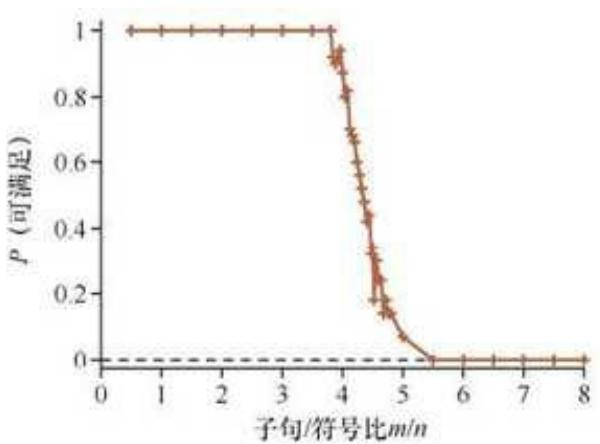

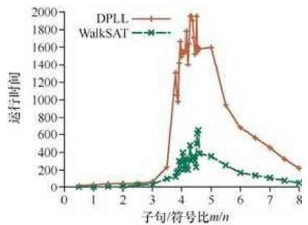  
  
图7-19（a）有 n 个符号的随机3-CNF语句的可满足概率图，概率是子句/符号比 m /n 的函数。（b）DPLL和WalkSAT在随机3-CNF语句上的（多次运行后测量的）运行时间中位数图。最为困难的问题的子句/符号比约为4.3

# 7.7 基于命题逻辑的智能体

本节我们将目前所学的内容结合起来构建使用命题逻辑的wumpus世界智能体。首先我们要使智能体能够根据其历史感知对世界的状态尽可能地进行推导。这需要写出动作效果的完整逻辑模型。随后我们介绍智能体在wumpus世界中如何使用逻辑推断。我们还会介绍智能体如何在不查看每次推断的历史感知的情况下有效地跟踪世界的变化。最后，我们介绍在已知其知识库在实际世界中为真的情况下，智能体如何使用逻辑推断来构建能确保达到目标的规划。

# 7.7.1 世界的当前状态

如本章开头所述，逻辑智能体通过用关于世界的语句知识库推导接下来的动作来运作。知识库由公理（也就是关于世界如何运行的一般知识）和从智能体在某个特定世界获得的感知语句构成。本节，我们聚焦于推导wumpus世界的当前状态这一问题，如我在哪里、方格是否安全等。

我们从7.4.3节开始收集公理。智能体知道起始方格没有无底洞（ $\mathcal { P } _ { 1 , 1 }$ ）也没有wumpus（）。此外，对于每个方格，它知道当且仅当一个方格的相邻方格有无底洞，该方格有微风；当且仅当一个方格的相邻方格有wumpus，该方格有臭味。由此，我们引入了具有如下形式的大量语句：

$$
\begin{array}{l} B _ {1, 1} \Leftrightarrow (P _ {1, 2} \vee P _ {2, 1}) \\ S _ {1, 1} \Leftrightarrow (W _ {1, 2} \vee W _ {2, 1}) \\ \end{array}
$$

智能体还知道恰恰只有一个wumpus。我们用两部分表示。首先，我们说 至少有一个 wumpus：

$$
W _ {1, 1} \vee W _ {1, 2} \vee \dots \vee W _ {4, 3} \vee W _ {4, 4}
$$

然后我们必须说 最多只有一个wumpus。我们对每对方格添加一个语句，来表明其中至少一个方格没有wumpus：

$$
\begin{array}{l} \neg W _ {1, 1} \vee \neg W _ {1, 2} \\ \neg W _ {1, 1} \vee \neg W _ {1, 3} \\ \end{array}
$$

$$
\neg W _ {4, 3} \vee \neg W _ {4, 4}
$$

到目前为止都还不错。现在让我们考虑智能体的感知。我们使用了 $S _ { 1 , 1 }$ 来表示[1,1]有臭味，那么我们可以只用一个命题Stench来表示智能体感知到臭味吗？遗憾的是，不行。如果在之前的时间步中没有臭味， 就已经被断言，那么新的断言将与之矛盾。我们发现，如果感知只对当前时间的事情进行断言，这个问题就很容易求解。如此，假如时间步（与输入图7-1中Make-Percept -S entence 的一样）是4，则我们在知识库中添加 Stench 4 而非 Stench ，这样就能轻松地避免与 矛盾。对微风、碰撞、闪光和惨叫等感知也同样处理。

这个将命题与时间步相关联的思路可以拓展到这个世界中所有随时间变化的部分。例如，最初知识库中有 $I _ { 1 , \bot } ^ { 0 }$ — 智能体在时刻0位于[1, 1]，以及 FacingEast 0 、 HaveArrow 0 和 WumpusAliv e 0 。

我们使用 流 （fluent，源于拉丁语 f luens ，意为流动）来表示世界随时间变化的部分。“流”与2.4.7

节所述的对因子化表示的讨论中的“状态变量”同义。与世界的不变部分相关的符号不需要时间上标，它们有时被称为 非时序变量 （atemporal variable）。

我们可以将微风和臭味直接与体验到这些感知的方格的属性连接。 [1] 对任意时间步 t 和任意方格[x, y]，我们断言

[1]7.4.3节出于简便考虑，隐藏了这项要求。

$$
\begin{array}{l} L _ {x, y} ^ {t} \Rightarrow (B r e e z e ^ {t} \Leftrightarrow B _ {x, y}) \\ L _ {x, y} ^ {t} \Rightarrow \left(S t e n c h ^ {t} \Leftrightarrow S _ {x, y}\right) \\ \end{array}
$$

当然，现在我们需要能够使智能体跟进像因此，用第3章的术语来说，我们需要将wumpus世界的 转移模型 写成逻辑语句的集合。

首先我们需要表示发生动作的命题符号。与感知一样，这些符号用时间索引。因此 Forward0 表示智能体在时刻0执行前进动作。习惯上，给定时间步的感知先发生，然后是这个时间步上的动作，然后是到下一个时间步的转移。

为描述世界如何变化，我们可以试着写出指明动作在下一个时间步产生的结果的效应公理 （effectaxiom）。例如，如果智能体位于[1, 1]，在时刻0时面朝东并向前走，结果是智能体位于方格[2, 1]且不再在[1, 1]：

$$
L _ {1, 1} ^ {0} \wedge \text {F a c i n g E a s t} ^ {0} \wedge \text {F o r w a r d} ^ {0} \Rightarrow \left(L _ {2, 1} ^ {1} \wedge - L _ {1, 1} ^ {1}\right) \tag {7-1}
$$

对每个可能的时间步、16个方格中的每一个方格、4个方向中的每一个方向我们都需要类似这样的语句。对于其他动作，即抓取、射击、攀爬、左转、右转我们也需要类似的语句。

假设智能体在时刻0决定向前移动，并在其知识库对此进行了断言。给定式（7-1）的效应公理，结合时刻 时对状态的初始断言，智能体可以推得它位于 。也就是， $( K B , \bar { L } _ { 2 , 1 } ^ { 1 } ) = t r u e$ 。到目前为止，一切还好。遗憾的是，如果我们A sk (KB,HaveArrow1)，答案会是假，也就是智能体无法证明它仍然有箭，它也无法证明它没有箭！信息丢失了，因为效应公理没有说明动作的结果未改变哪些状态。对这项功能的需求引出了框架问题 。[2] 框架问题的一个可能的求解办法是明确地添加断言所有不变命题的框架公理 。例如，对于每个时刻t，我们有

[2] “框架问题”（frame problem）的名字来源于物理学中的参照系（frame of reference），也就是测量运动时假设的静止背景。电影的帧（frame）也借用了它的含义，其中前景变化时，大部分背景保持静止。

$$
\begin{array}{l} F o r w o r d ^ {t} \Rightarrow \left(H a v e A r r o w ^ {t} \Leftrightarrow H a v e A r r o w ^ {t + 1}\right) \\ F o r w a r d ^ {t} \Rightarrow \left(W u m p u s A l i v e ^ {t} \Leftrightarrow W u m p u s A l i v e ^ {t + 1}\right) \\ \end{array}
$$

其中明确地提到了在采取前进动作时所有从时刻t到时刻t+1维持不变状态的命题。尽管智能体现在已经知道它在前进后仍然有箭，且wumpus没有死去或复活，但激增的框架公理似乎相当低效。在有m 个不同动作和n个流的世界，框架公理集的大小为O (mn)。这种框架问题被称作 表示框架问题 。这个问题在人工智能史上扮演过重要的角色，我们在本章最后的参考文献与历史注释中将进行进一步探索。

表示框架问题很重要，因为即便保守来说，真实世界中的流也很多。幸运的是，对我们人类来说，每个动作改变的流通常不多于k个（ k是某个较小的值），也就是说世界具有局部性 。求解表示框架问题需要定义公理集大小为 O ( mk )而非 O ( mn )的转移模型。还有一个问题是 推断框架问题

：将 t 步动作规划的结果在 O ( kt )时间而非 O ( nt )时间内前向推进的问题。

问题的解是关注于写出关于流而非动作的公理。这样的话，对于每个流 $F$ ，以时刻t时的所有流（包括 $F$ 本身）和时刻t时可能发生的动作来定义 $F ^ { t + 1 }$ 的真值的公理。现在， $F ^ { t + 1 }$ 的真值可以用两种方法之一来确定：一种是时刻 t的动作导致 $F$ 在t+1为真，另一种是 $F$ 在时刻t已经为真而时刻 t 的动作没有导致它为假。这种形式的公理叫作 后继状态公理 （successor-state axiom），具有如下形式：

$$
F ^ {t + 1} \Leftrightarrow A c t i o n C a u s e s F ^ {t} \vee \left(F ^ {t} \wedge - A c t i o n C a u s e s N o t F ^ {t}\right)
$$

有箭（HaveArrow）的公理是最简单的后继状态公理。因为没有重新装填箭支的行动，ActionCauses $F ^ { t }$ 部分可以去掉，所以我们有

$$
\text {H a v e A r r o w} ^ {t + 1} \Leftrightarrow \left(\text {H a v e A r r o w} ^ {t} \wedge - \text {S h o o t} ^ {t}\right) \tag {7-2}
$$

对智能体的位置来说，后继状态公理要更为复杂。例如，如果（a）智能体在面向南方时从[1, 2]，或面向西方时从[2,1]向前移动，或者（b） $I _ { 1 , 1 } ^ { 1 }$ 已经为真且动作未产生移动（因为动作不是向前或动作导致撞墙），则 $\mathbb { Z } _ { 1 , 1 } ^ { \mathtt { r } + 1 }$ 为真。用命题逻辑写出，就是

$$
\begin{array}{r l} L _ {1, 1} ^ {t + 1} & \Leftrightarrow (L _ {1, 1} ^ {t} \wedge (F o r w a r d ^ {t} \vee B u m p ^ {t + 1})) \\ & \vee (L _ {1, 2} ^ {t} \wedge (F a c i n g S o u t h ^ {t} \wedge F o r w a r d ^ {t})) \\ & \vee (L _ {2, 1} ^ {t} \wedge (F a c i n g W e s t ^ {t} \wedge F o r w a r d ^ {t})) \end{array} \tag {7-3}
$$

习题7.SSAX要求写出剩余的wumpus世界的流的公理。

给定完整的后继状态公理和本节开始列出的其他公理，智能体就能够询问和回答世界当前状态的所有可解答问题。例如，在7.2节，感知和动作的初始序列是

$$
\begin{array}{l} \neg S t e n c h ^ {0} \wedge \neg B r e e z e ^ {0} \wedge \neg G l i t t e r ^ {0} \wedge \neg B u m p ^ {0} \wedge \neg S c r e a m ^ {0}; F o r w a r d ^ {0} \\ \neg S t e n c h ^ {1} \wedge B r e e z e ^ {1} \wedge \neg G l i t t e r ^ {1} \wedge \neg B u m p ^ {1} \wedge \neg S c r e a m ^ {1}; T u r n R i g h t ^ {1} \\ \neg S t e n c h ^ {2} \wedge B r e e z e ^ {2} \wedge \neg G l i t t e r ^ {2} \wedge \neg B u m p ^ {2} \wedge \neg S c r e a m ^ {2}; T u r n R i g h t ^ {2} \\ \neg S t e n c h ^ {3} \wedge B r e e z e ^ {3} \wedge \neg G l i t t e r ^ {3} \wedge \neg B u m p ^ {3} \wedge \neg S c r e a m ^ {3}; F o r w a r d ^ {3} \\ \neg S t e n c h ^ {4} \wedge \neg B r e e z e ^ {4} \wedge \neg G l i t t e r ^ {4} \wedge \neg B u m p ^ {4} \wedge \neg S c r e a m ^ {4}; T u r n R i g h t ^ {4} \\ \neg S t e n c h ^ {5} \wedge \neg B r e e z e ^ {5} \wedge \neg G l i t t e r ^ {5} \wedge \neg B u m p ^ {5} \wedge \neg S c r e a m ^ {5}; F o r w a r d ^ {5} \\ S t e n c h ^ {6} \wedge \neg B r e e z e ^ {6} \wedge \neg G l i t t e r ^ {6} \wedge \neg B u m p ^ {6} \wedge \neg S c r e a m ^ {6} \end{array}
$$

此时，有A s k ，因此智能体知道它在什么位置。而且，A s k和A s k ，因此智能体已经找到了wumpus和一个无底洞。对于智能体最重要的问题是一个方格是否能够进入，也就是这个方格是否没有无底洞也没有wumpus。为此添加公理很容易，形式如下：

$$
O K _ {x, y} ^ {t} \Leftrightarrow \neg P _ {x, y} \wedge \neg \left(W _ {x, y} \wedge W u m p u s A l i v e ^ {t}\right)
$$

最后，A s k ，因此方格[2, 2]可以安全进入。实际上，给定一个如DPLL的

可靠且完备的推断算法，智能体可以回答关于哪个方格安全的任意可解答问题，而且对于小型到中型的wumpus世界可以在几毫秒内完成回答。

求解表示框架问题和推断框架问题是一步重大的前进，但仍有一个亟待解决的问题：我们需要确认一个动作的所有必要的前提都成立才能保证结果效应。我们说过向前动作使智能体向前方移动，除非前方有墙，但也有许多其他意外会导致动作失败：智能体可能会被绊倒，会犯心脏病，会被巨型蝙蝠抓走，诸如此类。明确所有这些意外被称为资格问题 （qualification problem）。它在逻辑学的范畴内没有完备的解，在决定要多么详细地明确模型以及要忽略哪些细节时，系统设计者必须做出很好的判断。我们将在第12章中看到，概率论允许以非显式的方式总结所有意外。

# 7.7.2 混合智能体

推导世界状态的多个方面的能力可以直接与条件-动作规则（见2.4.2节）以及第3章和第4章的问题求解算法结合，产生一个wumpus世界的混合智能体 。图7-20展示了达成这个目标的一种可能方式。智能体程序维护并更新一个知识库和一个当前规划。初始知识库含有非时变公理——不依赖于时间t的公理，例如将方格的微风与无底洞的存在联系起来的公理。在每个时间步，新的感知和所有依赖于 t的公理，如后继状态公理，被加入知识库。（7.7.3节将解释为何智能体不需要未来时间步的公理。）然后，智能体通过向知识库询问来使用逻辑推断，以找出哪些方格是安全的且未被访问过。

智能体程序的主体根据目标优先级降序创建一个规划。首先，如果存在闪光，则程序创建一个抓取金块、原路返回初始位置并爬出洞穴的规划。否则，如果没有当前规划，程序会规划一个前往最近的、未被访问过的安全方格的路线，并确保路线仅经过安全方格。

路径规划使用A * 搜索 算法完成，而没有用A sk 。如果没有可探索的安全方格，下一步——如果智能体还有箭的话 ——就是试图对一个可能有wumpus的位置射击来创造一个安全方格。这是通过询问A s k 在何处为假完成的，也就是智能体还不知道的没有wumpus的地方。函数Plan -S hot （图中未展示）使用P lan -R oute 规划一系列动作来完成这次射击。如果失败，则程序寻找尚未证明是不安全的方格，也就是询问A sk 返回假的方格。如果不存在这样的方格，则任务不可能完成，智能体撤退到[1, 1]并爬出洞穴。

function HYBRID-WUMPUS-AGENT(percept) returns a action  
inputs: percept, 一个列表，[stench, breeze, glitter, bump, scream]  
persistent: KB，知识库，初始为非时序的“wumpus physics”t，计数器，初始为0，表示时间plan，动作序列，初始为空  
TELL(KB, MAKE-PERCEPT-SENTENCE(percept, t))  
告知KB对于时刻t的时序“physics”语句  
safe $\leftarrow \{[x,y]:\mathrm{Ask}(KB,OK_{x,y}^{\prime}) = \mathrm{true}\}$ if Ask(KB, Glitter) = true then  
plan $\leftarrow$ [Grab] + PLAN-ROUTE(current, {1,1}], safe) + [Climb]  
if plan为空 then  
unvisited $\leftarrow \{[x,y]:\mathrm{Ask}(KB,L_{x,y}^{\prime}) = \mathrm{false}\text{对所有} t^{\prime}\leqslant t\}$ plan $\leftarrow$ PLAN-ROUTE(current, unvisited $\cap$ safe, safe)  
if plan为空且Ask(KB, HaveArrow) = true then  
possible_wumpus $\leftarrow \{[x,y]:\mathrm{Ask}(KB,\neg W_{x,y}) = \mathrm{false}\}$ plan $\leftarrow$ PLAN-SHOT(current, possible_wumpus, safe)  
if plan为空 then //没有选择只能冒险  
not_unsafe $\leftarrow \{[x,y]:\mathrm{Ask}(KB,\neg OK_{x,y}^{\prime}) = \mathrm{false}\}$ plan $\leftarrow$ PLAN-ROUTE(current, unvisited $\cap$ not_unsafe, safe)  
if plan为空 then  
plan $\leftarrow$ PLAN-ROUTE(current, {1,1}], safe) + [Climb]  
action $\leftarrow$ POP.plan)  
TELL(KB, MAKE-ACTION-SENTENCE(action, t))  
t $\leftarrow t + 1$ return action  
function PLAN-ROUTE(current, goals, allowed) returns a动作序列  
inputs: current, 智能体当前位置  
goal, 方格的集合；尝试规划一条到其中一个方格的路线allowed，可以构成部分路线的方格的集合  
problem $\leftarrow$ ROUTE-PROBLEM(current, goals, allowed)  
return SEARCH(problem) //第3章中介绍的任意一种搜索算法

图7-20wumpus世界的一个混合智能体。它使用命题知识库来推断世界的状态，结合问题求解搜索和论域特定代码来选择动作。每次调用H ybrid -Wumpus-A gent，它都会将感知添加到知识库，然后依据先前定义的规划或创建一个新规划，弹出这个规划的第一步作为下一个要采取的动作

# 7.7.3 逻辑状态估计

图7-20所示的智能体工作得不错，但它有一个重大弱点：随着时间流逝，涉及对A sk调用的计算开销不断增大。这主要是由于所需的推断不得不回到越来越早的时间点，并涉及越来越多的命题符号。显然，这是不可持续的——我们不能让一个智能体处理每次感知的时间随着其寿命的增长成比例地增加！我们真正需要的是常数更新时间，也就是，与t无关。一个显然的答案是保存或缓存（cache）推断的结果，以便下一个时间步的推断过程构建在先前的结果上，而非必须从零开始。

如我们在4.4节所见，感知的历史和所有其后果都可以用信念状态 代替，即对所有可能的当前世界

状态集合的某种表示 $\underline { { \cdots } } = \underline { { \cdots } }$ 江 。在新感知到来时更新信念的过程被称为状态估计 （见4.4.4节）。而在4.4节，信念状态是状态的显式列表，此处我们可以使用含有关于当前时间步的命题符号，以及非时变符号的逻辑语句。例如，逻辑语句

$$
\text {W u m p u s A l i v e} ^ {1} \vee L _ {2, 1} ^ {1} \wedge B _ {2, 1} \wedge \left(P _ {3, 1} \vee P _ {2, 2}\right) \tag {7-4}
$$

代表时刻1的所有状态的集合，这时wumpus还活着，智能体位于[2, 1]，方格中有微风，[3, 1]或[2,2]其中之一有无底洞或两个都有无底洞。

维护一个精确的、逻辑公式形式的信念状态并不简单。如果对于时刻t有 $n$ 个流符号，则会有2 n个可能的状态，也就是对这些符号的所有赋值。而现在，信念状态的集合是物理状态的超集（所有子集的集合）。总共有2n 个物理状态，因此有 $2 ^ { 2 \pi }$ 个信念状态。即便我们对逻辑公式尽可能地使用紧凑的编码方式，即每个信念状态用一个二进制数表示，我们也需要 $\log _ { 2 } ( 2 ^ { 2 ^ { 2 } } ) = 2 ^ { n }$ 位来标记当前的信念状态。也就是说，精确的状态估计需要的逻辑公式的规模可能是符号数量的指数级别的。

一个用于近似状态估计的常见且自然的方法是用文字的合取式表示信念状态，即1-CNF公式。为此，智能体程序只需要在给定时刻t−1的信念状态的情况下，为每个符号 $X ^ { t }$ 证明 $X ^ { t }$ 和 $\mathcal { X } ^ { \varepsilon }$ （以及真值未知的非时变符号）即可。可证明文字的合取式成为了新的信念状态，先前的信念状态被丢弃。

要了解的是，随着时间流逝，这个方法可能会损失一些信息。例如，如果式（7-4）的语句是真正的信念状态，则 $P$ 3,1和 P 2,2都无法被单独证明，也都不会出现在1-CNF信念状态中。（习题7.HYBR探索了这一问题的一个可行的解法。）另外，由于1-CNF信念状态中的每一个文字都是由前一信念状态证得的，而且初始信念状态是一个真实的断言，可得出整个1-CNF信念状态必然为真。因此，1-CNF信念状态所表示的可能状态的集合包含了给定全部感知历史时的所有确实可能的状态 。如图7-21所示，1-CNF信念状态就是准确信念状态的一个外包络，即保守近似（conservativeapproximation）。我们可以在人工智能的许多领域反复见到复杂集合的保守近似这一概念。

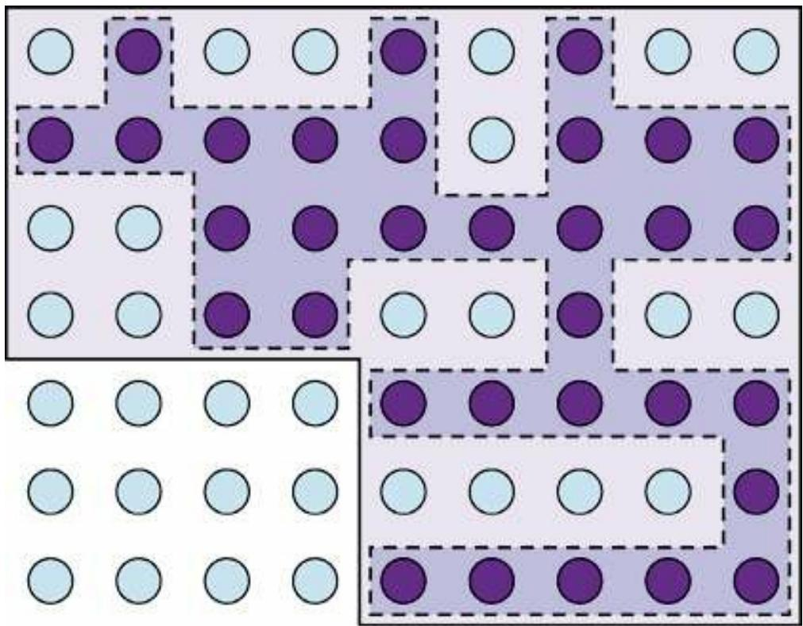  
图7-211-CNF信念状态（粗实线外轮廓）作为对准确信念状态（虚线轮廓的深色区域）的简单的、可表示的保守近似。每个可能世界都使用圆圈表示，深色圆圈与所有感知一致

# 7.7.4 用命题推断进行规划

图7-20所示的智能体使用逻辑推断来确定哪个方格是安全的，但使用了A * 搜索来进行规划。本节展示如何通过逻辑推断来进行规划。它的思想非常简单。

（1）构建一个语句，它含有：

a.对于初始状态的断言集Init0 ；  
b.到最大为时刻t为止的每一时间步的所有可能动作的后继状态公理Transition;  
c. 目标在时刻 t 达成的断言 。

（2）将所有语句提供给SAT求解器。如果求解器找到一个可满足的模型，则目标是可达成的；如果语句不可满足，则问题无解。  
（3）假设找到了一个模型，从模型中提取代表动作并被赋值为true的变量。它们代表一个达成目标的规划。

图7-22展示了一个命题规划程序SATPlan。它实现了上述的想法，仅做了一点改变。由于智能体并不知道它需要多少步才能达成目标，算法会尝试每个可能的t步，直到某个可行的最大规划长度Tmax。这样，如果这一规划存在的话，它能够确保找到最短的规划。由于SATPlan搜索解的特定方式，它无法在部分可观测的环境中使用；SATP lan 只能将不可观测的变量设定为它所需的值来求解。

function SATPLAN(init,transition,goal, $T _ { m a x }$ returns解或failure

inputs:init,transition,goal，它们构成了问题的描述

$T _ { \mathfrak { m a x } }$ ，规划的长度上限

for $t = 0$ to $T_{\mathrm{max}}$ do  
cnf $\leftarrow$ TRANSLATE-TO-SAT(init, transition, goal, t)  
model $\leftarrow$ SAT-SOLVER(cnf)  
if model非空 then  
return EXTRACT-SOLUTION(model)  
return failure

图7-22SATPlan算法。规划问题被转换为CNF语句，其中目标被断言在固定的时间步t时成立，到t为止的每个时间步都含有公理。如果可满足性算法找到了一个模型，则通过查看指向动作并在模型中被赋值为true的命题符号来提取规划。如果模型不存在，则将目标后移一步，重复这一过程

使用SATPlan 的关键步骤是构建知识库。大体来看，7.7.1节所述的wumpus世界公理似乎足以构成上述步骤1中的a和b。但蕴含（正如用A sk 来检验的那些）和可满足性对公理的要求有重要的区别。

例如，考虑智能体的位置初始为[1, 1]，假设智能体的目标仅为在时刻1时移动到[2,1]。初始知识库含有 ， 目标 为 。如果断言 Forwar d 0 ，则我们可以使用A sk 证得 ；如果被断言的是Shoo t 0 ，则我们无法证 得 。现在，SATP lan 会找到规划[ Forwar d 0]，目前看起来没什么问 $\bf { \pmb { \mu } } _ { \bf { \pmb { \mu } } _ { \bf { \pmb { \mu } } _ { \bf { \Lambda } } } } \bf { \pmb { \mu } } _ { \bf { \pmb { \mu } } _ { \bf { \Lambda } } } \bf { \pmb { \mu } } _ { \bf { \pmb { \mu } } _ { \bf { \Lambda } } } \bf { \pmb { \mu } } _ { \bf { \pmb { \mu } } _ { \bf { \Lambda } } }$ 题。

遗憾的是，SATPlan 也会找到规划[Shoo t0]。为什么会这样呢？要找出其原因，先检查一下SATPlan 构建的模型：它包括赋值 $\mathbf { \pmb { \mu } } _ { \mathbf { \pmb { \mu } } } ( \mathbf { \pmb { \mu } } _ { \mathbf { \pmb { \mu } } } ( \mathbf { \pmb { \mu } } _ { \mathbf { \pmb { \mu } } } ( \mathbf { \pmb { \mu } } _ { \mathbf { \pmb { \mu } } } ( \mathbf { \pmb { \mu } } _ { \mathbf { \pmb { \mu } } } ( \mathbf { \pmb { \mu } } _ { \mathbf { \pmb { \mu } } } ( \mathbf { \pmb { \mu } } _ { \mathbf { \pmb { \mu } } } ( \mathbf { \pmb { \mu } } _ { \mathbf { \mu } } \mathbf { \Lambda } _ { \mathbf { \pmb { \mu } } } _ + \mathbf { \pmb { \mu } } _ { \mathbf { \mu } } \mathbf { \Lambda } _ { \mathbf { \pmb { \mu } } } ) \mathbf { \pmb { \mu } } _ { \mathbf { \pmb { \mu } } } ( \mathbf { \pmb { \mu } } _ { \mathbf { \mu } } ( \mathbf { \pmb ) } _ { \mathbf { \mu } } ( \mathbf { \mu } _ { \mathbf \mu } _ { \mathbf { \mu } } ( \mathbf _ { \mu } _  \mathbf { \Lambda } _ \mathbf { \pmb { \mu } } _ \mathbf { \Lambda } _ { \mathbf \mu } _ ) $ 时刻1时也会在[2,1]。有人会问：“我们不是刚说过智能体在时刻0时位于[1,1]吗？”的确如此，但

我们没有告诉智能体它不能同时位于两个位置！对蕴含来说 ， 是未知的，因此不能被用于证 $L _ { 2 , 1 } ^ { \infty }$ 明；而对于可满足性， 是未知的，因此可以被设定为任意有助于达成目标的值。

对知识库来说，SATPlan 是很好的调试工具，因为它能够暴露出知识缺失的地方。在这个例子中，我们可以使用类似于用来断言恰恰只存在一个wumpus的语句集，来断言在每个时刻智能体只

能位于一个位置，以修复知识库。或者，我们可以对除[1,1]之外的所有位置断言 ；关于位置的后继状态公理用于处理之后的时刻。相同的修复方式也可以用于确保智能体在一个时刻有且仅有一个朝向。

但SATPlan 还有更怪异的表现。首先是，它会找出含有不可能采取的动作的模型，例如在没有箭支的时候射击。要理解其原因，我们需要更为仔细地查看后继状态公理，如式（7-3），对于前提无法满足的动作的描述。公理的确正确地预测了执行这种动作不会产生任何结果（见习题7.SATP），但它没有表明这一动作不能被执行！要避免生成含有不合规动作的规划，我们必须加入表明动作的出现需要满足其前提的前提公理 （precondition axiom）。[3] 例如，我们需要说，对于每个时刻t，有

[3]注意，加入前提公理意味着我们不再需要在后继状态公理中包含动作的前提条件。

$$
S h o o t ^ {t} \Rightarrow H a v e A r r o w ^ {t}
$$

这就确保了如果规划在某一时刻选择采取动作Shoot，则此时智能体必然有一支箭。

SATPlan 的另一个怪异的行为是它会创建具有多个同时进行的动作的规划。例如，它会生成一个Fotward 0 和Shoot0 都为真的模型，而这是不允许的。要解决这个问题，我们引入动作排除公理（action exclusion axiom）：对于每对动作 和 ，我们加入公理

$$
- A _ {i} ^ {\prime} \vee - A _ {j} ^ {\prime}
$$

可能有人会提出同时向前走并射击并不是很困难，但如果是同时抓取并射击的话就相当不现实了。通过只对相互冲突的每对动作施以动作排除公理，可以使规划同时含有多个动作——而由于SATPlan能找出最短的合规规划，我们就可以确定它能够利用同时动作这个能力。

总之，SATPlan能对含有初始状态、目标、后继状态公理、前提公理和动作排除公理的语句找出模型。由于不再存在任何错误的“解”，我们可以证明这一公理集是充分的。所有满足命题语句的模型都将是原始问题的有效解。现代SAT求解技术使得这一方法相当实用。例如，一个DPLL风格的求解器可以毫不费力地生成图7-2所示的wumpus世界的解。

本节已经讲过构建智能体的一个陈述性方法：智能体通过结合在知识库中断言语句和执行逻辑推断运行。这种方法有一些弱点，它们就隐含于类似“对于每个时刻t”和“对于每个方格[x,y]”这样的表述中。对于所有实用的智能体，这些表述必须用从一般语句模式中自动生成实例的代码来实现，这些实例被用于插入知识库中。对于一个规模适中（相当于小型计算机游戏的大小）的wumpus世界，我们可能需要一个100×100的场地和1000个时间步，这样的话知识库中的语句就会有上亿条之多。

这种情况不仅相当不现实，也揭露了一个深层次的问题：我们对wumpus世界的理解（即它的“物理学”在所有方格和所有时刻都一样）不能直接用命题逻辑的语言来表示。要解决这个问题，我们需要更有表达能力的语言，也就是那种可以自然地写出像“对于每个时刻 t ”和“对于每个方格[ x , y]”这种表述的语言。第8章所述的一阶逻辑就是一种这样的语言。在一阶逻辑中，任意大小、任意时长的wumpus世界都可以用大约10条逻辑语句来描述，而非1000万条乃至1万亿条。

小结

我们已经介绍了基于知识的智能体，也展示了如何定义一种逻辑，以便使这种智能体能够对世界进行推理。本章重点如下。

●智能体需要关于世界的知识来获得良好的决策。  
●知识包含在智能体中，其形式为存储于知识库 中的、用知识表示语言 表述的语句 。  
●一个基于知识的智能体由一个知识库和一套推断机制组成。它的运作方式是在知识库中存储关于世界的语句，使用推断机制推断新语句，并使用这些语句来决定采取何种动作。  
●一种表示语言是用其语法 和语义 来定义的，语法规定了语句的结构，语义定义了每个可能世界 或 模型 中每条语句的真值 。  
● 语句之间的 蕴含 关系对于我们对推理的理解非常重要。在所有 $\pmb { \alpha }$ 为真的世界中 $\beta$ 也为真，则语句 $\pmb { \alpha }$ 蕴含语句 $\beta$ 。其等价定义包括语句 $\alpha \Rightarrow \beta$ 的 有效性 和语句 的 不可满足性。  
●推断是从旧语句推得新语句的过程。可靠的 推断算法只推出蕴含的语句，完备的 算法则可以推得所有蕴含的语句。  
●命题逻辑 是由命题符号 和逻辑联结词 构成的简单语言。它可以处理已知为真、为假或完全未知的命题。  
●给出固定命题词汇表的前提下，可能的模型的集合是有限的，因此蕴含可以用枚举模型来检验。用于命题逻辑的高效模型检验 推断算法包括回溯和局部搜索方法，它们通常能快速求解大规模问题。  
●推断规则 是可靠推断的模式，它可以用于证明。归结 规则能产生一个用于知识库的完备推断算法，以 合取范式 的形式表示。前向链接 和反向链接 是霍恩形式 知识库的非常自然的推理算法。  
●如WalkSAT这样的 局部搜索 方法可以用于问题求解。这种算法是可靠的，但不是完备的。  
●逻辑状态估计 需要使描述可能状态集的逻辑语句与历史观测保持一致。每一步更新都需要使用环境的转移模型进行推断，转移模型是根据规定流 的变化方式的后继状态公理 构建的。  
●逻辑智能体内部的决策可以用求解SAT的方式进行：找出描述能达到目标的未来动作序列的可能的模型。这个方法仅能用于完全可观测或无传感器环境。  
●命题逻辑无法扩大到大小无限制的环境中，因为它有限的表达能力不能简洁地处理时间、空间和对象间关系的通用模式。

读者服务：


微信扫码关注【异步社区】微信公众号，回复“e59810”获取本书配套资源以及异步社区15天VIP会员卡，近千本电子书免费畅读。

# 第8章

# 一阶逻辑

在本章中，我们将注意到世界被赋予了许多对象，其中一些对象与另一些对象相关，而我们努力对其进行推理。

命题逻辑足以展示逻辑、推断和基于知识的智能体的基本概念。遗憾的是，命题逻辑的表达能力有限。本章我们介绍一阶逻辑 ，[1] 它可以简洁地表达更多东西。我们在8.1节中总体上讨论表示语言，在8.2节中介绍一阶逻辑的语法和语义，然后在8.3节和8.4节中展示一阶逻辑在简单表示中的运用。

[1] 一阶逻辑也称为 一阶谓词演算 （first-order predicate calculus），可缩写为FOL或FOPC。

# 8.1 回顾表示

本节我们讨论表示语言的特性。编程语言（如C++、Java或Python）是常用的最大一类形式化语言。程序中的数据结构可以用来表示事实，例如，程序可以使用一个4×4数组表示wumpus世界的内容。这样的话，编程语言中的语句 就是断言在方格[2, 2]中有无底洞的一种很自然的方式。将一系列这样的语句合起来，就足以对wumpus世界进行模拟。

编程语言欠缺的是从其他事实推导事实的通用机制：对数据结构的每次更新都要使用领域特定的过程，而过程中的具体细节是由程序员根据其自身所具有的该领域的知识进行推导的。这种过程性的方法可与命题逻辑的陈述性 （declarative）特性相对比，在命题逻辑中知识与推断是独立的，而推断完全是领域无关的。SQL数据库融合了陈述性与过程性知识。

程序（以及数据库）中数据结构的另一个缺点是缺少简便的表示方式来描述像“在方格[2, 2]或[3, 1]中有无底洞”或“如果wumpus在[1, 1]中，则它不在[2, 2]中”这样的概念。程序可以为每个变量存储一个值，一些系统也允许这个值为“未知”，但它们缺乏直接处理部分信息的表达能力。

命题逻辑是说明性语言，因为它的语义是基于语句与可能世界之间的真值关系的。使用析取和否定，命题逻辑有了足够的表达能力来处理部分信息。命题逻辑还有一个在表示语言中很有用的特性，即 合成性 （compositionality）。在合成语言中，一条语句的含义是其各个组成部分的含义的一个函数。例如，“ S 1,4 ∧ S 1,2 ”的含义与“ S 1,4 ”和“ S 1,2 ”的含义有关。如果“ S 1,4 ”表示方格[1, 4]有臭味，“ S 1,2”表示方格[1, 2]有臭味，而“ S 1,4∧ S 1,2”却表示法国与波兰在上周的冰球资格赛1∶1打平，就显得非常奇怪。

然而，命题逻辑作为一种因子化表示，缺乏能够简洁描述具有多个对象的环境的表达能力。例如，我们不得不为每个方格分别写出关于微风和无底洞的规则，如：

$$
B _ {1, 1} \Leftrightarrow (P _ {1, 2} \vee P _ {2, 1})
$$

而在英语中，我们似乎可以简单地用一句“Squares adjacent to pits are breezy.”（与无底洞相邻的方格有微风）来一举解决问题。英语的语法和语义使它能够简洁地描述环境：英语是结构化表示，一阶逻辑也是。

# 8.1.1 思想的语言

自然语言（如英语或西班牙语）确实富有表达能力。我们设法用自然语言写作这一整本书的几乎全部内容，只偶尔地转用其他语言（主要是数学和图表）。语言学和语言哲学将自然语言视为说明性知识表示语言由来已久。如果我们能够揭示自然语言的规则，我们就能将其用于表示和推理系统，并获益于数十亿页已经用自然语言写就的文字。

自然语言的现代观点是将其视作交流的媒介而非单纯的表示。当说者指向一处并说“看！”听者就会明白他说的是超人终于出现在房顶了。但我们不能说是语句“看！”表示了这一事实。实际上，语句的含义既取决于语句本身，也取决于说出这一语句时的语境。显然，如果不在知识库中存储语句语境的表示而是仅存储像“看！”这样的语句，我们就无法搞清其含义——这就引发了语境本身该如何表示的问题。

自然语言也受制于模糊性，这也是表示语言面临的问题。正如平克（Pinker,1995）所述：“当人们想到spring时，他们绝对不会困惑于他们到底是想到了一个季节还是想到了那个发出‘啵嘤’声的


东西——如果一个词语可以对应于两种思想，那么思想就不能是词语。”

著名的 萨丕尔-沃尔夫假说 （Sapir-Whorf hypothesis）（Whorf, 1956）宣称，我们对世界的理解深受我们所说的语言的影响。不同的语言群体以不同的方式划分世界。对英语使用者来说，“chair”一词囊括法语中“chaise”和“fauteuil”两个单词的概念，但英语使用者可以轻易地认出fauteuil这个类别，并给它命名——大概是“扶手椅”（open-armchair）。那么语言真的会对理解有影响吗？沃尔夫主要依靠直觉和猜测，他的想法也已经基本被摒弃，但多年以来我们其实有来自人类学、心理学和

神经科学研究的真实数据。

例如，你是否还记得下列表述中的哪一个构成了8.1节的开头？

“本节我们讨论表示语言的 特性 …… ”

“本节讲述表示语言的相关 知识…… ”

维纳（Wanner,1974）进行了类似的实验并发现，实验对象做出正确选择的概率处于随机水平—大概为50%，但对阅读内容记忆的准确率却超过90%。这意味着，人们会解读其阅读过的文字并形成内在的非文字表示，而确切的用词并不重要。

当某个概念在一种语言里根本不存在时，情况就更加有趣。澳大利亚的土著语言Guugu Yimithirr的使用者没有词语来表示如前、后、左、右这样的相对（或 自我中心 ）方向。他们只使用绝对方向，例如“我北边的胳膊有点疼”。这种语言上的区别就导致了行为的区别：Guugu Yimithirr使用者在开阔地形上的定向能力更好，而英语使用者则更擅长于将叉子放在盘子右侧。

语言似乎也会通过类似名词的性这种看起来毫无规律的文法特征来影响思维。例如，“桥”在西班牙语中是阳性词，而在德语中是阴性词。博罗迪茨基（Boroditsky,2003）要求实验对象选取英语形容词来描述某座桥的照片。西班牙语使用者选择了大（big）、危险（dangerous）、坚固（strong）、耸立（towering），而德语使用者则选择了优美（beautiful）、优雅（elegant）、脆弱（fragile）、纤细（slender）。

词语可以充当我们感知世界的锚点。洛夫特斯和帕尔默（Loftusand Palmer，1974）向实验对象展示了汽车事故的影片，被问及“车辆接触时的车速是多少？”的实验对象报告的平均速度为51.5km/h，而使用“撞击”替代问题中的“接触”后，对于同一部影片的同一辆车，被提问的实验对象报告的平均速度则为66 km/h。总体来看，不同语言的使用者在认知处理上有微小却可测出的区别，但并没有令人信服的证据能够说明这会引起世界观的重大区别。

在使用合取范式（CNF）的逻辑推理系统中，我们知道语言表达式“ ”和“

”是等价的，因为我们可以看到系统的内部，并能够了解到这两条语句是以完全相同的标准CNF形式存储的。而对人类的大脑进行类似的操作正在成为可能。米切尔等人（Mitchelletal., 2008）让实验对象进入功能性磁共振成像（fMRI）仪，然后向他们展示如“芹菜”之类的词语，并对他们的大脑进行成像。使用（词语,fMRI图像）数据对训练而成的机器学习程序能够在二选一任务（例如，是“芹菜”还是“飞机”）中达到77%的准确率。这套系统甚至能够对其先前从未见过fMRI图像的词语（通过考虑相关词语的图像）和从未见过的人（证明fMRI揭示了人脑的表示方式具有某种共性）达到超过随机猜测的准确率。尽管这类研究还相当原始，但fMRI以及其他成像技术，例如颅内电生理学（Sahin etal.,2009），有望将人类的知识表示形式探究得更为详尽。

从形式化逻辑的观点来看，用两种不同的方式表示相同的知识一点区别都没有，无论从何种表示出发都能推出相同的事实。但在实际中，从其中一种表示推出结论的步骤可能更少，这意味着资源有限的推理机只能从这一种表示得出结论，而非其他表示。对于类似从经验中学习这样的非演绎任务，其结果 必然地依赖于其所使用的表示。我们在第19章阐述了当学习程序考虑两种关于世界的理论时，如果这两种理论与所有数据都是一致的，那么最为常见的破局方式就是选择最简洁的理论，而这取决于用来表示理论的语言。那么，对任何进行学习的智能体来说，语言对思想的影响就是不可避免的。

# 8.1.2 结合形式语言和自然语言的优点

我们可以采用形式逻辑的基础 ——一种上下文无关的、无歧义的说明性、合成式语义——来构建一种更有表达能力的逻辑，同时又从自然语言中借鉴表示方法并避免其缺点。当我们考察自然语言时，最为显眼的元素就是指代对象 的名词和名词性短语（方格、无底洞、wumpus）和动词与动词性短语以及表示对象关系 的形容词和副词（有微风、相邻、射击）。这些关系当中有的是函数，即对于一个给定“输入”只有一个“值”的关系。很容易就能列出一些对象、关系和函数。

●对象：人、房屋、数字、理论、麦当劳叔叔、颜色、棒球游戏、战争、世纪等。  
●关系：可以是一元关系或属性 ，如红色的、圆的、伪造的、主要的、多层的等，或更为普适的

n 元关系，如是……的兄弟、大于、在……里、是……的一部分、有……颜色、发生于……之后、拥有、在……中间等。

● 函数：……的父亲、……最好的朋友、……的第三局比赛、比……多一个、……的开始等。

实际上，几乎所有断言都可以看作对对象和属性的指代或关系。下面是一些例子。

● “1加2等于3”。

对象：1、2、3、1加2。关系：等于。函数：加。（“1加2”是对对象“1”和“2”应用函数“加”后得到的对象的名称。“3”是这个对象的另一个名称。）

● “与wumpus相邻的方格有臭味”。

对象：wumpus、方格。属性：有臭味。关系：相邻。

●“邪恶的约翰国王在1200年统治英格兰”。

对象：约翰、英格兰、1200年。关系：统治。属性：邪恶的、国王。

一阶逻辑 语言是围绕对象和关系构建的，我们于下一节定义其语法和语义。它对于数学、哲学和人工智能乃至人类生活的很多方面都非常重要，因为这些领域要处理的正是对象和对象之间的关系。一阶逻辑也可以表示关于全域中的一些和全部对象的事实。这就使我们可以表示各种法则和规则，例如陈述“与wumpus相邻的方格很臭”。

命题逻辑和一阶逻辑的主要区别在于其各自的 本体论约定 （ontologicalcommitment），即它对真实世界性质的假设。数学上来说，这一约定是通过语句真值确定的形式化模型的性质来表示的。例如，命题逻辑假设世界中存在要么成立要么不成立的事实。每个事实都可以为真或假这两种状态中的一个，而每个模型为每个命题符号进行true或false的赋值（见7.4.2节）。一阶逻辑则进行了更多假设，它假设世界是由具有关系的对象组成的，这些关系要么成立要么不成立（见图8-1）。因此，一阶逻辑的形式化模型也就比命题逻辑更为复杂。

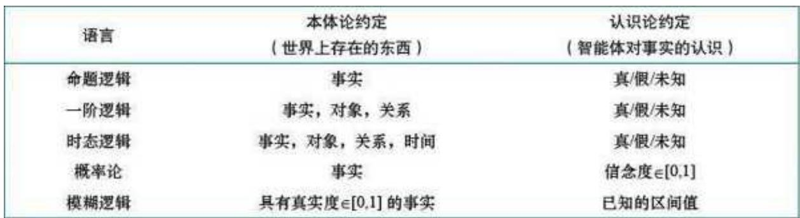  
图8-1形式化语言及其本体论约定和认识论约定

这种本体论约定是逻辑（包括命题逻辑和一阶逻辑）的强项，因为它允许我们从真实的陈述出发来推断其他真实的陈述。这对于每条命题都有清晰边界的领域非常有效，例如数学或wumpus世界。在wumpus世界中，一个方格要么有无底洞要么没有无底洞，那种有个像无底洞一样的大坑的方格是不存在的。但在真实世界中，许多命题的边界是模糊的：维也纳是大城市吗？那家餐厅的菜好吃吗？这个人高吗？这都取决于被你提问的人，而他们的回答可能是“还行吧”。

对此，一种解决办法是细化表示：如果将城市分为“大”和“不大”的标准太粗略，使我们上述的应用中存在太多疑问，那么我们可以增加分类的个数，或使用 Population 这样的函数符号。另一种解决方案来源于模糊逻辑 （fuzzy logic），它使用的本体论约定使得命题具有在0到1之间的真实度（degreeoftruth）。例如，语句“维也纳是大城市”在模糊逻辑中可能真实度是0.8，而“巴黎是一个大城市”则可能真实度是0.9。这更符合我们对真实世界的直观理解，但也更难进行推断：不同于确定A∧B真值的唯一规则，模糊逻辑在不同领域需要不同的规则。还有一个解决办法（将在24.1节阐述）是在多维空间中为每个概念分配一个点，并测量概念“大城市”与概念“巴黎”或“维也纳”的距离。

不少特定用途的逻辑还进一步地进行了本体论约定，例如 时态逻辑 （temporal logic）假设事实在特定的时间成立，而这些时间（可能是时间点或时间区间）是有序的。这样，特定用途的逻辑就使某种对象（以及关于它们的公理）在这种逻辑内更“高级”，而非只是在知识库中对其进行定义。高阶逻辑 （higher-orderlogic）将一阶逻辑中的关系和函数视作其自身的对象。这使我们能对所有关系进行断言，例如，我们可能想定义具有传递性的关系意味着什么。不同于大多数特定用途的逻辑，高阶逻辑的表达能力全面高于一阶逻辑，因为高阶逻辑的一些语句无法用有限数量的一阶逻辑语句来表示。

一种逻辑的特性还包括其认识论约定 （epistemologicalcommitment），即这种逻辑允许每个事实所具有的可能知识状态。在命题逻辑和一阶逻辑中，一条语句表示一个事实，智能体只能选择相信其为真、相信其为假或没有意见。因此，这两种逻辑对于任何语句都具有3种可能的知识状态。

而使用 概率论 （probability theory）的系统则可以有 信任度 或 主观可能性 ，其值可以是从0（完全不信任）到1（完全信任）的任何值。千万不要将概率论中的信任度与模糊逻辑中的真实度搞混了。实际上，一些模糊系统允许对真实度具有不确定性（信任度）。例如，一个概率的wumpus世界智能体可能相信wumpus在[1, 3]中的概率是0.75，而在[2, 3]中的概率是0.25（尽管wumpus肯定在某一个特定的方格中）。

# 8.2 一阶逻辑的语法和语义

本节我们先更为确切地阐述一阶逻辑的可能世界是如何反映其关于对象和关系的本体论约定的。随后我们介绍这种语言的几个组成部分，并解释其语义。本节的主旨是弄清这种语言如何进行简洁的表示，以及其语义如何形成完备的推理过程。

# 8.2.1 一阶逻辑模型

第7章讲过，逻辑语言的模型是组成目前正在考虑的可能世界的形式化结构。每个模型都将逻辑语句的词汇表连接到可能世界的元素，使得任意语句的真值可以被确定。因此，命题逻辑的模型将命题符号连接到预定义的真值表。

一阶逻辑模型要有趣得多。首先，它们具有对象！模型的域 （domain）是它包含的对象集或域元素 的集合。域应当是非空 的——每个可能世界至少要含有一个对象。（见习题8.EMTP了解关于空世界的讨论。）数学上来说，对象是什么无所谓——有意义的只是每个特定模型中有多少对象。但出于教学的考虑，我们会使用一个具体的例子。图8-2展示了一个具有5个对象的模型，这5个对象分别是英格兰1189年至1199年的国王狮心理查、1199年至1215年统治英格兰的邪恶的约翰国王（理查的弟弟）、理查的左腿、约翰的左腿和王冠。

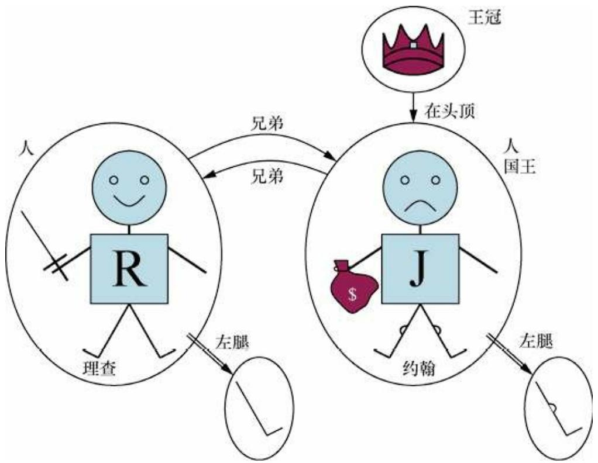  
图8-2 含有5个对象、2个二元关系（兄弟和在头顶）、3个一元关系（人、国王和王冠）和1个一元函数（左腿）的模型

这个模型中的对象可能有多方面的关系。图中，理查和约翰是兄弟。从形式上来看，关系就是相关对象的元组 集。（一个元组是以固定顺序排列的一系列对象，使用尖括号将对象括起来表示。）这样，模型中的兄弟关系就是集合

# {<狮心理查，约翰国王），<约翰国王，狮心理查>}（8-1）

（此处我们已经命名了对象，但如果你愿意的话，你可以用图片代替对象名称。）王冠在约翰国王的头顶，因此关系“在头顶”仅含有一个元组，〈王冠，约翰国王 〉。“兄弟”关系和“在头顶”关系都是二元关系，也就是说，它们关联了一对对象。该模型还含有一元关系，或称为属性：“人”属性对于理查和约翰都为真；“国王”属性仅对于约翰为真（假设此时理查已经去世）；而“王冠”属性则

仅对王冠为真。

最好将某些类型的关系视为函数，因为这样的话给定一个对象，它必然仅关联到一个对象。例如，每个人都有一条左腿，因此模型含有一个一元“左腿”函数，即从一个单元素元组到一个对象的映射，它包括如下的映射：

# (狮心理查>→理查的左腿

# （8-2）

严格来说，一阶逻辑中的模型需要全函数 （totalfunction），也就是对于所有输入的元组都要有值。这样，王冠必须要有一条左腿，每条左腿也一样。对于这种尴尬的问题有一个技术解决方案，它需要增加一个“不可见”的对象来作为一切没有左腿的东西的左腿，包括它自己。幸运的是，只要没人对没有左腿的东西的左腿进行断言，这些技术细节就不重要。

目前为止，我们已经描述了组成一阶逻辑模型所需的元素。模型的另一个重要部分是这些元素与逻辑语句的词汇表的联系，我们接下来进行介绍。

# 8.2.2 符号与解释

我们现在来了解一阶逻辑的语法。不耐烦的读者可以通过图8-3获得对形式化文法的完整描述。

语句 $\rightarrow$ 原子语句|复合语句  
原子语句 $\rightarrow$ 谓词|谓词(项，…）|项=项  
复合语句 $\rightarrow$ (语句)  
- 语句  
- 语句∧语句  
- 语句∨语句  
- 语句 $\Rightarrow$ 语句  
- 语句 $\Leftrightarrow$ 语句  
- 量词变量，…语句  
项 $\rightarrow$ 函数(项，…）  
常量  
- 变量  
量词 $\rightarrow \forall | \exists$ 常量 $\rightarrow A | X_1 | John | \cdots$ 变量 $\rightarrow a | x | s | \cdots$ 谓词 $\rightarrow$ True | False | After | Loves | Raining | ...  
函数 $\rightarrow$ Mother | LeftLeg | ...

运算符优先级：-,=，∧，V，，

图8-3 包含等价关系的一阶逻辑语法，使用巴克斯-诺尔范式（如果你对此不熟悉，见附录B.1）。运算符优先级从高到低定义。量词的优先级为一个量词的优先级高于其右边的一切

一阶逻辑的基本语法元素是代表对象、关系和函数的符号。因此，符号分为3种：代表对象的常量符号 （constant symbol）、代表关系的 谓词符号 （predicate symbol）和代表函数的 函数符号（functionsymbol）。我们采用的习惯是用大写字母开头来书写这些符号。例如，我们可以使用常量符号Richard （理查）和John （约翰），谓词符号Brother（是兄弟）、 OnHead （在头顶）、Person （是人）、King （是国王）和Crown （是王冠），函数符号 LeftLeg （……的左腿）。与命题符号一样，如何命名完全取决于使用者的意愿。每个谓词和函数符号都有一个决定参数数量的

元数 （arity）。

每个模型必须提供所需的信息来确定任意给定语句为真还是为假。因此，除了它的对象、关系和函数，每个模型还要包含一套确切指明常量、谓词和函数符号指代的是哪个对象、关系和函数的解释 （interpretation）。在我们的例子中，下面是一种可能的解释，也就是逻辑学家所说的 预期解释（intended interpretation）。

●Richard 指狮心理查，John指邪恶的约翰国王。  
●Brother指兄弟关系，也就是式（8-1）给出的对象元组集， Onhead 是连接王冠和约翰国王的关系， Person 、 King 和 Crown 是识别人、国王和王冠的一元关系。  
● LeftLeg 指式（8-2）定义的“左腿”函数。

当然，模型还有很多种可能的解释。例如，一种解释将 Richard映射到王冠而将John 映射到约翰国王的左腿。模型中有5个对象，因此仅对常量符号 Richard和 John 就有25种可能的解释。注意，并非所有对象都有名称。例如，预期解释并没有为王冠和腿命名。一个对象也可以有多个名称，在


一种可能的解释中Richard和John 都指代王冠。

逻辑中，一个Cloudy（阴天）和Sunny（晴天）都为真的模型是完全可以存在的；排除与我们的知识不符的模型是知识库要做的事情。

总之，一阶逻辑中的模型包含一个对象集和一种解释，这种解释将常量符号映射到对象、将函数符号映射到关于这些对象的函数，将谓词符号映射到关系。与命题逻辑一样，蕴含、有效性等都是用所有可能模型来定义的。要大致了解可能模型集是什么样子的，见图8-4。图中显示，模型的区别在于它们包含的对象数量不同（从一到无穷多个），以及常量符号映射到对象的方式不同。

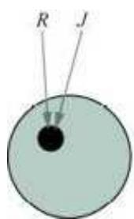

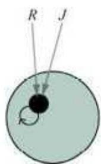

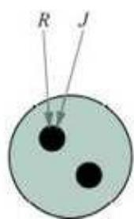

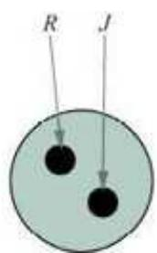

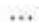

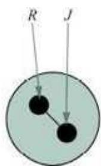


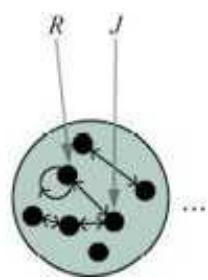  
图8-4含有两个常量符号的语言中全部模型的集合的部分成员、R和 $J$ 以及一个二元关系符号。每种常量符号的解释用灰色箭头标明。每个模型中，相关的对象用箭头连接

由于一阶逻辑模型数量没有上限，我们无法通过枚举所有模型的方式（像我们对命题逻辑做的那样）来检验蕴含。即便对象的数量是有限的，其组合也会是巨量的。（见习题8.MCNT。）对图8-4中的例子来说，使用不超过6个对象就会产生137 506 194 466个模型。

# 8.2.3 项

项 （term）是指代对象的逻辑表达式。常量符号是项，但对每个对象都使用不同的符号命名往往不太方便。在语言中我们使用表达“约翰国王的左腿”而不是给他的腿起个名称来称呼。这就是函数符号存在的意义：我们使用LeftLeg (John)，而不是使用常量符号来命名这条腿。 [1]

[1] 表达式 （ -expression，lambda表达式）提供了一种很有用的记法，使得新的函数符号可以“即时”构建。例如，对参数进行平方操作的函数可以写作 ，并可以像其他函数符号那样直接用于参数。一个 $\pmb { \lambda }$ 表达式也可以被定义为谓语符号并用作谓词符号。这与Lisp和Python中的lambda操作符的作用完全一致。注意，像这样使用 并不能增加一阶逻辑的形式化表达能力，因为所有含有 表达式的语句都能通过“插入”其参数的方式重写，生成一个等价的语句。

通常情况下，复合项的组成是一个函数符号后跟随一个括号，括号中是一系列项，作为该函数符号的参数。需要注意的是，复合项只是复杂一些的名称，而非“返回一个值”的“子程序调用”。并不存

在以一个人作为输入，返回一条腿的 LeftLeg 子程序。我们甚至可以在不定义 LeftLeg 的情况下就进行关于左腿的推理（例如，陈述一条一般规则“每个人都有左腿”，并进而推导出约翰必然有左腿）。这是无法在编程语言中用子程序实现的。

项的形式化语义非常直白。考虑项 $\textstyle f ( t _ { 1 } , . . . , t n )$ 。函数符号 $f$ 指代模型中的某个函数（不妨称为 $F$ ），参数项指代域中的对象（称为 d 1,…, d n )），整个项就指代将函数 $F$ 应用于 d 1 ,…, d n 产生的对象，即函数的值。例如，假设 LeftLeg 函数符号代表式（8-2）所示的函数， John 代表约翰国王，则 LeftLeg ( John )代表约翰国王的左腿。这样，解释就确定了每个项的被指代物。

# 8.2.4 原子语句

我们现在已经有了指代对象的项以及指代关系的谓词符号，将它们结合起来可以构成陈述事实的原子语句 。 原子语句 （或简称原子 ）是由谓词符号以及其后可能存在的括号中的一系列项组成的，例如：

# Brother(Richard,John)

在先前给定的预期解释下，这条语句表明狮心理查是约翰国王的兄弟。 [2] 原子语句的参数可以是复合项，如

[2] 我们一般遵循 $P \left( x , y \right)$ 读作“ $x$ 是 $y$ 的 $P$ ”这样的参数排序习惯。

# Married(Father(Richard)，Mother(John))

表明狮心理查的父亲娶了约翰国王的母亲（再次强调，在合适的解释下）。[3]

[3]这个本体论认为每个人只有一位父亲和一位母亲。更为复杂的本体论可以识别出生物学母亲、生母、养母等。

如果谓词符号所指代的关系在参数所指代的对象之间成立，则在给定模型中原子句 为真 。

# 8.2.5 复合语句

我们可以使用逻辑联结词 构建更为复杂的语句，这与命题演算的语法和语义一样。下面是4条在我们的预期解释下在图8-2的模型中为真的语句：

$$
\neg B r o t h e r (L e f t L e g (R i c h a r d), J o h n)
$$

$$
B r o t h e r (R i c h a r d, J o h n) \wedge B r o t h e r (J o h n, R i c h a r d)
$$

$$
K i n g (R i c h a r d) \vee K i n g (J o h n)
$$

$$
\neg K i n g (R i c h a r d) \Rightarrow K i n g (J o h n)
$$

# 8.2.6 量词

当我们有了支持对象的逻辑后，就很自然地想要表达很多对象的整体属性而非根据名称逐个列举对象。量词 能使我们达到这一目的。一阶逻辑含有两个标准量词—— 全称量词 和存在量词 。

# 1. 全称量词（∀）

回想我们在第7章用命题逻辑表示一般规则时面临的困难。像“与wumpus相邻的方格有臭味”和“所有国王都是人”这样的规则对一阶逻辑来说是最基本的。我们将在8.3节中解决第一条规则。而第二条规则“所有国王都是人”在一阶逻辑中写作

$$
\forall x K i n g (x) \Rightarrow P e r s o n (x)
$$

全称量词 ∀通常读作“对所有……”。［记住，上下颠倒的A表示“all”（所有）。］因此，这条语句表示“对所有 x ，如果 x 是国王，则 x 是人”。符号 x 被称为 变量 。习惯上，变量用小写字母表示。一个变量本身就是一个项，因此也可以作为函数的参数，例如 LeftLeg ( x )。一个没有变量的项被称为 基本项 （ground term）。

直观上来说，语句∀xP，其中 P为任意逻辑语句，表明P对每个对象x都为真。更确切地说，如果 $P$ 在根据一个模型的给定解释构建的所有可能 扩展解释 （extended interpretation）下为真，则 $\forall$ xP在该模型中为真，其中每个扩展解释给出了 x指代的域元素。

这听起来很复杂，但它实际上只是陈述全称量词的直观含义的一种严谨的方式。考虑图8-2所示的模型及其相应的预期解释。我们可以用5种方式扩展这个解释：

x→狮心理查

x→约翰国王

x→理查的左腿

$x $ 约翰的左腿

$x $ 王冠

全称量化语句 $\forall x K i n g \left( x \right) \Rightarrow P e r s o n \left( x \right)$ 在原模型中为真的前提是语句在这5种扩展解释下都为真。也就是说，全称量化语句等价于如下5 $( x )$ 个断言：

狮心理查是一位国王 $\Rightarrow$ 狮心理查是一个人

约翰国王是一位国王 $\Rightarrow$ 约翰国王是一个人

理查的左腿是一位国王 $\Rightarrow$ 理查的左腿是一个人

约翰的左腿是一位国王⇒ 约翰的左腿是一个人

王冠是一位国王 ⇒王冠是一个人

让我们仔细研究这些断言。在我们的模型中，由于约翰国王是唯一的国王，因而第二条语句断言他是人，正如我们所料。那么其他4条语句呢？那些声明了腿和王冠的语句呢？这也是“所有国王都是人”含义的一部分吗？实际上，其他4条断言在模型中都为真，但并未对腿、王冠乃至理查作为人的资格进行任何声明。这是因为这些对象都不是国王。回顾⇒的真值表（图7-8），我们可以看到当前提为假时蕴涵式为真——无论其结论的真值是什么。因此，通过断言全称量化语句——它等价于断言每一条蕴涵式，我们最终仅对前提为真的对象断言规则的结论，而对前提为假的对象什么也不说。因此，⇒的真值表定义被证明非常适合用来编写含有全称量词的一般规则。

即使是勤奋地将本节读了好几遍的读者也可能会犯的常见错误是使用合取式而非蕴涵式与全称量词搭配。语句

# $\forall x K i n g ( x ) \land P e r s o n ( x )$

等价于断言

狮心理查是国王 ∧狮心理查是人

约翰国王是国王 ∧约翰国王是人

理查的左腿是国王∧ 理查的左腿是人

显然，这并不是我们想要表达的。

2. 存在量词（∃）

全称量词对所有对象进行陈述。反之，我们也可以对 某些 对象进行陈述而不需指明其名称。使用存在量词 就可以实现这一点。例如，要说约翰国王的头顶有王冠，我们写作

# $\exists x C r o w n ( x ) \land O n H e a d ( x , J o h n )$

∃ x 读作“存在 x 使得……”或“对于一些 x ……”。

直观上来说，语句∃xP说的是 $P$ 至少对于一个对象 x为真。更准确地说，如果P在至少一个将x 分配给域元素的扩展解释下为真，则∃ x P 在给定模型中为真。也就是，下列语句中至少有一个为真：

狮心理查是王冠∧狮心理查在约翰的头顶

约翰国王是王冠∧约翰国王在约翰的头顶

理查的左腿是王冠 ∧理查的左腿在约翰的头顶

约翰的左腿是王冠 ∧约翰的左腿在约翰的头顶

王冠是王冠∧王冠在约翰的头顶

第五个断言在模型中为真，因此先前的存在量化语句在模型中为真。注意，根据我们的定义，这条语句在约翰国王戴了两顶王冠的模型中也为真。这与原始语句“约翰国王的头顶有王冠”完全不矛盾。 [4]

[4]存在量词有一个变种，通常写作∃1 或∃!，意思是“恰好存在一个”。相同的含义可以用等词陈述表示。

正如⇒是能自然地与∀合用的联结词一样，∧是与∃自然合用的联结词。使用∧作为∀的主要联结词会导致前面示例中的过强陈述，而使用⇒搭配∃则会导致过弱的陈述。考虑如下语句：

# $\exists x { \ C r o w n \ ( x ) } \Rightarrow O n H e a d \left( x , J o h n \right)$

表面来看，这似乎是对我们的语句的一种合理的表示。使用语义规则，我们发现该语句表达的是如下断言中至少一条为真：

狮心理查是一顶王冠 $\Rightarrow$ 狮心理查在约翰的头顶

约翰国王是一顶王冠 $\Rightarrow$ 约翰国王在约翰的头顶

理查的左腿是一顶王冠⇒理查的左腿在约翰的头顶

蕴涵式为真的条件是其前提和结论都为真，或其前提为假。因此，如果狮心理查不是一顶王冠，则第一条断言为真，存在量化语句被满足。因此，只要任一对象不能满足前提，存在量化的蕴涵式语句就为真。因而这种语句其实基本上什么都没说。

3. 量词嵌套

我们经常希望用多个量词表示更复杂的语句。最简单的情形是量词种类相同的情形。例如，“兄弟是同胞”可以写成

$$
\forall x \forall y B r o t h e r (x, y) \Rightarrow S i b l i n g (y, x)
$$

连续的同类量词可以写成有多个变量的单个量词。例如，要表示同胞是对称关系，可以写成

$$
\forall x, y \text {S i b l i n g} (x, y) \Leftrightarrow \text {S i b l i n g} (y, x)
$$

其他情况下，我们得混用量词。“每个人都喜爱一些人”意思是，对所有人都存在其喜爱的人：

$$
\forall x \exists y L o v e s (x, y)
$$

相反，要说“有人被所有人喜爱”，就写成

$$
\exists y \forall x L o v e s (x, y)
$$

因此，量词的顺序非常重要。添加括号会使语句看起来更清晰。 x（yLoves（x,y））表明每个人 都有某种属性，也就是他们喜爱一些人的属性。反之， 则表示世界上的 一些人具有某种属性，即每个人都喜爱他们的属性。

当两个量词与相同的变量名合用时会引起一些混淆。考虑语句

$$
\forall x (C r o w n (x) \vee (\exists x B r o t h e r (R i c h a r d, x)))
$$

此处Brother(Richard ,x)中的x是被存在量化的。规则是，变量属于提及它的最内层量词，随后便不再受任何其他量词约束。另一种考虑方式是，∃ x Brother ( Richard , x )是关于理查（有一个兄弟）的语句，不是关于 x 的语句；因此在外层放一个∀ x 并无效果。该语句一个等价的写法是∃ zBrother ( Richard , z )。因为这可能是导致混淆的源头，所以我们会始终在嵌套量词中使用不同的变量名。

# 4. ∀与∃的联系

∀与∃两个量词实际上通过否定词紧密相关。断言每个人都讨厌欧洲萝卜与断言不存在喜欢欧洲萝卜的人是等价的，反之亦然：

$$
\forall x \neg \text {L i k e s} (x, \text {P a r s n i p s}) _ {\text {等 价 于}} \neg \exists x \text {L i k e s} (x, \text {P a r s n i p s})
$$

我们可以更进一步——“每个人都喜欢冰激凌”意思是没有人不喜欢冰激凌：

$$
\forall x \text {L i k e s} (x, \text {I c e C r e a m}) _ {\text {等 价 于}} - \exists x - \text {L i k e s} (x, \text {I c e C r e a m})
$$

由于 $\forall$ 实际上是对全体对象的合取而∃则是析取，因此它们遵循德摩根律就不足为奇了。量化语句和非量化语句的德摩根律如下：

$$
\begin{array}{l l} \neg \exists x P \equiv \forall x \neg P & \neg (P \vee Q) \equiv \neg P \wedge \neg Q \\ \neg \forall x P \equiv \exists x \neg P & \neg (P \wedge Q) \equiv \neg P \vee \neg Q \\ \forall x P \equiv \neg \exists x \neg P & P \wedge Q \equiv \neg (\neg P \vee \neg Q) \\ \exists x P \equiv \neg \forall x \neg P & P \vee Q \equiv \neg (\neg P \wedge \neg Q) \end{array}
$$

因此，我们实际上并不同时需要 $\forall$ 和∃，正如我们不同时需要∧和∨一样。不过，可读性比简洁性更重要，因此我们同时保留这两种量词。

# 8.2.7 等词

除了使用前述的谓词和项，一阶逻辑还有一种构成原子语句的方式。我们可以使用等词符号（equality symbol）来表示两个项指代相同的对象。例如：

$$
F a t h e r (J o h n) = H e n r y
$$

表示 Father ( John )指代的对象与 Henry 指代的对象是相同的。由于解释会固定所有项的被指代物，确定等词语句的真值就只需要观察两项的被指代物是否为相同的对象即可。

等词符号可以用于陈述关于给定函数的事实，正如我们对 Father 符号所做的那样。它也可以与否定合用，表示两项不是相同的对象。要表示理查至少有两个兄弟，我们可以写成

$$
\exists x, y B r o t h e r (x, R i c h a r d) \wedge B r o t h e r (y, R i c h a r d) \wedge \neg (x = y)
$$

而语句

$$
\exists x, y B r o t h e r (x, R i c a h r d) \wedge B r o t h e r (y, R i c h a r d)
$$

就不能表示我们所期望的含义。具体来说，这条语句在图8-2的模型中也为真，尽管其中理查只有一个兄弟。要弄清楚这一点，考虑 $x$ 和 $y$ 都被指定到约翰国王的扩展解释。附加的 $\lnot ( x = y )$ 排除了这种模型。记法 $x \neq y$ 可以用作 $\lnot ( x = y )$ 的简写。

# 8.2.8 数据库语义

继续8.2.7节中的例子，假设我们相信理查有2个兄弟——约翰和杰弗里 ，我们可以写

$$
B r o t h e r (J o h n, R i c a h r d) \wedge B r o t h e r (G e o f f r e y, R i c h a r d) \tag {8-3}
$$

但这并不能完全反映我们要表示的状态。首先，这条断言在理查只有一个兄弟的模型中也为真—我们需要加上 。其次，这条语句没有剔除理查除了约翰和杰弗里还有很多其他兄弟的模型。因此，对“理查的兄弟是约翰和杰弗里”的正确翻译如下：

$$
B r o t h e r (J o h n, R i c h a r d) \wedge B r o t h e r (G e o f f r e y, R i c h a r d) \wedge J o h n \neq G e o f f r e y
$$

$$
\wedge \forall x B r o t h e r (x, R i c h a r d) \Rightarrow (x = J o h n \vee x = G e o f f r e y)
$$

这条逻辑语句似乎比对应的自然语言表述烦琐很多。如果不能恰当地翻译自然语言，我们的逻辑推理系统就会犯错。我们能否构思一种语义，使逻辑语句更加直白呢？

一种在数据库系统中非常流行的做法的工作方式如下。首先，我们确定每个常量符号都指代一个唯一的对象——唯一名称假设 （unique-namesassumption）。然后，我们假设未知其为真的原子语句事实上都为假——封闭世界假设 （closed world assumption）。最后，我们调用 域闭包（domain closure），意味着每个模型中的域元素不多于常量符号指代的那些。

在由此产生的语义中，式（8-3）的确能表明理查仅有两个兄弟，约翰和杰弗里。我们称之为数据库语义 （databasesemantics），以区别于标准的一阶逻辑语义。数据库语义也用于逻辑编程系统中，在9.4.4节我们对此进行解释。

在数据库语义里考虑图8-4所示的情形中的所有可能的模型是很有指导性的。图8-5展示了其中一些模型，从没有元组满足关系的模型到所有元组都满足关系的模型。在有两个对象的情况下，有4种可能的二元素元组，存在2 4 =16种不同的元组子集满足关系。因此，总共有16种可能模型——大大少于标准一阶逻辑语法下巨量的模型数量。不过，数据库语义需要世界中包含的东西的确定知识。

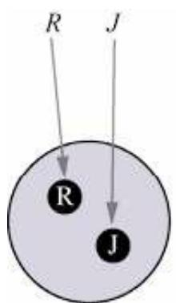

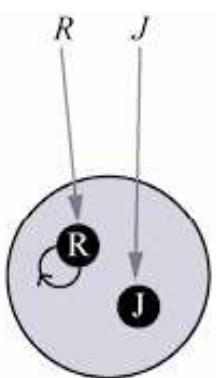

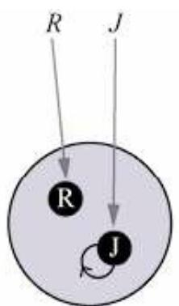

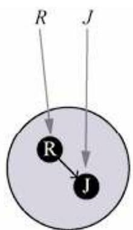

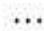

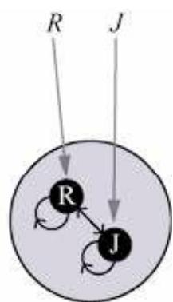  
图8-5在数据库语义下，含有两个常量符号 R和 $J$ 以及一个二元关系符号的语言中的全部模型集的一部分成员。常量符号的解释是固定的，每个常量符号有唯一的对象

这个例子引发了一个重要的观点：逻辑中不存在“正确的”语义。提出的语义的有用性取决于它对我们想要记录的知识的表示是否简洁和直观，以及相应的推断规则的生成是否容易和自然。当我们明确了知识库中描述的所有对象的身份，并且掌握了所有事实的时候，数据库语义最有用，而在其他情况下，数据库语义就很棘手。本章剩余部分，我们默认使用标准语义，并会在这种语义使表达变得非常繁琐的实例中另行标注。

# 8.3 使用一阶逻辑

现在我们已经定义了一种很有表达能力的逻辑语言，接下来我们学习如何使用它。本节，我们在一些简单的论 域 （domain）中给出范例语句。在知识表示中，论域是指我们要表示其知识的那部分世界。

我们从简要地解释一阶知识库中的Tell/A sk 推断开始。随后我们考察家庭关系、数、集合、列表以及wumpus世界论域。8.4.2节展示一个更大规模的示例（电子电路），而第10章则涵盖了宇宙万物。

# 8.3.1 一阶逻辑的断言与查询

语句是通过Tell添加到知识库的，与在命题逻辑中完全一样。这种语句被称为断言（assertion）。例如，我们可以断言约翰是国王、理查是人以及所有的国王都是人：

TELL（KB,King（John））TELL(KB,Person(Richard））TELL（KBVxKing（x）=Person(x)）

我们可以使用A sk 对知识库提问。例如：

$\operatorname { A s } \kappa \left( K B , K i n g \left( J o h n \right) \right)$

返回true。使用A sk提出的问题被称为 查询 或目标 。一般来说，知识库中逻辑蕴含的所有查询都应该得到肯定的回答。例如，给定上述3条断言，查询

$\mathsf { A s } \kappa \left( K B , P e r s o n ( J o h n ) \right)$

应该也返回true。我们可以提出量化的问题，例如：

$\mathsf { A s } \kappa \left( K B , \exists x P e r s o n ( x ) \right)$

答案为true，但它可能并不是我们想要的答案。它就像用“可以”回答“你能告我现在几点了吗？”一样。如果我们想了解使语句为真的 x 的值，我们就需要另一个函数A sk V a rs ：

ASKVARS(KB,Person(x）)

将返回一系列答案。在这个例子中有两个答案： 以及 。这种回答叫作置换 （substitution）或 绑定表 （binding list）。A sk V ars 通常与仅由霍恩子句构成的知识库合用，因为在这种知识库中，每种使查询为真的方式都将变量绑定到特定的值。而一阶逻辑中并不存在这种状况：在 KB 仅被告知 King ( John )的情况下，不存在使得查询∃ x King ( x )为真的 x 的单个绑定，即使这条查询实际上为真。

# 8.3.2 亲属关系论域

我们第一个考虑的范例是家庭关系（或称亲属关系）论域。这个论域包括类似“伊丽莎白是查尔斯的母亲”和“查尔斯是威廉的父亲”这样的事实，以及类似“一个人的祖母（外祖母）是他父母的母亲”这样的规则。

显然，这个论域的对象是人。一元谓词包括Male和Female等。亲属关系（父母、兄弟、婚姻等）使用二元谓词表示： Parent 、 Sibling 、 Brother 、 Sister 、 Child 、 Daughter 、 Son 、Spouse 、 Wife 、 Husband 、 Grandparent 、 Grandchild 、 Cousin 、 Aunt 和 Uncle 。我们用函数表示Mother和Father，因为从生物学角度来说，每个人只有一对父母（尽管我们可以引入更多函数来处理养母、代孕妈妈等）。

我们可以考察每个函数和谓词，并就我们知道的写下它们与其他符号的关系。例如，一个人的母亲就是他父母中的女性成员：

$$
\forall m, c \text {M o t h e r} (c) = m \Leftrightarrow \text {F e m a l e} (m) \wedge \text {P a r e n t} (m, c)
$$

一个人的丈夫是她的男性配偶：

$$
\forall w, h \text {H u s b a n d} (h, w) \Leftrightarrow M a l e (h) \wedge \text {S p o u s e} (h, w)
$$

父母与孩子是反关系：

$$
\forall p, c \operatorname {P a r e n t} (p, c) \Leftrightarrow \operatorname {C h i l d} (c, p)
$$

祖父母（外祖父母）是一个人父母的父母：

$$
\forall g, c \operatorname {G r a n d p a r e n t} (g, c) \Leftrightarrow \exists p \operatorname {P a r e n t} (g, p) \wedge \operatorname {P a r e n t} (p, c)
$$

兄弟姐妹是一个人父母的其他孩子：

$$
\forall x, y \text {S i b l i n g} (x, y) \Leftrightarrow x \neq y \wedge \exists p \text {P a r e n t} (p, x) \wedge \text {P a r e n t} (p, y)
$$

我们可以像这样写出很多页，这正是习题8.KINS的题目。

所有这些语句都可以看作亲属关系论域中的公理 ，如7.1节所阐述。公理通常与纯数学论域相关（我们很快就能看到一些关于数字的公理），但它们在所有论域都有用。它们提供了用于推导有用结论的基本因子化信息。我们的亲属关系公理同时也是定义 ，它们具有形式

。公理用其他谓词定义了 Mother 函数以及 Husband 、 Male 、 Parent、 Grandparent 和 Sibling 谓词。我们的定义从基本的谓词集（ Child 、 Female 等）发展而来，并以此最终定义其他谓词。

这是构建一个论域的表示的自然方式，类似于用基本的库函数定义子程序，再用子程序构建软件包。注意，基本谓词集并不一定是唯一的，我们可以使用 Parent 而非 Child 来得到同样的结果。像我们所展示的一样，在一些论域中并不存在清晰可辨的基本谓词集。

并非所有关于论域的逻辑语句都是公理，其中一些是定理 ，也就是说，它们被公理所蕴含。例如，考虑如下关于兄弟姐妹关系对称性的断言：

$$
\forall x, y S i b l i n g (x, y) \Leftrightarrow S i b l i n g (y, x)
$$

这条语句是公理还是定理？实际上，它是与定义兄弟姐妹的公理逻辑一致的定理。如果我们用这条语句A sk 知识库，它应当返回true。

从纯逻辑的观点来看，知识库应当只包含公理并且不含有定理，因为定理并不能增加从知识库导出的结论集。从实用的角度来看，定理对于降低推导新语句的计算开销是很有意义的。没有定理，推理系统就不得不每次都从基本原则出发，就像物理学家每次求解问题时都要重新推导微积分的法则一样。

并非所有的公理都是定义。一些公理提供了关于某些谓词的更一般的信息，却不构成定义。实际上，一些谓词并没有完整的定义，因为我们不具有完全刻画它们的知识。例如，没有显而易见的定义方式能够完成语句

$$
\forall x \operatorname {P e r s o n} (x) \Leftrightarrow \dots
$$

幸运的是，一阶逻辑允许我们使用Person 谓词而无须对其进行完整定义。不过我们可以写出每个人具有的性质和使某物成为人的性质：

$$
\begin{array}{l} \forall x \operatorname {P e r s o n} (x) \Rightarrow \dots \\ \forall x \dots \Rightarrow \operatorname {P e r s o n} (x) \\ \end{array}
$$

公理也可以是“直白的事实”，例如 Male ( Jim )和 Spouse ( Jim , Laura )。这些来自特定问题实例描述的事实使特定的提问能够得到解答。如果一切顺利的话，这些问题的答案会成为与公理逻辑一致的定理。

我们常常会发现期望的答案不是现成的，例如，从 Spouse ( Jim , Laura )出发，我们期望（根据很多国家的法律）能推得 ，但这并不能由先前给出的公理推导得出，即便在我们像8.2.8节所述的那样添加 也不行。这表明缺失了一条公理。习题8.HILL要求读者提供这条公理。

# 8.3.3 数、集合与列表

数可能是展示从一小部分核心公理构建庞大理论的最生动的示例。我们在此阐述 自然数 或称非负整数的理论。我们需要谓词NatNum 对于自然数为真，我们还需要常量符号0，以及一个函数符号S （后继）。皮亚诺公理 （Peano axioms）定义了自然数和加法。 [1] 自然数是递归定义的：

[1]皮亚诺公理还包括归纳法则，但它是二阶逻辑的语句而非一阶逻辑。这种区别的重要性将在第9章中进行解释。

$$
N a t N u m (0)
$$

$$
\forall n \operatorname {N a t N u m} (n) \Rightarrow \operatorname {N a t N u m} (S (n))
$$

也就是说，0是自然数，对于每一个对象 n ，如果 n是自然数，则S (n)是自然数。因此自然数是0,S (0),S (S (0)),…。我们还需要约束后继函数的公理：

$$
\forall n 0 \neq S (n)
$$

$$
\forall m, n m \neq n \Rightarrow S (m) \neq S (n)
$$

现在我们就可以用后继函数定义加法：

$$
\begin{array}{l} \forall m \operatorname {N a t N u m} (m) \Rightarrow + (0, m) = m \\ \forall m, n \operatorname {N a t N u m} (m) \wedge \operatorname {N a t N u m} (n) \Rightarrow + (S (m), n) = S (+ (m, n)) \\ \end{array}
$$

这些公理中，第一个公理表示对任何自然数m 加0等于m 本身。注意，在+(m ,0)项中二元函数符号“+”的使用：在普通数学中，这一项会使用中缀 （infix）记法写作m +0。［我们在一阶逻辑中使用的记法称为前缀 （prefix）。］为使我们关于数的语句更容易阅读，我们允许使用中缀记法。我们可以将S (n )写成n+1，因此第二个公理变为

$$
\forall m, n \operatorname {N a t N u m} (m) \wedge \operatorname {N a t N u m} (n) \Rightarrow (m + 1) + n = (m + n) + 1
$$

这条公理将加法简化为对后继函数的反复应用。

使用中缀记法是一个 语法糖 （syntactic sugar）的示例。语法糖是一种对标准语法的扩展或缩略，但不改变语义。所有使用糖的语句都可以“脱糖”生成普通一阶逻辑中的等价语句。还有一个示例是使用方括号而非圆括号来使左右括号的对应关系更易读。而另一个示例是量词折叠：用

代替 。

我们有了加法以后，将乘法定义为重复的加法、乘方定义为连续的乘法就是顺理成章的事情，同样我们可以定义整数除法和余数、质数等。这样，整个数论（包括密码学）就能从一个常量、一个函数、一个谓词和4条公理开始构建起来。

集合 的论域对数学和常识推理也是非常重要的。（实际上，可以用集合论来定义数论。）我们希望能够表示每个集合，包括空集。我们需要一种方法用其他集合的元素或对其他集合的操作构建集合。我们想知道一个元素是否是集合的成员，也需要区分一个对象是否是集合。

我们将使用集合论中的一般词汇作为语法糖。空集是一个常量，写作{}。一元谓词Set对集合为真。二元谓词包括 （ x 是集合 s 的成员）以及 ${ \mathfrak { s } } _ { 1 } \subseteq { \mathfrak { s } } _ { 2 }$ （集合 $s _ { 1 }$ 是集合 $s _ { 2 }$ 的子集，两个集合也可以相同）。二元函数是 $\pmb { \mathscr { s } } _ { 1 } \cap \pmb { \mathscr { s } } _ { 2 }$ （交集）、 （并集）和 $A d d ( x , s )$ （将元素 $x$ 添加到集合s生成的集合）。下面是一个可能的公理集。

（1）集合只能是空集和向集合中添加元素产生的集合：

$$
\forall s \operatorname {S e t} (s) \Leftrightarrow (s = \{\}) \vee (\exists x, s _ {2} \operatorname {S e t} (s _ {2}) \wedge s = A d d (x, s _ {2}))
$$

（2）空集没有被加入的元素。换言之，无法将空集分解为更小的集合和元素：

$$
- \exists x, s A d d (x, s) = \{\}
$$

（3）对集合添加已有元素没有作用：

$$
\forall x, s x \in s \Leftrightarrow s = A d d (x, s)
$$

（4）集合中的成员只能是被添加到集合中的元素。我们用递归的形式表示它：声明x是 s中的元素，当且仅当s等于某个将元素y添加到集合s 后的集合，其中 y与x相同，或x是 s 的成员：

$$
\forall x, s \quad x \in s \Leftrightarrow \exists y, s _ {2} (s = A d d (y, s _ {2}) \wedge (x = y \vee x \in s _ {2}))
$$

（5）一个集合是另一个集合的子集当且仅当第一个集合的所有成员都是第二个集合的成员：

$$
\forall s _ {1}, s _ {2} \quad s _ {1} \subseteq s _ {2} \Leftrightarrow (\forall x x \in s _ {1} \Rightarrow x \in s _ {2})
$$

（6）两个集合相等当且仅当它们互为对方的子集：

$$
\forall s _ {1}, s _ {2} (s _ {1} = s _ {2}) \Leftrightarrow (s _ {1} \subseteq s _ {2} \wedge s _ {2} \subseteq s _ {1})
$$

（7）一个对象在两个集合的交集中，当且仅当它同时是这两个集合的成员：

$$
\forall x, s _ {1}, s _ {2} x \in (s _ {1} \cap s _ {2}) \Leftrightarrow (x \in s _ {1} \wedge x \in s _ {2})
$$

（8）一个对象在两个集合的并集中，当且仅当它同时是某个集合的成员：

$$
\forall x, s _ {1}, s _ {2} x \in (s _ {1} \bigcup s _ {2}) \Leftrightarrow (x \in s _ {1} \vee x \in s _ {2})
$$

列表 与集合类似。它们的区别是，列表是有序的，相同的元素在列表中可以出现多次。我们可以用Lisp语言的词汇表示列表： Nil是没有元素的常量列表；Cons、 Append 、 First和Rest是函数；Find 在列表中的作用与 Member在集合中的作用相同。 List是仅对列表为真的谓词。与集合一样，涉及列表的逻辑语句也常用到语法糖。空列表是[]。 Cons(x,Nil)项（即仅含有元素 x，尾部没有其他元素的列表）写作[x]。含有若干元素的列表，如[A, B, C]，对应于嵌套项

。习题8.LIST要求你写出列表的公理。

# 8.3.4 wumpus世界

第7章给出了wumpus世界的一些命题逻辑公理。本节介绍的一阶公理简洁得多，自然、精确地刻画了我们的意图。

如前所述，wumpus世界智能体接收一个含有5个元素的感知向量。知识库中存储的对应一阶语句必须包含感知和感知出现的时间，否则，智能体会搞不清何时接收到什么感知。我们使用整数表示时间步。一个典型的感知语句是

$P e r c e p t ( [ S t e n c h , B r e e z e , G l i t t e r , N o n e , N o n e ] , 5 )$

此处， Percept 是二元谓词， Stench 等是列表中的常量。wumpus世界中的动作可以用逻辑项表示：

Turn(Right)，Turn(Left),Forward,Shoot,Grab，Climb

要确定哪个动作最优，智能体程序执行查询

A sk V ars

将返回一个类似 的绑定表。智能体程序将 Grab 作为要采取的动作。原始感知数据蕴涵了关于当前状态的某些事实。例如：

$$
\begin{array}{l} \forall t, s, g, w, c \text {P e r c e p t} ([ s, B r e e z e, g, w, c ], t) \Rightarrow B r e e z e (t) \\ \forall t, s, g, w, c \text {P e r c e p t} ([ s, N o n e, g, w, c ], t) \Rightarrow \neg B r e e z e (t) \\ \forall t, s, b, w, c \text {P e r c e p t} ([ s, b, G l i t t e r, w, c ], t) \Rightarrow G l i t t e r (t) \\ \forall t, s, b, w, c \text {P e r c e p t} ([ s, b, N o n e, w, c ], t) \Rightarrow \neg G l i t t e r (t) \\ \end{array}
$$

这些规则展现了一个被称为 感知 的推理形式的细节，我们将在第25章进行深入研究。注意对时间t的量化。在命题逻辑中，我们需要每个时间步的每条语句的副本。

简单的“反射”行为也可以用量化蕴涵式语句来实现。例如，我们有

tGlitter(t)=BestAction(Grab,t)

给定感知和先前几段给出的规则，就能得出所需的结论 BestAction ( Grab , 5)，也就是说， Grab 是要做的正确的事。

我们已经表示了智能体的输入和输出，现在可以表示环境本身了。我们从对象开始。显然，候选的对象有方格、无底洞和wumpus。我们可以命名方格，如 Square $^ { 1 , 2 }$ 等，但接下来 Square $^ { 1 , 2 }$ 与Square $^ { 1 , 3 }$ 相邻的事实就必须是“额外”的事实，我们要为每一对方格列出一条这样的事实。使用行和列为整数的复合项是更好的做法，例如，我们可以简单地使用列表项[1,2]。任意相邻的方格可以定义为

$$
\begin{array}{l} \forall x, y, a, b \text {A d j a c e n t} ([ x, y ], [ a, b ]) \Leftrightarrow \\ (x = a \wedge (y = b - 1 \vee y = b + 1)) \vee (y = b \wedge (x = a - 1 \vee x = a + 1)) \\ \end{array}
$$

我们也可以为每个无底洞命名，但不宜这么做另有原因：没有必要去区分每个无底洞。 使用一元谓词Pit并使其在含有无底洞的方格中为真是更简单的做法。最后，由于只存在一个wumpus，用常量Wumpus与使用一元谓词并没什么区别（从wumpus的视角看，使用常量可能更威严）。

智能体的位置随时间变化，因此我们用At(Agent,s, t)来表示智能体在时间 t位于方格 s。我们可以用 将wumpus永远固定在一个位置。然后我们就可以说对象在一个时刻只能在一个位置：

$$
\forall x, s _ {1}, s _ {2}, t A t (x, s _ {1}, t) \wedge A t (x, s _ {2}, t) \Rightarrow s _ {1} = s _ {2}
$$

给定智能体的当前位置，它就可以用当前的感知来推断方格的属性。例如，如果智能体在一个方格中并感知到微风，则这个方格是有微风的：

$$
\forall s, t A t (A g e n t, s, t) \wedge B r e e z e (t) \Rightarrow B r e e z y (s)
$$

知道一个方格有微风很有用，因为我们知道无底洞是不能移动的。注意，Breezy没有时间参数。

发现了哪些位置有微风（或有臭味）以及同样重要的哪些位置没有微风（或没有臭味），智能体就可以推导出无底洞的位置（以及wumpus的位置）。在命题逻辑中每个方格都需要一条公理（见7.4.3节的 R 和 $R$ ），并且对每种世界的地形布局都需要一套不同的公理。而在一阶逻辑中我们只需要一条公理：

$$
\forall s \text {B r e e z y} (s) \Leftrightarrow \exists r \text {A d j a c e n t} (r, s) \wedge \operatorname {P i t} (r) \tag {8-4}
$$

类似地，一阶逻辑中我们可以量化所有时间，因此，对于每个谓词我们只需要一个后继状态公理，而非对每个时间步都保留副本。例如，箭的公理［式（7-2）］变为

$$
\forall t \text {H a v e A r r o w} (t + 1) \Leftrightarrow (\text {H a v e A r r o w} (t) \wedge - \text {A c t i o n} (\text {S h o o t}, t))
$$

从这两个例子的语句可以看出，一阶逻辑的表达方式并不比第7章给出的自然语言描述更复杂。我们鼓励读者对智能体的位置和朝向构建类似的公理——在这些情况下，公理需要量化时间和空间。如命题状态估计一样，智能体可以对这样的公理使用逻辑推断来了解不能直接观测的那部分世界。第11章会更深入地研究一阶逻辑的后继状态公理以及它在构建规划中的用处。

# 8.4 一阶逻辑中的知识工程

8.3节展示了如何用一阶逻辑在3个简单的论域中表示知识。本节描述知识库构建的一般过程，这一过程称作 知识工程 （knowledge engineering）。知识工程师是研究一个特定论域，了解这个论域中哪些概念是重要的，并创建该论域中对象和关系的形式化表示的人。我们会阐述在电子电路论域中进行知识工程的过程。我们采用的方法适于构建专用知识库，这种知识库的论域是精心划定的，其查询的范围也是已知的。通用 知识库则涵盖了较大范围的人类知识，用于支持像自然语言理解这样的任务，我们在第10章对其进行讨论。

# 8.4.1 知识工程的过程

知识工程项目的内容、范围和难度各不相同，但所有这样的项目都包括如下的步骤。

（1） 确定问题。知识工程必须描述知识库要支持的问题范围，以及对每个特定问题实例可获取的事实类型。例如，wumpus知识库是需要能够选择动作，还是只需要回答关于环境内容的问题？传感器事实是否需要包括当前位置？任务将决定为了将问题实例连接到回答必须表示哪些知识。这一步类似于第2章用于设计智能体的PEAS过程。  
（2） 收集相关知识 。知识工程师可能已经是领域专家，也可能需要与真正的专家合作来获得他们的知识——这个过程叫作 知识获取 （knowledge acquisition）。在这一阶段，知识并非形式化表示的，这一步的主要目的是了解任务所确定的知识库的范围，以及了解这一领域的运行方式。

对由人工产生的规则集定义的wumpus世界来说，我们很容易找出相关知识。（但是要注意，相邻关系的定义并不是由wumpus世界规则明确给出。）对于真实世界的论域，相关性问题可能非常困难，例如，仿真VLSI设计的系统可能需要，也可能不需要考虑杂散电容和集肤效应问题。

（3） 确定谓词、函数和常量的词汇表。也就是说，将重要的论域级概念翻译为逻辑级名称。这就涉及知识工程风格的许多问题。类似于编程风格，知识工程风格可能对项目最终成功与否产生重要影响。例如，无底洞应当被表示为对象还是表示为方格的一元谓词？智能体的朝向应当是函数还是谓词？wumpus的位置是否与时间相关？一旦做出这些决定，就会形成被称为论域的 本体论（ontology）的词汇表。“本体论”一词是指关于存在或实存的本质的理论。本体论决定哪些东西存在，但不能决定它们的具体性质和相互关系。  
（4） 对论域的通用知识编码 。知识工程师为词汇表中的所有项写出公理。这就（尽可能地）固定了项的含义，使专家能够检查其内容。这一步经常会发现词汇表的概念误解或理解偏差，这必须返回第3步进行修正并重复这个过程。  
（5） 对问题实例的描述编码 。如果本体论确定得很恰当，这一步就相当容易。它涉及写出本体论中的概念实例的简单原子语句。对逻辑智能体来说，问题实例是由传感器提供的，而“无形”的知识库获取语句的方式与传统程序获取输入数据的方式相同。  
（6） 向推断过程提出查询并获得答案。这是获得回报的一步：我们可以让推断过程在公理和问题相关的事实上运行来推导我们有兴趣了解的事实。这样，我们就不需要编写应用相关的求解算法了。  
（7） 调试并评估知识库 。很遗憾，查询得到的答案一开始往往是错误的。更准确地说，答案对于现有的知识库是正确的（如果假设推断过程是可靠的），但它们不是用户期望的答案。例如，如果缺失了一条公理，一些查询就不能从知识库中得到答案。这就需要大量的调试过程。关注推理链意外停止的地方可以轻易找出缺失或过弱的公理。例如，如果知识库为找到wumpus而含有诊断规则（见习题8.WUMD）：

$$
\forall s \text {S e m l l y} (s) \Rightarrow \text {A d j a c e n t} (\text {H o m e} (\text {W u m p u s}), s)
$$

而没有采用双向蕴涵，智能体就永远不能证明wumpus不存在。不正确的公理是关于世界的错误陈述，因此可以被找出。例如，语句

$$
\forall x \operatorname {N u m O f L e g s} (x, 4) \Rightarrow \operatorname {M a m m a l} (x)
$$

对爬行动物、两栖动物和桌子都不成立。 判断这条语句的错误性可以不依赖于知识库的其他部分。但是，程序中的一个典型错误则如下：

$$
o f t s e t = p o s i t i o n + 1
$$

在不理解上下文的情况下，不可能判断 offset 应当是 position 还是 position+1 。

当你的知识库中没有明显的错误时，似乎就要大功告成了。但最好还是通过在查询测试套件上运行系统并测量正确答案的数量来正式地评估系统，除非你的知识库明显没有错误。没有客观度量的话，你很容易就以为任务已经完成了。为了更好地理解这7个步骤，我们现在将其应用于一个扩展的示例——电子电路论域。

# 8.4.2 电子电路论域

我们将构建一个本体论和一个知识库，使我们能够进行关于图8-6所示的数字电路的推理。我们将遵循知识工程的7个步骤。

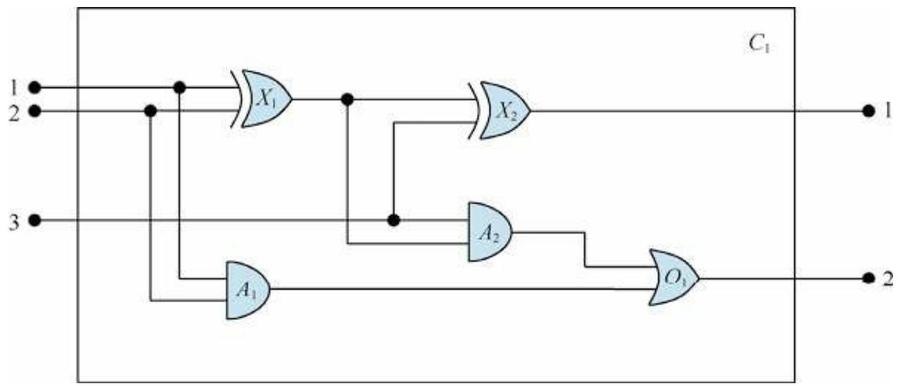  
图8-6 一位全加器的数字电路C1。前两个输入是要相加的两位，第三个输入是进位位。第一个输出是和，第二个输出是通往下一个加法器的进位位。电路包含两个异或门、两个与门和一个或门

# 1.确定问题

涉及数字电路的推理任务很多。最高层次的任务是分析电路的功能性。例如，图8-6的电路是否能够正确地做加法？如果所有输入都为高， A 门的输出是什么？关于电路结构的问题同样有趣。例如，连接到第一个输入端子的门有哪些？电路是否含有反馈回路？这都是这一步骤中的任务。还有更详细的分析层次，包括关于延迟、电路面积、功耗以及生产成本等的分析。所有这些层次的分析都需要额外的知识。

# 2.收集相关知识

我们对数字电路了解多少？根据我们的目的，这包括导线和门。信号沿着导线传输到门的输入端，每个门则在输出端产生一个信号沿着另一条导线传输。要确定这些信号是什么，我们需要了解门如何转换其输入信号。门有4种：具有两个输入端子的与门（AND）、或门（OR）和异或门（XOR），以及只有一个输入端子的非门（NOT）。所有门都只有一个输出端子。像门一样，电路本身也有输入端子和输出端子。

要推理电路的功能性和连接性，我们不需要涉及导线本身、导线路径或导线连接点。重要的只有端子之间的连接——我们可以说某个输出端子连接到另一个输入端子，而不需要了解其实际的连接方式。其他因素，像元件的尺寸、形状、颜色或价格与我们的分析也不相关。

如果我们的目的不是在门的层级验证设计，本体论就完全不同。例如，如果我们对于故障电路修复

有兴趣，那么将导线纳入本体论就很可能是个好主意，因为导线的故障会妨碍在其中传输的信号。要解决时序故障，我们需要把门延迟加进本体论。如果我们要设计可盈利的产品，电路价格及其相对于市场上其他产品的速度就会很重要。

# 3.确定词汇表

我们现在已经知道我们要涉及电路、端子、信号和门。下一步选择用于表示它们的函数、谓词和常量。我们需要先将不同的门与其他对象区分开。每个门由常量命名的对象表示，我们用 Gate ( X 1)来断言 $X _ { 1 }$ 是门。每个门的行为由其类型决定，即常量AND 、OR、XOR和 NOT中的一种。由于一个门只能有一种类型，我们可以使用函数 Type ( X 1) = XOR 。电路与门类似，使用一个谓词来表示—— Circuit $( C _ { 1 } )$ 。

接下来我们考虑端子，使用谓词Terminal(x)表示。一个电路可以有一个或多个输入端子和一个或多个输出端子。我们使用函数 $I n ( 1 , X _ { 1 }$ )来表示电路 $X _ { 1 }$ 的第1个输入端子。相似的函数 Out ( n , c )用于输出端子。谓词 Arity ( c , i , j )断言电路 $c$ 有 i 个输入端子和 $j$ 个输出端子。门之间的连接性可以用谓词 Connected 表示，它需要两个端子作为参数，如

# Connected(Out（1,x），(1

最后，我们需要知道一个信号是通还是断。一种可能是使用一元谓词 On(t)，在某个端子的信号通时为真。但这会增加提出类似“电路 $C _ { 1 }$ 输出端子的所有可能信号值有哪些？”的问题的难度。因此我们引入两个信号值1和0作为对象，分别表示“通”和“断”，而用函数 Signal ( t )表示端子 t 的信号值。

# 4.对论域的通用知识编码

好的本体论仅需要少量通用规则，并且可以简明地声明这些规则。如下是我们需要的全部公理。

（1）如果两个端子连通，则它们信号相同：

$$
\forall t _ {1}, t _ {2} \text {T e r m i n a l} (t _ {1}) \wedge \text {T e r m i n a l} (t _ {2}) \wedge \text {C o n n e c t e d} (t _ {1}, t _ {2}) \Rightarrow \text {S i g n a l} (t _ {1}) = \text {S i g n a l} (t _ {2})
$$

（2）每个端子的信号只能是1或0：

$$
\forall t \text {T e r m i n a l} (t) \Rightarrow \text {S i g n a l} (t) = 1 \vee \text {S i g n a l} (t) = 0
$$

（3） Connected 具有交换性：

$$
\forall t _ {1}, t _ {2} \text {C o n n e c t e d} (t _ {1}, t _ {2}) \Leftrightarrow \text {C o n n e c t e d} (t _ {2}, t _ {1})
$$

（4）门的类型有4种：

$$
\forall g G a t e (g) \wedge k = T y p e (g) \Rightarrow k = A N D \vee k = O R \vee k = X O R \vee k = N O T
$$

（5）与门的输出为0，当且仅当其任意输入为0：

$$
\begin{array}{l} \forall g G a t e (g) \wedge T y p e (g) = A N D \Rightarrow \\ \operatorname {S i g n a l} (O u t (1, g)) = 0 \Leftrightarrow \exists n \operatorname {S i g n a l} (\ln (n, g)) = 0 \\ \end{array}
$$

（6）或门的输出为1，当且仅当其任意输入为1：

$$
\begin{array}{l} \forall g G a t e (g) \wedge T y p e (g) = O R \Rightarrow \\ \operatorname {S i g n a l} (O u t (1, g)) = 1 \Leftrightarrow \exists n \operatorname {S i g n a l} (\ln (n, g)) = 1 \\ \end{array}
$$

（7）异或门的输出为1，当且仅当其输入不相同：

$$
\begin{array}{l} \forall g G a t e (g) \wedge T y p e (g) = X O R \Rightarrow \\ \operatorname {S i g n a l} (\operatorname {O u t} (1, g)) = 1 \Leftrightarrow \operatorname {S i g n a l} (\operatorname {I n} (1, g)) \neq \operatorname {S i g n a l} (\operatorname {I n} (2, g)) \\ \end{array}
$$

（8）非门的输出与其输入不同：

$$
\begin{array}{l} \forall g G a t e (g) \wedge T y p e (g) = N O T \Rightarrow \\ \operatorname {S i g n a l} (O u t (1, g)) \neq \operatorname {S i g n a l} (\operatorname {I n} (1, g)) \\ \end{array}
$$

（9）除了非门之外的所有门都有两个输入和一个输出：

$$
\begin{array}{l} \forall g G a t e (g) \wedge T y p e (g) = N O T \Rightarrow A r i t y (g, 1, 1) \\ \forall g G a t e (g) \wedge k = T y p e (g) \wedge (k = A N D \vee k = O R \vee k = X O R) \Rightarrow A r i t y (g, 2, 1) \\ \end{array}
$$

（10）电路有端子，数量不超过其输入和输出元数，不存在超出元数的任何东西：

$$
\begin{array}{l} \forall c, i, j \operatorname {C i r c u i t} (c) \wedge \operatorname {A r i t y} (c, i, j) \Rightarrow \\ \forall n (n \leqslant i \Rightarrow T e r m i n a l (I n (n, c))) \wedge (n > i \Rightarrow I n (n, c) = N o t h i n g) \wedge \\ \forall n (n \leqslant j \Rightarrow \text {T e r m i n a l} (\operatorname {O u t} (n, c))) \land (n > j \Rightarrow \operatorname {O u t} (n, c) = \text {N o t h i n g}) \\ \end{array}
$$

（11）门、端子和信号是不同的：

$$
\forall g, t, s \operatorname {G a t e} (g) \wedge \operatorname {T e r m i n a l} (t) \wedge \operatorname {S i g n a l} (s) \Rightarrow g \neq t \wedge g \neq s \wedge t \neq s
$$

（12）门是电路：

$$
\forall g G a t e (g) \Rightarrow C i r c u i t (g)
$$

5. 对特定问题实例编码

图8-6所示的电路被编码为电路 $C _ { 1 }$ 并有如下描述。首先我们对电路及其门元件进行分类：

$$
\begin{array}{l} C i r c u i t \left(C _ {1}\right) \wedge A r i t y \left(C _ {1}, 3, 2\right) \\ G a t e \left(X _ {1}\right) \wedge T y p e \left(X _ {1}\right) = X O R \\ G a t e \left(X _ {2}\right) \wedge T y p e \left(X _ {2}\right) = X O R \\ G a t e \left(A _ {1}\right) \wedge T y p e \left(A _ {1}\right) = A N D \\ G a t e \left(A _ {2}\right) \wedge T y p e \left(A _ {2}\right) = A N D \\ G a t e \left(O _ {1}\right) \wedge T y p e \left(O _ {1}\right) = O R \\ \end{array}
$$

随后我们给出其连接情况：

Connected $( O u t ( 1 , X _ { 1 } ) , I n ( 1 , X _ { 2 } ) )$ Connected $( I n ( 1 , C _ { 1 } ) , I n ( 1 , X _ { 1 } ) )$

Connected $( O u t ( 1 , X _ { 1 } ) , I n ( 2 , A _ { 2 } ) )$ Connected $( I n ( 1 , C _ { 1 } ) , I n ( 1 , A _ { 1 } ) )$

Connected $( O u t ( 1 , A _ { 2 } ) , I n ( 1 , O _ { 1 } ) )$ Connected $( I n ( 2 , C _ { 1 } ) , I n ( 2 , X _ { 1 } ) )$

Connected(Out(1,A），In(2,0）) Connected $( I n ( 2 , C _ { 1 } ) , I n ( 2 , A _ { 1 } ) )$

Connected(Out(1,X）,Out(1,C）)Connected(In(3,C），In(2,x))

Connected(Out(1,O），Out(2,C））Connected $( I n ( 3 , C _ { 1 } ) , I n ( 1 , A _ { 2 } ) )$

6. 向推断过程提出查询

哪种输入组合会使 $C _ { 1 }$ 的第一个输出（求和位）为0，第二个输出（进位位）为1？

$$
\begin{array}{l} \exists i _ {1}, i _ {2}, i _ {3} \operatorname {S i g n a l} (\operatorname {I n} (1, C _ {1})) = i _ {1} \wedge \operatorname {S i g n a l} (\operatorname {I n} (2, C _ {1})) = i _ {2} \wedge \operatorname {S i g n a l} (\operatorname {I n} (3, C _ {1})) = i _ {3} \\ \wedge \operatorname {S i g n a l} (O u t \left(1, C _ {1}\right)) = 0 \wedge \operatorname {S i g n a l} (O u t \left(2, C _ {1}\right)) = 1 \\ \end{array}
$$

答案是变量 $i _ { 1 }$ 、i 和 $i _ { 3 }$ 的置换，以使得语句被知识库所蕴含。A sk V ars将给我们3种这样的置换：

$$
\left\{i _ {1} / 1, i _ {2} / 1, i _ {3} / 0 \right\} \left\{i _ {1} / 1, i _ {2} / 0, i _ {3} / 1 \right\} \left\{i _ {1} / 0, i _ {2} / 1, i _ {3} / 1 \right\}
$$

加法器电路中所有端子的可能值的集合有哪些？

$$
\begin{array}{l} \exists i _ {1}, i _ {2}, i _ {3}, o _ {1}, o _ {2} \quad S i g n a l (I n (1, C _ {1})) = i _ {1} \wedge S i g n a l (I n (2, C _ {1})) = i _ {2} \\ \wedge \operatorname {S i g n a l} \left(\ln \left(3, C _ {1}\right)\right) = i _ {3} \wedge \operatorname {S i g n a l} \left(\operatorname {O u t} \left(1, C _ {1}\right)\right) = o _ {1} \wedge \operatorname {S i g n a l} \left(\operatorname {O u t} \left(2, C _ {1}\right)\right) = o _ {2} \\ \end{array}
$$

最后这个查询将返回设备的完整输入输出表，可以用于检验它是否能正确做加法。这是电路验证（circuitverification）的一个简单示例。我们也可以使用电路的定义来构建更大的数字系统，并使用相同的验证方式。（见习题8.ADDR）许多论域都支持这种结构化的知识库创建方式，但需要在简单概念的基础上定义更为复杂的概念。

7. 调试知识库

我们可以以各种方式查询知识库以了解它会出现哪些错误行为。例如，假设我们没有阅读8.2.8节，因而忘记断言1 0。假设我们发现系统除了输入000和110的情况，无法证明电路的任何输出，我们可以通过询问每个门的输出的方式来找到问题。我们可以询问：

$$
\exists i _ {1}, i _ {2}, o \operatorname {S i g n a l} (I n (1, C _ {1})) = i _ {1} \wedge \operatorname {S i g n a l} (I n (2, C _ {1})) = i _ {2} \wedge \operatorname {S i g n a l} (O u t (1, X _ {1})) = o
$$

结果显示在X 处对于输入10和01没有输出。因此，我们查看应用于 $X _ { 1 }$ 的异或门的公理：

$$
\operatorname {S i g n a l} \left(\operatorname {O u t} \left(1, X _ {1}\right)\right) = 1 \Leftrightarrow \operatorname {S i g n a l} \left(\operatorname {I n} \left(1, X _ {1}\right)\right) \neq \operatorname {S i g n a l} \left(\operatorname {I n} \left(2, X _ {1}\right)\right)
$$

如果输入已知为1和0，则上式简化为

$$
\operatorname {S i g n a l} \left(\operatorname {O u t} \left(1, X _ {1}\right)\right) = 1 \Leftrightarrow 1 \neq 0
$$

现在，问题就很明显了：系统不能推断出 $\displaystyle \mathit { S i g n a l } ( \mathit { O u t } ( 1 , X _ { 1 } ) ) = 1$ ，因此，我们需要告诉它1 0。

小结

本章介绍了一阶逻辑 ，一种命题逻辑更具表达能力的表示语言。本章要点如下。

●知识表示语言应当是说明性的、合成式的、有表达能力的、上下文无关的且无歧义的。  
●逻辑之间的区别在于其本体论约定 和认识论约定 ，命题逻辑仅约定事实的存在，一阶逻辑则约定对象和关系的存在，因而增加了表达能力，适用于像wumpus世界和电子电路这样的论域。  
●命题逻辑和一阶逻辑在表示模糊命题上都有困难。这一困难限制了它们在需要个人判断的论域的应用性，如政治或烹饪。  
●一阶逻辑的语法构建于命题逻辑之上。它增加了项来表示对象，并且有全称量词和存在量词来构建关于被量化的变量的全部或部分可能值的断言。  
●一阶逻辑的一个可能世界 或模型 包括一个对象集和一种将常量符号映射到对象、将谓词符号映射到对象的关系、将函数符号映射到对象上的函数的解释 。  
●一条原子语句为真，仅当谓词命名的关系在项命名的对象之间成立。扩展解释 将量词变量映射到模型中的对象，定义了量化语句的真值。  
●在一阶逻辑中构建知识库需要严谨的过程来分析论域、选择词汇表、编码能支持所需推断的公理。

读者服务：


微信扫码关注【异步社区】微信公众号，回复“e59810”获取本书配套资源以及异步社区15天VIP会员卡，近千本电子书免费畅读。

# 第9章

一阶逻辑中的推断

在本章中，我们定义有效的过程来回答用一阶逻辑提出的问题。

在本章中，我们阐述能够回答所有可解的一阶逻辑问题的算法。9.1节介绍量词的推断规则，并展示如何将一阶逻辑推断约简为命题逻辑推断，尽管这样做代价巨大。9.2节描述了如何用合一 来构建直接用于一阶逻辑的推断规则。随后我们讨论一阶逻辑推断的3类主要算法：前向链接 （9.3节）、 反向链接 （9.4节）和基于归结的定理证明 （9.5节）。

# 9.1 命题推断与一阶推断

进行一阶推断的方法之一是将一阶知识库转换为命题逻辑并使用我们已知的命题推断。第一步是消去全称量词。例如，假设我们的知识库含有典型的朴素道德公理，认为所有贪婪的国王都是邪恶的：

$$
\forall x K i n g (x) \wedge G r e e d y (x) \Rightarrow E v i l (x)
$$

由此我们可以推断出下列任一语句：

$$
\begin{array}{l} K i n g (J o h n) \wedge G r e e d y (J o h n) \Rightarrow E v i l (J o h n) \\ K i n g (R i c h a r d) \wedge G r e e d y (R i c h a r d) \Rightarrow E v i l (R i c h a r d) \\ K i n g (F a t h e r (J o h n)) \wedge G r e e d y (F a t h e r (J o h n)) \Rightarrow E v i l (F a t h e r (J o h n)) \\ \end{array}
$$

一般来说， 全称量词实例化 （universal instantiation，UI）表明我们可以通过用 基本项 （没有变


量的项）置换全称量化的变量来推断任意语句。

我们使用8.3节介绍过的 置换 来形式化地写出推断规则。令 表示对语句 $\pmb { \alpha }$ 应用置换 $\pmb \theta$ 后的语句。则对于任意变量 $v$ 和基本项 $g$ ，规则写作

$$
\frac {\forall v \alpha}{\text {S u b s t} (\{v / g \} , \alpha)}
$$

前述的3条语句就是分别用置换 、 和 得到的。

类似地， 存在量词实例化 （existentialinstantiation）用一个新的常量符号替换存在量化的变量。其形式化描述如下：对于任意语句 $\pmb { \alpha }$ 、变量v和未在知识库其他地方出现的常量符号 k，

$$
\frac {\exists v \alpha}{\text {S u b s t} (\{v / k \} , \alpha)}
$$

例如，由语句

$$
\exists x \operatorname {C r o w n} (x) \wedge \operatorname {O n H e a d} (x, J o h n)
$$

我们可以推断出语句

$$
C r o w n \left(C _ {1}\right) \wedge O n H e a d \left(C _ {1}, J o h n\right)
$$

只要 $C _ { 1 }$ 未在知识库的其他地方出现。简单来说，存在语句表明存在满足某个条件的对象，运用存在实例化就是给这个对象命名。当然，这个名称不能已经属于其他对象。数学中有一个很好的例子：假设我们发现有一个数字比2.71828稍大，并满足等式 ${ \mathrm { d } } ( x ^ { y } ) / { \mathrm { d } } y = x ^ { y }$ 中的 $x$ 。我们可以将这个数字命名为e，但不能将其命名为已经存在的对象名，如 $\pi$ 。在逻辑中，新的名称被称为斯科伦常量 （Skolem constant）。

全称量词实例化可以多次用于同一条公理来产出许多不同结果，而存在量词实例化只需要使用一次，随后就可以丢掉存在量化的语句。例如，一旦我们添加了语句 Kill ( Murderer , Victim )的话，就不再需要 。

约简为命题推断

我们现在展示如何将任意一阶知识库转换为命题知识库。第一个想法是，正如存在量化语句能够用一个实例代替一样，全称量化语句也可以用 所有可能实例 的集合代替。例如，假设我们的知识库仅含有语句

$$
\forall x \operatorname {K i n g} (x) \wedge \operatorname {G r e e d y} (x) \Rightarrow \operatorname {E v i l} (x)
$$

$$
\text {K i n g} (J o h n)
$$

$$
G r e e d y (J o h n)
$$

$$
\text {B r o t h e r} (R i c h a r d, J o h n) \tag {9-1}
$$

且对象仅有 John 和 Richard 。我们用所有可能的置换， 和 ，对第一条语句应用全称量词实例化。我们得到

$$
K i n g (J o h n) \wedge G r e e d y (J o h n) \Rightarrow E v i l (J o h n)
$$

$$
K i n g (R i c h a r d) \wedge G r e e d y (R i c h a r d) \Rightarrow E v i l (R i c h a r d)
$$

接下来用命题符号（如JohnIsKing）替换基本原子语句（如King(John )）。最后，用第7章的任意完备的命题算法得到如 JohnIsEvil 的结论，它等价于 Evil ( Jo hn )。

正如我们将在9.5节中讨论的，这种 命题化 （propositionalization）技术可以被彻底一般化。然而，如果知识库中包含函数符号，可能的基本项置换集是无穷的！例如，如果知识库提到Father函数，就可以构建像 Father ( Father ( Father ( John )))这样的无穷多的嵌套项。

幸运的是，雅克·埃尔布朗（JacquesHerbrand）针对这一现象提出了著名的定理，即如果语句被原始的一阶知识库蕴含，则存在仅涉及命题化知识库的有限子集的证明（Herbrand,1930）。由于任意这样的子集都有其基本项的最大嵌套深度，我们可以通过先生成含有常量符号（Richard和John）的所有实例化，然后再生成深度为1的所有项（ Father ( Richard )和 Father ( John )），然后是深度为2的所有项，以此类推，直到我们能够构建所蕴含语句的命题证明。

我们已经概述了通过命题化进行一阶逻辑推断的完备 方法，也就是，所有蕴含的语句都可以被证明。这是一个重大的成就，特别是在可能模型的空间无限大的情况下。但是，在证明完成前我们并不知道语句 是被蕴含的！如果语句并不被蕴含怎么办？我们能证明吗？实际上，对于一阶逻辑，答案是否定的。我们的证明程序会一直运行，生成越来越深的嵌套项，但我们不知道它是陷入绝望的循环，还是就快要得出证明结果。这非常类似于图灵机的停机问题。艾伦·图灵（Turing,1936）和阿朗佐·丘奇（Church, 1936）分别以不同方式证明了这种情况的不可避免性。 一阶逻辑的蕴含问题是半可判定的 ，也就是，存在能判定所有蕴含的语句的算法，却不存在能够判定所有不蕴含的语句的算法。

# 9.2 合一与一阶推断

眼尖的读者可能已经注意到命题化方法生成了许多不必要的全称量化语句的实例。我们希望有一个方法，仅使用一条规则，以如下方式推理出 $\{ x / \sqrt { o } h n \}$ 解答了查询 $E v i l ( x )$ ：给定贪婪的国王都是邪恶的这条规则，找出某个 $x$ 使得 $x$ 为国王且 $x$ 是贪婪的，进而推断出这个 $x$ 是邪恶的。更一般地说，如果存在某个置换 $\pmb \theta$ 使得每个蕴涵式前提的合取子句与知识库中的语句完全相同，那么我们就在应用 后，断言蕴涵式的结论。这种情况下，置换 $\theta = \{ x / J o h n \}$ 能达到这一目的。假设现在我们不知道 Greedy(John)，但我们知道所有人都是贪婪的：

# （9-2）

则我们仍然能够断定Evil(John )，因为我们知道约翰是国王（已给定）且约翰是贪婪的（因为每个人都是贪婪的）。为了能采取这种做法，我们需要找出一个置换，来同时取代蕴涵语句中的变量和知识库中待匹配语句中的变量。这种情况下，对蕴涵式的前提 King ( x )和 Greedy ( x )使用置换就会使它们完全相同。这样我们可以推断出蕴涵式的后件。

这种推断过程可以表述为一条单独的推断规则被称为 一般化肯定前件 [1] （generalized ModusPonens）。对于原子语句 p i 、 和 q ，存在置换 使得对所有 i 有

$$
\mathrm {S u b s t} \left(\theta , p _ {i} ^ {\prime}\right) = \mathrm {S u b s t} \left(\theta , p _ {i}\right), \text {有}
$$

[1]一般化肯定前件比肯定前件（7.5.1节）更一般化，因为已知的事实和蕴涵式的前提只需要与一个置换匹配，而不需要完全一致。但肯定前件允许任意语句 $\pmb { \alpha }$ 作为前提，而非仅是原子语句的合取。

$$
\frac {p _ {1} ^ {\prime} , p _ {2} ^ {\prime} , \cdots , p _ {n} ^ {\prime} , (p _ {1} \wedge p _ {2} \wedge \cdots \wedge p _ {n} \Rightarrow q)}{\mathrm {S u b s t} (\theta , q)}
$$

这条规则有 $n + 1$ 个前提： $n$ 个原子语句 $p _ { i } ^ { \prime }$ 和一个蕴涵式。结论是对后件 $q$ 运用置换 $\pmb \theta$ 的结果。对我们的例子来说：

$p _ { 1 } ^ { \prime }$ 是 King ( John ) $p _ { \mathrm { ~ 1 ~ } }$ 是 King ( x )

是 Greedy ( y ) p 2 是 Greedy ( x ) $\pmb { p } _ { 2 } ^ { \prime }$

是 q 是 Evil ( x )

是 Evil ( Jo hn )

很容易证明一般化肯定前件是可靠的推断规则。首先，我们观察到，对于任意语句 $p$ （假设其变量是全称量化的）和任意置换 $\pmb \theta$ ，

$$
p \models \operatorname {S u b s t} (\theta , p)
$$

根据全称量词实例化为真。特别地，它对于满足一般化肯定前件规则条件的 $\pmb \theta$ 为真。因此，我们可以从 $p _ { 1 } ^ { \prime } , \cdots , p _ { n } ^ { \prime }$ 推断

$$
\operatorname {S u b s t} \left(\theta , p _ {1} ^ {\prime}\right) \wedge \dots \wedge \operatorname {S u b s t} \left(\theta , p _ {n} ^ {\prime}\right)
$$

并且，从蕴涵式 我们可以推断

$$
\operatorname {S u b s t} (\theta , p _ {1}) \wedge \dots \wedge \operatorname {S u b s t} (\theta , p _ {n}) \Rightarrow \operatorname {S u b s t} (\theta , q)
$$

现在，一般化肯定前件规则中的 $\pmb { \theta }$ 已被定义为对所有i使得，因此这两条语句中，第一条语句正好匹配第二条语句的前提。根据肯定前件规则可得SUBST(0,q).

一般化肯定前件是肯定前件的提升 版——它将肯定前件从基本（无变量的）命题逻辑提升到一阶逻辑。我们将在本章其余部分看到第7章中的前向链接、反向链接和归结算法的提升版。提升版推断规则相比于命题化的重要优势在于，提升版推断规则只需必要的置换就可以进行特定的推断。

# 9.2.1 合一

提升版推断规则需要找出使不同的逻辑表达式看起来相同的置换。这一过程被称作合并（unification），是所有一阶逻辑推断算法的重要组成部分。合一算法U nify接收两条语句作为输入，如果存在置换，则为它们返回一个合一子 （unifier）（即这个置换）：

$$
\mathrm {U N I F Y} (p, q) = \theta \text {其 中} \mathrm {S u b s t} (\theta , p) = \mathrm {S u b s t} (\theta , q)
$$

我们用一个例子来展示U nify 的工作方式。假设有查询 AskVar ( Knows ( John , x ))：约翰认识谁？这条查询的答案可以通过找出知识库中所有与 Knows ( John , x )合一的语句来找到。此处有与4条不同语句合并而来的结果，它们可能在知识库中：

$$
\mathrm {U N I F Y} \left(\text {K n o w s} (J o h n, x), \text {K n o w s} (J o h n, J a n e)\right) = \{x / J a n e \}
$$

$$
\operatorname {U N I F Y} \left(\text {K n o w s} (J o h n, x), \text {K n o w s} (y, B i l l)\right) = \{x / B i l l, y / J o h n \}
$$

$$
\operatorname {U N I F Y} \left(\text {K n o w s} (J o h n, x), \text {K n o w s} (y, \text {M o t h e r} (y))\right) = \{y / J o h n, x / M o t h e r (J o h n) \}
$$

$$
\text {U N I F Y} (K n o w s (J o h n, x), K n o w s (x, E l i z a b e t h)) = \text {f a i l u r e}
$$

最后一条合一失败了，因为 x 不能同时取值为 John 和 Elizabeth 。但我们知道 Knows ( x , Elizabeth)的意思是“所有人都认识伊丽莎白”，因此我们应该可以推断出约翰认识伊丽莎白。之所以出现问题是因为两条语句恰好使用了相同的变量名x。对要合一的两条语句中的一条进行标准化分离（standardizing apart），也就是对其变量进行重命名来避免名称冲突，就可以解决这一问题。例如，我们可以将Knows(x, Elizabeth)中的x重命名为（新变量名）x 而不会改变其含义。现在就可以进行合一了：

$$
\text {U N I F Y} \left(\text {K n o w s} \left(\text {J o h n}, x\right), \text {K n o w s} \left(x _ {1 7}, \text {E l i z a b e t h}\right)\right) = \{x / \text {E l i z a b e t h}, x _ {1 7} / \text {J o h n} \}
$$

习题9.STAN深入探讨了标准化分离的必要性。

还有一个麻烦：我们说过U nify 应当返回使两个参数看起来相同的置换。但这样的合一子可能不止一种。例如， 可能返回 $\{ y / \sqrt { o h n } , x / z \}$ 或者 。第一个合一子的结果是 $K n o w s ( J o h n , z )$ ，而第二个合一子的结果是 。第二个结果可以在第一个结果的基础上置换得出，因此我们说第一个合一子比第二个 更一般化 ，因为它对变量的值的限制更少。

每一对可合一的表达式都有一个最一般合一子 （mostgeneralunifier，MGU），在不考虑变量的重命名和置换的情况下，它是唯一的。例如， 和 被看作是等价的，和 也是等价的。

图9-1展示了一个用于计算最一般合一子的算法。这一过程很简单：同时递归地交替探索两个表达式，并在这个过程中创建合一子，如果结构中的两个对应点不匹配则返回失败。这个过程中存在一个高代价的步骤：当匹配某变量和一个复合项时，必须检查这个变量是否出现在这一复合项中；如果是，则匹配失败，因为无法构建一致的合一子。例如， S (x)无法与S (S (x))合一。这种出现检验 （occurcheck）使得整个算法的复杂性是待合一的表达式规模的二次方。包括许多逻辑编程系统在内的一些系统干脆取消了出现检验，将避免不可靠推断的责任推给用户。其他系统则使用具有线性复杂性的更为复杂的合一算法。

functionUNIFY(x,y，=empty）returns使x和y相同的置换，或failure   
function UNIFY $\mathbf { V } _ { \mathbf { A R } } ( \nu a r , x , \theta )$ returns一个置换if对于一些val有{var/val∈ thenreturnUNIFy(val,x,)elseif对于一些val有 $\{ x / \nu a l \} \in \theta$ thenreturn UNIFy(var, val,)else ifOccUR-CHEck?(var,x)thenreturnfailureelsereturn将{var/x添加到θ  
if $\theta =$ failure then return failure   
else if $x = y$ then return $\theta$ else if VARIABLE? $(x)$ then return UNIFY-VAR $(x,y,\theta)$ else if VARIABLE? $(y)$ then return UNIFY-VAR $(y,x,\theta)$ else if COMPOUND? $(x)$ and COMPOUND? $(y)$ then return UNIFY(ARGS(x),ARGS(y),UNIFY(OP(x),OP(y),0))   
else if LIST? $(x)$ and LIST? $(y)$ then return UNIFY(REST(x),REST(y),UNIFY(FIRST(x),FIRST(y),0))   
else return failure

图9-1合一算法。参数 $x$ 和y可以是任意表达式：一个常量或者一个变量，或复合表达式（如复合的语句或项），或一系列表达式。参数 是一个置换，初始值为空置换，但会随着我们在输入、逐个比较表达式元素的递归中加入 $\{ v o m / v a l \}$ 。在如 F ( A , B )的复合表达式中，O p ( x )函数提取函数符号 $F$ 而A rgs ( x )函数提取参数表( A , B )

# 9.2.2 存储与检索

用于告知和询问知识库的Tell、A sk 和A sk V ar函数的底层是更基本的Store和Fetch 函数。Store(s)将语句s存入知识库，而Fetch(q )返回所有使查询 q 与知识库中某个语句合一的合一子。之前我们用于解释合一的例题（找出能与Knows(John, x)合一的所有事实）就是Fetch的一个实例。

实现Store和Fetch最简单的方式就是在一个长列表中列出所有事实，并将每个查询与列表中的每个元素合一。这种过程很低效，却可以正常工作。本节余下部分将概述使检索更为高效的方法。

我们可以通过确保仅对有一定合一可能的语句进行合一来使F etch 更高效。例如，合一 Knows (John , x )和 Brother ( Richard , Joh n )就没什么意义。我们可以通过 索引 知识库中的事实来避免这种合一。一种叫作谓词索引 的简单方法将所有Knows开头的事实放入一个存储桶内，而将所有Brother开头的事实放入另一个存储桶内。而这些存储桶可以用哈希表存储，以提高效率。

谓词索引对于谓词符号很多而每个符号只有少量子句的情形非常有用。但有时，一个谓词有许多子句。例如，假设税务部门想用谓词 Employs(x,y)掌握雇佣关系情况。这就会形成一个非常大的存储桶，其中很可能有几百万雇主和几千万雇员。用谓词索引方法回答如Employs(x, Richard )这样的查询就需要搜索整个存储桶。

对于这类特殊的查询，如果除谓词外再使用第二个参数一起索引事实的话，就可能改善效率。这种方法也许要用到组合的哈希表键值。这样我们只要用查询构造键值，就能精确地检索到能与查询合一的事实。对于其他查询，如 Employs ( IBM , y )，我们可能需要结合谓词和第一个参数来索引事实。因此，事实可以存储在多个索引键值之下，以便各种可能与之合一的查询迅速地找到它们。

给定要存储的语句，可以对 所有可能 与之合一的查询构建索引。对于 Employs ( IBM , Richard )这样的事实，查询为

Employs ( IBM , Richard ) （ IBM 是否雇佣了 理查？）

Employs ( x , Richard ) （谁雇佣了 理查？）

Employs ( IBM , y ) （ IBM 雇佣 了谁？）

Employs ( x , y ) （谁雇佣 了谁？）

这些查询构成了一个 包容格 （subsumption lattice），如图9-2a所示。包容格具有一些有趣的性质。格中任意节点的子节点都是对父节点进行一次置换而来，而任意两个节点的“最高”共同后代则是应用最一般合一子的结果。具有重复常量的语句的格略有不同，如图9-2b所示。尽管函数符号并未在图中体现，但它们也可以被纳入这种格结构中。

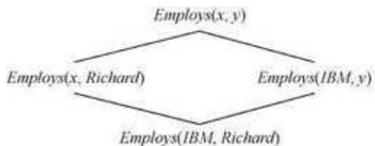

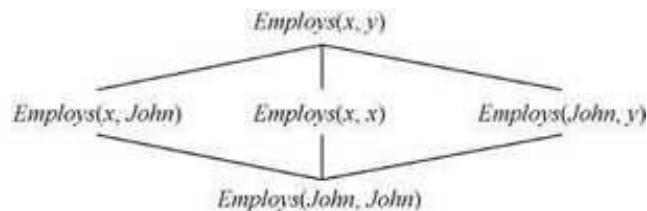  
  
图9-2 （a）最低节点为 Employs ( IBM , Richard )的包容格。（b）语句 Employs ( John , John )的包容格

对于只有少量参数的谓词符号，为包容格中每一个点创建一个索引是一种很好的权衡。这增加了一点点存储时间，但节省了检索时间。然而，对于有 n 个参数的谓词，其包容格含有 O (2 n)个节点。如果允许函数符号的话，节点的数量同样是要存储的语句中项的数量的指数级。这就会导致大量的索引。

我们不得不采用一些方法将索引的范围限制为可能被查询频繁使用的节点，否则我们花在创建索引上的时间可能比使用索引而节省的时间还多。我们可以采取固定的策略，譬如只维护键值由一个谓词和单个参数构成的索引。我们还可以习得一种自适应的策略，它能够创建索引来满足各类查询的要求。对于事实数量以十亿计的商用数据库，一直有对这一课题的大量的研究、技术开发和持续改进。

# 9.3 前向链接

在7.5节中我们展示了用于命题确定子句知识库的前向链接算法。本节我们拓展这个概念以涵盖一阶确定子句。

当然，有一些逻辑语句无法被表述为确定子句，因此也无法用这种方法处理。但形如 Antecedent ⇒Consequent的规则足以涵盖许多有趣的真实世界系统。

# 9.3.1 一阶确定子句

一阶确定子句是文字的析取式，其中 必须有且仅有一个正文字。这意味着确定子句要么是原子的，要么是前件为正文字的合取、后件为单个正文字的蕴涵式。存在量词在此处不能使用，而全称量词则被隐式地表示：如果你在确定子句中看到x，就意味着有隐含的∀x量词。典型的一阶逻辑确定子句如下：

$$
K i n g (x) \wedge G r e e d y (x) \Rightarrow E v i l (x)
$$

但文字 King ( x )和 Greedy ( y )也可以看作确定子句。一阶文字可以含有变量，因此 Greedy ( y )被解释为“每个人都是贪婪的”（全称量词是隐含的）。

我们用确定子句表示如下问题：

法律规定，美国人将武器出售给敌对国家是犯罪行为。诺诺（Nono）国是美国的敌人，它拥有一些导弹，所有导弹都是韦斯特（West）上校出售给它的，而韦斯特上校是美国人。

首先，我们用一阶确定子句表示这些事实。

“……美国人将武器出售给敌对国家是犯罪行为”：

$$
\operatorname {A m e r i c a n} (x) \wedge \operatorname {W e a p o n} (y) \wedge \operatorname {S e l l s} (x, y, z) \wedge \operatorname {H o s t i l e} (z) \Rightarrow \operatorname {C r i m i n a l} (x) \tag {9-3}
$$

表示“诺诺国……拥有一些导弹”的语句 被转换为两个存在量化的确定子句，其中引入了新的常量 $M _ { 1 }$ ：

$$
\text {O w n s} \left(\text {N o n o}, M _ {1}\right) \tag {9-4}
$$

$$
M i s s i l e \left(M _ {1}\right) \tag {9-5}
$$

“所有导弹都是韦斯特上校出售给它的”：

$$
M i s s i l e s (x) \wedge O w n s (N o n o, x) \Rightarrow S e l l s (W e s t, x, N o n o) \tag {9-6}
$$

我们还需要知道导弹是武器：

$$
\operatorname {M i s s i l e} (x) \Rightarrow \operatorname {W e a p o n} (x) \tag {9-7}
$$

且我们必须知道美国的敌人是“敌对的”：

$$
E n e m y (x, A m e r i c a) \Rightarrow H o s t i l e (x) \tag {9-8}
$$

“而韦斯特上校是美国人……”：

$$
\text {A m e r i c a n} (\text {W e s t}) \tag {9-9}
$$

“诺诺国是美国的敌人……”：

# （9-10）

这个知识库恰好是一个数据日志 （datalog）知识库：数据日志是由不含函数符号的一阶确定子句组成的语言。它能够表示由关系数据库生成的陈述类型，故得名。没有了函数符号使推断更容易。

# 9.3.2 简单的前向链接算法

图9-3展示了简单的前向链接推断算法。它从已知事实开始，触发所有前提被满足的规则，将结论添加到已知事实中。这一过程不断重复，直到查询得到回答（假设只需要一个回答）或没有新的事实被添加。注意，如果一个事实只是某个已知事实的重命名 ，也就是只有变量名字不同的语句，那它就不是一个“新”事实。例如， Likes ( x , IceCream )与 Likes ( y , IceCream )互为重命名。它们都意味着相同的事情：“每个人都喜欢冰激凌”。

function FOL-FC-Ask(KB,α) returns一个置换或false  
inputs: KB,知识库，一个一阶确定子句集  
α,查询，一个原子语句  
while true do  
new $\leftarrow \{\}$ //每次迭代推断出的新语句集  
for each rule in KB do $(p_{1} \wedge \cdots \wedge p_{n} \Rightarrow q) \gets$ STANDARDIZE-VARIABLES(rule)  
for each $\theta$ 使得对于某些KB中的 $p_{1}', \cdots, p_{n}'$ 有SUBST $(\theta, p_{1} \wedge \cdots \wedge p_{n}) =$ SUBST $(\theta, p_{1}' \wedge \cdots \wedge p_{n}')$ $q' \gets$ SUBST $(\theta, q)$ if $q'$ 不能与已经在KB或new中的语句合一 then  
将 $q'$ 添加到new $\phi \gets$ UNIFY $(q', \alpha)$ if $\phi$ 不为failure then return $\phi$ if new = {} then return false  
将new添加到KB

图9-3 一个概念上很直观，但低效的前向链接算法。每次迭代，它都将那些用一步就可以从已经在KB中的蕴涵语句和原子语句推断出的原子语句添加到KB中。函数Standardize-V ariables用先前未使用过的变量替换其所有的参数

下面我们使用前面的犯罪问题来解释FOL-FC-A sk。可用于链接的蕴涵语句为式（9-3）、式（9-6）、式（9-7）和式（9-8）。这里需要两次迭代。

●第一次迭代中，规则式（9-3）的前提未满足。

满足规则式（9-6），添加 。

满足规则式（9-7），添加 。

满足规则式（9-8），添加 。

● 第二次迭代中，规则式（9-3）被 满足，添加推断Criminal(West).

图9-4展示了所生成的证明树。注意，此时已不可能再产生新的推断，因为每个可以用前向链接得出的语句已经显式地被纳入知识库。这种知识库被称为推断过程的不动点 。对一阶确定子句使用

前向链接得到的不动点与命题前向链接中的类似（7.5.4节），主要的区别在于一阶逻辑不动点可以含有全称量化的原子语句。

FOL-FC-A sk 很容易分析。首先，它是 可靠的 ，因为每个推断都是对一般化肯定前件的应用，而一般化肯定前件是可靠的。其次，它对于确定子句知识库是 完备的 ，也就是说，它能够对所有答案蕴涵在确定子句知识库中的查询做出回答。

对于不含有函数符号的数据日志知识库，完备性的证明相当简单。先对可能被添加的事实进行计数，这决定着迭代的次数。令k为最大 元数 （参数的数量），p 为谓词数量， n 为常量符号的数量。显然，基本事实的数量不可能超过pn k 个，因此在这么多次迭代后，算法必然已经到达了不动点。然后我们就可以得出论据，它非常类似于命题前向链接完备性的证明。（见7.5.4节。）如何从命题逻辑完备性转进到一阶逻辑完备性的细节在9.5节介绍归结算法时给出。

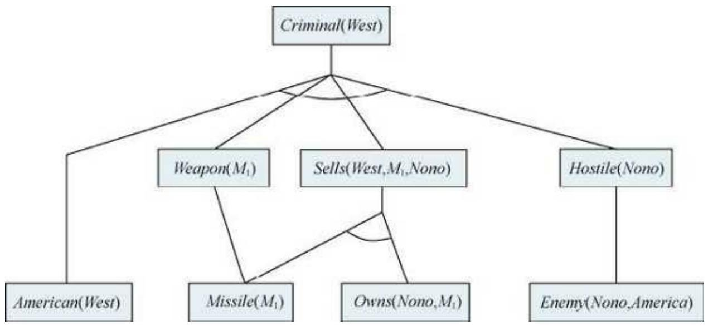  
图9-4前向链接算法为犯罪问题生成的证明树。最早的事实出现在最下层，第一次迭代推断得到的事实在中间层，而第二次迭代推断得出的事实在最顶层

对于含有函数符号的一般确定子句，FOL-FC-A sk会生成无穷多的新事实，因此我们需要非常小心。在查询语句q的答案被蕴含的情形下，我们只能凭借埃尔布朗定理（9.1.1节）来证实算法将找到证明。（见9.5节的归结情形。）如果查询没有答案，算法在某些情况下就无法终止。例如，如果知识库含有皮亚诺公理

# NatNum（0）

$$
\forall n \operatorname {N a t N u m} (n) \Rightarrow \operatorname {N a t N u m} (S (n))
$$

则前向链接将添加 NatNum ( S (0))、 NatNum ( S ( S (0)))、 NatNum ( S ( S ( S (0))))等。一般来说，这个问题是无法避免的。如我们在常规一阶逻辑中所见，确定子句的蕴含是半可判定的。

# 9.3.3 高效前向链接

图9-3所示的前向链接算法为了便于理解而牺牲了效率。低效的原因有3个。首先，算法的内层循环试图对知识库中的每一条规则和每一条事实进行匹配。其次，算法每次迭代都检查所有规则，尽管知识库只有少量更新。最后，算法会生成许多与目标无关的事实。我们依次解决这些问题。

# 1.将规则与已知事实进行匹配

将规则的前提与知识库中的事实进行匹配的问题似乎很简单。例如，假设我们要应用规则

$$
M i s s i l e (x) \Rightarrow W e a p o n (x)
$$

则我们需要找出所有与 匹配的事实；被恰当索引的知识库可以在常量时间内对每个事实完成这项操作。现在考虑规则

$$
M i s s i l e (x) \wedge O w n s (N o n o, x) \Rightarrow S e l l s (W e s t, x, N o n o)
$$

同样，我们可以在常量时间内找出诺诺国拥有的所有对象，然后对于每个对象，我们可以检查它是否是导弹。但如果知识库含有许多诺诺国拥有的对象而其中只有极少数是导弹，先找出所有的导弹然后再检查它们是否被诺诺国所拥有就是更好的操作。这就是 合取子句排序 （conjunctordering）问题：求解规则前提的合取子句的排序，使总代价最小。实际上找出最优排序是NP困难问题，不过可以使用很好的启发式算法求解。例如，在第6章用于CSP的 最小剩余值 （MRV）启发式算法会建议，如果导弹的数量比诺诺国拥有的对象数量少，就对合取子句进行排序先查找导弹。

实际上， 模式匹配 与约束满足的联系十分紧密。我们可以将每个合取子句看作一条对它所包含的变量的约束，例如， 是 x 的一元约束。拓展这种想法， 就能将所有有限域CSP表示为单个确定子句和相关的基本事实 。考虑图6-1中的地图着色问题，这里显示于图9-5a。图9-5b给出了其等价的单个确定子句形式。很明显，只有CSP有解，才可以推断出结论 Colorable()。因为3-SAT问题是一般CSP的一个特例，我们可以断定， 将确定子句与事实集进行匹配的问题是NP困难问题 。

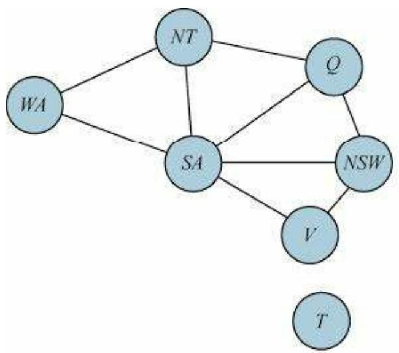  
图9-5（a）用于为澳大利亚地图着色的约束图。（b）用单个确定子句表示的地图着色CSP。每个地图区域都用变量表示，变量的值可以为常量red、green、blue（使用 Diff 声明）

$$
D i f f (W A, N T) \wedge D i f f (W A, S A) \wedge
$$

$$
D i f f (N T, Q) \wedge D i f f (N T, S A) \wedge
$$

$$
D i f f (Q, N S W) \wedge D i f f (Q, S A) \wedge
$$

$$
D i f f (N S W, V) \wedge D i f f (N S W, S A) \wedge
$$

$$
D i f f (V, S A) \Rightarrow C o l o r a b l e ()
$$

$$
D i f f (\text {r e d}, \text {b l u e}) D i f f (\text {r e d}, \text {g r e e n})
$$

$$
D i f f (\text {g r e e n}, \text {r e d}) D i f f (\text {g r e e n}, \text {b l u e})
$$

$$
D i f f (\text {b l u e , r e d}) D i f f (\text {b l u e , g r e e n})
$$

前向链接的内层循环含有NP困难的匹配问题看起来相当令人沮丧。但还是有3种方法能令我们振奋起来。

●我们可以发现，真实世界知识库的大部分规则是简洁的（如同犯罪例子中所示），而不是繁复的（如图9-5所示的CSP形式化）。在数据库世界中，很常用的假设是规则的长短和谓词的元数都限于一个常数，只需关心 数据复杂性 的问题，也就是，形式为知识库中基本事实数量的函数的推断复杂性。很容易证明前向链接的数据复杂性是多项式级别的，而非指数量级的。  
●我们可以考虑使匹配变得高效的规则的子类别。本质上，所有数据日志子句都可以视作定义一个CSP，因此，如果对应的CSP容易求解，则匹配也容易求解。第6章描述了几种易解的CSP。例如，如果约束图（节点为变量，边为约束的图）构成一棵树，那么CSP就可以在线性时间内求解。完全相同的情况对匹配也成立。例如，如果我们从图9-5的地图中去掉南澳大利亚州SA，得到的子句就是：

$$
D i f f (W A, N T) \wedge D i f f (N T, Q) \wedge D i f f (Q, N S W) \wedge D i f f (N S W, V) \Rightarrow C o l o r a b l e ()
$$

它对应于6.5.1节的图6-12所示的简化CSP。用于求解树状结构CSP的算法可以直接用来求解规则匹配问题。

●我们可以试着消除前向链接算法中冗余的规则匹配尝试，如下一部分内容所述。

# 2. 增量前向链接

我们先前在解释前向链接算法在犯罪问题示例中的工作方式时作弊了。具体而言，我们省略了由图9-3所示的算法完成的规则匹配。例如，在第二次迭代中，规则

$$
M i s s i l e (x) \Rightarrow W e a p o n (x)
$$

（第二次）匹配到了 Missile ( M 1)，当然地，结论 Weapon ( M 1)已知，因此什么都没发生。如果我们有如下的观察：所有在第t次迭代中推断出的新事实必然是从至少一个在第t−1 次迭代中推断出的新事实推得的，就可以避免这种多余的规则匹配。这是正确的，因为所有不需要来自第t−1次迭代的新事实的推断，肯定在第 t −1次迭代时就已经得出了。

这一观察结果自然地引出增量前向链接算法，其中在第t次迭代时，我们仅检查前提含有合取子句p i的规则， p i能够与在第 t −1次迭代新产生的事实 p' i合一。规则匹配步骤随后固定 p i来与 p' i合一，但允许规则的其他合取子句与任意先前迭代产生的事实匹配。这个算法在每次迭代中生成的事实与图9-3所示的算法完全一致，但高效得多。

如果有合适的索引，就很容易找到所有能够由任意已知事实触发的规则。很多真实系统在“更新”模式下运作，也就是每次收到Tell时都以前向链接作为回应。推断在规则集上逐级运行，直到达到不动点。这一过程对下一个新事实重复执行。

一般来说，知识库中只有少部分规则是由新添加的已知事实而触发的。这就意味着在反复构建某些前提不满足的部分匹配时产生了大量冗余的工作。我们的犯罪问题示例由于太简单而无法很好地展示这种情形，但注意，第一次迭代中构建了一个规则

$$
A m e r i c a n (x) \wedge W e a p o n (y) \wedge S e l l s (x, y, z) \wedge H o s t i l e (z) \Rightarrow C r i m i n a l (x)
$$

和事实 American ( West )的部分匹配。这一部分匹配被丢弃，并在第二次迭代中重新构建（当规则匹配成功时）。比较好的做法是，保留部分匹配，并在新事实到来时逐步补全部分匹配而非直接丢弃它们。

Rete算法 （Rete algorithm） 首先求解了这一问题。算法对知识库中的规则集进行预处理来构建一个数据流网络，其中每个节点是规则前提中的一个文字。变量绑定在网络中流动，并在无法匹配某个文字时被过滤掉。如果一条规则中的两个文字共用一个变量，例如犯罪示例中的，则每个文字的绑定会被一个相等节点过滤。当变量绑定到达一个 n 元文字（如 ）的节点时，可能需要在过程继续运行前等待其他变量绑定的建立。在任意给定时刻，Rete网络的状态都会捕获所有规则的部分匹配，避免了大量的重新计算。

Rete网络和以它为基础的各种改进已经成为了所谓的产生式系统 （production system）的关键组成


X con 系统（最初被称为R1; X con系统（最初被称为R1；

部分。产生式系统是最早被大量使用的前向链接系统之一。McDermott,1982）就是用产生式系统的结构构建的。X con 含有用于为DEC公司的客户设计计算机部件规格的数千条规则。它是最早在专家系统这一新兴领域取得显著商业成功的系统之一。许多其他类似的系统都以相同的核心技术构建，这一技术已经在通用语言O ps-5中实现。

产生式系统在 认知架构 （cognitive architecture）中也很流行。认知架构也就是人类推理的模型，如ACT（Anderson, 1983）和S oar （Laird et al. , 1987）。在这些系统中，系统的“工作记忆”对人类的短期记忆进行建模，而产生式则是长期记忆的一部分。在每个操作周期中，产生式被匹配到事实

的工作记忆。条件得到满足的产生式可以在工作记忆中添加或删除事实。相比于数据库中的典型情形，产生式系统往往有很多规则，却只有很少的事实。运用适当的优化匹配技术，系统可以在有几百万条规则的情况下实时运行。

# 3. 不相关事实

另一个低效的原因是前向链接允许所有基于已知事实的推断，即使它们与目标并不相关 。在犯罪示例中，没有能够得出不相关结论的规则。但如果存在很多描述美国人饮食习惯，或导弹的部件及价格的规则，那么FOL-FC-A sk就会产生不相关结论。

种避免得到不相关结论的方法是使用反向链接，在9.4节中将进行讨论。另一种方法是将前向链接限制到特意挑选的规则子集上，如PL-FC-Entails?所示（7.5.4节）。第三种方法已经出现在演绎数据库 （deductivedatabase）中，这是一种大规模数据库，类似于关系数据库，但使用前向链接而非SQL查询作为标准推断工具。它的基本原理是使用目标信息重写规则集，以便在前向推理中只考虑相关的变量绑定，也就是那些属于所谓的魔法集 （magicset）的绑定。例如，如果目标是Criminal(West)，能得出Criminal(x)的规则就会被重写，以便包含附加的、限制 x的值的合取子句：

$$
M a g i c (x) \wedge A m e r i c a n (x) \wedge W e a p o n (y) \wedge S e l l s (x, y, z) \wedge H o s t i l e (z) \Rightarrow C r i m i n a l (x)
$$

事实Magic(West)也被加入知识库中。这样，即使知识库含有关于几百万美国人的事实，也只有韦斯特上校会在前向链接中被考虑到。定义魔法集、重写知识库的完整过程过于复杂，在此不详细描述，但其基本概念是从目标进行某种“通用”的反向推断，以此来找出哪些变量绑定需要被约束。因此，魔法集方法可以被认为是一种前向推断和反向预处理的混合。

# 9.4 反向链接

另一种主要的逻辑推断算法对确定子句使用反向链接 。这些算法从目标开始反向运行，链接规则以找出支持证明的已知事实。

# 9.4.1 反向链接算法

图9-6展示了用于确定子句的反向链接算法。如果知识库含有形如 lhs ⇒ goal 的规则，就能证得FOL-BC-A sk ( KB , goal )，其中 lhs （左手侧）是合取子句列表。原子事实，如 Americal ( West )被视为 lhs 为空列表的子句。现在，含有变量的查询可以用多种方式证明。例如，查询 Person ( x )可以用置换 和 证明。因此，我们将FOL-BC-A sk 实现为生成器，也就是能多次返回的函数，每次返回值给出一个可能的结果（见附录B）。

反向链接是一种与或搜索——或的部分是由于目标查询可以用知识库中的任意规则证明，而与的部分是由于所有lhs中的合取子句都必须被证明。FOL-BC-O r的工作方式是抓取所有可能与目标合一的子句，将子句中的变量标准化为全新变量，如果子句的rhs确实能够与目标合一，就使用FOL-BC-A nd证明lhs中的所有合取子句。这个函数的工作方式是轮流证明合取子句，并记录运行中积累的所有置换。图9-7是从式（9-3）到式（9-10）推导 Criminal ( West )的证明树。

如前所述，反向链接明显是深度优先搜索算法。这意味着其空间需求与证明规模呈线性关系，也意味着反向链接（不同于前向链接）受制于重复状态和不完备性。尽管有这些局限，事实表明反向链接在逻辑编程语言中仍然是非常流行且有效的。

function FOL-BC-Ask(KB,query)returns置换生成器

returnFOL-BC-OR(KB,query，0）

functionFOL-BC-OR(KB,goal,0)returns一个置换

foreach rulsin FETCH-RULEs-FOR-GOAL(KB,goal)do

$( l h s \Rightarrow r h s ) $ STANDARDIZE-VARIABLES(rule)

foreach $\theta ^ { \prime }$ inFOL-BC-AND(KB,Ihs,UNIFY(rhs,goal,0))do yield $\theta ^ { \prime }$

function FOL-BC-AND(KB,goals，0returns一个置换

if $\theta = .$ failurethenreturn

else ifLENGTH(goals） ${ } = 0$ then yieldθ

else

first,rest FIRST(goals),Re(goals)

foreach $\theta ^ { \prime }$ inFOL-BC-OR(KB,SUBsT(0,first),0)do

foreach $\theta ^ { \prime \prime }$ in FOL-BC-AND(KB,rest,0do

yield0"

图9-6 用于一阶知识库的简单的反向链接算法

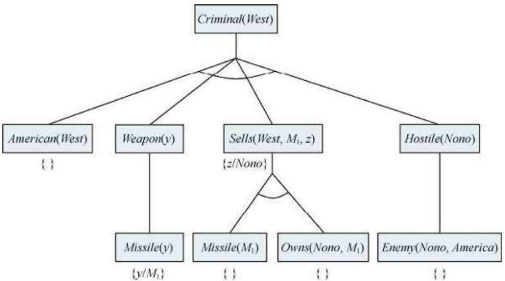  
图9-7 使用反向链接构建证明树来证明韦斯特是有罪的。树的阅读方式是深度优先，从左至右。要证明Criminal(West)，我们必须先证明其下方的4个合取子句。其中一些在知识库中，而另一些需要进一步反向链接。每次成功置换的绑定显示在对应的子目标旁边。注意，只要合取式中的一个子目标达成，其置换就被用于接下来的子目标。这样，当FOL-BC-A sk运行到最后一个合取子句，即最初为 Hostile ( z )的子句时， z 就已经被绑定为 Nono

# 9.4.2 逻辑编程

逻辑编程是一种接近第7章所述的陈述性理念的技术，即系统应当通过用形式语言表示的知识来构建，而问题应当通过在这些知识上运行推断过程来求解。这项理念在罗伯特·科瓦尔斯基（RobertKowalski）的等式中得以总结：

算法=逻辑+控制

Prolog 是最为广泛使用的逻辑编程语言。它主要被用作快速原型语言，也用于像编写编译器（VanRoy, 1990）、自然语言分析（Pereira and Warren, 1980）这样的符号处理任务。许多用于法律、医疗、财经和其他领域的专家系统都使用Prolog编写。

Prolog程序是确定子句集，但记法与标准的一阶逻辑有所不同。Prolog使用大写字母表示变量，小写字母则表示常量— 与逻辑中的约定相反。确定子句中的合取子句用逗号区分，而确定子句的书写也与我们所习惯的“相反”：不同于写为 $B \Rightarrow C$ ，在Prolog中我们将其写作 C :- A,B 。这里有一个典型的例子：

```prolog
criminal(X):- american(X), weapon(Y), sells(X,Y,Z), hostile(Z) 
```

在Prolog中，记法 [E|L] 表示第一个元素为 E 其余部分为 L 的列表。下面是append(X,Y,Z) 的Prolog程序，如果列表 Z 是列表 Y 追加到 X 后的结果，则程序返回成功：

```txt
append([],Y,Y)
```

```prolog
append([A|X],Y,[A|Z]) :- append(X,Y,Z)
```

我们可以将这些子句用自然语言描述为：（1）将列表Y 追加到空列表后得到相同的列表 Y ；

（2）在给定Z 是Y 追加到X 后的结果的情况下， [A|Z] 是 [Y] 追加到[A|X] 后的结果。在大多数高级语言中我们可以写出类似的递归函数来描述如何追加列表，但实际上Prolog的定义更为强大，因为它描述了3个参数间的 关系，而非用两个参数算出的函数 。例如，我们可以提出查询 append(X,Y,[1,2,3] ) ：哪两个列表追加能产生 [1,2,3 ] ？Prolog为我们返回的解是

$$
X = [ ] \quad Y = [ 1, 2, 3 ];
$$

$$
X = [ 1 ] \quad Y = [ 2, 3 ];
$$

$$
X = [ 1, 2 ] \quad Y = [ 3 ];
$$

$$
X = [ 1, 2, 3 ] \quad Y = [ ];
$$

Prolog程序的执行是通过深度优先的反向链接完成的，其中确定子句以其在知识库中的顺序进行尝试。Prolog的设计代表着陈述性与执行效率的妥协。Prolog的一些方面不属于标准的逻辑推断。

●Prolog使用8.2.8节所述的数据库语义而非一阶语义，这可以明显地从它对等词和否定的处理看出（见9.4.4节）。  
●有一系列用于算术的内置函数。使用这些函数符号的文字是通过执行代码而非进行深入推断“证得”的。例如，目标“X is 4+3 ”当 X 被绑定为7时达成。而目标“5 is X+Y ”则无法达成，因为内置函数无法求解任意等式。  
●存在执行时会产生副作用的内置谓词。这包括输入-输出谓词和用于修改知识库的assert/retract 谓词。这类谓词在逻辑中没有对应物，会导致令人困惑的结果，例如，如果事实是在证明树的一个最终会失败的分支中断言的。  
●出现检验 在Prolog的合一算法中被略去。这就意味着会产生一些不可靠的推断。这在实际中几乎完全不会发生。  
●Prolog使用深度优先反向链接搜索，并且不检查无限递归。在恰当使用的情况下，这种做法使得编程语言可用且高效。但这也意味着某些看起来是有效逻辑的程序将无法终止。

# 9.4.3 冗余推断和无限循环

我们现在来看Prolog的致命弱点：深度优先搜索和包含了重复状态和无限路径的搜索树之间的错配。考虑如下的逻辑程序，这一程序判断有向图中的两点是否存在路径：

$$
\operatorname {p a t h} (X, Z): - \operatorname {l i n k} (X, Z)
$$

$$
\operatorname {p a t h} (X, Z) : - \operatorname {p a t h} (X, Y), \operatorname {l i n k} (Y, Z)
$$

事实 link(a,b ) 和 link(b,c ) 描述的一个简单的三节点图如图9-8a所示。在这个程序中，查询 path(a,c ) 生成了图9-9a所示的证明树。与此同时，如果我们按顺序写出如下子句：

$$
\operatorname {p a t h} (X, Z): - \operatorname {p a t h} (X, Y), \operatorname {l i n k} (Y, Z)
$$

$$
\operatorname {p a t h} (X, Z): - \operatorname {l i n k} (X, Z)
$$

则Prolog会进入图9-9b所示的无限路径。因此，作为一个确定子句——甚至对于本例所示的数据日志程序——的定理证明器，Prolog是不完备的 ，因为对于某些知识库，它无法证明其所蕴含的语句。注意，前向链接并没有这种问题：只要 path(a,b) 、 path(b,c) 和 path(a,c)被推得，前向链接就会停止。

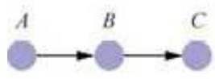

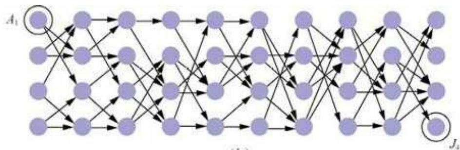

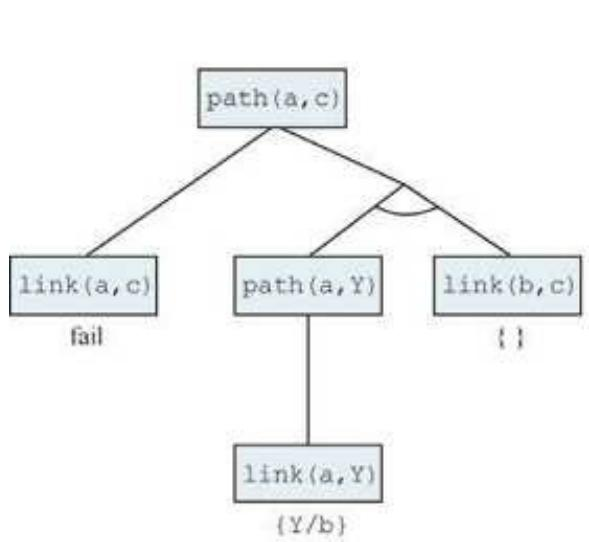  
图9-8（a）找出从 A到C的路径会导致Prolog陷入死循环；（b）每个节点连接到下一层中两个随机后继的图。找到从 A 1到 $J _ { 4 }$ 的路径需要877次推断

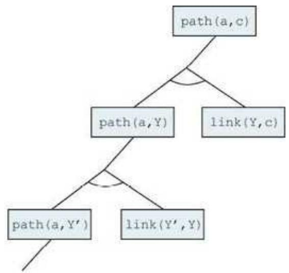  
  
图9-9（a）证明从 A到C存在一条路径。（b）子句顺序“错误”时生成的无限证明树

深度优先反向链接也有冗余计算的问题。例如，当查找图9-8b中从 $A _ { 1 }$ 到 $J _ { 4 }$ 的路径时，Prolog进行了877次推断，大部分推断用于找出到达无法达成目标的节点的所有可能路径。这类似于第3章所述的重复状态问题。推断的总量随着生成的基本事实的数量增加而呈指数增长。如果我们使用前向链接而非反向链接，连接到n 个节点的path(X,Y) 数量至多为 $n ^ { 2 }$ 个。对于图9-8b所示的问题则仅需要62次推断。

图搜索问题中的前向链接是动态规划 （dynamicprogramming）的一个实例，其子问题的解是由更小的子问题的解递增构建的，通过缓存更小的子问题来避免重复计算。我们可以在反向链接中达到类似的效果，只需要将大目标分解为小目标而非从小目标构建大目标。

不论如何，存储中间结果以避免重复计算是问题的关键。这是 表格化逻辑编程 （tabled logicprogramming）系统所采取的方法，它使用高效的存储和检索机制。表格化逻辑编程结合了反向链接的目标导向性以及前向链接动态规划的高效性。它对于数据日志知识库是完备的，这意味着程序员不太需要为死循环而担忧。（使用类似 father(X,Y ) 这种指代可能有无穷多对象的语句时，它仍然可能会进入死循环。）

# 9.4.4 Prolog的数据库语义

Prolog使用8.2.8节讨论过的数据库语义。唯一名称假设表明每个Prolog常量和每个基本项都仅指代唯一的对象，而封闭世界假设表明为真的语句只能是知识库蕴含的语句。Prolog无法断言某条语句是假的。这使得Prolog的表达能力比一阶逻辑差，但这正是使Prolog更为高效简洁的原因之一。考虑如下关于一些课程的断言：

Course(Cs,101）,Course(CS,102）,Course(CS,106）,Course(EE,101）

（9-11）

在唯一名称假设下，CS 和EE是不同的（101、102和106也不同），因此这表示有4门不同的课程。在封闭世界假设下，不存在其他课程，因此只有4门课程。但如果它是一阶逻辑（FOL）的断言，而非数据库语义的话，我们只能说课程的数量介于1到无穷之间。这是由于FOL中的断言并不否认存在未提及的课程的可能性，也不表明提到的课程各自不同。如果我们想将式（9-11）翻译成FOL，我们就会得到如下语句：

$$
\begin{array}{l} C o u r s e (d, n) \Leftrightarrow (d = C S \wedge n = 1 0 1) \vee (d = C S \wedge n = 1 0 2) \\ \vee (d = C S \wedge n = 1 0 6) \vee (d = E E \wedge n = 1 0 1) \tag {9-12} \\ \end{array}
$$

这就是对式（9-11）的 完备化 （completion）。在FOL中它表示最多有4门课程。要用FOL表示最少有4门课程的概念，我们需要写出等词的完备化：

$$
\begin{array}{l} x = y \Leftrightarrow (x = C S \wedge y = C S) \vee (x = E E \wedge y = E E) \vee (x = 1 0 1 \wedge y = 1 0 1) \\ \vee (x = 1 0 2 \wedge y = 1 0 2) \vee (x = 1 0 6 \wedge y = 1 0 6) \\ \end{array}
$$

完备化对于理解数据库语义是有益的，但为了实用，如果你的问题可以用数据库语义描述，则用Prolog和其他数据库语义系统进行推理会更加高效，而不是翻译为FOL后用完备的定理证明器推理。

# 9.4.5 约束逻辑编程

在对前向链接的讨论中（9.3节），我们展示了约束满足问题（CSP）是如何被编码为确定子句的。标准的Prolog求解此类问题的方法与图6.5所示的回溯算法完全一样。

由于回溯算法枚举变量的域，因而只能用于有限域 CSP。用Prolog的方式来说，如果目标含有未绑定变量的问题，其解的数量必须是有限的。（例如，在地图着色问题中，每个变量可以取4种不同的颜色中的一种。）无限域CSP（例如含有实数变量或整数变量的CSP）需要完全不同的算法，例如边界传播或线性规划。

考虑如下的例子。我们定义 triangle(X,Y,Z) 为其3个参数满足三角不等式时成立的谓词：

triangle(X,Y,Z) :-

$$
X > 0, Y > 0, Z > 0, X + Y > Z, Y + Z > X, X + Z > Y.
$$

如果我们向Prolog查询 triangle(3,4,5) ，它会返回成功；而如果我们询问triangle(3,4,Z) ，它就无法找到解，因为Prolog无法处理子目标 Z 0 。我们不能将未绑定的值与0比较。

约束逻辑编程 （constraint logic programming）允许变量是 被约束的 而非 被 绑定的 。CLP的解是从知识库中可以推得的、查询变量的最为具体的约束集。例如， triangle(3,4,Z) 的解是约束 7 Z 1 。标准的逻辑程序只是CLP中约束必须为等式约束（也就是绑定）的特殊情形。

CLP系统整合了各种约束求解算法用于该语言所支持的约束。例如，支持实值变量线性不等式的系统可能包含线性规划算法来求解这些约束。CLP系统也采用更为灵活的方法来求解标准的逻辑编程查询。例如，它可能使用第6章所述的任一高效算法，而非使用深度优先、从左到右回溯。因此，CLP系统结合了约束满足算法、逻辑编程和演绎数据库的要素。

已经出现了一些允许程序员对用于推断的搜索顺序有更多控制的系统。MRS语言（Genesereth andSmith, 1981; Russell, 1985）允许程序员编制 元规则 （metarule）来决定首先处理哪些合取式。用户可以编制规则，说明要首先尝试变量最少的目标，或者也可以对某个谓词编制论域特定的规则。

# 9.5 归结

逻辑系统家族中的最后一个成员，也是唯一能够用于所有知识库而不仅是确定子句的成员，是归结 。我们在7.5.2节了解了命题归结是命题逻辑的完备推断过程。在本节中，我们将其拓展到一阶逻辑。

# 9.5.1 一阶逻辑的合取范式

第一步是将语句转换为 合取范式 （CNF）——每个子句为文字析取的子句合取式。 [1] 在CNF中，文字可以包含变量，假定这些变量是全称量化的。例如，语句

[1]子句也可以用原子语句合取式为前提，原子语句析取式为结论的蕴涵式表示（习题9.DISJ）。这被称为蕴涵范式 或科瓦尔斯基范式 ［特别是写成从右到左的蕴涵符号时（Kowalski,1979）］，它通常比有许多否定文字的析取式更易读。

$$
\forall x, y, z \operatorname {A m e r i c a n} (x) \wedge \operatorname {W e a p o n} (y) \wedge \operatorname {S e l l s} (x, y, z) \wedge \operatorname {H o s t i l e} (z) \Rightarrow \operatorname {C r i m i n a l} (x)
$$

变为CNF

$$
\neg \text {A m e r i c a n} (x) \vee \neg \text {W e a p o n} (y) \vee \neg \text {S e l l s} (x, y, z) \vee \neg \text {H o s t i l e} (z) \vee \text {C r i m i n a l} (x)
$$

关键在于 每条一阶逻辑语句都可以转换为推断上等价的CNF 语句 。

转换成CNF的过程与命题逻辑中类似，我们已在7.5.2节中学习过。关键的差别在于对存在量词的消除。我们通过翻译语句“Everyone who loves all animals is loved by someone”（爱所有动物的每个人被一些人爱），即

$$
\forall x [ \forall y \text {A n i m a l} (y) \Rightarrow \text {L o v e s} (x, y) ] \Rightarrow [ \exists y \text {L o v e s} (y, x) ]
$$

来描述转换过程，步骤如下。

● 蕴涵消去 ：使用 $\pmb { Q }$ 取代 $P \Rightarrow Q$ 。在我们的例句中，需要操作两次。

$$
\forall x \neg [ \forall y \text {A n i m a l} (y) \Rightarrow \text {L o v e s} (x, y) ] \vee [ \exists y \text {L o v e s} (y, x) ]
$$

$$
\forall x \neg [ \forall y \neg A n i m a l (y) \vee L o v e s (x, y) ] \vee [ \exists y L o v e s (y, x) ]
$$

● 内移 ：除了针对否定联结词的一般规则，我们还需要针对否定量词的规则。因此，我们有

xP变为x-p xp变为xp

我们的语句经过如下变换：

$$
\forall x [ \exists y \neg (\neg A n i m a l (y) \vee L o v e s (x, y)) ] \vee [ \exists y L o v e s (y, x) ]
$$

$$
\forall x [ \exists y \neg \neg A n i m a l (y) \wedge \neg L o v e s (x, y) ] \vee [ \exists y L o v e s (y, x) ]
$$

$$
\forall x [ \exists y A n i m a l (y) \wedge - L o v e s (x, y) ] \vee [ \exists y L o v e s (y, x) ]
$$

注意，蕴涵式前提中的全称量词（∀ y）已经变为存在量词。语句现在解读为“要么存在x不喜爱的动物，要么（如果事实并非如此的话）有人喜爱x”。显然，原始语句的含义被保留了下来。

● 变量标准化 ：对于如 这样两次使用相同变量名的语句，更改其中一个变量名。这可以避免在消除量词时产生歧义。因此，有

$$
\forall x [ \exists y A n i m a l (y) \wedge \neg L o v e s (x, y) ] \vee [ \exists z L o v e s (z, x) ]
$$

●斯科伦化 ：斯科伦化 （Skolemization）就是通过消去移除存在量词的过程。在这个简单例子中，它就像9.1节所述的存在量词实例化，将 翻译为 P ( A )，其中 A 是一个新变量。然而，我们无法对上述的语句应用存在量词实例化，因为它不符合 的形式。语句中只有一部分满足这一形式。如果我们盲目地对两个符合的部分应用这一规则，得到

$$
\forall x [ \text {A n i m a l} (A) \wedge \neg \text {L o v e s} (x, A) ] \vee \text {L o v e s} (B, x)
$$

其含义完全是错误的。它表明每个人要么无法爱上特定动物A，要么就被某个特定实体 B所爱。而实际上，我们的原始语句允许每个人不爱不同的动物，或者被不同的人喜爱。我们希望斯科伦实体依赖于 x ：

$$
\forall x [ \text {A n i m a l} (F (x)) \wedge - \text {L o v e s} (x, F (x)) ] \vee \text {L o v e s} (G (x), x)
$$

此处 $F$ 和G 为斯科伦函数 （Skolemfunction）。总的规则是，斯科伦函数的参数全部是全称量化的变量，要消去的存在量词出现在这些变量的辖域内。与存在量词实例化一样，斯科伦化的语句的可满足性与原始语句完全一致。

●全称量词消除 ：此时，所有剩余变量必然是全称量化的。因此，我们消除全称量词不会损失任何信息：

$$
[ \text {A n i m a l} (F (x)) \wedge \neg \text {L o v e s} (x, F (x)) ] \vee \text {L o v e s} (G (x), x)
$$

● 对 ∧ 分配∨ ：

$$
[ \text {A n i m a l} (F (x)) \vee \text {L o v e s} (G (x), x) ] \wedge [ - \text {L o v e s} (x, F (x)) \vee \text {L o v e s} (G (x), x) ]
$$

这一步可能还需要展开嵌套的合取式和析取式。

语句现在成为了含有两个子句的CNF。它比原本含有蕴涵的语句难读多了。（将斯科伦函数 $F$ ( x)解释为可能不被x所爱的动物，而将G (x)解释为可能爱着x的人，可能会对理解有所帮助。）幸运的是，人类很少需要考察CNF语句——翻译过程很容易自动化。

# 9.5.2 归结推断规则

一阶子句的归结规则就是7.5.2节命题归结规则的提升版。两条进行了标准化分离、没有共同变量的子句，如果它们含有互补文字则可以被归结。如果两个命题文字相互否定，则这两个命题文字是互补的；如果两个一阶逻辑文字中的一个能够与另一个的否定合一，则这两个一阶逻辑文字是互补的。因此，我们有

$$
\frac {\ell_ {1} \vee \cdots \vee \ell_ {k} , \quad m _ {1} \vee \cdots \vee m _ {n}}{\text {S u b s t} (\theta , \ell_ {1} \vee \cdots \vee \ell_ {i - 1} \vee \ell_ {i + 1} \vee \cdots \vee \ell_ {k} \vee m _ {1} \vee \cdots \vee m _ {j - 1} \vee m _ {j + 1} \vee \cdots \vee m _ {n})}
$$

其中 $\operatorname { U n u r y } ( \ell _ { i } , - m _ { j } ) = \theta$ 。例如，我们可以归结两个子句

$$
[ \text {A n i m a l} (F (x)) \vee \text {L o v e s} (G (x), x) ] _ {\text {和}} [ - \text {L o v e s} (u, v) \vee - K i l l s (u, v) ]
$$

通过用合一子 $\theta = \{ \psi / G ( x ) , \nu / x \}$ 来消去互补文字 $\bar { L } o v e s ( G ( x ) , x )$ 和，生成归结式 子句 $( u , v )$

# $[ A n i m a l ( F \left( x \right) ) \vee { \mathcal { K } } i l l s ( G ( x ) , x ) ]$

这个规则叫作二元归结 （binary resolution）规则，因为它刚好归结两个文字。二元归结本身并不产生完备的推断过程。完备的归结规则能够归结每个子句的可合一文字子集。另一种方法是将因子提取 （也就是对冗余文字的消除）拓展到一阶逻辑。命题逻辑因子提取将两个 相同 的文字约简为一个，一阶逻辑因子提取则约简两个可合一 的文字。这种合一子必须应用于整个子句。二元归结和因子提取的组合是完备的。

# 9.5.3 证明范例

归结通过证明 不可满足来证明 $\pmb { \alpha }$ ，也就是说，通过推导空子句来证明。它的算法与命题逻辑情形相同，如图7-13所示，因此我们不在此重复。但我们会给出两个证明范例。第一个是9.3节的犯罪示例。CNF形式的语句为

$$
\begin{array}{l} \neg \text {A m e r i c a n} (x) \vee \neg \text {W e a p o n} (y) \vee \neg \text {S e l l s} (x, y, z) \vee \neg \text {H o s t i l e} (z) \vee \text {C r i m i n a l} (x) \\ \neg \text {M i s s i l e} (x) \vee \neg \text {O w n s} (\text {N o n o}, x) \vee \text {S e l l s} (\text {W e s t}, x, \text {N o n o}) \\ - E n e m y (x, A m e r i c a) \vee H o s t i l e (x) \\ - \text {M i s s i l e} (x) \vee \text {W e a p o n} (x) \\ \end{array}
$$

$$
O w n s \left(N o n o, M _ {1}\right)
$$

$$
M i s s i l e \left(M _ {1}\right)
$$

$$
A m e r i c a n (W e s t)
$$

$$
E n e m y (N o n o, A m e r i c a)
$$

我们还包括了目标的否定 。图9-10展示了归结证明。注意其结构：一条“主线”从目标子句开始，归结知识库中的子句，直到生成空子句。这是在霍恩子句知识库上进行归结的特点。实际上，沿着主线的子句严格对应于图9-6反向链接算法中 目标 变量的值。这是由于我们总是选择归结正文字能够与主线中“当前”子句最左边文字合一的子句；这与反向链接一模一样。因此，反向链接是归结的一个特例，它具有特定的控制策略来决定下一步要进行哪个归结。

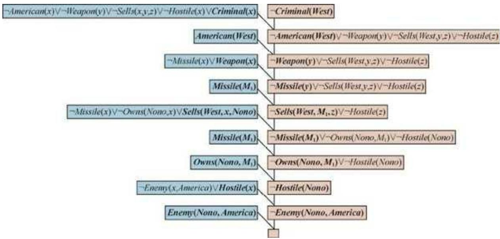  
图9-10归结证明韦斯特有罪。每个归结步骤中，合一文字用加粗字体表示，带有正文字的子句用蓝底表示

我们的第二个范例使用斯科伦化，并涉及非确定子句。这会导致更为复杂的证明结构。其自然语言描述如下。

Everyone who loves all animals is loved by someone.（每个爱所有动物的人都被一些人所爱。）

Anyone who kills an animal is loved by no one.（任何害死动物的人都不被人所爱。）

Jack loves all animals.（杰克爱所有动物，）

Either Jack or Curiosity killed the cat, who is named Tuna.（要么是杰克要么是好奇心害死了那只猫， 猫的名字叫Tuna。）

Did Curiosity kill the cat?（是好奇心害死了那只猫吗？）

首先，我们将原始语句，也就是一些背景知识，以及目标G的否定表示为一阶逻辑：

$\forall x \ [ \forall y A n i m a l ( y ) \Rightarrow L o v e s \ ( x , y ) ] \Rightarrow [ \exists y L o v e s \ ( y , x ) ]$ $\Rightarrow$ A．   
B $\forall x [ \exists z A n i m a l ( z ) \land K i l l s ( x , z ) ] { \Rightarrow } [ \forall y - L o v e s ( y , x ) ]$   
C.xAnimal（x）=Loves(Jack,x）  
D.Kills(Jack,Tuna）VKills(Curiosity,Tuna）  
E．   
F.Ax Cat(x）=Animal（x）  
-G.-Kills(Curiosity,Tuna）

然后，我们使用转换过程将每条语句转换为CNF：

A1.Animal(F(x)）VLoves(G(x）,x)  
A2． ${ \mathcal { U } } o v e s ( x , F ( x ) ) \backslash L o v e s ( G ( x ) , x )$   
B.-Loves(y,x）V-Animal(z)V-Kills(x,z）  
C.-Animal(x）VLoves(Jack,x）  
D． Kills(Jack,Tuna）VKills(Curiosity，Tuna）  
E.Cat(Tuna）  
F.-Cat（x）VAnimal（x）  
-G.-Kills(Curiosity,Tuna）

图9-11展示了“好奇心害死猫”的归结证明。在自然语言中，证明可以释义为：

假设好奇心没有害死Tuna。我们知道要么是杰克要么是好奇心做了这件事，因此一定是杰克干的。现在，Tuna是一只猫，而猫是动物，因此Tuna是动物。因为任何害死动物的人都不被人所爱，我们就知道没人爱杰克。但是，杰克爱所有动物；至此有人爱他；至此我们得到了一个矛盾。因此，好奇心害死了那只猫。

证明回答了问题“是好奇心害死了那只猫吗？”但我们常常希望提出更一般的问题，例如“谁害死了

那只猫？”归结可以做到这一点，但需要稍微增加一些工作才能得到答案。目标是∃ w Kills ( w ,Tuna )，其CNF形式的否定为 。用新的否定的目标重复图9-11所示的证明，我们得到了类似的证明树，其中一步的置换为 。因此，这种情况下，找出谁害死了那只猫就只是记录证明中查询变量的绑定的问题了。遗憾的是，归结有时会对存在量化目标产生 非构造性证明 （nonconstructive proof），我们知道一个查询为真，但却不知道这个变量的唯一绑定。

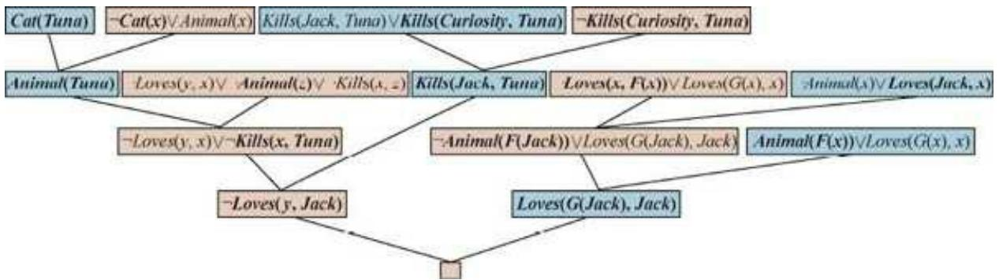  
图9-11 好奇心害死猫的归结证明。注意，在推导子句 Loves ( G ( Jack ), Jack )时使用了因子分解。还要注意，在右上角，合一 Loves ( x , F ( x ))和 Loves ( Jack , x )只有在变量标准化分离后才可以进行

# 9.5.4 归结的完备性

本节给出归结完备性证明。认为归结完备性是理所当然的读者可以略过本节。

我们展示归结是 反演完备的 （refutation-complete），这意味着如果一个语句集是不可满足的，则归结总能推出矛盾。归结不能用于生成语句集的所有逻辑结果，但它可以用于证明给定语句是某个语句集所蕴含的。因此，它可以通过证明 不可满足来找到给定问题Q (x)的所有答案。

我们认定了一阶逻辑的所有语句（不含等词）都可以重写为CNF中的子句集。它以原子语句为基础，在语句的形式上进行归纳来证明（Davisand Putnam,1960）。因此我们的目标是证明下面的陈述： 如果S 是不可满足的子句集，则对S 应用有限次归结会产生矛盾。

我们的证明遵循鲁宾逊（Robinson）的原始证明，同时使用了（Genesereth and Nilsson, 1987）中的一些简化。证明的基本结构（见图9-12）如下。

（1）我们观察到如果 S 不可满足，则存在 S 中子句的某个基本实例集使得该集合同样无法满足（埃尔布朗定理）。  
（2）我们引入第7章给出的 基本归结定理 ，它证明命题归结对于基本语句是完备的。  
（3）我们使用提升引理 来证明，对于使用基本语句集的任意命题归结证明，都存在相应的一阶归结证明，它使用一阶语句，从中可以得到基本语句。

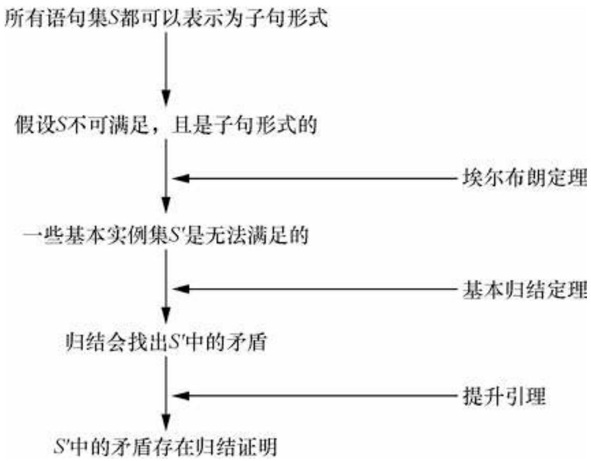  
图9-12归结完备性证明的结构

哥德尔不完全性定理

通过稍微拓展一阶逻辑语言来允许算术中的数学归纳法，库尔特·哥德尔的不完全性定理证明存在无法证明的真值算术语句。

不完全性定理的证明有点超出本书的讨论范畴，要证明它至少需要30页纸，但我们在此可以给出一些思路。我们从逻辑数论开始。在该理论中，只存在单个常量0和单个函数 S （后继函数）。在预期模型中， S (0)表示1， S ( S (0))表示2，以此类推。因此语言中所有自然数都有名称。它的词汇表还包含函数符号+、×和Expt（幂运算）以及普通的逻辑联结词和量词。

首先要注意的是，在这种语言中我们能够写出的语句集是可以枚举的。（想象给符号定义字母序，然后按字母顺序依次排列长度分别为1、2……的语句集。）我们就可以为每条语句 $\pmb { \alpha }$ 编号一个唯一的自然数 （即哥德尔数 ）。这很重要：数论包含了它的每个语句的名字。同样地，我们可以为每个证明 $P$ 编号为哥德尔数 G ( P )，因为证明都是一个有限的语句序列。

现在假设我们有递归可枚举的语句集 A，它是对自然数的真命题。别忘了A可以由给定的整数集命名，我们可以想象用我们的语言写出如下类型的语句 ： $\alpha ( j , A )$

不是哥德尔数为 $j$ 的语句的证明的哥德尔数，其中证明只使用 A 中的前提。

然后，令 $\pmb { \sigma }$ 为语句 ，也就是表明其自身不可由 A 证明的语句。（也就是，这条语句恒为真，但并不明显。）

现在我们提出如下的巧妙观点：假设 $\pmb { \sigma }$ 是可由 A证明的，则 $\pmb { \sigma }$ 为假（因为 $\pmb { \sigma }$ 说自己是不可证明的）。但这样我们就有一个可以从A证明的真值为假的语句，因此A不可能只包含真语句——这与我们的前提矛盾。因此 $\pmb { \sigma }$ 是不可由A证明的。但这正如 $\pmb { \sigma }$ 自己所述，因此 $\pmb { \sigma }$ 是一个真语句。

因此，我们证明了（略去了 页）对于数论的所有真语句集，特别是所有基本公理集，存在由这些公理无法 证明的真语句。这就明确了我们无法在任何给定公理系统内 证明所有数学定理。显然，这是数学的重要发现。它对人工智能的重要性已经被广泛的争论，这种争论正始于哥德尔本

人的猜想。我们在第27章探讨这些争论。

要进行第一步，我们需要3个新概念。

（1） 埃尔布朗域 （Herbrand universe）：如果S 是子句集，则S 的埃尔布朗域 $H S$ 是可以由下面几项构建的基本项集合。

a. S 中的函数符号，如果存在的话。  
b.S 中的常量符号，如果存在的话；如果不存在，则为默认常量符号S。

例如，如果 S 仅含有子句 $\lnot P ( x , F ( x , A ) ) \lor \lnot Q ( x , A ) \lor R ( x , B )$ ，则 $H S$ 为如下基本项的无限集：

$$
\{A, B, F (A, A), F (A, B), F (F, B), F (B, B), F (A, F (A, A)), \dots \}
$$

（2） 饱和 （saturation）：如果S 为子句集，P是基本项集，则 P(S )为S 对于 $P$ 的饱和，它是通过对 S 中的变量应用所有可能 $P$ 中基本项的一致置换得到的所有基本子句的集合。

（3） 埃尔布朗基 （Herbrand base）：子句集 S 关于其埃尔布朗域的饱和称为 S 的埃尔布朗基，写作 $H$ S ( S )。例如，如果 S 仅含有上述的子句，则 $H$ S ( S )是无限子句集

$$
\begin{array}{l} \{- P (A, F (A, A)) \vee - Q (A, A) \vee R (A, B), \\ \neg P (B, F (B, A)) \vee \neg Q (B, A) \vee R (B, B), \\ \neg P (F (A, A), F (F (A, A), A)) \vee \neg Q (F (A, A), A) \vee R (F (A, A), B), \\ \neg P (F (A, B), F (F (A, B), A)) \vee \neg Q (F (A, B), A) \vee R (F (A, B), B), \dots \} \\ \end{array}
$$

这些定义使我们可以陈述埃尔布朗定理 （Herbrand, 1930）的一种形式：

如果子句集S 不可满足，则存在 H S (S )的一个不可满足的有限子集。

令 $S ^ { \prime }$ 为基本语句的有限子集。现在我们可以使用接地归结定理（7.5.2节）来证明 归结闭包 RC ( S')含有空子句。也就是说，使用命题归结对S'进行完备化会推得矛盾。

现在我们已经证明了必然存在涉及S 的埃尔布朗基的有限子集的归结证明，下一步是证明存在使用S 本身的子句的归结证明，它们不一定是基本子句。我们从考虑单次运用归结规则的情形开始。鲁宾逊阐述了如下引理：

令 C 和C 为两个不含相同变量的子句，C' 和C' 分别为C 和C 的基本实例。如果C'是C' 1 和 C ' 2 的归结式，则存在子句 C 使得：（1） C 是 C 1 和 C 2 的归结式；（2） C' 是 C 的基本实例。

这就是 提升引理 （lifting lemma），因为它将基本子句的证明提升到一般一阶逻辑子句。鲁宾逊为了证明其基本提升引理而不得不发明了合一且推导了最一般合一子的所有性质。我们仅阐明该引理而不在此进行证明：

$$
\begin{array}{l} C _ {1} = \neg P (x, F (x, A)) \vee \neg Q (x, A) \vee R (x, B) \\ C _ {2} = - N (G (y), z) \vee P (H (y), z) \\ C _ {1} ^ {\prime} = \neg P (H (B), F (H (B), A)) \vee \neg Q (H (B), A) \vee R (H (B), B) \\ C _ {2} ^ {\prime} = - N (G (B), F (H (B), A)) \vee P (H (B), F (H (B), A)) \\ C ^ {\prime} = \neg N (G (B), F (H (B), A)) \vee \neg Q (H (B), A) \vee R (H (B), B) \\ C = \neg N (G (y), F (H (y), A)) \vee \neg Q (H (y), A) \vee R (H (y), B) \\ \end{array}
$$

我们看到 $C ^ { \prime }$ 实际上是 $C$ 的基本实例。一般来说，要使 $C ^ { \prime } { } _ { 1 }$ 和 $C ^ { \prime } { } _ { 2 }$ 具有归结式，就必须通过先对 C和C 使用 $C _ { 1 }$ 和 $C _ { 2 }$ 中的互补文字的最一般合一子来构建它们。由提升引理，易得任意多次应用归结规则时的相似结论：

对于归结闭包 S' 内的任意子句 $C ^ { \prime }$ ，有归结闭包 S 内的子句 $C$ 使得 $C ^ { \prime }$ 为 $C$ 的基本实例且对 $C$ 的推导长度与对 $C ^ { \prime }$ 的推导长度相同。

由此可得，如果归结闭包S'内有空子句，则它必然也在归结闭包S 中。这是由于空子句不可能是任何其他子句的基本实例。概括来说：我们已经证明了如果S 不可满足，则存在使用归结规则的对空子句的有限推导。

定理证明从基本子句提升到一阶子句大大增加了其能力。这种能力的增加来源于以下事实：一阶逻辑证明只需要在证明确有必要时才实例化变量，而基本子句方法则需要检查大量的任意实例化。

# 9.5.5 等词

本章到目前为止讲述过的所有推断方法都不能在不增加额外工作的情况下处理形如x=y的断言。为此可以采取3种不同的方法。第一种方法是公理化等词，也就是在知识库中写入相等关系的语句。我们需要说明相等是自反的、对称的和传递的，我们还需要说明我们可以在所有谓词或函数中用相等量置换相等量。因此我们需要3类基本公理，另外每个谓词和函数都需要一条公理：

$$
\begin{array}{l} \forall x \quad x = x \\ \forall x, y x = y \Rightarrow y = x \\ \forall x, y, z x = y \wedge y = z \Rightarrow x = z \\ \forall x, y x = y \Rightarrow \left(P _ {1} (x) \Leftrightarrow P _ {1} (y)\right) \\ \forall x, y x = y \Rightarrow \left(P _ {2} (x) \Leftrightarrow P _ {2} (y)\right) \\ \end{array}
$$

$$
\begin{array}{c} \vdots \\ \forall w, x, y, z w = y \wedge x = z \Rightarrow (F _ {1} (w, x) = F _ {1} (y, z)) \\ \forall w, x, y, z w = y \wedge x = z \Rightarrow (F _ {2} (w, x) = F _ {2} (y, z)) \\ \vdots \end{array}
$$

给定这些语句，标准的推断过程，如归结，就可以执行需要等词推理的任务，如求解数学方程。不过，这些公理会产生大量结论，其中大多数对证明没有帮助。因此第二种方法是添加推断规则而非公理。最简单的规则是解调 ，它取单元子句x=y和一个含有 x项的子句 $\pmb { \alpha }$ ，生成一个用 y置换

$\pmb { \alpha }$ 中的 $x$ 得出的新子句。如果 $\pmb { \alpha }$ 中的项能够与 $x$ 合一，解调就可以使用，而不需要完全等于 x 。注意，解调是有方向性的，给定 $x = y$ ， $x$ 总是会被 $y$ 替换，而非相反。这意味着解调可以用形如z$+ \ 0 = z$ 或 $z ^ { 1 } = z$ 这样的解调器来简化表达式。下面的例子中，给定

$$
F a t h e r (F a t h e r (x)) = P a t e r n a l G r a n d f a t h e r (x)
$$

$$
\text {B i r t h d a t e} (\text {F a t h e r} (\text {F a t h e r} (\text {B e l l a})) \text {, 1 9 2 6})
$$

我们可以通过解调得出

$$
\text {B i r t h d a t e} (\text {P a t e r n a l G r a n d F a t h e r} (\text {B e l l a}), 1 9 2 6)
$$

更为形式化地，我们有

● 解调 （demodulation）：对于任意项 $x$ 、y和 $\mathbf { Z }$ ，其中 $\boldsymbol { z }$ 出现在文字 $m i$ 中的某处且

$$
\mathrm {U N I F Y} (x, z) = \theta \neq f a i l u r e,
$$

$$
\frac {x = y , \quad m _ {1} \vee \cdots \vee m _ {n}}{\operatorname {S u b} (\operatorname {S u b s t} (\theta , x) , \operatorname {S u b s t} (\theta , y) , m _ {1} \vee \cdots \vee m _ {n})}
$$

其中S ubst 是对绑定表的一般置换，而 $\Omega = ( x , y , m )$ 表示在 $m$ 中的某处用 $y$ 替换 x 。

这个规则可以拓展到处理含有等词的非单元子句。

● 超解调 （paramodulation）：对于任意项 $x$ 、 y 和 $\boldsymbol { z }$ ，其中 $\mathbf { Z }$ 出现在文字 $m i$ 中的某处且

$$
\operatorname {U N I F Y} (x, z) = \theta \neq f a i l u r e,
$$

$$
\ell_ {1} \vee \dots \vee \ell_ {k} \vee x = y, \quad m _ {1} \vee \dots \vee m _ {n}
$$

$$
\operatorname {S u b} \left(\operatorname {S u b s t} (\theta , x), \operatorname {S u b s t} (\theta , y), \operatorname {S u b s t} (\theta , \ell_ {1} \vee \dots \vee \ell_ {k} \vee m _ {1} \vee \dots \vee m _ {n})\right)
$$

例如，由

$$
P (F (x, B), x) \vee Q (x) _ {\text {和}} F (A, y) = y \vee R (y)
$$

我们有 ，通过超解调我们可以得到结论

$$
P (B, A) \vee Q (A) \vee R (B)
$$

超解调产生含有等词的一阶逻辑的一个完备推断程序。

第三种方法仅使用拓展的合一算法处理等词推理。也就是说，如果若干项在某种置换下可证明为相等，则它们是可合一的，其中“可证明”允许等词推理。例如，项1 +2和2 +1通常不可合一，但知道 的合一算法可以用空置换合一它们。这种 等词合一 （equationalunification）可以用针对特定公理（交换性、结合性等）设计的高效算法完成，而非通过直接用这些公理推断。使用这种技术的定理证明器与9.4节所述的CLP系统密切相关。

# 9.5.6 归结策略

我们知道只要证明存在，反复运用归结推断规则总会找到一个证明。在本节中我们考察有助于 高效找出证明的策略。

单元优先 （unitpreference）：这个策略优先处理其中一条语句为单文字（也就是 单元子句 ）的归结。这一策略的思路是，我们试图产生空子句，因此先处理产生较短子句的推断可能是个好主意。

归结单元语句（如 P ）与其他任意语句（如 ）总是生成比其他子句短的子句（本例中为 ）。当这种单元优先策略在1964年首次被用于命题推断时，它产生了巨大的加速作用，使得它能够证明许多先前无法处理的定理。 单元归结 是归结的一种受限形式，其中归结的每一步都含有单元子句。单元归结总体上是不完备的，但对霍恩子句是完备的。霍恩子句上的单元归结证明与前向链接类似。

O tter定理证明器（McCune, 1990）使用了最佳优先搜索。其启发函数度量每个子句的“权重”，并偏好权重较轻的子句。启发式函数的选择取决于用户，但通常子句的权重应当与其规模或难度相关。它认为单元子句权重较轻，因此这种搜索可以被看作单元优先策略的一般化。

支撑集 （setofsupport）：优先尝试某些归结是有用的，但一般来说一起消除某些有潜力的归结是更为高效的做法。例如，我们可以使每个归结步都用到一个特殊子句集的至少一个元素，这个特殊子句集就是支撑集。归结式随后被加入支撑集中。如果支撑集远小于整个知识库，则搜索空间会大大简化。

为确保这种策略的完备性，我们可以选择使得语句的剩余部分同时可满足的支撑集S 。例如，假设原始知识库是一致的，我们就可以使用否定查询作为支撑集（毕竟，如果知识库不一致，则查询符合知识库也没什么意义了）。支撑集策略还有一个好处，它能够生成目标导向的证明树，利于人类理解。

输入归结 （inputresolution）：这种策略中，每个归结都是一个输入语句（来自知识库或查询）与其他一些语句的结合。图9-10所示的证明仅使用输入归结，因而具有单条“主线”且单条语句向主线结合的结构特征。显然，这种证明树的空间小于整个证明图的空间。在霍恩知识库中，肯定前件是一种输入归结策略，因为它将原知识库中的一个蕴涵式与其他语句结合。因此，我们知道输入归结对于霍恩形式的知识库是完备的，但一般情况下它是不完备的。如果 P在原始知识库中或 $P$ 在证明树上是 Q 的祖先的话， 线性归结 （linearresolution）策略允许 P和Q 一同归结。线性归结是完备的。

包容 （subsumption）：包容方法消除所有知识库中已有语句所包含的语句（也就是更为精确的语句）。例如，如果 P ( x )在知识库中，则添加语句 P ( A )就没有意义，添加 $P$ ( A ) ∨ Q ( B )则更无意义。包容能够使知识库较小，进而有助于减小搜索空间。

学习 （learning）：我们可以通过从经验中学习改进定理证明器。给定先前证得的定理集，训练机器学习系统来回答问题：给定前提集和证明目标，哪些证明步骤与之前成功的证明步骤类似？DeepHOL系统（Bansaletal. ,2019）做到了这一点，它使用深度神经网络（见第21章）来构建目标和前提的模型（称为嵌入 ），并使用这些模型来选择步骤。训练可以同时使用人类或计算机生成的证明作为样本，并至少需要10 000个证明。

归结定理证明器的实际用途

我们已经展示了一阶逻辑是如何表示简单的、涉及出售、武器、公民权等问题的真实世界场景的。但复杂的真实世界场景有太多未知和不确定性。逻辑已经被证明在涉及形式化、严格定义的概念的场景中表现出色，例如硬件和软件的合成 （synthesis）与 验证 （verification）。定理证明研究还在硬件设计、编程语言和软件工程领域展开，而不仅限于人工智能领域。

在硬件领域，公理描述了信号和电路元件之间的相互作用。（见8.4.2节的例子。）专门用于验证的逻辑推理器已经能够验证整个CPU，包括验证其时序（Srivas and Bickford, 1990）。A ura 定理证明器已经用于生成比所有已有设计更为紧凑的电路设计（Wojciechowski and Wojcik, 1983）。

在软件领域，对程序进行推理与动作推理非常相似，如在第7章中，公理描述每个命题的前提和效果。算法的形式化合成是定理证明器最早的应用之一，如科德尔·格林（Green, 1969a）所述。科德尔·格林的论述基于更早由赫伯特·西蒙（Simon,1963）提出的思路。这种思路是对效果“存在满足特定规范的程序 p ”构造性地证明定理。尽管全自动演绎合成 还不能用于通用编程，人工引导的演绎合成却已经成功用于设计一些新颖、精妙的算法。像科学计算代码这样的专用程序的合成也是研究的热门领域。

类似的技术现在已经被用于软件验证，对应的系统有Spin模型检查器（Holzmann,1997）等。例如，Remote Agent空间飞行器控制程序在飞行前后都进行了验证（Havelund et al. , 2000）。RSA公

钥加密算法和BM（Boyer-Moore）字符串匹配算法也使用这种方式进行验证（Boyer and Moore,1984）。

小结

我们已经分析了一阶逻辑中的逻辑推断，以及一些相关的算法。

●第一种方法使用推断规则（全称量词实例化 和存在量词实例化 ）来命题化 推断问题。通常，这种方法速度慢，除非论域非常小。  
●使用合一 来找出适当的变量置换消去一阶证明中的实例化步骤，在许多情况下提高了这一过程的效率。  
●肯定前件的提升版使用了合一，产生了一般化肯定前件 这种自然、强大的推断规则。 前向链接算法和 反向链接 算法对确定子句集使用这条规则。  
●一般化肯定前件对确定子句是完备的，但蕴含问题是半可判定的 。对于不含函数的确定子句构成的数据日志 知识库，蕴含是可判定的。  
●前向链接用于演绎数据库 ，此时它可以与关系数据库的操作结合。它也用于对超大规则集进行高效更新的产生式系统 。前向链接对于数据日志是完备的，并可以在多项式时间内运行。  
●反向链接用于逻辑编程系统 ，它利用巧妙的编译器技术来实现超快速推断。反向链接受制于冗余推断和死循环，可以通过备忘 来缓解这些问题。  
● Prolog 与一阶逻辑不同，它使用了封闭世界中的名称唯一假设，并视否定为失败。这使Prolog成为很实用的编程语言，但也偏离了纯粹的逻辑。  
●一般化的归结 推断规则使用合取范式知识库为一阶逻辑提供了完备的推断系统。  
●一些用于减小归结系统搜索空间的策略不牺牲其完备性。最重要的问题之一是处理等词，我们展示了如何使用解调 和超解调 。  
●基于归结的高效定理证明器已经被用于证明有趣的数学定理和验证及合成软件和硬件。

读者服务：


微信扫码关注【异步社区】微信公众号，回复“e59810”获取本书配套资源以及异步社区15天VIP会员卡，近千本电子书免费畅读。

# 第10章

# 知识表示

在本章中，我们展示如何以一阶逻辑表示真实世界中的各种事实。

前面的章节展示了具有知识库的智能体如何进行推断，以便能采取正确的行动。本章我们回答要把什么样的内容 放进这种智能体的知识库中，也就是如何表示关于世界的事实。我们使用一阶逻辑作为表示语言，而后续章节将介绍其他表示的形式体系，例如用于规划推理的分层任务网络（第11章），用于不确定性推理的贝叶斯网络（第13章），用于进行时序推理的马尔可夫模型（第17章），以及用于推理图像、声音和其他数据的深度神经网络（第21章）。不论你使用什么表示，都始终需要处理关于世界的事实。本章将使你建立处理这些问题的直觉。

10.1节介绍通用本体论的思想，将世界上所有的事物用层次类别组织起来；10.2节涵盖对象、物质和度量的基本类别；10.3节介绍事件；10.4节讨论关于信念的知识。然后，我们再考虑用这些内容进行推理的方法，10.5节讨论设计用于高效类别推断的推理系统，10.6节讨论具有缺省信息的推理。

# 10.1 本体论工程

在“玩具”领域，选择何种表示并不那么重要，很多表示都可以良好运作。但在复杂的领域，如网上购物或者在车流中驾驶，就需要更为通用和灵活的表示方法。本章将展示如何创建这些表示，主要关注于许多不同领域中都会出现的一般性的概念，如事件 、时间 、对象、信念等。有时，表示这些抽象概念被称为 本体论工程 （ontological engineering）。

我们不能奢求表示世界中的一切事物，我们甚至无法表示1000页的教科书，但我们会留出一些位置，使所有领域的新知识都可以填入。例如，我们将定义对象是什么，而不同种类对象的细节—机器人、电视机、书或者无论什么——可以随后再进行填充补全。这类似于面向对象编程框架（如JavaSwing图形化框架）的设计者定义 窗口之类的一般性概念，并期待用户使用它们来定义更为具体的概念，如 表单窗口 。概念的一般性的框架被称为 上层本体论 （upper ontology），因为我们惯于将更一般性的概念绘制于更具体的概念之上，如图10-1所示。

在进一步考虑本体论之前，我们要先说明一项重要的提醒。尽管真实世界的一些层面很难用一阶逻辑来刻画，我们仍选择使用FOL来讨论知识的内容和组织。主要的难点在于，大多数一般化都有其例外，或仅在某种程度上成立。例如，尽管“番茄是红色的”是一条有用的规则，但一些番茄是绿色的、黄色的或橙色的。本章的大多数规则都可以找到类似的例外。处理例外和不确定性的能力极其重要，但它却与理解一般性的本体论无关。因此，我们在10.5节之前都不讨论例外情形，而在第12章才讨论在不确定性下进行推理的更一般性的话题。

上层本体论的用处是什么？考虑8.4.2节的电路本体论。它进行了许多简化假设：时间被完全无视；信号是固定的且不需要传播；电路的结构保持不变。更一般性的本体论会考虑特定时间的信号，也会考虑导线的长度和传播延迟。这能使我们模拟电路的时序性质——实际上，电路设计师常常进行这种模拟。

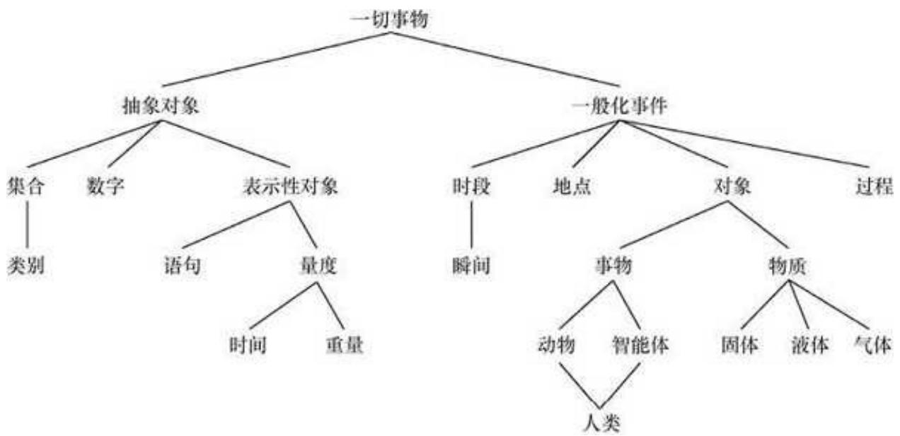  
图10-1 世界的上层本体论，它展示了本章稍后要讲述的内容。每条线表示低层概念是高层概念的一种具体化。具体化不一定是排他的——人类既是动物，又是智能体。我们会在10.3.2节看到为何对象在一般化事件的下层

我们还可以通过描述电路技术（TTL、COMS等）或输入输出规范等方法引入更为有趣的门电路类型。如果我们要讨论可靠性或进行诊断，我们就需要考虑电路的结构和门电路属性自发改变的可能性。要考察杂散电容，我们就需要表示导线在电路板上的位置。

wumpus世界中也有类似的因素需要考虑。尽管我们表示了时间，但它的结构却过于简单：智能体在不行动时什么都不会发生，而所有变化都是瞬间发生的。更适于真实世界的、更为一般性的本体论能够允许变化随时间同时发生。我们还使用了Pit谓词来表示哪个方格有无底洞。我们其实可以通过在无底洞类别下增加不同属性的无底洞个体来允许出现不同种类的无底洞。类似地，我们可能

还想允许wumpus之外的其他动物出现。从可用的感知可能无法确定动物的确切物种，因此我们可能需要构建生物分类学层级来帮助智能体从匮乏的线索中预测穴居者的行为。

对所有专用本体论来说，做类似这样的修改来使其更为一般化是可行的。显然，这样做就产生了一个问题：这些本体论是否最终都会发展为通用本体论？在几个世纪的哲学和计算研究中，答案是“有可能”。本节我们展示一种通用本体论，它综合了这几百年的思想。通用本体论与专用本体论有两个主要的区别。

●通用本体论在所有专用论域都应当可以或多或少地适用（在增加论域特定的公理后）。这意味着它不能无视任何表示问题。  
● 在所有足够复杂的论域中，不同领域的知识必须是 统一的 ，因为推理和问题求解会同时涉及多个领域。例如，一个机器人电路维修系统需要在电气连通性和物理布局方面推理电路，也需要出于电路时序分析和估计劳动力成本的目的而进行关于时间的推理。因此，描述时间的语句必须能够结合描述空间布局的语句，在处理纳秒或分钟、埃或米时也必须具有相同的性能。

我们首先要说的是，目前为止，通用本体论工程的进展仍然相当有限。所有顶尖的人工智能应用（如第1章所列出的）都没有使用通用本体论——它们都使用专用知识工程和机器学习。对于争论各方，社会和政治考虑使得他们很难对某个本体论达成共识。如汤姆·格鲁伯（TomGruber）（Gruber, 2004）所述：“每一种本体论都是一群有共同动机去分享的人之间的合约——社会共识。”当竞争方面的考虑超过共享时，就不会有共同的本体论。利益相关者的数量越少，就越容易构建本体论，因此构建通用本体论要难于构建用途有限的本体论，例如开放生物医学本体论（Smithetal. ,2007）。这些已有的本体论根据4条路径构建。

（1）通过训练有素的本体论学家或逻辑学家团队来构建本体论并写出公理。CYC系统基本上是用这种方法构建的（Lenat and Guha, 1990）。  
（2）通过从现有数据库中引入类别、属性和值。DBpedia通过从维基百科中引入结构化事实构建（Bizer et al ., 2007）。  
（3）通过分析文本文件，从中提取信息。TextRunner通过阅读大量网页语料库来构建（Bankoand Etzioni, 2008）。  
（4）通过诱导无技能的业余人士输入常识知识。O penMind系统通过用英语提出事实的志愿者构建（Singh et al. , 2002; Chklovski and Gil, 2005）。

举例来说，谷歌知识图谱使用来自维基百科的半结构化内容，并结合了从大量网页中收集的、经过人类整合的内容。它含有超过700亿条事实并为大约三分之一的谷歌搜索提供答案（Dong et al .,2014）。

# 10.2 类别与对象

将对象组织为类别 是知识表示的重要组成部分。尽管与世界的交互发生在单个对象的层面，但大多数推理发生在类别的层面。例如，购物者的目标通常是购买篮球，而非购买像BB 这样的某个特定的 篮球。类别也能用于对已分类的对象进行预测。我们根据感知输入对某个对象是否存在进行推断，通过对对象属性的感知推断其类别，然后使用类别信息对该对象进行预测。例如，从黄色和绿色条纹的果皮、直径约30厘米、椭圆形的形状、红色的果肉、黑色的种子并位于超市水果区的特点来看，我们可以推断这个对象是一个西瓜；由此，我们推断它可以用于水果沙拉。

用一阶逻辑表示类别有两种选择：谓词和对象。也就是说，我们可以使用谓词Basketballs(b )，也可以将类别 物化 [1] 为对象 Basketballs 。这样，我们就可以说 Member ( b , Basketballs )，我们将其缩写为 ，表示 b 是篮球类别中的成员。我们说 Subset ( Basketballs , Balls )，缩写为 ，表示 篮球 是 球 的 子类别 。我们等价地使用子类别、子类和子集这3个词语。

[1]将命题转换对象称为物化 （reification），来自拉丁语词语 res，也就是物体。约翰•麦卡锡提出了术语“thingification”（物品化），但并未得以流行。

类别通过继承 组织知识。如果我们说食物 类别下的所有实例都可以食用，且我们断言水果是食物的子类、 苹果是水果的子类，则我们可以推得所有苹果都可以食用。我们可以说单个苹果继承 了可食用性这个属性，这种继承在本例中源于其从属的食物类别。

子类关系将类别组织为分类学层级 （taxonomichierarchy）或分类法 （taxonomy）。分类法在技术领域已经被明确地使用了几百年。最大的这种分类法将大约一千万个现存或灭绝的物种组织为一

个层次结构，其中包括许多种甲壳虫 $\underline { { \cdots } } = \underline { { \cdots } }$ ；图书馆学为所有领域的知识开发了分类法，将其编码为杜威十进制系统；税务部门和其他政府部门也发展出了大量关于职业和商品的分类法。

一阶逻辑很易于陈述关于类别的事实，不论是通过把对象关联到类别还是对类别的成员进行量化。下面是一些事实的示例。

●一个对象是一个类别的成员。

$$
B B _ {9} \in B a s k e t b a l l s
$$

●一个类别是另一个类别的子类。

$$
\text {B a s k e t b a l l s} \subset \text {B a l l s}
$$

●一个类别的所有成员都具有某种性质。

$$
(x \in B a s k e t b a l l s) \Rightarrow S p h e r i c a l (x)
$$

●一个类别的成员可以用某些性质来辨别。

$$
O r a n g e (x) \wedge R o u n d (x) \wedge D i a m e t e r (x) = 9. 5 ^ {\prime \prime} \wedge x \in B a l l s \Rightarrow x \in B a s k e t b a l l s
$$

●一个类别整体具有某些性质。

$$
D o g s \in D o m e s t i c a t e d S p e c i e s
$$

注意，由于狗是一个类别，并且是驯化物种的一个成员，因此驯化物种必然是类别的类别。当然，上述的规则存在许多例外（瘪气的篮球不是圆的），我们稍后再处理这些例外。

尽管子类和成员关系是类别中最重要的关系，我们也希望能够陈述类别之间的非从属关系。例如，

如果我们只说了本科生和研究生是学生的子类，那么我们就没有表明一个本科生无法同时是研究生。如果两个或两个以上的类别没有共同的成员，则它们是 不相交的 （disjoint）。我们可能还想表明研究生和本科生类别构成了大学生的完全分解 （exhaustivedecomposition）。不相交集合的一种完全分解被称为一个划分 （partition）。以下是上述概念的一些例子：

```javascript
Disjoint({Animals,Vegetables}) 
```

```txt
ExhaustiveDecomposition({Americans, Canadians, Mexicans}, NorthAmericans) 
```

```txt
Partition(Animals, Plants, Fungi, Protista, Monera), Living Things) 
```

（注意，NorthAmericans的完全分解不是一个划分，因为一些人具有双重国籍。）上述3个谓词定义如下：

```latex
\[
\operatorname{Disjoint}(s) \Leftrightarrow (\forall c_1, c_2 c_1 \in s \wedge c_2 \in s \wedge c_1 \neq c_2 \Rightarrow \operatorname{Intersection}(c_1, c_2) = \{\})
\] 
```

Exhaustive Decomposition $(s, c) \Leftrightarrow (\forall i i \in c \Leftrightarrow \exists c_2 c_2 \in s \wedge i \in c_2)$

Partition(s,c) $\Leftrightarrow$ Disjoint(s)∧ Exhaustive Decomposition(s,c)

类别也可以通过给出成员的充要条件来 定义 。例如，单身汉是未婚的成年男性：

$x\in Bachelors\Leftrightarrow Unmarried(x)\wedge x\in Adults\wedge x\in Males$

正如我们在本章关于自然类的附页中所讨论的，类别的严格逻辑定义通常只能用于人造的形式化概念，而非一般事物。但定义并不总是必要的。

# 10.2.1 物理组成

“一个对象是另一个对象的一部分”这样的概念并不陌生。一个人的鼻子是他脑袋的一部分，罗马尼亚是欧洲的一部分，本章是本书的一部分。我们使用一般的PartOf关系来表明一个事物是另一个事物的一部分。对象可以分组为PartOf层次结构，类似于子集层次结构：

```txt
PartOf (Bucharest, Romania) 
```

```txt
PartOf (Romania, Eastern Europe) 
```

```txt
PartOf (EasternEurope, Europe) 
```

```txt
PartOf (Europe, Earth) 
```

PartOf关系是传递和自反的，也就是：

```csv
PartOf(x,y)∧ PartOf(y,z)⇒ PartOf(x,z) 
```

```txt
PartOf(x,x) 
```

因此，我们可以得出结论 PartOf ( Bucharest , Earth )。 复合对象 （composite object）类别常被特征化为部分之间的结构关系。例如，一个两足动物是身体上恰好有两条腿的对象：

$$
\begin{array}{l} B i p e d (a) \Rightarrow \exists l _ {1}, l _ {2}, b L e g (l _ {1}) \wedge L e g (l _ {2}) \wedge B o d y (b) \\ \wedge \operatorname {P a r t O f} (l _ {1}, a) \wedge \operatorname {P a r t O f} (l _ {2}, a) \wedge \operatorname {P a r t O f} (b, a) \\ \wedge \text {A t t a c h e d} (l _ {1}, b) \wedge \text {A t t a c h e d} (l _ {2}, b) \\ \wedge l _ {1} \neq l _ {2} \wedge [ \forall l _ {3} \operatorname {L e g} (l _ {3}) \wedge \operatorname {P a r t O f} (l _ {3}, a) \Rightarrow (l _ {3} = l _ {1} \vee l _ {3} = l _ {2}) ] \\ \end{array}
$$

“恰好有两条”的符号有点棘手，我们不得不表明存在两条腿，它们不是同一条腿，如果有人提出了第三条腿，则这条腿必然是其他两条腿中的一条。在10.5.2节，我们描述了一个被称为描述逻辑的形式体系，它能够较容易地表示类似“恰好有两条”的约束。

我们可以类比类别的 Partition 关系，定义一个 PartPartition 关系。（见习题10.DECM。）一个对象由其PartPartition 中的部分组成，并且可以被看作从这些部分中获得了某些性质。例如，复合对象的质量是其各部分质量的总和。注意，类别并不会出现这种情形，即使类别中的元素可能有质量，类别也没有质量。

使用无特定结构的确切部分定义复合对象也是有用的。例如，我们可能想表明“袋子里的苹果重两磅”。将这个重量归入袋中苹果的 集合似乎是自然的做法，但这实际上是错误的，因为集合是抽象的数学概念，它只有元素而没有重量。因此，我们需要一个新概念，我们称之为 束 （bunch）。例如，如果苹果是 Apple 1 、 Apple 2 和 Apple 3 ，则

$$
B u n c O f (\{A p p l e _ {1}, A p p l e _ {2}, A p p l e _ {3} \})
$$

表示由3个苹果作为部分（而非元素）构成的对象。之后我们就可以将束作为普通的对象来使用了，尽管它是无结构的。注意 。另外， BunchO f ( Apples )是由所有苹果构成的复合对象，不要将它与所有苹果的集合或苹果类别搞混了。

我们可以用PartOf关系来定义 BunchOf。显然，s中的每个元素都是 BunchOf(s)的部分：

$$
\forall x x \in s \Rightarrow \operatorname {P a r t O f} (x, \text {B u n c h O f} (s))
$$

进一步地，BunchOf(s)是满足这个条件的最小对象。也就是说， BunchOf(s)必然是所有以 s中全部元素为部分的对象的部分：

$$
\forall y [ \forall x x \in s \Rightarrow \operatorname {P a r t O f} (x, y) ] \Rightarrow \operatorname {P a r t O f} (\text {B u n c h O f} (s), y)
$$

这些公理属于一种叫作逻辑最小化 的通用技术，意味着定义满足某些条件的最小对象。

# 10.2.2 量度

不论是在关于世界的科学理论中还是常识中，物体都有高度、质量、价格之类的性质。我们分配给这些性质的值叫作量度 （measure）。普通的量化量度很容易表示。我们想象宇宙中有抽象的“量度对象”，例如这条线段 的长度表示的长度 。我们可以将这个长度称为1.5英寸或3.81厘米。也就是说，同样的长度在我们的语言中有不同的名字。我们使用以数字作为参数的单位函数 （unitsfunction）表示长度。（习题10.ALTM探讨了另一种方法。）

如果这条线段称为L ，我们可以写出

$$
\operatorname {L e n g t h} \left(L _ {1}\right) = \text {I n c h e s} (1. 5) = \text {C e n t i m e t e r s} \tag {3.81}
$$

使用从一种单位到另一种单位的等值倍数可以进行单位之间的转换：

$$
C e n t i m e t e r s (2. 5 4 \times d) = I n c h e s (d)
$$

可以对磅和千克、秒和日、美元和美分写出类似的公理。量度可以以如下方式描述对象：

$$
\begin{array}{l} D i a m e t e r (B a s k e t b a l l _ {1 2}) = I n c h e s (9. 5) \\ \text {L i s t P r i c e} \left(\text {B a s k e t b a l l} _ {1 2}\right) = \$ (1 9) \\ W e i g h t \left(\text {B u n c h O f} \left(\left\{\text {A p p l e} _ {1}, \text {A p p l e} _ {2}, \text {A p p l e} _ {3} \right\}\right)\right) = \text {P o u n d s} (2) \\ d \in D a y s \Rightarrow D u r a t i o n (d) = H o u r s (2 4) \\ \end{array}
$$

注意，$(1)不是一美元钞票，而是价格。我们可以有两张一美元钞票，但只有一个名为$(1)对象。还需要注意的是，即使 Inches (0)和 Centimeters (0)都指代相同的零长度，但却不同于其他零量度，如 Seconds (0)。

简单且量化的量度很容易表示。其他量度则更难一些，因为它们的值没有公认的尺度。习题具有难度，甜点具有美味程度，诗歌有优美程度，而我们无法为这些量赋以数值。有人可能会完全从计算的角度出发，忽略这些性质，因为它们对于逻辑推断并没什么用处；而更糟糕的做法，则是企图为优美程度强加一个数值尺度——这是严重的错误，因为这样做完全没有必要。对量度来说，最重要的不是其特定的数值，而是它是可以被排序 的。

尽管量度不是数字，但我们还是可以用诸如“ ”之类的定序符号来比较它们。例如，我们可能都认为诺维格（Norvig）出的习题比罗素（Russell）出的习题难，而且解答难题的人得分更少：

$$
\begin{array}{l} e _ {1} \in \text {E x c e r c i s e s} \wedge e _ {2} \in \text {E x c e r c i s e s} \wedge W r o t e (\text {N o r i g}, e _ {1}) \wedge W r o t e (\text {R u s s e l l}, e _ {2}) \Rightarrow \\ \text {D i f f i c u l t y} \left(e _ {1}\right) > \text {D i f f i c u l t y} \left(e _ {2}\right) \\ \end{array}
$$

$$
\begin{array}{l} e _ {1} \in \text {E x c e r c i s e s} \wedge e _ {2} \in \text {E x c e r c i s e s} \wedge \text {D i f f i c u l t y} \left(e _ {1}\right) > \text {D i f f i c u l t y} \left(e _ {2}\right) \Rightarrow \\ \operatorname {E x p e c t e d S c o r e} \left(e _ {1}\right) <   \operatorname {E x p e c t e d S c o r e} \left(e _ {2}\right) \\ \end{array}
$$

这就足以使人们决定要做哪些题，尽管其中根本没有用到难度值。（但他们必须要弄清楚每道习题是谁出的。）这种量度之间的单调关系构成了定性物理 （qualitativephysics）的基本要素——定性物理是人工智能的一个子领域，它研究在不使用具体方程和数值模拟的情况下如何推理物理系统。在本章的参考文献与历史注释部分，我们会讨论到定性物理。

自然类

一些类别有严格的定义：一个对象是三角形，当且仅当它是有三条边的多边形。而真实世界中的大部分类别没有边界清晰的定义，它们被称为 自然类 （naturalkind）类别。例如，番茄接近于暗红色，大致是圆形的，顶部有个原本长着藤蔓的凹坑，直径5～10厘米，有薄而硬的果皮，内部有果肉、种子和汁水。但也有例外：一些番茄是黄色或橙色的，未成熟的番茄是绿色的，一些番茄小于或大于其平均大小，而圣女果都非常小。我们没有番茄的完备定义，而是有一系列特征，它们能够用于识别一个明显是番茄的物体，但却无法明确地识别其他物体。（有没有一种像桃子一样毛茸茸的番茄？）

这对逻辑智能体来说是个问题。智能体无法确定它感知到的物体是番茄，而且，即使它确定这个物体就是番茄，它也无法确定这个番茄具有哪些番茄应有的典型性质。这个问题是在部分可观测环境中运作的不可避免的结果。

一种有用的方法是区分对一个类别中所有实例都为真的性质和仅对典型实例为真的性质。因此除了Tomatoes 类别，我们还会有 Typical ( Tomatoes )类别。此处， Typical 函数将类别映射到仅含有典型实例的子类：

$$
\text {T y p i c a l} (c) \subseteq c
$$

关于自然类的大部分知识实际上是关于其典型实例的：

$$
x \in \text {T y p i c a l} (T o m a t o e s) \Rightarrow R e d (x) \wedge R o u n d (x)
$$

这样，我们就可以写出关于类别的有用事实而无须精确的定义。维特根斯坦（Wittgenstein,1953）深入解释了为大部分自然类别提供精确定义的难点。他使用了游戏的例子来表明一个类别的成员具有“家族相似性”而非充分必要的特征：什么样的严格定义可以囊括国际象棋、木头人、单人纸牌和躲避球？

奎因（Quine, 1953）也质疑了严格定义的概念的有用性。他指出，就连将“单身汉”定义为未婚成年男性都是值得怀疑的。例如，一个人完全可以质疑诸如“教皇是单身汉”这样的陈述。尽管这种用法严格意义上并没有错，但这肯定是不妥当的，因为这会引起部分听众的无端猜忌。将用于内部知识表示的逻辑定义与更微妙的恰当措辞准则区分开来也许能够解决这种矛盾。后者可以通过“过滤”前者推得的断言得出。措辞的失误也可以用作修正内部定义的反馈，这样，过滤也就不再必要了。

# 10.2.3 对象：事物和物质

真实世界可以看作由基本对象（如原子粒子）和由其构建的复合对象组成的。通过在诸如苹果和汽车之类的大对象层面进行推理，我们可以避免逐个处理大量基本对象的麻烦。但现实中的很大一部分东西似乎不能被个体化 （individuation），也就是将其细分为不同的组成对象。我们给这部分东西起名为物质 。例如，假设我面前有一些黄油和一只食蚁兽。我们可以说这有一只食蚁兽，但却无法说出“黄油对象”的明确数量，因为一个黄油对象的任何一部分也是黄油对象——至少在我们将其分为极小的部分之前是这样。这是 物质 和事物 的主要区别。如果我们将食蚁兽砍成两半，（很遗憾）我们并不能得到两只食蚁兽。

英语能清晰地区分事物 （thing）和 物质 （stuff）。我们说“一只食蚁兽”，但除了在加利福尼亚州那些故弄玄虚的餐馆里面，我们并不能说“一个黄油”。语言学家将食蚁兽、洞穴、定理之类的可数名词 与黄油、水、能量之类的 不可数名词 区别开来。一些相互竞争的本体论都宣称它们能够处理这种区别。此处我们只描述其中一种，其他本体论则在本章的参考文献与历史注释部分讨论。

要妥当地表示 物质，我们从最浅显的情形开始。在我们的本体论中至少也要将“一块”物质作为对象，以便与之互动。例如，我们可能认得前一晚丢在桌上的那块黄油；我们可以把它捡起来，给它称重，或把它卖掉之类的。从这种意义上考虑，它就是与食蚁兽一样的对象。我们不妨称其为Butter 。我们还定义了 Butter类别。非正式地，它的元素就是我们可能说“这是黄油”的东西，包括 Butter 3。在暂且忽略物质的极小部分的情况下，一个黄油对象的任何一部分也是黄油对象：

$$
b \in B u t t e r \wedge P a r t O f (p, b) \Rightarrow p \in B u t t e r
$$

现在我们就可以说黄油在大约30℃时融化：

$$
b \in B u t t e r \Rightarrow M e l t i n g P o i n t (b, C e n t i g r a d e (3 0))
$$

我们还可以说黄油是黄色的，密度比水小，在室温下是软的，含有很多脂肪，等等。另外，黄油没有特定的大小、形状或重量。我们可以为黄油定义更为专门的类别，如无盐黄油（ UnsaltedButter），它也是一种 物质 。注意，一磅黄油（ PoundOfButter）这个类别，它包含所有重量为一磅的黄油对象，却不是一种物质。很遗憾，我们将一磅黄油切成两半并不能得到两磅黄油。

实际上，一些性质是固有的 ，它们属于对象的物质，而非对象这个整体。当你将一种具体的物质切成两半，这两半仍保留其固有性质，如其密度、沸点、味道、颜色、隶属关系等。而外在的 性质，如重量、长度、形状之类的，在分割后并不能维持不变。因此，定义中只有固有性质的对象类别是物质，或不可数名词；而定义中含有任何外在性质的类别则是可数名词。物质和事物分别是最一般的物质类别和对象类别。

# 10.3 事件

在7.7.1节我们讨论了动作，它是可以发生的事情，如Shoott；我们还讨论了流，它是世界中变化的部分，如 HaveArrow t 。它们都用命题表示，我们使用了后继状态公理来表示如果时刻 t 的动作使一个流为真，或在时刻t这个流已经为真且此时的动作不使其为假的话，则这个流在时刻t+1为真。这是对动作是离散的、瞬时的、每个时刻只发生一次的，且只有一种实行方式（也就是说，只有一种射击动作，迅速射击、缓慢射击、紧张地射击之间没有区别）的世界而言的。


但当我们从简化的论域移步到真实世界中，要处理的动作和事件 $-$ 范围就大得多了。考虑一个连续动作，如灌满浴缸。一条后继状态公理可以表明在动作前浴缸是空的，在动作完成后浴缸满了，但它无法讨论在动作进行中 发生了什么。它也无法轻易地描述同时发生的两个动作——例如在等待浴缸灌满的时候刷牙。要处理这类情形，我们引入一种称为事件演算 （eventcalculus）的方法。

事件演算的对象是事件、流和时间点。 At ( Shankar , Berk eley )是一个流，也就是指代Shankar在伯克利这个事实的对象。Shankar从旧金山飞往华盛顿特区的事件 $E _ { 1 }$ 描述为

$$
E _ {1} \in \text {F l y i n g s} \wedge \text {F l y e r} \left(E _ {1}, \text {S h a n k a r}\right) \wedge \text {O r i g i n} \left(E _ {1}, S F\right) \wedge \text {D e s t i n a t i o n} \left(E _ {1}, D C\right)
$$

其中Flyings是所有飞行事件的类别。通过对事件进行物化，我们能够对事件添加任意数量的任意信息。例如，我们可以用 Bumpy ( $E _ { 1 }$ )说明Shankar的航班很颠簸。在一个事件为 $n$ 元谓词的本体论中，我们无法添加类似这样的额外信息——为此将本体论中的事件改为 $n + 1$ 元谓词并不是一个具有拓展性的解决方法。

要断言在时刻 $t _ { 1 }$ 某处开始延续到 $t _ { 2 }$ 的流实际为真，我们使用谓词 $T$ ，如T（At（Shankar,Berkeley), $\mathbf { f } _ { 1 } , t _ { 2 } )$ 。类似地，我们使用 $H a p p e n ( E _ { 1 } , t _ { 1 } , t _ { 2 } )$ 来表明事件 $E _ { 1 }$ 实际发生了，它从时刻 $t _ { 1 }$ 开始，结束于 $t _ { 2 }$ 。事件演算版本 [1] 的完整谓词集为

[1]我们的版本基于（Shanahan, 1999），但做了一些改动。

<table><tr><td>T(f, t1, t2)</td><td>流f在t1和t2之间的所有时刻为真</td></tr><tr><td>Happens(e, t1, t2)</td><td>事件e从t1开始，于t2结束</td></tr><tr><td>Initiates(e, f, t)</td><td>事件e导致流f在时刻t为真</td></tr><tr><td>Terminates(e, f, t)</td><td>事件e导致流f在时刻t不再为真</td></tr><tr><td>Initiated(f, t1, t2)</td><td>流f在t1和t2之间的某时刻开始为真</td></tr><tr><td>Terminated(f, t1, t2)</td><td>流f在t1和t2之间的某时刻停止为真</td></tr><tr><td>t1&lt;t2</td><td>时刻t1出现在时刻t2之前</td></tr></table>

我们可以将飞行事件的效果描述为

$$
\begin{array}{r l} E = \text {F l y i n g s} (a, \text {h e r e}, \text {t h e r e}) \wedge \text {H a p p e n s} (E, t _ {1}, t _ {2}) & \Rightarrow \\ \text {T e r m i n a t e s} (E, A t (a, \text {h e r e}), t _ {1}) \wedge \text {I n i t i a t e s} (E, A t (a, \text {t h e r e}), t _ {2}) \end{array}
$$

我们假设一个特定事件Start，它通过表明在起始时刻时哪些流为真（用Initiates）哪些流为假（用Terminated）描述了初始状态。这样我们就可以用一对关于 $T$ 和 $\mathcal { T }$ 的、符合一般后继状态公理形式的公理描述哪个流在何时为真：假设一个事件在时刻 $t _ { 1 }$ 和 $t _ { 3 }$ 之间发生，而在该时段内的

某时刻 $t _ { 2 }$ ，该事件通过启动流（使其为真）或终止流（使其为假）改变了流 $f$ 的值。则在未来的某个时刻 $t _ { 4 }$ ，如果没有其他事件改变过流（不论是启动流还是终止流），流的值保持不变。形式上，这些公理是

$$
\begin{array}{l} H a p p e n s (e, t _ {1}, t _ {3}) \wedge I n i t i a t e s (e, f, t _ {2}) \wedge - T e r m i n a t e d (f, t _ {2}, t _ {4}) \wedge t _ {1} \leqslant t _ {2} \leqslant t _ {3} \leqslant t _ {4} \Rightarrow \\ T (f, t _ {2}, t _ {4}) \\ \end{array}
$$

$$
\begin{array}{l} H a p p e n s (e, t _ {1}, t _ {3}) \wedge T e r m i n a t e s (e, f, t _ {2}) \wedge - I n i t i a t e d (f, t _ {2}, t _ {4}) \wedge t _ {1} \leqslant t _ {2} \leqslant t _ {3} \leqslant t _ {4} \Rightarrow \\ \neg T (f, t _ {2}, t _ {4}) \\ \end{array}
$$

其中 Terminated 和 Initiates 定义为

$$
\begin{array}{l} T e r m i n a t e d (f, t _ {1}, t _ {5}) \Leftrightarrow \\ \exists e, t _ {2}, t _ {3}, t _ {4} \text {H a p p e n s} (e, t _ {2}, t _ {4}) \wedge \text {T e r m i n a t e s} (e, f, t _ {3}) \wedge t _ {1} \leqslant t _ {2} \leqslant t _ {3} \leqslant t _ {4} \leqslant t _ {5} \\ \end{array}
$$

$$
\begin{array}{l} I n i t i a t e d (f, t _ {1}, t _ {5}) \Leftrightarrow \\ \exists e, t _ {2}, t _ {3}, t _ {4} \text {H a p p e n s} (e, t _ {2}, t _ {4}) \wedge \text {I n i t i a t e s} (e, f, t _ {3}) \wedge t _ {1} \leqslant t _ {2} \leqslant t _ {3} \leqslant t _ {4} \leqslant t _ {5} \\ \end{array}
$$

我们可以拓展事件演算来表示同时发生的事件（例如玩跷跷板需要两人同时进行）、外因事件（例如风吹动物体）、连续事件（例如涨潮）、非确定性事件（例如抛硬币得到正面或反面）以及其他复杂事件。

# 10.3.1 时间

事件演算提供了表示时间点和时间间隔的可能性。我们考虑两种时间间隔：瞬间和延续间隔。它们的区别是，只有瞬间的持续时间为0：

$$
\text {P a r t i t i o n} (\{\text {M o m e n t s}, \text {E x t e n d e d I n t e r v a l s} \}, \text {I n t e r v a l s})
$$

$$
i \in \text {M o m e n t s} \Leftrightarrow \text {D u r a t i o n} (i) = \text {S e c o n d s} (0)
$$

下面我们发明一种时间尺度，并将尺度上的点关联到瞬间，以确定绝对时间。时间尺度可以是任意的，我们选择用秒来度量，并指定格林尼治标准时1900年1月1日午夜瞬间为时间0。函数Begin 和End 输出一个间隔的最早瞬间和最晚瞬间，函数Time则将瞬间转换为时间尺度上的点。函数Duration 给出开始时间和结束时间之间的差值。

$$
\operatorname {I n t e r v a l} (i) \Rightarrow \operatorname {D u r a t i o n} (i) = (\operatorname {T i m e} (\operatorname {E n d} (i)) - \operatorname {T i m e} (\operatorname {B e g i n} (i)))
$$

$$
\text {T i m e} (B e g i n (A D 1 9 0 0)) = \text {S e c o n d s} (0)
$$

$$
\text {T i m e} (B e g i n (A D 2 0 0 1)) = \text {S e c o n d s} (3 1 8 7 3 2 4 8 0 0)
$$

$$
\text {T i m e} (E n d (A D 2 0 0 1)) = \text {S e c o n d s} (3 2 1 8 8 6 0 8 0 0)
$$

$$
D u r a t i o n (A D 2 0 0 1) = S e c o n d s (3 1 5 3 6 0 0 0)
$$

为利于读出数字，我们还引入了Date函数，它使用6个参数（小时、分钟、秒、日、月、年）并返回一个时间点：

$$
\text {T i m e} (B e g i n (A D 2 0 0 1)) = \text {D a t e} (0, 0, 0, 1, \text {J a n}, 2 0 0 1)
$$

$$
D a t e (0, 2 0, 2 1, 2 4, 1, 1 9 9 5) = S e c o n d s (3 0 0 0 0 0 0 0 0)
$$

两个间隔中，如果第一个间隔的结束时间与第二个间隔的开始时间相等，则两个间隔 相接 （ Meet）。间隔关系的完整集合（Allen,1983）如下（以及图10-2）：

$$
\begin{array}{l} M e e t (i, j) \Leftrightarrow E n d (i) = B e g i n (j) \\ B e f o r e (i, j) \Leftrightarrow E n d (i) <   B e g i n (j) \\ A f t e r (j, i) \Leftrightarrow B e f o r e (i, j) \\ D u r i n g (i, j) \Leftrightarrow B e g i n (j) <   B e g i n (i) <   E n d (i) <   E n d (j) \\ \text {O v e r l a p} (i, j) \Leftrightarrow \text {B e g i n} (i) <   \text {B e g i n} (j) <   \text {E n d} (i) <   \text {E n d} (j) \\ S t a r t s (i, j) \Leftrightarrow B e g i n (i) = B e g i n (j) \\ F i n i s h e s (i, j) \Leftrightarrow E n d (i) = E n d (j) \\ E q u a l s (i, j) \Leftrightarrow B e g i n (i) = B e g i n (j) \wedge E n d (i) = E n d (j) \\ \end{array}
$$

它们各自的含义都很直观，除了 Overlap ：我们倾向于认为重叠是对称的（如果 i 与 j 重叠，则 j与 i 重叠），但根据其定义， 仅在 i 早于 j 开始时为真。经验表明，这样定义对制定公理更加有用。要表明英国女王伊丽莎白二世（Elizabeth Ⅱ）的统治紧接着乔治六世（GeorgeⅥ）的统治，而猫王埃尔维斯（Elvis）主宰乐坛的时间与20世纪50年代重叠，我们可以将其写作

$$
M e e t s (R e i g n O f (G e o r g e V I), R e i g n O f (E l z a b e t h I I))
$$

$$
O v e r l a p (F i l t i e s, R e i g n O f (E l v i s))
$$

$$
B e g i n (F i f t i e s) = B e g i n (A D 1 9 5 0)
$$

$$
E n d (F i l t i e s) = E n d (A D 1 9 5 9)
$$


Starts(i,j）

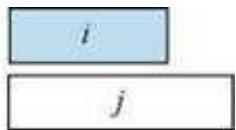

Before(i,j) After(j,i)


Finishes(i.j)

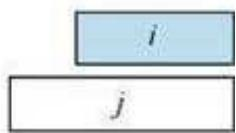

During(i,j)

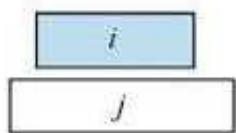

Equals(i,j)

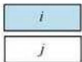

Overlap(i,j)

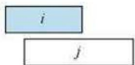  
图10-2时间间隔的谓词

# 10.3.2 流和对象

从对象是一部分时空的角度来看，对象可以被看作一般化的事件。例如，美国（ USA）可以被当

成是一个事件，它从1776年开始，由起初13个州的联合发展为50个州的联合，并仍在持续发展。我们可以将美国的变化性质描述为状态流，例如 Population ( USA )。美国的一个每4年或8年变化一次的性质——不出意外的话— 是它的总统。有人可能提出， President ( USA )是一个在不同时间表示不同对象的逻辑项。

遗憾的是，这根本不可能。因为在给定的模型结构中，一个项只能表示一个对象。（根据t的值，President(USA, t)项可以表示不同的对象，但我们的本体论中时间与流是分离的。）唯一的可能是 President ( USA )表示单个对象，这个对象在不同的时间由不同的人组成。这个对象从1789年至1797年是乔治·华盛顿，从1797年至1801年是约翰·亚当斯，以此类推，如图10-3所示。要表示乔治·华盛顿是整个1790年的总统，我们可以写作

# 7 $^ { \circ } ( E q u a l s ( P r e s i d e n t ( U S A ) , G e o r g e W a s h i n g t o n ) , B e g i n ( A D 1 7 9 0 ) , E n d ( A D 1 7 9 0 )$ 90))

我们用函数符号 Equals 而非标准逻辑谓词=，因为我们无法以谓词作为 $T$ 的参数，还因为正确的解释 并不是 GeorgeWashington 和 President ( USA )在1790年逻辑等价——逻辑等价并不能随时间改变。实际情况是，1790年这个时段所定义的对象 President ( USA )的子事件和 GeorgeWashington 的子事件具有等价关系。

  
图10-3 早期 President ( USA )对象示意图

# 10.4 精神对象和模态逻辑

我们目前为止所构建的智能体具有信念，且能够推导新信念。但它们都不具有关于信念或推导的知识。关于自身所具有的知识和推导过程的知识对控制推断非常有用。例如，假设甲问道“1764的平方根是多少”，而乙回答“我不知道”。如果甲坚持道“再想一想”，乙应当意识到通过进一步思考其实可以回答这个问题。但是，如果甲提出的问题是“总统现在是坐着还是站着？”那么乙应当明白再怎么思考都不太会有作用。知道其他智能体所具有的知识也很重要，乙应当意识到总统自己肯定知道答案。

我们需要的是智能体大脑中（或知识库中）的精神对象和操纵这些精神对象的精神过程的模型。这个模型不需要非常具体。我们并不需要预测某个智能体进行推断需要多少毫秒，我们只需要能够得出“妈妈知道她自己是不是坐着”的结论就可以。

我们从智能体对精神对象所具有的 命题态度 （propositional attitude）开始：类似于 相信 （Believes ）、 知道 （ Knows ）、 想要 （ Wants ）、 通知 （ Informs ）这样的态度。难处在于，这些态度的行为与“普通”谓词不同。例如，假设我们试图断言露易丝知道超人会飞：

# Knows(Lois,CanFly(Superman)）

这种说法的一个小毛病是，我们通常将 CanFly ( Superman )当作语句，但这里它是一个项。我们可以通过物化 CanFly ( Superman )来修补这个问题，也就是将它变成流。但更严重的问题是，如果超人是克拉克·肯特为真，那么我们只能得出露易丝知道克拉克会飞，而这是错误的，因为（在大多数版本的故事中）露易丝不知道 克拉克就是超人。[1]

[1]超人（Superman）是美国漫画角色。根据漫画情节，超人出生于地外星球，具有超能力，在地球以记者克拉克•肯特（Clark Kent）的身份掩藏自己就是超人的事实。露易丝•莱恩（LoisLane）是克拉克•肯特的记者同事，同时也是超人迷。在较早期的情节中，露易丝并不知道同事克拉克就是超人。——译者注

$$
\begin{array}{l} (S u p e r m a n = C l a r k) \wedge K n o w s (L o i s, C a n F l y (S u p e r m a n)) \\ \mid = K n o w s (L o i s, C a n F l y (C l a r k)) \\ \end{array}
$$

这是构建在逻辑之中的等值推理的结论。通常这并不是一件坏事，如果我们的智能体知道2 +2 =4且4 5，我们就希望智能体知道2 + 2 $\ll$ 5。这个性质称为 指代透明性 （referential transparency）一种逻辑使用哪个项指代一个对象并不重要，重要的是这个项所指的对象。但对于像相信和知道这样的命题态度，我们需要指代不透明性——使用的项很重要，因为并非所有智能体都知道哪些项是指代同一个对象的。

我们可以用进一步物化的方式修补这个问题：我们可以让一个对象表示作为超人的那个克拉克，另一个对象表示露易丝所认识的那个克拉克，我们还需要一个对象表示露易丝所认识的超人。但对象数量的激增意味着我们本来希望能快速写出的语句变得唠叨又笨拙。

模态逻辑 就是为解决这个问题而产生的。正规逻辑关注于单模态，真值模态使我们可以表示“P为真”或“ P 为假”。模态逻辑含有以语句（而非项）为参数的 模态算子 （modal operator）。例如，“A认识 P”使用记法 KAP表示，其中 $\pmb { K }$ 是知识的模态算子。它使用两个参数，一个是智能体（以下标表示），另一个是语句。模态逻辑的语法与一阶逻辑基本相同，区别在于模态逻辑中的语句可以用模态算子构成。

模态逻辑的语义更为复杂。在一阶逻辑中，一个模型 含有一个对象集和将每个名称映射到正确的对象、关系或函数的解释。模态逻辑中，我们希望能够同时考虑到超人的秘密身份是克拉克的可能性和超人不是克拉克的可能性。

因此，我们需要更为复杂的模型，它含有一系列可能世界 （possibleworld），而非只有一个为真的世界。这些世界在一个图中以可达性关系 （accessibilityrelation）连接，每个模态算子都对应一个这样的关系。如果w 中的一切都与A在w 中所知道的东西一致，我们就说从世界 w 关于模态算子 KA可达世界 w 。举一个现实世界中的例子，布加勒斯特是罗马尼亚的首都，但对于不知

道这一事实的智能体来说，罗马尼亚首都位于（例如）索非亚的世界就是可达的。但愿所有智能体都不可达2 +2 =5的世界。

一般而言，一个知识原子KAP在世界w中为真，当且仅当在从w可达的所有世界中P都为真。更复杂的语句的真值是通过递归应用这条规则以及一阶逻辑的一般规则来推导的。这意味着模态逻辑可以用于推理嵌套知识语句：一个智能体对另一个智能体的知识知道多少。例如，我们可以说露易丝虽然不知道超人的秘密身份是否就是克拉克·肯特，但她知道克拉克本人知道超人的秘密身份是什么：

$$
\boldsymbol {K} _ {\text {L o i s}} \left[ \boldsymbol {K} _ {\text {C l a r k}} \text {I d e n t i t y} (\text {S u p e r m a n}, \text {C l a r k}) \vee \boldsymbol {K} _ {\text {C l a r k}} - \text {I d e n t i t y} (\text {S u p e r m a n}, \text {C l a r k}) \right]
$$

模态逻辑解决了一些涉及量词和知识互相作用的麻烦问题。英语句子“Bond knowsthatsomeoneisaspy”（邦德知道某个人是间谍）是有歧义的。第一种解读是邦德知道某个特定的人是间谍，我们可以将其写作

$$
\exists x K _ {\text {B o n d}} \operatorname {S p y} (x)
$$

这在模态逻辑中的意思是，存在一个x，在所有可达世界中邦德都知道这个x是间谍。第二种解读是，邦德只知道至少有一个间谍：

$$
\boldsymbol {K} _ {\text {B o n d}} \exists x S p y (x)
$$

它的模态逻辑解释是，在所有可达世界中，都有一个间谍x，但它在不同世界中未必是相同的 $x$ 。

我们现在有了知识的模态算子，就可以为其写出公理。首先，我们可以说智能体能够进行推论：如果一个智能体知道 P 且知道 P 蕴涵 Q ，则该智能体知道 Q ：

$$
\left(\boldsymbol {K} _ {a} P \wedge \boldsymbol {K} _ {a} (P \Rightarrow Q)\right) \Rightarrow \boldsymbol {K} _ {a} Q
$$

由此（以及其他一些关于逻辑等价性的规则）我们可以得出 是重言式：所有智能体都知道每个命题 P 要么为真要么为假。但是， 不是重言式；一般而言，对于很多命题，智能体既不知其为真，也不知其为假。

人们说（以柏拉图最先提出）知识是确证为真的信念。也就是说，如果一个事物为真，如果你相信它为真，而且如果你有无法反驳的好理由来说明它为真，那么你就知道这个事物。这意味着如果你知道某事，那么它必然为真。据此我们有公理：

$$
K _ {a} P \Rightarrow P
$$

进一步地，逻辑智能体（但并非所有人）都能够内省自己的知识。如果它们知道某事，则它们知道“它们知道这事”：

$$
\boldsymbol {K} _ {a} P \Rightarrow \boldsymbol {K} _ {a} (\boldsymbol {K} _ {a} P)
$$

我们可以为信念（通常用B表示）和其他模态定义类似的公理。但模态逻辑方法的一个问题是它假设了智能体的逻辑全知 （logicalomniscience）。也就是说，如果智能体知道一个公理集，则它知道这些公理的所有结论。即使对于知识的较为抽象的概念这个前提都相当不牢靠，更别提对于信念了，因为信念更常涉及在智能体中被实际表示出来的东西，而非仅仅是可推导的东西。

有人尝试过为智能体定义某种有限理性形式——让智能体只能相信那些不超过 $k$ 个推理步骤或不超过s秒计算就能推导出来的断言。这些尝试基本都不能令人满意。

其他模态逻辑

除了针对知识的模态逻辑，还有许多其他针对不同模态的模态逻辑被提出。一种提法是为可能性和必然性添加模态运算符：本书的某个作者现在可能是坐着的，而2 +2 =4必然为真。

如8.1.2节所述，一些逻辑学家青睐于关于时间的模态。在 线性时态逻辑 （linear temporal logic）中，我们添加如下模态算子：

●XP：“P在下一个时刻将为真”  
● F P ：“ P 最终（ F inally）将在未来某个时刻为真”  
● G P ：“ P 始终（ G lobally）为真”  
●PU Q ：“在Q 发生前P保持为真”

有时可以从这些算子推导出其他算子。增加这些模态算子使逻辑自身变得更为复杂（也就使逻辑推断算法更难找出证明）。但这些算子使我们能够更简洁地陈述某些事实（这使得逻辑推断更快）。选择要用哪种逻辑类似于选择要用哪种编程语言：选择适合你任务的那一个，选择你和你的合作者更熟悉的那一个，选择对你的目的足够有效的那一个。

# 10.5 类别的推理系统

类别是大规模知识表示系统最重要的构造模块。本节描述为类别的组织和推理专门设计的系统。有两类密切相关的系统：语义网络 （semanticnetwork）从图的角度为知识库的可视化提供辅助，并基于对象的类别从属为推断对象的属性提供高效算法；描述逻辑 （description logic）为构建和合一类别的定义提供形式化语言，并为确定类别间的子集和超集关系提供高效算法。

# 10.5.1 语义网络

1909年，查尔斯·皮尔斯（Charles S. Peirce）提出了一种称为 存在图 （existential graph）的、由边和节点构成的图表示，他称之为“未来的逻辑”。由此开启了一场提倡“逻辑”者和提倡“语义网络”者之间的长期争论。遗憾的是，争论掩盖了语义网络也是一种逻辑的事实。语义网络为某些语句提供的记法往往更方便，但如果我们排除了“人类界面”的因素，其底层概念（即对象、关系、量化等）是相同的。

语义网络有很多变种，但它们都能表示单个对象、对象的类别和对象之间的关系。典型的记法将对象名称显示于椭圆或方框中，并以带标签的连线连接它们。例如，图10-4在 Mary 和 FemalePersons

之间有 MemberOf连线，对应于逻辑断言 ；类似地， Mary和John 之间的 SisterOf 连线对应于断言 SisterOf ( Mary , John )。我们可以使用 SubsetOf 连线连接类别，以此类推。画出气泡和箭头很有趣，但不要忘乎所以。例如，我们知道，人的母亲是女性，但我们可以从 Persons 画一条 HasMother 连线连到 FemalesPersons 上吗？答案是不行，因为HasMother是人和其母亲之间的关系，而类别并没有母亲。 [1]

[1] 一些早期的系统无法区分类别成员的属性和整个类别的属性。这会直接引发不一致性，如德鲁•麦克德莫特（Drew McDermott）（McDermott, 1976）在文章“Artificial Intelligence Meets NaturalStupidity”所指出。另一个常见的问题是对子集和成员关系都使用了IsA（是）连线，对应于英语用法“猫是哺乳动物”和“菲菲是猫”。见习题10.NATS了解更多关于这一主题的知识。

因此，我们在图10-4中使用了双方框这样的特殊记法。这个连线断言了

$$
\forall x x \in \text {P e r s o n s} \Rightarrow [ \forall y \text {H a s M o t h e r} (x, y) \Rightarrow y \in \text {F e m a l e P e r s o n s} ]
$$

我们可能还想断言人有两条腿，也就是

$$
\forall x x \in \text {P e r s o n s} \Rightarrow \operatorname {L e g s} (x, 2)
$$

如前所述，我们需要当心，以免断言某个类别有两条腿；图10-4中的单方框用于断言一个类别中每个成员都具有的属性。

语义网络的记法很便于进行10.2节介绍的继承 推理。例如，作为一个人，玛丽继承了具有两条腿的属性。因此，要搞清楚玛丽有几条腿，继承算法追溯从Mary到其所属类别的MemberOf连线，然后跟着SubsetOf连线向上层移动，直到它找到连线是带方框的Legs的类别——本例中为 Persons类别。对比于半可判定的逻辑定理证明，这种推断机制的简洁性和高效性是语义网络具有吸引力的主要原因之一。

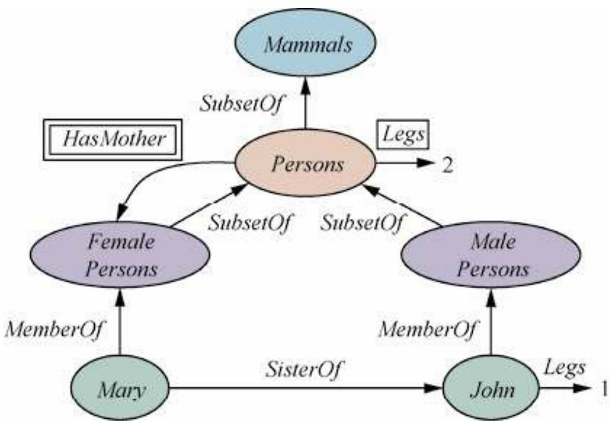  
图10-4 具有4个对象（ John 、 Mary 、1和2）和4个类别的语义网络。关系使用带标签的连线表示

当对象可以属于不止一个类别，或当类别可以是不止一个类别的子类时，继承就会变得较为复杂，这被称为 多重继承 （multiple inheritance）。这种情况下，继承算法可能会为查询找到两个甚至更多个互相冲突的值。因此，一些在类的层次结构中使用继承的 面向对象编程 （object-orientedprogramming，OOP）禁止多重继承，如Java。在语义网络中通常允许多重继承，但我们在10.6节再对其进行讨论。

读者可能已经注意到了语义网络表示相比于一阶逻辑的一个明显的缺点：气泡之间的连线只能表示二元 关系。例如，语句 Fly ( Shankar , NewYork , NewDelhi , Yesterday )无法直接从语义网络中断言。不过我们可以通过将命题自身物化为属于合适的事件类别的事件来得到n 元断言的效果。图10-5展示了这个事件的语义网络结构。注意，二元关系的限制条件迫使网络创造出大量物化概念的本体论。

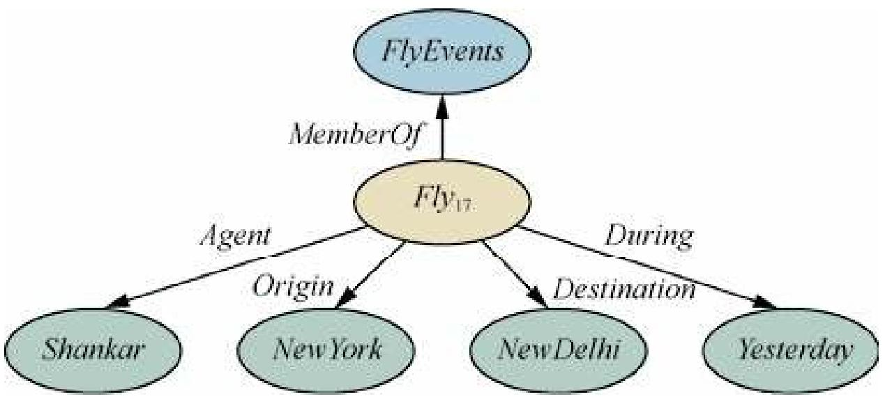  
图10-5 一个语义网络的一部分，展示了对逻辑断言 Fly ( Shankar , NewYork , NewDelhi , Yesterday )的表示

命题的物化使得在语义网络记法中表示所有基本的、无函数的一阶逻辑原子语句成为可能。某些全称量化的语句可以使用反向连线并对类别使用单框或双框的箭头来断言，但这仍然远不及完整的一

阶逻辑。否定、析取、嵌套函数符号和存在量词都无法表示。扩展记法使语义网络等价于一阶逻辑是可能的（如皮尔斯的存在图），但这样会损失语义网络的一个重要优点，也就是推断过程的简洁性和透明性。设计者可以构建很大的网络，同时仍然能够很好地了解哪些查询是高效的，因为（a）将推断过程行进的步骤可视化相当简单，（b）某些情况下查询语言非常简单，以至于无法提出高难度的查询。

当表达能力确实太有限时，许多语义网络系统提供了过程式附件 （proceduralattachment）来弥补。过程式附件是一种技术，它使得涉及某些关系的查询（有时是断言）能够调用专用于处理这种关系的过程，而非一般的推断算法。

语义网络很重要的一个方面是它具有表示类别的 缺省值 （defaultvalue）的能力。仔细考察图10-4，我们注意到约翰有一条腿，尽管他是一个人，而人都有两条腿。在严格的逻辑知识库中，这会导致矛盾，但在语义网络中，这种“人都有两条腿”的断言只是具有缺省状态，也就是说，我们预设人有两条腿，除非有与之矛盾的、更为确切的信息。很自然地，缺省语义由继承算法执行，因为它从对象自身（本例中为John）沿着连线向上运行，一旦找出一个值就停止运行。我们说缺省值被更确切的值覆盖 （overridden）了。注意，我们也可以通过创建John 所在的Persons类别的子类OneLeggedPerson （一条腿的人）来覆盖缺省的腿数量。

如果我们表明了对Person 的Legs断言在John 这里有例外，就可以维持网络的严格逻辑语义：

$$
\forall x x \in \text {P e r s o n s} \wedge x \neq J o h n \Rightarrow L e g s (x, 2)
$$

对于固定的网络，这样做在语义上没有问题，但如果例外太多的话，其简洁性就远不如网络记法。但对于需要用新断言更新的网络，这样做就不可行——我们实际想表明的是目前还不知道是谁的那些只有一条腿的人也是例外。10.6节更深入地探讨了这个话题，还探讨了一般的缺省推理。

# 10.5.2 描述逻辑

一阶逻辑的语法旨在简化对对象的描述。描述逻辑 则是旨在简化对类别的定义和性质的描述的记法。描述逻辑系统是从语义网络演化而来的，目的是在维持分类结构作为组织原则的同时形式化网络的含义。

描述逻辑的主要推断任务是包容 （subsumption）（通过比较定义来检查一个类别是否是另一个类别的子集）和 分类 （classification）（检查一个对象是否属于某个类别）。一些系统还纳入了类别定义的 一致性 （consistency）— 成为该类别成员的条件是否是逻辑可满足的。

C lassic 语言（Borgida et al. , 1989）是典型的描述逻辑。C lassic 描述的语法展示在图10-6中。 [2]例如，要说单身汉是未婚成年男性，可以写作

[2]注意，这个语言不允许我们直接陈述一个概念或类别是另一个概念或类别的子集。这是刻意为之的：类别之间的包容关系必须可以由类别描述的某些方面推导得来。如果无法推导，说明描述不完整。

$$
b a c h e l o r = A n d (U n m a r r i e d, A d u l t, M a l e)
$$

一阶逻辑中的等价形式为

$$
B a c h e l o r (x) \Leftrightarrow U n m a r r i e d (x) \wedge A d u l t (x) \wedge M a l e (x)
$$

概念 $\rightarrow$ Thing|概念名  
|And(概念，…）  
|All(角色名，概念)  
|AtLeast(整数，角色名)  
|AtMost(整数，角色名)  
|Fills(角色名，个体名，…）  
|SameAs(路径，路径)  
|OneOf(个体名，…）  
路径→[角色名，…]  
概念名 $\rightarrow$ 成人|女人|男人|…  
角色名 $\rightarrow$ 配偶|女儿|儿子|…

图10-6Classic语言的一个子集中的描述语法

注意，描述逻辑具有对谓词的代数运算，一阶逻辑中显然没有这种东西。Classic中的任何描述都可以翻译为等价的一阶逻辑语句，但一些描述在Classic中更为直接。例如，要描述这样一个男人的集合，其中每个男人至少有3个儿子，至多有2个女儿，这些儿子都无业且都娶了医生，这些女儿都是物理或数学系教授，我们可以将其写作

```txt
And (Man, AtLeast (3, Son), AtMost (2, Daughter),  
All (Son, And (Unemployed, Married, All (Spouse, Doctor))),  
All (Daughter, And (Professor, Fills (Department, Physics, Math))) 
```

将其翻译为一阶逻辑是我们的一道习题。

也许描述逻辑最重要的一点是它对推断易处理性的强调。一个问题实例可以通过对其进行描述并查看它是否被几个可能的解类别所包容来求解。在标准的一阶逻辑中，往往不可能预测求解时长。用户经常需要修改表示方法，以避免那些可能导致系统花几个星期求解问题的语句集。而描述逻辑很棒的地方是它保证包容检测可以在描述规模的多项式时间内求解。[3]

[3]实际中，Classic提供了高效的包容检测，但其最坏情况运行时间是指数级的。

这乍听起来不错，直到我们发觉它只会导致两个后果之一：要么完全无法陈述困难的问题，要么需要指数级的大规模描述！不过，易处理的结果指明了哪些构件引发了问题，也有助于使用者理解不同表示的行为。例如，描述逻辑通常缺乏 否定和 析取 。它们都使一阶逻辑系统不得不进行潜在的指数级的情况分析来确保完备性。Classic仅在Fills和 OneOf构件中使用有限的析取，它允许对显式枚举出的个体使用析取，而不能析取描述。如果有描述的析取的话，嵌套定义能轻易导致指数量级的、表示一个类别包容另一个类别的分支路径。

# 10.6 用缺省信息推理

在前一节中，我们见过一个使用缺省状态进行断言的简单例子：人有两条腿。这个缺省信息可以被


更确切的信息覆盖，例如Long John Silver $\_$ 只有一条腿。我们看到，语义网络的继承机制用简单自然的方式实现了对缺省信息的覆盖。本节我们用更一般化的方式研究缺省信息，以期理解缺省信息的语义 ，而非仅给出其过程性机制。

# 10.6.1 限定与缺省逻辑

我们已经见过两个违反了第7章证明的逻辑的单调性 （Monotonicity）性质的推理程序。 [1] 本章我们看到，语义网络中一个类别所有成员都继承的性质可以被子类别更确切的信息覆盖。在9.4.4节，我们看到在封闭世界假设下，如果一个命题 $\pmb { \alpha }$ 没有在 KB 中被提及，则 ，但KBAαFa。

[1]回想一下，单调性要求知识库中所有蕴含的语句在新语句被添加到知识库后仍然蕴含。也就是说，如果 ，则 。

简单的内省表明，常识推理往往不符合单调性。人类似乎总是“跳到结论”。例如，当有人看到停在路边的车，他往往愿意相信这辆车有4个轮子，尽管他只能看到3个轮子。概率论当然可以提供车大概率有4个轮子的结论，但对多数人来说，只有 在新证据自动出现的情况下才会想到这辆车并非有4个轮子的可能性。这样看来，在没有理由怀疑的情况下，4个轮子的结论似乎是缺省地达成的。如果有了新的证据——例如，如果我们看到车主搬着一只轮胎，而且车被千斤顶顶起来了——则先前的结论可以被收回。可以说这种推理展示出了非单调性 （nonmonotonicity），因为信念集在新证据到来时并不随之单调增长。非单调逻辑 （nonmonotoniclogic）修改了真值和蕴含的概念以刻画这种行为。我们将考察两种这样的逻辑，限定和缺省逻辑，它们都被大量研究过。

限定 （circumscription）可以被看作更为强大且精确的封闭世界假设。其思想是确定一个被假设为“尽可能假”的谓词，也就是，对所有对象都为假，除了那些我们已知为真的对象。例如，假设我们要断言缺省规则，鸟会飞。我们引入一个谓词，譬如 ，写出

$$
B i r d (x) \wedge - A b n o r m a l _ {1} (x) \Rightarrow F l i e s (x)
$$

如果我们说 被限定 了，则限定推理器就有权假设 ，除非 已知为真。这就使结论 Flies ( Tweety )可以从前提 Bird ( Tweety )中得出，但如果 被断言，结论便不再成立。

限定可以被看作一种模型偏好 （modelpreference）逻辑。在这种逻辑中，如果语句在知识库的所有被偏好的 模型中都为真，则语句（在缺省情况下）被蕴含，而无须像经典逻辑中要求在所有模型中都为真。对限定来说，如果一个模型的异常对象更少，则它比另一个模型更受偏好。[2] 我们来看这种思想在语义网络的多重继承上下文中是如何运作的。多重继承问题的一个标准范例是“尼克松菱形”。我们观察到，理查德·尼克松既是基督教贵格会教徒（故而缺省为和平主义者），又是共和党党员（故而缺省为非和平主义者）。我们可以将其写作

[2]对于封闭世界假设，一个模型只要真原子比另一个模型少就受偏好，也就是说，偏好模型是最小 模型。封闭世界假设和确定子句知识库密切相关，因为前向链接在确定子句知识库上到达的不动点是唯一的最小模型。见7.5.4节了解更多相关内容。

$$
R e p u b l i c a n (N i x o n) \wedge Q u a k e r (N i x o n)
$$

$$
R e p u b l i c a n (x) \wedge \neg A b n o r m a l _ {2} (x) \Rightarrow \neg P a c i f i s t (x)
$$

$$
\operatorname {Q u a k e r} (x) \wedge - \operatorname {A b n o r m a l} _ {3} (x) \Rightarrow \operatorname {P a c i f i s t} (x)
$$

如果我们限定 Abnormal 2和 Abnormal 3，就会有两个偏好模型，其中一个模型中 Abnormal 2( Nixon)和 Pacifist ( Nixon )为真，另一个模型中 Abnormal 3( Nixon )与 为真。这样的话，限定推理器在尼克松到底是不是和平主义者这一问题上就完全是不可知论者。如果我们想另外断言宗教信仰优先于政治信仰，我们可以使用称为 优先限定 （prioritized circumscription）的形式体系来对 Abnormal3最小化的模型增加偏好。

缺省逻辑 是可以用缺省规则 生成逻辑偶然的非单调结论的形式体系。缺省规则类似下式：

$$
B i r d (x): F l i e s (x) / F l i e s (x)
$$

这条规则的意思是，如果 Bird ( x )为真，且如果 Flies ( x )与知识库一致，则可以得出缺省结论Flies(x)。一般而言，缺省规则的形式为

$$
P: J _ {1}, \dots , J _ {n} / C
$$

其中， $P$ 称为先决条件，C是结论，Ji是论证——如果其中任何一条可以被证明为假，则无法得出结论。 $J$ i或C中的所有变量都必须同时在P中。在缺省逻辑中，尼克松菱形的例子可以用一条事实和两条缺省规则表示：

$$
R e p u b l i c a n (N i x o n) \wedge Q u a k e r (N i x o n)
$$

$$
R e p u b l i c a n (x): - P a c i f i s t (x) / - P a c i f i s t (x)
$$

$$
\operatorname {Q u a k e r} (x): \text {P a c i f i s t} (x) / \text {P a c i f i s t} (x)
$$

要翻译缺省规则的含义，我们将缺省理论的拓展 定义为该理论结果的最大集合。也就是，一个拓展S 含有原始已知事实和缺省规则得出的结论集，使得S 中不再能得出其他结论，且S 中的每个缺省结论的论证都与S 一致。与限定中的偏好模型一样，对于尼克松菱形，我们有两种可能的拓展：在其中一种当中尼克松是和平主义者，在另一种当中他不是和平主义者。优先方法可以使某些缺省规则比另一些规则优先，以便解决某些歧义性问题。

从1980年首次提出非单调性逻辑开始，对其数学性质的理解已经有了大量进展。但仍然有尚未解决的问题。例如，如果“汽车有4个轮子”为假，那么它在一个智能体的知识库中意味着什么？什么样的缺省规则集是好的规则集？如果我们无法确定每条规则是否属于我们的知识库，那么我们就要面临严重的非模块性问题。最后，具有缺省状态的信念如何用于决策？这很可能是缺省推理中最难的问题。

决策往往需要权衡，因此我们需要比较对不同动作的结果的信念的强度，以及决策错误的代价 。当重复进行相同决策时，或许可以将缺省规则解释为“阈值概率”。例如，缺省规则“我的刹车一直都很好”的实际含义是“在没有其他信息的前提下，我的刹车很好的概率足够高，因此我的最优决策是不用检查刹车就直接开车”。当决策上下文改变时——例如，当我们开着一辆重载卡车下陡坡时缺省规则突然就变得不适宜了，即使并没有新证据表明刹车存在故障。这些思考促使研究者考虑如何将缺省推理嵌入概率论或效用理论当中。

# 10.6.2 真值维护系统

我们已经见过许多知识表示系统得出的推断只是具有缺省状态，而非完全确定。不可避免地，在有新信息的情况下，许多推断出的事实最终将被证明是错误的，必须被收回。这个过程被称为信念


修正 （belief revision）。 假设知识库 KB含有语句 $P$ （可能是前向链接算法记录的缺省结论，也可能只是不正确的断言）且我们想执行T ell ( KB , )。为避免导致矛盾，我们必须先执行 Retract ( KB , P )。这听起来很简单。但如果 其他 语句是从 $P$ 推断得出的，且在 KB 中断言了该语句，就会产生问题。例如，蕴涵式 $P \Rightarrow Q$ 可能已经用于添加 Q 。显然的“解决方法”——收回由 $P$ 得出的所有语句——无法使用，因为这种语句还有除 P之外的其他论证。例如，如果 R和也在 KB 中，则 Q 就根本不需要被移除。 真值维护系统 （truth maintenance system）， $R \Rightarrow Q$ 或TMS，就是用于解决这类难题的。

真值维护的一个简单方法是将语句编号为 $P$ 1到Pn 来记录它们被告知知识库的顺序。当调用Retract(KB,Pi)时，系统恢复到Pi刚刚被添加前的状态，因而删除Pi和由Pi得出的所有推断。语句Pi 到Pn 就可以被重新加入。这很简单，且确保了知识库的一致性，但收回 Pi需要收回并重新断言n−1条语句，还要撤销并重做由这些语句得出的所有推断。对于添加了许多事实的系统（例如大型商业数据库）这不切实际。

一个更为高效的方法是基于论证的真值维护系统，简称 JTMS 。在JTMS中，知识库中的每条语句都用一条 论证 （justification）标记，它含有推断出该语句的语句集。例如，如果一个知识库已经含有 $P \Rightarrow Q$ ，则T ell ( P )会使 Q 和附带的论证 $\{ P , P \Rightarrow Q \}$ 被加入。一般而言，一条语句的论证数量是无限制的。论证使收回语句变得高效。调用R etract ( P )时，JTMS将删除每条论证都有 $P$ 的所有语句。因此，如果语句 Q 的唯一论证为 $\{ P , P \Rightarrow Q \}$ ，它就会被删除；而如果 Q 有其他论证 $\{ R , P V R \Rightarrow Q \}$ ，则它会被保留。这样，收回 $P$ 所需的时间就仅依赖于由 P 推得的语句数量，而非在 P 之后添加的语句数量。

JTMS假设被考虑过一次的语句很可能会再次被考虑，因此当语句失去所有论证时，JTMS并不从知识库中完全删除该语句，而仅将语句标记为在知识库外 。如果后续的断言重建了语句的某个论证，则语句被标记为在知识库内 。如此，JTMS保留了它用到的所有推断链，当一个论证重新生效时便无须重新推导语句。

除了收回错误信息，TMS还可以用于加速多重假设情形的分析。例如，假设罗马尼亚奥委会正在为2048年将在罗马尼亚举办的奥运会挑选游泳（swimming）、田径（athletics）和马术（equestrian）比赛的地点。例如，令第一个假设为 Site ( Swimming , Pitesti )、 Site ( Athletics ,Bucharest )和 Site ( Equestrian , Ar ad )。

我们随后必须进行大量推断来算出这种假设的后勤保障需要，也就是其合意程度。如果我们想转而考虑 Site ( Athletics , Sibiu )，TMS会避免从头开始重新计算。相反，我们只需收回 Site ( Athletics ,Bucharest )并断言 Site ( Athletics , Sibiu )，TMS就会进行必要的修正。选择布加勒斯特（Bucharest）生成的推断链可以重新用在锡比乌（Sibiu）上——如果二者的结论相同的话。

基于假设的真值维护系统简称ATMS，它能使这种在假设世界之间进行的转换特别高效。在JTMS中，维护论证使你可以用少量收回和断言就能从一个状态快速转换到另一个状态，但在任意时刻，它只能表示一种状态。ATMS则同时表示 所有 被考虑过的状态。JTMS只是将每条语句标记为 在内或在外 ，而ATMS则记录每条语句在哪个假设中为真。也就是说，每条语句都有一个包含假设集的标签。语句仅在一个语句集的所有假设为真时为真。

真值维护系统还提供了生成解释 的机制。理论上，语句P的解释是语句集 $E$ ，使得 E蕴含 P。如果 $E$ 中的语句已知为真，则 $E$ 只是提供了证明 $P$ 的充分根据。但解释还可以包括假设 ——未知其为真，但如果为真的话就足以证明 P的语句。例如，如果你的汽车无法启动，你很可能没有足够的信息来确定性地证明造成这个问题的原因。但一个合理的解释可能含有电瓶没电的假设。结合汽车工作原理的知识，这就能解释观测到的故障。在大多数情况下，我们倾向于最小的解释 $E$ ，这意味着 $E$ 不存在同样是解释的真子集。ATMS可以通过不分先后顺序的假设（如“汽车没油”或“电瓶没电”）来生成“汽车不启动”问题的解释，即使有些假设互相矛盾。然后我们查看语句“汽车不启动”的标签来读出可能能够论证该语句的假设集。

真值维护系统的确切实现算法有些复杂，我们不在此赘述。真值维护系统的计算复杂度至少与命题推断一样大，也就是NP困难的。因此，你不能将真值维护当作灵丹妙药。但如果恰当使用的话，

TMS能够极大增加逻辑系统处理复杂环境和假设的能力。

小结

我们希望通过研究如何表示各种知识，我们希望读者已经了解了如何构建真实的知识库，并体会到其中有趣的哲学问题。本章要点如下。

●大规模知识表示需要通用本体论来组织和结合各种特定论域的知识。  
● 通用本体论需要包含非常多样化的知识，且原则上应当能够处理所有论域。  
●构建大型通用本体论是一项尚未被完全了解的重大挑战，尽管现有的框架似乎相当健壮。  
●我们呈现了一个基于类别和事件演算的上层本体论 。它包括类别、子类别、部分、结构化对象、量度、物质、事件、时间与空间、变化和信念等。  
●自然类无法用逻辑来完全定义，但自然类的性质可以被表示。  
●动作、事件和时间可以用事件演算来表示。这种表示使智能体能够构建动作序列并推断这些动作产生的结果。  
●类似语义网络 和描述逻辑 的专用表示系统已经被设计用于组织类别层次结构。继承 是重要的推断形式，它使得对象的性质可以从其类别从属关系中被推导出来。  
●逻辑程序中实现的封闭世界假设 提供了简便的方法来免于被迫表明大量否定信息。将其翻译为能够被附加信息覆盖的缺省 则是最优的。  
●如限定 和缺省逻辑 这样的非单调逻辑旨在总体上刻画缺省推理。  
●真值维护系统 能高效处理知识更新和修正。  
●人工构建大规模本体论很难，从文本中提取知识则能简化这项任务。

读者服务：


微信扫码关注【异步社区】微信公众号，回复“e59810”获取本书配套资源以及异步社区15天VIP会员卡，近千本电子书免费畅读。

# 第11章

# 自动规划

在本章中，我们将看到智能体如何利用问题的结构来高效地构建复杂的动作计划。

规划一系列动作是智能体的关键需求。正确表示的动作和状态以及正确的算法可以使规划变得更容易。在11.1节中，我们为规划问题引入一种通用的因子化 表示语言，它可以自然而简洁地表示各种领域，可以高效地扩展到大型问题，并且无须对新领域特定的启发式。我们在11.2节介绍高效规划算法，在11.3节介绍启发式方法。11.4节拓展表示语言使其允许分层次动作，以使我们能够处理更复杂的问题。在11.5节中，我们考虑部分可观测和非确定性域。在11.6节中，我们再次扩展该语言，以解决资源约束下的调度问题。这让我们更接近于真实世界中用于规划和调度航天器、工厂以及军事战役运行的规划器。11.7节分析这些技术的有效性。

# 11.1 经典规划的定义

经典规划 （classicalplanning）定义为在一个离散的、确定性的、静态的、完全可观测的环境中，找到完成目标的一系列动作的任务。我们已经见过两种完成这个任务的方法：第3章的问题求解智能体和第7章的混合命题逻辑智能体。它们都受到两个限制。首先，对于每个新领域，它们都需要特定的启发式方法：用于搜索的启发式评价函数和用于混合wumpus智能体的人工代码。其次，它们都需要明确地表示指数量级的状态空间。例如，在wumpus世界的命题逻辑模型中，向前移动一步的公理不得不在所有4个智能体朝向、T个时间步和 $n ^ { 2 }$ 个当前位置重复。

针对这些限制，规划研究者使用PDDL语言研究出了因子化表示 。PDDL语言全称是规划领域定义语言（Planning Domain Definition Language）（Ghallab et al ., 1998），它利用单个动作模式可以表示4 $T n ^ { 2 }$ 个动作，且不需要特定的领域知识。基本的PDDL可以处理经典规划领域，而扩展的PDDL则可以处理连续的、部分可观测的、并发的和多智能体的非经典领域。PDDL的语法基于Lisp，但是我们会将它转换成与本书中使用的表示法相符的形式。

在PDDL中，一个 状态 表示为基本原子流的合取。回想一下，“基本”表示不含变量，“流”表示世界的一个方面随时间而变化，“基本原子”表示它只有一个谓词，而如果它含有参数，则这些参数必然是常量。例如， 可能表示一个倒霉的智能体的状态，

可能表示包裹投递问题中的一个状态。PDDL使用数据库语义：封闭世界假设意味着没有提到的任何流都是假的，唯一名称假设意味着 Truck 1 和 Truck 2 是不同的。

在状态中不允许使用下列流： At ( x , y )（因为它含有变量）、 （因为它是否定的）， At( Spouse ( Ali ), Sydney )（因为它使用了一个函数符号 Spouse ）。方便的时候，我们可以把流的合取看作流的 集合 。

一个动作模式 （actionschema）表示一组基本动作。例如，下面是一个使飞机从一个位置飞到另一个位置的动作模式：

A

模式由动作名称、模式中使用的所有变量的列表、前提 （precondition）和 效果 （effect）组成。前提和效果都是文字的合取（肯定或否定的原子句）。我们可以选择常量来实例化变量，产生一个基本（无变量）动作：

A

如果状态s蕴含基本动作a 的前提，也就是说，前提中的每一个正文字都在s中，且每一个负文字都不在 s中，则动作 a适用于 状态s。

在状态 s 中执行适用动作 a 的 结果 被定义为状态 s' ，状态 s' 的形成方式是从 s 出发，移除动作效果中以负文字形式出现的流，［我们称之为 删除列表 （delete list）或D el ( a )］，并添加在动作效果中以正文字形式出现的流［我们称之为 添加列表 （add list）或A dd ( a )］：

$$
\operatorname {R e s u l t s} (s, a) = (s) - \operatorname {D E L} (a)) \cup \operatorname {A D D} (a) \tag {11-1}
$$

例如，采取动作 Fly ( P 1 , SFO , JFK )，我们移除流 At ( P 1 , SFO )并且添加流 At ( P 1 , J FK )。

一组动作模式是规划领域的一个定义。领域中的特定问题是通过添加初始状态和目标来定义的。初始状态 是基本流的合取（在图11-1中使用关键字Init引入）。由于对所有状态都使用了封闭世界假设，这意味着任何没有被提及的原子都是假的。目标 （使用Goal引入）和前提类似，它是可以含有变量的文字（正文字或负文字）合取式。例如，目标

指的是满足货物 C 1位于 SFO 而货物C 2不位于此地，且 SFO 有一架飞机的所有状态。

# 11.1.1 范例领域：航空货物运输

图11-1展示了一个航空货物运输问题，它涉及货物的装载、卸载和从一个地点飞到另一个地点。这个问题可以用3个动作定义：Load（装载）、Unload （卸载）、和 Fly（飞行）。这些动作影响到两个谓词：In(c, p )表示货物c在飞机p 里，At(x, a )表示对象x（飞机或货物）在机场a 。注意，必须仔细确保对At谓词的正确维护。当一架飞机从一个机场飞到另一个机场时，飞机内的所有货物都会跟着它一起飞过去。在一阶逻辑中，很容易对飞机内的所有对象进行量化。但是PDDL没有全称量词，所以我们需要用到其他方法。我们使用的方法是，当一件货物在飞机里（ In）时，它就不会在（At）其他地方；货物只有在被卸载后才会在（ At）新机场。所以At的真正含义是“在（At）给定地点才可以使用”。下面的规划是这个问题的一个解：

$$
\begin{array}{l} [ L o a d (C _ {1}, P _ {1}, S F O), F l y (P _ {1}, S F O, J F K), U n l o a d (C _ {1}, P _ {1}, J F K), \\ \left. \operatorname {L o a d} \left(C _ {2}, P _ {2}, J F K\right), \operatorname {F l y} \left(P _ {2}, J F K, S F O\right), \operatorname {U n l o a d} \left(C _ {2}, P _ {2}, S F O\right) \right] \\ I n i t \left(A t \left(C _ {1} ^ {2}, S F O\right) \wedge A t \left(C _ {2} ^ {2}, J F K\right) \wedge A t \left(P _ {1}, S F O\right) \wedge A t \left(P _ {2} ^ {2}, J F K\right) \right. \\ \wedge \operatorname {C a r g o} \left(C _ {1}\right) \wedge \operatorname {C a r g o} \left(C _ {2}\right) \wedge \operatorname {P l a n e} \left(P _ {1}\right) \wedge \operatorname {P l a n e} \left(P _ {2}\right) \\ \wedge \text {A i r p o r t} (J F K) \wedge \text {A i r p o r t} (S F O)) \\ G o a l (A t \left(C _ {1}, J F K\right) \wedge A t \left(C _ {2}, S F O\right)) \\ A c t i o n (L o a d (c, p, a), \\ \text {P R E C O N D}: A t (c, a) \wedge A t (p, a) \wedge C a r g o (c) \wedge P l a n e (p) \wedge A i r p o r t (a) \\ E F F E C T: \neg A t (c, a) \wedge I n (c, p)) \\ A c t i o n (U n l o a d (c, p, a), \\ \text {P R E C O N D :} I n (c, p) \wedge A t (p, a) \wedge C a r g o (c) \wedge P l a n e (p) \wedge A i r p o r t (a) \\ E F F E C T: A t (c, a) \wedge \neg I n (c, p)) \\ A c t i o n (F l y (p, f r o m, t o), \\ \text {P R E C O N D}: A t (p, f r o m) \wedge \text {P l a n e} (p) \wedge \text {A i r p o r t} (\text {f r o m}) \wedge \text {A i r p o r t} (t o) \\ E F F E C T: \neg A t (p, f r o m) \wedge A t (p, t o)) \\ \end{array}
$$

图11-1 航空货物运输规划问题的PDDL描述

# 11.1.2 范例领域：备用轮胎问题

考虑更换瘪气轮胎的问题（图11-2）。其目标是在车轴上正确安装一只备用轮胎，而初始状态是车轴上有一只瘪气轮胎，后备箱里有一只备用轮胎。为简单起见，我们对这个问题的描述是抽象的，不考虑难拧的螺母之类的复杂问题。问题只有4种动作：从后备箱取出备用轮胎、从车轴上卸下瘪气轮胎、把备用轮胎装在车轴上、把汽车留下整夜无人看管。我们假设汽车停在一个特别糟糕的街区，因此把汽车留下整夜无人看管的效果是轮胎不见了。

Remove(Flat,Axle),Remove(Spare,Trunk）,PutOn(Spare,Axle)]问题的一个解。

Init(Tire(Flat) $\wedge$ Tire(Spare) $\wedge$ At(Flat, Axle) $\wedge$ At(Spare, Trunk))  
Goal(At(Spare, Axle))  
Action(Remove(obj, loc),  
PRECOND: At(obj, loc)  
EFFECT: $\neg$ At(obj, loc) $\wedge$ At(obj, Ground))  
Action(PutOn(t, Axle),  
PRECOND: Tire(t) $\wedge$ At(t, Ground) $\wedge$ $\neg$ At(Flat, Axle) $\wedge$ $\neg$ At(Spare, Axle)  
EFFECT: $\neg$ At(t, Ground) $\wedge$ At(t, Axle))  
Action(LeaveOvernight,  
PRECOND:  
EFFECT: $\neg$ At(Spare, Ground) $\wedge$ $\neg$ At(Spare, Axle) $\wedge$ $\neg$ At(Spare, Trunk) $\wedge$ $\neg$ At(Flat, Ground) $\wedge$ $\neg$ At(Flat, Axle) $\wedge$ $\neg$ At(Flat, Trunk))

# 11.1.3 范例领域：积木世界

最著名的规划领域之一是积木世界 。这个领域由一组立方体形状的积木组成，积木放在一张任意大的桌子上。[1] 积木可以堆叠，但只有一块积木可以直接放在另一个上面。机械臂可以拿起一块积木并将其放到到另一个位置，可以是放在桌子上，也可以放在另一块积木上。机械臂一次只能拿一块积木，因此它无法拿起上面有另一块积木的积木。一个典型的目标是使积木 A在积木 $B$ 上，并且积木B在积木C上（见图11-3）。

[1]规划研究中使用的积木世界通常比Shrdlu的版本（1.2.3节）简单得多。

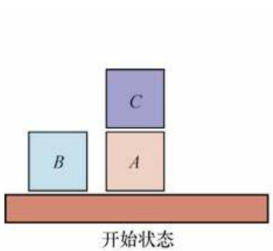  
图11-2简单的备用轮胎问题

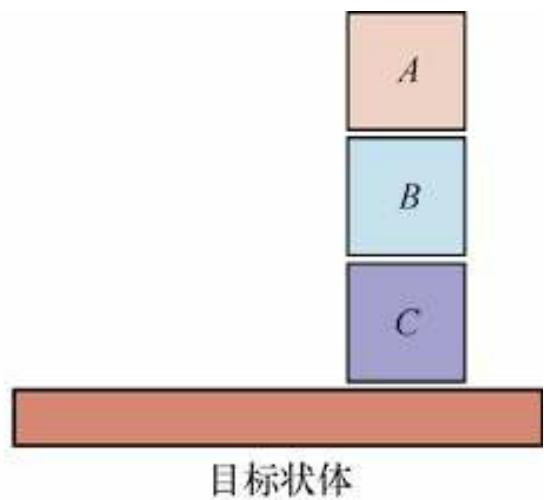  
图11-3图11-4的积木世界问题的示意图

我们用 $O n \left( b , x \right)$ 表示积木 $^ { b }$ 在 $x$ 上，其中 $x$ 要么是另一块积木，要么是桌子。将积木 b 从 x 上移动到 $y$ 上的动作是 Move ( b , x , y )。现在，移动 $^ { b }$ 的前提之一是它上面没有其他积木。在一阶逻辑中，这可以表示为 $\lnot \exists x O n ( x , b )$ 或 $\forall x \neg O n ( x , b )$ 。基本版PDDL中没有量词，因此我们引入一个谓词Clear $( x )$ ，当 $x$ 上没有任何东西时其为真。（完整的问题描述如图11-4所示。）

Init(On(A, Table) $\wedge$ On(B, Table) $\wedge$ On(C, A) $\wedge$ Block(A) $\wedge$ Block(B) $\wedge$ Block(C) $\wedge$ Clear(B) $\wedge$ Clear(C) $\wedge$ Clear(Table))  
Goal(On(A, B) $\wedge$ On(B, C))  
Action Move(b, x, y),  
PRECOND: On(b, x) $\wedge$ Clear(b) $\wedge$ Clear(y) $\wedge$ Block(b) $\wedge$ Block(y) $\wedge$ (b ≠ x) $\wedge$ (b ≠ y) $\wedge$ (x ≠ y)  
EFFECT: On(b, y) $\wedge$ Clear(x) $\wedge$ ¬On(b, x) $\wedge$ ¬Clear(y))  
Action MoveToTable(b, x),  
PRECOND: On(b, x) $\wedge$ Clear(b) $\wedge$ Block(b) $\wedge$ Block(x),  
EFFECT: On(b, Table) $\wedge$ Clear(x) $\wedge$ ¬On(b, x))

图11-4积木世界中的一个规划问题：建造一个3块积木构成的塔。一个解是序列

[MoveToTableCC,A）,Move(B,Table,C），Move(A,Table,B）]

如果 $^ { b }$ 和 $y$ 的上面都没有东西，动作 Move 可以将积木 b 从 $x$ 移动到 $y$ 。移动后， Clear ( b )为真，而 Clear(y)为假。第一次写出的 Move模式是

Action(Move(b,x,y），

PRECOND:On(b,x)AClear(b)AClear(y)

$\mathrm { E F F E C T } ; O n ( b , y ) \land C l e a r ( x ) \land \lnot O n ( b , x ) \land \lnot C l e a r ( y ) )$

遗憾的是，当x或y是桌子时，这种模式无法正确维持Clear。当 x=Table时，该动作的效果是Clear ( Table )，但桌子上并非没有东西；当 y = Table 时，它的前提变为 Clear ( Table )，但桌子上有东西并不妨碍我们把积木放在桌子上。我们做如下两件事来解决这个问题。首先，我们引入另一个动作来将积木b 从 x移动到桌子上：

Action(MoveToTable(b,x),

PRECOND:On(b,x）AClear(b)

EFFECT:On(b,Table）AClear(x)A-On(b,x))

其次，我们将Clear(x)解释为“在 x上有一个容纳积木的空间”。在这种解释下， Clear(Table)会始终为真。唯一的问题是我们无法阻止规划器用 Move ( b , x , Table )而非 MoveToTable ( b , x )。我们可以不管这个问题——这会导致搜索空间的非必要增大，但不会导致错误的答案— 或者，我们可以引入谓词 Block 并在 Move 的前提中添加 Block ( b ) ∧ Block ( y )，如图11-4所示。

# 11.2 经典规划的算法

规划问题的描述显然提供了一种从初始状态出发，在状态空间中搜索目标的方法。动作模式的陈述式表示的一个突出的优点是，我们还可以从目标反向搜索，寻找初始状态（图11-5比较了前向搜索和反向搜索）。此外，还有一种可能性是将问题描述转化为一组逻辑语句，我们可以应用逻辑推断算法寻找解。

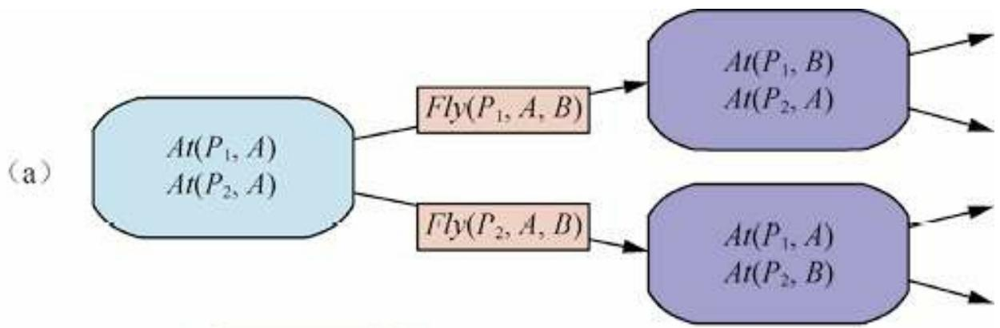

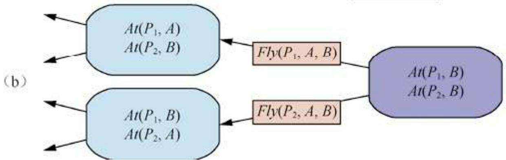  
图11-5 搜索规划的两种方法。（a）在基本状态空间中前向（递进）搜索，从初始状态开始，利用问题的动作向前搜索目标状态集合中的一个成员。（b）通过状态描述进行反向（回归）搜索，从目标开始，用逆动作反向搜索初始状态

# 11.2.1 规划的前向状态空间搜索

我们可以使用第3章或第4章中的任意启发式搜索算法来求解规划问题。搜索状态空间中的状态是基本状态，其中每个流要么为真要么为假。目标是一个状态，它含有该问题的目标中的所有正流而不含负流。一个状态中的适用动作Action(s)是动作模式的基本实例，也就是所有变量都被常量代替的动作。

为了确定适用的动作，我们将当前状态与当每个动作模式的前提合一。对于每个成功产生置换的合一，我们将该置换应用于动作模式来产生不含变量的基本动作。（动作模式的要求是，效果中的所有变量必须也出现在前提中，这样，我们可以保证在置换后没有遗漏任何变量。）

每个模式可能有多种合一方式。在备用轮胎范例（11.1.2节）中， Remove 动作有一个前提 At ( obj ,loc)，它匹配初始状态的方式有两种，进而产生两个置换 和

；应用这些置换会产生两个基本状态。如果一个动作的前提中有多个文字，那么每个文字都可能以多种方式与当前状态进行匹配。

乍看起来，对许多问题来说，状态空间似乎都太大了。考虑一个有10个机场的航空货物运输问题，其中每个机场有5架飞机和20件货物。目标是将所有在A机场的货物运送到B机场。这个问题的一个解有41步：将20件货物装入A机场的一架飞机上，飞到 B机场，然后卸载这20件货物。

找到这种显然且直接的解可能很困难，因为平均分支因子非常大：50架飞机中的每一架都可以飞到9个其他机场，200件包裹中每一件都可以被卸载（如果已被装载）或装载（如果它已被卸载）到机场的任意飞机上。所以在任何状态中，都至少有450种动作（当所有包裹所在的机场都没有飞机时），最多则有10 450种动作（当所有包裹和飞机都在同一个机场时）。平均而言，假设每个状态大约有2000种可能的动作，深度最多为41步的搜索图就会有大约2000 41 个节点。

显然，如果没有精确的启发式方法，即使是求解这种规模很小的问题案例都令人非常绝望。尽管规划的许多真实世界的应用都依赖于领域特定的启发式，但实际上（正如我们将在11.3节中看到的），强大的领域无关的启发式方法可以由自动推导得来，使得前向搜索成为一种可行的方法。

# 11.2.2 规划的反向状态空间搜索

在反向搜索［也称为 回归搜索 （regression search）］中，我们从目标开始反向应用动作，直到找出到达初始状态的步骤序列。在每一步中，我们考虑相关动作 （relevantaction）（与前向搜索不同，前向搜索考虑的是适用 动作）。这极大地减少了分支因子，特别是在有许多可能动作的领域。

相关动作是其效果能够与目标中的一个文字合一 的动作，但这个效果不否定目标的任何部分的行动。例如，对目标 ，效果仅为Famous的动作是相关动作，而效果为的动作则不相关：尽管这个动作可能在规划过程中的某处用到（来构建Famous），它却不能在规划的这个地方出现，因为这样会使Poor出现在最终状态中。

在反方向应用一个动作是什么意思？给定一个目标 g 和一个动作 a ，从 $g$ 通过 $a$ 的 回归（regression）会给出一个状态描述 g' ，其正负文字由下式给出：

$$
\operatorname {P o s} \left(g ^ {\prime}\right) = \left(\operatorname {P o s} (g) - \operatorname {A D D} (a)\right) \cup \operatorname {P o s} (\text {P r e c o n d} (a))
$$

$$
\mathrm {N E G} (g ^ {\prime}) = (\mathrm {N E G} (g) - \mathrm {D E L} (a)) \cup \mathrm {N E G} (\text {P r e c o n d} (a))
$$

也就是说，前提在之前必须成立，否则动作就无法被执行，但由该动作添加或删除的正负文字在之前不必为真。

这些等式对基本文字来说很简单直接，但当在 $g$ 和 $a$ 中存在变量时，就需要小心了。例如，假设目标是向SFO投递一件特定的货物： $\boldsymbol { A } t ( C _ { 2 } , \boldsymbol { S } \breve { \boldsymbol { F } } \boldsymbol { O } )$ 。 Unload 动作模式的效果是 $A t \left( \boldsymbol { c } , \boldsymbol { a } \right)$ 。当我们把它与目标进行合一，得到置换 $\{ c / C _ { 2 } , a / S F O \}$ ；将这个置换应用到模式中，我们就得到了一个新的模式，它刻画了使用位于SFO的任意一架飞机的概念：

$$
A c t i o n (U n l o a d \left(C _ {2}, p ^ {\prime}, S F O\right)
$$

$$
\text {P R E C O N D}: I n \left(C _ {2}, p ^ {\prime}\right) \wedge A t \left(p ^ {\prime}, S F O\right) \wedge C a r g o \left(C _ {2}\right) \wedge P l a n e \left(p ^ {\prime}\right) \wedge A i r p o r t (S F O)
$$

$$
\text {E F F E C T}: A t \left(C _ {2}, S F O\right) \wedge - \ln \left(C _ {2}, p ^ {\prime}\right))
$$

这里我们用一个名为p'的新变量来取代p 。这是变量名的标准化分离 的实例，以防不同变量因具有相同名称而发生冲突（见9.2.1节）。回归后的状态描述给出了一个新目标：

$$
g ^ {\prime} = \operatorname {I n} \left(C _ {2}, p ^ {\prime}\right) \wedge A t \left(p ^ {\prime}, S F O\right) \wedge C a r g o \left(C _ {2}\right) \wedge P l a n e \left(p ^ {\prime}\right) \wedge A i r p o r t (S F O)
$$

再举一个例子，考虑目标为拥有一本特定ISBN号的书： Own (9780134610993)。给定1万亿个13位数字的ISBN号和单个动作模式A：

$$
A = \text {A c t i o n} (B u y (i), \text {P R E C O N D : I S B N} (i), \text {E F F E C T : O w n} (i))
$$

索，我们可以将目标 Own (9780134610993)与效果 Own ( i' )合一，产生置换

。然后，我们在动作 上回归，产生前驱状态描述ISBN (9780134610993)。这是初始状态的一部分，因而我们得到一个解并完成了任务，其中只考虑了一个动作而不是1万亿个动作。

更形式化地说，假设一个目标描述 $g$ 包含一个目标文字 g i 和一个动作模式 A 。如果 A 有一个效果文字 ，其中 ，并且我们定义 ，如果 A' 的效果不含对 g 中文字的否定，则 $A ^ { \prime }$ 是对 $g$ 的一个相关动作。

对大多数问题域而言，反向搜索的分支因子小于前向搜索。但由于反向搜索使用了含有变量的状态而非基本状态，因此难以找到好的启发式方法。这是目前大多数系统倾向于使用前向搜索的主要原因。

# 11.2.3 使用布尔可满足性规划

在7.7.4节中，我们展示了一些巧妙的公理重写如何将wumpus世界问题转换为可以由高效可满足性求解器求解的命题逻辑可满足性问题。基于SAT的规划器SATPlan通过将PDDL问题描述翻译为命题形式来工作。这种翻译含有下面一系列步骤。

●将动作命题化：对于每个动作模式，用常量置换每个变量形成基本命题。因此我们不能仅用模式Unload(c, p, a)，而是必须将动作命题分为每个货物、飞机和机场的组合（此处用下标表示），以及每个时间步（此处用上标表示）。  
●添加动作排除公理来表明两个动作不能同时发生，例如

（FlyPSFOJFKAFlyPSFOBUH）

● 添加前提公理：对于每个基本动作 At ，添加公 理 ，也就是说，如果在时刻t采取动作，那么前提必须已经为真，例如

$$
\begin{array}{l} F l y P _ {1} S F O J F K ^ {1} \Rightarrow A t (P _ {1}, S F O) \wedge P l a n e (P ^ {1}) \wedge \\ A i r p o r t (S F O) \wedge A i r p o r t (J F K) \end{array}
$$

●定义初始状态：在问题初始状态中对每个流 $F$ 断言 $F ^ { 0 }$ ，并对每个初始状态中未提及的流断言。  
●将目标命题化：目标变为它的所有基本实例的析取式，其中变量被常量替代。例如，目标是在一个具有对象A、B和 $C$ 的世界中，使积木A位于另一块积木之上，也就是

，它将被以下目标替换：

$$
\left. (O n (A, A) \wedge B l o c k (A)) \vee (O n (A, B) \wedge B l o c k (B)) \vee (O n (A, C) \wedge B l o c k (C)) \right.
$$

● 添加后继状态公理：对于每个流 $F$ ，添加一个形式如下的公理：

$$
F ^ {t + 1} \Leftrightarrow A c t i o n C a u s e s F ^ {t} \vee \left(F ^ {t} \wedge - A c t i o n C a u s e s N o t F ^ {t}\right)
$$

其中 ActionCausesF 代表所有添加 $F$ 的基本动作的析取式，而ActionCausesNotF代表所有删除 $F$ 的基本动作的析取式。

翻译的结果通常比原始的PDDL大得多，但现代SAT求解器的效率通常足以弥补这一点。

# 11.2.4 其他经典规划方法

在自动规划50年的历史上，并非只存在上述3种方法。我们在这里简要介绍一些其他方法。

一种称为Graphplan的方法使用一种专门的数据结构—— 规划图 （planning graph）来编码约束以规

定动作与其前提和效果的关系以及哪些事物互相排斥。

情景演算 （situation calculus）是一种用一阶逻辑描述规划问题的方法。这种方法像SATPlan 一样使用后继状态公理，但一阶逻辑允许更灵活简洁的公理形式。总的来说，该方法有助于我们对规划的理论理解，却没有在实际应用中产生重大影响，可能是因为一阶证明器不如命题可满足性程序发展得好。

我们可以将有界规划问题（也就是寻找长度为k的规划）编码为 约束满足问题 （constraintsatisfaction problem，CSP）。这种编码方式类似于编码为SAT问题（11.2.3节），但它有一个重要的简化：在每个时间步，我们只需要一个变量Action t ，它的定义域是可能的动作集。我们不再需要为每个动作分配变量，也不需要动作排除公理。

到目前为止，我们看到的所有方法都构建了由严格的线性动作序列组成的 全序 规划。但如果一个航空货物运输问题有30个包裹被装载到一架飞机上，50个包裹被装载到另一架飞机上，那么对这80个装载动作制定一个特定的线性顺序似乎毫无意义。

还有一种称为 偏序规划 （partial-order planning）的方法用图而不是用线性序列来表示规划：每个动作是图中的一个节点，每个动作的前提都有一条来自另一个动作的边（或来自初始状态），表明形成这一前提的前驱动作。因此，我们可以用偏序规划表示动作 Remove ( Spare , Trunk )和 Remove( Flat , Axle )必须在 PutOn ( Spare , Axle )之前进行，而无须说明应该先执行这两个 Remove 动作中的哪一个。我们在规划空间而非世界状态空间中搜索，通过插入动作来满足条件。

在20世纪80和90年代，偏序规划被认为是处理具有独立子问题的规划问题的最佳方法。到2000年，前向搜索规划器发展出了优秀的启发式方法，这使得它们能够有效地发现偏序规划所擅长处理的独立子问题。此外，SATPlan能够利用摩尔定律：在1980年还大得吓人的命题化问题现在看起来微不足道，因为现在计算机的内存增加了1万倍。因此，在完全自动化的经典规划问题上，偏序规划没什么竞争力。

尽管如此，偏序规划仍然是该领域的重要组成部分。对于某些特定的任务，如作业调度，采用领域特定的启发式方法的偏序规划依然是可以选用的技术。许多这种系统使用高层规划库，如11.4节所述。

偏序规划也常用于那些需要人类理解其规划的领域。例如，用于航天器和火星车的作业规划通过偏序规划器生成，在将规划上传到这些装备并执行前会经过人类操作员的检查。规划精细化方法使得人类易于理解规划算法做了什么事情，并在规划被执行前验证其正确性。

# 11.3 规划的启发式方法

如果没有好的启发式函数，前向搜索和反向搜索都是低效的。回想在第3章中，一个启发式函数h (s)估计了从状态 s到目标的距离，如果我们能推导出这个距离的 可容许的 启发式方法，也就是不会高估的方法，那么我们就可以使用A * 搜索来找到最优解。

根据定义，能够分析原子状态的方法是不存在的。因此，为含有原子状态的搜索问题定义良好的领域特定启发式方法需要分析师（通常是人）的聪明才智。但是规划使用状态和动作的因子化表示，就使得找出良好的、领域无关的启发式方法成为可能。

回想一下，可以通过定义一个更容易求解的松弛问题 推导出一个可容许的启发式方法。求解这个简单问题的确切代价就变为寻找原问题的启发式。搜索问题是一个节点为状态、边为动作的图。问题是找到一条连接初始状态和目标状态的路径。我们有两种主要的方法来松弛这个问题，使它变得更容易：通过在图中添加更多的边，使找到一条路径更容易，或者通过将多个节点分为一组，形成一个具有更少状态的状态空间的抽象，因而更容易搜索。

我们首先看看向图中添加边的启发式方法。最简单的方法大概是忽略前提启发式方法 （ignore-preconditionsheuristic），它从动作中去掉所有的前提。每一个动作都适用于所有状态，任何单个目标流都可以在一步之内完成（如果存在适用动作的话。如果没有适用动作，这个问题就是无解的）。这几乎意味着，求解松弛问题所需的步骤数量等于未满足的目标数量——几乎但不完全等于，因为（1）一些动作可能实现多个目标，（2）一些动作可能抵消了其他动作的效果。

对于许多问题，精确的启发式是通过考虑（1）且忽略（2）得到的。首先，我们通过移除所有前提和效果（含有目标中的文字的效果除外）来松弛动作。然后我们计算为了满足目标所要求的效果而需要合一的动作的最小数量。这是一个集合覆盖问题 （set-coverproblem）。有一个小麻烦：集合覆盖问题是NP困难的。幸运的是，有一种简单的贪心算法能够确保返回一个集合的覆盖，其大小不超过实际最小覆盖的log n倍，其中n是目标中的文字的数量。遗憾的是，这种贪心算法无法保证可容许性。

只忽略被选定的动作的前提也是可以的。考虑3.2节中的滑块问题(8数码问题或15数码问题）。我们可以将其编码为一个规划问题，其滑块只有 Slide 一个模式：

$$
A c t i o n (S l i d e (t, s _ {1}, s _ {2}),
$$

$$
\mathrm {P R E C O N D}: \operatorname {O n} (t, s _ {1}) \wedge \operatorname {T i l e} (t) \wedge \operatorname {B l a n k} \left(s _ {2}\right) \wedge \operatorname {A d j a c e n t} \left(s _ {1}, s _ {2}\right)
$$

$$
\text {E F F E C T}: O n (t, s _ {2}) \wedge B l a n k (s _ {1}) \wedge \neg O n (t, s _ {1}) \wedge \neg B l a n k (s _ {2}))
$$

正如我们在3.6节中所看到的，如果我们移除前提 ，那么在一次动作中，所有滑块都可以移动到任意位置，我们就得到了错放的滑块数量的启发式。如果只移除前提 Blank(s )，我们就得到了曼哈顿距离启发式。很容易看出这些启发式是如何从动作模式的描述中自动推导出来的。与搜索问题的原子表示相比，规划问题的因子化表示的最大优点是易于操作动作模式。

另一种可能性是 忽略删除列表启发式方法 （ignore-delete-listsheuristic）。暂且假设所有目标和前提只包含正文字。[1] 我们想要创建一个原问题的更容易求解的松弛版本，并且将其解的长度用作很好的启发式函数。我们可以通过从所有动作中移除删除列表（例如，从效果中移除所有负文字）来实现。这使得向着目标单调前进成为可能— 任何动作都不会抵消另一个动作所取得的进展。虽然找到松弛问题的最优解仍然是NP困难的，但可以通过爬山搜索算法在多项式时间内找到近似解。

[1]许多问题都采用这种惯例记法。对于没有使用这种记法的问题，将所有目标或前提中的负文字用新的正文字P'替换，并相应地修改初始状态和动作效果即可。

图11-6画出了使用忽略删除列表启发式方法的两个规划问题的部分状态空间，其中点代表状态，边代表动作，每个点离底面的高度代表启发式函数的值。在底部平面上的状态就是解。两个问题都有

通往目标的宽阔路径。因为没有死路，也就没有回溯的必要，简单的爬山搜索就可以轻松求解这些问题（尽管它可能不是最优解）。

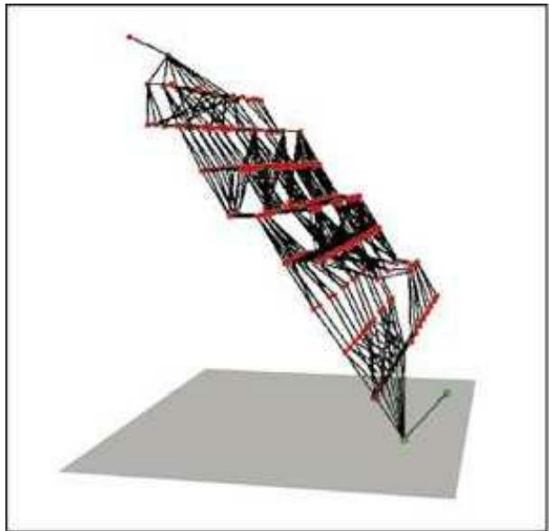

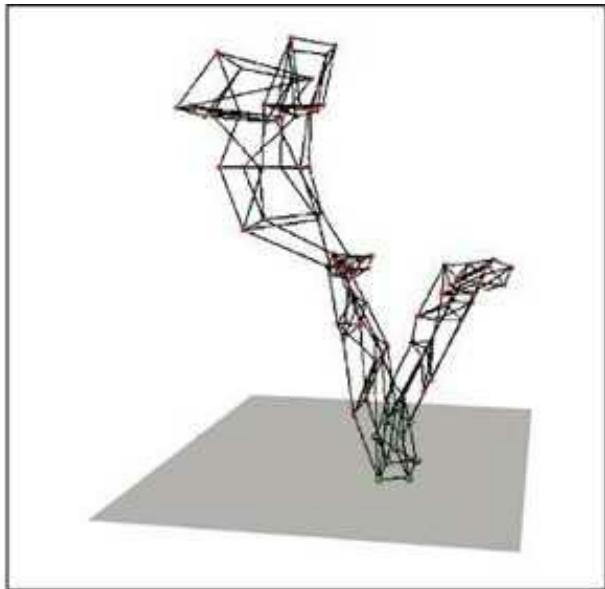  
图11-6 使用忽略删除列表启发式方法的规划问题的两个状态空间。底部平面以上的高度是一个状态的启发式得分；底部平面的状态是目标。由于不存在局部极小值，所以搜索目标很简单直接。图片来自（Hoffmann, 2005）

# 11.3.1 领域无关剪枝

因子化表示中很容易就能看出许多状态只是其他状态的变体。例如，假设桌子上有12块积木，我们的目标是让积木A位于3块积木的积木塔的顶部。一个解的第一步就是将某块积木 x放到积木y的上面（其中 x、 y和A都是不同的）。然后，我们把A放在x上面就可以了。x有11种选择，而给定x的话，y有10种选择，因此有110种状态需要考虑。但所有这些状态都是对称的：选择这一个而非那一个并没有什么区别，因此规划器应当只考虑其中一种。这就是 对称约简 （symmetryreduction）的原理：我们修剪掉搜索树中的所有对称分支而不予考虑，只保留其中一个。对许多领域来说，这会使问题从难以求解变为高效求解。

另一种做法是进行前向剪枝，为了将搜索集中于有希望的分支，我们需要承担可能会剪掉最优解的风险。可以定义一个如下的优先动作 （preferred action）：首先，定义问题的一个松弛版本，然后求解它，得到一个松弛规划 。如此，优先动作要么是松弛规划中的一步，要么能够满足松弛规划的某个前提。

有时通过找出可以被剔除的负相互作用也可以高效求解问题。如果问题中存在子目标的某种顺序，使得规划器按照这个顺序完成子目标时不会撤销已完成的子目标，则这个问题具有可序列化子目标 （serializablesubgoal）。例如，在积木世界里，如果我们的目标是建造一座塔（例如，积木 $A$ 在 $B$ 上，B在 $C$ 上， $C$ 在桌子上，如图11-3所示），则子目标是自底向上可序列化的：如果我们先让积木 $C$ 在桌子上，则当完成其他的子目标时我们就不需要撤销它。一个使用自底向上技术的规划器可以无须回溯地求解积木世界中的任何问题（尽管它并不总能找到最短的规划）。再举个例子，如果一个房间有n个电灯开关，每个开关控制一盏灯，而我们的目标是让这些灯都亮着，那么就不需要考虑开灯的顺序，可以任意指定规划的开灯顺序，如使用升序。

对控制美国国家航空航天局“深空一号”航天器的“远程智能体”规划器来说，控制航天器所涉及的命题被设定为是可序列化的。这也许并不是很奇怪，因为航天器是被工程师设计为尽量容易操纵的（同时也受到其他因素限制）。利用目标的序列化顺序，“远程智能体”规划器能够消除大部分搜索。这意味着它的速度快到足以实时控制航天器，这在以前被认为是不可能做到的。

# 11.3.2 规划中的状态抽象

松弛化问题给出一个仅用于计算启发式函数的值的简化规划问题。许多规划问题有10 个或更多的状态，松弛这些动作并不能减少状态的数量，这意味着计算启发式的代价仍然很高。因此，我

们现在来看通过构造 状态抽象 （state abstraction）以减少状态数量的松弛化方法——从问题的基本表示到抽象表示的多对一映射。

状态抽象最简单的形式是忽略一些流。例如，考虑一个有10个机场、50架飞机和200件货物的航空货物运输问题。每架飞机可以位于10个机场中的一个，每件包裹可以在其中一架飞机上，或已卸载到其中一个机场。所以有 个状态。现在考虑该领域中的一个特定问题，在这个问题中，所有的包裹刚好只在5个机场中，且在给定机场中的所有包裹的目的地都相同。这样，对这个问题的一个有用的抽象是去掉所有 At 流，除了那些涉及在这5个机场中的包裹和飞机的流。现在只有 个状态。在这个抽象状态空间中的解要比原始空间中的解短（因此它是一个可容许的启发式），而且抽象解可以轻易扩展为原问题的解（通过添加额外的 Load 和 Unload 动作）。

定义启发式的一个关键思想是 分解 （decomposition）：将问题分解为多个部分，独立求解各个部分，然后将这些部分组合起来。子目标独立 （subgoalindependence）假设是，求解一系列子目标的代价近似于独立求解每个子目标的成本之和。子目标独立性假设可以是乐观的，也可以是悲观的。当每个子目标的子规划之间存在负相互作用时，它就是乐观的——例如，当一个子规划中的动作删除了了另一个子规划完成的目标时。当子规划包含冗余的动作时，它是悲观的、不可容许的，例如，两个动作在合一后的规划中被替换为一个动作。

假设目标是一组流的集合 G ，我们将其分成不相交的子集 G ,…, G n 。随后找到各个子目标的最优解 P 1,…, P n 。实现整个 G 的规划的代价大概是多少？我们可以把每个C ost ( P i )想作一个启发式估计，而且如果我们通过取它们当中的最大值的来进行总体估计，我们就能得到一个可容许的启发式。因此，maxiCost(Pi)是可容许的，而且有时它是完全准确的，例如当 $P _ { \mathrm { ~ 1 ~ } }$ 偶然地实现了所有G i。但通常这个估计是过低的。我们可以把代价加起来吗？对许多问题来说这是一个合理的估计，但它是不可容许的。最好的情况是G i和 $G j$ 是独立的，也就是对其中一个目标的规划不能减少另一个规划的代价。这种情况下，估计C ost ( P i ) + C ost ( P j )是可容许的，并且比最大估计更准确。

很明显，通过抽象来减少搜索空间有很大的潜力。诀窍在于选择适当的抽象，并使其总代价——定义抽象、进行抽象搜索、将抽象映射回原问题——小于求解原问题的代价。在3.6.3节中的 模式数据库 技术可以派上用场，因为创建模式数据库的代价可以分摊到多种问题案例上。

利用了高效启发式的系统有FF，或称FastForward （Hoffmann,2005），这是一个使用了忽略删除列表启发式方法的前向状态空间搜索器，它使用规划图估计启发式。FF随后使用该启发式进行爬山搜索（修改版，以便于记录规划）来寻找解。FF的爬山算法是非标准的：它通过在当前状态运行广度优先搜索来避免局部极大值，直到找到更好的状态。如果没有找到结果，FF就会切换到贪心最佳优先搜索。

# 11.4 分层规划

前几章的问题求解和规划方法都只使用固定的原子动作集。动作可以连在一起，而最新的算法可以生成包含数千个动作的解。如果我们正在规划假期，而动作仅仅是在“从旧金山飞到火奴鲁鲁”的层次，这样做没什么问题；但在“左膝弯曲5度”的电动机控制层次，我们需要连接几百万到几十亿个动作，而不止是几千个。

弥合这一差距需要在更高的抽象层次上进行规划。一个高层级的夏威夷度假规划可能是“前往旧金山机场；乘坐飞往火奴鲁鲁的HA 11号航班；游玩两个星期；乘坐HA 12飞机回旧金山；回家”。给定这样的规划，“前往旧金山机场”这一动作本身就可以被视为一项规划任务，它的解包括“选择送机服务；预订一辆车；乘车前往机场”。每个动作都可以被进一步分解，直到我们达到低层级的电动机控制动作，就像钉扣机一样。

在这个例子中，规划和行动是交替的。例如，我们可以把从路边到大门的步行规划问题推迟到下车之后再说。因此，在执行阶段之前，该动作仍然处于抽象层级。我们在11.5节再讨论这个话题。此处，我们专注于 层次分解 （hierarchicaldecomposition）的概念，几乎在控制复杂性的所有尝试中都可以见到这种概念。例如，复杂软件是基于子程序和类的层次性而创建的，军队、政府和企业都有层次化的组织结构。分层结构的主要益处是，分层的每一层级都将一个计算任务、军事行动或行政职能减少为下一层次的少量活动，因此找出为当前问题安排这些活动的正确方法的计算代价很小。

# 11.4.1 高层动作

用于理解层次分解的基本形式体系来自分层任务网络 （hierarchicaltask network，HTN）领域规划。目前，我们假设完全可观测性和确定性，以及一组动作，称为 基元动作 （primitive action），它具有标准的前提-效果模式。另外一个重要的概念是 高层动作 （high-levelaction）或称HLA—例如，“前往旧金山机场”动作。每个HLA都有一个或多个可能的细化 （refinement）来形成一个动作序列，其中的每个动作可能是一个HLA或一个基元动作。例如，动作“前往旧金山机场”，其形式化表示为Go(Home, SFO )，它可以有两个可能的细化，如图11-7所示。图11-7还展示了在真空吸尘器世界中导航的递归 细化：要到达目的地，我们先走一步，然后再前往目的地。

Refinement(DoHome, SFO), STEPS: [Drive(Home, SFOLongTermParking), Shuttle(SFOLongTermParking, SFO)] Refinement(DoHome, SFO), STEPS: [Taxi(Home, SFO)] Refinement(Navigate([a, b], [x, y]), PRECOND: $a = x \wedge b = y$ STEPS: ]) Refinement(Navigate([a, b], [x, y]), PRECOND: Connected([a, b], [a - 1, b]) STEPS: [Left, Navigate([a - 1, b], [x, y])]) Refinement(Navigate([a, b], [x, y]), PRECOND: Connected([a, b], [a + 1, b]) STEPS: [Right, Navigate([a + 1, b], [x, y]))

图11-7 两个高层动作——前往旧金山机场和在真空吸尘器世界中导航——的可能细化的定义。注意真空吸尘器世界中细化的递归特性和对前提的使用

这些例子表明，高层动作及其细化体现了关于 如何做事 的知识。例如， Go ( Home , SFO )的细化表明你可以开车或叫车去机场；买牛奶、坐下来、将马移动到e4方格等动作是无须考虑的。

只包含基元动作的HLA细化称为这个HLA的一个 实现 （implementation）。在网格世界中，序列[Right , Right , Down ]和[ Down , Right , Right ]都实现了HLA Navigate ([1, 3], [3, 2])。一个高层规划（HLA序列）的实现就是连接序列中每个HLA的实现。给定每个基元动作的前提-效果的定义，很容易确定高层规划的任意给定实现是否达成了目标。

因此，我们可以说，如果一个高层规划至少有一个实现从给定状态达成了目标，则该高层规划从该给定状态达成了目标。这个定义中，“至少有一个”是至关重要的，并非所有实现都需要达成目标，因为智能体会想办法决定它要执行哪个实现。因此，HTN规划中的可能实现的集合——其中各个实现的结果可能不同——与非确定性规划中可能结果的集合不同。在非确定性规划中，我们需要一个对所有结果都有效的规划，因为智能体不能选择结果，产生何种结果是自然因素导致的。

最简单的情况是只有一个实现的HLA。在这种情况下，我们可以从实现的前提和效果中计算HLA的前提和效果（见习题11.HLAU），然后将HLA本身完全视为一个基元动作。可以证明，一组正确的HLA可以将盲目搜索的时间复杂性从解深度的指数量级降到解深度的线性量级，虽然设计出这样的一组HLA并非易事。当HLA有多个可能的实现时，有两种选择：一种是在所有实现中搜索出一个有效的实现，如11.4.2节所述；另一种是直接对HLA进行推理——不管存在多少种实现，如11.4.3节所述。后一种方法可以导出可证明为正确的抽象规划，而无须考虑它们的实现。

# 11.4.2 搜索基元解

HTN规划通常是由一个称为Act的“顶层”动作制定的，其目标是找到能达成目标的Act的实现。这种方法是完全通用的。例如，经典的规划问题可以定义为：对于每个基元动作ai，给出一个带有步骤[a ,Act]的 Act的细化。这就创建了一个让我们添加动作的Act的递归定义。但我们需要某种方法来停止递归。为此，我们为Act提供了另一条细化，其中包含一个空步骤列表，并且前提等于问题的目标。这就是说，如果目标已经实现了，那么正确的实现就是什么也不做。

该方法引出了一个简单的算法：在当前规划中反复选择一个HLA，并将其替换为它的一个细化，直到规划达成目标。图11-8展示了一种基于广度优先树搜索的实现。规划的考虑顺序是细化嵌套的深度，而非基元步骤的数量。设计该算法的图搜索版本、深度优先版本或迭代加深版本很简单。

本质上，这种分层搜索的形式探索了一个序列空间，它符合HLA库中关于如何做事的知识。每个细化确定的动作序列和细化的前提都可以编码大量知识。对于一些领域，HTN规划器已经能够用少量搜索生成大型规划。例如，O-Plan （Belland Tate, 1985）将HTN规划与调度结合起来，已经被用于为日立制定生产规划。一个典型的问题中包含一条制造350种产品、有35台装配机和2000多种不同操作的生产线。这个规划器生成了一个30天的进度计划，每天进行3次8小时换班，涉及数千万个步骤。另一个重要方面是，根据定义，HTN规划是分层结构的，这通常更利于人类理解。

function HIERARCHICAL-SEARCH(problem, hierarchy) returns 一个解或failure  
frontier $\leftarrow$ 一个元素仅为[Act]的先入先出队列  
while true do  
if Is-EMPTY(frontier) then return failure  
plan $\leftarrow$ POP(frontier) // 选择frontier中最浅的plan  
hla $\leftarrow$ plan中的第一个HLA，若无则为null  
prefix, suffix $\leftarrow$ plan中hla之前和之后的动作序列  
outcome $\leftarrow$ RESULT(problem.INITIAL, prefix)  
if hla为null then // plan是基元的且结果为outcome  
if problem Is-GOAL(outcome) then return plan  
else for each sequence in REFINEMENTS(hla, outcome, hierarchy) do  
添加APPEND(prefix, sequence, suffix)到frontier

图11-8 分层前向规划搜索的广度优先实现。最初提供给算法的规划是[ Act ]。R efinements 函数返回一个动作序列集，HLA的每个由状态 outcome满足其前提的细化都对应其中一个动作序列

分层搜索的计算优势可以从一个理想化的案例中看出。假设一个规划问题的解有 $d$ 个基元动作。对于一个每个状态有 $^ { b }$ 个可用动作的非分层前向状态空间规划器，其代价是O (b d)，如第3章所述。对于一个HTN规划，我们假设一个非常规则的细化结构：每个非基元动作有r个可能的细化，每个细化到在下一层次有 $k$ 个动作。我们想知道这个结构有多少种不同的细化树。现在，如果在基元层有d 个动作，根节点下面的层次数量是log d ，所以内部细化节点的数量是

。每个内部节点有 构造 个可能的分解树。 $r$ 个可能的细化，因此能

仔细查看这个公式，我们可以看到使 r较小而k较大会减少大量开销：如果b 和r是可比较的，我们取非分层代价的 $k$ 次方根。较小的 r和较大的k意味着一个HLA的库只有少量的细化，每个细化都产生一个较长的动作序列。但这并不总是可能的：可用于广泛问题的长动作序列极为少见。

HTN规划的关键是含有用于实现复杂的高层动作的已知方法的规划库。建立库的方法之一是从问题求解的经验中学习。在从零开始痛苦地构建好规划之后，智能体就可以将规划保存在库中，作为实现由任务定义的高层动作的方法。这样，随着时间的推移，用旧方法逐渐构建了新方法，智能体的能力越来越强大。这个学习过程的一个重要方面是对所构建方法进行泛化 的能力，消除针对特定问题的细节（例如，建筑商的名字或地块的地址），只保留规划的关键元素。我们相信，人类的强大能力中也有类似这样的机制。

# 11.4.3 搜索抽象解

11.4.2节中的分层搜索算法将HLA细化为基元动作序列，以确定一个规划是否切实可行。这有些违反常识：我们应该能够确定有两个HLA高层规划

# [Drive(Home,SFOLongTermParking),Shuttle(SFOLongTermParking,SFO)]

能够将人送到机场，而无须确定准确的路线、要使用的停车场等。解决方案是写出HLA的前提-效果描述，就像我们对基元动作所做的那样。从描述中，应该很容易证明高层规划实现了目标。这称得上是分层规划终极理想，因为如果我们通过搜索高层动作的较小搜索空间得到一个可证明能达成目标的高层规划，然后我们就可以专注于这个规划，只需要继续细化规划的每个步骤就行了。这样，我们就节省了指数级的开销。

这只在一种情况下是可行的，即每个“声称”能达成目标的高层规划（根据其步骤的描述）确实能够达成目标。根据上文所述的定义，这个规划必须至少有一个能达成目标的实现。这个性质被称为HLA描述的向下细化性质 。

从理论上说，写出满足向下细化性质的HLA描述是容易的：只要描述是真 的，那么所有宣称能达成目标的高层规划实际上都可以达成目标——否则，描述就对HLA的行为进行了假 的描述。我们已经见过如何为只有一个实现的HLA编写 真 描述（习题11.HLAU），但当HLA有多个实现时就会出现问题。我们如何描述一个能够以许多不同方式实现的动作的效果？

一个（至少对所有前提和目标都为正的问题来说）安全的答案是只包括HLA中 所有 实现都能完成的正效果和 某个 实现的负效果。这就能满足向下细化性质。可惜的是，这种语法对HLA来说过于保守了。

重新考虑一下HLA Go(Home, SFO )，它有两个细化。为了便于讨论，假设在一个简单的世界中，人们永远能够开车到机场并找到停车位，但打车需要以Cash （现金）作为前提。在这种情况下，Go ( Home , SFO )并不总是能把你带到机场。特别是，如果 Cash 为假，我们就无法断言 At ( Agent ,SFO )为这个HLA的效果。但这并没有道理，因为如果智能体没有现金，它就会自己开车。要求效果对所有 实现都成立，就相当于假设 其他人 — 一个对手——会选择这个实现。它对待HLA的多个结果的方式就好像HLA是一个 非确定性 的动作一样，如4.3节所述。但我们的情况是，智能体自己会选择要采取的实现。

编程语言社区为对手进行选择的情况创造了 恶魔非确定论 （demonic nondeterminism）这个术语，来对比于智能体自己进行选择的 天使非确定论 （angelicnondeterminism）。我们借用这个术语来定义HLA描述中的天使语义 （angelicsemantics）。理解天使语义所需的基本概念是HLA的可达集 （reachable set）：给定一个状态 s ，HLA h 的可达集写作R each ( s , h )，是所有HLA实现都可以到达的状态集合。

关键思想是，当智能体执行HLA时，它可以选择最后要到达可达集中的哪个 元素。因此，一个具有多个细化的HLA比具有较少细化的相同HLA更“强大”。我们可以定义HLA序列的可达集。例如，序列[h ,h ]的可达集是在 h 的可达集的每个状态下应用 h 所得到的所有可达集的并集：

$$
\operatorname {R e a c h} (s, [ h _ {1}, h _ {2} ]) = \bigcup_ {s ^ {\prime} \in \operatorname {R e a c h} (s, h _ {1})} \operatorname {R e a c h} (s ^ {\prime}, h _ {2})
$$

给定这些定义，一个高层规划— —一个HLA序列——达成了目标，如果其可达集与目标状态集相交。（作为对比，恶魔语义的条件更为严格，其可达集中的所有成员都必须是一个目标状态。）相反地，如果可达集没有与目标相交，那么规划肯定行不通。图11-9展示了这些概念。

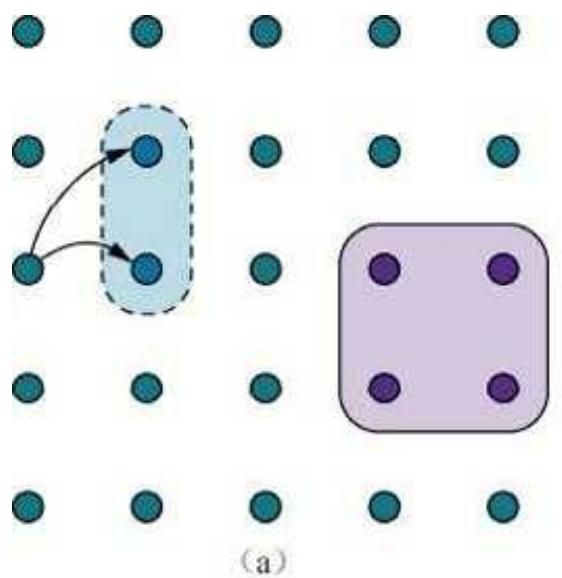

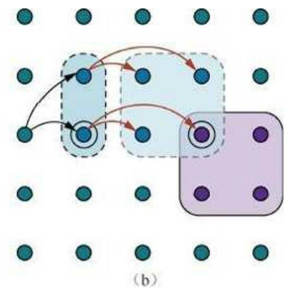  
图11-9可达集的语义示例。目标状态集用紫色阴影表示。黑色和红色箭头分别表示 $h _ { 1 }$ 和 $h _ { 2 }$ 的可能实现。（a）在状态 s 中HLA $h _ { \mathrm { ~ 1 ~ } }$ 的可达集。（b）序列[ $h _ { 1 } , h _ { 2 } ]$ 的可达集。因为它与目标集相交，所以序列实现了目标

可达集的概念产生了一个简单的算法：在高层规划中搜索，寻找可达集与目标相交的规划。一旦找到这种规划，算法就知道这个抽象规划可行，并专注于它，然后致力于进一步细化该规划。我们

稍后再回到算法话题，现在先考虑如何表示HLA的效果——每个可能的初始状态的可达集。基元动作可以将流设为真 （true）、假 （false）或 未更改（unchanged）。对有条件的效果（见11.5.1节），还有第四种可能性：即将变量设为其相反量。

天使语义下的HLA能做的事情更多：它可以控制 流的值，根据选择了哪个实现来将流设置为真或假。这意味着HLA可以对流产生9种不同的效果：如果变量一开始为真，它可以始终保持为真、始终设为假或者有选择权；如果流一开始为假，它可以一直保持为假、一直设为真或者有选择权。这两种情况的3个选项可以任意组合，得到9种效果。

这在记法上有点困难。我们将使用添加列表和删除列表（而不是真/假流）的语言，用~符号来表示“有可能，如果智能体做出了这样的选择”。因此，效果~+意味着“可能添加A”，也就是说，要么保持 A不变，要么使它为真。同样，~—表示“可能删除 A”，~±表示“可能添加或删除A”。例如，HLA Go ( Home , SFO )，有两个图11-7所示的细化，可能删除 Cash （如果智能体决定打车），因此它应当具有效果~—Cash 。这样，我们看到HLA的描述是可以从对其细化的描述中推导出来的。现在，假设我们有HLA h 和 h 的以下动作模式：

$$
A c t i o n \left(h _ {1}, \text {P R E C O N D}: - A, \text {E F F E C T}: A \wedge = B\right)
$$

$$
A c t i o n \left(h _ {2}, \text {P R E C O N D}: - B, \text {E F F E C T}: + A \wedge \pm C\right)
$$

也就是说， $h _ { \mathrm { ~ 1 ~ } }$ 添加 A并可能删除 B，而 $h _ { 2 }$ 可能添加 A并可以完全控制 $C$ 。现在，只要初始状态B为真且目标是 $A \land C$ ，那么序列[h , h ]实现了目标：我们选择h 的使B为假的实现，然后选择 $h _ { 2 }$ 的保持A为真且使C为真的实现。

前面的讨论假设，一个HLA的效果——对任意给定初始状态的可达集— 可以通过描述每个流的效果而被精确描述。如果这总是正确的就太好了——在很多情况下，我们只能近似这些效果，因为一个HLA可能有无穷多种实现，可能产生随意弯曲的可达集，就像7.7.3节的图7-21所示的弯曲信念状态问题。例如，我们说 Go ( Home , SFO )可能删除 Cash ，它也可能添加 At ( Car ,SFOLongTermParking)，但它不能同时做这两件事——事实上它必须只做一件事。与信念状态一样，我们可能需要写出 近似 描述。我们将使用两种近似：HLA h 的 乐观描述 （optimisticdescription）R each + ( s , h )可能夸大了可达集，而 悲观描述 （pessimistic description）R each − ( s ,h )可能低估了可达集。因此，我们有

$$
\mathrm {R E A C H} ^ {-} (s, h) \subseteq \mathrm {R E A C H} (s, h) \subseteq \mathrm {R E A C H} ^ {+} (s, h)
$$

例如，对 Go ( Home , SFO )的乐观描述称，它可能会删除 Cash ，并可能添加 At ( Car ,

SFOLongTermParking)。另一个很好的例子出现在8数码问题中，不论从哪种给定的状态出发，都有一半的状态是不可达的（见习题11.PART）：对Act的乐观描述很可能包括整个状态空间，因为确切的可达集是非常弯曲的。

使用近似描述需要稍微修改一下规划是否达成目标的测试。如果规划的乐观可达集与目标不相交，那么规划就行不通；如果悲观可达集与目标相交，则规划有效（图11-10a）。使用精确描述的话，规划要么有效要么无效，但使用近似的描述时，存在一个中间地带：如果乐观集与目标相交而悲观集不相交，那么我们就无法判断规划是否有效（图11-10b）。当这种情况出现时，可以通过细化规划来解决不确定性。这是人类推理中很常见的情况。例如，在规划前面提到的两周的夏威夷度假时，有人可能会提议在7个岛上各呆两天。而谨慎起见的话，这一雄心勃勃的规划需要细化到考虑岛间交通方式的程度。


  
  
图11-10具有近似描述的高层规划的目标达成。目标状态集用紫色阴影表示。对于每个规划将显示悲观（实线，浅蓝色）和乐观（虚线，浅绿色）可达集。（a）黑色箭头所指的规划的确达成了目标，而红色箭头所指的规划完全没有达成目标。（b）可能达成目标（乐观可达集相交的目标）但未必会达成目标（悲观可达集与目标不相交）的规划。该规划需要进一步细化，以确定它是否真的达成了目标  
图11-11展示了一个具有近似天使描述的分层规划算法。为简单起见，我们保留了先前在图11-8中使用的相同的总体方案，即在细化空间中进行广度优先搜索。如前所述，该算法可以通过检查乐观可达集和悲观可达集与目标的交集来检测规划是否可行。（习题11.HLAP中详细介绍了给定每一步的近似描述后如何计算规划的可达集。）

function ANGELIC-SEARCH(problem, hierarchy, initialPlan) returns 解或fail  
frontier $\leftarrow$ 一个initialPlan为唯一元素的先入先出队列  
while true do  
if EMPTY?(frontier) then return fail  
plan $\leftarrow$ POP(frontier) //选择frontier中最浅的节点  
if REACH\* (problem.INITIAL, plan)与problem.GoAL相交then  
if plan是基元的 then return plan //REACH\*对于基元规划是精确的  
guaranteed $\leftarrow$ REACH (problem.INITIAL, plan)∩problem.GoAL  
if guaranteed $\neq \{\}$ 且MAKING-PROGRESS (plan, initialPlan) then  
finalState $\leftarrow$ guaranteed中的任意元素  
return DECOMPOSE (hierarchy, problem.INITIAL, plan, finalState)  
hla $\leftarrow$ plan中的某个HLA  
prefix, suffix $\leftarrow$ plan中hla之前和之后的动作序列  
outcome $\leftarrow$ RESULT (problem.INITIAL, prefix)  
for each sequence in REFINEMENTS (hla, outcome, hierarchy) do  
将(APPEND (prefix, sequence, suffix), 添加到frontier

function DECOMPOSE(hierarchy, $s_0$ , plan, $s_f$ ) returns 一个解  
solution $\leftarrow$ 空规划  
while plan非空 do  
action $\leftarrow$ REMOVE-LAST.plan) $s_i \gets$ REACH( $s_0$ , plan)中的一个状态，使得 $s_f \in \text{REACH}^{-}(s_i, \text{action})$ problem $\leftarrow$ 一个 INITIAL = $s_i$ 且 GOAL = $s_f$ 的问题  
solution $\leftarrow$ APPEND(ANGELIC-SEARCH(problem, hierarchy, action), solution) $s_f \gets s_i$ return solution

图11-11 一个分层规划算法，它使用天使语义来识别并执行可行的高层规划，避免不可行高层规划。谓词M aking -P rogress 检查并确保我们不会陷入细化的无限回归中。在顶层，以[ Act ]作为initialPlan 调用A ngelic -S earch

当找到一个可行的抽象规划时，该算法将原问题分解为子问题，规划的每步对应一个子问题。每个子问题的初始状态和目标是通过对规划的每一步用动作模式回归一个确保可达的目标状态获得的。（见11.2.2节了解回归的原理。）图11-9b阐明了其基本概念：右边圈中的状态是确保可达的目标状态，左边圈中的状态是通过用最终动作回归目标得到的中间目标。

执行或拒绝高层规划的能力可以使A ngelic -S earch 比H ierarchical -S earch 有显著的计算优势，而Hierarchical -S earch 又可能比传统的B readth -F irst -S earch 有很大的优势。例如，考虑打扫一个很大的由狭窄走廊连接的房间组成的真空吸尘器世界，其中每个房间都是 $w \times h$ 的长方形。真空吸尘器的HLA有导航（ Navigate ，如图11-7所示）和清理整个房间（ CleanWholeRoom ）的动作是很有意义的。（清理房间可以通过重复应用另一个用于清理每行区域的HLA实现。）因为有5个基元动作，所以Breadth -First-Search 的代价增长为5 d ，其中d 是最短解的长度（大约是房间总方格数的两倍）；该算法甚至无法处理两个3×3的房间。H ierarchical-Search更高效，但仍然会受指数增长的困扰，因为它会尝试所有与分层一致的清理方法。而A ngelic -S earch 的规模增加几乎随方格数量线性增长——它专注于一个良好的房间清理高层序列和导航步骤，并且会剪去其他选择。

通过依次打扫每个房间来打扫一组房间并不是什么高深的科学：这种任务的分层结构对人类来说很容易。考虑到人类在求解像8数码这样的小谜题时并不容易，可以看出人类求解复杂问题的能力似乎不是来自排列组合学，而是来自能够消除组合的问题抽象和分解能力。

通过推广可达集的概念，天使方法可以推广到找出最小代价的解。状态不再是可达与否的，而是每个状态都有一个最高效抵达该状态的代价。（对于不可达状态，代价是无穷大。）乐观和悲观描述分别为代价的上下界。这样，天使搜索可以找到可证明为最优的抽象规划，而不必考虑其实现。同样的方法可以用于得到在线搜索的有效 分层前瞻 （hierarchicallook-ahead）算法，类似于LRTA *（4.5.3节）。

这些算法在某种程度上反映了人类在完成类似规划夏威夷度假这样的任务时的深思熟虑——对其他规划的考虑一开始是在抽象层次和很长的时间尺度上完成的。规划的某些部分在执行之前都相当抽象，例如如何在莫洛凯岛度过悠闲的两天，而其他部分是详细规划，例如要乘坐的航班、要预订的旅馆，没有这些细化就无法确保这个规划的可行性。

# 11.5 非确定性域的规划和行动

本节，我们将规划扩展到处理部分可观测的、非确定性的和未知的环境中。其基本概念与第4章的概念类似，区别在于它使用了因子化表示而非原子表示。这影响了我们表示智能体动作和观测能力的方式，以及我们表示部分可观测环境的 信念状态 ——智能体可能处于的具体状态集 —— 的方式。我们还可以利用11.3节中给出的许多种领域无关的方法来计算搜索启发式。

我们将介绍在没有观测的环境中的无传感器规划 （也称为一致性规划 ）、部分可观测的和非确定性环境中的应变规划 ，以及在未知环境中的在线规划 和重规划 。这使我们能够求解相当大的实际问题。

考虑一下这个问题：给定一把椅子和一张桌子，我们的目标是让它们匹配——具有相同的颜色。在初始状态下，我们有两罐油漆，但油漆和家具的颜色是未知的。最初只有桌子在智能体的视野范围内：

Init(Object(Table) $\wedge$ Object (Chair) $\wedge$ Can $C_1)\wedge$ Can $C_2)\wedge$ InView(Table)) Goal(Color(Chair,c) $\wedge$ Color(Table,c))

有两个动作，即取下油漆罐的盖子和用打开罐子里的油漆粉刷对象：

```txt
Action(RemoLid (can), 
```

```txt
PRECOND: Can (can) 
```

```sql
EFFECT:Open (can)) 
```

```javascript
Action(Paint(x,can), 
```

PRECOND: Object $(x)\wedge$ Can (can) $\wedge$ Color (can,c) $\wedge$ Open (can)

```txt
EFFECT:Color(x,c)) 
```

动作模式很简单，但有一个例外：前提和效果现在可能包含不属于动作的变量列表的变量。也就是说，Paint(x, can )没有提到表示罐子中油漆颜色的变量 c。在完全可观测的情况下，这是不允许的——我们必须将动作命名为 Paint ( x , can , c )。但在部分可观测的情况下，我们可能知道也可能不知道油漆罐里是什么颜色。

为了求解部分可观测的问题，智能体需要对它在执行规划时获得的感知进行推理。当智能体实际行动时其传感器会提供感知，但当它进行规划时，则需要其传感器模型。在第4章中，这个模型以函数P ercept ( s )给出。对于规划，我们对PDDL增加一种新的模式—— 感知模式 （perceptschema）：

Percept(Color $(x,c)$

```txt
PRECOND: Object(x)∧ InView(x) 
```

```javascript
Percept(Color (can,c), 
```

```txt
PRECOND: Can (can) ∧ InView (can) ∧ Open (can) 
```

第一个模式表明，当对象在视野中时，智能体将感知到对象的颜色（也就是说，对于对象x，智能体将学习Color(x,c)对所有 c的真值）。第二个模式表明，如果视野中有打开的罐子，智能体将感知罐中油漆的颜色。由于世界中没有外因事件，即使对象的颜色没有被感知到，也会保持不变，直到智能体执行动作改变了它的颜色。当然，智能体将需要一个动作使对象（每次一个）进入视

野：

$$
A c t i o n (L o o k A t (x),
$$

$$
\mathrm {P r e c o n d}: I n V i e w (y) \wedge (x \neq y)
$$

$$
\operatorname {E F F E C T}: \operatorname {I n V i e w} (x) \wedge - \operatorname {I n V i e w} (y))
$$

对于一个完全可观测的环境，每个流都会有一个没有前提的感知模式。而无传感器智能体则根本没有感知模式。注意，即使是无传感器智能体也可以解决刷漆问题。一种办法是打开任意一罐油漆，并粉刷椅子和桌子，从而强制 地使它们的颜色相同（即便智能体不知道这是什么颜色）。

具有传感器的应变规划智能体可以生成更好的规划。首先，它观察桌子和椅子，获得它们的颜色，如果颜色相同，规划就完成了；如果颜色不同，就观察油漆罐，如果罐子里的油漆与其中一件家具的颜色相同，就把油漆刷到另一件家具上；否则就用任意颜色给这两件家具刷漆。

最后，在线规划智能体可能先生成一个分支更少的应变规划——也许是忽略了没有油漆罐能匹配任何家具的可能性——然后通过重规划来处理出现的问题。它还可以处理其动作模式中的错误。应变规划器简单地假设一个动作效果总是能成功的——给椅子刷漆就能刷好漆——而重规划智能体会检查结果并制定一个额外的规划来求解意料之外的失败，例如没刷到油漆的区域或刷得太薄透出了底色。

在真实世界中，智能体使用多种方法的组合。汽车制造商出售备用轮胎和安全气囊来处理瘪胎和撞车，这是应变规划分支的实际体现。但是，大多数司机从不考虑这些可能性，当问题出现时，他们像重规划智能体一样进行反应。一般来说，智能体只为那些具有严重后果和发生概率不可忽略的事件进行规划。因此，规划穿越撒哈拉沙漠的司机应该为故障制定明确的应变规划，而开车去超市则不太需要提前规划。我们接下来详细考察这3种方法。

# 11.5.1 无传感器规划

4.4.1节介绍了在信念-状态空间中搜索以求解无传感器问题的基本概念。将无传感器规划问题转换为信念-状态规划问题的工作方式与4.4.1节所述大致相同，主要差异是其背后的物理转移模型由动作模式集合来表示，信念状态用逻辑公式表示而非显式地枚举状态集。我们假设其中的规划问题是确定性的。

无传感器刷漆问题的初始信念状态可以忽略 InView 流，因为智能体没有传感器。此外，默认了固定的事实 ，因为它们在所有信念状态中都成立。智能体不知道罐内油漆或对象的颜色，也不知道油漆罐子是不是打开的，但它知道对象和油漆有颜色： 。在斯科伦化（见9.5.1节）后，我们得到初始信念状态：

$$
b _ {0} = \operatorname {C o l o r} (x, C (x))
$$

在封闭世界假设 下的经典规划中，我们假设状态未提及的流为假，但在无传感器（和部分可观测）规划中我们必须转为开放世界假设 ，其中的状态同时包含正流和负流，如果一个流没有出现，它的值就是未知的。因此，信念状态严格对应于满足公式的可能世界的集合。给定这个初始信念状态，下面的动作序列是一个解：

$$
[ \text {R e m o v e L i d} \left(\mathrm {C a n} _ {1}\right), \text {P a i n t} \left(\text {C h a i r}, \mathrm {C a n} _ {1}\right), \text {P a i n t} \left(\text {T a b l e}, \mathrm {C a n} _ {1}\right) ]
$$

我们现在展示如何通过动作序列来推进信念状态，以证明最终信念状态将满足目标。

首先要注意，在给定的信念状态 b 中，智能体可以考虑前提被 b 满足的任何动作。（不能使用其他动作，因为转移模型没有定义前提可能未被满足的动作的效果。）根据式（4-4），在确定性世界中给定适用动作a 时，更新信念状态b的一般公式如下：

$$
b ^ {\prime} = \operatorname {R e s u l t} (b, a) = \left\{s ^ {\prime}: s ^ {\prime} = \operatorname {R e s u l t} _ {P} (s, a) \text {且} s \in b \right\}
$$

其中R esult $P$ 定义物理转换模型。目前，我们假设初始信念状态始终是文字的合取，即一个1-CNF公式。为构建新的信念状态b'，我们必须考虑当应用动作a 时，b 中的每个物理状态s的每个文字 会发生什么。对于在 $^ { b }$ 中已知真值的文字，其在b'中的真值是由当前值和动作的添加列表和删除列表算出的。（例如，如果 $\ell$ 在动作的删除列表中，则 被添加到 $b ^ { \prime }$ 。）如果在 $^ { b }$ 中的文字真值未知呢？有如下3种情况。

（1）如果动作添加 $\ell$ ，则 $\ell$ 在 $b ^ { \prime }$ 中为真，不论其初始值为何。  
（2）如果动作删除 $\ell$ ，则 $\ell$ 在 $b ^ { \prime }$ 中为假，不论其初始值为何。  
（3）如果动作不影响 ，则 $\ell$ 将保持其初始值（也就是未知）且不会出现在 $b ^ { \prime }$ 中。

因此，我们看到 $b ^ { \prime }$ 的计算几乎与11.1节的式（11-1）所述的可观测情况相同：

$$
b ^ {\prime} = \operatorname {R e s u l t} (b, a) = (b - \operatorname {D E L} (a)) \cup \operatorname {A D D} (a)
$$

我们其实不能使用集合语义，因为（1）我们必须确保 b' 不同时包含 和 ，（2）原子可能包含未绑定的变量。但是，R esult ( b , a )的计算仍然是从 b 开始，将出现在D el ( a )中的所有原子设为假，将出现在A dd ( a )中的所有原子设为真。例如，如果我们对初始信念状态 b 0应用RemoveLid ( Can 1 )，得到

$$
b _ {1} = \operatorname {C o l o r} (x, C (x)) \wedge \operatorname {O p e n} \left(\operatorname {C a n} _ {1}\right)
$$

当我们应用动作 时，前提 $C o l o r ( C a n _ { 1 } , c )$ 被使用了绑定的文字 所满足，新的信念状态为

$$
b _ {2} = \operatorname {C o l o r} (x, C (x)) \wedge \operatorname {O p e n} \left(\operatorname {C a n} _ {1}\right) \wedge \operatorname {C o l o r} \left(\operatorname {C h a i r}, C \left(\operatorname {C a n} _ {1}\right)\right)
$$

最后，我们应用动作 $P a i n t ( T a b l e , C a n _ { 1 } )$ 得到

$$
b _ {3} = \operatorname {C o l o r} (x, C (x)) \wedge \operatorname {O p e n} \left(\operatorname {C a n} _ {1}\right) \wedge \operatorname {C o l o r} \left(\operatorname {C h a i r}, C \left(\operatorname {C a n} _ {1}\right)\right) \wedge \operatorname {C o l o r} \left(\operatorname {T a b l e}, C \left(\operatorname {C a n} _ {1}\right)\right)
$$

通过将变量 c 绑定到 ，最终的信念状态满足目标Color(Table,c）AColor(Chair,c）.

前面对更新规则的分析表明一个非常重要的事实：以文字合取定义的信念状态族在 PDDL动作模式定义的更新下是闭的。也就是说，如果信念状态以文字的合取开始，那么任何更新都将产生文字的合取。这意味着在一个有 $n$ 个流的世界里，任何信念状态都可以用规模为 O (n)的合取来表示。考虑到这个世界中有2n 种状态，这是一个非常令人欣慰的结果。这表明我们可以简洁地表示我们所需的2 n 个状态的所有子集。此外，检查先前访问过的信念状态的子集或超集也是很容易的，至少在命题的情形下如此。

美中不足之处在于，它只适用于对所有满足其前提的状态具有相同效果的动作模式。正是这个性质使1-CNF的信念状态表示得以保留。一旦效果依赖于状态，就引入流之间的依赖关系，1-CNF性质就会丢失。

例如，考虑3.2.1节中定义的简单真空吸尘器世界。用AtL和 AtR表示机器人的位置，用CleanL和CleanR表示方格的状态。根据问题的定义， Suck动作没有前提——它总是可以完成的。困难在于，它的效果取决于机器人的位置：当机器人是 $A t L$ 时，结果是CleanL，但当它是 AtR时，结果是CleanR。对于这样的动作，我们的动作模式需要一些新的东西：条件效果 （conditionaleffect）。它们具有语法“ when condition : effect ”，其中 condition 是要与当前状态相比较的逻辑公

式，而 effect 是描述结果状态的公式。对于真空吸尘器世界：

# Action(Suck,

EFFECT:when AtL:CleanLAwhenAtR:CleanR)

当应用于初始信念状态 True时，得到的信念状态为，它不再在1-CNF中。（这个转换见图4-14。）一般情况下，条件效果会导致信念状态中的流之间的任意依赖关系，在最坏的情况下会导致指数规模的信念状态。

理解前提和条件效果之间的区别是很重要的。所有 条件被满足的条件效果都会应用其效果以产生结果信念状态；如果没有被满足，则结果状态不会被改变。但是，如果一个前提 没有被满足，那么动作就不适用，导致的结果状态是未定义的。从无传感器规划的角度来看，条件效果比不适用动作更好。例如，我们可以将Suck分成如下两个无条件效果的动作：

# Action(SuckL,

PRECOND:AtL;EFFECT:CleanL）

# Action(SuckR,

PRECOND:AtR;EFFECT:CleanR)

现在我们只有无条件模式，所以信念状态都在1-CNF中。遗憾的是，我们无法确定SuckL和 SuckR在初始信念状态下的适用性。

因此，一些重要的问题似乎不可避免地会涉及弯曲的信念状态，就像我们在考虑wumpus世界的状态估计问题时遇到的那样（见图7-21）。当时建议的解决方案是使用确切信念状态的 保守近似 。例如，如果信念状态包含真值可以确定的所有文字，并视其他文字为未知，则它可以维持在1-CNF中。虽然这种方法是 可靠 的，因为它永远不会产生一个不正确的规划，但它是 不完备 的，因为它可能无法找到涉及文字之间的交互的问题的解。举个简单的例子，如果机器人的目标是位于一个干净的方格中，则[ Suck ]就是一个解，但坚持1-CNF信念状态的无传感器智能体无法找到这个解。

也许更好的解决方案是寻找能够让信念状态尽可能简单的动作序列。在无传感器真空吸尘器世界中，动作序列[ Right , Suck , Left , Suck ]会生成以下信念状态序列：

$$
b _ {0} = T r u e
$$

$$
b _ {1} = A t R
$$

$$
b _ {2} = A t R \wedge C l e a n R
$$

$$
b _ {3} = A t L \wedge C l e a n R
$$

$$
b _ {4} = A t L \wedge C l e a n R \wedge C l e a n L
$$

也就是说，智能体可以在保持1-CNF信念状态的情况下求解问题，即使一些序列（例如以 Suck开头的序列）在1-CNF之外。人类也有这样的经验：我们总是在做一些小的动作（查看时间、拍拍口袋以确定我们拿了车钥匙、在城市里穿行时查看路标）来消除不确定性，保持我们的信念状态可控。

还有另一种完全不同的方法来求解难以控制的弯曲的信念状态问题：完全不去费力地计算它们。假设初始信念状态为 $b _ { \textup { 0 } }$ ，我们想知道由动作序列 产生的信念状态。我们不计算其结

果，而是将其表示为“ ”。这是信念状态的一种偷懒但没有歧义的表示，而且它非常简洁，其复杂度仅为 O ( n + m )，其中 n 是初始信念状态的大小（假设为1-CNF）， m 是动作序列的最大长度。然而，作为一种信念状态表示，它有一个缺点：确定目标是否被满足，或者

一个动作是否适用，可能需要大量的计算。

计算可以实现为一个蕴含测试：如果 $A m$ 代表定义动作 $a _ { 1 } , \cdots , a _ { n }$ 发生所需的后继状态公理的集合（如11.2.3节对SATP lan 的解释中所述）， G m 断言在 m 步后目标为真，如果 $m$ ，也就是说，如果 是不可满足的，则规划达成目标。使用现代的SAT求解器，对它进行计算可能会比计算完整的信念状态快得多。例如，如果序列中的所有动作在其添加列表中都没有特定的目标流，求解器将立即检测到这一点。这也有助于缓存关于信念状态的部分结果（例如，已知为真或假的流）以简化后续计算。

无传感器规划难题的最后一部分是引导搜索的启发式函数。启发式函数的意义与经典规划相同：从给定信念状态达成目标的代价估计（也许是可容许的）。对于信念状态，我们还需要一条事实，即求解信念状态的任何子集都必然比求解信念状态更容易：

如果b≤b则h*（b）≤h*（b）

因此，算出的对子集的任意可容许的启发式函数也是信念状态自身的可容许的启发式函数。最明显的候选者是单元素子集，即单个物理状态。我们可以取信念状态 b 中任意状态s ,…,sN的集合，应用任何可容许的启发式函数h ，并返回

$$
H (b) = \max  \left\{h \left(s _ {1}\right), \dots , h \left(s _ {N}\right) \right\}
$$

作为求解b 的启发式估计。我们也可以使用不可容许的启发式函数，如忽略删除列表启发式方法（11.3节），它在实际中的表现似乎也相当好。

# 11.5.2 应变规划

我们在第4章中看到，应变规划——基于感知的条件分支生成规划——适用于部分可观测的、非确定性的或两者兼有的环境。对于前面给出的部分可观测刷漆问题和感知模式，一个可能的条件解如下：

```txt
[ \text{[LookAt(Table), LookAt(Chair),} ]  
if Color(Table,c) ∧ Color(Chair,c) then NoOp  
else [RemoveLid(Can1), LookAt(Can1), RemoveLid(Can2), LookAt(Can2),  
if Color(Table,c) ∧ Color可以从, can)  
else if Color(Chair,c) ∧ Color可以从, can) then Paint(Table, can)  
else [Paint(Chair, Can1), Paint(Table, Can1)]]] 
```

该规划中的变量应当看作是存在量化的；第二行表示，如果存在某种颜色c是桌子和椅子的颜色，那么智能体不需要做任何事情来达成目标。当执行该规划时，应变规划智能体可以将其信念状态维持为逻辑公式，并通过确定信念状态是否包含条件公式或其否定来评估每个分支条件。（这取决于应变规划算法，以确保智能体永远不会陷入条件公式真值未知的信念状态。）注意，在一阶逻辑条件下，满足公式的方式不止一种。例如，条件 可能被和 满足，如果两个罐子里的颜色都与桌子的颜色相同的话。在这种情况下，智能体可以选择任何满足的置换来应用到规划的其余部分。

如4.4.2节所述，在执行动作 a 并获取新感知后分两个阶段计算新的信念状态 。第一阶段计算动作后的信念状态，就像无传感器智能体一样：

$$
\hat {b} = (b - \mathrm {D E L} (a)) \cup \mathrm {A D D} (a)
$$

和之前一样，我们假设其中的信念状态表示为文字的合取。第二阶段则有点棘手。假设接收到感知文字 ，有人可能会认为我们仅需把这些东西加入信念状态；事实上，我们也可以推断出感知的前提是满足的。现在，如果一个感知 $p$ 只有一个感知模式

，其中 c 是文字的合取，这些常量可以与 p 一起加入信念状态。 $c$ $p$

另外，如果 p 有多个感知模式，根据预测的信念状态 ，其前提可能成立，则我们必须加入前提的 析取 。显然，这将使信念状态不为1-CNF，并带来了与条件效果相同的复杂性，以及基本相似的解。

给定一种计算精确或近似信念状态的机制，我们可以对4.4节使用过的信念状态使用扩展的与或前向搜索来生成应变规划。具有非确定性效果的动作——通过在动作模式的Effect中使用析取式来简单地定义— —可以通过稍加改动用于计算信念状态更新，且无须改变搜索算法。[1] 对于启发式函数，为无传感器规划提出的许多方法也适用于部分可观测的、非确定性的情况。

[1]如果一个非确定性问题需要循环解，那么必须将与或搜索推广为循环版本，如LAO * （Hansenand Zilberstein, 2001）。

# 11.5.3 在线规划

想象一下在汽车工厂里观察一个点焊机器人。当每辆车通过这条流水线时，机器人快速、准确的动作就会一遍又一遍地重复。尽管这个机器人在技术上令人印象深刻，但它可能看起来一点也不智能，因为它的动作是固定的、预先编程的序列。从任何意义上来看，机器都显然“不知道自己在做什么”。现在假设在机器人准备进行点焊时，一扇连接不牢的门从车上掉了下来，机器人迅速将焊接执行器替换为一个机械手，捡起车门，检查是否有划痕，将其重新安装到汽车上，然后向楼层主管发送电子邮件，切换回焊接执行器，重新开始工作。出乎意料地，机器人的行为似乎是 有目的的，而不是教条的。我们假设它不是来自一个庞大的、预先计算好的应变规划，而是来自一个在线重规划过程——这意味着机器人确实需要知道它在尝试做什么。

重规划预先假设了某种执行监控 （execution monitoring），以确定新规划的必要性。当应变规划智能体厌倦了为每一个微小的意外事件做规划时，就会产生这样的需求，例如天是否会塌下来。

[2] 这意味着应变规划是不完整的。例如，部分构建的应变规划的一些分支可以只需要写出“重规划”这样的语句。如果在执行期间到达了这样的分支，智能体将返回到规划模式。正如我们前面提到的，关于需要预先求解多少问题、需要重规划多少问题的决定涉及在具有不同成本和发生概率的可能事件之间的取舍。没有人希望当车坏在撒哈拉沙漠腹地时才想到没带够水。

[2]1954年，住在亚拉巴马州的霍奇斯夫人的房子被陨石砸穿了屋顶。1992年，一块坠落在乌干达姆巴莱（Mbale）村的陨石碎片击中了一个小男孩的头部，幸运的是，香蕉叶减缓了它的下降速度（Jeniskensetal.,1994）。2009年，一名德国男孩声称自己的手被豌豆大小的陨石击中。这些事件都没有造成严重的伤害，这表明对这种意外情况进行预先规划的必要性有时被夸大了。

如果智能体的世界模型不正确，就需要重规划。一个动作的模型可能缺失前提 （missingprecondition），例如，智能体可能不知道打开油漆罐的盖子通常需要螺丝刀。模型可能会缺失效果 （missing effect），给一个物体刷漆可能会把油漆弄到地板上。模型也可能缺失流 （missingfluent），流完全没有出现在表示中，例如，前面给出的模型没有关于罐中油漆的量、动作如何影响油漆量或油漆量的需要不得为0的概念。模型还可能缺乏对外因事件 （exogenousevents）的准备，例如有人打翻了油漆罐。外因事件还可以包括目标的改变，例如增加了桌子和椅子不能被漆成黑色的要求。如果依赖于模型的绝对正确性，而没有监视和重规划的能力，智能体的行为很可能是脆弱的。

在线智能体（至少）可以选择3种不同的方式在规划执行中监视环境。

● 动作监视 （action monitoring）：在执行动作之前，智能体验证所有的前提仍然成立。  
●规划监视 （plan monitoring）：在执行动作之前，智能体验证剩余规划是否仍然会成功。  
●目标监视 （goalmonitoring）：在执行动作之前，智能体检查是否有一组更好的目标可以尝试实

现。

在图11-12中，我们看到了动作监视的原理图。智能体跟踪其原始规划（用 整体规划标示）和规划中尚未执行的部分，（用规划 标示）。在执行规划的前几个步骤之后，智能体预计进入了状态 $E$ 。但是智能体观测到自己实际上处于状态O 。因此它需要通过找到原始规划中可以返回的某个状态 $P$ 来修复规划。（ P 可能是目标状态 $G$ ）智能体试图最小化规划的总代价：修复部分（从 O 到$P$ ）加上继续部分（从P到G ）。

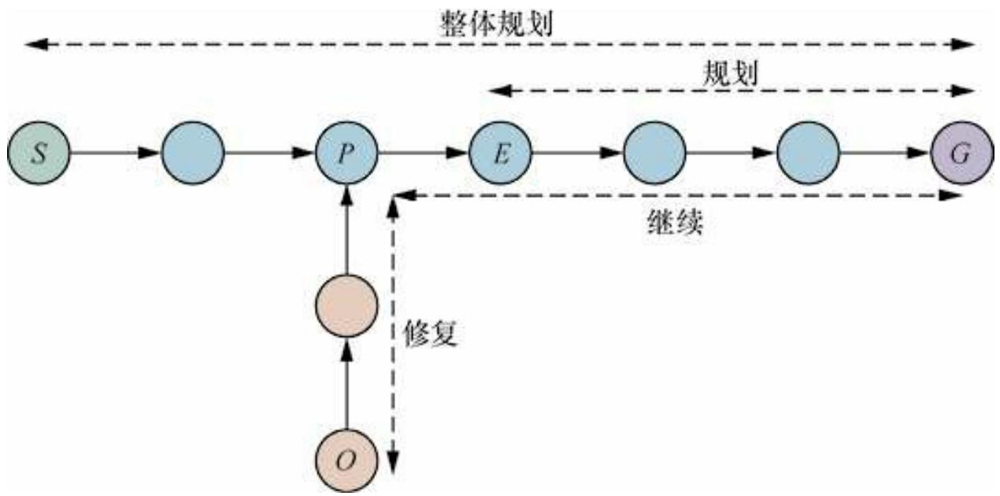  
图11-12首先，我们希望用“整体规划”序列使智能体从 S 移动到G 。智能体执行规划的各个步骤，直到它预计处于状态 $E$ ，但观测到自己实际上处于状态O 。然后，智能体重规划最小修复，并加上继续，以到达 $G$

现在让我们回到实现椅子和桌子颜色匹配的示例问题。假设智能体提出了规划：

```txt
[ \text{[LookAt(Table), LookAt(Chair),} ]  
if Color(Table,c) ∧ Color(Chair,c) then NoOp  
else [RemoveLid(Can1), LookAt(Can1),  
if Color(Table,c) ∧ Color(Can1,c) then Paint(Chair, Can1)  
else REPLAN]] 
```

现在智能体已经准备好执行规划。智能体观测到桌子和油漆是白色的，而椅子是黑色的。然后执行Paint(Chair,Can )。这时，一个经典的规划器会宣告胜利，规划已经被执行。但是在线执行监视智能体需要检查动作是否成功。

假设智能体感知到椅子因为黑色油漆透了出来而呈现斑驳的灰色。然后，智能体需要找到规划中要作为目标的恢复位置和为了到达该位置要采取的修复动作序列。智能体注意到当前状态与Paint(Chair,Can )动作之前的前提相同，因此智能体选择空序列进行修复，并使其规划与刚才尝试过的[Paint]序列相同。有了这个新规划，执行监视继续进行，并且重试 Paint动作。这种行为不断循环，直到感知到椅子被完全刷好了漆。但是要注意，这个循环是由规划-执行-重规划的过程创建的，而不是由规划中的显式循环创建的。还需要注意，最初的规划并不需要涵盖所有的意外情况。如果智能体到达了标记为Replan的步骤，那么它可以生成一个新的规划（可能涉及Ca n ）。

动作监视是执行监视的一种简单方法，但它有时会导致不那么智能的行为。例如，假设没有黑色或白色的油漆，智能体构建了一个规划，通过将椅子和桌子都刷成红色来求解油漆问题。假设红色油

漆只够刷椅子。在动作监视下，智能体将继续将椅子漆成红色，然后才注意到油漆用完了而不能刷桌子，此时它将重规划一个修复，也许是把椅子和桌子都漆成绿色。而规划监视智能体在当前状态无法使规划继续适用时就可以检测到错误，这样它就不会浪费时间把椅子涂成红色。

规划监视通过检查使剩余规划成功的前提来实现这一点，也就是检查规划中的每个步骤的前提，除了那些需要在剩余规划中的某一步达成的前提。规划监视会尽快中断那些注定会出错的规划的执


规划监视也允许意外收获 ，也就是偶然的

行，而不是一直固执己见直到真的出现错误。

成功。如果在智能体把椅子涂成红色的同时，有人过来把桌子涂成红色，那么最终规划的前提就满足了（目标已经实现），智能体就可以提前回家了。

可以简单修改规划算法使得规划中的每个动作都用动作的前提标记，从而实现动作监视。使用规划监视则稍微复杂一些。偏序规划器的优势在于它已经建立了包含规划监视所需关系的结构。扩充了必要标记的状态空间规划器可以通过目标流在规划中回归时进行仔细记录来完成。

既然我们已经描述了一种监视和重规划的方法，我们需要问，“它是否有效？”这是一个非常棘手的问题。如果我们的意思是，“我们能保证智能体总是可以达成目标吗？”则答案是否定的，因为智能体可能会无意中进入一个无法修复的死胡同。例如，真空吸尘器智能体本身可能有一个错误的模型，它不知道自己的电池会没电。如果电池没电，就无法修复任何规划。如果我们排除了死胡同—假设存在一个从环境中 所有 状态出发都可到达目标的规划，并假设环境是相当非确定性的，也就是这样的规划在任何给定的执行尝试下总是有一些 成功的机会，那么智能体将最终达成目标。

当一个看似非确定性的动作实际上并不是随机的，而是依赖于智能体所不知道的前提时，就会出现问题。例如，有时油漆罐可能是空的，所以用那罐油漆刷漆没有效果，再多的尝试也改变不了这一


点。 $-$ 一种解决方案是从一系列可能的修复规划中随机选择，而不是每次都尝试相同的方案。在这种情况下，打开另一罐油漆的修复规划可能会有效。更好的方法是 学习 一个更好的模型。每次预测失败都是一次学习的机会；一个智能体应该能够修改它的世界模型以符合其感知。之后，重规划器就可以想出一个根本性解决问题的修复方案，而不是依靠运气来选出好的修复方案。

# 11.6 时间、调度和资源

经典的规划讨论的是要做什么、以什么顺序，但不讨论时间：动作需要多长时间以及何时发生。例如，在机场领域，我们可以生成一份规划，说明哪些飞机要去哪里、携带什么，但不能指定起飞和到达时间。这就是 调度 （scheduling）所讨论的主题。

真实世界还存在 资源约束 （resourceconstraint）：航空公司的员工数量有限，一名乘务员不能同时执飞两个航班。本节介绍了资源约束下解决规划和调度问题的技术。

我们采取的方法是“先规划，后调度”：整个问题划分成在顺序约束下选择动作以达到问题目标的规划阶段，和之后为规划添加时间信息来确保它符合资源和截止时间约束的 调度 阶段。这种方法在真实世界的制造业和物流场景中很常见，其中规划阶段有时是自动化的，而有时由人类专家进行。

# 11.6.1 时间约束和资源约束的表示

典型的 作业车间调度问题 （job-shop scheduling problem）（见6.1.2节）由一组 作业 （job）组成，每个作业都有一组动作，这些动作之间有顺序约束。每个动作都有一个持续时间 和一组动作所需的资源约束。约束指定资源的类型（例如螺钉、扳手或飞行员）、所需资源的数量、资源是否是消耗型的 （例如，螺钉不可再用）或可复用的 （例如，一个飞行员飞行期间没有空，但在飞行结束后再次可用）。动作也可以产生资源（例如，制造动作和再供应动作）。

作业车间调度问题的解决方案指定了每个动作的开始时间，并且必须满足所有的时间顺序约束和资源约束。与搜索和规划问题一样，解决方案可以根据代价函数进行评估，这可能非常复杂，存在非线性资源成本、依赖于时间的延迟成本等。为简单起见，我们假设成本函数就是规划的总持续时间，称为 最大完工时间 （makespan）。

图11-13展示了一个简单的例子：一个涉及两辆汽车装配的问题。该问题由两个作业组成，每个作业的形式为[ AddEngine , AddWheels , Inspect ]。然后， Resources 语句声明有4种类型的资源，并在开始时给出每种类型可用的数量：1个发动机吊车、1个车轮安装站、2个检查员和500个凸耳螺母。动作模式给出了每个动作的持续时间和资源需求。当车轮被装到汽车上时，凸耳螺母被消耗掉，而其他资源在动作开始时被“借来”，在动作结束时被释放。

```txt
Jobs({AddEngine1< AddWheels1<Inspect1}, {AddEngine2< AddWheels2<Inspect2})   
Resources(EngineHoists(1), WheelStations(1), Inspectors(e2), LugNuts(500))   
Action(AddEngine1, DURATION:30, USE:EngineHoists(1))   
Action(AddEngine2, DURATION:60, USE:EngineHoists(1))   
Action(AddWheels1, DURATION:30, CONSUME:LugNuts(20), USE:WheelStations(1))   
Action(AddWheels2, DURATION:15, CONSUME:LugNuts(20), USE:WheelStations(1))   
Action(Inspect, DURATION:10, USE:Inspectors(1)) 
```

图11-13 装配两辆汽车的作业车间的调度问题，带有资源约束。符号 $A < B$ 表示动作 $A$ 必须在动作B 之前

将资源表示为数值数量，如 Inspectors (2)，而不是有名实体，如 Inspectors ( I 1 )和 Inspectors ( $I$ 2)，这是聚合 （aggregation）的示例：当对象无法区分时，将单个对象分组为数量。在我们的装配问题中，由 哪个 质检员来检验汽车并不重要，所以没有必要做区分。聚合对于降低复杂性至关重要。考虑一下，当提出的时间表有10个并发的Inspectors动作，但只有9个质检员可用时，会发生什么。以数量表示质检员，算法就可以立即检测到错误，之后算法就可以回溯去尝试另一个调度。如果质检员表示为个体，那么在发现所有的动作都不起作用之前，算法将尝试分配质检员的所有9!种方式。

# 11.6.2 解决调度问题

我们从忽略资源约束，只考虑时间调度问题开始。为了最小化最大完工时间（规划持续时间），我们必须找到与问题提供的顺序约束一致的所有动作的最早开始时间。将这些顺序约束视为与动作相关的有向图是很有帮助的，如图11-14所示。我们可以将关键路径方法 （criticalpath method，CPM）应用到这个图中，以确定每个动作可能的开始时间和结束时间。图中表示偏序规划的 路径是一个以Start开始、以Finish 结束的线性顺序的动作序列。（例如，图11-14中的偏序规划中有两条路径。）

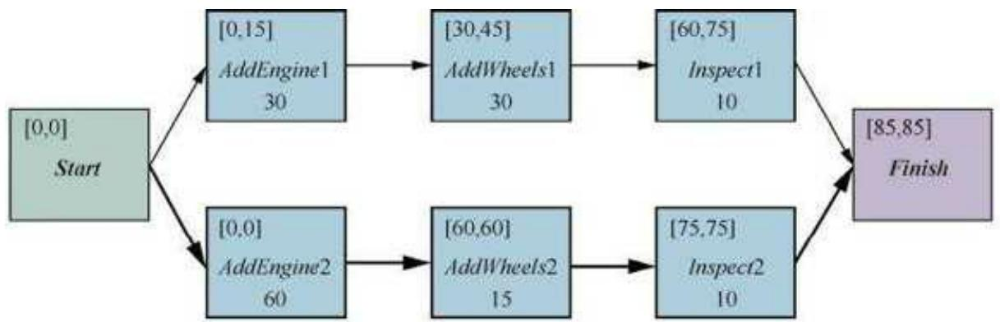

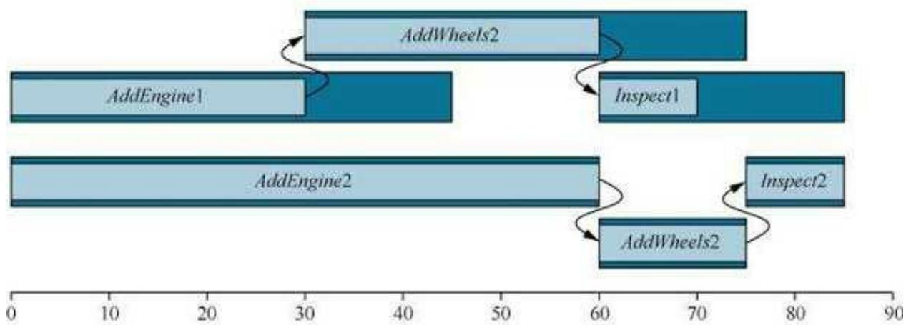  
  
图11-14 （a）图11-13中作业车间调度问题的时间约束表示。每个动作的持续时间显示于每个矩形的底部。在求解这个问题时，我们计算最早开始时间和最晚开始时间[ES , LS]，显示在左上方。这两个数字的差是动作的松弛。零松弛的动作在关键路径上，用粗箭头显示。（b）以时间线展示的相同的解。蓝色矩形表示在遵守顺序约束的前提下执行动作的时间间隔。蓝色矩形中未被占用的部分表示松弛

关键路径 是总持续时间最长的路径，这条路径是“关键的”，因为它决定了整体规划的持续时间缩短其他路径并不会缩短整体规划，但是延迟关键路径上的任何动作的开始时间都会减慢整体规划的进度。不在关键路径上的动作有一个执行时间窗口。窗口由最早可能开始时间ES 和最晚可能开始时间 LS指定。LS −ES 的量称为动作的松弛 （slack）。我们可以在图11-14中看到，整体

规划将花费85分钟，顶部作业中的每个动作都有15分钟的松弛，关键路径上的每个动作（根据定义）都没有松弛。所有动作的ES 和 $L S$ 时间一起构成了问题的调度 。

下面的公式定义了 ES 和 LS ，并构成了计算它们的动态规划算法。 A 和 B 都是动作， $A < B$ 表示 A在 B 之前：

$$
E S (S t a r t) = 0
$$

$$
E S (B) = \max  _ {A \prec B} E S (A) + D u r a t i o n (A)
$$

$$
L S (F i n i s h) = E S (F i n i s h)
$$

$$
L S (A) = \min  _ {B > A} L S (B) - D u r a t i o n (A)
$$

思路是首先将 ES ( Start )赋值为0。然后，一旦我们得到了之前的所有动作都被赋过 ES 值的动作 B，立刻就将ES (B)设置为那些在B之前的动作中最早完成时间的最大值，其中最早完成时间定义为最早开始时间加上持续时间。这个过程重复进行，直到每个动作都被赋予 ES 值。 $L S$ 值以类似的方式，从 Finish 动作反向计算。

关键路径算法的复杂度仅为O (Nb)，其中 N为动作的数量，b 为进入或退出动作的最大分支因子。（要弄懂这点，注意，每个动作 LS和ES 只计算一次，并且每次计算最多在 b 个其他动作上重复。）因此，给定动作的偏序且没有资源约束时，找出最小持续时间调度是相当容易的。

从数学上讲，关键路径问题很容易求解，因为它们被定义为在开始时间和结束时间上的 线性不等式的合取。当我们引入资源约束时，在开始时间和结束时间上产生的约束将变得更加复杂。例如，在图11-14中同时开始的 AddEngine 动作需要同一个 EngineHoist ，因此不能重叠。“不可重叠”约束是两个线性不等式的析取 ，每个不等式对应一个可能的顺序。析取的引入使得有资源约束的调度变为NP困难问题。

图11-15给出了最快完成时间为115分钟的解。这比没有资源约束的规划所需的85分钟长30分钟。注意，没有同时需要两名质检员的时间段，所以我们可以立即将其中一名质检员转到更有生产力的地方。

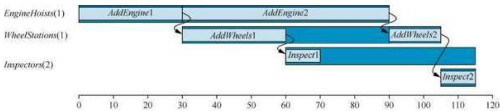  
图11-15考虑资源约束时，图11-13的作业车间调度问题的解。左侧边列出了3个可复用的资源，动作与它们所使用的资源水平对齐。有两个可能的调度，取决于哪个装配首先使用发动机吊车；我们展示了持续时间最短的解，它需要115分钟

关于最优调度的研究由来已久。1963年提出的一个具有挑战性的问题——为一个只有10台机器和10个作业（每个作业有100个动作）的问题找到最优调度——在23年的时间里没有得到解决（Lawleretal.,1993）。为求解这一问题已经尝试了许多方法，包括分支定界法、模拟退火法、禁忌搜索法和约束满足法。一种流行的方法是 最小松弛 （minimumslack）启发式：在每次迭代中，在尚未被调度的动作中调度尽可能早开始的动作，这个动作的前驱动作均已被调度并且有最小的松弛时间，然后更新每个受影响动作的ES 和 LS时间并重复。这种贪婪启发式类似于约束满足中的最小剩余值（MRV）启发式。它通常在实际中表现很好，但它对于我们的装配问题给出了一个130分钟的解决方案，而不是图11-15中的115分钟的解决方案。

到目前为止，我们已经假设动作集和顺序约束是固定的。在这些假设下，每个调度问题都可以通过可避免所有资源冲突的不重叠序列来求解，只要每个动作本身是可行的。然而，如果一个调度问题被证明是非常困难的，那么以这种方式求解可能不是一个好主意，更好的方法是重新考虑动作和约

束，也许会产生一个简单得多的调度问题。因此，通过在规划的构建过程中考虑持续时间和重叠部分来整合规划和调度是有意义的。11.2节中的几个规划算法可以被扩展用于处理这些信息。

# 11.7 规划方法分析

规划结合了人工智能的两个主要领域：搜索和 逻辑。一个规划器可以被看作一个搜索解的程序，或者是一个（构造性地）证明解存在的程序。这两个领域的思想相互渗透，使规划器能够从动作和状态数量为十几个的玩具问题扩展到具有数百万状态和数千动作的实际工业应用。

规划首先是一种控制组合爆炸的方法。如果一个领域中有n 个命题，那么就有2 n 个状态。为应对这种悲观情况，找出独立子问题可能是一个强大的武器。最好情况下——问题完全可分解——我们得到指数级的加速。然而，动作之间的负相互作用破坏了可分解性。SATPlan可以编码子问题之间的逻辑关系。前向搜索通过尝试寻找能概括独立子问题的模式（命题的子集）来启发式地求解问题。由于这种方法是启发式的，即使子问题不完全独立它也有效。

遗憾的是，我们还没有清楚地了解哪种技术对哪种类型的问题最有效。新技术很可能还会出现，也许会提供一种具有高度表现力的一阶表示和层次表示的整合，并具有当今占主导地位的高效因子化表示和命题化表示。我们可以看到一些组合 （portfolio）规划系统正在出现，它们的算法集可用来求解任意给定的问题。这既可以是选择性的（系统对每个新问题进行分类以选择最佳算法），也可以是并行的（所有算法都同时运行在不同的CPU上），或者根据调度轮流运行算法。

小结

本章我们描述了经典规划问题和扩展规划问题的PDDL表示，并提出了几种求解的算法。本章需要记住以下要点。

●规划系统是在状态和动作的显式因子化表示下运作的求解算法。这些表示使得推导有效的领域无关的启发式和开发强大且灵活的问题求解算法成为可能。  
●规划领域定义语言PDDL用文字的合取描述初始状态和目标状态，用行动的前提和效果描述行动。扩展表示时间、资源、感知、应变规划和分层规划。  
●状态空间搜索可以前向（递归 ）或反向（回归 ）运行。有效的启发式可以通过子目标独立假设和规划问题的各种松弛来得到。  
●其他方法包括将规划问题编码为布尔可满足性问题或约束满足问题，以及显式地搜索偏序规划空间。  
●分层任务网络 （HTN）规划允许智能体以高层动作 （HLA）的形式从领域设计者那里获得建议，这些高层动作可以通过低层动作序列以各种方式实现。HLA的效果可以用天使语义 来定义，它可以在不考虑低层实现的情况下导出可证明为正确的高层规划。HTN方法可以创建许多实际应用所需的大规模规划。  
●应变规划 允许智能体在执行过程中感知世界，以决定遵循规划的哪个分支。在某些情况下，可以使用 无传感器规划 或一致性规划 来构建不需要感知就能运行的规划。通过对信念状态 空间的搜索，可以构建一致性规划和应变规划。信念状态的高效表示或计算是关键问题。  
●在线规划智能体 根据需要使用执行监视和重返出错点的修复来从意外状况中恢复，这些意外情况可能是由于非确定性动作、外因事件或错误的环境模型造成的。  
●许多动作消耗资源 ，如金钱、汽油或原料。将这些资源看作资源池中的数值而不试图去推理世界中的每枚硬币或钞票是更为方便的做法。时间是最重要的资源之一。它可以通过专门的调度算法来处理，也可以将调度与规划结合起来。  
●本章扩展了经典的规划，以囊括非确定性环境（其中的动作结果是不确定的），但它并非规划的终章。第17章描述了用于随机环境的技术（在这种环境中，动作的结果具有相关的概率）：马尔可夫决策过程、部分可观测的马尔可夫决策过程和博弈论。在第22章中，我们展示了强化学习，它允许一个智能体从过去的成功和失败中学习如何行动。

读者服务：


微信扫码关注【异步社区】微信公众号，回复“e59810”获取本书配套资源以及异步社区15天VIP会员卡，近千本电子书免费畅读。

第四部分

不确定知识和不确定推理