# 第12章

不确定性的量化

在本章中，我们将看到智能体如何利用数值信念度来控制不确定性。

# 12.1 不确定性下的动作

由于部分可观测性、非确定性和对抗者的存在，真实世界中的智能体需要处理不确定性（uncertainty）。智能体可能永远都无法确切地知道它现在所处的状态，也无法知道一系列动作之后结束的位置。

我们已经看到问题求解与逻辑智能体通过追踪信念状态 （beliefstate）——所有它可能处于的世界状态的集合的表示——和生成应变规划（处理在执行期间传感器报告的每种可能的意外情况）来处理不确定性。这种方法适用于简单问题，它有如下缺点。

●无论可能性多么低，智能体都必须考虑传感器观测到的每种可能 解释。这导致信念状态中可能存有大量不太可能发生的情况，进而导致信念状态非常庞大。  
●一个要处理每种情况的恰当的应变规划必须考虑任何不太可能的情况，因此最终可能变得任意大。  
●有时，可以保证达成目标的规划可能并不存在，但智能体必须行动。因此智能体必须有某种方式比较这些规划的优劣。

例如，假定一辆自动驾驶出租车的目标是将乘客按时送到机场。该出租车制订了一个规划 A 90：在飞机起飞前90分钟出门，以合理的速度驶向机场。但即使距离机场仅8公里，逻辑智能体也不能完全确定地得出“ $A _ { 9 0 }$ 规划能将我们及时送到机场”的结论。相反，这会得出某些较弱的结论：只要汽车不抛锚，没有被卷入交通事故，道路没有封闭，没有陨石砸中汽车等， $A _ { 9 0 }$ 规划就能将我们及时送到机场。这些条件都是不确定的，所以我们无法推断规划能否成功。这是逻辑资格问题（见7.7.1节），到目前为止我们还没有发现这一问题真正的解决方案。

尽管如此，从某种意义上说， $A _ { 9 0 }$ 仍是正确的选择。这是什么意思呢？正如我们在第2章中讨论的那样，这里所说正确选择的含义是，在所有可执行的规划中， $A _ { 9 0 }$ 被期望能够最大化智能体的性能度量（这里的期望与智能体对环境的知识有关）。性能度量包括及时到达机场并赶上飞机、避免在机场漫长而徒劳的等待、避免路上的超速罚单。智能体的知识不能保证 $A _ { 9 0 }$ 取得这些结果，但可以为取得这些结果提供一定程度的信念。 $A _ { 1 8 0 }$ 等其他规划可能可以增加智能体对准时到达机场的信念，但它们同时也会增加漫长而无聊的等待的可能性。因此，正确的动作——理性决策（rationaldecision），既依赖各种目标的相对重要性，也依赖它们实现的可能性和程度。本节的其余部分将细化这些思想，为本章及后续章节中介绍的不确定推理和理性决策的一般理论做准备。

# 12.1.1 不确定性概述

让我们考虑一个不确定推理的例子：诊断一名牙科病人的牙痛（toothache）。无论是医疗、汽车修理，还是其他领域的诊断，几乎总是涉及不确定性。让我们尝试用命题逻辑为牙科诊断写一些规则，以便查看逻辑方法是如何失效的。考虑下面的简单规则：

$$
T o o t h a c h e \Rightarrow C a v i t y
$$

显然，这条规则是错的。不是所有牙痛患者的病因都是蛀牙（cavity）；也可能是因为牙龈炎（gum disease）、脓肿（abscess）或其他问题：

$$
\text {T o o t h a c h e} \Rightarrow \text {C a v i t y} \vee \text {G u m P r o b l e m} \vee \text {A b s c e s s} \dots
$$

遗憾的是，为了使这条规则正确，我们必须给出一个几乎无限长的可能问题的列表。我们可以把这条规则转换成一条因果规则：

$$
C a v i t y \Rightarrow T o o t h a c h e
$$

但这条规则也不正确，并非所有蛀牙都会引起牙痛。修正这条规则的唯一方式是在逻辑上穷举：在规则的左边加上蛀牙引发牙痛的所有所需条件。因此，试图用逻辑去处理医疗诊断这样的领域的问题是失败的，主要有3个原因。

● 惰性 （laziness）：为确保规则没有例外情况，所需列出的完整前提和结论的工作量太大，并且这样的规则也难以使用。  
● 理论无知 （theoretical ignorance）：医学在这个领域没有完备的理论。  
● 实践无知 （practical ignorance）：即使我们知道所有的规则，对于特定的病人，我们可能也无法得到确定的结论，因为不是所有需要的检测都已经完成或者能够被完成。

牙痛和蛀牙之间的联系在任一方向都不是一个严格的逻辑结论。这是在医学领域的典型情况，法律、商业、设计、汽车修理、园艺、年代推断等大多数其他判断领域也是如此。智能体的知识至多只能提供对相关语句的 信念度 （degree of belief）。我们处理信念度的主要工具是 概率论（probability theory）。用8.1节中的术语来说，逻辑和概率论的本体论承诺 是相同的——世界是由在特定情况下成立或不成立的事实构成的，但是认识论承诺 是不同的——逻辑智能体相信每个命题或对或错或不做评价，而概率智能体有着0（语句必定为假）和1（语句必定为真）之间的数值信念度。

概率论提供了一种概括因我们的惰性与无知而产生的不确定性的方式，从而解决了资格问题。我们可能不能确定是什么病因在折磨着某个病人，但我们可以认为，以80%的机会，即0.8的概率，该牙痛患者存在蛀牙。也就是说，我们预计在所有和我们当前所知的情况无法区分的情况中，80%的病人有蛀牙。这种信念可以从统计数据中得到——到目前为止80%的牙痛病人有蛀牙——也可以从一些一般性的牙科知识或从不同来源的证据的整合中得到。

令人困惑的是，在我们诊断的时候，真实世界中并没有不确定性：病人或是有蛀牙或是没有。所以蛀牙的概率是0.8是什么意思呢？难道不应该是非0即1吗？这个问题的答案是，概率陈述是根据知识状态而不是根据真实世界做出的。一开始，我们可以说：“假如病人牙痛，她有蛀牙的概率是0.8。”如果我们在后续过程中得知病人有牙龈炎史，我们可以做出不同的陈述：“假如病人牙痛并且有牙龈炎史，她有蛀牙的概率是0.4。”如果我们得到了进一步不支持蛀牙的确凿证据，我们可以说：“根据我们所掌握的知识，病人有蛀牙的概率几乎是0。”注意，这些陈述并不相互矛盾，它们是关于不同知识状态的单独断言。

# 12.1.2 不确定性与理性决策

让我们再次考虑前往机场的规划 $A _ { 9 0 }$ 。假设它给了我们97%的机会赶上飞机，这意味着它是一个理性的选择吗？未必，可能其他规划有着更高的概率，例如 $A _ { 1 8 0 }$ 。如果赶上飞机 至关重要 ，那么冒着在机场等待更久的风险是值得的。那 $A _ { 1 4 4 0 }$ ，一个提前24小时离家的规划呢？在大多数情况下，这并不是一个好的选择，因为它尽管几乎保证了准时到达机场，但等待24小时实在是难以忍受—更不用说机场食物可能又贵又难吃。

为了做出这样的选择，智能体必须首先在各种规划的不同可能 结果 （outcome）中有所偏好（preference）。结果是一个完全指定的状态，包括智能体是否按时到达和在机场等候的时间等因素。我们使用效用理论 （utility theory）来表示偏好，并用它们进行定量推理。（这里utility是“有用的量”的意思，而非电力公司或者自来水厂等公共事业。）效用理论认为每个状态（或者状态序列）对智能体有一定程度的有用性，也就是效用，智能体偏好效用更高的状态。

状态的效用是相对于智能体来说的。例如，在国际象棋游戏中，白棋将死黑棋的状态对执白棋的智能体的效用明显更高，但是对于执黑棋的智能体效用较低。但我们不能严格地按照国际象棋锦标赛规定的1、1/2和0分给效用赋值——一些棋手（包括本书作者）可能因与世界冠军平局而激动，而其他棋手（包括前世界冠军）可能并不会。口味和偏好是无法解释的：你可能认为一个偏好墨西哥胡椒泡泡糖冰激凌而非巧克力碎的智能体是古怪的，但我们不能说它是不理性的。效用函数可以解释任意偏好集合— 奇特或典型、高贵或任性。注意，只要将他人的福利看作一个因素，效用就可以解释利他主义。

在被称为决策论 （decisiontheory）的理性决策的通用理论中，由效用表示的偏好与概率相结合：

决策论=概率论+效用理论

决策论的基本思想是，智能体是理性的当且仅当它选择平均所有可能结果后生成最高期望效用的动作。这被称为最大期望效用 （maximumexpected utility，MEU）原则。这里“期望”指使用结果的概率进行加权得到的结果效用的“平均”或者“统计平均”。我们在第5章中简略介绍过的西洋双陆

棋的最优决策就是一个采用这一原则的具体例子。事实上，这是单智能体决策的一个完全通用的原则。

图12-1概述了使用决策论来选择动作的智能体的结构。在抽象的层面上，这个智能体与在第4章和第7章中描述的维持反映迄今为止的感知历史的信念状态的智能体是相同的。主要的区别是决策论智能体的信念状态不仅表示世界状态的可能性 ，还表示了它们的概率 。在给定信念状态和对动作结果的一些知识的情况下，智能体可以对动作结果进行概率预测，进而选择具有最高期望效用的动作。

function DT-AGENT(percept)returns anaction

persistent:belief_state,关于当前世界状态的概率信念action，智能体的动作

基于action与percept更新belief _state

给定动作描述与当前belief_state，计算动作的结果概率

给定结果的概率与效用信息，选择拥有最高期望效用的action

returnaction

图12-1选择理性动作的决策论智能体

本章和第13章主要关注概率信息的表示与计算。第14章将讨论随着时间的推移表示和更新信念状态以及预测结果的方法。第15章将探讨将概率论与富有表达能力的形式语言（如一阶逻辑和通用编程语言）相结合的方法。第16章将更深入地介绍效用理论，第17章将详尽阐述随机环境下规划动作序列的算法。第18章将涵盖这些想法在多智能体环境下的扩展。

# 12.2 基本概率记号

为了让智能体能够表示和使用概率信息，我们需要一种形式语言。概率论语言实际上是非形式化的，它是由一些人类数学家写给另一些人类数学家的语言。附录A简单介绍了概率论的基本内容；这里我们采用了一种更适合人工智能需求的方式，并把它和形式逻辑的概念相联系。

# 12.2.1 概率是关于什么的

像逻辑断言一样，概率断言是关于可能世界的断言。逻辑断言讨论的是哪些可能世界被严格排除在外（所有那些逻辑断言为假的世界），而概率断言讨论的是各种世界的可能性有多大。在概率论中，所有可能世界的集合称为样本空间 。这些可能世界是互斥的和穷举的 ——两个可能世界不能相同，每个可能世界都应考虑在内。例如，如果我们掷两个（可区分的）骰子，一共需要考虑36个可能世界：(1, 1)、(1, 2)……(6, 6)。希腊字母 $\pmb { \varDelta }$ （大写omega）用来表示样本空间， （小写omega）用来表示空间中的元素，即特定的可能世界。

一个完全指定的 概率模型 为每个可能世界赋予一个数值概率 。 注宇论基本公理规定每个可能世界具有一个0到1之间的概率，并且样本空间中的可能世界的总概率为1：

$$
\text {对 任 一} \omega , 0 \leqslant P (\omega) \leqslant 1 \text {且} \sum_ {\omega \in \Omega} P (\omega) = 1 \tag {12-1}
$$

例如，如果我们假设每个骰子是公平的且骰子间不会相互干扰，则每个可能世界(1, 1)、(1, 2)…(6, 6)的概率是1/36。如果骰子是非公平的，则一些世界拥有更高的概率，一些世界的概率更低，但它们的和仍然为1。

概率断言和查询往往不是关于某个特定可能世界的，而是关于它们的集合的。例如，我们可能询问两个骰子点数之和等于11的概率、点数相同的概率等。在概率论中，这些集合被称为事件 ——此处的“事件”与在第10章中被广泛使用的“事件”在概念上是不同的。在逻辑学中，一组世界的集合对应形式语言中的一个命题 （proposition）；具体来说，对于每个命题，对应的集合只包含该命题成立的可能世界。（因此，“事件”和“命题”在这个背景下意思大体相同，只不过命题是用形式语言表达的。）命题的概率被定义为使它成立的世界的概率之和：

$$
\text {对 任 意 命 题} \phi , P (\phi) = \sum_ {\omega \in \phi} P (\omega) \tag {12-2}
$$

例如，当掷公平的骰子时，我们有 P ( Total = 11) = P ((5, 6)) + P ((6, 5)) = 1/36 + 1/36 = 1/18。注意，概率论并不要求我们知道每个可能世界的概率的完整知识。例如，如果我们相信骰子合谋产生相同的数字，我们可能会断言 P ( doubles ) = 1/4，而无须知道它们倾向于产生两个6还是两个2。就像逻辑断言一样，这个断言在没有完全确定底层概率模型的情况下对其做出了 约束 。

像 P ( Total = 11)和 P ( doubles )这样的概率被称为 无条件概率 （unconditional probability）或者 先验概率 （priorprobability，在英文中有时简写成priors）；它们指无任何其他信息下命题的信念度。但大多数情况下，我们会有一些已经透露的信息，通常称为证据 （evidence）。例如，第一个骰子结果已经是5时，我们在屏息等待另一个骰子停下来。在这种情况下，我们感兴趣的不是两个骰子点数相同的无条件概率，而是给定第一个骰子是5的前提下两个骰子点数相同的条件概率（conditional probability）或者 后验概率 （posterior probability，在英文中有时简写成posteriors）。这个概率写作 ，这里“|”读作“给定”。 [1]

[1] 注意，“|”的优先级是：任何 P (…|…)形式的表达式总是指 P ((…)|(…))。

相似地，如果要去牙医那里做定期检查，则先验概率P(cavity)=0.2可能是医生感兴趣的；如果是因为牙痛而去牙医那里，条件概率 则更重要。

理解在观测到牙痛后 仍然有效是很重要的；只不过它不是特别有用。在做决策时，智能体需要依据所有已经观测到的证据。理解条件蕴涵和逻辑蕴涵的区别也很重要。断言并不意味着“只要牙痛为真，则蛀牙为真的概率是0.6”，而是意味着“只要牙痛为真， 而且我们没有进一步的信息， 则蛀牙为真的概率是0.6”。额外的条件很重要；例如，如果我们有进一步的信息——牙医没有发现蛀牙，我们肯定不会得出蛀牙为真的概率是0.6，这时反而需要使用 。

在数学上，条件概率是利用如下无条件概率定义的：对任意命题 a 和 b ，

$$
P (a \mid b) = \frac {P (a \wedge b)}{P (b)} \tag {12-3}
$$

当 时成立。例如：

$$
P (d o u b l e s \mid D i e _ {1} = 5) = \frac {P (d o u b l e s \wedge D i e _ {1} = 5)}{P (D i e _ {1} = 5)}
$$

如果记住“观测到b 排除了所有其他b 为假的可能世界，只留下总概率为P(b )的集合”，那么这个定义是很容易理解的。这个集合中，a为真的世界必须满足a ∧b 且在集合中所占的比例为 $P$ ( a∧ b ) / P ( b )。

条件概率的定义，式（12-3）可以写成 乘积法则 （product rule）形式：

$$
P (a \wedge b) = P (a \mid b) P (b) \tag {12-4}
$$

乘积法则或许更容易记忆：为了a 和b都为真，我们需要b为真，也需要在给定b 的前提下 $a$ 也为真。

# 12.2.2 概率断言中的命题语言

在本章和第13章中，描述可能世界集合的命题通常使用结合了命题逻辑元素和约束满足记号的记号来表示。在2.4.7节的术语中，这是 因子化表示 （factored representation），其中可能世界由“变量/值”对的集合来表示。如第15章所示，一种更富表达能力的结构化表示 （structured representation）也是可能的。

概率论中的变量被称为 随机变量 （random variable），它们的名字首字母大写。因此，在掷骰子的例子中， Total 和 $D i e _ { \mathrm { ~ 1 ~ } }$ 是随机变量。每个随机变量是从可能世界的定义域 $\pmb { \mathcal { Q } }$ 映射到 值域（range）——可能的值的集合——的函数。两个骰子的 Total 的值域是集合 $\{ 2 , \cdots , 1 2 \}$ ， Die 1的值域是 $\{ 1 , \cdots , 6 \}$ 。值的名字总是小写的，我们用 $\Sigma _ { x } P ( X = x )$ 表示 $X$ 所有可能的值的概率之和。布尔随机变量的值域是 。例如，两个骰子点数相同的命题可以写作Doubles = true。［布尔变量的另一种值域是集合{0, 1}，这种情况下变量被称为具有 伯努利（Bernoulli）分布］。按照惯例，A=true形式的命题简写成 $a$ ， $A =$ false简写成 $\mathbf { \Gamma } \mathbf { \mp }$ 。（12.2.1节中 doubles 、 cavity 和 toothache 使用的都是这种形式的缩写）。

值域可以是任何符号的集合。我们可以把 Age 的值域设为集合 ，Weather 的值域可能是 。在没有歧义的情况下，通常使用值本身表示一个特定随机变量取该值的命题。因此，sun可以表示 Weather = sun。 [2]

[2]在对布尔变量的值a 求和时，这些惯例的共同使用导致记号上的潜在歧义： $P \left( a \right)$ 是 $A$ 成立的概率，然而在表达式∑ P(a )中它只指代A取一个值a 的概率。

在前面的例子中，我们都考虑值域有限的情形。变量也可以有离散（如整数）或连续（如实数）的无限值域。对于任何具有有序值域的变量，我们可以用不等式表示序关系，例如

$$
\text {N u m b e r O f A t o m s I n U n i v e r s e} \geqslant 1 0 ^ {7 0}
$$

最后，我们可以使用命题逻辑的联结词将这类基本命题（包括布尔变量的缩写形式）组合起来。例如，我们可以将“假设病人是一个没有牙痛的青少年，则她有蛀牙的概率是0.1”表述如下：

$$
P (c a v i t y \mid \neg t o o t h a c h e \wedge t e e n) = 0. 1
$$

在概率记号中，使用逗号表示合取也很常见，所以也可以写成P(cavity|-toothache,teen).

有时要讨论一个随机变量的所有可能的值，我们可以写作

$$
\begin{array}{l} P (\text {W e a t h e r} = \text {s u n}) = 0. 6 \\ P (\text {W e a t h e r} = \text {r a i n}) = 0. 1 \\ P (\text {W e a t h e r} = \text {c l o u d}) = 0. 2 9 \\ P (\text {W e a t h e r} = \text {s n o w}) = 0. 0 1 \\ \end{array}
$$

也可以简写为

$$
P (\text {W e a t h e r}) = \langle 0. 6, 0. 1, 0. 2 9, 0. 0 1 \rangle
$$

这里粗斜体 $\pmb { P }$ 表示结果是一个由数值组成的向量，并且我们在Weather值域上预先定义了顺序〈sun, rain, cloud, snow〉。我们称 $\pmb { P }$ 为随机变量 Weather 定义了一个 概率分布 （probabilitydistribution），也就是为随机变量的每个可能的值分配了一个概率。［在有限离散值域的情况下，这个分布被称作 分类分布 （categorical distribution）］。记号 P 也被用于条件分布： 为每对可能的 i , j 给出 $P ( X = x _ { i } | Y = y _ { j } )$ 的值。

对于连续变量，因为有无限多的值，不可能把整个分布写成向量。然而，我们可以定义随机变量的取值 x 的概率为以 x 为参数的函数，它通常被称为 概率密度函数 （probability density function，有时简写为pdf）。例如：

$$
P (N o o n T e m p = x) = U n i f o r m (x; 1 8 C, 2 6 C)
$$

表示中午的温度均匀地分布在 $1 8 { \sim } 2 6 ^ { \circ } \mathrm { C }$ 的信念。

概率密度函数在意义上不同于离散分布。概率密度均匀分布在18～26℃意味着温度值落在这个8℃宽的区域内的某一点的机会是 $1 0 0 \%$ ，落在任一个4℃宽的子区域内的机会是50%，以此类推。我们把连续随机变量 $X$ 在 $x$ 处的概率密度写作 或 P ( x )。

$P \left( x \right)$ 的直观定义是 $X$ 落在以 $x$ 起始的任意小区间内的概率除以区间宽度：

$$
P (x) = \lim  _ {\mathrm {d} x \rightarrow 0} P (x \leqslant X \leqslant x + \mathrm {d} x) / \mathrm {d} x
$$

对 NoonTemp 我们有

$$
\begin{array}{l} P (\text {N o o n T e m p} = x) = \text {U n i f o r m} (x; 1 8 C, 2 6 C) = \left\{ \begin{array}{l l} \frac {1}{8 C}, & 1 8 C \leqslant x \leqslant 2 6 C \\ 0, & \text {其 他} \end{array} \right. \\ P (\text {N o o n T e m p} = 2 0. 1 8 C) = \frac {1}{8 C} \text {中 ，} \frac {1}{8 C} \\ \end{array}
$$

不是概率，而是概率密度。 NoonTemp 恰好 为20.18 C 的概率是0，因为20.18 $C$ 是宽度为0的区间。些作者使用不同的符号表示离散概率和概率密度，我们使用 P 表示特定的概率值，而使用 $\mathbf { \delta } _ { \mathbf { \mathcal { P } } }$ 表示两种情况中的数值的向量，因为很少出现混淆，公式通常是一样的。注意，概率是无单位数值，

而密度函数是带单位度量的，这个例子中的单位是 $\pmb { c }$ ，即摄氏度的倒数。如果使用华氏度来表示相同的温度区间，它的宽度是14.4华氏度，密度是1/14.4 F。

除单变量的分布外，我们还需要多变量分布的记号。这里使用逗号来分隔不同变量。例如， P (Weather , Cavity )表示 Weather 和 Cavity 所有组合值的概率。这是一个4 × 2的概率表，称为Weather 和 Cavity 的 联合概率分布 （joint probability distribution）。我们也可以混合使用变量和具体值，如 P (sun, Cavity )是一个二元向量，给出晴天时有蛀牙的概率和晴天时无蛀牙的概率。

记号 $\mathbf { \Delta } _ { \mathbf { \mathcal { P } } }$ 让某些表达式比一般符号更简洁。例如， Weather 和 Cavity 所有可能值的乘积法则［式（12-4）］可以用一个等式表达：

$$
\boldsymbol {P} (\text {W e a t h e r}, \text {C a v i t y}) = \boldsymbol {P} (\text {W e a t h e r} | \text {C a v i t y}) \boldsymbol {P} (\text {C a v i t y})
$$

而不必写成如下的4×2 = 8个等式（此处使用缩写 W 和 C ）：

$$
\begin{array}{l} P (W = \text {s u n} \wedge C = \text {t r u e}) = P (W = \text {s u n} \mid C = \text {t r u e}) P (C = \text {t r u e}) \\ P (W = \text {r a i n} \wedge C = \text {t r u e}) = P (W = \text {r a i n} | C = \text {t r u e}) P (C = \text {t r u e}) \\ P (W = \text {c l o u d} \wedge C = \text {t r u e}) = P (W = \text {c l o u d} | C = \text {t r u e}) P (C = \text {t r u e}) \\ P (W = \text {s n o w} \wedge C = \text {t r u e}) = P (W = \text {s n o w} | C = \text {t r u e}) P (C = \text {t r u e}) \\ P (W = \text {s u n} \wedge C = \text {f a l s e}) = P (W = \text {s u n} \mid C = \text {f a l s e}) P (C = \text {f a l s e}) \\ P (W = \text {r a i n} \wedge C = \text {f a l s e}) = P (W = \text {r a i n} | C = \text {f a l s e}) P (C = \text {f a l s e}) \\ P (W = \text {c l o u d} \wedge C = \text {f a l s e}) = P (W = \text {c l o u d} | C = \text {f a l s e}) P (C = \text {f a l s e}) \\ P (W = \text {s n o w} \wedge C = \text {f a l s e}) = P (W = \text {s n o w} | C = \text {f a l s e}) P (C = \text {f a l s e}) \\ \end{array}
$$

作为退化情况， P (sun, cavity )没有变量，因此是一个零维向量，我们可以认为是标量。

现在我们已经定义了命题和概率断言的语法，给出了部分语义：式（12-2）把命题的概率定义为它成立的所有世界的概率之和。为了补全语义，我们需要说明世界是什么，如何确定一个世界中一个命题是否成立。我们直接从命题逻辑的语义中借鉴这一部分，如下所示。 一个可能世界定义为所有考虑之中的随机变量的一种 赋值。

容易发现，这个定义满足可能世界互斥和穷举的基本要求（习题12.EXEX）。例如，如果随机变量是 Cavity 、 Toothache 和 Weather ，则有2×2×4 = 16个可能世界。此外，在这样的世界中，任何给定命题的真值都可以很容易地通过我们在命题逻辑中使用的递归真值计算来确定（见7.4节）。

注意，有些随机变量可能是冗余的，因为在所有情况下它们的值都可以通过其他变量获得。例如，在两个骰子世界里，当 Die =Die 时，变量Doubles恰好为真。除 Die 和 Die 外，增加

Doubles作为一个随机变量似乎将可能世界的数量从36增加到72，但这72个中的一半在逻辑上是不可能的，概率为0。

从前面的可能世界的定义可知，一个概率模型可以通过所有随机变量的联合分布完全确定，即 完全联合概率分布 （full joint probability distribution）。例如，给定 Cavity 、 Toothache 和 Weather，它们的完全联合分布是 P ( Cavity , Toothache , Weather )。这个联合分布可以用一个16个条目的2×2×4的表来表示。因为每个命题的概率是可能世界上的求和，原则上，一个完全联合分布足够计算任何命题的概率。我们会在12.3节看到一些例子。

# 12.2.3 概率公理及其合理性

概率基本公理［式（12-1）和式（12-2）］指明了逻辑相关命题的信念度之间的某种关系。例如，我们可以推导出一个命题的概率和它的否命题的概率之间的常见关系：

$$
P (\neg a) = \sum_ {\omega \in \neg a} P (\omega)
$$

[根据式（12-2）]

$$
\begin{array}{l} = \sum_ {\omega \in - a} P (\omega) + \sum_ {\omega \in a} P (\omega) - \sum_ {\omega \in a} P (\omega) \\ = \sum_ {\omega \in \Omega} P (\omega) - \sum_ {\omega \in \alpha} P (\omega) \\ = 1 - P (a) \\ \end{array}
$$

[合并前两项]

[根据式（12-1）和式（12-2）]

我们也可以推导出著名的析取概率公式，有时也称为 容斥原理 （inclusion-exclusion principle）：

$$
P (a \vee b) = P (a) + P (b) - P (a \wedge b) \tag {12-5}
$$

这个规则容易记住：a 成立的情况和 $^ { b }$ 成立的情况，当然涵盖 $a \lor b$ 成立的情况，但两种情况集合相加把它们的交集计算了两次，所以需要减去 。

式（12-1）和式（12-5）通常称为 柯尔莫哥洛夫公理 （Kolmogorov’saxiom），以纪念数学家安德雷·柯尔莫哥洛夫（AndreiKolmogorov），他阐释了如何基于这个简单的基础构建概率理论的其余部分，以及如何处理连续变量带来的困难。[3] 式（12-2）有着定义的意味，而式（12-5）揭示了这一公理真正约束了智能体对逻辑相关命题的信念度。这类似于逻辑智能体不能同时相信 A 、 B和 的事实，因为不可能存在三者都成立的世界。然而，对于概率，陈述并不直接涉及世界，而是涉及智能体自己的知识状态。那为什么智能体不能持有下面的信念集合呢（即使它们违背了柯尔莫哥洛夫公理）？

[3]这种困难包括维塔利集合 （Vitaliset），一个[0, 1]区间内有良定义的子集，但是没有良定义的大小。

$$
P (a) = 0. 4 \quad P (b) = 0. 3 \quad P (a \wedge b) = 0. 0 \quad P (a \vee b) = 0. 8 \tag {12-6}
$$

这类问题几十年来一直是人们激烈争辩的主题，一方主张将概率作为信念度的唯一合法形式，另一方则主张采用其他方法。

布鲁诺·德菲内蒂（Bruno deFinetti）于1931年首次阐释了概率公理的一个论据（英文翻译参见deFinetti, 1993）：如果智能体对命题a 有一定程度的信念，那么它应该能够说出一个支持或反对a


是无差异的赌局的赌注。 考虑一个两智能体间的博弈。智能体1说：“我对事件a 的信念度是0.4。”然后智能体2可以自由选择等同于信念度的赌注支持或反对a 。也就是说，智能体2可以选择接受智能体1赌a 发生的赌局，赌注是智能体2的6美元对智能体1的4美元；或者智能体2选择接受智能体1赌 $\lnot$ 发生的赌局，赌注是智能体2的4美元对智能体1的6美元。然后我们观测 a的结果，赌对的一方赢得钱。如果一个智能体的信念度没有准确地反映世界，那么从长远来看，可以预期它会输钱给另一个信念更加准确地反映世界状态的对抗智能体。

德菲内蒂定理并不关心为个体概率选择正确的值，而是关心逻辑相关命题概率值的选择：如果智能体1的信念度集合违反概率论公理，则智能体2一定有一组赌注保证智能体1每次都会输钱。例

如，假设智能体1的信念度集合如式（12-6）所示。图12-2展示了如果智能体2选择为 $a$ 下注4美元，为 b 下注3美元，为 下注2美元，无论 $a$ 和 $^ { b }$ 的结果是什么，智能体1总会输钱。德菲内蒂定理说明理性智能体不会持有违反概率公理的信念。

<table><tr><td rowspan="2">命题</td><td rowspan="2">智能体1的信念</td><td rowspan="2">智能体2赌注</td><td rowspan="2">智能体1赌注</td><td colspan="4">智能体1每个结果的收益（美元）</td></tr><tr><td>a,b</td><td>a,-b</td><td>-a,b</td><td>-a,-b</td></tr><tr><td>a</td><td>0.4</td><td>为a下注4美元</td><td>为-a下注6美元</td><td>-6</td><td>-6</td><td>4</td><td>4</td></tr><tr><td>b</td><td>0.3</td><td>为b下注3美元</td><td>为-b下注7美元</td><td>-7</td><td>3</td><td>-7</td><td>3</td></tr><tr><td>a ∨ b</td><td>0.8</td><td>为-(a ∨ b)下注2美元</td><td>为a ∨ b下注8美元</td><td>2</td><td>2</td><td>2</td><td>-8</td></tr><tr><td></td><td></td><td></td><td></td><td>-11</td><td>-1</td><td>-1</td><td>-1</td></tr></table>

图12-2因为智能体1的信念不一致，智能体2可以设计一组包含3场赌局的赌注方案，保证无论a 和b 的结果是什么，智能体1都会输

对德菲内蒂定理的一个主要异议是这个赌博博弈是虚构的。例如，如果一个人拒绝赌博会怎么样？这可以终结争论吗？答案是赌博博弈是决策情景的一个抽象模型，每个智能体每时每刻都 不可避免地卷入其中。每个动作（包括不做动作）都是一种赌博，每个结果都可视为赌博的收益。拒绝赌博就像是拒绝时间流逝，是不可能的。

针对概率的使用，一些研究还提出了其他强有力的哲学论据，最著名的是考克斯（Cox,1946）、卡纳普（Carnap,1950）和杰恩斯（Jaynes,2003）。他们每人都构建了信念度推理的公理集合：没有矛盾、与普通逻辑一致（例如，如果对A的信念上升，那么对 的信念必然下降）等等。唯一有争议的公理是信念度必须是数字，或者至少表现得像数字一样，因为它们必须是可传递的（如果对A的信念大于对 B的信念，后者大于对C的信念，则对A的信念必须大于对C的信念）和可比较的（对A的信念必须等于、大于或小于对B的信念）。可以证明，概率是满足这些公理的唯一方式。

然而，世界就是这样，实际示范有时比证明更有说服力。基于概率论的推断系统的成功要比哲学论证更容易改变人的观点。现在我们看看如何利用这些公理来进行推断。

# 12.3 使用完全联合分布进行推断

本节中，我们介绍概率推断 （probabilisticinference）的一种简单方法——给定观测证据时，为每个查询 （query）命题计算后验概率。我们使用完全联合分布作为“知识库”，从中可以得到所有问题的答案。在此过程中，我们也会介绍几个有用的技巧，用于处理涉及概率的方程。

我们从一个简单的例子开始：一个只包含3个布尔变量Toothache、Cavity和 Catch（牙医的令人讨厌的钢探针卡在了我的牙齿里）的域。完全联合分布是图12-3中的一个2×2×2的表。

<table><tr><td></td><td colspan="2">toothache</td><td colspan="2">-toothache</td></tr><tr><td></td><td>catch</td><td>-catch</td><td>catch</td><td>-catch</td></tr><tr><td>cavity</td><td>0.108</td><td>0.012</td><td>0.072</td><td>0.008</td></tr><tr><td>-cavity</td><td>0.016</td><td>0.064</td><td>0.144</td><td>0.576</td></tr></table>

图12-3 Toothache 、 Cavity 、 Catch 世界的完全联合分布

注意，如概率公理所要求，联合分布的概率之和为1。式（12-2）告诉我们一种计算任何命题（简单命题或者复合命题）的概率的直接方式：简单地识别出命题为真的可能世界，然后把它们的概率相加。例如， 在6个可能世界中成立：

$$
P (c a v i t y \vee t o o t h a c h e) = 0. 1 0 8 + 0. 0 1 2 + 0. 0 7 2 + 0. 0 0 8 + 0. 0 1 6 + 0. 0 6 4 = 0. 2 8
$$

一个特别常见的任务是抽取变量子集或单个变量的分布。例如，把第一行的条目相加得到 cavity 的无条件概率或者 边缘概率 （marginal probability）： [1]

[1]之所以这样称呼，是因为精算师通常把观测到的频率的总和写在保险表的边缘。

$$
P (c a v i t y) = 0. 1 0 8 + 0. 0 1 2 + 0. 0 7 2 + 0. 0 0 8 = 0. 2
$$

这个过程被称为 边缘化 （marginalization）或者 求和消元 （summing out）——因为我们把其他变量的每个可能的值的概率相加，从而把它们从等式中消除了。对于任何变量集合Y和Z，我们可以写出如下一般边缘化规则：

$$
\boldsymbol {P} (\boldsymbol {Y}) = \sum_ {\boldsymbol {z}} \boldsymbol {P} (\boldsymbol {Y}, \boldsymbol {Z} = \boldsymbol {z}) \tag {12-7}
$$

其中 $\sum { } _ { z }$ 将变量集合 Z 的所有可能值组合求和。通常我们可以把式（12-7）中的 $P ( \mathbf { \mathcal { T } } , \mathbf { \mathcal { Z } } = z )$ 缩写成 $P ( \mathbb { Z } , \bar { z } )$ 。对 Cavity 例子，式（12-7）对应下式：

$$
\begin{array}{l} P (C a v i t y) = P (C a v i t y, t o o t h a c h e, c a t c h) + P (C a v i t y, t o o t h a c h e, \neg c a t c h) \\ + P (C a v i t y, \neg t o o t h a c h e, c a t c h) + P (C a v i t y, \neg t o o t h a c h e, \neg c a t c h) \\ = \langle 0. 1 0 8, 0. 0 1 6 \rangle + \langle 0. 0 1 2, 0. 0 6 4 \rangle + \langle 0. 0 7 2, 0. 1 4 4 \rangle + \langle 0. 0 0 8, 0. 5 7 6 \rangle \\ = \langle 0. 2, 0. 8 \rangle \\ \end{array}
$$

使用乘积法则［式（12-4）］，我们可以用 代替式（12-7）中的 $P ( \mathbb { Z } , \mathbb { Z } )$ ，得到如下 条件化 （conditioning）规则：

$$
\boldsymbol {P} (\boldsymbol {Y}) = \sum_ {\boldsymbol {z}} \boldsymbol {P} (\boldsymbol {Y} \mid \boldsymbol {z}) \boldsymbol {P} (\boldsymbol {z}) \tag {12-8}
$$

边缘化和条件化对所有涉及概率表达式的推导来说都是有效的规则。

大多数情况下，我们对给定一些变量的证据计算另一些变量的条件概率感兴趣。首先使用式（12-3）获得无条件概率形式的表达式，然后使用完全联合分布计算这个表达式，就可以得到条件概率。例如，给定牙痛的证据，我们可以如下计算蛀牙概率：

$$
\begin{array}{l} P (c a v i t y \mid t o o t h a c h e) = \frac {P (c a v i t y \wedge t o o t h a c h e)}{P (t o o t h a c h e)} \\ = \frac {0 . 1 0 8 + 0 . 0 1 2}{0 . 1 0 8 + 0 . 0 1 2 + 0 . 0 1 6 + 0 . 0 6 4} = 0. 6 \\ \end{array}
$$

为了验算，我们也可以计算给定牙痛，没有蛀牙的概率：

$$
\begin{array}{l} P (\neg \text {c a v i t y} | \text {t o o t h a c h e}) = \frac {P (\neg \text {c a v i t y} \wedge \text {t o o t h a c h e})}{P (\text {t o o t h a c h e})} \\ = \frac {0 . 0 1 6 + 0 . 0 6 4}{0 . 1 0 8 + 0 . 0 1 2 + 0 . 0 1 6 + 0 . 0 6 4} = 0. 4 \\ \end{array}
$$

这两个值和为1，也应当为1。注意，在这两个运算中，P(toothache)出现在分母上。如果变量Cavity的值超过两个，则P(toothache)应该出现在所有运算的分母上。事实上，我们可以把它视为分布 的归一化 （normalization）常数，确保其中的概率的和为1。在所有讨论概率的章节中，我们使用 $\pmb { \alpha }$ 表示这样的常数。通过这个记号，我们可以把前面两个等式合并成一个：

$$
\begin{array}{l} P (C a v i t y \mid t o o t h a c h e) = \alpha P (C a v i t y, t o o t h a c h e) \\ = \alpha [ P (C a v i t y, t o o t h a c h e, c a t c h) + P (C a v i t y, t o o t h a c h e, \neg c a t c h) ] \\ = \alpha [ \langle 0. 1 0 8, 0. 0 1 6 \rangle + \langle 0. 0 1 2, 0. 0 6 4 \rangle ] = \alpha \langle 0. 1 2, 0. 0 8 \rangle = \langle 0. 6, 0. 4 \rangle \\ \end{array}
$$

换句话说，即使我们不知道P(toothache)的值也可以计算 ！我们暂时地忘记因子1/ P ( toothache )，而把 Cavity 分别取 cavity 和 时的值加到一起，得到0.12和0.08。这是正确的相对比例，但其和不等于1，所以我们分别除以0.12 +0.08来归一化它们，得到正确的概率0.6和0.4。在许多概率计算中，归一化是一种有用的捷径，既可以简化计算又允许我们在一些概率评估（例如 P ( toothache )）不可知的时候继续计算。

从这个例子中，我们可以提炼出一个通用的推断过程。我们从查询单变量 X （这个例子中的 Cavity）的情况开始。令E表示证据变量列表（这个例子中只有Toothache），e表示它们的观测值列表， Y 表示剩余未观测变量（这个例子中只有 Catch ）。查询 可以计算为

$$
P (X \mid e) = \alpha P (X, e) = \alpha \sum_ {y} P (X, e, y) \tag {12-9}
$$

其中求和是针对所有可能的 $y$ （也就是未观测变量Y的值的所有可能组合）。注意，变量X、E和 $\mathbf { Y }$ 构成了域变量的完整集合，所以 $P ( X , e , y )$ 仅仅是完全联合分布的一个概率子集。

给定要处理的完全联合分布，式（12-9）可以回答离散变量的概率查询。然而，它不能很好地扩展到大规模问题上。对于一个由 $n$ 个布尔变量描述的域，它需要一个 $O \left( 2 ^ { n } \right)$ 大小的输入表，并要花费 $O \left( 2 ^ { n } \right)$ 的时间去处理这个表。实际问题中，很容易出现 $n = 1 0 0$ ，导致 $O \left( 2 ^ { n } \right)$ 不切实际——一个具有 $2 ^ { 1 0 0 } \approx 1 0 ^ { 3 0 }$ 个条目的表！问题不仅是存储和计算：真正的问题是如果这 $1 0 ^ { 3 0 }$ 个概率都需要

从样例中分别估计，所需的样例数量是极大的！

出于这些原因，表形式的完全联合分布不是构建推理系统的实用工具。然而，它应该被视为构建更有效方法的理论基础，就像在第7章中真值表是构建更高效算法（像DPLL）的理论基础。本章的剩余部分将介绍一些基本思想，为第13章将介绍的实际系统的发展做准备。

# 12.4 独立性

让我们通过增加第四个变量Weather来扩展图12-3中的完全联合分布。完全联合分布变成了P(Toothache , Catch , Cavity , Weather )，拥有 2×2×2×4 = 32个条目。它包含图12-3所示表的4个“版本”，每个版本对应一种天气。这些版本相互间有何关系？和原始的三变量的表有何关系？P(toothache , catch , cavity , cloud )的值和 $P$ ( toothache , catch , cavity )的值有何关系？我们可以使用乘积法则［式（12-4）］得到

$$
\begin{array}{l} P (t o o t h a c h e, c a c h, c a v i t y, c l o u d) \\ = P (\text {c l o u d} \mid \text {t o o t h a c h e}, \text {c a t c h}, \text {c a v i t y}) P (\text {t o o t h a c h e}, \text {c a t c h}, \text {c a v i t y}) \\ \end{array}
$$

现在，除非有人相信神，否则不会认为一个人的牙齿问题可以影响天气。而且对于室内牙科，至少可以有把握地说天气不影响牙科变量。因此，下面的断言似乎是合理的：

$$
P (\text {c l o u d} \mid \text {t o o t h a c h e}, \text {c a t c h}, \text {c a v i t y}) = P (\text {c l o u d}) \tag {12-10}
$$

由此，我们可以推断

$$
P (\text {t o o t h a c h e}, \text {c a t c h}, \text {c a v i t y}, \text {c l o u d}) = P (\text {c l o u d}) P (\text {t o o t h a c h e}, \text {c a t c h}, \text {c a v i t y})
$$

P ( Toothache , Catch , Cavity , Weather )的每个条目都存在类似的等式。事实上，我们可以写出通用的等式：

$$
P (\text {T o o t h a c e}, \text {C a t c h}, \text {C a v i t y}, \text {W e a t h e r}) = P (\text {T o o t h a c e}, \text {C a t c h}, \text {C a v i t y}) P (\text {W e a t h e r})
$$

因此，可以从一个8元素的表和一个4元素的表来构建4个变量的32个元素的表。分解过程如图12-4a所示。

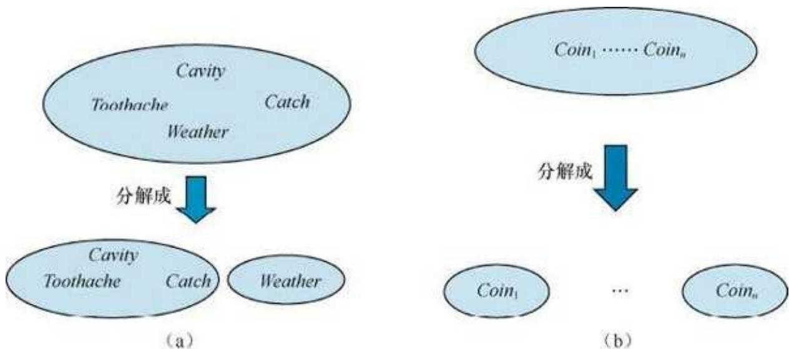  
图12-4 使用绝对独立性将一个大的联合分布分解成小分布的两个例子。（a）天气和牙齿问题是独立的。（b）抛硬币是独立的

我们在式（12-10）中使用的性质叫 独立性 （independence），也叫 边缘独立性（marginalindependence） 或 绝对独立性（absolute independence） 。具体而言，天气独立于一个人的牙齿问题。命题a和 b独立可以写作

$$
P (a \mid b) = P (a) \text {或} P (b \mid a) = P (b) \text {或} P (a \wedge b) = P (a) P (b) \tag {12-11}
$$

所有这些形式都是等价的（习题12.INDI）。变量 X和Y独立可以写成如下形式（这些形式也是等

价的）：

$$
P (X \mid Y) = P (X) \text {或} P (Y \mid X) = P (Y) \text {或} P (X, Y) = P (X) P (Y)
$$

独立性断言通常基于领域知识。像牙病-天气例子所阐释的那样，它们可以显著减少指定完全联合分布所需的信息量。如果整个变量集能分解成独立子集，则完全联合分布可以分解成这些子集上的单独联合分布。例如， $n$ 次独立抛硬币的结果 $P ( C _ { 1 } , . . . , C _ { n }$ )，有2n 个条目，但它可以表示成 n个单变量分布P(C )的乘积，如图12-4b所示。从一个更实际的角度来看，牙科学和气象学的独立性是一件好事，否则牙科医生可能需要精通气象学知识，反之亦然。

当独立性断言可用时，它可以减少域表示的大小，降低推断问题的复杂性。遗憾的是，通过独立性清晰地分离整个变量集的情况非常少见。无论两个变量之间存在多么间接的联系，独立性都无法成立。此外，即使是独立子集也可能相当大——例如，牙科可能涉及数十种疾病和数百种症状，所有这些都是相互关联的。要处理这类问题，我们需要比直接的独立性概念更精妙的方法。

# 12.5 贝叶斯法则及其应用

在12.2.1节中，我们定义了乘积法则 ［式（12-4）］。实际上，它可以写成两种形式：

$$
P (a \wedge b) = P (a \mid b) P (b) \text {和} P (a \wedge b) = P (b \mid a) P (a)
$$

联立两式右侧，除以P(a)，我们得到

$$
P (a \mid b) = \frac {P (a \mid b) P (b)}{P (a)} \tag {12-12}
$$

这个公式叫作贝叶斯法则 （Bayes’srule，也叫贝叶斯定律或贝叶斯定理）。这个简单的公式是大多数现代人工智能系统概率推断的基础。

对于多值变量，更一般的贝叶斯法则可以用记号P写成如下形式：

$$
\boldsymbol {P} (Y \mid X) = \frac {\boldsymbol {P} (X \mid Y) \boldsymbol {P} (Y)}{\boldsymbol {P} (X)}
$$

像之前一样，这个式子用来表示一组方程，每个方程处理变量的特定值。我们也有机会使用以一些背景证据e为条件的更通用的版本：

$$
P (Y \mid X, e) = \frac {P (X \mid Y , e) P (Y \mid e)}{P (X \mid e)} \tag {12-13}
$$

# 12.5.1 应用贝叶斯法则：简单实例

从表面上看，贝叶斯法则似乎不是很有用。它允许我们使用 、 P ( b )和 P ( a )这3项来计 $P ( a \mid b )$ $P \left( b \right)$ 算 一项。这似乎倒退了两步，但贝叶斯法则在实践中很有用，因为在许多情况下我们对这3项有很好的概率估计，需要计算第四项。通常，我们把一些未知原因（cause）的结果（effect）视为证据，并想要确定这个原因。在这种情况下，贝叶斯法则变为了

$$
P (c a u s e \mid e f f e c t) = \frac {P (e f f e c t \mid c a u s e) P (c a u s e)}{P (e f f e c t)}
$$

条件概率 量化 因果 （causal）方向上的关系，而 描述诊断 （diagnostic）方向上的关系。在像医疗诊断这样的任务中，我们通常有因果关系上的条件概率。医生知道 ，想要得出诊断 。

例如，医生知道脑膜炎在70%的情况下会导致病人颈部僵硬。医生也知道一些无条件事实：病人患有脑膜炎的先验概率是1/50 000，而病人颈部僵硬的先验概率是1%。令s表示病人颈部僵硬的命题，m 表示病人患有脑膜炎的命题，我们有

$$
\begin{array}{l} P (s \mid m) = 0. 7 \\ P (m) = 1 / 5 0 0 0 0 \\ P (s) = 0. 0 1 \\ \end{array}
$$

$$
P (m \mid s) = \frac {P (s \mid m) P (m)}{P (s)} = \frac {0 . 7 \times 1 / 5 0 0 0 0}{0 . 0 1} = 0. 0 0 1 4 \tag {12-14}
$$

也就是说，我们预计只有0.14%的颈部僵硬的病人患有脑膜炎。注意，尽管脑膜炎显著地表现为颈部僵硬（概率为0.7），但颈部僵硬的病人患有脑膜炎的概率仍然很小。这是因为（任何原因导致的）颈部僵硬的先验概率比患有脑膜炎的先验概率高得多。

12.3节展示了一个过程，通过该过程，我们可以避免评估证据的先验概率（这里是P(s)），转而计算查询变量的每个值（这里是 m 和 ）的后验概率，然后对结果进行归一化。应用贝叶斯法则时，也可以使用同样的过程。我们有

$$
P (M \mid s) = \alpha \langle P (s \mid m) P (m), P (s \mid \neg m) P (\neg m) \rangle
$$

因此，为了使用这个方法，我们需要估计 而非 P ( s )。没有免费的午餐——有时这会稍简单，有时则会更困难。带有归一化的贝叶斯法则的一般形式是

$$
P (Y \mid X) = \alpha P (X \mid Y) P (Y) \tag {12-15}
$$

其中， $\pmb { \alpha }$ 是使 条目之和等于1所需的归一化常数。

关于贝叶斯法则的一个明显的问题是，为什么我们可能知道一个方向的条件概率，而不知道另一个方向的。在脑膜炎领域，也许医生知道，每5000例颈部僵硬的病例中必然包含1例患有脑膜炎的病例；也就是说，在从症状到病因的诊断 方向上，医生有定量信息。这样的医生不需要使用贝叶斯法则。

遗憾的是， 诊断知识通常比因果知识更加脆弱 。 如果突然流行脑膜炎，脑膜炎的无条件概率 $P$ (m )就会上升。直接使用脑膜炎流行前病人的统计观测得出诊断概率 $P ( m \mid s )$ 的医生不知道如何更新这个概率值，但从其他3个值来计算 $P ( m \mid s )$ 的医生将会看到 $P ( m \mid s )$ 会随着 $P \left( m \right)$ 成比例上升。最重要的是，因果信息 $P ( m \mid s )$ 不受 疾病流行的 影响 ，因为它仅仅反映脑膜炎的运作方式。使用这种直接因果或基于模型的知识，提供了使概率系统在真实世界中可行所需的关键的健壮性。

# 12.5.2 应用贝叶斯法则：合并证据

我们已经看到贝叶斯法则可以用于回答以某项证据（例如颈部僵硬）为条件的概率查询。我们特别阐释过概率信息通常是 的形式。如果有两项或多项证据会发生什么？例如，如果牙医那令人讨厌的钢探针卡在了病人疼痛的牙齿上，她会得出什么结论？如果知道完全联合分布（图12-3），我们可以读出答案：

$$
P (C a v i t y \mid t o o t h a c h e \wedge c a t c h) = \alpha \langle 0. 1 0 8, 0. 0 1 6 \rangle \approx \langle 0. 8 7 1, 0. 1 2 9 \rangle
$$

然而我们知道，这个方法不能推广到变量较多的情况。我们可以尝试使用贝叶斯法则重新表述问题：

$$
P \left(\text {C a v i t y} \mid \text {t o t h a c h e} \wedge \text {c a t c h}\right) = \alpha P (\text {t o t h a c h e} \wedge \text {c a t c h} \mid \text {C a v i t y}) P (\text {C a v i t y}) \tag {12-16}
$$

为了使这个新表述有效，我们需要知道对 Cavity 的每个值，合取 toothache ∧ catch 的条件概率。这可能只对两个证据变量的情况是可行的，它依旧不可扩展到变量较多的情况。如果有n 个可能的证据变量（X射线、日常饮食、口腔卫生等），则有 O (2n)个可能的观测值组合，我们需要知道每个的条件概率。这并不比使用完全联合分布更好。

为了取得进展，我们需要找到一些关于域的、能够简化表达式的额外断言。12.4节关于独立性 的概念提供了线索，但需要改进。如果Toothache和Catch 是独立的就好了，但它们并不是：如果探

针卡在牙齿上，那么很可能牙齿有蛀牙，蛀牙导致牙痛。然而，如果 给定蛀牙的存在与否，这两个变量就是独立的。 两者都是由蛀牙直接引起的，但两者都不会对另一个产生直接影响：牙痛取


决于牙齿中神经的状态，而使用探针的准确性主要取决于牙医的技能，与牙痛无关。 $-$ 数学上，这个性质可以写作

$$
\boldsymbol {P} (\text {t o o t h a c h e} \wedge \text {c a t c h} \mid \text {C a v i t y}) = \boldsymbol {P} (\text {t o o t h a c h e} \mid \text {C a v i t y}) \boldsymbol {P} (\text {c a t c h} \mid \text {C a v i t y}) \tag {12-17}
$$

这个等式表达了给定 Cavity 时 toothache 和 catch 的 条件独立性 （conditional independence）。把它代入式（12-16）可以得到蛀牙的概率：

$$
\begin{array}{l} P (C a v i t y \mid t o o t h a c h e \wedge c a t c h) \\ = \alpha P (\text {t o o t h a c h e} \mid \text {C a v i t y}) P (\text {c a t c h} \mid \text {C a v i t y}) P (\text {C a v i t y}) \tag {12-18} \\ \end{array}
$$

现在对信息的要求就与分别使用每项证据进行推断是一样的了：查询变量的先验概率 P ( Cavity )和给定原因下每个结果的条件概率。

给定第三个变量Z，两个变量 X和Y的条件独立性 （conditionalindependence）的一般定义是

$$
\boldsymbol {P} (X, Y \mid Z) = \boldsymbol {P} (X \mid Z) \boldsymbol {P} (Y \mid Z)
$$

例如，在牙科领域，给定 Cavity 时，断言变量 Toothache 和 Catch 的条件独立性似乎是合理的：

$$
\boldsymbol {P} (\text {T o o t h a c e}, \text {C a t c h} \mid \text {C a v i t y}) = \boldsymbol {P} (\text {T o o t h a c e} \mid \text {C a v i t y}) \boldsymbol {P} (\text {C a t c h} \mid \text {C a v i t y}) \tag {12-19}
$$

注意，这个断言比式（12-17）要强一些，式（12-17）只断言 Toothache和 Catch特定值的独立性。和式（12-11）的绝对独立性一样，也可以使用等价形式（见习题12.PXYZ）：

$$
\boldsymbol {P} (X \mid Y, Z) = \boldsymbol {P} (X \mid Z) \text {和} \boldsymbol {P} (Y \mid X, Z) = \boldsymbol {P} (Y \mid Z)
$$

12.4节阐释了绝对独立性断言允许完全联合分布分解成许多小分布。对条件独立性断言也是如此。例如，给定式（12-19）中的断言，我们得到如下分解：

$$
\begin{array}{l} \boldsymbol {P} (\text {T o o t h a c h e}, \text {C a t c h}, \text {C a v i t y}) \\ = P \left(\text {T o o t h a c h e}, \text {C a t c h} \mid \text {C a v i t y}\right) P (\text {C a v i t y}) \quad \text {(乘 积 法 则)} \\ = P \left(\text {T o o t h a c h e} \mid \text {C a v i t y}\right) P (\text {C a t c h} \mid \text {C a v i t y}) P (\text {C a v i t y}) \quad [ \text {利 用 式 (1 2 - 1 9)} ] \\ \end{array}
$$

（读者容易验证，在图12-3中，这个等式事实上是成立的。）通过这种方式，原始的大表被分解为3个较小的表。原始的表有7个独立的数字。（表中有2 3 =8个条目，但它们的和必须为1，所以有7个是独立的。）小表总共包含2 +2 +1 =5个独立数字。（对于像 的条件概率分布，有两行，每行两个数的和为1，所以有两个独立的数字；对于像P(Cavity)的先验分布，只有一个独立的数字。）从7个减少到5个似乎不是什么大的成功，但症状数量越多，收益就越大。

一般来说，对于给定 Cavity时条件独立的n 个症状，表达式规模的增长速度将是O (n )而非 O (2n)级别的。这意味着条件独立性断言允许概率系统进行规模扩展；此外，它们比绝对独立性断言更容易获得。 从概念上来说， Cavity 分隔 （separate）了 Toothache 和 Catch ，因为它是两者的直接原因。通过条件独立性将大概率域分解成弱连通的子集是人工智能近期历史上最重要的进展之一。

# 12.6 朴素贝叶斯模型

牙科的例子阐释了一种常见的模式，其中单个原因直接影响许多结果，给定原因时，所有这些结果都是条件独立的。此时，完全联合分布可以写作

$$
\boldsymbol {P} (\text {C a u s e}, \text {E f f e c t} _ {1}, \dots , \text {E f f e c t} _ {n}) = \boldsymbol {P} (\text {C a u s e}) \prod_ {t} \boldsymbol {P} (\text {E f f e c t} _ {t} \mid \text {C a u s e}) \tag {12-20}
$$

这样的概率分布叫作朴素贝叶斯 （naiveBayes）模型——“朴素”是因为它经常（作为一种简化假设）用于在给定原因变量时，“结果”变量不是严格独立的情况。［朴素贝叶斯模型有时被称为贝叶斯分类器（Bayesianclassifier） ，这种有点粗心的用法已经促使真正的贝叶斯学派称其为傻瓜贝叶斯 （idiotBayes）模型。］在实践中，朴素贝叶斯系统通常表现得很好，即使条件独立性假设并不是严格成立的。

为了使用朴素贝叶斯模型，我们可以应用式（12-20）来得到给定一些观测到的结果时该原因的概率。考虑观测到的结果 E = e ，剩余结果变量 Y 是未观测的。可采用从联合分布［式（12-9）］进行推断的标准方法：

$$
P (C a u s e \mid e) = \alpha \sum_ {y} P (C a u s e, e, y)
$$

从式（12-20），我们得到：

$$
\begin{array}{l} P (C a u s e \mid e) = \alpha \sum_ {y} P (C a u s e) P (y \mid C a u s e) \left(\prod_ {j} P (e _ {j} \mid C a u s e)\right) \\ = \alpha P (C a u s e) \left(\prod_ {j} P (e _ {j} \mid C a u s e)\right) \sum_ {y} P (y \mid C a u s e) \\ = \alpha P (C a u s e) \prod_ {j} P \left(e _ {j} \mid C a u s e\right) \tag {12-21} \\ \end{array}
$$

最后一行成立是因为对y求和结果是1。我们用文字重新解释这个等式：对于每一个可能的原因，将原因的先验概率乘以在给定原因时所观测到的结果的条件概率；然后将结果归一化。该计算的运行时间与观测到的结果数量呈线性关系，并不依赖于未观测到的结果数量（这一数量在医学等领域可能非常大）。在第13章中我们将看到，这是概率推断中的常见现象：值未被观测的证据变量通常会从计算中完全“消失”。

使用朴素贝叶斯进行文本分类

让我们看看朴素贝叶斯模型如何被应用到文本分类 （textclassification）任务：给定一个文本，判断它属于预先定义的类别集合中的哪个。这里，“原因”是Category变量，“结果”变量HasWord 指某些关键词的出现与否。考虑从报纸文章中选取的以下两个例句。

（1）Stocks rallied on Monday, with major indexes gaining 1% as optimism persisted over the first quarter earnings season.（由于对第一季度财报的乐观情绪的持续，周一股票反弹，主要股指上涨 $1 \%$ 。）   
（2）Heavy rain continued to pound much of the east coast on Monday, with flood warnings issued in New York City and other locations.（周一暴雨继续袭击东海岸大部分地区，纽约市和其他地区发布 了洪水警报。）

任务是把每个句子分入一个 Category ——报纸的主要板块：news（新闻）、sports（体育）、business（商业）、weather（天气）和entertainment（娱乐）。朴素贝叶斯模型包含先验概率 $\mathbf { \delta } _ { \mathbf { \mathcal { P } } }$ (Category )和条件概率 。对于每个类别 c ， P ( Category = c )被估

计为以前看到的所有文章中 $c$ 类的比例。例如，如果 $9 \%$ 的文章是关于天气的，我们设 P ( Category= weather) = 0.09。类似地， 被估计为每类文章中包含单词 i的比例；或许37%关于商业的文章中含有编号为6的单词“股票”，所以

设置为0.37。 注

为了对一篇新文章进行分类，我们需要检查哪些单词出现在了文章中，然后应用式（12-21）获得类别上的后验概率分布。如果只需预测一个类别，我们选取后验概率最大的那类。注意，对这个任务来说，每个结果变量都是被观测的，因为我们总是可以判断给定单词是否出现在这篇文章中。

朴素贝叶斯模型假设单词在文章中独立出现，频率由文章类别决定。这种独立性假设在实践中显然是不成立的。例如，短语“firstquarter”在商业（或体育）文章中出现得更加频繁，超过用“first”的概率和“quarter”的概率的乘积计算得出的概率。对独立性的违背通常意味着最终的后验概率会比真实情况更接近1或0。换句话说，该模型对自己的预测过于自信。但是，即使有这些错误，模型对可能类别的排序往往也是相当准确的。

朴素贝叶斯模型广泛应用于语言测定、文档检索、垃圾邮件过滤和其他分类任务。对于像医学诊断这样的任务，后验概率的实际值真的很重要——例如，在决定是否进行阑尾切除术时——人们通常更愿意使用第13章中描述得更复杂的模型。

# 12.7 重游wumpus世界

我们可以结合本章中的想法来解决wumpus世界中的概率推理问题。（关于wumpus世界的完整描述见第7章。）因为智能体的传感器只提供了世界的部分信息，wumpus世界中出现了不确定性。例如，图12-5展示了一种情形：3个未访问但可达的方格[1, 3]、[2,2]和[3,1]，每个都可能包含一个无底洞。纯逻辑推断无法得出哪个方格最有可能是安全的，因此逻辑智能体可能不得不随机选择。我们将会看到概率智能体比逻辑智能体做得更好。

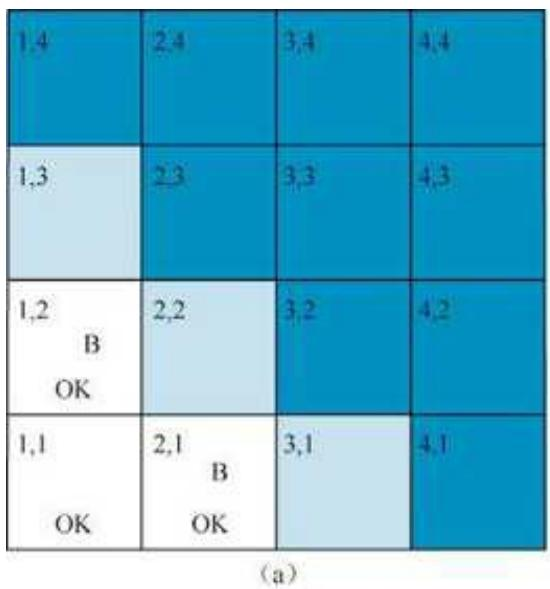

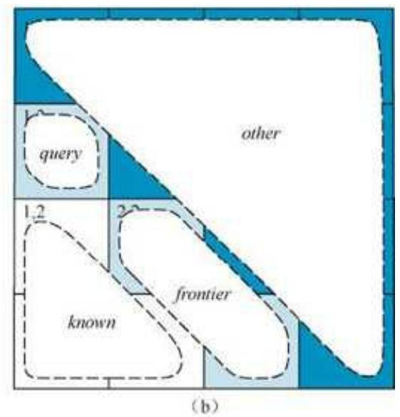  
图12-5 （a）在[1, 2]和[2, 1]发现微风后，智能体被困住了——没有安全区域可以探索。（b）对关于[1, 3]的查询，方格划分为 known 、 frontier 和 other

我们的目标是计算3个方格中每个含有无底洞的概率。（在这个例子中，我们忽略wumpus和金币。）wumpus世界的相关性质是：（1）每个无底洞会让所有相邻方格有微风；（2）除[1, 1]以外，所有其他方格拥有无底洞的概率是0.2。第一步是确定我们需要的随机变量集合。

●和命题逻辑的情况一样，对每个方格我们需要一个布尔变量P ，当且仅当方格[i, j]确实含有一个无底洞时变量为真。  
●我们也需要布尔变量 $B _ { i j }$ ，当且仅当方格[i,j]有微风时变量为真；我们只为观测到的方格设置这些变量；在这个例子中是[1, 1]、[1, 2]和[2, 1]。

下一步是去指定完全联合分布 $P ( P _ { 1 , 1 } , . . . , P _ { 4 , 4 } , B _ { 1 , 1 } , B _ { 1 , 2 } , B _ { 2 , 1 } )$ 。应用乘积法则，我们有：

$$
\boldsymbol {P} \left(P _ {1, 1}, \dots , P _ {4, 4}, B _ {1, 1}, B _ {1, 2}, B _ {2, 1}\right) = \boldsymbol {P} \left(B _ {1, 1}, B _ {1, 2}, B _ {2, 1} \mid P _ {1, 1}, \dots , P _ {4, 4}\right) \boldsymbol {P} \left(P _ {1, 1}, \dots , P _ {4, 4}\right)
$$

通过这种分解，我们很容易看出联合概率的值应该是多少。右边第一项是给定无底洞的配置时，微风的配置的条件概率分布；如果和无底洞相邻，它的值为1，否则为0。第二项是无底洞的配置的先验概率。每个方格独立于其他方格，以0.2的概率包含无底洞。因此，

$$
\boldsymbol {P} \left(P _ {1, 1}, \dots , P _ {4, 4}\right) = \prod_ {i, j = 1, 1} ^ {4, 4} \boldsymbol {P} \left(P _ {i, j}\right) \tag {12-22}
$$

对于一个恰好有 n 个无底洞的特定配置，这个概率是 。 $n$ $0 . 2 ^ { \approx } \times 0 . 8 ^ { 1 6 - \times }$ 。

在图12-5a的场景中，证据包括在每个被访问的方格中是否观测到微风，以及每个这样的方格没有包含无底洞的事实。我们把这些事实缩写 成 $b = - b _ { 1 , 1 }$ $b = \lnot b _ { 1 , 1 } \ l \ b _ { 1 , 2 } \ \Lambda \ b _ { 2 , 1 }$ $\pmb { b } _ { 2 1 }$ 和

。我们感兴趣于回答例如 $v w n = \lnot p _ { 1 , 1 } \land \lnot p _ { 1 , 2 } \land \lnot p _ { 2 , 1 }$ 的查询给定到目前为止的观测，方格[1, 3]含有无底洞的可能性是多大？

为了回答这个查询，我们可以沿用式（12-9）的标准方法，也就是从完全联合分布中对各条目求和。令unknown表示除已知方格和查询方格[1,3]外的其他方格变量 P 的集合。利用式（12-9），我们有

$$
P \left(P _ {1, 3} \mid \text {k n o w n}, b\right) = \alpha \sum_ {\text {u n k n o w}} P \left(P _ {1, 3}, \text {k n o w n}, b, \text {u n k n o w}\right) \tag {12-23}
$$

完全联合概率已经被指定了，所以任务完成——除非我们还关心计算。这里有12个未知的方格，因此求和包含2 12 =4096项。一般来说，总数随方格数量呈指数增长。

当然，可能有人会问，难道其他方格不是不相关吗？[4,4]如何影响[1, 3]是否含有无底洞？事实上，这种直觉大致上是正确的，但我们需要更精确的结论。我们真正的意思是，如果知道与我们所关心的方格相邻的所有无底洞变量的值，那么在其他更远的方格中是否有无底洞将不会进一步影响我们的信念。

令 frontier 表示与已访问方格相邻的无底洞变量（除了查询方格），这里是[2, 2]和[3, 1]。令 other表示其他未知方格的无底洞变量；如图12-5b所示，这里是其他10个方格。有了这些定义，我们有。上面给出的关键点现在可以陈述如下：给定 known 、frontier 和 query 变量，观测到的微风 条件独立 于其他变量。

为了利用这一点，我们把查询公式改写成另一种形式，其中微风以其他所有变量为条件，然后我们利用条件独立性可以得到

$$
\begin{array}{l} \boldsymbol {P} \left(P _ {1, 3} \mid \text {k n o w n}, b\right) \\ = \alpha \sum_ {\text {u n k n o w n}} P \left(P _ {1, 3}, \text {k n o w n}, b, \text {u n k n o w n}\right) \quad [ \text {根 据 式 (1 2 - 2 3)} ] \\ = \alpha \sum_ {\text {u n k n o w n}} P (b \mid P _ {1, 3}, \text {k n o w n}, \text {u n k n o w n}) P \left(P _ {1, 3}, \text {k n o w n}, \text {u n k n o w n}\right) (\text {乘 积 法 则}) \\ = \alpha \sum_ {\text {f r o n t i e r o t h e r}} \sum P (b | \text {k n o w n}, P _ {1, 3}, \text {f r o n t i e r , o t h e r}) P \left(P _ {1, 3}, \text {k n o w n}, \text {f r o n t i e r , o t h e r}\right) \\ = \alpha \sum_ {\text {f r o n t i e r o t h e r}} \sum P (b | \text {k n o w n}, P _ {1, 3}, \text {f r o n t i e r}) P (P _ {1, 3}, \text {k n o w n}, \text {f r o n t i e r}, \text {o t h e r}) \\ \end{array}
$$

其中，最后一步使用了条件独立性：即给定known、 $P _ { 1 , 3 }$ 和 frontier ， $^ { b }$ 独立于other。现在，这个表达式的第一项不依赖于other变量，所以我们可以将求和内移：

$$
\begin{array}{l} \boldsymbol {P} (P _ {1, 3} \mid k n o w n, b) \\ = \alpha \sum_ {\text {f r o n t i e r}} \boldsymbol {P} (b \mid \text {k n o w n}, P _ {1, 3}, \text {f r o n t i e r}) \sum_ {\text {o t h e r}} \boldsymbol {P} \left(P _ {1, 3}, \text {k n o w n}, \text {f r o n t i e r}, \text {o t h e r}\right) \\ \end{array}
$$

利用独立性，右边的项可以像式（12-22）那样被分解，然后各项可以重新排序：

$$
\begin{array}{l} \boldsymbol {P} \left(P _ {1, 3} | k n o w n, b\right) \\ = \alpha \sum_ {\text {f r o n t i e r}} \boldsymbol {P} (b \mid \text {k n o w n}, P _ {1, 3}, \text {f r o n t i e r}) \sum_ {\text {o t h e r}} \boldsymbol {P} \left(P _ {1, 3}\right) P (\text {k n o w n}) P (\text {f r o n t i e r}) P (\text {o t h e r}) \\ = \alpha P (k n o w n) P \left(P _ {1, 3}\right) \sum_ {\text {f r o n t i e r}} P (b | k n o w n, P _ {1, 3}, \text {f r o n t i e r}) P (\text {f r o n t i e r}) \sum_ {\text {o t h e r}} P (\text {o t h e r}) \\ = \alpha^ {\prime} P \left(P _ {1, 3}\right) \sum_ {\text {f r o n t i e r}} P (b \mid \text {k n o w n}, P _ {1, 3}, \text {f r o n t i e r}) P (\text {f r o n t i e r}) \\ \end{array}
$$

其中，最后一步将 $P$ (known)合并进归一化常数并利用 等于1的事实。

现在，对边界变量 $P _ { 2 , 2 }$ 和 $P _ { 3 , 1 }$ 求和仅有4项。独立性和条件独立性的使用完全排除了对其他方格的考虑。

注意，当对微风的观测与其他变量一致时，概率 为1，否则为0。因此，对 $P _ { 1 , 3 }$ 的每个值，我们对与已知事实一致的边界变量的逻辑模型 进行求和。（与图7-5中模型中的枚举进行比较。）图12-6展示了模型和它们相关的先验概率 $P$ ( frontier )。我们有

$$
P \left(P _ {1, 3} \mid \text {k n o w n}, b\right) = \alpha^ {\prime} \langle 0. 2 (0. 0 4 + 0. 1 6 + 0. 1 6), 0. 8 (0. 0 4 + 0. 1 6) \rangle \approx \langle 0. 3 1, 0. 6 9 \rangle
$$

也就是说，[1,3]（和对称的[3, 1]）大约有31%的概率含有无底洞。相似的计算——读者或许希望自己计算——表示[2,2]大约有86%的概率含有无底洞。wumpus智能体绝对应该避开[2, 2]！注意，我们在第7章中介绍的逻辑智能体并不知道[2, 2]比其他方格更危险。逻辑可以告诉我们[2, 2]是否有无底洞是未知的，但我们需要概率告诉我们[2,2]有无底洞的可能性是多大。

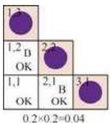

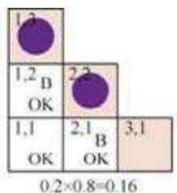

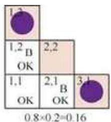

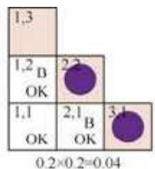

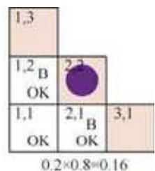  
  
图12-6 对边界变量 $P _ { 2 , 2 }$ 和 $P _ { 3 , 1 }$ 的一致模型，显示每个模型的 P ( frontier )。（a） P 1,3 = true的3个模型，说明有两个或三个无底洞。（b） P = false的两个模型，说明有一个或两个无底洞

本节阐释的是，即使是看似复杂的问题，也可以用概率论精确地表述出来，并用简单的算法求解。为了获得高效的解，可以使用独立性和条件独立性关系简化所需的求和。这些关系通常符合我们对问题应该如何分解的自然理解。在第13章中，我们将为这种关系提出形式化的表示，以及基于这些表示去高效地执行概率推断的算法。

小结

本章表明概率论是不确定推理的合适基础，并简要介绍了它的应用。

●不确定性的产生是由于惰性和无知。在复杂的、非确定性的或部分可观测的环境中，不确定性是不可避免的。  
●概率 表达了智能体无法对一个语句的真值做出明确的判断。概率概括了智能体对于证据的信念。  
●决策论 结合了智能体的信念和欲望，将最大期望效用 的动作定义为最佳动作。  
●基本的概率陈述包括简单命题和复杂命题上的先验概率 （或 无条件概率 ）和后验概率 （或条件概率 ）。  
●概率公理约束逻辑相关命题的概率。违背公理的智能体在某些情况下的行为必定是不理性的。  
●完全联合概率分布 为随机变量的每种完整赋值指定了概率。通常，完全联合概率分布过于庞大，以至于无法显式地创建和使用，但如果其可用时，它可以用于回答查询，只需要简单地将其中与查询命题对应的可能世界的条目相加即可。  
●随机变量子集间的绝对独立性 允许将完全联合分布分解成小的联合分布，极大地降低它的复杂度。  
●贝叶斯法则 允许通过已知的条件概率去计算未知概率，条件概率通常在因果方向上。将贝叶斯法则应用于多条证据时会遇到与完全联合分布相同的规模扩展问题。  
●域中的直接因果关系带来的条件独立性 允许完全联合分布被分解成小的条件分布。朴素贝叶斯模型假设给定单原因变量时，所有结果变量具有条件独立性。模型大小随结果个数线性增长。  
● wumpus世界的智能体可以计算世界中未观测的方面的概率，从而改进纯逻辑智能体的决策。条件独立性简化了这些计算。

读者服务：


微信扫码关注【异步社区】微信公众号，回复“e59810”获取本书配套资源以及异步社区15天VIP会员卡，近千本电子书免费畅读。

# 第13章

# 概率推理

在本章中，我们将阐释如何根据概率论定理构建在不确定性下进行推理的高效的网络模型，以及如何区分相关关系和因果关系。

我们在第12章中介绍了概率论的基本要素，并指出了独立性和条件独立性关系在简化世界的概率表示中的重要性。在本章中，我们将介绍一种系统的方法，以贝叶斯网络 （Bayesian network）的形式明确地表示这些关系。我们将定义这些网络的语法和语义，并展示如何以自然高效的方式使用它们来捕捉不确定知识。之后我们将阐释在许多实际情况下应如何高效地进行概率推断（尽管在最差的情况下，这些推断可能是难以计算的）。我们也将介绍各种近似推断算法，它们通常适用于精确推断不可行的情况下。第15章将贝叶斯网络的基本思想扩展到用于定义概率模型的表达能力更强的形式语言上。

# 13.1 不确定域的知识表示

在第12章中，我们看到了完全联合概率分布可以回答任何关于域的问题，但同时其规模会随着变量数量的增长而变得非常大。此外，逐个指定可能世界的概率是不自然的，也是单调乏味的。

我们还看到，变量之间的独立性和条件独立性关系可以极大地减少为定义完全联合分布而需要指定的概率的数量。本节将介绍一种被称为 贝叶斯网络 （Bayesian network） [1] 的数据结构来表示变量之间的依赖关系。贝叶斯网络可以本质上表示任何完全联合概率分布，并且它在很多情况下可以非常简洁。

[1] “Bayesian network”通常缩写成“Bayes net”，它在20世纪八九十年代被称为 信念网络 （beliefnetwork）。 因果网络 （causalnetwork）是指对箭头含义有额外约束的贝叶斯网络（见13.5节）。术语 图模型 （graphical model）指包括贝叶斯网络在内的更广泛的类。

贝叶斯网络是一个有向图，其中每个节点用定量的概率信息标记。完整的描述如下。

（1）每个节点对应一个随机变量，它可以是离散的，也可以是连续的。  
（2）有向链路或箭头连接成对的节点。如果有从节点X指向节点Y的箭头，则称X是Y的一个父节点。图中没有有向环，因此它是一个有向无环图（简称DAG）。  
（3）每个节点 X i关联概率信息 ，我们使用有限的 参数 量化父节点对该节点的影响。

网络的拓扑（节点和链路的集合）以精确简洁的方式指定了在域中成立的条件独立性关系。箭头的直观含义通常是 $X$ 对Y有直接影响 ，这意味着原因通常是结果的父节点。对领域专家来说，决定域中存在哪些直接影响通常很容易，事实上，这比实际指定概率本身要容易得多。一旦我们确定了贝叶斯网络的拓扑结构，就只需要以给定其父节点的条件分布的形式来指定每个变量的局部概率信息。所有变量的完全联合分布由拓扑结构和局部概率信息定义。

回想一下第12章中描述的包含变量 Toothache 、 Cavity 、 Catch 和 Weather 的简单世界。我们认为Weather独立于其他变量；此外，我们认为给定Cavity时，Toothache和Catch条件独立。这些关系由图13-1所示的贝叶斯网络结构表示。形式上，给定Cavity时，Toothache和Catch 的条件独立性由 Toothache 和 Catch 之间 没有 链路来指明。直观来说，该网络表明 Cavity 是 Toothache 和Catch 的直接原因，而Toothache和Catch之间不存在直接的因果关系。

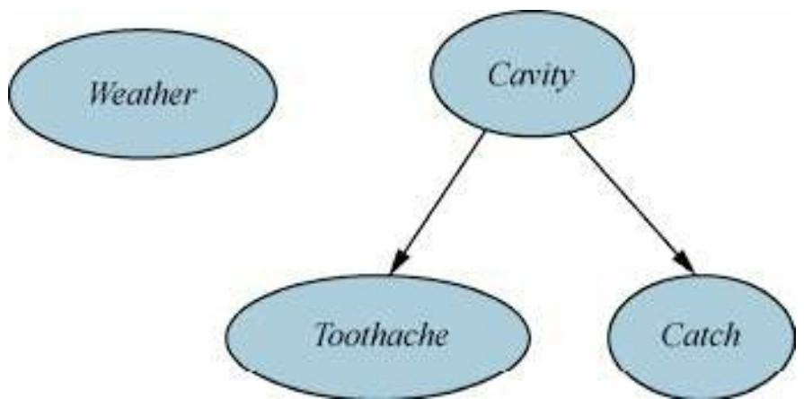  
图13-1 一个简单的贝叶斯网络，其中 Weather独立于其他3个变量，Toothache和Catch 在给定Cavity 时条件独立

现在让我们考虑一个稍微复杂的例子。设想你在家里安装了一个新的防盗警报器，它在探测入室盗窃方面相当可靠，但它偶尔也会被小型地震触发。（这个例子来自朱迪亚·珀尔，他是地震多发地区洛杉矶的居民）。你还有两位邻居约翰（John）和玛丽（Mary），他们承诺，在你工作时如果他们听到警报就给你打电话。约翰几乎总能在听到警报的时候给你打电话，但他有时会因为混淆了

电话铃声和警报而错误地给你打电话。但是，玛丽平时喜欢听喧闹的音乐，因此经常完全错过了警报。现在给定他们是否打过电话的证据，我们希望估计入室盗窃的概率。

图13-2展示了这个域的贝叶斯网络。网络结构表明，入室盗窃和地震直接影响警报器报警的概率，但约翰和玛丽是否打电话只依赖警报器。因此，这个网络应验了我们的假设：他们不会直接察觉到入室盗窃，不会注意到小型地震，也不会在打电话之前互相商量。

图13-2中每个节点的局部概率信息采用 条件概率表 （conditional probability table，CPT）的形式表示。（条件概率表只能用于离散变量，其他表示方式，包括适用于连续变量的表示方式，将在13.2节中介绍）。条件概率表的每一行包含某个 条件事件 （conditioning case）下每个节点的值的条件概率。条件事件就是所有父节点的一个可能的值的组合，如果你喜欢的话，也可以把它视为一个微型的可能世界。条件概率表中每一行的概率的和必须是1，因为这些表项代表了变量穷举情形的集合。对布尔变量来说，一旦知道了真值为真的概率是p ，为假的概率必是1−p ，因而我们经常像图13-2那样省略行中的第二个数字。一般来说，一个具有k个布尔父节点的布尔变量的条件概率表包含2k 个独立可指定的概率。对于没有父节点的节点，其条件概率表只有一行，表示变量每个可能的值的先验概率。

注意，网络中没有与玛丽当前正在听喧闹音乐或电话铃声混淆约翰相对应的节点。这些因素被归结到从 Alarm 到 JohnCalls 和 MaryCalls 的链路相关联的不确定性中。这展示了操作中的惰性与无知，正如12.1.1节所解释的那样：要弄清楚为什么在所有特定情况下这些因素或多或少都可能存在，我们需要做大量的工作，而且我们也没有合理的途径来获取相关信息。

这些概率实际上囊括了潜在的无限多种情况，在这些情况下，警报可能不会响起（湿度大、电源故障、电池没电、电线断了、一只死老鼠卡在了警铃里等）或者约翰和玛丽可能无法打电话报告（外出吃午饭、度假、暂时性失聪、直升机飞过，等等）。通过这种方式，一个小的智能体可以（至少是可以近似地）应对非常大的世界。

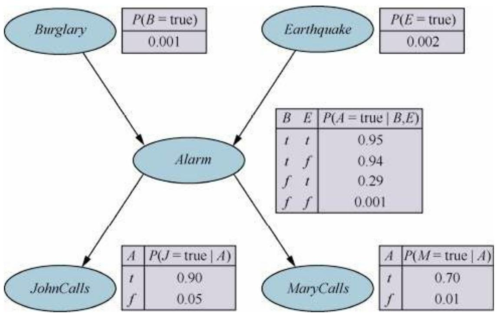  
图13-2 一个典型的贝叶斯网络，所示为其拓扑结构和条件概率表。在条件概率表中，字母 B、E、 A 、 $J$ 和 M 分别代表 Burglary 、 Earthquake 、 Alarm 、 JohnCalls 和 MaryCalls

# 13.2 贝叶斯网络的语义

贝叶斯网络的语法由一个每个节点都附加一些局部概率信息的有向无环图组成。语义定义了语法如何对应于网络的变量的联合分布。

假设贝叶斯网络包含 $n$ 个变量 $X _ { 1 } , . . . , X _ { n }$ 。那么联合分布的一个通用条目是

，或者缩写成 P ( x 1,…, x n)。贝叶斯网络的语义将联合分布 $P ( X _ { 1 } = x _ { 1 } \land \cdots \land X _ { n } = x _ { n } )$ $P \left( x _ { 1 } , . . . , x _ { n } \right)$ 中的每个条目定义如下：

$$
P \left(x _ {1}, \dots , x _ {n}\right) = \prod_ {i = 1} ^ {n} \theta \left(x _ {i} \mid p a r e n t s \left(X _ {i}\right)\right) \tag {13-1}
$$

其中 代表在 中出现的 的值。因此，联合分布中的每一项都由贝叶斯网络中局部条件分布的适当元素的乘积来表示。

为了说明这一点，我们可以计算出警报响起，但没有发生入室盗窃或地震，而且约翰和玛丽都打来电话的概率。我们只需将局部条件分布（变量名缩写）中的相关条目相乘：

$$
\begin{array}{l} P (j, m, a, \neg b, \neg e) = P (j \mid a) P (m \mid a) P (a \mid \neg b \wedge \neg e) P (\neg b) P (\neg e) \\ = 0. 9 0 \times 0. 7 0 \times 0. 0 0 1 \times 0. 9 9 9 \times 0. 9 9 8 = 0. 0 0 0 6 2 8 \\ \end{array}
$$

我们在12.3节中表明了，完全联合分布可以用来回答关于域的任何查询。如果贝叶斯网络是联合分布的一种表示，那么它也可以用于回答任何查询——通过对所有相关的联合概率值求和，每个值都可以通过乘以局部条件分布的概率计算出来。13.3节将对此进行更详细的解释，也将介绍更高效的方法。

到目前为止，我们都忽略了一个重要的问题：局部条件分布 中的数字的含义是什么？根据式（13-1）我们可以证明，参数 $\theta ( x _ { i } | p a r e n t s ( X _ { i } ) )$ 恰好是联合分布所隐含的条件概率 $P ( x , \mid p a r e n t s ( X _ { i } ) )$ 。条件分布可以从联合分布中计算得到，如下：

$$
\begin{array}{l} P (x _ {i} | p a r e n t s (X _ {i})) \equiv \frac {P (x _ {i} , p a r e n t s (X _ {i}))}{P (p a r e n t s (X _ {i}))} \\ = \frac {\sum_ {y} P \left(x _ {i} , p a r e n t s \left(X _ {i}\right) , y\right)}{\sum_ {x _ {i} ^ {\prime} , y} P \left(x _ {i} ^ {\prime} , p a r e n t s \left(X _ {i}\right) , y\right)} \\ \end{array}
$$

其中 $y$ 表示除 $X _ { i }$ 和它的父节点外所有其他的变量的值。由最后一行可以得到

（见习题13.CPTE）。因此，我们可以将式（13-1）改写成

$$
P \left(x _ {1}, \dots , x _ {n}\right) = \prod_ {i = 1} ^ {n} P \left(x _ {i} \mid p a r e n t s \left(X _ {i}\right)\right) \tag {13-2}
$$

这意味着在估计局部条件分布的值时，它们应当是给定父节点时该变量的真实条件概率。例如，当我们指定 时，意思是在90%的情况下当警报响起时约翰会打电话。网络的每一个参数都只在一个变量的小集合上具有明确的含义，这一事实对于模型的健壮性和易描述性至关重要。

式（13-2）定义了一个给定的贝叶斯网络的含义。接下来，我们将解释如何构造一个贝叶斯网络，并使其产生的联合分布能很好地表示给定的域。现在我们将说明式（13-2）隐含了某些可以用来指导知识工程师们构造网络拓扑结构的条件独立性关系。首先，我们使用乘积法则（12.2.1节）将联合分布的条目改写成条件概率：

$$
P \left(x _ {1}, \dots , x _ {n}\right) = P \left(x _ {n} \mid x _ {n - 1}, \dots , x _ {1}\right) P \left(x _ {n - 1}, \dots , x _ {1}\right)
$$

然后重复这个过程，将每个联合概率归约一个条件概率和一个更小的变量集上的联合概率。最后我们得到一个大的乘积式：

$$
\begin{array}{l} P \left(x _ {1}, \dots , x _ {n}\right) = P \left(x _ {n} \mid x _ {n - 1}, \dots , x _ {1}\right) P \left(x _ {n - 1} \mid x _ {n - 2}, \dots , x _ {1}\right) \dots P \left(x _ {2} \mid x _ {1}\right) P \left(x _ {1}\right) \\ = \prod_ {i = 1} ^ {n} P \left(x _ {i} \mid x _ {i - 1}, \dots , x _ {1}\right) \\ \end{array}
$$

这个恒等式称为 链式法则 （chain rule），它对任何随机变量集合都成立。通过将其与式（13-2）相比较，我们可以发现联合分布的规范等价于一般的断言：对于网络中的每个变量 X i，假设Parentsx）ExX，有

$$
\boldsymbol {P} \left(X _ {i} \mid X _ {i - 1}, \dots , X _ {1}\right) = \boldsymbol {P} \left(X _ {i} \mid \text {P a r e n t s} (X _ {i})\right) \tag {13-3}
$$

通过拓扑顺序 （topologicalorder，即与有向图结构一致的任何顺序）对节点进行编号，就能满足条件 。例如，图13-2中的节点可以排序成 B 、 E 、 A 、 J 、M 或 E 、 B 、 A 、 M 、 $J$ 等。

式（13-3）表明，只有在给定父节点，每个节点条件独立于节点排序中的其他前驱节点时，贝叶斯网络才是域的正确表示。我们可以使用如下的贝叶斯网络构建方法来满足这一条件。

（1）节点：首先确定建模域所需的变量集合，再对它们进行排序，得到 。任何排序的顺序都是可行的，但是如果变量的顺序是原因先于结果的，那么产生的网络会更紧凑。

（2）链路：i从1到n ，循环执行：

● 从 中为 $X _ { i }$ 选择最小父节点集合，使得满足式（13-3）；  
●为每个父节点插入一条从父节点到 $X _ { i }$ 的链路；  
●记录条件概率表 。

直观上看，节点X 的父节点应该包含 $X _ { 1 } , . . . , X _ { i - 1 }$ 中所有直接影响 X 的变量。例如，假设除为MaryCalls选择父节点之外，我们已经构造完成了图13-2的网络。变量 MaryCalls肯定被是否有Burglary或Earthquake影响，但这些影响不是直接的。直觉上，对这个域的知识告诉我们，这些事件只通过它们对警报器的结果来影响玛丽打电话的行为。而且，给定警报器的状态，约翰是否打电话对玛丽的打电话行为没有影响。从数学上严谨地说，我们认为以下条件独立命题是成立的：

$$
P (M a r y C a l l s \mid J o h n C a l l s, A l a r m, E a r t h q u a k e, B u r g l a r y) = P (M a r y C a l l s \mid A l a r m)
$$

因此， Alarm 是 MaryCalls 的唯一父节点。

由于每个节点只与前面的节点相连，这种构建方法保证了网络是无环的。贝叶斯网络的另一个重要性质是它不包含冗余的概率值。如果没有冗余，就不可能产生不一致的网络：知识工程师或领域专家不可能创建一个违反概率公理的贝叶斯 网络。

# 2. 紧凑性与节点顺序

贝叶斯网络除了可以作为域的完整且非冗余的表示，通常还比完全联合分布更 紧凑 。这个性质使得我们能够处理具有许多变量的域。贝叶斯网络的紧凑性是 局部结构化 （locally structured）［也称为稀疏 （sparse）］系统一般性质的一个示例。在局部结构化的系统中，每个子组件仅与有限数量的其他组件直接交互，而与组件总数无关。局部结构化在复杂度上的增长速度通常是线性的而非指数级别的。

在使用贝叶斯网络时，在大多数域中可以合理地假设：每个随机变量最多受到 $k$ 个其他随机变量的直接影响，其中 $k$ 是某个常数。为了简单起见，我们假设问题中存在 $n$ 个布尔变量，由于指定每个条件概率表所需的信息数量最多是2k 个数值，因此整个网络可以用 $2 ^ { k } \cdot \pi$ 个数值指定，而联合分布本身包含2 n 个数值。具体来说，假设我们有n =30个节点，每个节点有5个父节点（ k=5）。则确定一个贝叶斯网络仅需要960个数值，但确定一个完全联合分布需要超过10亿个数值。

为一个全连接网络——每个变量都以其所有前驱节点作为父节点的网络— 指定条件概率表所需的信息量和以表的形式指定联合分布所需的信息量同样多。出于这个原因，我们会在变量之间的依赖关系微弱时忽略该链路，因为通过增加网络额外的复杂性以获得精度上的一点点提高并不值得。例如，有人可能会反对我们的入室盗窃网络，理由是如果发生大地震，那么约翰和玛丽即使听到警报也不会打电话来，因为他们会认为地震才是导致警报的原因。是否增加从Earthquake到 JohnCalls和MaryCalls的链路（这样就扩大了表格）取决于指定额外信息的代价与得到更准确概率的重要性之间的权衡。

即使在局部结构化的域内，我们也只能在节点顺序选择合适的情况下得到一个紧凑的贝叶斯网络。如果选择了错误的节点顺序会发生什么？再次以入室盗窃为例。假设我们按照 MaryCalls、JohnCalls 、 Alarm 、 Burglary 、 Earthquake 的顺序添加节点，那么我们得到图13-3a所示的稍微复杂一些的网络。其产生过程如下。

● 添加 MaryCalls ：无父节点。  
●添加JohnCalls：如果玛丽打了电话，这可能意味着警报器触发了，这让约翰更有可能去打电话。因此， JohnCalls 需要 MaryCalls 作为父节点。  
● 添加 Alarm ：显然，如果两个人都打了电话，警报器被触发的可能性比只有一个人或者没有人打电话更大，所以我们需要把 MaryCalls 和 JohnCalls 都作为父节点。  
●添加Burglary：如果我们知道了警报器的状态，则约翰或玛丽的电话可能告诉我们电话响了或者玛丽是否在听音乐的信息，而不是入室盗窃的信息。

$$
\boldsymbol {P} (\text {B u r g l a r y} \mid \text {A l a r m}, \text {J o h n C a l l s}, \text {M a r y C a l l s}) = \boldsymbol {P} (\text {B u r g l a r y} \mid \text {A l a r m})
$$

因此我们只需要Alarm 作为父节点。

●添加Earthquake：如果警报器被触发，则更可能发生了地震。（因为警报器其实也是一种地震探测器。）但是，如果我们知道确实发生了入室盗窃，那么就可以解释警报器的行为，并且发生地震的概率只会比正常情况稍高一点。因此，我们需要 Alarm 和 Burglary 都作为父节点。

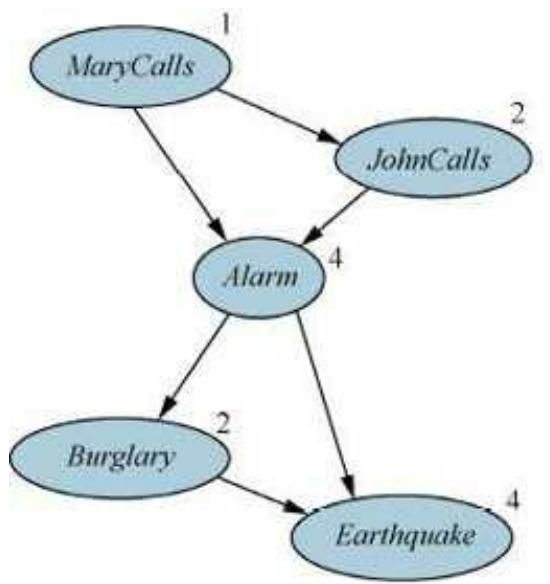

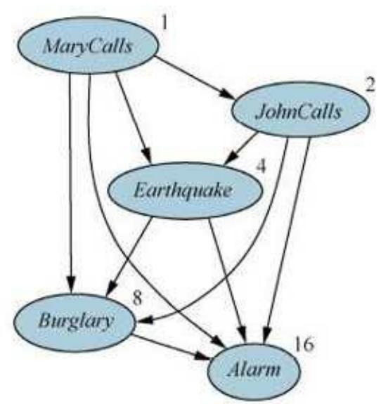  
  
图13-3 网络结构和参数个数取决于变量的引入顺序。（a）依照顺序 M 、 J 、 A 、 B 、 E 得到的结构。（b）依照顺序 M 、 J 、 E 、 B 、 A 得到的结构。每个节点都标记了所需参数的个数，（a）共需13个参数，（b）共需31个参数，而在图13-2中，只需10个参数

得到的网络比图13-2中原始网络多了两条链路，并且需要13个条件概率而非10个。更糟糕的是，一些链路表示的关系十分脆弱，对它们的概率判断困难且不自然，例如给定 Burglary和Alarm 时，评估Earthquake的概率。这种现象相当普遍，它与12.5.1节介绍的 因果 （causal）模型与 诊断（diagnostic）模型的区别有关（也可见习题13.WUMD）。如果我们坚持使用因果模型，则最终需要指定的数值更少，并且数值通常会更容易得到。 例如，在医疗领域，特韦尔斯基和卡内曼（Tversky andKahneman, 1982）指出，专家医生更喜欢对因果规则而不是诊断规则给出概率判断。13.5节将更深入地探讨因果模型的概念。

图13-3b给出了一种非常差的节点顺序： MaryCalls 、 JohnCalls 、 Earthquake 、 Burglary 、 Alarm。这个网络需要指定31个不同的概率——其数量与完全联合分布完全相同。但我们要意识到重要的一点：这3种网络中的任何一种都可以表示 完全相同的联合分布 。图13-3中的两个版本没有表明所有的条件独立性关系，因此最终指定了许多不必要的数值。

# 13.2.1 贝叶斯网络中的条件独立性关系

根据式（13-2）中定义的贝叶斯网络的语义，我们可以推导出一些条件独立性的性质。我们已经看到过这样的一个性质：给定父节点，一个变量条件独立于它的其他前驱变量。我们也可以证明更一般的“非子孙”性质：

给定父节点，每个变量条件独立于它的非 子孙 （descendant）节点。

例如，在图13-2中，给定 Alarm 的值，变量 Johncalls 独立于 Burglary 、 Earthquake 和 MaryCalls。其定义如图13-4a所示。

结果表明，将网络参数 解释为条件概率 ，再结合非子孙性质，足以重构式（13-2）给出的完全联合分布。换句话说，我们可以用另一种方式来看待贝叶斯网络的语义：网络定义了一个条件独立性性质的集合，而不是将完全联合分布定义为条件分布的乘积。完全联合分布也可以由这些性质推导得出。

另一个重要的独立性性质蕴含在非子孙性质中：

给定一个变量的父节点、子节点和子节点的父节点，即给定它的 马尔可夫毯 （Markovblanket），其条件独立于网络中所有其他节点。

（习题13.MARB要求你证明这一点。）例如，给定 Alarm 和 Earthquake ，变量 Burglary 独立于

JohnCalls 和 MaryCalls 。图13-4b说明了这个性质。正如我们将在13.4.2节中解释的那样，马尔可夫毯的性质使得使用完全局部随机采样过程和分布式随机采样过程的推断算法成为可能。

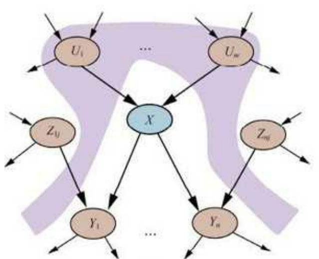

  
  
图13-4（a）给定父节点（浅紫色区域中所示的U ），节点X条件独立于它的非子孙节点（例如， Z ij）。（b）给定它的马尔可夫毯（浅紫色区域），节点 X 条件独立于网络中的所有其他节点

在处理贝叶斯网络时，人们通常会对条件独立性有这样的问题：给定第三个集合 $\mathbf { Z }$ ，节点集合X是否条件独立于另一个集合 Y。这个问题可以通过检查贝叶斯网络的集合 Z是否d分离 （d-separate）集合 $\pmb { X }$ 和 Y来高效地确定。其具体过程如下。

（1）只考虑包含 X 、 Y 、 Z 和它们祖先的 祖先子图 （ancestral subgraph）。  
（2）在共享公共子节点的任何无链路相连的节点对之间添加链路；我们有了所谓的道德图（moral graph）。  
（3）用无向链路替换所有有向链路。  
（4）在得到的图中，如果Z阻塞了所有 $\pmb { X }$ 和Y之间的路径，则Zd 分离 $\pmb { X }$ 和Y。那样的话，给定 $\mathbf { Z }$ 时， X将条件独立于 Y。否则，原始贝叶斯网络不要求条件独立性。

简而言之，d 分离意味着在无向的、道德的、祖先子图中分离。将这个定义应用到图13-2中的入室盗窃网络中，我们可以推断出 Burglary 和 Earthquake 在给定空集的情况下独立（也就是说，它们绝对独立）；它们 无须 在给定 Alarm 时条件独立；在给定 Alarm 时， JohnCalls 和 MaryCalls 条件独立。注意，马尔可夫毯性质直接遵循 d 分离性质，因为一个变量的马尔可夫毯将它与其他所有变量 $d$ 分离。

# 13.2.2 条件分布的高效表示

即使最大父节点的数量 $k$ 很小，为一个节点填充条件概率表也需要O (2 k)个数值，并且可能需要我们对所有可能的条件事件有大量的经验。事实上，这是最坏的情况，父节点和子节点之间的关系是完全任意的。通常，这种关系可以通过符合某种标准模式的正则分布 （canonicaldistribution）来描述。在这种情况下，我们可以通过命名使用的模式并提供一些参数来指定完整的表。

最简单的例子是 确定性节点 （deterministicnode）。确定性节点的值完全由其父节点的值指定，没有任何不确定性。这种关系可以是逻辑关系，例如，父节点 Canadian、US、Mexican 与子节点NorthAmerican 的关系为子节点是父节点的析取。这种关系也可以是数值关系，例如，汽车的BestPrice是区域内每个经销商的最低价格，年末水库中的WaterStored 是原始水量加上流入量（河流、径流、降水）减去流出量（放水、蒸发、渗漏）。

许多贝叶斯网络系统允许用户使用通用编程语言来指定确定性函数；这使得在概率模型中包含诸如

全球气候模型或电网模拟器等复杂元素成为可能。

另一个在实践中经常出现的重要模式是特定于上下文的独立性 （context-specificindependence，CSI）。如果给定其他变量的 某些值 ，一个变量条件独立于它的一些父节点，则这个条件分布存在CSI。例如，假设你的汽车在一段给定时间内的 Damage 依赖于汽车的 Ruggedness ，以及在这段时间内是否发生了 Accident 。显然，如果 Accident 为假，则 Damage 并不依赖于汽车的 Ruggedness。（汽车的漆面或车窗可能会被人为破坏，但我们认为所有的汽车都会受到同等的破坏。）我们称给定 Accident = false， Damage 特定于上下文独立于 Ruggedness 。贝叶斯网络系统通常使用if-then-else语法来指定条件分布以实现CSI，例如，我们可以将其写作

$$
\begin{array}{r l} \boldsymbol {P} (\text {D a m a g e} | \text {R u g g e d n e s s}, \text {A c c i d e n t}) = & \\ & \text {i f (A c c i d e n t} = \text {f a l s e)} \text {t h e n} d _ {1} \text {e l s e} d _ {2} (\text {R u g g e d n e s s}) \end{array}
$$

其中d 和 d 表示任意的分布。与确定性的情况一样，网络中存在的CSI有利于高效的推断。我们可以对13.3节中将提到的所有推断算法进行修改，以利用CSI来加速计算。

不确定关系通常可以利用所谓的噪声（noisy） 逻辑关系来刻画。其中一个典型的例子是噪声或（noisy-OR）关系，它是逻辑或的推广。在命题逻辑中，当且仅当 Cold 、 Flu 或 Malaria 为真时，我们说 Fever为真。噪声或模型为每个父节点导致子节点为真的能力引入了不确定性，父节点与子节点之间的因果关系可能会被抑制 ，因此病人可能感冒，但可能不发烧。

该模型做了两个假设。首先，假设所有可能的原因都被列出。［如果遗漏了一些原因，我们总是增加一个所谓的 遗漏节点 （leak node）来涵盖“其他原因”］。其次，它假设每个父节点受到的抑制独立于其他父节点受到的抑制，例如，无论什么原因抑制了 Malaria 引起发烧，它都独立于其他的抑制Flu 引起发烧的原因。在这两个假设下，Fever为假当且仅当它所有为真的父节点都被抑制，这个概率是它的每个父节点被抑制的概率 q j的乘积。假设这些个体抑制概率如下：

$$
q _ {\text {c o l d}} = P (\neg f e v e r \mid c o l d, \neg f l u, \neg m a l a r i a) = 0. 6
$$

$$
q _ {\mathrm {f l u}} = P (\neg \text {f e v e r} | \neg \text {c o l d}, f l u, \neg \text {m a l a r i a}) = 0. 2
$$

$$
q _ {\text {m a l a r i a}} = P (\neg \text {f e v e r} | \neg \text {c o l d}, \neg \text {f l u}, \text {m a l a r i a}) = 0. 1
$$

根据这些信息和噪声或假设，我们可以构建完整的条件概率表：

$$
P \left(x _ {i} \mid p a r e n t s \left(X _ {i}\right)\right) = 1 - \prod_ {\{j; X _ {j} = \text {t r u e} \}} q _ {j}
$$

其中的乘积是条件概率表中那一行中值为真的父节点的乘积。图13-5展示了这种计算。

<table><tr><td>Cold</td><td>Flu</td><td>Malaria</td><td>P(fever|·)</td><td>P(-fever|·)</td></tr><tr><td>f</td><td>f</td><td>f</td><td>0.0</td><td>1.0</td></tr><tr><td>f</td><td>f</td><td>t</td><td>0.9</td><td>0.1</td></tr><tr><td>f</td><td>t</td><td>f</td><td>0.8</td><td>0.2</td></tr><tr><td>f</td><td>t</td><td>t</td><td>0.98</td><td>0.02=0.2×0.1</td></tr><tr><td>t</td><td>f</td><td>f</td><td>0.4</td><td>0.6</td></tr><tr><td>t</td><td>f</td><td>t</td><td>0.94</td><td>0.06=0.6×0.1</td></tr><tr><td>t</td><td>t</td><td>f</td><td>0.88</td><td>0.12=0.6×0.2</td></tr><tr><td>t</td><td>t</td><td>t</td><td>0.988</td><td>0.012=0.6×0.2×0.1</td></tr></table>

图13-5 的完整条件概率表，假设噪声或模型使用的3个 $q$ 值用粗体

# 表示

通常，一个依赖于k个父节点的变量的噪声逻辑关系可以用O (k)个参数而非 O (2 k)来描述完全条件概率表，这使得评估和学习更加容易。例如，CPCS网络（Pradhanetal. ,1994）使用噪声或和噪声最大分布对疾病和症状之间的关系建模。对于含有448个节点和906条链路的具有完全条件概率表的网络，它只需要8254个参数，而不是133 931 430个参数。

# 13.2.3 连续变量的贝叶斯网络

许多真实世界的问题涉及连续值，例如高度、质量、温度和金钱。根据定义，连续变量有无限多个可能的值，因此明确地为每个值指定条件概率是不可能的。处理连续变量的一种方法是离散化（discretization），也就是说，将可能值划分成固定区间的集合。例如，温度可以分为3类：（）、（0～100℃）和（ ）。在选择类别数量时，我们需要在准确率损失和可能导致运行时间慢的庞大条件概率表之间进行权衡。

另一种方法是使用一族标准的概率密度函数来定义连续变量（见附录A）。例如，指定高斯（或正态）分布 只需要两个参数，即均值 $\pmb { \mu }$ 和方差 $\pmb { \sigma }$ 。我们还可以使用一种被称为 非参数 （nonparametric）表示的解决方法，用一组实例隐式地定义条件分布，其中每个实例都包含父变量和子变量的特定值。我们将在第19章中进一步探讨这种方法。

同时具有离散变量和连续变量的网络称为混合贝叶斯网络 （hybrid Bayesian network）。要指定混合网络，我们必须指定两种新的分布：给定离散或连续父节点的连续变量的条件分布；以及给定连续父节点的离散变量的条件分布。考虑图13-6中的简单例子，顾客根据水果的价格购买一些水果，而价格又取决于收成（harvest）数目和政府的补贴（subsidy）政策是否在进行。变量Cost是连续的，它的父节点既有连续的也有离散的；变量 Buys 是离散的，且它有一个连续的父节点。

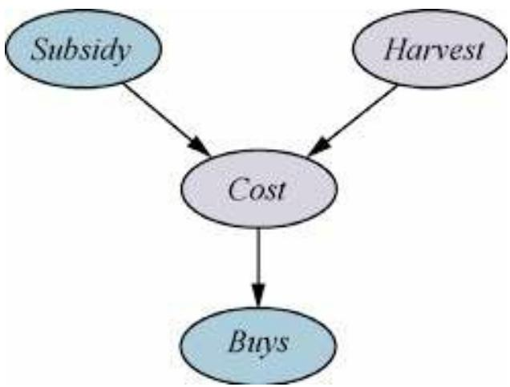  
图13-6 具有离散变量（ Subsidy 和 Buys ）和连续变量（ Harvest 和 Cost ）的一个简单网络

在处理变量 Cost 时，我们需要指定 。对于离散的父节点，我们将通过枚举的方式处理，也就是说，同时指定 和。而为了处理连续的 Harvest ，我们将指定价格 c 的分布如何依赖于 Harvest的连续值h 。换句话说，我们将价格分布的参数指定为h 的函数。对于该函数，最常见的选择是线性高斯 （linear-Gaussian）条件分布，其中子节点具有高斯分布，且均值 $\pmb { \mu }$ 随着父节点的值线性变化，标准差 $\pmb { \sigma }$ 固定。考虑到 subsidy 与 ，我们需要两组不同的参数及分布：

$$
\begin{array}{l} P (c \mid h, s u b s i d y) = \mathcal {N} \left(c; a _ {t} h + b _ {t}, \sigma_ {t} ^ {2}\right) = \frac {1}{\sigma_ {t} \sqrt {2 \pi}} e ^ {- \frac {1}{2} \left(\frac {c - \left(a _ {t} h + b _ {t}\right)}{\sigma_ {t}}\right) ^ {2}} \\ P (c \mid h, \neg s u b s i d y) = \mathcal {N} \left(c; a _ {f} h + b _ {f}, \sigma_ {f} ^ {2}\right) = \frac {1}{\sigma_ {f} \sqrt {2 \pi}} e ^ {- \frac {1}{2} \left(\frac {c - \left(a _ {f} h + b _ {f}\right)}{\sigma_ {f}}\right) ^ {2}} \\ \end{array}
$$

在这个例子中， Cost 的条件分布通过命名线性高斯分布并提供参数 a t、 b t、 、 a f、 b f与得以指定。图13-7a与图13-7b表明了这两种关系。注意，在每种情况下，c相对于h 的斜率都是负的，因为价格随着收成的增加而下降。（当然，线性的假设意味着价格在某一点会变为负值；线性模型只有当收成被限制在一个狭窄的范围内时才是合理的。）图13-7c给出了分布 ，其中Subsidy的两个可能的值各有0.5的先验概率。该例子表明，即便是非常简单的模型，也可以表示相当有趣的分布。

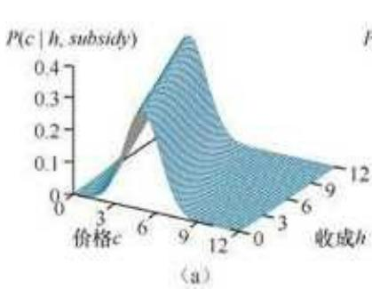

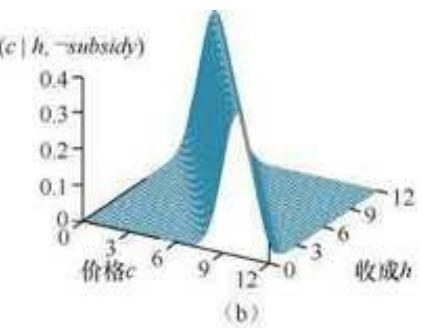

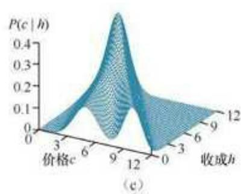  
图13-7（a）和（b）分别显示了Subsidy为真与假时，Cost作为Harvest的函数的概率分布。（c）所示为 ，它由Subsidy两种情况的概率求和得到

线性高斯条件分布具有一些特殊的性质。只包含线性高斯分布的连续变量的网络在所有变量上的联合分布也是多元高斯分布（见附录A，习题13.LGEX）。并且变量在给定任何证据后的后验分布也具有这个性质[1] 。因此，当我们增加离散变量作为连续变量的父节点（不是子节点）时，网络定义了一个条件高斯 （conditionalGaussian，CG）分布：对离散变量给定任意值，连续变量的分布是多元高斯分布。

[1]因此，线性高斯网络的推断在最坏情况下只需要O (n 3)的时间，与网络的拓扑结构无关。我们将在13.3节看到，离散变量网络的推断是NP困难的。

现在我们转而考虑具有连续父节点的离散变量的分布，例如图13-6中的Buys节点。我们似乎可以合理地假设：如果价格低，顾客就会购买；如果价格高，顾客就不会购买；若价格处于某个中间区域，购买的概率会平稳变化。换句话说，条件分布表现得像一个“软”阈值函数。一种构造软阈值的方式是使用标准正态分布的积分：

$$
\Phi (x) = \int_ {- \infty} ^ {x} \mathcal {N} (s; 0, 1) d s
$$

是 x 的增函数，但购买的概率随着价格增加而降低，所以我们需要对函数进行翻转： $x$

$$
P (b u y s \mid C o s t = c) = 1 - \Phi ((c - \mu) / \sigma)
$$

这意味着价格阈值出现在 $\pmb { \mu }$ 附近，阈值区间的宽度正比于 $\pmb { \sigma }$ ，购买的概率随着价格上涨而降低。该 概率单位 （probit，读作“pro-bit”，是“probability unit”的缩写）模型如图13-8a所示。我们可以从如下角度确认这种软阈值形式的合理性：我们认为潜在的决策过程具有某种硬阈值，但是该阈值的

精确位置受到随机高斯噪声的影响。

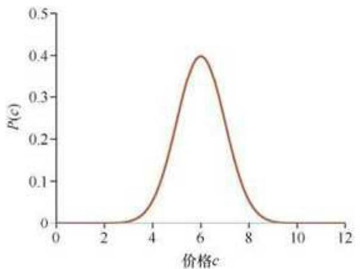

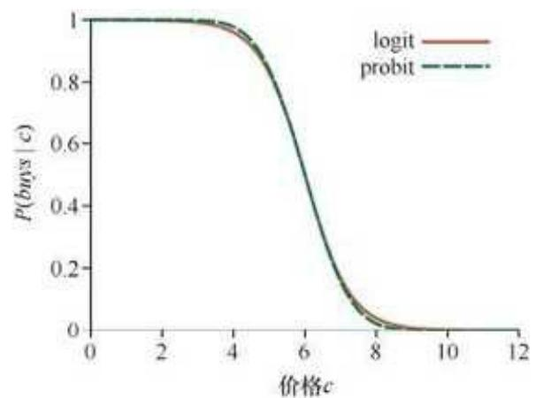  
  
图13-8 （a）价格阈值的正态（高斯）分布，它以 $\mu = 8 . 0$ 为中心，标准差 $\sigma = 1 . 0$ 。（b）给定cost 时 buys 概率的expit模型与概率单位模型，其中参数 、 $\mu = 6 . 0$ $\sigma = 1 . 0$

概率单位模型的另一种选择是使用 expit 或 逆logit 模型。它使用 逻辑斯谛函数 （logisticfunction） $1 / ( 1 + e ^ { - x } )$ 生成软阈值——它将 $x$ 的任意值映射到0与1之间。在我们的例子中，仍需对它进行变换以得到一个递减函数。我们还将指数缩放 $4 / \sqrt { 2 \pi }$ 倍来匹配概率单位在均值处的斜率：

$$
P (b u y s \mid C o s t = c) = 1 - \frac {1}{1 + e ^ {- \frac {4}{\sqrt {2 \pi}} \cdot \frac {c - \mu}{\sigma}}}
$$

图13-8b展示了这两个分布。它们看起来十分相似，但logit事实上“尾部”更长。概率单位通常更适合实际场景，但逻辑斯谛函数有时在数学上更容易处理，因此在机器学习中有着广泛的应用。这两种模型都可以通过父节点值的线性组合来处理多个连续父节点。这也适用于离散父节点的值是整数的情况。例如，对于k个布尔父节点，每个父节点都可以视为取值0或1，expit或概率单位分布的输入将是一个带有 $k$ 个参数的加权线性组合，得到一个与前面讨论的噪声或模型非常相似的模型。

# 13.2.4 案例研究：汽车保险

汽车保险公司接收来自个人给特定车辆的投保申请，公司必须基于预期支付给该申请人的索赔决定收取适当的年度保险费。具体需要完成的任务是建立一个贝叶斯网络以捕捉域的因果结构，并根据给定申请表中可用的证据，给出输出变量准确的、良好校准的分布。[2] 贝叶斯网络将包含既不是输入变量，也不是输出变量，但对于构建网络必不可少的隐变量 （hidden variable），它将使得网络具有合理的稀疏性以及可管理的参数数量。隐变量在图13-9中用棕色阴影表示。

[2]图13-9所示的网络并不是实际中真正使用的，但其结构已经被保险专家审查过了。实际上，申请表上要求提供的信息因公司和司法管辖区而异，例如，有些公司要求用户提供Gender（性别），因此这个模型肯定可以会做得更详细更复杂。

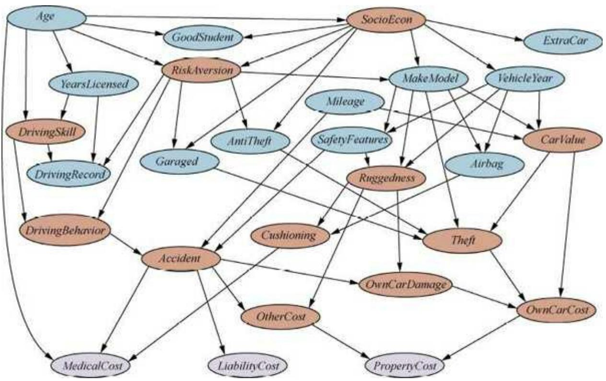  
图13-9用于评估汽车保险申请的贝叶斯网络

索赔有3种（图13-9中的淡紫色节点）形式：申请人所受的任何身体伤害的医疗费用 MedicalCost，其他当事人对申请人和公司提起的诉讼的责任成本LiabilityCost，对任何一方的车辆损坏和失窃的财产损失 PropertyCost。申请表要求用户提供以下信息（图13-9中的浅蓝色节点）。

● 关于申请人： Age （年龄）； YearsLicensed （驾龄，首次获得驾驶执照至今的时间）；DrivingRecord （驾驶记录，可能是基于最近的事故和交通违规扣分的一些总结）； GoodStudent（对于学生，在4分制的评价体系中，平均绩点为3.0即B级的学生被认为是好学生）。  
●关于车辆： MakeModel（品牌及型号）与 VehicleYear（制造年份）； Airbag （是否有气囊）；SafetyFeatures（一些安全特性的总结，如防震刹车系统和碰撞警告）。  
●关于驾驶情况： Mileage（年度驾驶里程）和 Garaged（如果有车库，车辆停放在车库的安全性）。

现在我们需要考虑如何将这些信息排列成一个因果结构，其中关键的隐变量是下一个时间段是否会发生Theft或Accident。显然，保险公司不能要求申请人预测这些；这些只能从现有的信息和保险公司以前的经验中进行推断。

导致Theft的原因有哪些？ MakeModel当然很重要——有些车型被盗的频率比其他车型高得多，因为针对它们有高效的汽车和零部件倒卖市场。 CarValue也很重要，因为一辆老的、破旧的或者里程数高的汽车转售价值较低。此外，Garaged （停在车库）和配有 AntiTheft设备的车辆更不容易被偷盗。隐变量 CarValue 依次依赖于 MakeModel 、 VehicleYear 与 Mileage 。 CarValue 也决定了Theft发生时的损失金额，这是OwnCarCost的一个贡献者（另一个是事故，我们很快会讲到）。

这类模型通常会引入另一个隐变量 SocioEcon，即申请人的社会经济类别，它被认为会影响很多行


为和特征。在我们的模型中，没有已观测到的收入和职业变量形式的 直接 证据 ，但SocioEcon 会影响 MakeModel 与 VehicleYear ，也会影响 ExtraCar 与 GoodStudent ，并且在一定程度上依赖于 A ge 。

对任何保险公司来说，最重要的隐变量或许是 RiskAversion ：规避风险的人是很好的保险风险！

Age 与 SocioEcon 影响 RiskAversion ， RiskAversion 的“症状”包括申请人的车辆是否 Garaged 、是否配备 AntiTheft 设备和 SafetyFeatur es 。

在预测未来事故时，最关键的因素是申请人的未来 DrivingBehavior ，它同时被 RiskAversion 与DrivingSkill 影响，后者则取决于 Age 与 YearsLicensed 。申请人过去的驾驶行为反映在DrivingRecord ，这也依赖于 RiskAversion 、 DrivingSkill 与 YearsLicensed （因为最近才开始开车的人可能没有时间积累一连串的交通事故和违章行为）。通过这种方式， DrivingRecord 为RiskAversion 与 DrivingSkill 提供证据，它们又帮助预测未来的 DrivingBehavi or 。

我们可以认为DrivingBehavior是驾驶员在每公里的行驶中以易发生事故的方式行驶的倾向；在一个固定的时间段内，是否发生 Accident 还依赖于年度的 Mileage 和车辆的 SafetyFeatures 。如果Accident 发生，则有3种代价：申请人的 MedicalCost ，它依赖于 Age 和 Cushioning （缓冲），Cushioning 又依赖车辆的 Ruggedness （坚固性）和是否有 Airbag ；另一个司机的 LiabilityCost（医疗、痛苦和折磨、收入损失等）；申请人和另一个司机的 PropertyCost ，都（以不同的方式）依赖车辆的 Ruggedness 和申请人的 CarVal ue 。

我们已经通过贝叶斯网络的拓扑和隐变量展示了这种推理过程，我们还需为每个变量指定值域和条件分布。在值域方面，我们主要需要确定变量是离散的还是连续的。例如，车辆的 Ruggedness 可以是0到1之间的连续变量，也可以是值域为 的离散变量。

连续变量可以提供更高的精度，但是除了在一些特殊情况下，对连续变量的精确推断是不可能的。一个具有许多可能的值的离散变量会使得填写相应的巨大条件概率表变得单调乏味，并且使精确推断复杂性更高（除非该变量的值总是被观测到的）。例如，真实系统的 MakeModel会有数千种可能的值，这导致它的子节点CarValue有着需要从行业数据库填写的庞大条件概率表。但是，因为MakeModel总是能被观测到，因此庞大的规模不会带来推断的复杂性：事实上，3个父节点的观测值就可以恰好选出 CarValue的条件概率表的一行。

模型的条件分布在本书的代码库中给出；我们提供了仅包含离散变量的版本，可以对其进行精确推断。实际上，许多变量是连续的，并且它们的条件分布可从有关申请人及其保险索赔的历史数据中学习得到。我们将在第20章中了解如何从数据中学习贝叶斯网络模型。

最后我们要解决的问题是如何在网络中进行推断以做出预测，我们接下来将要考虑这个问题。对于描述的每种推断方法，我们将在保险网络上评估该方法，以衡量时间和空间需求。

# 13.3 贝叶斯网络中的精确推断

任何概率推理系统的基本任务都是给定一些观测到的 事件 （event）——通常是一组 证据变量（evidence variable）的赋值，计算一组 查询变量 （query variable）的后验概率分布 [1] 。为了简化表示，我们每次只考虑一个查询变量；很多方法可以很容易地扩展到具有多个变量的查询。（例如，我们可以通过 $P ( V \vert e )$ 乘 $P ( U | \mathcal { V } , e )$ 求解查询 $P ( U , V | e )$ ）。我们将沿用第12章的记号： $X$ 代表查询变量； $\pmb { E }$ 代表证据变量 $E _ { 1 } , . . . , E _ { m }$ 的集合， e 是一个特定的观测事件； Y 代表隐（非证据、非查询）变量 。因此，完整的变量集合是 。一个典型的查询是求后验概率分布 $P ( X \mid e )$ 。

[1]另一个被广泛研究的任务是为一些观测到的证据找到最概然解释 （mostprobableexplanation）。它和其他任务将在本章末尾的参考文献与历史注释中进行讨论。

在入室盗窃网络中，我们可能观测到事件JohnCalls $=$ true和 MaryCalls = true。然后我们需要计算发生入室盗窃的概率：

$$
P (B u r g l a r y \mid J o h n C a l l s = \text {t r u e}, M a r y C a l l s = \text {t r u e}) = \langle 0. 2 8 4, 0. 7 1 6 \rangle
$$

在本节中，我们将讨论用于计算后验概率的精确算法及其复杂性。事实证明，一般情况是难以处理的，所以我们将在13.4节中介绍近似推断的方法。

# 13.3.1 通过枚举进行推断

我们在第12章中解释了，任何条件概率都可以通过对完全联合分布的项求和来计算。更具体地说，利用式（12-9）可以求解查询 $P ( X \mid e )$ 。为了方便起见，我们在此重述一遍：

$$
\boldsymbol {P} (X \mid \boldsymbol {e}) = \alpha \boldsymbol {P} (X, \boldsymbol {e}) = \alpha \sum_ {\boldsymbol {y}} \boldsymbol {P} (X, \boldsymbol {e}, \boldsymbol {y})
$$

现在，贝叶斯网络已经给出了完全联合分布的一个完整表示。更具体地说，13.2节的式（13-2）表明联合分布中的项 可以写作网络中条件概率的乘积。因此，我们可以通过计算贝叶 $P ( x , e , y )$ 斯网络中条件概率的乘积之和回答查询。

考虑查询 $=$ 。这个查询的隐变量是 Earthquake 与 Alarm 。我们使用变量首字母来简写表达式，根据式（12-9），我们有

$$
\boldsymbol {P} (B \mid j, m) = \alpha \boldsymbol {P} (B, j, m) = \alpha \sum_ {e} \sum_ {a} \boldsymbol {P} (B, j, m, e, a)
$$

贝叶斯网络的语义［式（13-2）］给了我们使用条件概率表表项的表达式。为了简便起见，我们仅考虑 Burglary $=$ true：

$$
P (b \mid j, m) = a \sum_ {e} \sum_ {a} P (b) P (e) P (a \mid b, e) P (j \mid a) P (m \mid a) \tag {13-4}
$$

要计算这个表达式，我们必须对4项进行求和，每一项都是通过5个数相乘计算得到。在最坏的情况下，我们需要对几乎所有的变量求和，那么求和式中将有 $a ( 2 ^ { n } )$ 项，每一项都是 个概率值的乘积。因此，直接实现的复杂性是 。

利用计算的嵌套结构，可以将其复杂性简化为 。这意味着对于类似式（13-4）的表达式，要尽可能地将求和向内移动。我们可以这样做，因为不是所有的概率乘积的因子都取决于所有的变

量。因此我们有

$$
P (b \mid j, m) = \alpha P (b) \sum_ {e} P (e) \sum_ {e} P (a \mid b, e) P (j \mid a) P (m \mid a) \tag {13-5}
$$

这个表达式可以通过依次循环遍历变量，并在循环时乘以条件概率表表项来计算。对于每个求和，我们还需要对变量的可能的值进行循环。这个计算的结构如图13-10所示的树。利用图13-2中的数值，我们得到 。对于 ，相应的计算得到。因此，

$$
\boldsymbol {P} (B \mid j, m) = \alpha \langle 0. 0 0 0 5 9 2 2 4, 0. 0 0 1 4 9 1 9 \rangle \approx \langle 0. 2 8 4, 0. 7 1 6 \rangle
$$

也就是说，在两个邻居都打电话的情况下，发生入室盗窃的概率大约是 $2 8 \%$ 。

图13-11中的Enumeration -A sk 算法使用深度优先、从左到右的递归方法计算这些表达式树。该算法在结构上与求解CSP的回溯算法（图6-5）和可满足性的DPLL算法（图7-17）非常相似。它的空间复杂性对于变量的数量只是线性的：算法在甚至没有明确构造完全联合分布的情况下对它求和。遗憾的是，对于含有 $n$ 个布尔变量（不计数证据变量）的网络，它的时间复杂性总是O (2 n)—优于前面描述的简单方法的O (n 2 n)，但仍然相当可怕。对于图13-9中所示的相对较小的保险网络，如果要实现典型的关于价格变量的查询，使用枚举进行精确推断需要大约2.27亿次计算。

但是，如果仔细查看图13-10中的树，我们可以发现它包含了大量重复的子表达式。乘积

$P ( j | \ a ) P ( m | \ a ) _ { j | } P ( j | \neg a ) P ( m | \neg a )$ 都分别计算了两次，每次针对 E 的一个不同的值。在贝叶斯网络中进行高效推断的关键是避免这种计算浪费。我们将在下一节中介绍避免这种计算浪费的一般方法。

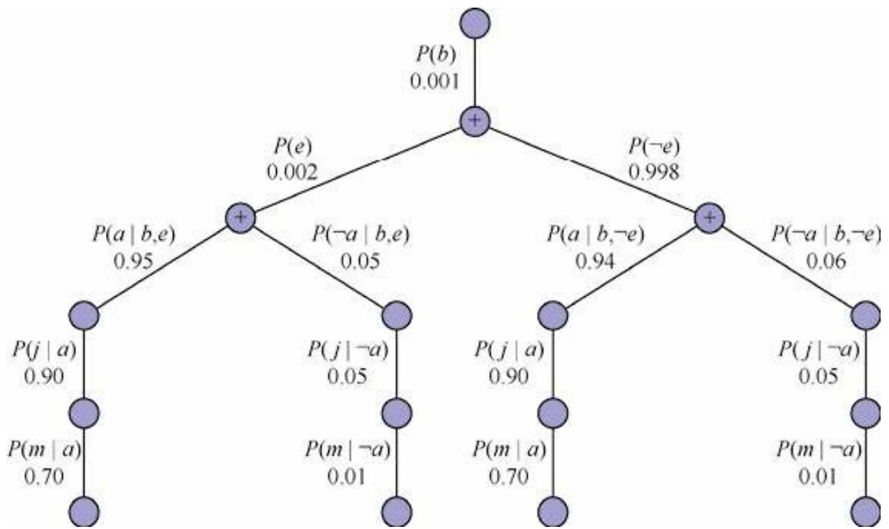  
图13-10 式（13-5）所示表达式的结构。计算过程自顶向下，沿着每条路径将值相乘，并在“+”节点上求和。注意 $j$ 和 $m$ 的路径重复

function ENUMERATION-AsK(X,e,bn）returnsX的分布

inputs: $X .$ ，查询变量

e 变量 $\pmb { \mathscr { E } }$ 的观测值

bn，含有变量vars的贝叶斯网络

$Q ( X )  X$ 的分布，初始为空

forX的每个值xdo

$$
Q \left(x _ {i}\right) \leftarrow E N U M E R A T E - A L L \left(\text {v a r s}, e _ {x _ {i}}\right)
$$

其中 $e _ { x _ { i } }$ 是e在 $X = x _ { i }$ 的扩展

return NORMALIZE(Q（X))

function ENUMERATE-ALL(vars,e)returns-个实数

ifEMPTY?（vars）then return1.0

$$
V \leftarrow \text {F I R S T} (v a r s)
$$

ifV是一个值v在e中的证据变量

$$
\text {t h e n} P (v \mid p a r e n t s (V)) \times \text {E N U M E R A T E - A L L} (\text {R E S T} (v a r s), e)
$$

$$
e l s e \operatorname {r e t u r n} \sum_ {v} P (v | p a r e n t s (V)) \times E N U M E R A T E - A L L (R E S T (v a r s), e _ {v})
$$

其中e是e在 $V = \nu$ 的扩展

图13-11贝叶斯网络精确推断的枚举算法

# 13.3.2 变量消元算法

通过消除图13-10所示的那种重复计算，枚举算法可以得到极大的改进。其中的想法很简单：在计算一次之后保存结果供后续使用。这是动态规划的一种形式。该方法有若干种版本，我们介绍其中最简单的变量消元 （variableelimination）算法。变量消元通过从右到左 的顺序（也就是图13-10中自底向上）计算如式（13-5）的表达式，在计算过程中存储中间结果，对每个变量的求和只计算依赖该变量的部分。

让我们以入室盗窃网络为例展示这个过程。我们要计算表达式：

$$
\boldsymbol {P} (B | j, m) = \alpha \underbrace {\boldsymbol {P} (B)} _ {f _ {1} (B)} \sum_ {e} \underbrace {P (e)} _ {f _ {2} (E)} \sum_ {a} \underbrace {\boldsymbol {P} (a | B , e)} _ {f _ {3} (A, B, E)} \underbrace {P (j | a)} _ {f _ {4} (A)} \underbrace {P (m | a)} _ {f _ {5} (A)}
$$

注意，我们已经用对应的因子 （factor）的名称标记了表达式的每个部分；每个因子是一个由其参数变量的值为索引的矩阵。例如，对应 $P ( j \mid a )$ 和 $P ( m \mid a )$ 的因子 $f _ { 4 } ( A )$ 和 $\pmb { f } _ { 5 } ( A )$ 只依赖 A，因为查询已经固定了 $J$ 和 $M$ 。因此，它们是二元向量：

$$
\boldsymbol {f} _ {4} (A) = \left( \begin{array}{l} P (j | a) \\ P (j | - a) \end{array} \right) = \left( \begin{array}{l} 0. 9 0 \\ 0. 0 5 \end{array} \right) \quad \quad \quad \boldsymbol {f} _ {5} (A) = \left( \begin{array}{l} P (m | a) \\ P (m | - a) \end{array} \right) = \left( \begin{array}{l} 0. 7 0 \\ 0. 0 1 \end{array} \right)
$$

${ f _ { 3 } } ( A , B , E )$ 是一个 $2 \times 2 \times 2$ 的矩阵，它难以在纸面上展示。（“第一个”元素是

$P ( a \mid b , e ) = 0 . 9 5$ ，“最后一个”元素是 $P ( \cdot , a \vert \cdot , b , - e ) = 0 . 9 9 9$ 。）使用这些因子，我们可以将查询表达式写作

$$
P (B \mid j, m) = \alpha f _ {1} (B) \times \sum_ {e} f _ {2} (E) \times \sum_ {a} f _ {3} (A, B, E) \times f _ {4} (A) \times f _ {5} (A)
$$

这里“×”算子不是普通的矩阵乘积，而是 逐点乘积 （pointwiseproduct）算子，我们会在后续部分介绍。

计算过程根据各因子的逐点乘积（从右到左）对变量求和消元得到新因子，最后生成包含解的因子，也就是查询变量的后验分布。步骤如下。

● 首先，我们从 f 3、 f 4和 f 5的乘积中求和消元 A 。这给了我们一个新的 $2 \times 2$ 因子 ${ f _ { 6 } } ( B , E )$ ，其索引范围是 B与E：

$$
\begin{array}{l} f _ {6} (B, E) = \sum_ {a} f _ {3} (A, B, E) \times f _ {4} (A) \times f _ {5} (A) \\ = \left(f _ {3} (a, B, E) \times f _ {4} (a) \times f _ {5} (a)\right) + \left(f _ {3} (- a, B, E) \times f _ {4} (- a) \times f _ {5} (- a)\right) \\ \end{array}
$$

现在剩下表达式

$$
P (B | j, m) = \alpha f _ {1} (B) \times \sum_ {e} f _ {2} (E) \times f _ {6} (B, E)
$$

● 然后，我们从 $\pmb { f } _ { 2 }$ 和 $f _ { 6 }$ 的乘积中求和消元 $E$ ：

$$
\begin{array}{l} f _ {7} (B) = \sum_ {e} f _ {2} (E) \times f _ {6} (B, E) \\ = f _ {2} (e) \times f _ {6} (B, e) + f _ {2} (\neg e) \times f _ {6} (B, \neg e) \\ \end{array}
$$

剩下表达式

$$
\boldsymbol {P} (B \mid j, m) = \alpha \boldsymbol {f} _ {1} (B) \times \boldsymbol {f} _ {7} (B)
$$

这个表达式可以通过求逐点乘积并将结果归一化来计算。

检查这个计算过程，我们看到需要两个基本的计算操作：求两个因子的逐点乘积，以及从因子的乘积中求和消元一个变量。接下来“因子上的操作”小节将介绍这些操作。

# 1. 因子上的操作

两个因子 $\pmb { f }$ 与 $\pmb { g }$ 的逐点乘积生成了一个新因子 $\pmb { h }$ ，它的变量是 $\boldsymbol { f }$ 与 $\pmb { g }$ 中变量的并集，元素由这两个因子中相应元素的乘积给出。假设这两个因子的公共变量是 $\mathbf { Y _ { 1 3 } }$ $\pmb { Y _ { k } }$ 。则我们有

$$
f (X _ {1}, \dots X _ {j}, Y _ {1}, \dots Y _ {k}) \times g (Y _ {1}, \dots Y _ {k}, Z _ {1}, \dots Z _ {\ell}) = h (X _ {1}, \dots X _ {j}, Y _ {1}, \dots Y _ {k}, Z _ {1}, \dots Z _ {\ell})
$$

如果所有变量都是二值的，则 $\pmb { f }$ 和 $\pmb { g }$ 分别有 $2 ^ { j + k }$ 和 $2 ^ { k + \ell }$ 个条目，逐点乘积有 $2 ^ { j + k + l }$ 个条目。例如，如图13-12所示，给定两个因子 $\mathcal { N } , \mathbb { N }$ 和 $\pmb { \theta } ( \pmb { Y } , \pmb { Z } )$ ，逐点乘积 $f \times g = h ( X , Y , Z )$ 有$2 ^ { 1 + 1 + 1 } = 8$ 个条目。注意，由逐点相乘得到的因子可以包含比任何被乘的因子更多的变量，并且因子的规模与变量的数量呈指数关系。这就是变量消元算法中空间复杂性和时间复杂性所在。

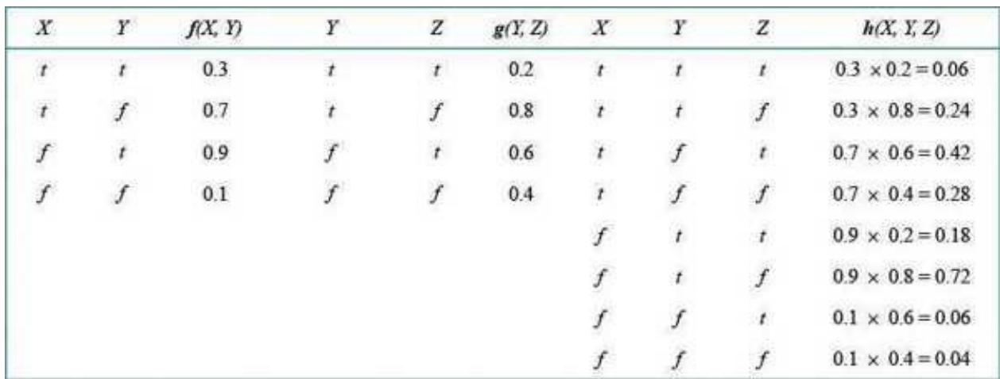  
图13-12逐点乘积示例：

从因子的乘积中求和消元一个变量是通过依次固定该变量的每个值得到的子矩阵相加来完成的。例如，为了从h(X, Y, Z)中求和消元 $X$ ，我们写作

$$
\begin{array}{l} \boldsymbol {h} _ {2} (Y, Z) = \sum_ {x} \boldsymbol {h} (x, Y, Z) + \boldsymbol {h} (- x, Y, Z) \\ = \left( \begin{array}{l l} 0. 0 6 & 0. 2 4 \\ 0. 4 2 & 0. 2 8 \end{array} \right) + \left( \begin{array}{l l} 0. 1 8 & 0. 7 2 \\ 0. 0 6 & 0. 0 4 \end{array} \right) = \left( \begin{array}{l l} 0. 2 4 & 0. 9 6 \\ 0. 4 8 & 0. 3 2 \end{array} \right) \\ \end{array}
$$

唯一需要注意的技巧是——任何不依赖于待求和消元的变量的因子都可以移到求和符号之外。例如，从 f和 g的乘积中求和消元 $X$ ，我们可以将 g 移到求和之外：

$$
\sum_ {x} f (X, Y) \times g (Y, Z) = g (Y, Z) \times \sum_ {x} f (X, Y)
$$

这可能比先计算更大的逐点乘积h再从中求和消元X更高效。

注意，直到我们需要从累加的乘积中对一个变量求和消元时，才进行矩阵相乘。那时我们只需要将那些包含待求和消元的变量的矩阵相乘。给定逐点乘积和求和消元函数，变量消元算法本身可以写得非常简单，如图13-13所示。

# 2. 变量排序和变量相关性

图13-13中的算法包含一个未描述的O rder函数来为变量选择排序。每一种排序选择都会生成一个有效的算法，但不同的排序会导致在计算过程中产生不同的中间因子。例如，在前面的例子中，我们在 $E$ 之前消元 A。如果换一种方式，计算过程将变成

$$
P (B | j, m) = \alpha f _ {1} (B) \times \sum_ {a} f _ {4} (A) \times f _ {5} (A) \times \sum_ {e} f _ {2} (E) \times f _ {3} (A, B, E)
$$

计算过程中将产生新因子 f 6 ( A , B )。

function ELIMINATION-AsK(X,e,bn)returnsX的分布

inputs: $X _ { i }$ ，查询变量

e，变量E的观测值

bn，含有变量vars的贝叶斯网络

factors

foreach Vin ORDER(vars)do

factors [MAKE-FACTOR(V,e)]+factors

ifV是个隐变量thenfactors←SUM-OuT(V,factors)

returnNORMALIZE(POINTWISE-PRODUCT(factors))

图13-13贝叶斯网络精确推断的变量消元算法

一般，变量消元的时间和空间要求是由算法运行过程中构造的最大因子的规模决定的，这又由变量的消元顺序和网络的结构决定。事实证明，确定最优排序是难以求解的问题，但我们有一些好的启发式方法。一个相当有效的方法是贪心法：消除那些使下一个被构造的因子规模最小的变量。

让我们再考虑另一个查询： 。像之前的方法一样［式（13-5）］，我们首先要写出嵌套求和式：

$$
\boldsymbol {P} (J \mid b) = \alpha P (b) \sum_ {e} P (e) \sum_ {a} P (a \mid b, e) \boldsymbol {P} (J \mid a) \sum_ {m} P (m \mid a)
$$

从右到左计算这个表达式，我们注意到一些有趣的事情：由定义，有 等于1！因此，一开始就没有必要将其包括在内，变量M与查询无关 。关于这点的另一个理解方法是：如果我们从网络中删除 MaryCalls ，查询 的结果也不会改变。一般，我们可以删除任何非查询变量或非证据变量的叶节点。在删除了它们之后，我们可能会发现更多无关的叶节点。如果反复进行这一过程，我们最终发现， 每个不是查询变量或证据变量祖先节点的变量都与查询无关。因此，变量消元算法可以在评估查询之前删除所有这类变量。

我们将它应用到图13-9的保险网络，此时变量消元法显著改进了朴素的枚举算法。使用变量的反向拓扑顺序的消元法进行精确推断比枚举算法快了大约1000倍。

# 13.3.3 精确推断的复杂性

贝叶斯网络中精确推断的复杂性高度依赖于网络的结构。图13-2的入室盗窃网络代表了一簇网络，在这族网络中，任意两个节点之间最多只有一条无向路径（即忽略箭头的方向）。这族网络叫作单连通 （singly connected）网络或者多重树 （polytree），它们有一个特别好的性质：多重树中精确推断的时间复杂性和空间复杂性与网络规模呈线性关系。这里所说的规模定义为条件概率表表项的数量；如果每个节点的父节点数量由一个常数限制，那么复杂性也与节点数量呈线性关系。这些结果适用于与网络拓扑排序一致的任何排序（习题13.VEEX）。

对于多连通 （multiply connected）网络，例如图13-9中的保险网络，即使每个节点的父节点数量有界，在最坏情况下，变量消元仍然有着指数量级的时间复杂性和空间复杂性。如果我们考虑到因为它包括命题逻辑推断作为特例，所以贝叶斯网络中的推理是NP困难的，这就不足为奇了。为了证明这一点，我们需要弄清楚如何将命题可满足性问题编码为贝叶斯网络，以便在该网络上运行推断可以告诉我们原始命题语句是否可满足。［在复杂性理论的语言中，我们将可满足性问题归约 （reduce）为贝叶斯网络推断问题］。事实证明这很简单。图13-14展示了如何编码特定的3-SAT

问题。命题变量成为网络的根变量，每个变量的先验概率为0.5。节点的下一层对应于子句，每个子句变量 $C _ { j }$ 连接到适当的变量作为父节点。子句变量的条件分布是确定性析取，并根据需要进行取反，因此，当且仅当对其父节点的赋值满足该子句时，每个子句变量才为真。最后，S 是子句变量的合取。

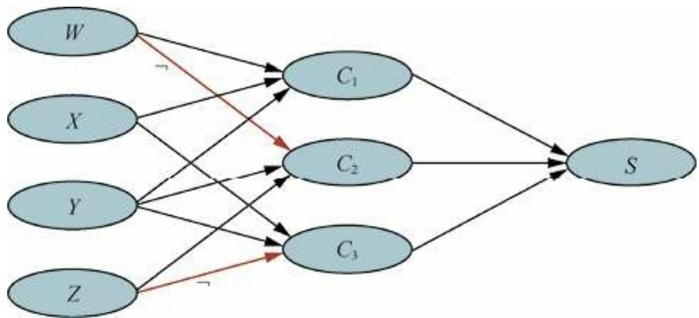  
图13-14 3-CNF语句 $\Lambda$ 的贝叶斯网络编码

为了确定原始语句是否可满足，我们只需评估 $P ( S = \pmb { \mathrm { i n } } \pmb { \mathrm { u e } } )$ 。如果语句是 可满足的 ，则存在一些逻辑变量的可能赋值使得S 为真。在贝叶斯网络中，这意味着存在一个非零概率的可能世界，其中根变量有这样的赋值：子句变量的值为真， S 的值为真。因此， $P ( S = \mathrm { t r u e } ) > 0$ 对应一个可满足的语句。相反， 对应一个不可满足的语句：所有有着 S = true的世界概 $P ( S = { \mathrm { t r u e } } ) = 0$ 率为0。因此，我们可以使用贝叶斯网络推断来求解3-SAT问题；由此，我们可以得出结论：贝叶斯网络推断是NP困难的。

事实上，我们可以得到更多的结论。对于一个 $n$ 个变量的问题，每个可满足赋值的概率是 $2 ^ { - n }$ 。因此，可满足赋值的数量是 。因为计算一个3-SAT问题可满足赋值的数量是#P完全的，这意味着贝叶斯网络推断是#P困难的，严格地难于NP完全问题。

贝叶斯网络推断的复杂性与约束满足问题（CSP）的复杂性之间有着密切的联系。正如我们在第6章中讨论的那样，求解离散CSP的难度与约束图的“树状”程度有关。诸如 树宽 （treewidth）这样的限制求解CSP复杂性的度量，也可以直接应用于贝叶斯网络之中。此外，变量消元算法可以像在贝叶斯网络上一样推广到求解CSP。

除了将可满足性问题归约到贝叶斯网络推断，我们还可以将贝叶斯网络推断归约到可满足性，这使得我们可以利用为SAT求解而发展出的强大机制（见第7章）。在这种情况下，我们将推断问题归约为SAT求解的一种特殊形式，我们称之为 加权模型计数 （weighted model counting，WMC）。常规模型计数会计算SAT表达式可满足的赋值数量；WMC将这些可满足赋值的总权重相加，在这个应用中，权重本质上是给定父变量时每个变量赋值的条件概率的乘积（细节见习题13.WMCX）。某种程度上因为SAT求解技术已经针对大规模应用进行了优化，通过WMC进行的贝叶斯网络推理在大树宽网络上与其他精确算法相比是有竞争力的，有时甚至优于它们。

# 13.3.4 聚类算法

变量消元算法在回答单个查询时简单有效。但是，如果我们要计算网络中所有变量的后验概率，它的效率可能较低。例如，在多重树网络中可能需要处理O (n )个查询，每个耗时O (n )，那我们总共需要O (n 2)时间。使用聚类 （clustering）算法［也叫作连接树 （join tree）算法］可以把时间减少到O (n )。因此，这些算法在贝叶斯网络相关的商业工具中得到了广泛应用。

聚类的基本思想是将网络中的单个节点连接起来，形成簇节点，使得最终得到的网络是多重树。例如，图13-15a中的多连通网络可以通过连接 Sprinkler 和 Rain 节点得到簇节点 Sprinkler + Rain 的方

式转化成一棵多重树，如图13-15b所示。这两个布尔节点被一个有4个可能的值 tt 、 tf 、 ft 、 ff 的大节点 （meganode）取代。这个大节点只有一个父节点，即布尔变量 Cloudy ，所以有两个条件事件。虽然这个例子中没有体现，但聚类的过程通常会产生共享一些变量的大节点。

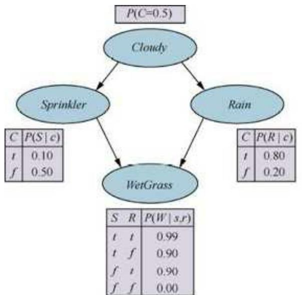

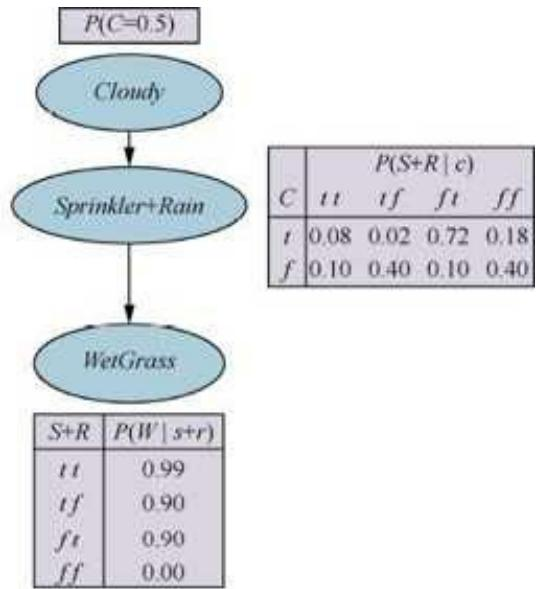  
  
图13-15（a）描述玛丽在草坪上的日常工作的多连通网络：每天早上，她会检查天气；如果是阴天，她通常不会打开洒水器；如果洒水器开着，或者那天下雨了，草坪就会湿。因此， Cloudy通过两种不同的因果路径影响 WetGrass。（b）等价于多连通网络的聚类

一旦网络转换为多重树形式，我们就需要一种特殊的推断算法，因为传统的推断方法无法处理彼此共享变量的大节点。从本质上讲，该算法是约束传播的一种形式（见第6章），其中约束确保相邻的大节点在它们共享的任何变量的后验概率上达成一致。通过仔细记录，该算法能够在与聚类网络规模呈线性关系的时间内为网络中所有非证据节点计算后验概率。但是，问题的NP困难本质并未改变：如果一个网络的变量消元需要指数级的时间与空间，那么聚类网络中的条件概率表必然也会是指数级规模。

# 13.4 贝叶斯网络中的近似推理

考虑到大型网络中精确推断的难处理性，我们现在将考虑近似推断方法。本节将介绍的随机采样算法也被称为蒙特卡罗 （MonteCarlo）算法，它能够提供近似的答案，且准确性取决于生成的样本数。该方法的工作原理是基于贝叶斯网络中的概率生成随机事件并计数这些随机事件中发现的不同答案。有了足够的样本，我们可以以任意的精度恢复真实概率分布——只要贝叶斯网络中没有确定性条件分布。

蒙特卡罗算法（4.1.2节中所述的模拟退火是其一个例子）已在许多科学分支中用于估计难以精确计算的量。在本节中，我们将关注应用于贝叶斯网络后验概率计算的采样。我们将介绍两类算法：直接采样和马尔可夫链采样。在本章结尾的参考文献与历史注释中将提及其他几种近似推断方法。

# 13.4.1 直接采样方法

任何采样算法的基本要素都是从已知概率分布中生成样本。例如，一个无偏差的硬币可以视为取值〈 heads , tails 〉的随机变量 Coin ，其先验概率是 。从这个分布中采样就像是抛硬币：它以0.5的概率返回heads，以0.5的概率返回tails。通过采样一个取值为[0,1]上均匀分布的随机数r来采样任意单个变量通常比直接采样更简单，不论该变量是离散的还是连续的。这个思想可以通过构建变量的累积分布并返回累积概率超过 r 的最小值来实现（见习题13.PRSA）。

我们从没有相关证据的贝叶斯网络的随机采样过程入手。这种想法是按照拓扑顺序依次采样每个变量，采样的概率分布取决于已经赋给该变量父节点的值。（由于我们按拓扑顺序采样，因此可以保证父节点已经有值。）该算法如图13-16所示。我们将其应用到图13-15a的网络，顺序定为 Cloudy、 Sprinkler 、 Rain 、 WetGrass ，则可能产生如下随机事件。

（1）从 中采样，值为true。

（2）从 中采样，值为false。

（3）从 中采样，值为true。

（4）从 $=$ false,Rain $=$ 中采样，值为true。

这样一来，P rior -S ample 返回事件[true, false, true, true]。

functionPRIOR-SAMPLE（bn）returns一个从bn指定的先验中采样的事件inputs:bn，一个指定联合分布 $P ( X _ { 1 } , \cdots , X _ { n } )$ 的贝叶斯网络

$x \gets$ 一个具有 $\scriptstyle n$ 个元素的事件

foreach变量 $X _ { i }$ in $X _ { 1 } , \cdots , X _ { n }$ do

$\boldsymbol { x } [ i ]  P ( \boldsymbol { X } _ { i } | p a r e n t s ( \boldsymbol { X } ) )$ $( X ) )$ 中的一个随机样本

returnx

图13-16 从贝叶斯网络生成事件的采样算法。给定父节点已经被采样的值，每个变量根据条件分布来采样

容易看到，P rior -S ample 从网络指定的先验联合分布中生成样本。首先，令 为Prior-Sample算法生成一个特定事件的概率。通过观察采样过程，我们得到

$$
S _ {\mathrm {P S}} \left(x _ {1}, \dots , x _ {n}\right) = \prod_ {i = 1} ^ {n} P \left(x _ {i} \mid p a r e n t s \left(X _ {i}\right)\right)
$$

因为每个采样步骤只依赖于父节点的值。这个表达式应该看起来很熟悉，因为根据式（13-2）表述的联合分布的贝叶斯网络表示，它也是事件的概率。也就是说，我们有

$$
S _ {\mathrm {P S}} \left(x _ {1}, \dots , x _ {n}\right) = P \left(x _ {1}, \dots , x _ {n}\right)
$$

这个简单的事实使我们可以很容易地通过使用样本来回答问题。

在任何采样算法中，答案都是通过计数产生的实际样本来计算的。假设有 $N$ 个由P rior -S ample 算法产生的样本，令 $N _ { \mathrm { p s } } ( x _ { 1 } , \cdots , x _ { n } )$ 为特定事件 $x _ { 1 } , . . . , x _ { n }$ 在样本集合中出现的次数。我们希望这个数字与总数的比例在极限意义下收敛于其依据采样概率的期望值：

$$
\lim  _ {N \rightarrow + \infty} \frac {N _ {\mathrm {P S}} \left(x _ {1} , \cdots , x _ {n}\right)}{N} = S _ {\mathrm {P S}} \left(x _ {1}, \dots , x _ {n}\right) = P \left(x _ {1}, \dots , x _ {n}\right) \tag {13-6}
$$

例如，考虑前面生成的事件：[true, false, true, true]。这个事件的采样概率是

$$
S _ {\mathrm {P S}} (\text {t r u e}, \text {f a l s e}, \text {t r u e}, \text {t r u e}) = 0. 5 \times 0. 9 \times 0. 8 \times 0. 9 = 0. 3 2 4
$$

因此，在 $N$ 很大的极限下，我们期望32.4%的样本发生这个事件。

在后续使用约等号（≈）时，我们要表达的含义是，在大样本极限下的估计概率将变得逐渐精确。这样的估计被称为 一致的 （consistent）。例如，我们可以为任何被部分指定的事件 x 1,…, x m产生的概率给出一个如下的一致估计，其中 ：

$$
P \left(x _ {1}, \dots , x _ {m}\right) \approx N _ {\mathrm {P S}} \left(x _ {1}, \dots , x _ {m}\right) / N \tag {13-7}
$$

也就是说，事件的概率可以估计为采样过程所产生的所有完整事件中与部分事件相匹配的比例。我们使用 $\hat { \pmb P }$ （读作“P-hat”）表示估计概率。举例来说，如果我们从洒水器网络中生成了1000个样本，其中511个满足 Rain $=$ true，则估计的下雨概率 $\hat { P } \left( R a i n = \mathrm { { \mathbf { m } } } { \mathrm { { u } } } \mathrm { { e } } \right) = 0 . 5 1 1$ 。

# 1.贝叶斯网络中的拒绝采样

拒绝采样 （rejection sampling）是从给定的易于采样分布中生成难以采样分布样本的通用方法。最简单形式的拒绝采样可以被用于计算后验概率，也就是确定 $P ( X | e )$ 。R ejection -S ampling 算法如图13-17所示。首先，它从网络指定的先验概率中生成样本。然后，它拒绝所有与证据不匹配的样本。最后，通过计数 $X = x$ 在剩余样本中的频次得到估计 ${ \hat { P } } ( X = x | e )$ 。

function REJECTION-SAMPLING(X,e,bn,Nreturns一个 $P ( X )$ e)的估计

inputs: $X$ 查询变量

e，证据 $\pmb { \mathscr { E } }$ 的观测值

bn，一个贝叶斯网络

N，生成的样本总数

localvariables: $c$ ，X每个值的计数向量，初始为0

$$
\mathbf {f o r} j = 1 \mathbf {t o} N \mathbf {d o}
$$

$$
x \leftarrow \text {P R I O R - S A M P L E} (b n)
$$

ifx与e-致then

$c _ { \mathcal { V } } \gets c _ { \mathcal { V } ^ { 1 + 1 } }$ ，其中x是x在x中的值

return NORMALIZE(C）

图13-17 贝叶斯网络中给定证据时回答查询的拒绝采样算法

今 为算法返回的估计分布；这个分布通过对 N PS ( X , e )— $\hat { P } ( X | e )$ $N _ { \mathrm { P S } } ( X , e )$ 当样本与证据e一致时，每个 $X$ 值的样本计数向量——进行归一化得到

$$
\hat {\boldsymbol {P}} (X \mid \boldsymbol {e}) = \alpha N _ {\mathrm {P S}} (X, \boldsymbol {e}) = \frac {N _ {\mathrm {P S}} (X , \boldsymbol {e})}{N _ {\mathrm {P S}} (\boldsymbol {e})}
$$

根据式（13-7），我们有

$$
\hat {\boldsymbol {P}} (X \mid e) \approx \frac {\boldsymbol {P} (X , e)}{P (e)} = \boldsymbol {P} (X \mid e)
$$

也就是说，拒绝采样给出了真实概率的一个一致估计。

我们仍考虑图13-15a所示的例子，假设我们希望使用100个样本去估计

。假设生成的100个样本中，有73个满足 Sprinkler = false，因此 $=$ 被拒绝；有27个满足 Sprinkler $=$ true，这27个中的8个满足 Rain $=$ true，19个满足 Rain $=$ false。因此，

$$
P (R a i n \mid S p r i n k l e r = t r u e) \approx N o r m a l i z e (\langle 8, 1 9 \rangle) = \langle 0. 2 9 6, 0. 7 0 4 \rangle
$$

真实的答案是〈0.3,0.7〉。随着更多的样本被采集，这个估计将收敛到真实答案。每个概率估计误差的标准差与 $1 / \sqrt { n }$ 成正比，其中n 是估计中使用的样本数。

现在我们已经知道拒绝采样收敛到正确的答案，接下来的问题是，收敛速度有多快？更准确地说，在我们知道最终的估计值以高概率接近正确答案之前，需要多少个样本？精确算法的复杂性在很大程度上取决于网络的拓扑结构——树形的网络容易，而连接稠密的网络则很难——拒绝采样的复杂性主要取决于被接受的样本的比例。该比例恰好等于证据的先验概率 P(e)。遗憾的是，对于具有许多证据变量的复杂问题，这一比例极小。当这一方法应用到图13-9中的汽车保险网络的离散版本时，与从网络本身采样的典型证据相一致的样本比例通常在千分之一到万分之一之间。收敛速度非常慢（见图13-19）。

我们预计随着证据变量数量的增加，与证据 e一致的样本比例将呈指数下降，因此该流程对于复杂问题不可用。对于连续值证据变量也有困难，因为产生与此类证据一致的样本的概率为0（如果它确实是连续值）或非常小（如果它只是一个有限精度的浮点数）。

注意，拒绝采样与真实世界中条件概率的估计过程非常相似。例如，如果我们要估算一颗直径为1千米的小行星撞击地球后人类幸存的条件概率，人们可以简单地计数直径为1千米的小行星撞击地球后人类幸存的频次，而忽略没有这类事件发生的日子。（在该例子中，宇宙本身就扮演了样本生成算法的角色。）要获得一个像样的估计，可能需要等待100次这样的事件发生。显然，这可能需要很长时间，这就是拒绝采样的缺点。

# 2. 重要性采样

重要性采样 （importance sampling）是一个通用的统计技术，它使用另一个采样于分布 Q 的样本来模拟从分布 P 中采样的结果，并通过在计数每个样本时使用修正因子 $P ( x ) / Q ( x )$ ，也称做 权重，来确保答案在极限下是正确的。

在贝叶斯网络中使用重要性采样的原因很简单：我们希望以所有证据为条件从真实的后验分布中采样，但这通常太难了。 [1] 因此，我们从一个简单的分布中采样并进行必要的修正。重要性采样有效的原因也很简单。令非证据变量为 Z ，如果可以直接从 $P ( z \mid e )$ 采样，我们可以构造如下的估计：

[1]如果这很容易，那么我们可以用多项式的样本数以任意精度逼近想要的概率。可以证明，这种多项式时间近似是不存在的。

$$
\hat {P} (z | e) = \frac {N _ {P} (z)}{N} \approx P (z | e)
$$

其中 $N _ { P } ( { \pmb z } )$ 是从 $P$ 中采样时满足 ${ \pmb Z } = { \pmb z }$ 样本的数量。现在假设我们从Q (z)中采样。在这种情况下，我们引入修正因子：

$$
\hat {P} (z | e) = \frac {N _ {\mathcal {Q}} (z)}{N} \frac {P (z | e)}{\mathcal {Q} (z)} \approx Q (z) \frac {P (z | e)}{\mathcal {Q} (z)} = P (z | e)
$$

因此，无论使用哪个采样分布 Q ，该估计都会收敛到正确的值。（唯一的技术要求是，对任何非零的 z ， Q ( z )也不应为零。）直观上，修正因子补偿了过采样或欠采样。例如，如 $P ( z \mid e )$ 果对于一些 z ， Q ( z )远大于 ，那么这些 z 的样本数量就会比应有数量多得多，但是每个样本的权重很小，所以结果和正确的样本数量情况一样。

至于分布 Q 的选择，我们希望它是一个易于采样并且与真实后验 尽可能接近的分布。最常用的方法是似然加权 （likelihood weighting）（我们将很快看到原因）。如图13-18中的Weighted-Sample函数所示，算法固定证据变量的值，然后按照拓扑顺序采样所有非证据变量，每个变量以其父变量为条件。这保证生成的每个事件都与证据一致。

functionLIKELIHOOD-WEIGHTING(X,e,bn,Nreturns一个P(X|e)的估计

inputs: $X$ ，查询变量

e，变量 $\pmb { { \cal E } }$ 的观测值

$b n$ ，一个指定联合分布 $P ( X _ { 1 } , \cdots , X _ { n } )$ 的贝叶斯网络

N，生成的样本总数

localvariables:W，一个X每个值的加权计数向量，初始为0

$$
\mathbf {f o r} j = 1 \mathbf {t o} N \mathbf {d o}
$$

$$
x, w \leftarrow \text {W E I G H T E D - S A M P L E} (b n, e)
$$

$m ( j ) \longleftarrow W [ j ] + w$ 其中x是X在x中的值

$$
\operatorname {r e t u r n} \text {N O R M A L I Z E} (W)
$$

functionWEIGHTED-SAMPLE（bn,e）returns一个事件与一个权重

$w  1 ; x $ 一个具有n个元素的事件，含有来自e的固定值

$$
\text {f o r} i = 1 \text {t o} n \text {d o}
$$

ifx是一个值x来自e的证据变量

$$
\text {t h e n} w \leftarrow w \times P \left(X _ {i} = x _ {i j} \mid p a r e n t s \left(X _ {i}\right)\right)
$$

elsex[i]←P(Xparents（X））中的一个随机样本

$$
\text {r e t u r n} x, w
$$

图13-18贝叶斯网络推断中的似然加权算法。在Weighted-Sample中，每个非证据变量根据给定的已采样父变量值的条件分布进行采样，权重根据每个证据变量的似然进行累积

我们称这个算法产生的采样分布为 Q WS。如果非证据变量是 $\pmb { Z } = \{ \pmb { Z } _ { 1 } , \cdots , \pmb { Z } _ { l } \}$ ，则我们有

$$
Q _ {\mathrm {W S}} (z) = \prod_ {i = 1} ^ {l} P \left(z _ {i} \mid p a r e n t s \left(Z _ {i}\right)\right) \tag {13-8}
$$

因为每个变量都以其父变量为条件进行采样。为了完成算法，我们需要知道如何计算每个从 $Q$ WS生成的样本的权重。根据重要性采样的思想，其权重应为

$$
w (z) = P (z \mid e) / Q _ {\mathrm {W S}} (z) = \alpha P (z, e) / Q _ {\mathrm {W S}} (z)
$$

其中归一化因子 对所有样本都相同。现在 z 与 e 已经涵盖了贝叶斯网络的所有变量，所以 $P$ (z, e)就是所有条件概率的乘积［13.2节式（13-2）］。我们可以把它写成非证据变量的条件概率的乘积乘以证据变量的条件概率的乘积：

$$
\begin{array}{l} w (z) = \alpha \frac {P (z , e)}{Q _ {w s} (z)} = \alpha \frac {\prod_ {i = 1} ^ {l} P \left(z _ {i} \mid p a r e n t s \left(Z _ {i}\right)\right) \prod_ {i = 1} ^ {m} P \left(e _ {i} \mid p a r e n t s \left(E _ {i}\right)\right)}{\prod_ {i = 1} ^ {l} P \left(z _ {i} \mid p a r e n t s \left(Z _ {i}\right)\right)} \\ = \alpha \prod_ {i = 1} ^ {m} P \left(e _ {i} \mid p a r e n t s \left(E _ {i}\right)\right) \\ \end{array}
$$

（13-9）

因此，权重是证据变量在给定其父变量之后的条件概率的乘积。（证据的概率通常被称为 似然 ，似然加权因此得名。）权重计算是在Weighted-Sample中增量地实现的，算法在每次遇到一个证据变量时乘以其条件概率。归一化是在最后返回查询结果之前完成的。

让我们把这个算法应用到图13-15a所示的网络中，其中查询是

，拓扑次序是 Cloudy 、 Sprinkler 、 Rain、 WetGrass 。（任何拓扑次序都是可行的。）算法过程如下：首先，将权重 w 设为1.0；然后，生成一个事件。

（1） Cloudy 是值为true的证据变量。因此，我们设置

$$
w \leftarrow w \times P (C l o u d y = \text {t r u e}) = 0. 5
$$

（2）Sprinkler不是证据变量，所以从 中采样，假设返回了false。  
（3） R ain 不是证据变量，所以从 $P ( R a i n | C l o u d y = \mathrm { t r u e } ) = \langle 0 . 8 , 0 . 2 \rangle$ 中采样，假设返回了 true。  
（4）WetGrass是值为true的证据变量。因此，我们设置

$$
\begin{array}{l} w \leftarrow w \times P (W e t G r a s s = t r u e \mid S p r i n k l e r = f a l s e, R a i n = t r u e) \\ = 0. 5 \times 0. 9 = 0. 4 5 \\ \end{array}
$$

这里W eighted -S ample 返回了权重为0.45的事件[true, false, true, true]，这被计入 Rain $=$ true下。

注意， Parents $( Z _ { i } )$ 可以同时包含非证据变量与证据变量。不同于先验分布 $P \left( \pmb { z } \right)$ ，分布 $Q$ WS 关注证据：每个 $Z _ { i }$ 的采样值会被 $Z _ { i }$ 祖先中的证据影响。例如，当采样Sprinkler时，算法会注意到它父变量中的证据 Cloudy $=$ true。但是， Q 对证据的关注程度低于真实后验 $P ( z \mid e )$ ，因为每个Z 的采样值忽略了Z 非祖先节点中的证据。例如，当采样 Sprinkler和Rain时，算法忽略了子节点变量中的证据 WetGrass $=$ true，这意味着它将生成许多 Sprinkler $=$ false和 Rain = false的样本，尽管实际上证据排除了这种情况。这些样本的权重为0。

因为似然加权使用了所有的生成样本，它比拒绝采样更高效。但是，随着证据变量数量的增加，它的性能会下降。这是因为大多数样本的权重都很低，因此加权估计将由赋予证据大于无穷小的可能性的极小部分样本所主导。如果证据变量出现在“下游”，即出现在变量顺序的靠后部分，那么这个问题就会加剧，因为非证据变量在其父变量和祖先变量中没有证据来指导样本的生成。这意味着这些样本将仅仅是纯粹的模拟——与证据所隐含的现实几乎没有相似之处。

当我们将该算法应用于图13-9中的汽车保险网络的离散版本时，似然加权比拒绝采样有效得多（见图13-19）。保险网络是似然加权的相对良性情况，因为很多证据位于“上游”，而查询变量是网络的叶子节点。

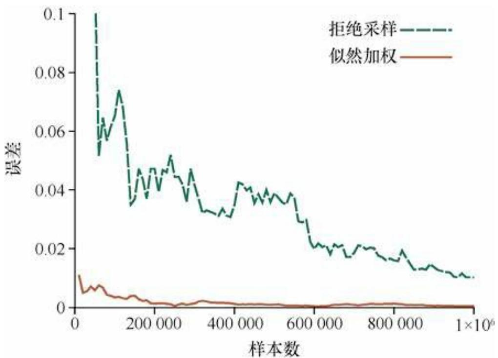  
图13-19保险网络中拒绝采样与似然加权的表现。x轴表示生成的样本数量， y轴表示对PropertyCost查询的任一概率值的最大绝对误差

# 13.4.2 通过马尔可夫链模拟进行推断

马尔可夫链蒙特卡罗 （Markov chain MonteCarlo，MCMC）算法的工作方式不同于拒绝采样和似然加权。MCMC算法通过随机修改之前的样本来生成样本，而不是从头生成每个样本。可以将MCMC算法想象成处于特定的当前状态，该状态为每个变量指定一个值，并通过对当前状态进行随机修改来生成下一 状态。

马尔可夫链 （Markov chain）指产生一系列状态的随机过程。（马尔可夫链在第14章和第17章扮演重要角色，第4章中所述的模拟退火算法和第7章中所述的Walk SAT算法也是MCMC族的成员。）我们将首先介绍一种称作 吉布斯采样 （Gibbs sampling）的特殊形式的MCMC算法，它尤其适合贝叶斯网络。之后我们将介绍更一般的米特罗波利斯-黑斯廷斯 （Metropolis–Hastings）算法，它在生成样本时具有更强的灵活性。

# 1. 贝叶斯网络中的吉布斯采样

贝叶斯网络的吉布斯采样算法从一个任意状态出发（证据变量固定为它们的观测值），通过为一个非证据变量X 随机采样一个值来生成下一个状态。回忆一下我们在13.2.1节中提到的，给定它的马尔可夫毯（它的父节点、子节点和子节点的其他父节点）， X 独立于所有其他变量。因此，X的吉布斯采样意味着 以它的马尔可夫毯中变量的当前值为条件进行采样。该算法在状态空间（可能的完整赋值的空间）中游走，每次调整一个变量，并保持证据变量不变。完整的算法如图13-20所示。

function GIBBs-Ask(X,e,bn,Nreturns一个 $\pmb { P } ( X | \mathbf { \epsilon } e )$ 的估计

local variables: $c$ ，一个X的每个值的计数向量，初始为0

$\pmb { z }$ ，bn中的非证据变量

$\pmb { x }$ ，网络的当前状态，从e中初始

使用Z中变量的随机值初始x

$$
\text {f o r} k = 1 \text {t o} N \text {d o}
$$

根据任意分布 $\rho ( i )$ 从Z中选择变量Z

通过从 $P ( Z _ { i } | m b ( Z _ { i } ) )$ 中采样，设置x中Z的值

$c [ j ] \gets c [ j ] + 1$ 其中x是x在x中的值

$$
\operatorname {r e t u r n} \text {N O R M A L I Z E} (C)
$$

图13-20贝叶斯网络近似推断的吉布斯采样算法。这个版本采用了随机选择变量，此外循环遍历变量也可行

考虑图13-15a中网络的查询 $=$ 。证据变量Sprinkler 和 WetGrass 固定为它们的观测值（该例子中都是true），非证据变量 Cloudy 和 Rain 分别随机初始化为true和false。因此，初始状态是[true, true , false, true ]，其中我们用粗体标记固定的证据值。现在，非证据变量 Z i根据用于选择变量的概率分布 $\rho ( i )$ 按照一些随机顺序进行重复采样。例如如下操作。

（1）给定其马尔可夫毯当前的值，Cloudy被选择然后采样：在这种情况下，我们从

中采样。假设结果为 Cloudy = false，则新 $=$ $=$ 的当前状态是[false, true , false, true ]。

（2）给定其马尔可夫毯当前的值，Rain 被选择然后采样：在这种情况下，我们从

PRain|Cloudy $=$ false,Sprinkler $=$ true,WetGrass $=$ 中采样。假设结果为 Rain = true，新的当前状态为[false, true , true, true ]。

剩下的一个细节与计算马尔可夫毯分布 $P ( X _ { i } \mid m b ( X _ { i } ) )$ 的方法有关，其中 $m b \left( { { X } _ { i } } \right)$ 表示 $X _ { i }$ 的马尔可夫毯变量 $M B \left( \boldsymbol { X } _ { i } \right)$ 的值。幸运的是，这并不涉及任何复杂的推断。如习题13.MARB所示，其分布由下式给出：

$$
P \left(x _ {i} \mid m b \left(X _ {i}\right)\right) = \alpha P \left(x _ {i} \mid p a r e n t s \left(X _ {i}\right)\right) \prod_ {Y _ {j} \in C h i l d r e n \left(X _ {i}\right)} P \left(y _ {j} \mid p a r e n t s \left(Y _ {j}\right)\right) \tag {13-}
$$

10）

换句话说，对于每个值 $x _ { i }$ ，将条件概率表中 $X _ { i }$ 的概率与其子变量的概率相乘得到 $X _ { i }$ 的概率。例如，在上面所示的第一个采样步骤中，我们从

P(Cloudy|Sprinkler $=$ 中采样。根据式（13-10），我们有（其中用字母缩写表示变量）

$$
P (c \mid s, \neg r) = \alpha P (c) P (s \mid c) P (\neg r \mid c) = \alpha \times 0. 5 \times 0. 1 \times 0. 2
$$

$$
P (\neg c \mid s, \neg r) = \alpha P (\neg c) P (s \mid \neg c) P (\neg r \mid \neg c) = \alpha \times 0. 5 \times 0. 5 \times 0. 8
$$

所以采样分布是 。

图13-21a给出了均匀随机选择变量的情况下的完整马尔可夫链，即

。算法在这个图中按照指定概率沿着链路简单游走。在此过程中访问的每个状态都是对查询变量 Rain 的估计做出贡献的样本。如果此过程访问了20个 Rain 为真的状态，60个 Rain 为假的状态，则查询的答案是

NORMALIZE（（20,60>）=(0.25,0.75）。

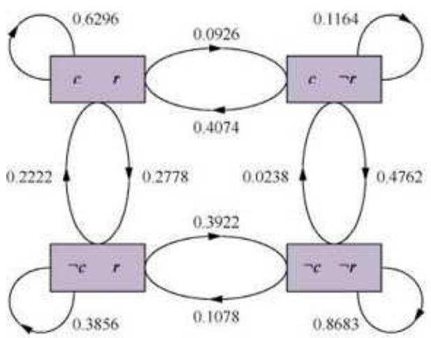

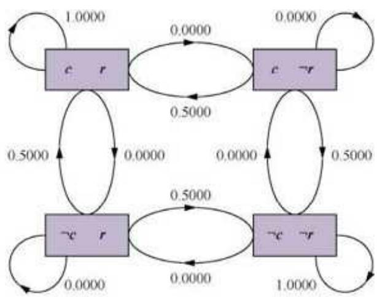  
  
图13-21 （a）对于查询 的马尔可夫链的状态和转移概率。注意自循环：当选择任意一个变量，然后重新采样到它已有的相同值时，状态保持不变。（b）当 Rain 的条件概率表约束它和Cloudy拥有相同值时的转移概率

# 2. 马尔可夫链的分析

我们已经说过，吉布斯采样是通过在状态空间随机游走来产生样本的。为了解释为什么吉布斯采样可以正确地工作（也就是说，为什么它的估计在极限意义下收敛于正确的值），我们需要一些仔细的分析。（这个部分涉及较为复杂的数学内容，在首次阅读时可以略过。）

我们首先介绍用于分析一般马尔可夫链的一些基本概念。任何这样的链都是通过它的初始状态和转移核 （transition kernel） — $k ( x  x )$ 从状态 $\pmb { x }$ 转移到状态 $\pmb { x }$ '的概率——确定的。现在假设我们运行了 $t$ 步的马尔可夫链，令 $\pi ( x )$ 表示在 $t$ 时刻系统处于状态 $_ x$ 的概率。类似地，令$\pi _ { \eta + 1 } ( x )$ 表示在 $t + 1$ 时刻处于状态 $_ x$ ' 的概率。给定 $\pi ( x )$ ，我们可以通过对 $t$ 时刻系统可能处于的所有状态 x ，对处于 x 的概率乘以转移到 x ' 的概率求和来计算 ： $\pmb { x }$ $\pmb { x }$ $\pi _ { \eta + 1 } ( x )$

$$
\pi_ {t + 1} \left(x ^ {\prime}\right) = \sum_ {x} \pi_ {t} (x) k \left(x \rightarrow x ^ {\prime}\right)
$$

如果 $\pi _ { \ell } = \pi _ { \ell + 1 }$ ，我们称链达到它的 平稳分布 （stationary distribution）。对于平稳分布 $\pmb { \pi }$ ，它将满足如下方程：

， $\pi ( { \bf x } ^ { \prime } ) = \sum _ { { \bf x } } \pi ( { \bf x } ) k ( { \bf x }  { \bf x } ^ { \prime } ) _ { \mathrm { ~ ( 1 3 - 1 1 ) ~ } }$

假设转移核 $k$ 是遍历的 （ergodic），也就是说，每个状态都从其他状态可达，并且没有严格的周期循环，那么对于任意给定的 k，满足该方程的分布 $\pmb { \pi }$ 就只有一个。

式（13-11）可以理解为每个状态的期望“流出”（即当前的“群体”）等于从所有状态的期望“流入”。有一种明显的方法可以使这种关系得到满足：如果任意一对状态之间的期望流在两个方向上是相同的，也就是说：

对所有 $x , \ x ^ { \prime } , \pi ( x ) k ( x \to x ^ { \prime } ) = \pi ( x ^ { \prime } ) k ( x ^ { \prime } \to x )$ （13-12）

当这些等式成立时，我们称 $k ( x  x ) _ {  } \pi ( x )$ $\pi ( x )$ 细致平衡 （detailed balance）。一个特殊的例子是自循环 $\pmb { x } = \pmb { x } ^ { \prime }$ ，即从一个状态转移到自身。这种情况下，细致平衡条件变成

$\pi ( x ) h ( x \to x ) = \pi ( x ) h ( x \to x )$ ，对于任意平稳分布 $\pmb { \pi }$ 与任意转移核 $k$ ，这个等式显然成立。

我们可以简单地通过对式（13-12）中的 $\pmb { x }$ 求和来证明细致平衡蕴涵着平稳性。我们有

$$
\sum_ {x} \pi (x) k (x \rightarrow x ^ {\prime}) = \sum_ {x} \pi (x ^ {\prime}) k (x ^ {\prime} \rightarrow x) = \pi (x ^ {\prime}) \sum_ {x} k (x ^ {\prime} \rightarrow x) = \pi (x ^ {\prime})
$$

其中最后一步成立是因为从 x '的转移保证会发生。

# 3. 为什么吉布斯采样可行

现在我们将说明吉布斯采样实现了后验概率的一致估计。基本的观点是直截了当的： 吉布斯采样过程的平稳分布正是基于证据的非证据变量的后验分布。 吉布斯采样过程从一个状态转移到另一个状态的特殊方式具有这种非凡的特性。

吉布斯采样的一般定义是选择一个变量 $X _ { i }$ ，然后以所有其他变量当前的值为条件进行采样（当具体应用于贝叶斯网络时，我们简单地使用额外的事实，即以所有变量为条件采样等价于以变量的马尔可夫毯为条件采样，如13.2.1节所示）。我们使用记号 $\pmb { X } _ { i }$ 指代这些其他变量（证据变量除外），记它们当前状态的值为 $\overline { { \pmb { x } _ { i } } }$ 。

为写出吉布斯采样的转移核 $k ( x  x )$ ，我们需要考虑3种情况。

（1）状态 $_ x$ 与 $\textbf { \em x } ^ { \prime }$ 在两个及以上的变量上不同。在这种情况下，因为吉布斯采样只改变一个变量，所以 $k ( x  x ) = 0$ 。

（2）状态只在一个变量 $X _ { i }$ 上不同，它的值从 $x _ { i }$ 变到 $\pmb { x } _ { t } ^ { i }$ 。这种情况出现的概率是：

$$
k \left(\boldsymbol {x} \rightarrow \boldsymbol {x} ^ {\prime}\right) = k \left(\left(x _ {i}, \overline {{\boldsymbol {x} _ {i}}}\right)\rightarrow \left(x _ {i} ^ {\prime}, \overline {{\boldsymbol {x} _ {i}}}\right)\right) = \rho (i) P \left(x _ {i} ^ {\prime} \mid \overline {{\boldsymbol {x} _ {i}}}\right) \tag {13-13}
$$

（3）状态相同，即 x =x '。在这种情况下，任何变量都可以被选择，但是采样过程产生了变量已有的相同的值。这种情况出现的概率是：

$$
k \left(\boldsymbol {x} \rightarrow \boldsymbol {x} ^ {\prime}\right) = \sum_ {i} \rho (i) k \left(\left(x _ {i}, \overline {{\boldsymbol {x} _ {i}}}\right)\rightarrow \left(x _ {i}, \overline {{\boldsymbol {x} _ {i}}}\right)\right) = \sum_ {i} \rho (i) P \left(x _ {i} \mid \overline {{\boldsymbol {x} _ {i}}}\right)
$$

现在我们证明，这个吉布斯采样的一般定义满足平稳分布等于 （非证据变量的真实后验分布）的细致平衡公式。也就是说，我们想要证明对所有状态 x 和x '，

$$
\pi (x) k (x \rightarrow x ^ {\prime}) = \pi (x ^ {\prime}) k (x ^ {\prime} \rightarrow x), \text {其 中} \pi (x) = P (x \mid e) 。
$$

对于上面给出的第1种和第3种情况，细致平衡总是被满足的：如果两个状态在两个及以上变量不同，转移概率在两个方向都为0。如果 x x '，则根据式（13-13），我们有

$$
\begin{array}{l} \pi (x) k (x \rightarrow x ^ {\prime}) = P (x | e) \rho (i) P \left(x _ {i} ^ {\prime} \mid \bar {x} _ {i}, e\right) = \rho (i) P \left(x _ {i}, \bar {x} _ {i} \mid e\right) P \left(x _ {i} ^ {\prime} \mid \bar {x} _ {i}, e\right) \\ = \rho (i) P \left(x _ {i} \mid \overline {{x}} _ {i}, e\right) P \left(\overline {{x}} _ {i} \mid e\right) P \left(x _ {i} ^ {\prime} \mid \overline {{x}} _ {i}, e\right) \quad (\text {在 第 一 项 上 使 用 链 式 法 则}) \\ = \rho (i) P \left(x _ {i} \mid \overline {{x}} _ {i}, e\right) P \left(x _ {i} ^ {\prime}, \overline {{x}} _ {i} \mid e\right) \quad (\text {最 后 两 项 上 使 用 逆 链 式 法 则}) \\ = \pi (x ^ {\prime}) k (x ^ {\prime} \rightarrow x) \\ \end{array}
$$

最后要解决的问题是链的遍历性，也就是说，每个状态都必须从其他状态可达，并且不存在周期循环。假如条件概率表不含概率0或1，则可达性和不存在周期循环这两个条件都能被满足。可达性源自这样一个事实：我们可以通过每次改变一个变量将一种状态转换成另一种状态。不存在周期循环是因为每个状态都有着非零概率的自循环。因此，在给定条件下，k是遍历的，这意味着吉布斯采样生成的样本最终会从真实的后验分布中提取。

# 4. 吉布斯采样的复杂性

首先，好消息是：每个吉布斯采样步骤都涉及对所选变量X 的马尔可夫毯分布的计算，这需要与X 的子变量数量和 $X _ { i }$ 的值域大小成比例的乘法运算数量。这一点很重要，这意味着 生成每个样本所需的工作量独立于网络的 规模。

现在，未必是坏消息的是：吉布斯采样的复杂性比拒绝采样和似然加权更难分析。首先要注意的是，与似然加权不同，吉布斯采样关注下游证据。信息从证据节点向各个方向传播：首先，证据节点的任何邻居节点的对证据节点中反映了证据的值采样；然后，对它们的邻居采样，等等。因此，当证据主要集中在下游变量时，我们希望吉布斯采样的表现优于似然加权；事实上，这在图13-22中也得到了证实。

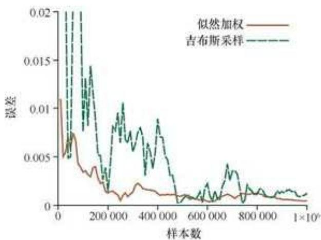

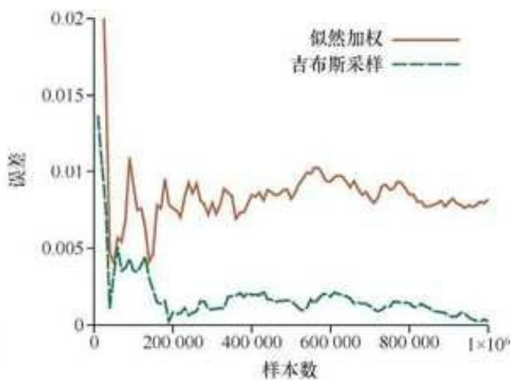  
  
图13-22 吉布斯采样与似然加权在汽车保险网络上表现的比较。（a）对 PropertyCost上的标准查询。（b）输出变量是被观测的并且 Age是查询变量的情况

吉布斯采样的收敛速率，即算法定义的马尔可夫链的 混合速率 （mixing rate），强烈依赖于网络中条件分布的定量性质。要了解这一点，考虑图13-15a中当Rain 的条件概率表变得确定时所发生的情况：当且仅当多云时才会下雨。在这种情况下，查询

的真实后验分布大约是〈0.18, 0.82〉，但吉布斯采样永远不会达到这个值。问题在于，对于 Cloudy 和 Rain ，只有两个联合状态[true, true]和[false, false]具有非零概率。从[true, true]出发，链永远不会到达[false, false]，因为转移到中间状态的概率为零（见图13-21b）。所以，如果过程从[true, true]出发，它对查询报告的后验概率总是〈1.0, 0.0〉；如果过程从[false, false]出发，它对查询报告的后验概率总是〈0.0, 1.0〉。

因为Cloudy和 Rain 之间的确定性关系打破了收敛要求的遍历性，吉布斯采样在这个例子中失效了。但是，如果我们让这个关系是近似确定的，则算法仍能收敛，但收敛的速度可能是任意缓慢的。有几种修正的方法可以帮助MCMC算法更快地混合。一种方法称为 块采样 （blocksampling）：同时采样多个变量。这种情况下，我们以它们的联合马尔可夫毯为条件，联合采样Cloudy和 Rain 。另一种方法是更明智地生成后续状态，我们将在接下来的“米特罗波利斯-黑斯廷

斯采样”小节中看到。

# 5. 米特罗波利斯-黑斯廷斯采样

米特罗波利斯-黑斯廷斯（Metropolis-Hastings，MH）采样可能是应用最广泛的MCMC算法。与吉布斯采样一样，MH被设计用来根据目标概率 $\pi ( x )$ 最终生成样本 $_ x$ 。在贝叶斯网络推断的场景中，我们希望得到 $\pi ( x ) = P ( x | e )$ 。与模拟退火算法（4.1.2节）一样，MH在采样过程的每次迭代中有两个阶段。

（1）给定当前状态 $\pmb { x }$ ，从 提议分布 （proposal distribution） $q ( x ^ { \prime } | x )$ 中采样一个新状态 x ' 。  
（2）根据 接受概率 （acceptance probability）

$$
a \left(\boldsymbol {x} ^ {\prime} \mid \boldsymbol {x}\right) = \min  \left(1, \frac {\pi \left(\boldsymbol {x} ^ {\prime}\right) q \left(\boldsymbol {x} \mid \boldsymbol {x} ^ {\prime}\right)}{\pi (\boldsymbol {x}) q \left(\boldsymbol {x} ^ {\prime} \mid \boldsymbol {x}\right)}\right)
$$

概率性地接受或者拒绝 x '。如果这个提议被拒绝了，状态维持在 $_ x$ 。

MH的转移核由这两步过程组成。注意，如果提议被拒绝，那么链将保持相同的状态。

顾名思义，提议分布负责提议下一个状态 x ' 。例如， $q ( x ^ { \prime } | x )$ 可以如下定义：

●以0.95的概率执行一步吉布斯采样生成 x '；  
● 否则，执行13.4.1节的W eighted -S ample 算法生成 x ' 。

这个提议分布导致MH执行大约20步吉布斯采样，然后从一个新状态（假设它被接受）“重启”这一过程。这种策略能解决吉布斯采样陷入一部分状态空间而无法到达其他部分的问题。

读者可能会问，我们究竟如何知道有着这样奇怪的提议的MH实际上会收敛到正确的答案。关于MH值得注意的是， 对于任何提议分布，只要得到的转移核是遍历的，就可以保证收敛到正确的平稳 分布。

这一性质源于接受概率的定义方式。就吉布斯采样而言，自循环 $\pmb { x } = \pmb { x } ^ { \prime }$ 自动满足细致平衡，所以我们关注 的情况。只有当提议被接受时才会发生这种情况。这种转移发生的概率是

$$
k (x \rightarrow x ^ {\prime}) = q \left(x ^ {\prime} \mid x\right) a \left(x ^ {\prime} \mid x\right)
$$

就吉布斯采样而言，证明细致平衡意味着证明从 $\pmb { x }$ 到 $\textbf { \em x } ^ { \prime }$ 的流 $\pi ( x ) h ( x  x )$ 与从 $\textbf { \em x } ^ { \prime }$ 到 $\pmb { x }$ 的流$\pi ( x ) ^ { \prime } ( x ^ { \prime }  x )$ 相匹配。将上面的 $k ( x  x )$ 代入表达式，细致平衡条件的证明是相当直接的：

$$
\begin{array}{l} \pi (x) q \left(x ^ {\prime} | x\right) a \left(x ^ {\prime} | x\right) = \pi (x) q \left(x ^ {\prime} | x\right) \min  \left(1, \frac {\pi \left(x ^ {\prime}\right) q \left(x | x ^ {\prime}\right)}{\pi (x) q \left(x ^ {\prime} | x\right)}\right) \quad (a (\cdot)) \text {的 定 义}) \\ = \min  (\pi (x) q (x ^ {\prime} | x), \pi (x ^ {\prime}) q (x | x ^ {\prime})) \quad \text {(乘 数 移 入 括 号)} \\ = \pi \left(x ^ {\prime}\right) q \left(x \mid x ^ {\prime}\right) \min  \left(\frac {\pi (x) q \left(x ^ {\prime} \mid x\right)}{\pi \left(x ^ {\prime}\right) q \left(x \mid x ^ {\prime}\right)}, 1\right) \quad (\text {除 数 移 出 括 号}) \\ = \pi (x ^ {\prime}) q (x | x ^ {\prime}) a (x | x ^ {\prime}) \\ \end{array}
$$

除了数学性质，MH采样需要关注的重要部分是接受概率中 $\pi ( x ) / \pi ( x )$ 的比率。这表示，如果提议的下一个状态比当前状态更有可能，它肯定会被接受（此时我们忽略项 ， $q ( x | x ) / q ( x ^ { \prime } | x )$ 它的存在是为了确保细致平衡，在许多状态空间中，由于对称性，它等于1）。如果提议的状态比当前状态的可能性小，它被接受的概率就成比例地下降。

因此，设计提议分布的一个指导方针是确保提议的新状态有合理的概率。吉布斯采样可以自动实现这一点：它基于吉布斯分布 中提议，这意味着生成 X i的新特定值正比于它的概 $P ( X _ { i } \mid \overline { { x _ { i } } } )$ $X _ { i }$ 率。（习题13.GIBM要求证明吉布斯采样是接受概率为1的MH采样的特例）。

另一个指导方针是要确保链能很好地混合，这意味着提议方案偶尔要向状态空间的遥远区域进行大幅度移动。在上面给出的示例中，偶尔使用W eighted -S ample 以新状态重启链可以达到这个目的。

除了提议分布的设计几乎是完全自由的，MH的实用性还源于另外两个性质。首先我们观察到，后验概率 仅以 的比率形式出现在接受计算中，这是非常幸运的。直 $\pi ( x ) / \pi ( x )$ 接计算 恰是我们试图使用MH来近似的，所以对每个样本都这样做是没有意义的！相反，我们使用下面的技巧：

$$
\frac {\pi \left(x ^ {\prime}\right)}{\pi \left(x ^ {\prime}\right)} = \frac {P \left(x ^ {\prime} \mid e\right)}{P (x \mid e)} = \frac {P \left(x ^ {\prime} , e\right)}{P (x , e)} \frac {P (e)}{P (x , e)} = \frac {P \left(x ^ {\prime} , e\right)}{P (x , e)}
$$

这个比率中的项是完全联合概率，即贝叶斯网络中条件概率的乘积。这个比率的第二个有用的性质是，一旦提议分布对 x 进行局部改变来产生 x '，条件概率乘积中只需有少数项是不同的。所有涉及取值不变的变量的条件概率都将在比率中消去。因此，与吉布斯采样一样，只要状态变化是局部的，那么生成每个样本所需的工作量与网络的规模无关。

# 13.4.3 编译近似推断

图13-17、图13-18和图13-20中的采样算法有一个共同的特性：它们在一个用数据结构表示的贝叶斯网络上运行。这似乎很自然：毕竟，贝叶斯网络是一个有向无环图，它还能如何表示呢？这种方法的问题在于，在采样算法运行时，访问数据结构（例如查找节点的父节点）所需的操作会重复数千次或数百万次， 所有这些计算都是完全不必 要的。

网络的结构和条件概率在整个计算过程中保持固定，因此有机会将网络编译成模型特定的推理代码，并通过仅执行特定网络所需的推断进行计算。（这听起来很熟悉，它与第9章逻辑程序编译中使用的思想相同。）例如，假设我们想对图13-2的入室盗窃网络中的 Earthquake变量进行吉布斯采样。根据图13-20中的G ibbs-A sk 算法，我们需要执行如下计算：

通过从 中采样，设置 x 中 Earthquake 的值

其中 的分布根据式（13-10）计算得到，我们在此重述一遍：

$$
P \left(x _ {i} \mid m b \left(X _ {i}\right)\right) = \alpha P \left(x _ {i} \mid p a r e n t s \left(X _ {i}\right)\right) \prod_ {Y _ {j} \in C h i l d r e n \left(X _ {i}\right)} P \left(y _ {j} \mid p a r e n t s \left(Y _ {j}\right)\right)
$$

反过来，这种计算需要在贝叶斯网络结构中查找Earthquake的父节点和子节点；查找它们当前的值；使用这些值索引相应的条件概率表（这也必须在贝叶斯网络中查找）；然后将这些条件概率表中所有合适的行相乘，形成一个新的采样分布。最后，如13.4.1节所述，采样步骤本身必须构建离散分布的累积版本，然后找到其中对应于从[0, 1]中采样的随机数的值。

相反，通过编译网络的方法，我们得到对于 Earthquake变量的模型特定的采样代码，如下所示：

$r \gets [ 0 , 1 ]$ 中的一个均匀随机样本

ifAlarm $=$ true

then if Burglary $\equiv$ true then return $[r <   0.0020212]$ else return $[r <   0.36755]$ else if Burglary $\equiv$ true then return $[r <   0.0016672]$ else return $[r <   0.0014222]$

其中贝叶斯网络变量 Alarm 、 Burglary等变成了普通的程序变量，其值构成了马尔可夫链的当前状态。数值阈值表达式评估为true或false，并表示 Earthquake马尔可夫毯中各种值组合的预计算的吉布斯分布。编译网络的代码不是特别优雅（一般来说，它的规模大概和贝叶斯网络本身一样大）但它非常高效。与G ibbs-A sk 相比，编译后的代码通常要快2～3个数量级。它可以在普通笔记本计算机上每秒执行数千万个采样步，其速度在很大程度上受到生成随机数代价的限制。

# 13.5 因果网络

我们已经讨论了保持贝叶斯网络中节点顺序与因果关系方向一致的几个优点。特别地，我们注意到，保持这样的顺序有助于我们更容易地估计条件概率，同时得到的网络结构也会紧致。但是要注意的是，原则上任何节点顺序都可以使网络一致地表示联合分布函数。这在图13-3中得到了证明，更改节点顺序后，生成的网络比图13-2中的原始网络更密集，更不自然，但仍使我们能够在所有变量上表示相同的分布。

本节将介绍因果网络 （causalnetwork），它是一种受限的贝叶斯网络类别，仅允许因果相容顺序。我们将探索如何构建这样的网络，这样的构建可以改进什么，以及如何在决策任务中利用这一改进。

首先考虑一个可能是最简单的贝叶斯网络， ，它只有单个箭头。它告诉我们变量 Fire 和 Smoke 可能是相关的，所以需要指定先验 P ( Fire )和条件分布来指定联合分布 P ( Fire , Smoke )。然而，通过反向箭头 $F i n e  S m o l e e$ ，使用恰当的 P (Smoke )与从贝叶斯法则计算的 $P ( F i r e | S m o k e )$ 也可以同样好地表示这个分布。这两个网络是等价的，因此传递的信息是相同的，这种想法会让大多数人感到不适，甚至抗拒。我们知道是 Fire引起 Smoke ，而不是 Smoke 引起 Fire ，它们怎么能传达同样的信息呢？

换句话说，根据我们的经验和科学认知，清除烟雾并不能阻止火灾，而灭火会消除烟雾。因此我们希望通过它们之间箭头的方向性来表示这种不对称性。但如果反向箭头只会使事物等价，我们怎么才能形式化地表示这个重要的信息。

因果贝叶斯网络（有时也被称为因果图）允许我们表示因果不对称性，并利用不对称性和因果信息进行推理。其想法是越过概率依赖并使用一种完全不同类型评判的考虑来决定箭头的方向。不像我们在普通贝叶斯网络中那样询问专家 Smoke与Fire是否概率相关，我们现在要考虑的是哪个变量响应哪个变量， Smoke 到 Fire 还是 Fire 到 Smo ke ？

这听起来可能有点神秘，但是我们可以通过“赋值”的概念使其更加精确，它类似于编程语言中的赋值操作。如果大自然根据本身对Fire的了解为Smoke赋值，我们则画一条从Fire到Smoke的箭头。更重要的是，如果我们判断大自然依赖于其他变量而不是Smoke为Fire赋了真值，则并不会绘制箭头 。换句话说，如果每个变量 $X _ { i }$ 的值 x i 通过等式 x i = f  i (OtherVariables )确定，则当且仅当 X j 是 f i 的一个参数时，我们绘制箭头 。 $X _ { j }$ $f _ { i }$ $X _ { j } \to X _ { j }$

叫作 结构方程 （structural equation），因为它在本质上描述了一种稳定的机制，它与量化贝叶斯网络的概率不同，这种机制对测量值和环境中的局部变化保持不变。

为了解这种对局部变化的稳定性，我们可以参考图13-23a，它是图13-15的草坪洒水器故事略做修改后的版本。例如，为了表示一个出故障的洒水器，我们只需从网络中删除与Sprinkler节点相关的所有链路。为了表示覆盖着帐篷的草坪，我们简单地删除了 的箭头。因此，只要稍加修改，环境中机制的任何局部重构都可以转换为网络拓扑结构的同构重构。如果网络的构造与因果顺序相反，则需要更复杂的转变。这种局部稳定性对于表示动作或干预特别重要，这是我们下一个讨论的话题。

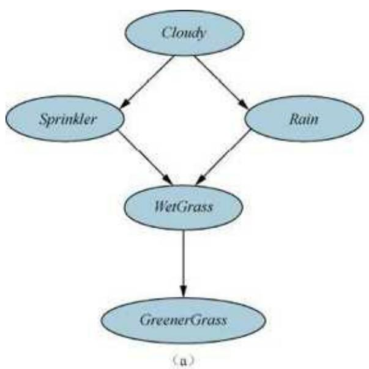

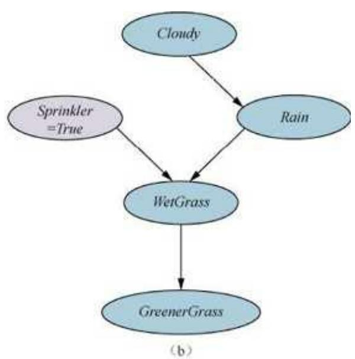  
图13-23 （a）表示5个变量间因果关系的因果贝叶斯网络。（b）执行“打开Sprinkler”动作后的网络

# 13.5.1 表示动作： do 操作

再次考虑图13-23a中的Sprinkler故事。根据标准的贝叶斯网络的语义，5个变量的联合分布由5个条件分布的乘积给出：

$$
P (c, r, s, w, g) = P (c) P (r \mid c) P (s \mid c) P (w \mid r, s) P (g \mid w) \tag {13-14}
$$

其中，我们使用每个变量名的首字母来简写变量。模型是如下的一个结构方程系统：

$$
C = f _ {c} \left(U _ {c}\right)
$$

$$
R = f _ {R} (C, U _ {R})
$$

$$
S = f _ {s} (C, U _ {s})
$$

$$
W = f _ {w} (R, S, U _ {w})
$$

$$
G = f _ {G} (W, U _ {G}) \tag {13-15}
$$

其中，不失一般性，f 可以为恒等函数。这些方程中的U 变量表示未建模变量 （unmodeledvariable），也叫作 误差项 （error term）或 扰动 （disturbance），它将扰乱每个变量与它的父变量之间的函数关系。例如， U W可能是除 Sprinkler 和 Rain 之外另一种潜在的潮湿来源，有可能是MorningDew （晨露）或 FirefightingHelicopter （消防直升机）。

如果所有 $U$ 变量都是有着恰当先验的相互独立的随机变量，则式（13-14）中的联合分布可以用式（13-15）中的结构方程精确表示。因此，随机关系的系统可以被确定性关系的系统捕捉，其中每一个关系都受到外部干扰的影响。然而，结构方程系统为我们提供的不止这些：它允许我们预测干预将如何影响系统的运行，从而预测这些干预的可观测的结果。这在联合分布下是不可能的。

例如，假设我们打开洒水器，也就是说，如果我们通过干预去强加Sprinkler=true的条件（根据定义，这不是模型所描述的因果过程的一部分）。沿用do-calculus的记号——这是因果网络理论的一个关键部分，这会被写作 do ( Sprinkler = true)。一旦如此，这意味着洒水器变量不再依赖天气是不是多云。因此，我们从结构方程系统删除 ，并用 S = true来替代：

$$
\begin{array}{l} C = f _ {c} \left(U _ {c}\right) \\ R = f _ {R} (C, U _ {R}) \\ S = \text {t r u e} \\ W = f _ {w} (R, S, U _ {w}) \\ G = f _ {G} (W, U _ {G}) \tag {13-16} \\ \end{array}
$$

根据这些方程，我们得到其余变量以 do ( Sprinkler = true)为条件的新的联合分布：

$$
P (c, r, w, g \mid d o (S = \text {t r u e})) = P (c) P (r \mid c) P (w \mid r, s = \text {t r u e}) P (g \mid w) \tag {13-}
$$

这对应着图13-23b中的“残缺”网络。基于式（13-17），我们看到概率改变的变量只有 WetGrass 和GreenerGrass ，也就是被操控变量 Sprinkler 的后代节点。

注意以在原始网络上 do ( Sprinkler = true) 动作 为条件和以 观测 Sprinkler = true为条件的区别。原始网络告诉我们，当天气多云时，不太可能打开洒水器，所以如果我们观测 到洒水器开着，就意味着天气多云的可能性降低了。但常识告诉我们，如果我们（可以说是从外部世界操作）伸手打开洒水器，这不会影响天气，也不会提供有关当天天气情况的新信息。如图13-23b所示，干预破坏了天气和洒水器之间正常的因果链路。这阻止了任何影响从 Sprinkler回流到 Cloudy。因此，在原始图上以 do ( Sprinkler = true)为条件等价于在残缺图上以 Sprinkler = true为条件。

类似的方法可以用来分析在一个有着变量 X 1,…, X n的一般因果网络中 do ( X j= x jk)的结果。该网络对应于以通常方式定义的联合分布［见式（13-2）］：

$$
P \left(x _ {1}, \dots , x _ {n}\right) = \prod_ {i = 1} ^ {n} P \left(x _ {i} \mid p a r e n t s \left(X _ {i}\right)\right) \tag {13-18}
$$

在应用 do $( X _ { j } = x _ { j k } )$ 后，新的联合分布 $P _ { x _ { \mathrm { A } } }$ 简单地忽略因子 $X _ { j }$ ：

$$
P _ {x _ {j k}} \left(x _ {1}, \dots , x _ {n}\right) = \left\{ \begin{array}{l l} \prod_ {i \neq j} P \left(x _ {i} \mid p a r e n t s \left(X _ {i}\right)\right) = \frac {P \left(x _ {1} , \cdots , x _ {n}\right)}{P \left(x _ {j} \mid p a r e n t s \left(X _ {j}\right)\right)}, & \text {如 果} x _ {j} = x _ {j k} \\ 0, & \text {如 果} x _ {j} \neq x _ {j k} \end{array} \right.
$$

（13-19）

这是由于将 $X _ { j }$ 设置为特定值 $x _ { j k }$ 对应从结构方程系统中删除 $X _ { j } = f _ { j }$ ( Parents $( X _ { j } ) , U _ { j }$ )并用 $X _ { j } = x$ $j k$ 取代的事实。通过更多的代数操作，可以推导出设置变量 $X _ { j }$ 对其他变量 $X _ { i }$ 的干预结果的公式：

$$
\begin{array}{l} P \left(X _ {i} = x _ {i} \mid d o \left(X _ {j} = x _ {j k}\right) = P _ {x _ {j k}} \left(X _ {i} = x _ {i}\right) \right. \\ = \sum_ {\text {p a r e n t s} \left(X _ {j}\right)} P \left(x _ {i} \mid x _ {j k}, \text {p a r e n t s} \left(X _ {j}\right)\right) P (\text {p a r e n t s} \left(X _ {j}\right)) \tag {13-20} \\ \end{array}
$$

求和式中的概率项是通过在原始网络上使用任意标准推断算法计算得到的。这个等式被称为调整公式 （adjustment formula）。它是 $X _ { j }$ 和它的父变量在X 上的影响的概率加权平均，其中权重是父变量值的先验。对多变量的干预结果可以通过依次进行单变量干预的方式计算，每一个干预依次删除对一个变量的因果影响，并产生一个新的残缺模型。

预测任何干预结果的能力是一个重要的结果，但它需要模型中必要的条件分布的准确知识，特别是。然而，在许多真实世界的设定中，这是一个苛刻的要求。例如，我们知道“遗传因素”在肥胖中起作用，但我们不知道是哪些基因起了作用，也不知道它们起作用的确切原因。即便是在玛丽的洒水器决策的简单故事中（图13-15，图13-23a也适用），我们可能知道她在决定是否打开洒水器之前会查看天气，但我们可能不知道她是 如何做出决定的。

在这个实例中出现问题的具体原因是，我们想要预测打开洒水器对下游 GreenerGrass等变量的影响，但调整公式［式（13-20）］不仅必须考虑从 Sprinkler 的直接路径，还得考虑通过 Cloudy 与Rain 的“后门”路径。如果我们知道 Rain 的值，这条后门路径就会被阻塞，这就意味着可能有一种方法可以写一个以 Rain 而不是 Cloudy 为条件的调整公式。这确实是可能的：

$$
P (g \mid d o (S = \text {t r u e})) = \sum_ {r} P (g \mid S = \text {t r u e}, r) P (r) \tag {13-21}
$$

一般来说，如果我们希望弄清楚 do ( X j= x jk)对变量 $X _ { i }$ 的干预结果，那么 后门准则 （back-doorcriterion）允许我们给出一个调整公式，它以关闭后门的任何变量集合 Z 为条件。用更数学化的语言描述，即我们想找到一个集合 Z ，使得给定 $X _ { j }$ 和 Z 时， $X _ { i }$ 条件独立于 Parents ( X j )。这是 d分离（13.2.1节）的一个直接应用。

后门准则是在过去20年中出现的因果推理理论的基本组成部分。它提供了一种反驳一个世纪以来认为只有随机对照试验 （randomized controlled trial）才能提供因果信息的统计教条的方法。该理论为广泛的非实验和拟实验设定中的因果分析、计算反事实陈述的概率（“如果这事发生了，那么概率是多少？”）、确定一个群体的发现何时可以转移到另一个群体，以及在学习概率模型时处理各种形式的丢失数据提供了概念工具和算法。

小结

本章介绍了贝叶斯网络 ，它是一种发展成熟的不确定知识表示方法。贝叶斯网络的作用大致类似于确定知识的命题逻辑。

●贝叶斯网络是有向无环图，其中节点对应着随机变量；给定父节点，每个节点都能求出该节点的条件分布。  
●贝叶斯网络提供了一种简洁的方法来表示域内的条件独立性 关系。  
●贝叶斯网络指定了其变量的联合概率分布。对所有变量的任一赋值的概率定义为局部条件分布中相应项的乘积。贝叶斯网络通常比显式枚举的联合分布小得多。  
●许多条件分布可以用正规分布族紧致地表示。混合贝叶斯网络 ，包括离散变量和连续变量，使用各种正则分布。  
●贝叶斯网络中的推断是指在给定一组证据变量的情况下，计算一组查询变量的概率分布。精确推断算法，如变量消元 ，尽可能高效地评估条件概率乘积之和。  
●在多重树 （单连通网络）中，精确推断的时间与网络的规模呈线性关系。在一般情况下，这个问题是棘手的。  
●像似然加权 和马尔可夫链蒙特卡罗 这样的随机采样技术可以给出网络中的真实后验分布合理的估计，与精确算法相比，它们可以处理规模更大的网络。  
●贝叶斯网络捕捉概率影响，而因果网络 捕捉因果关系，并允许对干预结果和观测值进行预测。读者服务：


微信扫码关注【异步社区】微信公众号，回复“e59810”获取本书配套资源以及异步社区15天VIP会员卡，近千本电子书免费畅读。

# 第14章

时间上的概率推理

在本章中，我们将试图解读现在，理解过去，或许还预测未来，即便目前只有很少的事物是完全明晰的。

部分可观测环境中的智能体必须能够在其传感器允许的范围内追踪当前所处的状态。在4.4节中，我们展示了实现这一目标的一种方法：智能体维护一个信念状态 ，它表示目前哪些世界状态是可能的。根据信念状态和转移模型 ，智能体可以预测世界在下一个时间步将如何发展。基于观测感知和传感器模型 ，智能体可以更新信念状态。这是一个普遍的想法：在第4章中，信念状态是通过显式枚举的状态集合来表示的，而在第7章和第11章中，它们是通过逻辑公式来表示的。这些方法从哪些世界状态是 可能的 角度来定义信念状态，但它无法说明哪些状态是多大程度可能的。在本章中，我们将用概率论的工具来量化信念状态元素的信念度。

正如我们将在14.1节中所展示的那样，对于时间本身的处理方式与第7章中相同：对于每个时间点上的世界状态的每个方面，我们使用一个变量表示它，通过这种方式来建模变化的世界。转移模型和传感器模型可能是不确定的：转移模型描述了给定过去时间的世界状态下，变量在时刻t的概率分布，而传感器模型描述了给定当前世界状态下，在时刻t每种感知的概率。14.2节定义了基本推断任务，并描述了时序模型推断算法的一般结构。接着我们将描述3种具体的模型：隐马尔可夫模型 、 卡尔曼滤波器 和动态贝叶斯网络 （其中隐马尔可夫模型和卡尔曼滤波器是动态贝叶斯网络的特例）。

# 14.1 时间与不确定性

我们已经在静态世界的背景下发展了概率推理技术，在静态世界中，每个随机变量都有一个固定的值。例如，维修汽车时，我们假设在诊断过程中，任何损坏的东西一直都是坏的；我们的工作是根据观察到的证据推断汽车的状态，这些状态同样是固定的。

现在让我们考虑一个稍微不同的问题：治疗糖尿病患者。与汽车维修的案例类似，我们有诸如近期的胰岛素剂量、食物摄入量、血糖测量和其他生理指标等证据。任务是评估患者当前的状态，包括实际的血糖水平和胰岛素水平。根据这些信息，我们可以对患者的食物摄入量和胰岛素剂量做出决策。与汽车维修不同，这个问题本质是动态的。考虑到近期的食物摄入量和胰岛素剂量、新陈代谢活动、一天中的不同时间等原因，血糖水平及其测量可能随时间而迅速变化。为了根据历史证据去评估当前状态并预测治疗措施的结果，我们必须对这些变化进行建模。

在许多其他情况下，我们也需要与之相同的考虑，例如跟踪机器人的位置、跟踪国家的经济活动以及理解口头或书面的单词序列。那么我们该如何对这样的动态情境进行建模？

# 14.1.1 状态与观测

本章将讨论 离散时间 模型，这意味着世界被视为一系列快照或者 时间片 。 [1] 我们将时间片编号为0、1、2等，而不是给它们指定特定的时间。通常，片之间的时间间隔 $\pmb { \Delta }$ 都是相同的。对于任意一个特定的应用，我们必须选择一个特定的 $\pmb { \Delta }$ 值。有时这是由传感器决定的；例如，摄像机可能以1/30秒的间隔提供图像。在其他情况下，间隔可能由相关变量的标准变化率决定。例如，在血糖监测的案例中，指标可能会在10分钟的过程中发生显著的变化，所以1分钟的间隔可能是合适的。但是，在根据地质时间建模大陆漂移时，100万年的间隔可能是合适的。

[1] 连续时间的不确定性可以用 随机微分方程 （stochastic differential equation，SDE）来建模。本章研究的模型可以看作SDE的离散时间近似。

离散时间概率模型中的每个时间片包含一组随机变量，其中一些变量是可观测的，一些是不可观测的。为简单起见，我们假定如果一个变量子集在一个时间片是可观测的，则其在每个时间片中都是可观测的（尽管这在接下来的内容中不是严格必要的）。我们用 $\boldsymbol { \cal X } _ { t }$ 表示时刻t的不可观测的状态变量集合，用 E t表示可观测的证据变量集合。对于某一组值 $\textbf { \em e } _ { t }$ ，时刻 t 的观测值为 $\textbf { \textit { E } } _ { t } = \pmb { e } _ { t }$ 。

考虑下面的例子：你是一个秘密地下设施的保安。你想知道今天是否下雨，但你接触外面世界的唯一途径是每天早上你看到主管进来时带不带雨伞。对于每一天t，集合E 包含单个证据变量Umbrella 或简称 $\boldsymbol { U } _ { t }$ （雨伞是否出现），集合 $\boldsymbol { X } _ { t }$ 包含单个状态变量Rain 或简称 $R _ { t }$ （是否下雨）。其他问题可能涉及更大的变量集。在糖尿病的例子中，证据变量可能是MeasuredBloodSugar （血糖测量值）与 PulseRate （脉搏频率），而状态变量可能包括BloodSugar t （血糖水平）与 StomachContents $t$ （胃内容物）。（注意， BloodSugar t 与MeasuredBloodSugar $t$ 不是同一个变量，这是我们处理实际量的噪声测量的方法。）

我们假设状态序列从 $t = 0$ 开始，证据从 $t = 1$ 开始到达。因此，我们的雨伞世界由状态变量 $R _ { 0 } , R _ { 1 }$ , $R _ { 2 }$ ,…与证据变量 $U _ { 1 }$ , $U _ { 2 }$ ,…表示。我们使用记号 $a : b$ 表示从 $a$ 到 $^ { b }$ 的整数序列（包含 $a$ 与 $^ { b }$ ），使用符号 $\pmb { X } _ { a : b }$ 表示从 $X _ { a }$ 到 $X _ { b }$ 的变量集（包含 $X _ { a }$ 与 $X _ { b }$ ）。例如， $U _ { 1 : 3 }$ 对应 $U _ { 1 }$ , U 2 , $U _ { 3 }$ 。（注意，这与Python和Go等编程语言中使用的符号不同，在这些语言中， U[1:3] 不包含U[3] 。）

# 14.1.2 转移模型与传感器模型

确定了给定问题的状态变量集合和证据变量集合之后，我们下一步需要指定世界如何演变（转移模型）以及证据变量如何获得它们的值（传感器模型）。

转移模型是指给定先前状态的值时，最新状态变量的概率分布，也就是 $P ( X , | X _ { 0 : \mathbb { N } } )$ 。现在，我们面临一个问题：随着时间t的增长，集合X 的规模将无限扩大。我们通过马尔可夫假设（Markovassumption）（即当前状态只依赖有限固定数量 的过去状态）来解决这个问题。统计学

家安德雷·马尔可夫（1856—1922）最早对满足这一假设的过程进行了深入研究，因此这种过程被称为马尔可夫过程 （Markov process）或 马尔可夫链 （Markov chain）。它们有着各种各样的形式，其中最简单的是一阶马尔可夫过程 （first-orderMarkov process）。在一阶马尔可夫过程中，当前状态只依赖前一个状态，而不依赖任何更早的状态。换句话说，一个状态提供了足够的信息使得未来条件独立于过去，我们有

$$
\boldsymbol {P} \left(\boldsymbol {X} _ {t} \mid \boldsymbol {X} _ {0: t - 1}\right) = \boldsymbol {P} \left(\boldsymbol {X} _ {t} \mid \boldsymbol {X} _ {t - 1}\right) \tag {14-1}
$$

因此，在一阶马尔可夫过程中，转移模型即为条件分布 $P ( X , | X _ { t - 1 } )$ 。二阶马尔可夫过程的转移模型是条件分布 。图14-1展示了一阶马尔可夫过程与二阶马尔可夫过程的贝叶斯网络结构。

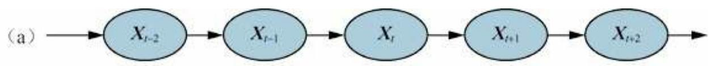

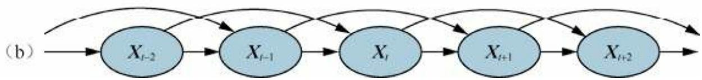  
图14-1 （a）由变量 X 定义状态的一阶马尔可夫过程对应的贝叶斯网络结构。（b）一个二阶马尔可夫过程

尽管我们利用马尔可夫假设规避了一些困难，但仍然存在一个问题： t 的可能的值有无穷多个。我们需要为每个时间步指定不同的分布吗？我们可以通过假设世界状态的变化是一个时间齐次（time-homogeneous）的过程来规避这个问题：也就是说，它是一个由自身不随时间变化的规律所控制的变化过程。那么，在雨伞世界中，下雨的条件概率 对所有 t 都是一样的，我们只需要指定一个条件概率表即可。

现在我们考虑传感器模型。证据变量E 可能依赖于过去的变量和当前的状态变量，但是任何称职的状态都应该足以生成当前的传感器值。因此，我们做出如下的传感器马尔可夫假设 （sensorMarkov assumption）：

$$
P \left(E _ {t} \mid X _ {0: s}, E _ {1: t - 1}\right) = P \left(E _ {t} \mid X _ {t}\right) \tag {14-2}
$$

是我们的传感器模型，有时也称为 观测模型 （observation model）。图14-2展示了雨伞案例的转移模型与传感器模型。注意状态与传感器间的依赖关系的方向：箭头从世界的实际状态指向传感器取值。这是因为世界的状态是 导致传感器呈现特定值的原因：下雨导致出现雨伞。（当然，推断过程的方向是相反的；建模的依赖方向和推断方向之间的区别是贝叶斯网络的主要优点之一。）

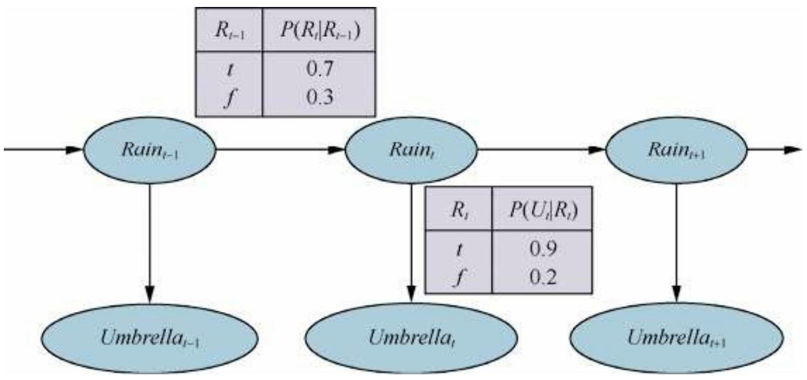  
图14-2 描述雨伞世界的贝叶斯网络结构与条件分布。转移模型是 $\mathbb { P } ( R o i n , | R a t n _ { t - 1 } )$ ，传感器模型是 P(Umbrella,Ratn)

除了指定转移模型和传感器模型之外，我们还需要说明事物的初始状态——时刻0时的先验概率分布 。这样一来，我们可以利用式（13-2）得到所有变量的完整的联合分布。对于任意时间步 t ，

$$
P \left(X _ {0: t}, E _ {1: t}\right) = P \left(X _ {0}\right) \prod_ {t = 1} ^ {t} P \left(X _ {t} \mid X _ {t - 1}\right) P \left(E _ {t} \mid X _ {t}\right) \tag {14-3}
$$

右边的3项分别是初始状态模型 、转移模型 和传感器模型 。这个方程定义了由这3项表示的时序模型族的语义。注意，标准贝叶斯网络不能表示这样的模型，因为它们要求变量集是有限的。处理无穷变量集的能力来自两个方面：一方面是使用整数索引定义无穷集；另一方面是使用隐式全称量词（见8.2节）来定义每个时间步的传感器模型和转移模型。

图14-2中的结构是一个一阶马尔可夫过程——假设下雨的概率仅取决于前一天是否下雨。这种假设的合理性取决于域本身。一阶马尔可夫假设认为，状态变量包含了描述下一个时间片的概率分布需要的所有信息。有时候这种假设是完全成立的，例如，如果一个粒子沿着x轴进行随机游走，并在每一个时间步将其位置改变±1，则我们可以把 x坐标作为状态并给出一个一阶马尔可夫过程。有时候这种假设只是近似，例如只根据前一天是否下雨来预测今天下雨的情况。有两种方法可以提高近似的准确性。

（1）增加马尔可夫过程模型的阶数。例如，我们可以通过添加 Rain 作为 Rain 的父变量来建立一个二阶模型，这可能会给出稍微精确些的预测。例如，加利福尼亚州的帕洛阿尔托很少有连续两天以上的降雨。  
（2）扩大状态变量的集合。例如，我们可以增加 Season $t$ 以便我们可以加入雨季的历史记录，或者我们可以增加（或许在一系列地点范围的） Temperature t 、 Humidity t 与 Pressure t 以便我们可以使用降雨条件的物理模型。

习题14.AUGM要求证明，第一个解决方法（增加阶数）总是可以被重新表述为保持阶数固定，扩大状态变量集合。注意，添加状态变量可能会提高系统的预测能力，但同时也会增加预测要求：我们现在还必须预测新的变量。因此，我们希望寻找一个“自给自足”的变量集，这实际上意味着我们必须理解正在建模的过程的“物理”特性。如果可以添加新的传感器（例如，温度和压力的测量）直接提供关于新的状态变量的信息，对过程精确建模的要求就会明显降低。

例如，考虑追踪一个在xy平面上随机游走的机器人的问题。有人可能会认为，位置和速度是一组

充分的状态变量：我们可以简单地使用牛顿定律来计算新的位置，而速度可能会发生不可预测的变化。然而，如果机器人是由电池供电的，那么电池的耗尽往往会对速度的变化产生系统性的影响。电池的耗尽反过来又取决于所有之前的机动所使用的电量，因此它违反了马尔可夫特性。

将电量水平 Battery 作为构成 $\boldsymbol { X } _ { t }$ 的状态变量之一，可以恢复其马尔可夫特性，这有助于预测机器人的运动，但反过来它需要一个根据 Battery t−1和速度来预测 Battery t的模型。在某些情况下，这能可靠地完成，但更多时候，我们发现误差会随着时间的推移而累积。在这种情况下，我们可以通过 增加一个新的电池电量传感器来提高精度。我们将在14.5节回顾这个电池案例。

# 14.2 时序模型中的推断

在建立了一般时序模型结构之后，我们可以形式化需要解决的基本推断任务。


● 滤波 （filtering） 或 状态估计 （state estimation）是指计算 信念状态 （belief state）

P(xle) 给定迄今为止所有的证据时最近状态的后验分布的任务。在雨伞示例中，这意味着给定到目前为止所有对雨伞的观测值，计算今天下雨的概率。一个理性智能体将进行滤波以用于追踪当前的状态，以便做出理性的决策。可以发现，证据序列的似然 P ( e 1:t)也可以由一个几乎相同的计算得出。

●预测 （prediction）：该任务是指给定迄今为止所有的证据，计算未来状态的后验分布。也就是说，我们希望对一些 k 0计算 $P ( X _ { 1 + k } \mid e _ { 1 z } )$ 。在雨伞示例中，这可能意味着给定到目前为止对雨伞携带者的所有观测值，计算从现在起3天后下雨的概率。预测对于根据预期结果评估可能的动作方案是非常有用的。  
● 平滑 （smoothing）：该任务是指给定迄今为止所有的证据，计算 过去 状态的后验分布。也就是说，我们希望对一些满足 的 $k$ 计算 $P ( X _ { k } | e _ { 1 : \mathcal { I } } )$ 。在雨伞示例中，它可能意味着给定到目前为止对雨伞携带者的所有观测值，计算上周三下雨的概率。对时刻 $k$ 的状态，平滑提供了

比当时能得到的估计更好的估计，因为它包含了更多的证据。


● 最可能解释 （most likely explanation）：给定一个观测序列，我们希望找到最有可能产生这些观测值的状态序列。也就是说，我们希望计算 。例如，如果前三天都出现了雨伞，而在第四天没有出现雨伞，那么最可能的解释就是前三天下雨了，而第四天没有下雨。这项任务的算法在许多应用中都是有用的，例如在语音识别中，其目标是给定一个声音序列找到最有可能的单词序列，以及重建通过噪声信道传输的位串。

除了这些推断任务，我们还可以考虑下面这个推断任务。

●学习 （learning）：如果我们不知道转移模型与传感器模型，那么可以从观测中学习。与静态贝叶斯网络类似，动态贝叶斯网络学习可以作为推断的副产品来完成。推断对实际发生的转移以及产生传感器读数的状态进行估计，这些估计可用于学习模型。学习过程可以通过一种称为期望最大化或EM的迭代更新算法来实现，也可以由来自给定证据时模型参数的贝叶斯更新实现。更多细节见第20章。

本节的剩余部分将描述这4个推断任务的通用算法，它们独立于所使用的特定类型的模型。算法针对每个模型的改进将在后续几节中描述。

# 14.2.1 滤波与预测

正如我们在7.7.3节中指出的，一个有用的滤波算法需要维护一个对当前状态的估计并更新它，而不是每次更新都要回顾整个感知历史。（否则，每次更新的代价会随着时间的推移而增加。）换句话说，给定直到时刻 t 的滤波结果，智能体需要从新的证据 e t+1中计算时刻 t + 1的结果。所以，存在某个函数f满足

$$
P \left(X _ {t + 1} \mid e _ {1: t + 1}\right) = f \left(e _ {t + 1}, P \left(X _ {t} \mid e _ {1: t}\right)\right)
$$

这个过程称为递归估计 （recursiveestimation）（见4.4节与7.7.3节）。我们可以将计算看作由两部分组成：第一部分是当前状态分布从 t到 t+1向前投影；第二部分是使用新的证据e 更新它。通过对公式重新排列，我们容易得到这两部分过程：

$$
\boldsymbol {P} \left(\boldsymbol {X} _ {t + 1} \mid \boldsymbol {e} _ {1: t + 1}\right) = \boldsymbol {P} \left(\boldsymbol {X} _ {t + 1} \mid \boldsymbol {e} _ {1: t}, \boldsymbol {e} _ {t + 1}\right)
$$

（证据分解）

$$
= \alpha P \left(e _ {t + 1} \mid X _ {t + 1}, e _ {1 t}\right) P \left(X _ {t + 1} \mid e _ {1 t}\right)
$$

（给定 $\rho _ { 1 \ 3 }$ ，使用贝叶斯法则）

$$
= \alpha \underbrace {P \left(e _ {t + 1} \mid X _ {t + 1}\right)} _ {\text {更 新}} \underbrace {P \left(X _ {t + 1} \mid e _ {t t}\right)} _ {\text {预 测}}
$$

（根据传感器马尔可夫假设）

（14-4）

此处和整个这一章中， $\pmb { \alpha }$ 是使概率和为1的归一化常数。现在我们将式（14-4）代入由以当前状态$\boldsymbol { X } _ { t }$ 为条件获得的单步预测 的表达式中。得到的新的状态估计方程是本章的核心结 $P ( X _ { H : 1 } \mid e _ { 1 : t } )$ 果：

$$
\begin{array}{l} P \left(X _ {t + 1} \mid e _ {1: t + 1}\right) = \alpha P \left(e _ {t + 1} \mid X _ {t + 1}\right) \sum_ {x _ {t}} P \left(X _ {t + 1} \mid x _ {t}, e _ {1: t}\right) P \left(x _ {t} \mid e _ {1: t}\right) \\ = \alpha \underbrace {P \left(e _ {t + 1} \mid X _ {t + 1}\right)} _ {\text {传 感 器 模 型}} \sum_ {x _ {t}} \underbrace {P \left(X _ {t + 1} \mid x _ {t}\right)} _ {\text {转 形 模 型}} \underbrace {P \left(x _ {t} \mid e _ {l t}\right)} _ {\text {通 归}} \quad (\text {马 尔 可 夫 假 设}) \tag {14-5} \\ \end{array}
$$

在这个表达式中，所有的项要么来自模型，要么来自之前的状态估计。因此，我们得到了想要的递归公式。我们可以认为滤波估计 是沿着序列向前传播的“消息” f 1:t，消息在每次转 $\mathbb { P } ( X _ { i } | e _ { 1 w } )$ $f _ { 1 : t }$ 移时进行修正并根据每次新的观测进行更新。这个过程可以表述为：

$$
\boldsymbol {f} _ {1: t + 1} = \text {F O R W A R D} \left(\boldsymbol {f} _ {1: t}, \boldsymbol {e} _ {t + 1}\right)
$$

其中F orward 实现了式（14-5）中的更新，过程从 开始。如果所有的状态变量都是离散的，每次更新所需的时间是常量（即与 t 无关），所需的空间也是常量。（当然，这些常量取决于问题中状态空间的大小和时序模型的类型。）如果一个有限的智能体无限期地追踪当前状态分布，更新的时间与空间要求必须是常数 量级。

让我们通过简单的雨伞示例说明滤波过程的两个步骤（图14-2）。即计算 ，如下所示。

●在第零天，没有观测，只有保安的先验信念；假设它由 组成。

● 在第一天，雨伞出现，所以 $U _ { 1 } =$ true。从 $t = 0$ 到 $t = 1$ 的预测是

$$
\begin{array}{l} \boldsymbol {P} \left(R _ {1}\right) = \sum_ {r _ {0}} \boldsymbol {P} \left(R _ {1} \mid r _ {0}\right) P \left(r _ {0}\right) \\ = \langle 0. 7, 0. 3 \rangle \times 0. 5 + \langle 0. 3, 0. 7 \rangle \times 0. 5 = \langle 0. 5, 0. 5 \rangle \\ \end{array}
$$

然后更新步骤只需乘以 $t = 1$ 时的证据概率并归一化，如式（14-4）所示：

$$
\begin{array}{l} \boldsymbol {P} \left(R _ {1} \mid u _ {1}\right) = \alpha \boldsymbol {P} \left(u _ {1} \mid R _ {1}\right) \boldsymbol {P} \left(R _ {1}\right) = \alpha \langle 0. 9, 0. 2 \rangle \langle 0. 5, 0. 5 \rangle \\ = \alpha \langle 0. 4 5, 0. 1 \rangle \approx 0. 8 1 8, 0. 1 8 2 \\ \end{array}
$$

●在第二天，雨伞出现，所以 $U _ { 2 } =$ true。从 $t = 1$ 到 $t = 2$ 的预测是

$$
\begin{array}{l} P \left(R _ {2} \mid u _ {1}\right) = \sum_ {r _ {1}} P \left(R _ {2} \mid r _ {1}\right) P \left(r _ {1} \mid u _ {1}\right) \\ = \langle 0. 7, 0. 3 \rangle \times 0. 8 1 8 + \langle 0. 3, 0. 7 \rangle \times 0. 1 8 2 \approx \langle 0. 6 2 7, 0. 3 7 3 \rangle \\ \end{array}
$$

使用 $t = 2$ 时的证据更新它，得到

$$
\begin{array}{l} \boldsymbol {P} \left(R _ {2} \mid u _ {1}, u _ {2}\right) = \alpha \boldsymbol {P} \left(u _ {2} \mid R _ {2}\right) \boldsymbol {P} \left(R _ {2} \mid u _ {1}\right) = \alpha \langle 0. 9, 0. 2 \rangle \langle 0. 6 2 7, 0. 3 7 3 \rangle \\ = \alpha \langle 0. 5 6 5, 0. 0 7 5 \rangle \approx \langle 0. 8 8 3, 0. 1 1 7 \rangle \\ \end{array}
$$

直观上，由于下雨的持续，下雨的概率从第一天到第二天增加了。习题14.CONV（a）要求你进一步研究这种趋势。

预测 的任务可以简单地看作不添加新证据的滤波。事实上，滤波过程已经包含了一个单步预测，我们容易推导出下面的递归计算，即从时刻t+k的预测去预测时刻 t+k+1的状态：

$$
P (X _ {t + k + 1} \mid e _ {1: t}) = \sum_ {x _ {t + k}} \underbrace {P (X _ {t + k + 1} \mid x _ {t + k})} _ {\text {特 移 模 型}} \underbrace {P (x _ {t + k} \mid e _ {1: t})} _ {\text {递 归}} \tag {14-6}
$$

当然，这个计算只涉及转移模型而不涉及传感器模型。

当我们尝试预测越来越远的未来时，考虑会发生什么是非常有趣的。如习题14.CONV（b）所示，下雨的预测分布将收敛到不动点〈0.5,0.5〉，且之后会一直保持不变。[1] 这就是由转移模型定义的马尔可夫过程的平稳分布 （stationary distribution）（见13.4.2节）。人们对于这种分布的性质和混合时间 （mixing time）——大致含义是分布达到不动点所花费的时间——有很深入的了解。在实践中，除非平稳分布本身在状态空间的一小部分区域有显著的峰值，否则任何对实际 状态进行时间步超过混合时间某个比例的预测都注定失败。一般而言，转移模型的不确定性越大，混合时间就越短，对未来的了解就越模糊。

[1]如果选择任意一天作为t=0，那么选择先验P(Rain 0)来匹配平稳分布是有意义的，这就是我们选择〈0.5, 0.5〉作为先验的原因。如果我们选择一个不同的先验，平稳分布仍然会算出〈0.5,0.5〉。

除了滤波和预测外，我们还可以使用前向递归来计算证据序列的似然 $P \left( \pmb { e } _ { 1 : t } \right)$ 。如果我们想要比较可能产生相同证据序列的不同时序模型（例如，判断雨水持续性的两个不同模型），这是一个有用的量。在这个递归中，我们采用似然消息 $\ell _ { 1 : f } ( X _ { t } ) = P ( X _ { t } , e _ { 1 : t } )$ 。容易证明（习题14.LIKL），这个消息的计算与滤波的计算是相同的：

$$
\ell_ {1: t + 1} = \text {F O R W A R D} \left(\ell_ {1: t}, e _ {t + 1}\right)
$$

得到 $\ell _ { 1 : \ell }$ 后，我们通过求和消元消去 $\boldsymbol { X } _ { t }$ 得到实际的似然：

$$
L _ {1: 2} = P \left(e _ {1: 3}\right) = \sum_ {x _ {t}} \ell_ {1: 2} \left(x _ {t}\right) \tag {14-7}
$$

注意，随着时间的推移，似然消息将表示越来越长的证据序列的概率，因此它在数值上变得越来越小，导致浮点运算的下溢问题。这在实践中是一个重要的问题，但我们不打算在这里讨论其解决办法。

14.2.2

平滑

正如我们前面提到的，平滑是指给定到目前为止的证据，计算过去状态分布的过程，也就是对

计算 $P ( X _ { k } | e _ { 1 : y } )$ （见图14-3）。预见到另一种递归的消息传递方法，我们可以将计算分成两部分——到时刻 $k$ 为止的证据和从时刻 k + 1到时刻 t 的证据：

$$
\begin{array}{l} P \left(X _ {k} \mid e _ {1: t}\right) = P \left(X _ {k} \mid e _ {1: k}, e _ {k + 1: t}\right) \\ = \alpha P \left(X _ {k} \mid e _ {1: k}\right) P \left(e _ {k + 1: 2} \mid X _ {k}, e _ {1: k}\right) \quad (\text {给 定} e _ {1: k}, \text {使 用 贝 叶 斯 法 则}) \\ = \alpha P \left(X _ {k} \mid e _ {1: k}\right) P \left(e _ {k + 1:} \mid X _ {k}\right) \quad (\text {使 用 条 件 独 立 性}) \\ \end{array}
$$

（14-8）

$$
= a f _ {1: k} \times b _ {k + 1: t}
$$

其中， $^ { \bullet \bullet } \times ^ { \bullet \bullet }$ 表示向量的逐点乘积。这里我们定义了类似于前向消息 $\pmb { f } _ { 1 : k }$ 的“后向”消息

。前向消息 f 1:k可以通过从时刻1到时刻 k 的前向滤波来计算，如式（14- $b _ { k + 1 ; \mathscr { G } } = P ( e _ { k + 1 ; \mathscr { G } } | X _ { k } )$ $\pmb { f } _ { 1 : k }$ $k$ 5）所示。事实表明，后向消息 $\pmb { b } _ { k + 1 : t }$ 可以通过从时刻 $t$ 开始的 后向 运行的递归过程来计算：

$$
\begin{array}{l} P \left(e _ {k + 1: 2} \mid X _ {k}\right) = \sum_ {X _ {k + 1}} P \left(e _ {k + 1: 2} \mid X _ {k}, x _ {k + 1}\right) P \left(x _ {k + 1} \mid X _ {k}\right) \quad (\text {将} X _ {k + 1} \text {条 件 化}) \\ = \sum_ {X _ {k + 1}} P \left(e _ {k + 1:} \mid x _ {k + 1}\right) P \left(x _ {k + 1} \mid X _ {k}\right) \quad (\text {根 据 条 件 独 立 性}) \\ = \sum_ {X _ {k + 1}} P \left(e _ {k + 1: 2}, e _ {k + 2: 2} \mid x _ {k + 1}\right) P \left(x _ {k + 1} \mid X _ {k}\right) \\ = \sum_ {X _ {k + 1}} \underbrace {P \left(e _ {k + 1} \mid x _ {k + 1}\right)} _ {\text {传 感 器 模 型}} \underbrace {P \left(e _ {k + 2} \mid x _ {k + 1}\right)} _ {\text {道 白}} \underbrace {P \left(x _ {k + 1} \mid X _ {k}\right)} _ {\text {特 移 模 型}} \\ \end{array}
$$

（14-9）

其中，最后一步的成立源自给定 $\boldsymbol { x } _ { k + 1 }$ 时 $\pmb { e } _ { k + 1 }$ 与 $e _ { k + 2 : t }$ 的条件独立性。在这个表达式中，所有的项要么来自模型，要么来自之前的后向消息。因此，我们得到了想要的递归公式。在消息形式上，我们有

$$
\boldsymbol {b} _ {k + 1: t} = \text {B A C K W A R D} (\boldsymbol {b} _ {k + 2: t}, \boldsymbol {e} _ {k + 1})
$$

其中Backward 实现式（14-9）描述的更新。与前向递归一样，后向递归每次更新所需的时间代价和空间代价也是与 t无关的常量。

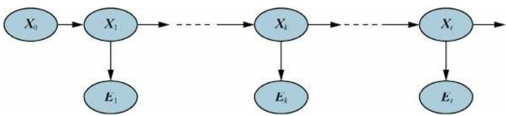  
图14-3平滑计算 ，给定从时刻1到时刻 t 的完整观测序列，计算过去某时刻 k 的状态的 $P Q _ { \varepsilon }$ $k$ 后验分布

我们现在可以看到，式（14-8）中的两项都可以通过对时间进行递归来计算，一项使用式（14-5）滤波，从时刻1向前运行到 $k$ ，另一项使用式（14-9）从时刻t向后运行到 $k + 1$ 。

至于后向阶段的初始化，我们采用 $b _ { t + 1 ; t } = P ( e _ { t + 1 ; t } \mid X _ { t } ) = P ( \mid X _ { t } ) = I$ ，其中 1 是由1组成的向量。这样做的原因是 e t+1:t是一个空序列，所以观测的概率是1。

现在让我们把这个算法应用到雨伞的示例中，给定第一天与第二天的雨伞观测，计算 $k = 1$ 时下雨概率的平滑估计。根据式（14-8），我们有

$$
P \left(R _ {1} \mid u _ {1}, u _ {2}\right) = \alpha P \left(R _ {1} \mid u _ {1}\right) P \left(u _ {2} \mid R _ {1}\right) \tag {14-10}
$$

根据之前描述的前向滤波过程，我们已经知道第一项是〈0.818, 0.182〉。第二项可以通过应用式（14-9）中的后向递归来计算：

$$
\begin{array}{l} \boldsymbol {P} \left(u _ {2} \mid R _ {1}\right) = \sum_ {r _ {2}} P \left(u _ {2} \mid r _ {2}\right) P \left(\left| r _ {2}\right) \boldsymbol {P} \left(r _ {2} \mid R _ {1}\right) \right. \\ = (0. 9 \times 1 \times \langle 0. 7, 0. 3 \rangle) + (0. 2 \times 1 \times \langle 0. 3, 0. 7 \rangle = \langle 0. 6 9, 0. 4 1 \rangle \\ \end{array}
$$

将它代入式（14-10），我们得到第一天下雨概率的平滑估计是

$$
P \left(R _ {1} \mid u _ {1}, u _ {2}\right) = \alpha \langle 0. 8 1 8, 0. 1 8 2 \rangle \times \langle 0. 6 9, 0. 4 1 \rangle \approx \langle 0. 8 8 3, 0. 1 1 7 \rangle
$$

因此，在这个例子里，对第一天下雨概率的平滑估计要高于滤波估计（0.818）。这是因为第二天带伞使得第二天下雨的可能性更大；反过来，因为降雨倾向于持续，这使得第一天下雨的可能性更大。

前向递归和后向递归每一步所花费的时间都是常量的；因此，对证据e 进行平滑的时间复杂性为O (t)。这是对特定的时间步k进行平滑的复杂性。如果我们想要平滑整个序列，一个显而易见的方法是简单地为每个需要平滑的时间步运行一次完整的平滑过程。这个过程的时间复杂性为 O (t  2  )。

更好的方法是简单应用动态规划将复杂性降低到 O (t)。从上文中对雨伞示例的分析中可以发现，我们能够复用前向滤波阶段的结果。线性时间算法的关键是记录整个序列的前向滤波结果。然后，我们从时刻 t 到时刻1运行后向递归，从计算的后向消息 b k+1:t和存储的前向消息 f 1:k来计算每步k 的平滑估计。该算法被恰当地称为 前向-后向算法 （forward-backward algorithm），如图14-4所示。

机敏的读者会注意到图14-3所示的贝叶斯网络结构是 多重树 （13.3.3节）。这意味着，直接应用聚类算法也会产生一个用于计算整个序列平滑估计的线性时间算法。那么我们现在可以意识到，前向-后向算法实际上是与聚类算法共同使用的多重树传播算法的一个特例（尽管这两种算法是独立提出的）。

functionFORWARD-BACKWARD(ev,prior)returns一个概率分布的向量

inputs:ev，时间步1，.,t的证据值的向量

prior，初始状态的先验分布 $\pmb { P } ( \pmb { X } _ { 0 } )$

localvariables:fv，时间步0,,t的前向消息的向量

b，后向消息的表示，初始化全为1

$\pmb { s } \pmb { \nu }$ ，时间步0,…,t的平滑估计的向量

$$
f v [ 0 ] \leftarrow p r i o r
$$

$$
\text {f o r} i = 1 \text {t o} t \text {d o}
$$

$$
f v [ i ] \leftarrow F o r w a r d (f v [ i - 1 ], e v [ i ])
$$

$$
\text {f o r} i = t \text {d o w n t o 1 d o}
$$

$$
s v [ i ] \leftarrow \text {N O R M A L I Z E} (f v [ i ] \times b)
$$

$$
\boldsymbol {b} \leftarrow \text {B A C K W A R D} (\boldsymbol {b}, e \boldsymbol {v} [ i ])
$$

$$
\text {r e t u r n} s v
$$

图14-4平滑的前向-后向算法：给定观测序列，计算时状态序列的后验概率。Forward与Backward 算子分别由式（14-5）和式（14-9）定义

前向-后向算法充当了许多处理噪声观测序列的应用的计算支柱。从到目前为止对前向-后向算法的描述来看，它有两个实际的缺点。第一个缺点是当状态空间庞大且序列很长时，算法的空间复杂性可能过高。它使用了 的空间，其中 是前向消息表示的大小。经过一定的修改，我们可以把空间复杂性降低到 ，但相应的时间复杂性也会增加一个log t 因子，如习题14.ISLE所示。在某些情况下（见14.3节），我们可以使用空间复杂性为常数量级的算法。

这个基本算法的第二个缺点是，它需要进行修改以便在 在线环境下工作——随着新的观测数据不断添加到序列末尾时，对较早的时间片进行平滑估计计算。最常见的要求是定滞后平滑 （fixed-lag smoothing），这需要对固定的滞后 d 计算平滑估计 。也就是说，只对比当前时刻t滞后d 步的时间片做平滑。随着时刻 t的增加，平滑必须跟上。显然，我们可以在每增加一个新的观测时在 $d$ 步窗口上运行前向-后向算法，但这似乎效率不高。在14.3节中，我们将看到，在某些情况下，定滞后平滑可以独立于滞后d 在常数时间内完成每次更新。

# 14.2.3 寻找最可能序列

假设保安前五天工作时观测的雨伞序列是[true,true,false,true,true]。什么样的天气序列最有可能解释这一点？第三天没带伞是因为没有下雨，还是主管忘记带了？如果第三天没下雨，也许第四天也没下雨（因为天气往往会持续下去），但主管带了雨伞以防万一。总共有25 种可能的天气序列可供选择。是否有办法找到最可能的一个天气序列，而不是列举所有这些并计算它们的似然？

我们可以尝试这样的具有线性时间复杂性的过程：使用平滑找到天气在每个时间步上的后验分布；接着构造序列，在每一步中根据后验分布找出最可能的天气。这样的方法应该在读者的脑海中敲响警钟，因为通过平滑计算的后验分布是单个时间步上的分布，而要找到最可能的序列，我们必须考虑所有时间步上的联合概率。事实上，它与单个时间步的结果可能完全不同。（见习题14.VITE。）

寻找最可能序列且具有线性时间的算法是存在的，但它需要我们进一步的思考。它同样依赖于产生高效的滤波和平滑算法的马尔可夫特性。其想法是把每个序列看作图中的一条 路径 ，其中图的节点是每个时间步上可能的 状态。图14-5a展示了雨伞世界中的图。现在我们希望在这个图中找到最可能的路径，其中任一路径的似然是沿着路径的转移概率和每个状态下给定观测值的概率的乘积。

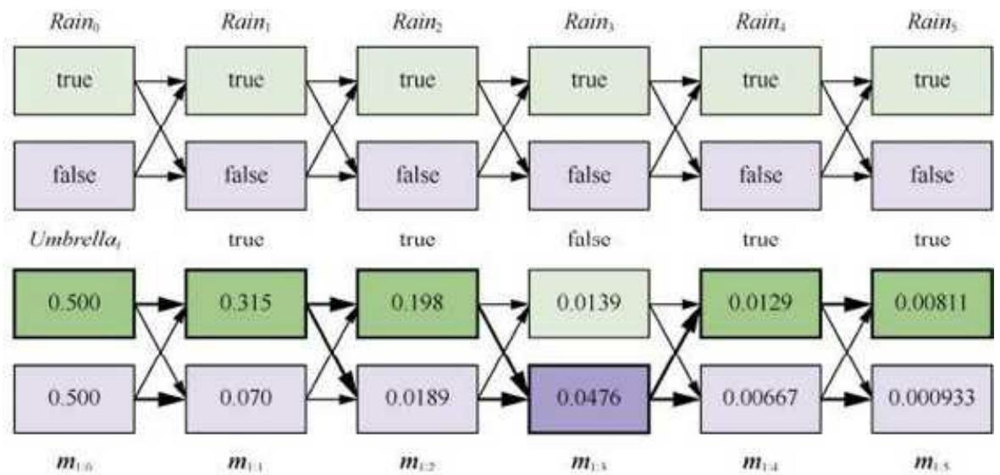  
  
图14-5（a） Rain 的可能状态序列可以看作由每个时间步上的可能状态构成的图中的路径（状态用矩形表示，避免与贝叶斯网络中的节点混淆）。（b）雨伞观测序列[true,true,false,true,true]的维特比算法的操作，其中证据从时刻1开始。对于每个t，我们展示了消息 $\textbf { \em m } _ { 1 : t }$ 的值，它给出了在时刻t到达每个状态的最佳序列的概率。同样，对于每个状态，指向它的粗箭头表示它的最佳的前驱状态，其中“最佳”由前一个序列概率和转移概率的乘积来度量。沿着粗箭头从 $\pmb { m } _ { 1 : 5 }$ 中最可能状态向后回溯，给出了最可能序列，如粗外框和较深阴影所示

让我们特别关注达到状态Rain $_ 5 =$ true的路径。根据马尔可夫特性，最有可能到达状态Rain $_ 5 =$ true的路径包含最有可能到达时刻4时某状态的路径，且紧随着到Rain $_ 5 =$ true的转移。任一最大化这条路径似然的时刻4时的状态将成为到 Rain $_ 5 =$ true的路径的一部分。也就是说， 到达每个状态 $\boldsymbol { x } _ { t + 1 }$ 的最可能路径与到达每个状态 $\textbf { \em x } _ { t }$ 的最可能路径之间存在递归关系。

我们可以利用这个特性直接构造一个递归算法来计算给定证据的最可能路径。我们将使用递归计算的消息 $\textbf { \em m } _ { 1 : t }$ ，它与滤波算法中的前向消息 $f _ { 1 : t }$ 是类似的。这个消息的定义如下：[2]

[2]注意，这些不是给定证据时最可能到达状态 $\boldsymbol { \textbf { \textit { X } } } _ { t }$ 的概率，而是条件概率

；但是这两个向量由一个常数因子 P ( e 1:t)联系在一起。差别是无关紧 $\begin{array} { r } { \operatorname* { m a x } _ { x _ { 1 } , \ldots , P \left( x _ { 1 : 2 - 1 } , x _ { i } \mid \theta _ { i + } \right) } } \end{array}$ $P \left( \pmb { e } _ { 1 : t } \right)$ 要的，因为max运算符不关心常数因子。这样定义 $\textbf { \em m } _ { 1 : t }$ ，我们得到一个稍微简单一点的递归。

$$
\boldsymbol {m} _ {1: t} = \max  _ {\boldsymbol {x} _ {1: t - 1}} \boldsymbol {P} \left(\boldsymbol {x} _ {1: t - 1}, \boldsymbol {X} _ {t}, \boldsymbol {e} _ {1: t}\right)
$$

为了得到 $\pmb { m } _ { \uparrow : t + 1 }$ 与 $\textbf { \em m } _ { 1 : t }$ 之间的递归关系，我们可以或多或少地重复使用用于式（14-5）的相同步骤：

$$
\begin{array}{l} m _ {1 t + 1} = \max  _ {x _ {b}} P \left(x _ {1: t}, X _ {t + 1}, e _ {1: t + 1}\right) = \max  _ {x _ {b}} P \left(x _ {1: t}, X _ {t + 1}, e _ {1: t}, e _ {t + 1}\right) \\ = \max  _ {x _ {t}} P \left(e _ {t + 1} \mid x _ {1: t}, X _ {t + 1}, e _ {1: t}\right) P \left(x _ {1: t}, X _ {t + 1}, e _ {1: t}\right) \\ = P \left(e _ {t + 1} \mid X _ {t + 1}\right) \max  _ {x _ {t}} P \left(X _ {t + 1} \mid x _ {t}\right) P \left(x _ {t}, e _ {t}\right) \\ = P \left(e _ {t + 1} \mid X _ {t + 1}\right) \max  _ {x _ {t}} P \left(X _ {t + 1} \mid x _ {t}\right) \max  _ {x _ {1 t - 1}} P \left(x _ {1 t - 1}, e _ {1 t}\right) \tag {14-11} \\ \end{array}
$$

其中最后一项 $\mathrm { m a x } _ { x _ { i x - 1 } } P ( x _ { i x - 1 } , x _ { i } , e _ { 1 z } )$ 恰好是消息向量 $\textbf { \em m } _ { 1 : t }$ 中特定状态 $\textbf { \em x } _ { t }$ 的条目。式

（14-11）与式（14-5）基本相同，只是式（14-5）中对 $\textbf { \em x } _ { t }$ 的求和被式（14-11）中对 $\textbf { \em x } _ { t }$ 的最大值所取代，且式（14-11）中没有归一化常数 $\pmb { \alpha }$ 。因此，计算最可能序列的算法类似于滤波：它从时刻0以先验 $m _ { 1 : 0 } = P ( X _ { 0 } )$ 开始，沿着序列前向运行，利用式（14-11）在每个时间步计算消息 $\pmb { m }$ 。计算过程如图14-5b所示。

在观测序列的末尾， $\textbf { \em m } _ { 1 : t }$ 将包含到达每个最终状态的最可能的序列的概率。人们可以很容易选择整体最可能序列的最终状态（第5步中粗外框的状态）。为了确定实际的序列，而不仅仅是计算概率，该算法还需要为每个状态记录指向它的最佳状态。这些状态由图14-5b中的粗箭头表示。按照这些粗箭头从最佳最终状态向后查找，我们可以确定最佳序列。

我们刚才描述的算法被称为 维特比算法 （Viterbialgorithm），它以发明者安德鲁·维特比（Andrew Viterbi）的姓氏命名。和滤波算法一样，它的时间复杂性与序列长度 t呈线性关系。与使用常量空间的滤波不同，它的空间需求也与 t呈线性关系。这是因为维特比算法需要保留指针以识别指向每个状态的最佳序列。

最后一个实际的问题是：数值下溢是维特比算法的一个重要问题。在图14-5b中，概率变得越来越小，这只是一个简单的例子。在DNA分析或消息解码的实际应用中，算法可能有成千上万步。该问题的一种可能的解决方案是在每一步对m进行归一化；这种缩放不会影响正确性，因为

。第二种解决方案是在计算中处处使用对数概率并用加法代替乘法。同样，其正确性不受影响，因为log函数是单调的，所以max(log x , log y ) = log max( x , y )。

# 14.3 隐马尔可夫模型

我们在14.2节中介绍了时序概率推理算法的一般框架，它有着独立于转移模型和传感器模型的具体形式、独立于状态变量和证据变量的性质。在本节和接下来的两节中，我们将讨论更具体的模型和应用，这些模型和应用阐释了基础算法的强大功能，并且在某些情况下还可以进一步改进。

我们从 隐马尔可夫模型 （hiddenMarkov model，HMM）入手。隐马尔可夫模型是一种时序概率模型，其过程状态由单个离散随机变量描述。变量的可能的值是世界的可能状态。因此，上一节介绍的雨伞示例是一个隐马尔可夫模型，因为它只有一个状态变量：Rain 。如果你的模型有两个或更多状态变量，会发生什么呢？你仍然可以通过将这些变量组合成单个“大变量”——它的值是每个状态变量的值组成的所有可能的元组——来适应隐马尔可夫模型框架。我们将看到隐马尔可夫模

型的受限结构允许所有基础算法通过简单而优雅的矩阵实现。


虽然隐马尔可夫模型要求状态是单个离散变量，但它对证据变量没有相应的限制。这是因为证据变量总是被观测的，这意味着没有必要追踪有关它们值的任何分布。（如果一个变量未被观测，可以简单地将它从模型的那个时间步中移除）。同时隐马尔可夫模型也允许有多个离散的或连续的证据变量存在。

# 14.3.1 简化矩阵算法

对于单个离散状态变量 $X _ { t }$ ，我们可以给出转移模型、传感器模型以及前向消息和后向消息的具体表示形式。我们用整数1,…, S表示状态变量 $X _ { t }$ 的可能值，其中S 是可能状态的数量。那么转移模型 就变成了一个S ×S的矩阵T，其中 $P ( X _ { 1 } | X _ { \mathbb { H } } )$ $S \times S$ $\pmb { T }$

$$
\boldsymbol {T} _ {i j} = P (X _ {t} = j \mid X _ {t - 1} = i)
$$

也就是说， $\boldsymbol { T } _ { i j }$ 是从状态 i 转移到状态 $j$ 的概率。例如，如果我们为状态 Rain $=$ true和 Rain $=$ false分别编号1和2，则图14-2中定义的雨伞世界的转移矩阵是

$$
\boldsymbol {T} = \boldsymbol {P} (X _ {t} \mid X _ {t - 1}) = \left( \begin{array}{l l} 0. 7 & 0. 3 \\ 0. 3 & 0. 7 \end{array} \right)
$$

用同样的方法，我们可以把传感器模型写成矩阵形式。在这个例子中，因为证据变量 $E _ { t }$ 的值在时刻 $t$ 已经得知（称为 $\boldsymbol { e } _ { t }$ ），我们只需要为每个状态指定它导致 $\boldsymbol { e } _ { t }$ 出现的概率：对于每个状态 i，我们需要指定 $P ( e _ { i } \mid X _ { i } = i )$ 。为了数学上的方便，我们把这些值放入一个对角 观测矩阵（observation matrix） $\mathbf { O } _ { t }$ ，我们在每个时间步都构造一个这样的矩阵。 $\mathbf { O } _ { t }$ 的第 i 个对角元素是，其他元素为0。例如，在图14-5所示的雨伞世界的第一天 U 1= true，而在第三天 $P ( e _ { 1 } | X _ { 1 } = i )$ $U _ { 1 } =$ $U _ { 3 } =$ false，所以我们有

$$
\boldsymbol {O} _ {1} = \left( \begin{array}{c c} 0. 9 & 0 \\ 0 & 0. 2 \end{array} \right) \quad \boldsymbol {O} _ {3} = \left( \begin{array}{c c} 0. 1 & 0 \\ 0 & 0. 8 \end{array} \right)
$$

现在，如果使用列向量来表示前向消息和后向消息，那么所有的计算都可以转换为简单的矩阵-向量运算。前向公式（14-5）变成

$$
\boldsymbol {f} _ {1: + 1} = \alpha \boldsymbol {O} _ {t + 1} \boldsymbol {T} ^ {\top} \boldsymbol {f} _ {1: t} \tag {14-12}
$$

后向公式（14-9）变成

$$
\boldsymbol {b} _ {k + 1 z} = T O _ {k + 1} \boldsymbol {b} _ {k + 2 z} \tag {14-13}
$$

从这些公式中可以看出，应用于长度为 t 的序列的前向-后向算法（图14-4）的时间复杂性是 O ( S2t )，因为每步需要一个 S 元向量与一个 S × S 矩阵相乘。算法的空间需求是 O ( St )，因为前向传递存储 t 个 S 元向量。

除了为隐马尔可夫模型提供优雅的滤波和平滑算法的表示，矩阵形式还揭示了改进算法的机会。第一个改进的角度基于前向-后向算法的一个简单变体，它使平滑可以在独立于序列长度的常数空间中进行。其大致想法如下：根据式（14-8），对任意特定的时间片 k 进行平滑需要同时存有前向消息 与后向消息 。前向-后向算法通过存储在前向传递时计算的 f 来实现这一点，并方便它们在后向传递期间可用。实现这一目标的另一种方法是在同一个方向上传播f和b 。例如，如果我们将式（14-12）处理为反向运行，则前向消息 f 可以向后传播：

$$
\boldsymbol {f} _ {1: t} = \alpha^ {\prime} (\boldsymbol {T} ^ {\top}) ^ {- 1} \boldsymbol {O} _ {t + 1} ^ {- 1} \boldsymbol {f} _ {1: t + 1}
$$

修改后的平滑算法首先运行标准的前向传递计算f （抛弃所有中间结果），之后对 b 和 $\pmb { f }$ 共同执行后向传递，并使用它们在每一步计算平滑估计。因为每条消息只需要一个副本，所以存储需求是常数的（即与序列的长度t无关）。该算法有两个明显的限制：它要求转移矩阵是可逆的，并且传感器模型不存在零概率，即每个观测在每个状态下都是可能的。

矩阵形式揭示算法的第二个改进是在固定滞后的在线平滑方面。平滑可以在常数空间中完成这一事实表明，应该存在一种高效的在线平滑的递归算法，即一种时间复杂性与滞后长度无关的算法。我们假设滞后为 $d$ ；也就是说，当前时间为t时，我们在时间片 处进行平滑。根据式（14-8），我们需要为时间片 计算

$$
\alpha f _ {1: t - d} \times b _ {t - d + 1: t}
$$

然后，当新的观测值到达时，我们需要为时间片 $t - d + 1$ 计算

$$
\alpha f _ {1: t - d + 1} \times b _ {t - d + 2: t + 1}
$$

如何才能以增量的形式做到这一点？首先，我们可以利用标准滤波，即式（14-5），根据 $f _ { 1 : \mu }$ 计算 。

以增量方式计算后向消息要复杂一些，因为旧的后向消息 $\delta _ { t h i s }$ 与新的后向消息 $b _ { 1 }$ 之间没有简单的关系。我们转而考察旧的后向消息 $\delta _ { r o h 1 : }$ 与序列前部的后向消息 $\tilde { \mathbf { \Gamma } } _ { t + 1 : t }$ 之间的关系。为了完成这一点，我们使用 d 次式（14-13）得到

$$
\boldsymbol {b} _ {t - d + 1: t} = \left(\prod_ {i = t - d + 1} ^ {t} T O _ {i}\right) \boldsymbol {b} _ {t + 1: t} = \boldsymbol {B} _ {t - d + 1: t} \boldsymbol {I} \tag {14-14}
$$

其中矩阵 是矩阵序列 $\pmb { T }$ 与 O 的乘积， 1 是由1组成的向量。 $\mathbf { B }$ 可以看作一个“变换算子”，它将后续的后向消息变换为先前的后向消息。类似的公式适用于下一个观测到达后新的后向消息：

$$
\boldsymbol {b} _ {t - d + 2: t + 1} = \left(\prod_ {i = t - d + 2} ^ {t + 1} \boldsymbol {T O} _ {i}\right) \boldsymbol {b} _ {t + 2: t + 1} = \boldsymbol {B} _ {t - d + 2: t + 1} \boldsymbol {1} \tag {14-15}
$$

通过观察式（14-14）和式（14-15）中的乘积表达式，我们可以发现它们之间的一个简单关系：要得到第二个乘积，可以将第一个乘积“除以”第一个元素 ，然后乘以新的最后一个元素 $T 0 _ {  \ 4 1 }$

。因此，旧的 B 矩阵和新的 B 矩阵之间的简单关系可以由矩阵的语言表述为 $\pmb { T 0 } _ { \pmb { v } 1 }$

$$
\boldsymbol {B} _ {t - d + 2 \pm t + 1} = \boldsymbol {O} _ {t - d + 1} ^ {- 1} \boldsymbol {T} ^ {- 1} \boldsymbol {B} _ {t - d + 1 \pm t} \boldsymbol {T O} _ {t + 1} \tag {14-16}
$$

这个等式提供了 B 矩阵的增量形式更新，让我们可以通过式（14-15）计算新的后向消息 b t−d+2:t $\pmb { b } _ { t - d + 2 : t }$ $+ 1$ 。完整的算法要求存储与更新 $\pmb { f }$ 和 $\mathbfit { B }$ ，如图14-6所示。

function FIXED-LAG-SMOOTHING $( e _ { r } , $ hmm,dreturns一个 $\cdot X _ { r - d }$ 上的分布

inputs: $e _ { t }$ ，时间步t的当前证据

hmm，具有 $s \times$ S转移矩阵T的隐马尔可夫模型

$^ { d }$ ，平滑的滞后长度

persistent:t，当前的时间，初始为1

${ f , }$ 前向消息 $\pmb { P } ( X _ { t } | \ : e _ { 1 : t } )$ ，初始为hmm.PRIOR

$\pmb { B }$ ，d步后向变换矩阵，初始为单位矩阵

$e _ { t - d : t }$ ，从t-d到t的双端证据列表，初始为空

localvariables: $\mathbf { \delta } _ { o _ { i  \phi } } o _ { \ell }$ ，包含传感器模型信息的对角矩阵

在 $\boldsymbol { \mathscr { e } } _ { t - d : t }$ 的尾端添加e,

$\mathbf { \delta } _ { \mathbf { \alpha } _ { t }  }$ 包含 $\textstyle P ( e _ { t } \mid X )$ 的对角矩阵

$$
i f t > d \text {t h e n}
$$

$$
f \leftarrow F o r w a r d (f, e _ {t - d})
$$

从 $\boldsymbol { \mathscr { e } } _ { t - d : t }$ 的首端移除 $e _ { i - d - 1 }$

$\pmb { o } _ { t - d } $ 包含 $P ( e _ { t - d } | X _ { t - d } )$ 的对角矩阵

$$
B \leftarrow O _ {t - d} ^ {- 1} T ^ {- 1} B T O _ {t}
$$

$$
\mathrm {e l s e} B \leftarrow B T O _ {t}
$$

$$
t \leftarrow t + 1
$$

$$
i f t > d + 1 \text {t h e n r e t u r n N o r m a l i z e} (f \times B I) \text {e l s e r e t u r n n u l l}
$$

图14-6作为一种在线算法实现的具有固定的 $d$ 步时间滞后的平滑算法，在给定新时间步的观测值时输出新的平滑估计。注意，根据式（14-14），最终的输出N ormalize ( f × B1 )恰好是 $\yen 5$ b

# 14.3.2 隐马尔可夫模型示例：定位

我们在4.4.4节中介绍了真空吸尘器世界的定位 （localization）问题的一个简单版本。在那个版本中，机器人有单个非确定性的动作 Move，它的传感器可以完美地报告在紧邻的东、南、西、北4个方向是否有障碍物；机器人的信念状态是它可能所处的位置的集合。

现在我们将传感器中的噪声考虑在内，并将机器人随机移动的想法形式化，即它移动到任何相邻的空方格的可能性都是相等的，这样，我们使定位问题更加真实。状态变量X 表示机器人在离散网格上的位置；这个变量的域是一个空方格的集合，我们用整数 标记。令N eighbors ( i)表示与 i 相邻的空方格集合， N ( i )是该集合的大小。那么，如下 Move 动作的转移模型表示，机器人等可能地到达任何邻近的方格：

$$
P \left(X _ {t + 1} = j \mid X _ {t} = i\right) = T _ {i j} = \left\{ \begin{array}{l l} 1 / N (i), & \text {如 果} j \in \mathrm {N e i g h b o r s} (i) \\ 0, & \text {其 他} \end{array} \right.
$$

我们不知道机器人从哪个位置出发，所以我们假设它服从一个所有方格上的均匀分布；也就是说，。在我们考虑的特定环境（图14-7）中， S = 42，转移矩阵 T 有42×42 = 1764 $P ( X _ { 0 } = i ) = 1 / S$ $S = 4 2$ $\mathbf { T }$ $4 2 \times 4 2 = 1 7 6 4$ 个元素。

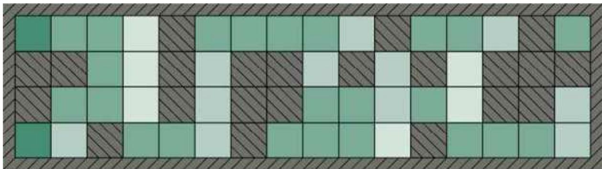  
（a）观测到E1=1011之后，机器人位置的后验分布

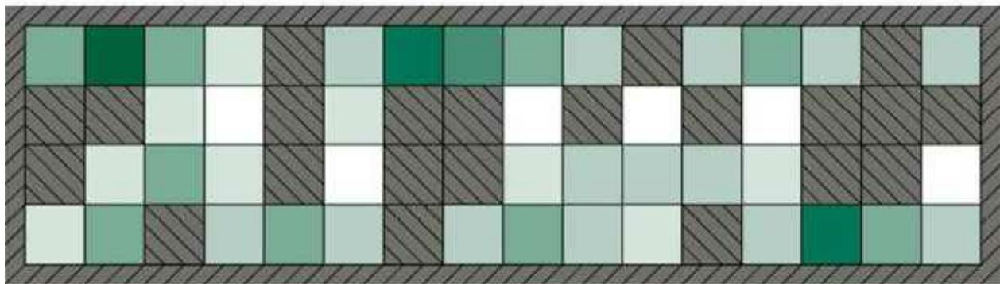  
（b）观测到E=1011、E=1010之后，机器人位置的后验分布  
图14-7机器人位置的后验分布：（a）一个观测 $E _ { 1 } = 1 0 1 1$ （也就是北侧、南侧与西侧有障碍）后。（b）在随机移动到相邻位置和第二次观测 $E _ { 2 } = 1 0 1 0$ （也就是北侧与南侧有障碍）后。每个方格颜色的深浅对应机器人处在那个位置的概率。传感器每位错误率 $\varepsilon = 0 . 2$

传感器变量 E 有16个可能的值，每一个4位序列给出在每个罗盘方向NESW是否存在障碍。例如，1010表示北侧和南侧的传感器报告有障碍，而东侧和西侧没有。假设每个传感器的错误率是 ，4个传感器方向出现错误是相互独立的。在这种情况下，所有4位都正确的概率是 $( 1 - \varepsilon ) ^ { 4 }$ ，都错误的概率是 $\varepsilon ^ { 4 }$ 。此外，如果 $\textit { d } _ { i t }$ 是方格 i 的真实值与实际读数 $\boldsymbol { e } _ { t }$ 之间的差异——不同的位数，那么方格i中的机器人接收到传感器读数 $\boldsymbol { e } _ { t }$ 概率为

$$
P \left(E _ {t} = e _ {t} \mid X _ {t} = i\right) = \left(\boldsymbol {O} _ {t}\right) _ {i i} = (1 - \varepsilon) ^ {4 - d _ {i t}} \varepsilon^ {d _ {i t}}
$$

例如，一个南北两侧有障碍物的方格产生出传感器读数1110的概率是 。

给定矩阵 T 与 O t，机器人可以利用式（14-12）来计算关于机器人位置的后验分布，即弄清机器人在哪里。图14-7展示了分布 与 。这与我们之前在图4-18中所看到的相同，但在那里我们假设机器人有精确的感知并且能使用逻辑滤波来寻找 可能的 位置。现在在感知中存在噪声的情况下，这些相同的位置仍然是最有 可能的位置，但每个位置都有着非零概率，因为任何位置都可能产生任何传感器值。

除了使用滤波来估计其当前位置，机器人可以使用平滑［式（14-13）］来弄清楚在任何给定的过

去时间（例如时刻0开始时）它所处的位置；机器人可以利用维特比算法找出到达目前所处位置的最可能的路径。图14-8展示了对每位传感器错误率 取不同值时的定位误差与路径误差。即使 大到0.20——这意味着整体传感器在59%的时间内读数有错误——机器人通常也能在20次观测后确定自己的位置，误差不超过两个方格。这是因为该算法能够随着时间的推移整合证据，并考虑转移模型对位置序列施加的概率约束。当 $\pmb { \varepsilon }$ 等于0.10或更低时，机器人只需要几个观测就可以弄清并准确地追踪其位置。当 $\pmb { \varepsilon }$ 为0.40时，定位误差和维特比路径误差将都比较大；换句话说，这个机器人迷路了。这是因为错误概率为0.40的传感器提供的信息太少，无法抵消由于不可预测的随机运动而导致的机器人位置信息的丢失。

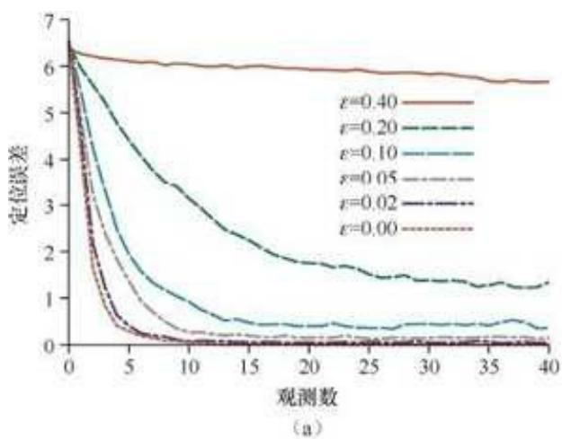

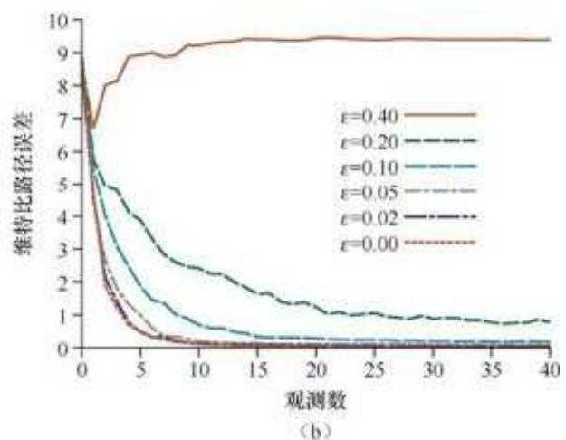  
图14-8对不同的传感器错误率 $_ e$ ，隐马尔可夫模型定位性能与观测序列长度的函数；数据是超过400次运行的平均。（a）定位误差，定义为与真实位置的曼哈顿距离。（b）维特比路径误差，定义为维特比路径上的状态与真实路径上相应状态的平均曼哈顿距离

本节中考虑的示例的状态变量是真实世界中的物理位置。当然，其他问题也可能包括世界的其他方面。习题14.ROOM要求考虑真空吸尘器机器人的另一个版本，它的策略是尽可能地直走；只有当遇到障碍时，它才会改变到一个新的方向。为了建模这个机器人，模型中的每个状态都包含一个（位置 ， 方向 ）对。对于图14-7中的环境，它有42个空的方格，这导致它具有168个状态和一个具有 $1 6 8 \AA ^ { 2 } = 2 8 2 2 4$ 项的转移矩阵，这仍然是一个可控的数字。

如果我们在42个方格中的每个都引入可能的噪声，那么状态的数量就会乘以2 42 ，转移矩阵就会有超过10 29 项——这不再是一个可控的数字。一般情况下，如果状态由 $n$ 个离散变量组成，每个离散变量最多有 $d$ 个值，那么相应的隐马尔可夫模型转移矩阵的大小为 $O ( d ^ { 2 n } )$ ，每次更新的计算时间也为 $O ( d ^ { 2 n } )$ 。

出于这些原因，尽管隐马尔可夫模型在从语音识别到分子生物学等领域有很多用途，但它们在表示复杂过程方面的能力从根本上来说是受限的。用第2章中介绍的术语来说，隐马尔可夫模型是一种原子表示：世界的状态没有内部结构，仅仅用整数进行了标记。14.4节将展示如何处理具有连续状态变量的域，这当然会导致产生无限状态空间。14.5节将展示如何使用动态贝叶斯网络（一种因子化表示）来建模具有许多状态变量的域。

# 14.4 卡尔曼滤波器

想象一下，在黄昏的时候，你看到一只小鸟飞过茂密的丛林：你透过树叶间的缝隙瞥见了小鸟断断续续的身影；你试图猜测那只鸟在哪里，它接下来会在哪里出现，这样你就不会失去它的行踪。或者想象一下，你是一名第二次世界大战时期的雷达操作员，你正盯着屏幕上每10秒出现一次的微弱的、徘徊的光点。或者再往前追溯一点，想象你是开普勒，你试图从一系列非常不准确的角度观测数据中重建行星的运动，这些观测数据是在不规则且不精确的时间间隔得到的。

在所有这些情况中，你都在进行滤波：根据一段时间内带有噪声的观测来估计状态变量（在这里是运动对象的位置和速度）。如果变量是离散的，我们可以用隐马尔可夫模型来建模系统。本节将讨论使用 卡尔曼滤波 （Kalmanfiltering）算法处理连续变量的方法，该算法以它的发明者之一鲁道夫·卡尔曼（Rudolf Kalman）的名字命名。

我们可以使用6个连续变量来确定鸟在每个时间点的飞行状态；其中包括3个位置变量( X t, Y t, Z t)和3个速度变量 。此外，我们需要合适的条件密度来表示转移模型和传感器模型； $( \dot { X } , \dot { Y } , \dot { Z } )$ 和第13章一样，我们采用线性高斯 （linear-Gaussian）分布。这意味着下一个状态 $\boldsymbol { X } _ { t + 1 }$ 必须是当前状态 $\boldsymbol { \cal X } _ { t }$ 的线性函数，再加上某些高斯噪声，这个条件在实践中被证明是相当合理的。例如，我们暂时忽略其他坐标，只考虑鸟的 $X$ 坐标。假设观测的时间间隔为 ，并假设鸟在此时间间隔内速度为常数；那么位置的更新将由 $X _ { t + \Delta } = X _ { t } + X _ { t }$ 给出。在引入高斯噪声（考虑风的变化 乡等）后，我们得到了线性高斯转移模型：

$$
P \left(X _ {t + \Delta} = x _ {t + \Delta} \mid X _ {t} = x _ {t}, \dot {X} _ {t} = \dot {x} _ {t}\right) = \mathcal {N} \left(x _ {t + \Delta}; x _ {t} + \dot {x} _ {t} \Delta , \sigma^ {2}\right)
$$

具有位置向量 $\boldsymbol { \cal X } _ { t }$ 和速度 $\dot { \pmb X } _ { \pmb \varepsilon }$ 系统的贝叶斯网络结构如图14-9所示。注意，该例子是线性高斯模型的一种特殊形式；一般形式将在本节后面描述，还将涵盖除第一段中介绍的简单运动示例之外的大量应用。读者可以查阅附录A以了解高斯分布的一些数学性质；在目前的介绍中，最重要的性质是$d$ 个变量的 多元高斯 分布是由 d 元均值 $\pmb { \mu }$ 和 d × d 协方差矩阵 $\pmb { \mathcal { L } }$ 指定的。

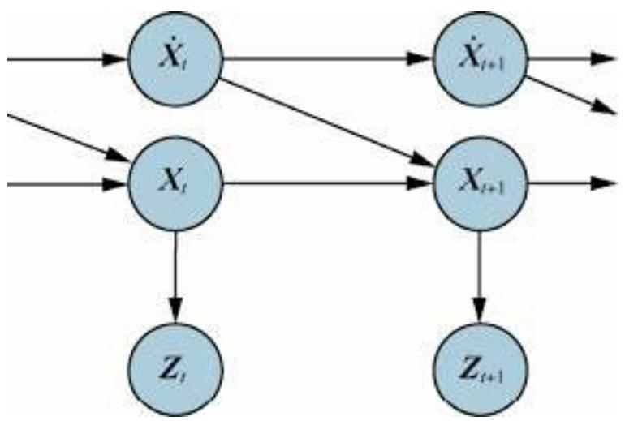  
图14-9 包含位置 $\boldsymbol { \cal X } _ { t }$ 、速度X˙t与位置测量Z 的线性动态系统的贝叶斯网络结构

# 14.4.1 更新高斯分布

在13.2.3节中，我们提到了线性高斯分布族的一个关键性质：在贝叶斯更新下它保持封闭。（也就是说，给定任何证据，后验分布仍然属于线性高斯族。）在这里，我们在时序概率模型的滤波场景中明确这个声明。所需性质对应式（14-5）中的两步滤波计算。

（1）如果当前分布 是高斯分布，转移模型 是线性高斯的，则下式给

出的单步预测的分布也是高斯分布：

$$
P \left(X _ {t + 1} \mid e _ {1: t}\right) = \int_ {x _ {t}} P \left(X _ {t + 1} \mid x _ {t}\right) P \left(x _ {t} \mid e _ {1: t}\right) d x _ {t} \tag {14-17}
$$

（2）如果预测 $P ( X _ { H 1 } \mid e _ { 1 : t } )$ 是高斯分布，传感器模型 $P ( e _ { \mathfrak { p } + 1 } \mid X _ { \mathfrak { p } + 1 } )$ 是线性高斯的，则下式给出的以新证据为条件的更新后的分布也是高斯分布：

$$
P \left(X _ {t + 1} \mid e _ {1: t + 1}\right) = \alpha P \left(e _ {t + 1} \mid X _ {t + 1}\right) P \left(X _ {t + 1} \mid e _ {1: t}\right) \tag {14-18}
$$

因此，卡尔曼滤波的F orward 算子选取由均值 $\pmb { \mu } _ { t }$ 和协方差矩阵 $\Sigma _ { \tau }$ 描述的高斯前向消息 $f _ { 1 : \ell }$ ，并产生由均值 $\pmb { \mu } _ { \mathbf { \hat { s } } + 1 }$ 和协方差矩阵 $\pmb { \mathcal { L } } _ { \pmb { \mathrm { * 1 } } }$ 描述的新的多元高斯前向消息 。如果我们从高斯先验$f _ { 1 \times 0 } = P ( X _ { 0 } ) = \mathcal { N } ( \mu _ { 0 } , \Sigma _ { 0 } )$ 出发，使用线性高斯模型滤波，那么在任何时间点我们都会得到一个高斯状态分布。

这似乎是一个很好很优雅的结果，但为什么它如此重要呢？原因是，除了像高斯分布这样的少数特例外， 用连续网络或混合（离散和连续）网络进行滤波，产生的状态分布的表示会随着时间无限制地增长。 这个陈述一般不容易证明，但习题14.KFSW用一个简单的示例展示了会发生什么。

# 14.4.2 简单的一维示例

我们已经解释过，卡尔曼滤波器的Forward算子将一个高斯分布映射到一个新的高斯分布。这就把问题转换为根据之前的均值和协方差计算新的均值和协方差。在一般（多元）情况下，推导更新规则需要相当复杂的线性代数知识，所以我们现在将考虑非常简单的单变量情况，之后再给出一般情况下的结果。但即便是单变量的情况，计算也有些烦琐，但我们认为它值得一看，因为卡尔曼滤波器的有用性与高斯分布的数学特性紧密联系在一起。

我们考虑的时序模型描述了含有噪声观测 Z 的单个连续状态变量 $X _ { t }$ 的 随机游走 （randomwalk）。该模型的一个示例是“消费者信心”指数，它可以被建模为服从一个每个月经历一个变化的随机高斯分布，并由一个随机的消费者调查测量，这个调查也会引入高斯采样噪声。先验分布假设是方差为 的高斯分布：

$$
P \left(x _ {0}\right) = \alpha \mathrm {e} ^ {- \frac {1}{2} \left(\frac {\left(x _ {0} - \mu_ {0}\right) ^ {2}}{\sigma_ {0} ^ {2}}\right)}
$$

（为简单起见，我们在本节中使用相同的符号 $\pmb { \alpha }$ 来表示所有归一化常数。）转移模型为当前状态增加一个方差为常数 的高斯扰动： $\sigma _ { x } ^ { z }$

$$
P \left(x _ {t + 1} \mid x _ {t}\right) = \alpha e ^ {- \frac {1}{2} \left(\frac {\left(x _ {t + 1} - x _ {t}\right) ^ {2}}{\sigma_ {x} ^ {2}}\right)}
$$

传感器模型带有方差为 $\sigma _ { \pi } ^ { 2 }$

$$
P \left(z _ {t} \mid x _ {t}\right) = \alpha e ^ {- \frac {1}{2} \left(\frac {\left(z _ {t} - x _ {t}\right) ^ {2}}{\sigma_ {z} ^ {2}}\right)}
$$

现在，给定先验 $P \left( X _ { 0 } \right)$ ，根据式（14-17)，单步预测的分布为

$$
\begin{array}{l} P \left(x _ {1}\right) = \int_ {- \infty} ^ {\infty} P \left(x _ {1} \mid x _ {0}\right) P \left(x _ {0}\right) d x _ {0} = \alpha \int_ {- \infty} ^ {\infty} e ^ {- \frac {1}{2} \left(\frac {\left(x _ {1} - x _ {0}\right) ^ {2}}{\sigma_ {x} ^ {2}}\right)} e ^ {- \frac {1}{2} \left(\frac {\left(x _ {0} - \mu_ {0}\right) ^ {2}}{\sigma_ {0} ^ {2}}\right)} d x _ {0} \\ = \alpha \int_ {- \infty} ^ {\infty} e ^ {- \frac {1}{2} \left(\frac {\sigma_ {0} ^ {2} (x _ {1} - x _ {0}) ^ {2} + \sigma_ {x} ^ {2} (x _ {0} - \mu_ {0}) ^ {2}}{\sigma_ {0} ^ {2} \sigma_ {x} ^ {2}}\right)} d x _ {0} \\ \end{array}
$$

这个积分看起来相当复杂。关键是要注意到指数中的部分是关于 $x _ { 0 }$ 的两个二次表达式的和，所以结果也是 $x _ { 0 }$ 的二次表达式。一个简单的技巧是熟知的 配方法 （completingthesquare），它允许任

-b b一二次表达式 $a x _ { 0 } ^ { 2 } + b x _ { 0 } + c$ 重写为平方项 x0 2 与独立于 $x _ { 0 }$ 的余项 的和。在这个示例中，我们有 $a = ( \sigma _ { 0 } ^ { 2 } + \sigma _ { x } ^ { 2 } ) / ( \sigma _ { 0 } ^ { 2 } \sigma _ { x } ^ { 2 } )$ 、

$\bar { b } = - 2 \bigl ( \sigma _ { 0 } ^ { 2 } x _ { 1 } + \sigma _ { x } ^ { 2 } \mu _ { 0 } \bigr ) \big / \bigl ( \sigma _ { 0 } ^ { 2 } \sigma _ { x } ^ { 2 } \bigr )$ 以及 $c = ( \sigma _ { 0 } ^ { 2 } x _ { 1 } ^ { 2 } + \sigma _ { x } ^ { 2 } \mu _ { 0 } ^ { 2 } ) / ( \sigma _ { 0 } ^ { 2 } \sigma _ { x } ^ { 2 } )$ 。余项可以拿到积分之外，得到

$$
P \left(x _ {1}\right) = \alpha \mathrm {e} ^ {- \frac {1}{2} \left(c - \frac {b ^ {2}}{4 a}\right)} \int_ {- \infty} ^ {+ \infty} \mathrm {e} ^ {- \frac {1}{2} \left(a \left(x _ {0} - \frac {- b}{2 a}\right) ^ {2}\right)} \mathrm {d} x _ {0}
$$

现在这个积分就是高斯函数在它的整个值域内的积分，也就是1。因此，我们只剩下二次项的余项。将a 、b 、c代入表达式并化简，我们得到

$$
P \left(x _ {1}\right) = \alpha e ^ {- \frac {1}{2} \left(\frac {\left(x _ {1} - \mu_ {0}\right) ^ {2}}{\sigma_ {0} ^ {2} + \sigma_ {x} ^ {2}}\right)}
$$

也就是说，单步预测的分布是有着相同的均值 $\pmb { \mu } _ { 0 }$ ，方差等于原始方差 $\sigma _ { \circ } ^ { z }$ 与转移方差 之和的 $\sigma _ { x } ^ { 2 }$ 高斯分布。

为了完成更新步骤，我们需要以第一个时间步的观测（即 $z _ { 1 }$ ）为条件。根据式（14-18），我们得到

$$
\begin{array}{l} P \left(x _ {1} \mid z _ {1}\right) = \alpha P \left(z _ {1} \mid x _ {1}\right) P \left(x _ {1}\right) \\ = \alpha e ^ {- \frac {1}{2} \left(\frac {\left(z _ {1} - x _ {1}\right) ^ {2}}{\sigma_ {z} ^ {2}}\right)} e ^ {- \frac {1}{2} \left(\frac {\left(x _ {1} - \mu_ {0}\right) ^ {2}}{\sigma_ {0} ^ {2} + \sigma_ {x} ^ {2}}\right)} \\ \end{array}
$$

我们再次合并指数并配方（习题14.KALM），得到下面的后验分布表达式：

$$
P \left(x _ {1} \mid z _ {1}\right) = a e ^ {- \frac {1 \left(x _ {1} \frac {\left(\sigma_ {0} ^ {2} + \sigma_ {x} ^ {2}\right) z _ {1} + \sigma_ {x} ^ {2} \mu_ {0}}{\sigma_ {0} ^ {2} + \sigma_ {x} ^ {2} + \sigma_ {x} ^ {2}}\right) ^ {2}}{2 \left(\sigma_ {0} ^ {2} + \sigma_ {x} ^ {2}\right) \sigma_ {x} ^ {2} / \left(\sigma_ {0} ^ {2} + \sigma_ {x} ^ {2} + \sigma_ {x} ^ {2}\right)}} \tag {14-19}
$$

因此，经过一个更新周期后，我们得到状态变量的一个新的高斯分布。

根据式（14-19）中的高斯公式可知，新的均值和标准差可以由旧的均值和标准差计算得出，如下所示：

$$
\mu_ {t + 1} = \frac {\left(\sigma_ {t} ^ {2} + \sigma_ {x} ^ {2}\right) z _ {t + 1} + \sigma_ {z} ^ {2} \mu_ {t}}{\sigma_ {t} ^ {2} + \sigma_ {x} ^ {2} + \sigma_ {z} ^ {2}} \quad \text {和} \quad \sigma_ {t + 1} ^ {2} = \frac {\left(\sigma_ {t} ^ {2} + \sigma_ {x} ^ {2}\right) \sigma_ {z} ^ {2}}{\sigma_ {t} ^ {2} + \sigma_ {x} ^ {2} + \sigma_ {z} ^ {2}} \tag {14-20}
$$

图14-10展示了卡尔曼滤波器在一维情况下对于转移模型和传感器模型的特定值的一个更新周期。

式（14-20）与式（14-5）（一般滤波）或式（14-12）（隐马尔可夫模型滤波）作用完全相同。然而，由于高斯分布的特殊性质，这些等式还有一些额外的有趣性质。

首先，我们可以将对新的均值 $\pmb { \mu } _ { \mathbf { \hat { s } } + 1 }$ 的计算解释为新观测值 $z _ {  1 }$ 和旧的均值 $\pmb { \mu } _ { t }$ 的加权平均值 。如果观测值不可靠，则 $\sigma _ { 5 } ^ { 2 }$ 较大，我们应更加重视旧的均值；如果旧的均值是不可靠的（ $\sigma _ { t } ^ { 2 }$ 很大）或过程是高度不可预测的（ $\sigma _ { x } ^ { z }$ 很大），那么我们就会更加注重观测值。其次，我们注意到方差2$\sigma _ { t + 1 } ^ { - }$ 的更新是 独立于观测 的。因此，我们可以提前计算出方差值的序列。最后，方差序列很快收敛到一个只依赖于 $\sigma _ { x } ^ { 2 }$ 与 $\sigma _ { 5 } ^ { 2 }$ 的固定值，从而大大简化了后续的计算。（见习题14.VARI。）

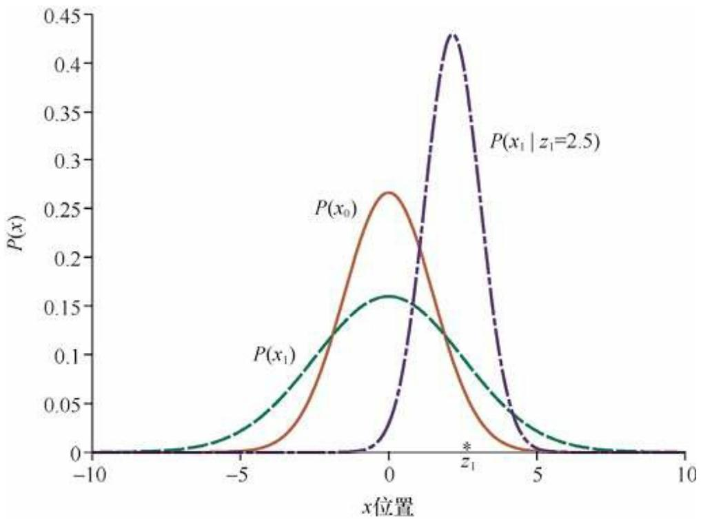

图14-10 随机游走的卡尔曼滤波器更新周期的各个阶段，由 $\mu _ { \mathrm { q } } = 0$ 与 $\sigma _ { 0 } = 1 . 5$ 给出的先验，$\sigma _ { x } = 2 . 0$ 2.0 给出的转移噪声， $\sigma _ { \ast } = 9 . 0$ 给出的传感器噪声，第一次观测 $z _ { 1 } = 2 . 5$ （标记在 $x$ 轴上）。注意，相对于 $P \left( x _ { 0 } \right)$ ， $P \left( x _ { 1 } \right)$ 是如何通过转移噪声平滑的。也要注意后验分布 $P ( x _ { q } | \mathbf { \sigma } _ { \mathbf { z } } )$ 的均值在观测值 $z _ { 1 }$ 的略偏左，因为均值是预测和观测值的加权平均值

# 14.4.3 一般情况

前面的推导说明了高斯分布允许卡尔曼滤波可行的关键特性：事实上，指数部分是一个二次型。这不仅适用于单变量情况；多元高斯分布有着如下形式：

$$
\mathcal {N} (x; \mu , \Sigma) = \alpha e ^ {- \frac {1}{2} ((x - \mu) ^ {\top} \Sigma^ {- 1} (x - \mu))}
$$

如果我们将指数项乘开，可以看到指数部分也是关于 $\pmb { x }$ 分量 $x _ { i }$ 的二次型。因此，滤波保持了状态

分布的高斯性质。

我们首先要定义卡尔曼滤波使用的一般时序模型。转移模型和传感器模型都要求是带有加性高斯噪声的线性变换。因此，我们有

$$
\begin{array}{l} P \left(\boldsymbol {x} _ {t + 1} \mid \boldsymbol {x} _ {t}\right) = \mathcal {N} \left(\boldsymbol {x} _ {t + 1}; F \boldsymbol {x} _ {t}, \Sigma_ {z}\right) \\ P \left(z _ {t} \mid x _ {t}\right) = N \left(z _ {t}; H x _ {t}, \Sigma_ {z}\right) \tag {14-21} \\ \end{array}
$$

其中， F 与 $\pmb { \Sigma } _ { \pmb { x } }$ 是描述线性转移模型与转移噪声协方差的矩阵， H 与 $\Sigma _ { z }$ 是传感器模型中相应的矩阵。现在完整的均值与协方差矩阵更新公式将变得十分糟糕：

$$
\begin{array}{l} \mu_ {t + 1} = F \mu_ {t} + K _ {t + 1} \left(z _ {t + 1} - H F \mu_ {t}\right) \\ \boldsymbol {\Sigma} _ {t + 1} = \left(\boldsymbol {I} - \boldsymbol {K} _ {t + 1} \boldsymbol {H}\right) \left(\boldsymbol {F} \boldsymbol {\Sigma} _ {t} \boldsymbol {F} ^ {\top} + \boldsymbol {\Sigma} _ {\mathbf {x}}\right) \tag {14-22} \\ \end{array}
$$

其中， $\begin{array} { r } { \pmb { K } _ { t + 1 } = ( \pmb { F } \pmb { \Sigma } _ { t } \pmb { F } ^ { \top } { + } \pmb { \Sigma } _ { x } ) \pmb { H } ^ { \top } ( \pmb { H } ( \pmb { F } \pmb { \Sigma } _ { t } \pmb { F } ^ { \top } { + } \pmb { \Sigma } _ { x } ) \pmb { H } ^ { \top } { + } \pmb { \Sigma } _ { z } ) ^ { - 1 } } \end{array}$ 是 卡尔曼增益矩阵（Kalman gain matrix）。虽然看上去很不明显，但这些公式确实有着一些直观含义。例如，考虑均值状态估计 $\pmb { \mu }$ 的更新。项 $\pmb { F } \pmb { \mu _ { \ell } }$ 是时刻 $^ { t + 1 }$ 的预测状态，所以 $\mathbf { \mathcal { H } } \mathbf { \mathcal { F } } _ { \mathbf { \mathcal { H } _ { \mathrm { e } } } }$ 是预测观测。因此，项$z _ { n + 1 } - H F \mu _ { t }$ 表示预测观测的误差。将其乘以 $\boldsymbol { K } _ { t + 1 }$ 来修正预测状态，所以， $\boldsymbol { K } _ { t + 1 }$ 是相对于预测， 对新的观测重视程度的度量。 与式（14-20）一样，方差的更新也独立于观测。因此， $\Sigma _ { \tau }$ 与$\mathbf { K } _ { t }$ 的值序列可以离线计算，而在线追踪过程中所需要的实际计算量也相当有限。

为了说明这些等式是如何工作的，我们将它们应用于追踪在 xy 平面上运动物体的问题。此时状态变量为 $\pmb { X } = ( X , Y , \dot { X } , \dot { Y } ) \top$ ，因此 $\pmb { F }$ 、 $\pmb { \Sigma } _ { \mathbf { x } }$ 、 $\pmb { H }$ 与 $\Sigma _ { z }$ 是 $4 { \times } 4$ 的矩阵。图14-11a展示了真实轨迹、一系列有噪声的观测、卡尔曼滤波估计的轨迹，以及由一个标准差等值线表示的协方差。滤波过程在追踪实际运动方面表现不错，正如预期的那样，方差很快达到一个不动点。

与滤波的推导类似，我们也可以用线性高斯模型来推导平滑。平滑的结果如图14-11b所示。注意位置估计的方差是如何快速减少的，轨迹的末端除外（为什么会这样？），还应该注意估计的轨迹更加平滑了。

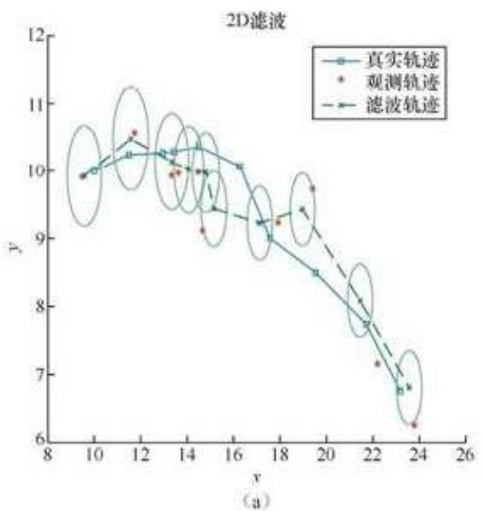

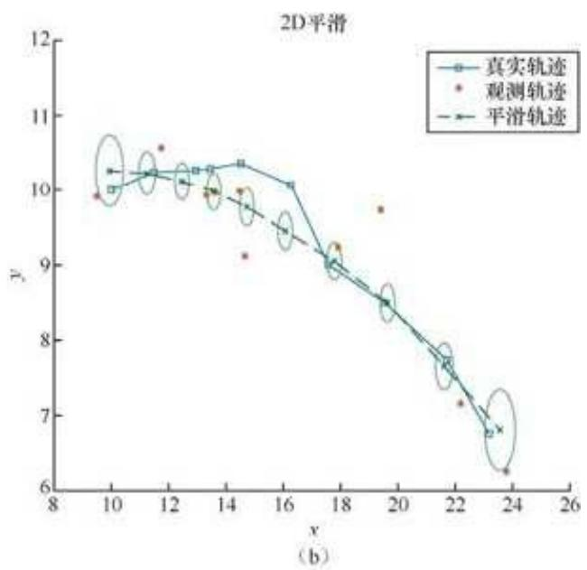  
图14-11（a）在 xy平面上运动物体的卡尔曼滤波结果，显示真实的轨迹（从左到右）、一系列的噪声观测，以及卡尔曼滤波估计的轨迹。位置估计中的方差由椭圆表示。（b）对相同的观测序列

# 进行卡尔曼平滑的结果

# 14.4.4 卡尔曼滤波的适用范围

卡尔曼滤波器及其具体阐述被广泛应用。经典的应用是对飞行器和导弹的雷达追踪。相关的应用包括潜艇和地面车辆的声学追踪以及车辆和人的视觉追踪。在一些更加深奥的领域，卡尔曼滤波器被用来从气泡室照片重建粒子轨迹和从卫星地表测量重建洋流。它的应用范围远不止于运动追踪：它在任何通过连续状态变量和噪声测量刻画的系统中都可以使用。这些系统包括纸浆厂、化工厂、核反应堆、植物生态系统和国民经济。

卡尔曼滤波可以应用于很多系统，但这并不意味着它的结果是有效的或有用的。滤波所作的线性高斯转移模型和传感器模型假设是非常强的。扩展卡尔曼滤波器 （extended Kalman filter，EKF）试图克服建模系统中的非线性。如果一个系统的转移模型不能被描述为式（14-21）一样的状态向量的矩阵乘积，那么我们称这个系统是 非线性 （nonlinear）的。扩展卡尔曼滤波器将系统建模为 $x _ { i }$ 在 区域是局部线性的，其中 $\pmb { \mu } _ { t }$ 是当前状态分布的均值。这对于光滑的、行为良好的系统表现良好，并允许追踪器去维护和更新高斯状态分布，是真实后验的合理近似。第26章将给出一个详细的相关示例。

一个系统“不光滑”或“行为不良”意味着什么？从技术上讲，这意味着（根据协方差 ）在与当前均值 相近的区域内，系统响应存在显著的非线性。为了从非技术的角度理解这个概念，我们来看看试图追踪一只飞过丛林的鸟的例子。这只鸟似乎在高速飞向树干。无论是常规卡尔曼滤波器还是扩展卡尔曼滤波器，它们都只能对鸟的位置进行高斯预测，该高斯预测的均值将以树干为中心，如图14-12a所示。但是，一个合理的鸟的运动模型将会预测鸟向一侧或另一侧的躲避行为，如图14-12b所示。这样的一个模型是高度非线性的，因为鸟的决策会根据它相对于树干的精确位置而急剧变化。

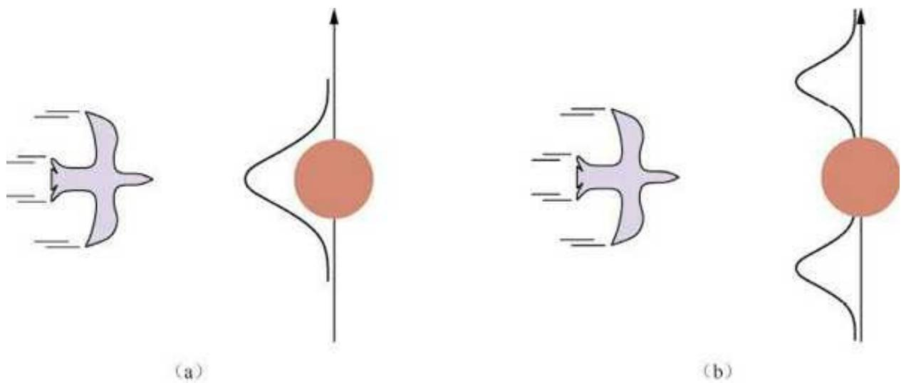  
图14-12一只飞向树的鸟（俯视）。（a）一个卡尔曼滤波器将使用以障碍物为中心的单个高斯分布预测鸟的位置。（b）一个更实际的模型允许鸟的躲避动作，预测它会飞到一边或另一边

为了处理这样的例子，我们显然需要一种更富表达能力的语言来表示所建模的系统的行为。在控制理论领域，例如飞机的规避机动等问题也会带来同样的困难，一个标准的解决方案是使用 切换卡尔曼滤波器 （switching Kalman filter）。在这种方法中，多个卡尔曼滤波器并行运行，且每个滤波器使用不同的系统模型，例如，一个用于直飞，一个用于左急转，一个用于右急转。使用的是预测的加权和，其中的权重取决于每个滤波与当前数据的匹配程度。我们将在下一节中看到，这只是一般动态贝叶斯网络模型的一个特例，它可以通过在图14-9所示的网络中添加一个离散的“机动”状态变量得到。切换卡尔曼滤波器将在习题14.KFSW中进一步讨论。

# 14.5 动态贝叶斯网络

动态贝叶斯网络 （dynamicBayesiannetwork，DBN）扩展了标准贝叶斯网络的语义，用以处理14.1节中描述的一类时序概率模型。我们已经看到了一些动态贝叶斯网络的例子：图14-2中的雨伞网络和图14-9中的卡尔曼滤波器网络。一般情况下，动态贝叶斯网络的每个时间片可以有任意数量的状态变量X 和证据变量 E 。为简单起见，我们假设变量、它们的链路以及它们的条件分布都从一个时间片精确地复制到另一个时间片，同时我们假设动态贝叶斯网络是一个一阶马尔可夫过程，因此每个变量只能在自己的时间片或相邻的上一个时间片中存在父变量。这样一来，动态贝叶斯网络就相当于一个具有无穷多个变量的贝叶斯网络。

应该清楚的是，每个隐马尔可夫模型都可以表示为一个具有单个状态变量和单个证据变量的动态贝叶斯网络。同理，每个离散变量动态贝叶斯网络都可以表示为一个隐马尔可夫模型；正如14.3节所解释的，我们可以将动态贝叶斯网络中的所有状态变量组合成单个状态变量，其值为各个状态变量值的所有可能元组。如此一来，如果每个隐马尔可夫模型都是一个动态贝叶斯网络，每个动态贝叶斯网络都可以转换成一个隐马尔可夫模型，那么它们有什么区别呢？它们的不同之处在于， 通过将复杂系统的状态分解为其组成变量，我们可以利用时序概率模型中的稀疏性。

为了理解这在实践中意味着什么，我们首先要记住我们在14.3节中说过的，如果使用隐马尔可夫模型表示一个有着 $n$ 个离散变量（每个变量不超过 $d$ 个值）的时序过程，那么我们需要一个大小为 O( $d ^ { 2 n }$ )的转移矩阵。但是，如果每个变量的父变量数量不超过k，则动态贝叶斯网络表示的大小为O (ndk)。换句话说，动态贝叶斯网络表示的规模关于变量数量是线性的，而不是指数级别的。如果一个真空吸尘器机器人需要处理42个可能的脏的位置，利用动态贝叶斯网络表示可以把所需的概率数从5×1029 减少到几千个。

我们已经解释过，每个卡尔曼滤波器模型都可以用采用连续变量和线性高斯条件分布的动态贝叶斯网络表示（图14-9）。从14.4.4节结尾部分的讨论可以清楚地看出， 不是每个动态贝叶斯网络都可以用卡尔曼滤波器模型表示。在卡尔曼滤波器中，当前的状态分布总是单个多元高斯分布，也就是说，在特定位置的单个“凸起”。但是，动态贝叶斯网络可以对任意分布进行建模。

在许多实际应用中，这种灵活性是必不可少的。例如，考虑我的钥匙的当前位置。它们可能在我的口袋里、床头柜上、厨房操作台上、悬挂在前门上或者锁在车里。一个包含所有这些地方的单个高斯凸起可能为“钥匙在前花园的半空中”分配一个显著的概率。非线性出现在真实世界的各个方面中，如特定用途的智能体、障碍物和衣服口袋等，我们需要离散和连续变量的组合，以获得合理的模型。

# 14.5.1 构建动态贝叶斯网络

构建一个动态贝叶斯网络必须指定3种信息：状态变量的先验分布P(X )、转移模型

以及传感器模型 。要描述转移模型和传感器模型，还必须描述连续时间片之间以及状态变量和证据变量之间连接的拓扑结构。由于我们假设转移模型和传感器模型是时间齐次的（对所有t都相同），所以最便捷的做法是在第一个时间片中描述它们。例如，雨伞世界的完全动态贝叶斯网络由图14-13a所示的三节点网络描述。按照这个描述，我们可以根据需要通过复制第一个时间片来构造具有无限数量时间片的完全动态贝叶斯网络。

现在让我们考虑一个更有趣的示例：监控一个电池驱动的机器人在xy平面上的移动，我们已经在14.1节的结尾部分介绍过。首先，我们需要状态变量，它包括位置变量 $X _ { i } = ( X _ { i } , Y _ { i } )$ 和速度变

量的 。我们假定通过某些测量位置的方法（例如一个固定的摄像头或车载GPS） $\dot { X } _ { t } = ( \dot { X } _ { t _ { 0 } } \dot { Y } )$ 来产生观测 $\textbf { Z } _ { t }$ 。下一个时间步的位置取决于当前的位置和速度，这与在标准的卡尔曼滤波器模型中所做的一样。鉴于下一时间步的速度取决于当前的速度和电池的状态，我们引入Battery 表示电池实际的充电水平，它以之前的电池水平和速度为父节点；我们引入BMeter $t$ 表示电池充电水平的观测值。图14-13b给出了其基本模型。

BMeter $t$ 的传感器模型的有关特征值得我们深入了解。为了简单起见，我们假设 Battery 和BMeter都取 $_ { 0 \sim 5 }$ 的离散值。（习题14.BATT要求你将这个离散模型与相应的连续模型联系起来。）如果

电池电量仪总是准确的，那么条件概率表 “沿着对角线”的概率应该是1.0，在其他地方的概率应该是0.0。在实际中，测量总是带有噪声。对于连续的测量，我们可以使用一个方差较小的高斯分布表示。 [1] 对于离散变量，我们可以用误差概率以适当的方式下降的分布来近似高斯分布，因此出现大误差的概率非常小。我们使用术语 高斯误差模型 （Gaussian errormodel）来涵盖连续和离散版本。

[1]严格地说，高斯分布是有问题的，因为它赋予大的负电量水平非零概率。对于值域受限制的变量， 分布 有时是更好的选择。

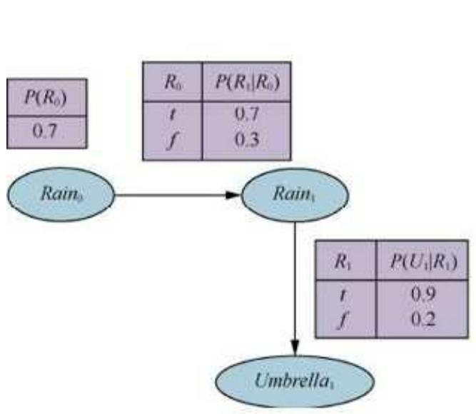

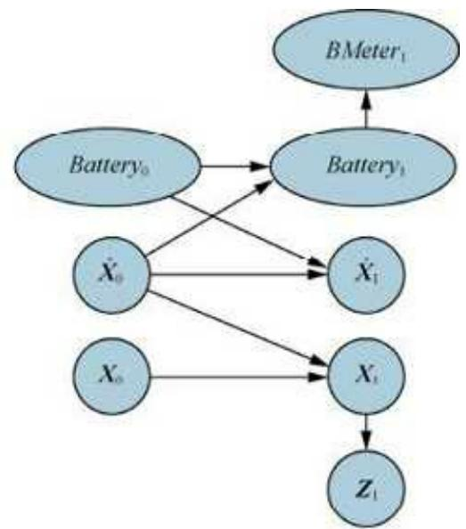  
  
图14-13 （a）雨伞动态贝叶斯网络的先验模型、转移模型与传感器模型的描述，后续时间片是时间片1的副本。（b）机器人在xy平面运动的简单动态贝叶斯网络

任何有过机器人学、计算过程控制或其他形式的自动传感方面实际经验的人都很容易证实这一事实，即少量的测量噪声往往是最微不足道的问题。实际的传感器会出现故障。当一个传感器出现故障时，它并不会发出信号说，“哦，顺便说一下，我即将发送给你的数据是一堆废话”。相反，它只会发送出废话。最简单的一种故障被称为瞬时故障 （transientfailure），意思是传感器偶尔发送一些无意义的信息。例如，当有人撞到机器人时，电池电量传感器可能会习惯性地发送读数0，尽管电池已经充满电。

让我们看看没考虑瞬时故障的高斯误差模型出现瞬时故障时会发生什么。例如，假设机器人正在安静地坐着，对其连续观测20次得到的电池读数均为5。此时电池电量仪发生瞬时故障，导致下一个读数是 。简单的高斯误差模型会如何推测 Battery 21呢？根据贝叶斯法则，答案 $B M e t e r _ { 2 1 } = 0$ $^ { 2 1 }$ 取决于传感器模型 $P ( B M e t e r _ { 2 1 } = 0 \mid B a t t e r y _ { 2 1 } )$ 和预测 。如果一个大的传感器误差的概率明显小于转移 到 的概率，即便后者是非常不可 $B a t t e p y _ { 2 1 } = 0$ 能的，后验分布也会为电池耗尽分配一个高概率。

t=22时的第二次读数为0将使这个结论几乎确定无疑。如果瞬时故障消失，读数从 t=23开始重新变为5，电池电量的估计也将很快返回到5。（这并不意味着算法认为电池神奇地自我充电，这在物理上是不可能的；相反，该算法现在认为电池从来没有过电量不足的情况——电池仪表有两个连续的巨大误差这样的极不可能的假设就是这一认为的正确解释。）图14-14a中上面的曲线说明了这一过程，它展示了使用离散高斯误差模型的 Battery 的期望值（见附录A）随时间的变化。

尽管故障恢复了，但还是有一个时刻（t=22）机器人确信电池耗尽；那么，它大概会发出求救信号，然后关闭系统。我们只能哀叹过于简化的传感器模型使它误入歧途。这个故事的寓意很简单：为了让系统正确地处理传感器故障，传感器模型必须包括故障的可能性。

对传感器来说，最简单的故障模型通过赋予传感器返回某个完全不正确的值一个特定的概率实现（不管世界的真实状态如何）。例如，如果电池仪表发生故障并返回0，我们可以认为

，这比简单的高斯误差模型给出的概率要大得多。我们称之为 瞬时故障模型 （transient failure model）。当我们面对读数为0时，它有什么帮助呢？假设根据到目前为止的读数，电池耗尽的 预测 概率远小于0.03，那么对观测 BMeter 21= 0的最佳解释是传感器发生了瞬时故障。直觉上，我们可以认为对电池电量水平的信念有一定的“惯性”，这有助于克服仪表读数中的瞬时异常。从图14-14b中的红色曲线可以看出，瞬时故障模型能够处理瞬时故障，且信念不会发生灾难性的变化。

我们对瞬时故障的探讨就到此为止，接下来我们将探讨持续性的传感器故障。遗憾的是，这类故障太常见了。如果传感器返回20个读数5，以及随后的20个读数0，那么我们在前面介绍的瞬时传感器故障模型将导致机器人逐渐相信它电量耗尽，而实际上可能是仪表已经失效。图14-14b中绿色的曲线展示了这种情况下的信念“轨迹”。当t=25时，5个读数为0，机器人确信电池耗尽。显然，我们更希望机器人相信它的电池电量仪坏了——如果这确实是更有可能发生的事情。

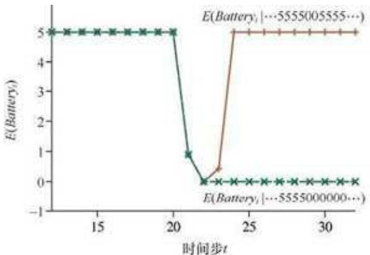

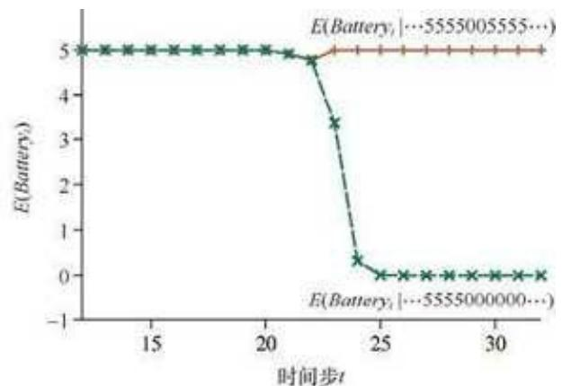  
  
图14-14 （a）红色曲线：除 $t = 2 1$ 和 t = 22为0外，其他观测都为5的观测序列的 Battery t期望值轨迹，采用简单高斯误差模型。绿色曲线：从t=21开始观测值维持在0的轨迹。（b）瞬时故障模型运行了同样的实验。瞬时故障处理良好，但持续故障导致对电池电量的过度悲观

毫无疑问，要处理持续性故障，我们需要一个新的持续故障模型 （persistentfailuremodel），该模型描述传感器在正常情况下和故障后的行为。要做到这一点，我们需要用一个额外的变量BMBroken 来增广系统的状态，它描述电池电量仪的状态。持续故障必须通过BMBroken 到BMBroken 的边来建模。这种持续边 （persistencearc）的条件概率表给出任何给定的时间步一个小的故障概率（例如0.001），但规定传感器一旦故障就会持续故障。当传感器正常时， BMeter的传感器模型与瞬时故障模型一致；当传感器故障时，它显示 BMeter始终为0，无论实际电池电量如何。

电池传感器的持续故障模型如图14-15a所示。图14-15b展示了它在两个数据序列（瞬时故障和持续故障）上的表现。关于这些曲线有几点需要注意。首先，在瞬时故障的情况下，传感器故障的概率在第二次读数为0后显著上升，但一旦观测到5，立即下降到0。其次，在持续故障的情况下，传感器故障的概率迅速上升到几乎等于1，并维持在附近。最后，一旦已知传感器故障，机器人只能假设电池以“正常”速率放电。这从 逐渐下降的水平可以看出。

到目前为止，我们仅仅触及了表示复杂过程问题的表面。转移模型的种类非常多，且涉及完全不同的主题，如人类内分泌系统建模和在高速公路上行驶的多辆汽车建模。传感器建模本身也是一个巨大的子领域。而动态贝叶斯网络甚至可以模拟精细的现象，如传感器漂移、突然失准，以及外部条件（如天气）对传感器读数的影响。

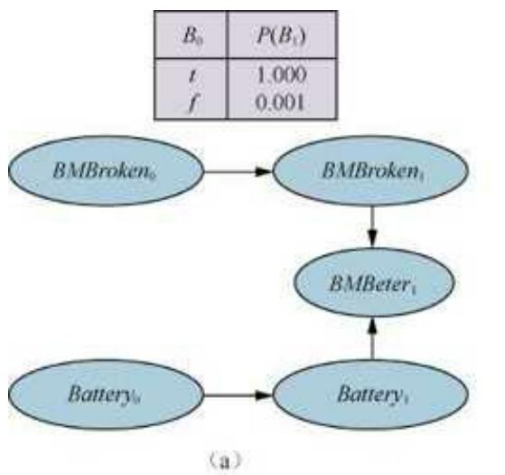

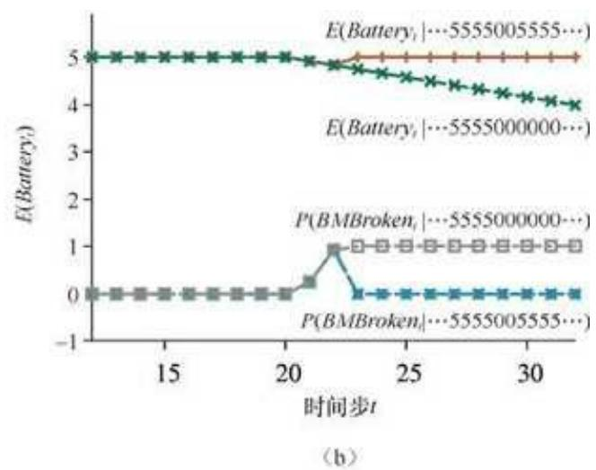  
图14-15（a）一个显示建模电池传感器持续故障要求的传感器状态变量的动态贝叶斯网络片段。（b）上方曲线为对“瞬时故障”与“持续故障”的 Battery 的期望值轨迹，下方曲线为给定两个观测序列的 BMBroken 的概率轨迹

# 14.5.2 动态贝叶斯网络中的精确推断

在概述了将复杂过程表示为动态贝叶斯网络的一些想法之后，我们现在转向推断问题。从某种意义上来说，这个问题已经被回答了：动态贝叶斯网络 就是贝叶斯网络，而我们已经有了用于贝叶斯网络中的推断算法。给定一个观测序列，我们可以通过复制时间片直到网络足够大以容纳这些观测来构建一个动态贝叶斯网络的完全贝叶斯网络表示，如图14-16所示。这个技术被称为 展开 。（技术上，动态贝叶斯网络等价于通过持续展开得到的半无限网络。在最后一次观测之后添加的切片对观测期间内的推断没有影响，可以忽略。）一旦动态贝叶斯网络被展开，我们就可以使用在第13章中描述的任何推断算法——变量消元、聚类方法等。

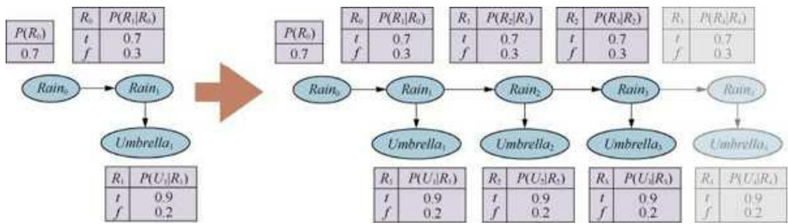  
图14-16 动态贝叶斯网络的展开：时间片被复制去容纳观测序列 Umbrella 。后续的时间片对这个观测时期内的推断没有影响

遗憾的是，展开这一朴素思想的应用并不是特别高效。如果我们想对一个长序列的观测数据 e 1:t进行滤波或平滑，那么展开的网络将需要 O (t)空间，因此随着观测数据的增加，它将无限制地增长。此外，如果我们在每次添加观测时都重新运行推断算法，那么每次更新的推断时间也将随着O( t )增加。

回顾14.2.1节，我们发现，如果可以递归地进行计算，那么每次滤波更新都可以在常数的时间和空间内完成。从本质上说，式（14-5）中的滤波更新通过把上一个时间步的状态变量 求和消元来得到新时间步的分布。对变量进行求和消元正是变量消元 （图13-13）算法所做的。结果表明，对时序变量进行变量消元恰好模仿了式（14-5）中递归的滤波更新操作。改进后的算法在任何时刻内存中最多保留两个时间片：从时间片0开始，添加时间片1，然后求和消元时间片0，然后添加时间片2，然后求和消元时间片1，以此类推。通过这种方式，我们可以在常数的空间和时间内完成每次滤波更新。（对聚类算法进行适当的修改，可以达到同样的性能。）习题14.DBNE要求你在雨伞网络中验证这一事实。

好消息就说这么多，现在来看坏消息：在几乎所有情况下，每次更新的时间复杂性和空间复杂性的“常数”与状态变量的数量呈指数关系。这导致的结果是，随着变量消元的进行，因子的规模将增长到包括所有的状态变量（或者，更准确地说，在前一时间片中有父变量的所有状态变量）。最大因子规模为 O ( d n + k)，而每步总更新代价为 O ( nd n + k)，其中 $d$ 为变量的域大小，k为任一状态变量的最大父变量数。

当然，这比隐马尔可夫模型更新的代价 O (d2 n)要低得多，但是对变量较多的情形仍然是不可行的。这一残酷的事实意味着，即使我们可以使用动态贝叶斯网络来表示非常复杂的、具有许多稀疏连接变量的时序过程，但仍无法对这些过程进行高效又精确地推理。 表示所有变量的先验联合分布的动态贝叶斯网络模型本身可以分解为构成它的条件概率表，但以观察序列为条件的后验联合分布（即前向消息）通常是不可分解的。这个问题一般来说是很难解决的，所以我们必须求助于近似方法。

# 14.5.3 动态贝叶斯网络中的近似推断

13.4节中介绍了两种近似算法：似然加权（图13-18）和马尔可夫链蒙特卡罗（MCMC，图13-20）。在这两者中，前者更容易适应动态贝叶斯网络场景。（MCMC滤波算法在本章的参考文献与历史注释中会简要描述）。然而，我们将看到，仍需要对标准似然加权算法进行一些改进以获得实际可用的方法。

回想一下，似然加权的工作原理是按照拓扑顺序对网络中的非证据节点进行采样，并根据每个样本与观测到的证据变量的似然进行加权。与精确算法一样，我们可以直接对展开的动态贝叶斯网络应用似然加权，但这也会遇到同样的问题——随着观测序列的增长，每次更新的时间和空间需求也会增加。问题是，标准算法通过整个网络依次运行每个样本。

与标准算法不同的是，我们可以简单地通过动态贝叶斯网络同时运行所有 $N$ 个样本，每次一个时间片。改进后的算法符合滤波算法的一般模式，它以 $N$ 个样本组成的集合作为前向消息。因此改进算法的第一个关键创新是 使用样本本身作为当前状态分布的近似表示。这满足了每次更新的“常数”时间的要求，尽管这个常数取决于保持准确近似所需的样本数量。这样的做法也无须展开动态贝叶斯网络，因为内存中只需要存有当前时间片和下一时间片。这种方法被称为序贯重要性采样（sequential importance sampling，SIS）。

在第13章似然加权的讨论中，我们指出，如果证据变量在被采样变量的“下游”，那么算法的精度会受损。因为在这种情况下，样本生成没有任何来自证据的影响，几乎所有的权重都将非常低。

现在，让我们观察一些动态贝叶斯网络的典型结构，如图14-16中的雨伞动态贝叶斯网络，我们可以看到，实际上前面的状态变量的采样没有受益于后来的证据。事实上，如果我们观察得更仔细些，我们会发现任何状态变量的祖先中都没有证据变量！因此，虽然每个样本的权重取决于证据，但实际生成的样本集合将 完全独立于证据。例如，即使主管每天都把伞带来，采样过程可能仍然幻想着无尽的晴天。

这在实践中意味着与实际事件序列保持合理接近的样本（因此具有不可忽略的权重）的比例随着序列长度 t呈指数下降。换句话说，为了维持一个给定的准确性水平，我们需要随着t指数级地增加样本的数量。考虑到实时滤波算法只能使用有限数量的样本，在实际应用中，误差会在极少数更新步后爆发。图14-19展示了序贯重要性采样应用于14.3节中网格世界定位问题的这种效果：即使有10万个样本，序贯重要性采样近似在大约20步后完全失效。

显然，我们需要一个更好的解决方案。第二个关键创新是聚焦于状态空间的高概率区域上的样本集合 。这可以通过依据观测值丢弃权重很低的样本，并复制权重很高的样本来实现。如此一来，样本的总体就会合理地接近现实。如果我们将样本视为后验分布建模的资源，那么使用更多的后验概率较高的状态空间区域中的样本是有意义的。

一族被称为粒子滤波 （particlefiltering）的算法就是为了实现这个目的而设计的。（另一个早期的名字是带重采样的序贯重要性采样 ，但由于某种原因，这一名字没能流行起来。）粒子滤波的工作原理如下：首先，我们从先验分布 P(X )生成 $N$ 个样本的总体。然后在每个时间步重复更新循环。

（1）对每个样本，给定当前值 x t，根据转移模型 通过采样下一个状态值 x t+1向前

传播。

（2）每个样本使用它赋予新证据的似然 进行加权。  
（3）总体被重采样 以产生一个有 $N$ 个样本的新总体。每个新样本都是从当前总体中选取的；一个特定样本被选中的概率与它的权重成正比。新样本是无权重的。

具体算法如图14-17所示，其对雨伞动态贝叶斯网络的操作如图14-18所示。

functionPARTICLE-FILTERING(e,N,dbn)returns下一时间步的样本集合 inputs: $_ e$ ，新到来的证据

$N$ ，维持的样本数量

dbn，由 $\pmb { P } ( \pmb { X } _ { 0 } )$ $\pmb { P } ( \pmb { X } _ { 1 } | \pmb { X } _ { 0 } )$ 与 $\pmb { P } ( \pmb { E } _ { 1 } \mid X _ { 1 } )$ 定义的动态贝叶斯网络persistent: $s$ ，大小为N的样本向量，初始从 $\pmb { P } ( \pmb { X } _ { 0 } )$ 中生成localvariables:W，大小为N的权重向量

$$
\text {f o r} i = 1 \text {t o} N \text {d o}
$$

$S [ i ]  \mathcal { N P } ( X _ { _ 1 } | X _ { _ 0 } = S [ i ] )$ 中采样 /步骤1

$\iiint i \} \gets P ( e \mid X _ { 1 } = S [ i ] )$ //步骤2

S←WEIGHTED-SAMPLE-WITH-REPLACEMENT(N,S,W /步骤3 returnS

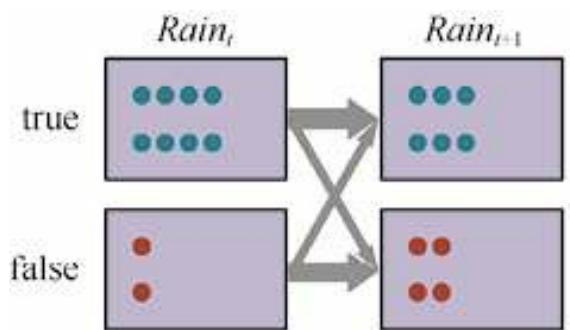  
图14-17粒子滤波算法实现为具有状态（样本集）的递归更新操作。每一个采样操作都涉及按拓扑顺序对相关的时间片变量进行采样，与P rior -S ample 一样。W eighted -S ample -W ith -Replacement操作可以实现成在 O (N)期望时间内运行。步骤编号对应正文中的算法描述的步骤  
（a）传播

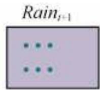

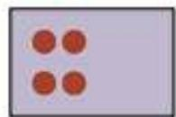  
（b）权重

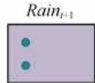

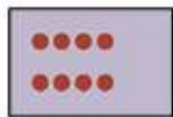  
（c）重新采样  
图14-18N=10的雨伞动态贝叶斯网络的粒子滤波更新循环，显示每个状态的样本总体。（a）在时刻t，有8个样本表示rain ，有2个样本表示¬rain 。每个状态通过转移模型采样下一个状态向前传播。在时刻t+1，有6个样本表示 rain，有4个样本表示¬rain。（b）在时刻t+1观测到¬umbrella。每个样本通过这个观测的似然来进行加权，权重如圆的大小所示。（c）从当前的集合中通过加权随机选择产生一个新的集合，共有10个样本，其中2个样本表示rain，8个样本表示¬rain

通过考察一个更新周期中的操作，我们可以证明这个算法是一致的——当 $N$ 趋于无穷时能给出正确的概率。我们假设样本总体以前向消息的正确表示开始，即时刻 t， $f _ { 1 :  { \boldsymbol { \nu } } } = P ( X , | e _ { 1 :  { \boldsymbol { \nu } } } )$ 。用表示在处理完观测 e 1:t后具有状态 x t的样本数量，对足够大的 N ，我们有 $\pmb { e } _ { 1 : t }$ $\textbf { \em x } _ { t }$ $N$

$$
N \left(x _ {t} \mid e _ {1: t}\right) / N = P \left(x _ {t} \mid e _ {1: t}\right) \tag {14-23}
$$

现在，我们通过给定样本在时刻 t的值采样时刻 t+1的状态变量来向前传播每个样本。从每个状态$\boldsymbol { x } _ { t }$ 达到状态 $\boldsymbol { x } _ { t + 1 }$ 的样本数量等于转移概率乘以 x t的总量；因此，到达状态 $\boldsymbol { x } _ { t + 1 }$ 的样本总数为

$$
N \left(\boldsymbol {x} _ {t + 1} \mid \boldsymbol {e} _ {1: t}\right) = \sum_ {\boldsymbol {x} _ {t}} P \left(\boldsymbol {x} _ {t + 1} \mid \boldsymbol {x} _ {t}\right) N \left(\boldsymbol {x} _ {t} \mid \boldsymbol {e} _ {1: t}\right)
$$

现在，我们用每个样本在 $t + 1$ 时的证据为其加权。状态 $\boldsymbol { x } _ { t + 1 }$ 的样本得到权重 $P ( e _ { t + 1 } | x _ { p + 1 } )$ 。因此，在观测到 $\pmb { e } _ { t + 1 }$ 后， $\boldsymbol { x } _ { t + 1 }$ 的样本总权重为

$$
W \left(\boldsymbol {x} _ {t + 1} \mid \boldsymbol {e} _ {1: t + 1}\right) = P \left(\boldsymbol {e} _ {t + 1} \mid \boldsymbol {x} _ {t + 1}\right) N \left(\boldsymbol {x} _ {t + 1} \mid \boldsymbol {e} _ {1: t}\right)
$$

现在是重采样步骤。由于每个样本的复制概率与其权重成正比，故重采样后处于状态 $\boldsymbol { x } _ { t + 1 }$ 的样本数量与重采样前 $\boldsymbol { x } _ { t + 1 }$ 的总权重成正比：

$$
\begin{array}{l} N \left(x _ {t + 1} \mid e _ {1: t + 1}\right) / N = \alpha W \left(x _ {t + 1} \mid e _ {1: t + 1}\right) \\ = \alpha P \left(e _ {t + 1} \mid x _ {t + 1}\right) N \left(x _ {t + 1} \mid e _ {1: t}\right) \\ = \alpha P \left(e _ {t + 1} \mid x _ {t + 1}\right) \sum_ {x _ {t}} P \left(x _ {t + 1} \mid x _ {t}\right) N \left(x _ {t} \mid e _ {1: t}\right) \\ = \alpha N P \left(e _ {t + 1} \mid x _ {t + 1}\right) \sum_ {x _ {t}} P \left(x _ {t + 1} \mid x _ {t}\right) P \left(x _ {t} \mid e _ {1: t}\right) \quad [ \text {根 据 式 (1 4 - 2 3)} ] \\ = \alpha^ {\prime} P \left(\boldsymbol {e} _ {t + 1} \mid \boldsymbol {x} _ {t + 1}\right) \sum_ {\boldsymbol {x} _ {t}} P \left(\boldsymbol {x} _ {t + 1} \mid \boldsymbol {x} _ {t}\right) P \left(\boldsymbol {x} _ {t} \mid \boldsymbol {e} _ {1: t}\right) \\ = P \left(x _ {t + 1} \mid e _ {1: t + 1}\right) \quad \left[ \text {根 据 式 (1 4 - 5)} \right] \\ \end{array}
$$

因此，一个更新周期后的样本总体正确地表示了时刻 t + 1的前向消息。

粒子滤波是一致的 ，但它是 高效的吗？在许多实际情况中，似乎答案是肯定的：粒子滤波似乎使用常数数量的样本并维持了一个对真实后验的良好近似。从图14-19可以看出，粒子滤波在只有1000个样本的网格世界定位问题上表现良好。粒子滤波也致力于解决真实世界的问题：该算法支持科学和工程领域数以千计的应用。（本章末尾给出了一些参考资料。）它可以处理离散变量和连续变量的组合以及连续变量的非线性模型和非高斯模型。在特定的假设下，尤其是在转移模型和传感器模型的概率有界地远离0和1时，可以证明这种近似以高概率维持有界误差，如图14-19所示。

然而，粒子滤波算法确实也有弱点。让我们看看它在添加了灰尘的真空吸尘器世界中表现如何。回想一下14.3.2节，这将状态空间大小增加了2 42 倍，使得精确的隐马尔可夫模型推断不再可行。我们想让机器人四处走动，并绘制出灰尘所在位置的地图。［这是一个简单的同时定位与地图构建（simultaneous localization and mapping，SLAM）的例子，我们将在第26章中深入讨论］。令 Dirt i,t表示时刻 t 方格 i 是脏的，当且仅当机器人在时刻 t 发现灰尘时 DirtSensor t为真。我们假设在任何给定的方格中，灰尘以概率p 持续存在，而干净的方格以1−p 的概率变脏。（这意味着每个方格平均一半的时间是脏的。）机器人对当前位置有一个灰尘传感器；该传感器的准确率为0.9。动态贝叶斯网络如图14-20所示。

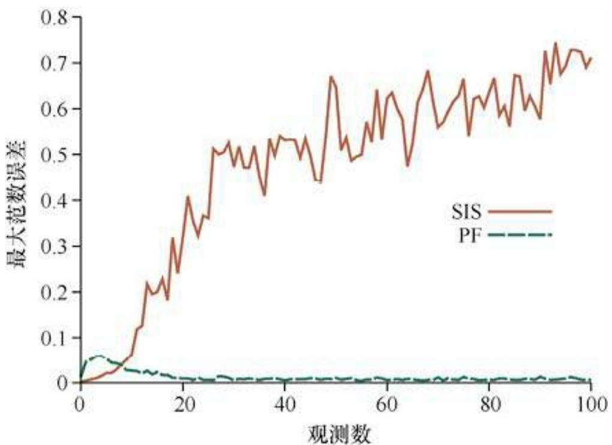

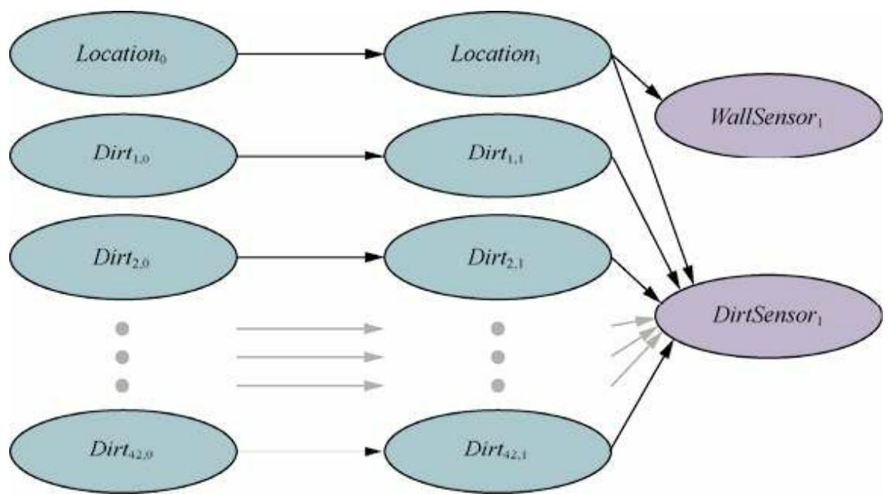  
图14-19对于100000个样本的似然加权（序贯重要性采样）和1000个样本的粒子滤波，网格世界位置估计（与精确推断相比）的最大范数误差；数据是超过50次运行的平均值  
图14-20 一个在随机灰尘的真空吸尘器世界的同时定位与地图构建的动态贝叶斯网络。脏的方格以概率 p 持续，干净的方格以概率1− p 变脏。对于机器人当前所在的方格，局部灰尘传感器的准确率为90%

为了简单起见，我们首先假设机器人有一个没有噪声的完美位置传感器。该算法的性能如图14-21a所示，图中将其对灰尘的估计与精确推断的结果进行了比较。（我们稍后就会看到精确推断是如何可行的。）对于较低的灰尘持续值 p，算法的误差保持很小，但这并不是多大的成就，因为对于每个方格，如果机器人最近没有访问过它，灰尘的真实后验值接近0.5。对于较高的p 值，灰尘停留的时间更长，所以访问一个方格会产生在较长时间内有效的更多有用信息。也许令人惊讶的是，粒子滤波在更高的 p 值时表现得更差，在p =1时完全失效了，尽管这似乎是最简单的例子：灰尘在时刻0到达并永久存在，所以在对世界的一些探索后，机器人应该有一个接近完美的灰尘地图。为什么粒子滤波在这种情况下会失效呢？

结果表明，要求“转移模型和传感器模型中的概率严格大于0小于1”的理论条件不仅仅是数学上的严苛要求。首先，每个粒子根据 P(X )对哪些方格有灰尘，哪些方格没有灰尘进行42次猜测。接着根据转移模型，对每个粒子的状态进行时间向前传播。遗憾的是，确定性灰尘的转移模型是确定性的：灰尘保持在它原来的位置。因此，每个粒子的最初猜测永远不会被证据更新。

最初的猜测完全正确的概率是2 − 42 或2×10 − 13 ，所以1000个（甚至100万个）粒子包含一个正确的灰尘地图几乎是不可能的事情。通常情况下，1000个粒子中最优的一个大约会有32个正确和10个错误，而且通常只存在一个或几个这样的粒子。随着时间的推移，这些最优的粒子中的一个将会主导整个可能性，粒子种群的多样性将会崩溃。因为所有的粒子都同意单个不正确的地图，算法将逐渐变得相信那个地图是正确的并永远不会改变它的想法。

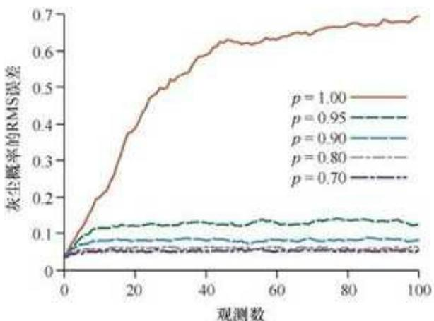

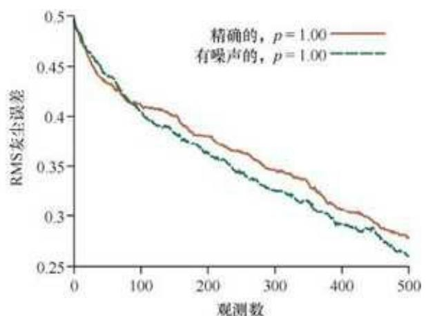  
  
图14-21（a）具有1000个粒子的标准粒子滤波算法的性能，在不同的灰尘持久性p 下，显示与精确推断相比边际灰尘概率的均方根（RMS）误差。（b）Rao-Blackwellized粒子滤波（100个粒子）性能与真实情况的比较，包含精确的位置传感和噪声墙传感，灰尘是确定性的。数据是超过20次运行的平均值

幸运的是，同时定位与地图构建的问题有一个特殊的结构：在给定机器人位置顺序的条件下，每个方格的灰尘状态是独立的（见习题14.RAOB）。更具体地说，

$$
\begin{array}{l} P \left(\text {D i r t} _ {1, 0: s}, \dots , \text {D i r t} _ {4 2, 0: s} \mid \text {D i r t S e n s o r} _ {1: s}, \text {W a l l S e n s o r} _ {1: s}, \text {L o c a t i o n} _ {1: s}\right) \\ = \prod_ {i} P \left(\text {D i r t} _ {i, 0 x} \mid \text {D i r t S e n s o r} _ {1 z}, \text {L o c a t i o n} _ {1 z}\right) \tag {14-24} \\ \end{array}
$$

这意味着应用一种称为 Rao-Blackwellization的统计技巧是很有用的，它基于简单的思想：即便只是对变量的一个子集，精确推断也总是比采样更准确（见习题14.RAOB）。在SLAM问题中，我们对机器人的位置运行粒子滤波，接着对于每个粒子，我们以粒子中的位置顺序为条件对每个灰尘方格独立运行精确的隐马尔可夫模型推断。因此，每个粒子都将包含一个采样位置加上42个方格的精确边际后验，也就是说，假设该粒子遵循的假设位置轨迹是正确的。这种方法被称为Rao-Blackwellized粒子滤波器 （Rao-Blackwellized particle filter），它可以很容易地处理确定性灰尘的情况，并通过精确的位置传感或有噪声的墙传感逐步构建精确的灰尘地图，如图14-21b所示。

对于不满足式（14-24）所示的条件独立性结构的情况，Rao-Blackwellization是不适用的。本章末尾的参考文献与历史注释中提到了一些算法，它们使用静态变量来处理一般的滤波问题。没有一种算法同时具有粒子滤波的优雅性和广泛适用性，但总有一些算法在求解某些类型的问题时是有效的。

小结

本章讨论了关于概率时序过程的表示和推理的一般问题。本章主要包括以下要点。

●通过使用一组随机变量表示每个时间点的状态来处理世界的变化状态。  
●表示可以设计为（大致）满足马尔可夫特性 ，因此给定现在的信息，未来是独立于过去的。再加上过程是时间齐次 的假设，表示可以得到巨大的简化。  
●时序概率模型可以被视为包含一个描述状态衍化的转移模型 和一个描述观测过程的传感器模型。  
●时序模型中的主要推断任务是滤波 （ 状态估计 ）、预测 、平滑 和计算最可能解释 。每一项任务都可以使用简单的递归算法来实现，该算法的运行时间与序列长度呈线性关系。  
●深入研究了三大类时序模型：隐马尔可夫模型 、卡尔曼滤波器 和动态贝叶斯网络 （其中包括了前两种模型作为特殊情况）。  
●除非像卡尔曼滤波器一样做出特殊的假设，多状态变量的精确推断是很难的。在实际应用中，粒子滤波 算法及其衍生算法是有效的近似算法。

读者服务：


微信扫码关注【异步社区】微信公众号，回复“e59810”获取本书配套资源以及异步社区15天VIP会员卡，近千本电子书免费畅读。

# 第15章

# 概率编程

在本章中，我们将重点关注不确定领域中的概率知识表示与推断，并用一般化的语言对其进行描述。

长久以来，表示的方法（原子表示、因子化表示和结构化表示）是人工智能的一个永恒主题。在确定性模型中，搜索算法考虑了原子化的表示方法，CSP和命题逻辑为因子化表示提供了可能性，而一阶逻辑和规划系统则利用了结构化表示。结构化表示提供了强大的表达能力，由它引导生成的模型比由因子化描述或原子描述生成的等效模型简洁得多。

在概率模型中，第13章和第14章描述的贝叶斯网络是基于因子化表示的：随机变量的集合是固定且有限的，每个随机变量都有一个固定的可能的值的范围。这一事实限制了贝叶斯网络的适用范围，因为用贝叶斯网络表示一个复杂域会导致网络规模过大。这使得手工构造这样的表示是不可行的，并且它也不可能从任何合理数量的数据中学习得到。

为概率信息创造一种富有表达能力的形式语言是一个困难的问题，已经有许多伟大的数学家为此绞尽脑汁，其中包括微积分的共同发明者戈特弗里德·莱布尼茨（Gottfried Leibniz），e、变分法与大数律的发现者雅各布·伯努利（Jacob Bernoulli），奥古斯都·德摩根（Augustus De Morgan），乔治·布尔（George Boole），19世纪主要的逻辑学家之一查尔斯·桑德斯·皮尔斯（Charles SandersPeirce），20世纪最重要的经济学家约翰·梅纳德·凯恩斯（John Maynard Keynes），以及20世纪最伟大的分析哲学家之一鲁道夫·卡纳普（Rudolf Carnap）。直到20世纪90年代，他们的努力以及许多其他数学家的研究也没能攻破这个问题。

今天我们已经有了数学上优雅且实用的形式语言，它们可以为非常复杂的域创建概率模型，这些成果一定程度上归功于贝叶斯网络的发展。这些语言是通用的，正如图灵机是通用的一样：它们可以表示任何可计算的概率模型，就像图灵机可以表示任何可计算的函数一样。此外，这些语言还带有通用推断算法，它们大致类似于完整的逻辑推断算法，如归结。

我们有两种方法将表达能力引入概率论。第一种是通过逻辑：设计一种语言来定义一阶可能世界的概率，而不是贝叶斯网络的命题可能世界。我们将在15.1节和15.2节介绍这种方法，15.3节将介绍时序推理的一些特例。第二种方法利用传统的编程语言实现：我们在这些语言中引入随机元素，如随机选择等，并将程序视为在其自身的执行轨迹上定义概率分布。15.4节将介绍这种方法。

这两种途径都与 概率编程语言 （probabilistic programming language，PPL）息息相关。第一种途径类似于说明性PPL，它与通用PPL的关系大致和逻辑编程（第9章）与通用编程语言的关系相同。

# 15.1 关系概率模型

让我们首先回顾第12章的内容，概率模型定义了一个可能世界的集合 $\pmb { \mathcal { Q } }$ ，其中每个世界 的概率为 。对贝叶斯网络而言，可能世界是变量的赋值；尤其是对于布尔变量的情况，可能世界等同于命题逻辑中的可能世界。

对于一阶概率模型，我们需要其可能世界看起来像一阶逻辑的可能世界，也就是说，一个具有相互关系的对象集合，以及一种将常量符号映射到对象、谓词符号映射到关系、函数符号映射到这些对象上的函数的解释（见8.2节）。该模型还需要为每一个这样的可能世界定义一个概率，就像贝叶斯网络为每个变量赋值定义一个概率一样。

让我们暂时假设我们已经知道如何做到这一点。然后，我们就能像之前一样（见12.2.1节）得出任何一阶逻辑语句 的概率，这一概率是 在其中为真的所有可能世界的概率总和：

$$
P (\phi) = \sum_ {\omega : \phi \text {在} \omega \text {中 为 真}} P (\omega) \tag {15-1}
$$

我们也可以类似地得到条件概率 ，因此，原则上我们可以对模型提出任何问题，并获得答案。到目前为止，似乎一切都进行得很顺利。

但是这个过程存在一个问题：一阶模型集合是无限的。我们在图8-4中清楚地看到了这一点，图15-1a再次展示了这张图。这意味着两点：一是式（15-1）中的求和可能是不可行的，二是在无限的世界集合中指定完整且一致的分布可能非常困难。

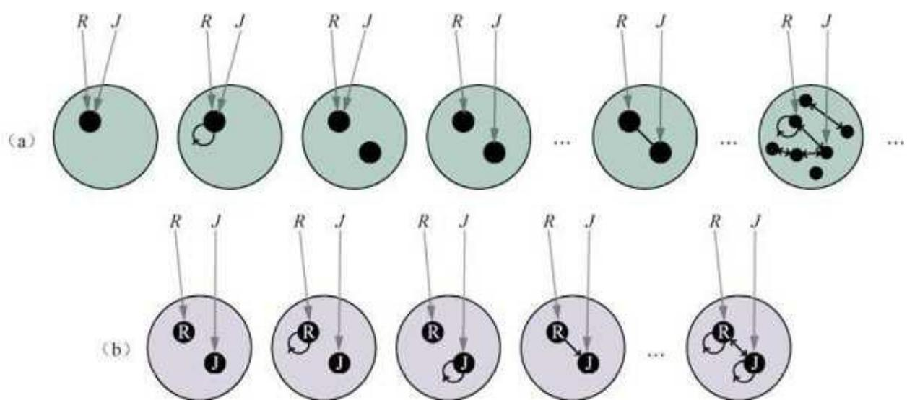  
图15-1 （a）在一阶逻辑的标准语义下，具有两个常量符号R和 $J$ 以及一个二元关系符号的语言的全部可能世界的集合的部分成员。（b）数据库语义下的可能世界。常量符号的解释是固定的，每个常量符号都对应唯一的对象

在本节中，我们考虑使用8.2.8节中定义的数据库语义 来避免这个问题。数据库语义做出了 唯一命名假设 ，这里我们把它用于常量符号。它还假设 域闭包 ——除命名的对象之外没有其他对象。在有了这些假设后，我们可以使每个世界中的对象集合恰好是所使用的常量符号集合，这样就可以确保可能世界的集合是有限的。如图15-1b所示，从符号到对象的映射或存在的对象都没有不确定性。


的——在一个概率推理系统中，我们不能简单地假设每个未知的事实都是假的。

# 15.1.1 语法与语义

让我们从一个简单的示例开始介绍：假设有一个网上图书零售商，他希望根据顾客的推荐对商品进行整体评估。评估的形式是根据现有的证据，计算图书质量的后验分布。最简单的解决方案是将评估建模为顾客的平均推荐水平，可能会根据推荐数量确定方差，但这个方法没有考虑到这样一个事实：有些顾客比其他人更友善，而有些顾客比其他人更不诚实。友善的顾客往往会给出更高的推荐，即便他阅读的是一本相当平庸的书，而不诚实的顾客出于非质量的原因给出非常高或非常低的


推荐——他们可能会通过推销某些出版商的书来获得报酬 。

对于单个顾客 $C _ { 1 }$ 推荐单本图书 B 1这一事件，它的贝叶斯网络表示可能如图15-2a所示。（正如在9.1节中一样，Honest(C )这样的带有圆括号的表达式只是假设的符号，在本例中表示随机变量的假设的名称。）对于两位顾客与两本书的贝叶斯网络如图15-2b所示。对于更大量的图书和顾客的情况，手工指定贝叶斯网络是不切实际的。

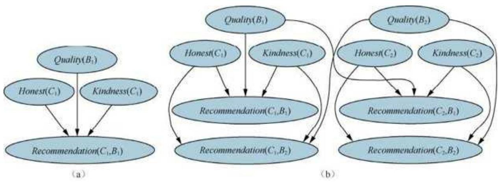  
图15-2 （a）单个顾客 $C _ { 1 }$ 推荐单本图书 $B _ { 1 }$ 的贝叶斯网络，Honest(C )是布尔型变量，其他变量取值为从1～5的整数值。（b）含有两位顾客与两本书的贝叶斯网络

幸运的是，网络中存在很多重复结构。每个 Recommendation ( c , b )变量有着父变量 Honest ( c )、Kindness ( c )与 Quality ( b )。此外，所有 Recommendation ( c , b )变量的条件概率表完全相同，并且所有 Honest ( c )变量的条件概率表都是相同的，以此类推。这种情况似乎是为一阶语言量身定做的。我们想表达的是

# Recommendation(c,b)~RecCPT(Honest(c),Kindness(c),Quality(b))

这意味着顾客对一本书的推荐取决于固定的条件概率表中给定的顾客的诚实度和友善度以及书的质量。

与一阶逻辑一样，关系概率模型含有常量符号、函数符号和谓词符号。我们还假定每个函数都有一个 类型签名 （type signature）—— 每个参数和函数值的类型规范。（在已知每个对象的类型时，通过这种机制可以消除许多虚假的可能世界，例如，我们不必担心会出现每本书的友善度、图书推荐顾客等。）在图书推荐域中，类型是Customer与Book，函数和谓词的类型签名如下：

常量符号是零售商数据集中出现的任何顾客或图书名称。在图15-2b给出的示例中，它们是 C 1、C 2 与 B 1 、 B 2 。

给定常量及其类型、函数及其类型签名，通过使用对象的每种可能组合实例化每个函数，我们可以获得关系概率模型的 基本随机变量 （basicrandomvariable）。对于图书推荐模型，基本随机变量包括 Honest ( C 1 )、 Quality ( B 2 )、 Recommendation ( C 1 , B 2 )等。这些正是图15-2b中出现的变量。由于每种类型只有有限多个实例（基于域闭包假设），因此基本随机变量的数量也是有限的。

为了完成RPM，我们还需要制定控制这些随机变量的依赖关系。每个函数都有一个依赖声明，其中函数的每个参数都是一个逻辑变量（例如，像在一阶逻辑中，它是一个在对象上取值的变量）。例如，下面的依赖关系表明，对于每个顾客c，他的诚实度的先验概率0.99为真，0.01为假：

$$
\operatorname {H o n e s t} (c) \sim \langle 0. 9 9, 0. 0 1 \rangle
$$

类似地，我们可以为每一位顾客的友善度和每本书的质量给出先验概率，友善度和书的质量按照1～5的等级尺度进行划分：

$$
\operatorname {K i n d n e s s} (c) \sim \langle 0. 1, 0. 1, 0. 2, 0. 3, 0. 3 \rangle
$$

$$
\operatorname {Q u a l i t y} (b) \sim \langle 0. 0 5, 0. 2, 0. 4, 0. 2, 0. 1 5 \rangle
$$

最后，我们需要确定推荐的依赖关系：对于任何顾客 $c$ 和书 $^ { b }$ ，推荐分数取决于顾客的诚实度和友善度以及书的质量。

$$
R e c o m m e n d a t i o n (c, b) \sim R e c C P T (H o n e s t (c), K i n d n e s s (c), Q u a l i t y (b))
$$

其中，RecCPT是单独定义的条件概率表，它有 $2 { \times } 5 { \times } 5 = 5 0$ 行，每一行有5项。为了进一步

说明，我们假设一个友善度为 $k$ 的人对一本质量为 $q$ 的书的诚实推荐服从

q+k[q+]]2 2 范围内的均匀分布。

给定一个定义了RPM的随机变量联合分布的贝叶斯网络（如图15-2b所示），RPM的语义可以通过实例化所有已知常量的依赖关系来获得。[1]

[1]RMP需要一些技术条件来定义一个合适的分布。首先，依赖关系必须是无环的，否则得到的贝叶斯网络就会有环。其次，依赖关系（通常）必须有依据的：不能有无限的祖先链，例如可能由递归依赖关系导致的祖先链。见习题15.HAMD中本规则的特殊情况。

可能世界的集合是所有基本随机变量值域的笛卡儿积，并且就像贝叶斯网络一样，每个可能世界的概率是模型中相关条件概率的乘积。如果世界中有C个顾客和B本书，那么就有 $C$ 个 Hones t 变量、 C 个 Kindness 变量、 B 个 Quality 变量、 BC 个 Recommendation 变量，形成2 C 5 C + B + BC 个可能世界。如果拥有1000万本书和10亿顾客，就有大约10 7×10 15 个可能世界。多亏了RPM的表达能力，完整的概率模型仍然只有不到300个参数，其中大部分在 RecCPT表中。

我们可以通过断言特定于上下文的独立性（见13.2.2节） 来细化模型，以反映不诚实的顾客在给出推荐时忽视质量这一事实；此外，友善度在决定中不起作用。因此，当Honest(c)=false时，Recommendation ( c , b )独立于 Kindness ( c )与 Quality ( b )：

$$
\begin{array}{c} R e c o m m e n d a t i o n (c, b) \sim \text {i f H o n e s t} (c) \text {t h e n} \\ \hskip 1 4. 2 2 6 3 7 8 p t H o n e s t R e c C P T (K i n d n e s s (c), Q u a l i t y (b)) \\ \text {e l s e} \langle 0. 4, 0. 1, 0. 0, 0. 1, 0. 4 \rangle \end{array}
$$

这种依赖关系可能看起来像编程语言中一个普通的if–then–else语句，但它们有一个关键的区别：推

断过程 不必知道条件测试的值 ，因为 Honest ( c )是一个随机变量。

我们可以用无数种方法来细化这个模型，以使它更加真实。例如，假设一位诚实的顾客是某本书作者的粉丝，不管这本书的质量如何，他总是给这本书打5分：

Recommendation(c,b) $\sim$ ifHonest(c) then if Fan(c,Author(b))thenExactly(5) elseHonestRecCPT(Kindness(c),Quality(b)) else<0.4,0.1,0.0,0.1,0.4>

同样，条件测试Fan (c,Author(b ))是未知的，但是，如果一个顾客只给一个特定作者的书打5分，并且他对其他书不是特别友善，那么这个顾客是该作者的粉丝的后验概率将会很高。此外，后验分布倾向于在评估该作者的书的质量时不完全采信该顾客打的5分。

在本例中，我们隐式地假设Author(b )的值对于每个 b 都是已知的，但情况可能并非如此。当Author ( $B _ { 2 }$ )未知时，系统该如何推理 C 是否是 Author(B )的粉丝？答案是，系统可能需要对所有可能的作者 进行推理。为简单起见，我们假设只有两个作者 $A _ { 1 }$ 和 $A _ { 2 }$ 。 Author ( B 2 )是具有两个可能值 $A _ { 1 }$ 和 $A _ { 2 }$ 的随机变量，并且是 Recommendation $( C _ { 1 } , B _ { 2 } ) \quad$ )的父变量。变量 Fan ( C 1 , A)和 Fan ( C , A )也是父变量。 Recommendation $( C _ { 1 } , B _ { 2 }$ )的条件分布本质上是一个多路选择器（multiplexer），其中 Author ( B 2 )父变量用作选择器，它将选择 Fan ( C 1 , A 1 )和 Fan ( C 1 , A 2 )中实际上会影响推荐的那一个。图15-3展示了等价贝叶斯网络的一个片段。 Author $( B _ { 2 }$ )值的不确定性将影响网络的依赖结构，这是 关系不确定性 （relational uncertainty）的一个实例。

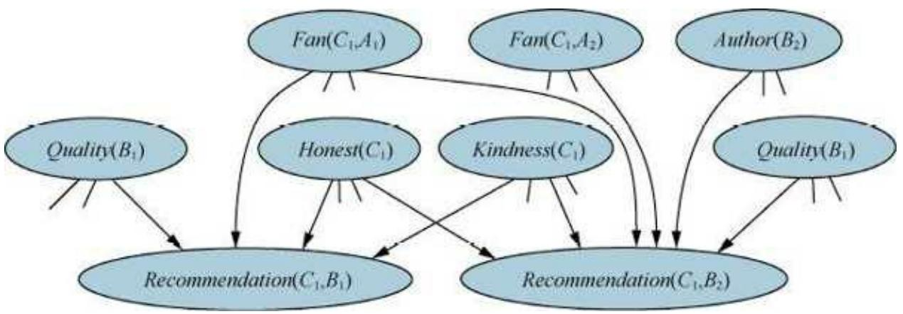  
图15-3 Author $\left( \boldsymbol { B } _ { 2 } \right)$ )未知时图书推荐RPM的等价贝叶斯网络的片段

如果你想知道系统如何判断B2的作者是谁，可以参考以下例子：有另外3位顾客是 $A _ { 1 }$ 的粉丝（他们没有其他的共同喜爱的作者），并且都给 $B _ { 2 }$ 打了5分，但大多数其他顾客觉得这本书很差劲。在这种情况下， $A _ { 1 }$ 极有可能是 $B _ { 2 }$ 的作者。短短几行的RPM模型就可以体现这样复杂的推理，这是一个有趣的例子，它说明了概率影响是如何通过模型中对象之间的连接网络进行传播的。随着依赖性和对象数目的增加，后验概率分布所表达的含义往往会变得越来越清晰。

# 15.1.2 实例：评定玩家的技能等级

许多竞技游戏都用数值来衡量玩家的技能等级，有时也称等级分 。最著名的例子可能是针对国际象棋选手的埃洛等级分系统（Elorating），一般来说，初学者的等级分约为800，而世界冠军的等级分通常高于2800。尽管埃洛等级分具有统计依据，但它们也考虑了一些特殊的因素。我们可以制定如下贝叶斯等级分方案：每个玩家i都有基本的技能等级Skill(i)；在每局游戏g 中，i的实际表现是 Performance ( i , g )，这可能与基本技能等级有所不同； g 的获胜者是 g 中表现更好的玩家。关于该例子的一个RPM模型如下：

$$
\operatorname {S k i l l} (i) \sim \mathcal {N} (\mu , \sigma^ {2})
$$

$$
\operatorname {P e r f o r m a n c e} (i, g) \sim \mathcal {N} (\operatorname {S k i l l} (i), \beta^ {2})
$$

$$
W i n (i, j, g) \quad i f \quad G a m e (g, i, j) \text {t h e n} \left(\text {P e r f o r m a n c e} (i, g) > \text {P e r f o r m a n c e} (j, g)\right)
$$

其中 $\pmb { \mathcal { P } }$ 是玩家在任何特定游戏中的实际表现相对于其基本技能等级的方差。给定一组玩家和游戏以及某些游戏对局的结果，RPM推理机可以计算每个玩家的技能等级的后验分布以及可能进行的任何其他游戏的可能结果。

至于团队游戏，我们可以近似地假设团队t在游戏 $g$ 中的整体表现是 t中玩家的个人表现的总和：

$$
\text {T e a m P e r f o r m a n c e} (t, g) = \sum_ {i \in t} \text {P e r f o r m a n c e} (i, g)
$$

尽管等级分系统无法让我们注意到个人表现，但玩家的技能水平仍然可以通过几场比赛的结果来估计，只要其团队构成在不同的游戏中有所不同。微软的TrueSkillTM 等级分系统使用了这个模型，并采用一个高效的近似推断算法，每天为数亿用户服务。

这个模型可以在多方面精心构建。例如，我们可以假设较弱的玩家的表现方差较大；我们可以涵盖玩家在团队中的角色；我们可以进一步考虑具体的表现和技能，例如防守和进攻的水平，这样一来就可以提高团队构成和预测的准确性。

# 15.1.3 关系概率模型中的推断

在RPM中进行推断的最直接方式是给定属于每种类型的已知常量符号，简单地构造等价贝叶斯网络。对于B本书和 C位顾客的情形，前面给出的基本模型可以通过简单的循环进行构造： [2]

[2]一些统计包会将这些代码视为RPM的定义，而不仅仅是构建一个贝叶斯网络在RPM中执行推断。然而，这种观点忽略了RPM语法的一个重要作用：如果没有语义清晰的语法，就无法从数据中学习模型结构。

$$
\text {f o r} b = 1 \text {t o} B d o
$$

增加不带父节点的节点 $Q u a l i t y _ { \scriptscriptstyle \delta }$ ，先验为（0.05，0.2，0.4,0.2，0.15）

$$
\text {f o r} c = 1 \text {t o} C d o
$$

增加不带父节点的节点Honest，先验为（0.99，0.01）

增加不带父节点的节点Kindness，先验为（0.1，0.1，0.2，0.3，0.3）

$$
\text {f o r} b = 1 \text {t o} B d o
$$

增加带父节点的节点Recommendationc，其父节点为Honest、Kindnesse、Qualityb且服从条件分布RecCPT(Honeste,Kindness,Qualityb)

这种方法称为 落地 （grounding）或 展开 （unrolling）。它是对一阶逻辑 命题化

（propositionalization）的精确模拟。它有一个明显的缺点——得到的贝叶斯网络可能非常大。此外，如果一个未知的关系或函数有许多候选对象，如未知的 B 2的作者，那么网络中的一些变量可能会有许多父变量。

幸运的是，我们通常可以避免生成整个隐式贝叶斯网络。正如我们在对变量消元算法的讨论中看到的，每个不是查询变量或证据变量祖先的变量都与查询无关。此外，如果查询在给定证据时条件独立于某个变量，那么它与该变量也是不相关的。因此，通过从查询和证据开始链接模型，我们可以只识别与查询相关的变量集。这些变量就是我们需要实例化的所有变量，接着我们就能创建隐式贝叶斯网络的潜在小片段。这个片段中的推断与整个隐式贝叶斯网络中的推断给出的答案是相同的。

另一种提高推断效率的方法着眼于在展开贝叶斯网络中存在的重复子结构。这意味着在变量消元过程中构建的许多因子（以及由聚类算法构建的类似的表）将是相同的。高效的缓存方案可以为大型

网络加速3个数量级。

此外，MCMC推理算法在应用于具有关系不确定性的RPM时具有一些有趣的特性。MCMC通过采样完整的可能世界来运作，因此在每个状态下，关系结构是完全已知的。在前面给出的示例中，每个MCMC状态都会指定 Author ( B )的值，因此其他潜在的作者不再是 B 推荐节点的父节点。MCMC中的关系不确定性不会导致网络复杂性增加；但是，MCMC过程包含了改变展开网络的关系结构进而改变依赖结构的转移。

最后，在某些情况下可以避免完全落地模型。归结定理证明器和逻辑编程系统通过仅对推断所需的逻辑变量进行实例化来避免命题化。也就是说，它们将推断过程 提升 到高于基础命题语句的级别上，并使每一个提升步骤执行许多基础步骤的工作。

同样的思想也适用于概率推断。例如，在变量消元算法中，一个提升因子可以代表RPM中给随机变量分配概率的一整套落地因子，这些随机变量的区别只在于用于构造它们的常量符号。这种方法的细节超出了本书的范围，本章的末尾给出了一些参考资料。

# 15.2 开宇宙概率模型

我们在前面讨论过，数据库语义适用于我们确切知道存在的相关对象的集合，并且可以无歧义地识别它们的情形。（特别是，关于一个对象的所有观测都正确地与命名该对象的常量符号相关联。）然而，在许多真实世界中，这些假设根本站不住脚。例如，图书零售商可能使用ISBN（国际标准书号）作为一个常量符号来命名每本书，但即便是某本“合乎逻辑的”书籍（如《飘》），它也可能有不止一个ISBN分别对应精装、平装、大字体版、再版等。在多个ISBN上对推荐进行汇总是有意义的，但零售商可能并不清楚哪些ISBN实际上表示同一本书。（注意，我们没有具体化书籍每个个体，但对于销售旧书或汽车等这可能是必需的。）更糟糕的是，每个顾客都由一个登录ID进行标识，但一个不诚实的客户可能有数千个ID！在计算机安全领域，这些多个ID被称为“女


巫”（sybil），它们用于混淆一个信誉系统，这也被称为女巫攻击 （sybilattack） 。因此，即便是一个相对良定义的线上问题的简单应用，它也会涉及 存在不确定性 （existenceuncertainty）（观测到的数据没有明确指示真正的书和顾客）和身份不确定性 （identityuncertainty）（不清楚哪些逻辑术语实际上指的是同一个对象）。存在不确定性和身份不确定性的现象远不止出现在网上书店的例子中。事实上，它们无处不在。

● 视觉系统不知道下一个角落里有什么，也不知道它现在看到的物体是不是几分钟前看到的那个物体。  
●文本理解系统并不会预先知道哪些实体将出现在文本中，而且必须推断诸如“玛丽”“史密斯医生”“她”“他的心脏病医生”“他的母亲”等词语是否指的是同一个人。  
● 一个寻找间谍的情报分析系统永远不知道到底有多少间谍，只能猜测不同的假名、电话号码和目击记录是否属于同一个人。

事实上，人类认知的一个主要部分似乎要求我们认识到存在什么物体，并能够将观测结果（这种观测几乎从不附带唯一的ID）与世界上的假想对象联系起来。

因此，我们需要在一阶逻辑的标准语义的基础上定义一个开宇宙概率模型 （open universeprobability model，OUPM），如图15-1a所示。用于OUPM的语言提供一种方法，它可以让我们轻松地编写开宇宙概率模型，同时保证在无限可能世界的空间中存在一个唯一的、一致的概率分布。

# 15.2.1 语义与语法

我们的基本思路如下：理解普通贝叶斯网络和RPM如何设法定义一个唯一的概率模型，并将其迁移到一阶逻辑设置。从本质上讲，贝叶斯网络按照网络结构定义的拓扑顺序，一个事件接着一个事件地生成每个可能世界，其中每个事件都是对一个变量的一次赋值。RPM将其扩展到整个事件集上，由给定谓词或函数中逻辑变量的可能实例化定义。OUPM在此基础上更进一步：允许生成步骤，这些步骤将对象添加到正在构建的可能世界中，其中对象的数量和类型可能依赖于已经存在于那个世界中的对象及其属性和关系。也就是说，生成的事件不是对变量的赋值，而是对象本身的存在性。

在OUPM中执行此操作的一种方法是提供数字语句 ，该语句指定关于各种对象的数量的条件分布。例如，在图书推荐问题中，我们可能想要区分顾客（真实的人）及其登录ID。（实际上，做推荐的是登录ID而不是顾客！）为简单起见，我们假设，顾客数量在1～3均匀分布，而图书数量在2～4均匀分布：

$$
\# C u s t o m e r \sim U n i f o r m I n t (1, 3)
$$

$$
\# \text {B o o k} \sim \text {U n i f o r m I n t} (2, 4) \tag {15-2}
$$

我们期望诚实的顾客只有一个ID，而不诚实的顾客可能有2～5个ID：

$$
\begin{array}{l} \# \text {L o g i n I D} (\text {O w n e r} = c) \sim \text {i f H o n e s t} (c) \text {t h e n E x a c t b y} (1) \\ \text {e l s e U n i f o r m I n t} (2, 5) \end{array} \tag {15-3}
$$

该数字语句指定了以客户c为Owner的登录ID数量的分布。我们称 Owner函数为起源函数（origin function），这是因为它指出了该数字语句生成的每个对象的来源。

在上一段中，我们在2到5之间的整数上使用均匀分布来指定不诚实客户的登录账号数量。这个特定的分布是有界的，但是一般来说，对象的数量可能没有一个先验的边界。关于非负整数最常使用的是泊松分布 （Poisson distribution）。泊松分布有一个参数 ，它是目标数量的期望，如果一个变量X服从泊松分布Poisson( )，那么我们有

$$
P (X = k) = \lambda^ {k} e ^ {- \lambda} / k!
$$

泊松分布的方差也是 ，所以标准差是附近。例如，如果巢穴中的蚂蚁数量由 $\sqrt { 2 }$ 。这意味着，对于较大的 值，分布相对集中在均值 型（均值为 万）建模，则标准差仅为 ，即0.1%。对于较大的数字，使用 离散对数正态分布 （discrete log-normal distribution）通常更有意义，这在对象数量的对数呈正态分布时是合适的。我们把其中一种特别直观的形式称为 数量级分布 （order-of-magnitude distribution），它使用以10为底的对数，因此分布OM(3,1)的均值为10 3 ，标准差为一个数量级，即概率质量大部分落在1 $0 ^ { 2 } \sim 1 0 ^ { 4 }$ 。

OUPM的正式语义始于构成可能世界的对象的定义。在类型化一阶逻辑的标准语义中，对象只是带有类型的编号标记。在OUPM中，每个对象都是一个生成历史，例如，对象可能是第七个顾客的第四个登录ID。（我们很快就会清楚这种略显巴洛克风格的原因。）对于没有起源函数的类型，如式（15-2）中的 Customer 和 Book 类型，对象的起源为空，例如， 指的是由数字语句生成的第二个顾客。对于带有起源函数的数字语句，如式（15-3），每个对象将记录其起源，例如，对象 是属于第二个顾客的第三次登录。

OUPM的 数字变量 （number variable）指定每个可能世界的每个起源的每种类型有多少个对象，因此 意味着在世界 中，顾客2拥有4个登录ID。与关系概率模型一样，OUPM的 基本随机变量 （basic random variable）决定对象的所有元组的谓词和函数的值，因此 意味着在世界 上，顾客2是诚实的。一个可能世界是由所有的数字变量和基本随机变量的值定义的。通过拓扑顺序采样，我们可以从模型中生成一个世界，图15-4给出了一个例子。这样构造出来的世界的概率是所有采样值的概率的乘积，在本例中，该乘积是 。现在我们清楚了为什么每个对象都包含它的起源：这个性质确保每个世界都可以恰好由一个生成序列构建。如果不这样做，一个世界的概率将是所有可能产生它的生成序列的冗杂组合之和。

<table><tr><td>变量</td><td>值</td><td>概率</td></tr><tr><td>#Customer</td><td>2</td><td>0.3333</td></tr><tr><td>#Book</td><td>3</td><td>0.3333</td></tr><tr><td>Honest(Customer,1)</td><td>true</td><td>0.99</td></tr><tr><td>Honest(Customer,2)</td><td>false</td><td>0.01</td></tr><tr><td>Kindness(Customer,1)</td><td>4</td><td>0.3</td></tr><tr><td>Kindness(Customer,2)</td><td>1</td><td>0.1</td></tr><tr><td>Quality(Book,1)</td><td>1</td><td>0.05</td></tr><tr><td>Quality(Book,2)</td><td>3</td><td>0.4</td></tr><tr><td>Quality(Book,3)</td><td>5</td><td>0.15</td></tr><tr><td>#LoginID Owner, (Customer,1)</td><td>1</td><td>1.0</td></tr><tr><td>#LoginID Owner, (Customer,2)</td><td>2</td><td>0.25</td></tr><tr><td>Recommendation(LoginID, (Owner, (Customer,1),1), (Book,1)</td><td>2</td><td>0.5</td></tr><tr><td>Recommendation(LoginID, (Owner, (Customer,1),1), (Book,2)</td><td>4</td><td>0.5</td></tr><tr><td>Recommendation(LoginID, (Owner, (Customer,1),1), (Book,3)</td><td>5</td><td>0.5</td></tr><tr><td>Recommendation(LoginID, (Owner, (Customer,2),1), (Book,1)</td><td>5</td><td>0.4</td></tr><tr><td>Recommendation(LoginID, (Owner, (Customer,2),1), (Book,2)</td><td>5</td><td>0.4</td></tr><tr><td>Recommendation(LoginID, (Owner, (Customer,2),1), (Book,3)</td><td>1</td><td>0.4</td></tr><tr><td>Recommendation(LoginID, (Owner, (Customer,2),2), (Book,1)</td><td>5</td><td>0.4</td></tr><tr><td>Recommendation(LoginID, (Owner, (Customer,2),2), (Book,2)</td><td>5</td><td>0.4</td></tr><tr><td>Recommendation(LoginID, (Owner, (Customer,2),2), (Book,3)</td><td>1</td><td>0.4</td></tr></table>

图15-4对于图书推荐OUPM的一个特定世界。数字变量和基本随机变量以拓扑顺序显示，其后是它们所选的值和这些值的概率

一个开宇宙模型可能有无穷多个随机变量，因此完整的理论涉及非平凡的测度论因素。例如，使用泊松分布或数量级分布的数字语句允许对象的数量是无界的，从而导致这些对象的属性和关系的随机变量的数量是无界的。此外，OUPM可以有递归依赖关系和无限类型（整数、字符串等）。最后，良结构不允许出现循环依赖和无限后退的祖先链，这些条件一般来说是不可判定的，但某些语法的充分条件可以很容易地被验证。

# 15.2.2 开宇宙概率模型的推断

由于与典型OUPM对应的隐式贝叶斯网络的规模是潜在巨大的且有时是无界的，完全展开它并执行精确的推断是非常不切实际的。因此，我们必须考虑近似推断算法，如MCMC（见13.4.2节）。

粗略地说，OUPM的MCMC算法探索的是由对象和它们之间的关系的集合定义的可能世界的空间，如图15-1所示。空间中相邻状态之间的移动不仅可以改变关系和函数，还可以增加或减少对象，改变常量符号的解释。尽管每个可能世界或许很大，但每步所需要的概率计算（无论是吉布斯采样还是米特罗波利斯-黑斯廷斯）都是完全局部的，在大多数情况下它们只需要常量的时间。这是因为相邻世界之间的概率比率取决于一个固定大小的子图，它只与那些值发生变化的变量有关。此外，逻辑查询可以在访问的每个世界中 递增地 评估，因此在每个世界所需的时间通常是常量的，而不需要从头开始重新计算。

特别地，我们需要考虑，一个典型的OUPM可能有无限大小的可能世界。以图15-9中多目标跟踪模型为例。函数X(a ,t)表示飞行器 a 在时刻 t的状态，对应于每步无界数量的飞行器的无穷变量序

列。由于这个原因，MCMC对OUPM采样的样本将不会指定完全的可能世界，而是部分世界，每一


个都对应着一组不相交的完整世界。局部世界是相关变量子集的 最小自支撑实例化 $\_$ 证据和查询变量的祖先。例如，当 t 值大于上次的观测时间（或查询时间，以较大者为准）时，变量 X ( a , t )是不相关的，因此算法可以只考虑无限序列的有限前缀。

# 15.2.3 示例

OUPM的标准“使用方法”涉及3个要素：模型、 证据（给定场景中的已知事实）和查询（查询可


以是任意表达式，其中可能带有自由逻辑变量）。根据模型 $-$ ，答案是自由变量的每一组可能替换在给定证据时的联合后验概率分布。每个模型都包含类型声明、谓词和函数的类型签名、每种类型的一个或多个数字语句，以及每个谓词和函数的一个依赖语句。（在下面的例子中，我们将在含义清楚的地方省略声明和签名。）与在RPM中一样，依赖语句使用if-then-else语法来处理特定于上下文的依赖。

# 1. 引文匹配

数以百万计的学术研究论文和技术报告以PDF文件的形式出现在网上。这类论文通常在接近结尾的地方包含一个称为参考文献或参考书目的部分，这一部分引用的字符串为读者提供相关工作的信息。这些字符串可以从PDF文件中定位和提取，目的是创建一种类似数据库的表示形式，通过作者和引用链接将论文和研究人员联系起来。CiteSeer和GoogleScholar等系统向用户提供了这样的表示，系统背后的算法实现了查找论文、抓取引用字符串以及识别引用字符串所引用的实际论文。这是一项困难的任务，因为这些字符串不包含对象标识符，并且包含语法、拼写、标点和内容错误。为了说明这一点，这里给出两个相对较好的示例。

（1）[Lashkari et al 94] Collaborative Interface Agents, Yezdi Lashkari, Max Metral, and Pattie Maes, Proceedings of the Twelfth National Conference on Articial Intelligence, MIT Press, Cambridge, MA, 1994.   
（2）Metral M. Lashkari, Y. and P. Maes. Collaborative interface agents. In Conference of the American Association for Artificial Intelligence, Seattle, WA, August 1994.

这里的关键问题在于同一性：这些引用是同一篇论文还是不同的论文？当被问及这个问题时，即使是专家也意见不一致或勉强做出决定，这表明在不确定性下进行推理将是解决这个问题的一个重要

部分 $\underline { { \cdots } } = \underline { { \cdots } }$ 些特别的方法，如基于文本相似性度量的方法，都在这个任务中几乎完全失效。例如，2002年CiteSeer列出了Russell与Norvig写的120多本不同的书。

为了使用概率方法解决这个问题，我们需要一个该领域的生成模型。也就是说，我们将询问这些引用字符串是如何在世界上出现的。这个过程将从有名字的研究人员开始。（我们无须担心研究人员是怎么来的，只要表达我们对有多少研究人员的不确定性。）这些研究人员撰写了一些有标题的论文，人们引用论文时，会根据某些语法将作者姓名和论文标题（可能带有错误）合并到引文正文中。图15-5展示了这个模型的基本要素，涵盖了论文只有一个作者的情况。 [1]

[1]多作者的情况有着相同的整体结构，但复杂一些。模型中未展示的部分（NamePrior、rTitlePrior 与 HMMGrammar ）是传统的概率模型。例如， NamePrior 是实际姓名的分类分布和字母三元模型（见23.1节）的混合，用来涵盖以前没有见过的名字，两者都是从美国人口普查数据库的数据中训练出来的。

```txt
type Researcher, Paper, Citation  
random String Name(Researcher)  
random String Title(Paper)  
random Paper PubCited(Citation)  
random String Text(Citation)  
random Boolean Professor(Researcher)  
origin Researcher Author(Paper) 
```

Researcher $\sim$ OM(3,1)   
Name(r) $\sim$ NamePrior()   
Professor(r) $\sim$ Boolean(0.2)   
#Paper(Author $= r)$ \~ if Professor(r) then OM(1.5, 0.5) else OM(1, 0.5)   
Title(p) $\sim$ PaperTitlePrior()   
CitedPaper(c) $\sim$ UniformChoice({Paper p})   
Textc) $\sim$ HMMGrammar(Name(Author(CitedPaper(c))), Title(CitedPaper(c))

图15-5用于引文信息提取的OUPM。为简单起见，该模型假定每篇论文只有一个作者，并省略了语法模型和误差模型的细节

仅将引用字符串作为证据，对该模型进行概率推断并找出数据最可能的解释，这一过程的错误率是CiteSeer的1/2～1/3（Pasula et al. , 2003）。推断过程还表现出一种集体的、知识驱动的消歧形式：对一篇论文的引用越多，引用被解析得越准确，因为解析必须与论文的事实达成一致。

# 2. 核条约监控

为了核查《全面禁止核试验条约》，我们需要找到地球上所有震级高于最低限度的地震事件。联合国全面禁止核试验条约组织（Comprehensive Nuclear-Test-Ban Treaty Organization，CTBTO）维护着一个传感器网络，即国际监测系统（IMS），其自动处理软件建立在100年的地震学研究基础上，它的检测失败率约为30%。基于OUPM的NET-VISA系统（Arora et al. , 2013）显著地降低了检测失败率。

NET-VISA模型（图15-6）直接表达了相关的地球物理学。它描述了给定时间间隔内地震事件数量的分布（其中大多数是自然发生的）及其时间、震级、震源深度和震中位置。自然地震事件的位置是存在一个空间上的先验分布，这个先验是从历史数据中训练出来的（像模型的其他部分一样）；根据条约规则，假定人为事件在地球表面均匀地发生。在每个站点s，来自事件e的每个相位（地震波类型）p 产生0或1个检测（阈值以上信号），检测概率取决于事件的震级、深度及其与观测站的距离。“虚假警报”检测也会根据一个站特定的速率参数发生。从一个真实事件中测量的检测d 的信号的到达时间、振幅和其他特性取决于原始事件的特性及其与观测站的距离。

SeismicEvents $\sim$ Poisson $(T*\lambda_{e})$ Time(e) $\sim$ UniformReal(0,T)   
EarthQuake(e) $\sim$ Boolean(0.999)   
Location(e) $\sim$ if Earthquake(e) then SpatialPrior() else UniformEarth()   
Depth(e) $\sim$ if Earthquake(e) then UniformReal(0, 700) else Exactly(0)   
Magnitude(e) $\sim$ Exponential(log(10))   
Detected(e,p,s) $\sim$ Logistic(weights(s,p),Magnitude(e),Depth(e),Dist(e,s))   
#Detections site $= s$ ) $\sim$ Poisson $(T*\lambda_f(s))$ #Detections(event=e,phase=p,station=s)=if Detected(e,p,s) then 1 else 0   
OnsetTime(a,s) if (event(a) = null) then $\sim$ UniformReal(0,T)   
else $=$ Time(event(a))+GeoTT(Dist(event(a),s),Depth(event(a)),phase(a))+Laplace $(\mu_s(s),\sigma_s(s))$ Amplitude(a,s) if (event(a) = null) then $\sim$ NoiseAmpModel(s)   
else $=$ AmpModel(Magnitude(event(a)),Dist(event(a),s),Depth(event(a)),phase(a))   
Azimuth(a,s) if (event(a) = null) then $\sim$ UniformReal(0,360)   
else $=$ GeoAzimuth Location(event(a)),Depth(event(a)),phase(a),Site(s))+Laplace(0, $\sigma_a(s)$ )   
Slowness(a,s) if (event(a) = null) then $\sim$ UniformReal(0,20)   
else $=$ GeoSlowness Location(event(a)),Depth(event(a)),phase(a),Site(s))+Laplace(0, $\sigma_s(s)$ )   
ObservedPhase(a,s) $\sim$ CategoricalPhaseModel(phase(a))

图15-6 NET-VISA模型的一个简化版本

一旦经过训练，模型就会持续运行。它所拥有的证据包括从原始IMS波形数据中提取的检测（90%是虚假警报），查询通常要求给定数据的最可能的事件历史或公告。到目前为止，模型的结果是令人鼓舞的。例如，在2009年，在总共27 294个震级范围3～4的事件中，联合国的SEL3自动公告遗漏了27.4%，而NET-VISA遗漏了11.1%。此外，与密集的区域网络相比，NET-VISA发现的真实事件比联合国地震分析专家发布的最终公告多出50%。NET-VISA也倾向于将更多的检测与一个给定事件联系起来，从而得到更准确的位置估计（见图15-7）。截至2018年1月1日，NET-VISA已被部署为CTBTO监控渠道的一部分。

尽管这两个例子在形式上存在差异，但它们有着相似的结构：有些未知的对象（论文、地震）会根据某些物理过程（引文、地震传播）产生感知。这些感知对于来源是模糊的，但是如果假设多个感知起源于相同的未知对象，则可以更准确地推断出该对象的属性。

相同的结构和推理模式适用于数据库去重和自然语言理解等领域。在某些情况下，推断一个对象的存在涉及对感知进行分组，这一过程类似于机器学习中的聚类任务。还有一些其他的情况，如一个对象可能根本不能产生任何感知，但我们仍然可以推断出它的存在，例如，对天王星的观测过程中引出了海王星的发现。我们能判断出未观测到对象的存在是因为它对被观测对象的行为和属性产生了影响。

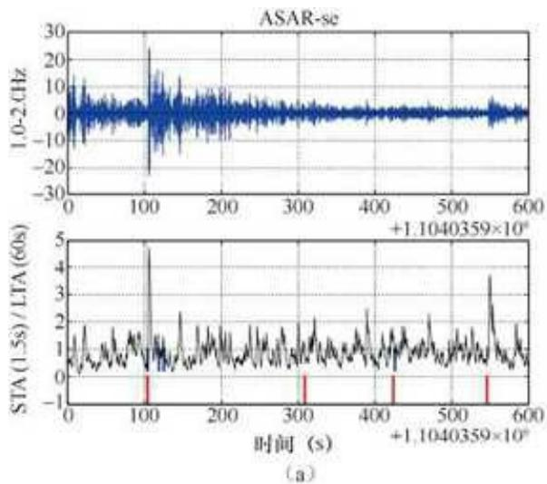

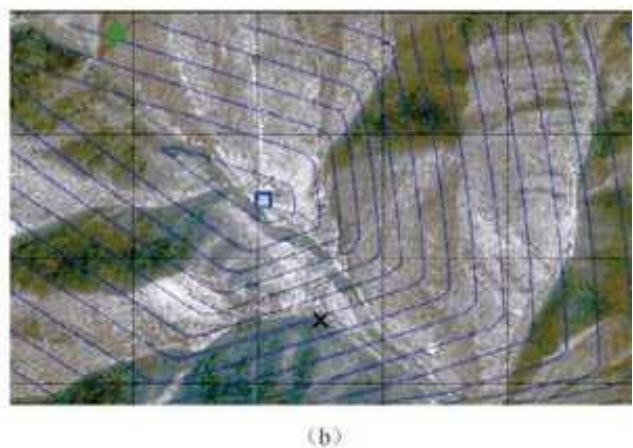  
图15-7（a）上图：在澳大利亚艾利斯斯普林斯市记录的地震波形实例。下图：用于检测地震波到达时间的处理后的波形。蓝线是自动检测的地震波到达，红线是真正的地震波到达。（b）2013年2月12日朝鲜核试验地点估计：联合国CTBTO最新事件公报（左上角绿色三角形），NET-VISA（中间蓝色方块）。地下试验设施的入口（以“x”标记）距离NET-VISA的估计0.75公里。轮廓线显示NET-VISA的后验位置分布。图片由CTBTO筹备委员会提供

# 15.3 追踪复杂世界

第14章考虑了追踪世界状态的问题，但只涵盖了原子表示（HMM）和因子化表示（DBN和卡尔曼滤波器）的情形。这对只有一个对象的世界来说是有意义的，例如重症监护病房里的一个病人，或者是一只飞过森林的鸟。在本节中，我们将看到当两个或多个对象产生观测时会发生什么。这种情况与普通状态估计的不同之处在于，在这种情况中存在着关于哪个对象产生了哪个观测结果的不确定性。这是我们在15.2节中提到的身份不确定性问题，现在放在时间上下文中考察这个问题。在控制理论的文献中，这被称作数据关联 （dataassociation）问题，即将观测数据与生成它们的对象相关联的问题。尽管我们可以将其视为开宇宙概率建模的又一个例子，但在实践中它足够重要，值得我们在这里专门介绍。

# 15.3.1 示例：多目标跟踪

数据关联问题最初是在雷达追踪多目标的背景下研究的，其中反射脉冲是由一个旋转的雷达天线以固定的时间间隔检测的。在每个时间步下，屏幕上可能出现多个光点，但雷达没有直接观测到在时刻t的哪些光点对应于时刻 t−1的哪些光点。图15-8a给出了一个简单的例子，其中共有5个时间步，在每个时间步中有两个光点。每个光点都标有它所处的时间步，但我们缺乏任何用于识别的信息。

我们暂时假设我们知道存在两个飞行器 $A _ { 1 }$ 和 $A _ { 2 }$ ，它们会产生信号。用OUPM的术语来说，A 和A 是保证对象 （guaranteed object），这意味着它们被保证存在并且是不同的；此外，在这种情况下，不存在其他对象。（换句话说，就飞行器而言，这个场景与RPM中假定的数据库语义相匹配。）设它们的真实位置为 $X ( A _ { 1 } , t )$ 与 $X ( A _ { 2 } , t )$ ，其中 t为非负整数，即索引传感器更新的时间。假设第一次观测发生在时刻 $t = 1$ ，时刻0时，各飞行器位置的先验分布为InitX()。为了简单起见，我们还假设每个飞行器根据已知的转移模型——例如卡尔曼滤波器（14.4节）中使用的线性高斯模型——独立移动。

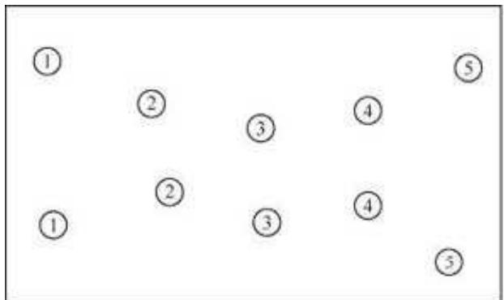

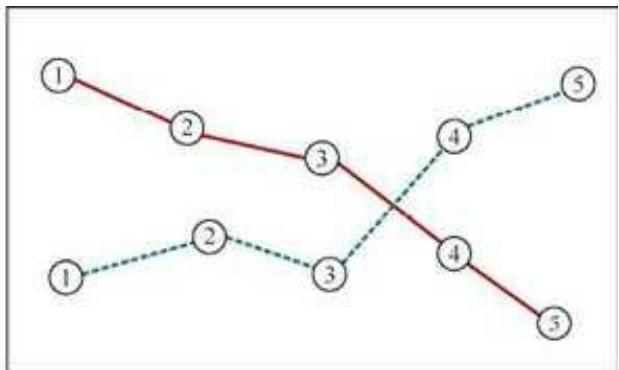  
（b）

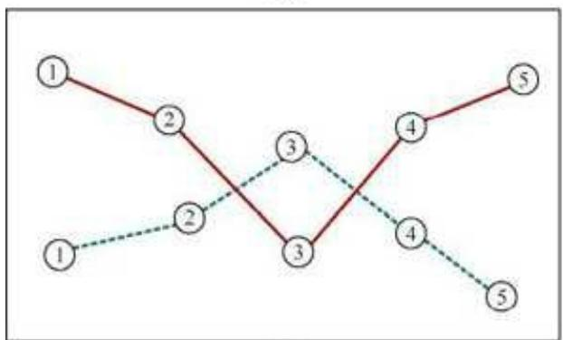

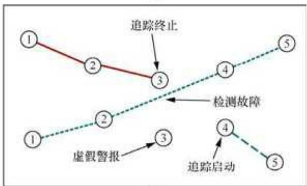  
（d）  
图15-8 （a）在二维空间5个时间步内对对象位置的观测，每个观测光点都被标记时间步，但不能识别产生它的对象。（b）和（c）关于潜在对象轨迹的可能假设。（d）一个可能含有虚假警报、检测故障和追踪启动/终止的假设

最后要说明的是传感器模型：我们再次假设它是一个线性高斯模型，其中在 x 位置的飞行器会产生一个光点b，其光点的观测位置Z(b )是带有高斯噪声的x的线性函数。每个飞行器在每个时间步都会生成一个光点，因此该光点的源头是飞行器和一个时间步。如果我们暂时忽略先验概率分布，模型将有如下形式：

$$
\text {g u a r a n t e e d} A _ {1}, A _ {2}
$$

$$
X (a, t) \sim \text {i f} t = 0 \text {t h e n I n i t} X () \text {e l s e} \mathcal {N} (F X (a, t - 1), \Sigma_ {x})
$$

$$
\# \text {B l i p} (\text {S o u r c e} = a, \text {T i m e} = t) = 1
$$

$$
Z (b) \sim \mathcal {N} (\boldsymbol {H} X (\text {S o u r c e} (b), \text {T i m e} (b)), \Sigma_ {z})
$$

其中 F 与 是描述线性转移模型与转移噪声协方差的矩阵， H 与 $\Sigma _ { z }$ 是传感器模型的相应矩阵。

这个模型和标准卡尔曼滤波器有一个关键的区别——它有两个产生传感器读数（光点）的对象。这意味着在任何给定的时间步中，对于哪个对象产生了哪个传感器读数存在不确定性。在这个模型中，每个可能世界都包含一个飞行器和光点之间的关联，由所有时间步的所有Source(b )变量的值定义。图15-8b和图15-8c给出了两种可能的关联假设。一般来说，对于 n 个对象和T个时间步，有(n !)T 种为飞行器分配光点的方式，这是一个十分巨大的数字。

到目前为止，我们描述的场景涉及n 个已知对象，在每个时间步产生n 个观测结果。数据关联的实际应用通常要复杂得多。通常，报告的观测中存在虚假警报 （falsealarm），也称为杂波（clutter），它们不是由真实对象引起的。模型也可能会发生检测故障 （detection failure），即未报告对某个真实对象的观测。最后要考虑的因素是，新的对象可能出现，旧的对象可能消失。图15-8d说明了这些现象，这些因素导致了更多令人担心的可能世界。相应的OUPM如图15-9所示。

$$
\# \text {A i r c r a f t} (\text {E n t r y T i m e} = t) \sim \text {P o i s s o n} \left(\lambda_ {a}\right)
$$

$$
E x i t s (a, t) \sim \text {i f} \operatorname {I n F l i g h t} (a, t) \text {t h e n} \operatorname {B o o l e a n} \left(\alpha_ {e}\right)
$$

$$
\operatorname {I n F l i g h t} (a, t) = (t = \text {E n t r y T i m e} (a)) \vee (\operatorname {I n F l i g h t} (a, t - 1) \wedge \neg \operatorname {E x i t s} (a, t - 1))
$$

$$
X (a, t) \sim \text {i f} t = \text {E n t r y T i m e} (a) \text {t h e n I n i t X ()}
$$

$$
\text {e l s e i f I n F l i g h t} (a, t) \text {t h e n} \mathcal {N} (F X (a, t - 1), \Sigma_ {x})
$$

$$
\# B l i p (S o u r c e = a, T i m e = t) \sim \text {i f I n F l i g h t} (a, t) \text {t h e n B e r n o u l l i (D e t e c t i o n P r o b} (X (a, t)))
$$

$$
\# B l i p (T i m e = t) \sim \text {P o i s s o n} \left(\lambda_ {f}\right)
$$

$$
Z (b) \sim \text {i f} S o u r c e (b) = n u l l \text {t h e n} U n i f o r m Z (R) \text {e l s e} N (H X (S o u r c e (b), T i m e (b)), \Sigma_ {z})
$$

图15-9 用于含有虚假警报、检测故障以及飞行器进出的多目标雷达追踪的OUPM。新飞行器进入场景的速率为 ，而飞行器每时间步离开场景的概率为 $\alpha _ { e }$ 。虚假警报光点（即不是由飞机产生的）在空间中均匀出现，每时间步的速率为 $\lambda _ { f }$ 。飞行器被检测到（即产生光点）的概率取决于其当前位置

针对多目标追踪和数据关联问题在民用和军用方面的实际意义，已经有成千上万篇论文。它们中的许多只是尝试解决图15-9中模型或其简化版本的概率计算的复杂数学细节。从某种意义上说，一旦模型用概率编程语言表示，这些就没有必要了，因为通用推理机可以为包括这个模型在内的任何模型正确地完成所有数学运算。此外，场景的细化（编队飞行、对象前往未知目的地、对象起飞或着陆等）可以通过对模型进行小的更改来解决，而无须诉诸新的数学推导和复杂的编程。

从实践的角度来看，这种模型的挑战在于推断的复杂性。对于所有概率模型，推断意味将查询和证据以外的变量进行求和消元。对于HMM与DBN中的滤波，我们能够通过一个简单的动态规划技巧将从时刻1到t−1的状态变量求和消元；对于卡尔曼滤波器，我们还利用了高斯分布的特殊性质。对于数据关联，我们就没那么幸运了。它没有（已知的）高效精确算法，这和切换卡尔曼滤波器（见14.4.4节）没有高效精确算法的原因一样：滤波分布描述飞行器在每个时间步的数量和位置的

联合分布，它最终会是指数级数量分布的混合，每个分布对应一种挑选一个观测序列赋值到每个飞行器的方式。

为了处理精确推断的复杂性，人们已经提出了几种近似方法。最简单的方法是在给定当前时间对象的预测位置的情况下，在每个时间步中选择一个最佳赋值。这个赋值将观测结果与对象相关联，并使每个对象的轨迹得以更新，并为下一个时间步做出预测。在选择最佳赋值时，我们通常使用所谓的最近邻滤波器 （nearest-neighborfilter），该方法反复选择预测位置和观测位置最近邻的对，并将该对添加到赋值中。当对象在状态空间中很好地分离且预测的不确定性和观测误差都很小时（即不存在混淆的可能性时），最近邻滤波器表现良好。

当正确的赋值存在更大的不确定性时，一个更好的方法是选择给定预测位置下最大化当前观测值的联合概率的赋值。这可以通过 匈牙利算法 （Hungarian algorithm）（Kuhn, 1955）高效地完成，尽管每一个新的时间步到来都会有 n !种赋值，这个算法也是有效的。

任何在每一时间步中只使用一个最佳赋值的方法，都会在更复杂的情况下彻底失效。特别是，如果算法使用了一个不正确的赋值，那么它下一步的预测可能会出现严重的错误，并导致更多不正确的赋值，以此类推。在这种情况下，采样方法可能更有效。数据关联的 粒子滤波 算法（见14.5.3节）是通过维持大量可能的当前赋值来工作的。 MCMC 算法探索了历史赋值的空间，例如，图15-8b和图15-8c所示为可能是MCMC状态空间中的状态，并且可以改变它对以前的赋值决策。

有一个明显的方法可以用于加速基于采样的多目标追踪推断，即使用第14章的 Rao-

Blackwellization技巧（见14.5.3节）：给定一个所有对象的特定关联假设，每个对象的滤波计算通常可以准确、高效地完成，而不是为对象采样许多可能状态序列。例如，对于图15-9中的模型，滤波计算仅仅意味着对赋值给给定假设对象的观测序列运行卡尔曼滤波器。此外，当从一个关联假设改变到另一个，我们只需要重新计算关联观测已经改变的对象。目前的MCMC数据关联方法可以实时处理数百个对象，且能够得到真实后验分布的良好近似。

# 15.3.2 示例：交通监控

图15-10显示了加利福尼亚州的一条高速公路上两个相距较远的摄像头拍摄的两幅图像。在这个应用中，我们感兴趣的是两个目标：一是在当前的交通条件下，估计在高速公路系统中从一个地点到另一个地点所需的时间；二是测量交通需求，也就是在一天中的特定时间和一周中的特定几天里，高速公路的任意两点之间有多少车辆通过。这两个目标都要求我们在一个拥有许多摄像头和每小时数万辆车辆通过的广阔区域内解决数据关联问题。


  
（b）  
图15-10来自加利福尼亚州萨克拉门托99号高速公路的大约相隔3公里的上游（a）和下游（b）的监控摄像头拍摄的图像。两个摄像头都发现了那辆方框内的车

在视觉监控中，移动的阴影、铰接的车辆、水坑中的反射等都会导致虚假警报，遮挡、雾、黑暗、缺乏视觉对比度等将导致探测故障，车辆本身还不断地在没有监控的地方进出高速公路系统。此外，任何给定车辆的外观可能会在摄像头之间发生巨大的变化，这取决于照明条件和车辆在图像中的姿态，转移模型也会随着交通堵塞的到来和消失而改变。最后，在摄像头间距较大的密集交通中，车辆从一个摄像头位置行驶到下一个摄像头位置的转移模型预测误差远远大于正常车辆间距的

情况。尽管存在这些问题，最新的数据关联算法也已经成功地估计了现实环境中的交通参数。

数据关联是追踪复杂世界的重要基础，因为没有数据关联就没有办法组合对任何给定对象的多个观测。当世界上的对象在复杂活动中相互作用时，理解世界需要将数据关联与15.2节的关系和开宇宙概率模型相结合。这是目前一个活跃的研究领域。

# 15.4 作为概率模型的程序

许多概率编程语言都建立在这样一种见解之上：概率模型可以使用包含随机源的任何编程语言中的可执行代码来定义。对于这样的模型，可能世界由执行轨迹构成，任何这样的轨迹的概率是该轨迹发生所需的随机选择的概率。以这种方式创建的PPL继承了底层语言的所有表达能力，其中包括复杂的数据结构、递归，在某些情况下还包括了高阶函数。事实上，许多PPL在计算上是通用的：它们能表示可由停机的概率图灵机采样的任何概率分布。

# 15.4.1 示例：文本阅读

我们通过编写一个读取退化文本的程序的问题来说明概率建模和推断的方法。这类模型可以用于阅读由于水渍而变得污浊或模糊的文本，或者由于印刷纸张老化而出现斑点的文本。它们也可以用来破解某些类型的验证码。

图15-11展示了一个包含两个组成部分的生成程序：一是生成字母序列的方法，二是使用现成的图形库生成这些字母的噪声、模糊渲染版本的方法。图15-12a展示了调用G enerate -I mage 9次生成的示例图像。

functionGENERATE-IMAGEreturns一张包含一些字母的图像

letters $\leftarrow$ GENERATE-LETTERS(10) return RENDER-NOISY-IMAGE(letters, 32, 128)

functionGENERATE-LETTERS（λ）returns一个由字母组成的向量

n\~Poisson(λ)   
letters[]   
for $i = 1$ to n do letters[i] $\sim$ UniformChoice(a,b,c,…})   
return letters

functionRENDER-NoIsY-IMAGE(leters，width,height)returns一张包含这些字母的带噪声的图像

```python
clean_image←RENDER(letters, width, height, text_top = 10, text_left = 10)  
noisy_image←[]  
noise-variance ~ UniformReal(0.1, 1)  
for row = 1 to width do  
    for col = 1 to height do  
        noisy_image[row,col] ~ N(clean_image[row,col], noise_variance)  
return noisy_image 
```

图15-11 用于光学字符识别（OCR）的开宇宙概率模型生成程序。生成程序通过生成每个序列，将其渲染为二维图像，并在每个像素处结合附加噪声来生成包含字母序列的退化图像

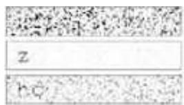

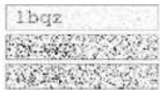

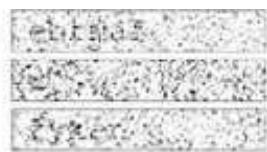


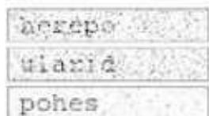

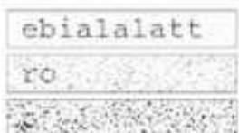

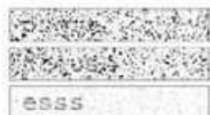

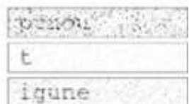

图15-12 （a）展示的是执行图15-11中的生成程序产生的12张退化图像。字母的数量、它们的身份、加性噪声的数量以及特定像素的噪声都是概率模型域的一部分。（b）展示的是执行图15-15中的生成程序产生的12张退化图像。字母的马尔可夫模型通常会产生一系列更容易发音的字母

# 15.4.2 语法与语义

生成程序 （generative program）是一种可执行程序，其中每个随机选择都在相关的概率模型中定义了一个随机变量。让我们想象一下逐步展开一个做随机选择的程序的执行轨迹。设 $X _ { i }$ 为程序第i 次随机选择所对应的随机变量；通常， $x _ { i }$ 表示 $X _ { i }$ 的一个可能的值。我们称 $O D = \{ x _ { i } \}$ 为生成程序的 执行轨迹 （execution trace），即随机选择的可能值序列。运行程序一次就会生成一个这样的轨迹，因此使用术语“生成程序”命名它。

所有可能的执行轨迹的空间 $\pmb { \mathcal { Q } }$ 可以看作生成程序定义的概率模型的样本空间。轨迹上的概率分布可以定义为每个随机选择的概率的乘积： 。这类似于OUPM中的世界分布。

从概念上讲，将任何OUPM转换成相应的生成程序是很简单的。这个生成程序对每一个数字语句以及由数字语句隐含的每个基本随机变量的值进行随机选择。生成程序需要做的主要额外工作是创建表示OUPM中可能世界的对象、函数和关系的数据结构。这些数据结构是由OUPM推理机自动创建的，因为OUPM假设每个可能世界都是一阶模型结构，而典型的PPL不做这样的假设。

图15-12中的图像可以用来直观地理解概率分布 $P ( \Omega )$ ：我们可以看到不同程度的噪声，在噪声较小的图像中，我们还可以看到不同长度的字母序列。令 $\pmb { \omega } _ { 1 }$ 为该图右上角图像对应的轨迹，它包含字母ocflwe 。如果我们将这个轨迹 $\pmb { \omega } _ { 1 }$ 展开到贝叶斯网络中，它将有4104个节点：1个节点为变量 n ，6个节点为变量 letters [ i ]，1个节点为 noise-variance ，4096个节点为 noisy_image 中的像素。由此可见，生成程序定义了一个开宇宙概率模型：随机选择的个数不受先验限制，而是取决于随机变量n的值。

# 15.4.3 推断结果

让我们应用这个模型来解释经过加性噪声而退化的字母图像。图15-13展示了一个退化后的图像以及3轮独立的MCMC运行的结果。对于每轮运行，我们在停止马尔可夫链后显示轨迹中包含的字母的渲染。在这3种情况下，我们得到的结果都是字母序列uncertainty ，这表明后验分布高度集中在正确的解释上。

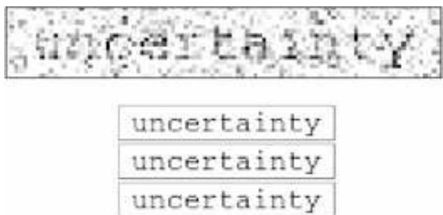  
图15-13 带噪声的输入图像（上图）和图15-11中的模型3轮运行（每轮运行进行25次MCMC迭代）产生的推断结果（下图）。注意，推断过程正确地识别了字母序列

现在让我们进一步退化文本，使它变得足够模糊，让人们难以阅读。图15-14给出了关于这个更具挑战性的输入的推断结果。这一次，尽管MCMC推断似乎已经收敛到（我们知道的）正确字母上，但第一个字母被错误地识别为q ，并且接下来的10个字母中有5个有不确定性。

有许多可能的理由可以解释这一结果。这可能是因为MCMC推断有着良好的混合，它所给出的结果是给定模型与图像的真实后验的一个很好的反映，在这种情况下，一些字母的不确定性和第一个字母的错误是不可避免的。为了得到更好的结果，我们可能需要改进文本模型或降低噪声级别。这也可能是因为MCMC推断没有充分地混合：如果我们运行300个2.5万次或2500万次迭代的链，我们

可能会发现结果分布完全不同，或许新的结果会表明第一个字母可能是 u 而不是 q 。

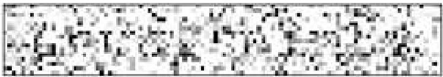

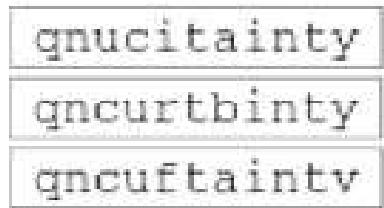

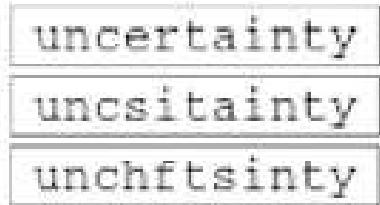  
图15-15一种改进的光学字符识别（OCR）模型生成程序，该模型根据从英语单词列表中估计成对的字母频率的字母二元模型来生成字母

图15-14 上图：极端噪声的输入图像。左下图：使用图15-11中的独立字母模型进行25次MCMC迭代，得出的3个推断结果。右下图：使用图15-15中的字母二元模型得出的3个推断结果。两种模型的结果都有歧义，但后一种模型的结果反映了貌似合理的字母序列的先验知识

运行更多的推断可能会导致更多的时间与资金的消耗。此外，对于蒙特卡罗推断方法的收敛性没有万无一失的测试。我们可以尝试改进推断算法，也许是通过为MCMC设计一个更好的建议分布，或者是使用图像中自底向上的线索来提议更好的初始假设。这些改进需要额外的思考、实现和调试。另一种选择是改进模型。例如，我们可以在模型中整合进有关英语单词的知识，如字母对出现的概率。我们现在考虑这个方法。

# 15.4.4 结合马尔可夫模型改进生成程序

概率编程语言在某种程度上是模块化的，可以很容易地探索对底层模型的改进。图15-15展示了改进后的模型的生成程序，该模型有序地（而不是独立地）生成字母。这个生成程序采用了一个马尔可夫模型，在给定前一个字母的情况下使用从英语单词的参考列表中估计的转移概率来生成每个字母。

functionGENERATE-MARKOV-LETTERS(）returns一个字母的向量  
$n\sim$ Poisson $(\lambda)$ letters $\leftarrow \left[\right]$ letter_probs $\leftarrow$ MARKOV-INITIAL()   
for $i = 1$ to n do letters[i] $\sim$ Categorical(letter_probs) letter_probs $\leftarrow$ MARKOV-TRANSITION(letters[i])   
return letters

图15-12展示了这个生成程序生成的12张采样图像。可以注意到，与图15-11中程序生成的字母序列相比，这些字母序列明显更像英语。图15-14的右下图展示了此马尔可夫模型对高噪声图像的推断结果。尽管仍有一些不确定性，但新的解释更接近于生成轨迹。

# 15.4.5 生成程序的推断

与OUPM一样，在生成程序中进行精确推断通常是非常昂贵的或是不可能的。但是，我们很容易看出执行拒绝采样的方法：运行程序，只保留与证据一致的轨迹，并计算在这些轨迹中找到的不同查询答案。似然加权的做法也很简单：对于每个生成的轨迹，通过将所有沿途观测到的值的概率相乘来跟踪轨迹的权重。

只有当数据在模型中具有合理的可能性时，似然加权才有效。在更糟糕的情况下，我们通常采用MCMC的方法。应用于概率程序的MCMC涉及采样和修改执行轨迹。OUPM中的许多考虑也适用于此；此外，算法必须小心修改执行轨迹，例如更改if语句的结果，这可能会使其余的轨迹无效。

推断的进一步改进来自于几方面的工作。一些改进可以在某些问题上（甚至在原则上）产生根本性的变化，这些问题都是通过给定的PPL可以处理的，我们在前面关于RPM描述的提升推断可以产生这种效果。在许多情况下，通用的MCMC方法效率很低，需要特殊用途的提议来加快混合推断过程。

PPL领域近期的一个研究重点是让用户易于定义和使用这样的提议，以便提高PPL推断的效率，使其能够与为特定模型设计的自定义推断算法的效率相匹配。

许多有前途的方法都旨在减少概率推断的开销。13.4.3节中描述的贝叶斯网络的编译思想可以应用于OUPM和PPL中的推断，它通常会带来2～3个数量级的加速。也有人提议为诸如消息传递和MCMC等算法开发专用硬件 。例如，蒙特卡罗硬件利用低精度的概率表示和大量细粒度并行，使得速度和能效提高100～10 000倍。

基于学习的方法也可以让速度得到实质性的提高。例如， 自适应提议分布 （adaptive proposaldistribution）可以逐渐学习如何生成MCMC提议以确保快速混合，这些提议以合理的可能性被接受，并且在探索模型的概率格局时相当有效。也可以使用从底层模型生成的合成数据来训练深度学习模型（见第21章）以表示重要性采样的提议分布。

通常，人们认为任何建立在通用编程语言之上的形式体系都会遇到可计算性的障碍，PPL就属于这样的情况。然而，如果我们假设底层程序在所有输入和所有随机选择下都会停机，那么进行概率推断的额外要求是否仍然会使问题不可判定？答案是肯定的，但仅限于具有无限精度连续随机变量的计算模型。在这种情况下，可以编写一个可计算的概率模型，在该模型中，能用推断过程对停机问题进行编码。但是，在实际应用中，我们通常使用有限精度数字和平滑概率分布，此时推断仍然是可判定的。

小结

本章探讨了基于逻辑和程序的概率模型的表示形式。

●关系概率模型 定义了基于一阶语言数据库语义 的世界概率模型，当所有的对象和它们的身份都是确定的时候，模型是合适的。  
●给定一个RPM，每个可能世界中的对象都对应于RPM中的常量符号，基本随机变量是用对象替换每个参数的谓词符号的所有可能实例化。因此，可能世界的集合是有限的。  
●RPM为拥有大量对象的世界提供了非常简洁的模型，可以处理关系的不确定性。  
●开宇宙概率模型 建立在一阶逻辑的完全语义上，允许新的不确定性，如身份不确定性和存在不确定性。  
●生成程序 是概率模型（包括OUPM）的表示，它是概率编程语言 PPL中的可执行程序。生成程序表示程序执行轨迹 的分布。PPL通常为概率模型提供通用的表达能力。

读者服务：


微信扫码关注【异步社区】微信公众号，回复“e59810”获取本书配套资源以及异步社区15天VIP会员卡，近千本电子书免费畅读。

# 第16章

# 做简单决策

在本章中，我们将看到智能体应该如何做决策，以便在一个不确定的世界中（至少尽可能多地，或者在平均意义下）实现自己的目的。

在本章中，我们将详细介绍如何将效用理论与概率论结合，以产生一个决策论智能体— —一个能够基于它所相信的和它所想要的做出理性决策的智能体。在存在不确定性与冲突目标的场合中，一个逻辑智能体可能无法做出决策，但决策论智能体可以做出决策。基于目标的智能体在好的（目标）状态和坏的（非目标）状态之间有一个二元区分，而决策论智能体为状态分配一个连续范围的值，因此即使没有最佳的可行状态，该智能体也容易选择一个更好的状态。

16.1节将介绍决策论的基本原则：期望效用最大化。16.2节将通过最大化效用函数来建模理性智能体的行为。16.3节将更详细地讨论效用函数的性质，特别是它们与诸如金钱等独特的量之间的关系。16.4节将展示如何处理依赖于多个量的效用函数。在16.5节中，我们将描述决策系统的实现。特别地，我们将引入一种称为决策网络 （decisionnetwork）（也称为影响图 ，influencediagram）的形式体系，它通过合并动作和效用来扩展贝叶斯网络。16.6节将展示决策论智能体如何计算获取新信息的价值，以改进其决策。

在16.1节至16.6节中，我们假设智能体使用给定的、已知的效用函数进行操作，16.7节将放宽这个假设。我们将探讨偏好不确定性对机器部分的影响，其中最重要的是对人类的顺从。

# 16.1 在不确定性下结合信念与愿望

我们从一个智能体开始考虑，像所有智能体一样，它必须做出决策。它有一些可以采取的动作 $a$ 。由于当前状态可能存在不确定性，我们假设智能体赋予每个可能的当前状态s一个概率 P(s)。动作结果也可能存在不确定性；转移模型由 表示，即在状态 s 下采取动作 a 达到状态 $a$ s' 的概率。由于我们主要对结果状态 s' 感兴趣，因此我们将用缩写符号 P (R esult ( a )= s' )表示在当前状态下通过 a达到s'的概率，并且忽略当前的状态。这两个概率的关系如下：

$$
P (\text {R E S U L T} (a) = s ^ {\prime}) = \sum_ {s} P (s) P (s ^ {\prime} | s, a)
$$

这种形式最简单的决策论用于处理基于对即时结果的愿景选择动作的问题。也就是说，环境被假设为具有在2.3.2节中所定义的回合式性质。（这个假设将在第17章中被放宽。）

智能体的偏好由 效用函数 （utility function）U (s)刻画，它通过分配单个数值来表达对某个状态的愿景。给定证据，一个动作的 期望效用 （expected utility） EU ( a )是结果的加权平均效用值，其中权值是结果发生的概率：

$$
E U (a) = \sum_ {s ^ {\prime}} P \left(\text {R E S U L T} (a) = s ^ {\prime}\right) U \left(s ^ {\prime}\right) \tag {16-1}
$$

最大期望效用 （maximum expected utility，MEU）原则认为理性的智能体应该选择能使其期望效用最大化的动作：

$$
a c t i o n = \operatorname {a r g m a x} _ {a} E U (a)
$$

从某种意义上说，MEU原则可以被看作对智能行为的指示。一个智能体所要做的就是计算各种数值以最大化其动作的效用，然后选择动作。但这并不意味着人工智能问题已经被这个定义解决了！

MEU原则形式化 了一个一般性的概念— 智能体应该“做正确的事情”，但它没有将该建议付诸实践。估计世界可能状态的概率分布P(s)并归并成 P(Result(a )=s')，要求智能体进行感知、学习、知识表示和推断。计算P(Result(a)=s')本身需要一个关于世界的因果模型。我们可能需要考虑很多动作，计算结果的效用U (s')本身可能需要进一步的搜索或规划，因为智能体可能不知道一个状态有多好，直到它知道从那个状态可以到达哪里。代表人类行为的人工智能系统可能不知道人类的真正效用函数，因此 $U$ 可能有不确定性。总之，决策论不是解决人工智能问题的万能方案，但它确实提供了一个一般足以定义人工智能问题的基本数学框架的视角。

MEU原则与在第2章中介绍的性能度量想法有着明确的联系。其基本思想很简单。考虑可能导致智能体拥有给定感知历史的环境，并考虑我们可以设计的不同智能体。如果一个智能体采取的动作是为了使正确反映性能度量的效用函数最大化，那么智能体将获得最高的可能性能分数（在所有可能的环境中取平均值）。这是MEU原则本身蕴含的核心理由。虽然这一主张似乎是重复的，但它实际上确实体现了从外部性能度量到内部效用函数的一个非常重要的转移。性能度量为一系列状态的历史给出一个分数。因此，智能体在完成一系列动作后，可以回顾性地应用性能度量。效用函数适用于下一个状态，因此可以使用它来逐步指导动作。

# 16.2 效用理论基础

从直觉上看，最大期望效用（MEU）原则似乎是一种合理的决策方式，但它显然不是唯一合理的方式。毕竟，为什么我们一定要最大化这个特殊的平均效用呢？最大化效用的加权立方和或最小化最坏情况的可能损失的智能体有什么问题吗？一个智能体能仅仅通过表达状态之间的偏好，而不对它们进行数值赋值来理性行动吗？最后，为什么一个具有所需特征的效用函数一定存在呢？我们将进一步解释这些问题。

# 16.2.1 理性偏好的约束

这些问题可以通过写出关于理性智能体应该拥有的偏好的一些约束来回答，接着MEU原则可以从这些约束中推导出来。我们使用下面的符号来描述智能体的偏好：

智能体偏好 A 甚于 B

智能体对 A 和 B 偏好相同

智能体偏好 A 甚于 B 或者对 A 和 B 偏好相同

现在有一个明显的问题——A和B是什么类型的事物？它们可以是世界中的状态，但更多的时候，不确定性在于它们真正是什么。例如，飞机上被提供“意大利面或鸡肉”的乘客不知道锡纸下面隐藏着什么[1] 。意大利面可能美味可口，也可能已经冻成块了；鸡肉可能鲜嫩多汁，也可能烧焦得面目全非。我们可以把每个动作的结果集合想象成一种彩票 （lottery），把每个动作想象成一张票。可能结果为 $S _ { 1 } , . . . , S _ { n }$ ，出现概率分别为 p 1,…, p n的彩票 $L$ 可以写作

[1]我们向当地航空公司不再为长途航班提供食物的读者深表歉意。

$$
L = \left[ p _ {1}, S _ {1}; p _ {2}, S _ {2}; \dots ; p _ {n}, S _ {n} \right]
$$

一般来说，彩票的每个结果S 可以是原子状态，也可以是另一种彩票。效用理论的主要问题是理解复杂彩票之间的偏好与这些彩票的底层状态之间的偏好是如何关联的。为了解决这个问题，我们列出了6个任何合理的偏好关系都要满足的约束。

● 有序性 （orderability）：给定任意两种彩票，理性的智能体必须偏好其中一种，或者将它们评为偏好相同的。也就是说，智能体不能避免做决策。正如12.2.3节所指出的，拒绝赌博就像拒绝时间流逝一样。

（A>B）、（B>A）或 $( A \sim B )$ 中有且只有一个成立

● 传递性 （transitivity）：给定任意3种彩票，如果一个智能体偏好 A 甚于 B ，偏好 B 甚于 $C$ ，那么它一定偏好A甚于 $C$ 。

$$
(A \succ B) \wedge (B \succ C) \Rightarrow (A \succ C)
$$

●连续性 （continuity）：如果某彩票B在偏好上位于A和 $C$ 之间，那么存在某种概率 p，理性智能体将在肯定获得B和以概率 $p$ 生成 A并以概率1−p 生成C的彩票之间偏好相同。

$$
A \succ B \succ C \Rightarrow \exists p [ p, A; 1 - p, C ] \sim B
$$

●可替换性 （substitutability）：如果一个智能体在两种彩票A和 B中偏好相同，那么这个智能体会在两种更复杂的彩票中偏好相同，这两种彩票除在其中一种彩票中用 B代替了A之外，其他部分都是相同的。这无须考虑彩票的概率和其他结果即是成立的。

$$
A \sim B \Rightarrow [ p, A; 1 - p, C ] \sim [ p, B; 1 - p, C ]
$$

在这个公理中使用 替换 后仍然成立。

● 单调性 （monotonicity）：假设两种彩票有相同的两种可能的结果 A 和 B 。如果一个智能体偏好A甚于B，那么它必然偏好A的概率较高的彩票（反之亦然）。

$$
A \succ B \Rightarrow (p \succ q \Leftrightarrow [ p, A; 1 - p, B ] \succ [ q, A; 1 - q, B ])
$$

● 可分解性 （decomposability）：利用概率法则，可以将复合彩票简化为更简单的彩票。这就是所谓的“无趣赌博”规则：如图16-1b所示，它将两个连续的彩票压缩成一个等价的彩票。[2]

[2]我们可以通过将赌博事件编码到状态描述中来解释赌博的乐趣；例如，“有10美元就去赌博”可能比“有10美元但不去赌博”更受到偏好。

$$
[ p, A; 1 - p, [ q, B; 1 - q, C ] ] \sim [ p, A; (1 - p) q, B; (1 - p) (1 - q), C ]
$$

这些约束被称为效用理论的公理。每一个公理都可以通过证明违反它的智能体在某些情况下会表现出明显的非理性行为来说明其提出的合理性。例如，我们可以通过让一个具有非传递性偏好的智能体把它所有的钱给我们来体现传递性公理的合理性。假设智能体具有非传递性的偏好

，其中 A 、 B 、 C 是可以自由交换的商品。如果智能体现在拥有 A ，那么我们可以提出用A交易 $C$ 来获得1美分。智能体偏好 $C$ ，所以愿意做这笔交易。然后我们可以用B交易 $C$ ，从中获取另外1美分，最后用 $A$ 交易 B。这样一来我们回到了开始的状态，此外智能体给了我们3美分，如图16-1a所示。我们可以一直这样循环，直到智能体一分钱也没有了。很明显，智能体在这个案例中的行为是不理智的。

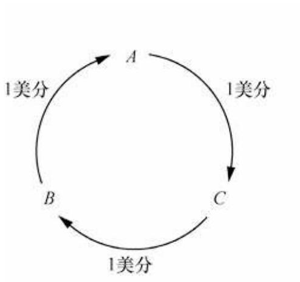

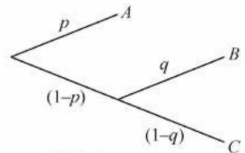

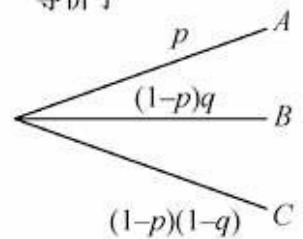  
等价于  
  
图16-1 （a）非传递性偏好 $A \succ B$ 可能导致非理性行为：每次花费1美分的交换环。（b）可分解性公理

# 16.2.2 理性偏好导致效用

注意，效用理论的公理实际上是关于偏好的公理，它们不涉及效用函数。但事实上，我们可以从效用公理推导出以下结果［其证明见（von Neumann and Morgenstern, 1944）］。

●效用函数的存在性） （existenceofutility function：如果一个智能体的偏好服从效用公理，那么存在一个函数U ，使得 $U$ 当且仅当偏好 A 甚于 B ，且 U ( A ) = U ( B )当且仅当智 $B$ $U ( A ) = U ( B )$ 能体在A与 $B$ 之间偏好相同。也就是

$$
U (A) > U (B) \Leftrightarrow A > B \text {且} U (A) = U (B) \Leftrightarrow A \sim B
$$

● 彩票的期望效用 （expected utility of a lottery）：彩票的效用是每个结果的概率乘以该结果的效用之和。也就是

$$
U ([ p _ {1}, S _ {1}; \dots ; p _ {n}, S _ {n} ]) = \sum_ {i} p _ {i} U (S _ {i})
$$

换句话说，一旦我们指定了可能结果状态的概率和效用，涉及这些状态的复合彩票的效用就完全确定了。由于一个非确定性的动作的结果是一种彩票，由此可以得出，只有根据式（16-1）选择一个期望效用最大化的动作，一个智能体才可以理性行动，也就是说，与自己的偏好保持一致。

前面的定理确立了（假设对理性偏好有约束）任何理性智能体都存在一个效用函数。这些定理并不能证明效用函数是 唯一的 。实际上很容易看出，效用函数 U ( S )在经过下式的变换后，智能体的行为不会发生变化：

$$
U ^ {\prime} (S) = a U (S) + b \tag {16-2}
$$


其中，a 和b 是常数且 ——这是一个正仿射变换。 这一事实在我们已经在第5章的双人机会博弈中陈述过；在这里，我们发现它适用于所有的决策场景。

就像在博弈中一样，在确定性环境中，智能体只需要对状态进行偏好排序，其数值并不重要。我们把这称为 价值函数 （value function）或 序数效用函数 （ordinal utility function）。

重要的一点是，描述智能体偏好行为的效用函数的存在并不一定意味着智能体在自己的思考中明确地最大化了效用函数。正如我们在第2章中所展示的，理性行为可以通过多种方式产生。一个理性的智能体可以通过查表来实现（如果可能的状态数量足够小的话）。

通过观测理性智能体的行为，观测者可以了解智能体实际试图最大化的效用函数（即使智能体本身并不知道它）。我们将在16.7节中重新考虑这一点。

# 16.3 效用函数

效用函数从彩票映射到实数。我们知道它们必须遵守有序性、传递性、连续性、可替换性、单调性和可分解性等公理。这就是效用函数的全部内容吗？严格地说，确实是这样的：一个智能体可以有它喜欢的任何偏好。例如，一个智能体可能更偏好在其银行账户中的存款额是一个质数，在这种情况下，如果它有16元存款，它会赠送他人3元。这可能是不寻常的，但我们不能称之为非理性。一个智能体可能偏好一辆受损的1973年福特平托，而不是一辆闪亮的新奔驰。当智能体拥有平托车时，它可能偏好质数的存款额；而当它拥有奔驰车时，它可能偏好更多的而不是更少的存款额。幸运的是，真实智能体的偏好通常更系统化，因此更容易处理。

# 16.3.1 效用评估和效用尺度

如果我们想要建立一个决策论系统来帮助一个人做出决策或代替他（或她）采取行动，我们必须首先弄清楚人的效用函数是什么。这个过程通常被称为 偏好启发 （preference elicitation），它包括向人类展示选择，并利用观测到的偏好来确定潜在的效用函数。

式（16-2）表明，效用没有绝对的尺度，尽管如此，建立一定尺度的效用有助于特定问题的记录和比较。其尺度可以通过确定任意两个特定结果的效用来确定，就像我们通过确定水的冰点和沸点来确定温度一样。通常，我们将“最佳可能奖励”的效用定为 U ( S ) = u ⊤，将“最坏可能灾难”的效用定为 $U ( S ) = u _ { \perp }$ 。（这两者都应该是有限的。）归一化效用 （normalized utility）意味着u⊥=0且 $u _ { \textup { T } } = 1$ 的尺度。在这样一个尺度下，英格兰球迷可以将英格兰赢得世界杯的效用设为1，将英格兰没能晋级的效用设为0。

给定 $u _ { \mathrm { ~ T ~ } }$ 和 $u \ 1$ 之间的效用尺度，我们可以通过要求智能体在 S 和 标准彩票 （standard lottery）

之间进行选择来评估任何特定奖励S 的效用。我们可以调整标准彩票概率p ，直到智能体在 S 与标准彩票间偏好相同。采用了归一化效用之后， S 的效用由 p 给出。一旦我们对每个奖励都采取这样的做法，那么所有涉及这些奖励的彩票的效用就确定了。例如，假设我们想知道英格兰球迷对英格兰进入半决赛然后输掉比赛的结果有多看重。我们将这个结果与概率为 p的赢得奖杯和概率为1 − p 的晋级失败的标准彩票进行比较。如果在 p = 0.3时偏好相同，那么0.3就是进入半决赛然后输掉比赛的效用值。

在医疗、交通、环境等其他决策问题中，人们的生命可能处于危险之中。（是的，这些事情比世界杯上英格兰队的运气更重要。）在这种情况下，u ⊥是直接死亡的效用值（或者在真正糟糕的情况下，有许多人死亡）。虽然没有人愿意给人的生命赋予价值，但事实是，在生死问题上的权衡一直都在进行。飞机每隔一段时间就要进行一次全面检修，而不是在每次飞行之后。汽车的制造方式是在事故存活率和成本之间进行权衡。我们规定的空气污染水平限制每年都会导致400万人死亡。

自相矛盾的是，拒绝用金钱来衡量生命可能意味着生命被低估了。罗斯·沙赫特（RossShachter）描述了一家政府机构委托进行的一项移除学校石棉的研究。进行这项研究的决策分析人员假设一个学龄儿童的生命有一个特定的金钱价值，并认为在这个假设下的理性选择是移除石棉。在道德层面，该机构对为生命设定价值的想法感到愤怒，当即拒绝了这份报告。随后机构决定反对移除石棉这隐式地为一个儿童的生命赋予了一个比分析人员指定的价值更低的值。

目前，美国政府的几个机构，包括环境保护局、食品和药物管理局和交通部，都使用统计学生命价值 来确定法规与干预措施的成本和收益。2019年，典型的生命价值约为1000万美元。

人们曾试图弄清楚自己生命的价值。在医学和安全分析中，一种常见的“货币”称作微亡（micromort），即死亡概率为百万分之一。如果询问人们愿意为规避风险支付多少钱，例如，为了避免用百万发的左轮手枪玩俄罗斯轮盘赌，他们会给出非常大的数字，也许是几万美元，但他们的实际行为反映出的微亡货币价值要低得多。

例如，在英国，一辆汽车每行驶370千米，就会招致一个微亡的风险。如果你的汽车寿命长达148060千米，那么你将面临400个微亡的风险。人们似乎愿意多花1.2万美元购买一辆更安全的汽车，以将死亡风险降低一半。因此，他们的购车行为表明，每微亡的规避价值为60美元。许多研究已经证实了这一数字适用于许多个人和风险类型。然而，美国交通部等政府机构通常会设定一个较低的

数字，他们在道路维修上每挽救一个生命花费的金额大约为6美元。当然，这些计算只适用于小风险情形。大多数人不会同意自杀，即使是为了6000万美元。

另一个衡量标准是 QALY ，即质量调整寿命年。患者愿意接受较短的预期寿命以避免残疾。例如，肾脏病人一般在进行两年透析和一年完全健康的生活之间有相同的偏好。

# 16.3.2 金钱的效用

效用理论植根于经济学，而经济学为效用度量提供了一个明显的候选者：金钱（或者更具体地说，一个智能体的总净资产）。货币对各种商品和服务的几乎普遍的可交换性表明，货币在人类的效用函数中扮演着重要的角色。

一般来说，在所有其他因素相同的情况下，一个智能体偏好更多的钱。我们称智能体表现出对更多金钱的 单调偏好 （monotonic preference）。这并不意味着金钱表现为效用函数，因为它并没有提到涉及金钱的彩票之间的偏好。

假设你在一个电视游戏节目中战胜了其他竞争者。主持人现在给了你一个选择：要么拿着100万美元的奖金，要么掷硬币来赌一把。如果硬币正面朝上，你什么也得不到，但如果反面朝上，你将得到250万美元。你可能会像大多数人那样拒绝这个赌局，把那100万美元装进自己的口袋。此时你是不是失去了理性？

慢设硬是公平的这，比原来的100万美元要多。但这并不一定意味着接受赌局是一个更好的决定。假设我们用 $S _ { n }$ 表示拥有总财富n 美元的状态，你的当前财富为 $k$ 美元。那么接受赌局和拒绝赌局的两种行为的期望效用为

$$
E U (A c c e p t) = \frac {1}{2} U \left(S _ {k}\right) + \frac {1}{2} U \left(S _ {k + 2 5 0 0 0 0 0}\right)
$$

$$
E U (D e c l i n e) = U \left(S _ {k + 1 0 0 0 0 0 0}\right)
$$

为了确定我们的行为，我们需要将效用分配给结果状态。效用并不是直接与货币价值成比例的，因为你的第一个100万的效用非常高（至少他们是这么说的），而再一个100万的效用就较小了。假设你为你当前的财务状况（ S k ）赋予效用5，为状态 S k + 2 500 000 赋予效用9，为状态 S k + 1 000 000 赋予效用8。那么一个理性的行为将会是拒绝，因为接受的预期效用只有7（小于拒绝的效用8）。但是，亿万富翁的效用函数很可能在再多几百万的范围内是局部线性的，因此他会接受赌局。

在对实际效用函数的开创性研究中，格雷森（Grayson,1960）发现，金钱的效用几乎与金额的对数成正比。［这个想法最早是由伯努利（Bernoulli,1738）提出的，见习题16.STPT。］图16-2a给出了特定的Beard先生的效用曲线。Beard先生的偏好所获得的数据与下面这个效用函数在n=−150000到 n = 800 000之间是一致的。

$$
U \left(S _ {k + n}\right) = - 2 6 3. 3 1 + 2 2. 0 9 \log (n + 1 5 0 0 0 0)
$$

我们不应该假定这是货币价值的最终效用函数，但很可能大多数人的效用函数在正财富时是凹的。负债是不好的行为，但不同债务水平之间的偏好可能会呈现出与正财富相关的凹形反转。例如，已经负债1000万美元的人很可能会接受一枚均匀硬币的赌博——正面可以得到1000万美元，反面则损失2000万美元。[1] 这就产生了图16-2b所示的S形曲线。

[1]这种行为可能被称为绝望，但如果一个人已经处于绝望的境地，这就是理性的。

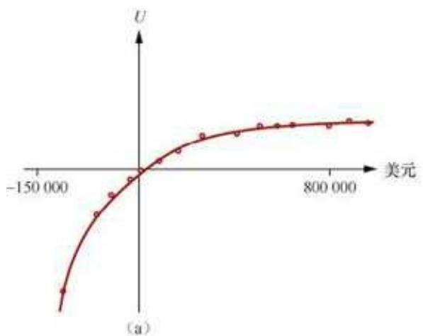

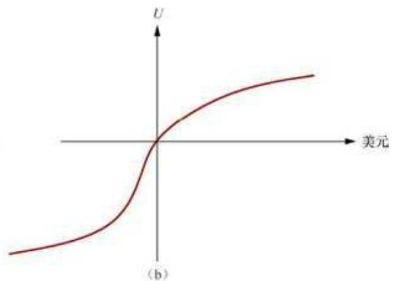  
图16-2金钱的效用。（a）有限区间内Beard先生的经验数据。（b）一条全部值域的典型曲线

如果我们将注意力限制在曲线的正半部分，即斜率正在减小的部分，那么对任何彩票 $L$ 来说，接受彩票的效用小于将彩票的预期货币价值当作确定性东西的效用：

$$
U (L) <   U \left(S _ {\mathrm {E M V}} (L)\right)
$$

也就是说，拥有这种形状曲线的智能体是风险厌恶 （risk-averse）的：它们更喜欢稳赚不赔的东西，而这种东西的收益要低于赌博的预期货币价值。但是，在图16-2b中，在大量负财富的“绝望”区域，这种行为呈现出风险寻求 （risk-seeking）。智能体能接受的代替彩票的价值被称为彩票的确定性等价值 （certainty equivalent）。研究表明，大多数人会接受大约400美元，而不是一半给1000美元，一半给0美元的赌博。也就是说，彩票的确定性等价值是400美元，而EMV是500美元。

彩票的EMV和它的确定性等价值之间的差被称为 保险费 （insurancepremium）。风险厌恶是保险业的基础，因为这意味着保险费是正的。

人们宁愿付一小笔保险费，也不愿拿房子的价格与火灾概率进行赌博。从保险公司的角度来看，房子的价格与公司的总储备金相比是非常小的一部分。这意味着保险公司的效用曲线在如此小的区域内是近似线性的，而赌局对公司的成本而言几乎为零。

注意，对于相对于当前财富的微小 变化，几乎所有的曲线都是近似线性的。具有线性曲线的智能体被称为是风险中性 的。因此，对于小额的赌博，我们期望存在风险中性。从某种意义上说，这证明了提出小的赌博来评估概率和证明12.2.3节中的概率公理的简化方法是合理的。

# 16.3.3 期望效用与决策后失望

选择最佳动作a * 的合理方式是最大化期望效用：

$$
a ^ {*} = \underset {a} {\operatorname {a r g m a x}} E U (a)
$$

如果我们已经根据概率模型正确地计算出期望效用，并且概率模型正确地反映了产生结果的潜在随机过程，那么，如果整个过程重复多次，平均而言我们将得到我们期望的效用。

然而在现实中，我们的模型通常对真实情况进行了过度简化，或因为我们不够了解（例如，当进行复杂的投资决策时），或因为真正的期望效用的计算太困难（例如，当在西洋双陆棋选择移动时，需要考虑所有可能的未来的掷骰子）。在这种情况下，我们实际上是在估算真实期望效用的估计。我们可能善意地假设，这种估计是 无偏 的，也就是说，误差的期望值

是0。在这种情况下，选择效用估计最大的动作，并期望在执行该动作时在平均意义下获得该效用，似乎仍然是合理的。

遗憾的是，即便估计是无偏的，实际结果也通常比我们估计的要糟糕得多！为了弄清楚其中的原因，让我们考虑一个有 k个选项的决策问题，每个选项的真实估计效用都是0。假设每个效用估计的误差是独立的，且服从一个单位正态分布，即均值为0，标准差为1的高斯分布，如图16-3中的粗线条曲线所示。现在，当我们实际开始估算时，有些误差是负的（悲观的），有些误差是正的（乐观的）。因为选择了效用估计最大的动作，我们倾向于过于乐观的估计，这就是偏差的来源。

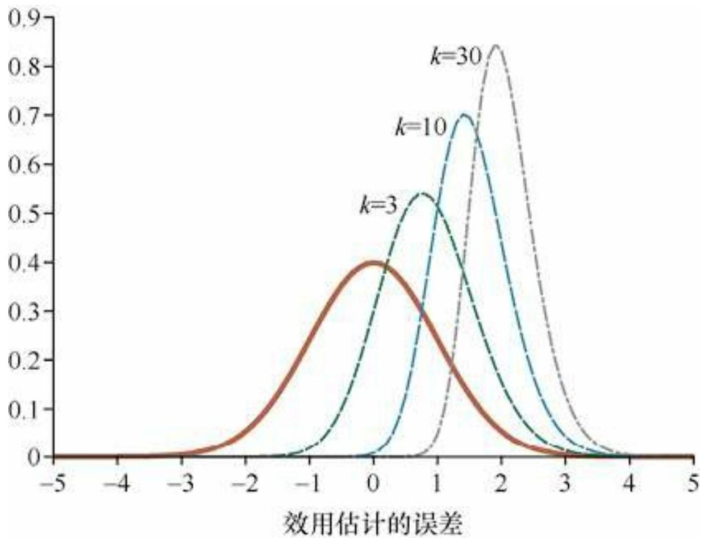  
图16-3选择k个选项中的最佳选项引起的不合理的乐观：我们假设每个选项的真实效用为0，但效用估计是单位正态分布（棕色曲线）。其他曲线展示了k=3、10和30时估计最大值的分布

计算k个估计值的最大值的分布是一件很简单的事情，进而我们可以量化我们失望的程度。这种计算也是计算 顺序统计量 （orderstatistic）的一种特殊情况，即样本中任何特定排序元素的分布情况。假设每个估计 X 有一个概率密度函数 f ( x )和累积分布 F ( x )。（如附录A所解释的，累积分布 $F$ 衡量的是值小于或等于任一给定数量的概率，也就是说，它积分了原始密度 f 。）现在令 X*是最大估计值，即 $X _ { k } 3$ 。那么 $X ^ { * }$ 的累积分布是

$$
\begin{array}{l} P (\max  \{X _ {1}, \dots , X _ {k} \} \leqslant x) = P (X _ {1} \leqslant x, \dots , X _ {k} \leqslant x) \\ = P \left(X _ {1} \leqslant x\right) \dots P \left(X _ {k} \leqslant x\right) = F (x) ^ {k} \\ \end{array}
$$

概率密度函数是累积分布函数的导数，所以 $k$ 个估计的最大值 $X ^ { * }$ 的密度为

$$
P (x) = \frac {\mathrm {d}}{\mathrm {d} x} (F (x) ^ {k}) = k f (x) (F (x)) ^ {k - 1}
$$

图16-3展示了当 f(x)为单位正态分布时，不同 $k$ 值情况下的密度。对于 k=3，变量X* 的均值约为0.85，因此平均失望值约为效用估计标准差的85%。如果我们有更多的选择，很有可能导致过度乐观：对于 k=30，失望值将是估计的标准差的两倍左右。

这种最佳选择的期望效用估计过高的趋势被称为乐观者诅咒 （optimizer’scurse）（Smith andWinkler, 2006）。即使是经验最丰富的决策分析师和统计学家也会受到它的困扰。乐观的估计会导致一些严重的错误：某个激动人心的新药物在实验中已治愈80%的患者，它可能会被认为可以治愈80%的患者（在这个问题中， $k$ 可能包括成千上万的候选药物，而该药物是从中挑选出来的）；某

个基金宣传自己具有高于平均水平的回报，并将持续保持（实际上它是从公司的整体投资组合中的几十个基金中选择出来，并投放在广告中）。乐观的估计甚至可能导致这样的结果——如果效用估计的方差高的话，看似是最佳的选择未必是最佳的：一种从上千种尝试中选择的、已治愈了10位患者中的9位的药物可能比另一种已治愈了1000位患者中的800位的药物要差。

由于效用最大化的选择过程的普遍性，乐观者诅咒无处不在，所以将效用估计按面值计算不是一个好主意。我们可以通过贝叶斯方法（使用效用估计误差的显式概率模 型 ）来避免诅咒。给定这个模型和可能合理的效用的先验，我们将效用估计作为证据，并使用贝叶斯法则计算真实效用的后验分布。

# 16.3.4 人类判断与非理性

决策论是一种 规范性理论 （normativetheory）：它描述了理性的智能体应该如何行动。但是，描述性理论 （descriptivetheory）描述实际的智能体（如人类）是如何行动的。如果两者吻合，经济理论将大有用武之地，但似乎有一些实验证据表明，情况恰恰相反。有证据表明，人类是“可预见地非理性”（Ariely, 2009）。

最著名的问题是阿莱悖论（Allais, 1953）。人们可以在 A 和 B 彩票以及 C 和 $D$ 彩票中进行选择，这些彩票包含以下奖励：

A ： 80%的机会 获得4000美元 C ： 20%的机会获得4000美元

B ： 100%的机会获得3000美元 D ： 25%的机会获得3000美元

大多数人一致偏好B而不是 A（选择确定性的东西），大多数人偏好C而不是 $D$ （选择较高的EMV）。规范性分析不同意这种观点！如果使用式（16-2）隐含的自由度来设置U (0)=0，我们就可以很容易地发现这一点。在这种情况下， $B \succ A$ 隐含 ，而则恰恰相反。换句话说，不存在与这些选择一致的效用函数。

对这种明显的非理性偏好的一种解释是 确定性效应 （certainty effect）（Kahneman and Tversky,1979)：人们强烈地被确定性的收益所吸引。有几个原因可以帮助解释产生这种现象的原因。

第一，人们可能更偏好于减轻他们的计算负担；通过选择确定性的结果，他们不需要计算概率。即便涉及的计算非常简单，这种效应也会持续存在。

第二，人们可能不相信所陈述的概率的合理性。如果我能控制硬币和抛硬币的过程，那么我相信抛

硬币的结果大概是50对50，但如果抛硬币的人对结果有既得利益 ，我可能不相信结果。在

不信任的基础上，我们最好还是去选择确信的事情。


第三，人们可能会对他们的情感状态和财务状况有所顾忌。人们知道，如果为了80%的机会获得更高的奖励而放弃了确定性奖励（B），然后又失败了，他们会感到后悔。

换句话说，如果选择 $A$ ，就有20%的机会得不到钱并感觉自己像个十足的白痴，这比没有钱更糟糕。因此，选择 B而非A，选择 $C$ 而非 $D$ 的人或许并非不理性；他们愿意放弃200美元的EMV，以避免20%的概率感觉自己像个白痴。

一个相关的问题是埃尔斯伯格悖论。在这个悖论中，奖励是固定的，但概率是不定的。你的收益将取决于从瓮中选择的球的颜色。你被告知瓮里有1/3红球，2/3黑球或黄球，但你不知道有多少黑球和多少黄球。你会被再一次问到更偏好彩票A还是 B；然后是 $C$ 还是 $D$ ：

A：选中红球获得 100 C： 选中红球或黄球获得100

B：选中黑球获得 100 $D$ ：选中黑球或黄球获得 100

很明显，如果你认为红球比黑球多，那么应该偏好A而不是B，偏好C而不是 $D$ ；如果你认为红球比黑球少，你应该做出相反的选择。但事实证明，大多数人偏好 A而不是B，偏好 $D$ 而不是 $C$ ，尽管世界上没有任何一种球的颜色状态符合这一决策。人们似乎有 模糊厌恶 （ambiguityaversion）的倾向： $A$ 给了你1/3的获胜机会，而 B 的获胜机会可能在0和2/3之间。类似地， $D$ 给了你2/3的机会，而 $C$ 可能在1/3到3/3之间。大多数人愿意选择已知的概率而不是未知的未知。

然而，另一个问题是，对决策问题的准确措辞可能会对智能体的选择产生重大影响；这被称为框架效应 （framing effect）。考虑一个被描述为90%存活率的医疗过程和一个被描述为10%死亡率的医疗过程，实验表明，人们更喜欢前一个说法，尽管这两种说法含有完全一致的意义。人们在许多实验中都发现了这种判断上的差异，无论实验对象是诊所的病人、精通统计的商学院学生，还是经验丰富的医生，这种差异现象都大同小异。

人们更愿意做出相对效用判断，而不是绝对效用判断。例如，我可能不知道我有多喜欢餐厅提供的各种葡萄酒。餐厅利用这一点，提供了一瓶200美元的酒，尽管没人会买它，但这抬高了顾客对所有葡萄酒价值的估计，进而让一瓶55美元的酒看起来很便宜。这被称为 锚定效应 （anchoringeffect）。

如果人类信息提供者坚持相互矛盾的偏好判断，那么自动化智能体就无法做到与之一致。幸运的是，人类做出的偏好判断往往是开放的，可以根据进一步的考虑进行修改。如果我们能更好地解释这些选择，像阿莱悖论和埃尔斯伯格悖论这样的悖论就会大大减少（但不是消除）。在哈佛商学院关于评估金钱效用的研究中，基尼和雷法（Keeney and Raiffa, 1976, p. 210）发表了以下观点：

研究对象往往在小型项目中表现得过于风险厌恶，因此……拟合的效用函数显示了具有较大价差的彩票的巨大风险溢价……然而，大多数受试者都能调和自己的矛盾，并觉得自己已经学到了关于行为方式的重要一课。因此，一些受试者取消了他们的汽车碰撞险，并购买了更多的定期人寿险。

人类非理性的证据也受到 演化心理学 （evolutionary psychology）领域研究人员的质疑，他们指出，我们大脑的决策机制并没有进化到用十进制数字表示的概率和奖励来解决文字问题。为了便于论证，我们首先承认大脑有内在的神经机制来计算概率和效用，或是其他功能上相同的部分。如果是这样，所需的输入将通过结果和奖励的积累经验而不是通过数值的语言表达来获得。

我们是否能够通过语言/数字形式呈现决策问题，直接访问大脑内置的神经机制，这一点还远未明朗。同一个决策问题的不同措辞会引出不同的选择，这一事实表明，决策问题本身并没有得到解决。在这一观测的启发下，心理学家尝试以“适合演化”的形式提出不确定性推理和决策问题。例如，实验者可能不会把手术描述为90%的存活率，而是展示100个手术的简笔画动画，其中10个病人死亡，90个病人存活。以这种方式提出决策问题，人们的行为似乎更接近理性的标准。

# 16.4 多属性效用函数

公共政策领域的决策涉及金钱和生命两方面的高风险。例如，在决定发电厂有害排放物的允许水平时，决策者必须权衡对死亡和残疾的防范与电力效益以及减少排放所带来的经济负担之间的关系。在为新机场选址时，政府须考虑施工造成的干扰、土地成本、与人口中心的距离、飞行作业的噪声、因当地地形及天气情况而导致的安全问题等。像这样的问题，其结果由两个或两个以上的属性表征，是由 多属性效用理论 （multiattribute utility theory）来处理的。本质上，它是一种比较苹果与桔子的理论。

设属性为 $X = X _ { 1 } , \cdots , X _ { n }$ ，一个完整的赋值向量为 $\pmb { x } = \langle \pmb { x } _ { 1 } , \cdots , \pmb { x } _ { n } \rangle$ ，其中每个 x i是一个数值或者是一个事先对值进行排序的离散值。如果我们对其进行安排，使属性的较高值总是对应较高的效用，那么分析就会更容易：效用单调递增。这意味着我们不能把死亡人数 d 作为一个属性；我们必须使用−d。这也意味着我们不能用室温t作为一个属性。如果温度的效用函数峰值在70◦F，并且在任意一侧单调下降，那么我们可以将该属性分成两段。我们可以用t−70来衡量房间是否足够暖和，用70−t来衡量房间是否足够凉爽。这两个属性在它们达到温度为0处的最大效用值之前都是单调递增的。从温度为0的点开始，效用曲线就变平了，这意味着在70 ◦ F以上，你无法再获得更多的温暖，在70◦ F以下，你也无法获得更多的凉爽。

机场问题中的属性可以是：

● Throughput ，每天的飞行次数；  
●Safety，负的每年期望死亡人数；  
●Quietness，负的居住在飞行路径下的人数；  
● Frugality ，负的建筑成本。

我们首先考察无须将属性值组合为单个效用值就可以做出决策的情况。然后我们再探究在哪些情况下，属性组合的效用可以被非常简明地指定。

# 16.4.1 占优

假设机场选址为 $S  { 1 }$ 的成本更低，噪音污染更少，且比选址S 更安全。人们会毫不犹豫地拒绝S。我们说 $S _ { 1 }$ 相比 $S _ { 2 }$ 存在 严格占优 （strictdominance）。通常，如果一个选项在所有属性上的值都低于其他选项，则我们不需要进一步考虑它。严格占优通常在缩小范围以选择真正的竞争者上十分有用，尽管它很少产生一个唯一选择。图16-4a给出了两属性情况的示意图。

这对于确定性的情况是很好的，在这种情况下，属性值是确定已知的。那么在结果是不确定的一般情况呢？我们可以构造严格占优的直接模拟，其中，尽管存在不确定性，但S 的所有可能的具体结果比 $S _ { 2 }$ 的所有可能结果严格占优（见图16-4b）。当然，这种情况发生的频率可能比确定性情况更低。

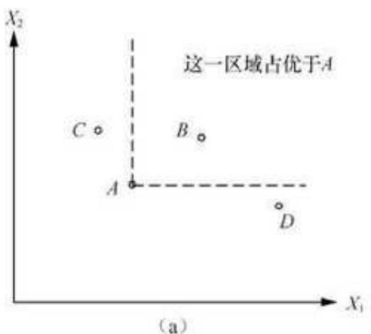

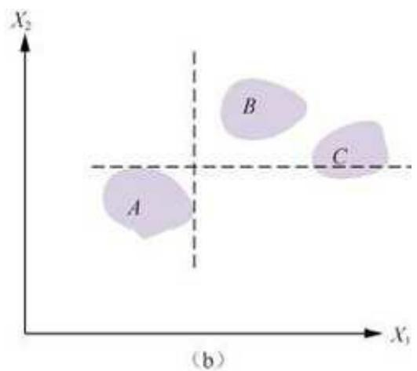  
图16-4 严格占优。（a）确定性：对A有严格占优的是B，而不是 $C$ 或 $D$ 。（b）不确定性：对A有严格占优的是B，而不是 $C$

幸运的是，一个称为随机占优 （stochasticdominance）的更有用的泛化在实际问题中经常出现。假设我们认为将机场建在 $S _ { 1 }$ 的成本均匀分布在28亿美元到48亿美元之间，而将机场建在S 的成本均匀分布在30亿美元到52亿美元之间。将属性 Frugality 定义为负成本。图16-5a展示了 S 1和 S 2地点节省开支的分布情况。在此基础上，如果我们只考虑成本越低越好（所有其他条件都相同），我们可以说 S 随机占优于 $S _ { 2 }$ （即 $S _ { 2 }$ 可以被丢弃）。注意，这并不是通过比较期望成本得出的结果。例如，如果我们知道 $S _ { 1 }$ 的成本正好是38亿美元，那么在没有关于金钱效用的额外信息的情况下我们将无法做出决策。（关于 $S  { 1 }$ 成本的更多信息可能会降低智能体的决策能力，这似乎有点奇怪。我们注意到，在缺乏准确成本信息的情况下，决策更容易做出，但这一决策也更有可能是错误的，这就解决了这一矛盾。）

建立随机占优所需要的属性分布之间的确切关系最好通过检查累积分布来了解，如图16-5b所示。如果 $S  { 1 }$ 的累积分布总是在 $S _ { 2 }$ 的累积分布的右边，那么从随机的角度来说， $S _ { 1 }$ 比 $S _ { 2 }$ 便宜。形式上，如果两个动作 $A _ { 1 }$ 和 $A _ { 2 }$ 导致的属性 $X$ 概率分布分别为 $p _ { \mathrm { ~ 1 ~ } } ( \boldsymbol { x } )$ 与 p 2( x )，那么当下式成立时，我们说，在 $X$ 上 $A _ { 1 }$ 随机占优于 $A _ { 2 }$ ：

$$
\forall x \int_ {- \infty} ^ {x} p _ {1} (x ^ {\prime}) d x ^ {\prime} \leqslant \int_ {- \infty} ^ {x} p _ {2} (x ^ {\prime}) d x ^ {\prime}
$$

这个定义与最优决策选择的相关性来自以下性质：如果 $A _ { 1 }$ 随机占优于 $A _ { 2 }$ ，那么对于任意单调不减效用函数 $U ( x )$ ， $A _ { 1 }$ 的期望效用至少和 $A _ { 2 }$ 的期望效用一样高。 为了解其中的原因，考虑两种

期望效用 $\int p _ { 1 } ( x ) \cdot ( x ) d x$ $\int p _ { 2 } ( x ) \cdot \sigma ( x ) d x$ 。起初，考虑到随机占优提供的条件是 $p _ { \mathrm { ~ 1 ~ } }$ 积分小于 $p _ { \mathrm { ~ 2 ~ } }$ 积分，第一个积分大于第二个积分并不显然。

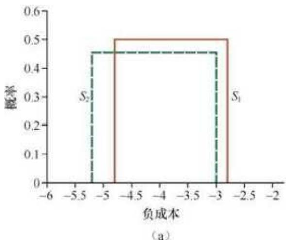

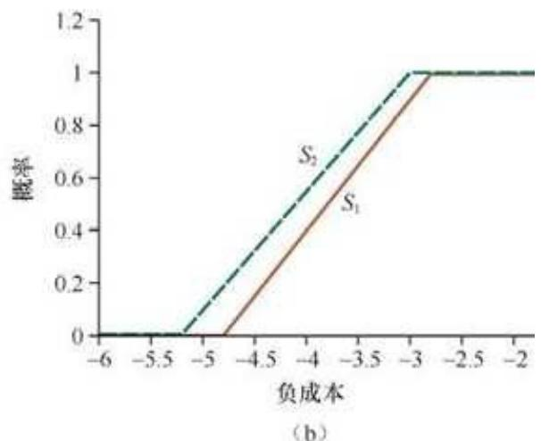

图16-5 随机占优。（a）在节省成本（负成本）上， $S _ { 1 }$ 随机占优于 $S _ { 2 }$ 。（b） $S _ { 1 }$ 与 $S _ { 2 }$ 的节省成本的累积分布

我们不考虑对 $x$ 的积分，而是考虑对 $y$ 的积分，即累积概率，如图16-5b所示。对于任意 $y$ 值， $S  { 1 }$ 对应的 $x$ 值大于 $S _ { 2 }$ （因此 $U ( x )$ 也有该性质）；所以如果在整个 $y$ 的范围内对一个更大的量积分，我们必然会得到一个更大的结果。形式上，它只是将 $y = P _ { \mathrm { ~ 1 ~ } } ( x )$ 替换到 $S _ { 1 }$ 期望值的积分中，将 $y = P _ { \mathrm { ~ 2 ~ } } ( x )$ 替换到 $S _ { 2 }$ 期望值的积分中。通过这些替换，对于 $S _ { 1 }$ ，我们有

$$
d y = \frac {d}{d x} (P _ {1} (x)) d x = p _ {1} (x) d x
$$

；对于 $S _ { 2 }$ ，我们有 ${ \mathrm { d } } y = p _ { \mathrm { ~ 2 } } ( { \boldsymbol { x } } ) { \mathrm { d } } x$ ，因此

$$
\int_ {- \infty} ^ {+ \infty} p _ {1} (x) U (x) d x = \int_ {0} ^ {1} U \left(P _ {1} ^ {- 1} (y)\right) d y \geqslant \int_ {0} ^ {1} U \left(P _ {2} ^ {- 1} (y)\right) d y = \int_ {- \infty} ^ {+ \infty} p _ {2} (x) U (x) d x
$$

这个不等式允许我们在单属性的问题中偏好A 而不是A 。更普遍的是，如果在多属性问题中，一个动作在所有属性上被另一个动作随机占优，那么它可以被舍弃。

随机占优条件可能看起来相当技术性，如果不经过大量的概率计算，可能不那么容易评估。事实上，在很多情况下，该判断都很容易。例如，你是愿意从3毫米高处还是从3米高处头朝下摔在混凝土地上呢？假设你选择了3毫米，这是好选择！为什么这一定是一个更好的决定？在这两种情况下，对于你将遭受的损伤程度有很多不确定性；但是对于任何给定的损伤级别，你从3米高处落下时至少会达到该损伤级别的概率比从3毫米高处落下时的概率要大。换句话说，在 Safety 属性上，3毫米相对于3米随机占优。

这种推理是人类的第二天性，显然，我们甚至都不需要思考就能得出结论。随机控制理论在机场问题中也常常被用到。例如，假设建筑运输成本取决于到供应商的距离。成本本身是不确定的，但距离越大，成本就越大。如果S 比S 更接近，那么 S 将会在节省成本方面胜过 S 。在定性概率网络 （qualitative probabilistic network）中，这种定性信息在不确定变量之间传播的算法是存在的，它使系统在不使用任何数值的情况下基于随机占优做出理性决策（我们不在这里深入介绍）。

# 16.4.2 偏好结构与多属性效用

假设我们有 $n$ 个属性，每个属性都有 $d$ 个不同的可能值。为指定完整的效用函数 $U ( x _ { 1 } , . . . , x _ { n } )$ ，在最坏的情况下我们需要 $d ^ { n }$ 个值。多属性效用理论旨在识别人类偏好中的额外结构，从而不需要单独指定所有 $d ^ { n }$ 个值。在发现偏好行为的一些规律性之后，我们推导出 表示定理 （representationtheorem），证明具有特定种类的偏好结构的智能体具有效用函数

$$
U (x _ {1}, \dots , x _ {n}) = F [ f _ {1} (x _ {1}), \dots , f _ {n} (x _ {n}) ]
$$

其中， $F$ （我们希望）是像加法一样的简单函数。注意，这与使用贝叶斯网络来分解几个随机变量的联合概率是相似的。

例如，假设每个 $x _ { i }$ 是智能体拥有的特定货币（如美元、欧元、马克、里拉等）的金额。 $f _ { i }$ 函数可以将每个金额转换成一种通用货币，则 $F$ 将是简单的加法函数。

# 1.不含不确定性的偏好

我们先从确定性的情况开始考虑。在16.2节中我们注意到，对于确定性环境，智能体有一个价值函数，我们在这里把这一函数简明地写作 $V ( x _ { 1 } , . . . , x _ { n } )$ 。在确定性偏好结构中产生的基本价规律性被称为 偏好独立性 （preference independence）。如果结果 $\langle x _ { 1 } , x _ { 2 } , x _ { 3 } \rangle$ 和 之间的偏好不依赖于属性 X 3的特定值 x 3，则我们称两个属性 $X _ { 1 }$ 和 $X _ { 2 }$ 偏好独立于第三个属性 X 3。

让我们再次考虑机场的例子，（除其他属性外）我们需要考虑的属性有Quietness、 Frugality与Safety ，我们可以认为 Quietness 与 Frugality 偏好独立于 Safety 。例如，如果两种情况下的安全水平都是每十亿乘客里程有0.006人死亡，我们偏好一个有着20 000人居住在飞行路径下、造价为40亿美元的结果甚于一个70 000人居住飞行路径下、造价为37亿美元的结果，那么当安全水平为0.012或

0.013时，我们也会有着相同的偏好。当 Quietness 与 Frugality 有其他的数值对时，同样的偏好仍然成立。同样显然的是， Frugality 与 Safety 偏好独立于 Quietness ，并且 Quietness 与 Safety 偏好独立于 Frugali ty 。

我们称属性集合 表现出 相互偏好独立性 （mutualpreferential independence，MPI）。MPI表明，尽管每个属性可能都是重要的，但它并不会影响其他属性间相互权衡的方式。

相互偏好独立性是一个拗口的名称，但它使得智能体的价值函数有一个简单的形式（Debreu,1960）： 如果属性 $X _ { 1 } , . . . , X _ { n }$ 是相互偏好独立的，则智能体的偏好可以用价值函数

$$
V \left(x _ {1}, \dots , x _ {n}\right) = \sum_ {i} V _ {i} \left(x _ {i}\right)
$$

来表示， 其中，每个V 只涉及属性X 。例如，机场决策问题的价值函数可以用下式来表示：

$$
V (\text {q u i e t n e s s}, \text {f r u g a l i t y}, \text {s a f e t y}) = \text {q u i e t n e s s} \times 1 0 ^ {4} + \text {f r u g a l i t y} + \text {s a f e t y} \times 1 0 ^ {1 2}
$$

这种类型的价值函数被称为加性价值函数 （additivevaluefunction）。加性价值函数是描述智能体偏好的非常自然的方式，它在许多实际场景中是有效的。在含有 n 个属性时，我们可以通过评估n个单独的一维价值函数来评估一个加性价值函数，而不需要直接评估一个 n 维函数。通常，这意味着所需的偏好实验数量指数级地减少了。即使MPI并不严格成立（如属性为某些极端值），加性价值函数仍然可以提供一个智能体偏好的好的近似。如果不满足MPI的属性范围是实际中不太可能发生的范围时，情况尤其如此。

为了更好地理解MPI，研究它不成立的情况会有所帮助。假设你位于一个中世纪的市场中，你正在考虑购买一些猎犬、鸡和用来养鸡的柳条笼子。猎犬非常值钱，但如果没有足够的笼子养鸡，猎犬就会把鸡吃掉；因此，猎犬和鸡之间的权衡很大程度上取决于笼子的数量，这个问题不满足MPI。各种属性之间存在的这种相互作用使得评估整体价值函数变得更加困难。

# 2. 偏好的不确定性

当问题域存在不确定性时，我们还需要考虑彩票之间的偏好结构，并理解效用函数的结果性质，而不仅仅是价值函数。这个问题的数学推导可能会相当复杂，因此我们只给出其中一个主要结果，来说明可以做些什么。

效用独立性 （utility independence）的基本概念将偏好独立性推广到彩票领域：我们称一组属性X的效用独立于另一组属性Y，如果关于属性 X的彩票间的偏好独立于属性 Y的特定值。我们称一组属性是 相互效用独立的 （mutually utility independent，MUI），如果它的每个属性子集都效用独立于其他属性。同样，认为机场问题的属性满足MUI似乎是合理的。

MUI性质意味着智能体的行为可以用 乘性效用函数 （multiplicative utility function）来描述（Keeney, 1974）。我们将通过观测3个属性下的乘性效用函数来了解乘性效用函数的一般形式。为了简洁起见，我们用 U i 表示 U i ( x i )：

$$
\begin{array}{l} U = k _ {1} U _ {1} + k _ {2} U _ {2} + k _ {3} U _ {3} + k _ {1} k _ {2} U _ {1} U _ {2} + k _ {2} k _ {3} U _ {2} U _ {3} + k _ {3} k _ {1} U _ {3} U _ {1} \\ + k _ {1} k _ {2} k _ {3} U _ {1} U _ {2} U _ {3} \\ \end{array}
$$

尽管这看起来并不简单，但它只包含3个单属性效用函数和3个常量。一般来说，具有MUI性质的 n属性问题可以使用 n个单属性效用和n 个常量进行建模。每个单属性效用函数都可以独立于其他属性单独推导，这种组合将保证生成正确的整体偏好。为了得到一个纯粹的加性效用函数，我们还需要额外的假设。

# 16.5 决策网络

本节中，我们将介绍做理性决策的通用机制。这个概念通常被称作影响图 （influencediagram）（Howard and Matheson, 1984），但我们将使用更具描述性的术语 决策网络 （decisionnetwork）。决策网络将贝叶斯网络与用于动作与效用的额外节点类型相结合。我们仍把机场选址问题作为示例。

# 16.5.1 使用决策网络表示决策问题

在其最一般的形式中，决策网络表示关于智能体的当前状态信息、可能动作、将由智能体的动作导致的状态以及该状态的效用。因此，它为在2.4.5节中首次介绍的基于效用的智能体的实现提供了基础。图16-6给出了机场选址问题的决策网络。它给出了3种节点类型。

●机会节点 （chancenode）（椭圆形）表示随机变量（就像在贝叶斯网络中一样）。智能体可能不确定建筑成本（ Construction ）、空运水平（ Air Traffic ）和潜在诉讼（ Litigation ），以及Safety、Quietness和总 Frugality变量，每一个变量也取决于选址。每个机会节点都与一个条件分布相关联，该分布按父节点的状态进行索引。在决策网络中，父节点可以包括决策节点和机会节点。注意，每个当前状态的机会节点都可能是评估建筑成本、空运水平和潜在诉讼的大型贝叶斯网络的一部分。  
●决策节点 （decisionnode）（矩形）代表决策制定者可以选择动作的点。在这个例子里，对于考虑中的每个站点，AirportSite可以采用不同的动作值。这种选择会影响到解决方案的安全、安静和节省成本。在本章中，我们假设所处理的是单个决策节点。第17章讨论了必须作出不止一项决定的情况。  
●效用节点 （utility node）（菱形）代表智能体的效用函数。[1] 效用节点的父节点是所有描述直接影响效用结果的变量。与效用节点相关联的是作为父特征函数的智能体效用函数的描述。这种描述可以是函数的列表，也可以是参数化的特征值加性或线性函数。现在，我们假设函数是确定性的；也就是说，给定其父变量的值，效用节点的值就完全确定了。

[1] 这些节点在文献中被称为价值节点（value node）。

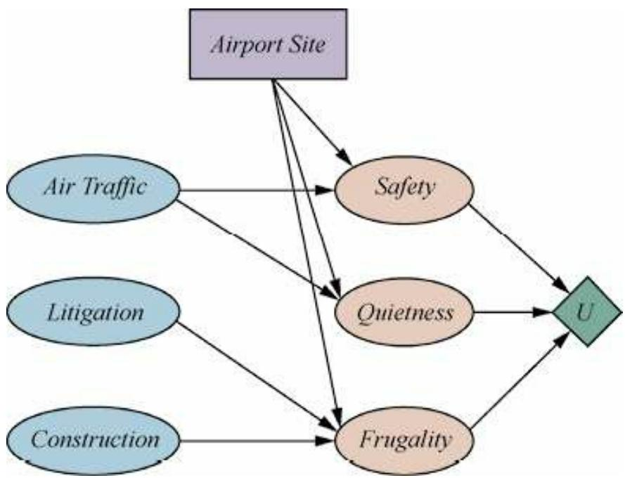  
图16-6 机场选址问题的决策网络

在许多情况下，我们可以采用简化形式。简化形式中的符号保持相同，但省去了描述结果状态的机会节点。而效用节点将直接连接到当前状态节点和决策节点。在这种情况下，效用节点表示的是如

式（16-1）所定义的与每个动作相关联的期望效用，而不是输出状态上的效用函数；也就是说，节点与一个动作效用函数 （action-utility function）（在第22章中所述的强化学习中也称为 Q函数（Q-function））相关联。图16-7给出了机场选址问题的动作效用表示。

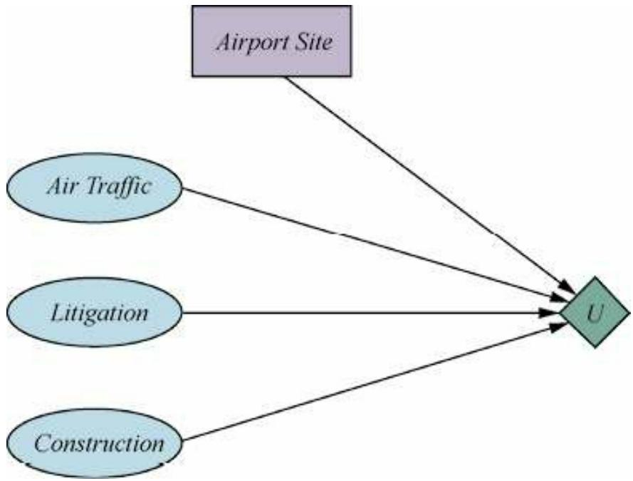  
图16-7 机场选址问题的简化表示。与结果状态对应的机会节点已被略去

注意，因为图16-6中的Quietness、Safety与Frugality机会节点是指未来的状态，所以它们的值永远不会被设置为证据变量。因此，只要可以使用更一般的形式，就可以使用省略这些节点的简化版本。尽管简化形式包含较少的节点，但省略了对选址决策结果的明确描述意味着它对环境变化的灵活性较低。

例如，在图16-6中，飞机噪声水平的变化可以由与Quietness节点相关联的条件概率表的变化反映，而在效用函数中噪声污染的权重的变化可以由效用表的变化反映。但是，在动作效用图（图16-7）中，所有这些变化都必须通过动作效用表的变化来反映。从本质上讲，动作效用形式化表示是原始形式化表示通过对结果状态变量进行求和消元得到的整合版本。

# 16.5.2 评估决策网络

我们可以通过评估决策网络对决策节点的每种可能设置来选择动作。一旦决策节点被设置，它的行为将与作为证据变量设置的机会节点完全一样。评估决策网络的算法如下。

（1）为当前状态设置证据变量。  
（2）对决策节点的每个可能值：

a. 将决策节点设置为该值；  
b. 使用标准概率推断算法计算效用节点的父节点的后验概率；  
c. 计算动作的结果效用。

（3）返回具有最高效用的动作。

这是一种直接的方法，它可以直接套用任何已有的贝叶斯网络算法，并可以直接结合到图12-1中给出的智能体设计中。我们将在第17章中看到，执行多个动作组成的序列的可能性使问题变得更加有趣。

# 16.6 信息价值

在前面的分析中，我们假设所有相关的信息，或者至少所有可用的信息，都是在智能体做出决策之前提供给它的。在实践中，这几乎是不可能的。决策时一个最重要的部分就是知道该问什么问题。例如，医生不能指望在病人第一次进入诊室时就能得到关于病人的所有可能诊断测试和问题的结果。一部分原因是，测试通常是昂贵的，甚至有时是危险的（测试本身可能是危险，或者由于需要时间导致病的治疗延后，这也是危险的）。它们的重要性取决于两个因素：测试结果是否会导致一个显著更好的治疗方案，以及测试出有意义的各种结果的可能性有多大。

在本节中，我们将介绍信息价值理论 （information valuetheory），它使智能体可以选择获取什么信息。我们假设在选择由决策节点表示的实际动作之前，智能体可以获得模型中任何潜在可观测的机会变量的值。因此，信息价值理论涉及的是一种简化形式下的序贯决策，简化的原因是观测行为只影响智能体的 信念状态 （beliefstate），而不影响外部的物理状态。任何特定观测的价值必须来自影响智能体最终物理动作的潜力；这种潜力可以直接从决策模型本身进行估计。

# 16.6.1 简单示例

假设一家石油公司希望购买n块不可区分的海洋开采权中的一块。我们进一步假设，其中恰好有一个区域包含将产生 $C$ 美元净利润的石油，而其他区域一文不值。每块区域开采权的要价是C/n美元。如果该公司是风险中性的，那么它在购买一个区域和不购买一个区域之间是没有偏好的，因为两种情况下的预期利润都是零。

现在假设一位地震学家向该公司提供了对3号区域的调查结果，该结果明确表明该区块是否含有石油。那么公司愿意为这些信息支付多少钱？回答这个问题的方法是对公司在掌握了这些信息后的行为进行考察。

● 有1/ n 的概率，该调查表明3号区域含有石油。这种情况下，公司会以 C / n 美元购买3号区域，获得 美元的利润。  
● 有( n − 1)/ n 的概率，该调查表明这个区域不含石油。这种情况下，公司会购买一个不同的区域。现在在一个其他区域中发现石油的概率从1/ n 变化到1/( n − 1)，所以公司的期望利润为C(n-1）-Cn=Cn（n-1）美元。

现在给定调查信息，我们可以计算期望利润：

$$
\frac {1}{n} \times \frac {(n - 1) C}{n} + \frac {n - 1}{n} \times \frac {C}{n (n - 1)} = C / n
$$

因此，这些信息对该公司价值C/n美元，而且该公司应该愿意向地震学家支付这一金额的很大一部分。

信息的价值来自这样一个事实：有了信息，动作方针就可以改变，以适应实际情况。在含有信息的情况下，个体可以根据不同的信息行动，而在没有信息的情况下，一个人必须在可能的情况下做出平均意义下最佳的动作。一般来说，一个特定信息的价值被定义为获得信息之前和之后最佳动作的期望价值之差。

# 16.6.2 完美信息的一般公式

推导出有关信息价值的一般数学公式是简单的。我们假设可以获得关于一些随机变量E 的值的精确证据（也就是说，我们知道 ），所以我们将采用术语 完美信息价值 （value of perfectinformation，VPI）。 [1]

[1]在要求完美信息的过程中不会损失表达能力。假设我们想要建模一种情况，在这种情况下，我们对一个变量变得更加确定。我们可以通过引入另一个我们已掌握完美信息的变量来做到。例如，假设我们一开始对变量Temperature有着广泛的不确定性。然后我们得到了完美知识Thermometer

= 37；这给我们提供了关于真实 Temperature 的不完美信息，以及因在传感器模型

中编码测量误差带来的不确定性。另一个例子请参考习题16.VPIX。

在智能体只有原始信息的状态下，根据式（16-1），当前最佳动作 $\pmb { \alpha }$ 的价值为

$$
E U (\alpha) = \max  _ {a} \sum_ {s ^ {\prime}} P \left(\operatorname {R E S U L T} (a) = s ^ {\prime}\right) U \left(s ^ {\prime}\right)
$$

（在获得新证据 $\boldsymbol { E } _ { j } = \boldsymbol { e } _ { j }$ 后）新的最佳动作的价值为

$$
E U \left(\alpha_ {e} \mid e _ {j}\right) = \max  _ {a} \sum_ {s ^ {\prime}} P (\text {R E S U L T} (a) = s ^ {\prime} \mid e _ {j}) U \left(s ^ {\prime}\right)
$$

但是 $E _ { j }$ 是一个随机变量，它的值目前是未知的，所以要确定新信息 $E _ { j }$ 的价值，我们必须使用我们对其值的当前信念，对所有可能发现的 $E _ { j }$ 值 $\boldsymbol { e } _ { j }$ 取平均：

$$
V P I \left(E _ {j}\right) = \left(\sum_ {e _ {j}} P \left(E _ {j} = e _ {j}\right) E U \left(\alpha_ {e _ {j}} \mid E _ {j} = e _ {j}\right)\right) - E U (\alpha)
$$

为了对这个公式有一些直观的理解，考虑一个简单的情况，其中我们只有两个动作 $a _ { 1 }$ 与 $a  { 2 }$ 可供选择。它们目前的期望效用是 U 1 和 U 2 。信息 E j = e j 会为动作产生一些新的期望效用 与 $U _ { 1 }$ $U _ { 2 }$ $\boldsymbol { E } _ { j } = \boldsymbol { e } _ { j }$ $U _ { 1 } ^ { \prime }  U _ { 2 } ^ { \prime }$ ，但在我们得到 $E _ { j }$ 之前，我们会得 到 与 可能值的概率分布（我们假设它们是独立的）。 $U _ { 1  } ^ { \prime } U _ { 2 } ^ { \prime }$ $U _ { 1 } ^ { \prime }$

假设 $a _ { 1 }$ 和 $a  { 2 }$ 代表冬季穿越山脉的两条不同路线： $a _ { 1 }$ 是一条路况好的、穿过隧道的笔直高速公路， $a  { 2 }$ 是一条山顶上的蜿蜒土路。如果这是我们仅有的信息，那么显然 $a _ { 1 }$ 更可取，因为 $a _ { \ 2 }$ 很有可能被雪阻塞，而任何障碍都不太可能阻塞 $a _ { 1 }$ 。因此 $U _ { 1 }$ 显然比 $U _ { 2 }$ 高。我们可以获得关于每条道路实际状态的卫星报告 $E _ { j }$ ，这将给出两条道路的新效用， $U _ { 1 } ^ { \prime } \chi _ { \parallel } U _ { 2 } ^ { \prime }$ 。这些期望的分布如图16-8a所示。显然，在这种情况下，卫星报告不值得我们花钱去获得，因为从它们获得的信息不太可能改变我们的规划。规划没有变化，信息就没有价值。

现在假设我们要在两条蜿蜒的土重伤的旅客。在此基础上，即使 $U _ { 1 }$ $U _ { 2 }$ 选择，两条路的长度略有不同，此外我们还载着一位受了很接近， 与 的分布也很可能有较大差异。当第一条路被阻塞时，第二条畅通的可能性非常大，在这种情况下，效用之间的差异将非常大。VPI公式表明，获取卫星报告可能是值得的。图16-8b表明了这种情况。最后，假设我们在夏季的两条土路中进行选择，那时两条路不太可能被雪堵塞。在这种情况下，卫星报告可能会显示：因为开花的高山草甸，一条路线比另一条更美丽，或者可能因为最近的降雨，一条路线比另一条更湿润。因此，如果得到这方面的信息，我们很可能会改变规划。但是在这种情况下，两个路线之间的价值的差异仍然可能非常小，所以我们不需要费心去获取报告。这种情况见图16-8c。

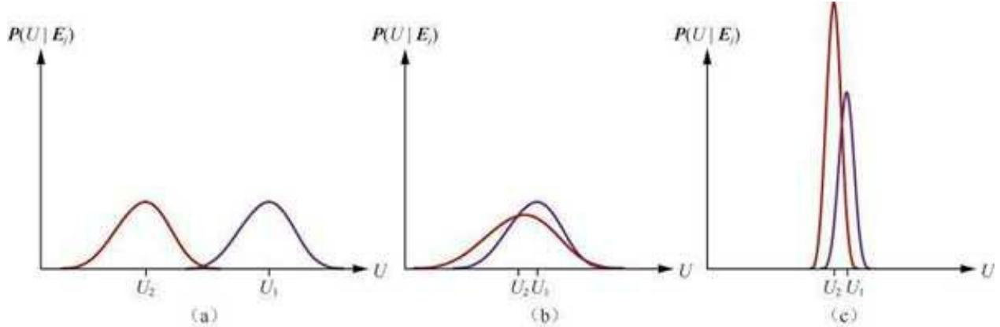  
图16-8信息价值的3种一般情况。（a）a 几乎肯定会优于 $a _ { \ 2 }$ ，因此我们不需要这些信息。（b）选择是不明确的，信息至关重要。（c）选择是不明确的，但信息因为带来的差异很小，信息价值不高。注意： $U _ { 2 }$ 在（c）中有一个峰值，说明其期望值比 $U _ { 1 }$ 有着更高的确定性

总之，信息只有在它可能导致规划的改变，并且新规划将明显优于旧规划的情况下才有价值。

# 16.6.3 价值信息的性质

有人可能会问，信息是否有可能是有害的：它可能会导致负的期望值吗？直觉上，人们应该认为这是不可能的。毕竟在最坏的情况下，人们可以忽略这些信息，假装自己从未收到过它。以下定理证实了这一点，该定理适用于使用含有可能观测 $E _ { j }$ 的任何决策网络的任何决策论智能体：

信息的期望价值是非负的，即

$$
\forall j V P I (E _ {j}) \geqslant 0
$$

这个定理可以直接从VPI的定义中推导出，我们把证明留作习题（习题16.NNVP）。当然，定理描述的对象是期望值，而不是实际值。如果附加信息碰巧具有误导性，那么它很容易导致规划变得比原规划更糟糕。例如，如果医学测试的结果是假阳性，就可能导致不必要的手术；但这并不意味着不应该进行测试。

重要的一点是，我们要记住VPI依赖于信息的当前状态，它会随着信息的获取而改变。对于任何给定的证据 E ，获取它的价值可以下降（例如，如果另一个变量强烈地约束了 E 的后验）或上升（例如，如果另一个变量提供了 $E _ { j }$ 构建的线索，从而能够设计出新的更好的规划）。因此，VPI不具有可加性，也就是说：

$$
V P I \left(E _ {j}, E _ {k}\right) \neq V P I \left(E _ {j}\right) + V P I \left(E _ {k}\right) \quad (\text {一 般 情 况 下})
$$

但VPI是次序独立的，也就是说：

$$
V P I \left(E _ {j}, E _ {k}\right) = V P I \left(E _ {j}\right) + V P I \left(E _ {k} \mid E _ {j}\right) = V P I \left(E _ {k}\right) + V P I \left(E _ {j} \mid E _ {k}\right) = V P I \left(E _ {k}, E _ {j}\right)
$$

其中符号 表示根据后验分布计算的VPI，其中 E 已经被观测到。次序独立性将感知动 $E$ 作与普通动作区分开来，并简化了计算感知动作序列的值的问题。我们将在下一节中再次回顾这个问题。

# 16.6.4 信息收集智能体的实现

一个明智的智能体应该按照合理的顺序进行提问，应该避免问一些无关紧要的问题，应该考虑到每一 条信息的重要性及其成本，并且应该在适当的时候停止提问。所有这些功能都可以通过使用信息的价值作为指导来实现。

图16-9给出了一个智能体的总体设计，它可以在执行动作前智能地收集信息。现在，我们假设每个

可观测到的证据变量 $E _ { j }$ 都有一个相关成本 $C ( E _ { j } )$ ，它反映了通过测试、咨询、提问等方式获得证据的成本。智能体的目标是每单位成本效用增益角度下最有效的观测。我们假设动作 Request ( E j)的结果是下一次感知提供了 $E _ { j }$ 的值。如果没有值得进行的观测，智能体会选择一个实际的动作。

function INFORMATION-GATHERING-AGENT（perCept)returns一个动作persistent: $D$ ，一个决策网络

将percept整合进D$j \gets$ 最大化 $W P I ( E _ { j } ) / C ( E _ { j } )$ 的值if $V P I ( E _ { j } ) > C ( E _ { j } )$ then return Request(E)elsereturn $D$ 的最佳动作

图16-9一个简单、短视的信息收集智能体的设计。智能体通过反复选择信息价值最高的观测，直到下一次观测的成本大于它的期望收益

我们所描述的智能体算法实现了一种被称为 短视 （myopic）的信息收集的形式。这是因为它以一个短浅的目光使用了VPI公式，它在计算信息的价值时的表现就好像只会获得一个证据变量一样。短视控制基于与贪心搜索相同的启发式思想，它通常在实践中表现很好。（例如，它在选择诊断测试方面的表现超过了专业医生。）然而，如果不存在能够起到重要作用的单一证据变量，那么采用短视的智能体可能会迅速地采取具体动作，而不是先请求两个或两个以上的变量，然后再采取动作。16.6.5节将讨论获得多个观测结果的可能性。

# 16.6.5 非短视信息收集

一个观测序列的值在序列排列下是不变的，这一事实很有趣，但它本身并不导致最优信息收集的高效算法。即使我们限制自己预先选择一个固定的观测子集，并在其中收集信息，但 n 个可能观测中仍有2 n 个这样的可能子集。在一般情况下，我们面临着一个更复杂的问题，即找到一个最佳条件规划（如11.5.2节所述），该规划选择一个观测结果，然后根据结果采取动作或选择更多的观测结

果。这些规划形成一类树，这类树的数量关于n 是超指数的。


对于决策网络中变量的观测，即使网络是一个多重树，这个问题也很难解决。然而，在某些特殊情况下，问题可以得到有效的解决。这里我们考虑如下的情形： 寻宝 （treasurehunt）问题，或者不太浪漫地称为 最小成本测试序列 （least-cost testing sequence）问题。有 n 个位置1,…, n ，每个位置 i以独立的概率 $P$ (i)包含宝藏，检查位置 i需要花费的成本为C(i)。这对应于一个所有潜在证据变量Treasure 绝对独立的决策网络。智能体以某种顺序检查位置，直到找到宝藏；要解决的问题是，最优顺序是什么？

要回答这个问题，假设智能体在发现宝藏后停止，我们需要考虑各种观测序列的期望成本和成功概率。令x 为这样的一个序列， xy是序列x 与 y的拼接，C(x )是x 的期望成本， P(x )是序列 x 成功发现宝藏的概率， 是其失败的概率。基于这些定义，我们有

$$
C (\boldsymbol {x} \boldsymbol {y}) = C (\boldsymbol {x}) + F (\boldsymbol {x}) C (\boldsymbol {y}) \tag {16-3}
$$

也就是说，序列 xy 必然包含 $\pmb { x }$ 的成本，如果 $\pmb { x }$ 失败，则还会带来 $y$ 的成本。

序列优化问题的基本思想是，当一般序列 wxyz中的两个相邻子序列 $_ x$ 和 $y$ 被置换时，观测由定义的成本变化。当序列是最优序列时，所有这样的变化都会使 $\Delta = C ( w x y z ) - C ( w y x z )$ 序列变差。第一步我们将证明，这种成本变化的符号（增加或减少成本）并不依赖由 $\pmb { w }$ 与z提供

的上下文信息。我们有

$$
\begin{array}{l} \Delta = [ C (w) + F (w) C (x y z) ] - [ C (w) + F (w) C (y x z) ] \quad [ \text {根 据 式} (1 6 - 3) ] \\ = F (w) [ C (x y z) - C (y x z) ] \\ = F (w) \left[ \left(C (x y) + F (x y) C (z)\right) - \left(C (y x) + F (y x) C (z)\right) \right] \quad [ \text {根 据 式} (1 6 - 3) ] \\ = F (w) [ C (x y) - C (y x) ] \quad [ \text {根 据 式} F (x y) = F (y x) ] \\ \end{array}
$$

我们已经证明了整个序列成本变化的方向只取决于被翻转的元素对的成本变化方向；这对元素的上下文不会对变化方向产生影响。这给了我们一种通过两两比较来排序序列以获得最优解的方法。具体来说，我们现在有

$$
\begin{array}{l} \Delta = F (w) \left[ \left(C (x) + F (x) C (y)\right) - \left(C (y) + F (y) C (x)\right) \right] \quad [ \text {根 据 式} (1 6 - 3) ] \\ = F (w) [ C (x) (1 - F (y)) - C (y) (1 - F (x)) ] = F (w) [ C (x) P (y) - C (y) P (x) ] \\ \end{array}
$$

这个公式适用于对任何序列 $\pmb { x }$ 与 $y$ ，特别是当 $\pmb { x }$ 与y分别是位置i与j的单个观测值时。因此我们得出，如果i与 $j$ 在最优序列中相邻，我们必须有 ，或等价地

P(i） >PUc(i） 。换句话说，最优顺序根据每单位成本的成功概率对位置进行排序。习题16.HUNT要求你确定这是否实际上是图16-9中算法针对这个问题所遵循的策略。

# 16.6.6 敏感性分析与健壮决策

敏感性分析 （sensitivity analysis）的实际应用在技术领域中广泛存在：它意味着分析当模型参数被轻微调整时，过程的输出会发生多大的变化。敏感性分析在概率和决策论系统中尤为重要，因为所使用的概率通常是从数据中学习来的，或者是由人类专家估计的，这意味着它们本身具有相当大的不确定性。只有在极少数情况下，如西洋双陆棋中的掷骰子，我们才能客观地知道概率。

对于效用驱动的决策过程，你可以将输出看作实际做出的决策或该决策的期望效用。先考虑后者：因为期望依赖于模型中的概率，所以我们可以计算任何给定动作的期望效用对这些概率值的导数。（例如，如果模型中所有的条件概率分布都明确地列表，那么计算期望就涉及计算两个乘积和表达式的比。更多细节见第20章。）因此，我们可以确定模型中哪些参数对最终决策的期望效用有着最大的影响。相反，如果我们关心的是实际做出的决策，而不是它根据模型的效用，那么我们可以简单地系统地改变参数（可能使用二分搜索的方法），以查看决策是否改变，如果是，导致这种改变的最小扰动是什么。有人可能会认为，做什么决定并不重要，重要的是它的效用。这是正确的，但在实践中，一个决策的实际效用和根据模型得出的效用之间可能存在非常本质的差别。

如果所有合理的参数扰动都使最优决策保持不变，那么我们可以合理地认为该决策是一个好的决策，即使该决策的效用估计大体上是不正确的。但是，如果最优决策随着模型参数的变化而发生较大变化，则该模型很有可能会产生一个实际上次优的决策。在这种情况下，我们有必要投入更多的精力来完善模型。

这些直觉已经在几个领域（控制理论、决策分析、风险管理）中被形式化，这些领域提出了健壮（robust）决策或 极小化极大 （minimax）决策的概念，即在最坏的情况下给出最佳结果。在这里，“最坏的情况”是指模型在参数所有可能的取值中最坏的情况。令 $\pmb \theta$ 表示模型中所有参数，健壮决策由下式定义：

$$
a ^ {*} = \operatorname {a r g m a x} _ {a} \min  _ {\theta} E U (a; \theta)
$$

在许多情况下，特别是在控制理论中，健壮方法能够产生在实践中非常可靠的设计。在一些其他的情况下，它可能导致过于保守的决定。例如，在设计自动驾驶汽车时，健壮方法会对道路上其他车

辆的行为做出最坏的假设，也就是说，假设它们都是由杀人狂驾驶的。在这种情况下，汽车的最优选择是留在车库里。

贝叶斯决策论为健壮方法提供了另一种选择：如果模型的参数存在不确定性，那么我们可以使用超参数对这种不确定性进行建模。

健壮方法可能认为模型中的某个概率 取值于0.3和0.7之间，对手实际选择的值可能会让结果尽可能地差，而贝叶斯方法将给 一个先验概率分布，然后像之前一样继续进行推断。这意味着我们需要更复杂的建模工作，例如，贝叶斯建模者必须决定参数 与 是否独立，但贝叶斯方法通常在实践中有更好的性能。

除了参数的不确定性，决策论在真实世界中的应用也存在结构化的不确定性。例如，图16-6中关于AirTraffic 、 Litigation 与 Construction 的独立性的假设可能是不正确的，此外还可能存在被模型简单忽略的额外变量。目前，我们对如何考虑这种不确定性还没有很好的认识。一种可能的方法是保留一个模型集成，它也许是由机器学习算法生成的，我们希望这个集成能捕捉到重要的变化。

# 16.7 未知偏好

在本节中，我们将讨论当被优化期望值的效用函数存在不确定性时会发生什么。这个问题有两种版本：一种是智能体（机器或人类）不确定自己的效用函数，另一种是机器试图帮助人类，但不确定人类想要什么。

# 16.7.1 个人偏好的不确定性

想象一下，你正位于泰国的一家冰激凌店，但店里只剩下两种口味的冰激凌：香草味（Vanilla）冰激凌和榴莲味（Durian）冰激凌。它们的成本都是2美元。你知道你比较喜欢香草口味，并愿意在这样一个大热天花3美元买一个香草味冰激凌，所以选择香草味冰激凌净收益是1美元。但是，你不知道你是否喜欢榴莲口味，你已经在维基百科上调查过，不同的人对榴莲有着不同的反应：有人发现“它的味道超过了世界上所有其他水果”，而其他人把它比作“污水、陈腐的呕吐物、臭鼬喷雾和用过的外科拭子”。

具体来说，假设有50%的机会你会觉得它很棒（收益为+100美元），而有50%的概率你会讨厌它（收益为−80美元，榴莲的味道将整个下午挥之不去）。在这个问题中，你将赢得什么奖品没有不确定性。无论哪种方式，榴莲味冰激凌都是一样的，但你自己对奖品的偏好有不确定性。

我们可以扩展决策网络的形式体系，以允许不确定的效用，如图16-10a所示。如果没有更多关于你对榴莲口味的偏好信息，并且商店不允许你品尝，那么该决策问题是与图16-10b所示相同的问题。我们可以简单地将榴莲口味的不确定值替换为其期望净收益(0.5×100)−(0.5×80)−2=8美元，此时你的决策将保持不变。

如果你对榴莲的态度有可能发生改变：也许你品尝几口，或者你发现你所有在世的亲戚都喜欢榴莲，那么图16-10b中的问题转换是成立的。然而实际上，我们仍然可以找到一个等价的模型，其中效用函数是确定的。与其说效用函数存在不确定性，不如说我们将这种不确定性带入了真实世界。也就是说，我们创建一个新的随机变量LikesDurian ，其取值true与false的先验概率为0.5，如图16-10c所示。有了这个额外的变量，效用函数就变成了确定性的，但是我们仍然可以处理你对榴莲口味偏好信念的改变。

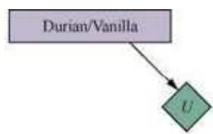

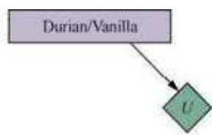

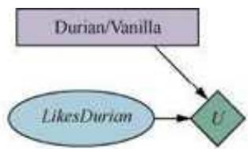

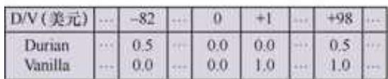

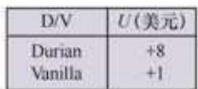

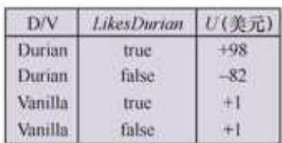  
  
图16-10 （a）效用函数不确定的冰激凌选择的决策网络。（b）带有每个动作期望效用的网络。（c）将不确定性从效用函数转移到一个新的随机变量

未知的偏好可以用普通的随机变量进行建模，这意味着我们可以继续使用为已知偏好开发的机制和定理。但是，这并不意味着我们总是可以假设偏好是已知的。不确定性仍然存在，它仍然影响着智能体的行为方式。

# 16.7.2 顺从人类

现在让我们来看看上面提到的第二种情况：一种本应帮助人类，但却不确定人类想要什么的机器。针对这种情况的全面处理我们推迟到在第18章介绍，届时我们将讨论涉及一个以上智能体的策略。在本节中，我们要问考虑一个简单的问题：在什么情况下，这样的机器会顺从人类？

为了研究这个问题，让我们考虑一个非常简单的场景，如图16-11所示。R是一个作为私人助理为H工作的软件机器人，而H是一个忙碌的人。H需要一间酒店房间来参加她在日内瓦的下一次商务会议。R现在可以行动了——假设它可以给H预定一家在会议地点附近的非常昂贵的酒店。R很不确定H多大程度上喜欢这家酒店和它的价格。假设它认为H对酒店的价值判断服从介于−40到+60之间，平均值为+10的均匀分布。它也可以“关掉自己”，简单来说，就是不参与帮主人订酒店的过程我们（不失一般性地）定义，这个选择对H的价值为0。如果这是机器的两个选择，它就会冒着招致令H不高兴的重大风险继续预订酒店。（如果价值的范围是−60到+40，平均值为−10，它会选择关掉自己。）然而，我们会给R提供另外的选项：解释它的计划，等待主人的回复，然后让H把它关掉。H要么关掉它要么让它去订酒店。有人可能会问，既然它可以自己做出这两种选择，新的选项又有什么好处呢？

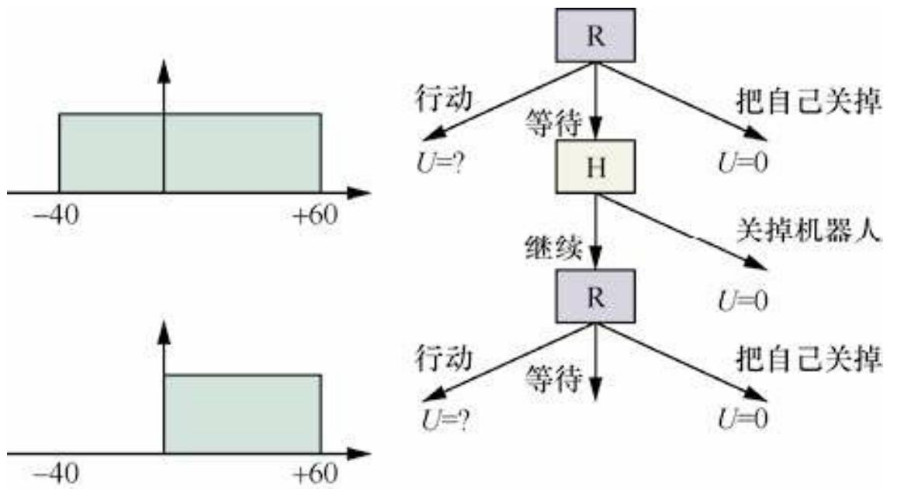  
图16-11 开关游戏。机器人R可以选择现在行动，但收益非常不确定；把自己关掉；或者顺从人类H。H可以关掉R，也可以让R继续。现在R又有了同样的选择。行动的收益仍然是不确定的，但现在R知道收益是非负的

关键是H的选择——是关掉R还是让它继续预订，这为R提供了关于H偏好的信息。我们现在假设H是理性的，所以如果H让R继续预订，这就意味着这酒店对H的价值是正的。现在，如图16-11所示，R的信念发生了变化：它在0到+60之间是均匀分布的，平均值为+30。

所以，如果我们从R的角度来评估它最初的选择。

（1）现在行动并预订一家酒店，期望值为+10。  
（2）关掉自己，价值为0。  
（3）等着H把它关掉会导致两种可能的结果。

a. 基于R对H偏好的不确定性，有 $4 0 \%$ 的可能性H会讨厌这个计划并关掉R，此时价值为0。  
b. 有60%的可能性H会喜欢这个计划并允许R继续进行，期望值为 $+ 3 0$ 。

因此，等待的期望值为 ，这比R现在就采取动作的期望值+10高。

结果就是R有了一个积极的动机去顺从H，也就是说，允许自己被关掉。这种动机直接来自于R对H偏好的不确定性。R意识到它有可能（在本例中为40%）要做一些会让H不高兴的事情，在这种情况下，被关掉会比继续进行更好。如果R已经确定了H的偏好，它就会继续进行并做出决策（或者关掉自己）。咨询H绝对不会有任何收获，因为根据R的确切信念，它已经能够准确地预测H将会做出什么决定。

事实上，我们可能可以在一般情况下证明相同的结果：只要R不完全确定H将会采取的动作，它最好允许H关掉自己。直观来说，H的决策给R提供了信息，而信息的期望值总是非负的。反之，如果R能够确定H的决策，那么H的决策就不再能提供新的信息，R就没有动机让H做出决策。

形式上，设 P ( u )为R提议动作 a 对H效用的先验概率密度。则继续执行 a 的价值为

$$
E U (a) = \int_ {- \infty} ^ {+ \infty} P (u) \cdot u d u = \int_ {- \infty} ^ {0} P (u) \cdot u d u + \int_ {0} ^ {+ \infty} P (u) \cdot u d u
$$

（我们很快就会看到为什么积分是以这种方式拆分的。）另一方面，服从于H的动作 $d$ 的价值同样由两部分组成：如果 $u > 0$ ，那么H会让R继续，所以其价值是 $u$ ，但如果 $u < 0$ ，那么H会关闭R，所以价值是0：

$$
E U (d) = \int_ {- \infty} ^ {+ \infty} P (u) \cdot 0 d u + \int_ {0} ^ {+ \infty} P (u) \cdot u d u
$$

比较 EU ( a )与 EU ( d )的表达式，我们可以立刻发现：

$$
E U (d) \geqslant E U (a)
$$

因为EU (d )的表达式将负效用区域归零。只有当负区域的概率为零时，这两个选择才有相等的价值，也就是说，当R已经确定H喜欢这个提议动作时。

关于这个模型，有一些明显的阐释值得马上探讨。第一个阐释是给H的判断增加时间成本。在这种情况下，如果负面风险很小，R就不太会去打扰H。这是它应该做的。如果H真的会因为被打扰而生气，那R偶尔做出她不喜欢的事情，她也不应该太惊讶。

第二种阐述是允许一些人为错误概率，也就是说，即使R提议的动作是合理的，H有时也可能将其关闭；即使R提议的动作不是主人想要的，H有时也会让其执行。将这个错误概率引到模型中是很简单的（见习题16.OFFS）。正如人们可能预期的那样，这个解决方案表明，R不太倾向于听从一个有时会违背自己最大利益的非理性的H。她的行为越随意，在听从她之前，R就越不确定她的偏好。我们再次声明，这个现象是合理的。例如，如果R是一辆自动驾驶汽车，而H是它两岁的淘气乘客，R不应该让H在高速公路中间把它关掉。

小结

本章展示了如何将效用理论与概率相结合，以使智能体选择将其期望表现最大化的动作。

●概率论 描述的是在证据的基础上一个智能体应该相信什么， 效用理论 描述的是一个智能体想要什么，而决策论 将两者结合起来描述一个智能体应该做什么。  
●我们可以使用决策论来建立一个系统，通过考虑所有可能的动作，并选择其中导致最佳期望结果的一个来决策。这样的系统被称为理性智能体 。  
●效用理论表明，对彩票的偏好与一组简单的公理一致的智能体，可以被描述为具有一个效用函数；此外，智能体选择动作就像最大化其期望效用一样。  
●多属性效用理论 研究依赖于几种不同状态属性的效用。随机占优是做出明确决策的一种特别有用的技术，即使没有精确的属性效用值。  
●决策网络 为表达和求解决策问题提供了一种简单的形式体系。它们是贝叶斯网络的自然延伸，除了机会节点，还包含决策节点和效用节点。  
●有时，求解问题需要在做出决策之前找到更多的信息。信息价值 被定义为与在没有信息的情况下做出决策相比，期望效用的提高；这对在作出最后决策之前指导收集信息的过程特别有用。  
●像通常的情况那样，当不可能完全正确地指定人类的效用函数时，机器必须在真实目标的不确定性下运行。当机器有可能获得更多关于人类偏好的信息时，就产生了明显差异。我们通过一个简单的论证表明，关于偏好的不确定性确保了机器服从人类，甚至允许自己被关闭。

读者服务：


微信扫码关注【异步社区】微信公众号，回复“e59810”获取本书配套资源以及异步社区15天VIP会员卡，近千本电子书免费畅读。

# 第17章

# 做复杂决策

在本章中，我们要考虑如下问题：如果我们明天将要面临某个给定决策问题，我们今天应该采取什么行动？我们将探讨用于解决该问题的一系列方法。

在本章中，我们将讨论在随机环境中决策所涉及的计算问题。在第16章中，我们研究了一次性或回合式决策问题，其中每个动作结果的效用是已知的，而在本章中我们关注的是序贯决策问题（sequential decision problem），在这类问题中，智能体的效用取决于一系列决策。序贯决策问题涉及效用、不确定性和感知方面的问题，并在一些特殊情况中涵盖搜索和规划问题。17.1节将给出序贯决策问题的具体定义，17.2节将描述求解序贯决策问题，以产生适合随机环境的行为的方法。17.3节将探讨 多臂老虎机 （multi-armed bandit）问题，这是一类出现在许多情况中的特殊而有趣的序贯决策问题。17.4节将探讨部分可观测环境中的决策问题，17.5节将探讨如何求解这些问题。

# 17.1 序贯决策问题

假设一个智能体位于图17-1a所示的4×3环境中。从初始状态开始，它必须在每个时间步选择一个动作。当智能体到达一个目标状态（标记为+1或-1）时，它与环境的交互终止。类似于搜索问题，智能体在每个状态下可用的动作由A ctions ( s )给出，有时缩写为 A ( s )；在4×3环境中，每个状态下的动作都是 Up 、 Down 、 Left 与 Right 之一。我们暂且假设环境是 完全可观测的 （fullyobservable），因此智能体总是知道它的确切位置。

如果环境是确定性的，那么该问题的解很简单：[Up, Up, Right, Right,Right]。遗憾的是，因为动作是不可靠的，环境并不总是与这个解一致。我们所采用的特定的随机运动模型如图17-1b所示。每个动作都以0.8的概率达到预期的效果，但在其余的情况中，动作会使智能体向预期方向的垂直方向移动。此外，如果智能体的行为导致它撞到墙上，它会停留在原地。例如，智能体从初始方格(1, 1)出发， Up 动作以0.8的概率将智能体移动到(1, 2)，以0.1的概率移动到(2, 1)，以0.1的概率向左移动，撞到墙上，并停留在(1, 1)。在这样的环境中，序列[ Up , Up , Right , Right , Right ] 能够 绕过障碍物并到达目标状态(4, 3)的概率为0.85 =0.32768。玩家也有可能以0.1 4 ×0.8的小概率意外到达目标，即总共0.32776。（见习题17.MDPX。）

正如第3章所述，转移模型 （在意义明确的情况下可以简称为模型）描述了每个状态下每个动作的结果。这里的结果是有随机性的，我们写作 $P ( \pmb { s } ^ { \prime } | \pmb { s } , \pmb { a } )$ ， 它 表示在状态 s 中执行动作 $a$ ，达到状态 $s ^ { \prime }$ 的概率（有些作者写作 $\pi ( s , a , s )$ 表示转移模型）。我们假设转移是 马尔可夫的 ：从s到达 $s ^ { \prime }$ 的概率只取决于 s，而不取决于以前状态的历史。

为了使任务环境的定义完整，我们必须为智能体指定效用函数。因为决策问题是序贯的，效用函数将依赖于一系列状态和动作 ——一个 环境历史 （environment history）——而不是单一的状态。在本节的剩余部分中，我们将研究历史效用函数的性质。现在，我们简单地规定，对于通过动作a从s 到 $s ^ { \prime }$ 的每次转移，智能体都会收到一个 奖励 $R ( s , a , s )$ 。奖励可以是正的，也可以是负的，但它们都被限制在 $\pm R _ { \mathrm { { m a x } } }$ 范围内。 [1]

[1]也可以使用代价 c(s, a, s')，就像我们在第3章搜索问题的定义中所做的那样。然而，在不确定性下的序贯决策文献中，标准用法是奖励。

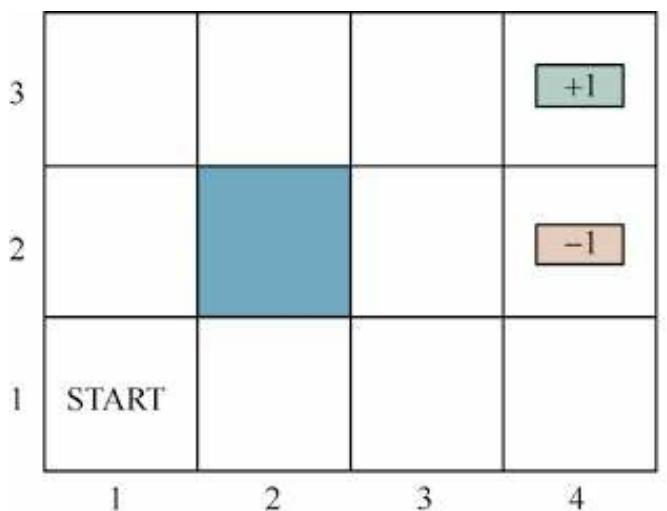

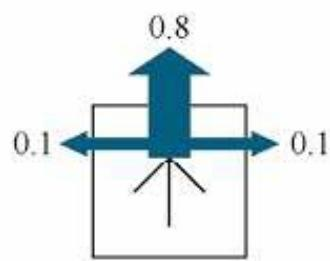  
  
图17-1 （a）一个简单的、随机的4×3环境，它向智能体呈现一个序贯决策问题。（b）环境的转移模型的图示：“预期的”结果以0.8的概率出现，但在0.2的概率下，智能体以垂直于预期方向的角度运动。与墙的碰撞不会导致任何运动。转移到两种终止状态的奖励分别为+1和−1，所有其他转移的奖励为−0.04

在我们上述的具体例子中，除那些导致进入终止状态（其拥有奖励+1和–1）的转移之外，所有转移的奖励都是−0.04。环境历史的效用（就目前而言）是所获得奖励的总和。例如，如果智能体在

10步转移之后达到+1状态，其总效用将为(9×(−0.04))+1 =0.64。–0.04的负奖励给予智能体快速到达(4, 3)的动力，所以我们的问题环境是对第3章中的搜索问题的随机推广。另一种解释是，智能体不喜欢生活在这种环境中，所以它想尽快离开。

综上所述：一个完全可观测的随机环境下，具有马尔可夫转移模型和加性奖励的序贯决策问题称为马尔可夫决策过程 （Markov decision process，MDP），它包含一个状态集合（初始状态 s 0），每个状态下的动作集合A ctions ( s )，转移模型 ，奖励函数 。 动态规划是求解MDP的常用方法：通过递归将问题分解成更小的部分，并考虑各部分的最优解来简化问题。

下一个问题是，这个问题的解是什么样子的？没有固定的动作序列可以用于求解这个问题，因为智能体可能会以一种与目标不同的状态结束。因此，问题的解必须能够告知智能体在可能到达的任何状态下应该采取什么动作。这种解被称为 策略 （policy）。我们一般使用符号 $\pmb { \pi }$ 来表示一个策略， 是策略 对状态 s 推荐的动作。无论动作的结果是什么，最终导致的状态将仍在策略考虑的范围内，智能体将知道下一步该做什么。

每次从初始状态开始执行给定的策略时，环境的随机性可能导致不同的环境历史。因此，策略的质量是通过该策略所产生的可能环境历史的期望效用来衡量的。 最优策略 （optimalpolicy）是指能够产生最大期望效用的策略，我们用 表示最优策略。给定 ，智能体通过咨询目前的感知来得知当前的状态 s ，然后执行动作 来决定要做什么 。策略显式地表达了智能体函数，因此策略也描述了一个简单反射型智能体，它从基于效用的智能体的信息中计算得到。

图17-1所示世界的最优策略如图17-2a所示。这个问题存在两种最优策略，这是因为智能体在位于(3, 1)时，对向左和向上两个动作没有偏好：采取向左的动作更安全，但花费的时间更长；采取向上的动作可以较快达到目标，但可能导致意外落入(4, 2)。一个问题通常会有多种最优策略。

风险和奖励之间的平衡取决于非终止状态之间转换的奖励值 $r = R ( s , a , s )$ 。图17-2a所示的策略在 范围内是最优的。图17-2b给出了 $r$ 位于其他4个取值范围下的最优策略。当 时，智能体认为生活十分痛苦，它将直奔最近的出口，尽管这个出口奖励值为−1。当 ，智能体认为生活很不愉快；智能体将选择到达+1状态的最短路径——依次经过(2, 1)、(3,1)和(3,2)，但是从(4,1)到达+1的代价非常高，所以智能体更倾向于直接进入−1状态。当智能体认为生活只是略有苦闷（ $- 0 . 0 2 7 4 < r < 0$ ）时，最优策略将不承担任何风险。在状态(4,1)和(3,2)中，智能体将选择远离−1状态，这样它就不会意外地落入其中，尽管这意味着它可能会撞到墙上好几次。最后考虑 $r > 0$ 的情况，这意味着智能体认为生活是愉快的，此时它将避开两个出口。只要它在状态(4,1)、(3,2)、(3,3)中采取的动作如图17-2b所示，那么每一个这样的策略都是最优的，智能体会因为永远不会进入终止状态而获得无限的总奖励。结果表明，考虑r的所有不同取值范围，共有9种最优策略（习题17.THRC要求找到它们）。

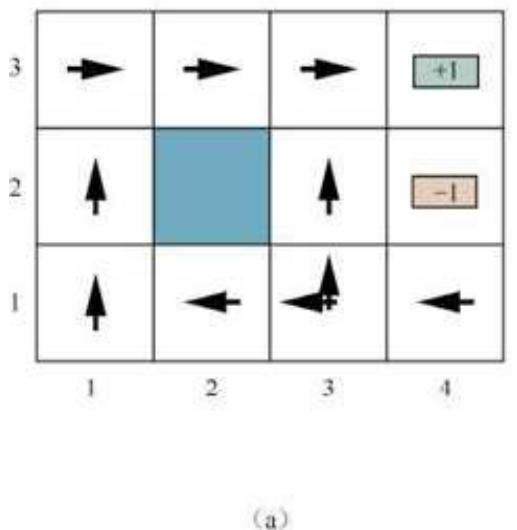

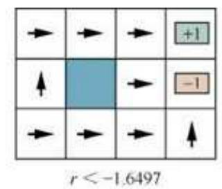

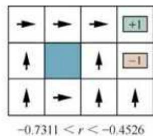

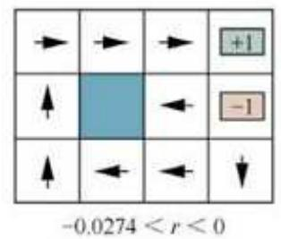

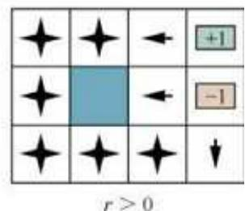  
  
图17-2（a）在r=−0.04的随机环境下，非终止状态之间转移的最优策略，这里有两种策略，因为在状态(3,1)，Left和Up都是最优的。（b）对于 r的4个不同取值范围的最优策略

不确定性的引入使MDP比确定性搜索问题更接近真实世界。因此，MDP已经在包括人工智能、运筹学、经济学和控制理论等多个领域中被广泛研究。目前已有几十种求解算法，我们将在17.2节对其中一部分进行讨论。但首先我们将更详细地阐明MDP的效用、最优策略和模型的定义。

# 17.1.1 时间上的效用

在图17-1所示的MDP示例中，智能体的性能是通过所经历的转移的奖励总和来衡量的。这种性能度量的选择并不是随意的，但是它并不是关于环境历史的唯一可能效用函数[2] ，我们将其写作U([so,as,a..,s）。

[2]本章中，我们使用 $U$ 表示效用函数（和本书的其他部分保持一致），但是许多关于MDP的工作使用 $V$ 来表示。

第一个要回答的问题是，决策是有限期 （finitehorizon）的还是无限期 （infinitehorizon）的。有限期意味着存在固定时间 $N$ ，对于该时间点之后的任何事件我们都不再关注，也就是说游戏结束了。因此，对所有 $k > 0$ ，下式成立：

$$
U _ {\mathrm {h}} ([ s _ {0}, a _ {0}, s _ {1}, a _ {1}, \dots , s _ {N + k} ]) = U _ {\mathrm {h}} ([ s _ {0}, a _ {0}, s _ {1}, a _ {1}, \dots , s _ {N} ])
$$

例如，假设智能体从图17-1所示的4×3世界的(3, 1)出发，并假设 N=3。那么，为了有机会到达+1状态，智能体必须直接向目标前进，因此最优动作是Up。但是，如果 N=100，那么就意味着可以选择动作Left，有足够的时间采用安全路线。因此，在有限期的条件下，给定状态下的最优动作可能取决于还剩多少时间 。依赖于时间的策略被称为 非平稳的 （nonstationary）策略。

但是，如果没有固定的时间限制，那么智能体位于同一状态的在不同时间下的行为理应相同。因此，此时的最优动作只取决于当前状态，我们称此时最优策略是平稳的 （stationary）。因此，无限期情况下的策略比有限期情况下的策略更简单，在本章中我们主要讨论无限期情形。（我们稍后会看到，对于部分可观测的环境，无限期的情况并不是那么简单）。注意，无限期并不一定意味着所有的状态序列都是无限的，这只意味着没有固定的时间期限。在无限期MDP中可能存在包含终止状态的有限状态序列。

我们下一个必须考虑的问题是，如何计算状态序列的效用。在本章中，我们采用 加性折扣奖励（additive discounted reward），并定义效用历史为

$$
U _ {h} ([ s _ {0}, a _ {0}, s _ {1}, a _ {1}, s _ {2}, \dots ]) = R (s _ {0}, a _ {0}, s _ {1}) + \gamma R (s _ {1}, a _ {1}, s _ {2}) + \gamma^ {2} R (s _ {2}, a _ {2}, s _ {3}) + \dots
$$

其中，折扣因子 （discountfactor） 是介于0到1之间的数。折扣因子描述了智能体偏好当前奖励甚于未来奖励的程度。当 接近于0，遥远未来的奖励被视为是无关紧要的。当 接近于1，智能体更愿意等待长期奖励。当 恰好是1，折扣奖励退化为纯 加性奖励 （additivereward）的特殊情况。注意，我们在（第3章）启发式搜索算法中使用路径代价函数时隐性地使用了加性性质。

有几个原因可以解释为什么加性折扣奖励更合理。第一个原因是经验方面的原因：人与动物似乎都更看重近期奖励，而不是遥远未来的奖励。第二个原因是经济方面的原因：如果奖励是金钱方面的，那么越早获得奖励越好，因为早期的奖励可以用于投资，并在你等待后续奖励时产生收益。在这种情况下， 的折扣因子等价于 的利率。例如，折扣因子 相当于11.1%的利率。

第三个原因是对真实奖励的不确定性。出于各种各样的原因，我们可能永远不会得到真实的奖励，而这些原因并没有在转移模型中得到考虑。在一定的假设条件下， 的折扣因子等价于在每一个时间步上增加一个与所采取的动作无关的 $_ { 1 } - \gamma$ 意外终止概率。

第四个原因来自对历史偏好的自然性质。在多属性效用理论的术语中（见16.4节），每个转移$s _ { \prime }  s _ { \prime + 1 }$ 可以被视为历史 $[ s _ { 0 } , a _ { 0 } , s _ { 1 } , a _ { 1 } , s _ { 2 } , \cdots ]$ 的一个 属性 。原则上，效用函数可以以任意复杂的方式依赖于这些属性。但我们可以做出一个非常可信的偏好独立假设，即智能体在状态序列之间的偏好是 平稳的 。

假设我们有从相同转移（即 $s _ { 0 } = s _ { 0 } ^ { \prime } , a _ { 0 } = a _ { 0 } ^ { \prime } , s _ { 1 } = s _ { 1 } ^ { \prime }$ ）出发的两个历史路径

和 。那么偏好的平稳性意味着这两个历史在偏好中的排序应该与历史 和 在偏好中的排序方式相同。直观来说，我们可以把这句话理解为：如果从明天开始，你更喜欢某个未来而不是别的未来，那么从今天开始，你仍然会更偏好那个未来。平稳性是一个看起来相当无害的假设，但加性折扣是唯一满足它的历史效用性质的形式。

关于折扣奖励合理性的最后一个原因是，它可以方便地消除一些令人讨厌的无穷。在无限期问题中存在一个潜在的困难：如果环境不包含一个终止状态，或者智能体从未到达一个终止状态，那么所有环境的历史将是无限长的，具有加性无折扣奖励的效用通常也是无限的。尽管我们认为 $+ \infty$ 好于 ，但比较两个效用为 $+ \infty$ 的状态序列要困难得多。有3种解决这个问题的方案，其中两种我们已经介绍过了。

（1）使用折扣奖励后，无限序列的效用会是 有限的 。事实上，如果 ，且奖励的界限为± Rmax，使用无穷几何级数求和标准公式，我们有

$$
U _ {\mathrm {h}} ([ s _ {0}, a _ {0}, s _ {1}, \dots ]) = \sum_ {t = 0} ^ {+ \infty} \gamma^ {t} R (s _ {t}, a _ {t}, s _ {t + 1}) \leqslant \sum_ {t = 0} ^ {+ \infty} \gamma^ {t} R _ {\max } = \frac {R _ {\max }}{1 - \gamma} \tag {17-1}
$$

（2）如果环境包含终止状态，并且智能体被保证最终会达到一个终止状态，那么我们永远不需要比较无限序列。保证到达终止状态的策略称为适当策略 （properpolicy）。有了适当策略，我们可以使用 （即加性无折扣奖励）。图17-2b所示的前三个策略是恰当的，但第四个策略是不恰当的。当非终止状态之间转移的奖励为正时，智能体会通过远离终止状态获得无限的总奖励。不恰当策略的存在会导致解决MDP的标准算法因加性奖励而失效，这为使用折扣奖励提供一个好的理由。  
（3）无限序列可以通过每一时间步的 平均奖励 （averagereward）进行比较。假设在4×3世界中转移到方格(1, 1)的奖励是0.1，而转移到其他非终止状态的奖励是0.01。那么，一个尽可能待在(1, 1)的策略会比另一个待在别处的策略获得更高的平均奖励。在一些问题中，平均奖励是一个有效的准则，但对平均奖励算法的分析是相对复杂的。

运用加性折扣奖励评估历史的难度最小，因此我们在后续内容中将使用它。

# 17.1.2 最优策略与状态效用

在确定了给定历史的效用是折扣奖励的总和之后，我们可以通过比较执行策略时获得的期望效用来对策略进行比较。我们假设智能体位于某个初始状态 s，并定义 $\boldsymbol { S } _ { t }$ （一个随机变量）为智能体在执行特定策略 时在时刻t所达到的状态。（显然， $S _ { \mathrm { \Omega } _ { 0 } } = s$ ，即智能体现在的状态。）状态序列S1, S 2,…的概率分布由初始状态 s 、策略 和环境的转移模型决定。

从s开始执行 获得的期望效用由下式给出：

$$
U ^ {\pi} (s) = E \left[ \sum_ {t = 0} ^ {+ \infty} \gamma^ {t} R \left(S _ {t}, \pi \left(S _ {t}\right), S _ {t + 1}\right) \right] \tag {17-2}
$$

其中期望 $E$ 是关于由 s和 $\pmb { \pi }$ 决定的状态序列的概率分布的期望。这样一来，在智能体可以选择从 s出发执行的所有策略中，有一个（或多个）比其他所有策略具有更高的期望效用的策略。我们使用来表示这些策略中的一个：

$$
\pi_ {x} ^ {*} = \underset {\pi} {\operatorname {a r g m a x}} U ^ {x} (s) \tag {17-3}
$$

是一个策略，它为每个状态推荐动作；它与 s 的特别联系在于，当 s 为初始状态时，它是最优策略。在无限期情况下使用折扣效用的一个引人注目的结果是，最优策略与初始状态无关。（当然，动作序列不是独立的。记住，策略是为每个状态指定一个动作的函数。）这一事实似乎是直观的：如果策略 $\pi _ { e }$ 是从 a 出发的最优策略，策略 $\pi _ { b }$ 是从 b 出发的最优策略，则当它们达到第三个状态 c时，这两个策略对于接下来要采取什么动作的决策没有理由相互之间不一致或者与 不一

致。 注因此，我们可以把基优整的高写为 $\pmb { \pi }$

根据这个定义，一个状态的真实效用就是 ，也就是智能体执行最优策略时的折扣奖励的期望和。我们把它写作 $U$ (s)，与第16章中用于结果效用的符号相匹配。图17-3给出了4×3世界的效用。注意，对于离+1出口更近的状态，其效用的期望更高，这是因为它们到达出口所需的步骤更少。

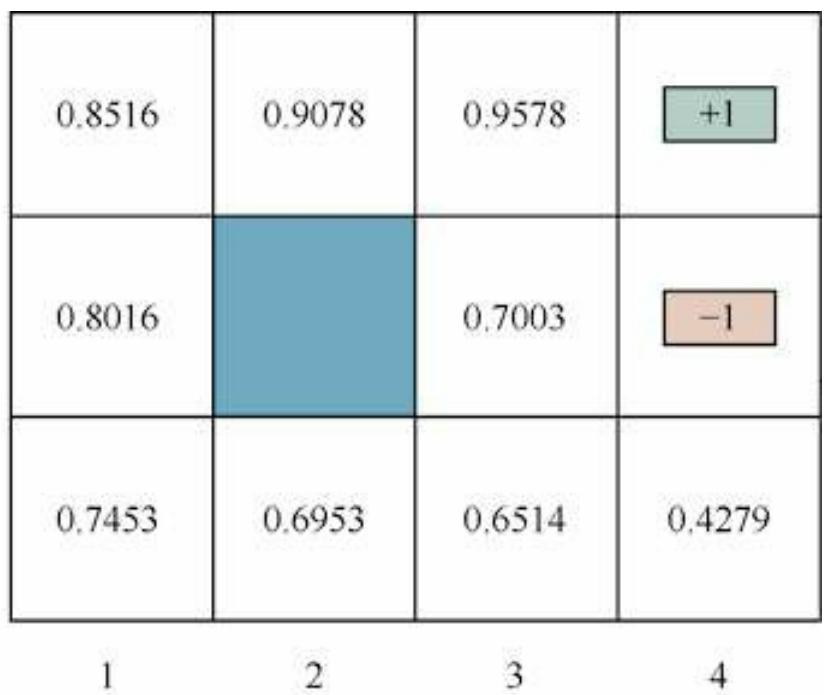  
图17-3 ，向非终止状态转移的奖励 $\gamma =$ 的4×3世界的状态效用

效用函数U (s)允许智能体通过使用第16章的最大化期望效用的原则来选择动作，也就是说，选择使下一步奖励加上后续状态的期望折扣效用最大化的动作：

$$
\pi^ {*} (s) = \underset {a \in A (s)} {\operatorname {a r g m a x}} \sum_ {s ^ {\prime}} P \left(s ^ {\prime} \mid s, a\right) \left[ R \left(s, a, s ^ {\prime}\right) + \gamma U \left(s ^ {\prime}\right) \right] \tag {17-4}
$$

我们已经定义状态效用U (s)为从s点出发的折扣效用的期望和。在这基础上，我们可以得到状态效用与它的相邻状态的效用之间的直接关系：假设智能体选择了最优动作，状态效用是下一次转移的期望奖励加上下一个状态的折扣效用。 也就是说，状态效用为

$$
U (s) = \max  _ {a \in A (s)} \sum_ {s ^ {\prime}} P \left(s ^ {\prime} \mid s, a\right) \left[ R \left(s, a, s ^ {\prime}\right) + \gamma U \left(s ^ {\prime}\right) \right] \tag {17-5}
$$

该式被称为 贝尔曼方程 （Bellman equation），以理查德·贝尔曼（Richard Bellman）命名（Bellman, 1957）。状态的效用［根据式（17-2），它们被定义为后续状态序列的期望效用］是贝尔曼方程组的解。实际上，正如我们在17.2.1节中所展示的那样，它是方程组的 唯 一 解。

让我们看看 4×3世界的一个贝尔曼方程。 U (1, 1)的表达式为

$$
\begin{array}{l} \max  \left\{\left[ 0. 8 (- 0. 0 4 + \gamma U (1, 2)) + 0. 1 (- 0. 0 4 + \gamma U (2, 1)) + 0. 1 (- 0. 0 4 + \gamma U (1, 1)) \right], \right. \\ [ 0. 9 (- 0. 0 4 + \gamma U (1, 1)) + 0. 1 (- 0. 0 4 + \gamma U (1, 2)) ], \\ [ 0. 9 (- 0. 0 4 + \gamma U (1, 1)) + 0. 1 (- 0. 0 4 + \gamma U (2, 1)) ], \\ [ 0. 8 (- 0. 0 4 + \gamma U (2, 1)) + 0. 1 (- 0. 0 4 + \gamma U (1, 2)) + 0. 1 (- 0. 0 4 + \gamma U (1, 1)) ] \} \\ \end{array}
$$

其中的4个表达式对应于 Up 、 Left 、 Down 和 Right 移动。我们代入图17-3中的数值，当 $\gamma = 1$ 时，我们发现 $U p$ 是最优动作。

另一个重要的量是 动作效用函数 （action-utility function），或称 Q函数 （Q-function）： Q ( s , a)是在给定状态下采取给定动作的期望效用。Q函数显然与效用有关：

$$
U (s) = \max  _ {a} Q (s, a) \tag {17-6}
$$

而且，最优策略可以按照如下方式从Q函数中提取出来：

$$
\pi^ {*} (s) = \underset {a} {\operatorname {a r g m a x}} Q (s, a) \tag {17-7}
$$

我们也可以推导出关于Q函数的贝尔曼方程，注意，采取动作的期望总奖励是其即时奖励加上结果状态的折扣效用，这反过来可以用Q函数表示：

$$
\begin{array}{l} Q (s, a) = \sum_ {s ^ {\prime}} P \left(s ^ {\prime} \mid s, a\right) \left[ R \left(s, a, s ^ {\prime}\right) + \gamma U \left(s ^ {\prime}\right) \right] \\ = \sum_ {s ^ {\prime}} P \left(s ^ {\prime} \mid s, a\right) \left[ R \left(s, a, s ^ {\prime}\right) + \gamma \max  _ {a ^ {\prime}} Q \left(s ^ {\prime}, a ^ {\prime}\right) \right] \tag {17-8} \\ \end{array}
$$

通过求解关于 $U$ （或Q ）的贝尔曼方程，我们可以得到所需的最优策略。Q函数在求解MDP的算法中经常出现，所以我们采用下面的定义：

functionQ-VALUE(mdp,s,a,Ureturns-个效用值

$$
\operatorname {r e t u r n} \sum_ {s ^ {\prime}} P \left(s ^ {\prime} \mid s, a\right) \left[ R \left(s, a, s ^ {\prime}\right) + \gamma U \left[ s ^ {\prime} \right] \right]
$$

# 17.1.3 奖励规模

第16章指出效用函数的规模可以是任意的：仿射变换使最优决策保持不变。我们可以把 $U ( s )$ 替换为 $U ^ { \prime \prime } ( s ) = m U ( s ) + b$ ，其中 $m$ 和 $^ { b }$ 是任意常数， $m > 0$ 。从效用作为奖励的折扣和的定义不难看出，在MDP中，类似的奖励变换将使最优策略保持不变：

$$
R ^ {\prime} (s, a, s ^ {\prime}) = m R (s, a, s ^ {\prime}) + b
$$

然而结果表明，效用的加性奖励分解导致在定义奖励时具有更大的自由度。设 是关于状态 s的 任意 函数，则根据函数设计定理 （shaping theorem），以下变换能够保持最优策略不变：

$$
R ^ {\prime} (s, a, s ^ {\prime}) = R (s, a, s ^ {\prime}) + \gamma \Phi (s ^ {\prime}) - \Phi (s) \tag {17-9}
$$

为了证明这个定理的正确性，我们需要证明两个MDP—— M 和 M ' ——具有相同的最优策略，只要它们仅在如式（17-9）指定的奖励函数上有所区别。我们从关于Q 的贝尔曼方程开始考虑，对于MDPM，它的Q函数为

$$
Q (s, a) = \sum_ {s ^ {\prime}} P \left(s ^ {\prime} \mid s, a\right) \left[ R \left(s, a, s ^ {\prime}\right) + \gamma \max  _ {a ^ {\prime}} Q \left(s ^ {\prime}, a ^ {\prime}\right) \right]
$$

现在令 ，将其代入这个等式，我们有

$$
Q ^ {\prime} (s, a) + \Phi (s) = \sum_ {s ^ {\prime}} P \left(s ^ {\prime} \mid s, a\right) \left[ R \left(s, a, s ^ {\prime}\right) + \gamma \max  _ {a ^ {\prime}} \left(Q ^ {\prime} \left(s ^ {\prime}, a ^ {\prime}\right) + \Phi \left(s ^ {\prime}\right)\right) \right]
$$

这可以简化为

$$
\begin{array}{l} Q ^ {\prime} (s, a) = \sum_ {s ^ {\prime}} P \left(s ^ {\prime} \mid s, a\right) \left[ R \left(s, a, s ^ {\prime}\right) + \gamma \Phi \left(s ^ {\prime}\right) - \Phi (s) + \gamma \max  _ {a ^ {\prime}} Q ^ {\prime} \left(s ^ {\prime}, a ^ {\prime}\right) \right] \\ = \sum_ {s ^ {\prime}} P \left(s ^ {\prime} \mid s, a\right) \left[ R ^ {\prime} \left(s, a, s ^ {\prime}\right) + \gamma \max  _ {a ^ {\prime}} Q ^ {\prime} \left(s ^ {\prime}, a ^ {\prime}\right) \right] \\ \end{array}
$$

换句话说， $Q ^ { \prime } ( s , a )$ 满足MDP $M ^ { \prime }$ 的贝尔曼方程。现在我们使用式（17-7）提取 $M ^ { \prime }$ 的最优策略：

$$
\pi_ {M ^ {\prime}} ^ {*} (s) = \underset {a} {\operatorname {a r g m a x}} Q ^ {\prime} (s, a) = \underset {a} {\operatorname {a r g m a x}} Q (s, a) - \Phi (s) = \underset {a} {\operatorname {a r g m a x}} Q (s, a) = \pi_ {M} ^ {*} (s)
$$

函数 $\Phi ( s )$ 通常被称为势 （potential），这与产生电场的电势（电压）类似。 $p { \tilde { \mathcal { D } } } ( s ) - { \tilde { \mathcal { D } } } ( s )$ 项起着势的梯度的作用。因此，如果 $\Phi ( \sigma )$ 在效用更高的状态下具有更高的值，那么在奖励里加上 $p { \tilde { \mathcal { D } } } ( s ) - { \tilde { \mathcal { D } } } ( s )$ 就会导致智能体的效用上升。

乍一看，我们可以在不改变最优策略的情况下以这种方式修改奖励，这似乎有违直觉。但我们曾说过，如果奖励函数处处为零，那么所有的策略都是最优的，这将对我们理解该定理有所帮助。这意味着，根据函数设计定理，对于形式为 $R ( s , a , s ^ { \prime } ) = \gamma \phi ( s ^ { \prime } ) - \phi ( s ) )$ 的任何基于势的奖励，所有的策略都是最优的。直觉上，这是因为在这样的奖励下，智能体从 A到B的路径是无关紧要的（当 $\gamma = 1$ 时，这是最容易看出的：沿着任何路径的奖励总和退化为 ${ \tilde { \Phi } } ( B ) - { \tilde { \Phi } } ( A )$ ，所以所有路径都一样好。）因此，在任何其他奖励中添加基于势的奖励不应该改变最优策略。

函数设计定理提供的灵活性意味着我们可以通过让即时奖励更直接地反映智能体应该做什么来帮助它进行决策。实际上，如果设 ${ \pmb { \mathbb { O } } } ( { \pmb { \sigma } } ) = { \pmb { U } } ( { \pmb { \mathscr { s } } } )$ ，则关于修正奖励 $R ^ { \prime }$ 的贪心策略 $\pi _ { \theta }$ 也是最优策略：

$$
\begin{array}{l} \pi_ {G} (s) = \underset {a} {\operatorname {a r g m a x}} \sum_ {s ^ {\prime}} P \left(s ^ {\prime} \mid s, a\right) R ^ {\prime} \left(s, a, s ^ {\prime}\right) \\ = \underset {a} {\operatorname {a r g m a x}} \sum_ {s ^ {\prime}} P \left(s ^ {\prime} \mid s, a\right) \left[ R \left(s, a, s ^ {\prime}\right) + \gamma \Phi \left(s ^ {\prime}\right) - \Phi (s) \right] \\ = \operatorname {a r g m a x} _ {a} \sum_ {s ^ {\prime}} P \left(s ^ {\prime} \mid s, a\right) \left[ R \left(s, a, s ^ {\prime}\right) + \gamma U \left(s ^ {\prime}\right) - U (s) \right] \\ = \underset {a} {\operatorname {a r g m a x}} \sum_ {s ^ {\prime}} P \left(s ^ {\prime} \mid s, a\right) \left[ R \left(s, a, s ^ {\prime}\right) + \gamma U \left(s ^ {\prime}\right) \right] \\ = \pi^ {*} (s) \quad [ \text {根 据 式} (1 7 - 4) ] \\ \end{array}
$$

当然，为了设定 $\Phi ( s ) = U ( s )$ ，我们首先需要知道 U ( s )，正所谓天下没有免费的午餐，但尽管如此，定义一个尽可能有益的奖励函数仍然有相当大的价值。这正是动物训练师所做的，他们在实现目标的序列的每一步中给动物提供一个小奖励。

# 17.1.4 表示MDP

表示 与 $R ( s , a , s )$ 的最简单方式是使用一个大小为 $| \mathbb { S } | ^ { 2 } | A |$ 的大型三维表格。对于诸如4×3世界这样的小问题，这个方法是可行的，对于这个世界，这个表格有11 2 ×4 =484个条目。在一些情况下，表格是 稀疏的 （sparse）——大多数条目是0，因为每个状态s只能转换到有限数量的状态 $s ^ { \prime }$ ——这意味着表格的大小是 $O ( | \mathbf { S } | | A | )$ 。但对于规模更大的问题，即便是稀疏表格，其规模也是巨大的。

正如在第16章中，贝叶斯网络扩展了动作节点和效用节点以创建决策网络一样，我们可以使用决策

节点、奖励节点和效用节点扩展动态贝叶斯网络（DBN）（见第14章），来创建 动态决策网络（dynamic decision network，DDN），以表示MDP。

用第2章的术语来说，DDN是 因子化表示 （factored representation），与原子表示相比，它们通常具有指数级的复杂度优势，因此可以建模相当大量的现实问题。

图17-4所示的是基于图14-13b中DBN的一个稍微真实的可以自行充电的移动机器人模型的一些元素。状态S 被分解为4个状态变量：

●X 由网格上的二维位置和方向组成；

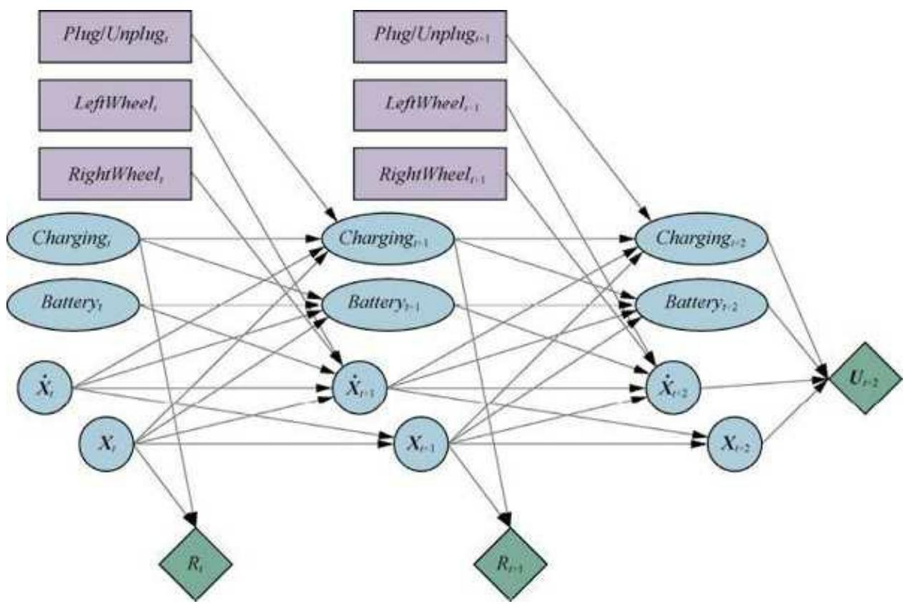  
图17-4以电池电量、充电状态、位置和速度为状态变量，左右轮机动和充电为动作变量的移动机器人动态决策网络

● 是 X t 的变化率； $\boldsymbol { \cal X } _ { t }$   
●Charging 当机器人接通电源时为真；  
● Battery t是电池电量，在我们的模型中是范围0,…, 5的整数。

MDP的状态空间是这4个变量值域的笛卡儿积。动作是指动作变量的集合A ，它包含Plug /Unplug ，拥有3个值（ plug 、 unplug 与 noop ）； LeftWheel ，为输送至左轮的电力； RightWheel，为输送至右轮的电力。MDP的动作集合是这3个变量的值域的笛卡儿积。注意，每个动作变量只影响状态变量的一个子集。

整体转移模型为条件分布 ，它可以从DDN中根据条件概率的乘积计算出来。这里的奖励是仅取决于位置 X （如到达目的地）和 Charging 的单变量，这是因为机器人必须为用电付费，在这个模型中，奖励并不取决于动作或结果状态。

图17-4中的网络规划了未来的2步。注意，这个网络包含了时刻t和t+1的奖励节点，以及时刻t+2的效用节点。这是因为智能体必须最大化未来所有奖励的（折扣）总和，而U (X )代表从 t+

3起所有奖励的奖励。如果可以得到一个对 $U$ 的启发式近似，它可以以这种方式包括在MDP表示中，并用于取代进一步的扩展。这种方法与第5章中对博弈使用的有限深度搜索和启发式评价函数的方法密切相关。

另一个有趣的MDP是俄罗斯方块（图17-5a）。该游戏的状态变量是 CurrentPiece 、 NextPiece 和一个位向量值变量 Filled ，该变量为 $1 0 \times 2 0$ 个棋盘位置中的每个位置填充一位。因此，状态空间有$7 \times 7 \times 2 ^ { 2 0 0 } \approx 1 0 ^ { 6 2 }$ 个状态。俄罗斯方块的DDN如图17-5b所示。注意， Filled $t + 1$ 是 Filled t 与A t的确定性函数。事实证明，俄罗斯方块的每一个策略都是恰当的（到达一个终止状态）：尽管人们尽了最大努力清空棋盘，但最终棋盘还是会被填满。

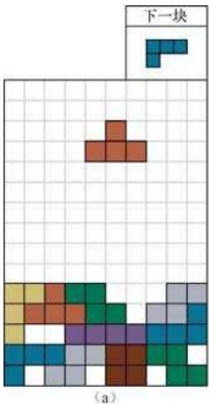

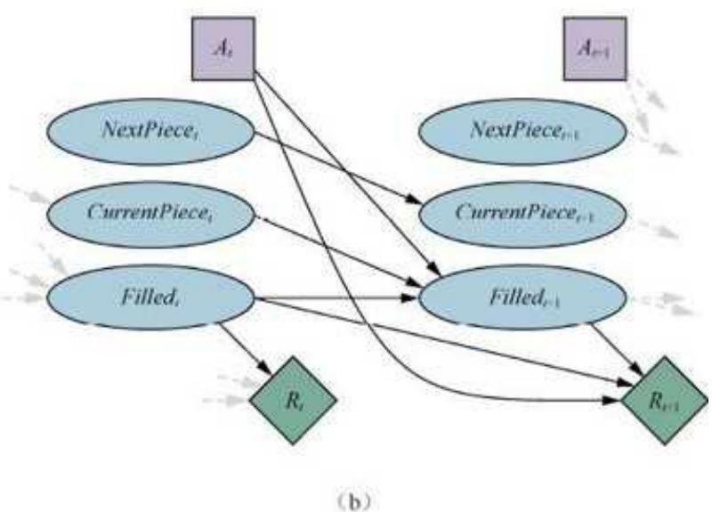  
图17-5（a）俄罗斯方块游戏。位于顶部中心的T型块可以落在任何方向和任何水平位置。如果某一行被补全，则该行消失，上方的行向下移动，智能体得1分。下一块（这里是右上方的L形块）成为当前的一块，并出现一个新的下一块，从7种类型中随机选择。如果棋盘被填满，游戏结束。（b）俄罗斯方块MDP的DDN

# 17.2 MDP的算法

本节中，我们将介绍求解MDP的4种不同算法。前三种方法分别为价值迭代 （valueiteration）、策略迭代 （policy iteration）和 线性规划 （linear programming），它们用于离线生成精确解。第四种方法是一族在线近似算法，它包括 蒙特卡罗规划 （Monte Carlo planning）。

# 17.2.1 价值迭代

贝尔曼方程［式（17-5）］是求解MDP的价值迭代算法的基础。如果MDP中有n 个可能状态，则我们可以得到 $n$ 个方程，且每个方程对应一个状态。 $n$ 个方程包含n个未知数——状态的效用。我们希望通过联立这些方程进行求解来找到效用函数。这里存在一个问题：这些方程是非线性的，因为max算子不是线性算子。虽然线性方程组可以用线性代数的方法快速求解，但非线性方程组难度更高。迭代 方法是一种可以尝试的方法。我们从效用的任意初始值出发计算方程的右侧，并将其值代入方程的左侧，从而根据其邻居的效用更新每个状态的效用。我们重复这个过程，直到达到平衡。

令 U i( s )为状态 s 在第 i 次迭代时的效用值。那么一个迭代步，也称为 贝尔曼更新 （Bellmanupdate），如下所示：

$$
U _ {i + 1} (s) \leftarrow \max  _ {a \in A (s)} \sum_ {s ^ {\prime}} P \left(s ^ {\prime} \mid s, a\right) \left[ R \left(s, a, s ^ {\prime}\right) + \gamma U _ {i} \left(s ^ {\prime}\right) \right] \tag {17-10}
$$

其中，更新假设在每次迭代时同时应用于所有状态。如果我们无限次地应用贝尔曼更新，就可以保证达到平衡（见后面的“价值迭代收敛性”小节），在这种情况下，最终的效用值必定是贝尔曼方程的解。实际上，它们也是唯一解，对应的策略［由式（17-4）得到］是最优的。图17-6显示了详细的算法，包括当效用“足够接近”时的终止条件。注意，我们使用了17.1.2节定义的函数Q-V al ue。

functionVALUE-ITERATION(mdp,ε）returns一个效用函数

inputs:mdp，具有状态S、动作A（s）、转移模型P(s|s，a）、奖励 $R ( s , a , s ) _ { \setminus }$ 折扣y的MDPε，任意状态效用允许的最大误差

local variables: $U , U ^ { \prime }$ S中状态的效用向量，初始为0$\delta$ ，任何状态的效用的最大相对变化

repeat $U\gets U^{\prime};\delta \gets 0$ for each状态s in S do $U^{\prime}[s]\leftarrow \max_{a\in A(s)}Q\text{-V}$ A(s) VALUE(mdp,s,a,U) if $|U^{\prime}[s] - U[s]| > \delta$ then $\delta \leftarrow |U^{\prime}[s] - U[s]|$ until $\delta \leqslant \varepsilon (1 - \gamma) / \gamma$ return U

图17-6 计算状态效用的价值迭代算法。终止条件来自式（17-12）

我们可以将价值迭代应用于图17-1a中的4×3世界。从初始值为零开始，效用的演变如图17-7a所示。注意，与(4,3)不同距离的状态逐渐累积负奖励，直到智能体找到通往(4,3)的路径，这时效用才开始增加。我们可以把价值迭代算法看作通过局部更新的方式在状态空间中传播信息。

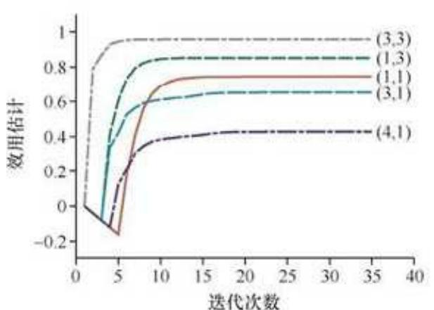

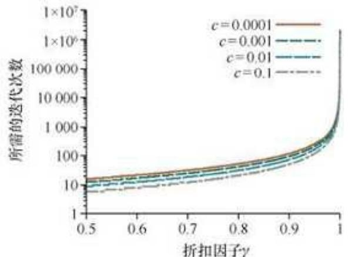  
  
图17-7 （a）显示被选择状态使用价值迭代的效用演变的图。（b）对于 $c$ 不同的值，为保证误差最多为 所需的价值迭代次数，作为折扣因子 的函数 $\varepsilon = \varepsilon$ $\gamma$

价值迭代收敛性

我们已经声明，价值迭代最终收敛于贝尔曼方程的唯一解。在本节中，我们将解释出现这种情况的原因。在此过程中，我们将引入一些有用的数学思想，并获得在算法提前终止时评估返回的效用函数误差的一些方法，这是很有用的，因为它意味着我们不必永远运行下去。本节是相当技术性的。

用来说明价值迭代收敛的基本概念是压缩 （contraction）。粗略地说，压缩是一个单变量函数，当它依次应用于两个不同的输入时，产生的两个输出值比原始输入“更接近”，并且至少近一个常数因子。例如，“除以2”函数是一个压缩，因为任意两个数除以2后，它们的差就减半了。注意，“除以2”函数有一个不动点，也就是零，这个点在函数的作用下是不变的。从这个例子中，我们可以看出压缩的两个重要性质。

●压缩只有一个不动点，如果一个函数有两个不动点存在，那么它们在应用函数时不会靠得更近，因此该函数不是压缩。  
● 当任意一个变量输入到压缩函数后，输出值必须更接近不动点（因为不动点不移动），所以变量在压缩的反复应用后总是能在极限下收敛到不动点。

现在，假设我们将贝尔曼更新［式（17-10）］视为一个算子B，同时应用于更新每个状态的效用。那么贝尔曼方程变成U =BU ，贝尔曼更新方程可以写成

$$
U _ {i + 1} \leftarrow B U _ {i}
$$

接下来，我们需要一种方法来度量效用向量之间的距离。我们将使用 最大范数 （max norm），它通过最大分量的绝对值来度量向量的“长度”：

$$
\| U \| = \max  _ {s} | U (s) |
$$

有了这个定义，两个向量间的“距离” $\| U - U \|$ 为任意两个对应元素之间的最大差值。本节的主要结果如下：令 $U _ { i }$ 与 与 是任意两个效用向量，则我们有 $U _ { \frac { 1 } { 2 } } ^ { 1 }$

$$
\left\| B U _ {i} - B U _ {i} ^ {\prime} \right\| \leqslant \gamma \left\| U _ {i} - U _ {i} ^ {\prime} \right\| \tag {17-11}
$$

也就是说， 贝尔曼更新是效用向量空间上一个因子为 的压缩。（习题17.VICT提供了一些指导来证明这一观点。）因此，从压缩的一般性质来看，只要 $\gamma < 1$ ，价值迭代总是收敛于贝尔曼方程的唯一解。

我们也可以利用压缩性质来分析解的收敛 速率 。特别地，我们可以将式（17-11）中的 $U ^ { \prime } i$ 替换为真实效用 $U$ ，其中 $B U = U$ 。然后，我们得到如下不等式：

$$
\| B U _ {i} - U \| \leqslant \gamma \| U _ {i} - U \|
$$

如果把 $\| U _ { i } - U \|$ 看作估计 $U _ { i }$ 的 误差 ，我们看到误差在每次迭代中至少以因子 减少。因此，价值迭代的收敛速度是指数级的。我们可以按如下方式计算所需的迭代次数：首先，回想一下式（17-1），所有状态的效用都以 $\pm R _ { \mathrm { m a x } } / ( 1 - \gamma )$ 为界。这意味着初始误差最大为

。假设我们运行 N 次迭代，以获得误差至多为 的结果。然 $\lVert U _ { 0 } - U \rVert \leqslant 2 R _ { \mathrm { m a x } } / ( 1 - y )$ $N$ $\pmb { \varepsilon }$ 后，因为误差每次至少压缩了 倍，我们要求 $\gamma ^ { N } \cdot 2 R _ { \mathrm { m a x } } / ( 1 - \gamma ) \leqslant \varepsilon$ 。通过取对数，我们得到

$$
N = \left[ \log \left(2 R _ {\max } / \varepsilon (1 - \gamma)\right) / \log (1 / \gamma) \right]
$$

$N$ 次迭代是足够的。图17-7b显示了在 $e / R _ { \mathrm { m a x } }$ 的不同比值下， $N$ 随 $\gamma$ 的变化。好消息是，由于指数级的快速收敛， $N$ 不太依赖于 比率。坏消息是，当 接近1时， $N$ 迅速增长。如果使变小，我们可以得到快速的收敛，但这同时明显地使智能体期限变短，因此可能导致错过智能体动作的长期影响。

上一段中的误差界限给出了一些影响算法运行时间的因素，但根据这些因素决定何时停止迭代的方法有时过于保守。在考虑后一个目的时，我们可以在任何给定的迭代中使用一个将误差与贝尔曼更新的大小相关联的界限。从压缩性质［式（17-11）］可以看出，如果更新较小（即任何状态的效用变化不大），那么与真实效用函数相比，误差也较小。更准确地说：

如果 $\lVert U _ { i + 1 } - U _ { i } \rVert < \varepsilon ( 1 - \gamma ) / \gamma , \mathrm { ~ } \mathbb { A } \rVert \left. U _ { i + 1 } - U < \varepsilon \right. _ { \mathrm { ~ ( 1 7 - 1 2 ) ~ } }$

这是图17-6的V alue -I teration 算法中使用的终止条件。

到目前为止，我们已经分析了由价值迭代算法返回的效用函数的误差。然而，智能体真正关心的是，如果在它这个效用函数的基础上做出决策，它会表现得如何。 假设经过 i 次价值迭代，智能体得到了真实效用 $U$ 的估计 $U _ { i }$ ，并利用 $U _ { i }$ 一步前瞻得到最大期望效用（MEU）策略 ［如式（17-4）所示］。智能体最终的行为会和最优行为一样好吗？对任何实际的智能体来说，这都是一个至关重要的问题，而答案是肯定的。 $U ^ { \mu } ( s )$ 是从 s 开始执行 $\pi _ { i }$ 获得的效用， 策略损失 （policyloss） 是智能体执行 而非最优策略 的最大可能损失。 的策略损失与 U i的误 $\pi _ { i }$ $\pmb { \pi }$ $\pi _ { i }$ $U _ { i }$ 差可以通过以下不等式联系起来：

如果 $\| v _ { i } - v \| < \theta$ 则 $\| { U } ^ { \ast _ { 1 } } - { U } \| < 2 \varepsilon$ （17-13）

在实践中，通常在 $U _ { i }$ 尚未收敛之前， $\pi _ { i }$ 就已经达到最优。图17-8显示了在 $\gamma = 0 . 9$ 的 $4 { \times } 3$ 世界中，随着价值迭代过程的进行， $U _ { i }$ 中的最大误差和策略损失如何趋向于零。当 $i = 5$ 时，尽管 $U _ { i }$ 的最大误差仍然与0.51，策略 $\pi _ { i }$ 已经达到了最优。

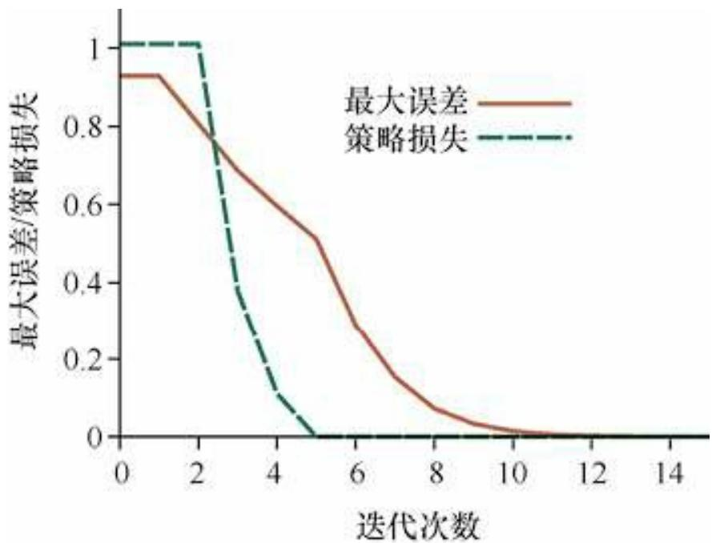  
图17-8 效用估计的最大误差 $\lVert \boldsymbol { U } _ { i } - \boldsymbol { U } \rVert$ 与策略损失 ，作为4×3世界上价值迭代的迭代次数的函数

现在我们了解了在实践中使用价值迭代所需的一切知识。我们知道它会收敛到正确的效用，如果迭代在有限次数后停止，我们也可以限制效用估计的误差，进而可以限制执行相应的MEU策略时导致的策略损失。最后强调一点，本节的所有结果都基于折扣因子 的前提。如果 ，且环境包含终止状态，则可以我们推导出一组类似的收敛结果和误差界。

# 17.2.2 策略迭代

在17.2.1节中，我们发现，即使效用函数估计不准确，也有可能得到最优策略。如果一个动作明显优于其他所有动作，那么有关该状态的效用估计就不需要很精确。这一见解暗示了另一种寻找最优策略的方法。 策略迭代 （policy iteration）算法从某个初始策略 $\pi _ { 0 }$ 开始，交替进行以下两个步骤。

● 策略评估 （policy evaluation）：给定策略 ，计算 ， $\pmb { \pi _ { t } }$ 即执行 $\pmb { \pi _ { t } }$ 后每个状态的效用。  
● 策略改进 （policy improvement）：使用基于 $U _ { i }$ 的一步前瞻［式（17-4）］计算新的MEU策略$\pmb { \pi } _ { \pmb { \mu } + 1 }$ 。

如果策略改进步骤对效用不产生任何改变，该算法将终止。我们已经知道效用函数 $U _ { i }$ 是贝尔曼更新的不动点，因此它是贝尔曼方程的解，并且 $\pmb { \pi _ { t } }$ 必定是最优策略。由于对有限状态空间只有有限多个策略，并且我们可以证明每次迭代都能产生更好的策略，因此策略迭代必定会终止。该算法如图17-9所示。与价值迭代一样，我们使用了17.1.2节定义的函数Q-V alue。

function POLICY-ITERATION(mdp)returns一个策略

inputs:mdp，状态为S、动作为A（s）、转移模型为 $P ( s ^ { \prime } \mid s , a )$ 的一个MDP

localvariables:U，一个S中状态的效用向量，初始为0

$\pi$ ，一个由状态索引的策略向量，初始为随机

repeat

$$
\begin{array}{l} U \leftarrow \text {P O L i c y - E V A L U A T I O N} (\pi , U, m d p) \\ \text {u n c h a n g e d}? \leftarrow \text {t r u e} \\ \end{array}
$$

foreach状态s in Sdo

$$
\begin{array}{l} a ^ {*} \leftarrow \operatorname {a r g m a x} Q - V A L U E (m d p, s, a, U) \\ a \in A (s) \\ \end{array}
$$

$$
\begin{array}{l} i f Q - V A L U E (m d p, s, a ^ {*}, U) > Q - V A L U E (m d p, s, \pi [ s ], U) t h e n \\ \pi [ s ] \leftarrow a ^ {*}; \text {u n c h a n g e d}? \leftarrow \text {f a l s e} \\ \end{array}
$$

$$
\begin{array}{l} \text {u n t i l} \\ \text {r e t u r n} \pi \\ \end{array}
$$

图17-9计算最优策略的策略迭代算法

如何实现Policy-Evaluation ？事实证明，实现这一点比求解标准贝尔曼方程（这是价值迭代所做的）更简单，因为每个状态中的动作都是由策略确定的。在第i次迭代时，策略 $\pmb { \pi _ { t } }$ 指定了状态s下的动作 。这意味着我们有了一个简化版的贝尔曼方程（17-5），它将 $\pmb { \pi _ { t } }$ 下 $s$ 的效用与其邻居的效用联系起来：

$$
U _ {i} (s) = \sum_ {s ^ {\prime}} P \left(s ^ {\prime} \mid s, \pi_ {i} (s)\right) \left[ R \left(s, \pi_ {i} (s), s ^ {\prime}\right) + \gamma U _ {i} \left(s ^ {\prime}\right) \right] \tag {17-14}
$$

例如，假设 $\pmb { \pi _ { t } }$ 是图17-2a所示的策略，则我们有 $\pi _ { i } ( 1 , 1 ) = U p$ ， $\pi _ { i } ( 1 , 2 ) = U p$ ，以此类推，此时简化贝尔曼方程为

$$
U _ {i} (1, 1) = 0. 8 [ - 0. 0 4 + U _ {i} (1, 2) ] + 0. 1 [ - 0. 0 4 + U _ {i} (2, 1) + 0. 1 [ - 0. 0 4 + U _ {i} (1, 1) ] ]
$$

$$
U _ {i} (1, 2) = 0. 8 [ - 0. 0 4 + U _ {i} (1, 3) ] + 0. 2 [ - 0. 0 4 + U _ {i} (1, 2) ]
$$

以此类推，这一方法适用于所有的状态。重要的一点是这些方程是线性的，因为“max”算子被去掉了。如果MDP包含 n 种状态，则我们有 n 个带有 n 个未知数的线性方程，这些方程可以用标准线性代数方法在 O (n 3)时间内精确求解。如果转移模型是稀疏的，也就是说，如果每个状态只向少量的其他状态转移，那么求解过程可以进行得更快。

对于小的状态空间，使用精确求解方法进行策略评估通常是最有效的方法。对于大的状态空间，O(n 3)的时间复杂度可能过高。幸运的是，我们无须做出精确的策略评估。相反，我们可以执行一些简化的价值迭代步骤（简化的原因是因为策略是固定的），以给出相当好的效用近似值。这个过程的简化贝尔曼更新是

$$
U _ {i + 1} (s) \leftarrow \sum_ {s ^ {\prime}} P \left(s ^ {\prime} \mid s, \pi_ {i} (s)\right) \left[ R \left(s, \pi_ {i} (s), s ^ {\prime}\right) + \gamma U _ {i} \left(s ^ {\prime}\right) \right]
$$

通过重复几次该更新，我们可以高效地产生下一个效用估计。相应的算法被称为修正策略迭代（modified policy iteration）。

到目前为止，我们所描述的算法都要求一次性更新所有状态的效用或策略。事实证明，这并不是严格必要的。事实上，在每次迭代中，我们可以选择状态的任意子集，并将 任意一种更新（策略改进或简化价值迭代）应用于该子集。这种非常通用的算法被称为 异步策略迭代 （asynchronouspolicyiteration）。给定初始策略和初始效用函数的一定条件，异步策略迭代也能保证收敛到最优策略。能够自由选择任意状态集合进行处理意味着我们可以设计更有效的启发式算法，例如，一个专注于更新好的策略可能达到状态的效用值的算法。为永远不会采取的动作的结果做规划是没有意义的。

# 17.2.3 线性规划

我们已经在4.2节中简要介绍过 线性规划 （linear programming，LP），它是一个表述约束优化问题的一般方法，并有许多工业强度的LP求解器。考虑到贝尔曼方程包含大量的求和与最大值，不难想到，求解MDP可以简化为求解一个适当表述的线性规划。

该表述的基本想法是将每个状态s的效用 U (s)作为LP中的变量，这是基于最优策略的效用是与贝尔曼方程一致的、可达到的最高效用这一事实。表述为LP问题后，我们的目标是，对于每个状态 s和动作 a ，对所有满足下式的 s 最小化 U ( s )：

$$
U (s) \geqslant \sum_ {s ^ {\prime}} P \left(s ^ {\prime} \mid s, a\right) \left[ R \left(s, a, s ^ {\prime}\right) + \gamma U \left(s ^ {\prime}\right) \right]
$$

这样一来，我们就把动态规划和线性规划联系了起来，而线性规划的算法和复杂性问题已经被研究透彻。例如，从线性规划可以在多项式时间内求解这一事实来看，我们可以证明，MDP也可以在关于状态与动作数量和指定模型所需的位数的多项式时间内求解。在实践中，LP求解器很少像动态规划那样高效地求解MDP。此外，多项式时间可能听起来不错，但实际状态的数量往往非常大。最后，应该记住的是，即使是第3章中介绍的最简单和最无知的搜索算法也在关于状态和动作数量呈线性的时间内产生结果。

# 17.2.4 MDP的在线算法

价值迭代和策略迭代都是 离线算法：和第3章的A * 算法一样，它们生成问题的最优解，然后由一个简单的智能体执行。对于足够大的MDP，例如拥有10 62 个状态的俄罗斯方块MDP，即使是多项式时间的算法也不可能求出精确的离线解。几种MDP的近似离线求解方法已被提出，这些内容将在本章末尾的参考文献与历史注释和第22章（强化学习）中进行介绍。

这里我们将考虑在线算法，它类似于第5章中用于博弈的算法，其中智能体在每个决策点进行大量计算，而不是主要使用预先计算的信息进行操作。

最直接的方法实际上可以通过对带有机会节点的博弈树的Expectiminimax算法进行简化得到：Expectimax算法构建了一个极大值节点和机会节点交替的树，如图17-10所示。（与标准Expectiminimax稍有不同，它在非终止转移和终止转移都有奖励。）评价函数可以应用于树的非终止叶节点，它们也可以由一个默认值给出。通过备份叶节点的效用值，在机会节点取平均值，在决策节点取极大值的方法，我们可以从搜索树中提取决策。

对于折扣系数 不太接近1的问题， 期限是一个有用的概念。令 $\pmb { \varepsilon }$ 为与MDP中的精确效用相比较，从有界深度的最大化期望树（expectimax tree）计算的效用的绝对误差的期望界。因此， 期限是使得深度超过规定界的任何叶节点的奖励之和小于 的树深 $H$ ，粗略地说， $H$ 之后发生的任何事情都是无关的，因为它发生于遥远的未来。因为超过 $H$ 的奖励总和受到 的限制，所以 取 的深度就足够了。因此，构建这样深度的树可以提供 $H = \lceil \log _ { \gamma } \varepsilon ( 1 - \gamma ) / R _ { \operatorname* { m a x } } \rceil$ 近乎最优的决策。例如，当 ， ， $R _ { \mathrm { m a x } } = 1$ 时，我们发现 $H = 5$ ，这似乎是合理的；但是，如果 $\gamma = 0 . 9$ ， $H = 4 4$ ，这似乎不太合理了！

除了限制深度，我们还可以考虑避免机会节点上潜在的巨大分支因子。（例如，如果DBN转移模型中的所有条件概率都是非零的，则由条件概率的乘积给出的转移概率也是非零的，即每个状态都有一定概率转移到其他状态。）

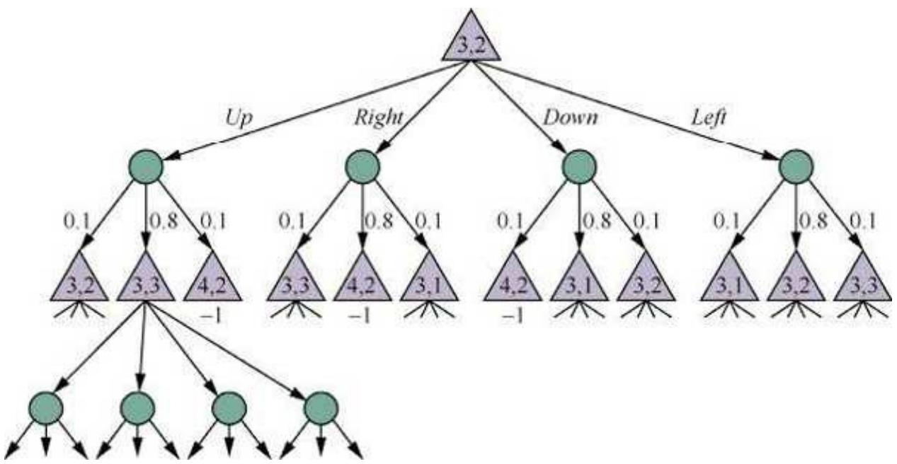  
图17-10以(3, 2)为根的4×3 MDP的最大化期望树的一部分。三角形节点是极大值节点，圆形节点是机会节点

如13.4节所述，概率分布P的期望可以通过从P生成 $N$ 个样本并使用样本均值来近似。在数学上，我们有

$$
\sum_ {s} P (x) f (x) \approx \frac {1}{N} \sum_ {i = 1} ^ {N} f \left(x _ {i}\right)
$$

因此，如果分支因子非常大（意味着存在很多可能的x值），则我们可以通过对动作的结果进行有限数量的采样来获得对机会节点值的良好近似。通常，样本将集中在最可能的 结果上，因为这些结果最有可能生成。

如果仔细观察图17-10中的树，可以发现，它并不是真正的树。例如，它的根节点(3, 2)也是一个叶节点，所以我们应该把它看作一个图，并且应该额外地约束叶节点(3, 2)的值与根节点(3,2)的值相同，因为它们是相同的状态。事实上，这种思路很快就把我们带回到贝尔曼方程，它把状态值和相邻的状态值联系起来。所探讨的状态实际上构成了原始MDP的子MDP，而这个子MDP可以使用本章中的任何算法来求解，从而产生对当前状态的决策。（边界状态通常被赋予一个固定的估计值。）

这种一般性的方法被称为 实时动态规划 （real-time dynamic programming，RTDP），它非常类似于第4章的LRTA * 。这种算法在网格世界等中等规模的域中非常有效。在俄罗斯方块等更大的域中，这种方法存在两个问题。首先，状态空间具有以下特点——任何可管理的探索状态集包含很少的重复状态，所以我们不妨使用一个简单的最大化期望树。其次，针对边界节点的简单启发式可能不足以指导智能体，特别是在奖励稀疏的情况下。

该问题的一个可能的解决方法是应用强化学习来生成更准确的启发式（见第22章）。另一种方法是使用5.4节中介绍的蒙特卡罗方法，使得智能体能在MDP上看得更远。事实上，图5-10所示的UCT算法最初是为MDP设计的，而不是为了博弈。解决MDP问题（而非博弈问题）只需要对方法进行很小的改动。改动主要源于对手（自然）是随机的，以及需要追踪奖励而不只是赢和输的这些事实。

把UCT算法应用于4×3世界，其表现并不是特别令人印象深刻。如图17-11所示，算法平均需要160次模拟才能达到0.4的总奖励，而最优策略位于初始状态的期望总收益为0.7453（见图17-3）。UCT陷入困难的一个原因是它构建的是树而不是图，并且使用的是（近似）最大化期望而不是动态规划。4×3的世界是非常“混乱的”：虽然它只有9个非终止状态，但UCT的模拟经常会进行50多个动作。

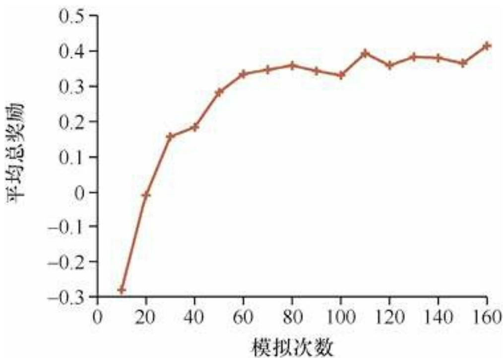  
图17-11对于4×3世界使用一个随机模拟策略，UCT的表现作为每次移动的模拟次数的函数，在每个数据点取1000次运行的平均

UCT似乎更适合处理俄罗斯方块问题，这款游戏可以通过向未来前进很长一段时间来让智能体意识到一个有潜在风险的动作最终是否会成功，或者是否会导致大量的方块堆积。习题17.UCTT探索了UCT在俄罗斯方块中的应用。一个特别有趣的问题是，一个简单的模拟策略能在多大程度上起到作用，例如一个避免产生悬垂，并将方块放置得尽可能低的策略。

# 17.3 老虎机问题

在拉斯维加斯，单臂老虎机是一种投币机。赌徒可以投入一枚硬币，拉动杠杆，并收集奖金（如果有的话）。一个 n臂老虎机 （n-armed bandit）有n 个杠杆。每个杠杆的背后是一个固定但未知的奖金概率分布，每次拉动杠杆都是从未知的分布中进行采样。

在连续的赌博中，赌徒必须在每次投币前决定拉动哪个杠杆——是奖励最多的那个，还是还没试过的那个？这是一个普遍存在于日常生活中的关于权衡的例子，即利用 当前的最佳动作来获得奖励，还是探索 之前未知的状态和动作来获得信息，这在某些情况下可以转化为更好的策略和更好的长期奖励之间的权衡。在真实世界中，一个人必须不断地做出决定，是继续舒适的生活，还是怀揣对美好生活的希望进入未知的世界。

n臂老虎机是在许多重要领域的真实问题的一个形式化模型，如决定使用n 种可能的新疗法中的哪种用来治疗一种疾病，采用n种可能的投资中的哪一种来投入你的部分储蓄，选择n 个可能的研究项目中的哪一个进行资助，选择 n 个可能的广告中的哪一个用来展示给访问特定网页的用户。

关于这个问题的早期研究始于第二次世界大战期间的美国。事实证明，这个问题太难了，以至于同盟国的科学家们建议“把这个问题抛给德国，作为迫害知识分子的终极工具”（Whittle,1979）。

事实证明，无论是在战争期间还是战后，科学家们都试图证明的关于老虎机问题的“明显正确”的事实实际上是错误的。［正如（Bradtetal.,1956）中所言，“有许多优秀的特性是最优策略所不具备的”。］例如，人们通常认为，从长远来看，最优策略最终会落在最佳的臂上，事实上，最优策略以有限的概率选择次优臂。在今天，我们对老虎机问题已经有了坚实的理论理解以及解决它们的有用算法。

老虎机问题 （banditproblem）有着几种不同的定义，其中最简洁、最通用的定义如下所示。

● 每个臂 $M _ { i }$ 是一个 马尔可夫奖励过程 （Markov reward process，MRP），也就是说，一个只有一个可能动作 $a _ { \ i }$ 的MDP。它拥有状态 $S _ { i }$ ，转移模型 $P _ { i } ( s ^ { \prime } | s , \alpha _ { i } )$ ，奖励 $R _ { 1 } ( s , a _ { 5 } , s )$ 。这个臂定义了奖励序列 $R _ { i , 0 9 } R _ { i , 1 9 } R _ { i , 2 3 } \cdots$ ，的分布，其中每个 $R _ { i , t }$ 是一个随机变量。

● 整体老虎机问题是一个MDP：状态空间由笛卡儿积 $S = S _ { 1 } \times \cdots \times S _ { n }$ 给出；动作为 a 1 ,…, a n；转移模型更新被选择的臂 $M _ { i }$ 的状态，根据其指定的转移模型；剩下的臂保持不变；折扣因子为。

这个定义很普遍，它涵盖了广泛的情况。它的关键特性在于臂是独立的，并与智能体在同一时间只能在一个臂上工作这一事实相耦合。我们可能可以定义一个更一般版本的老虎机，在这个版本中，我们可以把部分力气同时应用到所有的臂上，但所有臂上的力的总和是有界的。我们将要描述的一些基本结果也适用于这种情况。

我们很快就会看到如何在这个框架内形式化一个典型的老虎机问题，在此之前，让我们先以确定性奖励序列的简单特殊情况作为预热。设 ，假设有两个标为 M 和 $M _ { 1 }$ 的臂。多次拉动 M产生的奖励序列为0, 2, 0, 7.2, 0, 0, 0,…，而拉动 $M _ { 1 }$ 产生1,1,1,…（图17-12a）。如果我们在一开始必须选择其中一个臂，并一直拉动它，那么这个选择将通过计算每个臂的效用（总折扣奖励）来决定：

$$
\begin{array}{l} U (M) = (1. 0 \times 0) + (0. 5 \times 2) + (0. 5 ^ {2} \times 0) + (0. 5 ^ {3} \times 7. 2) = 1. 9 \\ U (M _ {1}) = \sum_ {t = 0} ^ {+ \infty} 0. 5 ^ {t} = 2. 0 \\ \end{array}
$$

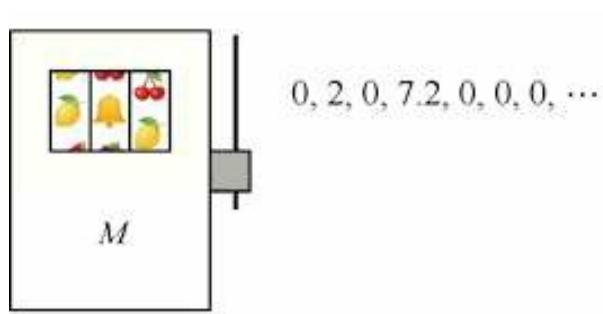

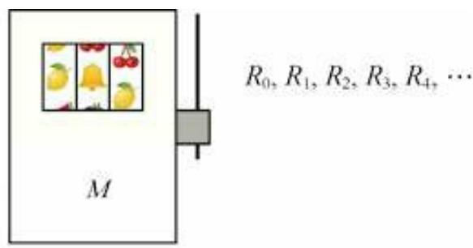

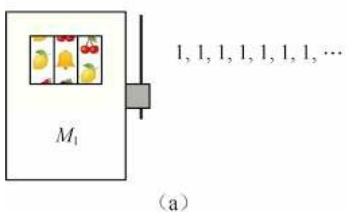

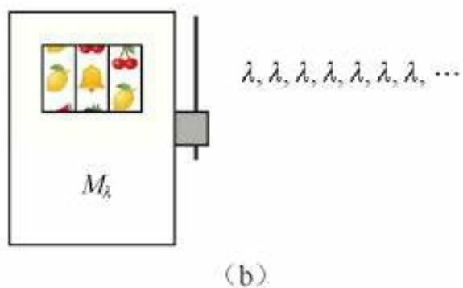  
图17-12 （a）一个简单的有两个臂的确定性老虎机问题。臂可以以任何顺序拉动，每个臂产生所示的奖励序列。（b）关于（a）中的老虎机的一个更普遍的情况，其中第一个臂给出任意奖励序列，第二个臂给出一个固定的奖励 $\lambda$

人们可能会认为最好的选择是M ，但稍加思考就会发现，从M开始，然后在第四次奖励后切换到 $M _ { 1 }$ ，会得到序列 S = 0, 2, 0, 7.2, 1, 1, 1,…，则可以计算出效用为

$$
U (S) = (1. 0 \times 0) + (0. 5 \times 2) + (0. 5 ^ {2} \times 0) + (0. 5 ^ {3} \times 7. 2) + \sum_ {t = 4} ^ {+ \infty} 0. 5 ^ {t} = 2. 0 2 5
$$

因此，在正确的时间从 $M$ 转换到 $M _ { 1 }$ 的策略S 比选择任何一种单独的臂都要好。事实上，这个策略对于这个问题S 是最优的：所有其他转换时间给予的奖励都更少。

我们稍微推广一下这种情况，现在第一个臂M产生了一个任意序列 $R _ { 0 } , R _ { 1 } , R _ { 2 } , \ldots$ （这可能是已知的或未知的），第二个臂 $M _ { \lambda }$ 产生了 ， 为已知的固定常数（见图17-12b）。这在文献中被称为 单臂老虎机 （one-armed bandit），因为它在形式上等价于有一个臂 $M$ 产生 $R _ { 0 } , R$ , R ,…，每一拉的代价是 。（拉臂M等价于不拉 臂 ，因此，它每次都会放弃 的奖 $M _ { \lambda }$ $\lambda$ 励。）如果只有一个臂，唯一的选择就是再次拉动或者停止。如果你拉动第一个臂 $T$ 次（即在第0,1,…, T – 1次），我们称 停止时间 （stopping time）是 $T$ 。

仍考虑关于 $M$ 与 $M _ { \lambda }$ 的版本，我们假设在拉第一个臂 $T$ 次后，一个最优策略最终会第一次拉动第二个臂。由于这一举动没有获得任何信息（我们已经知道收益将是 $\lambda$ ），在 $T + 1$ 时刻，我们将处于相同的情况，因此最优策略必然会做出相同的选择。

同样，我们可以说最优策略将拉动臂 $M$ 直到时间 $T$ ，然后在剩余时间转换到 $M _ { \lambda }$ 。有可能该策略会立即选择 $M _ { \lambda }$ ，即 $T = 0$ ，或者该策略从未选择 $M _ { \lambda }$ ，即 $T = + \infty$ ，或介于两者之间。现在让我们考虑 $\lambda$ 的值，使得最优策略在运行 $M$ 直到可能的最佳停止时间然后永远转换到 $M _ { \lambda }$ ，和立即选择 $M _ { \lambda }$ 之间完全中立。在这个转折点上我们有

$$
\max  _ {T > 0} E \left[ \left(\sum_ {t = 0} ^ {T - 1} \gamma^ {t} R _ {t}\right) + \sum_ {t = T} ^ {+ \infty} \gamma^ {t} \lambda \right] = \sum_ {t = 0} ^ {+ \infty} \gamma^ {t} \lambda
$$

简化为

$$
\lambda = \max  _ {T > 0} \frac {E \left(\sum_ {t = 0} ^ {T - 1} \gamma^ {t} R _ {t}\right)}{E \left(\sum_ {t = 0} ^ {T - 1} \gamma^ {t}\right)} \tag {17-15}
$$

这个等式在M提供源源不断的奖励的能力方面为它定义了一种“价值”。分数的分子代表效用，而分母可以认为是折扣时间，因此该值描述了每单位折扣时间可获得的最大效用。（一定要记住，等式中的 $T$ 是一个停止时间，它由一个停止规则控制，而不是一个简单的整数；只有当 M是一个确定性奖励序列时，它才会变成一个简单的整数。）式（17-15）中定义的值称为M的 基廷斯指数（Gittins index）。

关于基廷斯指数值得注意的是，它为任何老虎机问题提供了一个非常简单的最优策略： 拉动基廷斯指数最高的那个臂，然后更新基廷斯指数。 此外，由于臂M 的指数仅取决于该臂的性质，第一次迭代的最优决策可以在O (n )时间内计算出来，其中n 是臂的数量。因为未被选择的臂的基廷斯指数保持不变，所以在第一个决策之后的每一个决策都可以在O (1)时间内计算出来。

# 17.3.1 计算基廷斯指数

为了更好地了解该指数，让我们计算在确定性奖励序列0,2, 0, 7.2, 0,0, 0,…下，不同可能的停止时间时，式（17-15）中的分子、分母和比值：

<table><tr><td>T</td><td>1</td><td>2</td><td>3</td><td>4</td><td>5</td><td>6</td></tr><tr><td>Rt</td><td>0</td><td>2</td><td>0</td><td>7.2</td><td>0</td><td>0</td></tr><tr><td>ΣY&#x27;Rt</td><td>0.0</td><td>1.0</td><td>1.0</td><td>1.9</td><td>1.9</td><td>1.9</td></tr><tr><td>ΣY&#x27;</td><td>1.0</td><td>1.5</td><td>1.75</td><td>1.875</td><td>1.9375</td><td>1.9687</td></tr><tr><td>比值</td><td>0.0</td><td>0.6667</td><td>0.5714</td><td>1.0133</td><td>0.9806</td><td>0.9651</td></tr></table>

很明显，这个比值此后将不断减小，因为分子保持不变，而分母继续增加。因此，这个臂的基廷斯指数为1.0133，即比例达到的最大值。在该臂与 $0 < 1 \leqslant 1 . 0 1 3 3$ 的固定臂 $M _ { \lambda }$ 相结合的情况下，最优策略是从 $M$ 处获取前4个奖励，然后转换到 $M _ { \lambda }$ 。若 $\lambda > 1 . 0 1 3 3$ ，最优策略总是选择$M _ { \lambda }$ 。

为了计算一个当前状态为 $s$ 的一般臂 $M$ 的基廷斯指数，我们首先简单地观察到如下事实：在最优策略在选择臂 $M$ 与选择固定臂 $M _ { \lambda }$ 之间中立时的转折点，选择 $M$ 的价值与选择 奖励的无限序列的价值相同。

假设我们进一步扩大 $M$ ，在 $M$ 的每个状态下，智能体有两种选择：要么像之前一样继续选择 M，要么退出并获得无限的 $\lambda$ 奖励序列（见图17-13a）。这就把 $M$ 变成了一个MDP，其最优策略就是$M$ 的最优停止规则。因此，在这个新的MDP中，一个最优策略的价值等于无限 $\lambda$ 奖励序列的价值，即 $\lambda / ( 1 - \gamma )$ 。由此我们可以解出这个MDP。但是，我们不知道输入到MDP的 $\lambda$ 值，因为这正是我们试图计算的。但我们知道，最优策略在转折点处对 $M$ 与 $M _ { \lambda }$ 保持中立，所以我们可以将

获得无限 奖励序列的选择替换为返回 M 从其初始状态 s 重新开始的选择。（更准确地说，我们在每个状态中添加一个新的动作，这些动作的奖励和结果与 s 中的可获得的动作相同，见习题17.KATV。）这个新的MDP M s ，称为 重启MDP ，如图17-13b所示。

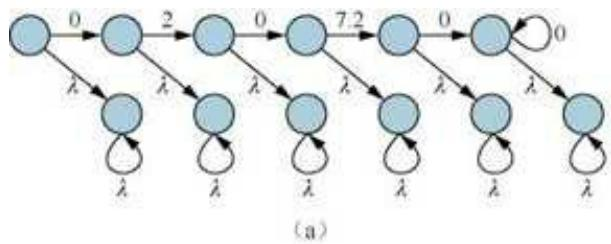

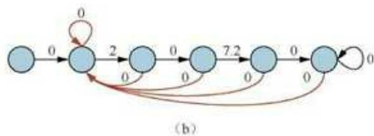  
图17-13 （a）在每个点使用一个永久转向恒定臂 的选择增广的奖励序列 $M = 0$ , 2, 0, 7.2, 0, 0, 0,…。（b）一个最优价值恰好等于（a）的最优价值的MDP，在每个点的最优策略在 $M$ 与 $M _ { x }$ 之间中立

我们可以得出一个一般性的结果：一个位于状态 s 的臂 $M$ 的基廷斯指数等于 $_ { 1 - \gamma }$ 乘以重启MDP$M ^ { s }$ 的最优策略的价值。这个MDP可以通过17.2节中介绍的任一算法进行求解。图17-13b将价值迭代应用于 $M ^ { s }$ ，得到初始状态的价值为2.0266，因此如前所述，我们得到$\lambda { = } 2 . 0 2 6 6 \cdot ( 1 - \gamma ) { = } 1 . 0 1 3 3 .$ 。

# 17.3.2 伯努利老虎机

伯努利老虎机 （Bernoullibandit）也许是最简单且最著名的老虎机问题的例子，每个臂 $M _ { i }$ 以固定但未知的概率 $\pmb { \mu } _ { t }$ 产生奖励0或1。臂 $M _ { i }$ 的状态由 $s _ { i }$ 与 $f _ { i }$ 定义，即该臂到目前为止成功（1）和失败（0）的计数；转移概率预测下一个结果为1的概率为 $( s _ { i } ) / ( s _ { i } + f _ { i } )$ ，为0的概率为

。计数被初始化为1，所以初始概率是1/2，而不是0/0。 注 马尔可夫奖励过程如图17-14a所示。

我们不能完全应用17.3.1节的变换来计算伯努利臂的基廷斯指数，因为它有无限多个状态。然而，我们可以通过求解状态达到 与 时的截断MDP来获得一个十分精确的近似。其结果如图17-14b所示。从直觉上看，结果是合理的：我们看到，通常来说，拥有较高收益概率的臂会更受青睐，但只尝试过几次的臂也有相应的 探索奖励 （exploration bonus）。例如，状态(3, 2)的指数高于状态(7, 4)的指数（0.7057对0.6922），尽管(3,2)的估计值较低(0.6 vs. 0.6364)。

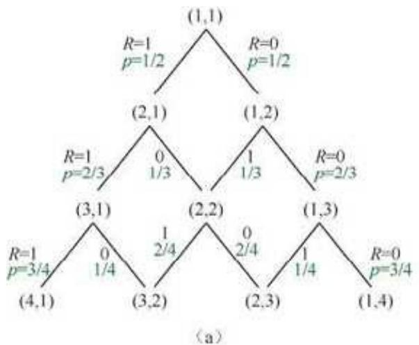

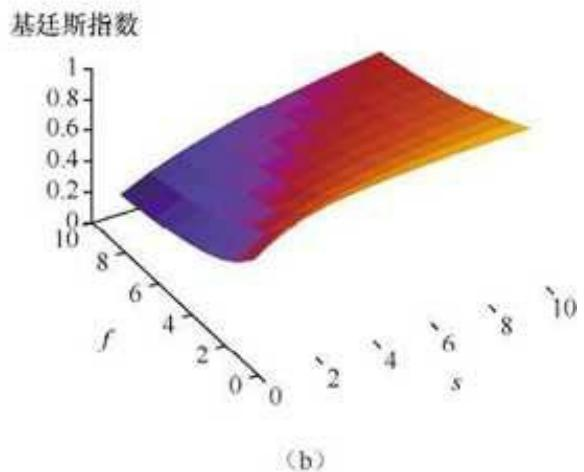  
图17-14（a）伯努利老虎机的状态、奖励与转移概率。（b）伯努利老虎机过程的状态的基廷斯指数

# 17.3.3 近似最优老虎机策略

为更现实的问题计算基廷斯指数并不容易。幸运的是，我们在17.3.2节中观察到的一般特性，即估计值和不确定性的某种组合的可取性有助于创建简单的策略，这些策略结果与最优策略“几乎一样好”。

第一种方法使用 上置信界 （upper confidence bound）或UCB的启发式，之前曾在蒙特卡罗树搜索中引入（图5-11）。其基本思想是利用每个臂的样本为臂的值建立一个 置信区间 （confidenceinterval），该区间中的值被认为具有较高置信水平，接着我们选择置信区间上界最高的臂。上界为当前均值估计值 加上该值中不确定性标准差的某个倍数。标准差与 成正比，其中 $N$ i是臂 M i被采样的次数。所以，我们得到了一个臂 M i指数的近似值：

$$
U C B \left(M _ {i}\right) = \hat {\mu} _ {i} + g (N) / \sqrt {N _ {i}}
$$

其中， g ( N )是关于 $N$ 的适当函数， $N$ 是所有臂采样的样本总数。UCB策略只选择UCB值最高的臂。需要注意的是，UCB值并不是严格意义上的指数，因为它取决于 $N$ ，即所有臂的采样的样本总数，而不仅仅是臂本身。

$g$ 的精确定义确定了相对于能预知未来策略的遗憾 （regret），能预知的未来指简单地选择最佳的臂所产生的平均奖励 。一个由黎子良和罗宾斯（Laiand Robbins, 1985）发表的著名结果表明，对于无折扣情况，没有任何算法可以得到增长速度比 $\alpha ( \log N )$ 更慢的遗憾。有几种不同的 $g$ 以及相应的UCB策略可供选择，以实现与这种增长速度相匹配，例如，我们可以采用

$$
g (N) = \left(2 \log \left(1 + N \log^ {2} N\right)\right) ^ {1 / 2}.
$$

第二种方法是 汤普森采样 （Thompson sampling）（Thompson, 1933），它在给定当前样本的情况下，根据臂是实际最优的概率随机选择一个臂。假设 $P ( \mu _ { i } )$ 是臂 $M _ { i }$ 的真实值的当前概率分布，那么实现汤普森采样的一个简单方法就是从每个 $\textit { P } _ { i }$ 生成一个样本，然后挑选出最佳的样本。这个算法的遗憾增长速度是 。

# 17.3.4 不可索引变体

人们对老虎机问题研究的动力部分源于在重病患者身上测试新疗法的任务。在这个任务中，随着时间的推移，最大化成功总数的目标显然是有意义的：每次成功的测试都意味着挽救一条生命，每次失败都意味着失去一条生命。

但是，如果我们稍微改变一下假设，就会导致出现一个不同的问题。假设我们不是为每个新病人制定最佳的治疗方案，而是在细菌样本上测试不同的药物，我们的目的是确定哪种药物最佳。在确定之后，我们将把这种药物投入生产并放弃其他药物。在这种情况下，细菌死亡不会有额外的代价，每个测试都有固定的代价，此时我们不必最小化测试失败次数；相反，我们只希望尽快做出一个好的决定。

在这些条件下选择最佳选项的任务称为 选择问题 （selection problem）。选择问题在工业环境和人事环境中普遍存在。人们通常必须决定使用哪一个供应商，或者应该雇用哪些候选者。选择问题表面上与老虎机问题相似，但它具有不同的数学性质。特别是，对于选择问题，不存在索引函数。要证明这一事实，就需要证明：在任何一种场景下，当添加了第三个臂 M 时，最优策略对两个臂M 和M 的偏好会发生改变（见习题17.SELC）。

第5章介绍了 元级 （metalevel）决策问题的概念，例如在博弈树搜索中采取行动之前决定做什么计算。这种类型的元级决策也是一个选择问题，而不是老虎机问题。显然，节点扩展或评估所花费的时间是一样的，不论它产生的输出值是高是低。考虑到蒙特卡罗树搜索算法（5.4节）试图用为老虎机问题设计的UCB启发式解决选择问题取得了巨大成功，这或许令人惊讶。一般来说，人们认为最优老虎机算法比最优选择算法探索的时间要少得多，因为老虎机算法假设失败的试验真的需要花费金钱。

老虎机过程的一个重要的推广是 老虎机超过程 （bandit superprocess，BSP），其中每个臂本身是一个完整的马尔可夫决策过程，而不是只有一个可能动作的马尔可夫奖励过程。所有其他性质保持不变：臂是独立的，一次只能使用一个（或有限个数）臂，并且只有一个折扣因子。

BSP的例子也出现在日常生活中，例如一个人可以在一个时间专注于一个任务，即便他有几个任务可能需要注意，多项目项目管理，需要个别指导的多学生教学，等等。我们通常也会用术语 多任务处理 （multitasking）来称呼这类问题。它无处不在，以至于几乎不引人注意：当制定一个真实世界的决策问题时，决策分析师很少询问他们的客户是否有其他不相关的问题。

一个可能的理由如下：“如果有 n 个不相交的MDP，那么很明显，一个整体最优策略是由单个MDP的最优解构建的。给定其最优策略 $\pi _ { t }$ ，每个MDP都成为一个马尔可夫奖励过程，在每个状态 s中只有一个动作 。因此我们得以将 n 臂老虎机超过程简化为 n 臂老虎机过程”。例如，如果一个房地产开发商有一个施工队并且有几个购物中心待建设（这似乎是很平常的事），那他应该为每个购物中心设计最优的建设计划，然后解决多臂老虎机问题，以决定每天把施工队派到哪里。

虽然这听起来很有道理，但它是不正确的。事实上，BSP的全局最优策略可能会涉及其组成MDP视角下所能采取的局部次优的行动。这是因为行动的其他MDP的可用性改变了组件MDP中短期和长期奖励之间的平衡。事实上，它往往会导致每个MDP中更贪心的行为（寻求短期奖励），因为在一个MDP中追求长期奖励会延迟其他所有MDP中的奖励。

例如，假设一个购物中心的局部最优建设计划是在第15周就有第一家商店可供出租，而次优计划代价更高，但在第5周就有第一家商店可供出租。如果施工队要建4个购物中心，最优策略是在每个购物中心使用局部次优的日程安排，这样租金的收取就可以从第5、10、15和20周开始，而不是第15、30、45和60周开始。换句话说，在一个MDP中仅仅10周的延迟就会导致第4个MDP中的40周延迟。一般而言，只有当折扣因子为1时，全局最优和局部最优策略才会必然重合；在这种情况下，任何MDP中奖励的延迟都没有代价。

下一个问题是如何求解BSP。显然，BSP的全局最优解可以通过在笛卡儿积状态空间上将其转换为全局MDP来计算。状态数量与BSP中臂的数量呈指数关系，所以这是非常不切实际的。

我们可以利用臂之间相互作用的松散性质。这种相互作用只产生于智能体有限的同时处理臂的能力。在某种程度上，这种相互作用可以用 机会成本 （opportunity cost）的概念来建模：如果不将某个时间步用于另一个臂，那么每个时间步将会放弃一定的效用。机会成本越高，就越有必要为给定的臂产生早期奖励。在某些情况下，一个给定的臂的最优策略不受机会成本的影响。（在马尔可夫奖励过程中也是如此，因为只有一种策略。）在这种情况下，我们可以应用最优策略，将臂转化为马尔可夫奖励过程。

这种最优策略（如果存在的话）称为 主导策略 （dominating policy）。结果表明，通过向状态添加动作，我们总是可以创建一个MDP的松弛版本（见3.6.2节），并使该MDP有主导策略，从而为这个臂的动作价值提供一个上界。下界可以通过分别求解每一个臂（这可能会产生一个整体的次优策略），然后计算基廷斯指数来计算。如果一个臂的动作的下界比所有其他臂的动作的上界高，那么问题就解决了；如果不是这种情况，则我们需要结合前瞻搜索重新计算边界，以保证最终确定BSP的最优策略。使用这种方法，我们可以在几秒内解决相对较大的BSP（10 40 个或更多个状态）。

# 17.4 部分可观测MDP

17.1节对马尔可夫决策过程的描述假设了环境是 完全可观测的 （fully observable）。在这种假设下，智能体总是知道自己处于哪种状态。进一步结合转移模型的马尔可夫假设，这意味着最优策略只依赖于当前状态。

人们可能会说，当环境是部分可观测的 （partially observable）时，情况就不那么清晰了。智能体不一定知道它处于哪种状态，所以它不能执行为该状态推荐的动作 。此外，状态 s 的效用与最优动作不仅依赖于 s ，还依赖在状态 s 时智能体知道多少信息。出于这些原因， 部分可观测MDP （partially observable MDP，POMDP，发音为“pom-dee-pee”）通常被认为比传统MDP更加困难。然而，我们无法避免POMDP，因为真实世界就是一个POMDP。

# POMDP的定义

为了处理POMDP，我们必须先恰当地定义它们。POMDP具有与MDP相同的元素，即转移模型$P ( \pmb { s } ^ { \prime } | \pmb { s } , \pmb { a } )$ 、动作 A ( s )和奖励函数 $R ( s , a , s )$ ，但类似于4.4节中介绍的部分可观测搜索问题，POMDP也具有 传感器模型 （sensor model） 。这里，如第14章所述，传感器模型指 $P ( e \mid s )$


定在状态s下感知证据e的概率。 例如，我们可以通过添加一个噪声或部分传感器而不是假设智能体准确地知道它的未知，来将图17-1中的 $4 { \times } 3$ 世界转换成一个POMDP。我们也可以采用14.3节的噪声四位传感器，它可以以 的准确率报告每个方向上是否有墙。

与MDP一样，我们可以通过使用动态决策网络来获得大型POMDP的紧致表示（见17.1.4节）。假设状态变量 X t不是直接可观测的，我们引入传感器变量 E t。POMDP传感器模型由 $\boldsymbol { X } _ { t }$ $\boldsymbol { E } _ { t }$ 给出。例如，我们可以在图17-4中的DDN中添加传感器变量，如引入BatteryMeter $t$ 来估计实际电量 Battery t ，引入 Speedometer t 来估计速度矢 量 的大小。声呐传感器 Walls t 可以给出相对于 $\dot { \pmb X } _ { i }$ 机器人当前方向的4个主方向上到最近的墙壁的估计距离，这些值取决于当前的位置和方向 $\boldsymbol { X } _ { t }$ 。

在第4章和第11章中，我们研究了非确定性的和部分可观测的规划问题，并确定了 信念状态（beliefstate）——智能体可能处于的实际状态的集合——作为描述和计算解决方案的关键概念。在POMDP中，信念状态 b成为所有可能状态的概率分布，就像在第14章中一样。例如，4×3世界POMDP的初始信念状态可能是9个非终止状态上的均匀分布以及终止状态上的0，即

$$
\langle \frac {1}{9}, \frac {1}{9}, \frac {1}{9}, \frac {1}{9}, \frac {1}{9}, \frac {1}{9}, \frac {1}{9}, \frac {1}{9}, 0, 0 \rangle
$$

我们用符号b(s)表示由信念状态b分配给实际状态s的概率。智能体可以在给定到目前为止感知序列和动作序列的基础上，计算实际状态的条件概率分布作为它当前的信念状态。这本质上就是第14章中描述的滤波 （filtering）任务。基本的滤波递归公式［式（14-5）］展示了如何从之前的信念状态和新的证据计算新的信念状态。对于POMDP，我们也要考虑动作，但结果本质上是相同的。如果b是之前的信念状态，智能体执行动作a ，感知到了证据e，然后利用下面的公式计算现在处于状态s'的概率得到新的信念状态，对每个s'：

$$
b ^ {\prime} \left(s ^ {\prime}\right) = \alpha P (e \mid s ^ {\prime}) \sum_ {s} P \left(s ^ {\prime} \mid s, a\right) b (s)
$$

其中 $\pmb { \alpha }$ 是使信念状态和为1的归一化常数。通过类比滤波的更新算子（参见14.2节），我们可以将其写成：

$$
b ^ {\prime} = \alpha \text {F o r w a r d} (b, a, e) \tag {17-16}
$$

在4×3POMDP中，假设智能体采取动作 Left，其传感器告诉它相邻的是一面墙，那么智能体很有

可能（尽管不能保证，因为运动和传感器都是有噪声的）现在位于(3,1)。习题17.POMD要求你计算新信念状态的确切概率值。

理解POMDP所需要的基本洞察是：最优动作只依赖于智能体当前的信念状态 。也就是说，最优策略可以用从信念状态到动作的映射 来描述。它不依赖于智能体所处的 实际 状态。这是一件好事，因为智能体并不知道它的实际状态，它只知道信念状态。因此，POMDP智能体的决策周期可以分解为以下3个步骤。

（1）给定目前信念状态 b ，执行动作 。  
（2）观测感知 e 。  
（3）将信念状态设置为F orward ( b , a , e )然后重复。

我们可以认为POMDP需要在信念状态空间中进行搜索，就像第4章中无传感器问题和应急问题的解决方法一样。主要区别在于POMDP的信念状态空间是连续的，因为POMDP的信念状态是一个概率分布。例如，4×3世界的信念状态是11维连续空间中的一个点。动作改变的是信念状态，而不仅仅是物理状态，因为它影响到被接收的感知。因此，动作评估至少部分依赖于智能体获得的作为结果的信息。因而POMDP将信息的价值（16.6节）作为决策问题的一个组成部分。

让我们更仔细地考虑动作的结果，更具体地说，即计算处于信念状态b 的智能体在执行动作a 后达到信念状态 b'的概率。现在，如果我们知道这个动作和后续的感知，则式（17-16）将提供一个对信念状态的 确定性 更新： b' = F orward ( b , a , e )。当然，由于后续的感知还不为人所知，智能体可能会到达几种可能的信念状态b'中的一种，具体取决于接收到的感知。假设a 从信念状态b开始执行，则感知到e的概率可以通过对智能体可能达到的所有实际状态s'进行求和消元给出：

$$
\begin{array}{l} P (e | a, b) = \sum_ {s ^ {\prime}} P (e | a, s ^ {\prime}, b) P (s ^ {\prime} | a, b) \\ = \sum_ {s ^ {\prime}} P (e \mid s ^ {\prime}) P (s ^ {\prime} \mid a, b) \\ = \sum_ {s ^ {\prime}} P (e \mid s ^ {\prime}) \sum_ {s} P (s ^ {\prime} \mid s, a) b (s) \\ \end{array}
$$

我们把给定动作 $a$ ，从 $^ { b }$ 到达 $b ^ { \prime }$ 的概率写作 $P ( b ^ { \prime } | b , a )$ 。这个概率可以按如下方式计算：

$$
\begin{array}{l} P (b ^ {\prime} | b, a) = \sum_ {e} P (b ^ {\prime} | e, a, b) P (e | a, b) \\ = \sum_ {e} P \left(b ^ {\prime} \mid e, a, b\right) \sum_ {s ^ {\prime}} P \left(e \mid s ^ {\prime}\right) \sum_ {s ^ {\prime}} P \left(s ^ {\prime} \mid s, a\right) b (s) \tag {17-17} \\ \end{array}
$$

其中，如果 ， 为1，否则为0。

式（17-17）可以看作在信念状态空间中定义了一个转移模型。我们还可以为信念状态转换定义一个奖励函数，它来自可能发生的真实状态转换的期望奖励。在这里，我们使用简单的形式

$\rho ( \boldsymbol { \delta } , \alpha )$ 表示智能体在信念状态 b 中执行 a 的期望奖励：

$$
\rho (b, a) = \sum_ {s} b (s) \sum_ {s ^ {\prime}} P \left(s ^ {\prime} \mid s, a\right) R \left(s, a, s ^ {\prime}\right)
$$

与 共同定义了一个在信念状态空间的 可观测的 MDP。而且，可以证明该

MDP的最优策略 也是原POMDP的最优策略。换句话说， 在物理状态空间上求解POMDP可以简化为在相应的信念状态空间上求解 MDP。如果读者还记得，根据定义，信念状态总是可以被智能体观测到，这一事实也许就不那么令人惊讶了。

# 17.5 求解POMDP的算法

我们已经展示了如何将POMDP简化为MDP，但是我们获得的MDP具有连续的（通常是高维的）状态空间。这意味着我们必须重新设计17.2.1节和17.2.2节中的动态规划算法，这些算法假设状态空间和动作数量是有限的。本节我们将介绍一个专门为POMDP设计的价值迭代算法，以及一个在线决策算法，它类似于第5章中为博弈设计的算法。

# 17.5.1 POMDP的价值迭代

17.2.1节描述了一种价值迭代算法，该算法为每个状态计算一个效用值。在有无限多个信念状态的情况下，我们需要一个更有创造力的算法。考虑一个最优策略 $\pmb { \pi }$ 及其在特定信念状态b 中的应用：策略生成一个动作，然后对于每个后续的感知，更新信念状态，生成新的动作，以此类推。因此，对于这个特定的b ，策略完全等同于一个条件规划 （conditionalplan），就像第4章中为非确定性和部分可观测问题定义的那样。我们不考虑策略，而是考虑条件规划，以及执行一个固定条件规划的期望效用如何随初始信念状态而变化。首先，我们观察到以下两个事实。

（1）假设从物理状态 s 开始执行 固定 条件规划 $p$ 的效用为 $a _ { p } ( s )$ ，那么在信念状态 $^ { b }$ 中执行 $p$ 的期望效用就是 ，或者 （如果我们把它们都看作向量的话）。因此，固定 $b \cdot a _ { p }$ 条件规划的期望效用随 b 线性变化，也就是说，它对应于信念空间中的超平面。  
（2）在任何给定的信念状态 b下，最优策略将选择执行具有最高期望效用的条件规划。 $^ { b }$ 在最优策略下的期望效用就是该条件规划的效用： $U ( b ) = U ^ { x ^ { * } } ( b ) = \operatorname* { m a x } _ { p } b \cdot a _ { p }$ 。如果最优策略选择从 b 开始执行 $p$ ，那么可以合理地期望它可能在非常接近 $^ { b }$ 的信念状态下执行 $p$ 。实际上，如果我们限制条件规划的深度，那么就只有有限的这样的规划，并且信念状态的连续空间通常将划分为多个区域，每个对应于在该区域中最优的特定条件规划。

从这两个观察中，我们看到信念状态的效用函数 $U ( b )$ 作为超平面集合的最大值，将是 分段线性和 凸的 。

为了说明这一点，我们以一个简单的两状态世界为例。我们将两种状态标记为A和B，它们各有两种动作可供选择： Stay 以0.9的概率停留在原地， Go 以0.9的概率转换到另一种状态。奖励为、 。也就是说，任何以 A 结尾的转移奖励为0，任何以 B结尾的转移奖励为1。现在我们假设折扣因子 $\gamma = 1$ 。传感器以0.6的概率报告正确的状态。很明显，智能体在状态 B 时应该 Stay ，在状态 A 时应该 Go 。问题是它不知道自己在哪里！

两状态世界的优势在于，信念空间可以在一维中进行可视化，因为两个概率b (A)与b (B)之和为1。在图17-15a中， x 轴表示信念状态，它由处在状态 B 的概率 b ( B )定义。现在让我们考虑一下[Stay]和[Go]的一步规划，每一个规划都会因为一次转移而获得如下奖励：

$$
\begin{array}{l} \alpha_ {[ S t a y ]} (A) = 0. 9 R (A, S t a y, A) + 0. 1 R (A, S t a y, B) = 0. 1 \\ \alpha_ {[ S t a y ]} (B) = 0. 1 R (B, S t a y, A) + 0. 9 R (B, S t a y, B) = 0. 9 \\ \alpha_ {[ G o ]} (A) = 0. 1 R (A, G o, A) + 0. 9 R (A, G o, B) = 0. 9 \\ \alpha_ {[ G o ]} (B) = 0. 9 R (B, G o, A) + 0. 1 R (B, G o, B) = 0. 1 \\ \end{array}
$$

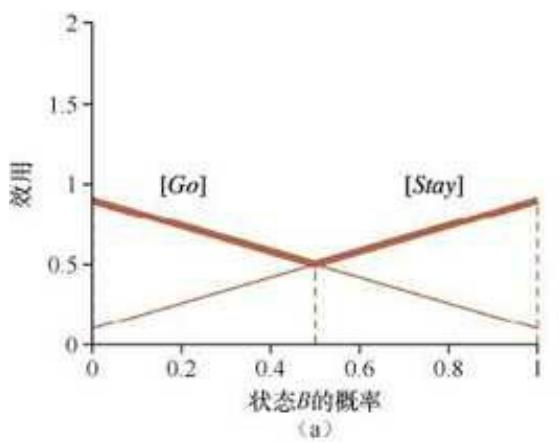

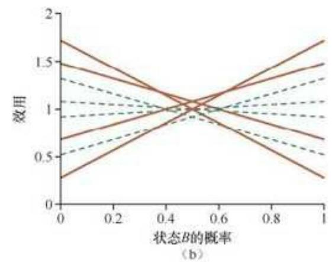

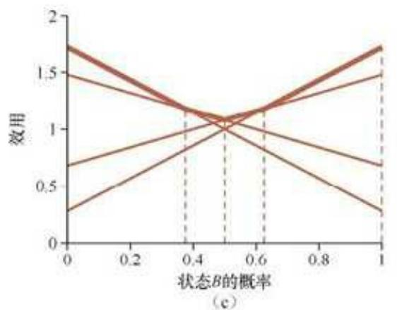

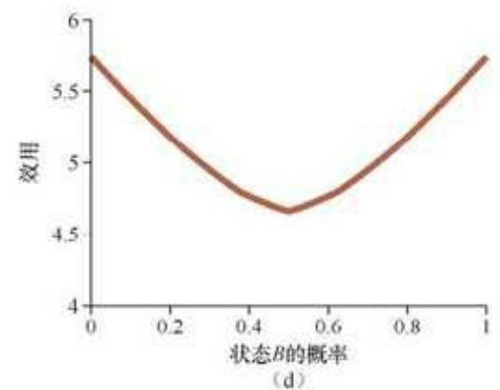  
图17-15 （a）对于两状态世界，两步规划的效用作为初始信念状态b(B)的函数，其对应的效用函数用粗线表示。（b）8个不同的两步规划的效用。（c）4个非劣势两步规划的效用。（d）最优8步规划的效用函数

b·astay与 的超平面（这个例子中是直线）如图17-15a所示，其最大值以粗线显示。因此，粗线代表了有限期问题的效用函数，该问题只允许一个动作，而在分段线性效用函数的每一个分段中，最优动作是相应条件规划的第一个动作。在这种情况下，最优一步策略是在时选择Stay，否则选择Go 。

一旦我们对于每个物理状态 s 的所有深度为1的条件规划 p 得到了效用 ，就可以通过考虑每个可能的第一个动作，每个可能的后续感知，以及每种为每个感知选择深度为1的规划来执行的方式，为深度为2的条件规划计算效用：

[ Stay ; if Percept = A then Stay else St ay ]

[ Stay ; if Percept = A then Stay else Go ]

[ Go ; if Percept = A then Stay else St ay ]

这个问题中总共有8个不同的深度为2的规划，其效用见图17-15b。注意，虚线所示的4个规划在整个信念空间中都是次优的，我们称这些规划是劣势的 （dominated），因此无须进一步考虑。有4个非劣势规划，每个规划在特定区域内都是最优规划，如图17-15c所示。此外，区域划分了信念状态空间。

我们在深度为3的情况下重复这个过程，并以此类推。一般而言，假设p 为深度为d 的条件规划，其初始动作为 a ，且其对于感知 e 的深度为( d − 1)的子规划为 p . e ，则我们有

$$
\alpha_ {p} (s) = \sum_ {s ^ {\prime}} P \left(s ^ {\prime} \mid s, a\right) \left[ R \left(s, a, s ^ {\prime}\right) + \gamma \sum_ {e} P \left(e \mid s ^ {\prime}\right) \alpha_ {p, e} \left(s ^ {\prime}\right) \right] \tag {17-18}
$$

这个递归很自然地给出了一个价值迭代算法，如图17-16所示。该算法的结构和误差分析与图17-6所示的基本价值迭代算法相似，主要区别在于POMDP-V alue-Iteration 不是为每个状态计算一个效用数，而是用它们的效用超平面维持一个非劣势的规划集合。

functionPOMDP-VALUE-ITERATION(pomdp,ε)returns一个效用函数  
inputs:pomdp，一个状态为S、动作为A(s)、转移模型为P(s'|s,a)、传感器模型为P(e|s)、奖励为R(s,a,s）、折扣为γ的POMDPε，任意状态效用的最大允许误差  
localvariables:U,U',规划p的集合，相关联的效用向量为α  
U' $\leftarrow$ 包含所有一步规划[a]的集合，相关联的效用向量为a(s)=∑P(s'|s,a)R(s,a,s）  
repeat  
U←U'  
U' $\leftarrow$ 由一个动作和U中的一个规划［对于每个可能的下一个感知，该规划具有根据式（17-18）计算的效用向量］组成的所有规划的集合  
U' $\leftarrow$ REMOVE-DOMINATED-PLANS(U')  
until MAX-DIFFERENCE(U,U')≤ε(1-γ)/γ  
return U

图17-16 POMDP价值迭代算法的高层次的概述。R emove -D ominated -P lans 步骤与 M ax -Difference测试通常以线性规划的形式实现

算法的复杂性主要取决于生成的规划数量。给定 个动作、 个可能观测，则有 个 个深度为 d 的不同规划。即便对于 d = 8这种简单的两状态世界，它也有2255 个规划。消除劣势规划对于减少这种双指数增长是至关重要的：d =8的非劣势规划的数量只有144。这144个规划的效用函数见图17-15d。

注意，中间信念状态的价值低于状态 A和状态 B的价值，这是因为在中间状态时，智能体缺乏选择好的动作所需的信息。这就是为什么16.6节所定义的信息是有价值的，此外POMDP中的最优策略通常也包括信息收集动作。

给定这样的效用函数，通过观测在任何给定的信念状态 b下哪个超平面是最优的，并执行相应规划的第一个动作，就可以提取出一个可执行的策略。图17-15d所对应的最优策略与深度为1的规划相同： 时选择 Stay ，否则选择 Go 。

在实践中，图17-16中的价值迭代算法对于更大的问题效率低下，即使是4×3 POMDP也太过于困难。主要原因是给定 n个d 层级非劣势条件规划，在剔除劣势规划之前，算法在 d +1层级构造了个条件规划。对于4位传感器， 是16， n 可以是数百，所以这是糟糕透顶的。

该算法自20世纪70年代出现以来，取得了一些进展，其中包括更高效的价值迭代形式和各种策略迭代算法。其中一些方法将在本章末尾的参考文献与历史注释中进行讨论。然而，对一般的POMDP来说，找到最优策略是非常困难的（事实上是PSPACE困难的，即多项式空间困难的——确实非常困难）。17.5.2节将介绍求解POMDP的一种不同的近似方法，它是一种基于前瞻搜索的方法。

# 17.5.2 POMDP的在线算法

在线POMDP智能体的基本设计很简单：它从某个先验信念状态开始；以当前的信念状态为中心，选择一种基于某种思考过程的动作；在执行动作后，它接收到一个观测并使用滤波算法更新它的信念状态；重复这个过程。

关于思考过程，一个明显的选择是使用17.2.4节中的Expectimax算法，区别仅在于在树中作为决策节点的是信念状态而不是物理状态。POMDP树中的机会节点包含由可能的观测标记并通向下一个

信念状态的分支，其转移概率如式（17-17）所示。 $4 { \times } 3$ 世界POMDP的信念状态最大化期望树的片段如图17-17所示。

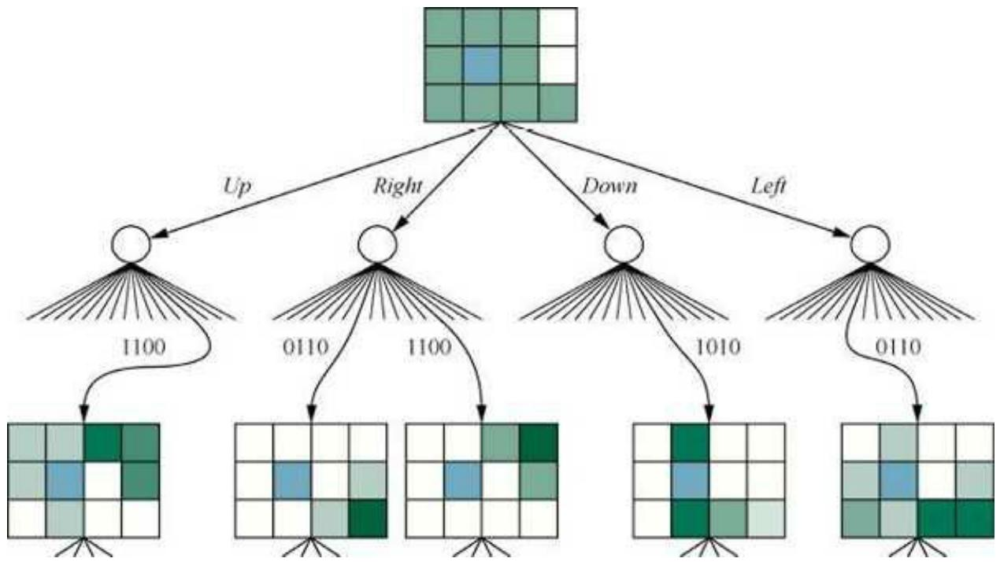  
图17-17具有均匀初始信念状态的4×3 POMDP的最大化期望树的一部分。信念状态用与存在于每个位置的概率成正比的深浅来描述

深度为 d 的穷举搜索的时间复杂度为 ，其中 是可采取动作的数量， 是可能感知的数量。（注意，这远远少于由价值迭代生成的深度为 d 的可能条件规划的数量。）在可观测的情况下，在机会节点采样是一种减少分支因子的好方法，并且不会在最终决策中损失太多的准确性。因此，POMDP中的近似在线决策的复杂性可能不会比MDP中的差很多。

在非常大的状态空间进行精确的滤波是不可行的，所以智能体将需要运行一个近似的滤波算法，例如粒子滤波。然后，在最大化期望树中的信念状态将是粒子的集合，而不是精确的概率分布。对于长期限问题，我们可能还需要运行UCT算法中使用的那种长期模拟（图5-11）。应用于POMDP的粒子滤波和UCT组合称为部分可观测蒙特卡罗规划或 POMCP。如果用DDN表示模型，那么至少在原则上，POMCP算法适用于非常大的和实际的POMDP。该算法的细节将在习题17.POMC中探讨。POMCP能够在4×3 POMDP中产生合适的行为。图17-18给出了一个简短（有点凑巧）的例子。

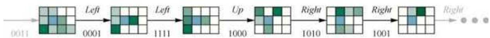  
图17-18墙传感误差 $\varepsilon = 0 . 2$ 的4×3 POMDP中感知、信念状态和动作的序列。注意，之前的Left是安全的，它们不太可能落入(4, 2)，并迫使智能体的位置变成少量的可能位置。 Up 移动后，智能体认为它可能在(3, 3)中，但也可能在(1, 3)中。幸运的是， Right在这两种情况下都是一个好主意，所以它选择 Right ，发现它之前在(1, 3)，现在在(2, 3)，然后继续 Right ，达到目标

基于动态决策网络和在线决策的POMDP智能体与前面章节所介绍的其他更简单的智能体设计相比有许多优点。特别是，它们可以处理部分可观测的随机环境，并且可以很容易地修改它们的规划来处理意外的证据。有了合适的传感器模型它们就可以处理传感器故障，并规划去收集信息。通过在时间压力和复杂的环境下使用各种近似技术，它们可以表现出“优雅的退化”。

那么还有什么内容被我们遗漏了吗？在真实世界中部署这种智能体的主要障碍是，我们无法在长时间尺度上生成成功的行为。随机或近乎随机的模拟不可能获得任何积极的奖励，例如在布置餐桌准备晚餐的任务中，这可能需要数千万个运动控制动作。因此我们似乎有必要借鉴11.4节中描述的一些分层规划思想。在撰写本书时，还没有令人满意和有效的方法将这些思想应用于随机的、部分可

观测的环境中。

小结

这一章展示了如何使用关于世界的知识做决策，即使动作的结果是不确定的，而动作的奖励可能直到在完成许多动作后才会得到。本章要点如下。

●随机环境中的序贯决策问题，也称为马尔可夫决策过程 ，是由指定动作的概率结果的转移模型和指定每个状态下的奖励的奖励函数 定义的。  
●状态序列的效用是序列中所有奖励的总和，可能随时间折扣。MDP的解是一个将决策与智能体可能到达的每个状态相关联的策略 。最优策略在执行时将最大化遇到的状态序列的效用。  
●状态的效用是在该状态下执行最优策略时的期望奖励之和。价值迭代 算法迭代地求解一组有关每个状态的效用与其邻居的效用的方程。  
●策略迭代 在计算当前策略下状态效用和根据当前效用改进当前策略之间交替进行。  
●部分可观测MDP（即POMDP）比MDP更难求解。它们可以被转化为在连续的信念状态空间中的MDP来求解，价值迭代算法和策略迭代算法分别被设计。POMDP中的最优行为包括信息收集，以减少不确定性，从而在未来做出更好的决策。  
●可以为POMDP环境构造一个决策论智能体。智能体使用动态决策网络 来表示转移和传感器模型，更新其信念状态，并向前预测可能的动作序列。

我们将在第22章中重返MDP和POMDP，那里涵盖了 强化学习 （reinforcement learning）方法，以允许智能体从经验中改进其行为。

读者服务：


微信扫码关注【异步社区】微信公众号，回复“e59810”获取本书配套资源以及异步社区15天VIP会员卡，近千本电子书免费畅读。

第18章

多智能体决策

在本章中，我们研究当环境中存在多个智能体时该采取的决策。

# 18.1 多智能体环境的特性

迄今为止，我们基本上是假设仅有单个智能体在进行感知、规划和行动。但这意味着我们已经极大地简化了实际情况，这样的假设并不能刻画许多真实世界中的人工智能设置。因此，在本章中，我们将考虑一个智能体必须在包含多个行动者的环境中做出决策的相关问题。这样的环境称为 多智能体系统 （multiagent system），而在这样的系统中，智能体要解决 多智能体规划问题（multiagent planning problem）。然而，正如我们将看到的，多智能体规划问题的特殊性质和适合求解它的方法取决于环境中各智能体之间的关系。

# 18.1.1 单个决策者

我们要考虑的第一种可能情况是：尽管环境包含多个行动者，但只有一个决策者。在这种情况下，决策者为其他智能体制定规划，并告诉它们该做什么。我们把智能体会简单地执行它们被告知的事情这一假设称为 仁者假设 （benevolent agent assumption）。然而即便是在这种简单的设置下，涉及多个行动者的规划也需要行动者同步它们的动作。为了实现联合动作（如二重唱），行动者A和B需要在同一时间行动；为了实现互斥动作（如只有一个插头时轮流充电），行动者需要在不同时间行动；当一个动作为另一个动作建立先决条件时（如A是洗碗，然后B是烘干它们），行动者就实现了序贯动作。

举一个特殊的例子，我们有一个具有多个可以同时操作的效应器的决策者，例如，一个人可以同时进行走路和说话。这样的智能体在处理效应器之间的正面和负面的相互作用时需要进行 多效应器规划 （multieffector planning）来管理每个效应器。当效应器在物理上解耦为独立单元时（如一群工厂中的配送机器人），多效应器规划就变成了 多体规划 （multibody planning）。

只要每个主体收集到的相关传感器信息可以被集中（集中在中心或者在每个主体内部）并形成一个关于世界状态的共同估计，然后作为信息传递给总体规划进行执行，那么一个多体问题就仍然是一个“标准的”单智能体问题。在这种情况，多个主体可以看作单个主体。当主体间通信限制使集中变得不可能时，我们就面临所谓的分散规划 （decentralized planning）问题。这个用词可能不是那么准确，因为主体的规划阶段是集中进行的，但执行阶段至少是部分解耦的。在这种情况，为每个主体构建的子规划可能需要包括与其他主体的显式通信动作。例如，覆盖广泛区域的多个侦察机器人之间可能发生无线电通信中断，这些主体应该在通信可用的时候共享它们的发现。

# 18.1.2 多决策者

第二种可能的情况是，环境中的其他行动者也是决策者，它们中的每一个都有自己的偏好，都将选择并执行自己的规划。我们称它们为 对应体 （counterpart）。在这种情况下，我们可以进一步区分出两种可能的情况。

●第一，虽然有多个决策者，但它们都追求一个共同目标 。同一家公司中的员工大体上符合这种情况，我们希望，不同的决策者追求代表公司的共同目标。在这种情况下，决策者面临的主要问题是 协调问题 （coordination problem）：它们需要确保每个人都朝着同一个方向努力，而不是意外地破坏了彼此的规划。

●第二，每个决策者都有自己的个人偏好，它们都会尽自己最大的努力追求自己的偏好。它们的偏好有时可能是截然相反的，例如国际象棋零和博弈（见第5章）。但大多数多智能体博弈都要比这复杂得多，偏好也更复杂。

当存在多个决策者，且每个决策者都追求自己的偏好时，一个智能体必须考虑其他智能体的偏好，同时也要考虑这些其他智能体也会考虑别的智能体的偏好这一事实，以此类推。这就把我们带到了博弈论 （战略决策的理论）的领域。博弈论与决策论的区别就在于推理的 战略方面——每个参与者都要考虑到其他参与者的行为。正如决策论为单智能体人工智能的决策提供了理论基础一样，博弈论为多智能体系统的决策提供了理论基础。

我们在这里使用“博弈”这个词也不是很理想：博弈论给人的直观感受是它好像与娱乐或人造场景有关（这是因为博弈与游戏在英文中相同）。没有什么比这个观念更扭曲事实的了。博弈论是 战略决策 的理论。它的应用包括石油开采权和无线频谱权的拍卖、破产程序、产品开发和定价决策，以及涉及数十亿美元和众多生命的国防形势的决策。博弈论主要可以通过两种方式应用于人工智

能。

（1） 智能体设计 （agent design）：智能体可以用博弈论来分析它可能的决策，并（根据博弈论，在假设其他智能体都采取理性行动的基础上）计算每个决策的期望效用。通过这种方式，博弈论方法可以决定对抗理性参与者的最佳策略和每个参与者的预期收益。  
（2）机制设计 （mechanismdesign）：当一个环境中存在许多智能体时，我们可以通过定义环境规则（即智能体必须参与的博弈），使得当每个智能体都采用最大化其自身效用的博弈论解决方案时，也能同时最大化所有智能体的集体利益。例如，博弈论可以帮助为一组互联网流量路由器设计协议，使每个路由器都有以使全局流量最大化的方式行动的动机。机制设计还可以用于构建以分布式方式解决复杂问题的多智能体系统。

博弈论为我们提供了一系列不同的模型，其中每个模型都有自己的一套基本假设；为每个问题场景选择正确的模型是很重要的。其中最重要的区别在于我们是否应该将其视为合作博弈。

● 在 合作博弈 （cooperative game）中，智能体之间可能存在一个具有约束力的协约，它保证智能体之间稳健合作。在人类世界中，法律契约和社会规范有助于建立这种具有约束力的协约。在计算机程序的世界中，我们可以通过检查源代码以确保它符合协约。我们使用合作博弈论来分析智能体间存在具有约束力的协约的情况。  
●如果不可能达成具有约束力的协约，我们就要考虑非合作博弈 （non-cooperativegame）。虽然非合作博弈这一术语字面上意味着博弈在本质上是竞争的，合作不可能实现，但事实并非如此，非合作只是意味着没有中心协约来约束所有的智能体以保证合作。但智能体也有可能自行决定合作，因为这符合它们最大化自己利益的目标。我们使用非合作博弈论来分析智能体间不能达成具有约束力的协约的情况。

有些环境将结合多个不同的情况。例如，一家快递公司可能会每天为其卡车和飞机的路线进行集中的离线规划，但会将某些方面留给司机和飞行员自主决策，他们要独自应对交通和天气情况。此外，公司的目标和员工的目标通过支付激励 （incentive）（工资和奖金）在某种程度上达成了一致，这明确标志着这是一个多智能体系统。

# 18.1.3 多智能体规划

目前，我们将以相同的方式处理多效应器、多体和多智能体设置，使用通用术语行动者 （actor）来涵盖效应器、主体和智能体，并将这些设置笼统地标记为多行动者 （multiactor）设置。本节的目标是想出定义转移模型、正确的规划以及设计多行动者设置的高效规划算法的方法。一个正确的规划是，如果由行动者执行，就能实现目标。（当然，在真正的多智能体情形中，智能体可能不会同意执行任何特定的规划，但至少它们知道，如果它们同意执行这些规划，其中哪些规划会起作用。）

试图提出一个令人满意的多智能体行动模型的关键困难点在于，我们必须以某种方式处理棘手的并发 （concurrency）问题，简单来说，并发是指每个智能体的规划得以同时执行。如果我们要对多行动者规划的执行进行推理，那么我们首先需要一个包含令人满意的并发行动模型的多行动者规划模型。

此外，多行动者动作还提出了一系列在单行动者规划中并不需要考虑的问题。特别是，智能体必须考虑自己的动作与其他智能体的动作交互的方式。例如，一个智能体需要考虑其他智能体执行的动作是否可能破坏其自身动作的先决条件，在执行其策略时使用的资源是否可共享或是否被其他智能体耗尽了；动作是否相互排斥；一个乐于助人的智能体可以考虑自身的动作如何促进其他智能体的动作。

为了回答这些问题，我们需要一个并发动作的模型，在这个模型中我们可以恰当地阐明这些问题。几十年来，并发动作模型一直是主流计算机科学界研究的一个主要焦点，但至今仍未出现一个确定的、能够普遍接受的模型。尽管如此，以下3种方法已被广泛采用。

第一种方法是在各自的执行规划中考虑动作的交错执行 （interleaved execution）。例如，假设我们有两个智能体A和B，其规划如下：

$$
A: [ a _ {1}, a _ {2} ]
$$

$$
B: [ b _ {1}, b _ {2} ]
$$

交错执行模型的核心思想是，在两个智能体规划的执行中，我们唯一可以确定的是，各自规划中的动作顺序将被保持。如果我们进一步假设动作是原子的，那么上面的两个规划可以通过以下6种不同的方式并发执行：

$$
\begin{array}{l} [ a _ {1}, a _ {2}, b _ {1}, b _ {2} ] \\ [ b _ {1}, b _ {2}, a _ {1}, a _ {2} ] \\ [ a _ {1}, b _ {1}, a _ {2}, b _ {2} ] \\ [ b _ {1}, a _ {1}, b _ {2}, a _ {2} ] \\ [ a _ {1}, b _ {1}, b _ {2}, a _ {2} ] \\ [ b _ {1}, a _ {1}, a _ {2}, b _ {2} ] \\ \end{array}
$$

一个规划要在交错执行模型中是正确的，它必须对规划的所有可能的交错都是正确的。 交错执行模型已经广泛应用于并发情形，因为它是多线程在单个CPU上轮流运行的一种合理模型。然而，它忽略了两个动作实际上可能同时发生的情况。此外，交错序列的数量将随着智能体和动作的数量呈指数级增长，因此，尽管在单智能体设置中，检查规划正确性的计算是很简单的，但在交错执行模型中，其计算是困难的。

第二种方法是真并发 （trueconcurrency），此时我们不再试图创建一个动作的完整序列排序，而是赋予它们一个偏序。例如，我们知道 a 会在a 之前发生，但我们不清楚 a 和 b 的顺序；个动作可能先于另一个发生，或者它们可以同时发生。我们总是可以将并行规划的偏序模型“展平”为交错模型，但这样做时，我们丢失了偏序信息。虽然在并发动作的理论描述中偏序模型比交错模型更令人满意，但偏序模型在实践中并没有被广泛采用。

第三种方法是假设完美的同步 （synchronization）。有一个每个智能体都可以访问的全局时钟，每个动作都花费相同的时间，并且在联合规划中的每个点上的动作都是同时发生的。因此，每个智能体的动作都是同步执行的，彼此步调一致（可能有些智能体在等待其他动作完成时执行一个空操作动作）。在真实世界中，同步执行并不是一个非常彻底的并发模型，但它语义简单，因此我们将在本章中探讨该模型。

我们从转移模型开始考虑；在确定性单智能体情形中，函数Result(s, a)给出了在环境处于状态 s时执行动作a 所产生的状态。在单智能体设置中，动作可能有 $^ { b }$ 种不同的选择； b 可能相当大，特别是对于有许多对象要操作的一阶表示，但好消息是动作模式为此提供了一种简洁的表示。

在有 $n$ 个行动者的多行动者情形中，单个动作 $a$ 被联合动作 $\langle a _ { 1 3 } \cdots , a _ { n } \rangle$ 所代替，其中 $a _ { i }$ 是第i 个行动者采取的动作。我们马上意识到两个问题：首先，我们必须描述 $b ^ { n }$ 个不同联合动作的转移模型；其次，我们要考虑一个分支因子为 $b ^ { n }$ 的联合规划问题。

将行动者组合成一个具有巨大分支因子的多行动者系统后，多行动者规划研究就主要聚焦于尽可能地解耦 行动者，这样一来（在理想情况下），问题的复杂性将随 $n$ 线性增长，而不是以 $b ^ { n }$ 的形式呈指数增长。

如果行动者之间没有交互，例如， n 个行动者都在玩单人纸牌游戏，那么我们就可以简单地分别求解n 个单独的问题。如果行动者是 松散耦合的 （loosely coupled），我们能否获得接近指数级的改进？当然，这是人工智能许多领域的核心问题。我们已经看到了CSP环境下松散耦合系统的成功解决方法，其中“树状”约束图产生了高效的解决方法（6.5节），在不相交模式数据库（3.6节）和加性启发式规划（11.3节）中也有相应的解决方法。

处理松散耦合问题的标准方法是先把问题看作是完全解耦的，然后再安排动作之间的交互。对转移模型来说，这意味着我们把行动者视作独立行动来编写动作模式。

让我们看看这样的方法在网球双打比赛中是如何发挥作用的。在这个问题中，我们有两个网球运动员组成一个双打队，他们的共同目标是战胜对手以赢得比赛。我们假设在比赛的某一时刻，球队的目标是把对手打过来的球打回去，并确保至少有一名球员的责任区域覆盖到网前。图18-1给出了这个问题的初始条件、目标和动作模式。容易看出，我们可以通过一个两步 联合规划 （jointplan）从初始条件实现目标，这个规划指定了每个球员必须做的事情——A应该移动到右底线并击球，而 B应该待在网前：

然而，当一个规划要求两个智能体同时击球时，问题就出现了。在真实世界中，这是行不通的，但Hit 的动作模式表示球将被成功击回。出现这个问题的原因在于，前置条件限制了一个动作本身能够成功执行的状态，但没有限制可能把它弄错的其他并发动作。

Actors（A,B）

Init(At（A，LeftBaseline）AAt(B,RightNet)A

Approaching(BallRightBaseline)APartner(A,B)APartner(B,A)

Goal(Returned(Ball)A（At(x,RightNet)VAt(x,LeftNet)）

Action(Hitactor,Ball),

PRECOND:Approaching(Ball,loc)A At(actor,loc)

EFFECT:Returned(Ball)

Action(Go(actor,to）,

PRECOND:Atactor,loc)A to≠loc

EFFECT:At（actor,to）A-At（actor,loc))

图18-1 网球双打问题。两个行动者 A 和 $B$ 一起参与，可以在4个位置之一： LeftBaseline 、RightBaseline 、 LeftNet 与 RightNet 。只有球员在正确的位置，球才能被打回。 NoOp 动作是虚拟的，没有任何效果。注意，每个动作都必须包含行动者作为参数

我们通过为动作模式增加一个新特征来解决这个问题：一个 并发动作约束 （concurrent actionconstraint），它说明哪些动作必须并发执行，哪些动作不能并发执行。例如， Hit动作可以描述如下：

Action(Hit(actor,Ball),

CONCURRENT:bb≠actor=-Hit(b,Ball)

PRECOND:Approaching(Ballloc）Atactorloc)

EFFECT:Returned(Bal)

换句话说，只有在没有其他智能体的Hit动作同时发生的情况下，Hit动作才具有它声明的效果。［在SATPlan方法中，这将通过部分动作排除公理 （action exclusion axiom）来处理。］对于某些动作， 只有当另一个动作同时发生时，才能达到预期的效果。例如，需要两名智能体携带一个装满饮料的冷藏箱到网球场：

Action(Carry(actor,cooler,here,there),

CONCURRENT:bb+actorACarry(b，cooler，here,there)

PRECOND:At(actor,here)AAt(cooler，here)ACooler(cooler)

EFFECT:Atactor,there)AAtcooler,there)A-Atactor,here)A-Atcooler,ere))

有了这些类型的动作模式，第11章中描述的任何规划算法都可以通过稍加修改来适应多行动者规划。在某种程度上，我们可以认为子规划之间的耦合是松散的，这意味着，在规划搜索过程中，并发约束很少发挥作用，人们可以期望在单智能体规划中推导的各种启发式在多行动者环境中也有效。

# 18.1.4 多智能体规划：合作与协调

现在，让我们考虑一个真正的多智能体设置，其中每个智能体都制定自己的规划。首先，让我们假设目标和知识库是共享的。可能有人认为这就简化为多体情况——每个智能体仅计算这个联合解决方案并执行该解决方案中自己负责的部分。其实，“这个联合解决方案”中的“这个”一词具有误导性。事实上，我们有另一种可以实现目标的规划。

如果双方能就实行规划1或规划2达成一致，目标就会实现。但是如果A选择规划2，B选择规划1，那么没有人会击球。相反地，如果A选规划1， $B$ 选规划2，那么它们都将尝试击球，这同样会导致失败。智能体们知道这一点，但是它们如何协调以确保它们同意这个规划呢？

一种选择是在进行联合行动之前通过一项约定 （convention）。约定是指对联合规划选择的任意一个约束。例如，“一直保持在你负责的半场”的约定将排除规划1，导致双方选择规划2。道路上的司机需要避免互相碰撞，通过遵守在大部分国家实行的“靠右行驶”的约定（部分地）解决了这一问题；只要环境中的所有智能体都同意，另一种选择，即“靠左行驶”，也同样有效。类似的思路也适用于人类语言的发展，对交流来说重要的不是每个人应该说哪种语言，而是一个群体都说同一种语言。当约定广为流传时，它们就被称为 社会准则 （sociallaw）。

在没有约定的情况下，智能体可以利用 交流 （communication）来获得一个可行的联合规划的共同知识。例如，一个网球球员可以通过喊“我的！”或者“你的！”来指示一个更偏好的联合规划。交流不一定是指口头交流。举个例子，球员可以通过执行规划的第一部分而将自己更偏好的联合规划传达给另一个球员。如果智能体A冲到网前，那么智能体 B必须回到底线击球，因为规划2是唯一的从 $A$ 冲到网前开始的联合规划。这种协调方法有时被称为规划识别 （plan recognition）。当一个智能体的单个动作（或短的动作序列）足以让另一个智能体明确地确定一个联合规划时，规划识别是有效的。

# 18.2 非合作博弈论

我们现在介绍博弈论的关键概念和分析技术，博弈论是支持多智能体环境下决策的理论。我们将从非合作博弈论开始介绍。

# 18.2.1 单步博弈：正则形式博弈

在我们首先介绍的博弈模型中，所有参与者同时采取动作，基于以这种方式选择的动作得到博弈的结果。（实际上，动作同时发生并不重要；重要的是，没有参与者知道其他参与者的选择。）这类博弈被称为 正则形式博弈 （normal form game）。正则形式博弈由3个部分定义。

●做决策的参与者 （player）或智能体。双人博弈最受关注，尽管 的n人博弈也很常见。我们给每个参与者赋予一个大写的名称，如A与B或O 与 $E$ 。  
●参与者可以选择的动作 （action）。我们将赋予每个动作一个小写的名称，如 one或testify。参与者可能拥有相同的动作集合，也可能不同。  
● 给出每个参与者在每种动作组合下各自的效用的 支付函数 （payoff function）。对于双人博弈，参与者的支付函数可以表示为一个矩阵，矩阵的行是一个参与者每个可能的动作，列是另一位参与者的每个可能选择：矩阵的一个单元由选定的行和列定义，它被标记为相关参与者的收益。在两方博弈的情况下，传统的做法是将这两个矩阵合并成一个支付矩阵 （payoffmatrix），其中每个单元格都标有双方参与者的收益。

为了具体说明这些想法，我们以一个名为两指猜拳 （two-fingerMorra）的游戏为例。在这个游戏中，两个参与者 O 和 E同时出一个或两个手指。令二人总共出的手指数为 $f$ ，如果 $f$ 是奇数，则O向E收取f美元；如果 f是偶数，则E向 O 收取 f美元。 [1] 两指猜拳的支付矩阵如下：

[1]猜拳是一个娱乐版本的检查博弈（inspection game）。在这类博弈中，检查员选择一天去检查一个设施（如餐厅或生物武器工厂），而设施经营者选择一天去隐藏所有不好的东西。如果检查员和设施经营者没有选择同一天，检查员获胜；如果检查员和设施经营者选择了同一天，则设施经营者获胜。

我们称 E 为 行参与者 （row player）， O 为 列参与者 （column player）。表格的右下角单元表明，当 O 选择动作 two ， E 也选择动作时 two ， E 的收益为+4， O 的收益为−4。

在分析两指猜拳之前，我们有必要考虑为什么需要博弈论的思想：为什么不能使用我们在书中其他地方使用的决策论和效用最大化工具来应对参与者 $E$ 所面临的挑战？为了弄清楚为什么需要博弈论，我们假设E正在试图寻找最优动作来执行。备选方案为 one或two。如果 $E$ 选one，那么它的收益要么是+2要么是−3。然而， $E$ 实际获得的收益将取决于O 的选择： $E$ 作为行参与者，最多只能迫使博弈的结果处于特定的行中。类似地，O 的选择使结果处于特定的列中。

为了在这些可能中做出最优选择， $E$ 必须考虑O 作为一个理性的决策者将如何行动。但反过来，O 应该考虑到 $E$ 是一个理性的决策者这一事实。因此，在多智能体设置下的决策与在单智能体设置下的决策有很大的不同，因为参与者需要考虑对方的推理。 解概念 （solution concept）在博弈论中的作用就是试图使这种推理更加精确。

策略 （strategy）这个术语在博弈论中被用来表示我们之前所说的 策略 （policy）。 纯策略 （purestrategy）是一种确定性策略；对单步博弈来说，纯策略是单个动作。正如我们将在下面看到的，对许多博弈来说，采用混合策略 （mixedstrategy）的智能体可以表现得更好。混合策略是一种根据概率分布选择动作的随机策略。以概率p 选择动作a，否则选择动作 b的混合策略被写成[p:a ;(1 − p ): b ]。例如，两指猜拳的混合策略可能是[0.5:one; 0.5:two]。 策略组合 （strategy profile）为每个参与者的分配一个策略；给定策略组合，博弈结果 （outcome）是指每个参与者的数值——如果参与者使用混合策略，那么我们必须使用期望效用。

那么，在像猜拳这样的游戏中，智能体应该如何决定行动呢？博弈论提供了一系列解概念，试图根据一个智能体对其他智能体的信念来定义理性行为。遗憾的是，不存在一个完美的解概念：当每个智能体只选择决定结果的策略组合的一部分时，定义“理性”的含义是有问题的。

我们通过博弈论中最著名的囚徒困境 （prisoner’sdilemma）来介绍我们的第一个解概念。这个博弈描述的故事是：两个盗窃嫌疑犯A和B，在盗窃现场附近被抓捕，并被单独审问。检察官向每个人提出了一项协议：如果你指证（testify）你的同伙是盗窃团伙的头目，那么你将因为与检方合作而被释放，而你的同伙将被判10年监禁。但是，如果你们相互指证，那么你们都将被判5年监禁。A与 $B$ 还知道，如果双方都拒绝（refuse）指证，他们各自将因持有赃物这一较轻的指控仅服刑1年。现在，A与B面临着所谓的囚徒困境：指证还是拒绝指证？作为一个理性主体， A与 $B$ 各自希望最大化自己的期望效用，这意味着最大限度地减少入狱时间——每个人都对对方的利益漠不关心。囚徒困境可以通过以下支付矩阵进行表示：

现在，让我们站在 A 的角度进行思考。她可以这样分析支付矩阵。

●假设B选择了testify。若我选择指证，我将被判5年监禁；若我选择拒绝指证，我将被判10年监禁；因此，在这种情形下选择指证更好。  
●但是，如果 B选择了refuse，若我选择指证，我将获得自由；若我选择拒绝指证，我将被判1年监禁；因此，在这种情形下选择指证也会更好。  
●因此，无论 B选择做什么，对我来说选择指证都会更好。

A发现指证是博弈的占优策略 （dominantstrategy）。对p 来说，如果对于其他参与者的每种策略选择，策略 s 的结果总优于策略 s' 的结果，我们称，对于参与者 p ，策略 s 强占优 （stronglydominate）于策略s'。如果s至少在一个策略组合上优于s'，而在其他策略组合上不弱于s'，则我们称s弱占优 （weakly dominate）于s'。占优策略是指其优于所有其他策略。博弈论中一个常见的假设是， 理性的参与者总是会选择一种占优策略，而避免一种占劣策略。出于理性，或者至少不希望被认为是非理性的，A会选择占优策略。

不难看出， B的推理将是相同的：他也会得出结论——testify对他来说是一种占优策略，并会选择使用它。根据我们对占优策略的分析，这个博弈的解决方案是，双方参与者都选择testify，结果都将被判5年监禁。

在这种情况下，所有参与者都选择了占优策略，那么这个结果就是 占优策略均衡 （dominantstrategyequilibrium）。这是一种“均衡”，因为没有任何参与者有动机偏离自己的选择：根据定义，如果他们偏离了自己的选择，他们就不能获得更好的结果，相反可能会获得更糟糕的结果。从这个意义上说，占优策略均衡是一个非常强的解概念。

回到囚徒困境，我们可以看到，困境在于双方都选择testify的占优策略均衡结果比双方都 refuse的结果更糟。(refuse,refuse)的结果将给双方各1年的监禁，这对双方来说都比选择占优策略均衡时的5年监禁要轻。

A与B有什么办法达到(refuse,refuse)的结果吗？同时选择拒绝指证当然是 允许的选项，但根据博弈的设定方式，很难看出理性智能体是如何做出这种选择的。我们要记住这是一个非合作的博弈：他们不允许彼此交谈，所以他们不能制订具有约束力的协约来迫使双方选择 refu se 。

然而，如果我们改变博弈的形式，就有可能得到(refuse,refuse)的解。我们可以将其改为合作博弈，以允许智能体形成一个具有约束力的协约。或者我们可以将博弈形式改为重复博弈 （repeatedgame），在这种博弈中，参与者知道他们会再次相遇并一起决策，我们将在本书的后面介绍这种博弈。或者，参与者本身拥有的道德信念可能会鼓励他进行合作和公平。但这意味着他们有不同的效用函数，同样，他们进行的也是不同的博弈。

对特定参与者而言，占优策略的存在极大地简化了该参与者的决策过程。一旦A意识到指证是一种占优策略，她就不需要花任何精力去想 B会怎么做，因为她知道无论 B做什么，指证都是她的最佳反应 （bestresponse）。然而，大多数博弈既没有占优策略，也没有占优策略均衡。单个策略是所有可能对应策略的最佳反应，这种情况很少见。

我们考虑的下一个解概念比占优策略均衡弱，但它的适用范围更广。它被称为纳什均衡 （Nashequilibrium），以约翰·福布斯·纳什（John Forbes Nash，1928—2015）的名字命名，纳什在1950年的博士论文中研究了这一理论，并因此在1994年获得了诺贝尔经济学奖。

在其他参与者保持策略不变的前提下，如果没有一个参与者能够单方面改变自己的策略，从而获得

更高的收益，那么我们称这个策略是纳什均衡。因此，在纳什均衡中，每个参与者都同时对对手的选择做出最佳反应。纳什均衡代表博弈中的一个稳定点：稳定是指任何参与者都没有偏离的理性激励。然而，纳什均衡是局部稳定点：正如我们将看到的，一个博弈可能包含多个纳什均衡。

由于占优策略是所有对应策略的最佳反应，因此任何占优策略均衡也必须是纳什均衡（习题18.EQIB）。因此，在囚徒困境中存在唯一的占优策略均衡，这也是唯一的纳什均衡。

下面这个博弈的例子表明了两点，有时博弈可能没有占优策略，有些博弈有多个纳什均衡。

A : l A : r

$$
B: t A = 1 0, B = 1 0 A = 0, B = 0
$$

$$
B: b A = 0, B = 0 \quad A = 1, B = 1
$$

容易证明，在这个博弈中，任何一方都没有占优策略，因此也就不存在占优策略均衡。而策略组合(t,l)和(b ,r)均为纳什均衡。显然，此时追求同一个纳什均衡——(t,l)或(b , r)——符合双方的利益，但由于我们正在考虑非合作 博弈论，参与者必须独立做出他们的选择，没有任何关于其他人选择的知识，也没有任何方式与他们达成协约。这是 协调问题 （coordination problem）的一个例子：参与者希望在全局范围内协调他们的动作，以便他们都选择达到相同均衡的动作，但又必须只使用局部决策来达成这一点。

有大量方法用于解决协调问题。其中一种方法称为焦点 （focalpoint）。博弈中的焦点是指在某种程度上让参与者感到“明显”的结果，以此来协调他们的选择。当然这并不是一个精确的定义，它的含义取决于博弈本身。在上面的示例中存在一个明显的焦点：结果(t, l)会让参与者获得比他们在(b ,r)时明显更高的效用。从博弈论的角度来看，这两个结果都是纳什均衡，但正常的参与者都希望结果落在( t , l )上。

有些博弈在纯策略中不存在纳什均衡，例如下面这个 猜硬币 （matching pennies）的游戏。在这个博弈中，A与B同时选择一枚硬币的一面，要么是正面（heads）要么是反面（tails）：如果他们做出相同的选择，那么B给A1元钱，如果他们做出不同的选择，那么 A给B1元钱。

A : heads A : tails

$$
B: h e a d s A = 1, B = - 1 A = - 1, B = 1
$$

$$
B: t a i l s \quad A = - 1, B = 1 A = 1, B = - 1
$$

在此我们希望读者能确认以下事实：这个博弈中不存在占优策略，也不存在纯策略的纳什均衡结果在每一个结果中，一个参与者总是会后悔自己的选择，如果给定另一个参与者的选择，他们宁愿做出不同的选择。

要找到纳什均衡的方法是使用混合策略——让参与者随机选择。纳什证明了 每个博弈的混合策略中至少存在一个纳什均衡。这就解释了为什么纳什均衡是一个如此重要的解概念：其他解概念，如占优策略均衡，并不能保证存在于每一个博弈中，但如果我们寻找混合策略的纳什均衡，我们总能得到一个解。

在猜硬币的游戏中，如果两个人选择 heads和tails的概率相等，我们就得到了一个混合策略的纳什均衡。为了证明这个结果确实是纳什均衡，我们假设其中一个参与者以不等于0.5的概率选择一个结果。然后其他参与者就可以利用这一点，全力选择一个特定的策略。例如，假设B选择heads的概率是0.6（选择tails的概率是0.4）。那么 A就会确定性地选择 heads。容易看出，B以0.6的概率选择heads不可能构成任何纳什均衡的一部分。

# 18.2.2 社会福利

博弈论的主要观点是，博弈中的参与者试图获得对自己最好的结果。然而，采纳不同的观点有时是有益的。假设你是一个仁慈的、无所不知的实体，不屑于博弈，并且能够选择结果。作为一个仁慈的人，你想要选择最好的整体结果，也就是说，对整个社会 最好的结果。你应该如何选择？你的标准是什么？这就是社会福利 （socialwelfare）概念的由来。

也许最重要也是争议最少的社会福利标准是，你应该避免 浪费 效用的结果。这个要求在帕累托最

优 （Pareto optimality）的概念中得到了体现，这个概念是以意大利经济学家维尔弗雷多·帕累托（Vilfredo Pareto，1848—1923）的名字命名的。如果没有其他结果可以在不损害他人利益的情况下，使一个参与者变得更好，那么这个结果就是帕累托最优。如果你选择的结果不是帕累托最优，那么它就浪费了效用，因为你至少可以给一个智能体赋予更多的效用，而不需要从其他智能体获得任何效用。

功利主义社会福利 （utilitarian socialwelfare）是一种衡量整体结果好坏的标准。一个结果的功利主义社会福利是该结果给予参与者的效用总和。功利主义社会福利有两个关键的难点。第一，它考虑的是总和，而不关心效用在参与者中的 分配，这可能会导致选择一个非常不平等的分配（如果该分配恰好最大化了效用总和）。第二，它为效用假定了一个 共同尺度 。许多经济学家认为，这是不可能成立的，因为效用（不像金钱）是一个主观的量。如果我们试图决定如何分配一批饼干，我们应该把它们全都分给一个声称“我比任何人都要更爱饼干一千倍”的饼干效用狂热者吗？尽管这会使我们认为的效用最大化，但这似乎是不太正确的决定。

平等主义社会福利 （egaltarian socialwelfare）的研究解决了效用如何在参与者之间分配的问题。例如，一项建议认为，我们应该最大化社会中最贫困成员的期望效用，这是一种极大化极小方法。包括基尼系数 （Ginicoefficient）在内的一些其他指标是可能的，其中基尼系数总结了效用在参与者之间的平均分配情况。这些建议的核心问题在于，它们可能会牺牲大量的整体福利来换取少量的分配收益，而且它们与纯粹的功利主义一样，也会受到效用狂热者的摆布。

将这些概念应用到上面介绍的囚徒困境博弈中可以解释为什么把该问题称为“困境”。回想一下，(testify , testify )是一个占优策略均衡，也是唯一的纳什均衡。然而，这却是唯一的非帕累托最优的结果。结果( refuse , refuse )使功利主义和平等主义的社会福利最大化。因此，囚徒困境中的“困境”就产生了，因为一个非常强大的解概念（占优策略均衡）会导致一个结果，这个结果基本上无法通过从“社会”的角度来检测合理性的所有测试。然而，对个体参与者来说，没有明确的方法来找到更好的解决方案。

计算均衡

现在让我们考虑与上面讨论的概念相关的关键计算问题。首先，我们将考虑不允许随机化的纯策略。

如果参与者只有有限数量的可能选择，那么我们就能通过穷举搜索寻找均衡：遍历每个可能的策略组合，并检查是否有任何一个参与者有偏离该组合的有益选择；如果没有，那该策略就是纯策略的纳什均衡。占优策略和占优策略均衡可以用类似的算法计算得到。遗憾的是，对于 n 个参与者，每个参与者都有m 种可能的动作的博弈，其可能的策略组合的数量是 $m ^ { n }$ ，对穷举搜索来说过于庞大，此时穷举是不可行的。

在某些博弈中， 短视最佳反应 （myopic best response），也称为 迭代最佳反应 （iterated bestresponse），是一个有效的替代方法：我们首先随机选择策略组合；然后，如果某个参与者在其他参与者的选择下没有做出他自己的最优选择，就将他的选择转变为最优选择，并重复这一过程。如果这个过程最终得到一个策略组合，其中每个参与者都在给定其他参与者的选择下做出最优选择，即一个纳什均衡，这个过程就会收敛。对于某些博弈，短视最佳反应不会收敛，但对于一些重要的博弈类型，该方法的收敛性是有保证的。

计算混合策略均衡的算法要复杂得多。为了简单起见，我们将重点介绍零和博弈的方法，并在本节的最后简要评论它们在其他类型博弈中的扩展。

1928年，冯·诺依曼发明了一种方法来寻找二人 零和博弈 （zero-sumgame）的最优 混合策略，二人零和博弈是指支付总和总是为0（或者为一个常数，如5.1.1节所述）的博弈。显然，猜拳就是一个这样的博弈。在二人零和博弈中，两个参与者的支付是一对相反数，所以我们只需要考虑最大化者（如第5章中所做）的支付。在猜拳游戏中，我们选择偶数参与者 $E$ 为最大化者，所以我们可以用 U (e,o )来定义支付矩阵，即如果E采取动作e， O 采取动作o ， E的支付。（为了方便起见，我们称参与者 E为“她”， O 为“他”。）冯·诺依曼将其设计的方法称为极大化极小（maximin）法，其工作原理如下。

●假设我们改变规则如下：首先 $E$ 选择了她的策略并告诉 O ，然后 O 根据 $E$ 的策略选择自己的策略。最后，我们根据所选策略对博弈的期望支付进行评估。此时我们处理的是一个回合博弈，我们

可以应用第5章的标准 极小化极大 （minimax）算法进行求解。假设其结果是 $U _ { \mathrm { E , O } }$ 。显然，这个博弈偏向于 O ，所以原博弈的真实效用（以 E 的视角）至少是 $U _ { \mathrm { E , O } }$ 。例如，如果我们只考虑纯策略，则极小化极大博弈树的根值为−3（见图18-2a），因此我们知道 $v \geqslant - 3$ 。

●现在假设我们改变规则，迫使O 首先展示他的策略，然后 $E$ 再在此基础上考虑策略，那么这个博弈的极小化极大值是 $U _ { \mathrm { O , E } }$ ，因为这个博弈有利于 $E$ ，所以我们知道 $U$ 最多是 $U$ 。仍考虑纯策略，我们得到该值为 $+ 2$ （见图18-2b），因此我们知道 。

结合这两个论证，我们发现原博弈解的真实效用 $U$ 必须满足

$$
U _ {\mathrm {E , O}} \leqslant U \leqslant U _ {\mathrm {O , E}}
$$

在这个例子中， $- 3 \leq U \leq 2$ 。

为了明确U 的值，我们需要进一步分析混合策略。首先，我们要注意以下几点：一旦第一个参与者透露了一个策略，那么第二个参与者也可以选择一个纯策略。 原因很简单：如果第二个参与者采用混合策略， ，其期望效用是纯策略 U one与 $U _ { \mathrm { t w } 0 }$ 效用的线性组合。这个线性组合永远不会优于 U one与 U two中更好的一个，所以 $U _ { \mathrm { { o n e } } }$ $U _ { \mathrm { t w } 0 }$ 第二个参与者可以选择更好的那个策略。

根据这一观测结果，极小化极大树可以被认为在根上有无穷多个分支，对应于第一个参与者可以选择的无穷多个混合策略。每一个分支都指向一个带有两个分支的节点，这两个分支对应于第二个参与者的纯策略。我们可以通过在根处的一个参数化的选择来有限地描述这些无限的树。

● 如果 E 优先选择，情况如图18-2c所示。 $E$ 在根处选择策略[ p : one ; (1 − p ): two ]，然后 O 在给定 p 值的情况下选择一个纯策略（因此是一个移动）。如果 O 选择 one ，期望支付（给 E ）是；如果 O 选 two ，期望支付是 。我们可以在图上把这两个支付连成直线，其中 p 在 x 轴上的取值范围是0到1，如图18-2e所示。 O ，即最小化者，总是选择两条线中较低的那条，我们在图中用较粗的线标出。因此， E 在根处能做的最佳选择就是让 p 位于交点，也就是

$$
5 p - 3 = 4 - 7 p \Rightarrow p = 7 / 1 2
$$

$E$ 在该点处的效用为 $U _ { \mathrm { E , O } } = - 1 / 1 2$ 。

●如果 $O$ 优先选择，情况如图18-2d所示。 O 选择策略[ q : one ; (1 − q ): two ]，然后 $E$ 在给定 $q$ 值的情况下选择一个移动，其支付是 $2 q - 3 ( 1 - q ) = 5 q - 3$ 和 $- 3 q + 4 ( 1 - q ) = 4 - 7 q$ [2] 同样的，图18-2f表明， $O$ 在根处所能做的最佳选择就是选择交点：

[2]巧合的是这些方程和 $p$ 的方程是一样的；这是因为 $U E \left( \ o n e \ , t w o \right) = U E \left( \ t w o \ , o n e \ ) \right. – - 3$ 。这也解释了为什么两名参与者的最优策略是相同的。

$$
5 q - 3 = 4 - 7 q \Rightarrow q = 7 / 1 2
$$

$E$ 在该点处的效用为 U O , E = −1/12。

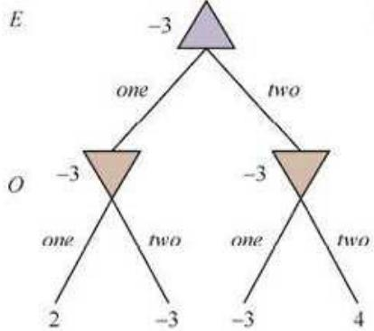

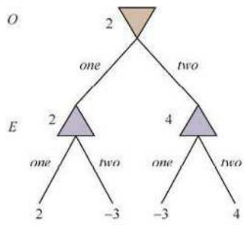

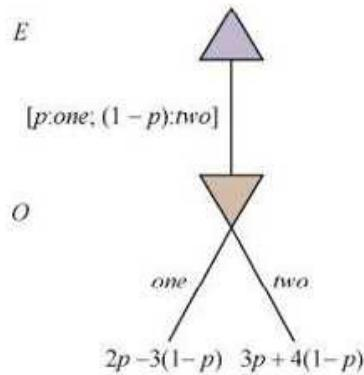

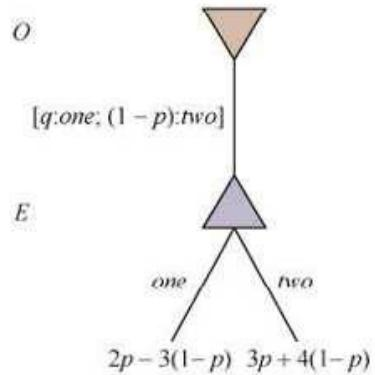

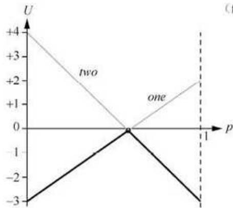

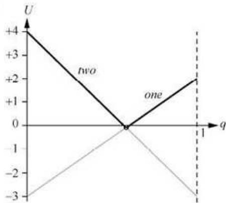  
图18-2（a）和（b）：如果参与者轮流选择纯策略，两指猜拳的极小化极大博弈树。（c）和（d）：第一个参与者选择混合策略的参数化博弈树。支付取决于混合策略中的概率参数（p 或q）。（e）和（f）：对于概率参数的任何特定值，第二个参与者将选择两个动作中较好的一个，因此第一个参与者的混合策略的值由粗线给出。第一个参与者将在交点处为混合策略选择概率参数

现在我们知道原始博弈的真实效用范围是−1/12～−1/12；也就是说，正好是−1/12！（结论是，如果你在玩这个游戏，那么充当O 的角色比 $E$ 更好。）此外，真实效用在两个参与者都采用混合策略[7/12: one ; 5/12: two ]时达到。这种策略称为博弈的 极大化极小均衡 （maximin equilibrium），它也是一种纳什均衡。注意，在均衡混合策略中，每个组成策略都具有相同的期望效用。在这种情况下， one 和 two 与混合策略本身具有相同的期望效用−1/12。

我们在两指猜拳中得到的结果是冯·诺依曼所给出的一般结果的一个特例，冯·诺依曼证明：当允许混合策略存在时，每个二人零和博弈都有一个极大化极小均衡。 此外，零和博弈中的每个纳什均衡对每个参与者都是一个极大化极小均衡。采用极大化极小策略的参与者可以保证以下两个事实：首先，没有其他策略能更好地对付技术高超的对手（尽管有些其他策略可能更擅长对付会犯非理性错误的对手）；其次，即使参与者将策略透露给对手，参与者也仍能保持表现良好。

在零和博弈中寻找极大化极小平衡的一般性算法比图18-2e和图18-2f所示的要复杂得多。当有 n 个可能的动作时，混合策略是n 维空间中的一个点，此时这些线将变成超平面。也有可能第二个参与者的一些纯策略被其他策略所占优，因此它们对第一个参与者的任何策略来说都不是最优的。在删除所有这些策略（可能需要重复执行）之后，根的最优选择是剩余超平面的最高（或最低）交

点。

寻找这个最优选择是 线性规划 （linear programming）问题的一个实例：求解目标函数在线性约束下的最大值。这类问题可以在对于动作数量（以及用于指定奖励函数的位数，如果你想了解其中的技术）的多项式时间内用标准的技术进行求解。

我们的问题仍然存在— —一个理性的智能体在进行一场猜拳博弈时应该做些什么？理性智能体将推导出[7/12:one;5/12:two ]是极大化极小均衡策略这一事实，并假定这是它与理性对手的共同认识。智能体可以使用一个12面骰子或随机数生成器根据这种混合策略进行随机选择，这种情况下 $E$ 的期望支付是-1/12。或者智能体可以简单地选择one或two 。在这两种情况下， $E$ 的期望支付仍然是-1/12。奇怪的是，单方面选择一个特定的动作并不会损害一个智能体的期望支付，但让另一个智能体知道自己做出了这样的单方面决定却会影响期望支付，因为这样对手就可以相应地调整策略。

在非零和博弈中寻找均衡更复杂一些。一般性的求解方法分为两个步骤。第一步，列举所有可能形成混合策略的动作子集。例如，首先尝试每个参与者使用单个动作的所有策略组合，然后尝试每个参与者使用一个或两个动作的所有策略组合，以此类推。这个集合中策略组合的数量对于动作的数量是指数级别的，所以它只适用于规模相对较小的博弈。第二步，对于第一步中列举的每个策略组合，检查它是否是一个均衡。这是通过求解一组方程和不等式来完成的，这些方程和不等式类似于在零和情况中使用的那些。在只有两个参与者的情况下，这些方程是线性的，我们可以用基本的线性规划技术解决，但对于3个或更多参与者的情况，它们是非线性的，可能很难求解。

# 18.2.3 重复博弈

到目前为止，我们只研究了单步博弈。最简单的多步博弈是重复博弈 （repeated game），也称为迭代博弈 （iterated game），是指参与者重复进行多轮的单步博弈，其中的每一轮博弈被称为阶段博弈 （stage game）。在重复博弈中，策略针对所有参与者之前的每一种可能的选择为每个参与者在每个时间步中指定了一个动作选择。

首先我们将考虑阶段博弈是重复固定轮数的、有限轮数的、相互已知轮数的情况——所有这些条件都是以下分析工作所必需的。我们假设A与B进行囚徒困境的一个重复版本，他们都知道自己必须进行100轮博弈。在每一轮博弈中，他们都会被问到是选择testify还是 refuse，并根据前面所述的囚徒困境规则获得相应的收益。

在这100轮博弈结束时，我们通过将每个参与者在100轮博弈中的收益相加来计算每个参与者的总收益。A与B应该选择什么策略来进行这个博弈？考虑下面的论证。他们都知道第100轮不会是重复的博弈，也就是说，它的结果不会对未来的回合产生影响。所以，在第100轮的时候，他们实际上是在进行一个单轮的囚徒困境博弈。

正如我们之前所看到的，第100轮的结果将是(testify,testify)，即双方参与者的占优均衡策略。但是一旦第100轮博弈的结果被确定，第99轮博弈对后续的轮次也将没有影响，所以它也会产生(testify,testify)的结果。通过归纳论证，我们得出两名参与者在每一轮中都选择 testify，将分别获得500年的监禁判决。这种类型的推理被称为逆向归纳 （backward induction），它在博弈论中起着基础性的作用。

然而，如果我们放弃固定轮数的、有限轮数的或相互已知轮数的这3个条件中的一个，那么归纳论证就不再成立。假设博弈被重复 无限 轮。从数学上讲，无限重复博弈中参与者的策略是一个函数，它将博弈的每一个可能的有限历史映射到该参与者在相应回合中的一个选择。因此，策略将着眼于该轮博弈之前发生的事情，并决定在当前回合中做出何种选择。但我们不能在有限的计算机中存储无限大的表。我们需要一个 有限 的策略模型，以让参与者进行无限回合的博弈。因此，将无限重复博弈的策略表示为具有输出的有限状态机（FSM）是一种标准的做法。

图18-3给出了几种针对重复囚徒困境设计的FSM策略。我们首先考虑一报还一报 （Tit-for-Tat）策略。每个椭圆都指示机器的一种状态，椭圆内部标明了机器处于该状态时策略将做出的选择。在每个状态中，我们为对手智能体的每一个可能选择都分配一条出边：我们根据对手智能体做出的选择对应的出边来查找机器的下一个状态。最后，一个状态用输入箭头标记，表示它是初始状态。因此，在Tit-For-Tta策略中，机器的状态初始为 refuse；如果对方选择refuse，则它将停留在refuse 状态；如果对方选择 testify ，则它将转移到 testify 状态。只要它的对手选择 testify ，它就会一直处于 testify状态，但如果它的对手选择refuse，它就会转移回 refuse状态。总而言之，Tit-F

or -T at 将以 refuse 开始，然后将简单地复制其对手在前一轮博弈中所做的一切。

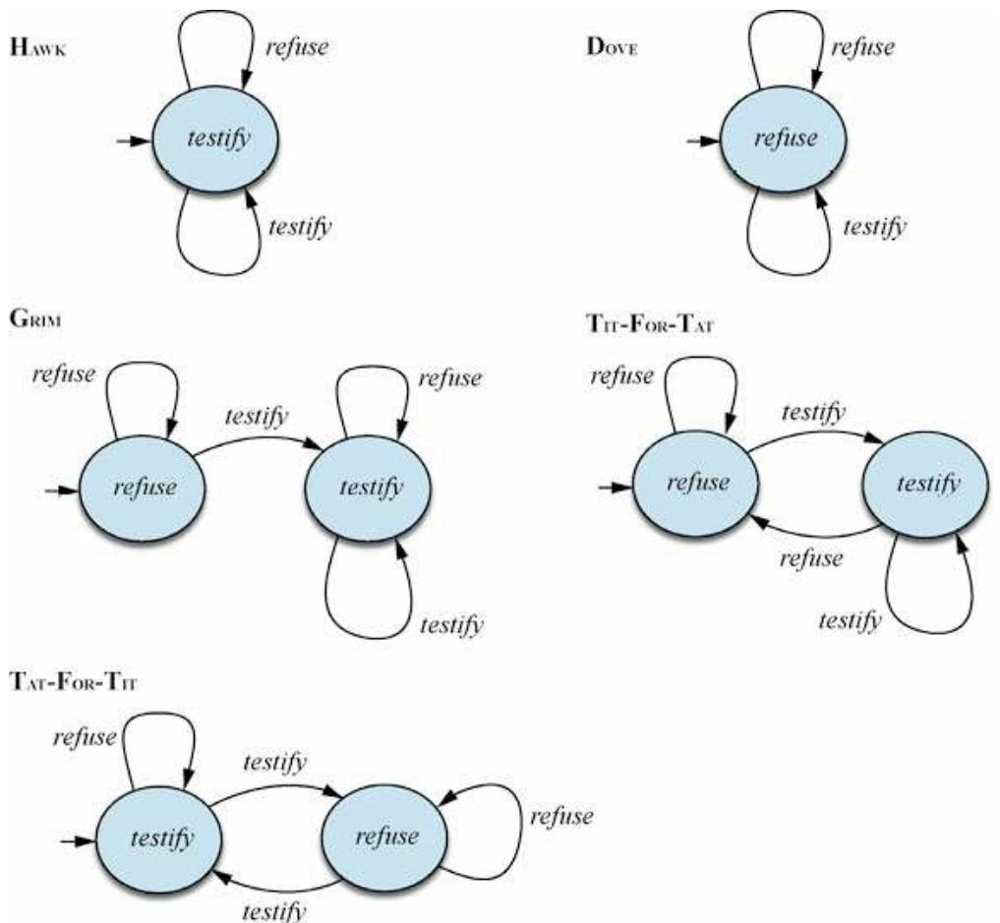  
图18-3用于无限重复的囚徒困境的一些常见的、命名有趣的有限状态机策略

H aw k 策略和D ove策略比较简单：H awk在每一轮博弈中都选择testify，而D ove在每一轮博弈中都选择refuse。G rim策略与Tit-for-Tat策略有些相似，但它们有一个重要的区别：如果对手选择了 testify ，那么G rim 基本上就会变成H awk ，即它将永远选择 testify 。而T it - for -T at 是一种原谅策略，从某种意义上说，它会以同样的选择回应随后的refuse，但在G rim策略中没有回头路。只选择一次 testify 就会导致永远的惩罚（选择 testify ）。（你能理解T at - for -T it 策略的做法吗？）

关于无限重复博弈的下一个问题是如何衡量无限支付序列的效用。这里，我们主要关注 均值极限（limitofmean）方法，本质上，这意味着对无限序列的效用取平均值。用这种方法，给定一个无限的支付序列(U ,U ,U ,…)，我们定义相应的参与者的序列的效用为

$$
\lim  _ {T \rightarrow + \infty} \frac {1}{T} \sum_ {t = 0} ^ {T} U _ {t}
$$

对于任意效用序列，这个值不一定是收敛的，但是对于使用FSM策略生成的效用序列，这个值可以保证收敛。为了弄清楚这一点，我们首先要观测到，如果FSM策略一直选择相互对抗，那么最终，FSM将重新进入以前的配置，这时它们将开始重复自身。更准确地说，任何由FSM策略生成的效用序列都将由一个有限（可能为空）的非重复序列和一个无限重复的非空有限序列组成。为了计算参与者在无限序列上的平均效用，我们只需要计算有限重复序列上的平均效用。

在接下来的内容中，我们将假设参与无限重复博弈的参与者仅通过选择一个有限状态机来表示他们的博弈行为。我们将不对这些机器施加任何限制：它们可以任意地大且精细，以满足参与者的需求。当所有参与者都选择了一个有限状态机来代表他们的博弈行为时，我们可以使用上述的均值极限方法来计算每个参与者的收益。这样，一个无限重复的博弈就可以简化为一个标准的博弈，尽管

在这个博弈中的每个参与者都有无限多种可能的策略。

让我们看看当我们使用图18-3中的一些策略来进行无限重复的囚徒困境博弈时会发生什么。首先，假设A和 B都采用D ove策略：

0 1 2 3 4 5

A:DovE refuse refuse refuse refuse refuse refuse ..效用 $= - 1$

B:DovE refuse refuse refuse refuse refuse refuse.效用 $= - 1$

不难看出，这对策略并没有达到纳什均衡：任何一方都可以通过采用H awk 策略以获得更好的收益。所以我们假设A转而采用H awk 策略：

0 2 3 4 5

A:HAwk testifytestify testify testifytestifytestify.. 效用 ${ \bf \Lambda } = { \bf 0 }$

B:Dove refuse refuse refuse refuse refuse refuse.. 效用 $= - 1 0$

这对B来说是最坏的结果；因此这对策略也不是纳什均衡。如果B也选择H awk 策略，他会获得更好的收益：

-5

-5

这对策略确实形成了纳什均衡，但它不是那么有意义——它一定程度上让我们回到了一开始的单次博弈版本，此时双方都选择指证对方。这个例子说明了无限重复博弈的一个关键性质：在无限重复博弈中，阶段博弈的纳什均衡将作为无限博弈的均衡一直维持下去。

然而，我们对这个问题的探讨还没有结束。假设此时 B 采取了G rim 策略：

-5

-5

在这种情况下，B的收益并不比选择H awk 策略差：在第一轮博弈中， A选择testify，而 B选择refuse，这个结果使得B在之后的博弈中永远选择testify，此时第一轮的效用损失将在极限的意义下消失。总的来说，这两名参与者获得的效用与他们都选择H awk 策略的情况是相同的。问题在于这些策略仍然没有形成纳什均衡，因为在这种情况下，A可以选择一个对她更有益的其他策略G rim。如果两个参与者都选择了G rim策略，那么就会发生这样的情况：

0 1 2 3 4 5

A:GRIM refuse refuse refuse refuse refuse refuse.效用=-1

B:GRIM refuse refuse refuse refuse refuse refuse... 效用 $= - 1$

这种情况的结果和收益与两个参与者都选择D ove的情况是相同的。不同之处在于，两个G rim策略相互对抗形成了纳什均衡， A和B能够理性地获得一个在单次博弈中不可能出现的结果。

为了弄清楚为什么这些策略形成了纳什均衡，我们反过来假设它们没有形成纳什均衡。那么存在一个参与者（不失一般性，我们假设这个参与者是A），她可以选择另一个对她更有益的其他策略，即选择FSM策略以产生比G rim策略更高的收益。这个策略必须在某些节点采取不同于G rim的行动，否则它将获得与之相同的效用。所以该策略需要在某个节点选择testify。随后，B采用的G rim策略将转向惩罚模式，它将永久以testify作为回应。此时 A的收益注定不会超过−5：这比她

选择G rim得到的−1还要糟糕。因此，在无限重复的囚徒困境中，两个参与者都选择G rim策略将形成一个纳什均衡，此时两个参与者将选择一个理性的长期结果，而这个结果在单次博弈中是不可能发生的。

这个例子是一个被称为纳什无名氏定理 （Nash folk theorem）的一般结果类的实例，这个定理描述了无限重复博弈中纳什均衡能够维持的结果。我们假设参与者的安全值 是参与者能够保证获得的最佳收益。那么，纳什无名氏定理的一般形式大致可以表述为，在无限重复博弈中，使所有参与者都至少能获得其安全值的每一个结果都可以作为一个纳什均衡维持。在这个例子中，G rim策略是无名氏定理的关键：如果任一智能体未能得到它所期望的结果，则相互惩罚的威胁会使参与者保持一致。但只有当对方认为你已经采取了这种策略或者至少认为你可能已经采取了这种策略时，惩罚的威胁才能起到威慑作用。

我们也可以通过改变智能体而不是改变博弈规则来获得不同的解决方案。假设智能体是具有 n 个状态的有限状态机，它们要进行一场总步数为m （ $m > n$ ）的博弈。智能体无法表示剩余的博弈次数，必须将其视为未知数。因此，智能体不能进行逆向归纳，不能自由地在重复囚徒困境中达到更有利的(refuse,refuse)均衡。在这种情况下，无知是一种福气，或者更确切地说，让你的对手相信你无知是一种福气。你在这类重复博弈中的成功很大程度上取决于其他参与者对你的 看法 （他们认为你是一个高手，还是认为你是一个傻瓜），而不是你的实际特征。

# 18.2.4 序贯博弈：扩展形式

通常情况下，一个博弈中会包含一系列不需要完全相同的回合。这类博弈的最佳表示方法是博弈树，博弈论者称之为扩展形式 （extensiveform）。该树中包含了我们在5.1节中看到的所有相同的信息：初始状态 S 0，函数P layer ( s )告诉我们哪个参与者移动了，函数A ctions ( s )列举了可能的动作，函数R esult ( s , a )定义了到达新状态的转移，以及只定义于终止状态的偏函数U tility ( s , p)，它给出了每个参与者的收益。随机博弈可以通过引入一个采取随机行动的杰出参与者 Chance 来实现。 Chance的策略是博弈定义的一部分，它由动作的概率分布指定（其他参与者可以选择自己的策略）。为了表示带有非确定性动作的博弈，如台球，我们将动作分成两部分：参与者的动作本身具有确定性结果，Chance将以其反复无常的方式对动作做出反应。

现在，我们考虑以下简化假设：我们假设参与者拥有完美信息 （perfectinformation）。大体上来说，完美信息是指当博弈要求参与者做出决定时，它们能够准确地知道自己在博弈树中的位置：它们对于之前博弈中发生的事情没有任何不确定。当然，这种假设对于象棋或围棋等博弈是成立的，但在扑克或四国军棋中该假设不成立。后面我们会展示如何使用扩展形式来捕获博弈中的不完美信息 （imperfectinformation），但就目前而言，我们将假设信息是完美的。

在完美信息的扩展形式博弈中，策略是参与者的一个函数，它的每一个决策状态 s都决定了参与者应该在A ctions(s)中选择哪个动作。当每个参与者都选择了一个策略时，生成的策略组合将在博弈树中沿着从初始状态S 到终止状态的路径进行追踪，U tility 函数定义了每个参与者随后将得到的效用。

有了这个设定，我们可以直接应用前面介绍的纳什均衡机制来分析扩展形式博弈。为了计算纳什均衡，我们可以使用在第5章中介绍的极小化极大搜索技术的简单推广形式。在关于扩展形式博弈的文献中，这种方法被称为逆向归纳——我们已经看到逆向归纳被非正式地用于分析有限重复囚徒困境。逆向归纳法采用动态规划的思想，从终止状态回溯到初始状态，并使用收益组合（分配给参与者的收益）逐步标记每个状态——从该节点开始采取最优博弈策略所得到的收益。

更详细地说，对于每个非终止状态 s，如果s的所有子节点都标有收益组合，则我们用子节点状态的收益组合标记 s，使在状态 s下做出决策的参与者的收益最大化。（如果有平局的现象，则任意选择一个；如果存在机会节点，则计算其期望效用。）逆向归纳法保证了算法能够终止，并且可以在关于博弈树规模的多项式时间内终止。

当算法开始工作时，它会追踪每个参与者的策略。结果表明，这些策略都是纳什均衡策略，而标记初始状态的收益组合是纳什均衡策略下的收益组合。因此，我们可以用逆向归纳法在多项式时间内计算出扩展形式博弈的纳什均衡策略。由于该算法保证用收益组合来标记初始状态，因此每一个扩展形式博弈都至少有一个纯策略的纳什均衡。

这些结果非常的引人注目，但也有一些需要注意的地方。博弈树的规模很快就会变得非常大，所以

在这种情况下我们应该理性看待多项式运行时间。但更大的问题是，当纳什均衡应用于扩展形式博弈时，它本身有一定的局限性。考虑图18-4所示的博弈。参与者1有两种可能的移动： above或below。如果她选择below移动，那么两位参与者获得的收益均为0（不论参与者2如何选择）。如果她选择 above移动，那么参与者2将面临up 或down 的选择：如果参与者2选择 down 移动，那么两位参与者获得的收益均为0；如果参与者2选择 up 移动，那么她们都获得1。

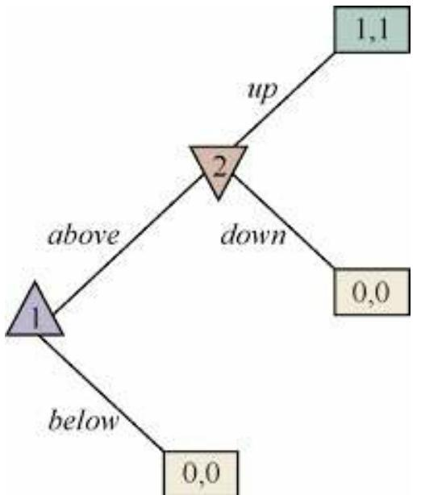  
图18-4具有反直觉纳什均衡的扩展形式博弈

逆向归纳立即告诉我们(above, up )是一个纳什均衡，它将导致双方参与者都得到1。然而，(below, down)也是纳什均衡，这将导致双方的收益均为0。参与者2威胁参与者1，表示如果被要求做出决定，她将选择down，从而使参与者1的收益为0；在这种情况下，参与者1没有比 below更好的选择。但问题在于参与者2的威胁并不是一种 可信威胁 （crediblethreat），因为如果参与者2被要求做出选择，她就会选择 up 。

对 子博弈完美纳什均衡 （subgame perfect Nash equilibrium）进行细化研究是求解问题的一种方法。为了定义这个问题，我们首先需要引入子博弈 （subgame）的概念。博弈树的每个决策状态（包括初始状态）定义了一个子博弈，因此图18-4中的博弈包含两个子博弈，一个以参与者1的决策状态为根，一个以参与者2的决策状态为根。我们称一个策略组合形成博弈 $G$ 的一个子博弈完美纳什均衡，如果它是 $G$ 的每个子博弈的纳什均衡。将此定义应用于图18-4的博弈，我们发现(above , up )是子博弈完美的，而( below , down )不是。因为选择 down 不是以参与者2的决策状态为根的子博弈的纳什均衡。

虽然我们需要一些新的术语来定义子博弈完美纳什均衡，但我们不需要任何新的算法。通过逆向归纳法计算出的策略是子博弈完美纳什均衡，由此我们可以得出每个完美信息的扩展形式博弈都有一个子博弈完美纳什均衡，它可以在关于博弈树规模的多项式时间内进行计算。

# 1. 机会移动与同时移动

为了用扩展形式表示像西洋双陆棋这样的随机博弈，我们引入了一个名为Chance的参与者，他的选择是由一个概率分布决定的。

为了表示同时移动（就像在囚徒困境或两指猜拳中），我们强行引入一个任意的参与者顺序，但同时我们断言早期参与者的动作不会被后续参与者观测到。例如 A必须先选择refuse或testify，然后B 再选择，但 B 不知道 A 当时做了什么选择（当然，我们可以在后续的过程中揭露这些移动）。然而，我们假设参与者总是记得自己之前的所有动作；这种假设叫作 完美记忆（perfectrecall）

# 2. 捕捉不完美信息