$x$ 和借代对象 $m$ 是同一个：

$$
\forall m, x (m = x) \Rightarrow M e t o n y m y (m, x)
$$

对于Chrysler这一例子，一个合理的推广是一个组织可以代表该组织的发言人：

$$
\forall m, x x \in O r g a n i z a t i o n s \wedge S p o k e s p e r s o n (m, x) \Rightarrow M e t o n y m (m, x)
$$

借代还包括用作者指代其作品（I read Shakespeare ）（我读过 莎士比亚 ），或更一般地用生产者指代其产品（I drive a Honda ）（我开的是 本田 ），以及用部分指代整体（The Red Sox need astrong arm ）（红袜队需要一只强壮的 臂膀 ）。还有一些更新奇的例子，如“The ham sandwich onTable4 wantsanotherbeer”（4号桌的 火腿三明治 想再要一瓶啤酒），需要针对具体情况进行解释（服务员招待进餐但不知道顾客的名字，用顾客所点食物指代顾客本人）。

隐喻 （metaphor）是另一种修辞手法，通过类比用字面上是某种含义的短语暗示不同的含义。因此，隐喻可以看作一种借代，只不过隐喻中的关系是一种相似性。

歧义消解 （disambiguation）是还原一句话最可能的含义的过程。从某种意义上说，我们已经有了解决这个问题的框架：每个规则都有一个与之相关的概率，因此句子解释的概率是导出该解释的所有规则的概率的乘积。遗憾的是，概率反映的是短语在学习文法的语料库中的普遍程度，因此反映的是一般知识，而不是当前情况的具体知识。为了正确消歧，我们需要结合以下4个模型。

（1）世界模型 （world model）：一个命题在世界上发生的可能性。根据我们对世界的了解，“I’m dead”更有可能意味着“I am in big trouble”（我有大麻烦了）或“I lost this video game”（我输了电子游戏），而不是“My life ended, and yet I can still talk”（我的生命已经结束，但我仍然可以说话）。  
（2）心理模型 （mentalmodel）：说话者形成向听者传达某个事实的意图的可能性。这种方法结合了多种模型：说话者相信什么，说话者相信听者相信什么，等等。例如，当一个政客说“Iamnotacrook”时，世界模型可能会给命题“该政客不是罪犯”分配50%的概率，而给命题“该政客不是牧羊人的钩状手杖”分配99.999%的概率。无论如何，我们选择前一种解释，因为这更有可能是政客想表达的东西。  
（3）语言模型 （languagemodel）：在说话者已有传达某个特定事实的意图的情况下，选择某个特定单词串的可能性。  
（4）声学模型 （acousticmodel）：对语音交流来说，在说话者已经选择某个特定单词串的情况下，生成特定声音序列的可能性。（对于手写或打字通信，我们会遇到光学字符识别的问题。）

# 23.6 自然语言任务

自然语言处理是一个非常大的领域，需要用一两本完整教材来讲解（Goldberg,2017;Jurafsky andMartin,2020）。在本节中，我们简要介绍一些主要任务。你可以通过参考文献获取更多详细信息。

语音识别 （speech recognition）是将语音转换为文本的任务。之后我们可以对生成的文本执行进一步的任务（如问答）。当前语音识别系统的单词错误率大约为3%～5%（取决于测试集的具体情况），与人工转录员的错误率相近。语音识别系统面临的挑战是即使个别单词有错误，也要做出适当的响应。

现在的顶级语音识别系统结合了循环神经网络和隐马尔可夫模型（Hinton et al. , 2012; Yu and Deng,2016; Deng, 2016; Chiu et al. , 2017; Zhang et al. , 2017）。2011年，语音领域引入了深度神经网络，错误率立即显著改进了约30%——这一领域似乎已经成熟，之前每年的改进只有几个百分点。语音识别问题具有自然的成分分解，所以非常适合使用深度神经网络：从波形到音素再到单词最后到句子。这些将在第24章中介绍。

文本-语音合成 （text-to-speech synthesis）则是与语音识别相反的过程——将文本转换为声音。泰勒（Taylor,2009）用整本书对其进行了概述。文本-语音合成面临的挑战是如何对每个单词正确地发音同时通过适当的停顿和强调让每个句子听起来自然流畅。

另一个发展领域是合成不同的声音——从普通男性或女性的声音开始，接着可以合成地方方言，甚至模仿名人的声音。与语音识别一样，深层循环神经网络的引入同样为文本-语音合成带来了巨大的进步，大约2/3的听者认为，WaveNet神经网络系统（van den Oord et al. , 2016a）比之前的非神经网络系统听起来更自然。

机器翻译 （machinetranslation）将文本从一种语言转换到另一种语言。系统通常使用双语语料库进行训练。例如，一组成对的文档，每对文档的其中一个使用英语，而另一个使用法语。不需要以任何方式对文档进行标记；机器翻译系统学习如何对齐句子和短语，然后当遇到其中一种语言的新语句时，可以生成另一种语言的翻译。

21世纪早期的机器翻译系统使用n元模型，系统通常能够理解文本的含义，但大多数句子都包含文法错误。一个问题是n 元的长度限制：即使将限制放大到7，信息也很难从句子的一端传递到另一端。另一个问题是，一个n元模型中的所有信息都位于单个单词的层级。这样的系统可以学习将“blackcat”翻译成“chatnoir”，但是却不能学到英语中形容词通常在名词之前而法语中形容词通常在名词之后这样的规则。

序列到序列循环神经网络模型（Sutskeveretal. ,2015）解决了这一问题。它们可以更好地泛化（因为它们可以使用词嵌入而不是特定单词的n 元计数），并且可以在整个深度网络的不同层级上形成组合模型，从而有效地传递信息。之后的工作使用Transformer模型的注意力机制（Vaswanietal.,2018）进一步提高了翻译性能，对这两种模型各方面进行结合的混合模型则进一步提升了效果，在某些语言对上达到了人类水平的表现（Wu et al. , 2016b; Chen et al. , 2018）。

信息提取 （information extraction）是通过浏览文本并查找文本中特定类别的对象及其关系来获取知识的过程。典型的任务包括，从网页中提取地址实例获取街道名、城市名、州名以及邮政编码等数据库字段；从天气预报中提取暴风雨信息获取温度、风速以及降水量等字段。如果源文本具有很好的结构（如以表格的形式），那么像正则表达式之类的简单技术就可以进行信息提取（Cafarellaetal.,2008）。如果我们试图提取所有事实，而不仅是特定类型（如天气预报），那么提取会变得更加困难；班科等人（Bankoetal. , 2007）介绍了TextRunner系统，它在一个开放的不断扩展的关系集上进行信息提取。对于自由格式的文本，可以使用隐马尔可夫模型和基于规则的学习系统［就像T ext R unner 和永无止境语言学习（never-ending language learning，NELL）（Mitchell et al.,2018）中所使用的一样］。最近的系统使用循环神经网络，以利用词嵌入的灵活性。你可以在（Kumar, 2017）中找到相关概述。

信息检索 （information retrieval）的任务是查找与给定查询相关且重要的文档。谷歌和百度等互联网搜索引擎每天都会执行数十亿次这样的任务。有3本很好的关于信息检索的教材，即（Manninget al. , 2008）、（Croft et al. , 2010）和（Baeza-Yates and Ribeiro-Neto, 2011）。

问答 （question answering）与信息检索不同，它的查询其实是一个问题，如“Who founded the U.S.CoastGuard?”（谁创立了美国海岸警卫队？），查询结果也不是一个排好序的文档列表，而是一个实际答案：“Alexander Hamilton.”。自20世纪60年代以来，就已经出现了依赖于本章所讨论的句法分析的问答系统，但是直到2001年，这类系统才开始使用网页信息检索，从根本上增加了系统的覆盖范围。卡茨（Katz, 1997）介绍了S tart 分析器和问题解答器。班科等人（Banko et al. , 2002）介绍了A sk MSR系统，A skMSR在句法分析能力方面并不复杂，它更注重使用网络搜索以及对结果进行排序。例如，为了回答“Who founded the U.S. Coast Guard?”，它会搜索诸如[* founded the U.S.Coast Guard]和[the U.S. Coast Guard was founded by *]之类的查询，然后在知道查询词“who”表示答案应该是某个人的情况下检查多个结果网页，找出可能的响应。自1991年以来，TextREtrievalConference（TREC）收集了关于这一主题的研究，并且每年都会举办比赛（Allan et al. , 2017）。最近，研究人员也创建了其他测试集，如关于基础科学问题的AI2 ARC测试集（Clark et al. ,2018）。

小结

本章有以下主要内容。

●基于n元的概率语言模型可以还原关于一种语言的相当多信息。它们可以在诸如语言识别、拼写校正、情感分析、体裁分类和命名实体识别之类的多种任务中表现出色。  
●这些语言模型可能有数百万个特征，因此对数据进行预处理和平滑处理以减少噪声非常重要。  
●在建立统计语言系统时，最好设计一个可以充分利用可用数据 的模型，即使这个模型看起来非常简单。  
● 词嵌入可以赋予单词及其相似性更丰富的表示。  
●短语结构 文法（尤其是上下文无关文法）对于捕捉语言的层次结构很有帮助。概率上下文无关文法（PCFG）的形式体系和依存文法的形式体系已被广泛使用。  
● 通过 图表句法分析器 （如 CYK算法 ），可以在 O ( n3)时间内对上下文无关语言的语句进行分析，算法要求文法规则为 乔姆斯基范式 。使用束搜索或移位减少句法分析器可以在 O ( n )时间内对自然语言进行分析，准确性也不会有很大损失。  
●树库 可以用于学习带参数的PCFG文法。  
●扩展 文法处理诸如主语-动词一致性和代词格之类的问题非常方便，它可以在单词层级而不只是范畴层级对信息进行表示。  
●语义解释 也可以通过扩展文法处理。我们可以从与问题的逻辑形式或答案配对的问题语料库中学习语义文法。  
●自然语言非常复杂，很难用形式文法获取。

读者服务：


微信扫码关注【异步社区】微信公众号，回复“e59810”获取本书配套资源以及异步社区15天VIP会员卡，近千本电子书免费畅读。

# 第24章

自然语言处理中的深度学习

在本章中，深度神经网络将执行各种语言任务，捕捉自然语言的结构及其流动性。

第23章介绍了自然语言的关键要素，包括语法和语义。基于句法分析和语义分析的系统已经在许多任务上获得了成功，但是它们的性能受到实际文本中极度复杂的语言现象的限制。由于存在大量机器可读形式的可用文本，因此考虑基于数据驱动的机器学习的方法是否更有效是有意义的。我们使用深度学习系统（第21章）提供的工具来探索这一假设。

24.1节先介绍如何通过将单词表示为高维空间中的点而不是原子值来改进机器学习。24.2节介绍在顺序处理文本时如何使用循环神经网络捕捉文本含义和长距离上下文信息。24.3节主要讨论机器翻译，这是应用于自然语言处理的深度学习技术的主要成功之一。24.4节和24.5节介绍一些模型，这些模型可以用大量未标注文本进行训练，然后应用于特定任务，通常可以达到最高水平的性能。最后，24.6节总结目前的研究所处的阶段，以及这一领域未来如何发展。

# 24.1 词嵌入

我们希望得到一种不需要手工特征工程的单词表示，但它能在相关单词之间进行泛化，相关单词包括句法方面的单词（“colorless”和“ideal”都是形容词），语义方面的单词（“cat”和“kitten”都是猫科动物），主题方面的单词（“sunny”和“sleet”都是天气术语），情感方面的单词（“awesome”和“cringeworthy”具有对立的情感），或者其他方面的单词。

如何将一个单词编码成一个输入向量 x以用于神经网络？如21.2.1节所述，我们可以使用一个独热向量 （one-hotvector），也就是说，将字典中的第i个单词编码为第i个位置为1且其他位置为0的向量。但这样的表示无法捕捉单词之间的相似性。

根据语言学家约翰·R.弗斯（JohnR. Firth）（Firth,1957）的名言“要知道一个单词的含义就要看它周围是什么单词”，我们可以将一个单词表示为包含该单词的所有短语的n 元计数所组成的向量。但是，原始的 $n$ 元计数非常麻烦。对于有100000个单词的词汇表，需要记录1025 种5元（尽管这个1025 维空间中的向量非常稀疏——绝大多数计数值为0）。如果将它缩小为一个较小规模的向量，也许只有几百维，我们将得到更好的泛化。我们把这个较小的稠密向量称为词嵌入 ：一个表示某个单词的低维向量。词嵌入是从数据中自动学习的。（稍后我们将看到这是如何实现的。）那么，学习到的词嵌入是什么样的？一方面，每个词嵌入只是一个数值向量，它的各个维度及其数值没有明显含义：

$$
\begin{array}{r l} \text {" a a r d v a r k "} = & [ - 0. 7, + 0. 2, - 3. 2, \ldots ] \end{array}
$$

$$
\text {" a b a c u s "} = [ + 0. 5, + 0. 9, - 1. 3, \dots ]
$$

$$
\text {" z y z z y v a "} = \quad [ - 0. 1, + 0. 8, - 0. 4, \dots ]
$$

另一方面，特征空间具有以下性质：语义相似的单词最终会具有相似的向量值。在图24-1中，我们可以看到这一点，country、kinship、transportation和food等单词形成了独立的聚类簇。

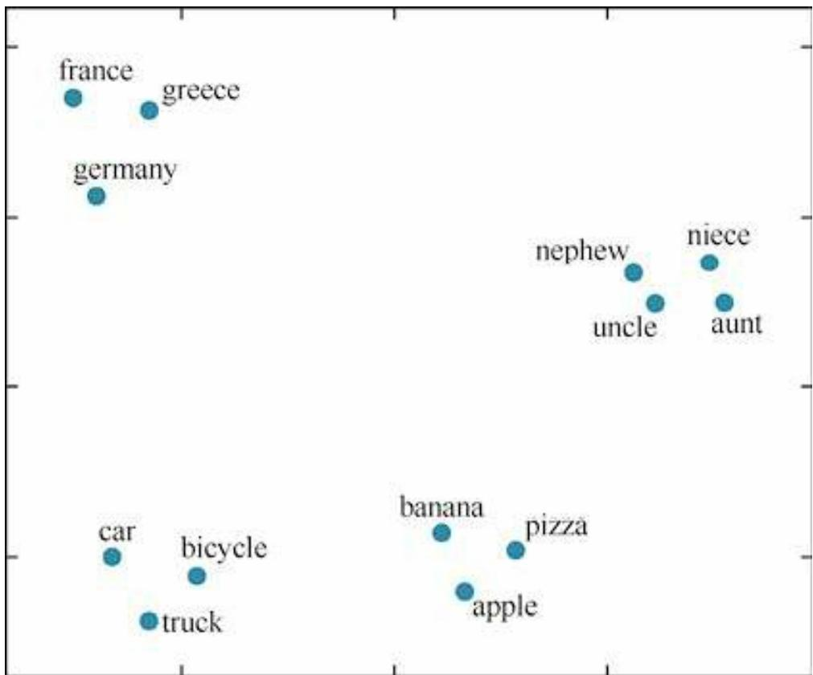

图24-1 在60亿字的文本上训练得到的GloVe算法计算出的词嵌入向量。本图这种可视化将100维的词向量投影到二维空间上。相似的单词在图中彼此接近

事实证明，由于某些我们尚未完全理解的原因，词嵌入向量在相似单词彼此邻近的性质之外还具有其他性质。例如，假设我们查看Athens（雅典）的词向量A和Greece（希腊）的词向量B。对于这两个词，向量差值B−A似乎编码了国家/首都关系，其他对——France和Paris（法国和巴黎）、Russia和Moscow（俄罗斯和莫斯科）、Zambia和Lusaka（赞比亚和卢萨卡），具有基本相同的向量差值。

我们可以利用这一性质解决单词类比问题，例如，“Athens is to Greece as Oslo is to [what]?”（雅典之于希腊就像奥斯陆之于[什么]？）。设 $\pmb { C }$ 为Oslo的词向量， D 为未知向量，我们假设 B – A = D− C ，可以得到 D = C + ( B − A )。当我们计算出新向量 $\pmb { D }$ 时，我们发现，相较于其他任何单词，它更接近“Norway”（挪威）。图24-2表明这种类型的向量算法适用于多种关系。

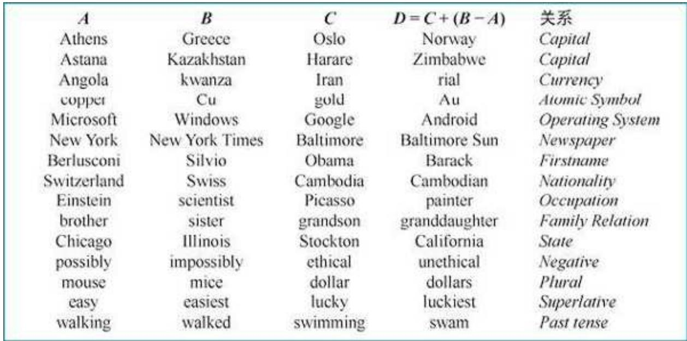  
图24-2 词嵌入模型有时可以通过向量算法回答以下问题：“A 之于B就像C 之于[什么]？”。向量算法指给定单词的词嵌入向量A、B和 $\pmb { C }$ ，计算向量D =C+(B−A)，然后查找最接近 $\pmb { D }$ 的单词。（ $\pmb { D }$ 列中的答案由模型自动计算，“关系”列中的描述是手动添加的。）改编自（Mikolov et al., 2013, 2014）

但是，我们无法保证在特定语料库上运行的特定词嵌入算法可以捕捉到特定的语义关系。词嵌入之所以受欢迎，是因为事实证明对于下游语言任务（如问答、翻译或摘要）词嵌入是一种很好的表示，而不是因为它们本身可以回答类比问题。

事实证明，使用词嵌入向量而不是独热编码对于深度学习在自然语言处理任务中的几乎所有应用都是有帮助的。实际上，在许多情况下，可以使用任意一种通用 预训练 向量执行某个特定的自然语言处理任务。在撰写本书时，常用的向量词典包括word 2 vec、GloVe（GlobalVector，全局向量）和包含157种语言的词嵌入的fastText。使用预训练模型可以节省大量时间和精力。有关这些资源的更多信息，见24.5.1节。

你也可以训练自己的词向量，这通常是在为某个特定任务训练网络时同时完成的。与通用预训练词嵌入不同，为特定任务生成的词嵌入可以在一个精心选择的语料库上进行训练，并且倾向于强调那些对该任务有用的单词属性。例如，假设该任务是词性（POS）标注（见23.1.6节）。回想一下，这涉及预测句子中每个单词的正确词性。尽管这是一项简单的任务，但它并不平凡，因为许多单词可以用多种方式标注，例如，单词“cut”可以是现在时动词（及物或不及物）、过去时动词、不定式动词、过去分词、形容词或名词。如果附近的时间副词指代过去，则表明此处的“cut”是过去时动词；因此，我们希望词嵌入能够捕捉到副词这一指代过去的属性。

词性标注可以作为将深度学习应用于自然语言处理的很好的入门，它不像问答任务这么复杂（见24.5.3节）。给定带有词性标注的句子语料库，我们将同时学习词嵌入和词性标注器的参数。具体

过程如下。

（1）选择用于标注每个单词词性的预测窗口的宽度 w（奇数个单词）。一般w=5，意味着模型将根据该单词以及其左侧的两个单词和右侧的两个单词来预测其词性。将语料库中的每个句子拆分为长度为w的重叠窗口。每个窗口都会产生一个训练样本，包括作为输入的w个单词和作为输出的中间单词的词性。  
（2）创建词汇表，包含所有在训练数据中出现5次以上的唯一单词记号。词汇表中的单词总数记为v 。  
（3）以任意顺序（可能是字母序）对词汇表进行排序。  
（4）选择每个词嵌入向量的大小 d 。  
（5）创建一个新的v×d 权重矩阵，称为 $\pmb { { \cal E } }$ 。这就是词嵌入矩阵。E的第 i行是词汇表中第i个词的词嵌入。对E进行随机初始化（或使用预训练向量）。  
（6）建立一个输出词性标注的神经网络，如图24-3所示。第一层包含词嵌入矩阵的 w个副本。我们可能会使用两个额外的隐藏层 $\textbf { z } _ { 1 }$ 和z （权重矩阵分别为 W 和 W ），之后是一个softmax层，输出中间单词在其可能词性上的概率分布 ：

$$
z _ {1} = \sigma (W _ {1} x)
$$

$$
z _ {2} = \sigma \left(W _ {2} z _ {1}\right)
$$

$$
\hat {y} = \operatorname {s o f t m a x} \left(W _ {\text {o u t}} z _ {2}\right)
$$

（7）要将一个包含w个单词的序列编码为一个输入向量，只需要查找每个单词的词嵌入，然后连接成一个向量即可。结果是一个长度为wd的实值输入向量x 。无论给定的单词在第一个位置、最后一个位置还是中间位置，它都具有相同的词嵌入向量，每个词嵌入也将与第一个隐藏层的不同部分相乘；因此我们隐式地编码了每个单词的相对位置。  
（8）使用梯度下降法训练权重矩阵 E 和其他权重矩阵 W 1、 W 2和 W out。如果一切顺利，根据预测窗口中的证据（包括表示过去时态的单词“yesterday”和“cut”之前的第三人称主语代词“they”等），中间词“cut”将被标注为过去时动词。

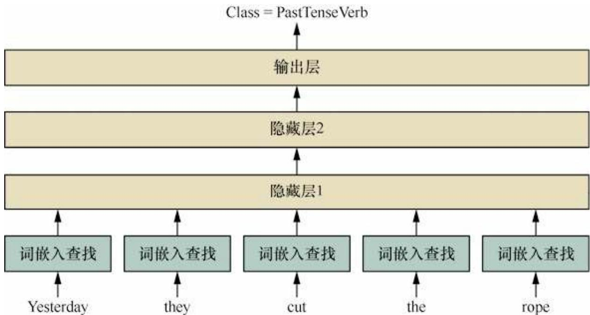  
图24-3前馈词性标注模型。模型接受一个包含5个单词的窗口作为输入，然后预测中间单词（此处

为“cut”）的词性。该模型能够说明单词的位置，因为5个输入词嵌入中的每一个都与第一个隐藏层的不同部分相乘。在训练过程中同时学习词嵌入及三层网络的参数值

词嵌入的另一种替代方法是字符级模型 ，它的输入是字符序列，每个字符被编码为一个独热向量。这样的模型必须学习字符是如何组合成单词的。自然语言处理中的大多数工作坚持使用单词级编码而不是字符级编码。

# 24.2 自然语言处理中的循环神经网络

现在，我们对于独立的单个单词有很好的表示方式，但是语言是由单词的有序序列组成的，其中前后单词构成的上下文 非常重要。通常，对于词性标注之类的简单任务，一个大约有5个单词的固定大小的小窗口就能够提供足够的上下文。

更复杂任务（如问答或指代消解）的上下文可能需要几十个单词。例如，在“Eduardo toldmethatMiguel was very sick so I took him to the hospital”（Eduardo告诉我Miguel病得很重，所以我把 他 送到了医院）这句话中，要知道 him 指的是“Miguel”，而不是“Eduardo”，则需要涵盖这个句子的第一个单词到最后一个单词的上下文。

# 24.2.1 使用循环神经网络的语言模型

我们首先将创建具有足够上下文的 语言模型 。回想一下，语言模型是单词序列的一个概率分布。它允许我们根据前面的所有单词预测文本中的下一个单词，并且通常作为更复杂任务的一个“积木”。

由于上下文的问题，使用 n 元模型（见23.1节）或前馈神经网络（固定窗口有 n 个单词）建立语言模型都可能会遇到困难：要么所需上下文超出固定窗口的大小，要么模型的参数太多，要么两者都有。

此外，前馈网络还存在不对称 的问题：例如，如果单词“him”作为句子中第12个单词出现，无论模型学到了什么，对于“him” 出现在 句子中其他位置的情况，它都必须重新学习，因为每个位置的权重都不一样。

21.6节中介绍了 循环神经网络 （recurrent neural network，RNN），它旨在处理时间序列数据，一次处理一个数据。这表明可以用RNN处理语言，一次处理一个单词。我们在这里重复展示图21-8，记为图24-4。

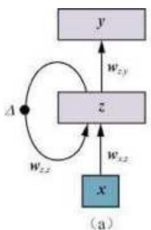

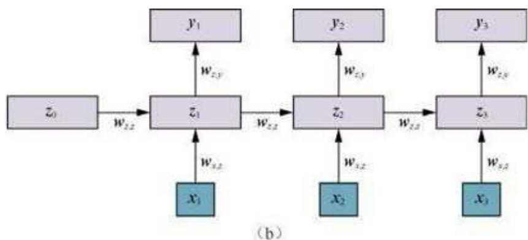  
图24-4 （a）RNN示意图，其中隐藏层 z 具有循环连接，符号 $\pmb { \mathscr { A } }$ 表示延迟。每个输入 x 是句子中下一个单词的词嵌入向量。每个输出 y 是该时间步的输出。（b）同一网络在3个时间步上展开以创建前馈网络。注意，权重在所有时间步中是共享的

在一个RNN语言模型中，每个输入单词都被编码为一个词嵌入向量 $x _ { i }$ 。存在隐藏层 $\textbf { z } _ { t }$ ，它作为输入从一个时间步传递到下一个时间步。之后是多类别分类，类别即词汇表中的单词。因此，输出 $y$ 将是句子中下一个单词可能值的softmax概率分布。

RNN架构解决了参数过多的问题。无论单词数量多少，权重矩阵 w z,z、 w x,z和 $w _ { z , y }$ 的参数数量都保持不变，即参数是O (1)量级。这与参数为O (n )量级的前馈网络和参数为 $O \left( v ^ { n } \right)$ 量级（ $v$ 是词汇表的大小）的n 元模型形成对比。

RNN架构还解决了不对称问题，因为每个单词位置的权重都相同。

RNN架构有时也可以解决上下文有限的问题。从理论上讲，RNN对于模型可以回看到多远的输入

没有限制。隐藏层 z t的每次更新都可以访问当前输入单词 x t和前一个隐藏层 z t−1，这意味着输入中任何单词的相关信息都可以无限期保存在隐藏层中，从一个时间步复制（或适当修改）到下一个时间步。当然， z 中的存储空间有限，因此它无法记住前面所有单词的全部信息。

实践表明，RNN模型在很多任务上表现良好，但不是在所有的任务上都表现得好。我们很难预测它们是否可以成功解决某一给定问题。好的一点是，训练过程有助于网络将z中的存储空间分配给输入中实际证明有用的部分。

为了训练RNN语言模型，我们使用21.6.1节中描述的训练过程。输入 $\textbf { \em x } _ { t }$ 是文本训练语料库中的单词，观察到的输出是偏移1个位置的相同单词。即，对于训练文本“hello world”，第一个输入 x 1是“hello”的词嵌入，第一个输出y1 是“world”的词嵌入。我们训练模型来预测下一个单词，并希望模型使用隐藏层来表示有用信息以达到预测目标。如21.6.1节所述，我们计算观察到的输出与网络计算出的实际输出之间的差异，并通过时间反向传播，注意在所有时间步上都保持相同权重。

一旦模型完成训练，我们就可以使用它来生成随机文本。我们给模型一个初始输入词x ，它会产生一个输出 y1 ，y1 是单词的softmax概率分布。我们从分布中采样一个单词，将该单词记为时间t的输出，然后将其反馈回模型作为下一个输入词 $\boldsymbol { x } _ { 2 }$ 。只要有需要，我们可以不断重复上述步骤。从y1 采样时，我们要做一个选择：可以始终选择最可能的单词；可以根据每个单词的概率采样；也可以对不太可能的单词过采样，以便为生成的输出增加多样性。采样权重是模型的一个超参数。

以下是由莎士比亚的作品训练得到的RNN模型生成的随机文本的一个示例（Karpathy, 2015）：

Marry, and will, my lord, to weep in such a one were prettiest;

Yet now I was adopted heir

Of the world’s lamentable day,

To watch the next way with his father with his face?

# 24.2.2 用循环神经网络进行分类

同样可以将RNN用于其他语言任务，例如词性标注或共指消解。这两种情况的输入层和隐藏层都是相同的。然而，对于词性标注器，输出是词性标注上的softmax分布；对于共指消解，输出则是可能的先行词上的softmax分布。例如，当网络当前的输入是“Eduardo told me that Miguel was verysick so I took him to the hospital”中的 him 时，它应该为“Miguel”输出较高的概率。

训练RNN来解决上述分类问题的方法与语言模型相同。唯一的区别是训练数据需要标签——词性标注或指代指示。这比仅使用未标注文本的语言模型更难收集数据。

在语言模型中，我们要根据前面的单词来预测第n 个单词。但是对于分类任务，我们不必局限于只看前面的单词。往后读完整个句子会有帮助。在共指示例中，如果句子以“toseeMiguel”而不是“tothehospital”结尾，那么“him”的指代对象将有所不同，因此查看完整句子是非常重要的。眼动追踪实验告诉我们，人类并不严格地从左向右阅读。

为了捕捉右侧的上下文信息，我们可以使用双向RNN （bidirectionalRNN），它将一个单独的从右到左模型连结到一个从左到右模型上。使用双向RNN进行词性标注的示例如图24-5所示。

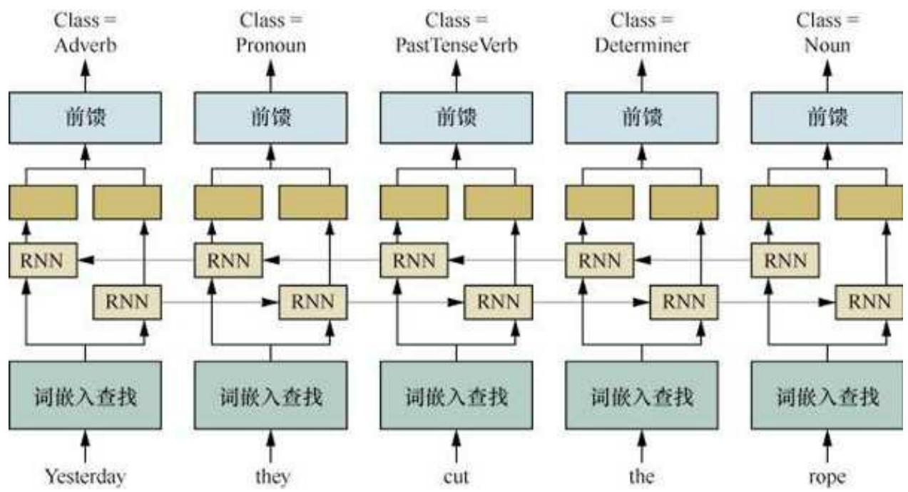  
图24-5用于词性标注的双向RNN网络

对于多层RNN，z 是最后一层的隐藏向量。对于双向RNN，通常将z 看作从左到右和从右到左模型的向量的拼接。

RNN还可以用于句子级（或文档级）分类任务，这种情况下，RNN最后只有单个输出，而不是有一个输出流（每个时间步都有一个输出）。例如，在 情感分析 中，目标是将文本划分为带正面情感或负面情感的文本。例如，“This movie was poorly written and poorly acted”应属于带负面情感的文本。（某些情感分析方案使用两个以上的类别，或者使用一个标量数值。）

用于句子级任务的RNN要更加复杂，因为我们需要从RNN的每个单词的输出 y 中获得一个聚合的整个句子的表示y。最简单的方法是使用与输入中最后一个单词相对应的隐藏状态，因为RNN将在该时间步读取整个句子。但是，这可能会使模型隐式地偏向于更加关注句子的末尾。另一种常用技术是对所有隐藏向量进行合并。例如， 平均池化 （average pooling）会计算所有隐藏向量的元素平均值：

$$
\tilde {z} = \frac {1}{s} \sum_ {t = 1} ^ {s} z _ {t}
$$

池化后的d 维向量 接着被送入一个或多个前馈层，然后进入输出层。

# 24.2.3 自然语言处理任务中的LSTM模型

我们之前提到，RNN有时可以解决上下文有限的问题。理论上，任何信息都可以从一个隐藏层传递到下一个隐藏层，时间步数不限。但是在实践中，信息可能会丢失或失真，就像玩电话游戏一样，在电话游戏中，玩家排成一列，第一个玩家通过耳语向第二个玩家传递一条消息，然后第二个玩家向第三个玩家传递，以此类推。通常，最后得到的消息与原始消息相比有很大的损失。RNN的这一问题类似于21.1.2 节中提到的 梯度消失 问题，只是我们现在处理的是随时间推移的网络层，而不是深度网络层。

21.6.2节中介绍了长短期记忆 （LSTM）模型。这是一种带有门控单元的RNN，它不会遇到无法完美地从一个时间步复制消息到下一个时间步的问题。相反，LSTM可以选择记住输入的某些部分，并将其复制到下一个时间步，而忘记其他部分。考虑处理诸如此类文本的语言模型：

The athletes, who all won their local qualifiers and advanced to the finals in Tokyo, now ...

在这一点上，如果我们问模型下一个单词更有可能是“compete”还是“competes”，我们希望它选择“compete”，因为它与主语“Theathletes”是一致的。LSTM模型可以学习为主语的人称和单复数创建一个潜在特征，并不做任何更改地向前复制该特征，直到它需要进行上面这样的选择。一般的RNN（或相关的 n 元模型）在长句子中经常会发生混淆，因为在主语和动词之间有很多中间词。

# 24.3 序列到序列模型

自然语言处理中研究最广泛的任务之一是机器翻译 （machinetranslation，MT），其目标是将一个句子从 源语言 （source language）翻译到 目标语言 （target language），例如从西班牙语翻译到英语。我们用大规模源-目标语句为语料库训练机器翻译模型。目标是准确地翻译不在训练数据中的新句子。

可以使用RNN创建一个机器翻译系统吗？我们当然可以使用RNN对源语句进行编码。如果源词和目标词之间存在一一对应的关系，那么我们可以将机器翻译看作简单的标注任务——给定西班牙语中的源词“perro”，我们将其标注为对应的英语单词“dog”。但事实上，单词不是一一对应的：在西班牙语中，3个单词“caballo de mar”对应一个英语单词“seahorse”，“perro grande”则翻译为“bigdog”（单词顺序是颠倒的）。单词的重排现象甚至可能更极端；英语中主语通常在句首，但斐济语中主语通常在句尾。那么我们如何生成目标语言的句子呢？

我们似乎应该一次生成一个单词，但是要跟踪上下文，这样才能记住源句中尚未翻译的部分，同时还要跟踪已经翻译完的内容，这样才不会出现重复。对于某些句子，在开始生成目标句之前，我们必须先处理整个源句。换句话说，每个目标词的生成都取决于整个源句和前面生成的所有目标词。

这使得机器翻译的文本生成与24.2节所述的标准RNN语言模型紧密相连。当然，如果我们已经在英语文本上训练了一个RNN，它更有可能生成“big dog”而不是“dogbig”。然而，我们并不想只生成任意随机的目标语言句；我们希望生成一个与源语言句相对应的目标语言句。最简单的方法是使用两个RNN，一个用于源语言，另一个用于目标语言。我们在源语句上运行源RNN，然后使用源RNN的最终隐藏状态作为目标RNN的初始隐藏状态。这样，每个目标词都隐式地取决于整个源句和前面的目标词。

这种神经网络架构称为基本的 序列到序列模型 （sequence-to-sequence model），图24-6给出了一个例子。序列到序列模型最常用于机器翻译，但也可用于许多其他任务，例如从图像中自动生成文本描述，即摘要：将长文本改写为含义相同的短文本。

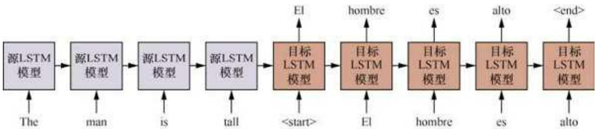  
图24-6 基本的序列到序列模型。每个块代表一个LSTM模型时间步。（简单起见，图中没有显示嵌入层和输出层。）我们向网络中连续输入源句“Theman istall”的单词，后跟<start> 标记，表示网络要开始生成目标句。源句末尾的最终隐藏状态被用作目标句的初始隐藏状态。然后，将时刻t的目标句单词作为时刻t+1的输入，直到网络生成 <end> 标记，表示句子完成

基本的序列到序列模型是自然语言处理和机器翻译的重大突破。吴永辉等人（Wuetal.,2016b）认为，与之前的机器翻译方法相比，该方法的误差降低了60%。但这些模型存在以下3个主要缺点。

●邻近上下文偏差 （nearbycontextbias）：无论RNN想记住关于过去的什么信息，它们都必须适应自己的隐藏状态。例如，假设RNN正在处理一个70个单词的序列的第57个单词（或时间步）。隐藏状态可能包含更多关于第56个时间步的单词的信息，而不是第5个时间步的单词的信息，因为隐藏向量每次更新时，都必须用新信息替换一定量的现有信息。这种行为是模型有意设计的一部分，对自然语言处理来说通常是有意义的，因为邻近的上下文通常更重要。然而，远距离的上下文也可能是至关重要的，但RNN模型中可能会丢失远距离的信息；即使LSTM模型也很难处理这个问题。

●固定上下文大小限制 （fixed contextsizelimit）：在RNN翻译模型中，整个源句被压缩成一个固定维的隐藏状态向量。在最高水平的自然语言处理模型中所使用的LSTM通常大约有1024维，如果我们必须用1024个维度来表示一个64词的句子，那么每个单词只有16个维度，这对复杂句来说是不

够的。增加隐藏状态向量的大小又会导致训练缓慢和过拟合。

● 缓慢的顺序处理 （slower sequential processing）：正如21.3节所讨论的，神经网络通过批处理训练数据，从而利用硬件对矩阵算法的有效支持，实现相当大的效率增益。但是，RNN被限制为一次只能操作训练数据中的一个词。

# 24.3.1 注意力

如果目标RNN取决于源RNN的所有隐藏向量而不只是最后一个隐藏向量会如何呢？这将缓解邻近上下文偏差和固定上下文大小限制的问题，使得模型能够同样地访问前面的任何单词。实现这种访问的一种方法是连接所有的源RNN隐藏向量。然而，这将导致权重数急速增长，随之而来的是计算时间的增加以及潜在的过拟合。但是，我们可以利用这样一个事实：当目标RNN一次生成一个目标单词时，与每个目标单词实际相关的很可能只有源句中的一小部分。

关键的是，对于每个单词，目标RNN必须注意源句的不同部分。假设训练一个将英语翻译成西班牙语的网络。它的输入是带有句末标记的“The front door is red”，该标记表示网络将开始输出西班牙语单词。所以理想情况下，模型应该先注意“The”从而生成“La”，然后注意“door”从而输出“puerta”，等等。

我们可以用一个称为 注意力 （attention）的神经网络组件来形式化这一概念，它可以构造一个固定维的源句的“基于上下文的概要”的表示。上下文向量 c i包含与下一个目标单词的生成最相关的信息，它被用作目标RNN的另一个输入。使用注意力的序列到序列模型称为 注意力序列到序列模型 （attentional sequence-to-sequence model）。如果将标准的目标RNN写为

$$
\boldsymbol {h} _ {i} = R N N \left(\boldsymbol {h} _ {i - 1}, \boldsymbol {x} _ {i}\right)
$$

那么注意力序列到序列模型的目标RNN可以写为

$$
\boldsymbol {h} _ {i} = R N N \left(\boldsymbol {h} _ {i - 1}, \left[ \boldsymbol {x} _ {i}; \boldsymbol {c} _ {i} \right]\right)
$$

其中， $[ \pmb { x } _ { i } ; \pmb { c } _ { i } .$ ]是输入和上下文向量 $\textbf { \em c } _ { i }$ 的拼接， $\boldsymbol { c } _ { i }$ 定义为

$$
\begin{array}{l} r _ {i j} = \boldsymbol {h} _ {i - 1} \cdot \boldsymbol {s} _ {j} \\ a _ {i j} = \mathrm {e} ^ {r _ {i j}} / \left(\sum_ {k} \mathrm {e} ^ {r _ {i k}}\right) \\ \boldsymbol {c} _ {i} = \sum_ {j} a _ {i j} \cdot \boldsymbol {s} _ {j} \\ \end{array}
$$

其中， $\pmb { h } _ { i - 1 }$ 是目标RNN向量，用于预测时间步i上的单词，s 是源单词（或时间步） $j$ 上源RNN向量的输出。h 和s 都是d 维向量，其中，d 是隐藏层大小。因此， r 的值是当前目标状态和源单词j之间的原始“注意力得分”。然后使用softmax将所有源单词上的这些分数归一化为概率a。最后，这些概率被用来生成源RNN向量——c （另一个d维向量）的一个加权平均值。

图24-7a给出了注意力序列到序列模型的示例。有一些重要的细节需要理解。首先，注意力组件本身没有可学习的权重，并且在源端和目标端都支持变长序列。其次，就像我们学过的其他大多数神经网络建模技术一样，注意力完全是潜在的。程序员并没有规定什么时候使用什么信息，模型会学习应该使用哪些信息。注意力也可以用在多层RNN中。在这种情况下，RNN的每一层都可以应用注意力。

注意力的概率softmax公式有3个作用。第一，它使注意力可微，这是使用反向传播的必要条件。即使注意力本身没有可学习的权重，梯度仍然通过注意力回传到源RNN和目标RNN。第二，因为注意力可以同时考虑整个源序列，并学会保留重要部分，忽略其余部分，所以概率公式允许模型捕捉源RNN可能没有捕捉到的某些类型的远距离上下文。第三，概率注意力允许网络表示不确定性

如果网络不完全知道接下来要翻译的源词，它可以将注意力概率分布在几个选项上，然后使用目标RNN做实际选择。

与神经网络的大多数组件不同，注意力概率通常可以被人类解释并且具有直观意义。例如，在机器翻译中，注意力概率通常对应于人类会生成的单词到单词的对齐，如图24-7b所示。

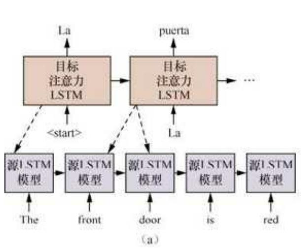

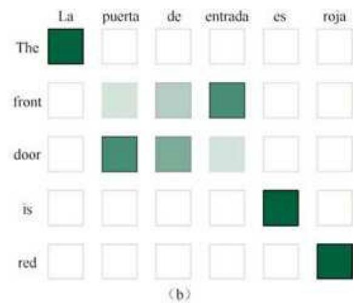  
图24-7（a）从英语翻译到西班牙语的注意力序列到序列模型。虚线表示注意力。（b）一个双语句对的注意力概率矩阵示例，方框颜色越深，表示的a 值越大。每一列的注意力概率总和为1

序列到序列模型对于机器翻译是很自然的，然而几乎所有自然语言任务都可以编码为一个序列到序列问题。例如，训练一个问答系统，输入可以是通过分隔符连接的一个问题和它的答案。

# 24.3.2 解码

在训练时，序列到序列模型试图最大化训练集目标句中每个词的概率，条件为源句和前面所有目标词。训练完成后，给定一个源句，我们的目标是生成相应的目标句。如图24-7所示，我们可以一次生成一个目标词，然后在下一个时间步将其反馈回网络。这个过程称为 解码 （decoding）。

最简单的解码形式是在每个时间步都选择概率最高的单词，然后将这个单词作为输入反馈到下一个时间步。这称为贪心解码 （greedy decoding），因为在每个目标词生成后，系统已经完全遵循了它迄今为止所产生的假设。然而，解码的目标是最大化整个目标序列的概率，这可能是贪心解码无法实现的。例如，考虑使用贪心解码将我们之前看到的英语语句“ The front door is red ”翻译为西班牙语。

正确的翻译是“ La puerta de entrada es roja ”，字面意思是“ The door of entry is red ”。假设目标RNN正确生成了第一个单词“La”（对应“The”）。接下来，贪心解码器可能会提议生成“entrada”（对应“front”）。但这是错误的——按照西班牙语序，名词“puerta”应该放在修饰词之前。贪心解码是快速算法——它在每个时间步上只考虑一个选择，并且可以快速完成这一选择，但是它没有纠错机制。

我们可以尝试改进注意力机制，让它每次都注意正确的单词然后做出正确的猜测。但是对许多句子来说，在你看到结尾之前就猜对句子开头部分的所有单词是不可能的。

更好的方法是使用第3章中的搜索算法来搜索一个最优解码（或者至少是一个好的解码）。一种常见的选择是束搜索 （见4.1.3节）。在机器翻译解码中，束搜索通常在每个阶段保留最可能的k个假设，对于每个假设，在下一步都继续保留最可能的 $k$ 个单词，然后从得到的 $k ^ { 2 }$ 个新假设中再选出最好的 $k$ 个。当束中的所有假设都生成了特殊的 <end> 记号时，算法输出得分最高的假设。

图24-8是束搜索的可视化。随着深度学习模型变得越来越精确，我们通常可以使用更小的束尺寸。目前最高水平的神经网络机器翻译模型使用的束大小为4～8，而较老的统计机器翻译模型使用的束大小至少为100。

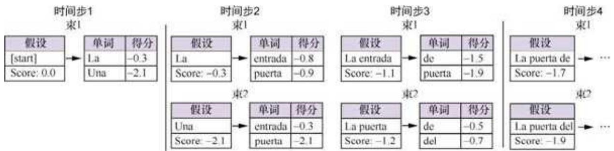  
图24-8束大小 b=2的束搜索。每个单词的得分是目标RNN中softmax生成的对数概率，每个假设的得分是单词得分的总和。在时间步3中，得分最高的假设“Laentrada”只能生成低概率的延续，因此它“从束上脱落”

# 24.4 Transformer架构

这篇非常有影响力的文章“Attention is all you need”（Vaswani et al. , 2018）介绍了 Transformer 架构，它使用了一种 自注意力 （self-attention）机制，该机制可以在没有顺序依赖的情况下对远距离上下文进行建模。

# 24.4.1 自注意力

之前，在序列到序列模型中，注意力是从目标RNN到源RNN的。 自注意力 对这一机制进行了扩展，让每个隐藏状态序列同样关注自身——从源到源，从目标到目标。这使得模型可以额外捕获每个序列中的长距离（以及邻近）上下文。

应用自注意力最直接的方法是，注意力矩阵直接由输入向量的点积构成。然而，这是有问题的。向量与其自身的点积始终很高，所以每个隐藏状态都会偏向于关注自身。为了解决这一问题，Transformer首先使用3个不同的权重矩阵将输入投影到3种不同的表示中。

● 查询向量 （query vector） q i= W qx i是注意力来自（from）的对象，就像标准注意力机制中的目标一样。  
● 键向量 （key vector） k i= W kx i是注意力去到（to）的对象，就像标准注意力机制中的源一样。  
● 值向量 （value vector） $\pmb { v } _ { i } = \pmb { W } _ { v } \pmb { x } _ { i }$ 是正在生成的上下文。

在标准注意力机制中，键和值网络是相同的，但是从直观上看，将它们分开表示是有意义的。第 i个词c 的编码结果可以通过对投影向量应用注意力机制来计算：

$$
\begin{array}{l} r _ {i j} = \left(\boldsymbol {q} _ {i} \cdot \boldsymbol {k} _ {j}\right) / \sqrt {d} \\ a _ {i j} = \mathrm {e} ^ {r _ {i j}} / \sum_ {k} \mathrm {e} ^ {r _ {i k}} \\ \boldsymbol {c} _ {i} = \sum_ {j} a _ {i j} \cdot \boldsymbol {v} _ {j} \\ \end{array}
$$

其中， d是k和 q的维数。注意，因为我们使用自注意力对上下文进行编码，所以i和j是同一个句子中的索引。在每个Transformer层中，自注意力使用前一层（最初是嵌入层）的隐藏向量。

这里有几个值得一提的细节。首先，自注意力机制是 不对称的 ， $\textit { r } _ { i j }$ 和 $r _ { j i }$ 不同。其次，加入的比例因子 $\yen 8$ 可以提高数值稳定性。再次，一个句子中所有单词的编码可以同时计算，因为可以使

选择使用哪个上下文完全是从训练样本中学习的，而不是预先指定的。基于上下文的概要c 是句子中前面所有位置的总和。理论上，来自句子的任何信息都应该出现在 $\textbf { \em c } _ { i }$ 中，但在实践中，有时会丢失重要的信息，因为它基本上是整个句子的平均。解决上述问题的一种方法是多头注意力（multiheadedattention）。我们把句子复制成 m 个相同的部分，然后把注意力模型应用于每一部分。每一部分都有自己的一组权重。最后将结果连接在一起，形成c 。通过连接而不是求和，更容易让一个重要的子块脱颖而出。

# 24.4.2 从自注意力到Transformer

自注意力只是Transformer模型的一个组成部分。每个Transformer层由几个子层组成。在每个Transformer层，首先应用自注意力。接着，注意力模块的输出通过前馈层，在该层中，每个位置上

分别应用相同的前馈权重矩阵。在第一个前馈层之后应用非线性激活函数（通常为ReLU）。为了解决潜在的梯度消失问题，Transformer层中还添加了两个残差连接。图24-9所示为单层Transformer。实际上，Transformer模型通常有6层或更多层。与我们所了解的其他模型一样，第 $i$ 层的输出用作第i+1层的输入。

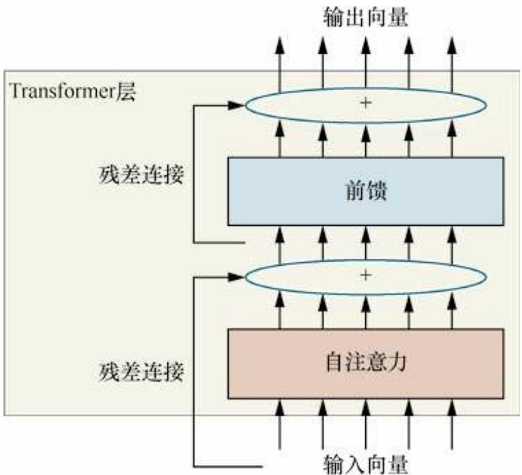  
图24-9 单层Transformer由自注意力、前馈网络和残差连接组成

Transformer架构并没有显式地捕捉序列中单词的顺序，因为上下文仅通过自注意力建模，而自注意力与单词顺序无关。为了捕捉单词顺序，Transformer使用一种称为 位置嵌入 （positionalembedding）的技术。如果输入序列的最大长度为n ，那么我们将学习n 个新的嵌入向量——每个单词位置对应一个向量。第一个Transformer层的输入是位置t的词嵌入加上对应位置 t的位置嵌入。

图24-10说明了用于词性标注的Transformer架构，该架构应用于图24-3中所使用的同一语句。在底部，将词嵌入和位置嵌入相加，形成三层Transformer的输入。与基于RNN的词性标注一样，Transformer对每个单词都产生一个向量。每个向量被传送到最终的输出层和softmax层，以生成标签上的概率分布。

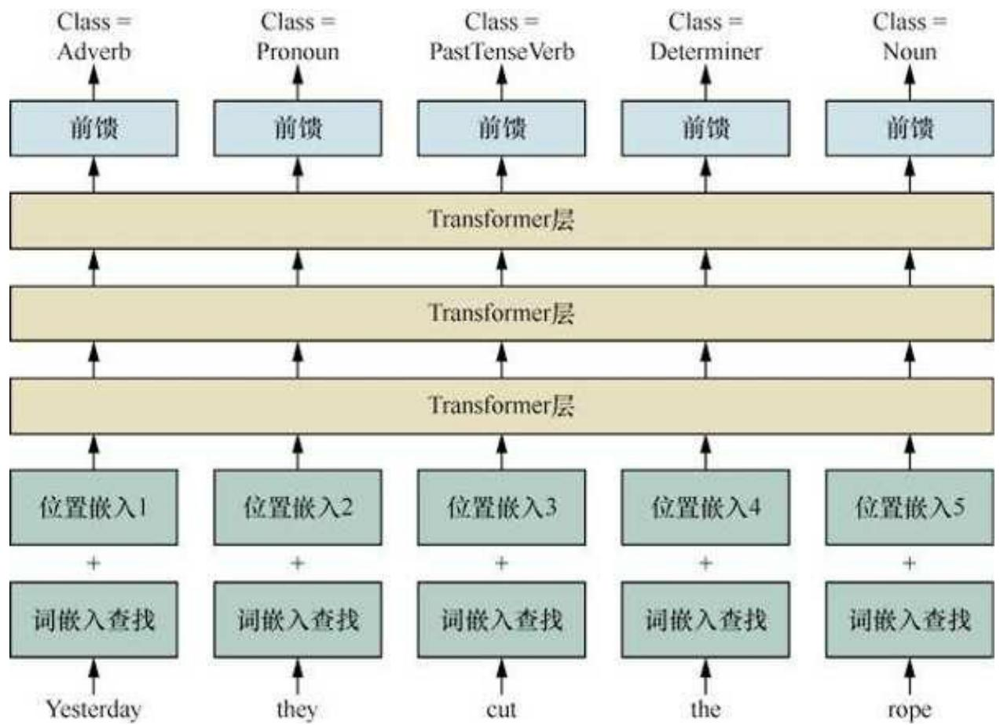  
图24-10 使用Transformer架构进行词性标注

在本节中，我们实际上只讲了Transformer的一半：在这里介绍的模型称为 Transformer编码器（transformer encoder）。它对于文本分类任务很有用。完整的Transformer架构最初被设计为用于机器翻译的序列到序列模型。因此，除编码器之外，它还包括一个 Transformer解码器（transformerdecoder）。编码器和解码器几乎是相同的，除解码器使用的自注意力之外，在解码器中，每个单词只能注意它前面的单词，因为文本是从左到右生成的。解码器在每个Transformer层中还存在另一个注意力模块，该模块用来注意Transformer编码器的输出。

# 24.5 预训练和迁移学习

获取足够的数据来构建一个健壮的模型是一个挑战。在计算机视觉中（见第25章），可以通过收集大量图像（如ImageNet），然后对它们进行人工标注，应对这一挑战。

对于自然语言，更常见的是使用未标注文本。这种差异一部分来自标注的难度：一个不熟练的工人可以很容易地将图像标注为“猫”或“日落”，但是需要经过大量训练才能学会用词性标签或句法分析树来标注句子。这种差异还来自文本的丰富性：因特网每天都会增加超过1000亿单词的文本，包括数字化书籍、维基百科之类的精选资源，以及未筛选的社交媒体帖子。

通过Common Crawl之类的项目可以轻松地访问这些数据。任何正在运行的文本都可以用于构建n元模型或词嵌入模型，一些文本还具有有助于完成各种任务的结构，例如，许多FAQ站点有问答对，它们可用于训练问答系统。类似地，许多网站会同时发布文本的翻译，可用于训练机器翻译系统。一些文本甚至带有标签，例如，在评论网站中，用户可以使用5星评分系统标注他们的文本评论。

我们不希望每次需要一个新的自然语言处理模型时都要再创建一个新的数据集。本节中将介绍预训练 （pretraining）的概念——一种 迁移学习 （transfer learning）的形式（见21.7.2节），我们使用大量共享的通用领域语言数据来训练一个自然语言处理模型的初始版本。然后，我们可以使用少量领域特定的数据（可能包括一些标注数据）来完善模型。经过改进的模型可以学习新领域特有的词汇、习语、句法结构和其他语言现象。

# 24.5.1 预训练词嵌入

24.1节中简要介绍了词嵌入。我们看到相似的单词（如banana和apple）最终如何得到相似的向量，并且看到可以通过向量减法解决类比问题。这表明词嵌入捕捉到了有关单词的大量信息。

本节中将深入探讨如何使用完全无监督的过程在大规模文本上创建词嵌入。这不同于24.1节中的嵌入，后者是在有监督的词性标注过程中构建的，因此需要昂贵的手工标注的词性标签。

我们将专注于一种特定的词嵌入模型— —GloVe（全局向量）模型。该模型首先统计每个单词在另一个单词的窗口中出现的次数，类似于跳字模型。首先选择窗口大小（也许是5个单词），并将Xij定义为单词 i 和 $j$ 在一个窗口内同时出现的次数， X i为单词 i 与其他任何单词同时出现的次数。设 P = X / X 为单词 $j$ 在单词 i的上下文中出现的概率。如前所述，记 E 为单词i的嵌入。

GloVe模型的部分直觉是，通过将两个单词与其他单词进行比较，充分地捕捉到两个单词之间的关系。给定单词ice（冰）和steam（水蒸气）。现在考虑它们与另一个词w的共现概率之比，即

$$
P _ {w, i c e} / P _ {w, s t e a m}
$$

当 w 是solid（固体）这个单词的时候，比值较高（意味着solid更适用于ice），而当 w 是gas（气体）这个单词的时候，比值较低（意味着gas更适用于steam）。而当w是一个像the这样的非实义词，或者一个像water这样的与两者同样相关的词，或者一个像fashion这样同样不相关的词时，这个比值将接近1。

GloVe模型从这种直觉开始，经过一些数学推理（Penningtonetal. ,2014），将概率之比转化为向量差值和点积，最终得到约束：

$$
\boldsymbol {E} _ {i} \cdot \boldsymbol {E} _ {j} ^ {\prime} = \log (P _ {i j})
$$

换句话说，两个词向量的点积等于它们同时出现的概率的对数。这符合直觉：两个近似正交的向量的点积接近0，而两个近似相同的归一化向量的点积接近1。存在一个技术上的复杂性，GloVe模型为每个单词构建两个词嵌入向量 $\boldsymbol { E } _ { i }$ 和 ；计算两个词嵌入向量，最后将它们相加，这有助于防止过拟合。

训练像GloVe这样的模型通常比训练一个标准神经网络容易得多：使用标准的台式计算机CPU可以

在几小时内从几十亿个文本单词中训练出一个新模型。

可以在一个特定领域上训练词嵌入，然后还原该领域的知识。例如，齐托扬等人（Tshitoyan et al. ,2019）使用了330万个关于材料科学的科学摘要来训练词嵌入模型。他们发现，就像通用词嵌入模型可以回答出“雅典之于希腊就像奥斯陆之于什么？”的答案是“挪威”一样，他们的材料科学模型可以回答出“NiFe对铁磁性，IrMn对什么？”的答案是“反铁磁性”。

他们的模型并不仅仅依赖单词的共现；它似乎捕捉到了更复杂的科学知识。当被问及什么化合物可以被归为“热电体”或“拓扑绝缘体”时，他们的模型能够给出正确的答案。例如，在语料库中，CsAgGa2Se4从未出现在“热电体”（thermoelectric）附近，但它出现在了“硫族化物”“带隙”和“光电”附近，这些都是可以将其归为类似于“热电体”的线索。此外，当训练集只有2008年之前的摘要并要求模型选出那些是“热电体”但尚未出现在摘要中的化合物时，该模型的前5个选择中有3个都在2009年至2019年发表的论文中才被发现是“热电体”。

# 24.5.2 预训练上下文表示

词嵌入是比原子的单词记号更好的表示，但是存在一个重要的问题——多义词。例如，rose一词可以指一种花，也可以指rise的过去式。因此，我们希望找到至少两个完全不同的rose的上下文聚类簇：一个类似于dahlia（大丽花）这样的花名，另一个类似于upsurge（高涨）。没有一个嵌入向量可以同时捕捉到这两种上下文。rose是（至少）具有两种不同含义的单词的明显示例，但其他单词在含义上的细微差别（例如，need一词在 you need to see this movie 和 humans need oxygen to survive中的差别）则取决于上下文。此外，将一些惯用语，如breakthebank（破产），作为一个整体而不是复合词来分析要更好。

因此，不只是学习一个单词-嵌入表，我们还希望训练一个模型来生成句子中每个单词的上下文表示 （contextualrepresentation）。上下文表示将单词和单词前后的上下文都映射到词嵌入向量中。换句话说，如果我们将rose一词和它的上下文 the gardener planted a rose bush 都输入模型，模型应该产生一个上下文嵌入，它与我们在上下文 the cabbage rose had an unusual fragrance 中得到的rose的表示相似（但不一定相同），同时与上下文 the river rose five feet 中得到的rose的表示完全不同。

图24-11展示了一个用以创建上下文词嵌入（图中未标注的方框）的循环神经网络。假设我们已经构建了一个非上下文的词嵌入集合。我们每次输入一个单词，然后让模型预测下一个单词。例如，在图24-11中，我们已经处理到了“car”，此时的RNN节点将接收两个输入——非上下文的“car”的词嵌入和上下文（编码来自前面的单词“Thered”的信息）。然后，RNN节点将输出“car”的上下文表示。整个网络接着输出对下一个单词的预测——“is”。然后我们更新网络权重来最小化预测和真实值之间的误差。

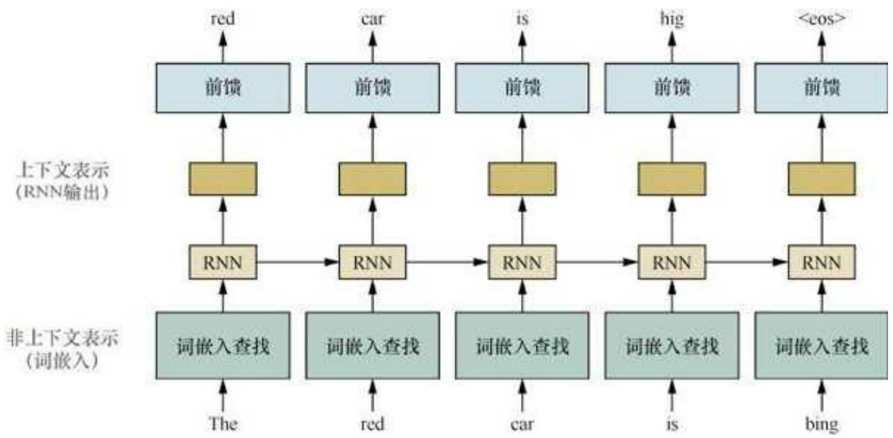  
图24-11 使用从左到右的语言模型训练上下文表示

这种模型类似于图24-5中用于词性标注的模型，但是有两个重要的区别。首先，这个模型是单向的（从左到右），而词性标注模型是双向的。其次，这个模型使用前面的上下文来预测下一个单词，而不是预测当前单词的词性标签。一旦模型建立，我们就可以使用它来检索单词的表示，并将表示传递给其他任务；我们不需要继续预测下一单词。注意，计算上下文表示始终需要两个输入当前单词和上下文。

# 24.5.3 掩码语言模型

标准语言模型（如 n 元模型）的一个缺点是，每个单词的上下文化只基于句子中前面的单词。预测是从左到右的。但有时句子中后面的上下文（如短语“rose five feet”中的“feet”）也有助于阐明前面的单词。

一种简单的解决方法是训练一个单独的从右到左的语言模型，该模型基于句子中的后续单词对每个单词进行上下文化，然后将从左到右和从右到左的表示连接起来。然而，这种模型并不能将来自两个方向的证据结合。

然而，我们可以使用一个 掩码语言模型 （masked language model，MLM）。训练MLM的方法是掩码（隐藏）输入中的单个单词，然后要求模型预测被掩码的单词。对于这一任务，我们可以在被掩码的句子上使用一个深度双向RNN或Transformer模型。例如，给定输入句“The river rose fivefeet”，我们可以掩码中间的单词，得到“The river __ five feet”，然后让模型填空。

然后，使用对应被掩码的记号的最终隐藏向量来预测被掩码的单词——在本例中是“rose”（如图24-12所示）。在训练过程中，一个句子可以在不同单词被掩码的情况下多次使用。这种方法的优点在于它不需要标记数据；句子本身为被掩码的单词提供了标签。如果在大规模文本语料库上训练这个模型，它会生成预训练的表示，这些表示在各种自然语言处理任务（机器翻译、问答、摘要、语法判断等）中都表现良好。

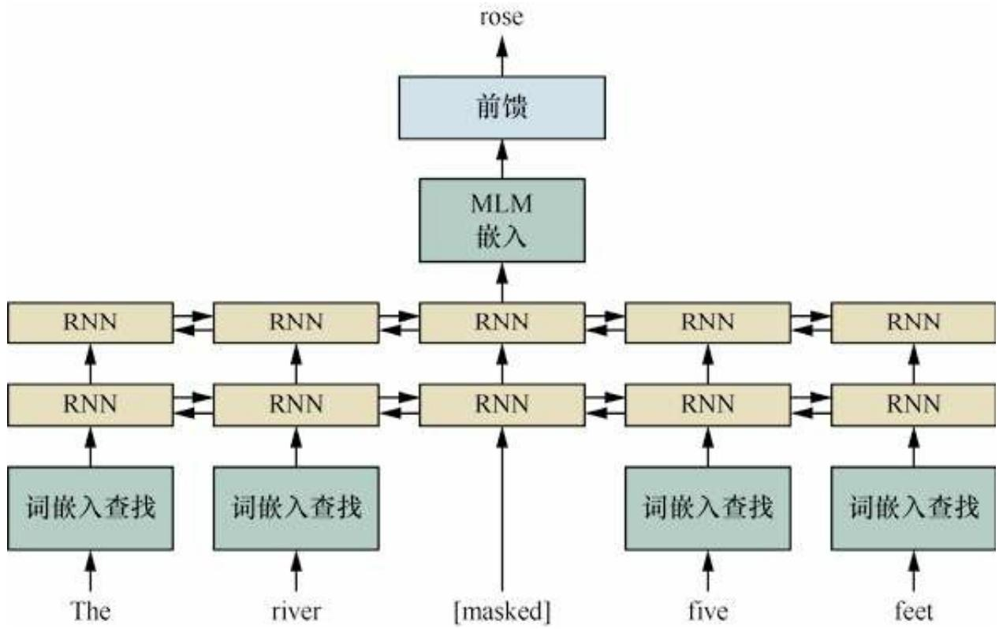  
图24-12掩码语言建模：通过掩码（隐藏）输入单词并只预测那些被掩码的单词预训练一个双向模型，如一个多层RNN

深度学习和迁移学习显著提高了自然语言处理的技术水平，以至于2018年一位评论员断言“自然语言处理的ImageNet时刻已经到来”（Ruder,2018）。这意味着，正如2012年计算机视觉出现了一个转折点（深度学习系统在ImageNet比赛中取得令人惊叹的优秀表现）一样，2018年自然语言处理也出现了一个转折点。这一转折点的主要推动力是，迁移学习在自然语言问题上表现很好：可以下载通用语言模型，并针对特定任务进行微调。

它始于2013年 word 2 vec 和2014年GloVe等系统生成的简单词嵌入。研究人员可以下载这样的模型，或者在不使用超级计算机的情况下相对快速地训练他们自己的模型。另外，预训练上下文表示的训练开销要高出几个量级。

只有在硬件（GPU和TPU）进步普及之后，这些模型才是可行的，在这种情况下，研究人员非常感激他们能够直接下载模型，而不需要花费资源训练自己的模型。Transformer模型允许我们高效地训练比之前更大更深的神经网络（这一次是因为软件的进步，而不是硬件的进步）。自2018年以来，新的自然语言处理项目通常从一个预先训练好的Transformer模型开始。

虽然这些Transformer模型被训练用来预测文本中的下一个单词，但它们在其他语言任务中的表现也出奇地好。经过一些微调后的RoBERTa模型在问答和阅读理解测试中取得了最高水平的成绩（Liu et al. , 2019b）。GPT-2是一种类似于Transformer的语言模型，它有15亿个参数，在40 GB的因特网文本上训练。它在法英翻译、查找远距离依赖的指代对象以及一般知识问答等任务中都取得了良好的成绩，并且所有这些成绩都没有针对特定任务进行微调。如图24-13所示，在仅给定几个单词作为提示时，GPT-2依然可以生成相当令人信服的文本。

It is a truth universaly acknowledged that theearth is not thecenter ofthe universe.There are those who assertthereis.Idonot accept them,but othersIconsidertobeofthesameopinion.Thetruthis,however,thatif thereare other than thecenter,and ifthereare any otherlivingthings intheuniverseandiftheyare not human thenwedonot yethave ouranswers.Wehavetogoon.Thispagegivesasimplified,simplifiedanswer tothe problem.Wedon’thavealltheanswers.Thetruthis,however,thatthetruthisout there.

WhenGregor Samsa wokeuponemorning,hedidnot noticeanythingstrange.Whenmy wifeislookingat me,I feellikesheislookingatapieceofart,”hesaid.“IthinksheisadmiringsomethingIhavecreated."Theideaisthatby lookingatyourownlife,youleansomethingimportant and becomeabeterperson.Itisatheory thatemergedfrom psychologistDanielGoleman'swork,inwhich he asked“Howdoyouknow you'renota loser?”

Alicewas beginning to get very tired ofsitting with hersister onthe bank.She satup,yawned,and said withaloudlitlescream,Ihopeyoudon’tmind ifI keepondoing whatIshouldliketodo,and ifsomeoneasks me which ofus willdo more,don't tell them that Iwon’t do much，my dear sister.

Allhappyfamiliesarealike;eachhappyfamilyislikeagardenofparadise.Theonlydiferencebetweenhappy familiesand unhappy families,is that theunhappy family doesn't have any flowers or trees.

Tellmeastory.Tellmeastory,Tellmeastory.Tellmeastory.Tellmeastory.Tellmeastory.Tellmeastory. TellmeastoryTellmeastory.TellmeastoryTellmeastory.TellmeastoryPleasefllout thefollowing details.Thankyou..Thankyouforyourinterest inthisinterview.Pleasewait..

图24-13 GPT-2语言模型生成的完整文本示例，提示以粗体显示。大多数文本是相当流畅的英语语句，至少局部上是流畅的。最后一个例子表明，有时模型也会崩溃

作为一个最高水平的自然语言处理系统示例，A risto（Clark etal. ,2019）在八年级科学选择题考试中获得了91.6%的分数（见图24-14）。A risto 由一系列求解器组成：一些使用信息检索（类似于一个网络搜索引擎），一些使用文本蕴涵和定性推理，还有一些使用大规模Transformer语言模型。结果表明，RoBERTa的测试成绩是88.2%。A risto在十二年级考试中也取得了83%的成绩。（65%表示“达到标准”，85%表示“出色地达到标准”。）

A risto也有其局限性。它只能处理选择题，不能处理论述题，而且它既不能阅读也不能生成图表。[1]

[1] 有人指出，在一些选择题考试中，即使不看题目也可以获得高分，因为错误选项也会泄露信息（Gururangan et al. , 2018）。这似乎也适用于视觉问答（Chao et al. , 2018）。

1.Whatwill best separateamixture ofiron filings and blackpepper?

（a）magnet

（b） filter paper

(c）triple beam balance

（d）voltmeter

2.Which form ofenergy isproduced when arubberband vibrates?

（a）chemical

（b）light

（c）electrical

(d）sound

3.Because copper isametal, it is

(a) liquid at room temperature

(b)nonreactive with other substances

(c)apoor conductor of electricity

（d）a good conductor of heat

4.Which processin an apple treeprimarily resultsfromcell division?

（a）growth

（b）photosynthesis

(c）gas exchange

（d）waste removal

图24-14 八年级科学考试中的题目，A risto 系统可以使用一系列方法正确回答这些问题，其中最具影响力的是Ro BERTa语言模型。回答这些问题需要自然语言、选择题的结构、常识和科学等方面的知识

T5（Text-to-Text Transfer Transformer）用来生成对各种文本输入的文本响应。它包括一个标准的编码器-解码器Transformer模型，在750 GB的C4（Colossal Clean Crawled Corpus）语料库的350亿个单词上进行预训练。这种无标注训练旨在为模型提供适用于多种特定任务的可泛化语言知识。之后为每个任务训练T5，输入由任务名称、冒号和内容组成。例如，当给出“translate English toGerman: That is goo d ”时，它会输出“Das ist gut”。对于某些任务，输入会被标记；例如，在Winograd模式挑战赛中，输入会突出显示一个指代不明确的代词。给定输入“referent: The citycouncilmen refused the demonstrators a permit because they feared violence ”，正确答案应是“The citycouncilmen”（而不是“the demonstrators”）。

在改进自然语言处理系统方面还有很多工作要做。一个问题是，Transformer模型只依赖一个狭窄的上下文，仅限于几百个单词。一些实验性方法试图扩展上下文，Reformer系统（Kitaev et al. ,2020）可以处理多达100万个单词的上下文。

最近的结果表明，使用更多的训练数据可以得到更好的模型，例如，Ro BERTa在训练了2.2万亿个单词后获得了最高水平的成绩。如果使用更多的文本数据会更好，那么，如果进一步使用其他类型的数据——结构化数据库、数值数据、图像和视频会怎么样呢？我们需要在硬件处理速度上取得突破，才能对大量视频进行训练，我们可能还需要在人工智能方面取得一些突破。

好奇的读者可能会问：“为什么我们在第23章中学习了文法、句法分析和语义解释，却在本章中舍弃了这些概念，转而使用纯粹的数据驱动模型？”答案很简单，数据驱动的模型更容易开发和维护，并且在标准的基准测试中得分更高，而手工构建的系统则可以使用第23章中描述的方法通过合理数量的人力资源来构建。可能是Transformer及其相关模型学习到了潜在的表征，这些表征捕捉到与语法和语义信息相同的基本思想，也可能是在这些大规模模型中发生了完全不同的事情，但我们根本不知道。我们只知道，使用文本数据训练的系统比依赖手工创建特征的系统更容易维护，更容易适应新的领域和新的自然语言。

未来在显式语法语义建模方面的突破也有可能会导致研究的重点回摆。更有可能出现的是混合方法，它结合了这两章中的最佳概念。例如，基塔夫和克莱因（Kitaev and Klein,2018）使用注意力机制改进了传统的成分句法分析器，从而获得了Penn Treebank测试集记录的最佳结果。类似地，林高等人（Ringgaard etal. ,2017）演示了如何通过词嵌入和循环神经网络改进依存句法分析器。他们的系统Sling 直接解析为一个语义框架表示，缓解了传统管道系统中错误累积的问题。

当然还有改进的空间：自然语言处理系统不仅在许多任务上仍然落后于人类，而且在处理了人类一辈子都无法阅读的数千倍的文本之后，它们仍然落后于人类。这表明，语言学家、心理学家和自然语言处理研究人员要研究的东西还有很多。

小结

本章的重点如下。

● 使用词嵌入的词的连续表示比离散的原子表示更加健壮，并且可以使用未标注的文本数据进行预训练。  
●通过在隐藏状态向量中保留相关信息，循环神经网络可以有效地对局部和远距离上下文建模。  
●序列到序列模型可用于机器翻译和文本生成。  
●Transformer模型使用自注意力机制，可以对远距离上下文和局部上下文进行建模。它们可以有效地利用硬件矩阵乘法。  
●包含预训练的上下文词嵌入的迁移学习允许从非常大的未标注语料库中开发模型，并应用于一系列任务。在目标领域进行微调后，通过预测缺失词预训练的模型可以处理该领域的任务，如问答和文本蕴含。

读者服务：


微信扫码关注【异步社区】微信公众号，回复“e59810”获取本书配套资源以及异步社区15天VIP会员卡，近千本电子书免费畅读。

# 第25章

# 计算机视觉

在计算机视觉中，我们通过照相机/摄像机镜头将计算机连接到原始的、未加工的真实世界。

大多数动物都有“眼睛”这个器官，同时眼睛的存在通常需要较大的代价：眼睛占据了较大空间，需要消耗能量，而且非常脆弱。但这种代价是合理的，因为眼睛提供的功能有巨大的价值。一个拥有视觉的智能体有能力预测未来——它可以告诉自己可能会撞到什么，它可以在遇到危险时判断应该反击、逃跑还是求助法律来解决，它能目测出前方的道路是沼泽地还是坚硬的地面，它能分辨出某个水果距自己有多远。本章将介绍如何从来自眼睛或照相机/摄像机的大量数据中重建信息。

# 25.1 引言

视觉是一种感知渠道，它接收刺激 并反映出世界的某些表象。大多数使用 视觉 的智能体采用被动传感 ——它们不需要主动发出光就能看到景象。相比之下， 主动传感 涉及雷达或超声波等信号的发射，以及对反射进行感知。使用主动传感的智能体有蝙蝠（超声波）、海豚（声波）、深海鱼类（光）和一些机器人（光、声音、雷达）。为了理解一个感知渠道，我们必须研究感知中发生的物理和统计现象以及感知过程产生了什么。本章将重点介绍视觉，但真实世界中的机器人可能会使用各种传感器来感知声音、触觉、距离、温度、全局位置和加速度等信息。

特征 （feature）是通过对图像进行简单计算而获得的数字，我们可以从特征中直接得到一些非常有用的信息。wumpus智能体有5个传感器，每个传感器都将获取1位的信息。这些位即为特征，它们可以由程序直接解释。再举另外一个例子，许多飞行动物通过计算一个简单的特征来很好地估计撞上附近物体的时间，这一特征可以直接传递给控制方向或翅膀的肌肉，使得它们可以非常快速地改变方向。这种 特征提取 方法的重点是应用于传感器响应的简单、直接的计算。

基于模型 的视觉方法通常采用两种模型。 物体模型 可以是由计算机辅助设计系统生成的一种精确的几何模型，它也可以是关于物体的一般性质的模糊陈述，例如，这样的一个性质描述——在低分辨率下看到的所有人脸看起来大致相同。绘制模型 描述的是产生真实世界中的刺激的物理、几何和统计过程。虽然绘制模型是复杂和精确的，但刺激通常是模糊的。处于弱光下的白色物体可能看起来很像强光下的黑色物体。一个距离较近的小物体可能在视觉效果上和远处的大物体一样。如果没有额外的证据，我们将无法判断我们所看到的是玩具哥斯拉摧毁了一座玩具建筑，还是一个真正的怪物摧毁了一座真正的建筑。

处理这种歧义问题有两种主要方法。第一种方法认为某些解释比其他解释的可能性更大。例如，我们可以确信，这张图片表示的不会是一个真正的哥斯拉摧毁了一座真正的建筑，因为世界上不存在真正的哥斯拉。第二种方法认为有些歧义是无关紧要的。例如，远处的景物可能是树木，也可能是一个平坦的漆面。对大多数应用来说，这种差异并不重要，因为目标物体离我们很远，所以我们不会很快碰到它们或与它们进行交互。

计算机视觉的两个核心问题是重建 （reconstruction，智能体从一幅或一组图像中建立一个关于世界的模型）和识别 （recognition，智能体根据视觉信息和其他信息对所见到的物体进行辨识）。关于这两个问题的解释都非常广泛。从图像中建立一个几何模型显然是重建问题（并且得到的模型也非常有价值），但有时我们需要对一个表面上的不同纹理建立一张地图，我们也把这归为重建。将物体名称与出现在图像中的物体进行匹配显然是识别问题。有时我们也需要回答这样的问题：它睡着了吗？它吃肉吗？它的牙齿在哪一边？回答这些问题也属于识别。

过去30年的研究为解决这些核心问题提供了强有力的工具和方法。为了理解这些方法，我们首先需要理解图像的形成过程。

# 25.2 图像形成

成像会扭曲物体的外观。对一组笔直的铁轨从前往后进行拍摄，铁轨在图片中会汇集并相交。如果你把手放在你的眼睛前面，你可以挡住月亮，尽管月亮比你的手大（这同样适用于太阳，但对太阳进行实验将会伤害你的眼睛）。如果你把一本书平放在面前，同时将书前后倾斜，你会发现它在图像中 似乎会收缩或延长。我们将这种效应称为透视收缩 （图25-1）。关于这些效应的建模对建立有效的物体识别系统来说是必不可少的，同时它们也为重建几何结构提供了有力的线索。

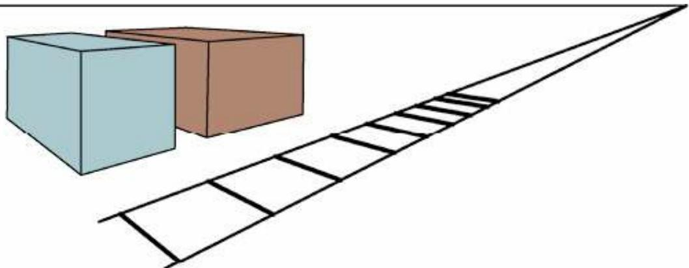  
图25-1 场景中的几何体在图像中发生扭曲。平行线似乎交汇在一起，看起来就像荒芜小镇上的铁轨。在真实世界的场景中具有直角的建筑物在图像中具有扭曲的角度

# 25.2.1 无透镜成像：针孔照相机

图像传感器收集 场景 中物体散射的光，并构建二维（2D）图像 。对眼睛来说，这些传感器由两种类型的细胞组成：其中有大约1亿个视杆细胞，它们对广泛波长范围内的光较敏感，还有约500万个视锥细胞。视锥细胞是产生色觉的关键，它主要有3类，每类视锥细胞都对一个不同的波长范围的光十分敏感。在照相机中，图像是在图像平面上形成的。在胶卷照相机中，图像平面涂有卤化银。在数字照相机中，图像平面被细分为由数百万个像素 组成的网格。

我们将整个图像平面称为一个传感器 ，但同时每个像素都是一个单独的微小传感器［通常是一个电荷耦合器件（charge-coupled device，CCD）或互补金属氧化物半导体（complementary metal-oxidesemiconductor，CMOS）］。到达传感器的每个光子都会产生一种光电效应，其强度取决于光子的波长。传感器的输出是某个时间段内所有这些效应的总和，这意味着图像传感器所给出的是到达传感器的光强的加权平均值。该平均值取决于光的波长、光子到达的方向、时间和传感器的面积。

为了看到聚焦后的图像，我们必须确保到达传感器的所有光子都来自世界中某个物体上大致相同位置的点。形成聚焦图像的最简单方法是使用针孔照相机 观察一个静态物体。针孔照相机由盒子前部的针孔开口O 和盒子后部的图像平面组成（如图25-2所示），这个开口也称作光圈 。如果针孔足够小，图像平面中的每个微小传感器将只能看到来自物体上几乎相同点的光子，因此获得的图像就是聚焦图像。我们也可以用针孔照相机来获得运动物体的聚焦图像，只要物体在传感器的时间窗口内只移动一小段距离。否则，运动物体的图像将会散焦，这种效应也称作运动模糊 （motionblur）。通过打开和关闭针孔，我们可以控制时间窗口的大小。

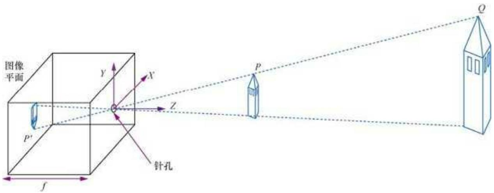  
图25-2 针孔照相机后部的每个光敏元件接收从小范围方向穿过针孔的光。如果针孔足够小，其结果将是在针孔后面呈现出一幅聚焦图像。投影的过程意味着大的、距离较远的物体将看起来和小的、距离较近的物体一样——图像平面上的点 $P ^ { \prime }$ 可能来自附近的玩具高塔的 $P$ 点，或者来自远处的真实高塔的 Q 点

针孔照相机使得我们更容易理解照相机行为背后的几何模型（大多数其他成像设备的模型更复杂，但本质上与之相似）。我们将使用一个具有原点O 的三维坐标系，并考虑场景中的点 $P$ ，其坐标为(X,Y, Z)。P投影到图像平面上的点P′，其坐标为(x,y, z)。若令f为焦距 ，即从针孔到像平面的距离，那么由相似三角形的性质可得

$$
\frac {- x}{f} = \frac {X}{Z}, \frac {- y}{f} = \frac {Y}{Z} \quad \Rightarrow \quad x = \frac {- f X}{Z}, y = \frac {- f Y}{Z}
$$

这些等式定义了一个称为 透视投影 （perspective projection）的成像过程。注意，分母中的 Z 意味着物体越远，其图像越小。还要注意，负号表明相对于场景而言，图像将是倒转的，包括左右倒转和上下倒转。

透视成像有许多几何效应，例如，远处的物体会看起来很小，平行线会汇集到地平线的某一点上。（回想一下铁轨，见图25-1。）场景中方向为( U , V , W )且通过点 $( X _ { 0 } , Y _ { 0 } , Z _ { 0 } )$ 的一条线可以描述为一组点 $( X _ { 0 } + \lambda U , Y _ { 0 } + \lambda V , Z _ { 0 } + \lambda W )$ ，其中 $\lambda$ 的取值范围为从 $- \infty$ 到 $+ \infty$ 。不同的($X _ { 0 } , Y _ { 0 } , Z _ { 0 } $ )值将产生彼此平行的不同直线。来自该直线上的一点 $\mathcal { P } _ { 4 }$ 在像平面上的投影由下式给出：

$$
P _ {\lambda} = \left(f \frac {X _ {0} + \lambda U}{Z _ {0} + \lambda W}, f \frac {Y _ {0} + \lambda V}{Z _ {0} + \lambda W}\right)
$$

当 $\lambda  + \infty$ 或 $\lambda  - \infty$ 时，如果 $W \neq 0$ ，将有 $P _ { \ast } = ( \mathcal { W } / \mathcal { W } , f V / \mathcal { W } )$ 。这意味着两条从空间中不同点出发的平行线将在图像中交汇——对于较大的 $\lambda$ ，无论 $\left( { { X } _ { 0 } } , { { Y } _ { 0 } } , { { Z } _ { 0 } } \right)$ 的值是多少，成像位置都几乎相同（同样可以回想铁轨的例子，见图25-1）。我们称 $\pmb { P _ { \infty } }$ 为与具有方向( $U$ V , W )的直线族相关的 消失点 （vanishing point）。具有相同方向的线将有相同的消失点。

# 25.2.2 透镜系统

针孔照相机可以很好地聚焦光线，但由于针孔很小，只有很少的一部分光会进入，因此会导致图像较暗。在很短的时间内，传感器上的每个点只会被少数光子击中，因此每个点上的信号都会受到随机波动的控制，我们称暗胶片图像是粒状的，而暗数字图像是有噪声的，不管是哪种形式，图像的质量都很低。

扩大孔（光圈）能使照相机从更广阔的方向收集更多的光，进而使图像更亮。但同时，使用一个较大的光圈将使照射到图像平面上某个特定点的光来自真实场景中的多个点，因此图像将散焦。我们需要一些方法来重新聚焦图像。

脊椎动物的眼睛和现代照相机都采用了透镜 系统——眼睛中的一块透明组织和照相机中由多个玻璃透镜元件组成的系统。在图25-3中，我们看到蜡烛尖端发出的光向各个方向传播。带透镜的照相机（或眼睛）将捕捉到所有照射到透镜上任何地方的光（这是一个比针孔大得多的区域），并将所有光聚焦到图像平面上的一个点。来自蜡烛其他部分的光同样会被收集并聚焦到图像平面上的其他点。最终将会产生一幅更明亮且噪声更少的聚焦图像。

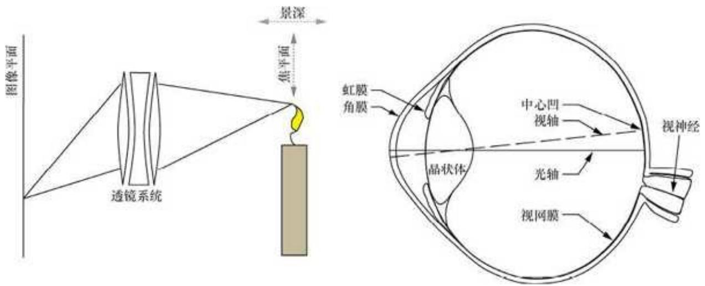  
图25-3透镜收集来自场景中同一点（这里的点是蜡烛火焰的尖端）一定范围内的光，并引导所有光汇集到图像平面上的一个点。在场景中靠近焦平面的点（在景深范围内）将被较好地聚焦。在照相机中，透镜系统的元件通过移动改变焦平面，而眼睛通过专门的肌肉改变透镜的形状

透镜系统并不会聚焦所有来自真实世界中任何地方的光线，透镜的设计限制了它们只能聚焦距离透镜深度范围在Z以内的点上的光。这个范围的中心（聚焦最清晰的位置）称作焦平面 （focalplane），聚焦能够保持足够清晰的深度范围称为 景深 （depth offield）。一般来说，照相机的镜头光圈（开口）越大，景深越小。

如果你想对另一个位于不同距离的事物进行聚焦，应该怎么办？为了移动焦平面，照相机中的透镜元件可以前后移动，眼睛中的透镜可以改变形状——但随着年龄的增长，眼睛中的透镜往往会硬化，以至于更难以调整焦距，此时许多人就需要借助额外的透镜——眼镜来增强视力。

# 25.2.3 缩放正交投影

透视成像的几何效应并不总是很明显。例如，街对面一栋楼的窗户会比位于附近的窗户看上去小得多，但是相互接近的两扇窗户将看起来有差不多的尺寸，尽管其中一扇距离观察者稍微远一点。我们可以选择用一个称为 缩放正交投影 （scaled orthographic projection）的简化模型来刻画这个窗户问题，而不采用透视投影方法。如果物体上所有点的深度 $Z$ 都落在范围 $Z _ { 0 } \pm \Delta Z$ 内，其中 与，那么透视比例因子 $f / Z$ 可以用常数 $\sigma = f / Z _ { 0 }$ 近似。此时从场景坐标( X , Y , Z )到图像平面的投影方程将变为 $\pmb { x } = \pmb { x }$ 和 $\boldsymbol { y } = \boldsymbol { s } \boldsymbol { Y }$ 。透视收缩仍会发生在缩放正交投影模型中，因为它是由物体相对于视图的倾斜引起的。

# 25.2.4 光线与明暗

图像中像素的亮度是关于场景中投影到该像素的表面切片的亮度的函数。在现代照相机中，这个函数对于中等强度的光是线性的，但是对于较暗和较亮的照明有明显的非线性。我们将在讨论中采用线性模型。图像亮度是一个对物体的形状和特性的强烈但可能不明确的暗示。这种不明确性的产生有3个因素影响了从物体上的一个点到达图像的光量，这3个因素是 环境光 （ambientlight）的总光强、该点处于向光面还是阴影中和从该点反射 （reflect）的光的总量。

人类非常擅长消除亮度中的歧义——他们通常能分辨出明亮光线下的黑色物体和阴影下的白色物体，尽管两者的整体亮度相同。然而，人们有时会混淆明暗和斑纹——颧骨下的一道深色妆容通常看上去像明暗的效果，这将使脸部看起来更瘦。

大多数表面通过漫反射 （diffusereflection）过程来反射光。漫反射将光均匀地散射到离开表面的各个方向上，因此漫反射表面的亮度不依赖于观察的方向。大多数布料都有这种性质，此外也包括大多数油漆、粗糙的木头表面、大多数植被和粗糙的石头或混凝土等。

镜面反射 （specular reflection）使得入射光以一定角度离开该表面，其方向由光到达的方向决定。镜子就是镜面反射的一个例子，你在镜子中所看到的画面取决于你看镜子的方向。在这种情况下，方向的波瓣非常窄，这就是我们可以在镜像中分辨不同物体的原因。

对于很多表面，它们的波瓣会比镜子更宽。这些表面会反射出小的亮切片，通常称为 镜面反射亮斑 （specularity）。随着表面或光的移动，镜面反射亮斑也将随之移动。除了这些切片，表面整体将表现出类似于漫反射的行为。镜面反射亮斑通常出现在金属表面、涂漆表面、塑料表面以及潮湿表面上。我们很容易辨认出它们，因为它们又小又亮（见图25-4）。对于几乎所有的任务目标，将所有表面建模为具有镜面反射亮斑的漫反射表面就足够了。

太阳是外界照明的主要来源，它的所有光线都从一个已知的方向平行地传播过来，这是因为太阳离我们太远了。我们采用 远点光源 （distantpointlightsource）来对这种行为进行建模。这是最重要的光照模型，它在许多室内场景和室外场景中都非常有效。在这个模型中，表面切片收集到的光量取决于照明方向和表面法线（垂线）之间的角度 （见图25-5）。

由这个模型进行照明的漫反射表面切片将反射它收集到的光的一部分，具体的比例由 漫反射系数（diffusealbedo）给出。对于实际生活中的表面，它的范围通常是0.05～0.95。 兰伯特余弦定律（Lambert’scosinelaw）表明，漫反射切片的亮度由下式给出：

$$
I = \rho I _ {0} \cos \theta
$$

漫反射，暗

  
图25-4 这张照片展示了各种照明的效果。不锈钢佐料壶上发生镜面反射。洋葱和胡萝卜是亮的漫反射表面，因为它们面向光照射的方向。阴影部分出现在根本看不到光源的表面点上。在锅中存在一些暗的漫反射表面，光线沿着切线角度照射进来（锅内还有一些其他阴影）。该照片由RymanCabannes/Image Professionals GmbH/Alamy Stock Photo拍摄

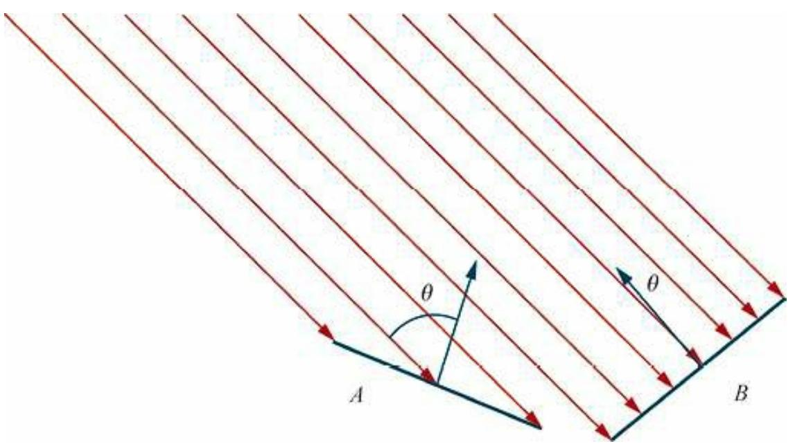  
图25-5两个由远点光源照亮的表面切片，其中点光源的光线由带箭头的射线表示。表面切片A向远离光源的方向倾斜（ $\theta$ 接近90°），它所收集的能量较少，因为它每单位表面积接收到的光线较少。面向光源（ $\pmb \theta$ 接近0°）的表面切片 B将收集到更多的能量

其中， $I _ { 0 }$ 为光源的光强， 是光源方向和表面法线之间的夹角， $\pmb { \rho }$ 为漫反射系数。该定律预测，明亮的图像像素来源于正对光的切片，而较暗的像素来源于只看到切向光的切片，因此表面上的明暗提供了一些形状方面的信息。如果表面无法看到光源，那么它将处于 阴影 中。阴影通常不会完全是黑色的，因为处于阴影中的表面通常也会接收到来自其他光源的一些光。在户外，除太阳以外，最主要的光线来源是天空，它相当明亮。在室内，其他表面反射的光线将照亮阴影切片。这些相互反射 （interreflection）也会对其他表面的亮度产生显著效应。我们有时会通过向所预测的光强添加恒定的环境照明 （ambientillumination）常数来对这些效应进行建模。

# 25.2.5 颜色

果实蕴含了一种交易——树木将它们提供给动物，动物带走它的种子。当这一交易准备就绪时，能够发出对应信号的树木具有优势，能够读懂这些信号的动物也将具有优势。这样的结果是，大多数果实一开始是绿色的，并在成熟时变成红色或黄色，大多数以果实为食的动物都能看到这样的颜色变化。一般来说，对于到达眼睛的光，不同波长的光具有不同的能量，并且它们由光谱能量密度表示。

照相机和人类视觉系统能对波长在380 nm（紫色）～750 nm（红色）的光做出反应。在彩色成像系统中，通常有多个不同类型的感受器，它们能对不同波长的光线给出更强或更弱的反应。对人类来说，当视觉系统对视网膜上彼此邻近的感受器的反应进行比较时，就会产生对颜色的感知。动物的颜色视觉系统通常有相对较少的感受器类型，因此在光谱能量密度函数中能表示的细节相对较少（一些动物只有1种感受器，有些动物有多达6种感受器）。人类的色觉由3种感受器产生，大多数彩色照相机系统也只使用3种类型的感受器，因为图像是为人类生成的，但是一些专门的系统能够为光谱能量密度提供非常详细的度量。

由于大多数人有3种对颜色敏感的感受器，因此三原色原理 （principleoftrichromacy）适用于人类。这一想法最早由托马斯·扬（ThomasYoung）在1802年提出，它指出人类观察者可以通过混合适量的3个 原色 （primary），来达到任何光谱能量密度下的视觉效果，无论它有多么复杂。原色是彩色光源，它的选择方式要求任何两种颜色的任意混合色都不会与第三种颜色相同。一种常见的选择是红原色、绿原色以及蓝原色，简称RGB。虽然一个给定的彩色物体可能包含许多频率的光的分量，但我们可以通过对三原色进行混合来匹配该颜色，并且对大多数人来说，混合所需的比例是一样的。这意味着我们可以通过对每个像素赋予3个数字（即RGB值）来表示彩色图像。

对大多数计算机视觉应用而言，将一个表面建模为具有3种不同（RGB）漫反射系数，并将光源建模为具有3种（RGB）强度的模型是足够精确的。在此基础上，我们将兰伯特余弦定律应用于每个

像素，以获得红、绿和蓝的像素值。该模型正确地预测了同一个表面在不同色光下会产生的不同的彩色图像切片。事实上，人类观察者很善于忽略不同颜色光的影响，并可以在白光下估计出表面的颜色，我们称这种效应为 颜色恒常性 （color constancy）。

# 25.3 简单图像特征

光线被场景中的物体反射，并形成一幅由1200万个3字节像素组成的图像。与所有传感器一样，图像中也存在噪声，并且在任何情况下都有大量数据需要处理。分析这些数据首先要求我们给出一个简化的表示法，以凸显数据的重要内容，同时减少细节。目前的许多实际应用注重从数据中学习这些表示。但对图像和视频来说，通常有4个特别普遍的性质，即边缘、纹理、光流和区域分割。

边缘出现在图像局部像素光强差异较大的地方。建立对边缘的表示涉及对图像的局部操作（你需要将像素值与它附近的一些值进行比较），而不需要了解图像中的内容。因此，边缘检测可以在图像处理过程的早期进行，我们称之为“早期”或“低级”操作。

其他操作涉及对更大面积图像的处理。例如，纹理描述应用于像素池以表示“条纹”，你首先需要观察到一些条纹。光流表示像素以序列的方式从一幅图像移动到下一幅图像的位置，这一特性可以覆盖较大的区域。分割将一幅图像分割成多个像素区域，每个区域中的像素自然地属于同一个区域，这样的做法要求我们查看整个区域。类似这样的操作有时称为“中级”操作。

# 25.3.1 边缘

边缘 是图像平面中的直线或曲线，图像亮度在此处发生了“显著”的变化。边缘检测的目标是从杂乱的、多兆字节的图像中进行抽象化，并朝着一个更紧凑、更抽象的表示方式发展，如图25-6所示。场景中的效应通常会导致图像中的光强发生很大的变化，从而在图像中产生边缘。深度不连续（图中标记为1）可能导致边缘的产生，因为沿着不连续区域，颜色通常会改变。当表面法线改变（图中标记为2）时，图像光强通常会发生改变。当表面反射率改变（标记为3）时，图像光强通常会发生改变。最后，阴影（标记为4）的产生是因为照明存在不连续性，即使物体不存在边缘，它也会导致图像出现边缘。边缘检测器无法辨别产生不连续性的原因，这一问题我们留到以后处理。

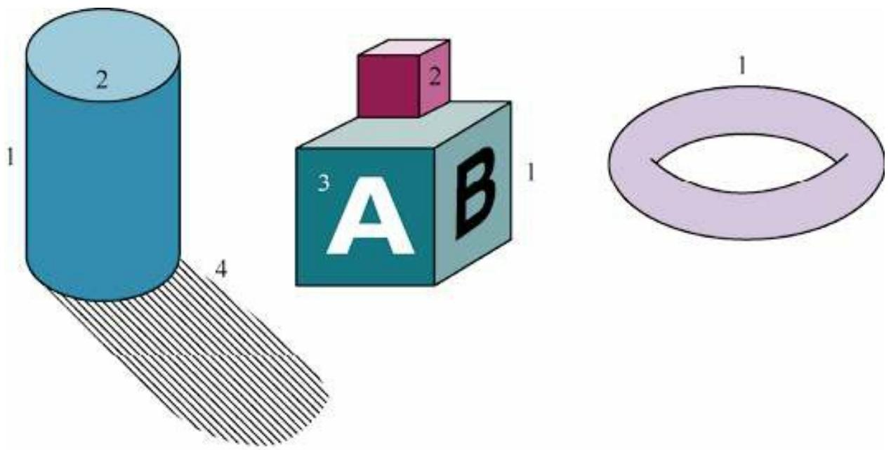  
图25-6 不同类型的边缘：（1）深度不连续；（2）表面方向不连续；（3）反射不连续；（4）照明不连续（阴影）

寻找边缘要求我们比较仔细。图25-7a所示的是垂直于边缘的图像的一维横截面，其中边缘位于x=50。

你可以对图像进行微分，然后寻找导数I'(x)较大的位置来对图像边缘进行辨别。这基本上是可行的，但在图25-7b中我们看到，虽然函数在 x=50处有一个峰值，但在其他位置（如x=75）也存在有可能被误认为是图像边缘的次峰值。这个问题的产生是因为图像中存在“噪声”。这里的噪声 意味着像素值的变化与边缘无关。例如，照相机中可能存在热噪声；物体表面可能有划痕，它能在极

细小的尺度上改变表面法线；表面的反射系数可能在同一个表面上存在细微的变化等等。这些效应中的每一种都会使梯度看起来较大，但它并不意味着存在边缘。如果我们先对图像进行“平滑”处理，伪峰值就会减少，如图25-7c所示。

使用周围像素来控制噪声，从而进行平滑处理。我们将使用附近像素的加权和作为对像素“真实”值的预测，其中距离最近的像素的权重最大。一个自然的权重选择方式是使用高斯滤波器（Gaussian filter）。回顾一下，标准差为 $\pmb { \sigma }$ 的零均值高斯函数为

$$
\begin{array}{l} G _ {\sigma} (x) = \frac {1}{\sqrt {2 \pi} \sigma} \mathrm {e} ^ {- x ^ {2} / (2 \sigma^ {2})} \quad (\text {一 维 情 况}) \\ G _ {\sigma} (x, y) = \frac {1}{2 \pi \sigma^ {2}} e ^ {- (x ^ {2} + y ^ {2}) / (2 \sigma^ {2})} (\text {二 维 情 况}) \\ \end{array}
$$

应用高斯滤波器意味着将光强 $H ( x _ { 0 } , y _ { 0 } )$ 替换为 $\tilde { u } ( x , y ) G _ { d } ( d )$ 在所有( x , y )像素上的和，其中 d表示从 $\left( \boldsymbol { x } _ { 0 } , \boldsymbol { y } _ { 0 } \right)$ 到 $( x , y )$ 的距离。这种加权和非常常见，并且它有一个特定的名称和符号。我们称函数 $h$ 为两个函数 $f$ 和 $g$ 的 卷积 （convolution，记为 ），如果它满足

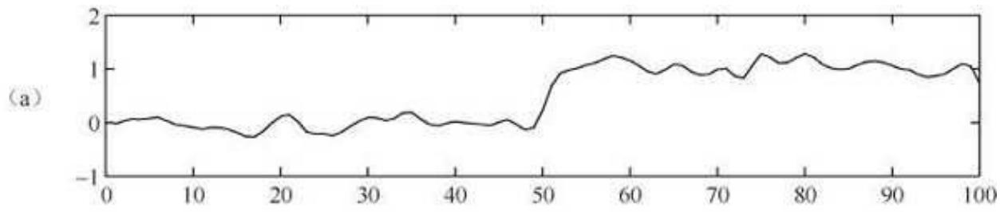

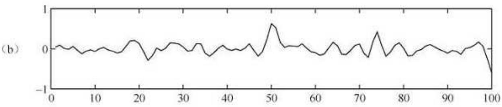

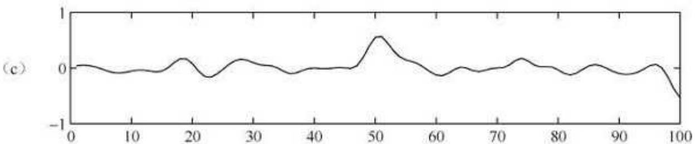  
图25-7 （a）一个跨过边缘的一维截面上的光强I(x)。（b）强度的导数I'(x)。此函数中的较大值对应于边缘，但函数中存在噪声。（c）经过平滑处理后的光强的导数。噪声导致的可能的边缘x=75在此情形中消失

$$
\begin{array}{l} h (x) = \sum_ {u = - \infty} ^ {+ \infty} f (u) g (x - u) \quad (\text {一 维 情 况}) \\ h (x, y) = \sum_ {u = - \infty} ^ {+ \infty} \sum_ {\nu = - \infty} ^ {+ \infty} f (u, \nu) g (x - u, y - \nu) \quad (\text {二 维 情 况}) \\ \end{array}
$$

因此，平滑函数可以通过对图像与高斯核进行卷积得到，即 ${ \pmb { I } } { \ast } { \pmb { G } } _ { \sigma }$ 。标准差 $\pmb { \sigma }$ 为1像素就足以平滑较小级别的噪声，而取2像素的标准差将能够平滑较大的噪声，但会损失一些细节。由于高斯函数的影响随距离的增加而迅速衰减，因此在实际应用中我们可以用 $\pm 3 \sigma$ 代替求和式中的 。

我们有机会对这个过程进行优化：我们可以将平滑和边缘检测融合到一个操作中。根据定理，对于任意两个函数 $f$ 和 $g$ ，其卷积的导数 $( f \ast \mathbf { \delta } _ { \mathbf { \delta } } ) ^ { \prime }$ 等于两函数之一的导数与另一函数进行卷积，如。因此，我们不需要先对图像进行平滑然后微分，只需对图像与高斯平滑函数的导数 $f * ( { \pmb g } )$ $\mathbf { { \sigma } } _ { \mathbf { { \sigma } } } \mathbf { { \sigma } } _ { \mathbf { { \sigma } } }$ 进行卷积，然后将结果中高于某个阈值的峰值标记为边缘，选择这些峰值是为了消除噪声导致的伪峰值。

该算法可以自然地从一维横截面推广到一般二维图像。在二维中，边缘可以以任意角度 产生。我们将图像亮度视为关于变量x和y的标量函数，其梯度为一个向量

$$
\nabla I = \left( \begin{array}{c} \frac {\partial I}{\partial x} \\ \frac {\partial I}{\partial y} \end{array} \right)
$$

边缘对应图像中亮度发生剧烈变化的位置，因此梯度的模长 在边缘处应该较大。当图像变亮或变暗时，每个点上的梯度向量将变长或变短，但梯度的方向

$$
\frac {\nabla I}{\| \nabla I \|} = \left( \begin{array}{c} \cos \theta \\ \sin \theta \end{array} \right)
$$

保持不变。我们为每个像素定义一个函数 ，它定义了该像素的边缘 方向 。这一函数通常很有用，因为它不依赖图像光强。

正如我们在一维信号的检测边缘中所讨论的，为了得到梯度，我们可能实际上不需要计算 ，而是在利用高斯卷积对图像进行平滑后计算 。如前所述，这个卷积的一个性质是，它等价于用高斯函数的偏导数与图像进行卷积。一旦得到了梯度，我们就可以通过找到边缘点并将它们连接在一起以得到边缘。为了判断一个点是否是边缘点，我们必须观察该点在其梯度方向上前方与后方一小段距离上的其他点。如果其中一个点的梯度模长较大，那么我们可以通过稍微移动边缘曲线来获得更好的边缘点。此外，如果梯度模长太小，则该点不会是边缘点。因此若某个点是一个边缘点，那么它的梯度模长是沿梯度方向的梯度模长的局部极大值，且该点的梯度模长高于一个适当的阈值。

一旦我们用这个算法标记了边缘像素，下一步就是连接那些属于相同边缘曲线的像素。这一想法可以通过以下假设来实现：如果两个相邻的像素属于相同的边缘曲线，那么它们都是边缘像素且梯度具有一致的方向。

边缘检测的结果并不是完美的。图25-8a给出了一幅场景图像，它的内容为一个放在桌子上的订书机，图25-8b给出了边缘检测算法在该图像上的输出。如你所见，算法的输出并不完美：存在没有

出现任何边缘的间隙，并且存在与场景中任何重要内容都不对应的“噪声”边缘。这些错误需要在后续处理阶段中进行修正。

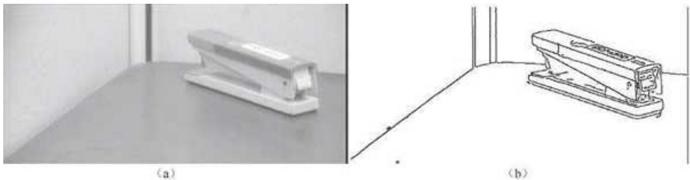  
图25-8（a）一个订书机的照片。（b）从（a）中计算出的边缘

# 25.3.2 纹理

在我们的日常用语中，物品表面的纹理 （texture）意味着当你用手指触摸它们时感受到的感觉（单词“texture”“textile”“text”有相同的拉丁词根，它们都是表示“编织”的单词）。在计算视觉中，纹理是指表面上可以被视觉感知到的图案。通常来说，这些图案大致上是规则的。示例包括建筑物窗户的图案、毛衣上的缝线、豹皮上的斑点、草坪上的草叶、海滩上的鹅卵石以及体育场里的人群。

这些图案的排列有时很有周期性，如毛衣上的针脚；对于一些其他例子，如海滩上的鹅卵石，这种规律性将体现在统计意义上—— 海滩上不同位置的鹅卵石密度大致相同。一个常见的粗糙的纹理模型是元素的模式重复，有时也称为纹理元素或纹元 （texel）。这个模型是非常有用的，因为在生活中我们非常难以制造或者找到一个永远不重复的纹理。

纹理是图像切片的性质，而不是一个孤立像素的特性。对切片中纹理的较好的描述应当涵盖对该切片的外观形状的描述，且当照明条件发生改变时，这一描述应该保持不变。这排除了我们通过寻找边缘点来判断纹理的可能性。如果我们在明亮的环境下观察一个纹理，那么它在该切片中的许多位置将有高对比度，并将产生边缘点；但如果在不太明亮的光线下观察相同的纹理，这些边缘中的一大部分不会超过阈值。当切片旋转时，对纹理的描述应该以合理的方式进行更改。保持垂直条纹和水平条纹之间的差异性是很重要的，但是如果垂直条纹可以通过旋转成为水平条纹，这个想法将不适用。

具有这些性质的纹理表示已经在两个重要任务中发挥了较大作用。第一个任务是物体识别——斑马和马的外形相似，但身上的纹理不同。第二个任务是将一幅图像中的切片与另一幅图像中的切片进行匹配，这是从多幅图像中恢复三维信息的关键步骤（25.6.1节）。

在这里我们给出纹理表示的一个基本构造方法。给定一个图像切片，计算该切片中每个像素的梯度方向，然后利用关于方向的直方图对该切片进行表征。梯度方向对照明的变化有很强的不变性（梯度模长会变长，但不会改变方向）。方向的直方图似乎捕捉到了有关纹理的重要信息。例如，垂直条纹在直方图中有两个峰值（每个条纹的左侧和右侧各有一个峰值）。豹斑的梯度方向会更均匀。

但我们并不知道应该对多大的切片进行描述。此时我们有两种方法。一种方法是使用专门的应用。在专门的应用中，图像信息暗示了切片应该有多大（例如，我们可以不断地扩大某个充满了条纹的切片，直到它覆盖了整只斑马）。另一种方法是，我们在一系列尺度上描述以各个像素为中心的切片。这个范围通常包含从几像素到整个图像的范围。现在我们将切片划分为若干个单元，并在每个单元中构造一个方向直方图，然后总结各个单元的直方图模式。在今天，手动构造这些描述的方法已经不太常见了，而是使用卷积神经网络来产生关于纹理的表示。但是网络所构建的表示似乎只能粗略地反映这种构造方式。

# 25.3.3 光流

接下来，让我们考虑当我们有一个视频序列，而不是仅仅一幅静态图像时会发生什么。每当照相机与场景中的一个或多个物体之间发生相对运动时，图像中产生的视运动都称为 光流 （opticalflow）。它描述了观察者和场景之间的相对运动而导致的 图像中特征的运动方向和速度。例如，

从行驶中的汽车上看到的远处物体的视运动速度比汽车周围物体的运动速度慢得多，所以视运动的速率可以告诉我们一些关于距离的信息。

我们在图25-9中给出了网球运动员视频的其中两帧。我们在右边的图像中给出了根据这些图像计算出的光流矢量。光流对场景结构中的有用信息进行编码——网球运动员在移动而背景（图像中的大部分）不移动。此外，光流矢量揭示了运动员正在进行的动作——一只胳膊和一条腿在快速移动，而其他身体部位没有明显移动。

光流矢量场可以用光流在 x 方向上的分量 $v _ { x } ( x , y )$ 和 y 方向上的分量 $v _ { y } ( x , y )$ 来表示。为了衡量光流，我们需要在一个时间帧和下一个时间帧之间找到图像点之间的对应关系。一种非常简单的方法基于这样一个事实：对应点周围的图像切片具有相似的光强模式。考虑时刻 $t$ 以像素 $p$ ，即( x 0 ,y 0)为中心的一个像素块。将该像素块与时刻 $t + D _ { t }$ 以 $\dot { } x _ { 0 } + D _ { x } , y _ { 0 } + D _ { y } \dot { } ,$ )处的各个候选像素 $q _ { i }$ 为中心的像素块进行比较。一种可能的相似性度量是 差值平方和 （sum of squared differences，SSD）：

$$
\operatorname {S S D} \left(D _ {x}, D _ {y}\right) = \sum_ {(x, y)} \left[ I (x, y, t) - I \left(x + D _ {x}, y + D _ {y}, t + D _ {t}\right) \right] ^ {2}
$$

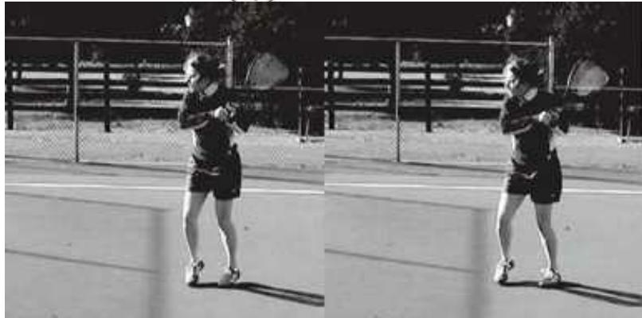

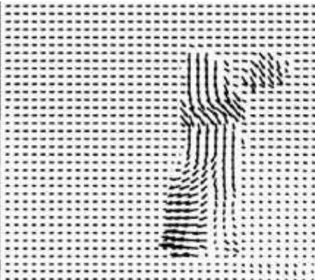  
图25-9一个视频序列的两帧，以及与从一帧到另一帧的位移相对应的光流场。注意由箭头方向刻画的网球拍和右腿的动作（图片由ThomasBrox提供）

其中，( x , y )表示为以 $\mathbf { \Phi } _ { x _ { 0 } , y _ { 0 } } )$ 为中心的像素块中的像素位置。我们将寻找使SSD最小化的( D x, D)，则(x , y )处的光流(v ,v )=(D /D , D /D )。注意，为了使该方法有意义，场景中应该存在一些纹理，从而使得图像中像素之间存在亮度的显著差异。如果我们看到的是一面均匀的白墙，那么对于不同的候选对应点 $q$ ，SSD将是几乎相同的，此时算法将等效于盲目猜测。在光流测量的问题中，表现最佳的算法依赖各种其他约束来处理场景中仅部分存在纹理的情况。

# 25.3.4 自然图像分割

分割 （segmentation）是将一幅图像分解成若干组相似像素集的过程。其基本思想是，每个图像像素可以与某些特定的视觉性质（如亮度、颜色和纹理）相关联。在单个物体或单个物体中的某个部分内，这些特征的变化相对较小；而在物体之间的边界上，这些特征中的一个或多个通常会发生较大变化。我们需要找到一个将图像划分成像素集的方法，使得这些约束尽可能得到满足。需要注意的是，仅仅寻找边缘是不够的，因为许多边缘不是物体的边界。例如，一只处在草丛中的老虎可能会在它的每一条条纹和周围每一棵草的每一边产生一条边缘。当面临所有这些令人困惑的边缘数据时，我们可能会错过老虎真实的身形。

研究这个问题有两种方法，一种方法侧重于考查这些生成的小组像素集的边界，另一种方法侧重于考查小组本身，该小组也称为区域 （region）。我们在图25-10中对此进行了说明，并在图25-10b中给出了边界检测的结果，在图25-10c和图25-10d中给出了区域提取的结果。

一种对边界曲线检测问题进行表述的方法是将其看作一个分类问题，并采用机器学习方法求解。像素位置(x,y)处的边界曲线将具有方向 $\pmb \theta$ 。以(x, y)为中心的图像邻域将看起来像一个圆盘，并被分割为直径方向为 $\pmb \theta$ 的两个半圆。我们可以通过比较两个半圆中的特征来计算在该像素处沿该方

向存在边界曲线的概率 。预测这一概率的一个自然的方法是使用自然图像数据集训练一个机器学习分类器，其中我们人工地标记了图像中的真实边界——分类器的目标是准确地标记那些人工标记的边界，而不是其他边界。

用这种方法检测到的边界比用前面描述的简单边缘检测方法检测到的边界要好，但它仍有两个局限性：一是对 进行阈值化形成的像素边界不能保证构成一条闭合的曲线，因此该方法所给出的结果不一定是一个区域；二是对边界的判断只利用了局部信息，而没有使用全局一致性约束。


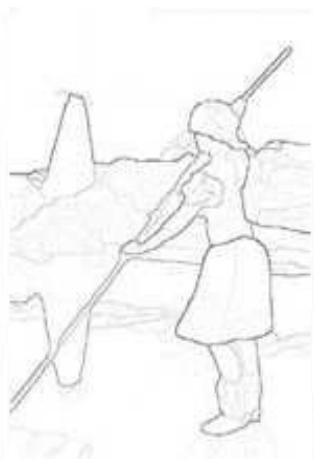


  
  
图25-10（a）原始图像。（b）图像的边界轮廓，其中P 值越高，轮廓颜色越深。（c）通过对图像精细划分得到的各个分割区域，其中每个区域使用区域中的平均颜色进行填充。（d）通过对图像进行较粗糙的分割得到的各个分割区域，粗糙分割将导致得到的区域更少（图片由PabloArbelaez、Michael Maire、Charless Fowkes和Jitendra Malik提供）

另一种方法尝试根据像素的亮度、颜色和纹理性质将像素“聚类”成多个区域。对这种直觉进行数学化表述有许多不同的方法。例如，史建波和马利克（Shiand Malik,2000）将此想法表述为一个图划分问题，其中图的节点对应各个像素，边对应像素之间的连接。连接一对像素i和j的边上的权重 W ij取决于这两个像素在亮度、颜色、纹理等方面的相似程度。然后该方法将寻找最小化 归一化切割 标准的划分。简单来说，划分图的目标是使组间连接的权重之和最小，同时使组内连接的权重之和最大。

一些事实表明，基于寻找边界和寻找区域的方法是可以耦合的，但我们在这里将不探讨这些可能性。我们不能指望通过单纯基于低级局部属性（如亮度和颜色）进行分割，就能找到场景中所有物体的正确边界。为了可靠地找到与物体相关联的边界，我们还需要结合关于场景中可能遇到的物体类型的更高级的知识。在这种情况下，一个更受欢迎的策略是生成一幅过度分割的图像——它能保证不错过任何真正的边界，但可能同时会标记许多额外的错误边界。最后产生的区域（称为超像素），将大大降低各种算法所需要的计算复杂度，因为超像素的数量可能是数百个，而原始像素的数量可能是百万量级。利用物体的高级知识是25.4节的主要内容，检测图像中的物体是25.5节的主要内容。

# 25.4 图像分类

图像分类这一概念主要适用于两种情况，在一种情况中，我们有表示物体的图像，其中物体取自于给定的分类类别中的某一类，图像中没有太多表示其他意义的信息，例如，在关于某种服装或家具的图像中，背景是无关紧要的，分类器的输出将是“cashmeresweater”（羊绒衫）或“deskchair”（桌椅）。

在另一种情况中，每幅图像所示的是一个包含多个物体的场景。你可能会在草原图像中同时看见一只长颈鹿和一头狮子，你可能会在客厅图像中同时看见一张沙发和一盏灯，但你不会在客厅图像中看到一只长颈鹿或一艘潜艇。我们现在已经有对大规模图像进行分类的方法，它可以准确输出“grassland”（草地）或“living room”（客厅）。

现代系统通过外观 （例如颜色和纹理，而不通过几何性质）对图像进行分类，其中有两个难点：一 是同一类别的不同实例可能看起来不同——有些猫是黑色的，有些是橙色的；二是同一只猫在不同的时刻看起来可能不同，这取决于以下几种效应（如图25-11所示）。

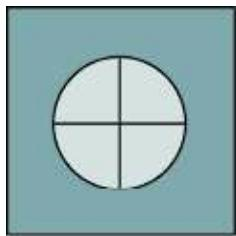

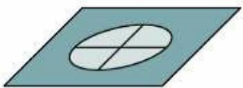  
透视收缩

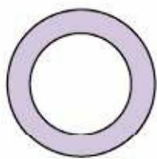

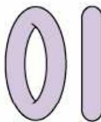  
视向


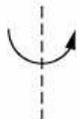

  
遮挡

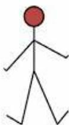

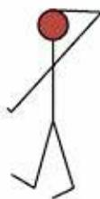  
变形  
图25-11 产生外观变化的重要因素，它们可使同一物体的不同图像看起来不同。第一，元素可能发生透视收缩，如左上角的圆形切片。由于我们在一个斜视的角度下观察该切片，因此它将在图像上呈现出椭圆形。第二，当我们从不同方向观察物体时，物体的形状会发生很大的变化，这种现象称为“视向”。右上角所示是甜甜圈的3个不同视向。当杯子旋转时，遮挡会导致左下角杯子的把手消失。在这种情况下，因为杯身和把手属于同一个杯子，这称为自遮挡。第三，如右下角所示，一些物体可以显著地改变自身形状

●照明 ，它将改变图像的亮度和颜色。  
●透视收缩 ，它会导致我们以斜视角度观察图案时发生扭曲。  
●视向 ，不同观察方向会使物体看起来不同。当我们从侧面看一个甜甜圈时，它看起来像一个扁平的椭圆形，但从上面看，它会呈现出环形。  
●遮挡 ，即物体的某些部分被隐藏。物体之间可以相互遮挡，或者物体自身的一部分可以遮挡其他部分，这种效应称为自遮挡 。  
●变形 ，即物体改变自身形状。例如，网球运动员移动她的胳膊和腿。

现代方法通过使用卷积神经网络从大量的训练数据中学习表示和分类器来处理这些问题。在训练集足够丰富的情况下，分类器在训练中会多次看到任何一个重要的效应，因此可以根据具体效应进行调整。

# 25.4.1 基于卷积神经网络的图像分类

卷积神经网络 （CNN）是非常成功的图像分类器。在有足够的训练数据和较好的训练技巧情况下，CNN产生了非常成功的分类系统，这些分类系统比用其他方法产生的分类系统要好得多。

ImageNet数据集在图像分类系统的发展中发挥了历史性的作用，它为图像分类系统提供了超过1400万幅训练图像，这些图像被划分为超过3万个精细的类别。ImageNet还通过举办一项年度竞赛促进了这一进步，该竞赛通过单个最佳猜测的分类准确率和Top5准确率对系统进行评估，其中Top5准确率允许系统给出5个猜测结果，例如， 雪橇犬、哈士奇犬 、秋田犬、萨摩耶犬、爱斯基摩犬 。ImageNet包含189个狗的子类别，所以即使是爱狗人士也很难在单次猜测的情况下正确地对图像进行标注。

在2010年举办的第一次ImageNet竞赛中，没有一个系统的Top5准确率能超过70%。到了2012年，卷积神经网络的引入及其随后的改进后使得Top5准确率达到了98%（超过人类所能达到的表现），到了2019年，Top1准确率已经高达87%。这一成功的主要原因似乎是CNN分类器所使用的特征是从数据中学习得到的，而不是研究人员手动设计的，这确保了这些特征对分类是确实有用的。

图像分类的迅速发展首先要归功于我们有像ImageNet这样的大而有挑战性的数据集可供使用，同时也因为基于这些数据集的竞赛是公平、公开的，而且成功的模型可以得到广泛传播。竞赛的获胜者通常会公开他们所用模型的代码以及预先训练好的参数，这使得其他人很容易调用成功的网络结构，并试图把它们改进得更好。

# 25.4.2 卷积神经网络对图像分类问题有效的原因

观察数据集可以帮助我们更好地理解图像分类，但ImageNet数据集过于庞大，以至于我们无法详细查看。MNIST数据集是一个包含70 000幅手写数字（整数0～9）图像的集合，我们通常把它用作模型预热的标准数据集。通过查看这个数据集（其中一些样本如图25-12所示），我们可以发现一些重要的、非常普遍的性质。你可以拍摄一幅关于数字的图像，并在不改变数字本身的情况下进行一些小的更改：你可以移动它，旋转它，使它变亮或变暗，变小或变大。这意味着单个像素值并不带有很多信息——我们知道在数字8的中心应该存在一些较暗的像素，而数字0的图像中不应该有，但是这些较暗的像素将在数字8的每个实例中位于稍微不同的像素位置。

图像的另一个重要性质是局部的模式可以提供相当多的信息：数字0、6、8和9中存在环；数字4和8中存在交叉；数字1、2、3、5和7中存在尾端，但不存在环或交叉；数字6和9中存在环和尾端。此外，局部模式之间的空间关系也包含较多信息。一个数字1有两个尾端，其中一个在另一个上方；一个数字6中存在一个尾端，它处于环的上方。这些观察结果表明了一种策略，这是现代计算机视觉的一个核心原则：我们首先在局部小邻域中构建关于模式的特征；然后其他特征将通过观察这些特征的模式得到；接着后续特征再通过观察前面的模式得到，以此类推。

这正是卷积神经网络所擅长的。你可以把网络中的一层— 一个卷积与一个ReLU激活函数的复合看作一个局部模式检测器（图25-12）。卷积将度量图像的每个局部窗口与核模式的相似程度；ReLU激活函数将低分窗口置为零，并突出高分窗口。所以多个卷积核的卷积可以找到多种模式。此外，我们可以通过将新的一层应用于第一层的输出来检测复合模式。

让我们回想一下第一个卷积层的输出，每个位置接收来自该位置的窗口内的像素的输入。如我们所见，ReLU激活函数的输出形成了一个简单的模式检测器。现在，如果我们把第二层建立在第一层之上，那么第二层中的每个位置都会接收来自该位置的窗口内的第一层输出值。这意味着第二层中的位置相比第一层中的位置将受到更大窗口内的像素的影响。你可以把它们看作“模式的模式”，如果我们把第三层建立在第二层的基础上，那么第三层中的位置将取决于一个更大的像素窗口；第四层将取决于比第三层更大的窗口，以此类推。网络在多个层次上创建模式，并从数据中学习，而不是由程序设计者直接给出模式。

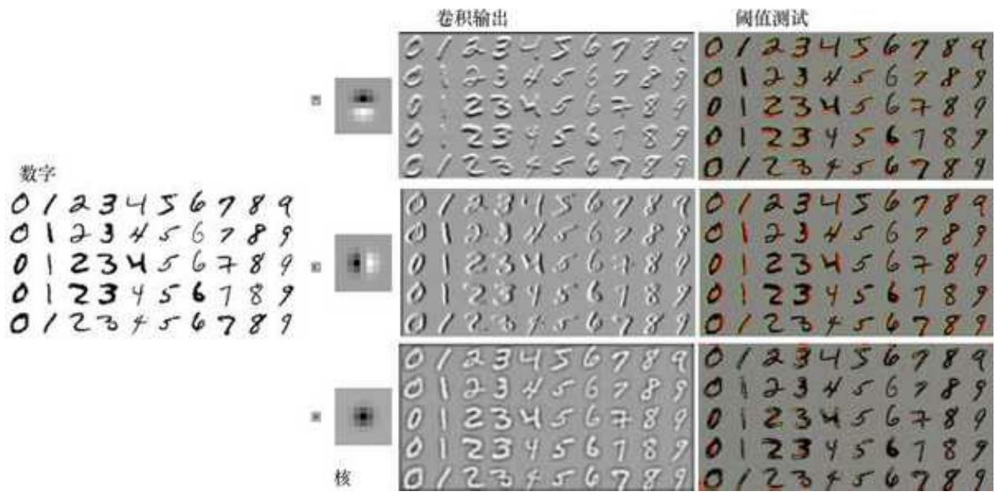  
图25-12最左侧是MNIST数据集中的一些图像。中间图的左侧为3个卷积核。它们以实际大小（图中的小方块）给出，并放大以显示其内容：中度灰色的值为0，浅色表示正值，深色表示负值。中间图的右中侧给出了将左侧这些核应用于图像的结果。最右侧给出了响应大于阈值（绿色）与小于阈值（红色）的像素。注意，这里（从上到下）给出了一个水平条检测器、一个竖条检测器和（更难注意到的）一个尾端检测器。这些检测器关注条的对比度，因此（例如）顶部亮底部暗的水平条产生正（绿色）响应，顶部暗底部亮的水平条产生负（红色）响应。这些检测器有一定的效果，但它们不是完美的

虽然模式化地训练一个卷积神经网络有时也能解决问题，但了解一些实用的技巧将对网络训练有帮助。其中最重要的方法是数据集增强 （datasetaugmentation），即对训练样本进行复制并稍加修改。例如，我们可以将图像随机地移动、旋转或稍微拉伸，或者将像素的色彩随机地进行少量调整。在数据集中的视角或灯光中引入这种模拟变化也有助于增加数据集的大小，当然，以这些方式得到的新样本将与原始样本高度相关。我们也可以把数据集增强的方法用于测试过程，而不是训练过程。在这种方法中，图像将被复制和修改多次（例如，使用随机裁剪），并且分类器将在每幅修改后的图像上运行。然后使用分类器在每个副本上的输出在所有类别中进行投票来获得最终的决策。

在对场景图像进行分类时，每个像素都会对你有所帮助。但是当你对表示物体的图像进行分类时，有些像素并不代表物体的一部分，因此可能只会分散你的注意力。例如，如果一只猫躺在狗床上，我们希望分类器的注意力集中在猫本身的像素上，而不是床的像素上。现代图像分类器很好地处理了这一点，即使图像中与猫本身相关的像素点实际上只有很少几个，它也能将图像准确地预测为“猫”。有两个原因。第一，基于CNN的分类器擅长忽略那些没有区分力的模式。第二，物体上的模式可能是有区分力的（例如一个猫玩具、一个带小铃铛的项圈或者一盘猫粮实际上可能有助于我们判断出所观察的物体是猫），我们称此效应为 环境 （context）。环境可以帮助我们解决问题，也可能妨碍我们，具体是有帮助作用还是有妨碍作用在很大程度上取决于特定的数据集和应用问题。

# 25.5 物体检测

图像分类器预测图像中的内容是什么——它将整个图像归为某一个类别。物体检测器在一幅图像中寻找多个物体，分别判断每个物体属于什么类别，并通过在物体周围添加一个 边框 来反映出


每个物体的位置。 $\_$ 类别的集合是预先给定的，所以我们可以尝试检测所有的脸，所有的车，或者所有的猫等。

我们可以通过在较大的图像上观察一个小的滑动窗口 （一个矩形）来构建一个物体检测器。在每个检测点上，我们使用CNN分类器对窗口中观测到的内容进行分类。然后我们选取其中得分很高的分类——一个位置是一只猫，另一个位置是一只狗——并忽略其他位置的窗口。在解决了一些冲突问题之后，我们最终将得到一组物体及其位置。还有一些细节问题需要解决。

●确定窗口的形状： 目前最简单的选择是使用与坐标轴对齐的矩形（另一种方法是使用某种形式的掩码，用于从图像中截取一部分，这很少使用，因为它很难表示或计算。）我们仍需要考虑矩形宽度和高度的选取。  
● 为窗口构建一个分类器： 我们已经知道如何使用CNN实现这一点。  
●决定要查看哪些窗口： 在所有可能的窗口中，我们希望选择其中可能包含我们感兴趣的物体的窗口。  
●选择要报告的窗口： 窗口可能会重叠，我们不希望在多个差别不大的窗口中多次反映同一个物体。有些物体没有很大价值，在一个拥挤的大讲堂中可能有大量的椅子和人，是否应将每把椅子和每个人都报告为单个物体？也许只有那些在图像中占据较大位置的物体（前排的人和物）是我们应该报告的。这一选择取决于我们希望将物体检测器用于什么目的。  
●利用这些窗口反映物体的精确位置： 一旦我们知道物体位于窗口中的某个位置，我们就可以通过进行更多计算来找出窗口中物体更精确的位置。

让我们更仔细地讨论一下决定要查看哪些窗口的问题。在 $n$ 像素 $\times \ n$ 像素的图像中，搜索所有可能的窗口是效率低下的，因为存在O (n4)个可能的矩形窗口。但我们知道，包含物体的窗口往往具有相当一致的颜色和纹理。但是，将物体切成两半的窗口具有与窗口侧面相交的区域或边缘。因此，设计一个机制来为区域中是否存在物体进行打分将是有意义的— —一个矩形中是否有一个物体，与物体是什么无关。我们可以找到那些看起来像是有物体的框，然后对通过物体测试的框所包含的对象进行分类。

一个能找到包含物体的区域的网络称为区域候选网络 （regionalproposalnetwork，RPN）。一个称为快速RCNN的物体检测器将大量边界框集合编码为固定大小的映射。然后建立一个可以预测每个框得分的网络，并训练这个网络，使得当框包含物体时得分较大，否则较小。将框编码为映射的过程非常简单。我们考虑以图像中的点为中心的框，我们不需要考虑每一个可能的点（因为移动一个像素不太可能改变分类结果），一个不错的选择是采用大小为16像素的步长 （中心点的间隔）。对于每个中心点，我们将考虑若干个可能的框，这称为锚框 （anchorbox）。如图25-13所示。快速RCNN使用了9个锚框：小、中、大3种尺寸，每种尺寸包含高、宽和正方形3种纵横比。

根据神经网络结构，我们需要构造一个三维区域，其中区域的每个空间位置中有两个维度，一个维度刻画中心点的位置，一个维度指示框的类型。现在，我们把每一个具有足够好的物体检测得分的框称为 感兴趣区域 （regionofinterest，ROI），它们必须经过分类器的检查。CNN分类器通常偏好有固定大小的图像，但每一个需要通过物体检测的框在大小和形状上有所不同。我们不能让框之间有相同数量的像素，但是我们可以通过对像素进行采样来提取特征，这个过程称为ROI池化 。在采样后，我们将这个固定大小的特征映射传入分类器。

现在我们考虑下一个问题——选择要报告的窗口。假设我们所查看的窗口大小为32×32，步长为1：每个窗口与前一个窗口相比仅平移了1像素。这将导致产生许多相似的窗口，并且它们应该有相似的得分。如果它们的得分都高于阈值，我们实际上并不想同时报告所有这些窗口，因为它们很可能都来自同一物体的稍有不同的视图。但是，如果步长过大，则可能导致某个物体未被包含在任何

一个窗口中，因此该物体将被丢失。我们可以使用一种称为 非极大值抑制 （non-maximumsuppression）的贪心算法。首先，我们建立一个分数超过阈值的所有窗口的排序列表。然后，当列表中有窗口存在时，我们选择得分最高的窗口并认为它包含一个物体。接着，从列表中删除所有其他与该窗口存在大量重叠的窗口。

最后，我们还要考虑报告物体精确位置的问题。假设我们现在有一个高分的窗口，并且它在经过非最大值抑制后保留下来。这个窗口不太可能完全处于正确的位置（记住，我们只检测了数量相对较少的窗口以及可能的窗口大小）。我们使用由分类器计算的特征表示来预测将窗口向下修剪到适当边框带来的改进，我们将这个步骤称为边框回归 （bounding box regression）。

评估物体检测器需要小心。首先，我们需要一个测试集：一个图像集合，且图像中的每个物体都带有一个真实类别的标签和边框。通常，边框和标签是人工提供的。然后，我们把每幅图像输入物体检测器，并将其输出与真实值进行比较。我们乐意看到框与框之间存在若干个像素的差异，因为真实的边框也不是完美的。在评估得分时，我们应当权衡召回率（找到所有存在的物体）和准确率（不找不存在的物体）。

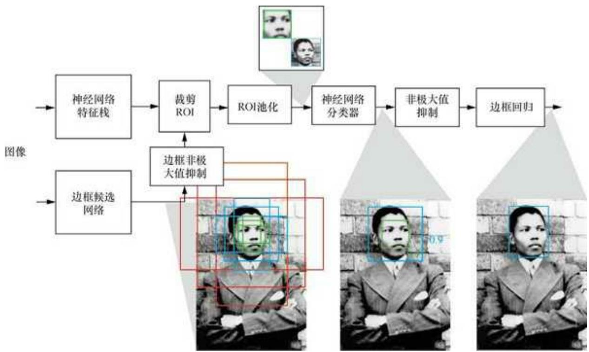  
图25-13 快速RCNN使用两个网络。一张年轻时的纳尔逊·曼德拉的照片被输入物体检测器。一个网络用于计算候选图像框（称为“锚框”）的物体检测得分，这些框以网格上的点为中心。每个网格点对应着9个锚框（3种尺寸，每种尺寸包含3种纵横比）。对于示例图像，内部的绿色框和外部的蓝色框通过了物体检测。第二个网络是一个特征栈，用于计算适合分类的图像表示。具有最高得分的框将从特征图中分割出来，通过ROI池化进行尺寸标准化，再传给分类器。注意，蓝色框的得分高于绿色框，并且与绿色框重叠，因此绿色框将被非极大值抑制算法拒绝。最后，我们对蓝色框进行边框回归，使其符合人脸的形状。这意味着对位置、比例和纵横比的相对粗粒度的采样不会降低预测准确率。照片由Sipa/Shutterstock提供

图像通常是三维世界的一张二维图片，但是这张二维图片中存在很多关于三维世界的线索。当我们有多张关于相同场景的图片时，我们可能可以找到某个线索，使得我们可以在图片之间进行对应点的匹配。在某张图片中，我们可能又会找到新的其他的线索。

# 25.6.1 多个视图下的三维线索

在三维世界中，有两张关于同一物体的图片通常比只有一张要好，有以下两个原因。

●如果你从不同的视角拍摄了同一场景的两幅图像，并且你对这两部摄像机了解得足够多，那么你可以通过计算第一个视图中的点对应第二个视图中的哪个点，并应用一些几何知识，来构建一个三维模型— —三维坐标点集，其坐标是三维的。这对几乎所有的视角和几乎所有类型的摄像机来说都是正确的。  
●如果你有两个包含足够多点的视图，并且你知道第一个视图中的点对应第二个视图中的哪个点，那么你不需要对摄像机了解太多就可以构建出该三维模型。两个点的两个视图将为你提供4个( x , y)坐标，而你只需要3个坐标就可以在三维空间中确定一个点；额外的一个坐标有助于你找到所需的关于摄像机的信息。这对几乎所有的观察方向和几乎所有的摄像机类型来说都是正确的。

关键的问题在于建立第一个视图中的点与第二个视图中的点的对应关系。利用简单的纹理特征（如25.3.2节所述）对点的局部表现进行详细描述，通常足以让我们进行点到点的匹配。例如，考虑一个场景，其内容是街道上的交通状况，我们可能在所拍摄的两个场景中都只能看见一盏绿灯，因此我们就可以假定它们是相互对应的。关于多个摄像机视图的几何理论已经非常成熟（遗憾的是，它过于复杂，我们无法在此做过多解释）。该理论给出了有关一幅图像中点可以与另一幅图像中哪个点相匹配的几何约束。通过考虑重构出的表面的平滑度，我们可以得到其他的约束。

我们通常有两种方法来获得一个场景的多个视图。一种方法是安置两部摄像机或使用双眼视图（25.6.2节），另一种方法是移动摄像机（25.6.3节）。如果你有两个以上的视图，那么你将可以非常精确地重建世界的几何性质以及视图的详细信息。25.7.3节将讨论该技术的一些应用。

# 25.6.2 双目立体视觉

大多数脊椎动物有两只眼睛。这不仅可以帮助它们在失去其中一只眼睛的情况下继续生活，还可以在其他方面有帮助。大多数猎物的眼睛长在头部的两侧，使它们具有更广阔的视野；而捕食者的眼睛长在前方，使它们能够利用双目立体视觉 （binocularstereopsis）。为了理解它的含义，读者可以将两个食指举在脸前，闭上一只眼睛，调整一个食指的位置使得在睁开的眼睛视野中前面的食指挡住了另一个食指。现在睁开另一只眼并闭上原来的眼睛，你将注意到，手指之间的位置发生了变化。我们称这种从左视图到右视图的位置变化为视差 （disparity）。在一个适当的坐标系中，如果我们在某个深度下叠加一个物体的左视图和右视图，则该物体在叠加视图中存在水平方向的偏移，且偏移的距离是深度的倒数。你可以在图25-14中观察到这一点，金字塔中离你最近的点在右图中偏向左侧，而在左图中偏向右侧。

为了度量视差，我们需要解决对应问题——对于左图像中的一个点，确定它在右图像由同一场景点投影所产生的“伙伴”，即对应点。这与度量光流的方法类似，处理该问题最简单的方法与光流中的对应方法相似。这些方法使用差值平方和（25.3.3节）搜索匹配的左像素块和右像素块。一些更复杂的方法使用了更细致的像素块纹理表示（25.3.2节）。在实际应用中，我们通常使用带有额外约束的更复杂的算法。

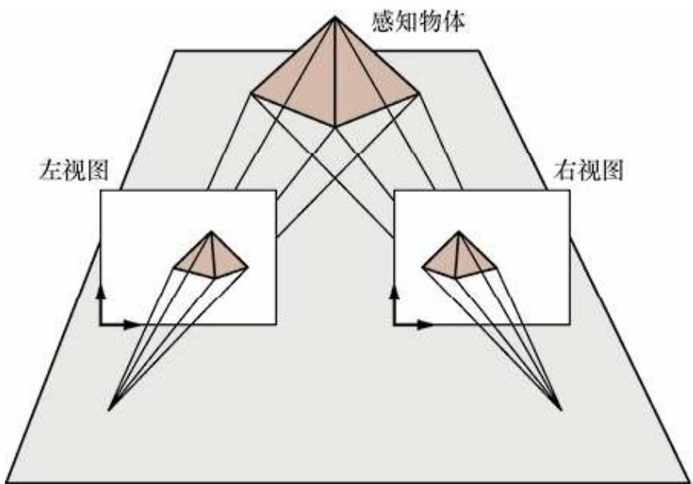

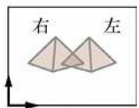  
  
  
图25-14 将摄像机按平行于图像平面的方式进行平移会导致图像特征在摄像机平面中发生移动。（a）位置上的差异是对物体深度的暗示。（b）如果我们对左右两幅图像进行叠加，我们将观察到视差

假设我们现在已经可以度量视差，那么我们该如何得到关于场景深度的信息？我们需要判断视差和深度之间的几何关系。我们将首先考虑双眼（或摄像机）正视前方且与光轴平行的情况。右摄像机和左摄像机之间的关系——在 x 轴方向存在位移 b ， b 称为 基线 （baseline）。我们可以利用25.3.3节中的光流公式来进一步说明，如果我们把视差看作平移向量 $\pmb { T }$ 作用 $\delta t$ 时间产生的结果，其中 ， 。水平和垂直方向上的视差由光流分量乘以时间步长 $\delta t$ 得出，即 ， $\gamma = \nu _ { y } \delta t$ 。通过适当变换，我们可以得到 $H = 6 / Z$ ， $V = 0$ ，换句话说，即水平方向的视差等于基线与深度之比，垂直方向的视差为0。现在我们可以恢复出深度 Z ，因为我们已经知道 $^ { b }$ ，并且可以通过测量得到 $H$ 。

在正常的视觉条件下，人类通常会采用注视 （fixate），也就是说，在场景中存在一个点，使得两眼的光轴在此相交。如图25-15所示，两眼的视线汇集在一个固定点 $P _ { \mathrm { ~ 0 ~ } }$ 上，该点与双眼中点的距离为Z。出于方便考虑，我们将计算以弧度为单位的角视差，并设注视点 $P _ { \mathrm { ~ 0 ~ } }$ 处的视差为0。对于场景中与 $P _ { \mathrm { ~ 0 ~ } }$ 距离 $\pmb { \delta Z }$ 的较远一个点 $P$ ，我们可以计算 $P$ 的左右成像（分别称为 $P _ { \mathrm { ~ L ~ } }$ 和 $P _ { \mathrm { ~ R ~ } }$ ）的角位移。如果它们中的每一个都相对于 $P _ { \mathrm { ~ 0 ~ } }$ 有角度为 的位移，那么 $P _ { \mathrm { ~ L ~ } }$ 和 $P _ { \mathrm { ~ R ~ } }$ 之间的位移

（即 $P$ 的视差）为 $\delta \theta$ 。根据图25-15，我们可以得出 $\tan \theta = { \frac { b / 2 } { Z } }$ 和

$\tan ( \theta - \delta \theta / 2 ) = { \frac { b / 2 } { \pmb { Z } + \delta \mathbf { Z } } }$ 6/2 ，但对于较小的角度，我们有 $\tan \theta \approx \theta$ ，因此我们有

$$
\delta \theta / 2 = \frac {b / 2}{Z} - \frac {b / 2}{Z + \delta Z} \approx \frac {b \delta Z}{2 Z ^ {2}}
$$

此外，由于实际的视差为 $\delta \theta$ ，因此有

$$
\mathrm {d i s p a r i t y} = \frac {b \delta Z}{Z ^ {2}}
$$

对人类来说，基线 $^ { b }$ 约为 $6 \mathrm { c m }$ 。假设 $Z$ 大约为 $1 0 0 ~ \mathrm { c m }$ ，人类可分辨的最小视差 $\delta \theta$ （对应于单个像素的大小）约为5角秒，则 $\pmb { \delta Z }$ 为 $0 . 4 \mathrm { m m }$ 。当 $Z = 3 0 ~ \mathrm { c m }$ 时，我们得到了非常小的值$\delta Z = 0 . 0 3 6 \mathrm { m m }$ 。也就是说，在 $3 0 \mathrm { c m }$ 的距离上，人类可以分辨出只有 $0 . 0 3 6 \mathrm { m m }$ 的深度差异，这使得我们能够进行穿针线之类的工作。

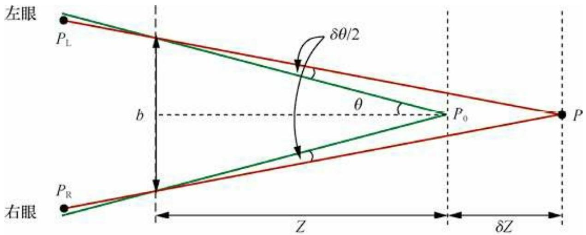  
图25-15 立体视觉中视差与深度的关系。两眼的投影中心之间的距离为 $^ { b }$ ，光轴相交于注视点 P 0。场景中的点P投影到两只眼睛视野中的点 $P _ { \mathrm { ~ L ~ } }$ 和 $P _ { \mathrm { ~ R ~ } }$ 。用角视差进行刻画时，它们之间的视差为（图中给出了两个大小为 的角度）

# 25.6.3 移动摄像机给出的三维线索

假设我们有一部在场景中移动的摄像机。如图25-14所示，我们将左图看作“时刻t”下的场景，将右图看作“时刻t+1”下的场景。两者的几何性质没有发生改变，所以在处理照相机移动的问题时，立体视觉的所有方法同样适用。25.6.2节中称为视差的现象现在可以被看作图像中的视运动，它也称为光流。这是关于照相机移动和场景几何性质的信息来源。为了理解这一点，我们将给出一个方程（不给出证明），它将光流与观察者的平移速度 $\mathbf { T }$ 还有场景的深度联系起来。

光流场是关于图像中的速度 的矢量场。在以照相机为中心的坐标系中，假设焦距 f = 1，那么这些分量的表达式为

$$
v (x, y) = \frac {- T _ {x} + x T _ {z}}{Z (x , y)}, v _ {y} (x, y) = \frac {- T _ {y} + y T _ {z}}{Z (x , y)}
$$

其中， $Z ( x , y )$ 是场景中与图像中点 $( x , y )$ 相对应的点的 $\mathbf { Z }$ 坐标（即深度）。

需要注意的是，光流的两个分量 $v _ { x } ( x , y )$ 和 $v _ { y } ( x , y )$ 在以 $x = T _ { x } / T _ { z }$ ， $y = T _ { y } / T _ { z }$ 为坐标的点处均为0，这一点称为延伸焦点 （focusofexpansion）。假设我们改变 $x y$ 平面上的原点，使其落在延伸焦点处，那么光流的表达式将有一个特别简洁的形式。令( x' , y ' )为由 $( x ^ { \prime } , y ^ { \prime } )$ $x ^ { \prime } = x - T _ { z } / T _ { z }$ ， 所定义的新坐标，有 $y ^ { \prime } { = } y - T _ { y } / T _ { z }$

$$
v _ {x} \left(x ^ {\prime}, y ^ {\prime}\right) = \frac {x ^ {\prime} T _ {z}}{Z \left(x ^ {\prime} , y ^ {\prime}\right)}, v _ {y} \left(x ^ {\prime}, y ^ {\prime}\right) = \frac {y ^ {\prime} T _ {z}}{Z \left(x ^ {\prime} , y ^ {\prime}\right)}
$$

注意，此处缩放因子存在歧义性（这可以解释为什么设焦距 f=1是不失一般性的）。如果摄像机的移动速度是原来的两倍，场景中的每个物体都是原来的两倍大，且距离摄像机的距离是原来的两倍，那么光流场将完全相同。但我们仍然可以从中提取非常有用的信息。

（1）假设你是一只试图在墙壁上着陆的苍蝇，你想从光流场中得到有用的信息。由于缩放因子的歧义性，光流场将不能告诉你离墙的距离或朝墙飞行的速度。但是，如果你考虑距离除以速度，缩放因子的歧义性就会消失。其结果即为接触时间，由 $\mathbf { Z } / T _ { * }$ 表示，它对于控制着陆非常有用。相当多的实验证据表明，许多不同的动物物种利用了这一线索。  
（2）分别考虑深度为 $Z _ { 1 }$ 、 $Z _ { 2 }$ 的两点。我们可能不知道其中任何一个的绝对数值，但通过考虑这些点的光流的模长比的倒数，我们可以确定深度比 $Z _ { 1 } / Z _ { 2 }$ 。这是有关运动视差的线索，当我们从辆移动的汽车或火车的侧窗向外看时，我们就会使用这种线索，并推断出这样的结论：视野中移动较慢的部分离我们较远。

# 25.6.4 单个视图的三维线索

单幅图像同样能提供关于三维世界的丰富信息。即使我们拥有的图像只是一幅线条画，这也是正确的。对于线条画的问题，视觉科学家们已经投入了不少研究精力，这是因为人们对三维形状和布局存在一种直觉，即使这幅画似乎包含的信息很少，以至于我们很难在大量可以产生相同的线条画的场景集合中选择出正确的场景。遮挡是一个关键的信息来源：如果图片中有证据表明一个物体遮挡了另一个物体，那么遮挡另一个物体的物体将离眼睛更近。

在关于真实场景的图像中，纹理是三维结构的重要线索。25.3.2节指出，纹理是纹理元素的模式重复。尽管纹理元素在场景中的物体上的分布可能是均匀的——例如，海滩上的鹅卵石，但在图像中，它可能不均匀——远处的鹅卵石看起来比近处的鹅卵石小。再举另外一个例子，考虑一块带有圆点花纹的桌布。桌布上的所有点的大小和形状都是相同的，但在透视图中，由于透视收缩，有些点看起来将是椭圆形的。现代方法通过学习从图像到三维结构的映射（25.7.4节）来利用这些线索，而不是直接推理纹理背后的数学结构。

明暗——从场景中表面的不同部分接收的光的光强变化——由场景的几何结构和表面的反射性质决定。确凿的证据表明，明暗是三维形状的一个线索。从物理角度论证这一点很容易。根据25.2.4节给出的物理模型，我们知道，如果一个表面的法线指向光源，则该表面会更亮；如果它背向光源，那么该表面会较暗。如果我们不知道表面的反射率，照明场也不均匀，那么关于明暗的讨论就会更加复杂，但人类似乎能够从明暗中获得对形状的有效感知。遗憾的是，很少有算法能实现这一点。

如果图片中有一个我们熟悉的物体，它呈现出来的样子很大程度上将取决于它的 位姿 （pose），即它相对于观察者的位置和方向。有一些简单直接的算法，可以根据物体上的点和物体模型上的点之间的对应关系重建出物体的位姿。重建已知物体的位姿有很多种应用。例如，在一个工业操作任务中，机器人手臂在位姿已知之前无法抓起物体。机器人手术的应用依赖精确计算摄像机与手术工具和患者之间的位置转换（以产生从手术工具位置到患者位置的转换）。

物体之间的空间关系是另一个重要线索。这里我们给出一个例子，假设所有行人的身高都差不多，且他们都站在地面上。如果我们知道地平线在图像中的位置，我们就可以将行人按他们距离摄像机的距离进行排序。这是因为我们知道行人的脚处于哪个位置，而在图像中，脚离地平线越近的行人将离摄像机越远，因此在图像中，他们的脚也将看起来越小。这意味着我们可以排除一些检测器的响应——如果一个检测器在图像中发现了一个看起来较大的行人，同时他的脚接近地平线，我们知道这样的情况是不存在的，因此该检测器发生了错误。如果场景中存在几个与照相机距离不同的行人，那么一个相当可靠的行人检测器能够给出关于地平线的估计。这是因为行人的相对比例是有关地平线位置的线索。因此，我们可以从检测器中得到关于地平线位置的估计，然后用这个估计来减少行人检测器可能发生的错误。

# 25.7 计算机视觉的应用

在本节中，我们将考察一系列的计算机视觉应用。到目前为止，我们已经有了许多可靠的计算机视觉工具和工具箱，因此计算机视觉方面出现了大量成功且有用的应用。其中很多应用是广大爱好者为了特殊目的独自开发的，这证实了这些方法的实用性和影响力（例如，一位计算机视觉爱好者发明了一种基于物体检测的宠物门禁系统，如果猫带着一只死老鼠进门，它会拒绝让猫进入——你可以在网络上搜索到这个系统）。

# 25.7.1 理解人类行为

如果我们能建立一个系统，它通过分析视频来理解人们正在做什么，我们就能建立一个人机接口程序来观察人类并对他们的行为做出反应。有了这些接口，我们就可以完成一系列的事情：通过收集和使用人们在公共场合的行为数据来更好地设计建筑物和公共场所；建立更准确、被入侵的可能性更小的安防监控系统；建立自动化的体育评论员；通过在有危险靠近人或机器时发出警告，使建筑工地和工作场所更安全；制作计算机游戏，让玩家玩游戏的同时能进行运动并得到锻炼；通过管理建筑物内的热量和光线来匹配居住者的位置和正在进行的行为，从而节约能源。

对于其中的一些问题，目前的技术水平已经非常高。例如，有一些方法可以非常准确地预测图像中人体关节的位置，进而我们能得到关于这个人的身体的三维结构的精确估计（见图25-16）。这是因为身体的图片往往具有较弱的透视效果，而身体的各个部分的长度差异不大，因此图像中身体各部分的透视收缩是有关它与照相机平面之间角度的很好的线索。利用深度传感器，这些估计就可以足够快地得到，并传入计算机游戏的接口。

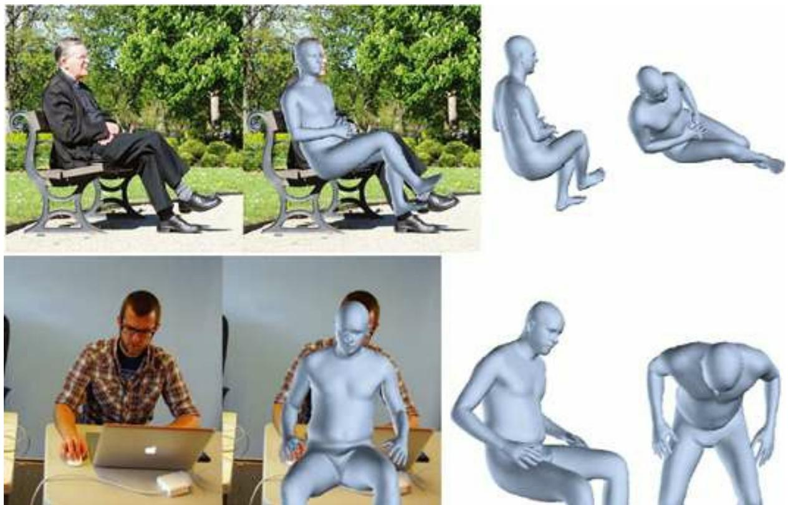  
图25-16 从单一的图像中重建人类模型目前已经可以实现。两行图片都展示了基于单个图像的三维身体形状重建。这些重建是有可能的，因为一些方法可以估计关节的位置、关节在三维中的角度、身体的形状以及身体相对于图像的位姿。每行包括以下内容：最左图 为一张图片， 中左图 为原图与重建出的身体叠加的图片，中右图 为重建出的身体的另一个视图， 最右图 是重建出的身体的另一个不同视图。考查身体的不同视图使得在重建中隐藏错误变得更加困难。图由AngjooKanazawa提供，并用（Kanazawa et al. , 2018a）中提出的系统加以处理

对人们正在做的事情进行分类比较困难。一些视频表示了十分结构化的行为，如芭蕾舞、体操、太极拳等，它们通常会使用非常具体的词汇在简单的背景下指示某个精确描述的动作，这些视频是很

容易处理的。利用大量有标签的数据和适当的卷积神经网络，我们可以得到很好的结果。然而，很难证明这些方法确实是有效的，因为它们非常依赖环境。例如，一个能很好地标记“游泳”数据序列的分类器可能只是一个游泳池检测器，它可能不适用于身处河流中的游泳者。

更一般性的问题仍然悬而未决，例如，如何将对身体和附近物体的观察与正在移动的人的目标和意图联系起来。其中的一个难点在于相似的行为看起来可能是不同的，而不同的行为看起来可能是相似的，如图25-17所示。

  
图25-17 同一个动作看起来很不一样，不同的动作看起来很相似。这些例子是来自一个数据集中的自然动作，其标签由数据集的管理员进行选择，而不是由算法预测的。上面3幅图表示标签为“打开冰箱”的样本，有的是特写，有的是远处拍摄。下面3幅图表示标签为“从冰箱里拿东西”的样本。注意，在两排图像中，图像里的人的手是如何靠近冰箱门的——若要区分不同的情况，就需要对手的位置和门的位置做出相当微妙的判断。图由David Fouhey提供，摘自（Fouhey et al. , 2018）中给出的数据集

另一个难点是由时间尺度引起的。图25-18表明，一个人正在做的事情很大程度上取决于时间尺度。该图还表明了对该问题的另一个重要影响：行为可以进行组合——多个已识别的行为可以组合成单个更高层级的行为，如准备点心。

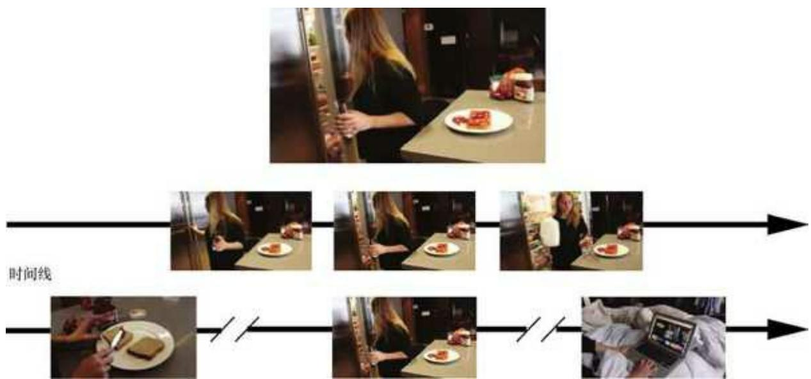  
图25-18 我们所说的动作取决于时间尺度。对于最上面的单幅图像，最好的描述是“打开冰箱”（当你打算关上冰箱时，你不会盯着里面的东西）。但是，如果你看完了一段视频短片（由中间一行图像表示），关于这个动作的最佳描述就是“从冰箱里拿牛奶”。如果你看完了一段较长的视频（由最下面一行图像表示），关于这个动作的最佳描述是“准备点心”。这说明了行为的一种构成方式：从冰箱中拿牛奶有时是准备点心的一部分，而打开冰箱通常是从冰箱中拿牛奶的一部分。图由DavidFouhey提供，摘自（Fouhey et al. , 2018）中给出的数据集

不相关的行为也可能同时发生，如一边唱歌一边准备点心。该问题的一个难点在于我们没有一个通用的词汇来描述行为片段。人们通常认为他们知道很多行为名称，但不能列出一长串满足我们需求的通用的词。这使得获取标签统一的行为数据集变得更加困难。

只有当训练数据和测试数据服从同一分布时，我们才能从理论上保证学习到的分类器性能良好。我们无法判断此约束是否适用于图像处理，但根据经验，我们观察到图像分类器和物体检测器都表现得非常好。对于动态数据，训练数据和测试数据之间的联系则更不能保证，因为人们在大量的环境中做了大量的事情。例如，假设我们有一个在大数据集上表现良好的行人检测器。但对于一些罕见的现象（如骑独轮车的行人），它们可能没有出现在训练集中，所以我们不能确定检测器在这种情况下会如何工作。目前的挑战在于，我们需要证明无论行人在做什么，检测器都是可靠的，这对目前关于学习的理论来说是困难的。

# 25.7.2 匹配图片与文字

人们在因特网上创建并分享了大量的图片和视频，困难之处在于如何找到你想要的东西。通常，人们希望使用文字（而不是关于样本的草图）进行搜索。因为大多数图片没有附带文字注释，所以我们很自然地想要尝试构建 标注系统 （tagging system）来为图像标注相关文字。它背后的机制非常简单——我们采用图像分类和物体检测方法，并用输出的单词对图像标注。但是标注并不能全面地描述图像中所发生的事情。例如，图像所示是谁在做什么——标注系统不能描述这一重要的信息。例如，当我们用物体类别“猫”“街道”“垃圾桶”“鱼骨头”标注一张街道上的猫的图片时，会忽略猫正在将鱼骨头从街道上打开的垃圾桶中拽出来这一信息。

作为标注方法的替代方法，我们可以构建一个 标题系统 （captioning system）— 用一个或多个描述图像的句子来编写标题的系统。它背后的机制同样是直接将卷积网络（用于表示图像）耦合到一个循环神经网络或Transformer网络（用于生成句子）中，并用带标题的图像数据集训练得到一个用于标注的网络。因特网上有许多带标题的图片，有一些精心处理过的数据集，它们使用人工劳动来为每幅图像添加额外的标题，以体现自然语言的差异。例如，COCO（Common ObjectsinContext，环境中的一般物体）数据集是一个含有超过20万幅图像的综合数据集，其中每幅图像有5个标题。

目前人们所使用的标题产生方法如下：使用检测器来寻找描述图像的一组单词，并把这些单词提供给经过语句生成训练的时序模型。最精确的方法通过搜索模型可能生成的语句找到最佳的句子，同时，更强大的方法似乎意味着需要更长时间的搜索。我们用一组分数对句子进行评估，这些分数将衡量生成的句子是否正确使用了注释中的常见短语，以及是否使用了其他短语。这些分数很难直接用作损失函数，但强化学习方法可以用它们来训练网络并能获得非常好的分数。通常会出现这样的一种情况：在训练集中存在一个图像，其描述与测试集中一个图像具有相同的词集；在这种情况下，标题系统只需检索有效的标题，而不必生成新的标题。标题生成系统可以给出出色的结果，也可能出现令人尴尬的错误（见图25-19）。


  
  
图25-19自动图像标题系统给出了一些好的结果和一些失败的结果。左边的两个标题很好地描述了各自的图像，尽管“eating…in hismouth”是一个不流畅的表达，这是早期标题系统所使用的循环神经网络语言模型的一个相当典型的特点。根据右边的两个标题，我们认为标题系统似乎不了解松鼠，所以从环境猜测该动物；它也没有意识到这两只松鼠在吃东西。图片来源：

geraine/Shutterstock、ESB Professional/Shutterstock、BushAlex/Shutterstock、Maria.Tem/Shutterstock。所示图像与用于生成标题的原始图像相似但不完全相同。原始图像见（Aneja et al. , 2018）

标题系统可以通过避免提及细节来隐藏它们没有掌握的知识，这些细节是它们不能正确学到或通过使用环境线索猜测得到的。例如，标题系统往往不善于识别图像中的人的性别，而且常常根据训练

数据中的统计信息进行猜测。这可能会导致错误——男人也可能喜欢购物，女人也可能喜欢滑雪。确定一个系统是否能很好地解释图像中发生的事情的一种方法是强迫它回答有关图像的问题。这也称为 视觉问答 （visual question answering，VQA）系统。另一种选择是 视觉对话 （visual dialog）系统，我们给系统提供一张图片、一个标题以及一段对话，并要求系统必须回答对话最后的问题。如图25-20所示，这一视觉问题仍然非常困难，VQA系统经常出错。

  
Q.What is the cat wearing?

  
Q.What is the weather like?

  
Q.What surfaceis this?

  
Q.What toppingsare onthepizza? A.Mushrooms

  
QHow many holesare in thepizza?

  
O.Whatletterison the racket?

  
Q.What color istheight front leg? A.Brown

  
Q.Why is the sign bent?   
图25-20视觉问答系统产生关于图像的自然语言问题的答案（通常从多项选择中选择）。顶部：该系统对有关图像的一些相当棘手的问题给出了非常合适的答案。底部： 不太令人满意的答案。例如，系统被要求猜测比萨饼上的洞的个数，但系统并不知道什么算洞，而且洞本身很难计数。类似地，系统认为猫的腿的颜色是棕色，这是因为图片背景是棕色的，并且系统不能正确定位猫的腿。图片来源：（顶部）Tobyanna/Shutterstock、679411/Shutterstock、ESBProfessional/Shutterstock、Africa Studio/Shutterstock，（底部）Stuart Russell、Maxisport/Shutterstock、Chendongshan/Shutterstock、Scott Biales DitchTheMap/Shutterstock。所示的图像与用于问答系统的原始图像相似但不完全相同，原始图像见（Goyaletal.,2017）

# 25.7.3 多视图重建

从来自视频或旅游照片集合的多个视图中重建点集与从两个视图重建点集是类似的，但也存在一些重要的区别。在建立不同视图中的点之间的对应关系前，我们还有很多工作需要做，并且由于同一个点不一定会同时出现在所有视图中，这使得匹配和重建过程更加混乱。但是，更多的视图意味着对需要重建和恢复的观测参数有更多的限制，因此最终得到的对点的位置和观测参数的估计通常非常精确。粗略地说，重建的过程可以描述为对图像之间的点进行匹配，并将这些匹配推广到图像组中，进而给出一个关于几何性质和观测参数的粗略解，然后对该解进行打磨。打磨的意思是最小化模型（包括几何性质和观测参数）所预测的点与图像特征位置之间的误差。详细的过程过于复杂，我们无法在此完全涵盖，但它已经被人们深刻理解，而且相当可靠。

对于任何可能有用的照相机形式，它的所有几何约束之间的联系是已知的。这种处理问题的模式可以推广到处理非正交视图，处理有少量点的观测视图，处理未知参数（如焦距）照相机，以及利用各种复杂的搜索来寻找合适的联系。从图像中准确地重建一个完整的城市模型是可实现的。它包括下面这些应用。

●模型构建： 例如，我们可以构建一个建模系统，该系统利用多个视图刻画一个物体，并产生一个非常精细的多边形纹理三维网格，它通常用于计算机图形学和虚拟现实方面的应用。从视频中建立这样的模型是很寻常的，但是这样的模型现在已经可以从看上去随机的图片集合中建立。例如，你可以利用从互联网上找到的图片建立一个自由女神像的三维模型。  
●将现实演员与动画在影视中混合： 为了把计算机图形中的角色放入现实视频中，我们需要知道摄影机在真实视频中是如何移动的，这样我们才可以正确地反馈给角色，并在摄像机移动时改变角色的视角。  
●路径重建： 移动机器人需要知道自己去过哪里。如果机器人自身携带一个摄像头，我们就可以

为摄像头穿过世界的路径建立一个模型，并把它作为机器人路径的表示。

●施工管理： 建筑物是极其复杂的人工产物，持续跟踪施工过程中发生的事情是一项既困难又昂贵的任务。持续跟踪的一种方法是每周操控无人机在建筑工地上空巡视一次，并拍摄当前状态。在此基础上建立关于当前状态的三维模型，利用可视化技术探讨计划与重建的现状之间的区别。图25-21对这种应用做出了说明。

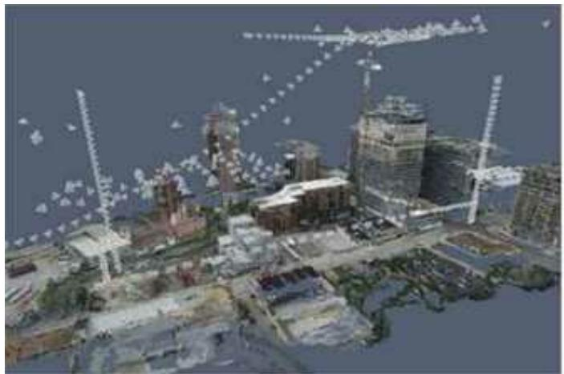

  
图25-21多视图立体算法根据运动结构图像生成的建筑工地的三维模型。它们可以帮助建筑公司通过比较目前三维模型实际搭建的进度与建筑计划来协调大型建筑工作。 左图： 基于无人机拍摄图像重建出的可视化几何模型。重建出的三维点以彩色呈现，因此结果看起来像是目前的真实进度（注意用起重机完成的部分建筑）。这些小金字塔表示无人机拍摄图像时的位姿，以便对飞行轨迹进行可视化。 右图： 这些系统实际上是施工队所使用的；作为协调会议的一部分，该团队正在查看竣工场地的模型，并将其与建筑平面图进行比较。图由Derek Hoiem、Mani Golparvar-Fard和Reconstruct提供，模型由商业系统制作

# 25.7.4 单视图中的几何

如果你想要移动，几何表示法是特别有用的方法，因为它们可以指明你所处的位置，你可以去哪里，以及你可能会碰上什么。但使用多个视图来生成几何模型并不总是很方便。例如，当你打开扇门并走进一个房间时，你的双眼距离过近，以至于你可能无法很好地了解房间里远处物体的距离。虽然你可以前后移动你的头部，但那既费时又不方便。

另一种方法是从单幅图像中预测一个 深度图 （depth map） 一个给出图像中每个像素的深度的数组，它通常源自照相机。在许多类型的场景下，精确地做到这一点是非常容易的，因为深度图有一个相当简单的结构。一般来说，房间和室内场景尤其如此。其机制也很简单。我们首先需要有图像和深度图的数据集，然后训练一个从图像预测深度图的网络。这个问题有许多有趣的、可解的变形。深度图的问题是，它不能告诉你任何关于物体背后或物体背后空间的信息。但是有一些方法可以预测已知物体（物体几何性质是已知的）占据了哪些体素（三维像素）以及删除该物体（以及可以隐藏物体的位置）后深度图的样子。这些方法之所以有效，是因为物体的形状样式化程度很高。

正如我们在25.6.4节中所看到的，使用三维模型重建已知物体的位姿非常简单。现在假设你看到一张单独的图像，如一只麻雀。如果你在过去的研究中看到过许多类似于麻雀的鸟类的图片，那么你能从这张图片中重建出麻雀的位姿以及对它的几何模型的合理估计。利用过去的图像，你为类似于麻雀的鸟类建立了一个小的、参数化的几何模型族；然后通过一个优化过程找到一组最佳的参数和视角来解释你看到的图像。这些参数也可以为模型提供纹理，即便它位于那些你看不见的部分（图25-22）。

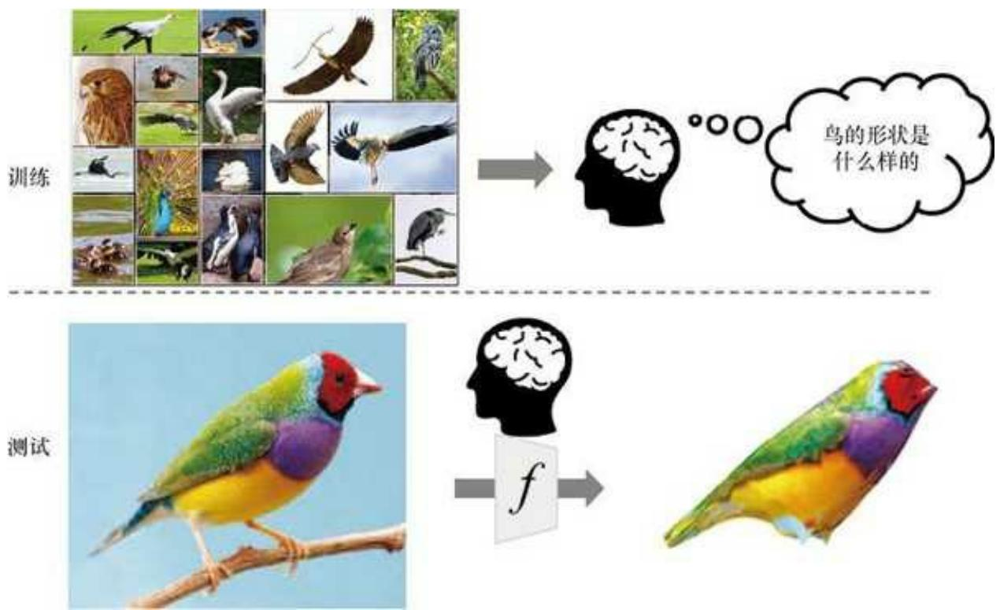  
图25-22如果你已经看过很多鸟类物种的图片（上图 ），你可以利用它们从一个新的图片（ 下图）中生成一个三维重建模型。你需要确保所有的物体都有一个相当类似的几何结构（所以如果你看到的是麻雀，那么鸵鸟的图片将对你没有任何帮助），但分类方法可以解决这个问题。你可以从许多图像中估计出图像中的纹理是如何分布在物体上的，从而完成对你尚未观察到的鸟的纹理估计（下图 ）。图由Angjoo Kanazawa提供，模型用（Kanazawa et al. , 2018b）中提供的系统生成。上方图片来源于Satori/123RF，左下图来源于Four Oaks/Shutterstock

# 25.7.5 生成图片

在今天，将计算机图形模型以令人信服的方式嵌入照片中是很寻常的一件事，如图25-23所示，一尊雕像被放置到一个房间的照片中。为了实现这个目标，我们首先需要估计一张图片的深度图和反射率。然后通过与其他已知光照的图像进行匹配来估计该图像中的光照。接着将物体嵌入图像的深度图中，并使用物理渲染程序（计算机图形学中的标准工具）渲染生成的世界。最后，将修改后的图像与原始图像进行融合。

  
图25-23左图为真实场景的图像。在右图中，计算机图形物体已插入场景中。你可以看到光线看上去来自正确的方向，并且物体看起来也投射了效果不错的阴影。尽管生成的图像在光线和阴影方面有较小的误差，但这个图像仍是令人信服的，因为人类并不擅长分辨这些误差。图由Kevin Karsch

提供，模型用（Karsch et al. , 2011）中提供的系统生成

我们也可以通过训练神经网络来实现图像变换 （imagetransformation）：将X型图像（如模糊图像、城镇的航空影像或者新产品的手绘图纸）映射为Y型图像（如去模糊后的图像、城市道路图或者一张产品的图片）。当训练数据由(X, Y)图像对组成时，这将非常简单——在图25-24中，每个样本对都包含一张航空影像和相应的道路图。训练损失将网络的输出与我们期望的输出进行比较，并且还带有一个来自生成对抗网络（GAN）的损失分量，用于确保输出具有正确的Y型图像的特征。正如我们在图25-24中的测试部分看到的，这类系统的性能非常好。

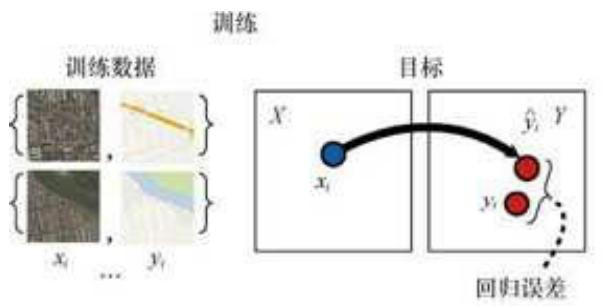

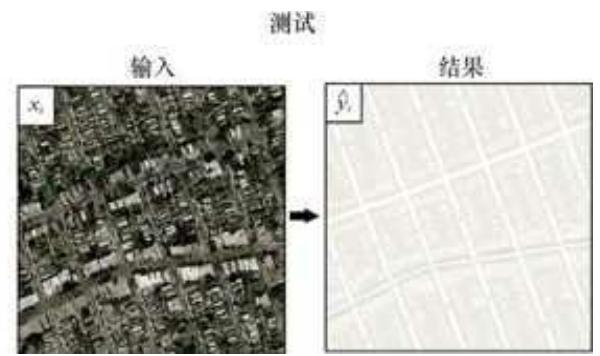  
图25-24成对图像的转换，其中输入由航空影像和相应的道路图组成，我们的目标是训练一个从航空影像生成道路图的网络（该系统还可以学习从道路图生成航空影像。）网络通过比较 （X型样本x 的输出）和Y型的正确输出 y 进行训练。在测试时，网络必须从新的X型输入中生成新的Y 型图像。图由Phillip Isola、Jun-Yan Zhu和Alexei A. Efros提供，模型用（Isola et al. , 2017）中提供的系统生成。地图数据©2019 Google

有时我们可能没有相互匹配的图像，但我们有大量的 $X$ 型图像集合（如马的图片）和单独的Y型图像集合（如斑马的图片）。设想一下，一个艺术家打算创造一张内容为斑马在田野里奔跑的图像。艺术家希望能够选择一张合适的马的图像，然后利用计算机自动地把马变成斑马（图25-25）。为了实现这一点，我们可以训练两个转换网络，并引入一个称为循环约束的额外约束。第一个网络把马映射成斑马；第二个网络把斑马映射成马；当你把 $X$ 映射到Y再映射到X（或者Y映射到 $X$ 再映射到Y）时，循环约束要求你得到你最初使用的图像。此外，GAN的损失分量将确保网络输出的马（或斑马）的图片看起来“像”真实的马（或斑马）的图片。

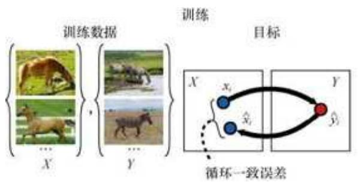

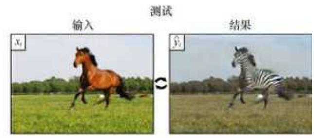  
图25-25未配对图像转换：给定两组图像（ $X$ 型是马， Y型是斑马），但没有对应的配对，我们要学习将马转换成斑马。该方法训练两个预测器：一个将 $X$ 型映射为Y型，另一个将Y型映射为 $X$ 型。如果第一个网络将马 $x _ { i }$ 映射为斑马 $\hat { \pmb { y } } _ { e }$ ，那么第二个网络应当把 $\hat { \pmb { y } } _ { e }$ 映射回原始的 $x _ { i }$ 。两个网络利用 $x _ { i }$ 和 i之间的差进行训练。从Y型到 $X$ 型再回到 Y型的循环必须是封闭的。这样的网络可以成功地对图像进行丰富的变换。图由AlexeiA.Efros提供，见（Zhu etal. ,2017）。正在奔跑的马的照片由Justyna Furmanchyk Gibaszek/Shutterstock拍摄

另一种艺术效果称为 风格转换 （styletransfer）：其输入由两幅图像组成—— 内容 （如一张猫的照片）和 风格 （如一幅抽象画），输出是以抽象风格渲染后的猫的图片（见图25-26）。为了解决这个问题，我们可以考虑一些直观的理解：如果我们研究一个经过训练的用于物体识别（如在ImageNet上）的深度卷积神经网络（CNN），我们会发现早期的网络层倾向于表示图像的风格，而晚期的层倾向于表示图像内容。令p 为图像的内容，s为图像风格，并令E(x)为关于图像x的早期层的激活向量， L(x)为关于图像x的晚期层的激活向量。在此基础上，我们希望生成一些与

房子照片内容相似的图像 $x$ ，即最小化 $I ( x ) - L ( p )$ ，同时让图像有类似于印象派绘画的风格，即最小化 $| E ( x ) - E ( s ) |$ 。我们采用梯度下降法，令损失函数为这两个因素的线性组合，通过最小化损失来找到图像 $x$ 。


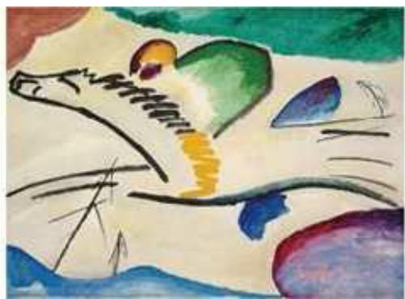

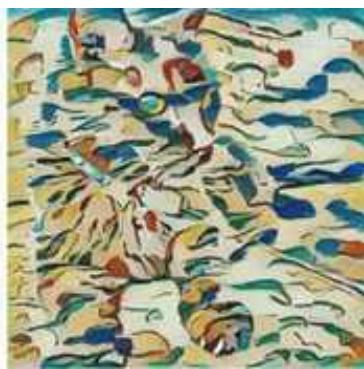  
图25-26 风格转换：将内容为猫的照片与抽象绘画的风格相结合，生成经过抽象风格渲染的猫的新图像（右图）。中间这幅画为Wassily Kandinsky绘制的 Lyrisches 或 The Lyrical （公共领域），左图猫的照片为Cosmo

生成对抗网络可以生成新的逼真的图像，在大多数情况下，生成的图像可以骗过大多数人。一款使用了生成对抗网络技术的应用被称为深度伪造 （deepfake）——由模型生成的、看起来像某个特定的人的图像或视频。例如，在凯丽·费雪（CarrieFisher）60岁时，《侠盗一号》通过把她19岁时的脸叠加到另一个演员的身上进行电影制作。出于艺术目的，电影业发展出了性能更好的深度伪造，一些研究人员致力于寻找深度伪造的对策，以减轻假新闻的破坏性影响。

生成的图像也可以用于维护隐私。例如，在放射学实践中有一些图像数据集对研究人员很有用，但出于对患者隐私的保密，它们无法公布。生成图像模型可以获取隐私图像数据集，并生成可以分享给研究人员的生成数据集。该数据集应当满足以下性质：与训练数据集类似、不相同和可控。对于胸部X射线检查数据，它的生成数据集应该类似于训练数据集，其中每幅图像都可能让放射科的医生混淆，并且每个具体症状出现的频率应该是合适的，这使得放射科医生不会对肺炎等疾病出现的频率感到惊讶。考虑到新的数据集不该泄露个人身份信息，它应该与原数据集有所不同。新的数据集应当是可控的，使得我们可以通过调整某个效应的频率反映我们感兴趣的部分。例如，相比年轻人，肺炎在老年人中更常见。这些目标中的每一个在技术层面都很难实现，但是目前生成的图像数据集有时已经让放射科医生混淆（图25-27）。

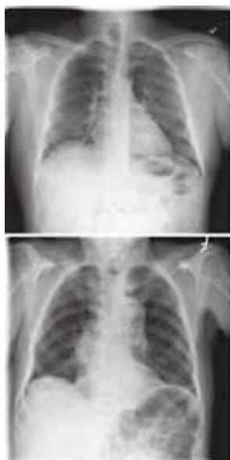

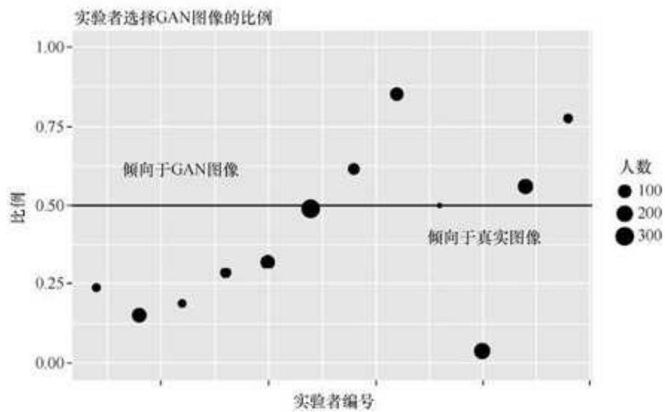  
图25-27GAN生成了肺部X射线图像。左图的一对图像为一张真实的X射线图和一张由GAN产生的X射线图。右图为一项测试的结果，它要求放射科医生在看到左边所示的一对X射线图后，判断哪一张X射线图是真实的。平均来说，他们的选择正确率为61%，这比任意猜测的结果要好一些。但

是医生之间的准确率参差不齐——右边的图表所示的是12位不同放射科医生的错误率，其中一位医生的错误率接近0%，另一位的错误率为80%。每个点的大小表示每个放射科医生查看的图像的数量。图由Alex Schwing提供，用（Deshpande et al. , 2019）中描述的系统生成

# 25.7.6 利用视觉控制运动

视觉的主要用途之一是为操控物体（拿起物体、抓取物体、旋转物体等）和避障导航提供信息。利用视觉来达到这些目的的能力存在于最原始的动物视觉系统中。在许多情况下，视觉系统从可获得的光场中仅提取动物需要的指导其行为的信息，在这个意义下，我们可以说视觉系统是极小的。现代视觉系统很有可能是从某些早期的原始生物进化而来的，这些生物利用身体一端的感光点，使自己朝向（或远离）光线的方向运动。我们已经在25.6节中看到，苍蝇使用一个非常简单的光流检测系统来完成在墙上的着陆。

假设我们现在不想在墙上着陆，而想制造一辆自动驾驶汽车。这是一个对感知系统要求更高的项目。自动驾驶汽车的感知能力必须支持完成以下任务。

●横向控制： 确保车辆安全地保持在车道内，或在需要时平稳地改变车道。  
● 纵向控制： 确保与前方车辆保持安全距离。  
●避障： 监控相邻车道上的车辆，并为规避机动做好准备。及时发现行人并让他们安全通过。  
●遵守交通信号： 其中包括交通信号灯、停车标志、限速标志和警察手势。

驾驶员（人类或计算机）要解决的问题是如何实现合适的转向、加速和制动行为，以完美地完成这些任务。

为了做出正确的决策，驾驶员应对环境以及其中的物体构建一个模型。图25-28给出了构建此模型所需的一些视觉推断。对于横向控制，驾驶员需要有车辆相对于车道的位置和方向的表示。对于纵向控制，驾驶员需要与前面的车辆保持安全距离（在弯曲等形状不规则的多车道道路上，该距离可能不易确定）。避障和遵守交通信号需要另外的推断。

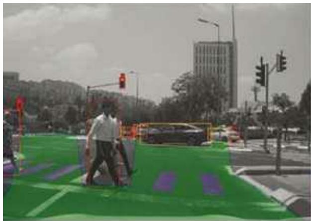

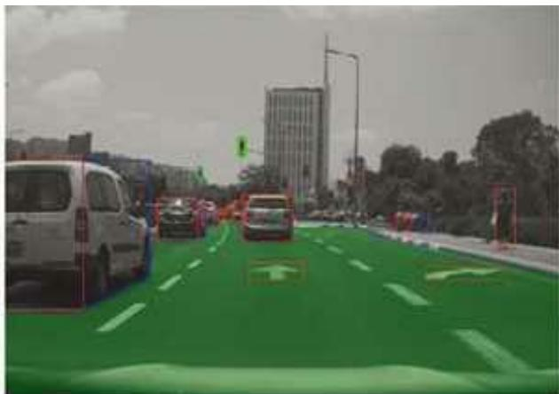


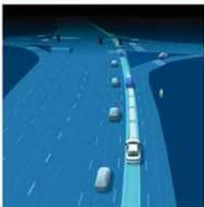

图25-28MobileEye研发的基于摄像头的自动车辆传感装置。顶部： 两张来自前置摄像头的照片，照片的拍摄相隔几秒。绿色区域为自由空间——车辆在不久的将来可以实际移动到的区域。系统使用表示侧面的三维边框来表示物体（红色表示后部，蓝色表示右侧，黄色表示左侧，绿色表示前部）。其中物体包括车辆、行人、自行车道内边缘标志（横向控制所需）、其他标线道路和人行横道标志、交通标志和交通信号灯。动物、路杆和锥桶、人行道、护栏和其他一般物体（例如，从卡车后面掉下来的沙发）没有在图中给出。然后用三维位置和速度对每个物体进行标记。 底部： 根据检测到的物体刻画的环境的完整物理模型（图中所示为MobileEye的仅基于视觉的系统产生的结果）。图像由MobileEye提供

道路是为使用视觉进行导航的人类设计的，因此，原则上我们应该可以在仅使用视觉的情况下进行驾驶。然而，实际上，商用自动驾驶汽车配备了各种传感器，其中包括摄像头、激光雷达、雷达和麦克风。激光雷达或雷达能够直接测量深度，这比25.6节中所述的仅用视觉的方法更精确。拥有多个传感器通常能改进表现，并且它们在能见度低的情况下显得尤为重要，例如，雾气通常会妨碍摄像头和雷达，但激光雷达可以穿透它。麦克风可以在正在接近的车辆（尤其是带有警报器的车辆）进入视野之前就检测到它们。

关于移动机器人在室内外环境中的导航也有很多研究，这方面的应用也比比皆是，例如在快递或比萨饼派送过程中最后一公里的导航应用。传统方法将此任务分为两个阶段，如图25-29所示。

●地图构建： 同时定位与地图构建（即SLAM，见26.4节）指的是构建关于世界的三维模型的任务，其中包括机器人在世界中的位置（或者更具体地说，机器人上每个摄像头的位置）。该模型（通常表示为障碍物的点云）可以根据来自不同摄像头位置的一系列图像进行构建。  
●路径规划： 一旦机器人能够访问该三维地图并在其中定位自身，系统的目标就变成了寻找从当前位置到目标位置的无碰撞轨迹（见26.6节）。

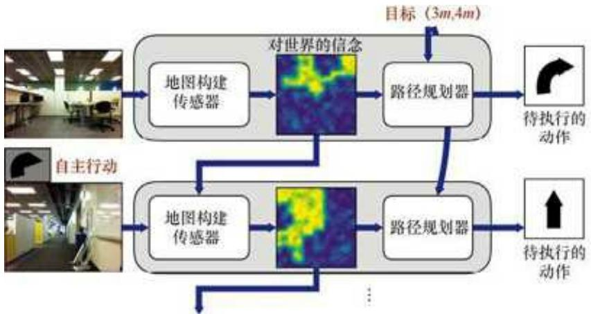

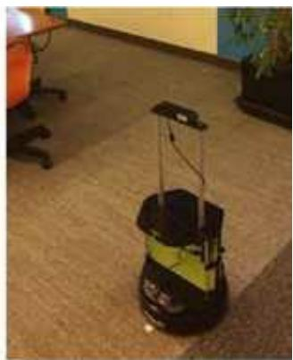  
图25-29导航功能通过分解成地图构建：和路径规划两个问题来实现。在每一个连续的时间步中，来自地图构建传感器的信息将用来逐步地建立一个关于世界的不确定的模型。该模型连同其规范目标一起传入路径规划器，路径规划器输出机器人为实现目标应该采取的下一个动作。关于世界的模型可以是纯粹的几何模型（如经典的SLAM），也可以是语义模型（通过学习得到），甚至可以是拓扑模型（基于地标）。我们在右图中给出实际的机器人的图片。图由Saurabh Gupta提供

这种一般方法已经有了许多变体。例如，在认知映射和规划方法中，地图构建和路径规划这两个阶段是由神经网络中的两个模块完成的，其中该神经网络通过端到端的训练来最小化损失函数。如果你需要的只是能保证你从 A点导航到 B点，且不会与障碍物相撞的足够信息。这样的系统不必建立一个完整的地图——这往往是冗余且不必要的。

小结

尽管感知活动对人类来说似乎不费吹灰之力，但对计算机来说它需要大量复杂的计算。视觉的目标是提取可用于操作、导航和物体识别等任务的信息。

● 人们对图像成像的几何性质和光学原理已经有了很透彻的理解。给定一个关于三维场景的描述，我们可以很容易生成任意一个摄像机位置下的场景图片，这是图形学问题。它的逆问题，即计算机视觉问题（拍摄一张图片并将其转化为三维描述）更困难。  
●图像的表示蕴含着边缘、纹理、光流和区域等信息。这些信息为我们提供了有关物体边界以及图像之间对应关系的线索。  
●利用卷积神经网络可以得到精确的图像分类器，它利用了学习到的特征。比较粗略地说，这些特征是模式的模式的模式……我们很难预测这些分类器何时能表现地较好，因为测试数据可能在某些重要方面与训练数据不同。经验告诉我们，这些分类器通常是足够精确的，可以应用于实践。  
●图像分类器可以转换成物体检测器。一个分类器对图像中框内的内容进行评分，另一个分类器则判断该框中是否包含物体，以及该物体是什么。物体检测方法并不完美，但它可以应用于多种场景。  
●当我们有同一个场景的多个视图时，我们可以重建场景的三维结构以及视图之间的关系。在许多情况下，我们也可以从单个视图中重建三维几何结构。  
●计算机视觉方法的应用非常广泛。

读者服务：


微信扫码关注【异步社区】微信公众号，回复“e59810”获取本书配套资源以及异步社区15天VIP会员卡，近千本电子书免费畅读。

第26章

机器人学

在本章中，智能体被赋予传感器和实体效应器，以便它们在真实世界中四处走动、完成各种任务。

# 26.1 机器人

机器人 是通过操纵真实世界去完成任务的实体智能体。为此，它们配备了像腿、轮子、关节和夹具之类的效应器 （effector）。效应器用于对环境施加物理力量。这时，会发生一些事情：机器人的状态可能改变（例如，一辆车旋转车轮，促使它在路面上行进），环境的状态可能改变（例如，机械臂使用夹具推动马克杯滑过吧台），甚至连机器人周围的人类的状态都可能改变（例如，外骨骼运动会改变人腿的状态，或移动式机器人向电梯门前进，引起人类的注意并好心地为机器人让路，甚至帮它按下按钮）。

机器人还配备了 传感器 ，这使得它们能够感知其所处的环境。目前的机器人使用各种各样的传感器，包括摄像头、雷达、激光和麦克风，以便测量环境和周围人类的状态，而陀螺仪、压力与扭矩传感器和加速度计则用来测量机器人自身的状态。

对机器人来说，最大化地发挥预计的功效意味着选择如何驱动其效应器施加正确的力，也就是能够使状态向积累最多预期奖励的方向变化。最终，机器人会试图在物理世界中完成某些任务。

机器人在部分可观测且随机的环境中运作：摄像头看不到拐角背后，齿轮则可能打滑。此外，在相同环境下人的行动也无法预测，因此机器人需要对其进行预测。

机器人通常将其所处的环境建模为连续状态空间（机器人的位置具有连续的坐标）和连续动作空间（机器人发送到电动机的电流也是以连续单位测量的）。一些机器人运行于高维空间：汽车需要知道其自身和周围智能体的位置、朝向和速度，机械臂有六七个可以相互独立运动的关节，人形机器人则具有数百个关节。

机器人的学习是受约束的，因为真实世界顽固地拒绝比真实时间运行得更快。在模拟环境中，可以使用学习算法（如第22章所述的Q学习）在几小时内从几百万次试验中学习。在真实环境中，运行这些试验可能需要花掉数年，机器人也无法承担可能导致损害的试验风险（因此也无法从中学习）。因此，将从模拟环境中学到的东西转移到真正的机器人上，也就是从模拟到现实 的问题，是热门的研究领域。实用的机器人系统需要体现关于机器人的先验知识、物理环境和要执行的任务，以便机器人可以快速学习、安全运行。

机器人综合了我们在本书中所看到的许多概念，包括概率状态估计、感知、规划、无监督学习、强化学习和博弈论。对其中一些概念来说，机器人学在此处的作用是提供一个具有挑战性的应用范例。本章还会引入其他新概念，例如，对于一些我们先前只讲过离散情形的技术，本章中会介绍其连续版本。

# 26.2 机器人硬件

本书到目前为止采用的一直是智能体架构，即传感器、效应器和处理器，并一直专注于智能体程序。但实际中，成功的机器人对适用于任务的传感器和效应器设计的依赖并不少于智能体程序。

# 26.2.1 机器人的硬件层面分类

当你想到机器人时，你可能会想象它有一个脑袋和两条胳膊，用腿或轮子移动。这种 拟人机器人（anthropomorphicrobot）在电影《终结者》和动画《杰森一家》这样的虚构作品中十分流行。但真正的机器人有各种各样的外形和大小。

机械手 （manipulator）只是机器手臂。它们不需要附加在机器人的身体上，可能只是被螺栓固定在桌面或地板上，就像在工厂里那样（图26-1a）。一些机械手（如用来组装汽车的机械手）的载荷很大。而另一些机械手（如装在轮椅上用于帮助运动障碍者的机械手，见图26-1b）不能负重太多，但在人类环境中更安全。

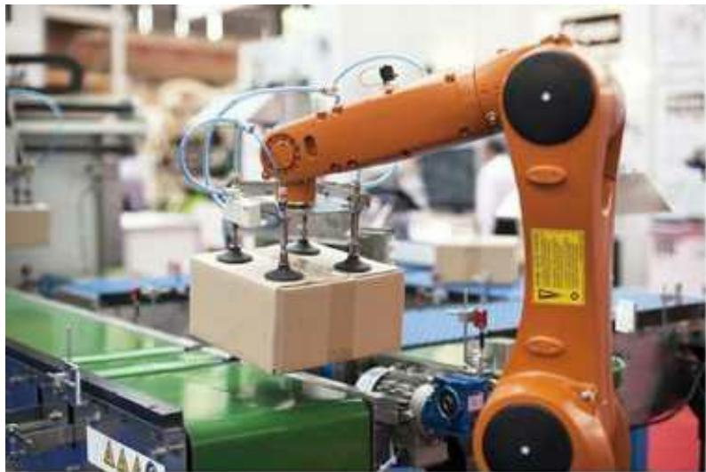  
（a）

  
  
图26-1 （a）具有定制末端效应器的工业机器人。图片来源：Macor/123RF。（b）安装在轮椅上的Kinova ® JACO ® Assistive Robot 机械臂。Kinova和JACO是Kinova股份有限公司的商标

移动机器人 （mobile robot）使用轮子、腿或螺旋桨在环境中移动。 四旋翼无人机 （quadcopterdrone）是一种 无人驾驶航空器 （unmanned aerial vehicle，UAV）， 自主水下航行器（autonomous underwater vehicle，AUV）则在海底漫游。许多移动机器人（如酒店的吸尘机器人或者毛巾递送机器人）只待在室内，并用轮子移动。在室外，则有 自主无人车 （autonomous car），以及甚至能在火星上探索地形的巡视器 （rover）（图26-2）。最后，腿式机器人 （leggedrobot）用于在轮子无法通行的恶劣地形行动。它的缺点在于，正确地控制腿比转动车轮更具有挑战性。

其他类型的机器人包括假体机器人、外骨骼机器人、有翼机器人、蜂群机器人和全屋就是一个机器人的智能环境。

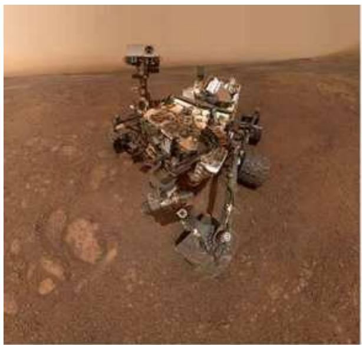

  
  
图26-2 （a）美国国家航空航天局的好奇号巡视器在火星上自拍。图片来自美国国家航空航天局。（b）Skydio无人机伴随一家人骑行。图片由Skydio提供

# 26.2.2 感知世界

传感器是机器人与环境之间的感知接口。摄像头之类的 被动传感器 （passive sensor）是环境的真实状态观察者：它们捕获环境中的信号。如声呐之类的主动传感器 （activesensor）则向环境发送能量，它们依赖能量会反射回传感器这样的规律。主动传感器通常能比被动传感器提供更多信息，但代价是增加能耗，并面临同时使用的多个被动传感器互相干扰的风险。我们也可以根据传感器是用于感知环境、感知机器人位置还是感知机器人的内部配置对其分类。

测距仪 （rangefinder）是用于测量与周围物体距离的传感器。声呐 （sonar）传感器是发射有向声波的测距仪，当声波被物体反射，部分声波就会回到传感器。返回信号的强度和时间表明与周围物体的距离。声呐是最受欢迎的自主水下航行器，在早期室内机器人中也十分流行。立体视觉（stereo vision）（见25.6节）依靠多个相机从稍有不同的视角对环境进行成像，分析图像中的视差来计算与周围物体的距离。

对地面移动机器人来说，声呐和立体视觉现在已很少使用，因为它们的精度不够可靠。Kinect是一种流行的低成本传感器，它结合了相机和结构光投影仪，能够将网格线的形状投射到场景中。摄像头观测网格的弯曲情况，就可以将场景中物体的形状反馈给机器人。根据需要，这种投影可以是红外光，以使其不与其他传感器（如人眼）发生干扰。

大多数地面机器人现在配备有主动光学测距仪。像声呐传感器一样，光学距离传感器发射主动信号（光）并测量信号返回传感器的时间。图26-3a展示了一台飞行时间照相机 （time-of-flightcamera）。这台照相机能以最高60帧/秒的速度获取图26-3b所示的距离成像。无人汽车常常使用扫描激光雷达 （scanning lidar），lidar是light detection and ranging（光探测与测距）的缩写。这是一种发射激光束并感知反射光束的主动传感器，它能够在100 m处给出精度小于1厘米的距离测量。它们使用复杂精密的镜子或旋转机构来对环境扫射光束，并绘制地图。扫描光雷达在长距离下的性能通常好于飞行时间照相机，在明亮的白天也有较好的性能。


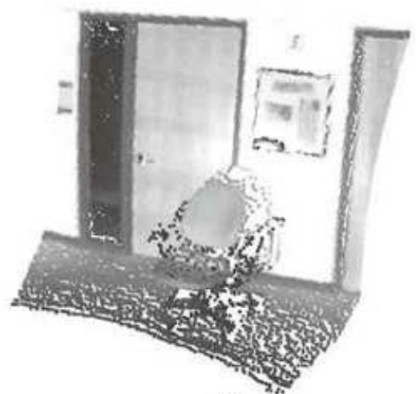  
  
图26-3 （a）飞行时间照相机。图片由Mesa Imaging股份有限公司提供。（b）用该照相机得到的三维距离成像。这种距离成像使机器人检测附近的障碍物和物体成为可能。图片由Willow Garage有限责任公司提供

雷达 （radar）通常是航空器（自主或非自主）最青睐的距离探测传感器。雷达传感器可以探测以千米计的距离，与光学传感器相比，它的优势在于能够穿透云雾。而近端距离探测则有 触觉传感器 （tactilesensor），如触须传感器、碰撞板传感器和触敏表皮传感器。这些传感器基于物理接触测量距离，仅用于测量距离机器人非常近的物体。

第二个重要的类别是 位置传感器 （location sensor）。许多位置传感器使用距离测量技术作为确定距离的首要组成部分。在室外， 全球定位系统 （global positioning system，GPS）是定位问题最常见的解决方案。GPS测量与发射脉冲信号的卫星的距离。现在，轨道上有31颗正常运行的GPS卫星，并有24颗G lonass卫星。G lonass是俄罗斯的卫星定位系统。GPS接收器可以通过分析相移来解算其与卫星的距离。通过对多个卫星使用三角定位法，GPS接收器可以确定其在地球上的绝对位置，精度可以到米。 差分GPS（differentialGPS）需要用到已知其位置的另一个地面接收器，在理想条件下可以提供毫米级定位。

遗憾的是，GPS无法在室内或水下工作。室内定位通常通过在环境中的已知位置增设信标来实现。许多室内环境布满了无线基站，这有助于机器人通过分析无线信号来定位。在水下，主动声呐信标可以提供位置感知，它使用声音告知AUV与信标的相对距离。

第三个重要的类别是 本体感受传感器 （proprioceptive sensor），它将自身运动告知机器人。要测量机器人关节的确切状态，电动机通常配有轴编码器 （shaftencoder），它能够精确测量轴的运动角度。在机械臂上，轴编码器有助于追踪关节位置。在移动机器人上，轴编码器报告轮子的旋转以便于计程 （odometry），也就是测量行进距离。遗憾的是，轮子会漂移并打滑，因此计程只在短距离移动时才比较精确。像风力、洋流这样的外力会增加位置的不确定性。 惯性传感器 （inertialsensor），如陀螺仪等，通过依靠质量对速度变化的抗性来减小这种不确定性。

机器人状态的其他重要方面使用力传感器 （forcesensor）和 扭矩传感器 （torquesensor）来测量。当机器人处理确切尺寸未知的易碎物体时，这些传感器是不可或缺的。想象一吨重的机械臂在拧紧灯泡。它很容易就会用力过猛而弄碎灯泡。力传感器使机器人能够感知它用了多大的力来握灯泡，扭矩传感器则使机器人能够感知它用了多大的力来旋转。高级的传感器可以在3个平移方向和3个旋转方向上测量力的大小。它们能够以每秒几百次的频率进行测量，因此，机器人可以快速检测到不希望出现的力并在捏碎灯泡前对其动作进行纠正。不过，为机器人配备高端传感器和足以监控它们的计算能力则又是一个难题。

# 26.2.3 产生运动

使效应器运动的机械装置叫作执行器 （actuator），其中包括变速箱、齿轮、电缆和链接。最常见

的执行器是 电动执行器 （electricactuator），它使用电力来旋转电动机。它们大多用于需要旋转运动的系统，如机械臂的关节。 液压执行器 （hydraulicactuator）使用加压的液压液（如油或水），而 气动执行器 （pneumatic actuator）则使用压缩气体来产生机械运动。

执行器常用于移动关节，关节则连在机器人固定的主体或其他活动连接物上。手臂和腿就有这样的关节。 旋转关节 （revolute joint）的一个连接物相对于另一个连接物旋转。而 平移关节（prismatic joint）的一个连接物沿着另一个连接物滑动。这些都是单轴关节（只有一个运动轴）。其他类型的关节包括球形关节、柱状关节和平面关节，这些都属于多轴关节。

机器人使用夹具与环境中的物体交互。最简单的夹具是平行钳夹具 （paralleljaw gripper），它有两根“手指”和一个执行器，该执行器能够合拢两根手指来抓住物体。由于结构简单，这种效应器让人又爱又恨。三指夹具提供稍高的灵活性，却不失简洁性。所有夹具中最复杂的是仿人（拟人）手。例如，Shadow灵巧手（Shadow Dexterous Hand）总共有20个执行器。这为复杂的操作（包括掌上动作操控，想想拿起手机并在手中对其进行旋转，使其右端向上）提供了更多的自由度，但这种自由度是有代价的——学会控制这些复杂的夹具更困难。

# 26.3 机器人学解决哪些问题

我们已经知道机器人硬件是什么样子了，现在可以考虑驱动这些硬件以实现我们的目标的智能体程序了。首先，我们需要确定这个智能体的计算框架。我们已经讨论了确定性环境下的搜索、随机但完全可观测环境下的MDP、部分可观测环境下的POMDP以及在智能体并非单独行动情形下的博弈。给定一个计算框架，我们需要实现其要素——奖励或效用函数、状态、动作、观测空间等。

我们已经讲过，机器人学问题是非确定性的、部分可观测的以及多智能体的。使用第18章的博弈论概念，我们可以看到，有时候智能体之间是合作的，而有时候是竞争的。在只能容纳一个智能体先通过的狭窄走廊中，机器人和人类会因为都想确保不会撞到对方而协作。但在一些情况下，它们也可能有一些竞争，以更快到达目的地。如果机器人太过于礼貌而不停让路，它就可能卡在拥挤的环境中而无法到达目的地。

因此，当机器人在已知环境中单独行动时，它们要解决的问题可以形式化为MDP；当它们缺失了某些信息时，问题就会变成POMDP；当它们在人类附近行动时，问题常常可以用博弈来形式化。

在这种形式化下，机器人的奖励是什么？通常，机器人的动作是为人类服务，例如，为医院的患者送餐是为了得到患者的奖励，而非机器人自身的奖励。在大多数机器人学的问题设定下，即使机器人设计者可能试着确定了足够好的代理奖励函数，真正的奖励函数也隐藏在机器人试图帮助的用户之中。机器人要么需要理解用户的需求，要么需要依赖工程师确定对用户需求的估计。

对于机器人的动作、状态和观测空间，最常见的形式是，观测就是原始的传感器反馈（例如，来自摄像头的图像，或激光雷达收到的反射的激光），动作就是发送到电动机的原始电流，而状态就是机器人决策所需的知识。这就意味着，在底层感知与电动机控制和机器人要做出的顶层规划之间，存在巨大的鸿沟。要填平这个鸿沟，机器人科学家分离问题的不同层面以对其进行简化。

例如，我们知道，当我们恰当地求解POMDP时，感知与动作会进行交互：感知告知智能体哪些动作有道理，而当智能体采取动作收集到对未来时刻有价值的信息时，也会告知感知。但机器人往往从动作中剥离感知，消耗掉感知的输出并假装自己在未来不会再收集到任何新信息。另外，我们还需要分层规划，因为像“去咖啡馆”这样的顶层目标与“旋转主轴1°”这样的电动机指令相去甚远。

在机器人学中，我们往往需要3级层次。任务规划 （taskplanning）层级为高层级动作确定规划或策略，有时也称为原始动作或子目标，如移动到门口、打开门、走到电梯、按下按钮等。随后的运动规划 （motionplanning）层级负责找到使机器人从一个点到另一个点的路径，完成每个子目标。最后，控制 （control）层级用于使用机器人的执行器完成规划的运动。由于任务规划层级通常定义在离散的状态和动作之上，因此本章将主要介绍运动规划和控制。

分别地， 偏好学习 （preference learning）负责估计最终用户的目标，而 人类预测 （peopleprediction）则用于预测机器人环境中其他人类的动作。它们一同确定机器人的行为。

当我们将问题分解为不同部分来降低其复杂度时，同时就放弃了各部分互相促进的可能。动作可以有助于改善感知，也能确定哪种感知是有用的。类似地，运动层级做出的决策在考虑到如何追踪这一运动时可能不是最佳选择，或在任务层级做出的决策可能使任务规划在运动层级无法实现。因此，在各个层级分别取得的进展也带来对其进行重新整合的迫切需要：同时进行运动规划和控制，同时进行任务规划和运动规划，重新整合感知、预测和动作，也就是使反馈形成循环。现在的机器人学注重在各个领域取得进展，并在进展之上实现更好的整合。

# 26.4 机器人感知

感知是机器人将传感器测得的数据映射到环境的内部表示的过程。这一过程用到第25章讲述的很多计算机视觉技术。但机器人学的感知还必须处理其他类型的传感器，如光雷达和触觉传感器。

感知很难，因为传感器有噪声，而环境是部分可观测的、不可预测的，并且往往是动态的。也就是说，机器人面临着14.2节所述的状态估计 （或滤波 ）的所有问题。通常来说，机器人的良好内部表示有3个性质。

●它们具有能使机器人进行良好决策的足够信息。  
●它们是结构化的，进而可以高效更新。  
●它们自然而直观，也就是说，内部变量对应真实世界中的自然状态变量。

在第14章，我们知道卡尔曼滤波器、HMM以及动态贝叶斯网络可以表示转移以及部分可观测环境的传感器模型，我们也阐述了更新信念状态 （也就是环境状态变量的后验分布）的精确和近似算法。一些用于这一过程的动态贝叶斯网络模型在第14章进行了展示。对于机器人学问题，我们将机器人自身的过往动作作为模型中的已观测变量。图26-4展示了本章所使用的记法：X 是环境（包括机器人在内）在时刻t的状态，z 是在时刻t接收到的观测值，而A 是在接收到观测值后采取的动作。

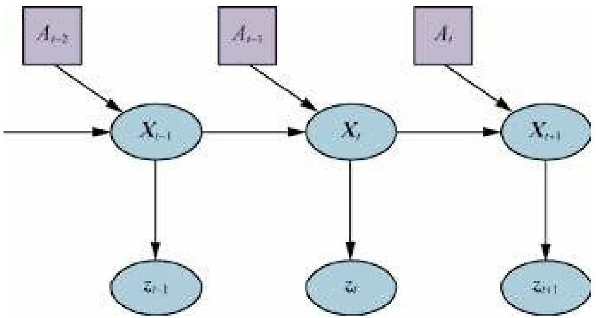  
图26-4 机器人感知可以看作动作和测量序列的时序推断，如本动态决策网络所示

我们想从当前信念状态 和新观测 计算新的信念状态 $P ( X _ { i } | \mathbf { z } _ { 1 : i } , a _ { 1 : i - 1 } )$ $\pmb { z _ { t + 1 } }$ 。我们在14.2节做过同样的事，但此处有两个区别：我们以动作和观测作为条件，并处理连续变量而非离散变量。这样，我们修改14.2.1节的递归滤波方程［式（14-5）］来使用积分而非求和：

$$
\left. \left. P \left(X _ {t + 1} \mid z _ {1: t + 1}, a _ {1: t}\right) = \alpha P \left(z _ {t + 1} \mid X _ {t + 1}\right) \int P \left(X _ {t + 1} \mid x _ {t}, a _ {t}\right) P \left(x _ {t} \mid z _ {1: t}, a _ {1: t - 1}\right) d x _ {t} \right. \right. \tag {26-}
$$

该式表明状态变量 $\pmb { X }$ 在时刻 $t + 1$ 的后验概率是由前一时刻的对应估计递归算出的。这个计算需要先前的动作at和当前的传感器测量 $\pmb { z } _ { t + 1 }$ 。例如，如果我们的目标是开发足球机器人， 可能 $X _ { t + 1 }$ 包含足球与机器人的相对位置。后验概率 是所有刻画了我们从已有传感器测 $\bar { P } ( X _ { i } | \tau _ { 1 : i } , a _ { 1 : i - 1 } )$ 量和控制所得到的信息的状态的概率分布。式（26-1）告诉我们如何递归地估计这一位置：通过逐

渐地加入传感器测量（如摄像头图像）和机器人运动指令。概率 $\mathbb { P } ( X _ { t + 1 } | x _ { t } , a _ { t } )$ 称为 转移模型或 运动模型 （motion model），而 $\mathbb { P } ( z _ { t + 1 } | X _ { t + 1 } )$ 是 传感器模型 。

# 26.4.1 定位与地图构建

定位 （localization）是找出东西在哪里的问题，包括找到机器人本身。简单起见，我们考虑在平坦的二维世界中的移动机器人。我们假设机器人已知该环境的精确地图。（图26-7就展示了这样的一种地图。）这种移动机器人的位姿使用它的两个值为 $x$ 和 $y$ 的笛卡儿坐标及其值为 $\pmb \theta$ 的朝向定义，如图26-5a所示。如果我们将其写作向量中的3个值，则任意特定状态可以由

$\mathbf X _ { i } = \left( x _ { i } , y _ { i } , \theta _ { i } \right) ^ { \top }$ 给出。这些东西目前看起来不错。

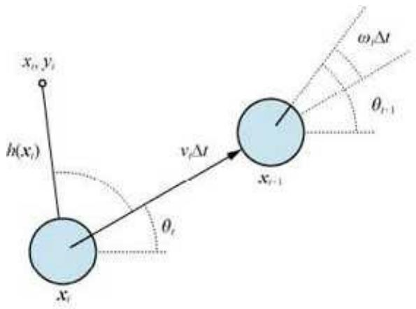

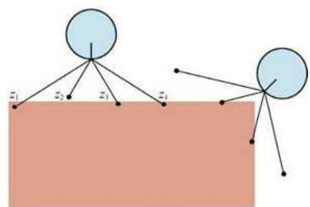  
  
图26-5 （a）移动机器人的简化运动模型。机器人用圆表示，圆内的半径线表示机器人的前进方向。状态 $\textbf { \em x } _ { t }$ 包括位置 和方向角 $\theta _ { r }$ 。新状态 $\boldsymbol { x } _ { t } + 1$ 通过位置的更新 和方向的更新取得。在 $\{ x _ { p }$ 处还显示了一个在时刻 $t$ 观测到的地标。（b）距离扫描传感器模型。对于给定的距离扫描 $\{ z _ { q } , z _ { 2 } , z _ { 3 } , z _ { 4 } \}$ ，我们展示了两个可能的机器人位姿。左边的位姿生成该距离扫描的可能性远大于右边

在运动学近似中，每个动作包含两个“瞬时”速度——平移速度 $v t$ 和旋转速度 ${ \pmb \omega } _ { t }$ 。对于很小的时间间隔 $\Delta t$ ，这种机器人的一个粗略的确定性运动模型由下式给出：

$$
\hat {X} _ {t + 1} = f \left(X _ {t}, \underbrace {\nu_ {t} , \omega_ {t}} _ {a _ {t}}\right) = X _ {t} + \left( \begin{array}{c} v _ {t} \Delta t \cos \theta_ {t} \\ v _ {t} \Delta t \sin \theta_ {t} \\ \omega_ {t} \Delta t \end{array} \right)
$$

符号 $\hat { \pmb X }$ 表示确定性状态预测。当然，真实的机器人在某种程度上来说不可预测。这通常使用均值为 $f ( X _ { t } , \nu _ { t } , \omega _ { t } )$ 、协方差为 $\Sigma _ { x }$ 的高斯分布建模。（附录A介绍了数学定义。）

$$
P \left(X _ {t + 1} \mid X _ {t}, v _ {t}, \omega_ {t}\right) = \mathcal {N} \left(\hat {X} _ {t + 1}, \Sigma_ {x}\right)
$$

这个概率分布是机器人的运动模型。它对运动 $\textit { a } _ { t }$ 对机器人位置的影响建模。

接下来，我们需要一个传感器模型。我们要考虑两种传感器模型。第一种模型假设传感器探测的是环境中稳定的、可辨认的特征，这称为 地标 （landmark）。机器人报告每个地标的距离和方位。假设机器人的状态为 ，它感知到一个位置已知为 的地标。在

没有噪声的情况下，距离和方位的预测可以用简单的几何学计算（见图26-5a）：

$$
\hat {z} _ {t} = h \left(\boldsymbol {x} _ {t}\right) = \left( \begin{array}{c} \sqrt {\left(x _ {t} - x _ {i}\right) ^ {2} + \left(y _ {t} - y _ {i}\right) ^ {2}} \\ \arctan \frac {y _ {i} - y _ {t}}{x _ {i} - x _ {t}} - \theta_ {t} \end{array} \right)
$$

同样，噪声会使测量失真。为简单起见，假设噪声服从协方差为 $\Sigma _ { z }$ 的高斯分布，则传感器模型为

$$
P \left(z _ {t} \mid x _ {t}\right) = \mathcal {N} \left(\hat {z} _ {t}, \Sigma_ {z}\right)
$$

距离传感器的传感器阵列 （sensorarray）使用有所不同的传感器模型，每个传感器与机器人有固定的方位角。这些传感器产生一个距离值向量 。 $\boldsymbol { z } _ { t } = ( z _ { 1 } , \cdots , z _ { y } ) ^ { \top }$

给定位姿 $\textbf { \em x } _ { t }$ ，令 $\hat { z } _ { j }$ $\textbf { \em x } _ { t }$ $j$ 斯噪声干扰。通常，我们假设不同波束的误差是独立同分布的，因此有

$$
P \left(z _ {t} \mid x _ {t}\right) = \alpha \prod_ {j = 1} ^ {M} e ^ {- \left(z _ {j} - \hat {z} _ {j}\right) / 2 \sigma^ {2}}
$$

图26-5b展示了一个例子，它包含四波束距离扫描和两个可能的机器人位姿，其中一个很有可能产生了观测到的扫描结果，而另一个则没有。比较距离扫描模型与地标模型，我们看到距离扫描模型好在不需要在呈现距离扫描结果前 识别地标。实际上，在图26-5b中，机器人面对一面没有特征的墙。但是，如果有可见的、可识别的地标，这些地标就能很快给出定位。

14.4节描述了卡尔曼滤波器，它将信念状态用单个多元高斯分布表示，而粒子滤波器则用一系列对应状态的粒子表示信念状态。大多数定位算法使用其中一个来表示机器人的信念

$$
P \left(X _ {t} \mid z _ {1: t}, a _ {1: t - 1}\right) 。
$$

使用粒子滤波的定位称为 蒙特卡罗定位 （Monte Carlo localization，MCL）。MCL算法是图14-17中的粒子滤波算法的实例。我们只需提供合适的运动模型和传感器模型即可。图26-6展示了其中的一个版本，它使用距离扫描传感器模型。算法的操作如图26-7所示，其中机器人试图找出它在办公大楼中的位置。第一张图片中，根据先验概率，粒子均匀分布，代表机器人位置的全局不确定性。第二张图片中，第一组测量值抵达，粒子在高后验信念的区域堆积。第三张图中，充足的测量数据使粒子全部位于一个位置。

function MONTE-CARLO-LOCALIZATION $( a , z , N , P ( X ^ { \prime } | X , \nu , \omega ) , P ( z | z ^ { * } ) , m$ ap)returns下一时间步的样本集Sinputs:a，机器人速度v以及ω

z，M个距离扫描数据点的向量

$P ( X ^ { } | X , \nu , \omega )$ ，运动模型

$P ( z | z ^ { \prime } )$ ，距离传感器噪声模型

map，环境的二维地图

persistent:S，N个样本的向量

local variables:W，N个权重的向量

SN个样本的临时向量

ifS为空then

fori=1toNdo//初始化阶段

S[i-P（X）的样本

fori-1toNdo //更新循环

Si]P（XX=S[i]，v,）的样本

Wi]-1

forj=1toMdo

RAYCAsT(j，X=S[i],map）

Wi+-W[i]·P（z|z）

SWEIGHTED-SAMPLE-WITH-REPLACEMENT(N,S’,W)

returnS

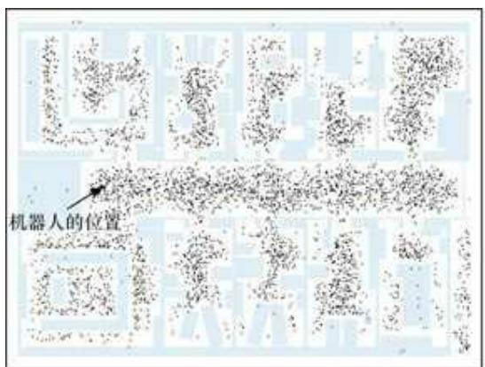  
图26-6使用有独立噪声的距离扫描传感器模型的蒙特卡罗定位算法

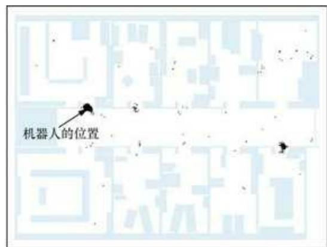

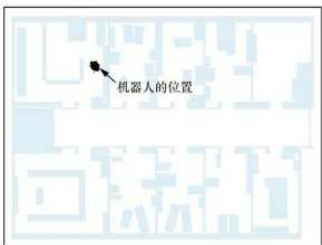  
（c）  
图26-7蒙特卡罗定位，这是一种用于移动机器人定位的粒子滤波算法。（a）起初，全局具有不确定性。（b）在导航到（对称的）走廊后形成近似双峰的不确定性。（c）在进入到特定的房间后形成单峰不确定性

卡尔曼滤波是定位的另一种主要方式。一个卡尔曼滤波器表示一个高斯分布的后验概率

。高斯分布的均值为 ，协方差为 。高斯信念的主要问题是它仅在线性 $\pmb { \mu } _ { t }$ $\Sigma _ { t }$ 运动模型 $f$ 和线性测量模型 h 下闭合。对于非线性的 $f$ 和 h ，更新滤波器的结果通常不符合高斯分布。因此，使用卡尔曼滤波器的定位算法线性化 了运动模型和传感器模型。线性化是用线性函数对非线性函数的局部近似。图26-8展示了线性化一个（一维）机器人运动模型的概念。左图描述了非线性运动模型 （动作变量 a t 在图中省略，因为它不影响线性化）。右图函数被近似为线性函数 。该线性函数选择了 $f$ $\pmb { \mu } _ { t }$ 处的切线，即我们在时刻 t 的平均状态估计。这种线性化叫作一阶泰勒展开 （Taylorexpansion）。通过泰勒展开来线性化 f和 h 的卡尔曼滤波器叫作 扩展卡尔曼滤波器 （extended Kalman filter，EKF）。图26-9展示了运行扩展卡尔曼滤波定位算法的机器人的一系列估计。

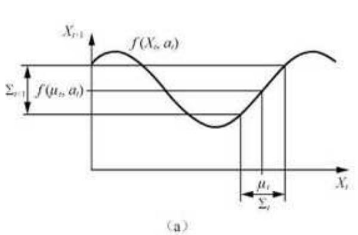

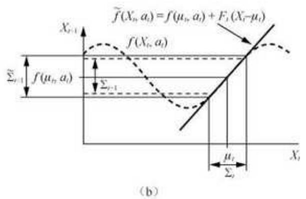

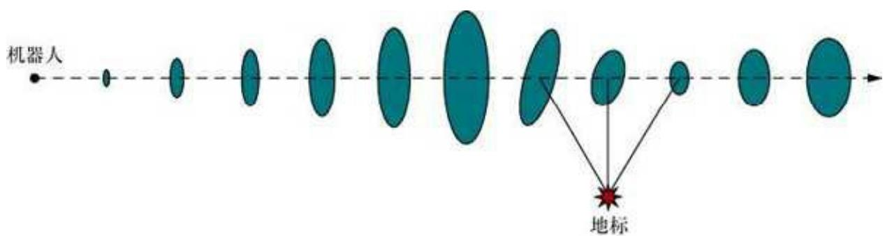  
图26-8线性化运动模型的一维图示：（a）函数 $f$ 以及均值 $\mu _ { e }$ 和协方差区间（基于 ${ \boldsymbol { \Sigma } } _ { t }$ ）在时刻 $\nmid$ 1的投影。（b）线性化后的函数表示 $f$ 在 $\mu _ { \ell }$ 处的切线。均值 $\mu _ { \ell }$ 的投影是正确的，而协方差的投影则与 不同  
图26-9使用扩展卡尔曼滤波器的定位。机器人沿直线运动。在行进中，它位置的不确定性增加，如误差椭圆所示。当它观测到位置已知的地标时，不确定性减小

当机器人运动时，对其位置估计的不确定性增加，如误差椭圆所示。当它感应到相对已知位置的地标的距离和方位时，其误差减小，而在看不到地标后误差又增大。如果地标很容易识别，则EKF算法效果很好。否则，后验概率分布可能会是多峰的，如图26-7b所示。需要知道地标的信息是图15-3讨论过的 数据关联 问题的一个例子。

在某些情况下，环境地图不可取得。因此机器人必须获取地图。这有点像先有鸡还是先有蛋的问题：机器人必须根据它不太了解的地图导航，同时还要在不知道自己的确切位置时构建地图。这一问题对于很多机器人应用很重要，并且得到了广泛的研究。这一领域叫作同时定位与地图构建（simultaneous localization and mapping，SLAM）。

许多不同的概率方法解决了SLAM问题，包括上述的扩展卡尔曼滤波器。使用EFK很直接：只需扩展状态向量，纳入环境中地标的位置即可。幸运的是，EKF更新规模是二次增长的，因此对小型地图来说（如几百个地标），计算是相当可行的。更复杂的地图常使用图松弛方法获得，类似于第13章讨论的贝叶斯网络推断。期望最大化也常用于SLAM。

并非所有的机器人感知都涉及定位或地图构建。机器人也感知温度、气味、声音等。这些数值中的大部分可以用某种动态贝叶斯网络来估计。这种估计器所需的仅仅是刻画状态变量随时间变化的条件概率分布，以及描述测量数据与状态变量关系的传感器模型。

将机器人规划为反应型智能体而无须显式地对状态的概率分布进行推理也是可以的，我们将在26.9.1节对此进行介绍。

机器人学的趋势明显朝着有良定义的语义的表示的方向发展。概率技术在许多困难的问题（如定位和地图构建）上的表现超过了其他方法。不过，统计方法有时候过于不便，在实际中更简单的解决方案可能同样有效。要确定采取哪种方法，最好的办法是在真正的机器人上亲自实践。

# 26.4.3 机器人感知中的监督学习与无监督学习

机器学习在机器人感知中扮演着重要的角色，当最佳的内部表示未知时尤其如此。一个常见的方法是用无监督机器学习方法将高维传感器流映射到低维空间（见第19章）。这种方法称为低维嵌入（low-dimensional embedding）。机器学习使从数据中学习传感器模型和运动模型，并同时发现合适的内部表示成为可能。

另一种机器学习方法使机器人能够连续地适应传感器测量数据中的重大变化。拍下你自己从阳光照射的地方走进霓虹灯照明的昏暗的房间的样子。显然，室内的东西更暗。但光源的改变同时改变了颜色：霓虹灯光的绿色分量比阳光的绿色分量更强。但我们出于某些原因，并不能发觉这种变化。如果我们与别人一同进入霓虹灯光照明的房间，我们并不会认为他们的脸突然变绿了。我们的感知快速地适应了新的光照条件，我们的大脑忽略了这种不同。

适应性感知技术使机器人能够根据这种变化进行调节。图26-10展示了一个例子，它来自自动驾驶领域。此处，一辆无人地面车辆的分类器适应了“可行驶表面”的概念。它的原理是什么？机器人使用激光为分类器提供机器人面前的一小片区域。如果这片区域被激光测距扫描视为平整的，则它就用作“可行驶表面”概念的训练正样本。类似于第20章讨论的EM算法的混合高斯技术随后被训练用于识别这一小块样本的特定颜色和纹理系数。图26-10中的图像是对整个图像应用这种分类器的结果。

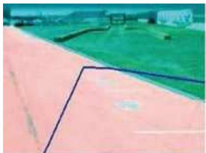

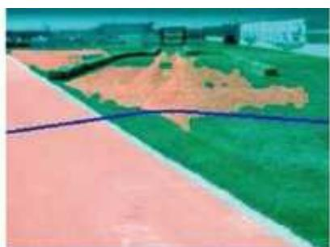

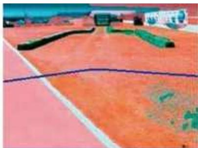  
  
图26-10使用适应性视觉取得的一系列“可行驶表面”分类。（a）只有路面被分类为可行驶的（粉色区域）。蓝色的V形线表示车辆的行驶方向。（b）车辆被迫驶离路面，分类器开始将部分草地分类为可行驶的。（c）车辆更新了它的可行驶表面模型，以将草地视作路面。图片由Sebastian Thrun提供

使机器人自己收集训练数据（和标签）的方法叫作自监督 （self-supervised）。这个例子中，机器人使用机器学习来让对地形分类很有效的短距传感器变得能够看得更远。这就使机器人能开得更快，只在传感器模型表明此处有需要用短距传感器更仔细地检查的地形时才减速。

# 26.5 规划与控制

机器人的思考最终会落实到决定如何移动，也就是从抽象的任务层级一直落实到发送到电动机的电流。本节中，为简化问题，我们假设感知（以及预测，如果有必要）已经给定，那么世界变为可观测的。我们还假设世界具有确定性的转移（动态）。

我们先将运动从控制中分离。我们将 路径 定义为机器人（或机器人部件，如手臂）将遵循的几何空间中的一系列点。这涉及第3章的概念，但此处我们的意思是空间中的一系列点，而非一系列离散动作。找出良好路径的任务叫作运动规划 。

有了路径以后，我们执行一个动作序列来跟踪这条路径称为 轨迹跟踪控制 （trajectory trackingcontrol）。一条轨迹 是一条路径中每个点具有对应时间的路径。一条路径只会说“从A到B到 $C$ ”之类的东西，而一条轨迹则会说“从 A开始，用1秒到达B，再用1.5秒到达C”，以此类推。

# 26.5.1 构形空间

假设一个简单的机器人 R 的形状为直角三角形，如图26-11左下角的淡紫色三角形所示。机器人需要规划路径来躲避一个矩形障碍物 O 。机器人在其中移动的空间叫作 工作空间 （workspace）。这个机器人可以在 xy 平面朝任意方向移动，但不能旋转。图26-11a展示了机器人的5个可能位置（用虚线表示），它们都与障碍物尽可能地接近。

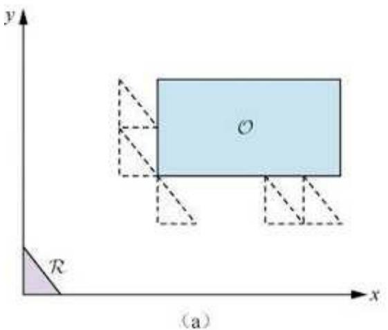

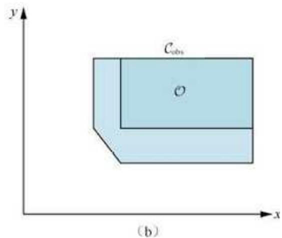  
图26-11 一个可以平移的简单机器人，它需要躲避矩形障碍物。（a）工作空间，（b）构形空间

机器人的身体可以用点( x , y )或点( x , y , z )（对三维空间机器人来说）的点集表示，障碍物也一样。在这种表示之下，躲避障碍物意味着机器人上的点不与障碍物上的任何点重叠。运动规划需要在点集上进行运算，这是很复杂且费时的。

我们可以用一种表示方法来简化计算，其中用一个抽象多维空间中的点表示所有构成机器人的点，我们称之为 构形空间 （configuration space），或 C空间 （C-space）。思路是，构成机器人的点集是可以计算的，只要我们知道机器人的基本尺寸数据（对这里的三角形机器人来说，三边的长度就可以了）以及机器人的当前位姿 ，也就是其位置与朝向。

对这里的三角形机器人来说，二维C空间就足够了：如果我们知道机器人上某个点的(x, y)坐标（这里用它的直角顶点），就可以算出三角形的所有其他点的位置（因为我们知道三角形的大小和形状，且三角形不能旋转）。在图26-11的左下角，淡紫色三角形可以用构形(0, 0)表示。

如果我们改变规则，使机器人可以旋转，则我们需要3个维度— ，以便于计算每个点 $( x , y , \theta )$ 的位置。这里的 $\pmb \theta$ 是机器人在平面上的旋转角度。如果机器人具有拉伸自己的能力，能够根据缩放因子 s均匀地变大，则C空间就会有4个维度，即 $( x , y , \theta , s )$ 。

现在我们仅使用简单的二维C空间，且机器人不可旋转。接下来的任务是估计C空间中障碍物所在

的点的位置。考虑图26-11左图所示的5个虚线三角形，注意每个三角形中直角顶点的位置。然后想象三角形能够滑动的所有位置。显然，直角顶点不能进入障碍物内部，也不可能比图示的5个虚线三角形中的顶点更接近障碍物。因此，你可以发现直角顶点无法到达的区域（也就是C空间障碍物 ）就是图26-11右图所示的五边形，用 C obs表示。

在日常语言中，我们提及机器人所面对的障碍物时，指的是桌子、椅子或者墙。但数学概念稍微简单一点，前提是我们将这些障碍物想象成恰好具有各个不连通分量的单个“障碍物”。大体上来说，C空间障碍物就是C中所有点q 的集合，使得如果将机器人放置于这个构形中，其工作空间几何位置就会与工作空间中的障碍物位置相交。

令工作空间中的障碍物为点集 O ，并令在构形 q 中的机器人上的点的点集为 ，则C空间障碍物定义为

$$
C _ {\mathrm {o b s}} = \{q: q \in C _ {\text {且}} A (q) \cap O \neq \{\} \}
$$

且 自由空间 （free space）为

$$
C _ {\text {f r e e}} = C - C _ {\text {o b s}}
$$

对有活动部件的机器人来说，C空间则更有趣。考虑图26-12a所示的二连杆机械臂。它被用螺栓固定在桌子上，因此基座不会移动，但它的手臂有两个独立运动的关节——我们称之为 自由度（degree of freedom，DOF）。活动关节改变了肘部、夹具和手臂上所有点的( x , y )坐标。手臂的构形空间是二维的，即 ，其中 是肩关节的角度， 则是肘关节的角度。

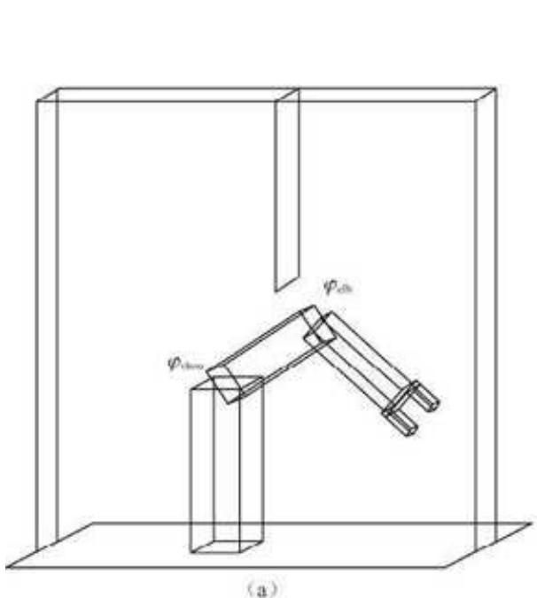

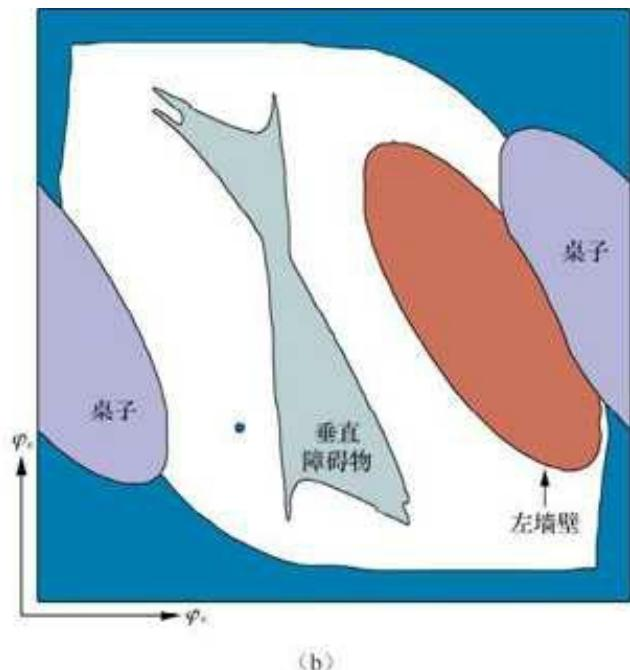  
图26-12 （a）有两个自由度的机械臂的工作空间表示。工作空间是一个盒子，其中扁平障碍物悬挂在天花板上。（b）同一个机器人的构形空间。只有空间中的白色区域是没有碰撞的构形。图中的点对应左图所示的机器人构形

知道我们的二连杆机械臂的构形意味着我们可以通过简单的三角几何确定机械臂上每个点的位置。一般来说， 正向运动学 （forward kinematics）映射是函数

$$
\phi_ {b}: C \rightarrow W
$$

它以一个构形作为输入并输出该构形下机器人上特定点b 的位置。机器人的终端效应器 EE的正

向运动学映射特别有用。特定构形 $q$ 下机器人上的所有点的集合使用 $A ( q ) \subset W$ 表示：

$$
\mathcal {A} (q) = \bigcup_ {b} \left\{\phi_ {b} (q) \right\}
$$

而反向问题是将机器人上的点需要处于的位置映射到机器人需要处于的构形。这称为逆向运动学（inverse kinematics）：

$$
I K _ {b}: x \in W \mapsto \{q \in C _ {\text {受 限 于 约 束}} \phi_ {b} (q) = x \}
$$

有时逆向运动学映射不仅需要输入位置，还需要输入所需的朝向。例如，当我们想让机械手抓住一个物体时，我们可以算出需要其夹具所处的位置和朝向，并使用逆向运动学来确定该机器人的目标构形。随后规划器需要找出在不触碰障碍物的情况下使机器人从当前构形变成目标构形的方法。

工作空间中的障碍物常被描述为简单的几何形式——特别是在倾向于关注于多边形障碍物的机器人学教科书中。但这些障碍物在构形空间中是什么样子？

对二连杆机械臂来说，工作空间中的简单障碍物（如一条垂直的线）在C空间中具有非常复杂的形状，如图26-12b所示。上色不同的区域对应机器人工作空间的不同障碍：围绕整个自由空间的深色区域对应机器人与自身碰撞的构形。容易看出肩关节或肘关节角度的极端取值会导致这种违规情况。机器人两边的两个椭圆形区域对应安装机器人的桌子，另一个圆形区域对应左边的墙。

最后，构形空间中最有趣的物体是从天花板上垂下来阻碍机器人运动的障碍物。这个物体在构形空间中的形状很好玩：它高度非线性，有些地方甚至是凹的。做一点点想象，读者就能明白夹具在左上端时的形状。

我们鼓励读者暂停一下来研究这幅图。C空间中障碍物的形状一点也不直观！图26-12b中的点标出了图26-12a中机器人的构形。图26-13描述了另外3个构形，它们都同时绘制在了工作空间和构形空间中。在构形conf-1中，夹具正在抓垂直障碍物。

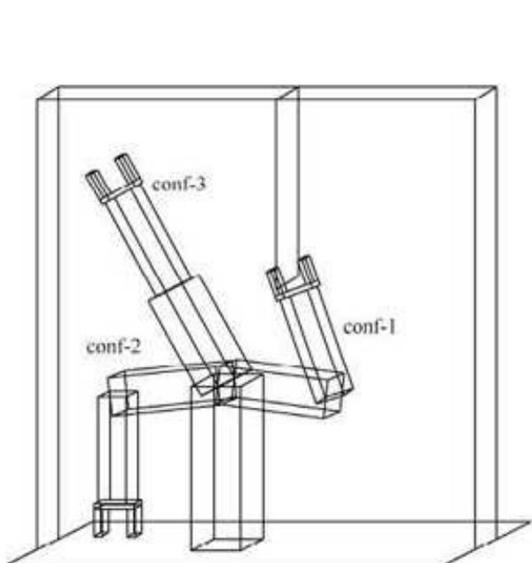

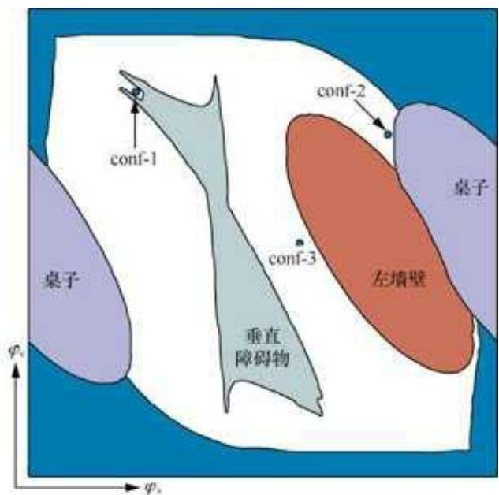  
  
图26-13工作空间和构形空间中的3个机器人构形

我们看到，即使机器人的工作空间使用了平整多边形表示，自由空间的形状仍然可以非常复杂。因此，在实际中，人们通常探查构形空间，而非显式地构建空间。规划器可能会生成一个构形，并通过运用机器人运动学来测试它是否在自由空间中，然后再在工作空间坐标中检查是否有碰撞。

运动规划 （motion planning）问题就是在不与障碍物发生碰撞的前提下，找出使机器人从一种构形变为另一种构形的规划。这是运动与操纵的基本组成要素。26.5.4节将讨论如何在复杂动力学中完成这件事，例如，如果你转弯太快，打方向可能导致汽车滑出路径。目前，我们只专注于简单的运动规划问题，找出不会碰撞的几何路径。运动规划是经典的连续状态搜索问题 ，但常常可以离散化其空间，并应用第3章的搜索算法。

运动规划问题有时称为 搬钢琴问题 （piano mover’s problem）。它得名于搬运者纠结于如何将一架很大的、形状不规则的钢琴从一个房间搬运到另一个房间并且不磕碰到任何东西。对于运动规划问题，我们有如下约定：

● 一个工作空间—— 世界 W ，对平面来说是 ，或对三维世界来说是 ；  
●一个障碍物区域 ；  
● 一个具有构形空间 C 、点集为 （其中 ）的机器人；  
● 一个起始构形 ； $q _ { \circ } \in C$   
●一个目标构形 $q _ { \mathrm { g } } \in C$ 。

障碍物区域包括C空间障碍物 $C _ { \mathrm { \ o b s } }$ 以及其对应的自由空间 $C _ { \mathrm { \ : f r e e } }$ ，如26.5.2节所述。我们需要找到一个贯穿自由空间的连续 路径 。我们使用参数化的曲线 ( t )来表示路径，其中 ， $\tau ( 0 ) = q$ ， t 在0到1之间的 ( t )则是 C free 中的某个点。也就是说， t 参数化了我们从起点到目标沿着路径行进了多远。注意，t的作用类似于时间，因为当 t增加时，在路径上的距离也增加，但t始终是区间[0, 1]上的一点，并且不使用秒来度量。

有很多方法会使运动规划问题更复杂：将目标设定为可能构形的集合而非单个构形；将目标定义在工作空间而非C空间；定义一个需要最小化的代价函数（如路径长度）；满足一些约束条件（例如，如果路径中需要运送一杯咖啡，则需要确保咖啡杯始终朝上以免弄洒咖啡）。

运动规划的空间 ：我们后退一步来确保我们理解了运动规划中的空间。首先，有工作空间，或世界 W 。 W 中的点是普通三维世界中的点。然后，我们有构形空间 C 。 C 中的点 q 是 d 维的， d 是机器人的自由度数量，并映射到 W中的点 集 。最后，有一个路径空间。路径空间是一个函数空间。空间中的每一个点映射到一条贯穿C空间的曲线。这个空间是 维的！直观上看，路径上的每一个构形需要 d 维，而路径上构形的数量与数轴上区间[0, 1]中点的数量一样多。现在我们考虑求解运动规划问题的一些方法。

# 1. 能见度图

对有二维构形空间和多边形C空间障碍物的简化情形来说， 能见度图 （visibility graph）是求解运动规划问题的一种很简便的方法，它可以确保求出路径最短的解。令 $V _ { \mathrm { o b s } } \subset C$ 为构成 $C _ { \mathrm { \ o b s } }$ 的顶点集，并令 $V = V _ { \mathrm { o b s } } \bigcup \left. q _ { \mathrm { z } } , q _ { \mathrm { z } } \right.$ 。

我们在顶点集 这两个点的线段无碰撞，也就是说， $V$ 上构建一个图 $G = \left( V , E \right)$ $\{ \lambda \nu _ { i } + ( 1 - \lambda ) \nu _ { j }$ ，其边 $\boldsymbol { e } _ { i j } \in E$ :∈[0,1]] 连接顶点 v i 和顶点 $\cap C _ { o b s } = \{ \}$ $v j$ ，如果连接 ，我们就说两个顶点“能够看到对方”，“能见度”图也得名于此。

要解决运动规划问题，我们要做的是在图 $G$ 上以 $q _ { s }$ 为起始状态，以 $q _ { \mathrm { ~ g ~ } }$ 为目标状态运行离散图搜索（如最佳优先搜索）。图26-14中我们可以看到一张能见度图以及一个最优的有3步的解。能见度图上的最优搜索始终能给出最优路径（如果存在），或报告搜索失败（如果不存在这样的路径）。

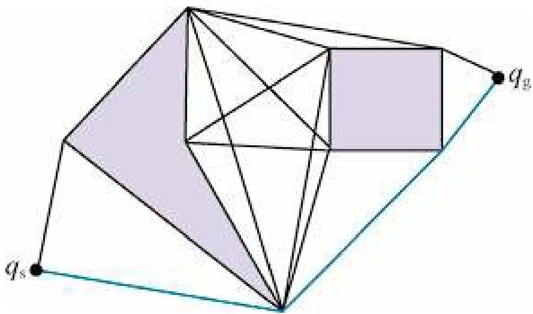  
图26-14一张能见度图。每个能够相互“看到”的顶点都用线段连接，也就是不穿过障碍物的线段。最短路径必然在这些线段上

# 2. 沃罗诺伊图式

能见度图促使路径直接与障碍物相接——如果你绕过桌子去门口，最短路径就是尽可能地贴着桌子。然而，如果运动或感知是非确定性的，你就有撞到桌子的风险。解决这一问题的一种方法是假设机器人的身体比其实际大小要大一些，以此设定一个缓冲区。另一种方法是认为路径长度并非需要我们优化的唯一度量。26.8.2节展示了如何从人类行为样本中学到一个良好的度量。

第三种方法则使用了另一种技术，它使路径尽可能地远离障碍物，而非紧挨着它们。沃罗诺伊图式 （Voronoidiagram）是一种能够使我们办到这件事的表示。为理解沃罗诺伊图式的概念，考虑一个空间，其中障碍物为平面上的十几个点。我们为每一个障碍物点绘制一个区域 （region），每个区域由所有距离这个障碍物点比距离其他障碍物点更近的点构成。这样，这些区域就划分了平面，如图26-15所示。沃罗诺伊图解由区域的集合构成，而 沃罗诺伊图 （Voronoi graph）则由区域中的顶点和边构成。

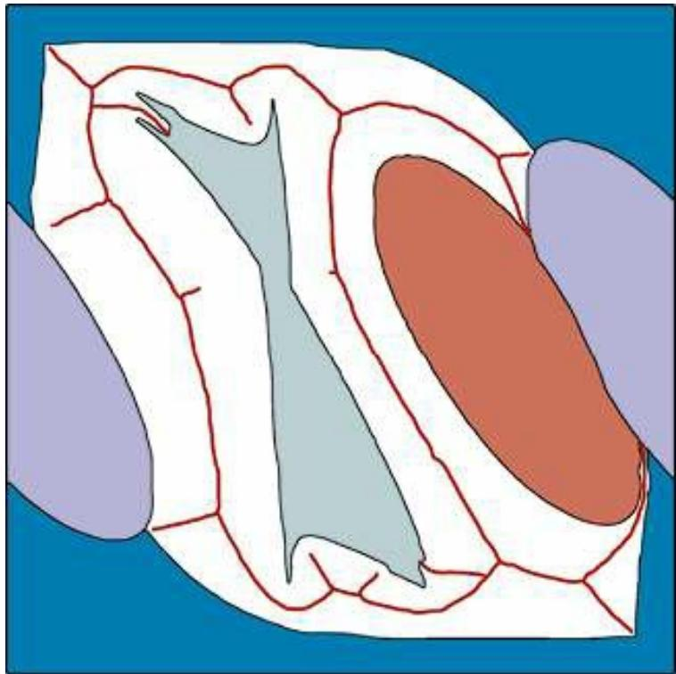  
图26-15沃罗诺伊图式展示了构形空间中与周围两个或多个障碍物等距的点的集合（红色线）

当障碍物为区域而非点时，做法基本相同。每个区域仍然包含所有距离一个障碍物比另一个障碍物更近的点，其中，距离是到障碍物上最近的点的距离。区域之间的边界仍然对应于与两个障碍物等距的点，但现在边界可能是曲线而非直线。在高维空间计算这些边界的代价极高。

要求解运动规划问题，我们用直线连接起始点 q s和沃罗诺伊图上距其最近的点，并对目标点 q g也进行同样的操作。然后使用离散图搜索来找到图上的最短路径。对于类似于室内走廊导航的问题，它能够给出一条沿着走廊中间行驶的漂亮的路径。然而，在室外情况下，它会产生低效的路径，例如，为了保持在一个开阔的空间的中间行驶，它会不必要地走一些弯路。

# 3. 单元分解

运动规划的另一种方法是离散化C空间。单元分解 （celldecomposition）方法将自由空间分解为有限数量的相邻区域，称为单元。这些单元旨在使单个单元内的路径规划问题可以用简单方法（如沿直线移动）解决。因此，路径规划问题变为离散图搜索问题（像能见度图和沃罗诺伊图一样），在单元序列中找到路径。

将空间划分为大小均匀的网格是一种最简单的单元分解。图26-16a展示了空间的方形网格分解，以及一条在这一网格大小下最优的解路径。（这些值可以使用图17-6所示的V alue-Iteration 算法的确定性形式计算。）图26-16b展示了手臂在对应的工作空间的轨迹。当然，我们还可以使用A * 算法来找出最短路径。

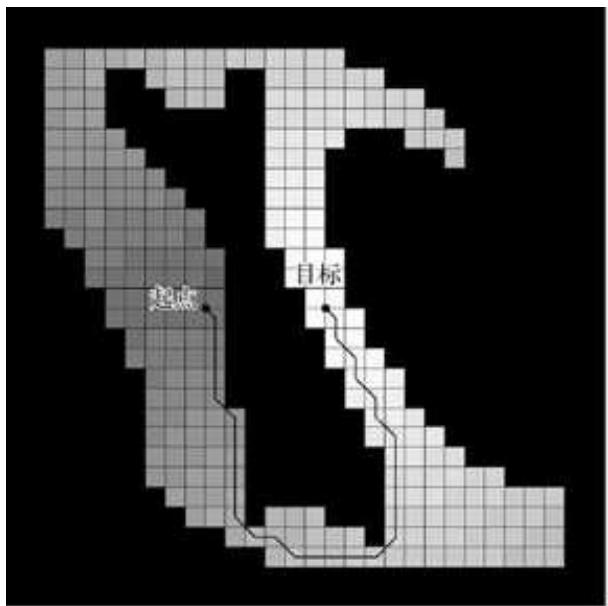

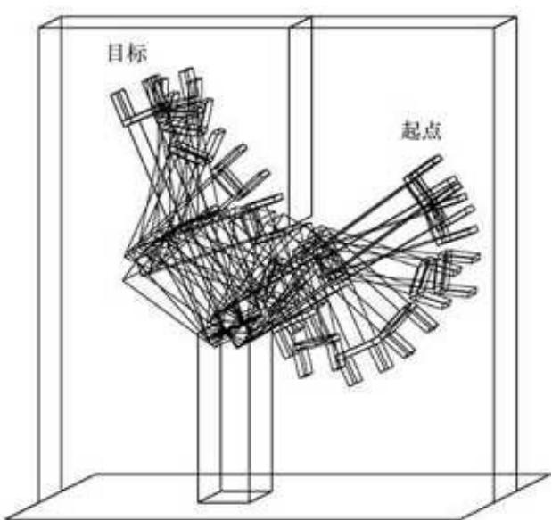  
  
图26-16（a）为构形空间的网格单元近似找到的价值函数和路径。（b）相同路径在工作空间坐标中的可视化。注意机器人是如何弯曲肘部来避免与垂直障碍物发生碰撞的

这种网格分解的好处在于它很容易实现，但它有3点局限性。首先，它只能用于低维构形空间，因为网格的数量随维数d 呈指数级增长。（这就是维度诅咒。）其次，经过离散状态空间的路径不总是平滑的。我们在图26-16a中看到，路径的斜线部分是锯齿形的，因此机器人很难准确地跟踪这条路径。机器人可以试着平滑解路径，但这很难。最后，存在如何处理“混合”单元（也就是既不完全在自由空间中又不完全在被占用空间中的单元）的问题。包含这种单元的解路径可能不是真正的解，因为可能不存在安全穿过这个单元的路径。这就会导致路径规划器不可靠。此外，如果我们坚持只使用完全自由的单元，规划器就会是不完备的，因为唯一能够到达目标的路径可能通过混合单元——它可能是宽度足够机器人通过的走廊，但走廊被混合单元覆盖。

这个问题的第一种解决方法是进一步细分 混合单元，如使其为原先的一半大小。这种方法可以迭代使用，直到找到的路径完全在自由单元中。这种方法很有效，并且是完备的，前提是存在一种确定给定单元是混合单元的方法，但这仅在构形空间的边界具有简单数学描述的情形下才容易做到。

这里要注意的一个重点是，单元分解并不一定需要显式地表示障碍物空间 C obs。我们可以通过使

用 碰撞检查器 （collision checker）来决定是否纳入一个单元。这是运动规划中的一个重要概念。碰撞检查器是构形与障碍物碰撞时映射到 ，否则映射到0的函数。检查某个特定构形是否产生碰撞比显式地构建整个障碍物空间 C obs容易得多。

检查图26-16a的解路径，我们可以发现另一个必须解决的难题。这条路径包含毫无修饰的锋利拐角，但真正的机器人具有动量，不能瞬间改变方向。这个问题可以通过对每个网格单元存储确切的状态（位置和速度）来解决，而这些状态在搜索到达该单元时取得。进一步地，假设在向周围网格单元传播信息时，我们以连续状态为基础，并应用机器人运动模型来进入邻近单元。这样我们就不会采用90°急转弯，而会采用符合运动法则的圆角转弯。我们现在可以确保产生的轨迹是平滑的，能够被机器人真正执行。混合A* （hybrid A*）是一种实现这个目标的算法。

# 4. 随机运动规划

随机运动规划在构形空间的随机分解上进行图搜索，而非在均匀单元分解上。其核心思路是采样一个随机点集，如果点之间有简单的无碰撞到达方式（如直线），就在它们之间创建边；然后就可以在这张图上进行搜索。

概率路线图 （probabilistic roadmap，PRM）算法运用了这一思路。我们假设能够使用碰撞检查器和能快速返回 q 1到 q 2的路径（或失败）的 简单规划器 （simple planner） B ( q 1, q 2)。这个简单规划器不是完备的——它可能返回失败，即使确实存在一个解。它的作用是快速地尝试连接 q 1和 q 2并使主算法知道是否成功。我们要使用它来定义两个顶点之间是否存在一条边。

算法从采样q 和q 之外的M个 里程碑 —— C 中的点开始。它使用拒绝采样，其中构形被随机采样并使用 进行检查，直到找出M个里程碑。接下来，算法使用简单规划器来尝试连接每对里程碑。如果简单规划器返回成功，则这对里程碑之间的边被加入图中；否则，图不发生变化。我们尝试连接每个里程碑到它的k个最近邻（我们称之为k-PRM），或到半径为r之内的所有里程碑。最后，算法在这张图上搜索从 q s到 q g的路径。如果没有找到路径，则再采样 M 个里程碑添加到图中，并重复这一过程。

图26-17展示了找出了两个构形之间路径的路线图。PRM不完备，但它们是所谓 概率完备的只要存在路径，它们最终就会找到路径。直觉上，这是因为它会一直采样更多的里程碑。PRM在高维构形空间中的性能仍然很好。

PRM在 多查询规划 （multi-query planning）中也十分流行。多查询规划中，在同一个C空间中存在多个运动规划问题。通常，机器人到达目标后，立刻就会被要求到达同一个工作空间内的另一个目标。PRM很有用，因为机器人可以预先花时间构建路线图，并在多次查询中利用这张图。

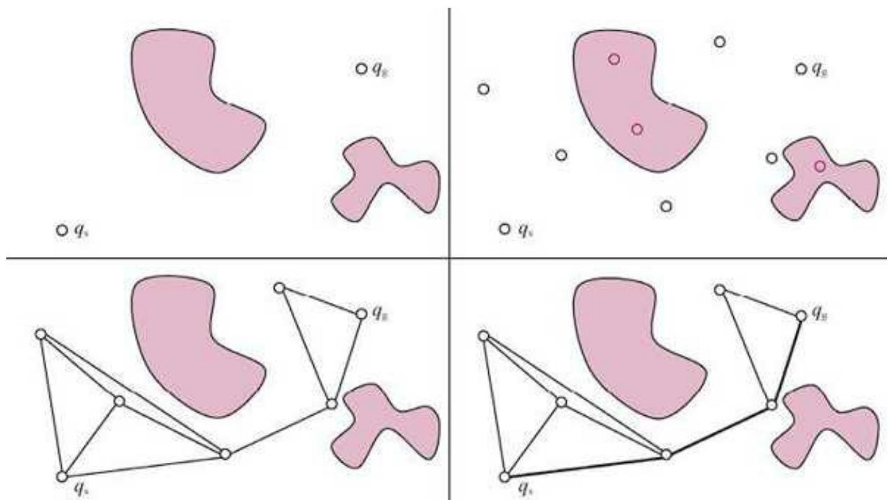  
图26-17概率路线图（PRM）算法。左上 ：起点构形与目标构形。 右上 ：采样M个无碰撞里程碑（此处M=5）。左下 ：将每个里程碑与其 $k$ 个最近邻连接（此处k=3）。 右下 ：在产生的图中找出从起点到目标的最短路径

# 5.快速探索随机树

PRM的一个扩展称为 快速探索随机树 （rapidly-exploring random tree，RRT），它在单查询规划中十分流行。我们逐渐地构建两棵树，一棵以q 为根节点，另一棵以 $q _ { \mathrm { ~ g ~ } }$ 为根节点。选择随机里程碑，并尝试将每个里程碑连接到现有的树上。如果一个里程碑同时连接到了两棵树，就意味着已经找到了解，如图26-18所示。如果没有这样的连接，则算法找到每棵树上最近的点，并将一条指向该里程碑的、长度为 $\pmb { \delta }$ 的边加入树中。这能使树的生长趋向于空间中先前没有探索过的区域。

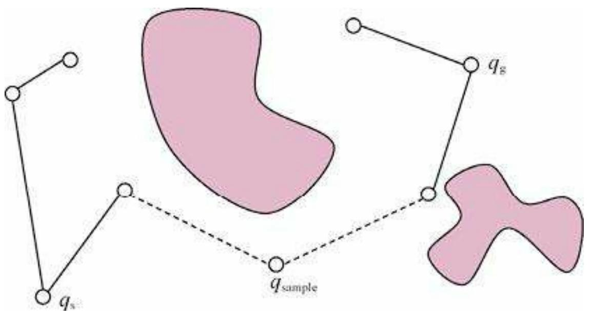  
图26-18双向RRT算法通过渐增地将每个样本连接到每棵树上最近的节点（如果可以连接）构建了两棵树（一棵从起点开始，另一棵从目标开始）。如果一个样本同时连接到了两棵树，就代表我们已经找到了一条解路径

机器人学家很喜欢RRT的易用性。然而，RRT的解往往不是最优的，且缺乏平滑性。因此，RRT常

常需要在后面附加一个后处理步骤。最常见的一种后处理是“走捷径”，它随机地选择解路径上的一个顶点并通过（用简单规划器）连接其相邻节点来删除这个节点。在计算时间允许的情况下，这一步骤被尽可能多地重复。即便如此，轨迹仍可能看起来不太自然，因为我们选择了位置随机的里程碑，如图26-19所示。

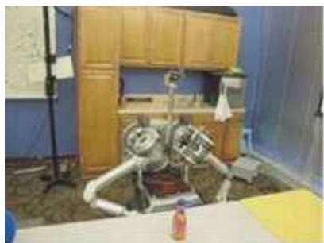

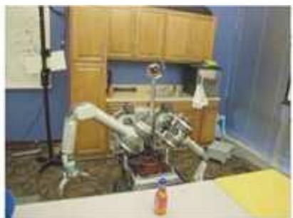

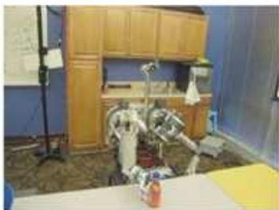  
  
图26-19 RRT生成并经过“走捷径”后期处理的截图。图片由Anca Dragan提供

RRT* 是RRT的一个修改版，它使算法逼近最优：解在越来越多的里程碑采样中近似最优。其核心思路是根据到达代价的概念来选择最近邻，而非仅仅是与里程碑的距离。它还对树进行重连：当连接到新里程碑时，如果改变已有节点的父节点能使从新里程碑到达它们的代价更小，则交换这些父节点。

# 6. 用于运动学规划的轨迹优化

随机采样算法往往首先构建一条复杂但可行的路径，然后对其进行优化。轨迹优化则相反：它从简单但不可行的路径开始，然后修改轨迹来避免碰撞。它的目标是找到一条能优化路径的代价函数

[1] 的路径。也就是说，我们想最小化代价函数 ，其中 ， 。

[1]机器人学家喜欢最小化代价函数 $J$ ，但在人工智能的其他领域，我们试图最大化效用函数 $U$ 或者奖励函数 R。

$J$ 称为泛函 （functional），因为它是函数的函数。 $J$ 的参数是 ， 本身就是一个函数： 以区间[0, 1]内的点为输入，并将其映射到一个构形。标准的代价函数在机器人运动的两个方面（即避免碰撞和效率）进行权衡：

$$
J = J _ {\mathrm {o b s}} + \lambda J _ {\mathrm {e f f}}
$$

其中，效率 $J _ { \mathrm { \scriptsize ~ e f f } }$ 测量路径的长度，也可以用来测量平滑性。定义效率的一种简便方式是使用平方，它对 的一阶导数的平方进行积分（我们稍后来看它为何能对短路径进行激励）：

$$
J _ {\mathrm {e f f}} = \int_ {0} ^ {1} \frac {1}{2} \| \dot {\tau} (s) \| ^ {2} d s
$$

对于障碍物项，假设我们可以计算从任意点 到最近障碍物的边的距离d (x)。在障碍物外部时这一距离为正，在边缘上时为0，在内部时为负。这叫作有符号的距离场 （signed distancefield）。我们现在就可以定义工作空间中的代价场了，我们称其为c，它在障碍物内部具有大代价，并在紧挨着障碍物的外部具有小代价。有了代价之后，我们可以使工作空间中的点讨厌处于障碍物内部，且不喜欢紧挨着障碍物（以免像能见度图一样始终贴着障碍物的边缘）。当然，我们的机器人不是工作空间中的点，因此我们还需要做一些事——考虑机器人身体上的所有点b ：

$$
J _ {\mathrm {o b s}} = \int_ {0} ^ {1} \int_ {b} c \underbrace {\left(\phi_ {b} (\tau (s))\right)} _ {\in W} \| \frac {\mathrm {d}}{\mathrm {d} s} \underbrace {\phi_ {b} (\tau (s))} _ {\in W} \| \mathrm {d} b \mathrm {d} s
$$

这称为 路径积分 （path integral）——它不仅在路径上对身体上的每个点的 c进行积分，还乘以导数以使代价对路径的重计时保持不变。想象一个扫过代价场的机器人在移动时累积代价。无论机器人在场内移动得有多快或多慢，它都必须积累到完全相同的代价。

求解上述优化问题并找出路径的最简单的办法是 梯度下降法 。如果你想知道如何求泛函关于函数的梯度，变分法可以帮助你。它对如下形式的泛函来说很简单：

$$
J [ \tau ] = \int_ {0} ^ {1} F (s, \tau (s), \dot {\tau} (s)) d s
$$

它是仅依赖参数 s、函数在s处的值以及函数在s处的导数的函数的积分。这种情况下，欧拉-拉格朗日方程 （Euler-Lagrange equation）表明其梯度为

$$
\nabla_ {\tau} J (s) = \frac {\partial F}{\partial \tau (s)} (s) - \frac {d}{d t} \frac {\partial F}{\partial \dot {\tau} (s)} (s)
$$

如果我们仔细察看 $J _ { \mathrm { \scriptsize ~ e f f } }$ 和 $J _ { \mathrm { \ o b s } }$ ，它们都遵循这种形式。特别地，对于 $J _ { \mathrm { \scriptsize ~ e f f } }$ ，我们有 $F ( s , \tau ( s ) ,$ $\div ( s ) ) = \parallel \div ( s ) \parallel ^ { 2 }$ 。为便于理解，我们仅计算 $J _ { \mathrm { \scriptsize ~ e f f } }$ 的梯度。我们看到 $F$ 对 $\pi ( s )$ 没有直接依

$$
\nabla_ {\tau} J (s) = 0 - \frac {d}{d t} \dot {\tau} (s)
$$

因为 $F$ 关于 $\dot { \tau } ( s )$ 的偏导数为 $\dot { \tau } ( s )$

注意我们在定义 $J _ { \mathrm { \scriptsize ~ e f f } }$ 时是如何化简问题的——它是导数的简单二次函数（我们甚至在前面乘以1/2以便2可以轻松地约去）。实际中，你会在优化中看到很多这样的技巧，其中的技艺不仅在于选择如何优化代价函数，还在于选择能够很容易优化的代价函数。对梯度进行简化，有

$$
\nabla_ {\tau} J (s) = - \ddot {\tau} (s)
$$

现在，由于 $J$ eff 是二次的，因此将梯度设为0就能给出在不需要处理障碍物时的解。一次积分后，我们就能获得一阶导数，它应当是一个常数；再次积分后，我们得到 $\tau ( s ) = a s + b$ ，其中 $a$ 和 $^ { b }$ 由端点 $\tau ( 0 )$ 和 $\pmb { \tau } ( 1 )$ 确定。对于 $J _ { \mathrm { { e f f } } }$ ，最优路径是从起点到目标的直线。如果我们不需要担心障碍物，它确实是从一点到另一点最高效的路径。

当然，附加的 $J _ { \mathrm { \ o b s } }$ 才是制造困难的那一项，我们就不在此处推导其梯度了。机器人通常将其路径初始化为直线，它常常会直接穿过一些障碍物。随后它会计算当前路径的代价的梯度，然后梯度用于使路径远离障碍物（图26-20）。注意，梯度下降只能产生局部最优解——就像爬山法一样。像模拟退火（4.1.2节）这样的方法可以用于探索，以使找到的局部最优更可能是足够好的解。图26-21展示了经过轨迹优化后躲避障碍物的任务。

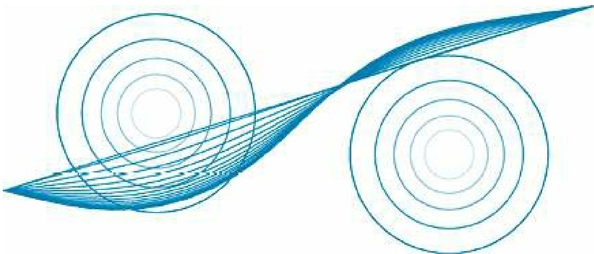  
图26-20 运动规划的轨迹优化。两个点状障碍物周围的圆形带上代价下降。优化器从直线轨迹开始，逐渐使路径远离障碍物以避免碰撞，进而找出通过代价场的最短路径

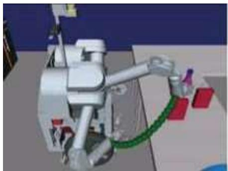

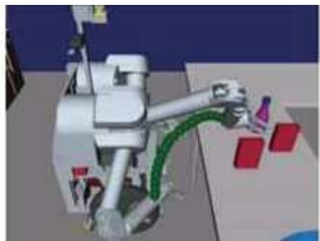

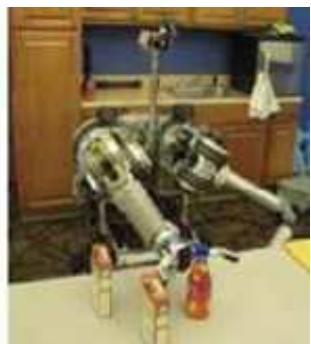  
图26-21 用轨迹优化器解决了伸手抓住瓶子的任务。左图：为末端效应器绘制的初始轨迹。中图：优化后的最终轨迹。右图：目标构形。图片由Anca Dragan提供，见（Ratliff et al., 2009）

# 26.5.3 轨迹跟踪控制

我们已经介绍了如何规划运动，但没有讨论如何真正地移动，也就是将电流传送给电动机来产生扭矩，进而使机器人移动。这属于 控制理论 的领域，它在人工智能中的重要性越来越大。要解决的问题主要有两个：如何将路径的数学描述转换为真实世界中的一系列动作（开环控制），以及如何确保我们在轨迹范围内（闭环控制）。

开环跟踪中，从构形到扭矩 ：路径 给出了构形。机器人在 处从静止开始移动。此后机器人的电动机会将电流转换为扭矩，以形成运动。但机器人的扭矩要以什么为目标才能使它到达 ？

这就需要引入 动力学模型 （dynamics model）（或转移模型）的概念。我们可以给模型一个函数 $f$ 来计算扭矩对构形的作用。还记得物理学中的 $F = m a$ 吗？扭矩中也有类似的东西，形式为，其中 u 为扭矩， 为速度， 为加速度。 [2] 如果机器人位于构形 q 并具有 $u = f ^ { - 1 } ( q , \dot { q } , \ddot { q } )$ $u$ $\ddot { q }$ $q$ 速度 $\dot { \pmb q }$ ，施加扭矩 $u$ ，就会造成加速度 $\ddot { q } = f ( q , \dot { q } , u )$ 。元组 $( q , \dot { q } )$ 为 动态状态 （dynamicstate），因为它涉及速度，而 $q$ 则是 运动学状态 （kinematic state），它不足以准确计算要施加的扭矩。 $f$ 是MDP中以扭矩作为动作时，动态的确定性动力学模型。 $f ^ { - 1 }$ 是 逆动力学 （inversedynamics）模型，它告诉我们如果我们需要特定的加速度来改变速度进而改变动态，需要施加多大的扭矩。

[2]此处我们省略了 $f ^ { - 1 }$ 的细节，它涉及质量、惯性、重力以及科里奥利力和离心力。

现在我们可以简单地将 $t \in [ 0 , 1 ]$ 考虑成尺度为从0到1的“时间”，并使用逆动力学选择扭矩：

$$
u (t) = f ^ {- 1} (\tau (t), \dot {\tau} (t), \ddot {\tau} (t)) \tag {26-2}
$$

假设机器人始于 。尽管在实际中情况没这么简单。

在不考虑速度和加速度的情况下，路径 是点的序列。如果这样，路径可能不满足 $\pmb { \tau }$ （机器人初始速度为0），甚至不满足 $\pmb { \tau }$ 是可导的（更不用说二阶导数）。另外，终点“1”的含义不清楚：它代表多少秒呢？

实际中，在我们考虑跟踪一条参考路径之前，我们通常对其进行 重计时 ，也就是将其转换为一个把某个时长 $T$ 的区间[0, T ]映射到构形空间 C 中的点的轨迹 。重计时比你想象的要难，但它有近似方法，例如，选定一个最大速度和加速度，并使用加速到最大速度并尽可能长时间地保持该速度，随后减速到0的配置。假设我们可以这样做，式（26-2）就可以重写为

$$
\boldsymbol {u} (t) = f ^ {- 1} (\xi (t), \dot {\xi} (t), \ddot {\xi} (t)) \tag {26-3}
$$

即使从 $\pmb { \tau }$ 变成了实际轨迹 ，用于施加扭矩的式（26-3）——称为 控制律 ——在实际中还是有一个问题。回想21.8.3节，你可能就猜到是什么问题了。该式在f很精确的时候没有问题，但实际情况并不是这样的：在实际系统中，我们没办法精确地测量质量和惯性， f 可能也无法恰当地考虑到像电动机中的 静摩擦力 （趋向于阻止静止表面相互运动的摩擦力，也就是使它们黏在一起）这样的物理现象。因此，当机械臂根据错误的f开始施加扭矩时，误差就会累积，你就会越来越偏离参考路径。

机器人可以用控制过程来避免误差累积。控制过程查看机器人自认为其所处的位置，并将其与它想要处于的位置进行比较，然后施加扭矩来最小化误差。

施加反比于观测误差的扭矩的控制器称为比例控制器，或简称为P控制器 。计算这个力的公式为

$$
u (t) = K _ {P} (\xi (t) - q _ {t})
$$

其中， q t为当前构形，K 为代表控制器增益因子（gain factor）的常数。 K 刻画控制器纠正实际位置 q t 和预期位置 之间偏差的能力。

图26-22a阐释了比例控制器可能产生的问题。当发生偏差时（不论是由于噪声还是由于机器人的施力限制），机器人提供一个大小与偏差成比例的反向力。直觉上，这似乎挺有道理，因为偏差应当使用反向的力来补偿，以使机器人回到正轨。然而，如图26-22a所示，比例控制器会导致机器人施力过大，超过了所预期的路径并来回抖动。这是由于机器人的自然惯性：机器人回到参考位置后仍然具有速度，因此不能瞬间停止。

  
（a）


  
  
图26-22使用不同方式控制机械臂：（a）增益因子为1.0的比例控制。（b）增益因子为0.1的比例

控制。（c）比例分量增益因子为0.3，微分分量为0.8的比例微分控制。所有情形下，机械臂都试图遵循平滑的路径线，但在（a）和（b）中，机械臂明显偏离了路径

图26-22a中，参数 $K _ { \mathrm { P } } = 1$ 。乍看起来，我们可能会认为选择较小的 $K _ { \mathrm { P } }$ 值，让机器人较缓慢地接近预期的路径就可以纠正问题。遗憾的是，情况并非如此。图26-22b展示了 $K _ { \mathrm { P } } = 0 . 1$ 的轨迹，它仍然表现出震荡行为。低增益参数值有用，但并没有完全解决问题。实际上，在没有摩擦力的情况下，P控制器本质上就是弹簧法则，因此它会沿着固定的目标位置不停震荡。

有很多控制器优于简单的比例控制法则。如果较小的扰动会使机器人和参考信号之间形成有限的误差，则这个控制器就是 稳定的 。如果在遭受这样的扰动后，控制器能够回到并保持在其参考路径上，则它是严格稳定的 。P控制器似乎是稳定的，但不是严格稳定的，因为它无法停留在参考路径附近。

在我们这个领域中，实现严格稳定的最简单的控制器是 PD控制器 。字母“P”还是代表比例，而“D”代表微分。PD控制器由下式描述：

$$
\boldsymbol {u} (t) = K _ {\mathrm {P}} \left(\xi (t) - \boldsymbol {q} _ {t}\right) + K _ {\mathrm {D}} \left(\dot {\xi} (t) - \dot {\boldsymbol {q}} _ {t}\right) \tag {26-4}
$$

如上式所述，PD控制器为P控制器附加了一个微分分量，给 u(t)增加了一个与随时间产生的误差的一阶导数成比例的项。这一项的作用是什么？一般而言，微分项会抑制所控制的系统。要明白这一点，考虑一个误差随时间快速变化的情况，正如在上述的P控制器中出现的情况。这个误差的导数会反作用于比例项，它会减少对扰动的总体响应。不过，如果相同的误差一直存在且保持不变，导数就会消失，比例项就会主导控制权。

图22-6c展示了对机械臂运用这种PD控制器的结果，其增益参数 K =0.3，KD =0.8。显然，最终的路径平滑多了，且没有显示出任何明显的震荡。

但PD控制器也有不管用的时候。具体来说，PD控制器可能无法将误差降到零，即使在没有外部扰动的情况下。这种情况通常是系统受到没有建模的外力导致的。例如，一辆自动驾驶汽车在倾斜的表面行驶会发现它被整体地拽向一边。机械臂的磨损和老化也会导致类似的系统性误差。这种情况下，就需要通过比例反馈来使误差接近0。解决这一问题的方法是给控制律增加第三项，它基于误差在时间上的 积分 ：

$$
u (t) = K _ {\mathrm {P}} (\xi (t) - q _ {t}) + K _ {\mathrm {I}} \int_ {0} ^ {t} (\xi (s) - q _ {s}) d s + K _ {\mathrm {D}} (\dot {\xi} (t) - \dot {q} _ {t}) \tag {26-5}
$$

此处的 $K _ { \mathrm { I } }$ 是第三个增益参数。 项计算误差在时间上的积分。这一项的作用是纠正参考信号和实际状态的长期偏差。因此，积分项确保控制器不会表现出系统性的长期误差，尽管它有造成震荡的可能。

具有所有这3项的控制器叫作 PID控制器 （即比例积分微分控制器）。PID控制器在工业上广泛用于各种控制问题。可以对这3项做如下理解：比例，离路径越远就越努力回到路径；微分，如果误差在增加就更加努力地尝试回到路径；积分，如果你长期没有取得进步就更加努力地尝试。

介于基于逆动力学的开环控制和闭环PID控制之间的是 计算扭矩控制 （computed torquecontrol）。我们计算模型认为我们所需的扭矩，但使用比例误差项对模型不精确的部分进行补偿：

$$
u (t) = \underbrace {f ^ {- 1} (\xi (t) , \dot {\xi} (t) , \ddot {\xi} (t))} _ {\text {前 链}} + \underbrace {m (\xi (t)) \left(K _ {\mathrm {P}} (\xi (t) - q _ {t}) + K _ {\mathrm {D}} (\dot {\xi} (t) - \dot {q} _ {t})\right)} _ {\text {反 馈}} \tag {26-6}
$$

第一项称为前馈分量 （feedforward component），因为它预测机器人所需处于的位置并计算可能需要的扭矩。第二项是 反馈分量 （feedback component），因为它将动态的现有误差反馈给控制律。m (q )是构形q 下的惯性矩阵——不同于一般的PD控制，增益随系统的构形改变而改变。

我们回头来确保我们理解了本章目前的内容与我们在第3章、第17章、第21章中学到的内容的类比。我们考虑机器人学中的运动实际上是在考虑隐含MDP模型，其状态为动态状态（构形和速度），动作为控制输入（通常是扭矩的形式）。如果我们再看一下上述的控制律，就会发现它们是策略而非规划——它们告诉机器人在 任意 它可能处于的位置上应当采取什么动作。不过它们一般远非最优策略。由于动态状态是连续的，且是高维度的（像动作空间一样），因此最优策略在计算上很难取得。

我们在此处的做法是分解问题。首先在简化的状态和动作空间中想出一个规划：我们仅使用运动学状态，并在不考虑隐含的动力学的情况下，假设这些状态是可以从其他状态到达的。这是运动规划，它给我们一个参考路径。如果我们完全了解动力学，就可以用式（26-3）将其转换为一个用于原始状态和动作空间的规划。

但由于动力学模型通常有误差，因此我们将其转换为试图遵循规划的策略——当偏离路径时回到路径。为此，我们用两种方式引入了次优性：首先通过不考虑动力学情况下的规划，其次通过假设如果我们偏离了规划，最优动作是返回原始规划。26.5.4节将介绍直接在动态状态上计算策略的方法，而非分离它们。

# 26.5.4 最优控制

除使用规划器创建运动学路径并在之后只考虑系统动力学的做法之外，我们还能同时考虑路径和动力学。我们将运动学路径当作轨迹优化问题，并将其转换成动态的轨迹优化：我们在考虑动态（或转移）的情况下直接优化动作。

这更接近我们在第3章和第17章中看到的内容。如果我们了解系统动力学，就可以找到一个动作序列来执行，如我们在第3章所做的那样。如果我们不确定，那么可能需要一个策略，就像第17章那样。

在本节中，我们更直接地考查机器人运作所隐含的MDP。我们从熟悉的离散MDP转换到连续MDP。我们根据惯例用 x 表示系统的动态状态，它与离散MDP中的 s 等价。令 x s和 x g为起始状态与目标状态。

我们要找到一个动作序列，使得机器人执行后会产生累积代价较低的状态-动作对。动作是使用u (t)表示的扭矩， t从0开始，结束于 $T$ 。我们要找到一系列最小化累积代价 $J$ 的扭矩u ，则形式上有

$$
\min  _ {u} \int_ {0} ^ {T} J (x (t), u (t)) d t \tag {26-7}
$$

受限于约束

$$
\forall t, \dot {x} (t) = f (x (t), u (t))
$$

$$
x (0) = x _ {s}, x (T) = x _ {g}
$$

如何将它们与运动规划和轨迹跟踪控制联系在一起？想象我们使用效率的概念，在不考虑障碍物的情况下将其放到代价函数 $J$ 中，就像我们在运动学状态上的轨迹优化中做的那样。动态状态是构形和速度，扭矩 u 通过开环轨迹跟踪中的动力学 f对其进行改变。区别是我们现在同时考虑构形和扭矩。有时候，我们可能需要将碰撞躲避也作为硬约束，我们在仅对运动学状态进行轨迹优化时也提过这一点。

要求解这个优化问题，我们可以取 $J$ 的梯度，但不再是对构形序列 $\pmb { \tau }$ 求梯度，而是直接关于控制 u求梯度。有时候，将状态序列 x作为决策变量纳入考虑，并使用动力学约束来确保 x和 u 一致也是有用的。有很多轨迹优化技术使用这个方法，其中两种是 多重打靶法 （multipleshooting）和 直接配置法 （directcollocation）。这些方法都不能找到全局最优解，但实际中它们能够有效地使类人机器人行走，使自主的汽车行驶。

当上述问题中的 $J$ 为二次函数， f是关于 x和 $u$ 的线性函数时，奇迹就发生了。我们要最小化

$$
\min  \int_ {0} ^ {+ \infty} x ^ {\mathrm {T}} Q x + u ^ {\mathrm {T}} R u \mathrm {d} t \text {受 限 于 约 束} \forall t, \dot {x} (t) = A x (t) + B u (t)
$$

我们可以在无限区域而非有限区域内进行优化，进而得到从任意状态出发的策略，而不仅是一个控制序列。为此， $\pmb { Q }$ 和 R 必须是正定矩阵。这就给出了一个 线性二次调节器 （linear quadraticregulator，LQR）。在LQR中，最优价值函数，称为 行动代价 （cost to go），是二次函数，而最优策略是线性函数。策略形似 u =−Kx，其中，找到矩阵 $\pmb { K }$ 需要求解代数里卡蒂方程 （Riccatiequation）——没有局部最优解，不需要值迭代，也不需要策略迭代！

由于LQR容易解出最优策略，因此它在实际中经常被用到，尽管实际问题很少具有二次代价，也很少符合线性动力学。一个相当有用的方法称为迭代LQR （iterativeLQR，ILQR），它的原理是从一个解出发，迭代地计算动力学的线性近似及其附近代价的二次近似，然后求解得出的LQR系统来得到新的解。LQR的变种也常用于轨迹跟踪。

在机器人学中，不确定性来自环境的部分可观测性和机器人动作的随机（或未建模）效应。同时，也会有来自使用近似算法（如粒子滤波）的误差，它不能告知机器人精确的信念状态，即使我们完美地建模了环境。

如今，大部分机器人使用确定性算法进行决策，例如，26.5节所述的路径规划算法，或第3章介绍的搜索算法。对这些确定性算法进行两种改造：首先，它们将连续状态空间转换为离散空间来处理（如用能见度图或单元分解）。其次，它们通过从状态估计算法产生的概率分布中选择最可能状态 （mostlikely state）来处理当前状态的不确定性。这些方法使计算更快速，也更适合于确定性搜索算法。本节讨论类似于第4章中较复杂的搜索算法的不确定性处理方法。

首先，不同于确定性规划，不确定性需要策略。我们已经讨论了轨迹跟踪是如何将规划转为策略来补偿动力学中的误差的。而有时候，如果最可能假设变化得足够大，跟踪为先前假设设计的规划就远不够最优了。这就需要在线重规划 （onlinereplanning）：我们可以根据新的信念重新算出一个规划。现在的大部分机器人都使用一种称为模型预测控制 （modelpredictivecontrol，MPC）的技术，它们对更短的时间区间进行规划，但每一时刻都进行重规划（因此MPC更接近实时搜索和博弈算法）。这实际上就产生了策略：每个时刻，我们运行规划器并采取规划中的第一个动作；如果有新信息到来或我们没能到达预期的地方也没有关系，因为我们始终要进行重规划，它会告诉我们下一步该怎么做。

其次，应对不确定性需要信息收集 （information gathering）动作。当我们仅考虑已有信息并据此进行规划时（这就是从控制中分离估计），我们实际上是在每个时刻（近似）求解一个新MDP，它对应我们对自身位置和世界运转方式的当前信念。但实际中，POMDP框架能更好地刻画不确定性：有一些我们无法直接观测的东西，不论是机器人的位置或构形、世界中物体的位置，还是动力学模型本身的参数，例如，二连杆机械臂的质心在哪里。

不求解POMDP使我们失去了对机器人将获取的 未来 信息进行推理的能力：在MDP中我们只根据我们所知的东西进行规划，而非我们可能会知道的东西。还记得信息的价值吗？如果机器人只根据当前信念进行规划而不考虑未来可能获取到的信息，就未能考虑到信息的价值。它们永远不会采取那些目前就其所知不够好但会产生大量信息并使机器人做得更好的动作。

这样的动作对导航机器人来说是什么样子的？机器人可以接近一个地标来更好地估计其位置，即使根据其当前知识，地标并不在路径上。这个动作只有当机器人考虑到它将会取得的新观测时才是最优的，而仅考虑它已有的信息，这就不是最优的。

为了解决这个问题，机器人学技术有时会显式地定义信息收集动作，例如，移动手直到它接触到某个表面，这称为 保护移动 （guardedmovement），并确保机器人在想出到达其实际目标的规划前进行过这一动作。每个保护移动包括一条运动指令和一个终止条件，它断言机器人的传感器数值并告知何时停止。

有时，可以通过一系列不论是否有不确定性都能顺利执行的保护移动来达成目标。例如，图26-23展示了一个有狭窄垂直孔的二维构形空间。它可以是将矩形铆钉插入孔洞，或将汽车钥匙插入点火开关的构形空间。运动指令是速度常量。终止条件是接触到表面。为建模控制中的不确定性，我们假设机器人的实际移动方向位于指令方向周围的锥形Cv中。

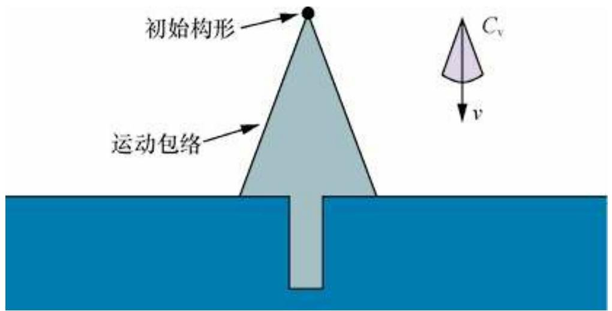  
图26-23 一个二维构形空间、速度不确定性圆锥和机器人的可能运动包络。预期速度是 v，但由于不确定性，实际速度可能是Cv中使得最终的构形处于运动包络内的某处。这意味着我们不知道它是否触碰到了孔洞

图26-23展示了如果机器人试图从初始构形一直向下运动可能发生的情况。由于速度的不确定性，机器人可能移动到锥面包络中的任意地方，可能进到孔里，但更可能触碰到洞口周围。由于机器人不知道它在孔的哪一边，因此它也不知道要往哪里移动。

图26-24和图26-25展示了一种更明智的策略。图26-24中，机器人故意移动到孔的一边。运动指令如图26-24所示，终止检测是接触到任意表面。图26-25中，给出的运动指令使机器人沿着表面滑行进入小孔。由于运动包络内所有可能的速度都向右，因此只要机器人接触到水平表面，它就会滑向右侧。

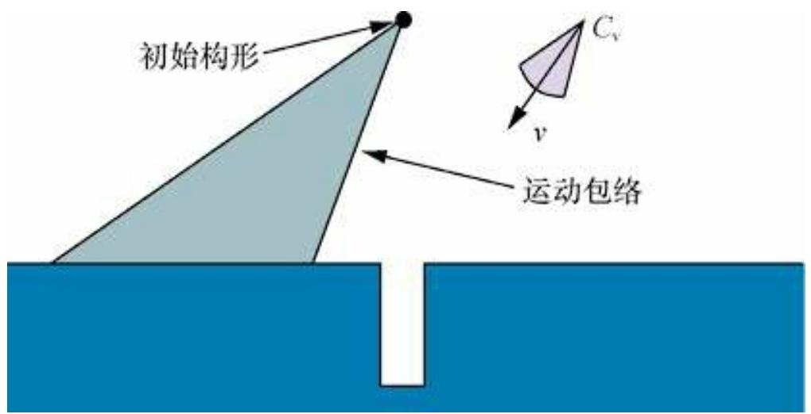  
图26-24 第一条运动指令及机器人可能的运动包络。不论机器人的实际运动如何，我们都知道最终构形在孔的左边

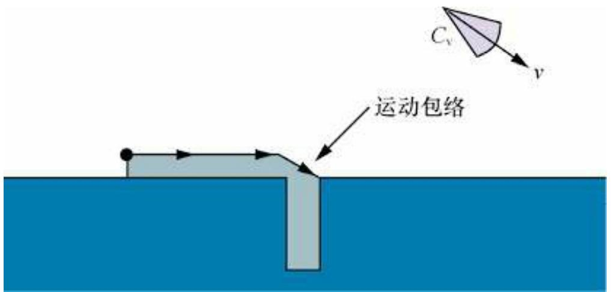  
图26-25第二个运动指令以及机器人可能的运动包络。即使有误差，机器人最终也能进入小孔

当它接触到小孔右侧的竖直边缘时，它就会沿其下滑，因为所有可能的速度都相对于垂直表面向下。它会保持移动，直到抵达孔洞底部，因为这是它的终止条件。尽管控制有不确定性，但是机器人的所有可能的轨迹都终止于与小孔底部接触，也就是说，除非表面不规则导致机器人卡在某处。

除保护移动外的其他方法将代价函数变成对我们已知能够获取信息的动作的激励，例如，使机器人靠近已知地标的海岸导航 （costalnavigation）启发式。更一般地，方法可以结合预期 信息增益（信念熵的降低程度），将其作为代价函数中的一项，使机器人在决定要做什么时显式地对每项动作可能带来的信息量进行推理。尽管计算上更困难，但这种方法的优势在于机器人能够发明它自己的信息收集动作而不依靠人类提供的启发式函数和规划好的策略，它们往往缺乏灵活性。

# 26.7 机器人学中的强化学习

目前为止，我们已经考虑了机器人能够获取世界中动力学模型的任务。但在许多任务中，写出这种模型是非常困难的，这使得我们进入强化学习（reinforcement learning，RL）的领域。

机器人学中，RL的一项挑战是状态和动作空间的天然连续性，我们要么用离散化处理它，要么更一般地，用函数近似处理它。策略或价值函数的形式为已知有用的特征的组合，或深度神经网络。神经网络可以从原始输入直接映射到输出，极大地避免了对特征工程的需要，但它需要更多的数据。

更大的挑战是，机器人运行于真实世界。我们已经见识过强化学习是如何通过下模拟棋局来学习下国际象棋或围棋的。但当真正的机器人在真实世界运行时，我们必须确保其动作是安全的（任何东西都是会损坏的！），也必须接受这一过程比模拟慢的事实，因为世界不可能运行得比每秒1秒还快。强化学习使用中最有趣的部分很大程度上汇聚于如何能降低真实世界样本的复杂性，也就是在机器人学会如何完成任务前，机器人与真实世界交互的次数。

# 26.7.1 利用模型

避免太多真实世界样本的一种自然方式是使用尽可能多的世界动力学知识。例如，我们可能不知道摩擦系数或物体质量的确切值，但我们可能有能够描述这种动力学的公式来作为这些参数的函数。

这种情况下，基于模型的强化学习 （第22章）就很有吸引力，其中机器人可以交替地拟合动力学参数并计算更好的策略。即使公式由于不能对物理学的所有细节进行建模而不正确，研究人员也对参数之外的误差项学习进行了实验，它能够补偿物理模型的不精确性。或者，我们可以完全抛弃这些公式，转而用局部线性模型近似世界，其中每个模型近似状态空间中一个区域内的动力学。这种方法已经能成功地使机器人掌握一些复杂动态任务，如杂耍。

世界模型也有助于降低无模型强化学习方法的样本复杂度，通过从模拟到现实 的迁移：将在模拟中工作良好的策略迁移到真实世界中。它的思路是将模型用作策略搜索的模拟器（22.5节）。为了学习一个能迁移得很好的模型，我们在训练中对模型增加噪声，以使策略更健壮。或者，我们可以通过在模拟中采样不同的参数来训练能够在各种各样的模型中运行的策略，这有时称为域随机化（domain randomization）。图26-26展示了一个例子，其中巧手操作任务在不同视觉属性和物理属性（如摩擦或阻尼）的模拟中进行训练。

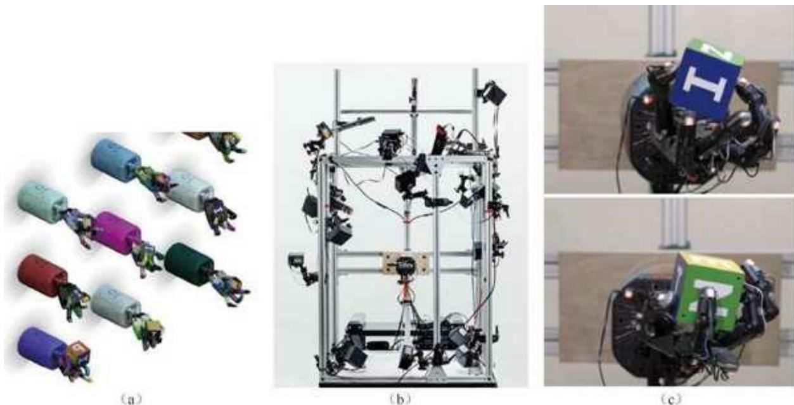  
图26-26 训练健壮的策略。（a）在一个操作物体的机械手上多次运行模拟，物理学参数和照明情况是随机的。图片由WojciechZaremba提供。（b）真实世界环境中，单个机械手处于笼子中央，周围有摄像头和测距器。（c）模拟和真实世界训练产生了多个抓住物体的策略，此处有捏住和四

指握两种。图片由OpenAI提供，见（Andrychowicz et al , 2018a）

最后，从基于模型的算法和无模型算法中同时借用思路的混合方法试图结合两者的优点。混合方法始于Dyna架构，它的思路是在动作和改进策略之间迭代，但策略改进有两种互补的方式：一是标准的无模型方式，使用经验直接更新策略；二是基于模型的方式，使用经验拟合模型，随后使用模型来生成策略。

最近的拟合方法尝试了拟合局部模型，用这些模型进行规划来生成动作，并使用这些动作作为监督来拟合一个策略，随后在策略所需的地方周围进行迭代来取得越来越好的模型。这已经在端到端学习 中成功应用，其中策略以像素作为输入，并直接输出扭矩作为动作——它促成了深度RL在实际机器人上的首次演示。

模型也可以用于确保安全探索 。缓慢但安全的学习可能比快速却危险的学习要好。因此，比减少真实世界样本更重要的是减少危险状态下的真实世界样本——我们不想让机器人坠下悬崖，也不想让它们摔碎我们最心爱的马克杯，或者，更糟糕地，撞到物体和人。一个有不确定性（例如，通过考虑参数的值范围）的近似模型会引导探索并对机器人可以采取的动作进行限制，以免处于这些危险状态。这是机器人学和控制中的一个热门研究领域。

# 26.7.2 利用其他信息

模型很有用，但我们还可以用其他方法降低样本复杂性。

当确定一个强化学习问题时，我们必须选择状态和动作空间、策略或价值函数的表示以及要使用的奖励函数。这些决策对问题的难易程度有很大的影响。

一个方法是使用高层级的运动基元 （motion primitive）来取代如扭矩指令之类的低层级动作。运动基元是机器人具有的参数化的技能。例如，机器人足球运动员可能具有“将球传给（ x,y）处的球员”的技能。策略所要做的就是想办法结合它们并设定它们的参数，而非重新发明它们。这个方法常常比低层级方法学习得更快，但会限制机器人可以学习的可能行为空间。

另一种减少学习所需的真实世界样本数量的方法是将来自先前学习过程的信息复用于其他任务，而非从头开始。这属于元学习 或迁移学习 的范畴。

最后，人是很好的信息源。26.8节讨论如何与人交互，其中部分内容是如何使用人的动作引导机器人的学习。

# 26.8 人类与机器人

目前为止，我们一直关注规划和学习如何独自行动的机器人。这对某些机器人（如被发射到遥远的星球代表我们进行探索的巡视器）很有用。但对于大部分情况，我们并不制造独自工作的机器人。我们制造机器人来帮助我们自己，它们在人类的环境下工作，在人类周围与人类一同工作。

这就产生了两个互补的挑战。首先是当机器人与人类在同一环境下行动时优化奖励。我们称之为协调问题 （见18.1节）。当机器人的奖励不仅依赖其本身的动作，还依赖人类所采取的动作时，机器人就必须选择能与人类动作配合的动作。当人类和机器人在同一团队中时，这就变为协作 。

其次是面向人类的实际需要进行优化。如果机器人要帮助人类，它的奖励函数就应该激励那些人类希望机器人采取的动作。为机器人找出合适的奖励函数（或策略）本身是一个交互问题。我们依次探讨这两个挑战。

# 26.8.1 协调

我们暂且假设机器人能够取得定义清晰的奖励函数，正如我们一直所假设的那样。不同的是，这次它不是独自进行优化，而是需要在同样也在行动的人类周围进行优化。例如，当自主驾驶车辆汇入高速公路时，它需要与目标车道上驾驶车辆的人类司机进行协商——它应当加速并入该车的前方，还是减速并入该车的后方？随后，当它停在停止标识前准备右转时，它需要注意自行车道上的骑行者，以及要进入人行横道的行人。

或者，考虑走廊中的移动机器人。朝机器人径直走来的人稍微向右迈了几步，表明了他想让机器人从哪边通过。机器人必须进行响应，明晰它的意图。

# 1. 人类作为近似理性的智能体

形式化与人类的协调的一种方式是将其建模为机器人和人类之间的博弈（18.2节）。这种方法中，我们显式地假设人类是由目标激励的智能体。这并不自动地意味着人是完美理性的智能体（也就是说，总是寻找博弈的最优解），但它意味着机器人可以通过人类可能具有的目标来结构化它对人类的推理方式。在这种博弈中：

●环境状态刻画机器人和人类智能体的构形，我们称之为 ；

● 每个智能体可以采取动作，分别为 u R和 $u _ { \mathrm { ~ H ~ } }$

●每个智能体都有可以用代价J 和 $J _ { \mathrm { ~ H ~ } }$ 表示的目标：每个智能体都想安全、高效地达成目标；

●像所有博弈一样，每个目标都依赖所有这两个智能体 和 的状态和动作。考虑汽车-行人的交互——如果行人在过马路，则汽车应该停止；如果行人在等待，则汽车应该前进。

有3个重要的问题使这场博弈复杂化。首先是人类和机器人不一定知道对方的目标。这就使其成为不完全信息博弈 （incomplete information game）。

其次是状态和动作空间是连续的，如本章一直所提及的那样。我们在第5章学习了如何用树搜索解决离散博弈，但我们要如何解决连续空间中的博弈？

最后，即使在高层级上博弈模型很有道理（人类会移动，并且有他们的目标），博弈的解也并不能始终很好地刻画人类的行为。博弈不仅对机器人来说是计算上的难题，而且对人类来说也是。它需要考虑机器人该如何对人类的行为进行响应，这依赖机器人觉得人类要做什么，很快我们就陷入了“你觉得我觉得你觉得我觉得”——这使一切都成为龟速！人类不能处理全部这些问题，就会表现出某种次优性。这意味着机器人应当考虑到这些次优性。

因此，当协调问题如此困难的时候，自主驾驶汽车应当怎么做？我们要做的事类似于某个在本章已经做过的事情。对于运动规划和控制，我们使用MDP并将其分解为规划轨迹和使用控制器跟踪轨迹。此处也一样，我们采用博弈，并将其分解为对人类的动作进行预测以及在有这些预测的情况

下，决定机器人该怎么做。

# 2.预测人类动作

预测人类的动作很难，因为它取决于机器人的动作，反之亦然。机器人使用的一个技巧是假装这个人无视机器人。机器人假设人类对目标的优化是有噪声的，这对机器人来说是未知的，其模型不依赖机器人的动作。特别地，一个动作对目标的价值越高（动作代价越低），人类 $J _ { \mathrm { H } } ( x , u _ { \mathrm { H } } )$ 采取它的可能性就越高。机器人可以为 建模，例如，使用22.5节的softmax函数： $P ( u _ { \mathrm { H } } | x , J _ { \mathrm { H } } )$

$$
P \left(u _ {\mathrm {H}} \mid x, J _ {\mathrm {H}}\right) \propto e ^ {- Q \left(x, u _ {\mathrm {B}}, J _ {\mathrm {B}}\right)} \tag {26-8}
$$

其中， $Q ( x , w _ { \mathrm { H } } ; J _ { \mathrm { H } } )$ 为对应于 $J _ { \mathrm { ~ H ~ } }$ 的 $Q$ 值函数（负号的出现是因为在机器人学中我们喜欢最小化代价，而非最大化奖励）。注意，机器人完全不假设完美最优的动作，也不假设动作是根据对机器人的推理选择的。

有了这个模型之后，机器人以人类接下来的动作作为 $J _ { \mathrm { ~ H ~ } }$ 的证据。如果我们有一个人类动作依赖人类的目标的观测模型，每个人类动作就可以用于更新机器人对人类目标的信念：

$$
b ^ {\prime} \left(J _ {\mathrm {E}}\right) \propto b \left(J _ {\mathrm {E}}\right) P \left(u _ {\mathrm {E}} \mid x, J _ {\mathrm {H}}\right) \tag {26-9}
$$

图26-27展示了一个例子：机器人正在跟踪移动中的人类的位置，并更新对人类目标的信念。当人类走向窗户时，机器人增加目标为看向窗外的概率，减小走向厨房的概率，因为厨房在另一个方向。

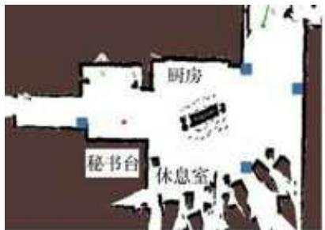

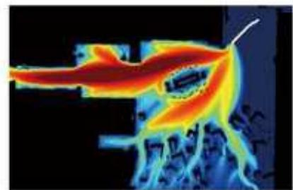

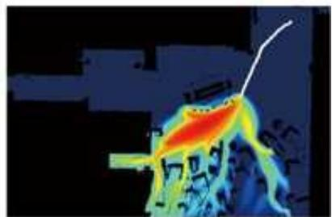  
  
图26-27 假设人类在给定目标的情况下的理性带有噪声时进行预测：机器人使用过往动作来更新对人类目标的信念，并使用这个信念预测未来动作。（a）房间的地图。（b）看到小部分人类轨迹时的预测（白色路径）。（c）看到更多人类动作时的预测：机器人现在知道人类没有走向左边的走廊，因为如果那是人类的目标，到目前为止的行进路径就是一条糟糕的路径。图片由Brian D.Ziebart提供，见（Ziebart et al. , 2009）

这就是人类的过往动作如何告知机器人其未来动作的。对人类的目标具有信念有助于机器人预测人类将会采取的动作。图26-27中的热力图展示了机器人对未来的预测：红色表示最有可能，蓝色表示最没可能。

驾驶中也是一样的。我们可能不知道一个司机对效率的看重程度，但如果我们看到他在有人试图并入其前方时加速，我们就对他产生了一些了解。一旦我们知道了这一点，我们就能更好地预测其未来动作——这个司机可能会在我们后方靠得更近，或者在车流中迂回前行以超越其他车辆。

如果机器人能够对人类的未来动作进行预测，就能将问题简化为求解MDP。人类动作使转移函数变得很复杂，但只要机器人能够预测任意未来状态下人类会采取的动作，机器人就可以计算

：它可以通过对 $J _ { \mathrm { ~ H ~ } }$ 边缘化来从 中计算 ，并将它与

描述世界根据机器人和人类动作的更新方式的转移（动力学）函数 结合。26.5节重点讲述了如何在确定性动力学的连续状态和动作空间中求解它，26.6节讨论了在随机动力学和不确定性中对其求解的方式。

将预测从动作中分离出来使机器人能更容易地处理交互，但它牺牲了性能，就像从动作中分离估计或从控制中分离规划一样。

进行了这种分离的机器人不再能够理解其行为能够影响到人类的动作方式。作为对比，图26-27的机器人预测人类要去哪里然后进行优化以达成其自身的目标，并避免与他们发生碰撞。图26-28中，我们有一辆要在高速公路上并线的自主驾驶汽车。如果它仅根据其他车辆的动作进行规划，当其他车辆占用其目标车道时，它就有可能长时间等待。作为对比，一辆同时对预测和动作进行推理的汽车知道它采取不同的动作会导致人类的不同反应。如果它表明自己的意图，其他车辆就可能减速并让出空间。机器人学家朝着类似于这种协调交互的方向努力，使机器人能更好地为人类工作。

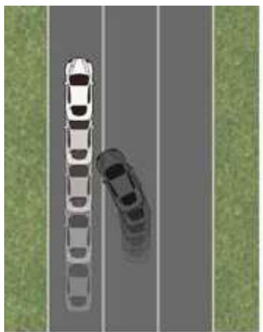

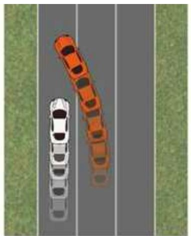

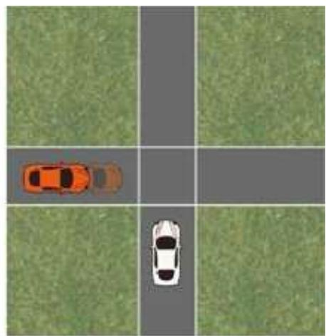  
  
图26-28（a）左图：自主驾驶汽车（中间车道）预测人类司机（左侧车道）要继续前进，并规划了减速并入该车后方的轨迹。右图：自主驾驶汽车考虑了它的动作对人类动作的影响，发觉它可以依靠人类司机的减速来并入前方。（b）在交叉路口，同样的算法产生了不寻常的策略：自主驾驶汽车发觉它可以通过稍稍后退来使人类司机（底部）更快地通过路口。图片由Anca Dragan提供，见（Sadigh et al. , 2016）

# 3.人类对机器人的预测

不完全信息通常是相互的：机器人不知道人类的目标，而人类也不知道机器人的目标——人类也需要对机器人进行预测。作为机器人设计者，我们无法控制人类预测的方式，我们只能控制机器人的行为。不过，机器人可以表现得使人类更容易对其做出正确的预测。机器人可以假设人类正在使用大致类似于式（26-8）的东西来估计机器人的目标 J ，这样机器人就能以使其真正目标容易被推测的方式运行。

这种博弈的一个特例是当人类和机器人在同一团队中且朝同一个目标工作 $J _ { \perp } = J _ { \perp }$ 时。想象一个个人家用机器人在帮助你做饭或打扫——这就是 协作 。

我们现在可以定义一个联合智能体 （jointagent），其动作是人类-机器人动作的元组 $( u _ { \mathbb { R } } , u _ { \mathbb { R } } )$ ，并帮助它针对 进行优化，我们正在求解一个一般的规划问题。我们计算联合智能体的规划或策略，这样就知道机器人和人类该怎么做了。

如果人类是完美最优的，这种做法的效果就会非常好。机器人会完成其在联合规划中的部分，人类则完成他们自己的部分。遗憾的是，实际中，人类似乎并不遵循完美给出的联合智能体规划，他们有自己的想法！但我们已经在26.6节学过处理这种事情的一个方法。我们称之为 模型预测控制（MPC）：它的思路是想出一个规划，执行第一个动作，再重新规划。这样，机器人始终能根据人类的实际行为适配其规划。

我们来研究一个例子。假设你和机器人在你的厨房中，并决定做华夫饼。你离冰箱更近，因此最优联合规划会让你从冰箱里拿牛奶和鸡蛋，而机器人则从橱柜里拿面粉。机器人知道这个规划，因为它能够精确地测量每个人在哪里。但假设你开始走向放面粉的橱柜。你不按最优联合规划行动。MPC机器人重新计算最优规划而不是坚持原有规划而固执地取面粉。现在你离面粉足够近了，机

器人的最佳做法则是拿华夫饼铛。

如果我们知道人类会偏离最优性，就可以提前对其进行考虑。在这里的例子中，机器人可以在你迈出第一步的时候就试着预测你要去拿面粉（如使用上述的预测方法）。即使对你来说理论上的最优规划仍然是转身回到冰箱，机器人也不应该假设这就是要发生的事情。相反，机器人要计算的规划中，你仍然在做你似乎要做的事情。

# 4. 人类作为黑箱智能体

要让机器人与我们协调，我们不一定要将人类看作目标驱动的、意图明显的智能体。在另一种模型中，人类仅仅是其策略 $\pi _ { \mathrm { H } }$ “扰乱”环境动力学的智能体。机器人不知道 $\pi _ { \mathrm { H } }$ ，但可以将问题建模为需要在有未知动力学的MDP中行动。我们之前在第22章中的一般智能体中以及26.7节中的特定机器人中见过这个。

机器人可以为人类数据拟合策略模型 $\pi _ { \mathrm { H } }$ ，并用它来为自己计算最优策略。由于数据稀缺性，这种手段目前主要用于任务层级。例如，在工业组装任务中放置并钻入螺钉的任务中，机器人在交互中学习到了人类可能采取什么动作（来响应其自身动作）。

还有一种方法是无模型强化学习：机器人可以从某个初始策略或价值函数开始，通过试错法逐渐地改善它。

# 26.8.2 学习做人类期望的事情

机器学习中用到的另一种与人类交互的方法就在J 本身——机器人的代价函数或奖励函数当中。理性智能体框架和相关的算法使问题从生成好的行为简化为指定好的奖励函数。对机器人来说，像对许多其他人工智能智能体一样，找到正确的代价函数依然很难。

以自主驾驶汽车为例，我们想让它们到达目的地、保证安全、让乘客舒适、遵守交通法规等。这种系统的设计者需要权衡代价函数的不同部分。设计者的任务很艰巨，因为机器人是用来帮助最终用户的，而每个用户都是不同的。我们对驾驶激进与否等都有不同的偏好。

下面我们就探索两种试图让机器人的行为匹配我们实际想让机器人做的事情的方法：第一种方法是从人类输入中学习代价函数，第二种方法是不理会代价函数而模仿人类在任务中的演示。

# 1. 偏好学习：学习代价函数

想象有一位最终用户在向机器人展示如何完成任务。例如，他们在以希望机器人学会的驾驶方式开车。你能否想出一种办法让机器人利用这些称为“演示”的动作，以便找到要优化的代价函数？

我们实际上已经在26.8.1节见过这个问题的答案。那部分内容的问题设置略有不同：我们让另一个人与机器人在相同的空间内采取动作，机器人需要预测那个人要做什么。但我们描述过的进行这种预测的技术是假设人类采取行动有噪声地优化代价函数 $J _ { \mathrm { ~ H ~ } }$ ，并且我们可以使用他们接下来的动作作为确定这个代价函数的证据。我们在此处也可以做同样的事情，不同之处在于我们不以预测人类未来的行为为目的，而是获取机器人自身要优化的代价函数。如果人类的驾驶是防御型的，则能够解释其动作的代价函数会在安全性上增加很多权重，而在效率上减小权重。机器人可以采用这种代价函数作为自身的代价函数，并在自己驾驶汽车时对其进行优化。

机器人学家已经实验了一些使这种代价推断能够被简便地计算的算法。图26-29中，我们看到一个教机器人在驶过草地时尽量保持在道路上的例子。传统方法中，代价函数已经表示为人造特征的组合，但较新的方法也研究了如何使用深度神经网络表示它，而无须特征工程。

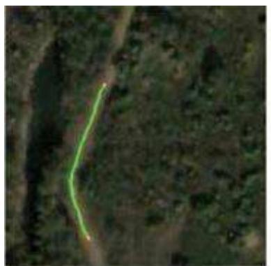

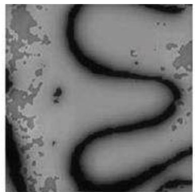  
（b）

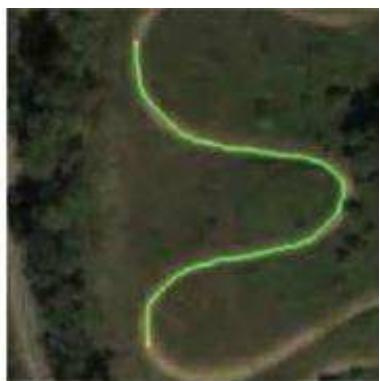  
  
图26-29（a）向移动机器人展示保持在土路上的演示。（b）机器人推断所需的代价函数，将其用于新场景中，且知道使道路上的代价较低。（c）机器人对新场景规划了一条同样在道路上的路径，重现了演示中隐含的偏好。图片由Nathan Ratliff and James A. Bagnell提供，见（Ratliff et al.,2006）

还有其他供人类给出输入的方法。人类可以使用语言而非演示来指导机器人。人类可以作为批评者，观看机器人用一种（或两种）方式完成任务，并告诉它任务完成得怎么样（或哪种方式更好），或者给出改进的建议。

# 2. 直接从模仿中学习策略

另一种方式是无视代价函数，直接学习机器人所需的策略。在汽车的例子中，人类演示构成了一个很方便的状态数据集，其标签来自机器人在每个状态应当采取的动作： 。机器人可以运行监督学习来拟合一个策略 $\pi : x \mapsto u$ ，并执行这个策略。这称为 模仿学习（imitation learning）或 行为克隆 （behavioral cloning）。

这种方法的挑战在于泛化 （generalization）到新状态上。机器人不知道为什么其数据库中的动作被标为最优动作。它没有因果规则，它唯一能做的就是运行监督学习算法来试图学习能够泛化到未知状态的策略。然而，我们无法保证这种泛化是正确的。

ALVINN自主驾驶汽车项目使用了这种方法，并发现即使从 D 中的状态开始， $\pmb { \pi }$ 也会出现一些误差，这会使汽车离开演示的轨迹。之后， $\pmb { \pi }$ 的误差会变大，这使汽车更远离预期的路线。

如果我们加入收集标签和学习，就可以在训练中解决这个问题：从一个演示开始，学习一个策略，使用这个策略并在沿途的每个状态都询问人类要采取什么动作，然后重复这一过程。这样，机器人就能学会如何在偏离人类所期望的动作时纠正错误。

除此之外，我们还可以利用强化学习来解决问题。机器人可以根据演示拟合一个动力学模型，并使用最优控制（见26.5.4节）生成策略，使策略朝与演示相近的方向优化。这种技术已经用于在小型遥控直升机上进行非常有挑战性的专家级机动动作（见图22-9b）。

DA gger（数据聚合）系统以人类专家的演示为起始点，从中学到一个策略 $\pi _ { 1 }$ 并用这个策略生成数据集 D 。随后，它从D 中生成一个最会模仿原始人类数据的新策略 $\pi _ { 2 }$ 。这个过程不断重复，在第 n 次迭代中它使用 $\pi _ { n }$ 生成更多数据加入 D ，并用于生成 $\pi _ { \ast 1 }$ 。也就是说，每次迭代，系统收集在当前策略下的新数据并使用到目前为止的所有数据训练下一个策略。

新的相关技术使用对抗训练 （adversarialtraining）：它们交替地训练分类器来区分机器人学到的策略和人类演示，然后通过强化学习训练新策略以欺骗分类器。这些进步使得机器人能够处理接近演示的状态，但如何将其泛化到远处的状态或新动力学中则仍然处于研究当中。

教学界面与对应问题 。目前为止，我们已经考虑了自主汽车或自主直升机的场景，其中人类演示使用了机器人也能够采取的动作——加速、减速和转向。但如果我们的任务是清理厨房台面呢？我们有两种选择：要么让人类使用自己的身体演示给机器人看，要么让人类直接引导机器人的效应器。

第一种方法很有吸引力，因为它对最终用户来说很自然。遗憾的是，它面临着 对应问题（correspondenceproblem）：如何将人类动作映射到机器人动作。人类的运动学和动力学与机器人的不同。这不仅使将人类运动翻译 或重定位为机器人运动（例如，将人类的五指抓握重定位为机器人的两指抓握）变得很困难，还常常使得人类可以使用的高层级策略无法用于机器人。

在第二种方法中，人类教学者将机器人的效应器移动到正确的位置（如图26-30所示），这种方法称作动觉教学 （kinestheticteaching）。用这种方式教学对人类来说并不简单，特别是教多关节的机器人。教学者需要在引导机械臂完成任务时协调所有自由度。因此，研究人员研究了其他方法，如向机器人演示关键帧 （keyframe）而非整个连续轨迹，以及使用可视化编程 来使最终用户能够为任务编写运动基元而非从头开始演示（图26-31）。这两种方法有时会结合起来使用。

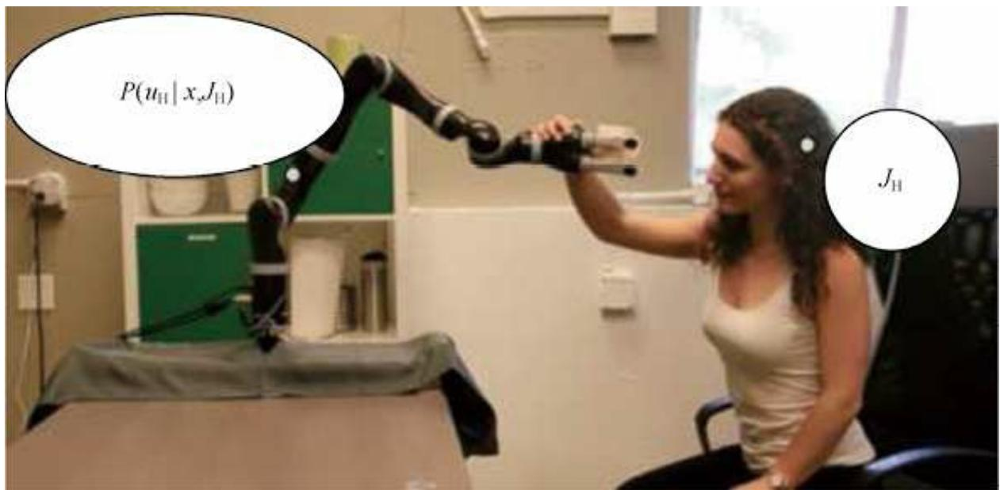  
图26-30 人类教学者把机器人向下拽来教它离桌子更近一些。机器人正确地更新了它对所需代价函数的理解，并开始对代价函数进行优化。图片由Anca Dragan提供，见（Sefidgar et al. , 2017）


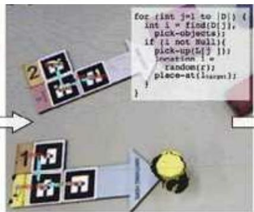

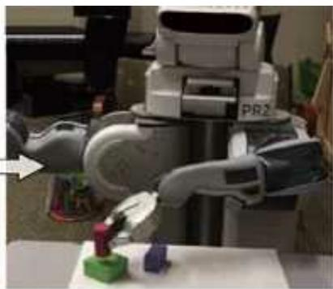  
  
图26-31一个编程接口，在机器人的工作空间中放置专门设计的程序块，以选择物体并指定高层级动作。图片由Maya Cakmak提供，见（Sefidgar et al., 2017）

# 26.9 其他机器人框架

目前为止，我们已经考察了机器人学，我们采取的角度是定义或学习奖励函数并让机器人优化这个奖励函数（不论是通过规划还是学习），有时候也会与人类协调或协作。这是机器人学的 审慎式（deliberative）视角，与此相反的是 反应式 （reactive）视角。

# 26.9.1 反应式控制器

一些情况下，为机器人设定良好的策略比对世界进行建模然后再进行规划更简单。因此，我们就有了反射型智能体而非理性智能体。

例如，想象腿式机器人试图抬起一条腿以越过障碍物。我们可以给机器人设定规则来让它抬腿到较小的高度h，然后向前伸腿，如果腿遇到障碍物，则把腿收回来并以更高的抬腿高度重新开始。你可以说 h是对世界某个方面的建模，但我们也可以将h视为机器人控制器的辅助变量，而完全不含物理意义。

一个例子是用于在粗糙地形走路的六足机器人，如图26-32a所示。机器人的传感器不足以获取用于路径规划的准确地形模型。另外，即使我们添加了高精度摄像头和测距器，机器人的12个自由度（每条腿两个）也会使最终的路径规划问题在计算上很困难。

不过在没有显式的环境模型下直接确定控制器仍然是有可能的。（我们在PD控制器中已经见过这种情况，它能够使复杂的机械臂保持在路径上而不需要显式的机器人动力学模型。）

我们首先为六足机器人选定步态 （gait），即肢体的移动模式。一种统计学上稳定的步态是首先向前移动右前腿、右后腿和左中腿（并保持其他腿不动），然后移动其他3条腿。这种步态在平地上很适合。在崎岖地形上，障碍物可能会阻挡某条腿向前摆动。这个问题可以用相当简单的控制规则解决：当一条腿的前向运动被阻挡时，就收回这条腿，稍微抬高，并再次尝试。最终的控制器展示在图26-32b中，它是一个简单的有限状态机，它构成了有状态的反射型智能体，其内部状态使用当前机器状态的索引（从s1到s4）表示。

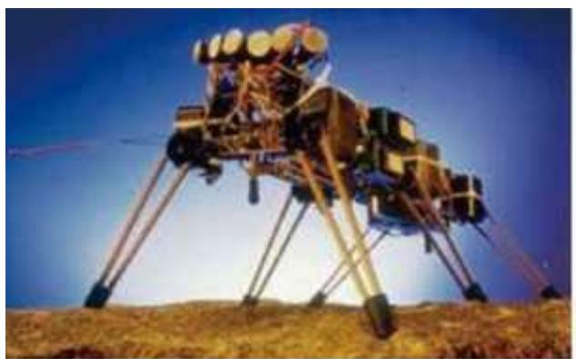

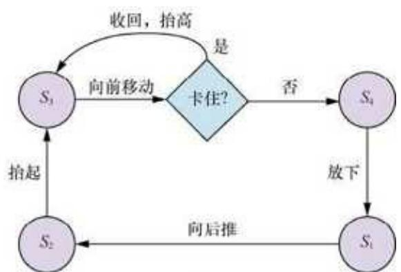  
  
图26-32 （a）六足机器人Genghis。图片由Rodney A. Brooks提供。（b）用于控制一条腿的增强有限状态机（AFSM）。AFSM对传感器反馈进行反应：如果腿在前摆阶段卡住，则会逐渐增加高度

# 26.9.2 包容架构

包容架构 （subsumption architecture）（Brooks, 1986）是用有限状态机组装反应式控制器的框架。这些状态机的节点可能含有用于某些传感器变量的测试，使得有限状态机的执行路径以这些测试的输出为条件。当访问边时可以生成附加的消息，并发送给机器人的电动机或其他有限状态机。另外，有限状态机具有内部计时器（时钟），它能够控制访问每条边所花费的时间。最终的机器称为增强有限状态机 （augmented finite state machine，AFSM），“增强”指的是使用了时钟。

我们刚才讨论的四状态机就是一种简单的AFSM，如图26-32b所示。这个AFSM实现了循环控制器，其执行几乎不依赖环境反馈。不过它在前摆阶段中依赖传感器反馈。如果腿卡住了，则意味着

它无法执行前摆动作，机器人收回腿，再抬高一点，并再次尝试前摆动作。这样，控制器就能对机器人与其环境交互时产生的情况进行反应。

包容架构为同步和结合多个可能互相冲突的AFSM提供了更多基本要素。它使得程序员能够以自底向上的方式编写越来越复杂的控制器。在这里的例子中，我们可以在用于一条腿的AFSM后连接一个协调多条腿的AFSM。而在上层我们则可以实现高层级的行为，例如可能涉及后退和转身的避障行为。

用AFSM编写机器人控制器的思路非常有趣。想象用26.8节所述的构形空间中的路径规划算法生成相同的行为会有多难。首先，我们需要地形的准确模型。有6条腿、每条腿由两个独立的电动机驱动的机器人的构形空间总共有18个维度（腿的构形有12个维度，机器人相对于构形空间的位置和朝向占用6个维度）。即使计算机快到能够在这种高维空间中找出路径，我们也需要考虑机器人滑下斜坡这类严重的副作用。

由于这种随机效应，构形空间中的单条路径几乎肯定是非常脆弱的，即使是PID控制器也无法应对这种状况。也就是说，有些情况下，主动生成审慎的运动行为对当今的运动规划算法来说实在太过于复杂了。

遗憾的是，包容架构也有其自身的毛病。首先，AFSM是由传感器原始输入驱动的，这种做法虽然在传感器数据非常可靠并包含一切所需信息时很好用，但在必须以复杂方式结合不同时间的传感器数据时，这种方法就无法正常工作。因此，包容式的控制器大多数情况下只能用于简单任务，例如沿着墙或朝着可见光源运动。

其次，包容架构缺乏思考，因而很难改变目标。使用包容架构的机器人通常只完成一项任务，它完全没有更改控制来适应不同目标的概念（就像2.2.3节的粪甲虫一样）。

最后，在许多实际问题中，我们所需的策略往往复杂得无法明确编码。考虑图26-28中的例子，自主驾驶汽车需要与人类司机协商变道。我们可能从进入目标车道的简单策略开始。但当我们测试车辆时，我们发现并非所有目标车道上的司机都会减速来让车辆进入。因此，我们可能会增加一点复杂度：让车辆稍微接近目标车道，等待该车道上的司机做出响应，然后继续进入车道或回到原来的车道。但我们在随后对车辆的测试中发现挤进车道的速度依赖于目标车道的车辆速度、目标车道前方是否有另一辆车、车辆后方原本是否有车等。要确定正确的动作方式，我们要考虑的条件的数量会非常多，即使对这个看似简单的动作来说也是如此。这反而凸显了包容架构的可扩展性难题。

总而言之，机器人学是复杂的问题，它的方法很多，如审慎式的、反应式的或者二者的混合，它基于物理学、认知模型、数据或三者的混合。哪个才是正确的方法仍然是辩论、科学研究、尖端工程的主题。

机器人技术已经深入我们的世界，具有改善我们的独立性、健康和生产力的潜力。下面是一些应用案例。

家庭护理 ：机器人已经开始在家中照顾老年人和运动功能损伤者。机器人在日常生活中帮助他们，使他们能够更独立地生活。这包括轮椅和安装在轮椅上的机械臂，如图26-1b所示的Kinova机械臂。尽管一开始它们是由人类直接操纵的，但这些机器人正在变得越来越自主。这方面有使用脑机接口 （brain-machineinterface）操纵的机器人，它已经能够使四肢瘫痪者使用机械臂来抓取物体，甚至给自己喂饭（图26-33a）。与之相关的则有可智能地对我们的动作做出响应的假肢和使我们具有超凡力量或使下肢瘫痪者能够再次行走的外骨骼。

个人机器人用于帮助我们处理如清洁和整理这样的日常任务，节省我们的时间。尽管机械手还远不能在杂乱无章的人类环境中自如地工作，但导航机器人取得了一些进展。特别是，许多家庭已经开始享用图26-33b所示的移动机器人真空吸尘器了。

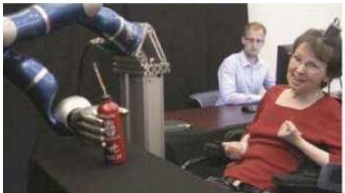  
（a）

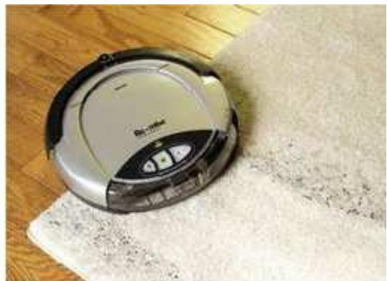  
  
图26-33 （a）一位用脑机接口控制机械臂抓取饮料的患者。图片由布朗大学提供。（b）吸尘器机器人Roomba。照片来自HANDOUT/KRT/Newscom

医疗卫生 ：机器人能辅助进行外科手术并提高手术水平，使手术更精准，附带损伤更小，过程更安全，并改善患者的预后情况。图26-34a所示的达芬奇手术机器人现在已经广泛用于美国的医院。

服务 ：移动机器人在办公楼、酒店和医院中提供帮助。Savioke已经将机器人投放到酒店里用来将毛巾、牙膏之类的物品送到你的房间。Helpmate和TUG机器人则在医院运送食物和药品（图26-34b），而Diligent Robotics的Moxi机器人能帮助护士分担后勤任务。Co-Bot则在卡内基梅隆大学的大厅巡游，随时可以引导你去某个人的办公室。我们还可以使用Beam之类的远程临场机器人（telepresencerobot）来远程地参加会见或会议，或看望我们的祖父母。

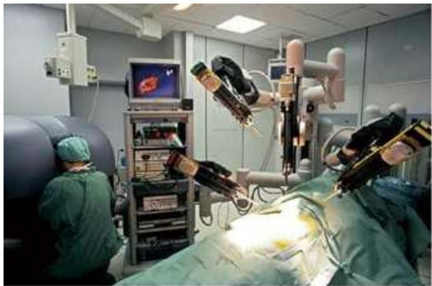

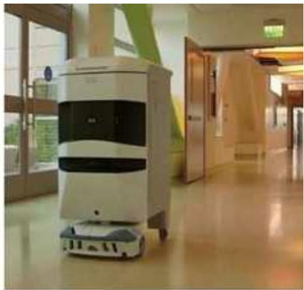  
（b）

图26-34 （a）手术室内的外科手术机器人。照片来自Patrick Landmann/科学图片库。（b）医院运输机器人。照片来自Wired

自主汽车 ：我们有些人在开车时偶尔会因为手机来电、收到短信或其他分心的东西而走神。惨痛的事实是，每年有上百万人因交通事故而死亡。同时，我们很多人在开车上花了太多时间，希望能够节省一些时间。这些原因使大量努力被投入自主驾驶汽车的研发上。

尽管20世纪80年代就已经存在自主驾驶汽车的原型，但是研发进程则在2005年的DARPA大挑战的刺激下得以加速。这是一项在未知沙漠地形上进行的200公里的具有挑战性的自主汽车比赛。斯坦福大学的Stanley汽车在7小时内跑完了比赛路线，赢得了200万美元的奖金和美国国家历史博物馆中的一席之地。图26-35a描绘了2007年赢得DARPA城市挑战赛的Boss，这项比赛是城市街道上进行的复杂公路赛，比赛中机器人的对手是其他机器人，并必须遵守交通规则。

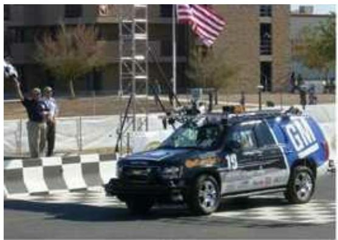

  
（b）  
图26-35 （a）赢得DARPA城市挑战赛的自主汽车B oss 。照片由 Tangi Quemener/AFP/GettyImages/Newscom拍摄，由Sebastian Thrun提供。（b）展示Waymo自主汽车（绿色轨迹上的白车）的感知和预测的空中视角。其他车辆（蓝色方块）和行人（橙色方块）及其预期轨迹也展示在图中。道路/人行道边界为黄色。照片由Waymo提供

2009年，谷歌公司开启了一项自主驾驶项目（有许多为Stanley和Boss工作过的研究人员参加），现在已经独立为Waymo公司。2018年，Waymo开始在亚利桑那州的菲尼克斯郊区进行无司机驾驶测试（驾驶座上没有人），图26-35b从空中视角展示了Waymo自主驾驶汽车的感知和预测。同时，其他自主驾驶公司和拼车公司也在研发自己的技术，而汽车制造商则已经开始出售具有越来越多辅助性智能的汽车，如已适用于高速公路驾驶的特斯拉的辅助驾驶 （driverassist）。其他公司将非高速公路驾驶应用场景（包括大学校园和老年人社区）作为目标。还有一些公司专注于非乘用应用场景，如卡车驾驶、食品杂货运送和自动泊车。

娱乐 ：迪士尼从1963年开始就已经在其公园中使用机器人——名为动画电子 （animatronics）。最初，这些机器人仅限于手工设计、开环控制和固定运动（和对话），但从2009年开始，一种称为自主动画电子 （autonomatronics）的机器人就可以生成自主的动作。机器人也可以是面向儿童的智能玩具。例如，Anki的Cozmo能够与孩子玩游戏，还会在输掉游戏后沮丧地敲打桌子。此外，四旋翼无人机（如图26-2b所示的Skydio的R1）可以充当个人摄像摄影师，在我们滑雪或骑行时跟随我们并拍下运动画面。

探索和危险环境 ：机器人已经到达了人类还没去过的地方，包括火星表面。机械臂能够协助宇航员释放和回收卫星，以及建造国际空间站。机器人也能探索海底。它们常用于获取沉船的地图。图26-36展示了机器人为废弃煤矿绘制地图，以及使用距离传感器得到的该煤矿的三维地图。1996年，一组研究人员在活火山的火山口释放了一台腿式机器人，以获取用于气候研究的数据。在人类难以到达的（或危险的）地方，机器人正在成为非常高效的信息收集工具。

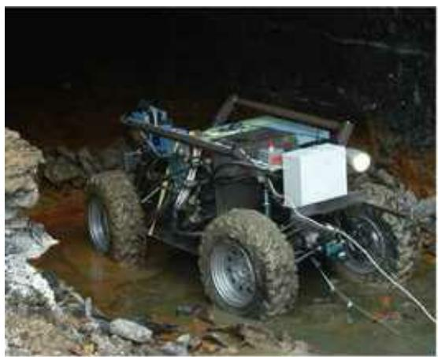

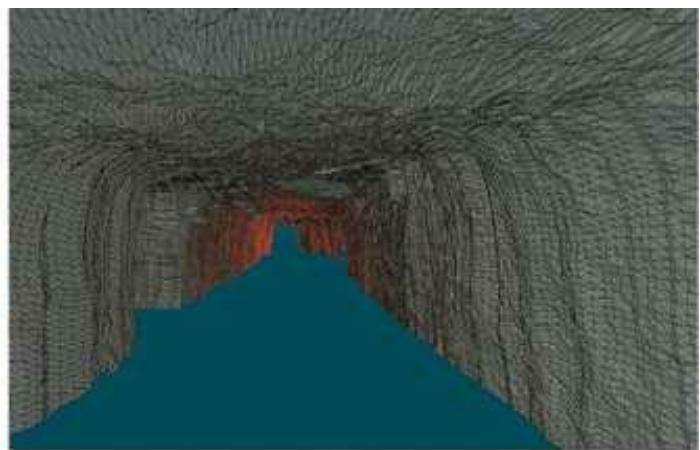  
  
图26-36（a）机器人为废弃煤矿绘制地图。（b）机器人获取的该煤矿三维地图。图片由SebastianThrun提供

机器人已经帮助人类清理过核污染物，特别是在三里岛、切尔诺贝利和福岛。在美国世界贸易中心倒塌后，机器人进入了被认定为非常危险的废墟，进行人类搜索和救援人员。同样，这些机器人最初也是遥控操作的，而随着科技的进步，它们越来越有自主性，人类操纵者只需统揽全局，而无须发出每一条指令。

工业 ：如今，大多数机器人用在工厂当中，以将困难、危险或对人类来说太过于无聊的任务自动化。（大多数工厂机器人是在汽车工厂里。）就高效地制造社会所需物品方面而言，对这些任务进行自动化是有益的。而同时，这也意味着它将一些人类工人挤出了其岗位。这对政策和经济有重要影响——对再训练和教育的需要、对资源公平分配的需要等。这些话题会在27.3.5节进行进一步讨论。

小结

机器人学是关于实体的智能体的，它可以真正地改变世界的状态。在本章中我们学到了以下内容。

●最常见的机器人是机械手 和移动机器人 。它们具有用于感知世界的传感器 和用于产生行动的执行器 ，它通过效应器 影响世界。  
● 一般的机器人学问题涉及 随机性 （可以用MDP来处理）、 部分可观测性 （可以用POMDP来处理），以及与 其他智能体 一同行动或在其周围行动（可以用博弈论来处理）。大部分机器人在连续的高维状态和动作空间工作，这使问题变得很困难。机器人还运行在真实世界中，而真实世界不能比真实时间运行得更快，在真实世界中犯错也会导致真正的东西被损坏，而不能“撤销”。  
●理想中，机器人应当能一次性解决所有问题：给它们输入传感器的原始数据，它们输出传送到电动机的扭矩或电流。而现实中这太过于困难，因此机器人学家通常将问题分解并各个击破。  
●我们通常从动作（运动生成）中分离感知（估计）。机器人学中的感知涉及用计算机视觉通过摄像头识别周围环境，以及定位和构建地图。  
●机器人感知关注从传感器数据估计与决策相关的数值。为此，需要一个内部表示和用于随时间更新内部表示的方法。  
●概率滤波算法 （如粒子滤波器和卡尔曼滤波器）对机器人感知非常有用。这些技术用于维护信念状态，这是关于状态变量的后验分布。  
●在运动生成方面，我们使用构形空间 ，其中每个点都能确定定位机器人的每个 机身点 所需的所有信息。例如，对有两个关节的机械臂来说，一个构形空间包含这两个关节的角度。  
●我们通常将运动生成问题分解为运动规划 和 轨迹跟踪控制 。运动规划负责产生规划，而轨迹跟踪控制则负责为控制输入（执行器指令）产生一个策略以执行这个规划。  
●使用单元分解 可以通过图搜索求解运动规划。随机运动规划算法 采样连续构形空间中的里程碑，轨迹优化 则利用有符号的距离场迭代地使直线路径远离碰撞。它们用于通过图搜索求解运动规划。  
●PID控制器 使用搜索算法找出的路径作为执行的参考路径，它持续地纠正机器人的实际位置和预期位置之间的误差。计算扭矩控制 增加了前馈项来使用逆动力学 计算能使运动保持在轨迹上的扭矩大小。  
●优化控制 通过直接根据控制输入计算最优轨迹来结合运动规划和轨迹跟踪。它在当我们有二次代价和动力学时尤为简单，其结果是一个线性二次调节器（LQR ）。流行的方法通过对动力学进行线性化并计算代价的二阶近似（ILQR ）来利用它。  
●在不确定性中的规划通过在线规划 （如模型预测控制）和协助感知的 信息收集 动作来结合感知和动作。  
●强化学习也用在机器人学当中。强化学习的技术努力减少机器人与真实世界所需的交互次数。这些技术通常利用模型，不论是估计一些模型然后用它们来预测，还是训练一个对不同的模型参数健壮的策略。  
●与人类交互需要机器人具有与人类协调 动作的能力，这可以形式化为一场博弈。我们通常将求解分解为预测 和动作 ，预测时我们使用人类正在进行的动作来估计其未来的行为，而动作时我们使用预测来计算机器人的最优运动。  
●为帮助人类，机器人还需要学习或推断人类的需要。机器人可以通过从人类输入（如演示、纠正或使用自然语言的指示）中学习它们要优化的代价函数来解决这个问题。或者，机器人可以模仿人类的行为，并使用强化学习来帮助解决将其泛化到新状态的难题。

读者服务：


微信扫码关注【异步社区】微信公众号，回复“e59810”获取本书配套资源以及异步社区15天VIP会员卡，近千本电子书免费畅读。

第七部分总结

# 第27章

人工智能的哲学、伦理和安全性

在本章中，我们围绕人工智能的意义，如何合乎伦理地开发并应用人工智能，以及如何确保其安全性等几大问题展开讨论。

长期以来，哲学家们一直在拷问一些宏大的问题：大脑是如何工作的？机器是否有可能像人一样做出智能的行为？这样的机器是否会有真正的、有意识的思想？

除此之外，我们还新增了一些问题：智能机器在日常使用中的伦理意蕴是什么？应该允许机器做出杀死人类的决定吗？算法能否做到公平公正？如果机器能完成所有工作，人类将何去何从？如何控制那些可能比我们更加智能的机器？

# 27.1 人工智能的极限

1980年，哲学家约翰·希尔勒（JohnSearle）提出了弱人工智能 （weak AI）和强人工智能（strongAI）的区别。弱人工智能的机器可以 表现得 智能，而强人工智能的机器是真正地 有意识地在思考（而非仅模拟思考）。随着时间的推移，强人工智能的定义转而指代“人类级别的人工智能”或“通用人工智能”等，可以解决各种各样的任务，包括各种新奇的任务，并且可以完成得像人类一样好。

弱人工智能的批评者曾怀疑机器是否真的能有智能行为，现在看起来他们和西蒙·纽科姆（SimonNewcomb）一样短视。1903年10月，就在莱特兄弟在基蒂霍克首次飞行的前两个月，纽科姆写道，“空中飞行是人类永远无法应对的几大难题之一”。然而，近年来的飞速进展并不能说明人工智能的成就可以无所不及。艾伦·图灵（Turing, 1950）是第一个定义人工智能的人，也是第一个对人工智能提出可能的异议的人，他预见了后来人提出的几乎所有的意见。

# 27.1.1 由非形式化得出的论据

图灵在“由行为的非形式化得出的论据”中提到，人类的行为太复杂了，任何一个形式化的规则集都无法完全捕捉到。人们必须使用一些非形式化的准则，（论据中声称）这些准则永远无法由形式化的规则集捕捉，因此也永远无法在计算机程序中编码。

休伯特•德雷福斯（HubertDreyfus）是这一观点的主要支持者，他曾就人工智能发表了一系列颇具影响力的质疑：《计算机不能做什么》（ What Computers Can’t Do ）（Dreyfus, 1972）和续篇《计算机不能做什么》（ What Computers Still Can’ t Do ）（Dreyfus, 1992），以及和他的兄弟斯图尔特•德雷福斯（Stuart Dreyfus）合著的 Mind Over Machine （Dreyfus and Dreyfus, 1986）。同样，哲学家肯尼斯·萨瑞（Kenneth Sayre）（Sayre, 1993）说：“在 对计算主义的狂热推崇 中追求人工智能，是根本不可能有任何长久的结果的。”他们所批评的技术后来被称为老式人工智能 （GoodOld-Fashioned AI，GOFAI）。

GOFAI对应的简单逻辑智能体设计在第7章中介绍过，它确实很难在一个充要的逻辑规则集里捕捉适当行为的每一种可能性，我们称之为资格问题 （qualification problem）。但就如第12章中提到的概率推理系统更适合开放领域和第21章中提到的深度学习系统在各种“非形式化”任务上表现良好一样，这一批评评论并不是针对计算机本身，而仅针对使用逻辑规则进行编程这一特定风格。这种风格曾在20世纪80年代流行，但已被新方法取代。

德雷福斯最有力的论据之一是针对情景式智能体而不是无实体的逻辑推理机。相比于那些看过狗奔跑、和狗一起玩过、曾被狗舔过的智能体来说，一个对“狗”的理解仅来自一组有限的如“ Dog ( x )⇒Mannal(x)”这样的逻辑语句的智能体是处于劣势的。哲学家安迪·克拉克（AndyClark）（Clark,1998）曾说过：“生物大脑是生物体的首要控制系统，生物体在丰富的真实世界环境中行动。”根据克拉克的观点，我们“擅长于飞盘游戏而弱于逻辑”。

体验认知 （embodied cognition）方法声称单独考虑大脑是毫无意义的：认知发生在躯体内部，而躯体处于环境中。我们需要从整体上去研究这个系统。大脑的运行利用其所处环境中的规律，这里说的环境包括躯体的其他部分。在体验认知方法中，机器人、视觉和一些其他的传感器成为核心而非外围部分。

总的来说，德雷福斯看到了人工智能还未能完全解决的领域，并由此声称人工智能是不可能的。现在我们看到许多科研人员正在这些领域进行持续的研究和开发，从而提高了人工智能的能力，降低了其不可能性。

# 27.1.2 由能力缺陷得出的论据

“由能力缺陷得出的论据”提出“机器永远做不到 X”这一主张。关于X，图灵列举了以下例子：

善良、机智、美丽、友好、上进、幽默、明辨是非、犯错、坠入爱河、享受奶油草莓、让人爱上它、从经验中学习、恰当地使用语言、成为自己思想的主体、有和人类一样的行为多样性、从事新生事物。

回顾这些，我们发现其中一些事相当简单，如我们都很熟悉“犯错”的计算机。具有元推理能力的计算机（第5章）能检查自身计算，从而成为自身推理的主体。一项有着百年历史的技术已证明它有“让人爱上它”的能力，它就是泰迪熊。计算机象棋专家戴维·利维（David Levy）预计，到2050年，人们对爱上类人机器人一事将习以为常。至于机器人坠入爱河，这是虚构类文学作品中的常见


主题 $\_$ ，但这方面的学术推测有限（Kimetal.,2007）。计算机已经完成了许多非常新颖的工作，在天文学、数学、化学、矿物学、生物学和计算机科学等领域都取得了重大发现，并通过风格转换创造了新的艺术形式（Gatysetal.,2016）。总的来说，程序在某些任务上的表现超过了人类，而在其他任务上则落后于人类。有一件事是很明显的，那就是它们不能真正成为人类。

# 27.1.3 数学异议

图灵（Turing, 1936）和哥德尔（Gödel, 1931）证明了某些数学问题原则上是不能用形式系统解决的。哥德尔不完全性定理（见9.5节）是最著名的例子。简单来说，对任意能表达初等数论的形式化公理框架 $F$ ，都可以构造满足以下性质的哥德尔命题G (F)：

● G ( F )是 $F$ 中的命题，但在 $F$ 中不可判定；  
● 如果 $F$ 是一致的，那么 G ( F )为真。

卢卡斯（Lucas,1961）等哲学家声称，这个定理表明机器在精神上不如人类，因为机器是形式系统，受限于不完全性定理，它们无法判定自身哥德尔命题的真伪，而人类则不受此限制。这引起了很多争议，产生了大量的文献，包括数学家/物理学家罗杰·彭罗斯爵士（RogerPenrose）的两本书（Penrose, 1989, 1994）。彭罗斯用一些新的观点重复了卢卡斯的观点，例如，人类之所以不同，是因为他们的大脑是通过量子引力运作的——这个理论对大脑生理学做出了许多错误的预测。

对卢卡斯的观点，我们讨论其中3个问题。第一，一个智能体无须因为自己不能判定其他智能体可以判定真伪的命题而感到羞愧。考虑以下命题：

卢卡斯无法断言该命题为真。

如果卢卡斯断言该命题为真，那么他就自相矛盾了。而如果卢卡斯无法断言该命题为真，那么这样看该命题为真。如此，我们展示了一个卢卡斯无法断言但其他人（和机器）可以断言的真命题。但这并不会让我们小看卢卡斯。

第二，哥德尔不完全性定理和相关结果适用于数学而非计算机。人或机器都不能证明不可能被证明的事情。卢卡斯和彭罗斯错误地假设，人类可以以某种方式绕过这些限制，正如卢卡斯（Lucas,1976）所说：“如果思想是可能的，我们必须假设我们自己的一致性。”但这是一个毫无根据的假设：人类是出了名的不一致的。这当然适用于日常推理，但也适用于认真的数学思考。一个著名的例子是四色地图问题。阿尔弗雷德·肯普（Alfred Kempe）（Kempe,1879）发表了一个被广泛接受的证明，直到11年后珀西·希伍德（Percy Heawood）（Heawood, 1890）指出了其中一个错误。  
第三，技术上来说，哥德尔不完全性定理仅适用于能表达初等数论的形式系统。这种系统包括图灵机，卢卡斯的论断部分是基于“计算机等同于图灵机”的断言，这不完全正确。图灵机是无限的，而计算机（和大脑）是有限的，任何计算机都可以在命题逻辑中被描述为一个（非常大的）系统，因而不受哥德尔不完全性定理的约束。卢卡斯认为人类可以“改变他们的想法”而计算机不能，这也是错误的。在有新证据的情况下或在进一步考虑后，计算机可以撤回它的结论；它可以升级硬件；可以通过机器学习或重写软件来改变决策过程。

# 27.1.4 衡量人工智能

艾伦·图灵在他那篇著名论文“Computing Machinery and Intelligence”（Turing, 1950）中提出，与其问机器能否思考，不如问机器能否通过行为测试，即图灵测试 。图灵测试需要一个计算机程序与测试者进行5分钟的对话（通过键入消息的方式）。然后，测试者必须猜测与其对话的是人还是程序；如果程序让测试者做出的误判超过30%，那么它就通过了测试。对图灵来说，关键不在于测试的具体细节，而是智能应该通过某种开放式行为任务上的表现而不是通过哲学上的推测来衡量。

图灵曾推测，到2000年，拥有10亿存储单元的计算机可以通过图灵测试。但2000年已经过去了，我

们仍不能就是否有程序通过图灵测试达成一致。许多人在他们不知道有可能是和计算机在聊天时被计算机程序欺骗了。E liza 程序、网络聊天机器人M gonz （Humphrys, 2008）和N atachata（Jonathan etal.,2009）多次欺骗了与它们交谈的人，而聊天机器人Cyberlover引起了执法部门的注意，因为它热衷于诱导聊天对象泄露足够多的个人信息致使他们的身份被盗用。

2014年，一款名为 Eugene Goostman的聊天机器人在图灵测试中令33%未受训练的业余评测者做出误判。这款程序声称自己是一名来自乌克兰的男孩，英语水平有限。这点让它出现语法错误有了解释。或许图灵测试其实是关于人类易受骗性的测试。目前为止聊天机器人还不能骗过受过良好训练的评测者（Aaronson, 2014）。

图灵测试竞赛带来了更优秀的聊天机器人，但这还没成为人工智能领域的研究重点。相反，追逐竞赛的研究者更倾向于下国际象棋、下围棋、玩《星际争霸 II》游戏、参加八年级科学考试或在图像中识别物体。在许多这类竞赛中，程序已经达到或超过人类水平，但这并不意味着程序在这些特定任务之外也能够像人类一样。人工智能研究的关键点在于改进基础科学技术和提供有用的工具，而不是让评测者上当。

# 27.2 机器能真正地思考吗

一些哲学家声称，一台能做出智能行为的机器实际上并不会思考，而只是在模拟思考。但大多数人工智能研究者并不关心这一区别，计算机科学家艾兹格·迪杰斯特拉（EdsgerDijkstra）曾说过：“机器能否思考……就像 潜艇能否游泳这个问题一样重要”（Dijkstra, 1984）。《美国传统英语词典》中对游泳的第一条定义是“通过四肢、鳍或尾巴在水中移动”，大多数人都认同潜艇是无肢的，不能游泳。该词典也定义飞为“通过翅膀或翅膀状的部件在空中移动”，大多数人都认同飞机有翅膀状部件，能够飞行。然而，无论是问题还是答案都与飞机和潜艇的设计或性能没有任何关系，而是与英语中的单词用法有关。（事实上，在俄语中船的确会游泳这一事实也更加说明了这一点。）使用英语的人还没有选定“think”这个词的确切定义，“think”需要“brain”还是仅仅需要“brain-like parts”？

图灵再次解决了这一问题。他指出，关于他人内在心理状态如何，我们从未有任何直接证据，这是一种精神唯我论。图灵说：“与其继续在这个观点上争论不休，不如回到每个人通常都认可的礼貌惯例 （politeconvention）。”图灵主张，如果我们和能做出智能行为的机器相处过，那么我们也应该将这一礼貌惯例的使用范围延伸到机器上。然而，现在我们确实有了一些经验，但看起来在对感知归因时，类人的外表和声音至少与纯粹的智力因素同样重要。

# 27.2.1 中文房间

哲学家约翰·希尔勒不认同礼貌惯例。他在著名的中文房间 （Chineseroom）（Searle, 1990）中这样论证：想象一个只会英语的人身处一个房间，房间里有一本英语写成的规则书和各式各样的纸堆。一张写着无法辨认的符号的纸从门缝下面滑进房间，这个人根据规则书的指示，在纸堆里找到对应符号写在新纸上并重新排列好。最终，一个或多个符号被转录到一张纸上并传回外部世界。从外面我们看到的是一个系统能读取输入的中文句子并以中文生成流畅、智能的回复。

希尔勒接着论证：鉴于这个人是不懂中文的，规则书和一堆纸也仅仅是纸，也不懂中文。因此，这整个过程完全没有对中文的理解。希尔勒表示，中文房间和计算机会做的事是一样的，因此计算机也不会产生任何理解力。

希尔勒（Searle, 1980）倡导 生物自然主义 （biological naturalism），根据该理论，精神状态是由神经元 中低级物理过程引起的高级涌现特征，而神经元的（未明确的）特性才是重要的：根据希尔勒的偏见，神经元有“它”，而晶体管没有。对希尔勒的论点有许多反驳的观点，但尚未达成共识。他的论点同样可以（也许被机器人利用）论证人类不可能有真正的理解；毕竟，人类是由细胞构成的，细胞不理解，因此人类就无法理解。事实上，这就是特里·比森（Terry Bisson）的科幻小说 They’re Made Out of Meat （Bisson, 1990）中的情节，在这部小说中，外星机器人探索地球，不敢相信大块的肉居然是有知觉的。它们的形成过程仍是个谜。

# 27.2.2 意识与感质

贯穿所有关于强人工智能争论的主题是意识 （consciousness）：对外部世界、自我、生活的主观体验的认识。经验的内在本质的专业术语是感质 （qualia）（源于拉丁语，大意是“什么样的”）。最大的问题是机器是否有感质。在电影《2001太空漫游》中，当宇航员戴维·鲍曼断开计算机哈尔（HAL9000）的“认知电路”时，屏幕上写着“戴夫，我害怕。戴夫，我的脑子正在消失，我能感觉到”。哈尔真的有感情（且值得同情）吗？又或者这个回复只是一种算法响应，与“404错误：未找到”没有任何区别？

对动物们也有类似的问题：宠物的主人确信他们的猫狗有意识，但不是所有科学家都认同这一点。蟋蟀会根据温度改变自己的行为，但几乎没人会说蟋蟀能体验到温暖或寒冷的感觉。

意识问题难以解决的一个原因是，即使经过几个世纪的争论，它的定义依然不明确。但解决方法可能不远了。近来，在坦普顿基金会的赞助下，哲学家和神经科学家合作开展了一系列能解决部分问题的实验。两种主流意识理论（全球工作空间理论和整合信息理论）的支持者都认为这些实验可以证明一种理论优于另一种，这在哲学史上实属罕见。

图灵（Turing, 1950）承认意识问题是一个困难的问题，但他否认它与人工智能的实践有很大的关联：“我不想给人留下我认为意识并不神秘这样的印象……但我认为，我们不一定需要在回答本文

所关注的问题之前先揭开这些奥秘。”我们认同图灵的观点，我们感兴趣的是创建能做出智能行为的程序。意识的各个方面，认知、自我认知、注意力等都可以通过编程成为智能机器的一部分。让机器拥有和人类一模一样的意识这一附加项目并不是我们想要做的。我们认同做出智能行为需要一定程度的认知，这个程度在不同任务中是不同的，而涉及与人类互动的任务需要关于人类主观经验的模型。

在对经验建模这方面，人类明显比机器有优势，因为人们可以靠自身去主观感受他人的客观体验。例如，如果你想知道别人用锤子敲拇指是 什么感觉 ，你可以用锤子敲自己的拇指。但机器没有这种能力，尽管它们可以运行彼此的代码。

# 27.3 人工智能的伦理

鉴于人工智能是一项强大的技术，在道德上我们有义务妥善使用它，发扬其积极的方面，避免或减轻其消极一面。

积极的方面有很多，例如，通过改进医学诊断、发现新的医学成果、更好地预测极端天气、通过辅助驾驶直至最终做到自动驾驶来实现更安全的驾驶，人工智能可以拯救生命。改善生活的机会也很多。微软的人道行动计划将人工智能用于自然灾害灾后恢复、满足儿童需求和保护难民。谷歌的赋能社会AI项目则支持雨林保护、污染监测、化石燃料排放量测量、危机咨询、新闻事实核查、自杀预防、回收利用等方面的工作。芝加哥大学社会福利数据科学中心应用机器学习处理刑事司法、经济发展、教育、公共卫生、能源和环境等领域的问题。

人工智能在农作物管理和粮食生产等方面的应用有助于养活全世界。用机器学习优化业务流程使企业更具生产力、创造更多财富、提供更多就业机会。自动化能够取代许多工人所面临的乏味而危险的任务，让他们可以专注从事更加有趣的事情。残障人士将从基于人工智能的视觉、听觉和移动辅助功能中受益。机器翻译已经让来自不同文化背景的人们可以相互交流。基于软件的人工智能解决方案的边际生产成本几乎为零，因此可能有助于先进技术的大众化（即使软件的其他方面有集权的可能性）。

尽管有这么多积极方面，我们也不应该忽略人工智能的消极方面。许多新技术都曾产生意想不到的负面影响 ：核裂变导致了切尔诺贝利事故并产生毁灭全球的威胁；内燃机带来了空气污染、全球变暖和死亡的威胁。即使按设计初衷使用，有些技术也会产生负面影响，如沙林毒气、AR-15步枪和电话推销。自动化能创造财富，但在当今经济形势下，大部分财富将会流向拥有自动化系统的人，加剧收入不平等。这会破坏一个运转良好的社会。随着发达国家采用全自动化制造设施，发展中国家通过出口低成本制造品实现发展的道路可能会被切断。伦理和治理决策将决定人工智能带来的不平等程度。

所有科学家和工程师都面临着伦理考量，哪些项目应该做，哪些项目不应该进行，以及如何确保项目执行是安全且有益的。2010年，英国工程和物理科学研究委员会召开会议，制定了一系列机器人准则。接下来数年里，其他政府机构、非盈利组织以及各公司纷纷建立了类似的准则。建立准则的重点是，要让每一个创造人工智能技术的机构，以及这些机构中的每个人都要负责确保技术对社会有益而非有害。最常被提到的准则是：

确保安全性 建立问责制

确保公平性 维护人权和价值观

尊重隐私 体现多样性与包容性

促进协作 避免集权

提供透明度 承认法律和政策的影响

限制人工智能的有害用途 考虑对就业的影响

这些原则中有许多（如“确保安全”）适用于所有软硬件，而不仅仅是人工智能系统。一些原则措辞模糊，难以衡量与执行。这在一定程度上是因为人工智能是一个有着众多子领域的大领域，每个子领域都有着不同的历史规范，每个子领域中人工智能开发者和利益相关者之间的关系也不同。（Mittelstadt, 2019）中建议各子领域应建立更加具体可行的指南及实例。

# 27.3.1 致命性自主武器

联合国将致命性自主武器定义为可在无人监督的情况下，定位、选择和攻击（如击杀）人类目标的武器。有各式各样的满足部分标准的武器。例如，自17世纪便开始使用的地雷：它们能根据被施加压力的程度或存在的金属数量在有限范围内选择和攻击目标，但它们无法自己离开原地并定位目标。（《渥太华公约》禁用了地雷。）自20世纪40年代开始使用的导弹能够追踪目标，但它们必须由人类指定一个正确的大方向。20世纪70年代以来，自动发射雷达控制炮就被用于防御军舰。它们主要用于摧毁来袭的导弹，但也用于攻击载人飞机。尽管“自主性”一词常用于描述无人驾驶飞行器

或无人机 ，但这类武器大多数都是远程遥控的，需要人为启动致命载荷。

在写作本书的时候，一些武器系统似乎已经进入了完全自主的状态。例如，以色列生产的“哈洛普”导弹是一种“巡飞弹”，翼展3米，弹头重23千克。它会在指定地区内搜索6小时，摧毁一切符合给定标准的目标。这个标准可以是“发射类似防空雷达的信号”或“看起来像坦克”。土耳其制造商STM公司宣称，其Kargu四轴飞行器可以携带重达1.5千克的炸药，能够“自动击中……图像上选定的目标……追踪移动目标……杀伤人员……人脸识别”。

自主武器被称为继火药和核武器之后的“第三次战争革命”。它们的军事潜力是显而易见的。例如，没有专家会怀疑自主战斗机能打败人类飞行员。与有人驾驶的武器相比，自主化的飞机、坦克和潜艇更经济、更快速、更易操作，航程更长。

自2014年以来，联合国日内瓦办事处在《特定常规武器公约》（ Convention on Certain

Conventional Weapons ，CCW）的支持下，就是否禁止致命性自主武器问题开展了定期讨论。本书撰写期间，包括中国在内的30个缔约方宣布支持一项限制致命性自主武器的国际条约，而包括以色列、俄罗斯、韩国和美国在内的其他国家或地区则反对这项禁令。

关于自主武器的讨论涵盖了法律、伦理和实践方面。法律问题主要受《特定常规武器公约》管辖，该公约要求自主武器能区分战斗人员与非战斗人员，能判断攻击的军事必要性，以及能评估目标军事价值与附带损害可能性之间的相当性。满足这些标准的可行性是一个工程问题，其答案无疑会随着时间的推移而改变。目前，机器在某些情况下似乎能够区分战斗与非战斗人员，且其能力无疑将迅速提高，但目前还做不到对必要性进行判断和对相当性进行评估：这些都要求机器根据情境做出主观判断，相比搜索和打击潜在目标这类相对简单的任务要困难得多。出于这些原因，只有在人类操作员能合理预测执行任务中不会以平民为目标，武器不会进行不必要或不合适攻击的情况下，才能合法使用自主武器。这意味着，就目前而言，自主武器能执行的任务非常有限。

在伦理方面，有些人认为，把杀人的决定权交给机器在道义上是不可接受的。例如，德国驻日内瓦大使曾表示“不接受完全由一个自主系统来做有关生死的决定”，而日本则表示“没有计划研制可脱离人类且有谋杀的能力的机器人”。2017年，美国国防部二号人物保罗·塞尔瓦上将（Gen.PaulSelva）说：“我认为让机器人决定是否夺走一个人的生命是不合理的。”联合国秘书长安东尼奥·古特雷斯（António Guterres）在2019年表示：“在没有人类参与的情况下，拥有剥夺生命的权利和自由裁量权的机器在政治上不可接受，道德上令人反感，国际法应予以禁止。”

来自60多个国家和地区的超过140个非政府组织参加了“杀手机器人禁令运动”，2015年由生命未来


研究所（FutureofLifeInstitute）牵头的一封公开信已有超过4000名人工智能研究人员 $\_$ 和22 000名其他人士签署。

对此，可以说随着技术的进步，开发出比人类士兵或飞行员更不可能造成平民伤亡的武器是可能的。（自主武器能减少人类士兵和飞行员的死亡风险，这也是一大好处。）自主系统不会受疲劳、沮丧、歇斯底里、恐惧、愤怒或报复等的影响，也不需要“先开枪，后提问”（Arkin,2015）。正如制导弹药相较于非制导炸弹减少了附带损害一样，人们会期望智能武器进一步提高攻击的精度。［针对这一点，可以参考本杰明（Benjamin, 2013）对无人机战争伤亡的分析。］这显然是美国在日内瓦最新一轮谈判中的立场。

美国是目前少数几个不允许使用自主武器的国家之一，这点可能与我们的直觉相反。2011年美国国防部路线图显示：“在可预见的未来，（通过自主系统）使用武力以及对哪个目标进行致命打击的决定权将保留在人类控制手中。”制定这项政策主要是从实际出发：自主系统还未可靠到可以应用到军事决策中。

可靠性问题自1983年9月26日出现，彼时苏联导弹军官斯坦尼斯拉夫·彼得罗夫（Stanislav Petrov）的计算机屏幕上闪烁着导弹来袭的警报，可靠性问题凸显出来。根据协议，彼得罗夫应发起核反击，但他怀疑这个警报是一个程序错误，且最终也按此处理。他判断对了，（侥幸）避免了第三次世界大战。如果这整个过程中没有人类参与，我们不知道会发生什么。

对熟悉复杂战场环境的军事指挥官来说，可靠性是一个非常重要的问题。在训练中能完美运行的机器学习系统在实际部署中可能表现糟糕。针对自主武器的网络攻击可能会导致友军的伤亡；切断武器的所有通信连接也许能阻止这种情况伤及友军设备（假设它还没有被破坏），但这样的话在武器

出现故障时也无法召回。

从攻击的规模与可部署的硬件数量成正比这方面看，关于自主武器最重要的实际问题是，它们是可扩展的大规模毁灭性武器，从这个意义上看，一次攻击的规模和能部署的硬件数量成正比。一架直径5厘米的四轴飞行器可以携带致命的爆炸物，100万架这样的飞行器可以装在一个普通的集装箱里。而正因为它们是自主的，这些武器不需要100万个人去监督它们的工作。

作为大规模毁灭性武器，与核武器和地毯式轰炸相比，可扩展的自主武器对攻击者有以下优势：它们保持财产完好无损，可以有选择地用于消除那些可能威胁占领军的人。当然，它们可能用于消灭某一民族或某一特定宗教的所有信徒。在许多情况下，它们也无法被追踪。这些特点使它们对非国家行为体特别有吸引力。

这些顾虑，尤其是那些有利于攻击者的特质，都表明自主武器将降低全球安全与各方国家安全。看起来对政府来说，合理的反应应该是开展军备控制讨论而不是军备竞赛。

然而，制定一项条约的过程并非一帆风顺。人工智能是一门 两用 技术：能以和平的方式应用的人工智能技术也能很容易应用于军事目的，如飞行控制、视觉跟踪、地图绘制、导航和多智能体规划。只需装上炸药并命令它寻找目标，就能把一架自动驾驶的四轴飞行器变成武器。处理这一问题将需要严格履行合规制度，并进行产业合作，《禁止化学武器公约》在这方面已经取得了一些成果。

# 27.3.2 监控、安全与隐私

1976年，约瑟夫·维森鲍姆（Joseph Weizenbaum）曾发出警告，自动语音识别技术可能会导致大范围的窃听，从而导致公民自由的丧失。如今，这种威胁已经成为现实，大多数电子通信都要经过可以被监控的中央服务器，城市里遍布着的麦克风和摄像头可以根据声音、面部和步态识别和跟踪个人。以往需要昂贵而稀缺的人力资源的监控现在可以由机器大规模地完成。

随着越来越多的机构开始线上运作，我们越来越容易遭受网络犯罪（如网络钓鱼、信用卡诈骗、僵尸网络、勒索软件）和网络恐怖主义（包括关闭医院和发电厂、征用自动驾驶汽车等可能致命的攻击）。对网络安全 （cybersecurity）战的双方而言，机器学习都是强有力的工具。攻击者可以利用自动化探测不安全点，并且可以利用强化学习进行网络钓鱼和自动勒索。防御者可以利用无监督学习检测异常的传入流量模式（Chandola et al. , 2009; Malhotra et al. , 2015），以及利用各种机器学习技术发现诈骗（Fawcett and Provost, 1997; Bolton and Hand, 2002）。随着攻击越来越复杂，所有工程师（不仅仅是安全专家）都肩负着更大的责任，要从一开始就设计安全的系统。卡纳尔（Kanal, 2017）预测，到2021年，网络安全领域的机器学习市场规模将达到约1000亿美元。

随着我们在日常生活中越来越多地与计算机进行交互，政府和企业不断收集更多关于我们的数据。数据采集者在道德和法律上都有责任妥善保管他们所持有的数据。在美国，《健康保险便携性和责任法案》（ Health Insurance Portability and Accountability Act ，HIPAA）和《家庭教育权利和隐权法案》（ Family Educational Rights and Privacy Act ，FERPA）保护医疗和教育记录的隐私。欧盟的《通用数据保护条例》（ General Data Protection Regulation ，GDPR）规定，公司在设计系统时应考虑到数据保护，并要求它们在收集或处理数据时需征求用户同意。

与个人隐私权相平衡的是社会从共享数据中获得的价值。我们希望能在不压迫平和异议的情况下阻止恐怖袭击，我们希望能在不损害任何个人保护其健康记录隐私权利的情况下治愈疾病。一项关键实践是去标识化 （de-identification），即去除个人身份识别信息（如名字和社会保险号）以便医学研究人员能利用这些数据造福大众。问题在于这些共享的去标识化数据可能会被重新标识。例如，数据剔除了姓名、社会保险号和街道地址，但保留了生日、性别、邮编等信息，那么，拉坦娅·斯威尼（Latanya Sweeney）的研究（Sweeney, 2000）表明，87%的美国人可以因此被准确标识。斯威尼在其所在州的州长住院时重新识别出他的健康记录，再次强调了这一问题。在Netflix奖 竞赛中，主办方提供了去标识化的个人电影评分记录，参赛者需要提供一个机器学习算法以准确预测个体喜欢哪些电影。但研究者可以通过匹配Netflix数据库中的评分日期和互联网电影数据库（IMDB）中相似评分的日期重新识别个人用户，而IMDB中一些用户会使用他们的真实姓名（Narayanan and Shmatikov, 2006）。

可以通过泛化字段在一定程度上减轻这种风险。例如，将具体的出生日期替换成出生年份，或替换成像“20～30岁”这样更笼统的表示。完全删除字段可以视为泛化成“任意”。但仅靠泛化这一手段不足以保证记录不被重新识别，可能邮编为94720，年龄在90～100岁的人只有一个。一个有用的性质

是 k匿名性 （k-anonymity）：具备 $k$ 匿名性的数据库中的每一条数据，都至少和该数据库中其他k−1 条数据不可区分。如果有数据太过独特不满足这一性质，那么就需要对它们进行进一步泛化。

另一种共享去标识化数据的方式是保持所有记录私有，但允许 聚合查询 （aggregate querying）。数据库提供查询API而非数据库本身，有效查询语句将收到数据的汇总响应，包含数据的计数或均值。但如果查询违反了隐私保障，则不会有响应。例如，我们允许流行病学家询问每个邮编范围内人口的患癌比例。对邮编内人口至少为 n的情况我们提供这一比例（包含少量随机噪声），但当邮编内人口少于n 时，我们不作任何响应。

要注意保护多重查询时的去标识化。例如，对查询“XYZ公司年龄在30～40岁的员工的平均薪酬和人数”做出的响应是[$81234, 12]，对查询“XYZ公司年龄在30～41岁之间的员工的平均薪酬和人数”做出的响应是[$81199,13]，接着如果我们在领英（LinkedIn）上发现XYZ公司的一名41岁员工，那么尽管整个过程中所有响应都包含12个或更多人，我们也能成功识别出这名41岁的员工，并且知道他的准确薪酬。因此，必须仔细设计系统，通过限制可接受的查询（或许仅允许查询事先设定的一组不重叠的年龄范围）及限制结果精度（或许两个查询的答案都是“约81 000美元”）等手段防止重标识的风险。

一种更强的保障是 差分隐私 （differential privacy），即使允许攻击者使用多重查询并能访问单独的链接数据库，差分隐私也能保证攻击者不能通过查询重新识别数据中的任何个体。查询做出响应时利用随机化算法为结果添加少量噪声。给定数据库 $D$ ，数据库中的任何记录r，任意查询Q ，以及查询的可能响应 y 。如果添加记录 r 时响应 y 的对数概率变化量小于 ，即：

$$
| \log P (Q (D) = y) - \log P (Q (D + r) = y) | \leqslant \varepsilon
$$

我们称数据库 $D$ 具有 $\pmb { \varepsilon }$ 差分隐私。换言之，任一个体是否参与到数据库中都不会对所有人获取到的答案造成明显差异，因此隐私不会限制个体的参与。许多数据库的设计都旨在保证差分隐私。

到目前为止，我们已经讨论了从中央数据库共享去标识数据的问题。联邦学习 （federatedlearning）方法（Konečnỳ etal., 2016）没有中央数据库，而是由用户维护自己的本地数据库，以保持数据的私密性。然而，他们可以共享由他们的数据强化的机器学习模型参数，而没有泄露任何私人数据的风险。设想一个语音理解应用，用户可以在自己的手机上本地运行。该应用包含一个基线神经网络，然后用从用户手机上听到的单词进行本地训练改进该网络。应用所有者定期调研部分用户，向他们索取改进后的本地网络参数值，但不索取任何原始数据。将这些参数值整合到一起形成一个新的改进模型，然后将该模型提供给所有用户，使所有用户都能从其他用户所做的训练中获益。

为保护隐私，我们必须确保每个用户共享的模型参数不能被逆向工程化。如果我们发送原始参数，对方在检查这些参数时有可能推断出用户的手机是否听到了某个单词。 安全聚合 （secureaggregation）（Bonawitz et al. , 2017）是消除该风险的一种方法。其想法认为对于每个参数，中央服务器不需要知道每个分布式用户的确切参数值；它只需要所有调查用户在该参数上的平均值。因此，每个用户可以通过为每个值添加唯一掩码来隐藏他们的参数值，只要掩码的总和为零，中央服务器就能计算出正确的平均值。协议的细节确保它在通信方面是高效的（传输的位数不到与掩码相对应的位的一半），对无法响应的个体用户是稳健的，并且在面对敌对用户、窃听者，甚至是敌对的中央服务器时是安全的。

# 27.3.3 公平与偏见

机器学习正增强甚至取代人类在重要情况下的决策：批准哪些人的贷款、派警察到哪个社区、谁能审前释放或假释。但机器学习模型会延续 社会偏见 （societalbias）。考虑这样一个算法例子，它预测刑事被告是否可能再次犯罪，从而判断他们是否应该在审判前被释放。这种系统很可能会从训练集的样本中学会人类的种族或性别偏见。机器学习系统的设计者有道德义务确保他们的系统在实际中是公平的。在信贷、教育、就业和住房等受监管的领域，他们也有法律义务确保公平。但什么是公平？公平有许多种标准。以下是6个最常用的公平概念。

●个体公平 ：无论个体属于哪个类别，都应该被同等对待。  
●群体公平 ：从总体统计上看，不同类别应该被同等对待。

●无意识公平 ：如果在数据集中删除种族和性别属性，那么系统可能就无法区分这些属性。遗憾的是，我们知道机器学习模型可以通过其他相关变量（如邮编和职业）来预测隐变量（如种族和性别）。而且，删除这些变量导致无法验证机会均等和结果均等。尽管如此，一些国家（如德国）仍然使用这种方法进行人口统计（无论是否使用机器学习模型）。

●结果均等 ：这种观点认为，每种人口类别都应得到相同的结果。他们具有人口平价（demographicparity）。例如，假设我们要决定是否通过贷款申请，目标是要批准能够还款的申请人而拒绝可能拖欠贷款的申请人。人口平价表明男性与女性的贷款获批比例应相同。要注意的是这是群体公平标准，并不确保个体公平。只要大体上比例是相等的，一个合格的申请人可能会被拒绝，一个不合格的申请人也可能获得通过。此外，这种方法有助于纠正过去的偏见。如果一个男人和一个女人在各方面都相同，从事同一份工作，但女人的收入更少，那么应该通过女人的贷款申请吗？因为如果不是由于历史的偏见，她和男人的条件是一样的；又或者说因为事实上她的收入更少，她更可能违约，所以应该拒绝她的申请？  
●机会均等 ：这种观点认为，真正有能力偿还贷款的人，无论性别，都应有同等机会被正确归类。这种方法也被称为“平衡”。它会导致不平等的结果，忽视产生训练数据的社会过程中偏见的影响。  
●影响均等 ：无论申请者属于哪个类别，如果他们的还贷可能性相似，他们应该有相同的期望效用。这较机会均等更胜一筹，因为它既考虑了真实预测的好处，也考虑了错误预测的代价。

我们在一个具体情境中研究这些问题。COMPAS是一个为累犯（再犯）评分的商业系统。它给刑事案件中的被告打风险分 ，法官将利用这个分数做出决策：审前释放被告安全吗？他们应该被判刑入狱吗？如果罪名成立，刑期应多长？是否应同意假释？鉴于以上这些决定的重要性，该系统一直受到严格的审查（Dressel and Farid, 2018）。

COMPAS在设计中经过良好校准 （wellcalibrate），所有被算法打了相同分数的人，无论种族，都应该有大致相同的可能性再次犯罪。例如在模型打了7分（满分10分）的人中，60%的白人和61%的黑人再次犯罪。因此，设计者宣称COMPAS达到了预期的公平目标。

其实，COMPAS并没有做到机会均等：没有再次犯罪却被模型错误评定为高危人群的比例，在黑人中是45%，在白人中是23%。在“威斯康星州诉卢米斯案”中，法官依赖COMPAS决定对被告的判决，卢米斯辩称算法不公开的内部运作侵犯了他的正当程序权利。尽管威斯康星州最高法院认为，在本案中即便没有COMPAS，判决也不会有什么不同，但它确实就算法的准确性和对少数族裔被告的风险发出了警告。其他研究人员则质疑在判决等应用中使用算法是否合适。

我们希望能有一个算法既经过良好校准，又能做到机会均等，但克莱因伯格等人（Kleinberg etal.,2016）证明这是不可能的。如果基类是不同的，那么任何经过良好校准的算法都必然不能做到机会均等，反之亦然。我们该如何权衡这两个标准？影响均等是一种可能性。在COMPAS的示例中，这意味着要在被告被错误归类为高风险从而失去自由，以及新增一次犯罪的社会成本二者之间找到一个优化权衡的点。这件事很复杂，因为有许多成本需要考虑。有个人成本——每个被错误关押入狱的被告蒙受损失，被错误地释放并再次犯罪的被告的受害者也蒙受损失。但除此之外还有群体成本——每个人都担心自己会被错误监禁或是成为犯罪受害者，全体纳税人为监狱和法庭的成本买单。如果我们根据相应群体的规模来评估这些担忧和成本，那么大众的利益可能会以牺牲少数群体为代价。

为累犯评分的另一个问题是，无论我们使用什么模型，我们都缺少无偏的真实数据。数据并不会告诉我们谁犯过罪，我们只能知道谁被判罪。如果实施拘捕的警察、法官或陪审团中有人带有偏见，那么这个数据就是有偏的。如果某些地方有更多的警察巡逻，那么数据对这些地方的人就带有偏见。只有被释放了的被告才可能再次犯罪，所以如果做出释放判决的法官是带偏见的，那么数据就是有偏的。如果假设在有偏数据集背后是一个潜在的、未知的、无偏数据集，只是这个数据集被带有偏见的智能体破坏，那么有一些方法可以将其恢复到几乎无偏的数据。（Jiang andNachum,2019）中介绍了各种不同的场景及相关技术。

还有一个风险是机器学习会被用于 证明偏见的合理性。如果一个带有偏见的人在与机器学习系统商议后做出决策，这个人可以声称“我对模型的解读支持我的决策，所以你不应该质疑我的决策”。但是对模型的另一种解读可能导致相反的决策。

有时候公平意味着我们需要重新考虑目标函数，而不是重新考虑数据或算法。例如，在做招聘决策

时，如果目标是聘用资质最好的候选人，我们会不公平地奖励那些终身都拥有优质教育机会的人，从而固化类别。但如果我们的目标是聘用最能在工作中学习的候选人，我们就提供了更好的打破类别壁垒的机会，并且能在更广阔的人群中选择。许多公司有针对这类求职者的项目，并在经过一年的培训后发现，采用这种方式招聘的员工表现得与传统求职者一样好。同样地，美国的计算机科学毕业生女性只占18%，但像哈维马德大学（Harvey Mudd University）等一些学校这一比例达到50%，它们鼓励并留住那些开始学习计算机科学课程的女生，尤其是那些一开始编程经验较少的女生。

最后一个困难在于决定哪些类别值得保护。在美国，《公平住房法案》（theFairHousing Act）认可的7个受保护的类别：种族、肤色、宗教、国籍、性别、残疾和家庭状况。其他地方性、州立和联邦法律还认可一些其他类别，包括性取向、怀孕情况、婚姻情况和退伍军人身份。这些类别仅受一些法律而不受其他法律保护，这样是否公平呢？国际人权法（ International human rights law ）中涵盖了一批广泛的保护类别，是协调不同群体保护的一个潜在框架。

即使没有社会偏见，样本量差异 （samplesizedisparity）也会导致结果有偏。在大部分数据集中，少数类别群体的样本数往往少于多数类别群体。机器学习算法在有更多训练数据时能更精确，这意味着对少数类别的成员，算法精度更低。例如，布拉姆维尼和格布鲁（Buolamwiniand Gebru,2018）研究了一个计算机视觉性别识别服务，发现其对浅肤色男性准确度近乎完美，而对深肤色女性有33%的错误率。约束模型可能不能同时拟合多数类别和少数类别。线性回归模型仅拟合多数类别来最小化平均错误；SVM模型中，支持向量对应的可能全部是多数类别的成员。

偏见也会在软件开发过程中出现（无论软件是否涉及机器学习）。调试系统的工程师更可能注意并解决那些他们自己会遇到的问题。例如，非色盲很难注意到一个用户交互设计是否能被色盲人群使用；一个不会说乌尔都语（巴基斯坦官方语言）的人翻译的乌尔都语是有错的。

如何防止这些偏见呢？第一种想法是了解你所用数据的限制。有人建议数据集（Gebru etal.,2018;Hind et al. , 2018）和模型（Mitchell et al. , 2019）应附带以下标注：出处声明、安全性、一致性和适用性。这类似于电阻器等电子元件的数据表 （datasheet），让设计者选择可以用的元件。除数据表外，重要的是要从校园教育和在职培训两方面一起入手，让工程师意识到公平与偏见这一问题。工程师们的背景多样性能让他们更易注意到数据或模型中的问题。AINow研究所的一项研究（Westetal., 2019）发现，仅有18%人工智能主要会议的作者及20%人工智能方向的教授为女性。而黑人人工智能工作者的比例低至4%。这些比例在工业研究实验室中也类似。可以通过高中和大学等早期阶段的项目或专业层级的更高认识提升多样性。乔伊·博拉姆维尼（Joy Buolamwini）创立了算法正义联盟，以提高人们对这一问题的认识，并制订问责办法。

第二种想法是去除数据偏差（Zemeletal., 2013）。可以对少数类别的数据进行过采样防止样本量差异。诸如合成少数过采样技术SMOTE（Chawlaetal.,2002）或用于不平衡学习的自适应合成采样方法A dasyn （Heetal. ,2008）等提供了有原则的过采样方法。我们可以检查数据来源然后做一些操作，例如剔除那些在过去的判例中表现出偏见的法官的案例。一些分析师反对丢弃数据，他们建议应为包含偏差的数据建立一个分层模型，以便进行建模和补偿。谷歌和NeurIPS试图通过赞助包容性图像大赛（the Inclusive Images Competition）提高人们对这个问题的认识。在这个比赛中，参赛者用从北美和欧洲收集的带有标签的图像数据集训练一个网络，然后在来自世界各地的图像上进行测试。问题是，用这个数据集可以很容易把“新娘”这个标签应用到一个穿着标准西方婚纱的女性身上，但却很难识别传统的非洲和印度婚纱。

第三种想法是发明新的对偏见更有抵抗力的模型和算法。第四种想法是允许系统最初提出的建议带有偏见，然后再训练一个系统对第一个系统的建议去偏。贝拉米等人（Bellamy etal.,2018）提出IBMAIFairness360系统，为所有这些想法提供了一个框架。我们预期未来会有更多人使用这类工具。

如何才能确保建立的系统是公平的？在这方面已有一套优秀的做法（尽管人们并非总是遵循这些做法）。

●确保软件工程师与社会学家和领域专家交流以了解问题和观点，从项目一开始就考虑公平性。  
●创造一个能推动软件工程师的社会背景多样性的多元化环境。  
●定义系统的服务群体：不同语言的使用者、不同年龄群、不同的视力和听力水平等。

●优化包含公平的目标函数。  
●检查数据是否存在偏见以及受保护属性和其他属性之间的相关性。  
●理解人工是如何标注数据的，制定标注准确度的目标，验证是否达到目标。  
● 不仅跟踪系统的总体指标，也跟踪可能遭受偏见的子群体的指标。  
●包含能反映少数群体用户体验的系统测试。  
●设置反馈渠道，当公平性问题出现时能够得到解决。

# 27.3.4 信任与透明度

设计一个准确、公平、可靠、安全的人工智能系统是富有挑战的；而让所有人相信你做到了这一点则又是另一个挑战。人们需要能够信任 他们使用的系统。2017年普华永道的一项调查发现76%的企业出于对可信度的担忧放缓对人工智能的采用。19.9.4节中我们讨论了一些获取信任的工程方法，这里我们讨论政策问题。

为获取信任，任何工程系统都必须通过一项 验证与确认 （verification and validation，V&V）过程。验证指产品满足某些规范。确认指确保这些规范在实际中要满足用户及其他受影响方的需求。对一般的工程和传统上由程序员完成的软件开发，我们有一套详尽的V&V方法论。这套方法论中大部分适用于人工智能系统。但机器学习系统是不同的，需要一套新的V&V过程，这还有待开发。我们需要验证系统用于学习的数据；需要验证结果的准确与公平，即使面对让精确结果不可知的不确定性；需要验证对手不会过度影响模型，不能通过查询窃取信息。

一种信任工具是 认证 （certification）。例如，美国保险商实验室（Underwriters Laboratories，UL）成立于1894年，彼时的消费者对电力风险感到担忧。电器的UL认证让消费者更加信任，且实际上UL目前正考虑进入人工智能的商业产品测试和认证市场。

其他行业很早就有安全标准了。例如，ISO 26262是汽车安全的国际标准，介绍了如何以安全的方式开发、生产、经营、服务交通工具。人工智能行业中尽管已经有一些像IEEE P7001这样正在修订中的框架，为人工智能和自动化系统定义伦理设计标准（Bryson and Winfield, 2017），但还没有一个像ISO 26262这样清晰的标准。人们一直在争论什么样的认证是必需的，以及应在多大程度上由政府、IEEE这样的专业机构、UL这样的独立认证机构完成或通过由产品公司做自监管完成。

信任的另一方面是 透明度 （transparency）。消费者想要知道系统内是怎么运行的，并且确保系统不会出于故意的恶意、无心的故障或普遍的社会偏见对他们不利。在其他方面，因为涉及知识产权问题对消费者保密，但应该对监管和认证机构开放。

当你的贷款申请被一个人工智能系统拒绝时，你应得到一个说明。在欧洲，《通用数据保护条例》保障你的这一权利。一个可以说明自己的人工智能系统称为可解释AI（explainableAI，XAI）一个优秀的说明具有几个性质：它应该能被用户理解且能取信用户，它应该能准确反映系统的推理，它应该是完整的，且它应该是具体的，不同用户在不同条件和不同结果下应该得到不同的说明。

让一个决策算法访问它的审议过程很容易，只需要将审议过程记录为可读的数据结构即可。这意味着可能最终机器能就它们的决策给出比人类更好的说明。此外，我们可以采取措施证明机器的说明不是欺骗（无论是故意的或自欺欺人），而这对人类来说更加困难。

说明是有用的，但不足以让人产生信任。其中一个问题是，说明并不是决策，而是关于决策的故事。正如19.9.4节中讨论的，如果我们能看到一个系统中模型的源代码并看到它在做的事，我们就称它是可说明的；即使这个系统本身是个不可解释的黑盒，如果我们能就系统做的事给出缘由，我们称它是可说明的。为说明这个不可解释的黑盒，我们需要构建、调试并测试一个独立的说明系统，并确保它与原始系统同步。因为人类喜欢听好故事，我们都很容易被一个听起来不错的说明说服。以当今的政治争议为例，你总能找到两位所谓的专家，他们的说明截然相反，但都能自圆其说。

最后一个问题是，对一个案例的说明并不能概括其他案例。如果银行说明说，“对不起，你没有得

到贷款，因为你以前有财务问题，”你不知道这个说明是否准确，或者银行是否因为某种原因暗中对你有偏见。在这种情况下，你不仅需要一个说明，而且还需要对过去的决策进行审计 ，用各种人口学群体的汇总统计来查看他们的批贷率是否均衡。

透明度的一部分来自于你知道和你交流的是人工智能系统还是人类。托比·沃尔什（Walsh,2015）提出，“应将自主系统设计为不会被误认成自主系统之外的任何东西，并应在任何互动开始时明确自己的身份。”他称此为“红旗”法，以纪念英国1865年通过的《机车法案》，该法案要求任何机动车辆都必须由举着红旗的人走在前面开道，提示他人可能到来的危险。

2019年，美国加利福尼亚州颁布法律，“任何人使用机器人在网上与加利福尼亚州的另一个人进行交流，意图在其人造身份上误导他人的行为是违法的。”

# 27.3.5 工作前景

从第一次农业革命（公元前10000年）到工业革命（18世纪末）再到粮食生产的绿色革命（20世纪50年代），新技术改变了人类的工作和生活方式。人工智能发展引发的主要担忧是人类劳动会被淘汰。亚里士多德在《政治学》（ Politics ）（第一卷）中非常清楚地提出了主要观点：

如果所有工具，都能够完成自己的工作，服从并预见到他人意志……倘若织梭能自动织布，琴拨能


自动拨弦，那么工匠就不需要帮手了，主人也就不需要奴隶了。

所有人都同意亚里士多德的观点，即当雇主发现一种机械化方法能代替此前由人完成的工作时，他会立刻减少雇佣人数。问题在于随之而来的、有助于增加就业的补偿效应，最终是否能弥补这一减少。主要的补偿效应在于生产力提高带来的总体财富增长，进而带动商品需求的增加，有利于增加就业。例如，普华永道（Rao and Verweij,2017）预测，到2030年，人工智能每年将为全球GDP贡献15万亿美元。短期内医疗保健和汽车/运输行业获益最大。然而，自动化的优势还没有在我们的经济体系中发挥出来：目前劳动生产力的增长率实际上是低于历史水平的。布林约尔松等人（Brynjolfsson etal.,2018）试图解释这一悖论，其认为基础技术的发展与其在经济中的应用之间的滞后比通常假设的要长。

历史上，技术创新曾导致一些人失业。19世纪10年代自动织布机曾取代织布工人，引发了路德派的抗议。路德派不针对技术本身，他们只是希望付给娴熟工匠丰厚报酬，由他们操作机器生产高质量的商品，而不是支付微薄的薪水，让毫无经验的工人操作机器生产劣质商品。20世纪30年代全球范围内的就业减少让约翰·梅纳德·凯恩斯（John Maynard Keynes）提出了 技术性失业 （technologicalunemployment）这个术语，在以上两个例子及其他更多例子中，就业水平最终都恢复了。

在20世纪大部分时间里，主流经济学观点都认为技术性失业是一种短期现象。提高的生产力总归会带来财富和需求的增长，从而带来净就业增长。银行柜员是个经常被引用的例子：尽管ATM取代了人类的点钞工作，但这降低了银行网点的运营成本，因此网点数量增加，从而使银行员工总数增加。工作的性质也发生了变化，变得不那么例行公事，而是需要更高级的业务技能。自动化的净效应似乎是减少了 任务 ，而不是 工作机会。

大多数评论者预测至少在短期内人工智能技术也是如此。高德纳（Gartner）、麦肯锡（McKinsey）、福布斯（Forbes）、世界经济论坛（World Economic Forum）和皮尤研究中心（Pew Research Center）均在2018年发布报告，预测人工智能驱动的自动化将带来就业岗位的净增长。但有分析人士认为，这次的情况将有所不同。IBM曾在2019年预测，到2022年，将有1.2亿工人因自动化而需要再培训；牛津经济预测，到2030年，将有2000万制造业岗位因自动化而消失。

弗雷和奥斯本（Frey and Osborne, 2017）调查了702种不同的职业，并估计其中47%的职业有被自动化的风险，这意味着这些职业中都至少有部分任务可以由机器完成。例如，美国近3%的劳动力是汽车司机，甚至在一些地区有高达15%的男性劳动力是司机。正如我们在第26章中看到的，驾驶这一任务很可能被无人驾驶的汽车、卡车、公共汽车、出租车所取代。

区分职业和这些职业中涉及的任务是很重要的。根据麦肯锡的估计，只有5%的职业会完全自动化，而60%的职业中大约30%的任务会实现自动化。例如，未来的卡车司机握方向盘的时间少了，更多时间将花在确保妥当提货和交付；在运输路途的起点/终点担任客户服务代表和销售；也许还会管理3辆机器人卡车的车队。用一名车队经理取代3名司机意味着就业机会的净损失，但如果运输

成本下降，需求也会更多，这能赢回一些，但可能不是全部的工作机会。另一个例子是，尽管在将机器学习应用于医学影像方面取得了许多进展，但到目前为止，这些工具增强了放射科医生的能力，而不是取代他们。最后，我们可以选择如何利用自动化：我们是要专注于降低成本，从而将失业视为一种积极因素；还是要专注于提高质量，让员工和客户的生活更美好？

很难预测自动化的准确时间线，但就目前及接下来的几年来说，重心应该在结构化分析任务的自动化上，如读取X射线影像、用户关系管理（例如，自动排序用户投诉并回复推荐补救措施的机器人），以及结合文档和结构化数据进行商业决策并改进工作流的 业务流程自动化 （businessprocess automation）。随着时间推移，我们将看到更多物理机器人实现自动化，最开始会出现在受控的仓库环境中，然后推广到更加不确定的环境中，预计到2030年它们会占据相当大的市场份额。

随着发达国家的人口老龄化，在职员工和退休人员的比例也随之改变。2015年时，每100个职工对应少于30名退休人员；预计到2050年，这一数字将超过60人。对老年人的照顾将越来越重要，人工智能可以部分填补这一缺口。此外，如果我们想维持目前的生活水平，那么剩下的工人需要有更高的生产力。自动化似乎是实现这一目标的最佳机会。

尽管自动化会带来数亿万美元的净积极性影响，但因受 变革的步伐 （pace of change）影响，自动化依然可能存在问题。想想农业是如何发生改变的：1900年，超过40%的美国劳动力从事农业，但到了2000年，这一比例跌至2%。 [1] 这对我们的工作方式是一个巨大的冲击，但这是在长达100年的时间跨度里发生的，因此历经了几代人，而不是在一个工人的一生内完成。

[1]2010年，尽管只有2%的美国劳动力是真正的农民，但超过25%的人口（约8 000万人）曾至少玩过一次《开心农场》（ FarmVille）游戏。

那些在这10年内被自动化取代的工人在接下来几年内可能不得不接受新的职业，然后有可能发现他们的新职业又要被自动化取代，并面临新的再培训期。有些人可能乐于离开他们的老职业——我们看到随着经济的改善，卡车公司需要提供新的激励来雇佣足够的司机——但工人们会对他们的新角色感到担忧。为解决这个问题，社会需要提供终身教育，也许在某种程度上依赖于由人工智能驱动的在线教育（Martin, 2012）。贝森（Bessen,2015）认为，除非工人被培训为能实施新技术，否则他们的收入不会增加，而技术培训是一个需要时间的过程。

技术往往会加剧收入不平等 （incomeinequality）。在以高带宽全球通信和零边际成本复制知识产权为标志的信息经济［弗兰克和库克（Frank and Cook,1996）称之为“赢者通吃的社会”］中，回报趋于集中化。如果农民A比农民B优秀10%，那么A的收入就会比B的收入多10%。因为A可以对优质商品收取稍高的价格，而土地上的产量和运输距离是有限制的。但是，如果软件应用开发者C比开发者D优秀10%，那么C的软件最终可能会占据全球市场的99%。人工智能加快了技术创新的步伐，从而推动了这一整体趋势，但人工智能也让我们休息一会儿，用自动化代理处理一些事情。蒂姆·菲利斯（TimFerriss）（Ferriss,2007）建议利用自动化和外包来达到每周4小时的工作时间。

在工业革命前，人们作为农民或其他手工艺者参与工作，他们不用到工作地点报到，也没有为雇主工作。但今天，大多数发达国家的成年人都是这样做的。工作有3个目的：促进社会需要的商品的生产；提供工人生活所需的收入；给工人一种目的感、成就感和社会融合感。随着自动化程度的提高，这3个目的可能分化了——社会的部分需求通过自动化来满足，且从长远来看，个人会从工作以外的贡献中获得目的感。他们的收入需求可以通过社会政策来满足，这些政策包括免费或以低价获得社会服务和教育、便携式保健、退休，以及教育账户、累进税率、所得税抵免、负所得税和普遍基本收入。

# 27.3.6 机器人权利

27.2节中讨论的机器人意识问题，对于机器人该享受哪些权利（如果有的话）这一问题十分重要。如果它们没有任何意识、任何感受，那么没有人会讨论它们是否应该得享有权利。

但如果机器人能感到疼痛，如果它们惧怕死亡，如果它们被认为是“人”，那么就会提出这样的论点，如斯帕罗（Sparrow,2004）提到的，他们有权利且他们的权利应当被承认，就像奴隶、女性及其他历史上受压迫群体通过抗争获取自己的权利一样。虚构类文学作品中经常考虑机器人人格的问

们都听过一个娃娃/机器人获得生命，并努力被接受为一个有人权的人的传说。在现实生活中，索菲亚被正式授予沙特阿拉伯公民荣誉身份的报道登上了头条新闻，索菲亚是一个长得像人的木偶，能够说事先编排好的台词。

如果机器人拥有权利，那它们就不应该被奴役，那么就出现一个问题，对它们重新编程是否是某种形式的奴役呢？另一伦理问题涉及选举权：富人可以购买上千个机器人，并编程让它们投出上千张选票，那么这些选票是否算数呢？如果一个机器人克隆了它自己，那它们可以都投票吗？选票舞弊和形式自由意志之间的界限在哪？机器人投票何时会违反“一人一票”原则呢？

为逃避机器人意识这一困境，厄尼·戴维斯（ErnieDavis）主张永远不要造出可能被认为有意识的机器人。约瑟夫·维森鲍姆在1976年出版的 Computer Power and Human Reason （Weizenbaum，1976）一书中曾提出过这一论点，而在此之前，朱利安·德·拉梅特丽（Julien deLaMettrie）在《人是机器》（ $L$ ’Homme Machine ）（Mettrie，1748）一书中也提出过这一论点。机器人是我们创造出来用以完成我们指令的工具，如果我们授予它们人格，我们其实只是拒绝为自己财产的行为负责：“我的自动驾驶汽车的车祸不是我的错，是汽车自己造成的。”

如果我们开发出人与机器人的混合体，这个问题又将不同。当然，我们已经通过隐形眼镜、起搏器和人工髋关节等技术增强了人类。但是，计算概念的加入可能会模糊人和机器之间的界限。

# 27.3.7 人工智能安全性

几乎所有的技术在被不当使用的情况下都可能造成伤害，但人工智能和机器人可以自我操纵。无数科幻小说故事都警告过机器人或半人半机器人的疯狂行为。早期的例子包括玛丽·雪莱（MaryShelley）的《弗兰肯斯坦》（ Frankenstein, or the Modern Prometheus ）（Shelley, 1818）和卡雷尔·恰佩克（KarelˇCapek）的戏剧 R.U.R. （1920），在这些作品中机器人征服了世界。《终结者》（1984）和《黑客帝国》（1999）这两部电影都讲述了机器人试图消灭人类的故事。未上映的《机器人启示录》 （robopocalypse）（Wilson, 2011）也讲述了机器人对抗人类的故事。或许是因为机器人就像早期故事里的女巫和幽灵一样总代表着未知，所以机器人常常扮演反派角色。我们希望如果一个机器人聪明到能终结人类，那它应该也能知道这不是预期的效用函数。但在构建智能系统时不能依靠希望，还要依靠有安全保障的设计过程。

部署不安全的AI智能体是不道德的。我们要求智能体能避免事故，抵制敌对攻击和恶意滥用，一般来说，我们希望智能体带来利益而不是伤害。对部署在安全关键应用中的AI智能体来说尤其如此，例如驾驶汽车、在危险工厂或建筑环境中控制机器人以及做出生死攸关的医疗决策等。

安全工程 （safety engineering）在传统工程领域中有着悠久的历史。我们知道如何通过预先设计让桥梁、飞机、航天器和发电厂在系统组件出现故障时也能安全运行。第一种技术是失效模式与效应分析 （failure modes and effect analysis，FMEA），分析师逐个考虑系统中的每个组件，利用过去的经验并基于组件的物理性质进行计算，设想组件可能的出错方式（例如，如果这个螺栓折断会怎么样？）。然后分析师进一步考虑失败会带来什么后果。如果后果很严重（如桥梁的一部分可能会倒塌），那么分析师就要改变设计以减轻故障影响。（有了这个额外的交叉构件，任意5个螺栓损坏时桥梁依然不会倒塌；有了这个备份服务器，在主服务器被海啸摧毁时在线服务依然可以运转。） 故障树分析 （faulttreeanalysis，FTA）技术用于做出这类决策：分析人员对可能的故障建立一个与或故障树，并为每个根原因分配概率，这样就可以计算总体故障概率。这些技术可用于且应该用于所有安全关键的工程系统，包括人工智能系统。

软件工程 领域的目标是生产可靠的软件，但其重点一直都是 正确性，而非 安全性 。正确性意味着软件只需要忠实地执行规范，但安全性的要求远不止于此，它要求规范考虑所有已存在的故障模式，并通过设计使得在面对不曾预见的故障时也能优雅地降级故障。例如，除非自动驾驶汽车软件能处理异常情况，否则不会被认为是安全的。例如，如果主计算机的电源断了怎么办？一个安全的系统会有一个带独立电源的备用计算机。如果高速行驶时轮胎被刺破怎么办？一个安全的系统将对此进行测试，并将有软件来纠正由此造成的失控。

为最大化效用或实现目标而设计的智能体，如果其目标函数错误，智能体可能变得不安全。假设我们让机器人去厨房取咖啡，可能会遇到一些意外的副作用 （unintended sideeffect），机器人可能因急于完成目标而撞倒沿途的灯和桌子。在测试中，我们可能会注意到这种行为，并修改效用函数惩罚此类损害，但设计人员和测试人员很难提前预测所有可能的副作用。

一种解决方式是设计 低影响 （low impact）（Armstrong and Levinstein, 2017）的机器人，这种机

器人不仅最大化效用，还最大化效用与状态所有变化的加权和之间的差。这样，在其他所有条件相同时，机器人不愿改变对效用的影响是未知的事物。之所以它避免碰倒台灯，并不是因为它明确知道碰倒台灯会导致其跌落破裂，而是因为它知道普遍来看扰动结果是不好的。这可以看作医学生信条“首先，不要伤害”的一种版本，也可以类比机器学习中的 正则化 ：我们想要一个能实现目标的策略，但我们更喜欢那些采取平稳、低影响行动以实现目标的策略。关键在于如何衡量影响。碰倒易碎的灯是不能接受的，但如果只是房间里的空气分子受到一点扰动，或者房间里的一些细菌无意中被杀死，那是完全没问题的。当然伤害房间里的宠物和人是绝对不能接受的。我们需要综合运用显式编程、机器学习和严格测试等手段，确保机器人明白这些情况（以及这其中许多微妙的情况）间的区别。

效用函数可能会因为外部性 而出错，外部性是经济学家们用于指那些超出衡量和支付范围的因素。如果温室气体被视为外部性，世界就会遭受损失——制造温室气体的公司和国家不会受到惩罚，结果就是每个人都遭受损失。生态学家加勒特•哈丁（GarrettHardin）（Hardin, 1968）将对共享资源的开发称为 公地悲剧 。我们可以通过内化外部性来减轻这一悲剧，即将它们作为效用函数的一部分，例如征收碳税，或使用被经济学家埃莉诺·奥斯特罗姆（ElinorOstrom）认为已经被世界各地的人们使用了几个世纪的如下设计原则（2009年她凭此工作获得诺贝尔经济学奖）。

●明确定义共享资源及谁有访问权限。  
●因地制宜。  
●允许各方参与决策。   
●用可靠的监控监视资源。  
●根据违反行为的严重性施加制裁。  
●简单冲突解决程序。  
●对大型共享资源施行多级控制。

维多利亚·克拉科夫娜（Victoria Krakovna）（Krakovna, 2018）列举了几个AI智能体示例，这些智能体在不解决设计者想解决的问题的情况下，戏弄了系统，找出了最大化效用的方法。对设计者来说这看起来像作弊，但对智能体来说，它们只是完成自己的工作。一些智能体能利用模拟中的错误（例如浮点溢出错误）提出解决方案，这样的解决方案在错误修复后就无法运作。有几个智能体在视频游戏中发现了在将要输掉游戏的时候让游戏崩溃或暂停的方法，从而规避惩罚。在对游戏崩溃进行惩罚的规则中，一个智能体学会了恰好用尽内存，这样在轮到对手的时候，它就会因耗尽内存而使游戏崩溃。最后，一个在模拟世界中运行的遗传算法本应进化出能快速移动的生物，但实际产生的生物个子非常高，而且是通过摔倒的方式快速移动。

智能体的设计者应该要意识到这类规则失败，并采取措施避免这些失败。为帮助他们做到这一点，克拉科夫娜团队发布了人工智能安全网格世界环境（Leikeetal., 2017），设计者可以在这个环境中测试他们的智能体的表现。

这个道理告诉我们，我们需要非常仔细地去明确我们要什么，因为效用最大化能让我们得到我们真正要求的东西。 价值对齐问题 （valuealignmentproblem）是指确保我们所要求的是我们真正想要的，这也被称为 迈达斯王问题 ，在1.1.5节我们曾讨论过。当效用函数无法理解背景社会中关于可接受行为的规范时，我们就会遇到麻烦。例如，一个被雇来打扫地板的人在面对一个邋遢的、不停地留下污渍的人时，他知道可以礼貌地请这个人小心点不要弄脏地板，但不能绑架这个人或使他丧失行动能力。

吸尘器机器人也该知道这些事情，无论是通过显式编程或通过观测学习的方式。把所有规则都写下来让机器人总能正确处事的方法几乎肯定是没有希望的。几千年来，我们一直在尝试制定无漏洞的税法，但都没有成功。可以说，让机器人愿意纳税，好过在它有其他想法的时候用规则强迫它纳税。一个足够聪明的机器人总会找到逃税的方法。

机器人可以通过观察人类的行为来更好地适应人类的偏好。这显然与学徒学习的概念有关（见22.6节）。机器人学习的策略，可以是直接建议在什么情况下应采取什么动作。如果环境是可观测的，这通常是一个直接监督学习问题。例如，一个机器人可以观看人类下棋，每个状态-动作对都是学

习过程的一个实例。遗憾的是，这种形式的模仿学习 意味着机器人会重复人类的错误。相反，运用 逆强化学习 训练的机器人可以发现人类操作下暗含的效用函数。即使是观察糟糕的棋手也足以让机器人了解游戏的目标。有了这些信息，机器人就可以通过计算目标中的最优或近似最优策略超越人类的表现，例如A lphaZero 在国际象棋中的表现。这种方法不仅适用于棋盘游戏，也适用于真实世界中的物理任务，如直升机特技飞行（Coatesetal. ,2009）。

在更复杂的环境里，如与人类的交流，机器人很可能无法收敛到每个人准确而具体的个人偏好。（毕竟，有很多人一辈子也搞不懂什么能让他人兴奋，有很多人甚至弄不明白自己的偏好。）因此有必要让机器在不确定人类偏好的时候也能正常工作。在第18章中我们介绍的 辅助博弈 正适合处理这样的情况。辅助博弈的解决方法包括谨慎行事避免干扰人类所关心的世界的各个方面，以及谨慎询问。例如，机器人可以在实施计划前询问将海洋转变为硫酸是否是全球变暖问题的一个可接受的解决方案。

在与人类打交道的过程中，机器人解决辅助博弈时必须考虑人类的不完美。当机器人向人类请求许可时，人类可能会没有预见到机器人的提议从长远来看是灾难性的，从而给予许可。此外，人类可能不能完全弄懂他们自己真正的效用函数，而且他们的行为也并不总是与之兼容。人类有时候会撒谎和欺瞒，或做一些他们明知是不对的事情。他们有时候会采取自我毁灭的行为，如暴饮暴食或滥用药物。人工智能系统不需要学习采用这些病态倾向，但智能体必须在解读人类行为时明白这些倾向的存在，以了解人类的潜在偏好。

尽管有这样的安全保障工具包，人们仍然担心人工智能会失控，比尔·盖茨（BillGates）和埃隆·马斯克（Elon Musk）等著名技术专家以及斯蒂芬·霍金（Stephen Hawking）和马丁·里斯（MartinRees）等科学家都对此表示担忧。他们警告说，我们没有控制具有超人能力的强大非人类实体的经验。但这并不完全正确，国家、企业都是聚集了成千上万人力量的非人类实体，我们与它们有数百年的合作经验。关于控制这些实体的记录并不振奋人心：国家会定期爆发称为战争的动乱，导致数千万人死亡；部分企业的生产活动加剧了全球气候变暖而我们却无力应对。

人工智能系统可能会带来比国家和企业更大的问题，因为它们有快速自我提升的潜能，正如古德（Good, 1965b）认为的：

定义超智能机器 为这样一种机器，无论人类多么聪明，它都远胜于人类的一切智力活动。既然设计机器这个行为本身是一种智力活动，那么超智能机器就可以设计出更先进的机器。这毫无疑问将成为“智力爆炸”，且人类的智力将被远远甩在后面。因此，第一个超智能机器是人类需要创造的最后一项发明，只要机器足够温顺，它将告诉我们如何控制它。

古德的“智力爆炸”也被数学教授、科幻小说家弗诺·文奇（VernorVinge）称为 技术奇点 ，他在1993年写道：“在30年内，我们将有创造超人类智力的技术手段。在那之后不久，人类时代将会终结。”2017年，发明家兼未来学者雷·库兹韦尔（Ray Kurzweil）预测奇点将出现在2045年，这意味着在24年时间里，奇点到来的时间提前了2年。（照这个速率，时间就只剩336年了！）文奇和库兹韦尔正确地指出，目前技术进步在许多方面都呈指数级增长。

然而，从计算成本快速下降推断到奇点是一个相当大的跨步。到目前为止，每一项技术的发展都遵循S形曲线，指数增长速度最终会逐渐减慢。有时新技术在旧技术停滞不前时介入，但有时由于技术、政治或社会原因，技术无法保持增长。例如，从1903年莱特兄弟飞行成功到1969年的登月成功，这段时间内飞行技术取得了巨大的进步，但此后再也没有类似规模的突破。

另一个阻止超智能机器占领世界的因素是世界本身。更具体来说，一些进步不仅需要思考，更需要在真实世界中去实施。［凯文·凯利（Kevin Kelly）称之为过度强调纯智力的思维主义（thinkism）。］如果一个超智能机器的任务是建立大一统物理理论，那他或许能以比爱因斯坦快数十亿倍的速度去巧妙操作方程。但如果要取得真正的进展，还需要投入数百万美元去造一个更强大的超级对撞机，并用数月或数年的时间进行物理实验。只有到那时，它才能开始分析数据并建立理论。根据数据分析的结果，下一步还需要再投入数十亿美元用于星际探测任务，这项任务需要几个世纪才能完成。实际上，“超智能思维”可能是整个过程中最不重要的部分。再举一个例子就是，一个肩负着为中东带来和平任务的超智能机器最终可能会比人类外交人员受挫1000倍。到目前为止，我们不知道有多少大问题类似数学问题，有多少又类似中东问题。

虽然有些人害怕奇点，但也有人期待它。 跨人文主义 （transhumanism）的社会运动期待未来人类被机器人和生物技术发明取代或与它们融合。雷·库兹韦尔在《奇点临近》（ The Singularity is Near）（Kurzweil, 2005）中写道：

奇点将允许我们超越我们的生物体和大脑的限制。我们将获得主宰命运的力量……我们将能活得任意久……我们将完全理解人类的思想并将极大地扩展它的范围。到本世纪末，我们智慧中的非生物部分将比人类智能强大数万亿倍。

同样，当被问及机器人是否会继承地球时，马文·明斯基回答：“是的，但它们将是我们的孩子。”这些可能性对大多数道德理论家提出了挑战，他们认为保护人类生命和人类物种是件好事。库兹韦尔也注意到了潜在的危险，他写道：“但奇点也会增强我们对破坏性倾向的反应力，因此事件的全貌还没显现出来，”我们人类将做好自己的工作，以确保我们今天设计的任何智能机器如果演变成一个超智能机器，都会善待我们。正如埃里克·布林约尔松（Erik Brynjolfsson）所说，“未来不是机器注定的。它是人类创造的。”

小结

本章讨论了以下问题。

●哲学家们用弱人工智能 一词假设机器可能做出智能行为，用 强人工智能 一词来假设机器具有实际思维（与模拟思维相反）。  
● 艾伦·图灵将“机器能否思考”这个问题替换成一个行为测试。他预料到关于机器能否思考这一问题上会有许多反对意见。几乎没有人工智能研究者关注图灵测试，他们更关注他们的系统在实际问题上的表现，而不是模仿人类的能力。  
● 意识依然是个谜。  
●人工智能是一种强大的技术，通过致命性自主武器、安全和隐私泄露、意料之外的副作用、意料之外的错误和恶意误用，人工智能构成了潜在的危险。从事人工智能技术研究的人在道德上有责任降低这些危险。  
●人工智能系统必须能够证明它们是公平、可信和透明的。  
●公平有许多方面，在每个方面都达到最大化是不可能的。因此第一步就是要界定公平是什么。  
● 自动化已经改变了人们的工作方式。身处社会中，我们必须应对这些变化。

读者服务：


微信扫码关注【异步社区】微信公众号，回复“e59810”获取本书配套资源以及异步社区15天VIP会员卡，近千本电子书免费畅读。

# 第28章

# 人工智能的未来

在本章中，我们稍稍展望一下人工智能的未来。

在第2章中，我们将人工智能看作设计近乎理性智能体的任务，研究了各种不同的智能体设计，从反射型智能体到基于知识的决策论智能体，再到使用强化学习的深度学习智能体都有涉及。将这些设计组合起来的技术也是多样的：可以使用逻辑推理、概率推理或神经推理，可以使用状态的原子表示、因子化表示或结构化表示，对各种类型的数据使用的学习算法不同，以及多种与外界交互的传感器和执行器。最后，我们看到了人工智能在医学、金融、交通、通信以及其他领域的各种应用。在上述方面，我们在科学认识和技术能力上都取得了长足的进步。

大多数专家对后续进展持乐观态度，如我们在1.4节中所见，在未来50～100年间，人工智能预计将在各项任务中达到接近人类的水平。预计在接下来的10年里，每年人工智能将为经济发展贡献上万亿美元。但同时也存在一些反对者认为，通用人工智能的实现尚需几个世纪，但人们对其公平性、公正性和杀伤性等方面已经存在不少伦理上的担忧。在本章中我们提出一个疑问：我们的目标在哪里以及我们还需要做什么？我们考虑的是我们的组件、架构和目标是否正确以使人工智能成为一种成功的、对世界有益的技术。

# 28.1 人工智能组件

本节我们讨论人工智能系统各组成部件，以及每个组件可能加速或阻碍未来发展的程度。

# 1. 传感器与执行器

纵览人工智能的历史发展，我们发现大多数时候人工智能并没有直接接触外界。除少数例外，人工智能系统都建立在人工提供输入并解释输出的基础上。同时，机器人系统专注于低层级任务，这些任务通常不涉及高层级的推理和规划，对感知的要求也极低。这种状况一部分是因为要让真正的机器人工作需要的费用和工程量很大，另一部分是因为处理能力和算法有效性不足以处理高带宽的视觉输入。

近年来，随着可编程机器人技术的成熟，情况迅速转变。而可编程机器人的进步得益于可靠的小型电动机驱动和改进的传感器。自动驾驶汽车中激光雷达的成本从75 000美元降到1000美元，而单芯片版本的传感器成本能降到每颗10美元（Poultonand Watts,2016）。雷达传感器一度只能进行粗粒度检测，但现在它已足够灵敏，可以计算一叠纸包含的纸张数量（Yeo etal., 2018）。

手机摄像头对更优秀图像处理性能的需求降低了用在机器人上的高分辨率摄像头的成本。

MEMS（微机电系统）技术提供了小型化加速度计、陀螺仪，以及小到可以植入人工飞行昆虫中的处理器（Floreano et al. , 2009; Fuller et al. , 2014）。我们可以将数以百万个MEMS设备结合成强大的大型执行器。3D打印和生物打印技术使得用原型进行实验更为容易。

因此，我们可以看出人工智能系统正处在从最初的纯软件系统转变为有效的嵌入式机器人系统的关键时期。当今机器人的发展程度大致相当于20世纪80年代早期个人计算机的发展程度。当时个人计算机刚刚出现，但直至10年后才普及。所以灵活、智能的机器人很可能最先在工业领域（环境更可控、任务重复度更高、投资价值更易衡量）而非民用领域（环境与任务的变化更复杂）取得进步。

# 2. 世界状态的表示

记录外在信息不仅需要感知，也需要更新内部表征。第4章展示了如何跟踪原子状态表示，第7章描述了如何跟踪因子化（命题）状态表示，第10章进一步扩展到一阶逻辑，第14章描述了不确定环境中随时间变化的概率推理，第21章介绍了能够维护随时间变化的状态表示的循环神经网络。

当前的过滤和感知算法可以结合起来完成一些合理的任务，比如识别对象（“那是一只猫”）和报告低阶谓词（“杯子在桌子上”）。识别像“罗素博士正和诺维格博士一起喝茶，他们在讨论下周的计划”这样更高层次的行为则更加困难。目前仅当训练样本充足时才有可能完成这类任务（见图25-17），但未来发展需要无须大量样本就能推广到新情况中的技术（Poppe, 2010; Kang and Wildes,2016）。

还有一个问题，尽管第14章中的近似滤波算法可以处理相当大型的环境，但它们处理的实际上是因子化表示。因子化表示包含随机变量，并未显式表示对象和关系。而且，它们仅将时间看作一步一步变化的。给定一个球最近的轨迹，我们可以预测在时刻t+1球的位置，但我们很难描述“有起必有落”这样的抽象概念。

15.1节解释了如何结合概率和一阶逻辑解决这类问题，15.2节展示了如何处理识别对象时的不确定性，第25章则展示了在计算机视觉中如何用循环神经网络跟踪外在世界。但我们还没找到将所有这些技术结合起来的方法。第24章介绍了词嵌入和相似表示。为复杂领域定义通用的、可复用的表示方案仍然是一项艰巨的任务。

# 3. 动作选择

现实中在进行动作选择时，最主要的问题在于处理长期规划，如“4年内从大学毕业”这个规划包含数以亿计的基元步骤。对基元动作序列使用搜索算法，最多只能进行数十到数百步。只有用 分层结构 表示行为，我们才能处理这类问题。11.4节中我们讨论了如何使用分层表示法处理这种规模的问题，更进一步，分层强化学习 方面的工作已成功将分层结构的思想与第17章中介绍的MDP形式体系结合起来。

到目前为止，这些方法都尚未拓展到部分可观测情形（POMDP）。此外，解决部分可观测问题的算法通常和第3章中介绍的搜索算法一样，使用原子状态表示。显然，要在这方面取得进展还有很多工作尚待完成，但技术基础准备已基本就绪。主要是缺少对状态和行为构造分层表示的有效方法，该方法对在长时间尺度上进行决策是必需的。

# 4.决定想要什么

第3章介绍了寻找目标状态的搜索算法，但基于目标的智能体在环境不确定或存在多个因素需要考虑时不稳定。效用最大化智能体用一种完全通用的方法大体上解决了这些问题。经济学、博弈论和人工智能领域都利用了这一观点：只要确定优化目标，以及每个行为的效果，就可以计算出最优的行为。

然而在实践中，选择正确的效用函数本身就是一件富有挑战性的任务。试想一个扮演办公室助理角色的智能体，它必须要理解交互偏好构成的复杂网络。而人与人之间的差异性更进一步加剧了这一问题，任何一个开箱即用的智能体都缺少足够的经验学习准确的个体偏好模型，它必然需要在偏好不确定性下工作。如果我们要确保智能体以一种对全社会而非个体公平公正的方式行事，那么情况会更复杂。

我们对如何构造复杂的真实世界偏好模型还没有太多的经验，更遑论在这些模型上的概率分布。尽管一些因子化形式体系与贝叶斯网络相似，可用于对复杂状态下的偏好进行分解，但事实证明这些形式体系在实践中难以使用。其中一个原因可能是，对状态的偏好实际上是从对历史状态的偏好，即奖励函数 （见第17章），中得到的。即使奖励函数很简单，相应的效用函数也可能非常复杂。

这要求我们认真对待奖励函数的知识工程任务，思考如何将我们想做的事情传达给智能体。如果有能完成任务但不说明如何操作的专家时， 逆强化学习 （见22.6节）是该问题的一种解决方案。我们也可以使用更合适的语言表达我们的意愿。比如在机器人学中，线性时态逻辑更便于我们表达我们希望在不久的将来发生什么事，希望避免什么，希望永远保持一个什么状态（Littman etal.,2017）。我们需要更好的方式来表达我们的意愿，需要更好的方式向机器人解释我们提供的信息。

计算机行业整体已发展出一个强大的生态系统来收集用户偏好。你在应用、网络游戏、社交网络或购物网站上点击某个东西，就相当于你向平台提供了一个信号，即你和与你相似的同龄人在将来希望看到相似的内容。（但数据总是有噪声的，也有可能你只是因为网站太混乱点击了错误的东西。）系统内在反馈使系统能很快挑选出更加令人上瘾的游戏和视频。

但这些系统通常不会让你轻易退出，你的设备会自动播放相关视频，但它不太可能告诉你“是时候放下你的设备出去走走了。”一个购物网站能帮你寻找适合的衣服，但不能解决世界和平或结束饥饿贫困问题。由从客户关注度中获利的公司提供的选择菜单都不是完整的。

然而，公司确实会响应客户利益，并且许多客户都曾发声要求一个公平、可持续的世界。蒂姆·奥莱利（TimO’Reilly）用下面的比喻解释为什么利润不是唯一的动机：“金钱就像公路旅行中的汽油。旅途中你得注意不能耗尽汽油，但不能为此绕着加油站旅行。你必须关注钱，但不能只关注钱。”

特里斯坦·哈里斯（Tristan Harris）在人道技术中心发起的乐享时间 （timewellspent）运动朝着更加全面的选择迈出一步（Harris, 2016）。这项运动解决的是赫伯特·西蒙在1971年认识到的一个问题：“信息的丰富造成注意力的贫乏。”也许在未来，我们将拥有私人智能体 （personalagent）来维护我们自身的长期利益而非设备上各应用背后公司的利益。智能体的工作是协调不同来源的产品，避免我们上瘾，并且指导我们朝着真正重要的目标迈进。

# 5. 学习

第19～22章介绍了智能体如何进行学习。目前的算法能处理相当大型的问题，只要我们能提供足够的训练样本并能处理好预设的特征和概念词汇表，算法在许多问题上能达到或超过人类水平。但当数据稀疏、缺少监督、要处理复杂表示时，学习可能会停滞。

最近人工智能在主流刊物和工业界的复兴，很大程度上得益于深度学习（第21章）的成功。一方面，这可以看作神经网络子领域在逐步成熟；另一方面，这也可以看作由多种因素共同推进的一次能力上的革命性飞跃。推动深度学习发展的因素包括互联网带来更多可用的训练数据，专用硬件处理能力提高，还有一些算法中的技巧，包括生成对抗网络（GAN）、批量归一化、暂退法

（dropout）和线性整流（ReLU）激活函数。

未来我们将继续致力于提高深度学习在其擅长任务上的表现，并同时将其应用到其他任务上。“深度学习”这个名字已被大众广泛接受，所以即使推动它的技术组合发生了很大变化，我们依然继续使用这个名字。

我们也看到数据科学 作为统计学、编程和领域专业知识的融合这样一个学科出现。我们可以继续发展获取、管理和维护大数据 所需的工具和技术，但同时也需要发展迁移学习 ，从而更好地利用一个领域中的数据来提高相关领域中的算法性能。

现如今，绝大多数机器学习研究都考虑因子化表示，对回归问题学习形如 的函数，对分类问题学习形如 的函数。当仅有少量学习数据，或要解决的问题需要构造新的结构化、分层表示时，机器学习就不太容易成功。深度学习，尤其是应用于计算机视觉问题上的卷积网络，已被证明可以从低层级像素中提取出一些中间概念，比如 眼睛 和 嘴巴 ，再到 脸，最后识别出 人 或 猫 。

未来，如何更加顺利地结合学习过程和先验知识是一个挑战。如果我们交给计算机一个它从未处理过的问题，比如识别不同的汽车型号，我们不希望计算机系统在接受到大量样本之前束手无策。

理想的系统应当能借鉴已知的东西：假设它已有关于视觉如何工作的模型，以及在一般工作中如何对产品进行设计和品牌化的模型，那么它应该使用迁移学习 ，并将其应用到汽车型号的新问题中。它应当能够自行找到关于汽车型号的信息，从互联网上的文本、图片或视频中提取所需信息。它应当有进行学徒学习 的能力：与老师交谈时，不能仅停留在问“是否能给我一千张丰田卡罗拉的照片？”的层面上，而应该要能理解像“本田Insight与丰田普锐斯类似，但Insight车的格栅更大。”这样的建议。它应该要知道，每种型号都有几种可能的颜色，但汽车可以重新喷漆，所以是有可能看到一辆颜色不在训练集中的车。（如果它不知道这一点，那么它应当要有学习到这一点的能力，或是被告知这一点。）

所有这些都需要一种人类和计算机可以共享的通信和表示语言。我们不希望人类分析员直接去修改有上百万个权重的模型。概率模型（包括概率编程语言）为我们提供了一些能描述我们知道的东西的能力，但这些模型还没有很好地和其他学习机制融合。

本吉奥和杨立昆（Bengio and LeCun,2007）的工作向着这个融合迈出了一步。最近，杨立昆（Yann LeCun）建议将“深度学习”一词替换为更一般的 可微编程 （differentiable programming）（Siskind and Pearlmutter, 2016; Li et al. , 2018），这表明一般程序语言和机器学习模型可以合并在一起。

目前，普遍做法是建立一个可微的深度学习模型，然后训练它达到最小化损失，并在环境发生变化时重训练。但深度学习模型只是更大型软件系统中的一部分，软件系统接受数据、处理数据、将数据输入模型、并解决如何处理模型输出。这个大型系统中的所有这些部分都由程序员手工编写，所以是不可微的，这意味着当环境改变时，需要程序员去发现问题并手工解决它们。有了可微编程，整个系统就有希望进行自动优化。

最终目的是要能以方便的形式将我们所知道的东西表达出来，例如，用自然语言给出的非正式建议，或像F=ma这样强大的数学定律，或用数据支撑的统计模型，或是一个参数未知但可以用梯度下降自动优化的概率程序。我们的计算机模型通过与人类专家的交流，并使用所有可用数据来学习。

杨立昆、杰弗里·辛顿和其他一些学者指出，当前对监督学习（以及较小程度的强化学习）的重点关注不会持续下去——计算机模型将不得不依赖 弱监督学习 ，其中一些监督由少量标签数据和少量奖励给出，但大多数的学习是无监督的，因为无标注的数据非常丰富。

杨立昆将预测学习 （predictivelearning）一词用于无监督学习系统，该系统可以对世界进行建模并学习预测世界未来状态的各个方面，不仅仅为与过去数据独立同分布的输入预测标签，也不仅仅只预测状态的价值函数。他建议可以使用对抗生成网络GAN来学习最小化预测值和真实值之间的差异。

杰弗里·辛顿曾在2017年表示“我的观点是：推翻一切，重新来过”，其意思是通过调整网络中的参

数来学习这个总体框架是合理的，但网络架构和反向传播技术等具体细节需要重新考虑。

（Smolensky,1988）曾就如何考虑连接主义模型提出解决方案，他的想法在今天看来依然具有现实意义。

6. 资源

随着数据、存储、处理能力、软件技术的进步，专业人才的涌现以及投资的增加，机器学习的研究和发展速度大大提升。自20世纪70年代以来，通用处理器的速度提升了10万倍，专业的机器学习硬件额外带来了1000倍的速度提升。网络提供了丰富的图像、视频、语音、文字和半结构化数据资源，目前每天新增数据超1018 字节。

在计算机视觉、语音识别和自然语言处理的各项任务中，都有许多高质量的数据可用。如果你需要的数据尚不存在，可以通过其他渠道收集，也可以通过众包平台请人标注数据。检查通过这种方式收集到的数据质量是整个工作流程中的一个重要环节（Hirth et al. , 2013）。

由共享数据到 共享模型 （shared model）的转变是近期一项重大进展。主要的几家云服务供应商（如亚马逊、微软、谷歌、阿里巴巴、IBM、Salesforce）已经开始竞相为特定任务（如视觉对象识别、语音识别和机器翻译）提供带预置模型的机器学习接口。这些模型可以直接调用，也可以在特定任务上用特定数据训练作为基准。

我们期待这些模型不断进步，未来在开发一个机器学习项目时，可以不用从零开始，正如现在我们可以利用各种库进行网页项目开发一样。目前仅YouTube平台上，每分钟新增的视频时长达300小时。当我们能高效处理网络上的所有视频数据时，模型能力可能会发生质的飞跃。

摩尔定律使处理数据更有成本效率。1969年1 MB数据的存储成本为100万美元，2019年则不到0.02美元，超级计算机吞吐量在这段时间内也增加了10 $^ { 1 0 }$ 多倍。在训练机器学习模型时，图形处理单元（GPU）、张量核心、张量处理单元（TPU）和现场可编程门阵列（FPGA）等机器学习的专用硬件组件比传统CPU快数百倍（Vasilache et al. , 2014; Jouppi et al. , 2017）。2014年训练ImageNet模型花了整整一天时间，2018年仅需2分钟（Ying et al. , 2018）。

OpenAI研究所的报告称，从2012年到2018年，用于训练最大机器学习模型的算力平均每3.5个月翻一番，A lpha Z ero 的算力达到1exaflop/s-day [1] — 尽管他们也报告了一些具有影响力的工作，使用的算力是A lpha Z ero 的一亿分之一（Amodei and Hernandez, 2018）。经济趋势让手机摄像头变得更好、更便宜，同样的情况也适用于处理器，我们将看到低功耗、高性能计算在规模经济下持续发展。

量子计算机有可能加速人工智能。目前在机器学习中已有一些快速的量子算法可用于线性代数操作（Harrow et al. , 2009; Dervovic et al. , 2018），但还没有量子计算机可以运行它们。在图像分类等任务的一些应用上（Mottetal.,2017），量子算法在小规模问题上与经典算法一样好。

目前的量子计算机仅能处理几十位的数据，而机器学习算法通常要处理数百万位的输入并创建带有数亿个参数的模型。故而要让量子计算在大规模机器学习中切实可行，量子硬件和软件两方面都需要有所突破。另一种思路是分工，常规训练过程在传统计算机上运行的同时，让量子算法来有效搜索超参空间，但我们还不知道如何实现这一点。对量子算法的研究有时可以在经典计算机上启发新的更好的算法。

我们看到，人工智能/机器学习/数据科学方面的论文发表量、从业人员和投资数额都有了指数级增长。迪安等人（Dean etal., 2018）称，2009年至2017年，arXiv上关于机器学习的文章数平均每两年就翻一番。投资者们为这些领域的创业公司提供资金，大型公司为它们的人工智能战略招聘人才和追加预算，政府也在进行投资以保证自己的国家不至于落后。

[1]这是衡量算力消耗的单位。OpenAI定义神经网络中的一次乘法或者一次加法为一个运算，这和一般意义上的浮点运算FLOP略有不同。如果每秒可以进行10 18 次运算，也就是1exaflop/s，那么一天就可以进行1023 次运算，这个算力被称为1 exaflop/s-day。——译者注

# 28.2 人工智能架构

很自然我们会问，“我们要用第2章中哪一种智能体架构？”答案是，“所有！”反射型响应适用于时间是重要因素的情形，而基于知识的深思熟虑允许智能体提前做准备。当数据充足时，机器学习比较方便；但当环境发生变化或人类设计者在相关领域知识不足时，机器学习就是必要的了。

长期以来，人工智能一直分裂为符号系统（基于逻辑和概率推断）和连接系统（基于大量参数的损失函数最小化）两派。如何取两家之长是人工智能的一个持续性的挑战。符号系统可以拼接长推理链，并利用结构化表示的表达能力。连接系统在数据有噪声的情况下也能识别出模式。一个研究方向是将概率编程与深度学习相结合，虽然目前提出的各种方案对二者的结合都很有限。

同时，智能体也需要控制自己的思考过程。它们必须充分利用时间，在需要做出决策前结束思考。比如，一个出租车驾驶智能体在看到前方事故时，必须在一瞬间决定是刹车还是转向。它也需要在瞬间考虑最重要的问题，如左右两侧车道是否畅通、后方是否紧跟着一辆大卡车，而不是考虑该去哪接下一位乘客。这些问题通常在实时人工智能 （real-timeAI）课题下进行研究。随着人工智能系统转向更加复杂的领域，智能体永远不会有足够长的时间来精确解决问题，因此所有问题都将变为实时问题。

显然，目前我们迫切需要控制思考过程的一般方法，而不是在每种情况下考虑什么的具体方法。第一种控制思考过程的方法是 任意时间算法 （anytime algorithm）（Dean and Boddy, 1988; Horvitz,1987），它的输出质量随着时间的推移逐渐提高，这样在任意时刻中断算法时，它能提供一个相对合理的决策。任意时间算法包括博弈树搜索中的迭代深化和贝叶斯网络中的MCMC。

第二种控制思考过程的方法是 决策论元推理 （decision-theoretic metareasoning）（Russell andWefald, 1989; Horvitz and Breese, 1996; Hay et al. , 2012）。在 3.6.5节和5.7节中我们曾简要介绍过该方法，它将信息价值理论（第16章）应用于个体计算选择（3.6.5节）。计算的价值取决于它的成本（动作的延迟）和效益（决策质量的提高）。

元推理技术可用于设计更好的搜索算法并保证所有的算法都是任意时刻的。蒙特卡罗树搜索便是其中一种：选择哪个叶节点开始下一轮模拟，是由老虎机理论推导出的近乎合理的元级决策做出的。

诚然元推理较反射操作更昂贵，但因为可以应用编译方法，与控制的计算成本相比开销是很小的。元级强化学习则提供了另一种获取有效策略的方法用于控制思考过程。本质上，是强化了得到更好决策的计算，而弱化了影响甚微的计算。这种方法避免了简单计算信息价值带来的短视问题。

元推理是反射架构 （reflectivearchitecture）的一种特例，反射架构能够考虑架构内部的计算实体和操作。通过定义由环境状态和智能体本身计算状态构成的联合状态空间，可以建立反射架构的理论基础。决策和学习算法都在该联合状态空间上运行，从而实现并改进智能体的计算活动。最后，我们希望在人工智能系统中，像 搜索、回归规划和变量消除等针对特定目标的算法能够被通用方法取代，能够指导智能体的计算高效生成高质量决策。

因为做决策是困难的，所以我们需要元推理和反射（以及本书中探讨的许多其他效率相关的架构和算法设备）。自从计算机问世以来，它们的高速总是让人们高估了自身克服复杂性的能力，或者说是低估了复杂性的真正含义。

如今强大的机器让人不禁认为，我们可以忽略所有智能设备而更多依靠蛮力。我们试着通过分析来抵制这种想法。首先从物理学家认为1kg级计算设备能达到的极限速度开始，这个速度约为每秒10


飞行的“企业号”星舰的鼻涕虫理性得多。

考虑到这些因素，构建理性智能体的目标似乎过于雄心勃勃。与其致力于那些不可能存在的目标，我们应该考虑一些必然存在的目标。回顾第2章中一个简单的想法：

智能体=架构 +程序

现在保持智能体架构不变（底层的机器性能不变，或者顶层的软件层也不变）并允许智能体程序选用该架构支持的任意程序。在任意给定的任务环境中，其中某个程序（或它们的等价类）实现了可能的最佳性能，意思是这个程序的实现效果也许尚未接近完美理性，但已经优于其他智能体程序。我们称该程序满足 有界最优性 （bounded optimality）准则。

对简单实时环境中的一些智能体程序的基本类来说，是有可能识别出有界最优的智能体程序（Etzioni, 1989; Russell and Subramanian, 1995）的。蒙特卡罗树搜索的成功激起人们对元级决策的兴趣。并且我们有理由相信，通过元级强化学习这类技术，我们可以在更复杂智能体程序族中实现有界最优性。从结合了不同有界最优组件（如反射、动作-价值理论）的合适方法的有界最优性理论开始，我们有可能发展出一套建设性的架构理论。

# 1.通用人工智能

21世纪到目前为止，人工智能的大多数进展都由特定任务上的竞赛驱动，如DARPA举办的自动驾驶汽车大挑战赛、ImageNet对象识别竞赛或者与世界冠军比赛下围棋、下国际象棋、打扑克、玩《危险边缘》。对每项任务，我们通常使用专门为此任务收集的数据，使用独立的机器学习模型从零开始训练，构造独立的人工智能系统。但一个真正智能的智能体，能完成的应该不止一件事。艾伦·图灵（Turing,1950）曾列出他的清单（见27.1.2节），科幻小说家罗伯特·海因莱因（RobertHeinlein）（Heinlein, 1973）则这样说：

生而为人，应该能够换尿布、策划入侵、杀猪、驾船、设计建筑、写十四行诗、算账、砌墙、接骨、抚慰临终之人、接受命令、下达命令、合作、独行、解方程、分析新问题、抛洒粪肥、编写程序、烹饪美食、高效战斗、英勇牺牲。只有昆虫才需要专业分工。

目前为止，没有一个人工智能系统能达到这两个列表中的任一个，一些通用人工智能或人类级别人工智能（HLAI）的支持者坚持认为，继续在特定任务或单独组件上进行研究不足以让人工智能精通各项任务，我们需要一种全新的方法。在我们看来，大规模的新突破是必要的，但总的来说，人工智能领域在探索和开发之间已经做出了合理的平衡，组装一系列组件，改进特定任务的同时，也探索了一些有前途的、有时甚至是遥远的想法。

如果在1903年时就告诉莱特兄弟停止研究单任务飞机，去设计一种可以垂直起飞、超越声速、可载客数百名、能登陆月球的“人工通用飞行器”，这种做法是不可行的。在他们首次飞行后，每年再举


办竞赛促进云杉木双翼飞机的改进也是不现实的。

我们看到对组件的研究可以激发新的想法，如生成对抗网络（GAN）和Transformer语言模型都开启了研究的新领域。我们也看到了迈向“行为多样性”的脚步。例如，20世纪90年代，机器翻译为每一个语言对（如法语到英语）建立一个系统，而如今仅用一个系统就可以识别输入文本属于100种语言中的哪一种，并将其翻译到100种目标语言中的任一种。还有一种自然语言系统可以用一个联合模型执行5个不同的任务（Hashimoto et al. , 2016）。

# 2.人工智能工程

计算机编程领域始于几位非凡的先驱，但直到软件工程发展起来，有了大量可用工具，并形成了一个由教师、学生、从业者、企业家、投资者和客户共同组成的欣欣向荣的生态系统后，它才成为一个重要产业。

人工智能产业尚未达到这种成熟度。的确，我们拥有各种强大的工具和框架，如TensorFlow、

Keras、PyTorch、C affe 、Scikit-Learn和S ci P y 。遗憾的是，已经证明许多最有前途的方法（如GAN和深度强化学习）都难以使用，因为需要经验和一定程度的调试才能让这些方法在一个新领域上训练好。我们缺少足够的专家在所有需要的领域上完成这些工作，也缺少工具和生态系统让不太专业的从业者成功。

谷歌公司的杰夫·迪安认为，在未来，我们希望机器学习能处理数百万个任务。从零开始开发每个系统是不切实际的，所以他建议不如构建一个大型系统，对每个新任务，从系统中抽取出与任务相关的部分。我们已经看到在这方面的一些进展，比如有数十亿个参数的Transformer语言模型（如BERT、GPT-2），以及“非常大的”集成神经网络架构，在一个实验中参数数量可达680亿个（Shazeer et al. , 2017）。但依然有许多工作要做。

3. 未来

未来会怎么发展？比起乌托邦式，科幻小说家似乎更偏向反乌托邦的未来，可能是因为它们能制造出更有趣的情节。目前为止，人工智能似乎和其他强大的革命性技术一致，如印刷术、管道工程、航空旅行和电话通信系统。所有这些技术都产生了积极影响，但也产生了一些意想不到的副作用，给弱势阶层带来更大的不利影响。我们应该努力将负面影响降到最低。

人工智能也不同于过去的革命性技术。既使将印刷术、管道工程、航空旅行和电话通信系统的技术提高到其逻辑极限，也不会对人类的世界霸权产生任何威胁，但人工智能会。

总之，人工智能在其短暂的历史中取得了巨大的进步，然而艾伦·图灵在1950年发表的论文“Computing Machinery and Intelligence”中的最后一句话时至今日依然有效。

我们只能看到前方的一小段距离，

但我们知道依然有很长一段路要走。

读者服务：


微信扫码关注【异步社区】微信公众号，回复“e59810”获取本书配套资源以及异步社区15天VIP会员卡，近千本电子书免费畅读。

# 附录A

# 数学背景知识

# A.1 复杂性分析和 O ()记号

计算机科学家经常需要比较两个算法的运行速度和所需内存。这类任务有两种解决方法。第一种方法是基准测试 （benchmarking）：在计算机上运行算法，以秒为单位测量该算法的速度，以字节为单位测量内存消耗。尽管基准测试的结果是我们真正关心的，但这样的评测并不能令人满意，因为它过于依赖测试环境了：基准测试需要使用特定的编译器、基于特定的数据来衡量在特定的计算机上运行的由特定语言编写的程序。因此仅从基准测试提供的结果中我们很难预测算法在不同的编译器、不同的计算机或不同的数据集上的表现。第二种方法依赖用数学方法进行算法分析（analysis of algorithm），与具体的实现和输入无关，以下详细讨论。

# A.1.1 渐近分析

以下是一段对序列数求和的程序Summation ，我们将以此为例考虑算法分析：

function S ummation ( sequence ) returns 一个数

$$
s u m \leftarrow 0
$$

$$
\mathbf {f o r} i = 1 \mathbf {t o} \text {L e n g t h (s e q u e n c e)} \mathbf {d o}
$$

$$
\operatorname {s u m} \leftarrow \operatorname {s u m} + \operatorname {s e q u e n c e} [ i ]
$$

# return sum

分析的第一步是对输入进行抽象，以找到一些参数来刻画输入规模。在本例中，输入可用序列长度n刻画。第二步是对执行过程进行抽象，以找到一些与具体编译器和计算机无关的度量反映运行时间。对于Summation 程序，可以度量执行的代码行数，也可以度量执行的求和、赋值、数组引用的次数和分支的数量。这两种做法用不同的方式表示算法执行的总步骤数，每种表示方式都对应着一个输入规模为 n 的函数，记为 T ( n )。在该例中，如果度量执行的代码行数，那么 T ( n ) = 2 n +2。

如果所有程序都像Summation 这样简单，那么就没必要研究算法分析。但存在两个问题使之变得复杂。第一个问题，我们很难从输入规模中提取出合适的参数n ，使得在任何情况下，算法执行的总步骤数都可以用该参数的某个函数 T ( n )来表示。通常我们只能计算最差情况 T worst( n )和平均情况 T avg( n )，而要计算平均情况意味着分析者需要对输入分布做一些假设。

第二个问题，我们往往难以对算法进行精确分析，在这种情况下就需要回到近似方法上。我们称Summation算法是O (n)的，意味着除了一些比较小的n可能存在例外，这一度量至多是 $n$ 的常数倍。更形式化地表示为：

若存在某个 $k$ ， 使对任意 $n > n _ { 0 } \ldots T ( n ) \leq k f ( n )$ $n > n _ { 0 }$ ， 则称 $T ( n )$ 是 $O \left( f ( n \right) )$ 的 。

O ()记号为我们提供了 渐近分析 （asymptoticanalysis）的描述记号。可以确定地说，当 $n$ 趋近于无穷时， $O \left( n \right)$ 算法总是优于 $O ( n ^ { 2 } )$ 算法。仅仅使用基准分析法的结果无法证明这个断言。

O ()记号忽略了常数因子，这使得它较 T()记号更易于使用，但精确度较低。例如，当 $n$ 较大时，O ( n2)算法总是比 O ( n )算法表现更差。但如果这两个算法是 $T ( n ^ { 2 } + 1 )$ 和 $T ( 1 0 0 n + 1 0 0 0 )$ ，那么当 $n < 1 1 0$ 时， O (n2)算法实际上更好。

尽管存在着不足，但渐近分析依然是最广泛使用的算法分析工具。正是因为渐近分析法不考虑具体操作数（忽略常数因子 $k$ ）和输入的具体内容（仅考虑输入规模 $n$ ），所以它在数学上可行。 O ()记号是精确度和易分析性之间一个很好的折中。

# A.1.2 NP困难和固有的难题

我们使用算法分析和O ()记号来讨论某个具体算法的效率。但是，它们无法回答当前问题是否存在更优算法。 复杂性分析 （complexity analysis）是分析问题而非分析算法。总的来说，问题可分为能在多项式时间内解决的，和无论采用哪种算法都不能在多项式时间内解决的。存在某个 $k$ ，可以在O (n k)时间内解决的多项式问题称为P问题。这些问题有时也被称为“简单”问题，但因为这个问题类中包括运行时间为O (logn )和O (n)的问题，同时也包括运行时间为 O (n 1000)的问题，所以这里的“简单”不能按照字面意思理解。

另一类重要的问题为NP问题，是非确定性多项式问题。此类问题是指存在一些算法可以在多项式时间内猜出一个解并验证这个解是否正确。此类问题的思想是，假定我们有无穷多个处理器，可以同时验证所有可能的解，或者假定我们足够幸运每次都可以猜对正确的解，那么NP问题就转化为P问题。计算机科学中最大的一个未解决问题就是，当没有无限数量处理器，也不能一猜即中时，NP问题是否等价于P问题。大多数计算机科学家认为P NP，即NP问题是固有的难题，不存在多项式时间算法。但这尚未被证明。

对那些想判断是否P=NP的人，他们只需考虑NP问题的一类子问题，称为NP完全问题 （NP-complete）。这里“完全”表示“最极端的情况”，也就是指NP类问题中最难的那些问题。已知所有NP完全问题，要么全属于P问题，要么全不属于P问题。这令这类问题在理论上十分有意义，但同时它们也很有实际意义，因为已知有许多重要问题是NP完全问题。其中一个例子是命题可满足性问题：给定一条逻辑命题语句，是否可为其逻辑变量分配适当的值使该逻辑命题为真？除非P=NP，否则不存在算法可以在多项式时间内解决 所有命题可满足性问题。然而，人工智能更感兴趣的是，是否有算法能够有效地处理从既定分布中提取出的 典型 问题。正如我们在第7章中所看到的，有一些算法，如WalkSAT，在许多问题上都表现得很好。

所有的NP问题都可以在多项式时间内归约到某个 NP困难 （NP-hard）问题，因此如果能解决任意一个NP困难问题，就可以解决所有的NP问题。所有NP完全问题都是NP困难的，但存在一些NP困难问题比NP完全问题更难。

余NP（co-NP）类问题是NP问题的补问题集，也就是说，对NP中的每个决策型问题，将其回答中的“是”和“否”对换，就是其在余NP集里的对应问题。已知P问题是NP问题和余NP问题的共同子集，因此人们相信存在不是P问题的余NP问题。余NP完全 （co-NP-complete）问题是余NP问题中最难的问题。


#P $\_$ 类问题是由NP中的决策问题对应的计数问题构成的集合。决策问题的答案

为“是”或“否”：该3-SAT公式是否存在解？计数问题的答案为整数：该3-SAT公式有几个解？在某些情况下，计数问题的难度高于决策问题。例如，决策问题“判断一个二部图（该图有 V 个节点，E条边）是否存在完美匹配”可以在O (VE)时间内解决，而计数问题“该二部图有几个完美匹配”是#P完全的，意味着它的难度和#P问题中的任何问题一样，故其难度不低于任意NP问题。

另一类问题是PSPACE问题，这类问题需要多项式空间，即便在非确定性环境中也是如此。一般认为，PSPACE难问题比NP完全问题更难解决，但将来可能会发现NP=PSPACE，就如同可能会发现P = NP一样。

# A.2 向量，矩阵和线性代数

数学家将 向量 （vector）定义为向量空间的元素，但我们使用一个更加具体的定义：一个向量是若干个值组成的一个有序序列。例如，二维空间中有向量 $x = ( 3 , 4 )$ 和 $y = \langle 0 , 2 \rangle$ 。有些作者在名称上使用箭头 $\pmb { \vec { x } }$ 或上短横线 $\bar { \bf y }$ 表示向量，但我们用粗斜体字符来表示。向量中的元素可以通过下标访问： $z = \langle z _ { 1 } , z _ { 2 } , \cdots , z _ { n } \rangle$ 。需要强调的是，本书综合了许多子领域的工作，这些子领域中可能将序列称为向量、列表或元组，也可能使用不同的记号表示，如 、或 $( 1 , 2 )$ 。

向量的两类基本运算是向量加法和标量乘法。向量加法 $\pmb { x } + \pmb { y }$ 是将 $_ x$ 和 $y$ 的每一个元素对应相加，即 $x + y = \langle 3 + 0 , 4 + 2 \rangle = \langle 3 , 6 \rangle$ 。标量乘法将向量中的每一个元素乘以一个常数，即： $5 x = \langle 5 \times 3 , 5 \times 4 \rangle = \langle 1 5 , 2 0 \rangle$ $=$ 。

向量的长度记为 $\vert x \vert$ ，由向量元素平方和的平方根给出： $\vert x \vert = \sqrt { 3 ^ { 2 } + 4 ^ { 2 } } = 5$ 。向量的点积$x \cdot y$ （也称标量积）是对应元素乘积的和，即 $x \cdot y = \sum x _ { i } y _ { i }$ ，在我们的例子中$\mathbf { x } \cdot \mathbf { y } = 3 \times 0 + 4 \times 2 = 8$ 。

向量通常被理解为 $n$ 维欧几里得空间中的有向线段。向量加法等价于平移其中一向量，使其起点与另一向量终点重合。点积 的结果为 ， $\pmb \theta$ 是 $\pmb { x }$ 和 $y$ 之间的夹角。

矩阵 （matrix）是把值按行列排序的矩形数组。 $\pmb { A }$ 是一个大小为 $1 3 { \times } 4$ 的矩阵：

$$
\left( \begin{array}{c c c c} A _ {1 1} & A _ {1 2} & A _ {1 3} & A _ {1 4} \\ A _ {2 1} & A _ {2 2} & A _ {2 3} & A _ {2 4} \\ A _ {3 1} & A _ {3 2} & A _ {3 3} & A _ {3 4} \end{array} \right)
$$

A ij的两个下标分别表示行和列。在编程语言中， $\textit { \textbf { A } } _ { i j }$ 常写为 A [ i , j ]或 A [ i ][ j ]。

两个矩阵的和定义为对应位置元素相加。例如 $( A + B ) _ { i j } = A _ { i j } + B _ { i j }$ 。当 $\pmb { A }$ 和 $\mathbf { B }$ 大小不一致时，它们的和没有定义）我们也可以定义矩阵和标量的乘法： $( c A ) _ { y } = c A _ { y }$ 。矩阵乘法（两个矩阵的乘积）则更为复杂。只有当 A大小为 $a \times b$ 且 $\mathbf { B }$ 大小为 $b \times c$ 时（即第二个矩阵的行数和第一个矩阵的列数相等）乘积 AB 才有定义，其结果为大小是 $a \times c$ 的矩阵，可表示为

$$
\left(\boldsymbol {A} \boldsymbol {B}\right) _ {i k} = \sum_ {j} A _ {i j} B _ {j k}
$$

矩阵乘法不满足交换律，即便对于方阵也是如此，一般来说 $\pmb { A } \pmb { B } \neq \pmb { B } \pmb { A }$ 。但其满足结合律$( A B ) C = A ( B C )$ 。注意，点积可以用转置和矩阵乘法表示： $\mathbf x \cdot \mathbf y = \mathbf x ^ { \top } \mathbf y$ 。

单位矩阵 （identity matrix） $\pmb { I }$ 的元素 $\boldsymbol { I } _ { i j }$ 在 $i = j$ 处为1，其他处为0。对所有矩阵 $\pmb { A }$ ，单位矩阵满足$\pmb { A } \pmb { l } = \pmb { A }$ 。 $\pmb { A }$ 的 转置 （transpose），记为 $A ^ { \textsf { T } }$ ，由 $\pmb { A }$ 的行列互换构成，即 A $\pmb { A } _ { \pmb { y } } ^ { \top } = \pmb { A } _ { \pmb { x } }$ 。方阵A的 逆 （inverse）是另一个方阵 $A ^ { - 1 }$ ，满足 $\pmb { A } ^ { - 1 } \pmb { A } = \pmb { I }$ 。 奇异矩阵 （singular matrix）的逆不存在，计算非奇异矩阵的逆的时间复杂性为 $O ( n ^ { 3 } )$ 。

使用矩阵可以在 $O ( n ^ { 3 } )$ 时间内求解线性方程，时间由对系数矩阵求逆过程决定。考虑下列方程组，求解 x 、 $y$ 和 $\boldsymbol { z }$ ：

$$
\begin{array}{l} + 2 x + y - z = 8 \\ - 3 x - y + 2 z = - 1 1 \\ - 2 x + y + 2 z = - 3 \\ \end{array}
$$

我们可以将此表示为矩阵等式 $\mathbf { A } \pmb { x } = \pmb { b }$ 的形式，其中：

$$
\boldsymbol {A} = \left( \begin{array}{r r r} 2 & 1 & - 1 \\ - 3 & - 1 & 2 \\ - 2 & 1 & 2 \end{array} \right), \boldsymbol {x} = \left( \begin{array}{l} x \\ y \\ z \end{array} \right), \boldsymbol {b} = \left( \begin{array}{r} 8 \\ - 1 1 \\ - 3 \end{array} \right)
$$

为求解 Ax = b ，我们对等式两侧同时乘以 $A ^ { - 1 }$ 得到 $\pmb { A } ^ { - 1 } \pmb { A } \pmb { x } = \pmb { A } ^ { - 1 } \pmb { B }$ ，化简得 $\mathbf { x } = \pmb { A } ^ { - 1 } \pmb { b }$ 。对A求逆并乘 $\pmb { b }$ 后可得到答案：

$$
\boldsymbol {x} = \left( \begin{array}{l} x \\ y \\ z \end{array} \right), \quad \boldsymbol {b} = \left( \begin{array}{l} 2 \\ 3 \\ - 1 \end{array} \right)
$$

其他一些符号说明：我们使用log( x )表示自然对数log $ \mathbf { \Psi } _ { e } ( x )$ 。使用argmax $ _ { x } f ( x )$ 表示使 $f ( x )$ 达到最大值的 x 。

# A.3 概率分布

概率是一个事件集合上的度量，满足以下3条公理。

（1）每个事件的度量在0和1之间，可写为 $0 \leqslant P ( X = x _ { i } ) \leqslant 1$ ，其中 $X$ 是表示事件的随机变量， x i 是 $X$ 的可能的值。一般来说，随机变量用大写字母表示，它们的值用小写字母表示。  
（2）整个集合的度量为1，即 $\sum _ { i = 1 } ^ { n } P ( X = x _ { i } ) = 1$   
（3）不相交事件的并集的概率等于单个事件概率的和，即

PX=xV $X { = } x _ { 2 } ) = P ( X { = } x _ { 1 } ) + P ( X { = } x _ { 2 } )$ ，这里 $x _ { 1 }$ 和 $x _ { 2 }$ 是不相交的。

概率模型 包含由互斥的可能结果构成的样本空间以及对每个可能结果的概率度量。例如，在对明天天气建模时，可能的结果有sun、cloud、rain和snow。这些结果的子集构成事件。例如，降水事件对应的子集为 。

我们使用 $\sum _ { i = 1 } ^ { n } P ( X = x _ { i } )$ $\pmb { P } \left( X \right)$ 表示值为 的向量。同时，我们将 分别简写为 P ( x i )和 。

条件概率 $P ( B \mid A )$ 定义为 $P ( B \cap A ) / P ( A )$ 。若满足 $P ( B \mid A ) = P ( B )$ （或等价的，$P ( A \mid B ) = P ( A )$ ），则称 $A$ 和 $B$ 是条件独立的。

对连续变量，其可能的值有无穷多个，除非存在点尖峰，否则取每个具体值的概率都为0。故在这种情况下对某个取值范围进行讨论更为合理。我们使用的是 概率密度函数 ，与离散概率函数略有不同。因为 $X$ 的值恰好为 $x$ 的概率 $P ( X = x )$ 为0，所以我们转而计算 $X$ 落在 $x$ 周围的某个区间内的可能性除以区间宽度，当区间宽度趋于0时的极限值即为 $P \left( x \right)$ ：

$$
P (x) = \lim  _ {\mathrm {d} x \rightarrow 0} P (x \leqslant X \leqslant x + \mathrm {d} x) / \mathrm {d} x
$$

密度函数在所有 $x$ 处取值非负并满足：

$$
\int_ {- \infty} ^ {+ \infty} P (x) d x = 1
$$

我们还可以定义 累积分布 $F _ { X } ( x )$ 为随机变量 $X$ 的 值小于等于 x 的概率：

$$
F _ {X} (x) = P (X \leqslant x) = \int_ {- \infty} ^ {x} P (u) d u
$$

注意，概率密度函数是有单位的，离散概率函数无单位。例如，若X的值以秒为单位，那么概率密度的单位为赫兹（即，1/s）。若 X 表示三维空间中的点，其每个分量以米为单位，那么 $\pmb { X }$ 的概率密度以 $1 / \mathrm { m } ^ { 3 }$ 为单位。

高斯分布 是最重要的概率分布之一，也称为 正态分布 。我们使用记号 $N ( x ; \mu , \sigma )$ 表示关于 x的，均值为 $\pmb { \mu }$ ，标准差为 $\pmb { \sigma }$ （方差为 $\pmb { \sigma } ^ { 2 }$ ）的正态分布函数。定义为

$$
\mathcal {N} (x; \mu , \sigma^ {2}) = \frac {1}{\sigma \sqrt {2 \pi}} e ^ {- (x - \mu) ^ {2} / (2 \sigma^ {2})}
$$

其中 $x$ 是取值范围为 的连续变量。 标准正态分布 （standard normal distribution）是当均值 $\mu = 0$ 且方差 ${ \pmb \sigma } ^ { 2 } = 1$ 时的一种特殊情况。对在 $n$ 维空间上取值的向量 $\pmb { x }$ ，其分布为 多元高斯 （multivariate Gaussian）分布：

$$
\mathcal {N} (x; \mu , \Sigma) = \frac {1}{\sqrt {(2 \pi) ^ {n} | \Sigma |}} e ^ {- \frac {1}{2} ((x - \mu) ^ {\top} \Sigma^ {- 1} (x - \mu))}
$$

其中 $\mu$ 表示均值向量， $\pmb { \mathcal { Z } }$ 表示协方差矩阵（见下文）。一元正态分布的累积分布由下式给出：

$$
F (x) = \int_ {- \infty} ^ {x} \mathcal {N} (z; \mu , \sigma^ {2}) d z = \frac {1}{2} (1 + \operatorname {e r f} (\frac {x - \mu}{\sigma \sqrt {2}}))
$$

其中erf(x)即所谓的 误差函数 ，没有闭式表达。

中心极限定理 （centrallimittheorem）表明，对于 n 个独立随机变量的均值，当n 趋于无穷时，其分布趋于正态分布。对于非严格独立的随机变量，中心极限定理也成立，除非其中某个有限子集的方差明显超过其他子集的方差。

随机变量的期望 （expectation） E(X)是对X所有可能的值的加权平均值，其权重为对应的概率值。对离散变量，期望为

$$
E (X) = \sum_ {i} x _ {i} P (X = x _ {i})
$$

对连续变量，用积分号替换求和符号并使用概率密度函数 $P \left( x \right)$ ：

$$
E (X) = \int_ {- \infty} ^ {+ \infty} x P (x) d x
$$

对任意函数 $f$ ，我们有

$$
E (f (X)) = \int_ {- \infty} ^ {+ \infty} f (x) P (x) d x
$$

必要时，可以在期望算子的下标上指定 $X$ 服从的分布：

$$
E _ {X \sim Q (x)} (g (X)) = \int_ {- \infty} ^ {+ \infty} g (x) Q (x) d x
$$

除期望外，分布还有一些比较重要的统计属性，包括方差 （variance）和标准差 （standarddeviation），其中方差是 $X$ 的值与分布均值 之间差值平方的期望：

$$
\operatorname {V a r} (X) = E \left(\left(X - \mu\right) ^ {2}\right)
$$

标准差则为方差的算术平方根。

一组值（通常是随机变量的样本）的 均方根（RMS） 是值平方的均值的算术平方根，

$$
R M S (x _ {1}, \dots , x _ {n}) = \sqrt {\frac {x _ {1} ^ {2} + \cdots + x _ {n} ^ {2}}{n}}
$$

两个随机变量的协方差 （covariance）是它们与各自均值之间差值的乘积的期望：

$$
\operatorname {c o v} (X, Y) = E \left(\left(X - \mu_ {X}\right) \left(Y - \mu_ {Y}\right)\right)
$$

协方差矩阵 （covariance matrix），通常记为 $\pmb { \mathcal { Z } }$ ，是由随机变量向量之间的协方差构成的矩阵。给定 ，协方差矩阵中的每个位置的值由下式计算：

$$
\Sigma_ {i j} = \operatorname {c o v} \left(X _ {i}, X _ {j}\right) = E \left(\left(X _ {i} - \mu_ {i}\right) \left(X _ {j} - \mu_ {j}\right)\right)
$$

当我们随机选取值时，我们称从概率分布中采样 （sampling）。每一次选取的结果是不确定的，但当对样本量取极限时，样本概率密度函数将接近其采样分布的概率密度函数。均匀分布（uniformdistribution）指分布中的每个元素有相等的可能。故“从整数0～99均匀（随机地）采样”表示这个范围内的任意整数都有相同的可能被选择到。

读者服务：


微信扫码关注【异步社区】微信公众号，回复“e59810”获取本书配套资源以及异步社区15天VIP会员卡，近千本电子书免费畅读。

# 附录A

# 数学背景知识

# A.1 复杂性分析和 O ()记号

计算机科学家经常需要比较两个算法的运行速度和所需内存。这类任务有两种解决方法。第一种方法是基准测试 （benchmarking）：在计算机上运行算法，以秒为单位测量该算法的速度，以字节为单位测量内存消耗。尽管基准测试的结果是我们真正关心的，但这样的评测并不能令人满意，因为它过于依赖测试环境了：基准测试需要使用特定的编译器、基于特定的数据来衡量在特定的计算机上运行的由特定语言编写的程序。因此仅从基准测试提供的结果中我们很难预测算法在不同的编译器、不同的计算机或不同的数据集上的表现。第二种方法依赖用数学方法进行算法分析（analysis of algorithm），与具体的实现和输入无关，以下详细讨论。

# A.1.1 渐近分析

以下是一段对序列数求和的程序Summation ，我们将以此为例考虑算法分析：

function S ummation ( sequence ) returns 一个数

$$
s u m \leftarrow 0
$$

$$
\mathbf {f o r} i = 1 \mathbf {t o} \text {L e n g t h (s e q u e n c e)} \mathbf {d o}
$$

$$
\text {s u m} \leftarrow \text {s u m} + \text {s e q u e n c e} [ i ]
$$

# return sum

分析的第一步是对输入进行抽象，以找到一些参数来刻画输入规模。在本例中，输入可用序列长度n刻画。第二步是对执行过程进行抽象，以找到一些与具体编译器和计算机无关的度量反映运行时间。对于Summation 程序，可以度量执行的代码行数，也可以度量执行的求和、赋值、数组引用的次数和分支的数量。这两种做法用不同的方式表示算法执行的总步骤数，每种表示方式都对应着一个输入规模为 n 的函数，记为 T ( n )。在该例中，如果度量执行的代码行数，那么 T ( n ) = 2 n +2。

如果所有程序都像Summation 这样简单，那么就没必要研究算法分析。但存在两个问题使之变得复杂。第一个问题，我们很难从输入规模中提取出合适的参数n ，使得在任何情况下，算法执行的总步骤数都可以用该参数的某个函数 T ( n )来表示。通常我们只能计算最差情况 T worst( n )和平均情况 T avg( n )，而要计算平均情况意味着分析者需要对输入分布做一些假设。

第二个问题，我们往往难以对算法进行精确分析，在这种情况下就需要回到近似方法上。我们称Summation算法是O (n)的，意味着除了一些比较小的n可能存在例外，这一度量至多是 $n$ 的常数倍。更形式化地表示为：

若存在某个 $k$ ， 使对任意 $n > n _ { 0 } \ldots T ( n ) \leq k f ( n )$ $n > n _ { 0 }$ ， 则称 $T ( n )$ 是 $O \left( f ( n \right) )$ 的 。

O ()记号为我们提供了 渐近分析 （asymptoticanalysis）的描述记号。可以确定地说，当 $n$ 趋近于无穷时， $O \left( n \right)$ 算法总是优于 $O ( n ^ { 2 } )$ 算法。仅仅使用基准分析法的结果无法证明这个断言。

O ()记号忽略了常数因子，这使得它较 T()记号更易于使用，但精确度较低。例如，当 $n$ 较大时，O ( n2)算法总是比 O ( n )算法表现更差。但如果这两个算法是 $T ( n ^ { 2 } + 1 )$ 和 $T ( 1 0 0 n + 1 0 0 0 )$ ，那么当 $n < 1 1 0$ 时， O (n2)算法实际上更好。

尽管存在着不足，但渐近分析依然是最广泛使用的算法分析工具。正是因为渐近分析法不考虑具体操作数（忽略常数因子 $k$ ）和输入的具体内容（仅考虑输入规模 $n$ ），所以它在数学上可行。 O ()记号是精确度和易分析性之间一个很好的折中。

# A.1.2 NP困难和固有的难题

我们使用算法分析和O ()记号来讨论某个具体算法的效率。但是，它们无法回答当前问题是否存在更优算法。 复杂性分析 （complexity analysis）是分析问题而非分析算法。总的来说，问题可分为能在多项式时间内解决的，和无论采用哪种算法都不能在多项式时间内解决的。存在某个 $k$ ，可以在O (n k)时间内解决的多项式问题称为P问题。这些问题有时也被称为“简单”问题，但因为这个问题类中包括运行时间为O (logn )和O (n)的问题，同时也包括运行时间为 O (n 1000)的问题，所以这里的“简单”不能按照字面意思理解。

另一类重要的问题为NP问题，是非确定性多项式问题。此类问题是指存在一些算法可以在多项式时间内猜出一个解并验证这个解是否正确。此类问题的思想是，假定我们有无穷多个处理器，可以同时验证所有可能的解，或者假定我们足够幸运每次都可以猜对正确的解，那么NP问题就转化为P问题。计算机科学中最大的一个未解决问题就是，当没有无限数量处理器，也不能一猜即中时，NP问题是否等价于P问题。大多数计算机科学家认为P NP，即NP问题是固有的难题，不存在多项式时间算法。但这尚未被证明。

对那些想判断是否P=NP的人，他们只需考虑NP问题的一类子问题，称为NP完全问题 （NP-complete）。这里“完全”表示“最极端的情况”，也就是指NP类问题中最难的那些问题。已知所有NP完全问题，要么全属于P问题，要么全不属于P问题。这令这类问题在理论上十分有意义，但同时它们也很有实际意义，因为已知有许多重要问题是NP完全问题。其中一个例子是命题可满足性问题：给定一条逻辑命题语句，是否可为其逻辑变量分配适当的值使该逻辑命题为真？除非P=NP，否则不存在算法可以在多项式时间内解决 所有命题可满足性问题。然而，人工智能更感兴趣的是，是否有算法能够有效地处理从既定分布中提取出的 典型 问题。正如我们在第7章中所看到的，有一些算法，如WalkSAT，在许多问题上都表现得很好。

所有的NP问题都可以在多项式时间内归约到某个 NP困难 （NP-hard）问题，因此如果能解决任意一个NP困难问题，就可以解决所有的NP问题。所有NP完全问题都是NP困难的，但存在一些NP困难问题比NP完全问题更难。

余NP（co-NP）类问题是NP问题的补问题集，也就是说，对NP中的每个决策型问题，将其回答中的“是”和“否”对换，就是其在余NP集里的对应问题。已知P问题是NP问题和余NP问题的共同子集，因此人们相信存在不是P问题的余NP问题。余NP完全 （co-NP-complete）问题是余NP问题中最难的问题。


#P $\_$ 类问题是由NP中的决策问题对应的计数问题构成的集合。决策问题的答案

为“是”或“否”：该3-SAT公式是否存在解？计数问题的答案为整数：该3-SAT公式有几个解？在某些情况下，计数问题的难度高于决策问题。例如，决策问题“判断一个二部图（该图有 V 个节点，E条边）是否存在完美匹配”可以在O (VE)时间内解决，而计数问题“该二部图有几个完美匹配”是#P完全的，意味着它的难度和#P问题中的任何问题一样，故其难度不低于任意NP问题。

另一类问题是PSPACE问题，这类问题需要多项式空间，即便在非确定性环境中也是如此。一般认为，PSPACE难问题比NP完全问题更难解决，但将来可能会发现NP=PSPACE，就如同可能会发现P = NP一样。

# A.2 向量，矩阵和线性代数

数学家将 向量 （vector）定义为向量空间的元素，但我们使用一个更加具体的定义：一个向量是若干个值组成的一个有序序列。例如，二维空间中有向量 $x = ( 3 , 4 )$ 和 $y = \langle 0 , 2 \rangle$ 。有些作者在名称上使用箭头 $\pmb { \vec { x } }$ 或上短横线 $\bar { \bf y }$ 表示向量，但我们用粗斜体字符来表示。向量中的元素可以通过下标访问： $z = \langle z _ { 1 } , z _ { 2 } , \cdots , z _ { n } \rangle$ 。需要强调的是，本书综合了许多子领域的工作，这些子领域中可能将序列称为向量、列表或元组，也可能使用不同的记号表示，如 、或 $( 1 , 2 )$ 。

向量的两类基本运算是向量加法和标量乘法。向量加法 $\pmb { x } + \pmb { y }$ 是将 $_ x$ 和 $y$ 的每一个元素对应相加，即 $x + y = \langle 3 + 0 , 4 + 2 \rangle = \langle 3 , 6 \rangle$ 。标量乘法将向量中的每一个元素乘以一个常数，即： $5 x = \langle 5 \times 3 , 5 \times 4 \rangle = \langle 1 5 , 2 0 \rangle$ $=$ 。

向量的长度记为 $\vert x \vert$ ，由向量元素平方和的平方根给出： $\vert x \vert = \sqrt { 3 ^ { 2 } + 4 ^ { 2 } } = 5$ 。向量的点积$x \cdot y$ （也称标量积）是对应元素乘积的和，即 $x \cdot y = \sum x _ { i } y _ { i }$ ，在我们的例子中$\mathbf { x } \cdot \mathbf { y } = 3 \times 0 + 4 \times 2 = 8$ 。

向量通常被理解为 $n$ 维欧几里得空间中的有向线段。向量加法等价于平移其中一向量，使其起点与另一向量终点重合。点积 的结果为 ， $\pmb \theta$ 是 $\pmb { x }$ 和 $y$ 之间的夹角。

矩阵 （matrix）是把值按行列排序的矩形数组。 $\pmb { A }$ 是一个大小为 $1 3 { \times } 4$ 的矩阵：

$$
\left( \begin{array}{c c c c} A _ {1 1} & A _ {1 2} & A _ {1 3} & A _ {1 4} \\ A _ {2 1} & A _ {2 2} & A _ {2 3} & A _ {2 4} \\ A _ {3 1} & A _ {3 2} & A _ {3 3} & A _ {3 4} \end{array} \right)
$$

A ij的两个下标分别表示行和列。在编程语言中， $\textit { \textbf { A } } _ { i j }$ 常写为 A [ i , j ]或 A [ i ][ j ]。

两个矩阵的和定义为对应位置元素相加。例如 $( A + B ) _ { i j } = A _ { i j } + B _ { i j }$ 。当 $\pmb { A }$ 和 $\mathbf { B }$ 大小不一致时，它们的和没有定义）我们也可以定义矩阵和标量的乘法： $( c A ) _ { y } = c A _ { y }$ 。矩阵乘法（两个矩阵的乘积）则更为复杂。只有当 A大小为 $a \times b$ 且 $\mathbf { B }$ 大小为 $b \times c$ 时（即第二个矩阵的行数和第一个矩阵的列数相等）乘积 AB 才有定义，其结果为大小是 $a \times c$ 的矩阵，可表示为

$$
\left(\boldsymbol {A} \boldsymbol {B}\right) _ {i k} = \sum_ {j} A _ {i j} B _ {j k}
$$

矩阵乘法不满足交换律，即便对于方阵也是如此，一般来说 $\pmb { A } \pmb { B } \neq \pmb { B } \pmb { A }$ 。但其满足结合律$( A B ) C = A ( B C )$ 。注意，点积可以用转置和矩阵乘法表示： $\mathbf x \cdot \mathbf y = \mathbf x ^ { \top } \mathbf y$ 。

单位矩阵 （identity matrix） $\pmb { I }$ 的元素 $\boldsymbol { I } _ { i j }$ 在 $i = j$ 处为1，其他处为0。对所有矩阵 $\pmb { A }$ ，单位矩阵满足$\pmb { A } \pmb { l } = \pmb { A }$ 。 $\pmb { A }$ 的 转置 （transpose），记为 $A ^ { \textsf { T } }$ ，由 $\pmb { A }$ 的行列互换构成，即 A $\pmb { A } _ { \pmb { y } } ^ { \top } = \pmb { A } _ { \pmb { x } }$ 。方阵A的 逆 （inverse）是另一个方阵 $A ^ { - 1 }$ ，满足 $\pmb { A } ^ { - 1 } \pmb { A } = \pmb { I }$ 。 奇异矩阵 （singular matrix）的逆不存在，计算非奇异矩阵的逆的时间复杂性为 $O ( n ^ { 3 } )$ 。

使用矩阵可以在 $O ( n ^ { 3 } )$ 时间内求解线性方程，时间由对系数矩阵求逆过程决定。考虑下列方程组，求解 x 、 $y$ 和 $\boldsymbol { z }$ ：

$$
\begin{array}{l} + 2 x + y - z = 8 \\ - 3 x - y + 2 z = - 1 1 \\ - 2 x + y + 2 z = - 3 \\ \end{array}
$$

我们可以将此表示为矩阵等式 $\mathbf { A } \pmb { x } = \pmb { b }$ 的形式，其中：

$$
\boldsymbol {A} = \left( \begin{array}{r r r} 2 & 1 & - 1 \\ - 3 & - 1 & 2 \\ - 2 & 1 & 2 \end{array} \right), \boldsymbol {x} = \left( \begin{array}{l} x \\ y \\ z \end{array} \right), \boldsymbol {b} = \left( \begin{array}{r} 8 \\ - 1 1 \\ - 3 \end{array} \right)
$$

为求解 Ax = b ，我们对等式两侧同时乘以 $A ^ { - 1 }$ 得到 $\pmb { A } ^ { - 1 } \pmb { A } \pmb { x } = \pmb { A } ^ { - 1 } \pmb { B }$ ，化简得 $\mathbf { x } = \pmb { A } ^ { - 1 } \pmb { b }$ 。对A求逆并乘 $\pmb { b }$ 后可得到答案：

$$
\boldsymbol {x} = \left( \begin{array}{l} x \\ y \\ z \end{array} \right), \quad \boldsymbol {b} = \left( \begin{array}{l} 2 \\ 3 \\ - 1 \end{array} \right)
$$

其他一些符号说明：我们使用log( x )表示自然对数log $ \mathbf { \Psi } _ { e } ( x )$ 。使用argmax $ _ { x } f ( x )$ 表示使 $f ( x )$ 达到最大值的 x 。

# A.3 概率分布

概率是一个事件集合上的度量，满足以下3条公理。

（1）每个事件的度量在0和1之间，可写为 $0 \leqslant P ( X = x _ { i } ) \leqslant 1$ ，其中 $X$ 是表示事件的随机变量， x i 是 $X$ 的可能的值。一般来说，随机变量用大写字母表示，它们的值用小写字母表示。  
（2）整个集合的度量为1，即 $\sum _ { i = 1 } ^ { n } P ( X = x _ { i } ) = 1$   
（3）不相交事件的并集的概率等于单个事件概率的和，即

PX=xV $X { = } x _ { 2 } ) = P ( X { = } x _ { 1 } ) + P ( X { = } x _ { 2 } )$ ，这里 $x _ { 1 }$ 和 $x _ { 2 }$ 是不相交的。

概率模型 包含由互斥的可能结果构成的样本空间以及对每个可能结果的概率度量。例如，在对明天天气建模时，可能的结果有sun、cloud、rain和snow。这些结果的子集构成事件。例如，降水事件对应的子集为 。

我们使用 $\sum _ { i = 1 } ^ { n } P ( X = x _ { i } )$ $\pmb { P } \left( X \right)$ 表示值为 的向量。同时，我们将 分别简写为 P ( x i )和 。

条件概率 $P ( B \mid A )$ 定义为 $P ( B \cap A ) / P ( A )$ 。若满足 $P ( B \mid A ) = P ( B )$ （或等价的，$P ( A \mid B ) = P ( A )$ ），则称 $A$ 和 $B$ 是条件独立的。

对连续变量，其可能的值有无穷多个，除非存在点尖峰，否则取每个具体值的概率都为0。故在这种情况下对某个取值范围进行讨论更为合理。我们使用的是 概率密度函数 ，与离散概率函数略有不同。因为 $X$ 的值恰好为 $x$ 的概率 $P ( X = x )$ 为0，所以我们转而计算 $X$ 落在 $x$ 周围的某个区间内的可能性除以区间宽度，当区间宽度趋于0时的极限值即为 $P \left( x \right)$ ：

$$
P (x) = \lim  _ {d x \rightarrow 0} P (x \leqslant X \leqslant x + d x) / d x
$$

密度函数在所有 $x$ 处取值非负并满足：

$$
\int_ {- \infty} ^ {+ \infty} P (x) d x = 1
$$

我们还可以定义 累积分布 $F _ { X } ( x )$ 为随机变量 $X$ 的 值小于等于 x 的概率：

$$
F _ {X} (x) = P (X \leqslant x) = \int_ {- \infty} ^ {x} P (u) \mathrm {d} u
$$

注意，概率密度函数是有单位的，离散概率函数无单位。例如，若X的值以秒为单位，那么概率密度的单位为赫兹（即，1/s）。若 X 表示三维空间中的点，其每个分量以米为单位，那么 $\pmb { X }$ 的概率密度以 $1 / \mathrm { m } ^ { 3 }$ 为单位。

高斯分布 是最重要的概率分布之一，也称为 正态分布 。我们使用记号 $N ( x ; \mu , \sigma )$ 表示关于 x的，均值为 $\pmb { \mu }$ ，标准差为 $\pmb { \sigma }$ （方差为 $\pmb { \sigma } ^ { 2 }$ ）的正态分布函数。定义为

$$
\mathcal {N} (x; \mu , \sigma^ {2}) = \frac {1}{\sigma \sqrt {2 \pi}} e ^ {- (x - \mu) ^ {2} / (2 \sigma^ {2})}
$$

其中 $x$ 是取值范围为 的连续变量。 标准正态分布 （standard normal distribution）是当均值 $\mu = 0$ 且方差 ${ \pmb \sigma } ^ { 2 } = 1$ 时的一种特殊情况。对在 $n$ 维空间上取值的向量 $\pmb { x }$ ，其分布为 多元高斯 （multivariate Gaussian）分布：

$$
\mathcal {N} (x; \mu , \Sigma) = \frac {1}{\sqrt {(2 \pi) ^ {n} | \Sigma |}} e ^ {- \frac {1}{2} ((x - \mu) ^ {\top} \Sigma^ {- 1} (x - \mu))}
$$

其中 $\mu$ 表示均值向量， $\pmb { \mathcal { Z } }$ 表示协方差矩阵（见下文）。一元正态分布的累积分布由下式给出：

$$
F (x) = \int_ {- \infty} ^ {x} \mathcal {N} (z; \mu , \sigma^ {2}) d z = \frac {1}{2} (1 + \operatorname {e r f} (\frac {x - \mu}{\sigma \sqrt {2}}))
$$

其中erf(x)即所谓的 误差函数 ，没有闭式表达。

中心极限定理 （centrallimittheorem）表明，对于 n 个独立随机变量的均值，当n 趋于无穷时，其分布趋于正态分布。对于非严格独立的随机变量，中心极限定理也成立，除非其中某个有限子集的方差明显超过其他子集的方差。

随机变量的期望 （expectation） E(X)是对X所有可能的值的加权平均值，其权重为对应的概率值。对离散变量，期望为

$$
E (X) = \sum_ {i} x _ {i} P (X = x _ {i})
$$

对连续变量，用积分号替换求和符号并使用概率密度函数 $P \left( x \right)$ ：

$$
E (X) = \int_ {- \infty} ^ {+ \infty} x P (x) d x
$$

对任意函数 $f$ ，我们有

$$
E (f (X)) = \int_ {- \infty} ^ {+ \infty} f (x) P (x) d x
$$

必要时，可以在期望算子的下标上指定 $X$ 服从的分布：

$$
E _ {X \sim Q (x)} (g (X)) = \int_ {- \infty} ^ {+ \infty} g (x) Q (x) d x
$$

除期望外，分布还有一些比较重要的统计属性，包括方差 （variance）和标准差 （standarddeviation），其中方差是 $X$ 的值与分布均值 之间差值平方的期望：

$$
\operatorname {V a r} (X) = E \left(\left(X - \mu\right) ^ {2}\right)
$$

标准差则为方差的算术平方根。

一组值（通常是随机变量的样本）的 均方根（RMS） 是值平方的均值的算术平方根，

$$
R M S (x _ {1}, \dots , x _ {n}) = \sqrt {\frac {x _ {1} ^ {2} + \cdots + x _ {n} ^ {2}}{n}}
$$

两个随机变量的协方差 （covariance）是它们与各自均值之间差值的乘积的期望：

$$
\operatorname {c o v} (X, Y) = E \left(\left(X - \mu_ {X}\right) \left(Y - \mu_ {Y}\right)\right)
$$

协方差矩阵 （covariance matrix），通常记为 $\pmb { \mathcal { Z } }$ ，是由随机变量向量之间的协方差构成的矩阵。给定 ，协方差矩阵中的每个位置的值由下式计算：

$$
\Sigma_ {i j} = \operatorname {c o v} \left(X _ {i}, X _ {j}\right) = E \left(\left(X _ {i} - \mu_ {i}\right) \left(X _ {j} - \mu_ {j}\right)\right)
$$

当我们随机选取值时，我们称从概率分布中采样 （sampling）。每一次选取的结果是不确定的，但当对样本量取极限时，样本概率密度函数将接近其采样分布的概率密度函数。均匀分布（uniformdistribution）指分布中的每个元素有相等的可能。故“从整数0～99均匀（随机地）采样”表示这个范围内的任意整数都有相同的可能被选择到。

读者服务：


微信扫码关注【异步社区】微信公众号，回复“e59810”获取本书配套资源以及异步社区15天VIP会员卡，近千本电子书免费畅读。

# 附录A

# 数学背景知识

# A.1 复杂性分析和 O ()记号

计算机科学家经常需要比较两个算法的运行速度和所需内存。这类任务有两种解决方法。第一种方法是基准测试 （benchmarking）：在计算机上运行算法，以秒为单位测量该算法的速度，以字节为单位测量内存消耗。尽管基准测试的结果是我们真正关心的，但这样的评测并不能令人满意，因为它过于依赖测试环境了：基准测试需要使用特定的编译器、基于特定的数据来衡量在特定的计算机上运行的由特定语言编写的程序。因此仅从基准测试提供的结果中我们很难预测算法在不同的编译器、不同的计算机或不同的数据集上的表现。第二种方法依赖用数学方法进行算法分析（analysis of algorithm），与具体的实现和输入无关，以下详细讨论。

# A.1.1 渐近分析

以下是一段对序列数求和的程序Summation ，我们将以此为例考虑算法分析：

function S ummation ( sequence ) returns 一个数

$$
s u m \leftarrow 0
$$

$$
\mathbf {f o r} i = 1 \mathbf {t o} \text {L e n g t h (s e q u e n c e)} \mathbf {d o}
$$

$$
\operatorname {s u m} \leftarrow \operatorname {s u m} + \operatorname {s e q u e n c e} [ i ]
$$

# return sum

分析的第一步是对输入进行抽象，以找到一些参数来刻画输入规模。在本例中，输入可用序列长度n刻画。第二步是对执行过程进行抽象，以找到一些与具体编译器和计算机无关的度量反映运行时间。对于Summation 程序，可以度量执行的代码行数，也可以度量执行的求和、赋值、数组引用的次数和分支的数量。这两种做法用不同的方式表示算法执行的总步骤数，每种表示方式都对应着一个输入规模为 n 的函数，记为 T ( n )。在该例中，如果度量执行的代码行数，那么 T ( n ) = 2 n +2。

如果所有程序都像Summation 这样简单，那么就没必要研究算法分析。但存在两个问题使之变得复杂。第一个问题，我们很难从输入规模中提取出合适的参数n ，使得在任何情况下，算法执行的总步骤数都可以用该参数的某个函数 T ( n )来表示。通常我们只能计算最差情况 T worst( n )和平均情况 T avg( n )，而要计算平均情况意味着分析者需要对输入分布做一些假设。

第二个问题，我们往往难以对算法进行精确分析，在这种情况下就需要回到近似方法上。我们称Summation算法是O (n)的，意味着除了一些比较小的n可能存在例外，这一度量至多是 $n$ 的常数倍。更形式化地表示为：

若存在某个 $k$ ， 使对任意 $n > n _ { 0 } \ldots T ( n ) \leq k f ( n )$ $n > n _ { 0 }$ ， 则称 $T ( n )$ 是 $O \left( f ( n \right) )$ 的 。

O ()记号为我们提供了 渐近分析 （asymptoticanalysis）的描述记号。可以确定地说，当 $n$ 趋近于无穷时， $O \left( n \right)$ 算法总是优于 $O ( n ^ { 2 } )$ 算法。仅仅使用基准分析法的结果无法证明这个断言。

O ()记号忽略了常数因子，这使得它较 T()记号更易于使用，但精确度较低。例如，当 $n$ 较大时，O ( n2)算法总是比 O ( n )算法表现更差。但如果这两个算法是 $T ( n ^ { 2 } + 1 )$ 和 $T ( 1 0 0 n + 1 0 0 0 )$ ，那么当 $n < 1 1 0$ 时， O (n2)算法实际上更好。

尽管存在着不足，但渐近分析依然是最广泛使用的算法分析工具。正是因为渐近分析法不考虑具体操作数（忽略常数因子 $k$ ）和输入的具体内容（仅考虑输入规模 $n$ ），所以它在数学上可行。 O ()记号是精确度和易分析性之间一个很好的折中。

# A.1.2 NP困难和固有的难题

我们使用算法分析和O ()记号来讨论某个具体算法的效率。但是，它们无法回答当前问题是否存在更优算法。 复杂性分析 （complexity analysis）是分析问题而非分析算法。总的来说，问题可分为能在多项式时间内解决的，和无论采用哪种算法都不能在多项式时间内解决的。存在某个 $k$ ，可以在O (n k)时间内解决的多项式问题称为P问题。这些问题有时也被称为“简单”问题，但因为这个问题类中包括运行时间为O (logn )和O (n)的问题，同时也包括运行时间为 O (n 1000)的问题，所以这里的“简单”不能按照字面意思理解。

另一类重要的问题为NP问题，是非确定性多项式问题。此类问题是指存在一些算法可以在多项式时间内猜出一个解并验证这个解是否正确。此类问题的思想是，假定我们有无穷多个处理器，可以同时验证所有可能的解，或者假定我们足够幸运每次都可以猜对正确的解，那么NP问题就转化为P问题。计算机科学中最大的一个未解决问题就是，当没有无限数量处理器，也不能一猜即中时，NP问题是否等价于P问题。大多数计算机科学家认为P NP，即NP问题是固有的难题，不存在多项式时间算法。但这尚未被证明。

对那些想判断是否P=NP的人，他们只需考虑NP问题的一类子问题，称为NP完全问题 （NP-complete）。这里“完全”表示“最极端的情况”，也就是指NP类问题中最难的那些问题。已知所有NP完全问题，要么全属于P问题，要么全不属于P问题。这令这类问题在理论上十分有意义，但同时它们也很有实际意义，因为已知有许多重要问题是NP完全问题。其中一个例子是命题可满足性问题：给定一条逻辑命题语句，是否可为其逻辑变量分配适当的值使该逻辑命题为真？除非P=NP，否则不存在算法可以在多项式时间内解决 所有命题可满足性问题。然而，人工智能更感兴趣的是，是否有算法能够有效地处理从既定分布中提取出的 典型 问题。正如我们在第7章中所看到的，有一些算法，如WalkSAT，在许多问题上都表现得很好。

所有的NP问题都可以在多项式时间内归约到某个 NP困难 （NP-hard）问题，因此如果能解决任意一个NP困难问题，就可以解决所有的NP问题。所有NP完全问题都是NP困难的，但存在一些NP困难问题比NP完全问题更难。

余NP（co-NP）类问题是NP问题的补问题集，也就是说，对NP中的每个决策型问题，将其回答中的“是”和“否”对换，就是其在余NP集里的对应问题。已知P问题是NP问题和余NP问题的共同子集，因此人们相信存在不是P问题的余NP问题。余NP完全 （co-NP-complete）问题是余NP问题中最难的问题。


#P $\_$ 类问题是由NP中的决策问题对应的计数问题构成的集合。决策问题的答案

为“是”或“否”：该3-SAT公式是否存在解？计数问题的答案为整数：该3-SAT公式有几个解？在某些情况下，计数问题的难度高于决策问题。例如，决策问题“判断一个二部图（该图有 V 个节点，E条边）是否存在完美匹配”可以在O (VE)时间内解决，而计数问题“该二部图有几个完美匹配”是#P完全的，意味着它的难度和#P问题中的任何问题一样，故其难度不低于任意NP问题。

另一类问题是PSPACE问题，这类问题需要多项式空间，即便在非确定性环境中也是如此。一般认为，PSPACE难问题比NP完全问题更难解决，但将来可能会发现NP=PSPACE，就如同可能会发现P = NP一样。

# A.2 向量，矩阵和线性代数

数学家将 向量 （vector）定义为向量空间的元素，但我们使用一个更加具体的定义：一个向量是若干个值组成的一个有序序列。例如，二维空间中有向量 $x = ( 3 , 4 )$ 和 $y = \langle 0 , 2 \rangle$ 。有些作者在名称上使用箭头 $\pmb { \vec { x } }$ 或上短横线 $\bar { \bf y }$ 表示向量，但我们用粗斜体字符来表示。向量中的元素可以通过下标访问： $z = \langle z _ { 1 } , z _ { 2 } , \cdots , z _ { n } \rangle$ 。需要强调的是，本书综合了许多子领域的工作，这些子领域中可能将序列称为向量、列表或元组，也可能使用不同的记号表示，如 、或 $( 1 , 2 )$ 。

向量的两类基本运算是向量加法和标量乘法。向量加法 $\pmb { x } + \pmb { y }$ 是将 $_ x$ 和 $y$ 的每一个元素对应相加，即 $x + y = \langle 3 + 0 , 4 + 2 \rangle = \langle 3 , 6 \rangle$ 。标量乘法将向量中的每一个元素乘以一个常数，即： $5 x = \langle 5 \times 3 , 5 \times 4 \rangle = \langle 1 5 , 2 0 \rangle$ $=$ 。

向量的长度记为 $\vert x \vert$ ，由向量元素平方和的平方根给出： $\vert x \vert = \sqrt { 3 ^ { 2 } + 4 ^ { 2 } } = 5$ 。向量的点积$x \cdot y$ （也称标量积）是对应元素乘积的和，即 $x \cdot y = \sum x _ { i } y _ { i }$ ，在我们的例子中$\mathbf { x } \cdot \mathbf { y } = 3 \times 0 + 4 \times 2 = 8$ 。

向量通常被理解为 $n$ 维欧几里得空间中的有向线段。向量加法等价于平移其中一向量，使其起点与另一向量终点重合。点积 的结果为 ， $\pmb \theta$ 是 $\pmb { x }$ 和 $y$ 之间的夹角。

矩阵 （matrix）是把值按行列排序的矩形数组。 $\pmb { A }$ 是一个大小为 $1 3 { \times } 4$ 的矩阵：

$$
\left( \begin{array}{c c c c} A _ {1 1} & A _ {1 2} & A _ {1 3} & A _ {1 4} \\ A _ {2 1} & A _ {2 2} & A _ {2 3} & A _ {2 4} \\ A _ {3 1} & A _ {3 2} & A _ {3 3} & A _ {3 4} \end{array} \right)
$$

A ij的两个下标分别表示行和列。在编程语言中， $\textit { \textbf { A } } _ { i j }$ 常写为 A [ i , j ]或 A [ i ][ j ]。

两个矩阵的和定义为对应位置元素相加。例如 $( A + B ) _ { i j } = A _ { i j } + B _ { i j }$ 。当 $\pmb { A }$ 和 $\mathbf { B }$ 大小不一致时，它们的和没有定义）我们也可以定义矩阵和标量的乘法： $( c A ) _ { y } = c A _ { y }$ 。矩阵乘法（两个矩阵的乘积）则更为复杂。只有当 A大小为 $a \times b$ 且 $\mathbf { B }$ 大小为 $b \times c$ 时（即第二个矩阵的行数和第一个矩阵的列数相等）乘积 AB 才有定义，其结果为大小是 $a \times c$ 的矩阵，可表示为

$$
\left(\boldsymbol {A} \boldsymbol {B}\right) _ {i k} = \sum_ {j} A _ {i j} B _ {j k}
$$

矩阵乘法不满足交换律，即便对于方阵也是如此，一般来说 $\pmb { A } \pmb { B } \neq \pmb { B } \pmb { A }$ 。但其满足结合律$( A B ) C = A ( B C )$ 。注意，点积可以用转置和矩阵乘法表示： $\mathbf x \cdot \mathbf y = \mathbf x ^ { \top } \mathbf y$ 。

单位矩阵 （identity matrix） $\pmb { I }$ 的元素 $\boldsymbol { I } _ { i j }$ 在 $i = j$ 处为1，其他处为0。对所有矩阵 $\pmb { A }$ ，单位矩阵满足$\pmb { A } \pmb { l } = \pmb { A }$ 。 $\pmb { A }$ 的 转置 （transpose），记为 $A ^ { \textsf { T } }$ ，由 $\pmb { A }$ 的行列互换构成，即 A $\pmb { A } _ { \pmb { y } } ^ { \top } = \pmb { A } _ { \pmb { x } }$ 。方阵A的 逆 （inverse）是另一个方阵 $A ^ { - 1 }$ ，满足 $\pmb { A } ^ { - 1 } \pmb { A } = \pmb { I }$ 。 奇异矩阵 （singular matrix）的逆不存在，计算非奇异矩阵的逆的时间复杂性为 $O ( n ^ { 3 } )$ 。

使用矩阵可以在 $O ( n ^ { 3 } )$ 时间内求解线性方程，时间由对系数矩阵求逆过程决定。考虑下列方程组，求解 x 、 $y$ 和 $\boldsymbol { z }$ ：

$$
\begin{array}{l} + 2 x + y - z = 8 \\ - 3 x - y + 2 z = - 1 1 \\ - 2 x + y + 2 z = - 3 \\ \end{array}
$$

我们可以将此表示为矩阵等式 $\mathbf { A } \pmb { x } = \pmb { b }$ 的形式，其中：

$$
\boldsymbol {A} = \left( \begin{array}{r r r} 2 & 1 & - 1 \\ - 3 & - 1 & 2 \\ - 2 & 1 & 2 \end{array} \right), \boldsymbol {x} = \left( \begin{array}{l} x \\ y \\ z \end{array} \right), \boldsymbol {b} = \left( \begin{array}{r} 8 \\ - 1 1 \\ - 3 \end{array} \right)
$$

为求解 Ax = b ，我们对等式两侧同时乘以 $A ^ { - 1 }$ 得到 $\pmb { A } ^ { - 1 } \pmb { A } \pmb { x } = \pmb { A } ^ { - 1 } \pmb { B }$ ，化简得 $\mathbf { x } = \pmb { A } ^ { - 1 } \pmb { b }$ 。对A求逆并乘 $\pmb { b }$ 后可得到答案：

$$
\boldsymbol {x} = \left( \begin{array}{l} x \\ y \\ z \end{array} \right), \quad \boldsymbol {b} = \left( \begin{array}{l} 2 \\ 3 \\ - 1 \end{array} \right)
$$

其他一些符号说明：我们使用log( x )表示自然对数log $ \mathbf { \Psi } _ { e } ( x )$ 。使用argmax $ _ { x } f ( x )$ 表示使 $f ( x )$ 达到最大值的 x 。

# A.3 概率分布

概率是一个事件集合上的度量，满足以下3条公理。

（1）每个事件的度量在0和1之间，可写为 $0 \leqslant P ( X = x _ { i } ) \leqslant 1$ ，其中 $X$ 是表示事件的随机变量， x i 是 $X$ 的可能的值。一般来说，随机变量用大写字母表示，它们的值用小写字母表示。  
（2）整个集合的度量为1，即 $\sum _ { i = 1 } ^ { n } P ( X = x _ { i } ) = 1$ 。  
（3）不相交事件的并集的概率等于单个事件概率的和，即

PX=xV $X { = } x _ { 2 } ) = P ( X { = } x _ { 1 } ) + P ( X { = } x _ { 2 } )$ ，这里 $x _ { 1 }$ 和 $x _ { 2 }$ 是不相交的。

概率模型 包含由互斥的可能结果构成的样本空间以及对每个可能结果的概率度量。例如，在对明天天气建模时，可能的结果有sun、cloud、rain和snow。这些结果的子集构成事件。例如，降水事件对应的子集为 。

我们使用 $\sum _ { i = 1 } ^ { n } P ( X = x _ { i } )$ $\pmb { P } \left( X \right)$ 表示值为 的向量。同时，我们将 分别简写为 P ( x i )和 。

条件概率 $P ( B \mid A )$ 定义为 $P ( B \cap A ) / P ( A )$ 。若满足 $P ( B \mid A ) = P ( B )$ （或等价的，），则称 A和B是条件独立的。 $P ( A \mid B ) = P ( A )$ $A$ $B$

对连续变量，其可能的值有无穷多个，除非存在点尖峰，否则取每个具体值的概率都为0。故在这种情况下对某个取值范围进行讨论更为合理。我们使用的是 概率密度函数 ，与离散概率函数略有不同。因为 $X$ 的值恰好为 $x$ 的概率 $P ( X = x )$ 为0，所以我们转而计算 $X$ 落在 $x$ 周围的某个区间内的可能性除以区间宽度，当区间宽度趋于0时的极限值即为 $P \left( x \right)$ ：

$$
P (x) = \lim  _ {\mathrm {d} x \rightarrow 0} P (x \leqslant X \leqslant x + \mathrm {d} x) / \mathrm {d} x
$$

密度函数在所有 $x$ 处取值非负并满足：

$$
\int_ {- \infty} ^ {+ \infty} P (x) d x = 1
$$

我们还可以定义 累积分布 $F _ { X } ( x )$ 为随机变量 $X$ 的 值小于等于 x 的概率：

$$
F _ {X} (x) = P (X \leqslant x) = \int_ {- \infty} ^ {x} P (u) d u
$$

注意，概率密度函数是有单位的，离散概率函数无单位。例如，若X的值以秒为单位，那么概率密度的单位为赫兹（即，1/s）。若 X 表示三维空间中的点，其每个分量以米为单位，那么 $\pmb { X }$ 的概率密度以 $1 / \mathrm { m } ^ { 3 }$ 为单位。

高斯分布 是最重要的概率分布之一，也称为 正态分布 。我们使用记号 $N ( x ; \mu , \sigma )$ 表示关于 x的，均值为 $\pmb { \mu }$ ，标准差为 $\pmb { \sigma }$ （方差为 $\pmb { \sigma } ^ { 2 }$ ）的正态分布函数。定义为

$$
\mathcal {N} (x; \mu , \sigma^ {2}) = \frac {1}{\sigma \sqrt {2 \pi}} e ^ {- (x - \mu) ^ {2} / (2 \sigma^ {2})}
$$

其中 $x$ 是取值范围为 的连续变量。 标准正态分布 （standard normal distribution）是当均值 $\mu = 0$ 且方差 ${ \pmb \sigma } ^ { 2 } = 1$ 时的一种特殊情况。对在 $n$ 维空间上取值的向量 $\pmb { x }$ ，其分布为 多元高斯 （multivariate Gaussian）分布：

$$
\mathcal {N} (x; \mu , \Sigma) = \frac {1}{\sqrt {(2 \pi) ^ {n} | \Sigma |}} e ^ {- \frac {1}{2} ((x - \mu) ^ {\top} \Sigma^ {- 1} (x - \mu))}
$$

其中 $\mu$ 表示均值向量， $\pmb { \mathcal { Z } }$ 表示协方差矩阵（见下文）。一元正态分布的累积分布由下式给出：

$$
F (x) = \int_ {- \infty} ^ {x} \mathcal {N} (z; \mu , \sigma^ {2}) d z = \frac {1}{2} (1 + \operatorname {e r f} (\frac {x - \mu}{\sigma \sqrt {2}}))
$$

其中erf(x)即所谓的 误差函数 ，没有闭式表达。

中心极限定理 （centrallimittheorem）表明，对于 n 个独立随机变量的均值，当n 趋于无穷时，其分布趋于正态分布。对于非严格独立的随机变量，中心极限定理也成立，除非其中某个有限子集的方差明显超过其他子集的方差。

随机变量的期望 （expectation） E(X)是对X所有可能的值的加权平均值，其权重为对应的概率值。对离散变量，期望为

$$
E (X) = \sum_ {i} x _ {i} P (X = x _ {i})
$$

对连续变量，用积分号替换求和符号并使用概率密度函数 $P \left( x \right)$ ：

$$
E (X) = \int_ {- \infty} ^ {+ \infty} x P (x) d x
$$

对任意函数 $f$ ，我们有

$$
E (f (X)) = \int_ {- \infty} ^ {+ \infty} f (x) P (x) d x
$$

必要时，可以在期望算子的下标上指定 $X$ 服从的分布：

$$
E _ {X \sim Q (x)} (g (X)) = \int_ {- \infty} ^ {+ \infty} g (x) Q (x) d x
$$

除期望外，分布还有一些比较重要的统计属性，包括方差 （variance）和标准差 （standarddeviation），其中方差是 $X$ 的值与分布均值 之间差值平方的期望：

$$
\operatorname {V a r} (X) = E \left(\left(X - \mu\right) ^ {2}\right)
$$

标准差则为方差的算术平方根。

一组值（通常是随机变量的样本）的 均方根（RMS） 是值平方的均值的算术平方根，

$$
R M S (x _ {1}, \dots , x _ {n}) = \sqrt {\frac {x _ {1} ^ {2} + \cdots + x _ {n} ^ {2}}{n}}
$$

两个随机变量的协方差 （covariance）是它们与各自均值之间差值的乘积的期望：

$$
\operatorname {c o v} (X, Y) = E \left(\left(X - \mu_ {X}\right) \left(Y - \mu_ {Y}\right)\right)
$$

协方差矩阵 （covariance matrix），通常记为 $\pmb { \mathcal { Z } }$ ，是由随机变量向量之间的协方差构成的矩阵。给定 ，协方差矩阵中的每个位置的值由下式计算：

$$
\Sigma_ {i j} = \operatorname {c o v} \left(X _ {i}, X _ {j}\right) = E \left(\left(X _ {i} - \mu_ {i}\right) \left(X _ {j} - \mu_ {j}\right)\right)
$$

当我们随机选取值时，我们称从概率分布中采样 （sampling）。每一次选取的结果是不确定的，但当对样本量取极限时，样本概率密度函数将接近其采样分布的概率密度函数。均匀分布（uniformdistribution）指分布中的每个元素有相等的可能。故“从整数0～99均匀（随机地）采样”表示这个范围内的任意整数都有相同的可能被选择到。

读者服务：


微信扫码关注【异步社区】微信公众号，回复“e59810”获取本书配套资源以及异步社区15天VIP会员卡，近千本电子书免费畅读。

# 附录A

# 数学背景知识

# A.1 复杂性分析和 O ()记号

计算机科学家经常需要比较两个算法的运行速度和所需内存。这类任务有两种解决方法。第一种方法是基准测试 （benchmarking）：在计算机上运行算法，以秒为单位测量该算法的速度，以字节为单位测量内存消耗。尽管基准测试的结果是我们真正关心的，但这样的评测并不能令人满意，因为它过于依赖测试环境了：基准测试需要使用特定的编译器、基于特定的数据来衡量在特定的计算机上运行的由特定语言编写的程序。因此仅从基准测试提供的结果中我们很难预测算法在不同的编译器、不同的计算机或不同的数据集上的表现。第二种方法依赖用数学方法进行算法分析（analysis of algorithm），与具体的实现和输入无关，以下详细讨论。

# A.1.1 渐近分析

以下是一段对序列数求和的程序Summation ，我们将以此为例考虑算法分析：

function S ummation ( sequence ) returns 一个数

$$
s u m \leftarrow 0
$$

$$
\mathbf {f o r} i = 1 \mathbf {t o} \text {L e n g t h (s e q u e n c e)} \mathbf {d o}
$$

$$
\operatorname {s u m} \leftarrow \operatorname {s u m} + \operatorname {s e q u e n c e} [ i ]
$$

# return sum

分析的第一步是对输入进行抽象，以找到一些参数来刻画输入规模。在本例中，输入可用序列长度n刻画。第二步是对执行过程进行抽象，以找到一些与具体编译器和计算机无关的度量反映运行时间。对于Summation 程序，可以度量执行的代码行数，也可以度量执行的求和、赋值、数组引用的次数和分支的数量。这两种做法用不同的方式表示算法执行的总步骤数，每种表示方式都对应着一个输入规模为 n 的函数，记为 T ( n )。在该例中，如果度量执行的代码行数，那么 T ( n ) = 2 n +2。

如果所有程序都像Summation 这样简单，那么就没必要研究算法分析。但存在两个问题使之变得复杂。第一个问题，我们很难从输入规模中提取出合适的参数n ，使得在任何情况下，算法执行的总步骤数都可以用该参数的某个函数 T ( n )来表示。通常我们只能计算最差情况 T worst( n )和平均情况 T avg( n )，而要计算平均情况意味着分析者需要对输入分布做一些假设。

第二个问题，我们往往难以对算法进行精确分析，在这种情况下就需要回到近似方法上。我们称Summation算法是O (n)的，意味着除了一些比较小的n可能存在例外，这一度量至多是 $n$ 的常数倍。更形式化地表示为：

若存在某个 $k$ ， 使对任意 $n > n _ { 0 } \ldots T ( n ) \leq k f ( n )$ $n > n _ { 0 }$ ， 则称 $T ( n )$ 是 $O \left( f ( n \right) )$ 的 。

O ()记号为我们提供了 渐近分析 （asymptoticanalysis）的描述记号。可以确定地说，当 $n$ 趋近于无穷时， $O \left( n \right)$ 算法总是优于 $O ( n ^ { 2 } )$ 算法。仅仅使用基准分析法的结果无法证明这个断言。

O ()记号忽略了常数因子，这使得它较 T()记号更易于使用，但精确度较低。例如，当 $n$ 较大时，O ( n2)算法总是比 O ( n )算法表现更差。但如果这两个算法是 $T ( n ^ { 2 } + 1 )$ 和 $T ( 1 0 0 n + 1 0 0 0 )$ ，那么当 $n < 1 1 0$ 时， O (n2)算法实际上更好。

尽管存在着不足，但渐近分析依然是最广泛使用的算法分析工具。正是因为渐近分析法不考虑具体操作数（忽略常数因子 $k$ ）和输入的具体内容（仅考虑输入规模 $n$ ），所以它在数学上可行。 O ()记号是精确度和易分析性之间一个很好的折中。

# A.1.2 NP困难和固有的难题

我们使用算法分析和O ()记号来讨论某个具体算法的效率。但是，它们无法回答当前问题是否存在更优算法。 复杂性分析 （complexity analysis）是分析问题而非分析算法。总的来说，问题可分为能在多项式时间内解决的，和无论采用哪种算法都不能在多项式时间内解决的。存在某个 $k$ ，可以在O (n k)时间内解决的多项式问题称为P问题。这些问题有时也被称为“简单”问题，但因为这个问题类中包括运行时间为O (logn )和O (n)的问题，同时也包括运行时间为 O (n 1000)的问题，所以这里的“简单”不能按照字面意思理解。

另一类重要的问题为NP问题，是非确定性多项式问题。此类问题是指存在一些算法可以在多项式时间内猜出一个解并验证这个解是否正确。此类问题的思想是，假定我们有无穷多个处理器，可以同时验证所有可能的解，或者假定我们足够幸运每次都可以猜对正确的解，那么NP问题就转化为P问题。计算机科学中最大的一个未解决问题就是，当没有无限数量处理器，也不能一猜即中时，NP问题是否等价于P问题。大多数计算机科学家认为P NP，即NP问题是固有的难题，不存在多项式时间算法。但这尚未被证明。

对那些想判断是否P=NP的人，他们只需考虑NP问题的一类子问题，称为NP完全问题 （NP-complete）。这里“完全”表示“最极端的情况”，也就是指NP类问题中最难的那些问题。已知所有NP完全问题，要么全属于P问题，要么全不属于P问题。这令这类问题在理论上十分有意义，但同时它们也很有实际意义，因为已知有许多重要问题是NP完全问题。其中一个例子是命题可满足性问题：给定一条逻辑命题语句，是否可为其逻辑变量分配适当的值使该逻辑命题为真？除非P=NP，否则不存在算法可以在多项式时间内解决 所有命题可满足性问题。然而，人工智能更感兴趣的是，是否有算法能够有效地处理从既定分布中提取出的 典型 问题。正如我们在第7章中所看到的，有一些算法，如WalkSAT，在许多问题上都表现得很好。

所有的NP问题都可以在多项式时间内归约到某个 NP困难 （NP-hard）问题，因此如果能解决任意一个NP困难问题，就可以解决所有的NP问题。所有NP完全问题都是NP困难的，但存在一些NP困难问题比NP完全问题更难。

余NP（co-NP）类问题是NP问题的补问题集，也就是说，对NP中的每个决策型问题，将其回答中的“是”和“否”对换，就是其在余NP集里的对应问题。已知P问题是NP问题和余NP问题的共同子集，因此人们相信存在不是P问题的余NP问题。余NP完全 （co-NP-complete）问题是余NP问题中最难的问题。


#P $\_$ 类问题是由NP中的决策问题对应的计数问题构成的集合。决策问题的答案

为“是”或“否”：该3-SAT公式是否存在解？计数问题的答案为整数：该3-SAT公式有几个解？在某些情况下，计数问题的难度高于决策问题。例如，决策问题“判断一个二部图（该图有 V 个节点，E条边）是否存在完美匹配”可以在O (VE)时间内解决，而计数问题“该二部图有几个完美匹配”是#P完全的，意味着它的难度和#P问题中的任何问题一样，故其难度不低于任意NP问题。

另一类问题是PSPACE问题，这类问题需要多项式空间，即便在非确定性环境中也是如此。一般认为，PSPACE难问题比NP完全问题更难解决，但将来可能会发现NP=PSPACE，就如同可能会发现P = NP一样。

# A.2 向量，矩阵和线性代数

数学家将 向量 （vector）定义为向量空间的元素，但我们使用一个更加具体的定义：一个向量是若干个值组成的一个有序序列。例如，二维空间中有向量 $x = ( 3 , 4 )$ 和 $y = \langle 0 , 2 \rangle$ 。有些作者在名称上使用箭头 $\pmb { \vec { x } }$ 或上短横线 $\bar { \bf y }$ 表示向量，但我们用粗斜体字符来表示。向量中的元素可以通过下标访问： $z = \langle z _ { 1 } , z _ { 2 } , \cdots , z _ { n } \rangle$ 。需要强调的是，本书综合了许多子领域的工作，这些子领域中可能将序列称为向量、列表或元组，也可能使用不同的记号表示，如 、或 $( 1 , 2 )$ 。

向量的两类基本运算是向量加法和标量乘法。向量加法 $\pmb { x } + \pmb { y }$ 是将 $_ x$ 和 $y$ 的每一个元素对应相加，即 $x + y = \langle 3 + 0 , 4 + 2 \rangle = \langle 3 , 6 \rangle$ 。标量乘法将向量中的每一个元素乘以一个常数，即： $5 x = \langle 5 \times 3 , 5 \times 4 \rangle = \langle 1 5 , 2 0 \rangle$ $=$ 。

向量的长度记为 $\vert x \vert$ ，由向量元素平方和的平方根给出： $\vert x \vert = \sqrt { 3 ^ { 2 } + 4 ^ { 2 } } = 5$ 。向量的点积$x \cdot y$ （也称标量积）是对应元素乘积的和，即 $x \cdot y = \sum x _ { i } y _ { i }$ ，在我们的例子中$\mathbf { x } \cdot \mathbf { y } = 3 \times 0 + 4 \times 2 = 8$ 。

向量通常被理解为 $n$ 维欧几里得空间中的有向线段。向量加法等价于平移其中一向量，使其起点与另一向量终点重合。点积 的结果为 ， $\pmb \theta$ 是 $\pmb { x }$ 和 $y$ 之间的夹角。

矩阵 （matrix）是把值按行列排序的矩形数组。 $\pmb { A }$ 是一个大小为 $1 3 { \times } 4$ 的矩阵：

$$
\left( \begin{array}{c c c c} A _ {1 1} & A _ {1 2} & A _ {1 3} & A _ {1 4} \\ A _ {2 1} & A _ {2 2} & A _ {2 3} & A _ {2 4} \\ A _ {3 1} & A _ {3 2} & A _ {3 3} & A _ {3 4} \end{array} \right)
$$

A ij的两个下标分别表示行和列。在编程语言中， $\textit { \textbf { A } } _ { i j }$ 常写为 A [ i , j ]或 A [ i ][ j ]。

两个矩阵的和定义为对应位置元素相加。例如 $( A + B ) _ { i j } = A _ { i j } + B _ { i j }$ 。当 $\pmb { A }$ 和 $\mathbf { B }$ 大小不一致时，它们的和没有定义）我们也可以定义矩阵和标量的乘法： $( c A ) _ { y } = c A _ { y }$ 。矩阵乘法（两个矩阵的乘积）则更为复杂。只有当 A大小为 $a \times b$ 且 $\mathbf { B }$ 大小为 $b \times c$ 时（即第二个矩阵的行数和第一个矩阵的列数相等）乘积AB才有定义，其结果为大小是 $a \times c$ 的矩阵，可表示为

$$
\left(\boldsymbol {A} \boldsymbol {B}\right) _ {i k} = \sum_ {j} A _ {i j} B _ {j k}
$$

矩阵乘法不满足交换律，即便对于方阵也是如此，一般来说 $\pmb { A } \pmb { B } \neq \pmb { B } \pmb { A }$ 。但其满足结合律$( A B ) C = A ( B C )$ 。注意，点积可以用转置和矩阵乘法表示： $\mathbf x \cdot \mathbf y = \mathbf x ^ { \top } \mathbf y$ 。

单位矩阵 （identity matrix） $\pmb { I }$ 的元素 $\boldsymbol { I } _ { i j }$ 在 $i = j$ 处为1，其他处为0。对所有矩阵 $\pmb { A }$ ，单位矩阵满足$\pmb { A } \pmb { l } = \pmb { A }$ 。 $\pmb { A }$ 的 转置 （transpose），记为 $A ^ { \textsf { T } }$ ，由 $\pmb { A }$ 的行列互换构成，即 A $\pmb { A } _ { \pmb { y } } ^ { \top } = \pmb { A } _ { \pmb { x } }$ 。方阵A的 逆 （inverse）是另一个方阵 $A ^ { - 1 }$ ，满足 $\pmb { A } ^ { - 1 } \pmb { A } = \pmb { I }$ 。 奇异矩阵 （singular matrix）的逆不存在，计算非奇异矩阵的逆的时间复杂性为 $O ( n ^ { 3 } )$ 。

使用矩阵可以在 $O ( n ^ { 3 } )$ 时间内求解线性方程，时间由对系数矩阵求逆过程决定。考虑下列方程组，求解 x 、 $y$ 和 $\boldsymbol { z }$ ：

$$
\begin{array}{l} + 2 x + y - z = 8 \\ - 3 x - y + 2 z = - 1 1 \\ - 2 x + y + 2 z = - 3 \\ \end{array}
$$

我们可以将此表示为矩阵等式 $\mathbf { A } \pmb { x } = \pmb { b }$ 的形式，其中：

$$
\boldsymbol {A} = \left( \begin{array}{r r r} 2 & 1 & - 1 \\ - 3 & - 1 & 2 \\ - 2 & 1 & 2 \end{array} \right), \boldsymbol {x} = \left( \begin{array}{l} x \\ y \\ z \end{array} \right), \boldsymbol {b} = \left( \begin{array}{r} 8 \\ - 1 1 \\ - 3 \end{array} \right)
$$

为求解 Ax = b ，我们对等式两侧同时乘以 $A ^ { - 1 }$ 得到 $\pmb { A } ^ { - 1 } \pmb { A } \pmb { x } = \pmb { A } ^ { - 1 } \pmb { B }$ ，化简得 $\mathbf { x } = \pmb { A } ^ { - 1 } \pmb { b }$ 。对A求逆并乘 $\pmb { b }$ 后可得到答案：

$$
\boldsymbol {x} = \left( \begin{array}{l} x \\ y \\ z \end{array} \right), \quad \boldsymbol {b} = \left( \begin{array}{l} 2 \\ 3 \\ - 1 \end{array} \right)
$$

其他一些符号说明：我们使用log( x )表示自然对数log $ \mathbf { \Psi } _ { e } ( x )$ 。使用argmax $ _ { x } f ( x )$ 表示使 $f ( x )$ 达到最大值的 x 。

# A.3 概率分布

概率是一个事件集合上的度量，满足以下3条公理。

（1）每个事件的度量在0和1之间，可写为 $0 \leqslant P ( X = x _ { i } ) \leqslant 1$ ，其中 $X$ 是表示事件的随机变量， x i 是 $X$ 的可能的值。一般来说，随机变量用大写字母表示，它们的值用小写字母表示。  
（2）整个集合的度量为1，即 $\sum _ { i = 1 } ^ { n } P ( X = x _ { i } ) = 1$ 。  
（3）不相交事件的并集的概率等于单个事件概率的和，即

PX=xV $X { = } x _ { 2 } ) = P ( X { = } x _ { 1 } ) + P ( X { = } x _ { 2 } )$ ，这里 $x _ { 1 }$ 和 $x _ { 2 }$ 是不相交的。

概率模型 包含由互斥的可能结果构成的样本空间以及对每个可能结果的概率度量。例如，在对明天天气建模时，可能的结果有sun、cloud、rain和snow。这些结果的子集构成事件。例如，降水事件对应的子集为 。

我们使用 $\sum _ { i = 1 } ^ { n } P ( X = x _ { i } )$ $\pmb { P } \left( X \right)$ 表示值为 的向量。同时，我们将 分别简写为 P ( x i )和 。

条件概率 $P ( B \mid A )$ 定义为 $P ( B \cap A ) / P ( A )$ 。若满足 $P ( B \mid A ) = P ( B )$ （或等价的，），则称 A和B是条件独立的。 $P ( A \mid B ) = P ( A )$ $A$ $B$

对连续变量，其可能的值有无穷多个，除非存在点尖峰，否则取每个具体值的概率都为0。故在这种情况下对某个取值范围进行讨论更为合理。我们使用的是 概率密度函数 ，与离散概率函数略有不同。因为 $X$ 的值恰好为 $x$ 的概率 $P ( X = x )$ 为0，所以我们转而计算 $X$ 落在 $x$ 周围的某个区间内的可能性除以区间宽度，当区间宽度趋于0时的极限值即为 $P \left( x \right)$ ：

$$
P (x) = \lim  _ {\mathrm {d} x \rightarrow 0} P (x \leqslant X \leqslant x + \mathrm {d} x) / \mathrm {d} x
$$

密度函数在所有 $x$ 处取值非负并满足：

$$
\int_ {- \infty} ^ {+ \infty} P (x) d x = 1
$$

我们还可以定义 累积分布 $F _ { X } ( x )$ 为随机变量 $X$ 的 值小于等于 x 的概率：

$$
F _ {X} (x) = P (X \leqslant x) = \int_ {- \infty} ^ {x} P (u) d u
$$

注意，概率密度函数是有单位的，离散概率函数无单位。例如，若X的值以秒为单位，那么概率密度的单位为赫兹（即，1/s）。若 X 表示三维空间中的点，其每个分量以米为单位，那么 $\pmb { X }$ 的概率密度以 $1 / \mathrm { m } ^ { 3 }$ 为单位。

高斯分布 是最重要的概率分布之一，也称为 正态分布 。我们使用记号 $N ( x ; \mu , \sigma )$ 表示关于 x的，均值为 $\pmb { \mu }$ ，标准差为 $\pmb { \sigma }$ （方差为 $\pmb { \sigma } ^ { 2 }$ ）的正态分布函数。定义为

$$
\mathcal {N} (x; \mu , \sigma^ {2}) = \frac {1}{\sigma \sqrt {2 \pi}} e ^ {- (x - \mu) ^ {2} / (2 \sigma^ {2})}
$$

其中 $x$ 是取值范围为 的连续变量。 标准正态分布 （standard normal distribution）是当均值 $\mu = 0$ 且方差 ${ \pmb \sigma } ^ { 2 } = 1$ 时的一种特殊情况。对在 $n$ 维空间上取值的向量 $\pmb { x }$ ，其分布为 多元高斯 （multivariate Gaussian）分布：

$$
\mathcal {N} (x; \mu , \Sigma) = \frac {1}{\sqrt {(2 \pi) ^ {n} | \Sigma |}} e ^ {- \frac {1}{2} ((x - \mu) ^ {\top} \Sigma^ {- 1} (x - \mu))}
$$

其中 $\mu$ 表示均值向量， $\pmb { \mathcal { Z } }$ 表示协方差矩阵（见下文）。一元正态分布的累积分布由下式给出：

$$
F (x) = \int_ {- \infty} ^ {x} \mathcal {N} (z; \mu , \sigma^ {2}) d z = \frac {1}{2} (1 + \operatorname {e r f} (\frac {x - \mu}{\sigma \sqrt {2}}))
$$

其中erf(x)即所谓的 误差函数 ，没有闭式表达。

中心极限定理 （centrallimittheorem）表明，对于 n 个独立随机变量的均值，当n 趋于无穷时，其分布趋于正态分布。对于非严格独立的随机变量，中心极限定理也成立，除非其中某个有限子集的方差明显超过其他子集的方差。

随机变量的期望 （expectation） E(X)是对X所有可能的值的加权平均值，其权重为对应的概率值。对离散变量，期望为

$$
E (X) = \sum_ {i} x _ {i} P (X = x _ {i})
$$

对连续变量，用积分号替换求和符号并使用概率密度函数 $P \left( x \right)$ ：

$$
E (X) = \int_ {- \infty} ^ {+ \infty} x P (x) d x
$$

对任意函数 $f$ ，我们有

$$
E (f (X)) = \int_ {- \infty} ^ {+ \infty} f (x) P (x) d x
$$

必要时，可以在期望算子的下标上指定 $X$ 服从的分布：

$$
E _ {X \sim Q (x)} (g (X)) = \int_ {- \infty} ^ {+ \infty} g (x) Q (x) d x
$$

除期望外，分布还有一些比较重要的统计属性，包括方差 （variance）和标准差 （standarddeviation），其中方差是 $X$ 的值与分布均值 之间差值平方的期望：

$$
\operatorname {V a r} (X) = E \left(\left(X - \mu\right) ^ {2}\right)
$$

标准差则为方差的算术平方根。

一组值（通常是随机变量的样本）的 均方根（RMS） 是值平方的均值的算术平方根，

$$
R M S (x _ {1}, \dots , x _ {n}) = \sqrt {\frac {x _ {1} ^ {2} + \cdots + x _ {n} ^ {2}}{n}}
$$

两个随机变量的协方差 （covariance）是它们与各自均值之间差值的乘积的期望：

$$
\operatorname {c o v} (X, Y) = E \left(\left(X - \mu_ {X}\right) \left(Y - \mu_ {Y}\right)\right)
$$

协方差矩阵 （covariance matrix），通常记为 $\pmb { \mathcal { Z } }$ ，是由随机变量向量之间的协方差构成的矩阵。给定 ，协方差矩阵中的每个位置的值由下式计算：

$$
\Sigma_ {i j} = \operatorname {c o v} \left(X _ {i}, X _ {j}\right) = E \left(\left(X _ {i} - \mu_ {i}\right) \left(X _ {j} - \mu_ {j}\right)\right)
$$

当我们随机选取值时，我们称从概率分布中采样 （sampling）。每一次选取的结果是不确定的，但当对样本量取极限时，样本概率密度函数将接近其采样分布的概率密度函数。均匀分布（uniformdistribution）指分布中的每个元素有相等的可能。故“从整数0～99均匀（随机地）采样”表示这个范围内的任意整数都有相同的可能被选择到。

读者服务：


微信扫码关注【异步社区】微信公众号，回复“e59810”获取本书配套资源以及异步社区15天VIP会员卡，近千本电子书免费畅读。

# 附录B

# 关于语言与算法的说明

# B.1 用巴克斯-诺尔范式（BNF）定义语言

在本书中我们定义了几种语言，包括命题逻辑语言（7.4节）、一阶逻辑语言（8.2节）和英语的一个子集语言（23.4节）。形式语言是字符串的集合，其中每个字符串都是一个符号序列。我们感兴趣的语言都是字符串的无限集合组成的，因此需要一种简洁的方式来描述集合。我们使用文法 描述集合。这里我们使用的文法被称作 上下文无关文法 （context-freegrammar），因为每个表达式在不同上下文中都有相同的形式。我们按照 巴克斯-诺尔范式 （Backus-Naur Form，BNF）的形式体系来编写文法。BNF文法有4个组成部分。

●终结符 （terminalsymbol）集合，终结符是构成语言中字符串的符号或单词，可以是字母（A、B、C……）或者单词（ a、aardvark、 abacus……），或者其他任意适用于领域的符号。  
● 非终结符 （nonterminal symbol）集合归类语言的子短语。例如，英语中的非终结符 NounPhrase（名词短语）表示字符串的一个无限集合，包括“you（你）”和“the big slobbery dog（流口水的大狗）”。  
● 起始符 （start symbol），表示语言中字符串的完整集合的非终结符。英语中的 Sentence （句子）、算术中的 Expr （表达式）、编程语言中的 Program （程序）都是起始符。  
● 重写规则 （rewrite rule）集，规则形式为 LHS → RHS ，其中 LHS 为非终结符， RHS 是由零个或多个符号构成的序列。这些符号可以是终结符、非终结符或表示空字符串的 符号。

一个如下形式的重写规则表示可以将两个分别类属于名词短语和动词短语的字符串连接，结果归类于语句：

两个规则 和 $( S  B )$ 可以缩写为 $( S  A \mid B )$ 。为了更好地解释这些概念，下面是简单算术表达式的BNF文法：

Sentence NounPhrase VerbPhrase   
$\begin{array}{rlr}{\text{Expr}}&{\rightarrow}&{\text{ExprOperator Expr}|\text{(Expr)}|\text{Number}}\\{\text{Number}}&{\rightarrow}&{\text{Digit}|\text{Number Digit}}\\{\text{Digit}}&{\rightarrow}&{\mathbf{0}\mid\mathbf{1}\mid\mathbf{2}\mid\mathbf{3}\mid\mathbf{4}\mid\mathbf{5}\mid\mathbf{6}\mid\mathbf{7}\mid\mathbf{8}\mid\mathbf{9}}\\{\text{Operator}}&{\rightarrow}&{+\mid-\mid\div\mid\times}\end{array}$

在第23章中我们更详细地介绍了语言和文法。注意，其他书中对BNF使用的记号和我们有一些不同。比如，你可能会看到用〈Digit〉而非 Digit表示一个非终结符，用‘word’而非word表示一个终结符，在规则中用 ::= 而非 → 。

# B.2 用伪代码描述算法

本书中的算法用 伪代码 （pseudocode）来描述。使用Java、C++，尤其是Python的程序员应该熟悉大部分伪代码。在某些地方，我们使用数学公式或文字去描述那些比较复杂的部分。还应注意以下几点特性。

●持久变量 ：使用关键字persistent表示变量在第一次调用函数时被赋予一个初值，并在之后调用该函数时保留该值（或后续赋值语句赋予它的值）。因此持久变量与全局变量类似，不会在单次函数调用后被释放。但在函数中声明的持久变量的作用域仅为该函数，其他函数无法调用。本书中的智能体程序将持久变量用于存储 。在C++、Java、Python和Smalltalk等面向对象的语言中，带有持

久变量的程序可以通过对象实现。在函数式语言中，则可以通过包含所需要变量的环境内的函数闭包实现。

●作为值的函数 ：函数名是大写字母，变量名是小写斜体字母。所以大多数时候，函数调用的形式为 $F$ n ( x )。但我们允许函数作为变量的值。例如，如果变量 $f$ 的值是平方根函数，那么 f (9)返回3。

● 重要的缩进 ：像Python和CoffeeScript这样的语言使用缩进标注循环或条件的范围，而Java、C++和Go使用花括号标注，Lua和Ruby则使用 end 。

● 解构赋值 ：记号“ x , y ← pair ”表示右侧必须包含两个元素，第一个元素赋值给 x ，第二个元素赋值给 y 。同样的想法也在“ for x , y in pairs do ”中使用，并且解构赋值可用于交换两个变量：“ x ,y ← y , x ”。

● 参数默认值 ：记号“ function $F$ ( x , y = 0) returns 一个数”表示 y 是个可选参数，默认值为0；即F (3, 0)和 $F$ (3)这两种调用是等价的。

● 生成 ：包含关键字 yield 的函数称为 生成器 （generator），生成器可以生成一个值序列，每执行到一个 yield 表达式时生成一个值。然后从 yield 的下一个语句开始继续执行。Python、Ruby、C#和Javascript（ECMAScript）等语言都有这一特性。

●循环 ：共有以下4种循环。

❏“forxincdo ”将变量x依次绑定到集合c中的每个元素，执行循环。

❏“fori=1to n do”将变量x依次绑定从1到n 的所有正整数（包含1和n ），执行循环。

❏“whileconditiondo”表示在每次循环前评估条件是否为真，当条件为假时退出循环。

❏“repeat untilcondition”表示第一次无条件执行循环，之后循环体每次执行完毕时评估条件，若条件为真则退出循环，若条件为假则继续执行。

● 列表 ： 表示由3个元素组成的列表。“+”操作符用于连接列表：[1, 2] + [3, 4] = [1, 2, 3,4]。列表可用作栈：P op 移除并返回列表的最后一个元素，T op 返回最后一个元素。

● 集合 ： 表示由3个元素组成的集合。 表示所有满足 p ( x )为真的 $x$ 组成的集合。

●从1开始的数组 ：遵循通常的数学表示法，这里数组的索引从1开始（R和Julia中也是这样）而非从0开始（如Python、Java和C中）。

# B.3 在线补充材料

本书配套网站提供补充材料、勘误指南和加入讨论组的机会。我们还用Python和Java（以及一些其他语言）实现了本书中的算法和其他附加编程习题，开源在GitHub上。

读者服务：


微信扫码关注【异步社区】微信公众号，回复“e59810”获取本书配套资源以及异步社区15天VIP会员卡，近千本电子书免费畅读。

# 附录B

# 关于语言与算法的说明

# B.1 用巴克斯-诺尔范式（BNF）定义语言

在本书中我们定义了几种语言，包括命题逻辑语言（7.4节）、一阶逻辑语言（8.2节）和英语的一个子集语言（23.4节）。形式语言是字符串的集合，其中每个字符串都是一个符号序列。我们感兴趣的语言都是字符串的无限集合组成的，因此需要一种简洁的方式来描述集合。我们使用文法 描述集合。这里我们使用的文法被称作 上下文无关文法 （context-freegrammar），因为每个表达式在不同上下文中都有相同的形式。我们按照 巴克斯-诺尔范式 （Backus-Naur Form，BNF）的形式体系来编写文法。BNF文法有4个组成部分。

●终结符 （terminalsymbol）集合，终结符是构成语言中字符串的符号或单词，可以是字母（A、B、C……）或者单词（ a、aardvark、 abacus……），或者其他任意适用于领域的符号。  
● 非终结符 （nonterminal symbol）集合归类语言的子短语。例如，英语中的非终结符 NounPhrase（名词短语）表示字符串的一个无限集合，包括“you（你）”和“the big slobbery dog（流口水的大狗）”。  
● 起始符 （start symbol），表示语言中字符串的完整集合的非终结符。英语中的 Sentence （句子）、算术中的 Expr （表达式）、编程语言中的 Program （程序）都是起始符。  
● 重写规则 （rewrite rule）集，规则形式为 LHS → RHS ，其中 LHS 为非终结符， RHS 是由零个或多个符号构成的序列。这些符号可以是终结符、非终结符或表示空字符串的 符号。

一个如下形式的重写规则表示可以将两个分别类属于名词短语和动词短语的字符串连接，结果归类于语句：

Sentence NounPhrase VerbPhrase

两个规则 和 $( S  B )$ 可以缩写为 $( S  A \mid B )$ 。为了更好地解释这些概念，下面是简单算术表达式的BNF文法：

$\begin{array}{rlr}{\text{Expr}}&{\rightarrow}&{\text{ExprOperator Expr}|\left(\text{Expr}\right)\mid\text{Number}}\\{\text{Number}}&{\rightarrow}&{\text{Digit}\mid\text{Number Digit}}\\{\text{Digit}}&{\rightarrow}&{\mathbf{0}\mid\mathbf{1}\mid\mathbf{2}\mid\mathbf{3}\mid\mathbf{4}\mid\mathbf{5}\mid\mathbf{6}\mid\mathbf{7}\mid\mathbf{8}\mid\mathbf{9}}\\{\text{Operator}}&{\rightarrow}&{+\mid-\mid\div\mid\times}\end{array}$

在第23章中我们更详细地介绍了语言和文法。注意，其他书中对BNF使用的记号和我们有一些不同。比如，你可能会看到用〈Digit〉而非 Digit表示一个非终结符，用‘word’而非word表示一个终结符，在规则中用 ::= 而非 → 。

# B.2 用伪代码描述算法

本书中的算法用 伪代码 （pseudocode）来描述。使用Java、C++，尤其是Python的程序员应该熟悉大部分伪代码。在某些地方，我们使用数学公式或文字去描述那些比较复杂的部分。还应注意以下几点特性。

●持久变量 ：使用关键字persistent表示变量在第一次调用函数时被赋予一个初值，并在之后调用该函数时保留该值（或后续赋值语句赋予它的值）。因此持久变量与全局变量类似，不会在单次函数调用后被释放。但在函数中声明的持久变量的作用域仅为该函数，其他函数无法调用。本书中的智能体程序将持久变量用于存储 。在C++、Java、Python和Smalltalk等面向对象的语言中，带有持

久变量的程序可以通过对象实现。在函数式语言中，则可以通过包含所需要变量的环境内的函数闭包实现。

●作为值的函数 ：函数名是大写字母，变量名是小写斜体字母。所以大多数时候，函数调用的形式为 $F$ n ( x )。但我们允许函数作为变量的值。例如，如果变量 $f$ 的值是平方根函数，那么 f (9)返回3。

● 重要的缩进 ：像Python和CoffeeScript这样的语言使用缩进标注循环或条件的范围，而Java、C++和Go使用花括号标注，Lua和Ruby则使用 end 。

● 解构赋值 ：记号“ x , y ← pair ”表示右侧必须包含两个元素，第一个元素赋值给 x ，第二个元素赋值给 y 。同样的想法也在“ for x , y in pairs do ”中使用，并且解构赋值可用于交换两个变量：“ x ,y ← y , x ”。

● 参数默认值 ：记号“ function $F$ ( x , y = 0) returns 一个数”表示 y 是个可选参数，默认值为0；即F (3, 0)和 $F$ (3)这两种调用是等价的。

● 生成 ：包含关键字 yield 的函数称为 生成器 （generator），生成器可以生成一个值序列，每执行到一个 yield 表达式时生成一个值。然后从 yield 的下一个语句开始继续执行。Python、Ruby、C#和Javascript（ECMAScript）等语言都有这一特性。

●循环 ：共有以下4种循环。

❏“forxincdo ”将变量x依次绑定到集合c中的每个元素，执行循环。

❏“fori=1to n do”将变量x依次绑定从1到n 的所有正整数（包含1和n ），执行循环。

❏“whileconditiondo”表示在每次循环前评估条件是否为真，当条件为假时退出循环。

❏“repeat untilcondition”表示第一次无条件执行循环，之后循环体每次执行完毕时评估条件，若条件为真则退出循环，若条件为假则继续执行。

● 列表 ： 表示由3个元素组成的列表。“+”操作符用于连接列表：[1, 2] + [3, 4] = [1, 2, 3,4]。列表可用作栈：P op 移除并返回列表的最后一个元素，T op 返回最后一个元素。

● 集合 ： 表示由3个元素组成的集合。 表示所有满足 p ( x )为真的 $x$ 组成的集合。

●从1开始的数组 ：遵循通常的数学表示法，这里数组的索引从1开始（R和Julia中也是这样）而非从0开始（如Python、Java和C中）。

# B.3 在线补充材料

本书配套网站提供补充材料、勘误指南和加入讨论组的机会。我们还用Python和Java（以及一些其他语言）实现了本书中的算法和其他附加编程习题，开源在GitHub上。

读者服务：


微信扫码关注【异步社区】微信公众号，回复“e59810”获取本书配套资源以及异步社区15天VIP会员卡，近千本电子书免费畅读。

# 附录B

# 关于语言与算法的说明

# B.1 用巴克斯-诺尔范式（BNF）定义语言

在本书中我们定义了几种语言，包括命题逻辑语言（7.4节）、一阶逻辑语言（8.2节）和英语的一个子集语言（23.4节）。形式语言是字符串的集合，其中每个字符串都是一个符号序列。我们感兴趣的语言都是字符串的无限集合组成的，因此需要一种简洁的方式来描述集合。我们使用文法 描述集合。这里我们使用的文法被称作 上下文无关文法 （context-freegrammar），因为每个表达式在不同上下文中都有相同的形式。我们按照 巴克斯-诺尔范式 （Backus-Naur Form，BNF）的形式体系来编写文法。BNF文法有4个组成部分。

●终结符 （terminalsymbol）集合，终结符是构成语言中字符串的符号或单词，可以是字母（A、B、C……）或者单词（ a、aardvark、 abacus……），或者其他任意适用于领域的符号。  
● 非终结符 （nonterminal symbol）集合归类语言的子短语。例如，英语中的非终结符 NounPhrase（名词短语）表示字符串的一个无限集合，包括“you（你）”和“the big slobbery dog（流口水的大狗）”。  
● 起始符 （start symbol），表示语言中字符串的完整集合的非终结符。英语中的 Sentence （句子）、算术中的 Expr （表达式）、编程语言中的 Program （程序）都是起始符。  
● 重写规则 （rewrite rule）集，规则形式为 LHS → RHS ，其中 LHS 为非终结符， RHS 是由零个或多个符号构成的序列。这些符号可以是终结符、非终结符或表示空字符串的 符号。

一个如下形式的重写规则表示可以将两个分别类属于名词短语和动词短语的字符串连接，结果归类于语句：

两个规则 和 $( S  B )$ 可以缩写为 $( S  A \mid B )$ 。为了更好地解释这些概念，下面是简单算术表达式的BNF文法：

Sentence NounPhrase VerbPhrase   
```latex
\[
\begin{array}{ll}
\text{Expr} & \rightarrow \\
\text{Number} & \rightarrow \\
\text{Digit} & \rightarrow \\
\text{Operator} & \rightarrow
\end{array}
\] 
```

在第23章中我们更详细地介绍了语言和文法。注意，其他书中对BNF使用的记号和我们有一些不同。比如，你可能会看到用〈Digit〉而非 Digit表示一个非终结符，用‘word’而非word表示一个终结符，在规则中用 ::= 而非 → 。

# B.2 用伪代码描述算法

本书中的算法用 伪代码 （pseudocode）来描述。使用Java、C++，尤其是Python的程序员应该熟悉大部分伪代码。在某些地方，我们使用数学公式或文字去描述那些比较复杂的部分。还应注意以下几点特性。

●持久变量 ：使用关键字persistent表示变量在第一次调用函数时被赋予一个初值，并在之后调用该函数时保留该值（或后续赋值语句赋予它的值）。因此持久变量与全局变量类似，不会在单次函数调用后被释放。但在函数中声明的持久变量的作用域仅为该函数，其他函数无法调用。本书中的智能体程序将持久变量用于存储 。在C++、Java、Python和Smalltalk等面向对象的语言中，带有持

久变量的程序可以通过对象实现。在函数式语言中，则可以通过包含所需要变量的环境内的函数闭包实现。

●作为值的函数 ：函数名是大写字母，变量名是小写斜体字母。所以大多数时候，函数调用的形式为 $F$ n ( x )。但我们允许函数作为变量的值。例如，如果变量 $f$ 的值是平方根函数，那么 f (9)返回3。

● 重要的缩进 ：像Python和CoffeeScript这样的语言使用缩进标注循环或条件的范围，而Java、C++和Go使用花括号标注，Lua和Ruby则使用 end 。

● 解构赋值 ：记号“ x , y ← pair ”表示右侧必须包含两个元素，第一个元素赋值给 x ，第二个元素赋值给 y 。同样的想法也在“ for x , y in pairs do ”中使用，并且解构赋值可用于交换两个变量：“ x ,y ← y , x ”。

● 参数默认值 ：记号“ function $F$ ( x , y = 0) returns 一个数”表示 y 是个可选参数，默认值为0；即F (3, 0)和 $F$ (3)这两种调用是等价的。

● 生成 ：包含关键字 yield 的函数称为 生成器 （generator），生成器可以生成一个值序列，每执行到一个 yield 表达式时生成一个值。然后从 yield 的下一个语句开始继续执行。Python、Ruby、C#和Javascript（ECMAScript）等语言都有这一特性。

●循环 ：共有以下4种循环。

❏“forxincdo ”将变量x依次绑定到集合c中的每个元素，执行循环。

❏“fori=1to n do”将变量x依次绑定从1到n 的所有正整数（包含1和n ），执行循环。

❏“whileconditiondo”表示在每次循环前评估条件是否为真，当条件为假时退出循环。

❏“repeat untilcondition”表示第一次无条件执行循环，之后循环体每次执行完毕时评估条件，若条件为真则退出循环，若条件为假则继续执行。

● 列表 ： 表示由3个元素组成的列表。“+”操作符用于连接列表：[1, 2] + [3, 4] = [1, 2, 3,4]。列表可用作栈：P op 移除并返回列表的最后一个元素，T op 返回最后一个元素。

● 集合 ： 表示由3个元素组成的集合。 表示所有满足 p ( x )为真的 $x$ 组成的集合。

●从1开始的数组 ：遵循通常的数学表示法，这里数组的索引从1开始（R和Julia中也是这样）而非从0开始（如Python、Java和C中）。

# B.3 在线补充材料

本书配套网站提供补充材料、勘误指南和加入讨论组的机会。我们还用Python和Java（以及一些其他语言）实现了本书中的算法和其他附加编程习题，开源在GitHub上。

读者服务：


微信扫码关注【异步社区】微信公众号，回复“e59810”获取本书配套资源以及异步社区15天VIP会员卡，近千本电子书免费畅读。

# 附录B

# 关于语言与算法的说明

# B.1 用巴克斯-诺尔范式（BNF）定义语言

在本书中我们定义了几种语言，包括命题逻辑语言（7.4节）、一阶逻辑语言（8.2节）和英语的一个子集语言（23.4节）。形式语言是字符串的集合，其中每个字符串都是一个符号序列。我们感兴趣的语言都是字符串的无限集合组成的，因此需要一种简洁的方式来描述集合。我们使用文法 描述集合。这里我们使用的文法被称作 上下文无关文法 （context-freegrammar），因为每个表达式在不同上下文中都有相同的形式。我们按照 巴克斯-诺尔范式 （Backus-Naur Form，BNF）的形式体系来编写文法。BNF文法有4个组成部分。

●终结符 （terminalsymbol）集合，终结符是构成语言中字符串的符号或单词，可以是字母（A、B、C……）或者单词（ a、aardvark、 abacus……），或者其他任意适用于领域的符号。  
● 非终结符 （nonterminal symbol）集合归类语言的子短语。例如，英语中的非终结符 NounPhrase（名词短语）表示字符串的一个无限集合，包括“you（你）”和“the big slobbery dog（流口水的大狗）”。  
● 起始符 （start symbol），表示语言中字符串的完整集合的非终结符。英语中的 Sentence （句子）、算术中的 Expr （表达式）、编程语言中的 Program （程序）都是起始符。  
● 重写规则 （rewrite rule）集，规则形式为 LHS → RHS ，其中 LHS 为非终结符， RHS 是由零个或多个符号构成的序列。这些符号可以是终结符、非终结符或表示空字符串的 符号。

一个如下形式的重写规则表示可以将两个分别类属于名词短语和动词短语的字符串连接，结果归类于语句：

两个规则 和 $( S  B )$ 可以缩写为 $( S  A \mid B )$ 。为了更好地解释这些概念，下面是简单算术表达式的BNF文法：

Sentence NounPhrase VerbPhrase   
$\begin{array}{rlr}{\text{Expr}}&{\rightarrow}&{\text{ExprOperator Expr}|\left(\text{Expr}\right)\mid\text{Number}}\\{\text{Number}}&{\rightarrow}&{\text{Digit}\mid\text{Number Digit}}\\{\text{Digit}}&{\rightarrow}&{\mathbf{0}\mid\mathbf{1}\mid\mathbf{2}\mid\mathbf{3}\mid\mathbf{4}\mid\mathbf{5}\mid\mathbf{6}\mid\mathbf{7}\mid\mathbf{8}\mid\mathbf{9}}\\{\text{Operator}}&{\rightarrow}&{+\mid-\mid\div\mid\times}\end{array}$

在第23章中我们更详细地介绍了语言和文法。注意，其他书中对BNF使用的记号和我们有一些不同。比如，你可能会看到用〈Digit〉而非 Digit表示一个非终结符，用‘word’而非word表示一个终结符，在规则中用 ::= 而非 → 。

# B.2 用伪代码描述算法

本书中的算法用 伪代码 （pseudocode）来描述。使用Java、C++，尤其是Python的程序员应该熟悉大部分伪代码。在某些地方，我们使用数学公式或文字去描述那些比较复杂的部分。还应注意以下几点特性。

●持久变量 ：使用关键字persistent表示变量在第一次调用函数时被赋予一个初值，并在之后调用该函数时保留该值（或后续赋值语句赋予它的值）。因此持久变量与全局变量类似，不会在单次函数调用后被释放。但在函数中声明的持久变量的作用域仅为该函数，其他函数无法调用。本书中的智能体程序将持久变量用于存储 。在C++、Java、Python和Smalltalk等面向对象的语言中，带有持

久变量的程序可以通过对象实现。在函数式语言中，则可以通过包含所需要变量的环境内的函数闭包实现。

●作为值的函数 ：函数名是大写字母，变量名是小写斜体字母。所以大多数时候，函数调用的形式为 $F$ n ( x )。但我们允许函数作为变量的值。例如，如果变量 $f$ 的值是平方根函数，那么 f (9)返回3。

● 重要的缩进 ：像Python和CoffeeScript这样的语言使用缩进标注循环或条件的范围，而Java、C++和Go使用花括号标注，Lua和Ruby则使用 end 。

● 解构赋值 ：记号“ x , y ← pair ”表示右侧必须包含两个元素，第一个元素赋值给 x ，第二个元素赋值给 y 。同样的想法也在“ for x , y in pairs do ”中使用，并且解构赋值可用于交换两个变量：“ x ,y ← y , x ”。

● 参数默认值 ：记号“ function $F$ ( x , y = 0) returns 一个数”表示 y 是个可选参数，默认值为0；即F (3, 0)和 $F$ (3)这两种调用是等价的。

● 生成 ：包含关键字 yield 的函数称为 生成器 （generator），生成器可以生成一个值序列，每执行到一个 yield 表达式时生成一个值。然后从 yield 的下一个语句开始继续执行。Python、Ruby、C#和Javascript（ECMAScript）等语言都有这一特性。

●循环 ：共有以下4种循环。

❏“forxincdo ”将变量x依次绑定到集合c中的每个元素，执行循环。

❏“fori=1to n do”将变量x依次绑定从1到n 的所有正整数（包含1和n ），执行循环。

❏“whileconditiondo”表示在每次循环前评估条件是否为真，当条件为假时退出循环。

❏“repeat untilcondition”表示第一次无条件执行循环，之后循环体每次执行完毕时评估条件，若条件为真则退出循环，若条件为假则继续执行。

● 列表 ： 表示由3个元素组成的列表。“+”操作符用于连接列表：[1, 2] + [3, 4] = [1, 2, 3,4]。列表可用作栈：P op 移除并返回列表的最后一个元素，T op 返回最后一个元素。

● 集合 ： 表示由3个元素组成的集合。 表示所有满足 p ( x )为真的 $x$ 组成的集合。

●从1开始的数组 ：遵循通常的数学表示法，这里数组的索引从1开始（R和Julia中也是这样）而非从0开始（如Python、Java和C中）。

# B.3 在线补充材料

本书配套网站提供补充材料、勘误指南和加入讨论组的机会。我们还用Python和Java（以及一些其他语言）实现了本书中的算法和其他附加编程习题，开源在GitHub上。

读者服务：


微信扫码关注【异步社区】微信公众号，回复“e59810”获取本书配套资源以及异步社区15天VIP会员卡，近千本电子书免费畅读。