# 多主体强化学习协作策略研究


# 目 录

# 版权信息

About the Authors

Preface

Chapter 1 Introduction

1.1 Reinforcement Learning   
1.2 Multiagent Reinforcement Learning   
1.3 Ant System for Stochastic Combinatorial Optimization   
1.4 Motivations and Consequences   
1.5 Book Summary

# Bibliography

Chapter 2 Reinforcement Learning and Its Combination with An

2.1 Introduction   
2.2 Investigation into Reinforcement Learning and Swarm Inte   
2.3 The Q-ACS Multiagent Learning Method   
2.4 Simulations and Results   
2.5 Conclusions

# Bibliography

Chapter 3 Multiagent Learning Methods Based on Indirect Medi

3.1 Introduction   
3.2 The Multiagent Learning Method Considering Statistics Fe   
3.3 The Heterogeneous Agents Learning   
3.4 Comparisons with Related State-of-the-arts   
3.5 Simulations and Results   
3.6 Conclusions

# Bibliography

Chapter 4 Action Conversion Mechanism in Multiagent Reinforc

4.1 Introduction   
4.2 Model-Based Reinforcement Learning   
4.3 The Q-ac Multiagent Reinforcement Learning   
4.4 Simulations and Results   
4.5 Conclusions

# Bibliography

Chapter 5 Multiagent Learning Approaches Applied to Vehicle

5.1 Introduction   
5.2 Related State-of-the-arts   
5.3 The Multiagent Learning Applied to CVRP and VRPTW   
5.4 Simulations and Results   
5.5 Conclusions

# Bibliography

Chapter 6 Multiagent learning Methods Applied to Multicast R

6.1 Introduction   
6.2 Multiagent Q-learning Applied to the Network Routing   
6.3 Some Multicast Routing in Mobile Ad Hoc Networks   
6.4 The Multiagent Q-learning in the Q-MAP Multicast Routing   
6.5 Simulations and Results   
6.6 Conclusions

# Bibliography

Chapter 7 Multiagent Reinforcement Learning for Supply Chain

7.1 Introduction   
7.2 Related Issues of Supply Chain Management   
7.3 SCM Network Scheme with Multiagent Reinforcement Learnin   
7.4 Application of the Q-ACS Method to SCM   
7.5 Conclusion

# Bibliography

Chapter 8 Multiagent Learning Applied in Supply Chain Orderi

8.1 Introduction   
8.2 Supply Chain Management Model   
8.3 The Multiagent Learning Model for SC Ordering Management   
8.4 Simulations and Results   
8.5 Conclusions

# Bibliography

版权信息

书名：多主体强化学习协作策略研究：英文

作者：孙若莹赵刚

排版：张晶晶

美编：耳东

ISBN：9787302368304

# About the Authors

Sun Ruoying, is currently an associate professor at the School of Information Management, Beijing Information Science and Technology University. She received her MD from the Liaoning University, China, in 1996 and her PhD from the Osaka City University, Japan, in 2003. Her research interests include the areas of Artificial Intelligence, Machine Learning, Electronic Commerce and Supply Chain Management, and her publications includes near 50 papers and one book concerning her research areas.

Zhao Gang, is currently an associate professor at the School of Information Management, Beijing Information Science and Technology University. He received his MD in Computer Science from the Shenyang Industry University, China, in 1991 and his PhD in Artificial Intelligence from the Osaka City University, Japan, in 2000. He is a member of IEEE and China Computer Federation. His research interests include the areas of Artificial Intelligence, Machine Learning, Information Security, Networking, and Supply Chain Management, and his publications includes near 50 papers concerning his research areas.

# Preface

Researches on the multiagent and its applications have been paid attention in recent years. Reinforcement learning (RL) theory and coordination method in the multiagent system are important research subjects those have been attracting surprisingly attention from researches in computer science and its application, artificial intelligence, automatic control, and economy management, etc.

On the basis of our experience for years of research and the latest results on the relevant projects, such as the National Natural Science Foundation of China, Beijing Municipal Natural Science Foundation and so on, we present this academic book focusing on the aspects of reinforcement learning and coordination in the multiagent system. From an introduction to multiagent system, reinforcement learning, agents coordination, and other perspectives, a holistic view of the reinforcement learning and coordination in the multiagent system is delineated. Further, theories and methods concerned with reinforcement learning and coordination strategy in the multiagent system will be discussed deeply in the forthcoming chapters, and followed by a view of application to different realistic areas, respectively.

Based on the update policy of reinforcement values and the cooperative way of the indirect media communication, this book first presents a multiagent learning system, the Q-ACS learning method. Then, by investigating the active exploration mechanism and the unified action policy with exploration and exploitation in RL, utilizing indirect media communication, this book presents the T-ACS multiagent learning method. Further, this book studies the heterogeneous multiagent learning system, the D-ACS learning method that composites the learning policy of the Q-ACS learning and the T-ACS learning and takes different updating policies of reinforcement values. The agents in our methods are given a simply cooperating way exchanging information in the form of reinforcement values updated in the common model of all agents. Owning the advantages of exploring the unknown environment actively and exploiting learned knowledge effectively, the proposed methods are able to solve both problems with MDPs and combinatorial optimization problems effectively. Moreover, by investigating the action conversion mechanism, for the task under MDP, this book presents a multiagent RL algorithm, the Q-ac multiagent RL method that utilize both the direct communication and the indirect media communication for learning agents to realize the cooperation. Besides per action one-step Q-learning, experience-replay and prioritized sweeping Q-value update are used to update reinforcement values in the Q-ac multiagent RL method. In addition, by investigating the swarm-based routing method and the multiagent RL applications, this book analyses the possibility and merit of adopting RL method in multicast routing protocol for mobile ad hoc networks, and presents a novel multicast routing method, the Q-MAP algorithm. The convergence and rationality of the Q-MAP method are analyzed from the point of view of RL. Based on successful application to dynamical domains, this book presents a multiagent coordination mechanism using reinforcement learning to the supply chain management, which derives better profit comparing with the typical policy in the stochastic supply chain.

We would like to express our gratitude to all the contributors for this book, and thank Tsinghua University press for helping in many ways.

Sun Ruoying

Zhao Gang

November 2013

# Chapter 1 Introduction

With the successful applications in real world, machine learning has become more and more acceptable. Neural networks have been trained in recognition of handwriting and are superior to any other handwriting recognition system $[ \underline { { 1 } } - \underline { { 4 } } ]$ . Decision trees leads to excellent classification of data even in the case that the underlying pattern is obviously meaningless and cost-sensitive decision task $[ \underline { { 5 } } - \underline { { 7 } } ]$ . A more general method, which can learn structures such as neural networks or decision tree, is reinforcement learning $[ \underline { { 8 } } - \underline { { 1 1 } } ]$ . In recent years, the multiagent reinforcement learning systems have received increasing attention in the artificial intelligence community $[ \underline { { 1 2 } } - \underline { { 1 6 } } ]$ . Research in such systems involves the investigation of autonomous, rational and flexible behavior of entities and their interaction and coordination in such diverse areas as robotics, information retrieval, communication network traffic control, and supply chain management. In the first part of this book, we introduce reinforcement learning, multiagent system, and agents' interaction and coordination from a general viewpoint.

# 1.1 Reinforcement Learning

# 1.1.1 Generality of Reinforcement Learning

We begin with a general overview of the state-of-the-art in research in reinforcement learning and discuss the integration of learning methods in agent systems.

Reinforcement Learning (RL), which is currently an actively researched topic in Artificial Intelligence (AI), is a computational approach that an agent tries to maximize the total amount of reward it receives when interacting with a complex, dynamic environment by trial-and-error. RL $[ \underline { { 1 7 } } - \underline { { 2 3 } } ]$ has been used to solve many complex tasks normally thought of as quite cognitive, for example, backgammon game ［ 24 ］ , robotic soccer ［ 25 ］［ 26 ］ , elevator problem ［ 27 ］ , dynamic vehicle routing on goods distribution ［ 28 ］［ 29 ］ , supply chain ordering management ［ 30 ］［ 31 ］ and so on ［ 32 － 34 ］

RL requires learning from interactions in an environment in order to achieve certain goals. The entity interacting with its environment by actions is called agent. At each time step, an agent observes its environment and selects an action based on that observation. In the next time step, the agent obtains the new observation that may reflect the effects of its previous action and a reward indicating the quality of the selected action.

Dynamic Programming (DP) ［ 35 ］［ 36 ］ solves state sequences optimization problems by solving recurrent relations instead of explicitly searching in the space of state sequences. In its most general form, DP applied to optimization problems in which the costs of objects in the search space have a compositional structure can be exploited to find an object of globally minimum cost without performing exhaustive search. Bellman ［ 37 ］ has introduced the discrete stochastic version of the optimal control problem known as Markov Decision Processes (MDPs), and Howard ［ 38 ］ has devised the policy iteration method for MDPs. All of these are essential elements underlying the theory and algorithms of modern RL. Although DP algorithms avoid exhaustive search in the state sequence space, they are still exhaustive by AI standards since they require repeated generation and expansion of all possible states. The current RL algorithm is to find optimal policies from experience without a priori model of an environment, or even no requiring the model of the environment. This is one of main innovation in RL algorithms for solving problems traditionally solved by DP. The learning agent interacts with its environment directly to obtain information which, by means of an appropriate algorithm, can be processed to produce an optimal policy. Thus, the two most important distinguishing characteristics of RL are: trial-and-error and delayed reward. A major influence on research leading to current RL algorithms is the method used by Samuel ［ 39 to modify a heuristic evaluation for the game of checkers. Due to its compatibility with connective learning algorithms, DP approach has been refined and extended by Sutton ［ 40 ］ and uses heuristically in a number of single agent problem solving task. These algorithms are called Temporal Difference (TD) methods and have obtained some theoretical results about their convergence. Besides, researchers within RL field have also developed a number of different methods under RL, for example, Classifier Systems ［ 41 ］［ 42 ］ , and Q-learning. In the early 1980s, Barto have described a technique for addressing the temporal credit assignment problem, and then this method has culminated in Sutton's TD. In the late 1980s, using the term Incremental Dynamic Programming, Watkins has extended TD algorithms, developed Qlearning by explicitly utilizing the theory of DP for solving MDPs, and noted the approximate relationship between DP, TD, and Q-learning algorithms. The relevance of DP for planning and learning in AI has been articulated in Dyna-Q architecture ［ 43

In Q-learning, an agent's decision procedure is specified by a policy π that maps states into actions. The environmental feedback is defined by a reward function R that maps states into numerical rewards. The goal of Q-learning is to compute an optimal policy πfi that maximizes the reward an agent receives. This reward can be measured in several ways: discounted cumulative reward, finite horizon reward, and average reward. The discussions in this book are based on discounted cumulative reward Q-learning. Q-learning algorithm has been proven to converge towards the correct values under the condition that the reward values have an upper bound.

Though there are memory space problems to storing all Q-values in a table, the look-up table is often used since its simplicity. And a function approximation of Q-value, e.g., Neural Network ［ 44 ］ , can be used to solve the memory space problems, however, this approach may lead to a more complex update mechanism.

# 1.1.2 Reinforcement Learning on Markov Decision Processes

The learning agent needs the ability to observe its state in order to select an action using a policy. The states on the environment must contain all necessary information for the learning agent to make sense, which property is called the Markov property. A task domain with this property is called Markov Decision Process (MDP). The basic task for RL is MDP.

Assume that there are a finite number of states, ${ \mathfrak { s } } _ { 1 } , { \mathfrak { s } } _ { 2 } , . . . , { \mathfrak { s } } _ { \mathrm { ~ n ~ } }$ , a finite number of actions, a $1 , \mathsf { a } _ { 2 } , . . . , \mathsf { a } _ { \mathrm { ~ n ~ } }$ , and rewards, $\mathrm { ~ r ~ } _ { 1 } , \mathrm { ~ r ~ } _ { 2 } , . . . . , \mathrm { ~ r ~ } _ { \mathrm { ~ n ~ } }$ , in the task environment. The Markov property for the RL problem is formally defined at the following. Consider how an environment responds at time $\mathbf { t } + 1$ to the action taken at time t. Generally, this response may depend on everything that has happened earlier. In this case, the dynamics can be defined by specifying the complete probability distribution:

$$
\Pr \left\{s _ {t + 1} = s ^ {\prime}, r _ {t + 1} = r \mid s _ {t}, a _ {t}, r _ {t}, s _ {t 1}, a _ {t 1}, \dots , r _ {1}, s _ {0}, a _ {0} \right\}, \tag {1.1}
$$

for all s', r, and all possible values of the past events: $s _ { \textup { t } } , { \textup { a } _ { \textup { t } } } , \textup { r } _ { \textup { t } } , . . . , \textup { r } _ { 1 } , { \textup { s } _ { 0 } } , { \textup { a } _ { 0 } } .$ . If the environment's response at $\mathbf { t } { + } 1$ depends only on the state and action at t, in which case the dynamics of an environment can be defined by specifying

$$
\Pr \left\{s _ {t + 1} = s ^ {\prime}, r _ {t + 1} = r \mid s _ {t}, a _ {t} \right\}, \tag {1.2}
$$

for all $\mathbf { S } ^ { \prime } , \mathbf { r } , s _ { \textup { t } }$ , and $\mathrm {  ~ a ~ } _ { \mathrm { t } }$ , then, it is called the state signal has the Markov property, in other words, if and only if (1.1) is equal to (1.2) for all s', r, and histories, $s _ { \textup { t } } , \textup { a } _ { \textup { t } } , \textup { r } _ { \textup { t } } , . . . , \textup { r } _ { 1 } , { s } _ { \textup { 0 } } , \textup { a } _ { 0 } .$ . In this case, the task environment is also said to have the Markov property.

A Markov Decision Process (MDP) is defined in terms of stochastic dynamic environment with finite states and discrete time steps. The basic frame of an MDP is a tuple $\mathbf { M } = < \mathbf { S }$ , A, P, R, $\beta >$ , where

· S is a finite set of states of the environment, $( \mathsf { s } _ { \mathrm { ~ 1 ~ } } , \mathsf { s } _ { \mathrm { ~ 2 ~ } } , . . . , \mathsf { s } _ { \mathrm { ~ n ~ } } )$ ;   
· A is a finite set of actions, $( \mathsf { a } _ { 1 } , \mathsf { a } _ { 2 } , . . . , \mathsf { a } _ { \mathrm { ~ n ~ } }$ );   
· $\mathrm { P } : \mathrm { S } \times \mathrm { A } \to \Pi ( \mathrm { S } \mathbf { \Lambda } )$ is the state transition function, giving for each state and agent action, a probability distribution over states, i.e., P (s, a, s') is the probability of ending in state $\mathsf { s } ^ { \prime }$ given that the agent starts in state s and takes action a;   
$\mathbf { \partial } \cdot \mathrm { R } : \mathrm { S } \times \mathrm { A }  \mathrm { R }$ is the reward function, giving the expected immediate reward gained by the agent for taking each action in each state, that is, r(s, a) is the expected reward for taking an action a in a state s;   
· $0 < \beta < 1$ is a discount factor.

Let $\mathrm { ~ V ~ } ^ { \pi } ( \mathsf { s } )$ be the expected discounted future reward for starting in a state s and executing stationary policy $\pi$ indefinitely, and then it is recursively defined by

$$
V ^ {\pi} = R (s, \pi (s)) + \beta \sum_ {s ^ {\prime} \in S} P (s, \pi (s), s ^ {\prime}) V ^ {\pi} \left(s ^ {\prime}\right), \tag {1.3}
$$

And, given any value function V, the greedy policy with respect to that value function, $\pi _ { \mathrm { ~ V ~ } }$ , is defined as

$$
\pi_ {V} (s) = \operatorname {a r g m a x} _ {a} \left[ R (s, a) + \beta \sum_ {s ^ {\prime} \in S} P (s, a, s ^ {\prime}) V \left(s ^ {\prime}\right) \right]. \tag {1.4}
$$

This policy is obtained by taking the action in each state with the best one-step value according to V.

In an MDP, given an initial state s, an agent is expected to execute the policy π that maximizes V π (s). Howard has showed that there exists a stationary policy $\pi ^ { * }$ that is optimal for every starting state. The value function for this policy, written $\mathrm { ~ V ~ } ^ { * }$ , is defined by the set of equations

$$
V ^ {*} (s) = \max  _ {a} \left[ R (s, a) + \beta \sum_ {s ^ {\prime} \in S} P (s, a, s ^ {\prime}) V ^ {*} (s ^ {\prime}) \right], \tag {1.5}
$$

and any greedy policy with respect to this value function is optimal. If a complete description of states, actions, rewards and transitions on an MDP is given, the optimal policy can be found by DP methods, for example, there are Value Iteration and Policy Iteration methods ［ 45 ］

The learning agents in RL system have no knowledge about the environment in advance. The Q-learning, which is a representative RL algorithm, works by estimating the values of rules. Q-learning can be viewed as a sampled asynchronous method for estimating the optimal state action values, or Q function, for unknown MDPs. The value Q(s, a) is defined to be the expected discounted sum of future rewards obtained by taking an action a from a state s and following a policy thereafter. Let ${ \textsc { Q } } ^ { * }$ (s, a) be the maximum expected discounted reinforcement signal of taking an action a in a state s and continuing by choosing actions optimally. And note that $\mathrm { ~ V ~ } ^ { * }$ (s) is the value of s assuming the best action is taken, then, $\mathrm { ~ V ~ } ^ { \ast } ( \mathsf { s } ) =$ max $\mathsf { \Omega } _ { \mathsf { a } } \mathsf { Q } ^ { * }$ (s, a). Hence, ${ \textsc { Q } } ^ { * }$ (s, a) can be written recursively as

$$
Q ^ {*} (s, a) = R (s, a) + \beta \sum_ {s ^ {\prime} \in S} P (s, a, s ^ {\prime}) \max  _ {a ^ {\prime}} Q ^ {*} \left(s ^ {\prime}, a ^ {\prime}\right). \tag {1.6}
$$

And since $\mathrm {  ~ V ~ } ^ { * } \left( s \right) = \mathrm { m a x } _ { \mathrm {  ~ a ~ } } \mathrm { Q } ^ { \ * } \left( s , \mathrm { a } \right) .$ , it has

$$
\pi^ {*} (s) = \operatorname {a r g m a x} _ {a} Q ^ {*} (s, a), \tag {1.7}
$$

as an optimal policy.

The experience available to an RL agent on MDPs can be defined by tuples $< s$ , a, r, $s ^ { \prime } >$ . An experience tuple is a snapshot of a single transition: the agent starts in a state s, takes an action a, receives an immediate reward r and ends up in a state s'. Then, the Q-learning rule is

$$
Q ^ {*} (s, a) = (1 - \alpha) Q ^ {*} (s, a) + \alpha [ r + \beta \max  _ {a ^ {\prime}} Q \left(s ^ {\prime}, a ^ {\prime}\right) ]. \tag {1.8}
$$

This creates a new estimate of ${ \textsc { Q } } ^ { * }$ (s, a). If each action in each state is executed an infinite number of times on an infinite run and α, the learning factor, is decayed appropriately, the Q-value estimate will converge with probability 1 to $\mathrm { ~ Q ~ } ^ { * } ^ { \mathrm { ~ [ ~ } \underline { { 4 6 } } \mathrm { ~ ] ~ } }$ . Once these values have been learned, the optimal action from any state is the one with the largest Q-value.

# 1.1.3 Integrating Reinforcement Learning into Agent Architecture

The word "agent" means different thing to different group of researchers. Most of the past Machine Learning (ML) research has been focused on "disembodied" learning algorithms, i.e., without taking into account that the learning algorithm may be embedded in an agent that is situated in an environment. Recently, the context of agent is referred to the system that is embedded in an environment, interacts with the environment, and makes decisions to change the state of the environment. An agent consists of many different interacting modules, vision, planning, etc., and the learning module is just one of them. The external system that an agent is "embedded" in, can perceive and act on is called environment. The agent interacts with the environment by selecting actions, and the environment presents the agent new situation responding to those actions. It is a model of an agent interacting synchronously with the agent's environment.

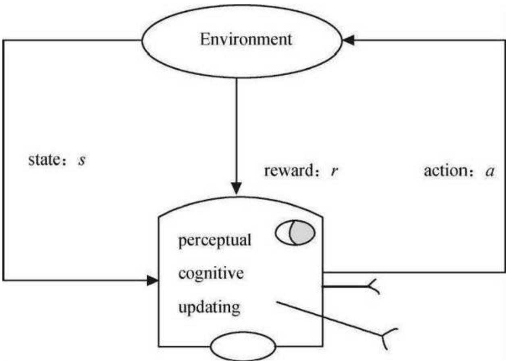  
Figure 1.1 Frame of reinforcement learning.

As shown in Fig.1.1, the agent takes the state of the environment as input and generates actions as output, which affects the state of the environment. Given this model, we can define the learning target of an agent simply as a decision procedure for choosing actions. And there are three types of data sources ［ 47 ］ that can be distinguished:

· External teacher: an external teacher provides examples of actions with the corresponding classification indicating their optimality or appropriateness. This model is equivalent to fully supervised learning;   
· Environmental feedback: while the agent acts, it receives a feedback from the environment indicating the benefit of the actions. The feedback is usually defined in terms of the utility of the current state that the agent finds itself in. This training model corresponds to RL. It should be noted that not necessarily all states will result in feedback. This means that once some environmental feedback is received it has to be propagated to all actions that potentially contributed to it. Certainly, actions that contributed strongly should receive more recognition. A common technique to distribute rewards amongst actions is to reward more recent actions higher using a discounted factor;   
· Internal agent bias: while the agent is exploring the environment with its actions, it looks out for useful patterns and interesting properties of the environment that enable the agent to generate concepts describing the environment. Usefulness and interestingness are purely based on the agent's internal bias, and no explicit feedback is given to the agent. It is assumed that the discovered concepts will help the agent to perform future specific goals efficiently and effectively. This learning model is usually denoted by the term unsupervised learning.   
As it enters a state in the environment, the agent must identify the status of the state in accordance with the environment, which is usually described as observe.

The Boltzmann distribution and ε-greedy transition policy are usually used as the action selecting policy for solving MDPs. The Boltzmann distribution is expressed as

$$
P (a \mid s) = \frac {e ^ {\gamma Q (s , a)}}{\sum_ {b} e ^ {\gamma Q (s , b)}} \tag {1.9}
$$

where γ tends to infinity as an annealing process so that even a small difference between Q-value will eventually lead to the best action being selected with probability 1.0. And the greedy transition policy implements the action selecting with argmax ${ \bf \pi } _ { \mathrm { b } } \mathrm { Q } ( { \bf s } , { \bf b } )$ . And, the ε-greedy transition policy means an agent behaves greedily at most learning time, but with small probability ε, instead, selects a rule at random, independent of the reinforcement values.

An episode is defined as a history of experiences from the beginning of learning to a derivation of a reward or from a derivation of a reward to the following derivation of a reward. During learning episodes, an agent will derive rewards from the embedded environment and update reinforcement values on the states belonging to the episodes.

# 1.2 Multiagent Reinforcement Learning

# 1.2.1 Multiagent Systems

MultiAgent Systems (MAS) form a particular type of Distributed Artificial Intelligence (DAI) systems. Environments with multiagent are a large area of interest since communication over the Internet has become such a big part of commerce and daily life. In human society, learning is an essential component of intelligent behavior. However, each individual agent need not learn everything from scratch by its own discovery. Indeed, they exchange information and knowledge with each other and learn from their peers or teachers. Although there are situations where an agent can operate usefully by itself, increasing interconnection and networking of computers is making such situations rare. When a task is too big for a single agent to handle, they may cooperate in order to accomplish the task. For example, ants are known to communicate about the locations of food, and to move objects collectively. At times, the number of agents may be too numerous to deal with them individually, and it is then more convenient to deal with them collectively, as a society of agents. In fact, many real-world problems such as engineering design, intelligent search, robotics, etc., require multiple agents. It can be imagined that many networking resources such as routers, gateways, or any other kind of server use MAS to improve their efficiency not only internally, but also in the communication with other resources.

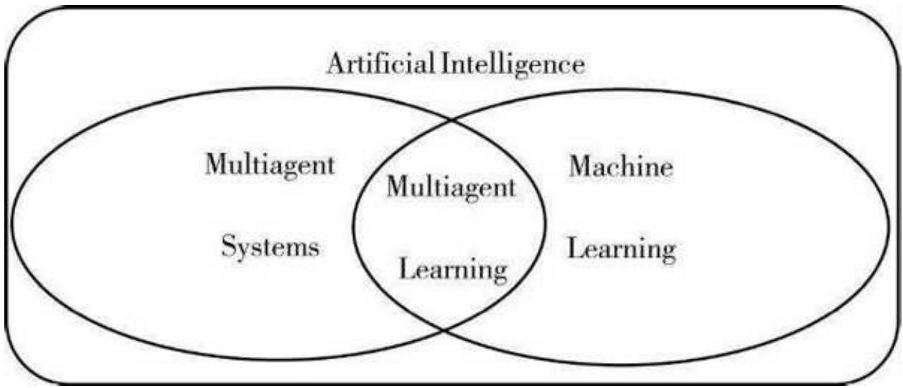  
Figure 1.2 Multiagent Learning is at the intersection of MAS and ML.

Multiagent learning is the intersection of MAS and ML, two subfields of AI (see Fig.1.2). Multiagent learning is done by several agents and becomes possible only because several agents are present. In fact, in certain circumstances, the first clause of this definition is not necessary. It is possible to engage in multiagent learning even if only one agent is actually learning. In particular, if an agent is learning to acquire skills to interact with other agents in its environment, then regardless of whether or not the other agents are learning simultaneously, the agent's learning is multiagent learning. Especially if the learned behavior enables additional multiagent behaviors, perhaps in which more than one agent does learn, the behavior is a multiagent behavior. Notice that this situation certainly satisfies the second clause of the definition: the learning would not be possible if the agents were isolated.

Traditional ML typically involves a single agent that is trying to maximize some utility function without any knowledge, or care, of whether or not there are other agents in the environment. Examples of traditional ML tasks include function approximation, classification, and problem-solving performance improvement given empirical data. Meanwhile, the subfield of MAS deals with domains having multiple agents and considers mechanisms for the interaction of independent agents' behaviors. Thus, multiagent learning includes any situation in which an agent learns to interact with other agents, even if the other agents' behaviors are static.

The main justification for considering situations in which only a single agent learns to be multiagent

learning is that the learned behavior can often be used as a basis for more complex interactive behaviors. Although only a single agent does the learning, the behavior is only possible in the presence of other agents, and, more importantly, it enables the agent to participate in higher-level collaborative and adversarial learning situations. When multiagent learning is accomplished by layering learned behaviors one on top of the other, as in this case, all levels of learning that involve interaction with other agents contribute to, and are a part of, multiagent learning.

Since the applications of ML to multiagent domains become interesting in the past few years, research is mostly done in simpler domains to develop and understand general concepts. Recently, much progress has been achieved with ML techniques for solving multiagent problems, most of the approaches consider either collaboration of agents or competition among agents. The interesting aspect about collaboration and competition of agents is the distribution of knowledge and the communication to synchronize the knowledge. The distribution of knowledge results from the different points of view of the individual agents. Learning other agents' policy is another highly interesting part about multiagent domains.

MAS are different from single agent systems in the sense that there is no global control and globally consistent knowledge. In MAS, data and control are distributed. Distribution brings up inherent advantages of distributed systems, such as scalability, fault-tolerance, parallelism, etc. Singh and Huhns ［ 48 ］ define agent in MAS as follows: "An agent is an active, persistent, computational entity that can perceive, reason about and act in its environment and can communicate with other subject." An MAS is generally defined as a collection of agents that observe and act in the same environment. It is important to stress that this does not imply social awareness, i.e., awareness of other agents in the environment and knowledge about their behavior. Vidal and Durfee ［ 49 ］ define levels of social awareness as follows:

· 0-level agent: have no knowledge about other agents or their actions, and observe them only as changes in the environment.   
· 1-level agent: recognize that there are other agents around, but have no knowledge about their behavior.   
· 2-level agent: have some knowledge about the behavior of other agents and their past observations.

An important component of a single agent is the agent's Strategy with

$$
\operatorname {S t r a t e g y} _ {\text {a g e n t}} ^ {\text {g o a l}} (s) = \text {a c t i o n}.
$$

Strategy (s) determines the goal-oriented action that the agent executes if it is in a state s. To actually perform such a competent action requires perceptual capabilities, cognitive capabilities, and effectual capabilities. An MAS is modeled by a strategy function

Strategy goal (s)=action,

where "goal" denotes the current global goal of activity that is being pursued, s is the system's state and "action" is the calculated action. On the abstraction, the state vector s of an MAS is simply the collection of all state vectors ${ \mathsf { s } } _ { 1 } , \ldots , { \mathsf { s } } _ { \mathrm { ~ n ~ } }$ of all embedded agents agent 1 ,…, agent n . Also, its action vector ACTION is built from the individual action vectors action 1 ,…, action $\boldsymbol { \mathrm n }$ , such that

$$
S = \left(s _ {1}, \dots , s _ {n}\right) ^ {T}
$$

and

$$
A C T I O N = \left(\text {a c t i o n} _ {1}, \dots , \text {a c t i o n} _ {n}\right) ^ {\mathrm {T}},
$$

respectively.

Many different MAS have been developed for addressing several different issues. From a design perspective, there are two approaches to the conception and development of an MAS. The first one conceives an MAS as composed of agents that have been constructed with uniform cooperation mechanisms and that are operating in a common environment. In this case, the MAS consists in activating the uniform cooperation mechanisms in order to address the whole system toward the reaching of a given goal. The second one conceives an MAS as composed of agents that have been independently constructed with self-interested goals and that are operating in a common environment. In this case, the MAS consists in precisely defining the local goals of agents in order to address the whole system toward the reaching of a given global goal. In this book, we adopt the former form.

Our main effort on this particular subject is in adapting RL algorithms for the sake of improving agents' performance, through interaction in a dynamic environment populated with other agents.

# 1.2.2 Reinforcement Learning in Multiagent Systems

With an increasing number of agents and a growing complexity of the task, the implementation of agents completing the given task turns out to be extremely difficult, maybe even infeasible. This is due to the enormously huge number of cases that have to be considered in such complex environments. Often ML techniques provide relatively easy ways to implement agents behaving sufficiently well without having to deal with the huge complexity occurring in real world problems. In multiagent domains, major research results have been achieved with neural networks, decision tree, and RL, and many ML approached yielded excellent results in domains with single or two agents. Tesauro ［ 50 ］ talks about a Backgammon player who played at a grand-master level. This player was trained with RL techniques.

As to distributed systems, researchers start to use ML with agents to improve their behavior without having to worry about the underlying internal structure of the agent's environment and other agents' behavior too much. Most of MAS have been developed in the field of DAI whose schemes are based on plenty of preknowledge of the agent's world or organized relationships among the agents. However, these kinds of knowledge would not be always available. On the other hand, Multiagent RL is worth considering to realize the cooperative behavior among the agents with little pre-knowledge. And through the cooperation among multiagent they can accelerate learning speed with less time to get their goal.

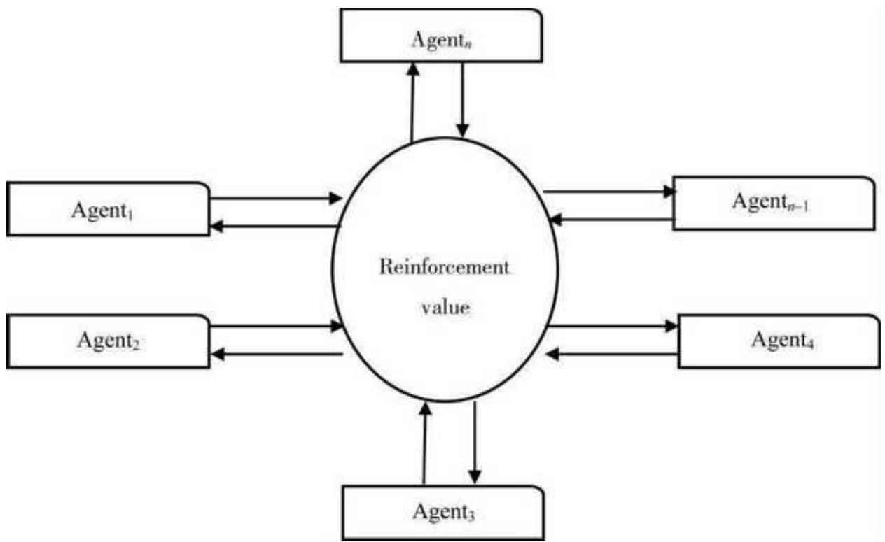  
Figure 1.3 Simple frame of multiagent reinforcement learning.

As a learning method that does not need a model of its environment and can be used on-line, RL is well suited for MAS, where agents know little about other agents, and the environment changes during learning. In most of these systems, single-agent RL methods can be applied without much modification. Such approach treats other agents in the system as a part of the environment, ignoring the difference between responsive agents and passive environment. MAS have been successfully utilized for RL, which is a learning technique that requires almost nothing about the dynamics of the environment to learn about. An agent with its goal embedded in an environment learns how to transform any environmental state into another that contains its goal. An agent that has the ability of doing this with minimal human supervision is called autonomous. Autonomous agents learn from their environment by receiving reinforcement signals after interacting with the environment. Learning from an environment is robust because agents are directly affected from the dynamic of the environment. Robotic soccer and pursuit games ［ 51 ］ are successful examples of the applications of RL in MAS, as shown in Fig.1.3.

As one moves from the single agent setting to an environment where many agents are acting and potentially interfering with one another, acting optimally and consequently learning how to act optimally becomes a highly complex task. When applying learning techniques to multiagent systems there are many issues to be taken into account, for examples,

· What impact does awareness of other agents and their behavior have?

· What is the importance of communication and how does it influence the learning process?

Even though it was originally designed for single-agent systems, RL can provide a robust and natural means for agents to learn how to coordinate their action choices in multiagent systems. Generally, the theoretical foundation of RL is MDP, while the theoretical foundation for multiagent RL is stochastic games (also called Markov games).

The performance of Q-learning agents up to 2-level in two agents single task environment has been studied, and results show that two 1-level agents display the slowest and least effective learning, much worse than two 0-level. In fact, 0-level agents are able to learn implicitly about other agents, as long as they are able to observe the results of the actions of other agents in the environment. Even though 0-level agents have no explicit social awareness, they will incorporate other agents' behavior in their learned hypothesis as the behavior of the environment. Therefore, multiagent learning, in principle, already starts with 0-level agents.

One of main problems in multiagent RL is the uncertainty of state transition problem, which is owing to concurrent learning of the agents. Toward this problem, the robustness and flexibility are essential for the multiagent RL. RL is the major learning mechanism for an agent to adapt itself to various situations flexibly. Therefore, in an MAS environment that has mutual dependency among agents, it requires the active and interactive learning function that treats how to coordinate the interaction among other learning agents. This book presents a framework of multiagent RL to generate and coordinate each learning goal interactively among agents. To realize this, it presents to treat each learning goal as a reinforcement signal that can be communicated among agents.

# 1.2.3 Learning and Coordination in Multiagent Systems

One way of enhancing agent's autonomy in dynamic environments, is to endow its architecture with learning capabilities. Learning in collaborative systems can minimize the communication, which is a valuable improvement in environments with low bandwidth or noisy communications. Typically, learning algorithms using feedback as a trigger for the learning process, can be distinguished depending on situations where the desired action is known in advance, and those where the feedback value it is related with a measure of utility that has to be maximized. The former case, where the environment may be seen as a kind of teacher, encompasses the supervised learning algorithms, while the latter, where the environment may be seen as playing the role of a critic, relates to RL algorithms.

The multiagent exchanges information through communication. An agent in an MAS needs to communicate with other agents to acquire a view of the non-local problem solving so as to make local decisions that are influenced by more global considerations.

Learning and communication are inherently related, just as the difference between skills and knowledge: the former can be acquired through personal experience, and the theory learned can hardly be put in words; the latter can be formulated and conveyed by the means of language.

The situation changes with the move from single agent learning to societies of learning agents which can communicate with each other. For an agent, the cost of asking knowledge from another experienced agent is usually much lower than the cost involved in acquiring the information on its own, either by exploring the environment or by purely observing the actions of other agents. The information should be expressed in a formalism shared by both agents. As an example for distributed learning, consider a robotic soccer domain, where in the absence of a global view the computation of an opposing team's strategy has to be based on local observations of the individual players. It would be infeasible to simple send all these observations to a super-agent, and therefore the agents need to first generalize from their observations and then share the results in order to compute the global strategy of the opposing team.

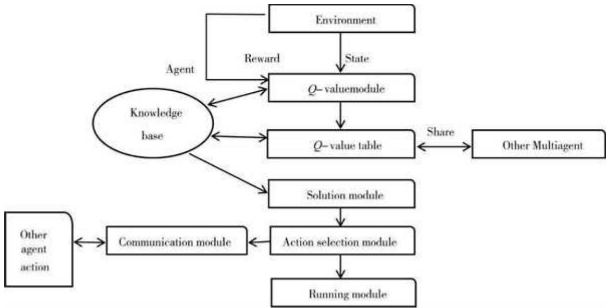  
Figure 1.4 Frame of multiagent coordination.

When utilizing MAS to solve some tasks, multiple agents are required to work as a society or one unit, which is usually considered as the coherence property realized by the coordination of agents' actions based on the communication infrastructure. That is to say, when a task is too big for a single agent to handle, coordination is needed in order to accomplish the task. Fig.1.4 gives a frame of multiagent coordination.

Coordination is a general concept of the agent communication in MAS, which is the extent for the agent avoiding extraneous activity, and maintaining applicable safety conditions. Typically, it includes cooperation, competition, and negotiation.

Cooperation is a form of interaction, usually based on communication. Cooperation between agents occurs when they adapt their activities because of interactions. These interactions can be direct or indirect. Direct communication is a purely communication act, one with the sole purpose of transmitting information, and specifically, it aims at a particular receiver. Directed communication can be one to one or one to many, in both cases the receivers are identified. In contrast, indirect communication is based on the observed behavior, not communication, of other agents, and its effects on the environment. This type of communication is referred to as stigmergic in biological literature, where it refers to communication based on modification of the environment rather than direct message passing.

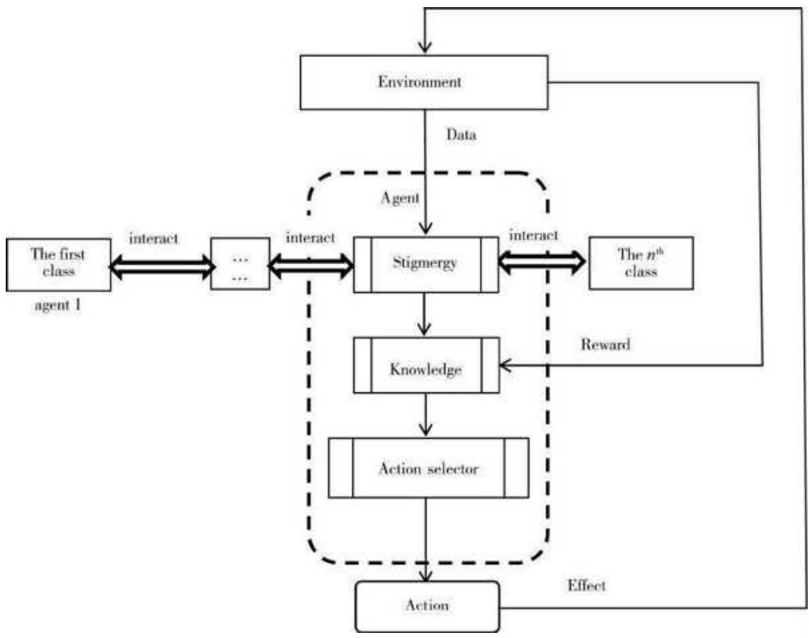  
Figure 1.5 Frame of multiagent's stigmergy role.

Stigmergy belongs to the category of indirect interactions. Afsarmanesh introduced the word stigmergy. Stigmergy means that agents put signs, called stigma in Greek, in their environment to mutually infiuence each other's behavior. Such mechanism is suitable for small-grained interactions compared to coordination methods that require an explicit rendezvous amongst the agents. With stigmergy, agents observe signs in their environment and act upon them without needing any synchronization with other agents, see Fig.1.5.

The signs that are locally available in the environment allow multiagent to learn about global properties of the system. Importantly, these signs are put in the environment without exposing individual agents to the complexity and the dynamics of the situation. Global information is made available locally. On its way through the system, this information is transformed to enable the multiagent to make local decisions based on locally available information while being aimed at global goals.

# 1.3 Ant System for Stochastic Combinatorial Optimization

# 1.3.1 Ants Forage Behavior

We give some introduces about multiagent cooperation and control using techniques inspired by the behavior of social insects.

Food foraging ants execute a simple procedure in which their behavior is guided by a changing environment. Ants forage for food in the following way:

· In the absence of any pheromone in the environment, ants perform a random search for food;   
· When an ant discovers a food source, it drops a pheromone on its way back to the nest while carrying some of the food. Thus, it creates a pheromone trail between nest and food source. An important property of such pheromone trail is that it will eventually evaporate if no other ant deposes fresh pheromones;   
· When an ant senses signs in form of a pheromone trail it will be urged by its instinct to follow this trail to the food source. The ant's behavior always remains probabilistic: there is a high probability that it follows the found trail, but no certainty, where the probability depends on the strength of the pheromones. When the ant finds the food source, it will return with food while deposing pheromones itself. The strength of the pheromone trail is maintained and even reinforced. When the ant discovers that the food source is exhausted, it starts a random search for food and the trail disappears because of the evaporation.

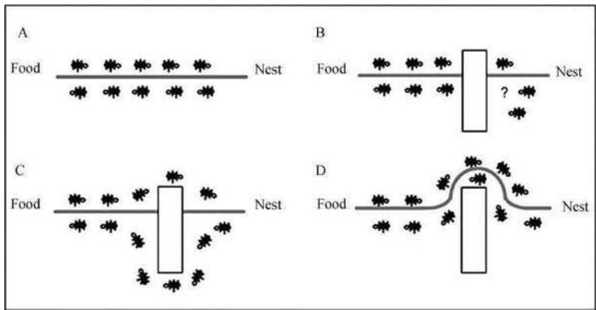  
Figure 1.6 A. Ants in a pheromone trail between nest and food; B. an obstacle interrupts the trail; C. ants find two paths to go around the obstacle; D. a new pheromone trail is along the shorter path.

These simple behavior patterns result in an emergent behavior of the ant colony that is highly ordered and very effective at foraging food while being robust against the uncertainty and complexity of the environment, as shown in Fig.1.6. An important capability of this type of stigmergy is illustrated that global information is made available locally. At any location in the environment of the ant where pheromone trails exist, the ant learns about the availability of food in remote locations.

The main achievement is that individual ants are not exposed to the complexity and dynamics of this situation. Indeed, the environment itself is incorporated into the solution and allows the overall system to cope with the complexity of the environment: the complexity of the pheromone trails is handled by putting them into the environment itself. None of the ants needs a mental map of the environment nor do these ants communicate amongst each other about the environment. Similarly, the evaporation and refreshing of the

pheromone trails allows the ants to cope with the dynamics of the environment.

# 1.3.2 Ant Colony Optimization

Traveling Salesman Problem

Recently, a distributed algorithm for combinatorial optimization has been introduced by Dorigo, et al. ［ 52 ］ . The basic idea underlying this algorithm, called Ant System (AS), is that of using a colony of cooperating ants to find shortest tours in a weighted complete graph.

Ant colony system is a metaheuristic for the approximate solution of combinatorial optimization problems that has been inspired by the foraging behavior of ant colonies. It has been shown to be both robust and versatile in the sense that it has been applied successfully to a range of different combinatorial optimization problems, scheduling problems, and routing in communication networks, such as traveling salesman problem ［ 53 ］ , quadratic assignment problem ［ 54 ］ , job-shop scheduling problem, AntNet ［ 55 ］ , and so on.

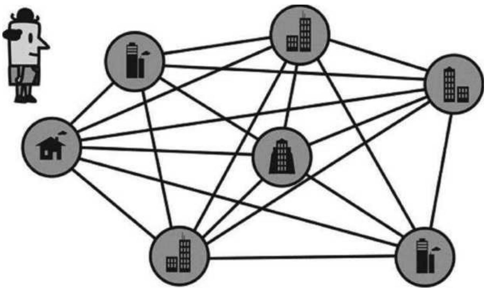  
Figure 1.7 A salesman wants to find the shortest route around a map and return back home again.

Traveling Salesman Problem (TSP) $[ 5 6 - 5 8 ]$ is one kind of combination optimization problem, a simple example is shown as in Fig.1.7. Let $\mathsf { S } = \{ \mathsf { s } _ { \mathrm { ~ 1 ~ } } , . . . , \mathsf { s } _ { \mathrm { ~ n ~ } } \}$ be a set of cities, $\mathrm { G } = \{ ( \mathsf { s } _ { \ 1 } , \mathsf { s } _ { \ 2 } ) : \mathsf { s } _ { \ 1 } , \mathsf { s } _ { \ 2 } \in \mathsf { S } \}$ be the edge set, and $\delta ( \mathsf { s } _ { \mathsf { \Omega } _ { 1 } } , \mathsf { s } _ { \mathsf { \Omega } _ { 2 } } ) = \delta ( \mathsf { s } _ { \mathsf { \Omega } _ { 2 } } , \mathsf { s } _ { \mathsf { \Omega } _ { 1 } } )$ be a cost measure associated with the edge $( \mathsf { s } _ { \mathrm { ~ 1 ~ } } , \mathsf { s } _ { \mathrm { ~ 2 ~ } } ) \in \mathrm { G }$ . The TSP is the problem of finding a closed tour with minimal cost that each city is visited once. In the case cities $\mathsf { s } _ { 1 }$ , s $_ 2 \in S$ are given by their coordinates $( \mathrm { X } _ { \mathsf { s } _ { 1 } } , \mathrm { Y } _ { \mathsf { s } _ { 1 } } )$ , $( \mathrm { X } _ { \mathsf { \textsf { s } } _ { 2 } } , \mathrm { Y } _ { \mathsf { \textsf { s } } _ { 2 } } )$ and $\delta ( \mathsf { s } _ { 1 } , \mathsf { s } _ { 2 } )$ is the Euclidean distance between s 1 and ${ \textsf { S } } _ { 2 }$ , then we have an Euclidean TSP. If $\delta ( \mathsf { s } _ { 1 } , \mathsf { s } _ { 2 } ) \neq \delta ( \mathsf { s } _ { 2 } , \mathsf { s } _ { 1 } )$ for at least some $( \mathsf { s } _ { 1 } , \mathsf { s } _ { 2 } )$ then the TSP becomes an asymmetric TSP (ATSP).

Using ant colony system to solve TSP, the pheromone is set to relate with Euclidean distance between cities. It is obvious that each agent is adequate to accomplish a task that is able to finish a close tour. The purpose of ant colony system is to find better cooperating way for the learning agents to derive "optimal" tour fast.

Ant Colony Optimization Method

Ant Colony Optimization (ACO) algorithms make use of simple agents called ants which iteratively construct candidate solutions to a combinatorial optimization problem. The ant's solution construction is guided by pheromone trails and problem-dependent heuristic information.

The Ant Colony System (ACS) ［ 59 ］ is an efficient algorithm applying to the stochastic combinatorial optimization. Its primary idea is that the learning agents cooperate through indirect media communication by pheromones and search for good solutions in parallel.

As solving processes of TSP, ants completes legal tours by the stochastic greedy state transition rule,

$$
S = \left\{ \begin{array}{l l} \operatorname {a r g m a x} S _ {2 \in J _ {k} (s _ {1})} \{\left[ \tau \left(s _ {1}, s _ {2}\right) \right] \left[ \eta \left(s _ {1}, s _ {2}\right) \right] ^ {\mu} \}, & \text {i f} q \leqslant q _ {0} \\ S, & \text {o t h e r w i s e} \end{array} \right. \tag {1.10}
$$

where $\tau ( s _ { 1 } , s _ { 2 } )$ is pheromone on the connective cities $\mathbf { s } _ { 1 }$ and ${ \textsf { s } } _ { 2 } , { \boldsymbol { \Pi } }$ is the inverse of the distance between two cities, $\mu$ determines the relative importance of pheromone versus distance, $\mathrm { ~ J ~ } _ { \mathrm { k } } ( \mathsf { s } )$ is the feasible cities of an ant k on a city s. And, q is a random number uniformly distributed in ［0, 1］, $0 \leq \mathbf { q } _ { \ 0 } \leq 1$ is a parameter that decides to execute the greedy state transition or the probability state transition S, which is a random variable selected according to the probability distribution of pheromone and the inverse of distance. While constructing its tour, each ant modifies the pheromone by the local updating rule,

$$
\tau \left(s _ {1}, s _ {2}\right) = (1 - \alpha) \tau \left(s _ {1}, s _ {2}\right) + \alpha \tau_ {0}, \tag {1.11}
$$

where $\tau _ { 0 }$ is the initial pheromone value, $\alpha$ is a pheromone decay parameter. When tours are completed, the global updating rule is applied to edges belonging to the best ant tour,

$$
\tau \left(s _ {1}, s _ {2}\right) = (1 - \alpha) \tau \left(s _ {1}, s _ {2}\right) + \alpha \Delta \tau \left(s _ {1}, s _ {2}\right), \tag {1.12}
$$

where

$$
\Delta \tau (s _ {1}, s _ {2}) = \left\{ \begin{array}{l l} (L _ {g b}) ^ {- 1}, & \text {i f} (s _ {1}, s _ {2}) \in \text {g l o b a l - b e s t - t o u r} \\ 0, & \text {o t h e r w i s e} \end{array} \right.
$$

and $\mathrm { L _ { \ g b } }$ is the length of the globally best tour from the beginning of the trial.

# 1.3.3 MAX-MIN Ant System

The performance of AS can be enhanced by allowing only the best ant to update the trails in every cycle. Yet a disadvantage of this strategy is the early stagnation of the search that makes further tour improvements impossible. When stagnation occurs, the trails on few arcs grow so high that the ants will always construct the corresponding tour again and again.

MAX-MIN Ant System (MMAS ) ［ 60 ］［ 61 ］ is an extension of the basic AS. MMAS differs from AS in several important aspects. One aspect is that the MMAS algorithm achieves a strong exploitation of the search history by allowing only the best solutions to add pheromone during the pheromone trail update. Also, the use of a rather simple mechanism for limiting the strengths of the pheromone trails effectively avoids premature convergence of the search. Finally, MMAS can easily be extended by adding local search algorithm, for example, 2-opt procedure, 3-opt procedure or so, where 2-opt procedure designates that two edges of the current solution are removed and the two resulting partial tours are reconnected by two other edges.

To alleviate stagnation of the search space, pheromone on each solution in MMAS is ranged within $\left[ \tau _ { \mathrm { \ m i n } } \right.$ , $\tau _ { \operatorname* { m a x } } ]$ . After each iteration, $\tau ( \mathbf { v } _ { 1 } , \mathbf { v } _ { 2 } )$ is updated by global update rule. If $\tau ( \mathsf { s } _ { 1 } , \mathsf { s } _ { 2 } )$ is updated larger than $\tau _ { \mathrm { m a x } }$ , the $\tau ( \mathsf { s } _ { 1 } , \mathsf { s } _ { 2 } )$ is set equal to $\tau _ { \mathrm { m a x } }$ , and if $\tau ( \mathsf { s } _ { 1 } , \mathsf { s } _ { 2 } ) < \mathsf { \tau } _ { \mathrm { m i n } }$ , it set $\mathbf { \Psi } ( \mathbf { s } _ { \mathrm { ~ 1 ~ } } , \mathbf { s } _ { \mathrm { ~ 2 ~ } } ) = \mathbb { \tau } _ { \operatorname* { m i n } } .$ . By this pheromone bounds, even if the learning processes are being performed for a long time, edges belonging to

the best tour till now will not be given too larger chosen probability than other edges; and edges with smallest pheromone till now will be chosen by probability larger than zero.

# 1.4 Motivations and Consequences

Scaling up agents' task solving performance is a permanent issue in MAS. Recent applications need multiagent ability of autonomy to dynamic environment, easy to handle more agents in such environments, and little complexity of each agent inner architecture. Endowing agents' architecture with learning capabilities can enhance agent's autonomy in dynamic environments. Multiagent communicate with each other can improve their performance to acquire a view of non-local problem solutions.

Taking RL into MAS can improve task-solving ability of MAS. Meanwhile, by multiagent methods the ability of each agent can also be improved since efficient cooperation is benefit to each learning agent identifying environment and deriving correct action policy with less cost than getting those by agent-self directly.

Though RL owns merits such as adapting the task environment in an autonomic way and etc., it is still an important issue that the learning rate of RL is slow. One reason of slow learning rate is that there is not an active action selecting mechanism in RL system. For improving the RL performance, this book presents a Q-ae learning method with an active exploration mechanism that can be utilized to accelerate the agent's performance of identifying the task environment so that the learning rate can be improved. And Q-ae learning guarantee the convergence of reinforcement value on the deterministic MDPs.

RL is coming from DP, can be used both off-line and on-line, provides an approach for multiagent to identify task environment independently, performs task solving autonomically, and derives optimal solution iteratively. And, its learning mechanism is easy to be extended to multiple agents. Therefore, one purpose of this book is to analyze integrating RL into multiagent architecture to propose efficient multiagent RL methods. When applying learning techniques to multiagent systems, importance of communication and its influence on the learning processes must be taken into account. However, there are problems such as bandwidth consumption and worse real-time performance as using the direct communication for sharing learned policy among learning agents in previous researches. Indirect media communication provides an efficient cooperative way for scaling up agents task solving performance. In the option of that global information can be derived available locally, one research of this book is studying indirect media communication multiagent RL system to propose efficient multiagent RL methods. Based on the update policy of reinforcement values in RL and the cooperative way of the indirect media communication, this book presents a multiagent learning system, the Q-ACS learning method.

There is also an issue of trade off between exploration and exploitation in multiagent RL system. Though some exploration mechanisms have been proposed in ACO like MMAS and branching factor, these mechanisms are realized by adjusting the updated reinforcement values or pheromones that in turn intervene in the update processes. By investigating the active exploration mechanism and the unified action policy with exploration and exploitation in RL, utilizing indirect media communication, this chapter proposes the T -ACS multiagent learning method that accelerates the learning rate by an active exploration mechanism not intervening in the update processes. Further, this chapter studies the heterogeneous multiagent learning system, the D-ACS learning method that composites the learning policy of the Q-ACS learning and the T-ACS learning and takes different updating policies of reinforcement values, which is a novel proposition in the field of multiagent learning improving the learning rate by heterogeneous agents' behaviors.

When applying learning techniques to multiagent systems, impact of awareness of other agents must be taken into account. One of main problems in multiagent RL is the uncertainty of state transition problem, which is owing to concurrent learning of the agents. Utilizing adversary agent action to improve learning performance of multiagent is an easy way for scaling up multiagent learning performance from viewpoint of reducing non-Markov property of complexity task environment. Therefore, this book investigates an adversary action perception and conversion mechanism and takes it into multiagent RL system. This book presents a multiagent RL algorithm with an action conversion mechanism that considers the adversary agent's behaviors to speed up learning agents' speed of deriving optimal policy.

We apply proposed multiagent RL methods to several domains: hunter game, TSP, dynamic vehicle routing, mobile ad hoc network routing, and supply chain management. In these domains, we show that our

multiagent RL methods achieve better performance than previous methods on each domain, certainly considerable better than individual learning agent.

# 1.5 Book Summary

This chapter is an introduction of RL, MAS, and ACO in general.

Chapter 2 presents an efficient RL method, the Q-ae learning. Based on RL and ACS, this chapter also introduces a multiagent learning method with an improved ACS.

Chapter 3 presents multiagent cooperating learning methods, the T-ACS learning method and the D-ACS learning method.

Chapter 4 gives perception-conversion action mechanism, and introduces the Q-ac multiagent RL method.

Chapter 5 presents the research on the modified MMAS algorithm for solving the capacitated vehicle routing problem and the vehicle routing problem with time windows.

Chapter 6 introduces a multicast routing method by the application of RL.

For suitable to the dynamic feature of supply chains, and referring the observed reward of learning agents.

Chapter 7 presents the Q-opr multiagent RL method for the supply chain management system.

Chapter 8 gives a multiagent coordination mechanism utilizing RL method to the supply chain ordering management.

# Bibliography

［ 1 ］ G. Mesnil, X. He, L. Deng, and Y. Bengio. Investigation of recurrent-neural-network architectures and learning methods for spoken language understanding ［C］, 2013 Interspeech, CDROM, 2013.   
［2］ A.G. Barto, R.S. Sutton, and C.W. Anderson. Neuron like elements that can solve difficult learning control problems ［J］, IEEE SMC, Vol.13, 835-846, 1983.   
［3］ R. Sarikaya, G.E. Hinton, and B. Ramabhadran. Deep belief nets for natural language call-routing ［C］, 2011 ICASSP, CDROM, 2011.   
［ 4 ］ M.R. Mashinchi, Ali Selamat. An improvement of genetic-based learning method for fuzzy artificial neural networks ［J］, Applied soft computing, Elsevier Science, 2009.   
［ 5 ］ C.X. Ling, Q. Yang, J. Wang, S. Zhang. Decision trees with minimal costs ［C］, Proceedings of twenty-first international conference on machine learning, ICML 2004, 544-551, 2004.   
［6］ L. Kuncheva, J.C. Bezdek, R.P.W. Duin. Decision templates for multiple classifier fusion: an experimental comparison ［J］, Pattern recognition, 34(2), 299-314, 2001.   
［ 7 ］ M. Nuenz. The use of background knowledge in decision tree induction ［J］, Machine learning, No.6, 231-250, 1991.   
［ 8 ］ L . Kuncheva. Combining pattern classifiers: methods and algorithms ［J］, John Wiley & Sons, 376-379, 2004.   
［9］ C. J. C. H. Watkins, and P. Dayan. Technical note: Q-learning ［J］, Machine learning, Vol.8, 1992.   
［10］ A. Notsu, Y. Komori, K. Honda, H. Ichihashi and Y. Iwamoto. Chain form reinforcement learning for small-memory agent ［C］, Proc. of journal of Japan society for fuzzy theory and intelligent informatics, 691-696, 2012.   
［ 11 ］ S. M. Hazrati, A. Hamzeh, S. Hashemi. A game theoretic framework for feature selection ［C］, Proc. Of FSKD, 845-850, 2012.   
［ 12 ］ A. Notsu, K. Honda, and H. Ichihashi. Particle swarm for reinforcement learning ［C］, Proc. of joint 5th international conference on soft computing and intelligent systems and 11 th international symposium on advanced intelligent systems (SCIS & ISIS 2010), 809-812, 2010.   
［13］ C. Claus, C. Boutillier. The dynamics of reinforcement learning in cooperative multiagent systems ［C］, Collected papers from the AAAI-97 workshop on multiagent learning, 13-18, AAAI, 1997.   
［14］ O. Abul. Multiagent reinforcement learning using function approximation ［J］, IEEE TRANS. on SMC-PART C, 30(4), 485-497, 2000.   
［15］ A. Colorni, M. Dorigo, V. Maniezzo and M. Trubian. Ant system for job-shop scheduling ［J］, JORBEL, 34(1), 39-53, 1994.   
［ 16 ］ H. Afsarmanesh, F. Tuijnman, M. Wiedijk, and O. Hertzberger. Distributed schema management in a cooperation network of autonomous agents ［C］, Proceedings of DEXA'93, Prague, Czech Republic, 1993.   
［ 17 ］ L.P. Kaelbling, M.L. Littman, and A.W. Moore. Reinforcement learning: A survey ［J］, Journal of artificial intelligence research, No.4, 237-285, 1996.   
［18］ K. Miyazaki, S. Kobayashi. Reinforcement learning system for discrete markov decision processes ［J］, Journal of Japanese society for artificial intelligence, 12(6), 811-821,1997.

［19］ R.S. Sutton, and A.G. Barto. Reinforcement learning: An introduction ［M］, MIT Press, Cambridge, MA., 1998.   
［20］ G. Zhao, S. Tatsumi and Ruoying Sun. Convergence of the Q-ae learning on deterministic MDPs and its efficiency on the stochastic environment ［J］, IEICE TRANS. FUNDAMENTALS, E83-A(9), 1786-1795, 2000.   
［21］ Fengfei Zhao and Zheng Qin. Multi-Motive Reinforcement Learning Framework ［J］, Journal of computer research and development, No.5, 501-510, 2013.   
［22］ A. Lazaric, M. Ghavamzadeh. Bayesian multi-task reinforcement learning ［C］, Proc. the 27 th annual Int. Conf. on machine learning, New York: ACM, 599-606, 2010.   
［ 23 ］ N. K. Jong, Stone. Hierarchical model-based reinforcement learning: R-MAX $^ +$ MAXQ ［C］, Proc. the 25th annual Int. Conf. on machine learning, New York: ACM, 432-439, 2008.   
［ 24 ］ G. Tesauro. TD-gammon, a self-teaching backgammon program, achieves master-level play ［J］, Neural computation, 6(2), 215-219, 1994.   
［ 25 ］ I. Noda, H. Matsubara. Soccer server and researches on multi-agent system ［C］, Proceedings of the IROS-96 workshop on RoboCup, 1996.   
［ 26 ］ P. Stone, P. Riley, and M. Veloso. A layered approach to learning client behaviors in the RoboCup soccer server ［J］, Applied artificial intelligence, No.12, 121-130, 1998.   
［ 27 ］ R. Crites, A.G. Barto. Improving elevator performance using reinforcement learning ［M］, Advances of neural information processing systems, Morgan Kaufmann, 1995.   
［ 28 ］ Gang Zhao, Wenjuan Luo, Ruoying Sun, Chunhua Yin. A modified max-min ant system for vehicle routing problem ［C］, 2008 International conference on wireless communications, networking and mobile computing, WiCOM, 2008.   
［ 29 ］ Q. Wang, W. Jiang, G. Zhao. A novel model and algorithm for solving dynamic vehicle routing problem on goods distribution ［C］, 2013 International conference on advanced management science, ICAMS, 2013.   
［ 30 ］ Ruoying Sun, Gang Zhao, and Chunhua Yin. A multi-agent coordination of a supply chain ordering management with multiple members using reinforcement learning ［C］, Proc of IEEE international conference on industrial informatics, 612-616, 2010.   
［ 31 ］ S. Kamal Chaharsooghi, Jafar Heydari and S. Hessameddin Zegordi. A reinforcement learning model for supply chain ordering management: An application to the beer game ［J］, Decision support systems, Vol.45, 949-959, 2008.   
［ 32 ］ Yaofei Ma, Guanghong Gong, Xiaoyuan Peng. Cognition behavior model for air combat based on reinforcement learning ［J］, Journal of beijing university of aeronautics and astronautics, 36(4), 379-383, 2010.   
［33］ A. C. Zecchin, H. R. Maier, A. R. Simpson, M. Leonard, and J. B. Nixon. Ant colony optimization applied to water distribution system design: comparative study of five algorithms ［J］, Journal of water resources planning and management, 133(1), 87-92, 2007.   
［ 34 ］ M. D. Albritton, P. R. McMullen. Optimal product design using a colony of virtual ants ［J］, European journal of operational research, 176(1), 498-520, 2007.   
［ 35 ］ A.G. Barto, R.S. Sutton, and C. Watkins. Learning and sequential decision making ［M］, Learning and computational neuroscience, MIT Press, Cambridge, MA, 1990.   
［ 36 ］ R.E. Bellman, S.E. Dreyfus. Applied dynamic programming ［M］, Princeton university press, Princeton, NJ, 1962.

［ 37 ］ R.E. Bellman. Dynamic programming ［M］, Princeton university press, Princeton, NJ, 1957.   
［ 38 ］ R.A. Howard. Dynamic programming and markov processes ［M］, The technology of MIT, New York, 1960.   
［ 39 ］ A.L. Samuel. Some studies in machine learning using the game of checkers, II-recent progress ［J］, IBM Journal on research and development, 601-617, 1967.   
［ 40 ］ R.S. Sutton. Learning to predict by the methods of temporal differences ［J］, Machine learning, Vol.3, 9-44, 1988.   
［ 41 ］ J.J. Grefenstette. Credit assignment in rule discovery systems based on genetic algorithms ［J］, Machine learning, 3, 225-245, 1988.   
［ 42 ］ J.H. Holland, K.J. Holoyak, R.E. Nisbet, and P.R. Thagard. Induction: processes of inference, learning and discovery ［M］, MIT Press, 1987.   
［ 43 ］ R.S. Sutton. Integrated architectures for learning, planning, and reacting based on approximating dynamic programming ［C］, Proc. of 7 th international conference on machine learning, 216-224, 1990.   
［ 44 ］ G. Santharam and P.S. Sastry. A reinforcement learning neural network for adaptive control of markov chains ［J］, IEEE Trans. on SMC, 27(5), 588-600, 1997.   
［ 45 ］ M.L. Puterman. Markov decision processes-discrete stochastic dynamic programming ［M］, John Wiley & Sons, Inc., NY, 1994.   
［ 46 ］ J.N. Tsitsiklis. Asynchronous stochastic approximation and Q-learning ［J］, Machine learning, 16(3), 1994.   
［ 47 ］ D. Kazakov, D. Kudenko. Machine learning and inductive logic programming for multi- agent Systems ［C］, M. Luck(Eds.), ACAI 2001, 246-270, Springer, 2001.   
［ 48 ］ M.P. Singh and M.N. Huhns. Challenges for machine learning in cooperative information systems ［C］, Gerhard weiB, editor, Distributed artificial intelligence meets Machine Learning, 11-24, 1996.   
［ 49 ］ J. Vidal and E. Durfee. Agents learning about agents: A framework and analysis ［C］, Working notes of the AAAI-97 workshop on Multiagent Learning, 71-76, 1997.   
［ 50 ］ G. Tesauro. Temporal difference learning and TD-gammon ［C］, Communications of the ACM, 38(3):58-68, 1995.   
［ 51 ］ M. Tan. Multi-agent reinforcement learning: Independent vs. cooperative agents ［C］, Proceedings of the tenth international conference on machine learning, 330-337, 1993.   
［ 52 ］ M. Dorigo and L.M. Gambardella. Ant colony system: A cooperating learning approach to the traveling salesman problem ［J］, IEEE Trans. Syst, Man, Cybern. B, 1(1), 53-66,1997.   
［ 53 ］ L.M. Gambardella and M. Dorigo. Solving symmetric and asymmetric TSPs by ant colonies ［C］, IEEE conference on evolutionary computation, 1996.   
［ 54 ］ V. Maniezzo, A. Colorni. The ant system applied to the quadratic assignment problem ［J］, IEEE Trans. knowledge and data engineering, 11(5), 769-778, 1999.   
［ 55 ］ D.C. Gianni and M. Dorigo. AntNet: Distributed stigmergetic control for communications networks ［J］, Journal of AI research, No.9, 317-365, 1998.   
［ 56 ］ J.L. Bentley. Fast algorithms for geometric traveling salesman problems ［J］, ORSA J. Computing, Vol.4, 387-411, 1992.

［57］ E.L. Lawler, J.K. Lenstra, A.H.G. Rinooy Kan, and D.B. Shmoys. The traveling salesman problem ［M］, John Wiley & Sons, 1985.   
［ 58 ］ G. Reinelt. The traveling salesman ［M］, Lecture notes in computer science, Springer-Verlag Berlin Heidelberg, 1994.   
［ 59 ］ M. Dorigo and L,M. Gambardella. The ant system: Optimization by a colony of cooperating agents ［J］, IEEE Trans. Syst, Man, Cybern. B, 26(2), 29-41, 1996.   
［ 60 ］ K. Socha, J. Knowles, and M. Sampels. A MAX-MIN ant system for the university course timetabling problem ［M］, M.Dorigo et al. (Eds.): ANTS 2002, LNCS 2463, 1-13, 2002.   
［ 61 ］ T. Stutzle, H. H. Hoos. MAX-MIN ant system ［J］, Future generation computer systems 16 (8), 889-914, 2000.

# Chapter 2 Reinforcement Learning and Its Combination with Ant Colony System

This chapter first presents a Reinforcement Learning (RL) method, the Q-ae learning, in the opinion of the active exploration to a task environment and the experience replay of reinforcement values active exploration. Then, this chapter analyses the coordination of multiple agents in the opinion of sharing episodes and sharing policies in the field of multiagent RL. This chapter also investigates the performance of indirect media communication among multiagent on the Ant Colony System (ACS) known as an efficient method that uses pheromones to solve optimization problems. Based on the update policy of reinforcement values in RL and the cooperating method of the indirect media communication in ACS, this chapter presents the Q-ACS multiagent learning method that can be applied to both Markov decision processes and combinatorial optimization problems. The advantage of the Q-ACS learning method is for the learning agents to share episodes beneficial to the exploitation of the accumulated knowledge and utilize the learned reinforcement values efficiently.

# 2.1 Introduction

Successful applications of Reinforcement Learning (RL) methodologies $[ \underline { { 1 } } - \underline { { 3 } } ]$ to well behaved domains $[ \underline { { 4 } } - \underline { { 7 } } ]$ have encouraged researchers to investigate RL. In RL system, since it has no knowledge about the environment a priori, the learning agent improves its performance only by trial-anderror and rewards derived from the environment.

As the explosive growth in cellular telephone, pager, personal digital assistant, and laptop computer usage, centralized system designs will prove unworkable facing rapidly increasing of communication network and distributed computing. Such distributed, open systems are beyond the capabilities of an individual agent limited by its computing resources and its perspective.

The agent-based approach has certain advantages over traditional approaches, such as Genetic Algorithms ［ 8 ］ , Simulated Annealing ［ 9 ］ , Probabilistic Search Space Modeling (model-based search) 10 Cultural Algorithms 11 ］ , Particle Swarm Optimization, and Ant Colony Optimization 12 , etc. Here are a few of their advantages:

1. An agent can form beliefs as in cultural algorithms about the nature of the search space and use them to construct new feasible solutions;   
2. Agents can communicate within their population and undergo natural selection ［ 13 ］ ;   
3. Agents can develop search space exploration strategies;   
4. An agent may be used as a meta-heuristic or other forms of meta-reasoning, choosing the most appropriate heuristic search algorithm.

Since feedback from the environment is scalar and reflects the fitness of a solution, it can be considered the solution's fitness as a reward for use in reinforcement learning, and can be employed existing reinforcement learning algorithms such as SARSA (State-Action-Reward-State-Action) or Q-learning to build the heuristic search algorithms.

Hierarchical Reinforcement Learning (HRL) decomposes a complex reinforcement learning problem into manageable parts. Techniques include separating the problem across sets of machines designed to perform pre-determined tasks ［ 14 ］ , splitting the problem into a set of temporal tasks, called options 15 ］ , and creating a hierarchy of tasks to solve the problem ［ 16 ］ . All methods decompose large problems into smaller problems that have individual solutions and combine to create a final solution.

The first step to solve a hierarchical problem is to identify the subtasks, primitive actions, and related hierarchy. The decomposition takes the MDP and separates it into a set of subtasks, these subtasks can be primitive actions or other subtasks. The hierarchy creates a dependency between the root task and the subtasks, where the solution of the root is based on the solution for the subtask ［ 17 ］ . An important aspect of the task graph is the arbitrary order of children, the order is determined by the policy at the root's level.

The graph only limits the action choices at each subtask. Each of these subtasks contains three components. First, it has a subtask policy, which dictates the selection order of its children. Second, each subtask has a termination predicate, which identifies when the subtask policy is completed.

Third, each subtask has a pseudo-reward function that assigns reward to all states encountered in the subtask.

The decomposition is the foundation for the MAXQ learning algorithm. If the agent follows the GLIE policy and is further constrained to break ties in the same order, the algorithm converges with probability 1 to the unique recursively optimal policy for the root task in the task graph. A recursively optimal policy is a hierarchical policy such that for all subtasks, the subtask policy is optimal for that SMDP. This differs from

hierarchical optimal policy, which is optimal across all the policies learned within the hierarchical constraints. By creating the optimal subtask policy, it allows the policy learned to be used regardless of the parameters passed in to the subtask.

This reuse reduces the time needed to learn a subtask and thus reduces the overall problem time requirement.

Erik's research merges the HRL domain and the ACO domain. The merger produces a HRL ACO algorithm capable of generating solutions for both domains. In his research, two specific implementations of the algorithm are provided: the first a modification to Dietterich's MAXQ-Q HRL algorithm, the second a hierarchical ACO algorithm. These implementations generate faster results with little to no significant change in the quality of solutions for the tested problem domains. The application of ACO to the MAXQ-Q algorithm replaces the reinforcement learning, Q-learning and SARSA, with the modified ant colony optimization method, Ant-Q. The algorithm, MAXQ-AntQ, converges to solutions not significantly different from MAXQ-Q in $8 8 \%$ of the time. The research transfers HRL techniques to the TSP. To apply HRL to ACO, a hierarchy must be created for the TSP. A data clustering algorithm creates these subtasks, with an ACO algorithm to solve the individual and complete problems.

Decentralized architecture will be critical to the success of networks with features of dense traffic and heterogeneous hosts. MultiAgent Systems (MASs) ［ 18 ］［ 19 ］ arising in human societies and distributed computation offer modularity that is one of the most powerful tools for handling such large, dynamically changing and unpredictable domain. This decomposition allows each agent to use the most appropriate paradigm for solving its particular problem. The characteristic of such a system is that its components are not known in advance, can change over time, with different software tools and techniques. The best-known example of a highly open software environment is the internet. In the internet, information sources, communication links, and agents could appear and disappear unexpectedly. Currently, agents on the internet mostly perform information retrieval and filtering. The capabilities of gathering information with context require that agents in the internet are able to interoperate and coordinate with each other in peer-topeer interactions. When interdependent problem arise, the agents in the system must coordinate with one another to ensure that interdependencies are properly managed. While very different in detail, they all face the issue of producing complex global behavior through the local interactions of their constituent parts. Such functions will require techniques based on negotiation or cooperation, which lie firmly in the domain of MASs.

As MASs act in large, dynamic, and unpredictable environments, it is extremely difficult and sometimes even impossible to correctly and completely specify these systems at the time of designing or using them. This would be required to know what environmental conditions would emerge in the future, which agents will be available at the time of emergence, and how the available agents will have to react and interact in response to these conditions. The only feasible way to cope with this difficulty is to endow the individual agents with the ability to improve their own and the overall system performance, i.e., to equip MASs with learning abilities ［ 20 ］ . In fact, the multiagent RL method has become increasingly popular, in which the autonomous intelligent agents need to inhabit an environment without global knowledge a prior. The efficient method of the coordination and communication among learning agents plays an important role on achieving their goal.

# 2.2 Investigation into Reinforcement Learning and Swarm Intelligence

# 2.2.1 Temporal Differences Learning Method

For addressing the temporal credit assignment problem, Temporal Differences RL method, TD(λ), has been proposed by Sutton ［ 21 ］

The dynamic-programming based RL methods are based on updating reinforcement values according to state transitions as learning agents' experiences. The temporal differences learning is an incremental learning procedure of using previous experiences with an incompletely known system to predict its feature behaviors. Let s $\mathrm { _ t b e }$ the state at time t and a $\mathbf { \Pi } _ { \mathrm { t } } \mathrm { b e }$ the agent's action chosen at that time. And assume that the agent receives an immediate reward $\boldsymbol { \mathrm { ~ r ~ } } _ { \mathrm { { t } } }$ and transmits to the next state $\mathsf { S } _ { \mathsf { t } + 1 }$ . Thus, the total discounted return received by the agent starting at time t can be given by

$$
R _ {t} = r _ {t} + \beta r _ {t + 1} + \beta^ {2} r _ {t + 2} + \dots + \beta^ {n} r _ {t + n} + \dots = \sum_ {k = 0} ^ {\infty} \beta^ {k} r _ {t + k}, \tag {2.1}
$$

where $0 < \beta < 1$ is the discount rate. The objective is to find a policy so that the expected value of the return is maximized.

A policy, π, is a mapping from a state-action pair (s, a) to the probability $\pi ( \mathsf { s } , \mathsf { a } )$ . The estimate value of a state s under a policy $\pi$ , denoted as V π (s), is the expected total return starting in a state s and following a policy $\pi$ thereafter. Under the MDPs, for any such policy π and any state s, we define

$$
V ^ {\pi} (s) = E _ {\pi} \left\{R _ {t} \mid s _ {t} = s \right\} = E _ {\pi} \left\{\sum_ {k = 0} ^ {\infty} \beta^ {k} r _ {t + k} \mid s _ {t} = s \right\}, \tag {2.2}
$$

where $\mathrm { E } _ { \pi } \left\{ \right\}$ denotes the expected value given that the agent follows the policy π, and the function $\mathbf { V } ^ { \mathrm { ~ \scriptsize ~ \pi ~ } }$ is called the state value function for the policy π. If the policy $\pi$ is an optimal policy, the notation $\mathrm { ~ V ~ } ^ { * }$ is used for V π . Then, Sutton's $\mathrm { T D } ( \lambda )$ return starting from time t is described as

$$
R _ {t} ^ {\lambda} = (1 - \lambda) \left[ R _ {t} ^ {(1)} + \lambda R _ {t} ^ {(2)} + \lambda^ {2} R _ {t} ^ {(3)} + \dots \right] = r _ {t} + \beta (1 - \lambda) \hat {V} _ {t} ^ {\pi} (s _ {t + 1}) + \beta \lambda R _ {t + 1} ^ {\lambda}, \tag {2.3}
$$

where $0 < \lambda < 1$ is a trade-off parameter between bias and variance, the estimate of $\mathbf { V } ^ { \mathrm { ~ \scriptsize ~ \pi ~ } }$ at time t and is the corrected n-step truncated return for time t, denoted by

$$
R _ {t} ^ {(n)} = r _ {t} + \beta r _ {t + 1} + \beta^ {2} r _ {t + 2} + \dots + \beta^ {n} \widehat {V} _ {t + n} ^ {\pi} (s _ {t + n}). \tag {2.4}
$$

Then, the TD(0) return is

$$
R _ {t} ^ {0} = r _ {t} + \beta \widehat {V} _ {t} ^ {\pi} (s _ {t + 1}).
$$

Contrastingly, the TD(1) return is

$$
R _ {t} ^ {1} = r _ {t} + \beta r _ {t + 1} + \beta^ {2} r _ {t + 2} + \dots .
$$

And, the simplest TD method, TD(0) estimate updating, can be written as

$$
V \left(s _ {t}\right) = V \left(s _ {t}\right) + \alpha \left[ r _ {t + 1} + \beta V \left(s _ {t + 1}\right) - V \left(s _ {t}\right) \right], \tag {2.5}
$$

where $\alpha$ is the learning rate.

For comparison, the Monta-Carlo ［ 22 ］ update is

$$
V \left(s _ {t}\right) = V \left(s _ {t}\right) + \alpha \left[ R _ {t} - V \left(s _ {t}\right) \right], \tag {2.6}
$$

which target update is $\mathrm { ~ R ~ } _ { \mathrm { t } }$ , whereas the target of the TD update is $\mathrm { ~ r ~ } _ { \mathrm { t } + 1 } + \beta \mathrm { V } ( \mathsf { s } _ { \mathrm { \ t } + 1 } )$ . For reader's sake, it is necessary to point out these algorithm are also similar to the Bucket brigade ［ 23 ］

# 2.2.2 Active Exploration and Experience Replay in Reinforcement Learning

Besides using the learned model to improve the iterative rate of reinforcement values, using the model can also improve an agent's performance of the active exploration to the task environment. In the Q-ae learning architectures proposed here, the learned model is used to achieve the active exploration by the active exploration planning mechanism. For the exploitation, the Q-ae learning uses the experiences in each episode and $\lambda { = } 0$ to update estimate values. The convergence of the Q-ae learning on deterministic environments is guaranteed.

Active Exploration Planning

We use the Active Exploration Planning (AEP) to implement the role of pre-action selector.

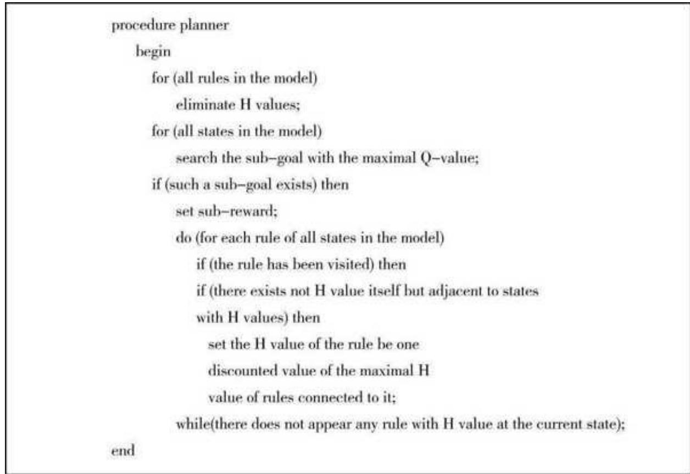  
Figure 2.1 Active exploration planning in Q-ae learning.

The procedure of the AEP is depicted in Fig.2.1, where sub-goal is defined as the state with the rule satisfied

$$
(s, a): \max  Q \left(s ^ {\prime}, a ^ {\prime}\right) \text {a n d} [ (2. 8) \text {o r} (2. 9) ], \tag {2.7}
$$

$$
\operatorname {f l a g} (s, a) = 0 \text {a n d} Q (s, a) = 0, \tag {2.8}
$$

$$
\beta^ {2} \times \max  Q \left(s ^ {\prime}, a ^ {\prime}\right) - Q (s, a) > 0, \tag {2.9}
$$

where $( \mathsf { s } ^ { \prime } , \mathsf { a } ^ { \prime } ) \in$ all observed rules. Flag associating with Q-values is used to decide whether the state is visited or not. Sub-reward is the value created by the agent at the sub-goal, and the discounted sub-reward is defined as H-value.

# The Q-ae Learning Algorithm

The model of the environment is built by real experiences. Meanwhile, the exploration planning mechanism uses the model and results of primitive RL to make an active exploration plan, and the exploitation uses real experiences on each episode to improve reinforcement values.

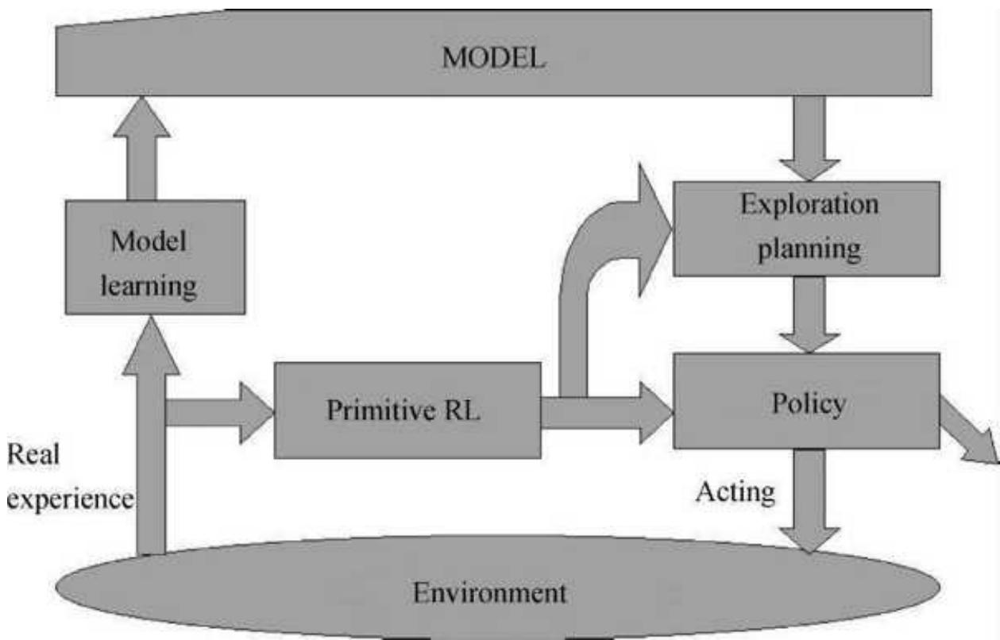  
Figure 2.2 The Q-ae learning architecture.

The architecture of the Q-ae learning system is depicted in Fig.2.2. The advantage of using experience to update is that it will efficiently utilize the knowledge derived by the agent fewer interaction with the environment.

```matlab
procedure action selector   
begin if (there exist sub-goal rules at the current state) then execute one of them randomly; for (all rules in the model) clear H values; elseif (there exist rule with H value) then execute the rule with the largest H value; if (the H value of the executed rule equals the sub-reward) for all rules in the model) else clear H values; else execute a rule according to greedy action selecting rule;   
end 
```

Figure 2.3 Action selector in Q-ae learning.

With the AEP and its corresponding action selector shown in Fig.2.3, the Q-ae learning algorithm is described as follows:

(a)Initializes Q(s, a), H(s, a) and Model T(s, a) for all s $\in$ state and a $\in$ action. $\mathrm { ~ \bf ~ S ~ } \gets$ initial state. Do forever:   
(b)Calls the active exploration planning procedure as shown in Fig.2.1.   
(c)Chooses an action a according to the action selector Fig.2.3, executes it.   
(d)Observes the following state. If no reward is received, goto (c).   
(e)Receives the reward and makes experience replay according to

$$
Q (s, a) = (1 - \alpha) Q (s, a) + \alpha (r + \beta \max  _ {a ^ {\prime}} Q \left(s ^ {\prime}, a ^ {\prime}\right)), \tag {2.10}
$$

goto (b).

where the Q-value update rule 2.10 can be considered as Q(λ)-learning ［ 24 ］ with $\lambda = 0$

Convergence of the Q-ae Learning

Before giving the convergence theorem of the Q-ae learning, two definitions are described here.

# Definition 1 we define

$$
Q (s, a) > \beta^ {2} \max  _ {b} Q \left(s ^ {\prime}, b\right), \tag {2.11}
$$

as execution planning condition, where $\beta$ is the discounted factor, and $\mathsf { s } ^ { \prime }$ is the resultant state of the rule (s, a).

# Definition 2 we define

$$
\prod_ {j = 2} ^ {i} [ 1 - (1 - \beta) ^ {j} (1 - \alpha) ^ {1 - j} ] > \beta , \tag {2.12}
$$

as parameter designing condition, where $\alpha$ is the learning factor.

Then, the convergence theorem of the Q-ae learning can be given at the following.

Theorem 1 For the case of the Q-ae learning, suppose $\mathsf { S } _ { \mathrm { ~ i ~ } }$ is i steps state from the goal through the rule $( S _ { \mathrm { ~ i ~ } }$ , b), and $\mathrm { \Sigma } _ { \mathrm { { S } _ { \mathrm { { i } } } } }$ is $\mathrm { i } + 1$ steps state from the goal through the rule $( \mathsf { S } _ { \mathrm { ~ i ~ } } , \mathsf { b } )$ on an environment. In the learning process, when execution planning condition (2.11) and parameter designing condition (2.12) are satisfied, it can be confirmed that the least value $\mathrm { Q } ( \mathsf { S } _ { \mathrm { ~ i ~ } } , \mathsf { b } )$ is greater than the largest value $\mathrm { Q } ( \mathsf { S } _ { \mathrm { ~ i ~ } } , \mathsf { b } )$ .

Performance of the Q-ae Learning

We demonstrate the performance of the Q-ae learning on deterministic environments.

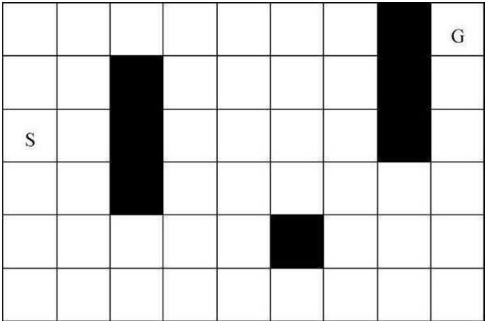  
Figure 2.4 A navigation task.

In navigation tasks shown in Fig.2.4 with grid of $6 { \times } 9$ and its extended problem with grid of $1 2 \times 1 8$ , $1 8 \times 2 7$ and $2 4 \times 3 6$ , "S" is the starting state, "G" is the goal, and the shaded places are obstacles. As an action (UP, DOWN, RIGHT, or LEFT) is performed, the state is transferred accordingly. It is the task that the agent learns an optimal path from "S" to "G". When it enters the goal, the agent gets reward 1.0. And when a sub-goal is found, the sub-reward is also set 1.0.

For the parameter, we use: the learning factor $\alpha = 0 . 5$ , the discounted rate $\beta = 0 . 9$ , $\varepsilon = 1 0 \sp { - 2 }$ for ε-greedy transition policy, and the threshold $\delta = 1 0 \textsuperscript { - 7 }$ for the prioritized sweeping method; 50 queue plans are used in every step in the environments $6 { \times } 9$ and $1 2 \times 1 8$ , 200 queue plans in $1 8 \times 2 7$ and $2 4 \times 3 6$ . Results of the simulation use the average number over 50 runs.

Table 2.1 Steps to reach the goal for the first time by greedy policy.

<table><tr><td>Environments</td><td>6×9</td><td>12×18</td><td>18×27</td><td>24×36</td></tr><tr><td>Q-learning</td><td>3429</td><td>20139</td><td>68732</td><td>154478</td></tr><tr><td>Dyna-Q</td><td>981</td><td>2290</td><td>5584</td><td>10866</td></tr><tr><td>Prioritized sweeping</td><td>927</td><td>2318</td><td>5655</td><td>8419</td></tr><tr><td>Q-ac learning</td><td>542</td><td>1196</td><td>3015</td><td>6183</td></tr></table>

Table 2.1 shows the number of steps when the agent first derives an optimal path by greedy policy, in which results demonstrate that the Q-ae learning accelerates the learning rate by comparing with representative RL methods, Q-learning, Dyna-Q and Prioritized sweeping algorithm.

# 2.2.3 Ant Colony System for Traveling Salesman Problem

Traveling Salesman Problem (TSP) ［ 25 ］［ 26 ］ is one of combinatorial optimization problems. Let ${ \boldsymbol { \mathsf { S } } } =$ $\{ \mathsf { s } _ { 1 } , . . . , \mathsf { s } _ { \textrm { n } } \}$ be a set of cities, $\mathrm { G } = \{ ( \mathsf { s } _ { \ 1 } , \mathsf { s } _ { \ 2 } ) : \mathsf { s } _ { \ 1 } , \mathsf { s } _ { \ 2 } \in \mathsf { S } \}$ be the edge set, and $\delta ( \mathsf { s } _ { \mathsf { \Omega } _ { 1 } } , \mathsf { s } _ { 2 } ) = \delta ( \mathsf { s } _ { \mathsf { \Omega } _ { 1 } } , \mathsf { s } _ { 2 } )$ is a cost measure associated with two cities $\textsf { s } _ { 1 }$ and s 2 . TSP is the problem of finding a closed tour with minimal cost that each city is visited once. As $\delta ( \mathsf { s } _ { 1 } , \mathsf { s } _ { 2 } )$ represents the Euclidean distance between two cities, we have an Euclidean TSP.

The Ant Colony System (ACS) is an efficient algorithm applying to the stochastic combinatorial optimization ［ 27 ］［ 28 ］ . There are three main characteristics in the ACS, which are distributed computation, positive feedback, and greedy heuristic. Distributed computation is associated with parallel searching of multiagent; the positive feedback is a policy for updating pheromone τ ; and the greedy heuristic η is a problem-dependent function providing learning agents with partial solution. Besides, a method accomplishing valid solutions and a probabilistic transition policy used to achieve a solution are also essential of ACS ［ 29 ］

A very well known agent-based search method is ACO that mimics the foraging process of ants. Ants deposit a smelly substance called pheromones. When picking a route, ants prefer a route were they can smell the most pheromone. The process of depositing pheromone is an example of stigmergy, which is the use of the environment as a signaling system to mediate communication between distributed agents.

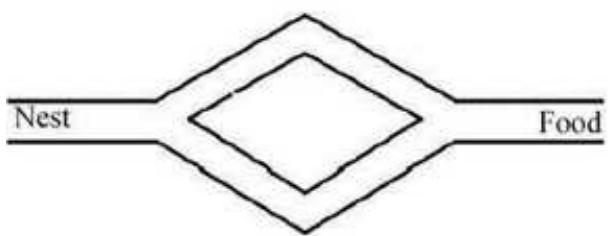  
（a)

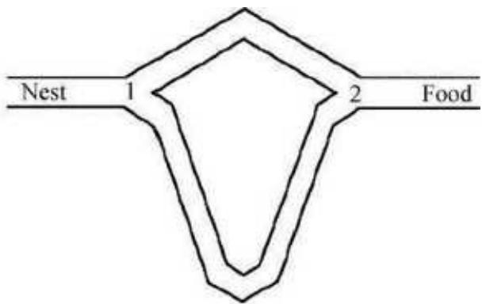  
(b)   
Figure 2.5 A bridge experiment for ant search.

Shown in Fig.2.5, an double bridge experiment is presented an explanation as to how ants solve optimization problems. If both of the bridges from food to the nest have equal length as in case (a), an equal number of ants start to traverse each bridge. Eventually, ants will pick one bridge or the other with equal probability. If bridges have unequal length as in case (b), more ants will travel across the shorter bridge and eventually only this route will be used. The ability to discover the more utile path is the heuristic that allows ACO to perform well in practice.

As the exploitation, agents in ACS are guided by (2.13) with both pheromone and heuristic during their tours on TSP,

$$
\operatorname {a r g m a x} _ {s _ {2} \in J _ {k} (s _ {1})} \left\{\left[ \tau \left(s _ {1}, s _ {2}\right) \right] \left[ \eta \left(s _ {1}, s _ {2}\right) \right] ^ {\mu} \right\}, \tag {2.13}
$$

where $\mathrm { ~ J ~ } _ { \mathrm { k } } ( \mathsf { s } )$ is the feasible cities of an agent k on a city s for the valid solution to TSP, and pheromone τ (s $_ 1 , { \bf s } _ { 2 } .$ ) is used as indication of better choice in long term, the value $\boldsymbol \eta ( \mathsf { s } _ { 1 } , \mathsf { s } _ { 2 } )$ is the inverse of distance between two cities, which is used as short term heuristic. As the biased exploration, agents use the probabilistic transition policy,

$$
p _ {k} \left(s _ {1}, s _ {2}\right) = \left\{ \begin{array}{l l} \frac {\left[ \tau \left(s _ {1} , s _ {2}\right) \right] ^ {\nu} \left[ \eta \left(s _ {1} , s _ {2}\right) \right] ^ {\mu}}{\sum_ {s \in J _ {k} \left(s _ {1}\right)} \left[ \tau \left(s _ {1} , s\right) \right] ^ {\nu} \left[ \eta \left(s _ {1} , s\right) \right] ^ {\mu}}, & \text {i f} s _ {2} \in J _ {k} \left(s _ {1}\right) \\ 0, & \text {o t h e r w i s e} \end{array} \right. \tag {2.14}
$$

which favors the choice of edges that are shorter and have a greater amount of pheromones, v and $\mu$ are both used to determine the relative importance of pheromone versus heuristic.

An important idea of ACS for solving TSP is allowing agents to cooperate by indirect media communication, i.e., pheromones placed on cities play the role of a distributed memory. This memory is not stored in any individual agent, but is deposited on each city. As the indirect media communication, when all agents construct their solutions, pheromone $\tau ( s _ { 1 } , s _ { 2 } )$ on connective cities s 1 and s 2 is deposited on the globally best tour by applying the global updating policy,

$$
\tau \left(s _ {1}, s _ {2}\right) = (1 - \alpha) \tau \left(s _ {1}, s _ {2}\right) + \alpha \Delta \tau \left(s _ {1}, s _ {2}\right), \tag {2.15}
$$

Where

$$
\Delta \tau (s _ {1}, s _ {2}) = \left\{ \begin{array}{l l} (L _ {g b}) ^ {- 1}, & \text {i f} (s _ {1}, s _ {2}) \in \text {g l o b a l - b e s t - t o u r} \\ 0, & \text {o t h e r w i s e} \end{array} \right.
$$

and $\mathrm { L _ { \ g b } }$ is the length of the globally best tour from the beginning of the learning phase.

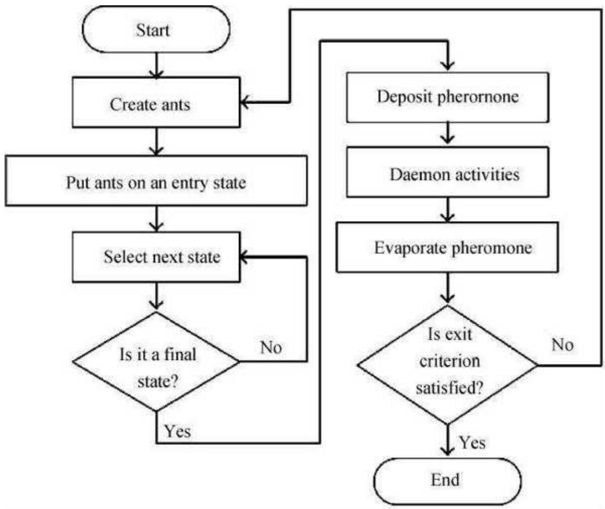  
Figure 2.6 Ant algorithm flow.   
Fig.2.6 gives a typical flow of the ant search algorithm.

# 2.3 The Q-ACS Multiagent Learning Method

There are two primary elements that play important roles on agents achieving their goal in multiagent learning system s ［ 30 － 32 ］ : the efficient cooperation among learning agents, and the efficient updating $[ \underline { { 3 \dot { 0 } } } - \underline { { 3 2 } } ]$ policy of each learning agent. The basic idea of the Q-ACS multiagent learning method is that the learning agents cooperate by indirect media communication and derive the solution by the experience replay Qlearning. The indirect media communication method means that the reinforcement values are distributed on the common observing model of the embedded environment. The experience replay Q-learning means that the reinforcement values are updated to each rule belonging to each learning episode, which is the composition of the profit-sharing method and Q-learning ［ 33 ］ . Therefore, besides its past experiences, each agent in the Q-ACS learning method can benefit from other agents' episodic experience effectively.

# 2.3.1 The Q-ACS Learning Algorithm

The Q-ACS learning algorithm is given as follows:

1. Initialize the environment. Initialize the observing state. And, initialize Q-value.   
2. Do Until (end condition):

(a) Set agents to their initial positions in the environment.   
(b) Repeat within one trial by each agent:

· Observing the state in the environment. $\mathrm { ~ \bf ~ S ~ } \gets$ state observed.   
· Select an action a in the state s according to the action selecting policy, and execute it.   
· Observing the present state.

$\mathrm { \Sigma ^ { \prime }  }$ present state observed,

and getting a reward,

r(s, a) ← reward gotten.

· Make a local update according to the Q-value updating policy (2.10).

(c) Make a global update according to the Q-value updating policy (2.10).

where the end condition is set by applications. Both the local update and the global update are performed, although the local update is executed at each learning step and the global up date is executed only after each trial, which means that all agents construct their solutions on combinatorial optimization problems.

The state "observing" is unnecessary when applying the Q-ACS learning to combinatorial optimization problems like TSP. The exploitation (2.13) and the biased exploration of the probabilistic transition (2.14) based on the pheromone τ and the problem-dependent heuristic $\boldsymbol { \mathsf { \Pi } } \boldsymbol { \mathsf { \Pi } }$ are used as the action selecting policy for solving TSP. The Q-value update is performed by agents. And differences between Q-value update (2.10) and pheromone update (2.15) will be discussed in Section 2.3.2.

# 2.3.2 Some Properties of the Q-ACS Learning Method

The Q-ACS learning algorithm is suitable to MDPs because it inherits the performance of RL solving the problem without any knowledge about environment a priori; meanwhile, it can also be applied to combinatorial optimization problems like TSP, since it has specification of ACS, such as distributed computation, positive feedback, greedy heuristic, valid solution construction, and a probabilistic transition policy.

In the light of multiagent RL, the Q-ACS learning method presents an indirect media communication cooperating method for learning agents. The agents cooperate to exchange information in the form of Qvalues updated in observed common states of all agents.

From the point of view of multiagent learning system, the Q-ACS method can be considered as an improvement of ACS. In the global updating policy, ACS considers the measure related to the global best tour, but does not consider the desirability measure on the successive city. Taking the Q-values propagation of the Q-ACS, the modified global updating policy (2.15) can be written by

$$
\tau \left(s _ {1}, s _ {2}\right) = (1 - \alpha) \tau \left(s _ {1}, s _ {2}\right) + \alpha \left[ \left(L _ {g b}\right) ^ {- 1} + \beta \max  _ {s} \tau \left(s _ {2}, s ^ {\prime}\right) \right], \tag {2.16}
$$

where $s ^ { \prime } \in S$ . In the light of RL that the estimated reinforcement value is equal to the expected discounted sum of future rewards and following temporary best estimate, the Q-ACS method takes the benefit from the best policy at the successive state in the long run. Observing from the principle of Dynamic Programming ［ 34 ］ : during iteration processes of convergence computation, the current policy need to be replaced with the best policy at present, which indicates successive best value should be taken into account.

Moreover, the Q-ACS also makes the agents choose diverse tours that are benefit to find an optimal tour. The ACS can be seen as a sort of guided parallel stochastic search in the neighborhood of the best tour. Once all the agents have generated each tour at the end of iteration t, pheromones are deposited to the best tour till now, defining in this way a "preferred tour" for searching in the following iteration $\mathbf { t } + 1$ . In fact, during iteration $\mathbf { t } + 1$ , agents consider edges belonging to the best tour as more desirable selection and choose them with higher probability. As the global update policy (2.15) of ACS is rewritten in the form

$$
\tau \left(s _ {1}, s _ {2}\right) = \tau \left(s _ {1}, s _ {2}\right) - \alpha \left(\tau \left(s _ {1}, s _ {2}\right) - \Delta \tau \left(s _ {1}, s _ {2}\right)\right), \tag {2.17}
$$

it can be known that the τ has an inclination to converge to the $\Delta \tau$ , which is equal to $\left( \mathrm { L _ { \ g b } } \right) ^ { - 1 }$ that represents the inverse of the length of the globally best tour from the beginning of the learning. The pheromones imply agents to choose a desirable shorter tour, however it also reduces the effect of local update, since the effect of local update is to make agents choose diverse tours but (2.15) make agents concentrate on one tour. As we rewrite (2.16) in the form

$$
\tau \left(s _ {1}, s _ {2}\right) = \tau \left(s _ {1}, s _ {2}\right) - \alpha \left\{\tau \left(s _ {1}, s _ {2}\right) - \left[ \left(L _ {\phi}\right) ^ {- 1} + \beta \max  _ {s} \tau \left(s _ {2}, s ^ {\prime}\right) \right] \right\}, \tag {2.18}
$$

it can be known that the estimated value of pheromone will be not only relation to the length of the best tour till now, but also relation to each accordant best pheromone. This implies that the global update itself also makes agents choose best tour and the tour connected to the best tour, which enhances the chance for the agents exploring desirable tour near to the best tour.

# 2.3.3 Relation with Ant-Q Learning Method

In this section we introduce some of properties of Ant-Q ［ 35 ］［ 36 ］ , which is one of extension of Ant System (AS) ［ 37 ］ based on the Q-learning. Ant-Q is different from Q-learning in that while typical applications of Q-learning uses one single agent exploring the state space, Ant-Q uses a set of simple agents, called ants, cooperating to find good solutions to combinatorial optimization problems. These agents cooperate to exchange information in the form of Q-values in Q-learning.

There are two primary component elements that play important roles on ants achieving their goal: action selecting policy and reinforcement value updating. The action selecting policy in Ant-Q method is the same as in ACS. For the reinforcement value updating, there are two kinds of updating method, one is local updating method after each action step, and another is global updating method executed when a trip is completed. Ant-Q is a particular instance of ACS, which only takes Q-learning into the AS approach for pheromone local update, and pheromone global update in Ant-Q has not any difference with general ACS. From the point of view of multiagent learning system, the Q-ACS learning method can be considered as an improvement of ACS. Different from Ant-Q, the Q-ACS learning method modifies the global updating

policy from the viewpoint of RL for the learning agents to share better episodes, which is beneficial to the exploitation of the accumulated knowledge. In the global updating policy, Ant-Q considers the measure related to the global best tour, but does not consider the desirability measure on the successive city. While the Q-ACS learning method takes the Q-values propagation into the modified global updating policy (2.16). Obviously, this modification improves the variation rate of reinforcement values. That is the merit in general from the viewpoint of RL.

# 2.4 Simulations and Results

We apply the Q-ACS learning to the TSP, comparing with the ACS method. The parameters are used as followed: the learning rate α is set 0.8, the discounted rate $\beta 0 . 9$ , the parameter ${ \mathrm { ~ q ~ } } _ { 0 }$ that decide the exploitation transition or the biased exploration is set 0.9. The number of agents is used 8. And the number of cities is used 90. The cities positions are generated at random. The experimental results are the average over 30 runs where there are 5000 repeated times in each run.

Table 2.2 Results for comparison   

<table><tr><td></td><td>best cost</td><td>average</td><td>deviation</td></tr><tr><td>ACS</td><td>71.9</td><td>73.4</td><td>0.89</td></tr><tr><td>Q-ACS</td><td>71.8</td><td>72.9</td><td>0.67</td></tr></table>

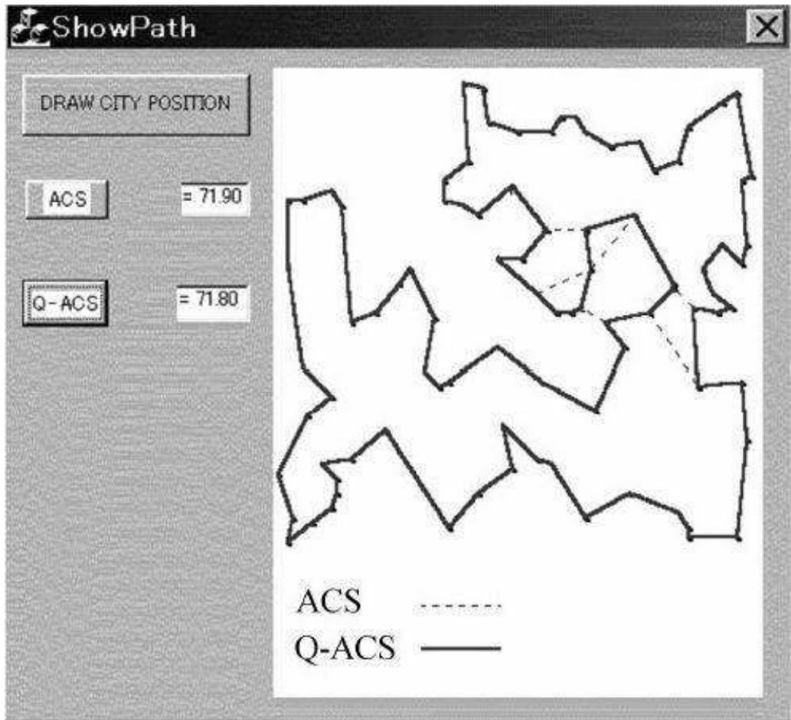  
Figure 2.7 Results of routes for 90 cities.

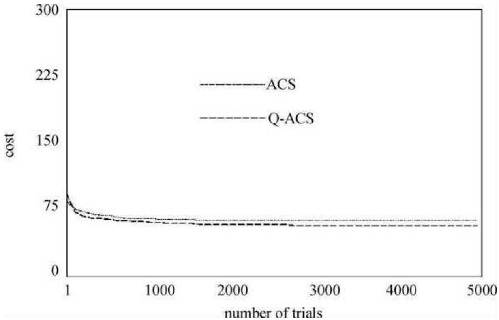  
Figure 2.8 Cost varying curve.

Table 2.2 shows the experimental results of the best cost of achieved shortest paths by each method for 90 cities at 30 runs, and the average number and corresponding deviation. Every Route of the methods is shown as Fig.2.7. Fig.2.8 depicts the average cost variation of each method. The horizontal axis represents the number of trials and the vertical axis represents the cost at that trial.

# 2.5 Conclusions

The Q-ae learning presented for tasks on MDPs, not only accelerates the learning rate with the execution planning condition (2.11), but also derives the optimal policy with the parameter designing condition (2.12) on the deterministic environment. By the Q-ae learning, the learning agent derives better results of identifying the environment and improves the correct rate of getting optimal policies.

This chapter also discussed the coordination methods of multiagent RL, and analyzed the performance of the coordination by sharing episodes and sharing policies. Based on indirect media communication among multiagent in ACS, this chapter presented the Q-ACS learning method by modifying the global updating rule from the viewpoint of RL for the learning agents to share better episodes, which is beneficial to the exploitation of the accumulated knowledge. The experimental results show that the Q-ACS is efficient for solving the optimization problem TSP.

# Bibliography

［ 1 ］ L.P. Kaelbling, M.L. Littman and A.W. Moore. Reinforcement learning: A survey ［J］, Journal of artificial intelligence research, Vol.4, 237-285, 1996.   
［2］ R.S. Sutton and A.G. Barto. Reinforcement learning: An introduction ［M］, MIT Press, Cam bridge, MA, 1998.   
［ 3 ］ C.J.C.H. Watkins and P. Dayan. Technical note: Q-learning ［J］, Machine learning, Vol.8, 55- 68, 1992.   
［ 4 ］ R.H. Crites, A.G. Barto. Improving elevator performance using reinforcement learning ［M］, Advances in neural information processing systems, the MIT press, 1996.   
［5］ S.P. Singh and D. Bertsekas. Reinforcement learning for dynamic channel allocation in cellular telephone systems ［C］, Advances in neural information processing systems: proceedings of the 1996 conference, MIT Press, 947-980, 1997.   
［6］ A. Notsu, K. Honda, and H. Ichihashi. Proposal for notion learning of reinforcement learning ［C］, Proc. of social intelligence design, 2009.   
［ 7 ］ S. Mehdi, H. Fard, A. Hamzeh, S. Hashemi. Using reinforcement learning to find an optimal set of features ［J］, Computers and mathematics with applications, Vol.66, 1892-1904, 2013.   
［ 8 ］ J. H. Holland. Adaptation in natural and artificial systems ［M］, Ann Arbor, MI, University of Michigan Press, 1975.   
［ 9 ］ K. A. Dowsland. Simulated annealing, modern heuristic techniques for combinatorial problems ［M］. C. R. Reeves, Ed., New York, NY: John Wiley & Sons, 20-69, 1993.   
［ 10 ］ M. Zlochin, M. Birattari, N. Jicolas Meuleau, and M. Dorigo. Model-based search for combinatorial optimization: A critical survey. Annals of operations research, Kluwer Academic Publishers, Vol.131, 373-395, 2004.   
［ 11 ］ J. Kennedy and R. C. Eberhart. Swarm intelligence ［M］. Morgan Kaufmann, 1942-1948, 2001.   
［ 12 ］ M. Dorigo. Optimization, learning and natural algorithms. PhD thesis, Dipartimento di Elettronica, Politecnico di Milano, Italie, 1992.   
［ 13 ］ L. Busoniu, R. Babuska, and B. D. Schutter. A comprehensive survey of multiagent reinforcement learning ［J］. IEEE Trans. Systems, Man and Cybernetics, Part C, 38(2), IEEE Press, 156- 172, 2008.   
［ 14 ］ R. Parr and S. Russell. Reinforcement learning with hierarchies of machines ［J］. Jan. 17, 1997.   
［ 15 ］ R. S. Sutton, D. Precup, and S. Singh. Between MDPs and semi-MDPs: a framework for temporal abstraction in reinforcement learning ［J］. Artif. Intell., 112(1-2), 181-211, 1999.   
［ 16 ］ T. G. Dietterich. Hierarchical reinforcement learning with the max $\mathrm { \Delta Q }$ value function decomposition ［J］. Journal of artificial intelligence, (13), 227-303, 2000.   
［ 17 ］ A. G. Barto and S. Mahadevan. Recent advances in hierarchical reinforcement learning ［J］. Discrete event dynamic systems, 13(1-2), 41-77, 2003.   
［ 18 ］ O. Abul. Multiagent reinforcement learning using function approximation ［J］, IEEE TRANS. on SMC-PART C, 30(4), 485-497, 2000.

［ 19 ］ M. Tan. Multi-agent reinforcement learning: Independent vs. cooperative agents ［C］, Proceedings of the tenth international conference on machine learning, 330-337, 1993.   
［ 20 ］ G. Weiss. Multiagent systems ［M］, The MIT Press, Cambridge, Massachusetts, London, England, 1999.   
［ 21 ］ R.S. Sutton. Learning to predict by the methods of temporal differences ［J］, Machine learning, Vol.3, 9-44, 1988.   
［ 22 ］ M.H. Kalos, P.A. Whitlock. Monte carlo methods ［M］, Wiley, New York, 1986.   
［ 23 ］ J.H. Holland, K.J. Holyoak. Induction ［M］, MIT press, 1986.   
［ 24 ］ J. Peng and R.J. Williams. Incremental multi-step Q-learning ［J］, Machine learning, No.22, 283-290, 1996.   
［ 25 ］ J.L. Bentley. Fast algorithms for geometric traveling salesman problems ［J］, ORSA J. Comput., Vol.4, 387-411, 1992.   
［ 26 ］ G. Reinelt. The traveling salesman ［M］, Lecture notes in computer science, Springer-Verlag Berlin Heidelberg, 1994.   
［ 27 ］ M. Dorigo and L. M. Gambardella. Ant colony system: A cooperating learning approach to the traveling salesman problem ［J］, IEEE Trans. Syst, Man, Cybern. B, 1(1), 53-66, 1997.   
［ 28 ］ V. Maniezzo and A. Colorni. The ant system applied to the quadratic assignment problem ［J］, IEEE Trans. knowledge and data engineering, 11(5), 769-778, 1999.   
［ 29 ］ R.S. Parpinelli, H.S. Lopes and A.A. Freitas. Data mining with an ant colony optimization algorithm ［J］, IEEE Transactions on evolutionary computation, 6(4), 321-332, 2002.   
［ 30 ］ C. Claus, C. Boutillier. The dynamics of reinforcement learning in cooperative multiagent systems ［C］, Collected papers from the AAAI-97 workshop on multiagent learning, 13-18, AAAI, 1997.   
［31］ S.S. Sian. Extending learning to multiple agents: Issues and a model for multi-agent machine learning ［J］, Y. Kodratoff (Ed.), Machine learning-EWSL 91, Springer-Verlag, 440-456, 1991.   
［ 32 ］ A. Notsu, K. Honda, and H. Ichihashi. Particle swarm for reinforcement learning ［C］, Proc. of joint 5th international conference on soft computing and intelligent systems and 11th international symposium on advanced intelligent systems(SCIS & ISIS 2010), 809-812, 2010.   
［ 33 ］ L. Lin. Programming robot using reinforcement learning and teaching ［C］, Proc. of 9th national conference on artificial intelligence, 781-786,1991.   
［ 34 ］ D.P. Bertsekas. Dynamic programming and stochastic control, Bellman, R.(ed.) ［J］, Mathematics in science and engineering, Vol.125, Academic Press, 1976.   
［ 35 ］ M. Dorigo and L. M. Gambardella. A study of some properties of Ant-Q ［M］, Springer-Verlag, Berlin, 657-665, 1996.   
［ 36 ］ L.M. Gambardella and M. Dorigo. Ant-Q: A reinforcement learning approach to the traveling salesman problem ［C］, Proceedings of ML-95, Twelfth Intern. Conf. on machine learning, 252-260, 1995.   
［ 37 ］ M. Dorigo and L. M. Gambardella. The ant system: Optimization by a colony of cooperating agents ［J］, IEEE Trans. Syst, Man, Cybern. B, 26(2), 29-41, 1996.

# Chapter 3 Multiagent Learning Methods Based on Indirect Media Information Sharing

Reinforcement Learning (RL) is an efficient learning method for solving problems that learning agents have no knowledge about the environment a priori, whereas Ant Colony System (ACS) provides an indirect media information sharing approach among cooperating agents. Based on the cooperating approach by the indirect media information sharing among agents in ACS and the update policy of reinforcement values in RL, taking the visited times into account for solving combinatorial optimization problems, this chapter presents the T-ACS multiagent learning method that provides a state transition policy for the learning agents to share better policies beneficial to the biased exploration. Meanwhile, considering the T-ACS learning method as homogeneous multiagent learning methods, in the light of the indirect media information sharing among heterogeneous multiagent, this chapter also presents another heterogeneous multiagent RL method, the D-ACS learning that composites the learning policy of the Q-ACS and the T-ACS, and takes different updating policies of reinforcement values.

# 3.1 Introduction

Reinforcement Learning (RL) ［ 1 － 5 ］ has become increasingly popular, in which the autonomous agents $[ \underline { { 1 } } - \underline { { 5 } } ]$ need to inhabit an environment without any knowledge a priori, and there are two characteristics in RL: trial-and-error in the environment and delayed rewards derived from the environment. Successful applications of RL methodologies to well behaved domains $[ \underline { { 6 } } - \underline { { 8 } } ]$ have encouraged researchers to investigate RL. A multiagent system with RL is one of the most powerful methods for handling dynamically changing and unpredictable domains $[ \underline { { 9 } } - \underline { { 1 2 } } ]$ . While very different in detail, these systems all face the issue of producing complex global behavior through the local interactions of their constituent parts. These agents are required to cooperate their activities with others to achieve their goals. Sian ［ 13 has developed a distributed learning system called MALE (MultiAgent Learning Environment) where cooperating learning is achieved via an interaction blackboard paradigm. Tan ［ 14 ］ has studied multiagent RL involving cooperation to accomplish tasks of hunter agents seeking to capture random moving prey in a simple grid environment. In his chapter, Tan has investigated three cooperating ways of learning agents: sharing sensation, sharing episodes, and sharing learned policies. Abul ［ 15 ］ has studied two cooperation mechanisms for RL, perceptual cooperation mechanism and observing cooperation mechanism. By the perceptual cooperation mechanism, other learning agents are described in the agent's state and cooperation information is learned from state transitions. Besides the perceptual cooperation, the rewards of nearby agents are also observed from the environment by the observing cooperation mechanism. Ant Colony System (ACS) ［ 16 ］［ 17 ］ is efficient method for solving combinatorial optimization problems ［ 18 ］ . The learning agents in ACS cooperate exchanging information efficiently by indirect media information sharing. In Ghavamzadeh and Mahadevan's research ［ 19 ］ , they address the issue of rational communication behavior among autonomous agents, try to extend the cooperative Hierarchical Reinforcement Learning (HRL) algorithm to include communication decision and presents a multiagent HRL algorithm, called COM-Cooperative HRL. In the algorithm, at specific levels of the hierarchy, called cooperation levels, a group of subtasks, in which coordination among agents has significant effect on the performance of the overall task, are defined as cooperative subtasks. Coordination skills among agents are learned faster by sharing information at cooperation levels, rather than the level of primitive actions. Then, a communication level to the hierarchical decomposition of the problem, below each cooperation level, is added. A communication action has a certain cost and is used by each agent to obtain the actions selected by the cooperative subtasks of the other agents. Before making a decision at a cooperative subtask, agents decide if it is worthwhile to perform a communication action in order to acquire the actions chosen by the cooperative subtasks of the other agents. Using this algorithm, agents learn a policy to balance the amount of communication needed for proper coordination, and communication cost. The simulation results demonstrate the efficacy of the COM-Cooperative HRL algorithm as well as the relation between communication cost and the learned communication policy, using a multiagent taxi domain.

Based on indirect media information sharing cooperation, in the light of two characteristics in RL, and from primary aspects of RL, update policy and action selecting policy, this chapter proposes homogeneous agents learning methods, the T-ACS multiagent learning method. Further, this chapter presents an extension of cooperation among heterogeneous learning agents, proposes the D-ACS multiagent learning method, by which the learning agents select diverse actions to improve the efficiency of the exploration. The proposed methods have the advantage of exploring the unknown environment actively and exploiting learned knowledge effectively, and are able to solve both problems with Markov Decision Processes (MDPs) and combinatorial optimization problems efficiently. And, one merit of taking indirect media distribution information sharing is that these methods by doing so are straightforward to lots of real-life applications, such as message routing.

# 3.2 The Multiagent Learning Method Considering Statistics Features

# 3.2.1 Accelerated K-certainty Exploration

The k-certainty exploration ［ 20 ］ is an action selector on RL to identify an MDP environment and is utilized to get the state changing probability P (s, a, s') and the expected immediate reward R(s, a) when the state is changed to a state s' from a state s as an action a is taken.

$$
P (s, a, s ^ {\prime}) = \frac {\text {t h e n u m b e r o f} s \text {t o} s ^ {\prime} \text {a s a s e l e c t e d}}{\text {t h e n u m b e r o f r u l e a s e l e c t e d}}, \tag {3.1}
$$

$$
R (s, a) = \frac {\text {t h e s u m o f r e w a r d g o t t e n a s a s e l e c t e d}}{\text {t h e n u m b e r o f r u l e a s e l e c t e d}}, \tag {3.2}
$$

A rule (s, a) is called k-certainty if and only if the number being visited it is larger than k. To identify an environment, all of rules in the environment must be at least k-certainty. The $\mathbf { k }$ -certainty exploration suppresses any loop of rules that achieve k-certainty. If there exist k-uncertainty rules at the current state, one of them is selected randomly. If all of rules at the current state are k-certainty, the suppressing process is to execute.

The accelerated k-certainty exploration method ［ 21 ］ is also an exploration oriented RL, which utilizes Profit Sharing (PS) 22 to create a sub-goal when a k-uncertainty rule is discovered at the beginning of each learning episode. If a sub-goal is created, a sub-reward will be set to the sub-goal. Then, this subreward is spread as discounted heuristic values to rules of adjacent states, finally a discounted heuristic value is spread to the start state of the current episode. As the result, the accelerated k-certainty exploration not only suppresses rules entering k-certainty loops, but also decides the direct path approaching sub-goal. Therefore, by the accelerated k-certainty exploration the learning agent derives the optimal policy with less learning trials.

# 3.2.2 The T-ACS Learning Algorithm

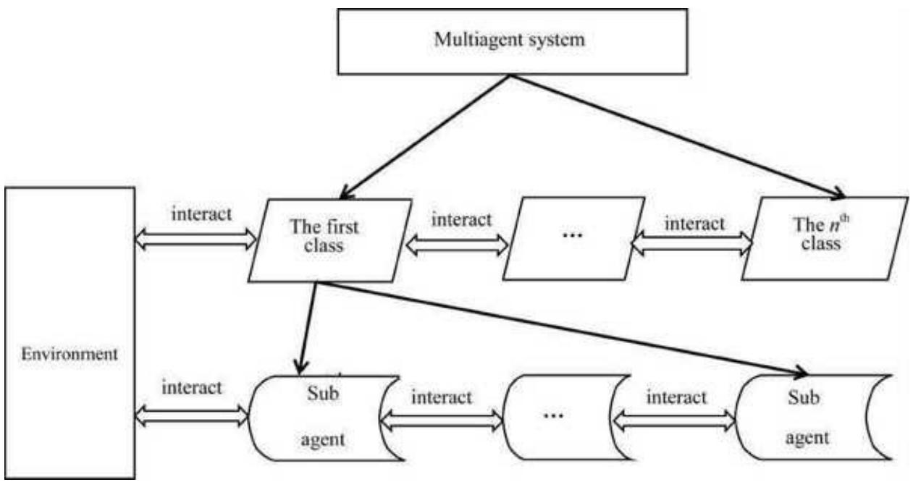  
Figure 3.1 A kind of multiagent interact model.

There are two important component elements that play important roles on agents achieving their goal in

multiagent learning systems: the action selecting rule, and the reinforcement value updating policy of each learning agent. As represented in Chapter 2, by utilizing Q-learning technique, the Q-ACS learning method introduces the global Q-value updating into the ACS ［ 23 ］［ 24 ］ method, which derives better results than traditional ACS method. The Q-ACS learning method is considered from the point of view of updating the reinforcement value. Here we discuss the action-selecting rule from another viewpoint. Considering the role of biased exploration of edges neighbor to the best route at present and with less visited times, we present the T-ACS multiagent learning method. Fig.3.1 gives a typical multiagent interact model.

To the action-selecting rule in RL system, it is important to balance the exploration and the exploitation. The positive feedback in accordance with the estimate updating in RL and the greedy heuristics help the action selecting policy to find acceptable solutions from long term and short term respectively. But those all are measures for effective exploitation. As the action selecting policy, it is necessary to consider effective exploration ［ 25 ］ . Thus, taking the visited times of states into account, this section presents the T-ACS multiagent learning method, which takes the same indirect media information sharing like the Q-ACS dispatching the reinforcement values on each state of the learning episode for the cooperation of learning agents. However, the T-ACS learning method gives an improvement of the action selecting policy to balance the exploitation and the exploration during learning processes. Consequently, the architecture of the T-ACS learning algorithm is similar to the Q-ACS learning method depicted in previous chapter except that the action selecting policy with relation to rules' visited times is adopted to emphasize the function of the exploration.

In RL, visited times is used to suppress the action reaching a certain visited times. As the result, it can accelerate the rate of exploration. In our multiagent learning system, agents' exploration has the same feature as single agent from the viewpoint of visited times since they share the common lookup table observed by all agents. Instead of selecting a rule at random with small probability ε by the ε-greedy transition policy, the T-ACS learning method take the policy selecting the rule with less visited times till current for solving MDPs. Therefore, the T-ACS learning method can realize an effective exploration on MDPs.

In the ACS system, an agent uses the probabilistic transition policy as the biased exploration

$$
p _ {k} \left(s _ {1}, s _ {2}\right) = \left\{ \begin{array}{l l} \frac {\left[ \tau \left(s _ {1} , s _ {2}\right) \right] ^ {\nu} \left[ \eta \left(s _ {1} , s _ {2}\right) \right] ^ {\mu}}{\sum_ {s \in J _ {k} \left(s _ {1}\right)} \left[ \tau \left(s _ {1} , s\right) \right] ^ {\nu} \left[ \eta \left(s _ {1} , s\right) \right] ^ {\mu}}, & \text {i f} s _ {2} \in J _ {k} \left(s _ {1}\right) \\ 0, & \text {o t h e r w i s e} \end{array} \right. \tag {3.3}
$$

which is given in Chapter 2. However, it makes higher probability to choose the edges belonging to best tour till now, which prevents the agents from performing biased exploration that is the original purpose of designing probability distribution. For convenience, $\lambda$ is used instead of $\lambda ( \mathsf { s } _ { 1 } , \mathsf { s } _ { 2 } )$ at following. For the T-ACS learning algorithm, in order to maintain the benefit of (3.3) that at the early phase of the search process acceptable solutions can be found quickly, and to enhance the biased exploration role, we introduce the factor of visited times into the probability distribution. For making the accumulated pheromone and visited times to play the role of biased exploration simultaneously, we take the form ［τ (s $_ { 1 } , { \mathsf s } _ { 2 } ) ] \quad \bar { - } \lambda ( { \mathsf s } _ { 1 } , { \mathsf s } _ { 2 } )$ , where $\lambda ( s _ { \textrm { 1 } } , s _ { \textrm { 2 } } )$ represents the visited times of edge $( \mathsf { s } _ { 1 } , \mathsf { s } _ { 2 } )$ . The probability distribution of biased exploration (3.3) is modified as

$$
p _ {k} \left(s _ {1}, s _ {2}\right) = \left\{ \begin{array}{l l} \frac {\left[ \tau \left(s _ {1} , s _ {2}\right) \right] ^ {- \lambda} \left[ \eta \left(s _ {1} , s _ {2}\right) \right] ^ {p}}{\sum_ {s \in J _ {k} \left(s _ {1}\right)} \left[ \tau \left(s _ {1} , s\right) \right] ^ {- \lambda} \left[ \eta \left(s _ {1} , s\right) \right] ^ {p}}, & \text {i f} s _ {2} \in J _ {k} \left(s _ {1}\right) \\ 0, & \text {o t h e r w i s e} \end{array} \right. \tag {3.4}
$$

Consequently, the T-ACS learning method is benefit for avoiding concentration on temporary feasible policy and making rapid discovery of optimal solutions.

# 3.3 The Heterogeneous Agents Learning

# 3.3.1 The D-ACS Learning Algorithm

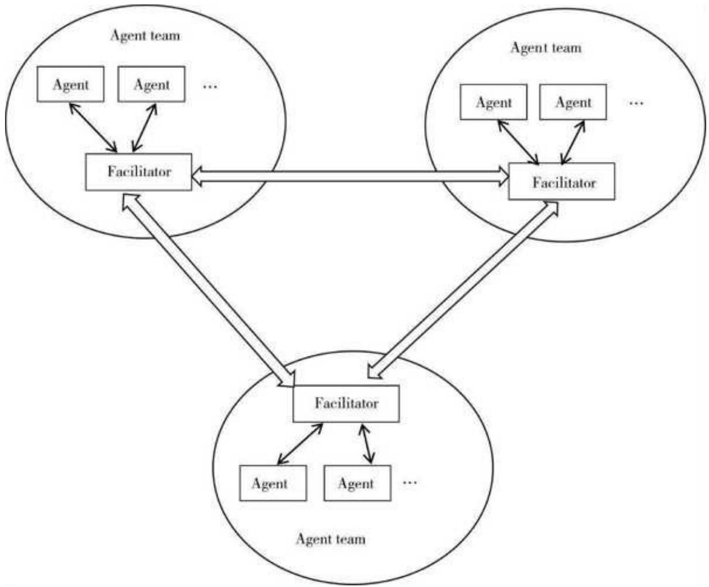  
Figure 3.2 A multiagent learning structure.

By the cooperation methods of the Q-ACS learning and the T-ACS learning described in previous sections, the cooperating agents use indirect media information sharing among multiagent as means of realizing cooperation. All agents in the Q-ACS learning method or the T-ACS learning method have the same updating policy and the same action selecting policy. It is also necessary that the agents cooperate with different action selecting policy to perform the same task. This section presents another way of sharing episodes performed by heterogeneous learning agents that have different action selecting policies and different reinforcement value updating policies. Since the different episode pattern will occur due to the different action selecting policies even though it is under the same state, the purpose of the heterogeneous agents RL is to produce diverse exploration and exploitation at learning processes to accelerate the learning rate. And we call this method the D-ACS learning, and its main principle is illustrated in Fig.3.2.

One way of cooperating is that agents use the same updating policy, but utilize different action selecting policies. As decision policies are different, the agents may explore the different parts of the environment. The cooperating way is that the learning agents extract their policies at certain frequency. The action selecting policy in the D-ACS learning adopts the Q-ACS learning and the T-ACS learning. The different policies will emphasis different aspects at the same state of embedded environment, which is expected to derive various tour beneficial to find better solution. The policies of the Q-ACS learning and the T-ACS learning are distributed to several different agents to accomplish the same task. As they select the action,

learning agents use each other's learned experiences to choose better one so that they can achieve their goal with less cost.

# 3.3.2 Some Discussions about the D-ACS Learning Algorithm

Both the D-ACS learning and the T-ACS learning are with the purpose to produce diverse tour to accelerate the learning rate. But they are different. The T-ACS learning method is to select an action at a state to encourage the exploration with the homogeneous agents. The D-ACS is with heterogeneous agents of the Q-ACS learning and the T-ACS learning. Parts of agents achieve mainly exploitation by the Q-ACS learning method, parts of agents accomplish encouraged exploration by the T-ACS learning method.

When a trial terminates, the reinforcement values set on the each edge will be updated with the best tour among all tour till now. At the next learning processes, the learning agents can share these reinforcement values. This point is correspondence with the expression of sharing episode. At the same time, as discussed in previous Sections, the propagation of reinforcement values plays important role on updating the reinforcement value. Since the purpose of the T-ACS learning method is to suppress the action having reached a certain visited times to balance the exploration and exploitation, when the agent finds better solution, it will propagate the reward to the tour on that episode. However, the agents with the T-ACS learning are assigned to only use the global updating policy to update reinforcement values at the end of each trial, not to use the local updating policy that is used in the ACS and the Q-ACS learning for each learning step. In other words, through this updating method, only tours on the best episode among all agents' episodes of each learning phase will be improved their reinforcement values, and the tours without better episode created by the T-ACS learning will not be updated. Thus by the T-ACS learning method, until agents derive a better tour, the updating at each learning step plays less role on solution update. By the D-ACS learning method, the learning agents can complement each other by exchanging their policies and benefit from it.

# 3.4 Comparisons with Related State-of-the-arts

In this section, we give comparisons with some similar works on Ant System (AS).

Table 3.1 Comparison for related methods   

<table><tr><td rowspan="2">method</td><td colspan="2">action selecting</td><td colspan="2">pheromone update rule</td></tr><tr><td>formula</td><td>parameter</td><td>global update</td><td>local update</td></tr><tr><td>ACS</td><td>PRP rule</td><td>v=1; μ=2</td><td>τ(s1,s2)=(1-a)τ(s1,s2)+aΔτ(s1,s2) Δτ(s1,s2)=\begin{cases}(L_{ab})^{-1}, &amp; (s1,s2) \in global-best-tour \\0, &amp; otherwise\end{cases}</td><td>τ(s1,s2)=(1-a)τ(s1,s2)+σΔτ(s1,s2) (1)Δτ(s1,s2)=0 (2)Δτ(s1,s2)=τ0→Simple ACS (3)Δτ(s1,s2)=βmax,r(t(s2,v&#x27;))→Ant-Q</td></tr><tr><td>Ant-Q</td><td>PRP Rule</td><td>v=1; μ=2</td><td>the same as ACS</td><td>reference to above column(3)</td></tr><tr><td>MMAS</td><td>PRP rule</td><td>v=1; μ=2 or 0</td><td>τ(s1,s2)=μr(s1,s2)+Δτ(s1,s2) Δτ(s1,s2)=1/f(s^{ba}), (s1,s2) ∈ best-tour</td><td>none in general</td></tr><tr><td>Q-ACS</td><td>PRO rule</td><td>v=1;μ=2</td><td>τ(s1,s2)=(1-a)τ(s1,s2)+a[(L_{ab})^{-1}+βmax,r(\tau(s2,s&#x27;))](s1,s2) ∈ global-best-tour</td><td>τ(s1,s2)=(1-a)τ(s1,s2)+a[(τ+βmax,r(\tau(s2,s&#x27;))], r is zero</td></tr><tr><td>T-ACS</td><td>PRP rule with times</td><td>v←λ; μ=2</td><td>the same as Q-ACS</td><td>the same as Q-ACS</td></tr><tr><td>D-ACS</td><td>Q-ACS&amp; T-ACS</td><td>v=1;μ=2 v←λ;μ=2</td><td>the same as Q-ACS</td><td>Q-ACS:do T-ACS:none</td></tr></table>

The comparison for each related method is given in Table 3.1. PRP rule in Table 3.1 represents the Pseudo-Random Proportion rule that is composed of the exploitation

$$
\operatorname {a r g m a x} _ {s _ {2} \in J _ {k} (s _ {1})} \left\{\left[ \tau \left(s _ {1}, s _ {2}\right) \right] \left[ \eta \left(s _ {1}, s _ {2}\right) \right] ^ {\mu} \right\}, \tag {3.5}
$$

and the biased exploration

$$
p _ {k} \left(s _ {1}, s _ {2}\right) = \left\{ \begin{array}{l l} \frac {\left[ \tau \left(s _ {1} , s _ {2}\right) \right] ^ {\nu} \left[ \eta \left(s _ {1} , s _ {2}\right) \right] ^ {\mu}}{\sum_ {s \in J _ {k} \left(s _ {1}\right)} \left[ \tau \left(s _ {1} , s\right) \right] ^ {\nu} \left[ \eta \left(s _ {1} , s\right) \right] ^ {\mu}}, & \text {i f} s _ {2} \in J _ {k} \left(s _ {1}\right) \\ 0, & \text {o t h e r w i s e} \end{array} \right. \tag {3.6}
$$

where the proportion of the exploitation and the biased exploration is decided by a ratio parameter ${ \mathfrak { q } } _ { 0 } ( 0 \leq$ ${ \mathfrak { q } } _ { 0 } \leq 1 _ { , }$ ) and the random uniform number q distributed in ［0, 1］.

ACS is an extension of the basic AS, which is described in Section 2.2.3. As shown in Table 3.1, Ant-Q ［ 26 ］ is a particular instance of ACS, which takes Q-learning technique into the AS approach for pheromone local update. Different from Ant-Q that set the next state evaluation term to null when performing pheromone global update, in the Q-ACS learning method, besides using Q-learning as local update, it also utilizes the experience replay Q-learning when performing global update on edges belonging

to the global best tour, which is originated from sharing episode of RL method. With this modification, the Q-ACS learning method can improve the pheromone update rate by considering the expected discounted sum of future rewards and following temporary best estimate together during episode replay.

MAX-MIN Ant System (MMAS) $\begin{array} { r l } { \left[ \begin{array} { l } { 2 7 } \end{array} \right] } & { { } \left[ \begin{array} { l } { 2 8 } \end{array} \right] } \end{array}$ is another extension of the basic AS. To alleviate stagnation of the search space, pheromone on each solution in MMAS is ranged within $\left[ \tau _ { \operatorname* { m i n } } , \tau _ { \operatorname* { m a x } } \right]$ .

After each iteration, $\tau ( \mathbf { v } _ { 1 } , \mathbf { v } _ { 2 } )$ is updated by global update rule given in Table 3.1, where pheromone persistence $\rho$ is set $0 \leq \mathsf { p } < 1$ , and f (s  best ) denotes the iteration best solution cost f (s  ib ) or the global best solution cost f $( \mathsf { s } ^ { \mathrm { \bf ~ g b } } )$ ). If $\tau ( \mathbf { v } _ { 1 } , \mathbf { v } _ { 2 } )$ is updated larger than $\tau _ { \mathrm { m a x } }$ , the $\tau ( \mathbf { v } _ { 1 } , \mathbf { v } _ { 2 } )$ is set equal to $\tau _ { \mathrm { m a x } }$ , and if $\tau ( \mathbf { v } _ { 1 } , \mathbf { v } _ { 2 } ) < \tau _ { \operatorname* { m i n } }$ , it set $\tau ( \mathbf { v } _ { 1 } , \mathbf { v } _ { 2 } ) = \tau _ { \operatorname* { m i n } } .$ By this pheromone bounds, even if the learning processes are being performed for a long time, edges belonging to the best tour till now will not be given too larger chosen probability than other edges; and edges with smallest pheromone till now will be chosen by probability larger than zero. For choosing appropriate pheromone limits, each time a new best solution is found, $\tau _ { \mathrm { m a x } }$ is changed dynamically by

$$
\frac {1}{1 - \rho} \frac {1}{f \left(s ^ {g b}\right)}. \tag {3.7}
$$

Then, $\tau _ { \mathrm { m i n } }$ is calculated by

$$
\tau_ {\min } = \frac {\tau_ {\max } \left(1 - \sqrt [ n ]{P _ {b e s t}}\right)}{\left(\operatorname {a v g} - 1\right) \sqrt [ n ]{P _ {b e s t}}}, \tag {3.8}
$$

where $\mathbf { a v g } = \mathbf { n } / 2$ , n is the number of cities, and pbest designates the probability of the optimal solution being found. Although PRP rule is adopted as the action selection in MMAS, the parameter $\mu$ is usually set to 0 when local search mechanism is used, otherwise is 2 just as other AS algorithms. Generally, only global update is performed by f (s  ib ), f (s  gb ), or mixed strategies of above two.

For deriving better solution, some mechanisms are often combined with AS, such as candidate list, local search, and branching factor. Candidate list in each given city contains a certain number of nearest neighbors for agents to choose as the next city. Local search technique, 2-opt procedure, 3-opt procedure or so, is often combined with AS too, where, for example, 2-opt procedure designate that two edges of the current solution are removed and the two resulting partial tours are reconnected by two other edges. Branching factor is to realize the exploration by increasing the probability of solution with low pheromone by the following modification to the pheromone

$$
\tau^ {*} \left(v _ {1}, v _ {2}\right) = \tau \left(v _ {1}, v _ {2}\right) + \delta \left[ \tau_ {\max } - \tau \left(v _ {1}, v _ {2}\right) \right], \tag {3.9}
$$

where $0 < \delta < 1$ , $\tau ( \mathbf { v } _ { 1 } , \mathbf { v } _ { 2 } )$ is the pheromone before smoothing and τ $^ { * } ( \mathbf { \nabla } _ { \mathbf { V } _ { \epsilon 1 } } , \mathbf { v } _ { 2 } )$ is the pheromone after smoothing.

The MMAS and the T-ACS learning method, also with branching factor, own common property that agents diminish monotony and explore different tours with a higher probability to improve solution than in the case with the same tour. However, how to prevent a premature stagnation of the search is different mainly in their ways. Both MMAS and branching factor realize this idea by adjusting pheromone being updated during pheromone updating phase. But different significantly, T-ACS learning method uses visited times in action selecting phase to determine the search of biased exploration. Since T-ACS learning method does not adjust the learned pheromone, it owns merit of not intervening in pheromone update procedures. And different from adjusting pheromone during pheromone update processes, the T-ACS learning method utilizes action selection to achieve the biased exploration that provide a kind of primary agent for the D-ACS learning method. By this approach, Q-ACS agents and T-ACS agents in the D-ACS learning method can share the same pheromones and do not affect each other's pheromones. Additional to the above, the idea of utilizing visited times is come from RL, thus the T-ACS learning method is also

suitable to MDP.

D-ACS is a novel proposition in AS utilizing heterogeneous multiagent to explore the different parts of the environment for deriving better solution, which is given detail description in Section 3.3.1.

# 3.5 Simulations and Results

We apply the multiagent learning method, the Q-ACS learning, the T-ACS learning and the D-ACS learning to hunter games and TSP for showing those efficiency on solving MDPs and combinatorial optimization problems.

For parameters in RL, the learning rate $\alpha$ is set 0.8, the discounted rate $\beta$ is 0.9, ε of the ε-greedy transition policy is 0.1. These values are generally used in RL, and are reasonable for these domains.

# 3.5.1 Experimental Results on Hunter Game

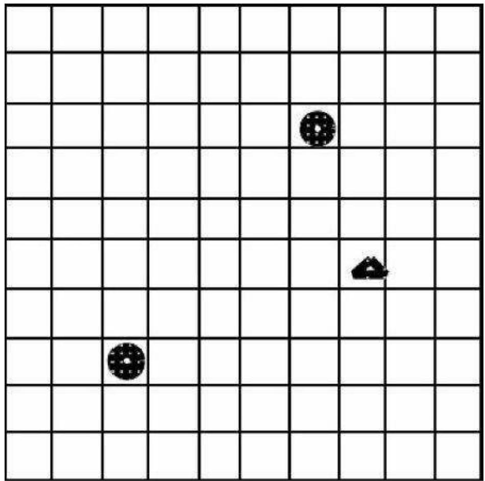


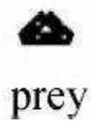  
Figure 3.3 A 10 by 10 grid.

The hunter game as problem of MDPs solved by the methods proposed by us is that hunter agents seek to capture a prey agent in a 10 by 10 grid depicted in Fig.3.3. On each step, each agent has four possible moving actions within the boundary: up, down, left, or right. More than one agent can occupy the same cell. When the hunter and the prey occupy the same position, the prey is captured, the hunter derives reward 1.0, and one trial is terminated. Hunters receive -0.1 cost for each move when they do not capture a prey. Each hunter has a limited visual field inside which it can locate a prey accurately. Each hunter's observation is represented by (x, y), where x, y represent the relative distance of the prey to the hunter according to position. And visual depth gives the maximal range of the visual field. For example, (-2, 2) is

an observing state when the prey is in the lower 2 and left 2 position of the hunter's visual field as the visual depth is set not less than 2. If there is no prey in sight, a unique default observation is used.

For the Q-ACS and the T-ACS learning methods, the ε-greedy transition policy is used as the action selecting policy, both the local update and the global update are executed during the learning processes. For the D-ACS learning method with proportion $1 : 1$ of the Q-ACS hunter versus the T-ACS hunter, one agent utilizes the Q-ACS learning and the other uses the T-ACS learning since there are only two hunter agents. The hunter agent using the Q-ACS learning method performs both the local update and the global update, whereas the hunter agent using the T-ACS learning method executes the global update merely.

The results are compared with Tan's sharing sensation cooperation by mutual-scouting agents since it receives better capture steps than sharing episodic experience or learned knowledge. Although we also assume the visual depth is 2, 3, or 4, just as the same condition given by Tan's simulation, the difference is that the hunters in our proposed methods share the common observing model but do not act as a scout for each other. The experimental results are the average over 50 runs where training processes are over 2000 trials and test processes are over 1000 times.

Table 3.2 Comparison of results on the hunter game for grid size 10.

(number of hunter $= 2$

Table 3.3 Comparison of results on the hunter game for grid size 20.   

<table><tr><td rowspan="2">Visual depth</td><td rowspan="2">Method</td><td colspan="2">Average steps capturing prey</td></tr><tr><td>Training</td><td>Test</td></tr><tr><td rowspan="4">2</td><td>Mutual-scouting</td><td>25.20(±0.79)</td><td>24.52(±1.24)</td></tr><tr><td>Q-ACS</td><td>25.26(±0.65)</td><td>24.37(±0.94)</td></tr><tr><td>T-ACS</td><td>24.92(±0.83)</td><td>24.07(±0.81)</td></tr><tr><td>D-ACS</td><td>24.90(±0.82)</td><td>24.09(±0.79)</td></tr><tr><td rowspan="4">3</td><td>Mutual-scouting</td><td>14.02(±0.75)</td><td>12.98(±0.65)</td></tr><tr><td>Q-ACS</td><td>14.76(±0.49)</td><td>12.38(±0.47)</td></tr><tr><td>T-ACS</td><td>14.04(±0.57)</td><td>12.27(±0.37)</td></tr><tr><td>D-ACS</td><td>14.07(±0.55)</td><td>12.30(±0.39)</td></tr><tr><td rowspan="4">4</td><td>Mutual-scouting</td><td>11.05(±0.56)</td><td>8.83(±0.78)</td></tr><tr><td>Q-ACS</td><td>10.20(±0.68)</td><td>8.45(±0.60)</td></tr><tr><td>T-ACS</td><td>11.59(±0.51)</td><td>8.01(±0.55)</td></tr><tr><td>D-ACS</td><td>11.56(±0.52)</td><td>8.15(±0.54)</td></tr></table>

Table 3.2 shows the average number of steps for the hunter capturing the prey during the learning (training process) and after the learning (test process), where values in parentheses represent the respondent deviation. The comparison in Table 3.2 shows that the proposed methods receive better results than the sharing sensation method. In here, we give some analyses on the results of 4 visual depths. The T-ACS learning method get results similar to D-ACS learning method, that are worse than the Q-ACS learning method since the exploration is emphasized during learning processes. After training, however, the test results, which use greedy policy to verify the leaning results, show that the T-ACS learning method and the D-ACS learning method derive better results.

(visual depth $= 8$ )

<table><tr><td rowspan="2">number of hunter</td><td rowspan="2">Method</td><td colspan="2">Average steps capturing prey</td></tr><tr><td>Training</td><td>Test</td></tr><tr><td rowspan="4">2</td><td>Mutual-scouting</td><td>44.79(±2.86)</td><td>27.82(±3.19)</td></tr><tr><td>Q-ACS</td><td>26.34(±2.46)</td><td>21.23(±2.90)</td></tr><tr><td>T-ACS</td><td>34.86(±2.53)</td><td>20.96(±2.38)</td></tr><tr><td>D-ACS(1:1)</td><td>31.27(±2.91)</td><td>20.95(±2.15)</td></tr></table>

Table3.3 continued   

<table><tr><td rowspan="2">number of hunter</td><td rowspan="2">Method</td><td colspan="2">Average steps capturing prey</td></tr><tr><td>Training</td><td>Test</td></tr><tr><td rowspan="4">4</td><td>Mutual-scouting</td><td>37.38(±2.01)</td><td>21.84(±1.96)</td></tr><tr><td>Q-ACS</td><td>21.09(±1.85)</td><td>15.37(±1.66)</td></tr><tr><td>T-ACS</td><td>19.68(±1.96)</td><td>11.53(±1.89)</td></tr><tr><td>D-ACS(3:1)</td><td>16.50(±1.79)</td><td>11.41(±1.49)</td></tr></table>

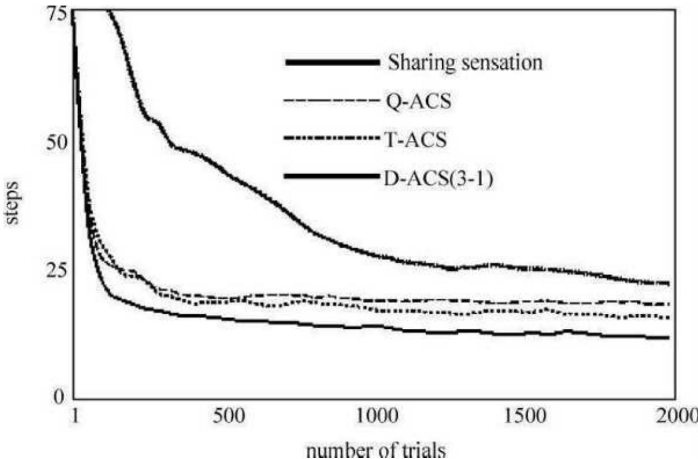  
Figure 3.4 Step variation curves for capturing prey by 4 hunters.

For comparison in larger environments, we enlarge the grid size from 10 to 20, and expand hunters' visual depth to 8. Besides 2 hunters with proportion $1 : 1$ of the Q-ACS hunter versus the T-ACS hunter in the D-ACS learning method, we also give simulation by the number of hunters 4, which the proportion of the Q-ACS hunter versus the T-ACS hunter in the D-ACS learning method is $3 : 1$ presented in parentheses of D-ACS item in "method" column of Table 3.3. Other simulation condition and parameter settings are the same as those in the grid size 10. Table 3.3 shows the average number of steps for the hunter capturing the prey during the learning and after the learning. Fig.3.4 depicts the variation curves of the average steps for

hunters capturing the prey with 4 hunters by each method, respectively. The horizontal axis represents the number of trials, and the vertical axis represents steps for hunters capturing the prey at that trial. In larger environments, from the comparison values in Table 3.3 and the curves in Fig.3.4, it can be explicitly known that the learning agents by the proposed methods derived better solutions than that by the sharing sensation method. It can be explained that indirect media information sharing plays important role than sharing sensation since indirect media information sharing accelerates the updating rate of reinforcement values. Moreover, the D-ACS learning method derives better results than the Q-ACS learning method or T-ACS learning method, because it emphases the role of indirect media information sharing by the Q-ACS learning agents, at the same time it also takes the merit of exploration into the environment by the T-ACS learning agents.

As explained in previous sections, the T-ACS learning method emphasizes the exploration to the action not visited or visited less times till now. If the number of T-ACS agents becomes more, the agents get to be keen on exploring, which results in ignoring the effect of the exploitation, so that it will not lead to get the optimal policy by short time. Although with other proportion of the Q-ACS agents versus the T-ACS agents the D-ACS learning method also gets better performance than the Q-ACS learning method or the T-ACS learning method separately, preliminary experiments show that the proportion $3 : 1$ of Q-ACS agents to T-ACS agents derives best results by 4 hunters. Thus, from this practice we recommend less number of T-ACS agents in the D-ACS learning method.

The results demonstrate that: indirect media information sharing of sharing common observing model plays important role on multiagent RL, which direct reason is to improve the performance of the action selecting policy. Hence, our proposed multiagent learning methods are efficient for MDPs.

# 3.5.2 Experimental Results on Traveling Salesman Problem

Solving TSP ［ 29 － 31 ］ by multiagent learning methods can be considered as two phases: the action selecting and the pheromone updating. The action selecting policy in the Q-ACS learning method uses PRP rule. The pheromone updating is performed by the local updating policy and the global updating policy that are with the same form as the iteration (2.16). The difference of action selecting policy in the T-ACS learning method is that it adopts the probability distribution (3.4) as the biased exploration. The D-ACS learning method, however, consists of the Q-ACS learning agents and the T-ACS learning agents with a certain proportion, and agents with the T-ACS learning method in the D-ACS learning method do not perform the local update.

The parameter $\mu$ is set 2, and the ratio ${ \mathfrak { q } } _ { 0 }$ in PRP rule is set 0.9, those are set the same values as in ACS. As parameter settings in MMAS, referring to Stutzle and by our preliminary experiments, we set $\rho = 0 . 6$ with 90 cities, $\rho = 0 . 7 5$ with 300 cities, $\rho = 0 . 8 5$ with 500 cities; $\mathtt { T } _ { \mathrm { m a x } }$ and $\tau _ { \mathrm { m i n } }$ are set dynamically as mentioned in Section 3.4 where $\mathrm { p } _ { \mathrm { \ b e s t } } = 0 . 0 5$ ; the initial pheromone is set with $\tau _ { \mathrm { a x } }$ after the first iteration. The mixed strategy of updating pheromone described in Section 3.4, such as candidate list, local search, and branching factor, are not installed in our simulations. The numbers of cities are used 90, 300 and 500, the cities positions are generated at random. The experimental results are the average over 50 runs where there are 10000 repeated times in each run.

Table 3.4 Results for comparison (300 cities)

<table><tr><td rowspan="2">8 agents</td><td colspan="3">300 cities</td></tr><tr><td>Minimal cost</td><td>Average</td><td>Deviation</td></tr><tr><td>Ant-Q</td><td>139.6</td><td>142.3</td><td>9.3</td></tr><tr><td>ACS</td><td>137.2</td><td>139</td><td>11.4</td></tr><tr><td>MMAS</td><td>139.4</td><td>144.6</td><td>17.93</td></tr><tr><td>Q-ACS</td><td>136.8</td><td>138.1</td><td>8.65</td></tr><tr><td>T-ACS</td><td>137.6</td><td>141.8</td><td>17.27</td></tr><tr><td>D-ACS</td><td>134.5</td><td>137.5</td><td>7.72</td></tr></table>

Table 3.5 Results for comparison (500 cities)   

<table><tr><td rowspan="2">8 agents</td><td colspan="3">500 cities</td></tr><tr><td>Minimal cost</td><td>Average</td><td>Deviation</td></tr><tr><td>Ant-Q</td><td>181.2</td><td>186</td><td>10.48</td></tr><tr><td>ACS</td><td>177.4</td><td>182.8</td><td>12.77</td></tr><tr><td>MMAS</td><td>189.6</td><td>205.2</td><td>19.42</td></tr><tr><td>Q-ACS</td><td>177.3</td><td>178.7</td><td>8.37</td></tr><tr><td>T-ACS</td><td>177.4</td><td>185.1</td><td>19.23</td></tr><tr><td>D-ACS</td><td>175.2</td><td>177.1</td><td>7.59</td></tr></table>

Table 3.6 Results for comparison (90 cities)   

<table><tr><td rowspan="2">90 cities</td><td colspan="3">4 agents</td><td colspan="3">8 agents</td><td colspan="3">16 agents</td></tr><tr><td>Min</td><td>Ave</td><td>Dev</td><td>Min</td><td>Ave</td><td>Dev</td><td>Min</td><td>Ave</td><td>Dev</td></tr><tr><td>Ant-Q</td><td>75.1</td><td>76.4</td><td>1.19</td><td>72.3</td><td>73.2</td><td>0.57</td><td>74.1</td><td>74.8</td><td>0.55</td></tr><tr><td>ACS</td><td>74.1</td><td>76.5</td><td>1.51</td><td>71.8</td><td>73.4</td><td>0.89</td><td>72.9</td><td>74.2</td><td>0.91</td></tr><tr><td>MMAS</td><td>73.5</td><td>76.3</td><td>1.01</td><td>73</td><td>73.9</td><td>0.49</td><td>72.9</td><td>73.7</td><td>0.88</td></tr><tr><td>Q-ACS</td><td>72.7</td><td>75.6</td><td>1.33</td><td>71.8</td><td>72.9</td><td>0.67</td><td>72.6</td><td>73.7</td><td>0.68</td></tr><tr><td>T-ACS</td><td>73.1</td><td>76.8</td><td>1.77</td><td>71.8</td><td>72.8</td><td>0.75</td><td>72.8</td><td>73.5</td><td>0.65</td></tr><tr><td>D-ACS</td><td>72.5</td><td>76.1</td><td>1.29</td><td>71.8</td><td>72.8</td><td>0.7</td><td>72.8</td><td>73.7</td><td>0.66</td></tr></table>

Table 3.4 and Table 3.5 show the experimental results of each method for 300 cities and 500 cities of each method by 8 agents, respectively. Table 3.6 shows the experimental results of each method for 90 cities by 4 agents, 8 agents and 16 agents respectively. The column "Min" presents the minimal tour cost in 50 runs of each method, the "Ave" is the average best tour cost of 50 runs, and the "Dev" is the corresponding deviation.

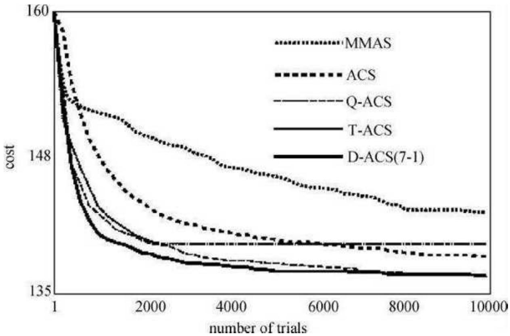  
Figure 3.5 Cost variation curves for 300 cities by 8 agents.

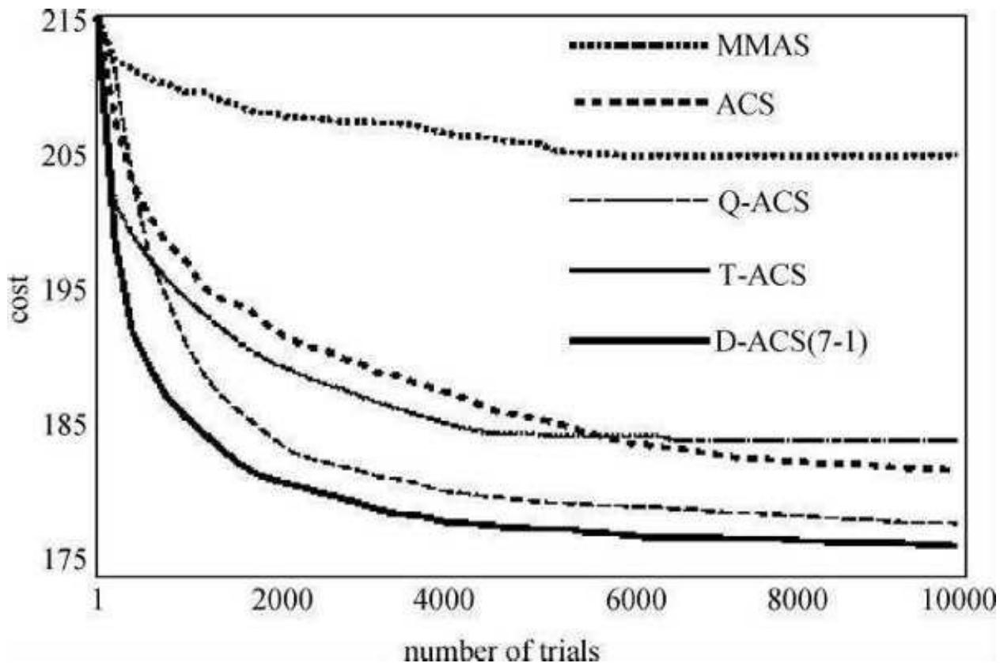  
Figure 3.6 Cost variation curves for 500 cities by 8 agents.

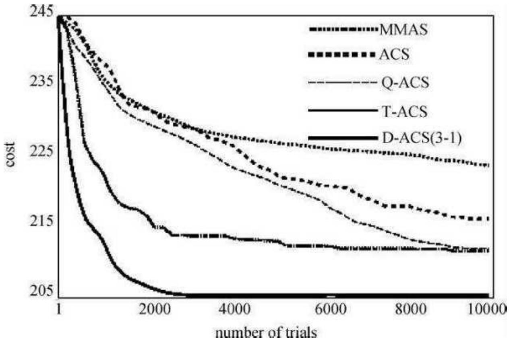

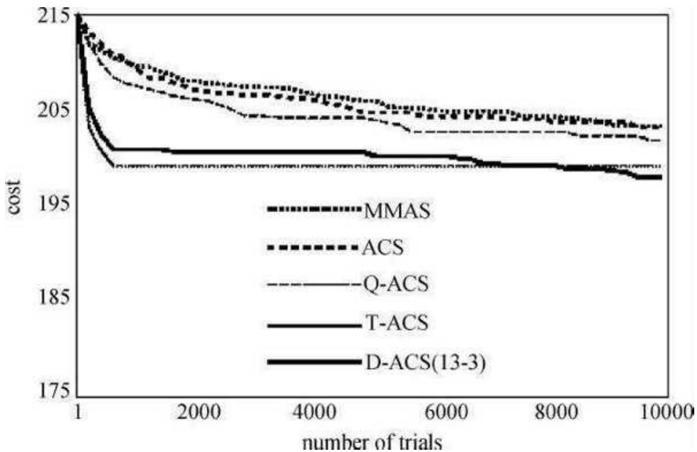  
Figure 3.7 Cost variation curves for 500 cities by 4 agents.   
Figure 3.8 Cost variation curves for 500 cities by 16 agents.   
Fig.3.5 and Fig.3.6 depict the variation curves of the average cost of each method for 300 cities and 500 cities by 8 agents, respectively, Variation curve of Ant-Q is not given here since its performance is similar to that of ACS.The horizontal axis represents the number of trials and the vertical axis represents the cost

at that trial. From the curves, it can be known that the learning agents by the Q-ACS learning and the D-ACS learning methods derived better solution than that by the ACS and MM AS. And the curves also show that the agents by the T-ACS learning method derived fast convergence with a few trial times at early learning processes. However, the T-ACS learning method did not get shorter tour later since it emphasizes the biased exploration, which gets longer tours at higher probability with the increment of the cities number. Fig.3.7 and Fig.3.8 depict the variation curves of the average cost of each method for 500 cities by 4 and 16 agents, respectively.

For the proposed methods and ACS, the case of 8 agents shows better performance than the other cases in Table 3.6 and Fig.3.6 to Fig.3.8, which pattern of results is similar to the ACS simulation by Dorigo. The reason can simply be explained as following: when the number of cooperation agents is not enough, e.g. 4, agents cannot derive enough information about the environment within a certain time, so they get an optimal tour with lower probability; on the other hand, if the number of learning agents is too greater, e.g. 16, it is easy for agents to bias toward exploitation courses, which lead to premature convergence before a lot of tours are explored. We also notice that MMAS derives better solution with larger numbers of agents than with smaller numbers of agents, since the bounds of pheromone providing larger opportunity for larger numbers of agents to find different tours. However, to get results approaching to those of ACS, MMAS needs a large number of agents according to the simulation results of Dorigo and Stutzle.

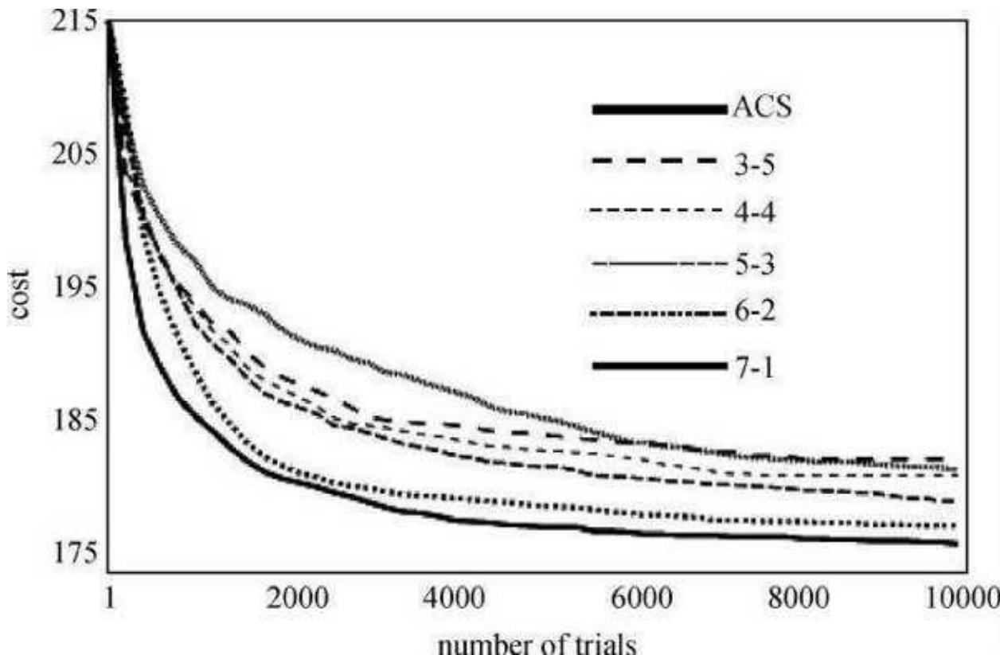  
Fig.3.9 depicts the variation curves of the average cost on 500 cities by the D-ACS learning method with different proportion of the number of agents 8, those are $7 : 1 , 6 : 2$ , and etc. of the Q-ACS agents to the

Figure 3.9 Cost variation curves for 500 cities by 8 agents D-ACS.

Table 3.7 Results for agents' proportion in D-ACS.   

<table><tr><td rowspan="2">500 cities16 agents</td><td colspan="5">proportion</td></tr><tr><td>15:1</td><td>13:3</td><td>11:5</td><td>8:8</td><td>6:10</td></tr><tr><td>Min</td><td>195.2</td><td>195.0</td><td>196.5</td><td>197.1</td><td>197.3</td></tr><tr><td>Ave</td><td>198.3</td><td>198.1</td><td>199.7</td><td>200.9</td><td>201.5</td></tr></table>

T-ACS agents. Table 3.7 shows the minimal tour cost and the average best tour cost on 500 cities by the D-ACS learning method with different proportion of the number of agents 16, those are 15∶1, 13∶3, and etc. of the Q-ACS agents to the T-ACS agents, respectively. Results show that better solutions can be derived with less number of T-ACS agents. And Fig.3.9 also depicts if the number of agents using T-ACS learning method is smaller than the number of agents using the Q-ACS learning method final average solutions are better than ACS. The reason why solutions become worse as the proportion of T-ACS agents becomes larger is that T-ACS learning method emphasizes on the biased exploration and prolongs time for pheromone accumulation to guide agents' action around good solutions. From above experimental results it can be known that for determining the suitable proportion of agents in the D-ACS learning method less number of T-ACS agents is recommended, which, however, has not been given analysis in theory by our present research.

The above experimental results demonstrate that the Q-ACS learning method, the T-ACS learning method and the D-ACS learning method are efficient for solving TSP.

# 3.6 Conclusions

Multiple agents will outperform all independent agents due to the fact that they have more resources and a better chance of receiving rewards. Based on the indirect media information sharing and the principle of RL, the homogeneous multiagent learning methods, the Q-ACS learning and the T -ACS learning, and the heterogeneous multiagent learning method, the D-ACS learning have been proposed by us. In the light of indirect media information sharing among multiple learning agents, besides performing local update by the form of Q-learning, Chapter 2, different from Ant-Q, presented the Q-ACS learning method by modifying the global updating policy from the viewpoint of RL for the learning agents to share better episodes, which is beneficial to the exploitation of the accumulated knowledge. And, in the opinion of RL taking the visited times into the action selecting policy to balance the exploitation and the exploration, this Chapter proposed the T-ACS learning method by presenting a state transition policy, which is beneficial to the biased exploration. This proposition, different from MMAS, does not intervene in the pheromone update procedures. Further, by composition the learning policy of the Q-ACS learning and the T-ACS learning, and taking different reinforcement values updating policies, this Chapter presented the heterogeneous multiagent RL method, the D-ACS learning, which is beneficial to the exploration of more diverse solutions for improving learning rate.

The methods proposed by us can be utilized to deal with problems on MDPs and the combinatorial optimization problems due to its advantages inherited from both characteristics of RL and agents' indirect media information sharing. Though the theoretical convergence of our proposed methods is not given here, the simulation results on solving the hunter game and the TSP show that the proposed multiagent learning methods are efficient and have faster convergent rate compared with representative learning methods on each domain, respectively. Still now, there is very little theory to explain the reasons of success with ACS. In the reference by Stutzle ［ 32 ］ , a simple convergence proof of ACS for combinatorial optimization problem is given. So, we will next discuss the convergence proof of our proposed method.

# Bibliography

［ 1 ］ L.P. Kaelbling, M.L. Littman and A.W. Moore. Reinforcement learning: A survey ［J］, Journal of artificial intelligence research, Vol.4, 237-285, 1996.   
［2］ L. Lin. Programming robot using reinforcement learning and teaching ［C］, Proc. of 9 rd national conference on artificial intelligence, 781-786, 1991.   
［3］ R.S. Sutton, A.G. Barto. Learning to predict by the methods of temporal differences ［J］, Machine learning, Vol.3, 9-44, 1988.   
［4］ C.J.C.H. Watkins, P. Dayan. Technical note: Q-learning ［J］, Machine learning, Vol.8, 55-68, 1992.   
［ 5 ］ H. S. Al-Dayaa, D. B. Megherbi. Reinforcement learning technique using agent state occurrence frequency with analysis of knowledge sharing on the agent's learning process in multiagent environments ［J］, the Journal of supercomputing, Vol.59, 526-574, 2012.   
［ 6 ］ R.H. Crites, A.G. Barto. Improving elevator performance using reinforcement learning ［M］, Advances in neural information processing systems, the MIT press, 1996.   
［7］ S.P. Singh, D. Bertsekas. Reinforcement learning for dynamic channel allocation in cellular telephone systems ［C］, Advances in neural information processing systems: proceedings of the 1996 conference, MIT press, 947-980, 1997.   
［ 8 ］ N. Aissani, B. Beldjilali, D. Trentesaux. Dynamic scheduling of maintenance tasks in the petroleum industry: a reinforcement approach ［J］, Engineering applications of artificial intelligence, Vol.22, 1089-1103, 2009.   
［ 9 ］ S. Arai, K. Miyazaki and S. Kobayashi. Methodology in multi-agent reinforcement learning ［J］, Journal of Japanese society for artificial intelligence, 13(4), 609-617, 1998.   
［10］ S. Mikami. Reinforcement learning for multi-agent systems ［J］, Journal of Japanese Society for artificial Intelligence, 12(6), 845-849, 1997.   
［11］ G. Weiss. Multiagent systems ［M］, The MIT press, Cambridge, Massachusetts, London, England, 1999.   
［ 12 ］ Y. Wang, C.W. deSilva. A machine learning approach to multi-robot coordination ［J］. Engineering applications of artificial intelligence, Vol.21, 470-484, 2008.   
［ 13 ］ S.S. Sian. Extending learning to multiple agents: issues and a model for multi-agent machine learning ［J］, Y. Kodratoff (Ed.), Machine learning-EWSL 91, Springer-Verlag, 440-456, 1991.   
［ 14 ］ M. Tan. Multi-agent reinforcement learning: Independent vs. cooperative agents ［C］, Proceedings of the tenth international conference on machine learning, 330-337, 1993.   
［ 15 ］ O. Abul. Multiagent reinforcement learning using function approximation ［J］, IEEE TRANS. on SMC-PART C, 30(4), 485-497, 2000.   
［ 16 ］ M. Dorigo, L.M. Gambardella. The ant system: Optimization by a colony of cooperating agents ［J］, IEEE Trans. Syst, Man, Cybern. B, 26(2), 29-41, 1996.   
［ 17 ］ M. Dorigo, L.M. Gambardella. Ant colony system: A cooperating learning approach to the traveling salesman problem ［J］, IEEE Trans. Syst, Man, Cybern. B, 1(1), 53-66, 1997.   
［ 18 ］ R.S. Parpinelli, H.S. Lopes and A.A. Freitas. Data mining with an ant colony optimization algorithm ［J］, IEEE transactions on evolutionary computation, 6(4), 321-332, 2002.

［ 19 ］ G. Mohammad, M. Sridhar. Learning to communicate and act in cooperative multiagent systems using hierarchical reinforcement learning ［J］, AAMAS 04.   
［ 20 ］ K. Miyazaki, M. Yamamura and S. Kobayashi. K-certainty exploration method: An action selector on reinforcement learning to identify the environment ［J］, Journal of Japanese society for artificial intelligence, 10(3), 454-463, 1995.   
［ 21 ］ G. Zhao, S. Tatsumi and R.Y. Sun. An accelerated k-certainty exploration method ［J］, Journal of Japanese society for artificial intelligence, 14(3), 547-552, 1999.   
［ 22 ］ J.J. Grefenstette. Credit assignment in rule discovery systems based on genetic algorithms ［J］, Machine learning, Vol.3, 225-245, 1988.   
［ 23 ］ V. Maniezzo, A. Colorni. The ant system applied to the quadratic assignment problem ［J］, IEEE Trans. knowledge and data engineering, 11(5), 769-778, 1999.   
［ 24 ］ M. Ghafoorian, N. Taghizadeh, H. Beigy. Automatic abstraction in reinforcement learning using ant system algorithm ［J］, AAAI spring symposium-technical report, 13(5), 9-14, 2013.   
［ 25 ］ H.S. Al-Dayaa, D.B. Megherbi. A fast reinforcement learning technique via multiple look ahead levels ［C］. Proceedings of the international conference on machine learning; applications, models, and technologies, Las Vegas, Nevada, USA, June, 2006.   
［ 26 ］ M. Dorigo and L. M. Gambardella. A study of some properties of Ant-Q ［J］, Springer-Verlag, Berlin, 657-665, 1996.   
［ 27 ］ L.M. Gambardella, M. Dorigo. Solving symmetric and asymmetric TSPs by ant colonies ［C］, IEEE conference on evolutionary computation (ICEC'96), 1996.   
［ 28 ］ T. Stutzle, H.H. Hoos. MAX-MIN ant system ［J］, Future generation computer systems, 16(8), 889-914, 2000.   
［ 29 ］ D. Pynadath and M. Tambe. The communicative multiagent team decision problem: Analyzing teamwork theories and models ［J］. Journal of artificial intelligence research, (16), 389-426, 2002.   
［30］ J.L. Bentley. Fast algorithms for geometric traveling salesman problems ［J］, ORSA J. Comput., Vol.4, 387-411, 1992.   
［ 31 ］ K. Socha, J. Knowles, and M. Sampels. A MAX-MIN ant system for the university course timetabling problem ［M］, M. Dorigo et al. (Eds.): ANTS 2002, LNCS 2463, 1-13, 2002.   
［ 32 ］ T. Stutzle, M. Dorigo. A short convergence proof for a class of ant colony optimization algorithms ［J］, IEEE transactions on evolutionary computation, 6(4), 358-365, 2002.

# Chapter 4 Action Conversion Mechanism in Multiagent Reinforcement Learning

This chapter gives a multiagent reinforcement learning with action perception and conversion mechanism that learning agents observe adversary agent and convert adversarial action to learning agents' corresponding action in their learning models as observing state variation incurred by the adversary agent in the task environment during learning processes. Meanwhile, this chapter investigates inexpensive communication ways among learning agents utilizing both the direct communication and the indirect media information sharing to realize agents' cooperation. By the action perception and conversion, the learning agents extend learning episodes and derive more observation by less action.

# 4.1 Introduction

Successful applications of Reinforcement Learning (RL) make it become increasingly popular investigation $[ \underline { { 1 } } - \underline { { 3 } } ]$ . RL is an efficient learning method for solving problems that learning agents have no knowledge about the environment a priori, and owns two characteristics: trial-and-error and delayed rewards. Multiagent RL method is one of the most powerful methodologies to deal with dynamical and unpredictable domains $[ \underline { { 4 } } - \underline { { 8 } } ]$ , such as pursuit problem, robotic soccer, and etc. These agents are required to cooperate their activities with others to achieve their goals. Tan ［ 9 ］ has investigated three cooperating ways of learning agents involving cooperation to accomplish given tasks: sharing sensation, sharing episodes, and sharing learned policies. Clau s ［ 10 ］ has studied Q-learning in cooperating multiagent systems under perspectives that learning agents attempt to learn the value of joint actions and the strategies of their counterparts. Tuyls $[ \ 1 1 \ ]$ has discussed the state-of-the-art of multi-agent reinforcement learning and the mathematical connection with evolutionary game theory. Abul ［ 12 ］ has presented perceptual and observing cooperation mechanisms, where other learning agents and the rewards of nearby agents are described in the learning agent's state, and cooperation information is learned from state transitions.

For solving problem under Markov Decision Process (MDP), by investigating the perception of the adversary action and common environment observation, this chapter presents the Q-ac multiagent RL method that designated multiagent Q-learning with Action Conversion. The adversary action conversion mechanism is presented as a kind of observation in the Q-ac learning method. And the direct communication and indirect media information sharing are utilized as cooperation methods in the Q-ac multiagent learning method. As well as per-action one-step Q-learning that Q-value update is performed after each action, experience-replay one-step Q-learning within each episode and prioritized sweeping Qvalue update are used to update reinforcement values in the Q-ac multiagent RL method. As results of the above propositions, the Q-ac learning method owns merits of more efficient observation and more efficient derivation of optimal action policy. In the extreme, learning agents can consider adversary action as their own exploration policy when adversary action is executed at random. This method is described as the extreme Q-ac multiagent RL, which allows learning agents to use exploitation for deriving maximal reward in learning processes.

# 4.2 Model-Based Reinforcement Learning

For solving MDPs, an RL agent finds an optimal policy by interacting with the MDP environment directly and the learning processes are iterative, since the quantities that define the MDP, the state transition probability and the reward, are not known in advance.

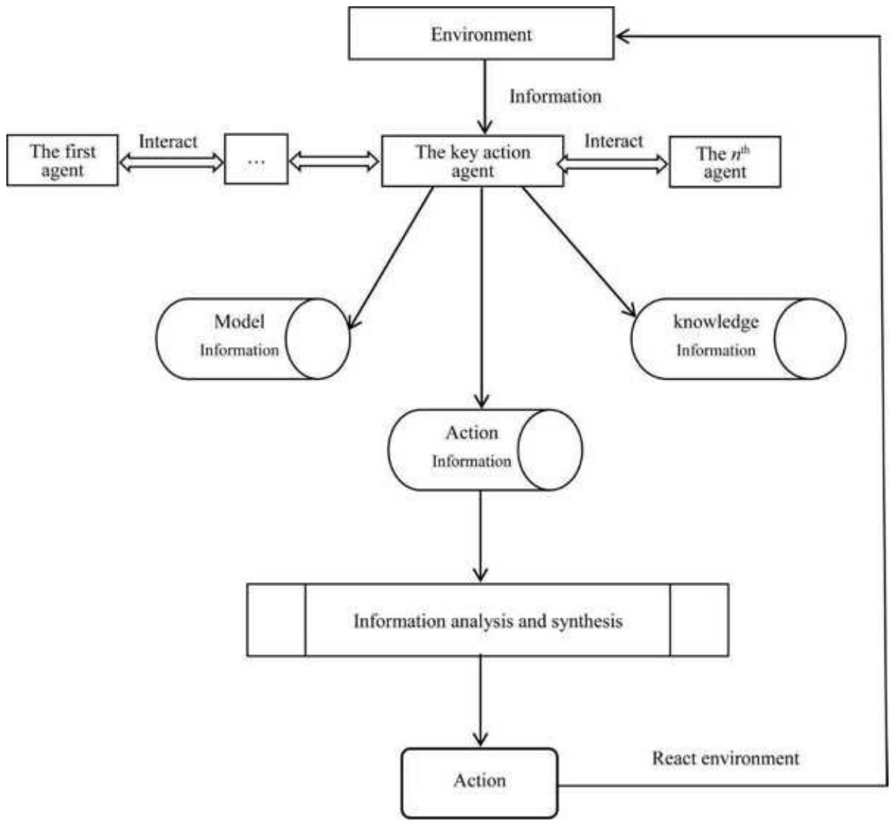  
Figure 4.1 A model-based multiagent reinforcement learning architecture.

An RL algorithm can be decomposed into two components: the action policy that maps experience into a selection of an action; the update policy that uses experience to update its estimate of the reinforcement value function. Fig.4.1 gives a model-based multiagent reinforcement learning architecture.

The One-step Q-learning

In Q-learning, Watkins associates reinforcement values with state action pairs, called Q-values being described as:

$$
Q ^ {\pi} (s, a) = R (s, a) + \beta E \left\{V ^ {\pi} \left(s ^ {\prime}\right) \right\}. \tag {4.1}
$$

Then, the optimal value function is expressed by

$$
Q (s, a) = R (s, a) + \beta E \left\{V \left(s ^ {\prime}\right) \right\}. \tag {4.2}
$$

where s'is the next state on executing an action $\alpha$ in a state s, and R(s, a) is expected value of a reword R(s, a). Clearly, the optimal policy can be written as

$\pi ^ { \ast } ( \mathrm { s ) \mathrm { { = } a r g m a x \Lambda _ { \mathrm { { a } } } Q \Lambda ^ { \ast } ( \mathrm { s , a ) , } } }$

and the optimal value function can be denoted as

$\mathrm {  ~ V ~ } ^ { * } \left( s \right) = \mathrm { m a x } _ { \mathrm {  ~ a ~ } } \mathrm { Q } ^ { \mathrm {  ~ * ~ } } ( \mathrm { s } , \mathrm { a } ) .$

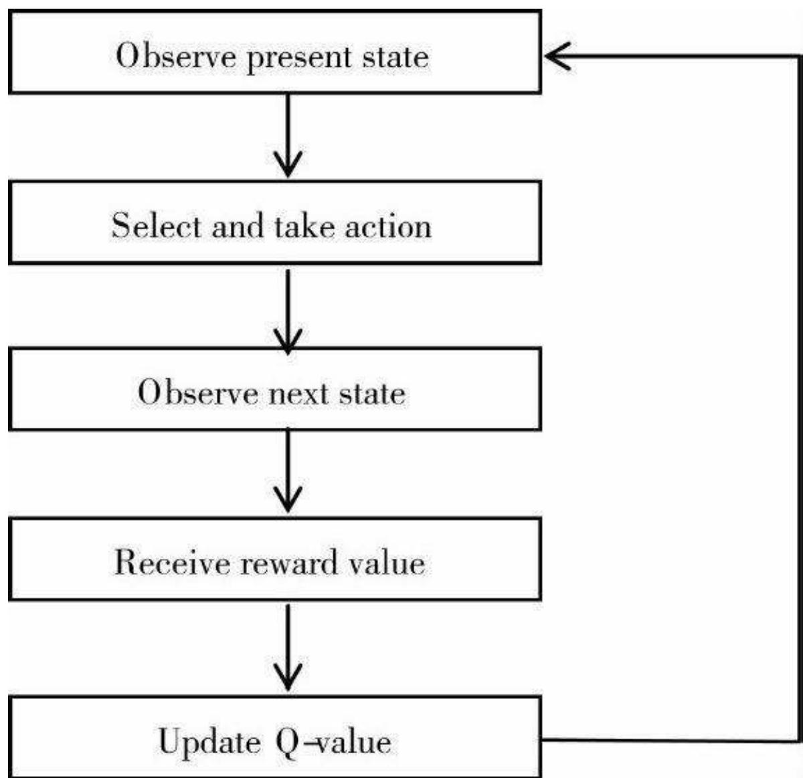  
Figure 4.2 Q-learning process.

One-step Q-learning (Q(0)-learning), which learning process is shown as Fig.4.2, estimates the optimal Qvalue function as follows:

$$
\begin{array}{l} Q _ {t + 1} \left(s _ {t}, a _ {t}\right) = \left(1 - a _ {t} \left(s _ {t}, a _ {t}\right)\right) Q _ {t} \left(s _ {t}, a _ {t}\right) + \\ \alpha_ {t} \left(s _ {t}, a _ {t}\right) \left[ r _ {t} + \beta \max  _ {b} \left(Q _ {t} \left(s _ {t + 1}, b\right)\right) \right], \tag {4.3} \\ \end{array}
$$

where $\mathrm { \Delta Q _ { \mathrm { \Delta t } } }$ is the estimate at the beginning of time step t, and $\mathsf { s } _ { \mathrm { ~ t ~ } } , \mathsf { a } _ { \mathrm { ~ t ~ } } , \mathsf { r } _ { \mathrm { ~ t ~ } }$ , and $\alpha _ { \mathrm { ~ t ~ } }$ are the state, action, reward,

and learning rate at time step t. The convergence of the Q(0)-learning algorithm does not put any strong requirements on the learning policy other than that every action is experienced in every state infinitely often. This can be accomplished, for example, by using the ε-greedy action-selecting policy, with which means an agent behaves greedily argmax a $\mathrm { Q } ( \mathrm { x } , \mathrm { a } )$ at most learning time, but with small probability ε, instead, selects an action at random.

To speed up the Q-learning rate, several model-based methods have been proposed, for example, Dyna-Q ［ 13 ］［ 14 ］ , Prioritized Sweeping ［ 15 ］［ 16 ］ and RTP-Q RL ［ 17 ］ that result in faster learning.

# 4.2.1 Dyna-Q Architecture

Dyna-Q is an architecture based on RL but which goes beyond trial-and-error learning. Its architecture includes a learned internal model of the task environment. This internal model can be used as hypothetical trial-and-error, which by intermingling with conventional trial- and-error can plan and learn optimal policy rapidly, yield learning strategies those are both more effective than model-free learning and more computationally efficient than the completed model-based learning.

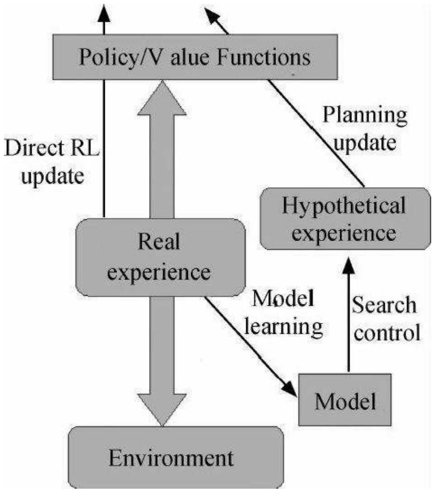  
Figure 4.3 Dyna-Q architecture.

The learning agent by Dyna-Q method learns from trial-and-error while simultaneously uses the learning experiences to learn an internal model and use the learned model to plan optimal action sequences by adjusting the estimate values. Fig.4.3 shows the general frame of the Dyna-Q architecture. The learned model is defines as something that behaves like the task environment: taking an action in a state is

supposed to generate a prediction of a successive state and a reward. The key idea in Dyna-Q is that an agent can perform the dynamic programming computation ［ 18 ］［ 19 using experiences obtained from actual state transitions in the task environment, meanwhile from hypothetical state transitions simulated using the internal model. And the model of the environment in Dyna-Q architecture can be refined by deriving training experiences from the state transitions ［ 20 ］ . As the result, the use of an internal model can greatly accelerate the trial-and-error learning processes.

# 4.2.2 Prioritized Sweeping Method

The Prioritized sweeping and the Queue-Dyna learning methods have been proposed those use a prioritizing scheme to order the value function estimate updates in the Dyna-Q architecture in order to enhance the learning and planning power. The Prioritized sweeping uses learned experiences to prioritize important DP sweeps and guide the exploration to the task environment, which allows everything above a minuscule change onto the priority queue.

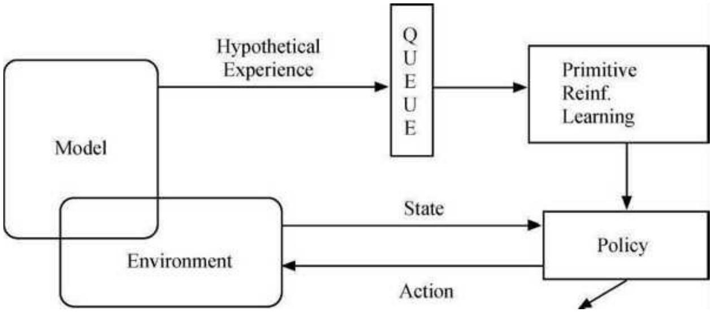  
Figure 4.4 Prioritized sweeping architecture.

The Queue-Dyna only allows predecessors onto the priority queue which have a predicted change greater than a significant threshold. Fig.4.4 shows the overview of the Prioritized sweeping architecture. These methods can be used to solve large state-space real time problems and are efficient for complex and realistic environments.

# 4.2.3 Minimax Search and Reinforcement Learning

Adversarial Tetris is a variation of Tetris that keeps the simplicity of playing rules and the complexity of the task and combines them with another aspect, adversity. The adversarial environment makes the task even more demanding and intriguing, as an unknown adversary tries to hinder the player from eliminating lines. The sole way for the adversary to achieve this is to choose pieces that augment the difficulty of completing lines for the player and can even leave out a tile from a whole game if it suits his adversarial game play.

Adversarial Tetris was formulated as a Markov Decision Process for the needs of the 3rd Reinforcement Learning Competition. The competition started in March 2009 and ended on June 2009. The domain of Adversarial Tetris had only two teams competing and unfortunately due to technical reasons our agent was not able to participate. The task, however, holds its interest beyond the competition due to its challenging nature.

Game playing has always been considered an activity requiring a good level of intelligence and therefore has become a major research area within AI and ML. Maria's research focuses on Adversarial Tetris, a variation of the well-known Tetris game, introduces at the $3 ^ { \mathrm { r d } }$ International Reinforcement Learning

Competition in 2009. In Adversarial Tetris the mission of the player to complete as many lines as possible is actively hindered by an unknown adversary who selects the falling in ways that make the game harder for the player. In addition, there are boards of different sizes and learning ability is tested over a variety of boards and adversaries. His research describes the design and implementation of an agent capable of learning to improve his strategy against any adversary and any board size. The agent combines MiniMax search enhanced with Alpha-Beta pruning for looking ahead within the game tree and the Least-Squares Temporal Difference Learning (LSTD) algorithm for learning an appropriate state evaluation function over a small set of features. The learned strategies exhibit satisfactory performance over a wide range of boards and adversaries and our agent achieves good scores on the testing run of the competition. The approach is to combine a Game Search algorithm in order to produce a strategy that will confront the adversary and minimize its effect on our agents game play and a Reinforcement Learning Algorithm that enables the agent to learn how to perform well in this game. The Minimax Search Algorithm combined with Alpha-Beta Pruning enables the agent to "think" beyond his immediate move, at least see the opponent's move in response to his own. However, this does not suffer as the agent must learn which actions will return high reward in the long run. The proposed agent exhibits a good learning performance and balances the criteria of maximizing his score in respect to the opponent's moves, while trying not to lose during the game ［ 21 ］

# 4.2.4 RTP-Q Learning

Dyna-Q architecture uses actual experiences and hypothetical experiences to update the estimate values simultaneously. But there is not any mechanism in its system to make a learning agent explore the task environment actively and refine the model more accurately, which is an important reason that conducts the learning agent falling into local optimal policies when the internal model is not correct. Not existing any action-selecting mechanism to implement active exploration is also an important reason that Q-learning needs numerous trials to learn an optimal policy ［ 22 ］［ 23 ］

In a learning system with planning such as the prioritized sweeping architecture, besides using the internal model to generate effective hypothetical experiences to update the reinforcement values, one role for real experience is to improve the model more accurately to match the real environment, which is called model learning ［ 24 ］ . The basic idea of the planning in the RTP-Q learning is viewed as: besides making fuller use of a limited amount of experiences to achieve a better policy with fewer environment interactions that is implemented as in the prioritized sweeping system, planning is also used to help the learning agent to realize model learning and get more knowledge about the environment.

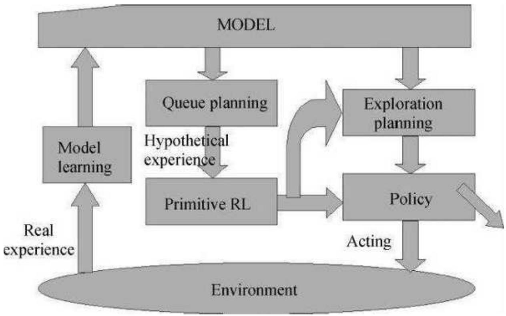  
Figure 4.5 Overview of RTP-Q architecture.

The architecture of the RTP-Q learning system is shown as Fig.4.5. The model of the environment is built by real experiences. Q-learning is used as primitive RL. The queue planning uses the model to increase computational efficiency, and the exploration planning mechanism uses the model and results of primitive RL to make an active exploration plan.

# 4.3 The Q-ac Multiagent Reinforcement Learning

In a multiagent RL system, for agents achieving their goal, two primary elements, that is to say, the efficient cooperation and reinforcement value updating, play important roles. In the Q-ac multiagent RL method, the learning agents cooperate by the direct communication and indirect media information sharing, and update reinforcement value by updating policies of the per-action Q-learning, experience-replay Qlearning, and prioritized sweeping approach. The direct communication is used to realize sharing sensation between learning agents. The indirect media information sharing method is realized by means of distributing the reinforcement values on the common lookup table of the learning agents. The per-action Qlearning means learning agents update Q-values after each action by Q(0)-learning. The experience replay Q-learning 25 means that reinforcement values are updated by the Q(0)-learning on the state action pairs belonging to the learning episodes as an agent derives rewards from the embedded environment during learning processes, where an episode is described in Section 1.1.3. The prioritized sweeping used by the Q-ac learning method utilizes all previous experiences to make the backup of reinforcement values.

# 4.3.1 Task Model

As denoted in Section 1.1.2, MDPs are widely used to model controlled dynamical systems. The hunter game is our task model under MDPs that hunter agents seek to capture a prey agent in a grid, which is the same description as in previous Section 3.5.1 based on Tan's simulation environment.

# 4.3.2 Converting Action

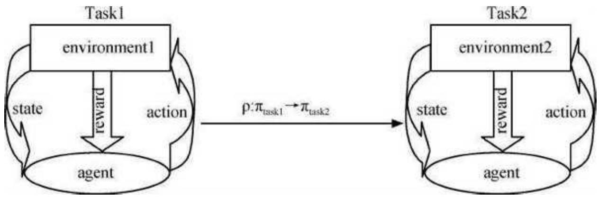  
Figure 4.6 Agent action-converting policy.

In trial-and-error processes, learning agents interact with the environment, take actions and change states. Meanwhile, the adversary agent also interacts with the environment. Assume that action types of adversary agent are the same as learning agents', then, when learning agents take the adversarial action as one objective being observed, actions taken by adversary agent can be converted to the learning agents' corresponding actions if adversary agent acts and changes a state in the environment. Some detail explanation is given in followings. Fig.4.6 shows the action-converting policy.

As it enters a state in the environment, the learning agent identifies the status of the state in accordance with the environment, which is usually described as observe. Learning agents' observation about environment is not stopping at the state change in the case that the change is caused by the adversary agent. Further, learning agents consider the state change caused by the adversarial action as the result of the corresponding action of their own. As the result, the learning agents convert adversarial action to the ones of their own. The hunters and the prey have the same action types except "WAIT" that is not necessary to be converted. In the hunter task, obviously, learning agents can observe the position of the prey. In other words, when the prey moves, learning agents can observe relative location before and after prey moving.

Definition 3 We define an agent's observability as that by comparing with the relative position of before and after the prey moves, and simply calculating it, the learning agent can observe the prey's action.

Then, with this definition, when the prey moves within hunters' scout range, the actions of the prey can be converted to learning agents' actions, e.g., "UP" of prey to "DOWN" of learning agents. Certainly, the state change in the environment is indeed performed by the prey in this case. As they observe the state change caused by the prey's move, hunters update their observations, and convert the prey action to their own actions.

By the action conversion, each learning agent can not only utilize the adversarial action as its own experience but also extend its episode length that are important factors for updating reinforcement values. And if the adversarial action is selected at random, in the extreme, each learning agent can always take its greedy policy when regarding adversarial action as learning agents' exploration, which will be discussed in Section 4.3.6.

# 4.3.3 Multiagent Cooperation Methods

Communication in multiagent learning system may be viewed as providing a cooperation infrastructure by exchanging information that allows agents to improve their learning activities. Learning agents in the Q-ac learning method integrate direct communication and indirect media information sharing to realize cooperation for multiple learning agents because they own uniform state representation of observation to the learning environment. The indirect media information sharing is realized by means of distributing the reinforcement values on the common environment mapping of the learning agents, which method is introduced from the Ant colony system ［ 26 ］［ 27 ］ . Obviously, it is an inexpensive communication way for learning agents to improve their activities. The direct communication is realized by sharing sensation between learning agents, and it is a low-level communication approach for the purpose of sharing information in order to improve activities of multiple learning agents. different from the high-level that is more complex communicative interactions like negotiation and mutual explanation, the low-level communication has the feature of less communication and inexpensive communication cost because of utilizing relatively simple query-and-answer interactions among learning agents.

The above description gives the answer to issues about with whom to communicate and how to communicate in multiagent learning system. At the following, we discuss the issues about what to communicate and when to communicate.

In hunter game, hunters scout the prey and inform sharing sensation for each other by direct communication, which cost for each learning step by Tan's sharing sensation can be calculated by bits of

$$
2 \log_ {2} (2 V _ {\text {d e p t h}} + 1) + \log_ {2} (\text {N u m b e r o f a c t i o n}), \tag {4.4}
$$

where V depth represents the visual field of the hunter agent. To reduce direct communication cost, we introduce a definition here.

Definition 4 We define an experience unit as the number of the actions steps not less than a certain number at intervals of two direct communications.

We can simply explain this concept as: when the prey is observed and the latest sending of sharing sensation has passed at least a certain steps, the hunter agent will send a message to the other. Moreover, there are two ways about informing the current position of the scout hunter to another hunter: sending the relative position to the start spot of the latest sent message, or sending the action experiences since the latest sent message. If the length of experience unit is n, the above two corresponding cost can be expressed by bits of

$$
\log_ {2} (2 n ^ {2} + 2 n + 1),
$$

and

nlog 2 (Number of action),

respectively. In hunter game, since the number of action is 4, it can be known that if setting the experience unit $\mathtt { n } \ge 3$ , the cost of sending the relative position is more inexpensive than that of sending the action

experiences for informing the scout hunter's position; or else, informing action experiences is more inexpensive. Since it is unnecessary to transmit the prey position at every step, this chapter adopts the form of informing the relative position. Then, according to the scout hunter's relative position of the current spot to the start spot and the scout hunter's sensation to the prey, another hunter agent can calculate the prey's current location to "observe" the state and take an action. It can be concluded that the total cost saved by our method compared with Tan's method is at least

$$
2 (n - 1) \log_ {2} \left(2 V _ {\text {d e p t h}} + 1\right), \tag {4.5}
$$

where $\mathtt { n } \ge 3$ is the length of experience unit.

The direct communication enhances learning agent's ability of observing the task environment. And the merit of indirect media communication for multiagent RL is explicit that the policy can be derived faster since reinforcement values are updated efficiently for learning agents with the same task.

# 4.3.4 Q-value Update

The per-action Q-learning is the primary element for learning agents to identify the environment through interacting with the environment and to realize the Q-value update after each action in the Q-ac multiagent RL method.

The experience replay is an extension of the Q-learning, which uses experiences derived by learning agents during the previous learning episode to update Q-values. In this way, agents can reduce learning trials required to learn a good action policy.

Prioritized sweeping uses all previous experiences both to prioritize important dynamic programming sweeps and to guide the exploration of state space. RTP-Q learning method improves the learning performance of prioritized sweeping with active exploration mechanism by using the concept of the "subgoal". Instead of threshold for deciding the queue for eventual updating in the prioritized sweeping approach, RTP-Q learning presents $\beta _ { 2 } \times \mathrm { V } ( \mathrm { s } _ { 1 } )$ to determine the exploring action, where $\mathsf { s } _ { 1 }$ is the successive state of the state action pair (s, a) and $\mathrm { V } ( \mathsf { s } _ { 1 } )$ is the utility with maximal Q-value in that state. In the detail, RTP-Q learning method sets the state that has $\ B _ { 2 } \times \mathrm { V } ( { \mathsf { s } } _ { 1 } ) - \mathrm { Q } ( { \mathsf { s } } , { \mathsf { a } } ) > 0$ and the successive state has maximal Q-value as the sub-goal. Here, we use the same "sub-goal" concept for selecting update candidates and utilize a Q-value update approach similar to the prioritized sweeping update. As an episode terminates, a hunter agent selects M state action pairs to form an update candidates queue that successive states with maximal Q-values and themselves not convergent, i.e., $\beta _ { 2 } \times \mathrm { V } ( \mathsf { s } _ { \mathrm { ~ 1 ~ } } ) - \mathrm { Q } ( \mathsf { s } , \mathsf { a } ) > 0$ in the common look-up table. Then, using one-step Q-learning updates those Q-values. This prioritized sweeping-like approach is suitable for the real-time requirement since it is done on the polynomial order time, that is, time complexity is O(MN ), where M is the length of prioritized sweeping queue, N is equal to the number of state×the number of kinds of action, and $\mathbf { N } > \mathbf { M }$ generally.

Therefore, in hunter game, when an episode terminates, the hunter agent who seized the prey updates Qvalues using experience replay within that episode; meanwhile, another hunter agent updates the Q-values using this prioritized sweeping-like approach by all previous experiences. By intuition, experience replay updates Q-value in "depth", and prioritized sweeping updates Q-value in "width". By combination of two update methods, the Q-values update rate can be accelerated ［ 28 ］［ 29 ］

# 4.3.5 The Q-ac Learning Algorithm

The Q-ac learning algorithm is given as follows:

1. Initialize environment. Initialize Q-value.   
2. Do until end condition:

(a) Initial positions of agents in the environment. Initial episodes of learning agents.   
(b) Each agent observes the state in the environment. $^ { \mathrm { ~ \tiny ~ 5 ~ }  }$ current state observed.

(c) Each agent selects an action according to the Q-ac action-selecting policy,a current action, and executes it.   
(d) Each agent repeats within each trial:

· Each agent gets reward $\Gamma ( \mathsf { s } , \mathsf { a } ) \gets$ reward gotten, and observes the state in the environment. ${ \boldsymbol { \mathsf { S } } } ^ { \prime } \gets$ next state observed,   
· Each agent selects an action according to the Q-ac action-selecting policy,

$\mathrm { ~ a ~ } \gets$ next action, and executes it,

· Each agent makes per-action update according to the Q(0)-learning,   
· Each agent adds episode, and   
· Each agent replaces current state observed with next state observed, and current action with next action, $\mathsf { S \gets S ^ { \prime } ; a \gets a ^ { \prime } }$ .

(e) The agent makes experience-replay update according to the Q(0)-learning in one episode.   
(f ) The agent makes prioritized sweeping Q-value update.

where the end condition is set by applications, and one trial terminates after a prey is seized by a hunter.

The Q-ac action-selecting policy is given as follows:

· If the learning agent observes that the adversary agent takes an action changing the observed state, then   
—the learning agent converts the adversarial action to its own corresponding action;   
· Otherwise

—the learning agent selects an action according to the ε-greedy policy.

# 4.3.6 Using Adversarial Action Instead of ε Probability Exploration

Since the prey executes action "UP", "DOWN", "LEFT", "RIGHT", and "WAIT" with uniform probability randomly, hunters can consider the state change caused by prey's action as their own exploration when converting the prey's action to their own except "WAIT" not causing the state change. Therefore, instead of the ε-greedy policy in the Q-ac multiagent RL method, the learning agents can always take their greedy policy in the extreme, and, we call this method the extreme Q-ac multiagent RL.

The advantage of taking the extreme Q-ac multiagent RL is that the learning agents can consider the adversary action as their own exploration policy when the adversary action is executed at random, which allows learning agents to use exploitation policy for deriving maximal reward even during the learning processes since the adversarial actions are used as the exploration policy.

# 4.4 Simulations and Results

We apply the Q-ac multiagent RL method to hunter game for showing its efficiency on solving MDPs. The size of the grid is set $1 0 \times 1 0$ and $2 0 \times 2 0$ , visual depth of hunters uses 2 , 4 ,6 in the grid $1 0 \times 1 0$ , and 2 , 4 , 6 , 8 in the grid $2 0 \times 2 0$ . The experimental results are the average over 100 runs, training process and test process are all over 1000 times, where training process means experiments during learning; and test process means experiments selecting action by the learned optimal policy and not updating Q-value. The experimental results are compared with Tan's sharing sensation cooperation by mutual-scouting agents.

For parameters in RL, the learning rate $\alpha$ is set 0.8 , the discounted rate $\beta$ is 0.9, ε of the ε-greedy transition policy is 0.1 , and the length M of prioritized sweeping queue is 10.

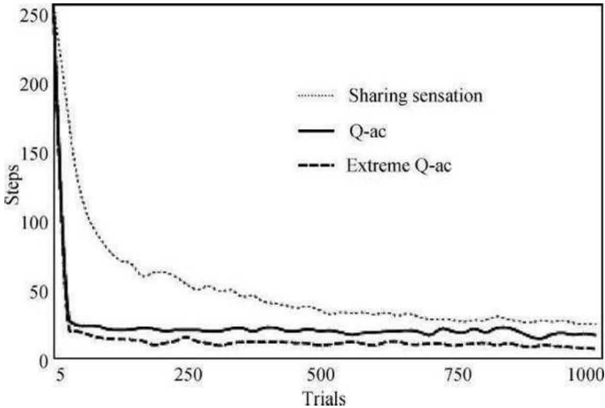  
Figure 4.7 Comparison of learning steps on grid $2 0 \times 2 0$ with visual depth 8.

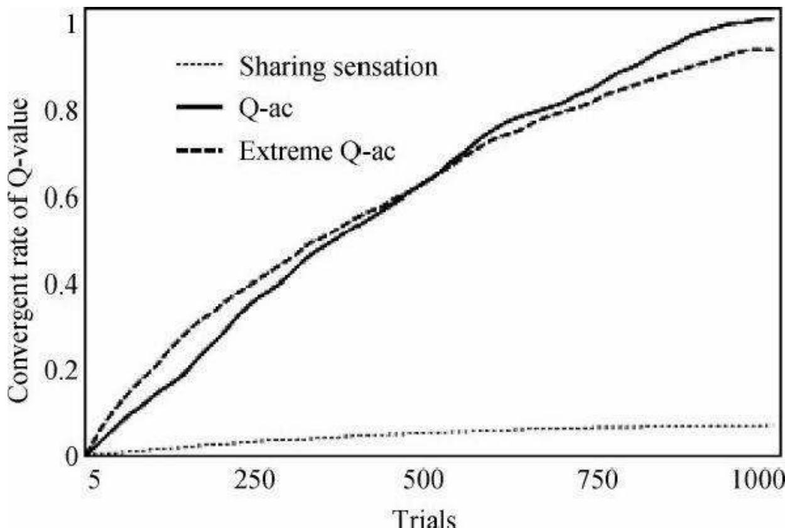

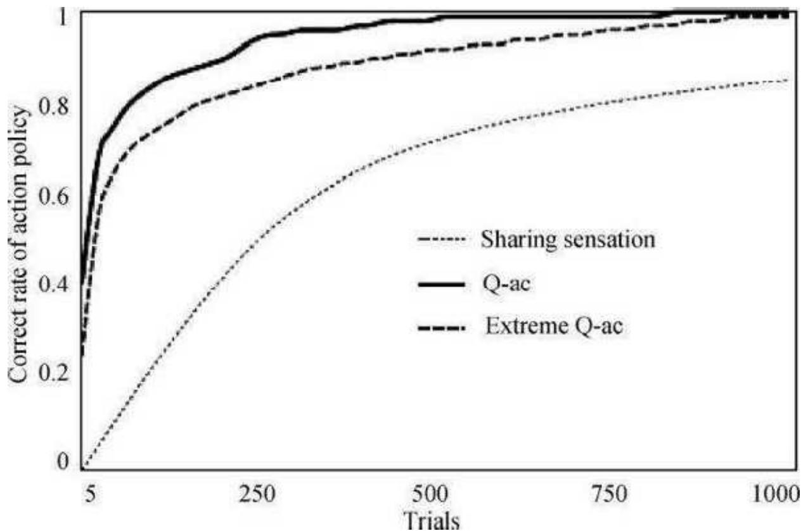  
Figure 4.8 Convergent rate of Q-value on grid $2 0 \times 2 0$ with visual depth 8.   
Figure 4.9 Correct rate of action policy on grid $2 0 \times 2 0$ with visual depth 8.   
Fig.4.7 depicts curves of the learning steps during the training processes, the sharing sensation method, the Q-ac learning method and the extreme Q-ac learning method on the grid $2 0 \times 2 0$ with learning agents' visual depth 8 . The horizontal axis represents the number of trials and the vertical axis represents the

number of steps used by hunters seizing the prey at that trial. Fig.4.8 and Fig.4.9 show curves of convergent rate of Q-value and correct rate of action-selecting policy by each method on the grid $2 0 \times 2 0$ with visual depth 8 , respectively. The horizontal axis is the same as Fig.4.7, and the vertical axis represents convergent rate of Q-value and correct rate of action-selecting policy till that trial ends, respectively. The results demonstrate that the learning methods proposed in this chapter improve the learning performance greatly.

Table 4.1 Comparison of learning steps, Q-value convergence rate and correct policy rate.   

<table><tr><td rowspan="2">Grid Size</td><td rowspan="2">Visual Depth</td><td rowspan="2">Method</td><td colspan="2">Steps capturing prey</td><td rowspan="2">Convergent rate of Q-value</td><td rowspan="2">Correct rate of action policy</td></tr><tr><td>Training</td><td>Test</td></tr><tr><td rowspan="9">10</td><td rowspan="3">2</td><td>Sharing sensation</td><td>20.5</td><td>13.2</td><td>0.22</td><td>0.98</td></tr><tr><td>Q-ac learning</td><td>15.3</td><td>11.2</td><td>0.85</td><td>1.00</td></tr><tr><td>Extreme Q-ac</td><td>13.9</td><td>10.7</td><td>0.70</td><td>1.00</td></tr><tr><td rowspan="3">4</td><td>Sharing sensation</td><td>11.0</td><td>5.6</td><td>0.07</td><td>0.97</td></tr><tr><td>Q-ac learning</td><td>7.6</td><td>5.0</td><td>0.95</td><td>1.00</td></tr><tr><td>Extreme Q-ac</td><td>6.5</td><td>4.8</td><td>0.81</td><td>1.00</td></tr><tr><td rowspan="3">6</td><td>Sharing sensation</td><td>9.6</td><td>4.6</td><td>0.03</td><td>0.90</td></tr><tr><td>Q-ac learning</td><td>6.7</td><td>4.2</td><td>0.97</td><td>1.00</td></tr><tr><td>Extreme Q-ac</td><td>5.5</td><td>4.0</td><td>0.89</td><td>1.00</td></tr><tr><td rowspan="12">20</td><td rowspan="3">2</td><td>Sharing sensation</td><td>146.1</td><td>123.0</td><td>0.51</td><td>0.99</td></tr><tr><td>Q-ac learning</td><td>130.4</td><td>110.0</td><td>0.85</td><td>1.00</td></tr><tr><td>Extreme Q-ac</td><td>116.9</td><td>107.6</td><td>0.79</td><td>1.00</td></tr><tr><td rowspan="3">4</td><td>Sharing sensation</td><td>83.5</td><td>59.1</td><td>0.26</td><td>0.97</td></tr><tr><td>Q-ac learning</td><td>56.8</td><td>42.0</td><td>0.92</td><td>1.00</td></tr><tr><td>Extreme Q-ac</td><td>46.2</td><td>39.8</td><td>0.85</td><td>1.00</td></tr><tr><td rowspan="3">6</td><td>Sharing sensation</td><td>57.2</td><td>29.5</td><td>0.12</td><td>0.93</td></tr><tr><td>Q-ac learning</td><td>28.2</td><td>16.9</td><td>0.95</td><td>1.00</td></tr><tr><td>Extreme Q-ac</td><td>22.5</td><td>17.6</td><td>0.91</td><td>0.96</td></tr><tr><td rowspan="3">8</td><td>Sharing sensation</td><td>47.3</td><td>18.7</td><td>0.07</td><td>0.85</td></tr><tr><td>Q-ac learning</td><td>18.8</td><td>10.4</td><td>0.98</td><td>1.00</td></tr><tr><td>Extreme Q-ac</td><td>15.9</td><td>11.9</td><td>0.93</td><td>0.97</td></tr></table>

Table 4.1 shows the average number of steps for the hunter capturing the prey in the training processes and the test processes on difference environments by the sharing sensation method, the Q-ac learning method and the extreme Q-ac learning method. The average convergent rate of Q-value and the average correct rate of action policy after the training processes are also shown in Table 4.1, where average convergent rate of Q-value means percent of the number of state action pairs which Q-values are convergent to the number of all state action pairs in the environment observation; and average correct rate of action policy means percent of the number of correct action-selecting policies to the number of all states in the environment observation. The comparison in Table 4.1 shows that the proposed methods derive better results than the sharing sensation method. The experimental results also show that the larger the numbers of states and

visual depth become, the more efficient the proposed methods are. In test processes, the average capturing steps of prey by the extreme Q-ac learning method are a little worse than that of the Q-ac learning method when visual depth is 6 or 8 of the grid $2 0 \times 2 0$ . The reason can be analyzed from the average convergent rate of Q-value after learning, where the results by the extreme Q-ac learning method is lower than the Qac learning method since the exploration is completely relied on the adversarial action conversion in the extreme Q-ac learning method. However, the average steps of capturing prey by the extreme Q-ac learning method are generally better than that of the Q-ac learning method in training processes, and, both the Q-ac learning method and the extreme Q-ac learning method derive better results than the sharing sensation method in training processes and test processes.

# 4.5 Conclusions

Based on the investigation of the action conversion mechanism and the indirect media communication cooperation, this Chapter has proposed the Q-ac multiagent RL method, which is composition of the action conversion, direct communication, and indirect media information sharing. Further, by nature extension of the Q-ac multiagent RL method, this Chapter has also presented the extreme Q-ac multiagent RL method, which completely utilizes exploitation policy during the learning processes since the adversarial actions are used as exploration policy.

The merit of using action conversion in the proposed method is that learning agents are able to get more observation by less number of actions and extend their learning episodes, which is beneficial to the exploitation of the accumulated knowledge. Besides direct communication cooperation, the agents in our methods are given a simply cooperating way that they update reinforcement values on the common environment observation of all agents, which is beneficial to the utilization of the learned reinforcement values efficiently. Since both direct communication and indirect media information sharing are low-level communication approach, they have the feature of inexpensive communication cost. Owing to the use of per-action Q-learning, experience-replay Q-learning and prioritized sweeping algorithm as Q-values update policy, the Q-ac learning method increases Q-value update speed.

The methods proposed by this Chapter can be utilized to deal with problems under MDPs. And, experiment results on the hunter game have demonstrated that the multiagent RL methods proposed in this Chapter are efficient for MDPs.

# Bibliography

［ 1 ］ L.P. Kaelbling, M.L. Littman and A.W. Moore. Reinforcement learning: A survey ［J］, Journal of artificial intelligence research, Vol.4, 237-285, 1996.   
［2］ L. Lin. Programming robot using reinforcement learning and teaching ［C］, Proc. of 9rd national conference on artificial intelligence, 781-786, 1991.   
［ 3 ］ C.J.C.H. Watkins, P. Dayan. Technical note: Q-learning ［J］, Machine learning, Vol.8, 55-68, 1992.   
［ 4 ］ S. Arai, K. Miyazaki and S. Kobayashi. Methodology in multi-agent reinforcement learning ［J］, Journal of Japanese society for artificial intelligence, 13(4), 609-617, 1998.   
［5］ S. Mikami. Reinforcement learning for multi-agent systems ［J］, Journal of Japanese society for artificial intelligence, 12(6), 845-849, 1997.   
［6］ K. Miyazaki, S. Arai and S. Kobayashi. A theory of profit sharing in multi-agent reinforcement learning ［J］, Journal of Japanese society for artificial intelligence, 14(6), 1156-1164, 1999.   
［7］ M.P. Singh, M.N. Huhns. Challenges for machine learning in cooperative information systems ［J］, Gerhard Weib, editor, Distributed artificial intelligence meets machine learning, 11-24, 1996.   
［ 8 ］ H. S. Al-Dayaa, D. B. Megherbi. Fast reinforcement learning techniques using the Euclidean distance and agent state occurrence frequency ［C］, Proceedings of the international conference on machine learning; applications, models, and technologies, Las Vegas, Nevada, USA, June, 2006.   
［ 9 ］ M. Tan. Multi-agent reinforcement learning: Independent vs. cooperative agents ［C］, Proceedings of the tenth international conference on machine learning, 330-337, 1993.   
［ 10 ］ C. Claus, C. Boutillier. The dynamics of reinforcement learning in cooperative multiagent systems ［C］, Collected papers from the AAAI-97 workshop on multiagent learning, 13-18, AAAI, 1997.   
［ 11 ］ K. Tuyls and A. Now'e. Evolutionary game theory and multi-agent reinforcement learning ［J］, The knowledge engineering review, 20(1), 63-90, 2005.   
［ 12 ］ O. Abul. Multiagent reinforcement learning using function approximation ［J］, IEEE TRANS. on SMC-PART C, 30(4), 485-497, 2000.   
［ 13 ］ M. Ghavamzadeh, S. Mahadevan, and R. Makar. Hierarchical multiagent reinforcement learning ［J］, Autonomous agents and multi-agent systems, 13(2), 197-229, 2006.   
［ 14 ］ R.S. Sutton. Integrated architectures for learning, playing, and reacting based on approximating dynamic programming ［C］, Proc.of 7 th international conference on machine learning, 216-224, 1990.   
［ 15 ］ A.W. Moore. Prioritized sweeping: Reinforcement learning with less data and less time ［J］, Machine learning, Vol.13, 03-129, 1994.   
［ 16 ］ J. Peng, R.J. Williams. efficient learning and planning within the dyna framework ［J］, Adaptive behavior, 1(4), 437-454, 1993.   
［ 17 ］ G. Zhao, S. Tatsumi and R.Y. Sun. RTP-Q: A reinforcement learning system with time constraints exploration planning for accelerating the learning rate ［J］, IEICE TRANS. FUNDAMENTALS, E82-A(10), 2266-2273, 1999.   
［ 18 ］ D.P. Bertsekas. Dynamic programming and stochastic control, Bellman, R.(ed.) ［M］, Mathematics in science and engineering, Vol.125, Academic press, 1976.

［ 19 ］ D.P. Bertsekas. Dynamic programming and optimal control ［M］, Athena scientific, Belmont, Massachusetts. Vol.1 and 2, 1995.   
［ 20 ］ R.S. Sutton. Planning by incremental dynamic programming ［C］, Proc.of 8th international machine learning workshop, San Mateo, CA: Morgan Kaufmann, 353-357, 1991.   
［ 21 ］ R. Maria. Minimax search and reinforcement learning for adversarial tetris. A thesis for the Diploma Degree, 2009.   
［ 22 ］ K. Miyazaki, M. Yamamura, and S. Kobayashi. MarcoPolo: A reinforcement learning system considering tradeoff exploitation and exploration under Markovian environment ［J］, Journal of Japanese society for artificial intelligence, 12(1), 78-89, 1997.   
［ 23 ］ M. Yamamura, K. Miyazaki and S. Kobayashi. A survey on learning for agents ［J］, Journal of Japanese society for artificial intelligence, 10(5), 683-689, 1995.   
［ 24 ］ R.S. Sutton, A.G. Barto. Reinforcement learning: An introduction ［M］, MIT Press, Cambridge, MA., 1998.   
［ 25 ］ J. Peng, R.J. Williams. Incremental multi-step Q-learning ［J］, Machine learning, No.22, 283- 290, 1996.   
［ 26 ］ M. Dorigo, L.M. Gambardella. Ant colony system: A cooperating learning approach to the traveling salesman problem ［J］, IEEE Trans. Syst, Man, Cybern. B, 1(1), 53-66, 1997.   
［ 27 ］ M.A. Nada, A.L. Salami. System Evolving using Ant Colony Optimization Algorithm ［J］, Journal of computer science, 5(5), 380-387, 2009.   
［ 28 ］ G. Andrew, S.J. Barto, Bradtke and S. Singh. Learning to act using real-time dynamic programming ［J］, Artificial intelligence, 72(1), 81-138, 1995.   
［ 29 ］ R.S. Sutton, A.G. Barto. Learning to predict by the methods of temporal differences ［J］, Machine learning, Vol.3, 9-44, 1988.

# Chapter 5 Multiagent Learning Approaches Applied to Vehicle Routing Problems

# 5.1 Introduction

Route scheduling is a major problem domain in logistics, and it represents a substantial task in the activities of many companies. The utilization of computerized methods for transportation often results in significant savings ranging from $5 \%$ to $2 0 \%$ in the total costs, as reported in Toth's paper ［ 1 ］ . Finding the most cost efficient way to distribute goods across the logistic network is the main objective in supply chain systems. In the early'90s, enterprise resource planning software vendors started to integrate tools into the supply chain management software to solve the Vehicle Routing Problem (VRP) ［ 2 ］ . The VRP concerns the transport of items between depots and customers by means of a fleet of vehicles with variation of heterogeneous vehicle fleets, limitations on customer accessibility, time windows, and the order imposed by pick-ups and deliveries ［ 3 ］ . The Vehicle Routing Problem with Time Windows (VRPTW) is an important problem occurring in many distribution systems, which is an NP-hard problem $[ \underline { { 4 } } - \underline { { 6 } } ]$ . Ant Colony Optimization (ACO) is a heuristic algorithm for combinatorial optimization problems, and MAX-MIN Ant System (MMAS) is a variation of ACO ［ 7 ］ . The analyses about heuristic methods of the modified MMAS for VRPTW are also given in detail. Results of experiments conducted on the Solomon's benchmark problems have shown the efficiency of the modified MMAS method. VRPTW is an extension of VRP that addresses not only the spatial but also the temporal aspects of vehicle movement that has recently received attention from the research community. Finding a feasible solution to the VRPTW is an NP-hard problem ［ 8 ］

Given the shortcomings of exact solution methods, researchers in the field of operations research starts to develop metaheuristics that can be applied to a wide class of problems ［ 9 ］［ 10 ］ . The integration of optimization algorithms based on metaheuristics, such as tabu search, simulated annealing, ACO, and iterated local search ［ 11 － 15 ］ , with advanced logistic systems for supply chain management opens new perspectives for operations research applications in industry. In particular, for the solution of VRP and its variations, a number of metaheuristics have been successfully applied, such as: simulated annealing ［ 16 ］ , tabu search ［ 17 ］［ 18 ］ , granular tabu search ［ 19 ］ , genetic algorithms ［ 20 , greedy randomized adaptive search procedure ［ 21 ］ , and ACO ［ 22 ］ . Gambardella et al presents a multiple ant colony system called MACS-VRTPW ［ 23 ］ . MACS-VRPTW organizes a hierarchy of artificial ant colonies, each of which uses independent pheromone trails but collaborate each other by exchanging information. O. Braysy ［ 24 ］ surveys the research on evolutionary algorithms for the VRPTW.

This chapter describes an ACO based method to solve the VRPTW problems with more competitive ability, and analyzes the efficiency of the heuristic methods in detail.

# 5.2 Related State-of-the-arts

# 5.2.1 Some Heuristic Algorithms

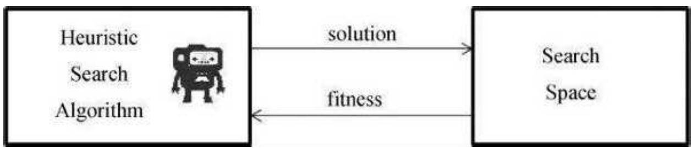  
Figure 5.1 The interaction with an environment in search algorithms.

Heuristic search algorithms can be implemented as search agents in a search space as illustrated in Fig5.1. Heuristic search algorithms construct feasible solutions and receive feedback from the environment on the quality of the solutions.

# · Tree Search

A search problem is typically described by a state space, an initial state, an action space, a successor function, a goal test, a cost function. The state space describes all the possible situations those are for searching a good state of interest with certain properties. The initial state is where the search begins. The action space includes all the options available in each state; an action choice in some states leads to a number of successor states as dictated by the successor function. Each transition from one state to another comes with a cost described by the cost function. The goal of a search algorithm is to find a sequence of actions which generates a path through the state space leading to a goal state with a minimum total path cost when applied from the initial state .

There are several search algorithms which are based on the idea of generating a search tree from the initial state and they differ only in the strategy they use to expand the tree. A search tree is formed by generating a root node representing the initial state and by expanding the initial state and its successors recursively generating children nodes for all successor states of a node. In this sense, a search tree represents all possible paths through the state space starting from the initial state. Each node in the tree, in addition to the representation of the corresponding state, holds useful information about the action that lead to its creation, links to its predecessor and to its successor nodes, its depth in the tree from the root, the total path cost up to that node, etc. There are some kinds of nodes of special importance in the tree. One is the root node that is already mentioned. Another kind is a fringe node, which is a node whose successor nodes have not been generated yet, i.e. the node has not been expanded yet. The set of nodes that have not been expanded at any time is called the fringe of the tree. Finally, the terminal or leaf nodes are nodes corresponding to states with no successors. That means that a search tree cannot be expanded from terminal nodes and represent dead-ends.

· MiniMax Search

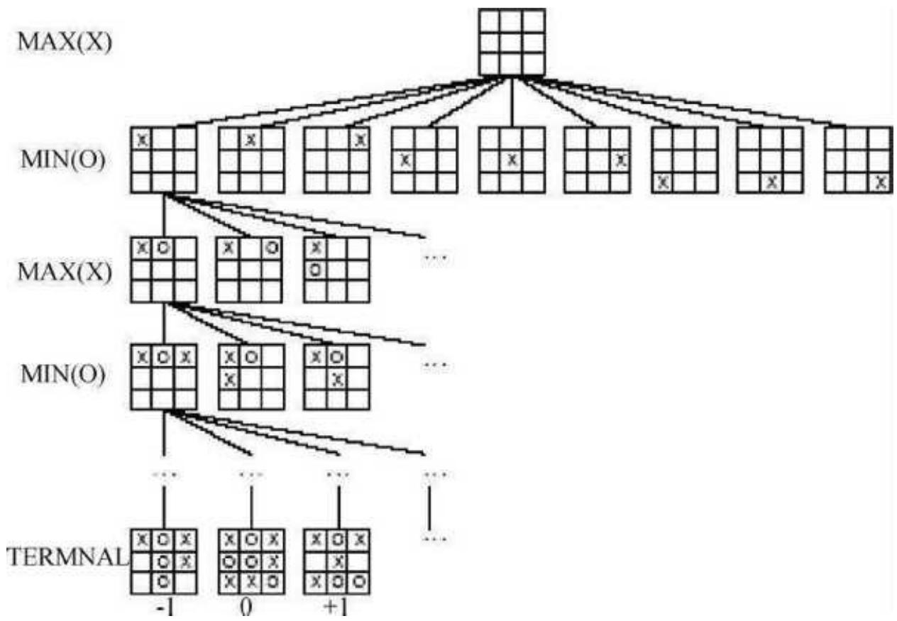  
Figure 5.2 Tic-Tac-Toe game tree.

Every path down a two-player alternating game tree represents alternating player choices. Therefore, a single player cannot really drive the game into a desired terminal node, because the two players have conflicting goals and therefore will try to reach different terminal nodes. As a result, each player will try to choose actions that will increase his probability of winning and will reduce his probability of loosing. Given that the strategy of the opponent is typically unknown an agent searching such a game tree can only assume that the opponent will play optimally. This is the only safe assumption that can be made in the absence of any other information. Any other assumption will lead to strategies that can eventually be exploited by the opponent. Fig.5.2 illustrates a search tree for the Tic-Tac-Toe game.

# · Genetic algorithms

Genetic algorithms (GA) is a very successful search technique with thousands of applications. GA mimic the processes of natural selection and genetic variations found in evolution. First introduced by Holland ［ 25 ］ , this technique became one of the pillars in the field of evolutionary computations. The other pillars are Evolutionary Strategies ［ 26 ］ , Genetic Programming ［ 27 ］ , Evolutionary Programming ［ 28 and Mimic Algorithms ［ 29 ］ . The key notions in GA are genotype, phenotype, crossover, mutations, population, fitness, and selection.

There are two types of evolution: Darwinian and Lamarckian. Darwinian evolution includes only genetic variations (crossover and mutation) working at the genotype level. Lamarckian evolution believes that whatever the species learned over its lifespan can be translated back to the genotype. Although this idea might have worked well in practice, only the Darwinian type of evolution is supported by scientific evidence. Lamarckian evolution has been successful in evolutionary computations especially in the fields of Evolutionary Programming and Evolutionary Strategies. It's also used in.

The pseudo-code of GA is as follows:

1. Choose the initial population of individuals;

2. Evaluate the fitness of each individual in the population;   
3. Repeat:   
(a) Select the best-fit individuals for reproduction;   
(b) Breed new individuals through crossover and mutation operations to produce an offspring;   
(c) Evaluate the individual fitness of new individuals;   
(d) Replace the least-fit members of the population with individuals having better fitness;

Until a termination condition is met.

Although GA is not considered to be a reinforcement learning method, the problems that GA is solving are in the RL domain. Classic GA works with bit-string chromosomes that could be considered a n-arm bandit problem ［ 30 ］ in reinforcement learning. Zeros and ones in the chromosome correspond to pulling or not pulling a particular arm. The payoff is the fitness of the solution. Thus, crossover and mutation are not necessary, and any other heuristic used to decide which arm to pull will also work in this domain.

Other nature-inspired agent-based heuristics are given below.

· Particle Swarm Optimization

Particle Swarm Optimization (PSO) is an optimization technique that uses a swarm of simulated agents to perform optimizatio n ［ 31 ］ . It has some notion of "local experts" similar to the Reinforcement Learning Agents (RLA) algorithm. In particular, each agent knows the locally best solutions and also the globally best solutions. The agents (particles) collectively pick the direction towards which the swarm will go. PSO is an established search technique and is a part of swarm intelligence methods. There are a number of other techniques in this area such as Intelligent Water Drops ［ 32 ］ , and Stochastic Diffusion Search ［ 33 ］ to name a few.

There are a few other nature-inspired agent-based search algorithms such as the Bees Algorithm ［ 34 ］ Cuckoo Search ［ 35 ］ , and Firefly Algorithm ［ 36 ］

· Bees Algorithm

The Bees Algorithm mimics the food foraging behavior of honey bees. The algorithm performs both local neighborhood search and random search. The pseudo-code of the Bees Algorithm is as follows:

1. Initialize population with random solutions;   
2. Evaluate fitness of the population;   
3. While stopping criterion is not met, do:

a) Select sites for neighborhood search;   
b) Recruit bees for selected sites (more bees for best k sites) and evaluate their fitness;   
c) Select the fittest bee from each patch;   
d) Assign remaining bees to search randomly and evaluate their finesses;

End while.

The Bees Algorithm is a very good example of an agent-based search algorithm. First published in 2005, it currently draws a great deal of attention.

· Cuckoo Search

Cuckoo Search is another recent search algorithm published in 2009. It is based on the following three rules:

1. Each cuckoo lays one egg at a time and dumps its egg in a randomly chosen nest;   
2. The best nests with high quality eggs will carry over to the next generation;   
3. The number of available host nests is fixed, and the egg laid by a cuckoo is discovered by the host bird with a probability p.

The pseudo-code of the Cuckoo Search algorithm is as follows:

1. Generate an initial population of n host nests;   
2. While (t ＜ Max generation) or (stop criterion) do:

a) Get a cuckoo randomly and replace its solution by performing Levy flights (random walk);   
b) Evaluate its quality/fitness $\mathrm { F _ { i } }$   
c) Choose a nest among n (say, j) randomly;   
d) If $( \mathrm { F _ { i } } > \mathrm { F _ { j } }$

Replace j by the new solution;

End if;

End while.

It is too early to tell whether this algorithm will lead to more efficient solutions.

· The Firefly Algorithm

The Firefly Algorithm (FA) is yet another nature-inspired search metaheuristic based on the behavior of fireflies. The metaphor of the algorithm is that a firefly flashes to signal other flies to come to the same spot. The pseudo-code of FA algorithm is as follows:

1. Generate an initial population of fireflies;   
2. Formulate light intensity I so that it is associated with fitness function;   
3. Define the absorption coefficient;   
4. While ( t ＜ Max Generation )

For $i = 1$ $^ { n }$

For $j = 1$

$( I _ { j } > I _ { i } )$

Movefireflyitowardsj；

End if:

b）Vary the attractiveness withdistance $r$ $\exp ( - r )$   
c)Evaluate new solutions and update their light intensity;

End fori；

# Endwhile.

5. Output the firefly with highest light intensity as the best solution.

Yang's study tests performance of this algorithm against GA and PSO on a number of real-value function benchmark problems.

# 5.2.2 The Vehicle Routing Problem with Time Windows

The Vehicle Routing Problem concerns the transport of items between depots and customers by means of a fleet of vehicles. The most general version of VRP is the Capacitated Vehicle Routing Problem (CVRP). The model for CVRP has the following parameters:

· n is the number of customers;   
· Q denotes the capacity of each vehicle;   
· $\mathrm { ~ q ~ i ~ }$ denotes the demand of customer i;   
$\mathbf { \dot { \mathbf { \cdot } } } \mathbf { \vec { c } } _ { \mathrm { i j } }$ is the cost of travelling from customer i to customer j.

A homogeneous fleet of vehicles with a limited capacity Q and a central depot, with index 0, makes deliveries to customers, with indices 1 to n. The problem is to determine the exact tour of each vehicle starting and ending at the depot, and each customer must be assigned to exactly one tour. The sum over the demands of the customers in every tour has to be within the limits of the vehicle capacity. The objective is to minimize the total travel cost.

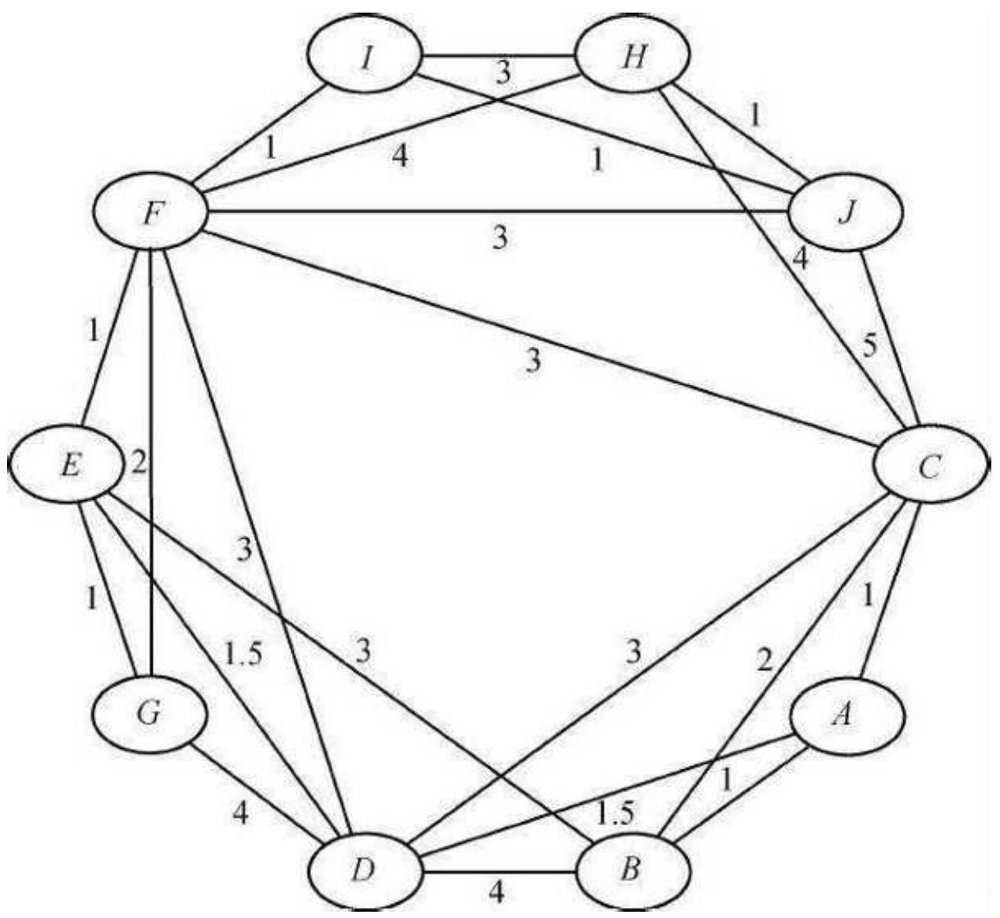  
Figure 5.3 A route sample of the vehicle routing problem.

The Vehicle Routing Problem with Time Windows (VRPTW) is an important problem occurring in many distribution systems, shown as Fig.5.3. VRPTW has multiple objectives to minimize the number of vehicles required and the total travel time and total travel distance incurred by the fleet of vehicles.

The VRP is a well known integer programming problem which falls into the category of NP-hard problems ［ 37 ］ . It is defined on an undirected graph $\mathrm { G } = ( \mathrm { V } , \mathrm { E } )$ , where $\mathsf { V } { = \{ \mathsf { v } _ { \parallel } , \mathsf { v } _ { 1 } , \ldots , \mathsf { v } _ { \textrm { n } } \} }$ is a vertex set and E $\mathbf { \tau } = \{ ( \mathbf { v } _ { \textrm { i } } , \mathbf { v } _ { \textrm { j } } ) / \mathbf { v } _ { \textrm { i } } , \mathbf { v } _ { \textrm { j } } \in \mathrm { V } , \mathrm { i } < \mathrm { j } \}$ is an edge set. The depot is represented by vertex $\mathbf { v } _ { 0 }$ , and m identical vehicles of capacity Q must service all the customers, represented by the set of n vertices $\{ \mathbf { v } _ { 1 } , \hdots , \mathbf { v } _ { \textrm { n } } \}$ . The distance between customers $\mathbf { V } _ { \textrm { i } }$ and $\mathbf { v } _ { \mathrm { ~ j ~ } }$ is represented by ${ \mathrm { ~ d ~ } } _ { \mathrm { i j } }$ that is the Euclidean distance assumed to be symmetric. Each customer $\mathbf { V } _ { \textrm { i } }$ has non-negative demand $\mathbf { q } _ { \mathrm { ~ i ~ } }$ and service-time $\delta _ { \textrm { i } }$ involving pick-up of goods. Let $\mathrm { R } _ { 1 } , \ldots , \mathrm { R } _ { \mathrm { ~ m } } \mathrm { b e }$ a partition of V representing the routes of the vehicles to service all the customers. The cost of a given route $( \mathrm { R } _ { \mathrm { i } } { = } \{ \mathrm { v } _ { 0 } , \mathrm { v } _ { 1 } { , } . . . , \mathrm { v } _ { \mathrm { k } { + } 1 } \} )$ ), where $\mathbf { v } _ { \mathrm { ~ j ~ } } { \in } \mathrm { ~ V ~ }$ and $\mathbf { v } _ { 0 } = \mathbf { v } _ { \mathbf { \mathbf { \mathbf { k } } } + 1 } = 0$ , is given by:

$$
\operatorname {C o s t} \left(R _ {i}\right) = \sum_ {j = 0} ^ {k} d _ {j, j + 1} + \sum_ {j = 0} ^ {k} \delta_ {j}, \tag {5.1}
$$

and the cost of the problem solution S is:

$$
F _ {\mathrm {V R P}} (S) = \sum_ {i = 1} ^ {m} \operatorname {C o s t} \left(R _ {i}\right). \tag {5.2}
$$

For VRPTW, the service-time at each customer, $\delta _ { \textrm { i } }$ , can only begin at time $\mathbf { b } _ { \textrm { i } }$ within a time window defined by the earliest time e $\mathrm { i }$ and the latest time $\mathrm { l _ { i } }$ that a customer will permit the start of a service. Therefore, if a vehicle arrives $\mathbf { v } _ { \mathrm { ~ j ~ } }$ before the beginning of the permitted service time, then the vehicle has to wait for a period w j where $\mathbf { w _ { \mathrm { ~ j } } } { = } \mathbf { e _ { \mathrm { ~ j } } } { - } ( \mathbf { b _ { \mathrm { ~ i ~ } } } { + } \delta _ { \mathrm { ~ i ~ } } { + } \mathbf { t _ { \mathrm { ~ i j } } } )$ , and $\mathsf { b } _ { \mathrm { ~ i ~ } ^ { + } } \boldsymbol { \mathsf { t } } _ { \mathrm { ~ i ~ j ~ } }$ is the time the service is completed at customer $\mathbf { V } _ { \textrm { i } }$ assuming that customer $\mathbf { V } _ { \textrm { i } }$ precedes customer $\mathbf { v } _ { \mathrm { ~ j ~ } }$ . The variable $\mathrm { t _ { i j } }$ is the time taken to travel from customer $\mathbf { V } _ { \textrm { i } }$ to customer $\mathbf { v } _ { \mathrm { ~ j ~ } }$ . The beginning of service at customer $\mathbf { v } _ { \mathrm { ~ j ~ } }$ can therefore be explicitly expressed as $\mathbf { w _ { \mathrm { ~ j } } } = \operatorname* { m a x } \{ \mathbf { e _ { \mathrm { ~ j } } } , \mathbf { b _ { \mathrm { ~ i } } } + \delta _ { \mathrm { ~ i } } + \mathbf { t _ { \mathrm { ~ i j } } } \} .$ . In addition to the customer's time window, most formulations incorporate a scheduling horizon, which defines the working time of the respective vehicles by imposing a time window at the depot, denoted by ${ \bf e } _ { 0 }$ and $\textup { b } _ { 0 }$ . Since VRPTW involves a time constraint, the solution to this problem consists of a set of directed arcs that must be followed.

# 5.3 The Multiagent Learning Applied to CVRP and VRPTW

In this chapter, by modifying MMAS we present several approaches to make ACO more efficient for CVRP and VRPTW, since MMAS performs efficiently in some other combinational optimization problems ［ 38 － 42 ］ . The modified MMAS in this chapter attempts to solve the CVRP and VRPTW by repeating the following two steps as general ACO approaches do:

1) Candidate solutions are constructed using a pheromone model;   
2) The candidate solutions are used to modify the pheromone values in a way that is deemed to bias future sampling toward high-quality solutions.

Further, as there are upper limit $\mathtt { T } _ { \mathrm { m a x } }$ and lower limit $\tau _ { \mathrm { m i n } }$ in MMAS when the pheromone value is updated, the modified MMAS in this chapter utilizes the following formula as the upper limit and lower limit for updating pheromone to alleviate stagnation of the search space:

$$
\tau_ {\max } = 1 / \rho \times f \left(s ^ {\text {b e s t}}\right), \tag {5.3}
$$

$$
\tau_ {\min } = 1 / f \left(s ^ {w o r s t}\right), \tag {5.4}
$$

As to strategies selecting ants to realize exploitation for the VRP in this chapter, the best-so-far ant and the current best ant, together with the current second best ant are allowed to update the pheromone in every iteration. If we only use the best-so-far ant to update pheromone, it is not as efficient as to use the current best and the best-so-far ant to update pheromone, for the current best ant has explored some new information, which may be quite useful to get the global optimization, and the current second best ant is used to update pheromone for the same reason. The best-so-far ant tries to exploit and the current best together with the second best ant tries to explore.

As to strategies selecting cities to make the ant more capable of exploration, in this chapter, we utilize a pseudo-random-proportional way to avoid local optima as the following rules:

· Generate a random real number p from 0 to 1;   
· If $\rho > \ q _ { \mathrm { \scriptsize ~ b i a s } }$ , select the best next city to move;   
· Else select the second best next city to move.

where $\mathbf { q } _ { \mathrm { \ b i a s } }$ is a bias parameter. And particularly, when the current city is the depot, we find out that the q $\mathrm { b i a s }$ should be larger to get good results.

The method of changing evaporate rate p dynamically is also used by the modified MMAS in this chapter. Every time the algorithm discovers that it is trapped in local optima, it changes the p dynamically.

As to strategies selecting cities of the modified MMAS for the VRPTW in this chapter, it not only thinks about the pheromone, the distance, the pseudo-random-proportional probability strategy, but also considers the constraint of the time factor. When the ant is moving to a next city, the best next city should be the cities satisfying the following formula:

Next_city=max{choice_info［currentcity］［i］/(DUETIME［i］-t)},

where i stands for the cities that are not visited yet, and t stands for the time that the ant has already spent, and currentcity is the city that has just been visited. DUETIME［i］ is equal to the latest time $\mathrm { l _ { i } }$ that a customer will permit the start of a service of the city i, choice_info is relative to Monte Carlo sampling. If we just use the choice_info［currentcity］［i］, considering none of time, it won't converge to the global optimum efficiently. Actually, it may be even unable to get the global optimization. However when considering remaining time, which is DUETIME［i］-t, it converges to global optimization quickly. In

order to avoid local optima, we select this city with the probability of (1-p), and the second best city the probability of p, which is small in order to get good results, as we have discussed above in CVRP.

# 5.4 Simulations and Results

To show the performance of the modified MMAS method, we choose the well-known CVRP, Eil51 that there is one depot, 50 customers, and the capacity of trucks is 160. And for VRPTW, we select the typical C101.100 in Solomon's VRPTW that there is 1 depot, 100 customers. The results of CVRP are derived through 10 times of running the program and each 5000 iterations, while VRPTW also of 10 times and each of 50 iterations. The bias parameter $\mathrm { { q } _ { \ b i a s } }$ is tuned as 0.001 as the current city is a customer and 0.1 as the depot. And values of the evaporating rate p are tuned as 0.1 or 0.5.

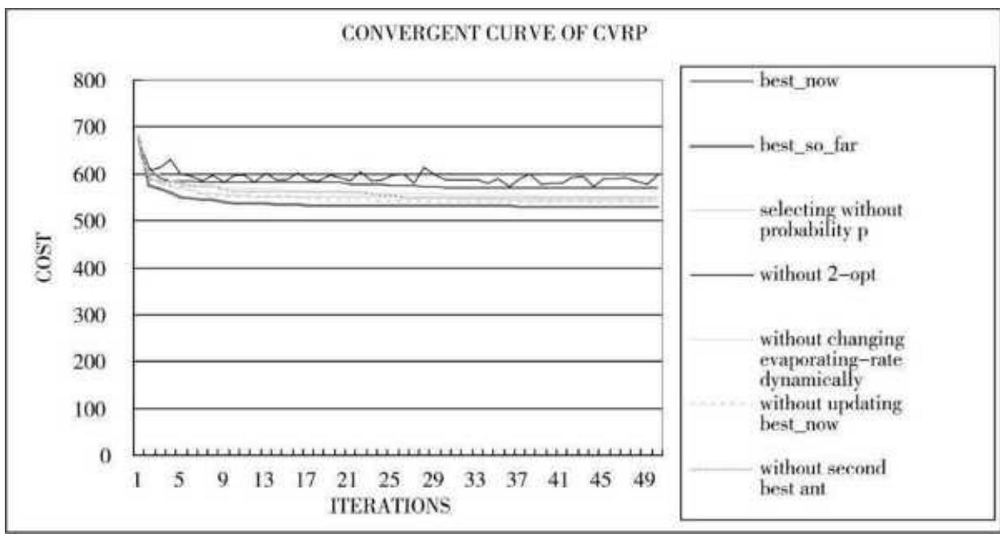

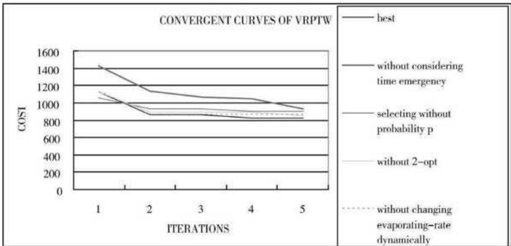  
Figure 5.4 Convergent curves for CVRP.   
Figure 5.5 Convergent curves for VRPTW.

Simulation results of strategies selecting ants and cities for CVRP and VRPTW, together with the strategy changing p dynamically which become more efficient in the VRPTW, are shown in Fig.5.4 and Fig.5.5.

Different influences of operators or strategies are shown by the curves in figures. In CVRP, as mentioned

in the MMAS, when the cities are not so many, the current best ant is more efficient to update the pheromone than the best-so-far ant. In particular in VRPTW, it can be found that without changing evaporating rate p, the algorithm is trapped in local optima, and even if a large number of iteration times are taken, it is rather difficult to find the global optimization. Additionally, results of VRPTW have shown that if the ant does not select second best cities with the pseudo-random-proportional probability, it will be easily trapped in local optima, and very difficult to escape. This strategy applied to VRPTW as shown in Fig.5.5 has been proved more efficient than applied to CVRP shown in Fig.5.4.

Table 5.1 Results for VRP and VRPTW   

<table><tr><td rowspan="2">Problems</td><td colspan="6">Test Results</td></tr><tr><td>Best Solution known</td><td>Best solution in this chapter</td><td>Worst solution in this chapter</td><td>Average solution</td><td>Vehicle number</td><td>Average time</td></tr><tr><td>CVRP-Eil51</td><td>524.81</td><td>524.81</td><td>544.03</td><td>536.675</td><td>5</td><td>~32 seconds</td></tr><tr><td>C101(VRPTW)</td><td>828.40</td><td>828.937</td><td>828.937</td><td>828.937</td><td>10</td><td>2 seconds</td></tr></table>

The simulation results in Table 5.1 also show the efficiency of the modified MMAS for CVRP and VRPTW proposed in this chapter. In CVRP, to derive the global optimization it took running time. However, it took only 2 seconds in VRPTW to get the best result, which may indicate that the more heuristic information we have, the easier it becomes to get the global optimization.

Table 5.2 Results of modified MMAS for VRPTW   

<table><tr><td rowspan="2">Problems</td><td colspan="6">Test Results</td></tr><tr><td>MACS-VRPTW</td><td>Best solution in this chapter</td><td>Worst solution in this chapter</td><td>Average solution</td><td>Vehicle number</td><td>Average time</td></tr><tr><td>C101</td><td>828.38</td><td>828.937</td><td>828.937</td><td>828.937</td><td>10</td><td>2 seconds</td></tr><tr><td>C102</td><td>828.38</td><td>828.937</td><td>828.937</td><td>828.937</td><td>10</td><td>2 seconds</td></tr><tr><td>C107</td><td>828.38</td><td>828.937</td><td>828.937</td><td>828.937</td><td>10</td><td>~15 seconds</td></tr><tr><td>C201</td><td>591.85</td><td>591.557</td><td>591.557</td><td>591.557</td><td>3</td><td>~5 seconds</td></tr><tr><td>C207</td><td>591.85</td><td>590.737</td><td>590.737</td><td>590.737</td><td>3</td><td>~15 seconds</td></tr></table>

The simulation results in Table 5.2 also show the efficiency of the modified MMAS for solving VRPTW problems. As mentioned in the MMAS, when the cities are not so many, the current best ant is more efficient to update the pheromone than the best-so-far ant. And when trapped in local optima, the current best ant shows high performance in escaping local optima, however in larger scale problems, the best-sofar ant is more efficient.

# 5.5 Conclusions

Based on the investigation on how to solve combinatorial optimization problems by the ACO algorithm, this chapter proposes a modified MMAS for CVRP and VRPTW by presenting some strategies of selecting ants, selecting cites, and presenting the method of dynamically changing evaporate rate, together with the pheromone value limited formula. The proposed method not only allows to find the optimal tour, but also enables to find a global tour efficiently by means of balancing the efforts to explore and the efforts to exploit. The results of empirical simulations using the well-known benchmark CVRP and VRPTW instances show that the proposed method in this chapter performs efficiently in terms of solution quality.

# Bibliography

［ 1 ］ P. Toth, D. Vigo. The vehicle routing problem. Monographs on discrete mathematics and applications ［M］, SIAM, Philadelphia , 2001.   
［ 2 ］ M. Fisher. Vehicle routing ［M］, Handbooks of operations research and management science, 1(8), 1-31, 1995.   
［ 3 ］ R. F. Hartl, G. Hasle, and G. K. Janssens. Special issue on rich vehicle routing problems ［J］, Central European journal of operations research, 14(2), 103-104, 2006.   
［ 4 ］ M. A. Figliozzi. An iterative route construction and improvement algorithm for the vehicle routing problem with soft time windows ［J］, Transportation research C, 18(5), 668-679, 2010.   
［5］ K. Pang. An adaptive parallel route construction heuristic for the vehicle routing problem with time windows constraints ［J］, Expert Systems with applications, 38(9), 11939-11946, 2011.   
［ 6 ］ Yuhua Zhu, Tong Zhen. Hybrid ant colony algorithm based on vehicle routing problem with time windows ［C］, International engineering 2009, ICIE'09, WASE International Conference, Vol.2, 50-53, 2009.   
［ 7 ］ T. Stutzle, H. H. Hoos. MAX-MIN ant system ［J］, Future generation computer systems, 16(8), 889-914, 2000.   
［ 8 ］ M. W. P. Savelsbergh. Local search in routing problems with time windows ［J］, Annals of operations research, Vol.4, 285-305, 1985.   
［ 9 ］ G. Croes. A method for solving traveling salesman problems ［J］, Operations research, Vol.6, 791-812, 1958.   
［ 10 ］ C. Blum, A. Roli. Metaheuristics in combinatorial optimization: overview and conceptual comparison ［J］, ACM computing surveys, 35(3), 268-308, 2003.   
［ 11 ］ F. Glover, M. Laguna. Tabu search ［M］, Boston: Kluwer Academic, 1997.   
［12］ S. Kirkpatrick, C. D. Gelatt, and M. P. Vecchi. Optimization by simulated annealing ［J］, Science, 220(4598), 671-680, 1983.   
［13］ M. Dorigo, V. Maniezzo, and A. Colorni. Ant system: optimization by a colony of cooperating agents ［J］, IEEE transactions on systems, man and cybernetics—Part B: Cybernetics, 26(1), 29-41, 1996.   
［14］ M. Dorigo, G. Di Caro, and L. M. Gambardella. Ant algorithms for discrete optimization ［J］, Artificial life, No.5, 137-172, 1999.   
［ 15 ］ H. R. Louren, O. Martin, and T. Stützle. Iterated local search ［M］, F. Glover and G. Kochenberger (Eds.), Handbook of metaheuristics, Boston: Kluwer Academic, 321-353, 2003.   
［ 16 ］ I. H. Osman. Met strategy simulated annealing and tabu search algorithms for the vehicle routing problem ［J］, Annals of operations research, Vol.41, 421-451, 1993.   
［ 17 ］ M. Gendreau, A. Hertz, and G. Laporte. A tabu search heuristic for the vehicle routing problem ［J］, Management science, 40(10), 1276-1290, 1994.   
［ 18 ］ D. Taillard, E. P. Badeau, M. Gendreau, F. Guertin, and J. Y. Potvin. A tabu search heuristic for the vehicle routing problem with soft time windows ［J］, Transportation science, 31(2), 170-186, 1997.   
［ 19 ］ P. Toth, D. Vigo. The granular tabu search and its application to the vehicle routing problem

［J］, INFORMS journal on computing, 15(4), 333-346, 2003.   
［ 20 ］ A. Van Breedam. An analysis of the effect of local improvement operators in genetic algorithms and simulated annealing for the vehicle routing problem ［M］, RUCA Working Paper 14, University of Antwerp, Belgium, 1996.   
［ 21 ］ M. G. C. Resende, C. C. Ribeiro. Greedy randomized adaptive search procedures ［M］, F. Glover and G. Kochenberger (Eds.), Handbook of metaheuristics, Boston: Kluwer Academic, 219-249, 2003.   
［ 22 ］ M. Reimann, K. Doerner, and R. F. Hartl. Analyzing a unified ant system for the VRP and some of its variants ［J］, G. Raidl et al. (Eds.), Lecture notes in computer science: Vol.2611, Applications of evolutionary computing: EvoWorkshops, 2003.   
［ 23 ］ L. M. Gambardella, é. Taillard, and G. Agazzi. MACS-VRPTW: a multiple ant colony system for vehicle routing problems with time windows ［M］, D. Corne, M. Dorigo and F. Glover (Eds.), New ideas in optimization, London: McGraw-Hill, 63-76, 1999.   
［ 24 ］ O. Braysy. Evolutionary algorithms for the vehicle routing problem with time windows ［J］, Journal of heuristics, Vol.10, 587-611, 2004.   
［ 25 ］ J. H. Holland. Adaptation in natural and artificial systems ［M］, Ann Arbor, MI, University of Michigan Press, 1975.   
［ 26 ］ H.G. Beyer, and H.P. Schwefel. Evolution strategies: A comprehensive introduction ［J］, Journal natural computing, 1(1), 3-52, 2002.   
［ 27 ］ J. R. Koza, F. H. Bennett, D. Andre, and M.A. Keane. Genetic programming III: Darwinian invention and problem solving ［M］, Morgan Kaufmann, 1999.   
［ 28 ］ L. J. Fogel, A. J. Owens, and M. J. Walsh. Artificial intelligence through simulated evolution ［M］, John Wiley, 1966.   
［ 29 ］ P. Moscato. On evolution, search, optimization, genetic algorithms and martial arts: Towards mimic algorithms ［R］, Caltech concurrent computation program report 826, 1989.   
［ 30 ］ R. S. Sutton, and Andrew G. Barto. Reinforcement learning: An introduction ［M］, MIT Press, Cambridge, 1998.   
［ 31 ］ J. Kennedy, and R. C. Eberhart. Swarm intelligence ［M］, Morgan Kaufmann, 2001.   
［ 32 ］ H. S. Hosseini. Problem solving by intelligent water drops ［C］, Proc. IEEE congress on evolutionary computation, 25-27, 2007.   
［ 33 ］ J. M. Bishop. Stochastic searching networks ［C］, Proc. of 1st IEEE Conf. on artificial neural networks, 329-331, 1989.   
［ 34 ］ X. S. Yang. Engineering optimizations via nature-inspired virtual bee algorithms ［J］, Artificial intelligence and knowledge engineering applications: A Bio inspired approach, Lecture notes in computer science, Springer, 317-323, 2004.   
［ 35 ］ X. S. Yang, S. Deb. Cuckoo search via flights ［C］, Proc. of world congress on nature and biologically inspired computing, Coimbatore, India: IEEE Press, 210-214, 2009.   
［ 36 ］ X. S. Yang. Firefly algorithms for multimodal optimization ［C］, Stochastic algorithms: foundations and applications, Fifth symposium on stochastic algorithms, foundations and applications, Lecture notes in computer sciences, Vol.5792, 169-178, 2009.   
［ 37 ］ J. Lenstra, A.R. Kan. Complexity of vehicle routing and scheduling problems ［J］, Networks, Vol.11, 221-227, 1981.

［ 38 ］ M. Dorigo, T. Stützle. Ant colony optimization ［M］, Cambridge: MIT Press, 2004.   
［39］ K. Socha, J. Knowles, and M. Sampels. A MAX-MIN ant system for the university course timetabling problem ［J］, M. Dorigo et al. (Eds.): ANTS 2002, LNCS 2463, 1-13, 2002.   
［40］ C. Blum. Beam-ACO—Hybridizing ant colony optimization with beam search: an application to open shop scheduling ［J］, Computers and operations research, 32(6), 1565-1591, 2005.   
［41］ M. D. Albritton, P. R. McMullen. Optimal product design using a colony of virtual ants ［J］, European journal of operational research, 176(1), 498-520, 2007.   
［ 42 ］ A. C. Zecchin, H. R. Maier, A. R. Simpson, M. Leonard, and J. B. Nixon. Ant colony optimization applied to water distribution system design: comparative study of five algorithms ［J］, Journal of water resources planning and management, 133(1), 87-92, 2007.

# Chapter 6 Multiagent learning Methods Applied to Multicast Routing Problems

This chapter investigates the possibility and merit of applying the multiagent Reinforcement Learning method into the multicast routing in Mobile Ad hoc Networks. Taking advantage of the multiagent RL, this chapter presents a novel multicast routing algorithm, the Q-MAP method, that ensures the route of resource allocation and delay-bounded in MANETS. And, this chapter analyses the rationality and convergence of the Q-MAP method from the point of view of RL, and demonstrates the efficacy of the proposed method by simulations of route creation.

# 6.1 Introduction

Mobile Ad hoc Networks (MANETS) are self-organized wireless networks, which are characterized by mobile nodes, dynamic topologies, lack of fixed infrastructure, bandwidth-constrained, and energyconstrained operation ［ 1 ］［ 2 ］ . Each mobile node in the network acts as a router and forwards packets on behalf of other nodes ［ 3 ］［ 4 ］ . Multicast routing is becoming an important networking service in MANETS, for supporting applications such as disaster recovery, crowd control, and rescue. The objective of multicast routing is, under the users' given requirements, to find optimal routes from a source node to all multicast destinations and use the network resource effectively. Quality of Service (QoS) and performance of such wireless networks are greatly affected by the network routing and the resource reservation. Due to the limited radio propagation range of wireless devices, routes are often multi-hop. These problems are aggravated by energy and bandwidth constraints on mobile nodes, and in combination with dynamic network topologies, make multicast routing in MANETS extremely challenging ［ 5 ］［ 6 ］

Multicast routing protocols used in static networks, such as Distance Vector Multicast Routing Protocol (DVMRP), Multicast Open Shortest Path First (MOSPF), Core Based Trees (CBT) and Protocol Independent Multicast (PIM), do not perform well in MANETS, because multicast tree structures are fragile and must be readjusted as connectivity changes ［ 7 ］ . The ODMRP ［ 8 ］ utilizes on-demand routing techniques to avoid channel overhead, which selects the route based on the minimum delay or the most stable route in MANETS. The ADMR ［ 9 ］ is on-demand multicast routing protocol in multi-hop wireless ad hoc networks that reduces as much as possible any non-on-demand components within the protocol.

Mobile ad hoc network consists of collection of wireless mobile nodes dynamically forming a network without the use of any existing network infrastructure. Each node act as both host and router and communicate with other if they are within the radio range. The dynamic topology of wireless mobile adhoc networks makes routing a challenging one. It uses an agent based model of QoS routing protocol for the approximate bandwidth and delay estimation to react to network traffic, and implements the schemes by using three agents maintenance agent, monitoring agent and route discovery agent in which maintenance agent manages the overall activities of both monitoring agent and route discovery agent. Monitoring agents are employed to monitor the resources as well as link. And, the route discovery agents discover the link between the mobile nodes, performs routing information fusion and builds pre-computed paths so that mobile users can communicate with each other based on the requirements (bandwidth and delay aware) of the network users.

The fact that the Ant-based routing algorithms $[ \underline { { 1 0 } } - \underline { { 1 2 } } ]$ outperforms all conventional algorithms, including Open Shortest Path First (OSPF), demonstrates the efficiency of the swarm-based routing algorithm for wired networks. MANETs, due to their lack of physical infrastructures or centralized online authorities, pose a number of security challenges. Traditional network authentication solutions rely on centralized trusted third party servers or certificate authorities. However, ad hoc networks are infrastructure-less, and there is no centralized server for key establishment. Hence, traditional solutions do not meet the requirements of MANETs. Sheikh proposes a key establishment protocol for mobile ad hoc networks that does not require any centralized support. The mechanism is built using the well-known technique of threshold secret sharing scheme and network clustering. This protocol is robust and secure against a collusion of up to a certain number of nodes and is well adapted with node movements. Due to use of clustering, the imposed overhead is very low compared with other similar key establishment protocols.

The properties of swarm intelligence ［ 13 ］ , such as autonomy, robustness and fault-tolerance, are also attractive for MANETS. The QoS support of multimedia services over wireless Mobile MANETs is one of the hottest challenges facing todays research community working on this area. Most existing works on QoS in ad hoc networks has been carried out under the assumption that the underlying QoS architecture is reservation based. In such architecture, mobile nodes maintain per-flow state information. This results in a processing and storage overhead on mobile nodes. On the other hand, the stateless approach has the advantage it offers the scalability, since no session state information is maintained at intermediate nodes.

HybQoS has been presented as a hybrid QoS stateless model for service differentiation, which makes resource reservation in advance before the flow uses it. Unlike other models that make the resource exclusively reserved for the flow and no additional traffic is allowed to use the reserved resource, the HybQos uses minimal information available on the network nodes without relying on complex mechanisms that proved to be efficient, robust, and scalable.

MANETs consist of nodes with high mobility and there is no preset infrastructure available. Instead, connections are set-up wirelessly and the radio range is limited. Therefore, each node only perceives its local environment and has no complete information about the rest of the network. Moreover, an ad-hoc created infrastructure between nodes is temporary. Due to node mobility and antenna range, nodes may become unreachable. Nodes are also limited in resources, e.g., battery power and memory. Despite these properties, routing protocols are still able to route in MANETs. However, there is a cost involved. Routing efforts may experience high end-to-end delay, low scalability, and low average performance. Stigmergic Landmark Routing (SLR) has been presented as a Swarm Intelligence routing algorithm for Wireless Mobile Ad-hoc Networks, which is inspired by the behavior of bees and uses the concept of landmarks to indicate key nodes which store routing information. Consequently, little routing information needs to be stored and maintained in the network, and results in a significant performance increase when compared to state of the art algorithms in networks up to 100 nodes with multiple data sources.

Successful application of Reinforcement Learning (RL) ［ 14 ］［ 15 ］ to communication domains ［ 16 ］［ 17 ］ has attracted researcher to investigate routing strategy and resource reservation with RL. In fact, the principles of swarm-based algorithms are similar to RL at the point of critic and updating the routing tables. Besides merits of the Ant System ［ 18 ］ , the multiagent RL methods have other advantages such as better convergent property and easy to control the learning processes, which, for routing protocol, can be used to allocate optimal bandwidth easily than swarm intelligence. In Bhutani's research ［ 19 ］ , it generates a cognitive radio scenario based on non-persistent carrier sense multiple access (CSMA) and time division multiple access (TDMA) systems sharing a multi-channel wireless network. TDMA users are considered as primary users who can access the channel at any time, and non-persistent CSMA users are considered as secondary users who can share the channel when it is free. Then system performance is evaluated for a variety of proportions of non-persistent CSMA and TDMA traffic levels. Their results of simulations show the effect on throughput for different traffic ratio and the effect of reinforcement learning on the system model is shown how throughput increases.

The proposed approach in this chapter, the Q-MAP method, is applying Multiagent Q-learning to the ondemand multicast routing Protocol for MANETS, which address the issues of ensuring route of the resource allocation and the delay requirement simultaneously. The Q-MAP method is adaptive for the dynamic environment due to the property of RL.

# 6.2 Multiagent Q-learning Applied to the Network Routing

# 6.2.1 Investigation into Q-routing

Q-routing algorithm ［ 20 ］ is an RL module embedded into each node of a switching network for packet routing. Only local communication is used by each node to keep accurate statistics on which routing decisions lead to minimal delivery times. Q-routing algorithm can learn a routing policy that balances minimizing the number of hops a packet will take with the possibility of congestion along popular routes. The learning is continual and online, and is robust in the face of irregular and dynamically changing network connection patterns and load.

Using RL, the packet routing policy can be updated more quickly and using only local information. Let Q s $( \mathsf { d } , \mathsf { s } _ { 1 } )$ be the time that a node s estimates it takes to deliver a packet P bound for node d by the way of node ${ \textsf { s } } _ { 1 }$ neighbor to s, including the time that P would have to spend in the queue of the node s. Upon sending P to $\mathsf { s } _ { 1 }$ , s immediately gets estimate of $\mathsf { s } _ { 1 }$ for the time remaining in the traffic

$$
t = \min  _ {z \in \text {n e i g h b o r s o f} s ^ {\prime}} Q _ {s ^ {\prime}} (d, z). \tag {6.1}
$$

If the packet spent u units of time in the queue of s and v units of time in transmission between nodes and s', then s can revise its estimate as

$$
\Delta Q _ {s} (d, s ^ {\prime}) = \alpha [ (u + v + t) - Q _ {s} (d, s ^ {\prime}) ]. \tag {6.2}
$$

As the result, the Q-routing algorithm is able to discover efficient routing policies in a dynamically changing network without having to know the network topology and traffic patterns in advance.

# 6.2.2 AntNet Investigation

AntNet is a distributed, mobile agents based Monte Carlo system ［ 21 ］ that was inspired by the ant colony metaphor ［ 22 ］ for solving optimization problems. AntNet's agents concurrently explore the network and exchange collected information. The communication among the agents is indirect and asynchronous, mediated by the network itself.

Informally, the AntNet algorithm and its main characteristic can be summarized as follows.

· At regular intervals, concurrently with the data traffic, from each network node, mobile agents are asynchronously launched towards randomly selected destination nodes.   
· Agents act concurrently and independently, and communicate in an indirect way, through the information they read and write locally to the nodes.   
· Each agent searches for a minimum cost path joining its source and destination nodes.   
· Each agent moves step-by-step towards its destination node. At each intermediate node a greedy stochastic policy is applied to choose the next node to move to. The policy makes use of

(i) local agent-generated and maintained information,   
(ii) local problem-dependent heuristic information,   
(iii) agent-private information.

· While moving, the agents collect information about the time length, the congestion status and the node identifiers ers of the followed path.   
· Once they have arrived at the destination, the agents go back to their source nodes by moving along the

same path as before but in the opposite direction.

· During this backward travel, local models of the network status and the local routing table of each visited node are modified by the agents as a function of the path they followed and of its goodness.   
· Once they have returned to their source node, the agents disappear. Cooperation among agents goes on at two levels.   
· By modification of the routing tables, which directly affects the routing decisions of following ants towards the same destination.   
· By modification of local models that determine the way the ants' performance is evaluated, which influences the rate of arrival of other ants towards any destination.

Results of experiment on real and artificial IP data gram networks with increasing number of nodes and under several paradigmatic spatial and temporal traffic distributions are encouraging.

# 6.3 Some Multicast Routing in Mobile Ad Hoc Networks

Increasingly heterogeneous nodes and a lot of new emerging applications put additional restrictions on throughput and delay requirements for multicast routing in MANETS. Often throughput and packet delay are the routing performance measures taken into account in communication networks. The key problem is that the channel utility should be maximized while simultaneously minimizing resource usage, furthermore, in higher throughput and lower delays simultaneously.

The Reservation-Based Multicast routing protocol is a combination of multicast, resource reservation, and admission control protocol building a core-based tree for each multicast group. It is a scheme similar to PIM, and is necessary to maintain a core or Rendezvous Point for sources and receivers paths to meet at that node. The Forwarding Group Multicast Protocol 23 utilizes the forward group flag making the protocol more robust to mobility. The concept of the forwarding group is well used in other multicast routing protocols in MANETS. The use of on-demand techniques in routing protocols for multi-hop wireless ad hoc networks is shown having significant advantages in terms of reducing the routing protocol's overhead and improving its ability to react quickly to topology changes in networks. The On-Demand Multicast Routing Protocol is a mesh-based multicast protocol that provides richer connectivity among multicast members by the use of forwarding group concept. To reduce as much as possible any non-on-demand components within the protocol, the Adaptive Demand Multicast Routing Protocol is proposed that multicast routing state is dynamically established and maintained only for active groups and only in nodes located between multicast sources and receivers.

Routing algorithms based on swarm behaviors have been developed in recent years for wired networks, and the efficiency of AntNets is getting the attention. Swarm intelligence forms the core of an enabling technology for the routing class boasting attractive features, such as autonomy, robustness and faulttolerance-rendering suitable for MANETS. Swarm-based algorithms rely on the interaction of autonomous agents who communicate with each other through the pheromone spread on the environment. The multicast routing problem is well solved by a multiagent approach like the AntNet system, composed of two sets of mobile agents, called forward and backward ants. For the multicast scenario, adjustments need to be made to the update of the routing tables and the generation of the backward ants, which is currently being investigated as a new swarm based routing algorithm in wireless networks.

The growing numbers of IEEE 802.11 ［ 24 ］ wireless devices have made Mobile Ad-hoc Networks (MANET) a popular research topic since the late 1990s. A MANET assumes that an end-to-end connection always exists from the origin to the destination, but this is not the case in a Delay Tolerant Networks (DTN) which considers the lack of continuous network connectivity. Theoretically, a MANET solution cannot deliver a data message when an end-to-end path between a source node and a destination node is not observed by the routing protocol. In DTN, intermittent network connections exist due to node mobility, energy resources, attacks, and interferences. Because of the inconsistency in connectivity, a store-carryforward approach is necessary in order to cope with disconnections. This approach allows the data message to be held in the system (store), moved within node's displacement (carry), and delivered once a connection to the destination has been established (forward). The DTN data messages should be buffered and carried for a longer period, which means that nodes require extra buffer space to store messages that are waiting for future forwarding communication opportunities.

It is important to note that DTN routing solutions are independent from traditional wired and wireless Internet service providers, and the data message exchange occurs between devices, which act as routers, until a data message is successfully delivered to its destination. DTN can experience long delays, because of intermittent connectivity, and can cause unnecessary storage utilization due to message replication. Delay Tolerant Networks have evolved from a system designed for space communication to a network geared towards use in extreme situations where traditional coverage does not or cannot exist. For example, in military environments, after natural disasters or terrorist attacks, in developing regions, or as an alternative for congested network resources. Delay Tolerant Networks, as the name suggests, do come with their challenges and can result in bandwidth limitations, continuous network partitions, unexpected delays, restricted energy sources, and limited transmission ranges due to obstructions (e.g. walls, buildings, and mountains). DTNs aim to solve technical problems which exist in the absence of instantaneous end-to-end

paths between any source and destination nodes.

DTN routing solutions can be classified as forwarding-based and replication-based ［ 25 ］ . Forwardingbased DTNs conserves sources because only one copy of a message exists in the network, but experiences lower message delivery rates and longer delays. A common forwarding-based issue concerns predicting the next opportunity of connectivity (next meeting between two nodes). This forwarding-based application can be observed in low orbit satellites with 90 min intermittent coverage cycles. An interesting study about the limitations of forwarding-based DTN routing solutions can be found in Spyropoulos's research ［ 26 ］

In replication-based DTN, multiple message copies exist in the network. An epidemic solution replicates a message whenever two nodes meet with the idea that one of these copies shall reach the destination ［ 27 ］ . Replication-based routing solutions can be sub-classified in flooding-based and quota-based solutions ［ 28 ］ . In flooding-based solutions, if storage resources and mobility allow, it is possible for every node in the network to have a replica of the message. The quota-based solutions intentionally limit the number of replicas. Because of successful delivery rates, replication-based DTN routing solutions are favored by the research community. Waste of network resources, scalability, and congestion are common issues of these types of routing solutions. Epidemic information spreading amongst IEEE 802.11 mobile nodes (e.g. advertisements and traffic conditions) is a result of replication-based routing.

The Probabilistic Routing Protocol using History of Encounters and Transitivity (PRoPHET) is a floodingbased DTN routing solution that relies on the calculation of delivery predict ability to forward messages to the reliable node ［ 29 ］ . Probability is used to decide if one node is reliable to forward a message to a node that is often encountered has a higher delivery predict ability than the others. If two nodes do not encounter each other during an interval, they are less likely to exchange messages, thus the delivery predict ability values must be reduced. PROPHET utilizes a rather simple forwarding strategy: when two nodes meet, a DTN data message is replicated to the other node, only if the delivery predict ability of the destination of the message is higher at the encountered node.

Resource Allocation Protocol for Intentional DTN (RAPID) is a flooding-based DTN routing solution. The authors show that the DTN routing problem is NP-hard using a polynomial-time reduction from the edgedisjoint path problem for a directed acyclic graph ［ 30 ］ . RAPID is executed when two nodes are within range and have discovered one another. The protocol arranges the messages in order to choose a feasible schedule for transfers, and also assumes constraints on both storage capacity and available bandwidth. The protocol was deployed in a real vehicular network and simulated in a custom event-driven simulator.

SimBet ［ 31 ］ uses Complex Network Analysis (CNA) ［ 32 ］ metrics in DTN routing. This forwardingbased DTN routing solution uses social similarity to detect nodes that are part of the same community, and between centrality to identify the nodes that could carry a message from one community to another. BubbleRap ［ 33 ］ is a forwarding-based protocol which also utilizes CAN and is focused on two specific aspects of society, namely community and centrality. The routing decision is based on the popularity of each node.

Currently only a few DTN routing solutions utilize MARL techniques. Q-Learning AODV (QLAODV) ［ 34 proposes integration of DTN mechanisms on the original Adhoc On-Demand Distance Vector (AODV) routing protocol ［ 35 ］ . It uses a Q-Learning algorithm to achieve whole network link status information, changing routes preemptively using the learned information. In order to make Q-Learning work efficiently, a new route request/reply mechanism is proposed, which periodically verifies the correctness of the route information obtained allowing rapid reaction to network topology changes. QLAODV is a forwarding-based DTN routing solution proposed for Vehicular Adhoc Networks (VANET) and tested in the Network Siumlator 2 ［ 36 ］ with the Freeway and Manhattan mobility models ［ 37 ］ QLAODV uses a simple rewarding process: true for neighbor nodes and false for non-neighbor nodes.

Adaptive Reinforcement-Based Routing (ARBR) ［ 38 ］ uses cooperative groups of nodes to make forwarding decisions based on a cost function at each contact with another node. The protocol considers node mobility statistics, congestion, and buffer occupancy, which are taken as feedback in the cost function. The feedback is based on sampling channel availability and buffer space during node contact. In

the ARBR environment, each node maintains the network status within fixed consecutive time windows. Because of node mobility, the solution must adopt an algorithm to represent smooth transfer of the cost function values between the consecutive time windows. ARBR is a DTN quota-based routing solution. The authors propose a custom simulator which uses a Community Based mobility model ［ 39 ］ . ARBR also uses a simple rewarding process: true for neighbor nodes and false for non-neighbor nodes.

The Q-routing algorithm has been the first attempt to use MAS RL to solve network problems, but the solution was designed for wired networks and is not useful for DTN. SAMPLE ［ 40 ］ has been proposed to enable RL agents to solve optimization problems in MANET. The protocol attempts to maximize overall network throughput and delivery rate while minimizing the number of transmissions required per message sent. Although SAMPLE performs well in high node density scenarios, it assumes that an end-to-end connection always exists from the origin to the destination, not considering link breakage due to node mobility.

Delay Tolerant Networks (DTN) are networks which lack continuous end-to-end connectivity enabling data message exchange between mobile devices without the support of any pre-existing network infrastructure. Multi-Agent Reinforcement Learning can solve and control distributed problems using autonomous agents with limited prior knowledge to learn solutions to complex network systems. Delay Tolerant Reinforcement Based routing utilizes Multi-Agent Reinforcement Learning techniques to predict the practicability of DTN data message delivery. In the DTRB system, rewards are determined using a distance-table algorithm which calculates the distance between nodes as a function of time from the last encounter. The nodes that recently exchanged gossip about the destination of a given DTN data message are more likely to deliver the message and consequently receive better reinforcement learning rewards. Routing solutions that produce low overhead are extremely important because they contribute to the overall available bandwidth and overall energy output. Both are important resources for pedestrian nodes in IEEE802.11 urban mobile delay tolerant networks. DTRB can deliver on an average more messages than PRoPHET, in densely populated areas within a similar end-to-end delay. In Rolla and Curado's research ［ 41 ］ , it utilizes the concepts of the distance-table algorithm to calculate the distance as a function of time between nodes, the Multi-Agent Reinforcement Learning algorithm based on Q-Learning, including the exponential decay reward calculation, and the use of realistic daily pattern simulation results in urban scenarios. Artificial Intelligence techniques such as MARL have the potential to solve wireless routing issues in delay tolerant networks. DTRB "thinks" based upon a reward learning process before replicating a message and because of this "thinking" it causes less network overhead. The DTRB routing approach has been designed for urban areas with very dense environments and targets users of mobile devices. Artificial Intelligence solutions such as DTRB could contribute to a new paradigm in network routing solutions which think before they react.

Wireless networks possess the broadcast advantage that one transmission by a node can reach all the nodes in its range. This property can be used by adjusting the transmission power of the sending node to affect the network connectivity. It is thus necessary for a successful routing mechanism to be able to distribute traffic according to energy reservations of the current and downstream nodes. Besides this, the bandwidth is another kind of resources. For the purpose of resource reservation, this chapter investigates the multiagent reinforcement learning method. Reinforcement learning (RL) agent improves its performance on sequential tasks according to scalar rewards received from its environment. Q-learning ［ 42 ］ is a representative RL method for solving a given task with higher capability of reactive and adaptive behaviors under little or no priori knowledge about the dynamic environment. Multiagent system is one of the most powerful modularity for handling dynamically changing and unpredictable domain. In addition, it is necessary to equip multiagent with learning ability for the requirement to know what environmental conditions would emerge in the future and how the agents react in response to these conditions. Successful applications of multiagent reinforcement learning ［ 43 ］ have gained increasingly interests in recent years. Based on the above investigation, we present the Q-MAP multicast routing method, a novel multicast routing protocol scheme with multiagent RL in MANETS.

# 6.4 The Multiagent Q-learning in the Q-MAP Multicast Routing Method

# 6.4.1 Overview of the Q-MAP Multicast Routing

The Q-MAP multicast routing is a mesh-based multicast scheme with robustness configuration, and uses a forwarding group concept to maintain multicast group membership, which is able to dynamically build routes according to resource situation of the current and upstream nodes. Resources are reserved during learning phases, and its results are reflected by the reward r, which is calculated by the information in the Join Query Packet (JQP). According to the Q-learning, when the updating is finished, the optimal route till now can be derived by creating forward table with the maximum Q-values. The objective of the join query forward is to find an optimal route, and the join reply backward is to form an optimal route. Then, the forwarding state is established in the network to allow multicast communication through the optimal route.

Table 6.1 Data structure of JQP   

<table><tr><td>source ID</td><td>group ID</td></tr><tr><td colspan="2">upstream direct node ID</td></tr><tr><td colspan="2">cost of upstream direct node</td></tr><tr><td colspan="2">Q-value of upstream direct node</td></tr></table>

Table 6.2 Data structure of JRP   

<table><tr><td>source ID</td><td>Group ID</td><td>forwarding node ID</td></tr></table>

Table 6.3 Data structure of forward table   

<table><tr><td>source ID</td><td>Group ID</td><td>forward flag</td><td>timer</td></tr></table>

There are three basic data structures in the Q-MAP method, the Join Query Packet (JQP), the Join Reply Packet (JRP), and the Forward Table, shown in Table 6.1, Table 6.2, and Table 6.3, respectively.

At the join query forward phase, when it receives a JQP, a node keeps this JQP. And if this JQP is a nonduplicated, the node creates a new JQP with the same source ID and group ID, fills upstream direct node ID with its own ID and fills the upstream direct node resource reservation and reinforcement signal data in accordant with the information of itself. At the join reply backward phase, a node sends a JRP to inform the decided forwarding node ID corresponding to the multicast source and the group. When the upstream direct node receives this packet, it sets forwarding flag to forward flag entry in its forward table. The forward table is thus propagation by each forwarding group member until it reaches the multicast source. After the group establishment and route construction process, sources can multicast packets to receivers via the selected optimal routes satisfying the application's requirement. When receiving the multicast data packet, a node forwards it only when it is not a duplicate and the configure of the forward flag for the multicast group has not expired.

# 6.4.2 Join Query Packet, Join Reply Packet and Membership Maintenance

To update Q-values, different from the unicast that the necessary information, resource reservation data and reinforcement signal data, are derived from downstream nodes, for the multicast, they are obtained from upstream nodes. Therefore, in JQP data structure, the upstream direct node's resource reservation and reinforcement value are needed.

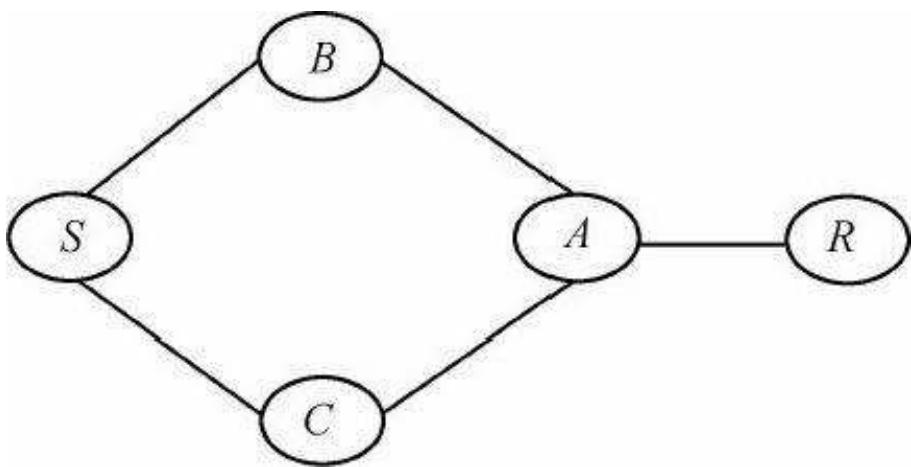  
Figure 6.1 Membership establishment and maintenance.

We illustrate the JQP and JRP packets transmission processes and group membership maintenance as depicted in the Fig.6.1. Node S is a multicast source, R is a receiver, A, B and C are forwarding nodes. It is merely by note A to make the decision which node, B or C, becomes the upstream forward node of the node A from S to R, because the node A knows the information about nodes B and C through the JQP of B and C, and B or C does not know each other simultaneously. The following illustrates the procedure that the node A selects the upstream forward node. First, by JQP from nodes B and C, node A derives the resource reservation data and reinforcement signal information of B and C. Then, the node A updates the Q(A, B) and Q(A, C) according to (6.3),

$$
Q _ {n} (A, y) = (1 - \alpha) Q _ {n - 1} (A, y) + \alpha [ r + \beta \max  _ {i} Q _ {n} (y, i) ], \tag {6.3}
$$

configures the JQP with the resource reservation data and reinforcement signal information of its own, and floods the packet. When it receives the JRP from the receiver R, the node A selects the upstream forward node by argmax $\mathrm { \Phi _ { i } Q ( A , i ) , i } \in \left( { \mathbf { B } } , { \mathbf { C } } \right)$ . Assumed that Q(A, B) is larger than Q(A, C), then, node A selects node B as upstream forward node to A. Now, the node A creates its JRP, and floods it. At this time, the node B receives the JRP, sets its forward flag in its FT as identifying that the forward ID is itself.

The JQP is periodically broadcast to the entire network to refresh the multicast group membership information and update the routes. If a multicast source leaves the group, it simply stops sending JQP. If a receiver no longer wants to receive from a particular multicast group, it does not send the JRP for that group. Nodes in the forwarding group are demoted to non-forwarding nodes if not refreshed as they timeout.

Multiagent systems arising in human societies and distributed computation offer modularity, is one of the most powerful tools for handling dynamically changing and unpredictable domain. Two phases of creating forward table in the Q-MAP method, Join Query Forward and Join Reply Backward, can be considered as two tasks performed by different kinds of agents. The tasks in the Join Query Forward phase are carried out by the forward agents transferring the resource reservation information and reinforcement signals information to other nodes, which is similar to the performance of ants in the AntNets. The Join Reply Backward is the performance of other kind agents that return the decision information back to the source node.

In the Q-MAP multicast routing method, the process of the exploration or the exploitation in the RL is replaced by the broadcast of sending JQP from the source node that is responding to the goal state in RL. In other words, the learning begins from the propagation of reinforcement signals at the end of learning episodes. Here, the Q-learning is selected as the form of RL due to its simplification and representatives,

$$
Q _ {n} (x, a) = (1 - \alpha) Q _ {n - 1} (x, a) + \alpha [ r + \beta \max  _ {b} Q _ {n} (y, b) ], \tag {6.4}
$$

which is originated from the TD(λ) ［ 44 ］ that is adaptive for dynamic environments. And, in the opinion of the Q-learning, an optimal policy can be derived directly from the action with the maximum Q-value,

i.e., the utility, at each state after the learning. Therefore, at the phase of the Join Reply Backward, the upstream forward direct node ID is chosen by the maximum Q-value. As RL method without the model of an environment, we adopt episode propagation Q-learning way, which means, after a learning episode the Q-value updating is performed to all state-action pairs belonging to that episode.

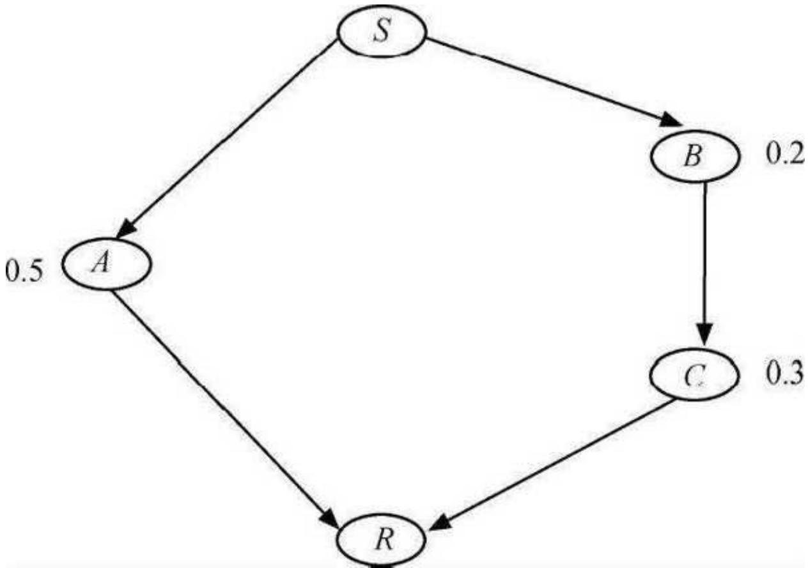  
Figure 6.2 Example of parameter assignment of Q-learning in the Q-MAP method.

In the following, we configure the Q-learning parameters suitable to the Q-MAP multicast routing method. With the example depicted in Fig.6.2, we give out some analyses and discussions about the assignment of the parameter.

First, we define the cost corresponding to resource reservation and energy consumption at each node as the parameter r. In Fig.6.2, there are two alternatives from the source node to the destination node in the network those are the routes of S-A-R and S-B-C-R. It is assumed that $\mathrm { r ( A ) } = 0 . 5$ , $\Gamma ( \mathrm { B } ) = 0 . 2 \ $ , and $\operatorname { r } ( \mathrm { C } ) =$ 0.3, i.e., the resource occupation of the packet forward through the nodes A,B, and C will be 0.5, 0.2, and 0.3, respectively. In terms of RL, those are the cost (reward) at each learning state. That means, from the viewpoint of the whole network, the cost of the node R receiving packets through the node A is the same as the sum of costs through B and C, which is 0.5.

Then, let's consider the parameter $\beta$ . Despite the cost of the route S-A-R is equal to the route S-B-C-R at the Fig.6.2, the latter needs one more nodes than the former. Thus, the route S-A-R is preferred. It will be determined by setting the parameter $\beta$ . Since we set the parameter r as cost in the Q-MAP algorithm, we assign the $1 \le \beta$ . Though, this setting results in that the Q-value is divergent in the case of the infinite iteration, the route for sending message with fewer numbers of nodes can be derived. Moreover, at the application of the multicast routing, it is not necessary to get convergent Q-values for the situation of infinite iteration, since the important point is to derive the efficient route at as fewer steps as possible.

In addition, the initial Q-value in the Q-MAP method is set great larger than the largest cost of nodes in the networks, since the route with least cost is intend to be selected. It is to ensure that the routes with less cost will be selected even during the initial processes of the learning.

To the example in Fig.6.2, it is necessary to compare Q(R, A) and Q(R, C) to decide the forward table ID for the receiver R. Here, the receiver R is accordant with the state, and the nodes A and C are corresponding to the actions in terms of the Q-learning. But at the next step, A or C becomes the state denoted in the Q-learning. That means the node in terms of the ad hoc networks may be the state or the action in terms of the Q-learning accordant with situations. With Q-value updating, the expect result is that Q(R, A) is better than Q(R, C) derived by the above parameter configuration.

# 6.4.3 Convergence Proof of Q-MAP Method

In the following, we give the theorem and its proof of the relationship between the Q-value of a stateaction pair and the utility corresponding to that pair. Then, utilizing the conclusion of the theorem, we analyze the rationality of the parameter configuration in the Q-MAP algorithm ［ 45 ］

Theorem 1 In the Q-MAP algorithm, set q 0 as the initial Q-value of every state-action pair $( \mathbf { x } , \mathbf { y } )$ at the network, and r(y) as cost r at the node y. According iteration (6.4), the relationship of the Q-value of the pair $( \mathbf { x } , \mathbf { y } )$ and the utility U (y) of its upstream node y can be gotten by the equation

$$
Q _ {n} (x, y) = (1 - \alpha) ^ {n} q _ {0} + [ 1 - (1 - \alpha) ^ {n} ] [ r (y) + \beta U (y) ], \tag {6.5}
$$

where n is the iterative times, $0 < \alpha < 1$ is a learning factor, $\beta$ is a parameter.

Proof.

According to the iteration (6.4), there is

$$
Q _ {n} (x, y) = (1 - \alpha) Q _ {n - 1} (x, y) + \alpha [ r (y) + \beta U (y) ]. \tag {6.6}
$$

Setting $1 - \alpha = \sigma$ , replace $\propto \left[ \mathrm { r ( y ) + \beta U \left( y \right) } \right]$ with a constant C, and using V (z) as the z-transform of ${ \mathrm { Q } } _ { \mathrm { n } } ( \mathbf { x } ,$ y), by means of $\mathbf { Z }$ -transform, we get the form

$$
z ^ {- 1} [ V (z) - V (0) ] = \sigma V (z) + \frac {1}{1 - z} C. \tag {6.7}
$$

That is

$$
V (z) = \frac {1}{1 - \sigma z} V (0) + \frac {z}{(1 - z) (1 - \sigma z)} C. \tag {6.8}
$$

By partial-fraction expansion, it becomes

$$
V (z) = \frac {1}{1 - \sigma z} V (0) + \frac {\frac {1}{1 - \sigma}}{1 - z} C + \frac {\frac {1}{\sigma - 1}}{1 - \sigma z} C. \tag {6.9}
$$

As $0 < \sigma = 1 - \alpha < 1$ , we get

$$
Q _ {n} (x, y) = \sigma^ {n} q _ {0} + \frac {1}{1 - \sigma} C + \frac {1}{\sigma - 1} \sigma^ {n} C. \tag {6.10}
$$

Putting the C and σ back, it becomes

$$
Q _ {n} (x, y) = (1 - \alpha) ^ {n} q _ {0} + [ 1 - (1 - \alpha) ^ {n} ] [ r (y) + \beta U (y) ].
$$

Analyzing the theorem, we can know that the learning rate is directly decided by the parameter α, i.e., as the parameter α approaches to 1, the $\mathbf { \cal { Q } } ( \mathbf {  { x } } , \mathbf {  { y } } )$ will quickly approach to $\left[ \mathrm { r ( y ) + \beta U ( y ) } \right]$ . Thus, for deriving optimal route rapidly, we can set the $\alpha$ approaching to 1. Certainly, there exists the trade off between rapid

learning and suitable to the dynamic feature of the environment in the assignment of the parameter α.

By the theorem, when $\mathrm { ~ n ~ } \to \ \infty$ , it has

$$
Q (x, y) = r (y) + \beta U (y).
$$

So, if the number of nodes in the network is infinite, it can be known that the Q-value will not be convergent. In reality, however, the number of nodes in the ad hoc networks is limited, and in particular, the iterative times in the Q-MAP method must be within a few numbers to get reasonability required by the ad hoc wireless multicast routing. Therefore, the super-limit exists as long as the number of nodes in the network is finite. In other words, the convergent Q-value will be guaranteed by this parameter configure within finite iterative steps.

From the theorem, as the result of setting the parameter $1 \le \beta$ for the example above, the route S-A-R will be chosen as sending message from source to receiver though the total cost of that route is the same as the route S-B-C-R.

Also known from the equation (6.4) in the theorem, the setting of the initial $\mathrm { Q } > \mathrm { m a x } ( \mathrm { r } )$ plays the role that the Q-value will be convergent from worse value to better value in the route learning processes. And the parameter α plays the role of controlling the learning rate, and $\beta$ can be used to adjust the Q-value at the time of convergence in relatively stationary periods of networks.

# 6.5 Simulations and Results

In this section, we show some simulations about how the Q-MAP method works during the creation of multicast routes. Since simulations are performed in the opinion of the RL, the environment is simplified in accordant with it. To concentrate our discussions on reasonability of the RL in multicast routing, some elements not directly connecting with the RL are ignored in the simulations and discussions of results.

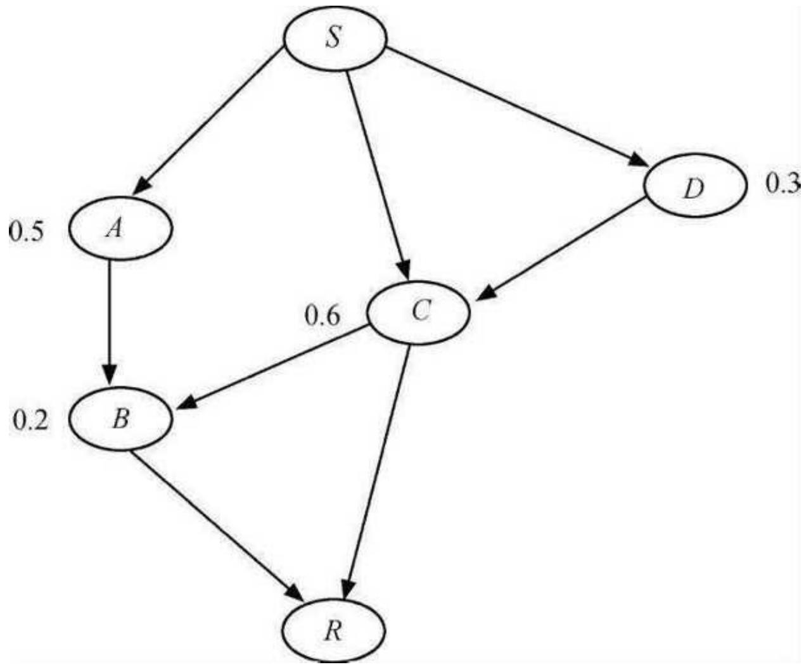  
Figure 6.3 Simulation environment 1.

For simplification, the number of multicast group, multicast source, and receiver are assigned only one in the simulations. Fig.6.3 depicts an environment, where the node S represents the multicast source, R is the receiver, and others are forwarding nodes with costs respectively. There are a few routes being able to arrive the receiver node R from the source node S, and it is not difficult to conclude that the route S-C-R is better than other routes. Major, the problem is whether the route S-C-R will be selected with the Q-MAP method by calculating and comparing Q(R, C) and Q(R, B) so as to determine which node is the receiver's upstream node, C or B.

The parameters for simulations are set as following. The cost at each node is shown at the figures of network environments, the initial Q-value is 101; the $\beta$ is 1.2, and the learning rate α is 0.8.

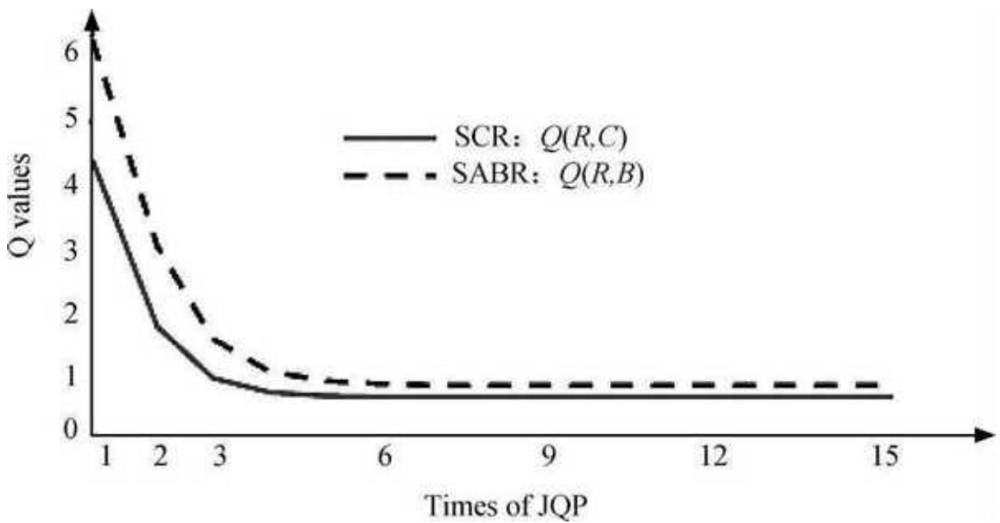  
Figure 6.4 Results for simulation environment 1.   
Fig.6.4 shows the simulation results for network pattern of Fig.6.3. The horizontal axis represents the number of times sending JQP from the source node S, and the vertical axis represents the Q-values of the receiver R corresponding to each route, respectively. The simulation results in Fig.6.4 show that the optimal route S-C-R for sending multicast data from the source S to the destination R can be derived by the value comparison between Q(R, C) and Q(R, B) at the time of convergence as well as during the learning processes.

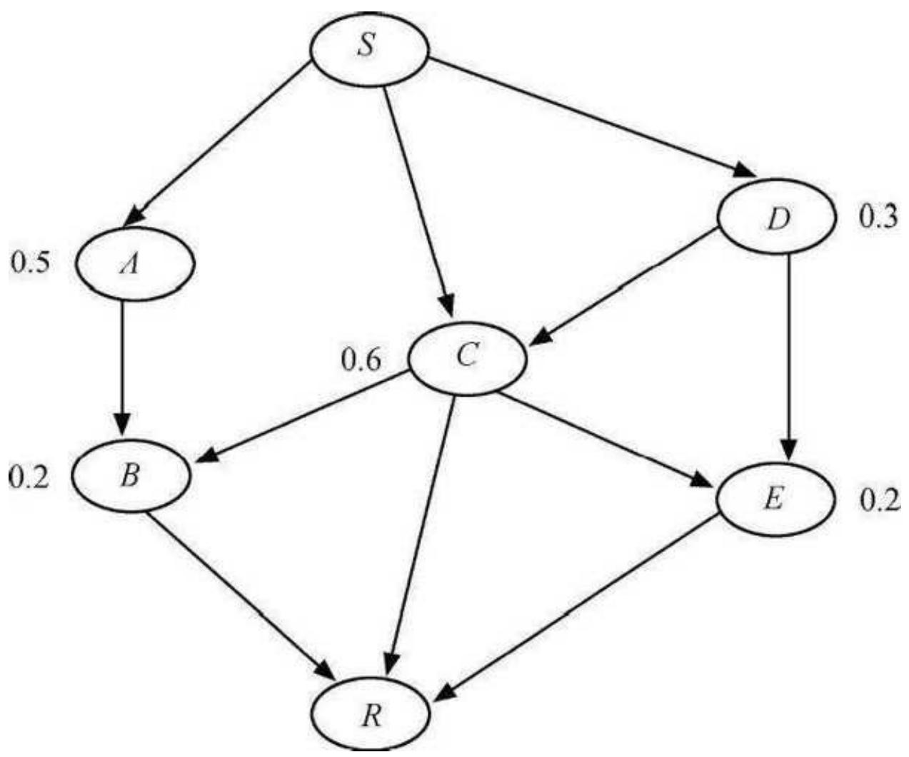  
Figure 6.5 Simulation environment 2.

Supposing a new node E is joining this ad hoc network when the environment of the Fig.6.3 becomes the stable situation, the environment will be changed into the environment 2 as shown in the Fig.6.5. Also, there are a few of routes being able to be chosen as forwarding route in the environment 2 similar to the environment 1. At this time, the cost of the node E is 0.2, and one of importance features in the Q-MAP method is to choose the route with the least cost for utilizing the resource optimally, so the next problem to investigate is if the route S-D-E-R can become best choice in the present situation.

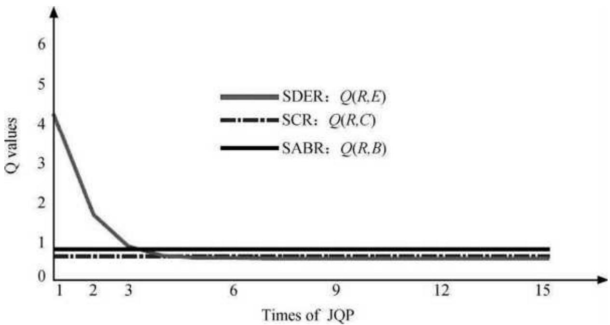  
Figure 6.6 Results for simulation environment 2.

It is necessary to discuss two issues about the simulation results shown in the Fig.-6.6. The first one is about the timing of deriving the optimal route S-D-E-R. There exist three selection of the direct upstream node of the receiver, B, C, and E . Because Q(R,C) and Q(R,B) inherit the values from stable situation of the environment 1, and Q(R,E) begins its update from initialization, within a certain time, the Q(R,C) is still the better election for sending the multicast data from the source to the destination node by following the route S-C-R. Since the fifth iteration, however, Q(R,E) becomes the best one. Thereafter, the route of S-D-E-R will be chosen as multicast route in the ad hoc network. Gradually, with the value of Q(R,E) coming to its convergence value, this network infrastructure is getting stable state simultaneously, i.e., the route S-D-E-R being selected is the best optimal one. Considering the stable feature of the network, this delay is necessary at some degree. The route S-C-R is already stable, and the node E is still not stable state at the beginning phase of the node E joining the network, therefore, it is beneficial for the stability of the network as the node E is selected under the stable state after a several steps of calculation while it surely becomes one stable nodes of this network. The second issue is the rate for deriving convergent value of the Q(R, E), which can be controlled by adjusting the learning rate α as discussed in section 6.4.

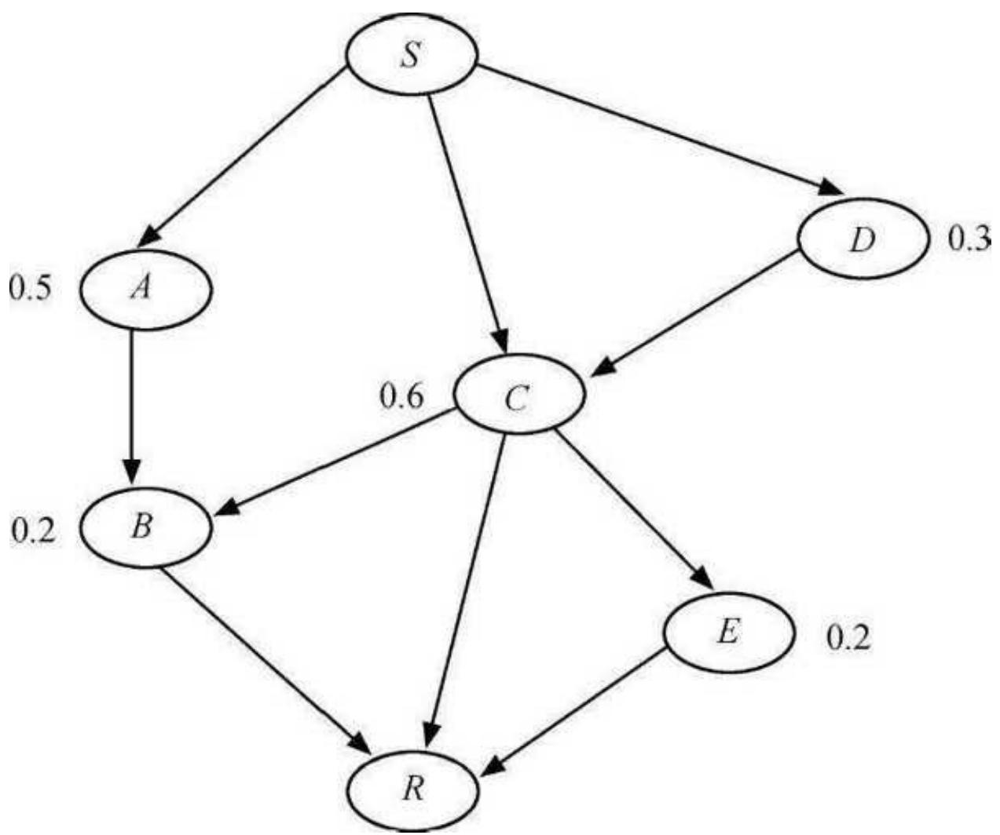  
Figure 6.7 Simulation environment 3.

When the environment depicted in Fig.6.5 becomes stable, the node E begins to move so that it cannot directly receive the packet from the node D. This means that the connection between the node D and the node E breaks, and the route S-C-R becomes the best again, which is shown in the Fig.6.7.

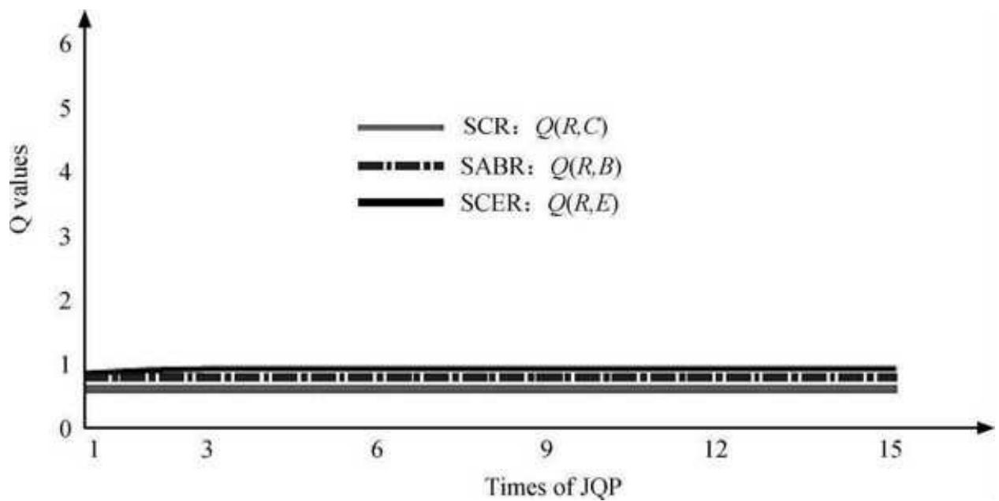

Figure 6.8 Results for simulation environment 3.

The simulation results depicted in Fig.6.8 show that the route S-C-R is derived by the Q-MAP method. Though, affected by the Q-value of previous environment 2, the value of Q(R, E) is a little better than its convergent value at later iterative times, it is worse than the Q(R, C) at whole processes in Fig.6.8.

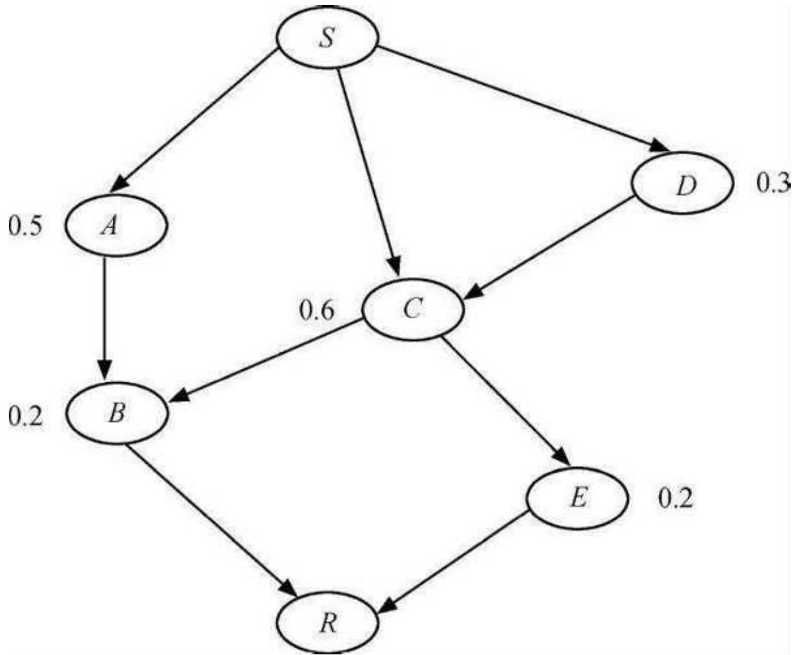  
Figure 6.9 Simulation environment 4.

As the nodes in this network are moving, the JQP sent by node C cannot be received by the receiver R directly. The break of the connection between the node C and the node R results in that the cost of the route S-C-R is not the least now, which is shown in the Fig.6.9.

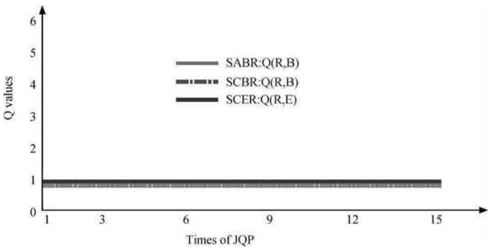  
Figure 6.10 Results for Simulation environment 4.

At this time, the Q(R, C) does not exist since there is not the connection between the node C and the node R. The Q(R, B) and the Q(R, E) are inherited from the previous environment 3, and the Fig.6.10 shows the Q(R, B) is better than the Q(R, E). Thus, the node B is chosen as the direct upstream node of the receiver. And the route with fewer cost, S—A—B—R, is selected as the multicast route at this situation.

# 6.6 Conclusions

We present the Q-MAP method, a multicast routing algorithm with multiagent RL methodology for MANETS in this chapter, which owns merits of guaranteeing the optimal resource reservation route, network scalability and adaptation by the use of RL and distributed computation.

The Q-MAP algorithm is an on-demand multicast route construction and membership maintenance scheme, and is suitable to the multi-hop ad hoc wireless networks. It ensures resource reservation successfully due to the use of RL. And, scalability is promoted by distributed agent interactions not relying on the centralized control mechanism. From the point of view of the multiagent RL, analyzing the configure of parameters used by the Q-learning, we deeply investigate the rationality and convergence of the Q-MAP method. Further, we also discuss and verify the efficiency of the proposed method and its suitability to the dynamic environment in opinion of the RL by typical pattern simulation results included verifying the number of nodes and modifying the optimal route.

# Bibliography

［ 1 ］ N.S. Nithya, K. Duraiswamy. Efficient agent based QoS routing protocol for mobile ad-hoc networks ［C］, 2009 International conference on control automation, communication and energy conservation, 2009.   
［ 2 ］ X. Xiang, X. Wang, and Y. Yang. Stateless multicasting in mobile ad hoc networks ［J］, IEEE transactions on computers, 59(8), 1076-1090, 2010.   
［ 3 ］ J. Wang, E. Osagie, P. Thulasiraman, and R. Thulasiram ［J］. Hopnet: A hybrid ant colony optimization routing algorithm for mobile ad hoc network. Ad hoc networks, 7(4), 690-705, 2009.   
［ 4 ］ Z. Sheikh, A. Fanian, M. Sayyed. A cluster-based key establishment protocol for wireless mobile ad hoc networks ［C］, 13th international CSI computer conference, CSICC 2008, Vol.6, 585-592, 2008.   
［ 5 ］ L. Khoukhi, A. Masri, D. Gaiti. A hybrid stateless QoS approach for wireless mobile ad hoc networks ［C］, 4th IFIP international conference on new technologies, mobility and security, 2011.   
［ 6 ］ N. Lemmens, K. Tuyls. Stigmergic landmark routing: A routing algorithm for wireless mobile Ad-Hoc networks ［C］, Proceedings of the 12th annual genetic and evolutionary computation conference, GECCO 2010, 471-478, 2010.   
［ 7 ］ S.J. Lee, W. Su, J. Hsu, M. Gerla, and R. Bagrodia. A performance comparison study of ad hoc wireless multicast protocols ［C］, Proceedings of IEEE INFOCOM 2000, 565-574, 2000.   
［ 8 ］ S.J. Lee, M. Gerla, and C.C. Chiang. On-demand multicast routing protocol ［C］, Proceedings of IEEE WCNC'99, New Orleans, LA, 1298-1302, 1999.   
［ 9 ］ J.G. Jetcheva, D.B. Johnson. Adaptive demand-driven multicast routing in multi-hop wireless ad hoc networks ［C］, Proc. of the 2001 ACM international symposium on mobile Ad hoc networking & computing, 33-44, 2001.   
［ 10 ］ C.D. Caro, M. Dorigo. AntNet: Distributed stigmergetic control for communications networks ［J］, Journal of Artificial intelligence research, Vol.9, 317-365, 1998.   
［11］ R. Schoonderwoerd, O. Holland, J. Bruten, L. Rothkrantz. Ant-based load balancing in telecommunications networks ［J］, Adapter behavior, 5(2), 169-207, 1996.   
［ 12 ］ R. Schoonderwoerd, O. Holland, J. Bruten. Ant-like agents for load balancing in telecommunications networks ［C］, Proceedings of the first international conference on autonomous agents, 209-216, 1997.   
［ 13 ］ M. Dorigo, L.M. Gambardella. Ant colony system: A cooperating learning approach to the traveling salesman problem ［J］, IEEE Trans. Syst, Man, Cybern. B, 1(1), 53-66, 1997.   
［ 14 ］ A.G. Barto, S.J. Bradtke, and S.P. Singh. Learning to act using real-time dynamic programming ［J］, Artificial Intelligence, Vol.72, pp.81-138, 1995.   
［ 15 ］ C. Claus, C. Boutillier. The dynamics of reinforcement learning in cooperative multiagent systems ［C］, Collected papers from the AAAI-97 workshop on multiagent learning, 13-18, 1997.   
［ 16 ］ M. Littman, J. Boyan. A distributed reinforcement learning scheme for network routing ［R］, Technical report CMU-CS-93-165, School of computer science, Carnegie Mellon University, 1993.   
［ 17 ］ S.P. Singh, D. Bertsekas. Reinforcement learning for dynamic channel allocation in cellular telephone systems ［C］, Advances in neural information processing systems: proceedings of the 1996 conference, MIT press, 947-980, 1997.

［ 18 ］ M. Dorigo and L,M. Gambardella. The ant system: Optimization by a colony of cooperating agents ［J］, IEEE Trans. Syst, Man, Cybern. B, 26(2), 29-41, 1996.   
［ 19 ］ B. Sachin, K. Deepti, and K. Arun. Throughput analysis of multi-channel TD-CSMA system and reinforcement learning ［J］, International journal of soft computing and engineering, 2(2), 513-516, 2012.   
［ 20 ］ J. Boyan, M. Littman. Packet routing in dynamically changing networks: A reinforcement learning approach ［J］, NIPS, 671-678, 1994.   
［ 21 ］ M.H. Kalos, P.A. Whitlock. Monte carlo methods ［M］, Wiley, New York, 1986.   
［ 22 ］ T. Stutzle, M. Dorigo. A short convergence proof for a class of ant colony optimization algorithms ［J］, IEEE transactions on evolutionary computation, 6(4), 358-365, 2002.   
［ 23 ］ C.C. Chiang, M. Gerla, and L. Zhang. Forwarding group multicast protocol for multihop, mobile wireless networks ［J］, ACM/Baltzer Cluster Computing, Special issue on mobile computing, 1(2), 187- 196, 1998.   
［ 24 ］ D. Vassis, G. Kormentzas, A. Rouskas, and I. Maglogiannis. The IEEE 802.11g standard for high data rate WLANs ［S］, IEEE Network 19, 21-26, http://dx.doi.org/ 10.1109/MNET.2005.1453395, 2005.   
［ 25 ］ A. Balasubramanian, B. N. Levine, A. Venkataramani. Replication routing in DTNs: a resource allocation approach ［J］, IEEE/ACM Transactions on Networking, Vol.18, 596-609, 2010.   
［ 26 ］ T. Spyropoulos, K. Psounis, C. Raghavendra. Efficient routing in intermittently connected mobile networks: the single-copy case ［J］, IEEE/ACM Transactions on Networking, Vol.16, 63-76, 2008.   
［ 27 ］ A. Vahdat, D. Becker. Epidemic routing for partially connected Ad Hoc networks ［R］, Technical report, Duke university, 2000.   
［ 28 ］ S. Nelson, M. Bakht, R. Kravets. Encounter-based routing in DTNS ［J］, Infocom 2009 IEEE, 846-854, 2009.   
［ 29 ］ A. Lindgren, A. Doria, and O. Schelén. Probabilistic routing in intermittently connected networks ［J］, ACM SIGMOBILE mobile computing and communications review, 7(19), 2003.   
［ 30 ］ R. Aharoni, E. Berger. Menger's theorem for infinite graphs ［J］. Inventions Mathematician, Vol.176, 1-62, 2008.   
［ 31 ］ E.M. Daly, M. Haahr. Social network analysis for routing in disconnected delay-tolerant MANETs ［C］, Proceedings of the 8 th ACM international symposium on mobile adhoc networking and computing, 32-40, 2007.   
［ 32 ］ M.E.J. Newman. The structure and function of complex networks ［R］, SIAM review, Vol.45, 167-175, 2003.   
［ 33 ］ P. Hui, J. Crowcroft, E. Yoneki. Social-based forwarding in delay-tolerant networks ［J］, IEEE Transactions Mobile Computing, 10(11), 1576-1589, 2011.   
［ 34 ］ C. Wu, K. Kumekawa, T. Kato. Distributed reinforcement learning approach for vehicular adhoc networks ［J］, IEICE transactions on communications, Vol.E93-B, 1431-1442, 2010.   
［ 35 ］ C. Perkins, E. Belding-Royer, S. Das. Ad Hoc on-demand distance vector (AODV) routing ［R］, Report FC Siginfo, 1-38, 2003.   
［ 36 ］ S. Mccanne, S. Floyd, K. Fall. Network simulator2, http://www-nrg.ee.lbl.gov/ns, 1997.   
［ 37 ］ F. Bai, N. Sadagopan. A frame work to systematically analyze the impact of mobility on performance of routing protocols for adhoc networks ［M］, IEEE INFOCOM, 2003.

［ 38 ］ A. Elwhishi, P. Ho, K. Naik, B. Shihada. ARBR: Adaptive reinforcement-based routing for DTN ［C］, IEEE 6 th International Conference on Wireless and Mobile Computing, Networking and Communications, 376-385, 2010.   
［ 39 ］ T. Spyropoulos, T. Turletti. Routing in delay tolerant networks comprising heterogeneous node populations ［J］, IEEE Mobile Computing, 1-14, 2009.   
［ 40 ］ J. Dowling, E. Curran, R. Cunningham, V. Cahill. Using feedback in collaborative reinforcement learning to adaptively optimize MANET routing ［J］, IEEE Transactions on Systems, Man, and Cybernetics Part A: Systems and Humans, Vol.35, 360-372, 2005.   
［ 41 ］ G. R. Vitor, C. Marilia. A reinforcement learning-based routing for delay tolerant networks ［J］, Engineering applications of artificial intelligence, (26), 2243-2250, 2013.   
［ 42 ］ C.J.C.H. Watkins, P. Dayan. Technical note: Q-learning ［J］, Machine learning, Vol.8, 55-68, 1992.   
［ 43 ］ O. Abul. Multiagent reinforcement learning using function approximation ［J］, IEEE TRANS. on SMC-PART C, 30(4), 485-497, 2000.   
［ 44 ］ R.S. Sutton, A.G. Barto. Learning to predict by the methods of temporal differences ［J］, Machine learning, Vol.3, 9-44, 1988.   
［ 45 ］ R.Y. Sun, S. Tatsumi, and G. Zhao. Application of multiagent reinforcement learning to multicast routing in wireless ad hoc networks ensuring resource reservation ［C］, Proc. of the 2002 IEEE international conference on system, man & cybernetics, 2002.

# Chapter 7 Multiagent Reinforcement Learning for Supply Chain Management

Reinforcement Learning (RL) is successfully applied to problems of combinatorial complexity (NP-hard) $[ \ 1 - 5 ]$ . Multiagent RL method is one of the most powerful methodologies to deal with dynamical and unpredictable domains $[ \underline { { 6 } } - \underline { { 8 } } ]$ . Taking the dependencies of the underlying production techniques into account, the Supply Chain Management (SCM) is NP-hard problem. By surveying efficient multiagent RL methods and investigating a mechanism about how to utilize coordination agents' rewards of the upstream level as learning agents' own experiences, this chapter proposes a multiagent RL method suitable to the dynamic supply chains. The RL agents make optimal job scheduling that satisfies the constraint condition at each note in the supply chain network. Multiagent cooperation by indirect media communication makes optimal routine for the tier and its supply chain partners in the supply chain network.

# 7.1 Introduction

Supply chain management is a challenging problem for agent-based electronic commerce. Efficient allocation of services to form a supply chain to solve complex tasks is a crucial problem. Besides the allocation aspect, profit considerations of the supply chain partners play an important role for the attribution of tasks. Faster communication over the Internet necessitates dynamic reconfiguration of supply chains over time to take advantage of better configurations. Taking the dependencies of the underlying production techniques into account, the SCM presents itself as an NP-hard problem.

Reinforcement Learning (RL) is an efficient method for solving problems that agents have no knowledge about the environment a priori, which owns two characteristics: trial-and-error and delayed rewards. Recently, RL is successfully applied to NP-hard problems, such as Job-shop scheduling ［ 9 ］ , channel routing 10 ］［ 11 ］ , and some other aspects $[ \underline { { 1 2 } } - \underline { { 1 4 } } ]$ , etc. Learning in a partially observable and non-stationary environment is still one of the challenging problems in the area of multiagent learning. RL is a generic method that suits the needs of multiagent learning in many aspects. Based on an RL algorithm, the Semi-Markov average reward method has been proposed that provides the highest reward compared with some heuristics methods. Also based on RL, the yield optimizing scheduling method has been proposed where agents act on their own behalf and yield optimizing job acceptance strategy through the deterministic scheduling component, which algorithm outperforms the average income of the simple learning strategy in the benchmark heuristic methods.

By investigating a mechanism about how to utilize partner agents' rewards as learning agents' own experiences, this chapter proposes a multiagent RL method for SCM to derive maximal profit on supply chains. The coordination mechanism of this chapter is realized by including the rewards of partner agents of the upstream level from the supply chain environment. For suitable to the dynamic feature of supply chains, agents communicate their rewards, which is referred to as "observe" from the viewpoint of learning agent. The "observed" rewards and agent's own states are used to construct an optimal policy. Based on the above, this chapter proposes a multiagent RL algorithm for SCM: the Q-opr multiagent RL method that designates multiagent Q-learning with Observing Partners' Reward.

# 7.2 Related Issues of Supply Chain Management

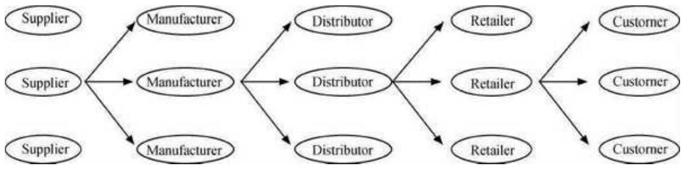  
Figure 7.1 Generic supply chain

The study of SCM has been fruitful in recent years ［ 15 ］［ 16 ］ . National and international corporations are focusing on the performance improvement of their integrated systems to gain a competitive advantage in the global markets. Traditional methods have a limitation in dealing with uncertainties from the external business environment. Uncertain market demand and supply are usually two major obstacles when attempting to achieve smooth and efficient production. In the present competitive global markets, no business can be successful without identifying the problems and possibilities in managing its supply chain. To streamline operations and coordinate activities throughout the supply chain, effective information sharing and efficient distribution and allocation of inventory are the necessary features to be considered and established. Fig.7.1 illustrates the general supply chain model, which shows the product flow and hides the information flow between each note in the network.

A brief definition of supply chain is described as: "Supply chain management is a set of approaches utilized to efficiently integrate suppliers, manufacturers, warehouses, and stores, so that merchandise is produced and distributed at the right quantities, to the right locations, and at the right time, in order to minimize system wide costs while satisfying service level requirements." SMC is a multi-faceted problem that has to be approached from different views ［ 17 ］ . One of the least studied of these views is adaptive or dynamic configuration of supply chains. This problem is relatively new since faster communications over the Internet or by any other means and the willingness to utilize it for effective management of supply chains did not exist a few decades ago. For instance, assume there are several vendors who can deliver the same quality product but with different per unit prices and time needed to deliver the product. The choice of vendor depends on how long the ultimate customer is willing to wait to receive the product and at what price. Several factors make this process rather complex in most real-world supply chain environments, for example, the number of stages involved essentially through the supply chain from start to finish.

The available models dealing with logistics in distributed systems usually address specific aspects of the problem. Some models 18 are aimed at finding the optimal production allocation over the system life cycle in the long-medium term. That is, production is assigned to the network facilities based on some optimizing criterion such as cost or time. Other models are concerned with coordinating or shifting production among facilities in the medium-short run as in Cohen ［ 19 ］ or Kogut and Kulatilaka ［ 20 ］ respectively. Federgruen ［ 21 ］ reviewed the planning models for the determination of integrated inventory and strategies in complex production and distribution systems, and reported that a single integrated, efficiently solvable model is still lacking. Lee ［ 22 ］ and Billington ［ 23 ］ described how Digital Equipment Corporation and Hewlett-Packard dealt with the problem how companies coordinate distributed systems. The approaches used by both firms seem to be designed to manage their operations under an integrated perspective based on the GSCM concept. Logistics integration especially benefits those firms that are characterized by long supply channels and physical distances, which results in long pipelines and high throughput times. Integrating the supply chain allows information to be substituted for inventory in the channel ［ 24 ］ . The resulting advantages are more meaningful where global sourcing or manufacturing is coupled with JIT sourcing ［ 25 ］ or lean production ［ 26 ］

The coordination of distributed systems can be described in terms of different functions and different

geographic areas. A distributed system involves several functions or several areas or both. The coordination priorities between the two dimensions need to be defined so as to describe how function or area interactions are handled. Based on the foregoing, Pierpaolo proposes a simple scheme that can be useful in either classifying the existing models or in designing new ones from a particular perspective. Also, the scheme provides a specific view of the GSCM concept ［ 27 ］ . In their research, the management of distributed production systems has been studied. In particular, the analysis has addressed the coordination of multi-country production systems under the GSCM concept. A classification matrix has been proposed for characterizing the available approaches to the coordination problem in distributed systems. A methodology has been described to examine the coordination of distributed systems under the GSCM concept. The methodology, which is relatively new with regard to this particular field of application, is derived from three different areas of study, namely semi-Markov decision processes, reinforcement learning, and simulation. Their methodology represents a suitable tool for the coordination of distributed supply chain systems. Specifically, the methodology permits the modeling of variables that characterize international contexts, such as import tariffs and differences in real currency exchange rates. The reinforcement learning facilitates the solution of large semi-Markov decision problems through the use of agents that learn from experience. One specific feature of this reinforcement learning application is the use of multiple cooperating agents that share the same state space in pursuit of the same objective represented by a unique reward function for the whole system.

The results on a relatively simple case example show that the methodology is effective and achieves better performance than the two heuristics against which it was compared. Furthermore, the methodology derives different performance outcomes depending on market demand uncertainty. For high levels of demand uncertainty (modeled with high demand variance), any of the proposed coordination policies shows a decline in performance. However, the integrated policy derived from reinforcement learning approach outperforms any other policy. In fact, the RL based policy achieves the most appropriate trade-off between shifting production levels and smoothing of operations, and thus leads to maximization of the average reward. A key aspect of the methodology is the use of simulation, which makes it easy to apply the methodology to a wide range of problems. In fact, agents learn by simulating the real system, hence making it easy to model the system features. This aspect would be considerably more difficult if other approaches (e.g. dynamic programming techniques) were utilized. On the other hand, simulation by itself does not allow the determination of an ex-ante optimal solution of the problem.

An effective management and control of the material flow across the boundaries between companies and their customers is vital to the success of companies, but is a difficult task due to the demand amplification effect, known as Forrester effect ［ 28 ］ . It depends on factors such as the supply chain structure, the time lags involved in accomplishing actions (e.g. from the order release to fulfillment), and the poor decision making concerning information and material flows. Empirical studies demonstrate that inventory management policies can have a destabilizing effect due to the increase in the volatility of demand as it passes up through the chain ［ 29 ］ . For example, Towill ［ 30 ］ claims that the demand amplification experienced across each business interface is about $2 : 1$ . Lee ［ 31 ］ describe the Bullwhip effect occurring in supply chains as the considerable increase of the order variability relative to the variability of buyers' demand. They identify the main mechanisms that destabilize supply chains, i.e., order batching, price fluctuation, capacity shortfalls that lead to over-ordering and cancellation, and the updating of demand forecast.

A tight coordination among inventory policies of the different actors in the supply chain can reduce the ripple effect on demand. To this end an appropriate information infrastructure is necessary that allows all the actors within a SC make decisions synchronized and coherent among each other. Such an infrastructure is referred to as networked inventory management information systems (NIMISs) ［ 32 ］ . However, the exploitation of the NIMISs requires the adoption of suitable inventory management policies. For instance, Kelle and Milne ［ 33 ］ provide quantitative tools to study the effect of an (s, S) policy on the supply chain and show that small frequent orders and the cooperation among the SC partners can reduce demand variability.

Towill ［ 30 ］ investigates the impact of different strategies, such as JIT, vendor integration, and time based management, on the reduction of demand amplification. Wikner ［ 34 ］ stresses that the Forrester effect is lowered through the fine tuning of existing ordering policies, the reduction of delays, the removal

of the distribution stage in the SC, the change of local decision rules, and a better use of the information flow through the supply chain. Johnes and Riley ［ 35 ］ and Hoekstra and Romme ［ 36 ］ address the optimal positioning of stocks in the chain and suggest the use of strategic stocks to de-couple push from pull operations. Stalk and Hout ［ 37 ］ and Blackburn ［ 38 ］ focus on time compression and the integration of operations with both customers and suppliers.

Studies on supply chain inventory management generally identify three stages, namely supply, production, and distribution, yet the focus is usually put on the coordination between only two of them ［ 39 ］

Coherently, Thomas and Grifin ［ 40 ］ classify the models for coordinated supply chain management into buyer or vendor coordination, production, distribution coordination, and inventory distribution coordination.

In Ilaria's research, the SCM problem has been addressed with particular emphasis on inventory management ［ 41 ］ . Supply chain management is widely recognized as a vital source of competitive advantage, yet SCM techniques, especially in the inventory area, are very difficult to be put into practice, given the high need of information communication and processing involved. To this end many efforts have been lately devoted to the design of appropriate networked inventory management information systems (NIMISs). Despite the efforts focused on the implementation of NIMISs, relatively less attention has been given to define an appropriate logic for managing inventory, so missing the opportunity of exploiting the potential of such information systems. In particular, integrated approaches to manage inventory decisions at all stages of the supply chain need to be developed. In their research, an approach has been proposed, which addresses this problem. It is based on three techniques, namely Markov decision processes, reinforcement learning, and simulation. MDPs make it possible to model sequential decision-making problems under uncertainty. RL and simulation allow MDPs to be solved in a wider range of cases than conventional methods (e.g. dynamic and linear programming) do. The approach has been tested on a supply chain model consisting of the supply, manufacturing, and distribution stages. The integrated inventory policy determined through the proposed approach (SMART policy) outperforms a centralized periodic order policy, which has been used as a benchmark. Also, the SMART policy proves quite robust with respect to slight changes in demand. It is expected that the superiority of the SMART policy would be greater for more complex cases. In fact, centralized but simpler policies (such as the POQ based utilized as a benchmark) cannot adapt to complex environments as the SMART policy does. This depends on the ability of simulation modeling of capturing detailed features of the system as well as the capability of MDPs of describing time dependencies between decisions.

E-business is the execution of business transactions over the Internet. Supply chain transaction that involve e-business include the flow of information, products, and funds. Firms conducting e-business can perform some or all of the following supply chain transactions over the Internet.

· providing information across the supply chain;   
· negotiation prices and contracts with customers and suppliers;   
· allowing customers to track orders;   
· filling and delivering orders to customers;   
· receiving payment from customers.

# 7.3 SCM Network Scheme with Multiagent Reinforcement Learning

# 7.3.1 SCM with Multiagent

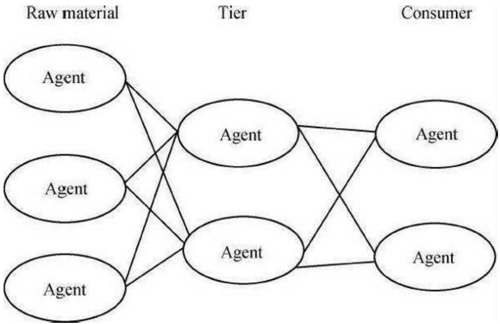  
Figure 7.2 General frame of SCM with multiagent RL.

Learning in a partially observable and non-stationary environment is still one of the challenging problems in the area of multiagent learning. RL is a generic method that suits the needs of multiagent learning in many aspects $[ \underline { { 4 2 } } - \underline { { 4 7 } } ]$ . This chapter provides learning agents the coordination way: the indirect media communication to enhance agents' value sharing ability for making decisions. The first aspect of our method in this chapter is to utilize multiagent learning method to derive optimal policy in the supply chain network. The general scheme is depicted in Fig.7.2.

It is necessary to provide an intuitive idea of a Semi-Markov decision process definition ［ 48 ］ . A Semi-Markov decision process is a stochastic process characterized by six elements: decision epochs, states, actions, transition probabilities, transition rewards, and transition times. Also, there is a decision-maker that controls the path of the stochastic process. At certain points in time along the path, the decision-maker (agent) intervenes and makes decisions that affect the course of the future path. These points are called decision epochs and the decisions are called actions. At each decision epoch, the system occupies a socalled decision-making state. As a result of taking an action in a state, the decision-maker receives a reward (which may be positive or negative) and the system goes to the next state with a certain probability, called the transition probability. The amount of time spent in the transition (the transition time) is a random variable. A decision rule is used to select an action in each state while a policy is a collection of such decision rules over the state space.

# 7.3.2 The RL Agents in SCM Network

The interface agent receives job request from downstream customers. The RL agent considers the request information passed by the interface agent as it states, decides and does its actions. Also the interface agent makes some requests to the upstream note to order some necessary parts or some goods, and gets some reply from upstream notes. The reply from upstream notes can also change the RL agent state to let the RL

agent make an action. Finally, based on the RL agent action, the interface agent gives its offer to the request partner. By this method, the RL agent "observes" not only the change of its downstream notes but also the change of its upstream notes. From the viewpoint of RL, this observation of taking partners' reward as learning agent's own state can help the learning agent making precise decision policy ［ 49 ］［ 50 ］ .

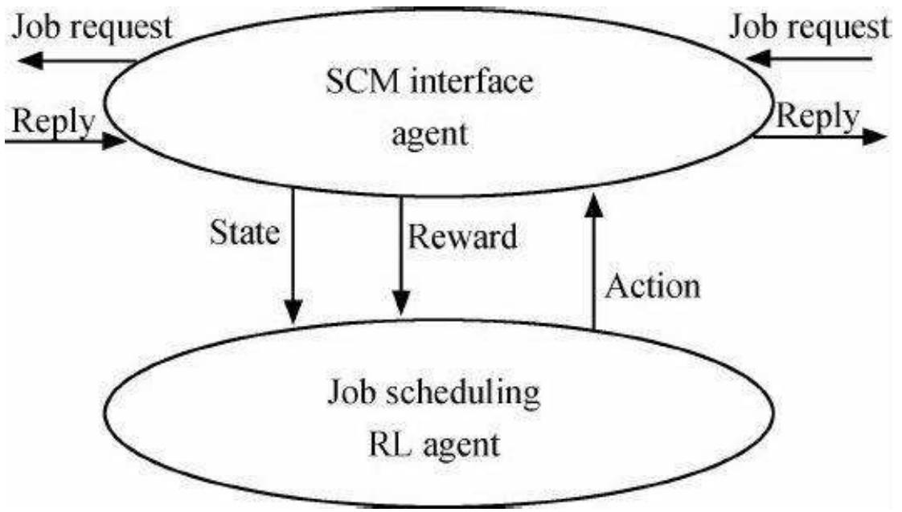  
Figure 7.3 RL agent frame.

As shown in Fig.7.3, each note in the supply chain network has SMC interface agent and job scheduling RL agent.

The partner's information may be negotiation results, such as price or time constraints. The RL agent at each note in the supply chain network makes decision support not just accept or reject, it can provide negotiation information support in order to realize operational routine and optimal job scheduling that satisfies the constraint condition of each note. Multiagent cooperation by indirect media communication is to make optimal routine and derive lowest cost of the tier and its supply chain partners in the supply chain network.

By surveying efficient multiagent RL methods and investigating a coordination mechanism about how to utilize coordination agents' rewards of the upstream level as learning agents' own experiences, this chapter presents the Q-opr multiagent RL method suitable to the dynamic supply chains. The proposed method focuses on the issue of optimal job scheduling of each note and optimal routine regarding the partners in the supply chain network. The RL agent makes optimal job scheduling that satisfies the constraint condition at each note in the supply chain network. Multiagent cooperation by indirect media communication makes optimal routine for the tier and its supply chain partners in the supply chain network. The proposed methods own merit of more efficient derivation of optimal profit for dynamic supply chain. By designing the parameter in detail, we intend to apply the proposed method to some multitier stage supply chain network for demonstrating the efficiency of the proposed methods for the SCM task.

# 7.4 Application of the Q-ACS Method to SCM

# 7.4.1 The Application Model in SCM

SCM is a set of approaches utilized to efficiently integrate suppliers, manufacturers, warehouses, and stores, so that merchandise is produced and distributed at the right quantities, to the right locations, and at the right time, in order to minimize system wide costs while satisfying service level requirements ［ 51 ］ SCM is a common theme in today's literature. After addressing their own scheduling and material problems OEMS are looking for ways to fix the same problems in their suppliers. Supply chains exhibit several problems:

· Excessive schedule variation experienced by sub-tier suppliers;   
· Similar capacity bottlenecks exist at multiple suppliers;   
· Inventory or WIP levels often deviate from expectations.

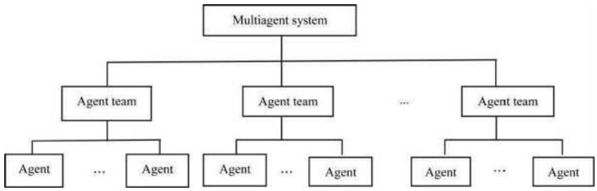  
Figure 7.4 Layer structure of multiagent system.

A manufacturing enterprise is measured by the cost of the goods it produces, their quality, and the timing of their availability relative to the customer's need. The task of SCM is to deploy resources across a supply chain to produce high-quality goods as inexpensively as possible and when the customer wants them. It governs decisions such as which suppliers should be used for which products, in what order products should be manufactured, when new jobs should be started, when new orders should be placed, and what level of inventory should be carried. A layer structure of SCM concerned multiagent system is shown as Fig.7.4.

SCM is a multi-faceted problem that has to be approached from different views ［ 27 - 52 ］ . DISPOWEB is a framework project for testing SCM techniques using the idea for developing a SCM module interacting with the other modules of a factory. A customer agent sends its request via DISPOWEB customer platform to the OEM agent. The OEM agent breaks the order into smaller units determines corresponding tier-1 suppliers for each unit. Then, tier-1 agent breaks the order into some smaller units. Via a contract-net protocol, tier-1 agent asks tier-2 agents about their delivery proposals. The training of an RL agent is realized a prior to the deployment of the RL agent in the DISPOWEB framework. The need of sufficient information, so that the system reacts efficiently at each step, is a challenging property of RL at this point. For this purpose any SCM system using RL must have a history of the jobs occurred so far. A job generator is employed at this phase sending jobs to the system stochastically.

We study the following procurement problem as defined in followings. The procurement request is a bundle consisting of n items to be purchased. This bundle is denoted by set $0 = \{ 1 , 2 , . . . , \mathtt { n } \}$ . A set of m sellers, denoted by $\mathrm { V } = \{ 1 , 2 , . . . , \mathrm { m } \}$ , has been identified as candidate suppliers. Each seller sells at least one of the items in a bundle O. For each item i, a seller j publishes a selling price ${ \mathrm { ~ P ~ } _ { \mathrm { i j } } }$ . Furthermore, for the seller j, if one or more items are ordered, it charges the buyer a fixed transaction fee denoted by $\mathrm { \Delta S _ { j } }$ , irrespective of the number of items ordered. The above procurement problem with the objective of

minimizing the total procurement cost can be formulated as an integer program. The decision variables is as $\mathbf { X } _ { \mathrm { ~ i j ~ } }$ for $\mathrm { i } \in \mathrm { O }$ and $\mathrm { j } \in \mathrm { V }$ , all of which are binary. Let $\mathbf { X } _ { \mathrm { ~ i j } } = 1$ , if a seller j is chosen for an item i, and $\mathbf { X } _ { \mathrm { ~ i j } } = 0$ otherwise. A set of auxiliary variables y j for $\mathrm { j } \in \mathrm { V }$ is also used in this model. Let $\mathrm { ~ y ~ } _ { \mathrm { j } } = 1$ , if a seller j is chosen for at least one item, and $\mathrm {  ~ y ~ } _ { \mathrm { j } } = 0$ otherwise. We now present the integer program.

$$
U = \min  \sum_ {i \in O} \sum_ {j \in V} P _ {i j} x _ {i j} + \sum_ {j \in V} S _ {j} y _ {j}, \tag {7.1}
$$

subject to:

$$
\sum_ {j \in V} x _ {i j} = 1, \quad i \in O \tag {7.2}
$$

$$
M _ {y j} \geqslant \sum_ {i \in O} x _ {i j}, j \in V \tag {7.3}
$$

$$
x _ {i j} = 0, 1, \quad i \in O, j \in V \tag {7.4}
$$

$$
y _ {j} = 0, 1, \quad j \in V \tag {7.5}
$$

The objective (7.1) formalizes the goal of minimizing the total procurement cost, the sum of item purchase costs and the corresponding transaction costs. The constraints (7.2) guarantee that all individual items in bundle O are ordered from some sellers. The constraints (7.3) assure that $\mathrm { ~ y ~ } _ { \mathrm { j } } = 1$ if at least one item is ordered from seller j. M is denoted as a sufficiently large constant.

The entire SCM network model of our research is comprised of several tiers. The above relationship is contained in each "pair" tiers. This supply chain structure follows an assembly-type structure in the procurement and assembly functions and follows a distribution-type structure in the distribution, a single facility typically procures materials from numerous suppliers.

The demand generated downstream becomes the required demand at the upstream site, while the supply delivery uncertainty at the upstream site influences material availability at the downstream site. The strategic-level sub-model considers an integrated, multi-product, multi-echelon, and procurementproduction-distribution system design problem in a flexible facility network configuration. It optimizes material flows throughout the supply chain, gives the optimal number and locations for plants, and distribution centers, and provides the best assignment of distribution centers to customers.

# 7.4.2 The Q-ACS Learning Applied to the SCM System

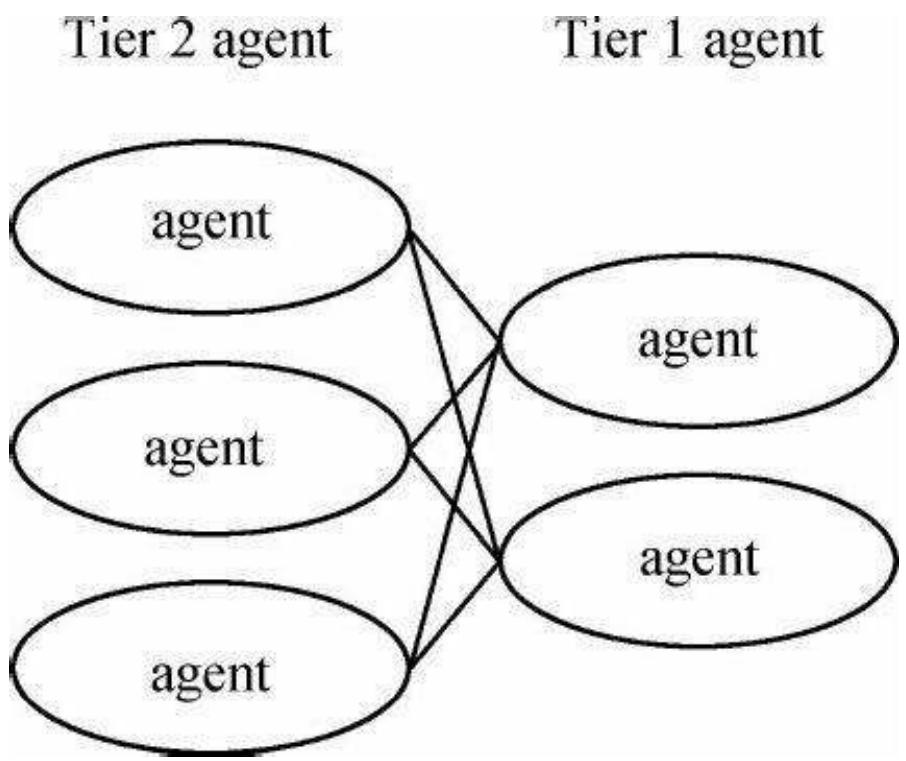  
Figure 7.5 The SCM agents scenario.

In general, the bundle O and V in each tier of our model is performed by corresponding agents, where we introduce the SCM model and its Q-ACS application method. The scenario is described as Fig.7.5.

The tier-1 agent asks the tier-2 agents about some bundles, such as order proposals, and subassembly parts from tier-2 suppliers. As soon as it receives an order, the tier-2 agent checks its schedule and finds out the capacity that is required in case it accepts this order satisfying some constraints. Decision-maker specification of the desired minimum flexibility level results in a preferred solution, and it may need to examine many of non-dominated solutions with the associated tradeoffs prior to making a selection.

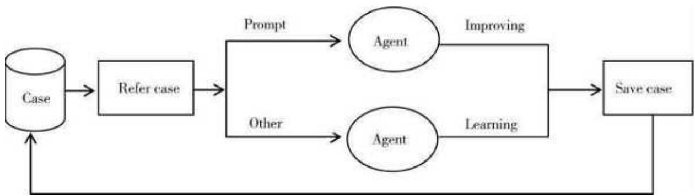  
Figure 7.6 The core operation of the Q-ACS method from the application viewpoint of SCM.

From the SCM viewpoint the core operation of the Q-ACS application method is the updating policy of the pheromones or reinforcement values and the action selecting policy in the algorithm, as shown in the Fig.7.6.

Like solving TSP by the ACS, as the problem-dependent function in SCM, the greedy heuristic $\boldsymbol { \mathsf { \Pi } } \boldsymbol { \mathsf { \Pi } }$ can be defined as the cost between notes in the supply chain network in real time. The pheromone τ is made local and global update at each iteration, used for deriving optimal policy of the SCM. As in the Q-ACS system ［ 53 ］［ 54 ］ , the agent can use two elements to estimate the optimal value of all notes in the supply chain. The pheromone τ is used as an indication of better choice in the long term; the value η is used as short term heuristic, s the value of a problem-dependent heuristic function, which is used as short term heuristic. The higher the value of η, the less the total procurement cost is, and so the higher its probability

of being chosen. As the exploitation, agents in our algorithm are guided with both pheromones and heuristic values during their learning processes,

$$
\operatorname {a r g m a x} _ {v _ {2} \in J k (v _ {1})} \left\{\left[ \tau \left(v _ {1}, v _ {2}\right) \right] \left[ \eta \left(v _ {1}, v _ {2}\right) \right] \mu \right\}, \tag {7.6}
$$

where:

$\boldsymbol { \cdot } \boldsymbol { \mathrm { J } } _ { \mathrm { k ( v ) } }$ is the feasible tier notes of an agent k on a note v for the valid solution;   
· the pheromone $\tau ( \mathbf { v } _ { 1 } , \mathbf { v } _ { 2 } )$ is used as indication of better choice in long term;   
· τ is the amount of pheromone associated with item at each iteration, corresponding to the amount of pheromone currently available in the position of the path being followed by the current agent, where item is presented as a supplier selecting rule condition.

The better the quality of the rule constructed by an agent, the higher the amount of pheromone added to the trail segments visited by the agent. Therefore, as time goes by, the best trail segments to be followed, that is the best items to be added to a rule, will have greater and greater amounts of pheromone, increasing their probability of being chosen.

As the biased exploration, agents in our algorithm are guided by the probabilistic transition policy

$$
p _ {k} \left(v _ {1}, v _ {2}\right) = \left\{\left[ \tau \left(v _ {1}, v _ {2}\right) \right] ^ {\nu} \left[ \eta \left(v _ {1}, v _ {2}\right) \right] ^ {\mu} \right\} / \left\{\sum_ {v \in J k (v 1)} \left[ \tau \left(v _ {1}, v\right) \right] ^ {\nu} \left[ \eta \left(v _ {1}, v\right) \right] ^ {\mu} \right\}, \tag {7.7}
$$

which favors the choice of paths those are shorter and have a greater amount of pheromones, ν and $\mu$ is used to determine the relative importance of pheromone versus heuristic.

The current agent iteratively adds one item at a time to its current the supplier-selecting rule. Let item $\mathrm { i j }$ be a supplier selecting rule condition of the form $\mathrm { A _ { i } = V _ { i j } }$ , where $\textrm { A } _ { \mathrm { i } }$ is the i-th auxiliary variable and $\mathrm { \Delta V _ { i j } }$ is the j-th value of $\textrm { A } _ { \mathrm { i } }$ . The probability that item $\mathrm { i j }$ is chosen to be added to the current supplier-selecting rule is given by:

$$
P _ {i j} = \left\{\eta_ {i j} \tau_ {i j} \right\} / \left\{\sum_ {i = 1} ^ {a t} x _ {i} \sum_ {j = 1} ^ {b i} \left(\eta_ {i j} \tau_ {i j}\right) \right\}, \tag {7.8}
$$

where:

· a t is the total number of auxiliary variables.   
· x i is set to 1 if the auxiliary variable $\textrm { A } _ { \mathrm { i } }$ is not yet used by the current agent, or to 0 otherwise.   
· b i is the number of values of the i-th auxiliary variable.

An item $\mathrm { i j }$ is chosen to be added to the current supplier-selecting rule with probability proportional to the value of Equation (7.8) subject to the auxiliary variable $\mathrm { A } _ { \mathrm { i } }$ . In order to satisfy this restriction the agents record which items are contained in the current supplier-selecting rule.

The application algorithm of the Q-ACS method to the SCM is given as follows:

1.Initialize the environment. Initialize the observing state. And, initialize Q-value.   
2.Do until (end condition):

a. Set agents initial positions.   
b. Repeat within one trial by each agent:

· Observing the state. $\mathbf { S } \gets$ state observed.

· Select an action a in the state s according to the action selecting policy, and execute it.

· Observing the present state, ${ \boldsymbol { \mathsf { S } } } ^ { \prime } \gets$ present state observed, getting a reward $\Gamma ( \mathsf { s } , \mathsf { a } ) \gets$ reward.

· Make a local update according to the Q-value updating policy.

c. Make a global update according to the Q-value updating policy.

where the end condition is set by applications. Both the local update and the global update are performed, and the local update is executed at each learning step and the global update is executed only after each trial.

# 7.5 Conclusion

By investigating the efficiency about the Q-ACS methods for dynamic problem solving in SCM and surveying the effective RL approach to the stochastic environment, this chapter presents an application method to the general SCM network structure. The merit of the proposed method is that the RL agent can not only derive the maximal profit using the usual RL technique as jobs coming with a stable distribution but also make the optimal procurement satisfying the requirement of stochastic features in the supply chain network and makes more efficient derivation of the optimal profit for dynamic supply chain network.

# Bibliography

［ 1 ］ R.S. Sutton and A.G. Barto. Reinforcement learning: An introduction ［M］, MIT Press, Cambridge, MA, 1998.   
［2］ M. Yamamura, K. Miyazaki, and S. Kobayashi. A survey on learning for agents ［J］, J. Japanese society for artificial intelligence, 10(5), 683-689, 1995.   
［3］ C.J.C.H. Watkins and P. Dayan. Technical note: Q-learning ［J］, Machine learning, Vol.8, 55-68, 1992.   
［4］ J.J. Grefenstette. Credit assignment in rule discovery systems based on genetic algorithms ［J］, Machine learning, vol.3, 225-245, 1988.   
［ 5 ］ P. Rolet, M. Sebag, O. Teytaud. Boosting active learning to optimality, a tractable Monte Carlo ［C］, Billiard-based algorithm, ECML'09, 302-317, 2009.   
［ 6 ］ G. Weiss. Multiagent systems ［M］, The MIT press, Cambridge, Massachusetts, London, England, 1999.   
［7］ S. S. Sian. Extending learning to multiple agents: issues and a model for multi-agent machine learning ［J］, Y. Kodratoff (Ed.), Machine learning-EWSL 91, Springer-Verlag, 440-456, 1991.   
［ 8 ］ Tan. Multi-agent reinforcement learning: Independent vs. cooperative agents ［C］, The proceedings of the tenth international conference on machine learning, 330-337, 1993.   
［ 9 ］ W. Zhang and T. G. Dietterich. A reinforcement learning approach to job-shop scheduling ［C］, the proceedings of the $1 4 ^ { \mathrm { t h } }$ international conference on artificial intelligence (IJCAI-95), Morgan Kaufmann, Orlando, FL, 1114-1120, 1995.   
［ 10 ］ S. P. Singh, D. Bertsekas. Reinforcement learning for dynamic channel allocation in cellular telephone systems ［C］, The advances in neural information processing systems: proceedings of the 1996 conference, MIT press, 947-980, 1996.   
［ 11 ］ R. Sun, S. Tatsumi and G. Zhao. Q-MAP: A novel multicast routing method in wireless ad hoc networks with multiagent reinforcement learning ［C］, The proceedings of IEEE region 10 conference on computers, communications, control and power engineering, CDROM, 2002.   
［ 12 ］ R.S. Sutton. Integrated architectures for learning, planning, and reacting based on approximating, dynamic programming ［C］, Proc. 7th Int. Conf. on machine learning, 216-224, 1990.   
［13］ T. Jaakkola, M. Jordan, and S. Singh. On the convergence of stochastic iterative dynamic programming algorithms ［J］, Neural computation, 6(6), 1185-1201, 1994.   
［ 14 ］ C . Lin, C. Chen. Nonlinear system control using self-evolving neural fuzzy inference networks with reinforcement evolutionary learning ［J］, Appl. soft Comput. No.11, 5463-5476, 2011.   
［ 15 ］ S. Kamal Chaharsooghi, Jafar Heydari, S. Hessameddin Zegordi. A reinforcement learning model for supply chain ordering management: An application to the beer game ［J］, Decision support systems, 45(4), 949-959, November, 2008.   
［ 16 ］ M. H. F. Zarandi, S. V. Moosavi, M. Zarinbal. A fuzzy reinforcement learning algorithm for inventory control in supply chains ［J］, International journal of advanced manufacturing technology, 65(1-4), 557-569, March 2013.   
［ 17 ］ D. Simchi-Levi, P. Kaminsky, and E. Simchi-Levi. Designing and managing the supply chain: Concepts, strategies, and case Studies ［M］, McGraw-Hill, Boston, 2000.

［ 18 ］ F.A. Lootsma. Alternative optimization strategies for large-scale production allocation problems ［J］, European journal of operational research, Vol.75, 13-40, 1994.   
［ 19 ］ M. A. Cohen, M. Fisher, R. Jaikumar. International manufacturing and distribution networks: a normative model framework ［M］, Managing international manufacturing, Ferdows K. (ed.), North Holland, New York, 67-93, 1989.   
［ 20 ］ B. Kogut, N. Kulatilaka. Operating flexibility, global manufacturing, and the option value of a multinational network ［J］, Management science, 40(1), 123-139, 1994.   
［ 21 ］ A. Federgruen. Methodologies for the evaluation and control of large scale production/distribution systems under uncertainty ［M］, Logistics: Where ends have to meet, Van Rijn C.F.H. (ed.), Pergamon Press, New York, 143-157, 1989.   
［ 22 ］ B.C. Arntzen, G.G. Brown, T.P. Harrison, L.L. Trafton. Global supply chain at Digital Equipment Corporation ［J］, Interfaces, 25(1), 69-93, 1995.   
［ 23 ］ H.L. Lee, C. Billington. The evolution of supply-chain-management models and practice at Hewlett-Packard ［J］, Interfaces, 25(5), 42-63, 1995.   
［ 24 ］ B.J. LaLonde, J.M. Masters. Logistics: perspectives for the 1990s ［J］, International journal of logistics management, 1(1), 1-6, 1990.   
［ 25 ］ S.E. Fawcett, L.M. Birou. Exploring the logistics interface between global and JIT sourcing ［J］, International journal of physical distribution and logistics management, 22(1), 3-14, 1992.   
［ 26 ］ D.J. Levy. Lean production in an international supply chain ［R］, Sloan management review, 38(2), 94-102, 1997.   
［ 27 ］ P. Pontrandolfo, A. Gosavi, O. G. Okogbaa, and T. K. Das. Global supply chain management: a reinforcement learning approach ［J］, International journal of production research 40(6), 1266-1317, 2002.   
［ 28 ］ J.W. Forrester. Industrial dynamics ［M］, MIT Press, Cambridge, MA, 1961.   
［ 29 ］ M.P. Baganha, M. Cohen. The stabilizing effect of inventory in supply chains ［J］, Operations research, 46(3) , 72-73, 1998.   
［ 30 ］ D. Towill. Industrial dynamics modeling of supply chains ［J］, Logistics information management, (9), 43-56, 1996.   
［ 31 ］ H.L. Lee, V. Padmanabhan, S. Whang. The bullwhip effect in the supply chains ［R］, Sloan management review, 38(3), 93-102, 1997.   
［ 32 ］ M. Verwijmeren, P. Vander Vlist, K. Donselaar. Networked inventory management information systems: Materializing supply chain management ［J］, International journal of physical distribution and logistics management, 26(6), 16-31, 1996.   
［ 33 ］ P. Kelle, A. Milne, The effect of (s, S) ordering policy on the supply chain ［J］, International journal of production economics, (59), 113-122, 1999.   
［ 34 ］ J. Wikner, D.R. Towill, M. Naim. Smoothing supply chain dynamics ［J］, International journal of production economics, (22), 231-248, 1991.   
［ 35 ］ T.C. Jones, D.W. Riley. Using inventory for competitive advantage through supply chain management ［J］, International journal of physical distribution and materials management, 17(2), 94- 104, 1987.   
［ 36 ］ S. Hoekstra, J. Romme. Integral logistics structures: Developing customer-oriented goods flows ［M］, McGraw-Hill, London, 1992.

［ 37 ］ G. H. Stalk, T.M. Hout. Competing against time, how time-based competition is reshaping global competition ［M］, Free Press, New York, 1990.   
［ 38 ］ J. D. Blackburn. Time-based competition: The next battleground in American manufacturing ［M］, Irwin, Homewood, IL, 1991.   
［ 39 ］ S. Erengu, A. J. Vakharia. Integrated production-distribution planning in supply chains ［J］, European journal of operational research, (115), 219-236, 1999.   
［ 40 ］ D. J. Thomas, P. M. Griffin. Coordinated supply chain management ［J］, European journal of operational research, 94(1), 1-15, 1996.   
［ 41 ］ G. Ilaria, P. Pierpaolo. Inventory management in supply chains: a reinforcement learning approach ［J］, Int. J. production economics, (78), 153-161, 2002.   
［ 42 ］ S. Mikami. Reinforcement learning for Multi-agent systems ［J］, Journal of Japanese society for artificial intelligence, 12(6), 845-849, 1997.   
［43］ R. S. Parpinelli, H. S. Lopes and A. A. Freitas. Data mining with an ant colony optimization algorithm ［J］, IEEE transactions on evolutionary computation, 6(4), 321-332, August, 2002.   
［44］ M. Dorigo, and L. M. Gambardella. Ant colony system: A cooperating learning approach to the traveling salesman problem ［J］, IEEE Trans. Syst, man, Cybern. B, 1(1), 53-66, 1997.   
［45］ V. Maniezzo, and A. Colorni. The ant system applied to the quadratic assignment problem ［J］, IEEE Trans. knowledge and data engineering, 11(5), 769-778, 1999.   
［46］ S. Fumiaki, U. Akihide. Coordinated rule acquisition of decision making on supply chain by exploitation-oriented reinforcement learning -beer game as an example ［J］, Lecture notes in computer science, 537-544, 2013.   
［ 47 ］ S. Arai, K. Miyazaki and S. Kobayashi. Methodology in Multi-agent reinforcement learning ［J］, Journal of Japanese society for artificial intelligence, 13(4), 609-617, 1998.   
［ 48 ］ R. Sutton, D. Precup, and S. Singh. Between MDPs and Semi-MDPs: A framework for temporal abstraction in reinforcement learning. Artificial Intelligence, 112，181-211, 1999.   
［ 49 ］ O. Abul. Multiagent reinforcement learning using function approximation ［J］, IEEE TRANS. on SMC-PART C, 30(4), 485-497, 2000.   
［ 50 ］ T. Stockheim, M. Schwind. A reinforcement learning approach for supply chain management ［C］, 1st European workshop on multiagent systems, CD-ROM, 2003.   
［ 51 ］ Benita M. Beamon, Victoria C.P. Chen. Performance analysis of conjoined supply chains ［J］, International journal of production research, 39(14), 3195-3218, 2001.   
［ 52 ］ Daniel D. Zeng, James C. Cox, and Moshe Dror. Coordination of purchasing and bidding activities across markets ［C］, Proceedings of the 37 th Hawaii international conference on system sciences, 2004.   
［ 53 ］ R. Sun, S. Tatsumi, and G. Zhao. Multiagent cooperating learning methods by indirect media communication ［J］, IEICE Trans. fundamentals, E83-A(9), 1786-1795, 2003.   
［ 54 ］ M. Dorigo, and L.M. Gambardella. Ant-Q: A reinforcement learning approach to combinatorial optimization ［R］, Tech. Rep. IRIDIA/95-01, University Libre de Bruxelles, Belgium, 1995.

# Chapter 8 Multiagent Learning Applied in Supply Chain Ordering Management

The Reinforcement Learning (RL) is an efficient and popular way for solving problems that an agent has no knowledge about the environment a priori, which owns two characteristics: trial-and-error and delayed rewards $[ \underline { { 1 } } - \underline { { 3 } } ]$ . An RL agent must derive an optimal policy by directly interacting with the environment and getting the information about the environment. Improving decision-making practices in a supply chain is a major source of competitive advantage in today's uncertain business environments. There is strong evidence of success in the supply chain performance in cases with high coordination among echelons. The bullwhip effect is an important phenomenon in supply chain, in which the order variability increases as one moves up the supply chain. Reinforcement Learning (RL) is successfully applied to some dynamical and unpredictable domains. This chapter presents a multiagent coordination mechanism utilizing RL method to the supply chain ordering management.

# 8.1 Introduction

Supply Chain Management (SCM) is a system integrating suppliers, manufacturers, distributors and retailers to realize that goods are produced, distributed and delivered at the right quantities, to the right places, and at the right time. Profit considerations of the supply chain partners play an important role for the attribution of SCM tasks. Information exchange over the Internet necessitates dynamic reconfiguration of supply chains over time taking advantage of better configurations. Taking the dependencies of the underlying production techniques into account, the SCM presents itself as an NP hard problem $[ \underline { { 4 } } - \underline { { 7 } } ]$

Reinforcement Learning (RL) is an efficient method in the artificial intelligence domain solving problems that an agent has no knowledge about the environment a priori. In general, the RL method owns two characteristics: trial-and-error and delayed rewards. The RL method is an efficient and popular way for solving Markov Decision Processes (MDPs), whereas the quantities of MDPs environment, the probability of states transition and the reward associated with that transition, are not known a priori. An RL agent derives an optimal policy by directly interacting with the environment and getting the information about the MDPs. An action policy of the learning agent maps each state in the dynamic environment to a probability distribution over actions, and an optimal policy simultaneously maximizes the discounted expected total rewards of all states in the environment. The basic task for agents using RL algorithms is MDPs, which is a tuple (S, A, P, R), where S stands for the state space, the sample A stands for the action space, P stands for the state-transition probability distribution function, and R stands for the immediate reward function.

The RL method is successfully applied to NP-hard problems, such as the Job-shop scheduling, the channel routing, and the supply chain management, and so on. Based on an RL method, the product-yielding schedule method has been proposed that the RL agents act on their own behalf to optimize job acceptance strategy through the deterministic scheduling component, which algorithm outperforms the average income of the simple learning strategy by the benchmark heuristic methods ［ 8 ］ . RL algorithms are also used to determine a near optimal inventory order policy for the whole supply chain. Giannoccaro and Pontrandolfo ［ 9 ］ present an approach to manage inventory decisions at whole stages in the supply chain in an integrated manner, where the inventory problem is modeled as an MDPs and an RL algorithm is used to determine a near optimal inventory order strategy for the whole stages in the supply chain system. A major challenge in supply chain ordering management is the coordination of ordering policies adopted by each echelon in the supply chain, so as to minimize inventory costs in the whole supply chain system. Kamal, Heydari, and Zegordi ［ 10 ］ describe an effective approach to make ordering strategies for supply chain stages in an integrated manner, and results show that its mechanism is better than some known algorithms.

Improving decision-making practices in a supply chain is a major source of competitive advantage in today's uncertain business environments. And, there is strong evidence of success in the supply chain performance in cases with high coordination among echelons. A typical supply chain has a topology consisting of a number of retailers where customer demand occurs, distributors feeding retailers and other distributors, manufacturing plants supplying distributors, as well as suppliers supplying raw materials to plants. Clearly, a concerted activity is needed across all the nodes for effective material flow in the supply chain. Controlling the material flow in a cost-effective manner is a major challenge in practice.

The bullwhip effect is an important phenomenon in SCM, in which the order variability increases as one moves up the supply chain. Bullwhip effect leads to the fact that the production output of the product dealer is far higher than what the final customer's demand, which results in product overstock and capital being occupied without income, thus the supply chain operates inefficiently. The more the upstream enterprises in the supply chain there are, the more obvious this effect is, and the greater the risk is. A stream of literature investigates methodologies used to describe the importance of these causes and mitigating the bullwhip effect in the multi-echelon, serial inventory system. Irit and Albert ［ 8 ］ review various methods of modeling the dynamics of supply chains. Lee, Padmanabhan, and Seungjin ［ 11 ］ describe the main mechanisms that destabilize supply chains, i.e. order batching, price fluctuation, capacity shortfalls that lead to over-ordering and cancellation, and the updating of demand forecast. Clark and Scarf ［ 12 ］ consider an inventory system with periodic review using echelon stock policy. Chen and Song ［ 13

］ present optimal policies under independent identically distributed and Markov-modulated demands. Huang and Gangopadhyay ［ 14 ］ use a comprehensive supply chain model, where two different parameters are used to present different levels of uncertainty demand fluctuation. Wright and Yuan ［ 15 provide a simulation of the effect of improved forecasting methods to mitigate the bullwhip effect across a range of performance metrics. There are also some artificial intelligence approaches to mitigate the bullwhip effect in supply chains ［ 16 ］ . Gumus and Guneri ［ 17 ］ describe an inventory management framework with deterministic or stochastic-neuro-fuzzy cost models, where efficient forecast data are ensured and realistic cost titles are considered, also the minimum total supply chain cost values under demand, lead time and expediting cost pattern changes are presented in their work. GA method ［ 18 ］ is then employed to determine the optimal ordering policy for each member in the model that can reduce the bullwhip effect and determine the optimal ordering policy even in more complex supply chains.

This chapter presents an improved multiple echelons supply chain model with multiple players in each echelon. We present a multi-agent coordination model using RL algorithm to derive a near optimal ordering policy for the whole supply chain with multiple players.

# 8.2 Supply Chain Management Model

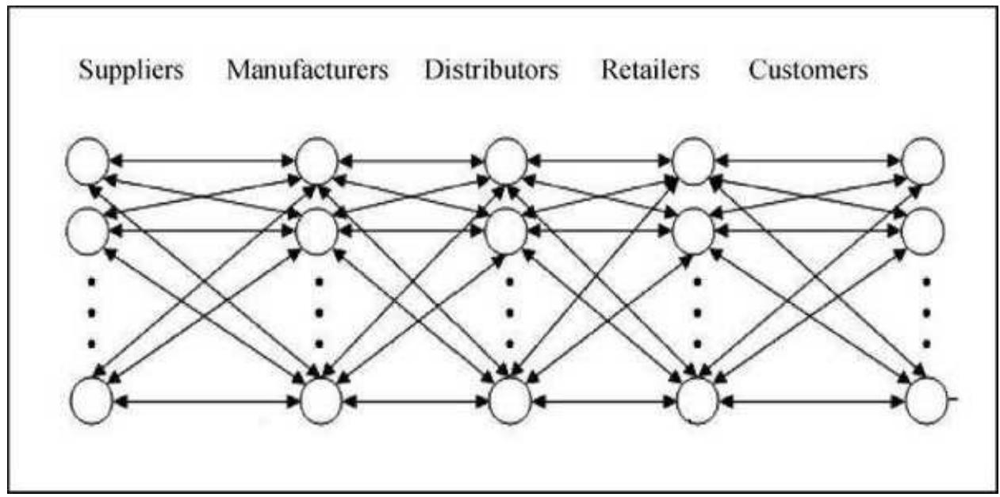  
Figure 8.1 A typical supply chain.

The task of SCM is to deploy resources across a supply chain to produce high-quality product services as inexpensively as possible when the customer wants them. Taking the dependencies of the underlying production techniques into account, the SCM presents itself as an NP-hard problem $[ \underline { { 1 9 } } - \underline { { 2 1 } } ]$ . A typical supply chain has a topology consisting of a number of retailers where customer demands occur, distributions feeding retailers, manufacturers supplying distributers, as well as suppliers supplying raw materials to manufacturers. This chapter studies a multi-stages supply chain with single node in each stage and its order policies. The model uses five echelons: a customer tier, a retailer tier, a distributor tier, a manufacturer tier, and a supply tier as depicted in Fig.8.1.

The inventory management process is characterized by time and cost variables. Production costs have not been considered as they do not depend on the specific inventory policy. Similarly, production times are almost not influenced by the inventory policy and in any case they do not substantially differentiate the performance of one policy from another. The customers' orders drive the whole supply chain. Each node of the upstream four tiers makes order decisions based on the order from the downstream buyer in order to maximize profits, or to minimize costs. Each node pays for the inventory holding cost depending on the inventory level. Ordering more than needed by the downstream node by each node may have to pay for a high inventory cost. On the other hand, if a node's inventory is not enough to meet the demand from downstream stage, the backorder costs rises. For the inventory holding cost and the backorder cost, we define:

$$
C _ {i} (t) = \operatorname {I N V C} _ {i} (t) \times H _ {i} (t) + B K C _ {i} (t) \times B _ {i} (t), \tag {8.1}
$$

where t stands for the time step number, INVC i (t) is the inventory holding cost and the lead time cost for a node at an echelon i at a time step t, $\mathrm { H } _ { \mathrm { i } }$ (t) is the inventory unit holding cost price for the node, BKC i (t) is the backorder cost for a node at an echelon i at a time step t, B i (t) is the backorder unit cost price for the node. These variables are functions of the time step t because they can change over time episodes $[ \ 2 2 - 2 6 $ ］ . For the model in this chapter, there is $1 { \leq } \mathrm { i } { \leq } 4$ , since there are 4 echelons except the customer echelon.

The objective of the supply chain ordering management system is to determine the ordering quantity $\mathrm { ~ O ~ } _ { \mathrm { i } }$ of each node in each echelon to nodes in the next one upstream echelon in the way that the total inventory cost of the chain consisting of the inventory holding cost and the penalty cost of backorders is minimized ［ 27 － 30 ］ :

$$
\text {M i n i m i z e} \sum_ {t = 1} ^ {n} \sum_ {i = 1} ^ {4} C _ {i} (t). \tag {8.2}
$$

# 8.3 The Multiagent Learning Model for SC Ordering Management

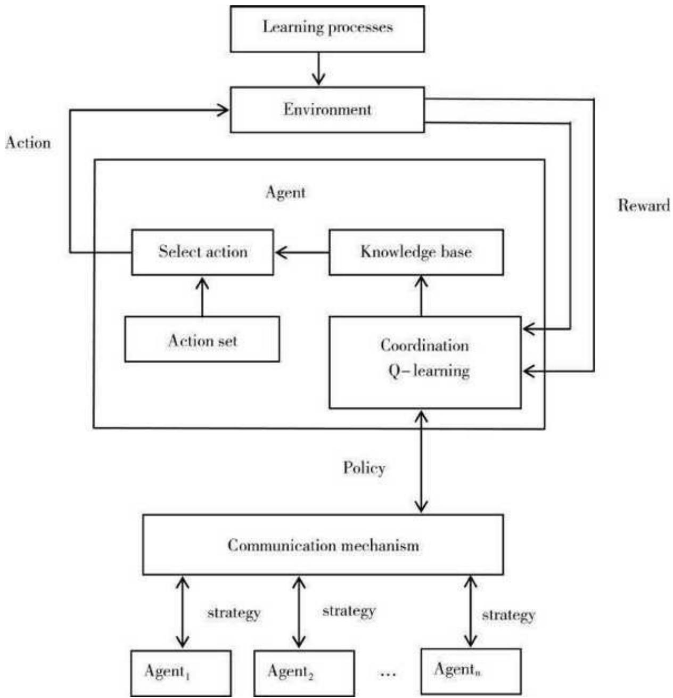  
Figure 8.2 A multiagent learning model for the supply chain ordering management.

The multiagent Q-learning model is used as a learning method for the supply chain ordering management in this chapter, which structure is illustrated in the Fig.8.2.

A simple supply chain is considered to show the way for determing a near-optimal inventory order policy. Generally, a supply chain consists of three main stages, namely suppliers, manufacturers and distributors. It is assumed that a decision maker (agent) exists at every stage, which has the responsibility of managing inventory at that stage. At fixed time intervals, each agent reviews the stock at its stage and, according to a certain inventory policy, decides whether to issue an order to the upstream stage. Once the order is placed, the delivering process begins as long as upstream stock is sufficient to cover the request. Otherwise the order is backordered and waits until the upstream stock reaches the ordered quantity. In particular, backordering customer demand at the distribution stage involves penalty costs, which grows with the waiting time. Even though the time interval at which periodic inventory reviews occur does not change from stage to stage, agents may adopt diverse decisions in terms of both how much and even when to

order: in fact, any agent may decide not to order at a certain point in time even if the others do order. And some elements are defined at the following.

# Reward Definition

The key point in designing an RL system is the definition of a reward function for calculating the reward that agents could get as a feedback of agents' actions in the environment. In this chapter, the reward function is defined as:

$$
r _ {t} = \operatorname {C O N S T} - C _ {i} (t), \tag {8.3}
$$

where CONST represents a large constant for converting costs into the reward, which form is usually utilized in the reinforcement learning algorithm.

State Variable

The state vector in Q-learning method is defined as:

$$
s _ {t} = \left\{S _ {i} (t), 1 \leqslant i \leqslant 4 \right\}. \tag {8.4}
$$

where s t is the RL system state vector at time step t and each S i (t) is the inventory position of an actor at an echelon i at a time step t. Thus at time step t, a state vector include 4 elements representing the state of the system.

Agent's Action

To solve the problem, it is necessary to determine agents' polices according to the Q-values that is inevitable to estimate the optimal Q-values. Generally, reinforcement values are associated with state action pairs in the Q-learning, called Q-values as:

$$
Q \left(s _ {t}, a _ {t}\right) = R \left(s _ {t}, a _ {t}\right) + \beta E \left\{v ^ {\pi} \left(s _ {t + 1} ^ {\prime}\right) \right\}. \tag {8.5}
$$

And the optimal value function is defined as:

$$
Q ^ {*} \left(s _ {t}, a _ {t}\right) = R \left(s _ {t}, a _ {t}\right) + \beta E \left\{V ^ {*} \left(s _ {t + 1} ^ {\prime}\right) \right\}, \tag {8.6}
$$

where $\mathsf { S } _ { \mathsf { t } + 1 } \cdot$ is the next state on executing an action at in a state $\mathsf { s } _ { \mathrm { { t } } } \mathrm { { i n } }$ the environment, $\mathrm { R } ( \mathsf { s } _ { \textrm { t } } , \mathsf { a } _ { \textrm { t } } )$ is an expected value derived from the environment, and $\mathrm { E } \{ \mathrm { V } ( \mathrm { s } _ { \mathrm { \Delta t } } ) \}$ is the estimate value of the state ${ \bf { S } } _ { \mathrm { { \scriptsize ~ t } } }$ . Clearly, the optimal policy can be derived by the argmax $\mathbf { a } _ { \textrm { t } } \mathbf { Q } ^ { \ * } ( \mathbf { S } _ { \textrm { t } } , \mathbf { a } _ { \textrm { t } } )$ , and the optimal value function can be derived by the max $\mathbf { a } _ { \textrm { t } } \mathbf { Q } ^ { * } ( \mathbf { s } _ { \textrm { t } } , \mathbf { a } _ { \textrm { t } } )$ . The One-step Q-learning estimates the optimal Q-value function as follows:

$$
Q _ {t} \left(s _ {t}, a _ {t}\right) = (1 - \alpha) Q _ {t 1} \left(s _ {t}, a _ {t}\right) + \alpha \left[ r _ {t} + \beta \max  _ {b _ {t}} Q _ {t} \left(s _ {t + 1} ^ {\prime}, b _ {t}\right) \right], \tag {8.7}
$$

where $\mathrm { ~ Q ~ } _ { \mathrm { t } }$ is the estimate at the beginning of the time step t, and s t , a t , r t stand for a state, an action, a reward, respectively. The parameter $\alpha$ is a learning rate, $\beta$ is a discounted factor. The optimal policy is determined by the value Q(s, a) learned by the learning agents, i.e. the action with greatest Q(s, a) is selected for each state $\mathbf { S } _ { \mathrm { ~ t ~ } }$ .

The convergence of the One-step Q-learning algorithm does not put any strong requirements on the learning policy other than that each action is acted in every state infinitely. This policy can be accomplished, for example, by utilizing the ε-greedy action-selecting policy that a learning agent would behave greedily argmax $\mathsf { \Omega } _ { \mathtt { d } } \mathrm { Q } ( \mathsf { s } , \mathsf { a } )$ at most learning time, but with small probability ε, randomly selects an action.

The Q-Learning algorithm used in this chapter is given here:

· Initialize estimate values Q(s, a) of each action a in each state s,   
· Do until end condition:   
1. The learning agent observes the state in the environment. $\mathbf { S } \gets$ current state observed,   
2. Selects an action a according to the ε-greedy action-selecting policy or the random policy, $\mathbf { a } \gets$ current action, and executes it,   
3. Observe resultant state $\mathsf { s } ^ { \star }$ , $\mathsf { s } ^ { \star } \gets$ next state observed,   
4. Receive an immediate reward, $\mathrm { r } ( \mathsf { s } , \mathsf { a } ) \gets$ reward gotten,   
5. Update Q(s, a) values using a learning factor $\alpha$ and a discounted rate $\beta$ according to (7),   
$6 . \ : s \gets s ^ { \prime }$

The reward function defined by (3) can be derived to minimize the inventory cost of whole supply chain satisfying the aim of ordering management. By repeating learning processed through the simulation, Qvalues will be converged to the estimated optimal values in each state. After finishing the learning processes, the best ordering strategy in each state can be derived by the greedy action-selecting rule.

# 8.4 Simulations and Results

Two group data for simulation in this chapter are given as below named test data a and test data b:

· test data a: test period is set 52 weeks. The order from customer is fixed as 2 and there is no order in the supply tier.   
· test data b: test period is set 35 weeks, the order from customer is stochastic, set as 15, 10, 8, 14, 9, 3, 13, 2, 13, 11, 3, 4, 6, 11, 15, 12, 15, 4, 12, 3, 13, 10, 15, 15, 3, 11, 1, 13, 10, 10, 0, 0, 8, 0, 14.

Costs of the manufacturer, the distributor and the retailer are encoded together, then the state is formed by 3 parts. Thus, the number of states in the Q-learning used by this chapter is 1000. The encoded code is ranged from 0 to 9 for test data a representing as:

Table 8.1 State encoded for test data A   

<table><tr><td>code</td><td>0</td><td>2</td><td>4</td><td>6</td><td>8</td></tr><tr><td>Inventory</td><td>0,1</td><td>2,3</td><td>4,5</td><td>6,7</td><td>≥8</td></tr><tr><td>code</td><td>1</td><td>3</td><td>5</td><td>7</td><td>9</td></tr><tr><td>Backorder</td><td>0,1</td><td>2,3</td><td>4,5</td><td>6,7</td><td>≥8</td></tr></table>

For test data b, the number of states in the Q-learning used by this chapter is 4096. The range of encoded code is 0 to 15 representing as below:

Table 8.2 State encoded for test data B   

<table><tr><td>code</td><td>0</td><td>2</td><td>4</td><td>6</td><td>8</td><td>10</td><td>12</td><td>14</td></tr><tr><td>Inventory</td><td>0.1</td><td>2.3</td><td>4.5</td><td>6.7</td><td>8.9</td><td>10.11</td><td>12.13</td><td>≥14</td></tr><tr><td>code</td><td>1</td><td>3</td><td>5</td><td>7</td><td>9</td><td>11</td><td>13</td><td>15</td></tr><tr><td>Backorder</td><td>0.1</td><td>2.3</td><td>4.5</td><td>6.7</td><td>8.9</td><td>10.11</td><td>12.13</td><td>≥14</td></tr></table>

For test data a, the number of actions in the Q-learning used by this chapter is 216, those are encoded as below:

Table 8.3 Action encoded for test data A   

<table><tr><td>code</td><td>0</td><td>1</td><td>2</td><td>3</td><td>4</td><td>5</td></tr><tr><td>ordering</td><td>0</td><td>1</td><td>2</td><td>3</td><td>4</td><td>5</td></tr></table>

For test data b, the number of actions in the Q-learning used by this chapter is 4096, those are encoded as below:

Table 8.4 Action encoded for test data B   

<table><tr><td>code</td><td>0</td><td>1</td><td>2</td><td>3</td><td>4</td><td>5</td><td>6</td><td>7</td></tr><tr><td>ordering</td><td>0</td><td>1</td><td>2</td><td>3</td><td>4</td><td>5</td><td>6</td><td>7</td></tr><tr><td>code</td><td>8</td><td>9</td><td>10</td><td>11</td><td>12</td><td>13</td><td>14</td><td>15</td></tr><tr><td>ordering</td><td>8</td><td>9</td><td>10</td><td>11</td><td>12</td><td>13</td><td>14</td><td>15</td></tr></table>

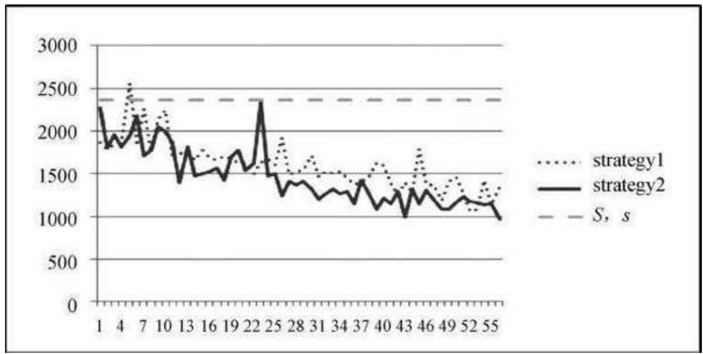  
Figure 8.3 Cost comparison for the test data A.

Fig.8.3 gives us the results for test data a using the learning parameter described above where strategy1 means random learning policy, strategy2 means greedy learning policy. Here, (S, s) is the min max policy, which means whenever the inventory level is below a certain value s one order is made to increase the inventory to level S generally used in the supply chain ordering management domain. The horizontal axis represents the test period, and the vertical axis represents the costs in the whole supply chain. The results show both the strategy1 and strategy2 of the Q-learning proposed in this chapter derive much better profit, means much less cost, than the typical (S, s) policy. The results also show that the greedy Q-learning policy can derive better profit then the random Q-learning policy.

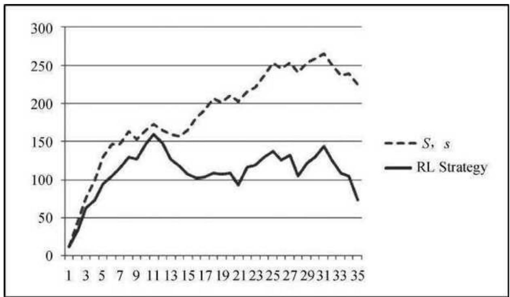  
Figure 8.4 Cost comparison for the test data B.

Fig.8.4 gives us the results for test data b using the greedy Q-learning algorithm and (S, s) strategy, which shows the reinforcement learning can derive more competitive results.

Experimental results for both fixed ordering number and stochastic ordering from customer show that the reinforcement learning can be used to derive the maximal profit.

# 8.5 Conclusions

By surveying the efficiency of the RL methods for solving dynamic problem, this research investigates a Q-learning method for the ordering strategy in a typical supply chain consisting of multiple stages including suppliers, manufacturers, distributors, retailers and customers. Analyses of the efficiency of RL applied to the supply chain ordering management are described based on some representative test data. As a result, the RL agents reduce the bullwhip effect and derive better profit compared with the typical ordering policy in the stochastic supply chain with multiple echelons.

# Bibliography

［ 1 ］ W. Zhang and T. G. Dietterich. A reinforcement learning approach to job-shop scheduling ［C］, Proceedings of the 14th international conference on artificial intelligence (IJCAI-95), Morgan Kaufmann, Orlando, FL, 1114-1120, 1995.   
［2］ S. P. Singh, D. Bertsekas. Reinforcement learning for dynamic channel allocation in cellular telephone systems ［C］, The advances in neural information processing systems: proceedings of the 1996 conference, MIT Press, 947-980, 1996.   
［ 3 ］ R. Sun, S. Tatsumi, and G. Zhao. Application of multiagent reinforcement learning to multicast routing in wireless ad hoc networks ensuring resource reservation ［C］, Proc. of the 2002 IEEE international conference on system, man & cybernetics, 2002.   
［ 4 ］ C. Vithessonthi. Social interaction and knowledge sharing behavior in multinational corporations ［J］, The business review, 10(2), 324-331, 2008.   
［5］ K. Sachin, K. Ravi. A fuzzy AHP-TOPSIS framework for ranking the solutions of knowledge management adoption in supply chain to overcome its barriers ［J］. Expert systems with applications, Vol.41, 679-693, 2014.   
［6］ T. Stockheim, M. Schwind, and W. König. A reinforcement learning approach for supply chain management ［C］, 1st European workshop on multiagent systems, CD-ROM, 2003.   
［ 7 ］ G. Zhao and R. Sun. Policy transition of reinforcement learning for an agent based SCM system ［C］, IEEE international conference on industrial informatics, 793-798, 2006.   
［ 8 ］ A. Irit and M. Albert. The bullwhip effect in complex supply chains ［C］, International symposium on communications and information technologies, 1355-1360, 2007.   
［ 9 ］ I. Giannoccaro and P. Pontrandolfo. Inventory management in supply chains: a reinforcement learning approach ［J］, Int. J. production economics 78, 153-161, 2002.   
［ 10 ］ S. Kamal Chaharsooghi, Jafar Heydari and S. Hessameddin Zegordi. A reinforcement learning model for supply chain ordering management: An application to the beer game ［J］, Decision support systems, Vol.45, 949-959, 2008.   
［ 11 ］ H.L. Lee, V. Padmanabhan, and W. Seungjin. The bullwhip effect in supply chains ［J］, Sloan management review, 38 (3), 93-102, 1997.   
［ 12 ］ A.J. Clark, and H. Scarf. Optimal policies for a multi-echelon inventory problem ［J］, Management science 6 (4), 475-490, 1960.   
［ 13 ］ F. Chen, J.S. Song. Optimal policies for multi-echelon inventory problems with Markovmodulated demand ［J］, Operations research 49 (2), 226-234, 2001.   
［ 14 ］ Z. Huang, and A. Gangopadhyay. Information sharing in supply chain management with demand uncertainty ［J］, Advanced topics in information resource management, Hertfordshire: idea group, Vol.5, 45-45, 2005.   
［ 15 ］ D. Wright and X. Yuan. Mitigating the bullwhip effect by ordering policies and forecasting methods ［J］, Int. J. production economics 113, 587-597, 2008.   
［ 16 ］ Q. Cao and K. Siau. Artificial intelligence approach to analyzing the bullwhip effect in supply chains ［C］, Proceedings of 5th Americas conference on information systems, 1999.   
［ 17 ］ A. T. Gumus and A. F. Guneri. A multi-echelon inventory management framework for stochastic and fuzzy supply chains ［J］, Expert systems with applications 36, 5565-5575, 2009.

［ 18 ］ J. Lu, P. Humphreys, R. McIvor, L. Maguire. Employing genetic algorithms to minimize the bullwhip effect in a supply chain ［C］, Proceedings of the 2007 IEEE IEEM, 1527-1531, 2007.   
［ 19 ］ M. He, A. Rogers, E. David, and N. R. Jennings. Designing and evaluation an adaptive trading agent for supply chain management applications ［C］, IJCAI-05 workshop on trading agent design and analysis, Edinburgh, 2005.   
［20］ S. O. Kimbrough, D. J. Wu, and F. Zhong. Computers play the beer game: Can artificial agents manage supply chains? ［J］, Decision support systems, Vol.33, 323-333, 2002.   
［ 21 ］ T. O'Donnell, L. Maguire, R. McIvor, and P. Humphreys. Minimizing the bullwhip effect in a supply chain using genetic algorithms ［J］, International journal of production research, Vol.44, 1523- 1543, 2006.   
［ 22 ］ R. S. Sutton. Integrated architectures for learning, planning, and reacting based on approximating, dynamic programming ［C］, Proc. 7 th Int. Conf. on machine learning, 216-224, 1990.   
［23］ R. S. Sutton and A.G. Barto. Reinforcement learning: An introduction ［M］, MIT pPress, Cambridge, MA, 1998.   
［24］ C. J. C. H, Watkins and P, Dayan. Technical note: Q-learning ［J］, Machine Learning, Vol.8, 55- 68, 1992.   
［25］ R. S. Sutton. Learning to predict by the methods of temporal differences ［J］, Machine learning, Vol.3, 9-44, 1988.   
［ 26 ］ L. P. Kaelbling, M.L. Littman and A.W. Moore. Reinforcement learning: A survey ［J］, Artificial intelligence research, No.4, 237-285, 1996.   
［ 27 ］ C. F. Cheung, S. K. Kwok, and C. M. heung. A knowledge-based customization system for supply chain integration ［J］. Expert systems with applications, 39(4), 3906-3924, 2012.   
［28］ A. Baykasoglu, V. Kaplanoglu, Z. Durmusoglu, and C. Sahin. Integrating fuzzy DEMATEL and fuzzy hierarchical TOPSIS methods for truck selection ［J］. Expert systems with applications, 40(3), 899-907, 2013.   
［29］ K. Al-Mutawah, V. Lee, and Y. Cheung. A new multiagent system framework for tacit knowledge management in manufacturing supply chains ［J］. Journal of intelligent manufacturing, 20(5), 593-610, 2013.   
［ 30 ］ K. A. Waheed, S. S. Gaur.An empirical investigation of customer dependence in interpersonal buyer-seller relationships ［J］. Asia pacific journal of marketing and logistics, 24(1),102-124, 2012.