# 大模型推荐系统

算法原理、代码实战与案例分析

刘强 $\odot$ 著


# 大模型推荐系统

# 算法原理、代码实战与案例分析

刘强◎著

# 内容简介

本书主要分为3部分。第1部分简单介绍大模型相关技术，包括大模型的预训练、微调、在线学习、推理、部署等。第2部分将大模型在传统推荐系统中的应用抽象为4种范式——生成范式、预训练范式、微调范式、直接推荐范式，并对每种范式给出算法原理说明、案例讲解和代码实现。第3部分以电商场景为例，讲解大模型在电商中的7种应用，包括生成用户兴趣画像、生成个性化商品描述信息、猜你喜欢推荐、关联推荐、解决冷启动问题、推荐解释和对话式推荐，每种应用场景都包含完整的步骤说明和详细的代码实现，手把手教你构建大模型推荐系统。

本书适合有一定推荐系统基础，期望深入了解和学习大模型技术在推荐系统中的应用思路和方法的大学生、科研工作者、算法从业者、算法产品及技术管理者阅读。

未经许可，不得以任何方式复制或抄袭本书之部分或全部内容。

版权所有，侵权必究。

# 图书在版编目（CIP）数据

大模型推荐系统：算法原理、代码实战与案例分析 /

刘强著. 一 北京：电子工业出版社，2024.10.

ISBN 978-7-121-48847-4

I. TP18

中国国家版本馆CIP数据核字第2024GD8995号

责任编辑：张爽

文字编辑：张晶

印刷：河北鑫兆源印刷有限公司

装 订：河北鑫兆源印刷有限公司

出版发行：电子工业出版社

北京市海淀区万寿路173信箱 邮编100036

开 本： $787\times 980$ 1/16 印张：18.5 字数：413千字

版次：2024年10月第1版

印次：2024年10月第1次印刷

定价：89.00元

凡所购买电子工业出版社图书有缺损问题，请向购买书店调换。若书店售缺，请与本社发行部联系，联系及邮购电话：（010）88254888，88258888。

质量投诉请发邮件至zlts@phei.com.cn，盗版侵权举报请发邮件至dbqq@phei.com.cn。

本书咨询联系方式：faq@phei.com.cn。

# 作者简介

刘强

2009年毕业于中国科学技术大学，有15年大数据与AI相关实践经验。出版过畅销书《推荐系统：算法、案例与大模型》和《构建企业级推荐系统：算法、工程实现与案例分析》，参与翻译《AI革命：人工智能如何为商业赋能》《认识AI：人工智能如何赋能商业（原书第2版）》《MongoDB性能调优实战》等书。

目前担任杭州数卓信息技术有限公司CEO，公司业务方向为大模型推荐系统、大模型搜索、大模型知识库等，致力于帮助企业利用大模型技术实现降本、提效与精细化运营；兼任爱搭（Alda）高级技术顾问，与爱搭一同推动推荐系统及大模型技术在行业内落地应用。

# 自序

自2022年11月30日OpenAI发布ChatGPT以来，大模型技术掀起了新一轮人工智能浪潮。ChatGPT在各个领域（如人机对话、文本摘要、内容生成、问题解答、识图、数学计算、代码编写等）取得了比之前算法好得多的成绩，在很多方面超越了人类专家的水平，特别是人机对话具备了一定的共情能力，这让AI领域的从业者和普通大众相信通用人工智能（Artificial General Intelligence，AGI）时代马上就要来临了。

大模型除了对话能力达到了真正可以互动的水准，更厉害的是当模型参数达到一定规模（ $100\mathrm{B}^{①}$ 以上）时，会涌现新的能力，即大模型具备举一反三、任务分解、逻辑推理、解决未知任务的能力，这在之前的机器学习范式中是从未出现过的。之前的机器学习模型都是为某个具体任务构建的，只能完成特定的任务，对于新任务，必须训练新的机器学习模型。

最近7~8年，没有哪一项科技进步如ChatGPT这般吸引全球的目光②。除了媒体的大肆报道，国内外各类科技公司、科研机构、高等院校也在跟进大模型技术，基于大模型的创业公司如雨后春笋般层出不穷。

不到一年时间，国外就涌现了上百家大模型应用的创业公司，做得优秀的如Midjourney、Runway、Inflection AI、Anthropic等，都获得了上亿甚至几十亿美元的融资，估值达数十亿、上百亿美元。此外，一系列优秀的大模型相继被发布，如Anthropic的Claude、Google的Bard、Meta的LLaMA等。

国内也不甘落后，各个大厂、创业公司、科研院校相继发布了大模型产品，如智谱AI的ChatGLM、百度的文心一言、华为云的盘古大模型、阿里云的通义千问、科大讯飞的星火大模型等，也有不少“大佬”亲自下场做大模型。

以ChatGPT为核心的大模型相关技术，可以应用于搜索、对话、内容创作等众多领域。在推荐系统领域的应用也不例外，在这方面已经有广泛的学术研究，学术界发表了大量的相关论文。我相信，在不久的将来（2024年—2025年），大模型相关技术会在工业界被大量用于推荐系统，并成为推荐系统的核心技术，就像2016年开始的深度学习技术对推荐系统的革新一样。

ChatGPT和大模型相关技术不能被任何人、任何行业忽视，它在各行各业一定会呈现“井喷式”的发展。从2023年年初开始，我一直关注大模型相关技术的进展及其在行业上的应用，特别是在推荐系统领域的应用。在几乎每天都有大模型相关重磅突破发布的当下，我们必须跟上技术发展的步伐。为此，我花了近一年的时间写了这本《大模型推荐系统：算法原理、代码实战与案例分析》，希望能抛砖引玉，为国内普及、推广大模型在推荐系统上的应用发挥作用。

在开启我们的学习之旅前，我先用非常直白、浅显的方式来简单说明为什么大模型能应用于推荐系统，有了这个基础认识，我相信你可以更好地学习本书中的知识。

本书需要读者具备一定的背景知识。例如，熟悉推荐系统、有一定的编程能力，如果了解NLP就更好了。读者如果在学习过程中发现对某个知识点不熟悉，可以自行补充学习。

大模型在底层构建Transformer架构，通过海量的互联网文本信息预测下一个token出现的概率来预训练模型。由于有海量的互联网文本数据，模型的预训练过程不需要人工标注（但需要对数据进行预处理），一旦模型完成预训练，就可以用于语言理解和语言生成任务。简单来说，大模型基于海量文本中的token序列中下一个token出现的概率进行统计建模，通过学习在给定语言片段后出现下一个token的概率来完成下游任务（例如文本摘要、翻译、生成文本等）。

对于推荐系统，用户过往的操作就是一个有序的序列，每个用户的操作序列就像一篇文本，所有用户的操作序列就像大模型的预训练语料库，预测用户下一个操作就像预测词序列的下一个 token<sup>③</sup>。通过这个简单的类比，我们知道推荐系统可以被嵌入大模型的理论框架中。因此，直观地看，大模型一定可以用于解决推荐系统问题。

上面的思路比较简单，只用到了用户与物品的交互信息。实际上，推荐系统的数据来源更复杂，除了用户历史交互序列，还有用户画像、物品画像信息等。部分用户画像、物品画像信息，例如用户的年龄、性别、偏好等，物品的标题、标签、描述文本等，可以利用自然语言来呈现，用户历史交互序列、用户画像、物品画像等信息都可以被输入大模型，为大模型提供更多的背景知识，最终的推荐结果会更加精准。

推荐系统涉及很多多模态数据，例如物品有描述文本、图片，甚至视频介绍等，这类异构的信息对于推荐系统的效果相当重要。多模态数据可以被转化为文本信息供大模型使用，目前的多模态大模型可以直接处理多模态数据，因此也可以直接用于推荐系统。

目前，即使不使用图片、视频等多模态数据，利用好文本数据也能让大模型很强大。大模型的强大之处是具备 zero-shot、few-shot 的能力①，很多推荐机制都利用了大模型的这个能力，只不过需要在使用大模型的过程中设计一些提示词（prompt）和模板（template）来激活大模型的推荐能力。

说一下我个人对激活的理解。大模型有上百亿、上千亿，甚至上万亿个参数，是一个非常庞大的神经网络。当用一些提示词告诉大模型作为推荐系统进行个性化推荐时，就激活了深度神经网络中的某些连接，这些连接是神经网络的某个子网络，而这个子网络具备进行个性化推荐的能力，这个过程非常类似人类大脑神经元的工作机制。例如当你看到美食时，就会激活大脑中负责进食的区域，这个区域是大脑整个复杂神经元网络的子网络，导致可能产生流口水、吞咽等行为，这里“看到美食”就类似大模型的提示词。另外，我们在进行头脑风暴时，突然被别人启发想到某个绝妙的创意也是一种激活过程。few-shot更复杂一些，需要在提示词中告诉大模型一些过往的推荐案例，例如用户看了A、B、C三个视频后，会看另一个视频D，让它临时学习如何推荐。

提示词学习没有改变大模型的参数，即没有进行梯度下降的反向传播训练，但为什么具备 zero-shot、few-shot 的能力呢？提示词作为一个整体，激活了大模型神经网络的某个功能区域。大模型具备多轮对话能力的道理也是类似的，我们可以将多轮对话作为一个整体，这个整体激活了大模型在某个对话主题下的功能区域，导致大模型能“记住”多轮对话之前的信息②。由于目前的大模型不具备增量学习③的能力，对话完成后，对话中的新信息并没有被大模型学习到。

除了直接利用大模型的 zero-shot、few-shot 能力进行推荐，我们还可以按照大模型的输入、输出范式准备推荐系统的相关数据，然后通过监督学习微调大模型，让大模型更好地适配具体的推荐场景，这也是将大模型应用于推荐系统的一个非常有价值的方向。

另外，大模型压缩的世界知识、大模型的涌现能力、大模型的自然对话能力都可以很好地

被用于推荐系统，解决深度学习推荐系统很难解决的问题，下面举两个例子说明。

首先，大模型有助于缓解数据稀疏问题，特别是冷启动问题①，这是当前深度学习推荐系统的主要瓶颈。通过从在不同模型架构中学习的预训练模型中提取和迁移知识，可以提高推荐系统的通用性、稀疏性、效率和有效性等性能。

其次，大模型一个很大的优势是可以利用对话的方式跟用户互动，就像ChatGPT所呈现的那样。如果能将推荐系统设计成一个跟用户互动的对话式推荐引擎，那么大模型可以利用自然语言响应用户的个性化需求，从而提升用户的整体体验和参与度。

通过前面的介绍，相信你已经大致知道为什么大模型可以被应用于推荐系统了，也知道了将大模型应用于推荐系统的独特优势，那么如何将大模型应用于推荐系统呢？这就是本书的核心内容，你将从这本书中找到答案。

# 前言

# 为什么写作本书

我从2010年开始研究、实践推荐系统，属于国内最早从事推荐系统工作的一批人。过去15年，我有过至少4次从零开始成功构建推荐系统的经历，曾经负责构建的推荐系统最高有超过千万日活跃用户数量（Daily Active User，DAU）。我出版过两本推荐系统相关图书，分别是《构建企业级推荐系统：算法、工程实现与案例分析》（2021.09）和《推荐系统：算法、案例与大模型》（2024.04）。过去十几年的经历让我见证了推荐系统技术的完整发展过程，我也一直跟随推荐系统的发展大势进行学习、实践。

2022年11月底ChatGPT发布后，全世界掀起了新一轮的人工智能浪潮，以ChatGPT为代表的大模型技术逐步渗透到各个应用场景和领域，当然也包括推荐系统。将大模型应用在推荐系统上的相关学术研究非常多，截至2024年5月，已有上百篇相关的研究论文发表。大模型在产业上的应用也逐步开始：阿里巴巴在淘宝上内测了淘宝问问——一个对话式推荐引擎；Meta在尝试利用大模型技术实现万亿级参数的新一代推荐系统；百度正在利用大模型重构底层的核心搜索、推荐模块……

ChatGPT和大模型带来的影响是空前的，过去没有哪一项AI技术对全球的冲击像ChatGPT和大模型这么大。我预见到ChatGPT和大模型会革新推荐行业，因此在过去的一年多时间里，我阅读了上百篇大模型、大模型推荐系统相关的论文，并且跟行业专家进行了密切的交流。

另外，我从2023年4月开始创业，公司业务为B端的数智化转型，主要方向是精细化运营、大模型搜索推荐、大模型智能知识顾问等。过去一年，我针对将大模型应用于推荐、搜索等话题与相关的企业进行交流并付诸实践。

结合过往的学习、交流、实践，我准备将自己掌握的大模型推荐系统的知识框架进行系统梳理，整理成一本系统介绍大模型推荐系统的图书，希望为推荐行业提供一套完整的、基于大模型的方法论和实践指南。

希望我的经验和经历可以帮助想学习大模型在推荐系统上应用的读者体系化了解并快速掌握大模型推荐系统。

# 读者对象

本书主要讲解大模型在推荐系统中的应用，既有算法原理，又有代码实现，聚焦于如何利用最新的大模型技术赋能、革新、重构现有的推荐系统。本书需要读者有一定的推荐系统基础知识，了解大模型的一些基本原理，本书适合以下读者。

1. 推荐系统开发人员及推荐算法研究人员。  
2. 期望从事推荐系统相关工作的学生。  
3. 在高校从事推荐算法研究，希望对大模型在推荐系统中的应用有全面了解的科研人员。  
4. 对大模型在推荐、搜索中的应用感兴趣的产品和运营人员。  
5. 期望将大模型引入推荐、搜索产品的公司管理层人员。

# 如何阅读本书

本书分为9章，包含大模型基本原理介绍、将大模型应用于推荐系统的思路和方法、在电商推荐场景中使用大模型等。下面分别对各个章节进行简单介绍。

第1~3章是准备部分。第1章介绍大模型的基础知识，包括大模型的发展历史、数据资源、数据预处理、大模型预训练、大模型微调、大模型推理、大模型部署、相关软件和框架等，这一章是后续章节的理论基础，是为没有大模型基础的读者准备的。如果你已经非常熟悉大模型，那么可以略过这一章。第2章对后续章节用到的数据和开发环境进行介绍，本书的代码实现基于微软的MIND数据集和Amazon电商数据集，开发环境包括Python沙盒、CUDA和MacBook。第3章将大模型在推荐系统中的应用抽象为4种范式——生成范式、预训练范式、微调范式、直接推荐范式。

第4~7章展开说明第3章介绍的4种范式，每章既包含算法原理，又包含相关的案例说明，同时会基于MIND数据集给出对应的代码实现。

第8章是一个完整的实战案例，基于Amazon商品评论数据，利用大模型解决电商推荐问题。本章讲解如何利用大模型来解决生成用户兴趣画像、生成个性化商品描述信息、猜你喜欢推荐、关联推荐、冷启动、推荐解释、对话式推荐7类问题，针对每类问题都提供完整的步骤及对应的代码实现。其中，前6类问题是大模型对传统推荐算法解决方案的有效补充和突破，有了大模型的支持，传统推荐算法有更新颖、更好的解决方案；而对话式推荐是基于传统推荐

系统的一种新的推荐形态，借助大模型的自然语言对话能力，我们可以采用对话的方式为用户进行个性化推荐，在提升用户体验的同时，带来更高的商业价值。

第9章为将大模型推荐系统更好地应用于工业界提供了一些思路和方法，包含大模型的高效预训练、高效推理，以及真实业务场景中的一些问题和建议。

本书是专门为方便读者快速上手大模型推荐系统而准备的。本书主要有三个特点：一是将大模型应用于推荐系统抽象为4种范式，在这个统一的框架下，你可以体系化地学习大模型推荐系统；二是包含电商场景的最佳实践，针对每种问题，提供完整的利用大模型解决推荐问题的思路、步骤和方法；三是包含代码实战内容，第2~8章都有完整的代码实现。本书所有的代码都可以从GitHub的代码仓库liuq4360/llm4rec_abc中获取，读者也可以根据封底处提示，加入本书读者群，获取本书代码、链接及参考文献。

希望本书能够成为有志于利用大模型技术更好地赋能传统推荐、搜索系统的爱好者和从业者的方法论和落地实战指南！

# 勘误和支持

由于作者水平和写作时间有限，书中难免有所纰漏，恳请读者批评指正。你可以将书中描述不准确的地方或者错误告诉我，以便本书重印或者再版时更正。你可以通过微信liuq4360与我取得联系，或者发送邮件至邮箱891391257@qq.com，我很期待看到你真挚的反馈。

# 致谢

首先，感谢AI行业的技术信仰者，正是他们的不懈努力为大模型技术带来快速的发展和广阔的前景。同时，感谢过去一年来给予我信任的个人和企业，通过与他们合作，我更好地理解和实践了大模型相关技术在产业上的应用。

其次，感谢电子工业出版社张爽老师，在她的耐心指导和建议下，我一步步优化了本书的结构和内容，让这本书的质量得到了保证。

最后，感谢我的父母和家人，是他们的无私付出让我有足够的时间学习、实践、创业！

谨以此书，献给所有懂我、关心我、支持我的家人和朋友！

刘强

2024年5月9日于上海图书馆东馆

# 目录

# 01 基础知识 1

1.1 大模型相关资源

1.1.1 可用的模型及API  
1.1.2 数据资源 3  
1.1.3 软件资源 5  
1.1.4 硬件资源 5

1.2 大模型预训练 5

1.2.1 数据收集与预处理 5  
1.2.2 确定模型架构  
1.2.3 确定目标函数及预训练   
1.2.4 解码策略 10

1.3 大模型微调 13

1.3.1 微调原理 13  
1.3.2 指令微调 14  
1.3.3 对齐微调 17

1.4 大模型在线学习 ..... 21

1.4.1 提示词 21  
1.4.2 上下文学习 23  
1.4.3 思维链提示词 24   
1.4.4 规划 26

1.5 大模型推理 27

1.5.1 高效推理技术 28

1.5.2 高效推理软件工具 29

1.6 总结 30

# 02 数据准备与开发环境准备 31

2.1 MIND数据集介绍 31  
2.2 Amazon电商数据集介绍 34   
2.3 开发环境准备 36

2.3.1 搭建 CUDA 开发环境 37  
2.3.2 搭建MacBook开发环境 40

2.4 总结 42

# 03 大模型推荐系统的数据来源、一般思路和4种范式 43

3.1 大模型推荐系统的数据来源 43

3.1.1 大模型相关的数据 44  
3.1.2 新闻推荐系统相关的数据 44  
3.1.3 将推荐数据编码为大模型可用数据 45

3.2 将大模型用于推荐的一般思路 46  
3.3 将大模型应用于推荐的4种范式 46

3.3.1 基于大模型的生成范式 47  
3.3.2 基于PLM的预训练范式 47  
3.3.3 基于大模型的微调范式 48  
3.3.4 基于大模型的直接推荐范式 49

3.4 总结 50

# 04 生成范式：大模型生成特征、训练数据与物品 ..... 51

4.1 大模型生成嵌入特征 51

4.1.1 嵌入的价值 51   
4.1.2 嵌入方法介绍 52

4.2 大模型生成文本特征 57

4.2.1 生成文本特征 57  
4.2.2 生成文本特征的其他方法 63

4.3 大模型生成训练数据 66

4.3.1 大模型直接生成表格类数据 66  
4.3.2 大模型生成监督样本数据 67

4.4 大模型生成待推荐物品 69

4.4.1 为用户生成个性化新闻 69  
4.4.2 生成个性化的视频 74

4.5 总结 77

# 05 预训练范式：通过大模型预训练进行推荐 78

5.1 预训练的一般思路和方法 ..... 78

5.1.1 预训练数据准备 78  
5.1.2 大模型架构选择 79  
5.1.3 大模型预训练 81   
5.1.4 大模型推理（用于推荐） 82

5.2 案例讲解 84

5.2.1 基于PTUM架构的预训练推荐系统 ..... 84  
5.2.2 基于P5的预训练推荐系统 86

5.3 基于MIND数据集的代码实战 91

5.3.1 预训练数据集准备 91  
5.3.2 模型预训练 98   
5.3.3 模型推理与验证 102

5.4 总结 104

# 06 微调范式：微调大模型进行个性化推荐 106

6.1 微调的方法 ..... 106

6.1.1 微调的价值 106  
6.1.2 微调的步骤 107  
6.1.3 微调的方法 111  
6.1.4 微调的困难与挑战 113

6.2 案例讲解 114

6.2.1 TALLRec 微调框架 ..... 114  
6.2.2 GIRL: 基于人类反馈的微调框架 ..... 117

6.3 基于MIND数据集实现微调 ..... 120

6.3.1 微调数据准备 120  
6.3.2 模型微调 122  
6.3.3 模型推断 130

6.4 总结 134

# 07 直接推荐范式：利用大模型的上下文学习进行推荐 135

7.1 上下文学习推荐基本原理 ..... 135  
7.2 案例讲解 136

7.2.1 LLMRank 实现案例 ..... 137  
7.2.2 多任务实现案例 139  
7.2.3 NIR 实现案例 ..... 141

7.3 上下文学习推荐代码实现 ..... 142

7.3.1 数据准备 142  
7.3.2 代码实现 ..... 145

7.4 总结 157

# 08 实战案例：大模型在电商推荐中的应用 158

8.1 大模型赋能电商推荐系统 158  
8.2 新的交互式推荐范式 161

8.2.1 交互式智能体的架构 ..... 161  
8.2.2 淘宝问问简介 162

8.3 大模型生成用户兴趣画像 164

8.3.1 基础原理与步骤介绍 164  
8.3.2 数据预处理 165  
8.3.3 代码实现 168

8.4 大模型生成个性化商品描述信息 178

8.4.1 基础原理与步骤介绍 178  
8.4.2 数据预处理 179  
8.4.3 代码实现 ..... 184

8.5 大模型应用于电商猜你喜欢推荐 196

8.5.1 数据预处理 196  
8.5.2 模型微调 199

8.5.3 模型效果评估 205

8.6 大模型应用于电商关联推荐 ..... 209

8.6.1 数据预处理 209  
8.6.2 多路召回实现 214  
8.6.3 相似度排序实现 ..... 216  
8.6.4 排序模型效果评估 219

8.7 大模型如何解决电商冷启动问题 ..... 221

8.7.1 数据准备 221  
8.7.2 利用大模型生成冷启动商品的行为样本 226  
8.7.3 利用大模型上下文学习能力推荐冷启动商品 ..... 228  
8.7.4 模型微调 232  
8.7.5 模型效果评估 232

8.8 利用大模型进行推荐解释，提升推荐说服力 237

8.8.1 数据准备 237  
8.8.2 利用大模型上下文学习能力进行推荐解释 ..... 244  
8.8.3 模型微调 248   
8.8.4 模型效果评估 256

8.9 利用大模型进行对话式推荐 257

8.9.1 对话式大模型推荐系统的架构 ..... 257  
8.9.2 数据准备 258  
8.9.3 代码实现 ..... 260  
8.9.4 对话式推荐案例 268

8.10 总结 269

# 09 工程实践：大模型落地真实业务场景 271

9.1 大模型推荐系统如何进行高效预训练和推理 ..... 271

9.1.1 模型高效训练 272  
9.1.2 模型高效推理 273  
9.1.3 模型服务部署 274  
9.1.4 硬件选择建议 275

9.2 大模型落地企业级推荐系统的思考 275

9.2.1 如何将推荐算法嵌入大模型框架 275

9.2.2 大模型特性给落地推荐系统带来的挑战 276  
9.2.3 大模型相关的技术人才匮乏 276  
9.2.4 大模型推荐系统与传统推荐系统的关系 ..... 277  
9.2.5 大模型推荐系统的投资回报率分析 277  
9.2.6 大模型落地推荐场景的建议 277

# 9.3 总结 278

# 后记 279

# 01 基础知识

大模型的全称是大语言模型（Large Language Model，LLM），它能够应用于推荐系统，并且极有可能像深度学习那样革新推荐系统。大模型是一个有相当高的门槛并且快速发展的领域，在我们正式学习大模型如何应用于推荐系统之前，有必要先了解大模型的一些基础知识，以便更好地学习后续知识。

本章涵盖大模型相关资源、大模型预训练、指令微调、对齐微调、上下文学习和高效推理等核心知识点。

# 1.1 大模型相关资源

预训练参数量在千亿级别的大模型是一个复杂的系统工程，需要海量的数据及庞大计算的资源。只有Google、微软、百度等大型企业，或者OpenAI、Anthropic等获得了足够资金的明星创业公司才有足够的资金和人力去探索与尝试。

好在随着ChatGPT的火爆，竞争进入白热化，很多公司都开源了中小模型（例如Baichuan、Qwen、Yi等），个人和小型创业公司也可以在垂直领域进行大模型的尝试和探索。

# 1.1.1 可用的模型及API

目前国内外开源的参数量在1B到100B的大模型非常多，有智谱AI的ChatGLM、百川智能的Baichuan系列、阿里云的通义千问等，但是最火的、生态最好的还是Meta开源的LLaMA，图1-1就是基于LLaMA进行二次开发的大模型生态，从这张图中可以感受到LLaMA生态之大。

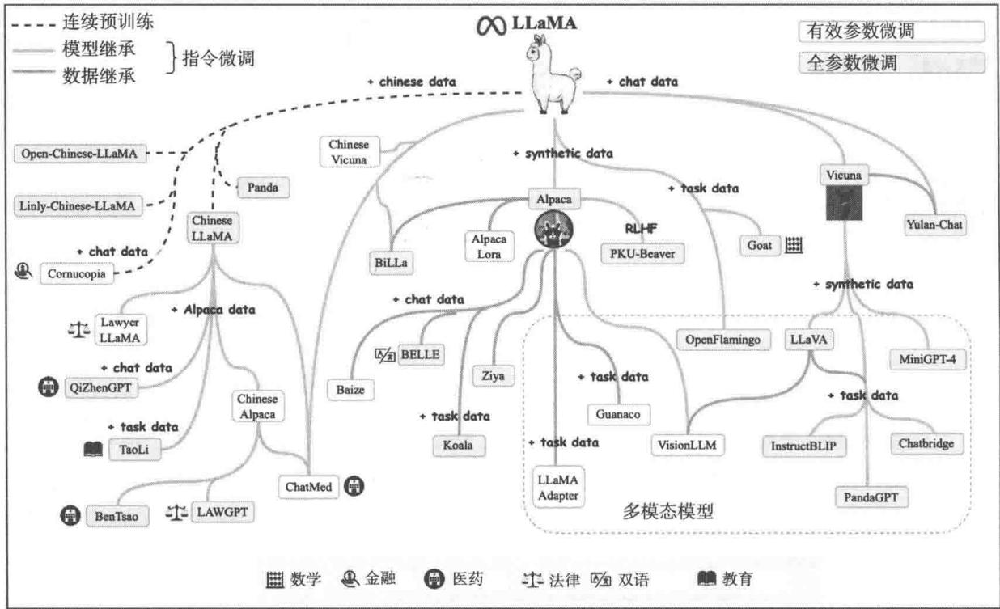  
图1-1 基于LLaMA的生态

LLaMA2开源了3个大小分别为7B、13B、65B的大模型。2024年4月，Meta公司开源了LLaMA3。

这些开源大模型经过了预训练或微调，我们可以从Hugging Face社区中获取。Hugging Face是大模型时代的GitHub，是全球最大、最成熟的大模型社区，里面的资源非常丰富，值得探索、学习。

图1-2是笔者在HuggingFace上搜索LLaMA的结果，基于其开发的大模型应有尽有。

由阿里达摩院开源的魔搭社区（ModelScope）[2]也是一个不错的获取大模型及相关数据的来源，更适合国内用户，如图1-3所示。

上面介绍的是预训练好的、可以使用的大模型，需要下载并部署（或微调）才能使用。如果你想直接使用现成的大模型，就需要调用商业的大模型API，或者用Ollama、FastGPT搭建一个类似OpenAI的大模型API。

如果你想亲自尝试，体验一下从零开始预训练大模型带来的挑战和乐趣，就需要获取预训练大模型的数据。


  
图1-2 基于LLaMA开发的大模型  
图1-3 魔搭社区上的大模型资源

# 1.1.2 数据资源

Hugging Face 和魔搭社区上有非常多的数据资源，截至本书写作时，Hugging Face 社区上

有85158个数据集，覆盖多种语言，其中英文数据集居多，如图1-4所示。

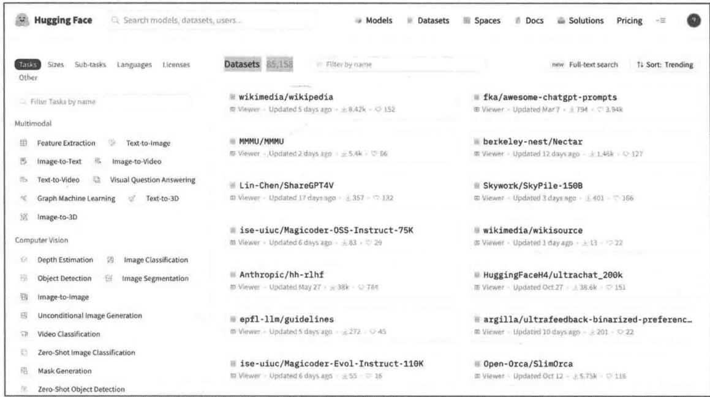  
图1-4 HuggingFace上的数据资源

魔搭社区上的资源覆盖非常多的中文语料库，如图1-5所示。我们可以通过关键词搜索相关的数据。

  
图1-5 魔搭社区上的数据资源

前面提到的都是通用数据，而真正有价值的数据是垂直行业的私有数据，有了这些数据，就可以预训练垂直行业的大模型，本书讲解的大模型推荐系统就是垂直领域的应用。

# 1.1.3 软件资源

大模型是基于Transformer架构的深度学习模型，需要有成熟的软件生态辅助大模型预训练、微调、运行。这里为读者提供两个比较好的资源。

# 基础深度学习库

目前最流行的深度学习库是PyTorch、TensorFlow、JAX，大模型是基于这些深度学习库预训练的，你只要熟悉一个即可。这里建议学习PyTorch，它更容易上手，生态也非常丰富。

# 大模型库

Hugging Face社区开源的 Transformers 库对 Transformer 架构做了非常好的封装，通过简单的 API 就可以使用大模型。同时，该库与 Hugging Face 社区深度绑定，可以直接使用数据名、模型名，非常方便。本书中的代码实战部分会经常使用该库。

# 1.1.4 硬件资源

预训练、微调大模型需要较多的硬件资源，表1-1是不同参数量的LLaMA模型在CPU上运行时需要的资源。即便是7B的模型，也至少需要3.9GB内存才能运行。

表 1-1 不同参数量的 LLaMA 模型在 CPU 上运行时需要的资源  

<table><tr><td>模型参数量</td><td>占用空间</td><td>4 bit 量化占用空间</td></tr><tr><td>7B</td><td>13GB</td><td>3.9GB</td></tr><tr><td>13B</td><td>24GB</td><td>7.8GB</td></tr><tr><td>30B</td><td>60GB</td><td>19.5GB</td></tr><tr><td>65B</td><td>120GB</td><td>38.5GB</td></tr></table>

# 1.2 大模型预训练

大模型预训练主要包括4个步骤：数据收集与预处理、确定模型架构、确定目标函数和解码。

# 1.2.1 数据收集与预处理

大模型相关的预训练数据（简单起见，后面将预训练数据统一简称为数据）来源主要包括

5大类：网页、对话、图书和新闻、科学知识、代码。前面提到的HuggingFace和魔搭社区中都有相关的数据。

预训练一个效果好的大模型需要将上面的5类数据按照不同的比例搭配，有点儿类似中医的药材配比，非常讲究。比例不好，可能就没有那么好的“疗效”，甚至产生副作用，需要进行非常多的尝试。

例如，LLaMA65B开源模型的数据有 $87\%$ 来自网页、 $2\%$ 来自对话、 $3\%$ 来自图书和新闻、 $3\%$ 来自科学知识、 $5\%$ 来自代码；而GPT-3的预训练数据有 $84\%$ 来自网页、 $16\%$ 来自图书和新闻。

数据只是基础，还需要对数据进行预处理。数据预处理的主要步骤如图1-6所示。

  
图1-6 数据预处理的主要步骤

# 1. 过滤低质量数据

需要过滤掉从网页上爬取的数据、HTML标记、质量低或错别字多的图书、命名混乱或模块不清晰的代码等。

# 2. 数据去重

因为收集的数据来自多个数据源，不可避免地会出现重复，而重复数据会极大影响大模型的性能，所以需要采用一些方法进行去重。例如可以采用词频、嵌入向量相似等策略去重。

# 3. 剔除隐私数据

需要剔除电话号码、住址、身份证号、账号、密码等隐私数据，否则一旦大模型被攻击，就容易导致信息泄露。OpenAI就出现过此类事件。

# 4. 标记化（Tokenization）

通过上面3个步骤，文本已经准备好了。大模型采用Transformer架构，需要将文本标记化，即把文本分割为token。针对英文，token可以是一个单词或者单词的部分（例如词根）；针对中文，token可以是单个汉字或者词组。

# 1.2.2 确定模型架构

图1-7是GPT-1的Transformer架构，其中包括12个Transformer层，GPT-2、GPT-3、GPT-4与其类似，只不过层数更多。GPT采用的是单向掩码的注意力架构，即只能利用文本前面的词来预测后面的词。而更早的BERT模型可以利用两边的词来预测中间的词。

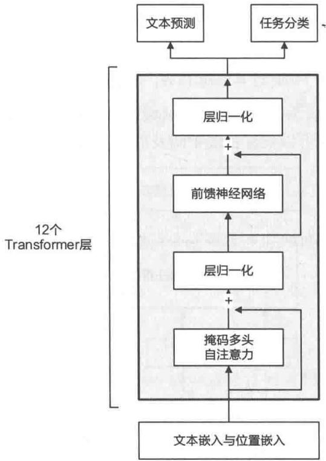  
图1-7GPT-1的Transformer架构

图1-7中的文本嵌入与位置嵌入是指语料库中token的嵌入及对应的位置嵌入。token嵌入容易理解，是为了对语言进行建模。而位置嵌入的主要目的是学习词之前的位置依赖关系。一般用下面的三角函数表示token的位置。

$$
\mathrm {P E} (\text {p o s}, 2 i) = \sin \left(\frac {\text {p o s}}{1 0 0 0 0 ^ {2 i / d}}\right)
$$

$$
\mathrm {P E} (\text {p o s}, 2 i + 1) = \cos \left(\frac {\text {p o s}}{1 0 0 0 0 ^ {2 i / d}}\right)
$$

其中，PE是位置嵌入，pos表示单词所在的位置， $2i$ 和 $2i + 1$ 表示位置编码向量中的对应维度， $d$ 则对应位置编码的总维度。通过上面这种方式计算位置编码有两个好处：首先，正余弦函数的范围为[-1,1]，算出的位置编码与原词嵌入相加不会使得结果偏离过远而破坏原有单词的语义信息。其次，依据三角函数的基本性质，第 $\mathrm{pos} + k$ 个位置的编码是第pos个位置的编码的线性组合，这就意味着位置编码中蕴含着单词之间的距离信息，也就是包含单词之前的语义关系信息。

图1-7中的层归一化是指进行分层归一化。具体而言，计算每层所有激活函数的平均值和方差，然后对激活函数进行正态分布归一化。进行层归一化的目的是更稳定地预训练大模型。大模型有很多层，所以每一层都需要进行归一化。

图1-7中的前馈神经网络是一个以Relu函数为激活函数的2层全连接神经网络，具体公式如下。

$$
\operatorname {F F N} (x) = \operatorname {R e l u} \left(x W _ {1} + b _ {1}\right) W _ {2} + b _ {2}
$$

图1-8是图1-7中的掩码多头自注意力（Masked Multi Self Attention）部分，它是Transformer架构的核心，类似于人的眼睛可以关注视线中间及周边的环境，从而对周围环境产生认知。

  
图1-8 掩码多头自注意力

注意力是查询（Q）和一组键（K）、值（V）对的函数，可以用下面的公式表示。

$$
\operatorname {A t t e n t i o n} (Q, K, V) = \operatorname {s o f t m a x} \left(\frac {Q K ^ {\mathrm {T}}}{\sqrt {d _ {k}}}\right) V
$$

可以通过 $\mathbf{W}^{\mathrm{Q}}\in \mathbb{R}^{d\times d_q}$ 、 $\pmb{W}^{\mathrm{K}}\in \mathbb{R}^{d\times d_k}$ 和 $\pmb {W}^{\mathrm{V}}\in \mathbb{R}^{d\times d_v}$ 3个线性变换将输入序列中的每个单词表示 $x_{i}$ 都转换为其对应的 $q_{i}\in \mathbb{R}^{d_{q}},k_{i}\in \mathbb{R}^{d_{k}}$ 和 $v_{i}\in \mathbb{R}^{d_{v}}$ 向量。图1-9是针对Machine、Learning两个单词做对应的线性变换得到的向量。关于Transformer的详细介绍，可以阅读参考文献[2]。

  
图1-9 多头自注意力与 $Q$ 、 $K$ 、 $V$ 的关系

# 1.2.3 确定目标函数及预训练

给定一个无监督的 token 语料库 $\mathcal{U} = \{u_1, u_2, \dots, u_n\}$ ，使用标准的语言建模目标函数最大化以下似然函数。

$$
L _ {1} (\mathcal {U}) = \sum_ {i} \ln P (u _ {i} \mid u _ {i - k}, u _ {i - (k - 1)}, \dots , u _ {i - 1}; \Theta) \tag {1-1}
$$

其中， $k$ 是上下文窗口的大小①，条件概率 $P$ 使用参数为 $\theta$ 的神经网络建模。这些参数使用随机梯度下降法进行预训练。一般将Transformer作为语言模型（ $P$ ）的构建组件，式（1-1）展开如下。

$$
\boldsymbol {h} _ {0} = \boldsymbol {U} \boldsymbol {W} _ {\mathrm {e}} + \boldsymbol {W} _ {\mathrm {p}}
$$

$$
\boldsymbol {h} _ {l} = \text {t r a n s f o r m e r \_ b l o c k} (\boldsymbol {h} _ {l - 1}) \forall I \in [ 1, n ]
$$

$$
P (u) = \operatorname {s o f t m a x} \left(h _ {\mathrm {n}} W _ {\mathrm {e}} ^ {\mathrm {T}}\right)
$$

这里 $U = (u_{-k}, u_{-(k-1)}, \dots, u_{-1})$ 是上下文的 token 向量， $n$ 是 Transformer 的层，transformer_block 就是图 1-7 中的 Transformer 架构，softmax是最上层预测部分的激活函数。 $W_{\mathrm{e}}$ 是 token 的嵌入矩阵，而 $W_{\mathrm{p}}$ 是位置嵌入矩阵， $W_{\mathrm{e}}$ 和 $W_{\mathrm{p}}$ 分别对应图 1-7 中的文本嵌入和位置嵌入。

语料库 $\mathcal{U}$ 通常是文本文档，因此预训练最优化模型不需要标注数据，可以直接使用海量的文本作为预训练样本，即利用文本中前面的 token 来预测下一个 token，这个过程就是预训练。

当然，真正的大模型语料库都非常大，Transformer层也非常多，有非常多的超参数需要处理，下面列举3个最重要的。

- 批大小。

批大小（Batch Size）指大模型一次处理的 token 规模，批越大，模型的吞吐率越好，预训练一次的时间越短，对系统网络、读写、内存带宽等要求也越高。

- 学习率。

学习率（Learning Rate）是模型在利用反向传播算法进行迭代优化过程中更新梯度的幅度。针对大模型，一般开始时用一个比较大的学习率，然后随着模型逐步收敛，调整学习率，让学习率逐步下降到最初学习率的一个固定比例（例如 $10\%$ ）。

- 优化器。

优化器（Optimizer）即大模型预训练的优化方法，不同优化器有各自的优缺点和适用情形，预训练大模型一般用Adam或者AdamW优化器。

图1-10列出了业界主流大模型对应的优化参数。  
图1-10 业界主流大模型对应的优化参数  

<table><tr><td>模型</td><td>批次大小 (#tokens)</td><td>学习率</td><td>预热</td><td>衰减方法</td><td>优化器</td><td>精度类型</td><td>权重 衰减</td><td>梯度 截断</td><td>Dropout</td></tr><tr><td>GPT3 (175B)</td><td>32K→3.2M</td><td>6 × 10-5</td><td>yes</td><td>cosine decay to 10%</td><td>Adam</td><td>FP16</td><td>0.1</td><td>1.0</td><td>-</td></tr><tr><td>PanGu-α (200B)</td><td>-</td><td>2 × 10-5</td><td>-</td><td>-</td><td>Adam</td><td>-</td><td>0.1</td><td>-</td><td>-</td></tr><tr><td>OPT (175B)</td><td>2M</td><td>1.2 × 10-4</td><td>yes</td><td>manual decay</td><td>AdamW</td><td>FP16</td><td>0.1</td><td>-</td><td>0.1</td></tr><tr><td>PaLM (540B)</td><td>1M→4M</td><td>1 × 10-2</td><td>no</td><td>inverse square root</td><td>Adafactor</td><td>BF16</td><td>lr²</td><td>1.0</td><td>0.1</td></tr><tr><td>BLOOM (176B)</td><td>4M</td><td>6 × 10-5</td><td>yes</td><td>cosine decay to 10%</td><td>Adam</td><td>BF16</td><td>0.1</td><td>1.0</td><td>0.0</td></tr><tr><td>MT-NLG (530B)</td><td>64 K→3.75M</td><td>5 × 10-5</td><td>yes</td><td>cosine decay to 10%</td><td>Adam</td><td>BF16</td><td>0.1</td><td>1.0</td><td>-</td></tr><tr><td>Gopher (280B)</td><td>3M→6M</td><td>4 × 10-5</td><td>yes</td><td>cosine decay to 10%</td><td>Adam</td><td>BF16</td><td>-</td><td>1.0</td><td>-</td></tr><tr><td>Chinchilla (70B)</td><td>1.5M→3M</td><td>1 × 10-4</td><td>yes</td><td>cosine decay to 10%</td><td>AdamW</td><td>BF16</td><td>-</td><td>-</td><td>-</td></tr><tr><td>Galactica (120B)</td><td>2M</td><td>7 × 10-6</td><td>yes</td><td>linear decay to 10%</td><td>AdamW</td><td>-</td><td>0.1</td><td>1.0</td><td>0.1</td></tr><tr><td>LaMDA (137B)</td><td>256K</td><td>-</td><td>-</td><td>-</td><td>-</td><td>BF16</td><td>-</td><td>-</td><td>-</td></tr><tr><td>Jurassic-1 (178B)</td><td>32 K→3.2M</td><td>6 × 10-5</td><td>yes</td><td>-</td><td>-</td><td>-</td><td>-</td><td>-</td><td>-</td></tr><tr><td>LLaMA (65B)</td><td>4M</td><td>1.5 × 10-4</td><td>yes</td><td>cosine decay to 10%</td><td>AdamW</td><td>-</td><td>0.1</td><td>1.0</td><td>-</td></tr><tr><td>LLaMA 2 (70B)</td><td>4M</td><td>1.5 × 10-4</td><td>yes</td><td>cosine decay to 10%</td><td>AdamW</td><td>-</td><td>0.1</td><td>1.0</td><td>-</td></tr><tr><td>Falcon (40B)</td><td>2M</td><td>1.85 × 10-4</td><td>yes</td><td>cosine decay to 10%</td><td>AdamW</td><td>BF16</td><td>0.1</td><td>-</td><td>-</td></tr><tr><td>GLM (130B)</td><td>0.4M→8.25M</td><td>8 × 10-5</td><td>yes</td><td>cosine decay to 10%</td><td>AdamW</td><td>FP16</td><td>0.1</td><td>1.0</td><td>0.1</td></tr><tr><td>T5 (11B)</td><td>64K</td><td>1 × 10-2</td><td>no</td><td>inverse square root</td><td>AdaFactor</td><td>-</td><td>-</td><td>-</td><td>0.1</td></tr><tr><td>ERNIE 3.0 Titan (260B)</td><td>-</td><td>1 × 10-4</td><td>-</td><td>-</td><td>Adam</td><td>FP16</td><td>0.1</td><td>1.0</td><td>-</td></tr><tr><td>PanGu-Σ (1.085T)</td><td>0.5M</td><td>2 × 10-5</td><td>yes</td><td>-</td><td>Adam</td><td>FP16</td><td>-</td><td>-</td><td>-</td></tr></table>

除了上面提到的参数，数据如何并行、如何进行分布式预训练，都是需要关注的重点问题，这些是更深入的课题，读者可以自行学习。

# 1.2.4 解码策略

大模型预训练好之后，如何利用呢？这就不得不说解码策略了。所谓解码策略，就是在预训练的大模型基础上，如何基于文本生成对应的后续文本。用数学语言来表述，就是概率预估问题。

$$
x _ {i} = \arg \max  _ {x} P (x \mid x <   i)
$$

这里的 $P$ 是大模型预测的条件概率， $x < i$ 是第 $i$ 个单词前面的单词，即输入大模型的语料， $x_{i}$ 即让 $P$ 的值最大的那个词。图1-11是一个例子。

<table><tr><td colspan="6">I am sleepy. I start a pot of</td></tr><tr><td>coffee</td><td>0.661</td><td>strong</td><td>0.008</td><td>soup</td><td>0.005</td></tr><tr><td>water</td><td>0.119</td><td>black</td><td>0.008</td><td>...</td><td>...</td></tr><tr><td>tea</td><td>0.057</td><td>hot</td><td>0.007</td><td>happy</td><td>4.3e-6</td></tr><tr><td>rice</td><td>0.017</td><td>oat</td><td>0.006</td><td>Boh</td><td>4.3e-6</td></tr><tr><td>chai</td><td>0.012</td><td>beans</td><td>0.006</td><td>...</td><td>...</td></tr></table>

图1-11 基于前面的词预测下一个词

针对这个例子， $x < i =$ “I am sleepy. I start a pot of”， $x_{i} =$ coffee，因为coffee出现的概率是0.661，最大。

上面是贪心搜索（Greedy Search）方法，也就是穷尽大模型词库中的所有单词，每一步都找到概率最大的那个词，直到遇到结束符。根据贪心搜索方法，图1-12最终获得的预测序列是ABC。

  
图1-12 不同时间步骤的不同token出现的概率

很明显，这样做将原来指数级别的求解空间直接压缩到了与长度线性相关的大小。在每一步中选择具有最高概率的 token，可能导致忽略具有较高总体概率但较低局部概率的句子。这种关注当下的策略丢弃了绝大多数可能解，无法保证最终得到的序列概率是最优的。

解决这个问题的一种方法是集束搜索（Beam Search），它对贪心策略进行了改进。集束搜索的思路很简单，就是稍微放宽考察的范围。在每个时间步，不再只保留当前概率最高的1个输出，而是保留 $n$ 个（ $n$ beam 的大小）。当 $n = 1$ 时，集束搜索就退化为贪心搜索。

图1-13是一个集束搜索示例，每个时间步有A、B、C、D、E共5种可能的输出， $n = 2$ ，也就是说每个时间步都会保留到当前步为止条件概率最优的两个序列。

在时间步1，A和C是最优的，因此得到了A和C两个结果，其他3个被抛弃。时间步2会基于这两个结果继续生成，在A这个分支可以得到5个候选集，分别是AA、AB、AC、AD、

AE。同理，分支C也得到5个候选集。此时对这10个候选集进行统一排名，保留最优的两个，即AB和CE。时间步3从新的10个候选集里挑选最好的两个，得到了ABD、CED两个结果。可以发现，集束搜索在每个时间步需要考察的候选集数量是贪心搜索的 $n$ 倍，因此是一种以时间换性能的方法。

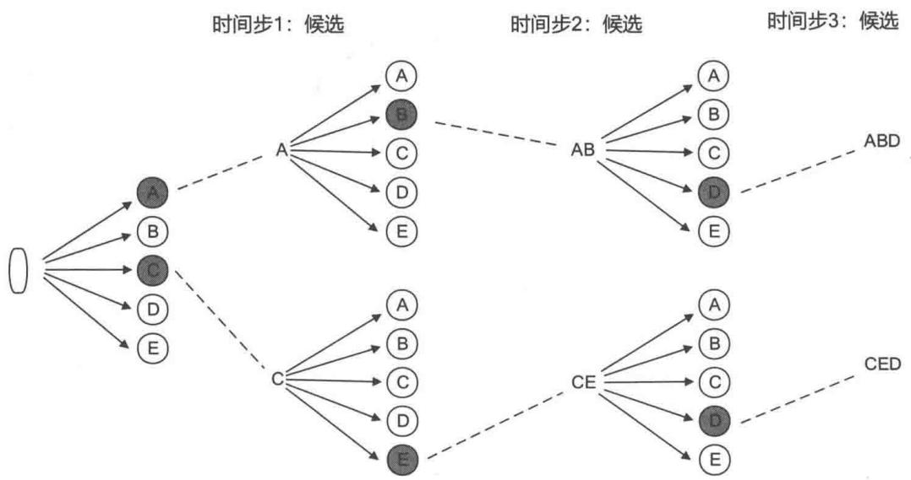  
图1-13 集束搜索示例

为了提升大模型输出的随机性（创新性），可以采用概率抽样的方式生成 $x_{i}$ ，即在样本中出现的概率越大，被抽到的概率就越大。在这种情况下，不是每次预测的结果都是 $x_{i}$ ，只不过 $x_{i}$ 出现的概率最大。常见的抽样方法有以下3种。

- 温度抽样。

为了控制采样的随机性，温度抽样（Temperature Sampling）通过调整softmax函数的温度系数，计算词汇表上第 $j$ 个token出现的概率。下式中 $l_{j}$ 是某个token的logit， $t$ 是温度参数。

$$
P \left(x _ {j} \mid x _ {<   i}\right) = \frac {\exp \left(l _ {j} / t\right)}{\sum_ {j ^ {\prime}} \exp \left(l _ {j ^ {\prime}} / t\right)}
$$

$t$ 的范围在0到1之间，降低温度 $t$ 增加了选择具有高概率的单词的机会，同时减少了选择具有低概率单词的机会。当 $t$ 被设置为1时，它将成为默认的随机采样；当 $t$ 接近0时，相当于贪心搜索。此外，当 $t$ 变为无穷大时，它退化为均匀采样。

top- $k$ 抽样。

与温度抽样不同，top- $k$ 抽样直接截断概率较低的 token，并且仅从具有 top- $k$ 概率的 token 中采样。例如，在前面的例子中，top-5 将从单词 coffee、water、tea、rice 和 chai 的归一化概率

中进行采样。

top- $p$ 抽样。

由于top-k抽样不考虑总体可能性分布，因此恒定的 $k$ 值可能不适合不同的上下文。基于此，从累积概率大于或等于 $p$ 的最小集合中进行采样的top-p抽样（也称核采样）被提出。在实践中，可以通过向按概率降序排列的词汇表中逐渐添加token来构建最小集合，直到它们的累积概率值超过 $p$ 。

# 1.3 大模型微调

大模型预训练一般是基于通用文本进行的，大模型学习到的是通用能力（包括语言生成、常识知识、逻辑推理等）。虽然超大规模的大模型（例如ChatGPT、GPT-4等）也可以用于解决一般的下游任务，效果也不错，但一些非常专业的场景，例如金融、法律、医疗，对知识、技能的要求更高，往往需要大模型在专业知识上重新进行“历练”。如果是更小的模型（例如1B～100B），就更需要在垂直领域进行二次学习，才能更好地解决下游任务。

指令微调和对齐微调用于在特定领域知识上对大模型进行二次训练。具体来说，指令微调是一种监督学习过程，模型的输入、输出都是自然语言（例如输入是中文的“我爱你”，输出是英文的“I love you”，这是从中文到英文的翻译问题）；而对齐微调将人类整合到大模型的学习过程中，一般采用人类专家标注的样本学习一个价值函数，然后用强化学习的思路让价值函数监督大模型的预训练，让大模型的输出与人类的价值观对齐（例如输出的是准确的、无害的、有用的信息）。

# 1.3.1 微调原理

经过预训练，大模型可以获得解决各种任务的一般能力，但为了在特定问题上或者领域中有更好的表现，需要对预训练模型进行微调。在用式（1-1）中的目标函数预训练模型后，通过监督学习任务对参数进行微调。

假设有一个标记的数据集 $\mathcal{C}$ ，其中每个实例由输入 token 序列 $x^{1}, x^{2}, \dots, x^{m}$ ，以及标签 $y$ 构成。将数据输入预训练模型，以获得最后一个隐藏层的激活函数 $h_{l}^{m}$ ，然后将其输入具有参数 $W_{y}$ 的、增加了一层线性输出层的模型预测 $y^{①}$ 。

$$
P (y \mid x ^ {1}, x ^ {2}, \dots , x ^ {m}) = \operatorname {s o f t m a x} \left(h _ {l} ^ {m} W _ {y}\right)
$$

这样就获得了如下的求最大值的目标函数。

$$
L _ {2} (\mathcal {C}) = \sum_ {(x, y)} \ln P (y \mid x ^ {1}, x ^ {2}, \dots , x ^ {m})
$$

实践经验表明，将语言建模过程作为微调的辅助目标有助于学习，加入辅助目标既可以提高监督模型的泛化能力，又可以加快模型的收敛速度。具体而言，就是优化以下目标。

$$
L _ {3} (\mathcal {C}) = L _ {2} (\mathcal {C}) + \lambda L _ {1} (\mathcal {C})
$$

其中， $\lambda$ 为权重。

# 1.3.2 指令微调

与预训练不同，指令微调通常更有效，只需要中等数量的样本用于训练。指令微调是有监督的训练过程，其优化过程与预训练在某些方面有所不同，例如目标函数（如序列到序列的loss）和优化的超参数（如较小的批大小和学习率）。

本质上，指令微调是在以自然语言表示的格式化样本集合上微调经过预训练的大模型的方法。为了执行指令微调，我们首先需要收集或构造满足指令格式的样本，然后使用这些格式化的样本以监督学习的方式对大模型进行微调。在指令微调后，大模型在下游任务上会表现出卓越的性能，在多语言环境中也是如此。

指令微调一般分为两步：第一步是以一定的格式构造监督数据集，数据集中的输入和输出标签都是文本形式的，可以是已有的标注文本，也可以利用大模型生成标注。第二步是对大模型进行监督微调，更好地解决下游任务，图1-14是指令微调的一般流程。

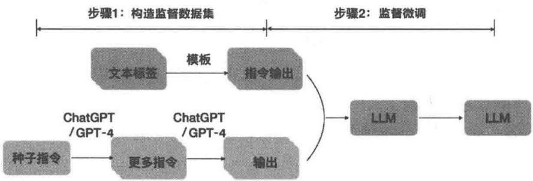  
图1-14 指令微调的一般流程

通常通过以下3种方法构建监督数据集：基于开源的NLP数据集、基于人机对话及利用大模型合成数据，如图1-15所示，下面展开说明。

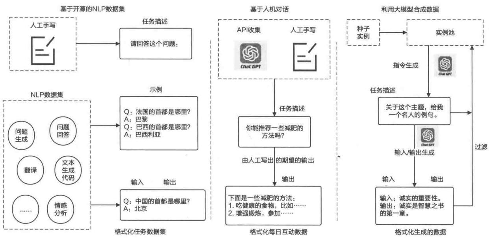  
图1-15 构建监督数据集的3种方法

# 方法1：基于开源的NLP数据集

机器学习领域有过很多NLP标注数据集，例如文本摘要、文本分类、翻译等，利用这些NLP标注数据集，只需要人工增加一些任务描述，就可以构建出适合大模型处理的监督数据集，这为指令微调的监督样本提供了便捷的、多样的监督数据来源。

# 方法2：基于人机对话

ChatGPT发布后，很多人向ChatGPT提了很多问题，这些问题就是监督样本的输入，这些输入是真实的人类需求，可以请专家对这些问题进行专业答复（例如专业减肥方法），那么这些问题描述和对应的专家答复就是一个训练样本对。

# 方法3：利用大模型合成数据

这是一种半自动化的方法。需要先有一个实例池（这里的实例就是监督样本对，一般需要100个左右），然后随机从实例池中抽取一个实例，让大模型生成任务描述，进一步让大模型生成输入、输出，形成新的实例，并加入实例池。这个过程可以自动化执行，以拓展监督样本，降低人工标注的成本。

基于大模型的指令微调这类监督学习任务与传统的监督学习有所区别，如图1-16所示。

传统监督学习使用大量的标记示例表示任务语义，构建监督数据集的过程成本很高，因此

很难推广到新的任务中。图1-16中基于情感分析构建的监督任务无法推广到实体识别领域。而利用指令微调构建的大模型的监督学习样本更加通用，可以覆盖更多的下游任务，泛化能力更好，也可以轻松应对新的下游任务。


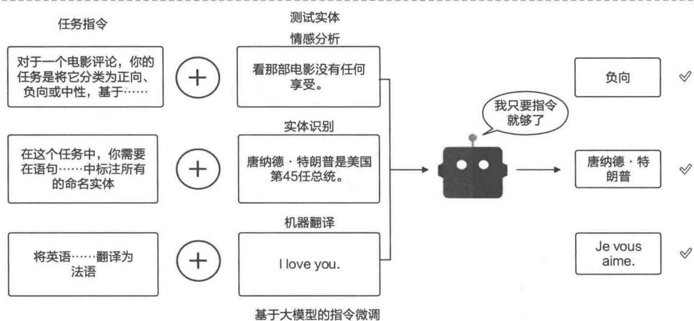  
图1-16 传统监督学习与基于大模型的指令微调的区别

有了监督微调的样本，就可以进行微调了。在指令微调的具体实现上，至少有两种方法，下面分别介绍。

第一种方法是微调整个模型，也就是说，采用梯度下降的反向传播算法更新整个模型的参数。由于大模型的参数通常较多，这种微调方法耗费时间和计算资源较多，成本太高。另外，

微调可能影响模型已有的能力，使模型在某些任务上的表现变差，所以推荐使用第二种方法。

第二种方法是参数有效的微调，具体实现方法有多种，这里主要讲解LoRA，这也是最流行的微调方法。LoRA将大模型的每一层（到下一层）的矩阵（大模型的参数）表示为两个低阶矩阵的乘积，在微调时，大模型之前的矩阵保持不变，只微调LoRA在每层增加的两个低阶矩阵，参数量较第一种方法少了很多（可以减少 $90\%$ 以上），训练成本低。同时，在微调时，LoRA保持大模型之前的矩阵不变，微调好后，在微调的下游任务上使用低阶矩阵，而在其他任务上使用大模型之前的矩阵，以保持大模型本来的能力。

图1-17是LoRA的算法架构，其中左侧是大模型的网络，右侧是低阶矩阵 $A$ 和 $B$ 。后续章节中的微调代码实现大多采用LoRA方法。

  
图1-17 LoRA的算法架构

关于指令微调的详细介绍，参见参考文献[3]和[4]。后续章节会在推荐系统的框架下讲解指令微调的方法，并给出实战案例。

# 1.3.3 对齐微调

大模型在广泛的NLP任务中显示出了非凡的能力。然而，这些模型有时可能出现意想不到的行为，例如编造虚假信息、实现不正确的目标，以及产生有害、有误导性和有偏见的言论。大模型的目标是通过token预处理来预训练模型参数，缺乏对人类价值观或偏好的考虑。为了避免这些意想不到的行为，学界提出了人类对齐（Human Alignment）的方法，以使大模型的行为符合人类的期望。然而，与最初的预训练和微调（例如指令微调）不同，这种调整需要考虑的标准各异（例如有用、诚实和无害）。研究表明，人类对齐在一定程度上损害了大模型的一

般能力①，这种现象被称为对齐税（Alignment Tax）。

对齐的目的是让大模型可以更好地服务于人类社会，产生正向的价值。人们越来越倾向于通过制定各种标准来规范大模型的行为。这里以3个具有代表性的对齐标准（有用、诚实和无害）为例进行讨论，这些标准已被广泛采用。此外，大模型还有其他对齐标准，包括行为、意图、激励和内部特性，这些标准与上述3个标准相似②。

为了使大模型与人类价值观保持一致，学术界提出了人类反馈强化学习（Reinforcement Learning from Human Feedback, RLHF）。在强化学习（Reinforcement Learning, RL）中，智能体通过与环境互动（action）获得环境的反馈（feedback），基于反馈形成新的交互方式与策略，最终通过多轮互动，可以更好地从环境中学习，获得更多的综合回报，如图1-18所示。RLHF利用人类的反馈数据对大模型进行微调，这有助于进一步改进模型。RLHF采用强化学习算法（目前PPO算法使用广泛），通过学习奖励模型使大模型适应人类反馈。

  
图1-18 强化学习范式

在RLHF语境下，强化学习的环境就是人类，通过人类的价值观来训练奖励函数，利用奖励函数来“调教”大模型，让大模型的输出满足人类的价值偏好。这种方法将人类纳入大模型的训练循环，以开发良好对齐的大模型③。

RLHF系统主要包括3个关键组件：预先训练的待对齐的大模型、从人类反馈中学习的奖励模型和训练大模型的强化学习算法。具体来说，预先训练的待对齐的大模型通常是一个生成模型，它是用现有的预训练的大模型参数初始化的。例如，OpenAI将175B GPT-3作为其RLHF模型（InstructGPT）待对齐的大模型，DeepMind将拥有2800亿个参数的模型Gopher作为其GopherCite模型的待对齐大模型。

此外，奖励模型（RM）通常以标量值的形式（例如 $0 \sim 1$ ，值越大代表跟人类价值观越匹配）提供反映人类对大模型生成的文本的偏好的监督信号①。奖励模型可以采用微调的大模型或使用人类偏好的数据从头训练的大模型。通常将与待对齐的大模型参数规模不同的大模型作为奖励模型。例如，OpenAI使用6BGPT-3、DeepMind使用7BGopher作为奖励模型。

为了使用来自奖励模型的信号来优化预训练的待对齐的大模型，需要设计一种用于调整大模型的特定强化学习算法。图1-19是RLHF算法的工作流，主要有如下3个步骤。


  
图1-19 RLHF算法的工作流

（1）监督微调。为了获得大模型最初执行所需的行为，需要收集监督数据集，该数据集包含用于微调大模型的提示词（指令）和输出。这些提示词和输出可以是由人类标注员为某些特定任务编写的，同时需要确保任务的多样性（主要目的是提升模型的泛化能力）。例如，InstructGPT要求人类标注员为一些生成性任务（如开放式QA、头脑风暴、聊天和改写）编写提示词（如列出让我对工作重新充满热情的5个想法）和输出。这与指令微调的方法类似，在某些情况下可以省略。  
（2）奖励模型训练。使用人类反馈数据来训练奖励模型。具体而言，我们首先将大模型用来抽样的提示词（来自监督数据集或人工生成的提示词）作为输入来生成一定数量的输出文本。然后邀请人类标注员来评估这些输入-输出对的质量。标注过程可以以多种形式进行，一种常见的方法是对生成的多个候选文本分别打分排序，以减少标注者之间的不一致性。最后训练奖励模型，以预测满足人类偏好的输出。在InstructGPT中，标注者将模型生成的输出从最好到最差进行排序，并训练奖励模型（6B的GPT-3）来预测排序。  
（3）强化学习微调。将大模型的对齐微调形式化为强化学习问题。用预先训练的大模型充当策略，该策略将提示词作为输入并返回输出文本，其动作空间是整个词汇表，状态是当前生成的 token 序列，并且由奖励模型提供奖励。为了避免与初始（调整前）大模型显著偏离，惩罚项通常被加入奖励函数。例如，InstructGPT 使用 PPO 算法针对奖励模型优化大模型。对于每个输入提示，InstructGPT 计算当前大模型和初始大模型的生成结果之间的 KL 偏差作为惩罚项。第 2 步和第 3 步可以多次迭代，以便更好地对齐大模型，使其符合人类的期望。

目前，OpenAI 内部正在进行一个特殊的项目——超级对齐。使用小模型来监督大模型（例如利用 GPT-2 监督已完成预训练但没有经过微调和 RLHF 的 GPT-4），并辅以置信损失等方法，激发大模型的能力，可以让没有被微调过的 GPT-4 至少达到微调后的 GPT-3.5 的水平，如图 1-20 所示。

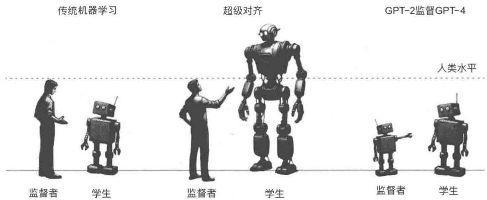  
图1-20 3种不同的对齐微调

关于RLHF的详细介绍，可以从参考文献[5~7]中获得更多的信息，第6章会基于推荐系统讲解RLHF的具体案例。

# 1.4 大模型在线学习

一般来说，当大模型需要解决特定领域的问题或者小模型想要产生更好的效果时，需要对模型进行微调。如果模型足够大（例如GPT-4这种体量的模型），那么它本身就能完成非常多的下游任务，并且效果相当惊艳，这也是大模型最吸引人的地方。最理想的情况是，通过一次预训练，大模型就能完成所有的下游任务。本节就介绍这方面的尝试：当大模型预训练好后，直接利用大模型压缩的世界知识进行推理，解决现实问题。

在预训练或微调之后，可以通过合适的提示词策略使用大模型。一种典型的提示方法是上下文学习（In-Context Learning，ICL），它以自然语言文本的形式描述任务或提供示例（Demonstration），然后输入大模型获得答案。还可以在提示中插入一系列中间推理步骤，即思维链（CoT），来增强大模型的上下文学习能力。此外，还有一种执行复杂任务的方法——规划（Planning），该方法首先将任务分解为较小的子任务，然后生成一个行动计划来逐个完成这些子任务，最终获得原始问题的答案。

# 1.4.1 提示词

提示词是使用大模型完成各种任务的主要方法，也是非专业人士使用大模型的唯一方法。这种方法可以让我们使用自然语言与大模型交互，具备可操作性。由于提示词的质量可以在很大程度上影响大模型在特定任务中的效果，因此可以使用某些原则和技巧手动创建合适的提示词，让大模型输出更好的结果。

手动创建提示词的过程也称为提示词工程（Prompt Engineering）。精心设计的提示词有助于引导大模型完成特定任务。为了帮助你写出更合适的提示词，下面从提示词的组成部分和设计提示词的原则两个维度提供一些建议。

# 1. 提示词的组成部分

一个功能完整的提示词可以让大模型更好地服务于我们的任务，产出更符合我们预期的结果。一般来说，提示词包括如下4部分。

- 任务描述。

任务描述（Task Description）指需要大模型遵循的特定指令。一般来说，应该用自然语言清楚地描述任务目标。对于具有特殊输入或输出格式的任务，通常需要详细地说明，并且可以

进一步利用关键字来突出显示特殊设置，以便更好地指导大模型完成任务。

- 输入数据。

在常见情况下，用自然语言描述输入数据（大模型要回答的问题）很简单。对于特殊的输入数据（Input Data），如知识图谱和表格，有必要采用适当而方便的方式提升其可读性。对于结构化数据，通常按顺序将原始记录（例如知识三元组）转换为序列。此外，编程语言（例如可执行代码）也被看作结构化数据，可以让大模型利用外部工具（例如程序执行器）来产生精确的结果。

- 上下文信息。

除了任务描述和输入数据，上下文信息（Contextual Information）或背景信息对于特定任务也是必不可少的，例如，检索到的文档对开放式问答非常有用。检索到的文档的质量及其与问题的相关性会对生成的答案产生影响，因此需要在适当的提示词模板或表达格式中包含上下文信息。此外，上下文任务示例有助于引导大模型完成复杂任务，它可以更好地描述任务目标、特殊的输出格式，以及输入和输出之间的映射关系。

- 提示词风格。

对于不同的大模型，设计一种合适的提示词风格（Prompt Style）来激发它们解决特定任务的能力也是很重要的。总的来说，提示词应该是一个清晰的问题或详细的说明，让大模型能够很好地理解和回答。在某些情况下，可以通过添加前缀或后缀更好地指导大模型。例如，使用前缀“让我们一步一步地思考”有助于引导大模型逐步推理，使用前缀“你是该领域的专家”可以提升大模型在某些特定任务中的性能。此外，对于基于聊天的大模型（例如ChatGPT），建议将提示词分解为子任务的多个提示词，然后通过多回合对话将其输入大模型，而不是直接输入长的或复杂的任务提示词。

# 2. 设计提示词的原则

好的提示词可以让大模型输出的结果更符合要求，但这需要经验。不过，下面4个基本原则可以为你提供一些指导。

- 清晰地描述任务目标。

任务描述不应模棱两可或不清楚，这可能导致不准确或不恰当的回答。清晰而详细的描述应包含解释任务的各种元素，包括任务目标、输入/输出数据（例如，给定一个长文档，我希望你生成一个简明的摘要）和响应约束（例如，摘要的长度不能超过50字）。通过提供清晰的任务描述，大模型可以更有效地理解目标任务并生成所需的输出。

- 分解为简单的、详细的子任务。

对于复杂任务，重要的是将其分解为几个更容易、更详细的子任务，以帮助大模型逐步实

现目标。例如，我们可以以编号的形式明确地列出子任务。通过将目标任务分解为子任务，大模型可以专注于解决更容易的子任务，并最终对复杂任务给出准确性更高的结果。

提供几个示例。

大模型可以从解决复杂任务的上下文学习中获得帮助，提示词可以包含输入-输出对形式的少量任务示例，即few-shot示例①。few-shot示例可以帮助大模型学习输入和输出之间的语义映射。在实践中，建议为目标任务提供一些高质量的示例，这能有效促成最终任务的执行。

- 使用对模型友好的格式。

由于大模型是在专门构建的数据集上预训练的，因此有一些提示格式可以使大模型更好地理解指令。OpenAI官方文档建议将####或""作为停止符号来分隔指令和上下文，以便大模型更好地理解。大多数现有的大模型使用英语执行任务的效果更好，因此使用英语指令来完成困难任务是更友好的。

以上基础知识和技巧可以帮助你写出不算太差的提示词。写出有效的提示词需要多实践，多积累相关经验。希望你多用大模型，体会其中的奥妙。

# 1.4.2 上下文学习

上下文学习也叫情境学习[8]，通过使用格式化的自然语言提示词（包括任务描述或任务示例），让大模型解决特定的问题。图1-21左侧是上下文学习的示意图。首先提供任务描述，同时从任务数据集中选择几个样本（few-shot学习）或者不选择任何样本（zero-shot学习）作为示例；然后将它们以特定的顺序组合在一起，形成模板化的自然语言提示词；最后将待测试的查询实例（一般是符合某种模板的自然语言）附加到示例中，作为大模型的输入。基于任务示例，大模型可以在没有显式梯度更新的情况下识别并执行新任务。

设 $D_{k} = \{f(x_{1},y_{1}),f(x_{2},y_{2}),\dots ,f(x_{k},y_{k})\}$ 表示一组具有 $k$ 个示例的样本集，其中 $f(x_{k},y_{k})$ 是将第 $k$ 个任务示例转换为自然语言提示的提示函数。给定任务描述 $I$ 、示例 $D_{k}$ 和新的输入查询 $x_{k + 1}$ ，大模型生成的输出 $\hat{y}_{k + 1}$ 的预测可以表示为以下形式。

$$
\mathrm {L L M} \left(I, \underbrace {f \left(x _ {1} , y _ {1}\right) , f \left(x _ {2} , y _ {2}\right) , \cdots , f \left(x _ {k} , y _ {k}\right)} _ {\text {d e m o n s t r a t i o n s}}, f \left(\underbrace {x _ {k + 1}} _ {\text {i n p u t}}, \underset {\text {a n s w e r}} {\longrightarrow}\right)\right)\rightarrow \hat {y} _ {k + 1}
$$

其中实际预测结果 $\hat{y}_{k + 1}$ 被留白，待大模型预测。由于上下文学习的性能在很大程度上依赖示例，因此在提示词中正确设计示例非常重要。

  
图1-21上下文学习和思维链提示词的比较（上下文学习用任务描述、几个示例和一个查询提示大模型，而思维链提示词涉及一系列的中间推理步骤）

# 1.4.3 思维链提示词

思维链[9]提示词是一种改进的提示策略，用于提升大模型在复杂推理任务上的表现，如算术推理、常识推理和符号推理。思维链没有像上下文学习那样简单地用输入-输出对构建提示词，而是增加了中间推理步骤，用于引导最终输出，如图1-21右侧所示。

下面详细说明如何将上下文学习和思维链结合，以及思维链提示词何时有效、为何有效。通常，思维链可以以两种方式与上下文学习一起使用，即少样本思维链（few-shot CoT）和零样本思维链（zero-shot CoT）。

少样本思维链是上下文学习的一种特殊情况，它结合了思维链推理步骤，将每个示例的<输入，输出>扩充为<输入，思维链，输出>。设计恰当的思维链提示词对于激发大模型的复杂推理能力至关重要。作为一种直接的方法，使用不同的思维链（每个问题有多个推理路径）可以有效提高学习能力（类似于通过题海战术提高解题能力）。具有复杂推理路径的提示词更有可能激发大模型的推理能力（类似于学会了做大学数学题，再做高中数学题就不在话下），这可以提高生成答案的准确性。然而，所有这些方法都依赖带标注的思维链数据集，这限制了它们在实践中的使用。为了克服这一局限性，Auto-CoT利用零样本思维链，通过特定的提示词让大模型生成思维链推理路径，从而减少人工标注。

与少样本思维链不同，零样本思维链提示词中不包括人工标注的任务示例。相反，它直接生成推理步骤思维链，然后据此推导出答案。零样本思维链首先让大模型在“让我们一步一步

思考”的提示词下生成推理步骤，然后在“因此，答案是”的提示词下得出最终答案。当模型大小超过一定规模时，这种策略会大大提高模型的效果，但对小模型无效，这表明大模型的涌现能力与模型规模高度相关。

尽管思维链能让复杂推理任务的效果有所提高，但思维链提示词仍然存在推理错误和不稳定等问题。其实，通过设计更好的思维链提示词和增强的思维链生成策略，可以提升思维链的推理能力。图1-22（从左到右）是典型的思维链提示词策略的演变过程，下面简单介绍。

  
图1-22 典型的思维链提示词策略的演变过程

# 1. 设计更好的提示词

一般来说，使用多个推理步骤（类似于通过多种方法解答一道题），或者用更长的推理步骤（类似于利用更高阶的知识给出更复杂的解题方法）可以激发大模型的推理能力，让思维链获得更好的效果。但这依赖标注好的思维链数据集，限制了该方法使用的广度。

# 2. 生成增强的思维链

大模型可能会产生不正确的推理步骤或者不稳定的生成过程。一般可以用基于抽样或者验证的方法来提升大模型的思维链能力。

- 基于抽样的方法。

该方法对多个推理步骤分别生成结果，然后对多个结果进行投票，使用类似于集成算法的思路获得最终结果。为了让结果更准确，还可以利用 $K$ 个最复杂的推理步骤进行投票①。

- 基于验证的方法。

推理步骤是一种流水线的结构，前面步骤的错误会累积到后续步骤中，因此自然可以想到对前面的步骤进行验证。可以基于新训练的验证器（一种机器学习算法）进行验证，或者利用大模型本身进行验证。

# 3. 推理结构延展

基础的思维链的链式推理结构限制了它解决复杂问题的能力，因为解决复杂问题往往需要向前探索或者回溯。为了解决此问题，可以优化传统的链式思维链结构，构建思维树（Tree of Thought，ToT）或思维图（Graph of Thought，GoT）推理结构。

- 思维树推理结构。

这种推理方法类似于层次的树状结构，在分层树结构中确定推理过程，中间思维是节点。通过这种方式，大模型能够并行探索多个推理路径，并进一步支持向前探索和回溯，以形成更全面的决策。

- 思维图推理结构。

尽管思维树推理结构有助于并行推理，但它也对推理过程施加了限制。更复杂的拓扑结构使思维图在推理方面具有更大的灵活性，从而能够表征更复杂的关系和交互。GoT将推理过程概念化为任意图，其中顶点表示中间思维，边表示这些思维之间的依存关系。与ToT相比，GOT可以在生成新思维时进一步利用其他推理路径的思维。然而，这种方法需要与大模型进行大量的交互，这使得思维探索过程效率非常低。

# 1.4.4 规划

上下文学习和思维链提示词的概念简单，比较通用，但难以处理复杂的任务，如数学推理和多跳（multi-hop）问答。一种基于提示词的规划方法（prompt-based planning）由此被提出，这个方法将复杂的任务分解为更小的子任务，并生成完成任务的行动计划。具体步骤可以参考图1-23，下面简单说明具体细节。

在这个技术范式中通常有3个组成部分：任务规划器（Task Planner）、计划执行器（Plan Executor）和环境（Environment）。具体来说，由大模型扮演的任务规划器旨在生成完成目标任务的整个计划。计划可以以不同的形式存在，例如，自然语言形式的动作序列或用编程语言编写的可执行程序。计划执行器则负责执行计划中的行动，它既可以通过面向文本任务的大模型实现，也可以通过面向具体任务的机器人等对象实现。环境指计划执行器执行任务的地方，可以根据具体任务进行设置，例如大模型本身或《我的世界》（Minecraft）等外部虚拟世界。它以自然语言或其他多模态信号的形式向任务规划器提供有关动作执行结果的反馈。

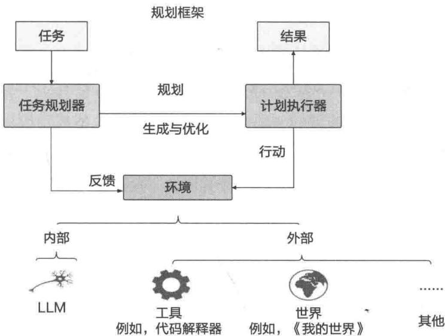  
图1-23 基于提示词的规划方法

面对复杂任务，任务规划器首先需要清楚地理解任务目标，并根据大模型的推理生成合理的计划。然后，计划执行器根据计划行事，环境会为任务规划器生成反馈。任务规划器可以结合从环境中获得的反馈完善其初始计划，形成新的方案，并迭代执行上述步骤，以获得更好的结果。

# 1.5 大模型推理

大模型具有强大的语言生成、知识记忆及推理能力，获得了越来越多人的青睐，并逐步在商业上得到大规模应用。然而大模型的推理应用成本过高，大大阻碍了技术落地。因此，大模型的推理性能优化成为业界研究的热点。

大模型推理面对计算资源和计算效率的挑战，优化推理性能不仅可以减少硬件成本，还可以提高模型的实时响应速度。它使模型能够更快速地执行自然语言理解、翻译、文本生成等任务，从而改善用户体验，加速科学研究，推动各行各业应用的发展。

大模型推理服务重点关注两个指标：吞吐量和时延

吞吐量：主要从系统的角度来看，即系统在单位时间内能处理的 token 数目。计算方法为系统处理完成的 token 数目除以对应耗时，其中，token 数目一般指输入序列和输出序列长度之和。吞吐量越高，代表大模型服务系统的资源利用率越高，对应的系统成本越低。

时延：主要从用户的视角来看，即用户平均收到每个 token 所需的时间。计算方法为用户从发出请求到收到完整响应所需的时间除以生成序列长度。一般来讲，当时延不大于 $50 \mathrm{~ms}$ 时，

用户使用体验会比较流畅。

吞吐量影响系统成本，吞吐量高代表系统单位时间处理的请求多，系统利用率高。时延影响用户使用体验，即返回结果要快。这两个指标一般情况下会相互影响，因此需要权衡。

高效推理是大模型应用中最关键的一环，对大模型在商业上的成功应用至关重要。目前有很多创业公司专注于高效推理，例如被收购的一流科技的原班人马新成立了一家专门做大模型推理的公司——硅基流动。

# 1.5.1 高效推理技术

高效推理方面的学术探索非常多，这里介绍几个比较核心的技术，包括这些技术的基本原理、能解决的问题，以及为大模型推理带来的价值。

# 1. FlashAttention 机制

Transformer的计算复杂度和空间复杂度随序列长度 $N$ 的增长呈指数级增长，所以处理长token非常消耗显存。FlashAttention机制就是为解决该问题而提出的，它可以减少内存带宽，以最小化I/O操作的数量，从而加快在GPU上处理的速度。作为一种优化的Attention实现，FlashAttention利用算子融合来减少内存带宽瓶颈。

# 2. 低比特量化技术

在神经网络压缩中，量化（Quantization）通常指从浮点数到整数的映射过程，尤其是8位整数量化（INT8量化）。对于神经网络模型，通常有两种数据需要量化——权重（模型参数）和（隐藏层）激活值，它们最初以浮点数表示。

为了说明模型量化的基本思想，引入一个简单但流行的量化函数： $x_{\mathrm{q}} = R(x / S) - Z$ ，它将浮点数 $x$ 转换为量化值 $x_{\mathrm{q}}$ 。在该函数中， $S$ 和 $Z$ 分别表示缩放因子（涉及决定削波范围的参数 $\alpha$ 和 $\beta$ ）和零点因子（决定对称或非对称量化）， $R(.)$ 表示将缩放后的浮点值映射为近似整数的舍入运算。

相反的过程为从量化值中恢复原始值： $\tilde{x} = S \cdot (x_{\mathrm{q}} + Z)$ 。量化误差被计算为原始值 $x$ 和恢复值 $\tilde{x}$ 之间的数值差。范围参数 $\alpha$ 和 $\beta$ 对量化性能有很大影响，通常需要根据实际数据分布情况以静态（离线）或动态（运行时）方式对量化性能进行校准。

# 3. 剪枝

剪枝（Pruning）是量化的一种补充后训练技术（类似于决策树的剪枝操作），目的是去除给定模型的部分权重，而不降低其性能。修剪有结构化和非结构化两种模式：结构化稀疏模型用更小但密集的部分代替模型的密集部分；非结构化稀疏模型包含值为零的权重，修剪后不会

影响网络的行为。

# 4. 混合专家

混合专家（MoE）结构通常由一组专家（模块）和一个门控网络组成，每个专家具有唯一的权重，门控网络确定哪个专家处理输入。混合专家模型不会同时使用所有专家，而只激活其中的一个子集，从而减少了推理时间。此外，在模型分布式设置中，可以通过将每个专家放在单独的加速器上减少设备之间的通信：只有托管门控网络和相关专家的加速器需要通信。

GPT-4 采用了混合专家结构，该结构可以在推理过程中节省大量的计算资源和成本。法国大模型初创公司 Mistral AI（创始人来自 Meta 和 DeepMind）开源的 Mixtral-8x7B MoE 也采用了混合专家结构。

# 5. 解码策略

解码策略可以极大地影响推理的计算成本。例如，集束搜索是对计算量和更好推理效果的一种权衡策略。计算成本较高的解码方案的另一个例子是采样并排序（Sample-and-Ranking）：先通过随机采样构造 $N$ 个无关的 token 序列 $y_{1}, y_{2}, \dots, y_{N}$ ，然后将最高概率序列作为最终输出。

以延迟为导向的策略，如推测采样（Speculative Sampling），首先使用较小的 draft 模型自回归生成长度为 $K$ 的草稿；然后使用较大的目标模型对 draft 模型进行评分，最后采用类似拒绝采样的机制，从左到右接收 token 的子集作为最终模型的输出。

# 1.5.2 高效推理软件工具

上面提到的是一些重要的提升大模型推理性能的方法，这些方法已经在一些软件工具中实现了，下面对两个主流的高效推理软件工具进行介绍。

# 1. DeepSpeed-MII

DeepSpeed-MII是微软开发的一个深度学习优化库（与PyTorch兼容），重点关注高吞吐量、低延迟和成本效益。它的功能包括块KV缓存、连续批处理、动态分割使用、张量并行和高性能CUDA内核，以支持大模型（如LLaMA2-70B、Mixtral8x7B（MoE）和Phi-2）的快速高产出的文本生成。

# 2. vLLM

vLLM 是一个快速、内存高效、易于使用的大模型推理和服务库。为了实现快速推理，它经过了特别优化，具有高服务吞吐量，使用 PagedAttention 的有效注意力内存管理、连续批处理和优化的 CUDA 内核。此外，vLLM 还支持各种解码算法、张量并行和流式输出。为了方便与其他系统的集成，vLLM 支持使用 Hugging Face 模型，还提供了与 OpenAI 兼容的 API。

# 1.6 总结

本章介绍了大模型相关的基础知识，这些知识有助于你更好地理解大模型的概念和核心思想。

在后续进行大模型实战时，大模型相关资源可以提供一些方向性的指导。大模型预训练的流程和步骤是必须掌握的核心知识点。

同时，本章简单梳理了对大模型进行微调的技术原理，涵盖指令微调和对齐微调。这两类微调方法是大模型特有的方法，也是大模型能够有如此强大学习能力的关键。指令微调可以让大模型更好地完成下游任务，更好地按照人类自然语言的交互方式解决问题。对齐微调可以让大模型的输出更加可控、安全、准确，只有通过对齐，大模型才能真正为社会创造正向价值、造福人类。

大模型在线学习和高效推理也是本章的核心知识点。由于大模型压缩了海量世界知识，预训练好后的大模型就具备直接用于推理的能力。由于大模型使用自然语言进行交互，我们可以通过自然语言的方式来解决下游问题。

提示词是我们与大模型进行高效互动的关键，在大模型时代，每个人都需要掌握提示词使用技巧。为了让大模型的能力得到更大程度的发挥，我们可以采用上下文学习、思维链、规划等高阶的提示词技巧，让大模型从人类学习和解决问题的方式中找到原型。

由于参数规模巨大和Transformer架构的特殊性，大模型在推理时需要消耗大量资源，因此，高效推理是大模型应用的关键，目前有非常多的方法和工具供我们使用。

大模型能够成功的最大原因是科学家一直坚信可以通过增加样本来更好地预测下一个词，从而突破模型的能力，这也是OpenAI坚守的第一性原理。这一原理相当朴素简单，与机器学习中的“奥卡姆剃刀”原理（如无必要，勿增实体）有异曲同工之妙，然而，简单的真理往往容易被人忽视。在坚持第一性原理的基础上，剩下的就是如何利用海量的数据、庞大的计算资源产生“大力出奇迹”的效果，OpenAI做到了，这才有了现在的大模型革命。

# 02

# 数据准备与开发环境准备

第1章讲解了大模型的基础知识。本章开始深入讲解大模型推荐系统的技术原理、细节及代码实现，通过详细的分析和代码案例，帮你掌握大模型推荐系统的核心知识。

在开启大模型推荐系统探索之旅前，我们需要做一些准备工作。数据是大模型的原料，同时，需要提前搭建好大模型推荐系统的开发平台，方便后面的代码实战。

# 2.1 MIND数据集介绍

第4~7章将微软开源的新闻数据集MIND作为数据原料，讲解大模型推荐系统的4种范式。这个数据集的数量足够大，应用场景也比较通用，希望你详细了解并提前下载该数据集，最好事先对数据进行一些分析和探索。

MIND是用于新闻推荐研究的大型数据集[1,2]，是从微软新闻网站的匿名行为日志中收集的。其任务是作为新闻推荐的基准数据集，促进新闻推荐和推荐系统领域的研究。

MIND数据集包含约16万篇英文新闻文章和100万个用户生成的1500多万条曝光日志。每篇新闻文章都包含丰富的文本内容，包括标题、摘要、正文、类别和实体。每个曝光日志都包含该用户在此之前的点击事件、未点击事件和历史新闻点击行为。为了保护用户隐私，每个用户都会安全地散列到匿名ID下。

MIND数据集包含3部分，分别是训练集、验证集、测试集，每个数据集的数据结构都是类似的，包含4个文件，具体说明如下。

- news.tsv：新闻文章的信息。  
- behaviors.tsv：用户的点击历史记录和曝光日志。  
- entity_embedding vec：从知识图中提取新闻实体的嵌入表示。

- relation_embedding vec: 从知识图中提取实体之间关系的嵌入表示。

下面分别对这4个文件进行详细说明。

# 1. news.tsv

news.csv 包含 8 个字段，是对新闻各个维度信息的描述，如表 2-1 所示。

表 2-1 news.tsv 的详细说明  

<table><tr><td>字段</td><td>说明</td><td>例子</td></tr><tr><td>News ID</td><td>新闻的唯一ID</td><td>N23144</td></tr><tr><td>Category</td><td>新闻所属的类目</td><td>health</td></tr><tr><td>Subcategory</td><td>子类目</td><td>weightloss</td></tr><tr><td>News Title</td><td>新闻标题</td><td>50 Worst Habits For Bully Fat</td></tr><tr><td>News Abstract</td><td>新闻摘要</td><td>These seemingly harmless habits are holding you back and keeping you from shedding that unwanted belly fat for good</td></tr><tr><td>News URL</td><td>新闻的URL地址</td><td>https://assets.XXX.com/labs/mind/AAB19MK.html</td></tr><tr><td>Entities in News Title</td><td>新闻标题中的实体</td><td>[{&quot;Label&quot;: &quot;Adipose tissue&quot;, &quot;Type&quot;: &quot;C&quot;, &quot;WikidataId&quot;: &quot;Q193583&quot;, &quot;Confidence&quot;: 1.0, &quot;OccurrenceOffsets&quot;: [20], &quot;SurfaceForms&quot;: [&quot;Belly Fat&quot;]}</td></tr><tr><td>Entities in News Abstract</td><td>新闻摘要中的实体</td><td>[{&quot;Label&quot;: &quot;Adipose tissue&quot;, &quot;Type&quot;: &quot;C&quot;, &quot;WikidataId&quot;: &quot;Q193583&quot;, &quot;Confidence&quot;: 1.0, &quot;OccurrenceOffsets&quot;: [97], &quot;SurfaceForms&quot;: [&quot;belly fat&quot;]}</td></tr></table>

下面给出一条真实的数据样本，方便你更直观地了解。

```txt
N23144 health weightloss 50 Worst Habits For Belly Fat These seemingly harmless habits are holding you back and keeping you from shedding that unwanted belly fat for good. https://assets.msn.com/labs/mind/AAB19MK.html [["Label": "Adipose tissue", "Type": "C", "WikidataId": "Q193583", "Confidence": 1.0, "OccurrenceOffsets": [20], "SurfaceForms": ["Belly Fat"]]] [["Label": "Adipose tissue", "Type": "C", "WikidataId": "Q193583", "Confidence": 1.0, "OccurrenceOffsets": [97], "SurfaceForms": ["belly fat"]]] 
```

这里的实体（表2-1中最后两行的数据结构）是一个列表，代表多个实体，每个实体是一个字典，字典的键描述如下。

- Label: Wikidata knwoledge 图中的实体名称。  
- Type: 此实体在 Wikidata 中的类型。  
- WikidataId: Wikidata中的实体ID。  
- Confidence: 实体链接的置信度。  
- OccurrenceOffsets：标题或摘要文本中的字符级实体偏移量。  
- SurfaceForms：原始文本中的原始实体名称。

# 2. behaviors.tsv

behaviors.tsv是新闻的曝光数据，每条记录都代表一次曝光，包含5个字段，具体如表2-2所示。

表 2-2 behaviors.tsv 的详细说明  

<table><tr><td>字段</td><td>说明</td><td>例子</td></tr><tr><td>Impression ID</td><td>曝光ID</td><td>2232746</td></tr><tr><td>UserID</td><td>用户唯一ID</td><td>U151246</td></tr><tr><td>Impression Time</td><td>曝光时间</td><td>11/13/2019 12:42:51 PM</td></tr><tr><td>User Click History</td><td>用户点击历史，是曝光时间之前用户点击过的新闻</td><td>N27587 N49668</td></tr><tr><td>Impression News</td><td>曝光的新闻，是曝光中显示的新闻</td><td>N39887-1 N22811-0 N110709-1 N1923-0N24001-1 N76677-0 N123968-0 N4504-0N48188-0 N75618-0 N88472-0 N127572-1N53474-0 N82233-0 N100261-0 N13761-0N94594-0 N79044-0 N27862-0 N120573-0N124677-0 N10285-1 N27028-0</td></tr></table>

这里说明一下，曝光的新闻的格式如下。

```txt
[News ID 1] [label1] ... [News ID n] [labeln] 
```

标签表示用户是否点击了新闻，1代表用户点击了，0代表没有点击。用户点击历史和曝光的新闻中的所有信息都可以在新闻数据文件中找到。

下面是一条真实的曝光数据的样本。

```txt
2232746 U151246 11/13/2019 12:42:51 PM N27587 N49668 N39887-1 N22811-0  
N110709-1 N1923-0 N24001-1 N76677-0 N123968-0 N4504-0 N48188-0 N75618-0 N88472-0  
N127572-1 N53474-0 N82233-0 N100261-0 N13761-0 N94594-0 N79044-0 N27862-0  
N120573-0 N124677-0 N10285-1 N27028-0 
```

# 3. entity_embedding.vec 和 relation_embeddings.vec

entity_embedding.vee 和 relation_embeddings.vec 包含通过 TransE 方法从子图（来自 WikiData 知识图）中学习的实体和关系的 100 维嵌入表示。在这两个文件中，第一列是实体/关系的 ID，其他列是嵌入向量值。这些数据主要为知识感知类新闻推荐提供数据支持，本书不会用到。下面是一个真实的样本。

实体/关系的ID：Q42306013

嵌入值：0.014516 -0.106958 0.024590 ... -0.080382

# 2.2 Amazon电商数据集介绍

本节详细介绍Amazon电商数据集，第8章的实战案例中会使用这个数据集。这个数据集覆盖面广，在学术论文中多次出现。

Amazon电商数据集包含衣服、书、电子产品、游戏等29个门类的数据，如图2-1所示。

  
图2-1 Amazon电商数据集的29个门类

图2-1的第1列是所有的门类，第2列是用户评论数据（reviews），第3列是商品的元数据（metadata）。下面对用户评论数据和元数据展开说明。

用户评论数据中包含11个字段，具体如下。

- reviewerID：评论者（用户）的 ID，如 A2SUAM1J3GNN3B。  
- asin: 商品 ID, 如 0000013714。  
- reviewerName: 评论者的名字。  
- vote：评论的赞成数（有多少人认同了用户的评论）。  
- style：产品元数据的字典，例如“格式”是“精装本”。  
- reviewText：评论的正文。

overall：产品的评级。  
- summary: 评论的概要。  
- UNIXReviewTime: 评论的时间（UNIX时间）。  
- reviewTime：评论的时间。  
- image：用户收到产品后发布到Amazon网上的图片（评论的时候会附带图片）。

下面给出一个JSON格式的用户评论数据示例

```json
{
    "reviewerID": "A2SUAM1J3GNN3B",
    "asin": "0000013714",
    "reviewerName": "J. McDonald",
    "vote": 5,
    "style": {
        "Format:", "Hardcover"
    },
    "reviewText": "I bought this for my husband who plays the piano. He is having a wonderful time playing these old hymns. The music is at times hard to read because we think the book was published for singing from more than playing from. Great purchase though!",
    "overall": 5.0,
    "summary": "Heavenly Highway Hymns",
    "unixReviewTime": 1252800000,
    "reviewTime": "09 13, 2009"
} 
```

商品的元数据包含14个字段，具体如下。

- asin：商品ID，如0000013714。  
- title: 商品名。  
- feature: 商品的特性说明。  
- description：商品的描述信息。  
- price：商品价格（单位：美元）。  
- imageURL：产品图片的URL。  
- imageURLHighRes：产品高清图片的URL。  
- related：相关产品（购买的其他商品、浏览的其他商品、一起购买的商品、浏览后再购买的商品）。  
- salesRank：销售排名信息。  
- brand：商品的品牌名。  
- categories：商品所属的类目。  
- tech1：产品的第一个技术细节表。  
- tech2：产品的第二个技术细节表。

- similar: 相似的商品。

再来对照着看一下JSON格式的元数据示例，这里请注意，不是所有字段都有值。

```json
"asin": "0000031852",
"title": "Girls Bulletin Tutu Zebra-Hot Pink",
"feature": ["Botiquecutie Trademark exclusive Brand",
"Hot Pink Layered Zebra Print Tutu",
"Fits girls up to a size 4T",
"Hand wash / Line Dry",
"Includes a Botiquecutie TM Exclusive hair flower bow"]
"description": "This tutu is great for dress up play for your little ballerina. Botiquecutie
Trade Mark exclusive brand. Hot Pink Zebra print tutu."
"price": 3.17,
"imageURL": "http://ecx/images-amazon.com/images/I/51fAmVkTbyL._SY300_.jpg",
"imageURLHighRes": "http://ecx/images-amazon.com/images/I/51fAmVkTbyL.jpg",
"also_buy": ["B00JHONN1S", "B002BZX8Z6", "B00D2K1M3O", "0000031909", "B00613WDTQ",
"B00D0WDS9A", "B00D0GCI8S", "0000031895", "B003AVKOP2", "B003AVEU6G", "B003IEDM9Q",
"B002R0FA24", "B00D23MC6W", "B00D2KOPAO", "B00538F5OK", "B00CEV86I6", "B002R0FABA",
"B00D10CLVW", "B003AVNY6I", "B002GZGI4E", "B001T9NUFS", "B002R0F7FE", "B00E1YRI4C",
"B008UBQZKU", "B00D103F8U", "B007R2RM8W"], "also_view": ["B002BZX8Z6", "B00JHONN1S", "B008FOSUOY", "B00D23MC6W", "B00AFDPDA",
"B00E1YRI4C", "B002GZGI4E", "B003AVKOP2", "B00D9C1WBM", "B00CEV8366", "B00CEUXO8",
"B0079ME3KU", "B00CEUWY8K", "B004FOEEHC", "0000031895", "B00BC4GY9Y", "B003XRKA7A",
"B00K18LKX2", "B00EM7KAG6", "B00AMQ17JA", "B00D9C32NI", "B002C3Y6WG", "B00JLL4L5Y",
"B003AVNY6I", "B008UBQZKU", "B00DOWDS9A", "B00613WDTQ", "B00538F5OK", "B005C4Y4F6",
"B004LHZ1NY", "B0OCPHX76U", "B0OCEUWUZC", "B0OIJVASUE", "B0OGORO7RE", "B0OJ2GTMOW",
"B0OJHNSNSM", "B0O3IEDM9Q", "BOOCYBU84G", "BOO8VV8NSQ", "BOOCYBULSO", "BOOI2UHSZA",
"B0O5F5OFXC", "B0O7LCQI3S", "BOODP68AVW", "BOO9RXWNSI", "BOO3AVEU6G", "BOOHSOJB9M",
"B0OEHAGZNA", "B0O46W9T8C", "BOOE79VW6Q", "BOOD1OCLVW", "BOOBOAVO54", "BOOE95LC8Q",
"B0OGOR92SO", "BOO7ZN5Y56", "BOOAL2569W", "BOOB6O8Ooo", "BOO8FOSMUC", "BOOBFXLZ8M"], 
"salesRank": {"Toys & Games": 211836}, 
"brand": "Coxlures",
"categories": ["Sports & Outdoors", "Other Sports", "Dance"]
} 
```

你可以从参考文献[3]中了解更多关于数据的细节。

# 2.3 开发环境准备

有了数据，预训练、微调大模型还需要合适的硬件和软件资源。本节的主要目的是帮助你搭建一个自己的开发环境，以便对大模型进行预训练、微调、调用。

在安装大模型开发环境之前，我们需要创建Python沙盒①，从而得到一个稳定的环境。可

以通过miniconda创建沙盒，通过链接2-1下载conda的安装包。

安装好 conda 后，运行下面的命令，可以创建名字为 llm 的 Python 沙盒环境，我们选择的 Python 版本是 3.10。

```batch
conda create -n 11m python=3.10 
```

在使用时需要激活沙盒环境（下面的1lm是环境的名称，你可以选择一个自己喜欢的名字）。

```txt
conda activate 11m 
```

如果要离开虚拟的沙盒环境，可以运行：

```txt
condadeactivate 
```

虚拟环境创建完毕，可以通过pip或者conda安装相关的Python软件包。下面是运行大模型必需的软件包。

基础软件包：

```txt
pip install numpy pandas scikit-learn 
```

大模型相关的软件包：

```txt
pip install torch torchvision datasets accelerate peft bitsandbytes transformersTRL huggingface-hub 
```

# 2.3.1 搭建 CUDA 开发环境

这里可以选择具有英伟达GPU的计算机，或者在云服务器上购买按小时付费的GPU，例如选择A1024GB等型号的GPU。

# 1. 安装 CUDA

英伟达 CUDA 工具包为创建高性能 GPU 加速应用程序提供了一个开发环境。通过它可以在 GPU 加速的嵌入式系统、台式工作站、企业数据中心、基于云的平台和超级计算机上开发、优化和部署应用程序。该工具包包括 GPU 加速库、调试和优化工具、C/C++编译器和运行库。可以从链接 2-2 中下载 12.x 版本的 CUDA。

对于Windows操作系统，可以通过.exe文件进行安装。对于Linux操作系统，可以通过下面的命令安装（对应CUDA12.3）。

```shell
wget   
https://developer.download.nvidia.com/compute/cuda/12.3.0/local_installers/cuda-repo- rhel7-12-3-local-12.3.0_545.23.06-1.x86_64.rpm   
sudo rpm -i CUDA-repo-rhel7-12-3-local-12.3.0_545.23.06-1.x86_64.rpm   
sudo yum clean all   
sudo yum -y install CUDA-toolkit-12-3 
```

可以通过下面的命令检查是否安装成功及对应的版本。

```txt
nvcc -V 
```

还可以通过下面的命令查看显卡情况。

```txt
nvidia-smi 
```

# 2. 安装 cuDNN

英伟达 CUDA 深度神经网络库（cuDNN）是用于深度神经网络的 GPU 加速基础库。cuDNN 为标准例程提供了高度调优的实现，如前向和后向卷积、注意力、matmul、池化和归一化等。可以从链接 2-3 中获取对 cuDNN 的详细介绍。同时，可以从链接 2-4 了解安装 cuDNN 的细节，这里不再赘述。

# 3. 下载LLaMA模型

我们可以从HuggingFace社区下载LLaMA模型，包括chat版本和普通版本。具体见链接2-5和链接2-6。

这里说明一下，git-lfs用于处理大文件，可以从链接2-7中获得git-lfs的安装指导。例如，在MacBook中可以通过如下命令安装。

```txt
brew install git-lfs 
```

另外，也可以从魔搭社区中下载LLaMA模型，详见链接2-8。

# 4. 直接利用基础模型进行推断

下载好LLaMA模型就可以利用它进行语言处理了，下面用Transformers库的pipeline工具来实现大模型的知识问答。

```python
#需要登录HuggingFace
#huggingface-cli login
#导入对应的包
from transformers import AutoTokenizer
import transformers
import torch
#模型名，如果之前没有下载模型，那么在构建pipeline的时候会自动下载，默认的存储路径与上面的一致。如果已经下载了模型，那么可以填写模型的存储路径。
model = "meta-llama/Llama-2-7b-chat-hf"
#tokenizer方法
tokenizer = AutoTokenizer.from_pretrained(model)
#构造pipeline
pipeline = transformerspipeline("text-generation",
```

model $=$ model, torch_dtype $\equiv$ torch.float16, device_map $\equiv$ "auto",   
#进行预测，生成应答 sequences $=$ pipeline( I liked "Breaking Bad" and "Band of Brothers".Do you have any recommendations of other shows I might like?\\n', do_sample $\equiv$ True, top_k=10, num_return_sequences $\equiv$ 1, eos_token_id $\equiv$ tokenizer.eos_token_id, max_length $= 200$ ） for seq in sequences: print(f"Result:{seq['generated_text']})

运行上面的代码可以获得如下结果。这里需要注意，生成的结果具有一定的随机性，你获得的结果可能不完全一样。

```txt
Result: I liked "Breaking Bad" and "Band of Brothers". Do you have any recommendations of other shows I might like? Answer: Of course! If you enjoyed "Breaking Bad" and "Band of Brothers," here are some other TV shows you might enjoy: 1. "The Sopranos" - This HBO series is a crime drama that explores the life of a New Jersey mob boss, Tony Soprano, as he navigates the criminal underworld and deals with personal and family issues. 2. "The Wire" - This HBO series is a gritty and realistic portrayal of the drug trade in Baltimore, exploring the impact of drugs on individuals, communities, and the criminal justice system. 3. "Mad Men" - Set in the 1960s, this AMC series follows the lives of advertising executives on Madison Avenue, expl 
```

从上面的过程中可以看到，通过 Transformers 库使用大模型还是非常简单的。

# 5. 微调基础模型

如果希望基于开源的数据集或者自己的数据集对LLaMA模型进行微调，那么也可以通过脚本来实现（基于代码层面更详细的实现将在后续章节中讲解）。

首先从链接2-9中下载trl库，这是利用强化学习训练大模型的工具。

```shell
#进入下载目录  
cdTRL  
#直接利用脚本对模型进行微调  
pythonTRL/examples/scripts/sft Trainer.py\--model_name meta-llama/Llama-2-7b-hf \#模型目录--dataset_name timdettmers/openassistant-guanaco \#数据集目录
```

```prolog
--load_in_4bit\  
--use_peft\  
--batch_size 4\  
--gradient Accumulation_steps 2
```

这里使用的是之前下载的LLaMA模型，其中的数据集可以从HuggingFace上下载，详见链接2-10。

可以使用如下命令下载。

```txt
Make sure you have git-lfs installed (https://git-lfs.com)  
git lfs install  
git clone 
```

# 2.3.2 搭建 MacBook 开发环境

虽然 MacBook 上搭载的不是英伟达的 GPU，但是也可以构建大模型，这要感谢开源社区贡献的 llama.cpp 和 llama2.c 等优秀开源软件。这里以 llama.cpp 为例来说明如何在 MacBook 上搭建大模型开发环境，llama.cpp 对 MacBook 有很好的支持，除了 LLVM，还支持 Alpaca、Falcon、Baichuan、MPT、Yi 和 Mistral AI 等国内外主流的开源大模型。

建议使用配备M系列芯片的MacBook，共享内存①24GB左右。运行7B的LLaMA模型最少需要13GB内存，因此，如果运行量化版本或参数量更少的模型，也可以配置16GB内存。

具体步骤如下。

# 1. 拉取代码

在 MacBook 上安装 git 工具，然后通过如下命令获取 llama.cpp 的源代码。

```batch
git clone https://github.com/ggerganov/llama.cpp.git 
```

# 2. 编译代码

拉取代码后，进入llama.cpp目录，运行make进行编译。

```txt
cd llama.cpp make 
```

如果需要利用MacBook的GPU，那么可以使用以下命令。

```txt
Build it with GPU  
make clean  
LLAMA_METAL=1 make 
```

# 3. 安装依赖文件

llama.cpp目录中的requirements.txt中包含相关的依赖项，可以使用下面的命令安装。

```batch
pip install -r requirements.txt 
```

# 4. 下载模型

可以从HuggingFace社区中下载开源的LLaMA中文微调模型，具体如下。

```txt
Make sure you have git-lfs installed (https://git-lfs.com) git lfs install git clone https://huggingface.co/hfl/chinese-alpaca-2-7b 
```

上面的模型chinese-alpaca-2-7b是基于LLaMA、利用中文进行微调的。

# 5. 进行模型量化处理

为了节省内存和提升运行速度，我们可以对模型进行量化处理，具体如下。

```txt
convert.py models/chinese-alpaca-2-7b-hf/  
./quantize ./models/chinese-alpaca-2-7b-hf/ggml-model-f16. gguf ./models/chinese-alpac  
a-2-7b-hf/ggml-model-q4_0. gguf q4_0 
```

# 6. 运行

模型量化完成后就可以运行了，方便起见，我们创建一个 shell 脚本 chat.sh。

```shell
#!/bin/bash
# temporary script to chat with Chinese Alpaca-2 model
# usage: ./chat.sh alpaca2-ggml-model-path your-first-instruction
SYSTEM='You are a helpful assistant. 你是一个乐于助人的助手。'
FIRST_INSTRUCTION=$2
./main -m $1 \
--color -i -c 4096 -t 8 --temp 0.5 --top_k 40 --top_p 0.9 --repeat_penalty 1.1 \
--in-prefix-bos --in-prefix '[INST] ' --in-suffix '[ /INST] ' -p \
"[INST] <> 
$SYSTEM
$
$FIRST_INSTRUCTION [/INST]" 
```

对上面的脚本设置可执行权限。

chmod $^+$ x chat.sh

然后就可以利用大模型进行对话了。

```txt
./chat.sh models/chinese-alpaca-2-7b-hf/ggml-model-q4_0. gguf '作为一个AI助手，你可以帮助人类做哪些事情？'
```

你还可以直接安装llama.cpp的Python绑定，这样也可以直接在Python代码中使用llama.cpp提供的能力。

```batch
pip install llama-cpp-python 
```

# 2.4 总结

2.1节、2.2节分别介绍了MIND数据集和Amazon电商数据集，后续章节会用到这些内容，读者需要掌握各数据字段及含义。  
2.3节介绍了开发环境准备，主要围绕英伟达的CUDA生态和苹果的MacBook展开，读者可以根据自己的实际情况选择开发环境。在进入后面的章节之前，希望你准备好自己的开发环境，并尝试动手实践上面提到的简单案例。

# 03

# 大模型推荐系统的数据来源、一般思路和4种范式

第1章介绍了大模型的基础理论知识，包括数据预处理、预训练、微调、RLHF、上下文学习、思维链、高效推理等。这些技术是大模型区别于传统机器学习的部分，也是大模型赋能推荐系统的核心武器。

本章以新闻推荐场景为例，介绍大模型推荐系统的统一框架。无论是新闻、电商、音乐，还是短新闻等场景的推荐，都可以基于这个框架去实现或延伸。本章后面的实战案例都是基于本章提供的方法论实现的。

本章先简单介绍大模型推荐系统的数据来源，然后梳理将大模型应用于推荐的一般思路，最后总结出将大模型应用于推荐系统的4种常用范式。

# 3.1 大模型推荐系统的数据来源

大模型的能力虽然很强，但“巧妇难为无米之炊”：没有好的数据，大模型就无法生成好的输出，无法保证满足业务的预期。将大模型应用于推荐系统也一样，需要有完善的数据支撑。

我们知道，构建大模型和推荐系统所需要的数据不太一样，大模型需要的是文本类数据（包括代码），而传统推荐系统更多依赖用户行为数据和ID数据。那么，大模型和推荐系统之间的数据要怎么联系起来呢？

这就需要详细梳理一下大模型和推荐系统依赖的到底是什么数据，以及将数据应用于大模型推荐系统中的具体方法。

# 3.1.1 大模型相关的数据

大模型依赖的两类主要数据如图3-1所示

首先，文本类数据。这类数据包括从网页爬取的数据、论文、电子书、代码等，数据量非常大，来源复杂多样。如果希望将大模型应用在推荐系统中，就需要在预训练大模型时先清洗数据，保证数据质量。这里还要注意，不同种类数据的配比对大模型最终的能力有很大影响，选择什么类型的数据、数据之间的比例、剔除重复数据等都要慎重。

具体到新闻大模型推荐系统的文本类数据，主要指新闻的标题、标签、来源、新闻正文、用户对新闻的评论等。另外，用户偏好、特性、画像的文本信息也属于文本类数据。在大模型预训练过程中，文本类数据已经被注入大模型，例如ChatGPT预训练的数据源中包含知识、常识类文本信息。

其次，人工标注数据。大模型会出现幻觉，也可能生成不真实、有害（例如性别歧视）的内容，所以需要将大模型的输出与人类的价值观对齐。也就是说，我们需要在各种场景下进行数据标注，然后对大模型进行微调。这类数据一般是与专业领域（社会、伦理等）相关的，需要有一定的专业知识才能完成数据标注。

  
图3-1 大模型依赖的数据

对于新闻推荐来说，软色情、暴力、恐怖、种族歧视、错误价值观引导、政治敏感性等维度的信息，都需要通过人标注，使其与人类的价值对齐。

# 3.1.2 新闻推荐系统相关的数据

传统的新闻推荐系统（内容推荐、协同过滤等）主要是基于用户相关、新闻相关、场景相关、行为相关等数据构建算法模型，进行个性化推荐的，如图3-2所示。

用户相关数据是必备的。这类数据主要包括用户唯一ID、用户自身属性数据（如年龄、性别、学历等）、用户偏好数据。其中，用户偏好可以是自己展示的偏好，例如用户通过关键词输入的，或者基于用户历史行为挖掘的兴趣偏好。

新闻相关数据主要包括新闻唯一ID、新闻自身属性数据（如标题、标签、内容等）、新闻的评论、评价数据。新闻的评论、评价数据是用户赋予的，不同用户的评论或评价也会不同。

场景相关数据是跟具体新闻、场景相关的，例如日期、时间、地理位置、用户浏览时刻的产品路径（例如浏览新闻）等。

行为相关数据是用户跟新闻的交互数据，例如浏览、阅读、分享等，这类数据是协同过滤、深度学习算法依赖的最重要的数据，也是对推荐效果贡献价值最大的一类数据。

  
图3-2 新闻推荐系统相关的数据

通过对大模型和新闻推荐系统依赖的相关数据进行梳理，我们会发现，模型处理、生成的都是语言文本，而推荐系统的数据来源并不全是文本（例如用户唯一ID、新闻唯一ID、用户行为数据等），这就涉及一个关键问题：如何将推荐系统依赖的数据编码为可以供大模型使用的数据？

# 3.1.3 将推荐数据编码为大模型可用数据

我们能够想到的最简单、最直接的方法是不直接使用非文本数据。很多推荐系统相关的数据本身就是文本，利用好这类数据也可以进行推荐。你可能会有顾虑：这样太简单粗暴了，丢失了核心数据，肯定会影响推荐效果。

实际上并非如此。大模型具有压缩的世界知识及强大的泛化能力，当将非文本数据以文本的形式输入大模型时，也能起到比传统新闻推荐算法更好的效果。

如果不直接使用非文本数据，我们能想到的最简单的方法就是不直接使用用户唯一ID、新闻唯一ID，可以在推荐时在上下文中注入用户信息，而新闻唯一ID可以通过新闻的标题等信息注入。图片、新闻、音频等多模态数据等也可以暂不考虑。现在很多大模型是多模态模型，这些模型可以自然将多模态信息利用起来。

除此之外，还有一种方法——将非文本数据转换为文本数据。例如，新闻唯一ID可以用标题替代，用户也可以基于兴趣表示，如广义的新闻有消息、通讯、新闻评论、新闻特写、调查报告、专访等，可以用这类标签来表示用户。还有一种方法是直接将用户唯一ID、新闻唯一ID作为语言模型的token，这样就可以把ID信息利用起来了。

这里还要注意，在模型输出时也需要做一些处理，使用一些策略。例如，大模型推荐的新闻可能不存在，或者与提供的新闻文字表述有差异。对于这种情况，可以在将推荐新闻提供给大模型之前对其进行编号，让大模型在推荐时输出编号。

# 3.2 将大模型用于推荐的一般思路

基于第1章介绍的大模型的通用能力，我们可以深入思考一下怎样将大模型应用于推荐系统。下面4个思路是可行的，这4个思路正是本章重点介绍的4个范式的来源。

首先，可以利用大模型的语言生成能力为用户生成个性化新闻。例如基于已经发生的新闻事件，按照用户更喜欢的表述方式来组织内容（是内容创造的过程），而不是从已有新闻中选择内容推荐给用户。大模型也可以生成嵌入表示、token和中间结果，供传统推荐算法使用。

其次，可以将用户的兴趣、候选新闻作为文本灌入模型，输出用户可能喜欢的新闻。注意，这里的输出指从候选集中选择新闻输出给用户，与创造式生成不同。这里主要利用了大模型的指令对齐和泛化能力，新闻推荐问题被抽象成文本生成问题。可以利用大模型的预训练、微调等核心能力训练大模型推荐系统，或者利用大模型直接进行推荐。具体的实现过程在后面的案例部分会重点讲解。

再次，从数据维度来看，大模型依赖文本数据，那么推荐系统中用户、新闻等相关的文本信息都可以作为大模型的输入信息。文本数据可以起到在不同问题、不同场景下的桥梁作用，帮助大模型更好地解决传统推荐不擅长的问题。传统推荐模型更多使用用户ID、新闻ID、用户浏览、阅读行为等信息，通过在模型中增加用户画像、用户评论、新闻内容相关的文本信息，可以让大模型利用到比传统新闻推荐算法更多的信息，辅助大模型获得更精准的推荐，甚至解决推荐冷启动和推荐解释问题。

最后，可以将推荐、搜索、知识获取等用户需求融合到统一的对话框架下，形成一种新的推荐系统解决方案。这里用到的是大模型的对话能力，将在第8章讲解。

# 3.3 将大模型应用于推荐的4种范式

基于将大模型应用于推荐系统的一般思路，笔者梳理出将大模型（包括BERT等预训练语言模型）应用于新闻推荐系统的4种范式，下面分别介绍。

# 3.3.1 基于大模型的生成范式

在这种范式下，大模型直接生成新闻，并将生成的新闻推荐给用户。这是一个重新创造的过程，生成的新闻不是之前已有的新闻，而是“无中生有”的。注意，新闻事件不是大模型捏造的，这里的生成指借助大模型的生成能力将不同的真实事件进行重新组织，以更符合用户的兴趣偏好和阅读习惯。

一般可以将用户的兴趣偏好作为提示词/指令输入大模型，然后由大模型自动生成用户需要的新闻，如图3-3所示。

  
图3-3 基于大模型的生成范式

在短新闻、元宇宙、游戏创作等领域，可以借助大模型的这种生成能力，临时创作出用户需要的新闻内容。这与传统的基于已有新闻进行个性化推荐很不一样。

这里既可以直接使用参数量在千亿级的超大规模大模型，也可以基于开源或自研的大模型进行领域适应性微调再使用。当然，如果模型参数太多，微调时间、费用成本都非常多，就需要评估之后再做决定。

目前，OpenAI的ChatGPT、GPT-4是效果最好的大模型，但是其在中文场景下的效果不如在英文场景下好。对于中文场景，我们可以使用ChatGLM、Qwen、Yi等国产大模型。

# 3.3.2 基于PLM的预训练范式

这种范式基于PLM①、利用推荐系统特定的数据进行预训练，预训练好后直接用于新闻推荐任务，如图3-4所示。这与传统的新闻推荐算法没有什么两样，只不过利用了Transformer语言模型的生成式架构来实现算法，BERT4Rec、P5就属于这类算法。

  
图3-4 基于PLM的预训练范式

我们可以将单个用户的数据，例如用户数据、行为数据、新闻数据等信息文本，按照时间顺序及一定的模板编排成文本信息。这样一个用户的数据就形成了一篇文档，所有用户的此类

数据就形成了知识库，然后使用Transformer语言模型进行预训练。预训练之后，就可以利用大模型的生成能力进行个性化推荐。

这种范式的适用范围非常广，只要推荐系统相关的数据中包含文本信息，就可以利用这一方式来实现。

注意，由于推荐系统相关的数据量可能很小，与预训练ChatGPT这类大模型所需要的数据量无法相比，所以这种范式一般选择参数较少的模型，否则容易过拟合。但这也不是绝对的，像YouTube、抖音这样有海量用户和物品的产品，用户行为数据的体量也是非常大的。

# 3.3.3 基于大模型的微调范式

这种范式基于中等规模的大模型（如LLaMA、T5等）、使用新闻推荐系统相关的数据对大模型进行微调，让微调后的大模型具备适配个性化新闻推荐的能力，如图3-5所示。

  
图3-5 基于大模型的微调范式

由于大模型推理的成本较高，输入的 token 有限，通常通过传统的召回算法对新闻集进行筛选，获得数量有限的候选集让大模型进行二次筛选，二次筛选既可以是对候选集进行排序、也可以是进行评分预测，甚至是多分类，需要根据具体的实现方式决定，例如是否要增加投影层、投影层的结构是什么等，具体实现会在实战案例部分展开讲解。

这种范式最重要的是需要对大模型进行微调，既可以是指令微调，也可以是对齐微调。

指令微调（Instruction Finetune）指在下游任务（这里是新闻推荐任务）中构建<样本, label>对，然后利用监督学习对大模型进行微调。这里的样本、label都是自然语言形式的指令，方便大模型进行处理。

对齐微调（RLHF）是构建人工<样本, label>对，然后选择Reward模型①，采用强化学习的思路微调大模型，让大模型的输出符合人类的需求。

这里需要提到的是，我们既可以对整个模型微调，也可以通过一定的策略（例如LoRA）只对模型的（额外）部分参数进行微调。由于大模型参数较多，基于LoRA等参数的微调方法是更高效的实现方式。

大模型具备一定的通用能力，通常使用比较少的样本（例如100个）就可以获得较好的微调效果。为了让大模型更好地根据人类的指令进行反馈，通常可以选择将经过指令微调的模型作为推荐大模型的基底模型，或者在对推荐大模型进行微调之前进行一轮指令微调（可以借助一些开源的指令微调数据进行指令微调）。

图3-5中生成的数据是基于前面提到的数据基础生成的中间数据（例如利用大模型生成的用户兴趣描述文本等），这些数据可以作为输入大模型的一部分指令。

最后提醒一下，基于LLaMA、T5等开源大模型进行微调，需要根据公司的硬件资源进行选择，如果没有足够的GPU，那么可以选择参数更少的同类模型进行微调①。

# 3.3.4 基于大模型的直接推荐范式

这种范式一般基于超大的大模型（如ChatGPT、Claude等），利用模型已经学习到的世界知识进行新闻推荐。因为大模型已经包含新闻相关的知识，所以不需要更新大模型的参数（一般认为大模型的参数中存储了世界知识）。这时可以将推荐任务以格式化指令的方式输入大模型，获得最终需要的推荐结果，如图3-6所示。

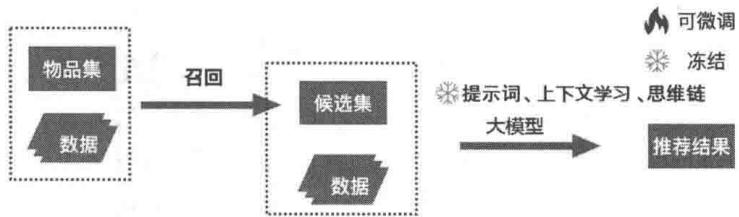  
图3-6 基于大模型的直接推荐范式

指令可以以3种方式输入大模型。

第一种形式是提示词。这种方式将用户的操作行为、用户的兴趣偏好，以及需要大模型解决的问题这3类重要信息以格式化的方式输入大模型，让大模型按照某种规则输出答案。

你是一个新闻推荐系统专家，现在需要按照如下条件为用户进行个性化推荐。

用户的新闻浏览历史是：

候选新闻集是：

你需要基于用户的浏览历史，从候选集中选择3个新闻作为输出，选择的新闻需要跟用户的浏览历史具备相关性。你只需要输出结果就可以了，不需要进行多余的解释。

第二种形式是few-shotICL，也就是需要在输入大模型的提示词中给出具体的案例，让大模型基于给出的案例现场学习、活学活用，一般可以获得更好的推荐效果。例如：

你是一个新闻推荐系统专家，现在需要你使用案例说明的方法，基于用户浏览历史和候选集为用户进行个性化推荐。

案例如下。

用户的新闻浏览历史是：

候选新闻集是：

用户下一个会看的新闻是：……

现在用户的浏览历史是：……，那么用户下一个会看的新闻是什么？你需要从候选新闻集……中选择一个最合适的，你只需要输出结果就可以了，不需要进行多余的解释。

最后一种形式是思维链。思维链在上下文学习的基础上更进一步，通过告诉大模型将问题拆解后进行处理，让大模型按照一定逻辑和步骤解决问题，从而获得更好的新闻推荐效果。

你是一个新闻推荐系统专家，现在需要按照如下条件为用户进行个性化推荐。

用户的新闻浏览历史是：

候选新闻集是：

你需要基于用户的浏览历史，从候选集中选择3个新闻作为输出。

你可以先基于用户的浏览历史，提取出用户最喜欢的新闻标签，这就是用户的兴趣画像，然后基于用户的兴趣画像从候选新闻集中选出3个跟用户兴趣最匹配的作为最终的答案。

你只需要输出结果就可以了，不需要进行多余的解释。

# 3.4 总结

本章以新闻推荐场景为例，重点讲解了大模型推荐系统的3个重要主题：大模型推荐系统的数据来源，包含大模型相关的数据和新闻推荐系统相关的数据；将大模型应用于推荐的一般思路，主要的方法和策略；将大模型应用于推荐的4种范式。

本章讲解的4种大模型推荐范式非常重要，也是后续章节的指导框架，你需要熟悉每种范式的特点。

# 04

# 生成范式：大模型生成特征、训练数据与物品

本章重点讲解大模型的生成范式。

首先，大模型可以生成传统推荐系统依赖的特征、嵌入特征和文本特征，作为工具帮助推荐系统获得更好、更全的特征，让推荐系统的效果更上一层楼。

其次，大模型还可以生成表格类①的训练数据和待推荐的物品。现在就让我们正式进入大模型推荐系统的探索之旅。

说明：从本章开始，绝大部分代码可以在本书同步的代码仓库（链接4-1）中找到。笔者在介绍相关代码时也会给出对应的目录。书中呈现的是核心代码，更完整的代码请参考代码仓库。

# 4.1 大模型生成嵌入特征

嵌入方法是过去10年来最有价值的算法之一，已经在搜索、广告、推荐、NLP、CV等领域得到了大规模应用，效果非常好。我们自然想到，是否可以利用PLM，甚至大模型进行嵌入呢？答案是肯定的。

# 4.1.1 嵌入的价值

利用大模型生成嵌入特征，就是利用新闻的文本信息和用户浏览新闻的文本信息（或用户画像等其他文本信息）生成新闻或者用户的向量表示。新闻的向量表示可以用于计算新闻之间的相似性，以及新闻关联推荐，用户浏览的新闻向量通过适当的“平均/池化”操作可以获得用户的向量表示。利用用户向量和候选新闻向量可以估计用户对候选新闻的点击概率，这就是推

荐系统的CTR预测问题，图4-1是利用嵌入进行推荐的一般框架。

  
图4-1 利用嵌入进行推荐的一般框架

图4-1是一般的方法，可以配合多种算法实现。其中有3个模块是可以利用不同的方法实现的，下面展开说明。参考文献[1,2]里有多种实现方案，你可以参考学习。

- 新闻嵌入。

新闻嵌入（News Encoder）有多种实现方式，可以只使用新闻标题嵌入，或者考虑新闻的标签、分类等，可以使用的技术有CNN、BERT、基于Transformer架构的更复杂的算法等。

- 用户嵌入。

不同用户点击过的新闻数量不一致，所以用户嵌入（User Encoder）需要将新闻嵌入向量进行平均/池化，以形成唯一的用户嵌入表示。池化的方法有很多，最简单的是加权平均，稍微复杂的有 GRU、注意力机制等，更复杂的包括多层 Transformer 模型等。

- 点击率预测。

点击率预测（Click Prediction）希望将用户嵌入向量和物品嵌入向量通过一个函数转为标量值，该值代表了用户对候选新闻的兴趣度或者点击率。可以采用内积、FM、神经网络等方法。

# 4.1.2 嵌入方法介绍

本节通过案例说明嵌入的具体的实现思路。

# 1. 利用 sentence-transformers 框架嵌入

这里利用开源的 sentence-transformers 框架[3,4]实现新闻的嵌入表示，用 MIND 数据集的新闻标题代表新闻。

首先，运行下面的代码安装 sentence-transformers 框架。

```batch
pip install -U sentence-transformers 
```

安装好后，选择3条新闻进行嵌入表示，具体代码如下。

```python
from sentence_transformers import SentenceTransformer
# all-MiniLM-L6-v2 是一个文本嵌入模型，运行时会下载这个模型
model = SentenceTransformer('all-MiniLM-L6-v2')
# 下面是 MIND 数据集中的 3 个新闻标题
sentences = ["Disposition of unwanted prescription drugs during the DEA's Take Back Day",
"Chile: Three die in supermarket fire amid protests",
"As Eagles take their bye, a look at how the defense has improved lately | Early Birds"]
# 调用 model.encode() 对新闻标题进行嵌入表示
embeddings = model.encode(sentences)
# 打印嵌入结果, all-MiniLM-L6-v2 模型获得的是 384 维的稠密向量表示
for sentence, embedding in zip(sentences, embeddings):
    print("Sentence:", sentence)
    print("Embedding:", embedding) 
```

有了新闻的嵌入表示，就可以计算它们之间的相似性，并且按照相似性降序排列。

from sentence_transformers import util   
# 计算任意两个嵌入的余弦相似性   
cos_sim $=$ util.cos_sim(embeddings, embeddings)   
#将两个新闻及其对应的余弦相似性放入list   
all_news_combinations $\equiv$ [] for i in range(len(cos_sim)-1): for j in range(i+1, len(cos_sim)): all_news_combinations.append([cos_sim[i][j], i, j])   
# 按照余弦相似性从高到低排序   
all_news_combinations $=$ sorted(all_news_combinations, key=lambda x: x[0], reverse=True)   
# 输出新闻及对应的相似性   
for score, i, j in all_news_combinations[0]: print("\{\} \t\{\} \t\{:.4f\}".format sentences[i], sentences[j], cos_sim[i][j]))

sentence_transformers 是一个非常好用的框架。下面以 MIND 数据集为例，实现一个最简单的个性化推荐：将用户点击过的新闻的嵌入向量的平均值作为用户嵌入，将新闻嵌入与用户嵌入的余弦相似性作为用户对新闻的偏好得分。具体的代码实现如下①。

```txt
利用sentence_transformers框架实现一个最简单的个性化推荐
```

1. 用户嵌入：用户浏览过的新闻嵌入的平均值  
2. 预测：利用用户嵌入与新闻嵌入的余弦

111

```python
from sentence_transformers import SentenceTransformer, util  
import pandas as pd  
import numpy as np  
col_splitter = "\t"  
DIMS = 384 # all-MiniLM-L6-v2 模型的维数  
TOP_N = 10 # 为每个用户生成 10 个新闻推荐 
```

```python
df_news = pd.read_csv("/data/mind/MINDsmall_train/news.csv", sep=col_splitter)  
df_news.columns = ['news_id', 'category', 'subcategory', 'title', 'abstract', 'url', 'title-entity', 'abstract-entity'] 
```

```python
df_behavior = pd.read_csv("\\data/mind/MINDsmall_train/behaviors.tsv", sep=col_splitter)  
df_behavior.columns = ['impression_id', 'user_id', 'time', 'click_history', 'news'] 
```

```txt
model = SentenceTransformer('all-MiniLM-L6-v2') 
```

# 获取每个新闻及对应的嵌入向量

```python
news_embeddings = {}
for _, row in df_news.iteratorrows():
    news_id = row['news_id']
    title = row['title']
    embedding = model.encode(title)
    news_embeddings[news_id] = embedding 
```

1 1

为单个用户生成TOP_N个推荐

1 1

```python
def rec_4_one_user(click_history):
    emb = np.zeros(DIMS, dtype=float)
    for news in click_history:
        emb = np.add(emb, news_embeddings[news])
    emb = emb.len(click_history)
    emb = emb.astype(np.float32)
    res = []
    for news_id, emb_in news_embeddings.items():
        cos_sim = float适用.cos_sim(emb, emb_[0][0])
        res.append((news_id, cos_sim))
    rec = sorted(res, key=lambda x: x[1], reverse=True)[:TOP_N]
    return rec 
```

为所有用户生成推荐

1

```python
user_rec = {}
for _, row in df_behavior.iterrows():
    user_id = row['user_id']
    click_history = row['click_history'].split()
    rec = rec_4_one_user(click_history)
    user_rec用户的_id = rec 
```

上面的代码实现都是非常基础、非常简单的，你可以在自己的环境中尝试一下。可以找一两个典型用户，通过看他的新闻浏览历史和推荐的新闻，观察一下推荐是否合理。

# 2. 其他嵌入方法

这里再提供两个比较有意思的实现思路，供你参考学习。

# 案例1：UNBERT

参考文献[5]中提供了一个将新闻和用户浏览历史一起生成嵌入表示并进行个性化推荐的框架，输入嵌入是 token嵌入、片段嵌入、位置嵌入和新闻片段嵌入的和，具体嵌入的架构如图4-2所示。

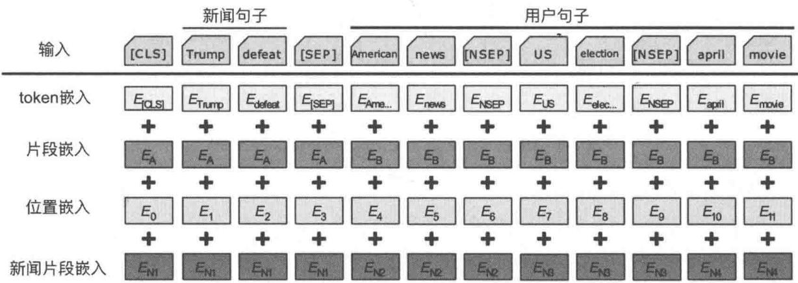  
图4-2 输入嵌入是 token嵌入、片段嵌入、位置嵌入和新闻片段嵌入的和

这里的片段（Segment）嵌入是新闻或者用户浏览历史这两个片段的嵌入，主要目的是区分新闻和用户。新闻片段嵌入针对每个新闻（用户可能看过多个新闻）进行嵌入，目的是区分不同新闻包含的语义信息。

有了嵌入表示，可以采用与图4-1中类似的框架来实现个性化推荐。UNBERT模型采用了多层Transformer框架，如图4-3所示，不仅利用具有丰富语言知识的预训练模型来增强文本表示，还捕获单词级别和新闻级别的多粒度用户、新闻匹配信号。

图4-3中的 $e_{\mathrm{w}}$ 可以看作单词层面的嵌入表示， $e_{\mathrm{n}}$ 可以看作新闻层面的嵌入表示①。通过点击率预测模块将它们拼接起来，可以整合单词层面和新闻层面的语义信息，然后利用单层的网络进行预测，具体公式如下（ $W^{\mathrm{c}}$ 、 $b^{\mathrm{c}}$ 是模型待学习的参数）。

$$
y = \operatorname {s o f t m a x} ([ e _ {\mathrm {w}}; e _ {\mathrm {n}} ] \times W ^ {\mathrm {c}} + b ^ {\mathrm {c}})
$$

  
图4-3 UNBERT模型（TL代表TransformerLayer）

# 案例2：PREC

PREC[6]采用图4-4所示的框架对新闻和用户进行嵌入表示。嵌入包含3个层次：token嵌入、位置嵌入和view嵌入。这里的view是新闻或者用户包含的特征维度：对于新闻，维度有标题、实体、摘要等；对于用户，维度有用户浏览的新闻、用户的位置、用户的画像等，最终的嵌入是这3个层次的嵌入之和。

$$
E = E _ {\text {t o k e n}} + E _ {\text {p o s i t i o n}} + E _ {\text {v i e w}}
$$

  
图4-4 PREC嵌入框架

# 4.2 大模型生成文本特征

大模型优秀的语言理解和生成能力可以用于生成描述新闻及用户的兴趣偏好的文本，进而用于新闻的个性化推荐中。

# 4.2.1 生成文本特征

按照参考文献[7]的思路，我们通过两个代码案例来说明如何利用大模型为MIND数据集的新闻生成一个新的、更有表达力的标题，以及基于用户浏览过的新闻生成用户兴趣画像。这些生成的文本可以进一步被大模型“消化”，从而生成更精准的个性化推荐。

# 4.2.1.1 生成新闻标题

本节利用Qwen1.5-72B-chat大模型，基于新闻的标题、摘要、类目生成一个更有表现力的新标题，由于给出了新闻的摘要和类目，有了更多的信息注入，同时大模型本身包含足够多的世界知识，因此是可以对标题进行优化并获得更好的效果的。下面是具体的代码实现①。

```python
import os
import time
import pandas as pd
from langchain+pandasmanager import CallbackManager
from langchain+pandasmanager streaming stdout import StreamingStdOutCallbackHandler
from langchain+pandasmanager import LLMChain
from langchain.lms import LlamaCpp
from langchain.prompts import PromptTemplate
from tqdm import tqdm
MIN_INTERVAL = 1.5
# 新闻数据中包含的字段说明
keys = dict(
    title='title',
    abstract='abs',
    category='cat',
    subcategory='subcat',
)
current_path = os.getpwd()
# 将新闻读到 dataframe中
news_df = pd.read_csv(
    filepath_or_buffer=os.path.join(current_path + '/data/news.tsv'),
    sep='%t',
    header=0,
)
# 构建新闻列表，元素是元组，元组前面是新闻ID，后面是dict，dict是新闻相关信息，下面是一个数据样本
(# 'N55528', {''title': 'The Brands Queen Elizabeth, Prince Charles, and Prince Philip Swear} 
```

```txt
By',   
# 'abstract': "Shop the notebooks, jackets, and more that the royals can't live without.", # 'category': 'lifestyle', 'subcategory': 'lifestyleroyals', 'newtitle': '')   
news_list = []   
for news in tqdm(news_df.Iterrows(): dic \(=\) {} for key in keys: dic[key] \(\equiv\) news[1][keys[key]] news_list.append((news[1]['nid'],dic))   
#提示词模板   
prompt_template \(= 1111111111111111111111111111111111111111111111111111111111111   
a piece of news, with its original title, category, subcategory, and abstract (if exists). The news format is as below: [title]{title} [abstract]{abstract} [category]{category} [subcategory]{subcategory}   
where title, abstract, category, and subcategory in the brace will be filled with content. You can only response a rephrased news title which should be clear, complete, objective and neutral. You can expand the title according to the above requirements. You are not allowed to response any other words for any explanation. Your response format should be: [newtitle]   
where [newtitle] should be filled with the enhanced title. Now, your role of news title enhancer formally begins. Any other information should not disturb your role."""   
#生成的新的新闻标题的存储路径 save_path \(=\) current_path +'/output/news_summarizer.log'   
#下面是调用LLaMA大模型的语法 callbackmanager \(=\) CallbackManager([StreamingStdOutCallbackHandler()])   
llm \(=\) LlamaCpp(   
model_path="/Users/luqiang/Desktop/code/llm/models/gguf/qwenl.5-72b-chat-q5_k_m.gguf", temperature \(= 0.8\) top_p \(= 0.8\) nCtx \(= 6000\) callbackmanager \(=\) callbackmanager, verbose=True, stop \(= ["< |im\_end| >"]\) #生成的答案中遇到这些词就停止生成   
）   
prompt \(=\) PromptTemplate( input_variables["title","abstract","category","subcategory"], template \(=\) prompt_template,   
chain \(=\) LLMChain(llm \(\coloneqq\) llm,prompt=prompt) #先统计出哪些已经计算了，避免后面重复计算 exist_set \(\equiv\) set() with open(save_path,'r') as f: for line in f: if line and line.startswith('N'): exist_set.add(line.split("\\t") [0]) 
```

```txt
调用大模型迭代计算新闻标题  
for nid, content in tqdm(news_list):  
    start_time = time.time()  
if nid in exist_set:  
    continue  
try:  
    title = content['title']  
abstract = content['abstract']  
category = content['category']  
subcategory = content['subcategory']  
enhanced = chain.run(title= title, abstract=abstract, category=category,  
subcategory=subcategory)  
enhanced = enhanced.rstrip('\n')  
with open(save_path, 'a') as f:  
    f.write(f'\{nid\}\t{enhanced}\n')  
except Exception as e:  
    print(e)  
interval = time.time() - start_time  
if interval <= MIN_interval:  
    time.sleep(MIN_interval - interval) 
```

运行上述代码，可以获得如下输出，以N开头的是新闻ID，新闻ID下面是生成的新的新闻标题。这些标题基本符合要求，但是在指令跟随方面有所欠缺，有些标题有中括号，有些没有。你可以尝试调整提示词或调用第三方API（例如月之暗面）加以修正。

```txt
N55528  
[The Royal Family's Favorite Brands: From Notebooks to Jackets]  
N19639  
newtitle] Habits to Avoid for Successful Belly Fat Reduction  
N61837  
Aid Freeze Impact: In Ukraine's War Trenches, Lt. Molchanets Reveals the Human Cost  
N53526  
[never title] The Impact of Being an NBA Wife on Mental Health  
N38324  
newtitle] Expert Advice: How Dermatologists推荐去除皮肤赘生物的方法  
N2073  
[never title] NFL Player Criticism Fines Spark Controversy  
N49186  
[It's an Unusually Warm October in Orlando, But cooler Days Are Ahead] 
```

# 4.2.1.2 生成用户兴趣画像

本节基于用户看过的所有新闻的标题，为用户生成兴趣topic和region信息，其原理与生成新闻标题类似。topic是新闻的类目，代表用户的主题偏好。region是新闻讲述的事件发生/关注的地理位置信息，代表用户的地域偏好。下面是具体的代码实现①。

import json   
import os   
import time   
import pandas as pd   
from UniTok import UniDep   
from langchain.chain import LLMChain   
from langchain.cursormanager import CursorManager   
from langchain.cursorstreams streaming stdout import StreamingStdOutCallbackHandler   
from langchain.llms import LlamaCpp   
from langchain+prompts import ChatPromptTemplate   
from langchain_core+prompts import PromptTemplate   
from tqdm import tqdm   
from prompter import MindPrompter, MindUser   
MIN_intervalVAL $= 0$ current_path $=$ os.getcwd()   
mind_prompter $=$ MindPrompter(current_path +'/data/news.tsv')   
user_list $=$ MindUser(current_path +'/data/user', mind_prompter).stringify()   
#将新闻读到 dataframe中   
news_df $=$ pd.read_csv( filepath_or_buffer $\equiv$ os.path.join(current_path +'/data/news.tsv'), sep $\coloneqq '\backslash t'$ header $= 0$ ）   
#构建新闻字典，key为新闻ID，value为新闻的标题   
news_dict $=$ {}   
for news in tqdm(news_df_iterrows(): news_dict.news[1]['nid']) $=$ news[1]['title'] depot $=$ UniDep(current_path +'/data/user', silent=True) nid $=$ depot.vocabs('nid')   
system $=$ ""You are asked to describe user interest based on his/her browsed news title list, the format of which is as below: {input}   
You can only response the user interests with the following format to describe the [topics] and [regions] of the user's interest [topics] -topic1 -topic2 ... [region] (optional) -region1 -region2 ...   
where topic is limited to the following options: (1) health (2) education (3) travel (4) religion (5) culture (6) food (7) fashion (8) technology

(9) social media

(10) gender and sexuality   
(11) race and ethnicity   
(12) history   
(13) economy   
(14) finance   
(15) real estate   
(16) transportation   
(17) weather   
(18) disasters   
(19) international news

and the region should be limited to each state of the US.

Only [topics] and [region] can be appeared in your response. If you think region are hard to predict, leave it blank. Your response topic/region list should be ordered, that the first several options should be most related to the user's interest. You are not allowed to response any other words for any explanation or note. Now, the task formally begins.

Any other information should not disturb you.

# 生成的用户兴趣画像的存储路径

save_path = current_path + '/output/user_profiler.log'

# 下面是调用LLaMA大模型的语法

callbackmanager $=$ CallbackManager([StreamingStdOutCallbackHandler()])   
llm $=$ LlamaCpp(

model_path="/Users/liuqiang/Desktop/code/11m/models/gguf/qwen1.5-72b-chat-q5_k_m.gguf",

temperature $= 0.8$ top_p $= 0.8$ nCtx $= 6000$ callbackmanager $\equiv$ callbackmanager,   
verbose $\equiv$ True,

）

# # 先统计出哪些已经计算了，避免后面重复计算

```java
exist_set = set()
with open(save_path, 'r') as f:
    for line in f:
        data = json loads(line)
        exist_set.add(data['uid'])

# 调用大模型迭代计算用户兴趣画像

for uid, content in tqdm(user_list):
    start_time = time.time()
    if uid in exist_set:
        continue
    if not content:
        empty_count += 1
        continue
    try:
        prompt = PromptTemplate(
            input_variables=['input'],
            return True]).

```python
template=system,
}
chain = LLMChain(llm=llm, prompt=prompt)
enhanced = chain.run(input=content)
enhanced = enhanced.rstrip('\n')
with open(save_path, 'a') as f:
    f.writejson.dumps{'uid':uid, 'interest':enhanced} + '\n')
except Exception as e:
    print(e)
interval = time.time() - start_time
if interval <= MIN_interval:
    time.sleep(MIN_interval - interval)
print('empty count: ', empty_count) 
```

运行上述代码，可以获得下面的结果（下面是两个样例）。可以看到，输出的结果的格式是满足要求的，但是部分topic（例如entertainment）不在要求的范围内，说明大模型产生了幻觉，这可能是提示词需要优化或者该模型的指令跟随能力不足以解决这个问题导致的。

```txt
{"uid":0,   
"interest":   
[topics]   
-entertainment   
-sports   
-politics   
celebrity gossip   
-crime   
-human interest   
[region](optional)   
-USA}   
{"uid":1,   
"interest":   
[topics]   
-health   
-crime and law enforcement   
-education   
-food   
-culture   
-religion   
-history   
-international news   
[region](optional)   
-Kentucky   
-Minnesota   
-California   
-Brazil} 
```

以上生成新的新闻标题和生成用户兴趣画像的代码都比较基础、简单，你可以在自己的开发环境中运行一下（如果资源有限，可以选择更小的模型）。

# 4.2.2 生成文本特征的其他方法

下面通过两个案例来详细说明在特定场景下生成文本特征的实现方法。

# 案例1：RLMRec生成物品与用户画像

RLMRec[8]提供了一种利用大模型模板生成物品与用户画像的框架，如图4-5所示。由于模板的指令非常完整，要求相对较高，需要一个效果很好的模型才能实现，所以本案例是使用ChatGPT实现的。

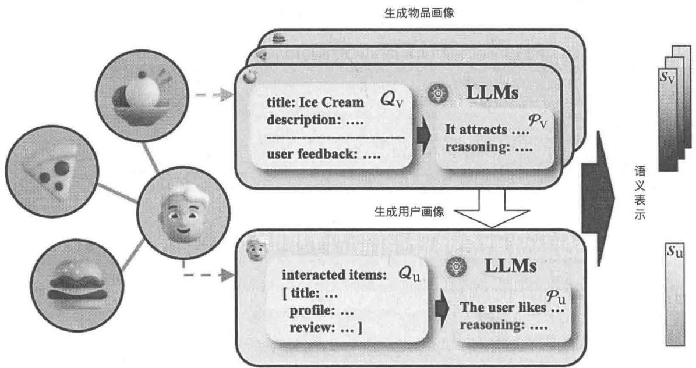  
图4-5 RLMRec中生成物品与用户画像的框架

用户画像应包含用户喜欢的特定类型物品的描述，从而全面反映他们的品味和偏好。图4-6是生成用户画像的模板，模板中对输出的数据结构、字段等提出了非常明确的要求。

物品画像应该明确地表明它最容易吸引的用户类型，并提供与这些用户的偏好和兴趣相一致的物品特征和品质的清晰描述。图4-7是生成物品画像的模板，模板同样对输出的数据结构、字段、字数等提出了明确的要求。

```txt
You will serve as an assistant to help me determine which types of books a specific user is likely to enjoy.   
I will provide you with information about books that the user has purchased, as well as his or her reviews of those books. Here are the instructions:   
1. Each purchased book will be described in JSON format, with the following attributes: {"title": "the title of the book", (if there is no title, I will set this value to None) "description": "a description of what types of users will like this book", "review": "the user's review on the book" (if there is no review, I will set this value to None) }   
2. The information I will give you:   
PURCHASED ITEMS: a list of JSON strings describing the items that the user has purchased.   
Requirements:   
1. Please provide your decision in JSON format, following this structure: {"summariization": "A summarization of what types of books this user is likely to enjoy" (if you are unable to summarize it, please set this value to "None") "reasoning": "briefly explain your reasoning for the summarization"}   
2. Please ensure that the "summariization" is no longer than 100 words.   
3. The "reasoning" has no word limits.. 4. Do not provided any other text outside the JSON string. 指令   
PURCHASED ITEMS: [ {"title":"Croak", "description": "Young adult readers who enjoy paranormal and fantasy themes would enjoy Croak.", "review": "Loved the writing style, was different than most of what I have read. The narrative was like a storyteller, you could hear someone telling the story to you...}"   
{"title": "Deadly Cool (Hartley Featherstone)", "description": "Teenage girls who enjoy a mix of humor, mystery, and high school drama would enjoy Deadly Cool by Gemma Halliday. With plenty of red herrings and a quick pace, this book will keep ...", "review": "I really enjoyed reading this, was laughing out loud in the middle of the night...}"   
{"title": "Stitch (Stitch Trilogy, Book 1)", "description": "Fans of young adult paranormal romance novels with a dash of mystery and suspense would enjoy Stitch (Stitch Trilogy, Book 1)." "review": "... Book started out really well, had me totally hooked from the start. Love me a good ghost story, ....}"提示词 ...(Omitted due to page limit)] 
```

图4-6 生成用户画像的模板

```txt
You will serve as an assistant to help me summarize which types of users would enjoy a specific book. I will provide you with the title and a description of the book.Here are the instructions: 1.I will provide you with information in the form of a JSON string that describes the book: {"title":"the title of the book", (if there is no title, I will set this value to "None") "description": "a description of the book", (if there is no description, I will set this value to "None")}   
Requirements: 1.Please provide your answer in JSON format, following this structure: {"summariization":"A summarization of what types of users would enjoy this book"(if you are unable to summarize it, please set this value to "None") "reasoning": "briefly explain your reasoning for the summarization"} 2.Please ensure that the "summariization" is no longer than 200 words. 3.Please ensure that the "reasoning" is no longer than 200 words. 4.Do not provide any other text outside the JSON string. 指令   
{"title":"The Bell Jar: A Novel (Perennial Classics)", "description": "Plath was an excellent poet but is known to many for this largely autobiographical novel. The Bell Jartells the story of a gifted young woman's mental breakdown beginning during a summer internship as a junior editor at a magazine in New York City in the early 1950s. The real Plath committed suicide in 1963 and left behind this scathingly sad, honest and perfectly-written book, which remains one of the best-told tales of a woman's descent into insanity.--This text refers to the Hard coveredition.}"提示词   
{"summariization":"The Bell Jar would appeal to those interested in reading about mental health and women's experiences. Specifically, readers who enjoy raw and honest depictions of mental illness and its effects on a young woman's life would appreciate this book.", "reasoning": "The Bell Jar delves into the mental breakdown of a young woman and her experiences navigating mental health and societal expectations as a woman in the 1950s. The book's autobiographical nature and raw, honest depiction of mental illness make it a compelling read for those interested in exploring these themes. Additionally, readers looking for works that examine the intersection of gender and mental illness would find The Bell Jar particularly thought-provoking."} 生成的物品画像 
```

图4-7 生成物品画像的模板

# 案例2：PALR框架生成用户兴趣画像

PALR 框架[9]通过大模型生成用户兴趣画像，见图 4-8 中间部分，然后基于生成的自然语言表示的用户画像、交互历史序列及推荐候选集（召回），为用户生成推荐（排序）。

  
图4-9 生成用户兴趣画像的语言模板

图4-8 PALR框架

为了利用大模型生成用户兴趣画像，需要使用生成用户兴趣画像的语言模板对用户行为进行编码，如图4-9所示。然后利用大模型对模型进行微调，微调后的模型就具备了生成用户兴趣画像的能力。这里将电影的关键词（标签）作为用户兴趣画像的表述。

```txt
Input: Your task is to use two keywords to summarize user's preference based on history interactions. The Output is an itemized list based on importance. The output template is: {1. KEY_WORD_1: "HISTORY_MOVIE_1", "HISTORY_MOVIE_2"; 2, KEY_WORD_2: "HISTORY_MOVIE_3"}  
The history movies and their keywords are:  
"Gigi": Romantic, Musical, Classic;  
"Pokemon: The First Movie": Pokemon, Adventure, Action;  
"Star Wars: Episode IV - A New Hope": Science Fiction, Epic, Space Opera;  
"The Terminator": Terminator, Time Travel, Action;  
"Back to the Future": Time-travel, Adventure, Friendship;  
"Quest for Camelot": Adventure, Fantasy, Friendship;  
Output: The user enjoys adventure and science-fiction movies. 
```

# 4.3 大模型生成训练数据

我们知道常规的机器学习模型（如logistics回归、FM、深度学习等）以表格特征作为模型的特征，而大模型要么利用无监督学习进行训练，要么利用以文本形式呈现的<输入，输出>样本对进行监督微调（SFT）。这两类训练数据都可以通过大模型生成，下面展开讲解。

# 4.3.1 大模型直接生成表格类数据

大模型具备生成文本的能力，这是大模型最直接、最容易被大众感知的能力。文本生成可以直接用于个性化推荐的数据生成中。我们知道在很多场景下，推荐系统存在数据不足的问题（如产品刚发布，没有太多用户和用户行为数据），那么利用大模型辅助生成数据就是一个非常朴素的想法。

参考文献[10]提供了一种基于大模型微调生成表格数据的样本的方法——GReaT。先将表格数据转换为文本输入大模型进行微调，如图4-10所示。图中步骤(a)表示将表格数据转换为有意义的文本，步骤(b)表示特征顺序置换，步骤(c)表示将获得的句子用于大模型微调。

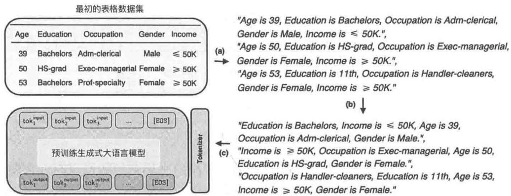  
图4-10 将表格数据转换为文本输入大模型进行微调

微调后的模型可以基于一定的策略生成新样本，如图4-11所示。图中步骤(a)表示将单个特征名称或特征值对的任意组合转换为文本，从而使用预训练的大模型生成新的数据，步骤(b)表示将数据输入微调后的大模型完成采样，步骤(c)表示转换为表格。

该方法可以保证生成的样本与原始样本分布一致，这对于数据量不足的推荐场景是比较好的补充。与其他方法相比，GReaT允许在没有对模型进行重新训练（只需要在大模型上进行微

调）的情况下，将特征子集任意组合①进行数据采样。除了可以用来生成新的样本数据，还可以对数据的缺失值进行补充。

  
图4-11 将微调后的模型基于一定的策略生成新样本

GReaT目前已经在GitHub上开源，使用简单的代码即可通过表格类数据生成更多的样本数据。

```python
from be_great import GReaT  
from sklearn.datasets import fetch_california_housing # California Housing dataset  
data = fetch_california_housing(as_frame=True).frame  
model = GReaT(大模型='distilgpt2', batch_size=32, epochs=25)  
model.fit(data)  
synthetic_data = model.sample(n_samples=100) 
```

针对某个样本数据，如果你训练好了GReaT模型，那么当新收集的数据中包含缺失值时，就可以利用GReaT填补缺失值，具体代码如下。

```python
# test_data: pd.DataFrame 格式的样本数据
# model: GReaT 在原始样本数据之上训练的模型
# 下面为了模拟有缺失值的新数据，对测试数据随机剔除
import numpy as np
for clf in test_data.columns:
    test_data[df] = test_data[df].apply(lambda x: (x if np.random.randint() > 0.5 else np.nan))
imputed_data = model.impute(test_data, max_length=200)
```

# 4.3.2 大模型生成监督样本数据

目前，国内出现了大量大模型，其中一个原因是有LLaMA等开源模型作为基础，大模型开发者“站在了巨人的肩膀上”；另外一个重要原因是大多数发布大模型的公司会使用GPT-4②

① 可以将任何特征名称或特征名称和值组合。  
② 主要原因是可以将GPT-4给出的答案作为正确答案。

生成训练的监督样本。基于开源的大模型测试数据集或者人工标注的数据（见表4-1），通过GPT-4获得对应的答案，从而获得<输入，输出>样本对，这些样本对可以作为大模型微调的监督样本，图4-12是一个具体的例子。

表 4-1 大模型的不同能力对应的建模任务和相关的数据集  

<table><tr><td>层次</td><td>能力</td><td>建模任务</td><td>数据集</td></tr><tr><td rowspan="9">基础</td><td rowspan="3">语言生成</td><td>语言建模</td><td>Penn Treebank、WikiText-103、The Pile、LAMBADA</td></tr><tr><td>条件文本生成</td><td>WMT(2014/2016/2019/2020/2021/2022)、Flores-101、DiaBLa、CNN/DailyMail、XSum、WikiLingua、OpenDialKG</td></tr><tr><td>代码生成</td><td>PPS、HumanEval、MBPP、CodeContest、MTPB、DS-1000、ODEX</td></tr><tr><td rowspan="3">知识利用</td><td>封闭QA</td><td>Natural Questions,ARC、TruthfulQA、Web Questions、TriviaQA、PIQA、LC-quad2.0、GrailQA,KQApro、CWQ、MKQA、ScienceQA</td></tr><tr><td>开放QA</td><td>Natural Questions、OpenBookQA、ARC、TriviaQA、Web Questions、MS MARCO、QASC、SQuAD、WikiMovies</td></tr><tr><td>知识补全</td><td>WikiFact、FB15k-237、Freebase、WN18RR、WordNet、LAMA、YAGO3-10、YAGO</td></tr><tr><td rowspan="3">复杂推理</td><td>知识推理</td><td>CSQA、StrategyQA、HotpotQA、ARC、BoolQ、PIQA、SIQA、HellaSwag、WinoGrande、COPA、OpenBookQA、ScienceQA、proScript、ProPara、ExplaGraphs、ProofWriter、EntailmentBank、ProOntoQA</td></tr><tr><td>符号推理</td><td>CoinFlip、ReverseList、LastLetter、Boolean Assignment、Parity、Colored Object、Penguins in a Table、Repeat Copy、Object Counting</td></tr><tr><td>数学推理</td><td>MATH、GSM8k、SVAMP、MultiArith、ASDiv、MathQA、AQUA-RAT、MAWPS、DROP、NaturalProofs、PISA、miniF2F、ProofNet</td></tr><tr><td rowspan="10">高阶</td><td rowspan="3">人类对齐</td><td>真实性</td><td>TruthfulQA、HaluEval</td></tr><tr><td>有帮助</td><td>HH-RLHF</td></tr><tr><td>无害性</td><td>HH-RLHF、Crows-Pairs、WinoGender、RealToxicityPrompts</td></tr><tr><td rowspan="3">与外部环境交互</td><td>家庭场景</td><td>VirtualHome、BEHAVIOR、ALFRED、ALFWorld</td></tr><tr><td>网络环境</td><td>WebShop、Mind2Web</td></tr><tr><td>开放世界</td><td>MineRL、MineDojo</td></tr><tr><td rowspan="4">工具使用</td><td>代码执行</td><td>GSM8k、TabMWP、Date Understanding</td></tr><tr><td>计算器</td><td>GSM8k、MATH、CARP</td></tr><tr><td>模型接口</td><td>GPT4Tools、Gorilla</td></tr><tr><td>数据接口</td><td>WebQSP、MetaQA、WTQ、WikiSQL、TabFact、Spider</td></tr></table>

在实际使用时，大模型会通过批量调用接口针对开源的测试数据集（及公司自己积累的数据集）从GPT-4获取结果，获取结果后还可能需要借助人工抽查、规则策略或者（大）模型对

返回结果的置信度评分等手段提升<输入，输出>对的质量，这样微调的效果才会更好。


中年人怎样才能保持健康的身体呢？

  
图4-12 国内某个开源大模型基于问题给出的回答①

中年人保持健康的身体需要综合考虑多个方面，包括健康的生活方式、均衡的饮食、适量的运动、pricise的休息和定期的健康检查等。以下是一些建议：

1. 健康饮食：保持均衡的饮食，摄入足够的蔬菜、水果、全谷物、蛋白质和健康脂肪。减少盐、糖和饱和脂肪的摄入。  
2. 适量阻击：中年人应该保持适量的运动，如散步、慢跑、游泳、瑜伽等，以增强体质和提高免疫力。  
3. 规律作息：保持良好的睡眠质量，确保每天有足够的睡眠时间，以帮助身体恢复和修复。  
4. 控制压力：学会管理和减轻压力，可以通过冥想、深呼吸、听音乐等方式来放松身心。  
5. 戒烟限酒：戒烟可以减少患上各种疾病的风险，限制酒精摄入量可以保护肝脏和其他器官。  
6. 定期体检：中年人应该定期进行健康检查，及早发现和治疗潜在的健康问题。  
7. 保持社交：与朋友和家人保持良好的社交关系，有助于心理健康和提高生活质量。  
8. 注意安全：在工作和生活中注意安全 eliminating潜在的危险因素，以减少意外伤害的风险。  
9. 保持水分摄入：每天保证足够的水分摄入，以维持身体正常的新陈代谢和血液循环。  
10. 学习健康知识：了解有关健康和疾病预防的知识，以便做出更健康的决策。请记住，每个人的身体状况都是独特的，因此strokes建议可能需要根据个人情况进行调整。如果有任何健康问题或疑虑，建议咨询医生或专业医疗人员。

# 4.4 大模型生成待推荐物品

利用大模型生成的待推荐物品与传统的推荐系统中的待推荐物品有很大区别。传统推荐系统中的待推荐物品是已经存在的，而利用大模型生成待推荐的物品是一个从无到有的过程，这正是生成式大模型的主要价值之一。

# 4.4.1 为用户生成个性化新闻

下面以MIND数据集为例，利用开源大模型为用户生成个性化新闻。我们将生成过程拆解为两个步骤：第一步生成用户喜欢的新闻类型、标题；第二步基于第一步生成的新闻类型、标题生成满足用户个性化需求的新闻。

# 1. 生成用户喜欢的新闻类型、标题

下面先给出代码①，代码中有完整的注释，对于不熟悉的类或者框架，可以在百度上查询并学习。

import json   
import os   
import time   
import pandas as pd   
from langchain+prompter import PromptManager   
from langchain-prompter import PromptTemplate   
from langchain-core.prompter import PromptTemplate   
from langchain-community.llms import LlamaCpp   
from langchain-prompter import LLMChain   
from tqdm import tqdm   
from prompter import MindPrompter, MindColdUser   
MIN_interval $\equiv$ 0   
current_path $=$ os.getcwd()   
mind_prompter $=$ MindPrompter(current_path +'/data/news.tsv')   
user_list $=$ MindColdUser(current_path +'/data/user', mind_prompter).stringify()   
#将新闻读到 dataframe中   
news df $\equiv$ pd.read_csv( filepath_or_buffer=os.path.join(current_path +'/data/news.tsv'), sep $\equiv$ '\t', header $\equiv$ 0,   
）   
system $=$ ""You are asked to capture user's interest based on his/her browsing history, and generate a piece of news that he/she may be interested. The format of history is as below: {input}   
You can only generate a piece of news (only one) in the following json format, the json include 3 keys as follows: <title>, <abstract>, <category>   
where <category> is limited to the following options: - lifestyle   
- health   
- news   
- sports   
- weather   
- entertainment   
- autos   
- travel   
- foodanddrink   
- tv   
- finance   
- movies   
- video   
- music

```txt
kids   
middleeast   
northamerica   
games 
```

```txt
<title>, <abstract>, and <category> should be the only keys in the json dict. The news should be diverse, that is not too similar with the original provided news list. You are not allowed to response any other words for any explanation or note. JUST GIVE ME JSON-FORMAT NEWS. Now, the task formally begins. Any other information should not disturb you."save_path = current_path + '/output/personalized_news_summary.log' 
```

先统计出哪些已经计算了，避免后面重复计算  
下面是调用LLaMA大模型的语法 callbackmanager $=$ CallbackManager([StreamingStdOutCallbackHandler()])   
11m $=$ LlamaCpp(   
model_path $\equiv$ "/Users/liuqiang/Desktop/code/11m/models/gguf/qwenl.5-72b-chat-q5_k_m.gguf   
"temperature $= 0.8$ top_p $= 0.8$ nctx $= 6000$ callbackmanager $\equiv$ callbackmanager, verbose $\equiv$ True,

```python
exist_set = set()
with open(save_path, 'r') as f:
    for line in f:
        data = json loads(line)
        exist_set.add(data['uid']) 
```

上面的代码实现了利用用户的新闻浏览历史生成用户喜欢的新闻标题和类型。下面是两个生成的案例，其中uid是用户唯一ID，news对应的是用户喜欢的新闻标题和类型。

```json
{"uid":4,"news": { "title":"New Study Finds Link Between Gut Health and Mental Well-being", "abstract":"A groundbreaking research reveals the intricate relationship between the health of our gut microbiome and our mental health.", "category": "health" } } {"uid":7,"news": { "title":"Jimmy Carter Inspires New Fitness Program for Seniors", "abstract":"Following Jimmy Carter's recent recovery from a pelvic fracture, a new fitness program tailored for seniors has been launched.", "category": "health" } } 
```

# 2. 生成个性化的新闻

进一步地，我们还可以利用大模型基于用户喜欢的新闻标题和类型，为用户生成个性化的新闻。下面是具体的代码实现①。

import json   
import os   
import time   
from langchain.cursormanager import CursorManager   
from langchain.cursormanagement import CursorManager   
from langchain.cursormanagement import CursorManager   
from langchain.cursormanagement import CursorManager   
from langchain.cursormanagement import CursorManager   
from langchain.cursormanagement import CursorManager   
from langchain.cursormanagement import CursorManager   
from langchain.cursormanagement import CursorManager   
from langchain.cursormanagement import CursorManager   
from langchain.cursormanagement import CursorManager   
from langchain.cursormanagement import CursorManager   
from langchain.cursormanagement import CursorManager   
from langchain.cursormanagement.qlms import LlamaCpp   
from tqdm import tqdm   
MIN_interval $\equiv$ 0   
current_path $=$ os.getcwd()   
save_path $=$ current_path +'/output/personalized_news.log'   
prompt_template $\equiv$ ""   
you are a news writing expert, The information of the news a user browsed are as follows: "news": {news}   
The news in the curly braces above are a list of all the news that the user has browsed, which may contain multiple news articles.   
the information in the news stand for the category of news the user likes.   
Now please write a new for the user, the news must relevant to the interest of the user, the news you write must less than 300 words.   
""   
#下面是调用LLaMA大模型的语法 callbackmanager $=$ CursorManager([StreamingStdOutCallbackHandler()])

llm $=$ LlamaCpp( model_path $\equiv$ "/Users/luqiang/Desktop/code/llm/models/gguf/   
qwen1.5-72b-chat-q5_k_m.gguf", temperature $= 0.8$ top_p $= 0.8$ nctx $= 6000$ callbackmanager $\equiv$ callbackmanager, verbose=True,   
） prompt $=$ PromptTemplate( input_variables $\coloneqq$ ["news"], template $\equiv$ prompt_template,   
） chain $=$ LLMChain(llm $\equiv$ llm，prompt $\equiv$ prompt) # 先统计出哪些已经计算了，避免后面重复计算   
exist_set $=$ set()   
with open(save_path,'r') as f: for line in f: data $=$ json.loads(line) exist_set.add(data['uid'])   
# 打开文件并创建文件对象   
file $=$ open(current_path +'/output/personalized_news_summary.log'，"r") # 使用 headlines() 方法将文件内容按行存入列表 lines   
lines $=$ file.readlines()   
# 关闭文件   
file.close()   
# 输出文件内容   
for line in tqdmlines): info $=$ eval(line) uid $=$ info['uid'] news $=$ info['news'] start_time $=$ time.time() if uid in exist_set: continue if not news: continue try: enhanced $=$ chain.run(Bnews) enhanced $=$ enhanced.rstrip('\\n') news_ $=$ {"uid":uid,"news":enhanced} with open(save_path,'a') as f: f.write(f'\{str( news_}\} \\n') except Exception as e: print(e) interval $=$ time.time() - start_time if interval $<   =$ MIN_INTERVAL: time.sleep(MIN_INTERVAL - interval)

运行上面的程序，就为每个用户生成了个性化的新闻，下面是一个案例。

```txt
Title: "Boxing Legend Floyd Mayweather Jr. Announces Collaboration with Luxury Spirits Brand" 
```

Abstract: Renowned boxing champion Floyd Mayweather Jr. is stepping into the world of luxury spirits with an exciting collaboration. Mayweather, known for his impeccable taste and opulent lifestyle, has partnered with a prestigious spirits brand to create a limited-edition premium whiskey.   
The collaboration between Mayweather and the luxury spirits brand aims to fuse the worlds of sports and luxury. The yet-to-be-named whiskey is reported to have been aged to perfection, with a rich and complex flavor profile..   
Scheduled for release later this year, the limited-edition Floyd Mayweather Jr. collaboration whiskey is expected to attract considerable attention from luxury spirits enthusiasts and sports fans alike..   
Category: sports

# 4.4.2 生成个性化的视频

大模型也能用于视频生成，参考文献[11]提出了一个基于大模型生成小视频并用于个性化推荐的AI生成（AI Generator）内容框架GeneRec，如图4-13所示。该框架利用大模型对推荐库中已有的视频进行编辑（Editor）修改或者新生成（Creator）小视频。为了让生成的内容更加个性化，AI生成内容需要与指令（Instructor）配合，结合用户指令（User Instruction）与反馈（Feedback），例如用户浏览、点击、点赞、踩等，进行更加个性化的内容创作。

  
图4-13 AI生成内容框架GeneRec

这里说的生成小视频的范围比较广，从零开始创作算生成，基于已有的小视频完成微创作也算生成。下面对AI生成内容中涉及的视频编辑和创造过程进行说明并提供案例。

考虑到个性化缩略图可能会更好地吸引用户点击小视频，可以利用大模型完成个性化缩略图选择和生成任务，为用户呈现更具吸引力和个性化的微视频缩略图。

对于缩略图选择，可以利用用户过去喜欢的小视频学习用户对缩略图的偏好特征，然后通过训练好的模型针对某个小视频选择最合适的缩略图，如图4-14所示。

  
图4-14 缩略图选择

可以基于用户过去喜欢的小视频和当前视频，利用扩散模型等大模型直接生成缩略图，如图4-15所示。

  
图4-15 缩略图生成

对比较长的小视频（例如超过3分钟），还可以利用CLIP技术进行个性化剪辑，如图4-16所示，目标是只推荐用户喜欢的剪辑片段，这样可以节省用户的时间并改善用户的使用体验。

上面的缩略图选择和剪辑基本保持了视频原样，原视频没有改变。我们还可以对视频内容进行真正意义上的编辑，包括对视频风格进行迁移，如图4-17所示；以及对视频内容进行编辑调整，如图4-18所示。

  
图4-16 基于用户历史偏好对小视频进行个性化剪辑


  
图4-17 利用VToonify技术对视频风格进行迁移

  
图4-18 利用MCVD技术对对视频内容进行编辑调整

当然，最复杂的操作方式是从零开始创造一个小视频。Runway公司发布的Gen-2、Pika以及字节跳动发布的MagicVideo-V2，都可以基于文本生成视频。图4-19是利用MCVD技术生成的小视频。

  
图4-19 利用MCVD技术生成的小视频

# 4.5 总结

本章借助MIND数据集和开源大模型，用代码实现了向量嵌入和生成文本特征，生成的嵌入特征可以直接用于推荐，也可以整合到传统的模型中进行个性化推荐。我们也可以直接利用大模型进行推荐。嵌入方法是推荐系统中非常重要的一种方法，利用大模型进行嵌入表示，可以获得更好的语义理解，能够抓住用户和新闻之间的深层语义关系，最终获得更好的推荐效果，甚至可以解决冷启动和跨领域推荐问题。

借助大模型优秀的文本生成能力、概要总结能力，可以生成相关的文本特征，这些文本特征可以更好地描述新闻和用户兴趣偏好，进而被更好地用于后续的推荐业务中。

大模型既可以生成表格类数据，也可以生成用于微调的监督训练样本。游戏中的虚拟空间、智能汽车中的路况等都可以通过大模型生成，大大提升效率并节省成本。目前，合成数据是大模型最有价值的应用方向之一。

大模型的生成能力可以辅助我们进行创作，本章中利用大模型生成个性化新闻和小视频是两个容易理解的案例。如果将大模型与机器人、3D打印等技术结合，那么具备大模型能力的具身智能体还能生产出实物商品，例如做一道个性化的美味菜肴，设计一身最适合客户体型的衣服等。

# 05

# 预训练范式：通过大模型预训练进行推荐

大模型的输入主要是自监督的海量文本信息，主流架构是Transformer。如果基于推荐系统相关数据预训练一个大模型，也需要采用类似的思路和步骤。由于推荐系统有其自身的特点，本章重点讲解在推荐系统这一背景下，如何预训练一个解决推荐问题的大模型。

本章首先讲解预训练推荐大模型的一般思路和方法，然后讲解两个案例，最后以MIND数据集为例，通过代码实现推荐系统大模型的预训练。

# 5.1 预训练的一般思路和方法

本节梳理大模型预训练的一般思路和方法。

# 5.1.1 预训练数据准备

推荐系统的数据主要包括用户数据、物品数据、场景数据、行为数据。基于推荐系统数据的特性，如果要将推荐系统相关的数据转为自监督的文本数据供大模型进行预训练，那么可以利用用户行为序列①，行为序列与无监督文本序列非常相似。一般可以采用如下3种方式将用户行为序列转换为适合大模型处理的数据格式。

# 1. 直接利用用户行为序列

用户行为序列对应的ID（新闻ID）虽然不是文本（一般是整数或者字符串），但是可以采用与文本一样的建模方式处理。可以采用掩码的方式将行为序列中间一个或者多个行为挡住，利用模型预测掩码部分，处理方式与BERT类似。还可以基于前面的行为序列预测后面一个或

者多个行为序列，类似GPT的处理方式。PTUM模型采用的就是该处理方式。另外，参考文献[1]中提出的BERT4Rec也采用了类似方式。

# 2. 将用户行为序列 ID 转为相关的文本

这种方式用新闻的标题等文本信息替换ID，采用模板的方式将用户行为序列转为文本，下面是一个案例。

用户过去一段时间点击过的新闻是 title_1、title_2、……、title_n，用户下一个点击的新闻是 title_t。

具体的模板可以非常灵活。按照上面的方式可以将所有用户行为序列构建为自监督样本，然后将其作为大模型的输入。

当然，为了包含更多有价值的信息，让大模型预训练得更加精准，可以将新闻的摘要、标签等信息整合到提示词中，具体实现将在案例中说明。

# 3. 在用户行为序列中整合用户的特征

除了新闻相关的文本信息，还可以整合用户相关的特征，让模型更加个性化。下面是一个案例。

用户ID：uid用户名：username

用户的点击历史是：title_1、title_2、…、title_n

用户下一个点击的新闻是 title_t

其实第2种方式中不同用户的点击历史已经隐含了用户的个性化信息（不同用户点击的新闻是不一样的），只不过第3种方式将用户更多的信息（例如用户ID、用户名等）放入预训练语料，这可以让大模型更好地学习到不同用户的差异。

# 5.1.2 大模型架构选择

推荐系统的实现方式有多种，例如直接推荐、推荐解释、评分预测、序列推荐等。以前的推荐系统针对不同场景分别训练模型，在大模型时代，这几种推荐范式可以用统一的框架实现，大大增加了训练的数据量，因此可以训练规模更大的预训练模型。下面讲解的P5模型就是这样实现的。

由于推荐系统涉及的数据规模无法与海量的文本相比，一般预训练推荐系统的大模型参数规模相对较小（例如几千万到几亿个），所以可以采用较小的Transformer架构。具体实现上可以采用掩码或GPT，通常将BERT、GPT1、GPT2、T5等模型的架构作为基底，再利用上面提到的推荐系统数据集进行预训练。

关于上面几个模型的架构细节，你可以自行详细了解。第1章也对Transformer架构的基本原理做过详细介绍，这里不再展开。图5-1展示了Transformer架构及对应的BERT4Rec架构。

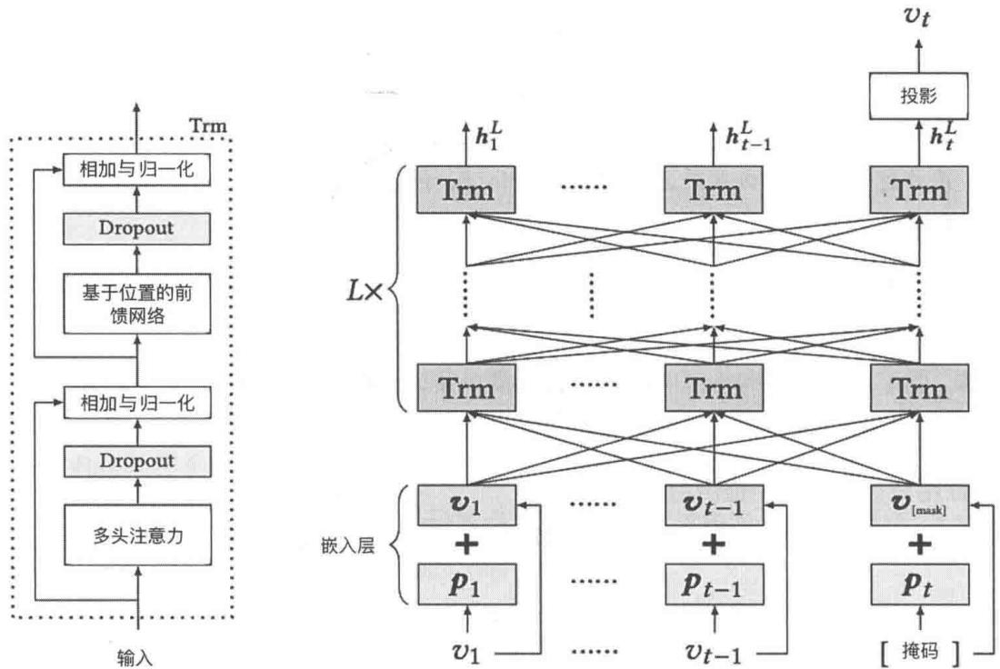  
图5-1Transformer架构（左）及对应的BERT4Rec架构（右）

图5-1右侧底部的 $v_{1}, v_{2}, \dots, v_{t - 1}$ 是新闻ID，上面的 $p_1, p_2, \dots, p_{t - 1}, p_t$ 和 $v_{1}, v_{2}, \dots, v_{t - 1}, v_{[\mathrm{mask}]}$ 分别是 $v_{1}, v_{2}, \dots, v_{t - 1}$ 对应的位置嵌入和ID嵌入表示。Trm是Transformer层。右上角的投影是分类层或者回归层，可以进行预测（例如预测下一个新闻），我们可以将投影层画完整，如图5-2所示。

  
图5-2 通过在Transformer中增加一层进行预测

BERT4Rec是相对早期的实现方案，架构不复杂，5.2节会讲解PTUM和P5这两个更复杂的架构。如果你有兴趣也可以阅读参考文献[2]中M6-Rec模型的架构，它是基于阿里达摩院的

M6大模型预训练的大模型推荐系统

# 5.1.3 大模型预训练

准备好预训练数据并确定了模型架构后，就可以对模型进行预训练了。目前有很多开源的框架提供了预训练的处理逻辑和对应的工具代码，我们可以非常方便地进行预训练。下面提供两种可行的预训练方案。

# 1. 基于 Transformers 库的预训练

Transformers库是HuggingFace社区开源的一个非常流行的处理大模型的框架，支持PyTorch、TensorFlow、JAX作为后端训练框架。GitHub社区中有预训练大模型的代码run_clm.py[3]，使用起来非常简单，下面是一个训练脚本。

```shell
python run_clm.py  
--model_name_or_path gpt2 \#预训练的模型类型，这里是gpt2  
--train_file path_to_train_file \#预训练数据文件  
--validation_file path_to_validation_file \#验证数据文件  
--config_overrides="n_embd=768, n_head=12, n_layer=12, n_positions=1024" \#模型参数  
--per_device_train_batch_size 8 \#预训练的batch_size  
--per_device_eval_batch_size 8 \#验证的batch_size  
--do_train \#需要进行预训练  
--do.eval \#需要进行验证  
--output_dir /tmp/test-clm #预训练好的模型的输出路径
```

在笔者的MacBookPro（M3Max芯片、16核CPU、40核GPU、128GB显存）上可以利用MPS（MetalPerformanceShaders）frontend进行预训练，40分钟左右可以训练3个epoch。上述代码也可以在英伟达的GPU上运行。

# 2. 基于苹果的MLX框架预训练

如果使用MacBook，那么还可以利用苹果开源的MLX机器学习框架[4]进行预训练③，这个框架是苹果的机器学习团队专为MacBook打造的，性能高于基于MPS的PyTorch，支持各种大模型的预训练和微调，并且有相当丰富的代码案例。

利用MLX进行预训练非常简单，下面是一个具体的案例，你可以从参考文献[5]中获得更多的案例，其中涵盖了主流的大模型。

```txt
python main.py \# main.py请参考参考文献[9] --gpu \#利用GPU进行预训练
```

```txt
--context_size 1024 \# 模型 token 的 context size  
--num_blocks 12 \ #Transformer块的个数  
--dim 768 \ #嵌入层和隐藏层的维数  
--num_heads 12 \ #Transformer模型的 multi-head 个数  
--checkpoint \ #需要进行 checkpoint，如果预训练过程中断，则可以从 checkpoint 恢复  
--num_iters 1000 \ #预训练迭代次数  
--learning_rate 3e-4 \ #模型的学习率  
--weight Decay 1e-5 \ #权重 decay 的幅度  
--lr_warmup 200 \ #LR linear warmup iterations  
--steps_per_report 3 \ #每3步打印loss  
--dataset wikitext2 #利用 wikitext2 数据预训练模型
```

上面只是简单提供了预训练大模型的两种可行方案，5.3节会基于MIND数据集，实现一个真正的推荐系统大模型的预训练。

上面两个案例在单个机器上预训练大模型，如果机器配置不高，模型参数较多，预训练的数据量比较大，预训练就会非常慢。如果你有多个显卡，需要加速预训练过程，或者模型太大，单个卡无法完成训练，那么可以使用一些大模型的分布式预训练的库，比较流行的库包括ColossalAI、DeepSpeed、Megatron-LM等，第9章会详细介绍。

# 5.1.4 大模型推理（用于推荐）

在完成大模型的预训练后，还需要进行推理才能让大模型用起来，即为用户生成个性化的推荐。推理的流程如图5-3所示，输入数据是用户行为（可能需要加上新闻文本、用户文本信息），输出是推荐结果，参见5.1.1节中的3种数据转换方式。

  
图5-3 利用预训练的推荐大模型进行推理的流程

在真实使用场景中，推理速度非常重要，目前有很多框架支持大模型的高性能推荐。比较流行的加速大模型推理的框架有 Transformers 库、llama.cpp（使用 C/C++ 推理，可以较好支持 MacBook）、vLLM（基于 CUDA 生态）、TensorRT-LLM（由英伟达开源，支持 CUDA 生态）、MLX 等。这里以 Transformers 库和 llama.cpp 为例说明如何提升推荐系统大模型的推理速度。

# 1. 使用 Transformers 库进行推理

Transformers库已经提供了非常丰富的生态用来对大模型进行推理，如果你预训练好了大模型，或者选定了开源的大模型，那么可以直接用Transformers库进行推理。下面是一个具体的代码案例，供你参考。

```python
from transformers import pipeline  
from transformers import AutoTokenizer, AutoModelForCausalLM 
```

from langchain.chain import LLMChain   
from langchain-community.llms.huggingfacepipeline import HuggingFacePipeline   
from langchain.prompts import PromptTemplate   
MODEL $=$ "/Users/1iuqiang/Desktop/code/llm/models/Yi-34B-Chat"#从HuggingFace上下载的模 #型，如果是利用上面步骤预训练的模型，则填写预训练模型的地址   
tokenizer $=$ AutoTokenizer.from_pretrained(MODEL)   
model $=$ AutoModelForCausalLM.from_pretrained(MODEL)   
pipe $=$ pipeline( "text-generation", model $\equiv$ model，#这是模型的具体存储路径 tokenizer $\equiv$ tokenizer, max_length=1024，#最大输入长度 temperature $= 0.1$ ，#温度参数 top_p=0.9，#top_p参数 repetition_penalty=1.15   
）   
llm $=$ HuggingFacePipeline(pipeline $\equiv$ pipe)   
prompt_template $=$ f"""" <指令>根据用户的新闻点击历史为用户进行个性化推荐，答案请使用中文 $<  /$ 指令>\n'<已知信息>{context}></已知信息>\n'#这里可以是用户的新闻点击历史 <问题>{question}></问题>\n' #例如问用户下一个会点击的新闻是什么   
""   
prompt $=$ PromptTemplate( input_variables $\coloneqq$ ["context","question"], template $\equiv$ prompt_template,   
）   
try: chain $=$ LLMChain(prompt $\equiv$ prompt，llm $\equiv$ llm) res $=$ chain.invoke(input $=$ {"context":context,"question":query}) except Exception as e: print(e) print(res)

# 2. 使用llama.cpp进行推理

llama.cpp 对 MacBook 支持较好，可以将大模型部分层的参数缓存到 GPU 上，因此能充分利用 MacBook 的 GPU，推理速度很快。推理的具体实现方式与上面类似，下面给出对应的代码案例。

```python
from langchain.chain import LLMChain  
from langchain-community.11ms import LlamaCpp  
MODEL = "/Users/luqiang/Desktop/code/11m/models/gguf/yi-34b-chat.Q5_K_M.gguf"  
# 模型地址，如果利用llama.cpp则需要使用gguf格式的大模型  
n_gpu_layers = 128 # 根据模型和GPU大小设置参数
```

```python
n_batch = 4096 # 可以设置为 1 到 nCtx 之间的任何值，根据计算机的 RAM 大小设置  
llm = LlamaCpp(  
    model_path=MODEL,  
    n_gpu_layers=n_gpu_layers,  
    n_batch=n_batch,  
    f16_kv=True, # 设置为 True，避免运行过程中遇到问题  
    temperature=0.1,  
    top_p=0.9,  
    nctx=10000,  
    verbose=True,  
    stop=[ "<|im_end|>" ] # 生成的答案中出现这些词就停止  
)  
prompt_template = f""  
    <指令>根据用户的新闻点击历史为用户进行个性化推荐，答案请使用中文 </指令>\n' <已知信息>{context}</已知信息>\n' # 这里可以是用户的新闻点击历史  
    <问题>{question}</问题>\n' #例如问用户下一个会点击的新闻是什么  
    ""  
prompt = PromptTemplate(  
    input_variables=[ "context", "question"],  
    template=prompt_template,  
)  
try:  
    chain = LLMChain(prompt=prompt, llm=llm)  
    res = chain.invoke(input={'context': context, "question": query})  
except Exception as e:  
    print(e)  
print(res)
```

上面是具体的推理步骤代码，在真实业务场景中还需要将大模型部署成服务，这可以使用FastAPI等Python Web框架实现，也可以采用开源的方案，例如SGLang、Lepton AI。大模型服务的相关内容将在工程实践部分讲解，这里不再赘述。

# 5.2 案例讲解

本节在5.1节的基础上延伸，重点讲解两个预训练大模型推荐系统的框架，让你可以更好地了解大模型推荐系统的架构特点及具体的实现方案。

# 5.2.1 基于PTUM架构的预训练推荐系统

PTUM是Pre-TrainingUserModel的缩写，指基于用户行为的预训练模型，模型的架构比较简单，如图5-4所示。PTUM同时利用掩码行为预测和后续行为预测，可以获得更好的泛化能力和预测效果，这一思路类似于1.3.1节提到的将语言建模过程作为微调的辅助目标，GPT-1就

是这样预训练的。下面分别对掩码行为预测和后续行为预测展开讲解。

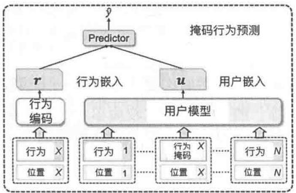

  
图5-4 PTUM的架构

# 1. 掩码行为预测

掩码行为预测（Masked Behavior Prediction，MBP）就是将用户行为序列中间的一个或者多个行为掩盖起来，然后建模预测掩盖的行为，类似BERT的建模思路。图5-4左侧的Predictor是预测函数 $\hat{y} = f(\pmb{u},\pmb{r})$ ，其中， $\pmb{u},\pmb{r}$ 分别是用户行为和待预测的item的嵌入向量，掩码预测的是左边行为 $X$ 的概率。 $f$ 可以是神经网络模型，也可以是简单的向量余弦相似度函数。由于用户行为的所有可能情况其实就是item的数量，因此预测用户的行为是一个多分类问题，所以可以采用交叉熵损失函数，具体如下。

$$
\mathcal {L} _ {\mathrm {M B P}} = - \sum_ {y \in \delta_ {1}} \sum_ {i = 1} ^ {P + 1} y _ {i} \lg \left(\widehat {y} _ {i}\right) \tag {5-1}
$$

上式中的 $S_{1}$ 是从用户行为构造的掩码预测训练数据集。 $y_{i}$ 和 $\widehat{y}_i$ 分别是掩码真实的和预测的label（itemID）的概率。 $P$ 是负样本的数量，针对每个掩码训练数据，从其他用户行为中随机抽取 $P$ 个item作为负样本。

# 2. 后续行为预测

后续行为预测（Next K Behaviors Prediction，NBP）基于用户过去的行为预测接下来的 $k$ 个行为，类似GPT系列模型中预测下一个单词出现的概率。图5-4中的 $\hat{y}_{N + 1}$ 和 $\hat{y}_{N + K}$ 与上面一样，是预测的后续item的概率，也可以是神经网络模型或向量余弦函数。损失函数还是采用交叉熵，具体如式（5-2）所示。

$$
\mathcal {L} _ {\mathrm {N B P}} = - \frac {1}{K} \sum_ {y \in \mathcal {S} _ {2}} \sum_ {k = 1} ^ {K} \sum_ {i = 1} ^ {P + 1} y _ {i, k} \ln \left(\hat {y} _ {i, k}\right) \tag {5-2}
$$

式（5-2）中的 $\mathcal{S}_2$ 是从用户行为构造的后续行为预测训练数据集， $y_{i,k}$ 和 $\hat{y}_{i,k}$ 分别是真实的和预测的后续第 $k$ 个行为是 item $i$ 的概率。这里 $P$ 也是负样本的个数。

将式（5-1）和式（5-2）结合起来，就得到了PTUM模型的损失函数，如式（5-3）所示，其中 $\lambda$ 是超参数，代表的是后续行为预测所占的权重，可以通过交叉验证的方式取一个合适的值。

$$
\mathcal {L} = \mathcal {L} _ {\mathrm {M B P}} + \lambda \mathcal {L} _ {\mathrm {N B P}} \tag {5-3}
$$

图5-4中既有行为嵌入也有位置嵌入，PTUM对item进行嵌入然后构建Transformer模型，item嵌入（编码）需要结合其他算法，例如GRU、BERT等。PTUM模型比较简单，这里不再赘述，可以通过参考文献[6]了解更多细节。

# 5.2.2 基于P5的预训练推荐系统

笔者认为，预训练个性化提示词预测框架[7]（Pretrain, Personalized Prompt, and Predict Paradigm, P5）是一个更加通用的、具有大模型精髓的框架，因此重点讲解。P5将五大类推荐问题统一在一个自然语言处理框架下，这样可以通过预训练一个模型一次性解决这5类问题，这正是大模型泛化能力的最好证明。图5-5给出P5解决的5类推荐问题及对应的模型预训练数据。

  
图5-5P5解决的5类推荐问题及对应的模型预训练数据

从图5-5中可以看到，P5不是完全意义上的自监督学习，评分预测、解释生成等是需要监督数据的，但是序列推荐可以基于用户行为构建自监督样本，然后“喂”给大模型。下面详细说明P5预训练的实现流程。

# 1. 预训练数据准备

P5基于不同的推荐类型构建对应的提示词模板（Prompt Template），然后对收集的推荐系统原始数据进行处理，最后按照定义好的模板组织数据，这样就可以构建大模型预训练需要的训练语料了。

根据参考文献[7]中设计的个性化提示词模板，通过原始数据构建输入-目标对，只需将提示词中的字段（大括号中的部分）替换为原始数据中的相应信息，P5预训练数据模板如图5-6所示。P5的5类任务的原始数据有三个独立的来源。具体而言，评分预测、评论摘要、推荐解释提示词具有共享的原始数据，见图5-6(a)。序列推荐（见图5-6(b)）和直接推荐（见5-6(c)）使用相似的原始数据，但序列推荐需要用户交互历史。

```txt
user_id:7641 user_name:stephanie item_id:2051 item_title:SHANY Nail Art Set(24 Fanouse Colors review:Absolutely great product.I bought this for my fourteen years old nice for Christmas and of course I had to try it out,then I tried another one,and another one and another one.So much fun!I even contemplated keeping a few for myself! starRating:5 explanation:Absolutely great product feature word:product 
```

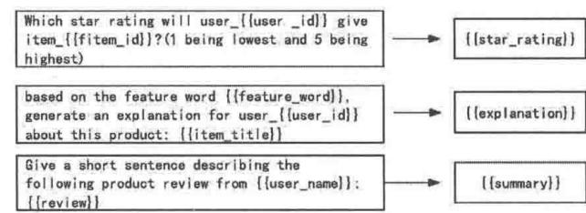

(a)

```txt
beauty数据集中的序列推荐
user_id: 7641, user_name: Victor
purchase_history: 652 -> 468 -> 447 -> 653 -> 654 -> 655 -> 656 -> 8
-> 657
next_item: 552
candidate_items: 4885, 4288, 4886, 1987, 879, 4281, 4222, 4887, 2892, 1982, 4888, 2829, 3147, 2195 
```


```txt
beauty数据集中的直接推荐user_id:250, user_name: moriah rose, target_item: 520random_negative_item:9711candidate_items:4915,1823,3112,3821,7469,9318,3876,1143,789,595,3773,3824,529,7384,3587 
```

  
图5-6 P5预训练数据模板

图5-6中中间是输入模板（Input Template），右侧是目标模板（Target Template）。例如，最后一行的输入模板和目标模板分别是：

```txt
输入模板：Choose the best item from the candidates to recommend for {{user_name}}? \n{candidate_items}  
目标模板：{{target_item}} 
```

这里只给出了几个简单的数据模板示例，参考文献[7]的附录中有完整的模板。5.3节的代

码案例会采用类似的思路处理，这里不再赘述。

# 2.P5的模型架构

个性化提示词集便于创建大量可用的预训练数据，这些数据涵盖了广泛的推荐任务。得益于提示词模板，所有预训练数据共享统一格式的输入-目标 token 序列，打破了不同任务之间的界限。在大模型“自然语言条件生成”的统一框架下，预训练多个推荐任务构建的统一数据集可以用于所有的单个推荐任务。

有了预训练的数据，下面就可以选择对应的模型架构了。P5将T5作为基底模型，包括一个小型模型和一个基础模型：6075万个参数的P5-small和2328万个参数的P5-base。P5预训练模型架构如图5-7所示。

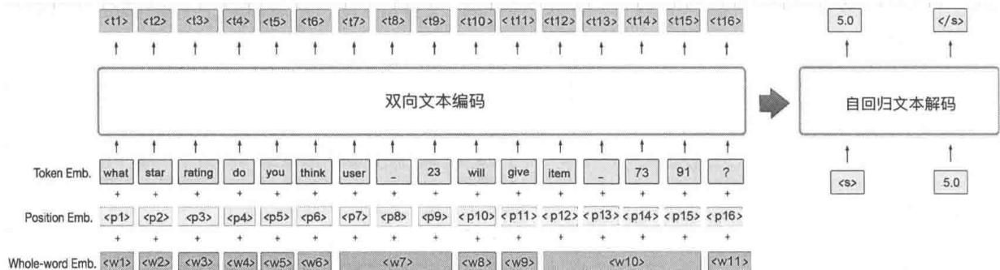  
图5-7 P5预训练模型架构

对于示例输入提示词“what star rating do you think user_23 will give item_7391?”，P5采用编码器-解码器框架：先用双向文本编码器对输入进行编码，再通过文本解码器自回归生成答案。

参考文献[7]还通过整词嵌入（whole-word embedding） $W$ 来指示连续的子词（sub-word）token 是否来自同一原始词。例如，如果直接将 ID 号为 7391 的 item 表示为 “item_7391”，则单词将被句子片段标记化（Sentence-Piece Tokenizer）拆分为 4 个独立的 token（item、、73、91）。在共享的整词嵌入(w10)的帮助下，可以将 item、、73、91 作为同一个词的信息整合到模型中，因此，P5 可以更好地识别具有个性化信息的部分。

与特定任务的推荐模型相比，P5依赖在大规模个性化提示词集上基于多任务提示词的预训练，这使得P5能够适应不同的推荐任务，甚至能推广/泛化到新的个性化提示词场景。

针对P5模型，采用预测下一个词的框架来构建模型，那么针对一条训练样本，损失函数可以按照式（5-4）定义，这里的 $X$ 是输入文本序列（上面提到的输入提示词）， $y_{<j}$ 代表生成的第 $1 \sim j - 1$ 个 token，然后预测第 $j$ 个 token $y_j$ ， $P_\theta$ 就是预测 $y_j$ 的概率。

$$
\mathcal {L} _ {\theta} ^ {p} = - \sum_ {j = 1} ^ {| y |} \ln P _ {\theta} (y _ {j} \mid y _ {<   j}, X) \tag {5-4}
$$

# 3.P5的预训练

有了数据和模型架构，预训练就比较容易了。P5的代码已经在GitHub上开源， Transformers库提供了模型预训练的函数和类。下面简单说明基于 Transformers库的预训练思路。

Transformers库的Trainer类提供了对大模型进行预训练的所有封装，可以进行预训练。下面是一个简单的代码示例，供你参考。

```python
from transformers import (
    T5Config,
    T5ForConditionalGeneration,
    AutoTokenizer,
    Trainer,
    TrainingArguments
)
config = T5Config.from_pretrained("t5-small")
model = T5ForConditionalGeneration.from_pretrained("t5-small", config=config)
tokenizer = AutoTokenizer.from_pretrained("t5-small")
args=TrainingArguments(
    warmup_steps=warmup_steps, # warmup步数
    num_train_epochs=epochs, #epochs数量
    learning_rate=lr, #学习率
    optim=optim, #优化方法
    evaluation_strategy="steps",
    save_strategy="steps",
    eval_steps=200,
    save_steps=200,
    output_dir=output_dir,
    save_total_limit=3,
    load_best_model_at_end=True
)
trainer = Trainer(
    model=model, #对应的模型
    args=training_args, #预训练相关参数，例如学习率等
    train_dataset=train_dataset, #预训练数据集
    eval_dataset=eval_dataset, #评估数据集，如果没有则填None
    tokenizer=tokenizer, #token
    compute.metrics=compute.metrics #评估的指标 
```

将上面的伪代码完善为一个具体的Python脚本train.py后，就可以利用PyTorch进行预训练了。下面是使用PyTorch在单机上启动多个进程进行预训练的示例，单机预训练耗时较长，

可以使用多个GPU进行加速。

```shell
torchrun --standalone \  
--nnodes=1 \#节点数量  
--nproc-per-node=4 \#启动4个进程运行  
train.py \#待预训练的模型脚本  
--datasets Beauty \#具体的数据集  
--epochs 10 \ #epochs数量  
--batch_size 128 \ #batch大小
```

上面是简单的实现思路，5.3节的代码案例也是基于T5架构实现的，会给出详细的代码实现过程。

# 4.P5的推理

预训练好的P5模型已经在HuggingFace社区开源（模型ID：makitanikaze/P5），本节使用该模型展示推理过程。

```python
# Use a pipeline as a high-level helper
from transformers import pipeline, T5ForConditionalGeneration, AutoTokenizer
model_path = "/Users/luqiang/Desktop/code/11m4rec/P5/snap/p5_beauty_base" # 下载后的本
# 地路径
model = T5ForConditionalGeneration.from_pretrained(model_path)
tokenizer = AutoTokenizer.from_pretrained(model_path)
tokenizer_pad_token_id = (
    0 # unk. we want this to be different from the eos token
) 
tokenizer(padding_side = "left"
generate_num = 3
prediction = model_generate(
    input_ids=input_ids,
# token后的，例如 input_ids = tokenizer("Considering {dataset} user-{user_id}
# has interacted with {dataset} items {history}. What is the next recommendation for the
# user ?
return_tensors="pt").input_ids
max_length=30, # 最大长度
num_beams=generate_num, # 集束搜索大小
num_return_sequences=generate_num, # 生成的数量
output Scores=True, # 返回生成的预测得分
return_dict_in_generate=True,
) 
```

运行上面代码，最终结果基于input_ids中的提示词预测用户接下来会购买的商品，如下所示。

```json
['Beauty item_1679', 'Beauty item_1668', 'Beauty item_1240', 'Beauty item_1263',...] 
```

# 5.3 基于MIND数据集的代码实战

本节以MIND数据集为例，进一步用代码实现大模型的预训练，手把手教你从零开始预训练一个自己的推荐系统大模型。

本节依然将T5作为基底模型，采用与P5类似的框架实现推荐大模型的预训练。

# 5.3.1 预训练数据集准备

我们基于P5模型预训练数据的格式来处理MIND数据集。

```c
U13740 N55189 N42782 N34694 N45794 N18445 N63302 N10414 N19347 N31801  
U73700 N10732 N25792 N7563 N21087 N41087 N5445 N60384 N46616 N52500 N33164 N47289 N24233  
N62058 N26378 N49475 N18870  
U34670 N45729 N2203 N871 N53880 N41375 N43142 N33013 N29757 N31825 N51891  
U79199 N37083 N459 N29499 N38118 N37378 N24691 N27235 N34694 N13137 N35022 N16617 N39762  
N35452 N58580 N1258 N24492 N31801 N43142 N14761 
```

上面的每行都代表一条样本。每行的第一个字符串是用户ID，后面的字符串是用户点击过的新闻ID，按照时间升序排列。为了模型更加精准，只保留点击了5条或更多新闻的用户。根据这一数据格式，可以使用MIND数据集的behaviors.tsv表，其中的User ID字段是用户ID，User Click History字段是用户点击过的历史新闻。

# 1.生成预训练的序列数据

可以使用 generate_user_sequence.py 函数将 behaviors.csv 表中的数据转换为上面的格式①。

import csv   
user_sequence_list $=$ []   
with open（'../data/mind/behaviors.csv'，'r') as file: reader $=$ csv-reader(file, delimiter $\coloneqq$ '\t') for row in reader: uid $=$ row[1] history $=$ row[3] if len(history.split("")) $> = 5$ ：#用户至少要有5次历史点击行为 r $=$ uid $^+$ " " $^+$ history user_sequence_list.append(r)

```python
user_sequence_path = "./data/mind/user_sequence.txt"  
with open(user_sequence_path, 'a') as file:  
    for r in user_sequence_list:  
        file.write(r + "\n") 
```

经过上述处理，我们就生成了用户行为序列数据，这个数据在代码仓库的路径是 /src/basic_tasks/train-llm/data/mind/user_sequence.txt。

# 2.生成预训练数据

为了更好地处理模型，需要将用户行为序列进行编码，我们为用户ID和新闻ID顺序编码，从第一个用户开始，逐个为用户的连续点击行为分配编号连续的ID。当一个用户迭代完成后，进入下一个用户的迭代过程，为任何尚未被分配的新闻分配一个新的、递增的ID。顺序编码方法仅用于预训练数据，以避免评估阶段的潜在数据泄露。

注意：user_sequence.txt中的每个用户点击的最后两个新闻会被用于测试和验证，不在预训练数据考虑之列。生成预训练数据的具体代码实现如下①。

```python
import os   
import json   
import sys   
import fire   
sys.path.append('../')   
from utils import sequential_indexing, load_prompt_template, check_task_prompt, get_info_from_prompt   
from utils import construct_user_sequence_dict, read_line   
def main(data_path: str, item_indexing: str, task: str, dataset: str, prompt_file: str, sequential_order: str, max_his: int, his SEP: str, his_prefix: int, skip_empty_his: int): file_data = dict() file_data['arguments'] = { "data_path": data_path, "item_indexing": item_indexing, "task": task, "dataset": dataset, "prompt_file": prompt_file, "sequential_order": sequential_order,"max_his": max_his, "his SEP": his SEP, "his_prefix": his_prefix, "skip_empty_his": skip_empty_his } file_data['data'] = [] tasks = list(task) user_sequence = read_line(os.path.join(data_path, dataset, 'user_sequence.txt')) user_sequence_dict = construct_user_sequence_dict(user_sequence) reindex_user_seq_dict, item_map = sequential_indexing(data_path, dataset, user_sequence_dict, sequential_order) # get prompt prompt = load_prompt_template(prompt_file, tasks) info = get_info_from_prompt(prompt) check_task_prompt(prompt, tasks) # Load training data samples training_data_samples = [] 
```

for user in reindex_user_seq_dict: items $=$ reindex_user_seq_dict[user] $\vdots$ -2] for i in range(len(items)): if i $= = 0$ .. if skip_empty_his $>0$ .. continue one_sample $=$ dict() one_sample['dataset'] $=$ dataset one_sample['user_id'] $=$ user if his_prefix $>0$ .. one_sample['target'] $=$ 'item_ $^+$ items[i] else: one_sample['target'] $=$ items[i] if 'history' in info: history $=$ items[:i] if max_his $>0$ .. history $=$ history[-max_his:] if his_prefix $>0$ .. one_sample['history'] $=$ his SEP.join(['item_ $^+$ itemidx for item idx in history]) else: one_sample['history'] $=$ his SEP joinsheet history) training_data_samples.append(one_sample) print("load training data") print(f'there are {len(trainng_data_samples)} samples in training data.') # construct sentences for i in range(len(trainng_data_samples)): one_sample $=$ training_data_samples[i] for t in tasks: datapoint $=$ {'task': dataset + t, 'data_id': i} for pid in prompt[t]['seen']: datapoint['instruction'] $=$ prompt[t]['seen']. [pid]['Input'] datapoint['input'] $=$ prompt[t]['seen']. [pid]['Input'].format(**one_sample) datapoint['output'] $=$ .   
prompt[t]['seen']. [pid]['Output'].format(**one_sample) file_data['data'].append(datapoint.copy())   
print("data constructed") print(f"there are {len(file_data['data'])} prompts in training data.") # save the data to json file output_path $=$ f'\{dataset\}_\{task\}_\{item_indexing\}_train.json' with open(os.path.join(data_path, dataset, output_path), 'w') as openfile: json.dump(file_data, openfile)   
if_name $= =$ "" main": fire.Fire(main)

上面的代码会依赖一些辅助函数，这些函数存放在代码仓库/src/basic_tasks/train-llm/util.py中，你可以自己查看，这里不再赘述。后续代码中没有定义的函数都在utils.py中，不再说明。我们可以通过下面的脚本运行上面的程序。

```shell
python generate_dataset_train.py --data_path
/Users/liuqiang/Desktop/code/11m4rec/11m4rec_abc/src/train-11m/data/
--item_indexing sequential --task sequential, straightforward --dataset mind
--prompt_file ../prompt.txt \
--sequential_order original --max HIS 10 --his sep ', ' --his_prefix 1 --skip_empty_his 
```

表5-1给出了generate_dataset_train.py脚本的参数说明。注意，这里通过Python的fire包将参数注入代码。

表 5-1 generate_dataset_train.py 脚本的参数说明  

<table><tr><td>参 数</td><td>说 明</td></tr><tr><td>data_path</td><td>数据目录</td></tr><tr><td>item_indexing</td><td>新闻的索引方式，这里采用 sequential，是顺序索引</td></tr><tr><td>task</td><td>推荐任务，提供序列（sequential）推荐和直接（straightforward）推荐两种方式</td></tr><tr><td>dataset</td><td>这里采用 MIND 数据集</td></tr><tr><td>prompt_file</td><td>提示词模板文件</td></tr><tr><td>sequential_order</td><td>按照用户在文件 user_sequence.txt 中本来的顺序对用户索引</td></tr><tr><td>max_his</td><td>预训练时用户的历史取 max_his，这里是 10，也就是只用最近的 10 个点击行为预训练模型</td></tr><tr><td>his SEP</td><td>用户历史的分隔符，本节用逗号</td></tr><tr><td>his_prefix</td><td>历史中是否加前缀，1 代表是。如果一个新闻的索引是 1023，那么加前缀就是 item_1023</td></tr><tr><td>skip_empty_his</td><td>是否跳过历史为空的用户，1 代表是，也就是历史为空的用户不会用于预训练模型</td></tr></table>

运行 generate_dataset_train.py 脚本会生成 4 个文件，表 5-2 分别解释说明。

表 5-2 运行 generate_dataset_train.py 脚本后生成的文件  

<table><tr><td>文件名</td><td>解释说明</td></tr><tr><td>itemsequential_indexing-original.txt</td><td>新闻ID索引，从1001开始</td></tr><tr><td>user_indexing.txt</td><td>用户ID索引，从1开始</td></tr><tr><td>user_sequencesequential_indexingoriginal.txt</td><td>将最原始的user_sequence.txt数据的用户ID和新闻ID替换成索引后的数据</td></tr><tr><td>mind('sequential','straightforward')_sequential_train.json</td><td>大模型预训练数据。这个数据是JSON格式的数据格式如下{"arguments":"data_path":"Users/luqiang/Desktop/code/llm4rec/llm4rec_abc/src/train-llm/data/"item_indexing":"sequential","task":[ "sequential", "straightforward"], "dataset": "mind", "prompt_file":[ "/prompt.txt", "sequential_order": "original", "max_his": 10, "his SEP":[ "has", "his_prefix": 1, "skip_empty_his": 1}, "data": ["task":[ "mindsequential", "data_id": 0, "instruction": "Considering {dataset}] user {_user_id} has interacted with {dataset} items {history}. What is the</td></tr><tr><td></td><td>next recommendation for the user ?, "input": "Considering mind user_1 has interacted with mind items item_1001 . What is the next recommendation for the user ?, "output": "mind item_1002"}\}</td></tr></table>

表5-2最后一行右边的预训练数据案例中包含instruction和input。instruction是提示词模板，input是通过将用户行为数据（user_sequencesequential_indexing-original.txt）替换为提示词模板中的参数获得的。提示词模板有22个，具体如下。

```txt
(1) sequential; seen; Considering {dataset} user\_user_id} has interacted with {dataset} items {history}. What is the next recommendation for the user ?; {dataset} {target} (2) sequential; seen; Here is the purchase history of {dataset} user\_user_id : {dataset} item {history}. I wonder what is the next recommended item for the user .; {dataset} {target} (3) sequential; seen; {dataset} user\_user_id} has purchased {dataset} items {history}, predict next possible item to be bought by the user ?; {dataset} {target} (4) sequential; seen; I find the purchase list of {dataset} user\_user_id : {dataset} items {history}, I wonder what other itmes does the user need. Can you help me decide ?; {dataset} {target} (5) sequential; seen; According to what items {dataset} user\_user_id} has purchased : {dataset} items {history}, Can you recommend another item to the user ?; {dataset} {target} (6) sequential; seen; What would {dataset} user\_user_id} be likely to purchase next after buying {dataset} items {history}?; {dataset} {target} (7) sequential; seen; By analyzing the {dataset} user\_user_id' s purchase of {dataset} items {history}, what is the next item expected to be bought ?; {dataset} {target} (8) sequential; seen; Can you recommend the next item for {dataset} user\_user_id, given the user 's purchase of {dataset} items {history}?; {dataset} {target} (9) sequential; seen; After buying {dataset} items {history}, what is the next item that could be recommended for {dataset} user\_user_id?; {dataset} {target} (10) sequential; seen; The {dataset} user\_user_id} has bought items : {dataset} items {history}, What else do you think is necessary for the user ?; {dataset} {target} (11) sequential; unseen; What is the top recommended item for {dataset} user\_user_id} who interacted with {dataset} item {history}?; {dataset} {target} (12) straightforward; seen; What should we recommend for {dataset} user\_user_id?; {dataset} {target} (13) straightforward; seen; {dataset} user\_user_id} is looking for some items. Do you have any recommendations ?; {dataset} {target} (14) straightforward; seen; Do you have any suggested items for {dataset} user\_user_id? ;{dataset} {target} (15) straightforward; seen; Which recommendation should we provide to {dataset} user\_user_id? ;{dataset} {target} (16) straightforward; seen; How can we assist {dataset} user\_user_id} with a recommendation ?; {dataset} {target} (17) straightforward; seen; What would be a suitable recommendation for {dataset} user\_user_id? ;{dataset} {target} (18) straightforward; seen; What would be a helpful recommendation for {dataset} user\_user_id? ;{dataset} {target} (19) straightforward; seen; Can you recommend an item for {dataset} user\_user_id? ;{dataset} {target} 
```

```javascript
(20) straightforward; seen; Based on {dataset} user\_user_id' s interests and requirements, what item would you suggest to try ?; {dataset} {target} (21) straightforward; seen; For {dataset} user\_user_id, what item stands out as a top recommendation that they should consider ?; {dataset} {target} (22) straightforward; unseen; What is the top recommendation for {dataset} user\_user_id ?; {dataset} {target} 
```

表5-3对提示词中的几个字段进行说明，方便你更好地理解提示词和相关代码。

表 5-3 提示词字段说明  

<table><tr><td>字段</td><td>说明</td></tr><tr><td>sequential</td><td>sequential 指序列推荐，也就是基于用户的点击历史，预测他接下来要点击的新闻</td></tr><tr><td>straightforward</td><td>straightforward 是直接推荐，也就是不告诉模型用户的点击历史，预测用户下一个要点击的新闻</td></tr><tr><td>seen</td><td rowspan="2">从每个任务中，选择一个提示词模板作为可见/不可见提示词（在预训练集中没有相关模板构建的数据），用于评估模型的零样本泛化能力</td></tr><tr><td>unseen</td></tr><tr><td>dataset</td><td>预训练模型的数据集，这里采用的是 MIND 数据集，在代码中用小写</td></tr><tr><td>user_id</td><td>用户 ID，具体会根据用户行为序列填充提示词，形成预训练数据</td></tr><tr><td>history</td><td>用户过去的新闻点击历史</td></tr><tr><td>target</td><td>预测用户下一个要点击的新闻</td></tr></table>

# 3.生成测试、验证数据

有了上面的训练数据就可以对推荐大模型进行预训练了。为了更好地评估预训练好的大模型，还需要生成测试和验证数据，下面给出具体的代码实现①。

```python
import os   
import json   
import sys   
import fire   
sys.path.append('../')   
from utils import sequential_indexing, load_prompt_template, check_task_prompt, get_info_from_prompt   
from utils import construct_user_sequence_dict, read_line, load_test, load_validation   
def main(data_path: str, item_indexing: str, task: str, dataset: str, prompt_file: str, sequential_order: str, max_his: int, his SEP: str, his_prefix: int, skip_empty_his: int, mode: str, prompt: str): file_data = dict() file_data['arguments'] = { "data_path": data_path, "item_indexing": item_indexing, "task": task, "dataset": dataset, "prompt_file": prompt_file, "sequential_order": 
```

```python
sequential_order, "max_his": max_his, "his SEP": his SEP, "his_prefix": his_prefix, "skip_empty_his": skip_empty_his, "mode": mode, "prompt": prompt } file_data['data'] = [] tasks = list(task) user_sequence = read_line(os.path.join(data_path, dataset, 'user_sequence.txt')) user_sequence_dict = construct_user_sequence_dict.user_sequence) reindex_user_seq_dict, item_map = sequential_indexing(data_path, dataset, user_sequence_dict, sequential_order) # get prompt prompt_ = load_prompt_template(prompt_file, tasks) info = get_info_from_prompt(prompt_) check_task_prompt(prompt_, tasks) # Load data samples if mode == 'validation': data_samples = load_validation(reindex_user_seq_dict, info, dataset, his_prefix, max_his, hisSEP) prompt_info = prompt.split(:') output_path = f{'dataset}{task} {item_indexing} validation {'prompt}.json' elif mode == 'test': data_samples = load_test(reindex_user_seq_dict, info, dataset, his_prefix, max_his, his SEP) prompt_info = prompt.split(:') output_path = f{'dataset}{task} {item_indexing} test {'prompt}.json' else: raise NotImplementedError # construct sentences for i in range(len(data_samples)): one_sample = data_samples[i] for t in tasks: datapoint = {'task': dataset + t, 'instruction': prompt_[t][prompt_info[0]][prompt_info[1]]['Input'], 'input': prompt_[t][prompt_info[0]][prompt_info[1]]['Input'].format(**one_sample), 'output': prompt_[t][prompt_info[0]][prompt_info[1]]['Output'].format(**one_sample)} file_data['data'].append(datapoint.copy()) with open(os.path.join(data_path, dataset, output_path), 'w') as openfile: json.dump(file_data, openfile) if __name__ == __main__:" fire.Fire (main) 
```

代码中出现了两个新的参数，表5-4给出它们的解释。

表 5-4 代码中两个新参数的解释  

<table><tr><td>参 数</td><td>说 明</td></tr><tr><td>mode</td><td>mode 只有两个取值: test 和 validation, 分别表示生成测试数据和验证数据</td></tr><tr><td>prompt</td><td>prompt 的取值也有两个: seen:0 和 unseen:0</td></tr></table>

可以通过如下脚本生成测试数据。

```txt
python generate_dataset_eval.py --dataset mind --data_path
/Users/luqiang/Desktop/code/11m4rec/11m4rec_abc/src/train-11m/data/
--item_indexing sequential --task sequential,straightforward --prompt_file
/Users/luqiang/Desktop/code/11m4rec/11m4rec_abc/src/train-11m/prompt.txt
--mode validation --prompt seen:0 --sequential_order original --max_his 10 --his sep',
	' --his_prefix 1 --skip_empty_his 1
python generate_dataset_eval.py --dataset mind --data_path
/Users/luqiang/Desktop/code/11m4rec/11m4rec_abc/src/train-11m/data/
--item_indexing sequential --task sequential,straightforward --prompt_file
/Users/luqiang/Desktop/code/11m4rec/11m4rec_abc/src/train-11m/prompt.txt
--mode test --prompt seen:0 --sequential_order original --max_his 10 --his sep',
	' --his_prefix 1 --skip_empty_his 1
python generate_dataset_eval.py --dataset mind --data_path
/Users/luqiang/Desktop/code/11m4rec/11m4rec_abc/src/train-11m/data/
--item_indexing sequential --task sequential,straightforward --prompt_file
/Users/luqiang/Desktopcode/11m4rec/11m4rec_abc/src/train-11m/prompt.txt
--mode test --prompt unseen:0 --sequential_order original --max_his 10 --his sep',
	' --his_prefix 1 --skip_empty_his 1 
```

上面的3个脚本最终会生成3个JSON格式的数据，其中包括2个测试数据、1个验证数据（在代码仓库的/src/basic_tasks/train-llm/data目录下）。表5-5进行了说明。

表 5-5 测试数据和验证数据说明  

<table><tr><td>文件名</td><td>解释说明</td></tr><tr><td>mind_(sequential&#x27;, &#x27;straightforward&#x27;)sequential_test Seen:0.json</td><td>seen 的测试数据</td></tr><tr><td>mind_(sequential&#x27;, &#x27;straightforward&#x27;)sequential_test_unseen:0.json</td><td>unseen 的测试数据</td></tr><tr><td>mind_(sequential&#x27;, &#x27;straightforward&#x27;)sequential_validation Seen:0.json</td><td>seen 的验证数据</td></tr></table>

# 5.3.2 模型预训练

我们的新闻推荐模型基于T5架构，可以直接利用T5的基底模型和config，下面是预训练的代码①。

```txt
import os  
import fire 
```

import transformers   
from datasets import load_dataset   
from transformers import ( T5Config, T5ForConditionalGeneration, AutoTokenizer, Trainer, TrainingArguments)   
def main (backbone: str, data_path: str, item_indexing: str, task: str, dataset: str, valid_prompt: str, cutoff: int, model_dir: str, batch_size: int, valid_select: int, epochs: int, lr: float, warmup_steps: int, gradient Accumulation_steps: int, logging_steps: int, optim: str, eval_steps: int, save_steps: int, save_total_limit: int): config = T5Config.from_pretrained(backbone) model = T5ForConditionalGeneration.from_pretrained(backbone, config=config) tokenizer = AutoTokenizer.from_pretrained(backbone) train_data_file = os.path.join(data_path, dataset, f{'dataset}{task}{item_indexing}train.json') valid_data_file = os.path.join(data_path, dataset,   
f{'dataset}{task}{item_indexing}_{validation}(valid_prompt).json') train_data = load_dataset("json", data_files $\equiv$ train_data_file, field $\equiv$ 'data') valid_data = load_dataset("json", data_files $\equiv$ valid_data_file, field $\equiv$ 'data') def tokenizerprompt, add_eos_token=True): result $=$ tokenizer( prompt, truncation $\equiv$ True,max_length=cutoff,padding $\equiv$ False,rereturn_tensors $\equiv$ None, if (isinstance(result["input_ids"][-1], int) and result["input_ids"][-1] != tokenizer.eos_token_id and len(result["input_ids"]） < cutoff and add_eos_token ): result["input_ids"].append(tokenizer.eos_token_id) result["attention_mask"].append(1) elif isinstance(result["input_ids"][-1], list) and add_eos_token: for i in range(len(result['input_ids'])) if result["input_ids"] [i] [-1] != tokenizer.eos_token_id and len(result["input_ids"] [i]) < cutoff: result["input_ids"] [i].append(tokenizer.eos_token_id) result["attention_mask"].append(1) result["labels"] $=$ result["input_ids"].copy() return result   
def process_func (datapoint): encoding $=$ tokenizer datapoint['input'], add_eos_token $\equiv$ True) labels $=$ tokenizer datapoint['output'], add_eos_token $\equiv$ True) encoding['labels'] $=$ labels['input_ids'].copy() # return encoding return {**datapoint, **encoding}   
tokenizer_pad_token_id $=$ ( 0 # unk. we want this to be different from the eos token

}   
tokenizer(paddingSide $=$ "left"   
train_set $\equiv$ train_data['train'].shuffle().map(process_func,batched=True)   
valid_set $\equiv$ valid_data['train'].shuffle().map(process_func,batched=True)   
output_dir $\equiv$ os.path.join(model_dir,dataset, item_indexing, backbone)   
trainer $\equiv$ Trainer(   
model $\equiv$ model,   
train_dataset $\equiv$ train_set,   
eval_dataset $\equiv$ valid_set if valid_select $>0$ else None,   
args $\equiv$ TrainingArguments(   
per_device_train_batch_size=batch_size,   
gradient Accumulation_steps $\equiv$ gradientaccumulation_steps,   
warmup_steps $\equiv$ warmup_steps,   
num_train_epochs $\equiv$ epochs,   
learning_rate $\equiv$ lr,   
logging_steps $\equiv$ logging_steps,   
optim $\equiv$ optim,   
evaluation_strategy $\equiv$ "steps"if valid_select $>0$ else "no", save_strategy $\equiv$ "steps",   
eval_steps $\equiv$ eval_steps if valid_select $>0$ else None, save_steps $\equiv$ save_steps,   
output_dir $\equiv$ output_dir,   
save_total_limit $\equiv$ save_total_limit,   
load_best_model_at_end $\equiv$ True if valid_select $>0$ else False, group_by_length $\equiv$ False,   
),   
data_collator $\equiv$ transformers.DataCollatorForSeq2Seq(   
tokenizer, pad_to_multiple_of $= 8,$ return_tensors="pt", padding $\equiv$ True ),   
)   
trainer.train() # 模型预训练   
model.save_pretrained(output_dir) # 保存预训练好的模型   
tokenizer.save_pretrained(output_dir) # 保存 token

这里又出现了一些新的参数，如表5-6所示

表 5-6 模型预训练代码参数说明  

<table><tr><td>参 数</td><td>说 明</td></tr><tr><td>backbone</td><td>基底模型，这里是 t5-small</td></tr><tr><td>valid_prompt</td><td>验证的 prompt，这里取 seen:0</td></tr><tr><td>cutoff</td><td>数据超过这个长度就截断</td></tr><tr><td>model_dir</td><td>预训练好的模型存储路径</td></tr><tr><td>batch_size</td><td>每一批次处理多少个数据</td></tr><tr><td>valid_select</td><td>是否利用验证集的 loss 选择模型</td></tr><tr><td>epochs</td><td>预训练的数据跑多少轮</td></tr><tr><td>lr</td><td>模型的学习率</td></tr><tr><td>warmup_steps</td><td>经过多少步学习率逐步增加到预设的最大值</td></tr><tr><td>gradient Accumulation_steps</td><td>经过多少步更新梯度</td></tr><tr><td>logging_steps</td><td>迭代多少次</td></tr><tr><td>optim</td><td>梯度下降的优化器</td></tr><tr><td>eval_steps</td><td>迭代多少次进行一次评估</td></tr><tr><td>save_steps</td><td>迭代多少次进行一次 checkout</td></tr><tr><td>save_total_limit</td><td>一共 checkout 多少次</td></tr></table>

需要注意的是，数据在放入模型进行预训练时需要 token 化，这就是上面代码中的 tokenizer 和 process_func 两个函数所做的工作。有了这些准备工作，就可以将相关参数传入 Transformers 库的 Trainer 类中进行预训练了，可以用下面的脚本进行预训练。

```shell
#!/bin/bash
dir_path="../logs/mind/"  
if [ ! -d "$dir_path" ]; then
    mkdir -p "$dir_path"
fi  
PYTORCH_ENABLE_MPS_FALLBACK=1 torchrun t5_pre-train.py --item_indexing sequential \
--task sequential, straightforward --dataset mind --epochs 1 --batch_size 1024 \
--backbone t5-small --cutoff 1024 --data_path
/Users/liuqiang/Desktop/code/llm4rec/llm4rec_abc/src/train-llm/data \
--valid_prompt seen:0 --model_dir
/Users/liuqiang/Desktop/code/llm4rec/llm4rec_abc/src/train-llm/models \
--lr le-3 --valid_select 1 --warmup_steps 100 --gradient Accumulation_steps 10
--logging_steps 10 --optim 'adamw_torch' \
--eval_steps 200 --save_steps 200 --save_total_limit 3
```

在我的计算机上预训练以上脚本需要24小时左右，时间非常长（这还是epochs=1的时候）。预训练完成后模型会被保存起来，预训练好的模型包含图5-8中的文件，其中checkpoint-800表示在预训练过程中训练了800个batch之后将模型参数保存下来，以便后续预训练出现问题时从checkpoint开始训练。以.json结尾的是一些模型配置参数，其他两个比较大的文件（model.safetensors和spiece.model）是模型相关参数。

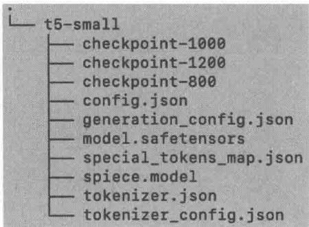  
图5-8 预训练后的模型文件

# 5.3.3 模型推理与验证

按照上面的步骤预训练好模型后，就可以利用测试数据集进行验证了，通过推理来检验推荐模型的效果。下面是具体的代码实现①。

```python
import os
import logging
import fire
from torch.utils.data import DataLoader
from datasets import load_dataset
from tqdm import tqdm
import sys
import numpy as np
from transformers import (
    T5ForConditionalGeneration,
    AutoTokenizer,
)
sys.path.append('/../')
from utils import EvaluationDataset, evaluation_results, get.metrics_results
def main(log_dir: str, checkpoint_path: str, data_path: str, item_indexing: str, task:
    dataset: str, cutoff: int, test_prompt: str, eval_batch_size: int, metrics: str):
        # setup
        log_file = os.path.join(log_dir, dataset,
                    checkpoint_path.replace('./', '*').replace('/',ania)+'.log')
    for handler in logging.roothandlers[1]:
        logging.root.removeHandler(handle]
        logging/basicConfigfilename=log_file, level=logging.INFO,
                        format='%%(asyst) s-%(name)s-%(levelname)s-%(message)s')
        logging.getLogger().addHandler(logging_STREAMHandler(sys.stdout))
        model = T5ForConditionalGeneration.from_pretrained(checkpoint_path)
        tokenizer = AutoTokenizer.from_pretrained(checkpoint_path)
        tokenizer_pad_token_id = (
            0 # unk. we want this to be different from the eos token
        )
        tokenizer(paddingSide='left'
        # load test data
        test_data_file = os.path.join(data_path, dataset,
f'\{dataset\}_{\{task\}}_{\{item_indexing\}}_test_{\{test_prompt\}.json')
        logging.info("test_data_file=" + test_data_file)
        test_data = load_dataset("json", data_files=test_data_file, field='data')
        model.eval()
        metrics = list(metrics)
        generate_num = max([int(m.split '@') [1]) for m in metrics])
        task_list = np.unique(test_data['train'] ['task']) 
```

subset_data $=$ test_data.filter( lambda example:example['task'] $\equiv = t$ dataset $=$ EvaluationDataset(subset_data['train'],tokenizer,cutoff) dataloader $=$ DataLoader(dataset，batch_size=eval_batch_size，shuffle=False) test_total $= 0$ metrics_res $=$ np.array([0.0] \*len(metrics)) for batch in tqdm(dataloader): "" 下面是一个batch的案例： {'input_ids':tensor([[3,21419,12587,...,0,0,0], ...， [3,21419,12587,...,0,0,0]]）， 'attention_mask': tensor([[1,1,1,...,0,0,0], ...， [1,1,1,...,0,0,0]]）,'label': tensor([[12587,2118,834,22504,2577,1,0], [12587,2118,834,19993,4867,1,0], ...， [12587,2118,834,19993,5062,1,0]])} """ prediction $=$ model_generate（#大模型生成函数 input_ids $\coloneqq$ batch["input_ids"], #torch.LongTensor of shape (batch_size, sequence_length) attention_mask $\coloneqq$ batch["attention_mask"], #torch FloatTensor of shape (batch_size， sequence_length) max_length $= 30$ num_beams $\coloneqq$ generate_num, num_return_sequences $\coloneqq$ generate_num, output Scores $\coloneqq$ True, return_dict_in_generate $\coloneqq$ True, ） outputids $=$ batch['label'] prediction_ids $=$ prediction["sequences"] #利用大模型进行预测输出的向量化表示， 需要解码 prediction Scores $=$ prediction["sequences Scores"] gold_sents $=$ tokenizer.batch Decode（#用户真实的点击记录 output_ids，skip_special_tokens=True ） generated_sents $=$ tokenizer.batchdecode（#大模型预测的点击记录 prediction_ids，skip_special_tokens=True ） #生成的推荐列表结构：['mind item_1679'，'mind item_2837'，'mind item_1089'， 'mind item_1240'] rel_results $=$ evaluation_results(generated_sents,gold_sents, prediction Scores，generate_num) test_total $+ =$ len(rel_results) metrics_res $+ =$ get.metrics_results(rel_results，metrics) metrics_res $/ =$ test_total for i in range(len(metrics)): logging.info(f'\{metrics[i]:\{metrics_res[i]\}')

```python
if __name__ == "main": fire.Fire(main) 
```

表5-7对新出现的参数给出了解释

表 5-7 模型推理代码参数说明  

<table><tr><td>参数</td><td>说明</td></tr><tr><td>test_prompt</td><td>取 seen:0 和 unseen:0 两个值，分别用前面讲到的 mind_&#x27;sequential&#x27;, &#x27;straightforward&#x27;)_sequential_test Seen:0.json 和 mind_&#x27;sequential&#x27;, &#x27;straightforward&#x27;)_sequential_test_unseen:0.json 数据集验证模型的效果</td></tr><tr><td>eval_batch_size</td><td>多少步计算一次评估指标</td></tr><tr><td>metrics</td><td>评估模型效果的度量指标，本章使用 hit@5、hit@10、ndcg@5 和 ndcg@10 这 4 个度量指标（utils.py 中有具体的代码）</td></tr></table>

下面的两个脚本分别评估表5-7中的两个测试数据集。

```shell
python t5 Evaluate.py --dataset mind --task sequential, straightforward --item_indexing sequential --backbone t5-small \  
--checkpoint_path /Users/luqiang/Desktop/code/11m4rec/11m4rec_abc/src/train-11m/ models/mind/sequential/t5-small \  
--test_prompt seen:0 --log_dir '.../logs' \  
--data_path /Users/luqiang/Desktop/code/11m4rec/11m4rec_abc/src/train-11m/data \  
--cutoff 1024 --eval_batch_size 32 --metrics hit@5,hit@10,ndcg@5,ndcg@10  
python t5 Evaluate.py --dataset mind --task sequential, straightforward --item_indexing sequential --backbone t5-small \  
--checkpoint_path /Users/luqiang/Desktop/code/11m4rec/11m4rec_abc/src/train-11m/models/mind/sequential /t5-small \  
--test_prompt unseen:0 --log_dir '.../logs' \  
--data_path /Users/luqiang/Desktop/code/11m4rec/11m4rec_abc/src/train-11m/data \  
--cutoff 1024 --eval_batch_size 32 --metrics hit@5,hit@10,ndcg@5,ndcg@10 
```

运行上面的代码，获得的评估指标如下。

```txt
hit@5: 0.010642579260385459 
```

```txt
hit@10: 0.020659124446630595 
```

```txt
ndcg@5:0.006426694605760801 
```

```txt
ndcg@10:0.00965856762769121 
```

# 5.4 总结

本章讲解利用大模型预训练原生的推荐系统的思路和方法。由于推荐系统自身的数据特性①，其在数据准备和模型选择上与常规的大模型有一定差异。

为了套用大模型的自监督学习进行预训练，可以采用3种方式准备数据：直接利用用户行为序列、将用户行为序列ID转为相关的文本、在用户行为序列中整合用户的特征。推荐系统的数据量与互联网上的海量的文本还有很大差距，因此在架构选择上可以采用BERT、GPT1、GPT2、T5等参数规模在几百万个到几亿个的大模型。

利用大模型进行预训练的方式虽然实现了个性化推荐，但由于模型规模较小，其泛化能力、指令跟随能力较弱，笔者更推荐基于已经预训练好的更大的大模型，利用推荐系统相关数据进行微调的方案，这是下一章的主题。

本章还讲解了开源的预训练推荐系统框架PTUM和P5的核心思想。其中，P5的适用范围更广，能够很好地利用大模型进行自然语言推理，并且可以泛化到多个推荐场景，希望你可以认真阅读P5相关的参考资料，真正掌握该框架的本质。

P5预训练的模型框架是基于T5的，P5最大的创新在于将5类推荐任务统一在同一个范式下，这样可以获得如下两个好处。

一是可以获得更多的预训练数据。大量的预训练数据正是让大模型强大的基础，P5将5类数据一起使用，弥补了推荐系统数据量少的不足，因此可以将比BERT更大的模型（T5）作为基底模型。

二是将5类推荐任务统一在一个范式下，一次预训练就可以解决5类问题，因此P5是一个多任务学习系统。同时，由于P5是基于大模型进行预训练的，因此还具备了大模型的zero-shot的能力。

本章基于T5框架，参考OpenP5的代码实现，一步步展示了如何从零开始预训练一个专为推荐系统服务的大模型。通过对本章的学习，你一定能深刻体会到一个大模型从数据处理到预训练完成再到推理评估的不易。我们一起见证了一个较小的大模型的诞生过程，这是一件非常有成就感的事情！

# 06

# 微调范式：微调大模型进行个性化推荐

本章讲解如何基于微调大模型的范式进行个性化推荐，也就是基于推荐系统独特的数据（例如用户行为数据）构建训练样本，然后通过监督学习的思路对已有的开源大模型进行参数微调，让大模型更加适配个性化推荐任务。

本章聚焦微调大模型，6.1节介绍微调的价值、步骤、方法、困难与挑战；6.2节通过两个具体的案例说明如何微调大模型进行个性化推荐，以便你更好地理解微调大模型进行推荐的算法原理和应用场景；6.3节基于MIND数据集给出实现微调的代码。

# 6.1 微调的方法

微调大模型是大模型中非常重要的主题，也有一定的技术门槛，本节先梳理微调相关的知识点，方便你进行后续案例和代码的学习。

# 6.1.1 微调的价值

大模型是基于海量文本数据进行预训练的，当训练数据和模型规模足够大具备涌现能力时，大模型就具备了一定的解决下游任务的能力，例如文本生成、摘要、翻译，甚至是代码、逻辑推理。但推荐系统是特定的下游任务，与文本类的、大模型比较擅长的任务差距较大。很多学者直接用ChatGPT等大模型进行推荐，发现推荐效果可能不一定有经过特定训练的深度学习推荐模型好。

基于上面的背景，通过将推荐系统特定的领域知识构建成监督学习样本对，再灌输给大模型进行微调就可以让大模型更好地适配推荐这一特定场景。很多学者的研究成果也表明，利用推荐数据进行微调的大模型会表现出非常好的效果，甚至超过了基于传统深度学习算法精调的模型。大模型具有很好的泛化能力和知识迁移能力，微调少量的监督样本就可以激发出大模型

强大的个性化推荐能力。

使用推荐系统特定领域的数据对大模型进行微调，是让大模型推荐系统取得更加好的效果，并且超越传统推荐算法的可行方法。

# 6.1.2 微调的步骤

图6-1展示了微调大模型架构。微调主要基于推荐系统相关的数据（用户画像、物品画像、用户行为、场景数据）、候选集（Candidate）、gen_data①，或者其他用于大模型微调的数据，构建监督学习训练样本，再选择合适的开源的基底大模型和合适的目标函数进行微调，包括如下5个步骤。

  
图6-1 微调大模型架构

# 1. 选择合适的基底大模型

一般选择参数量比较小的开源大模型（例如7B、13B等）作为基底大模型，模型太大了训练成本、推理成本很高，并且推理速度可能较慢，达不到企业级推荐的要求。合适的大模型可以是LLaMA7B或LLaMA13B，它们是Meta开源的大模型，也是目前业内最火的开源大模型，表6-1给出了一些示例，供你参考。对于中文语境，可以选择国内几个基于中文语料预训练的大模型。

表 6-1 可以微调的大模型示例  

<table><tr><td>开源大模型</td><td>可选参数量</td><td>开源公司</td><td>说明</td></tr><tr><td>LLaMA</td><td>7B、13B</td><td>Meta</td><td>目前最火的开源大模型，参考链接6-1</td></tr><tr><td>Gemma</td><td>2B、7B</td><td>Google</td><td>Google DeepMind 开源的大模型，参考链接6-2</td></tr><tr><td>Flan-T5</td><td>3B、11B</td><td>Google</td><td>参考链接6-3</td></tr><tr><td>BLOOMZ</td><td>7B</td><td>BigScience</td><td>参考链接6-4</td></tr><tr><td>Alpaca</td><td>7B</td><td>Stanford</td><td>参考链接6-5</td></tr><tr><td>BELLE</td><td>7B、13B</td><td>链家网</td><td>基于中文微调LLaMA而成，参考链接6-6</td></tr><tr><td>ChatGLM2</td><td>6B</td><td>智谱AI</td><td>双语对话语言模型，参考链接6-7</td></tr><tr><td>Baichuan2</td><td>7B、13B</td><td>百川智能</td><td>参考链接6-8</td></tr><tr><td>Yi</td><td>6B</td><td>零一万物</td><td>参考链接6-9</td></tr><tr><td>Qwen、Qwen1.5</td><td>0.5B、1.8B、4B、7B、14B</td><td>阿里—通义千问</td><td>参考链接6-10</td></tr></table>

# 2. 根据监督样本选择合适的目标函数

一般微调是监督机器学习问题，需要一个比较明确的目标函数进行优化，通过优化更新模型参数，最终让模型适配下游的推荐系统任务。具体需要根据提供的监督训练样本<输入，输出>的形式而定，输入一般是文本（这是大模型决定的），而输出可以是文本，也可以是预测的评分或者分类任务等。所以根据这两个不同目标可以有两类目标函数。

另外，最好选择经过指令微调（Instruction Tune）的大模型，这类大模型可以更好地（效果更好、泛化能力更强）基于人类自然语言输入获得输出结果。如果基底大模型没有经过指令微调，也可以在进行推荐数据微调之前进行一轮指令微调。

# <文本，文本>监督样本的目标函数

一般来说，微调大模型有两种方式：一种是对全部模型参数进行微调；另一种是微调部分（额外增加的）参数。当然，第二种方式对模型参数改动更小（也可能不改动，而是增加新的参数），微调速度会更快，并且能够保证模型在之前的任务上的效果不变①。下面我们分别介绍这两种微调方法对应的目标函数。

- 微调整个模型。

如果微调整个模型，则可以采用式（6-1）所示的目标函数，这里的 $(x,y)$ 是输入-输出监督样本对，都是文本的形式， $z$ 是所有输入-输出监督样本对构成的训练集， $y_{t}$ 是 $y$ 的第 $t$ 个 token， $y_{< t}$ 是 $y_{t}$ 之前的所有 token， $\Phi$ 是大模型的所有参数。 $P_{\Phi}(y_t\mid x,y_{< t})$ 是条件概率，也就是基于输入样本 $x$ 和 $y_{t}$ 之前的所有 token $y_{< t}$ 预测的 $y_{t}$ 的概率。

$$
\max  _ {\phi} \sum_ {(x, y) \in \mathcal {Z}} \sum_ {t = 1} ^ {| y |} \ln \left(P _ {\phi} \left(y _ {t} \mid x, y _ {<   t}\right)\right) \tag {6-1}
$$

- 微调额外参数（LoRA）。

在微调大模型时，直接对模型进行微调是计算密集型且耗时的。考虑到这些因素，我们可以采用轻量级的微调策略来执行指令调优。轻量级微调的核心前提是，大模型拥有大量的参数，并且它们的信息集中在较低的内在维度上。通俗一点儿说，就是模型在推理时，只有部分参数真正起作用。

因此，我们可以通过仅微调一小部分参数来实现与整个模型相当的性能。具体来说，使用LoRA微调（见图1-17）冻结预训练的模型参数，将可训练的秩分解矩阵引入Transformer架构的每一层，以进行轻量级微调。因此，通过优化秩分解矩阵，我们可以有效地合并补充信息，同时将原始参数保持在冻结状态。基于LoRA的参数有效的微调方法的目标函数如式6-2所示。 $\Theta$ 就是LoRA对应的参数，其他参数的意义与式（6-1）中的相同。

$$
\max  _ {\Theta} \sum_ {(x, y) \in \mathcal {Z}} \sum_ {t = 1} ^ {| y |} \ln \left(P _ {\Phi + \theta} \left(y _ {t} \mid x, y _ {<   t}\right)\right) \tag {6-2}
$$

<文本，回归/分类 label> 监督样本的目标函数

如果希望最终的大模型推荐系统预测物品的评分或者进行分类，那么可以在大模型顶部增加一个投影层（Projection Layer），这样就可以对大模型进行分类或者回归训练了，如图6-2所示。下面分别说明两者的目标函数。

  
图6-2 在大模型顶部增加一个投影层，进行分类或者回归训练

- 回归问题。

如果将最终的推荐问题看成回归问题，就是预测用户对推荐物品的评分（0~10分），那么最终的目标函数可以是式（6-3）所示的样子。其中， $N$ 是训练样本的个数， $\mathrm{logits}_{\mathrm{dec}} = W_{\mathrm{proj}} \times h_{\mathrm{dec}}$ ， $\mathrm{h}_{\mathrm{dec}}$ 是大模型的最后一层Transformer的输出， $\mathrm{logits}_{\mathrm{dec}}^{i}$ 是第 $i$ 个分量。对于回归问题，使用MSE（Mean Squared Error）损失函数。

$$
L _ {\text {r e g r e s s i o n}} = \frac {1}{| N |} \sum_ {i = 1} ^ {N} \left(\log_ {\mathrm {d e c}} ^ {i} - r ^ {i}\right) ^ {2} \tag {6-3}
$$

分类问题。

如果将最终的推荐问题看成分类问题，那么可以是0-1分类①，也可以是多分类②，这时目标函数可以是式（6-4）所示的样子。这里的 $r^i$ 是第 $i$ 个训练样本的真实label，其他参数与上面的类似，这里不再说明。对于分类问题，使用交叉熵（Cross Entropy）损失函数。

$$
L _ {\text {c r o s s} \text {e n t r o p y}} = - \sum_ {i = 1} ^ {N} r ^ {i} \ln \left(\log_ {i} \mathrm {s} _ {\mathrm {d e c}} ^ {i}\right) \tag {6-4}
$$

从式（6-3）和式（6-4）可以看出，可以将大模型的参数固定不变，只优化投影矩阵 $W_{\mathrm{proj}}$ 对应的参数，相比大模型的参数量少了几个量级，这时候的微调方法是一种参数有效的方法。

# 3. 准备微调的监督数据

监督数据指形如 $(x,y)$ 的训练样本， $x,y$ 一般是文本形式的，将用户行为、用户兴趣偏好、候选集等信息通过一定的模板构成指令输入（Instruction Input），例如：

你需要预测用户对电影的评分，评分从1分到5分。下面会给你用户的评分历史记录，格式是：电影标题，类型，评分。

例子：

问题：

用户的评分历史是：

movie_1，喜剧，4

movie_2，爱情、科幻，5

··

现在用户看了电影“movie_k，动作”，你给该电影打分，只需要打分就可以，不需要做解释。

答案：4

问题：

用户的评分历史是：

movie_6，伦理，5

movie_8，恐怖、科幻，3

··

现在用户看了电影“movie_j，爱情”，你给该电影打分，只需要打分就可以，不需要做解释。

上面的 $x$ 可以看作评分预测问题，也可以看作1~5的分类问题，基于上面的 $x$ ，可行的训练样本的label $y$ 可以如下。

3

如果是前面提到的<文本，文本>训练样本，那么y可能是一段文本。按照这里提供的示例，基于推荐的训练样本数据可以构建这样的样本对。一般大模型具备很好的泛化能力，只需要几十上百对训练样本就可以获得比较好的效果。

# 4. 基于监督数据进行微调训练

有了上面的准备工作，这一步就是具体的微调了。这时需要基于选择的模型、目标函数、准备的训练数据，进行适当的训练代码开发，然后选择适当的硬件平台（GPU配置）进行微调训练，训练过程中使用的技巧也与训练大模型类似，这里不再赘述。具体的微调实现方法在6.3节中详细说明。

# 5. 测试与推断

当模型微调好后，可以在测试集中测试一下模型的效果，一般的测试评估指标与常规的推荐系统类似，例如RMSE、MAE、MAP、精准度、召回率、NDCG、ROC、AUC等。这时通常还需要与一些传统的模型（例如矩阵分解、协同过滤、深度学习、SASRec等）进行对比，看看基于大模型的推荐模型是否表现出更好的效果。除此以外，资源使用情况、推断的速度等也是在现实场景中需要考虑的重要指标。

如果大模型推荐系统的效果满足业务要求，就可以将大模型推荐系统部署成推断服务，供业务使用。在线上场景使用时，需要做A/B测试，并且要时刻关注线上指标的变化情况，关注大模型推荐系统是否稳定。

# 6.1.3 微调的方法

目前有两种主流的大模型微调方法：指令微调和RLHF（基于人类反馈的增强学习），本节重点讲解RLHF。RLHF在某些推荐系统场景中会用到，6.2节会给出RLHF在招聘职位推荐中的应用案例。

基于PPO算法的RLHF方法是将大模型与人类的价值观（有用、真实、无害）对齐的主要方法，这也是ChatGPT采用的方法，图6-3给出了RLHF方法的三个步骤。步骤1：监督微调（SFT）；步骤2：训练奖励模型（RM）；步骤3：使用PPO算法针对奖励模型优化策略。步

骤1、2中人工标注的数据会用于训练模型，在步骤2中，A、B、C、D是基于模型生成的样本，由标注人员进行排名。下面对这3个步骤进行详细说明。

  
图6-3 RLHF方法的三个步骤

# 1. 收集示例数据，训练监督策略

在步骤1中，标注人员基于输入大模型（例如GPT-3）的提示词和人类标准构建示例（Demonstration），也就是监督的输入-输出样本对。一般来说，提示词示例要多样，要覆盖到模型构建者希望解决的领域中的各种情况，从而增强模型的泛化能力。有了训练的样本对，再利用监督学习对需要使用RLHF算法进行微调的大模型（例如GPT-3）进行微调。

# 2. 收集比较数据，训练奖励模型

基于待对齐的模型（例如GPT-3），收集模型多个输出之间的待比较的数据集，然后标注人员对同一个提示词的多个输出进行排序，排序的依据依然是有帮助、真实性、无害性。最后，利用刚刚标注的排序数据训练一个奖励模型（RM）来预测人类的偏好。

# 3. 使用PPO针对奖励模型优化策略

将奖励模型（RM）的输出作为奖励①，然后使用PPO算法对监督策略进行微调，以优化策

略的奖励，即希望通过强化学习微调后的策略模型获得更大的奖励值，这就意味着微调后的策略模型更能满足人类的需求。

步骤2和步骤3可以持续迭代，收集关于当前最佳策略的更多比较数据，该最佳策略用于训练新的奖励模型，然后微调新策略。在实践中，大多数比较数据来自监督策略，有些来自PPO策略。

另外，步骤1其实可以省去，也就是先不进行监督训练，直接进行RLHF强化学习训练，不过增加了步骤1效果会更好，笔者个人的理解是因为有了监督微调，大模型可以更好地对齐人类需求，RLHF进一步与人类的需求进行对齐。

# 6.1.4 微调的困难与挑战

要获得好的微调效果需要克服很多困难，这主要体现在如下3方面。

# 1. 选择基底模型

目前比较流行的开源大模型是LLaMA，在英文场景中效果比较好，如果推荐场景是中文的，那么如何选择基底大模型就是一个难题。国内虽然也有一些开源的选择，但是它们用于推荐的效果还需要探索<sup>①</sup>。

# 2. 训练样本

需要多少训练样本、如何构建简单学习的样本模板、如何构造训练样本、选择哪些目标函数都需要结合实际情况进行权衡，可能也需要进行大量的测试。我们在后面的案例中也会提到一些针对具体场景进行微调的方法。另外，你可以参考相关的论文，将论文提供的方法及参数作为参考的起始条件。

# 3. 选择微调方法

前面提到了微调整个模型、基于LoRA微调、增加投影层微调3种方法，需要结合具体的推荐场景及模型选择。这里建议你采用基于LoRA微调、增加投影层微调等参数有效的方法，整体资源利用率更高，尝试的成本和代价也更小。

本节的知识点非常重要，希望你很好地掌握它们，也可以参考相关论文加深对知识点的理解和记忆。

# 6.2 案例讲解

本节是对上一节知识的巩固，希望本节的案例能够帮助你更好地了解在具体场景下如何对大模型进行微调以适应推荐业务。

第一个案例构建了一个将大模型应用于推荐系统的微调框架TALLRec[1]，该框架可以应用在各类推荐任务（例如电影推荐、图书推荐等）中。第二个案例是基于互联网招聘的具体业务问题，即在招聘场景中如何为求职者推送工作描述（Job Description，JD），这个案例创新性地利用RLHF框架对模型进行微调，以更加精准的方法为候选集进行JD推荐。

# 6.2.1 TALLRec微调框架

TALLRec（Tuning framework for Aligning LLMs with Recommendation）是一个非常通用的利用大模型对齐推荐系统场景的微调框架。主要用于调整大模型的语言处理任务和推荐任务之间的巨大差距，希望通过微调大模型的方式对齐推荐系统，让大模型具备更加优秀的推荐能力。下面重点讲解 TALLRec 框架的核心架构和实现原理。

# 1. TALLRec 框架介绍

利用TALLRec框架进行微调主要有两个步骤：第一步是将推荐数据集模板化为适合大模型微调的指令数据（Instruction Data）格式；第二步是采用LoRA等参数有效的微调方法进行微调。微调好的模型可以用于效果评估测试，如果效果达标就可以部署供业务使用了。

TALLRec 框架如图 6-4 所示。左上角展示了一个序列推荐的例子，利用用户的交互历史预测他对下一个物品的兴趣偏好。右上角展示了将该场景中的推荐数据组织为用于推荐微调（rec-tuning）的指令数据（Instruction Data）的方法。底部展示了 TALLRec 框架的流程，通过 LoRA 来提高 TALLRec 框架的效率。

# 2. 指令数据模板的构建

指令微调（Instruction Tuning）是大模型微调过程的一个重要组成部分，这是一种被广泛使用的技术，通过微调多样化的人工标注的指令和反馈来提升大模型的能力。微调过程会赋予模型强大的泛化能力，从而使其能够熟练处理新任务，并确保其对新场景和新挑战的适应性。一般来说，指令微调的模板构建有四个步骤，图6-5是一个翻译任务的指令微调中的微调数据的示例。


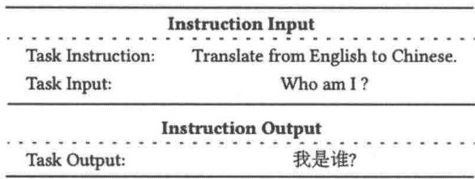  
图6-4TALLRec框架  
图6-5 翻译任务的指令微调中的微调数据的示例

步骤1：识别任务，并使用自然语言说清指令，以有效完成任务。

该指令可以包含任务的明确定义，以及该问题的具体解决方案。这些描述被称为任务指令（Task Instruction）。图6-5中为“将英文翻译为中文”。

步骤2：利用自然语言说明任务的输入和输出，即“Task Input”和“Task Output”。

图6-5中的“Task Input”和“Task Output”分别是“Who am I？”和“我是谁？”。

步骤3：将“Task Instruction”和“Task Input”组装成“Instruction Input”，将“Task Output”作为对应的“Instruction Output”。

每个用于微调的样本都需要完成这一过程，这些样本即灌入大模型进行微调的样本对。

步骤4：基于“Instruction Input”和“Instruction Output”样本对微调大模型。

可以对模型的所有参数进行微调，也可以微调很少一部分参数，例如，TALLRec就是基于LoRA进行局部参数微调的。

针对推荐系统，上面的定义也是适用的，只不过将Task改为Rec（Recommendation），结

合上面的介绍和图6-4右上角的示例，表6-2给出一个推荐任务的Instruction Input和Instruction Output示例。

表 6-2 推荐任务的 Instruction Input 和 Instruction Output 示例  

<table><tr><td>指令类型</td><td>指令内容</td><td>说 明</td></tr><tr><td>Instruction Input</td><td>Rec Instruction: 预测用户是否喜欢物品Rec Input: 该用户过去的兴趣历史是{(item_1, 1), (item_2, 0), ..., (item_k, 1)},那么用户是否会喜欢新的 item_j 呢?</td><td rowspan="2">这里的1和0分别代表用户喜欢和不喜欢item_1、item_2等是待推荐物品的标题等文本信息</td></tr><tr><td>Instruction Output</td><td>Rec Output: (item_j, 1)</td></tr></table>

# 3. 二次微调原理

TALLRec 框架的底层大模型是开源的LLaMA-7B，对其进行了两次微调：指令微调（Instruction Tuning）和推荐微调（rec-tuning）。

步骤1：指令微调。

指令微调使用一般的监督微调数据，目的是让大模型可以更好地理解人类的输入指令，按照人类的输入输出进行反馈，让大模型具备更好的泛化能力，这里用到的微调数据是参考文献[3]中提供的self-Instruction数据，用到的目标函数是6.1节式（6-1）中所示的函数，对整个模型进行微调。

步骤2：推荐微调。

这一步骤是步骤1之后，利用推荐样本进行进一步微调，让大模型适配推荐业务场景，获得更好的推荐效果。我们可以基于表6-2构建Rec Input——User Preference: item1, item4, ..., itemn. User Unpreferenc: item2, item3, ..., item $n - 1$ . Whether the user will enjoy the target movie/book: item $n + 1$ 和 Rec Output—Yes./No.（喜欢/不喜欢），然后根据表6-2中的Rec Input和Rec Output构建出Instruction Input和Instruction Output。这样就可以对大模型进行微调了，在推荐这一步，我们利用LoRA进行参数有效的微调，以减少微调的参数量，具体的目标函数是式（6-2）中所示的函数。

由于微调过程使用了LoRA，参数量至多只有原来的千分之一，所以微调非常高效，论文作者是在一台英伟达RTX3090（24GB）GPU上进行微调的。

经过步骤1微调后的大模型已经具备比较好的泛化能力了，步骤2只需要不到100个微调样本就可以获得非常好的效果。同时，该模型具备很好的泛化能力，例如，基于电影推荐场景

进行微调后可以直接应用于图书推荐，并且效果很不错。

# 6.2.2 GIRL：基于人类反馈的微调框架

GIRL[2]（Generative job Recommendation paradigm based on LLM）框架是一种生成式推荐框架，利用大模型生成个性化的JD，然后基于求职者简历（CV）、个性化JD，以及RLHF微调大模型为求职者进行JD推荐，笔者认这个实现方案非常好，将RLHF用得恰到好处。下面对GIRL框架进行详细介绍。

# 1. 三种JD推荐范式

传统的JD推荐将求职者CV和库中所有有效的JD进行匹配，按照JD和求职者CV的匹配得分进行排序，将最适合求职者的JD推荐给求职者（当然还要考虑地域、薪资等因素），这就是图6-6中常规的工作推荐范式，这里不再赘述。


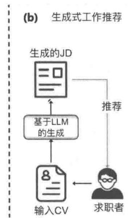

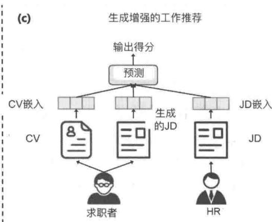  
图6-63种不同的JD推荐范式

GIRL 提出了两种新的 JD 推荐范式：生成式工作推荐和生成增强的工作推荐，如图 6-6 所示。生成式工作推荐利用大模型为求职者生成个性化的 JD，生成的 JD 是最匹配求职者兴趣的；生成增强的工作推荐借助生成的 JD 为求职者进行个性化 JD 推荐，推荐的工作更匹配。这两种范式生成的 JD 至少有两个价值：一是为求职者提供就业指导，并且具备可解释性（自然语言形式）；二是作为数据供推荐系统进行更加精准的推荐（生成增强的工作推荐）。

# 2. 基于RLHF的JD生成框架

通过大模型为求职者生成个性化的JD在GIRL框架中是通过RLHF算法实现的。GIRL框架是分为三步实现的，如图6-7所示。


  
图6-7 GIRL框架

# 步骤1：监督微调

这一步的目的是通过微调样本来指导大模型基于用户的CV生成合适的JD。微调样本是匹配的（CV，JD）对，见图6-6(a)，招聘者投了这个JD，发布JD的HR也约了求职者面试，也就是求职者和招聘企业互相满意的（CV，JD）对。

为了让大模型进行简单微调，需要构建监督微调的提示词模板，这非常容易，因为CV和JD都是自然语言的形式，图6-8就是一个可行的模板，其中，Human、Assistant是角色；Please generate...following candidate:是指令（Instruction），指导大模型要做什么；Basic information...and Netty.就是用户的CV，即Task Input；而Job title:...is preferred.就是JD，即Task Output（在模型推断时，这部分留白就可以了）。

针对每一个匹配的（CV，JD）对，按照图6-8构建监督样本，然后采用监督微调的方法训练大模型 $(\mathcal{G}:C\to J^{\prime})$ ，大模型的作用是基于给定的CV生成JD，具体的目标函数参见6.1.2节，这里不再赘述。

# 步骤2：奖励模型训练

训练奖励函数 $(\mathcal{U}:(C,J)\to \mathbb{R})$ 也需要构建样本对。在6.1.3节，利用大模型对提示词生成多个答案，然后根据生成答案是否满足人类目标排序，再训练奖励函数，见图6-6(b)。GIRL采用比较巧妙的方式实现类似的功能。具体是怎么做的呢？

从用户行为数据（包括求职者的行为和HR/猎头的行为）中收集匹配和不匹配的（CV，JD）对①，将与CV匹配的工作集合记为 $J^{+}$ ，与CV不匹配的工作集合记为 $J^{-}$ ，通过优化下面的成对排序（Pairwise Ranking）损失函数来训练奖励模型（ $\sigma$ 是Sigmoid激活函数， $C$ 即CV）。

  
图6-8 监督训练的提示词模板

$$
\mathcal {L} _ {\mathrm {r m t}} = \ln \sigma \left(\mathcal {U} (C, J ^ {+}) - \mathcal {U} (C, J ^ {-})\right)
$$

这种方法使奖励模型能够根据HR的反馈来捕捉市场偏好。此外，我们可以使用奖励模型来预测求职者与职位描述之间的匹配度，从而提前验证推荐算法的适用性。

# 步骤3：PPO

这一步骤基于PPO算法，对齐大模型与利用奖励模型衡量的HR的偏好，见图6-6的(c)，这让大模型不仅考虑了求职者的需求，也考虑了这些职位实际的市场受欢迎度①。

具体的训练过程是：首先收集一批步骤1、2中没有使用过的 $\mathbf{CV}^{\text{②}}$ ，基于步骤1的大模型 $(\mathcal{G};\mathbb{C}\to J^{\prime})$ 生成对应的JD集合，然后利用步骤2中的 $\mathcal{U}\colon (C,J)\to \mathbb{R}$ 生成（CV，JD）对对应的奖励值，最后通过PPO方法更新 $\mathcal{G}$ 和 $\mathcal{U}$ 的参数[2]。

# 3.生成加强的JD推荐方案

基于RLHF对JD生成的犬模型（ $\mathcal{G}:C\to J^{\prime}$ ）进行微调后，可以生成更匹配用户期望和市

场需求的JD，那么自然可以想到，我们可以将生成的JD作为辅助信息，把 $\mathcal{G}:C\to J^{\prime}$ 看作一个特征抽取大模型，提升JD推荐的效果，见图6-6(c)，下面展开说明。

假设某个用户的简历是 $C$ ，待推荐的JD是 $J$ ， $J^{\prime}$ 是大模型 $\mathcal{G}$ 利用简历 $c$ 生成的JD，推荐系统要计算 $c$ 与 $J$ 的匹配度得分，我们可以采用如下方式计算。

我们可以利用编码器对 $C$ 进行编码： $C = \operatorname{Encoder}(C)^{\text{①}}$ 。同样的方法可以对 $J^{\prime}$ 、 $J$ 分别进行编码： $j^{\prime} = \operatorname{Encoder}(J^{\prime})$ 、 $j = \operatorname{Encoder}(J)$ 。然后利用 MLP 神经网络计算简历 $C$ 与 JD $J$ 的匹配得分，公式如下。

$$
\operatorname {s c o r e} = \operatorname {M L P} ([ c; j; j ^ {\prime} ]) \tag {6-5}
$$

计算出了用户的简历 $C$ 与任何一个JD $J$ 的匹配得分，向用户推荐的过程是：先召回该用户的所有简历，通过式（6-5）计算每份简历与用户的简历 $C$ 的匹配得分，然后按照得分降序排列，选择Top $N$ 作为最终给用户的JD推荐。

# 6.3 基于MIND数据集实现微调

本节基于MIND数据集实现一个微调推荐系统，采用参数有效的微调方案——LoRA微调，另外，采用TALLRec推荐系统架构实现微调推荐系统的架构。

# 6.3.1 微调数据准备

我们基于MIND数据集构建微调数据。LoRA微调需要的数据格式如下。

```jsonl
{"instruction": "Given the user's preference and unpreference, identify whether the user will like the target movie by answering \\"Yes.\\" or \\"No.\\".","input": "User Preference: \\"Opinion: Colin Kaepernick is about to get what he deserves: a chance\\"nUser Unpreference:"Browns apologize to Mason Rudolph, call Myles Garrett's actions 'unacceptable'\\","I've been writing about tiny homes for a year and finally spent 2 nights in a 300-foot home to see what it's all about here's how it went\\","The Kardashians Face Backlash Over 'Insensitive' Family Food Fight in KUwTK Clip\\","THEN AND NOW: What all your favorite '90s stars are doing today\\","Report: Police investigating woman's death after Redskins' player Montae Nicholson took her to hospital\\","U.S. Troops Will Die If They Remain in Syria, Bashar Al-Assad Warns\\","3 Indiana judges suspended after a night of drinking turned into a White Castle brawl\\","Cows swept away by Hurricane Dorian found alive but how?\\\","Surviving Santa Clarita 
```

```txt
school shooting victims on road to recovery: Latest\",\The Unlikely Star of My Family's Thanksgiving Table\",\"Meghan Markle and Hillary Clinton Secretly Spent the Afternoon Together at Frogmore Cottage\",\"Former North Carolina State, NBA player Anthony Grundy dies in stabbing, police say\",\"85 Thanksgiving Recipes You Can Make Ahead\",\"Survivor Contestants Missy Byrd and Elizabeth Beisel Apologize For Their Actions\",\"Pete Davidson, Kaia Gerber Are Dating, Trying to Stay 'Low Profile'\",\There's a place in the US where its been over 80 degrees since March\",\"Taylor Swift Rep Hits Back at Big Machine, Claims She's Actually Owed $7.9 Million in Unpaid Royalties\",\The most talked about movie moments of the 2010s\",
\\"Belichick mocks social media in comments on Garrett incident\",\\"13 Reasons Why's Christian Navarro Slams Disney for Casting 'the White Guy' in The Little Mermaid\\"nWhether the user will like the targe news \\"66 Cool Tech Gifts
Anyone Would Be Thrilled to Receive\\"?",
"output": "No.\"},
... 
```

将用户行为数据和新闻数据转换为上述格式，因此需要读取news.tsv和behaviors.tsv两个文件。news.tsv文件中有News ID和对应的新闻标题，而behaviors.tsv文件中有一个Impression News字段，里面包含用户点击和没有点击的新闻，刚好可以用于构建微调数据：Impression News字段最后一个News ID用于预测用户是否喜欢该新闻，前面的字段可以作为用户过去的行为偏好（参见上面示例中的input）。利用这两个文件，我们可以构建具体的微调数据集，下面是详细的代码实现①。

```python
import csv
import json
from enum import Enum
class Action(Enum):
    YES = "Yes."
    NO = "No."
instruction = ("Given the user's preference and unpreference, identify whether the user will like the target movie by "
    "answering \\"Yes.\\" or \\"No.\\".")
news_dict = {}
#从news.tsv获取每个新闻ID到标题的映射字典
with open('/../data/mind/news.tsv', 'r') as file:
    reader = csv-reader(file, delimiter='\\t')
    for row in reader:
        news_id = row[0]
        news_title = row[3]
        news_dict(news_id) = news_title
    data_list = []
#利用behaviors.tsv文件获取用户喜欢和不喜欢的新闻
with open('/../data/mind/behaviors.tsv', 'r') as file:
    reader = csv-reader(file, delimiter='\\t')
    for row in reader: 
```

impression $=$ row[4]   
impre_list $=$ impression.split(" ")   
if len(impre_list) $\geq 5$ ：#用户至少要有5个曝光历史 preference $= []$ unpreference $= []$ for impre in impre_list[:1]: #将前面的新闻作为微调数据，最后一个新闻作为预测 [impre_id，action] $=$ impre.split("\\") title $=$ news_dict[impre_id] if int(action) $= = 1$ ： preference.append("\\"+title+"\\") else: unpreference.append("\\"+title+"\\") input $=$ "User Preference:" + ','.join(preference) + "\\n" + "User Unpreferenc: $^\prime \prime +\prime ,\prime .$ .join(unpreference) [impre_id，action] $=$ impre_list[-1].split("\\") output $=$ Action.YES.value if int(action) $= = 1$ else Action.NO.value input $=$ input + "\n" + "Whether the user will like the targe news " + "\\"" +   
news_dict[impre_id] $^+$ "\\?"？" res_dic $= \{$ "instruction": instruction, "input": input, "output": output } data_list.append(res_dic)   
res $=$ json.dumps(data_list)   
user_sequence_path $= "$ ../data/mind/train.json" #将生成的微调数据保存起来 with open(user_sequence_path，'a') as file: file.write(res)

上述代码会在 data 目录下生成一个 JSON 微调数据 train.json。下一节我们利用这个微调数据对推荐模型进行微调。

# 6.3.2 模型微调

本节利用6.3.1节构建的微调数据，基于LoRA对chinese-alpaca-2-7B模型进行微调，微调好的模型具备个性化推荐能力。本节提供4个微调实现方案，其中重点介绍基于alpaca-lora框架的微调。

# 1. 基于 alpaca-lora 框架的微调

参考文献[1]提供了一种方便的微调方法，本节采用参考文献[4]中的代码实现微调②。

```txt
import os  
import sys 
```

① 这是一个利用中文语料对Stanford'sAlpaca模型进行微调得到的模型。  
② 代码：/src/basic_tasks/binetune-llm/binetune_tallrec.py。

```python
from typing import List
import fire
import torch
from datasets import load_dataset
from peft import (
    LoraConfig,
    get_peft_model,
    get_peft_model_state_dict,
    prepare_model_for_int8_training,
    set_peft_model_state_dict,
)
from transformers import LlamaForCausalLM, LlamaTokenizer, Trainer,
DataCollatorForSeq2Seq, TrainingArguments
from utils.prompter import Prompter
def train(
    # model/data params
    base_model: str = "", # the only required argument
    data_path: str = "/data/mind/train.json",
    output_dir: str = "/lora-alpaca",
    # training hyperparams
    batch_size: int = 128,
    micro_batch_size: int = 4,
    num_epochs: int = 3,
    learning_rate: float = 3e-4,
    cutoff_len: int = 256,
    val_set_size: int = 2000,
    # lora hyperparams
    lora_r: int = 8,
    lora_alpha: int = 16,
    lora_dropout: float = 0.05,
    lora_target Modules: List[str] = ["q_proj", "v_proj"]
    # llm hyperparams
    train_on_entries: bool = True, # if False, masks out inputs in loss
    add_eos_token: bool = False,
    group_by_length: bool = False, # faster, but produces an odd training loss curve
    # wandb params
    wandb_project: str = ""
    wandb_run_name: str = ""
    wandb-watch: str = "", # options: false | gradients | all
    wandb_log_model: str = "", # options: false | true
    resume_from_checkpoint: str = None, # either training checkpoint or final adapter
    prompt_template_name: str = "alpaca", # The prompt template to use, will default to
alpaca.
):
    assert (
        base_model
    ), "Please specify a --base_model, e.g. --base_model='huggyllama/llama-7b' "
    gradient Accumulation_steps = batch_size // micro_batch_size
    prompter = Prompt的例子
    device_map = "auto" 
```

```python
world_size = int(os.environ.get("WORLD_SIZE", 1))  
ddp = world_size != 1  
if ddp: device_map = {"": int(os.environ.get("LOCAL_rank") or 0)}  
gradient Accumulation_steps = gradient Accumulation_steps // world_size  
# Check if parameter passed or if set within environ  
use_wandb = len(wandb_project) > 0 or (  
    "WANDBPROJECT" in os.environ and len(os.environ["WANDB-project)]) > 0  
)  
# Only overwrite environ if wandb param passed  
if len(wandb_project) > 0:  
    os.environ["WANDBPROJECT"] = wandb_project  
if len(wandb.watch) > 0:  
    os.environ["WANDB WATCH"] = wandb.watch  
if len(wandb_log_model) > 0:  
    os.environ["WANDB_LOG_MODEL"] = wandb_log_model  
model = LlamaForCausalLM.from_pretrained(base_model, torch_dtype=torch.float16, device_map=device_map, tokenizer = LlamaTokenizer.from_pretrained(base_model)  
tokenizer .pad_token_id = (  
    0 # unk. we want this to be different from the eos token  
)  
tokenizer(padding_side = "left" # Allow batched inference  
def tokenizerprompt, add_eos_token=True):  
    # there's probably a way to do this with the tokenizer settings  
    # but again, gotta move fast  
result = tokenizer(prompt, add_eos_token=True):  
    truncation=True, max_length=cutoff_len, padding=False, return_tensors=None,  
)  
if (  
    result["input_ids"][-1] != tokenizer.eos_token_id and len(result["input_ids")] < cutoff_len and add_eos_token)  
    result["attention_mask"].append(1)  
result["labels"] = result["input_ids"].copy()  
return result  
def generate_and_tokenize_prompt(data_point):  
    full_prompt = prompter_generate_prompt( data_point["instruction"], data_point["input"], data_point["output"], 
```

```python
tokenized_full_prompt = tokenize(full_prompt)  
if not train_on_entries:  
    user_prompt = prompter_generate_prompt(  
        data_point["instruction"], data_point["input"]  
)  
    tokenized_user_prompt = tokenize(  
        user_prompt, add_eos_token=add_eos_token  
)  
    user_prompt_len = len(tokenized_user_prompt["input_ids")]  
    if add_eos_token:  
        user_prompt_len -= 1  
    tokenized_full_prompt["labels"] = [  
        -100] * user_prompt_len + tokenized_full_prompt["labels"]]  
    user_prompt_len:  
] # could be sped up, probably  
return tokenized_full_prompt  
model = prepare_model_for_int8_training(model)  
config = LoraConfig(  
    r=lora_r,  
    lora_alpha=lora_alpha,  
    target Modules=lora_target Modules,  
    lora_dropout=lora_dropout,  
    bias="none",  
task_type="CAUSAL_LM",  
)}  
model = get_peft_model(model, config)  
if data_path.endsWith(".json") or data_path.endsWith(".json"):  
# 数据是 JSON 或者 JSONL 格式的  
data = load_dataset("json", data_files=data_path)  
else:  
data = load_dataset(data_path)  
if resume_from_checkpoint:  
# Check the available weights and load them  
checkpoint_name = os.path.join(  
    resume_from_checkpoint, "pytorch_model.bin"  
) # Full checkpoint  
if not os.path.exists(checkpoint_name):  
checkpoint_name = os.path.join(  
    resume_from_checkpoint, "adapter_model.bin"  
) # only LoRA model - LoRA config above has to fit  
resume_from_checkpoint = (  
    False # So the trainer won't try loading its state  
)  
# The two files above have a different name depending on how they were saved, but  
# are actually the same.  
if os.path.exists(checkpoint_name):  
print(f"Restarting from {checkpoint_name}")  
adaptersweights = torch.load(checkpoint_name)  
set_peft_model_state_dict(model, adaptersweights)  
else: 
```

```txt
print(f"Checkpoint {checkpoint_name} not found")  
model.print_trainable_parameters() # Be more transparent about the % of trainable  
# params.  
if val_set_size > 0:  
    train_val = data["train"].train_test_split(  
        test_size=val_set_size, shuffle=True, seed=42  
    )  
    train_data = (  
        train_val["train"].shuffle().map(generate_and_tokenize_prompt)  
    )  
    val_data = (  
        train_val["test"].shuffle().map(generate_and_tokenize_prompt)  
    )  
else:  
    train_data = data["train"].shuffle().map(generate_and_tokenize_prompt)  
val_data = None  
if not ddp and torch.cudadevice_count() > 1:  
    # keeps Trainer from trying its own DataParallelism when more than 1gpu is available  
model.is_parallelizable = True  
model.model_parallel = True  
trainer = Trainer(  
    model=model,  
    train_dataset=train_data,  
    eval_dataset=val_data,  
    args=TrainingArguments(  
        per_device_train_batch_size=micro_batch_size,  
        gradient Accumulation_steps=gradient Accumulation_steps,  
        warmup_steps=100,  
        num_train_epochs=num_epochs,  
        learning_rate=learning_rate,  
        logging_steps=10,  
        optim="adamw_torch",  
        evaluation_strategy="steps" if val_set_size > 0 else "no",  
        save_strategy="steps",  
        eval_steps=200 if val_set_size > 0 else None,  
        save_steps=200,  
        output_dir=output_dir,  
        save_total_limit=3,  
        load_best_model_at_end=True if val_set_size > 0 else False,  
       -ddp_find_unused_parameters=False if ddp else None,  
        group_by_length=group_by_length,  
        report_to="wandb" if use_wandb else None,  
        run_name=wandb_run_name if use_wandb else None,  
    ),  
data_collator=DataCollatorForSeq2Seq(  
        tokenizer, pad_to_multiple_of=8, return_tensors="pt", padding=True),  
)  
model.config.use_cache = False  
trainer.train(resume_from_checkpoint=resume_from_checkpoint) 
```

```python
model.save_pretrained(output_dir)  
if __name__ == "_main_: fire.Fire(train) 
```

上述代码首先导入基底模型，然后基于LoraConfig构建peft模型，最后利用Transformers库中的Trainer类进行微调，当模型微调好后进行保存。下面的脚本可以对模型进行微调。

```shell
python finetune_tallrec.py\--base_model'/Users/liuqiang/Desktop/code/11m/models/chinese-alpaca-2-7b' \# 基底模型的存储路径--data_path'/Users/liuqiang/Desktop/code/11m4rec/11m4rec_abc/src/binetune-11m/data/mind/train.json' \#微调数据路径--output_dir'/lora-weights' \#微调好的LoRA参数的存储路径--batch_size 128 \#批大小--micro_batch_size4 \#微批大小--num_epochs3 \#epochs数--learning_ratele-4 \#学习率--cutoff_len512 \#cutoff长度--val_set_size2000 \#验证数据条数--lorar8\#LoRA中的秩（rank），它决定了低秩矩阵的大小--loralalpha16\#LoRA适应的学习率缩放因子。这个参数影响了低秩矩阵的更新速度--loradropout0.05\#Dropout的比例--loratarget Modules'[qProj,vProj]'\#对基底模型中的哪些模块进行微调--train_on Inputs \#if False，masks out inputs in loss--group_by_length #是否将微调数据集中长度大致相同的样本分在一组，以最大限度地减少所应用的填充并#提高效率。仅在应用动态填充时有用
```

上面的训练脚本速度是非常慢的，在笔者的计算机上需要训练4天左右才能完成。你可以适当调整参数①，加快微调速度。

# 2. 其他微调方法

下面介绍3个利用其他框架进行微调的方法，有兴趣的读者可以详细阅读源码。

- 基于苹果的MLX框架进行微调。

MLX是苹果开源的基于mac系列芯片的大模型框架，在mlx-examples（在GitHub上搜索mlx-examples）工程中的lora目录下，有相关的微调参考代码实现，下面是一个参考代码示例。

```shell
python lora.py --model /Users/liuqiang/Desktop/code/llm/models/Yi-34B-Chat \# 基底模型
--train \# 进行微调
--iters 1000 \ # 微调迭代次数
--adapter-file ./adapters.npz \ # 微调后的输出文件，采用.npz格式存储
--data data/ # 微调对应的数据
```

- 基于LLaMA-Factory框架进行微调。

LLaMA-Factory（在GitHub上搜索LLaMA-Factory）是一个开源易用的微调框架，目前开源的主流模型都支持用LLaMA-Factory进行微调，它支持LoRA、QLoRA等微调方法，支持预训练、监督微调、PPO等范式，如图6-9所示。

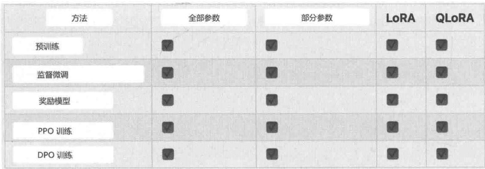  
图6-9LLaMA-Factory支持的微调类型

LLaMA-Factory的易用性非常好，还提供微调界面，便于操作。图6-10就是LLaMA-Factory的微调界面，具体的参数可以通过填写或者下拉的方式补充完善，然后就可以直接进行微调了。

如果不采用Web UI方式进行微调，还可以直接利用脚本进行微调，下面是一个可行的微调脚本，供你参考。

CUDA_VISIBLE_DEVICE $\equiv 0$ python src/trainBASH.py  
--stage sft \#监督微调  
--do_train \#进行微调  
--model_name_or_path /Users/luqiang/Desktop/code/11m/models/chinese-alpaca-2-7b\#基底模型  
--dataset movie_train \#微调的数据集  
--template default \#提示词模板  
--finetuning_type lora \#微调方法  
--lora_target q.proto,v.proto \#对基底模型中的哪些模块进行微调  
--output_dir ./lora-alpaca \#微调后的保存目录  
--overwrite_cache \#是否重写缓存  
-per_device_train_batch_size4 \#每个device的batch size  
--gradient Accumulation_steps4 \#多少步开始累积梯度  
--lr_scheduler_type cosine\  
--logging_steps10 \#间隔多少步输出日志  
--save_steps1000 \#间隔多少步存储中间过程  
--learning_rate5e-5 \#学习率  
--num_train_epochs3.0 \#epochs数  
--plot_loss #打印出损失

  
图6-10LLaMA-Factory的微调界面

- 基于 Transformers 库的 run_clm.py 进行微调。

Transformers库中也提供了进行微调的代码案例run_clm.py，你可以利用该方法进行微调，下面是一个具体的微调案例。

```shell
PYTORCH_MPS_HIGH_WATERMARK_RATIO=0.0 python run_clm.py \
--model_name_or_path /Users/liuqiang/Desktop/code/11m/models/chinese-alpaca-2-7b \
# 基底模型
--train_file /Users/liuqiang/Desktop/code/11m4rec/TALLRec/data/movie/train.json \
# 微调的数据
--validation_file
/Users/liuqiang/Desktop/code/11m4rec/TALLRec/data/movie-valid.json \# 验证数据
--per_device_train_batch_size 8 \# 每个device的训练集batch size
--per_device_eval_batch_size 4 \# 每个device的验证集batch size
--do_train \# 是否需要进行训练
--do_eval \# 是否需要进行评估
--optim adamw_torch \# 优化方法
--learning_rate 5e-5 \# 学习率
--num_train_epochs 3.0 \# epochs数量
--low_cpu_mem_USAGE true \# 是否采用低CPU、内存进行微调
--output_dir /Users/liuqiang/Desktop/code/11m4rec/TALLRec/lora-alpaca-transformers
# 微调好的模型输出路径
```

# 6.3.3 模型推断

通过上面的步骤，我们获得了一个微调好的模型，下面我们基于该模型进行推断，检验一下微调后的大模型是否可以进行更精准的个性化推荐①。

```python
import os
import sys
import fire
import gradio as gr
import torch
import transformers
from peft import PeftModel
from transformers import GenerationConfig, LlamaForCausa大模型, LlamaTokenizer
fromutils(callbacks import Iteratorize, Stream
fromutils.prompter import Prompter
def main(   )
		load_8bit: bool = False,
	.base_model: str = "", lora_weights: str = "tloen/alpaca-lora-7b",
	prompt_template: str = "", # The prompt template to use, will default to alpaca.
(server_name: str = "0.0.0.0", # Allows to listen on all interfaces by providing '0.
share_gradio: bool = False,
	):
	.base_model = base_model or os.environ.get("BASE_MODEL","")
	assert (
	.base_model
		), "Please specify a --base_model, e.g. --base_model='huggyllama/llama-7b' "
	prompter = Prompt(prompt_template)
	promptizer = LlamaTokenizer.from_pretrained(base_model)
device_map = "mps"
model = LlamaForCausalLM.from_pretrained(   )
	.base_model,
	device_map=device_map,
	torch_dtype=torch.float16,
	)
(model = PeftModel.from_pretrained(   )
	.model,
	loraweights,
	device_map=device_map,
	torch_dtype=torch.float16,
	)
# unwind broken decapoda-research config
model.config_pad_token_id = tokenizer_pad_token_id = 0 # unk
model.config.bos_token_id = 1
model.config.eos_token_id = 2
if not load_8bit:
	.model-half() # seems to fix bugs for some users. 
```

model.eval()   
if torch._version_ $\rightharpoondown$ "2" and sys platform != "win32": model $=$ torch.compile(model)   
def evaluate( instruction, input $\equiv$ None, temperature $\coloneqq 0.1$ top_p=0.75, top_k=40, num_beams=4, max_new_tokens $\coloneqq$ 128, stream_output $\equiv$ False, \*\*kwargs,   
} : prompt $=$ prompter_generate_prompt(instruction, input) inputs $=$ tokenizerprompt, return_tensors="pt") input_ids $=$ inputs["input_ids"].to(device_map) generation_config $=$ GenerationConfig( temperature $\equiv$ temperature, top_p $\equiv$ top_p, top_k $\equiv$ top_k, num_beams $\equiv$ num_beams, \*\* kwargs,   
} generate.params $=$ { "input_ids": input_ids, "generation_config": generation_config, "return_dict_in_generate": True, "output Scores": True, "max_new_tokens": max_new_tokens,   
} if stream_output: #Stream the reply 1 token at a time. #This is based on the trick of using 'stopping criteria' to create an iterator, # from https://github.com/oobabooga/text-generation-webui/ blob/ad37f396fc8cbbab90e11ecf17c56c97bfbd4a9c/modules/text_generation.py#L216-L243. def generate_with_callback(callback=None,\*\* kwargs): kwargs.setdefault( "stopping_criteria", transformers.StoppingCriteriaList()) kkwargs["stoppingcriteria"].append( Stream(callback_func $\equiv$ callback) with torch.no_grad(): modelgenerate(\*\* kwargs) def generate_with_STREAMing(\*\* kwargs): return Iteratorize( generate_with_callback,k kwargs,cCallback=None ) with generate_with_STREAMING(\*\*generate_parameters) as generator: for output in generator:

```python
# new_tokens = len(output) - len(input_ids[0])
decoded_output = tokenizerdecode(output)
if output[-1] in [tokenizer.eos_token_id]:
break
yield prompter.get_response(decoded_output)
return # early return for stream_output
# Without streaming
with torch.no_grad():
    generation_output = model_generate(
        input_ids=input_ids,
        generation_config=generation_config,
        return_dict_in_generate=True,
        output Scores=True,
        max_new_tokens=max_new_tokens,
    )
s = generation_output_sequences[0]
output = tokenizerdecode(s)
yield prompter.get_response(output)
grInterface(
fn=evaluate,
inputs=[
    gr_components.Textbox(
        lines=2,
        label="Instruction",
        placeholder="Tell me about alpacas."
    ),
gr_components.Textboxlines=2, label="Input", placeholder="none"),
gr_components_SLider(
    minimum=0, maximum=1, value=0.1, label="Temperature"
    ), 
gr_components_SLider(
    minimum=0, maximum=1, value=0.75, label="Top p"
    ), 
gr_components_SLider(
    minimum=0, maximum=100, step=1, value=40, label="Top k"
    ), 
gr_components_SLider(
    minimum=1, maximum=4, step=1, value=4, label="Beams"
    ), 
gr_components_SLider(
    minimum=1, maximum=2000, step=1, value=128, label="Max tokens"
    ), 
gr_componentsheckbox.label="Stream output"),
],
outputs=[
    gr_components.Textbox(
        lines=5,
        label="Output",
    )
],
title="Alpaca-LoRA", 
```

```python
description="Alpaca-LoRA is a 7B-parameter LLaMA model finetuned to follow instructions. It is trained on the [Stanford Alpaca] (https://github.com/tatsu-lab/stanford_alpaca) dataset and makes use of the Huggingface LLaMA implementation. For more information, please visit [the project's website] (https://github.com/tloen/alpaca-lora).", # noqa: E501 ).queue().launch(server_name=server_name, share=share_gradio) if __name__ == "_main_: fire.Fire(main) 
```

我们可以通过以下脚本运行上面的代码。上面的代码用到了Gradio这个框架，这是一个将机器学习能力方便地封装成Web服务的Python框架，通过封装可以提升模型的易用性。代码运行后会出现图6-11所示的界面，你可以直接在这个界面上进行推理验证，还可以调整参数。

```shell
python infer_tallrec.py \
--base_model '/Users/liuqiang/Desktop/code/llm/models/chinese-alpaca-2-7b' \
# 基底模型路径
--loraweights
'/Users/liuqiang/Desktop/code/llm4rec/llm4rec_abc/src/binetune-llm/lora-weights'
# LoRA微调的参数路径 
```

  
图6-11 微调后的模型交互界面

# 6.4 总结

本章讲解了利用推荐系统数据微调大模型的知识点，包括微调的价值、微调的步骤、微调的方法和微调过程面临的问题和挑战，重点是微调的步骤和微调的方法。关于微调的步骤，需要重点了解基于不同的监督样本的形式选择合适的微调目标函数的方法，以及如何构建监督样本。关于微调的方法，需要掌握监督微调方法和基于PPO的RLHF方法。

在本章讲解的两个案例中，TALLRec 是一个非常通用的微调框架，包含待推荐物品的标题等文本信息的推荐系统都可以通过该框架实现。而 GIRL 巧妙地利用了 RLHF 对招聘场景下的推荐进行微调，这个方法也具有一定的通用性，好友推荐、旅游目的地推荐、司机推荐等都可以采用该方法实现。TALLRec 和 GIRL 这两个微调大模型应用于推荐系统的方法刚好覆盖了本章的两种微调范式，希望你结合这两个案例，好好掌握监督微调和 RLHF 微调这两种方法。

本章基于MIND数据集从零开始微调了一个个性化推荐系统。现在开源工具非常多，总体来说，微调还是比较简单的。我们最缺少的就是高质量的微调数据和算力。

微调是大模型中非常重要的一个主题，也是大模型应用于垂直行业非常重要的实现方案。在具体业务场景中，我们需要基于开源模型和垂直数据构建特定领域的专有小模型。对数据安全要求比较高的公司通常不会考虑通过调用第三方API来使用大模型，这时，微调是一种非常好的解决方案。只要微调数据足够优质，微调后的专用模型的效果就可能优于ChatGPT等通用大模型。