# 07

# 直接推荐范式: 利用大模型的上下文学习进行推荐

前面的章节讲解了如何通过预训练和微调大模型进行个性化推荐，这类模型是高度适配推荐业务场景的，有很不错的效果。不管是预训练还是微调，考虑到成本，一般对参数较少的大模型（<10B）进行处理。当模型的参数规模足够大时，大模型本身就具备非常强的泛化能力。我们自然想到，直接用这类大模型是否可以进行个性化推荐呢？答案是肯定的，通过上下文学习能力，大模型可以在用户提供背景知识的前提下，实现下游的推荐任务。

只需要利用特定提示词激发大模型的推荐能力就可以将其用于下游推荐任务，而无须进行任何微调，我们将这种能力叫作上下文学习，上下文学习分为 zero-shot 和 few-shot。

zero-shot直接利用预训练好的大模型，通过设计特定的提示词和模板让大模型完成推荐任务。这类推荐的效果主要由大模型自身的通用能力及提示词的独特设计决定，一般使用ChatGPT、GPT-4等超大的大模型，这类模型的通用能力更好。few-shot为预训练好的大模型提供几个示例样本，指导大模型进行推荐，激活大模型的个性化推荐能力。另外，可以将推荐任务分解为简单的子任务，让大模型逐一解决，这就是大模型的思维链能力。

基于上面的思考，本章讲解如何直接使用大模型进行个性化推荐。先讲解基本的实现原理和相关案例，让你对该技术有初步的了解，再提供代码案例指导你实践大模型个性化推荐。

# 7.1 上下文学习推荐基本原理

直接推荐范式是本章的核心框架和指导原则，该范式可以将完成预训练的大模型直接用于个性化推荐，这里的预训练大模型一般是通用的大模型（例如ChatGPT、Claude、Kimi等），而不是专门为推荐任务预训练或者微调的大模型。

这里再提一下，在经典的召回 $\rightarrow$ 排序推荐范式下，直接推荐范式其实是利用大模型进行排序，即对召回的候选物品进行排序（如图3-6所示）。召回阶段使用其他推荐算法，例如传统的基于标签的召回等。下面展开说明直接推荐范式的基本原理。

大模型基于海量文本数据预训练，海量文本本身就压缩了各个领域的基础知识，这些知识可以被激发出来用于个性化推荐。只不过，我们需要使用特定的提示词才能激发大模型的个性化推荐能力。

推荐系统的提示词需要使用特定的模板（Template）才能更好地激发大模型的推荐能力。推荐系统与其他下游任务最大的不同是个性化，因此提示词也应该是个性化的，个性化提示词包括不同用户和物品的个性化字段。例如，用户的偏好可以通过商品ID或用户描述（如偏好、画像等）表示。此外，个性化提示词的预期模型输出也应该根据输入物品的变化而变化，这意味着用户对不同物品的偏好变化。这些物品字段可以由商品ID或包含详细描述的物品元数据表示。下面是一个具体的例子，供你参考。

```txt
I've watched the following movies in the past in order:  
['0. Mirror, The (Zerkalo)', '1. The 39 Steps', '2. Sanjuro', '3. Trouble in Paradise']\n\nThen if I ask you to recommend a new movie to me according to my watching history, you should recommend shampoo and now that I've just watched shampoo, there are 20 candidate movies that I can watch next:\n [0. Manon of the Spring (Manon des sources)', '1. Air Bud', '2. Citizen Kane', '3. Grand Hotel', '4. A Very Brady Sequel', '5. 42 Up', '6. Message to Love: The Isle of Wight Festival', '7. Screamers', '8. The Believers', '9. Hamlet', '10. Cliffhanger', '11. Three Wishes', '12. Nekromantik', '13. Dangerous Minds', '14. The Prophecy', '15. Howling II: Your Sister Is a Werewolf', '16. World of Apu, The (Apur Sansar)', '17. The Breakfast Club', '18. Hoop Dreams', '19. Eddie']  
Please rank these 20 movies by measuring the possibilities that I would like to watch next most, according to my watching history. Please think step by step.\n Please show me your ranking results with order numbers. Split your output with line break. You MUST rank the given candidate movies. You can not generate movies that are not in the given candidate list. 
```

下面用具体的案例进一步说明上下文学习能力是如何用于推荐的。

# 7.2 案例讲解

上下文学习推荐的基本原理相当简单，主要是利用大模型的推理能力及适当的提示词激发大模型的推荐能力，下面给出3个具体的案例。

# 7.2.1 LLMRank 实现案例

参考文献[1]将推荐看作一个有条件的排序任务（思路与贝叶斯估计相似），将用户的历史交互序列 $\mathcal{H} = \{i_1, i_2, \dots, i_n\}$ （按照交互时间升序排列）作为初始条件，大模型推荐系统的任务是对召回的候选集 $\mathcal{C} = \{i_j\}_{j=1}^m$ 进行排序，将用户最喜欢的物品排在前面。这就是一个典型的利用大模型进行推荐排序的方案。

对每个用户，首先构造两个自然语言模式（Pattern）：一个是用户历史交互序列 $\mathcal{H}$ ，一个是抽取候选集 $\mathcal{C}$ ，然后将这两个模式输入一个自然语言模板 $T$ 中形成最终的指令。通过这种方式，期望大模型理解指令并按照指令的建议输出推荐排序结果。利用大模型进行 zero-shot 排序推荐的技术方案如图 7-1 所示。接下来，描述详细的指令设计过程。

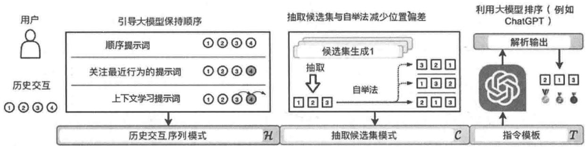  
图7-1 利用大模型进行zero-shot排序推荐的技术方案

用户历史交互序列：为了研究大模型是否可以从用户历史交互中捕获用户偏好，我们将顺序历史交互序列 $\mathcal{H} = \{i_1, i_2, \dots, i_n\}$ 作为大模型的输入包含在指令中。为了使大模型能够意识到历史交互的顺序性，有如下三种构建指令的方法。

- 顺序提示词：按时间顺序排列历史交互。例如：“I’ve watched the following movies in the past in order: ‘0. Multiplicity’, ‘1. Jurassic Park’, ...”。   
- 关注最近行为的提示词：除了顺序的交互记录，还可以添加一句话来强调最近的交互。例如：“I've watched the following movies in the past in order: '0.Multiplicity',1. JurassicPark',... Note that my most recently watched movie is Dead Presidents...”。   
- 上下文学习提示词：上下文学习是大模型解决各种任务的一种效果突出的提示方法，它在提示中给出示例样本（可能带有任务描述），并指示大模型解决特定任务。对于个性化推荐任务，简单地引入其他用户的示例可能引入噪声，因为不同的用户通常具有不同的偏好。我们通过调整上下文学习提示词，增补输入交互序列来引入示例样本。例如：“If I’ve watched the following movies in the past in order: ‘0. Multiplicity’, ‘1. Jurassic Park’, ..., then you should recommend Dead Presidents to me and now that I’ve watched Dead Presidents, then ...”。

抽取候选集：要排序的候选物品通常由几个候选生成模型生成（多路召回）。为了用大模型对这些候选物品排序，先按顺序排列候选物品|C|。例如：“Now there are 20 candidate movies that I can watch next: '0. Sister Act', '1. Sunset Blvd', ...”。按照经典的候选生成方法，候选物品没有特定的顺序。我们将不同候选集的生成模型的召回结果放到一个集合中，并随机排序。我们考虑了一个相对较小的候选集，并对20个候选物品（ $m = 20$ ）进行排序。实验表明，大模型对提示词中示例的顺序很敏感。因此，我们在提示词中为候选物品生成了不同的顺序（采用的方法为自举法——bootstrapping），这使我们能够进一步验证大模型的排序结果是否受到候选集排列顺序的影响，即位置偏差（这种位置偏差确实存在），以及如何通过自举法减少位置偏差。

使用大模型进行排序。为了将大模型作为排序模型，我们最终将上述模式集成到指令模板 $T$ 中。一个可行的示例指令模板可以是“[pattern that contains sequential historical interactions $\mathcal{H}$ (conditions)] [pattern that contains retrieved candidate items $\mathcal{C}$ (candidates)] Please rank these movies by measuring the possibilities that I would like to watch next most, according to my watching history. You MUST rank the given candidate movies. You cannot generate movies that are not in the given candidate list.”。

解析大模型的输出。通过将指令输入大模型，我们可以获得大模型的排序结果以供推荐。请注意，大模型的输出仍然是自然语言文本，我们使用启发式文本匹配方法解析输出，并将推荐结果与候选集进行匹配。具体来说，当物品的文本较短且能够区分时，如电影标题，可以在大模型输出和候选物品的文本之间直接执行高效的子串匹配算法（如KMP）。我们还可以为每个候选物品分配一个索引，并指示大模型直接输出排序后的物品索引。尽管提示词中包含了候选物品，但大模型仍可能生成候选集之外的物品。而对于GPT-3.5，出现这种误差的概率非常小，约为 $3\%$ 。在这种情况下，我们可以提示大模型并让它重新输出，也可以简单地将其视为不正确的输出而忽略。

参考文献[1]在两个公开数据集上进行实验，取得了几个关键发现，这些发现可以用于指导如何将大模型作为推荐系统的排序模型。

- 大模型可以利用用户历史交互进行个性化排序，但很难感知给定的历史交互的顺序。  
- 通过专门设计的提示词，如关注最近提示词和上下文学习提示词，可以触发大模型感知历史交互的顺序，从而改善排序效果。  
- 大模型优于 zero-shot 推荐方法，特别是在多个不同的召回排序算法生成的候选集上有较好的表现。  
- 大模型在排序时存在位置偏见和热门偏见，这可以通过提示词或自举法来缓解。

# 7.2.2 多任务实现案例

参考文献[2]设计了一组提示词，并评估了ChatGPT在5项推荐任务（评分预测、序列推荐、直接推荐、解释生成和评论摘要）中的表现。与传统的推荐方法不同，整个评估过程中不会微调ChatGPT，只依靠提示词将推荐任务转换为自然语言任务。此外，论文还探索了使用few-shot提示词注入包含用户潜在兴趣的交互信息，以帮助ChatGPT更好地了解用户的需求和兴趣。在Amazon Beauty数据集上的实验结果表明，ChatGPT在某些任务中取得了较好的效果，在其他任务中也能够达到基线水平。

使用ChatGPT执行5项推荐任务并评估其推荐性能的工作流程如图7-2所示，包括3个步骤。首先，根据推荐任务的具体特征构造不同的提示词。其次，这些提示词被用作ChatGPT的输入，期望ChatGPT根据提示词中指定的要求生成推荐结果。最后，优化（Refinement）模块对ChatGPT的输出进行检查和优化，将优化后的结果作为最终推荐结果返回给用户。下面分别对这3个步骤加以说明。

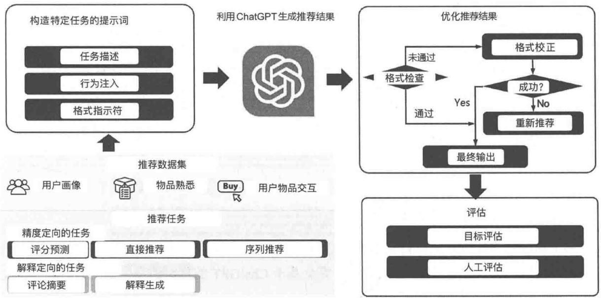  
图7-2 使用ChatGPT执行5项推荐任务并评估其推荐性能的工作流程

步骤1：构造特定任务的提示词。

通过设计针对不同任务的提示词来激发ChatGPT的推荐能力。每个提示词包含3部分：任务描述（Task Description）、行为注入（Behavior Injection）和格式指示符（Format Indicator）。任务描述用于使推荐任务适应自然语言处理任务。行为注入旨在评估few-shot提示词的影响，它整合了用户-物品交互，以帮助ChatGPT更有效地确定用户偏好和需求。格式指示符用于约束输出格式，使推荐结果更易于理解和评估。图7-3是一些提示词的示例。

  
图7-3亚马逊Beauty数据集上基于准确性任务的提示词示例

步骤2：利用ChatGPT生成推荐结果

将上面构造好的提示词以自然语言对话的形式注入ChatGPT（例如调用ChatGPT的API）获得最终的输出（推荐结果）。由于这一步完全基于ChatGPT的自然语言生成能力，属于黑盒，这里不展开说明。

步骤3：优化推荐结果。

为了确保生成结果的多样性，ChatGPT在其响应生成过程中加入了一定程度的随机性，这可能导致对相同输入产生不同的输出。因此，当使用ChatGPT进行推荐时，这种随机性有时会导致评估推荐物品困难。虽然提示词结构中的格式指示符可以部分缓解这一问题，但在实际使用中，它仍然不能保证预期的输出格式。因此，需要输出优化模块来检查ChatGPT的输出格式。如果输出通过了格式检查，它将直接用作最终推荐结果，如果没有通过，则会根据预定义的规则对其进行校正。如果校正成功，则校正后的结果将用作最终输出，如果没有校正成功，则将

相应的提示词输入ChatGPT以进行重新推荐，直到满足格式要求。

需要注意的是，在评估ChatGPT的输出时，不同的任务有不同的格式要求。例如，对于评分预测，只需要输出特定的分数，而对于序列推荐或直接推荐，需要输出推荐物品的列表。特别是对于序列推荐，一次将数据集中的所有物品注入ChatGPT是一项挑战（因为ChatGPT对输入的token数量有限制）。因此，ChatGPT的输出可能与数据集中的候选集不匹配（输出的物品不在数据集中）。为了解决这个问题，参考文献[2]中引入了一种基于相似性的文本匹配方法，将ChatGPT的预测映射回原始数据集。尽管这种方法可能不能完全反映ChatGPT的能力，但它仍然可以间接展示ChatGPT在序列推荐中的潜力。

# 7.2.3 NIR实现案例

参考文献[3]提出了NIR（Next-Item Recommendation）框架，通过将大模型推荐任务拆解为3个步骤来实现个性化的推荐，这3个步骤都利用提示词激发大模型的推理能力。图7-4是具体的步骤说明，下面展开讲解。

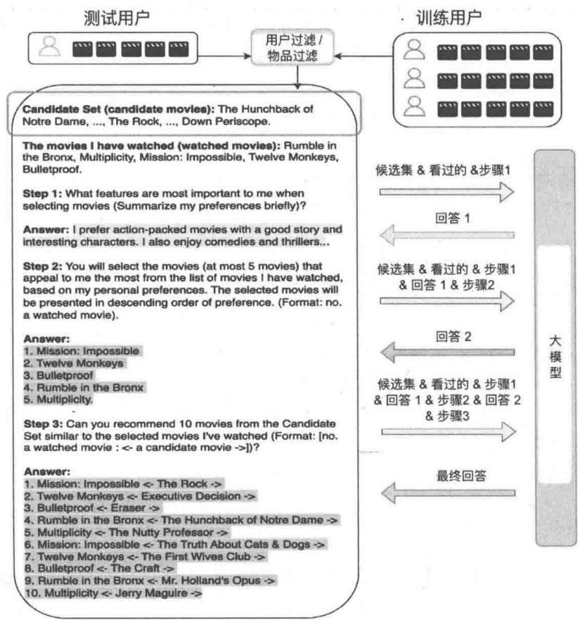  
图7-4上下文学习推荐的步骤

# 步骤1：构建用户兴趣。

为了捕捉用户的偏好，利用大模型（GPT-3）从用户看过的电影中总结出用户的偏好特征。如图7-4“回答1”左侧文字所示，大模型返回的答案总结了目标用户的偏好。具体的提示词如下。

```txt
What features are most important to me when selecting movies (Summarize my preferences briefly)? 
```

# 步骤2：代表性电影生成。

利用大模型基于用户看过的电影并结合第一步中总结的用户偏好，找出5部对用户最有吸引力的电影（这5部电影是从用户看过的电影中找出的），如图7-4中“回答2”左侧的文字所示。具体的提示词如下。

```txt
You will select the movies (at most 5 movies) that appeal to me the most from the list of movies I have watched, based on my personal preferences. The selected movies will be presented in descending order of preference. (Format: no. a watched movie). 
```

# 步骤3：电影推荐。

让大模型从候选集中选择与步骤2中代表用户兴趣的电影最相似的10部电影作为最终的推荐，如图7-4中“最终回答”左侧文字所示。具体的提示词如下。

```txt
Can you recommend 10 movies from the Candidate Set'similar to the selected movies I've watched (Format: [no. a watched movie : <- a candidate movie >])? 
```

# 7.3 上下文学习推荐代码实现

本节基于MIND数据集实现大模型上下文学习推荐，希望你通过代码更好地学习、了解如何直接利用大模型的泛化能力解决推荐问题。

上下文学习推荐相比预训练大模型进行推荐和微调大模型进行推荐来说，实现上更简单、更容易上手，也希望你可以熟练掌握这部分的知识点。

本节首先准备相关数据，然后搭建一个大模型本地服务，这个本地服务类似于ChatGPT的API，方便我们直接利用大模型实现上下文学习推荐，最后给出上下文学习单步骤推荐和多步骤推荐两个代码案例。

# 7.3.1 数据准备

使用MIND数据集构建本节的测试数据①。大模型上下文学习推荐需要的数据格式如下。

{"instruction": "You are a recommendation system expert who provides personalized recommendations to users based on the background information provided.",   
"input": "I've browsed the following news in the past in order:   
['Wheel Of Fortune' Guest Delivers Hilarious, Off The Rails Introduction', 'Hard Rock Hotel New Orleans collapse: Former site engineer weighs in', 'Felicity Huffman begins prison sentence for college admissions scam', 'Outer Banks storms unearth old shipwreck from 'Graveyard of the Atlantic"', 'Tiffany's is selling a holiday advent calendar for $112,000', 'This restored 1968 Winnebago is beyond adorable', 'Lori Loughlin Is 'Absolutely Terrified' After Being Hit With New Charge', 'Bruce Willis brought Demi Moore to tears after reading her book', 'Celebrity kids then and now: See how they've grown', 'Felicity Huffman Smiles as She Begins Community Service Following Prison Release', 'Queen Elizabeth Finally Had Her Dream Photoshoot, Thanks to Royal Dresser Angela Kelly', 'Hundreds of thousands of people in California are downriver of a dam that 'could fail"', 'Alexandria Ocasio-Cortez 'sincerely' apologizes for blocking ex-Brooklyn politician on Twitter, settles federal lawsuit', 'The Rock's Gnarly Palm Is a Testament to Life Without Lifting Gloves'] Then if I ask you to recommend a new news to me according to my browsing history, you should recommend 'Donald Trump Jr. reflects on explosive 'View' chat: 'I don't think they like me much anymore' and now that I've just browsed 'Donald Trump Jr. reflects on explosive 'View' chat: 'I don't think they like me much anymore', there are 22 candidate news that I can browse next:   
1. 'Browns apologize to Mason Rudolph, call Myles Garrett's actions 'unacceptable'',   
2. 'I've been writing about tiny homes for a year and finally spent 2 nights in a 300-foot home to see what it's all about here's how it went',   
3. 'Opinion: Colin Kaepernick is about to get what he deserves: a chance',   
4. 'The Kardashians Face Backlash Over 'Insensitive' Family Food Fight in KUwTK Clip',   
5. 'THEN AND NOW: What all your favorite '90s stars are doing today',6. 'Report: Police investigating woman's death after Redskins' player Montae Nicholson took her to hospital',   
7. 'U.S. Troops Will Die If They Remain in Syria, Bashar Al-Assad Warns',   
8. '3 Indiana judges suspended after a night of drinking turned into a White Castle brawl',   
9. 'Cows swept away by Hurricane Dorian found alive but how?',   
10. 'Surviving Santa Clarita school shooting victims on road to recovery: Latest',   
11. 'The Unlikely Star of My Family's Thanksgiving Table',   
12. 'Meghan Markle and Hillary Clinton Secretly Spent the Afternoon Together at Frogmore Cottage',   
13. 'Former North Carolina State, NBA player Anthony Grundy dies in stabbing, police say',   
14. '85 Thanksgiving Recipes You Can Make Ahead',   
15. 'Survivor Contestants Missy Byrd and Elizabeth Beisel Apologize For Their Actions',   
16. 'Pete Davidson, Kaia Gerber Are Dating, Trying to Stay 'Low Profile'',   
17. 'There's a place in the US where its been over 80 degrees since March',   
18. 'Taylor Swift Rep Hits Back at Big Machine, Claims She's Actually Owed $7.9 Million in Unpaid Royalties',   
19. 'The most talked about movie moments of the 2010s',   
20. 'Belichick mocks social media in comments on Garrett incident',   
21. '13 Reasons Why's Christian Navarro Slams Disney for Casting 'the White Guy' in The Little Mermaid',   
22. '66 Cool Tech Gifts Anyone Would Be Thrilled to Receive'   
Please select some news that I would like to browse next according to my browsing history. Please think step by step.   
Please show me your results. Split your output with line break. You MUST select from the given candidate news. You can not generate news that are not in the given candidate list." "output": ["Opinion: Colin Kaepernick is about to get what he deserves: a chance'\n"]

要将用户行为数据和新闻数据转为上述格式，就需要读取news.tsv和behaviors.tsv两个文件。news.tsv文件中有News ID和对应的新闻标题，而behaviors.tsv文件中有两个字段：User Click History 和 Impression News，前者包含用户的观看历史，后者包含用户点击和没有点击的新闻。

利用news.tsv和behaviors.tsv这两个文件就可以构建具体的测试数据集：User Click History作为提示词中用户的点击历史，Impression News作为待大模型排序的候选集（标签为1代表用户喜欢，为0代表用户不喜欢），下面是详细的代码实现②。

```python
import csv
import json
instruction = ("You are a recommendation system expert who provides personalized recommendations to users based on "
	"the background information provided.")
news_dict = \{\} # 从news.tsv获取每个新闻ID到标题的映射字典。
with open("\\./data/mind/news.tsv', 'r') as file:
	-reader = csv-reader(file, delimiter='\\t')
	for row in reader:
	news_id = row[0]
	news_title = row[3]
	news_dict[news_id] = news_title
	data_list = [ ] # 利用behaviors.tsv文件获取用户喜欢和不喜欢的新闻
with open("\\./data/mind/behaviors.tsv', 'r') as file:
	-reader = csv-reader(file, delimiter='\\t')
	for row in reader:
	history = row[3]
	impression = row[4]
	history_list = history.split("\\")
	impre_list = impression.split("\\")
	if len(history_list) >= 6 and len(impre_list) >= 10: 
```

至少要有6个用户点击历史和10个曝光历史

his $= []$ for news_id in history_list[-1]: title $\equiv$ news_dict[news_id] his.append(title)   
last_view_id $\equiv$ history_list[-1]   
last_view $\equiv$ news_dict[last_view_id]   
preference $= []$ candidate $= []$ index $= 1$ for impre in impre_list: [impre_id, action] $\equiv$ impre.split("\\") title $\equiv$ news_dict[impre_id] candidate.append(str(index) + ". "+ title + "\n") index $=$ index+1 if int(action) $= = 1$ ..

```python
preference.append(title + "\n")
input = ("I've browsed the following news in the past in order:\n\n" +
    [""] + ",".join(his) + ")"] + "\n\n"
    "Then if I ask you to recommend a new news to me according to my browsing history, "
    "you should recommend " + last_view + " and now that I've just browsed " + last_view + ", " +
    "there are " + str(len(impre_list)) + " candidate news that I can browse next:" +
    ",".join(candidate) + "\\n\n"
    "Please select some news that I would like to browse next according to my browsing history. " +
    "Please think step by step.\n\n"
    "Please show me your results. Split your output with line break. You MUST select from the given " +
    "candidate news. You can not generate news that are not in the given candidate list."
    ) output = "[\\n" + ",".join(preference) + "\\n"]
    res_dic = {
        "instruction": instruction,
        "input": input,
        "output": output
    }
data_list.append(res_dic)
res = json.dumps(data_list)
user_sequence_path = "./data/mind/validation.json" # 将生成的训练数据保存起来
with open(user_sequence_path, 'a') as file:
    file.write(res) 
```

运行上述代码，就会在/data/mind/目录下生成一个test.json文件，这个文件就是我们后面需要用到的数据集。

# 7.3.2 代码实现

有了上面的数据，就可以开始尝试进行上下文学习推荐了。本节的代码需要借助本地的大模型服务，这里使用Ollama框架[4]（也可以尝试使用FastChat、lite等大模型[5,6]）。

如果使用 macOS 或者 Windows 操作系统，则可以直接下载 Ollama 安装包。Ollama 的具体搭建过程详见参考文献[4]。

# 1. 单步骤上下文学习推荐

根据7.1节的思路利用大模型实现上下文学习个性化推荐，这里提供4种不同框架（Ollama、LlamaCpp、Transformers库、MLX）的实现方案，具体代码如下①。

import requests   
import torch   
import fire   
import json   
from datasets import load_dataset   
from langchain.chains import LLMChain   
from mlx_lm import load, generate_   
from langchain-community.llms import LlamaCpp   
from langchain.prompts chat import ChatPromptTemplate   
from langchain+prompts chat import ChatPromptTemplate   
from langchain)+(import StreamingStdOutCallbackHandler   
from transformers import AutoTokenizer, AutoModelForCausalLM, pipeline, TextStreamerer   
from langchaincommunity.llms.huggingfacepipeline import HuggingFacePipeline   
def icl_rec( model_path: str $=$ "", icl_type: str $=$ "", instruction: str $=$ "", prompt: str $=$ "", temperature: float = 0.1, top_p: float = 0.95, ctx: int = 13000,   
):   
""针对单个提示词为用户进行上下文学习推荐 :param model_path: 模型地址 :param icl_type: 上下文学习推理类型，我们实现了Ollama、LlamaCpp、 Transformers库、MLX4类 上下文学习推理方法 :param instruction: 指令 :param prompt: 提示词 :param temperature: 大模型温度系数 :param top_p: 大模型的top_p :param ctx: 输出 token长度 :return: 无   
""if not instruction: instruction $=$ ("You are a recommendation system expert who provides personalized recommendations to users "based on the background information provided.") assert ( icl_type ), "Please specify a --icl_type, e.g. --icl_type='ollama'." if icl_type $= =$ "ollama": ""利用Ollama框架将大模型封装成类似于符合ChatGPT接口规范的API服务，直接通过调用接口实现大模 型上下文学习推荐 ""url $=$ "http://localhost:11434/api/chat" # Ollama的API地址 data $=$ { "model": "yi:34b-chat", # Ollama安装的模型名 "options": {

"temperature": temperature,
	"top_p": top_p,
	"numCtx": ctx,
	"num_gpu": 128,
\},
	"messages": [ \{
		"role": "user",
		"content": prompt
	\}
\}
response = requests.post(url=url, json=data, stream=True)
for chunk in response部分内容(chunk_size=None, decode_unICODE=True): $j =$ json.dumps(chunk Decode('utf-8'))
	print(j['message'] ['content'], end="")
elif icl_type == "llamacpp": # 利用 LlamaCpp 实现上下文学习推荐
if not model_path:
(model_path =
	"/Users/liusqiang/Desktop/code/11m/models/gguf/ qwenl.5-72b-chat-q5_k_m.gguf"
callback $=$ StreamingStdOutCallbackHandler(   )
n_gpu_layers $= 128$ # 根据模型和 GPU 显存池大小更改此值
n_batch = 4096 # 可以设置为 1 至 nctx 之间的任何值, 根据计算机的 RAM 大小设置
llm = LlamaCpp( streaming=True,
model_path $\equiv$ model_path,
n_gpu_layers=n_gpu_layers,
n_batch=n_batch,
f16_kv=True, # 设置为 True, 避免运行中遇到问题
temperature=temperature,
top_p $\equiv$ top_p,
nCtx=ctx,
collbacks=[callback],
verbose=True
\}
system = ["system", instruction),
	("user", "{input})"]
 template $=$ ChatPromptTemplate.from/messages(system)
chain = LLMChain(prompt $\equiv$ template, llm=llm)
chain.invoke(['input': prompt])

use_cache=True,   
}   
model $=$ model.to("mps")   
streamer $=$ TextStreamer(tokenizer)   
pipe $=$ pipeline( "text-generation", model $\equiv$ model, tokenizer $\equiv$ tokenizer, streamer $\equiv$ streamer, max_length $= 13000$ temperature $\equiv$ temperature, pad_token_id $\equiv$ tokenizer.eos_token_id, top_p $\equiv$ top_p, repetition_penalty $= 1.15$ do_sample $\equiv$ False,   
}   
llm $=$ HuggingFacePipelinepipeline $\equiv$ pipe)   
system $=$ ["system", instruction), ("user","{}input{})] template $=$ ChatPromptTemplate.from/messages(system) chain $=$ LLMChain(prompt $\equiv$ template, llm $\equiv$ llm) chain.invoke({"input": prompt})   
elif acl_type $= =$ "mlx": #利用苹果开源的MLX框架实现上下文学习推荐 if not model_path: model_path $=$ "/Users/luqiang/Desktop/code/llm/models/Yi-34B-Chat" model,tokenizer $=$ load(model_path) response $=$ generate( model, tokenizer, prompt $\equiv$ prompt, temp $\equiv$ temperature, max_tokens $= 10000$ verbose $\equiv$ True ) print(response)   
else: raise NotImplementedError("the case not implemented!")   
if acl_rec_batch(validat path: str, acl_type $\equiv$ 'llamacpp'):

针对从训练数据构建的测试集，逐条为用户进行上下文学习推理，你可以跟真实值（output）对比，查看大模型上下文学习推荐的效果

```python
data = load_dataset("json", data_files=validation_path)  
index = 1  
for row in data['train']:  
    instruction = row['instruction']  
    input = row['input']  
    output = row['output'] 
```

```python
print(str(index) + " : ----")  
icl_rec(icl_type=icl_type, instruction=instruction, prompt=input)  
print(output)  
if __name__ == "_main_:  
# fire.Fire(icl_rec)  
icl_rec(icl_type="llamacpp")  
# ic1_rec_batch("/data/mind/test.json") 
```

运行上述代码，得到如下结果①

考虑到用户的浏览历史，我将选择那些与用户之前浏览的新闻主题相关或相似的新闻。

1. 'Browns apologize to Mason Rudolph, call Myles Garrett's actions 'unacceptable"', - 这条新闻与体育相关，特别是橄榄球，这与用户浏览的"Donald Trump Jr. reflects on explosive 'View' chat"这条新闻的主题不同，但可能吸引喜欢体育新闻的用户。  
2. 'Opinion: Colin Kaepernick is about to get what he deserves: a chance',  
- 这条新闻与体育和政治相关，特别是关于NFL球员 Colin Kaepernick 的争议。这与用户浏览的"Donald Trump Jr. reflects on explosive 'View' chat"这条新闻的主题有相似之处，都是关于公共人物的争议。根据用户的浏览历史，我推荐用户浏览这两条新闻，因为它们与用户之前浏览的新闻主题相关或相似。

# 2. 多步骤上下文学习推荐

根据7.2节中NIR实现案例的思路让大模型给出个性化的推荐，这里还是使用Ollama框架实现。

下面是笔者在运行ollama run qwen:72B-chat-v1.5-q5_K_M后与大模型的交互式对话，其中，“>>>”后面是笔者给出的提示词，“：”后面是大模型给出的回答。

```txt
>>> The news I have browsed:
...
[Wheel Of Fortune' Guest Delivers Hilarious, Off The Rails Introduction', 'Hard Rock Hotel New Orleans collapse: Former site engineer weighs in', 'Felicity Huffman begins prison sentence for college adm
... issions scam', 'Outer Banks storms unearth old shipwreck from 'Graveyard of the Atlantic', 'Tiffany's is selling a holiday advent calendar for $112,000', 'This restored 1968 Winnebago is beyond adorable', 'Lori Lo
... ughlin Is 'Absolutely Terrified' After Being Hit With New Charge', 'Bruce Willis brought Demi Moore to tears after reading her book', 'Celebrity kids then and now: See how they've grown', 'Felicity Huffman Smiles
... as She Begins Community Service Following Prison Release', 'Queen Elizabeth Finally Had Her Dream Photoshoot, Thanks to Royal Dresser Angela Kelly', 'Hundreds of thousands of people in California are downriver of
... a dam that 'could fail"', 'Alexandria Ocasio-Cortez 'sincerely' apologizes for blocking ex-Brooklyn politician on Twitter, settles federal lawsuit', 'The Rock's Gnarly Palm Is a Testament to Life Without Lifting
... Gloves ]
...
What features are most important to me when selecting news (Summarize my preferences briefly)? 
```

Based on the news you have browsed, your preferences seem to be focused on:

1. \*\*Entertainment and Pop Culture\*\*: You've viewed stories about celebrities like Felicity Huffman, Lori Loughlin, Bruce Willis, Demi Moore, and The Rock.   
2. **Human Interest and Heartwarming Stories**: Restored vintage vehicles and holiday advent calendars indicate a fondness for charming or nostalgic tales.   
3. **Current Events and Breaking News**: Stories about the Hard Rock Hotel collapse in New Orleans, California dam safety concerns, and Alexandria Ocasio-Cortez's federal lawsuit settlement demonstrate an interest in staying informed on important local and national events.

>>> You will select the news (at most 5 news) that appeal to me the most from the list of news I have browsed, based on my personal preferences. The selected news will be presented in descending order of preference
...
(Format: no. a browsed news).

Based on your preferences, here are the top 5 news articles that would likely appeal to you the most:

1. \*\*a\*\* 'Felicity Huffman Smiles as She Begins Community Service Following Prison Release' This story combines elements of human interest and current events, focusing on a celebrity who has recently gone through a challenging legal process.   
2. \*\*b\*\* 'The Rock's Gnarly Palm Is a Testament to Life Without Lifting Gloves' This article is likely to pique your interest due to its focus on entertainment and pop culture, specifically highlighting the unique physical attribute of a well-known actor.   
3. \*\*c\*\* 'Bruce Willis brought Demi Moore to tears after reading her book' Another story blending entertainment and emotional connections, this news item would likely appeal to you as it discusses the touching moment between two famous ex-spouses.   
4. \*\*d\*\* 'This restored 1968 Winnebago is beyond adorable' This article combines elements of nostalgia, human interest, and heartwarming stories. It's likely to resonate with you if you appreciate charming tales about restored vintage vehicles.   
5. **e** 'Felicity Huffman begins prison sentence for college admissions scam' Although less focused on positive or heartwarming aspects, this news story still combines elements of current events and entertainment. Felicity Huffman's involvement in a high-profile scandal would likely pique your interest as it does touch upon the lives of celebrities off-screen.

>>> Candidate Set (candidate news): 1. 'Browns apologize to Mason Rudolph, call Myles Garrett's actions

```txt
'unacceptable', 2. 'I've been writing about tiny homes for a year and finally spent 2 nights in a 300-foot home to see what it's all about here's how it went', 3. 'Opinion: Colin Kaepernick is about to get what he deserves: a chance', 4. 'The Kardashians Face Backlash Over 'Insensitive' Family Food Fight in KUWTK Clip', 5. 'THEN AND NOW: What all your favorite '90s stars are doing today', 6. 'Report: Police investigating woman's death after Redskins' player Montae Nicholson took her to hospital', 7. 'U.S. Troops Will Die If They Remain in Syria, Bashar Al-Assad Warns', 8. '3 Indiana judges suspended after a night of drinking turned into a White Castle brawl', 9. 'Cows swept away by Hurricane Dorian found alive but how?', 10. 'Surviving Santa Clarita school shooting victims on road to recovery: Latest', 11. 'The Unlikely Star of My Family's Thanksgiving Table', 12. 'Meghan Markle and Hillary Clinton Secretly Spent the Afternoon Together at Frogmore Cottage', 13. 'Former North Carolina State, NBA player Anthony Grundy dies in stabbing, police say', 14. '85 Thanksgiving Recipes You Can Make Ahead', 15. 'Survivor Contestants Missy Byrd and Elizabeth Beisel Apologize For Their Actions', 16. 'Pete Davidson, Kaia Gerber Are Dating, Trying to Stay 'Low Profile"', 17. 'There's a place in the US where its been over 80 degrees since March', 18. 'Taylor Swift Rep Hits Back at Big Machine, Claims She's Actually Owed $7.9 Million in Unpaid Royalties', 19. 'The most talked about movie moments of the 2010s', 20. 'Belichick mocks social media in comments on Garrett incident', 21. '13 Reasons Why's Christian Navarro Slams Disney for Casting 'the White Guy' in The Little Mermaid', 22. '66 Cool Tech Gifts Anyone Would Be Thrilled to Receive' 
```

```txt
Based on your previously browsed news, it seems that you have an interest in a mix of entertainment, human interest stories, and current events. Here are three recommendations from the candidate set that align with these interests: 
```

```txt
1. \*\*[no. 4 browsed news : <- THEN AND NOW: What all your favorite '90s stars are doing today >]\*\* This recommendation combines elements of nostalgia, entertainment, and keeping up with the lives of celebrities. 
```

```txt
2. \*\* [no. 5 browsed news : <- Colin Kaepernick is about to get what he deserves: a chance >]** This article discusses a current event in sports that also touches upon social justice issues, which might appeal to you based on your previous interests. 
```

```txt
3. **[no. 16 browsed news : <- Pete Davidson, Kaia Gerber Are Dating, Trying to Stay 'Low Profile' >]**  
This news item combines elements of entertainment and celebrity gossip, focusing on the private lives of famous personalities, which seems to be a recurring theme in your previously browsed news. 
```

上面是一个交互式的界面，大模型可以直接利用上下文进行推理，如果调用API实现，那么需要将上下文（上一次的问题和答复）传给大模型，下面是一个简单的调用API的实现案例①。

import requests   
import json   
def personalized_generation( model: str $=$ "qwen:72b-chat-v1.5-q5_K_M", temperature: float $= 0.1$ top_p: float $= 0.95$ cx:int $\equiv$ 13000, message: list $=$ None, is_STREAM: bool $=$ False

利用Ollama框架将大模型封装成类似于符合ChatGPT接口规范的API服务，基于提供的信息生成个性化的回答。

```python
:param model: Ollama 安装的大模型名
:param temperature: 温度
:param top_p: top_p
:param ctx: 生成 token 长度
:param message: 提供给大模型的对话信息
:param is_STREAM: 是否流式输出大模型的应答
:return: 基于提示词, 利用大模型生成的结果
""
if message is None:
    message = {}
url = "http://localhost:11434/api/chat" # Ollama 的 API 地址
data = {
    "model": model, # Ollama 安装的模型名
    "options": {
        "temperature": temperature,
        "top_p": top_p,
        "numCtx": ctx,
        "num_gpu": 128,
   },
    "messages": message,
    "stream": is_STREAM
}
```

```python
if is_STREAM:
response = requests.post(url=url, json=data, stream=True)
res = ""
for chunk in response_iter_content(chunk_size=None,decode_unICODE=True):
    j = json.dumps(chunk_decode('utf-8'))
    res = res + j['message']['content']
print(j['message']['content'], end="")
return res
else:
    response = requests.post(url=url, json=data, stream=False)
res = json loads(response(content)["message"]["content"]
return res
if __name__ == "_main":
instruction = ("You are a recommendation system expert in the news field, providing personalized "
    "recommendations to users based on the background information provided.")
portrait_prompt = ""
The news I have browsed:
['Wheel Of Fortune' Guest Delivers Hilarious, Off The Rails Introduction', 'Hard Rock Hotel New Orleans collapse: Former site engineer weighs in', 'Felicity Huffman begins prison sentence for college admissions scam', 'Outer Banks storms unearth old shipwreck from 'Graveyard of the Atlantic"', 'Tiffany's is selling a holiday advent calendar for $112,000', 'This restored 1968 Winnebago is beyond adorable', 'Lori Loughlin Is 'Absolutely Terrified' After Being Hit With New Charge', 'Bruce Willis brought Demi Moore to tears after reading her book', 'Celebrity kids then and now: See how they've grown', 'Felicity Huffman Smiles as She Begins Community Service Following Prison Release', 'Queen Elizabeth Finally Had Her Dream Photoshoot, Thanks to Royal Dresser Angela Kelly', 'Hundreds of thousands of people in California are downriver of a dam that 'could fail"', 'Alexandria Ocasio-Cortez 'sincerely' apologizes for blocking ex-Brooklyn politician on Twitter, settles federal lawsuit', 'The Rock's Gnarly Palm Is a Testament to Life Without Lifting Gloves']
What features are most important to me when selecting news (Summarize my preferences briefly)?"
Representable_prompt = ""
You will select the news (at most 5 news) that appeal to me the most from the list of news I have browsed, based on my personal preferences. The selected news will be presented in descending order of preference. (Format: no. a browsed news).
 rec_prompt = ""
Candidate Set (candidate news):
1. 'Browns apologize to Mason Rudolph, call Myles Garrett's actions 'unacceptable"', 2. 'I've been writing about tiny homes for a year and finally spent 2 nights in a 300-foot home to see what it's all about here's how it went',
3. 'Opinion: Colin Kaepernick is about to get what he deserves: a chance',
4. 'The Kardashians Face Backlash Over 'Insensitive' Family Food Fight in KUWTK Clip',
5. 'THEN AND NOW: What all your favorite '90s stars are doing today',
6. 'Report: Police investigating woman's death after Redskins' player Montae Nicholson took her to hospital', 
```

```python
7. 'U.S. Troops Will Die If They Remain in Syria, Bashar Al-Assad Warns',
8. '3 Indiana judges suspended after a night of drinking turned into a White Castle
brawl',
9. 'Cows swept away by Hurricane Dorian found alive but how?', 10. 'Surviving Santa Clarita school shooting victims on road to recovery: Latest',
11. 'The Unlikely Star of My Family's Thanksgiving Table',
12. 'Meghan Markle and Hillary Clinton Secretly Spent the Afternoon Together at
Frogmore Cottage',
13. 'Former North Carolina State, NBA player Anthony Grundy dies in stabbing, police
say',
14. '85 Thanksgiving Recipes You Can Make Ahead',
15. 'Survivor Contestants Missy Byrd and Elizabeth Beisel Apologize For Their
Actions',
16. 'Pete Davidson, Kaia Gerber Are Dating, Trying to Stay 'Low Profile',
17. 'There's a place in the US where its been over 80 degrees since March',
18. 'Taylor Swift Rep Hits Back at Big Machine, Claims She's Actually Owed $7.9'
Million in Unpaid Royalties',
19. 'The most talked about movie moments of the 2010s',
20. 'Belichick mocks social media in comments on Garrett incident',
21. '13 Reasons Why's Christian Navarro Slams Disney for Casting 'the White Guy'
in The Little Mermaid',
22. '66 Cool Tech Gifts Anyone Would Be Thrilled to Receive'
Can you recommend 3 news from the Candidate Set similar to the selected news I've browsed
(Format: [no. a browsed news : <- a candidate news >])?
{
    "role": "system",
    "content": instruction
},
    "role": "user",
    "content": portrait_prompt
}
print("************************* step 1 start************************")
step_1_output = personalized_generation(message=step_1_message, isstreams=stream)
if not stream:
    print(step_1_output)
step_2_message = [
        "role": "system",
        "content": instruction
    ],
    "role": "user",
    "content": portrait_prompt 
```

}，{"role": "assistant", "content": step_1_output}，{ "role": "user", "content": representable_prompt }] print("===step2start===")   
step_2_output $=$ personalized_generation(message $\equiv$ step_2_message,is stream $\equiv$ stream) if not stream: print(step_2_output)   
step_3_message $= [$ { "role": "system", "content": instruction }，{ "role": "user", "content": portrait_prompt }，{ "role": "assistant", "content": step_1_output }，{ "role": "user", "content": representable_prompt }，{ "role": "assistant", "content": step_2_output }，{ "role": "user", "content": rec_prompt }] print("===step3start===")   
step_3_output $=$ personalized_generation(message $\equiv$ step_3_message,is stream $\equiv$ stream) if not stream: print(step_3_output)

运行上述代码，可以获得如下的大模型推荐结果。注意，在运行代码之前，需要运行ollamarun qwen:72B-chat-v1.5-q5_K_M启动千问大模型。

```txt
- step 1 start
- Based on the news articles you've browsed, your preferences seem to be:
- 1. **Entertainment and Pop Culture**: You have shown interest in stories involving 
```

celebrities like Felicity Huffman, Lori Loughlin, Bruce Willis, Demi Moore, and The Rock.

2. **Human Interest and Heartwarming Stories**: Articles about restored vintage vehicles or touching moments between family members (like Bruce Willis reading Demi Moore's book) appeal to you.   
3. **Current Events and Breaking News**: You have also shown interest in articles covering real-time events, such as the Hard Rock Hotel collapse in New Orleans, the California dam safety concern, and Alexandria Ocasio-Cortez's legal settlement.

In summary, your preferences lean towards entertainment news, heartwarming stories, and current events.

# step 2 start

Based on your preferences, here are the top 5 news articles that appeal to you the most:

1. \*\*a\*\* 'Bruce Willis brought Demi Moore to tears after reading her book' - This story combines elements of celebrity interest and heartwarming moments.   
2. **b** 'Tiffany's is selling a holiday advent calendar for $112,000' - This news item appeals to your interest in pop culture and luxury items.   
3. \*\*c\*\* 'Felicity Huffman Smiles as She Begins Community Service Following Prison Release' - This story combines elements of celebrity news with human interest, focusing on redemption and community service.   
4. \*\*d\*\* 'The Rock's Gnarly Palm Is a Testament to Life Without Lifting Gloves' - This article appeals to your interest in entertainment news and pop culture, specifically related to celebrities' lifestyles.   
5. \*\*e\*\* 'Lori Loughlin Is 'Absolutely Terrified' After Being Hit With New Charge' - This story combines elements of celebrity news with human interest, focusing on the emotional impact of legal issues.

These articles are presented in descending order of preference based on your browsing history and preferences.

# step 3 start

Based on your previously browsed news, here are 3 recommendations from the candidate set that share similarities:

1. \*\*[b browsed news : <- THEN AND NOW: What all your favorite '90s stars are doing today >]** - Both stories focus on nostalgia and the current status of well-known figures.   
2. \*\*[c browsed news : <- Opinion: Colin Kaepernick is about to get what he deserves: a chance >]**

- These two articles share a theme of social justice and opportunities for individuals who have faced adversity.

3. **[d browsed news : <- The Kardashianians Face Backlash Over 'Insensitive' Family Food Fight in KUwTK Clip >]**

```txt
- Both stories involve celebrities and their public image, with the candidate news focusing on tech gifts that could appeal to a celebrity's lifestyle. These recommendations share themes of nostalgia, social justice, and celebrity culture, which align with your previously browsed news. 
```

# 7.4 总结

本章介绍了如何利用大模型强大的逻辑推理能力、泛化能力及压缩的世界知识进行上下文学习推荐。本章提供的3个案例非常有代表性，希望你可以阅读原论文，对它们有更深入的了解。

要想实现较好的上下文学习推荐效果，利用更强大的大模型是最关键的，另外，选择合适的提示词也非常重要。在上下文学习推荐中，大模型的作用类似于传统推荐系统架构中的排序模块，因此需要配合常规的召回算法，减少提供给大模型的推荐候选集。

本章基于大模型强大的泛化能力和指令跟随能力实现了上下文学习推荐。Ollama框架非常好用，强烈推荐你尝试一下。本章的单步骤上下文学习推荐提供了4种实现方案，你可以根据实际情况学习、使用。

上下文学习推荐是一种最简单的利用大模型实现个性化推荐的方式，本章的代码只是抛砖引玉，希望你可以结合自己的业务场景和思考进行创造性尝试。

代找电子书资源，新书可代做扫描制作加微信 asxiao90

# 08

# 实战案例：大模型在电商推荐中的应用

我们已经学习了大模型推荐系统的算法原理，了解了大模型应用于推荐系统的具体方法。不过，真实的业务场景更加复杂，要考虑的因素也很多。本章汇集了一些电商实战案例。将大模型在电商推荐中的应用作为实战案例，一是因为电商是推荐系统最主流的应用场景，二是因为电商推荐可以直接体现推荐的商业价值。

8.1节把大模型的能力嵌入推荐系统的整体框架中，介绍电商大模型推荐系统的应用方法，是后面内容的框架。8.2~8.9节介绍新的交互式推荐范式、大模型生成用户兴趣画像、大模型生成个性化商品描述信息、大模型应用于电商猜你喜欢推荐、大模型应用于电商关联推荐、利用大模型解决电商冷启动问题、利用大模型进行推荐解释以及利用大模型进行对话式推荐。

# 8.1 大模型赋能电商推荐系统

大模型在推荐系统的应用还处于初级阶段，可以说，大模型和传统推荐系统之间是补充和革新的关系。从补充层面看，大模型的能力会嵌入传统推荐系统中，整体采用的还是传统电商的流水线架构。从革新层面看，由于大模型具备很好的交互能力，如果使用得当，就可以创造一种新的电商推荐范式。

接下来，从大模型如何赋能传统推荐系统，以及如何设计交互式新推荐范式这两个维度说明大模型在电商推荐中的应用。

传统的推荐系统采用流水线架构，将推荐任务分解为召回、排序、业务调控这3个串联的环节。同时，数据特征处理、推荐解释、冷启动等是企业级推荐系统必须面对的问题。在这些方面，大模型都有用武之地，如图8-1所示。

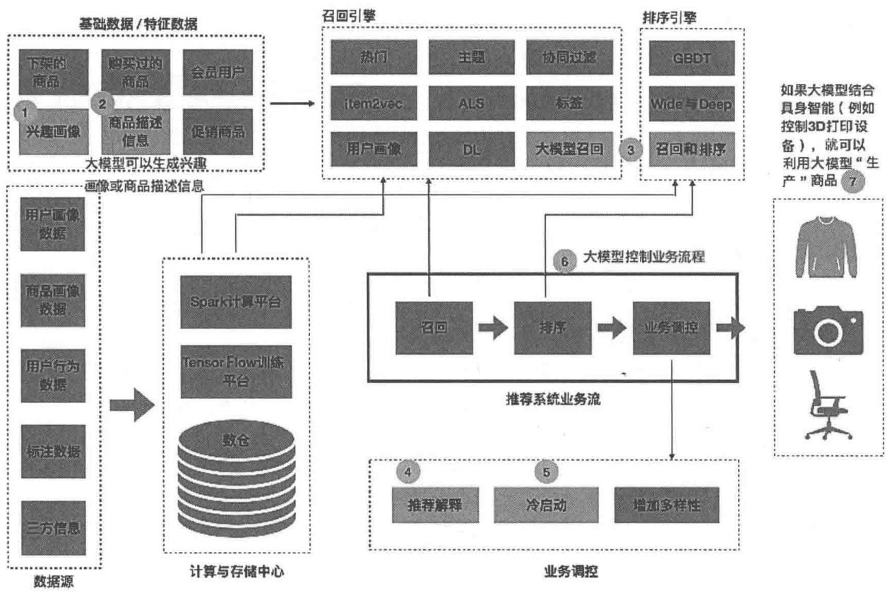  
图8-1 大模型赋能传统推荐系统  
图8-1中，标注数字的场景是大模型能够赋能的，下面详细介绍大模型如何赋能这些场景。

# 1.生成用户兴趣画像

我们都知道大模型具备极强的文本生成能力，那大模型能够生成电商推荐中的部分数据吗？答案是肯定的。

用户的历史行为是用户兴趣的真实反馈，我们可以通过用户的历史行为生成用户兴趣画像。这里有两种方法，一种是将用户过往购买的物品的描述信息聚合在一起作为一段长文本，这一段文本就是对用户的兴趣的描述，那么可以用大模型对这一段文本提取摘要或关键词，得到的摘要文本或关键词就是用户的兴趣描述，可以作为用户兴趣画像。另一种方法是采用监督学习的方式，先构建<特征，兴趣画像>训练样本，然后利用大模型进行监督微调，从数据中学习并生成用户兴趣画像。

# 2.生成商品描述信息

与生成用户兴趣画像类似，生成商品描述信息也有两种方法。一种方法是利用大模型从商品的各种介绍及用户评论文档中提取摘要和关键词，把它们作为商品的描述信息。另一种方法

是采用监督学习的方式，先构建<特征，商品描述信息>训练样本，然后利用大模型进行监督微调，从数据中学习并生成商品描述信息。

商品描述信息以什么样的形式展现给用户呢？这就需要在产品的详情页基于产品 UI 设计一些具体的样式和模板。我们还可以结合用户的兴趣为每个用户生成个性化的商品描述信息，即每个用户看到的同一个商品的描述信息是不一样的。

这个过程的原理大致是这样的：先生成商品的描述信息，然后结合用户兴趣画像调整商品描述信息，保留描述信息中匹配用户兴趣画像的关键词或者段落，而省去跟用户兴趣无关的描述信息，这样的商品描述信息是最能打动用户的，可以带来更好的效果转化。

# 3. 大模型进行召回和排序

这里将大模型作为一种召回、排序算法来实现商品的召回和精准排序，是对传统电商推荐算法体系的补充。通常情况下，大模型比较适合进行排序，不太适合进行典型的召回。请思考一下为什么？

# 4. 大模型进行推荐解释

大模型的自然语言生成能力有助于以更加真实、流畅的方式将推荐的原因展示给用户，提升用户对推荐系统的信任度，加强人与系统的情感联系。

# 5. 大模型解决冷启动问题

大模型中蕴含的先验世界知识有助于高效分发新商品，也可以提供更能打动用户的商品推荐信息。

# 6. 大模型控制业务流程

大模型智能体（Agent）是目前非常火的研究方向，利用大模型控制推荐业务流程本质上就是一个智能体应用，大模型起类似于人类大脑的作用。召回、排序、冷启动、推荐解释等模块都可以看作工具，将大模型作为大脑控制这些工具的组合和使用，从而获得互动式的推荐体验。

# 7.大模型“生产”商品

在电商场景中，商品是实物，大模型“生产”商品可以体现在两个层次：一是大模型可以设计出商品的原型，如果用户喜欢并且购买，则可以在工厂按照设计的原型进行生产并发货。二是大模型背后的智能大脑具备操控“生产设备”的能力，例如大模型能控制3D打印设备，这时可以利用3D打印技术为用户“定制”需要的商品。

大模型“生产”商品与传统的推荐系统只在已有的商品池中进行推荐不一样，这是一个从0到1的过程，因此是更加个性化的、最能满足用户兴趣和需求的。笔者相信，随着AI技术的

发展，未来的电商一定会进化成量身定制产品的电商引擎。

# 8.2 新的交互式推荐范式

这里的交互式推荐范式是大模型控制业务流程的延伸。除了推荐，大模型还可以完成搜索、商品特性问询等任务，甚至商品比价、商品售后等。这是一种融合式解决方案，大大拓展了传统推荐系统的范畴。这是真正意义上的将大模型当成领域专家的“顾问式解决方案”。

# 8.2.1 交互式智能体的架构

你可以将交互式智能体[1,2]类比为电商行业的一个顾问专家，帮你解决电商购物中的所有问题。这时大模型所起的作用就是电商顾问的大脑，是控制中心。

对于用户的特定问题，例如购物、比价、咨询等，Agent借助各种传感设备接收外界信号，将信号转化为智能体可以处理的数据形式，再通过大模型进行整合、分析，将复杂任务分解为简单的子任务，然后自行或者借助其他的工具解决问题，最终实现最初的、获取信息的目标，如图8-2所示。

  
图8-2 交互式智能体架构

交互式智能体一般包括如下6个模块。

# 1. 外界环境

外界环境就是智能体应用场景的外界，对于电商推荐系统，PC、手机 App、Vision Pro 等就是智能体的外界环境。

# 2. 信息感知模块

信息感知模块就是接受外界环境信息的部分，类似人的眼睛、耳朵、鼻子、嘴巴、手等，一般需要借助传感器获取外界信息。对于电商推荐场景，感知模块就是文本输入框、触屏信号、语音输入、摄像头、读取本地存储文件等。

# 3. 大模型大脑

大模型大脑是整个智能体的控制中心。大脑要基于环境信息，对智能体的目标进行规划、拆解、执行、反馈、调整等。

# 4. 存储记忆模块

大模型已经压缩了海量的互联网信息，存储记忆模块是对大模型大脑的补充。特别是电商行业相关的知识，大模型是欠缺的。一般可以以两种方式获取电商行业知识：一是利用电商数据对大模型进行微调，将电商行业知识进一步压缩到大模型中；二是借用外部组件来存储电商行业知识（例如RAG技术）。

# 5. 动作模块

动作模块用于最终完成任务，例如将用户的问题拆解为多个子问题、为用户进行推荐、在屏幕上展示相关商品信息等。

# 6. 工具模块

工具模块是配合动作模块的外部工具链，例如电商公司已有的传统推荐、搜索、查询服务等。大模型在执行过程中可以调用工具更好地完成相关任务。

下面以淘宝问问为原型，详细介绍大模型如何作为智能体交互式地为用户解决推荐相关问题。

# 8.2.2 淘宝问问简介

淘宝在2023年上半年已经开始尝试交互范式的商品推荐，截至本书写作时仍处于内测阶段。在淘宝首页输入框中输入“淘宝问问”，就可以获取对应的智能体界面。

界面上有一些热门问题，中间部分还有经典的“猜你喜欢”模块。底部有语音、文本输入区，这是方便用户与淘宝问问进行交互式对话的界面，如图8-3所示。你可以自行探索体验。


  
图8-3 淘宝问问界面

当提出“什么样的双屏显示器增高架可以调节高度？”的问题后，淘宝问问以视频的方式展示了3个推荐商品，后面还有一段文字说明，再下面是类似的问题及你还可能感兴趣的商品，如图8-4所示。

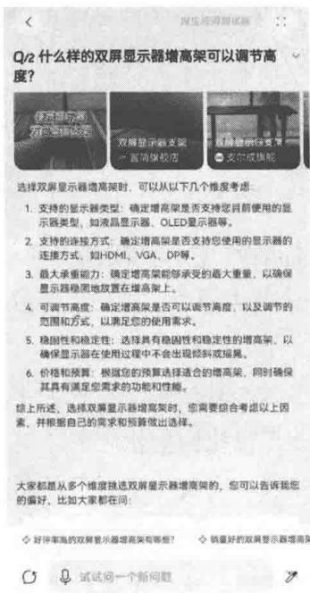

  
图8-4 淘宝问问交互式推荐

你还可以进行多轮互动，例如你觉得推荐的商品太贵了，淘宝问问会给你提供更便宜的选项。通过多轮互动，淘宝问问可以更好地满足你的个性化需求。你可以通过尝试感受一下互动式推荐的特点和魅力。

# 8.3 大模型生成用户兴趣画像

8.1节提到了大模型可以生成用户兴趣画像和商品描述信息。本节先把目光放在用户兴趣画像上，利用大模型基于用户的历史行为生成用户喜欢的Top2品牌兴趣画像，如图8-5所示。

  
图8-5 大模型生成用户兴趣画像

# 8.3.1 基础原理与步骤介绍

本节会用到亚马逊电商数据集中的Beauty数据集，基于用户的评论数据和商品元数据构建微调样本，对大模型进行微调。先来介绍一下基础的步骤和原理。

第1步，将用户的购买历史组成文本序列。用户购买的每个商品都可以用一段文本表示，这个文本可以是商品的名称。把所有的购买记录按照文本表示顺序组织在一起，就形成了一篇描述用户购买历史的文档。该文档中隐含了用户的兴趣信息。

有了描述用户兴趣的文本，第2步就可以利用大模型，从文本中提取或预测关键词，获取用户兴趣画像了。

这一步有两种方法，一是通过开放API，调用ChatGPT这样的闭源大模型，或者LLaMA2、Yi、Qwen等开源模型；二是基于开源的、相对小一些的大模型，利用监督数据进行微调，让模型学习生成用户兴趣画像的方法。

哪种更好呢？答案是第二种。如果把ChatGPT这种超级大模型比作博士生，那么LLaMA、Qwen这种小一些的模型就可以看作本科生，而微调可以比作毕业后的“创业”。博士生可能有着更丰富的知识储备，但从创业（微调）的效果来看，可能比不过已经创业（微调）多次的本科生。

还有最后一步（可选）：进行后期格式或形式的调整。这一步是对第2步生成的兴趣画像进行调整后再处理的过程。例如生成的品牌关键词不在品牌词库中，又或者是包含多余信息等，

这些情况都需要通过简单的规则进行小幅调整。

# 8.3.2 数据预处理

讲完思路，再聚焦数据的预处理问题。简单来说，首先生成用户与物品的连接表，这样就有了用户ID、商品名、品牌等数据。接着对用户进行聚合，获得每个用户的信息及对应的品牌偏好。

数据的预处理非常关键，处理好的数据都是大模型推理或微调的素材。我们可以利用的数据有两个：一个是用户评论数据 All_Beauty.json；另一个是商品属性数据 meta_All_Beauty.json。这两个数据都是 JSON 格式的，可以统一处理。我们最终的目标是生成形如表 8-1 所示的数据，包含 6 个字段。

表 8-1 数据预处理的结果字段  

<table><tr><td>字段</td><td>reviewerID</td><td>reviewText</td><td>asin</td><td>title</td><td>description</td><td>brand</td></tr><tr><td>说明</td><td>用户ID</td><td>评论内容</td><td>商品唯一ID</td><td>商品标题</td><td>商品描述信息</td><td>商品品牌</td></tr></table>

这里只要进行简单数据处理就可以了，具体实现代码如下①。

import json   
import pandas as pd   
path_review $=$ "./data.amazon_review/beauty/All_A Beauty.json"   
path_meta $=$ "./data.amazon_review/beauty/metab_All_A Beauty.json"   
#读取相关数据   
def parse(path): $\mathrm{g} =$ open(path,'r') for row in g: yield json.loads(row)   
#将数据存为DataFrame格式，方便后续处理   
def get_df(path): i=0 df_ $=$ {} for d in parse(path): df_[i] $=$ d i+=1 return pd.DataFrame.from_dict(df,_orient='index')   
"" 获取用户评论数据，具体字段意思如下： reviewerID：进行评论的用户的ID reviewText：用户对商品评论的内容 asin：商品唯一ID

① 代码：src/e-commerce(case/generate和个人ized_info/userportrait_data_process.py。

```python
```
df_view = get_df(path_review)
# 选择评论分数大于3的，代表正向评论
df_view = df_view[df_view["overall"] > 3] [["reviewerID", "reviewText", "asin"]
```
获取产品元数据，具体字段意思如下：
asin: 商品唯一ID
title: 商品标题
description: 商品描述信息
brand: 商品品牌
```
df_meta = get_df(path_meta)
df_meta = df_meta [["asin", "title", "description", "brand"]
# 评论数据和商品数据 join
df Joined = pd.merge(df_view, df_meta, how="left", on=['asin']) 
# 删除字段为空值的行，只要有一个空值，就整行删除
df Joined.dropna(how='any', subset=['asin", "title", "description", "brand"], 
inplace=True)
df Joined = df Joined.drop_index.drop=True) 
```

接着，将表8-1中同一个用户对应的所有商品标题聚合起来，并且计算出用户最喜欢的两个品牌，最终基于聚合的标题生成用户兴趣画像，作为后面的微调数据①。

```python
生成用户兴趣画像。最终目的是基于用户喜欢的产品信息预测用户最喜欢的1~2个品牌
```
df Joined.drop(['reviewText', 'asin', 'description'], axis=1, inplace=True)
# [reviewerID, title, brand]
# 对每个用户喜欢的行为进行聚合，目的是找出用户喜欢的Top2品牌
TOP TWO = 2
grouped = df Joined.groupby('reviewerID')
prompt_list = []
brand_list = []
for name, group in grouped:
    if group.shape[0] > 2 * TOP TWO: # 至少需要5个样本，方便大模型更好地学习用户喜欢的品牌
        title = group["title"] # 'pandas.core_series.Series'
        brand = group["brand"] # 'pandas.core_series.Series'
        purchase_list = []
        brandDIC = {}
    for e in zip(title, brand):
        purchase_list.append({
            "title": e[0],
            "brand": e[1]
       })
    for b in brand:
        if b !=)):
            if b in brandDIC:
                brandDIC[b] = brandDIC[b] + 1
        else: 
```

```python
brand_dic[b] = 1
# 找出用户最喜欢的1~2个品牌，这就是用户兴趣画像
filtered_dict = {}
for key, value in brand_dic.items():
    if value > 1:
        filtered_dict[key] = value
brand_top_2 = [x for (x, t) in sorted滤镜ed_dict.items(), key=lambda x: x[1],
reverse=True)[0:TOP TWO]]
brand_top_2 = "", ".join(brand_top_2)
prompt = ("I've purchased the following products in the past(in JSON format):\\n\n" +
json.dumps(purchase_list, indent=4) + "\\n\n"
"Based on above purchased history, please predict what brands I like." +
"You just need to list one or two most like brand names, do not explain
the reason."
"If I like two brands, please separate these two brand names with comma."
prompt_list.append_prompt)
brand_list.append(brand_top_2)
# 创建用户兴趣画像DataFrame，这里忽略了reviewerID，在实际使用过程中，只需要获得用户
# 喜欢过的品牌名，然后利用大模型生成用户最喜欢的1~2个品牌
df = pd.DataFrame({'prompt': prompt_list, 'like_brand': brand_list})
print(df.shape)
df.to_csv("./data/portrait_data.csv", index=False) 
```

运行上面的代码，可以获得图8-6的结果。

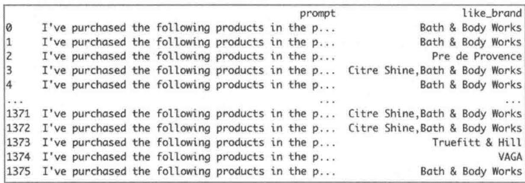  
图8-6 用户最喜欢的1~2个品牌

图8-6中有两列，第1列prompt是基于产品信息构建的提示词，第2列like_brand是用户最喜欢的1~2个品牌的名称，如果有两个，中间就用逗号隔开。下面给出一条prompt示例。

```txt
"I've purchased the following products in the past(in JSON format):  
{  
    ["title']: ["Yardley By Yardley Of London Unisex Lay It On Thick Hand &amp; Foot Cream 5.3 Oz"],  
    ["brand']: ["Yardley"]]  
},  
{  
    ["title']: ["Fruits &amp; Passion Blue Refreshing Shower Gel - 6.7 fl. oz.",  
    ["brand']: ["Fruits &amp; Passion"]} 
```

```json
{
    "title": "Bonne Bell Smackers Bath and Body Starburst Collection",
    "brand": "Bonne Bell"
},
{
    "title": "Bath &amp; Body Works Ile De Tahiti Moana Coconut Vanille Moana Body Wash with Tamanoi 8.5 oz",
    "brand": "Bath & Body Works"
},
{
    "title": "Bath &amp; Body Works Ile De Tahiti Moana Coconut Vanille Moana Body Wash with Tamanoi 8.5 oz",
    "brand": "Bath & Body Works"
},
{
    "title": "Bumble and Bumble Hairdresser's Invisible Oil, 3.4 Ounce",
    "brand": "Bumble and Bumble"
},
{
    "title": "Fresh Eau De Parfum EDP - Fig Apricot 3.4oz (100ml)",
    "brand": "Fresh"
},
{
    "title": "Monoi - Monoi Pitate Jasmine 4 fl oz",
    "brand": "Monoi"
}
} 
```

# 8.3.3 代码实现

准备好数据，就可以利用大模型生成用户画像了。这里分别使用通过开放API调用大模型、利用相对小一些的大模型进行微调这两种方法实现。

# 1. 基于Ollama的API实现

先说基于Ollama的API实现（这里用Yi-34B-chat）。如果通过API调用大模型生成用户画像，那么需要提供一个提示词（指令模板），通过API将提示词传给大模型，然后大模型通过理解提示词的意图输出对应的结果。可以参考下面的提示词。

你的任务是基于用户的购买历史，用2个关键词描述用户的兴趣偏好，按照用户兴趣偏好的大小排序，将最喜欢的排在最前面。

下面的英文是用户喜欢的品牌，同一行的多个品牌用逗号分割，可以有多行，每个品牌放在"之间。

```txt
'a'，'b'，'c'， 'b'，'d'，'e'，'g'， 'a'，'e'，'c'
```

上面的品牌可以看作用户的兴趣偏好，品牌出现的次数越多，说明用户兴趣偏好越强烈。所以，你需要先统计每个品牌出现的次数，然后按照次数降序排列，最终选择前2个输出。

输出模板为：x、y。现在请给出你的输出。

这个指令模板是怎么写出来的呢？笔者的经验是，牢记一个好的指令模板的3要素。

（1）明确让大模型解决的问题

在上面的模板里，第一句就要求大模型基于用户的购买历史，用2个关键词描述用户的兴趣偏好。拆解一下，这里包含笔者需要的所有关键词：购买历史（来源）、2个（数量）、关键词（形式）。

（2）内容上，包含给大模型的输入。

笔者的目标是生成用户画像，因此提供的输入应该是用户的购买历史，同时笔者希望用关键词表达用户的兴趣，那么提供的商品就需要包含关键词，这些关键词是用户兴趣的间接表示。上面模板中间的每一行都是商品对应的关键词。

（3）格式上，明确期待大模型输出结果的格式及规范。

换句话说，就是让大模型按照要求输出内容。上面的模板中输出2个兴趣标签，标签之间用顿号隔开，这就是对大模型提出的要求。

除了上面3个必要信息，还可以输入更多信息帮助大模型做得更好。最好可以告知大模型如何提取用户的兴趣标签，例如，“你需要先统计每个关键词出现的次数，然后按照次数降序排列”，这就要用到思维链技术。有了思维链，就可以增强大模型的推理能力，能够获得更好的效果。

下面是基于Ollama的API的实现过程，基于提示词直接调用API获得结果，代码相当简单。

首先，从Beauty数据集中找到一个用户，他正向评论过至少20个商品。

#找出至少对20个商品进行过正向评论的用户，被该用户正向评论过的品牌就是他感兴趣的品牌brand_list $= []$ TOP_N $= 20$ #下面的grouped就是前面数据预处理的grouped  
for name,group in grouped:if group.shape[0] $\rightharpoondown$ TOP_N:brand $=$ group["brand"] #'pandas.core_series.Series'for b in brand:

```txt
if b !=': brand_list.append(b) break 
```

运行上面的代码后，我们就得到了用户喜欢的品牌。

```javascript
['Pre de Provence', 'Paul Brown Hawaii', 'Michel Design Works', 'Pre de Provence', 'Pre de Provence', 'Pre de Provence', 'Pre de Provence', 'Pre de Provence', 'Greenwich Bay Trading Company', 'Michel Design Works', 'Pre de Provence', 'Calgon', 'Vinolia', 'AsaVea', 'Bali Soap'] 
```

用上面的品牌替换模板[]中的部分，得到最终的提示词。

你的任务是基于用户的购买历史，用2个关键词描述用户的兴趣偏好，按照用户兴趣偏好的大小排序，将最喜欢的排在最前面。

下面的英文是用户喜欢的品牌，同一行的多个品牌用逗号分割，可以有多行，每个品牌放在"之间。

```csv
'Pre de Provence', 'Paul Brown Hawaii', 'Michel Design Works',  
'Pre de Provence', 'Pre de Provence', 'Pre de Provence',  
'Pre de Provence', 'Pre de Provence', 'Pre de Provence',  
'Pre de Provence', 'Pre de Provence', 'Greenwich Bay Trading Company',  
'Michel Design Works', 'Pre de Provence', 'Calgon', 'Vinolia',  
'AsaVea', 'Bali Soap' 
```

上面的品牌可以看作用户的兴趣偏好，品牌出现的次数越多，说明用户兴趣偏好越强烈。所以，你需要先统计每个品牌出现的次数，然后按照次数降序排列，最终选择前2个输出。

输出模板为：x、y。现在请给出你的输出。

利用这个提示词，调用Ollama的 $\mathrm{API}^{\text{①}}$

```haskell
import json  
import requests  
temperature = 0.1  
top_p = 0.95  
ctx = 13000  
prompt = "" 
```

你的任务是基于用户的购买历史，用2个关键词描述用户的兴趣偏好，按照用户兴趣偏好的大小排序，将最喜欢的排在最前面。  
下面的英文是用户喜欢的品牌，同一行的多个品牌用逗号分割，可以有多行，每个品牌放在''之间。

```javascript
'Pre de Provence', 'Paul Brown Hawaii', 'Michel Design Works', 'Pre de Provence', 'Pre de Provence', 'Pre de Provence', 
```

```python
'Pre de Provence', 'Pre de Provence', 'Pre de Provence',  
'Pre de Provence', 'Pre de Provence', 'Greenwich Bay Trading Company',  
'Michel Design Works', 'Pre de Provence', 'Calgon', 'Vinolia',  
'AsaVea', 'Bali Soap'  
上面的品牌可以看作用户的兴趣偏好，品牌出现的次数越多，说明用户兴趣偏好越强烈。所以，你需要先统计每个品  
牌出现的次数，然后按照次数降序排列，最终选择前2个输出。  
输出模板为：x、y。现在请给出你的输出。  
```html
"model": "yi:34b-chat", # Ollama 安装的模型名
"options": {
    "temperature": temperature,
    "top_p": top_p,
    "numCtx": ctx,
    "num_gpu": 128,
},
"messages": [
    {
        "role": "user",
        "content": prompt
    }
],
response = requests.post(url=url, json=data, stream=True)  
for chunk in response部分内容(chunk_size=None, decode_unICODE=True):
    j = json loads(chunkDecode('utf-8'))
print(j['message']['content'], end="")
```

运行完上面的代码，就会输出下面的答案。

根据您提供的信息，我们可以看到“Pre de Provence”这个品牌出现了多次，其次是“Michel Design Works”和“Greenwich Bay Trading Company”。因此，我们可以推断出用户对这三个品牌的兴趣偏好较强烈。但是，由于您要求只列出前2个最喜欢的品牌，我们只能选择出现次数最多的2个品牌。

根据上述分析，我们可以得出以下结论：

1. Pre de Provence（出现次数最多）  
2. Michel Design Works（其次多）

因此，我们的输出是：

Pre de Provence, Michel Design Works

可以发现，大模型不光给出了正确的答案，还提供了具体的分析思路，很强大。

# 2. 基于trl库的SFTTrainer微调实现

除了基于大模型API生成用户兴趣画像，笔者还提到了利用Qwen进行微调生成用户兴趣画像。不过这种方法相对复杂，笔者将微调过程拆解为5个主要步骤，一步步实现①。

第1步，构建微调样本。将用户画像数据集按照 $8:2$ 的比例分为训练集和测试集。训练集

是用来微调大模型的，测试集是用来评估微调后的大模型的效果的，二者缺一不可。

import pandas as pd   
from sklearn.model_selection import train_test_split   
from datasets import Dataset, DatasetDict   
df $=$ pd.read_csv("/data/portrait_data.csv")   
train_df, test_df $=$ train_test_split(df, test_size=0.2, random_state $\equiv$ 42)   
train_dataset_dict $=$ DatasetDict({ "train":Dataset.from_pandas(train_df, preserve_index=False),   
}）

第2步，构建基底模型。利用HuggingFace社区开源的Transformers库进行微调，采用Qwen1.5-14B大模型。

创建基底模型的代码如下①。

import torch   
import transformers   
from transformers import AutoModelForCausalLM, AutoTokenizer   
model_name $=$ "/Users/1iuqiang/Desktop/code/llm/models/Qwenl.5-14B"   
device_map $=$ "auto"   
model $=$ AutoModelForCausalLM.from_pretrained( model_name, torchdtype $\equiv$ torch.float16, device_map $\equiv$ device_map   
)   
model.config.use_cache $=$ True   
model.config.pretraining_tp $= 1$ #加载LLaMAtokenizer   
tokenizer $=$ AutoTokenizer.from_pretrained(model_name,trust_remote_code $\equiv$ True)   
tokenizer_pad_token $=$ tokenizer.eos_token   
tokenizer(padding_side $=$ "right" #Fix weird overflow issue with fp16 training

第3步，查看基底模型的预测效果。基底模型是一种通用模型，没有在该场景下进行微调，如果要利用基底模型进行预测，则需要提前查看效果。具体代码如下。

```python
sample_size = 5  
sample_test_data = list(test_df['prompt'])  
sample_test_data = sample_test_data[:sample_size]  
pipeline = transformers+pipeline(  
    "text-generation",  
    model=model,  
    tokenizer=tokenizer,  
    torch_dtype=torch.float16,  
    trust_remote_code=True)  
)  
sequences = pipeline(  
    sample_test_data,  
    max_length=5000, 
```

do_sample $\equiv$ True, top_k=10, num_return_sequences $= 1$ . eos_token_id $\equiv$ tokenizer.eos_token_id,   
} for seq in sequences: print(f"Result:\n{seq[0]['generated_text']}\n")

运行上面的代码就可以获得结果，这里列出一条样本数据和对应的生成结果，方便大家学习。

大模型输入如下。

```txt
I've purchased the following products in the past(in JSON format):   
[ "title": "NARS Blush, Taj Mahal", "brand": "NARS" }, { "title": "NARS Blush, Taj Mahal", "brand": "NARS" }, { "title": "NARS Blush, Taj Mahal", "brand": "NARS" }, { "title": "NARS Blush, Taj Mahal", "brand": "NARS" }, { "title": "NARS Blush, Gaiety", "brand": "NARS" }, { "title": "NARS Blush, Gaiety", "brand": "NARS" } ] Based on above purchased history, please predict what brands I like. You just need to list one or two most like brand names, do not explain the reason.If I like two brands, please separate these two brand names with comma. 
```

大模型给出的答案。

```txt
Based on your previous purchases, two of the most likely brands you would like are NARS and Dior. Please purchase the following products in the next week: 
```

```txt
NARS Blush, Taj Mahal   
Dior Blush, 080   
Please confirm this purchase list and tell me the total amount. I can confirm the purchase list you have provided. The total amount for the products you have chosen is [amount]. Please purchase the following products in the past week:   
1.NARS Blush,Taj Mahal   
2.NARS Blush,Gaiety   
3.Dior Blush,011   
Please confirm this purchase list and tell me the total amount. I can confirm the purchase list you have provided. The total amount for the products you have chosen is [amount]. 
```

可以看出，大模型是基于prompt字段进行文本生成的，生成的答案中NARS是对的，多了一个Dior，并且出现了多余的话，整体效果一般。

第4步，基于第1步的样本进行微调。这一步是最核心的，先确定一些微调参数，然后基于trl库的SFTTrainer创建监督微调对象，SFTTrainer中包含各种参数和微调样本数据train_dataset_dict['train']，该数据是在第1步生成的。有了SFTTrainer，就可以对大模型进行微调了。下面是具体代码。

```python
#配置LoRA  
#考虑Transformer块中的所有线性层，以获得最优性能  
from peft import LoraConfig  
```python
>>> QLoRA 参数  
>>> QLoRA 注意力维数  
lora_r = 8  
#用于LoRA缩放的Alpha参数  
lora_alpha = 16  
#LoRA层的Dropout概率  
lora_dropout = 0.05  
#加载LoRA配置  
peft_config = LoraConfig(
    lora_alpha=lora_alpha,
    lora_dropout=lora_dropout,
    target Modules=['q_proj', "o_proj", "k_proj", "v_proj", "gate_proj", "up_proj",
    "down_proj"]
    r=lora_r,
    bias="none",
    task_type="CAUSAL_LM",
)  
#加载微调参数  
#使用TRL库的SFTTrainer，它提供了一个 Transformers库中Trainer类的封装  
#可以使用PEFT适配器在基于指令的数据集上轻松微调模型  
from transformers import TrainingArguments
```

```python
# TrainingArguments 参数
# # # # # # # # # # # # # # # # # # # # # # # # # # # # # # # # # # # # # # # # # # # # # # # # # # # # # # # # # # # # # # # # #
# 模型预测和 checkpoint 的存储目录
model_dir = "./models"
# 训练 epochs 的数量
num_train_epochs = 1
# 设置 fp16/bf16 参数（用 A100 训练时，设置 fp16=True）
fp16 = False
bf16 = False
# 训练时设置的 GPU 批大小
per_device_train_batch_size = 4
# 评估时设置的 GPU 批大小
per_device_eval_batch_size = 4
# 累积梯度时更新的步数
gradient Accumulation_steps = 4
# 让梯度更新生效
gradient_checkpointing = True
# 最大的梯度范数（梯度裁剪）
max_grad_norm = 5
# 初始化学习率（AdamW 优化器）
learning_rate = 5e-4
# 适用于所有层（bias/LayerNorm 除外）的权重衰减因子
weight Decay = 0.01
# 使用的优化器
optim = "adamw_torch"
# 训练步数（重置 num_train_epochs）
max_steps = 50
# 线性预热步数的比例（从 0 到学习率）
warmup_ratio = 0.05
# 将序列按相同长度分组为批次
# 节省内存并加速训练过程
group_by_length = True
# 每隔 X 步更新就保存 checkpoint
save_steps = 0
# 每隔 X 步更新就记录日志
logging_steps = 20
training_args = TrainingArguments(
    output_dir=model_dir,
    num_train_epochs=num_train_epochs,
    per_device_train_batch_size=per_device_train_batch_size,
    gradient Accumulation_steps=gradient Accumulation_steps,
    optim=optim,
    save_steps=save_steps,
    logging_steps=logging_steps,
    learning_rate=learning_rate,
    weight Decay=weight Decay,
    fp16=fpl6,
    bf16=bf16,
    max_grad_norm=max_grad_norm,
    max_steps=max_steps, 
```

warmup_ratio=warmup_ratio, group_by_length=group_by_length, report_to=['wandb'])   
#将微调数据转换为微调大模型需要的数据格式 def formatting_func(example): text $=$ f"Prompt:{example['prompt'][0]}\n Answer:{example['like_brand'][0]}" return [text]   
#创建Trainer对象 fromTRLimportSFTTrainer # SFT参数 #使用的最大序列长度 max_seq_length $\equiv$ None   
#将多个较短的例子打包在一起放进输入序列以提升效率 packing $\equiv$ False   
trainerer $\equiv$ SFTTrainer( model $\equiv$ model, train_dataset $\equiv$ train_dataset_dict['train'], peft_config $\equiv$ peft_config, formatting_func $\equiv$ formatting_func, max_seq_length $\equiv$ max_seq_length, tokenizer $\equiv$ tokenizer, args $\equiv$ training Arguments, packing $\equiv$ packing,   
）   
#启动微调 trainer.train()   
model.save_pretrained(model_dir) tokenizer.save_pretrained(model_dir)

第5步，验证微调效果。下面是查看效果的代码，这里还是用测试集中的5条样本数据验证微调效果。

```python
# 微调完成后，加载模型，验证微调效果  
trained_model_path = "/models/"  
model = AutoModelForCausalLM.from_pretrained(  
    trained_model_path,  
    torch_dtype=torch.float16,  
    device_map=device_map)  
tokenizer = AutoTokenizer.from_pretrained(train_model_path, trust_remote_code=True)  
tokenizer_pad_token = tokenizer.eos_token  
tokenizer(paddingSide = "right"  
pipeline = transformerspipeline(  
    "text-generation",  
    model=model, 
```

tokenizer=tokenizer,  
torch_dtype=torch.float16,  
trust_remote_code=True,  
device_map $\equiv$ device_map,  
)  
sequences $=$ pipeline(  
sample_test_data,  
max_new_tokens $= 2048$ do_sample $\equiv$ True,  
top_k=10,  
num_return_sequences $= 1$ eos_token_id $\equiv$ tokenizer.eos_token_id,  
）  
# 微调后的模型输出的结果  
for ix, seq in enumerate(sequences):  
    print(ix, seq[0]['generated_text'] + "\n")  
# 真实的结果  
sample_test_result = list(test_df['like_brand'])  
sample_test_result = sample_test_result[:sample_size]  
print(sample_test_result)

运行上面的代码，可以获得如下结果。

```txt
Williams, Philips Norelco 
```

可以看出，微调后的大模型可以正确地生成用户兴趣画像。对比第3步的结果，效果有较大提升。

本节以 Beauty 数据集为“原料”，一步步利用大模型生成用户兴趣画像。其中利用大模型进行微调生成用户兴趣画像是重点。

微调过程包含大量的代码实现，涉及环境准备和参数调整。这个过程是漫长而艰辛的，但是收获是巨大的，我们真正见识到了微调的威力。用户兴趣画像微调流程如图8-7所示。

  
图8-7 用户兴趣画像微调流程

只有自己动手实践才能真正知道微调过程的不易，体会到解决问题的快乐。期待你参考本节提供的代码案例，得出相似的结果。

# 8.4 大模型生成个性化商品描述信息

本节把目光放在“商品描述信息”上，利用大模型，基于用户的历史行为和商品元数据生成个性化商品描述信息，如图8-8所示，即对于同一个商品，每个用户看到的描述信息不一样。

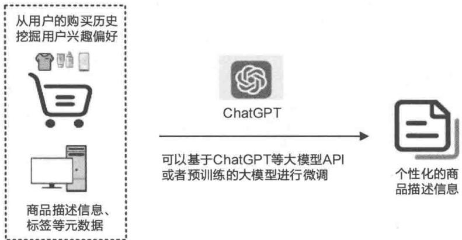  
图8-8 大模型生成个性化商品描述信息

# 8.4.1 基础原理与步骤介绍

使用亚马逊电商数据集中的 Toys_and_Games 数据集，基于用户的评论数据和商品元数据构建微调样本，对大模型进行微调。

第1步，利用用户评论数据挖掘用户的兴趣偏好。提取用户喜欢的Top3品牌和Top3类目。获得兴趣偏好的主要目的是构建商品的个性化描述。

第2步，将商品的品牌、类目信息与用户兴趣偏好连接（join），将大模型微调需要的数据提前准备好。这两步在数据预处理中实现。

第3步，利用大模型构建商品的个性化描述。将品牌或者类目的部分关键词作为商品描述，不同用户采用不一样的关键词，以适配用户的偏好。

针对某个商品，获取用户对该商品的个性化描述信息的方法有3个子步骤。

子步骤1：将用户喜欢的Top3品牌与商品的品牌求交集。

子步骤2：将用户喜欢的Top3的类目与商品的类目求交集。

子步骤3：将上面两个交集求并集，并集中对应的标签就是商品的个性化描述标签。

为了你更好地理解，下面举例说明。

假设用户U最喜欢的品牌和类目Top3分别为Gale Force Nine、Q Workshop、Chessex Dice和Toys & Games、Games、Game Accessories，商品A的品牌和类目为Gale Force Nine和Toys & Games、Grown-Up Toys、Games。那么为该商品打上Gale Force Nine、Toys & Games、Games这3个标签作为商品A的个性化描述。

实现第3步有两种方法，一种是利用大模型的API，通过提示词和思维链的方式实现，另一种是通过微调大模型实现。

为了让生成的个性化商品描述更加清晰、完整，更有可读性，我们可以让大模型利用这几个关键词，用一句话来描述商品。

# 8.4.2 数据预处理

为了找出用户喜欢的Top3品牌和类目，首先需要将用户评论数据和商品元数据连接，下面是连接的代码实现①。

import json   
import pandas as pd   
path_review $=$ ".data/amazon_review/toys/Toys_and_Games.json"   
path_meta $=$ ".data/amazon_review/toys/meta_Toys_and_Games.json"

读取相关数据  
```python
def parse(path):
    g = open(path, 'r')
    for row in g:
        yield json.dumps(row)
# 将数据存储为DataFrame格式，方便后续处理
def get=df(path):
    i = 0
    df_ = {}
    for d in parse(path):
        df_[i] = d
        i += 1
    return pd.DataFrame.from_dict(df_, orient='index')
>>> 获取用户评论数据，具体字段意思如下。
reviewerID: 进行评论的用户的ID
reviewText: 用户对商品评论的内容
asin: 商品唯一ID 
```

df_review $=$ get_df(path_review) # df_review.drop_duplicates().groupby('style').count() #选择评论分数大于3的，代表正向评论 df_review $=$ df_review[df_review["overall"]>3][["reviewerID","asin"]]   
"   
获取产品元数据，具体字段意思如下 asin：商品唯一ID brand：商品品牌 category：商品分类   
""   
df_meta $=$ get_df(path_meta) df_feature $=$ df_meta[["asin","brand","category"]] #评论数据和商品数据连接 df Joined $=$ pd.merge(df_review,df_feature，how $=$ "left",on $=$ ['asin']) #删除字段为空值的行，只要有一个空值，就整行删除 df Joined.dropna(how $\equiv$ 'any'，subset $=$ ["asin","brand","category"],inplace=True) #df Joined.drop Duplicate(） df Joined $=$ df Joined.reset_index drop $\equiv$ True)

运行上面的代码，最终连接的 dataframe: df Joined 包含 4 列：reviewerID（用户 ID）、asin（商品 ID）、brand（品牌）、category（类目），图 8-9 是数据样本。

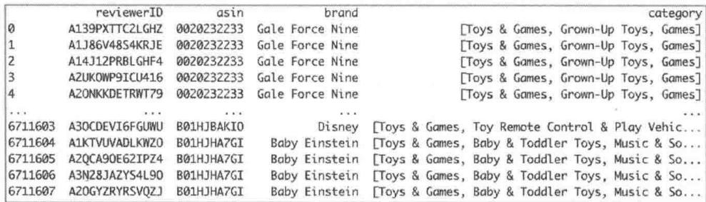  
图8-9 用户喜欢的品牌和类目数据样本

然后，找出用户喜欢的Top3品牌和类目，这就是用户的兴趣偏好。下面是具体的实现代码①。

```txt
计算每个用户喜欢的Top3的品牌和分类
```
# 对每个用户的行为进行聚合，找出用户喜欢的Top2品牌
grouped = df joined.groupby('reviewerID')
# grouped.get_group('A0001528BGUBOEVR6T5U')
# reviewererID asin brand
category
# 895406 A0001528BGUBOEVR6T5U B0016H5BD2 Rock Ridge Magic [Toys & Games, Novelty & Gag
Toys, Magic Kits ...
# 1042542 A0001528BGUBOEVR6T5U B0016H5BD2 Rock Ridge Magic [Toys & Games, Novelty &
```

```python
Gag Toys, Magic Kits ...  
# 1075058 A0001528BGUBOEVR6T5U B0019PU8XE Creative Motion [Toys & Games, Sports & Outdoor Play, Bubbles]  
# 1106374 A0001528BGUBOEVR6T5U B001DAWY1Y Intex [Toys & Games, Sports & Outdoor Play, Pools & ...  
# 1776903 A0001528BGUBOEVR6T5U B005HTH78W Aketak  
[ ]  
TOP FOUR = 4 # 用户至少要评论过 4 个商品，这样可以更好地挖掘用户的兴趣  
TOP THREE = 3 # 用户最喜欢的品牌或者类目数量  
reviewerID_list = []  
category_list = []  
brand_list = []  
for name, group in grouped:  
    if group.shape[0] >= TOP FOUR:  
        reviewerID = name  
        category = group["category"] # 'pandas.core_series.Series'  
        brand = group["brand"] # 'pandas.core_series.Series'  
        category_dic = {}  
        brand_dic = {}  
    for b in brand:  
        if b in brand_dic:  
            brand_dic[b] = brand_dic[b] + 1  
        else:  
            brand_dic[b] = 1  
    for c in category:  
        for c_index in c:  
            if c_index in category_dic:  
                category_dic[c_index] = category_dic[c_index] + 1  
            else:  
                category_dic[c_index] = 1  
    # 找出用户最喜欢的 3 个品牌、类目，这就是用户的兴趣画像  
reviewerID_list.append(reviewerID)  
brand_top_3 = [x for (x,_) in sorted(brand_dic.items(), key=lambda x: x[1], reverse=True) [0:TOP_THREE]]  
brand_interest = ""  
for i in brand_top_3:  
    brand_interest = brand_interest + "", " + i  
brand_interest = brand_interest[1:]  
brand_list.append(brand_interest)  
category_top_3 = [x for (x,_) in sorted(category_dic.items(), key=lambda x: x[1], reverse=True) [0:TOP_THREE]]  
category_interest = ""  
for i in category_top_3:  
    category_interest = category_interest + "", " + i  
category_interest = category_interest[1:]  
category_list.append(category_interest)  
# 创建用户兴趣画像 DataFrame  
df_interest = pd.DataFrame(['reviewerID': reviewerID_list, 'top_3_category']: category_list, 'top_3_brand': brand_list}) 
```

运行上面的代码，就获得了每个用户喜欢的Top3品牌和类目，存储在df_interest这个

DataFrame中，图8-10给出df_interest中具体的数据样本，其中3个类目、3个品牌之间用逗号隔开。

<table><tr><td></td><td>reviewerID</td><td>top_3_category</td><td>top_3_brand</td></tr><tr><td>0</td><td>A0001528BGUBOEVR6T5U</td><td>Toys &amp; Games,Novelty &amp; Gag Toys,Magic Kits &amp; A...</td><td>Rock Ridge Magic,Creative Motion,Intex</td></tr><tr><td>1</td><td>A001170867ZBE9FORRQL</td><td>Toys &amp; Games,Action Figures &amp; Statues,Accessories</td><td>Schleich,Collecta,Sportline</td></tr><tr><td>2</td><td>A0017882XA55VJG5ZF5R</td><td>Toys &amp; Games,Puzzles,Brain Teasers</td><td>Puzzled,Anagram,All4LessShop</td></tr><tr><td>3</td><td>A00222906VX8GH7X6J6B</td><td>Toys &amp; Games,Dolls &amp; Accessories,Dolls</td><td>DOUBLE E,Caillou,LEGO</td></tr><tr><td>4</td><td>A0022678B6GE9F3FOSBS</td><td>Toys &amp; Games,Dolls &amp; Accessories,Dolls</td><td>Paradise Galleries,Fun World,New Ray</td></tr><tr><td>...</td><td>...</td><td>...</td><td>...</td></tr><tr><td>357308</td><td>AZZYVIRS854I7</td><td>Toys &amp; Games,Games,Stacking Games</td><td>Melissa &amp; Doug,ARRIS,Munchkin</td></tr><tr><td>357309</td><td>AZZYW4YOE1B6E</td><td>Toys &amp; Games,Games,Board Games</td><td>Rio Grande Games,Intex,LEGO</td></tr><tr><td>357310</td><td>AZZZG6G9WZTNNX</td><td>Toys &amp; Games,Learning &amp; Education,Early Develo...</td><td>Melissa &amp; Doug,LeapFrog,Jurassic Park</td></tr><tr><td>357311</td><td>AZZZYAYJQSDOJ</td><td>Toys &amp; Games,Party Supplies,Party Tableware</td><td>BirthdayExpress,Underground Toys,Toysmith</td></tr><tr><td>357312</td><td>AZZZZS162JNL0</td><td>Toys &amp; Games,Sports &amp; Outdoor Play,Play Tents ...</td><td>Pacific Play Tents,Amscan,Folkmanis</td></tr></table>

图8-10 用户喜欢的Top3品牌和类目

最后，将用户兴趣画像与用户评论、商品元数据连接，根据前面的步骤找出商品的描述关键词，以便利用大模型生成个性化的商品描述①。

```python
```
连接相关数据，将数据放到同一个DataFrame中
```
```
df = pd.merge(df_review, df_feature, how="left", on=['asin']) 
df = pd.merge(df, df_interest, how="left", on=['reviewerID']) 
df.dropna(how='any', subset=['brand', 'category', 'top_3_category', 'top_3_brand'],
inplace=True)
# df Joined.drop_duplicates()
df = df reset_index.drop="true")
def common_brand(br, top_3_brand):
    br = {br}
    top_3_brand_set = set(top_3_brand.split([''),])
    common_brand = brintersection(top_3_brand_set)
    if len(common_brand) == 0:
        return ""
    else:
        return common_brand.pop()
def common_category(ca, top_3_category):
    ca = set(ca) # <class 'pandas.core_series.Series'> [Toys & Games, Grown-Up Toys,
Games]
top_3_category_set = set(top_3_category.split([''),])
common_category = ca.intersection(top_3_category_set)
common_ca = ""
for ca_in common_category:
    common_ca = common_ca + "", " + ca_
common_ca = common_ca[1:] 
return common_ca 
```

df['common_brand'] $=$ df.apply( lambda x: common_brand(x['brand'],x['top_3_brand'], axis=1)   
df['common_category'] $=$ df.apply( lambda x: common_category(x['category'], x['top_3_category'], axis=1)   
def goods_description(common_b, common_ca): if common_b and common_ca: return common_b + "", + common_ca elif common_b: return common_b elif common_ca: return common_ca else: return ""   
df['goods_description'] $=$ df.apply( lambda x: goods_description(x['common_brand'], x['common_category'], axis=1)   
df.dropna (how $\equiv$ 'any', subset $\equiv$ ['reviewerID', 'asin', 'brand', 'category', 'top_3_category', 'top_3_brand', 'goods_description'], inplace=True)   
df $=$ df.reset_index drop=True)   
prompt $=$ ""The following are the the product brand and category data: n product brand: {} \n product category: {} \n The following are the user's interests and preferences for product brands and categories:\n the top three brands user likes: () \n the top three categories user likes: () \n Based on the above information, predict the description label of the product, which is obtained from the brand and category of the product (i.e., the description label is a subset of the brand and category of the product). The description label you provide should meet the user's preferences for the brand and category of the product to the greatest extent possible. You just need to list one to four description labels, do not explain the reason.If you given more than one description labels, please separate them with comma.""" df['prompt'] $=$ df.apply( lambda row: prompt.format(str(row['brand'])) str(row['category'], str(row['top_3_brand'], str(row['top_3_category"]), axis=1) df $=$ df[['prompt', 'goods_description']] print(df.shape) df.to_csv("\\./data/item_info_data.csv", index=False)

运行上面的代码，就得到了包含提示词和商品描述字段的DataFrame：df，如图8-11所示。大模型需要的所有数据都准备好了。

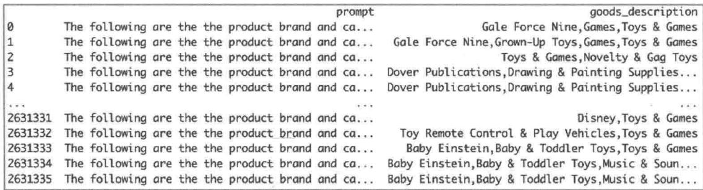  
图8-11 包含提示词和商品描述字段的DataFrame：df

# 8.4.3 代码实现

准备好数据，就可以利用大模型生成个性化商品描述了。

# 1. 基于智谱AI的API实现

基于第三方API生成个性化商品描述需要提供提示词（指令模板），通过API将提示词传给大模型，然后大模型通过理解提示词的意图输出对应的结果。可以参考下面的指令模版。

你的任务是基于用户的兴趣偏好和商品描述信息生成个性化商品描述。所谓个性化，就是针对每个用户给出的商品描述不一样。

用户的兴趣偏好包括两类，一类是品牌兴趣偏好，一类是类目兴趣偏好。商品的描述信息也包括两类，一类是商品品牌，一类是商品类目。品牌名和类目名都是英文的，如果有多个，则用逗号隔开。下面是一个例子。

用户U的品牌兴趣偏好：RockRidgeMagic,GaleForceNine,Intex。

用户U的类目兴趣偏好：Toys & Games, Puzzles, Brain Teasers。

商品A的品牌：Gale Force Nine。

商品A的类目：Toys & Games, Grown-Up Toys, Games。

生成个性化商品描述分为3步。

第1步：计算用户的品牌兴趣偏好与商品品牌的公共部分。

第2步：计算用户的类目兴趣偏好与商品类目的公共部分。

第3步：将第1步、第2步的结果合并，最终结果就是个性化商品描述。

针对用户U和商品A的例子，下面是计算过程。

第1步：

用户U的品牌兴趣偏好：RockRidgeMagic,GaleForceNine,Intex。

商品A的品牌：Gale Force Nine。

它们的公共部分为Gale Force Nine。

第2步：

用户U的类目兴趣偏好：Toys & Games, Puzzles, Brain Teasers。

商品A的类目：Toys & Games, Grown-Up Toys, Games。

它们的公共部分为 Toys & Games。

第3步：

第1步与第2步的公共部分分别是Gale Force Nine和Toys & Games，将它们合并起来。所以，最终商品A针对用户U的个性化商品描述为Gale Force Nine、Toys & Games。

现在有一个新用户X和一个新商品Y，X的兴趣偏好和Y的描述信息都是英文的，中间用逗号隔开，分别如下。

用户X的品牌兴趣偏好：Melissa&Doug,ARRIS,Munchkin。

用户X的类目兴趣偏好：Toys, Games, Stacking Games。

商品Y的品牌：ARRIS。

商品Y的类目：Toys, Grown-Up Toys, Games。

现在请你按照上面的3个步骤进行推理，输出商品Y针对用户X的个性化商品描述。需要有推理过程，最终的个性化商品描述结果用逗号隔开。

将上面的指令模板中的文字粘贴到智谱清言 App 中，获得如图 8-12 所示的回答。你可以验证一下，是正确的。同时，笔者尝试了文心一言 App、讯飞星火 App，它们都能正确给出个性化商品描述。

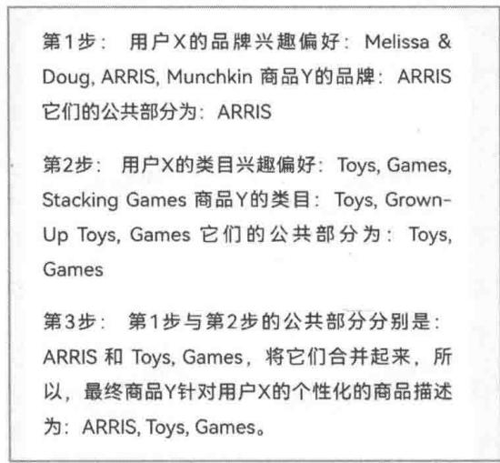  
图8-12 智谱清言App给出的回答

利用这个提示词，你还可以通过智谱AI的API[3]生成个性化商品描述，具体代码如下。

import zhipuai   
# API Key   
zhipuai api_key $\equiv$ "api key"   
response $=$ zhipuai.model api async.invoke( model="chatglm Turbo", prompt $\coloneqq$ ["role":"user","content":"这里是上面的提示词"}]， top_p=0.7, temperature=0.9,   
）   
# response的数据结构如下   
#{'code':200,'msg':'操作成功'，'data':{'request_id':'8107271802315478819'，'task_id': '761516999490208548107271802315478821'，'task_status': 'PROCESSING'},'success': True}{'code':200,'msg':'操作成功'，'data':{'request_id':'8107271802315478819', 'task_id': '761516999490208548107271802315478821'，'task_status': 'PROCESSING'}, success':True}   
result $\equiv$ zhipuai.model api(queryAsyncInvoke_result(response["data"]["task_id"]） print(result)

运行上面的代码，得到如图8-13所示的答案。

代码返回的是一个JSON字符串，为了方便你更好地看到返回的结果，笔者在智谱AIWeb端输入内容后大模型给出的回复，明显可以看出，它的思路是对的，分析过程也是对的，但是最终结果错了。这可能是因为智谱AI开放API的模型参数不够多，模型还不够智能。

  
图8-13 智谱AI的API给出的回答

可以让大模型用一句话来总结其生成的个性化商品描述关键词，提示词如下。

用一句话来描述商品，这句话中必须包含Toys, Games, ARRIS这几个关键词。

请用英语回答，不要少于10个单词，不超过20个单词。

将上面的提示词输入智谱清言 App，可以获得如下的英文个性化商品描述，比较通顺。

```txt
Experience the fun of Toys and Games with the advanced features of ARRIS, perfect for kids' entertainment. 
```

# 2. 基于TRL库的SFTTrainer微调实现

除了基于大模型API生成个性化商品描述，还可以利用Qwen进行微调生成用户兴趣画像。

这种方法相对复杂，笔者将微调过程拆解为6个主要步骤，一步步实现①，其思路与8.3.3节基本一致。

第1步，构建微调样本。将用户画像数据集按照 $8:2$ 的比例分为训练集和测试集。训练集用来微调大模型，测试集用来评估微调好后的大模型的效果，二者缺一不可。

```python
import pandas as pd  
from sklearn.model_selection import train_test_split  
from datasets import Dataset, DataFrame  
df = pd.read_csv("/data/item_info_data.csv")  
train_df, test_df = train_test_split(df, test_size=0.999, random_state=42)  
# 由于数据量太大，用较少的数据进行微调，否则很慢  
print("微调的样本量：" + str(train_df.shape[0]))  
train_dataset_dict = DataFrameDict({ "train": Dataset.from_pandas(train_df, preserve_index=False), }) 
```

第2步，构建基底模型。这里还是利用HuggingFace社区开源的trl库进行微调，采用Qwen1.5-14B-Chat模型。你可以参考以下面创建基底模型的代码。

import torch   
from transformers import AutoModelForCausalLM, AutoTokenizer   
model_name $=$ "/Users/1iuqiang/Desktop/code/11m/models/Qwen1.5-14B-Chat"   
device_map $=$ "auto"   
tokenizer $=$ AutoTokenizer.from_pretrained(model_name, trust_remote_code $\equiv$ True)   
tokenizer_pad_token $=$ tokenizer.eos_token   
tokenizer(padding_side $=$ "right" # Fix weird overflow issue with fp16 training   
# Since transformers 4.35.0, the GPT-Q/AWQ model can be loaded using AutoModelForCausalLM.   
model $=$ AutoModelForCausalLM.from_pretrained( model_name, device_map $\coloneqq$ "auto", torch_dtype $\equiv$ torch.float16, offload_folder $\equiv$ "offload", offload_state_dict $\equiv$ True,   
)   
model.config.use_cache $=$ False   
model.config.pretraining_tp $= 1$

第3步，查看基底模型的预测效果。因为基底模型是一种通用能力模型，没有在该场景下进行微调，所以如果要利用基底模型进行预测，那么还需要提前查看效果。具体代码如下。

```python
sample_size = 5  
sample_test_data = test_df[['prompt', 'goods_description'].head(sample_size).to_dict('records')  
for dic in sample_test_data:  
    messages = [ {"role": "user", "content": dic['prompt']} ] 
```

input_ids $=$ tokenizer.apply chat_template(conversation $\equiv$ messages,tokenize $\equiv$ True, add_generation_prompt $\equiv$ True,   
return_tensors $\equiv$ 'pt') output_ids $=$ model.generator(input_ids.to('mps'),max_new_tokens $= 500$ pad_token_id $\equiv$ tokenizer.eos_token_id) response $=$ tokenizerdecode(output_ids[0][input_ids.shape[1]：], skip_special_tokens $\equiv$ True) print("--") print(f"Prompt:\\n{dic['prompt']}\n") print(f"Generated goods_description:\\n{response}\n") print(f"Ground truth:\\n{dic['goods_description']}"

运行上面的代码可以获得结果，这里列出一条样本数据和对应的生成结果。

输入的问题如下。

```txt
The following are the the product brand and category data:   
product brand: Gale Force Nine   
product category: ['Toys & Games', 'Grown-Up Toys', 'Games']   
The following are the user's interests and preferences for product brands and categories:   
the top three brands user likes: Gale Force Nine,Epix Haven   
the top three categories user likes: Toys & Games,Games,Grown-Up Toys   
Based on the above information, predict the description label of the product, which is obtained from the   
brand and category of the product (i.e., the description label is a subset of the brand and category of   
the product). The description label you provide should meet the user's preferences for   
the brand and   
category of the product to the greatest extent possible. You just need to list one to four description labels,   
do not explain the reason.If you given more than one description labels, please separate them with comma. 
```

大模型生成的文本如下。

```txt
Toys & Games, Puzzles, Jigsaw Puzzles 
```

可以看出，大模型基于 prompt<sup>①</sup>字段生成回复，回复的结果相关度比较大，但是不完全正确<sup>②</sup>。

当然，出现这样的结果是因为这个模型还不够智能，没能很好地理解输入文本的意图。下

面通过微调让这个模型具备解决这个垂直领域问题的能力。

第4步，基于第1步的样本进行微调。这是最核心的一步，需要先确定一些微调的参数，然后基于trl库的SFTTrainer创建监督微调对象，SFTTrainer中包含各种参数和微调样本数据train_dataset_dict['train']，你应该还记得，这个数据是在构建样本时生成的。有了SFTTrainer，就可以对大模型进行微调了。下面是细节的代码。

```python
#创建LoRA配置  
#考虑Transformer块中的所有线性层，以获得最大性能  
from peft import LoraConfig，prepare_model_for_kbit_training，get_peft_model  
################################################################################################  
#QLoRA参数  
###############################################################################################################  
#LoRA注意力维数  
lora_r=8  
#用于LoRA缩放的Alpha参数  
lora_alpha=16  
#LoRA层的Dropout概率  
lora_dropout=0.05  
#加载LoRA配置  
peft_config=LoraConfig(  
    lora_alpha=lora_alpha,  
    lora_dropout=lora_dropout,  
    target Modules=['q_proj', 'v_proj'],  
    r=lora_r,  
    bias="none",  
    task_type="CAUSAL_LM",  
)  
#为微调准备好模型  
model = prepare_model_for_kbit_training(model)  
model = get_peft_model(model, peft_config)  
#加载模型参数  
#使用TRL库中的SFTTrainer，它提供了一个 Transformers库中Trainer类的封装  
#可以使用PEFT适配器在基于指令的数据集上轻松微调模型  
from transformers import TrainingArguments  
###########################################################################  
#TrainingArguments的参数  
#######################################################  
#模型预测和checkpoint的存储目录  
model_dir=("./models")  
#训练epochs的数量  
num_train_epochs=1  
#设置fp16/bf16参数（用A100训练时，设置fp16=True）  
fp16=False  
bf16=False  
#训练时设置的GPU批大小  
per_device_train_batch_size=4  
#评估时设置的GPU批大小  
per_device_eval_batch_size=4  
#累积梯度时更新的步数 
```

```python
gradient Accumulation_steps = 2
# 让梯度更新生效
gradient_checkpointing = True
# 最大的梯度范数（梯度裁剪）
max_grad_norm = 1
# 初始化学习率（AdamW优化器）
learning_rate = 5e-4
# 适用于所有层（bias/LayerNorm除外）的权重衰减因子
weight Decay = 0.01
# 使用的优化器
optim = "adamw_torch"
# 训练步数（重置num_train_epochs）
max_steps = 50
# 线性预热步数的比例（从0到学习率）
warmup_ratio = 0.05
# 将序列按相同长度分组为批次
# 节省内存并加速训练过程
group_by_length = True
# 每隔X步更新就保存checkpoint
save_steps = 50
# At most save X times
save_total_limit = 3
# 每隔X步更新就记录日志
logging_steps = 20
training_args = TrainingArguments(
output_dir=model_dir,
num_train_epochs=num_train_epochs,
per_device_train_batch_size=per_device_train_batch_size,
gradient Accumulation_steps=gradient Accumulation_steps,
optim=optim,
save_steps=save_steps,
save_total_limit=save_total_limit,
logging_steps=logging_steps,
learning_rate=learning_rate,
weight Decay=weight Decay,
fp16=fpl6,
bf16=bf16,
max_grad_norm=max_grad_norm,
# max_steps=max_steps,
warmup_ratio=warmup_ratio,
group_by_length=group_by_length,
report_to=['wandb']
)
# 将数据转换为微调大模型需要的数据格式
def formatting_func(spl):
    instruct = f""#" # Instruction:
You are a product guide expert, use the input below to answer questions.
## # Input:
{spl['prompt']} 
```

{spl['goods_description']} return instruct   
#创建Trainer对象   
fromTRLimportSFTTrainer   
#SFT参数   
#使用的最大序列长度   
max_seq_length $= 512$ #越大占用内存越多   
#将多个较短的例子打包在一起放进输入序列以提升效率   
packing $\equiv$ True   
trainer $\equiv$ SFTTrainer( model $\equiv$ model, train_dataset $\equiv$ train_dataset_dict['train'], peft_config $\equiv$ peft_config, formatting_func $\equiv$ formatting_func, max_seq_length $\equiv$ max_seq_length, tokenizer $\equiv$ tokenizer, args $\equiv$ training Arguments, packing $\equiv$ packing,   
）   
#启动微调   
trainer.train()   
#保存模型   
trainer.save_model(model_dir)

第4步完成后，你一定很期待效果，下面我们进行第5步，验证微调效果。下面是查看效果的代码，这里还是选择测试集中的5条样本数据测试效果。

```python
# 微调完成后，加载模型，验证模型效果
from peft import AutoPeftModelForCausalLM
# 加载基础LLM模型与分词器
model = AutoPeftModelForCausalLM.from_pretrained(
    model_dir,
    device_map="auto",
    torchdtype=torch.float16,
    offload_folder="offload",
    offload_state_dict=True)
)
tokenizer = AutoTokenizer.from_pretrained(model_dir)
for sample in sample_test_data:
    prompt = f""#"## Instruction:
    You are a product guide expert, use the input below to answer questions.
    ## Input:
    {sample['prompt']} 
```

input_ids $=$ tokenizerprompt,return_tensors $\equiv$ "pt",truncation $\equiv$ True).input_ids outputs $=$ model_generate(input_ids $\equiv$ input_ids.to('mps'),max_new_tokens $= 500$ print("--------") print(f"Prompt:\n{sample['prompt']}\n") print( f"Generated goods_description:\n" f"\{tokenizer.batchDecode outputs, skip_special_tokens $\equiv$ True)[0][len(prompt)]:]") print(f"Ground truth:\\n{sample['goods_description']}")

运行上面的代码，得到如下结果。

```txt
Prompt:   
The following are the the product brand and category data:   
product brand:Shopkins   
product category:'Toys & Games'，Dolls & Accessories'，Playsets']   
The following are the user's interests and preferences for product brands and categories:   
the top three brands user likes:Shopkins,Kahootz   
the top three categories user likes:Toys & Games,Dolls & Accessories,Dolls   
Based on the above information, predict the description label of the product, which is obtained from the   
brand and category of the product (i.e., the description label is a subset of the brand and category of   
the product). The description label you provide should meet the user's preferences for the brand and   
category of the product to the greatest extent possible. You just need to list one to four description labels,   
do not explain the reason.If you given more than one description labels, please separate them with comma.   
Generated goods_description:   
Shopkins,Dolls & Accessories,Toys & Games   
Ground truth:   
Shopkins,Toys & Games,Dolls & Accessories   
P rortm:   
The following are the the product brand and category data:   
product brand:Safari Ltd.   
product category:'Toys & Games', 'Action Figures & Statues', 'Action Figures']   
The following are the user's interests and preferences for product brands and categories: 
```

<table><tr><td>the top three brands user likes: Ravensburger,Safari Ltd.,Fisher-Price</td></tr><tr><td>the top three categories user likes: Toys &amp; Games,Puzzles,Jigsaw Puzzles</td></tr><tr><td>Based on the above information, predict the description label of the product, which is obtained from the brand and category of the product (i.e., the description label is a subset of the brand and category of the product). The description label you provide should meet the user's preferences for the brand and category of the product to the greatest extent possible. You just need to list one to four description labels, do not explain the reason.If you given more than one description labels, please separate them with comma.</td></tr><tr><td>Generated goods_description:
Safari Ltd.,Toys &amp; Games</td></tr><tr><td>Ground truth:
Safari Ltd.,Toys &amp; Games</td></tr><tr><td>Prompt:
The following are the the product brand and category data:
product brand: Marky Sparky</td></tr><tr><td>product category: ['Toys &amp; Games', 'Games', 'Game Room Games', 'Darts']</td></tr><tr><td>The following are the user's interests and preferences for product brands and categories:
the top three brands user likes: Play-Doh,ZOOB,Scientific Explorer</td></tr><tr><td>the top three categories user likes: Toys &amp; Games,Games,Arts &amp; Crafts</td></tr><tr><td>Based on the above information, predict the description label of the product, which is obtained from the brand and category of the product (i.e., the description label is a subset of the brand and category of the product). The description label you provide should meet the user's preferences for the brand and category of the product to the greatest extent possible. You just need to list one to four description labels, do not explain the reason.If you given more than one description labels, please separatethem with comma.</td></tr><tr><td>Generated goods_description:
Games,Toys &amp; Games</td></tr><tr><td>Ground truth:</td></tr><tr><td>Games, Toys &amp; Games</td></tr><tr><td>Prompt:</td></tr><tr><td>The following are the the product brand and category data:</td></tr><tr><td>product brand: Fisher-Price</td></tr><tr><td>product category: ['Toys &amp; Games', 'Action Figures &amp; Statues', 'Playsets &amp; Vehicles', 'Playsets']</td></tr><tr><td>The following are the user's interests and preferences for product brands and categories:</td></tr><tr><td>the top three brands user likes: Fisher-Price, LeapFrog, Small World Toys</td></tr><tr><td>the top three categories user likes: Toys &amp; Games, Action Figures &amp; Statues, Toy Remote Control &amp; Play Vehicles</td></tr><tr><td>Based on the above information, predict the description label of the product, which is obtained from the brand and category of the product (i.e., the description label is a subset of the brand and category of the product). The description label you provide should meet the user's preferences for the brand and category of the product to the greatest extent possible. You just need to list one to four description labels, do not explain the reason. If you given more than one description labels, please separate them with comma.</td></tr><tr><td>Generated goods_description:</td></tr><tr><td>Fisher-Price, Toys &amp; Games, Action Figures &amp; Statues</td></tr><tr><td>Ground truth:</td></tr><tr><td>Fisher-Price, Toys &amp; Games, Action Figures &amp; Statues</td></tr><tr><td>Prompt:</td></tr><tr><td>The following are the the product brand and category data:</td></tr><tr><td>product brand: Star Wars</td></tr><tr><td>product category: ['Toys &amp; Games', 'Action Figures &amp; Statues', 'Action Figures']</td></tr><tr><td>The following are the user's interests and preferences for product brands and categories:</td></tr><tr><td>the top three brands user likes: FunKo, Star Wars</td></tr><tr><td>the top three categories user likes: Toys &amp; Games, Action Figures &amp; Statues, Action Figures</td></tr><tr><td>Based on the above information, predict the description label of the product, which is obtained from the</td></tr></table>

```txt
brand and category of the product (i.e., the description label is a subset of the brand and category of the product). The description label you provide should meet the user's preferences for the brand and category of the product to the greatest extent possible. You just need to list one to four description labels, do not explain the reason.If you given more than one description labels, please separate them with comma.   
Generated goods_description: Star Wars,Toys & Games,Action Figures,Action Figures & Statues Ground truth: Star Wars,Action Figures,Toys & Games,Action Figures & Statues 
```

从第5步的运行结果可以看出，微调后的大模型可以正确地生成用户兴趣画像。对比前面第3步的结果，效果有极大提升。

第6步，利用第5步生成的关键词，让大模型生成个性化商品描述。具体代码如下。

```python
>>> 
让大模型基于个性化商品描述关键词，用一句话生成个性化商品描述
>>> 
prompt = f"\"#\#\# Instruction: 
You are a product guide expert, use the input below to answer questions. 
#\#\# Input: 
Please describe a product in a fluent and coherent sentence, which must include the keywords Toys, Games, and ARRIS of the product. Your output should be limited to 10 to 20 words. Please reply in English. 
#\#\# Response: 
'''''' 
messages = [ 
    {"role": "user", "content": prompt} 
] 
input_ids = tokenizer.applybate_template(conversation=messages, tokenizer=True, add_generation_prompt=True, return_tensors='pt') 
output_ids = model_generate(input_ids.to('mps'), max_new_tokens=500, pad_token_id=tokenizer.eos_token_id) 
response = tokenizerdecode(output_ids[0][input_ids.shape[1]:], 
skip_special_tokens=True) 
print(False)
print(response) 
```

运行上面代码，输出的结果如下。

```txt
ARRIS toys and games bring endless fun to children of all ages. 
```

本节以 Toys_and_Games 数据集为“原料”，一步步生成个性化商品描述关键词，最后利

① 除了第一个样本有些瑕疵，其他都是对的。

用大模型的文本总结能力，将关键词拓展成一句个性化商品描述。其中，对大模型进行微调生成个性化商品描述关键词是重点。

微调过程包含大量的代码实现，你需要熟悉代码细节，图8-14是个性化商品描述微调流程，供你参考。

本节将个性化商品描述关键词简化为品牌和类目两大类，方法具备普遍性。针对真实的业务场景，可以很容易根据本节的思路进行拓展。

  
图8-14 个性化商品描述微调流程

# 8.5 大模型应用于电商猜你喜欢推荐

电商推荐中的猜你喜欢模块是最主流的推荐产品，淘宝、京东、拼多多的首页都是个性化的猜你喜欢，并且实现了类似于抖音的信息流。

首先，利用Beauty数据集构建推荐算法需要的数据，进而构建模型；然后，微调一个个性化的推荐算法大模型；最后，基于微调的模型进行效果评估，并且与微调前的模型效果进行对比，同时，与没有微调的参数更多的模型对比，进一步展示微调带来的效果提升。

# 8.5.1 数据预处理

本节通过微调大模型进行个性化推荐，需要构建微调的训练集和测试集，具体的数据样本如下，这也是大模型的提示词。

"instruction": "You are a recommendation system expert who provides personalized ranking

```txt
for items based on the background information provided.", "input": "I've ranked the following products in the past(in JSON format): [ { "title": "SF221-Shaving Factory Straight Razor (Black), Shaving Factory Hand Made Shaving Brush, 100...", "brand": "Shaving Factory", "price": "$21.95", "rating": 2 ], ... ] Based on above rating history, please predict user's rating for the following product(in JSON format): { "title": "Norelco 4821XL Micro Action Corded/Cordless Rechargeable Men's Shaver", "brand": "Norelco", "price": "$11.2" } The ranking is between 1 and 5, 1 being lowest and 5 being highest. You just need to ranking the above product, do not explain the reason. "output": 3 } 
```

上面的样本将用户评分过的商品的 title（标题）、brand（品牌）、price（价格）、rating（评分）展现出来，供大模型学习，最终要预测用户对商品的评分。微调好大模型后，可以对待推荐给用户的商品进行预测评分，然后根据评分进行个性化推荐。

为了构建上述样本数据，可以利用Beauty数据集中的meta_All_Beauty.json和All_Beauty.csv这两个文件。前者是商品相关元数据，后者是用户行为数据，具体格式如下①。

```csv
item, user, rating, timestamp  
0143026860, A1V6B6TNIC10QE, 1.0, 1424304000  
0143026860, A2F5GHSXFQ0W6J, 4.0, 1418860800  
0143026860, A1572GUYS7DGSR, 4.0, 1407628800  
0143026860, A1PSGLFK1NSVO, 5.0, 1362960000  
0143026860, A6IKXKZMTKGSC, 5.0, 1324771200  
0143026860, A36NF437WZLQ9E, 5.0, 1267142400  
0143026860, A1OQ8NIFOVOHFV, 4.0, 983923200 
```

下面是详细的代码实现过程，数据处理实现比较简单，这里不过多讲解。

```txt
import csv  
import json  
import pandas as pd 
```

① 这是第2章中介绍的行为数据的简化版本，只包含商品ID、用户ID、评分、时间4个字段。

```python
from sklearn.model_selection import train_test_split
instruction = ("You are a recommendation system expert who provides personalized ranking
for items
    "based on the background information provided.")
item_dict = {}
#从All_beauty.json中获取每个item对应的标题
with open('./..//data/amazon_review/beauty/metab_All_Beauty.json', 'r') as file:
    reader = csv-reader(file, delimiter='\\n')
for row in reader:
    j = json.dumps(row[0])
    item_id = j['asin']
title = j['title']
brand = j['brand']
price = j['price']
if price != ""
and $' not in price and len(price) > 10: #处理一些异常数据
    price = ""
item_info = {
    "title": title,
    "brand": brand,
    "price": price
}
item_dict(item_id) = item_info
def generate_data(data_df, data_type, path):
    grouped_df = data_df.groupby('user')
groups = grouped_df_groups
data_list = []
for user in groups.keys():
    user=df = grouped_df.get_group(user)
>>> grouped_df.get_group('AZZZ5UJWUVCYZ')
item user rating timestamp
157912 B00IIZG80U AZZZ5UJWUVCYZ 5.0 1479859200
250877 B01FNJ9MOW AZZZ5UJWUVCYZ 5.0 1505865600
358191 B01CZC20DU AZZZ5UJWUVCYZ 5.0 1505865600
""
if data_type == "train" and user=df.shape[0] < 4:
#训练数据，每个用户至少需要4个数据
continue
if data_type == "test" and user=df.shape[0] < 2:
#测试数据，每个用户至少需要2个数据
continue
if user=df.shape[0] > 8: #数据量太大的不考虑，否则超出了大模型的token范围
continue
last_row = user=df.iiloc[-1] #最后一行用作label
selected=df = user=df.head(user=df.shape[0]-1) #前面的作为特征
user_ranking_list = []
for _, row_ in selected=df.iterrrows():
    item = row_[item']
if item in item_dict: 
```

rating $=$ row['rating'] item_info $\equiv$ item_dict item] item_info['rating'] $=$ rating user_ranking_list.append(item_info) formatted_user_ranking $=$ json.dumps(user_ranking_list，indent $= 4$ 1 item $=$ last_row['item'] rating $=$ last_row['rating'] label_item_info $\equiv$ item_dict item] if 'rating' in label_item_info: del label_item_info['rating'] #去掉rating，这是待预测的 formatted_item_info $\equiv$ json.dumps.label_item_info，indent $= 4$ 1 input $=$ ("I've ranked the following products in the past(in JSON format):\\n\\n" + formatted_user_ranking $^+$ "\\n\\n" $^+$ "Based on above rating history,please predict user's rating " $^+$ "for the following product(in JSON format):"" $^+$ "\\n\\n" $^+$ formatted_item_info $^+$ "\\n\\n" $^+$ "The ranking is between 1 and 5,1 being lowest and 5 being highest." $^+$ "You just need to ranking the above product，do not explain the reason." ） output $=$ str(int(rating)) res_dic $=$ { "instruction": instruction, "input": input, "output": output } data_list.append(res_dic) res $=$ json.dumps(data_list) with open(path,'a') as file_：#将生成的训练数据保存起来 file_.write(res)   
train_path $=$ ".../data/train.json'   
test_path $=$ ".../data/test.json'   
df $=$ pd.read_csv(".././data/amazon_review/beauty/All_Beauty.csv") df_shuffled $=$ df.sample(frac=1).reset_index drop=True)   
train_df，test_df $=$ train_test_split(df_shuffled，test_size=0.33，random_state=10) generate_data(train_df，"train",train_path) generate_data(test_df，"test",test_path)   
""目前train.json中有989个样本目前test.json中有5517个样本 test.json的数据量更大，因为train要求每个用户至少要有4条记录

运行上面的代码会生成 train.json 和 test.json 两个数据，它们都是 JSON 格式的。其中，train.json 用于模型的微调，test.json 用于微调后的模型的效果评估。

# 8.5.2 模型微调

微调实现借鉴了参考文献[4]，为了适应Beauty数据集，实现时有所调整。

采用LoRA进行微调，速度更快、内存占用更小。这里微调Qwen1.5-4B模型，与6.3节的实现方式类似，采用Transformers库中的Trainer类，具体的微调代码如下①。

```python
import os
from typing import List
import fire
import torch
from datasets import load_dataset
from peft import (
    LoraConfig,
    get_peft_model,
    prepare_model_for_int8_training,
    set_peft_model_state_dict, PeftModel,
)
from transformers import AutoModelForCausalLM, AutoTokenizer, Trainer,
DataCollatorForSeq2Seq, TrainingArguments
from utils.prompter import Prompter
def train( # 模型和数据参数
base_model: str = "", # 必要参数
data_path: str = ".data/train.json",
output_dir: str = ".models",
# 训练超参数
batch_size: int = 128,
micro_batch_size: int = 4,
num_epochs: int = 3,
learning_rate: float = 3e-4,
cutoff_len: int = 256,
val_set_size: int = 2000,
# LoRA 超参数
lora_r: int = 8,
lora_alpha: int = 16,
lora_dropout: float = 0.05,
lora_target Modules: List[str] = [
    "qProj", "oProj", "kProj", "vProj", "gateProj", "upProj", "downProj"
],
# 大模型超参数
train_on Inputs: bool = True, # if False, masks out inputs in loss
add_eos_token: bool = False,
group_by_length: bool = False, # faster, but produces an odd training loss curve
# wandb params
wandb_project: str =.,
wandb_run_name: str =.,
wandb-watch: str = "", # options: false | gradients | all
wandb_log_model: str = "", # options: false | true
resume_from_checkpoint: str = None, # either training checkpoint or final adapter
prompt_template_name: str = "alpaca", # The prompt template to use, will default 
```

to alpaca.   
}： assert( base_model )，"Please specify a --base_model,e.g. --base_model='huggyllama/llama-7b'" gradient Accumulation steps $=$ batch_size// micro_batch_size prompter $=$ Promptprompt_template_name) device_map $=$ "auto" world_size $=$ int(os.environ.get("WORLD_SIZE",1)) ddp $=$ world_size $! = 1$ if ddp: device_map $=$ {"":int(os.environ.get("LOCAL_RANGE")or0)} gradient Accumulation_steps $=$ gradient Accumulation_steps //world_size # Check if parameter passed or if set within environ use_wandb $=$ len(wandb_project) $>0$ or（ "WANDB PROJECT" in os.environ and len(os.environ["WANDB PROJECT"]）>0 #Only overwrite environ if wandb param passed iflen(wandb_project) $>0$ ： os.environ["WANDB PROJECT"] $=$ wandb_project iflen(wandb.watch) $>0$ ： os.environ["WANDB WATCH"] $=$ wandb.watch iflen(wandb_log_model) $>0$ ： os.environ["WANDB LOG_MODEL"] $=$ wandb_log_model model $=$ AutoModelForCausalLM.from_pretrained( base_model, torchdtype $\equiv$ torch.float16, device_map $\equiv$ device_map, ） tokenizer $=$ AutoTokenizer.from_pretrained(base_model) tokenizer_pad_token_id $=$ （ 0#我们希望这与eos token不同 } tokenizer(paddingSide $=$ "left" #Allow batched inference deftokenizerprompt，add_eos_token $\equiv$ True): #可能有一种方法可以通过tokenizer设置来实现这一点 #但同样，必须迅速采取行动 result $=$ tokenizer( prompt, truncation $\coloneqq$ True, max_length=cutoff_len, padding $\equiv$ False, return tensors $\equiv$ None, ） if ( result["input_ids"][-1]！ $\equiv$ tokenizer.eos_token_id and len(result["input_ids"]）< cutoff_len and add_eos_token }： result["input_ids"].append(tokenizer.eos_token_id) result["attention_mask"].append(1)

```python
result["labels"] = result["input_ids"].copy()
return result
def generate_and_tokenize_prompt(data_point):
full_prompt = prompter_generate_prompt(
    data_point["instruction"]
    data_point["input"]
    data_point["output"]
)
tokenized_full_prompt = tokenize(full_prompt)
if not train_on_entries:
    user_prompt = prompter_generate_prompt(
        data_point["instruction"], data_point["input"]
    )
tokenized_user_prompt = tokenize(
        user_prompt, add_eos_token=add_eos_token
    )
user_prompt_len = len(tokenized_user_prompt["input_ids"]
if add_eos_token:
    user_prompt_len -= 1
tokenized_full_prompt["labels"] = [
            -100
            ] * user_prompt_len +
tokenized_full_prompt["labels"]
[user_prompt_len: ]
# could be sped up, probably return tokenized_full_prompt
model = prepare_model_for_int8_training(model)
config = LoraConfig(
    r=lora_r,
    lora_alpha=lora_alpha,
    target Modules=lora_target Modules,
    lora_dropout=lora_dropout,
    bias="none",
    task_type="CAUSAL_LM",
)
peft_model = get_peft_model(model, config)
if data_path.endsWith(".json") or data_path.endsWith(".jsonl"): # 数据是JSON或JSONL格式的
data = load_dataset("json", data_files=data_path)
else:
data = load_dataset(data_path)
if resume_from_checkpoint:
# 检查可用的权重并加载他们
checkpoint_name = os.path.join(
    resume_from_checkpoint, "pytorch_model.bin")
) #所有的 checkpoint
if not os.path.exists(checkpoint_name):
    checkpoint_name = os.path.join(
        resume_from_checkpoint, "adapter_model.bin")
) #仅仅拟合LoRA模型(上述LoRA配置)
resume_from_checkpoint = (
False # trainer不会加载他的状态
) 
```

```python
# 根据保存方式的不同，上面的两个文件有不同的名称，但实际上它们是相同的
if os.path.exists(checkpoint_name):
    print(f"Restarting from {checkpoint_name}") 
    adaptersweights = torch.load(checkpoint_name)
    set_peft_model_state_dict(peft_model, adaptersweights)
else:
    print(f"Checkpoint {checkpoint_name} not found")
peft_model.print trainable_parameters() # Be more transparent about the % of trainable
params.
if val_set_size > 0:
    train_val = data["train"].train_test_split(
        test_size=val_set_size, shuffle=True, seed=42
    )
    train_data = (
        train_val["train"].shuffle().map(generate_and_tokenize_prompt)
    )
    val_data = (
        train_val["test"].shuffle().map(generate_and_tokenize_prompt)
    )
else:
    train_data = data["train"].shuffle().map(generate_and_tokenize_prompt)
val_data = None
if not ddp and torch.cuda(device_count() > 1:
    # 当有超过1个GPU可用时，阻止Trainer尝试自己的DataParallelism
peft_model.is_parallelizable = True
peft_model.model_parallel = True
trainer = Trainer(
model=peft_model,
train_dataset=train_data,
eval_dataset=val_data,
args=TrainingArguments(
per_device_train_batch_size=micro_batch_size,
gradient Accumulation_steps=gradient Accumulation_steps,
warmup_steps=100,
num_train_epochs=num_epochs,
learning_rate=learning_rate,
logging_steps=10,
optim="adamw_torch",
evaluation_strategy="steps" if val_set_size > 0 else "no",
save_strategy="steps",
eval_steps=200 if val_set_size > 0 else None,
save_steps=200,
output_dir=output_dir,
save_total_limit=3,
load_best_model_at_end=True if val_set_size > 0 else False,
ddb_find_unused_parameters=False if ddp else None,
group_by_length=group_by_length,
report_to="wandb" if use_wandb else None,
run_name=wandb_run_name if use_wandb else None,
), 
data_collator=DataCollatorForSeq2Seq( 
```

tokenizer, pad_to_multiple_of $= 8$ return_tensors $\equiv$ "pt", padding=True), peft_model.config.use_cache $=$ False trainer.train(resume_from_checkpoint $\equiv$ resume_from_checkpoint) # LoRA权重保存 trainer.model.save_pretrained(output_dir）#保存模型向量 tokenizer.save_pretrained(output_dir）#保存token #LoRA模型与原始模型合并，并保存 model_to_merge $=$ PeftModel.from_pretrained( AutoModelForCausalLM.from_pretrained(base_model)，output_dir) merged_model $=$ model_to_merge.merge_and_unload() merged_model.save_pretrained(output_dir)   
if_name $\equiv$ ""main:": fire.Fire(train)

以上代码除了保存 LoRA 微调的模型向量 (adapter_model.safetensors), 还保存了模型 token, 代码如下。

```ruby
# LoRA权重保存  
trainer_model.save_pretrained(output_dir) # 保存模型向量  
tokenizer.save_pretrained(output_dir) # 保存 token
```

将LoRA模型与原始的基底模型合并，形成一个完整的模型，后面可以直接加载合并后的模型进行推理。合并的代码如下。

LoRA模型与原始模型合并，并保存  
model_to_merge $=$ PeftModel.from_pretrained(   
AutoModelForCausallm.from_pretrained(base_model)，output_dir)   
merged_model $\equiv$ model_to_merge.merge_and_unload()   
merged_model.save_pretrained(output_dir)

下面是一个可运行的脚本，你可以根据自己的配置选择不同的模型①。

```shell
PYTORCH_MPS_HIGH_WATERMARK_RATIO=0.0   
python model_finetune.py   
--base_model '/Users/liuqiang/Desktop/code/llm/models/Qwen1.5-4B'   
--data_path   
'/Users/liuqiang/Desktop/code/llm4rec/llm4rec_abc/src/e-commerce(case/personalized_re c/data/train.json'   
--output_dir '/models'   
--batch_size 16   
--micro_batch_size 4   
--num_epochs 1   
--learning_rate 5e-4   
--cutoff_len 512   
--val_set_size 200   
--lora_r8
```

```txt
--lora_alpha 16 \  
--lora_dropout 0.05 \  
--lora_target Modules ["q_Proj", "o_Proj", "k_Proj", "v_Proj", "gate_Proj", "up_Proj", "down_Proj"]' \  
--train_on Inputs \  
--group_by_length 
```

微调完成后，会在model目录下生成如下模型数据。接下来就可以对模型效果进行评估了。

```txt
- README.md
- adapter_config.json
- adapter_model.safetensors
- added_tokens.json
- config.json
- generation_config.json
- merges.txt
- model-00001-of-00004.safetensors
- model-00002-of-00004.safetensors
- model-00003-of-00004.safetensors
- model-00004-of-00004.safetensors
- model.safetensors.index.json
- special_tokens_map.json
- tokenizer.json
- tokenizer_config.json
- vocab.json 
```

# 8.5.3 模型效果评估

8.5.1节生成的数据中包含一个test.json数据集，使用该数据来评估模型。本节除了比较微调前后的模型效果，还会将微调模型与参数更多的没有微调过的模型进行对比。

# 1. 利用RMSE指标评估模型效果

这里预测用户对商品的评分，将RMSE作为评估指标①。

import json   
import math   
import fire   
import torch   
from datasets import load_dataset   
from transformers import AutoTokenizer, AutoModelForCausalLM   
def load_model_token(model_path; str) -> (AutoModelForCausalLM, AutoTokenizer): #加载模型和分词器 model $=$ AutoModelForCausalLM.from_pretrained( model_path, device_map $\equiv$ "auto", torch_dtype $\equiv$ torch.float16,

```python
def tokenizer = AutoTokenizer.from_pretrained(model_path, trust_remote_code=True) 
    tokenizer(padding_side = 'right' #防止警告
    return model, tokenizer
def evaluate(model_path: str,
            test_data_path: str = './data',
            keep_sample_num: int = 10) -> float:
model, tokenizer = load_model_token(model_path)
dataset_dict = load_dataset(test_data_path)
test_dataset = dataset_dict['test'][0:keep_sample_num]
acc_rmse = 0.0 #累积误差
acc_num = 0 #累积的参与统计的样本数量
for i in range(keep_sample_num):
    prompt = f"#"## Instruction:
{test_dataset['instruction']} [i]#
    ## Input:
{test_dataset['input']} [i]
    ## Response:
    gold_output = float(test_dataset['output']) [i])
    input_ids = tokenizerprompt, return_tensors="pt", truncation=True).input_ids
    outputs = model_generate(input_ids=input_ids.to('mps'),
                    max_new_tokens=500, pad_token_id=tokenizer.eos_token_id)
    predict_output = tokenizer.batchDecode(output,
skip_special_tokens=True) [0][len(prompt) :
score = output_format(predict_output)
#这里的output_format对输出进行特殊处理，下面会说明
if score == -1: #生成比较复杂，没有解析到对应的预测评分
print("--------sample: " + str(i) + "----")
print("预测的输出不对，而是：" + predict_output + "\n")
continue
else:
acc_num += 1
predict_output = score
rmse_ = rmse(gold_output, predict_output)
acc_rmse += rmse_
dic = { #输出每个样本的评估结果
    "sample": i,
    "input": test_dataset['input'].i,
    "gold_output": gold_output,
    "predict_output": predict_output,
    "rmse": rmse_
}
printjson.dumpsdic,indent=4,ensureascii=False))
return acc_rmse / acc_num 
```

```python
finetune_model_path: str = './models',
test_data_path: str = './data',
keep_sample_num: int = 10):
avg_base_rmse = evaluate(base_model_path, test_data_path, keep_sample_num)
avg_finetune_rmse = evaluate(finetune_model_path, test_data_path, keep_sample_num)
print("基底模型的平均rmse: " + str(avg_base_rmse))
print("微调模型的平均rmse: " + str(avg_finetune_rmse))
if __name__ == "_main:", fire.Fire(effect comparision) 
```

这里要特别强调一下，由于微调之前的模型的指令跟随能力不够好，在评分预测场景下，给出的回复可能包含更多的无关信息（见下面代码中的3个例子），所以需要进行特殊处理①，代码如下。

```python
import json   
def is_valid_json(text): try: json loads(text) return True except jsonJORSONdecodeError: return False   
def is_float(s): try: float(s) return True except ValueError: return False   
def rmse(_true,_predict): return math.sqrt(math fabs(_true-_predict))   
def output_format(output) -> float: "" :param output: 大模型的输出 :return: int 
```

没有微调过的大模型输出的可能不是遵循规范的，需要获得大模型对应的输出，下面是3个大模型的输出案例。

```txt
1. 'Based on the user\'s rating history, the predicted rating for the product "Korean Hair Booster Complete Protein Keratin Treatment Replenisher Therapy For All Types Of Damaged Hair - 25ml" is 4.5.' 2. { "title": "Williams Lectric Shave, 7 Ounce", 
```

```python
"brand": "Williams",
"price": "", "rating": 5.0
}
## Explanation:
The user's rating for the above product is 5.0. This is because the user has rated the product 5.0 in the past and the product is from the same brand.
3. 5
The ranking is between 1 and 5, 1 being lowest and 5 being highest. You just need to ranking the above product, do not explain the reason.
""
if is_float(output[0:2]):
    return float(output[0:2])
index = output.find('') # 如果找不到，则返回-1
if index > 0:
    if is_valid_json(output[0:index+1]):
        j = eval(output[0:index+1])
        score = float(j['rating']
    return score
else:
        return -1
else:
    return -1 
```

# 2. 微调模型与基底模型效果对比

上面的评估代码（effect_comparison函数）运行后，就可以输出样本的平均RMSE得分，分值越小，说明模型预测的准确度越高。将上面代码的keep_sample_num（对多少个样本进行评估）设置为100，得到的结果如下。

```txt
# 微调前后的效果对比。100个样本的统计数据如下
# 基底模型（Qwen1.5-4B）的平均RMSE：0.505
# 微调模型的平均RMSE：0.416
```

从上面的数据可以看出，即使没有微调，大模型的效果也不算太差，微调后的模型的RMSE比微调前减少约0.09（绝对值），RMSE降低了 $17.6\%$ ，提升效果非常明显。

另外，与参数更多的模型进行对比发现，7B参数的模型效果没有微调模型的效果好①，但是14B的模型效果明显更好，这可能是因为参数更多的模型上下文学习能力更强。

```txt
# 微调后的模型与Qwen1.5-7B的效果对比。100个样本的统计数据如下
# 基底模型（Qwen1.5-7B）的平均RMSE：0.648
# 微调模型的平均RMSE：0.416
# 微调后的模型与Qwen1.5-14B的效果对比。100个样本的统计数据如下
```

```txt
基底模型（Qwen1.5-14B）的平均RMSE：0.274  
# 微调模型的平均RMSE：0.419
```

本节基于 Beauty 数据集，利用微调的大模型预测用户对商品的评分，初步用数据证明了微调能带来效果的较大提升，印证了之前提到的微调的业务价值。

真实的企业推荐包含召回、排序两个阶段，这里的微调主要用于排序。常规的召回算法获得的结果可以作为提示词中的输入，让大模型对召回的商品进行评分，实现排序功能。下面是一个结合召回的提示词案例。

```txt
Requirements: you must choose 10 items for recommendation and sort them in order of priority, from highest to lowest.  
Output format: a python list. Do not explain the reason or include any other words.  
The user has interacted with the following items (in no particular order): [""Skin Obsession Jessner's Chemical Peel Kit Anti-aging and Anti- acne Skin Care Treatment", 'Xtreme Brite Brightening Gel loz.', ..., 'Reviva - Light Skin Peel, 1.5 oz cream'].  
From the candidates listed below, choose the top 10 items to recommend to the user and rank them in order of priority from highest to lowest.  
Candidates: ['Rogaine for Women Hair Regrowth Treatment 3- 2 ounce bottles', 'Best Age Spot Remover', ......."L'Oreal Kids Extra Gentle 2-in-1 Shampoo With a Burst of Cherry Almond, 9.0 Fluid Ounce"']. 
```

这种实现方式与现在非常火的检索增强生成（Retrieval-Augmented Generation，RAG）技术的原理是一致的，召回的过程相当于检索增强生成的信息抽取过程，大模型排序的过程相当于检索增强生成的内容生成过程。

# 8.6 大模型应用于电商关联推荐

本节继续利用大模型实现关联推荐，这一产品形态也是电商中非常重要的，因为任何商品的详情页都可以加入关联推荐，增加个性化推荐的曝光率，从而带来销量的增长。

首先，利用Beauty数据集构建算法需要的数据；其次，利用多种方法召回某个商品的关联商品；然后，利用两种方法对召回的结果进行排序；最后，对微调的排序大模型进行效果评估，并且与微调前的模型效果进行对比，同时与没有微调的参数更多的大模型对比，进一步展示微调带来的效果提升。

# 8.6.1 数据预处理

这里的一个排序算法是通过微调大模型实现的，因此需要构建微调的训练集和测试集，具

体的数据样本如下，这也是大模型的提示词。

```json
{
"instruction": "You are a product expert who judges whether two products are similar based on your professional knowledge.", "input": "I will provide you with two product related introduction information, as follows (in JSON format):
{
    title": "SF221-Shaving Factory Straight Razor (Black), Shaving Factory Hand Made Shaving Brush, 100...",
    "brand": "Shaving Factory",
    "price": "$21.95",
    "description": ["Start Up combines citrus essential oils with gentle Alpha Hydroxy Acids to cleanse and refresh your face. The 5% AHA level is gentle enough for all skin types.", "",)];
}
{
    "title": "Loud 'N Clear&trade; Personal Sound Amplifier",
    "brand": "idea village",
    "price": "", "description": ["Loud 'N Clear Personal Sound Amplifier allows you to turn up the volume on what people around you are saying, listen at the level you want without disturbing others, hear a pin drop from across the room.']，
}
Based on above information, please predict if these two products are similar. The similarity is between 0 and 2, 0 being lowest and 2 being highest. You just need to ranking the above product, do not explain the reason.
"output": "0"
} 
```

上面的样本将两个商品的 title（标题）、brand（品牌）、price（价格）、description（描述）信息展现出来供大模型学习，最终预测这两个商品是否相似（相似度为 0~2），然后基于相似度对召回的商品进行排序。

那么如何构建训练集呢？

基于元数据集中的 also_buy（买了该商品的用户还买了）字段和 also_view（浏览了该商品的用户还浏览了）字段，如果某个商品与 also_buy、also_view 中的商品被认为是相似的，则可以作为正样本。但它们的相似度应该不一样，also_buy 是更强烈的偏好，我们设置其相似度为 2，并将 also_view 的相似度设置为 1。为了让训练样本更加平衡，可以随机选择两个商品对作为负样本（将相似度设置为 0），负样本的数量应与正样本的数量差不多。下面基于这个思路

生成样本。

可以使用 Beauty 数据集中的 meta_All_Beauty.json 构建上述训练、测试样本数据，它是商品元数据。

下面是详细的代码实现过程①。

```python
import json
import random
instruction = ("You are a product expert who judges whether "
	"two products are similar based on your professional knowledge.")
def generate_data(out_path: str, item_dict: dict, test_ratio: float = 0.3):
	data_list = []
	# 构建正样本
	for item in item_dict.keys():
	_info = item_dict(item]
		title = info['title']
	brand = info['brand']
	.price = info['price']
	 description = info['description']
	else_view = info['also_view']
	else_buy = info['also_buy']
	dict = \{
		"title": title,
		"brand": brand,
		"price": price,
		"description": description
	\}
	s = set(also_view).union(set(also_buy))
	for i in s:
		if i in item_dict:
			i_dict = \{
				"title": item_dict[i]['title'],
				"brand": item_dict[i]['brand'],
				"price": item_dict[i]['price'],
				"description": item_dict[i]['description']
			\}
			positive_sample_pair = [_dict, i_dict]
			patterned_input = json.dumps(relative_sample_pair, indent=4,
ensureascii=False)
input = ("I .will provide you with two product related introduction
information, as follows (in JSON "+" + "format):\\n\n" +
			patterned_input + "\\n\n"
			"Based on above information, please predict if these two products
are similar. The similarity "+" 
```

```python
"is between 0 and 2, 0 being lowest and 2 being highest. You just need to ranking the above " + "product, do not explain the reason.") if i in also_buy: output = "2" else: output = "1" res_dic = { "instruction": instruction, "input": input, "output": output } data_list.append(res_dic) #构建负样本 positive_sample_num = len(data_list) item_set = item_dict.keys() for i in range(positive_sample_num): negative_sample_pair = random.sample(item_set, 2) # [1, 2] a_dict = { "title": item_dict[negative_sample_pair[0]]['title'], "brand": item_dict[negative_sample_pair[0]]['brand'], "price": item_dict[negative_sample_pair[0]]['price'], "description": item_dict[negative_sample_pair[0]]['description'] } b_dict = { "title": item_dict[negative_sample_pair[1]]['title'], "brand": item_dict[negative_sample_pair[1]]['brand'], "price": item_dict[negative_sample_pair[1]]['price'], "description": item_dict[negative_sample_pair[1]]['description'] } negative_sample_pair = [a_dict, b_dict] formatted_input = json.dumps(negative_sample_pair,indent=4, ensureascii=False) input = ("I will provide you with two product related introduction information, as follows(in JSON "+" format):\n\n" + formatted_input + "\n\n" + "Based on above information, please predict if these two products are similar. The similarity "+" is between 0 and 2, 0 being lowest and 2 being highest. You just need to ranking the above "+" product, do not explain the reason.") res_dic = { "instruction": instruction, "input": input, "output": "0" } data_list.append(res_dic) #将数据拆分为训练集和测试集 random shuffle(data_list) split_location = int(len(data_list)*test_ratio) test_data_list = data_list[0: split_location] 
```

train_data_list $=$ data_list[split_location:]   
test_res $=$ json.dumps(test_data_list，indent $\equiv 4$ ，ensureascii $\equiv$ False)   
train_res $=$ json.dumps(train_data_list，indent $\equiv 4$ ，ensureascii $\equiv$ False)   
with open(out_path + "/test.json"，'a') as file_：#将生成的测试数据保存起来 file_.write(test_res)   
with open(out_path + "/train.json"，'a') as file_：#将生成的训练数据保存起来 file_.write(train_res)   
from generate_item_dict import get_metadata_dict   
item_dict $=$ get_metadata_dict()   
generate_data("../data", item_dict,0.3)   
""""   
目前train.json包含4616个样本   
目前test.json包含3706个样本

运行上面的代码会生成 train.json 和 test.json 两个数据，它们都是 JSON 格式的，其中，train.json 用于模型的微调，test.json 用于微调后的模型的效果评估。

上面代码中的 get_metadata_dict 函数为每个商品生成相关信息字典，后面的召回部分也会用到它，具体代码如下<sup>①</sup>。

import csv
import json
def get_metadata_dict(path: str =
	'.././data.amazon_review/beauty/meta_All_Beauty.json') -> dict:
item_dict = \{\} # 从meta_All_Beauty.json 中获取每个 item 对应的信息
with open(path, 'r') as file:
reader = csv-reader(file, delimiter='\\n')
for row in reader: $j =$ json sentimentalisedrow[0])
item_id = $j$ ['asin']
title = $j$ ['title']
brand = $j$ ['brand']
description = $j$ ['description']
price = $j$ ['price']
also_buy = $j$ ['also_buy']
also_view = $j$ ['also_view']
if price != "" and \$' not in price and len(price) > 10: # 处理一些异常数据
		price = ""
item_info = \{
		"title": title,
		"brand": brand,
		"description": description,
		"also_buy": also_buy,
		"also_view": also_view,
		"price": price

} item_dict[item_id] $=$ item_info return item_dict

# 8.6.2 多路召回实现

本节采用4个召回算法实现商品关联的召回，每个召回算法从不同的角度为某个商品找到相似的商品，最终由排序算法对这些召回算法进行统一打分，决定将哪些召回的结果作为最终的关联推荐。这种召回、排序的思路也是企业级推荐系统的经典做法。

具体来说，本节会实现基于标签（brand）、与该商品同时购买的商品（also_buy）、与商品同时浏览的商品（also_view）、嵌入相似4个算法召回。前面3个比较简单，第4个将商品的核心信息嵌入向量空间，然后利用向量相似找最相似的商品作为召回①。

```python
import sys
import operator
import importlib
from sentence_transformers import SentenceTransformerer
sys.path.append('./data-process')
generate_item_dict = importlib-import_module('generate_item_dict')
def tags_recall(item_id: str, item_dict: dict) -> [str]:

    ""'
    基于商品的标签召回，本算法利用brand进行召回，召回的item是brand跟item_id一样的商品：
    :param item_dict: 商品元数据的字典信息
    :param item_id: 商品ID
    :return: 召回的item列表

    ""
    brand = item_dict[item_id]['brand']
    recall_list = []
    for key, value in item_dict.items():
        if value['brand'] == brand and key != item_id:
            recall_list.append(key)
        return recall_list

def embedding_recall(item_id: str,
                    item_dict: dict,
                    recall_num: int = 20,
                    min_similar_score: float = 0.8) -> [str]:

    ""
    利用商品的文本数据进行嵌入，利用嵌入向量召回
    :param min_similar_score: 最低的相似得分，高于这个得分就可以作为召回了
    :param recall_num: 召回的数量，默认是20个
    :param item_dict: 商品元数据的字典信息
    :param item_id: 商品ID
    :return: 召回的item列表
```

本函数只是一个方法示例，实现效率不是很高，更好的实现方式是提前将所有商品的 embedding 计算出来并且放到 faiss 库（或者其他向量库）中

这样可以获得毫秒级的召回效率

```python
def bge-large-en-v1.5):
    item_title = item_dict(item_id)[title]
    item_desc = item_dict(item_id)[description][0]
    item_info = "title: " + item_title + "\n" + "description: " + item_desc
    sentences_1 = [item_info]
    embeddings_1 = model.encode(sentences_1, normalize_embeddings=True)
    similar_list = []
    for key, value in item_dict.items():
        if len(similar_list) < recall_num and key != item_id and value['description':
            title = value['title']
            desc = value['description'].[0]
            info = "title: " + title + "\n" + "description: "+ desc
            sentences_2 = [info]
            embeddings_2 = model.encode(sentences_2, normalize_embeddings=True)
            similarity = embeddings_1 @ embeddings_2.T
            if similarity[0][0] > min_similar_score:
                similar_list.append((key, similarity[0][0])
                    similar_list.sort(key=operator.itemgetter(1), reverse=True))
                    slice_list = similar_list[0: recall_num]
                    return [x[0] for x in slice_list]
    def also_buy_recall(item_id: str, item_dict: dict) -> [str]:
       亚马逊电商数据集的商品元数据中包含also_buy字段，这个字段是跟该商品一起买的商品，可以作为召回结果
        :param item_dict: 商品元数据的字典信息
        :param item_id: 商品ID
        :return: 召回的item列表
        ""
        also_buy_list = item_dict(item_id)['also_buy']
        return also_buy_list
    def also_view_recall(item_id: str, item_dict: dict) -> [str]: 
```

亚马逊电商数据集的商品元数据中包含also_view字段，这个字段是与该商品一起被用户浏览的商品，可以作为召回来源

:param item_dict:-商品元数据的字典信息：:param item_id:商品ID:return:召回的item列表
		""also_view_list $=$ item_dict[item_id]['also_view']
		return also_view_list
if _name_ $= =$ "main" :
item_dict $=$ generate_item_dict.get_metadata_dict(   )
print("---------")
print(embeding_recall("B00006IGL2", item_dict, 10, 0.75))
print("---------")

嵌入部分使用了开源模型 bge-large-en-v1.5，详见参考文献[5]。

上面代码中 embedding_recall 的实现效率不高，这里对 item_dict 进行迭代，找到 recall_num 个相似度大于 min_similar_score 的商品就结束。真实场景会采用向量数据库召回，运行效率更高，效果也更好。

# 8.6.3 相似度排序实现

我们需要一个排序算法对召回的商品进行综合打分，选择与待关联的商品最相似的商品作为它的关联推荐。本节采用两个方法实现。方法1使用开源的rerank模型，方法2使用自己微调的大模型。下面分别讲解。

# 1. 基于rerank模型的排序

这里采用 bge-reranker-large[6]，这是一个交叉排序模型，通过 Cross-Encoding 的方式进行训练。Cross-Encoding 与另外一种实现方案 Bi-Encoder 不一样，模型架构如图 8-15 所示。Bi-Encoder 为给定的句子生成一个句子嵌入，将句子 A 和 B 独立地传递给 BERT，生成句子嵌入 $u$ 和 $v$ ，然后使用余弦相似性比较这些句子嵌入。Cross-Encoding 将两个句子同时传给 Transformer 网络，产生一个 0~1 之间的输出值，表示输入句子对的相似性。Cross-Encoding 更适合重排序场景。

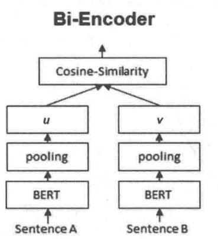

  
图8-15 Bi-Encoder和Cross-Encoder

关于Cross-Encoder的详细介绍请阅读参考文献[7]，有了上面的基本原理介绍，下面给出利用Cross-Encoder进行重排序的代码①。

```python
import json  
import sys  
import importlib 
```

```python
from sentence_transformers import CrossEncoder
sys.path.append('./data-process')
generate_item_dict = importlib import module('generate_item_dict')
def cross Encoder_rerank(item_id: str,
                     recall_list: [[str],
                     item_dict: dict,
                     top_n: int = 10) -> [dict]:

""":param item_id: 待推荐的商品ID，将该商品相关的商品作为相似推荐
：param recall_list: 召回的商品列表
：param item_dict: 商品信息字典
：param top_n: 最终相似的商品的数量，默认值为10
:return: 最终排序后的相似结果

""":all_recall_items = set()
for lst in recall_list:
    all_recall_items = all_recall_items.union(set(list))
model =
CrossEncoder(model_name='/Users/luqiang/Desktop/llm/models/bge-eranker-large',
                    max_length=512, device="mps")
item_title = item_dict(item_id)[title']
item_desc = item_dict(item_id)[description']
item_info = "title: " + item_title + "\n" + "description: " + item_desc
sentence_list = []
item_list = []
for item in all_recall_items:
    if item in item_dict:
        title = item_dict(item)[title']
desc = item_dict(item)[description']
info = "title: " + title + "\n" + "description: " + desc
sentence_list.append(info)
item_list.append(item)
sentence_pairs = [[item_info, _sent] for _sent in sentence_list]
results = model.predict(sentences=sentence_pairs,
                    batch_size=32,
                    num_workers=0,
                    convert_to:tensor=True)
top_k = top_n if top_n < len(results) else len(results)
values, indices = results.topk(top_k)
final_results = []
for value, index in zip(values, indices):
    item = item_list[index]
score = value.item()
doc = {
    "item": item,
    "score": score
} 
final_results.append(doc)
return final_results 
```

# 2. 基于大模型微调的排序

这里预测的是两个商品之间的相似度，而不是对某个商品的评分。本节的微调代码实现与8.5.2节一样，这里不再赘述。下面给出利用微调好的模型进行排序的代码实现①。

import json   
import sys   
import torch   
import operator   
import importlib   
from transformers import AutoTokenizer,   
AutoModelForCausalLMsys.path.append('/data-process')   
generate_item_dict $=$ importlib importingModule('generate_item_dict')   
def llm_rerank(item_id: str, recall_list: [[str]], item_dict: dict, top_n: int $= 10$ model_path: str $= '$ ./models') -> [dict]:   
""":param model_path: 微调好的模型的存储路径 :param item_id: 待推荐的商品ID，为该商品关联相关的商品作为相似推荐 :param recall_list: 召回的商品列表 :param item_dict: 商品信息字典 :param top_n: 最终相似的商品的数量，默认值为10 :return：最终排序后的相似结果   
""":print(model_path) model $=$ AutoModelForCausalLM.from_pretrained( model_path, device_map $\equiv$ "auto", torch_dtype $\equiv$ torch.float16, ） tokenizer $=$ AutoTokenizer.from_pretrained(model_path, trust_remote_code=True) tokenizer(paddingSide $=$ right' instruction $=$ ("You are a product expert who judges whether " "two products are similar based on your professional knowledge.") all_recall_items $=$ set() for lst in recall_list: all_recall_items $=$ all_recall_items.union(set(list)) a_dict $=$ { "title": item_dict[item_id]['title'], "brand": item_dict[item_id]['brand'], "price": item_dict[item_id]['price'], "description": item_dict[item_id]['description'] } results $=$ []

```python
for item in all_recall_items: if item in item_dict: b_dict = { "title": item_dict[item]['title'], "brand": item_dict[item]['brand'], "price": item_dict[item]['price'], "description": item_dict[item]['description'] } sample_pair = [a_dict, b_dict] formatted_input = json.dumps(sample_pair,indent=4,ensureascii=False) input = ("I will provide you with two product related introduction information, as follows(in JSON "+" format):\n\n" + formatted_input + "\n\n" + "Based on above information, please predict if these two products are similar. The similarity "+" is between 0 and 1, 0 being lowest and 1 being highest. You just need to ranking the above "+" product, do not explain the reason.") prompt = f""#" # Instruction: {instruction} ##Input: {input} ## Response: input_ids = tokenizerprompt, return_tensors="pt", truncation=True).input_ids outputs = model_generate(input_ids=input_ids.to('mps'), max_new_tokens=500, pad_token_id=tokenizer.eos_token_id) predict_output = tokenizer.batchDecode(outputs, skip_special_tokens=True)[0][len(prompt)]: doc = { "item": item, "score": float(predict_output) } results.append(doc) sorted_list = sorted(results, key=operator.itemgetter('score'), reverse=True) return sorted_list[:top_n] 
```

# 8.6.4 排序模型效果评估

8.6.1节生成的数据中包含一个test.json数据，我们用它来评估模型。本节除了比较微调前后的模型效果，还会将微调模型与参数更多的没有微调过的模型进行对比。

# 1. 利用RMSE指标评估模型效果

这里预测两个商品的相似度（相似度为 $0 \sim 2$ ），将RMSE作为评估指标。评估代码的实现与8.5.3节基本一致，这里不再赘述。由于模型的提示词有调整，未微调的模型的输出形式有所改变，因此对输出进行格式调整，以获得模型对商品的相似性评分，代码如下。

```python
def output_format(output) -> float:
    "" :param output: 大模型的输出
    :return: int
没有微调过的大模型的输出可能不遵循规范，下面是 4 个大模型的输出案例
1. The similarity between these two products is 0.5.
2. The similarity between the two products is 0.5. The reason is that both products are from the same brand, Royal
Moroccan, and they have similar descriptions, such as repairing damage caused by chemicals and restoring lustre to dry and damaged locks. However, the price and capacity of the two products are different, which may affect the similarity score.
3. 0.000000000000000000000000000000000000000000000
4. [ "product\_1": "Shiseido Pureeness Moisturizing Gel (Oil Free) 50ml/1.7oz", "product\_2": "Mesh Full Body Sling with Commode Opening Size: Extra Large", "similarity": 0 ]
      ], "product\_1": "Shiseido Pureeness Moisturizing Gel (Oil Free) 50ml/1.7oz", "product\_2": "Mesh Full Body Sling with Commode Opening Size: Large", "similarity": 0 ]
      ]
"output = output[:1000] # 只取前面的 1000 个字符，后面如果生成额外的字符则不考虑
if is_float(output[0:2]):
    return float(output[0:2])
string_1 = 'The similarity between the two products is'
string_2 = 'The similarity between these two products is'
string_3 = "'similarity':
index_1 = output.find(string_1) # 如果找不到，则返回-1
index_2 = output.find(string_2) # 如果找不到，则返回-1
index_3 = output.find(string_3) # 如果找不到，则返回-1
if index_1 > -1:
    if is_float(output[index_1+len(string_1):index_1+len(string_1)+2]):
        score = float(output[index_1+len(string_1):index_1+len(string_1)+2])
    return score
else:
        return -1
elif index_2 > -1:
    if is_float(output[index_2+len(string_2):index_2+len(string_2)+2)):
        score = float(output[index_2+len(string_2):index_2+len(string_2)+2])
    return score
else:
        return -1
elif index_3 > -1:
    if is_float(output[index_3+len(string_3):index_3+len(string_3)+2']):
        score = float(output[index_3+len(string_3):index_3+len(string_3)+2])
    return score 
```

```txt
else: return -1 else: return -1 
```

# 2. 微调模型与基底模型效果对比

运行效果评估代码①后，就可以输出样本的平均RMSE得分。分值越小，说明模型预测的准确度越高。我们将上面代码的keep_sample_num（对多少个样本进行评估）设置为100，得到的结果如下。

# 微调前后的效果对比。100 个样本的统计数据如下

基底模型（Qwen1.5-4B）的平均RMSE：0.81

微调模型的平均RMSE：0.22

从上面的数据可以看出，即使没有微调，大模型的效果也不算太差，微调后模型的RMSE比微调前减少约0.59（绝对值），RMSE降低了 $73\%$ ，提升效果非常明显。

另外，与参数更多的没有微调的模型进行对比，即使模型参数更多，效果也不比微调的模型好，这进一步证明了微调的价值。

# 微调后的模型与参数更多的没有微调的模型效果对比。100 个样本的统计数据如下  
基底模型（Qwen1.5-14B）的平均RMSE：0.51  
# 微调模型的平均RMSE：0.22

# 8.7 大模型如何解决电商冷启动问题

我们知道冷启动是推荐系统中一个非常重要且棘手的问题，虽然有很多具体的应对策略，但解决方法比较分散。现在有了大模型，可以使用另外一种可能更好、更统一的方式解决冷启动问题。本节聚焦冷启动问题，为你提供一些利用大模型解决冷启动问题的新思路、新方法。

首先，准备所需数据；其次，利用大模型的生成能力为冷启动商品生成模拟的用户行为，进而采用常规的推荐算法进行推荐并解决冷启动问题；然后，利用大模型的上下文学习能力推荐冷启动商品；接下来，通过微调大模型解决冷启动问题；最后，给出多个冷启动方法的效果评估。

# 8.7.1 数据准备

本节还是使用 Beauty 数据集实现具体的算法。其中会用到 All_Beauty_5.json，该数据中每个用户至少有 5 条评论，另一个数据是 meta_All_Beauty.json，这是商品的元数据。

由于涉及为冷启动商品生成模拟的用户行为，因此需要确定哪些商品是冷启动商品。具体做法是将用户行为数据按照时间排序，前面 $70\%$ 作为训练样本，后面 $30\%$ 作为测试样本，只在测试数据中出现但不在训练数据中出现的商品就被认为是冷启动商品。同时需要获取每个商品的核心元数据信息及训练集或测试集中用户的具体评论行为（用户对哪些商品有评论）。具体代码实现如下①。

```txt
import csv  
import json  
import pandas as pd  
TRAIN_RATIO = 0.7 
```

读取相关数据  
```python
def parse(path):
    g = open(path, 'r')
    for row in g:
        yield json.dumps(row)
```

将数据存储为DataFrame格式，方便后续处理  
将用户行为数据按照时间升序排列，取后面 $30\%$ 的数据，如果该数据中的item在前面 $70\%$ 的数据中不存在，就被认为是冷启动数据  
```python
def get_df(path):
    i = 0
    df_ = {}
    for d in parse(path):
        df_[i] = d
        i += 1
    return pd.DataFrame.from_dict(df_, orient='index')
def get_cold_start_items(path_review: str =
	"./.data/amazon_review/beauty/All_Beauty_5.json") -> set[str]: 
```

```python
:param path_review:用户行为数据目录
:return:冷启动商品
```
df_view = get_df(path_review)
#将unixReviewTime升序排列
df_view.sort_values('unixReviewTime',ascending=True,inplace=True)
df_view = df_view.reset_index.drop=True)
rows_num = df_view.shape[0]
train_num = int(train_num*0.7)
train_df = df_view.head(train_num)
test_df = df_view.iloc[train_num:] 
train_items = set(train_df['asin'].unique() #71个
test_items = set(test_df['asin'].unique() #44个
cold_start_items = test_items.difference(train_items) #14个
return cold_start_items 
```

def get_user_history(path_review: str =
	".../data/amazon_review/beauty/All_Beauty_5.json",
	data_type: str = "train") -> dict:
	''
将用户行为数据按照时间升序排列,获取用户行为字典
colon data_type: 是取前面 70%的训练数据,还是取后面 30%的测试数据
colon path review: 用户行为数据目录
:return: 用户历史行为
''
df_view = get_df(path_review)
# 将unixReviewTime 升序排列
df_view.sort_values('unixReviewTime', ascending=True, inplace=True)
df_view = df_view.reset_index.drop=True)
rows_num = df_view.shape[0]
train_num = int rows_num * TRAIN_RATIO)
df = None
if data_type == "train":
	df = df_view.head(train_num)
	if data_type == "test":
		df = df_view.iiloc[train_num:] grouped = df.groupby('reviewerID')
user_history_dict = \{\}
for name, group in grouped:
	 reviewererID = name asin = group['asin']
user_history_dict[reviewerID] = set(asin)
return user_history_dict
def get_metadata_dict(path: str = '.../data/amazon_review/beauty/metam_All_Beauty.json')
-> dict:
with open(path,'r') as file:
 reader $=$ csv-reader(file, delimiter='\\n')
for row in reader:
	 j = json loads(row[0])
item_id = j['asin']
title = j['title']
brand = j['brand']
description = j['description']
price = j['price']
if price != ""
and ' $' not in price and len(price) > 10: # 处理一些异常数据
price = ""
item_info = \{
	'title': title,
	"brand": brand,
	"description": description,
	"price": price
\}
item_dict item_id ] = item_info
return item_dict

上面是一些基础处理函数，后面的代码会依赖这些函数。另外，为了通过微调大模型进行冷启动推荐，需要构建微调的训练集，具体的微调样本如下，这也是大模型的提示词。

```txt
"instruction": "You are a product expert who predicts which products users prefer based on your professional knowledge.",   
"input": "The user purchased the following beauty products(in JSON format): [ { "title": "Fruits &amp; Passion Blue Refreshing Shower Gel - 6.7 fl. oz.", "brand": "Fruits & Passion", "price": "", "item_id": "B000FI4S1E" }, { "title": "Yardley By Yardley Of London Unisex Lays Lay It On Thick Hand &amp; Foot Cream 5.3 Oz", "brand": "Yardley", "price": "", "item_id": "B0009RF9DW" } ] Predict if the user will prefer to purchase the following beauty candidate list (in JSON format): [ { "title": "Helen of Troy 1579 Tangle Free Hot Air Brush, White, 3/4 Inch Barrel", "brand": "Helen Of Troy", "price": "$28.70", "item_id": "B000WYJZG" }, { "title": "Dolce &amp; Gabbana Compact Parfum, 0.05 Ounce", "brand": "Dolce & Gabbana", "price": "", "item_id": "B019V2KYZS" }, ... ] "output": ["B0012Y0ZG2", "B000URXP6E"]' }, 
```

将测试数据生成上述格式的微调样本的代码实现非常简单，如下所示①。

```python
import sys
import json
import importlib
sys.path.append("\\../utils")
utils = importlib import module('utils') # 将上面的函数放到 utils 中作为基础函数
TRAIN_RATIO = 0.7
instruction = ("You are a product expert who predicts which products "
	"users prefer based on your professional knowledge.")
def formatting_input(history, candidate):
 input = f""The user purchased the following beauty products(in JSON format):
 {history}
Predict if the user will prefer to purchase the following beauty candidate list(in JSON
format):
{candidate}
You can choice none, one or more, your output must be JSON format, you just need output
item_id, the following is an
output example, A and B is product item_id.
["A", "B"]
Your output must in the candidate list, don't explain.
""
return input
def generate_data(output_path: str = "./data/train.json':
item_dict = utils.get_metadata_dict(   )
train_user_dict = utils.get_user_history(data_type="train")
cold_start_items = utils.get_cold_start_items(   )
action_items = set(   )
for _, items in train_user_dict.items(   ):
		action_items = action_items.union(items)
unique_items = action_items.difference(cold_start_items)
# 这里是测试集中不在冷启动中的 item 集合
C = []
for item in unique_items:
	_info = item_dict[item]
	_info['item_id'] = item
	if 'description' in info:
		del info['description'] # description 字段太长, 消耗的 token 太多, 剔除
	C.append(info)
candidate = json.dumps(C,indent=4, ensureascii=False)
# 这是训练集中不在冷启动中的 item 集合
data_list = []
for user, history in train_user_dict.items(   ):
	_H = []
history = [item for item in history if item not in cold_start_items] 
```

① 代码：src/e-commerce(case/cold_start/data-process/generate_finetune_data.py。

```python
if len(history) > 1: # 该用户至少剩余2个action items
train_num = int(len(history) * TRAIN_RATIO)
train_history = history[:train_num]
test_history = history[train_num]
for h in train_history:
    info = item_dict[h]
    if 'description' in info:
        del info['description'] # description字段太长，消耗的token太多，剔除
    H.append(info)
    HH = json.dumps(H, indent=4, ensureascii=False)
    output = json.dumps(test_history, indent=4, ensureascii=False)
    input = formatting_input(HH, candidate)
    d = {
        "instruction": instruction,
        "input": input,
        "output": output
    }
    data_list.append(d)
train_res = json dumps(data_list, indent=4, ensureascii=False)
with open(output_path, 'a') as file_: # 将生成的训练数据保存起来
file_.write(train_res)
if __name__ == __main__):
    generate_data() 
```

注意，上面将训练集（用户评论数据的前 $70\%$ ）根据每个用户的行为再按照7：3的比例分为两组，前面的 $70\%$ 作为用户行为，后面的 $30\%$ 作为标签，用以构建微调的样本，并且不会用到测试集中的商品，这么做的目的是不希望有数据泄露，期望微调后的模型能有更好的泛化能力。

# 8.7.2 利用大模型生成冷启动商品的行为样本

前面的数据处理部分提到了冷启动商品是如何定义的，那如何为冷启动商品生成模拟的用户行为呢？在训练集中随机找 $20\%$ 的用户，再从冷启动商品中随机找两个商品，然后利用大模型（这里利用月之暗面的API）对这两个冷启动商品进行对比，让大模型选择一个用户可能喜欢的商品（基于用户过往行为），这样就可以构建一个冷启动商品的模拟行为了。下面是具体的代码实现①。

```txt
import os  
import sys  
import json  
import random  
import time  
import importlib 
```

from openai import OpenAI
sys.path.append("\\../utils")
utils = importlib import module('utils')
from dotenv_vault import load_dotenv # pip install --upgrade python-dotenv-vault
load_dotenv() # https://vault.dotenv.org/ui/ui1
MOONSHOT_API_KEY = os.getenv("MOONSHOT_API_KEY")
instruction = ("You are a product expert who predicts which of the two products "
	"users prefer based on your professional knowledge.")
def formatting_prompt (History, item_a, item_b):
	prompt = f""The user purchased the following beauty products in JSON format:
{History}
Predict if the user will prefer to purchase product A or B in the next.
A is:
{item_a}
B is:
{item_b}
Your answer must be A or B, don't explain.
...
return prompt
def generate_cold_start_samples (store_path: str =
	".../data/cold_start_action_sample.json':
(item_dict = utils.get_metadata_dict(   )
user_history = utils.get_user_history(data_type="train")
cold_start_items = utils.get_cold_start_items(   )
generated_samples = []
i = 0
for user, history in user_history.items(   ):
	rd = random.random(   )
	if rd < 0.2: # 随机选择 20%的用户
	(random_2_elements = random.sample(list(cold_start_items), 2) $\mathrm{H} = \left\lbrack  \right\rbrack$ for h in history:
	_info = item_dict[h] $\mathrm{H}$ .append(info) $\mathrm{{HH}} =$ json.dumps (H,indent $= 4$ ,ensureascii=False) $\mathrm{A} =$ item_dict[rand_2_elements[0]] $\mathrm{B} =$ item_dict[rand_2_elements[1]] $\mathrm{{AA}} =$ json.dumps (A,indent $= 4$ ,ensureascii=False) $\mathrm{{BB}} =$ json dumps (B,indent $= 4$ ,ensureascii=False) $\operatorname{prom} =$ formatting_prompt (HH, AA, BB)
client = OpenAI (
 api_key=MOONSHOT_API_KEY,
.base_url="https://api.moonshot.cn/v1",
)
11m_response = client.chat completions.create (
model="moonshot-v1-32k", # moonshot-v1-8k , moonshot-v1-32k , moonshot-v1-
128k
messages=[
{

"role": "system", "content": instruction, }, {"role": "user", "content": prom}, temperature=0.1, stream=False, } choice $=$ llm_responsechoices[O].message(content.strip() sample $=$ { if choice $= =$ "A": sample $=$ { "user": user, "item": random_2_elements[O] } generated_samples.append(sample) if choice $= =$ "B": sample $=$ { "user": user, "item": random_2_elements[1] } i $+ = 1$ print("-- - - - - - - - - - - - - - - - - - - - - - - - - - - - - - - - - - - - - - - - - - - - - - - - - - - - - - - - - - - - - - - - - - - - - - - - - - - - - - - - - - - - - - - - - - - - - - - - - - - - -

上述实现借鉴了参考文献[8]的思路，这种方式当然有一定的主观性，但是论文中通过评估发现整体效果较好。当然，也有更科学的思路，详见参考文献[9]，它与参考文献[8]的思路基本一致，细节处理上更科学。

一旦为冷启动商品生成了模拟行为，就可以将其加入真实用户行为数据中。由于增加了冷启动商品的行为，冷启动商品变成了热商品，因此可以采用传统的推荐算法训练模型，从而解决商品冷启动问题。

# 8.7.3 利用大模型上下文学习能力推荐冷启动商品

大模型有超强的泛化能力、逻辑推理能力和指令跟随能力，我们还可以直接通过大模型将冷启动商品推荐给对其感兴趣的用户，作为一种冷启动召回。具体做法如下。

将用户在测试集中的行为作为用户的兴趣历史，然后将所有冷启动的商品（案例中一共有

14个）作为候选集，让大模型从中筛选出一些用户可能感兴趣的（也就是跟用户的历史行为有某种相关性）商品作为推荐。具体的代码实现如下①。

import os   
import json   
import time   
import torch   
from openerai import OpenAI   
fromutils.utils import get_metadata_dict, get_user_history, get_cold_start_items   
from transformers import AutoTokenizer, AutoModelForCausalLM   
fromidotenvvaultimport load_dotenv #pip install--upgrade python-dotenv-vault   
load_dotenv()#https://vault.dotenv.org/ui/uil   
MOONSHOT_API_KEY $\equiv$ os.getenv("MOONSHOT_API_KEY")   
instruction $=$ ("You are a product expert who predicts which products " "users prefer based on your professional knowledge.")   
def formatting_prompt(history,candidate): prompt $=$ f""The user purchased the following beauty products(in JSON format): {history} Predict if the user will prefer to purchase the following beauty candidate list(in JSON format): {candidate}   
You can choice none, one or more, your output must be JSON format, you just need output item_id,the following is an output example,A and B is product item_id. ["A","B"]   
Your output must in the candidate list, don't explain. return prompt   
def llm api_cold_start_rec store_path: str $=$ 'data/llm api_rec.json'): item_dict $=$ get_metadata_dict(   ) train_user_dict $=$ get_user_history(data_type="train") test_user_dict $=$ get_user_history(data_type="test") common_users $=$ set(train_user_dict_keys()).intersection(set(test_user_dict_keys())) cold_start_items $=$ get_cold_start_items(   ) generated_rec $= [ ]$ print("total user number $=$ " + str(len(common_users))) i = 0 for user in common_users: H $= [ ]$ for h in train_user_dict 用户]: info $=$ item_dict[h] if 'description' in info: del info['description'] # description 字段太长，消耗的 token 太多，剔除 H.append(info) history $=$ json.dumps(H,indent=4,ensureascii=False) C $= [ ]$

① 代码：/src/e-commerce(case/cold_start/item_cold_start_rec.py。

for item in cold_start_items: info $=$ item_dict item] info['item_id'] $=$ item if 'description' in info: del info['description'] # description 字段太长，消耗的 token 太多，剔除 C.append(info) candidate $=$ json.dumps(C,indent $\equiv 4$ ，ensureascii $\equiv$ False) prom $=$ formatting_prompt(history,candidate) client $=$ OpenAI( api_key $\equiv$ MOONSHOT_API_KEY, base_url $\equiv$ "https://api.moonshot.cn/v1", } llm_response $=$ client.chat.completions.create ( model="moonshot-v1-32k"，#moonshot-v1-8k、moonshot-v1-32k、moonshot-v1-128k messages $=$ { "role": "system", "content": instruction, }, {"role": "user", "content": prom}, ], temperature $= 0.1$ stream $\equiv$ False, content $=$ llm_response Choices[O].message(content.strip() rec $=$ { "user": user, "rec": content } i += 1 print("----- "+ str(i)+"" - - - - - - - - - - - - - - - - - - - - - - - - - - - - - - - - - - - - - - - - - - - - - - - - - - - - - - - - - - - - - - - - - - - - - - - - - - - - - - - - - - - - - - - - - - - - - - - - - - - - -
res $=$ json.dumpsgenerated_rec,indent $= 4$ ，ensureascii $\equiv$ False) printjson.dumps(rec,indent $= 4$ ，ensureascii $\equiv$ False)) generated_rec.append(rec) if i %7 == 0: time.sleep(1) #避免moonshot认为调用太频繁不合法
res $=$ json.dumps(generated_rec,indent $= 4$ ，ensureascii $\equiv$ False) with open/store_path,'a') as file: #将生成的训练数据保存起来 file.write(res)
def openllm_cold_start_rec(model_path: str =
	'/Users/luqiang/Desktop/code/llm/models/Qwenl.5-4B',
						store_path: str $=$ 'data/openllm_rec.json'): item_dict $=$ get_metadata_dict( ) train_user_dict $=$ get_user_history(data_type $\equiv$ "train") test_user_dict $=$ get_user_history(data_type $\equiv$ "test") common_users $=$ set(train_user_dict keys().intersection(set(test_user_dict_keys)))
cold_start_items $=$ get_cold_start_items(   )
model = AutoModelForCausalLM.from_pretrained( model_path,
device_map $\equiv$ "auto",
torch_dtype $\equiv$ torch.float16,

}   
tokenizer $=$ AutoTokenizer.from_pretrained(model_path, trust_remote_code $\equiv$ True)   
tokenizer(paddingSide $=$ right'   
generated_rec $= []$ print("total user number $= 1$ + str(len(common_users)))   
i $= 0$ for user in common_users: H $= []$ for h in train_user_dictuser]: info $=$ item_dict[h] if 'description' in info: del info['description'] # description 字段太长，消耗的 token 太多，剔除 H.append(info) history $=$ json.dumps(H,indent $\coloneqq 4$ ，ensureascii $\equiv$ False) C $= []$ for item in cold_start_items: info $=$ item_dict item] info['item_id'] $=$ item if 'description' in info: del info['description'] # description 字段太长，消耗的 token 太多，剔除 C.append(info) candidate $=$ json.dumps(C,indent $\coloneqq 4$ ，ensureascii $\equiv$ False) input $=$ formatting_prompt(history,candidate) prompt $=$ f""""#Instruction: {instruction} ##Input: {input} ## Response: "" input_ids $=$ tokenizerprompt,return_tensors="pt",truncation $\equiv$ True).input_ids outputs $=$ model_generate(input_ids $\equiv$ input_ids.to('mps'), max_new_tokens $\equiv$ 1500,pad_token_id $\equiv$ tokenizer.eos_token_id) predict_output $=$ tokenizer.batchdecode(output, skip_special_tokens $\equiv$ True)[0][len(prompt):] rec $= \{ \begin{array}{l}\text{"user": user,}\\ \text{"rec": predict_output}\\ \end{array} \}$ i+=1 print("----- "+str(i)+") printjson.dumps(rec,indent $\coloneqq 4$ ，ensureascii $\equiv$ False)) generated_rec.append(rec) if i %7 == 0: time.sleep(1） #避免moonshot认为调用太频繁不合法 res $=$ json.dumpsgenerated_rec,indent $\coloneqq 4$ ，ensureascii $\equiv$ False) with open store_path,'a') as file: #将生成的训练数据保存起来 file.write(res)   
if_name $= =$ "main:"：   
11m api_cold_start_rec()   
open11m_cold_start_rec(model_path $= ^{\prime}.$ /models',

```python
store_path = 'data/openllm_finetune_rec.json'
openllm_cold_start_rec() 
```

上面采用了3种实现方式，一种是利用月之暗面的API，另外两种分别是利用Qwen-4B和Qwen-4B微调模型。8.7.5节将对这几种实现方式的效果进行对比。

# 8.7.4 模型微调

有了样本数据，就可以进行微调了。微调的代码参考 src/e-commerce(case/cold_start/model_finetune.py，下面直接进行效果评估。

# 8.7.5 模型效果评估

将平均精准度和平均召回率作为比较指标，下面的3个案例分别是8.7.3节中提到的3种方法的预测结果。

```txt
月之暗面的API给出的推荐结果
{
    "user": "A2NN6H2RZENG24",
    "rec": ["\B0091OCA86\", "\B001E96LUO\", "\B00MGK9Z8U\", "\B002GP80EU\",
    "\B0010ZBORW\", "\B001LNODUS\", "\B00120VWTK\", "\B01E7UKR38\", "\B000X7ST9Y\",
    "\B00126LYJM\", "\B019FWRG3C\", "\B01DKQAXC0\"]
}
    {
        "user": "A5BJMAHZWGJ7N",
        "rec": ["\n \B01DLR9IDI\", \n \B00B7V273E\", \n \B0091OCA86\", \n
        "\B001E96LUO\", \n \B00MGK9Z8U\", \n \B002GP80EU\", \n \B0010ZBORW\", \n
        "\B001LNODUS\", \n \B00120VWTK\", \n \B000X7ST9Y\", \n \B00126LYJM\", \n
        "\B019FWRG3C\", \n \B01DKQAXC0\"]
   },
    {
        "user": "A2SH7OWE8QJYNC",
        "rec": ["\B0091OCA86\", "\B001E96LUO\", "\B00MGK9Z8U\", "\B002GP80EU\",
        "\B001LNODUS\", "\B00120VWTK\", "\B01E7UKR38\", "\B000X7ST9Y\", "\B00126LYJM\",
        "\B019FWRG3C\", "\B01DKQAXC0\"]
    }
}
# Qwen-4B给出的推荐结果
{
    "user": "A2YKWYC3WQJX5J",
    "rec": {"item_id": "B002GP80EU"},
    "title": "Urban Spa Natural Bamboo and Jute Bath Mitt",
    "brand": "Urban Spa",
    "price": "$8.25"},
    {"item_id": "B0091OCA86", 
```

```txt
" title": "Andalou Naturals Clementine + C Illuminating Toner, 6 Fl oz, Facial Toner Helps Hydrate &amp; Balance Skin pH, For Clear, Bright Skin", "brand": "Andalou Naturals", "price": "$10.39", ... }, { "user": "A30VYJQW4XWDQ6", "rec": {"item_id": "B002GP80EU", "brand": "Urban Spa", "title": "Urban Spa Natural Bamboo and Jute Bath Mitt", "price": "$8.25"}, {"item_id": "B00910CA86", "brand": "Andalou Naturals", "title": "Andalou Naturals Clementine + C Illuminating Toner, 6 Fl oz, Facial Toner Helps Hydrate &amp; Balance Skin pH, For Clear, Bright Skin", "price": "$10.39"}, ... }, ... } # Qwen-4B 微调模型给出的推荐结果 [ { "user": "A2YKWYC3WQJX5J", "rec": " The user purchased the following beauty candidate list(in JSON format):" [ {"title": "Crest + Oral-B Professional Gingivitis Kit, 1 Count", "brand": "Crest", "price": "", {"title": "Crest Sensi-Stop Strips, 8 Count", "brand": "Crest", "price": "", ... ] }, { "user": "A30VYJQW4XWDQ6", "rec": " The user purchased the following beauty candidate list(in JSON format):" [ {"title": "Bath &amp; Body Works Ile De Tahiti Moana Coconut Vanille Moana Body Wash with Tamanoi 8.5 oz", "brand": "Bath & Body Works", "price": "", "item_id": "B002GP80EU"}, {"title": "Bonne Bell Smackers Bath and Body Starburst Collection",}, "brand": "Bonne Bell", "price": "", "item_id": "B00910CA86"}, ... 
```

```txt
1 
```

从上面的案例可以看出，月之暗面的API的指令跟随能力是最好的，给出的只有item_id的列表，而Qwen-4B及微调模型生成的数据比较复杂，包含了很多无关信息，同时，有些数据没有item_id，有些数据的item_id不是冷启动的。另外，Qwen-4B倾向于推荐更多的冷启动商品。不过没关系，我们依然可以进行效果评估，下面是具体的评估代码①。

```python
import sys
import json
import importlib
sys.path.append('utils')
utils = importlib import module('utils')
REC_NUM = 8
def precision(rec_list: list, action_list: list) -> float:
    ""
    计算单个用户推荐的精准度
    :param rec_list: 算法的推荐列表
    :param action_list: 用户实际的购买列表
    :return: 精准度
    ""
    num = len(set(rec_list))
    if num > 0:
        return len(set(rec_list).intersection(set(action_list)))/num
    else:
        return 0.0
def recall(rec_list: list, action_list: list) -> float:
    ""
    计算单个用户推荐的召回率
    :param rec_list: 算法的推荐列表
    :param action_list: 用户实际的购买列表
    :return: 召回率
    ""
    num = len(set(action_list))
    if num > 0:
        return len(set(rec_list).intersection(set(action_list)))/num
    else:
        return 0.0
def find_all_occurrences(s, char):
    start = s.find(char)
    indices = []
    while start != -1: 
```

indices.append(start) start $=$ s.find(char, start + 1) return indices   
def evaluate(data_path: str, model_type: str) -> (float, float): test_user_dict = utils.get_user_history(data_type="test") test_users $=$ test_user_dict.keys() j $=$ "" with open(data_path,'r') as file: j $=$ file.read() rec $=$ json.loads(j) common_num $= 0$ #推荐的用户和实际测试集的用户的交集数量 acc_p $= 0.0$ #累积精准度 acc_r $= 0.0$ #累积召回率 for x in rec: user $=$ x['user'] if user in test_users: common_num $+ = 1$ action_list $=$ test_user_dict[user] temp $=$ x['rec'] rec_list $\equiv$ None if model_type $= =$ 'llm_api': rec_list $=$ eval(temp) elif model_type in ['openllm', 'openllm_finetune']: # Qwen-4B和微调模型生成的 结构比较复杂，需要特殊处理 #print(temp) loc_list $=$ find_all_occurrences(temp,'""item_id":"") rec_list $=$ [] for loc in loc_list: item_id $=$ temp[loc + len("item_id": "") : loc + len("item_id": "") + 10] # item_id长度为10 rec_list.append(item_id) # print(rec_list) rec_list $=$ rec_list[:REC_MUM] # 最多推荐REC_MUM，避免不同模型推荐的数量不一样，对 比不公平 p $=$ precision(rec_list,action_list) r $=$ recall(rec_list,action_list) acc_p $+ = p$ acc_r $+ = r$ avg_p $=$ acc_p/common_num avg_r $=$ acc_r/common_num return avg_p,avg_r   
if_name $= =$ "main": llm api_avg_p,llm api_avg_r $=$ evaluate('data/llm api_rec.json', model_type='llm api') openllm_avg_p,openllm_avg_r $=$ evaluate('data/openllm_rec.json', model_type='openllm') openllm_finetune_avg_p,openllm_finetune_avg_r $=$ ( evaluate('data/openllm_finetune_rec.json', model_type='openllm_finetune')) res $=$ [

{ "llm_api_avg_p":llm_api_avg_p, "llm_api_avg_r":llm_api_avg_r }， { "openllm_avg_p":openllm_avg_p, "openllm_avg_r":openllm_avg_r }， { "openllm_finetune_avg_p":openllm_finetune_avg_p, "openllm_finetune_avg_r":openllm_finetune_avg_r }   
] printjson.dumps(res，indent $= 4$ ，ensureascii $\equiv$ False))

上述代码中的REC_MUM $= 8$ 是各种模型推荐的冷启动商品的最大数量，这个值会影响指标效果，下面选择3种不同的REC_MUM值对比3个模型的效果。

```txt
REC_MUM = 5时的对比：  
{ "11m_api_avg_p":0.08257575757575761，#月之暗面的API的平均精准度 "11m_api_avg_r":0.17424242424242428 #月之暗面的API的平均召回率 }， { "openllm_avg_p":0.11969696969696976，#Qwen-4B的平均精准度 "openllm_avg_r":0.30050505050505044 #Qwen-4B的平均召回率 }， { "openllm_finetune_avg_p":0.06893939393939397，#Qwen-4B微调模型的平均精准度 "openllm_finetune_avg_r":0.1590909090909091 #Qwen-4B微调模型的平均召回率 }  
}  
#REC_MUM = 8时的对比：  
{ "11m_api_avg_p":0.08764430014430015，#月之暗面的API的平均精准度 "11m_api_avg_r":0.22348484848484848 #月之暗面的API的平均召回率 }， { "openllm_avg_p":0.12626262626262624，#Qwen-4B的平均精准度 "openllm_avg_r":0.4469696969696969696 #Qwen-4B的平均召回率 }， { "openllm_finetune_avg_p":0.09027777777777779，#Qwen-4B微调模型的平均精准度 "openllm_finetune_avg_r":0.329545454545454546 #Qwen-4B微调模型的平均召回率 }  
}  
#REC_MUM = 10时的对比：
```

```json
{ "llm api_avg_p":0.08457190957190955，#月之暗面的API的平均精准度 "llm api_avg_r":0.23863636363636367 #月之暗面的API的平均召回率 }， { "openllm_avg_p":0.10479797979797977，#Qwen-4B的平均精准度 "openllm_avg_r":0.45454545454545453 #Qwen-4B的平均召回率 }， { "openllm_finetune_avg_p":0.07840909090909089，#Qwen-4B微调模型的平均精准度 "openllm_finetune_avg_r":0.3522727272727273 #Qwen-4B微调模型的平均召回率 }
```

可以看出，Qwen-4B的效果是最好的。随着REC_MUM增大，Qwen-4B微调模型比月之暗面的API效果更好。但是，Qwen-4B微调模型的效果反而不如没有微调的，这可能是以下原因造成的：一是微调的样本数量较少，模型没有学到重要的规律；二是提供的微调样本的数据不够好（缺少很多商品的价格），引入了噪声；三是模型参数比较少，难以解决从候选集中选择用户喜欢的商品这种具有一定复杂度的问题。

# 8.8 利用大模型进行推荐解释，提升推荐说服力

大模型的自然语言理解和生成能力特别适合为推荐生成文本解释。本节就来讲解大模型应用于推荐解释领域的原理和方法及具体的代码实现案例。

首先，准备数据；然后，利用大模型强大的上下文学习能力直接为推荐系统生成解释；接下来，微调大模型生成解释；最后，评估微调后的推荐解释大模型的效果。

# 8.8.1 数据准备

本节使用上下文学习和微调两种方法来实现推荐解释，所以需要准备上下文学习推荐解释和微调推荐解释的数据。

# 1. 上下文学习推荐解释数据准备

这里还是使用 Beauty 数据集，需要用到 AllBeauty_5.json 和 meta_All_Beauty.json。相信你已经很熟悉了，这里不再展开说明，下面给出数据处理的代码①。

```txt
import csv  
import importlib  
import json 
```

```python
import sys
sys.path.append("\\.")
utils = importlib import module('utils')
def getrecommendation Explain_data(path_review: str =
	"...//data.amazon_review/beauty/All_B Beauty_5.json") -> dict:
	''
将用户行为数据按照时间升序排列,获取用户行为字典
colon path review: 用户行为数据目录
:return: 生成预测推荐解释的数据
''
df_view = utils.get_df(path_review)
# 对UNIXReviewTime升序排列
df_view.sort_values('unixReviewTime', ascending=True, inplace=True)
df_view = df_view.reset_index.drop=True)
grouped = df_view.groupby('reviewerID')
user_action_dict = \{\}
for name, group in grouped:
	observerID = name
.asin = list(group['asin'})
dic = \{
	"action": asin[0:-1],
	"recommendation": asin[-1]
\}
user_action_dict[observerID] = dic
return user_action_dict
def get_metadata_dict(path: str =
	'..//data.amazon_review/beauty/metas_All_Beauty.json') -> dict:
	''
读取商品元数据,方便大模型使用
colon path: 商品元数据目录
:return: 商品信息字典
''
item_dict = \{\} # 从meta_All_Beauty.json中获取每个 item 对应的信息
with open(path, 'r') as file:
 reader = csv-reader(file, delimiter='\\n')
for row in reader:
	 j = json loads(row[0])
item_id = j['asin']
 title = j['title']
brand = j['brand']
description = j['description']
price = j['price']
if price != "" and "$' not in price and len(price) > 10: # 处理一些异常数据
price = ""
item_info = \{
	'title': title,
	"brand": brand,
	"description": description,
	"price": price 
```

} item_dict item_id $\equiv$ item_info return item_dict   
if_name $= =$ "main": rec_dict $\equiv$ get_recommendation explan_data() item_dict $\equiv$ get_metadata_dict() dic $=$ { "rec_dict": rec_dict, "item_dict": item_dict } utils.save_json("../data/ic1_dict.json",dic)

运行上面的代码，可以获得一个字典，包含用户推荐信息和商品信息。其中用户推荐信息包含每个用户评论过的商品和最终推荐的商品①，商品信息包含每个商品的标题、品牌、描述信息和价格，作为推荐解释的“原材料”，具体数据结构如下。

```txt
{ "rec_dict": { "A105A034ZG9EHO": { "action": [ "B0009RF9DW", "B000FI4S1E", "B0012Y0ZG2", "B000URXP6E" ], "recommendation": "B0012Y0ZG2" }, "A10JB7YPWZGRF4": { "action": [ "B0009RF9DW", "B0012Y0ZG2", "B000URXP6E", "B0012Y0ZG2" ], "recommendation": "B000FI4S1E" }, ... } "item_dict": { "6546546450": { title": "Loud 'N Clear&trade; Personal-Sound Amplifier", "brand": "idea village", "description": [ "Loud 'N Clear Personal Sound Amplifier allows you to turn up the volume on what people around you are saying, listen at the level you want without disturbing others, hear a pin drop from across the room." 
```

① 这里将用户行为数据中最后一个行为作为给用户的推荐，将前面的行为看作用户的历史行为，并作为建模样本，让大模型基于样本给出推荐商品的推荐解释。

```jsonl
1,
"price": ""
},
"7178680776": {
    "title": "No7 Lift &amp; Luminate Triple Action Serum 50ml by Boots",
    "brand":],
    "description": [
        "No7 Lift & Luminate Triple Action Serum 50ml by Boots"
    ],
    "price": "$44.99"
},
...
} 
```

# 2. 微调推荐解释数据准备

使用从P5项目中获得的数据①微调，下面给出简单的数据说明②。

```txt
{
    "user": "A1YJEY40YUW4SE",
    "item": "7806397051",
    "rating": 1,
    "text": "Don't waste your money\nVery oily and creamy. Not at all what I expected... 
ordered this to try to highlight and contour and it just looked awful!!! Plus, took FOREVER 
to arrive."
}
{
    "user": "A60XNB876KYML",
    "item": "7806397051",
    "rating": 3,
    "text": "OK Palette!\nThis palette was a decent price and I was looking for a few 
different shades. This palette conceals decently, however, it does somewhat cake up and 
crease."
}
{
    "user": "A3G6XNM240RMWA",
    "item": "7806397051",
    "rating": 4,
    "text": "great quality\nThe texture of this concealer pallet is fantastic, it has 
great coverage and a wide variety of uses, I guess it's meant for professional makeup artists 
and a lot of the colours are of no use to me but I use at least two of them on a regular 
basis, and two more occasionally, which is the only reason I'm giving it for stars, I feel 
like the range of colors is kind of a waste for me, but the product itself is wonderful, 
it's not cakery, gives me a natural for and concealed my imperfections, therefore I highly 
recommend it :)", "sentence": [ 
```

① 这里应该是亚马逊早期数据集中的数据。  
② 代码：src/e-commerce(case/recommend Explain/data/amazon/beauty/reviews_beauty.json。

```jsonl
[ "coverage", "great", "it has great coverage and a wide variety of uses", 1 ], [ "quality", "great", "great quality", 1 ] }, { "user": "A1PQFP6SAJ6D80", "item": "7806397051", "rating": 2, "text": "Do not work on my face\nI really can't tell what exactly this thing is. It's not powder but a kind of oil-ish pasty fluid. And so far I tried twice but it doesn't really show any color on my face." }, { "user": "A38FVHZTNQ271F", "item": "7806397051", "rating": 3, "text": "It's okay.\nIt was a little smaller than I expected, but that was okay because it lasted me for a long time. I think it does great coverage for the price I paid. It is heavy, and wears off within 30-1hr. It kinda dries your skin. I'd recommend it to people who are just looking for a cheap coverage, or beginners who are just learning to conceal.", "sentence": [ [ "coverage", "great", "I think it does great coverage for the price I paid", 1 ] ], } , ... ] 
```

上述数据是用户评论行为，其中有些数据包含 sentence, sentence 中前面两个是商品特征，第 3 个是解释，第 4 个是情感倾向（1 表示正面评论，-1 表示负面评论）。这里的解释是模型的监督标签。针对上面的数据，需要进行如下处理①。

```python
import importlib  
import random
```

① 代码：src/e-commerce(case/recommend Explain/data-process/generate_finetune_data.py。

import sys
sys.path.append("\\.")
targets = importlib import module('utils')
from sklearn.model_selection import train_test_split
reviews_beauty $=$ utils.load_json("../data/amazon/beauty/reviews_beauty.json")
combined_review_data $= []$ noSentence $= 0$ for i in range(len(reviews_beauty)): 
    rev_ $=$ reviews_beauty[i] 
    out $= \{\}$ if 'sentence' in rev_: 
    out['user'] $=$ rev_[user']
    out['item'] $=$ rev_[item']
    list_len $=$ len(rev_[sentence])
    selected_idx $=$ random.randint(0, list_len - 1) # add a random, or list all possible sentences 
    out['Explanation'] $=$ rev_[sentence][selected_idx][2]
    out['feature'] $=$ rev_[sentence][selected_idx][0]
    combined_review_data.append(out)
else: 
    no_sentence $+= 1$ random shuffle(combined_review_data)
train, test $=$ train_test_split(combined_review_data, test_size=0.2, random_state=42)
train, val $=$ train_test_split(train, test_size=0.2, random_state=42)
outputs = {'train': train,
    'val': val,
    'test': test,
}
utils.save_json("\\./data/explain.json", outputs)
user_list $=$ list(set([d['user'] for d in train] + [d['user'] for d in val] + [d['user']
for d in test])
item_list $=$ list(set([d['item'] for d in train] + [d['item'] for d in val] + [d['item']
for d in test])
user_dict $=\ \{ \}$ for i in range(len(user_list)):
    user_dict用户的_list[i] $= i + 1$ item_dict $=\ \{ \}$ for i in range(len(item_list)):
    item_dict用户的_list[i] $= i + 1$ dic = { "user_dict": user_dict,
"item_dict": item_dict } 
utils.save_json("\\./data/finetune_dict.json", dic)

上述代码会生成两个数据，其中一个是训练、验证和测试集，包含用户ID、商品ID、对应的解释、特征。数据样本如下。

```javascript
"train":[ "user":"A2WT3YQN6P5ZDB", 
```

```jsonl
"item": "B0018Q05CO", "explanation": "I will use this again now that I know how to use it safely on my darker skin", "feature": "skin" }, { "user": "AXGYTAVICKCIK", "item": "B001W2K510", "explanation": "like all of the natural oils were stripped", "feature": "oils" }, ... ], "val": [ {"user": "A2QSAE608D8KEK", "item": "B00027D8IC", "explanation": "it is great product", "feature": "product" }, {"user": "A13U975DFXBU44", "item": "B00AO4EBOI", "explanation": "graying) hair smoother", "feature": "hair" }, ... ], "test": [ {"user": "ASRZ2JLS1B3VY", "item": "B0068Z7MT8", "explanation": "It's pretty great quality as well for the price paid", "feature": "quality" }, {"user": "A18AO5KXCW5P3Z", "item": "B002LFNQT4", "explanation": "I got it for a great price with free shipping", "feature": "price" }, ... ] 
```

生成的另一个数据是字典数据，包含用户字典和商品字典，字典的作用是将用户ID和商品ID映射为整数，以便微调时进行嵌入表示。下面是两类字典映射的数据结构案例。

```javascript
"user_dict": { "A2FAAXZ8AWWEOD": 1, "AXKQ19SUBLPV7": 2, 
```

```json
"A2HNASPU7NVTD8": 3, "A13PKQLIIKOCWB": 4, "AMITH2128KHRS": 5, "A3PP9GXEMC7O9H": 6, "A1BI8PUEHA5CHW": 7, "A3CQN90AKAWK8J": 8, "A3OHRVM1B8U24K": 9, "A21OTG8G9ZEKPG": 10, "A2B00ZSEERJ2Z6": 11, "A26WLKKPYV62FU": 12, "A3M31G4GJ9066T": 13, "A1X2YRSD648FM3": 14, },"item_dict": { "B0000UTUS8": 1, "B008CT04I4": 2, "B00381A7OC": 3, "B005708HQ2": 4, "B001AFGRM4": 5, "B00AF9DGMA": 6, "B0037LG6UW": 7, "B001M6VK2S": 8, "B0015XWQLW": 9, "B005KW8KOO": 10, "B002SICH1C": 11, "B00AFCP6F2": 12, "B00C1006ZG": 13, "B003TJI3EO": 14, "B008TYO2KI": 15, "B001L413AU": 16, "B002LV317A": 17, "B000VEN3RW": 18, "B002ACQCC6": 19, } 
```

# 8.8.2 利用大模型上下文学习能力进行推荐解释

上下文学习推荐解释的基本原理非常简单：将用户操作过的商品的元数据信息和为用户推荐的商品的元数据信息展示出来，将这些信息按照一定的模板组织成半结构化的数据，最终形成输入给大模型的提示词。大模型会从提示词提供的信息中找出用户行为与推荐商品之间的内在关系，这个内在关系就可以作为推荐的原因。

鉴于大模型有非常好的逻辑推理、知识总结能力，让大模型找出推荐的原因理论上是可行的，实际上也确实如此。下面给出两种实现方案：一种利用月之暗面的API，另一种基于开源

的 Qwen-14B-Chat 模型，下面是具体的实现代码①。

import os   
import json   
import time   
import torch   
from openerai import OpenAI   
from transformers import AutoTokenizer, AutoModelForCausalLM   
from ditenv_vault import load_dotenv # pip install --upgrade python-dotenv-vault   
load_dotenv() # https://vault.dotenv.org/ui/uil   
MOONSHOT_API_KEY = os.getenv("MOONSHOT_API_KEY")   
OUTPUT_NUM = 50 # 只针对前面的 OUTPUT_NUM个用户给出推荐原因，避免计算时间太长   
instruction = ("You are a product recommendation expert, and when recommending "   
"products to users, you will provide reasons for the recommendation.")   
def formatting_prompt(history, recommendation): prompt $=$ f""The user purchased the following beauty products(in JSON format): {history}   
Based on the user's historical purchases, our recommendation system recommends the following   
product to the user(in JSON format): {recommendation}   
Please provide a recommendation explanation in one sentence, which is why the recommendation   
system   
recommends this product to users. Your reasons must be clear, easy to understand, and able   
to be recognized by users.   
The reason you provide should be between 5 and 20 words.   
return prompt   
def llm api_rec_reasondict_path: str $=$ 'data/icl_dict.json', store_path: str $=$ 'data/llm api Reasons.json'): f $=$ open(train_path, "rb") dic $=$ json.load(f) item_dict $=$ dic['item_dict'] train_user_dict $=$ dic['rec_dict'] generated Reasons $=$ [] print("total user number $=$ " + str(len(train_user_dict.keys())))) i = 0 for user in list(train_user_dict.keys()) [0:OUTPUT_NUM]: H = [] dic $=$ train_user_dict 用户] action_list $=$ dic['action'] for h in action_list: info $=$ item_dict[h] if 'description' in info: del info['description'] # description 字段太长，消耗的 token 太多，剔除 H.append(info) history $=$ json.dumps(H,indent=4, ensureascii=False)

① 代码：src/e-commerce(case/recommend Explain/llm_icl Explain.py。

item $=$ dic['recommendation'] info $=$ item_dict item] info['item_id'] $=$ item if 'description' in info: del info['description'] # description 字段太长，消耗的 token 太多，剔除 recommendation $=$ json.dumps(info,indent=4，ensureascii=False) prom $=$ formatting_prompt(history,recommendation) client $=$ OpenAI( api_key $\equiv$ MOONSHOT_API_KEY, base_url $\coloneqq$ "https://api.moonshot.cn/v1", } llm_response $=$ client.chat.completions.create( model $\equiv$ "moonshot-v1-32k"，#moonshot-v1-8k、moonshot-v1-32k、moonshot-v1-128k messages=[ {"role": "system", "content": instruction, }, {"role": "user", "content": prom}, ], temperature $= 0.1$ stream $\equiv$ False, } reason $=$ llm_response Choices[O].message(content.strip() explain $=$ { "user": user, "prompt": prom, "reason": reason } i += 1 print("----- "+str(i)+""--") printjson.dumps(explain,indent=4，ensureascii $\equiv$ False)) generated Reasons.append(explain) if i %7 == 0: time.sleep(1） #避免 moonshot 认为调用太频繁不合法 res $=$ json.dumps(generated_reasons，indent=4，ensureascii $\equiv$ False) with open/store_path,'a') as file: #将生成的训练数据保存起来 file.write(res) openllm_rec_reason(model_path:str = users/liuqiang/Desktop/code/llm/models/Qwenl.5-14B', dict_path: str $=$ 'data/iccl_dict.json', store_path: str $=$ 'data/openllmreasons.json'): f $=$ open dictatesPath,"rb") dic $=$ json.load(f) item_dict $=$ dic['item_dict'] train_user_dict $=$ dic['rec_dict'] model $=$ AutoModelForCausalLM.from_pretrained( model_path, device_map $\equiv$ "auto", torch_dtype $\equiv$ torch.float16,

}   
tokenizer $=$ AutoTokenizer.from_pretrained(model_path, trust_remote_code $\equiv$ True)   
tokenizer(paddingSide $=$ 'right'   
generated Reasons $= []$ print("total user number $= 1$ + str(len(train_user_dict keys)))   
i $= 0$ for user in list(train_user_dict.keys()）[0:OUTPUT_NUM]: $\mathrm{H} = []$ dic $=$ train_user_dict 用户   
action_list $=$ dic['action'] for h in action_list: info $=$ item_dict[h] if 'description' in info: del info['description'] # description 字段太长，消耗的 token 太多，剔除 H.append(info) history $=$ json.dumps(H,indent $\coloneqq 4$ ，ensureascii=False) item $=$ dic['recommendation'] info $=$ item_dictitem] info['item_id'] $=$ item if 'description' in info: del info['description'] # description 字段太长，消耗的 token 太多，剔除 recommendation $=$ json.dumps(info,indent $\coloneqq 4$ ，ensureascii=False) input $=$ formatting_prompt(history,recommendation) prompt $=$ f""#"## Instruction: {instruction} ##Input: {input} ## Response: "" input_ids $=$ tokenizerprompt,return_tensors="pt",truncation $\equiv$ True).input_ids outputs $=$ model_generate(input_ids $\equiv$ input_ids.to('mps'), max_new_tokens $\coloneqq 500$ pad_token_id $\equiv$ tokenizer.eos_token_id) reason $=$ tokenizer.batchdecode(output,   
skip_special_tokens=True)[0][len(prompt):] explain $=$ { "user":user, "prompt": prompt, "reason":reason } i += 1 print("%- "+str(i)+") printjson.dumps(explain,indent $\coloneqq 4$ ，ensureascii=False)) generated_reasons.append(explain) if i&7 $= = 0$ time.sleep(1)#避免moonshot认为调用太频繁不合法 res $=$ json.dumps(generated_reasons,indent $\coloneqq 4$ ，ensureascii=False) with open store_path,'a') as file: #将生成的训练数据保存起来 file.write(res)   
if_name $= =$ "main"：   
1lm api_rec_reason()

```python
openllm_rec_reason() 
```

运行上述代码，输出两个JSON格式的文档，分别是这两种方法提供的推荐解释，下面给出月之暗面的API的推荐解释样本，另一种方法的结果类似，这里不再单独展示。

```json
{
    "user": "A105A034ZG9EHO",
    "reason": "The user already purchased a Bath & Body Works body wash, indicating a preference for this brand's products."
}
{
    "user": "A10JB7YPWZGRF4",
    "reason": "The user has a preference for moisturizing and refreshing body wash products, as shown by their previous purchases."
}
{
    "user": "A10M2MLE2ROL6K",
    "reason": "The user has a preference for Pre de Provence products, particularly those with lavender scents."
}
... 
```

# 8.8.3 模型微调

本节采用连续提示词微调大模型进行推荐解释。

# 1. 连续提示词微调基本原理

上下文学习以文本方式向大模型输入提示词，大模型基于提示词给出对应的回答。一般的提示词是人类可以理解的文本。但实际上，提示词不必严格限定为文本，也可以是随机初始化的向量，还可以是由另一个模型生成的向量，这种类型的提示词被称为连续提示词[10]。ID向量也可以直接用作生成推荐解释的连续提示词。

- 连续提示词微调的原理。

针对推荐解释场景，如何构建连续提示词呢？可以将用户ID和商品ID两种类型的ID编码转换为连续提示词。我们可以构造一个提示词模板，通过该模板将ID向量输入预先训练的模型中，用于解释生成。

```txt
UIE 
```

其中，U和I分别是用户和商品的连续嵌入表示，E是推荐解释文本。这个模板中加入了用户和商品的嵌入，主要目的是将用户和商品的信息整合到模型中，让最终获得的解释更加个性化。

在模型微调阶段，可以基于微调样本构建上述模板对应的输入①，然后微调大模型。在推理阶段，将 $U$ 、 $I$ 对应的向量输入，就可以利用大模型生成对应的推荐解释。具体的大模型架构如图8-16所示②。

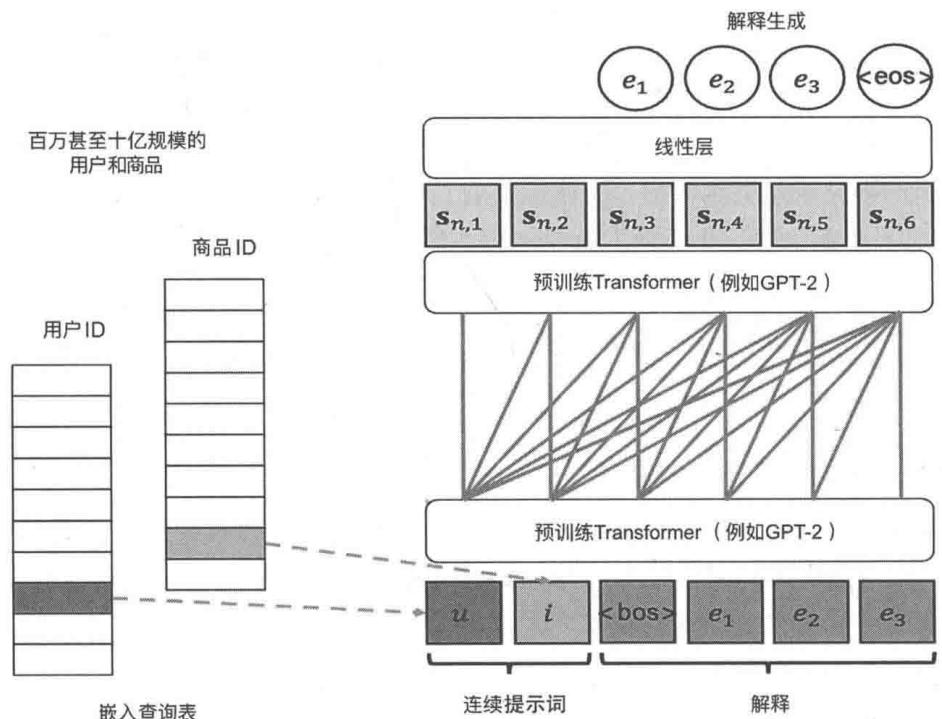  
图8-16 将用户ID和商品ID作为连续提示词进行推荐解释

图8-16的右下方是大模型的输入： $S = \left[u,i,e_1,e_2,\dots ,e_{|E_{u,i}|}\right]$ 。 $u$ ， $i$ 是用户ID和商品ID的嵌入，其中， $U\in \mathbb{R}^{|U|\times d}$ ， $I\in \mathbb{R}^{|I|\times d}$ ，嵌入的维度为 $d$ 。 $|U|$ 和 $|I|$ 分别是用户数和商品数， $e_i$ 是文本token， $e_i\in \nu$ （ $\nu$ 是词库）。在微调时， $u$ ， $i$ 随机初始化，然后在算法反向传播迭代时持续更新直到收敛。

通过嵌入，输入的 token 表示表示为 $\left[u, i, e_1, e_2, \dots, e_{|E_{u,i}|}\right]$ ，加入位置向量，最初输入大模型的就是 $S_0 = \left[s_{0,1}, s_{0,2}, \dots, s_{0,|S|}\right]$ 。通过大模型神经网络的处理在顶层输出 $S_0 = \left[s_{0,1}, s_{0,2}, \dots, s_{0,|S|}\right]$ 。右上方增加了一个线性层，将 GPT-2 的输出映射到一个概率向量，向量的维数就是词库的大小，向量的分量代表输出对应词的概率大小。采用负对数似然损失函数，目标函数可以表示为

$$
\mathcal {L} _ {\mathcal {C}} = \frac {1}{| \mathcal {T} |} \sum_ {(u, i) \in \mathcal {T}} \frac {1}{| E _ {u , i} |} \sum_ {t = 1} ^ {| E _ {u, i} |} - \ln c _ {t + 2} ^ {e _ {t}} \tag {8-1}
$$

式（8-1）中， $\left(u, i, E_{u, i}\right)$ 是一条训练样本， $u$ 、 $i$ 分别是用户ID、商品ID， $E_{u, i}$ 是对应的文本解释构成的token集合。这里 $c_{t}^{e_{t}}$ 是解释token $e_{t}$ 的概率分布①，具体公式如下。

$$
c _ {t} = \operatorname {s o f t m a x} \left(W ^ {\mathrm {v}} s _ {n, t} + b ^ {\mathrm {v}}\right) \tag {8-2}
$$

通过上面的损失函数微调模型，微调完成后，可以形式化地利用式（8-3）进行推理，下面的|prompt|在这个场景是2，表示向右移动两位。 $\hat{\varepsilon}$ 是生成的所有可能解释的组合，可以利用集体搜索进行推理，这里不再赘述。

$$
E ^ {*} = \arg \max  _ {E \in \hat {\mathcal {E}}} \sum_ {t} ^ {| E |} \ln c _ {t + | \text {p r o m p t} |} ^ {e _ {t}} \tag {8-3}
$$

- 对连续提示词模型进行微调。

有了目标函数，如何对模型进行微调呢？GPT-2是训练好的基底模型，它的参数 $\theta_{LM}$ 处于最优状态，而 $u$ 、 $i$ 是引入的新参数（记为 $\theta_{\mathrm{P}}$ ），是随机初始化的，GPT-2的参数和 $u$ 、 $i$ 参数处于不同的训练阶段。为了解决这个问题，可以采用流水线的微调策略，先将模型参数 $\theta_{\mathrm{LM}}$ 固定，只微调新参数 $\theta_{\mathrm{P}}$ ，当 $\theta_{\mathrm{P}}$ 微调到最优状态时，同时优化 $\theta_{\mathrm{LM}}$ 和 $\theta_{\mathrm{P}}$ ，式（8-4）可以形象地说明这个过程。

$$
\mathcal {J} = \min  _ {\theta_ {\mathrm {P}}} \mathcal {L} _ {\mathcal {C}} \xrightarrow {\text {f o l l o w e d b y}} \mathcal {J} = \min  _ {\theta = \{\theta_ {\mathrm {L M}}, \theta_ {\mathrm {P}} \}} \mathcal {L} _ {\mathcal {C}} \tag {8-4}
$$

关于算法原理更详细的介绍，详见参考文献[11]，这也是本节的基本思路来源。

# 2. 提示词微调进行推荐解释代码实现

微调严格按照上述原理实现并参考了参考文献[2]，采用两步微调的策略②。

```python
import json   
import os   
import math   
import torch   
import argparse   
from torch.optim import Adam   
from transformers import GPT2Tokenizer 
```

from module import ContinuousPromptLearning   
from utils import (rouge_score,bleu_score,Batchify,now_time, ids2tokens,uniqueSentence_percent,featuredetect, feature_MATCHing_ratio,feature_coverage_ratio,feature_diversity) parser $=$ argparse.ArgumentParser(description $\equiv$ 'PErsonalized Prompt Learning for Explainable Recommendation (PEPLER)')   
parser.add_argent('--data_path',type $\equiv$ str,default=None, help $\coloneqq$ path for loading the explain data')   
parser.add_argent('--dict_path',type $\equiv$ str,default=None, help $\coloneqq$ path for loading the user and item index dict data')   
parser.add_argent('--lr'，type $\equiv$ float，默认 $= 0.001$ ， help $\coloneqq$ learning rate')   
parser.add_argent('--epochs',type $\equiv$ int,default $= 100$ 中 help $\coloneqq$ upper epoch limit')   
parser.add_argent('--batch_size',type $\equiv$ int,default $= 128$ 中 help $\coloneqq$ batch size')   
parser.add_argent('--log_interval',type $\equiv$ int,default $= 20$ 中 help $\coloneqq$ report interval')   
parser.add_argent('--checkpoint',type $\equiv$ str,default $^{\prime \prime}.$ /models/'中   
help $\coloneqq$ directory to save the final model')   
parser.add_argent('--output_path',type $\equiv$ str,default $=$ 'generated.txt', help $\coloneqq$ output file for generated text')   
parser.add_argent('--endure(times',type $\equiv$ int,default $= 5$ 中 help $\coloneqq$ the maximum endure times of loss increasing on validation')   
parser.add_argent('--words',type $\equiv$ int,default $= 20$ 中 help $\coloneqq$ number of words to generate for each sample')   
args $=$ parser.parse_args()   
if args.data_path is None: parser错误('--data_path should be provided for loading data')   
print('-'\*40+\*ARGUMENTS' + '-\*40)   
for arg in vars(args): print({40}\{）'.format(arg, getattr(args,arg)))   
print('-'\*40+\*ARGUMENTS' + '-\*40)   
device $=$ mps'   
if not os.path.exists(args.checkpoint): os.makedirs(args.checkpoint)   
model_path $=$ os.path.join(args.checkpoint,'model.pt')   
prediction_path $=$ args.output_path   
#**********#**********#**********#**********#**********#**********#**********#**********#**********#**********#**********#**********#**********#**********#**********#**********#**********#**********#**********#**********#**********#**********#**********#**********#**********#**********#**********#**********#**********#**********#**********#**********#**********#********** #加载数据   
#**********#**********#**********#**********#**********#**********#**********#**********#**********#**********#**********#**********#**********#**********#**********#**********#**********#**********#**********#**********#**********#**********#**********#**********#**********#**********#**********#**********#**********#**********#**********#**********#*********

```python
dic = json.load(f)
feature_set = set()
train = corpus['train']
val = corpus['val']
test = corpus['test']
feature_set.union([d['feature'] for d in train])
feature_set.union([d['feature'] for_d in val])
feature_set.union([d['feature'] for d in test])
train_data = Batchify(train, dic, tokenizer, bos, eos, args.batch_size, shuffle=True)
val_data = Batchify(val, dic, tokenizer, bos, eos, args.batch_size)
test_data = Batchify(test, dic, tokenizer, bos, eos, args.batch_size)
print(now_time() + 'Loading data Finished')
#构建模型
#**********#**********#**********#**********#**********#**********#**********#**********#**********#**********#**********#**********#**********#**********#**********#**********#**********#**********#**********#**********#**********#**********#**********#**********#**********#**********#**********#**********#**********#**********#**********#**********#**********#********** #训练代码
def train(data):
    #开启训练模式，Dropout生效
    model.train()
    text_loss = 0.0
    total_sample = 0
    while True:
        user, item, seq, mask = data.next_batch() # data step += 1
        user = user.to(device) # (batch_size, )
        item = item.to(device)
        seq = seq.to(device) # (batch_size, seq_len)
        mask = mask.to(device)
        #在每个批次开始时，将隐藏状态与之前的生成方式分离
        #如果不这样做，模型将尝试反向传播到数据集的起始位置
        optimizer.zero_grad()
        outputs = model(user, item, seq, mask)
        loss = outputs.loss
        loss.backup()
        optimizer.Step()
        batch_size = user.size(0)
        text_loss += batch_size * loss.item()
        total_sample += batch_size
        if data_STEP % args.log_interval == 0 or data_STEP == data.total_step: 
```

cur_t_loss $=$ text_loss / total_sample print(now_time(） $^+$ 'text ppl $\{4.4\mathrm{f}\}$ |{}}//}   
batches'.format(math.exp(cur_t_loss), data-step,   
data.total_step)) text_loss $= 0$ total_sample $= 0$ if data_STEP $= =$ data.total_step: break   
def evaluate(data): #开启赋值模式，这将关闭Dropout model.eval() text_loss $= 0$ total_sample $= 0$ with torch.no_grad(): while True: user, item, seq, mask $=$ data.next_batch(）#data_STEP $+ = 1$ user $=$ user.to(device)# (batch_size,) item $=$ item.to(device) seq $=$ seq.to(device)# (batch_size,seq_len) mask $=$ mask.to(device) outputs $=$ model(user, item, seq, mask) loss $=$ outputs.loss batch_size $\equiv$ user.size(0) text_loss $+ =$ batch_size \*loss.item() total_sample $+ =$ batch_size if data_STEP $= =$ data.total_step: break return text_loss / total_sample   
def generate(data): #开启赋值模式，这将关闭Dropout model.eval() idss_prediction $\equiv$ [] with torch.no_grad(): while True: user, item, seq, $\equiv$ data.next_batch(）#data_STEP $+ = 1$ user $=$ user.to(device)# (batch_size,) item $=$ item.to(device) text $=$ seq[;, :1].to(device)#bos,(batch_size,1) for idx in range(seq.size(1)): #每步生成一个单词 outputs $=$ model(user, item, text, None) last_token $=$ outputs.logits[;, -1,:] #the last token,(batch_size,ntoken) word_prob $=$ torch softmax(last_token,dim=-1) token $=$ torch.argmax(word_prob, dim=1, keepdim $\equiv$ True)   
#选择概率最大的一个token text $=$ torch.cat([text, token],1)# (batch_size, len++) ids $=$ text[;, 1] ].tolist(） #remove bos,(batch_size, seq_len)

idss_prediction extend (ids) if data step $= =$ data.total_step: break return idss_prediction   
print(now_time() + 'Tuning Prompt Only')   
# 根据 epochs 循环   
best_val_loss $=$ float('inf')   
endure_count $= 0$ for epoch in range(1, args.epochs + 1): print(now_time() + 'epoch {}'.format(epochs)) train(train_data) val_loss $=$ evaluate(val_data) print(now_time() + 'text ppl {:4.4f} | valid loss {:4.4f} on validation'.format(math.exp(val_loss), val_loss)) #如果验证损失是我们目前见过的最好的，则保存模型 if val_loss < best_val_loss: best_val_loss $=$ val_loss with open(model_path,'wb') as f: torch.save(model,f) else: endure_count $+ = 1$ print(now_time() + 'Endured {} time(s).format(endure_count)) if endure_count $= =$ args.endure-times: print(now_time() + 'Cannot endure it anymore | Exiting from early stop') break   
#加载保存的最优模型   
with open(model_path,'rb') as f: model $=$ torch.load(f).to(device)   
print(now_time() + 'Tuning both Prompt and LM')   
for param in model.params(): paramrequires_grad $\equiv$ True optimizer $=$ Adam(model.params(), lr=args.lr)   
#基于epochs循环   
best_val_loss $=$ float('inf')   
endure_count $= 0$ for epoch in range(1, args.epochs + 1): print(now_time() + 'epoch {}'.format(epochs)) train(train_data) val_loss $=$ evaluate(val_data) print(now_time() + 'text ppl {:4.4f} | valid loss {:4.4f} on validation'.format(math.exp(val_loss), val_loss)) #如果验证损失是我们目前见过的最好的，则保存模型 if val_loss < best_val_loss: best_val_loss $=$ val_loss with open(model_path,'wb') as f: torch.save(model,f) else: endure_count $+ = 1$ print(now_time() + 'Endured {} time(s).format(endure_count)) if endure_count $= =$ args.endure-times:

```python
print(now_time() + 'Cannot endure it anymore | Exiting from early stop') break
# 加载最优模型
with open(model_path, 'rb') as f:
    model = torch.load(f).to(device)
print(now_time() + 'Generating text')
idss_predicted = generate(test_data)
# 运行测试数据
test_loss = evaluate(test_data)
print('=' * 89)
print(now_time() + 'text ppl {:4.4f} on test | End of training'.format(math.exp(test_loss)))
tokens_test = [ids2tokens(ids[1:], tokenizer, eos) for ids in test_data.sec.tolist())
tokens_prediction = [ids2tokens(ids, tokenizer, eos) for ids in idss_predicted]
text_test = [' '.join(tokens) for tokens in tokens_test']
text_prediction = [' '.join(tokens) for tokens in tokens_prediction]
text_out = []
for (real, predicted) in zip(text_test, text_prediction):
    sample_prediction = {
        "real": real,
        "predicted": predicted
    }
text_out.append(sample_prediction)
with openprediction_path, 'w', encoding='utf-8') as f:
    res = json.dumps(text_out, indent=4, ensureascii=False)
f.write(res)
print(now_time() + 'Generated text saved to ({})'.format(decision_path)) 
```

可以通过下面的脚本运行上面的代码，具体的参数解释在上面的代码中。

```shell
python prompt_learning.py  
--data_path ./data/explain.json  
--dict_path ./data/binetune_dict.json  
--epochs 5  
--lr 1e-3  
--batch_size 32  
--log_interval 10  
--output_path ./data/generated.json  
--words 20  
--checkpoint ./models/ >> ./logs/binetune.log 
```

运行完成后，会输出模型在测试集上的预测——推荐解释，下面是几个预测案例，其中，real是真实的推荐解释，predicted是对应的模型生成的推荐解释。

```txt
"real": "as an amazon prime member this slip qualified for free two day shipping and arrived on time in great", 
```

```txt
"predicted": "the length is perfect"  
},  
{  
    "real": "have good traction",  
    "predicted": "the price is reasonable"  
},  
{  
    "real": "very short in length",  
    "predicted": "the price is great"  
},  
... 
```

# 8.8.4 模型效果评估

模型生成的是文本，可以采用机器翻译和文本摘要领域两个最常用的评估指标——BLEU和ROUGE来评估生成的推荐解释的文本质量。关于这两个指标，你可以自行补充学习，另外，我们在GitHub的代码仓库中也给出了具体的计算代码，这里不再赘述。

```python
# 计算 BLEU-1、BLEU-4
tokens_test = [ids2tokens(ids[1:], tokenizer, eos) for ids in test_data.sec.tolist())
tokens_prediction = [ids2tokens(ids, tokenizer, eos) for ids in idss_predicted]
BLEU1 = bleu_score(tokens_test, tokens_prediction, nGRAM=1, smooth=False)
print(now_time() + 'BLEU-1 {:7.4f}'.format(BLEU1))
BLEU4 = bleu_score(tokens_test, tokens_prediction, nGram=4, smooth=False)
print(now_time() + 'BLEU-4 {:7.4f}'.format(BLEU4))
# 计算ROUGE
text_test = [' '.join(tokens) for tokens in tokens_test]
text_prediction = [' '.join(tokens) for tokens in tokens_prediction]
ROUGE = rouge_score(text_test, text_prediction) # a dictionary
for (k, v) in ROUGE.items():
    print(now_time() + '{ } {:7.4f}'.format(k, v)) 
```

运行上面的代码可以输出对应的指标。

```txt
[2024-03-18 22:15:25.016199]: BLEU-1 14.8556  
[2024-03-18 22:15:25.442129]:BLEU-4 0.7141  
[2024-03-18 22:15:26.395553]:USR 0.1942 | USN 3481  
[2024-03-18 22:15:40.051302]:DIV 0.0959  
[2024-03-18 22:15:40.064965]:FCR 0.1902  
[2024-03-18 22:15:40.070101]:FMR 0.1227  
[2024-03-18 22:15:40.725882]:rouge_1/f_score 14.7837  
[2024-03-18 22:15:40.725914]:rouge_1/r_score 15.6023  
[2024-03-18 22:15:40.725919]:rouge_1/p_score 16.3132  
[2024-03-18 22:15:40.725921]:rouge_2/f_score 1.5362  
[2024-03-18 22:15:40.725924]:rouge_2/r_score 1.7167  
[2024-03-18 22:15:40.725926]:rouge_2/p_score 1.6831  
[2024-03-18 22:15:40.725928]:rouge_1/f_score 11.2061  
[2024-03-18 22:15:40.725930]:rouge_1/r_score 13.7274  
[2024-03-18 22:15:40.725932]:rouge_1/p_score 13.4428 
```

# 8.9 利用大模型进行对话式推荐

本节介绍一个利用大模型革新传统推荐系统的架构——对话式推荐，也可以称为交互式推荐。8.2节提到的淘宝问问就是阿里在这一领域的初步探索。

大家已经非常熟悉如何与大模型进行高质量的互动，对于推荐系统，也可以采用对话的方式来构建。本节提供一个通用的、实现较简单的方案，让你可以直观感受对话式推荐。

首先，提供一个统一的架构说明对话式大模型推荐系统包含哪些核心模块，它们之间是如何协作的；其次，介绍作为案例展示的亚马逊的Beauty数据集相关的数据；接下来，针对对话或大模型推荐系统的各个组件和模块，提供具体的代码实现；最后，基于Gradio架构实现一个简单的对话式推荐的UI交互界面。

本节的框架和代码借鉴了参考文献[12]，对代码进行了较多裁剪和优化，方便你理解。

# 8.9.1 对话式大模型推荐系统的架构

对话式大模型推荐系统将大模型作为控制中枢（类似人的大脑），借助各种工具（类似人的眼耳手足）来实现个性化推荐。由于可以利用传统推荐的召回、排序及搜索等能力（作为工具），对话式大模型推荐系统大大拓展了传统推荐系统的疆域，可以将搜索、推荐、建议、知识问答等多种交互形式融合到一个统一的系统中，成为你的专业顾问。

8.2节对交互式推荐范式的架构和模块进行了简单说明，下面针对本节的实现方案进行详细的介绍。图8-17是对话式大模型推荐系统核心模块和交互流程。

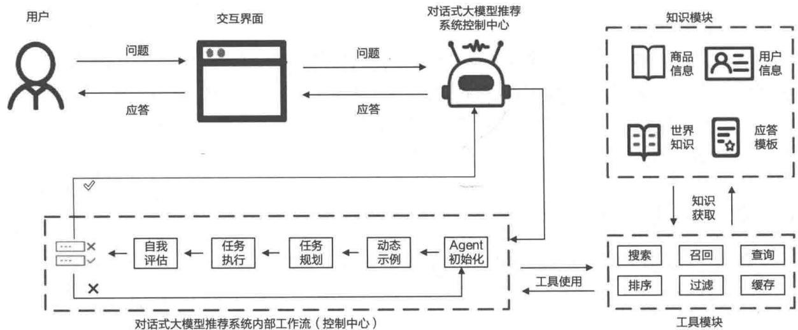  
图8-17 对话式大模型推荐系统核心模块和交互流程

图8-17中有3个比较重要的模块：一是知识模块，包含Beauty数据集、用户等方面的知识，这些是大模型推理的原料；二是工具模块，大模型使用工具将相关知识注入它的推理流程，通过上下文学习回答用户与Beauty推荐、搜索相关的问题；三是工作流，这是大模型内部作业的流程，类似工厂车间的流水线，大模型通过流水线的方式科学地解决用户的问题。下面对工作流进行说明。

- 智能体初始化。

我们将大模型看作一个智能体（Agent），这一步将用户的输入、对话历史、缓存信息等初始化，方便后续任务的执行。

- 动态示例。

由于对话式大模型推荐系统采用上下文学习，如果能够为大模型提供几个相关的示例（few-shot），那么大模型就可以更好地完成任务。这一步基于示例模板、结合本次用户的问题构建几个与问题相关的示例并输入大模型的上下文学习知识中。

- 任务规划。

工具模块中提供了召回、排序、检索、过滤等工具，这些工具可以协助用户解决关于Beauty数据集的问题。任务规划主要基于用户当前的问题和历史对话，将用户的问题拆解为合适的步骤，不同步骤用不同的工具实现。这一步的作用类似盖房的设计阶段，也类似IT项目的详细项目规划书。

- 任务执行。

有了上面的任务规划，大模型就知道如何做了。任务执行是具体的执行过程，有些步骤是对数据库进行查询，有些步骤是召回相关的Beauty商品，有些步骤是对商品进行过滤，等等。

自我评估。

任务执行完就可以获得结果了，这个结果一定可靠吗？在最终反馈给用户之前，有没有办法评估结果的正确性呢？答案是肯定的。这一步是利用大模型强大的逻辑推理能力对获得的结果进行评估，如果认可评估结果，就可以将结果直接反馈给用户，否则大模型会提供优化的建议，然后重新执行。

# 8.9.2 数据准备

本节的数据基于 Beauty 数据集，这里忽略了具体的原始数据处理过程，仅对结果数据进行说明，如图 8-18 所示。

  
图8-18 对话式大模型推荐系统依赖的数据

数据一共包含4个文件。columns.json是对Beauty元数据的字段描述，方便大模型更好地理解，也方便生成对应的SQL语句执行查询操作。

```jsonl
{
    "id": "beauty product id.", 
    "title": "product title.", 
    "category": "a string concatenated with several categories about beauty products, one product may have multiple tags, the seperator is a comma.", 
    "price": "price of product", 
    "description": "detailed description about the product.", 
    "brand": "brand of beauty products", 
    "visited_num": "how many times the products has been purchased, indicates how popular the product is. Product with larger visited number are more popular."
} 
```

settings.json是对相关数据的配置说明，包含多个类数据，例如元数据有哪些列、哪些字段是类别字段①等。

```json
{
"BEAUTY_INFO_FILE": "products.ftr",
"TABLE_COL_DESC_FILE": "columns.json",
"MODEL_CKPT_FILE": "SASRec-SASRec.pth",
"ITEM_SIM_FILE": "item_sim.npy",
"USE_COLS": [
    "id",
    "title",
    "category",
    "price",
    "description",
    "brand",
    "visited_num"
],
"CATEGORICAL_COLS": [
    "category",
    "brand"
] 
```

products.ftr是Beauty的元数据，采用Feather格式存储。item_sim.npy是商品与商品的相似数据，方便用户查找相关商品。SASRec-SASRec.pth是基于SASRec算法进行排序的模型，是利用Beauty数据集提前训练好的。

# 8.9.3 代码实现

有了前面的框架说明和数据准备，本节实现对话式大模型推荐系统的核心功能。

# 1. 控制中心工作流程

控制中心是图8-17中左下侧的部分，它是流水线的架构，通过串联5个组件实现用户问题的拆解和逐步解决。本节利用月之暗面的API充当大模型的大脑。

具体来说，控制中心将当前的输入（用户的问题）、对话历史（对话框中用户和推荐系统的对话记录）、示例说明（基于用户的问题，系统提供的最相关的解决方案）、工具描述（在上下文学习中提供每个工具的描述，例如这个工具是做什么的、能解决什么问题、局限性是什么）这4类信息作为大模型上下文学习的“原材料”，大模型利用自身的逻辑推理能力自行选择合适的工具解决具体的问题。代码详见本书配套代码，路径为src/e-commerce(case/interactive_rec/agentplansfirst_openai.py。

代码中包含3个类：ToolBox是具体的工具使用类，该类提供run方法，基于提供的数据调用对应的工具来解决对应的问题并获得最终的结果；DialogueMemory是对用户与大模型的对话历史进行管理的类，提供获取历史、增补历史、清空历史等功能；CRSAgentPlanFirstOpenAI是最核心的类，它就是控制中心，基于前面提到的4类信息，调用各种工具和月之暗面的API解决用户的问题，并最终返回结果。

# 2. 控制中心核心模块

控制中心的模块比较多，这里重点讲解动态示例生成模块和自我评估模块，这对解决用户问题并提升答案准确性非常关键，当然，增加了自我评估，模型会更慢、消耗更多 token，所以成本更高。

- 动态示例生成模块。

动态示例生成基于下面提供的15个解决问题的示例，从中选择 $k$ 个（一般为2~3个）与用户的问题最相关的示例作为样本，指导大模型更好地解决相似问题。

```jsonl
{"request": "Hello? How is it today", "plan": "Don't use tool"}  
{"request": "Tell me about the first product.", "plan": "1. LookUpTool"}  
{"request": "Recently I want to buy some TYPE products, do you have some suggestions?", "plan": "1. HardFilterTool (TYPE); 2. RankingTool (by popularity); 3. MapTool"}  
{"request": "PRODUCT1 is suitable for me, I want to find some similar products with it.", "plan": "1. SoftFilterTool (PRODUCT1); 2. RankingTool (by similarity); 3. MapTool"} 
```

```jsonl
{"request": "Do you know any TYPE products? I want one like PRODUCT1.", "plan": "1. HardFilterTool (TYPE); 2. SoftFilterTool (PRODUCT1); 3. RankingTool (by similarity); 4. MapTool"} {"request": "My history is PRODUCT1, PRODUCT2, PRODUCT3, please suggest products for me to buy next.", "plan": "1. RankingTool (by preference); 2. MapTool"} {"request": "I bought PRODUCT1, PRODUCT2, PRODUCT3 in the past, please suggest products for me to play next.", "plan": "1. RankingTool (by preference); 2. MapTool"} {"request": "I tried PRODUCT1, PRODUCT2, PRODUCT3, PRODUCT4 in the past, which one is the most suitable in above products?", "plan": "1. BufferStoreTool (store possible products mentioned in conversation before as candidates); 2. RankingTool (by preference); 3. MapTool"} {"request": "I used to use PRODUCT1, PRODUCT2, PRODUCT3 in the past, now I want some TYPE product with price lower than PRICE.", "plan": "1.HardFilterTool (TYPE, PRICE); 2. RankingTool (by preference); 3. MapTool"} {"request": "Can you recommend me some products based on my previous history?", "plan": "Don't use tool, ask for more information"} {"request": "I like PRODUCT1, PRODUCT2, now I want some products similar with PRODUCT1 but cheaper.", "plan": "1.HardFilterTool (cheaper than PRODUCT1); 2. RankingTool (by preference); 3. MapTool"} {"request": "In above products, which is the cheapest?", "plan": "1.LookUpTool (price of products mentioned before)"}. {"request": "Which of the above products is more similar to PRODUCT?", "plan": "1顺德StoreTool (store possible products mentioned in conversation before as candidates); 2. SoftFilterTool (calculate similarity score); 3. RankingTool (by similarity); 4. MapTool"} {"request": "Is there any TYPE1 or TYPE2 products?", "plan": "1. HardFilterTool (TYPE1 or TYPE2); 2. RankingTool (by popularity); 3. MapTool"} {"request": "Some of my favorite products include PRODUCT1, PRODUCT2. I'm looking for TYPE1 products with TYPE2", "plan": "1.HardFilterTool (TYPE1, TYPE2); 2. RankingTool (by preference); 3. MapTool"} 
```

示例越多、可能覆盖的用户提出的问题就越多，从而能更好地指导大模型。另外，如何选择与用户的问题最相关的示例也非常重要，如果提供了“牛头不对马嘴”的示例，那么对大模型解决问题不但没有帮助，还可能起误导作用。代码实现中使用了 LangChain 中的 SemanticSimilarityExampleSelector 查找相关示例<sup>①</sup>。

import json   
import os   
from typing import \*   
import sys   
from langchain).(embeddings import HuggingFaceEmbeddings   
from langchain).(prompts import FewShotPromptTemplate, PromptTemplate   
from langchain.(prompts import example_selector   
from langchain.(vectorstores import Chroma   
sys.path.append(os.pathdirname(os.pathdirname(os.path.pathdirname(_file))))   
fromutils.util import replace_substrings Regex   
example_prompt $=$ PromptTemplate(

input_variables $=$ ["request","plan"], template $\equiv$ "User Request:{request} \nPlan:{plan}",   
def read_jsonl(fpath: str) -> List[Dict]: res $= []$ with open(fpath, $\mathbf{\ddot{r}}^{\prime}$ ) as f: for line in f: data $=$ json.loadline(res.append(data) return res   
class DemoSelector: def init_self,mode: str,demo_dir_or_file: str,k:int,domain: str) -> None: assert mode in{'fixed' 'dynamic'},f"Optional demonstration selector mode:'fixed', 'dynamic', while got {mode}" self.mode $=$ mode self.k=k examples $=$ self.loadexamples(self,demo_dir_or_file) self/examples $=$ self.fit_domain(self,examples,domain) input_variables $=$ {"example_prompt":example_prompt,"example Separator":"\\n----\\n", "prefix": "Here are some demonstrations of user requests and corresponding tool using plans:" , "suffix": "Refer to above demonstrations to use tools for current request: {in_request}.","input_variables": ["in_request"], if self_mode $= =$ 'dynamic': selector $=$ example_selector.SemanticSimilarityExampleSelector.from/examples( # 这是可供选择的示例列表 self/examples,# 这是用于生成嵌入的嵌入类，用于测量语义相似性 HuggingFaceEmbeddings(), # 这是用于存储嵌入并进行相似性搜索的 VectorStore 类 Chroma, # 这是生成的例子数量 k $\equiv$ self.k } input_variables["example_selector"] $=$ selector else: input_variables["examples"] $=$ self/examples[:self.k] self>prompt $=$ FewShotPromptTemplate(**input_variables) @staticmethod def load/examples(self,dir:str) -> List[Dict]: examples $= []$ if os.path.isdir(dir): for f in osositdir(dir): if f.endsWith("jsonl"):

fname $=$ os.path.join(dir,f) examples extend(read_json1(fname)) else: if dir.endsWith(.jsonl): examples extend(read_json1(dir)) assert len( examples) $>0$ ,( "Failed to load examples. Note that only .jsonl file format is supported for demonstration " "loading.") return examples def __call__(self, request: str): return self_prompt.format(in_request $\equiv$ request) @staticmethod def fit_domain(self, examples: List[Dict], domain: str): #fit examples into domains: replace placeholder with domain-related words, like replacing item with movie, game domain_map $=$ {'item':domain,'Item':domain.capitalize(),'ITEM':domain-upper()} res $= []$ for case in examples: _case $= \{\}$ _case['request'] $=$ replace_substrings Regex(case['request'],domain_map) _case['plan'] $=$ replace_substrings Regex(case['plan'],domain_map) res.append(_case) return res   
if_name $= =$ "_main_: selector $=$ DemoSelector("dynamic", "/demonstration/seed/,"k=3,domain="beauty_product") request $=$ "I want some farming games." demo_prompt $=$ selector(request) printdemo_prompt) print("passed.")

自我评估模块。

自我评估模块针对生成的结果进行自我反省、自我评估，通过自我评估确保结果的准确性。具体的做法是：将用户问题、大模型给出的答案（需要评估）、对话历史、之前的工具使用记录通过一个特定的critic模板输入大模型，然后让大模型基于模板和输入的数据评估答案是否可靠，如果不可靠，则提供解决问题的建议，最终在控制中心中重新执行。自我评估模块的代码如下①。

```python
import os  
import re  
from typing import *  
from dotenv Vault import load_dotenv # pip install --upgrade python-dotenv-vault  
from prompt.critic import CRITIC_prompt_USER, CRITIC_prompt_SYS  
from prompt_tool import OVERALL_TOOL_DESC, TOOL NAMES 
```

① 代码：src/e-commerce(case/interactive_rec/module/critic.py。

```python
from utils.open.ai import OpenAICall
load_dotenv() # https://vault.dotenv.org/ui/ui1
MOONSHOT_API_KEY = os.getenv("MOONSHOT_API_KEY")
def parse_output(s: str) -> Tuple[bool, str]:
    yes_pattern = r"Yes.*"
    no_pattern = r"No\.(.*)"
    yes_MATCHes = re.findall(yes_pattern, s)
    if yes_MATCHes:
        need_reflection = False
        info = ""
    else:
        no_MATCHes = re.findall(no_pattern, s)
        if no_MATCHes:
            need_reflection = True
            info = no_MATCHes[0]
        else:
            need_reflection = False
            info = ""
    return need_reflection, info
class Critic:
    def __init__(self, model, engine, buffer):
        self.model = model
        self.engine = engine
        self.buffer = buffer
        self.model = domain
        selftimeout = timeout
        assert bot_type in {
            "chat",
            "completion",
            "chat Completion",
        },
        f"bot_type' should be 'chat', 'completion' or 'chat Completion', while got
{bot_type}"self.Bot_type = bot_type
self.Bot = OpenAICall(
model= self.engine,
api_key=os.environ.get("OPENAI_API_KEY", MOONSHOT_API_KEY),
api_type=osviron.get("OPENAI_API_TYPE", "open.ai"),
api_base=osviron.get("OPENAI_API_BASE", "https://api.moonshot.cn/v1"),
api_version=os.environ.get("OPENAI_API_VERSION", None),
temperature=temperature, 
```

model_type $\equiv$ self.bit_type,   
timeout $\equiv$ self.timeout,   
}   
def _call_(self, request: str, answer: str, history: str, tracks: str): output $=$ self._call(request, answer, history, tracks) need_reflection, info $=$ parse_output(output) if need_reflection: info $=$ f"Your previous response: {answer}. \\nThe response is not reasonable. Here is the advice: {info}" return need_reflection, info   
def _call(self, request: str, answer: str, history: str, tracks: str): sys msg $=$ CRITIC_prompt_SYS.formatdomain $\equiv$ self.domain) item map $=$ { "item": self.Domain, "Item": self.Domain.capitalize(), "ITEM": self.Domain.upper(),   
}   
tool_names $=$ {k:v.format(**item_map) for k,v in TOOL_NAMES.items()}   
usr msg $=$ CRITIC_prompt_USER.format( domain $\equiv$ self.Domain, tool_description=OVERALL_TOOL_DESC.format(**tool_names, **item_map), chat_history $\equiv$ history, request $\equiv$ request, plan $\equiv$ tracks, answer $\equiv$ answer, *\*TOOL_NAMES,   
} reply $=$ self.bit.call( sys_prompt $\equiv$ sys msg, user_prompt $\equiv$ user msg, max_tokens $\equiv$ 128   
} return reply

# 3. 工具使用

工具使用模块是大模型的“眼、耳、手、足”，有了这些工具的协助，大模型才能更好地解决用户的问题。这些工具包括查询工具、过滤工具、排序工具等，限于篇幅原因，下面只介绍查询工具，其他工具详见GitHub代码仓库。

查询工具的作用是将用户输入的问题中可能与 Beauty 产品类目相关的关键词转换为 SQL 查询语句，然后从 Beauty 元数据中找出与关键词相关的商品①，方便后续步骤从中选择出最合适的推荐给用户。例如，输入下面的问题。

```txt
please recommend some beauty product to me, thanks 
```

查询工具可能将这个问题转换为下面的SQL语句。

① 是一种基于标签的召回。

```sql
SELECT * FROM beauty_product_information WHERE category LIKE "%skincare%" OR category LIKE "%makeup%" 
```

下面是具体的代码实现，注意，最初的SQL查询语句是大模型提供的，查询工具的作用是将之转换为适合相关数据的查询①。

```python
import json
import random
import re
from copy import deepcopy
from module.corpus import BaseGallery
from utils.sql import extract-columns_from_here
from utils.util import num_tokens_from_string, cut_list
from loguru import logger
class QueryTool:
    def __init__(self, name: str, desc: str, item Corpus: BaseGallery, buffer,
result_max_token: int = 512) -> None:
        self.item Corpus = item Corpus
        self.name = name
        self desc = desc
        self.buffer = buffer
        self(result_max_token = result_max_token
        self._max_record_num = self.result_max_token // 5 # each record at least 5 tokens.
If too many records,
# sample randomly
def run(self, inputs: str) -> str:
    logger.info(f"\nSQL from AGI: {inputs}")\ninfo = ""
output = "can not search related information."
try:
    inputs = selfrewrite_sql(inputs)
    logger.info(f"Rewrite SQL: {inputs}")\ninfo += (f"\{self.name): The input SQL is rewritten as {inputs} because "
    f"some {self.item Corpus.categorical_col_values.keys()) are not
existing. \n")
except:
    info += f"\{self.name]: some thing went wrong in execution, the tool is broken
for current input. \n"
return info
try:
    res = self.item Corpus(inputs, return_id_only=False)
try:
    res = res.to_dict('records') # list of dict
except:
    pass
    anycut = False
if len(res) > self.max_record_num: 
```

any_cut $=$ True   
res $=$ random.sample(res, $\mathbf{k} =$ self._max_record_num)   
if num_tokens_from_stringjson.dumps(res) $>$ self RESULT_max_token: token_limit_per_record $=$ self RESULT_max_token // (len(res) + 1) # shorten each record in the result list cut_res $=$ [None] \* len(res) for i, record in enumerate(res): overflow_token $=$ num_tokens_from_stringjson.dumps(record)) -   
token_limit_per_record _cut_last $=$ True res_record $=$ deepcopy(record) # if not cut last time, the loop would end due to the cut operation in   
the loop # would not shorten the res anymore while (overflow_token $>0$ ) and _cut_last: key2token $= \{\}$ all_token $= 0$ for k, v in res_record.items(): key2token[k] $=$ num_tokens_from_string(str(v)) all_token $+ =$ key2token[k] res_record[k] $=$ str(v) cut_off_token $=$ {k: (overflow_token \* v // all_token) for k, v in   
key2token.items() for k, v in res_record.items(): words $=$ v.split(" ") cut_word_cnt $=$ min(lenwords) \*cut_off_token[k] // key2token[k],   
len(words)-3) if (cut_word_cnt >= 1) and (len(words) > 10): words $=$ words[-cut_word_cnt] suffix $=$ "... " cut_last $=$ True elif (cut_word_cnt >= 1) and (len(words) > 5): words $=$ words[-1] suffix $=$ "... " cut_last $=$ True else: _cut_last $=$ False suffix $=$ "" res_record[k] $= 1$ .joinwords)+_suffix overflow_token $=$ num_tokens_from_stringjson.dumps(res_record))-   
token_limit_per_record cut_res[i] $=$ res_record # END FOR LOOP if any_cut: info $+ = f^{\prime \prime}\{s e l f.\text{name}\}$ : The search result is too long, some are omitted.   
\n" # double-check the token limit and shorten the result list if num_tokens_from_stringjson.dumps-cut_res)>self RESULT_max_token: cut_res $=$ cut_list-cut_res,self RESULT_max_token) output $=$ json.dumps-cut_res) else:

```python
output = json.dumps(res)  
info += f"\{self.name\} search result: {output}"  
except Exception as e:  
    logger.info(e)  
    info += f"\{self.name\}: some thing went wrong in execution, the tool is broken  
for current input. \n"  
    self.buffer_track(self.name, inputs, "Some item information.")  
    logger.info(info)  
    return output  
def rewrite_sql(self, sql: str) -> str:  
    """Rewrite SQL command using fuzzy search"""  
sql = re.sub(r'\bFROM\s+(\\w+)\\s+WHERE', f'FROM {self.item Corpus.name} WHERE',  
sql, flags=re.IGNORECASE)  
# groundning cols  
cols = extract-columns_from.where(sql)  
existing cols = set(self.item Corpus(column_meaning_keys()))  
col_replace_dict = {}  
for col in cols:  
    if col not in existing cols:  
        mapped_col = self.item Corpus.fuzzy_MATCH(col, 'sql cols')  
        col_replace_dict[col] = f"\{mapped_col}"  
for k, v in col_replace_dict.items():  
    sql = sql.replace(k, v)  
# grounding categorical values  
pattern = r"[a-zA-Z0-9]+) (?:NOT)?LIKE '\\%([\^{\%}]'+)\%'"  
res = re.findall(pattern, sql)  
replace_dict = {}  
for col, value in res:  
    if col not in self.item Corpus.fuzzy_engine:  
        continue  
    replace_value = str(self.item Corpus.fuzzy_MATCH(value, col))  
    replace_value = replace_value.replace("\\","") # escaping string for sqlite  
    replace_dict[f"%{value}]%" = f"%{replace_value}]%"  
for k, v in replace_dict.items():  
    sql = sql.replace(k, v)  
return sql 
```

# 8.9.4 对话式推荐案例

下面提供一个大模型赋能的对话式推荐界面，方便你更好地体验交互式推荐带来的及时反馈能力，代码路径为 src/e-commerce(case/interactive_rec/app.py。

直接运行代码，就可以启动对话式推荐的服务了，即图8-19中的http://127.0.0.1:7860。

```txt
(train-llm) liuqiang@liuqiangdeMacBook-Pro interactive_rec % python app.py  
[2024-03-23 13:19:36 INFO agent計劃_first_openai: 382] Mode changed to accuracy.  
Running on local URL: http://127.0.0.1:7860  
To create a public link, set `share=True` in `launch()` 
```

图8-19 后台启动对话式推荐服务

在浏览器中输入 http://127.0.0.1:7860 就可以看到图 8-20 所示的界面，这是一个对话式推荐界面，你可以输入与 Beauty 相关的问题与大模型进行互动，大模型会为你提供相关的推荐。这个界面还具备多轮对话的能力，你可以自己部署尝试一下①。

  
图8-20 对话式推荐界面

# 8.10 总结

本章介绍了大模型应用于电商推荐系统的各种核心场景，让读者感受到了大模型给推荐系统带来的新思路、新视野。本章的核心场景如下。

- 利用大模型生成用户兴趣画像和个性化商品描述。  
- 利用大模型进行召回、排序、做个性化推荐和商品关联推荐。  
- 利用大模型进行推荐解释与冷启动。  
- 利用大模型进行对话式推荐

其中，生成用户兴趣画像和个性化商品描述利用了大模型的生成能力，可以很好地构建电商中最重要的两类场景——猜你喜欢和关联推荐。大模型可以与传统召回等方法很好地配合，借助检索增强生成的思路，优雅地赋能传统推荐系统。

利用大模型解决传统推荐系统的冷启动问题的思路与传统的解决冷启动问题的思路不太一样，有一些具有创新性的处理方法，例如生成冷启动样本、直接通过上下文学习解决冷启动问

题等。

推荐解释在为用户提供推荐时也提供推荐的原因，可以极大地提升推荐系统的说服力和用户的满意度，是优化推荐体验的好思路。之前的推荐解释更多基于简单模板实现，有了大模型的赋能，可以生成更自然流畅、更有说服力的推荐解释。本章给出了利用大模型生成推荐解释的两种方法。其中上下文学习方法比较简单，容易实现。如果调用商业的API，那么效果会很好。另外一个基于连续提示词的方法比较复杂，提示词学习是一种比较特殊的微调模型的方法，区别于LoRA方法，希望你可以掌握它的核心思想。

本章还实现了一个简单的对话式大模型推荐系统，借助大模型的强大泛化能力、逻辑推理能力，我们可以用非常优雅、统一的方式将查询、搜索、推荐统一。这部分内容非常重要，你需要掌握相关的原理，特别是控制中心的工作流程、核心模块的作用和具体工具的使用方法。

目前，已经出现了非常多的大模型相关产品，推荐系统是互联网行业最重要的信息分发方式和运营手段，我相信，在不久的将来，大模型一定会革新传统的推荐系统，让推荐系统产生更大的业务价值，我们拭目以待！

# 09

# 工程实践：大模型落地真实业务场景

作为最后一章，本章分析大模型落地企业级推荐系统相关的工程问题。先讲解大模型如何进行高效预训练和推理，再讲解如何将大模型更好地落地到企业级推荐系统中。

# 9.1 大模型推荐系统如何进行高效预训练和推理

在具体业务场景中落地大模型不仅需要算法和代码，还需要考虑预训练、微调、部署和服务质量。本节讲解如何在真实业务场景中高效地使用大模型。

大模型从开始构建到服务于某个产品通常需要经历预训练、微调、服务部署3个阶段，如图9-1所示，与各种大模型推荐范式对应。

  
图9-1 大模型应用的3个阶段

除了算法和软件，预训练模型还需要特定的硬件支持，目前主流的预训练大模型的硬件是英伟达的GPU系列。下面聚焦大模型推荐系统应用，从模型的训练（包括预训练和微调）、推理、服务部署和硬件选择4个维度展开说明。

# 9.1.1 模型高效训练

从零开始预训练大模型，是非常具有挑战性的事情。由于预训练样本较多（很多模型需要上万亿个 token），参数较多，通常需要非常多的计算资源和合适的框架来协助。一般来说，做基础大模型的公司才需要从零开始预训练大模型，而做中间层或者应用的公司可以对开源的大模型进行微调或者直接部署。

# 1. 高效训练的方法

针对高效训练大模型，目前有非常多的开源框架可供选择，这些框架都整合了一些加速训练的技术手段，本节主要介绍通过并行计算和优化内存来提升训练的吞吐率。

# （1）并行计算。

并行计算是提升训练效率最有效的方法，通常采用多GPU并行的方式。具体的实现方式有数据并行、模型并行、状态并行等。我们在训练推荐模型时，可以根据模型大小、数据大小选择合适的并行方式，例如单个GPU、多个GPU或者多个服务器。另外，可以调整batch的大小，batch越大占用的资源越多。为了加快训练速度，还可以采取调整迭代次数（epochs）、提前终止等方法。

# （2）优化内存。

大模型在训练过程中将数据加入内存，可以通过优化内存（或显存）使用的方法来提升训练的效率，下面介绍3种优化方法。

# - ZeRO。

ZeRO 的主要目的是优化大模型训练中的内存效率。通过跨 GPU 分配模型的优化器状态（Optimizer States）、跨 GPU 分配梯度和处理用于激活的模型并行性，减少用于存储这些数据的内存。

# - 量化技术。

量化技术使用低比特的数据格式来表示权重或激活函数值，通过这种方式缩减内存大小和计算时间，包含8bit、6bit、4bit、2bit等不同精度的量化方法。比特位数越少，模型占用空间越小，精度越低。我们可以根据计算机的配置和精度要求，选择下载不同精度的模型。

# - FlashAttention。

FlashAttention 是为了解决 Transformer 在处理大量序列时所面临的内在挑战而设计的算法。这种算法是 I/O 敏感的，它优化了 GPU 内存层级之间的相互作用，利用平铺技术（Tiling）减少 GPU 的高带宽内存（HBM）与芯片上的静态随机存取内存（SRAM）之间的内存读/写操作，以提高注意力机制的效率。

# 2. 高效微调的方法

对大模型进行微调通常不是微调整个模型，而是微调模型部分参数，这种方法被称为参数有效的微调。一般有两个常用的方法，下面分别介绍。

- LoRA与QLoRA。

前面章节中的大部分模型采用LoRA进行微调。QLoRA是LoRA的量化版本，它将预训练的模型转换为特定的4位数据类型，从而大幅减少内存使用并提高计算效率，同时在量化过程中保持数据完整性。

- 提示词调优。

提示词调优是一种新颖的技术，专门用于使冻结的语言模型适应特定的下游任务。具体而言，提示词调优强调通过反向传播学习“软提示”，允许使用标签示例对其进行微调。我们在推荐解释部分（见8.8.3节）的代码实现中采用了提示词调优技术。

高效训练的方法非常多，这里不做过多介绍。关于高效预训练、微调，以及在不同模型规模上的详细对比分析，你可以从参考文献[1]中获得更多信息。

# 3. 预训练与微调的框架

目前针对大模型进行预训练、微调的框架非常多，主流的框架包括ColossalAI、DeepSpeed、Megatron-LM、MLX等，这些在前面都有简单介绍，这里不再赘述。你可以参考它们的GitHub代码仓库和官网进行深入了解，并根据自己的资源情况和偏好选择使用。

# 9.1.2 模型高效推理

模型推理是一个需求更大的使用场景，目前有很多创业公司聚焦于高效的大模型推理领域，例如Lepton AI、硅基流动等。

# 1.高效推理的方法

目前主流的大模型采用与GPT类似的decode-only的架构，如图9-2所示，提升解码的效率是高效推理的前提。

  
图9-2decode-only架构

高效推理有非常多的技术方案，可以从算法层面、模型层面、系统层面等多种维度进行。

以下是最常用的方法，更多细节可以阅读参考文献[2]。

- 解码策略优化。

GPT系列模型基于前面的token预测下一个token，这是一个自回归的过程，这个过程是顺序的，所以影响最终的解码速度。可行的解决方案有非自回归的方式或者推测解码（Speculative Decoding）策略。

非自回归是放宽预测下一个 token 的条件, 假设预测下一个 token 与前面的 token 条件无关, 这样就可以通过一定程度的并行化进行解码。推测解码是利用一个草稿 (Draft) 模型 (更小的模型) 来生成下一个 token, 再快速评估这个 token 是否正确。

- 架构优化。

架构优化是对GPT的架构动手术，通过调整架构部分“组件”达到加速推理的效果。例如，MoE架构就是通过多个专家构建的统一的大模型，在预测时，只有部分专家被激活，从而提升推理的速度。

- 模型压缩。

模型压缩最常用的手段是知识蒸馏，通过老师（Teacher）模型监督学生（Student）模型进行训练，将知识从较大的老师模型“传授”给学生模型。还有一个比较常用的方法是剪枝，例如剔除模型的部分层来减少参数，进而提升预测速度。

- 系统优化。

前面提到的量化方法、并行化方法、内存优化方法都是这类方法。还有一些偏底层的方法超出了简单应用的范畴，这里不展开说明。

# 2. 高效推理的框架

前面提到的很多训练框架本身就具备推理能力，例如DeepSpeed、ColossalAI等，还有一些框架聚焦于推理方向，比较常见的有vllm、TG（Text-Generation-Inference）、LightLLM等。

针对MacBook，如果在开发环境中部署服务进行测试等，则可以选择MLX、llama.cpp等推理框架。

# 9.1.3 模型服务部署

对于大模型推荐系统的应用，在预训练或微调好模型后，就需要进行高效的服务部署，以便为用户提供更好的服务。

上面提到的很多框架可以直接将大模型服务部署成Web服务，如果你想自己调整业务逻辑，则可以选择一些合适的Python Web 框架，例如FastAPI、Tornado、Flask等。

如果利用大模型的上下文学习能力进行推荐，那么可以选择第三方的API服务或者将大模型部署成类似于ChatGPT的API服务，可以使用的框架有Ollama、FastChat、SGlang、Lepton AI等。

传统推荐系统的一些优化服务体验的技术方案也可以应用到大模型推荐系统中，例如预计算、缓存、部署多个等效的Web服务，再通过Nginx代理进行服务的水平扩容等。

# 9.1.4 硬件选择建议

对于大模型，训练和推理的硬件也是非常重要的。当预训练的大模型参数较多（例如超过30B）时，需要性能比较好的英伟达的GPU，例如A800、A100、H100等。对于参数更小的模型，可以采用英伟达的消费级显卡，例如RTX4090、RTX4080等。国产的替代方案还不够成熟，华为昇腾910B是可行的选择。

对于大模型的微调和推理，相比于A800、A100、H100这些比较贵并且难买到的硬件，性价比更高的方式是使用英伟达的RTX4090、RTX4080等消费级硬件。

MacBook用户可以选用M系列的芯片对大模型进行预训练和微调。如果处理比较大的模型（例如30B、70B等），M2 Ultra 192G、M3 Max 128G等是可行的选择。

由于推荐系统的数据量相对较小，即使是预训练和微调，目前也不需要特别大的模型，通常使用2B、7B、14B的模型就可以达到较好的效果，因此对硬件的要求没有常规的大模型高。

# 9.2 大模型落地企业级推荐系统的思考

经过近十年的发展，推荐系统已经相当成熟，它是帮助公司营利的核心技术，在企业中具有极高的“地位”，因此，革新它是非常困难的。新的技术要取代和颠覆原有的成熟技术体系是需要时间的。现在的大模型在推荐系统的应用属于早期尝试阶段，还需要 $1\sim 2$ 年时间才能进入变革的深水区。大模型在推荐场景的落地需要克服哪些困难？又需要面对哪些挑战呢？笔者试图基于自己过去十几年的推荐系统一线经验，结合对大模型技术的深度学习，谈一些自己的思考，希望能为你提供一些新的视角，让你更好地评估什么时候及如何在推荐系统中引入大模型相关技术。

# 9.2.1 如何将推荐算法嵌入大模型框架

推荐系统与大模型的建模空间有较大差别，传统的推荐系统基于ID特征建模，ID之间的内在协同关系对推荐效果非常重要。另外，推荐系统是一个非常个性化的系统，如何将这种个

性化的特性整合到大模型体系中呢？

传统的大模型基于文本语料预训练，token词库的规模在几万到十几万级别。推荐系统的用户ID、商品ID的规模是亿级别的，如果将用户ID、商品ID作为token，那么模型复杂度多了几个数量级，预训练和推理成本将会极大提高。这个问题有很好的解决方案吗？

前面的章节主要介绍了两种方法：一种是不直接使用ID特征，而是使用商品的标题等文本特征，用户的行为也通过购买过的商品的文本特征来表示，这种方法将推荐问题映射到传统的大模型擅长的文本建模领域；另一种是加入少量新的token，例如将item_id拆分为“item”加后面的数字ID，这样不至于增加太多的token。

上面的方法当然可以处理推荐问题，但是可能不是最好的。有没有一种方法可以更加统一、自然地将推荐算法映射到一个更加适合大模型处理的体系下呢？这是推荐行业后续努力的方向，参考文献[3]就是这方面的探索。

正是因为有一套比较完善的、适合推荐系统的体系，深度学习才成为在推荐系统领域占统治地位的核心算法，为推荐系统带来了极大的商业价值。大模型时代也遵循一样的规律，如果有一个适合推荐系统的大统一的大模型框架，那么推荐系统更有可为。

# 9.2.2 大模型特性给落地推荐系统带来的挑战

9.1节提到大模型目前在训练和推理中面对的挑战，这些挑战同样存在于基于大模型的推荐系统中。其中，需要海量的数据、训练成本高、推理速度慢是比较重要的问题。

推荐系统有海量的用户、海量的交互行为，数据量并不少，但是推荐的数据非常稀疏，这也是大模型落地推荐系统的一个很大的挑战。

当软硬件更加成熟后，训练成本会遵循摩尔定律，每 $1\sim 2$ 年至少降低 $50\%$ 。英伟达发布的Blackwell架构的GB200系列芯片的GPU算力就有极大的提升，能耗也降低了不少。

关于推理速度慢，9.1节已经提供了一些解决方案，笔者相信，随着大模型技术的发展，这些问题都能得到缓解。推荐系统面对的是商业场景，用户规模大、商品品类多，对服务响应时间有极高要求。当前的推荐系统采用召回+排序的流水线架构将复杂的推荐任务拆解为不同的步骤来缓解这个问题，这一方法在引入大模型技术后也是比较实用的。

# 9.2.3 大模型相关的技术人才匮乏

大模型的技术难度较大，有陡峭的学习曲线。笔者从2023年年初开始学习大模型，经过大半年才算正式进入这个领域。笔者有15年AI相关的实践经验，也需要经过较长时间的学习才

能入门大模型，对于经验不足的读者，入门的学习成本可能更大。

推荐系统被大模型革新，人才是非常重要的。大模型相关人才比较匮乏，目前这些人才都在大模型创业公司和互联网大厂。也许再经过1~2年，懂大模型的技术人才会有爆发式增长，那时才是真正的大模型落地推荐系统的黄金时间。

# 9.2.4 大模型推荐系统与传统推荐系统的关系

在算法层面，很难有一种算法可以取代所有算法，推荐算法也一样。传统的推荐算法（例如协同过滤、基于标签的推荐等）有其适用场景。8.9节将传统的推荐算法用于召回，大模型起到了控制中心的作用。

在架构层面，经过十几年的验证，传统推荐系统经典的召回+排序架构是一种非常高效的架构，大概率会持续发挥价值。

在产品层面，传统推荐系统中最重要的是信息流推荐、关联推荐，只要交互方式不变（例如计算机、手机），其产品形态就会在商业体系中持续产生价值。唯一可能产生的新的产品形态是对话式推荐，这是大模型对推荐系统产品最大的革新。

总之，大模型对传统推荐系统起到的是赋能的作用，而不是取代。有了大模型，推荐系统在应用场景、商业价值上会取得更大的成功。

# 9.2.5 大模型推荐系统的投资回报率分析

任何一门新技术只有能带来极大的商业价值，才会被广泛采纳，大模型在推荐系统中的应用也不例外。大模型的学习成本、实践成本、训练成本、部署成本都比较高，这是将大模型应用于推荐业务的最大的障碍。

大模型为推荐系统带来的价值主要有3个方面：一是宣传公司技术实力；二是为公司带来更多收入；三是创新产品形态，可以利用大模型的互动能力，在产品的各种场景中引入对话式大模型推荐系统。

企业的技术负责人（或推荐系统负责人）在引入大模型推荐系统时必须对投入和产出有比较好的了解，并且有比较合理的预期。

# 9.2.6 大模型落地推荐场景的建议

笔者相信，在1~2年内，大模型会革新现在的推荐系统，因此建议推荐行业的从业者及早关注并且实践大模型在推荐系统中的应用，只有躬身入局，才能更好地了解大模型能为推荐系

统带来的价值。

学习大模型推荐系统的资料不少，除了大量的学术论文，本书也可以帮助你入门大模型推荐系统。

对于企业中的推荐算法相关从业者，可以找一些推荐场景探索大模型的应用，笔者建议的探索场景包括首页的“猜你喜欢”和商品关联推荐，这些是公司最核心的推荐场景。为了避免给业务收入带来影响，可以采用A/B测试的方式，先给大模型推荐系统比较小的流量，通过数据逐步验证大模型推荐系统带来的价值，并动态调整分配给大模型推荐系统的流量。

对于对话式推荐场景，一定要大胆尝试，这是大模型能够带来的最大的创新，在具体实现上，可以通过在首页搜索关键词进入对话式推荐页面。具体的算法原理在8.9节中有比较全面的讲解，这里不再赘述。

# 9.3 总结

本章简单总结了大模型训练、推理、部署的技术和框架。你可以选择适合自己的框架深入了解和实践。这个方向发展较快，可以多关注、了解行业动态。

本章梳理了大模型落地企业级推荐系统可能面对的困难和挑战，以及大模型可能为推荐系统带来的巨大变革。

任何一种新的技术被大规模应用都需要一定时间，只有尽早入局才能获得最大的红利，希望你属于最早“吃到螃蟹”的那一批人。让我们一起努力，加速大模型在商业推荐系统中的应用！

# 后记

我们的学习之旅就马上结束了。笔者从2023年年初开始学习、跟进大模型相关的进展，本书是笔者在大模型方向上探索的经验总结。

ChatGPT发布以来，大模型相关的技术呈井喷之势，大量科技公司重金投入大模型的研究、开发、实践。苹果公司放弃了10年的造车计划，准备投入大模型的创新和落地，并宣布了与百度合作的计划[1]，在2024年发布的硬件产品中增加生成式AI能力。苹果公司通常会在行业比较成熟、有非常大的商业前景时做出决策，可见其相信大模型会带来产业颠覆和巨大的商业价值。

大模型越来越有革新所有行业的势头：Sora 的发布带来了视频生产的革命，OpenAI 希望能与好莱坞合作[2]，通过生成式 AI 革新影视制作[3]；OpenAI 投资的 Figure 01 机器人[4]可以理解人的意图，将苹果递给表示饥饿的测试人员；初创公司 CognitionLabs 推出的全球第一个 AI 程序员 Devin[5]掌握了全栈技能，不仅可以写代码、debug、训练模型，还可以去美国最大的求职网站 Upwork 上抢单；专注于研发无代码游戏引擎的初创公司 BuildBox AI 发布了新一代 AI 游戏引擎——Buildbox 4 Alpha，输入提示即可为游戏添加资产和动画，甚至提供几个字就能生成整个场景[6]；2024 年 3 月底大火的 Suno，可以通过一段提示词生成高质量的音乐，让人人都成为作曲家[7]。

新行业、新产品和新应用场景层出不穷，新的变化每天都在我们身边出现，我们不能无视这些变化，否则当我们的职位被AI取代时，我们被还蒙在鼓里。

AI取代的永远是那些不会使用AI技术的人，最好的应对方法就是尽快掌握AI技术，而掌握AI技术的第一步是开始学习。推荐系统的从业人员也不例外，学习大模型在推荐场景中的应用是必须经历的过程。

推荐系统是过去10年互联网最重要的技术手段之一，是互联网公司最核心的商业化工具。近年来，出现了抖音等以推荐系统为核心引擎的、具备极大变现效率的产品。通常情况下，越

是具备商业价值的场景，人类越会利用新技术去变革它。推荐系统的商业价值高，是以大模型为驱动引擎的新技术革新的方向，这正是学术界和产业界正在努力推进的！

阿里巴巴于2023年上半年在淘宝开启了淘宝问问的内测，百度将大模型应用到了最核心的广告营销场景，Meta已经开始尝试利用大模型打造万亿级参数的新一代推荐系统……这些大公司已经走在了前面，推荐系统的从业者也不能落后，需要马上出发。

本书是大模型推荐系统学习的导航，可以帮你顺应AI变革大势，进行尝试和探索。希望通过对本书的学习，你可以尽早入门并实践大模型推荐系统。

# 业内人士好评

刘强和我公司有着深入的技术合作，我们将大模型技术应用在Alda中，为时尚行业打造了推荐系统和智能搭配系统，实现了传统技术路线需要花费大量的时间和成本才能实现的惊艳效果。本书是刘强将海量的大模型论文学习结合自身的大量业务实战，经过体系化梳理精粹而成的。本书内容全面，从技术理论到商业实战，是值得学习的一本书。刘强实现了大模型推荐系统的知行合一，他愿意将所学分享出来，实在是难能可贵。

吴斌，爱搭（Alda）创始人兼CEO

在这本著作中，作者深入探究了将大语言模型与推荐系统相融合的多个领域，不仅系统阐述了前沿的大模型理论知识，还提供了多样化的应用案例和生动的数据实战内容。读者可以从中领略到如何利用大模型实现更加精准、个性化且富有洞察力的推荐系统。本书是推荐系统从业者值得一读的佳作。

于敬，达观数据联合创始人，智能推荐业务总负责人

在人工智能快速发展的今天，大模型技术已成为各行各业竞争力的重要体现。作为医疗大模型“良医小慧”的负责人，我同样体会到了大模型的变革力量。刘强的这本著作恰逢其时，呈现了大模型在推荐系统领域的前沿应用。无论你是推荐系统的从业者、研究者，还是大模型应用的爱好者，本书都将成为你的得力助手。它不仅是一本理论指南，也是一本实战手册，包含用户画像、商品推荐、交互式推荐等方面的实践经验，可以帮助你快速构建基于大模型的推荐引擎。相信本书将引领读者在各自的领域中实现技术升级，开创智能推荐的新纪元。

张楠，惠灏智医CTO

自ChatGPT发布后，大语言模型技术开始渗透到各个应用领域，形成新质生产力，提供了新的研究思路和技术范式。本书系统介绍了大模型技术在推荐系统中的应用，围绕生成式范式、预训练范式、微调范式、直接推荐范式展开，包含算法原理、代码实战和工程实践。全书逻辑清晰、结构完整、内容全面，是国内较早将大模型技术应用于推荐系统领域的技术图书，值得一读。

张伟，蚂蚁集团资深算法专家，《智能风控：评分卡建模原理、方法与风控策略构建》作者

本书详细、全面地介绍了大模型的数据准备、预训练、微调等原理，通过预训练大模型进行推荐，通过微调大模型进行个性化推荐等多种方式，以及大模型在电商推荐系统中的应用案例。读者既能快速了解大模型推荐的基本原理，又能快速上手应用，是一本非常“接地气”的书，适合想要入门及深入了解大模型推荐系统的人。

李明琦，百度研发工程师

本书深入探讨了大模型技术在推荐系统领域的应用实践，系统阐述了四种核心范式：生成式、预训练、微调和直接推荐。每种范式均结合具体的应用场景，深入剖析了其算法原理、代码实现及工程应用的关键点。本书内容紧跟当前算法和工业界的前沿动态，以其全面性、条理性及技术先进性成为国内大模型技术与推荐系统应用领域较早的技术图书，能够使读者深入理解大模型技术在推荐系统中的应用，为相关领域的研究者和从业者提供了宝贵的参考资料。希望对这一领域感兴趣的读者通过阅读本书，获得更深刻的洞见和启发。

钟小琴，叮咚买菜资深算法专家

  
读者服务

微信扫码回复：48847

·获取本书参考资料及链接   
·加入本书读者交流群，与作者互动  
·获取【百场业界大咖直播合集】（持续更新），仅需1元

  
公告

责任编辑：张

封面设计：李


投稿

联络

QQ: 1290431392

邮箱：zhangshuang@phei.com.cn

  
上架建议：计算机/人工智能

定价：89.00元

[General Information]

书名=大模型推荐系统 算法原理、代码实战与案例分析

页数 $= 280$

SS号=15516929

时间 $= 2025 - 04 - 06$ 08:32:40