# 专业背景

一线互联网大厂推荐系统专家经验总结

# 着眼实战

详细剖析大规模推荐系统从0到1和从1到N

# 开箱即用

附带可以直接用于生产环境的

几乎所有主流推荐算法的代码实现

阿星 $\odot$ 著

# 推荐系统实战

# 大规模


# 图书在版编目（CIP）数据

大规模推荐系统实战/阿星著.--北京：人民邮电出版社，2022.8

（图灵原创）

ISBN 978-7-115-59385-6

I. ①大… II. ①阿… III. ①机器学习 IV. ①TP181

中国版本图书馆CIP数据核字（2022）第097814号

# 内容提要

作为机器学习领域应用比较成熟、广泛的业务，个性化推荐在电商、短视频等平台发挥着重要作用，其背后的推荐系统已成为越来越多应用程序的标配。关于推荐算法的论述有很多，而要将其很好地应用到实际场景中，则需要大量的实践经验。本书从实战的角度介绍推荐系统，主要包含三部分：召回算法、排序算法和工程实践。书中细致剖析了如何在工业中对海量数据应用算法，涵盖了从算法原理，到模型搭建、优化以及最佳实践等诸多内容。

本书适合希望入门推荐算法的非行业从业者、希望在推荐算法领域进阶的行业从业者，以及希望全面了解推荐系统及其运作原理的技术管理者阅读。

$\spadesuit$ 著 阿星

责任编辑 王军花

责任印制 彭志环

$\spadesuit$ 人民邮电出版社出版发行 北京市丰台区成寿寺路11号

邮编 100164 电子邮件 315@ptpress.com.cn

网址 https://www.ptpress.com.cn

三河市中晟雅豪印务有限公司印刷

$\spadesuit$ 开本： $800\times 1000$ 1/16 彩插：2

印张：23.75 2022年8月第1版

字数：530千字 2022年8月河北第1次印刷

定价：99.80元

读者服务热线：(010)84084456-6009 印装质量热线：(010)81055316

反盗版热线：(010)81055315

广告经营许可证：京东市监广登字20170147号

  
图3-8 第4个transaction

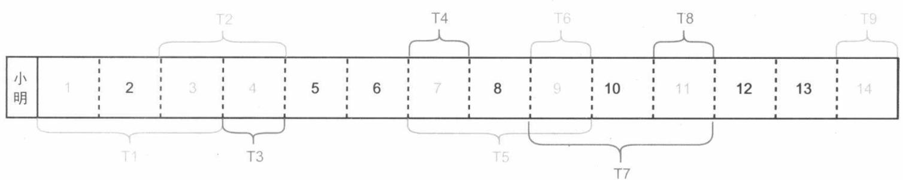  
图3-22 transaction划分

  
图4-6 窗口

  
图4-18 相同位置bit值一样的概率

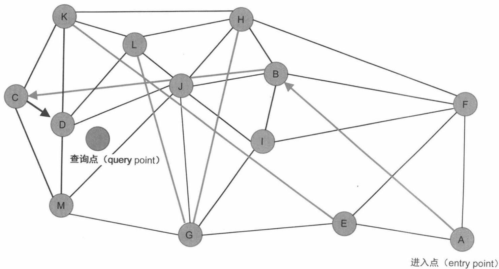  
图5-11 NSW GRAPH

  
图5-20 GRAPH插入D点

图5-22 HNSW结构  
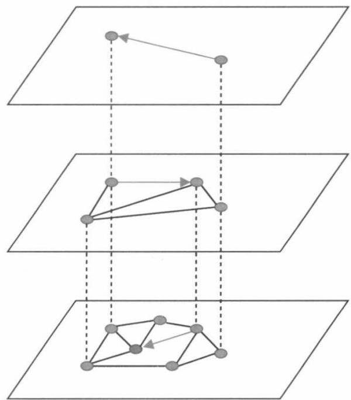  
正例负例

  
图6-3 混淆矩阵示例

表 10-1 全排列组合  

<table><tr><td>排列</td><td>组合</td><td>排列</td><td>组合</td></tr><tr><td>π1</td><td></td><td>π4</td><td></td></tr><tr><td>π2</td><td></td><td>π5</td><td></td></tr><tr><td>π3</td><td></td><td>π6</td><td></td></tr></table>

表 10-2 全排列组合概率  

<table><tr><td>排列</td><td>组合</td><td>概率</td><td>排列</td><td>组合</td><td>概率</td></tr><tr><td>π1</td><td></td><td>0.3153</td><td>π4</td><td></td><td>0.0703</td></tr><tr><td>π2</td><td></td><td>0.1912</td><td>π5</td><td></td><td>0.0826</td></tr><tr><td>π3</td><td></td><td>0.1160</td><td>π6</td><td></td><td>0.2246</td></tr></table>

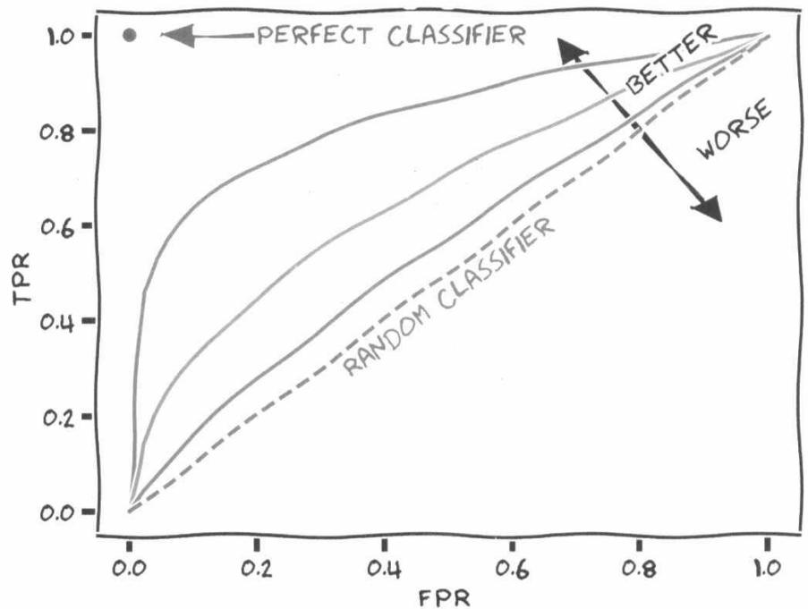  
图11-2 ROC曲线示例

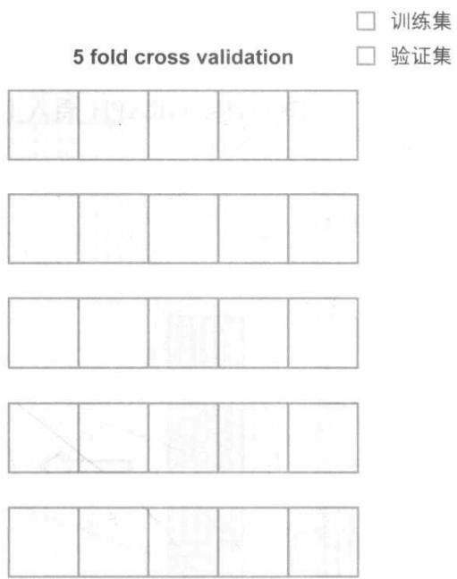  
图11-14 cross validation

  
图15-14 Scatter-Reduce第二次迭代

# 前言

不管是日常生活中随处可刷的短视频、直播、文章，还是电商网站中琳琅满目的商品等，推荐系统都在其中发挥着巨大的作用。作为机器学习应用比较成熟、广泛的场景，推荐系统具有极大的商业价值，其背后的推荐算法对于普通用户来说显得较为神秘。

想要深刻地掌握推荐算法挑战比较大，因为这对数据量有很高的要求，还要求算法工程师对具体业务有深刻的理解。算法的设计和实现与具体业务强耦合，建模过程中的很多问题和解决方案通常较难在书本上看到，比如模型训练速度优化以及在线离线不一致问题等。如果忽视数据和对业务的理解，而将大量时间耗费在构建复杂的模型之上，颇有本末倒置的味道。

在很多年前初次尝试入门推荐算法的时候，我满怀希望地拿起了高等数学、线性代数、概率论以及最优化理论和矩阵论等多本曾经在学生时代让我“心力交瘁”的教材，心想这么多年的书终究没有白念，终于有一天能够把学校里学到的这些理论知识应用在工作之中了。几个月后，现实世界中的一个需求摆在面前时，我头脑几乎一片空白，不知从何下手，切身体会到了“理想很美好，现实很残酷”这句话的含义。因此，我到今天还记得第一次成功地将一个算法部署到线上并且还取得不错收益时的那种喜悦和兴奋，当然，也会永远记得这个算法——协同过滤算法。

算法从理论到落地，需要经历数据收集、数据清洗、特征抽取、特征工程、模型搭建、模型训练、模型上线以及效果回收等多个步骤，模型搭建只占了很小一部分，算法工程师绝大部分的时间被数据和线上问题占据。可见，算法的应用需要一个完备的周边系统来支撑它的迭代，其中涉及大数据处理平台、模型训练平台、特征平台、A/B测试平台等多个平台。

正因为工业中算法的落地涉及太多非算法理论方面的知识，所以本书将会系统性地介绍各类推荐算法的原理、代码实现、线上服务以及A/B测试评估，并尽可能覆盖落地过程中遇到的各种各样的问题。除了推荐系统中常用的协同过滤、关联规则、词向量等传统算法之外，深度学习算法占据了本书大部分篇幅。本书同时也涵盖了算法理论之外的许多内容，包括特征工程、参数调优、模型加速以及成熟的训练代码框架等。

希望本书能够给读者提供些许帮助，特别是如果可以解决实际工作中的一两个问题，则我荣幸之至。

随书代码见GitHub仓库（large-scale-recsys-in-action）①。

# 读者对象

□ 希望入门推荐算法的非行业从业者  
□希望在推荐算法领域进阶的行业从业者  
□希望全面了解推荐系统及其运作原理的技术管理者

# 本书内容

本书基本上涵盖了推荐算法从业人员在实际应用中所要掌握的全部技能，包括传统机器学习、深度学习以及算法原理、代码实现、效果评估、分布式训练、推荐系统冷启动等一系列内容。本书共17章，除了首尾两章之外，余下的15章构成了本书的核心内容。

第1章是推荐系统概述，通过引入一些具体的案例，从宏观的角度阐述推荐系统是什么以及它如何运作。

第2章到第6章构成了第一部分——召回算法。这部分的主要内容有协同过滤、关联规则、词向量等传统召回算法以及当下主流的深度学习双塔召回，详细说明了各自的原理、实现以及离线评估的方法。

第7章到第12章构成了第二部分——排序算法。这部分的主要内容集中在特征工程和深度学习建模两方面，详细介绍了深度学习模型的Training和Serving、Listwise Learning to Rank技术、离线评估和在线评估以及深度学习调参最佳实践。

第13章到第16章构成了第三部分——工程实践。这部分的主要内容不涉及具体的算法，详细介绍了冷启动问题、模型的增量更新和迁移学习、分布式训练以及编写一套具有高复用性的训练代码框架。

第17章是总结，同时也是对读完本书后下一步工作和学习方向的展望。

虽然本书章与章之间在内容上并无直接关联，但还是建议在第一遍阅读时，按照从前到后的顺序阅读。

# 联系作者

由于作者水平有限，因此即使经过多次校对和核验，书中也难免会存在错误或者疏漏，如果读者发现了书中内容或者相关代码有任何问题或者表述不清、模棱两可的地方，请及时通过邮箱与我联系：1202zhyl@163.com。期待与大家共同学习、交流和进步。

# 目录

# 第1章 推荐系统

1.1 推荐系统是什么

1.1.1 京东商城  
1.1.2 亚马逊·  
1.1.3 YouTube 6

1.2 推荐系统整体架构· 8

1.3 推荐系统算法概述

1.3.1召回算法· 10   
1.3.2 排序算法 14

1.4 周边配套系统 16

1.4.1 机器学习平台 18  
1.4.2 特征平台 18  
1.4.3 模型服务平台 19  
1.4.4 A/B测试平台 19

1.5 总结· 20

# 第一部分 召回算法

# 第2章 协同过滤 22

2.1 算法应用 24  
2.2 算法原理 25

2.2.1 打分机制 26  
2.2.2 物品相似度 31

2.3 算法实现 33

2.3.1 步骤1：数据源读取 34  
2.3.2 步骤2：聚合用户行为… 34  
2.3.3 步骤3：局部物品相似度… 35   
2.3.4 步骤4和步骤5：全局物品相似度· 36   
2.3.5 步骤6：Top $N$ 37

2.4 算法优化 37

2.4.1 38   
2.4.2 热门惩罚 38

2.5 完整代码 39  
2.6 准实时更新 42

2.6.1 数据准备 43  
2.6.2 实时数据取数逻辑… 44  
2.6.3 准实时更新相似度 44

2.7 总结· 45

# 第3章 关联规则 47

3.1 关联规则 48

3.1.1 定义· 49  
3.1.2 频繁项集 50

3.2 Apriori算法· 51

3.2.1 频繁项集生成 51  
3.2.2 关联规则生成 53

3.3 FPGrowth 54

3.3.1 FP树 54   
3.3.2 逻辑· 54   
3.3.3 举例· 55   
3.3.4 运行 66  
3.3.5 完整代码· 68   
3.3.6 数据集 69  
3.3.7 源码分析· 70  
3.3.8 算法优化… 76

3.4 总结· 77

# 第4章 Word2Vec

4.1 词向量示例· 80   
4.2 数据准备 81  
4.2.1 词汇表· 82

4.2.2 训练数据· 82

4.3 算法原理 83

4.3.1 模型结构 85  
4.3.2 前向传播 86  
4.3.3 反向传播· 88  
4.3.4 算法优化 89

4.4 源码分析 91

4.4.1 负采样概率表 91  
4.4.2 sigmoid函数优化 93

4.5 算法实战 93

4.5.1 数据源· 94  
4.5.2 运行 94  
4.5.3 相似度计算 95

4.6 LSH算法 96

4.6.1 散列 96  
4.6.2 算法逻辑· 98   
4.6.3 时间复杂度分析 102  
4.6.4 错误率分析 102  
4.6.5 召回率分析 104

4.7 Word2Vec与LSH 106   
4.8 总结· 107

# 第5章 深度学习双塔召回 108

5.1 向量化 109  
5.2 双塔模型 110

5.2.1 数据准备 112  
5.2.2 模型训练 112  
5.2.3 模型对外服务 113

5.3 HNSW算法 115

5.3.1 二分查找 ………………………………………… 115  
5.3.2 有序链表 … 117  
5.3.3 跳表 118  
5.3.4 HNSW算法 121

5.4 双塔模型与HNSW算法 129  
5.5 负样本策略 131   
5.6 总结· 132

# 第6章 召回模型的离线评估 133

6.1 推荐任务类型 133  
6.2 混淆矩阵 134

6.2.1 准确率 135   
6.2.2 精确率 136  
6.2.3召回率 136  
6.2.4 F1分数 137  
6.2.5 $@k$ 138

6.3 nDCG 139

6.3.1 CG 139   
6.3.2 DCG 140   
6.3.3 nDCG 140   
6.3.4 @k· 141

6.4 其他指标 142

6.4.1 MRR 142   
6.4.2 MAP 142   
6.4.3 多样性 143  
6.4.4 覆盖度 144  
6.4.5 信息熵· 144

6.5 代码实现 ………………………………………… 144

6.5.1 实现逻辑· 145   
6.5.2 完整代码 146

6.6 总结· 149

# 第二部分 排序算法

# 第7章 特征工程和特征选择 153

7.1 特征类型 155

7.1.1 类别特征 155   
7.1.2 数值特征 155   
7.1.3 序列特征· 156

7.2 特征工程 156

7.2.1 特征样例 156  
7.2.2 特征工程 159  
7.2.3 TensorFlow特征列 164

7.3 特征选择 165   
7.4 总结· 167

# 第8章 传统机器学习排序算法 ……………………………… 168

8.1 数据和模型 168

8.1.1 极大似然估计 169   
8.1.2 最大后验概率估计 169

8.2 模型训练流程 170  
8.3 手写逻辑回归 171

8.3.1 数据准备 172  
8.3.2 数据读取 173  
8.3.3 模型训练 173  
8.3.4 完整代码 174  
8.3.5 算法优缺点 177

8.4 手写因式分解机 … 178

8.4.1 完整代码 180  
8.4.2 算法优缺点 183

8.5 其他经典排序算法 184  
8.6 Q&A 185   
8.7 总结 186

# 第9章 深度学习从训练到对外服务……188

9.1 深度学习简介 188  
9.2 经典模型结构 191

9.2.1 Wide & Deep 191   
9.2.2 Deep Interest Network 192   
9.2.3 Behavior Sequence Transformer 194

9.3 建模流程 195

9.3.1 数据准备 197  
9.3.2 特征工程 202  
9.3.3 模型搭建 209  
9.3.4 模型训练 213  
9.3.5 模型导出 215  
9.3.6 模型服务 216

9.4 再谈双塔模型 219  
9.5 总结 220

# 第10章 Listwise Learning To Rank 从原理到实现 221

10.1 Listwise基本概念· 222  
10.1.1 page view 222   
10.1.2 relevance 223   
10.1.3 Listwise 223

10.2 损失函数 224  
10.2.1 permutation probability 224   
10.2.2 top one probability 226

10.2.3 交叉熵损失函数 …………………… 227

10.3 ListNet 228

10.3.1 数据准备 229  
10.3.2 模型搭建 236  
10.3.3 模型训练、导出和服务… 243  
10.3.4 优化方向· 244

10.4 总结 244

# 第11章 排序算法的离线评估和在线评估· 246

11.1 离线评估 246

11.1.1 ROC曲线· 247   
11.1.2 ROC曲线下的面积… 249  
11.1.3 PR曲线 254  
11.1.4 GAUC 256

11.2 在线评估 257

11.2.1 A/B 测试简介 257  
11.2.2 朴素分流方案… 258  
11.2.3 分层分流方案 260  
11.2.4 可信度评估 262

11.3 在线离线不一致 267

11.3.1 特征不一致 267   
11.3.2 数据分布不一致 268   
11.3.3 模型与业务目标不一致… 268   
11.3.4 验证集设计不合理 268

11.4 总结· 270

# 第12章 推荐算法建模最佳实践 271

12.1 深度学习调参 272

12.1.1 学习率 272  
12.1.2 batch size 279   
12.1.3 epoch 279   
12.1.4 隐藏层数· 280   
12.1.5 隐藏节点数 280  
12.1.6 激活函数 280  
12.1.7 权重初始化 280  
12.1.8 优化器· 281   
12.1.9 其他实践 281

12.2 现实数据问题 281

12.2.1 类别失衡 282

12.2.2 位置偏差· 286  
12.2.3 海量数据下的调参 287  
12.2.4 其他实践 288

12.3 总结 288

# 第三部分 工程实践

# 第13章 冷启动问题 290

13.1 冷启动概述 291  
13.2 用户冷启动 292

13.2.1 热门排行榜 292   
13.2.2 上下文信息 294  
13.2.3 其他策略 295

13.3 物品冷启动 296

13.3.1 基于内容的过滤 296  
13.3.2 推荐策略 299

13.4 系统冷启动 301  
13.5 总结 306

# 第14章 增量更新和迁移学习 307

14.1 离线训练 307

14.1.1 数据流向· 307  
14.1.2 更新方式 308

14.2 在线训练 310

14.2.1 数据流向· 310  
14.2.2 样本生成 312  
14.2.3 延迟反馈 314

14.3 迁移学习 317   
14.4 总结 320

# 第15章 分布式TensorFlow 321

15.1 分布式的理由 … 321  
15.2 并行方式 322

15.2.1 模型并行 323  
15.2.2 数据并行 324

15.3 参数共享与更新 325

15.3.1 同步更新 326  
15.3.2 异步更新 327

15.4 分布式训练架构 329

15.4.1 Parameter Server 架构 … 329  
15.4.2 Ring All Reduce 架构 331

15.5 单机代码移植 334

15.5.1 数据准备 334  
15.5.2 模型搭建 337  
15.5.3 模型训练 337  
15.5.4 模型导出 340

15.6 分布式训练框架 340

15.6.1 基于 Kubernetes 的分布式训练框架 340  
15.6.2 基于Flink的分布式训练框架 344

15.7 总结 345

# 第16章 示例：推荐算法训练代码框架设计 346

16.1 问题· 347   
16.2 解题思路 348

16.2.1 数据问题 348  
16.2.2 训练问题 349

16.3 详细设计· 350

16.3.1 配置解析 351  
16.3.2 数据读取 352  
16.3.3 模型搭建 352  
16.3.4 完整流程 353

16.4 代码实现 … 353

16.4.1 配置解析 354  
16.4.2 特征处理 359

16.5 总结 362

# 第17章 回顾和探索 363

17.1 回顾· 363  
17.2 探索 364

17.2.1 数据 364  
17.2.2 算法 366  
17.2.3 平台 367  
17.2.4 安全 367

17.3 总结 368

# 第1章

# 推荐系统

无名商城是一个默默无闻的电商平台，活跃用户不多，在售商品数量寥寥数千。因为商城的受众比较少，所以商品种类也不多，每日进入商城的绝大部分是老用户，新用户占比很小。

通过数据分析发现， $95\%$ 的用户进入无名商城之后的第一个动作是打开搜索窗口，大部分订单也是由搜索业务带来的，也就是说用户有很强烈的目的性，并没有“闲逛”的意思。

岁月如梭，时光荏苒，由于对市场形势把握得比较准确，无名商城的业务渐渐有了起色，知名度也越来越高，由此带来的直接效应就是入驻的商家越来越多，活跃用户和商品种类也出现了快速增长的趋势。数据同样也佐证了，日活商品由几千慢慢涨到几万再到现在的几十万，日活用户也达到了百万并且数量还在快速上升，所以初步预估一两年之内日活商品会突破百万，日活用户更是可以达到千万。

与此同时商城收到的负面反馈也更多了，反馈的问题大致可以归为以下两类。

□店铺反馈：明明商品质量都不错，价格也合理，为什么我家的东西一天曝光量那么少？既然曝光少，那就更别提销售额了。  
□用户反馈：首页的商品种类太单一了，来来回回就是那几种，没有太大变化，而且我看到的东西好像与我的历史行为没什么关系，我一点儿“逛”的兴趣都没有，很容易就腻了。

无名商城意识到，当下的技术已经跟不上业务的发展了，如果安于现状，那么在可遇见的未来，将会成为真正的“无名”商城。为了适应信息化时代的商务智能，尤其是在海量数据的基础上，个性化的决策支持和信息服务变成了不可或缺的功能。

为了解决上述问题，推荐系统应运而生。

# 1.1 推荐系统是什么

引用维基百科对于推荐系统的定义：

A recommender system, or a recommendation system (sometimes replacing 'system' with a synonym such as platform or engine), is a subclass of information filtering system that seeks to predict the "rating" or "preference" a user would give to an item.

从定义可以看出，推荐系统的功能是：

□ 可以对信息进行过滤；  
□ 可以预测用户对物品的打分或者偏好程度。

总结成一句话就是：协助用户发现他们可能感兴趣的物品

这就是推荐系统的职责所在，从数以万/亿计的物品中遴选出用户可能感兴趣的物品，这不仅能够有效减少用户的浏览路径、操作次数，更重要的是，可以通过提升用户体验为企业带来收益，毕竟流量只有变现了才有价值。


要知道，两个同样的物品，其中一个点一次链接就能看见，另一个需要点两次链接才能看见，那么与第一个比起来，第二个物品的点击人数一般来说呈指数级衰减。这就是常说的用户行为漏斗，电商领域的曝光 $\rightarrow$ 点击 $\rightarrow$ 加购 $\rightarrow$ 购买是一个典型的漏斗模型，短视频领域的曝光 $\rightarrow$ 点击 $\rightarrow$ 点赞 $\rightarrow$ 关注是另外一个典型的漏斗模型。

如今，推荐系统在我们的日常生活中随处可见，不管是浏览各大电商网站还是视频网站，呈现在我们眼前的物品/视频几乎都是通过推荐系统出来的。但是推荐系统也并非万能的，想让它发挥作用，一般需要以下两个前提。

□信息过载：系统内具有海量信息，十万甚至百万、千万级。  
□ 用户意图不明确：大多数用户可能没有特别明确的意图，因为对于有明确意图的用户，搜索系统基本上就能够满足需求了。

当信息达到一定量级，无论对于消费者（用户）还是生产者（比如店铺、UP主等）都会带来很大的挑战。

□ 消费者：如何从海量物品中轻而易举地发现自己满意的物品？  
□生产者：如何让生产出的物品更加精准地触达受众？比如，剃须刀商家就不大希望自己的产品对女性用户展示太多；同样，母婴用品商家也不太希望自己的商品过多地展示给未婚用户。

这就是推荐系统所要担负的责任。

在深入推荐系统之前，我们先来直观地感受一下真实世界中的推荐系统。

# 1.1.1 京东商城

电商平台中比较常见的有类似猜你喜欢、为你推荐等场景。这类场景一般根据用户的历史行为去推荐用户可能感兴趣的物品，因此用户看到的物品大都跟自己有过某种行为的物品很相似或者在某种程度上有关联。这种场景下的推荐结果通常是个性化的。图1-1是京东首页的为你推荐示例。因为我最近经常对游戏机产生行为，所以我的推荐列表中出现了很多关于游戏机的结果。

  
为你推荐  
图1-1 京东的“为你推荐”

当然，推荐的元素不一定非得是具体的物品，品牌/频道/品类等也可以作为物品推荐给用户。图1-2是京东频道广场，推荐结果是一系列品类。可以看出，推荐系统识别出了我对于数码和运动产品的偏好，从而向我展示了电脑办公和运动城这样的推荐结果。

  
频道广场  
图1-2 京东的“频道广场”

那么，如果是一个全新的用户，在没有任何历史行为的情况下，好像没有办法向他做很好的个性化推荐，这时又该如何去做呢？这就涉及了新用户的推荐问题。图1-3是京东首页的每日特

价和品牌闪购的板块，类似这样的场景依靠吸引人的价格以及热门的品牌活动，推荐的物品很可能吸引全新用户，从而诱使他们产生行为（点击/加购/下单等）。一旦产生行为，便可以去做个性化推荐，从而让个性化推荐系统产生作用。

  
图1-3京东的“每日特价”和“品牌闪购”

同样，新上架的物品没有任何历史数据（点击率、加购率等），推荐系统不知道这个物品是好是坏，到底该不该推荐给用户呢？这又涉及新物品的推荐问题，图1-4是京东首页的新品首发板块，通过这种方式，可以让新上架的物品有机会被用户看见，从而有了被点击/加购/下单的机会，一旦积累了一定量的历史数据，个性化推荐系统又可以发挥作用了。

  
图1-4京东的“新品首发”

以上关于新用户和新物品的推荐在推荐系统中被称为冷启动问题，这也是推荐系统不可回避的问题之一，第13章会详细介绍相关解决方案。

# 1.1.2 亚马逊

接下来切换到海外的电商平台亚马逊，感受一下他们的推荐系统。我在亚马逊网站上点击了一件物品，如图1-5所示，是一款XboxOneX游戏主机。

  
图1-5 亚马逊上的游戏机

进入物品详情页之后，稍微往下翻一下，会看见如图1-6所示的物品推荐，这是亚马逊根据我点击的游戏机给出的推荐结果。这里系统给出了关于推荐结果的解释：大部分用户在浏览了该物品之后又购买了这些物品。我们给这种推荐策略一个专有名词：看了又买。

  
图1-6 亚马逊的“看了又买”

同理，亚马逊还有看了又看，依然在物品的详情页，如图1-7所示。顾名思义，关于该推荐结果的解释是：大部分用户在浏览了该物品之后又浏览了这些物品。

  
图1-7 亚马逊的“看了又看”

从上述两种推荐策略可以看出，当用户点击了某个物品，亚马逊会推出与它极其相似的物品作为推荐结果。这也很合理，当用户对某个物品表现出比较明显的喜好/偏向时，推荐系统没有理由去给出毫无关联的物品，这种找相似的手段在推荐系统中再普遍不过了，甚至有时候会让用户感到厌倦——怎么老是给我推荐同一类东西呢？

为了让推荐结果呈现多样性，除了找相似之外，亚马逊还有一种推荐策略——找相关，如图1-8

所示，这里同样给出了推荐原因：与用户点击物品有关联的物品。这些物品都是我刚才点击的游戏机的一些配件，它们与游戏机一点儿也不相似，但是有很强的关联关系。一个好的推荐系统能够自动发现物品与物品之间存在的这种关联关系。

  
图1-8 亚马逊的找相关

可以看出，仅仅是针对用户的一个点击行为，亚马逊就可以“轻而易举”地在物品详情页面给用户提供三个“建议”——基于看了又买、看了又看以及找相关。这些“建议”会让人觉得特别自然和舒适，于是作为推荐算法的从业人员，我们不禁要停下来思考一番——亚马逊是根据什么给出“建议”的呢？如果我们也想在自己的推荐系统中添加这些策略，又该如何去做呢？隐藏在这背后的是“神秘”的推荐算法，这些算法在有条不紊地执行着自己的工作，为推荐系统“出谋划策”。我们将会在第一部分中揭开它们神秘的面纱，最终不仅可以彻底明白它们的工作原理，更重要的是可以让这些算法为我们所用，在我们的日常工作中发挥作用。

# 1.1.3 YouTube

再换到另外一个业务领域——视频推荐业务，感受一下世界上最大的视频网站YouTube的推荐系统。图1-9是在已登录的情况下YouTube给出的推荐结果。显然，因为我是登录状态，所以系统知道我以前看过很多搞笑段子（Gags）、游戏资讯以及机器学习的相关视频，甚至连我喜欢足球都掌握得一清二楚，可以说有可能这个推荐系统比我还了解我自己。很容易看出YouTube的推荐结果是绝对的千人千面——根据用户的历史行为给出推荐，与上述京东“为你推荐”场景的推荐逻辑基本一样。

  
图1-9 YouTube的千人千面

我忽然觉得很恐慌——就这样被推荐系统看得透透彻彻，于是选择了退出登录，没想到同样位置的推荐结果发生了翻天覆地的变化，如图1-10所示。退出登录后，推荐结果与我的历史行为几乎没有任何关联，看上去结果似乎是随机的，但是我们依然可以从中发现一些端倪：

□首先，从观看次数上可以看出这些视频都是比较热门的；  
□其次，可以看出推荐系统利用了我的IP地址和语言信息，向我推荐了华语歌曲和与中国有关的视频。

  
图1-10 YouTube的千人十面

所以即使我没有登录，推荐系统不知道我的偏好、历史行为等，依然可以根据某些用户信息去做推荐，得到一些一定程度上个性化的推荐结果，介于千人千面与千人一面之间的千人十面。

与此同时，在退出登录之后，首页又多出了一个板块——时下流行，如图1-11所示，这个板块在登录状态下不显示。从推荐结果中可以看出，推荐的这些视频不仅观看次数特别多，而且是近期上传的，因此这又是新用户冷启动问题的解决方案之一——向新用户推荐近期热门的事物。

  
图1-11 YouTube的“时下流行”板块

在粗略地感受了京东、亚马逊和YouTube的推荐系统之后，我们会好奇这一切是怎么实现的，京东和YouTube是怎么根据我的历史行为去向我做推荐的？亚马逊的看了又看、看了又买等策略是怎么实现的？相似和相关的物品是怎么发现的？归根到底，核心问题是：怎么从万/亿级的物品中快速找到用户可能感兴趣的物品？

# 1.2 推荐系统整体架构

从海量物品中精挑细选出数百个物品呈现在用户面前，推荐系统给出的推荐结果必须能够满足两个前提条件：又快又准。

快，是因为用户都是没有耐心的，谁愿意坐在电脑面前或者盯着手机屏幕一两秒都得不到任何响应？如果响应时间过长，还没等结果返回给用户，用户可能就离开网站或者 App 了，所以快是必须满足的一个条件。这也是难题之一——百万级的物品池，在 100 毫秒左右完成筛选确实是一个挑战。

如果能够满足快这个前提条件，准又是另外一个不可回避的要求。试想一下，如果用户可以即时得到推荐结果，但是没有准确度可言，比如我在亚马逊点击了某款游戏机，推荐结果在毫秒级的响应时间内呈现在我的眼前，结果里面都是一些鞋子衣服之类与游戏机毫无关系的物品，这样的结果用户也难以接受，久而久之便会造成用户大量流失。

为了解决快和准的问题，推荐系统在筛选物品时一般会经过两个步骤：召回和排序，先召回再排序。整体架构如图1-12所示。

  
图1-12 推荐系统架构

首先，召回阶段会快速地从百万级的物品池中筛选出百/千个物品。这个阶段的召回算法一般会利用用户信息和上下文信息，旨在筛选出与用户有一定关联的物品。因为物品池巨大，召回算法不会过于复杂，否则不能及时有效地筛选物品。同时，由于仅仅使用用户信息和上下文信息，并没有使用物品信息，所以会牺牲一定的准确性，这就是速度与精度的折中。

一句话总结，召回的目的是利用用户信息和上下文信息，在保证一定精度的前提下尽可能快地筛选出一定数量的物品。


上下文信息是指用户请求时上下文环境中所附带的信息，比如手机型号、手机品牌、语言信息、时间信息、页面ID等。

然后会进入排序阶段，这个阶段的算法会借助用户信息、上下文信息和物品信息，挖掘出用户与物品之间潜在的更深层次的关系，因此一般而言排序算法的复杂度要远高于召回算法。排序算法对召回出的上百/千个物品进行更细粒度的打分，得分高者排在前面。基本上排序算法排出的物品顺序就是用户看到的物品顺序了。


排序阶段有时候会分成两步：粗排和精排。从名称就能感受到其中的微妙差别，粗排算法的复杂度介于召回算法和精排算法之间。召回出的物品先经过粗排算法排一次序，对得分最高的Top $N$ 应用精排算法，精排算法再对这 $N$ 个物品进行打分和排序。从本质上来说，粗排算法和精排算法都会利用用户信息、上下文信息以及物品信息，差别在于粗排算法在建模时会选择相对简单的算法，因此本书并不会将排序再拆分成粗排和精排，而将排序阶段的算法统称为排序算法。

最后还会有一个重排阶段，这个阶段一般与具体的业务密切相关。比如在电商领域，在排序阶段之后，还需要针对一定的业务规则进行一定程度的人工干预，比如无货无价过滤、新品提权、同品种打散等。经过重排之后，才会将排好序的物品返回给用户，至此完成了从召回到排序到重排最终到用户的一次物品推荐。


本书会重点介绍召回和排序，不过这并不代表重排算法不重要。推荐领域关于重排模型的论文不断涌现，感兴趣的读者可以参考相关文献①②③。

# 1.3 推荐系统算法概述

从设计理念上，就能看出召回和排序有很大的不同：

□召回的目的在于从海量的物品池中快速、粗粒度地筛选出用户可能感兴趣的物品；  
□排序的目的在于通过更多的信息精准地挖掘出用户和物品之间潜在的深层次的关系。

因为设计理念上的区别，这两者对应的算法也有很大的差异。最显著的差异就是算法的复杂度，召回算法的复杂度一般比较低，以保证召回阶段能够快速完成；排序算法需要有更高的精度，算法的复杂度较高，因此待排序的物品数量不能太多。


召回和排序这两个阶段其实并不需要同时出现。比如，从零开始搭建推荐系统时，为了能够快速上线迭代试验系统效果，可以暂时不考虑排序而只留有召回。当召回阶段系统运行得比较稳定时，再进入排序阶段。

不同的阶段运用不同的算法。推荐系统发展了这么多年，衍生出了很多经典的算法，有的适用于召回阶段，有的适用于排序阶段，有的算法在这两个阶段都适用。其中不少算法已经诞生了几十年但是今天依然在发光发热，而伴随着深度学习的火热，现实应用中的推荐算法大都采用深度学习进行建模。本书的后续章节会详细介绍一些在用的传统机器学习算法，包括它们的原理和实现等。除此之外，深度学习也是不得不提的主题，我们将会看到当下一些主流的深度学习模型如何在推荐系统中发挥巨大的作用、它们的建模实现以及如何在生产中让深度学习模型对外提供服务。

# 1.3.1 召回算法

# 1. 协同过滤

准确来说，协同过滤（collaborative filtering）并不是一种算法，而是一种思想、一种理念。这种思想的实现一般可以分为两类：基于邻居决策的协同过滤以及基于模型的协同过滤。这两种实现的本质差别是前者通过一些统计手段就可以完成，而后者需要通过机器学习算法才能完成，这从后者的名称（基于模型）上也能看出来。一句话总结两者的差异就是，算法的实现是否依赖机器学习算法。

# - 基于邻居决策的协同过滤

基于邻居决策的协同过滤，其核心思想是物以类聚，人以群分。该种算法有以下两点假设：

(1) 与你爱好/偏好相似的人，他喜欢的东西你可能也喜欢；  
(2) 与你爱好/偏好的物品相似的物品，你可能也会喜欢。

这两点假设衍生出了两种算法：User-Based CF（user-based collaborative filtering，基于用户的协同过滤）和 Item-Based CF（item-based collaborative filtering，基于物品的协同过滤）。前者的目标是计算用户与用户之间的相似度，后者的目标是计算物品与物品之间的相似度。假设用户的偏好如图1-13所示，我们可以从中得到什么结论呢？

  
图1-13User-BasedCF

可以看到，用户1和用户2偏好的物品比较接近，因此可以认为用户1和用户2是相似用户，那么在向用户2做推荐时，就可以将用户1偏好的物品之一物品2放入用户2的推荐列表。这是User-Based CF的推荐方式。同理，如果我们换个角度重新审视一下图1-13，又可以从中得出什么结论呢？

很容易发现，物品1和物品3同时被用户1和用户2喜欢，Item-Based CF算法此时就认为物品1和物品3是相似物品。在向用户3做推荐时，由于用户3喜欢物品3，因此将与物品3相似的物品1推荐给他。这是Item-Based CF的推荐方式。

那么到底应该选择User-Based CF还是Item-Based CF呢？实际应用中偏向后者，一是因为计算用户的相似度涉及用户隐私的问题；二是因为用户的偏好变化比较频繁，导致用户的相似度其实并没有物品的相似度那么稳定。


算法领域凡事无绝对，还是要根据具体的业务来选择合适的算法。本书会着重剖析Item-Based CF，掌握了它，User-Based CF自然而然也就掌握了。

# - 基于模型的协同过滤

基于模型的协同过滤，具体的实现需要借助机器学习算法。常见的种类有关联规则、矩阵分解、词向量以及深度学习等。虽然深度学习已经成为主流的方式，但也并非所有场景都适用，尤其是在数据量不大的情况下，深度学习的业务效果很可能比不上传统的机器学习算法，因此还是有必要了解一下传统的机器学习算法。

关联规则

由1.1.2节中亚马逊根据我点击的游戏机而推荐相关配件可以看出，此种推荐方式很可能并不是使用基于邻居决策的协同过滤，因为配件与游戏机似乎没有可能通过相似性产生关系，而更有可能通过关联规则找到两者的关系。

关联规则主要用在数据挖掘领域，旨在挖掘出海量数据背后的关系。虽然啤酒和尿不湿这个“古老的传说”不知是真是假，不过用来解释关联规则是再好不过的了。

相传为了能够准确掌握门店里顾客的购物习惯，沃尔玛对每次顾客结算时的购物清单进行了分析，以期了解哪些物品是顾客经常一起购买的，这样在货架上可以把这些物品摆在一起，结果意外发现与尿不湿一起购买最多的物品居然是啤酒。多么神奇的一个结论啊！经过调查与分析，挖掘出了隐藏在这个结论背后的原因：原来，在美国有婴儿的家庭中，一般是母亲在家中照看婴儿，父亲去超市购买尿不湿。父亲在购买尿不湿的同时，往往会顺便为自己购买啤酒，这样就会出现啤酒与尿不湿这两件看上去不相干的物品经常出现在同一个购物清单中的现象。

虽然故事发生在门店中，但是同样的道理可以直接应用在电商推荐系统中，通过分析所有用户的行为数据找到频繁出现在一起的物品，从而挖掘出物品与物品之间的关联。关联规则算法的职责便在于此，尤其适用于电商购物车推荐场景。

词向量

词向量技术原本应用在自然语言处理中，不同于传统表示单词时使用的one-hot形式，取而代之的是使用向量表示一个单词。对于推荐系统这么一个繁杂的领域来说，自然会集百家之长，于是词向量技术被成功应用到了其中。稍微有点儿差别的是此时词向量表示的不再是单词，而是一件物品。

早期的词向量技术在单词/物品数量很多时有点儿力不从心，但是自从2013年几篇关于海量数据下词向量技术的论文①②③问世之后，训练已经不是什么问题了。还有一个问题自然而然地就来了——通过机器学习算法训练出的物品向量，究竟如何使用呢？

使用方法一般有以下两种。

(1) 通过最近邻搜索算法，计算每个物品的 Top $N$ 个相似物品，当用户对某个物品产生行为时，将与该物品相似的 $N$ 个物品推荐给用户即可。这种方式简单、直接。  
(2) 将该物品向量作为深度学习训练的物品向量初始值，这样不仅会大幅提高深度学习模型的精度，而且也有助于训练快速收敛，实践中这种方式的收益也比较高。


第4章和第14章会分别对第1种方式和第2种方式进行详细的说明和实现。

深度学习

使用深度学习来做协同过滤基本上是当前推荐系统的主流做法。谷歌在2016年和2019年发表的两篇论文④⑤，很好地将深度学习运用到了召回阶段，不仅解决了如何建模，更重要的是解决了如何在生产中对外提供召回服务的问题。图1-14所示的就是经典的双塔模型。

  
图1-14 深度学习双塔模型

在图1-14中，左边的塔为用户侧的塔，输入只使用与用户和上下文有关的特征，比如用户ID、手机型号、用户过去的访问物品ID集合等；右边的塔为物品侧的塔，输入只使用与物品有关的特征，比如物品ID、物品过去 $N$ 天的点击率及转化率等。

双塔的输入经过中间层到达倒数第二层（即L2 normalization）时，该层的输出分别会作为用户向量和物品向量。因为最后一层仅仅是向量的内积，所以用户向量和物品向量的维度必须一样，否则无法进行内积运算。

这样的网络结构怎么训练呢？训练生成的用户向量和物品向量又如何使用呢？别着急，在第5章，我们将再次看到图1-14，届时会详细解释双塔模型如何在召回阶段发挥巨大的作用。

# 2. 基于内容过滤

基于内容的过滤（content-based filtering，CBF）是与协同过滤完全不同的推荐方式。协同过滤之所以称为协同，是因为需要人的参与，对应的算法需要人的行为数据才能实现。而CBF不需要任何人的行为数据，只需要物品的元数据即可。


根据领域的不同，物品的元数据的具体表现形式也会不同。比如电商领域，物品的元数据可以是商品的品牌、品类、颜色、大小等；而在短视频领域，物品的元数据可以是视频的长度、分辨率、分类、主题等。

举一个简单的例子，假设一款新服装要上市了，由于新品没有任何历史点击、加购、销量等数据，从未被用户消费过，那么怎么把这个新款的服装推出去呢？如果我们能够找到与这款服装相似的服装，向那些购买过相似服装的用户推荐这款新品不就可以了吗？这就是CBF的推荐方式。如图1-15所示，从这三款服装的属性我们可以很轻易地得出服装1和服装3是相似的，那么我们可以把服装3推荐给购买过服装1的用户。

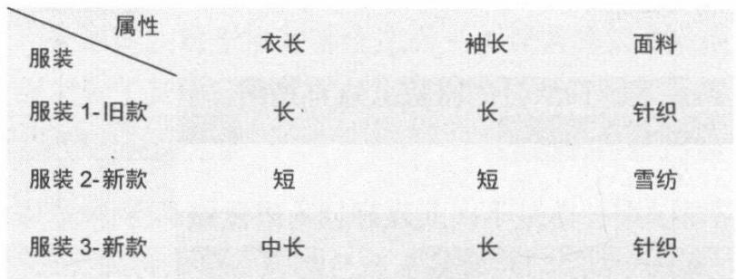  
图1-15 CBF相似物品

上述做法显然过于朴素，实际应用中也不会这么简单地得出这么完美的结论，并且通过CBF的推荐原理可以发现，这种算法特别适合处理物品冷启动问题，也就是新品出现在推荐系统中，由于没有历史信息，推荐系统会显得束手无策。

我们将会在第13章详细探讨如何根据物品的内容/元数据来计算物品相似度，尤其值得一提的是，我们将会研究如何使用深度学习来实现CBF的思想，从而有效处理物品冷启动的问题。

# 1.3.2 排序算法

提到推荐系统中的排序算法，我相信绝大多数算法工程师脑海中会出现“千奇百怪”的深度学习模型网络结构、各种层出不穷的调参技巧，等等。是的，机器学习算法在推荐系统中应用到现在，基本上深度学习已经占据了绝对主导的地位，每年RecSys等顶级会议都会涌现出很多高质量且工程性十足的论文。阅读和复现来自国内的阿里巴巴、国外的谷歌、Meta/Facebook等行业领导者的论文几乎成为了每个从业者的必修课。但是我们还是很有必要了解并且掌握传统的机器学习算法在推荐系统中的应用。


LR、FM、FFM（如图1-16所示）等传统的机器学习算法在快速搭建推荐系统方面有绝对优势，一来它们的训练通常比深度学习简单得多，二来它们对外提供服务也比深度学习简单。想让深度学习模型从训练到服务有很多工作要做。我们会在第9章中详细介绍深度学习方面的内容。

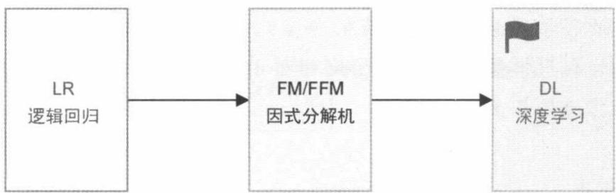  
图1-16 排序算法演进

# 1. 逻辑回归

排序算法总是绕不开LR（logistic regression，逻辑回归）。作为一个表面上非线性的线性模型，LR现在依然活跃在各种点击率/转化率预估任务之中。当然，它的优点和缺点都较为明显。

□优点

■ 训练速度快  
■简单易用、容易实现、对存储要求不高  
■可解释性强：特征的权重就表示了该特征对输出的重要程度  
以概率的形式输出，尤其适合利用概率来做决策的业务场景  
适合作为基线

□缺点

线性模型，表达能力有限，无法解决非线性问题  
■准确率也不高，当数据量增大时，这几乎是必然的结果  
需要大量的人工特征工程

# 2. FM

FM（factorization machine，因式分解机）算法①在LR的基础上加入了一定的非线性，因此其表达能力理论上要好于LR，而且得益于算法的巧妙设计，它的时间复杂度也控制得特别好。当然，它也有缺点。

□优点

可以自动学习两两特征之间的关系，一定程度减少了人工特征工程  
时间复杂度与LR基本一样，所以线上预测速度可以保证  
■需要人工调节的超参数不是很多  
可以学到特征向量，因此可以为其他模型提供迁移学习的基础


不了解什么是迁移学习也没关系，我们会在第14章中再回到这个概念上来，现在可以简单地将其理解为利用模型A的结果协助模型B的训练。这里就是FM训练得到的特征向量，可以用到其他任务上。

□ 缺点

只能捕捉两两特征之间的关系，对“三三”及以上就无能为力了  
■ 理论上它的表现应该优于LR，可是实践中并不总是这样


LR 和 FM 会在第 8 章中再次回到我们的视线之中，届时再来研究这两种算法的基本原理以及代码实现。

# 3. 深度学习

深度学习作为当下最流行的建模方式，在推荐系统中也发挥着巨大的作用，这从每年的顶级会议论文篇数、深度学习开源社区的活跃度等都可以看出来，掌握它确实是算法工程师的一项必备技能了。它的优缺点总结如下。

优点

表达能力强、泛化能力好，具有很强的抗噪性，可以拟合高纬度非线性数据  
■应用场景广泛，除了推荐领域，还覆盖了搜索系统、计算广告、自动驾驶、人脸识别、自动翻译、智能问答等领域  
大大减少甚至不再需要人工特征工程了

□ 缺点

深度学习模型训练需要海量数据，因此也需要巨大的计算量  
■可解释性差：由于深度学习的结构比较复杂，因此其输出结果的可解释性不佳  
■需要调节的超参数过多，这是深度学习被诟病最多的地方之一


在第12章中，我们会看到一些常见的深度学习超参数调节的最佳实践。

# 1.4 周边配套系统

很多时候，当我们谈起机器学习时，第一印象总是高深莫测的网络、奇思妙想的技巧以及拍案叫绝的论文等与算法本身密切相关的方方面面。但是当我们回归现实世界，开始计划着将算法落地，希望通过算法为企业带来业务价值时，会发现算法只是其中一个很小的组成部分，一般需要很多的配套系统才能让算法很好地实现工程化落地，为业务服务，这也是算法的最终目标。图1-17基本上就是一个完整的推荐系统，里面包括了众多平台和服务。

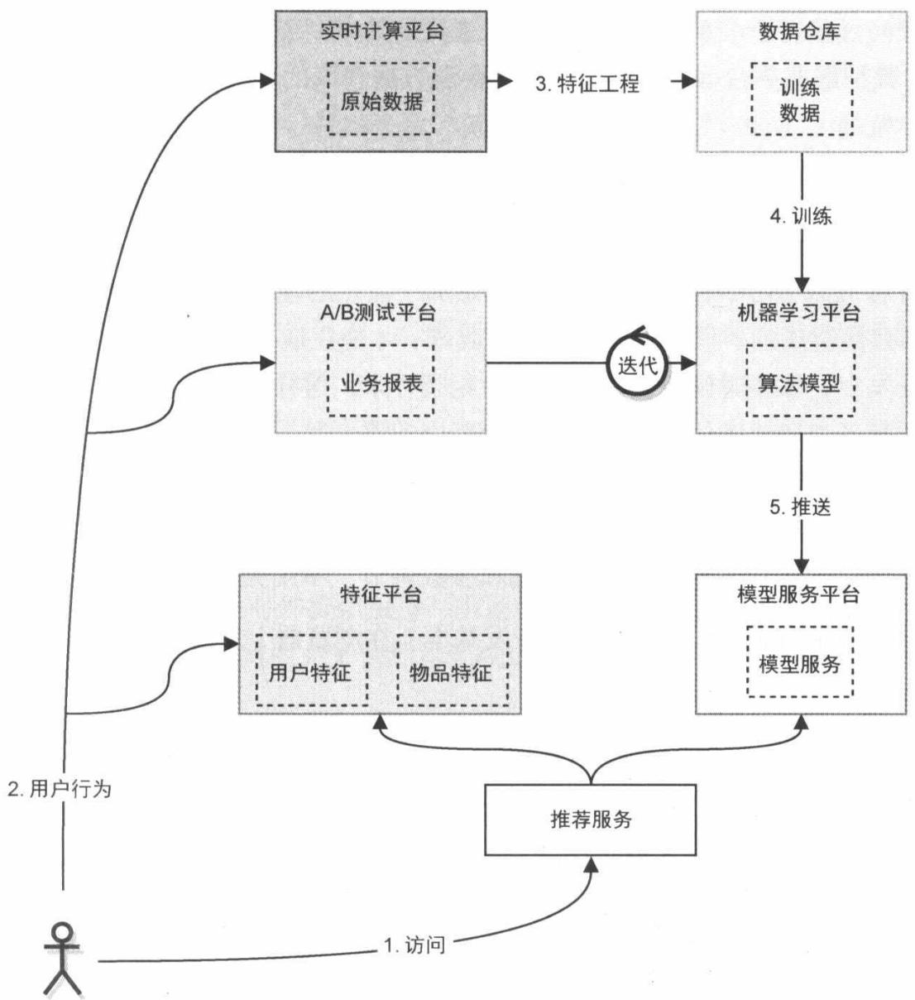  
图1-17 算法配套系统

我们以一次用户访问为起点来描述一下推荐算法应用的流水线。

(1) 用户访问网站/App:

1）推荐服务向特征平台发出请求，得到用户特征和物品特征；  
(2) 推荐服务将用户和物品等特征信息送入模型服务，返回物品打分；  
3) 推荐服务根据打分对物品排序，返回给用户。

(2) 用户对返回的物品产生某些行为，比如曝光、点击、点赞等，由终端上报给服务端。  
(3) 服务端的实时数据处理任务接收到用户行为数据，对数据进行清洗和特征工程等处理，得到训练数据。  
(4)将训练数据输入模型，开始进行模型训练，产出可用的算法模型。  
(5) 将生成的模型文件推送到线上模型服务进行模型加载，对外提供服务。

上述过程经过了若干个系统，可以看出算法只是其中一环。为了协助算法对外服务，至少需要特征平台、模型服务平台等。而实时计算平台和数据仓库的功能就比较纯粹——处理和存储数据，在此就不赘述了。

# 1.4.1 机器学习平台

首先来看看机器学习平台。模型并不单单是那一点点的建模代码，一个完整的模型是由算法代码、数据和参数组成的。只有将这三者结合起来，才能生成一个具体的模型，而这就会带来问题。在日常开发中，很多时候我们会将这三者割裂开来，这样就很容易导致模型管理越来越难，经常需要查阅很多文档或者代码才知道某个模型用的哪个数据，参数是什么。这样的混乱局面会严重阻碍算法工程师的迭代效率。如果有一个统一的平台，可以将算法代码、数据和参数很好地联系起来，同时封装一些常用的功能（比如读训练数据），避免每个算法开发在建模时都要写重复的代码，可以让算法开发专注于业务挖掘和参数调节，不用关心任务调度等琐碎的事项。

有了机器学习平台之后，算法的日常开发基本上在浏览器上就可以完成所有工作，大致流程如下。

(1) 选择数据集  
(2)填写超参数   
(3) 编写模型代码  
(4) 一键训练：具体任务调度由任务调度系统执行  
(5) 一键上线：模型训练完成后，一键上线

当然，上述流程经过了一定程度的简化，不过依然可以看见，算法的工作量大大减少，一些重复的“轮子”交由机器学习平台去实现，比如平台可以提供一键复制的功能：点一下，即可复制别人的模型，包括数据集、代码和参数。算法开发可以聚焦于如何将算法效果最大化。


机器学习平台的搭建是一项比较复杂的工程，但是从长远看来，这是一件一劳永逸的事情，特别有助于节省人力和提升效率。

# 1.4.2 特征平台

特征在机器学习算法中的重要性不言而喻，甚至可以说是整个建模过程的核心。算法工程师几乎有 $80\%$ 的时间是在与特征打交道。在图1-17中，为了完成排序任务，需要从特征平台获取一些特征。在没有任何规范和约束之前，这些特征的命名和处理手段可能多种多样——这就会带来一个很严重的问题：重复的“轮子”太多。

举个例子，算法工程师A产出了模型A，该模型用到了用户ID特征，命名为user_id，类型

为64位整型;算法工程师B产出了模型B,该模型也用到了用户ID特征,但是命名为member_id,类型为字符串。然而实际上member_id和user_id很可能是同一个概念,它们的内容也完全一样,只不过一个用整型表示,另一个用字符串表示,就像1234567和"1234567"一样。类似的案例还有很多,这种没有标准的自由风格显然不是我们想要的——特征平台正是为此而存在的。

特征平台一般会对特征的命名、处理方式、适用范围、来源等做一定程度的约束，这在初期可能会引起算法工程师的不满，毕竟谁会喜欢被限制呢？但是从长远看来，它的利远远大于弊：特征统一不仅会大大提高算法迭代的效率、降低在线离线不一致的风险，同时也会给特征复用带来巨大的便捷，避免了很多重复性的工作。


可以使用MySQL、Hive、Redis和HBase管理特征的生命周期。

# 1.4.3 模型服务平台

模型训练完毕后，需要上线对外提供服务，毕竟我们训练模型是为了使用它，这就需要模型服务平台。如图1-18所示，模型服务平台的主要功能是基于特征输入进行在线实时预测。一般来说，模型服务有以下要求。

(1) 预测要快、服务要稳。一旦涉及线上服务，耗时绝对不能高，同时要有妥善的容灾方案以保证服务时刻可用。  
(2) 模型版本自动更新。当有新版本模型被推送时，线上模型要能自动加载。  
(3) 告警。如果线上模型已经有 $N$ 个单位时间没有更新了，要能够通过聊天软件、短信或者电话告知算法开发者。

同样，一个好的模型服务平台可以大大减少模型训练到上线这一段的时间差，最好能够做到训练完之后立刻上线，并且可以保证线上服务的质量（包括响应时长、自动扩容等）。


模型服务平台最好能够支持特征自定义配置。

举例说明，A模型要用到特征1，B模型要用到特征2，那么模型服务平台最好支持不同的模型对应不同的特征配置，这样就使得线上模型与特征绑定起来了，修改B模型的特征配置不会对A模型造成任何影响。

# 1.4.4 A/B测试平台

模型上线之后，将会迎来真正的大考——线上效果，因为它才是检验模型去留的唯一标准。当多个模型同时服务于同一个场景时，究竟孰优孰劣，需要一比高下方可有定论，这场“比赛”的“裁判”便是A/B测试平台。A/B测试基于统计学原理，通过高效率的流量分配、科学的数据分析，不断地选择利于当前业务指标最大化的实验方案。

从算法的角度来说，A/B测试是模型迭代的灯塔，指引着算法优化的方向，因此说它是最重要的配套系统也不为过。一个好的A/B测试平台不仅可以提高模型迭代的效率，而且可以源源不断地为业务带来正向的价值提升。而如果A/B测试平台不够健壮和科学，容易得出相反的结论，使得算法不断地往错误的方向“优化”，这非但不会带来业务的增长，而且很可能会使得算法没有任何经验沉淀和技术积累。

一个好的A/B测试平台要做到以下事情。

(1) 流量快速分配，分流方式多样。比如可以根据用户ID分流，也可以根据请求ID分流，等等。  
(2)指标实时变化。今天上线的算法模型，不用等到明天才能看见在线指标情况，最好能做到指标实时更新。  
(3) 提供指标置信度。A/B 测试经常会有指标可不可信的问题，如果 A/B 测试平台能够自动给出当前指标的置信度，则再好不过了。  
(4) 实验配置灵活。这个也很重要，比如支持多个场景。以电商为例，在首页、商品详情页、购物车页、订单页等多种场景都可以开启A/B实验。甚至可以做粒度更细的实验，比如实验只针对使用iOS系统的用户生效。


A/B测试的相关内容将会在第11章中详细介绍

# 1.5 总结

□推荐系统为电商、视频等个性化内容提供方带来了巨大的收益，比如国内的淘宝、京东、抖音等，国外的则有亚马逊、YouTube等。背后支撑个性化推荐的则是一套成熟的推荐系统。  
□推荐算法按照种类大致可以分为召回和排序两种算法  
□召回算法要从海量的物品池中快速且准确地筛选出百/千个物品，比较主流的算法是协同过滤和基于内容的过滤，前者很好地利用了用户的行为数据，而后者在物品冷启动方面往往发挥着重要作用。  
□排序算法从早期的逻辑回归等线性模型到两两特征交叉的FM再到复杂度较高的深度学习模型，后者已经成为当前个性化业务领域的主流解决方案。  
□为了让算法很好地服务于业务，需要很多配套系统，比如机器学习平台、特征平台、模型平台服务、A/B测试平台等。当然，这里只列出了一部分，还有监控告警系统、用户画像系统、搜索引擎等。本书的核心内容在于算法的实现和应用，因此这些周边系统不在本书的重点讨论范畴中，还请谅解。

# 第一部分

# 召回算法

如何从百万级的物品池中快速且准确地筛选出数百/千个物品？第一部分：召回算法将会解决这个问题。

第一部分从第2章到第6章，会讲述多种召回算法，从简单的协同过滤、关联规则到复杂度稍高的词向量，最后到时下最常用的深度学习双塔模型。每种算法都会从基本原理、数据准备和代码实现三个方面加以解析。最后我们将会看到，召回算法如何做离线评估，一套良好的离线评估方法会大大降低线上的风险，同时有利于算法快速迭代。

# 第2章

# 协同过滤

Steam是目前全球最大的数字游戏平台。类似于国内的淘宝购物平台，商家会将要发行的游戏在Steam上架；用户可以浏览、收藏、加购以及购买自己喜欢的游戏。Steam充当开发商和用户之间的桥梁，负责将平台上所有的游戏推荐给潜在的目标用户。Steam首页如图2-1所示。

  
图2-1 Steam首页

某一天，当我打开Steam主页并登录后，往下滑动时，看到了图2-2所示的推荐结果，并且Steam很贴心地给出了推荐原因：因为您想要《古墓丽影11决定版》，所以我们给您推荐了《地平线零之曙光完整版》。这两款游戏确实有很多相似之处：主角都是女性，都有动作冒险元素等。作为用户，Steam给出的推荐原因我也欣然接受，《古墓丽影11决定版》确实在我的愿望单中，说明我挺喜欢这种类型的游戏。从专业的角度来看，这是一次很好的推荐。

  
图2-2 愿望单推荐

我继续往下滑动，又出现了图2-3所示的推荐结果。这一次的推荐结果与上一次有点儿不同，Steam同样也给出了推荐理由：因为您玩过《极品飞车：热力追踪》，所以我们给您推荐了《极限竞速：地平线4》。从专业的角度来看，这也不失为一次高质量的推荐：我喜欢赛车游戏，不久前玩过《极品飞车：热力追踪》，况且《极限竞速：地平线4》这款游戏的品质颇高。

  
图2-3 历史游玩推荐

可以看出，Steam给用户推荐游戏时，会根据自身具体的业务，从多个维度来考虑，比如上面就是根据愿望单和历史游玩这两个维度来做推荐。虽然维度不同，但是似乎它们通过同一种方式来为用户做推荐——将与用户有过行为的物品（加愿望单的游戏/玩过的游戏）相似的物品推荐给用户——这正是本章将要讲述的协同过滤所擅长的工作。


这里的协同过滤，是狭义的协同过滤，特指基于邻居决策的协同过滤。

这种算法的理念是物以类聚，人以群分，也就是说，它可以将物聚成类，也可以把人分成群。具体的表现形式为，通过某种计算方法可以得到物与物之间的相似关系、人与人之间的相似关系。前者对应的算法称为 Item-Based CF<sup>①</sup>，后者对应的算法称为 User-Based CF。两者的算法逻辑几乎完全一样，因此我们主要讲述 Item-Based CF，一旦掌握了它，User-Based CF 自然也就掌握了。

首先来看一下维基百科对于 Item-Based CF 的定义：

Item-item collaborative filtering, or item-based, or item-to-item, is a form of collaborative filtering for recommender systems based on the similarity between items calculated using people's ratings of those items.

从定义可以看出：

(1) Item-Based CF 是 CF 的一种形式；  
(2) 需要计算物品与物品之间的相似度；  
(3) 计算物品相似度需要用户对物品的打分。

毋庸置疑，计算物品相似度是 Item-Based CF 的重中之重，但是在深入算法的原理和实现之前，我们先来看一看 Item-Based CF 如何应用，也就是说，假设已经有了物品与物品之间的相似关系，如何利用这种相似关系生成推荐结果。

# 2.1 算法应用

作为本书第一个算法，暂时抛开其原理不谈（后文会详细说明），来看看如何使用算法结果，以对其有一个直观的认识。一般来说，协同过滤算法生成的物品与物品之间的相似关系记录在一张表中，称为物品相似表，其元数据如表2-1所示。

表 2-1 物品相似表结构  

<table><tr><td>物品1</td><td>物品2</td><td>相似度</td></tr><tr><td>物品ID</td><td>物品ID</td><td>0~1的数字</td></tr></table>

这里的相似度越高，表示物品1和物品2越相似。有时候相似度也会用距离来代替，距离越小则表示物品1与物品2越相近/相似。这里我们直接一点，采用相似度来说明。

为了表的容量和线上性能考虑，一般会设定一个参数 $N$ ，用来控制与物品1相似的物品2的数量。假设物品相似表中的数据如表2-2所示， $N$ 为3，也就是对于每个物品1，只保留3个最相似的物品2。

表 2-2 物品相似表数据  

<table><tr><td>物品1</td><td>物品2</td><td>相似度</td></tr><tr><td>iPhone 11</td><td>iPhone 12</td><td>0.95</td></tr><tr><td>iPhone 11</td><td>Huawei P40 Pro</td><td>0.80</td></tr><tr><td>iPhone 11</td><td>Samsung S21</td><td>0.50</td></tr><tr><td>MacBook Pro</td><td>Surface Pro</td><td>0.90</td></tr><tr><td>MacBook Pro</td><td>iPad Pro</td><td>0.70</td></tr><tr><td>MacBook Pro</td><td>Xbox Series X</td><td>0.30</td></tr><tr><td>小米手环6</td><td>华为手环6</td><td>0.80</td></tr><tr><td>小米手环6</td><td>荣耀手环6</td><td>0.70</td></tr><tr><td>小米手环6</td><td>Apple Watch Series 6</td><td>0.40</td></tr><tr><td>......</td><td>......</td><td>......</td></tr></table>

除了物品相似表数据之外，为了能够让 Item-Based CF 发挥作用，还必须存储每个用户的历史行为轨迹，即足迹。表 2-3 描述了三个用户的历史行为轨迹。

表 2-3 用户足迹  

<table><tr><td>用户</td><td>历史行为轨迹</td></tr><tr><td>小明</td><td>MacBook Pro、iPhone 11、LG显示器、……</td></tr><tr><td>小暗</td><td>……</td></tr><tr><td>小黑</td><td>……</td></tr></table>

那么，当小明登录网站/App，推荐系统接收到请求时，Item-Based CF算法的推荐流程为：

(1) 系统获取小明的历史行为轨迹，在拿到数据后可能还会做一定的预处理，比如丢弃90天前的行为等；  
(2) 遍历行为轨迹中的物品，去物品相似表中查找每一个行为物品对应的相似物品，比如根据 MacBook Pro 会查找到 Surface Pro、iPad Pro 以及 Xbox Series X（ $N$ 为 3）；  
(3) 将第 (2) 步中遍历得到的所有相似物品集合作为推荐结果返回。

上述流程如图2-4所示，到这里就完成了Item-Based CF的线上服务，那么就剩下一个最为重要的问题等待解答——作为整个算法中最为核心的物品相似度该如何计算呢？


用户行为轨迹数据和物品相似表数据在线上使用时，一般存储在Redis/HEMA中。

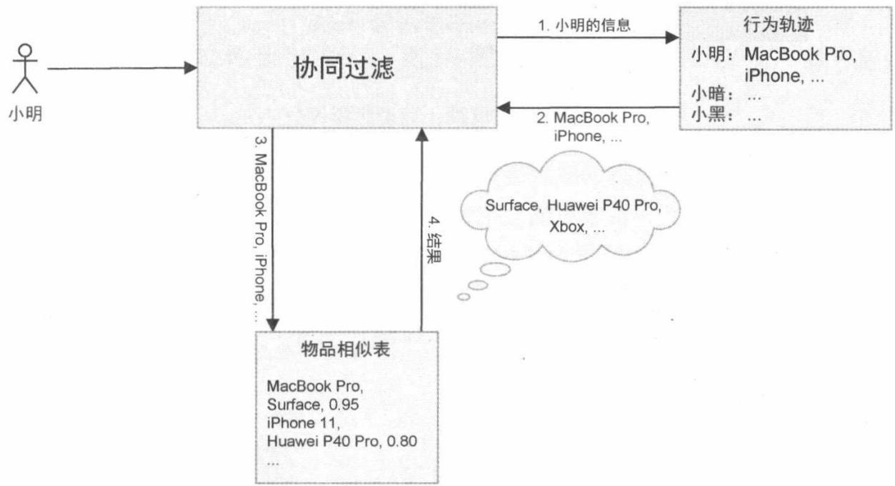  
图2-4 协同过滤召回流程

# 2.2 算法原理

再仔细查看一遍前文中关于 Item-Based CF 的定义，会发现这样一句可能被我们忽略的话：... the similarity between items calculated using people's ratings of those items.

因此，要计算物品相似度，首先得有用户对物品的打分，而打分数据的构造，是决定整个算法表现的重中之重。打分？好像我们作为用户时，在现实世界的电商、短视频或者音乐等个性化内容推荐平台上很少会给物品打分呀，那么这里提到的打分又是怎么一回事儿呢？

# 2.2.1 打分机制

在详细介绍如何获取用户打分之前，我们先要熟悉两个概念：显式反馈以及相对应的隐式反馈。

显式反馈：用户直接、明确地表达自己的喜好，比如豆瓣的影视评分（如图2-5所示）以及滴滴的服务评分等用户主动打分的行为。这种打分机制的好处是可以很清晰地掌握用户的好恶，因为用户不仅会表达自己喜欢什么（打高分），也会展露出自己厌恶什么（打低分）。

  
图2-5 显式反馈：豆瓣影视评分

但是，很容易看出，显式反馈的缺点也很突出。对于现实世界中的大部分系统来说，要求用户主动打分有点过于“奢侈”，甚至可能会招致用户的反感。所以，通过显示反馈得到的数据一般比较少，比如就算知道很多电商平台提供了对该物品不感兴趣这样的信息提示（如图2-6所示），也很少有人会去点击它，毕竟不感兴趣的话我们直接忽略就是了。因此，现实世界中的绝大部分打分机制基于接下来要讲的这种反馈方式——隐式反馈。

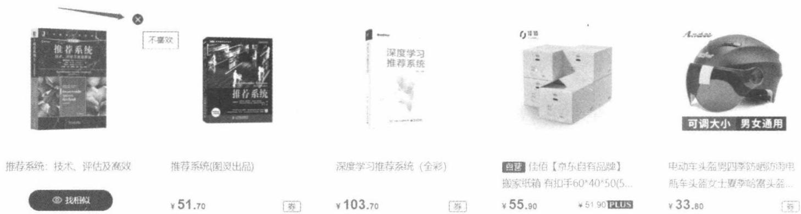  
图2-6京东商城页面每个物品的右上角会有“不喜欢”小按钮

隐式反馈：用户没有明确表达自己的喜好，比如用户在视频网站闲逛时点击了某个视频，并不能明确说明他对该视频感兴趣，因为可能是误点。即使他下载了某个视频，也不能据此下定论，因为他可能是爬虫用户。图2-7展示了bilibili使用隐式反馈的场景。

  
图2-7 bilibili视频的点赞、投币和分享属于隐式反馈

隐式反馈一般具有以下特点。

(1) 数据量大。隐式反馈一般不需要用户打分。因此，隐式反馈的数据特别容易获取——用户只要有行为，就会产生反馈。  
(2)没有负反馈。显式反馈可以明显区分用户是否喜欢，而隐性反馈无法辨别用户喜欢什么不喜欢什么。

隐式反馈需要估计。一般要根据用户的行为、行为频率去评估，比如用户购买了物品1，浏览了物品2，那么我们就会认为用户对物品1的喜好程度很可能高于物品2，再比如用户浏览了10次物品3，浏览了1次物品4，我们也可能会认为用户对物品3的喜好程度很可能高于物品4。但是喜好程度具体高多少，这样的准确值隐式反馈无法给出。从某种程度上来说，显式反馈属于定量反馈，而隐式反馈属于定性反馈。图2-8展示了bilibili同时使用显示反馈和隐式反馈的场景。

  
图2-8 bilibili的长电影既有显式反馈，又有隐式反馈

虽然隐式反馈有很多缺点，但是由于其特别容易获取，因此算法工程师在日常工作中接触最多的是通过这种方式获取的数据。也正是因为它并不能直接用来度量用户的喜好，所以需要算法工程师在数据处理的过程中建立一套打分机制，将隐式反馈转化为显式反馈。

# 1.0/1打分

这是最基础的打分策略，只要用户对物品有过行为（不管是电商中的浏览、加购、购买等，

还是短视频中的播放、分享、下载等任何行为），那么打分是1分，否则就是0分。表2-4展示了隐式反馈转化后的显式反馈的打分情况。

表 2-4 隐式反馈转化的显式反馈 0/1 打分  

<table><tr><td>用户\物品</td><td>《算法导论》</td><td>Huawei P40 Pro</td><td>《计算机原理》</td><td>iPad</td><td>啤酒</td><td>葡萄酒</td></tr><tr><td>小明</td><td></td><td>1</td><td></td><td>1</td><td></td><td></td></tr><tr><td>小暗</td><td>1</td><td></td><td>1</td><td></td><td></td><td></td></tr><tr><td>小黑</td><td></td><td></td><td></td><td></td><td>1</td><td>1</td></tr></table>

这种打分策略的优点是简单直接，不需要考虑太多的行为差异，能够快速完成数据处理；缺点当然也很明显，它完全掩盖了用户的行为差别（浏览和加购、购买等行为所反映的用户喜好程度应该是不一样的）。因此，为了算法效果考虑，实际应用中这种打分机制使用得比较少。

# 2. 分行为打分

由于用户行为具有多样性，因此根据行为的不同，打分机制也有所不同。接下来的讲解需要一些用户数据做演示，表2-5是电商平台中的用户行为数据（为简单起见，只考虑用户的浏览和购买行为）。

表 2-5 电商平台中的用户行为数据  

<table><tr><td>用 户</td><td>物 品</td><td>行为类型</td><td>行为时间</td></tr><tr><td>小明</td><td>Huawei P40 Pro</td><td>浏览</td><td>20210610</td></tr><tr><td>小明</td><td>iPhone 12</td><td>浏览</td><td>20210605</td></tr><tr><td>小暗</td><td>《操作系统原理》</td><td>浏览</td><td>20210510</td></tr><tr><td>小暗</td><td>iPhone 12</td><td>浏览</td><td>20210515</td></tr><tr><td>小明</td><td>iPad</td><td>浏览</td><td>20210530</td></tr><tr><td>小明</td><td>吸尘器</td><td>浏览</td><td>20210401</td></tr><tr><td>小明</td><td>空气净化器</td><td>浏览</td><td>20210405</td></tr><tr><td>小暗</td><td>Huawei P40 Pro</td><td>购买</td><td>20210520</td></tr><tr><td>小明</td><td>Huawei P40 Pro</td><td>购买</td><td>20210611</td></tr><tr><td>小暗</td><td>香皂</td><td>浏览</td><td>20210620</td></tr><tr><td>......</td><td>......</td><td>......</td><td>......</td></tr></table>

表2-5中的数据是典型的隐式反馈数据，只有正反馈，没有负反馈。为了将其转化为显式反馈，我们需要执行接下来的步骤。

# - 确定行为分值

这是第一步，也是最重要的一步——每种行为到底可以打多少分呢？由于不像显式反馈那样拥有具体的打分，因此只能通过算法工程师将用户的行为转化为偏好得分。这里主要介绍两种方法，当然，现实中的情况肯定不止这两种，可以适当地举一反三。

第一种，也是最简单直接的一种——人为拍板。比如一般情况下，用户对于购买物品的喜好程度高于浏览物品的喜好程度，因此可以设置购买行为的分值为5分，浏览行为的分值为1分。

第二种，需要一点儿数据分析——行为次数。推荐系统中的漏斗模型告诉我们，次数越少的行为越珍贵，因此可以根据各行为的次数来确定行为分值。我们依然假定购买行为的分值为5分，那么可以通过以下几种方式来确定浏览行为的分值：

□浏览分值 $=$ 购买分值 $\times$ 购买次数/浏览次数 $= 5$ 分 $\times 2$ 次/8次 $= 1.25$ 分  
浏览分值 $=$ 购买分值 $\mathrm{/log_2}$ （浏览次数/购买次数） $= 5$ 分 $/\log_{2}(8 / 2) = 2.5$ 分  
□浏览分值 $=$ 购买分值 $\times$ 购买人数/浏览人数 $= 5$ 分 $\times 2$ 人/2人 $= 5$ 分  
□

不管通过哪种方式，确定了行为对应的分值之后，一定要好好思考一下——这是我想要的分数吗？比如上述第三种方式计算出了浏览行为的分值与购买行为的分值一样的结果，这就是不合理的行为分值，需要弄清楚哪里出了问题，再做进一步的优化。

现在，我们有了不同行为对应的分值，那么是不是可以立刻计算出用户对物品的打分了呢？少安毋躁，在计算打分之前，还有一些因素需要考虑。


漏斗模型，简单地说，对于电商而言，用户从曝光到点击到加购再到购买，行为次数越来越少，从上往下看就像一个漏斗，故得名。在很多领域有同样的现象，比如短视频、新闻、广告行业等。

# 时间衰减

著名的遗忘曲线告诉我们，人类是健忘的，遗忘的速度非常快，并且先快后慢，学到的知识在一天后，如不加以复习，就只剩下原来掌握的四分之一。随着时间的推移，遗忘的速度减慢，遗忘的数量也在减少。

虽然遗忘曲线是以知识记忆的衰减来举例的，但是它同样适用于推荐系统。你还记得一周前在网上闲逛时点击过哪些物品吗？你还能回忆起半个月前刷短视频时让自己哈哈大笑的视频内容吗？但是你知道此时此刻自己正在看的这本书的书名是什么，你也很清楚早餐吃了什么。因此从单个用户的角度来看，他一个月前购买的物品，其重要性一般来说不如昨天刚刚浏览的物品——这就是行为时间衰减。

下面举例说明行为时间衰减如何影响用户对物品的打分。假设当前时间是20210620，小明在20210610浏览了Huawei P40 Pro，20210605浏览了iPhone 12，时间越靠近当前时间，行为越能反映用户的喜好（毕竟人是在不断变化的）。一般可以尝试以下几种行为时间衰减策略。

□ 线性衰减： $\mathrm{decay}(X) = 1 / (1 + X)$ 。这里 $X$ 是当前时间与行为时间的时间差（单位是天）。  
□指数衰减： $\mathrm{decay}(X) = \exp (-X / C)$ 。这里的 $C$ 是一个常量，业务不同， $C$ 的取值也不同。这就是前面提到的遗忘曲线的公式。

当 $X = C$ 时， $\exp (-X / C) = 1 / 2.718\approx 1 / 3$ ，也就是 $C$ 天前的行为打分会衰减成原来分值的 $1 / 3$ ，可以以此来设定 $C$ 的值，比如希望7天衰减成 $1 / 3$ ，那么 $C = 7$ ；希望10天衰减成 $1 / 3$ ，则 $C = 10$ 。

□不衰减：不考虑时间衰减。

假设浏览分值为1分，采用指数衰减， $C$ 为7，则小明：

□对20210610浏览的HuaweiP40Pro的打分 $= 1\times \exp (-10 / 7)\approx 0.24$   
□对20210605浏览的iPhone12的打分 $= 1\times \exp (-15 / 7)\approx 0.12$

# - 打分合并

至此，我们还剩下最后一个问题需要解决——如果用户对某个物品有多种行为，比如表2-5中，小明既浏览了Huawei P40 Pro又购买了Huawei P40 Pro，这时小明对于Huawei P40 Pro的打分该如何处理呢？对于这种情况，一般可以尝试以下几种打分合并策略。

□打分累加：比如小明20210610的HuaweiP40Pro的浏览行为根据指数衰减后的打分为0.24分，对20210611的HuaweiP40Pro的购买行为根据指数衰减后的打分为1.28分，则小明对HuaweiP40Pro的打分为 $\mathrm{sum}(1.28,0.24) = 1.52$ 分。  
□打分最大值：很好理解，取用户对同一物品打分中最高的那个作为最终打分。按照这种策略，小明对HuaweiP40Pro的打分为 $\max (1.28,0.24) = 1.28$ 分。

至此，经过确定行为分值、行为时间衰减和打分合并三步后，我们可以按照这个逻辑将表2-5的原始行为数据转化为用户对物品的打分数据，用这份数据来衡量用户的喜好，并且基于它来计算物品之间的相似度。


假设经过打分三步走后，得到了如下打分逻辑

(1) 确定行为分值：浏览行为 1 分，购买行为 5 分。  
(2) 行为时间衰减：指数衰减，参数 $C$ 为7，即一周衰减 $1/3$ 。  
(3) 打分合并策略：最高打分。

将上述打分逻辑应用到表2-5，得到了表2-6——用户物品打分表。

表 2-6 用户物品打分表  

<table><tr><td>用 户</td><td>物 品</td><td>打 分</td></tr><tr><td>小明</td><td>Huawei P40 Pro</td><td>1.28</td></tr><tr><td>小明</td><td>iPhone 12</td><td>0.12</td></tr><tr><td>小明</td><td>iPad</td><td>0.05</td></tr><tr><td>小明</td><td>吸尘器</td><td>0.00001</td></tr><tr><td>小明</td><td>空气净化器</td><td>0.00002</td></tr><tr><td>小暗</td><td>《操作系统原理》</td><td>0.0033</td></tr><tr><td>小暗</td><td>iPhone 12</td><td>0.0067</td></tr><tr><td>小暗</td><td>Huawei P40 Pro</td><td>0.07</td></tr><tr><td>小暗</td><td>香皂</td><td>1</td></tr><tr><td>......</td><td>......</td><td>......</td></tr></table>

# 2.2.2 物品相似度

为了掌握物品相似度的计算逻辑，我们从最简单的情况开始——假设只有小明一个用户，他的打分集合如表2-7所示。

表 2-7 小明的打分集合  

<table><tr><td>用 户</td><td>物品打分集合</td></tr><tr><td>小明</td><td>Huawei P40 Pro: 1.28 iPhone 12: 0.12 iPad: 0.05 吸尘器: 0.00001 空气净化器: 0.00002</td></tr></table>

从同一个人的视角出发，他对两个物品的打分越接近，这两个物品在他的眼里就越相似，因此我们可以通过同一个用户对不同物品的打分，去计算物品之间的相似度。具体的计算逻辑可以参考以下几种策略。

□分差：相似度[物品1，物品2] $= 1 / (1 + |$ 打分1-打分2|)，通过打分的差去计算相似度，分差越小，相似度越高。

相似度[Huawei P40 Pro, iPhone12] = 1 / (1 + |1.28 - 0.12|) ≈ 0.46  
相似度[iPhone 12, iPad] = 1 / (1 + |0.12 - 0.05|) ≈ 0.93

□倍数：相似度[物品1, 物品2] = 1 / (1 + |log₂(打分1/打分2)|)，通过打分的倍数去计算相似度，倍数越大，相似度越低。

相似度[Huawei P40 Pro, iPhone12] = 1 / (1 + |log₂(1.28 / 0.12)|) ≈ 0.23  
相似度[iPhone 12, iPad] = 1 / (1 + |log₂(0.12 / 0.05)|) ≈ 0.44

□其他：只要能够满足分数越接近，相似度越高的计算方法，都可以尝试。

上述计算逻辑仅仅作为一个示例，根据分值得到相似度的计算方法实在太多了。

通过分差法以及小明的打分集合，可以计算出物品相似度，表2-8为计算结果（保留Top3）。

表 2-8 根据小明的打分集合计算出的物品相似度  

<table><tr><td>物品1</td><td>物品2</td><td>相似度</td></tr><tr><td>Huawei P40 Pro</td><td>iPhone 12</td><td>0.46</td></tr><tr><td>Huawei P40 Pro</td><td>iPad</td><td>0.45</td></tr><tr><td>Huawei P40 Pro</td><td>吸尘器</td><td>0.43</td></tr><tr><td>吸尘器</td><td>空气净化器</td><td>0.99</td></tr><tr><td>吸尘器</td><td>iPad</td><td>0.95</td></tr><tr><td>吸尘器</td><td>iPhone 12</td><td>0.89</td></tr><tr><td>......</td><td>......</td><td>......</td></tr></table>

按照相同的计算逻辑，可以计算出只有小暗一个用户时的物品相似度。表2-9为小暗的物品打分集合，据此计算出的物品相似度如表2-10所示。

表 2-9 小暗的打分集合  

<table><tr><td>用户</td><td>物品打分集合</td></tr><tr><td>小暗</td><td>《操作系统原理》: 0.0033 iPhone 12: 0.0067 Huawei P40 Pro: 0.07 香皂: 1</td></tr></table>

表 2-10 根据小暗的打分集合计算出的物品相似度  

<table><tr><td>物品1</td><td>物品2</td><td>相似度</td></tr><tr><td>Huawei P40 Pro</td><td>iPhone 12</td><td>0.94</td></tr><tr><td>Huawei P40 Pro</td><td>《操作系统原理》</td><td>0.937</td></tr><tr><td>Huawei P40 Pro</td><td>香皂</td><td>0.52</td></tr><tr><td>......</td><td>......</td><td>......</td></tr></table>

对比表2-8和表2-10，我们会发现，只有[HuaweiP40Pro,iPhone12]这一对物品同时出现在小明和小暗的个人物品相似度表中，对应的相似度分别为0.46和0.94。如果要计算[HuaweiP40Pro,iPhone12]的最终相似度，那么就需要处理所有用户下（这里只有小明和小暗）这一对物品的相似情况。这里我们简单地对两个相似度求平均，得到最终的相似度，即：

相似度 [Huawei P40 Pro, iPhone 12] = (小明眼中的 [Huawei P40 Pro, iPhone 12] 的相似度 + 小暗眼中的 [Huawei P40 Pro, iPhone 12] 的相似度) / 2

我们以电商为例，总结上述计算过程如下。

假设存在4张用户行为表：浏览表、加购表、收藏表以及购买表，那么

(1) 根据分行为打分策略，将所有用户的隐式反馈转化为显示反馈，得到用户的打分表；  
(2) 根据单个用户的物品打分集合，计算物品相似度，得到 [物品 ID1, 物品 ID2] $\rightarrow$ 相似度 SIM;  
(3) 以 [物品 ID1, 物品 ID2] 为 Key，聚合相同的 Key 对应的相似度集合 [SIM1, SIM2, SIM3, ...];  
(4) 对第 (3) 步中得到的相似度集合求平均，即可得到 [物品 ID1, 物品 ID2] 最终的相似度。

  
图2-9展示了上述过程在各个步骤中的数据变化情况  
图2-9 物品相似度计算过程

到这里，Item-Based CF 算法的原理就基本讲述完毕了，最重要的是用户打分策略的制定直接关系到算法最终的质量。但是算法的原理是一回事儿，算法的实现又是另外一回事儿。现实世界中的数据中有很多无效的脏数据，同时伴随着数据量的极速增长，算法能否在可接受的时间内运行结束也是一个问题。所有这些问题都是接下来这一节需要解决的。

# 2.3 算法实现

在写代码之前，我们再将协同过滤的算法逻辑梳理一遍，一旦梳理清楚，只要对照每一步要完成的目标，利用代码实现即可。

# Item-Based CF 算法逻辑

UID为用户ID，IID为物品ID，S为打分，SIM为相似度。

步骤1：根据用户行为得到用户物品打分表。

UID, IID, S

步骤2：根据UID聚合，得到如下数据UID,[IID:S,IID:S,…]。

步骤3：根据相似度计算公式，计算单个用户下的物品相似度，称为局部相似度，得到如下数据：IID1, IID2, SIM1。

步骤4：将IID1和IID2作为Key，聚合得到如下数据：IID1,IID2,[SIM1,SIM2,…, SIMN]。

步骤5：每一对[IID1，IID2]的局部相似度集合求平均，得到最终的全局相似度IID1，IID2，SIM。

步骤6：对每个IID，取与其最相似的 $N$ 个物品，得到Top $N$ 相似度表。

# 2.3.1 步骤1：数据源读取

用户打分表见表2-6，假设此表已经存储在Hive（或者类似的分布式存储系统）中，表名为reccsys.data_itemcf，表的元数据如表2-11所示。

表 2-11 打分表字段及格式  

<table><tr><td>字段
表名</td><td>user</td><td>item</td><td>score</td></tr><tr><td>recsys.data_itemcf</td><td>字符串</td><td>字符串</td><td>浮点型</td></tr></table>

首先初始化Spark Session并读取Hive表数据，代码如下：

```python
spark_session = (SparkSession.builder.appName('item_cf').master('yarn')
	.config('spark.serializeer', 'org.apache.sparkpherd.KryoSerializer')
	.config('spark.network_timeout', '600')
	.config('spark.driver.maxResultSize', '5g')
	EnableHiveSupport().getOrCreate())
data_set = spark_session.sql("select user, item, score from recsys.data_itemcf") 
```

# 2.3.2 步骤2：聚合用户行为

接下来需要对同一个用户的打分进行聚合，将分散在多个分区（partition）的同一个用户的数据聚合在一起。

因为Spark将海量数据分布在各个分区中，所以同一个用户的数据可能会存在于多个分区中，在做聚合时，需要两步走（代码如下所示）：

(1) 先在分区内将同一个用户的数据合并，这样一个分区内一个用户只有一条记录；  
(2) 再在分区间将同一个用户的数据合并，这样整个数据中同一个用户只有一条记录。

def _collection_add collection, element): collection.appendelement) return collection   
def _collection_merge(collection1, collection2): collection1 extend.collection2) return collection1   
data_set $=$ (data_set .rdd .map(Lambda record: (record.user, (record.item, record.rating))) .aggregateByKey([], _collection_add, # 1 _collection_merge) # 2 # record: [[user, items], [user, items]] # 至少消费 2 个物品，record[1] 对应的是 items .filter(Lambda record: len(record[1]) >= 2)) # 3

注释#1是告诉Spark分区内同一个Key（用户）如何合并，这里我们把一个分区内同一个用户的记录放在一个集合中。  
注释#2是告诉Spark分区间同一个Key（用户）如何合并，这里我们把不同分区间同一个用户对应的集合连接起来。  
注释#3过滤掉只消费过1个物品的用户。根据协同过滤的计算逻辑，想要计算同一个用户下的物品相似度，单个用户至少需要消费2个物品。

# 2.3.3 步骤3：局部物品相似度

经过上一步的处理，现在同一个用户的行为记录都聚合在了一起，可以从单个用户的角度去计算物品与物品之间的相似度了，代码如下所示：

def_sim_from_one_user(user_itemratings): user, item Ratings $=$ user_item Ratings size $=$ len(item Ratings) #itertools.combinations四个方面，2）函数返回集合内元素的两两排列组合 #遍历 combinations生成的两两组合 for (itemrating1，itemrating2）initertools.combinations(itemratings，2)：#1 #每个itemrating都是（item，rating）的二元组 item1，rating1 $=$ itemRating1 item2，rating2 $=$ itemRating2 #采用得分绝对差值计算相似度

local_similarity = 1 / (1 + mathfabs(rating1 - rating2))

#得到单个用户下物品的两两相似度，key为(item1, item2)，value为单个用户视角下的物品相似度 yield(item1, item2), local_similarity

#得到所有用户的局部物品相似度

item_sim_from_one_user = data_set-flatMap(_sim_from_one_user)

注释 # 1: combinationselements, 2) 函数会生成集合内元素的两两排列组合, 比如 combinations([1, 2, 3, 4], 2) => (1,2), (1,3), (1,4), (2,3), (2,4), (3,4), 恰好满足在同一个用户下计算物品两两相似度的需求。

# 2.3.4 步骤4和步骤5：全局物品相似度

到这里，已经有了两两物品对的相似度，但是存在多条记录，比如物品1和物品2在用户A下有一条相似度记录，在用户B下也可能有一条相似度记录。为了遵从“物以类聚，人以群分”的原则，需要将相同两两物品对在所有用户下的相似度聚合后求平均，比如将用户A和用户B下物品1和物品2的两条相似度求平均，就得到了物品1和物品2的全局相似度，代码如下所示：

```python
def _item_sim(pair_similarities): # 1  
(item1, item2), similarities = pair_similarities  
avg_sim = sum(similarities) / len(similarities)  
return (item1, item2, avg_sim), (item2, item1, avg_sim)  
item_similarity = (item_sim_from_one_user  
                     .aggregateByKey([[],  
                     __collection_add,  
                     __collection_merge)  
                     .flatMap(_item_sim)  
                     .toDF(['item1", "item2", "sim)]) 
```

终于得到了协同过滤算法生成的物品相似度表，但是好事多磨，上述代码在物品量小的时候可以很好地运转，但是当物品量增长到一定程度时，这段代码运行缓慢，甚至有时候会失败，问题究竟出在哪里呢？

答案就是：如果同一个物品对同时出现的次数非常多，#1处的pair_similarities会非常大，很容易造成OOM或者程序运行特别慢。因此我们可以思考能不能摆脱将所有记录集中在一起这样的处理方式。

优化思路如下。

□ 聚合时，不保留相似度数组，只累加相似度值以及[物品1,物品2]同时出现的次数。  
□最终按照相似度平均公式计算相似度： $\frac{\mathrm{SIM1} + \mathrm{SIM2} + \cdots + \mathrm{SIMN}}{N}$ 分子为相似度值的累加，分母为[物品1,物品2]同时出现的次数。

根据此优化思路，对上述计算物品相似度的代码稍做优化。当数据量特别大时，优化后的代码运行速度远超优化前的代码：

def_intra_partition(sim_sum_count,local_sim):
    sim_sum，count $=$ sim_sum_count
    return sim_sum $^+$ local_sim，count $+1$ def_inter_partition(sim_sum_count1，sim_sum_count2):
    sim_sum1，count1 $=$ sim_sum_count1
    sim_sum2，count2 $=$ sim_sum_count2
    return sim_sum1 $^+$ sim_sum2，count1 $^+$ count2
def_item_simpair_sim_sum_count:
    (item1，item2)，(sim_sum，count） $=$ pair_sim_sum_count
    sim $=$ sim_sum / count
    return (item1，item2，sim)，(item2，item1，sim)# item1和item2的相似度与item2和item1的
        #相似度是一样的
item_similarity $=$ (item_sim_from_one_user
        .aggregateByKey((0.0,0),
        _intra_partition,
        _inter_partition)
        .flatMap(_item_sim)
        .toDF(['item1","item2","sim']
        ))

# 2.3.5 步骤6：TopN

在协同过滤算法正式上线前，还有最后一步工作需要做。

如表2-1所示，每个物品，有可能会计算出数以万计的相似物品，但是在实际应用中，不可能保留这么多的相似物品，一般会选择Top $N$ ，代码片段如下所示， $N$ 设置为10：

```txt
top_n = 10  
window = Window.partitionBy(item_similarity.item1).orderBy(item_similarity.sim desc())  
item_top_n_similarity = (item_similarity.select(*', rank().over(window).alias('rank'))  
    .filter(col('rank') <= top_n)  
    .select("item1", "item2", "sim"))  
item_top_n_similarity.write_mode("overwrite").saveAsTable("recsys.model_itemcf") 
```

这一步完成后，我们得到了一个线上可用的协同过滤算法结果表。但是这个算法的最终结果依然有不少可以优化的地方。

# 2.4 算法优化

在探讨具体的优化策略之前，先来看看百分位数的概念。

假设有一个集合，内部元素都是数字，第 $i$ 个百分位数的值等于 $j$ 的意思是：有百分之 $i$ 个数的值小于 $j$ 。比如，集合大小是150，第10个百分位数对应的数值是20，说明集合中 $10\%$ 的数小于20；第99个百分位数对应的数值是100，说明集合中 $99\%$ 的数小于100。

# 2.4.1 无效用户过滤

首先，按照用户聚合，统计数据集内每个用户消费的物品个数：

```sql
-- 数据集如表 2-5 所示  
SELECT  
COUNT(DISTINCT item) AS item_count  
FROM user_log_table  
GROUP BY user;
```

在此基础上可以统计每个用户消费的物品个数对应的百分位数，过滤掉消费过多或者过少的用户，比如过滤掉大于99.9百分位数或者小于1百分位数的用户，可以认为这些是异常用户，他们的数据对算法来说是一定程度的噪声，查询语句如下：

```sql
SELECT   
PERCENTILE.Approx(item_count, array(0.01, 0.25, 0.5, 0.75, ,0.999, 1.0), 9999) as percentiles   
FROM ( SELECT COUNT(DISTINCT item) AS item_count FROM user_log_table GROUP BY user   
) user_item_count; 
```


消费行为过多的用户，可能是爬虫用户或者黄牛客，这些用户会带来非常多的数据，但是算法开发者需要能够甄别出此类数据，否则会对算法结果产生负面影响。

# 2.4.2 热门惩罚

所谓的热门惩罚，分为热门用户惩罚和热门物品惩罚。

对于消费行为越多的用户，我们认为利用他的数据计算出的物品相似度要打点儿折扣，比如电商中经常做代购的用户或者经常从网上进货的店主，这样的用户，其行为非常多且很杂乱，那么据此计算出的相似度需要降权/惩罚。

同理，日用品或者消耗品，比如牙膏、大米、纸巾等，它们与其他物品同时出现的次数非常多；再比如，短视频领域，一些热度爆表的短视频会迅速传播，结果可能是几乎每个用户都会去消费它。也就是说，从协同过滤计算逻辑来看，热门物品几乎会和任何物品产生相似性，那么这样的物品在与其他物品计算相似度时也需要降权/惩罚。

# 2.5 完整代码

我们将2.3节中的代码片段以及2.4节中的优化策略整合在一起后，对代码稍加整理，得到了最终协同过滤算法的实现代码：

```python
#include <pyspark.sql import SparkSession
from pyspark.sqlwindow import Window
from pyspark.sql-functions import countDistinct, rank, col
```
```
spark: 2.4.0
python: 3.6
```
```
class ItemCF:
    def __init__(self, spark, table,
                     user_col='user', item_col='item', rating_col='rating',
                     top_n=10, lower=2, upper=3000):
        self._spark = spark
        self._table = table
        self._user_col = user_col
        self._item_col = item_col
        self._rating_col = rating_col
        self._top_n = top_n
        self._lower = lower
        self._upper = upper
    def _data_set(self):
        return self._spark.sql(f'select {self._user_col}, {self._item_col},
                          {self._rating_col} from {self._table}') 
```

```python
def __collection_count = self._spark.sparkContext%Broadcast(item_count) 
def __collection_addition(self._user_col).alias('user_count')) 
def __collection_addition(self._item_col, 'user_count') 
def __collectAsMap() 
item_count = self._spark.sparkContext%Broadcast(item_count) 
def __collection_addition(self._user_col, element): 
    collection.appendelement) 
return collection 
def __collection_merge(collection1, collection2): 
    collection1.append(collection2) 
return collection1 
data_set = (data_set 
.rdd 
.map(Lambda record: (record.user, (record.item, record.rating))) 
.aggregateByKey([[], 
.collectionition_addition, 
.collectionition_merge) 
# record: [[user, items], [user, items]] 
# 至少消费 2 个物品 
.filter(Lambda record: len(record[1]) >= 2)) 
return item_count, data_set 
@property 
def similarities(self): 
item_count, data_set = self._clean_data_set() 
def __sim_from_one_user(user_item Ratings): 
user, item Ratings = user_item Ratings 
# 单个用户消费的物品个数 
size = len(item Ratings) 
for (itemrating1, itemrating2) in itertools.combinations(item Ratings, 2): 
item1, rating1 = itemrating1 
item2, rating2 = itemrating2 
# 惩罚热门用户 
local_similarity = 1 / (1 + mathfabs(rating1 - rating2)) / math.log1p(size) 
yield (item1, item2), local_similarity 
item_sim_from_one_user = data_set-flatMap(_sim_from_one_user) 
def __intra_partition(sim_sum_count, local_sim): 
sim_sum, count = sim_sum_count 
return sim_sum + local_sim, count + 1 
def __inter_partition(sim_sum_count1, sim_sum_count2): 
sim_sum1, count1 = sim_sum_count1 
sim_sum2, count2 = sim_sum_count2 
return sim_sum1 + sim_sum2, count1 + count2 
```

```python
def _item_sim(pair_sim_sum_count):
    (item1, item2), (sim_sum, count) = pair_sim_sum_count
    item_count1 = item_count.value[item1]
    item_count2 = item_count.value[item2]
# 热门物品惩罚
    sim = sim_sum / count / math.sqrt(item_count1 * item_count2)
    return (item1, item2, sim), (item2, item1, sim)
item_satisfaction = (item_sim_from_one_user
        .aggregateByKey([0.0, 0],
                    __intra_partition,
                    __inter_partition])
        .flatMap(_item_sim)
        .toDF(['item1', "item2", "sim"]
)) 
```

if _name_ $= =$ 'main'：   
spark_session $\equiv$ (SparkSession builder .appName('item_cf') .master('yarn') .config('spark.serializeer'， 'org.apache.spark,GL照样izer.KryoSerializer') .config('spark.network.timeout'，'600') .config('spark.driver.maxResultSize'，'5g') .enableHiveSupport() .getOrCreate())   
item_cf $\equiv$ ItemCF(spark $=$ spark_session, table $=$ 'recsys.data_itemcf')   
similarities $\equiv$ item_cf.similarities   
(similarities .write .mode("overwrite") .saveAsTable("recsys.model_itemcf"))   
spark_session.stop()

由算法的原理可知，协同过滤计算量巨大，因为要计算两两物品的相似度，这几乎是 $O(n^{2})$ 的时间复杂度， $n$ 是物品个数。当物品量很大时，一般会采用天级别的运行周期来更新物品的相似度。但是当物品的上线和下线都非常频繁时，这种更新速度很可能无法满足业务需求，怎样让算法不再一天更新一次，而是能够做到准实时（比如分钟级）更新呢？

# 2.6 准实时更新

准实时指的是秒级或者分钟级更新，这里我们把它称作增量更新。2.3节中的更新为全量更新——使用全量数据，从零计算。然而线上的增量更新需要以全量更新的结果为基础。


实际工程中这种准实时的更新一般采用的技术栈是：HBase/Redis、Kafka、Spark Streaming/Flink。

篇幅所限，本书不会详述上述技术框架的使用方法。

在详细讲述增量更新的思路之前，先要弄清楚线上的数据流是什么样子的，如图2-10所示。

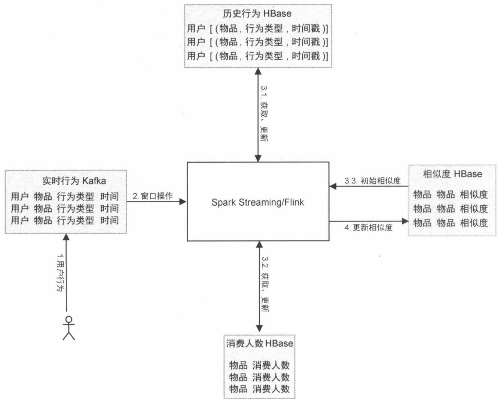  
图2-10 准实时协同过滤

图2-10展示的具体过程描述如下

(1) 用户的行为通过手机或者PC等终端上报到服务器，Kafka不断接收用户行为。  
(2) 流处理程序（Spark Streaming/Flink）将流数据通过窗口操作转换成批数据（一般以分钟粒度为一个窗口）。  
(3) 开始获取更新物品相似度所需要的一切数据。

读者可以稍作思考：为什么需要下面这三份数据？

1) 批数据中用户的历史行为（图2-10中的3.1）。

从存储和计算性能角度考虑，一般单个用户的历史行为最多可以存储 $M$ 条或者 $N$ 天的数据。

2) 批数据中用户的实时行为和历史行为中的物品对应的消费人数（图2-10中的3.2）。  
3) 批数据中物品的两两相似度（图2-10中的3.3）。

(4) 更新物品相似度、用户历史行为以及物品的消费人数。

我们将通过一个具体示例来说明协同过滤的增量更新是如何完成的。

# 2.6.1 数据准备

按照流程第(3)步中提到的那样，我们需要准备三份数据——用户历史行为、消费物品的人数和全量物品离线相似表——它们都存储在 HBase 中。


这里只是用 HBase 来演示说明，读者可以结合自身情况选择适合的数据库。可以简单地认为 HBase 是一个超大的 KV 数据库，本节中关于 HBase 的表格，第一列均为 HBase 的 Key，第二列可以简单理解为 Key 对应的 Value，这里用的 Key 是明文，一般工程中使用的是 MD5 等分布比较均匀的值，以降低数据倾斜的概率。

用户历史行为中存储的数据如表2-12所示，Key是用户ID，Value是该用户的历史行为，格式为[(物品,行为类型,行为时间)、]。

消费物品的人数中存储的数据如表2-13所示，Key是物品ID，Value是消费该物品的人数。

全量物品离线相似表中存储的数据如表2-14所示，Key是两个物品ID，Value是离线计算出来的这两个物品的全局相似度，这份数据可以通过离线Hive表同步到HBase中。

表 2-12 用户行为 HBase  

<table><tr><td>rowkey</td><td>history</td></tr><tr><td>小明</td><td>[(Huawei P40 Pro, 浏览, 20210610)、(iPhone 12, 浏览, 20210615)、(iPad, 浏览, 20210530)]</td></tr></table>

表 2-13 消费物品的人数  

<table><tr><td>rowkey</td><td>users</td></tr><tr><td>Huawei P40 Pro</td><td>1000</td></tr><tr><td>iPhone 12</td><td>800</td></tr><tr><td>iPad</td><td>500</td></tr></table>

表 2-14 全量物品离线相似表  

<table><tr><td>rowkey</td><td>sim</td></tr><tr><td>Huawei P40 Pro, iPhone 12</td><td>0.05</td></tr><tr><td>iPhone 12, iPad</td><td>0.04</td></tr><tr><td>Huawei P40 Pro, iPad</td><td>0.03</td></tr></table>

# 2.6.2 实时数据取数逻辑

首先处理用户历史行为。假设以5分钟为一个窗口（window），生成了一份批数据：

[小明，Huawei P40 Pro，购买，20210620] [小明，三体，浏览，20210620]

那么，实时数据的取数逻辑是：从用户历史行为 HBase 中获取小明的历史行为，与实时行为合并，则小明的行为数据变为

[(Huawei P40 Pro，购买，20210620)、(iPhone 12，浏览，20210615)、(iPad，浏览，20210530)、（三体，浏览，20210620)]。


注意，Huawei P40 Pro 同时存在于历史行为和实时行为中，因此这里我们采用最大合并而不是求和合并。

然后取出消费物品的人数。这里有三个物品，分别是Huawei P40 Pro、iPhone 12和《三体》从消费物品的人数HBase获取它们的历史消费人数：

USERS_HuaweiP40Pro = 1000 USERS_iPhone12 = 800 USERS_三体 = 0

# 2.6.3 准实时更新相似度

我们再对两两物品相似度的计算公式稍微加以总结

(1) 计算局部相似度：单个用户下的物品相似度，这里就是 $\mathrm{SIM}_{\text{小明}}$ 。  
(2) 计算全局相似度：考虑热门物品惩罚，则公式为

$$
\operatorname {S I M} \left(\text {i t e m} _ {1}, \text {i t e m} _ {2}\right) = \frac {\sum_ {\text {u s e r} = 1} ^ {n} \operatorname {S I M} _ {\text {u s e r}}}{\sqrt {\operatorname {c o u n t} _ {\text {i t e m} _ {1}} \times \operatorname {c o u n t} _ {\text {i t e m} _ {2}}}} \tag {2-1}
$$

观察式(2-1)，为了更新物品1和物品2的相似度，只要更新分子和分母即可。分子和分母怎么更新呢？只要拿到原始数据，再加上新增数据即可，即：

$$
\mathrm {N E W \_ S I M} \left(\mathrm {i t e m} _ {1}, \mathrm {i t e m} _ {2}\right) = \frac {\mathrm {S U M \_ S I M} _ {\mathrm {n e w \_ u s e r s}} + \sum_ {\mathrm {u s e r} = 1} ^ {n} \mathrm {S I M} _ {\mathrm {u s e r}}}{\sqrt {\mathrm {n e w \_ c o u n t} _ {\mathrm {i t e m} _ {1}} \times \mathrm {n e w \_ c o u n t} _ {\mathrm {i t e m} _ {2}}}}
$$

$$
\mathrm {S U M} \_ \mathrm {S I M} _ {\text {n e w} \_ \text {u s e r s}} = \sum_ {\text {n e w} \_ \text {u s e r} = 1} ^ {m} \mathrm {S I M} _ {\text {n e w} \_ \text {u s e r}}
$$

$$
\text {n e w} _ {-} \text {c o u n t} _ {\text {i t e m}} = \text {c o u n t} _ {\text {i t e m}} + \text {w i n d o w} _ {-} \text {c o u n t} _ {\text {i t e m}}
$$

以HuaweiP40Pro和iPhone12为例，两者的相似度准实时更新逻辑如下。

相似度计算公式采用： $\mathrm{SIM}(item_1, item_2) = \frac{1}{\left(1 + \left|score_{item_1} - score_{item_2}\right|\right) \times \log_2(\text{用户消费的物品个数})}$

$$
\begin{array}{l} \begin{array}{l} \text {O L D \_ U S E R S \_ H u a w e i P 4 0 P r o} = 1 0 0 0 \\ \text {O L D \_ U S E R S \_ i P h o n e l 2} = 8 0 0 \end{array} \\ O L D \_ S I M = 0. 0 5 \\ \begin{array}{r l} \text {O L D \_ S U M} & = \text {O L D \_ S I M} \times \sqrt {\text {O L D \_ U S E R S \_ H u a w e i P 4 0 P r o} \times \text {O L D \_ U S E R S \_ i P h o n e 1 2}} \\ & \approx 4 4. 7 2 1 \end{array} \\ \end{array}
$$

$$
\begin{array}{l} \text {N E W \_ U S E R S \_ H u a w e i P 4 0 P r o} = 1 0 0 0 + 1 = 1 0 0 1 \\ \text {N E W \_ U S E R S \_ i P h o n e 1 2} = 8 0 0 + 0 = 8 0 0 \end{array}
$$

$\mathrm{SIM}_{\text{小明}} = \frac{1}{(1 + |5 - 1|) \times \log_2(3 + 1)} = 0.1 \quad // 3$ 个已有物品 $+1$ 个《三体》

$$
\begin{array}{l} \mathrm {N E W} \_ \mathrm {S I M} = \frac {\mathrm {O L D} \_ \mathrm {S U M} + \mathrm {S I M} _ {\text {小 明}}}{\sqrt {\mathrm {N E W} \_ \mathrm {U S E R S} \_ \mathrm {H u a w e i P 4 0 P r o} \times \mathrm {N E W} \_ \mathrm {U S E R S} \_ \mathrm {i P h o n e 1 2}}} \\ = \frac {4 4 . 7 2 1 + 0 . 1}{\sqrt {1 0 0 1 \times 8 0 0}} \\ \approx 0. 0 5 0 1 \\ \end{array}
$$

瞧，Huawei P40 Pro 与 iPhone 12 在全量物品离线相似表中的相似度为 0.05，增量更新后修正为 0.0501 了。

当一个窗口的数据处理完成后，HBase中的以下数据会更新：用户行为、消费物品的人数和物品相似度。


这里只用到了一个用户，其实有多个用户时的逻辑是一样的，与离线计算相似度的逻辑并无太大差异，主要的区别在于将离线的全量计算改成了线上的增量计算，要不断地读取和更新相关数据。一般来说，可以每天更新离线的全量结果，线上的准实时计算均在当前最新的全量结果基础上进行更新。

# 2.7 总结

□基于邻居决策的协同过滤算法在当今的推荐系统中依然广泛使用。它不仅可以计算物品相似度，还可以计算用户相似度，优点在于简单易用，通常来说效果也不会太差，不过缺点也很明显：对于没有用户行为的新品，它显得无能为力。

□用户的反馈一般分成显式和隐式两种。在推荐领域，对于像电商、短视频、社交等业务场景，隐式反馈占据着绝对的比重，因此在建模时需要算法工程师通过对业务的理解将隐式反馈的数据转化为显示反馈。  
□计算用户对物品的打分时，一个合理的打分策略会决定算法结果的好坏，比如每种用户行为（点击、加购、收藏、购买等）应该如何确定分值、用户行为距离当前时刻的时长、用户对同一个物品存在多种行为等因素都需要在处理数据时详加考虑，因为这些都是在真正运行算法得到结果之前需要确定的事项，最好能够在分析完毕之后再进行后续的动作。  
□ 计算物品相似度时，先计算单个用户下两两物品的局部相似度，再将局部相似度进行聚合，得到两两物品的最终相似度。  
□ 算法优化方面，对于无效用户的去除是提高算法质量的一个很重要的手段，同时针对行为过多的用户以及过于流行的物品，也需要施加相应的惩罚。实践证明这种热门惩罚有助于提升效果。  
□如果每天更新物品相似度满足不了业务需求，那么可以考虑采用实时增量更新的方式，其优点是算法能捕获到用户行为的即时变化，缺点是提高了对于工程实现方面的要求。

# 第3章

# 关联规则

打开手机京东，点击一本叫作《影响力》的书，然后一直往下翻，翻过商品详情页时会出现看了又看小板块，如图3-1所示。


  
图3-1 京东的“看了又看”板块

打开亚马逊网站，点击游戏机，同样会出现看了又看，如图3-2所示。

仔细查看后，会发现这些推荐的物品，跟当前点击的物品可能相似，也可能不相似，但是它们看上去都彼此有些许关联——比如游戏机和 SSD 以及手柄等。那么，这种看着与当前的行为物品不相似却好像也有点儿关系的推荐策略是如何实现的呢？

  
图3-2 亚马逊的“看了又看”板块

# 3.1 关联规则

当我们去商场/网上购物时，通常提前准备好了购物清单。比如学生可能会购买本子和笔，游戏达人可能置办游戏机及其外设，程序设计者可能会购买机械键盘、4K/8K显示器等。了解这些购物规律（buying pattern）显然可以帮助商场/平台售卖出更多的商品。这些购物规律可以稍加总结：用户在购买商品 $X$ 时，是否会同时购买商品 $Y$ ？

如果商场/平台能够挖掘出类似的规律，当它发现用户经常将 $X$ 和 $Y$ 放在一起购买时，就可以做出如下决策：

□ $X$ 和 $Y$ 可以摆放在同一个货架上/展示在网站同一页，道理不言而喻；  
□对于已经购买了 $X$ 的目标群体，商场/平台可以向他们展示 $Y$ 的广告；  
$X$ 和 $Y$ 可以捆绑销售；  
□

上述规律，尤其对于电商来说极具商业价值，因为电商拥有更多的用户数据，可以更好地分析和挖掘数据，特别是在购物车、收藏和订单页，用户已经加购/收藏/购买商品 $X$ 了，我们要做的不仅仅是推荐 $X$ 的相似商品，还需要推荐与 $X$ 经常一起出现在购物清单/愿望单/订单中的商品，即相关商品。

问题是，如何发现这种规律？怎样才能挖掘出物品与物品之间的关联？

# 3.1.1 定义

关联规则（association rule）是数据挖掘中最活跃的技术之一，用于从海量数据中发现事物与事物之间的关联，经典的啤酒和尿不湿的故事即是其体现。

# 啤酒和尿不湿的故事

“啤酒和尿不湿”的故事产生于20世纪90年代的美国沃尔玛超市。沃尔玛的数据分析师在分析销售数据时发现，每到星期五的晚上，尿不湿和啤酒的销售量会呈现出正向的关联性，也就是说每周五晚上两种产品的销量都会涨。

这种独特的销售现象引起了数据分析师的注意，经过后续调查发现，原来，美国的年轻妈妈们通常在家照顾孩子，所以她们经常会叮嘱丈夫在下班回家的路上为孩子买尿不湿，而丈夫在买尿不湿的同时又会顺手购买自己爱喝的啤酒。从时间上来看，尤其是星期五的晚上，父亲常常去超市购买尿不湿，顺便为周末看球提前购买啤酒。

后来沃尔玛采取销售捆绑策略，固定在每周五将啤酒和尿不湿摆放在一起进行售卖，通过它们之间的关联性，使得这两种产品的销量提升 $30\%$

“啤酒与尿不湿”的故事一度是营销界的神话，它的真实性已经不再重要，重要的是物品与物品之间确实存在某种关联关系，而这种关系需要算法工程师挖掘出来。

在深入介绍关联规则之前，先熟悉以下两个概念。

□ transaction：一次交易，比如同时出现在购物清单中的商品集合可以称为一次交易，某个时间段观看的视频集合也可以称为一次交易。一个用户可以产生多个交易。  
□ itemset：项集，若干个物品的集合。如果这个集合长度为 $k$ ，那么就称它为 $k$ -项集。

如表3-1所示，第一列是transaction名称，第二列是该transaction对应的物品集合。

表 3-1 transaction 数据  

<table><tr><td>transaction</td><td>item</td><td>transaction</td><td>item</td></tr><tr><td>transaction 1</td><td>ABCD</td><td>transaction 5</td><td>AFC</td></tr><tr><td>transaction 2</td><td>ABC</td><td>transaction 6</td><td>AFC</td></tr><tr><td>transaction 3</td><td>AB</td><td>transaction 7</td><td>AF</td></tr><tr><td>transaction 4</td><td>BE</td><td>transaction 8</td><td>F</td></tr></table>

一般有以下三个指标来衡量物品与物品之间的相关性：支持度（support）、置信度（confidence）和提升度（lift）。

□ 支持度：这个指标用来衡量 itemset 的流行度，即 itemset 出现的次数在所有 transaction 中的占比，本质上是概率。比如表 3-1 中，物品 B 的支持度为：

$$
\operatorname {s u p p o r t} \{\mathrm {B} \} = \frac {4}{8}
$$

□ 置信度：这个指标用来衡量当 $X$ 出现时， $Y$ 也同时出现的可能性，表示为 $\{X \to Y\}$ 。计算方式为 $X$ 和 $Y$ 组合的整体支持度除以 $X$ 的支持度，即可得到 $\{X \to Y\}$ 的置信度。可以看出置信度就是条件概率 $P(Y / X)$ ，在表3-1中， $\{\mathrm{B} \to \mathrm{A}\}$ 的置信度为：

$$
\text {c o n f i d e n c e} \{\mathrm {B} \rightarrow \mathrm {A} \} = \frac {\text {s u p p o r t} \{\mathrm {B} , \mathrm {A} \}}{\text {s u p p o r t} \{\mathrm {B} \}} = \frac {3 / 8}{4 / 8} = \frac {3}{4}
$$

但是，稍加思考就会产生这样的疑问：这个指标真的什么问题都没有吗？如果 $X$ 和 $Y$ 都是特别热门的物品，比如都是常见的日用品或者热度爆表的视频，那么置信度就会很高（因为热门的物品可能会和很多物品同时出现在一次 transaction 中），但是可能两者并无关联。熟悉协同过滤算法之后，我们立刻就想到了热门物品惩罚，是的，在考虑了热门物品惩罚之后，置信度就会变成提升度。

□ 提升度：这个指标与置信度类似，但是要考虑 $Y$ 的流行度，依然以表3-1中的A和B为例：

$$
\operatorname {l i f t} \{\mathrm {B} \rightarrow \mathrm {A} \} = \frac {\text {s u p p o r t} \{\mathrm {B} , \mathrm {A} \}}{\text {s u p p o r t} \{\mathrm {B} \} \times \text {s u p p o r t} \{\mathrm {A} \}} = \frac {\text {c o n f i d e n c e} \{\mathrm {B} \rightarrow \mathrm {A} \}}{\text {s u p p o r t} \{\mathrm {A} \}} = \frac {3 / 4}{3 / 4} = 1
$$

计算出 $\{\mathrm{B}\rightarrow \mathrm{A}\}$ 的提升度等于1，也就是B和A并没有什么关系。在计算lift $\{X\to Y\}$ 时，如果结果大于1，则表明当 $X$ 出现时， $Y$ 有可能也会出现，否则 $Y$ 出现的可能性就比较小了。

在掌握了以上三种指标之后，就可以介绍频繁项集（frequent itemset）的概念了。

# 3.1.2 频繁项集

如果项集的支持度和置信度都能满足一定的阈值，就可以称为频繁项集。

之所以只考虑满足条件的项集，一方面起到降低计算复杂度的作用，另一方面也可以去除噪声，从而提高算法结果质量。

整个关联规则挖掘最重要的就是从数据集中找到频繁项集：

(1) 找出数据集中所有大于或等于最低支持度的项集；

(2) 利用上一步中的项集生成关联规则，根据最低置信度（即过滤掉置信度小于一定阈值的项集）筛选得到强关联规则。

假设商店中总共有10个商品，那么到底一共有多少个这样的项集需要挖掘呢？我们来计算一下。

□1-项集：含有1个商品的项集，需要挖掘的项集个数为 $C_{10}^{1} = 10$   
□2-项集：含有2个商品的项集，需要挖掘的项集个数为 $C_{10}^2 = 45$   
□   
□10-项集：含有10个商品的项集，需要挖掘的项集个数为 $C_{10}^{10} = 1$

一共1023个。根据上述逻辑，具有 $N$ 个商品的数据集需要计算支持度和置信度的项集总数为：

$$
N (\text {i t e m s e t}) = C _ {N} ^ {1} + C _ {N} ^ {2} + \dots + C _ {N} ^ {N} = 2 ^ {N} - 1
$$

也就是说，如果不加任何限制，项集的遍历时间复杂度为 $O(2^{N})$ 。这在实际应用中几乎是不可接受的，那么有没有办法提前减少肯定不是频繁项集的项集呢？

Apriori算法便是能够降低时间复杂度的关联算法之一。

# 3.2 Apriori算法

Apriori算法基于这样一种思想：如果一个项集不是频繁项集，那么所有包含此项集的项集都不是频繁项集。

这就意味着，如果项集 $\{\mathrm{A}\}$ 不是频繁项集，那么 $\{\mathrm{ABCD}\}$ 、 $\{\mathrm{ABC}\}$ 、 $\{\mathrm{AB}\}$ 等所有包括 $\{\mathrm{A}\}$ 的项集均不是频繁项集，即这些项集不需要进行后续的计算了，很显然计算量会大幅减少。那么，这种算法的计算逻辑又是怎样的呢？接下来我们深入 Apriori 算法的细节，瞧一瞧这个算法的执行步骤。

# 3.2.1 频繁项集生成

这一步，主要是根据最低支持度生成频繁项集，计算逻辑如下：

(1) 求 $k$ (初始值为 1) 项集的支持度，比如 $\{\mathrm{A}\}$ 和 $\{\mathrm{B}\}$ 等 1-项集的支持度；  
(2) 过滤掉小于支持度阈值的项集；  
(3) 使用第 (2) 步中得到的项集，排列组合所有可能的组合，得到 $k + 1$ -项集；  
(4) 重复第 (2) 步和第 (3) 步, 直到没有新的项集产生。

以表3-1为例，假设支持度阈值为2/8，则具体生成频繁项集的过程如下。

(1) 求 1-项集的支持度：

<table><tr><td>项 集</td><td>{A}</td><td>{B}</td><td>{C}</td><td>{D}</td><td>{E}</td><td>{F}</td></tr><tr><td>support(2/8)</td><td>6/8</td><td>4/8</td><td>4/8</td><td>1/8</td><td>1/8</td><td>4/8</td></tr></table>

(2) 去除小于 2/8 的项集，得到：{A}、{B}、{C}、{F}。  
(3)排列组合第(2)步的项集，得到 $1 + 1 = 2$ -项集，2-项集为： $\{\mathrm{AB}\} ,\{\mathrm{AC}\} ,\{\mathrm{AF}\} ,\{\mathrm{BC}\} ,$ $\{\mathrm{BF}\} ,\{\mathrm{CF}\} .$ 。计算这些2-项集的支持度：

<table><tr><td>项 集</td><td>{AB}</td><td>{AC}</td><td>{AF}</td><td>{BC}</td><td>{BF}</td><td>{CF}</td></tr><tr><td>support(2/8)</td><td>3/8</td><td>4/8</td><td>3/8</td><td>2/8</td><td>0/8</td><td>0/8</td></tr></table>

(4) 去除小于2/8的项集，得到：{AB}、{AC}、{AF}、{BC}。  
(5)排列组合第(4)步的项集，得到 $2 + 1 = 3$ -项集，3-项集为： $\{\mathrm{ABC}\} ,\{\mathrm{ABF}\} ,\{\mathrm{ACF}\} ,\{\mathrm{BCF}\}$ 计算这些3-项集的支持度：

<table><tr><td>项 集</td><td>{ABC}</td><td>{ABF}</td><td>{ACF}</td><td>{BCF}</td></tr><tr><td>support(2/8)</td><td>2/8</td><td>0/8</td><td>2/8</td><td>0/8</td></tr></table>

(6) 去除小于 2/8 的项集, 得到: $\{\mathrm{ABC}\} 、\{\mathrm{ACF}\}$ 。  
(7)排列组合第(6)步的项集，得到 $3 + 1 = 4$ -项集，4-项集为：{ABCF}。计算该4-项集的支持度：

<table><tr><td>项 集</td><td>\{ABCF\}</td></tr><tr><td>support(2/8)</td><td>0/8</td></tr></table>

(8) 去除小于 2/8 的项集，得到：{}。  
(9) 算法结束。

因此根据最低支持度得到的所有（去除1-项集后的）频繁项集如表3-2所示。生成频繁项集后，接下来的任务是从中挖掘出物品与物品之间的关联关系。

表 3-2 频繁项集  

<table><tr><td colspan="2">频繁项集</td></tr><tr><td>2-项集</td><td>{AB}、{AC}、{AF}、{BC}</td></tr><tr><td>3-项集</td><td>{ABC}、{ACF}</td></tr><tr><td>最终结果</td><td>{AB}、{AC}、{AF}、{BC}、{ABC}、{ACF}</td></tr></table>

# 3.2.2 关联规则生成

基于表3-2的频繁项集，以置信度或者提升度为判定关联性强弱的标准，生成最终的物品与物品之间的关联关系。假设将置信度作为判定标准，具体的计算逻辑如下所示。

(1) 输入为上一节中的输出：{AB}、{AC}、{AF}、{BC}、{ABC}、{ACF}。  
(2) 根据置信度的计算公式 confidence $\{X \to Y\} = \frac{\text{support}\{X, Y\}}{\text{support}\{X\}}$ ，依次计算所有输入的置信度：

confidence $\{\mathrm{A}\to \mathrm{B}\} =$ support{AB} / support{A} $= 1 / 2$   
confidence $\{\mathrm{A}\to \mathrm{C}\} =$ support{AC}/support{A} $= 2 / 3$   
confidence $\{\mathrm{A}\to \mathrm{F}\} =$ support{AF}/support{A} $= 1 / 2$   
confidence $\{\mathrm{B}\to \mathrm{C}\} =$ support{BC} / support $\{\mathrm{B}\} = 1 / 2$   
- {ABC} 又可以分裂成 $\{\mathrm{A} \rightarrow \mathrm{BC}\}$ 、 $\{\mathrm{B} \rightarrow \mathrm{AC}\}$ 、 $\{\mathrm{C} \rightarrow \mathrm{AB}\}$ 等多种组合，分别计算每种组合的置信度。

同理， $\{\mathrm{ACF}\}$ 也有 $\{\mathrm{A} \rightarrow \mathrm{CF}\}$ 、 $\{\mathrm{C} \rightarrow \mathrm{AF}\}$ 、 $\{\mathrm{F} \rightarrow \mathrm{AC}\}$ 等多种组合。

(3) 第 (2) 步结束后，所有 $\{X \to Y\}$ 的置信度均计算完毕，过滤小于置信度阈值的弱关联关系，得到最终的强关联关系。  
(4) 挖掘结束。

最终生成了可供线上使用的物品关联关系，元数据如表3-3所示

表 3-3 关联关系表  

<table><tr><td>物品1</td><td>物品2</td><td>关联度</td></tr><tr><td>X</td><td>Y</td><td>confidence / lift</td></tr></table>

在线上服务时，与协同过滤类似，根据用户行为物品 $X$ 来推荐与之关联度比较高的物品 $Y$ 。因此，对于关联规则，一般只计算2-项集产生的关联规则，因为大多数时候我们只关注单个物品与单个物品之间的关联。

通过以上描述不难发现，Apriori是一种优点和缺点都特别明显的算法：

优点是简单易懂、易实现；  
□缺点是当物品数量很多时，该算法每次计算排列组合时的计算量依然很大，而且在算法运行过程中每一步都需要计算支持度，每次计算都需要对数据集做全量扫描。

可以看出Apriori算法的主要问题在于多次扫描数据集，在海量数据下这种扫描显然不可接受，因此有没有这样一种算法，不需要多次扫描，运行速度可以大幅提高。答案是肯定的，这种算法有很多种，接下来详细介绍另外一种比较常用的关联规则算法——FPGrowth算法。

# 3.3 FPGrowth

FPGrowth<sup>①</sup> 中的 FP 是 frequent pattern（频繁模式），频繁模式一般是指数据集中频繁出现的模式。我们知道，Apriori 算法为了找到频繁项集需要多次扫描整个数据集生成很多候选集，正是这一步极大地影响了算法的性能。FPGrowth 算法巧妙地避开了这一步：找到频繁模式并不需要多次扫描。整个 FPGrowth 算法的核心在于 FP 树的建立。


不明白FP树是什么也不用担心，后面会详细剖析。现在只要知道它是为了找到FP而构建的一种树形数据结构即可。

# 3.3.1 FP树

图3-3就是一棵简单的FP树，现在我们可以暂时不用管它是怎么生成的。

FP 树中的每一个节点（除了根节点），比如 A、B、C 等，都是数据集中的具体物品，节点中的数字是此物品在路径中出现的次数。FP 树存在的意义就是用于挖掘数据中最频繁的模式（most frequent pattern）。

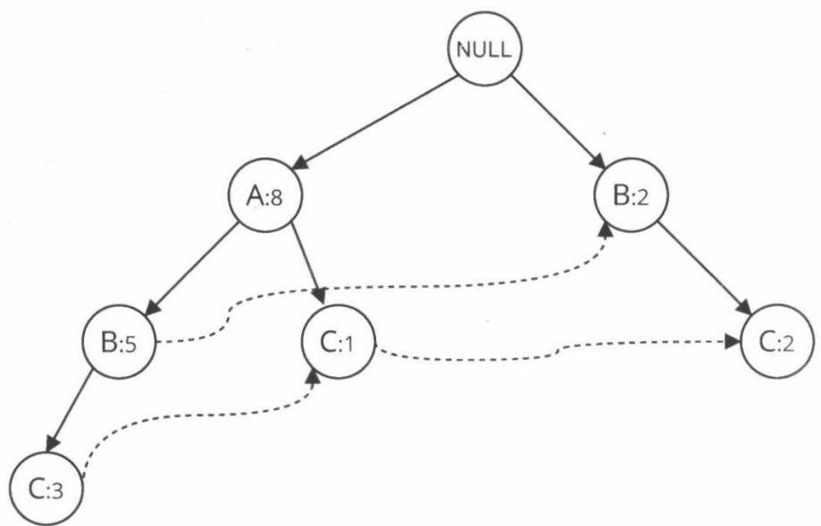  
图3-3 简单的FP树

有了FP树之后，FPGrowth算法将会利用它来找到物品与物品之间的关联。

# 3.3.2 逻辑

前面提到FPGrowth算法不需要多次扫描整个数据集就可以找到频繁模式，原因是什么呢？了解算法的计算逻辑后，就知道答案了。FPGrowth算法的计算逻辑如下。

(1) 与 Apriori 算法一样，首先需要扫描全量数据集，得到所有物品及其出现的次数，去除不满足最低支持度的物品。  
(2) 然后再次扫描全量数据集，建立 FP 树：

1) 扫描第一个 transaction，将其中的物品按照次数降序排列，排序后将此记录插入到 FP 树的一根树枝上；  
2) 扫描第二个 transaction，同样按照次数降序排列，插入到一根新的树枝上，如果此树枝上有物品与另一根树枝上的物品一样，那么此树枝与另一根树枝共享同一个祖先树枝；  
(3) 每插入一个节点, 该节点对应的物品数就加 1 ;  
4) 重复 $1) \sim 3)$ ，直到扫描完整个数据集。

(3) 构建条件 FP 树，由条件 FP 树生成最终的频繁模式。

可见，FPGrowth算法只需要扫描全量数据集2次即可完成，大大提高了挖掘速度。

不过上述算法逻辑的文字描述太过抽象、晦涩难懂，接下来以一个具体案例来演示FPGrowth算法的执行过程。

# 3.3.3 举例

任何算法都需要数据集，FPGrowth当然也不例外，与Apriori算法的数据集类似，依然需要构造交易数据集。假设交易数据集如表3-4所示，这份数据集共有10个transaction和8个物品。


可以暂时不用关心数据集是如何生成的，后面会详细说明如何构造数据集。

表 3-4 关联规则数据集  

<table><tr><td>transaction</td><td>item</td><td>transaction</td><td>item</td></tr><tr><td>transaction 1</td><td>ABF</td><td>transaction 6</td><td>ABCD</td></tr><tr><td>transaction 2</td><td>BCD</td><td>transaction 7</td><td>A</td></tr><tr><td>transaction 3</td><td>ACDE</td><td>transaction 8</td><td>ABCG</td></tr><tr><td>transaction 4</td><td>ADE</td><td>transaction 9</td><td>ABD</td></tr><tr><td>transaction 5</td><td>ABCH</td><td>transaction 10</td><td>BCE</td></tr></table>

按照3.3.2节的算法逻辑，一步一步根据表3-4来剖析利用FPGrowth算法生成关联规则的过程。

# 1. 步骤 1: 物品出现次数统计

扫描表3-4的交易数据表，很容易得到各个物品的出现次数，如表3-5所示。最低支持度设置为2/10，则表3-5中不满足最低支持度的使用删除线标记，剩下的有效物品为ABCDE。

表 3-5 物品的出现次数  

<table><tr><td>item</td><td>count</td><td>item</td><td>count</td></tr><tr><td>A</td><td>8</td><td>E</td><td>3</td></tr><tr><td>B</td><td>7</td><td>F</td><td>+</td></tr><tr><td>C</td><td>6</td><td>G</td><td>+</td></tr><tr><td>D</td><td>5</td><td>H</td><td>+</td></tr></table>

# 2. 步骤2：构建FP树

开始构建FP树，需要再次扫描表3-4的数据

初始的FP树是一棵空树，如图3-4所示，只有一个NULL节点。

  
图3-4 FP树根节点

(1) 扫描第 1 个 transaction，去除其中的无效物品，同时根据物品次数降序排序，结果如下。

<table><tr><td>transaction</td><td>原始</td><td>过滤排序后</td></tr><tr><td>transaction 1</td><td>ABF</td><td>AB</td></tr></table>

将这条记录插入图3-4的FP树中，新增节点中的物品count初始均为1，如图3-5所示。

  
图3-5 第1个transaction

(2) 扫描第 2 个 transaction（与第 (1) 步一样，需要去除无效物品、根据物品次数降序排序等操作，后续就不再赘述了），结果如下。

<table><tr><td>transaction</td><td>原始</td><td>过滤排序后</td></tr><tr><td>transaction 2</td><td>BCD</td><td>BCD</td></tr></table>

将这条记录插入图3-5的FP树中。插入B，因为并没有与根节点直接相连的B节点，所

以新建一个B节点作为根节点的孩子节点，并依次将C节点和D节点插入。新插入的三个节点的count均为1，形成了一条新的路径 $\mathrm{NULL}\to \mathrm{B}\to \mathrm{C}\to \mathrm{D}_{\circ}$

同时，另一根树枝上的B节点生成一个指向新的B节点的指针，供后续计算条件FP树使用，如图3-6所示。

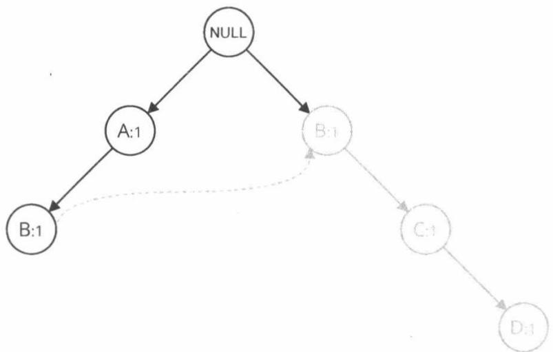  
图3-6 第2个transaction

(3) 扫描第 3 个 transaction，结果如下。

<table><tr><td>transaction</td><td>原始</td><td>过滤排序后</td></tr><tr><td>transaction 3</td><td>ACDE</td><td>ACDE</td></tr></table>

将这条记录插入图3-6的FP树中。插入A节点，因为根节点的孩子节点已经有了一个A节点，所以直接将A节点的count加1即可，如图3-7所示。

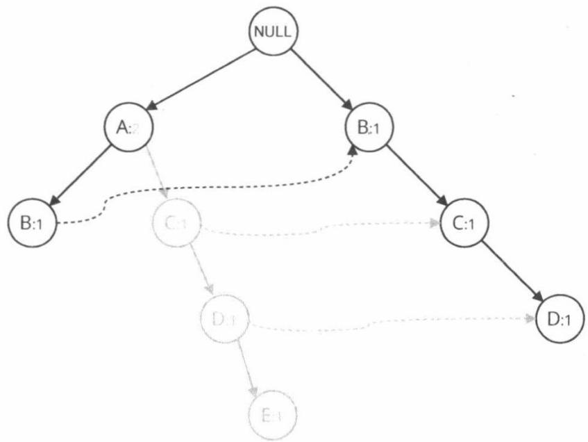  
图3-7 第3个transaction

(4) 扫描第 4 个 transaction，结果如下。

<table><tr><td>transaction</td><td>原始</td><td>过滤排序后</td></tr><tr><td>transaction 4</td><td>ADE</td><td>ADE</td></tr></table>

将这条记录插入图3-7的FP树中。插入A节点，将A节点的count加1；插入D节点，因为A节点没有D孩子节点，所以新建了一个D节点作为A节点的孩子节点，E节点作为新建的D节点的孩子节点，如图3-8所示。同时注意到，由于新增了一个D节点，所以D节点的所有指针发生了变化（红色线为原先的指针连接，绿色线为更新后的指针连接）。

  
图3-8 第4个transaction（另见彩插）

(5) 扫描第 5 个 transaction，结果如下。

<table><tr><td>transaction</td><td>原始</td><td>过滤排序后</td></tr><tr><td>transaction 5</td><td>ABCH</td><td>ABC</td></tr></table>

将这条记录插入图3-8的FP树中，更新后的FP树如图3-9所示

  
图3-9 第5个transaction

(6) 扫描第 6 个 transaction，结果如下。

<table><tr><td>transaction</td><td>原始</td><td>过滤排序后</td></tr><tr><td>transaction 6</td><td>ABCD</td><td>ABCD</td></tr></table>

将这条记录插入图3-9的FP树中，更新后的FP树如图3-10所示

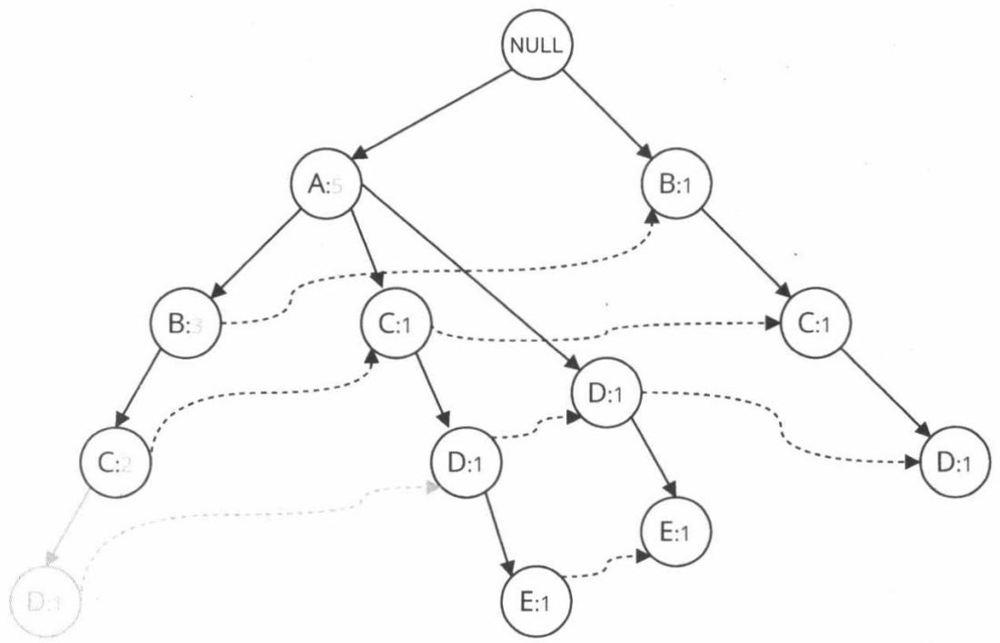  
图3-10 第6个transaction

(7) 扫描第 7 个 transaction，很简单，就一个物品 A，结果如下。

<table><tr><td>transaction</td><td>原始</td><td>过滤排序后</td></tr><tr><td>transaction 7</td><td>A</td><td>A</td></tr></table>

将这条记录插入图3-10的FP树中，更新后的FP树如图3-11所示

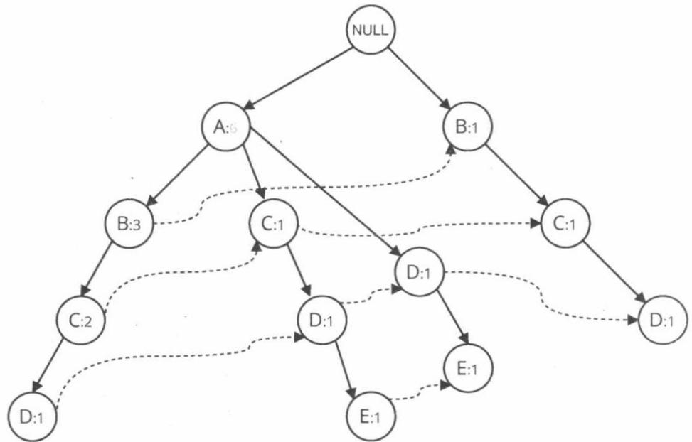  
图3-11 第7个transaction

(8) 扫描第 8 个 transaction，结果如下。

<table><tr><td>transaction</td><td>原始</td><td>过滤排序后</td></tr><tr><td>transaction 8</td><td>ABCG</td><td>ABC</td></tr></table>

将这条记录插入图3-11的FP树中，更新后的FP树如图3-12所示

  
图3-12 第8个transaction

(9) 扫描第 9 个 transaction，结果如下。

<table><tr><td>transaction</td><td>原始</td><td>过滤排序后</td></tr><tr><td>transaction 9</td><td>ABD</td><td>ABD</td></tr></table>

将这条记录插入图3-12的FP树中，更新后的FP树如图3-13所示。

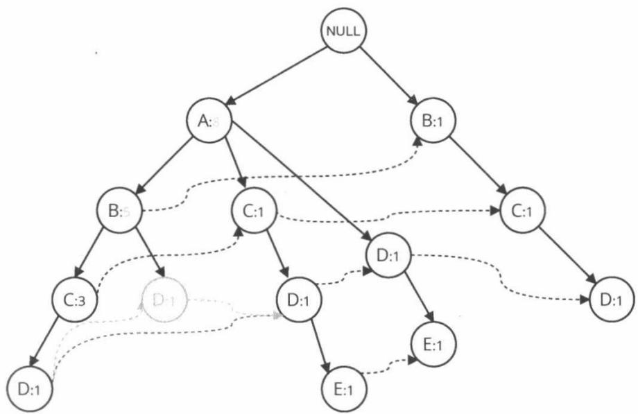  
图3-13 第9个transaction

(10) 扫描第 10 个 transaction，结果如下。

<table><tr><td>transaction</td><td>原始</td><td>过滤排序后</td></tr><tr><td>transaction 10</td><td>BCE</td><td>BCE</td></tr></table>

将这条记录插入图3-13的FP树中，更新后的FP树如图3-14所示

  
图3-14 第10个transaction

扫描完整个数据集后，最终得到了图3-15所示的FP树。一旦FP树生成，就可以挖掘频繁模式了，这需要借助条件FP树。

  
图3-15 FP树

# 3. 步骤3：条件FP树与频繁模式

在讲述条件 FP 树之前，需要先了解节点的前缀路径（prefix path），它指的是包含该节点和该节点祖先节点的所有路径。

比如，图3-15的FP树中，节点D的前缀路径如图3-16所示，将节点D的孩子节点全都修剪之后，D节点作为叶子节点。图3-17为节点E的前缀路径。

  
图3-16 节点D的前缀路径

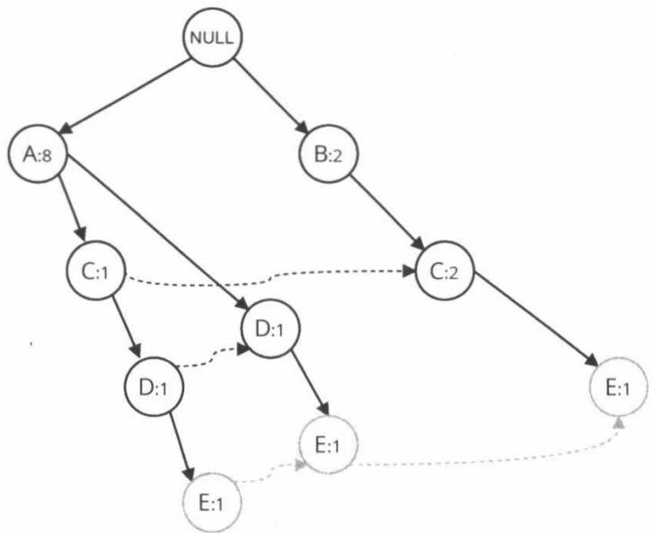  
图3-17 节点E的前缀路径

为了得到最终的频繁模式，需要构建条件FP树；为了构建条件FP树，需要用到前缀路径。下面以节点E为例，说明如何根据E的前缀路径（图3-17）生成条件FP树。

(1) 删除图3-17中所有节点E，并将路径中所有节点的个数更新为本路径中E的个数。

对于节点A，因为它出现在了两条含有E的路径中，所以它的次数更新为 $1 + 1 = 2$   
B和C所在的路径中E的个数为1，所以它们的个数均从2更新为1。

更新完毕后，如图3-18左图所示。该树中的物品个数如下所示。由于最低支持度为2/10，因此删除B，如图3-18右图所示，为节点E的条件FP树（即在以E为叶子节点的条件下对应的FP树，所以叫条件FP树）。

<table><tr><td>item</td><td>count</td><td>item</td><td>count</td></tr><tr><td>A</td><td>2</td><td>C</td><td>2</td></tr><tr><td>B</td><td>1</td><td>D</td><td>2</td></tr></table>

  
图3-18 节点E的条件FP树

删除B后，条件FP树中还剩下物品ACD，因此物品E对应的频繁项集肯定包含2-项集{AE}、{CE}、{DE}，但是为了找到E对应的所有频繁项集，还需要递归地建立刚才生成的2-项集{AE}、{CE}、{DE}对应的条件FP树（可以看到，哪里需要处理树数据结构，哪里就很可能出现递归）。

(2) 以图3-18右图的树为基础，构建 $\{\mathrm{DE}\}$ 的条件FP树，步骤与第(1)步完全相同：先找前缀路径，再确定条件FP树，如图3-19所示。最后剩下物品A，因此A与 $\{\mathrm{DE}\}$ 又组成了E的3-项集 $\{\mathrm{ADE}\}$ 。同理，可以构建出 $\{\mathrm{CE}\} ,\{\mathrm{AE}\}$ 的条件FP树，分别如图3-20和图3-21所示。

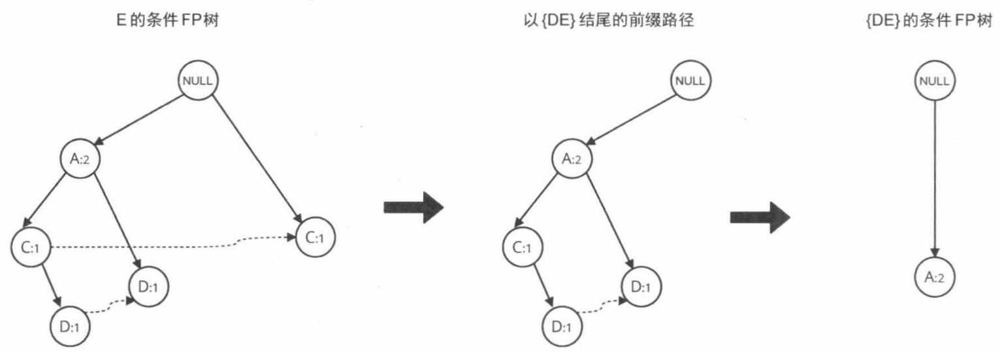  
图3-19 节点DE的条件FP树

  
图3-20 节点CE的条件FP树

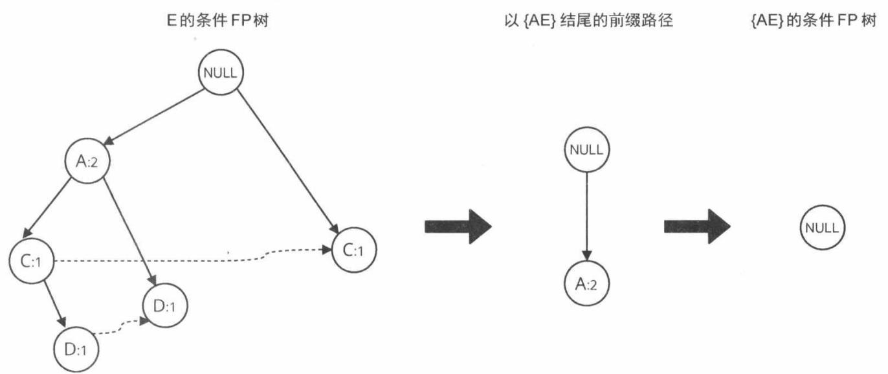  
图3-21 节点AE的条件FP树

(3) 遍历完 2-项集之后，还剩下 3-项集 $\{\mathrm{ADE}\}$ ，于是继续递归地建立 $\{\mathrm{ADE}\}$ 对应的条件 FP 树。经过上述步骤之后，得到了空树。  
(4) 此时已经没有需要继续挖掘的项集了，则物品E对应的频繁模式（项集）如下。

<table><tr><td>item</td><td>frequent pattern/itemsets</td></tr><tr><td>E</td><td>{E} {DE} {CE} {AE} {ADE}</td></tr></table>

最终将相同的逻辑运用在其他物品上，可得到所有的频繁模式，如表3-6所示。

表 3-6 所有物品的频繁模式  

<table><tr><td>item</td><td>frequent pattern/itemsets</td></tr><tr><td>E</td><td>{E} {DE} {CE} {AE} {ADE}</td></tr><tr><td>D</td><td>{D} {AD} {BD} {CD} {BCD} {ACD} {ABD}</td></tr><tr><td>C</td><td>{C} {AC} {BC} {ABC}</td></tr><tr><td>B</td><td>{B} {AB}</td></tr><tr><td>A</td><td>{A}</td></tr></table>

最后对根据条件 FP 树挖掘频繁模式/项集的过程加以总结，对后续理解 FPGrowth 算法的源码很有帮助。

(1) 将物品按照支持度从高到低排序，得到物品集 itemsets。  
(2) 遍历 itemsets 中的每个 itemset。

1）初始化此 itemset 的频繁模式为 FP。  
2) 生成 itemset 对应的前缀路径。  
3）根据前缀路径以及最低支持度构建条件FP树。

4) 根据条件 FP 树生成 $k$ -项集（ $k$ -项集中的每个组合都包含当前 itemset），添加到 FP 中。  
5) 遍历 $k$ -项集中的每个 itemset:

i.生成 itemset 对应的前缀路径；  
ii.根据前缀路径以及最低支持度，构建条件FP树；  
iii. 根据条件 FP 树，生成 $k + 1$ -项集（其中每个组合都包含当前 $k$ -项集），添加到 FP 中；  
iv.遍历 $k + 1$ -项集中的每个itemset…

(3) 可见挖掘的过程是一个递归操作，直到某个 $k + n$ -项集生成的条件 FP 树为空树才停止。

至此，FPGrowth算法的理论部分基本上就分析完毕了，其中最最核心的当然是条件FP树的建立，这也是该算法唯一有挑战性的部分。

那么如何将FPGrowth算法落地，为实际业务提供服务呢？这是接下来要探讨的主题。

# 3.3.4 运行

假设交易数据集已准备好，其元数据如表3-7所示，其中的items格式为字符串，包含了一次交易中所有物品ID，以空格分隔。


后面会讨论如何构造交易数据集。

表 3-7 交易数据集表字段及格式  

<table><tr><td>表名
字段</td><td>transaction</td><td>items</td></tr><tr><td>recsys.data_fpgrowth</td><td>字符串</td><td>字符串，以空格分隔</td></tr></table>

首先初始化Spark Session并读取Hive表数据，代码如下：

```python
spark_session = (SparkSession.builder.appName('fpgrowth').master('yarn')
	.config('spark.serializeer', 'org.apache.sparkpherd.KryoSerializer')
	.config('spark.network.timeout', '600')
	.config('spark.driver.maxResultSize', '5g')
	EnableHiveSupport().getOrCreate()) 
```

```python
dataset = (spark_session.sql('select transaction, items from recsys.data_fpgrowth') 
```

```txt
.select(split("items", '\s+').alias("items")) 
```

FPGrowth算法还需两个参数：最低支持度和最低置信度。它们的设置要根据具体的业务来定，如果每天会发生 $N$ 次交易，希望有效物品至少出现在3个交易中，则最低支持度设置为 $3 / N$ 最低置信度则没有那么直观。最低支持度和最低置信度设置得越大，计算出的物品的关联性就越强，但是相应地，被过滤的物品就越多。所以设置最低置信度时需要考虑关联性和物品数量的折中，这里假设为0.1。

Spark 官方提供了 FPGrowth 的实现，代码如下：

```python
from pyspark.ml.fpm import FPGrowth  
dataset = ...  
transactions_count = dataset.count()  
fp = FPGrowth(minSupport=3 * 1.0 / transactions_count, # 最低支持度  
minConfidence=0.1, # 最低置信度  
itemsCol="items", # 物品集合对应的列  
numPartitions=1000) # 分区数，根据数据集大小设置  
fpm = fp.fit(dataset) # 运行 FPGrowth，这行代码就完成了 3.3.2 节中的所有步骤
```

运行上述代码后，得到一个FPGrowth的对象，其中包含了我们希望得到的所有信息，尤其是关联规则：

association_rule $=$ (fpm_associationRules #只保留长度为1的结果 .filter((size("antecedent") $= = 1$ )&(size("consequent") $= = 1$ ))#1 .withColumn('antecedent'，col("antecedent")[0]) .withColumn('consequent'，col("consequent') [0]))

注释#1处需要解释一下，antecedent和consequent分别是 $\{X\to Y\}$ 中的 $X$ 和 $Y$ 。以表3-6为例，E是antecedent时，其consequent有 $\{\mathrm{D}\} ,\{\mathrm{C}\} ,\{\mathrm{A}\} ,\{\mathrm{AD}\}$ ，因此注释#1处的代码会只保留 $\{\mathrm{E}\rightarrow \mathrm{D}\} ,\{\mathrm{E}\rightarrow \mathrm{C}\} ,\{\mathrm{E}\rightarrow \mathrm{A}\}$ 这三条记录。原因也很好理解，一般情况下我们希望得到的结果是 $\{\text{啤酒}\to \text{尿不湿}\}$ ，而不是 $\{(啤酒,牛奶)\to$ 尿不湿}。

□因为线上需要根据用户的行为去做推荐，比如用户对啤酒产生行为，那么我们就可以推荐尿不湿。  
□而{（啤酒，牛奶) $\rightarrow$ 尿不湿}这条关联规则要求用户同时对啤酒和牛奶都产生行为，才会推荐尿不湿，无疑这样的用户会少很多。antecedent的长度越长，能命中的用户就越少，所以我们只保留antecedent长度为1的关联规则。

计算出关联规则之后，与协同过滤类似，按照关联性（这里使用的是提升度）降序排列，取Top $N$ 保存：

```txt
window = Window.partitionBy(associationRules.antecedent).orderBy(associationRules.lift desc())
associationRules = (associationRules.select('*', rank().over(window).alias('rank'))
.filter(col('rank') <= self._top_n)
.select("antecedent", "consequent", "lift")) # 物品1，物品2，关联性
# 保存
associationRules.write_mode("overwrite").saveAsTable("recsys.model_fpgrowth") 
```

这段代码运行结束，得到类似表3-3所示的最终关联规则后，就可以根据用户行为去做推荐了，比如用户点了物品1，则给该用户推荐与物品1关联性最强的 $N$ 个物品。

# 3.3.5 完整代码

将上述代码整合在一起后，稍加整理，得到了最终关联规则的算法代码：

```python
# -- coding: utf-8 --  
from pyspark.sql import SparkSession  
from pyspark.ml.fpm import FPGrowth  
from pyspark.sqlwindow import Window  
from pyspark.sql-functions import col, split, size, rank  
```
spark: 2.4.0  
python: 3.6 
```

class FPG: def __init__(self, spark, table, items_col='items', min_support_count=3, min_confidence $= 0.1$ top_n=10, partitions $\equiv$ 2000): self._spark = spark self._table = table self._items_col = items_col self._min_support_count = min_support_count self._min_confidence = min_confidence self._top_n = top_n self._partitions = partitions   
def _dataset(self): return (self._spark.sql(f'select {self._items_col} from {self._table}') .select.split(self._items_col,'\\s+').alias("items"))   
@property   
def rules(self): dataset $=$ self._dataset() transactions_count $=$ dataset.count() fp $=$ FPGrowth(minSupport $\coloneqq$ self._min_support_count \* 1.0 / transactions_count, minConfidence $\coloneqq$ self._min_confidence, itemsCol="items", numPartitions $\equiv$ self._partitions) fpm $=$ fp.fit(dataset)   
associationRules $=$ (fpm_associationRules # 只保留长度为1的结果 .filter((size("antecedent") $= = 1$ )&(size("consequent") $= = 1$ )) .withColumn('antecedent'，col("antecedent")[0]) .withColumn('consequent'，col("consequent")[0])) window $=$ Window.partitionBy associationrules.antecedent).orderBy(associationrules.lift desc())

associationRules $=$ (associationRules.select('*',rank().overwindow).alias('rank')) .filter(col('rank') $\text{一} =$ self._top_n) .select("antecedent","consequent","lift"))   
return associationRules

```python
if __name__ == __main__:
    spark_session = (SparkSession.builder.appName('fpgrowth').master('yarn')
        .config('spark.serializeer', 'org.apache.spark.serializeer.KryoSerializer')
        .config('spark.network_timeout', '600')
        .config('spark.driver.maxResultSize', '5g')
        .enableHiveSupport().getOrCreate())
    fpg = FPG(spark_session, table='recsys.data_fpgrowth')
    rules = fpgrules
    rules.write_mode("overwrite").saveAsTable("recsys.model_fpgrowth")
    spark_session.stop() 
```

至此，关于FPGrowth算法的原理和实现都已经讲述完毕，还剩下最后一个，也是最重要的问题——如何得到算法需要的类似表3-1所示的交易数据集？

# 3.3.6 数据集

假设数据仓库中存在这样一张分区数据表，如表3-8所示

表 3-8 分区数据表  

<table><tr><td>user</td><td>item</td><td>action_type</td><td>session_id</td><td>timestamp</td><td>day</td></tr><tr><td>用户ID</td><td>物品ID</td><td>行为类型</td><td>会话ID</td><td>行为时间戳</td><td>分区日期</td></tr></table>

表中字段说明如下。

$\square$ user：用户ID。  
□ item: 物品 ID。  
□ action_type：行为类型。电商领域，可能是点击、加购、收藏、购买；视频领域，可能是播放、点赞、下载、分享。  
- session_id：用来标识一次会话的ID，用户从打开App开始直到关闭App，会话ID是唯一的。再次打开App时会重新生成一个session_id。  
□ timestamp：本次行为发生的行为时间戳。  
□ day: 数据表的分区字段。

关联规则挖掘需要 transaction，所以我们需要定义什么才算是一次 transaction。实际应用中，大部分会选择在一定时间范围内用户的行为作为一次 transaction，比如用户在 3 天内看过的所有物品作为一次 transaction。

当然，读者可能会有疑问：为什么不以一个session_id内用户的行为作为一次transaction？

这是因为在大规模推荐系统中，用户行为特别稀疏，更别提加购、收藏和购买等更稀疏的用户行为了。如果单单以1个session_id或者1天的用户行为作为transaction，那么很可能会导致大部分的transaction中含有的物品个数为1，而这对于关联规则挖掘算法来说基本等同于无用数据。当然，算法工程师在代码实现的过程中可以根据自己的数据来设定到底是用1周、3天还是1天内用户的行为物品作为一次transaction。

图3-22展示了transaction的生成过程，为了演示清楚，只用一个用户——小明。

  
图3-22 transaction划分（另见彩插）

图3-22中，T表示transaction，数字代表日期，transaction时间窗口设为3天，绿色日期代表小明在当天有行为。从1号开始不断地向右滑动时间窗口，将3天内的所有行为物品放在一起，就形成了一个transaction。按照此逻辑处理完所有数据，即可得到表3-1的内容。

# 3.3.7 源码分析

本节主要看看FPGrowth算法在Spark中是如何实现的，如果对此兴趣不大，可以跳过本节，不影响对后续章节内容的理解。

虽然3.3.5节中的代码使用pyspark来运行FPGrowth算法，但是Spark内部还是调用ScalaSpark来执行程序的。通过查看pyspark FPGrowth的__init__方法，会发现该类其实只是一个封装类，将Scala Spark中的FPGrowth实现包裹在其中，而Scala Spark中具体的实现类是org.apache.spark.ml.fpm.FPGrowth，这个类最重要的方法是fit方法，如下所示：

```txt
// org.apache.spark.ml.fpm.FPGrowth#fit  
override def fit(dataset: Dataset[ _.]: FPGrowthModel = {transformSchema(dataset_schema, logging = true)  
genericFit(dataset) // 这行是真正干活的代码  
} 
```

此fit方法正是3.3.5节中生成关联规则的fit，它又调用了genericFit：

```scala
// org.apache.spark.ml.fpm.FPGrowth#genericFit
private def genericFit[T: ClassTag](dataset: Dataset[__]): FPGrowthModel = { 
```

```scala
val data = dataset.select($(itemsCol))
val items = data.where(col($(itemsCol).isNotNull).rdd.map(r => r.getSeq[Any](0).toArray) // 1
// MLlibFPGrowth 的完整类名是 org.apache.spark.mllib.fpm.FPGrowth
val mllibFP = new MLlibFPGrowth().setMinSupport($(minSupport)) // 2
val parentModel = mllibFP.run(itemss) // 3
val rows = parentModel_freqItemsets.map(f => Row(f.items, fFreq))
val schema = StructType(Seq(
    StructField("items", dataset schema($(itemsCol)).dataType, nullable = false),
    StructField("freq", LongType, nullable = false)))
val frequentItems = dataset.sparkSession.createDataFrame(rows, schema)
...... 
```

上述代码只保留了一些重要的片段，注释 //1 处是将 transaction 中的物品集合变成数组，注释 //2 处发现又创建了 MLibFPGrowth 类的对象，最核心的代码出现在注释 //3 处，原来 Scala Spark 的 FPGrowth 是通过 MLibFPGrowth 来实现的，在深入 //3 处的 run 方法之前，简单总结一下 FPGrowth 算法的计算逻辑，否则源码里的逻辑可能不太好理解。

(1) 统计物品次数：去除不满足minSupport的物品。   
(2) 构建 FP 树：根据 transaction 构建 FP 树。  
(3) 条件 FP 树与频繁模式：根据 FP 树生成条件 FP 树并得到频繁模式。

按照这三步的逻辑继续往下走，深入注释 // 3 的 run 方法：

```scala
// org.apache.spark.mllib.fpm.FPGrowth#run
def run[Item: ClassTag](data: RDD[Array[Item]]): FPGrowthModel[Item] = {
......
val count = data.count() // 交易数
val minCount = math.ceil(minSupport * count).toLong // minSupport * 交易数得到对应的 minCount
val numParts = if (numPartitions > 0) numPartitions else data.partitionions.length
val partitioner = new HashMap/partitioner(numParts)
// 1. FPGrowth 的计算逻辑步骤 (1)
val freqItems = genFreqItems(data, minCount, partitioner)
// 2. FPGrowth 的计算逻辑步骤 (1)、步骤 (2)
val freqitemsets = genFreqItemsets(data, minCount, freqItems, partitioner)
new FPGrowthModel(freqitemsets)
} 
```

上述代码片段中注释 // 1 处的 genFreqItems 方法逻辑（FPGrowth 的计算逻辑步骤 (1)）如下：

```scala
// org.apache.spark.mllib.fpm.FPGrowth#genFreqItems
private def genFreqItems(Item: ClassTag)
    data: RDD[Array[Item]], minCount: Long,
        partitioner: Partitioner): Array[Item] = {
            data-flatMap { t => valuniq = t.toSet // t 就是 transaction，可以看到这里对 transaction 里的物品进行去重 
```

```javascript
if (t.length !=uniq.size){throw new SparkException(s"Items in a transaction must be unique but got ${t.toSeq}.")}t}.map(v => (v,1L)) //这里开始统计每个物品出现的次数.reduceByKey(partitioner,_+_)filter(_.2 >= minCount) //过滤掉次数小于minCount的物品collect() //得到的结果类型是Array[(Item, Count)]sortBy(-..2) //_2即每个物品出现的次数（Count），按照Count从大到小排序.map(_.1)//_1即Item，也就得到了所有满足minSupport的物品，且按照出现次数从大到小排序 
```

那么，就剩下注释 // 2 处的 genFreqItemsets 方法了，方法名称很直观——生成频繁项集。

同样，深入 genFreqItemsets 方法之前，需要掌握 FP 树这种数据结构在 Spark 中是如何设计和实现的，直接看 FP 树和条件 FP 树的建立容易让人一头雾水。为了方便说明，图 3-23 沿用了图 3-12 的 FP 数。

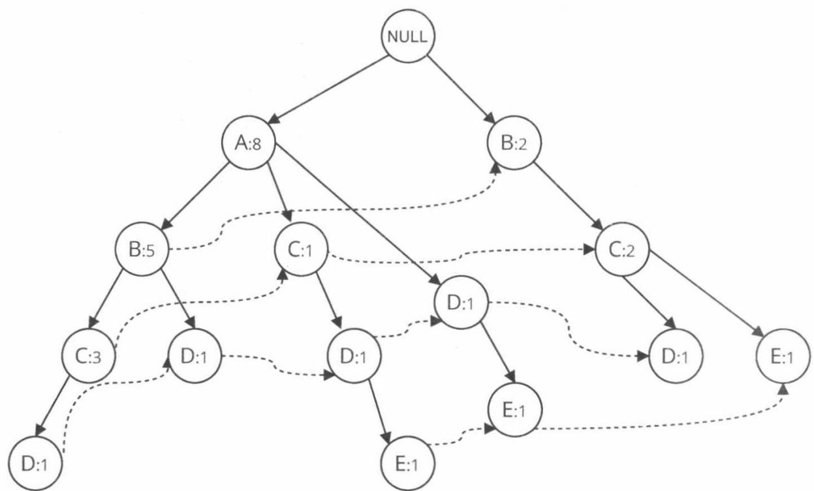  
图3-23 图3-12的FP数

将图3-23与代码一一对应：

(1) 图中每个节点由 org.apache.spark.mllib.fpm.FPTree.Node 来抽象，Node 可以表示节点之间的父代和孩子的关系（parent $\leftrightarrow$ children）；  
(2) 图中节点与节点之间的虚线连接的关系，由 org.apache.spark.mlib.fpm.FPTree.Summary 来抽象。

有了这两个类，一棵FP树就能完整地表达出来了。

Node   
```scala
// org.apache.spark.mlib.fpm.FPTree.Node
// Node 类记录每个节点的信息
class Node[T](val parent: Node[T]) extends Serializable {
    // 节点中的 Item 表示，比如图 3-23 中的 B
    var item: T = _
    // 节点中 Item 在本路径中出现的次数，比如 B:5，表示路径中 B 出现了 5 次
    var count: Long = OL
    // 记录每个节点的孩子节点，比如 B:5 节点的 children 包含了 C:3 和 D:1
    val children: mutable.Map[T, Node[T]] = mutable.Map.empty
    // 通过 parent 是否为 NULL 来判断它是否为根节点
    def isRoot: Boolean = parent == null
}
```

掌握了这两个类的作用之后，下面我们正式介绍FPTree。

FPTree   
```txt
org.apache.spark.mlib.fpm.FPTree 
```

FPTree 最为核心的两个方法是 add 和 extract，add 方法用于 FPTree 的构建（FPGrowth 计算逻辑步骤 (2)），extract 方法用于抽取前缀路径和生成条件 FP 树（FPGrowth 计算逻辑步骤 (3)）。

add方法  
```scala
// org.apache.spark.mlib.fpm.FPTree#add  
// t 是一次 transaction，count 为该 transaction 出现的次数  
def add(t: iterable[T], count: Long = 1L): this.type = {  
    require(count > 0)  
    var curr = root // 0  
    curr.count += count // 1  
    t foreach { item =>  
        val summary = summaries.getOrElseUpdate(item, new Summary) // 2  
        summary.count += count // 3  
        val child = curr.children.getOrElseUpdate(item, {  
            val newNode = new Node(curr) // 4  
            newNode.item = item  
            summarynodes += newNode // 5  
            newNode}  
        }  
    child.count += count // 6 
```

curr $=$ child//7 this

再以一个具体的例子来分析add方法的执行过程

假设有这样一个 transaction 数据集，如表 3-9 所示。

表 3-9 transaction 数据集  

<table><tr><td>transaction</td><td>items</td></tr><tr><td>transaction 1</td><td>AB</td></tr><tr><td>transaction 2</td><td>BC</td></tr></table>

首先将 transaction 1 - AB 添加到 FPTree 中，插入过程如图 3-24 所示。

  
图3-24 插入transaction1-AB

AB插入结束

  
图3-24 （续）


图3-24中//0表示执行add方法代码片段中//0处的语句执行后的效果，//1、//2等同理。

继续将 transaction 2 - BC 插入 FP 树中，插入过程如图 3-25 所示。


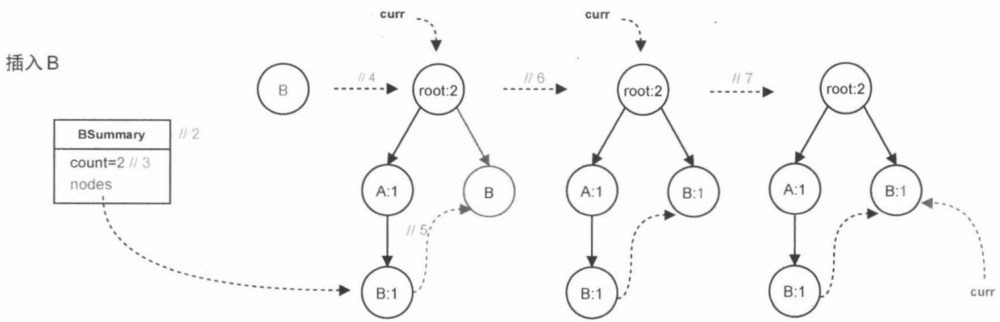  
图3-25 插入transaction2-BC

插入C

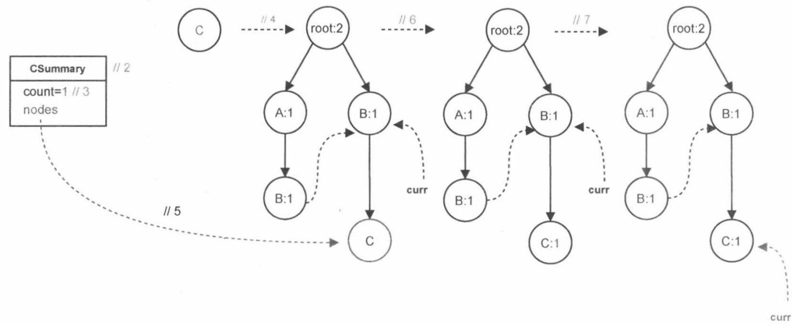

BC插入结束

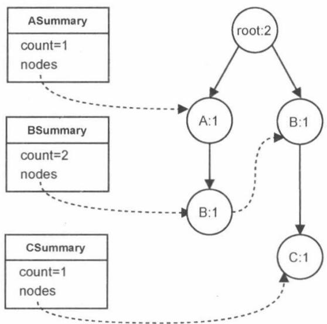  
图3-25 （续）

add方法就是通过图3-25中的步骤完成了FP树的建立。

extract方法

通过add方法建立了FP树，接下来的任务就是生成条件FP树了，而这正是extract的职责所在。extract方法的具体执行逻辑就不再展开了，可以参考add方法的分析方式。

# 3.3.8 算法优化

分析FPGrowth算法时会发现，它会生成如下关联规则： $\{(A,B)\to C\}$ 、 $\{(A,B,C)\to D\}$ 、 $\{B\to C\}$ ，等等。

但是大部分时候我们只想要类似 $\{\mathrm{B}\to \mathrm{C}\}$ 这样的关联规则，这样可以很方便地根据B推荐出C。我们当然可以通过3.3.5节中所使用的方法，过滤掉antecedent长度不为1的关联规则。

但是如果在FPGrowth在生成条件FP树时就实现这样的功能，将会大幅减少FPGrowth算法的运行时间，也就是说，在建立条件FP树时对其进行修剪，找到2-项集时立刻停止，比如3.3.3节中，物品E找到2-项集{AE}、{CE}、{DE}后不再递归建立后续的条件FP树。那么，怎么做呢？

答案就在extract方法中，既然它的职责是生成条件FP树，那么可以对其源码进行修改，让它在找到2-项集后不再递归，修改后的FPGrowth算法运行时间会显著减少。

# 3.4 总结

□ 关联规则是一种常用的数据挖掘方法，在海量数据下，它可以挖掘出物品与物品之间的关联。把握了这种关联关系，对于业务大有帮助，比如电商中常见的“看了又看”“买了又买”以及“看了又买”“买了又看”，等等。对应的挖掘算法，本章主要介绍了Apriori算法和FPGrowth算法。  
□衡量关联性的指标一般有三个：支持度、置信度和提升度。支持度是物品在交易中出现的概率，一定程度上可以反映物品的流行度；置信度是一个条件概率，表示物品 $X$ 出现时，物品 $Y$ 出现的概率，但是这个指标可能会带来一定的误导，特别是当 $Y$ 是很热门的物品时，因此又引入了提升度的概念；提升度可以理解为在置信度的基础上做了一定的热门惩罚，实际应用中一般使用它来衡量两个物品之间的关联性。  
□ Apriori算法简单易懂，计算过程也比较符合人的思维，当物品量不大时可以考虑采用它。它的缺点在于需要多次扫描数据集，当数据集比较大时，算法的运行时间可能让人无法接受。因此在大规模推荐系统中，它的使用频率并不是很高。  
□ FPGrowth算法只需要扫描两次全量数据集，这一步就节省了很多时间。首先需要统计每个物品出现在数据集中的数量，进行一定的过滤之后，开始构建FP树，然后根据构建好的FP树生成条件FP树从而找到物品与物品之间的关联关系。算法的性能比较好，因此实际应用中如果想要使用关联规则算法，可以优先考虑FPGrowth。最重要的是Spark官方已经实现了该算法，无须算法工程师重复造轮子。如果想学习FPGrowth的实现方式，Spark的源码是很好的学习资料。

# 第4章

# Word2Vec

某班有5位学生：A、B、C、D和E。每位学生需要学习5门课程：语文、数学、英语、物理和化学。

班主任计划组织一次考试，根据考试分数来安排5位学习座位。5位学生的分数如表4-1所示。

表 4-1 5 位学生的分数  

<table><tr><td>姓名</td><td>语文(150)</td><td>数学(150)</td><td>英语(150)</td><td>物理(100)</td><td>化学(100)</td></tr><tr><td>A</td><td>120</td><td>120</td><td>120</td><td>80</td><td>80</td></tr><tr><td>B</td><td>120</td><td>120</td><td>112</td><td>90</td><td>85</td></tr><tr><td>C</td><td>90</td><td>105</td><td>90</td><td>75</td><td>60</td></tr><tr><td>D</td><td>105</td><td>75</td><td>90</td><td>70</td><td>60</td></tr><tr><td>E</td><td>105</td><td>60</td><td>105</td><td>65</td><td>60</td></tr></table>

班主任编排座位的设想是这样的：尽量让成绩互补的学生坐在一起，以起到相互促进的作用。那么，怎么知道哪些学生之间可以互补呢？班主任想到了如下方法：

(1) 将每位学生的分数用向量代替，比如学生A的分数向量为[120, 120, 120, 80, 80]；  
(2) 计算每位学生与其他学生的相似性，分别得到一个相似度；  
(3) 对于每位学生，选择与其相似度最低的，即为最互补的学生。

首先，用向量表示所有学生的考试分数，同时采用Min-Max方法，按照相同科目对所有向量元素做归一化，比如语文最高分（Max）为120分，最低分（Min）为90分，则学生A的语文分数归一化后为 $\frac{\mathrm{A}_{\text{语文}} - \mathrm{Min}_{\text{语文}}}{\mathrm{Max}_{\text{语文}} - \mathrm{Min}_{\text{语文}}} = 1.0$ ，得到表4-2。

表 4-2 分数的向量表示  

<table><tr><td>姓名</td><td>原始向量</td><td>归一化向量</td></tr><tr><td>A</td><td>[120, 120, 120, 80, 80]</td><td>[1.0, 1.0, 1.0, 0.6, 0.8]</td></tr><tr><td>B</td><td>[120, 120, 112, 90, 85]</td><td>[1.0, 1.0, 0.73, 1.0, 1.0]</td></tr><tr><td>C</td><td>[90, 105, 90, 75, 60]</td><td>[0.0, 0.5, 0.0, 0.4, 0.0]</td></tr><tr><td>D</td><td>[105, 75, 90, 70, 60]</td><td>[0.5, 0.75, 0.0, 0.2, 0.0]</td></tr><tr><td>E</td><td>[105, 60, 105, 65, 60]</td><td>[0.5, 0.0, 0.5, 0.0, 0.0]</td></tr></table>

其次，为了计算两两学生间的相似度，班主任决定采用余弦相似度，计算方式为：

$$
\sin \left(\vec {v} _ {1}, \vec {v} _ {2}\right) = \frac {\vec {v} _ {1} \cdot \vec {v} _ {2}}{\left\| \vec {v} _ {1} \right\| \times \left\| \vec {v} _ {2} \right\|} \tag {4-1}
$$

根据式(4-1)班主任得到了学生相似表，如表4-3所示

表 4-3 学生相似表  

<table><tr><td>相似学生 学生</td><td>A</td><td>B</td><td>C</td><td>D</td><td>E</td></tr><tr><td>A</td><td>\</td><td>0.985</td><td>0.789</td><td>0.871</td><td>0.854</td></tr><tr><td>B</td><td>0.985</td><td>\</td><td>0.830</td><td>0.867</td><td>0.788</td></tr><tr><td>C</td><td>0.789</td><td>0.830</td><td>\</td><td>0.885</td><td>0.5</td></tr><tr><td>D</td><td>0.871</td><td>0.867</td><td>0.885</td><td>\</td><td>0.691</td></tr><tr><td>E</td><td>0.854</td><td>0.788</td><td>0.5</td><td>0.691</td><td>\</td></tr></table>

根据这张相似表，班主任从每位学生的相似学生中选择与之最不相似的学生作为其同桌，于是A与C、B与E成为了同桌，D只好一个人占用一张课桌了。

但是显然，评判两位学生的相似性，并不能只看5门课程的分数，假如还可以加上政治、历史、生物、地理等课程，再考虑性格、品行等因素，那么向量的长度就会变长（维度变高），向量的表现力会更强，计算出的结果应该会更准确，但是对算力的要求更高。

(1)可以用向量来表示任何实体（人或者物）。  
(2) 利用向量计算两两实体之间的相似度特别方便

将实体表示成向量的技术起源于NLP（自然语言处理）技术，旨在将一个个单词转化为一个个向量，以便发现近义词/同义词/反义词等，更重要的是，表示为向量之后，自然而然地可以融入机器学习算法模型参与建模，提高模型性能。Word2Vec就是单词向量化的工具之一。

# 4.1 词向量示例

在深入Word2Vec的细节之前，先来直观地感受一下向量化。通过一些已经训练好的模型生成的单词向量，接下来我们将会看到向量化的神奇之处及其强大的表达能力。这里使用著名的GloVe模型①生成的词向量来作为示例。

下面的代码片段加载了GloVe模型生成的向量长度为100的词向量文件：

pip installgensim $\equiv 4.0.1$ importgensim.downloaderasapi $\mathtt{wV} =$ api.load("glove-wiki-gigaword-100")   
#单词king对应的向量   
king $=$ wv['king']   
#output   
array([-0.32307，-0.87616，0.21977，0.25268，0.22976，0.7388， -0.37954，-0.35307，-0.84369，-1.1113，-0.30266，0.33178， -0.25113，0.30448，-0.077491，-0.89815，0.092496，-1.1407， -0.58324，0.66869，-0.23122，-0.95855，0.28262，-0.078848, 0.75315，0.26584，0.3422，-0.33949，0.95608，0.065641, 0.45747，0.39835，0.57965，0.39267，-0.21851，0.58795， -0.55999，0.63368，-0.043983，-0.68731，-0.37841，0.38026， 0.61641，-0.88269，-0.12346，-0.37928，-0.38318，0.23868, 0.6685，-0.43321，-0.11065，0.081723，1.1569，0.78958, -0.21223，-2.3211，-0.67806，0.44561，0.65707，0.1045 ， 0.46217，0.19912，0.25802，0.057194，0.53443，-0.43133 ， -0.34311，0.59789，-0.58417，0.068995，0.23944，-0.85181 ， 0.30379，-0.34177，-0.25746，-0.031101，-0.16285，0.45169 ， -0.91627，0.64521，0.73281，-0.22752，0.30226，0.0448O1, -0.83741，0.55Oo6，-0.525Oo6，-1.7357，0.4751，-0.7O487 ， 0.056939,-0.7132，O.O89623,O.O41394,-1.3363,-O.O61915 , -O.33O89,-O.52881, 0.16483,-O.98878]dtype $\equiv$ float32)

100个枯燥无味的浮点数看上去没有任何头绪，试着将单词king对应的向量可视化，如图4-1所示。

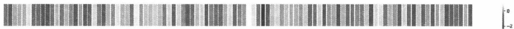  
图4-1 可视化单词king对应的向量

再来看看单词 man 和 woman 对应向量的可视化，如图 4-2 和图 4-3 所示。

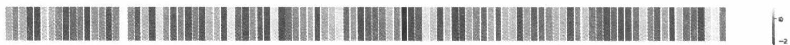  
图4-2 可视化单词man对应的向量

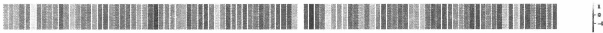  
图4-3 可视化单词woman对应的向量

从这几张图中可以隐约地发现词向量捕获了单词与单词之间某种有意义的关联，虽然说不上来具体有哪些关联，但是至少从语义上来说，相似的单词，向量的相似程度看上去比较高。这就是词向量擅长的地方，虽然没有办法解释词向量每个维度具体的含义，但是它确实可以挖掘出很有趣也很有用的信息。

接下来再来看看更有趣的：

```javascript
wv.best_similar(posiive=['woman', 'king'], negative=['man'], topn=1) # output: ['queen', 0.7698541283607483]) 
```

上述代码片段是要找出与king + woman - man最相似的单词，结果出人意料又在情理之中，它给出的是queen，即king + woman - man = queen。单词queen对应向量的可视化结果以及king + woman - man对应向量的可视化结果如图4-4和图4-5所示。

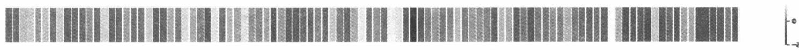  
图4-4 可视化单词queen对应的向量

  
图4-5 可视化king+woman-man对应的向量

可以发现，这两张图不仅纵坐标的范围一致（ $-2 \sim 0$ ），而且可视化中对位颜色的深浅都极为相近。多么神奇的算法呀！居然能找出如此奇妙的关系。但是在感慨的同时，也不禁会发出这样一个疑问：这样的结果是怎么得到的呢？到底是如何建模的呢？训练数据集又是怎么构造的呢？

# 4.2 数据准备

在机器学习领域，学习方法一般分为两种：监督学习和无监督学习。如果输入数据有标签（label），则视作监督学习，比如点击率预估任务；否则（输入数据没有标签）视作无监督学习，比如聚类任务等。

Word2Vec属于半监督学习，原因是数据本身没有标签，但是在训练时人为给数据打上了标签。它的学习方式一般有两种：CBOW（continuous bag-of-words）和Skip-Gram，前者通过周围的词

来预测中心词, 后者正好相反, 以中心词来预测周围的词, 本章将会重点讲述 Skip-Gram ${}^{\text{①}}$ ,CBOW 的训练过程与之极为相似,故不再赘述。

Word2Vec 需要的原始数据集为一句话组成的语料库，比如豆瓣的影视剧评论集合或者电商的物品评论集合等。这里为了演示方便，做了简化，假设整个训练语料库只有下面这一句话，后续的所有步骤都基于此数据集：

无论精神多么独立的人，感情却总是在寻找一种依附，寻找一种归宿。

# 4.2.1 词汇表

首先，需要根据语料库生成词汇表，即组成语料库的全部不重复的单词。在原始语料库的基础上，经过分词、去除停用词和标点符号等步骤，得到词汇表，并给每一个词编好序号，如表4-4所示。

表 4-4 词汇表  

<table><tr><td>词</td><td>序号</td><td>词</td><td>序号</td></tr><tr><td>无论</td><td>0</td><td>感情</td><td>5</td></tr><tr><td>精神</td><td>1</td><td>总是</td><td>6</td></tr><tr><td>多么</td><td>2</td><td>依附</td><td>7</td></tr><tr><td>独立</td><td>3</td><td>归宿</td><td>8</td></tr><tr><td>人</td><td>4</td><td>寻找</td><td>9</td></tr></table>

词汇表中已经去除了类似“的”“在”“一种”之类的词，并且已经去重（“寻找”在语料库中出现了两次），词的序号一般也是按照词出现的次数升序排列后得到的。

# 4.2.2 训练数据

得到词汇表之后，接下来的任务就是把原始语料库转换为Word2Vec算法需要的数据格式。本节采用Skip-Gram的训练方法，通过中心词来预测周围词，那么特征/输入是中心词，标签/输出是周围词。从语料库中去除不在词汇表中的词，得到如下数据：

无论精神多么独立人感情总是寻找依附寻找归宿

既然输入是中心词，输出是周围词，那么就需要界定距离中心词多远范围之内的词可以作为周围词，而这个距离就由窗口长度（window length）来界定。

举例来说，如果窗口长度是1，中心词是“多么”，那么它与“精神”处在同一个窗口内，与“无论”不在一个窗口内。如果窗口长度是2，那么它与“无论”在同一个窗口内。处在同一个窗口内的词又叫作处在同一个上下文（context）中。

窗口的概念如图4-6所示，红色为中心词，绿色为周围词，蓝色框表示同一个上下文。窗口长度为1，因此中心词的前1个词和后1个词都与中心词处在同一个上下文中。

  
图4-6 窗口（另见彩插）

假设窗口长度为1，则根据图4-6可以得到数据中的输入和输出，如表4-5所示，这也正是最终要输入Word2Vec的训练数据。

表 4-5 训练数据  

<table><tr><td>输入</td><td>输出</td><td>输入</td><td>输出</td></tr><tr><td>无论</td><td>精神</td><td>感情</td><td>总是</td></tr><tr><td>精神</td><td>无论</td><td>总是</td><td>感情</td></tr><tr><td>精神</td><td>多么</td><td>总是</td><td>寻找</td></tr><tr><td>多么</td><td>精神</td><td>寻找</td><td>总是</td></tr><tr><td>多么</td><td>独立</td><td>寻找</td><td>依附</td></tr><tr><td>独立</td><td>多么</td><td>依附</td><td>寻找</td></tr><tr><td>独立</td><td>人</td><td>依附</td><td>寻找</td></tr><tr><td>人</td><td>独立</td><td>寻找</td><td>依附</td></tr><tr><td>人</td><td>感情</td><td>寻找</td><td>归宿</td></tr><tr><td>感情</td><td>人</td><td>归宿</td><td>寻找</td></tr></table>

# 4.3 算法原理

Word2Vec算法模型的结构较为简单，只有输入层（input layer）、隐藏层（hidden layer）以及输出层（output layer）。以输入是人、输出是独立为例，简单描述一下Word2Vec算法如何学习到单词的向量（也就是模型参数），如图4-7所示。

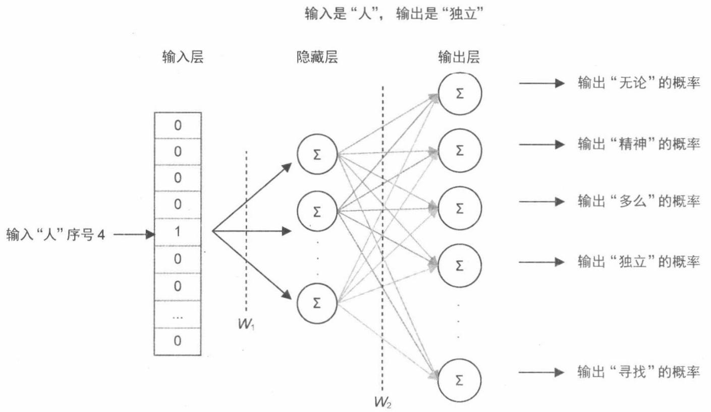  
图4-7Word2Vec输入输出的一个例子

假设词汇表长度为 $V$ ，隐藏层的长度为 $H$ ，表4-1对应词汇表的 $V$ 等于10。图4-7依次从输入到输出的数据流转说明如下。

(1) 虽然输入是人，但是模型只能识别数字，因此这里将词做了 one-hot encoding 处理，得到了输入层的向量表示，长度为 $V$ ，即 0000100000，设为 $x$ 。


one-hot encoding，又称一位有效编码，其方法是使用 $V$ 位二进制来对 $V$ 个状态进行编码，每个状态非0即1，并且在任意时候， $V$ 位bit只有1位有效。以人为例， $V$ 为词汇表长度，这里为10，人在词汇表中出现在第4位（索引从0开始），因此人的one-hot encoding为0000100000。

(2) 输入层到隐藏层的参数矩阵为 $W_{1}$ ，形状为 $V \times H$ ，第 (1) 步的 $x$ 与 $W_{1}$ 相乘（ $1 \times V$ 与 $V \times H$ 相乘，得到 $1 \times H$ ），得到隐藏层的向量表示，长度为 $\dot{H}$ ，设为 $h$ 。  
(3) 隐藏层到输出层的参数矩阵为 $W_{2}$ ，形状为 $H \times V$ ，第 (2) 步的 $h$ 与 $W_{2}$ 相乘（ $1 \times H$ 与 $H \times V$ 相乘，得到 $1 \times V$ ），得到输出层的向量表示，长度为 $V$ ，同时对此向量应用 softmax 函数得到最终的输出向量，设为 $o$ 。

假设向量为 $\pmb{\nu}$ ，长度为 $V$ ， $\nu_{i}$ 表示 $\pmb{\nu}$ 中第 $i$ 个元素，那么该元素的softmax值等于

$$
\operatorname {s o f t m a x} \left(v _ {i}\right) = \frac {\mathrm {e} ^ {v _ {i}}}{\sum_ {j = 1} ^ {V} \mathrm {e} ^ {v _ {j}}}
$$

输出 $o$ 是长度为 $V$ 的向量，且由于是应用softmax函数后得到的结果，因此 $o$ 中的每一个数字都表示某个概率，即：当输入是 $X$ 时，输出是 $Y$ 的概率。图4-7中， $o$ 中第1个元素解读为：当输入是人时，输出是无论的概率。同理， $o$ 中第2个元素解读为：当输入是人时，输出是精神的概率，以此类推。 $o$ 也是模型在一次训练时的预测值，真实值也特别容易理解，它也是一个one-hot向量，长度为 $V$ ，周围词对应的索引处比特有效，其他位均为0，比如输入为人时，周围词为独立，独立在词汇表的第3位，因此此时的真实值为0001000000，与预测值 $o$ 结合，就可以计算loss，然后计算梯度、更新参数，完成一次学习过程。

上述过程粗略地展示了一个具体的Word2Vec的训练示例，那么该算法的理论基础到底是怎样的呢？loss如何计算？参数又如何更新？工程实现上又做了哪些优化和改进呢？

# 4.3.1 模型结构

图4-8是Skip-Gram的模型结构，很容易发现，它就是图4-7的一般形式。

  
图4-8Skip-Gram模型结构

图4-8中所用到的符号说明如下：

□ $V$ 是词汇表中词的个数；  
□ $H$ 是隐藏层节点的个数；  
□ $C$ 是context（上下文）长度，如果窗口长度为win_len，上下文长度就是 $2\times \text{win\_len}$ （中心词前win_len这个词和后win_len这个词组成了上下文）；  
$x_{i}$ 是输入的one-hot表示， $i\in [0,V)$   
□ $y_{c,j}$ 是输出的one-hot表示， $j\in [0,V),c\in [0,C)$ ，有 $C$ 个输出是因为这里将同一个输入词对应的 $C$ 个上下文词放在一起同时参与训练；  
$\square W_{V\times H}$ 是输入层到隐藏层的矩阵，称为输入矩阵；  
$\square W_{H\times V}^{\prime}$ 是隐藏层到输出层的矩阵，称为输出矩阵。


可以看到，每个词有两个向量表示，一个是来自 $W_{V\times H}$ 的行向量，一个是来自 $W_{H\times V}^{\prime}$ 的列向量，模型最终产出供外部使用的词向量来自于前者。

# 4.3.2 前向传播

前向传播是一条从输入层到输出层的链路：输入数据与模型参数经过各种各样的数学运算之后，最终在输出层得到了预测值。

# 1. 输入层到隐藏层

定义 $w_{0}$ 为输入词，周围词为 $\mathrm{context}(w_0)$ ， $x$ 是词 $w_{0}$ 对应的 one-hot 表示，即 $x = \{x_{1}, x_{2}, \dots, x_{V}\}$ ，向量中的元素

$$
x _ {i} = \left\{ \begin{array}{l l} 1, & i = k, k \text {为} w _ {0} \text {在 词 汇 表 中 的 位 置 索 引} \\ 0, & \text {其 他} \end{array} \right.
$$

隐藏层的向量表示 $\pmb{h}_{w_0} = \pmb{x}^{\mathrm{T}}\pmb{W}$ ，显然， $\pmb{h}_{w_0}$ 是矩阵 $W$ 的第 $k$ 行，其计算公式也很简单，如下所示：

$$
\boldsymbol {x} = \left[ \begin{array}{l} x _ {1} \\ x _ {2} \\ \vdots \\ x _ {k} \\ \vdots \\ x _ {V} \end{array} \right]
$$

$$
\begin{array}{l} \boldsymbol {W} _ {V \times N} = \left[ \begin{array}{c c c c} w _ {1 1} & w _ {1 2} & \dots & w _ {1 H} \\ w _ {2 1} & w _ {2 2} & \dots & w _ {2 H} \\ \vdots & \vdots & \ddots & \vdots \\ w _ {k 1} & w _ {k 2} & \dots & w _ {k H} \\ \vdots & \vdots & \ddots & \vdots \\ w _ {V 1} & w _ {V 2} & \dots & w _ {V H} \end{array} \right] \\ \boldsymbol {h} _ {w _ {0}} = \boldsymbol {x} ^ {\mathrm {T}} \boldsymbol {W} \tag {4-2} \\ = \left[ \begin{array}{l l l l l l} x _ {1} & x _ {2} & \dots & x _ {k} & \dots & x _ {V} \end{array} \right] \left[ \begin{array}{c c c c} w _ {1 1} & w _ {1 2} & \dots & w _ {1 H} \\ w _ {2 1} & w _ {2 2} & \dots & w _ {2 H} \\ \vdots & \vdots & \ddots & \vdots \\ w _ {k 1} & w _ {k 2} & \dots & w _ {k H} \\ \vdots & \vdots & \ddots & \vdots \\ w _ {V 1} & w _ {V 2} & \dots & w _ {V H} \end{array} \right] \\ = \left[ \begin{array}{l l l l} x _ {k} w _ {k 1} & x _ {k} w _ {k 2} & \dots & x _ {k} w _ {k H} \end{array} \right] \\ = \left[ \begin{array}{l l l l} w _ {k 1} & w _ {k 2} & \dots & w _ {k H} \end{array} \right] \\ \end{array}
$$

# 2. 隐藏层到输出层

虽然有 $y_{1,j}, y_{2,j}, \dots, y_{C,j}$ 个输出，但是它们都共享 $\boldsymbol{W}_{H \times V}^{\prime}$ ，所以就简化成 $\hat{y}_j$ ，它的含义为：输入词是 $w_0$ 时，输出词是 $w_j$ 的概率。 $\hat{y}_j$ 的计算也比较简单：

$$
\begin{array}{l} \hat {y} _ {j} = p \left(w _ {j} \mid w _ {0}\right) \\ = \operatorname {s o f t m a x} \left(\boldsymbol {h} _ {w _ {j}} ^ {\prime \mathrm {T}} \cdot \boldsymbol {h} _ {w _ {0}}\right) \tag {4-3} \\ = \frac {\mathrm {e} ^ {h _ {w _ {j}} ^ {\mathrm {T}} \cdot h _ {w _ {0}}}}{\sum_ {i = 1} ^ {V} \mathrm {e} ^ {h _ {w _ {i}} ^ {\mathrm {T}} \cdot h _ {w _ {0}}}} \quad \in (0, 1) \\ \end{array}
$$

其中值得注意的是， $h_{w_j}^{\prime}$ 是词 $w_{j}$ 在矩阵 $\pmb{W^{\prime}}$ 中的列向量， $h_{w_0}$ 是词 $w_{0}$ 在矩阵 $\pmb{W}$ 中的行向量。

对于 $w_{j}\in \mathrm{context}(w_{0})$ ，当然是希望 $\hat{y}_j$ 越接近1越好；对于 $w_{j}\notin \mathrm{context}(w_{0})$ ， $\hat{y}_j$ 越接近0越好，即 $1 - \hat{y}_j$ 越接近1越好。自然而然地，多分类问题在这里转化成了二分类问题。对于周围词 $w_{c}$ 目标是最大化式(4-3)，即：

$$
\begin{array}{l} L L = \max  \left(\hat {y} _ {c}\right) \\ = \max  \left(\log \hat {y} _ {c}\right) \tag {4-4} \\ = \boldsymbol {h} _ {w _ {c}} ^ {\prime \mathrm {T}} \cdot \boldsymbol {h} _ {w _ {0}} - \log \sum_ {i = 1} ^ {V} \mathrm {e} ^ {\boldsymbol {h} _ {w _ {i}} ^ {\prime \mathrm {T}} \cdot \boldsymbol {h} _ {w _ {0}}} \\ \end{array}
$$

对式 $(4 - 4)^{1}$ 稍加转化，将最大化任务变成最小化任务，得到损失函数，如式(4-5)所示：

$$
\begin{array}{l} E = - L L \\ = - \left(\boldsymbol {h} _ {w _ {c}} ^ {\prime \mathrm {T}} \cdot \boldsymbol {h} _ {w _ {0}} - \log \sum_ {i = 1} ^ {V} \mathrm {e} ^ {\boldsymbol {h} _ {w _ {i}} ^ {\prime \mathrm {T}} \cdot \boldsymbol {h} _ {w _ {0}}} \right) \tag {4-5} \\ \end{array}
$$

有了损失值，接下来的任务就是计算梯度以及更新模型参数完成一次学习。

# 4.3.3 反向传播

反向传播是从输出层到输入层的链路，经过前向传播得到损失值后，反向从后往前不断计算各层参数的梯度，进行参数更新。

# 1. 输出层到隐藏层

首先来看看矩阵 $W^{\prime}$ 如何更新。根据式(4-5)，对 $\pmb{h}_{w}^{\prime}$ 求导，得到式(4-6)：

$$
\frac {\partial E}{\partial \pmb {h} _ {w} ^ {\prime}} = \left\{ \begin{array}{l l} \left(\hat {y} _ {c} - 1\right) \cdot \pmb {h} _ {w _ {0}}, & i = c \\ \left(\hat {y} _ {i} - 0\right) \cdot \pmb {h} _ {w _ {0}}, & \text {其 他} \end{array} \right.
$$

由此，假设学习率为 $\eta$ ，则 $h_w^{\prime}$ 的更新公式为

$$
\boldsymbol {h} _ {w} ^ {\prime \text {n e w}} = \boldsymbol {h} _ {w} ^ {\prime \text {o l d}} - \eta \frac {\partial E}{\partial \boldsymbol {h} _ {w} ^ {\prime}} \tag {4-6}
$$

# 2. 隐藏层到输入层

再来看看 $W$ 如何更新。根据式(4-5)，对 $\pmb{h}_{w_0}$ 求导，得到式(4-7)：

$$
\frac {\partial E}{\partial \pmb {h} _ {w _ {0}}} = \left\{ \begin{array}{l l} \left(\hat {y} _ {c} - 1\right) \cdot \pmb {h} _ {w _ {c}} ^ {\prime}, & i = c \\ \left(\hat {y} _ {c} - 0\right) \cdot \pmb {h} _ {w} ^ {\prime}, & \text {其 他} \end{array} \right.
$$

由此，假设学习率为 $\eta$ ，则 $h_w$ 的更新公式为

$$
\boldsymbol {h} _ {w} ^ {\text {n e w}} = \boldsymbol {h} _ {w} ^ {\text {o l d}} - \eta \frac {\partial E}{\partial \boldsymbol {h} _ {w}} \tag {4-7}
$$


从Word2Vec算法的原理可以看出，虽然模型结构有点儿类似于神经网络多层结构，但是整个模型结构中，除了最后的输出层需要计算概率而用到softmax之外，隐藏层并没有任何非线性函数，这一点经常被忽视。

# 4.3.4 算法优化

细心的读者可能已经发现了该算法存在的巨大问题，这个问题会导致算法在单词数量级增长时变得扩展性不够：式(4-3)的分母计算量过大，时间复杂度达到了 $O(V)$ ，也就是每训练一条数据，就要计算 $V$ 次累加，如果 $V$ 在百万、千万或者亿级，那么显然模型训练变得不切实际——此记为问题1。

同时还可能存在这样的问题：虽然提前剔除了类似“的”“啊”等意义不大的词，但是依然存在超高频次的词，比如“什么”“不知道”等。一般情况下，出现频次越高的词，携带的信息量越少，如何处理才能让出现频次低的词也能充分参与训练呢——此记为问题2。

# 1. Negative Sampling

问题1的关键在于式(4-3)分母计算量过大，由于softmax函数将数值转化为概率时需要计算所有值的指数和，导致了 $O(V)$ 的时间复杂度高。那么分母的求和项可不可以减少呢？

Word2Vec算法的作者在论文中通过实验进行了论证，式(4-3)分母的求和项可以不计算 $V$ 次，如果数据集足够大，分母只需考虑当前周围词与其他2~5个非周围词就可以了。而这2~5个非周围词作为训练时的负例，是从 $V$ 个词（准确来说是 $V - 1$ 个词，因为要过滤掉当前的正例，即当前的周围词）中随机采样出来的。经过这种优化后，式(4-3)变成了式(4-8)，函数的时间复杂度从 $O(V)$ 降至 $O(1)$ 。

$$
\begin{array}{l} \hat {y} _ {j} = p \left(w _ {j} \mid w _ {0}\right) \\ = \text {s a m p l e d} \_ \text {s o f t m a x} \left(\boldsymbol {h} _ {w _ {j}} ^ {\prime \mathrm {T}} \cdot \boldsymbol {h} _ {w _ {0}}\right) \tag {4-8} \\ = \frac {\mathrm {e} ^ {\mathbf {h} _ {w _ {j}} ^ {\prime \mathrm {T}} \cdot \mathbf {h} _ {w _ {0}}}}{\mathrm {e} ^ {\mathbf {h} _ {w _ {j}} ^ {\prime \mathrm {T}} \cdot \mathbf {h} _ {w _ {0}}} + \sum_ {i = 1} ^ {d} \mathrm {e} ^ {\mathbf {h} _ {w _ {i}} ^ {\prime \mathrm {T}} \cdot \mathbf {h} _ {w _ {0}}}}, \quad d \in [ 2 - 5 ] \\ \end{array}
$$

既然负例是随机采样出来的，那么就涉及怎么采样的问题。具体而言，在采样时，每个词都有一定的概率被选作负例。同样，Word2Vec算法的作者在论文中给出词 $w_{i}$ 被选作负例的概率 $P(w_{i})$ 为：

$$
P \left(w _ {i}\right) = \frac {c \left(w _ {i}\right) ^ {3 / 4}}{\sum_ {j = 1} ^ {V} c \left(w _ {j}\right) ^ {3 / 4}} \tag {4-9}
$$

其中， $c(w_{i})$ 是词 $w_{i}$ 在数据集中出现的次数。概率 $P$ 在模型开始训练前事先计算好，将结果存储起来，不需要在训练时再次计算。


为什么会设计这么一个函数，作者在论文中说明这是他尝试的多个函数中效果最好的。

# 2. Sub-Sampling

对于问题2，也可以通过采样的方式来解决，也就是在每次生成一个样本时，按照一定概率丢弃某个词，比如一个样本原本如下所示：

无论精神多么独立人感情总是寻找依附寻找归宿

随机概率性地丢弃句子中的某些词后，可能会得到如下训练样本：

无论精神独立人感情总是寻找依附归宿

词的丢弃概率与词在语料库中出现的频率有关：出现的频率越高，被丢弃的概率就越高。作者同样在论文①中给出了词被丢弃的概率公式：

$$
P \left(w _ {i}\right) = 1 - \sqrt {\frac {t}{f \left(w _ {i}\right)}} \tag {4-10}
$$

其中 $P(w_{i})$ 是词 $w_{i}$ 被丢弃的概率， $f(w_{i})$ 是词 $w_{i}$ 在语料库中出现的频率（即词出现的次数与所有词出现的总次数的比值）， $t$ 是一个超参数，一般设置为 $10^{-5}$ 。

但是作者在Word2Vec的源码中，实现丢弃概率的公式与式(4-10)有一点点差异，如式(4-11)所示：

$$
P \left(w _ {i}\right) = 1 - \left(\sqrt {\frac {f \left(w _ {i}\right)}{0 . 0 0 1}} + 1\right) \cdot \frac {0 . 0 0 1}{f \left(w _ {i}\right)} \tag {4-11}
$$

将式(4-11)对应的函数曲线画出来，如图4-9所示

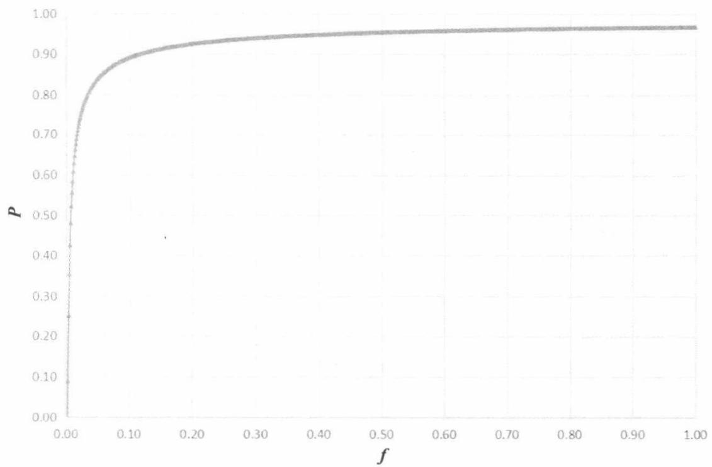  
图4-9 词丢弃概率与频率的关系

通过式(4-11)可以得到如下结论

(1) $f(w_{i}) \leqslant 0.0026$ 时， $P(w_{i}) \leqslant 0$ ：只有频率高于0.0026的词才会在训练时被随机丢弃。  
(2) $f(w_{i}) = 0.00745$ 时， $P(w_{i}) = 0.5$ ：频率等于0.00745的词在训练时有一半的概率被丢弃。  
(3) $f(w_{i}) = 0.1$ 时， $P(w_{i}) = 0.89$ ：频率等于0.1的词在训练时有 $89\%$ 的概率被丢弃。  
(4) $f(w_{i}) = 1$ 时， $P(w_{i}) = 0.967$ ：如果整个数据集只有一个词，那么它在训练时有 $96.7\%$ 的概率被丢弃。

至此，Word2Vec算法基于Negative Sampling的Skip-Gram训练方法的原理基本上已经全部讲述完毕，可以看到还是比较简单的。虽然看上去像是多层网络，但是它的隐藏层没有任何非线性激活函数。不过，即使算法理论非常简单，它的实现也非常值得研究。

# 4.4 源码分析①

为了算法的扩展性和运行性能，作者在代码实现时使用了不少技巧，本节会挑选一些主要的技巧加以说明（涉及模型参数更新的源码部分就忽略了，基本上是完全按照公式来实现的）。

# 4.4.1 负采样概率表

对于式(4-9)，在实现时，并不是实时计算概率，而是提前把所有的概率值存储在一个数组中：

```c
// word2vec.c 第 52 行
void InitUnigramTable()
{
    int a, i;
    double train_wordspora = 0;
    double d1, power = 0.75;
    // table_size 大小为 1E8，也就是 1 亿
    table = (int *)malloc(table_size * sizeof(int));
    // train_wordspora 为式（4-9）的分母
    for (a = 0; a < vocab_size; a++) train_wordspora += pow(vocab[a].cn, power);
    i = 0;
    // 第一个词的负采样概率，因为 vocab 是按照 cn 降序排列的，所以第一个词的概率最大
    d1 = pow(vocab[i].cn, power) / train_wordspora;
    // ***for 循环中的逻辑***
    for (a = 0; a < table_size; a++) {
        table[a] = i;
        if (a / (double)table_size > d1) {
            i++;
            d1 += pow(vocab[i].cn, power) / train_wordspora;
        }
        if (i >= vocab_size) i = vocab_size - 1;
    }
}
```

以上代码片段的核心逻辑在于for循环，在厘清循环内部的逻辑之前，先看看图4-10，一个示例语料词汇表，存储了多个词。

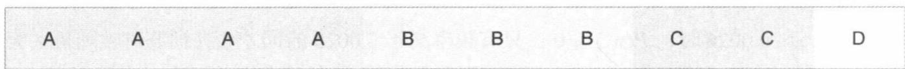  
图4-10 语料库词汇表（不去重）

图4-10中的A、B、C、D出现的次数分别是4、3、2、1，表的长度（table_size）为10。从图4-10很容易知道，随机抽取得到A的概率为0.4，得到B的概率为0.3。

根据式(4-9)，A被选作负例的概率为 $\frac{4^{0.75}}{4^{0.75} + 3^{0.75} + 2^{0.75} + 1^{0.75}}\approx 0.363$ ，如果table_size等于10，那么A必须在表中出现 $[0.363\times 10]\approx 4$ 次。如果table_size等于1000，那么A必须出现363次。因此，总结出for循环内部的逻辑如下。

将词 $w$ 在表中重复 $m$ 次，使得 $m = \left[\text{table\_size} \times \frac{\dot{c(w)}^{3/4}}{\sum_{j=1}^{V} c(w_j)^{3/4}}\right]$ ，通过条件

a/table_size>d1来实现单词w重复m次：当该条件不满足时，词w一直在表中重复，一旦条件满足，则换成下一个词，继续重复。

生成负采样概率表之后，随机从表中抽出词 $w$ 的概率为 $\frac{c(w)^{3/4}}{\sum_{j=1}^{V} c(w_j)^{3/4}}$ ，满足式(4-9)。

# 4.4.2 sigmoid函数优化

sigmoid函数如下：

$$
\operatorname {s i g m o i d} (x) = \frac {1}{1 + e ^ {- x}}
$$

这个公式虽然写起来很简单，用起来也很简单，但是运行起来不简单，因为e这个无理数的存在，导致计算性能骤降。

$$
\operatorname {s i g m o i d} (x) = \frac {1}{1 + e ^ {- x}}
$$

$$
\operatorname {s i m p l e} (x) = \frac {1}{1 + x}
$$


上述两个函数各循环执行1000000次，sigmoid耗时 $260\mathrm{ms}$ ，simple耗时 $20\mathrm{ms}$ （不同的机器可能耗时不一样）。

为了提高 sigmoid 的性能，提前计算好 $x \in [-6, 6]$ 对应的所有结果（sigmoid 函数的值区间是 $0 \sim 1$ ，输入在 $[-6, 6]$ 之间的 sigmoid 值，已经覆盖了值区间的 $99.5\%$ ）。优化思路如下：

(1) 将 $[-6, 6]$ 分成 1000 等份，编号 0 到 999；  
(2) 对于输入值 $x$ ，先找到它的编号 $i$   
(3) 再使用 expTable（数组结构）存储 $x$ 对应的 sigmoid 值。

$$
i = \left\lfloor (x + 6) \times \frac {1 0 0 0}{2 \times 6} \right\rfloor
$$

$$
\exp \mathrm {T a b l e} [ i ] = \frac {1}{1 + \mathrm {e} ^ {- x}}
$$

一个定长数组（expTable， $O(1)$ 空间复杂度）就将sigmoid函数的时间复杂度变成了 $O(1)$ ，运行所需的时间大大减少。

# 4.5 算法实战

本章的前半部分深入探讨了Word2Vec算法的理论与部分源码实现，那么如何将这种技术运用在推荐系统中呢？这是大家最为关心的问题。实际上，在推荐系统中，Word2Vec算法与协同过滤算法类似，也会生成物品相似表，线上算法应用的方式与协同过滤也基本没有差别，重要的是，Word2Vec算法生成的相似表是通过计算两两物品向量之间的相似度（比如余弦相似等）得到的。接下来以一个具体案例来讲述如何在电商中使用Word2Vec算法计算物品的相似度。

# 4.5.1 数据源

电商中的Word2Vec算法一般被称为Item2Vec，顾名思义，就是将物品表示成向量。

Word2Vec算法以sentence为单位，学习组成sentence的word的向量。在电商系统中，将用户在一段时间内的足迹（历史行为轨迹）作为一个sentence，将组成sentence的物品作为word。按照这样的思路，可以得到如表4-6所示的元数据。

表 4-6 用户行为轨迹  

<table><tr><td>字段
表名</td><td>user</td><td>items</td></tr><tr><td>recsys.data_w2v</td><td>字符串</td><td>字符串，访问过的物品ID集合，以逗号分隔</td></tr></table>

用户的历史行为轨迹必须按照时间顺序从远到近排列，因为Word2Vec的训练过程其实与词的顺序有很大的关系。同样，用户的历史行为轨迹也必须考虑物品与物品之间的时间间隔，比如用户浏览了4个物品，月初浏览了2个，月末浏览了2个，那么显然这4个物品不可以放在同一个历史行为轨迹中，也就是不要出现在一个句子中。

训练数据的生成直接决定了算法结果的质量，所以不同的业务一般按照各自的规则/经验去设置相应的超参数、聚合相应的数据——训练数据是整个算法最重要的一步。

# 4.5.2 运行①

算法默认的超参数如下。

□vectorSize：物品向量长度，默认为100。  
□ learningRate：学习率，默认为0.025。  
□ numPartitions: Spark分区数，默认为1。  
□ numIterations：训练迭代次数，默认为1。  
□ minCount：物品在数据集中出现的最少次数，少于此则过滤掉，默认为5。  
□ maxSentenceLength：句子的最大长度，超出则截断，默认为1000。  
□ window：窗口大小，默认为5。  
□ negative：负采样物品数，默认为5。  
□ sample: 下采样概率, 默认为 $10^{-3}$ 。

算法的运行代码如下：

```txt
// 读取用户行为轨迹数据  
val corpus = spark.sqlContext.sql("select user, items from rec.data_w2v")  
val trainingData = corpus.map(r => r.getAs(String)(items).split()),.toDF("ids")  
// 运行Word2Vec  
val word2Vec = new Word2Vec()  
.setInputCol("ids")  
.setVectorSize.vectorSize)  
.setMaxIter(maxIter)  
.setNegative(negative)  
.setHS(0)  
.setSample(sample)  
.setMaxSentenceLength(maxSentenceLength)  
.setNumPartitions(numIterations)  
.setStepSize(learningRate)  
.setWindowSize(windowSize)  
.setMinCount(minCount)  
val model = word2Vec.fit(trainData)  
// 得到word与向量的映射关系  
val w2v = model.getVectors.rdd  
.map(r => {  
    val word = r.getAs(String)("word")  
    val vector = r.getAs[org.apache.spark.ml.linalg.Matrix]("vector").toDense(word, vector)  
}) 
```

如此简短的代码就得到了所有物品向量，是不是特别简单？在日常开发过程中，最耗时的部分往往在于数据分析和数据处理，真正运行模型所需的时间反而占比很低。程序运行完得到物品向量后，接下来的任务就是据此计算每个物品的相似物品。

# 4.5.3 相似度计算

一般有几种衡量相似度的指标：Jaccard、欧氏距离、夹角余弦等。这里采用计算向量相似度时比较通用的余弦相似。

向量 $\vec{x}$ 与向量 $\vec{y}$ 的余弦相似度计算公式为：

$$
\text {c o s i n e} _ {-} \text {s i m i l a r i t y} <   \vec {x}, \vec {y} > = \frac {\vec {x} \cdot \vec {y}}{\| \vec {x} \| \times \| \vec {y} \|} \tag {4-12}
$$

对于 $M$ 个物品，计算Top $N$ 个最相似物品最简单直接的伪代码如下：

map $= \{\}$ for i from 1 to M: heapI：小顶堆，保存物品i最相似的N个物品

forjfromi+1toM: simIJ $=$ cosine_similarityvectorI, vectorJ）//式（4-12) ifheapI.size $<  \mathsf{N}$ ：//堆中元素不足N heapI.enqueue(j) continue elseifsimIJ $>$ heapI.head://物品j相似度排名TopN以内 heapI.dequeue() //堆顶物品出队 heapI.enqueue(j)//物品j入队 else：//物品j相似度排名TopN以外 do nothing end for map[i] $=$ heapI end for #end

利用上述逻辑，可以得到每个物品的相似物品，元数据如表4-7所示。有了这张表，就可以提供线上服务了（与协同过滤、关联规则等逻辑类似）。不过同样也可以发现，伪代码的时间复杂度为 $O(M^2)$ ，当 $M$ 较小（万以内）时，运算时间可能不会造成太大问题，但是随着业务规模增长， $M$ 很容易就达到百万甚至更高量级，过高的时间复杂度让计算无法在可以接受的时间内完成。有没有更好的算法能够快速计算海量物品向量的Top $N$ 相似向量呢？ANN（approximate nearest neighbor，近似最近邻）算法可以解决这个问题。

表 4-7 物品相似表结构  

<table><tr><td>物品1</td><td>物品2</td><td>相似度</td></tr><tr><td>物品ID</td><td>物品ID</td><td>0~1的数字</td></tr></table>

# 4.6 LSH算法

ANN算法专门用于解决海量物品中找近邻问题。相对于暴力穷举（brute force，BF）在高时间复杂度下得到精确的相似结果（ground truth），ANN算法在牺牲一点儿精度的情况下可以快速得到相似结果。比如，假设ANN算法给出的Top $N$ 相似结果中有 $90\% \sim 95\%$ 在groundtruth的Top $N$ 中，如果可以接受这种微小的精度损失，那么ANN算法是找相似的首选技术。接下来将介绍一种比较简单、易于理解的ANN算法——局部敏感散列（local sensitive hash，LSH）算法，掌握该算法，要先从散列说起。

# 4.6.1 散列

简单来说，散列就是将任意长度的输入，通过散列函数/算法转换成一个固定长度的输出，输出值称为散列值或者桶号。因此不同的输入有可能会得到相同的输出，这种现象叫作散列冲突。

如下就是一个简单的散列函数，将字符串转换成一个 $[0, \mod)$ 之间的数：

python:3.6   
def simple_hash(s: str, mod: int) -> int: hash $= 0$ for char in s: hash $+ =$ ord(char) #printHash) return hash % mod

接下来这个散列函数稍复杂，它出现散列冲突可能性远远小于上面的函数：

python:3.6   
def anothersimple_hash(s: str) -> int: hash $= 0$ for char in s: hash $= 31^{*}$ hash $^+$ ord(char) #printHash) return hash

LSH算法高度依赖散列冲突，它的算法思想如下：如果两份数据的散列值相同，那么它们有很大的概率是近邻。因此，当查询某份数据的最近邻时，只需要对该数据应用散列函数得到散列值，然后只遍历与该散列值相同的数据，即可找到其近邻。也就是说，通过不断的散列操作，将原始较大的数据集切分成多个较小的子集，每个子集内的数据都具有相同的散列值，在查找近邻时，只对子集内的数据进行计算，这样计算量大大减少了。

如图4-11所示，假设有5份数据，对所有数据应用某个散列函数后，d4和d5落到了同一个散列桶里，那么根据LSH的基本思想，d4和d5很有可能是近邻，二者具有高度相似性。在计算d4的最近邻时，只需要在8号桶内查找数据就可以了，计算量骤减。

  
图4-11 散列

LSH算法到底是怎么快速找到近邻的呢？散列函数得到的都是随机值，怎么能保证相似度高的数据以高概率落在同一个数据桶内呢？相比最原始的需要 $O(N)$ 时间复杂度去计算得到一份数据的最近邻，LSH算法的时间复杂度是多少？既然它也会犯错，那么它的错误率怎么预估？

# 4.6.2 算法逻辑

图4-12所示的是一个二维坐标系，有A、B、C、D、E5个点。对于A点，如何用LSH的算法思想求它的最近邻点？

  
图4-12 二维坐标系的5个点

如果两个点靠得很近，那么它们的 $x$ 坐标应该很接近，先把这些点投影到 $x$ 轴上，如图4-13所示。可以看出B点在 $x$ 轴上与A点最接近，因此B点作为A点的最近邻点候选。

  
图4-13 横坐标投影

同理，如果两个点靠得很近，那么它们的 $y$ 坐标也应该很接近，再把这些点投影到 $y$ 轴上，如图4-14所示。可以看出C点在 $y$ 轴上与A点最接近，因此C点也作为A点的最近邻点候选。因此为了得到A的最近邻点，只需要分别计算A点与B点、C点的距离即可，由于AC比AB更短，因此C就作为A的最近邻点了。

  
图4-14 纵坐标投影

基本上LSH算法找近邻的逻辑与以上类似，算法当然不会直接使用 $x$ 轴和 $y$ 轴进行投影，而是随机生成 $k$ 条直线，每条直线将二维空间一分为二，其中一个空间中的点全标记为1，另一个空间中的点全标记为0，如图4-15所示（ $k$ 为3）。

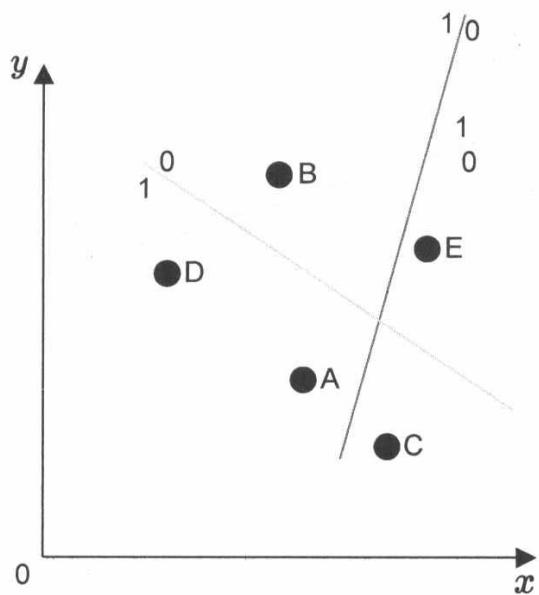  
图4-15 LSH第一次划分

A点经过三条线的划分后，得到了一个新的签名（signature）：101。同理，可以得到其他5个点的签名，如表4-8所示。

表 4-8 所有点的第一个签名  

<table><tr><td>点</td><td>签名</td></tr><tr><td>A</td><td>101</td></tr><tr><td>B</td><td>110</td></tr><tr><td>C</td><td>001</td></tr><tr><td>D</td><td>101</td></tr><tr><td>E</td><td>000</td></tr></table>

接着，LSH将具有同样签名的点放在一起，计算近邻点时只考虑同签名的点，因此A点和D点就会被放在一起。但是问题随之而来了，明明C点是A点的最近邻点，却因为随机空间划分时没有将A点和C点划分在一起导致只能选择D点，错误率未免有些高。LSH算法对此的解决方案是：再随机生成第二组 $k$ 条直线，依旧是每条直线将二维空间一分为二，重复上述步骤，如图4-16所示。

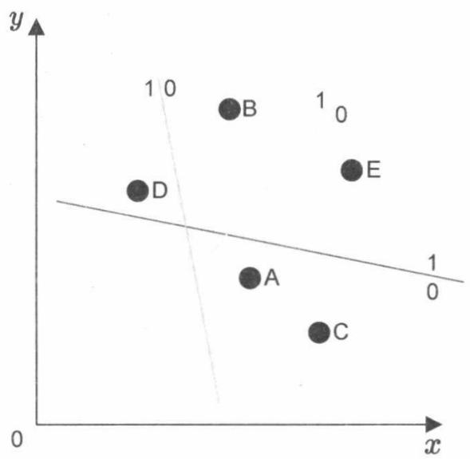  
图4-16 LSH第二次划分

A点经过三条直线的划分后，得到了第二个签名：000。同理，可以得到其他5个点的签名，如表4-9所示。

表 4-9 所有点的第二个签名  

<table><tr><td>点</td><td>签名</td></tr><tr><td>A</td><td>0 0 0</td></tr><tr><td>B</td><td>1 1 0</td></tr><tr><td>C</td><td>0 0 0</td></tr><tr><td>D</td><td>1 1 1</td></tr><tr><td>E</td><td>1 0 0</td></tr></table>

经过这一轮之后可以看到，A点与C点具有相同的签名。加上上一轮与A点具有相同签名的D点，在计算A点的近邻点时，C和D均会作为候选参与计算，最终得到了最近邻C点。

总结一下LSH算法的逻辑，如下。

# LSH算法

假设数据共有 $N$ 个点，每个点的维度为 $D$ （原始数据的向量长度），签名个数为 $L$ ，签名长度为 $k$ 。

(1) for $p$ from 1 to $N$ :

1) 将 $D$ 维的点 $\mathfrak{p}$ 乘以 $D$ 行 $k$ 列的随机初始化矩阵 $\boldsymbol{W}$ ，得到一个 $k$ 维向量（这一步本质上是向量映射的操作，由 $D$ 维映射到了 $k$ 维）  
2) 对于 $k$ 维向量中的每一位，若大于0则将其置为1，否则置为0  
3) 将经过第 2) 步处理后的向量作为 $\mathfrak{p}$ 的签名（signature）end for

(2) 将上述 for 循环重复 $L$ 轮，即可得到所有点的 $L$ 个签名，每个签名长度为 $k$ 。  
(3) 将拥有相同签名（只要两个点的 $L$ 个签名中任意一个相同，就可以说它们拥有相同的签名）的点存储在一起。  
(4) 在计算近邻点时，只需遍历相同签名的点，计算相似度（距离）即可。

注意第(3)步：两个点的签名一样，并不是要求它们 $L$ 个签名完全一样，只要任意一个相同即可。比如A点和C点， $L$ （ $L$ 为2）个签名中第二个是一样的，那么就可以认为它们签名相同，可以存储在一起。LSH算法的主要概念如图4-17所示。

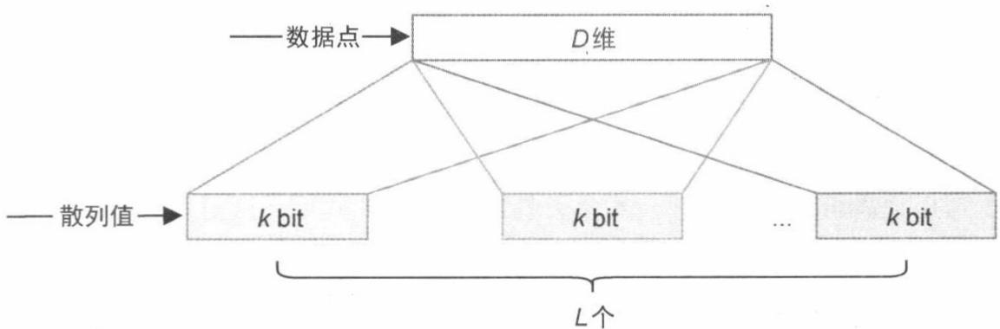  
图4-17 LSH算法的主要概念

可以发现，算法的逻辑还是很简单的，那么它的时间复杂度如何分析呢？

# 4.6.3 时间复杂度分析

对于一个点 $p$ ，要找到它的最近邻点 $q$ ，LSH算法比暴力穷举好多少呢？它的查找时间复杂度是多少呢？


首先可以明确的是，暴力穷举查找点 $\mathfrak{p}$ 的最近邻点 $\mathbf{q}$ 的时间复杂度为 $O(N)$

假设数据点个数为 $N$ ，每个点维度为 $D$ ，签名长度为 $k$ ，签名个数为 $L$ ，首先只考虑一个签名的情况。


因为 $L$ 个签名彼此独立，所以只计算在一个签名下的时间复杂度，再乘以 $L$ 就可以了。

要查找点 $\mathfrak{p}$ 的最近邻点 $\mathbf{q}$ ，步骤如下。

(1) 计算点 $\mathfrak{p}$ 的签名：将 $\mathfrak{p}$ 的 $D$ 维向量映射成 $k$ 维，得到签名 $\mathrm{sig}$ ，时间复杂度为 $T_{1} = Dk$ （ $D$ 维向量乘以 $D$ 行 $k$ 列的矩阵 $\boldsymbol{W}$ ）。  
(2) 签名 sig 下平均点的个数 $n = N / 2^k$ （签名长度为 $k$ ，每个维度取值 1 或 0，可以表示的签名个数为 $2^k$ ， $N$ 个点落在每个签名里的平均个数为 $N / 2^k$ ）。  
(3) 对这 $n$ 个点进行遍历，根据相似度计算公式计算得到最近邻点 $\mathbf{q}$ ，此时计算的是签名内部点的相似度，都是 $D$ 维的点，所以遍历 $n$ 个点的时间复杂度： $T_{2} = Dn = DN / 2^{k}$ 。  
(4) 综合时间复杂度： $T = T_{1} + T_{2} = Dk + DN / 2^{k}$

上述过程计算的是签名个数为1时的时间复杂度。当签名个数为 $L$ 时：

$$
\begin{array}{l} T = L \times (D k + D N / 2 ^ {k}) \\ = L D k + L D N / 2 ^ {k} \tag {4-13} \\ = L D \log N + L D = O (\log N), \text {当 且 仅 当} k = \log N \\ \end{array}
$$

由式(4-13)可得，LSH算法在一定条件下可以将近邻搜索的平均查找时间从 $O(N)$ 降到 $O(\log N)$ 。

LSH算法解决了速度的问题，那么它的精度呢？

# 4.6.4 错误率分析

LSH算法作为一个ANN算法，决定了它不可能 $100\%$ 保证给出的最近邻是真的最近邻，也就是说它肯定会犯错误。一般而言，它会犯的错误分为两种。

□ false negative error: 本来 a 点和 b 点是近邻, 但是 LSH 算法认为不是。  
□ false positive error: 本来 a 点和 b 点不是近邻, 但是 LSH 算法认为是。

# 1. false negative error


本来a点和b点是近邻，但是LSH算法认为不是。

LSH算法如果认为a点和b点不是近邻，那么说明必须满足：a点的 $L$ 个签名和b点的 $L$ 个签名，没有一个是相同的。

每个签名由 $k$ 个bit组成，只要两个签名任意bit不同，那么这两个签名就不一样。因此，false negative error的概率为：

false negative error $= P$ (a和b的 $L$ 个散列值都不一样)  
$= P(\mathrm{hashcode(a)!} = \mathrm{hashcode(b)})^L$ //假设 $L$ 个散列值之间互相独立   
$= P(k$ 个bit中至少有一个不一样）  
$= (1 - P(k\text{个bit完全一样}))^{L}$ (4-14)   
$= (1 - P(\text{某一个bit值一样})^k)^L$ // 假设散列值内部的 $k$ 个bit互相独立  
$= (1 - p^{k})^{L},p = P$ （点a和点b相同位置bit值一样）

# 2. false positive error


本来a点和b点不是近邻，但是LSH算法认为是。

同理，对于a点和b点，LSH算法如果认为它们是近邻，那么必须满足：a点的 $L$ 个签名和b点的 $L$ 个签名，至少有一个是相同的。这个错误率就好计算了。

false negative error $= P$ (a和b的 $L$ 个散列值至少有一个一样)  
$= 1 - P(\mathbf{a}$ 和b的 $L$ 个散列值都不一样）  
$= 1 -$ false negative error (4-15)   
$= 1 - (1 - p^{k})^{L},p = P$ （点a和点b相同位置bit值一样）

3. $p$

现在所有的焦点都聚焦在 $p$ 上了， $p$ 表示 a 点和 b 点相同位置 bit 值一样的概率，这个概率怎么计算呢？

由前面的内容可知，LSH算法的每个签名都由 $k$ 个bit组成，每个bit取值0或1，相当于每一bit都将空间一分为二，其中一个子空间中的值全为1，另一个全为0，如图4-18所示，黑色的线即切割线，切割线两侧的点对应的bit不一样。所以a点和b点要想在切割线切割空间时产生的bit一样，就必须出现在同侧。也就是说：

$$
\begin{array}{l} p = P (\mathrm {a} \text {和} \mathrm {b} \text {经 过 空 间 切 割 后 产 生 的} \mathrm {b i t} \text {值 一 样}) \\ = P (\mathrm {a} \text {和} \mathrm {b} \text {出 现 在 分 隔 线 同 侧}) \\ = 1 - P (\mathrm {a} \text {和} \mathrm {b} \text {出 现 在 分 隔 线 两 侧}) \tag {4-16} \\ = 1 - \frac {\mathrm {a} \text {和} \mathrm {b} \text {的 夹 角}}{\frac {\pi}{2}} \\ \end{array}
$$

  
图4-18相同位置bit值一样的概率（另见彩插）

对于false negative error，如果a点和b点确实是近邻，那么它们在坐标系中的夹角应该比较小，夹角越小，则式(4-16)中的 $p$ 越大，式(4-14)计算出的概率就越小。同理，对于false positive error，如果a点和b点确实不是近邻，那么它们在坐标系中的夹角应该比较大，夹角越大，则式(4-16)中的 $p$ 越小，式(4-15)计算出的概率就越小。

错误率分析关注的是LSH算法做错事的情况，那么它做对事的情况又该如何衡量呢？

# 4.6.5 召回率分析

召回率的定义：假设LSH算法给出Top $N$ 个近邻，其中有 $n$ 个确实是近邻，那么召回率为 $n / N$ 一般认为召回率达到 $95\%$ 以上的ANN算法才算合格。

要评估LSH的召回率，必须知道每个物品groundtruth的近邻，即精确的Top $N$ 近邻，而这只有暴力穷举才能得到。假设有 $M$ 个物品，暴力穷举的时间复杂度约为 $O(M^2)$ ，当 $M$ 达到百万或者更高量级时，暴力穷举无法在合理的时间范围内结束，在这种情况下，一般的处理方法是随

机抽 $S$ 个物品，只计算它们的精确Top $N$ 近邻（ $S$ 的量级远远小于 $M$ ，比如设为10000），这样就把时间复杂度控制在了 $O(MS)$ ，用这 $S$ 个物品的结果去评估算法的性能。

召回率的计算逻辑如下。

# 召回率计算逻辑

# 输入

Top $N$ ：每个商品需要计算Top $N$ 个近邻。  
□ $S$ ：随机抽取 $S$ 个物品，用它们的性能指标来衡量LSH算法召回性能的优劣。  
□ $M$ ：物品个数。

# 评估逻辑

(1) 暴力穷举

```python
bf[item, neighbors] = empty map
for sample from 1 to S:
    heap = N size min heap
    for candidate from 1 to M:
        similarity = similarity Calculation(sample, candidate)
        if similarity > heap.head:
            heap.dequeue()
            heap.enqueue((candidate, similarity))
bf[sample] = heap
end for // 得到 S 个物品对应的真实近邻 true_neighbors 
```

(2) LSH

```txt
lsh[item, neighbors] = lsh_algo(samples, N) // 调用 LSH 算法，得到 S 个物品中每个物品的 // N 个近邻
```

(3) 召回率计算

```python
recall_rate = 0.0
for sample from 1 to S:
    truths = bf.get(sample) // 分别获取暴力穷举和 LSH 计算的每个物品的 N 个近邻
    preds = lsh.get(sample)
    recall_rate += len(truths \\cap\\preds) / N // 交集长度除以 N
end for
recall_rate = recall_rate / S 
```

# 4.7 Word2Vec与LSH

到了将Word2Vec与LSH结合的时候了：使用LSH算法基于Word2Vec模型生成的物品向量计算物品相似度。本章采用的LSH算法非Spark官方提供的，而是第三方开源实现的①，原因在于第三方实现的功能更多，使用更加便捷。代码如下所示：

```scala
// Word2Vec 模型训练  
val word2Vec = new Word2Vec()  
    .setInputCol("ids") // 用户历史行为轨迹  
    .setVectorSize.vectorSize)  
    .setMaxIter(maxIter)  
    .setNegative(5)  
    .setHS(0)  
    .setSample(1E-3)  
    .setMaxSentenceLength(1000)  
    .setNumPartitions(200)  
    .setSeed(77L)  
    .stepSize(0.025)  
    .windowSize(windowSize)  
    .setMinCount(minCount)  
val model = word2Vec.fit(trainData)  
val embedding = model.getVectors.rdd.map(r => {  
    val word = r.getAs(String)(word).toLong // 这里的物品 ID 需要转为 Long 型  
    val vector = r.getAs[org.apache.spark.ml.linalgrates]("vector").toDense(word, vector)  
}) // 生成每个物品的向量  
// LSH  
import com.linkedin(nn_algorithm.CosineSignRandomProjectionNNS  
val topN = 100  
// 采用余弦相似  
val lsh = new CosineSignRandomProjectionNNS()  
    .setNumHashes(numHashes) // 对应 LSH 算法中的签名个数 L  
    .setSignatureLength(signatureLen) // 对应每个签名长度 k  
    .setJoinParallelism(1000) // spark join 并行度，根据自己的数据大小自行设置  
    .setBucketLimit(bucketLimit) // 每个散列桶内保留的元素个数 # 1  
    .setShouldSampleBuckets(true) // # 2  
    .setNumOutputPartitions(100)  
    .createModel.vectorSize) // 物品向量长度  
val similarities = lsh.getSelfAllNearestNeighbors(embeding, topN)  
// 算出来的是距离，这里转换成相似度  
.map { case (item1, item2, distance) => (item1, item2, 1 - distance)}  
.toDF("item1", "item2", "sim")
```

整段代码的逻辑都很直观，这里主要说明以下标注的两行。

注释 #1 处：bucketLimit 控制了每个散列桶内的元素个数上限，物品向量一般并非均匀分布，所以可能某些桶内的物品特别多，这时候就只保留 bucketLimit 个物品，多出来的丢弃。  
注释#2处：对应注释#1的丢弃，这里采用了水塘抽样的方式丢弃超过bucketLimit的物品，关于此种抽样方式这里就不展开了。

# 4.8 总结

□Word2Vec算法源于NLP技术，将单词以向量的形式表示，这样不仅可以捕获单词之间的意义，而且极大地增强了算法在自然语言领域的能力。  
一般有两种方法来训练Word2Vec：Skip-Gram和CBOW，前者通过中心词来预测周围词，后者通过周围词来预测中心词。对于大数据集，一般使用Skip-Gram训练方法。  
□考虑模型的可扩展性和工程性能，采用Negative Sampling对负例进行采样，采样时考虑每个词出现的次数。训练过程中，也可以采用Sub-Sampling技术以随机丢弃的方式对热门词进行惩罚。  
□ 当把Word2Vec算法套用在推荐系统中时，又称为Item2Vec算法，使用类比的手法进行数据处理：将物品作为单词，用户的行为轨迹作为文档。  
□ 训练出物品的向量后，一般根据每个物品的向量去计算物品之间的余弦相似度，得到一张与协同过滤等算法类似的物品相似度表，然后对外提供服务。  
□在海量物品向量下计算物品相似度时，常见的做法是使用ANN算法，运算的时间复杂度大幅降低的同时结果的精度不会损失太多。  
□ LSH算法作为ANN算法的一员，简单易懂，离线的效果一般也不错。其时间复杂度、错误率、召回率等是理解该算法所需要掌握的一些主要指标。但是LSH算法只能在离线环境和对算法延迟要求不高的场景中使用。一旦要求低延迟、高召回率，LSH算法显然就有点儿力不从心了。第5章会介绍另外一种ANN算法以满足实时性和高召回率的要求。

# 第5章

# 深度学习双塔召回

回顾一下 Item-Based CF 算法、关联规则算法以及 Word2Vec 算法，会发现它们都会生成一张物品与物品之间的关系表。不管这种关系是相似性还是关联性，终究是物品间的某种关系，对外提供服务的方式也几乎一样：推荐与用户历史行为物品相似的物品。这种计算物品与物品之间关系的召回方式叫作 item 2 item，简称 i2i，主要用于相似推荐、相关推荐、关联推荐等。图 5-1 展示了京东和淘宝在首页推荐中大量使用了找相似功能。当然，i2i（协同过滤、关联规则等）也有天生的缺陷：首先，新品很难被推荐出来，因为新品的用户行为一般较少，所以很难计算出与其他物品的相似/相关关系；其次，因为新用户不存在历史行为，所以没有办法根据其历史行为做推荐。

  
图5-1 找相似

除了找相似之外，还有另外一种常用的召回方式：根据用户的兴趣爱好去做推荐，而不仅仅是历史行为轨迹，比如视频网站发现用户喜欢周星驰、喜剧等题材的电影从而为用户推荐沈腾、贾玲、憨豆等的作品——这种计算用户与物品之间关系的召回方式叫作user 2 item，简称u2i，同样应用得十分广泛。不同于i2i召回方式只关注物品而忽略了用户，u2i从用户的兴趣角度去做推荐，因而往往更加复杂，但是一旦将这种召回方式设计和运用得当，那么它带来的回报也会相当可观。

i2i的召回方式十分容易理解，也特别符合正常思维，但是u2i的召回方式就不太好理解了：

□怎么获知用户的兴趣？  
□怎么知道用户的兴趣与物品属性之间的关系？  
□在用户对物品A和物品B都没有任何历史行为的前提下，如何判定用户更喜欢哪个？

本章将解答以上这些问题。

# 5.1 向量化

假设小郭打算给自己买一件衣服，并且她有一些购物倾向：颜色——不要太花哨；款式——均可；风格——偏休闲；面料——最好棉质；价格——适中。带着这样的预期她逛了几家服装店后，心里有了一些候选，如表5-1所示。

表 5-1 小郭的候选服装  

<table><tr><td>衣服\属性</td><td>颜色</td><td>款式</td><td>风格</td><td>面料</td><td>价格</td></tr><tr><td>连衣裙</td><td>碎花</td><td>A字型</td><td>小清新</td><td>棉</td><td>中</td></tr><tr><td>半身裙</td><td>黑色</td><td>长款</td><td>休闲</td><td>皮</td><td>高</td></tr><tr><td>长裤</td><td>黑色</td><td>西装裤</td><td>职业</td><td>棉</td><td>中高</td></tr></table>

小郭开始对这几件候选服装进行了打分和排名。

□ 连衣裙：颜色 $+1$ 、款式 $+1$ 、风格 $+1$ 、面料 $+1$ 、价格 $+1$ ，一共5分。  
□半身裙：颜色 $+1$ 、款式 $+1$ 、风格 $+1$ 、面料 $+0$ 、价格 $+0$ ，一共3分。  
□长裤：颜色 $+1$ 、款式 $+1$ 、风格 $+0.5$ 、面料 $+1$ 、价格 $+0.5$ ，一共4分。

显然，最后小郭选择了连衣裙。她为什么会做出这样的选择呢？这个问题似乎有点儿过于简单了——她当然要选择最符合兴趣的那个。如果把小郭打分的过程强行用数字化的方式表达出来，借助向量化的概念：将人的兴趣和物的属性分别表示成向量，两者之间的夹角越小，则表示人越喜欢物，夹角越大则兴趣越低，这恰好是 $\cos \theta$ 的特性，即余弦相似度。也就是说，如果能

够知道每个用户的兴趣向量、物品的属性向量，那么自然而然就可以为所有用户做推荐了：取与用户向量余弦相似度最高的 $N$ 个物品向量对应的物品作为推荐结果即可。

问题在于，如何得到图5-2中的用户向量和物品向量呢？

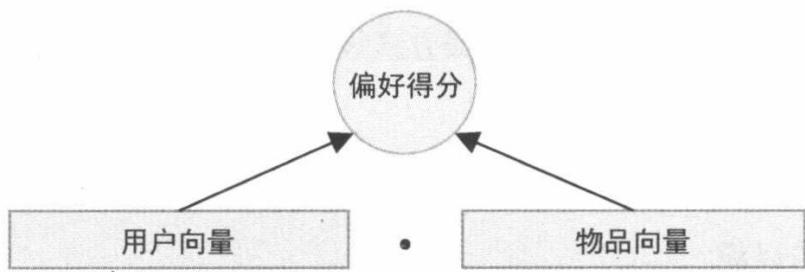  
图5-2 人和物的向量内积

# 5.2 双塔模型

图5-3为最简单的深度学习模型结构，由下至上：输入 $x$ 经过多个隐藏层输出 $y$ 。一般来说，每一层的维度都比上一层小，整体看上去像是塔状结构，因此有时简称塔（tower）。

  
图5-3 最简单的深度学习模型结构

那么，怎样通过这种模型结构来同时对人的兴趣向量和物品的属性向量建模呢？如果真的可以达到这样的效果，那么每个用户以及每个物品都可以生成对应的向量，然后就可以根据向量的余弦相似度去给用户做推荐了——这正是双塔模型所要完成的任务：一个模型同时对用户向

量和物品向量建模。图5-4展示了该模型的网络结构，左右各有一个塔形的结构，这也正是它的名字——双塔——的由来。

  
图5-4 双塔模型结构

可以看到，双塔的输入特征要有所限制。具体来说，用户侧塔的输入特征必须是用户特征或者上下文特征（比如手机型号、网络类型、操作系统等非物品特征），物品侧塔的输入特征必须是物品特征（后文会介绍为什么要这么设计），各自的输入经过前几层隐藏层之后，最后一层隐藏层即为用户向量表示和物品向量表示，根据两者的内积（如果两个向量已经分别归一化，那么其内积就是余弦相似度）得到输出预测值 $\hat{y}$ ，通过计算预测值与真实值之间的损失，再反向传播更新参数，达到模型“学习”的目的。

因此，双塔模型被设计用来学习用户向量和物品向量，最终目的是通过这两个向量的余弦相似度去获得用户最可能感兴趣的物品，从而完成个性化推荐。双塔模型的原理非常简单，值得关注的是模型训练前的数据处理（尤其是正负样本的选择）以及模型对外服务时对于高性能、低延迟（毫秒级完成一次实时个性化推荐）的要求。


本章暂时不会涉及具体的数据处理和模型训练代码：生成适用于 TensorFlow 的训练数据以及使用 TensorFlow 实现深度学习模型训练和对外服务的细节会在本书的第二部分再做详细说明。

接下来以一个具体的业务应用场景为例来说明双塔模型的诞生和应用。

假设该业务的目标是：提升某电商平台首页“猜你喜欢”的点击率。那么应该如何根据这个具体目标，通过建模，将双塔模型与实际应用场景结合起来，解决业务问题呢？

# 5.2.1 数据准备

作为一个点击率预估任务，在准备训练数据时，需要确定标签和特征。

# 1.标签

既然目标是提升点击率，那么数据的标签就很容易确定：曝光点击的正样本标签为1，曝光未点击的负样本标签为0（此处关于负样本的描述不是很严谨，不过暂时不影响理解本节内容，后文会说明负样本生成需要注意的事项）。


曝光：用户实际看到了某件物品，就称为一次曝光。点击：用户看到物品之后点击了该物品，就称为一次点击。

# 2. 特征

一般个性化推荐系统会从以下4个方面去挖掘模型所需的特征

□用户信息：用户ID、年龄、性别……  
□ 物品信息：物品ID、物品类别ID、品牌ID、店铺ID、价格……   
□上下文信息：事件发生时的一些环境信息，比如用户使用的手机品牌、操作系统，所在城市，事件发生的时间，页面ID……  
用户行为信息：用户过去一段时间内浏览/加购/收藏/购买过的物品/店铺/类别/品牌……

# 5.2.2 模型训练

数据准备好之后，会生成类似表5-2所示的训练元数据，表中是一些常用的特征及其格式，包括用户、物品、上下文和用户行为等4种最重要的特征。将训练数据输入双塔模型，如图5-5所示。

表 5-2 训练数据  

<table><tr><td>user id</td><td>gender</td><td>age</td><td>item id</td><td>shop id</td><td>phone brand</td><td>phone os</td><td>city</td><td>hour</td><td>history clicks</td></tr><tr><td>用户ID</td><td>用户性别</td><td>用户年龄</td><td>物品ID</td><td>店铺ID</td><td>手机品牌</td><td>操作系统</td><td>城市</td><td>时间</td><td>历史点击物品ID</td></tr></table>


一般情况下，对于用户的一些信息，比如年龄和性别，如果用户不主动告知，是没法准确知道的（在合法合规的前提下）。因此大多数时候会有另外一个任务，去训练一些算法模型，专门用于预测用户的年龄和性别等信息，然后这些预测信息会被周期性地写入用户画像供其他应用使用，比如推荐和搜索等业务。

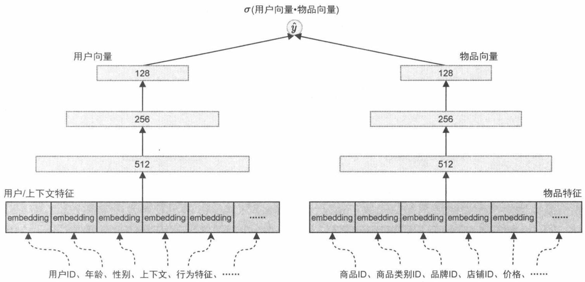  
图5-5 双塔模型数据流

一次训练的流程如下：

□原始特征经过embedding层之后，拼接起来；  
左右两个塔各自经过[512,256,128]三层网络；  
□ 将最后一层隐藏层作为用户向量和物品向量，维度均为128，注意最后一层隐藏层的维度必须一致，否则无法做向量内积；  
□ 将用户向量与物品向量分别做归一化处理之后得到的各自单位向量进行内积，对其应用 sigmoid 函数，得到预测点击率 $\hat{y}$ ；  
□根据预测值 $\hat{y}$ 与真实值 $y$ 计算损失值；  
□反向传播，更新参数梯度，完成一次模型的“学习”；  
□下一批数据继续训练，周而复始直到全量训练数据遍历完毕。

上面描述的是一次完整的双塔模型训练流程，与一般的深度学习训练并无太大差异，只不过需要注意的是，用户侧塔只接收非物品特征作为输入，物品侧塔只接收物品特征作为输入。

# 5.2.3 模型对外服务

当模型训练完毕，紧接着就需要让模型对外提供服务。一般来说，双塔模型在召回系统中的使用如图5-6所示，从这里可以发现，在对外服务时，两座塔需要分开使用。

  
图5-6 双塔模型对外服务拆解

□ 用户侧塔：该侧的塔会被推送到线上用于实时预测，输入是用户特征以及上下文特征（无物品特征），输出是用户向量。  
□ 物品侧塔：该侧的塔与用户侧塔的使用方式差异比较大。

■在离线环境，遍历所有物品，将每个物品的特征输入该塔，得到每个物品的向量。  
- 将生成的所有物品向量同步到线上环境。

因此当用户请求到来时，整个双塔的运用流程如下：

(1) 将用户特征输入用户侧塔，得到用户向量；  
(2) 对用户向量与所有物品向量求余弦相似度，取最相似的Top $N$ 个物品作为召回结果返回。

很容易发现，双塔模型的应用——不管是用户侧塔还是物品侧塔——处理方式都比较简单直接，前者在线上环境实时预测得到用户向量，后者在离线环境进行批量推理得到物品向量，然后计算两者的余弦相似度即可完成一次推荐。

可是，这一切真的这么简单吗？用户向量与所有物品向量求余弦相似度！时间复杂度为 $O(N)$ ， $N$ 是物品个数，当 $N$ 突破百万级的时候，该复杂度会导致根本无法保证在毫秒级的时间内给出召回结果——这是双塔模型在对外服务时最核心也最重要的问题：如何保证一个用户向量在百万/千万级的物品向量中能够在毫秒级的时间内给出 Top $N$ 个相似度最高的结果？因为通过

朴素的遍历全量物品已经无法满足要求，所以需要一种高效的近邻搜索算法，它必须具备极低的时间复杂度和较高的检索精度，不仅能够满足实时检索的要求，还必须满足高召回率的要求。双塔模型线上对外服务的核心问题就转化成了——如何从海量物品中在毫秒级的响应时间内返回与用户最相关的Top $N$ 个物品。而这个问题的解决方案就是接下来要详细讲述的高性能ANN算法之一：HNSW算法。

# 5.3 HNSW算法

HNSW算法①，全称是hierarchical navigable small world graphs，从第一个和最后一个单词可以看出，这种算法依赖的数据结构是分层的图结构。它最主要的功能是根据给定的查询向量，快速地从海量的候选向量中以足够高的精度检索出最相似的元素。作为ANN算法的一种，它与LSH算法一样，在速度和精度之间需要取舍。本章的后半部分会讲到，HNSW算法的精度极高（召回率很容易达到 $95\%+$ ）且检索速度极快。

在详细介绍 HNSW 算法的原理以及诸多细节之前，首先将目光转向跳表这种数据结构，如果说 HNSW 算法依赖的是分层的图结构，那么跳表就是分层的链表结构，在掌握了跳表之后，再理解 HNSW 算法会容易得多。要理解跳表，先从二分查找开始。

# 5.3.1 二分查找

二分查找是在有序数组中查找某个元素时常用的算法之一，比如在生活中经常玩的猜数字的游戏，如图5-7所示。这个游戏完美地将二分查找的思想运用到了实际生活中：

(1) 猜数时，选择上界与下界的中间值，猜对就返回；  
(2) 如果答案比中间值小，那么就把上界设为中间值-1，如果答案比中间值大，那么就把下界设为中间值+1；  
(3) 使用更新后的上界或者下界，回到第 (1) 步继续猜，直到猜出数字。

  
图5-7 猜数字游戏

每次能够将待查找的元素个数缩减一半。简单分析二分查找的时间复杂度：假设初始的元素个数为 $n$ ，第一次查找后个数变为 $n / 2$ ，第三次查找后个数变为 $n / 4$ ，……，第 $t$ 次查找后个数变为1，查找结束。那么这个 $t$ 就是算法的时间复杂度，由下式可以很容易地计算出时间复杂度是 $\log_2n$ 。

$$
n \times \left(\frac {1}{2}\right) ^ {t} = 1 \Rightarrow t = \log_ {2} n
$$

二分查找的代码实现如下：

def binary_search(arr, x):

11 11

注意：如果查找失败，不能返回 -1，因为在 Python 中，-1 是有效的索引值，表示数组的最后一位

if not arr:

return None

low = 0

high = len(arr) - 1

mid = 0

while low $<=$ high:

mid $=$ (high $^+$ low) // 2

if arr[mid] $<  x$ low $=$ mid $+1$ elif arr[mid] $>$ x: high $=$ mid-1 else: return mid   
return None

# 5.3.2 有序链表

二分查找虽然简单易懂，查找的时间复杂度也很低，但是它的局限性比较大：只能用在类似数组这样的顺序表结构中，要求能够根据下标来访问。对于有序链表结构，普通的二分查找就显得无能为力了，因为链表不支持随机访问，只能从头指针开始访问（单向链表）。

如果我们把链表中的节点想象成公交站，公交车必须从始发站发车，逐个停靠沿途站点直至终点站。如果不巧乘客正好是从始发站上车，目的地是终点站，如图5-8所示，由于公交车在每一站都会停留片刻，因此乘客整个行程会花费很多时间。倘若大部分站点没有人上下车，那么通勤时间就显得更为浪费，有没有比较好的办法来解决这个问题呢？

  
图5-8 公交车路线

公交公司经过调研发现，有不少站点人流量特别小，因此决定对原先的路线进行优化调整，在这条线路上开通了大站快车——只在大站点停靠、小站点不停的班车。图5-9展示了调整后大站快车的路线。

  
图5-9 大站快车路线

开通大站快车后，只需要停靠4次即可实现从A站到I站，相比原始路线的7次缩短了一半时间。如果乘客的目的地是F站，那么他乘坐大站快车的路线可能是这样：

(1)大站快车从A站出发；  
(2) 到达D站，此时发现大站快车的下一站G站比目的地F站要远，于是选择下车，换乘普通公交，下一站为E站；  
(3) 到达E站，再到F站，下车。

途中只需停靠D、E共2站（这里不考虑换乘公交所花费的时间），而普通公交需要停靠B、C、D、E共4站。

由图5-9可以看出，相较于有序链表，似乎可以在它的基础上再叠加一层有序链表，从而实现大幅降低算法查找时间复杂度的目的。如果思维再扩展一点儿，是不是叠加的层数越多，时间复杂度越低呢？但是层数越多，似乎空间复杂度又变高了，这种以空间换时间的处理方式值不值得尝试？具体的时间复杂度和空间复杂度到底是多少？如何量化？

这要用到接下来要介绍的数据结构——跳表。

# 5.3.3 跳表

跳表在原始有序链表的基础上增加了多层链表（也叫多级索引），通过多级索引之间的跳转来实现快速查找。

传统的链表我们都知道每个元素会有一个 next 指针，指向下一个元素，而跳表因为其结构的原因，又在每个元素上添加了另外一个指针——down 指针，图 5-10 展示了只有一级索引的跳表结构。

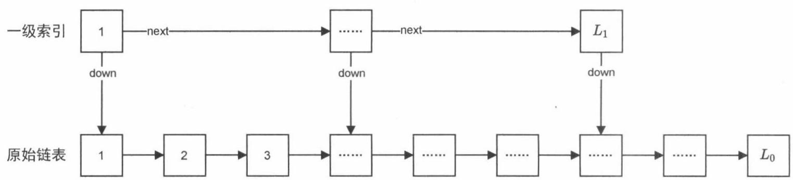  
图5-10 一级索引的跳表

根据图5-10，跳表的查询逻辑（假设原始有序链表从小到大）如下。

(1) 待查找的元素值为 $q$ 。  
(2) 从最顶层索引开始，当前节点为 $p$ 。

(3) 如果 $p$ 的值等于 $q$ ，返回 $p$ 。  
(4) 如果 $p$ 的值大于 $q$ ，返回 NULL（大于 $q$ 的情况只可能出现在首次比较，说明原始有序链表最小值都比 $q$ 大）。  
(5) 如果 $p$ 的值小于 $q$ ，则查看 $p$ 的 next 节点：

1) 如果 next 节点为空，返回 NULL；  
2) 如果 next 节点的值等于 q，返回 next 节点；  
3) 如果 next 节点的值小于 q，说明要查找的元素 q 不可能在 p 和 p 的 next 节点之间，p 移动到 p 的 next 节点；  
4) 如果 next 节点的值大于 q，说明要查找的元素 q 只可能在 p 和 p 的 next 节点之间，p 移动到 p 的 down 节点，如果 down 节点为空，返回 NULL。

(6)回到第(3)步，重复 $(3)\sim (5)$ 步。  
(7) 返回查找到的结果或者 NULL。

跳表的查询逻辑还是比较简单直观的，有意思的是它的时间复杂度和空间复杂度分析：它到底利用了多少空间交换了多少时间？

# 1.时间复杂度

观察图5-10，只含有一级索引的跳表，原始有序链表的长度为 $\left|L_0\right|$ ，一级索引的长度为 $\left|L_1\right|$ 。这里假设 $\left|L_0\right|$ 是 $\left|L_1\right|$ 的整数倍（该假设不会影响复杂度分析），一级索引把原始链表分成了 $\frac{\left|L_0\right|}{\left|L_1\right|}$ 段。当一次查询从 $L_1$ 跳至 $L_0$ 时，在 $L_0$ 上的遍历次数最多为 $\frac{\left|L_0\right|}{\left|L_1\right|}$ 。


因为查询一旦从 $L_{1}$ 跳至 $L_{0}$ ，说明要查找的数在 $L_{1}$ 上大于当前节点且小于下个节点，而 $L_{1}$ 上两个节点的距离为 $\frac{|L_0|}{|L_1|}$ ，所以在 $L_{0}$ 上最多需要遍历 $\frac{|L_0|}{|L_1|}$ 次。

因此，只含有一级索引跳表的查询时间复杂度（假设原始链表元素个数等于 $N$ ， $N = \left|L_0\right|$ ）为：

$T =$ 在 $L_{1}$ 上查找的时间 $+$ 在 $L_{0}$ 上查找的时间

$$
\begin{array}{l} = \left| L _ {1} \right| + \frac {\left| L _ {0} \right|}{\left| L _ {1} \right|} \\ \geqslant 2 \sqrt {\left| L _ {1} \right| \times \frac {\left| L _ {0} \right|}{\left| L _ {1} \right|}} \\ = 2 \sqrt {\left| L _ {0} \right|} = 2 N ^ {\frac {1}{2}} \\ \end{array}
$$

这个结果有点儿出人意料：仅仅加了一级索引，但是时间复杂度从 $O(N)$ 降到了 $O(\sqrt{N})$ ，这样的空间换时间好像性价比很高。那么如果添加更多索引，时间复杂度又是多少呢？

当跳表具有三层链表（即含有二级索引）时，其时间复杂度为：

$T =$ 在 $L_{2}$ 上查找的时间 $+$ 在 $L_{1}$ 上查找的时间 $+$ 在 $L_{0}$ 上查找的时间

$$
\begin{array}{l} = \left| L _ {2} \right| + \frac {\left| L _ {1} \right|}{\left| L _ {2} \right|} + \frac {\left| L _ {0} \right|}{\left| L _ {1} \right|} \\ \geqslant 3 \sqrt [ 3 ]{\left| L _ {2} \right| \times \frac {\left| L _ {1} \right|}{\left| L _ {2} \right|} \times \frac {\left| L _ {0} \right|}{\left| L _ {1} \right|}} \tag {5-1} \\ = 3 \sqrt [ 3 ]{\left| L _ {0} \right|} = 3 N ^ {\frac {1}{3}} \\ \end{array}
$$


式(5-1)中的不等式用到了均值定理，即：

$x_{1}, x_{2}, x_{3}, \cdots, x_{n}$ 为正数时， $\frac{x_{1} + x_{2} + \cdots + x_{n}}{n} \geqslant \sqrt[n]{x_{1}x_{2}\cdots x_{n}}$ ，当且仅当 $x_{1} = x_{2} = x_{3} = \cdots = x_{n}$ 时等号成立。

假设最顶层链表的元素个数为常数 $m$ ，如果想让式(5-1)中的等号成立，则下一层的元素个数为 $m^2$ ，再下一层为 $m^3$ ，…，最底层的原始链表元素个数为 $N$ ，可以很容易地算出从最顶层到最底层的链表层数为 $\log_m N$ ，而此时的时间复杂度为：

$$
\begin{array}{l} T = \left(\log_ {m} N\right) \times N ^ {\frac {1}{\log_ {m} N}} \\ = \left(\log_ {m} N\right) \times N ^ {\log_ {N} m} \tag {5-2} \\ = m \times \log_ {m} N \\ \end{array}
$$

式(5-2)表明，跳表的查找时间复杂度出人意料地为 $O(\log_mN)$ ，与二分查找的时间复杂度一样，也就是说，二分查找可以不再局限于数组这种顺序存储结构了，有序链表这种结构也可以达到与二分查找类似的时间复杂度——这正是跳表的优点所在。

但是，仔细回想跳表的多级索引，为了达到 $O(\log N)$ 的时间复杂度，数据结构上付出了一定的代价——使用了 $\log_m N$ 个链表，每个链表的个数都是 $m$ 的指数次（ $m, m^2, m^3, \dots, m^{\log_m N}$ ）。那么跳表到底占用了多少空间呢？它的空间复杂度是多少？

# 2 空间复杂度

链表个数为 $\log_m N$ ，每个链表的长度从最顶层到最底层（原始链表）依次为 $m, m^2, m^3, \dots, m^{\log_m N}$ ，则总的链表长度为：

$$
\begin{array}{l} L = m + m ^ {2} + m ^ {3} + \dots + m ^ {\log_ {m} N} \\ = m \times \frac {1 - m ^ {\log_ {m} N}}{1 - m} \quad / / \text {等 比 数 列 求 和} \\ = m \times \frac {N - 1}{m - 1} \\ \end{array}
$$

即空间复杂度还是 $O(N)$ ，这是个好消息，说明跳表并不是那么占空间。很容易计算出，由于多级索引而需要额外增加的空间为 $L - N = \frac{N}{m - 1} - \frac{m}{m - 1} \approx \frac{N}{m - 1}$ ，当 $N >> m$ 。

如果 $m = 2$ ，则额外需要 $N$ 个空间；如果 $m = 3$ ，额外需要 $\frac{N}{2}$ 个空间，……，因此很容易发现，只需要不超过 $N$ 个额外空间，就能达到 $\log N$ 的时间复杂度，这种空间换时间的交换还是特别划算的。


这里的分析只考虑链表中元素本身占用的空间，忽略了 next 指针和 down 指针的空间占用情况。不过实际工作中对于空间复杂度的要求一般远远低于对时间复杂度的要求。

以上便是对跳表的详细讲述，包括其设计原理、时间复杂度和空间复杂度。


跳表的性能特别优秀，Redis底层的某些功能就是通过跳表实现的，这种数据结构是Java自带的实现之一，这里就不展开了。

不过，到目前为止我们介绍的都是对于单个元素的查找，如果查询的元素是向量怎么办呢？跳表好像无能为力了，因为它只适用于元素是单值的情况。但是可不可以从跳表的思想中受到启发——也生成多级索引，每一级的索引都是下一级索引的子集，只不过这些索引不再是链表，而是一个个高维度的空间结构——从而能够快速且精确地搜索到查询元素最近邻呢？

# 5.3.4 HNSW算法①

HNSW算法的全称为hierarchical navigable small world graphs，从首字母就可以看出它的实现依赖一种分层的数据结构，每一层都是一张图结构。正是这一层层（是不是想到了跳表的层？）的图结构，实现了HNSW算法的高效近邻搜索。每一层的数据结构又叫作NSW（navigable small world）——NSW算法本身也是一种ANN算法，它之于HNSW就像链表之于跳表：跳表是由一层层的链表实现的，HNSW是由一层层的NSW实现的。因此只要掌握了NSW算法，HNSW算法也就基本上掌握了。

# 1. NSW 算法①

对于所有的ANN算法，理想的情况是它们最好能满足以下几个要求。

□快：查找效率高，能够快速地找到近邻   
□准：给出的近邻点尽可能为真实的近邻点，相近的点尽可能互为“友点”。  
□ 稳：不能有查找不到近邻点的情况，每个点都得有“友点”，不能存在“孤点”。

针对以上三个条件，NSW算法又是如何一一满足的呢？如图5-11所示，13个点都位于一张图（GRAPH）中，其中的蓝色节点（node）代表真实的数据点，顶点与顶点之间的黑色边（edge）代表数据之间的连接（connection），红色线代表两个节点之间存在“高速公路/远程连接”（long range link，后文会细说），有连接的两个点被称为“友点”（friend）。

  
图5-11 NSW GRAPH（另见彩插）

了解了这些主要概念之后，先来厘清NSW算法的最近邻搜索逻辑：给定一个查询点，如何找到该点的最近邻？回答完这个问题，再回头来详细讲述这个神奇的高速公路机制。

假设数据已经根据某种规则形成了一张类似图5-11中的GRAPH，对于给定的查询点，查找其最近邻的逻辑如下。

# NSW算法查找逻辑

```csv
Search(q,ep,ef) 
```

□输入：查询点q，初始进入点ep，近邻个数ef   
输出：查询点 $q$ 的ef个近邻点

$\begin{array}{l}\mathrm{v}\leftarrow \mathrm{ep} / / \text{已访问的点集合} / / 1\\ \mathrm{C}\leftarrow \mathrm{ep} / / \text{候选点集合} / / 2\\ \mathrm{W}\leftarrow \mathrm{ep} / / \text{已找到的近邻点集合} / / 3\\ \mathrm{while} |C| > 0\\ \mathrm{c}\leftarrow \mathrm{from} C\text{中找到离} q\text{最近的点} / / 4\\ \mathrm{f}\leftarrow \mathrm{from} W\text{中找到离} q\text{最远的点} / / 5\\ \mathrm{if~distance}(c,q) > \mathrm{distance}(f,q) / / 6\\ \mathrm{break} / / c\text{比} f\text{还远，停止搜索} / / 7\\ \mathrm{for~each} e\in \mathrm{neighbourhood}(c) / / 8\text{遍历} c\text{的友点，更新} C\text{和} W\\ \mathrm{if~e\notin v / / 9}\\ \mathrm{v}\leftarrow \mathrm{v}\bigcup \mathrm{e} / / 10\\ \mathrm{f}\leftarrow \mathrm{from} W\text{中找到离} q\text{点最远的点} / / 11\\ \mathrm{if~distance(e,q) <   distance(f,q)~or~|W| <   ef / / 12}\\ \mathrm{C}\leftarrow \mathrm{C}\bigcup \mathrm{e} / / 13\\ \mathrm{W}\leftarrow \mathrm{W}\bigcup \mathrm{e} / / 14\\ \mathrm{if~|W| > ef / / 15}\\ \mathrm{from} W\text{中删除离} q\text{点最远的点} / / 16\\ \mathrm{return} W / / 17 \end{array}$

一旦有了查询算法，构建GRAPH就简单了很多，如下伪代码显示了节点插入的逻辑。

# NSW算法插入逻辑

```javascript
NearestNeighborInsert(q,ep,ef) 
```

□输入：查询点q、初始进入点ep、近邻个数ef   
功能：连接q和近邻点，生成GRAPH

//先查找到q的最近邻  
neighbors $\equiv$ Search(q,ep,ef)  
for $i\gets 0$ tof-1//将q和neighbors[i]连接起来neighbors[i].connect(q)q.connect(neighbors[i])

在了解了NSW算法的查询逻辑之后，依然有一个遗留问题——NSW独有的高速公路机制到底是怎么回事儿？

# 高速公路

为了展现高速公路机制的好处，以图5-11的原始GRAPH以及伪代码Search函数为例，目标是在GRAPH中查找绿色点query的1个最近邻，查找步骤如下（这里为简单起见，所有的数据结构均画成数组形式，实际上是通过大/小顶堆来实现的）。

(1) 伪代码第1、第2、第3行：初始化V、C、W，假设初始进入点ep为点A，如图5-12所示。

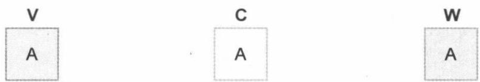  
图5-12 初始化

(2) 第4、第5、第6、第7行：此时C中只有A点，因此变量c就是A点。取出A点，随后从C中删除A点，此时W中也只有A点，第6行判断条件不成立，直接进入第8行。  
(3) 第8行：此时c为A点，遍历A点的友点B、E、F。

1) B点

i. 第11、第12行：此行的变量e是B点，变量f是A点，B点与query点的距离小于A点与query点的距离，第12行的判断条件满足。  
ii. 第13、第14、第15行：更新C和W，由于只需要1个最近邻，因此删除W中离query较远的点（A点），如图5-13所示。

  
图5-13 更新B点

2) E点：第11、第12行：此行的变量e是E点，变量f是B点，B点与query点的距离小于E点与query点的距离，第12行的判断条件不满足，只更新V，如图5-14所示。

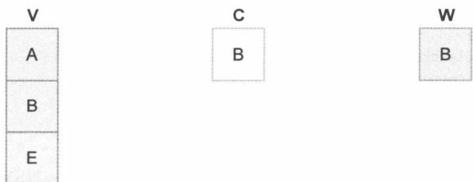  
图5-14 标记E点为已访问

3) F 点: 与 E 点类似, 与 query 点的距离均比 B 点与 query 点的距离远, 只更新 V, 如图 5-15 所示。

  
图5-15 标记F点为已访问

(4)回到第4、第5行：变量c和变量f均为B点，进入第8行。  
(5) 第8行：此时c为B点，遍历B点的友点A、C、F、H、I、J……

重点来了：在第(5)步我们惊讶地发现可以直接通过B点找到C点，由于C点与真实近邻D点特别接近，因此再经过一步即可由C点找到D点，查询结束——B点和C点之间的长连接正是算法中提到的高速公路机制：如果没有它，从A点到B点再到C点到D点可能要经过很多步，而现在只需要少数几个节点间的跳转就能到达目的地，查找效率大大提升。

# 高速公路的形成

现在以5个点来演示一遍NSW GRAPH的构建，并以此来说明GRAPH中最为重要的高速公路的形成以及消失。5个点在空间中的分布如图5-16所示，假定每个点最多只能有2个邻居/友点。

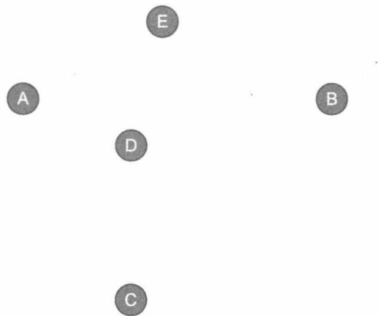  
图5-16 点的分布

(1) 首先插入A点，GRAPH如图5-17所示

  
图5-17 GRAPH插入A点

(2) 插入 B 点，此时只有一个 A 点，于是 A 添加 B 为邻居节点，B 也添加 A 为邻居节点（双向箭头表示 A、B 互为邻居节点），如图 5-18 所示。

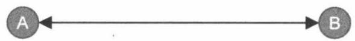  
图5-18 GRAPH插入B点

(3) 插入 C 点，此时 GRAPH 上有 A 点和 B 点，且 A 和 B 的邻居均少于 2 个，于是 C 将 A、B 作为邻居节点，A 和 B 也各自将 C 添加为邻居节点，如图 5-19 所示。

  
图5-19 GRAPH插入C点

(4) 插入 D 点，此时 GRAPH 上有 3 个节点，根据节点插入逻辑，D 要先找到近邻点，再与之形成连接。通过近邻查找算法，D 找到了 A 点和 C 点，于是 D 点与 A 点、C 点形成连接。

□A点此时的邻居数大于2（B、C、D），需要丢弃一个，显然A点会丢弃B点，因为B点最远。  
□C点此时的邻居数也大于2（A、B、D），同理，C点也丢弃B点。

经过上述调整后的GRAPH如图5-20所示，红色线表示原先GRAPH中的邻居关系发生了变化，此时B点到A点、C点的连接均变成了单向箭头：A点到B点的高速公路消失了，C点到B点的高速公路也消失了。

  
图5-20 GRAPH插入D点（另见彩插）

(5) 插入 E 点（如图 5-21 所示），同理，E 点要先找到近邻的 2 个点，得到 A 点和 D 点。因为 A 点和 D 点已经有了 2 个邻居了，所以这两个点要再次更新：

□A点会丢弃C点，意味着A到C的高速公路也消失了；  
D点也会丢弃C点。

  
图5-21 GRAPH插入E点

通过以上节点插入过程的简单演示，可以得到如下结论：

□高速公路机制在GRAPH构建的早期更容易产生，因为此时节点较少，两个距离较远的点有很大的可能性会作为邻居节点连接起来；  
随着加入GRAPH的节点越来越多，高速公路越来越少。

而在NSW算法中，高速公路机制在提高近邻搜索效率上发挥着至关重要的作用，它的消失会大大损害算法的性能，因此需要一种NSW的优化算法，这种算法可以保证即使在节点越来越多的情况下，高速公路也不会减少——这就是HNSW算法。

# 2.HNSW算法

高速公路越来越少的根源在于插入的节点越来越多：早期生成的节点之间的连接渐渐被后插入的更近的节点取代。于是，一个绝妙的想法产生了——将跳表的思想与NSW算法的思想结合起来，就创造出了HNSW算法。图5-22展示了它的结构，从中可以看出明显的跳表和NSW的痕迹。

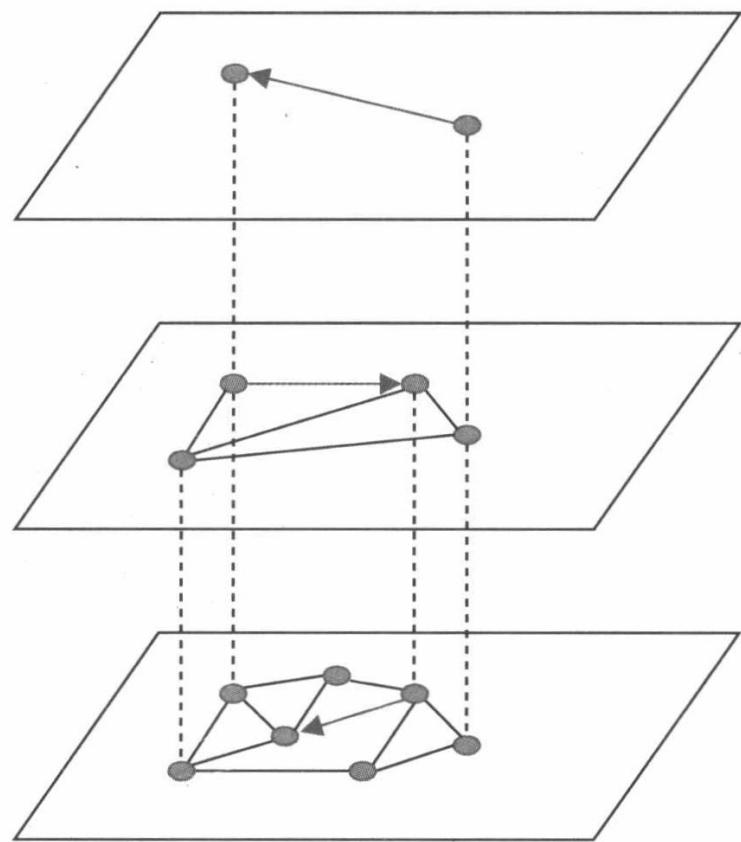  
图5-22 HNSW结构（另见彩插）

图5-22中的蓝色节点为数据节点，绿色节点为待查询近邻节点，红色线为高速公路，黑色线为邻居连接。

每个节点会被随机分层，最底层（第0层）含有所有的数据节点，每往上一层，节点数呈指数级减少。每一层都是一张NSW GRAPH。

在上层结构中，高速公路机制可以很好地发挥作用，能够快速定位到待查询节点附近。越往下层，查找越精准，最终到最底层时，候选节点的数量不仅不会太多，而且都在待查询节点附近。这样就做到了既能够保证速度，又能够保证精度。

到这里 HNSW 算法就基本上介绍完毕了。可以看到，在掌握了跳表的原理以及 NSW 算法的细节之后，再来看 HNSW 算法，会发现它非常简单，也会觉得 HNSW 算法的诞生是水到渠成的事情：每一层的操作与普通的 NSW 算法别无二致。

最后关于HNSW的GRAPH，它的构建和查询有若干个参数需要调节，这些参数对算法的精度和速度都会产生或多或少的影响。下面简单讲述一下主要参数的经验值。

□ efConstruction：插入节点时，该参数定义的是该节点的候选近邻节点个数。参数越大，召回率越高，代价是构建HNSW GRAPH的耗时变长，同时查询时间也会变长。一般设置为 $100\sim 2000$   
□ $M$ ：该参数定义的是每一层（非0层）每个节点最大的邻居个数（从efConstruction个候选中确定 $M$ 个邻居），参数越大，召回率越高，查询时间越短，但是构建HNSW GRAPH的耗时变长。一般设置为 $5\sim 100$   
□ $m_{L}$ ：插入节点时，决定该节点从哪一层开始插入时用到的标准化因子。因为HNSW结构是一种多层的图结构，所以插入节点时，需要决定该点从哪一层开始插入：起始层数 $= \left\lfloor \ln (\mathrm{uniform}(0\dots 1)\times m_L)\right\rfloor$ 。一般选择设置为 $\frac{1}{\ln M}$   
$M_{\mathrm{max0}}$ ：该参数定义的是最底层（第0层）每个节点最大的邻居个数，一般设置为 $2M$


上述参数仅供参考，召回率不同，对参数的要求也就不同，应根据实际应用中的具体情形而定。HNSW算法的设计极为精妙，关于它以及NSW算法的论文①②值得仔细阅读。

# 5.4 双塔模型与HNSW算法

当双塔模型与HNSW算法结合后，整体框架如图5-23所示。当召回服务接收到外部请求（REQ）时，具体流程如下：

(1) 召回服务请求用户画像服务，得到用户特征；  
(2) 召回服务将用户特征送入用户侧塔，经用户侧塔预测后将用户向量返回给召回服务；  
(3) 召回服务将用户向量送入 HNSW 索引服务，HNSW 索引服务根据用户向量快速检索得到 Top $N$ 余弦相似度最高的物品，返回给召回服务；  
(4) 召回服务将 Top $N$ 物品作为响应（RSP）返回。


由上述流程可以发现，模型从训练到上线并对外提供服务是一个复杂的过程，需要若干个团队的紧密合作，包括但不限于后端开发、系统运维、大数据中心、算法团队等。本书主要讨论算法的设计及应用，它们是算法工程师的核心工作，但是也应该意识到这些内容仅仅是整个推荐系统的一小部分。

重点关注流程中的第(3)步，关于物品向量及其HNSW索引的生成逻辑：

(1) 周期性地（比如每天/每小时）处理所有物品的特征，并将处理好的数据存储起来；  
(2) 周期性地导出双塔模型中的物品侧塔；  
(3) 周期性地使用物品侧塔预测物品特征数据，得到所有物品的向量，并将此份物品向量存储起来；  
(4) HNSW 服务监听物品向量存储地址，一旦发现有新的物品向量生成，主动加载，构建新的 HNSW 索引，构建成功后替换旧的索引；  
(5) 流程结束。

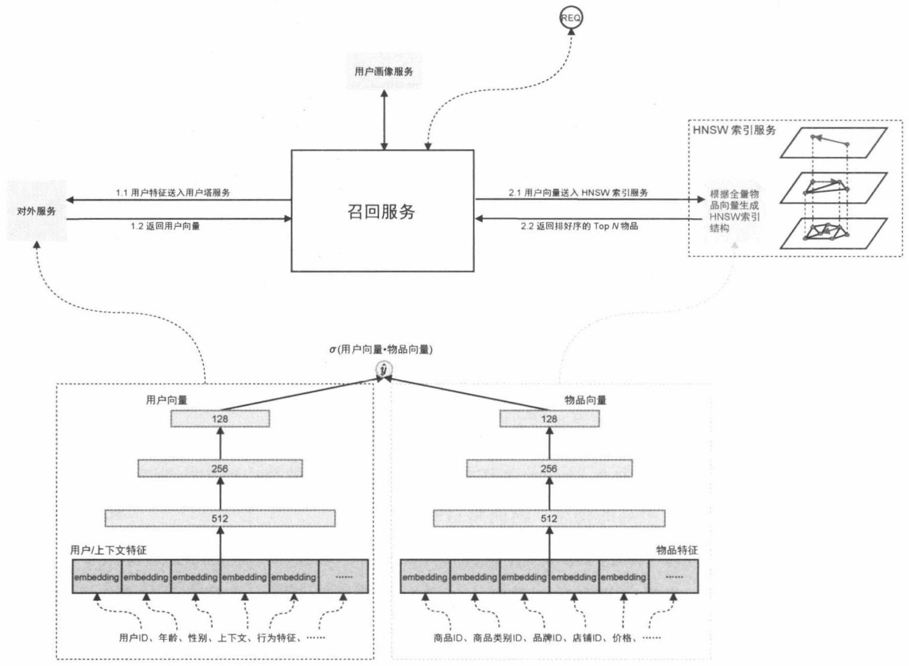  
图5-23 双塔模型与HNSW算法结合

至此，关于双塔模型的结构、特征选取、模型训练、模型的线上服务部分都已经详细介绍完毕了，尤其是线上服务的部分，重点是HNSW算法的原理以及使用。但是将双塔模型用于召回阶段时，还有一个至关重要的方面没有涉及，它对模型上线后的质量有重要影响——训练数据中负样本的选择。

# 5.5 负样本策略

召回模型对于负样本选择的重要程度往往被忽略。以点击率预估任务为例，一般情况下，在处理数据时，会选择曝光且点击的样本作为正样本，曝光且未点击的样本作为负样本。但是使用这种方式得到的数据训练出来的模型在线上的效果大概率不会太好——会出现离线指标特别好、上线效果特别差的现象。为什么这种负样本选择策略（曝光且未点击的样本）在召回模型上不奏效呢？

如图5-24所示，假设这是某个用户在App上的一次浏览，其中A、B、C、D对用户完全曝光，E和F只露出一半，物品D被用户点击。因此，D会被作为正样本，A、B、C会作为负样本出现在最终的训练数据中，这就会导致一个很严重的问题：假如全量物品共100万，每日活跃物品（能够曝光出来的物品）50万，如果只用曝光且未点击的样本作为负样本，则召回模型最多只能看到50万物品。这就是推荐系统中著名的选择偏差（selection bias）：模型看到的数据与真实数据不一致。召回模型上线后，一般需要从全量物品中筛选出用户最可能感兴趣的物品，而训练时只用了全量物品中的部分数据进行训练，导致模型“窥豹一斑”，也正因如此，才会导致模型在线上进行预测时，当遇见从未见过的物品时，其预测表现可能会非常不稳定。

  
图5-24 一次曝光

为了防止召回模型继续出现“眼界狭窄”的问题，在负样本的选择上可以参考如此做法——负样本 $=$ 曝光未点击样本 $+$ 未曝光样本。除了真实的曝光未点击的物品，额外添加一些未曝光过的物品，在一定程度上减少选择偏差现象的发生。依然以图5-24为例，假设物品池有A到J共10个物品，A到D属于曝光样本，E到J属于未曝光样本。正样本很容易选择，D即为正样本。选择负样本时，曝光未点击样本A到C作为负样本，未曝光样本E到J也作为负样本。


当然了，在实际应用中，负样本都会进行某种程度的下采样，比如曝光未点击样本A到C下采样后只保留B，未曝光样本E到J下采样后保留H和L等。具体的下采样策略又有多种形式：随机采样、按曝光量采样等，这里就不再赘述了。对召回模型的样本选择策略感兴趣的读者，建议仔细研读文献①，文中不仅提到了负样本的选择策略，还有一些正样本的选择策略、曝光未点击样本个数与未曝光样本个数比例最佳实践值等多种实用技巧。

# 5.6 总结

□ 不同于协同过滤、关联规则等挖掘物品与物品之间关系的算法，有些算法模型直接寻找用户与物品之间的关系，比较典型的做法是将用户和物品分别向量化，再根据各自的向量计算两者之间的关系。

□双塔模型广泛用于召回阶段，特地设计出来用于学习用户向量和物品向量。双塔指的是用户侧塔和物品侧塔，这种结构的输入有一个很鲜明的特点——用户侧塔只接收非物品特征，物品侧塔只接收物品特征。

□ 双塔模型在线上提供服务时，需要将两座塔拆开来使用：用户侧塔提供实时预测，供使用方获取用户向量；物品侧塔提供全局的物品向量。在大规模推荐系统中，物品个数都是百万甚至亿级的，因此使用用户向量快速获取Top $N$ 物品具有巨大的挑战性。

□ HNSW算法实现了在极低的时间复杂度下以非常高的召回率拿到相当数量的物品。该算法受到跳表思想的启发，将数据维度扩展到高维空间，利用分层结构快速找到查询向量的近邻。同时该算法也有比较多的超参数需要调试，不过一般情况下，使用默认参数即可达到 $95\%$ 的召回率。

□召回模型的负样本选择需要重点关注。由于召回阶段一般是从全量物品中筛选出用户可能感兴趣的物品，因此训练数据与真实数据必须尽量保持一致，否则会导致模型一叶障目，最明显的现象是离线指标特别高、线上效果一般。负样本的选择可以说是决定召回模型质量的核心因素之一。

□另外还有一点值得关注：业界已经有不少实践在尝试摆脱双塔结构的限制，毕竟只用向量内积会丢失太多信息。关于这方面的内容，可以参考一些优秀的公开论文③④⑤

# 第6章

# 召回模型的离线评估

一个算法，历经数据分析、数据处理、特征工程、训练等多个步骤之后，落地为可以对外提供服务的模型，如图6-1所示。一般情况下，准备数据和训练模型都会在离线环境中进行，而一旦将模型推送到线上环境对外提供服务，就会对用户体验产生直接影响，这在很大程度上关系到实际的业务效果。因此，在模型上线之前，需要对模型加以评估——它的质量究竟是好是坏？到底能不能达到上线标准？模型的离线评估在一定程度上可以规避直接上线带来的严重负向效果的风险，同时能够提高迭代效率。

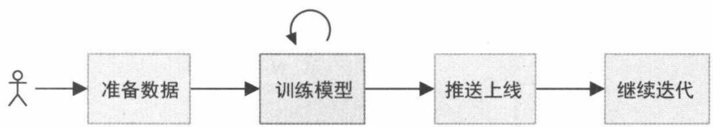  
图6-1 算法落地流程

召回算法也不例外，不管是协同过滤、关联规则，还是词向量或者深度模型，在迭代新的版本时，都有不同的离线指标来表明新版本是不是优于旧版本。比如，如何判断协同过滤模型A生成的物品相似度比协同过滤模型B好？如何判断词向量模型C生成的物品向量比词向量模型D好？对于算法开发来说，还有一个比较重要的要求：针对不同的算法，能够做到特别了解有哪些指标适合评估它。

# 6.1 推荐任务类型

在推荐系统中有着各式各样的任务，比如点击率预估任务、转化率预估任务等，但是总的来说这些任务可以分为两类。

□打分型任务：预测用户对单个物品的打分，这类任务关注准确性。比如当目标是优化GMV（gross merchandise volume，指下单金额）时，由于排序结果一般是按照“点击率 $\times$ 转化率 $\times$ 物品价格”排序的，因此对于点击率和转化率预测的准确性要求极高，否则会严重影响业务结果。

□排序型任务：预测用户在 $M$ 个物品中最感兴趣的前 $N$ 个。与打分型任务不同的是，这类任务只关注排序质量，即物品与物品之间的相对顺序。比如当目标是优化CTR（click through rate，点击率）时，由于仅仅根据CTR来排序，不关心准不准，因此只关心是否把优质物品排在前面，次优质物品排在后面。

召回模型的目标是从海量物品中选出若干个物品作为用户的推荐列表，不关心具体的预测分值，只要能将用户可能感兴趣的物品排在前面就算完成任务。由此可以看出，它属于典型的排序型任务，所以对于召回的评估，只需要关注排序型任务的评估方法即可。

# 6.2 混淆矩阵

为了衡量模型的质量，需要把模型的预测结果与真实样本放在一起加以比对。真实样本分为正例和负例（可以简单理解为正例是用户感兴趣的物品，负例是用户不感兴趣的物品）。同样，预测结果有正例和负例之分。以P（positive）表示正例，N（negative）表示负例，T（true）表示预测正确，F（false）表示预测错误，将真实样本和预测结果两两组合，可以生成如图6-2所示的4种情况，这就是混淆矩阵（confusion matrix）。

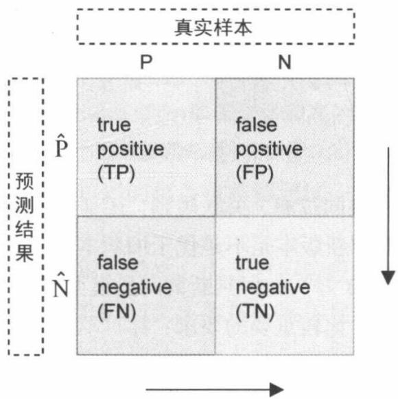  
图6-2 混淆矩阵

从上往下的视角是针对真实样本而言的，从左到右的视角是针对预测结果而言的。

□第一行表示：预测为正的样本。  
□第二行表示：预测为负的样本。  
□第一列表示：真实为正的样本。  
□第二列表示：真实为负的样本。

因此，混淆矩阵中的4个单元分别表示如下。

□第一行第一列：正样本被预测为正例，称为TP（true positive）。  
□第一行第二列：负样本被预测为正例，称为FP（falsepositive）。  
□第二行第一列：正样本被预测为负例，称为FN（false negative）。  
□ 第二行第二列：负样本被预测为负例，称为TN（true negative）。

下面以一个简单的例子来说明上述指标。如图6-3所示，真实样本分为红绿两类，模型的预测结果也已给出，正例用绿色表示，负例用红色表示，则混淆矩阵各单元如下，可以得到最右侧的混淆矩阵。

□TP：正样本被预测为正例，2个。   
□ FP：负样本被预测为正例，1个。   
FN：正样本被预测为负例，2个。   
□TN：负样本被预测为负例，3个。


  
图6-3 混淆矩阵示例（另见彩插）

接下来基于上述混淆矩阵，介绍一些常见的召回算法离线评估指标。

# 6.2.1 准确率

准确率（accuracy）的含义是：预测正确的样本数除以样本总数。计算公式如下所示：

$$
\text {a c c u r a c y} = \frac {\mathrm {T P} + \mathrm {T N}}{\mathrm {T P} + \mathrm {F P} + \mathrm {F N} + \mathrm {T N}} \tag {6-1}
$$

按照式(6-1)，可以计算出图6-3混淆矩阵的准确率为accuracy $= \frac{2 + 3}{2 + 1 + 2 + 3} = 62.5\%$ 。看上

去准确率是个很不错的评判指标，但是它在推荐系统中不怎么使用。问题出在式(6-1)的分子上，它考虑了TN，而在推荐系统中一般不太关心对负例预测的准确性，而更为关心对正例预测的准确性，尤其是在负例占据绝大多数的情况下准确率的缺点更为严重。以曝光点击为例，假设有100条曝光数据，其中1条发生了点击（正例），其他99条没有发生点击（负例），那么如果模型将这100条数据全部预测为负例，准确率也能高达 $99\%$ ，可以看出此时的准确率具有极高的欺骗性。也就是说，当存在样本类别不平衡的问题时（这也是推荐系统中最为常见的问题之一），准确率几乎是失效的。正因如此，诞生了其他两种指标：精确率和召回率。

# 6.2.2 精确率

精确率（precision）是针对预测结果而言的，指的是预测为正例的样本在真实结果中也是正样本的占比。

根据精确率的定义，其计算公式为：

$$
\mathrm {p r e c i s i o n} = \frac {\mathrm {T P}}{\mathrm {T P} + \mathrm {F P}} \quad / / \text {分 母 为 混 淹 矩 阵 的 第 一 行 之 和} \tag {6-2}
$$

由式(6-2)计算图6-3混淆矩阵的精确率为precision $= \frac{2}{2 + 1}\approx 66.7\%$

精确率和准确率看上去特别相似，但是关注对象发生了本质的变化，导致两者的意义完全不同：

□ 精确率关注的是TP，即对正例的预测准确程度；  
□准确率关注的是TP和TN，即对整体的预测准确程度，既包括正例也包括负例。

# 6.2.3 召回率

相对地，召回率（recall）是针对真实样本而言的，指的是真实样本中正样本有多少被预测为正例。

根据召回率的定义，其计算公式为：

$$
\mathrm {r e c a l l} = \frac {\mathrm {T P}}{\mathrm {T P} + \mathrm {F N}} \quad / / \text {分 母 为 混 淹 矩 阵 的 第 一 列 之 和} \tag {6-3}
$$

由式(6-3)计算图6-3混淆矩阵的召回率为 $\mathrm{recall} = \frac{2}{2 + 2} = 50\%$

召回率除了考虑 TP 之外，还考虑了 FN，即更在乎不要把正样本预测为负样本。因此在实际应用中，如果业务允许把负例预测为正例，但是不能接受把正例预测为负例，就应该更关注召

回率，比如风控业务和银行贷款业务，一般这种业务建模时会将失信用户作为正例，正常用户作为负例，因此允许模型将正常用户作为失信用户对待（即接受FP，这样大不了会进入更严格的人工审核流程），不允许将失信用户作为正常用户对待（即不接受FN，这样就会给银行造成损失）。类似的情形也存在于癌症预测任务中，可以接受将健康用户预测为癌症用户，但是不能接受将癌症用户预测为健康用户（后果不堪设想）。


recall基本思想是：宁愿错杀，不能放过。还有一个常见的指标hit rate，它只是召回率的另外一种叫法，本质上是一个概念。

# 6.2.4 F1分数

仔细观察式(6-2)和式(6-3)，精确率和召回率计算方式的唯一差别体现在分母上，由FP和FN决定，而这两个指标一般来说是负相关的，比如模型的任务是预测正或负，如果严格一点儿，那么FP会比较小，FN会比较大；相反，如果模型宽松一点儿，FP会比较大，FN会比较小。一旦FP和FN是此消彼长的，那么精确率和召回率也是此消彼长的，如图6-4所示①，对于精确率和召回率同等重要的业务场景，需要在两者之间找到平衡，这就产生了F1分数。

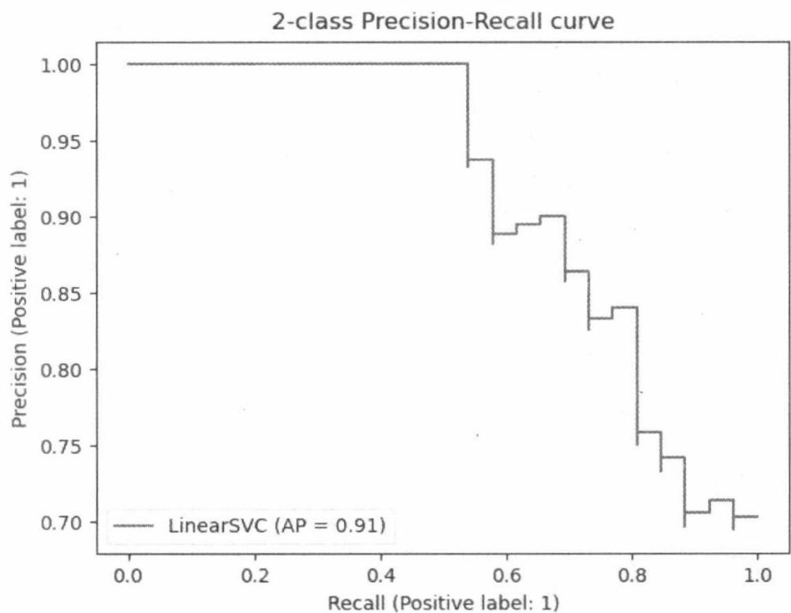  
图6-4 精确率-召回率曲线

F1分数同时考虑了精确率和召回率，其计算公式为：

$$
\mathrm {F l} = \frac {2}{\frac {1}{\text {p r e c i s i o n}} + \frac {1}{\text {r e c a l l}}} = \frac {2 \times \text {p r e c i s i o n} \times \text {r e c a l l}}{\text {p r e c i s i o n} + \text {r e c a l l}} \tag {6-4}
$$

式(6-4)中，只要precision和recall任意一个比较小，F1就比较小；只有两者都比较大时，F1的值才会大（最佳点应该是图6-4右上角的位置）。

由式(6-4)计算图6-3混淆矩阵的F1分数为 $\mathrm{F}1 = \frac{2}{\frac{3}{2} + \frac{4}{2}} = \frac{4}{7}\approx 57.1\%$

# 6.2.5 @k

不管是精确率还是召回率，都可以在一定程度上反映出模型的质量，但是它们也有很大的不足。举例来说，假设用户对10件物品感兴趣，有两个召回模型A和B，它们都向该用户推荐了40个物品，且都只有2个确实是用户感兴趣的，则：

$$
\mathrm {T P} _ {\mathrm {A}} = \mathrm {T P} _ {\mathrm {B}} = 2
$$

$$
\mathrm {F P} _ {\mathrm {A}} = \mathrm {F P} _ {\mathrm {B}} = 4 0 - 2 = 3 8
$$

$$
\mathrm {F N} _ {\mathrm {A}} = \mathrm {F N} _ {\mathrm {B}} = 1 0 - 2 = 8
$$

$$
\mathrm{precision}_{\mathrm{A}} = \mathrm{precision}_{\mathrm{B}} = \frac{\mathrm{TP}}{\mathrm{TP} + \mathrm{FP}} = \frac{2}{40} = 5\%
$$

$$
\mathrm{recall}_{\mathrm{A}} = \mathrm{recall}_{\mathrm{B}} = \frac{\mathrm{TP}}{\mathrm{TP} + \mathrm{FN}} = \frac{2}{10} = 20\%
$$

$$
\mathrm{F1}_{\mathrm{A}} = \mathrm{F1}_{\mathrm{B}} = \frac{2\times\text{precision}\times\text{recall}}{\text{precision} + \text{recall}} = 8\%
$$

所有指标完全一样，应该如何判断模型A和B谁更好呢？根据已有信息确实无法判断，但是如果加入一些额外的信息，比如：

□召回模型A将这2个TP排在了40个物品的第1位、第3位；  
□召回模型B将这2个TP排在了40个物品的第5位、第15位。

从结果上来看，召回模型A在这一次推荐上的表现要比召回模型B好。但是怎么衡量到底好多少呢？本节先介绍两个基于精确率和召回率延伸出来的指标：precision@k和recall@k。

□precision@k：预测结果前 $k$ 个中正样本被预测为正例的个数 $/k$ □  
□ recall@k: 预测结果前 $k$ 个中正样本被预测为正例的个数/真实样本个数。

可以看出，这两个指标的分子本质上都是 $\mathrm{TP}@\mathbf{k}$ 。根据以上定义计算模型A和模型B的precision@k和recall@k：

$$
\begin{array}{l} \text {p r e c i s i o n} _ {\mathrm {A}} @ 5 = 2 / 5, \text {p r e c i s i o n} _ {\mathrm {B}} @ 5 = 0 / 5; \text {r e c a l l} _ {\mathrm {A}} @ 5 = 2 / 1 0, \text {r e c a l l} _ {\mathrm {B}} @ 5 = 0 / 1 0 \\ \text {p r e c i s i o n} _ {\mathrm {A}} @ 1 0 = 2 / 1 0, \text {p r e c i s i o n} _ {\mathrm {B}} @ 1 0 = 1 / 1 0; \text {r e c a l l} _ {\mathrm {A}} @ 1 0 = 2 / 1 0, \text {r e c a l l} _ {\mathrm {B}} @ 1 0 = 1 / 1 0 \\ \text {p r e c i s i o n} _ {\mathrm {A}} @ 2 0 = 2 / 2 0, \text {p r e c i s i o n} _ {\mathrm {B}} @ 2 0 = 2 / 2 0; \text {r e c a l l} _ {\mathrm {A}} @ 2 0 = 2 / 1 0, \text {r e c a l l} _ {\mathrm {B}} @ 1 0 = 2 / 1 0 \\ \end{array}
$$

//A和B完全一样

@k指标一定程度上可以反映模型的排序质量，尤其是召回模型通常只关注能不能把用户可能感兴趣的物品筛选出来。但是如果模型A和模型B的推荐结果出现了如下情况：

□召回模型A将这2个TP排在了40个物品的第1位、第4位  
□召回模型B将这2个TP排在了40个物品的第2位、第3位

在这种情况下，所有目前提到的评估指标都不能很好地判别到底谁更优，因此需要一个粒度更精细的能够衡量排序位置质量的评估指标。

# 6.3 nDCG

nDCG（normalized discounted cumulative gain）是一个天然用来衡量列表排序质量的指标，这个指标认为：

(1) 最相关的物品应该比次相关的物品更加重要，次相关的物品比不相关的物品更加重要，比如用户搜索红色长裙，那么搜索结果中红色长裙应该比长裙重要，长裙应该比短裙重要；  
(2) 相关的物品越早出现越好，比如用户搜索华为手机，那么搜索结果中华为手机出现在第1位和第20位显然是完全不同的用户体验；  
(3) 指标要具有可比性，比如根据搜索衣服得到的搜索结果算出来的 nDCG，与根据搜索手机得到的搜索结果算出来的 nDCG 要能够互相比较分出优劣，也就是说，nDCG 是经过归一化的，且只与排序结果的顺序有关，与其他因素（比如搜索词等）无关。

上述描述中有一个相关的物品的概念，nDCG 假设物品具有相关度（relevance），相关度越高，表示物品越重要，越应该排在前面。假设给用户返回了一个推荐列表，列表中的物品相关度越高，表示用户对该物品越有兴趣。比如，在电商推荐系统中，假设购买行为的相关度是 3，加购行为的相关度是 2，点击行为的相关度是 1，推荐系统给用户推荐了 [A, B, C, D, E] 5 个物品，而用户对这 5 个推荐物品产生了 [A 购买, B 点击, C 加购, D 购买, E 加购] 行为，则对应的相关度为 $[3, 1, 2, 3, 2]$ 。

了解了相关度的概念后，在详细介绍 nDCG 之前，首先需要介绍 CG 和 DCG。

# 6.3.1 CG

CG的全称是cumulative gain，就是简单地将结果集中的物品相关度累加起来，因此计算公式也特别简单：

$$
\mathrm {C G} = \sum_ {i = 1} ^ {n} \mathrm {r e l e v a n c e} _ {i} \quad / / i \text {是 物 品 在 列 表 中 的 位 置}
$$

根据CG的定义，上面提到的结果集[A,B,C,D,E]的CG值为： $\mathrm{CG} = 3 + 1 + 2 + 3 + 2 = 11$

不过很容易就能看出，CG的缺点实在太大了，比如另一个结果集[B,C,E,A,D]对应的相关度为[1,2,2,3,3]，它的CG也等于11，但是显然这个结果集并没有把最相关的物品排在前面，并不是最优的结果集，此时CG值具有一定的欺骗性和误导性。因此我们不能只考虑物品的相关度，还需要考虑物品在结果集中的位置，这就是DCG的职责所在。

# 6.3.2 DCG

DCG的全称是discounted cumulative gain，它在CG的基础上考虑了物品所在的位置：位置越靠后，物品的相关度就越要“打折”（discounted）。加入位置因素后，DCG的计算公式如下：

$$
\mathrm {D C G} = \sum_ {i = 1} ^ {n} \frac {2 ^ {\mathrm {r e l e v a n c e} _ {i}} - 1}{\log_ {2} (i + 1)} \quad / / i \text {是 物 品 在 列 表 中 的 位 置}, \text {注 意 是 从} 1 \text {开 始 的}
$$

根据DCG的定义，分别计算具有相同CG的两个结果集[A,B,C,D,E]和[B,C,E,A,D]对应的DCG：

$$
\begin{array}{l} \mathrm {D C G} _ {[ \mathrm {A}, \mathrm {B}, \mathrm {C}, \mathrm {D}, \mathrm {E} ]} = \mathrm {D C G} _ {[ 3, 1, 2, 3, 2 ]} = \frac {2 ^ {3} - 1}{\log_ {2} (1 + 1)} + \frac {2 ^ {1} - 1}{\log_ {2} (2 + 1)} + \frac {2 ^ {2} - 1}{\log_ {2} (3 + 1)} + \frac {2 ^ {3} - 1}{\log_ {2} (4 + 1)} + \frac {2 ^ {2} - 1}{\log_ {2} (5 + 1)} \approx 1 3. 3 1 \\ \mathrm {D C G} _ {[ \mathrm {B}, \mathrm {C}, \mathrm {E}, \mathrm {A}, \mathrm {D} ]} = \mathrm {D C G} _ {[ 1, 2, 2, 3, 3 ]} = \frac {2 ^ {1} - 1}{\log_ {2} (1 + 1)} + \frac {2 ^ {2} - 1}{\log_ {2} (2 + 1)} + \frac {2 ^ {2} - 1}{\log_ {2} (3 + 1)} + \frac {2 ^ {3} - 1}{\log_ {2} (4 + 1)} + \frac {2 ^ {3} - 1}{\log_ {2} (5 + 1)} \approx 1 0. 1 2 \\ \end{array}
$$

由DCG的值可以发现，[A,B,C,D,E]显然比[B,C,E,A,D]的排序质量高。解决了CG带来的问题之后，再来看看另一个结果集[A,D,E]的DCG，很容易计算出它的DCG等于12.92，按照DCG的标准，它的排序质量不如[A,B,C,D,E]，但是仔细观察会发现[A,D,E]是严格按照相关度从高到低排列的，它的排序质量是最高的才合理，也就是说DCG也需要改进，要能够让不同长度的排序结果相互比较，这就有了nDCG。

# 6.3.3 nDCG

nDCG是归一化的DCG。正是由于归一化的存在，nDCG才可以比较不同长度的列表排序质量。nDCG的计算公式为：

$$
\mathrm {n D C G} = \frac {\mathrm {D C G}}{\mathrm {i D C G}}
$$

其中 iDCG 是 ideal DCG，即最优的 DCG。iDCG 的计算也特别容易：按照相关度从高到低排序

之后算出来的 DCG 即为 iDCG。

分别计算[A,B,C,D,E]和[A,D,E]的nDCG，结果如下：

$$
\mathrm {D C G} _ {[ A, B, C, D, E ]} \approx 1 3. 3 1
$$

$$
i D C G _ {[ A, B, C, D, E ]} = D C G _ {[ 3, 3, 2, 2, 1 ]} = 1 4. 6 0
$$

$$
\begin{array}{l} \mathrm {n D C G} _ {[ \mathrm {A}, \mathrm {B}, \mathrm {C}, \mathrm {D}, \mathrm {E} ]} = \frac {\mathrm {D C G} _ {[ 3 , 1 , 2 , 3 , 2 ]}}{\mathrm {i D C G} _ {[ 3 , 1 , 2 , 3 , 2 ]}} = \frac {1 3 . 3 1}{1 4 . 6 0} \approx 0. 9 1 \\ \mathrm {n D C G} _ {[ \mathrm {A}, \mathrm {D}, \mathrm {E} ]} = \frac {\mathrm {D C G} _ {[ 3 , 3 , 2 ]}}{\mathrm {i D C G} _ {[ 3 , 3 , 2 ]}} = \frac {1 2 . 9 2}{1 2 . 9 2} = 1. 0 \\ \end{array}
$$

按照 nDCG 的结果，[A, D, E] 的排序质量优于 [A, B, C, D, E]。


实际应用中使用 nDCG 时会考虑结果集的长度，一般认为结果集越长，算出来的 nDCG 越可靠，因此会基于长度为 nDCG 加权，比如 [A, D, E] 的权重为 $\ln(3)$ ，[A, B, C, D, E] 的权重为 $\ln(5)$ ，最后将权重与 nDCG 相乘得到最终的排序质量评估，这时会得出 [A, B, C, D, E] 优于 [A, D, E] 的结论。

# 6.3.4 @k

与precision/recall@k相似，nDCG@k也只关注列表中前 $k$ 个结果的排序质量，这是由推荐系统的特性决定的：头部物品的排序质量往往可以决定整个推荐系统的质量，因为如果头部物品排序质量不高，很难吸引用户继续停留在推荐系统中。nDCG@k的计算公式为：

$$
\mathrm {n D C G} @ k = \frac {\mathrm {D C G} @ k}{\mathrm {i D C G} @ k} \tag {6-5}
$$

式(6-5)的计算步骤如下：

(1) 取推荐结果的前 $k$ 个，计算 DCG，即分子 $\mathrm{DCG} @ k$   
(2) 将推荐结果按照相关度降序排列，取排序后的前 $k$ 个，计算 DCG，即分母 iDCG。

再来看结果集[A,B,C,D,E]的nDCG@k指标值：

$$
\mathrm {n D C G} @ 1 _ {[ 3, 1, 2, 3, 2 ]} = \frac {\mathrm {D C G} @ 1 _ {[ 3 ]}}{\mathrm {i D C G} @ 1 _ {[ 3 ]}} = \frac {1}{1} = 1
$$

$$
n D C G @ 2 _ {[ 3, 1, 2, 3, 2 ]} = \frac {D C G @ 2 _ {[ 3 , 1 ]}}{i D C G @ 2 _ {[ 3 , 3 ]}} = \frac {7 . 6 3}{1 1 . 4 2} \approx 0. 6 6 8
$$

$$
\mathrm {n D C G} @ 3 _ {[ 3, 1, 2, 3, 2 ]} = \frac {\mathrm {D C G} @ 3 _ {[ 3 , 1 , 2 ]}}{\mathrm {i D C G} @ 3 _ {[ 3 , 3 , 2 ]}} = \frac {9 . 1 3}{1 2 . 9 2} \approx 0. 7 0 7
$$

一般在召回阶段，最常使用的离线指标是recall@k（又叫hitrate@k或者hr@k）和nDCG@k， $k$ 的取值随着业务场景的不同而不同，典型的取值有1、5、10、20等。

# 6.4 其他指标

除了上述因混淆矩阵而衍生出来的指标和 nDCG 外，还有一些离线指标同样值得关注。

# 6.4.1 MRR

MRR的全称是mean reciprocal rank，一般用在搜索系统中，是将第一个命中查询条件的结果所在位置的倒数作为该指标的量化值。MRR的计算公式为：

$$
\mathrm {M R R} = \frac {1}{Q} \sum_ {i = 1} ^ {| Q |} \frac {1}{\operatorname {r a n k} _ {i}} \tag {6-6}
$$

其中 $Q$ 是所有查询条件， $\mathrm{rank}_i$ 是第 $i$ 个查询条件对应的查询结果中第一个命中物品的位置。

以表 $6 - 1^{①}$ 为例，根据表中的三条记录，可以计算整体的MRR为 $\frac{\frac{1}{3} + \frac{1}{2} + 1}{3} \approx 0.61$

表 6-1 MRR 示例  

<table><tr><td>query</td><td>proposed results</td><td>correct response</td><td>rank</td><td>reciprocal rank</td></tr><tr><td>cat</td><td>catten, cati, cats</td><td>cats</td><td>3</td><td>1/3</td></tr><tr><td>torus</td><td>torii, tori, toruses</td><td>tori</td><td>2</td><td>1/2</td></tr><tr><td>virus</td><td>viruses, virii, viri</td><td>viruses</td><td>1</td><td>1</td></tr></table>

将 MRR 引入推荐系统中，式 (6-6) 就可以按照式 (6-7) 计算：

$$
\mathrm {M R R} = \frac {1}{U} \sum_ {i = 1} ^ {| U |} \frac {1}{\operatorname {r a n k} _ {i}} \tag {6-7}
$$

其中， $U$ 是所有用户， $\mathrm{rank}_i$ 是给第 $i$ 个用户的推荐结果中用户真实感兴趣的第一个物品的位置。

如果我们不仅关心第一个命中结果的位置，还关心后面的命中结果的位置，那么就要使用MAP这个指标了。

# 6.4.2 MAP

MAP的全称是mean average precision。顾名思义，为了计算MAP，首先要计算AP（平均准

确率），AP考虑了位置信息以及基于当前位置的precision，计算公式如下：

$$
\mathrm {A P} = \frac {\sum_ {k = 1} ^ {n} P (k) \times \operatorname {r e l} (k)}{\# \text {g r o u n d t r u t h}} \tag {6-8}
$$

其中， $n$ 是推荐结果个数， $k$ 是推荐结果位置， $P(k)$ 是 precision@ $k$ ， $\operatorname{rel}(k)$ 表示当前位置的物品用户是不是真实感兴趣，是则值为 1，否则为 0，#ground truth 是用户真实感兴趣的物品个数。

举个例子来说明 AP 的计算逻辑, 假设用户真实感兴趣的物品个数为 3 , 召回模型推荐出 5 个物品, 结果如表 6-2 所示。根据表 6-2 中的数据, 计算出对该用户的推荐

$$
\mathrm {A P} = \frac {0 \times 0 / 1 + 1 \times 1 / 2 + 0 \times 1 / 3 + 0 \times 1 / 4 + 1 \times 2 / 5}{3} = 0. 3 。
$$

表 6-2 AP 示例  

<table><tr><td>推荐位置</td><td>是否命中</td><td>precision@k</td></tr><tr><td>1</td><td>0</td><td>0/1</td></tr><tr><td>2</td><td>1</td><td>1/2</td></tr><tr><td>3</td><td>0</td><td>1/3</td></tr><tr><td>4</td><td>0</td><td>1/4</td></tr><tr><td>5</td><td>1</td><td>2/5</td></tr></table>

掌握了AP之后，MAP就很简单了，它只是多个AP的平均值。具体来说，当有 $N$ 个用户时，对每个用户都计算出AP，最后求平均，就得到最终的MAP。

接下来介绍的指标主要用于i2i算法评估（如表6-3所示，包括通过协同过滤、关联规则和词向量等算法生成的物品与物品相似/相关度评估）。

表 6-3 i2i 表  

<table><tr><td>物品1</td><td>物品2</td><td>相似度</td></tr><tr><td>物品ID</td><td>物品ID</td><td>0~1的数字</td></tr></table>

# 6.4.3 多样性

基于每个物品，都会有 $N$ 个相似物品（如表6-3所示），因此根据物品之间的相似度可以计算出整个模型的多样性（diversity），此时需要使用ILS这个指标，全称是intra-list similarity，计算公式如下：

$$
\text {d i v e r s i t y} = 1 - \mathrm {I L S} = 1 - \frac {\sum_ {i \in R} \sum_ {j \in R} \sum_ {i \neq j} \operatorname {s i m} (i , j)}{\sum_ {i \in R} \sum_ {j \in R} \sum_ {i \neq j} 1} \tag {6-9}
$$

式(6-9)中， $i$ 是物品1， $j$ 是物品2， $\mathrm{sim}(i,j)$ 是 $i$ 和 $j$ 的相似度，分母是物品对的个数。由式(6-9)可以看出，相似度越低则多样性越高。

# 6.4.4 覆盖度

覆盖度（coverage）指的是算法中涉及的物品占全量物品的比例，主要考察算法对长尾物品的发掘能力。假设全量物品个数为 $N$ ，则对于表6-3，覆盖度的计算公式为：

$$
\begin{array}{l} \text {c o v e r a g e} _ {\text {物 品} 1} = \frac {\# \text {物 品} 1}{N} \\ \mathrm {c o v e r a g e} _ {\text {物 品} 2} = \frac {\# \text {物 品} 2}{N} \\ \end{array}
$$

其中物品1的覆盖度是为了观察主物品的覆盖情况，物品2的覆盖度是为了观察能够根据主物品推测出来的相似物品的覆盖情况。

但是覆盖度只能看有没有覆盖到，具体覆盖了多少、覆盖的分布都不得而知，这时可以考虑查看信息熵。

# 6.4.5 信息熵

信息熵（entropy）用来衡量信息的不确定性。在推荐系统中，可以用它来衡量物品流行度的分布，信息熵越大，说明物品流行度越趋于平衡（强者愈强弱者愈弱的马太效应越不明显）。信息熵的计算公式如下：

$$
H = - \sum_ {i = 1} ^ {N} p (i) \log p (i) \tag {6-10}
$$

式(6-10)中， $i$ 表示物品， $N$ 是物品总数， $p(i)$ 表示第 $i$ 个物品的流行度与全量物品的流行度之和的比值。物品流行度可以按照物品在过去一段时间内的曝光次数来统计。


推荐系统的离线评估指标还有很多，比如用户信任度、物品重复度、惊喜度、健壮性等，具体使用什么指标一般根据业务需求来判断，比如业务很在乎新品，那么新品率指标就必须纳入评估体系中。

# 6.5 代码实现

本节针对i2i的算法实现其离线评估代码。此类算法一般会生成表6-3所示的物品相似/相关度数据，接下来会使用Spark来对这份数据进行评估，主要实现的离线指标有precision@k、recall@k以及nDCG等。


再回顾一下i2i算法生成的物品相似/相关表在线上的服务逻辑：

(1) 用户向推荐系统发出请求，携带用户ID；  
(2) 系统根据用户ID获取其最近的行为物品列表；  
(3) 根据行为物品列表去物品相似/相关表中查询相似/关联物品；  
(4) 进行去重、过滤等一系列操作后，返回推荐列表。

之所以要回顾服务逻辑，是因为在评估时，最好与线上的逻辑尽量保持一致。

# 6.5.1 实现逻辑

要实现这些指标，除了表6-3之外，还需要一份用户行为数据（即groundtruth），一般使用用户行为数据作为用户真实感兴趣的物品集合。这份数据如表6-4所示，假设这是一份电商用户数据。

表 6-4 用户行为数据  

<table><tr><td>user</td><td>item</td><td>relevance</td><td>timestamp</td></tr><tr><td>用户ID</td><td>物品ID</td><td>相关性</td><td>时间戳</td></tr></table>

说明

- relevance：可以根据用户具体的行为来确定，比如点击行为的 relevance 值为 1，加购行为的 relevance 值为 2 等。  
- timestamp：用户行为发生的时间戳。

有了表6-4的数据后，就可以对表6-3的物品相似/相关度数据进行质量评估，生成想要的各种离线指标。具体评估逻辑如下：

(1) 使用 $N$ 天的数据训练出模型 $\mathbf{M}$ ;  
(2) 使用第 $N + 1$ 天的用户行为数据表作为评估数据；  
(3) 以单个用户为例，假设用户U在第 $N + 1$ 天按照时间顺序的行为如表6-5所示。


多用户时，将所有单个用户数据下的指标各自计算完成后取平均即可。

表6-5 单个用户行为数据  

<table><tr><td>user</td><td>item</td><td>relevance</td><td>timestamp</td></tr><tr><td>U</td><td>item1</td><td>2</td><td>1605024000</td></tr><tr><td>U</td><td>item2</td><td>1</td><td>1605024010</td></tr><tr><td>U</td><td>item3</td><td>3</td><td>1605024030</td></tr></table>

开始计算用户U的推荐指标。

1) 获取第一行数据，得到行为物品 item1，查询物品相似/关联表，得到推荐列表 recs1。查看 item2 在 recs1 的命中情况以及排名情况，由此可以计算 TP、FP、nDCG 等指标。这里要注意：根据 item1 得到的推荐列表 recs1 去校验 item2 在 recs1 的命中情况。

2) 获取第二行数据，得到行为物品 item2，查询物品相似/关联表，得到推荐列表 recs2，查看 item3 在 recs2 的命中情况以及排名情况。  
3) 用户U的评估结束，根据上面第1)步和第2)步得到的信息，计算精确率、召回率、F1以及nDCG等指标。

(4) 将单个用户指标进行汇总，求平均，得到最终的算法评估指标。

# 6.5.2 完整代码

本案例的完整代码如下：

```txt
# -- coding: utf-8 --  
import math  
from pyspark.sql import SparkSession  
from pyspark.sql-functions import col  
from pyspark.sql.types import DoubleType, LongType  
```
```
spark: 2.4.0  
python: 3.6 
```

```python
class Metrics: def __init__(self, spark, groundtruth_table, i2i_table, user_col="user", item_col="item", relevance_col="relevance", timestamp_col="timestamp", item1_col="item1", item2_col="item2", score_col="score"): self._spark = spark self._ground_truth_table = ground_truth_table self._i2i_table = i2i_table self._user_col = user_col self._item_col = item_col self._relevance_col = relevance_col self._timestamp_col = timestamp_col self._item1_col = item1_col self._item2_col = item2_col self._score_col = score_col   
def _get-ground_truth_dataset(self): return (self._spark.sql( f'select {self._user_col}, ' f{'self._item_col}, ' f{'self._relevance_col}, ' f{'self._timestamp_col} from ' f{'self._ground_truth_table}]'))   
def _get_i2i_dataset(self): return (self._spark.sql( f'select {self._item1_col}, ' f{'self._item2_col}, ' f{'self._score_col}, from ' 
```

```python
def_labelpredictions(self):
    def_list.append(acc, element):
        acc.appendelement)
        return acc
def_list_merge(acc1, acc2):
    acc1.append(acc2)
    return acc1
user = col(self._user_col).alias('user')
item = col(self._item_col).alias('item')
relevance = col(self._relevance_col).cast(DoubleType()).alias('relevance')
timestamp = col(self._timestamp_col).cast(LongType()).alias('timestamp')
groundtruth = self._getGroundtruth_dataset()
groundtruth = (groundtruth.select(user, item, relevance, timestamp)
.rdd
.map(lambda row: (row.item, (row.user, row.relevance, row.timestamp)))
item1 = col(self._item1_col).alias('item1')
item2 = col(self._item2_col).alias('item2')
score = col(self._score_col).cast(DoubleType()).alias('score'))
#获取算法生成的物品相似/相关表
i2i = self._get_i2i_dataset()
#根据item1进行聚合，得到所有与之相似/相关的物品，一般是TopN个
i2i = (i2i.select(item1, item2, score)
.rdd
.map(lambda row: (row.item1, (row.item2, row.score)))
.aggregateByKey([[], _list.append, _list_merge))
def_rearrange(record):
    item1, ((_user, _relevance, _timestamp), _item2_andrating) = record
if not _item2_andrating:
    _item2_andrating = []
return _user, ((_item1, _relevance, _timestamp), _item2_andrating)
def_single_user_metricauser_recs):
    #user_recs格式：(user_id，((truth,relevance,timestamp)，[(rec1,rating1),
(rec2,rating2)...])
,_recs = user_recs
sort_by_timestamp = sorted(recs,key=lambda r:r[0][2])
truths = []
#注意：取后N-1个truth
for t in sort_by_timestamp[1] :
    (truth,rel,_),_ = t
truths.append((truth,rel))
recs = []
#注意：取前N-1个recs
for t in sort_by_timestamp[: -1]:
    ,rec_and Ratings = t
#根据得分降序排列
rec_and Ratings = sorted(rec_and Ratings,key=lambda r:r[1], reverse=True)
recs.append([rec[0] for rec in rec_and Ratings]) 
```

return zip(truths, recs)   
def_validRecords(user_recs): _, recs = user_recs return recs   
return (ground_truth.leftOuterJoin(i2i) .map(_rearrange) .aggregateByKey([], _list_apply, _list_merge) .filter(_valid_record) .flatMap(_single_user_metric))   
@staticmethod   
def calc_metric(ground_truth, relevance, recs): def log2(x): return math.log(x) / math.log(2) index $=$ recs.index(ground_truth) if ground_truth in recs else -1 if index $> = 0$ : #说明命中了 index $+ = 1$ #计算 ndcg时，index从1开始 $\mathrm{dcg} =$ (math.pow(2,relevance)-1)/log2(index +1) idcg $=$ (math.pow(2,relevance)-1)/log2(1+1) ndcg $=$ dcg / idcg mrr $= 1.0$ / index tp $= 1$ tpfn $= 1$ tpfp $=$ len(recs) return ndcg, mrr, tp, tpfn, tpfp else: return 0.0, 0.0, 0, 1, len(recs)   
@staticmethod   
def merge_metric(metrics1, metrics2): ndcg1, mrr1, tp1, tpfn1, tpfp1 = metrics1 ndcg2, mrr2, tp2, tpfn2, tpfp2 = metrics2 return ndcg1 + ndcg2, mrr1 + mrr2, tp1 + tp2, tpfn1 + tpfn2, tpfp1 + tpfp2   
@staticmethod   
def final_metric(metric): ndcg, mrr, tp, tpfn, tpfp = metric precision $=$ tp * 1.0 /tpfp recall $= \mathrm{tp}^{*}1.0$ /tpfn f1 $= 2$ *precision \*recall /(precision + recall + 1E-8) mrr $=$ mrr /tpfn ndcg = ndcg /tpfn return precision, recall, f1, mrr, ndcg   
def metrics_at(self, ks): def k_metric(metric): (truth,relevance),recs $=$ record result $= []$ for k in ks: top_k $=$ recs[:k] this_metric $=$ Metrics._calc_metric(truth,relevance,top_k) result.append((k,this_metric)) return result

labelpredictions $=$ self._labelpredictions()   
# [(k, metrics), (k, metrics)]   
metrics_at_k $=$ labelpredictions-flatMap(k.metrics).reduceByKey(self._merge.metrics).collect() # 根据 k 值升序排列   
metrics_at_k $=$ sorted(metrics_at_k, key $\equiv$ lambda m: m[0])   
metrics_at_k $=$ [(k, self._final_metric(metric)) for (k, metric) in metrics_at_k]   
return metrics_at_k

```python
if _name_ == 'main':
spark_session = (SparkSession.builder.appName('metrics').master('yarn')
	.config('spark.serializeer', 'org.apache.spark.serializeer.KryoSerializer')
	.config('spark.network_timeout', '600')
	.config('spark.driver.maxResultSize', '5g')
	EnableHiveSupport().getOrCreate())
metrics = Metrics(spark=spark_session,
					 Ground_truth_table="recsys.user_behaviour",
					 i2i_table="recsys.i2i_table")
# [(k1, (precision1, recall1, f11, mrr1, ndcg1)), (k2, (precision2, recall2, f12, mrr2, ndcg2)))]
metrics = metrics.metrics_at([1, 2, 4, 8])
spark_session.stop() 
```

代码的实现比较易懂，基本上就是按照上一节的实现逻辑来执行的。上面只实现了部分指标，也是实际应用中比较常用的一些指标。

# 6.6 总结

□ 将算法从理论落地为模型并且对外提供服务的过程中，为了减小直接上线带来的风险，需要对模型进行离线评估。合理的离线评估方法和指标，不仅可以大幅减少业务的损失，而且可以提高算法开发迭代的效率。  
□ 推荐系统的任务一般分为两类：打分型和排序型，前者关注预测值的准确性，后者关注排序质量。由于召回算法的目标很明确——从海量物品中筛选出用户可能感兴趣的物品——因此此类算法属于排序型任务。  
□ 排序型任务的离线指标常用的有因混淆矩阵而衍生出来的精确率、召回率以及F1，由于它关注了TN，因此准确率的使用频率不如前三个指标高。  
□ 对于某个推荐列表，除了计算整体的精确率和召回率之外，一般还会计算Top $k$ 的指标，即precision@k和recall@k，如果整体的指标很高，但是头部物品的指标很低，那么这也不能算是质量很高的推荐。  
□ nDCG是专门用来评估某个列表的排序质量的，一般用在搜索系统中，它的优点是指标只与结果有关，而与查询无关，因此不同的查询得到的结果之间可以互相比较nDCG的大小。把它引入推荐系统之后，同样可以衡量推荐列表的排序质量。基本上涉及召回算法的评估，nDCG算是一个必备的离线指标了。

除了混淆矩阵和 nDCG 之外，还有一些离线评估指标，比如 MAP、MRR 等排序指标。一般情况下这些指标是呈同增同减的趋势的，所以评估时并不需要计算所有指标，通常召回率和 nDCG 就够了。  
□其他一些与具体业务相关的指标，比如多样性、覆盖度、流行度分布、新品率等，就要视情况而定，如果业务很在乎马太效应，那么就必须将流行度分布、覆盖度和新品率纳入评估体系中。  
□ 实现评估指标时，一般会使用用户真实数据（电商中的用户消费数据，短视频、文章等内容平台的用户浏览记录等）作为groundtruth进行评估。本章只实现了i2i算法类的评估，u2i算法类的评估会在第二部分（排序算法）中详细介绍。  
□最后还需要注意的是，在做离线评估时，最好与线上的服务逻辑尽可能保持一致，这样才会尽量避免在线离线不一致的现象发生：通常表现为线下效果很好，但是线上效果很差。关于这部分内容，也会在第二部分（排序算法）再展开探讨。

# 第二部分

# 排序算法

使用召回算法，可以从海量的物品池中快速筛选出用户可能感兴趣的物品。从第一部分中不难看出，该筛选过程稍显粗糙，即使是深度模型召回，仅仅局限在双塔结构，建模时将用户特征和物品特征分开使用，两者之间并无任何交叉，也会丢失比较多的信息。

相比召回算法，排序算法更为精细一些，排序阶段需要打分的物品只有百级，因此在这个阶段会使用更为复杂的算法。也正因如此，排序算法的建模也最为耗时，大量时间花在数据处理、模型调参上。由于排序阶段基本上是物品曝光给用户之前的最后一道关卡（暂时不考虑重排），所以它的重要性不言而喻。

实际应用中的排序又会细分为两个阶段：粗排阶段和精排阶段，如图1所示。召回阶段结束后，筛选出来的物品数可能在百/千/万级别。设计出粗排和精排，都是为了性能考虑。如果本身的精排模型可以在合理的时间内将召回出来的物品排序完毕，那么就不需要粗排阶段，否则粗排阶段就显得比较重要：它的复杂度高于召回模型，低于精排模型，可以视作简化版的精排模型（比如，特征比精排模型少，模型比精排模型简单等）。

  
图1 粗排阶段和精排阶段

但是粗排模型和精排模型又有很大的不同：粗排模型不必关心预测值的准确性，只需关注预测值的相对顺序的准确性；而精排模型需要关注预测值的准确性。因此一般情况下粗排模型可以选择Listwise的方式建模，精排模型依然选择Pointwise的方式建模。

第二部分从第7章到第12章，首先会讲述常见的特征工程，以及一些经典的排序算法；然后介绍深度学习模型在排序阶段的应用，Listwise方式如何建模，排序算法如何做离线评估；最后会探讨深度学习建模过程中的一些最佳实践，包括调参和数据处理等。

# 第7章

# 特征工程和特征选择

Coming up with features is difficult, time-consuming, requires expert knowledge. 'Applied machine learning' is basically feature engineering.

—Andrew Ng

在应用机器学习领域有一句广为流传的名言：数据和特征决定了机器学习的上限，而模型和算法只是逼近这个上限而已。什么是特征呢？在维基百科中，特征的定义如下，大致可以翻译为一种现象（phenomenon）表现出来的可衡量的属性（property），比如性别是现象，男女是属性；天气是现象，阴晴雨雪是属性。

In machine learning and pattern recognition, a feature is an individual measurable property or characteristic of a phenomenon.

具体来说，特征是模型的输入，再狭窄一点，特征是 $y = kx + b$ 中的 $x$ ，如果 $x$ 和 $y$ 选得不好，这个简单式子中的 $k$ 和 $b$ 也可能求解不得。因此可以说特征是建模过程中最为重要的部分。

那么什么又是特征工程呢？现实世界中，可以通过各种各样的途径获得各式各样的数据，比如电商领域的用户浏览/加购/收藏/购买数据，短视频领域的用户播放/点赞/下载/分享数据，这些数据中包含的信息类型也各式各样，有的是字符串，有的是整型，有的是浮点型，还有的是音频、图像、视频，等等。并不是所有类型都可以拿来直接使用，那些无法直接输入模型的数据就需要经过一定的处理——这就是特征工程。把原始数据通过一定的手段处理成机器学习模型可以识别的训练数据，旨在提高模型的预测性能。图7-1展示了特征工程在整个建模过程中的位置。作为原始数据与模型之间的桥梁，特征工程是机器学习领域最重要的核心技能，它决定着模型的质量。

特征工程为什么会成为最重要的一步？从图7-1可以看出，模型的产出是数据和算法共同作用的结果。算法是一门理论学科，只有数据与具体的业务有关，特征工程恰恰可以很好地反映出算法开发者对于业务的理解，并将业务中遇到的问题通过一定的手段加以解决。这也是为什么讲述算法理论的资料特别多，而剖析特征工程的图书却并不多见，因为算法理论具有一定的普适性，

但是特征工程并没有这种普适性。比如，电商领域点击率预估任务对于数据的处理，与NLP领域机器翻译对于数据的处理大相径庭，同样，计算机视觉领域的数据处理又是另外一种完全不同的方式。

  
图7-1 数据、特征、算法和模型

特征选择又是什么呢？当特征的数量增多，甚至模型训练速度开始显著降低或者线上服务的耗时明显增长时，需要在不损害模型指标的情况下对特征进行筛选，这种技术就叫作特征选择。虽然一些技术可以在建模过程中自动完成特征筛选，但是了解特征的重要性还是很有必要的，一旦掌握了某些特征比较重要，就意味着在这些特征上非常值得进行更深层次的挖掘。


虽然在深度学习时代，特征工程的工作量已经大大减少了，但是作为算法工程师，依然需要了解数据，在各自的业务领域熟知不同的数据在不同的模型上如何处理，只有这样才能发挥算法的最大作用，毕竟算法最本质的作用还是为业务带来收益。本章仅仅专注于推荐系统的特征工程，为了方便说明不同类型特征的不同处理手段，后续均以电商中的推荐系统为例，且只讨论深度学习建模中的特征工程。

本章的特征工程其实也包括了特征抽取的概念，特征抽取将原始特征转换成某种数字类型，这是模型唯一能识别的格式，然后特征工程针对转换后的数字类型进行加工，提高特征表达能力。

具体到电商推荐系统，推荐算法使用的原始特征多种多样，格式各异：用户ID是字符串、物品价格是浮点型、用户历史点击的物品是字符串数组，等等，而深度学习模型的输入只能是数字，类似字符串这样的特征就需要二次加工，更别提字符串数组这样无法直接输入模型的特征。从这可以隐约觉察到，对具体的特征采用何种处理手法需要视情况而定——事实也的确如此，特征有不同的类型，只有清楚地掌握了特征的所有类型，才可以很自如地根据不同的特征类型使用不同的特征处理手法。

# 7.1 特征类型

特征按照类型大致可以划分为以下三大类，基本上建模用到的特征都可以归为其中之一：

□类别（categorical）特征   
□数值（numerical）特征   
□序列（sequential）特征

# 7.1.1 类别特征

类别特征，顾名思义，就是用来表示一个类别的特征，其特征的取值一般只在有限选项内选择，通常表现为字符串。比如性别就是一个类别特征，它的取值有男、女和未知。国家也是一个类别特征，它的取值可以有中国、古巴、越南、老挝等。这类特征没有数学意义，不能对其进行类似加减乘除的数学运算。

类别特征又可以细分成无序类别特征和有序类别特征。

□无序类别特征，指的是类别之间没有什么可比性，比如物品的颜色特征，红、黄、蓝等就属于这类特征，这类特征的取值没有任何的顺序性。类似地，物品的ID，用户的ID、手机型号、手机品牌，事件发生时的小时、周几等都属于这类特征。  
□相反，有序类别特征，指的是类别具有某种程度上的可比性，比如物品质量特征，差、良、优就属于这类特征，它们的值具有了一定意义的顺序性，但是这种顺序性只能定性，没法定量，只能说“优”比“良”好，具体好多少，就不得而知了。类似地，用户的年龄段、消费等级，物品的尺寸、价格段等都属于这类特征。

# 7.1.2 数值特征

这类特征本身已经具有了数学意义，可对其进行数值运算，比如物品的重量、价格、曝光次数、点击次数等。这类特征虽然可以直接作为特征输入模型，但是并不意味着不用对其进行处理了，不同的模型对于数值特征的要求也不一样，比如树模型对数值特征的取值范围几乎没有要求，但是线性模型和深度学习模型一般要求数值特征的取值最好在-1和1之间。

数值特征又可以细分成离散型数值特征和连续型数值特征。

□ 离散型数值特征的取值一般是整数，比如用户的购买次数、点击次数、年龄、注册天数，物品的购买人数等都属于这类特征。  
□ 连续型数值特征的取值既可以是整数，也可以是小数，比如物品的重量、价格、历史点击率，用户的历史消费金额、历史点击率等都属于这类特征。

# 7.1.3 序列特征

上述两种特征类型，不管是类别特征还是数值特征，它们的取值都是单值，而序列特征的取值不是单值，而是多值，可以理解成特征的取值是一个数组，数组里的元素可以是类别特征，也可以是数值特征。这种特征相比上述两种特征，看上去不是很好使用，但是在实际应用中，它的作用往往特别大，甚至可以在很大程度上决定整个模型的质量。比如用户在过去一段时间（例如一个月）内点击的所有物品集合，这就是一个序列特征，序列中的元素是物品ID，它可以用来捕获用户的历史兴趣爱好。再比如用户过去 $N$ 次（例如10次）登录时所处的时间段，这也是一个序列特征，序列中的元素是一天中的时间段（例如可以将时间段划分为凌晨、早晨、上午、中午、下午、傍晚和深夜），它可以用来捕获用户的登录习惯。序列特征是推荐系统中最常用也最重要的特征之一，一旦使用得当，会大幅提高推荐的成功率。本章的后半部分会介绍几种常用的处理序列特征的手段。

# 7.2 特征工程

了解了特征的类型之后，接下来就可以将重心放在具体的特征工程上了。不过在深入具体的特征处理细节之前，先引入一个具体的示例，即一个基本完整的特征样例，其中会涵盖类别特征、数值特征以及序列特征。之所以要先熟悉这个特征样例，是为了更好地说明不同类型的特征该用不同的处理手段，顺带介绍推荐系统中一些常用的特征。

# 7.2.1 特征样例

推荐系统是由人和物组成的，推荐算法的数据源一般是人对物的某种行为产生的数据。具体来说，推荐算法关心的是人（用户）和物（物品）在某个时刻（时间）某个场景（比如“猜你喜欢”场景）发生某件事情（用户产生了曝光/点击/加购/购买行为等）时，是哪些因素影响了人做出决策，即什么因素促使人对物产生了行为。正因如此，在推荐系统中，对于原始特征的挖掘一般来源于以下5个方面。

□用户画像特征：这种特征主要用来描绘人的属性，比如ID、性别、年龄、消费等级等。  
□ 物品画像特征：这种特征主要用来描绘物的属性，比如ID、类别、品牌、价格、尺寸等。  
□上下文/环境特征：这种特征主要描绘行为（曝光/点击/加购/购买等）发生时的上下文信息，比如事件发生时的省份、城市、用户使用的手机型号、手机品牌、时间段等。  
□用户历史行为：这种特征主要用来描绘用户的历史兴趣偏好，比如过去一段时间的点击物品、加购物品、下单物品等。  
□ 交叉特征：顾名思义，交叉特征就是两个或者两个以上特征的组合，比如可以选择用户特征与物品特征进行交叉，也可以选择物品特征与上下文特征进行交叉，等等，这种特

征往往涉及很强的业务知识，比如想要识别不同品牌在不同城市中的表现，就可以选择城市特征与品牌特征进行交叉；想要识别不同性别的不同年龄段对于不同价格段的要求，就可以选择性别特征、年龄特征和价格段特征进行交叉。通常交叉特征不会选择超过3种特征，也不会选择粒度过细的特征进行交叉（比如不会选择用户ID与物品ID进行交叉），否则可能会导致交叉后的特征过于稀疏或者产生特征爆炸的现象，不利于参数学习。还有一点需要注意的是，当面临选择哪些特征进行交叉时，会选择单一特征重要性比较高的多个特征进行交叉，因为一般认为重要性低的单一特征与其他特征进行交叉后得到的特征，重要性也不会高。

对应上述5种特征，整理出常用的特征，如表7-1所示，表中的特征不仅适用于电商推荐系统，也适用于短视频、音乐推荐等常见的推荐场景。当然，不同的领域选择的特征会有所差异，但是大体上不会超出上述5种特征范围。

表 7-1 原始特征  

<table><tr><td>序号</td><td>来源</td><td>名称</td><td>类型</td><td>备注</td></tr><tr><td>1</td><td>用户画像</td><td>用户ID</td><td>类别型</td><td></td></tr><tr><td>2</td><td>用户画像</td><td>年龄段</td><td>类别型</td><td>见说明(1)</td></tr><tr><td>3</td><td>用户画像</td><td>性别</td><td>类别型</td><td>见说明(1)</td></tr><tr><td>4</td><td>用户画像</td><td>会员等级</td><td>类别型</td><td></td></tr><tr><td>5</td><td>物品画像</td><td>物品ID</td><td>类别型</td><td></td></tr><tr><td>6</td><td>物品画像</td><td>物品品牌ID</td><td>类别型</td><td></td></tr><tr><td>7</td><td>物品画像</td><td>物品所在店铺ID</td><td>类别型</td><td></td></tr><tr><td>8</td><td>物品画像</td><td>物品一/二/三级类目</td><td>类别型</td><td>见说明(2)</td></tr><tr><td>9</td><td>物品画像</td><td>物品价格</td><td>数值型</td><td></td></tr><tr><td>10</td><td>上下文/环境</td><td>场景ID</td><td>类别型</td><td>见说明(3)</td></tr><tr><td>11</td><td>上下文/环境</td><td>用户使用的手机型号/浏览器版本号</td><td>类别型</td><td></td></tr><tr><td>12</td><td>上下文/环境</td><td>用户使用的手机品牌/浏览器名称</td><td>类别型</td><td></td></tr><tr><td>13</td><td>上下文/环境</td><td>用户接入系统的网络类型</td><td>类别型</td><td>4G/5G/Wi-Fi等</td></tr><tr><td>14</td><td>上下文/环境</td><td>用户所在省份</td><td>类别型</td><td></td></tr><tr><td>15</td><td>上下文/环境</td><td>用户所在城市</td><td>类别型</td><td></td></tr><tr><td>16</td><td>用户历史行为</td><td>用户过去15天内点击的物品ID</td><td>序列型</td><td>见说明(4)</td></tr><tr><td>17</td><td>用户历史行为</td><td>用户过去30天内加购的物品ID</td><td>序列型</td><td></td></tr><tr><td>18</td><td>用户历史行为</td><td>用户过去30天内收藏的物品ID</td><td>序列型</td><td></td></tr><tr><td>19</td><td>用户历史行为</td><td>用户过去60天内购买的物品ID</td><td>序列型</td><td></td></tr><tr><td>20</td><td>用户历史行为</td><td>用户过去15天内点击的店铺ID</td><td>序列型</td><td></td></tr><tr><td>21</td><td>用户历史行为</td><td>用户过去30天内加购的店铺ID</td><td>序列型</td><td></td></tr><tr><td>22</td><td>用户历史行为</td><td>用户过去30天内收藏的店铺ID</td><td>序列型</td><td></td></tr><tr><td>23</td><td>用户历史行为</td><td>用户过去60天内购买的店铺ID</td><td>序列型</td><td></td></tr><tr><td>24</td><td>用户历史行为</td><td>用户过去15天内点击的一/二/三级类目ID</td><td>序列型</td><td></td></tr><tr><td>25</td><td>用户历史行为</td><td>用户过去30天内加购的一/二/三级类目ID</td><td>序列型</td><td></td></tr><tr><td>26</td><td>用户历史行为</td><td>用户过去30天内收藏的一/二/三级类目ID</td><td>序列型</td><td></td></tr><tr><td>27</td><td>用户历史行为</td><td>用户过去60天内购买的一/二/三级类目ID</td><td>序列型</td><td></td></tr><tr><td>28</td><td>交叉特征</td><td>性别与一/二/三级类目交叉</td><td>类别型</td><td>见说明(5)</td></tr><tr><td>29</td><td>交叉特征</td><td>年龄段与一/二/三级类目交叉</td><td>类别型</td><td></td></tr><tr><td>30</td><td>交叉特征</td><td>省份与一/二/三级类目交叉</td><td>类别型</td><td></td></tr><tr><td>31</td><td>交叉特征</td><td>城市与一/二/三级类目交叉</td><td>类别型</td><td></td></tr><tr><td>32</td><td>交叉特征</td><td>性别与品牌交叉</td><td>类别型</td><td></td></tr><tr><td>33</td><td>交叉特征</td><td>年龄段与品牌交叉</td><td>类别型</td><td></td></tr><tr><td>34</td><td>……</td><td>……</td><td>……</td><td>更多的特征</td></tr></table>

# 说明

(1) 在很多领域，出于隐私考虑，一般无法直接获取用户的性别和年龄特征，甚至就算用户填写了性别、年龄，也可能不够准确。因此大多数时候，用户的性别和年龄等很难获取的用户信息，是通过其他任务预测出来的，比如根据用户的历史点击率/加购/收藏/购买信息预测性别和年龄。当然，也有极少数领域可以直接拿到用户的身份信息（比如电商领域，用户除非不购买任何物品，否则必须实名制），但是还是需要参考国家的法律法规对于数据的隐私安全要求，用户的隐私不可滥用。同时还要注意到，一般年龄特征会转化为年龄段，具体的划分界限根据业务的不同而不同，如果业务比较重视年轻用户，那么中年以下的年龄会划分得比较细。  
(2)所谓的一/二/三级类目，指的是一般在设计物品属性时，都会有具体的类目层级用来表示物品对应的分类，有的可能设计成了三个层级，有的可能设计成了四个层级，不过本质上都是一样的。以三级类目为例，比如《算法导论》这本书，其一级类目是图书，二级类目是计算机科学，三级类目是编程语言与程序设计。类似的层级关系也可以拓展到其他领域，比如音乐推荐，《后来》这首歌，它的层级关系可能是华语/女声/情歌等。  
(3) 场景 ID，指的是具体的业务场景都有对应的 ID，比如“猜你喜欢”场景有 ID，物品详情页也有其 ID，购物车页也有其 ID，一般情况下这些 ID 是不会变化的。某些时候场景也会被叫作频道或者页面，不过本质上差别都不是太大。  
(4) 这类特征不同于一般的单值特征（比如用户ID），它是一个数组/列表，用来描述用户过去一段时间内的行为物品序列，比如[IID2, IID1, IID3]表示用户过去一段时间内点击了物品ID2、物品ID1和物品ID3。这里标注的15天、30天、60天等时间跨度只是一个示例，实际应用中根据不同的业务以及用户活跃度，可以设置不同的时间跨度，本质上都是为了捕获用户的短期/长期偏好。  
(5) 交叉特征一般选择类别特征之间的交叉，或者是数值特征离散化之后得到的新特征之间的交叉。即使深度学习模型已经自动完成了特征与特征之间的交叉，但是人工的特征交叉依然很有必要，因为具体的业务特性模型比较难以捕获，还需要人工干预。

确定了原始特征后，下一步就需要将这些原始的特征处理成模型可以识别的模型输入，这也是最重要的一步。

# 7.2.2 特征工程


这里的特征工程都是基于深度学习建模来考量的，故不再赘述传统算法模型的特征工程，比如PCA、LDA等。

所谓万物皆可 embedding，深度学习模型的输入几乎都是 embedding，因此实际应用中，大多数时候特征工程的目的就是把各种类型的原始特征以一些合理的、与自身业务紧密结合的方式转变为 embedding。如图 7-2 所示，不管是类别型、数值型还是序列型特征，最终都会转变成深度学习模型最常见的输入形式——embedding。

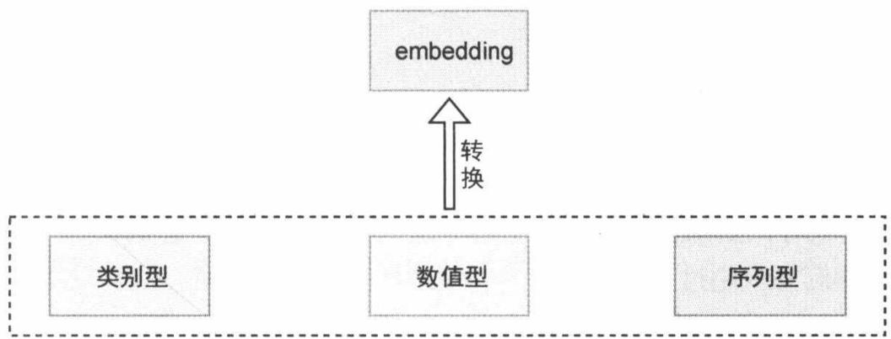  
图7-2 不同类型的特征最终转变成embedding

# 1. 类别特征

类别特征的处理方式比较简单，也比较统一。早些时候人们会对一些取值比较少的类别特征（比如性别，只有男、女和未知三个值）做one-hot处理，取值比较多的类别特征（比如用户ID，取值为千万甚至上亿级）做embedding处理，但是现在基本上已经统一了：不管特征取值很多还是很少，均可以先进行散列操作再查embedding矩阵得到embedding，如图7-3所示。

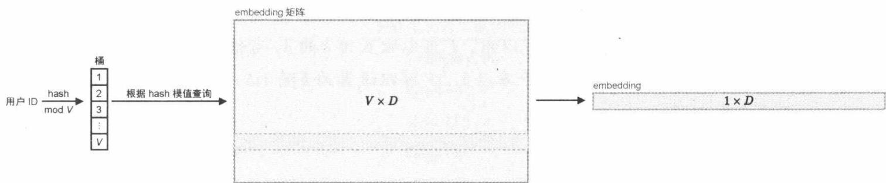  
图7-3 类别特征embedding

以用户ID为例，用户ID属于类别特征，其取值类型一般是字符串类型，比如uid:314159，从原始字符串到最终embedding的过程如下：

(1) 对用户ID进行散列操作再求模，得到 $[0, V)$ 范围内的一个整数值 $H$ ；

(2) 以 $H$ 为行号，去 $V \times D$ 的矩阵里抽取第 $H$ 行的元素（可以理解为按照索引取数组的第 $H$ 个元素），得到 $1 \times D$ 的向量；  
(3) 此向量即为用户 ID uid:314159 的 embedding。

其中 $V \times D$ 矩阵称为用户IDembedding矩阵，它在训练开始时随机初始化，在训练过程中通过梯度下降更新其中的元素值。

几乎所有类别特征都可以按照上述逻辑来生成最终的 embedding，其中不确定的变量 $V$ 和 $D$ 是需要注意的地方。这两个变量的取值很大程度上决定了 embedding 质量的高低。

# - $V$ 的大小

$V$ 表示的是散列桶数：

□ $V$ 太小，散列冲突会增多，导致大量不同的特征映射到同一个桶里，造成特征区分度不够，不利于模型学习；  
□ $V$ 太大，对内存的要求大大提高，比如 $V$ 是100000000， $D$ 是300，则矩阵 $V \times D$ 占用的内存大小很容易就超过100GB了。

假设类别特征取值的个数为 $k$ ，则在散列桶数为 $V$ 的前提下，散列冲突的概率①为

$$
P = 1 - \mathrm {e} ^ {\frac {- k \times (k - 1)}{V}}
$$

如果 $k$ 很小，则很容易设置一个不大的 $V$ 使得 $P$ 很小，这种情况下散列冲突的情况很好解决。如果 $k$ 很大，比如10000000，那么即使 $V$ 也设置为10000000， $P$ 还是几乎等于1。这种情况下一般可以尝试几组不同的 $V$ 值，观察内存使用情况和模型的指标变化，权衡之后，选择既满足计算和内存资源需求又不太影响模型指标的 $V$ 。


关于 $V$ 的设置，有一些经验法则可以作为参考。

□ $k$ 比较小时： $k$ 的量级在数十万以内， $V$ 可以设置为 $k$ 的 $3\sim 4$ 倍，降低散列冲突的概率。  
□ $k$ 比较大时： $k$ 的量级在百万/千万以上， $V$ 可以设置为 $k$ 的 $1.5 \sim 2$ 倍，减少 embedding 矩阵的内存占用。

# $\bullet D$ 的大小

$D$ 是特征的 embedding size，也就是向量长度，一般情况下长度越大，向量的表达能力就越强，当然也就越占内存，所以这也需要在效果与资源之间寻求一个平衡。当然，这也有经验法则可以参考，按照下式进行设置通常是一个很不错的选择：

$$
D = 2 ^ {\left\lceil \log_ {2} k ^ {0. 2 5} \right\rceil} \quad / / \text {为 了 让} D \text {是} 2 \text {的 幂 次 方}
$$

比如 $k$ 为10000000，则 $D$ 为64。当然，这只是经验法则，也可以根据自身业务需要调整 $D$ 的大小。

# 2.数值特征

数值特征在作为深度模型的输入时，通常有两种处理方式：

(1) 依然作为数值特征使用，此时需要进行归一化，因为深度模型的输入最好在 $-1 \sim 1$ ；  
(2) 将数值特征离散化，变成类别特征再处理

# - 归一化

数值特征作为模型输入时，通常需要进行归一化处理，除了常见的Min-Max和Z-score归一化之外，还可以按照如下思路进行归一化①②：

(1) 假设数值特征为 $x$ ，在训练数据集中统计其 $n$ 个分位数，得到 $n - 1$ 个区间；  
(2) 对特征 $x$ 进行分段，根据具体的数值映射到其中一个区间 $i$ 上（ $i \in [0, n-1]$ ）；  
(3) 得到归一化特征 $\tilde{x} = \frac{i}{n - 1}$ ;  
(4) 为了捕捉数值特征的高次项和低次项，可以再生成两个新特征 $\tilde{x}^2$ 和 $\tilde{x}^{0.5}$ 。

上述处理逻辑相比Min-Max或者Z-score的好处是：对特征取分位数能够极大降低异常数据的影响，提高数据质量和模型的健壮性（robustness）。比如年龄特征，表7-2展示了它的归一化过程，如果数据集中出现了年龄为-1或者999的异常数据，则会分别落入第0区间和第7区间，并不会造成太大的影响。

表 7-2 年龄特征归一化  

<table><tr><td>区间编号</td><td>年龄上下界（左闭右开）</td><td>归一化</td></tr><tr><td>0</td><td>[-Infinity, 0.)</td><td>0./7.</td></tr><tr><td>1</td><td>[0., 18.)</td><td>1./7.</td></tr><tr><td>2</td><td>[18., 25.)</td><td>2./7.</td></tr><tr><td>3</td><td>[25., 36.)</td><td>3./7.</td></tr><tr><td>4</td><td>[36., 45.)</td><td>4./7.</td></tr><tr><td>5</td><td>[45., 55.)</td><td>5./7.</td></tr><tr><td>6</td><td>[55., 65.)</td><td>6./7.</td></tr><tr><td>7</td><td>[65., +Infinity)</td><td>7./7.</td></tr></table>

# - 离散化

特征离散化又叫作特征分桶，按照类似表7-2的逻辑将数值特征划分成一个个区间，使用划分后的区间编号作为新的特征。由于区间编号可以作为类别特征对待，因此此时对数值特征的处理方式就转变成了对类别特征的处理方式——先进行散列操作再进行embedding处理——这些内容就不再赘述了。

# 3. 序列特征

序列特征一般表示的是用户的历史行为，下面以用户过去15天内点击的物品ID特征为例，讲述序列特征几种常见的处理方式。

假设物品ID的embedding矩阵为 $W_{V\times D}$ ，某用户过去15天内点击的物品ID为[ $\mathrm{ID1, ID2, ID3,}$ ID4]，那么可以对此序列进行pooling①②、attention③、Transformer等操作。

# - pooling

pooling主要有两种方式：sum和average。

sum pooling 就是对序列中的 4 个 ID 分别进行 embedding 操作，得到 4 个向量，再将这 4 个向量按元素对位相加，得到 1 个全新的向量，然后将此向量作为模型的输入，如图 7-4 所示（省略了散列的过程）。

$$
\text {i n p u t e m e d d i n g} = \text {e m b e d d i n g} _ {1} + \text {e m b e d d i n g} _ {2} + \text {e m b e d d i n g} _ {3} + \text {e m b e d d i n g} _ {4}
$$

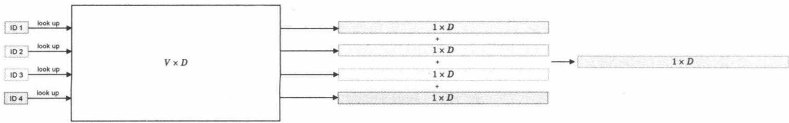  
图7-4 sumpooling

average pooling 顾名思义，就是把 sum pooling 中的求和操作变成求平均操作，输出向量的形状依然与 sum pooling 一致，如图 7-5 所示。

  
图7-5 average pooling

# - attention

pooling处理方式是将序列中的每个元素当作同等重要来对待，如每个元素的embedding权重都是1。但是一般情况下序列中的历史行为物品，越靠近当前时间越重要，比如1个月前点击的物品的重要性应该不如1分钟前点击的物品，也就是序列中的物品对当前用户决策的影响力应该不同。每个历史物品都有一个权重，这正是注意力机制的作用，如图7-6所示。

$$
\begin{array}{r l} \text {i n p u t e m e b d i n g} & = \text {w e i g h t} _ {1} \times \text {e m b e d d i n g} _ {1} + \text {w e i g h t} _ {2} \times \text {e m b e d d i n g} _ {2} + \text {w e i g h t} _ {3} \times \text {e m b e d d i n g} _ {3} + \\ & \quad \text {w e i g h t} _ {4} \times \text {e m b e d d i n g} _ {4} \end{array}
$$

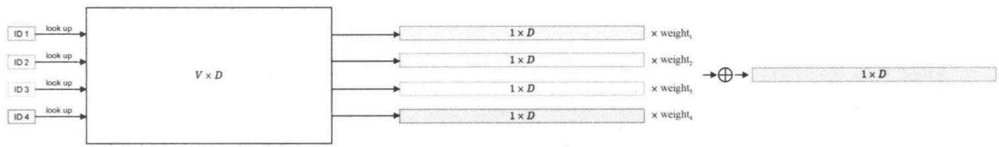  
图7-6 attention

# - Transformer + attention

不管是pooling还是attention都忽略了一个重要因素：顺序，即数组中的元素顺序。用户的行为轨迹前后应该是有关联的，这种序列内部元素之间的关系pooling和attention都无法捕获，而Transformer①可以很好地完成这个任务，它的自注意力机制考虑了物品在序列中的位置。具体来说，如图7-7所示，假设序列的最大长度为 $T$ ，当前序列长度为4，将各自物品的embedding与其在序列中的位置POS的embedding首尾相连（concat），将连接后的embedding送入Transformer，将输出的4个embedding再通过注意力机制得到1个最终的向量。可以看出引入Transformer后复杂度提升了很多，但是收益也可能会提升很多。

  
图7-7 Transformer + attention

# 7.2.3 TensorFlow特征列

针对上述几种特征类型，TensorFlow 官方内置了许多特征处理函数，具体的工作逻辑描述如下：

(1) 原始数据为 key-value 格式，比如 $\{\text{gender:0}\}$ ；  
(2) 预先定义每个 key 对应的处理函数，比如 $\{\text{gender: hash}(100)\}$ ，表示 gender 这个特征需要进行散列处理，且散列桶数为 100；  
(3) 当数据到来时，TensorFlow 根据 key（gender）对原始数据（0）执行处理函数（hash(100))，得到处理后的特征（散列值）。

图7-8展示了上述逻辑，左边的框为原始数据，中间的框为特征处理函数，右边的框为特征处理函数在模型中的应用。可见，TensorFlow的feature column API（下文表示为tf.feature_column①）作为一系列处理函数，是连接原始数据和特征输入的桥梁：它们将原始数据转变为可以作为模型输入的特征。

由于特征种类繁多，因此tf.feature_column也包含了不同的处理函数。如图7-9所示，tf.feature_column将特征分为了两大类：类别型Categorical Column以及连续型Dense Column（如果元素是类别型，则可以认为该序列特征属于类别型。同理，如果元素是连续型，则该序列特征属于连续型）。图7-9中的9个特征处理函数（categorical_column_*、bucketized_column、numeric_column等），基本上可以覆盖所有深度模型的特征输入，第9章会对这些函数做详细说明。

  
图7-8 原始数据转变为特征输入

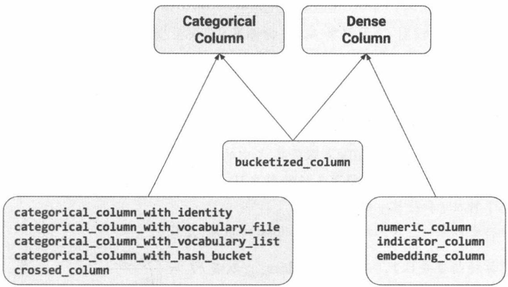  
图7-9 tf.feature_column层级分类

# 7.3 特征选择

当特征个数特别多，希望将其减少时，就面临特征选择问题，即从若干特征中选择最优的子集作为最终的模型输入。一般地，当线上服务的响应时长达到业务要求的临界点，比如上游调用推荐服务超过 $100\mathrm{ms}$ 就自动超时，那么从获取特征到模型输出结果，整个链路用时不能超过 $100\mathrm{ms}$ ，尤其是当特征工程成为耗时的主要节点时，就需要将特征选择纳入重点工作事项。

一般有三种方法完成特征选择。

□过滤法（filter）：根据特征所含信息量或者特征与特征之间、特征与标签之间的相关性来筛选特征。缺点在于与模型无关。  
□包裹法（wrapper）：重复训练多次，每次保留或者排除若干特征，根据目标函数（比如模型的离线指标等）确定最优特征子集。缺点在于需要训练多次，在大规模推荐系统中实用性不佳。  
□嵌入法（embedded）：为了克服包裹法计算量太大的缺点，嵌入法选择自身具备特征选择功能的模型，在训练过程中完成特征选择，常见的有树模型和逻辑回归等。

这里介绍一种简单的测算特征重要性的算法：permutation feature importance，它与具体的模型有关（克服了过滤法的缺点），同时也不需要重复训练多次（克服了包裹法的缺点），甚至不需要修改模型结构，具体测算逻辑如下。

# permutation feature importance

输入：已经训好的模型 $f$ ，数据集 $X$ ，目标标签 $y$ ，模型损失 $\mathrm{loss}(y,f)$ 。

输出：特征重要性。

(1) 评估数据集 $X$ 上的 $\mathrm{loss}_{\mathrm{origin}} = \mathrm{loss}(y, f(X))$ 。  
(2) 遍历每一个特征 $j \in \{1, \dots, p\}$ :

□完全打散（random shuffle）数据集 $X$ 中的特征 $j$ 得到新的数据集 $X_{\mathrm{shuffle}}$ ，注意，只是特征 $j$ 打散，比如将第1行的用户ID特征打散到了第100行等，这样完全破坏了特征 $j$ 和标签 $y$ 的关系；  
□评估数据集 $X_{\mathrm{shuffle}}$ 上的 $\mathrm{loss}_{\mathrm{shuffle}} = \mathrm{loss}(y,f(X_{\mathrm{shuffle}}))$   
计算特征重要性 $FI_{j} = \mathrm{loss}_{\mathrm{shuffle}} - \mathrm{loss}_{\mathrm{origin}}$ 或者 $FI_{j} = \frac{\mathrm{loss}_{\mathrm{shuffle}}}{\mathrm{loss}_{\mathrm{origin}}}.$

(3) 降序排列 $FI$ ，得到特征重要性。

上述算法中假设了一个前提，就是如果一个特征越重要，将其随机打散对模型的影响越大。同理，可以将loss换成任何模型离线指标（准确率、AUC等），此时的特征重要性 $FI = \mathrm{metric}_{\mathrm{origin}} - \mathrm{metric}_{\mathrm{shuffle}}$ 或者 $FI = \frac{\mathrm{metric}_{\mathrm{origin}}}{\mathrm{metric}_{\mathrm{shuffle}}}$

当然，除了 permutation feature importance 之外，还有其他很多特征选择方法，具体可以参考优秀的图书和论文等①②。另外，特征选择本身是一个与业务密切相关的主题，在实际应用中业务专家的意见很可能会比纯技术带来的效果更为明显。

# 7.4 总结

□ 特征是影响模型质量最为重要的因素之一，特征工程是将原始数据转换为模型可以识别的输入的过程，旨在提高特征的表达能力；特征选择是从多个特征中选择出一些最有效特征以降低特征维度的过程。本章主要讨论推荐算法中的特征。  
□特征一般分为三类：类别型、连续型和序列型。每种特征都有其特定的处理方法，了解并熟悉这些处理方法会在建模过程中受益良多。  
□ TensorFlow 作为一个机器学习训练框架，自然内置了很多特征处理函数。熟练掌握每种函数的使用方法是一项必备技能。  
□ 特征选择在实际应用中使用得并不是很多，一般当特征个数过多造成线上耗时过长时才会考虑进行特征选择。本章介绍的 permutation feature importance 算法可以简单快速地计算出每个特征的重要性。  
□数据和特征的重要性再怎么强调也不为过，本章只展示了特征领域的冰山一角，更多的内容和技巧需要在实际应用中去探索和挖掘。

# 第8章

# 传统机器学习排序算法

在排序算法大规模使用深度学习建模之前，传统的机器学习算法在推荐系统领域已经服务了很长时间并且发挥了巨大的作用。相比深度模型，传统的机器学习模型具备良好的理论基础，且一般具有较强的可解释性（可解释性：能够从模型的角度对推荐结果做出合理的解释，比如逻辑回归中的系数、决策树中的特征重要性等），图8-1展示了比较几种经典排序算法，由LR开始，经历了FM/FFM/GBDT+LR，最终统一于当前的深度学习。其中LR（逻辑回归）是典型的线性模型，FM（因式分解机）在LR的基础上添加了二次项实现了一定程度的非线性， $\mathrm{GBDT} + \mathrm{LR}$ 融合了GBDT和LR，发挥了GBDT自动挖掘特征的功能，大幅减少了特征工程的工作量。虽然如今的排序算法领域已经被深度学习完全占据，但是对于传统机器学习算法的理解依然有助于解决现实世界中的一些问题，尤其是传统机器学习算法背后的理论基础，还是非常值得深入研究的。

  
图8-1 几种经典的排序算法

# 8.1 数据和模型

数据是算法理论落地为模型时用到的，比如用户的点击/加购/收藏/下单数据等，因为这些数据一般是在一段时间内采集到的，所以可以理解为是从总体 $X$ 中抽样出的有限样本，以 $\mathbf{x}$ 来表示，它是已知的。

模型一般有各种各样的参数，比如线性模型 $y = \omega x + b$ 中的 $\omega$ 和 $b$ 就是模型参数；深度模型

中各层的参数组成了模型参数，这些参数统称为 $\theta$ ，它是未知的，我们希望将算法应用在数据上，通过训练“学到”参数 $\theta$ 。一旦 $\theta$ 学到了，模型就生成了（模型和参数根据上下文可能会被交替使用，但是两者本质上是一个概念）。

那么如何通过已知的数据来“学到”未知的参数呢？在深入探讨这个问题之前，首先来看看概率论中的极大似然估计（maximum likelihood estimation，MLE）和最大后验概率估计（maximum a posteriori estimation，MAP）。

# 8.1.1 极大似然估计

极大似然估计的前提条件是“分布已知，参数未知”，也就是假定数据服从某种分布，但是该分布的参数是未知的，比如已知数据服从伯努利分布，但是 $p$ 未知，或者已知数据服从正态分布，但是 $\mu$ 和 $\sigma$ 未知，等等。一旦做出了这样的假设，接下来的主要工作就是通过某种方法估算这些未知的参数。

假定总体 $X$ 服从分布 $P(X = x) = p(x;\theta)$ ， $\theta \in \Theta$ ，其中 $\theta$ 是待估计的参数， $\Theta$ 是 $\theta$ 可能的取值范围，设 $x_{1}, x_{2}, \dots, x_{n}$ 是来自 $X$ 的样本值，则总体参数为 $\theta$ 时，事件 $\{X_{1} = x_{1}, X_{2} = x_{2}, \dots, X_{N} = x_{n}\}$ 发生的概率为（这里假设样本独立同分布）：

$$
p (x \mid \theta) = \prod_ {i = 1} ^ {n} p \left(x _ {i} \mid \theta\right), \theta \in \mathcal {O} \tag {8-1}
$$

概率 $p(x|\theta)$ 是 $\theta$ 的函数， $\theta$ 取值不同，得到的 $p(x|\theta)$ 也就不同，注意式(8-1)中的 $x$ 是已知的样本值，均可视作常数。

关于极大似然估计，最直观的想法是：对于给定的样本数据 $x_{1}, x_{2}, \dots, x_{n}$ ，希望有一个 $\hat{\theta}$ 使得 $p(X|\theta)$ 取值最大，我们会很自然地认为之所以能得到这些样本数据，是这些样本出现的概率比较大，因此我们的目标是找到参数 $\hat{\theta}$ ，使得 $p(x|\theta)$ 最大，即：

$$
\hat {\theta} = \arg \max  _ {\theta} p (x \mid \theta) = > p (x \mid \hat {\theta}) = \max  _ {\theta \in \Theta} p (x \mid \theta) \tag {8-2}
$$

使用 $\hat{\theta}$ 作为总体参数 $\theta$ 的估计，称为极大似然估计。

# 8.1.2 最大后验概率估计

根据上文的描述，极大似然估计完全根据当前的样本数据来估计总体参数，而没有考虑任何先验信息。举个例子，假设抛了10次硬币，正面出现3次，那么根据极大似然估计可以算出正面出现的概率 $p$ 为0.3，但是从经验上来说 $p$ 为0.5的概率才比较合理。因此如果既要考虑先验信息，又要考虑最大似然，总体参数 $\theta$ 又该怎么估计呢？这就是最大后验概率估计要解决的问题。

MAP 的思想是找到一个参数 $\hat{\theta}$ 使得

$$
\begin{array}{l} \hat {\theta} = \arg \max  _ {\theta \in \Theta} p (\theta \mid x) \\ = \arg \max  _ {\theta \in \Theta} \frac {p (x \mid \theta) p (\theta)}{p (x)} \tag {8-3} \\ = \arg \max  _ {\theta \in \Theta} p (x \mid \theta) p (\theta) \quad / / \text {因 为} x \text {是 已 知 的 样 本 ， 所 以} p (x) \text {是 定 值 ， 不 影 响 求 最 大 值} \\ \end{array}
$$

式(8-3)中的第一项是极大似然估计，第二项是参数的先验分布信息。

可见根据MAP估计得到的 $\hat{\theta}$ 不仅会使极大似然估计要大，先验概率也要大。根据log函数单调递增的特性，式(8-3)等价于

$$
\begin{array}{l} \hat {\theta} = \arg \max  _ {\theta \in \Theta} p (x \mid \theta) p (\theta) \\ = \arg \max  _ {\theta \in \Theta} \log (p (x \mid \theta) p (\theta)) \\ = \arg \max  _ {\theta \in \Theta} \log \prod_ {i = 1} ^ {n} p \left(x _ {i} \mid \theta\right) + \log (p (\theta)) \tag {8-4} \\ = \arg \max  _ {\theta \in \Theta} \sum_ {i = 1} ^ {n} \log (p (x _ {i} \mid \theta)) + \log (p (\theta)) \\ \end{array}
$$

式(8-4)非常重要，它在建模过程中发挥着决定性的作用，理解了它，就理解了实际应用中常见的损失函数和正则项的设计。


式（8-4）可以回答以下问题：

(1) 正则项存在的理论基础是什么？  
(2)为什么L1正则假设参数服从拉普拉斯分布，L2正则假设参数服从正态分布？  
(3)为什么L1正则会让模型的参数变得更为稀疏？

(4)

# 8.2 模型训练流程


这里只针对有标签的监督学习且只考虑基于梯度下降的模型。

模型本质上是一组参数，它没有思想，因此并没有主动学习的功能。所谓的学习，本质上是参数在拟合数据的过程中不断地更新，参数更新的过程又称模型训练，目前大多数模型参数的更新是通过梯度下降实现的，如图8-2所示。

  
图8-2 模型训练的流程（从数据输入到最终的参数更新）

图8-2描述了基于梯度下降的模型参数更新步骤，从数据的输入到预测值到损失到梯度再到更新参数：

(1) 模型读入预先处理好的训练数据，作为输入；  
(2) 获取输入中特征对应的参数；  
(3) 根据模型的不同，特征和参数结合的方式也不同，但是无论如何，经过一定的数学运算后最终都会得到预测值；  
(4) 利用真实值和预测值，根据具体的损失函数，得到损失值；  
(5) 得到损失值后，即可对参数进行求导，得到导数后，根据梯度下降的原理更新参数，实现一次“学习”；  
(6) 进入第 (1) 步，开始下一轮训练，直到达到某种停止条件（比如数据训练完毕或者离线指标不再增长等）。

从上述过程可知，想让模型具有“学习”的能力，必须：

(1) 需要预测函数，这样才能根据输入和参数得到预测值；  
(2) 需要损失函数，这样才能根据损失来对参数求导从而实现参数更新，达到“学习”的目的。

只要确定了这两者，基本上就确立了整个算法的大方向。在实际应用中，算法开发大都使用现成的框架（比如Spark、TensorFlow以及scikit-learn等），这些优秀的框架一方面使算法开发变得极为便捷，另一方面也屏蔽了诸多的算法细节，比如损失和梯度计算、参数更新等，会显得算法的“学习”能力有些神秘。接下来我们通过手写逻辑回归和因式分解机这两个经典的机器学习模型来演示图8-2中的各个步骤如何落地。

# 8.3 手写逻辑回归

逻辑回归是一个二分类模型，因为它的标签只有0和1，同时二分类任务在推荐系统中最常见，比如预测用户点不点击、购不购买、播不播放等，而且逻辑回归最大的优点是它的输出是一个概率，又易于实现，因此早期广泛应用在点击率预估、转化率预估等任务中，用来估计用户发

生某种行为的概率。

逻辑回归的预测函数为：

$$
\hat {y} = \frac {1}{1 + e ^ {- \left(w _ {0} + \sum_ {i = 1} ^ {n} w _ {i} x _ {i}\right)}} \tag {8-5}
$$

其中， $w_{i},i\in [1,2,\dots ,n]$ 是模型的参数， $w_{0}$ 是模型bias对应的参数， $x_{i}$ 是具体的输入数据， $\hat{y}$ 是模型的预测输出，如果是点击率预估任务， $\hat{y}$ 可以理解为本次输入 $\pmb{x}$ 对应的预测点击概率。

逻辑回归的损失函数为：

$$
l (w) = - y \log \hat {y} - (1 - y) \log (1 - \hat {y}) \tag {8-6}
$$

式(8-6)是关于 $w$ 的函数， $y$ 是真实标签， $\hat{y}$ 是预测值。但是一般情况下会对损失函数稍加修改，加入L1正则项或L2正则项，式(8-6)加入正则项后就变成了式(8-7)，其中 $\lambda_{1}$ 称为L1正则项系数， $\lambda_{2}$ 称为L2正则项系数：

$$
L (w) = l (w) + \lambda_ {1} \sum | w | + \frac {1}{2} \lambda_ {2} \sum w ^ {2} \tag {8-7}
$$

利用式(8-5)和式(8-7)，可以计算出 $L$ 对 $w$ 的导数为：

$$
g = \frac {\mathrm {d} L}{\mathrm {d} w} = (\hat {y} - y) x + \lambda_ {1} \operatorname {s i g n} (w) + \lambda_ {2} w
$$

$$
\operatorname {s i g n} (w) = \left\{ \begin{array}{l l} 1, & w > 0 \\ 0, & w = 0 \\ - 1, & w <   0 \end{array} \right. \tag {8-8}
$$

到此为止，就可以开始写模型代码了，我们来实现一个基于随机梯度下降（stochastic gradient descent，SGD）的逻辑回归。


软件环境：Python3.6。

# 8.3.1 数据准备

输入数据如下所示，按照libsvm格式存放数据，这里为了演示方便，仅仅以字符串数组保存数据：

格式：label feature1:value1 feature2:value2 data $=$ ["0 item_id2:1 user_id2:1", "1 item_id1:1 user_id1:1", "0 item_id2:1 user_id1:1",

```txt
"0 item_id1:1 user_id2:1", "1 item_id1:1 user_id1:1"] 
```

该数据集有两个特征，分别为物品ID和用户ID。因为这些特征都是离散型特征，所以特征的值都是1。

# libsvm数据格式

libsvm 格式的数据如下所示：

```txt
[label] [feature 1]:[value 1] [feature 2]:[value 2] ...  
[label] [feature 1]:[value 1] [feature 2]:[value 2] ... 
```

□ label：数据中的标签，在分类任务中就是该条数据属于哪个类。  
□ feature：特征编号，一般使用特征的散列码来表示，本章为了方便演示，使用明文。  
value: 就是特征值，对于连续型特征，value 是特征对应的值，对于离散型特征，value 固定为 1。

# 8.3.2 数据读取

根据数据格式编写数据读取函数，将原始输入数据转化为模型能够识别的形式，读取函数的输出是一个元素为元组的迭代器：元组的第一个值为 label，第二个值为 features，这是一个字典，字典中的元素 key 为特征，value 是特征值。

import re   
def input_fn(data, epochs=1): for line in data \* epochs: label_features $=$ re.split('\\s+',line) if not label_features or len.label_features) $<  2$ .. continue label $=$ float.label_features[0]) feature_values $=$ label_features[1:] features $=$ {} for feature_value in feature_values: feature, value $=$ feature_value.split':') features[feature] $=$ float(value) features['bias'] $= 1.0$ #每条数据都加上一个模型 bias yield label, features

# 8.3.3 模型训练

为了训练逻辑回归，需要准备一些工具函数辅助计算，如下所示：

```python
import math
# sigmoid 函数
def sigmoid(wx_plus_b):
    return 1 / (1 + math.exp(-wx_plus_b)) 
```

#符号函数  
```python
def sign(x):
    if x > 1e-6:
        return 1
    elif x > -1e-6:
        return 0
    else:
        return -1 
```

#预测函数  
```python
def predict features, model):
    wx_plus_b = 0
    for feature, value in features.items():
        weight = model.get(feature, 0.0)
        wx_plus_b += weight * value
    # 预测值
    y_pred = sigmoid(wx_plus_b)
    return y_pred 
```

接着按照图8-2所示的模型训练流程来组织代码，如下所示：

```python
def fit(data, learning_rate=0.01, lambda1=0.0, lambda2=0.0, epochs=1):
    # 1. 输入数据
    data_set = input_fn(data, epochs)
    model = {}
    # 模型参数，保存每个特征对应的权重
    for label, features in data_set:
        # 2. 读取参数和3. 数学运算
        y_pred = predict(features, model)
        # 4. 计算损失和5. 求导更新参数
        for feature, value in features.items():
            weight = model.get(feature, 0.0)
            # 式(8-8)
            g = (y_pred - label) * value + lambda1 * sign(weight) + lambda2 * weight
            # 更新参数，SGD
            model[feature] = weight - learning_rate * g
        # 这就是逻辑回归的模型参数
    return model 
```

# 8.3.4 完整代码

将上述代码片段整合在一起后，稍加整理，得到了最终逻辑回归的算法代码：

```txt
# --coding: utf-8 --import re
import math 
```

```markdown
```
python: 3.6 
```

```python
class LogisticRegression: def __init__(self, params): self._params = params self._b = 0.0 self._w = {} def __str__(self): return f'w:{self._w}, b:{self._b}' def _input_fn(self, mode, data): assert mode in ('train', 'predict'), f'mode only support train or predict, but get {mode}' epochs = self._params.get('epochs', 1) if mode == 'train' else 1 for line in data * epochs: label_features = re.split("\\s+", line) if not label_features or len.label_features) < 2: continue label = float.label_features[0]) if mode == 'train' else None feature_values = label_features[1:] if mode == 'train' else label_features features = {} for feature_value in feature_values: feature, value = feature_value.split(":") features[feature] = float(value) yield label, features # sigmoid 函数 @staticmethod def __sigmoid(x): return 1 / (1 + math.exp(-x)) #符号函数 @staticmethod def __sign(x): if x > 1e-6: return 1 elif x > -1e-6: return 0 else: return -1 #预测函数 def __predict(self, features): wx_plus_b = self._b for feature, value in features.items(): weight = self._w.get(feature, 0.0) wx_plus_b += weight * value #预测值 prediction = self._sigmoid(wx_plus_b) 
```

return prediction   
def predict(self,data): _predictions $=$ [] data_set $\equiv$ self._input_fn('predict',data) for _, features in data_set: prediction $=$ self._predict_features) _predictions.append(prediction) return predictions   
#交叉熵损失   
@staticmethod   
def _loss_prediction, label): return -math.log(predictation) if label $>0$ else -math.log(1 - prediction)   
def fit(self,data): #1.输入数据 data_set $\equiv$ self._input_fn('train',data) learning_rate $=$ self._params.get('learning_rate'，0.01) lambda1 $=$ self._params.get('lambda1'，0.0) lambda2 $=$ self._params.get('lambda2'，0.0) steps $= 0$ for label, features in data_set: steps $+ = 1$ #2.读取参数和3.数学运算 prediction $=$ self._predict_features) #4.计算损失和5.求导更新参数 g.bias $=$ (prediction-label)+ lambda1\*self._sign(self._b)+ lambda2\*self._b self._b $=$ self._b- learning_rate\*g.bias for feature, value in features.items(): w $=$ self._w.get(feature,0.0) #式(8-8) g_w $=$ (prediction-label)\*value $+$ lambda1\*self._sign(w)+ lambda2\*w #更新参数，SGD self._w[feature] $= w$ -learning_rate\*g_w if steps $= 1$ or (steps and not steps % 1000): loss $=$ self._loss(predictation, label) print(f' $loss = \{loss\}$ , step $=$ {steps}') return self   
_name $= =$ 'main': hyper_parameters $\equiv$ {'learning_rate':0.05,'lambda1':0.01,'lambda2':0.01,'epochs':200} #格式：label feature1:value1 feature2:value2 data_train $=$ [ "0 item_id2:1 user_id2:1", "1 item_id1:1 user_id1:1", "0 item_id2:1 user_id1:1", "0 item_id1:1 user_id2:1", "1 item_id1:1 user_id1:1"]

```python
lr = LogisticRegression(hyper_parameters)  
model = lr.fit(data_train)  
data_prediction = [  
    "item_id2:1 user_id2:1",  
    "item_id1:1 user_id1:1",  
    "item_id2:1 user_id1:1",  
    "item_id1:1 user_id2:1",  
    "item_id1:1 user_id1:1"  
]  
predictions = model.predict(data_prediction)  
# [0.004406334558092134,  
# 0.8786431612197027,  
# 0.15131339987498774,  
# 0.15234633822452381,  
# 0.8786431612197027]  
print predictions)  
# w: {  
#     'item_id2': -2.467453798710349,  
#     'user_id2': -2.462844191694607,  
#     'item_id1': 1.2365265665362821,  
#     'user_id1': 1.2331150420070116  
# }  
# b: -0.4899980396316112  
print(model) 
```

一个基本可用的逻辑回归模型就写出来了，当然还很不完善，比如模型训练过程中输出离线指标等，但是至少可以完成预测功能。

# 8.3.5 算法优缺点

# 优点：

□ 简单易懂，非常容易实现；  
□ 可解释性特别好，系数大小即可反映特征重要性；  
□训练速度快，模型占用内存少，线上预测性能高；  
□适用于推荐系统搭建初期模型可以快速上线；  
□

# 缺点：

□ 线性模型，无法拟合非线性的问题；  
一般模型精度不是太高，容易发生欠拟合；  
□无法捕捉特征之间的交互，而这正是接下来要讲到的因式分解机的优点；  
□

# 8.4 手写因式分解机

因式分解机①（FM）为每个特征 $x_{i}$ 又新增了一个向量参数（称为factor， $f$ ），用 $\nu_{i}$ 来表示，即现在每个特征 $x_{i}$ 除了有标量参数 $w_{i}$ 之外，还多了一个向量参数 $\nu_{i}$ ，它被称为特征的隐向量，正是这个隐向量捕获了特征与特征之间的交互。同理，只要掌握FM的预测函数和损失函数，就可以手动实现FM算法了。

相比逻辑回归，FM的预测函数多了特征交叉项，预测函数为

$$
\hat {y} = w _ {0} + \sum_ {i = 1} ^ {n} w _ {i} x _ {i} + \sum_ {i = 1} ^ {n} \sum_ {j = i + 1} ^ {n} \left\langle v _ {i}, v _ {j} \right\rangle x _ {i} x _ {j} \tag {8-9}
$$

其中， $w_{i}$ 是 $x_{i}$ 对应的标量/一次项参数， $\pmb{v}_{i}$ 是 $x_{i}$ 对应的隐向量。

观察式(8-9)，求和项一共有三项：第一项是模型bias，第二项是一次项，前两项就是普通的线性函数，重点在第三项——特征两两交叉项（本章不讨论三个或者更多特征的交叉）——这一项是FM算法的核心所在，引入了特征交叉捕获特征之间的联系，但是可以看到第三项的时间复杂度为 $O(n^{2})$ ， $n$ 是特征个数，整体的算法时间复杂度从逻辑回归的 $O(n)$ 上升到了 $O(n^{2})$ ，当特征数增多时，这个时间复杂度可能会造成线上预测耗时过长，影响系统稳定性和用户体验，需要加以优化。

以 $k$ 表示 $\nu_{i}$ 的长度， $\nu_{i,f}$ 表示 $\nu_{i}$ 中的第 $f$ 个元素值，式(8-9)的第三项简化过程如下：

第三项 $= \sum_{i = 1}^{n}\sum_{j = i + 1}^{n}\left\langle \pmb {v}_i,\pmb {v}_j\right\rangle x_i x_j$ //对称矩阵的上半角（不包含对角线）之和

$= \frac{1}{2}\sum_{i = 1}^{n}\sum_{j = 1}^{n}\left\langle \pmb {v}_{\mathbf{i}},\pmb {v}_{\mathbf{j}}\right\rangle x_{i}x_{j} - \frac{1}{2}\sum_{i = 1}^{n}\left\langle \pmb {v}_{\mathbf{i}},\pmb {v}_{\mathbf{j}}\right\rangle x_{i}x_{i}$ //等于对称矩阵之和减去对角线之和

得到的差的一半

$= \frac{1}{2}\left(\sum_{i = 1}^{n}\sum_{j = 1}^{n}\sum_{f = 1}^{k}v_{i,f}v_{j,f}x_{i}x_{j} - \sum_{i = 1}^{n}\sum_{f = 1}^{k}v_{i,f}v_{i,f}x_{i}x_{i}\right)$ //向量内积展开 (8-10)

$$
\begin{array}{l} = \frac {1}{2} \sum_ {f = 1} ^ {k} \left(\left(\sum_ {i = 1} ^ {n} v _ {i, f} x _ {i}\right) \left(\sum_ {j = 1} ^ {n} v _ {j, f} x _ {j}\right) - \sum_ {i = 1} ^ {n} v _ {i, f} ^ {2} x _ {i} ^ {2}\right) \\ = \frac {1}{2} \sum_ {f = 1} ^ {k} \left(\left(\sum_ {i = 1} ^ {n} v _ {i, f} x _ {i}\right) ^ {2} - \sum_ {i = 1} ^ {n} \left(v _ {i, f} x _ {i}\right) ^ {2}\right) \\ \end{array}
$$

可以看出，式(8-10)将式(8-9)的时间复杂度从 $O(n^{2})$ 降到了 $O(kn)$ ，实现了FM算法的线性时间复杂度。算法预测函数在化简后如式(8-11)所示：

$$
\hat {y} = w _ {0} + \sum_ {i = 1} ^ {n} w _ {i} x _ {i} + \frac {1}{2} \sum_ {f = 1} ^ {k} \left(\left(\sum_ {i = 1} ^ {n} v _ {i, f} x _ {i}\right) ^ {2} - \sum_ {i = 1} ^ {n} \left(v _ {i, f} x _ {i}\right) ^ {2}\right) \tag {8-11}
$$

式(8-11)中， $n$ 是特征个数， $k$ 是隐向量 $\pmb{\nu}_{i}$ 的长度， $\nu_{i,f}$ 是隐向量 $\pmb{\nu}_{i}$ 中的第 $f$ 个元素值。

对于二分类任务来说，FM的损失函数为：

$$
L \left(w _ {0}, w, v\right) = - \log (\sigma (y \hat {y})) \tag {8-12}
$$

式(8-12)中 $\sigma (x) = \frac{1}{1 + \mathrm{e}^{-x}}$ 是sigmoid函数， $y\in \{1, - 1\}$ 。

一旦有了损失函数，接下来就可以对参数 $w_0$ 、 $w$ 和 $\nu$ 求导进行参数更新。由于FM算法有bias项、一次项和二次项，因此参数求导稍微复杂一点儿。算法的参数更新如下所示。

# FM算法更新

输入：数据集 $D$ ， $\lambda_1^{w_0}$ 、 $\lambda_1^w$ 、 $\lambda_1^\nu$ 以及 $\lambda_2^{w_0}$ 、 $\lambda_2^w$ 、 $\lambda_2^\nu$ 分别对应参数 $w_{0}$ 、 $w$ 和 $\nu$ 的L1和L2正则项系数，学习率 $\eta$ ，正态分布方差 $\sigma$ 。

输出：模型参数 $\Theta = (w_0, w, V)$ 。

初始化： $w_{0} = 0$ ， $\pmb {w} = 0$ ， $V\sim \mathcal{N}(0,\sigma)$ 。

Repeat:  
FOR $(x,y)\in D$ DO  
{  
#更新 $w_{0}$ $\mathrm{gradient}_{w_0} = \frac{\partial\mathrm{loss}}{\partial w_0} +\lambda_1^{w_0}\mathrm{sign}\left(w_0\right) + \lambda_2^{w_0}w_0;$ $w_{0} = w_{0} - \eta \mathrm{gradient}_{w_{0}}$ ；  
FOR $i\in \{1,2,\dots ,n\}$ DO  
{  
IF $x_0\neq 0$ {  
#更新 $w_{i}$ $\mathrm{gradient}_{w_i} = \frac{\partial\mathrm{loss}}{\partial w_i} +\lambda_1^w\mathrm{sign}\left(w_i\right) + \lambda_2^w w_i;$ $w_{i} = w_{i} - \eta \mathrm{gradient}_{w_{i}}$ ；  
FOR $j\in \{1,2,\dots ,k\}$ DO  
{  
#更新 $v_{i,j}$ $\mathrm{radial}_{v_{i,j}} = \frac{\partial\mathrm{loss}}{\partial v_{i,j}} +\lambda_1^v\mathrm{sign}\left(v_{i,j}\right) + \lambda_2^v v_{i,j};$

$\nu_{i,j} = \nu_{i,j} - \eta \mathrm{gradient}_{\nu_{i,j}}$ 1 } } } } } } } } } } U n t i l s t o p c r i t e r i o n i s m e t.

上述算法更新中，存在损失对各参数的偏导计算，即式(8-12)对 $w_{0}$ 、 $w$ 和 $\nu$ 的偏导计算。具体求导公式如下：

$$
\begin{array}{l} \frac {\partial L}{\partial \theta} = - \frac {1}{\sigma (y \hat {y})} \sigma (y \hat {y}) (1 - \sigma (y \hat {y})) y \frac {\partial \hat {y}}{\theta} \tag {8-13} \\ = (\sigma (y \hat {y}) - 1) y \frac {\partial \hat {y}}{\theta} \\ \end{array}
$$

由式(8-13)可以看出，计算损失对参数的偏导需要计算预测值对参数的偏导，即式(8-11)对 $w_{0}$ 、 $w$ 和 $\nu$ 的偏导。结合式(8-11)得出如下公式：

$$
\frac {\partial \hat {y}}{\theta} = \left\{ \begin{array}{c} {{1,   \text {若}     \theta = w _ {0}}} \\ {{x _ {i},   \text {若}     \theta = w _ {i}}} \\ {{x _ {i} \sum_ {j = 1} ^ {n} v _ {j, f} x _ {j} - v _ {i, f} x _ {i} ^ {2},   \text {若}     \theta = v _ {i, f}}} \end{array} \right. \tag {8-14}
$$

有了式(8-11)、式(8-13)和式(8-14)，就可以完成FM算法的预测和参数更新功能，也就可以开始着手编码实现了。

# 8.4.1 完整代码

FM算法的代码如下，这里的实现没有考虑正则项

```markdown
# -- coding: utf-8 ***  
import re  
import math  
import random  
```
python: 3.6 
```

class FM:

```python
def __init__(self, params):
    self._params = params
    assert 'k' in self._params, 'k has to be set.'
    self._k = self._params['k']
    self._w_0 = 0
    self._w = {}
    self._v = {}
    random.seed(123)
def __str__(self):
    return f'w_0: {self._w_0}, w: {self._w}, v: {self._v}'
def _input_fn(self, mode, data):
    assert mode in ('train', 'predict'), f'mode only support train or predict, but get {mode}'
    epochs = self._params.get('epochs', 1) if mode == 'train' else 1
    for line in data * epochs:
        label_features = re.split("\\s+", line)
        label = self._label.convert(float.label_features[0])) if mode == 'train' else None
        feature_values = label_features[1:] if mode == 'train' else label_features[0:]
        features = {}
        for feature_value in feature_values:
            feature, value = feature_value.split(":")
            features[feature] = float(value)
    yield label, features
# sigmoid 函数
@staticmethod
def __sigmoid(x):
    x = min(max(-35), 35)
    return 1 / (1 + math.exp(-x))
# 符号函数
@staticmethod
def __label_convert(x):
    return 1 if x > 0 else -1
# 预测函数，式 (8-11)
def __predict(self, features):
    wx_plus_b = self._w_0
    _sum = [0.0] * self._k
    square_sum = [0.0] * self._k
for feature, value in features.items():
    w_i = self._w.get(feature, 0.0)
    wx_plus_b += w_i * value
    v = self._v.get(feature, [0.0] * self._k)
    for f in range(self._k):
        v_f_x = v[f] * value
        square_sum[f] += v_f_x ** 2
        _sum[f] += v_f_x
# 预测值，式 (8-11)
prediction = wx_plus_b + 0.5 * sum([_,sum[i] ** 2 - square_sum[i] for i in range(self._k)]) 
```

返回 _sum，因为式（8-14）需要求和项

return prediction, _sum

def predict(self, data):

predictions = []

data_set = self._input_fn('predict', data)

for _, features in data_set:

prediction, $\equiv$ self._predict features)

predictions.append(self._sigmoid(predictation))

return _predictions

交叉熵损失

def _loss(self, prediction, label):

return -math.log(self._sigmoid(probPrediction * label))

def fit(self, data):

1. 输入数据

data_set = self._input_fn('train', data)

learning_rate = self._params.get('learning_rate', 0.01)

mu = self._params.get('mu', 0.0)

sigma = self._params.get('sigma', 0.1)

steps $= 0$

for label, features in data_set:

steps $+ = 1$

2. 读取参数和3. 数学运算

prediction, _sum = self._predict features)

4. 计算损失和5. 求导更新参数

#式（8-13）

g_constant = (self._sigmoid预测 * label) - 1) * label

更新w_0，式（8-14）

self._w_0 = self._w_0 - learning_rate * g_constant

for feature, value in features.items():

w = self._w.get feature, 0.0)

# 更新 w，式（8-14）

self._w[feature] = w - learning_rate * g_constant * value

# 更新 v, v 初始化为服从正态分布的随机变量，式（8-14）

v = (self._v.setdefault feature,

[random.normalvariate(mu, sigma) for in range(self._k)])

for f in range(self._k):

v_f = v[f]

self._v[feature][f] = (v_f - learning_rate * g_constant *

(value * _sum[f] - v_f * value * value))

if steps and not steps % 1000:

loss $=$ self._loss(prediction, label)

print(f'loss = {loss}, step = {steps}')

return self

```python
if _name_ == 'main':
hyper_parameters = {'learning_rate': 0.05, 'k': 4, 'epochs': 200}
# 格式: label feature1:value1 feature2:value2
data_train = [
    "0 item_id2:1 user_id2:1",
    "1 item_id1:1 user_id1:1",
    "0 item_id2:1 user_id1:1",
    "0 item_id1:1 user_id2:1",
    "1 item_id1:1 user_id1:1"
]
f_m = FM(hyper_parameters)
model = fm.fit(data_train)
data_prediction = [
    "item_id2:1 user_id2:1",
    "item_id1:1 user_id1:1",
    "item_id2:1 user_id1:1",
    "item_id1:1 user_id2:1",
    "item_id1:1 user_id1:1"
]
predictions = model.predict(data_prediction)
# [0.014356894809136269,
# 0.9897084711625975,
# 0.021539235148611335,
# 0.019228125772935124,
# 0.9897084711625975]
print(predictions)
# w_0: -1.0629511974149788
# w:
# 'item_id2': -1.999285268270898,
# 'user_id2': -1.9196686596353496,
# 'item_id1': 0.9363340708559196,
# 'user_id1': 0.8567174622203717
# ]
# v:
print(model) 
```

# 8.4.2 算法优缺点

# 优点：

□ 线上预测性能高，引入隐向量之后，时间复杂度依然为线性的 $O(kn)$ ；  
□很适合推荐系统这种数据比较稀疏的场景；  
□ 特征两两交互极大提高了模型的表达能力；  
□ 可以为每个特征生成一个隐向量，该向量可以为其他模型提供初始化；  
□

# 缺点：

□ 只能做到特征的二阶交叉，表达能力虽然好于逻辑回归，但是依然有限，特别是在用户行为丰富的场景下还是有所欠缺；  
□特征与特征之间的交叉是通过向量内积来实现的，稍显简单；  
□……

# 8.5 其他经典排序算法

早期的推荐系统排序算法除了逻辑回归和因式分解机之外，还有一些经典算法。

# FFM

FFM（field-aware factorization machine）算法①是FM算法的升级版，相比FM算法中每个特征只有1个隐向量，FFM算法中每个特征的隐向量个数变成了 $F$ ， $F$ 是数据特征field的个数（比如性别是一个field、年龄也是一个field）。由于FFM模型参数是FM模型的 $F$ 倍，因此理论上前者的表达能力更强，效果也会比后者好。但是要想把该算法落地，还需要考虑工程上的很多因素，因为它的参数量太大，特别占用内存，同时训练速度也比较慢，所以实际应用中使用得并不多。

# 集成树

集成树（ensemble tree）也在排序算法的演进中发挥了一定作用，典型代表是 $\mathrm{GBDT} + \mathrm{LR}^2$ 以及XGBoost③。 $\mathrm{GBDT} + \mathrm{LR}$ 主要利用了GBDT自动捕获特征之间的关系从而减少了人工特征工程的工作量，这是在进入深度学习时代前关于自动特征交叉的一个特别好的实践，其原始论文中的很多思想依然值得借鉴。

XGBoost属于GBDT的范畴，在朴素GBDT的基础上实现了很多优化和改进，比如支持正则、特征分裂并行、损失函数支持二阶泰勒展开等，因此在实际应用中相比GBDT，它可以说是又快又准，特别适用在中小量级的数据集上。

总的来说，早期的推荐系统排序算法已经有了后来很多深度模型的概念并且都有了一些很好的经验实践，主要表现在：

□尝试二阶交叉、高阶特征交叉，通过“记住”历史的特征组合，增强了模型的表达能力；  
□探索特征向量化表示，不管是FM算法还是FFM算法，都实现了特征的向量化，虽然当今特征embedding技术已经变成一种标准处理手法，但是隐向量等概念在早期还是特别具有前瞻性的；

□探索自动化特征工程，由于算法从理论到落地的过程中，特征工程最耗时，因此像GBDT+LR以及FM等都在一定程度上实现了自动特征工程。

# 8.6 Q&A

Q1：为什么逻辑回归是线性分类模型？

逻辑回归是线性还是非线性的判别标准是它的决策边界（decision boundary）是否线性，如果决策边界是线性的，那么逻辑回归就是线性的，否则就是非线性的。

逻辑回归的概率计算公式如下：

$$
p (y = 1 \mid x) = \frac {1}{1 + e ^ {- w x}} = \frac {e ^ {w _ {0} + \sum_ {i} w _ {i} x _ {i}}}{1 + e ^ {w _ {0} + \sum_ {i} w _ {i} x _ {i}}} \tag {8-15}
$$

$$
p (y = 0 \mid x) = 1 - p (y = 1 \mid x) = \frac {1}{1 + e ^ {w _ {0} + \sum_ {i} w _ {i} x _ {i}}}
$$

式(8-15)中，如果 $p(y = 1|x)$ 比 $p(y = 0|x)$ 大，则预测为1，即：

$$
\begin{array}{l} \frac {p (y = 1 \mid x)}{p (y = 0 \mid x)} > 1 \\ = > \log \frac {p (y = 1 \mid x)}{p (y = 0 \mid x)} > 0 \\ \Rightarrow \log (p (y = 1 \mid x)) - \log (p (y = 0 \mid x)) > 0 \tag {8-16} \\ = > \log e ^ {w _ {0} + \sum_ {i} w _ {i} x _ {i}} > 0 \\ = > w _ {0} + \sum_ {i} w _ {i} x _ {i} > 0 \quad / / \text {线 性 边 界} \\ \end{array}
$$

由上述推导可知，逻辑回归的决策边界是线性边界，因此它是线性模型。

Q2：把实数压缩到0~1内的函数有很多，为什么逻辑回归选择sigmoid？

odds ratio 描述了事件发生的概率与不发生的概率之比，即 $\frac{p}{1 - p}$ ， $p$ 表示事件发生（ $y = 1$ ）的概率， $p$ 越大，odds ratio 越大。逻辑回归关注的是 $\frac{P(Y = 1|X)}{P(Y = 0|X)} = \frac{p}{1 - p}$ ，也就是 odds ratio。对 odds ratio 取对数得 $\log p - \log (1 - p)$ ，将取对数后的值与输入特征做线性建模，得：

$$
\operatorname {l o g i t s} (p (y = 1 \mid x)) = \log (\text {o d d s r a t i o}) = \log p - \log (1 - p)
$$

建立logits和 $x$ 的线性关系，得：

$$
\operatorname {l o g i t s} (p (y = 1 \mid x)) = \log p - \log (1 - p) = w _ {0} + \sum_ {i} w _ {i} x _ {i} \tag {8-17}
$$

根据式(8-17)可得， $p(y = 1|x) = \frac{1}{1 + \mathrm{e}^{-\left(w_0 + \sum_i w_i x_i\right)}} = \mathrm{sigmoid}\left(w_0 + \sum_i w_i x_i\right)$ ，由此可以看到，并不是逻辑回归选择sigmoid，而是必须使用sigmoid。同时式(8-17)也可以解释逻辑回归是线性模型。

# Q3：逻辑回归的损失函数怎么来的？

这个问题比较简单，通过极大似然估计便可推导出来：

$$
\begin{array}{l} p (y = 1 \mid x; \theta) = h (x, \theta), p (y = 0 \mid x; \theta) = 1 - h (x, \theta) \\ \Rightarrow p (y \mid x; \theta) = h (x; \theta) ^ {y} (1 - h (x; \theta)) ^ {(1 - y)} \\ \Rightarrow L (\theta) = \prod_ {i} ^ {n} \left(p \left(y ^ {i} \mid x ^ {i}; \theta\right)\right) = \prod_ {i} ^ {n} h \left(x ^ {i}; \theta\right) ^ {y ^ {i}} \left(1 - h \left(x ^ {i}; \theta\right)\right) ^ {1 - y ^ {i}} \tag {8-18} \\ \Rightarrow L L (\theta) = \log (L (\theta)) = \sum_ {i} ^ {n} \left[ y ^ {i} \log \left(h \left(x ^ {i}; \theta\right)\right) + \left(1 - y ^ {i}\right) \log \left(1 - h \left(x ^ {i}; \theta\right)\right) \right] \\ \end{array}
$$

式(8-18)是对数极大似然估计，需要求参数 $\theta$ 使得 $LL$ 最大化，也就是最小化 $-LL$ ，即损失函数为：

$$
\operatorname {l o s s} (\theta) = - L L (\theta) = - \frac {1}{n} \sum_ {i} ^ {n} \left[ y ^ {i} \log \left(h \left(x ^ {i}; \theta\right)\right) + \left(1 - y ^ {i}\right) \log \left(1 - h \left(x ^ {i}; \theta\right)\right) \right] \tag {8-19}
$$

# Q4：为什么L1正则会让模型的参数变得更为稀疏？

假设未加入正则项的损失函数为 $l(\theta)$ ，加入L1正则项后的损失函数为 $L(\theta) = l(\theta) + \lambda_1\left\| \theta \right\|_1$ 其中 $\lambda_{1}$ 是L1正则系数， $L(\theta)$ 在 $\theta$ 处的求导过程如下：

$$
\begin{array}{l} \frac {\partial L (\theta)}{\partial \theta} = l ^ {\prime} (\theta) + \lambda_ {1} \mathrm {s i g n} (\theta) \quad / / \mathrm {s i g n} \text {函 数 在 0 处 不 可 导} \\ \left. \frac {\partial L (\theta)}{\partial \theta} \right| _ {\theta = 0} = \left\{ \begin{array}{l l} l ^ {\prime} (\theta) + \lambda_ {1}, & \theta = 0 ^ {+} \\ l ^ {\prime} (\theta) - \lambda_ {1}, & \theta = 0 ^ {-} \end{array} \right. \tag {8-20} \\ \end{array}
$$

由式(8-20)容易发现，在 $\theta = 0$ 的两侧， $\frac{\partial L(\theta)}{\partial \theta}$ 很有可能异号（在0的左侧为负号，在0的右侧为正号），即 $L(\theta)$ 在 $\theta = 0$ 处有较大的概率取得极小值，所以L1正则容易让模型参数变得更为稀疏。

# 8.7 总结

□极大似然估计和最大后验估计是模型参数学习的理论基础，前者通过观察现有数据习得参数，后者考虑了参数的先验信息。这两者与损失函数和正则项有着极为密切的联系。

□ 对于监督学习，只要知道预测函数和损失函数，就可以采用梯度下降法使得模型具有学习的功能。  
□在进入深度学习时代之前，逻辑回归、FM和FFM等算法均在不同的时期展现出了各自的能力，并且它们都有很扎实的理论基础作为支撑，即使现在已经不怎么使用了，但是掌握这些算法的原理和实现细节对于实际应用中优化算法特别有帮助。  
□对于传统机器学习的理论，比如逻辑回归为什么是线性模型、为什么必须使用sigmoid、L1正则为什么会使模型参数变得更为稀疏等基本理论，也最好能够有一定程度的掌握。