# 第9章

# 深度学习从训练到对外服务

经历了LR、 $\mathrm{GBDT + LR}$ 、FM/FFM等传统的排序算法之后，深度学习（deep learning）已经成为当仁不让的主流算法建模方式，它覆盖的业务领域非常之广、作用之大，都让无数从业人员为之惊叹，在推荐、搜索、计算广告、计算机视觉、自然语言处理等众多领域它都发挥着巨大的作用。学习、掌握并熟练运用它，成了每个算法工程师必备的技能。


虽然本章的主题是推荐系统①，但是很多概念和技巧是相通的。

# 9.1 深度学习简介

维基百科上深度学习的定义如下：

Deep learning (also known as deep structured learning) is part of a broader family of machine learning methods based on artificial neural networks with representation learning. Learning can be supervised, semi-supervised or unsupervised.

通过上述定义可以看到，深度学习：

(1) 是机器学习的一个分支；  
(2) 以人工神经网络为基础；  
(3) 对事物进行表征学习，比如将物品表示成向量；  
(4) 学习方式既可以监督、半监督，也可以无监督。

深度学习运用了分层抽象的思想：高层次的知识从低层次的知识中习得。这一分层结构一般使用贪心算法逐层构建而成，并从中选取有助于机器学习的更有效的特征②。

当下所说的深度学习一般至少具有一个隐藏层，通过构建复杂的非线性的网络结构，为模型

提供更高的抽象层次，因而提高了模型的能力。典型的深度学习模型结构如图9-1所示，图中包含了输入层、3个隐藏层和输出层，输入层由各个特征的embedding拼接组成。

  
图9-1 深度学习模型基本结构

自底向上，为输入层到输出层的数据流向，其中 $x$ 是原始输入，经预处理送入全连接层； $W$ 是矩阵，表示各层的参数； $y$ 是最终的输出。具体来说， $x_{1}, x_{2}, \dots, x_{n}$ 经过：

(1) 特征工程（散列、归一化、分桶等）后，查询各自的 embedding 矩阵得到一个/多个 embedding 向量表示；  
(2) 将这些向量连接在一起，作为全连接层的输入送入隐藏层；  
(3) 经过若干隐藏层之后，最后通过输出层输出预测结果。

由图9-1可知，模型需要学习的参数为：

□所有embedding矩阵中的元素值；

□所有隐藏层 $\pmb{W}$ 矩阵中的元素值

每一层全连接层（fully connected layer）的内部细节如图9-2所示，上一层的输出 $H_{L - 1}$ 作为下一层的输入 $X_{L}$ ， $X_{L}$ 经过第 $L$ 层的参数 $W_{L}$ 进行基本的矩阵线性运算后得到 $Z_{L}$ ，至此都是一般的线性数学运算，但是紧接着对 $Z_{L}$ 再应用一个函数（称为激活函数，一般情况下是非线性的），得到 $H_{L}$ ，将此结果作为下一层的输入 $X_{L + 1}$ 。图9-2中每一层中的圆形结构称为神经元或者隐藏节点。

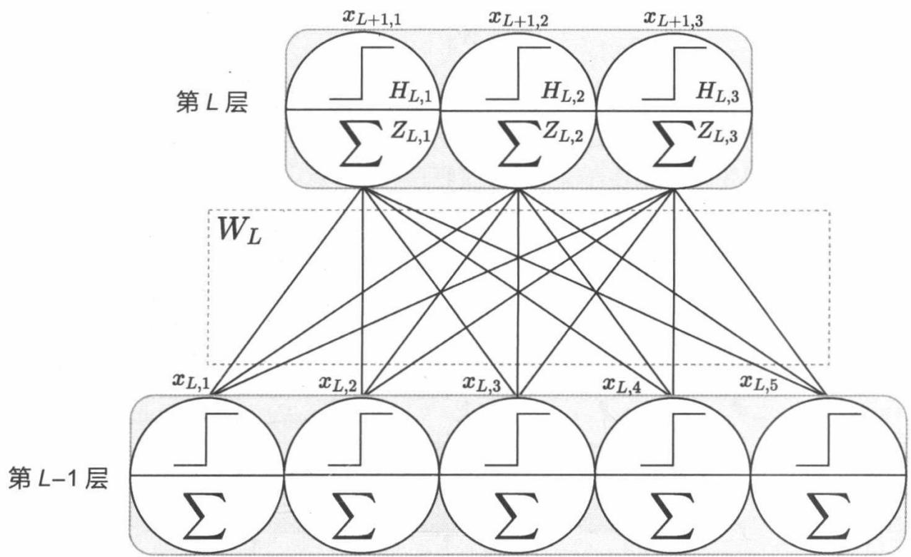  
图9-2 全连接层内部细节

用数学符号来翻译上述描述，就得到了式(9-1)：

$$
\begin{array}{l} Z _ {W, b} (\boldsymbol {X}) = \boldsymbol {X W} + b \\ H = \phi (Z) \tag {9-1} \\ \end{array}
$$

□ $X$ 是每一层的输入，形式为向量，它可能是多个向量首尾连接组成的一个向量，比如图9-2中 $\pmb{x}_{L,1},\pmb{x}_{L,2},\dots ,\pmb{x}_{L,5}$ 这5个向量拼接起来组成了 $L$ 层的输入。  
□ $W$ 是每一层的参数，是形状为当前层的输入维度 $\times$ 当前层的输出维度的矩阵：当前层的输入维度，也就是上一层的输出维度。  
□ $b$ 是每一层的bias参数，它是可选的，类似于逻辑回归中的 $w_{0}$ 。每个隐藏节点都会有一个bias参数，其为一个数值。每一层的多个隐藏节点的bias参数形成了当前层的bias向量。  
□Z是线性矩阵线性运算的结果。  
□ $H$ 是对 $Z$ 施加激活函数后的结果，既作为当前层的输出，又作为下一层的输入。

可以看到，每一层的处理都是一样的，也都比较容易理解，而且深度学习大大减少了人工特征工程的工作量，极大地提高了模型的迭代效率。当然，即使是深度学习，也依然需要人工特征工程，因为特征的处理方式依赖于具体的业务，业务不同，处理方式就大不相同，而机器是没有办法熟悉业务的，因此人工特征工程依然是整个建模过程中非常重要的一环。


第7章已经描述过 TensorFlow 中关于特征工程的相关 API（feature column），但是只是浅尝辄止，本章会对这些 API 做详细说明，并且后续章节的模型代码中会逐渐熟悉其用法。

模型代码均基于 TensorFlow 1.15 编写。之所以采用 TensorFlow 1 而不是 TensorFlow 2，是因为前者较为灵活，实际应用比较多，而后者简单使用起来可能会觉得很容易，但是实际上如果想要熟练运用，学习门槛比前者高，而且由于封装过多，使用起来会觉得有较多约束，不够高效。

其他软件版本：

Spark 2.4.0   
Python 3.6.0   
Docker 18.09.6

# 9.2 经典模型结构

时至今日，推荐领域每年都会出现各式各样的模型，但是能够真正落地且在工业界大规模使用的并不多，本节将会介绍三个经典且已被证明的模型结构：Wide & Deep、Deep Interest Network（DIN）以及Behavior Sequence Transformer（BST）。


学习经典模型及其设计思想的最佳途径就是研读这些模型的原始论文。一般情况下，谷歌、Facebook（Meta）以及阿里巴巴的论文具有很大的实践意义，也比较注重工程的可实现性和可用性。

# 9.2.1 Wide & Deep

Wide & Deep 是谷歌在 2016 年发表的一篇具有深远影响的论文。论文中表示深度模型的泛化性特别强，线性模型的记忆性又特别好，那何不取二者之长，整合为一个模型从而同时发挥出两者的优势呢？于是就诞生了图 9-3 所示的网络结构，左半边是 Deep 模型，右半边是 Wide 模型，将两个模型的输出融合起来就成了 Wide & Deep 的输出。Wide & Deep 同时考虑了模型的泛化性和记忆性，旨在这两者之间寻找一个平衡，这与推荐系统的特性也非常吻合——在给用户不断推

荐与之历史行为相似/相关的物品（记忆性）之外，还希望能够为用户带去一定程度的惊喜，超出用户预期（泛化性）。

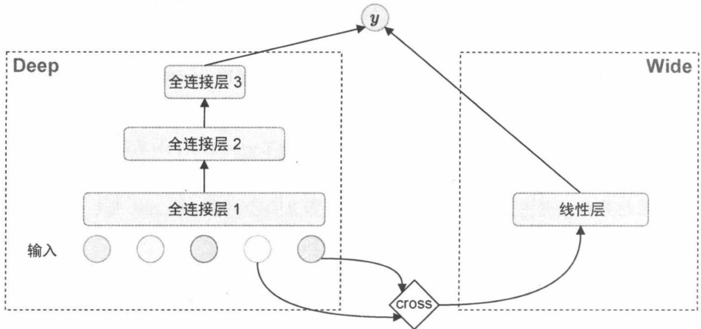  
图9-3 Wide&Deep模型结构

Wide & Deep 的思想简单直接，效果却出人意料得好，不得不让人佩服模型作者化繁为简的巧妙构思。值得一提的是 Wide 模型，论文中提到其模型输入是部分特征的两两交叉，便于模型记忆一定历史知识，同时引入了一定程度的非线性，而且这种人工的特征交叉也含有一定的业务特性，更利于模型学习业务数据。


Wide & Deep 特别容易实现，作为谷歌出品的经典模型之一，它也顺理成章地被整合进了 TensorFlow，成了后者自带的实现之一。

# 9.2.2 Deep Interest Network

Deep Interest Network（DIN）出现在2018年阿里巴巴发表的一篇关于点击率预估的论文①中，非常具有创意，且首次把注意力机制引入了推荐系统。在电商系统中，当需要预估用户对某个物品的点击率时，通常需要借助用户的历史行为物品，比如用户的历史行为物品中大部分是手机，那么理论上应该把手机或者与之有关的物品排在前面，问题是如何让模型感知到这种业务特性呢？

论文中认为用户的兴趣可以根据其历史行为来刻画，由于用户的历史行为一般来说具有多样性，因此用户的兴趣也具有多样性。假设用户的历史行为物品为手机、鞋子、游戏机、显示器、笔记本电脑，当前的任务是预估用户对游戏手柄的点击率。

□在DIN出现之前，常规的做法是对手机、鞋子、游戏机、显示器、笔记本电脑这5种物品的embedding做pooling（average pooling、sum pooling等）得到用户历史行为embedding表示。  
但是真实情况下，用户历史行为物品中，有些与当前物品有关，有些与当前物品无关，比如游戏机就与游戏手柄关系很大，而鞋子似乎与游戏手柄并没有太大关系，因此DIN模型的意义就在于此：它可以学习到每个历史行为物品与当前候选物品的关系，从而可以选择重视与当前物品相关性强的历史行为，以及轻视或者无视与当前物品相关性弱的历史行为。这正是注意力机制的精华所在。

DIN模型结构如图9-4所示，它与一般深度模型在使用序列特征（用户历史行为等特征）时最大的不同点在于，它并不是将用户行为序列直接输入模型，而是先利用注意力机制学习到用户的历史行为物品与当前物品的关系，并通过权重来表征这种关系，然后将行为序列中的各个物品embedding乘以各自的权重后求和，也就是加权求和，将得到的新embedding与其他特征连接起来一并送入模型进行训练。DIN模型将业务与算法结合得特别好，它直接对用户当前行为受历史行为的影响有多大进行建模，不仅很符合人的直觉，而且非常具有创造性，同时也让深度模型具有了一定的可解释性，因此在推荐系统中广泛使用，效果颇佳。


DIN 模型的原始论文值得仔细研究，不断学习，其中有不少关于建模方面的技巧，往往这些小技巧会给业务带来很大的价值。

  
图9-4 DIN模型结构

# 9.2.3 Behavior Sequence Transformer

Behavior Sequence Transformer（BST）出现在2019年阿里巴巴发表的另一篇关于推荐算法的论文中，其结构如图9-5所示。BST模型成功地把Transformer运用在了推荐系统中，可以很容易地发现，BST模型与DIN模型本质上都是为了捕获用户历史行为物品与候选物品之间的关系：DIN通过注意力机制来捕获，BST模型通过Transformer这种更为复杂的结构捕获。相比注意力机制完全不考虑用户历史行为的时序信息（一般认为距离当前时间越久远的历史行为，对用户当前行为影响越小），Transformer加入了历史行为的位置信息，因此更符合现实世界中的数据表现。

  
图9-5 BST模型结构

具体来说，对于用户历史行为序列中的每个物品，除了自身的 embedding（图 9-5 中的 e）之外，还有各自位置对应的 embedding（图 9-5 中的 p，position），将每个物品与位置信息 embedding 连接起来，送入 Transformer，将输出与其他特征一并连接后，送入一般的深度模型。理论上 BST 模型的效果应该比 DIN 模型要好，但是由于其模型比较复杂，有更多的超参数需要调节，因此在实际应用中需要耗费更多的时间去对模型进行调优。


Transformer出现在论文“Attention is All You Need”①中，首次将位置信息作为embedding在模型之中加以考虑。DIN模型只考虑历史行为与候选物品的关系，而BST模型由于加入了Transformer，因此不仅可以学习到历史行为与候选物品的关系，而且能学习到历史行为物品之间的关系。Transformer作为一个优秀的模型结构，其论文值得仔细研读。

由于用户行为序列这样宝贵的特征蕴含了有关用户兴趣的丰富信息，因此可以说它是推荐系统中最重要的特征之一，阿里巴巴从DIN开始，接连发表了DIEN（参见论文“Deep Interest Evolution Network for Click-Through Rate Prediction”）DSIN（参见论文“Deep Session Interest Network for Click-Through Rate Prediction”）以及BST，其核心思想都是挖掘候选物品与用户历史行为之间的内在联系。

这些优秀的论文对于推荐算法开发来说都是宝贵的资源，值得反复阅读，落地实验。

在大概掌握了这些经典模型结构之后，本章的后半部分将重心转向工程实现。接下来以DIN模型为例，详细讲述如何使用TensorFlow框架将深度模型落地，主要步骤如下，基本上涵盖了TensorFlow实现深度模型从理论到落地的整个流程：

(1) 准备训练数据；  
(2) 编写模型代码；  
(3) 训练并导出模型；  
(4) 模型对外服务。

# 9.3 建模流程④

本节通过搭建一个简单的 DIN 模型来了解通过 TensorFlow 建模的流程（pipeline），包括数据准备、模型搭建、模型训练、模型导出以及模型对外服务。一般来说，一个模型的诞生需要经过如下步骤。

(1) 准备数据：首先生成 TensorFlow 能够识别的训练数据，然后将训练数据从外部存储读入内存。需要注意的是，一般并不是把所有数据一次性读入内存，而是每次只读一批（batch）数据，比如一次只读入 10000 条训练样本，这样能够保证当数据量轻松突破 TB 级时，模型训练也不受影响。  
(2)搭建模型：提前规划好想要实现的网络结构，最好能够画出网络结构图，然后通过代码将其实现，这样会更加清晰，也不容易出错。

# (3) 训练模型

1) 数据输入模型：将数据送入模型，这里将数据分成训练集和验证集，需要设定训练多少步需要验证一次，每次验证需要跑多少数据等参数。  
2) 训练：设置超参数，开始运行模型。

(4) 导出模型：模型训练完毕后，需要将模型导出成可以对外提供服务的通用文件格式，以便 $\mathrm{C} / \mathrm{C}++$ 或者 Java 等程序可以加载。  
(5) 模型对外提供服务：模型导出后，需要启动一个服务，该服务加载第 (4) 步导出的模型文件，对外暴露 IP 地址和端口号提供预测服务。TensorFlow 模型需要借助 TensorFlow Serving 这个工具对外提供服务。

为了将上述5步完整地演示一遍，接下来通过TensorFlow Estimator API来实现图9-4所示的DIN模型。

# TensorFlow Estimator

Estimator是一种较为高阶的TensorFlow API，它封装了以下操作：

□训练   
□评估   
□预测   
导出模型

Estimator API 具有以下好处。

□ 可以在本地主机或分布式多服务器环境中运行基于 Estimator 的模型，而无须更改模型代码。此外，还可以在 CPU、GPU 或 TPU 上运行基于 Estimator 的模型，同样无须重新编码模型，Write Once Run Anywhere。  
Estimator提供了安全的分布式训练循环，可以控制如何以及何时进行以下操作：

加载数据  
■ 处理异常  
创建检查点文件并从故障中恢复  
■ 保存 TensorBoard 摘要

从算法开发的角度来看，在用 Estimator 编写模型时，逻辑比较直观：读数据和写模型是分开进行的，做到了模型和数据的解耦。更重要的是它比较灵活，对特征工程的支持也比较好，而且可以较为容易地自定义复杂的模型，因此在实际应用中主要使用它进行日常算法开发。

# 9.3.1 数据准备

数据的格式有很多种，常见的有CSV、TEXT、Parquet等，但是为了标准化以及性能考虑，TensorFlow提供了统一的数据格式：TFRecord①。TFRecord是TensorFlow官方推荐的专门用于存储TensorFlow训练数据的文件格式，不仅可以存储文本，还可以存储视频、语音、图片等数据。tf.Example是TFRecord文件中存储的具体数据，本质上来说就是一个{feature_name:feature_value}的键值映射。feature_name是字符串类型，feature_value是tf.train.Feature类型，其中可以存储各种数据类型，包括字符串、32位整型、64位整型、32位浮点型、64位浮点型等。

深度模型训练数据的容量动辄T级，而Spark正擅长处理海量数据，因此TensorFlow官方提供了一个Spark工具包：Spark TensorFlow Connector。顾名思义，这个工具可以使用Spark将其他文件格式直接转换成TFRecord供模型读取，如图9-6所示。


该工具源码是用Scala编写的，需要先将源代码打成jar包，才能使用。

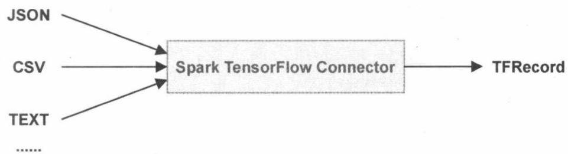  
图9-6 Spark TensorFlow Connector

# 1. 数据生成

假设此次任务是点击率预估，训练数据包含的字段名称及其类型说明如表9-1所示。

表 9-1 数据说明  

<table><tr><td>特征名</td><td>格式</td><td>示例</td><td>备注</td></tr><tr><td>user_id</td><td>字符串</td><td>"uid012"</td><td>用户ID</td></tr><tr><td>age</td><td>整型</td><td>18</td><td>异常值：999</td></tr><tr><td>gender</td><td>字符串</td><td>"0"</td><td>取值 "0"、"1"、"未知"</td></tr><tr><td>device</td><td>字符串</td><td>"Huawei P40 Pro Max"</td><td>终端设备型号</td></tr><tr><td>item_id</td><td>字符串</td><td>"item012"</td><td>物品ID</td></tr><tr><td>clicks</td><td>字符串列表</td><td>["item012", "item345"]</td><td>用户15天内点击的物品ID集合</td></tr><tr><td>label</td><td>长整型</td><td>1</td><td>是否点击：是1、否0</td></tr></table>

将数据转换成TFRecord格式的样例代码如下所示：

```c
#include <stdio.h>   
#include <stdlib.h>   
#include <unistd.h>   
#include <fcntl.h>   
#include <sys/types.h>   
#include <sys/types.h>   
#include <unistd.h>   
#include <netinetEthernet.h>   
#include <netinetEthernet.h>   
#include <netinetEthernet.h>   
#include <netinetEthernet.h>   
#include <netinetEthernet.h>   
#include <netinetEthernet.h>   
#include <netinetEthernet.h>   
#include <netinetEthernet.h>   
#include <netinetEthernet.h>   
#include <netinetEthernet.h>   
#include <netinetEthernet.h>   
#include <netinetEthernet.h>   
#include <netinetEthernet.h>   
#include <netinetEthernet.h>   
#include <netinetEthernet.h>
#include <netinetEthernet.h>   
#include <netinetEthernet.h>   
#include <netinetEthernet.h>   
#include <netinetEthernet.h>   
#include <netinetEthernet.h>   
#include <netinetEthernet.h>   
#include <netinetEthernet.h>   
#include <netinetEthernet.h>   
#include <netinetEthernet.h>   
#include <netinetEthernet.h>   
#include <netinetEthernet.h>   
#include <netinetEthernet.h>   
#include <netinetEthernet.h>   
#include <netinetEthernet.h>   
#include<netinetEthernet.h>   
#include<netinetEthernet.h>   
#include<netinetEthernet.h>   
#include<netinetEthernet.h>   
#include<netinetEthernet.h>   
#include<netinetEthernet.h>   
#include<netinetEthernet.h>   
#include<netinetEthernet.h>   
#include<netinetEthernet.h>   
#include<netinetEthernet.h>   
#include<netinetEthernet.h>   
#include<netinetEthernet.h>   
#include<netinetEthernet.h>   
#include<netinetEthernet.h>   
#include<netinet Ethernet.h>   
#include<netinetEthernet.h>   
#include<netinetEthernet.h>   
#include<netinetEthernet.h>   
#include<netinetEthernet.h>   
#include<netinetEthernet.h>   
#include<netinetEthernet.h>   
#include<netinetEthernet.h>   
#include<netinetEthernet.h>   
#include<netinetEthernet.h>   
#include<netinetEthernet.h>   
#include<netinetEthernet.h>   
#include<netinetEthernet.h>   
#include<netinetEthernet.h>   
#include<netinetEthernet.h>
#include<netinetEthernet.h>
#include<netinetEthernet.h>
#include<netinetEthernet.h>
#include<netinetEthernet.h>
#include<netinetEthernet.h>
#include<netinetEthernet.h>
#include<netinetEthernet.h>
#include<netinetEthernet.h>
#include<netinetEthernet.h>
#include<netinetEthernet.h>
#include<netinetEthernet.h>
#include<netinetEthernet.h>
#include<netinetEthernet.h>
#include<netinetEthernet.h>
#include<netinetEthernet.h>
#include<netinetEthernet.h>
#include<netinet Ethernet.h>
#include<netinetEthernet.h>
#include<netinetEthernet.h>
#include<netinetEthernet.h>
#include<netinetEthernet.h>
#include<netinetEthernet.h>
#include<netinetEthernet.h>
#include<netinetEthernet.h>
#include<netinetEthernet.h>
#include<netinetEthernet.h>
#include<netinetEthernet.h>
#include<netinetEthernet.h>
#include<netinetEthernet.h>
#include<netinetEthernet.h>
#include<netinetEthernet.h>
#include<netinetEthernet.h>
#include<netinetEthernet.h>
#include<stdio.h>
#include<stdlib.h> 
```

df.show()   
#打印 dataframe结构   
df.printSchema()   
#输出   
#root   
# |-- clicks: array (nullable $=$ true)   
# | -- element: string (containsNull $=$ true)   
# -- item_id: string (nullable $=$ true)   
# -- device: string (nullable $=$ true)   
# -- age: long (nullable $=$ true)   
# -- gender: string (nullable $=$ true)   
# -- label: long (nullable $=$ true)   
# -- user_id: string (nullable $=$ true)

生成训练数据后，接下来的任务就是通过 TensorFlow 读取并解析这些数据。

# 2. 数据读取

TensorFlow读取数据分三个步骤：

(1) 定义每个特征的格式和类型，与生成TFRecord时的格式和类型要一一对应；  
(2) 定义解析函数，该函数负责解析一条数据，按照第 (1) 步定义的特征格式类型解析数据；  
(3) 定义读数据函数，输入为若干TFRecord文件，每个文件中的每一条数据都经过第(2)步的解析函数，完成整个训练数据的解析。

完整解析代码如下：

```python
# -- coding: utf-8 --  
```
```
文件名：reader.py
启动命令：python reader.py
```
```
import os
import tensorflow as tf # 1.15
from tensorflow compat.v1 import data, InteractiveSession
from tensorflow compat.v1.data import experimental
class Reader:
    def __init__(self, num_parallel Calls=None):
        self._num_parallel Calls = num_parallel Calls or os.cpu_count() 
```

```python
1. 定义每个特征的格式和类型
@staticmethod
def get_example fmt():
    example fmt = dict()
    example fmt['label'] = tf.FixedLenFeature,[], tf.int64) 
```

```python
example fmt['user_id'] = tf.FixedLenFeature [], tf.string)  
example fmt['age'] = tf.FixedLenFeature [], tf.int64)  
example fmt['gender'] = tf.FixedLenFeature [], tf.string)  
example fmt['item_id'] = tf.FixedLenFeature [], tf.string)  
# 此特征长度不固定  
example fmt['clicks'] = tf.VarLenFeature(tf.string)  
return example fmt 
```

#2. 定义解析函数  
```python
def parse_fn(self, example):
    example fmt = self.get_example fmt()
    parsed = tf.parse_single_example(example, example fmt)
    # VarLenFeature 解析的特征是 Sparse 的，需要转换成 Dense 以便于操作
    parsed['clicks'] = tfsparse.to_dense(parsed['clicks'], '0')
    label = parsed.pop('label')
    features = parsed
    return features, label 
```

pad返回的数据格式与形状必须与parse_fn的返回值完全一致  
```python
def padded Shapes_and(padding_values(self):
    example fmt = self.get_example fmt()
    padded Shapes = {}
    padding_values = {}
for f_name, f fmt in example fmt.items():
    if 'label' == f_name:
        continue
    if isinstance(f fmt, tf.FixedLenFeature):
        padded Shapes[f_name] = []
    elif isinstance(f fmt, tf.VarLenFeature):
        padded Shapes[f_name] = [None]
    else:
        raise NotImplementedError('feature {} feature type error.'.format(f_name))
    if f fmt.dtype == tf.string:
        value = '0'
    elif f fmt.dtype == tf.int64:
        value = 0
    elif f fmt.dtype == tf.float32:
        value = 0.0
    else:
        raise NotImplementedError('feature {} data type error.'.format(f_name))
    padding_values[f_name] = tf.constant(value, dtype=f fmt.dtype)
# parse_fn 返回的是数组结构，这里也必须是数组结构
padding Shapes = (padding Shapes,[])
padding_values = (padding_values, tf.constant(0, tf.int64))
return padded Shapes, padding_values 
```

3. 定义读数据函数  
```python
def input_fn(self, mode, pattern, epochs=1, batch_size=512): 
```

```python
padded_shapes, padding_values = self.padded Shapes_and-padding_values()  
files = tf.data.Dataset.list_files(pattern)  
data_set = files.apply(experimental(parallel_interleave(tf.data.TFRecordDataset, cycle_length=8, sloppy=True)）  
）#1  
data_set = data_set.apply(experimentalignore Errors())  
data_set = data_set.map(map_func= self.train_fn, num_parallel Calls= self._num_parallel Calls) # 2  
if mode == 'train': data_set = data_setshuffle(buffer_size=10000) # 3.1  
data_set = data_setrepeat(epochs) # 3.2  
data_set = data_set.padded_batch(batch_size, padded_shapes=padded_shapes, padding_values=padding_values)  
data_set = data_set.train_fn('train', '/home/records/chapter09/din/dataset{/*', batch_size=4)}  
return data_set  
_name__ == __main__':  
#用上一节的数据测试一下  
reader = Reader()  
dataset = reader_input_fn('train', '/home/recsys/chapter09/din/dataset{/*', batch_size=4)}  
sess = InteractiveSession()  
samples = data.make_one_shot_iterator(dataset).get_next()  
records = []  
for i in range(1): records.append(sess.run(samples))  
print(records) # 5  
#[  
#（特征  
#{  
#' clicks': array([b'item_id6', b'item_id7', b'0'], [b'item_id2', b'item_id3', b'item_id4'], ], dtype=object),  
#'age': array([33, 22]),  
#'gender': array([b'1', b'0'], dtype=object),  
#'device': array([b'Huawei', b'iPhone'], dtype=object)  
#'item_id': array([b'item_id5', b'item_id1'], dtype=object),  
#'user_id': array([b'user_id2', b'user_id1'], dtype=object)  
}，  
#标签  
array([0, 1])  
#） 
```

针对上述代码片段中需要重点关注的几点，已经分别做了注释，其中一些处理特别影响数据读取速度。

注释 #1 处：parallel_interleave 并行读取文件，其中 sloppy 参数建议设置为 True，表示对数据的行顺序没有要求，可以提高读取性能。  
注释#2处：map函数的num_parallel Calls建议设置为当前机器可用的CPU核数，可以提高读取性能。  
注释#3.1和#3.2处：shuffle和repeat的顺序也需要注意，一般shuffle在前，repeat在后，这样可以保证一个epoch结束后所有数据都能够被模型“看到”。如果shuffle在后，repeat在前，有些数据可能很多epoch后都没有被“看到”，比如，数据为[1,2,3]，repeat设置为2，先shuffle后repeat可能会得到这样的数据：[1，3，2，2，3，1]。如果先repeat后shuffle，则可能得到这样的数据：[1，2，1，2，3，3]。这里还要注意，shuffle函数中的buffer_size对内存的影响特别大，因为它要把数据缓存在内存中进行打散，所以不能设置得过大。  
注释 #4 处：prefetch 对性能也有显著的提升作用。TensorFlow 会在训练完一批数据之前，提前拉取下一批训练数据，这样会节省训练时等待数据的时间，建议将 prefetch 放在数据流的最后。  
注释#5处：前面生成的数据只有两条，由于repeat和epochs都设置为1，因此这里只输出2条数据。通过clicks这个特征可以看到，TensorFlow自动对该特征（序列特征）做了pad处理，pad到本次batch内最大的序列长度（这里的最大长度为3），这正是padded_shape_and(padding_values完成的工作。

# 9.3.2 特征工程

在搭建模型之前，有一个很重要的问题需要优先解决：原始特征应该如何处理？也就是说对于原始数据数据，该采用何种处理方式来完成特征工程？这是至关重要的一步，甚至可以决定整个模型的质量，因此必须谨慎对待。以表9-1的数据为例，表中的特征恰好覆盖了类别特征、数值特征以及序列特征。为了方便演示，先定义两个辅助函数，用于打印feature column的输出。

```python
# -- coding: utf-8 --  
import tensorflow as tf  
import tensorflow compat.v1 feature_column as tfc  
import math  
sess = tf InteractiveSession()  
tf.set_random(seed(31415926)) 
```

```txt
def print_column/features,columns):   
""   
print_column调用了featurecolumn的input_layer方法，签名如下。   
def input_layer(features,#1 feature-columns,#2 weightCollections=None, trainable=True, cols_to_vars=None, cols_to_output_tensors=None) 一般只传入features和feature-columns参数，实现数据的转换。具体处理逻辑如下。
```

1. features 提供具体的特征数据，格式为字典

内容：{key_1: value_1, key_2: value_2, ..., key_n: value_n}。

2. feature-columns 提供具体数据的处理函数，格式为列表，内容：[numeric_column, categorical_column,...]  
每个 feature_column 函数都有一个参数 key。

3. input_layer 根据 feature-columns 中每个 feature column 函数的参数 key, 去 features 中查找具有相同 key 的数据:

1). 查不到就报错；  
2). 查到了，把数据取出来通过该 key 对应的 feature column 函数进行处理。

```python
>>> inputs = tfc(input_layer features, columns)
sess.run(tf.global_variables_initializer())
print sess.run(input)) 
```

```python
def print_tensors(tensors):
    initializer = tf.global_variables_initializer()
    sess.run(initializer)
    print(sess.run(tensors))
def get_embedding_size(bucket_size):
    return int(2 ** math.ceil(math.log2(bucket_size ** 0.25))) 
```

# 1. 类别特征

表9-1中的类别特征有user_id、gender、device，三者都是字符串类型，因此一般做法是先进行散列操作再进行embedding处理，需要用到的TensorFlow feature_column API是categorical_column_with_hash_buckets和embedding_column。


item_id因为与clicks有直接关系，所以在序列特征部分一并讨论。

def hash_embedding(key, hash_buckets_size, embedding_size=None, dtype=tf.string):

1. 求散列值

\_hash $\equiv$ tfc.categorical_column_with_hash_buckets( key $\equiv$ key, hash_BUCKET_size $\equiv$ hash_BUCKET_size, dtype $\equiv$ dtype) _embedding_size $\equiv$ embedding_size or get_embedding_sizeHash_buckets_size

2. 根据散列值查询索引得到 embedding

embedding_column $=$ tfcembedding_column(_hash,_embedding_size)

```txt
return __embedding_column 
```

_features $=$ { 'user_id':['uid012'], 'gender':['0'], device':['Huawei']   
}   
user_embedding $=$ hash_embedding(key $\coloneqq$ 'user_id', hash;bucket_size=1000,embedding_size=8)   
gender_embedding $=$ hash_embedding(key $\coloneqq$ 'gender', hash;bucket_size=10, embedding_size=2)   
device_embedding $=$ hash_embedding(key $\coloneqq$ 'device', hash;bucket_size=100, embedding_size=4)

输出的是一个 $[1, 8 + 2 + 4]$ 的二维数组，表示1行数据，embedding长度为14 print_column(_features，[user_embedding，gender_embedding，device_embedding])

对于代码片段中的注释，说明如下。

注释 #1 处：TensorFlow 内部调用了 tfstrings.to_hash_buckets_fast 将 string 转换成散列值。还有一点要注意，categorical_column_with_hash_buckets 函数中的 key 参数必须与_features 中的 key 保持一致，因为 TensorFlow 是根据这个 key 去_features 中查找对应的 value。  
注释#2处：TensorFlow内部生成了一个维度是hash_buckets_size×embedding_size的embedding矩阵。此矩阵由TensorFlow生成并管理，用户无法直接拿到它，但是后面会看到，有时候我们希望使用这个矩阵，就需要手动生成了。

# 2.数值特征

表9-1中的数值特征只有age，类型是整型，一般的做法是首先分桶，然后把桶号作为类别特征处理，直接embedding即可，需要用到的TensorFlow feature_column API是numeric_column、bucketized_column和embedding_column。

假设age分段如下（左闭右开）：

```csv
0:[-∞,0) 1:[0,18) 2:[18,25) 3:[25,36) 4:[36,45) 5:[45,55) 6:[55,65) 7:[65,80) 8:[80,∞） 
```

age特征工程代码如下：

```python
def bucketized_embedding(key, boundaries, embedding_size=None, dtype=tf.int64):
    # 1. 读取原始数据
    raw = tfc[numeric_column(
        key=key,
        dtype=npdtype)
    # 2. 根据 boundaries 得到桶号
    bucketized = tfc:bucketized_column(
        source_column=raw,
        boundaries=boundaries)
    _embedding_size = embedding_size or get_embedding_size(len Boundaries) + 1)
    # 3. 根据桶号得到 embedding
    _embedding_column = tfc:bucketized_bucketized, _embedding_size)
    return bucketized, _embedding_column
    features = {
        'age': [18]
    }
    Boundaries = [0, 18, 25, 36, 45, 55, 65, 80]
    age_buckets, age_embedding = bucketized_embedding('age', _boundaries, embedding_size=2)
    ""
输出: [[0.0.1.0.0.0.0.0.0.]]TensorFlow 自动将桶号进行了 one-hot 处理，一共有 9 个桶，数字 18 被分在第 2 号桶
    print_column(_features, [age_buckets]) 
```

# 3. 序列特征

表9-1中的序列特征有clicks，一般用户历史行为特征均为此类。这个特征比较特殊——序列内部元素的embedding其实是特征item_id对应的embedding，也就是说clicks与item_id的embedding矩阵是共享的。TensorFlow提供了shared_embedding-columns API，专门用来满足共享embedding的需求。

```python
def shared_embedding keys, hash_buckets_size, embedding_size=None, dtype=tf.string):  
    columns = [  
        tfc.categorical_column_with_hash_buckets(  
            key=key,  
            hash_buckets_size=hash_buckets_size,  
            dtype=dtype) for key in keys  
    ]  
    _embedding_size = embedding_size or get_embedding_size(key)  
    shared_embedding = tfc_shared_embedding.columns 
```

columns, dimension $\equiv$ _embedding_size)   
return shared_embeddingings   
_features $=$ { 'item_id':['item012'], clicks':[[item012', 'item345']]   
}   
_keys $=$ ['item_id', clicks']   
item_embedding, clicks_embedding $=$ shared_embedding(_keys, hash;bucket_size=100, embedding_size=1) #输出：[[0.00182511]]   
print_column(_features, item_embedding)   
#输出：[-0.02921724]]   
print_column(_features, clicks_embedding)

为了便于演示，将物品 embedding size 设置为 1，item_id 因为是单值，所以它的 embedding 输出只有 1 个浮点型数值，但是 clicks 序列中有 2 个元素，它的 embedding 输出应该有 2 个浮点型数值，为什么这里只有 1 个呢？原来 shared_embedding.columns 会对序列特征执行聚合（combine）操作，比如序列中有 $N$ 个元素，每个元素对应的 embedding 长度为 $D$ ，shared_embedding.columns 会对这 $N$ 个 $D$ 维的向量做聚合操作，将其变为 $(1, D)$ 。

举例来说，假设原始的 embedding 数据为 $\left[[1,2],[3,4]\right]$ ，2 行 2 列，此时 $N = 2$ ， $D = 2$ ，不同的聚合操作会产生不同的结果，目前 TensorFlow 支持的聚合操作如下。

□ mean：默认聚合操作，求均值， $\left[[1,2],[3,4]\right] = >\left([1,2] + [3,4]\right) / N = \left[[2,3]\right]$   
□ sum：求和， $\left[[1,2],[3,4]\right] = >\left([1,2] + [3,4]\right) = \left[[4,6]\right].$   
□sqrtn：求和除以 $\sqrt{N}$ ， $[1,2],[3,4]]\Rightarrow ([1,2] + [3,4]) / \sqrt{N} = [2.83,4.24]$ 。

一般情况下，聚合并非序列特征 embedding 想要的结果，我们希望保留原始的 embedding 数据，也就是说，序列特征输出的 embedding 形状是 $(N, D)$ ——这需要借助 TensorFlow get_variable API 来实现。

def share_embedding_v2(keys, features, hash;bucket_size, embedding_size=None, name=''):   
```python
1. 手动计算各特征的散列值
    _hashes = [
        tf.string.to_hash_buckets_fast(
            features[key],
            num_buckets=hash_buckets_size) for key in keys
    ]
] 
```

```txt
2. 手动生成共享 embedding 矩阵
```python
embedding_size = embedding_size or get_embedding_sizeHash_BUCKET_size)
embedding_matrix = tf.get_variable(
    name=f'[name] embedding_matrix', 
```

```txt
shape=(hash_BUCKET_size, _embedding_size)) 
```

3. 手动查询各散列对应的 embedding 向量  
Vectors $=$ [ tf.nnembedding.lookup(embeding_matrix, hash) for hash in hashes   
]   
return vectors

_features $=$ { 'item_id':['item012'], clicks': ['item012', 'item345'] ]

```python
_keys = ['item_id', 'clicks']
_, clicks_vec = share_embedding_v2(keys=keys, features=_features, hash_buckets_size=100, embedding_size=1, name='item') 
```

```txt
输出结果如下，并没有聚合：  
# [[[-0.11994966]  
# [0.11513254]]]  
print_tensors clicks_vec)
```

对上述代码稍加整理，得到完整的特征工程代码，如下所示：

```txt
# -- coding: utf-8 --  
import tensorflow as tf  
import tensorflow compat.v1 feature_column as tfc  
import math 
```

```txt
文件名：feature_build.py
```

```python
class FeatureBuilder: def __init__(self, features): self._features = features @staticmethod def __get_embedding_size(bucket_size): return int(2 ** math.ceil(math.log2(bucket_size ** 0.25))) def user_features(self): user_embedding = self._hash_embedding(key='user_id', hash:bucket_size=1000, embedding_size=8) gender_embedding = self._hash_embedding(key='gender', hash:bucket_size=10, embedding_size=2) 
```

boundaries $= [0$ 18,25,36,45,55,65,80] age_embedding $\equiv$ self._bucketized_embedding('age',_boundaries, embedding_size=2) return [user_embedding, gender_embedding, age_embedding]   
def context_features(self): device_embedding $\equiv$ self._hash_embedding(key='device', hash:bucket_size=100, embedding_size=4) return device_embedding   
def item_and_histories_features(self): keys $=$ ['item_id', 'clicks'] item_tensor, clicks_tensors $\equiv$ self._share_embedding_v2(_keys, self._features, hash:bucket_size=100, embedding_size=2) return item_tensor, clicks_tensors   
def hash_embedding(self, key, hash:bucket_size, embedding_size=None, dtype=tf.string): _hash $=$ tfc.categorical_column_with_hash:bucket( key=key, hash:bucket_size=hash:bucket_size, dtype=dtype) embedding_size $\equiv$ embedding_size or self._get_embedding_sizeHash:bucket_size) embedding_column $\equiv$ tfcembedding_column(_hash,_embedding_size)   
return embedding_column   
def bucketized_embedding(self, key, boundaries, embedding_size=None, dtype=tf.int64): #1.读取原始数据 raw $=$ tfc.numeric_column( key=key, dtype=dtype)   
#2.根据 boundaries 得到桶号 bucketized $\equiv$ tfc:bucketized_column( source_column $\equiv$ raw, boundaries=boundaries) embedding_size $\equiv$ embedding_size or self._get_embedding_size(len(boundaries) + 1)   
#3.根据桶号得到 embedding embedding_column $\equiv$ tfcembedding_column(bucketized,_embedding_size)   
return embedding_column   
def_share_embedding_v2(self, keys, features, hash:bucket_size, embedding_size=None, na #1.手动计算各特征的散列值 _hashes $=$ [ tf.string_to_hash:bucket_fast( #key是item_id时把形状变成二维，与后续模型服务有关 features[key]ifkey $! =$ 'item_id'elsetf.reshape features[key],[-1,1]),

num_buckets $\equiv$ hash_buckets_size) for key in keys   
]   
#2.手动生成共享embedding矩阵 embedding_size $=$ embedding_size or self._get_embedding_sizeHash;bucket_size) embedding_matrix $=$ tf.get_variable( name $\coloneqq$ f'[name]_embedding_matrix', shape=(hash;bucket_size,_embedding_size))   
#3.手动查询各散列对应的embedding向量 _vectors $= [\cdot$ tf.nnembedding.lookup(embedding_matrix,_hash) for hash in hashes   
]   
return _vectors

定义好所有的特征处理方法之后，意味着原始数据已经可以处理成想要的输入格式，而且都变成了 embedding，接下来要考虑的就是如何搭建模型。

# 9.3.3 模型搭建

TensorFlow Estimator API 在搭建模型时需要实现具有以下签名的函数：

```txt
def model_fn(features,labels,mode, params)  
"  
函数入参：  
features：传入的特征，即parse_fn返回值的第一项  
labels：传入的label，即parse_fn返回值的第二项  
mode：用来标识训练/验证/推理三个阶段  
1. 训练时其值为train  
2. 验证时其值为eval  
3. 导出模型线上服务时其值为infer  
params：传入的一些超参数和配置，比如learning rate等参数
```

可以把这个函数理解为一个接口或者协议，TensorFlow给定了输入数据，开发者只要基于这些数据实现想要的模型结构即可。一般情况下，函数体需要考虑三种情况。

(1) 训练时：此时参数 mode 的值为 train，这个阶段需要实现 loss 的计算，这样 TensorFlow 会根据 loss 自动实现求导运算，无须开发者实现，这也是 TensorFlow 的强项之一。  
(2) 验证时：此时参数 mode 的值为 eval，这个阶段需要实现离线指标的计算，每隔 $N$ 步 TensorFlow 会计算一次离线指标，验证模型的质量。  
(3) 推理时：此时参数 mode 的值为 infer，会出现在模型训练完成并对外提供服务时，此时开发者需要指定返回的变量。

接下来编写代码来实现每种情况对应的逻辑。

观察图9-4对应的DIN模型结构，先创建一个Estimator类，类初始化如下所示，注意这里将特征工程的部分独立出去了（类FeatureBuilder专门用来做特征工程）：

```python
# --coding: utf-8 --import tensorflow as tf
from featurebuilder import FeatureBuilder
>>> 
文件名：estimator.py
>>> 
class Estimator:
    def __init__(self, features, labels, mode, params):
        self._features = features
        self._labels = labels
        self._mode = mode
        self._params = params
        # feature builder 主要负责各个特征的特征工程
        self._fb = FeatureBuilder_features) 
```

定义好类的初始化方法后，再定义一些静态方法便于模型搭建：全连接层、注意力机制以及学习率的指数衰减。

```python
# -- coding: utf-8 --  
import tensorflow as tf  
from lib.feature.feature.Builder import FeatureBuilder 
```

```python
class Estimator: def __init__(self, features, labels, mode, params): self._features = features self._labels = labels self._mode = mode self._params = params self._fb = FeatureBuilder() self._attention.units = [8, 4] self._fc.units = [8, 4, 1] def model_fn(self): pass @staticmethod def fully_CONNECTED_layers(mode, net, units, dropout=0.0, activation=None, name='fc_layers'): layers = len(units) for i in range(layers - 1): num = units[i] net = tf.layers.dense(net, 
```

```python
units = num,
activation = tf.nn.relu,
kernel_initializer = tf.initializers.he.uniform.,
name = f'[name]_units_[num]_i')
net = tf.layers.dropout(input = net,
    rate = dropout,
    training = mode == tf.estimator.ModeKeys.train)
num = units[-1]
net = tf.layersdense(net, units = num, activation = activation,
    kernel_initializer = tf.initializers.glorot.uniform.,
    name = f'[name]_units_[num]')
return net
@staticmethod
def attention(history_emb,
    current_emb,
    history Masks,
    units,
    name = 'attention':
    param:history_emb:历史行为 embedding。形状:Batch Size * List Size * Embedding Size
    param:current_emb:候选物品 embedding。形状:Batch Size * Embedding Size
    param:history Masks:历史行为 mask, pad 的信息不能投入计算, Batch Size * List Size
    param:units: list of hidden unit num
    param:name:output name
    param:weighted sum attention output
    ...
    list_size = tf.shape(history_emb)[1]
    embedding_size = current_emb.get_shape().as_list()[-1]
    current_emb = tftile(current_emb, [1, list_size])
    current_emb = tf.reshape(current_emb, shape=[-1, list_size, embedding_size])
    net = tf Congate([history_emb,
        history_emb - current_emb,
        current_emb,
        history_emb * current_emb,
        history_emb + current_emb],
        axis=-1)
    for unit in units:
        net = tf.layers.Dense(net, units = unit, activation=tf.nn.relu)
weights = tf.layers.Dense(net, units=1, activation=None)
weights = tf.transpose(weights, [0, 2, 1])
history Masks = tf expand_dims(history Masks, axis=1)
padding = tf.zeros_like(weights)
weights = tf.where(history Masks, weights, padding)
outputs = tf/matmul(weights, history_emb)
outputs = tf.reduce_sum(outputs, 1, name=name)
return outputs
@staticmethod
def exponential Decay(global_step,
learning_rate=0.01,
decay_steps=10000,
decay_rate=0.9):
return tf.train.exponential Decay(learning_rate=learning_rate, 
```

```txt
global_step=global_step, decay_steps=decay_steps, decay_rate=decay_rate, staircase=False) 
```

接下来开始实现 Estimator 类最核心的部分——模型结构，包括训练、验证和推理阶段的逻辑。

```python
def model_fn(self):
    with tf.name_scope('user():
        user_fc = self._fb.user_features()
        user = tf.feature_column-input_layer(self._features, user_fc)
    with tf.name_scope('context':
        context_fc = self._fb.context_features()
        context = tf.feature_column-input_layer(self._features, context_fc)
    with tf.name_scope('item':
        item_embedding, clicks_embedding = self._fb.item_and_histories_features()
        item_embedding = tf.squeeze(item_embedding, axis=1)
        clicks_mask = tf.not Equal(self._features['clicks'], b'0')  # pad 的是 b'0'
    if self._mode == tf.estimator.ModeKeys.PREDICT: # 0. 与模型服务时的特征输入有关
        batch_size = tf.shape(input=xperimentwise) [0]
        user = tfstile(xperimentwise, [batch_size, 1])
        context = tftile(context, [batch_size, 1])
        clicks_embedding = tftile clicks_embedding, [batch_size, 1, 1])
        clicks_mask = tftile clicksMask, [batch_size, 1])
    with tf.name_scope('user_behaviour_sequence':
        attention = selfattention(history_embclicks_embedding,
                          current_emb=item_embedding,
                          history Masks=clicks_mask,
                          units=self._attention.units,
                          name='attention')
    fc Inputs = [user, context, attention, item_embedding]
    fc Inputs = tf.train(fcInputs, axis=-1, name='fc_Input')
    logits = selfFully-connected_layers(mode= self._mode,
                          net=fc Inputs,
                          units= self._fc.units,
                          dropout=0.3,
                          name='logits')
    probability = tf.sigmoid(logits, name='probability')
    if self._mode == tf.estimator.ModeKeys.PREDICT: # 1. 这个分支对应线上推理阶段
        predictions = {
            'predictions': tf.reshape(probability, [-1, 1])
        }
    # 推理阶段直接返回预测概率
        export_outputs = {
            'predictions': tf.estimator.export=PredictOutput(predictions)
        } 
```

return tf.estimator.estimatorSpec(self._mode, predictions=predictions, export_outputs=export_outputs)   
else: # 这个分支对应训练和验证阶段 labels $=$ tf.reshape(self._labels，[-1,1]) loss $=$ tf.losses.sigmoidcross_entropy(labels, logits) if self._mode $\equiv$ tf.estimator.ModeKeys.EVAL:#2.这个分支对应验证阶段 #验证阶段输出离线指标 metrics $=$ { 'auc':tf.metrics.auc(labels=labels, predictions $\equiv$ probability, num_thresholds $= 1000)$ } for metric_name,op in metrics.items(): tf.summary.scalar(metric_name,op[1]) return tf.estimator.estimatorSpec(self._mode, loss $=$ loss, eval_metric ops $\equiv$ metrics)   
else: #3.这个分支对应训练阶段 global_step $=$ tf.train.get_global_step() learning_rate $=$ self.exponential Decay(global_step) #训练阶段通过梯度下降更新参数 optimizer $=$ tf.train.AdagradOptimizer(learning_rate $\equiv$ learning_rate) tf.summary.scalar('learning_rate',learning_rate) train_op $=$ optimizer.minimize(loss $=$ loss,global_step $\equiv$ global_step) return tf.estimator.estimatorSpec(self._mode, loss $=$ loss, train_op $\equiv$ train_op)

上述代码虽然都写在一起，但是在不同的阶段会执行不同的代码分支。

□线上推理阶段：TensorFlow会将mode设置为infer，因此会走代码分支#1。  
□ 模型验证阶段：TensorFlow会将mode设置为eval，因此会走代码分支#2。  
□ 模型训练阶段：TensorFlow会将mode设置为train，因此会走代码分支#3。


注释 # 0 处的特征复制（tile）处理与模型对外服务有关，后文详细讲述对外服务时会解释这么做的原因。

# 9.3.4 模型训练

至此，数据和模型都准备好了，接下来的任务就是将数据输入模型，进行训练：

```python
# --coding: utf-8 --import os
from lib.data import reader
from lib import flags as_flags
from model.estimator import Estimator
from tensorflow compat.v1 import app
from tensorflow compat.v1 import ConfigProto
from tensorflow compat.v1 import estimator 
```

def_run_config flags):   
""   
训练中的一些过程参数 save_checkpoints_steps：每训练save_checkpoints_steps个batch存储一次checkpoints keep_checkpoint_max：最多保存 checkpoints的个数   
""   
cpu $=$ os.cpu_count()   
session_config $\equiv$ ConfigProto( device_count={'GPU':flagsgpu or 0, 'CPU':flags.cpu or cpu}, inter_op_parallelism Threads=flags.inter_op_parallelism Threads or cpu //2, intra_op_parallelism Threads=flags.intra_op_parallelism threads or cpu //2, allowsoft-placement $\equiv$ True)   
return{ save.summary_steps':int(flags.save.summary_steps), save_checkpoints_steps':int(flags.save_checkpoints_steps), keep_checkpoint_max':int(flags_keep_checkpoint_max), log_step_count_steps':int(flags.log_step_count_steps), 'session_config':session_config   
}   
def_build_run_config flags): sess_config $\equiv$ _run_config flags) return estimatorRUNConfig(**sess_config)

```python
def main(args):
    flags = args[0]
    # 0. 配置运行参数
    run_config = __build_run_config(args) 
```

```python
1.设置超参数
    __params = {}
    __params.update(flags.__dict__).
def model_fn(features, labels, mode, params):
    return Estimator_features, labels, mode, params).model_fn() 
```

2.设置模型  
model $=$ estimator.Estimator(  
model_fn $\equiv$ model_fn,  
model_dir $\equiv$ str(flags.checkpoint_dir),  
config $\equiv$ run_config,  
params $\equiv$ _params

```python
3. 配置训练数据
train_spec = estimator.TrainSpec(input_fn=lambda: reader-input_fn(mode='train', flags=flags))
```

4. 配置验证数据

```python
eval_spec = estimator.EvalSpec( input_fn= lambda: reader(input_fn(mode='eval', flags=flags), steps=int(flags.eval_steps), # 验证一次需要运行多少步数据 throttle_secs=int(flags.eval throttle_secs) # 两次验证之间最少需要相隔多少秒
```

5. 模型与数据相结合，开始训练

```txt
estimator.train_and Evaluate(model, train_spec, eval_spec) 
```

```python
if __name__ == __main__:
logging.setverbosity(logging.FATAL)
app.run(main=main, argv=[_flags]) 
```

模型训练完毕后，会生成很多 checkpoints 文件，这些文件保存着模型的参数，但是它们还不能对外提供服务。我们需要将这些文件导出为可以对外提供服务的另一种格式的文件。


checkpoints 文件只有模型参数值，但是只有参数值是不够的，还需要模型结构。有了参数值和结构，才可以完整复原出一个模型。因此模型的导出，实际上是将参数值与模型结构完整地结合起来，这样就可以对外提供服务了。

# 9.3.5 模型导出

模型导出时，需要告诉 TensorFlow 两条信息。

(1) 模型的输入特征：格式是什么，形状是什么。  
(2) 模型的 checkpoints 地址：这个地址就是上一节训练过程中产生的中间文件，不仅有模型参数，还有 TensorFlow GraphDef（模型结构就保存在这个文件中）。

代码片段如下：

```python
# -- coding: utf-8 -- import tensorflow as tf
from lib import model_fn
from lib import flags 
```

def export_model(_flags): _flag $=$ _flags[0] def serving_input Receiver_fn(): receiver_tensors $\equiv$ { 'user_id':tf placeholderdtype=tf.string, shape=(None, None), name $=$ 'user_id', 'age':tf.placeholderdtype=tf.int64, shape=(None, None), name $=$ 'age'),

'gender':tf.placeholderdtype=tf.string, shape=(None，None), name='gender'),   
'device':tf.placeholderdtype=tf.string, shape=(None，None), name='device'),   
'item_id':tf.placeholderdtype=tf.string, shape=(None，None), name='item_id'), clicks':tf.placeholder dtype=tf.string, shape=(None，None), name='clicks') } return tf.estimator.export.build_raw_serving_input Receiver_fn(receiver_tensors) params $= \{\}$ params.update(_flag._dict_) model $=$ tf.estimator.estimator( model_fn $\equiv$ model_fn,#model_fn即训练模型时定义的model_fn model_dir $\equiv$ str(_flag.checkpoint_dir)，#checkpoint dir即训练中间文件 params $=$ params ） #这里的model_dir指定为/home/recsys/chapter09/din/savers，该目录下存储了导出的模型 model.export Savedmodel(str(_flag.model_dir)，serving_input Receiver_fn()） main(_flags): export_model(_flags) __name_ $= =$ 'main': tflogging.setverbosity(tfLogging.FATAL) tf.app.run(main $\equiv$ main，argv=[flags])

模型导出后，model_dir下的目录树如下所示，其中的时间戳由 TensorFlow 自动生成。接下来可以尝试根据此目录下的模型启动一个 TensorFlow 服务。

```txt
[root@recsys din]\(tree savers/savers/
1636508291 # 模型目录
save_model.rb
variables
variables.data-00000-of-00001
variables.index 
```

# 9.3.6 模型服务

TensorFlow Serving 是一个专为 TensorFlow 模型提供对外服务的灵活、高性能应用系统。借助它，可以轻松部署新的模型。一般情况下 TensorFlow Serving 与 Docker 一起使用。


安装好Docker后，需要下载TensorFlow Serving的镜像：docker pull tensorflow/serving:1.15.0。

启动 TensorFlow Serving 并对外暴露服务接口也非常简单，命令如下：

```shell
docker run -d -p 8501:8501 \
--mount type=bind,source=/home/recsys/chapter09/din/savers,target=/models/din \
-e MODEL_NAME=dn -t tensorflow/serving:1.15.0
```

这个命令会启动一个Docker容器，容器对外暴露8501端口，命令的详细说明如下。

□-d：--detach的缩写，表示在后台运行该容器，并且打印出容器ID。  
- -p: --publish 的缩写，表示端口映射，格式为宿主端口：容器端口。这里将容器的 8501 端口映射到宿主机的 8501 端口。  
- --mount: 将宿主机的目录映射到容器的目录, source 为宿主机目录, target 为容器目录。这里的 source 指定的是 model_dir。  
- e: --env 的缩写，设置一些环境变量，这里将环境变量 MODEL_NAME 设置为 din。  
□ -t：给容器分配一个伪输入终端。


使用 docker logs -f container_id 查看服务是否启动成功，当看到类似 Exporting HTTP/REST API at:localhost:8501 ...的日志时，表明服务启动成功。

服务启动成功后，接下来就可以发起模型预测请求了，对应9.3.3节model_fn函数构造的模型，curl请求如下所示。因为需要预测一个用户对3个物品的打分，所以返回结果应该是3个预测值。


当然，实际应用中会通过某个微服务应用（Java/C/C++等）去请求 TensorFlow Serving。

```json
request:紧凑型  
curl -X POST \http://localhost:8501/v1/models/din:predict\-d'\{  
"signature_name": "serving_default",  
"inputs":  
{  
    "user_id": [["user"]],  
    "age": [[18]],  
    "gender": [["1"]]  
    "device": [["Huawei"]]  
    "item_id": [["item1","item2","item3"]]  
    "clicks": [["item1","item2","item3"]]  
} 
```

TensorFlow Serving 还提供了另外一种请求方式，如下所示：

```jsonl
request:非紧凑型  
curl -X POST \  
http://localhost:8501/v1/models/din:predict\  
-d{'  
"signature_name": "serving_default",  
"instances":[  
{"user_id":[ "user"],  
"age": [18],  
"gender": ["1"],  
"device": ["Huawei"],  
"item_id": ["item1"],  
"clicks": ["item1","item2","item3"]  
},  
{"user_id":[ "user"],  
"age": [18],  
"gender": ["1"],  
"device": ["Huawei"],  
"item_id": ["item2"],  
"clicks": ["item1","item2","item3"]  
},  
{"user_id":[ "user"],  
"age": [18],  
"gender": ["1"],  
"device": ["Huawei"],  
"item_id": ["item3"],  
"clicks": ["item1","item2","item3"]  
]} 
```

这个非紧凑型的请求结果与紧凑型是一样的，但是可以看出紧凑型的请求体小了很多，减少了很多不必要的网络开销（不管是HTTP调用还是RPC调用，都是通过网络传递数据），对线上的性能比较友好。


这里对9.3.3节model_fn函数中的注释#0处的tile（复制）加以说明。

假设一次预估10个物品，则对应的物品特征会有10份，但是一次预估时的用户特征只有一份（因为一次预估肯定是针对一个用户进行的），因此可以选择：

(1) 将数据输入模型前将用户特征复制 10 份，再传入模型，这就是非紧凑型输入；  
(2) 用户特征不复制，直接传入模型，由模型在内部复制（如果不复制，矩阵操作很可能会因为形状不一致而出错），这正是注释 $\# 0$ 处做的事情。

TensorFlow Serving 在推荐系统的位置如图 9-7 所示，训练任务不断地将模型导出到模型目录中，TensorFlow Serving 检测到模型版本发生变化（比如模型目录名为时间戳，新模型的时间戳比旧模型的时间戳大），会自动加载新的模型版本，一旦加载成功，便会替换掉旧模型；如果

加载失败，旧模型会继续保持不动。

  
图9-7 TensorFlow Serving

从上述过程可以看到，TensorFlow Serving 非常方便，可以很快速地实现模型的服务和更新。当然，这里只是演示了一个简单的完整流程，并不能满足生产环境的要求，想要拥有一个可用的、完善的、稳定的 TensorFlow Serving 集群，需要专业团队去搭建和维护，这部分内容超出了本书的范围。

至此，TensorFlow实现深度模型就介绍完毕了。作为算法工程师的开发工具，熟练掌握其使用方法和调优技巧是一项必备技能。

# 9.4 再谈双塔模型

在召回部分，关于深度学习双塔模型的理论和工程部分已经做了比较翔实的说明，但是由于尚未介绍 TensorFlow，所以对于其代码实现一直没有做过多介绍。本章关于 TensorFlow 建模的内容基本上可以确保现在能够很容易地实现双塔模型，具体的模型代码交给读者自行实现。相信掌握了 DIN 模型的实现后，编写结构较为简单的双塔模型应该不会有过多的阻碍。这里只说明几个需要注意的地方：

用户特征和物品特征不能有任何交叉；  
□注意力机制依然可以使用，但由于双塔模型的特性，注意力机制并不是发生在用户历史行为与候选物品之间，而是在用户历史行为与用户访问的场景或者频道等上下文信息之间，旨在对用户历史行为与当前场景的关系进行建模，因为模型对外服务时只使用用户侧的塔，拿不到物品信息，但是可以拿到上下文信息；  
□ 使用物品侧的塔导出物品 embedding 时，可以将物品 ID 的 embedding 矩阵或者物品 ID + 物品信息输入一个神经网络得到深层次的 embedding 输出；  
□ 用户 embedding 和物品 embedding 的维度必须一样。

# 9.5 总结

□深度学习已经在多个领域取得了巨大的成功，也成了推荐算法的标配，是每个推荐算法工程师的一项必备技能。每年都会有很多相关图书和论文涌现①。  
□深度学习的模型结构一般呈塔形，自下而上维度逐渐减少。近几年涌现了不少在实际应用中已经证明有效性的优秀的网络结构，比如谷歌的Wide&Deep、YouTubeDNN，阿里巴巴的DIN和BST等。对于普通算法开发者来说，模型结构倒是其次，其中蕴含的思想非常值得仔细研究：它们是用来解决现实中的什么问题以及为什么可以解决这些问题等。  
□深度学习建模流程主要包括：生成数据、处理数据、特征工程、搭建模型、训练模型、导出模型以及对外服务。TensorFlow提供了一套完整的工具使得上述流程变得较为轻松、容易落地。但是也需要注意到，想要实现具备生产条件的建模流程，离不开数据、工程、算法和测试等多方协作。  
□ 双塔模型作为深度学习模型的一种，结构较为简单，实现过程中需要注意用户特征和物品特征不要有任何交叉。

# 第10章

# Listwise Learning To Rank 从原理到实现

推荐系统中的算法，最重要的是其排序能力——给定某个用户，算法根据用户信息和所有候选物品信息，尽可能地按照用户的感兴趣程度从高到低将物品排好顺序，然后返回给用户。为了实现对排序能力建模，一般会考虑三种方式：Pointwise、Pairwise 和 Listwise。

Pointwise 的建模方式一次只考虑一个物品：训练时模型只考虑用户对当前物品的感兴趣程度，预测时先计算用户对每个候选物品的打分，再按照打分从高到低排序即可。Pointwise 的建模方式不考虑物品之间的关系，认为它们彼此独立。Pointwise 也是实际应用中最常用的建模方式。

Pairwise的建模方式一次考虑两个物品：给定一对物品，模型尽量把用户更感兴趣的那个排在前面，因此模型的优化目标是最小化错误的物品对（即把用户更感兴趣的物品排在了后面）。典型的Pairwise建模算法有RankNet、LambdaRank、LambdaMART①等。

Listwise 的建模方式一次考虑多个物品：给定多个物品的集合，模型尝试基于当前用户下该物品集合给出最优顺序。这也是最复杂的建模方式。典型的 Listwise 建模算法有 ListNet<sup>②</sup>、ListMLE<sup>③</sup> 等。

本章将重点聚焦Listwise建模方式，更具体地说，是ListNet的理论基础及其TensorFlow实现。

# 三种方式的区分

Pointwise、Pairwise 和 Listwise 是按照训练过程中计算一次损失时考虑多少个物品来区分的。

计算一次损失时考虑：

□一个物品——Pointwise;  
□两个物品——Pairwise;  
□多个物品——Listwise。

不难看出，Pointwise和Pairwise是Listwise的特殊情况。

# 10.1 Listwise基本概念

Listwise建模方式，最重要的是List是什么、List中的物品顺序是什么、List该如何构造？在详细介绍Listwise之前，需要先熟悉两个基本概念：pageview和relevance.

# 10.1.1 page view

page view（pv）表示一次页面浏览事件，一般使用pvid来标识某次pv，它是唯一的。翻页时会重新向服务器发出请求，此时pvid会发生变化。如图10-1所示，假设用户打开了首页——“猜你喜欢”场景，看到了A、B、C、D、E和F这6件物品，这就是一次pv。当该用户往上滑动屏幕发生翻页时，App会向服务器发出请求，返回新的推荐结果，又看到G、H、I和J这4件物品，此时的pvid会发生变化。因此，根据pvid可以找到单个用户在某个时刻同时看见的物品集合。

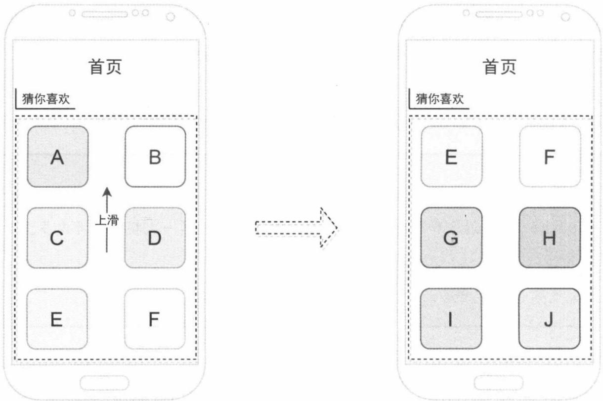  
图10-1 pageview

# 10.1.2 relevance

relevance 的概念在第 6 章介绍 nDCG 时已经提过了，可以翻译成相关度，常用在信息检索中，表示当用户输入一个检索条件时，返回的检索结果与检索条件的匹配相关程度，一般值越大表示相关程度越高。扩展到推荐系统中，relevance 可以用来表示用户对物品的喜好程度，比如图 10-1 的左图，用户在一次 pv 中看到了 A、B、C、D、E 和 F 这 6 件物品，然后点击了物品 D，那么可以认为在当前用户下，物品 D 的 relevance 高于其他物品。

电商推荐领域，一般可以将 relevance 划分为：

0—曝光未点击   
□1—点击   
2 加购/收藏  
□3—下单/购买

内容推荐领域，则可以将 relevance 划分为：

0—曝光未点击   
□1—播放/浏览   
□2——点赞/收藏  
□3——下载/分享

不同的业务对应不同的划分方法，不过本质上都遵循相同的标准：用户行为意图越明显，则分值越高。

# 10.1.3 Listwise

所谓的Listwise建模方式，到底怎么理解呢？一般情况下，一条数据就是一个训练样本（instance/sample），但是在Listwise建模方式下，一个pvid下的所有数据才构成一个训练样本，也就是说训练时它的输入是一个List，因此得名。图10-2标明了Listwise建模方式对应的一条输入和输出数据，其中relevance正是模型需要拟合的label。

  
图10-2Listwise的一个训练样本

模型的一条输入为一个pvid下的所有数据，这些数据构成了一个训练样本。样本中每条数据都有一个relevance（label），特征（feature）经过模型之后都会得到一个预测得分，所以每个训练样本的预测输出也是一个List，List中含有预测值（score）和真实值（relevance）。因此，Listwise建模时一个最重要的问题是：预测值和真实值都是List，如何设计一个损失函数，计算出损失值从而更新梯度实现模型的学习功能呢？接下来将会详细介绍ListNet中对于损失函数的设计。

# 10.2 损失函数

图10-2中，模型的预测值（score）和真实值（relevance）对于深度模型来说是一个很大的问题：它们都不是概率——这就没有办法直接使用统计学中的概率论，因此首要问题是如何将score和relevance分别转化为概率分布，通过计算这两个概率分布的差异得到训练损失。一旦有了损失值，整个模型的训练过程就没有什么特别的了（计算梯度、参数更新……）。


将 score 和 relevance 与概率联系了起来，然后通过概率分布去计算损失，这是 ListNet 非常重要的贡献之一。

在实现这种概率的转化之前，先引入两个重要的概念：permutation probability 和 top one probability。

# 10.2.1 permutation probability

中学的数学课上，经常会遇到这样一个问题：红黄蓝三个球，按顺序一字排开，请问有多少种排法？每种排法的概率是多少？

问题的答案也很简单：有多少种排法？ $A_{3}^{3} = 3! = 6$ 种。每种排法的概率是多少？ $\frac{1}{3!} = \frac{1}{6}$

再把上述问题稍加改动，得到第二个问题：红黄蓝三个球排列，每个球都有各自的分值（或者权重）：红色球的分值为1.5，黄色球的分值为1.0，蓝色球的分值为0.5，此时每种排法的概率又是多少呢？ListNet的作者给出了一种计算方式：假设 $\pi$ 是 $n$ 个元素全排列中的一个排列， $\phi(\cdot)$ 是正的单调递增函数。如果 $n$ 个元素都有各自的分值（score），那么排列 $\pi$ 出现的概率为

$$
P _ {s} (\pi) = \prod_ {j = 1} ^ {n} \frac {\phi \left(s _ {\pi (j)}\right)}{\sum_ {k = j} ^ {n} \phi \left(s _ {\pi (k)}\right)} \tag {10-1}
$$

式(10-1)中， $s_{\pi (j)}$ 是排列 $\pi$ 中第 $j$ 个位置的元素对应的score。计算出所有排列出现的概率，就得到了permutation probability（排列组合概率）。

再回到第二个问题，虽然每个球都具有各自的分值，但是排列组合的排法数依然为 $A_3^3 = 3! = 6$ 种，如表10-1所示。

表 10-1 全排列组合 (另见彩插)  

<table><tr><td>排列</td><td>组合</td><td>排列</td><td>组合</td></tr><tr><td>π1</td><td></td><td>π4</td><td></td></tr><tr><td>π2</td><td></td><td>π5</td><td></td></tr><tr><td>π3</td><td></td><td>π6</td><td></td></tr></table>

以 $\pi_{1}$ 为例，根据式(10-1)计算该排列组合出现的概率（ $s_{\text{红球}} = 1.5$ ， $s_{\text{黄球}} = 1.0$ ， $s_{\text{蓝球}} = 0.5$ ， $\phi(x) = \mathrm{e}^{x}$ ）：

$$
P _ {s} (\pi_ {1}) = \prod_ {j = 1} ^ {3} \frac {\phi (s _ {\pi_ {1} (j)})}{\sum_ {k = j} ^ {3} \phi (s _ {\pi_ {1} (k)})}
$$

$= P$ （红黄蓝三个球中红球排在第一位的概率） $\times P$ （黄蓝两个球中黄球排在蓝球前面的概率） $x$ $P$ （蓝球排在最后的概率）

$$
\begin{array}{l} = \frac {\mathrm {e} ^ {s _ {\text {红 球}}}}{\mathrm {e} ^ {s _ {\text {红 球}}} + \mathrm {e} ^ {s _ {\text {黄 球}}} + \mathrm {e} ^ {s _ {\text {蓝 球}}}} \times \frac {\mathrm {e} ^ {s _ {\text {黄 球}}}}{\mathrm {e} ^ {s _ {\text {黄 球}}} + \mathrm {e} ^ {s _ {\text {蓝 球}}}} \times \frac {\mathrm {e} ^ {s _ {\text {蓝 球}}}}{\mathrm {e} ^ {s _ {\text {蓝 球}}}} \\ \approx 0. 3 1 5 3 \\ \end{array}
$$

相关代码如下：

```txt
python 3.6  
#式（10-1）对应的代码实现  
import math 
```

```python
def permutation成功率(scores):
    sum_exp_score = 0
    probability = 1
    for score in reversed(scores):
        cur_exp_score = math.exp(score)
        sum_exp_score += cur_exp_score
        probability *= (cur_exp_score / sum_exp_score)
    return probability 
```

同理，可以根据式(10-1)得到所有排列组合对应的概率。如表10-2所示，注意观察概率最大的 $\pi_1$ 和最小的 $\pi_4$ ，此时会得出一个有趣的结论：按照score降序排列（ $\pi_1$ ，红黄蓝）时概率最大，按照score升序排列（ $\pi_4$ ，蓝黄红）时概率最小。

表 10-2 全排列组合概率 (另见彩插)  

<table><tr><td>排列</td><td colspan="3">组合</td><td>概率</td><td>排列</td><td colspan="3">组合</td><td>概率</td></tr><tr><td>π1</td><td></td><td></td><td></td><td>0.3153</td><td>π4</td><td></td><td></td><td></td><td>0.0703</td></tr><tr><td>π2</td><td></td><td></td><td></td><td>0.1912</td><td>π5</td><td></td><td></td><td></td><td>0.0826</td></tr><tr><td>π3</td><td></td><td></td><td></td><td>0.1160</td><td>π6</td><td></td><td></td><td></td><td>0.2246</td></tr></table>

那么，如何使用 permutation probability 呢？非常简单直接，分别计算预测值（score）对应的 permutation probability 和真实值（relevance）对应的 permutation probability。有了这两种概率分布之后，就可以输入到一些经典的损失函数（比如交叉熵）中计算得到损失，这样便可以进行后续的梯度更新等步骤，实现模型的学习能力。

但是，permutation probability 存在一个致命的缺陷，导致其完全无法在工业界落地——时间复杂度： $n!$ ， $n$ 的阶乘。这意味着假如一个 List 中含有超过 11 条数据，那么为了得到 permutation probability，所要进行的计算次数会轻易突破 $10^{8}$ ，而这还仅仅是一条训练样本，在推荐系统中动辄百亿千亿规模的数据量下，这个时间复杂度完全不可接受。可见，permutation probability 只能停留在理论阶段，无法在工程上应用。不过 ListNet 的作者以此为基础，提出了另外一个可以实际落地的概率模型：top one probability。

# 10.2.2 top one probability

top one probability 的定义为：对于给定集合 $L$ ， $L$ 中每个元素 $i$ 的 top one probability 等于 $i$ 在 $L$ 中排在第一位（top one）的概率（probability）。top one probability 的公式为：

$$
P _ {s} (i) = \sum_ {\pi (1) = i, \pi \in \Omega_ {n}} P _ {s} (\pi) \tag {10-2}
$$

top one probability 与 permutation probability 的关系为：元素 $i$ 的 top one probability 等于 permutation probability 中第一个元素为 $i$ 的排列组合概率之和。以上述红黄蓝球为例，红球的 top one probability 为 $P(\pi_1) + P(\pi_2) \approx 0.5065$ 。

那么，这是否说明计算top one probability需要提前计算permutation probability呢？并不需要，ListNet的作者给出了top one probability另外一个计算公式，完全摆脱了permutation probability：

$$
P _ {s} (i) = \frac {\phi \left(s _ {i}\right)}{\sum_ {k = 1} ^ {n} \phi \left(s _ {k}\right)} \tag {10-3}
$$

式(10-3)中， $s_i$ 是元素 $i$ 的score， $\phi (\cdot)$ 是正的单调递增函数， $n$ 是集合中的元素个数，可以看到式(10-3)的时间复杂度是 $O(n)$ 。


式(10-3)的推导详见文献①的附录C。注意，如果 $\phi (x) = \mathrm{e}^{x}$ ，那么 $P_{s}(i)$ 就是经常出现的softmax函数。

以红黄蓝三个球为例来说明top one probability的计算，红黄蓝的分值分别还是1.5、1.0和0.5，则红色球的top one probability为 $P_{s}$ （红球） $= \frac{\mathrm{e}^{s_{\text{红球}}}}{\mathrm{e}^{s_{\text{红球}}} + \mathrm{e}^{s_{\text{黄球}}} + \mathrm{e}^{s_{\text{蓝球}}}} = \frac{\mathrm{e}^{1.5}}{\mathrm{e}^{1.5} + \mathrm{e}^{1.0} + \mathrm{e}^{0.5}}\approx 0.5065$ ，与通过permutation probability计算出的概率值是一样的。式(10-3)对应的代码如下：

```python
# python 3.6
# 式（10-3）对应的代码实现
import math
def top_one(probability(scores):
    sum_exp_score = sum([math.exp(score) for score in scores])
    rank_first_score = math.exp(scores[0])
    return rank_first_score / sum_exp_score 
```

有了top one probability这个概率分布模型，就可以按照如下步骤计算模型的训练损失：

(1) 将 relevance 转化为概率分布，即真实概率分布；  
(2) 将 score 转化为概率分布，即预测概率分布；  
(3) 根据这两个概率分布的差异计算损失值——交叉熵。

# 10.2.3 交叉熵损失函数

交叉熵（cross entropy）是香农（Shannon）信息论中的一个重要概念。当在机器学习中把它作为损失函数参与到模型训练中时，一般用在分类任务中，主要用于度量两个概率分布间的差异性信息。


实际上，交叉熵用来度量两个概率分布间的差异性信息这个描述并不准确，一般情况下使用KL散度来衡量两个概率分布的差异，但是KL散度与交叉熵之间存在一定的关系，即：KL散度 $=$ 交叉熵-熵。对于给定数据集，熵是已知的，因此优化KL散度就等于优化交叉熵。

交叉熵的计算公式为：

$$
\text {c r o s s} _ {-} \text {e n t r o p y} = - \text {t r u e} _ {-} \text {p r o b} _ {-} \text {d i s t r i b u t i o n} \times \log (\text {p r e d} _ {-} \text {p r o b} _ {-} \text {d i s t r i b u t i o n}) \tag {10-4}
$$

式(10-4)不太直观，它的来源如下：KL散度如式(10-5)所示，当真实概率分布与预测概率分布

完全一致时，式(10-5)等于0。将其中的log项展开后，第一项只含有true_prob_distribution，为已知数，第二项即交叉熵公式。由此可知，优化交叉熵与优化KL散度在给定数据集的前提下是等价的，即优化式(10-5)等于优化式(10-4)。

$$
D _ {\mathrm {K L}} = \text {t r u e} \_ \text {p r o b} \_ \text {d i s t r i b u t i o n} \times \log \left(\frac {\text {t r u e} \_ \text {p r o b} \_ \text {d i s t r i b u t i o n}}{\text {p r e d} \_ \text {p r o b} \_ \text {d i s t r i b u t i o n}}\right) \tag {10-5}
$$

实际应用中，一般使用式(10-4)，它的Python代码实现如下所示：

```python
import math
# top one probability
def softmax(scores):
    sum_exp = sum([math.exp(score) for score in scores])
    return [math.exp(score) / sum_exp for score in scores]
def cross_entropy(truths, preds):
    assert truths, 'truths none.'
    assert preds, 'preds none.'
    assert len(truths) == len(preds), 'truths len: {}, preds len: {}'.format(len(truths), len(preds))
    size = len(preds)
    loss = 0.0
    for i in range(size):
        loss += -truths[i] * math.log(preds[i])
    return loss
# 真实值
relevances = [0, 1, 2]
# 预测值
scores = [1, 4, 6]
# 1. 将 relevances 转化为概率分布
true_top1_dist = softmax(relevances) # [0.0900, 0.2447, 0.6652]
# 2. 将 scores 转化为概率分布
pred_top1_dist = softmax(scores) # [0.0059, 0.1185, 0.8756]
# 3. 根据两个分布的差异计算损失值
loss = cross_entropy(true_top1_dist, pred_top1_dist) # 1.0724
# ... 梯度更新 
```

理解了损失函数后，基本上ListNet的核心就已经掌握大半，接下来的任务就是使用TensorFlow将ListNet落地。

# 10.3 ListNet

Listwise本身只是一种建模方式，它的实现方式有很多种，ListNet只是其中之一。同时，它也比较浅显易懂，易于实现，最核心的部分在于数据集如何生成，数据集中对于List的构造直接决定了模型的质量。本章的ListNet基于第9章的DIN实现。


做个不太恰当的类比，Listwise可以理解为接口，ListNet可以理解为接口的实现。

ListNet建模的步骤依然按照数据准备、数据读取、模型搭建、模型导出和模型对外服务来执行，可以看到与第9章并无太大差异，但是有些细节容易出错，需要注意。重点关注ListNet的数据格式以及搭建模型时与第9章的Pointwise模型（DIN）的差异。

# 10.3.1 数据准备

ListNet 的训练数据中最重要的莫过于 List 的构造：如何将一个 List 构造为一个训练样本。在处理原始数据时，一般可以按照如下字段进行聚合（group by）。

- □ pv id：本章开头提到过，pv id 是页面访问 id，翻页请求服务器时会发生变化，因此可以用作聚合字段，将用户在同一次页面浏览下的行为数据聚合成一个 List。  
- session id：会话id，用来标识一次会话。在Web端（PC/Pad浏览器等）打开浏览器到关闭浏览器这段时间内，session id一般会保持不变；在App端（iOS/Android）则是进入App到关闭App这段时间内保持不变。因此它也可以聚合字段，将用户在同一个会话下的行为数据聚合成一个List。


究竟是以 pv id 还是 session id 粒度来聚合数据，要根据不同的数据来定，Listwise 建模方式一般要求一个 List 中至少要有 1 个正例，如果是点击率预估任务，则要求 List 中至少要有 1 个点击，如果聚合出的 List 中全是曝光，那么这个 List 需要丢掉。因此如果在实际应用中，按照 pv id 聚合后，发现大部分 List 中没有正例，那么说明 pv id 粒度过细，需要使用 session id 或者更粗的粒度聚合。本章以 pv id 为例，且 relevance 取值为 0（曝光）、1（点击）、2（加购）、3（下单）。

# 1. 数据生成

假设原始数据的元信息如表10-3所示

表 10-3 原始数据元信息说明  

<table><tr><td>名 称</td><td>格式</td><td>示 例</td><td>备 注</td></tr><tr><td>pv_id</td><td>字符串</td><td>&quot;pv123&quot;</td><td>非特征，用于聚合数据</td></tr><tr><td>user_id</td><td>字符串</td><td>&quot;uid012&quot;</td><td>用户ID</td></tr><tr><td>age</td><td>整型</td><td>18</td><td>异常值：999</td></tr><tr><td>gender</td><td>字符串</td><td>&quot;0&quot;</td><td>取值 &quot;0&quot;、&quot;1&quot;、&quot;未知&quot;</td></tr><tr><td>device</td><td>字符串</td><td>&quot;Huawei P40 Pro Max&quot;</td><td>终端设备型号</td></tr><tr><td>item_id</td><td>字符串</td><td>&quot;item012&quot;</td><td>物品ID</td></tr><tr><td>clicks</td><td>字符串列表</td><td>[&quot;item012&quot;, &quot;item345&quot;]</td><td>用户15天内点击的物品</td></tr><tr><td>relevance</td><td>整型</td><td>0</td><td>0：曝光。1：点击。2：加购。3：下单</td></tr></table>

根据上述元信息描述，假设原始数据中部分数据如表10-4所示

表 10-4 样例数据  

<table><tr><td>pv_id</td><td>user_id</td><td>age</td><td>gender</td><td>device</td><td>item_id</td><td>clicks</td><td>relevance</td></tr><tr><td>&quot;pv123&quot;</td><td>&quot;uid012&quot;</td><td>18</td><td>&quot;0&quot;</td><td>&quot;Huawei P40 Pro Max&quot;</td><td>&quot;item012&quot;</td><td>[&quot;item011&quot;]</td><td>1</td></tr><tr><td>&quot;pv123&quot;</td><td>&quot;uid012&quot;</td><td>18</td><td>&quot;0&quot;</td><td>&quot;Huawei P40 Pro Max&quot;</td><td>&quot;item345&quot;</td><td>[&quot;item011&quot;]</td><td>0</td></tr><tr><td>&quot;pv456&quot;</td><td>&quot;uid345&quot;</td><td>25</td><td>&quot;1&quot;</td><td>iPhone 13&quot;</td><td>&quot;item456&quot;</td><td>[&quot;item345&quot;]</td><td>2</td></tr><tr><td>&quot;pv456&quot;</td><td>&quot;uid345&quot;</td><td>25</td><td>&quot;1&quot;</td><td>iPhone 13&quot;</td><td>&quot;item567&quot;</td><td>[&quot;item345&quot;]</td><td>1</td></tr><tr><td>&quot;pv456&quot;</td><td>&quot;uid345&quot;</td><td>25</td><td>&quot;1&quot;</td><td>iPhone 13&quot;</td><td>&quot;item678&quot;</td><td>[&quot;item345&quot;]</td><td>0</td></tr></table>

观察表10-4，用户uid012在同一个页面中浏览了item012和item345两个物品并对item012发生了点击行为。同理，用户uid345在同一个页面浏览了item456、item567和item678三个物品并对item456发生了加购行为，对item567发生了点击行为。

表10-4中数据的元信息包含了：用户信息、上下文信息、用户的行为信息和物品信息。以pv_id进行聚合后，在得到的List中这些信息的存储说明如下：

□ 用户信息是一样的，所以存储为单值，比如根据 pv_id 为 "pv123" 聚合后得到的 List, age 都是 18;  
□上下文信息也是一样的，所以也存储为单值，比如根据pv_id为"pv456"聚合后得到的List,device都是"iPhone 13";  
用户行为信息也是一样的，所以依然存储为一维数组（行为序列本身就是数组）；  
□ 物品信息是不同的，所以需要存储为数组，比如根据 pv_id 为 "pv123" 聚合后得到 List, item id 是 ["item012", "item345"];  
□relevance也是不同的，所以也需要存储为数组。

聚合后，上述5种数据组成了一个训练样本。


注意：上述存储格式说明只在以pvid进行聚合时才这么处理。当以sessionid或者更粗粒度进行聚合后，在得到的List中：

用户信息依然是一样的；  
□上下文信息就不一定一样了，比如使用了场景id特征，那么一个session id下可能会有多个场景id，此时就需要存储为数组；  
用户行为信息一般来说也不一样了，因此需要存储为二维数组；  
□ 物品信息依然是不同的，所以需要存储为数组；  
□ relevance依然是不同的，所以需要存储为数组。

相关代码如下：

```txt
- \*-coding:utf-8 -\*- 
```

```txt
111 
```

文件名：data.py

这里因为要将数据保存在本地，所以master指定为local，同时指定jars

启动命令：spark submit --master local -- jars spark-tensorflow-connector_2.11-1.15.0.jar data.py

```python
from pyspark.sql.types import * 
```

```python
from pyspark.sql import SparkSession 
```

```txt
spark = SparkSession.builder.appName('ltr_dataset').getOrCreate() 
```

# 保存在本地，可以换成 HDFS、S3 等分布式存储路径

```hcl
path = "file:///home/recsys/chapter10/ltr/dataset" 
```

```txt
def data(record): 
```

```txt
1111 
```

records：同一个 pv_id 下的数据集合，格式为二维数组

二维数组中每一行的元素及其格式为：

单值 单值 单值 单值 数组 单值 单值

pv_id, user_id, age, gender, device, clicks, item_id, relevance

```txt
1111 
```

# 先拿到 relevances

relevances $=$ [record[7] for record in records]

如果此 pv_id 下全是曝光数据，此 List 丢弃

```txt
if not any(relevances): 
```

```lua
return [] 
```

```python
pv_id = records[0][0] 
```

# records 中的用户信息是一样的，格式为单值

```txt
user_id = records[0][1] 
```

```txt
age = records[0][2] 
```

```txt
gender = records[0][3] 
```

#records中的上下文信息是一样的，格式为单值

```txt
device = records[0][4] 
```

#records中的用户行为信息是一样的，格式为数组

```txt
clicks = records[0][5] 
```

# records 中的物品信息是不一样的，格式为数组

```toml
items = [record[6] for record in records] 
```

```python
row = [pv_id, user_id, age, gender, device, clicks, items, relevances] 
```

```txt
return row 
```

指定各字段类型

```python
feature_names = [ 
```

```python
# pv id: 单值 scalar)StructField("pv_id", StringType(   ), # user: 单值 (scalar)StructField("user_id", StringType(   ),StructField("age", LongType(   ),StructField("gender", StringType(   ), # context: 单值 (scalar)StructField("device", StringType(   ), # user behaviour: 数组(array)StructField("clicks", ArrayType(StringType(   ), # item: 数组(array)StructField("item_id", ArrayType(StringType(   ), # relevance: 数组(array)StructField("relevances", ArrayType(LongType(   ), ] schema = StructType feature names) rows = [ # pv_id, user_id, age, gender, device, clicks, item_id, relevance ["pv123", "uid012", 18, "0", "Huawei P40 Pro Max", ["item011", "item012"], "item012", 1], ["pv123", "uid012", 18, "0", "Huawei P40 Pro Max", ["item011", "item012"], "item345", 0], ["pv456", "uid345", 25, "1", "iPhone 13", ["item345"], "item456", 2], ["pv456", "uid345", 25, "1", "iPhone 13", ["item345"], "item567", 1], ["pv456", "uid345", 25, "1", "iPhone 13", ["item345"], "item678", 0] ] rdd = spark.sparkContext_parallelize (rows) rdd = rdd keyBy (lambda row: row[0]). groupByKey (   ). VALUES(list) rdd = rdd.map (lambda pv_id_andRecords: data(pv_id_andRecords[1])) df = spark.createDataFrame (rdd, schema) # 存储为 TFRcord 文件格式, 文件内部的数据格式为 Example df.write.format("tfrecords").option("recordType", "Example").save(path, mode="overwrite") df = spark.read.format("tfrecords").option("recordType", "Example").load(path) df.show(   ) # + - - - - - - - - - - - - - - - - - - - - - - - - - - - - - - - - - - - - - - - - - - - - - - - - - - - - - - - - - - - - - - - - - - - - - - - - - - - - - - - - - - - - - - - - - - - - - - - - - - - - # | | | | | | | | | | | | | | | | | | | | | | | | | | | | | | | | | | | | | | | | | | | | | | | | | | | | | | | | | | | 
```

```txt
# | -- element: string (containsNull = true)
# | -- pv_id: string (nullable = true)
# | -- device: string (nullable = true)
# | -- age: long (nullable = true)
# | -- gender: string (nullable = true)
# | -- relevance: array (nullable = true)
# | -- element: long (containsNull = true)
# | -- user_id: string (nullable = true) 
```

生成这份数据之后，接下来需要考虑使用 TensorFlow 读取并解析它。

# 2. 数据读取

这部分的代码实现与第9章差别不是很大，主要改动点是item_id这个特征从单值变成了数组以及label字段的名称改成了relevance。完整代码如下：

```python
# -- coding: utf-8 --  
```
```
文件名：reader.py
启动命令：python reader.py
```
import os
import tensorflow as tf # 1.15
from tensorflow compat.v1 import data, InteractiveSession
from tensorflow compat.v1.data import experimental
class Reader:
    def __init__(self, num_parallel Calls=None):
        self._num_parallel Calls = num_parallel Calls or os.cpu_count()
# 1. 定义每个特征的格式和类型
@staticmethod
def get_example fmt():
    example fmt = dict()
    example fmt['user_id'] = tf.FixedLenFeature [], tf.string)
    example fmt['age'] = tf.FixedLenFeature [], tf.int64)
    example fmt['gender'] = tf.FixedLenFeature [], tf.string)
    example fmt['device'] = tf.FixedLenFeature [], tf.string)
# 下列数据长度不固定
example fmt['clicks'] = tf.VarLenFeature(tf.string)
example fmt['item_id'] = tf.VarLenFeature(tf.string)
example fmt['relevance'] = tf.VarLenFeature(tf.int64)
return example fmt
@staticmethod
def __default_value(d_type):
    if d_type == 'string': 
```

```python
return tf.constant('0')  
elif d_type == 'int64':  
    return tf.constant(0, tf.int64)  
elif d_type == 'float32':  
    return tf.constant(0.0)  
else:  
    raise NotImplementedError('d_type {} error'.format(d_type)) 
```

# 2. 定义解析函数  
```python
def parse_fn(self, example):
    example fmt = self.get_example fmt()
    parsed = tf.parse_single_example(example, example fmt)
    for name, fmt in example fmt.items():
        if name == 'relevance':
            continue
        # VarLenFeature 解析的特征是稀疏的，需要转换成密集的以便于操作
        d_type = fmtdtype
        default_value = self._default_value(d_type)
        if isinstance(fmt, tf.io.VarLenFeature):
            parsed[name] = tfsparse.to_dense(parsed[name], default_value)
        parsed['relevance'] = tfsparse.to_dense(parsed['relevance'], -2 ** 32) # 1
        label = parsed.pop('relevance')
    features = parsed
    return features, label 
```

pad返回的数据格式与形状必须与parse_fn的返回值完全一致  
```python
def padded Shapes_and(padding_values(self):
    example_fmt = self.get_example_fmt()
    padded Shapes = {}
    padding_values = {}
for f_name, f_fmt in example_fmt.items():
    if 'relevance' == f_name:
        continue
    if isinstance(f_fmt, tf.FixedLenFeature):
        padded Shapes[f_name] = []
elif isinstance(f_fmt, tf.VarLenFeature):
    padded Shapes[f_name] = [None]
else:
    raise NotImplementedError('feature {} feature type error.'.format(f_name))
if f_fmt.dtype == tf.string:
    value = '0'
elif f_fmt.dtype == tf.int64:
    value = 0
elif f_fmt.dtype == tf.float32:
    value = 0.0
else:
    raise NotImplementedError('feature {} data type error.'.format(f_name))
padding_values[f_name] = tf.constant(value, dtype=f_fmt.dtype) 
```

```python
# parse_fn 返回的是元组结构，这里也必须是元组结构
padded Shapes = (padded Shapes, [None])
padding_values = (padding_values, tf.constant(-2 ** 32, tf.int64)) # 2
return padded Shapes, padding_values
```

#3. 定义读数据函数  
```python
def input_fn(self, mode, pattern, epochs=1, batch_size=512,):
    padded_shapes, padding_values = self.padded Shapes_and-padding_values()
    files = tf.data.Dataset.list_files(pattern)
    data_set = files.apply(
        experimental.parallel_interleave(
            tf.data.TFRecordDataset,
            cycle_length=8,
            sloppy=True
        )
    )
    data_set = data_set.apply(experimentalignore Errors())
    data_set = data_set.map(map_funcself数据分析_fn,
                          num_parallel Callsself._num(parallel Calls)
    if mode == 'train':
        data_set = data_setshuffle(buffer_size=10000)
        data_set = data_setrepeat(epochs)
        data_set = data_set.padded_batch(batch_size,
                                padded_shapes=padded_shapes,
                                padding_values=padding_values)
    data_set = data_set.trainbatch(batch_size,
                                padded_shapes=padded_shapes,
                                padding_values=padding_values)
    return data_set
    __name__ == '__main__':
#用上一节的数据测试一下
reader = Reader()
dataset = reader_input_fn('train', '/home/recsys/chapter10/ltr/dataset/*.', batch_size)
sess = InteractiveSession()
samples = data.make_one ShotIterator(dataset).get_next()
records = []
for i in range(1):
    records.append(sess.run(samples))
print(records)
#[
# (
#     clicks': array([[b'item011', b'item012'],
#         [b'item345', b'0'],
#         [b'item012', b'item345', b'0'],
#         [b'item456', b'item567', b'item678'],
#         [b'age': array([18, 25]), 
#         device': array([b'huawei p40pro max', b'iPhone 13'],
#         [b'gender': array([b'0', b'1'],
#         [b'gender': array([b'0', b'1'],
#         [b'gender': array([b'0', b'1'],
#         [b'gender': array([b'0', b'1'],
#         [b'gender': array([b'0', b'1'],
#         [b'gender': array([b'0', b'1'],
#         [b'gender': array([b'0', 
```

```python
# 'user_id': array([b'uid012', b'uid345'], dtype=object)
# }, # array([[1, 0, -4294967296], [2, 1, 0]])
# )
# ] 
```

这里值得特别注意的是，relevance这个字段的默认值（注释#1处）和pad值（注释#2处）均为 $-2^{32}$ 而不是0，可以暂时先不关心为什么要这么处理，在构建网络结构实现损失函数时会详细说明。另外，关于特征工程的代码实现与第9章无差异，本章就不再赘述了。

# 10.3.2 模型搭建

本节实现基于DIN的ListNet，整个模型搭建最核心的部分可能就在于需要熟练掌握每个输入的形状（shape），只要弄清楚了这一点，这部分就没有什么难以理解的了。假设batch size用 $B$ 表示，单个List长度用 $L$ 表示，行为序列长度用 $S$ 表示，embedding长度用 $E$ 表示，则输入特征与各自的形状说明如下。

(1) 用户特征

1) user_id: 形状为 $B \times E_{\text{user_id}}$   
2) age: 形状为 $B \times E_{\mathrm{age}}$   
3) gender: 形状为 $B \times E_{\text{gender}}$

(2)上下文特征

device: 形状为 $B \times E_{\text {device }}$

(3) 用户行为特征

clicks: 形状为 $B \times S \times E_{\text{item\_id}}$

(4) 物品特征

item_id: 形状为 $B \times L \times E_{\text{item_id}}$ ，因为一个List中有 $L$ 个物品

由于要实现DIN，因此需要将行为特征（clicks）与物品特征（item_id）做attention，将输出的attention outputs与用户特征、上下文特征以及物品特征连接起来后送入普通的DNN，其中的attention可以按照如下方式理解：

(1) 行为特征与单个物品（item_id）做 attention，输出形状为 $B \times E_{\text{item_id}}$ ；  
(2) 行为特征与 $L$ 个物品做 attention 时，输出形状为 $B \times L \times E_{\text{item\_id}}$ 。

上述关于输入特征的所有说明汇总为图10-3，从输入到输出，自下而上。

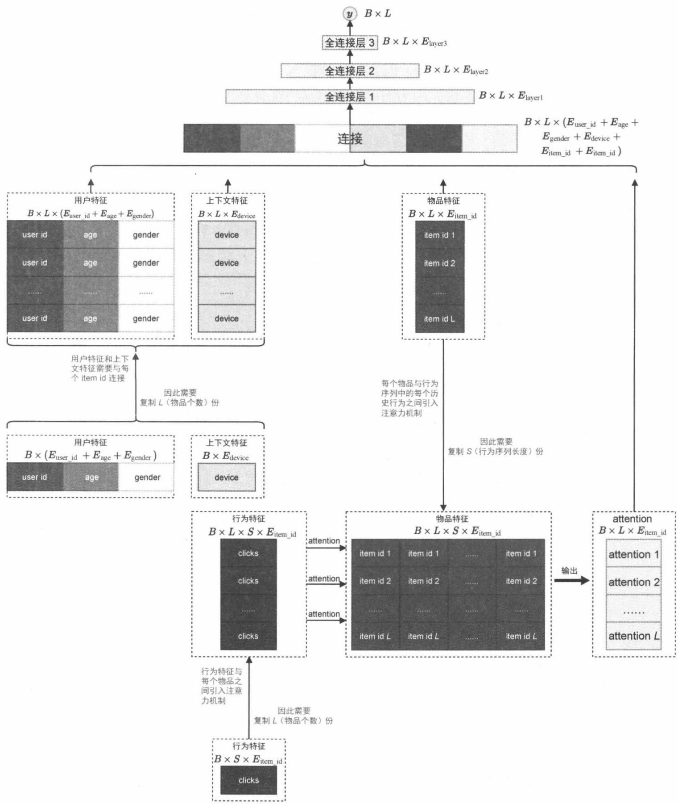  
图10-3ListwiseDIN输入特征和模型结构

值得说明的几点如下。

□用户和上下文特征：复制 $L$ 份，因为这些特征需要与物品特征连接，所以除最后一维外，其他维度必须一致，否则会报错。  
□用户行为特征：需要复制 $L$ 份，因为行为特征与 $L$ 个物品特征之间引入注意力机制。  
□ 物品特征：需要复制 $S$ 份，因为需要根据物品特征计算出 $S$ 个历史行为中每个历史行为的权重。

按照图10-3的输入以及模型结构，TensorFlow代码①实现如下，依然基于Estimator API：

```python
# -- coding: utf-8 --  
import tensorflow as tf  
from lib.feature.featurebuilder import FeatureBuilder  
from lib_common,ranking_metric import metricsImpl 
```

class Estimator: def__init__(self, features, labels, mode, params): self._features $=$ features self._labels $=$ labels self._mode $=$ mode self._params $=$ params self._fb $=$ FeatureBuilder() self._attention.units $\equiv$ [8,4] self._fc.units $\equiv$ [8,4,1] self._rank_discount_fn $=$ lambda rank: tf.math.log(2.) / tf.math.log1p(rank)   
def model_fn(self): with tf.name_scope('user'): user_fc $=$ self._fb.user_features() user $=$ tf.feature_column-input_layer(self._features, user_fc) #B\*E_user   
with tf.name_scope('context'): context_fc $=$ self._fb.context_features() context $=$ tf.feature_column-input_layer(self._features, context_fc) #B\*E_contextual   
with tf.name_scope('item'): # item_embedding:B\*L\*E_item # clicks_embedding:B\*S\*E_item item_embedding, clicks_embedding $=$ self._fb.item_and_histories_features(self._features) # clicks_mask:B\*S clicks_mask $=$ tf.not Equal(self._features['clicks'],b'\0') # pad的是b'0'   
#user特征和contextual特征复制L份   
#L等于物品特征的第二维   
#S等于历史行为序列的第二维   
list_size $=$ tf.shape(input=item_embedding)[1] time_steps $=$ tf.shape(input=clicks_embedding)[1] item_embedding_size $=$ clicks_embedding.get_shape().as_list([-1]

#user:B\*E_user，需要在第二维新增一维，并在新增的维度上复制L份  
#contextual 特征同理  
user $=$ tf expand_dims(user, axis=1)  
user $=$ tftile(user,[1, list_size, 1])  
context $=$ tf.exp_dims(context, axis=1)  
context $=$ tftile(context,[1, list_size, 1])  
#history sequence:B\*S\*E_item，需要变为B\*L\*S\*E_item  
#history mask:B\*S 同理需要变为B\*L\*S  
#B\*(L\*S)\*E_item  
clicks_embedding = tftile clicks_embedding，[1, list_size, 1])  
#B\*L\*S\*E_item  
clicks_embedding $=$ tf.reshape clicks_embedding，[-1,  
list_size,  
time_steps,  
item_embedding_size])  
#B\*(L\*S)  
clicks_mask $=$ tftile clicks_mask，[1, list_size])  
#B\*L\*S  
clicks_mask $=$ tf.reshape clicks_mask，[-1, list_size, time_steps])  
#item:B\*L\*E_item，需要变为B\*L\*S\*E_item  
#B\*(L\*S)\*E_item  
item_embedding_temp $=$ tf tile(item_embedding，[1, time_steps, 1])  
#B\*L\*S\*E_item  
item_embedding_temp $=$ tfreshape(item_embedding_temp，[-1,  
list_size,  
time_steps,  
item_embedding_size])  
with tf.name_scope('user_behaviour_sequence'):  
#B\*L\*E_item  
attention $=$ self attendsion(history_emb $\equiv$ clicks_embedding,  
current_emb $\equiv$ item_embedding_temp,  
history)masks $\equiv$ clicks_mask,  
units $\equiv$ self._attention.units,  
name $\equiv$ 'attention')  
#B\*L\*(E_user+E_contextual+E_item+E_item)  
fc輸入 $\equiv$ [user, context, attention, item_embedding]  
fc輸入 $\equiv$ tfconcat(fc輸入，axis=-1，name $\equiv$ 'fc輸入')  
logits $=$ self.full-connected_layers(mode $\equiv$ self._mode,  
net $\equiv$ fc輸入,  
units $\equiv$ self._fc.units,  
dropout $\equiv$ 0.3,  
name $\equiv$ 'logits')  
#B\*L  
logits $=$ tf}squeeze(logits，axis=-1)

```python
if self._mode == tf.estimator.ModeKeys.PREDICT: probability = tf.nn softmax(logits, name='predictions') # B * L predictions = { 'predictions': tf.reshape(probability, [-1, 1]) } export_outputs = { 'predictions': tf.estimator.export预测Output(predictions) } return tf.estimator.estimatorSpec(self._mode, predictions=predictions, export_outputs=export_outputs) 
```

else: relevance $=$ tf.cast(self._labels,tf.float32) #1.这里使用softmax将relevance转化为概率 #因此relevance的默认值和pad值必须很小 soft_max $=$ tf.nn softmax(relevance, axis=-1) mask $=$ tf.cast(relevance $\geqslant 0.0$ ,tf(bool) ""Softmaxcross-entropylosswithmasking.""" #2.求loss padding $=$ tf.ones_like(logits）\* -2\*\*32 logits $=$ tf.where(mask, logits,padding) loss $=$ tf.reduce_mean( tf.nn softmaxcrossentropy_with_logits(logits= logits, labels=relevance)) if self._mode $\equiv$ tf.estimator.ModeKeys.EVAL: #3.计算ndcg时需要剔除pad的数据 gauc_labels $=$ tf.cast(relevance $>0.0$ ,tf.float32) weights $=$ tf.cast(metric,tf.float32) metrics $=$ { 'gauc':tf.metrics.auc Labels=gauc_labels, predictions $\coloneqq$ soft_max, weights $\equiv$ weights, num_thresholds $\coloneqq 1000)$ } metrics.update(self.ndcg(relevance, logits, weights $\equiv$ weights, name $\equiv$ ndcg')) for metric_name,op in metrics.items(): tf.summary.histogram(metric_name,op[1]) return tf.estimator.estimatorSpec(self._mode, loss $\coloneqq$ loss, eval_metricOps=metrics)

else: global_step $=$ tf.train.get_global_step() learning_rate $=$ self.exponential Decay(global_step) #训练阶段通过梯度下降更新参数 optimizer $=$ tf.train.AdagradOptimizer(learning_rate $\equiv$ learning_rate)

```lua
tf.summary.scalar('learning_rate', learning_rate)  
train_op = optimizer.minimize(loss=loss, global_step=global_step)  
return tf.estimator.estimatorSpec(self._mode, loss=loss, train_op=train_op) 
```

```python
@staticmethod
def fully_CONNECTED_layers(mode,
	 net,
	 units,
	 dropout=0.0,
	 activation=None,
	 name='fc_layers':
	 layers = len(units)
	for i in range(layers - 1):
	 num = units[i]
	 net = tf.layers>dense(net,
		units=num,
		activation=tf.nnrelu,
		kernel_initializer=tf.initializers.he.uniform(   ), 
		 name=f'[name]_units_[num]_[i]')
	 net = tf.layers.dropout(input=net,
		rate=dropout,
	教育培训=mode == tf.estimator.ModeKeys.train)
	 num = units[-1]
	 net = tf.layers>dense(net, units=num, activation=activation,
		:kernel_initializer=tf.initializers.glorot.uniform(   ), 
		 name=f'[name]_units_[num]')
	return net 
```

@staticmethod   
def attention(history_emb, current_emb, history)masks, units, name $=$ 'attention'):

param:history_emb：历史行为embedding。形状：Batch Size \*List Size\*Time Steps\*EmbeddingSize  
param:current_emb：候选物品embedding。形状：Batch Size \*List Size\*Time Steps\*EmbeddingSize  
param:history Masks：历史行为mask。pad的信息不能投入计算，Batch Size \*List Size\*Time Steps  
param:units：list of hidden unit num

param:name:output name   
param:weighted sum attention output   
""   
net $=$ tf Congat([history_emb, history_emb - current_emb, current_emb, history_emb \* current_emb, history_emb $^+$ current_emb], axis=-1)

for unit in units: net $=$ tf.layers.dense(net,units $\equiv$ unit,activation $\equiv$ tf.nnrelu) #B\*L\*S\*1

weights $=$ tf.layers>dense(net,units $\coloneqq 1$ ,activation $\equiv$ None) #B\*L\*1\*S weights $=$ tf.transpose(weights，[0,1,3,2]) padding $=$ tf.zeros_like(weights) #B\*L\*S-->B\*L\*1\*S history)masks $=$ tf expand_dims(history)masks, axis $\coloneqq 2$ ) weights $=$ tf.where(history)masks,weights,padding) #[B\*L\*1\*S]\*[B\*L\*S\*E]--> [B\*L\*1\*E] outputs $=$ tf/matmul(weights,history_emb) #B\*L\*E outputs $=$ tf.squeezeoutputs, axis $\coloneqq 2$ ,name $\coloneqq$ name) return outputs   
@staticmethod   
def exponential Decay(global_step, learning_rate=0.01, decay_steps=10000, decay_rate=0.9): return tf.train.exponential Decay(learning_rate $\equiv$ learning_rate, global_step $\equiv$ global_step, decay_steps $\equiv$ decay_steps, decay_rate $\equiv$ decay_rate, staircase $\equiv$ False)   
def ndcg(self,relevance,predictions,ks=(1,4,8,20,None),weights $\equiv$ None,name $\equiv$ ndcg'): ndcg $s = \{\}$ for k in ks: metric $=$ metricsImpl.NDCGMetric('ndcg', topn=k, gain_fn $\equiv$ lambda label:tf.pow(2.0, label)-1, rank_discount_fn $\equiv$ self._rank_discount_fn) with tf.name_scope(metric.name,'normalizeddiscountedcumulative_gain', (relevance, predictions, weights)): per_list_ndcg,per_listweights $=$ metric.compute(relevance,predictions,weights) ndcgs.update({{}\_{}}'.format(name,k):tf.metrics.mean(per_list(ndcg,per_listweights))) return ndcgs

代码本身没有什么难以理解的地方，仅仅是将图10-3以代码的形式翻译了一遍。唯一需要说明的是10.3.1节中曾经提到的一个问题：为什么relevance的默认值和pad值均设置为一个很小很小的负数（ $-2^{32}$ ）？上述代码的注释#1处做了回答——因为需要使用softmax。

注释#1处的代码是将relevance转化为真实概率分布，这里的relevance是真实标签，形状为 $B\times L$ ，每个元素的值为0、1、2、3之一。假设有两条训练数据：

(1) 第一条的 list size 为 2, relevance 为 [0, 1], 将 relevance 经过 softmax 得到 [0.269, 0.731];

(2) 第二条的 list size 为 3，relevance 为 [0, 1, 2]，将 relevance 经过 softmax 得到 [0.090, 0.245, 0.665]。


softmax公式如下，因此当 $\vec{x}_i$ 的值为负无穷大时，它的softmax值趋近于0：

$$
\operatorname {s o f t m a x} (\vec {x}) _ {i} = \frac {\mathrm {e} ^ {\vec {x} _ {i}}}{\sum_ {j = 1} ^ {n} \mathrm {e} ^ {\vec {x} _ {j}}}
$$

但是，实际情况是：pad 操作会将上面两条数据的形状进行 pad，得到形状为 $2 \times 3$ 的数据，如下所示：

$$
[ 0, 1, \text {p a d} ]
$$

$$
[ 0, 1, 2 ]
$$

TensorFlow在计算softmax时，会按行计算，显然，pad的值不应该影响真实概率分布，也就是说，pad后的数据经过softmax之后，得到的概率应该如下所示：

$$
[ 0. 2 6 9, 0. 7 3 1, 0. 0 ]
$$

$$
[ 0. 0 9 0, 0. 2 4 5, 0. 6 6 5 ]
$$

这就是为什么要在读取数据时将 pad 值设置为 $-2^{32}$ ，因为按照 softmax 的公式，当值为一个非常小的负数时，计算出来的概率为 0.0，不会影响一个 List 中有效位置的概率计算。

相同的处理方式也体现在logits的pad上，在注释#2处计算损失时，需要用到logits，它会在TensorFlow内部求softmax后得到概率分布（也就是预测概率分布），对logits进行pad操作，pad值均设置为 $-2^{32}$ ，softmax后pad位置的概率（0.0）同样不会影响有效位置的概率计算。

同理，在计算 ndcg 时，将所有被 pad 操作的 relevance 权重设置为 0.0，从而在计算指标时不会产生任何干扰。

pad 的默认值设为 $-2^{32}$ ，以及计算指标 ndcg 时将 pad 的 relevance 权重设为 0，是两个特别重要而且特别容易忽视的地方，一旦没有考虑全面，不仅会影响模型的质量，而且会对训练指标产生重要影响，有可能导致训练指标无法反映模型的真实情况，在代码实现时一定要谨慎。


模型评估时用到的AUC（见第9章）和GAUC等离线指标会在后续的章节再做详细说明，这里只需要了解它们是一种衡量排序质量的指标即可，主要用于二元分类任务中。

# 10.3.3 模型训练、导出和服务

搭建完模型结构后，接下来的模型训练、模型导出和模型服务与第9章并无太大区别，代码实现完全一样，因此这里就不再赘述了。

# 模式

通过第9章和第10章的TensorFlow建模流程可以看出，这一系列的流程（数据处理、特征工程、搭建模型等）几乎是一种固定模式，且特别容易统一化、标准化。

(1) 特征工程标准化：容易实现，因为特征的类别和类型几乎可以罗列出来，并且最终都要转化为某种数值表达。  
(2) 模型标准化：容易实现，TensorFlow模型遵循数据读取、模型搭建、模型训练、模型导出和模型服务这一固定流程，特别适合流程化、标准化。

更加明显的是，第9章和第10章的代码实现，除了模型搭建的代码以外，其他部分的代码都极为相似/相同，因此按照软件工程的思维，对于TensorFlow的建模流程，可以设计出一个复用性极强的代码框架来极大地减少开发的代码量，对于数据读取、模型搭建、模型训练、模型导出和模型服务，可以很容易地将其设计为一个个库供下游调用，从而将算法开发完完全全投入到模型搭建中去。本书第16章在探讨训练代码框架的设计时会对此做全面阐述。

# 10.3.4 优化方向

在推荐系统中，Listwise模型实际应用得比较少，尤其是对于点击率预估、转化率预估等需要准确预测概率的任务，Listwise模型并不适合。不过近几年涌现出一些比较优秀的文献①②。

Listwise 模型的使用方法是：物品经过一般的排序模型后，将 Top $N$ 个物品再经过 Listwise 模型做一次更精细化的调整（比如，对 500 个物品进行排序，排完序后，将头部的 50 个物品再通过 Listwise 模型进行二次排序）。特别地，将 Transformer<sup>③</sup> 运用在 Listwise 建模方式中，是一种特别巧妙的思路，它的自注意力机制和位置编码都天然地契合 Listwise 建模方式，因此特别值得在实际应用中探索和尝试。

# 10.4 总结

□排序算法按照建模方式一般分为三种：Pointwise、Pairwise和Listwise。划分方式可以以一个训练样本中有多少候选物品为标准。Pointwise和Pairwise是Listwise的特殊情况。

□Listwise的核心在于样本的构造，一般会按照某些标识将用户同一时刻的行为聚合成List，比如常见的pv id或者sessionid等，甚至可以放宽到以天为粒度，当然，这些依赖于具体的业务。同时，relevance代表用户对物品的行为重要程度，一般以数值形式表示，数值越大表示行为越重要。  
- ListNet 是比较经典的 Listwise 实现，有比较严谨的理论支撑。其核心在于将真实值（relevance）和预测值（score）与概率分布联系起来：引入了 permutation probability 和 top one probability。前者由于时间复杂度过高而无法落地，实际应用中使用后者。  
□ TensorFlow 实现 Listwise 模型时，最重要的是对于各种输入和网络层形状的掌握，当 Listwise 与 DIN 结合时，注意力机制的输入 shape 一定要理解透彻，否则实现时会频繁报错。  
□ 还有一点值得注意，对于 relevance 的默认值和 pad 值也要非常谨慎。由于需要使用 softmax 将 relevance 转换为概率分布，因此必须将默认值和 pad 值设置为一个非常非常小的负数。同理，在实现 ndcg 时，也需要考虑这个问题。  
□ 将Transformer运用在Listwise模型中是一个很好的思路，是一个很不错的优化方向。

# 第11章

# 排序算法的离线评估和在线评估

对于召回算法的离线评估，第6章已经详细说明了一些常用的指标，包括精确率、召回率、F1分数以及nDCG等，介绍了各个指标的原理、应用场景以及计算方法。同样，对于排序算法，也有其对应的离线评估指标，第9章和第10章的建模流程部分，已经涉及了AUC和GAUC这两种评估指标，它们也是排序算法中使用最多的指标。由于推荐系统中排序算法最主要的应用场景是点击率预估、转化率预估等二分类任务（即标签是0或者1），此类任务最常用的指标就是AUC和GAUC，因此本章离线评估部分的内容将会重点介绍这两个指标，包括它们的原理以及如何手动实现。而在模型在线评估部分，将会介绍A/B测试的工作原理。

# 11.1 离线评估

首先回顾一下第6章中介绍的混淆矩阵，如图11-1所示，预测结果分别用 $\hat{\mathbf{P}}$ 和 $\hat{\mathbf{N}}$ 表示正负分类，真实样本分别用 $\mathrm{P}$ 和 $\mathrm{N}$ 表示正负分类，其中的4个单元如下。

□第一行第一列：正样本被预测为正例，称为TP（true positive）。  
□第一行第二列：负样本被预测为正例，称为FP（falsepositive）。  
□第二行第一列：正样本被预测为负例，称为FN（false negative）。  
□第二行第二列：负样本被预测为负例，称为TN（true negative）。

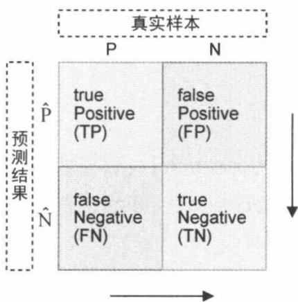  
图11-1 混淆矩阵

由混淆矩阵定义两个指标FPR和TPR。

□ FPR $= \frac{\mathrm{FP}}{\mathrm{N}}$ ：预测为正、实际为负的样本数，与真实负样本数的比例。  
TPR = TP / P：预测为正、实际为正的样本数，与真实正样本数的比例。

假设样本真实分类以Y表示，预测分类以 $\hat{Y}$ 表示，正例为1，负例为0，则从上述定义可以看出：

$$
\begin{array}{l} \mathrm {F P R} = \frac {\mathrm {F P}}{\mathrm {N}} = P (\hat {\mathrm {Y}} = 1 \mid \mathrm {Y} = 0) \tag {11-1} \\ \mathrm {T P R} = \frac {\mathrm {T P}}{\mathrm {P}} = P (\hat {\mathrm {Y}} = 1 | \mathrm {Y} = 1) \\ \end{array}
$$

式(11-1)中的 $P$ 表示概率。很容易发现，影响FPR和TPR结果的条件是互不干扰的：

□FPR只受真实分类为负例的影响（条件概率的条件是 $\mathrm{Y} = 0$ ）  
□TPR只受真实分类为正例的影响（条件概率的条件是 $\mathrm{Y} = 1$ ）

因此，TPR和FPR并不会感知到正负样本的比例变化（因为它们只在各自的分类内计算）。讲到这里，就可以说明ROC曲线了。

# 11.1.1 ROC曲线

ROC曲线的全称是receiver operating characteristic curve（中文名是受试者工作特征曲线/接收器操作特性曲线）。作为一条曲线，其横坐标和纵坐标正是FPR和TPR，即ROC曲线是由一个个FPR和TPR坐标点连成的一条线，这就涉及一个问题：二分类任务中，虽然标签有确切的0和1之分，但是模型的预测值一般是概率，介于0和1，没有办法直接计算TP、FP、FN或者TN，那么ROC曲线到底是如何绘制的呢？如何根据预测的概率值计算FPR和TPR呢？

既然模型的预测值是一个概率，那么可以人为设定一个阈值：高于该阈值的为正例，否则为负例。以点击率预估任务为例，假设模型预测一个样本中某个物品被点击的概率为0.20，如果阈值设为0.30，则这个样本就被分类为0（负样本）；如果阈值设置为0.10，那么就会被分类为1（正样本）。这样一来，通过将预测值由概率转为0和1，就可以计算FPR和TPR了。

ROC曲线的绘制步骤如下。

(1) 设定阈值集合 $L$ ，比如 $[0, 0.01, 0.02, 0.03, \dots, 1.0]$ ，假设集合长度为 $N$ 。  
(2) 模型对当前数据集做出预测，得出数据集中每个样本的概率值。  
(3) 遍历集合 $L$ 中的每个阈值：

1) 根据当前阈值与第 (2) 步中的预测概率值，得到预测值被判定为 0 还是 1；  
2) 计算数据集在当前阈值下的FPR和TPR。

(4) 利用第 (3) 步生成的 $N$ 个 (FPR, TPR) 对，对应二维坐标系中的 $N$ 个点，连成一条线，画出 ROC 曲线。

ROC曲线体现的是模型整体上的分类能力，而且即使正例与负例的比例发生了很大变化，ROC曲线也不会产生太大的变化，在某种程度上可以说它具有很强的健壮性，但是后面也会看到，这种对正负比例变化不敏感也会成为ROC曲线的缺点。

ROC曲线示例①如图11-2所示

  
图11-2 ROC曲线示例（另见彩插）

图11-2中展现出几条不同的ROC曲线，不同的曲线对应的模型具有不同的分类能力，ROC曲线的拐角越接近左上角，其分类能力越强；越接近虚线，分类能力越差。当模型是完全随机分类时（即给定一个样本，模型随机给出一个概率值），此时模型完全没有分类能力，绘制出的ROC曲线是虚线（RANDOM CLASSIFIER，随机分类器）。

既然ROC可以衡量模型的分类能力，那么如何量化这种分类能力呢？图11-3中画出了两个分类器（c1和c2）的ROC曲线，到底是c1的分类能力强还是c2的分类能力强呢？由于ROC曲线只能定性地展现模型分类的好坏，而无法定量地给出确切的结论，因此AUC应运而生了。

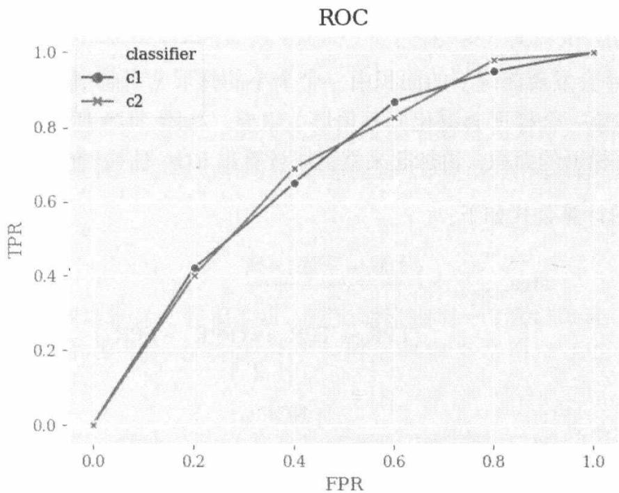  
图11-3 分类器c1还是c2更好

# 11.1.2 ROC曲线下的面积

AUC（area under the curve）称为曲线下的面积，这里的曲线可以有很多种，但是实际应用中提到AUC时，大多指代ROC曲线下的面积，这也是本节主要介绍的内容。以图11-3中分类器c1的ROC曲线为例，其对应AUC需要计算的面积如图11-4所示。计算AUC的方式有很多种，这里介绍两种常用的——面积法和概率法。

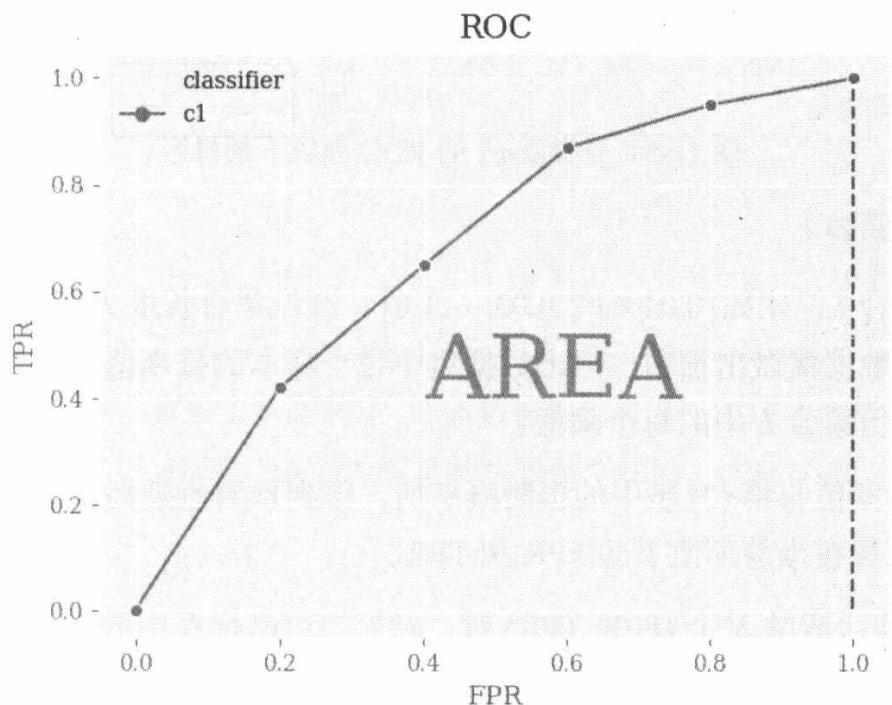  
图11-4 分类器c1的ROC曲线下面积

# 1. 面积法

仔细观察图11-4会发现曲线下的面积由一个个小的梯形（当阈值为1.0时，TPR和FRR均为0，因此左下角的第一个梯形会退化成三角形）组成，如图11-5所示，共含有5个梯形。只要分别计算出这5个梯形的面积，再加起来就可以计算出ROC曲线对应的AUC值了。

每个梯形面积的计算公式如下：

$$
\begin{array}{l} \text {a r e a} _ {\text {t r a p e z o i d}} = \frac {(\text {上 底} + \text {下 底}) \times \text {高}}{2} \tag {11-2} \\ = \frac {\left(\mathrm {T P R} _ {1} + \mathrm {T P R} _ {2}\right) \times \left(\mathrm {F P R} _ {2} - \mathrm {F P R} _ {1}\right)}{2} \\ \end{array}
$$

  
图11-5 分类器c1的ROC曲线下的梯形

AUC的计算步骤如下。

(1) 设定阈值集合 $L$ ，比如 $[0.01, 0.02, 0.03, \dots, 1.0]$ ，假设集合长度为 $N$ 。  
(2) 模型对当前数据集做出预测，得出数据集中每个样本的概率值。  
(3) 从大到小遍历集合 $L$ 中的每个阈值：

1) 根据当前阈值与第 (2) 步中的预测概率值，得到预测值被判定为 0 还是 1；  
2) 计算数据集在当前阈值下的FPR和TPR。

(4) 利用第 (3) 步生成的 $N$ 个(FPR, TPR)对，对应二维坐标系中的 $N$ 个点，根据式(11-2)计算出 $N - 1$ 个梯形面积，累加得到最终的AUC。

通过上述计算步骤可以看出，AUC的计算步骤与ROC的绘制步骤差别仅仅在最后一步。

AUC计算完毕后，是一个介于[0,1]的值，越大越好：0.5表示该分类器完全是随机分类，小于0.5表明模型出了问题，需要排查。

虽然使用面积法可以计算出AUC，但是在计算过程中需要人为指定阈值，显得不太友好，可不可以消除这种人为因素呢？也就是不需要阈值，也可以计算AUC呢？概率法可以解决这个问题。

# 2. 概率法

AUC的值有一定的物理意义，简单来说，就是随机抽出一个正样本和一个负样本，模型把正样本排在负样本前面的概率，也就是正样本预测概率大于负样本预测概率的概率，即 $\mathrm{AUC} = P(P_{\text{正样本}} > P_{\text{负样本}})$ 。

假定数据集共有 $M + N$ 个样本，其中 $M$ 个正样本， $N$ 个负样本，那么正样本的预测概率 $P_{\mathrm{P}}$ 和负样本的预测概率 $P_{\mathrm{N}}$ 可以组成 $M \times N$ 个 $(P_{\mathrm{P}}, P_{\mathrm{N}})$ 对。统计一下 $M \times N$ 个对中 $P_{\mathrm{P}}$ 大于 $P_{\mathrm{N}}$ 的个数，再除以 $M \times N$ ，即可得出正样本排在负样本前面的概率。具体的计算公式如下所示：

$$
\begin{array}{l} \mathrm {A U C} = \frac {\sum I \left(P _ {\mathrm {P}} , P _ {\mathrm {N}}\right)}{M \times N} \\ I \left(P _ {\mathrm {P}}, P _ {\mathrm {N}}\right) = \left\{ \begin{array}{l l} 1. 0, & P _ {\mathrm {P}} > P _ {\mathrm {N}} \\ 0. 5, & P _ {\mathrm {P}} = P _ {\mathrm {N}} \\ 0. 0, & P _ {\mathrm {P}} <   P _ {\mathrm {N}} \end{array} \right. \tag {11-3} \\ \end{array}
$$

以表11-1的正例和负例预测概率为例来说明式(11-3)。

表 11-1 正例和负例的预测概率  

<table><tr><td>样本</td><td>标签</td><td>预测概率</td></tr><tr><td>A</td><td>1</td><td>0.2</td></tr><tr><td>B</td><td>0</td><td>0.2</td></tr><tr><td>C</td><td>0</td><td>0.3</td></tr><tr><td>D</td><td>1</td><td>0.9</td></tr></table>

表11-1中共有4个样本，其中2条正样本，2条负样本，则可以组成4个样本对，分别为(A,B)、(A,C)、(D,B)、(D,C)。对于(A,B)对，由于A和B的预测概率相同，因此 $I(P_{\mathrm{A}},P_{\mathrm{B}})$ 等于0.5，同理可以算出， $I(P_{\mathrm{A}},P_{\mathrm{C}}) = 0.0$ 、 $I(P_{\mathrm{D}},P_{\mathrm{B}}) = 1.0$ 、 $I(P_{\mathrm{D}},P_{\mathrm{C}}) = 1.0$ ，因此可以算出 $\mathrm{AUC} = \frac{0.5 + 0.0 + 1.0 + 1.0}{2\times 2} = 0.625$ 。

在了解了面积法和概率法之后，接下来通过代码实现AUC的计算，除此之外，借助第三方库函数校验手写的AUC是否正确。

# 3. 手写AUC

手写AUC虽然不是算法工程师必备的技能，但是有助于更好地理解AUC的实现，更重要的是在实际应用中，模型的AUC出现问题时，对AUC的理解可以帮助算法工程师更快地进行调试。在实现过程中，可以顺带关注一下每个AUC实现方法（面积法、概率法）的时间复杂度。


为了校验手写AUC的正确性，需要提前安装scikit-learn。相关的软件版本如下：

Python 3.6.0   
scikit-learn 0.24.1

示例代码如下：

```txt
# -- coding: utf-8 --  
import sklearn.metrics as sk.metrics 
```

class AUC: def init(self, labels, predictions, threshold_num): :param labels: list,只有0和1 :param predictions: list，形状与labels相同，元素类型为浮点型，表示预测概率 :param threshold_num：阈值个数 self._labels $=$ labels self._predictions $=$ predictions self._threshold_num $=$ threshold_num assert len(labels) $\equiv$ len(predictions),f'labelslen:{len.labels}！=predictionslen:{len(predictions)}' assert threshold_num $>0$ ，'threshold_numhasto bepositive' #面积法 def trapezoidal_auc(self): #阈值从大到小排列 thresholds $=$ [(self._threshold_num-i)/self._threshold_num for i in range(self._threshold_num+1)] tpr_fpr $= []$ #正例个数 p = sum(self._labels) #负例个数 n $=$ len(self._labels)-p for threshold in thresholds: this_sp $= 0$ this_fp $= 0$ for label,prediction in zip(self._labels,self._predictions): if prediction $\geqslant$ threshold: if label $>0$ : this_sp $+ = 1$ else: this_fp $+ = 1$

$\begin{array}{l}\mathrm{tpr} = \mathrm{this\_tp / p}\\ \mathrm{fpr} = \mathrm{this\_fp / n}\\ \# \text{添加} (\mathrm{tpr},\mathrm{fpr})\text{坐标点}\\ \mathrm{tpr\_fpr.append((tpr,fpr))}\\ \end{array}$ $c = 0$ i in range(1, len(tpr_fpr)): tpr_1, fpr_1 = tpr_fpr[i - 1] tpr_2, fpr_2 = tpr_fpr[i] #（上底 $^+$ 下底） $\times$ 高/2 _auc $+ =$ (tpr_1 + tpr_2)* (fpr_2 - fpr_1) / 2   
return _auc

#概率法  
```python
def probabilistic_auc(self):
    # 正例的排序位置
    p_ranks = [i for i in range(len(self._labels)) if self._labels[i] == 1]
    # 负例的排序位置
    n_ranks = [i for i in range(len(self._labels)) if self._labels[i] == 0]
    # 正例个数
    m = len(p_ranks)
    # 负例个数
    n = len(n_ranks) 
```

```python
# 正例概率大于等于负例概率的个数
num_p_ge_n = 0.0
for p_rank in p_ranks:
    for n_rank in n_ranks:
        p_p = self._predictions[p_rank]
        p_n = self._predictions[n_rank]
        if p_p > p_n:
            num_p_ge_n += 1.0
        elif p_p == p_n:
            num_p_ge_n += 0.5
    return num_p_ge_n / (m * n)
def validate(self):
    _trapezoidal_auc = self.trapezoidal_auc()
    _prob_auc = self.probabilistic_auc()
    _sklearn_auc = self._sklearn_auc()
    assert _trapezoidal_auc == _sklearn_auc, \
        f'_trapezoidal_auc: {_trapezoidal_auc} != sklearn_auc: {_sklearn_auc}
    assert _prob_auc == _sklearn_auc, \
        f'_probabilistic_auc: {_prob_auc} != sklearn_auc: {_sklearn_auc}' 
```

sklearn 作为手动计算 AUC 的校验工具  
```python
def sklearn_auc(self):
    # 调用 sklearn API，获得 fpr 和 tpr，这两个返回值均为数组形式
    fpr, tpr, __ = sk.metrics.roc_curve(self._labels, self._predictions, pos_label=1)
    # 调用 sklearn API，获得 AUC
    _auc = sk.metrics.auc(fpr, tpr)
    return _auc
```

if _name_ == 'main':
	_labels = [1, 1, 1, 0, 0, 0, 0, 0, 0, 0]
	predictions $= \left\lbrack  {{0.3},{0.5},{0.7},{0.9},{0.8},{0.6},{0.4},{0.1},{0.2},{0.0}}\right\rbrack$ aac = AUC(_labels, _predictions, threshold_num=100)
	# trapezoidal: 0.5714285714285714
	print('trapezoidal: \{\}'.format(auc.trapezoidal_auc))
	# probabilistic: 0.5714285714285714
	print('probabilistic: \{\}'.format(auc.probabilistic_auc))
	# pass validation
aacvalidate(   )

通过上述代码可以看出，面积法的时间复杂度为 $O(T(M + N))$ ，其中 $T$ 是阈值个数， $M$ 是正例个数， $N$ 是负例个数。概率法的时间复杂度是 $O(MN)$ 。当然，还有更快的实现版本，可以将时间复杂度降到 $O((M + N)\log (M + N))$ ，这里就不再展开了。

# 11.1.3 PR曲线

另外一种曲线是PR曲线，全称是precision recall curve，其对应的横坐标（ $x$ ）和纵坐标（ $y$ ）分别是Recall和Precision，曲线示例如图11-6所示。

Recall $= \frac{\mathrm{TP}}{\mathrm{P}}$ ：预测为正、实际为正的样本数，与真实正样本数的比例，很容易发现Recall与TPR是一样的。  
□ Precision $= \frac{\mathrm{TP}}{\hat{\mathrm{P}}}$ ：预测为正、实际为正的样本数，与预测正样本数的比例。

  
图11-6 PR曲线示例

当真实正负样本比例发生变化时，ROC曲线并不会发生很大的变化，因为FPR和TPR都只在真实正样本或者真实负样本内部计算。但是观察PR曲线的纵坐标Precision，其分母 $\hat{\mathbb{P}}$ 是预测正样本数，其中很有可能既包含真实正样本，也包含真实负样本，因此当真实正负样本比例发生变化时，Precision同样也会发生变化（因为跨类别了），这种情况下PR曲线就较为敏感。

由图11-6可以看出，PR曲线下的面积依然可以采用面积法来计算，每个梯形的面积计算如式(11-4)所示，代码实现方式与ROC曲线下的面积计算类似，这里不再赘述。

$$
\begin{array}{l} \mathrm {a r e a} _ {\text {t r a p e z o i d}} = \frac {(\text {上 底} + \text {下 底}) \times \text {高}}{2} (11-4) \\ = \frac {\left(\text {p r e c i s i o n} _ {1} + \text {p r e c i s i o n} _ {2}\right) \times \left(\text {r e c a l l} _ {2} - \text {r e c a l l} _ {1}\right)}{2} (11-4) \\ \end{array}
$$

不同于ROC曲线兼顾了正例和负例，PR曲线只关心正例。在推荐系统中，当类别严重不平衡时，通常更为关注正例的预测表现，因此PR曲线下面积会显得更具参考价值，而此时根据ROC曲线下的面积给出的结论一般会非常乐观（甚至可能接近1.0）。

举例说明上述现象，假设数据集中正例有10个，负例有10000个：

模型先预测出20个正例（包含真实的10个正例），则 $\mathrm{FPR} = \frac{\mathrm{FP}}{\mathrm{N}} = \frac{10}{10000} = 0.001$

$$
\mathrm {P r e c i s i o n} = \frac {\mathrm {T P}}{\hat {\mathrm {P}}} = \frac {1 0}{2 0} = 0. 5;
$$

模型再次预测出40个正例（包含真实的10个正例），则 $\mathrm{FPR} = \frac{\mathrm{FP}}{\mathrm{N}} = \frac{30}{10000} = 0.003$

$$
\mathrm {P r e c i s i o n} = \frac {\mathrm {T P}}{\hat {\mathrm {P}}} = \frac {1 0}{4 0} = 0. 2 5 。
$$

由于真实负例过多，FPR变化极小，这体现在ROC曲线上则是曲线一直停留在左侧（图11-2中的蓝色线），ROC曲线下面积很大。而反观Precision，则由0.5降到了0.25，体现在PR曲线上则是纵坐标大幅下降，PR曲线下面积大幅减小。

# 选择ROC还是PR

这道选择题没有固定答案，而是要依据不同的业务而定，ROC和PR最核心的差别在于TN，后者完全不关心TN。因此如果业务中不怎么关心TN带来的影响（比如癌症预测任务、风控业务等），那么PR作为离线评估指标是一种不错的选择。如果TN比较重要（点击率预估、转化率预估等），则倾向于选择ROC作为离线评估指标。同样，当数据集的正负样本比例比较均衡时，也倾向于选择ROC。不过在实际应用中，一般

会将两者一起作为参考。了解每个指标背后的意义，一旦某个指标出现问题，可以快速定位建模过程中哪里出了问题。本章后续提到的AUC，若不做特别说明，均指ROC曲线下的面积。

关于ROC和PR的关系，建议仔细研读引文①。

# 11.1.4 GAUC

AUC衡量的是模型的全局排序能力，有时候可能会隐藏一些问题。由于个性化推荐中的排序是千人千面的，排序的好坏应该在同一个用户下去评判，不同用户之间的排序结果并不能直接比较，全局的排序能力强并不能完全反映个性化排序的能力。

假设数据中有2个用户，3个物品，共产生6条数据。两个模型（模型1和模型2）分别对这6条数据进行预测，得到用户对物品的预估点击概率，具体的真实标签和预测概率如表11-2所示。

表 11-2 用户数据示例  

<table><tr><td>用户</td><td>物品</td><td>是否点击</td><td>模型1预测概率</td><td>模型2预测概率</td></tr><tr><td>用户1</td><td>物品1</td><td>1</td><td>0.9</td><td>0.8</td></tr><tr><td>用户1</td><td>物品2</td><td>0</td><td>0.3</td><td>0.4</td></tr><tr><td>用户1</td><td>物品3</td><td>0</td><td>0.1</td><td>0.3</td></tr><tr><td>用户2</td><td>物品1</td><td>1</td><td>0.8</td><td>0.3</td></tr><tr><td>用户2</td><td>物品2</td><td>0</td><td>0.3</td><td>0.2</td></tr><tr><td>用户2</td><td>物品3</td><td>0</td><td>0.1</td><td>0.1</td></tr></table>

经过简单的计算可得，模型1的AUC为1.0，模型2的AUC为0.8125，单纯从AUC上来看，模型1显然优于模型2。但是仔细观察就会发现，只考虑用户1时，模型2的排序结果AUC为1.0，同理，只考虑用户2时，模型2的排序结果AUC也为1.0，这说明实际上模型1和模型2的排序能力是一样的，那么全局AUC给出的结论（模型1优于模型2）就会指向一个错误的方向。

$\mathrm{GAUC}^{(2)}$ （groupAUC）正是用来应对这种情况的，名称中的group就是将数据按照某个key聚合成一个组（group），然后在组内计算AUC。GAUC首先计算出每个组的AUC，然后对所有组的AUC进行加权平均，得到最终的GAUC，计算公式如下：

$$
\mathrm {G A U C} = \frac {\sum_ {i = 1} ^ {n} w _ {i} \times \mathrm {A U C} _ {i}}{\sum_ {i = 1} ^ {n} w _ {i}} \tag {11-5}
$$

式(11-5)中， $i$ 表示组， $w_{i}$ 表示组 $i$ 的权重， $\mathrm{AUC}_i$ 表示根据组 $i$ 的数据计算出的AUC。通常 $w_{i}$ 可以设为组 $i$ 的曝光数据条数或者点击数据条数。如果组内数据全是曝光数据，或者全是点击数据，就丢弃该组。表11-2中的数据以用户为组进行划分，也可以选择session或者pv。

在实际应用中，AUC依然是使用最多的离线指标。当线下AUC很好但是线上效果很差时，说明AUC已经不能真实反映模型的线上排序质量，此时可以查看一下GAUC作为排查问题的一个入口。

# 11.2 在线评估

历经了数据获取、数据清洗、特征筛选、特征工程、搭建模型、调参、调参、调参……特征工程、搭建模型……这一系列步骤之后，模型的离线指标终于达到了预期，随之而来的是最为重要的一步：上线。毕竟模型离线表现再好，不对外提供服务，不为企业带来业务收益，终究是没有任何价值的。模型上线后，我们关注的不再是准确率、AUC、nDCG等指标，而是与具体业务相关的商业指标——点击率、转化率、GMV（一定时间内的成交总额）、ARPU（一定时间内的平均每用户收入 $=$ GMV/用户数）等。这些指标不仅可以对比线上模型孰优孰劣，更重要的是能够衡量模型的迭代效果，指引下一步的优化方向——这正是A/B测试的作用。

# 11.2.1 A/B 测试简介

维基百科上关于A/B测试的描述如下：

A/B testing is a way to compare two versions of a single variable, typically by testing a subject's response to variant A against variant B, and determining which of the two variants is more effective.

翻译过来的意思是：A/B 测试用来比较单个变量的两个版本 A 和 B，通过测试用户对 A 和 B 的不同反应来决定采用 A 还是 B 作为该变量的最终版本。当然，在现实生产中，单个变量通常不止两个版本，而是有多个版本（如图 11-7 所示），然后通过观察用户反应，效果最佳的那个版本胜出。具体到算法模型 A/B 测试，就是在同一个场景，同时上线两个模型 A 和 B，经过一段时间的实验，根据用户的反应情况，分别统计每个模型的业务指标，决出胜者——胜者将会得到更大的流量，相应地，败者将会缩小甚至关闭流量。

  
图11-7 A/B测试

在推荐系统中，不管是召回算法还是排序算法，都在整个个性化推荐流程中发挥着重要的作用，并且对点击率、转化率等业务指标会产生很大影响。而算法模型不断优化迭代，每天都会有新的模型上线，线上表现不好的模型下线，A/B测试在其中扮演着判官的角色：一个好的A/B测试平台可以提高算法模型的迭代效率，大大增加试错的机会，同时会为模型迭代提供良好的方向指引，甚至可以说A/B测试是整个模型生命周期中最重要的一环。

A/B 测试最重要的是分流，如图 11-8 所示，某用户请求分流服务，服务根据某种规则，将该用户分配到模型 A 上，因此该用户看到的结果是由模型 A 推荐产生的。如何将流量合理地分配给多个实验是最为核心的部分。接下来介绍两种最为常见的 A/B 测试分流方案。

  
图11-8 简单分流示例

# 11.2.2 朴素分流方案

最朴素的A/B测试分流方案是将所有类型的实验放在一起，共享 $100\%$ 的流量。如图11-9所示，召回模型和排序模型的实验均放在一起，总流量为 $100\%$ ，共有5个实验在进行中，其中2个是召回实验，3个是排序实验，流量互不干扰，假设每个实验平均分得 $20\%$ 的流量。

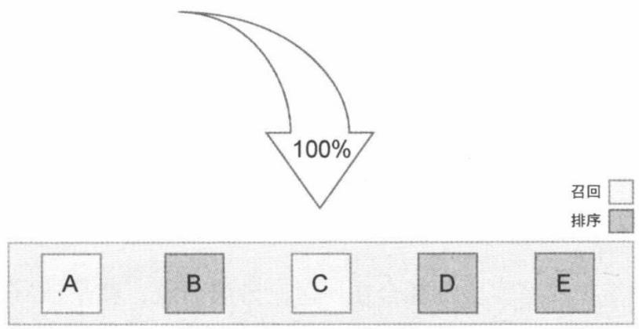  
图11-9 朴素分流示例1

假如 App/网站登录界面需要新增一个 A/B 实验来验证某一个按钮究竟是圆形好还是方形好，于是 A/B 测试平台上多了一个实验，如图 11-10 所示。为了让新加入的实验 F 获得一定的流量，另外 5 个实验需要重新分配流量，将各自缩减 $20\%$ 的流量，保证最后 6 个实验的流量都能够达到 $16.7\%$ 。

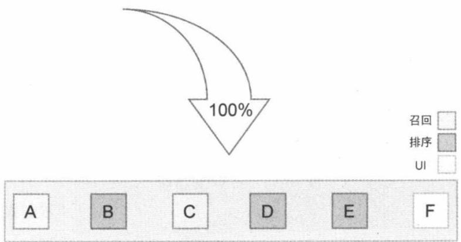  
图11-10 朴素分流示例2

按照这种态势发展下去，实验数量很快便会超过20个、30个、50个……此时每个实验占用的流量越来越少，实验效果波动极大，难以得到确切的结论，A/B测试形同虚设。为了让A/B测试继续发挥它的作用，便需要控制实验数量，比如同时上线的实验不能超过10个等，以免迭代效率大打折扣。

因此，对于A/B测试平台，希望能够完善分流方案，解决上述扩展性差、流量不够用等问题，需要满足以下诉求。

□不同类型的实验调配不会影响对其他类型的实验，比如给召回实验增加3个实验，对排序实验不造成任何影响；不同类型的实验流量具有正交性。  
□同种类型的实验都能得到 $100\%$ 的流量，比如召回实验能得到 $100\%$ 的流量，排序实验也能得到 $100\%$ 的流量：不同类型的实验流量具有可复用性。这样实验数量就可以大大提升了。

□ 实验类型可以自由添加，不影响其他类型，且也能得到 $100\%$ 的流量，比如已经存在算法的召回和排序实验类型，想要添加UI实验类型，对其他两种类型没有任何影响。

这就诞生了当下A/B测试的主流分流方案——分层分流。

# 11.2.3 分层分流方案①

不同于朴素实验分流把所有实验都糅合在一起，分层分流，就是把所有实验按照不同类型分成多个层次。图11-11所示的便是分层分流的大致结构，其中将实验分成了3层。可以看到每一层都可以使用 $100\%$ 的流量，流量经过上一层之后会继续经过下一层，因此同一份流量会穿越3层。

  
图11-11 分层分流结构图

各层实验按照相应的业务类型进行划分，比如实验层1是UI实验，实验层2是召回实验，实验层3是排序实验。看上去很容易理解，但是这样真的不会有问题吗？怎么做到层与层之间互不干扰呢？这种分层分流的最终目标是流量复用（比如图11-11中同一份流量穿越了3层，就是流量复用）。为了实现这个目标，最重要的是要做到流量的正交和互斥。

# 1. 正交

流量的正交是针对不同实验层而言的，指的是层与层之间的流量是正交的，每个层出来的流量会再次经过随机打散后进入下一层，保证下一层接收到的流量均匀地来自上一层。文字描述可能有点儿抽象，正交的具体含义如图11-12所示。

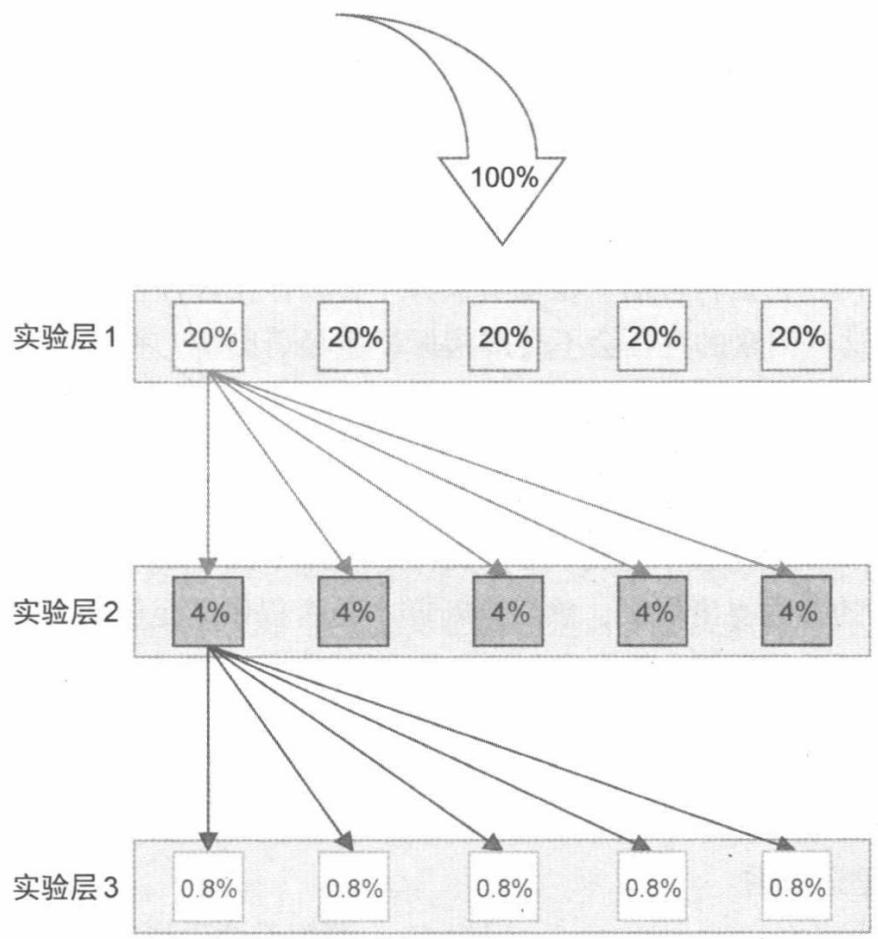  
图11-12 流量的正交

实验层1的流量被随机均匀打散后，进入实验层2，同理，实验层2的流量进入实验层3前也会被随机均匀打散。具体地，当实验层1内第1个实验（记为实验1-1）的 $20\%$ 流量进入第2层时被均匀打散，这样实验层2内每个实验得到的来自实验1-1的流量为 $4\%$ ，当实验层2的流量进入实验层3前，实验2-1中来自实验1-1的 $4\%$ 流量再次被均匀打散，这样实验层3内每个实验得到的实验2-1中实验1-1的流量为 $0.8\%$ 。这样带来的好处是不仅实验流量被均匀打散，而且实验效果也被均匀打散了，比如实验1-1的线上效果特别好，但是由于它的流量进入实验层2、实验层3时都是被均匀打散的，所以这两层内所有实验受到实验1-1的影响都是一样的，也就是

说，上一层实验效果并不会对下一层实验效果的比对产生任何影响——有了这个理论基础，流量就可以无限复用了，只要新增一层实验，流量便会新增 $100\%$ 。

# 2. 互斥

流量的互斥是针对同一实验层而言的，指的是同一层内实验之间的流量不会重叠，互不干扰。比如图11-12中，实验层1内，同一个用户不可能同时命中实验1-1与实验1-2（否则就是A/B分流功能出现了严重故障）。流量的互斥比较容易理解，它也是A/B分流需要遵循的最基本的原则。

关于A/B测试的分层分流方案就介绍到这里。要实现一个配置灵活、方便易用的A/B测试平台，有很多工作要做，这超出了本书的范畴，个中的诸多细节请参考引文①。

# 11.2.4 可信度评估

当模型在A/B测试平台上的实验运行了一段时间后，会输出业务指标，根据这个指标对该模型进行后续操作：增大流量，还是缩小甚至关闭流量。因此，对于A/B测试平台给出的业务指标，必须提出这样一个疑问：它是否可信？在现实世界中，会存在各种各样偶然的因素，比如异常用户或者服务宕机等，这些因素的存在会不会对指标产生显著影响？在讨论这个问题之前，先回顾一些概率论和随机过程中常用的基本概念。

# 1. 假设检验

现实世界中能够获取到的有限数据，可以视作从总体中抽样出来的样本，因此假设检验的作用就是首先对总体中的参数提出假设，然后判断样本是否提供了足够的信息使得这个假设成立，也就是通过样本来验证总体假设。

当通过A/B测试收集到两份样本时，一般会提出两个假设。

(1) 零假设（null hypothesis）：记为 $H_0$ ，即假设两份样本来自同一个总体，所有异常事件均是由随机误差造成的。  
(2) 备择假设（alternative hypothesis）：记为 $H_{1}$ ，即假设两份样本不是来自同一总体。

可见零假设和备择假设互斥，只可能有一个是真。一般零假设是实验者想要否定的假设，而备择假设是实验者希望接受的假设，即验证某个因素确实起到了作用，从而导致两份样本出现了差异。

假设检验的思想也很简单——反证法和小概率原理，具体步骤如下。

(1) 根据实际问题，提出零假设和备择假设

(2) 假定原假设是正确的，开始构造一个小概率事件。

(3) 通过样本来检验该小概率事件是否发生，如果：

1) 小概率事件发生了，那么就有充分的理由怀疑零假设的正确性，从而拒绝零假设；  
2) 小概率事件没有发生，则认为零假设确实是正确的，接受零假设。

# 2. 显著性水平

显著性水平一般用 $\alpha$ 来表示，其定义为：

$$
P \{\text {当} H _ {0} \text {为 真 时 拒 绝} H _ {0} \} \leqslant \alpha
$$

即零假设 $H_0$ 为真时却拒绝 $H_0$ 的最大概率。注意：这是人为设定的。比如，设置 $\alpha$ 为0.01，则表示当做出接受 $H_0$ 的决定时，犯错的概率是 $1\%$ ，换句话说，正确的概率是 $99\%$ 。

# 3. 置信区间

设总体 $X$ 的分布函数中含有一个变量 $\theta$ ，对于给定值 $\alpha$ ，来自 $X$ 的样本确定的两个统计量 $\underline{\theta}$ 和 $\overline{\theta}$ （ $\underline{\theta} < \overline{\theta}$ ），对于任意的 $\theta$ ，均满足：

$$
P \left(\underline {{\theta}} <   \theta <   \bar {\theta}\right) \geqslant 1 - \alpha
$$

则称随机区间 $(\underline{\theta},\bar{\theta})$ 是 $\theta$ 在置信水平为 $1 - \alpha$ 下的置信区间。

这个公式的含义是：反复进行 $N$ 次抽样，每份样本会确定一个区间 $(\underline{\theta}, \overline{\theta})$ ，每个这样的区间要么包含 $\theta$ 的真值，要么不包含 $\theta$ 的真值。在这 $N$ 个区间中，包含 $\theta$ 真值的区间占 $100(1 - \alpha)\%$ 不包含 $\theta$ 真值的区间占 $100\alpha\%$ 。比如，假设 $\alpha = 0.05$ ，进行100次抽样，得到的100个区间内不包含 $\theta$ 真值的为5个。

# 4. p值

p值的定义是：假设零假设 $H_0$ 为真时，由样本得出拒绝 $H_0$ 的最低显著性水平。注意：这是根据样本算出来的。

可见 $\mathfrak{p}$ 值本质上也是显著性水平，只不过通常意义上的显著性水平是人为指定的，而 $\mathfrak{p}$ 值是根据样本算出来的。

按照 $\mathfrak{p}$ 值的定义，对于人为设定的显著性水平 $\alpha$ ：

(1) 如果 $p$ 值 $\leqslant \alpha$ ，则在显著性水平 $\alpha$ 下拒绝 $H_0$   
(2) 如果 $p$ 值 $> \alpha$ ，则在显著性水平 $\alpha$ 下接受 $H_0$

比如， $\mathfrak{p}$ 值为0.02，如果显著性水平 $\alpha$ 为0.01，则表明实验者能接受 $H_0$ 为真时拒绝 $H_0$ 的最大概率等于0.01，结果根据样本算出来的概率等于0.02，那么不能拒绝 $H_0$ ，只能接受 $H_0$ ；同理，

当 $\alpha$ 为0.05时，则可以拒绝 $H_0$ 。

熟悉了以上几个概念之后，接下来校验这样一种情况——某个实验层有两个实验A和B，且已经运行了一段时间，那么如何判断实验A与实验B的指标差异具不具有统计显著性，也就是说实验差异并非由随机误差导致，从而得出A确实比B好或者坏的结论。

# 5. 统计显著性

场景：实验A和实验B是同一个变量的两个版本（比如A使用召回算法1，B使用召回算法2）。

现象：A/B测试平台业务指标显示实验B的点击率（CTR）要比实验A的点击率高。

目标：验证上述指标差异是否具有统计显著性，假定 $\alpha$ 为显著性水平。

为了达成该目标，需要的实验数据如表11-3所示

表 11-3 实验数据  

<table><tr><td></td><td>实验A</td><td>实验B</td></tr><tr><td>命中用户数</td><td>n_A</td><td>n_B</td></tr><tr><td>样本（实验观测到的）点击率</td><td>p_A</td><td>p_B</td></tr></table>

# - 提出假设

对于实验A和实验B，假设指标的差异是由随机误差导致的，因此对于总体假设如下。

$H_{0}$ ：总体 $p_{\mathrm{B}} =$ 总体 $p_{\mathrm{A}}$

$H_{1}$ ：总体 $p_{\mathrm{B}} >$ 总体 $p_{\mathrm{A}}$

# - 计算 Z-score

一般认为点击率服从参数为 $p$ 的伯努利分布Bernoulli $(p)$ ，其中 $p$ 是点击发生的概率。对于总体A和总体B，各自的均值方差为：

$$
\begin{array}{l} E \left(p _ {\mathrm {A}}\right) = \widehat {p _ {\mathrm {A}}} \\ D \left(p _ {\mathrm {A}}\right) = \widehat {p _ {\mathrm {A}}} \left(1 - \widehat {p _ {\mathrm {A}}}\right) \\ E \left(p _ {\mathrm {B}}\right) = \widehat {p _ {\mathrm {B}}} \\ D \left(p _ {\mathrm {B}}\right) = \widehat {p _ {\mathrm {B}}} \left(1 - \widehat {p _ {\mathrm {B}}}\right) \\ \end{array}
$$

根据中心极限定理，可以得到如下两个正态分布：

$$
\begin{array}{l} \overline {{p _ {\mathrm {A}}}} \sim \mathcal {N} \left(\widehat {p _ {\mathrm {A}}}, \frac {\widehat {p _ {\mathrm {A}}} \left(1 - \widehat {p _ {\mathrm {A}}}\right)}{n _ {\mathrm {A}}}\right) \\ \overline {{p _ {\mathrm {B}}}} \sim \mathcal {N} \left(\widehat {p _ {\mathrm {B}}}, \frac {\widehat {p _ {\mathrm {B}}} \left(1 - \widehat {p _ {\mathrm {B}}}\right)}{n _ {\mathrm {B}}}\right) \\ \end{array}
$$

中心极限定理指出，如果有一个独立同分布的随机变量 $X$ 的序列 $X_{1}, X_{2}, \dots, X_{n}$ ，它们的期望为 $\mu$ ，方差为 $\sigma^2$ ，则 $X$ 的均值服从正态分布 $\overline{X} \sim \mathcal{N}\left(\mu, \frac{\sigma^2}{n}\right)$ 。

而两个独立的服从正态分布的随机变量相减，得到的差依然服从正态分布，即：

$$
\overline {{p _ {\mathrm {A}}}} - \overline {{p _ {\mathrm {B}}}} \sim \mathcal {N} \left(\widehat {p _ {\mathrm {A}}} - \widehat {p _ {\mathrm {B}}}, \frac {\widehat {p _ {\mathrm {A}}} \left(1 - \widehat {p _ {\mathrm {A}}}\right)}{n _ {\mathrm {A}}} + \frac {\widehat {p _ {\mathrm {B}}} \left(1 - \widehat {p _ {\mathrm {B}}}\right)}{n _ {\mathrm {B}}}\right)
$$

于是可以计算出此分布对应的Z-score：

$$
\begin{array}{l} Z = \frac {x - \mu}{\sigma} \\ = \frac {\overline {{p _ {\mathrm {A}}}} - \overline {{p _ {\mathrm {B}}}} - \left(p _ {\mathrm {A}} - p _ {\mathrm {B}}\right)}{\sqrt {\frac {\widehat {p _ {\mathrm {A}}} \left(1 - \widehat {p _ {\mathrm {A}}}\right)}{n _ {\mathrm {A}}} + \frac {\widehat {p _ {\mathrm {B}}} \left(1 - \widehat {p _ {\mathrm {B}}}\right)}{n _ {\mathrm {B}}}}} \tag {11-6} \\ = \frac {\overline {{p _ {\mathrm {A}}}} - \overline {{p _ {\mathrm {B}}}}}{\sqrt {\frac {\widehat {p _ {\mathrm {A}}} \left(1 - \widehat {p _ {\mathrm {A}}}\right)}{n _ {\mathrm {A}}} + \frac {\widehat {p _ {\mathrm {B}}} \left(1 - \widehat {p _ {\mathrm {B}}}\right)}{n _ {\mathrm {B}}}}} \quad / / \text {因 为} H _ {0} \text {假 设} p _ {\mathrm {A}} = = p _ {\mathrm {B}} \\ \end{array}
$$

- 计算 $\mathbf{p}$ 值

p值等于标准正态分布中横坐标大于Z-score的曲线下的面积，如图11-13所示。


注意一下单边/双边假设检验问题，因为我们的备择假设是总体 $p_{\mathrm{B}} >$ 总体 $p_{\mathrm{A}}$ ，所以这是一个单边假设，如果是双边假设，p值等于标准正态分布中横坐标大于 $+Z$ -score与小于-Z-score的曲线下的面积和。

假设计算出的 $\mathfrak{p}$ 值小于事先设定的显著性水平 $\alpha$ ，则认为零假设 $H_{0}$ 不成立，备择假设 $H_{1}$ 成立，即实验B的表现确实比实验A好。

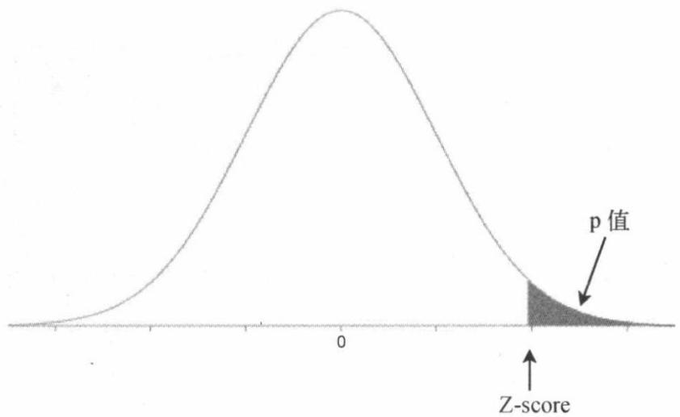  
图11-13 Z-score

# - 示例

举例说明上述步骤，假设显著性水平 $\alpha$ 为0.05，实验A和B的线上表现如表11-4所示。

表 11-4 实验数据示例  

<table><tr><td></td><td>实验A</td><td>实验B</td></tr><tr><td>命中用户数</td><td>20 000</td><td>20 000</td></tr><tr><td>点击用户数</td><td>2000</td><td>2200</td></tr></table>

由表11-4得出实验A的样本点击率为 $\widehat{p_{\mathrm{A}}} = 0.1$ ，实验B的样本点击率为 $\widehat{p_{\mathrm{B}}} = 0.11$ ，那么能说明实验B比A的表现好 $\frac{0.11 - 0.1}{0.1} = 10\%$ 吗？

第一步：提出假设

$H_{0}$ ：总体 $p_{\mathrm{B}} = =$ 总体 $p_{\mathrm{A}}$

$H_{1}$ ：总体 $p_{\mathrm{B}} >$ 总体 $p_{\mathrm{A}}$

第二步：计算Z-score

$$
\begin{array}{l} Z = \frac {\overline {{p _ {\mathrm {B}}}} - \overline {{p _ {\mathrm {A}}}}}{\sqrt {\frac {\widehat {p _ {\mathrm {A}}} \left(1 - \widehat {p _ {\mathrm {A}}}\right)}{n _ {\mathrm {A}}} + \frac {\widehat {p _ {\mathrm {B}}} \left(1 - \widehat {p _ {\mathrm {B}}}\right)}{n _ {\mathrm {B}}}}} \quad / / \text {因 为 要 验 证 总 体} p _ {\mathrm {B}} > p _ {\mathrm {A}}, \text {所 以 分 子 是} p _ {\mathrm {B}} - p _ {\mathrm {A}} \\ = \frac {0 . 1 1 - 0 . 1}{\sqrt {\frac {0 . 1 \times 0 . 9}{2 0 0 0 0} + \frac {0 . 1 1 \times 0 . 8 9}{2 0 0 0 0}}} \\ \approx 3. 2 6 2 5 1 \\ \end{array}
$$

第三步：计算 $\mathfrak{p}$ 值

此次假设是单边假设检验（ $p_{\mathrm{B}} > p_{\mathrm{A}}$ ），查询标准正态分布表可得Z值为3.2625时，对应的p值为0.0006，由于 $\mathfrak{p} < \alpha = 0.05$ ，因此拒绝 $H_0$ ，接受 $H_{1}$ ，即实验B确实优于实验A。


虽然本章才开始介绍A/B测试平台，但是并非说明它更适用于排序算法实验，基本上所有涉及用户体验的迭代业务都可以使用A/B测试平台来验证策略的好坏。

# 11.3 在线离线不一致

离线指标特别高，在线指标特别差——典型的在线离线不一致问题，在实际应用中时常发生。一旦问题出现，就需要找到突破口。深度学习领域，模型 debug 是比较困难的，特别是已经上线的模型。因为一个模型从诞生到上线，需要经过很多步骤，链路特别长，任何一个环节出了问题都可能导致线上效果变差。排除由于线上实验时间太短/流量过少而导致的指标不一致，接下来会探讨一些常见的可能会出现的问题，但是线上环境错综复杂，无法罗列出所有的原因。

# 11.3.1 特征不一致

特征不一致可能是最常见的、最普遍的了，因此当在线离线不一致的现象产生时，第一时间就要去检查是不是由于特征不一致导致的。一般来说，可以将特征不一致的原因归结为以下几类。

□ 线上特征获取异常：由于推荐算法的特征一般来自用户信息、物品信息以及上下文信息等多个方面，这些信息在线上可能是由多个服务提供的，因此在调用各个服务时就有可能因为超时、代码bug等各种各样的原因导致特征获取为空值或者异常值。  
□ 特征更新不及时：以用户行为特征为例，理想情况是一旦用户对物品发生任何行为（比如点击、加购、购买等），服务端能够立刻感知并更新用户画像中的行为信息，但是实际情况是，由于存在网络延迟或者实时数据处理资源不足等情况，用户的行为信息可能过去了几分钟甚至几个小时才更新。  
特征穿越：该问题一般发生在离线训练阶段，典型的是用到了未来的特征，比如物品过去7天内的点击人数这个特征，在准备数据的时候把当天的数据纳入计算，就造成了特征穿越。再比如用户的历史行为特征，所有的行为必须在事件发生时刻之前，一旦处理不当，把事件发生时刻之后的行为考虑进去，也会造成特征穿越。特征穿越会成为问题，是因为未来的特征很可能会和标签产生强关联，比如预测用户是否会点击物品，假如用到的用户历史行为特征发生穿越，那么点击过的物品肯定会出现在历史行为特征中，模型只要根据这一个特征就可以轻易地做出判断，最终导致模型完全不可用且非常难debug，因此处理离线数据时一定要注意这个问题。

# 11.3.2 数据分布不一致

由于推荐系统中一般会存在严重的正负样本不均衡（正负样本比例1:100甚至更高），因此经常会采用负样本下采样技术来缓解样本的不均衡。这种采样不可避免地会产生SSB（sample selection bias）问题：在样本子集上进行训练，但是在全样本空间进行预测。另外，一般选择样本时是采用曝光过的数据，那么对于那些从未曝光过的物品来说，模型在训练时是“看不见”的，因此模型在这些物品上的预测表现也是不确定的。

# 11.3.3 模型与业务目标不一致

虽然这个问题很少发生，但还是需要检查一下，必须确保模型优化的目标与业务目标一致。比如模型优化的是点击率，业务目标也是提高点击率，这样两者就达成了一致。或者模型优化的是点击率，业务目标是提高GMV（单位时间内的成交额），那么某种程度上也算是达成一致，因为点击率提升一般会带来GMV的提升。但是如果业务目标是提高转化率，模型优化的依然是点击率，这就很可能会造成模型和业务目标不一致。

# 11.3.4 验证集设计不合理

对于训练集和验证集的划分，通常会存在 $k$ -fold cross validation 和 holdout 两种策略。简单说明一下这两者的工作原理。

□ $k$ -foldcross validation：如图11-14所示，将训练数据分成 $k$ 等份，其中1份作为验证集，剩下 $k - 1$ 份作为训练集。训练 $k$ 次，这样 $k$ 份数据中每1份都被当作验证集1次。

  
图11-14 cross validation（另见彩插）

□ holdout：如图11-15所示，可以视作 $k$ -foldcrossvalidation的特例，将数据按一定的比例分成2份，1份作为训练集，另1份作为验证集。

  
图11-15 holdout

在海量数据下使用 $k$ -fold cross validation 显得有点儿不切实际，但也并不是说只能使用 holdout。在推荐系统中，如果按照上述两种策略来划分训练集和验证集，很容易会导致数据穿越问题。那么为什么在很多别的系统中，这两种验证策略不会有数据穿越问题呢？因为推荐系统的数据日期极为重要，用户的行为与时间息息相关，如果利用用户的未来信息去“预测”过去的行为，离线指标当然会非常好看。数据穿越问题不仅难以发现，而且会给算法工程师造成模型质量很好的假象。所以一般情况下建议选择数据集的最后一天数据作为验证集，如果担心一天数据不够有代表性（比如选择的验证集恰好是周末，不具代表性），可以按照如下策略来生成验证集。

假设训练集有 $M$ 天数据，则每 $N$ 天训练集对应1天验证集，以此类推，如图11-16所示。

□ 训练集  
验证集

<table><tr><td>1</td><td>2</td><td>3</td><td>4</td><td>5</td><td>6</td></tr></table>


  
图11-16 验证策略

图11-16中，共有21天数据，第1到第5天作为训练数据，第6天作为验证数据，然后第6到第10天可以作为训练数据，第11天作为验证数据……最后使用4个验证集产生的4个离线指标（比如AUC等）的平均值作为验证指标，以此作为模型离线评估的最终指标。


关于在线离线不一致的问题，微软曾在2013年发表过一篇论文专门分析离线AUC很高但是线上业务指标很差的现象，不管是实际应用中是否经历过这种不一致问题，这篇文章都值得一读。

# 11.4 总结

□选择模型的离线指标是很重要的一步，一个契合当前模型和业务的离线指标会大大降低模型上线后的风险。  
□ROC曲线的横纵坐标分别是FPR和TPR，兼顾了正例和负例，但是它只能给出定性的衡量排序质量，如果想要定量，则需要计算AUC——ROC曲线下面积。  
□AUC的计算方法有多种，比较常见的有面积法和概率法。它的物理意义是随机挑选一个正例和一个负例，模型把正例排在负例前面的概率。  
□PR曲线下面积是另一种衡量排序质量的指标，只关注正例的预估情况，因此适合正负样本不均衡或者不关心负例的场景，一般与ROC曲线下的面积搭配使用。  
□当然，还有一些其他的离线指标可以作为参考，比如loss，这也是实际应用中非常重要的指标之一，可以衡量模型对于数据的拟合程度。AUC很高但是loss也很高的情况时有发生。  
□在线指标一般通过A/B测试平台来观察，A/B测试平台最重要的功能是分配流量。相比朴素分流方案把所有类型的实验放在一起，分层分流方案是当前标准的A/B测试平台分流方案，实现了流量复用。  
□ A/B 测试给出的指标由于很多偶然因素可能会存在不置信的问题。为了确定指标变化并非因随机所致，需要一定的可靠性评估，可以利用基础的统计学知识计算出指标置信度。  
□在线离线不一致问题是推荐算法经常遇到的问题，一般会从特征一致性、数据分布、模型和业务目标以及验证集的选取等方面作为突破口，其中特征一致性问题最为常见。

# 第12章

# 推荐算法建模最佳实践

深度学习的一大特点是超参数特别多。所谓超参数，指的是并非通过模型训练得到的参数，而是在开始训练之前人为设置的参数。在深度学习模型的开发和优化中，超参数的调节几乎成为了一项必备技能，在模型的迭代过程中，超参数的调节会占据很多时间。常见的超参数包括：学习率、batch size、激活函数、隐藏层数、隐藏节点数、参数初始化策略、优化器、epoch、dropout等。

由于超参数的数量比较多，不可能也不允许每一个超参数都耗费大量时间去调节。一般采用的策略是将超参数定好优先级，高优先级的精调，低优先级的粗调或者不调，以此训练出一个不错的模型。即便如此，在粗调/精调的过程时，不管对参数进行网格搜索（grid search）还是随机搜索（randomized search），在面对海量训练数据和复杂模型结构时，都显得力不从心，整个调参过程对于训练资源、时间和计算成本来说都比较高。因此，总结出适合大部分超参数的初始值或者初始策略就很有必要。这些初始值或者初始策略会使得模型有一个不错的起点，不仅可以尽可能地保证模型不输在起跑线上，而且还可以大幅降低试错成本，让算法工程师可以把更多的时间和精力投入到数据或者模型结构优化上（尤其是数据优化，一般会大幅提升模型质量）。

除了超参数之外，推荐算法的建模还有另外一个决定性因素——数据。数据的好坏直接决定了模型的质量，因此收集到原始数据后如何对其进行处理也成为了算法工程师必须面对的问题，比如正负样本失衡、数据量过大导致线下调参成本高等。

本章会探讨推荐算法的一些最佳实践，包括深度学习超参数调节以及数据处理两方面的经验总结。当然，最佳实践也只是经验之谈，究竟是否真的在具体的业务中产生作用，还需要在实际应用中多加尝试和实验。


软件环境：

□ TensorFlow 1.15   
Python 3.6

# 12.1 深度学习调参

在实际应用中，对于超参数，建议采取先粗后细的策略来对其进行调节：先粗粒度地确定参数的大致范围，再在小范围内细粒度地调节。在实现某个深度学习算法时，如果该算法有出处（比如出自论文、博客等），那么可以把出处中的参数作为初始值，这样训练出来的模型一般不至于太差。如果算法没有出处，那么可以按照经验设置初始参数。接下来主要介绍一些常见的超参数，并给出一些初始值建议。

# 12.1.1 学习率

学习率是所有超参数中当之无愧最重要的。如果只允许调节一个超参数，那么一定是学习率。想要训练出一个好的模型，必须好好调节学习率：如果学习率太大，模型在训练过程中容易发散（一般表现为loss不降反升）；如果学习率太小，模型收敛时间又很难让人满意（一般表现为loss减小得特别慢）。

训练初期，模型远远没有拟合数据，所以此时的学习率设置得稍微大一点儿也不会错过最优解。随着模型遇到越来越多的数据，拟合得越来越好，学习率就应该适当减小，以便让模型在最优解附近不断地小幅振荡并最终达到最优解。初始的学习率一般设定在 $10^{-6}$ 和1之间，可以从0.01开始①，重点在于如何让学习率有效地变化起来。

学习率按照某种方式不断地变化称为学习率调整策略（learning rate scheduler）。接下来总结一下常用的学习率调整策略，假设初始学习率为 $\eta$ ，同时每个策略均会添加简单的 TensorFlow 代码片段，便于理解。

为了方便演示，先定义一个辅助函数，用于观测学习率的变化情况：

```python
# --coding: utf-8 --import tensorflow as tf
sess = tf InteractiveSession()
def get_lr(lr):
    sess.run(tf.global_variables_initializer())
    lr = sess.run(lr)
    return lr
# 初始学习率
learning_rate = 0.1
# 衰减步数
decay_steps = 10000.0 
```

```txt
衰减率  
decay_rate = 0.9  
# 训练步数  
global_steps = [0, 10000, 20000, 30000] 
```

# 1. constant

也就是常数策略，顾名思义，在这种策略下，学习率从训练开始到结束不会变化，在实际应用中几乎不会使用，因此不再赘述。

# 2. inverse time decay

从名称上可以看出，这种衰减策略与时间的倒数有关。当然，这里的时间并不是真正的时间，映射到模型训练中，时间指代的是训练步数。学习率衰减公式如下：

$$
\eta_ {t} = \eta \times \frac {1}{1 + r \times \frac {t}{s}} \tag {12-1}
$$

其中， $\eta_{t}$ 表示训练到第 $t$ 步（对应 global step）时的学习率， $r$ 表示衰减系数（对应 decay rate，小于 1，人为设定）， $s$ 表示衰减步长（对应 decay step，人为设定）。假设 $r$ 等于 0.9， $s$ 等于 10000，则表明训练到第 10000 步时 $\eta_{t} = \frac{\eta}{1 + 0.9}$ ，训练到第 20000 步时 $\eta_{t} = \frac{\eta}{1 + 0.9 \times 2}$ ，以此类推，对应的衰减如图 12-1 所示，横坐标是 $t$ ，纵坐标是 $\eta$ 。

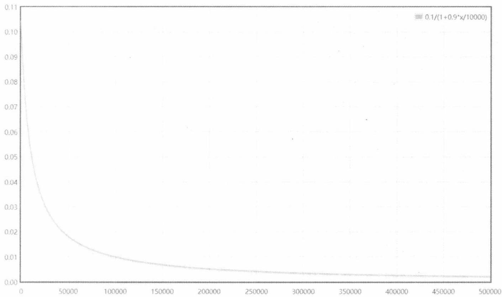  
图12-1 inverse time decay

TensorFlow代码片段如下：

$_{1}lr =$ [get_lr(tf.train.inverse_time Decay(learning_rate, global_step, decay_steps, decay_rate)) for global_step in global_steps]  
```python
>>> 输出：[0.1, 0.05263158, 0.035714287, 0.02702703]
0.1 = 0.1 / (1 + 0)
0.05263158 = 0.1 / (1 + 1 × 0.9)
0.035714287 = 0.1 / (1 + 2 × 0.9)
```
print(_lr)

# 3. exponential decay

观察图12-1 inverse time decay会发现，随着 $t$ 越来越大， $\eta$ 衰减得越来越慢。指数衰减的目的正好相反：随着 $t$ 越来越大， $\eta$ 衰减得越来越快。学习率衰减公式如下：

$$
\eta_ {t} = \eta \times r ^ {\frac {t}{s}} \tag {12-2}
$$

式(12-2)中各符号含义同式(12-1)。易知，每训练 $s$ 步，学习率就会衰减 $1 / r$ 。假设 $r$ 等于0.9， $s$ 等于10000，则表明训练到第10000步时 $\eta_{t} = 0.9\times \eta$ ，训练到20000步时 $\eta_{t} = 0.9^{2}\times \eta$ ，以此类推，对应的衰减如图12-2所示，横坐标是 $t$ ，纵坐标是 $\eta$ 。对比图12-1可以发现，exponentialdecay衰减策略一开始衰减得比较慢，然后会越来越快，大约在第350000步，exponentialdecay的学习率会小于inverse time decay的学习率。

  
图12-2 exponential decay

TensorFlow代码片段如下：

$_{1}lr =$ [get_lr(tf.train.exponential Decay(learning_rate, global_step, decay_steps, decay_rate)) for global_step in global_steps]  
输出：[0.1，0.089999996，0.08099999，0.07289999]  
0.089999996 = 0.1 × 0.9，计算机精度问题  
0.08099999 = 0.1 × 0.9 × 0.9  
"''"  
print(_lr)

# 4. polynomial decay

不管是 inverse time decay 还是 exponential decay，它们都有一个共同点：学习率单调递减。polynomial decay 也基本上呈现这种特点，其学习率衰减公式如下：

$$
\begin{array}{l} t = \min  (t, s) \\ \eta_ {t} = \left(\eta - \eta_ {\min }\right) \times \left(1 - \frac {t}{s}\right) ^ {p} + \eta_ {\min } \tag {12-3} \\ \end{array}
$$

式(12-3)中各符号含义同式(12-1)， $\eta_{\mathrm{min}}$ 表示最小学习率（需要人为设置）， $p$ 是指数项，易知当 $t > s$ 时，学习率不会再变，恒为 $\eta_{\mathrm{min}}$ 。但是polynomialdecay还提供了另外一种衰减策略：整体上学习率呈下降趋势，但是会在一定范围内不断振荡，如式(12-4)所示：

$$
\begin{array}{l} s = s \times \left\lceil \frac {t}{s} \right\rceil \tag {12-4} \\ \eta_ {t} = \left(\eta - \eta_ {\min }\right) \times \left(1 - \frac {t}{s}\right) ^ {p} + \eta_ {\min } \\ \end{array}
$$

不同之处在于衰减步长 $s$ 的取值，它不再是定值，当 $t$ 是 $s$ 的整数倍时， $s$ 被置为 $t$ ， $\eta_t = \eta_{\min}$ ；当 $t$ 不是 $s$ 的整数倍时， $s$ 被置为第一个大于 $t$ 且是 $s$ 整数倍的数， $\eta_t > \eta_{\min}$ ，可见这是一个周期性变化的学习率，它不会保持恒定，也不是单调递减，而是在 $\eta_{\min}$ 和 $\eta$ 之间不断振荡。假设 $p$ 等于 1.0， $s$ 等于 10000， $\eta_{\min}$ 等于 0.0001，对应的衰减如图 12-3 所示，横坐标是 $t$ ，纵坐标是 $\eta$ ，当 $t$ 是 $s$ 的整数倍时 $\eta = \eta_{\min}$ ，整体上学习率不断衰减，来回振荡。

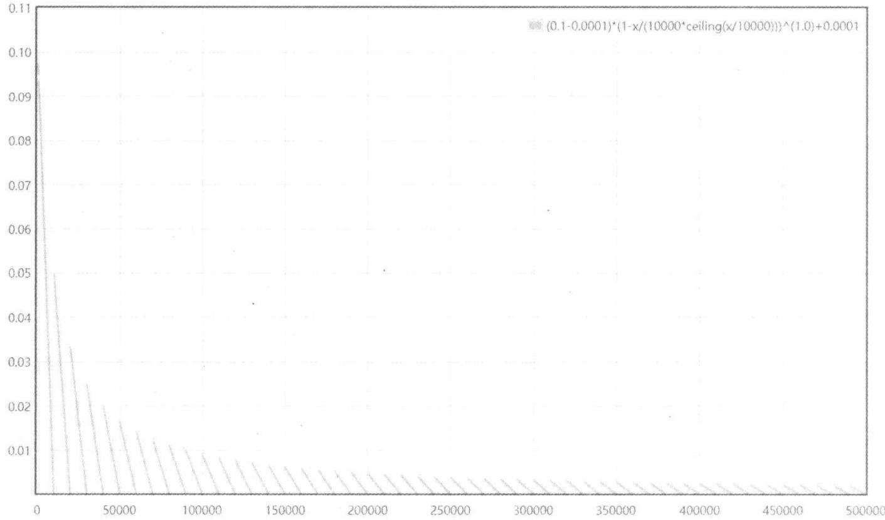  
图12-3 polynomial decay

TensorFlow代码片段如下：

```julia
global_steps = [0, 10000, 10001, 20000, 20001]  
_lr = [get_lr(tf.train.polynomial Decay(learning_rate, global_step, decay_steps, end_learning_rate=0.0001, power=1.0, # cycle=True 则为式 (12-4), cycle=False 则为式 (12-3) cycle=True)) for global_step in global_steps]  
```
```
输出：[0.1, 1e-04, 0.050045006, 1e-04, 0.033396672]
t 是 s 的整数倍时，学习率为最小值 0.0001
```
print(_lr) 
```

# 5. piecewise constant

这种学习率调整策略比较简单，称为分段常数，顾名思义，在不同的阶段之间逐渐衰减，在阶段内保持恒定。比如，设置0到10000步（含，下同）学习率为0.1，10001到20000步学习率为0.05等，这种策略在实际应用中使用得并不多，因此不再赘述。

TensorFlow代码片段如下：

```python
global_steps = [0, 10000, 10001, 20000, 20001]  
boundaries = [10000, 20000]  
values = [0.1, 0.05, 0.025]  
_lr = [get_lr(tf.train paisewise_constant(global_step, boundaries, values)) for global_step in global_steps]  
```
```
输出：[0.1, 0.1, 0.05, 0.05, 0.025]
```
print(_lr) 
```

# 6. reduce on plateau

最后介绍的这个学习率调整策略不受人为控制，它的工作原理是这样的：选定一个指标（以AUC为例），在训练过程中，如果验证集的AUC一直涨，那么学习率不变；一旦开始下跌或者下跌的幅度超过某个阈值，学习率开始衰减（可以采用上述任何一种衰减策略，比如exponential decay）。


如果指标是 loss，则反过来：验证集 loss 不涨，则学习率不变；loss 开始上涨或者上涨的幅度超过某个阈值，学习率开始衰减。

TensorFlow代码片段如下：

```python
import tensorflow as tf
import numpy as np
def reduce_lr_on plateau(learning_rate,
global_step,
decay_steps,
decay_rate,
auc,
patient_steps=10000,
cooldown_steps=5000,
min_dela=1e-4,
min_lr=0.0001):
    if not isinstance(learning_rate, tf.Tensor):
        learning_rate = tf.get_variable('learning_rate',
                          initializer=tf.constant(learning_rate),
                          trainable=False)
    def exponential Decay(lr):
        return tf.train.exponential Decay(lr,
                          global_step,
                          decay_steps,
                          decay_rate)
    with tf variable scope('reduce_lr_on plateau():
        step = tf.get_variable('step',
                          trainable=False,
                          initializer=global_step) 
```

best $=$ tf.get_variable('best', trainable $\equiv$ False, initializer $\equiv$ tf.constant(0.0，tf.float32))   
def_update_best(): with tf.controlDependencies([tf.assign(best,auc), tf.assign(step,global_step)]): return tf identity(learning_rate)   
def decay(): with tf.controlDependencies( [tf.assign(best,auc), tf.assign(learning_rate, tfmaximum(exponential Decay(learning_rate), min_lr)),#4 tf.assign(step,global_step $^+$ cooldown_steps]）:#5 return tf identity(learning_rate)   
def_no_op():return tf identity(learning_rate)   
met_threshold $=$ tf.greater(auc, best $^+$ min delta)#1   
should Decay $=$ tf.greaterequal(global_step - step, patient_steps)#2   
return tf cond(met_threshold, update_best, lambda:tf.cond(should Decay, decay,_no_op)) #3

有两个参数需要说明。

□ patient_steps：假设第 $N$ 步指标下跌，那么在第 $N + \text{patient\_steps}$ 步后再查看一次指标，如果还是下跌，则开始执行学习率调整策略。  
□ cooldown_steps：假设第 $M$ 步执行了学习率调整策略，那么在第 $M + \text{cooldown\_steps}$ 步后才开始继续监控指标变化（也就是在 cooldown_steps步内无论指标怎么变化，都不对学习率做任何操作）。

几处注释说明如下。

(1) 注释 # 1 处：判断当前 AUC 是否大于历史最优（best AUC + delta, delta 是一个很小的值）。  
(2)注释#2处：判断是否需要衰减  
(3)注释#3处

注释#1满足：只更新best值和step值，学习率保持不变。  
注释#1不满足

注释#2满足：执行衰减（_decay）操作。   
注释#2不满足：不执行任何操作。

(4) 注释 # 4 处：执行衰减操作，这里选择了 exponential decay。  
(5) 注释 # 5 处: 设置 step 为当前 global_step + cooldown_steps。

最佳实践：exponential decay 或者 polynomial decay 都是不错的选择。

# 12.1.2 batch size

batch size 决定了一次训练数据的数量，属于比较好确定的超参数。设置它一般需要在速度和精度间折中：大的 batch size 一般可以更好地利用硬件资源，提高训练速度；小的 batch size 相当于自然引入了噪声，可能会增强泛化性。因此：

□如果算力跟得上，训练时间在可接受的范围内，使用小一点儿的batch size，32是一个很好的初始值①②③；  
□ 否则使用大一点儿的batch size，提高训练资源利用率，256、512都是很好的初始值。

最佳实践：batch size 初始设置为 32，如果因此带来的训练时长不可接受，可以调高到 256、512 或者更大，以便更好地利用计算机资源。

Yann LeCun 2018 年 4 月 在推特上发过一段推文，引用如下：

Training with large minibatches is bad for your health. More importantly, it's bad for your test error. Friends don't let friends use minibatches larger than 32. Let's face it: the only people have switched to minibatch sizes larger than one since 2012 is because GPUs are inefficient for batch sizes smaller than 32. That's a terrible reason. It just means our hardware sucks.

中心思想是batch size不要超过32，那么为什么还有那么多机器学习任务的batch size设置得很大甚至达到了4K、8K这样的量级呢？LeCun表示这是因为当前的硬件条件还不够好，没法很有效地训练batch size小于32的数据。

# 12.1.3 epoch

全量数据集遍历一遍称为 epoch。在大规模推荐系统中，由于海量数据的存在，这个超参数一般设置为 1。当然，还有另外一个原因使得这个超参数不用特别关注——早停（early stopping）技术：可以设置一个固定的较大的 epoch（比如 10），然后利用早停技术自动终止训练。

最佳实践：将 epoch 设置为 1 或者使用 early stopping 自动终止训练。

# 12.1.4 隐藏层数

隐藏层的个数一般可以设置为3。当然，要是时间成本允许，可以从1层开始慢慢叠加。

最佳实践：全连接层的隐藏层一般设为3层即可，隐藏层不包含输入层和输出层。

# 12.1.5 隐藏节点数

全连接层一般呈塔形，从输入层到输出层的节点个数呈递减趋势。假设输入层维度为 $D$ ，则可以将第一层节点数设置为小于 $D$ 的最大2的幂次方，每一层的节点数可以设置为上一层的一半。比如输入层的维度为1000，小于1000的最大2的幂次方为512，因此第一层可以设置为512，第二层设置为256，第三层设置为128，输出层设置为1。

最佳实践：节点个数设置为2的整数次方，以更好地利用计算机资源。

# 12.1.6 激活函数

随着技术的发展，激活函数越来越多，从最早的sigmoid，到现如今的elu、selu等。但是不管怎么说，让所有隐藏层都使用ReLU或者LeakyReLU作为初始激活函数，也是不错的选择，而像elu、selu等稍微复杂的激活函数会让训练速度减慢，如果训练时间和线上性能不是问题的话，也可以一试。

最佳实践：隐藏层的激活函数初始使用ReLU/LeakyReLU一般不会有太大问题。

# 12.1.7 权重初始化

对于深度模型中各层参数初始化问题，以下原则基本可以使得初始化不会成为导致模型训练出现问题的主要原因：

□如果激活函数是tanh，则初始化策略可以选择Xavier/Glorot<sup>①</sup>；  
如果激活函数是 $\mathrm{ReLU} / \mathrm{LeakyReLU}$ ，则初始化策略可以选择 $\mathrm{He}^2$

最佳实践：根据不同的激活函数选择不同的初始化策略，引文提供了另外一种参数初始化方法。

# 12.1.8 优化器

常见的优化器（optimizer）有SGD、Momentum、Ftrl、AdaGrad、Adadelta、Adam、Nadam等。对于大规模推荐系统来说，特征数据可能会非常稀疏：有的出现频次特别高（比如成熟用户），有的出现频次特别低（比如质量不太高的物品），所以具有学习率自适应的优化器就成为了首选。

考虑到海量数据下的训练，推荐优先尝试AdaGrad或者 $\mathrm{SGD} + \mathrm{Momentum}$ ，它们兼顾了速度和精度。如果有足够的时间和资源，可以再尝试Adam或者Nadam这样更为复杂的优化器。

最佳实践：优先尝试AdaGrad或者SGD+Momentum。

# 12.1.9 其他实践

□尽可能避免从零手写模型：实际应用中优先找到已有的实现，其次考虑从零实现。  
□尽可能避免随意更改模型结构：公开发表的论文中的模型结构一般是经过作者们精心设计优化的，比如激活函数、损失函数等，如果没有特别的需求，不建议随意修改。  
□数据 $\ggg$ 模型：实际应用中对于效果提升最多的一般来自数据/特征的优化，因此尽可能把优化重心放在数据/特征质量上，模型的优化次之。“数据和特征决定了机器学习的上限，而模型和算法只是逼近这个上限”。  
□尽可能避免把大量时间用在调参上：模型的好坏取决于数据质量。数据质量高，即使比较粗糙的模型超参数也能取得很好的效果。如果把调参作为工作重点，就有点儿本末倒置的味道。  
□迁移学习：推荐系统中，对于物品向量建议不要从零开始学习，使用预训练向量来作为初始参数，一般会有很好的效果。关于这部分的内容，第13章谈到冷启动问题时再详细介绍。


深度模型的超参数实在太多了，本章中没有提到的还有batch-normalization、dropout（一般设置为 $0.3\sim 0.5$ ）等。每个参数的重要性在不同的任务中可能都不一样。超参数的调节一直是深度学习领域的一大痛点，关于这方面的内容，Auto ML和Auto Feature等相关概念和研究值得关注。可能在未来，算法工程师可以不再关心超参数的调节或者特征的抽取了。另外，有些超参数翻译后稍显得不那么直观，比如batch size的中文名是批次大小，所以保留了部分超参数的英文名。

# 12.2 现实数据问题

排序算法最核心的问题是数据问题，从前期的数据采集到后期的数据处理以及到最后生成训练数据，可以说实际应用中算法工程师的绝大部分时间在与数据打交道，因此本节会重点关注一

些比较常见的问题。


现实世界中的数据远不止本节将要提到的问题，因此平时要养成记录的习惯——记录下出现的问题以及解决方案，这不仅能够避免再次踩坑，同时也是个人的经验沉淀。

# 12.2.1 类别失衡

类别失衡（class imbalance）指的是数据中某个类别的数量远超其他类别的数量。以点击率预估任务为例，其训练数据一般来自于曝光和点击：曝光未点击的数据作为负样本，标签记为0；曝光点击的数据作为正样本，标签记为1。在实际应用中，正负样本比例通常会达到1比100甚至更高，这会造成严重的类别失衡。

一般来说，正样本对于模型是极为珍贵的，因为模型需要通过它识别哪些特征能够区分出正或者负。如果负样本太多，会造成正样本对于模型的贡献不够，导致模型学习不充分。从模型训练的角度来看，假设使用交叉熵作为模型的损失函数，其计算公式如下：

$$
\log = - y \log \hat {y} - (1 - y) \log (1 - \hat {y}) \tag {12-5}
$$

式(12-5)中， $y$ 是真实标签， $\hat{y}$ 是预测概率。如果正负样本严重失衡，也就是 $y = 1$ 占比很小，则式(12-5)中第一项较小，基本上由第二项（ $y = 0$ ）占主导，因此只要预测概率 $\hat{y}$ 每次都预测得很小，交叉熵就很小。正样本对模型的贡献几乎可以忽略不计，模型学习不到如何识别正样本，因此需要采取一定的技术解决正负样本失衡问题。

# 1.采样

采样是一种比较常见的解决类别失衡问题的技术。按照对正样本还是负样本采样，可以把采样方式分为两种。

(1)下采样：即减少负样本的数量。比如，原本正负样本比 $1:100$ ，通过对负样本施加0.1倍的下采样率，将正负样本比变为 $1:10$ 。  
(2) 上采样：即增加正样本的数量，最简单的就是按照一定的比例复制正样本。比如，原本正负样本比 $1:100$ ，通过对正样本施加10倍的上采样率，将正负样本比变为 $10:100$ 。

在实际应用中一般会采用下采样的方式，因为在大规模推荐系统中，负样本的数据量过于庞大，很轻易地就达到十亿百亿量级。通过下采样，不仅可以平衡正负样本比，还会大幅缩短训练时间。这里介绍两种常用的下采样方法。

# 随机采样

这是最简单直接的一种采样方式，随机抽取一定比例的负样本保留下来，其他的丢弃。其优点在于简单、可快速实现，一般想要快速上线时可以使用，也可以作为基线版本，为后续的数据

优化策略提供对照。

# - 基于请求采样

这种采样方式稍微复杂一点儿：在一次用户请求（或者曝光）内部进行采样。图12-4描绘了一次用户曝光，一次展示了6个物品。

  
图12-4 一次曝光

那么会有以下两种情况发生。

(1) 情况一：6个物品，用户1个都没点击，均属于曝光未点击。  
(2) 情况二：6个物品中，用户至少点击了1个。

针对情况一，即该请求下没有任何正样本时，则对这6条数据进行采样。也有做法是直接丢弃这6条数据。建议不要直接丢弃，丢弃后线下训练数据的分布与真实数据的分布差异会比较大，实践中按照上述采样方式训练出来的模型，效果一般会好于直接丢弃。

针对情况二，即该请求下至少有1个正样本，则对这6条数据不做采样，也就是保留所有负样本。还有一种处理方法是丢弃该请求内最后一次点击（或者最后一次点击之后的少数几个样本）之后的样本，因为最后一次点击之后的样本可能用户尚未看见，所以不能把它们放入训练数据中。比如图12-4中，用户点击了物品D，那么训练数据里可以只保留ABCD或者ABCDE。

# - 概率校准

当对数据进行下采样时，会对数据的分布造成一定程度的影响，比如未采样数据的平均点击

率为0.02，进行采样率为0.1的下采样后数据的平均点击率变成了0.2，导致模型的平均预测概率也变成0.2。如果只关心预测概率的相对大小，而不关心其绝对大小，那么并不需要将概率校准到原来的真实水平，但是假设打分公式是 $\mathrm{score} = p_{\text{点击}} \times p_{\text{转化}} \times \mathrm{price}$ ，然后按照score进行排序，那么不管是点击率还是转化率都要求尽可能准确。接下来介绍一种常用的概率校准方法①，以点击率预估为例。

假设数据集中正样本个数为 $P$ ，负样本个数为 $N$ ，则整体平均真实点击率CTR为：

$$
\mathrm {C T R} = \frac {P}{P + N} \tag {12-6}
$$

如果采样率 $r\in (0,1]$ ，则负样本个数变为 $r\times N$ ，那么训练数据的平均点击率 $\widehat{\mathrm{CTR}}$ 为：

$$
\widehat {\mathrm {C T R}} = \frac {P}{P + r \times N} \tag {12-7}
$$

由于模型拟合的是采样后的数据分布，因此整体预测概率PCTR理论上与CTR分布一致，也是一个有偏的概率分布，需要将其修正到真实预测概率PCTR，也就是与CTR分布保持一致。由式(12-6)和式(12-7)可得：

$$
\widehat {\mathrm {C T R}} = \frac {P}{P + r \times N} = \frac {1}{1 + r \times \frac {N}{P}} \Rightarrow \frac {N}{P} = \frac {1 - \widehat {\mathrm {C T R}}}{r \times \widehat {\mathrm {C T R}}} \tag {12-8}
$$

$$
\mathrm {C T R} = \frac {P}{P + N} = \frac {1}{1 + \frac {N}{P}} = \frac {1}{1 + \frac {1 - \widehat {\mathrm {C T R}}}{r \times \widehat {\mathrm {C T R}}}} = \frac {r \times \widehat {\mathrm {C T R}}}{1 - (1 - r) \times \widehat {\mathrm {C T R}}} \tag {12-8}
$$

$\widehat{\mathrm{PCTR}}$ 和PCTR也有同样的关系： $\mathrm{PCTR} = \frac{r\times\widehat{\mathrm{PCTR}}}{1 - (1 - r)\times\widehat{\mathrm{PCTR}}}$

在训练时，可以使用有偏的PCTR计算loss进行梯度更新；预测时，使用校准后的PCTR对外提供服务，或者直接使用校准后的PCTR计算loss，那么预测时就不用再校准了。

# 2. 加权损失

解决类别失衡问题的另外一个常见方案就是修改损失函数，实现加权损失。在深入到加权损失之前，首先介绍两种常用的权重：类别权重和样本权重。

# - 类别权重

类别权重（class weight）是针对标签而言的：不同的标签在损失函数中有不同的损失权重。

一般对类别设置权重遵循的原则是：类别越稀少，权重越高。类别权重的经验设置如下：

$$
\begin{array}{l} \text {c l a s s} _ {\text {w e i g h t}} = \frac {\text {t o t a l} _ {\text {c o u n t}}}{\text {p o s i t i v e} _ {\text {c o u n t}}} \times \frac {1}{2} \tag {12-9} \\ \text {c l a s s} _ {-} \text {w e i g h t} _ {\text {n e g a t i v e}} = \frac {\text {t o t a l} _ {-} \text {c o u n t}}{\text {n e g a t i v e} _ {-} \text {c o u n t}} \times \frac {1}{2} \\ \end{array}
$$

式(12-9)的目标是把正负样本比变为 $1:1$ ，实际应用中可能会设置为 $1:5$ 或者 $1:10$ 等其他比例。

# 样本权重

样本权重（sample weight）是针对样本而言的：不同的样本在损失函数中有不同的损失权重。类别权重与样本权重容易混淆，但它们的区别还是比较明显的：类别权重只跟该样本的标签有关，比如标签为1的权重为10，标签为0的权重为1；样本权重与标签的关联关系没有那么强，标签为0的样本权重也可能为10。比如基于请求采样时，就需要设置样本权重：假设某一次请求/曝光产生6条数据，其中1次发生了点击行为，则该请求下的样本不会被采样，6个样本的样本权重均为1，也就是说此请求下标签为0的样本权重也是1。假设另一次请求/曝光也贡献了6条训练样本，但是均为曝光未点击的样本，需要施加采样，如果采样率设置为0.2，则该6条训练样本会被下采样为1条（ $0.2 \times 6$ 向下取整），这1个样本的权重为5（样本权重等于采样率的倒数①），此时标签为0的样本权重变为了5。

# - 加权损失

考虑式(12-5)所示的交叉熵损失，按照标签拆开后，转化为式(12-10)：

$$
\operatorname {l o s s} = \left\{ \begin{array}{c c} - y \log \hat {y}, & y = 1. 0 \\ - (1 - y) \log (1 - \hat {y}), & y = 0. 0 \end{array} \right. \tag {12-10}
$$

如果施加类别权重，则式(12-5)的loss转化为式(12-11)：

$$
\text {l o s s} = \left\{ \begin{array}{c c} \text {c l a s s \_ w e i g h t} _ {\text {p o s i t i v e}} \times - y \log \hat {y}, & y = 1. 0 \\ \text {c l a s s \_ w e i g h t} _ {\text {n e g a t i v e}} \times - (1 - y) \log (1 - \hat {y}), & y = 0. 0 \end{array} \right. \tag {12-11}
$$

由式(12-11)可以看出，如果正样本预测效果不理想，那么由于权重的存在，损失会被放大，从而达到让模型更关注正例的目的。

如果施加样本权重，则式(12-5)的loss转化为式(12-12)：

$$
\text {l o s s} = \left\{ \begin{array}{c c} \text {s a m p l e \_ w e i g h t} \times - y \log \hat {y}, & y = 1. 0 \\ \text {s a m p l e \_ w e i g h t} \times - (1 - y) \log (1 - \hat {y}), & y = 0. 0 \end{array} \right. \tag {12-12}
$$

计算每个样本的 loss 时需要乘以对应的样本权重。

如果同时施加类别和样本权重，则式(12-5)的loss转化为式(12-13)：

$$
\text {l o s s} = \left\{ \begin{array}{c c} \text {c l a s s \_ w e i g h t} _ {\text {p o s i t i v e}} \times \text {s a m p l e \_ w e i g h t} \times - y \log \hat {y}, & y = 1. 0 \\ \text {c l a s s \_ w e i g h t} _ {\text {n e g a t i v e}} \times \text {s a m p l e \_ w e i g h t} \times - (1 - y) \log (1 - \hat {y}), & y = 0. 0 \end{array} \right. \tag {12-13}
$$

同时设置两种权重的情况比较少见。

# 采样还是加权

到底是使用采样还是加权的方式来解决样本失衡问题呢？实际应用中两种方式都会用，但是在海量数据下，使用采样的方式较多。从预测概率的角度来看，对正样本加权，其实就相对于上采样正样本。如果不关心预测概率的绝对值，那么不管是采样还是加权，都不需要做概率校准；如果关心绝对值，那么就要特别谨慎，概率校准的公式会随着采样或者加权策略的不同而不同。

# 12.2.2 位置偏差

位置偏差（position bias）指的是用户由于受到物品位置的影响，更倾向于与头部的物品产生交互行为，即使头部的物品质量不高或者并非用户真正感兴趣的。

以图12-4为例，假设其中6个物品的位置分别为1-1（表示第一行第一个，下同）、1-2、2-1、2-2、3-1、3-2，这些位置一般称为坑位。坑位在排序系统中扮演着绝对核心的角色，一件物品排在第一位和排在第一百位，会直接决定这件物品的生命周期，这也是为什么商家愿意花重金买坑位：越靠前的坑位流量越大，自然也就更加重要。

因此在训练时，需要让模型能够识别位置因素带来的影响，然后在预测时让模型排除位置的影响，完全关注用户对物品本身的兴趣——这就是偏差消除（position debias）技术。这里介绍一点儿简单的处理技巧。

□ 训练时：将位置信息作为特征输入模型，比如对1-1、1-2等位置信息执行散列操作后做embedding处理，当作普通的特征参与模型训练。  
□预测时：此时并没有位置信息，所以比较通用的做法是把所有待排序物品的位置特征固定为第一个坑位（在这里为1-1）进行预测，因此得到的概率可以理解为：如果所有物品都展示在第一个坑位，用户对物品的感兴趣程度是多少。借此达到消除位置信息对模型影响的目的。


debias 还有很多其他的验证①②和解决方案③④，本节介绍的处理手段简单易懂，最重要的是很容易实现，适用于快速上线。

# 12.2.3 海量数据下的调参

调参旨在得到一组让模型表现良好的超参数。当数据量非常大时，模型调参的成本非常高，尤其是时间成本和计算资源成本。针对时间成本，假设训练环境为单机 TensorFlow，训练数据跨度为30天，每天1亿条数据，共30亿条。训练时设置batch size为1024，每秒训练50个batch，那么训练一个epoch大概需要16个小时。当然，选择early stopping技术可能会让训练时间有所缩短，但是总的来说按照这样的时间估算，离线训练一次成本太高了，如果多调几组参数，多加几个epoch，训练时间会更久。

为了降低时间成本，快速进行离线实验，可以采取这种手段：在不破坏数据分布的情况下，对数据进行采样。具体步骤为：

(1) 对每天的全量训练数据进行随机采样，不区分标签；  
(2) 在采样后的数据上进行调参实验；  
(3) 得到若干组超参数后，可以在原始的全量数据上进行精调。

总的来说，通过数据采样快速得到几组超参数，然后从中找到最佳超参数，如果更激进一点儿，直接用基于采样数据的最佳超参数上线实验。这里的采样只是针对训练数据，为了不破坏数据的分布，最好不要整体采样，而是在某个时间单位（比如天）内采样，最后将多个时间单位内的数据融合在一起。

按照上述处理逻辑，再来估计一下训练时间：以0.05的采样率进行采样，则训练时间由一个epoch需要16个小时，缩短为 $16 \times 0.05 = 0.8$ 个小时，大大降低了时间成本，提高了迭代效率。因此在平时的建模过程中，如果数据量很大并且需要快速确定一组不错的超参数，建议使用这种方式进行离线训练。


降低离线训练时间成本最直接的方式是增加计算资源，比如由单机训练变为分布式训练。但是不管采用哪种方式，都可以通过训练采样数据来进行调参。

# 12.2.4 其他实践

□洞察数据：这一点很容易被忽略，实际应用中由于处理数据的是一部分人，算法工程师是另一部分人，很容易造成后者不了解数据逻辑，只专注于调参。因此作为算法工程师，必须对数据中的每一个字段的含义、来源、处理逻辑等了如指掌，甚至比埋点开发人员更了解埋点。  
□ 数据的处理一定要契合业务：从来都是先数据后模型。数据不是为模型服务的，而是为业务服务的。  
特征数据一致性：线上的数据与线下的数据一定要保持一致，比如线下数据里的网络类型（network）取值是2G、3G、4G等，线上服务传过来的却是1、2、3。

# 注意

数据处理并没有好坏之分，只有合不合适，一切都要看具体的线上业务指标表现。

数据处理的很多小技巧与具体业务有关，本章很难完全涵盖。技术在发展，数据处理手法也在不断发展。对于本章提到的所有最佳实践，可能待到本书出版时已经失效，被新的实践代替了。

# 12.3 总结

□ 深度学习的一大特点是超参数多，如果每一个都去调节，会耗费大量的精力和时间，一般按照参数优先级进行调节。  
□在所有超参数之中，学习率是最重要的一个，初始值可以在0.01到1.0之间，一般选择逐渐降低的学习率调整策略。  
□避免将工作重点放在超参数调节上——“差不多就可以了”。最明显的效果提升来自于数据和特征的优化。  
□大规模推荐系统基本都会有正负样本失衡的问题，一般会使用负样本采样和加权损失的方式来解决。如果需要保证预测概率的绝对准确，还需要进行概率校准。  
□数据处理的技巧随着业务和算法类型的不同而不同，一个比较好的习惯是经常阅读业界经典的文献，尤其是谷歌、Meta以及阿里巴巴有关推荐算法/数据的论文。

# 第三部分

# 工程实践

最后一部分我们将目光转移到工程实践上来，探索推荐系统中冷启动问题的解决方案、提高建模效率的常用措施，包括缩短模型训练时间以及提高编码效率等。

第13章探讨推荐系统中不可避免的冷启动问题（不管是用户冷启动还是物品冷启动），并尝试给出一些建议。第14章关注如何提高模型的更新频率，在大规模推荐系统中这个问题显得尤为重要。如果单机环境的训练依然无法满足生产的需要，第15章会详细介绍分布式训练的相关内容，包括单机代码移植以及实际应用中可以落地的分布式训练框架等。第16章从代码编写的角度来提高建模效率，会设计一个简单的框架来完成模型的快速编码实现。

# 第13章

# 冷启动问题

算法的落地依赖数据，尤其是在大规模推荐系统中，用户行为产生的数据对于建模来说至关重要。不管是协同过滤、双塔等召回模型，还是Wide & Deep、DIN等排序模型，无一不对数据有一定的需求。以DIN为例，它需要用户的历史行为序列特征，也就是说如果是纯新用户，那么该模型的作用可能会大打折扣。

以全球最大的视频网站YouTube为例，当用户处于登录状态时，如图13-1所示的YouTube首页推荐，会按照用户历史行为（这里主要是游戏和搞笑视频）推荐相关视频，从中可以看出游戏和搞笑视频占据了 $50\%$ 的坑位，而且页面左下角显示了用户的订阅内容。

  
图13-1 YouTube个性化推荐

当用户退出登录，变成一位访客开始浏览网站时，YouTube 首页推荐的变化如图 13-2 所示。页面上出现了时下流行板块，且会占据首页大部分的坑位，这些视频的播放量都比较大，但是内容与用户历史行为的关系并不是很大。不过从推荐结果中包含一定的中文视频可以推断出，它应该使用了用户当前的 IP 地址以及语言信息。同时可以发现左下角的标签从订阅内容换成了 YOUTUBE 精选，“巧合”的是精选中的类别与时下流行中的内容类别存在明显关联（音乐、体育、游戏、新闻和直播）。

  
图13-2 YouTube非个性化推荐

通过上述案例，可以或多或少地了解YouTube首页对于新用户采用的推荐策略之一：热门推荐（时下流行），不依赖任何用户历史信息即可做出推荐。同样，对于新物品而言，也会存在同样的问题：由于新物品从未出现在训练数据中，模型对它的预测效果一般也难以控制。对于新用户或者新物品推荐难的问题，统称为冷启动问题。

# 13.1 冷启动概述

推荐系统是一门在海量物品中尽可能找到用户感兴趣的物品的技术。因此，当用户信息或者物品信息都比较匮乏时，推荐系统找不到用户和物品之间的“连接关系”，从而导致没法做出很好的推荐——这就是著名的冷启动问题。引用维基百科中关于冷启动的定义：

Cold start is a potential problem in computer-based information systems which involves a degree of automated data modeling. Specifically, it concerns the issue that the system cannot draw any inferences for users or items about which it has not yet gathered sufficient information.

定义的中心思想是推荐系统对于新用户或者新物品了解得还不够多，没有办法掌握新用户的喜好，所以不能很好地为这类用户提供高质量的推荐服务。同理，推荐系统对新物品也几乎一无所知，比如对新物品的销量、点击率、转化率等信息知之甚少，没法判断物品质量是好是坏，因此对于这些物品的推荐也很容易出现问题。

以协同过滤算法为例，协同过滤需要用户有历史行为，同时也需要物品被用户消费过，因此不管是计算用户与用户之间的相似度，还是计算物品与物品之间的相似度，该算法在新用户或者新物品上都没法做出任何推荐，算法失效。同样的问题也发生在关联规则和Word2Vec中，几乎所有算法（包括深度学习算法）在冷启动问题上都显得捉襟见肘，因为算法依赖数据，对于从未出现过的用户或者物品，如果不施加一定的人工策略，很难有较好的收益。

推荐系统中的长尾效应特别明显（如图13-3所示）：少数头部物品贡献了大半部分的流行度（曝光率/点击率等），但是即使如此，长尾物品对于整体的贡献也不可忽视。特别地，一旦对长尾物品处理得不好，会造成很强的马太效应（强者愈强，弱者愈弱：越热门的物品越受人欢迎，越冷门的物品越无人问津），导致推荐系统越推荐越窄，内容流动性越来越差，用户看到的物品越来越局限，最终可能会导致推荐系统丧失作用。

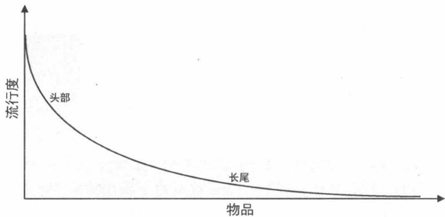  
图13-3 长尾效应

冷启动问题一般可以分成三类。

(1) 用户冷启动：即新的或者行为很少的用户到来时，推荐系统如何向他做推荐。  
(2) 物品冷启动：即新的或者曝光很少的物品出现时，推荐系统如何将它推出去。  
(3) 系统冷启动：没有任何用户数据时，推荐系统如何运作。

冷启动问题至关重要，它是每个推荐系统都必须考虑和面对的问题，缓解冷启动问题的技术一直在演进之中。接下来介绍生产中常用的一些冷启动解决方案，可以作为实际应用中的参考。

# 13.2 用户冷启动

首先要明确一个问题：冷启动用户的定义是什么。一般来说，对于冷启动用户的定义要根据具体的业务来确定。以电商领域为例，对于冷启动用户，有的定义为从未购买过的用户，有的定义为从未点击过或者点击次数小于一定阈值的用户，又或者是进入推荐系统不足一段时间的用户等。在确定了冷启动用户的定义之后，虽然对于这些用户的历史行为信息知之甚少，但是依然可以通过其他信息来为用户做粗粒度的准个性化推荐。

# 13.2.1 热门排行榜

热门排行榜是缓解用户冷启动问题最简单直接的策略之一：对于一个未知用户，向他展示热度较高的物品大概率不会招致反感。最简单的热门排行榜的逻辑如下。

(1) 直接计算所有物品在最近一段时间内某个维度的统计值，按照降序排列取Top $N$ ，存储到数据库/内存中。

维度：根据领域的不同，维度也会不一样，比如电商中的销量、加购UV、收藏UV、点击UV等。

(2) 当用户进入推荐系统, 只要判断他是冷启动用户, 就将 $N$ 个物品作为候选物品送入推荐池。

不过这种策略的缺点也很明显，如果时间范围取得过大，则可能会造成Top $N$ 物品很长一段时间内都不会发生变化，同时，如果维度只选择一种（比如只按照销量排序），则也可能会造成同样的问题。一旦冷启动用户若干次看到同样的结果，就可能会对推荐结果感到厌倦，这很大程度上会造成冷启动用户流失。

为了解决以上两个问题——物品统计维度单一和物品流动性不够（指TopN物品可能很长一段时间内不会发生变化）——需要引入多个维度。以电商推荐为例，假设所有物品统计维度如表13-1所示，当然这里只列举了常用的一些维度，实际应用中可以根据自身的业务需求添加不同的统计维度。可以看出，综合考虑这9个维度可以解决1)物品统计维度单一的问题，上架时长的加入可以解决2)物品流动性不够的问题。

表 13-1 物品统计维度  

<table><tr><td>编号</td><td>物品统计维度</td><td>说明</td></tr><tr><td>1</td><td>销量</td><td>过去一段时间内的销量</td></tr><tr><td>2</td><td>加购UV</td><td>过去一段时间内的加购人数</td></tr><tr><td>3</td><td>收藏UV</td><td>过去一段时间内的收藏人数</td></tr><tr><td>4</td><td>点击UV</td><td>过去一段时间内的点击人数</td></tr><tr><td>5</td><td>评论数</td><td>过去一段时间内的评论数</td></tr><tr><td>6</td><td>转化率</td><td>过去一段时间内的转化率</td></tr><tr><td>7</td><td>点击率</td><td>过去一段时间内的点击率</td></tr><tr><td>8</td><td>好评率</td><td>过去一段时间内的好评率</td></tr><tr><td>9</td><td>上架天数</td><td>上架时间到当前时间的天数</td></tr></table>

使用上述9个维度的数据来对每个物品打分，再根据打分取Top $N$ 的物品，假设所用打分公式如下：

$$
\begin{array}{l} \text {s c o r e} _ {\text {物 品}} = w _ {\text {销 量}} \times \text {销 量} + w _ {\text {加 购} \mathrm {U V}} \times \text {加 购} \mathrm {U V} + w _ {\text {收 藏} \mathrm {U V}} \times \text {收 藏} \mathrm {U V} + w _ {\text {点 击} \mathrm {U V}} \times \text {点 击} \mathrm {U V} \\ + w _ {\text {评 论 数}} \times \text {评 论 数} + w _ {\text {转 化 率}} \times \text {转 化 率} + w _ {\text {点 击 率}} \times \text {点 击 率} + w _ {\text {好 评 率}} \times \text {好 评 率} \tag {13-1} \\ + w _ {\text {上 架 时 长}} \times \text {上 架 时 长} \\ \end{array}
$$

式(13-1)中， $w$ 表示维度的权重，可以根据具体业务中维度的重要程度设置。不过显然式(13-1)存在一个重要问题：各维度的取值范围不一致，需要做归一化。归一化的方式有许多种，这里采用分桶的方式：

(1) 假设维度数据为 $x$ ，统计其 $n$ 个分位数，得到 $n - 1$ 个区间；  
(2) 将 $x$ 分段，根据具体的数值映射到其中一个区间 $i$ 上（ $i \in [0, n-1]$ ）；  
(3) 得到归一化后的维度数据 $\tilde{x} = \frac{i}{n - 1}$ ，将 $\tilde{x}$ 带入式 (13-1) 中参与打分计算。

上述归一化方式不适用于上架天数，设置这一维度，是为了让新品有机会被推出来（提高物品流动性）。以下是处理这个维度的方式之一（假设业务定义上架7天后的物品为老品）：

$$
\text {归 一 化} _ {\text {上 架 时 长}} = \left\{ \begin{array}{c c} {{1 - \frac {\text {上 架 天 数}}{7},}} & {{\text {如 果 上 架 天 数} <   7}} \\ {{0,}} & {{\text {其 他}}} \end{array} \right.
$$

完成所有维度归一化后，将归一化后的值加权求和就可以得到最终每个物品的打分。

综合多维度排序的方式一般来说效果还是不错的，简单且易实现，且可解释性很好，实际应用中可以将这种方式作为基线对照组，与后续的迭代策略进行比对。

# 13.2.2 上下文信息

即使是新用户，当其访问推荐系统时，也必定会携带一定的信息。如表13-2所示，表中仅列出了部分字段，这些信息均是访问网站/App时必带的信息。借助这些上下文信息，依然可以为冷启动用户做不错的推荐。

表 13-2 物品统计维度  

<table><tr><td>信 息</td><td>说 明</td></tr><tr><td>geoIP</td><td>地理位置IP: 若用户关闭GPS, 则该字段为空</td></tr><tr><td>device</td><td>设备类型: 手机/平板电脑/PC等</td></tr><tr><td>os</td><td>操作系统: iOS/Android/Windows等</td></tr><tr><td>browser</td><td>浏览器: Chrome/Safari/IE等</td></tr><tr><td>timestamp</td><td>当前访问的时间</td></tr><tr><td>url</td><td>当前访问的页面</td></tr><tr><td>...</td><td>其他信息</td></tr></table>

# 1. 细粒度排行榜

热门排行榜不一定需要从全局数据中统计得到，比如根据url可以得到当前用户访问的页面地址，向该用户推荐该页面下的热门排行榜。同理，可以将一天的时间划分为若干个区间，然后统计每个区间内的排行榜，根据timestamp推荐对应时间区间内的排行榜。尤其是geoIP这个信息，非常有用，根据geoIP可以得到用户所在地域（省、市、区、街道等），由于同一个地理区

域的人消费习惯比较相似，因此可以在该地域内统计排行榜。当然，可以处理得更加精细，考虑更多的字段限制，比如同时参考geoIP和timestamp，也就是向用户推荐当前区域某个时间段的排行榜。以上所有做法的目的是尽可能让推荐结果具有一定程度的个性化。

# 2. 深度学习

观察表13-2，如果将这些信息通过深度学习的方式编码为用户embedding，那么就可以与物品embedding结合得到Top $N$ 推荐。这种做法与双塔召回异曲同工。特别地，由于用户信息较少，可以将物品池缩小为一些热门物品（比如所有品类内排名Top $20\%$ 的物品）的集合，这样既可以保证推荐物品与冷启动用户信息具有相关性，又可以保证物品质量。

# 13.2.3 其他策略

还有一些常用的策略，简单介绍如下。

□显示用户偏好：在新用户第一次进入网站/App时，让用户选择感兴趣的类别，比如数码产品、游戏之类的，然后利用用户选择的具体类别去做推荐。这种方式带有一定的强迫性，可能会引起用户反感从而造成用户流失。  
□其他业务数据：可能用户在本业务线是新用户，但在其他业务线已经是很成熟的用户了。比如同一个企业已经有了产品A，现在拓展业务诞生了产品B，那么B就可以使用A的数据作为冷启动问题的解决方案。当然，这种策略不仅仅适用于用户冷启动，同样适用于物品冷启动以及系统冷启动。  
□外站信息：有些企业之间会共享数据，比如用户在企业A网站/App上的行为，企业B可以拿到，从而可以有效解决企业B的用户冷启动问题，尤其是当企业A的用户基数特别大、用户行为特别丰富时，这种优势就更为明显了。

# 用户识别

用户识别是一个特别重要的方面，不容忽视。如今用户接入推荐系统的方式多种多样：手机、平板电脑、PC等。每种接入终端都有相应的设备id：iOS系统对应的IDFA、Android系统对应的Android id、浏览器对应的cookie id等。当然，如果用户在网站/App上注册登录，还会存在会员号（member id）。也就是说，同一个用户可能会存在三四个id，如果不能很好地将这些id识别关联起来，很可能会造成同一个用户使用手机访问时被识别为成熟用户，使用PC访问时又被识别成了冷启动用户。因此在实际应用中，一般会维护一个统一的逻辑id（与业务无关），其他id均映射到这个id上，后续的所有处理均通过此逻辑id进行。

# 13.3 物品冷启动

与用户冷启动类似，第一步也需要确定冷启动物品的定义，明确了定义之后，再开始考虑物品冷启动的解决方案。由于冷启动物品的用户反馈信息较少，无法甄别孰优孰劣，因此物品冷启动问题更多依靠人工干预和物品本身的属性来做推荐。比如电商平台中的物品信息一般包括标题、类目、品牌、颜色、适用年龄等，内容推荐平台中的物品一般有标题、分类、题材、导演、主演等，根据这些信息，一般可以大大缓解物品冷启动问题。


冷启动物品的定义一般也依赖具体的业务定义，比如有的业务定义冷启动物品为上架3天内的物品（根据时间），有的定义为点击或者购买次数不超过3的物品（根据人数）等。

# 13.3.1 基于内容的过滤

基于内容的过滤（content-based filtering）是一种根据物品特征属性的相似性而做出推荐的技术，可以看出其核心在于计算物品相似度。由于线上服务方式与 Item-Based CF 完全一样，因此本节只关注如何根据物品属性计算相似度。

# 1.Jaccard系数

Jaccard系数又称Jaccard相似度，用于计算候选集的相似程度，定义为 $A$ 和 $B$ 交集大小与并集大小的比值，计算公式如下：

$$
J (A, B) = \frac {\left| A \cap B \right|}{\left| A \cup B \right|} = \frac {\left| A \cap B \right|}{\left| A \right| + \left| B \right| - \left| A \cap B \right|} \tag {13-1}
$$

假设 $A$ 和 $B$ 分别是两件衣服， $A$ 的属性为 [品类：长裙，颜色：红，价格：高，季节：夏]， $B$ 的属性为 [品类：短裙，颜色：红，价格：高]。按照式 (13-1) 可以得到： $\left|A\right| = 4$ ， $\left|B\right| = 3$ ， $\left|A \cap B\right| = 2$ ，因此 $J(A, B) = 2/5$ 。

Jaccard系数的计算方式简单，不过每个特征非0即1。如果想要更细粒度地区分出特征重要性，tfidf是一个不错的工具。

# 2. tfidf

tfidf（term frequency-inverse document frequency）在信息检索和文本挖掘领域经常使用，原本用来衡量文档中词的重要性，在推荐系统中如果把物品映射为文档，把物品属性映射为词，则可以使用词的tfidf来计算物品属性的重要性。tfidf认为：某个词在某篇文档中的出现频率越高，且在其他文档中的出现频率不高，那么该词与该文档就越相关——这种思想通过tf和idf实现。

□ tf表示词频，即该词在该文档中出现的次数。由于文档长短不同，为了使得不同文档之间可以相互比较，需要将tf归一化。  
□idf表示逆文档频率，即总文档数与包含该词的文档数的比值，比值越大，说明该词越具有区分性。

词在文档中的tfidf计算公式（一般在计算tfidf时，需要去除一些意义不大的词，称为stopword，比如语气词、助词等）如下所示：

$$
\mathrm {t f} = \frac {\text {该 词 在 该 文 档 中 的 出 现 次 数}}{\text {该 文 档 中 的 单 词 总 数}}
$$

$$
\mathrm {i d f} = \log \left(\frac {\text {文 档 总 数}}{\text {包 含 该 词 的 文 档 数} + 1}\right) \tag {13-2}
$$

$$
\mathrm {t f - i d f} = \mathrm {t f} \times \mathrm {i d f}
$$

依然以 $A$ 和 $B$ 两件衣服为例，假设总衣服件数为10，各属性在所有衣服中出现的次数如表13-3所示。

表 13-3 属性统计  

<table><tr><td>品 类</td><td>颜 色</td><td>价 格</td><td>季 节</td></tr><tr><td>长裙: 3</td><td>红: 4</td><td>高: 3</td><td>夏: 4</td></tr><tr><td>短裙: 7</td><td>红: 4</td><td>高: 3</td><td>/</td></tr></table>

对于 $A$ ，各属性的tfidf如下所示：

$$
\mathrm {t f - i d f} _ {\text {长 裙}} = \mathrm {t f} _ {\text {长 裙}} \times \mathrm {i d f} _ {\text {长 裙}} = \frac {1}{1} \times \ln \left(\frac {1 0}{3 + 1}\right) \approx 0. 9 1 6
$$

$$
\mathrm {t f - i d f} _ {\text {红}} = \mathrm {t f} _ {\text {红}} \times \mathrm {i d f} _ {\text {红}} = \frac {1}{1} \times \ln \left(\frac {1 0}{4 + 1}\right) \approx 0. 6 9 3
$$

$$
\mathrm {t f - i d f} _ {\text {高}} = \mathrm {t f} _ {\text {高}} \times \mathrm {i d f} _ {\text {高}} = \frac {1}{1} \times \ln \left(\frac {1 0}{3 + 1}\right) \approx 0. 9 1 6
$$

$$
\mathrm {t f - i d f} _ {\text {夏}} = \mathrm {t f} _ {\text {夏}} \times \mathrm {i d f} _ {\text {夏}} = \frac {1}{1} \times \ln \left(\frac {1 0}{4 + 1}\right) \approx 0. 6 9 3
$$

对于 $B$ ，各属性的tfidf如下所示：

$$
\mathrm {t f - i d f} _ {\text {短 裙}} = \mathrm {t f} _ {\text {短 裙}} \times \mathrm {i d f} _ {\text {短 裙}} = \frac {1}{1} \times \ln \left(\frac {1 0}{7 + 1}\right) \approx 0. 2 2 3
$$

$$
\mathrm {t f - i d f} _ {\text {红}} = \mathrm {t f} _ {\text {红}} \times \mathrm {i d f} _ {\text {红}} = \frac {1}{1} \times \ln \left(\frac {1 0}{4 + 1}\right) \approx 0. 6 9 3
$$

$$
\mathrm {t f - i d f} _ {\text {高}} = \mathrm {t f} _ {\text {高}} \times \mathrm {i d f} _ {\text {高}} = \frac {1}{1} \times \ln \left(\frac {1 0}{3 + 1}\right) \approx 0. 9 1 6
$$

根据上述结果可以将 $A$ 和 $B$ 用向量表示： $A$ 表示为[长裙：0.916，红：0.693，高：0.916，夏：0.693]， $B$ 表示为[短裙：0.223，红：0.693，高：0.916]。 $A$ 和 $B$ 的交集有颜色和价格，因此计算 $A$ 和 $B$ 的余弦相似度如下：

$$
\begin{array}{l} \operatorname {s i m} (A, B) = \frac {\operatorname {t f - i d f} _ {A : \text {红}} \times \operatorname {t f - i d f} _ {B : \text {红}} + \operatorname {t f - i d f} _ {A : \text {高}} \times \operatorname {t f - i d f} _ {B : \text {高}}}{| A | | B |} \\ = \frac {0 . 6 9 3 \times 0 . 6 9 3 + 0 . 9 1 6 \times 0 . 9 1 6}{\sqrt {0 . 9 1 6 ^ {2} + 0 . 6 9 3 ^ {2} + 0 . 9 1 6 ^ {2} + 0 . 6 9 3 ^ {2}} \times \sqrt {0 . 2 2 3 ^ {2} + 0 . 6 9 3 ^ {2} + 0 . 9 1 6 ^ {2}}} \\ \approx 0. 6 9 4 \\ \end{array}
$$

可以看到，tfidf本质上是将物品表征为向量，优点是增强了物品的信息表达能力，缺点同样明显：只考虑词频，没有考虑词的位置、语义等。如果想要利用词的更深层次的信息，则需要借助Word2Vec或者深度学习模型得到物品embedding。

# 3. 预训练模型

大学时代可以掌握高数，是因为中学时代学习了函数、几何等，而这又是因为小学时代理解了加减乘除等。这也很符合人类学习的规律——循序渐进，由易及难——预训练模型的道理正是如此。

当一个物品还处在冷启动阶段时，它的自身属性可以分为两类：1)标题、描述、属性等属于文本信息；2)缩略图、封面图等属于图像信息。这些信息称为物品元数据。因此借助于现如今已经非常成熟的NLP和CV算法技术，可以生成包括冷启动物品在内的所有物品embedding，具体步骤如下：

(1) 假设已有 NLP 或者 CV 模型 M，模型的输入为物品元数据信息，输出为物品 embedding；  
(2) 所有物品经过模型 M，得到物品预训练 embedding；  
(3) 将此物品预训练 embedding 提供给下游业务使用。

上述步骤中，模型M被称为预训练（pretrain）模型，这种预训练 $+$ 微调的训练方式在如今的推荐系统中非常常见①，也几乎成了生产中建模流程的标准操作。比如模型M专注于学习物品的相似性，这样下游使用模型M的产出时，就已经有了很丰富的物品信息，可以极大地提升自身的模型效果。

# 迁移学习

迁移学习（transfer learning），顾名思义，就是把预训练模型的参数迁移到新的模型上来，帮助新模型训练，加快新模型收敛。在推荐系统中，最常见的应用场景是：使用预训练模型得到物品 embedding，再将这份物品 embedding 作为点击率/转化率预估等任务的模型初始参数。更为重要的是，预训练模型可以使得召回、排序等几乎所有模型都受益无穷，因此在实际生产中，预训练模型的迭代和优化也是日常开发的一项重要工作。

第14章将会简单介绍如何使用TensorFlow实现迁移学习。

# 13.3.2 推荐策略

由于并非所有物品都有详细的信息，比如用户上传一个短视频时，不填写任何标题、类型、描述等信息，而大部分短视频可能是这种情况，因此除了使用物品信息外，还需要考虑通过人为干预的方式将冷启动物品推出来。

# 1. 独立场景

独立场景指的是，在网站/App内设置独立的页面或者频道，其中的内容均是近期上架的新品，比如图13-4是京东首页的新品首发板块。

  
图13-4 京东的“新品首发”

类似的处理手段也出现在YouTube视频推荐系统中。如图13-5所示是YouTube的首页标签，其中就有一个最近上传的内容标签，也是旨在让新品有机会被推出来。

  
图13-5 YouTube新内容

# 2. 多路召回

由于推荐系统需要考虑的业务因素太多，比如上架7天以内的物品必须超过 $3\%$ ，上架30天以内的物品必须超过 $20\%$ ，活动物品当天必须满足曝光10000人次等，因此多路召回便是召回阶段使用最多的召回方式之一。一般实际应用中的多路召回来自于业务规则和算法模型两个方面，如图13-6所示。

  
图13-6 多路召回示例

图13-6展示了电商推荐系统中常见的一种多路召回方案，业务规则召回包括如下内容。

□新品：比如定义上架7天以内的物品为新品。  
□应季：当季的物品，比如夏季的风扇、遮阳帽等。  
□ 置顶：一些业务设置置顶的物品。  
□必选：必须出现在召回池中的物品，比如苹果新品发布会当天，推荐系统中必须出现新品。  
□ 热门：近期销量高/点击量高/加购量高/收藏量高的物品

算法召回则包括如下内容。

- Word2Vec、关联规则和协同过滤：根据算法计算出物品相似度，利用用户历史行为寻找相似物品进行召回。  
□双塔：深度学习双塔召回，根据用户向量，从冷启动物品池和成熟物品池中分别召回。

每路召回的个数可以按照具体的业务来确定。当然，也可以通过A/B测试来确定：效果好的召回可以适当增加召回数量。

# 3. 多层流量池

多层流量池指的是将流量池按照流量大小划分为多个层级，通过如下步骤解决物品冷启动问题：

(1) 先将冷启动物品推送给第一层流量池（也是流量最小的流量池）；  
(2) 评估该流量池中所有冷启动物品的业务指标（比如点击率、停留时长等）；  
(3) 将达到预期（比如满足某种业务标准或者阈值）的冷启动物品送入下一层流量池；  
(4) 重复第 (2) 步，直到冷启动物品不再满足冷启动定义而变为成熟物品为止。

图13-7描述了多层流量池的运转机制，冷启动物品进入流量大小为10000的第一层流量池，经过一段时间的实验之后，根据A/B指标筛选出符合条件的物品，进入流量大小为100000的第二层流量池，一旦通过第二层流量池筛选出的物品不再是冷启动物品，那么后续不需要再通过物品冷启动机制进行干预。

  
图13-7 多层流量池示例

可以看出，多层流量池机制中循序渐进地增大流量的方式不会对整体系统产生很大的影响，而且逐层筛选的方式能够保证优质冷启动物品尽早地获得流量。同时，这种机制也带有一定的探索（exploit）：将冷启动物品随机推荐给一定的流量具有一定的试探性（实际应用中，并非完全随机推荐，而是优先选择行为比较丰富的成熟用户，一般认为这种用户更容易接纳新鲜事物），而试探性也正是系统冷启动解决方案的一个重要因素。

# 13.4 系统冷启动

系统冷启动指的是推荐系统新上线，没有任何历史用户时面临的问题。这几乎是在推荐算法开发过程中会遇到的最棘手的问题了：由于没有任何历史数据，上述介绍的策略、算法几乎都

失去了作用，但是除了完全随机推荐之外，还有更好的策略：一种更好的随机——multi-armed bandit①②③。

multi-armed bandit 可翻译为多臂机。如图 13-8 所示，机器上有多个摇臂，每拉动一次摇臂会产生两种结果之一：成功出金币或者失败无所获。由于每个摇臂成功的概率分布不同，所以需要不断地尝试多个摇臂，来获取概率分布，从而让后续的产出价值最大化。多臂机本身属于强化学习的范畴，具体到推荐系统中，一开始随机向用户推荐某些物品，然后根据用户的行为反馈逐渐修正推荐结果来使得收益最大化。在拉动摇臂时，会有两种选择：1) 拉动当前成功概率最高的摇臂；2) 拉动其他成功概率可能更高或者更低的摇臂。第一种选择称为 exploration（利用），第二种选择称为 exploitation（探索），这也是推荐系统中著名的 E&E 问题：固守现状还是勇敢向前。多臂机尝试在 E 和 E 之间折中（trade-off）。

  
图13-8 多臂机

常见的bandit算法包括Thompson sampling、upper confidence bound以及epsilon-greedy等。本节以epsilon-greedy为例，简单描述多臂机的运行原理。epsilon-greedy属于一种贪心算法，每次选择摇臂时，遵循如下规则：

$$
\text {拉 动 的 摇 臂} = \left\{ \begin{array}{c c} \text {当 前 收 益 最 高 的 摇 臂 ，} & \text {概 率} = 1 - \epsilon \\ \text {随 机 摇 臂 ，} & \text {概 率} = \epsilon \end{array} \right. \tag {13-3}
$$

收益或者回报以reward表示， $\epsilon$ 为人为设定的随机选择概率，假设 $\epsilon$ 为0.1，则有0.9的概率继续拉动当前收益最高的摇臂（exploration），有0.1的概率随机选择摇臂（exploitation）。

基于式(13-3)，做一个简单的实验：对比epsilon-greedy与random（每次都随机摇臂）。实验设置如下。

$\square \epsilon : 0.1$ ，即以0.9的概率选择当前最优摇臂。  
□摇臂个数：5，每个摇臂成功与否分别服从参数为 $p_i,i\in [0,1,2,3,4]$ 的伯努利分布。  
□ 拉动摇臂次数：50000。

按照上述参数，完整代码如下：

```python
#include <stdio.h>   
#include <stdlib.h>   
#include <netinet>   
class Bernoulli:   
    @staticmethod   
    def soft_max(z):   
        ez = np.exp(z)   
        dist = ez / np.sum(ez)   
        return dist   
    def __init__(self, num):   
        self._num = num   
        self._bernoulli_p = self柔软_max([i for i in range(self._num)])   
    def draw(self, arm):   
        p = self._bernoulli_p[arm]   
        return 0.0 if np.random.randint() > p else 1.0   
class MAB:   
    def __init__(self, arm_num):   
        self._arm_num = arm_num   
        self._bernoulli_arm = Bernoulli(self._arm_num)   
    def _random_arm(self):   
        return np.random.choice(self._arm_num)   
class Random(MAB):   
    def __init__(self, arm_num):   
        super().__init__(arm_num)   
    def __select(self):   
        return self._random_arm()   
    def get Reward(self, pull_num):   
        rewards = []   
        for i in range(pull_num):   
            chosen_arm = self._select()  
            chosen_arm Reward = self._bernoulli_arm.draw(chosen_arm) 
```

rewards.append(chosen_arm Reward)   
return np.cumsum(rewards)/ $(1 + \mathrm{np.}$ arange(pull_num))

class EpsilonGreedy(MAB): def __init__(self, epsilon, arm_num): super().__init__(arm_num) self._epsilon = epsilon self._counts = np.zeros(self._arm_num) self._mean_rewards = np.zeros(self._arm_num) def _best_arm(self): return np.argmax(self._mean_rewards) def __select(self): rand $=$ np.random.random() return self._best_arm(）if rand $>$ self._epsilon else self._random_arm() def __update(self, arm, reward): arm_counts $=$ self._counts[arm] arm_mean Reward $=$ self._mean_rewards[arm] cumulative_arm Reward $=$ arm_counts \* arm_mean Reward updated Cumulative_arm Reward $=$ cumulative_arm Reward + reward updated_arm_counts $=$ arm_counts + 1 updated_arm_mean Reward $=$ updatedCumulative_arm Reward / updated_arm_counts self._counts[arm] $=$ updated_arm_counts self._mean_rewards[arm] $=$ updated_arm_mean Reward def get Reward(self, pull_num): rewards $= [ ]$ for i in range(pull_num): chosen_arm $=$ self._select() chosen_arm Reward $=$ self._bernoulli_arm.draw(chosen_arm) self._update(chosen_arm, chosen_arm Reward) rewards.append(chosen_arm Reward) return np.cumsum(rewards)/np.arange(1,pull_num+1)

```python
if _name_ == '__main__':  
    pulls = 50000  
    arms = 5  
    epsilon = 0.1  
random_select = Random(arms)  
# epsilon-greedy 中 5 个摇臂的成功概率分别为 softmax([0,1,2,3,4])  
# 即 [0.01165623, 0.03168492, 0.08612854, 0.23412166, 0.63640865]  
epsilon_greedy = EpsilonGreedy(epsilon, arms)  
rand_rewards = random_select.get Reward(pulls)  
eg_rewards = epsilon_greedy.get Reward(pulls)  
import matplotlib.pyplot as plot 
```

```python
plot.plotrand_rewards, label='random')  
plot.plot(eg_rewards, label='epsilon')  
plotxlabel('pull')  
plotylabel('average_rewards')  
plotlegend()  
plot.show() 
```

上述代码的输出如图13-9所示。实验早期由于随机性较大，所以random会产生波动，且与epsilon-greedy不相上下，但是随着拉动摇臂的次数越来越多，两者的差距越来越大，且平均一次拉动摇臂的回报分别逐渐收敛在0.2和0.59附近。

  
图13-9 epsilon-greedy与random


为什么收敛在0.2和0.59附近？

参数为 $p$ 的伯努利分布， $p$ 是试验成功的概率，则其数学期望 $\mathrm{E} = p$ 。

当 $\epsilon$ 为0.1，摇臂个数为5时：

□5个摇臂每次成功的概率 $p = \left[0.0117,0.0317,0.0861,0.2341,0.6364\right]$   
对于random，每个摇臂被选中的概率为0.2，整体期望 $\mathrm{E} = 0.2 \times (0.0117 + 0.0317 + 0.0861 + 0.2341 + 0.6364) = 0.2$   
□对于epsilon-greedy，1)有0.9的概率选择成功概率最大的摇臂，2)有0.1的概率随机选择5个摇臂中的一个的概率为 $\frac{0.1}{5} = 0.02$ ，整体期望为 $\mathrm{E} = 0.9\times 0.6364 + 0.02\times (0.0117+$ $0.0317 + 0.0861 + 0.2341 + 0.6364)\approx 0.592$ 。

由此可以看出，即使是简单的epsilon-greedy，带来的收益也是比较可观的，更别提其他一些更为先进的算法了。因此当在实际应用中遇见系统冷启动问题时，除了从外部获取数据等非算法渠道之外，还可以考虑一些解决多臂机问题的算法。


其实解决多臂机问题的算法也可以用来解决用户冷启动和物品冷启动问题。

# 13.5 总结

□ 推荐系统中的冷启动问题是不可避免的，一般分为用户冷启动、物品冷启动和系统冷启动。  
□用户冷启动问题指的是难以向历史行为少的用户做出很好的推荐，常见的解决方案包括综合热门排行榜、利用上下文信息等，当然，深度模型的应用也非常广泛。  
□ 物品冷启动问题指的是物品新上线或者被消费次数过少时很难被推出去，一般从物品信息本身以及人工策略的角度考虑，对业务效果影响较大的是使用预训练物品 embedding，同时多路召回以及多层流量池机制是一些很不错的实践技巧。  
□系统冷启动问题指的是推荐系统从零搭建，缺少历史数据。这属于最棘手的冷启动问题，除了从外部获取数据外，多臂机这种简单的强化学习领域的算法一般可以发挥很好的作用。

# 第14章

# 增量更新和迁移学习

假设每日训练数据有1亿条，batch size为1024单位，每秒可以训练50 batch，那么训练完30天的数据大概需要16个小时，如果有资源争抢或者数据量上涨的情况，训练时间很可能会超过1天，也就是说模型的更新频率会超过1次/天，如果每日上新物品的数量非常多，会导致新物品的推荐效果欠佳。同时，模型的更新频率降低也会导致无法及时捕捉数据分布的变化，比如电商平台大促销期间的数据分布与平时的数据分布差异极大。

事实上，模型的更新频率更多时候是由具体的业务决定的，并不是所有业务都要求模型实现毫秒级更新，特别是对于一些物品更新不是那么快、用户行为并不是很丰富的场景（比如汽车推荐、职位推荐等），模型一天更新一次似乎也完全可以接受，而对于类似YouTube这种每秒都有海量内容上新的平台，模型更新慢就显得不可接受。

当需要提高模型训练速度或者缩短模型训练时间时，一种简单直接的解决方案是添置性能更好的训练设备：将模型训练从CPU上切换到GPU上，或者使用算力更强的CPU等。除此之外，还可以从模型训练的策略上去解决这个问题，这也正是本章的重点：探讨如何缓解或者解决数据量过大带来的模型更新慢的问题。

# 14.1 离线训练

离线训练，或者离线学习（batch training/learning），要求预先准备好有限的训练数据集，模型在数据集上完成训练后，才可以对外提供服务，这也是实际应用中最常见的训练方式。

# 14.1.1 数据流向

以点击率预估任务为例，假设正样本来自曝光且点击数据、负样本来自曝光未点击数据，数据流向（包括用户发起请求到最终模型完成更新）的整体流程如图14-1所示，具体步骤如下：

(1) 用户向推荐服务发起请求；  
(2) 推荐服务根据用户信息、上下文信息以及物品信息等调用特征服务得到模型所需特征；

(3) 将特征送入在线预测服务进行预估；  
(4) 推荐服务得到模型预估服务的预测值；  
(5) 根据预测值进行排序，将推荐结果返回给用户；  
(6) 如果用户不断翻看推荐页面，则会产生曝光事件，终端（手机、电脑等）会向服务器上报曝光埋点数据，携带本次请求ID，数据处理任务对曝光数据进行处理，得到离线曝光数据；  
(7) 如果用户发生了点击行为，则会产生点击事件，此事件的请求ID与曝光事件相同，按照第(6)步的上报逻辑，会得到离线点击数据；  
(8) 离线数据任务对曝光数据和点击数据进行处理（根据请求 ID 进行数据关联、特征工程等），转化为模型可用的数据格式，得到训练数据；  
(9) 训练完成后，模型会被推送到线上，提供对外服务。

离线学习的特点是先训练后服务。

  
图14-1 离线学习整体数据流向

# 14.1.2 更新方式

一般情况下，数据太多会导致模型训练耗时比较久（当然，训练设备性能差也是原因之一，但并非主要原因），那么可以考虑采用全量更新和增量更新的方式来缩短训练时间，提高更新频率。

全量更新指的是模型从零开始训练，模型参数随机初始化，一般会使用较多的数据（比如过去1个月或者6个月甚至更长时间的数据），当然，训练时间也比较长。增量更新指的是在已有

模型的基础上，仅仅拟合新数据，这种更新方式一般使用的数据较少（比如过去1天或者3天的数据），相应地，训练时间比较短。图14-2展示了全量更新和增量更新结合的一种方式，假设全量使用30天的数据，增量使用1天的数据，如果前者训练需要72个小时，后者只需要大约2.5个小时就可以完成。这种模型更新的方式很好理解，实际应用中使用得也比较多，优点是占用资源少，第一次全量模型训练完毕后，后续只会周期性地使用少量数据进行训练，大大缩短了训练时间，提高了模型迭代的频率。

  
图14-2 全量更新和增量更新结合方式之一

当然，凡事都有两面性：训练数据减少，使得增量模型能更好地拟合新数据，但是对全局数据的拟合程度很难保证，也就是说，模型的收敛可能局限在新数据的最优点，而不是全局最优点。还有一个更可能存在的问题，一旦某次增量更新因为某种原因导致模型质量下降（模型跑偏，比如大促活动、突发热点事件等），后续的增量模型会受到影响，可能需要很久才能恢复。为了能够定期对增量模型进行“纠偏”，使得模型能够再次与整体数据分布保持一致，一般会进行周期性的全量更新。图14-3展示了全量更新和增量更新结合的另一种方式，全量模型和增量模型均采用周期性更新，这样可以完成对模型的“纠偏”，同时能保证模型的更新频率。

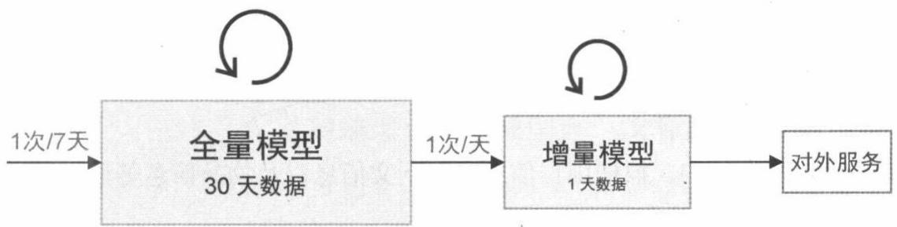  
图14-3 全量更新和增量更新结合方式之二

仔细观察会发现：假如图14-3中的全量模型每次都从零开始，则最终产出的模型最多能“见到”的数据天数为37（1次全量模型30天+7次增量模型共7天=37天），而图14-2中由于不断增量，因此最终产出的模型“见到”的数据天数不断叠加，没有上限。因此，为了结合两种方式各自的优点——1)纠偏；2)数据量不限——可以考虑采用图14-4所示的全量更新和增量更新结合的第三种方式：第一次全量模型生成后，后续的纠偏模型（7天训练1次）不再从零开始，而是在最新的增量模型基础上继续增量，这种方式结合了方式一和方式二的优点，在实际应用中的表现一般也会优于前两者。

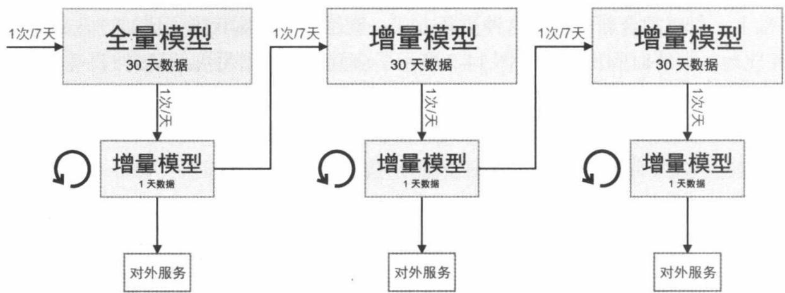  
图14-4 全量更新和增量更新结合方式之三

实际上，到此为止介绍的模型提效方式一般可以将模型的更新频率提高到几个小时一次，这已经可以满足大部分业务的需求。如果希望模型能够做到实时或者秒级更新（比如时时刻刻都有大量物品上下线等），那么离线训练的方式无法满足要求，只能考虑在线学习的模型更新方式了。

# 14.2 在线训练

在线训练，或者在线学习（online training/learning），并不需要将训练数据全都准备好，而是将训练数据以数据流的形式按照时间顺序源源不断地输入模型进行训练。一般应用在数据分布变化快的业务，比如股票价格预测、电商大促活动或者计算广告等。

# 14.2.1 数据流向

将图14-1的离线学习数据流向转化为在线学习数据流向，则得到图14-5，具体步骤如下。

(1) 用户向推荐服务发起请求。  
(2) 推荐服务生成请求ID，根据用户信息、上下文信息以及物品信息等调用特征服务得到模型所需特征。  
(3) 将特征送入在线预测服务进行预估。  
(4) 推荐服务得到模型预估服务的预测值。  
(5) 得到第 (4) 步的预测值后，以下两步是并发执行的：

1) 将第 (2) 步生成的请求 ID、第 (3) 步获取的特征以及第 (4) 步得到的预测值实时发送到在线关联服务；  
2) 将第 (2) 步生成的请求 ID 以及根据预测值排序后得到的推荐结果返回给用户。

(6) 如果用户不断翻看推荐页面，则会产生曝光事件，终端（手机、电脑等）会向服务器上报曝光埋点数据，携带本次请求ID，将此次曝光事件送入在线关联服务。

(7) 如果用户发生了点击行为，则会产生点击事件，将此次点击事件送入在线关联服务。  
(8) 在线关联服务对曝光数据和点击数据进行实时处理（数据关联、特征工程等），转化为模型可用的数据格式，得到训练数据，源源不断地输入模型。  
(9) 在训练过程中不断修改模型参数，在线服务实时获取模型参数，对外提供预测服务。

在线学习的特点是边训练边服务。

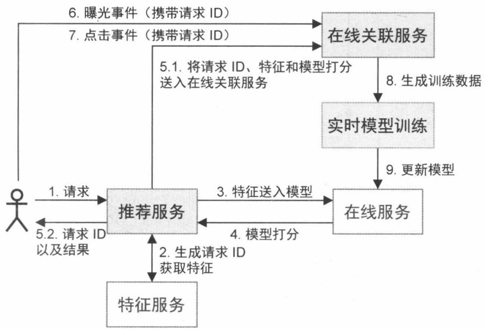  
图14-5 在线学习整体数据流向

# 前端埋点和后端埋点

实际上，离线学习和在线学习的数据整体流向可以非常相似。图14-1与图14-5稍加整合即可得到另外一种形式的离线学习数据流向：一般来说，图14-5中的第5.1步、第6步和第7步是通过将数据发送到不同的消息队列（比如Kafka等），然后在线关联服务不断地从各个消息队列中获取数据进行关联从而生成样本。如果去除在线关联服务，直接将第5.1步、第6步和第7步的数据落地（比如存储在HDFS等分布式存储中），然后通过图14-1中的离线数据任务进行数据关联从而生成样本，如图14-6所示，这也是实际应用中常见的一种离线学习训练方式。

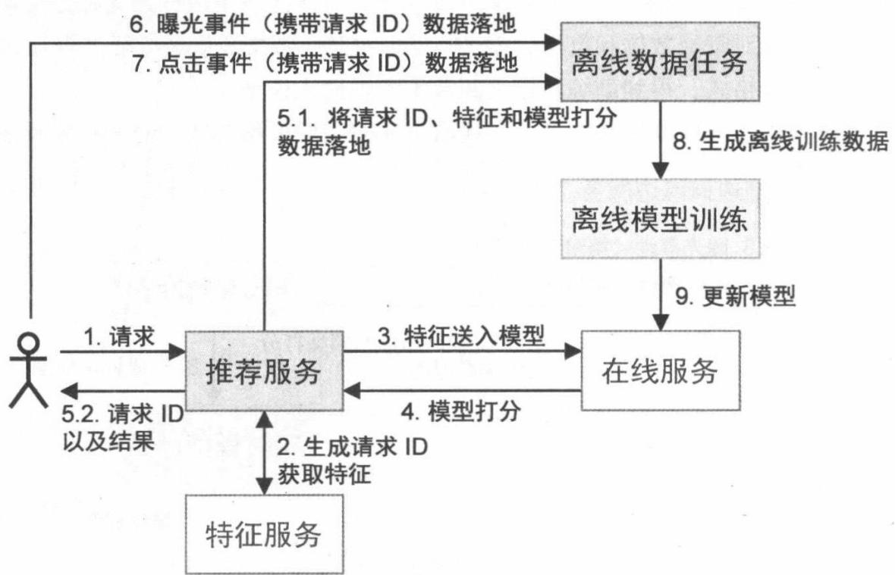  
图14-6 离线学习整体数据流向方式二

但是无论如何，离线学习和在线学习的本质不会改变，即：离线学习先训练再服务，在线学习边训练边服务。

图14-1和图14-6展示了两种数据埋点方式：前端埋点和后端埋点。

□前端埋点指的是埋点数据由前端产生，当用户在前端产生行为时，触发前端代码，收集数据。  
□后端埋点指的是埋点数据由后端产生，当用户在前端产生行为请求后端时，触发后端代码，收集数据。

具体采用哪一种埋点，需要根据自身的业务来确定，一般实际应用中两种埋点方式混合使用。

# 14.2.2 样本生成

观察图14-1与图14-5的离线学习和在线学习数据流向可以看出，两者的主要差异如下。

(1) 在线学习中请求ID必须由服务端生成（第2步）。  
(2) 在线学习中会将请求ID、特征以及预测值送入在线关联服务（第5.1步）。此时会发现，模型训练需要的特征已经有了，只差真实标签了，而真实标签是由用户行为提供的。

(3) 请求 ID 和结果会一起返回给用户（第 5.2 步）。用户产生行为后，将携带请求 ID 的行为数据送入在线关联服务（第 6 步和第 7 步），根据请求 ID 找到此标签对应的特征和预测值（第 8 步），从而可以生成一个完整的训练样本。  
(4) 在线学习的 batch size 等于 1，即每训练一条数据就更新一次模型参数（第 8 步）。

上述4点差异从本质上来说可以归结为样本生成方式不同：在线学习需要实时地生成样本，而离线学习不需要。

接下来以一个具体示例来说明图14-5所示的在线学习训练样本如何构造。

(1) 用户U打开网站/App，终端向推荐服务发起请求。  
(2) 推荐服务接收到请求，服务端生成本次请求ID为req_id_123，此请求ID全局唯一。假设用户U落入实验组E，由模型M进行服务，推荐系统为用户U召回的物品为物品1、物品2和物品3。

根据模型M的配置，服务器获取M所需特征，如表14-1和表14-2所示，为了方便演示，忽略了上下文、用户行为等特征。

表 14-1 用户特征  

<table><tr><td></td><td>用户ID</td><td>年龄</td><td>性别</td></tr><tr><td>用户U</td><td>uid_123</td><td>20</td><td>1</td></tr></table>

表 14-2 物品特征  

<table><tr><td></td><td>物品ID</td><td>品牌</td><td>价格</td></tr><tr><td>物品1</td><td>item 1</td><td>brand 1</td><td>price 1</td></tr><tr><td>物品2</td><td>item 2</td><td>brand 2</td><td>price 2</td></tr><tr><td>物品3</td><td>item 3</td><td>brand 3</td><td>price 3</td></tr></table>

(3) 将第 (2) 步中的特征输入模型 M 进行预估。  
(4) 模型 M 返回的物品打分如表 14-3 所示。

表 14-3 模型打分  

<table><tr><td></td><td>预测值</td></tr><tr><td>物品1</td><td>0.3</td></tr><tr><td>物品2</td><td>0.5</td></tr><tr><td>物品3</td><td>0.2</td></tr></table>

(5) 服务器将排序后的推荐结果物品2、物品1和物品3返回给用户，同时将第(2)步中的请求ID、特征和第(4)步中的预测值发送给在线关联服务，发送的内容格式如表14-4所示，可以看到，此时有了特征和预测值，但是没有标签。

表 14-4 请求 ID、特征和预测值  

<table><tr><td>请求ID</td><td>用户ID</td><td>年龄</td><td>性别</td><td>物品ID</td><td>品牌</td><td>价格</td><td>预测值</td></tr><tr><td>req_id_123</td><td>uid_123</td><td>20</td><td>1</td><td>item 1</td><td>brand 1</td><td>price 1</td><td>0.3</td></tr><tr><td>req_id_123</td><td>uid_123</td><td>20</td><td>1</td><td>item 2</td><td>brand 2</td><td>price 2</td><td>0.5</td></tr><tr><td>req_id_123</td><td>uid_123</td><td>20</td><td>1</td><td>item 3</td><td>brand 3</td><td>price 3</td><td>0.2</td></tr></table>

(6) 用户在终端上浏览推荐系统返回的内容，在交互过程中触发埋点，假设曝光了物品1和物品2，则埋点会将曝光事件上报服务端，具体上报格式如表14-5所示（简化，下同）。

表 14-5 曝光事件信息  

<table><tr><td>请求ID</td><td>物品ID</td><td>事件</td></tr><tr><td>req_id_123</td><td>item 1</td><td>曝光</td></tr><tr><td>req_id_123</td><td>item 2</td><td>曝光</td></tr></table>

(7) 假如用户点击了物品 1，则埋点又会将此点击事件上报服务端，具体上报格式如表 14-6 所示。

表 14-6 点击事件信息  

<table><tr><td>请求ID</td><td>物品ID</td><td>事件</td></tr><tr><td>req_id_123</td><td>item 1</td><td>点击</td></tr></table>

(8) 根据第 (6) 步和第 (7) 步的曝光点击信息，可以生成标签（是否点击），正好与第 (5) 步的特征和预测值结合起来，就可以得到一个完整的训练样本。其中请求 ID 起到了串联数据的作用：保证特征和标签可以准确无误地关联起来。  
(9) 训练样本一旦生成，将其实时输入模型进行训练，对模型参数进行实时更新，从而完成一次学习，将更新后的模型实时推送到线上对外提供预测服务。

由以上步骤可以发现，在线学习确实可以做到实时更新模型，能够很好地保证模型的时效性，及时捕捉到线上数据的变化，特别是在数据分布不断变化时（比如抢购、限时购、大促销等），它的优势更加明显。

# 14.2.3 延迟反馈

观察第(5)步、第(6)步和第(7)步，会发现一个潜在的问题：当第(5)步的特征数据生成后，

第(6)步和第(7)步的标签数据由于和用户行为有关，它们可能到达不了服务端，因此特征数据很可能会发生等不到标签（比如用户直接关闭网站/App终端，在上报过程中突然断网等）或者标签到达很迟（比如物品曝光两个小时后才产生点击行为等）的情况——这类问题统称为延迟反馈问题。

延迟反馈问题本质上是样本标签如何确定的问题，由于特征数据已经准备好，“万事俱备，只欠标签”。本节讨论两种常用的解决方案，可以作为实际应用中的参考。

# 1. 窗口拼接

当曝光数据到来时，首先根据请求ID去样本池（第5.1步）中找到对应的特征数据，此时并不是直接将该数据作为负样本参与训练，而是在一定的窗口时间 $T$ 内等待，如果在 $T$ 时间内点击数据到来，则将该样本判定为正样本，否则将其判定为负样本。 $T$ 时间后将具有特征和标签的样本输入模型进行训练。其中超参数 $T$ 的设置可以分析历史数据中曝光与点击时间差的分布，取95或者99分位点对应的时间差。

假设有 $n$ 个负样本（曝光未点击）， $m$ 个正样本（曝光且点击），采用窗口等待方式生成样本时，样本总量为 $m + n$ ，如果对负样本施加采样率为 $r$ 的下采样，则模型见到的样本数量为 $m + r \times n$ ，因此模型的预测平均概率为 $\widehat{\mathrm{CTR}} = \frac{m}{m + r \times n}$ ，而真实数据的平均概率为 $\mathrm{CTR} = \frac{m}{m + n}$ ，因此如果关心预测概率绝对值的准确性，就需要做概率校准，校准公式参考第12章。

窗口拼接适合正样本回流不会延迟太久的任务，比如点击率预估，绝大部分点击一般会在曝光后10分钟以内发生。但是还有一些预估任务正样本的回流非常慢，比如转化率预估任务，正样本定义为点击且转化（定义转化为购买），负样本定义为点击未转化，而转化经常会在点击后若干天才发生，由于窗口期过长，并不适用窗口拼接技术。当正样本回流周期很长时，一般建议采用离线学习进行训练，如果必须使用在线学习，那么可以考虑使用样本补偿技术来生成训练样本。

# 2. 样本补偿

先简单了解一下归因是什么，归因（attribute）是指将转化功劳分配给用户完成转化所经历路径中的不同广告、点击或者其他因素，比如用户购买了某个物品，那么归因需要确定该购买来自于哪次点击，同理，用户点击了某个物品，归因需要确定该点击来自于哪次曝光。本节以转化率预估为例，假设业务定义的归因最长时间跨度为10天，即用户当天购买的物品，为了找到该购买来自于哪一次点击，需要追溯过去10天的用户点击数据。以此为前提，接下来详细探讨转化周期过长时，样本补偿技术的作用。


归因可以说是在搜索推荐广告领域中占据绝对重要地位的业务逻辑，因为它关系到每个业务团队的产出（每个参与人员的价值和考核）。不同的业务对应不同的归因逻辑，作为一种商业机密，如何归因这个问题超出了本章的讨论范围。

特征数据是最早生成的（推荐结果返回给用户之前就生成了），所以该数据首先被存储在数据库中（比如 HBase 等），假设存储为 key-value 格式，key 为用户 ID + 物品 ID，value 为具体的特征，又由于归因周期为 10 天，因此可以将特征数据的过期时间设置为 10 天（即 10 天以后该数据会被作为负样本对待），存储完毕后，等待用户行为的到来：

(1) 当用户点击行为到来时，根据用户 ID + 物品 ID 查找特征数据，找到后不做任何等待，将此数据直接作为负样本输入模型参与训练；  
(2) 当用户购买行为到来时，根据用户 ID + 物品 ID 查找特征数据，找到后将此数据作为正样本输入模型参与训练。

可以发现，样本的生成不同于窗口拼接技术，此时几乎没有延迟，来一条训练一条。虽然解决了正样本反馈延迟太久的问题，但是上述处理逻辑又带来了新的问题——数据分布产生了变化：假设点击未购买（即负样本）的数据条数为 $n$ ，点击且购买（即正样本）的数据条数为 $m$ ，真实数据的转化率为 $\mathrm{cvr} = \frac{m}{m + n}$ 。而在上述处理中，第(1)步是将所有的点击（ $m + n$ 条）都当作负样本参与训练，第(2)步是将购买（ $m$ 条）作为正样本参与训练，因此样本总数为 $m + (m + n)$ 条，样本数据的转化率为 $\widetilde{\mathrm{cvr}} = \frac{m}{m + (m + n)}$ ，如果施加采样率为 $r$ 的下采样，则模型见到的样本数量为 $m + r \times (m + n)$ ，模型平均预测转化率为 $\widetilde{\mathrm{cvr}} = \frac{m}{m + r \times (m + n)}$ 。同样，如果关心预测转化率绝对值的准确性，也需要做概率校准，将此预测概率校准到真实 cvr 水平，校准公式如下：

$$
\text {c a l i b r a t e d} \widehat {\operatorname {c v r}} = \frac {r \times \widehat {\operatorname {c v r}}}{1 - \widehat {\operatorname {c v r}}} \tag {14-1}
$$

式(14-1)中， $\widehat{\mathrm{cvr}}$ 为模型预测转化率，calibrated_cvr为校准后的转化率。

# 在线学习必要性评估

在线学习虽然可以解决模型更新慢的问题，但是也应该注意到它将工程的复杂度提高了一个台阶。搭建一个成熟的在线学习系统，需要数据、后端和算法等多个团队的协作和配合。由于样本和模型在实时变化，模型的维护和调试难度增加，并且对于系统稳定性的要求特别高，最为重要的是，它带来的收益可能并没有想象中的那么大，因此在决定使用在线学习之前，一定要结合具体的业务场景，仔细评估在线学习的必要性，是否真的值得投入较多的资源。

在线学习是由离线学习慢慢演进而来的，因此在采用在线学习之前，应该至少具备了以下能力：

□具有完备的离线学习pipeline，一个好的调度系统可以完成这个任务；  
□具备完备的训练数据生成流程，数据源统一由数据团队维护，算法团队根据数据源生成训练数据；  
□特征全局统一，原始特征由数据团队统一维护，而不是每个团队都有自己的特征体系；  
□模型与后端工程解耦，也就是说模型准备上线时，即使模型做了很多特性优化（比如添加特征、修改网络结构等），服务端不修改任何代码即可完成模型的加载和对外服务。

对于实时性要求比较高的场景，可以首先判断特征实时是否可以满足业务需求，其中特征实时指的是用户画像或者物品标签实时更新，比如用户点了一个物品之后，其历史点击行为序列特征可以立刻发生变化。在实际应用中，特征实时性的优先级一般高于模型实时性，因此如果当前无法做到特征实时，也不建议使用在线学习。

# 14.3 迁移学习

迁移学习（transfer learning）是一种机器学习方法，指的是将为了解决某个问题而习得的技能应用在其他不同但是相关的问题上。现实世界中的算法团队一般会分成多个方向分工协作，除了传统的搜索广告推荐领域之外，还有自然语言处理（智能客服、自动评论审核等）和计算机视觉（以图搜图、目标检测等）方向。在实际应用中，最佳实践之一是将NLP或者CV的知识迁移到推荐算法。一般来说，NLP或者CV任务可以很容易地利用物品本身的属性（NLP会利用物品的标题、属性和描述等，CV会利用物品的图片等）生成embedding，因此本节将会简单介绍如何使用TensorFlow将生成的embedding数据加载进模型作为物品的初始embedding参与训练。


关于如何使用NLP或者CV算法生成物品embedding，不在本书的讨论范围内。推荐算法使用已有的物品embedding时，通常会有两种选择：1)将物品embedding“冷冻”（freeze）住，也就是不参与训练，类似于常数，embedding里的元素不会做任何修改，仅仅参与前向传播，不会做梯度更新；2)将物品embedding仅作为初始化模型参数使用，后续与其他参数一样参与梯度更新。本节采用第2)种方式。

回顾物品 embedding 的查询步骤，如图 14-7 所示。

(1) 随机初始化形状为 $V \times D$ 的物品 embedding 矩阵 $M$ ，其中 $V$ 是最大物品个数， $D$ 是 embedding 维度。

(2) 物品ID先经过散列操作，模为 $V$ ，得到散列ID。  
(3) 通过散列ID查询矩阵 $M$ 得到物品 embedding 向量 $\pmb{\nu}$ 。  
(4) 使用 $\nu$ 参与前向传播、后向传播等模型训练常规流程。

  
图14-7 随机初始化的物品 embedding

当使用第三方提供的物品 embedding 时，假设数据格式如表 14-7 所示，ids 与 embeddings 一一对应，比如 ids 为 ["135", "246"]，embeddings 为 [[0.1, 0.2, 0.3], [0.15, 0.25, 0.35]] 则表示 id 为 "135" 的物品 embedding 是 [0.1, 0.2, 0.3]，id 为 "246" 的物品 embedding 是 [0.15, 0.25, 0.35]，以此类推。

表 14-7 第三方物品 embedding 数据格式  

<table><tr><td>字段</td><td>格式</td><td>说明</td></tr><tr><td>ids</td><td>字符串数组</td><td>存放所有物品ID数据</td></tr><tr><td>embeddings</td><td>二维浮点型数组</td><td>存放所有物品embedding数据</td></tr></table>

假设表14-7中的embeddings形状为 $V_{2} \times D_{2}$ ，则将该份数据加载到训练任务后，物品embedding的查询步骤如图14-8所示：

(1) 初始化形状为 $V_{2} \times D_{2}$ 的物品 embedding 矩阵 $M$ ，矩阵初始化参数使用表 14-7 中的 embedding 数据；  
(2) 物品ID先查询表14-7中的ids，得到物品ID所在位置的索引index；  
(3) 通过 index 查询矩阵 $M$ 得到物品 embedding 向量 $\nu$ ；  
(4) 使用 $\nu$ 参与前向传播、后向传播等模型训练常规流程。

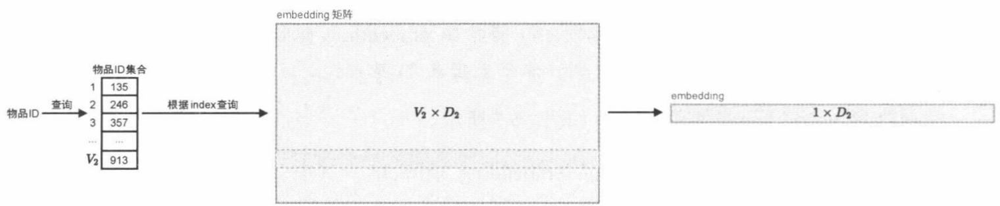  
图14-8 第三方物品 embedding

图14-7和图14-8展示的物品embedding查询步骤对应的代码片段如下所示，假设第三方embedding矩阵存储为NumPy数据格式：

```python
/*-coding: utf-8 */
import numpy as np
import tensorflow as tf
from tensorflow.python.opns import lookup_opns
```
```
numpy: 1.19.3
tf: 1.15.0
```
features = ...
item_ids = features['item_ids']
# 查询物品 embedding方式一：随机初始化
V = 10000
D = 128
# 初始化物品 embedding矩阵
embedding_matrix = tf.get_variable(name='embedding_matrix', dtype=tf.float32, shape=(V, D))
# 物品ID的散列值
hash_ids = tf.string.to_hash_buckets(item_ids, num_buckets=V)
# 查询物品 embedding
item_embeddingings = tf(nn.Embedding.lookup(embedding_matrix, hash_ids, name='item_embeddingings'))
...
# 查询物品 embedding方式二：使用第三方 embedding，文件名 item_embeddinging.npy，存储dict数据，
# key分别为ids和embeddings
pretrain_embeddingings = np.load('item_embeddinging.npy', allow_pickle=True).item()
# 物品ID集合
ids = lookup_opns.index_table_fromtensor(pretrain_embeddingings['ids'],
num_oov_buckets=0,
default_value=0,
tokenizer_spec=lookup ops.FastHashSpec,
dtype=tf.string,
name='ids')
# 物品 embedding矩阵
embedding_matrix_v2 = tf.get_variable(name='embedding_matrix_v2',
dtype=tf.float32,
tokenizer_spec=pretrain_embeddingings['embeddings']) 
```

# 14.4 总结

□ 数据量过大导致训练时间过长时，可以考虑用增量更新的方式来解决，一般有离线训练和在线训练两种方式。  
□ 离线训练时，可以采用全量更新和增量更新交替的方式，不仅可以缩短模型的训练时间，也可以防止模型跑偏，实际应用中使用得也比较多。  
□当要求模型的更新频率达到秒级或者分钟级时，就要采用在线训练的方式了。在线训练的核心问题在于样本生成，一般会采用窗口拼接或者样本补偿的方式，前者适用于正样本能够很快回流的场景，后者则适用于回流较慢的场景。在线训练已经有一些优秀的开源框架①和一些优秀的论文②③④可以为实际生产提供参考。  
□迁移学习作为一种将已有知识应用在其他领域的技术，已经成为推荐算法中的最佳实践了。

# 第15章

# 分布式 TensorFlow

伴随着移动互联网的飞速发展，几乎每个人每天都会在各种终端（比如手机、平板电脑、PC等）上产生大量数据。急剧增长的数据量会对算法工程师的工作产生多大的影响呢？下面做一个简单的模型训练时长估算。

假设一款流量较大的App日活（每日活跃用户）为5000万，平均每人产生20条曝光数据，即单日整体曝光数据量为10亿，训练时负样本采样率为0.1，离线训练使用的数据周期为30天，经过简单的计算可知，最终的训练数据量约为30亿。在单台64核256GB内存的机器（不考虑GPU）上训练模型，batch size设置为512，如果每秒可以训练20个batch，训练2轮需要多久呢？6.8天！

换言之，大概需要一周的时间，实在太久了，有没有办法在不减少数据量的情况下大幅缩短训练时间并且不影响模型的预测性能呢？

# 15.1 分布式的理由

采用分布式最主要的两个原因：模型太大和数据太多。

首先是模型太大，随着模型结构越来越复杂，参数的数量很容易达到亿级，产生一个几十吉兆/上百吉兆的模型变得再正常不过，可是训练模型的服务器内存是有限的，当模型的容量已经大到单台服务器容纳不下时，必须考虑采用分布式训练。

其次是数据太多，模型需要很长时间才能训练完，这对于数据分布不断变化的推荐场景来说，稍显难以接受，同时对模型调参极不友好——一个高质量模型的诞生，需要经过若干次离线实验（调参），海量数据会导致在单机环境做离线实验的时间成本过高，同时也对计算资源提出了较高的要求。因此，当数据量过大时，为了降低试错成本（时间成本、资源成本、人力成本等），提高建模效率，分布式训练得到了越来越多的关注。


读者可能会有疑问，海量数据导致模型更新频率低的问题不是通过在线学习解决吗？其实在线学习只是一种模型训练方式，我们可以在单机环境做在线学习，也可以在分布式环境做，它本身与分布式并不是互斥的关系，相反，两者结合会更好地解决模型更新慢的问题。

对应模型大和数据量大这两种需要分布式的情形，就诞生了两种并行方式——模型并行和数据并行。

# 15.2 并行方式

在深入了解并行方式之前，先熟悉一下分布式环境。

首先，数据最好存储在分布式文件系统中，比如Hadoop生态圈HDFS，亚马逊云存储服务S3等，这些文件系统天生就是用来存储海量数据的，并且它们的备份容灾做得非常好，几乎不会丢失数据（当然，在极端情况下，没有任何文件系统是绝对可靠的），因此在实际的工作过程中，所有数据一般存储在分布式文件系统而不是单个或者若干个彼此独立的服务器上。

其次，对于模型训练来说，既然涉及分布式训练，那么就会有多台训练机（硬件设备，CPU或者GPU）共同参与训练。如图15-1所示，多台训练机处在同一个集群中，彼此之间可以通信，同时它们也可以“看到”同一份训练数据（存储在分布式文件系统中的数据对所有机器可见），那么它们该如何合作呢？当模型太大时该怎么办，数据量太多时又该怎么办？


由于大规模推荐系统面对海量数据，实际生产中的分布式环境多为多机环境，因此本章提到的分布式环境均为多机环境。还有其他的分布式环境，比如单机多GPU等，这里就不过多介绍了。

  
图15-1 多台训练机

为了方便演示，图15-2展示了一个简单的模型结构，含有3层隐藏层。接下来就基于这个结构来说明模型并行和数据并行。

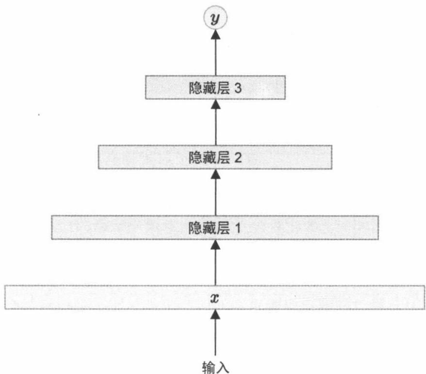  
图15-2 简单的模型结构

# 15.2.1 模型并行

模型并行，解决的是模型太大的问题：其做法是将一个完整的模型进行分割，放置在多台训练机上。假设图15-2中的模型参数过多使得模型容量大到单台训练机无法存放，那么模型并行的处理方式是将其进行切割，切割后每台训练机只保存模型的一部分结构，这样便不会出现内存不足的问题，从而模型可以正常训练。将图15-2所示模型分割后会得到图15-3，模型中的每一层都分散在不同的训练机上，训练机1接收数据输入，将隐藏层1的结果传给训练机2，训练机2再将隐藏层2的输出传给训练机3，以此类推，最终到达训练机4，训练机4得到模型的输出 $y$ 完成了一次前向传播。紧接着训练机4计算损失，开始进行反向传播计算各层参数的梯度，首先计算训练机3上的模型参数梯度，然后计算训练机2上的模型参数梯度，最后计算训练机1上的模型参数梯度，所有参数更新后，完成了一次后向传播——模型的一次学习过程结束。

然而，在现实世界中，模型并行应用得特别特别少，除非模型实在是太大了，单台训练机确实容不下时才不得已采用它，大多数时候不会采用这种并行方式。究其原因，首先，在现阶段的工业中，一般的模型并没有大到单台训练机容纳不下，毕竟512GB或者1TB内存基本上可以满足绝大部分的要求；其次，不管是前向传播还是后向传播，数据都是在不同的节点之间传输，网络的开销会极大地降低模型的训练速度；最后，模型并行比较难调试，如果想得到一个质量不错

的模型，存在很大的挑战，不利于实际工作中的快速迭代。

  
图15-3 模型并行

以上就是本书关于模型并行的全部内容，由于模型并行在实际应用中采用得并不多，因此后续不会再讨论这方面的内容。

# 15.2.2 数据并行

数据并行，解决的是数据量太大的问题：其做法是每台训练机上都会持有完整的模型，但是每台训练机都会接收不同的数据。图15-2的模型采用数据并行后，会产生图15-4所示的训练方式，可以看到，每台训练机上都保留完整的模型，且结构完全一样，不同之处在于每台训练机接收的数据，每台训练机训练属于自己的那部分数据，最后所有训练机的计算结果进行合并。按照图15-4中的设置，理论上训练相同数量的数据，它的用时仅为单台训练机的1/4，随着训练机的数量增长，用时会更少。


理论上训练时间会随着训练机的数量增长而成比例地减少，但是实际上也不大可能一直减少：随着训练机的数量越来越多，整个分布式系统的网络开销也越来越大，同时系统的稳定性也开始降低，而且不同训练机的性能也不尽相同，模型的训练速度经常会受制于性能较差的训练机。

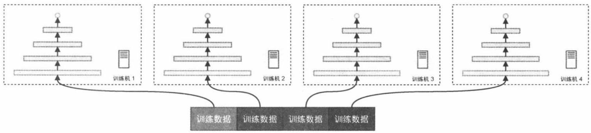  
图15-4 数据并行

数据并行虽然好，但是也要注意到以下两个问题

虽然每台训练机上都有一个完整的模型结构，但是它们本质上都只是同一个模型的副本而已，每台训练机上的模型参数应该完全一样才合理。因此在数据并行中，需要考虑模型参数的共享问题，也就是说需要有一种机制，能够让所有训练机上的模型参数完全一样——这是参数共享问题。  
□由于不同的训练机训练不同的数据，因此有可能出现相同的特征出现在不同的训练机上，比如年龄段_青少年这个特征既可能出现在训练机1上，又可能出现在训练机2上。由于不同的训练机各训各的，互不干扰，因此会导致相同的特征出现不同的梯度，这时又要如何更新该特征对应的参数权重呢——这是参数更新问题。

以上两个问题是数据并行的核心所在，也是几乎所有数据并行分布式训练框架必须解决的问题。


本章后续提到的分布式，如果没有特殊说明，均指数据并行分布式。

# 15.3 参数共享与更新

首先需要了解到，TensorFlow 以类似 $<\mathrm{K}, \mathrm{V}>$ 键值对的方式来存储特征对应的参数权重，其中 K 是特征 ID，V 是该特征对应的权重，比如 <年龄段_青少年，0.01> 的意思是：年龄段_青少年这个特征的权重是 0.01。因此为了实现所有训练机上的模型权重是同一个模型的副本，一种可行的方案（当然，还有其他可行的方案，这里为了便于理解，暂时只讨论一种）是：使用一组特定的服务器，只用来存放模型参数权重，所有训练机上的模型如果想使用特征的参数权重，需要请求服务器，由服务器将权重返回给训练机。训练机一次训练结束后，将特征对应的参数梯度回传给服务器，由服务器更新该参数，整个流程如图 15-5 所示，图中使用 3 台服务器共同维护模型的参数，模型的所有参数（理想情况下）均匀分布在每台服务器上，3 台参数服务器本身也是分布式架构，对外暴露的是一个整体，因此从训练机的视角来看，参数服务器只有 1 台。

  
图15-5 参数共享

图15-5很好地解决了参数共享的问题，通过这种架构，所有训练机都从同一个源头获取参数，从而实现了参数在多台训练机间的共享。接下来还需要解决参数更新的问题。注意到图15-5中的第2步：训练机将梯度发送给参数服务器，拿到参数的梯度后，参数服务器按照式(15-1)更新参数，其中 $\theta_{t - 1}$ 表示参数 $\theta$ 在 $t - 1$ 时刻的值， $\nabla \theta_{t - 1}$ 表示损失在 $t - 1$ 时刻对参数 $\theta$ 的导数， $\alpha$ 表示学习率。

使用单台训练机训练时，式(15-1)不会产生任何问题。使用多台训练机时， $\theta_{t - 1}$ 由于是保存在参数服务器上的，所以可以理解为只有1份，但是 $\nabla \theta_{t - 1}$ 是由训练机发送给参数服务器的，它可能会有多个值，该怎么处理这种情况呢？把多个 $\nabla \theta_{t - 1}$ 求平均再使用式(15-1)，还是有其他更好的做法？为了解决更新参数时有多个梯度的情况，产生了两种参数更新方式：同步更新和异步更新。

$$
\theta_ {t} = \theta_ {t - 1} - \alpha \nabla \theta_ {t - 1} \tag {15-1}
$$

# 15.3.1 同步更新

假设训练机的台数为 $N$ ，batch size 设置为 $B$ 。 $N$ 台训练机同时训练，数据共 $N \times B$ 条，采用同步训练时，参数服务器会等待 $N \times B$ 条数据全都训练完，才会更新参数。图 15-6 展示了同步更新的逻辑：首先各训练机在一次训练完毕后向参数服务器发送计算后的梯度，参数服务器只有接收到 $N$ 份梯度后才会更新参数，更新完毕后，所有训练机又基于最新的参数进行训练，循环往复。


TensorFlow 可以设置一个小于 $N$ 的数字 $M$ ，当参数服务器接收到 $M$ 份梯度后也可以开始更新参数。

  
图15-6 参数同步更新

再回到同一个参数对应多个梯度的问题，采用同步更新时，先对多个梯度求平均，再使用均值更新参数，比如年龄段_青少年这个特征对应的参数权重是0.01，训练机1、训练机2、训练机3向参数服务器发送的梯度分别为0.01、0.02、0.03，学习率是0.01，那么参数服务器先对梯度进行平均，得到均值0.02，再对参数进行更新，得到 $0.01 - 0.01 \times 0.02 = 0.0098$ 。

可以看到，采用这种更新方式的分布式训练，其实与单台训练机上batch size设置为 $N \times B$ 理论上是一样的。但是从图15-6中也很容易发现，同步更新完美落入木桶理论：即使参数服务器已经接收到 $N - 1$ 份梯度，依然要等最后一份梯度，也就是说分，布式训练速度极大地受制于性能较差的训练机。因此采用同步更新时，集群中的训练机性能最好是比较均衡而且网络传输性能不能有过大的差距，尽可能地避免木桶效应，所以在实际应用中，同步更新适用于训练机个数不多，且彼此之间配置相当的分布式环境。

当训练集群中既有CPU又有GPU，数量可观且型号各异，配置有高有低时，不太适合使用同步更新进行分布式训练，这时就需要考虑采用另外一种更新方式——异步更新。

# 15.3.2 异步更新

与同步更新一样，训练机从参数服务器获取特征对应的参数权重，经前向传播、反向传播后得到每个参数的梯度，再将梯度返回给参数服务器。与同步更新不一样的是，参数服务器得到梯度后，并不等待其他训练机的梯度，而是直接更新参数，如图15-7所示。采用异步更新后，训练过程不再受到木桶效应的影响，因此训练速度比同步更新要快，尤其是在训练机的性能有较大差异时，这一优势会体现得更加明显。

  
图15-7 参数异步更新

异步更新虽然提升了训练速度，但也带来了一个新的问题——过期梯度问题（stale gradient problem）。以图15-7为例来解释这个问题的由来。

(1) 假设参数为 $\theta$ ，训练机 1 和训练机 $N$ 一开始从参数服务器拉取 $\theta$ 的权重均为 $\theta_0$ 。  
(2) 由于训练机1的性能比较高，所以它先训练完一个batch的数据，将梯度 $\nabla \theta_0$ 发送给参数服务器，参数服务器接收到梯度后，更新 $\theta_0$ ，得到 $\theta_1$ ；如果训练机1的性能远高于训练机 $N$ ，那么参数服务器不断接收到训练机1发送的梯度，并更新参数，假定更新到了 $\theta_7$ 。  
(3) 此时训练机 $N$ 训练完了第一个 batch, 将梯度 $\nabla \theta_0$ (因为训练机 $N$ 上参数 $\theta$ 的值依然为 $\theta_0$ ) 发送给参数服务器, 参数服务器更新参数——这就出现了过期梯度问题: 此时参数服务器上已经是 $\theta_7$ 了, 然而接收到的梯度还是对 $\theta_0$ 求导得到的。

那么是不是就说明异步更新在实际生产中应用得比较少呢？事实并非如此。在推荐系统中，由于海量数据的存在，异步更新一般是分布式训练的首选，最重要的是异步更新在很多业务实验中的线上表现并不比同步更新差。虽然过期梯度会导致训练过程中loss不稳定，难以找到最优解等问题，但是现实世界中的数据本身就充满了各式各样的缺陷和噪声，深度学习模型又有大量人为设置的超参数，而且高维空间中的梯度下降也无法保证一定能找到最优解，因此过期梯度也不像前面说的那样“有害”。

综上所述，关于异步更新和同步更新，没有孰优孰劣的定论，适合自身业务场景的更新方式才是最好的更新方式：

□同步更新适合小规模集群、训练机性能均衡的场景；  
□ 异步更新适合大规模集群或者训练机性能参差不齐的场景，它几乎是海量数据下大规模推荐系统的唯一选择。

# 15.4 分布式训练架构

分布式训练的参数更新方式到此就讲述完毕了，但是关于参数共享的问题，只是简单介绍了参数服务器这种解决方案，也就是ParameterServer架构。实际上，除此之外还有其他解决方案，本节会将重点放在两个流行的架构上：ParameterServer架构和RingAll Reduce架构。

# 15.4.1 Parameter Server 架构

Parameter Server<sup>①</sup>的整体架构如图15-8所示，这种架构将计算资源分成了两种类型——server和worker。server是参数服务器，负责存储和更新模型参数，可以简单理解为分布式键值数据库：键是参数，值是参数权重。一般有多台server共同组成参数服务器，以防出现单点故障。worker是训练机，负责训练模型。

  
图15-8 ParameterServer架构

在 Parameter Server 架构下，模型“学习”的步骤如下，参数更新过程如图 15-9 所示：

(1) worker 读取数据，从 server 拉取参数；  
(2) 有了数据和参数，worker 计算 loss，再计算参数的梯度，最后将梯度回传给 server；  
(3) server 拿到梯度后，更新参数，完成一轮训练。

算法1：分布式次梯度下降   
Task Scheduler:  
1: issue LoadData() to all workers  
2: for iteration $t = 0, \ldots, T$ do  
3: issue WORKERITERATE(t) to all workers.  
4: end for  
Worker $r = 1, \ldots, m$ :  
1: function LOADDATA()  
2: load a part of training data $\{y_{i_k}, x_{i_k}\}_{k=1}^{n_r}$ 3: pull the working set $w_r^{(0)}$ from servers  
4: end function  
5: function WORKERITERATE(t)  
6: gradient $g_r^{(t)} \gets \sum_{k=1}^{n_r} \partial \ell(x_{i_k}, y_{i_k}, w_r^{(t)})$ 7: push $g_r^{(t)}$ to servers  
8: pull $w_r^{(t+1)}$ from servers  
9: end function  
Servers:  
1: function SERVERITERATE(t)  
2: aggregate $g(t) \gets \sum_{r=1}^{m} g_r^{(t)}$ 3: $w^{(t+1)} \gets w(t) - \eta(g(t) + \partial \Omega(w(t))$ 4: end function

图15-9 ParameterServer架构算法更新逻辑

同时要注意一个很重要的点：由于 Parameter Server 是数据并行的架构，每台 worker 只能看到部分数据，因此训练时 worker 拉取的模型参数并不是全量模型参数，而只是该 worker 能看到的训练数据对应的参数，这就大大减少了网络开销，特别是当特征非常稀疏时（尤其是推荐系统的数据），这种网络开销减少得更为明显。而且也不用再担心模型太大时 worker 容不下的问题，因为每台 worker 并不会持有全量参数，只会保留很少一部分参数。图 15-10 展示的是单台 worker 上的参数占全量参数的比例与 worker 总数的关系，可见当 worker 数量为 100 时，每台 worker 持有的参数数量不超过全量参数的 1/10，这对于大模型来说已经非常友好了。

  
图15-10 单台worker上的参数量与worker总数的关系

在 Parameter Server 架构中，worker 只和 server 通信，worker 与 worker 之间没有任何通信，因此 server 容易成为整个系统的瓶颈（比如 1 台 server 和多台 worker，网络开销呈线性增长），

而且 server 和 worker 的数量比例也不太好确定——接下来的 Ring All Reduce 架构则没有这些问题。

# 15.4.2 Ring All Reduce 架构

Ring All Reduce 架构中所有节点都是 worker，它们不仅需要参与模型梯度计算，也负责参数更新，而参数共享是通过 worker 与 worker 之间的通信来实现的。图 15-11 就是 Ring All Reduce 的一个例子，所有 worker 形成一条环（ring），每台 worker 既是数据的发送者，也是数据的接收者。这是它与 Parameter Server 架构最大的不同：Ring All Reduce 架构通过这种去中心化的设计思想来提高模型的训练效率。

既然没有server了，那么如何保证所有worker上的参数是一样的呢？以图15-11为例，某一次训

练后，worker1上产生的梯度为 $g_{1}$ ，worker2上产生的梯度为 $g_{2}$ ，worker3上产生的梯度为 $g_{3}$ ，想令3个worker的参数最终完全一样，就需要让所有worker都能拿到全部的梯度数据，即 $g_{1}$ 、 $g_{2}$ 和 $g_{3}$ ——这正是Ring All Reduce算法需要完成的工作。

为了方便说明该算法的逻辑，图15-12左图是某一个时刻所有worker上的梯度，右图是经过Ring All Reduce算法得到的最终结果——所有worker拿到全部的梯度数据。为了在低时间复杂度下实现该功能，Ring All Reduce算法需要经历两个阶段——Scatter-Reduce和All-Gather。

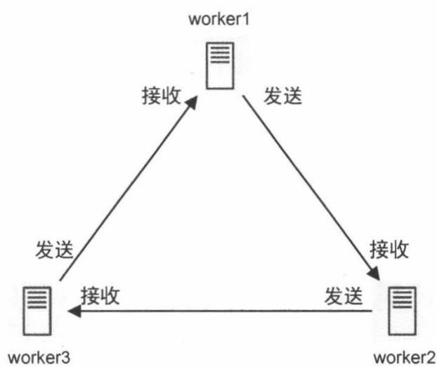  
图15-11 Ring All Reduce架构示例

  
图15-12 某一时刻所有worker上的初始梯度以及最终梯度


Ring All Reduce 架构中，每台 worker 会将梯度数据划分为 $N$ 等份， $N$ 为 worker 台数，因此演示时，每个 worker 上有 $N$ 个数字，这里的 $N$ 等于 3。

# 1. Scatter-Reduce 阶段

首先进入 Scatter-Reduce 阶段（这里的 Reduce 是 sum reduce），如图 15-13 所示，第一次迭代后的结果如右图所示。

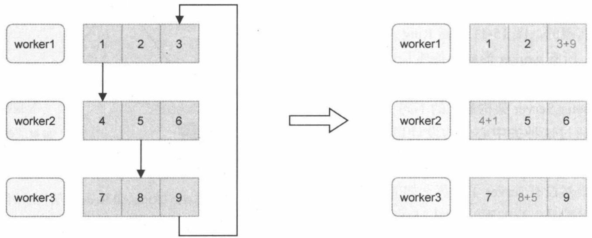  
图15-13 Scatter-Reduce第一次迭代

紧接着开始第二次迭代，如图15-14所示，迭代完成后，每台worker上有 $1 / N$ 份完整的数据（红色标记的部分）。接下来进入All-Gather阶段。

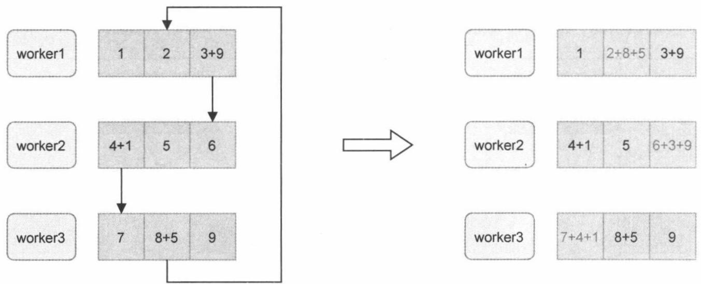  
图15-14 Scatter-Reduce第二次迭代（另见彩插）

# 2. All-Gather 阶段

在这个阶段，不再需要 Reduce 操作，每台 worker 之间参数循环一次，第一次迭代如图 15-15 所示。

  
图15-15 All-Gather第一次迭代

再进行第二次迭代，如图15-16所示，此时所有worker都拥有了全部数据，该阶段完成。

  
图15-16 All-Gather第二次迭代

# 3.通信损耗

假设模型参数大小为 $K$ ，worker台数为 $N$ ，由于Scatter-Reduce和All-Gather需要的迭代次数都是 $N - 1$ ，且每次迭代时传输的数据都是 $\frac{K}{N}$ ，因此整体通信传输的数据为：

$$
\begin{array}{l} D _ {\text {t o t a l}} = D _ {\text {S c a t t e r - R e d u c e}} + D _ {\text {A l l - G a t h e r}} \\ = (N - 1) \times \frac {K}{N} + (N - 1) \times \frac {K}{N} \tag {15-2} \\ = 2 (N - 1) \frac {K}{N} \\ \approx 2 K \text {(若} N > > 1) \\ \end{array}
$$

由式(15-2)可以看出，整体传输数据与worker台数 $N$ 无关——这是Ring All Reduce相对于Parameter Server最具优势的地方。

# Parameter Server 与 Ring All Reduce

该如何确定使用哪一种分布式架构呢？一般情况下，如果 worker 性能很高（比如高性能 GPU）且数量不多，优先选择 Ring All Reduce 架构；如果 worker 的性能一般且数量众多，优先考虑 Parameter Server 架构。如果模型特征高度稀疏或者模型比较大，同样优先考虑 Parameter Server 架构。因此在大规模推荐系统中，一般选择 Parameter Server 架构异步更新进行分布式训练。

# 15.5 单机代码移植

软件环境：

Spark 2.4.0   
□ Tensorflow 1.15   
Python 3.6.0

本节采用数据并行、Parameter Server 架构、异步更新的方式将第 9 章中的单机 DIN 模型训练代码移植为分布式训练代码。依然从数据准备、模型训练、模型导出这三步来逐个说明哪里需要改动，哪里不需要改动，以及改动时需要注意的地方。

# 15.5.1 数据准备

# 1. 数据生成

数据依然通过Spark生成TFRecord文件保存在分布式文件系统（HDFS、S3等）中，这部分代码没有任何改动。

# 2. 数据读取

既然是数据并行，那么就需要让每个worker节点看到不同的数据，加快训练速度，比如总共100条数据，10个worker节点，平均每个节点可以分10条数据，训练速度理论上可以提高10倍，对应的代码就要稍作修改。

```python
# -- coding: utf-8 --  
```
```
文件名：reader.py
```
import os
import tensorflow as tf # 1.15
from tensorflow compat.v1.data import experimental
class Reader:
    def __init__(self, num_parallel Calls=None):
        self._num_parallel Calls = num_parallel Calls or os.cpu_count()
# 1. 定义每个特征的格式和类型
@staticmethod
def get_example fmt():
    example fmt = dict()
    example fmt['label'] = tf.FixedLenFeature,[], tf.int64)
    example fmt['user_id'] = tf.FixedLenFeature,[], tf.string)
    example fmt['age'] = tf.FixedLenFeature,[], tf.int64)
    example fmt['gender'] = tf.FixedLenFeature,[], tf.string)
    example fmt['device'] = tf.FixedLenFeature,[], tf.string)
    example fmt['item_id'] = tf.FixedLenFeature,[], tf.string)
# 此特征长度不固定
example fmt[' clicks'] = tf.VarLenFeature(tf.string) 
```

# # 2. 定义解析函数

```python
def parse_fn(self, example):
    example fmt = self.get_example fmt()
    parsed = tf.parse_single_example(example, example fmt)
    # VarLenFeature 解析的特征是稀疏的，需要转换成密集的以便于操作
    parsed['clicks'] = tfsparse.to_dense(parsed['clicks'], '0')
    label = parsed.pop('label')
    features = parsed
    return features, label
# pad 返回的数据格式与形状必须与 parse_fn 的返回值完全一致
def padded Shapes_and(padding_values(self):
    example fmt = self.get_example fmt() 
```

padded Shapes $=$ {}   
padding_values $= \{\}$ for f_name，f_fmt in example_fmt.items(）: if 'label' $= =$ f_name: continue ifisinstance(f_fmt，tf.FixedLenFeature): padded_shapes[f_name] $= []$ elif isinstance(f_fmt，tf.VarLenFeature): padded_shapes[f_name] $= [\mathrm{None}]$ else: raise NotImplementedError('feature{}feature type error.'.format(f_name)) iff_fmt.dtype $= =$ tf.string: value $= 10$ eliff_fmt.dtype $= =$ tf.int64: value $= 0$ eliff_fmt.dtype $= =$ tf.float32: value $= 0.0$ else: raise NotImplementedError('feature{}data type error.'.format(f_name)) padding_values[f_name] $= \mathrm{tf}$ .constant(value，dtype $= \mathrm{f\_fmt.dtype}$

```python
# parse_fn 返回的是元组结构，这里也必须是元组结构
padded Shapes = (padded Shapes,[])
padding_values = (padding_values, tf.constant(0, tf.int64))
return padded Shapes, padding_values
```

# 3. 定义读数据函数

def input_fn(self, mode, flags): num_workers, worker_index = flags.num_workers, flagsworker_index pattern, epochs, batch_size = flags(pattern, flags.num_epochs, flags.batch_size padded_shapes, padding_values = self.padded_shapes_and-padding_values() files = tf.data.Dataset.list_files(pattern) if num_workers and num_workers > 0 and worker_index > -1: # 1 files = files.shard(num_workers, worker_index) data_set = files.apply(experimental(parallel_interleave( tf.data.TFRecordDataset, cycle_length=8, sloppy=True ) ) data_set = data_set.apply(experimentalignore Errors())) data_set = data_set.map(map_func=self.parse_fn, num_parall Calls $\equiv$ self._num_parall Calls) if mode $= =$ 'train': data_set = data_setshuffle(buffer_size=10000) data_set = data_setrepeat(epochs)

```txt
data_set = data_set.padded_batch(batch_size,  
padded_shape= padded_shape,  
padding_values=padding_values)  
data_set = data_setCRET(buffer_size=1)  
return data_set 
```

相比单机环境代码，注释#1处是唯一需要修改的地方。在分布式环境中，TensorFlow需要知道一共有多少个worker节点（num_workers），以及当前worker节点的编号（0到num_workers-1），shard函数会自动将数据均分。

# 15.5.2 模型搭建

建模的代码可以不做任何修改，但是有时需要考虑一下：如果物品 embedding 矩阵过大，单个 ps 存放不下或者负载过重时，应该怎么办？此时需要对这个变量进行分片，将其均匀分在多个 ps 上，达到负载均衡。实现起来很简单，只要在创建变量时指定一下 partitioner 即可，如下所示：

ps_num就是ps的个数  
embedding_matrix $=$ tf.get_variable(name $\equiv$ 'embedding_matrix', shape=(bucket_size,embedding_size), initializer=tf.initializers.glorot.uniform(), partitioner=tf.fixed_size_partitioner(num_shards=ps_num)

# 15.5.3 模型训练

程序入口代码需要修改，Tensorflow 需要知道分布式集群的拓扑结构——ps 的机器是哪些，worker 的机器是哪些，等等。

```python
# -- coding: utf-8 --  
import os  
import json  
from lib.data import reader  
from lib import flags as_flags  
from lib import model_fn  
from tensorflow compat.v1 import app  
from tensorflow compat.v1 import logging  
from tensorflow compat.v1 import ConfigProto  
fromtensorflow compat.v1 import estimator  
fromtensorflow compat.v1>distribute import experimental  
def tf_config(_flags):  
    tf_config = dict()  
    ps = ['localhost:2220']  
    chief = ['localhost:2221'] 
```

```python
worker = ['localhost:2222']
evaluator = ['localhost:2223']
cluster = {
'ps': ps,
'chief': chief,
'worker': worker,
'evaluator': evaluator
}
task = {
'type': _flags.type,
'index': _flags.index
}
tf_config['cluster'] = cluster
tf_config['task'] = task
if __flags.type == 'chief':
__flags._dict_[worker_index'] = 0
elif __flags.type == 'worker':
__flags._dict_[worker_index'] = 1
__flags._dict_[num_workers] = len(worker) + len(chief)
__flags._dict_[device_filters'] = ["/job:ps", f"/job:{_flags.type}/task:{_flags.index}"]
return tf_config
def _run_config Flags:
cpu = os.cpu_count()
session_config = ConfigProto(
device_count={'GPU': flagsgpu or 0,
'CPU': flags.cpu or cpu},
inter_op_parallelism Threads=flags.inter_op_parallelism Threads or cpu // 2,
intra_op_parallelism Threads=flags.intra_op_parallelism threads or cpu // 2,
allowsoft-placement=True)
strategy = experimental.ParametersServerStrategy() # 3
return {
'save_summary_steps': int(flags.save_summary_steps),
'save_checkpoints_steps': int(flags.save_checkpoints_steps),
'keep_checkpoint_max': int(flags.wait_forcing),
'log_step_count_steps': int(flags.log_step_count_steps),
'session_config': session_config,
'train_distribute': strategy,
'eval_distribute': strategy
} 
```

```python
def main(args):
    flags = argv[0]
    tf_config = _tf_config(flags) # 1
    #分布式需要TF_CONFIG环境变量
    os.environ['TF_CONFIG'] = json.dumps(tf_config) # 2
    run_config = __build_run_config(flags)
    __params = {}
    __params.update(flags.__dict__)

    model = estimator.Estimator(
        model_fn=model_fn,
        model_dir=str(flags.checkpoint_dir),
        config=run_config,
        params=__
    )
    train_spec = estimator.TrainSpec(input_fn=lambda: reader_input_fn(mode='train', flags=flags),
                          max_steps=1000) # 4
    eval_spec = estimator.EvalSpec(
        input_fn=lambda: reader_input_fn(mode='eval', flags=flags),
        steps=int(flags.eval_steps),
        throttle(secs=int(flags.eval throttle(secs))
    ) estimator.train_and Evaluate(model, train_spec, eval_spec)
    if __name__ == '__main__':
        logging.setverbosity(logging.FATAL)
        app.run(main=main, argv=['flags']) 
```

注释说明如下：

□#1、#2处生成分布式网络拓扑，告知每个节点的角色，并写入系统环境变量TF_CONFIG，TensorFlow内部会读取该环境变量获得网络拓扑结构；  
□#3处将分布式策略告知TensorFlow，这里选择ParameterServer架构；  
□#4处告知Tensorflow最多训练max_steps步，这个参数在分布式训练中必不可少。

程序启动命令如下：

nohup python main.py --type=ps --index $= 0$ > ps.log 2>&1 &   
nohup python main.py --type $\equiv$ chief --index $= 0$ > chief.log 2>&1 &   
nohup python main.py --type $\equiv$ worker --index $= 0$ > worker.log 2>&1 &   
nohup python main.py --type $\equiv$ evaluator --index $= 0$ > evaluator.log 2>&1 &

这里启动了4个进程模拟分布式环境，占用了4个端口，扮演了4种角色，分别为ps、worker、chief和evaluator①，各自的index都是从0开始的。


为了演示方便，我们从本地启动多个进程来模拟分布式环境。实际应用中，checkpoints存储地址必须在分布式文件系统中，这样所有训练节点才能够访问得到，不然训练不会成功。同理，训练数据也必须存放在分布式文件系统中。

# 15.5.4 模型导出

这部分代码没有任何改动。至此，单机训练代码移植到分布式环境就完全结束了。

# 15.6 分布式训练框架

手动部署实现 TensorFlow 分布式训练的方式显然不能满足实际生产的需求，一些常见的问题手动部署根本无法解决。

□ 失败重试：某些server或者worker出现故障了怎么办？能自动拉起相同数量相同角色的节点吗？  
□ 资源隔离：资源是有限的，当所有人共用一个资源池时，怎么做到资源隔离？  
□ 负载均衡：怎么保证节点与节点之间的资源占用是均衡的，避免“一人干活多人围观”的情况？  
□ 任务监控：能否有统一的入口可以看到所有任务的资源使用情况、训练速度、模型指标等。  
□

上述问题需要借助系统框架来解决。接下来介绍两个比较实用、容易落地的分布式训练框架。


关于分布式训练框架，本书只是做一个简单的说明，希望这里提到的一些工具对于想要引入分布式训练的团队/组织能够带来一定的参考价值。实际生产中的分布式训练框架的搭建和维护需要很多的人力资源和计算资源，同时也有很多的工作要做，因为一旦需要将分布式框架投入到生产中供多个算法团队使用时，需要在集群管理、权限控制、资源分配、上下游系统打通等多个方面有详细周全的规划和考量。

# 15.6.1 基于 Kubernetes 的分布式训练框架

TensorFlow由谷歌推出，后者当然也考虑到了手动部署的问题，借助另一个由谷歌推出的工具——Kubernetes——可以有效解决分布式 TensorFlow的诸多问题。

# 1. Kubernetes简介

Kubernetes（简称K8s），其官方定义为：

Kubernetes, also known as K8s, is an open-source system for automating deployment, scaling, and management of containerized applications.

关键概念是容器化应用的自动化部署、自动化扩容以及自动化运维，这些特性几乎天生就是为了解决分布式系统的痛点和难点。Kubernetes作为分布式/云环境中的“操作系统”，管理着整个集群中的节点，它现在几乎成了云（不管是公有云还是私有云）唯一基础架构平台。

Kubernetes 的组成部分如图 15-17 所示，大致可以分为两种关键组件：Control Plane 和 Node，各自的作用如下。

□ Control Plane：控制平面组件，负责对整个集群做全局决策，比如确定某个任务调度到某个节点上，还有任务失败后重启等。总的来说，它是 Kubernetes 的大脑，检测着集群中的各种事件做出不同的响应。  
- Node：节点组件，在每个节点上运行，维护运行的任务并提供 Kubernetes 运行环境。

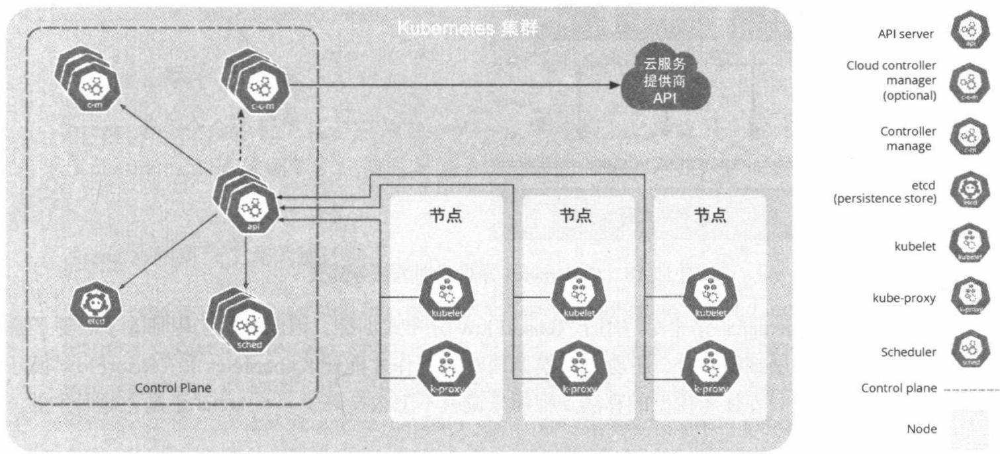  
图15-17 Kubernetes组成部分

当使用 Kubernetes 进行分布式训练时，任务的提交就简单了很多，无须手动指定机器的 IP 和端口了，Kubernetes 会自动填充这些环境变量供 TensorFlow 使用，开发者只需要告诉 Kubernetes 使用几个 ps 几个 worker 即可。如图 15-18 所示，用户提交任务时，编写配置文件，提交后，Kubernetes 会自动为每台 worker 添加 TensorFlow 需要的 TF_CONFIG 环境变量。任务交由 Kubernetes 管理后，即使在训练过程中有 ps 或者 worker 宕机，也会自动启动另外一个完全一样的角色，再也不用开发者手动重启了。

  
图15-18 Kubernetes分布式训练任务提交

然而，由于 Kubernetes 并非专门用于 TensorFlow 分布式训练，因此算法工程师除了需要了解 Kubernetes 的一些底层细节之外，还需要做很多琐碎的工作才能让 Kubernetes 和 TensorFlow 很好地结合起来，这对于只专注于模型的算法工程师来说就不怎么友好了——Arena 正是为此而生的。

# Kubernetes 的优点

□服务发现和负载均衡

Kubernetes 可以使用 DNS 名称或自己的 IP 地址公开容器，如果进入容器的流量很大，Kubernetes 可以负载均衡并分配网络流量，从而使部署稳定。

□存储编排

Kubernetes允许你自动挂载自己选择的存储系统，例如本地存储、公有云提供商等。

□ 自动部署和回滚

你可以使用 Kubernetes 描述已部署容器的所需状态，它可以以受控的速率将实际状态更改为期望状态。例如，你可以自动化 Kubernetes 来为自己的部署创建新容器，删除现有容器并将它们的所有资源用于新容器。

□自动完成装箱计算

Kubernetes 允许你指定每个容器所需的 CPU 和内存（RAM）。当容器指定了资源请求时，Kubernetes 可以做出更好的决策来管理容器的资源。

□ 自我修复

Kubernetes 重新启动失败的容器，替换容器，杀死不响应用户定义的运行状况检查的容器，并且在准备好服务之前不将其通告给客户端。

# 2. Arena简介

Arena 是一个命令行工具，它在 Kubernetes 的基础上又封装了一层，对算法工程师完全屏蔽了 Kubernetes 的底层细节，让使用者完全感觉不到后者的存在，从而大大降低了学习和使用成本。

Arena官网对该工具的描述如下：

Arena is a command-line interface for the data scientists to run and monitor the machine learning training jobs and check their results in an easy way. Currently it supports solo/distributed TensorFlow training. In the backend, it is based on Kubernetes, helm and Kubeflow. But the data scientists can have very little knowledge about kubernetes.

Meanwhile, the end users require GPU resource and node management. Arena also provides top command to check available GPU resources in the Kubernetes cluster.

In one word, Arena's goal is to make the data scientists feel like to work on a single machine but with the Power of GPU clusters indeed.

总结如下：

(1) Arena 帮助使用者轻松运行和监控机器学习训练任务；  
(2) 支持单机/分布式 TensorFlow 训练，基于 Kubernetes 等基础设施，但是使用者几乎可以不用了解 Kubernetes；

(3) 支持查看 Kubernetes 集群中的 GPU 资源情况；  
(4)总之，Arena的目标是让使用者在进行分布式训练时感觉就像在进行单机训练一样。

使用Arena进行分布式训练后，任务提交如图15-19所示，使用者几乎感受不到底层分布式的运行情况，一切都交给Arena管理。

  
图15-19 使用Arena进行分布式训练任务提交


Kubernetes + Arena，再搭配Prometheus和Grafana等指标监控工具，基本上可以算是一个适用于实际生产环境的TensorFlow分布式训练框架。但是在涉足分布式训练之前，还是需要好好调研一下，是否数据量已经大到非采用分布式不可，毕竟一个完备的框架需要多个团队的分工协作和后期维护，需要大量人力和计算资源，最好不要为了分布式而采用分布式。

# 15.6.2 基于Flink的分布式训练框架

Flink是Apache开源的计算引擎，同时支持批处理和流处理，它具备高扩展、容错性好、高可靠、性能优秀以及支持exactly-once处理等诸多优点。如果能将Flink与TensorFlow整合起来，发挥Flink天然的分布式优势，为TensorFlow提供稳定的分布式训练，那么会非常具有吸引力。dl-on-flink是阿里巴巴开源的一个整合Flink和TensorFlow的分布式训练框架，整体流程如图15-20所示，可以看到Flink几乎能够完成除模型服务外的所有步骤。

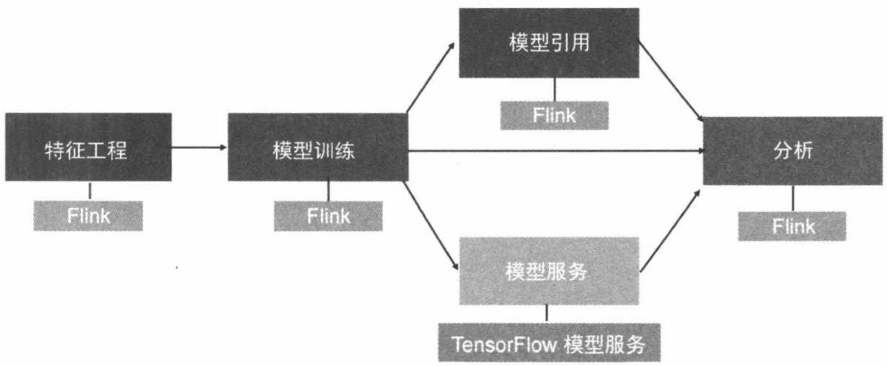  
图15-20 Flink + TensorFlow

相比基于 Kubernetes 的框架，基于 Flink 的框架优点如下：

□ 只需要维护一个框架；  
□具备离线学习和在线学习的能力；  
□数据处理和模型训练自然地结合在一起；  
□ 不仅支持 TensorFlow，还支持其他训练框架，比如 PyTorch;  
□


特别地，第14章中介绍的在线学习技术一般情况下也是通过整合Flink和TensorFlow来实现的。因此从维护性、实用性和扩展性的角度来说，可以考虑将基于Flink的框架作为实际应用中落地分布式训练的首选。

# 15.7 总结

□当数据量达到一定程度时，需要考虑采用分布式训练来解决训练时间过长的问题。  
□ 分布式训练架构按照种类大体上可以分为 Parameter Server 架构和 Ring All Reduce 架构。前者将模型参数分布式存储在多个 ps 节点上，后者没有 ps 的概念，所有 worker 都持有全量模型参数。推荐算法领域由于特征的稀疏性，一般会采用 Parameter Server 架构。  
□ TensorFlow 单机训练代码移植为分布式训练代码还是比较简单的，基本上改动很少或者几乎没有，非常方便。  
□ 在分布式训练框架这方面，由于 TensorFlow 自身的支持不是很好，因此有不少第三方框架完善了这个功能，如果有这方面的需求，推荐优先尝试 dl-on-flink。

# 第16章

# 示例：推荐算法训练代码框架设计

推荐算法从理论到落地的大致步骤如图16-1所示，整个过程形成闭环：

(1) 访问网站/App的用户产生的行为数据不断落地；  
(2) 训练数据任务构造特征和标签生成训练样本；  
(3) 模型训练任务读取训练样本进行模型训练；  
(4) 训练完毕后将模型推入生产环境，供线上服务加载；  
(5) 线上服务根据用户、物品、上下文等特征进行打分和排序，返回给用户；  
(6) 用户产生行为，回到第 (1) 步。

  
图16-1 推荐算法开发流水线

算法开发的精力主要放在第(2)、第(3)步，即训练/验证数据和训练模型。这些步骤均会涉及诸多代码实现，因此也会面临很多问题。本章的主要目的是提效，提高开发效率：总结一些常见的问题，找出它们可能存在的共性，并且尝试从代码设计的角度来解决这些问题。


回顾一下，当到了代码层面时，实现模型的一般步骤如下。

(1) 解析配置：模型的超参数、数据的地址、使用的特征等。  
(2) 读取数据：读入原始数据并做特征工程。  
(3) 搭建模型：编写模型代码。  
(4) 训练模型：将数据输入模型。  
(5) 导出模型：模型导出为线上可用的格式。

另外，算法开发在工业界有时候会被设定为算法后端开发，本章中的算法开发与算法工程师是同一个概念，不做区分。

本章的代码仅仅为 TensorFlow 实现。

软件版本：

□ TensorFlow 1.15.0   
Python 3.6.0

# 16.1 问题

在日常迭代模型的过程中，经常会遇到以下一些问题

数据问题

数据格式：存储的数据格式多种多样，比如TFRecord、CSV、TEXT、Parquet等。  
特征命名：相同的特征，在不同的数据集中名称可能不一样，比如用户ID特征在数据集 $D_{1}$ 中名称是uid，在数据集 $D_{2}$ 中名称是user_id，其实本质上是一种含义。  
数据地址：数据存储路径随意，没有任何约束  
其他问题。

□ 训练问题

■ 配置文件：文件格式多样，比如 YAML、JSON、自定义 conf 等。  
数据读取：一般写模型代码还要写数据读取代码，特别是后者，很容易产生冗余和重复代码。  
■模型管理混乱：模型 $=$ 算法 $+$ 数据 $+$ 配置，只有三者结合才算是一个完整的模型，可是实际应用中一些人几乎将重点放在了算法上而完全忽略了数据和配置，在经过了多轮开发迭代之后，为了知道某个历史模型使用了哪个数据集和哪些配置，可能需要查阅很多文档，很容易造成模型维护困难。  
其他问题。

# □其他问题

如果能够解决上述问题，将算法开发从琐碎且重复的事项（比如读配置、读数据等）中抽离出来，完全专注于模型的部分，那么可以极大地减少时间成本，提升迭代效率。

# 16.2 解题思路

在深入到代码之前，需要先分析问题，并找到尽可能好的解决方案，本节内容会针对不同的问题做不同的分析，并在分析的基础上尝试给出合理的建议。

# 16.2.1 数据问题

数据的主要问题表现为多样性，包括数据格式多样、特征分类多样（类别型、连续型和序列型等）以及特征数据类型多样（整型、字符串等）等，如果直接将这种多样性引入代码实现层面，那么可能会使代码变得特别臃肿。从功能角度来看，当一份数据生成后，算法开发最关心的是这份数据有哪些特征、特征类型是什么、背后的物理意义是什么，而不是这份数据的地址是什么、具体的存储格式是什么。因此当面对多样性时，在做框架设计时，较为合理的做法是抽象，即面向抽象编程，将数据集抽象出来，数据集使用者看到的仅仅是抽象后的概念，将数据集的诸多琐碎且不重要的细节完全对使用者屏蔽。这样做的好处不言而喻，一来可以做到对外接口保持统一，便于代码的维护和迭代，二来让算法开发可以将重心完全放在业务逻辑上，消除了数据集的多样性，提高算法开发的迭代效率。

所以接下来要解决的问题是如何将数据集抽象出来。为了回答这个问题，首先要了解算法开发为了完成建模，对数据集的要求是什么，也就是说数据集需要提供哪些必要信息。一般来说，数据集必须携带如下信息。

(1) 数据集地址：存储数据集的地址，有可能是本地，也有可能是HDFS等分布式存储地址。  
(2) 数据集格式：表示数据存储格式，比如TFRecord、CSV等。  
(3) 特征集合：数据集含有哪些特征。

据此得到数据集的抽象如图16-2所示，除了上述三个要素以外，还添加了一个必要的方法input_fn，该方法负责读取数据并返回数据迭代器，因此数据集的使用者只需要看到这个方法就可以了。

  
图16-2 数据集抽象

稍加观察就会发现，特征这个要素也可以通过相同的方式抽象出来。同理，首先罗列一下特征必备的信息。

(1)名称：特征名称。  
(2) 分类：特征分类，比如类别型、连续型等。  
(3) 类型：特征类型，比如整型、字符串、序列型等。   
(4) 处理函数：该函数表示特征如何处理，比如散列、分桶等。  
(5) 处理函数入参：与处理函数对应，表示函数入参，比如处理函数是 hash，那么入参就是桶数；处理函数是分桶，那么入参就是桶边界（boundary）。

除此之外，由于特征可能会非常多，参考数据库的表设计，一般会将特征再加一个与业务逻辑无关的ID，称为slot，即特征ID。在后面具体讲代码实现时会发现，通过slot来引用特征比直接使用特征名称要灵活得多。

综上，可以将特征的抽象表示为图16-3。

  
图16-3 特征抽象

数据集和特征抽象完毕后，基本上可以解决数据多样性的问题，最终目的是对算法开发屏蔽数据底层细节，同时为数据的读取提供接口一致性，消除可能存在的重复和冗余。

# 16.2.2 训练问题

一般情况下，几乎所有的框架都可以将代码分为两部分。

(1) 框架代码：框架使用者可以不用关心，由框架开发者负责维护和迭代。  
(2) 用户代码：框架使用者需要实现的代码。

框架代码将程序运行的主体框架和流程提前设计好，其中的业务逻辑部分由用户代码实现。具体到推荐算法领域，由于建模的步骤比较固定，从代码设计的角度来看，特别适合将整个流程设计为一个框架，将其中变化的部分（比如模型代码）交由用户自定义实现。按照建模的流程，每个步骤的代码实现方如图16-4所示，可以看到除了搭建模型需要算法开发实现以外，其他所有步骤均可以通过框架来完成。

  
图16-4 建模各步骤代码实现方

如果能够完全实现图16-4中的所有功能，那么基本上可以解决16.1节中训练问题中的配置多样（由框架统一配置）和数据读取（由框架统一实现）问题。本章的后续内容主要是设计一个简单的算法训练框架（后文简称框架），旨在将图16-4中的流程落地。我们遵循框架的设计原则，在具体到代码层面之前，首先需要完成详细设计。

# 16.3 详细设计

框架简图如图16-5所示，其中包含的内容如下

(1) 解析配置：用来解析超参数配置、数据集配置以及特征配置等，由框架实现。  
(2) 读取数据：第(1)步得到数据配置后，这一步负责读取训练数据，将原始数据由外部存储读入内存，由框架实现。  
(3)搭建模型：搭建具体的模型结构，由用户自定义  
(4) 训练模型：将第 (2) 步的数据数据输入第 (3) 步的模型进行训练，由框架实现。  
(5) 导出模型：将第 (4) 步训练完的模型导出为线上可用的格式，由框架实现。

  
图16-5 框架简图

根据图16-5，将整个项目代码目录结构设计如下，其中lib目录的实现是接下来的主要内容：

```txt
rec_sys/ # 1 目录：项目名称
```

```txt
conf#2目录：配置存储目录  
dataset#2.1目录：数据集存储目录  
dataset_00001#2.1.1文件：具体的数据集说明文件  
model#2.2目录：模型配置存储目录  
model_00001#2.2.1目录：模型名称或者模型ID  
features.conf#2.2.1.1文件：特征配置，用于覆盖默认特征配置  
model.conf#2.2.1.2文件：模型配置，用于覆盖默认特征配置  
model.conf#2.3文件：默认模型配置文件  
features.conf#2.4文件：默认特征配置文件  
logger.conf#2.5文件：默认日志配置文件  
lib#3目录：库代码，框架代码存放于此★★★  
model#4目录：模型代码，用户代码存放在此  
model_00001#4.1目录：模型名称或者模型ID estimator.py#4.1.1文件：模型实现代码文件
```

# 16.3.1 配置解析

配置按照功能一般分为4个部分。

(1) 模型配置：主要是超参数的配置，包括学习率、batch size、epoch 等，还有模型存储的地址、使用的特征等信息。  
(2) 数据集配置：主要是数据集说明的配置，包括数据集地址、数据包含的特征以及数据集的存储类型等。  
(3) 特征配置：主要是特征说明的配置，包括特征 slot、名称、类型等。  
(4) 日志配置：主要是程序运行日志的配置，比如日志级别、日志文件名格式等。

使用UML将这三部分画出来，得到图16-6，所有配置由ConfFactory类处理，该类包含4个成员Conf，对应上述4种配置，每个Conf中含有一个parse方法，用来解析各自的配置文件。解析完成后，由ConfFactory统一对外提供配置读取。

  
图16-6 配置UML

# 16.3.2 数据读取

数据读取功能的UML如图16-7所示，为了便于统一管理，约束算法开发仅可以通过Dataset-Factory获取数据，实际上是通过隐藏在背后的各个Dataset的具体实现来完成数据的读取，这样可以对算法开发屏蔽数据多样性等细节。

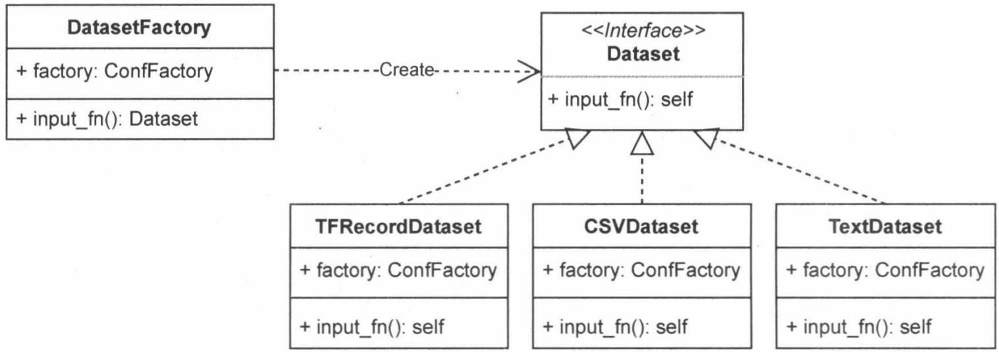  
图16-7 数据集UML

# 16.3.3 模型搭建

模型搭建由用户实现，搭建模型时需要的最重要的信息——超参数和特征——由框架提供，其中特征的处理最为琐碎和重复。根据图16-3所示的特征抽象，特征设计的UML如图16-8所示。约束算法开发仅可以通过FeatureFactory获取特征，实际上是通过隐藏在背后的各个Feature的具体实现来完成特征的处理，这样可以对算法开发屏蔽特征多样性等细节。

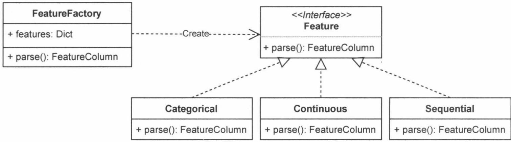  
图16-8 特征UML

将特征的处理手段统一之后，搭建模型时将FeatureFactory与模型代码组合起来，得到如图16-9所示的UML图，模型对外暴露model_fn方法，此方法需要用户自定义实现。

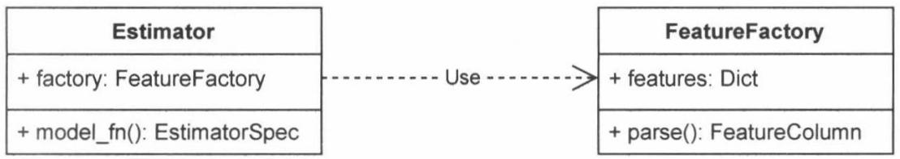  
图16-9 模型UML

# 16.3.4 完整流程

客户端提交任务给框架，框架解析参数后得到 ConfFactory，含有模型训练和导出需要的所有配置信息；然后框架将 ConfFactory 交给 pipeline，pipeline 中设置好 Handler[s]，它（们）是任务链上节点处理器的抽象，每个节点处理不同的事项，比如训练节点负责模型训练，导出节点负责模型导出，各处理器各司其职，通过 next 串联下游；最后 pipeline 调用 run 方法执行任务链上的 Handler，完成整个任务，如图 16-10 所示。

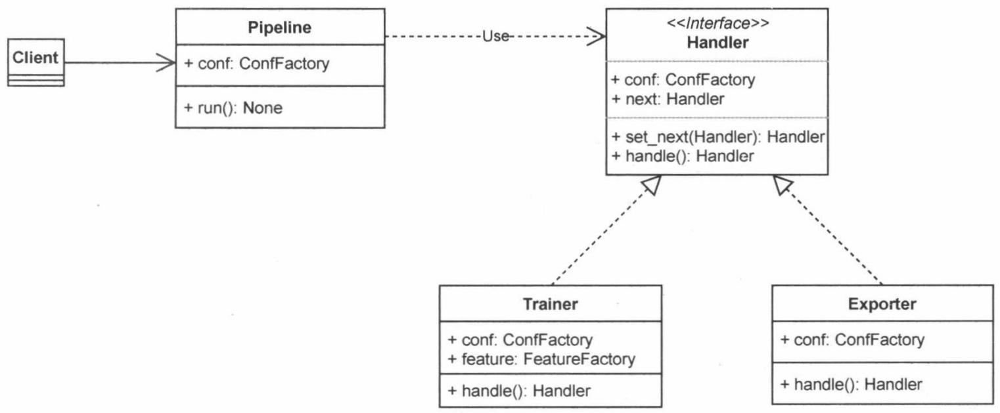  
图16-10 pipeline UML

# 16.4 代码实现

由于篇幅限制①，本节只关注配置解析和特征抽取的部分。

程序启动命令：

```shell
cd rec_sys  
nohup python -m lib.main.main \
--model_name=model_00001 \
--dataset=dataset_00001 
```

```lua
--learning_rate=0.02  
--decay_steps=100000  
--decay_rate=0.9  
--start=20220101  
--end=20220131  
--batch_size=1024 >model_00001.log 2>&1 &
```

# 16.4.1 配置解析

配置样例如下。

# □数据集

```ini
文件路径：rec_sys/conf/dataset/dataset_00001  
dataset = /home/recsys/chapter16/datasets/  
#数据集类型，这里是tfrecord  
set_type = tfrecord  
#数据集的特征  
slots = 1,2,3,4,5,6  
#label:int64表示数据集的标签名称是label，类型是int64  
label = label:int64
```

dataset字段指定数据根目录，子目录按照日期存储，日期下存储的是具体的训练数据，类似如下：

```txt
datasets  
20220101/  
20220102/  
20220103/  
20220104/  
20220105/  
20220106/  
20220107/
```

# □特征配置

#文件路径：rec_sys/conf/features.conf  
#user  
slot $= 1$ ，name $\equiv$ uid，f_type $\equiv$ categorical，d_type $\equiv$ string，encoder $\equiv$ hash，args $= 2000000$ slot $= 2$ ，name $\equiv$ age，f_type $\equiv$ continuous，d_type $\equiv$ int64，encoder $\equiv$ bucketize，args $=$ 0|18|25|36|45|55|65|80  
slot $= 3$ ，name $\equiv$ gender，f_type $\equiv$ categorical，d_type $\equiv$ string，encoder $\equiv$ hash，args $= 20$ #context  
slot $= 4$ ，name $\equiv$ device，f_type $\equiv$ categorical，d_type $\equiv$ string，encoder $\equiv$ hash，args $= 10000$ #item  
slot $= 5$ ，name $\equiv$ item_id，f_type $\equiv$ categorical，d_type $\equiv$ string，encoder $\equiv$ matrix，args $= 1000000\vert 32$ #interaction  
slot $= 6$ ，name $\equiv$ clicks，depend $= 5$ ，f_type $\equiv$ sequence，d_type $\equiv$ string

特征配置中，encoder表示如何处理特征，在代码中会对应不同的处理函数；depend表示该特征有依赖，比如用户历史点击物品特征，依赖物品特征（共享物品embedding）。

将图16-6的UML转换为代码，需要注意的是，配置分为三个层级：1)默认配置文件；2)用户自定义配置文件；3)用户提交任务时的命令行配置。在编写代码时按照优先级从低到高实现：命令行配置优先级最高，用户自定义配置文件次之，默认配置文件最低。

# ConfFactory 代码片段

文件路径：rec_sys/lib/conf/confFACTORY.py from lib.conf.conf import ModelConf, DatasetConf, FeatureConf, LoggerConf

```python
class ConfFactory: def __init__(self, flags): self._flags = flags # 命令行配置 self._model_conf = ModelConf(flags).conf self._dataset_conf = DatasetConf(flags).conf self._feature_conf = FeatureConf(flags).conf self._logger = LoggerConf(flags).get logger() @property def flags(self): return self._flags @property def model_conf(self): return self._model_conf @property def dataset_conf(self): return self._dataset_conf @property def feature_conf(self): return self._feature_conf @property def logger(self): return self._logger 
```

# Conf代码片段

```txt
文件路径：rec_sys/lib/conf/conf.py  
from abc import ABC  
import os  
import json  
import logging.config 
```

```python
class Conf(ABC): def __init__(self, flags): self._flags = flags self._model_name = self._flags.model_name self._d_root_conf = self._root_conf_path() 
```

```python
def_root_conf_path(self):
    project_dir = self._flags.project_dir
    return project_dir.joinpath('conf')
def parse(self):
    raise NotImplementedError('Conf not implement parse.') 
```

def_file_parser(f): conf $=$ {} for line in f: iflen(line.strip()) $= =$ 0 or line.strip().startswith'#') continue num $=$ line.count $\mathbf{\Psi}^{*} = \mathbf{\Psi}^{*}$ ) if $\theta = =$ num: continue elif1 $= =$ num: k,v $=$ line.split(' $\equiv ^ { \text{一} }$ ） k=k.strip() v $=$ v.strip() ifk $= =$ 'owners': v $=$ v.split(','） ifk $= =$ 'slots'ork $= =$ 'serving Slots': v $=$ list(map(int,v.split(','))) conf[k] $= \mathrm{v}$ return conf

```python
class FeatureConf(Conf): def __init__(self, flags): super().__init__(flags) self._f_conf = (self._d_root_conf .joinpath('model') .joinpath(self._model_name) .joinpath('features.conf')) self._f_default_conf = self._d_root_conf joinspath('features.conf') if not os.path.exists(self._f_default_conf): raise FileNotFoundError(f'model {self._model_name} ' f'missing feature conf.') self._conf = self._parse()   
def _parse(self): conf = {} with open(self._f_default_conf) as _f_default_conf: default_feature_conf = self._file_scan(_f_default_conf) conf.update(default_feature_conf) if os.path.exists(self._f_conf): with open(self._f_conf) as _f_conf: model_feature_conf = self._file_scan(_f_conf) if model_feature_conf: for slot, slot_conf in model_feature_conf.items(): conf.setdefault-slot,{}).update slot_conf) for k in conf: if k in self._flags._dict_ : conf[k] = self._flags._dict_[k] return conf 
```

```python
@property
def conf(self):
    return self._conf
@staticmethod
def _file.parse(f):
    conf = {}
    for raw_line in f:
        if len(raw_line.strip()) == 0 or raw_line.strip().startswith('#':
            continue
            slot_conf = {}
            for kv in raw_line.split():
                kv = kv.split可能导致slot:
                    kv = int(v)
                    slot_conf[k] = v
            slot = slot_conf['slot']
            if slot in conf:
                raise ValueError(f'FeatureConf duplicated slot: {slot}')
            conf[slot] = slot_conf
    return conf
class DatasetConf(Conf):
    def __init__(self, flags):
        super().__init__(flags)
        self._f_conf = (self._d_root_conf
                                .joinpath('dataset')
                                .joinpath(f{'self._flags(dataset'}))
    if not os.path.exists(self._f_conf):
        raise FileNotFoundError(f'model {self._model_name}'
                            f'missing dataset conf.')
    self._conf = self._parse()
    def __parse(self):
        conf = {}
    with open(self._f_conf) as f:
        for raw_line in f:
            if (not raw_line.strip() or
                raw_line.strip().startswith '#)):
                    continue
                    key, value = raw_line.split()
                    key = key.strip()
                    value = value.strip()
                    conf[key] = value
return conf 
```

```python
@property
def conf(self):
    return self._conf
class LoggerConf(Conf):
    def __init__(self, flags):
        super().__init__(flags)
        self._f_conf = self._d_root_conf.joinpath('logger.conf')
        self._logger_dir = self._flags.project_dir.joinpath('logs')
        if not os.path.exists(self._logger_dir):
            os.mkdir(path= self._logger_dir)
        config = self._parse()
        if config:
            logging.config_dictConfig(config)
        else:
            logging-basicConfig(level=logging DEBUG)
    def __parse(self):
        if not os.path.exists(self._f_conf):
            return None
        with open(self._f_conf) as log:
            conf = json.load(log)
        for handler in conf['handlers]:
            h_conf = conf['handlers'][handler]
            if 'filename' not in h_conf:
                continue
            h_conf['filename'] = str(self._logger_dir)
            .joinpath(h_conf['filename'])) 
```

# 16.4.2 特征处理

将图16-8的UML转换为代码，可以得到特征处理的代码，包含了特征抽取和特征工程，如下所示，其中初始化函数中的入参feature_conf即配置解析生成的特征配置。

FeatureFactory 代码片段

```python
文件路径：rec_sys/lib/features/featureFACTORY.py  
# --coding:utf-8 --from lib.feature.feature import Categorical, Continuous, Sequential 
```

class FeatureFactory: def __init__(self, feature_conf): self._slot_feature_map = self.parse(feature_conf) @ class method def parse(cls, feature_conf): slot_feature_map = {} for slot, slot_conf in feature_conf.items(): f_type $=$ slot_conf['f_type'] if f_type $= =$ 'categorical': col $=$ Categorical-slot_conf) elif f_type $= =$ 'continuous': col $=$ Continuous-slot_conf) elif f_type $= =$ 'sequence': col $=$ Sequential-slot_conf) else: raise NotImplementedError(f'slot{slot},' f'feature type {f_type} not supported.') slot_feature_map[slot] $=$ col return slot_feature_map

# Feature 代码片段

```txt
文件路径：rec_sys/lib/features/feature.py #\*-coding:utf-8\*-import tensorflow as tf fromtensorflow import feature_column 
```

```python
class Feature: def __init__(self, conf): self._conf = conf self.slot = conf['slot'] self.f_type = conf['f_type'] self.name = conf['name'] selfencoder = conf.get('encoder') self.args = conf.get(args) self.d_type = conf['d_type'] self.len = int(conf.get(len,'0')) self_column = self._parse() if self encoder else None @property def conf(self): return self._conf def _parse(self): raise NotImplementedError('Feature not implement_col.') def __str__(self): return str(self._conf) 
```

```python
class Categorical(Feature): def __init__(self, conf): 
```

super(Categorical,self).__init__(conf)   
def _parse(self): column $=$ None if selfencoder $= =$ 'hash': self.args $=$ int(self.args) d_type $\equiv$ tf.string if self.d_type $= =$ 'int64': d_type $\equiv$ tf.int64 if self.d_type $= =$ 'int32': d_type $\equiv$ tf.int32 column $=$ feature_column.categorical_column_with_hash_buckets( self.name, hash;bucket_size $\equiv$ self.args, dtype $\equiv$ d_type ) elif selfencoder $= =$ 'identity': self.args $=$ self.args.split'|') num_buckets, default_value $=$ self.args column $=$ feature_column.categorical_column_with_identity( self.name, num_buckets $\equiv$ num_buckets, default_value $\equiv$ default_value) elif selfencoder $= =$ 'matrix': pass else: raise NotImplementedError('Categorical not support' f' {self encoder} : slot {self.slot}') return column

class Continuous(Feature): def __init__(self, conf): super(Continuous, self).__init__(conf) def __parse(self): _column = None if selfencoder == 'bucketize': args $=$ list(map(float, self.args.split'||)) if self.d_type $= =$ 'int32': d_type $\equiv$ tf.int32 elif self.d_type $= =$ 'int64': d_type $\equiv$ tf.int64 else: d_type $\equiv$ tf.float32 shape $=$ self.len or 1 shape $=$ shape(), default_value $= 0$ d_type $\equiv$ d_type, normalizer_fn=None)

_colon = feature_column.bucketized_column( source_column=col, boundaries $\equiv$ args) else: raise NotImplementedError('Continuous not support' f' {self encoder} : slot {self slot}') return column   
class Sequential(Feature): def_init_self,conf): super(Sequential,self).__init__(conf) def_parser(self): _column $=$ None if selfencoder $= =$ 'hash': self.args $=$ int(self.args) d_type $=$ tf.string _column $=$ (feature_column(sequence_categorical_column_with_hash_buckets( self.name, hash;bucket_size $\equiv$ self.args, dtype $\equiv$ d_type)) elif selfencoder $= =$ 'identity': self.args $=$ self.args.split'|') num_buckets, default_value $=$ self.args _column $=$ feature_column(sequence_categorical_column_with_identity( self.name, num_buckets $\equiv$ num_buckets, default_value $\equiv$ default_value) else: raise NotImplementedError('Sequence not support' f' {self encoder}: slot {self slot}') return column

# 16.5 总结

□ 模型的训练和上线流程比较固定，基本上遵循数据处理到模型导出这个流程。同时，由于特征类型（类别型、连续型和序列型）也比较容易划分，所以算法开发的代码特别适合标准化。  
□在进行代码实现时，出现最多的是样本和模型训练问题。样本的多样性很容易让代码变得冗余和重复，降低迭代效率。模型 $=$ 算法 $+$ 数据 $+$ 配置，虽然数据和配置的解析是一项琐碎的任务，但是如果设计不完善，也很容易出现配置遍布代码的情况，因此对于这些非模型搭建的工作，可以交由框架统一处理。  
□ 能够让算法工程师尽可能多地专注在建模上，达到提效降本作用的就是一个良好的框架。由于水平有限，本章的设计思路和代码框架仅供参考。

# 第17章

# 回顾和探索

推荐算法作为商业变现最为重要的手段之一，涵盖了特别多的内容。本书虽然介绍了不少推荐算法在生产中的实践，但依然只是整个领域的冰山一角，还有特别多的内容等待挖掘和研究，而且行业内新的想法和技术层出不穷，因此也要求从业人员保持学习的热情。最为重要的是将理论与业务结合的能力，毕竟再精妙的算法，也必须在商业上产生其应有的业务价值。

作为最终章，接下来会从两方面来结束本书的所有内容。

(1) 快速回顾从第 1 章到目前为止的主要内容。  
(2) 从个人视角出发，试着指出一些值得探索且本书尚未详细探讨的方向，这些方向不再局限于算法层面，更多的是对于算法周边的一些思考。当然，关于这部分的内容也只是一家之言，仅供参考。

# 17.1 回顾

一次推荐的完成，需要经过召回和排序两阶段。虽然从理论上来说，排序阶段可以跳过，但是一个表现良好的推荐系统，两阶段缺一不可，尤其是大规模推荐系统：召回阶段负责从海量物品中快速筛选出用户可能感兴趣的物品，排序阶段则需要对召回出的物品做更细粒度的区分。两阶段分工协作以达成又快又准的目标。总的来说，个性化推荐本质上是在用户意图不明确的情况下，利用机器学习算法，结合用户特征、物品特征、上下文特征等信息，缩短用户到物品的距离，提升用户转化效率和产品体验——这些是第1章的主要内容。根据阶段的不同，算法也相应地分成了召回算法和排序算法，对应本书的第一部分和第二部分。

第一部分的前4章内容主要围绕常用的召回算法展开，详细介绍了每个算法的基本原理、训练数据的处理方式以及对应算法的代码实现。表17-1说明了想要产出高质量的模型，在开发过程中最需要关注的地方。

表 17-1 常用的召回算法  

<table><tr><td>算 法</td><td>要 点</td></tr><tr><td>协同过滤</td><td>打分! 打分! 打分!</td></tr><tr><td>关联规则</td><td>transactions 的生成</td></tr><tr><td>词向量</td><td>documents 的生成</td></tr><tr><td>深度学习双塔结构</td><td>负样本的设计</td></tr></table>

介绍完上述召回算法后，在日常开发中模型上线前必须进行离线测试，因此第6章讨论了常用的离线评估指标，描述了每种指标的理论基础、各自的应用场景以及对应指标的代码实现。

第二部分的主题是排序算法，由于此类算法的复杂度高于召回算法，因此第7章先描述了常规的特征以及特征工程，一般来说可以将特征分为类别型、连续型和序列型。过渡到深度模型之前，第8章介绍了经典的逻辑回归和FM，阐述了各自的理论以及如何手动进行代码实现。第9章和第10章详细介绍了基于TensorFlow实现的深度模型，包括从数据处理到模型对外服务等整个建模流程，同时剖析了Listwise建模方式在推荐算法中的应用。与召回算法同理，模型上线前也必须进行离线测试，因此第11章介绍了排序模型的离线评估和在线评估，其中A/B测试平台是必备的基础设施，用来衡量算法工程师的价值输出。由于深度模型的特点，第12章介绍了一些最佳实践，包括超参数的调节以及数据的处理。

第三部分的主题是工程实践，聚焦召回和排序阶段的一些共性问题，比如算法开发效率的提高等。第13章介绍了推荐系统中必须面对的冷启动问题，尝试从系统冷启动、用户冷启动和物品冷启动三个方面给出一些实用建议。第14章从增量更新的角度来缩减训练时间，一般可以满足大部分要求，如果依然满足不了对训练时长的需求，第15章详细介绍了分布式模型训练的理论以及一些有助于落地的框架，可以完成海量数据的训练任务。第16章从代码设计的角度尝试提高开发效率，通过消除可能存在的代码冗余和重复来降低代码的编写和维护成本。

本章的剩余内容将介绍一些在很大程度上会影响算法业务效果和迭代效率的因素。

# 17.2 探索

算法工程师主要与数据、算法、A/B测试平台打交道，因此这几个方面非常值得投入时间和精力，一般来说也都会有比较正向的回报。

# 17.2.1 数据

数据的重要性再怎么强调也不为过，提高算法质量的众多措施中，数据永远排在第一位。本节从数据的宏观角度出发，探讨一个值得尝试的优化点。

推荐系统两阶段中的排序阶段一般又会细分成精排和粗排，因此一般情况下需要维护三种类型的模型：召回模型、粗排模型和精排模型。在实际应用中不同的模型可能是由不同的人或者团队迭代和维护的，那么很可能会出现以下局面：

(1) 精排模型有点击率预估模型、转化率预估模型；   
(2) 粗排模型有点击率预估模型、转化率预估模型；   
(3) 召回模型有点击率预估模型、转化率预估模型。

一共有6种模型，虽然可能比较极端，但是实际情况也差不多。每种模型都会有各自的训练数据，这些训练数据之间可能关联也不大。抛开维护性不谈，这里还有一个很微妙的问题：目标一致性，理论上三种模型的目标需要保持一致，但是实际应用中可能召回层优化的是点击率，粗排层优化的是GMV等，这种GAP实在太过常见。

如果换个思路，既然精排一般作为推荐算法的最终出口（忽略重排），那么召回模型和粗排模型就应该与精排模型保持一致，以精排的目标为目标。因此根据这种想法，在每种模型的训练样本上可以按照如下方式处理来尽可能地达到目标一致性。

(1) 召回样本：进入精排的为正样本，未进入精排的为负样本。召回的目的就是尽量把优质物品送入精排。  
(2) 粗排样本：精排的排序结果作为粗排模型需要拟合的样本。此时粗排就特别适用Listwise建模方式。  
(3) 精排样本：用户的真实行为反馈。

具体流程如图17-1所示，详细描述如下。

(1) 用户请求到达推荐系统。  
(2) 推荐系统调用召回服务：

1) 召回服务从资源池中筛选出万级的物品；  
2) 返回给推荐系统。

(3) 推荐系统携带召回返回的物品，调用粗排服务：

1）粗排服务对物品进行打分和排序；  
2)取出Top $N$ （百级）物品返回给推荐系统，这 $N$ 个物品会进入精排服务；  
3) 同时，为召回生成样本， $N$ 个物品为正例，未进入精排的物品为负例（可以施加采样率为 $r$ 的下采样）。

(4) 推荐系统携带粗排返回的物品，调用精排服务：

1）精排服务对物品进行打分和排序；

2) 返回给推荐系统；  
3) 同时，为粗排生成样本， $N$ （也可以采样为 $M$ ）个物品生成 list 或者 pair，为粗排模型提供 Listwise 或者 Pairwise 样本。

  
图17-1 各类模型数据流

通过上述生成样本的方式可以看到，只要精排模型做得好，粗排模型和召回模型也会自然而然表现好。而如果精排模型没做好，召回模型和粗排模型可能都会受影响。所以采用这种方式有一个重要的前提——具备高质量的精排模型。

# 17.2.2 算法

关于具体的算法，这里就不再推荐了，但是有一点必须提及，也是每个从业人员必须关注的，每年推荐领域都会浮现出特别多优秀的论文①，除此之外，一些具备成熟且强悍商业变现能力的公司（谷歌、阿里巴巴、Meta/Facebook等）也会发表不少理论和实践结合得很好的论文，一般来说，如果仔细查阅其中引用较多或者机构评选出来的年度最佳论文，除了能够开拓视野外，其中蕴含的思想也可以用来解决实际问题。如果能够在实际应用中复现论文的内容并取得收益，那是最好不过的了。

# 17.2.3 平台

任何一个上线的模型，都必须包括：1)数据任务；2)训练任务；3)工程服务；4)A/B展示，其中1)和2)实现模型产出，3)实现模型对外服务，4)查验模型业务效果。通常这些任务在不同的系统上运行，因此这里的平台指的是能够打通除工程服务外的所有系统的一站式平台（one-stop platform），在这个平台上可以增删改查数据任务、增删改查训练任务、上线/下线模型以及查看A/B实验效果，无须在多个系统之间来回切换。

工程服务是模型生命周期的重要一环，其工作流程是：1)加载模型；2)抽取特征，输入模型；3)得到模型打分，返回排序结果。这里面第2)步变化最多，如果将抽取特征的工作交给工程服务，那么上线一个新模型时，如果特征发生变动，工程需要经过修改源代码、测试、发布等多个步骤，耗时较长。因此一个能够提高效率的解决方案是：工程服务将抽取特征这一步按照某种协议开放出来，当新模型上线时，模型开发者同时将模型所用特征的抽取方式按照协议告知工程服务（比如可以通过配置的方式等），工程不再感知特征如何抽取，只需要按照规则解析开发者提供的协议即可。这样上线新模型时，不再需要修改工程源代码，极大提高了迭代效率。如图17-2所示，特征库里配置了所有特征的处理函数，作为默认配置，同时在模型侧可以配置自定义特征处理函数，也可以不配置特征处理函数，如果没有配置，则使用特征库中的默认特征处理函数。

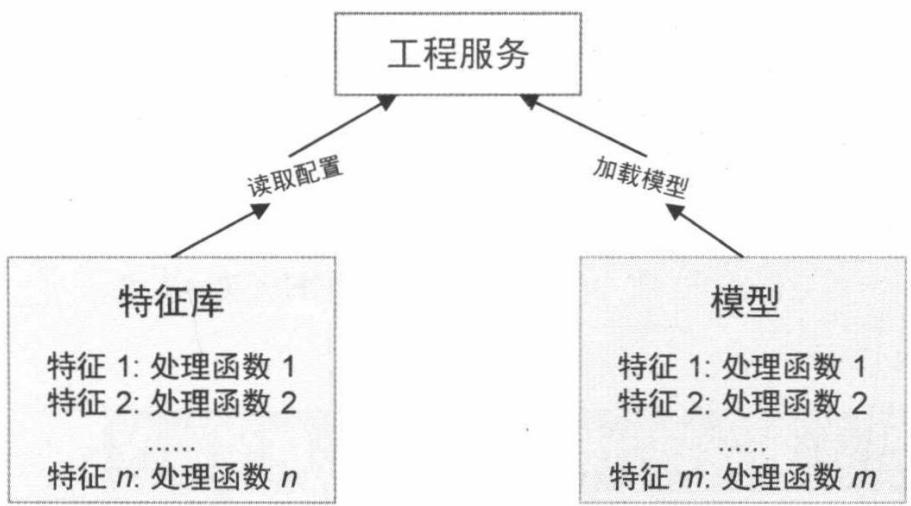  
图17-2 工程服务

# 17.2.4 安全

安全是很容易被忽视的问题，全球个人信息隐私保护也在逐渐规范化、法治化，比如国内的《中华人民共和国个人信息保护法》美国加州的《加州消费者隐私法案》（CCPA）以及欧盟的《通用数据保护条例》（GDPR）等，这些法规法案的出台很大程度上限制了企业对于数据的使用/滥用，保护了用户的隐私。推荐算法作为一门极度依赖用户信息的学科，也必须考虑到数据安全和

合规问题，一旦发生用户数据泄露或者违反规定的情况，会对外产生极为恶劣的影响。

如何在不侵犯用户隐私的前提下依然能够实现数据的应用呢？谷歌在2016年提出了联邦学习（Federated Learning）的概念，旨在找到数据隐私和数据孤岛这两大难题的解决方案。个人信息保护越来越严格已是必然趋势，或许联邦学习是能够使人工智能摆脱困境，走向下一个阶段的利器。

# 17.3 总结

□全书主要分为三个部分：召回算法、排序算法和工程实践。章与章之间按照一定的逻辑串联，一章内部一般按照从原理到代码的顺序展开。  
□推荐算法发展迅速，虽然无法预测未来到底会发生什么，但无论如何，数据、算法、平台和安全都是必须考虑的方面。数据上可以使所有样本以精排目标为目标。算法上可以研读每年优秀的文献。平台上可以打通数据、算法、工程和A/B测试平台，这可以极大地提高迭代效率。最后，在安全上，伴随着法规法案的健全，对于数据的保护越来越严格，联邦学习可以作为数据隐私和孤岛问题的解决方案之一。

# 技术改变世界·阅读塑造人生


# 推荐系统实践

$\spadesuit$ 以实战为基础，深入浅出地介绍每种推荐方法背后的理论基础  
$\diamond$ 着重讨论每种算法的实现、在实际系统中的效果、方法的优点、缺陷以及解决方法

作者：项亮

审校：陈义，王益


# 美团机器学习实践

$\diamond$ 美团首席科学家张锦懋作序推荐，美团技术委员会执行主席刘彭程以及美团科学家、副总裁夏华夏倾力推荐  
$\diamond$ 美团AI+O2O智慧结晶，机器学习算法落地实践，内容涵盖搜索、推荐、风控、计算广告、图像处理领域  
$\Leftrightarrow$ 作者来源于一线资深工程师，内容非常接地气，可指导开发一线的工程师

作者：美团算法团队


# 机器学习：公式推导与代码实现

$\spadesuit$ 完备的公式推导，解决机器学习中的数学难题  
基于NumPy与 sklearn，介绍26个主流机器学习算法的实现  
◆ “机器学习实验室”公众号主理人倾力打造，获得40000读者好评

作者：鲁伟

# 技术改变世界·阅读塑造人生


# 机器学习实战

$\spadesuit$ 使用Python阐述机器学习概念  
$\spadesuit$ 介绍并实现机器学习的主流算法  
$\spadesuit$ 面向日常任务的高效实战内容

作者：Peter Harrington

译者：李锐，李鹏，曲亚东，王斌


# 机器学习算法竞赛实战

$\spadesuit$ 腾讯广告算法大赛两届冠军、Kaggle Grandmaster倾力打造  
$\spadesuit$ 赛题案例来自Kaggle、阿里天池、腾讯广告算法大赛  
$\spadesuit$ 按照问题建模、数据探索、特征工程、模型训练、模型融合的步骤讲解竞赛流程

作者：王贺，刘鹏，钱乾


# 简明的 TensorFlow 2

$\spadesuit$ TensorFlow中国研发负责人李双峰，Google全球生态系统项目负责人倾力推荐！  
$\spadesuit$ 3位MLGDE共同创作，以“即时执行”视角带你领略TensorFlow2的全新开发模式！  
本书让你快速入门TensorFlow2，同时掌握多端部署能力！

作者：李锡涵，李卓桓，朱金鹏

作者从实践出发，结合在推荐系统领域的多年经验，清晰直观地介绍了相关的算法原理、代码实现、评估方法及调优经验等内容。

本书融合了算法理论与实现，兼顾技术广度与深度。内容通俗易懂，干货十足，极具实践参考价值，适合不同阶段的广大读者阅读。

有幸通读过此书初稿，在此强力推荐给更多读者。希望此书能帮助大家在推荐系统及AI领域的能力大幅提升，并推动技术的进一步应用和发展。

——马兴国

SHEIN 产品研发中心副总经理

该书结合作者在推荐系统领域多年的工程实践经验，从推荐算法原理、系统框架以及技术实现细节等多个角度，深入浅出地剖析实战性的推荐系统。最为难得的是，该书对于推荐系统关键环节给出了相应的代码实现，并融入了作者多年对切身实践的思考和理解，特别适合想了解推荐系统的初学者以及技术进阶者阅读。

郭伟昭

SHEIN 人工智能实验室高级算法专家

纵观全书，作者先是系统而全面地讲解了推荐系统中的召回算法和排序算法，内容由浅及深、循环渐进，非常适合想要入门推荐系统的非行业从业者、推荐系统领域进阶的行业从业者阅读。此外，作者还编写了一套具有高复用性的训练代码框架，以此应对冷启动问题、模型增量更新、迁移学习和分布式训练等工程实践中的常见问题。作者的这些宝贵实践经验，非常值得每个推荐系统爱好者深入学习和体会。

王贺（@鱼遇雨欲语与余）

《机器学习算法竞赛实战》作者，推荐算法专家

图灵社区：iTuring.cn

分类建议：计算机/人工智能/推荐系统

人民邮电出版社网址：www.ptpress.com.cn

  
扫码领取随书代码资料

  
定价：99.80