# 大语言模型

# 从理论到实践

（第二版）

张奇 桂韬 郑锐 ⻩萱菁 著

2025 年 3 月 5 日

# 目 录

# 1 绪论

1.1 大语言模型的基本概念.  
1.2 大语言模型的发展历程 4  
1.3 大语言模型的构建流程 .10  
1.4 本书的内容安排 13

# 2 大语言模型基础 16

2.1 Transformer 结构 16

2.1.1 嵌入表示层 18  
2.1.2 注意力层. 19  
2.1.3 前馈层 . 23  
2.1.4 残差连接与层归一化 23   
2.1.5 编码器和解码器结构 25

2.2 生成式预训练语言模型 GPT 30

2.2.1 自监督预训练 . 30  
2.2.2 有监督下游任务微调 31  
2.2.3 预训练语言模型实践 32

2.3 大语言模型的结构 40

2.3.1 LLaMA 的模型结构 . 41  
2.3.2 注意力机制优化 . . 49

2.4 混合专家模型 . 57

2.4.1 稀疏混合专家模型. . 58  
2.4.2 稠密混合专家模型. . 60

2.4.3 软混合专家模型. . 61

# 3 大语言模型预训练数据. . 63

# 3.1 数据来源 63

3.1.1 通用数据. . 64  
3.1.2 领域数据. . 66

# 3.2 数据处理 67

3.2.1 质量过滤. . 67   
3.2.2 冗余去除. . 68   
3.2.3 隐私消除. . 70   
3.2.4 词元切分. . 70

# 3.3 数据影响分析 . 76

3.3.1 数据规模. . 76  
3.3.2 数据质量. . 79  
3.3.3 数据多样性 82

# 3.4 开源数据集 84

3.4.1 Pile . . . 84   
3.4.2 ROOTS . . 86   
3.4.3 RefinedWeb . . 89   
3.4.4 CulturaX . . 91   
3.4.5 SlimPajama . . . 93

# 4 分布式训练. 97

# 4.1 分布式训练概述 97

# 4.2 分布式训练的并行策略 100

4.2.1 数据并行. . 101  
4.2.2 模型并行. . 105  
4.2.3 混合并行. . 114  
4.2.4 计算设备内存优化. . 116

# 4.3 分布式训练的集群架构 120

4.3.1 高性能计算集群的典型硬件组成. . 120  
4.3.2 参数服务器架构. 122  
4.3.3 去中心化架构 . . 123

# 4.4 DeepSpeed 实践 129

4.4.1 基础概念. . 131  
4.4.2 LLaMA 分布式训练实践 134

# 5 指令微调 . 147

# 5.1 指令微调训练 147

5.1.1 指令微调数据 . 147  
5.1.2 数据构建方法 . . 149  
5.1.3 指令微调数据评估与影响. . 156  
5.1.4 指令微调训练策略 162  
5.1.5 开源指令数据集. . 164

# 5.2 高效模型微调 167

5.2.1 LoRA . 167   
5.2.2 LoRA 的变体. .172

# 5.3 模型上下文窗口扩展 174

5.3.1 具有外推能力的位置编码. . 174  
5.3.2 插值法 . . 175

# 5.4 DeepSpeed-Chat SFT 实践 . 178

5.4.1 代码结构. . 179  
5.4.2 数据预处理 182  
5.4.3 自定义模型 184  
5.4.4 模型训练. . 186   
5.4.5 模型推理. . 188

# 6 强化学习 190

# 6.1 强化学习概述 190

6.1.1 强化学习基础概念 192   
6.1.2 强化学习与有监督学习的区别 193

# 6.2 策略梯度方法 194

6.2.1 策略梯度. . 194   
6.2.2 REINFORCE 算法 . . 196  
6.2.3 广义优势估计 . . 198  
6.2.4 近端策略优化算法 200  
6.2.5 RLOO. . 202   
6.2.6 GRPO . 204

# 6.3 推理模型的强化学习 . 206

6.3.1 DeepSeek-R1. .206   
6.3.2 Kimi k1.5 . . 209

# 6.4 基于人类反馈的强化学习 . 212

6.4.1 基于人类反馈的强化学习流程 . 212  
6.4.2 奖励模型. . 214   
6.4.3 模型训练. . 216  
6.4.4 开源数据. . 217

# 6.5 verl 实践 218

# 7 多模态大语言模型 . 227

# 7.1 多模态大语言模型基础 227

7.1.1 典型多模态大语言模型 . 228  
7.1.2 多模态大语言模型挑战. . 231

# 7.2 大语言模型与多模态融合架构 . 233

7.2.1 视觉语言模型架构 . 233   
7.2.2 语音语言模型架构 237

7.2.3 多模态大语言模型架构. . 241

7.3 多模态大语言模型训练策略 . 245

7.3.1 数据处理. . 246  
7.3.2 视觉语义关联 . . 247   
7.3.3 多模态文本对齐. . 248

7.4 MiniGPT-4 实践 250

7.4.1 MiniGPT-4 模型架构 . . 251  
7.4.2 MiniGPT-4 训练策略 . 255

# 8 大模型智能体 . 261

8.1 智能体基础 . 261

8.1.1 智能体发展历史. . 261  
8.1.2 大模型智能体范式 . . 263

8.2 大语言模型智能体架构 265

8.2.1 感知模块. . . 266   
8.2.2 规划模块. . 267   
8.2.3 记忆模块. . 269   
8.2.4 工具使用模块 . . 270

8.3 大模型智能体训练 . 271

8.3.1 工具学习. . . 272  
8.3.2 推理规划. . 275   
8.3.3 长期记忆. . 281

8.4 大模型智能体实践 . 283

8.4.1 手工编写代码 . . 283  
8.4.2 LangChain 框架 . 291   
8.4.3 智能体平台 Coze 实践. . 311

# 9 检索增强生成 . 315

9.1 检索增强生成基础 . 315

9.1.1 RAG 系统框架 . . 316

9.1.2 RAG 任务分级 . . 318  
9.1.3 RAG 系统难点 . . 321

# 9.2 模块化检索增强生成架构 . 322

9.2.1 索引模块. . 324  
9.2.2 检索前优化 . 328   
9.2.3 检索 . . 330   
9.2.4 检索后优化 . 332   
9.2.5 生成 . . 334  
9.2.6 编排 . . 336

# 9.3 RAG 系统设计模式 . . 339

9.3.1 线性模式. . 339  
9.3.2 条件模式. . 340  
9.3.3 分支模式. . 340  
9.3.4 循环模式. . 342

# 9.4 RAG 系统训练与优化 344

9.4.1 文本嵌入模型微调 . 344  
9.4.2 查询优化. . 347  
9.4.3 幻觉感知的生成模型优化. . 350  
9.4.4 重排模型优化 . . 351  
9.4.5 检索与生成联合优化. . 355

# 9.5 RAG 系统评估 356

9.5.1 RAG 评估的挑战. . 356   
9.5.2 评估目标. . 357   
9.5.3 评估数据集 . 359  
9.5.4 评估指标. . 360

# 9.6 RAG 实践 . 365

9.6.1 基础 RAG 系统 . . 365  
9.6.2 查询分解与检索结果融合 RAG 系统. . 367

# 10 大语言模型效率优化 . 370

10.1 效率优化基础 . 370   
10.2 模型优化 . . 374

10.2.1 Transformer 代替架构. . 375   
10.2.2 模型量化 . . 377  
10.2.3 模型稀疏化 . . 381  
10.2.4 知识蒸馏 . 383

10.3 低精度训练 387

10.3.1 FP8 编码 . 387  
10.3.2 FP8 大模型训练. . 388

10.4 高效推理 . 393

10.4.1 算法级别推理优化 . 393  
10.4.2 系统级别推理优化 . 398

10.5 vLLM 推理框架实践 401

# 11 大语言模型评估 405

11.1 模型评估概述 405   
11.2 大语言模型评估体系 407

11.2.1 知识与能力 . 407  
11.2.2 伦理与安全 . . 410  
11.2.3 垂直领域评估 . 414

11.3 大语言模型评估方法 420

11.3.1 评估指标 . . 420  
11.3.2 评估方法 . . 425

11.4 大语言模型评估实践 433

11.4.1 基础模型评估 . 433  
11.4.2 SFT 模型和 RL 模型评估. . 436

# 12 大语言模型应用开发 . . 448

# 12.1 大语言模型典型应用场景 . 448

12.1.1 内容创作与生成 . 448  
12.1.2 对话系统与聊天机器人. . 449  
12.1.3 翻译与多语言处理 . 450  
12.1.4 信息抽取与知识图谱. . 451  
12.1.5 代码生成与编程辅助 . 451  
12.1.6 智能搜索与推荐 . 452  
12.1.7 教育与培训 . 453  
12.1.8 企业管理和决策支持. . 454  
12.1.9 法律与合规 . 455

# 12.2 大语言模型应用开发案例 . 455

12.2.1 浏览器智能插件 . 456   
12.2.2 论文搜索助理 . . 461

# 12.3 大语言模型本地部署实践 . 462

12.3.1 llama.cpp . . 463   
12.3.2 Ollama. . . 467   
12.3.3 Open WebUI . 468

# 1. 绪论

大语言模型是一种由包含数百亿个及以上参数的深度神经网络构建的语言模型，通常使用自监督学习方法通过大量无标注文本进行训练。2018 年以来，Google、OpenAI、Meta、百度、华为等公司和研究机构相继发布了BERT[1]、GPT[2] 等多种模型，这些模型在几乎所有自然语言处理任务中都表现出色。2019年，大语言模型呈现爆发式的增长，特别是2022年11月ChatGPT（ChatGenerative Pre-trained Transformer）的发布，引起了全世界的广泛关注。用户可以使用自然语言与系统交互，实现问答、分类、摘要、翻译、聊天等从理解到生成的各种任务。大语言模型展现出了强大的对世界知识的掌握和对语言的理解能力。

本章主要介绍大语言模型的基本概念、发展历程和构建流程。

# 1.1 大语言模型的基本概念

使用语言是人类与其他动物最重要的区别之一，而人类的多种智能也与此密切相关，逻辑思维以语言的形式表达，大量的知识也以文字的形式记录和传播。如今，互联网上已经拥有数万亿个网页的资源，其中大部分信息都是用自然语言描述的。因此，如果人工智能算法想要获取知识，就必须懂得如何理解人类所使用的不太精确、可能有歧义甚至有些混乱的语言。语言模型（Language Model，LM）的目标就是对自然语言的概率分布建模。词汇表 V 上的语言模型，由函数 $P ( w _ { 1 } w _ { 2 } \cdot \cdot \cdot w _ { m } )$ 表示，可以形式化地构建为词序列 $w _ { 1 } w _ { 2 } \cdot \cdot \cdot w _ { m }$ 的概率分布，表示词序列 $w _ { 1 } w _ { 2 } \cdot \cdot \cdot w _ { m }$ 作为一个句子出现的可能性的大小。由于联合概率 $P ( w _ { 1 } w _ { 2 } \cdot \cdot \cdot w _ { m } )$ 的参数量巨大，因此直接计算 $P ( w _ { 1 } w _ { 2 } \cdot \cdot \cdot w _ { m } )$ 非常困难[3]。《现代汉语词典》（第7版）包含约7万词，句子长度按照20个词计算，语言模型的参数量达到 $7 . 9 7 9 2 \times 1 0 ^ { 9 6 }$ 的天文数字。在中文的书面语中，超过100个词的句子并不罕见，如果要将所有可能性都纳入考虑，则语言模型的复杂度会进一步增加，以目前的计算手段无法进行存储和运算。

为了减小 $P ( w _ { 1 } w _ { 2 } \cdot \cdot \cdot w _ { m } )$ 模型的参数空间，可以利用句子序列（通常是从左至右）的生成过程将其进行分解，使用链式法则可以得到

$$
\begin{array}{l} P \left(w _ {1} w _ {2} \dots w _ {m}\right) = P \left(w _ {1}\right) P \left(w _ {2} \mid w _ {1}\right) P \left(w _ {3} \mid w _ {1} w _ {2}\right) \dots P \left(w _ {m} \mid w _ {1} w _ {2} \dots w _ {m - 1}\right) \\ = \prod_ {i = 1} ^ {m} P \left(w _ {i} \mid w _ {1} w _ {2} \dots w _ {i - 1}\right) \tag {1.1} \\ \end{array}
$$

由此， $w _ { 1 } w _ { 2 } \cdot \cdot \cdot w _ { m }$ 的生成过程可以看作单词逐个生成的过程。首先生成 $w _ { 1 }$ ，之后根据 $w _ { 1 }$ 生成$w _ { 2 }$ ，然后根据 $w _ { 1 }$ 和 $w _ { 2 }$ 生成 $w _ { 3 }$ ，依此类推，根据前 $m - 1$ 个单词生成最后一个单词 $w _ { m }$ 。例如，对于句子“把努力变成一种习惯”的概率计算，使用式(1.1)可以转化为

$$
\begin{array}{l} P (\text {把 努 力 变 成 一 种 习 惯}) = P (\text {把}) \times P (\text {努 力} | \text {把}) \times P (\text {变 成} | \text {把 努 力}) \times \\ P (\text {一 种} \mid \text {把 努 力 变 成}) \times P (\text {习 惯} \mid \text {把 努 力 变 成 一 种}) \tag {1.2} \\ \end{array}
$$

通过上述过程，将联合概率 $P ( w _ { 1 } w _ { 2 } \cdot \cdot \cdot w _ { m } )$ 转换为多个条件概率的乘积。但是，仅通过上述过程模型的参数空间依然没有减小， $P ( w _ { m } | w _ { 1 } w _ { 2 } \cdot \cdot \cdot w _ { m - 1 } )$ 的参数空间依然是天文数字。为了解决上述问题，可以进一步假设任意单词 $w _ { i }$ 出现的概率只与过去 $n - 1$ 个词相关，即

$$
P \left(w _ {i} \mid w _ {1} w _ {2} \dots w _ {i - 1}\right) = P \left(w _ {i} \mid w _ {i - (n - 1)} w _ {i - (n - 2)} \dots w _ {i - 1}\right) \tag {1.3}
$$

$$
P (w _ {i} | w _ {1} ^ {i - 1}) = P (w _ {i} | w _ {i - n + 1} ^ {i - 1})
$$

满足上述条件的模型被称为 $n$ 元语法或 $n$ 元文法（ $\boldsymbol { \mathscr { n } }$ -gram）模型。其中， $n$ -gram 表示由 $n$ 个连续单词构成的单元，也被称为 $n$ 元语法单元。

虽然 $n$ 元语言模型能缓解句子概率为零的问题，但语言是由人和时代创造的，具备无尽的可能性，再庞大的训练数据也无法覆盖所有的 $n$ -gram，而训练数据中的零频率并不代表零概率。因此，需要使用平滑技术（Smoothing）解决，为所有可能出现的字符串分配一个非零的概率值，从而避免零概率问题。平滑是指为了产生更合理的概率，对最大似然估计进行调整的一类方法，也称为数据平滑（Data Smoothing）。平滑处理的基本思想是提高低概率事件，降低高概率事件，使整体的概率分布趋于均匀。这类方法通常被称为统计语言模型（Statistical Language Models，SLM）。相关平滑算法细节可以参考《自然语言处理导论》的第6章[4]。

$n$ 元语言模型从整体上看与训练数据规模和模型的阶数（考虑上下文的数量）有较大的关系，不同的平滑算法在不同情况下的表现有较大的差距。虽然平滑算法较好地解决了零概率问题，但是基于稀疏表示的 $n$ 元语言模型仍然有以下三个较为明显的缺点。

（1）无法对长度超过 $n$ 的上下文建模。  
（2）依赖人工设计规则的平滑技术。  
（3）当 $n$ 增大时，数据的稀疏性随之增大，模型的参数量更是呈指数级增加，受数据稀疏问题的影响，其参数难以被准确学习。

此外， $n$ 元文法中单词的离散表示也忽略了单词之间的相似性。因此，基于分布式表示和神经

网络的语言模型逐渐成为研究热点。Bengio等人在 2000 年提出了使用前馈神经网络对 $P ( w _ { i } | w _ { i - n + 1 } \cdot \cdot \cdot w _ { i - }$ 进行估计的语言模型[5]。词的独热编码被映射为一个低维稠密的实数向量，称为词向量（Word Em-bedding）。此后，循环神经网络[6]、卷积神经网络[7]、端到端记忆网络[8] 等神经网络方法都成功应用于语言模型建模。相较于 $n$ 元语言模型，神经网络方法可以在一定程度上避免数据稀疏问题，有些模型还可以摆脱对历史文本长度的限制，从而更好地对长距离依赖关系建模。这类方法通常被称为神经语言模型（Neural Language Models，NLM）。

深度神经网络需要采用有监督方法，使用标注数据进行训练，因此，语言模型的训练过程也不可避免地需要构造训练数据。由于训练目标可以通过无标注文本直接获得，因此模型的训练仅需要大规模无标注文本。语言模型也成了典型的自监督学习（Self-supervised Learning）任务。互联网的发展，使得大规模文本非常容易获取，因此训练超大规模的基于神经网络的语言模型成为可能。

受计算机视觉领域采用ImageNet[9] 对模型进行一次预训练，使模型可以通过海量图像充分学习如何提取特征，再根据任务目标进行模型精调的预训练范式影响，自然语言处理领域基于预训练语言模型的方法逐渐成为主流。以ELMo[10] 为代表的动态词向量模型开启了语言模型预训练的大门。此后，以 GPT[11] 和 BERT[1] 为代表的基于 Transformer 结构[12] 的大规模预训练语言模型的出现，使自然语言处理全面进入预训练微调范式新时代。将预训练模型应用于下游任务时，不需要了解太多的任务细节，不需要设计特定的神经网络结构，只需要“微调”预训练模型，使用具体任务的标注数据在预训练语言模型上进行监督训练，就可以取得显著的性能提升。这类方法通常被称为预训练语言模型（Pre-trained Language Models，PLM）。

2020年，OpenAI发布了由包含1750亿个参数的神经网络构成的生成式大规模预训练语言模型 GPT-3（Generative Pre-trained Transformer 3）[13]，开启了大语言模型的新时代。由于大语言模型的参数量巨大，在不同任务上都进行微调需要消耗大量的计算资源，因此预训练微调范式不再适用于大语言模型。研究人员发现，通过语境学习（In-Context Learning，ICL）等方法，直接使用大语言模型，就可以在很多任务的少样本场景中取得很好的效果。此后，研究人员提出了面向大语言模型的提示词（Prompt）学习方法，以及模型即服务范式（Model as a Service，MaaS）、指令微调（Instruction Tuning）等方法，在不同任务中都取得了很好的效果。与此同时，Google、Meta、BigScience、百度、华为等公司和研究机构纷纷发布了 PaLM[14]、LaMDA[15]、T0[16] 等不同大语言模型。2022年年底ChatGPT的出现，将大语言模型的能力进行了充分的展现，也引发了大语言模型研究的热潮。

Kaplan等人在文献[17]中提出了缩放法则（Scaling Laws），指出模型的性能依赖于模型的规模，包括参数量、数据集大小和计算量，模型的效果会随着三者的指数增加而平稳提升。如图 1.1所示，模型的损失（Loss）值随着模型规模的指数增加而线性降低。这意味着模型的能力可以根据这三个变量估计，增加模型参数量，扩大数据集规模都可以使模型的性能可预测地提升。这为继续扩大大语言模型的规模给出了定量分析依据。


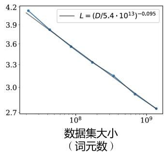

  
图 1.1 大语言模型的缩放法则[17]

# 1.2 大语言模型的发展历程

大语言模型的发展历程虽然只有不到 5 年，但是发展速度相当惊人，截至 2025 年 2 月，国内外有超过百种大语言模型相继发布。特别是 2024 年 12 月 DeepSeek V3 和 2025 年 1 月 DeepSeekR1模型的开源，不仅在训练效率和思考推理上取得了突破，还赢得了国际社会对中国人工智能技术的高度认可。中国人民大学赵鑫教授团队在《大语言模型》书中按照时间线给出了 2019 年至 2024年 6 月比较有影响力并且模型参数量超过 100 亿个的大语言模型，我们在此基础上扩展到 2025 年2月，如图1.2所示。大语言模型的发展可以粗略地分为如下三个阶段：基础模型阶段、能力探索阶段和突破发展阶段。

  
图 1.2 大语言模型发展时间线[18]

基础模型阶段主要集中于 2018 年至 2021 年。2017 年，Vaswani 等人提出了 Transformer[12]架构，在机器翻译任务上取得了突破性进展。2018 年，Google 和 OpenAI 分别提出了 BERT[1] 和

GPT-1[2] 模型，开启了预训练语言模型时代。BERT-Base 版本的参数量为 1.1 亿个，BERT-Large 版本的参数量为3.4亿个，GPT-1的参数量为1.17亿个。这在当时，比其他深度神经网络的参数量，已经有了数量级上的提升。2019年OpenAI发布了GPT-2[11]，其参数量达到15亿个。此后，Google也发布了参数规模为 110 亿个的 $\mathrm { T } 5 ^ { [ 1 9 ] }$ 模型。2020 年，OpenAI 进一步将语言模型的参数量扩展到1750亿个，发布了GPT-3[13]。此后，国内也相继推出了一系列的大语言模型，包括清华大学的ERNIE[20]、百度的 ERNIE[21]、华为的 PanGU- $\cdot \alpha ^ { [ 2 2 ] }$ 等。此阶段的研究主要集中在语言模型本身，对仅编码器（Encoder Only）、编码器-解码器（Encoder-Decoder）、仅解码器（Decoder Only）等各种类型的模型结构都有相应的研究。模型大小与 BERT 类似，通常采用预训练微调范式，针对不同下游任务进行微调。这些模型参数量大都在10亿个以上，由于微调的计算量很大，这类模型的影响力在当时相较BERT类模型有不小的差距。

能力探索阶段集中于 2019 年至 2022 年，由于大语言模型很难针对特定任务进行微调，研究人员开始探索在不针对单一任务进行微调的情况下如何发挥大语言模型的能力。2019年，Radford等人在文献[11]中使用GPT-2模型研究了大语言模型在零样本情况下的任务处理能力。在此基础上，Brown等人在GPT-3[13] 模型上研究了通过语境学习进行少样本学习的方法，将不同任务的少量有标注的实例拼接到待分析的样本之前输入语言模型，语言模型根据实例理解任务并给出正确的结果。基于GPT-3的语境学习在TriviaQA、WebQS、CoQA等评测集合中都展示出了非常强的能力，在有些任务中甚至超过了此前的有监督方法。上述方法不需要修改语言模型的参数，模型在处理不同任务时无须花费大量计算资源进行模型微调。仅依赖语言模型本身，其性能在很多任务上仍然很难达到有监督学习（Supervised Learning）的效果，因此研究人员提出了指令微调[23] 方案，将大量各类型任务统一为生成式自然语言理解框架，并构造训练数据进行微调。大语言模型能一次性学习数千种任务，并在未知任务上展现出很好的泛化能力。2022年，Ouyang等人提出了使用“有监督微调 $^ +$ 强化学习”的InstructGPT[24] 方法，该方法使用少量有监督数据就可以使大语言模型服从人类指令。Nakano等人则探索了结合搜索引擎的问题回答方法WebGPT[25]。这些方法在直接利用大语言模型进行零样本和少样本学习的基础上，逐渐扩展为利用生成式框架针对大量任务进行有监督微调的方法，有效提升了模型的性能。

突破发展阶段以2022年11月ChatGPT的发布为起点。ChatGPT通过一个简单的对话框，利用一个大语言模型就可以实现问题回答、文稿撰写、代码生成、数学解题等过去自然语言处理系统需要大量小模型定制开发才能分别实现的能力。它在开放领域问答、各类自然语言生成式任务及对话上下文理解上所展现出来的能力远超大多数人的想象。2023 年 3 月 GPT-4 发布，相较于ChatGPT，GPT-4有非常明显的进步，并具备了多模态理解能力。GPT-4在多种基准考试测试上的得分高于 $8 8 \%$ 的应试者，包括美国律师资格考试（Uniform Bar Exam）、法学院入学考试（LawSchool Admission Test）、学术能力评估（Scholastic Assessment Test，SAT）等。GPT-4o 是 OpenAI于2024年5月发布的多模态大模型，其中“o”代表“omni”即“全能”。它能接受文本、音频和图像组合输入并生成文本、音频和图像的任意组合输出，可处理50种语言，在232毫秒内对音频

输入做出反应，性能较 GPT-4 有显著提升。2024 年 9 月 OpenAI 又推出的全新推理模型 GPT-o1，在复杂推理任务上表现卓越，能通过内部思维链模拟人类思考，在数学、科学等领域超越人类专家及GPT-4o。国内外各大公司和研究机构相继发布了此类系统，包括复旦大学的MOSS、阿里巴巴的 Qwen、深度求索的 DeepSeek、Google 的 Gemini、XAI 的 Grok、科大讯飞的星火大模型、智谱的 ChatGLM 等。

表1.1 和表1.2 分别给出了截至 2025 年 2 月典型开源和闭源大语言模型的基本情况。可以看到，从2022年开始，大语言模型的数量呈爆发式的增长，各大公司和研究机构都在发布不同类型的大语言模型。模型类型中，基础模型是指仅经过预训练的模型；对话模型是指在预训练模型基础上经过有监督微调和强化学习训练的模型，具备对话和完成任务的能力；推理模型是指专注于逻辑推理增强的大语言模型。

表 1.1 典型开源大语言模型汇总  

<table><tr><td>模型名称</td><td>发布时间</td><td>参数量(个)</td><td>模型类型</td><td>预训练数据量</td></tr><tr><td>T5[19]</td><td>2019年10月</td><td>110亿</td><td>基础模型</td><td>1万亿个词元</td></tr><tr><td>PanGu-α[22]</td><td>2021年4月</td><td>130亿</td><td>基础模型</td><td>1.1万亿个词元</td></tr><tr><td>CPM-2[26]</td><td>2021年6月</td><td>1980亿</td><td>基础模型</td><td>2.6万亿个词元</td></tr><tr><td>CodeGen[27]</td><td>2022年3月</td><td>160亿</td><td>基础模型</td><td>5770亿个词元</td></tr><tr><td>GPT-NeoX-20B[28]</td><td>2022年4月</td><td>200亿</td><td>基础模型</td><td>825GB</td></tr><tr><td>OPT[29]</td><td>2022年5月</td><td>1750亿</td><td>基础模型</td><td>1800亿个词元</td></tr><tr><td>GLM[30]</td><td>2022年10月</td><td>1300亿</td><td>基础模型</td><td>4000亿个词元</td></tr><tr><td>Flan-T5[23]</td><td>2022年10月</td><td>110亿</td><td>对话模型</td><td>-</td></tr><tr><td>BLOOM[31]</td><td>2022年11月</td><td>1760亿</td><td>基础模型</td><td>3660亿个词元</td></tr><tr><td>BLOOMZ[32]</td><td>2022年11月</td><td>1760亿</td><td>对话模型</td><td>-</td></tr><tr><td>OPT-IML[33]</td><td>2022年12月</td><td>1750亿</td><td>对话模型</td><td>-</td></tr><tr><td>LLaMA[34]</td><td>2023年2月</td><td>652亿</td><td>基础模型和对话模型</td><td>1.4万亿个词元</td></tr><tr><td>MOSS</td><td>2023年2月</td><td>160亿</td><td>对话模型</td><td>-</td></tr><tr><td>ChatGLM-6B[30]</td><td>2023年4月</td><td>62亿</td><td>基础模型和对话模型</td><td>-</td></tr><tr><td>Alpaca[35]</td><td>2023年4月</td><td>130亿</td><td>对话模型</td><td>-</td></tr><tr><td>Falcon</td><td>2023年5月</td><td>400亿</td><td>基础模型</td><td>1万亿个词元</td></tr><tr><td>OpenLLaMA</td><td>2023年5月</td><td>130亿</td><td>基础模型</td><td>1万亿个词元</td></tr><tr><td>Gorilla[36]</td><td>2023年5月</td><td>67亿</td><td>对话模型</td><td>-</td></tr><tr><td>Baichuan</td><td>2023年6月</td><td>70-130亿</td><td>基础模型和对话模型</td><td>1.4万亿个词元</td></tr><tr><td>LLaMA2[37]</td><td>2023年7月</td><td>70-700亿</td><td>基础模型和对话模型</td><td>2.0万亿个词元</td></tr><tr><td>Qwen</td><td>2023年8月</td><td>70亿</td><td>基础模型和对话模型</td><td>3.0万亿个词元</td></tr><tr><td>ChatGLM3-6B</td><td>2023年9月</td><td>60亿</td><td>基础模型和对话模型</td><td>1.0万亿个词元</td></tr><tr><td>Mistral 7B</td><td>2023年9月</td><td>70亿</td><td>基础模型和对话模型</td><td>8.0万亿个词元</td></tr><tr><td>InternLM-20B</td><td>2023年9月</td><td>200亿</td><td>基础模型和对话模型</td><td>2.3万亿个词元</td></tr><tr><td>Grok-1</td><td>2023年10月</td><td>3140亿</td><td>基础模型和对话模型</td><td>-</td></tr><tr><td>DeepSeek-LLM</td><td>2023年11月</td><td>70-670亿</td><td>基础模型和对话模型</td><td>2.0万亿个词元</td></tr><tr><td>Qwen 1.5</td><td>2024年2月</td><td>5-720亿</td><td>基础模型和对话模型</td><td>3.0万亿个词元</td></tr><tr><td>Gemma</td><td>2024年2月</td><td>20-70亿</td><td>基础模型和对话模型</td><td>6.0万亿个词元</td></tr><tr><td>MiniCPM-2B</td><td>2024年2月</td><td>20亿</td><td>基础模型和对话模型</td><td>1.0万亿个词元</td></tr><tr><td>Grok-1</td><td>2024年2月</td><td>3140亿</td><td>对话模型</td><td>-</td></tr><tr><td>LLaMA 3</td><td>2024年4月</td><td>80-700亿</td><td>基础模型和对话模型</td><td>15.0万亿个词元</td></tr><tr><td>Phi-3</td><td>2024年4月</td><td>38-140亿</td><td>对话模型</td><td>4.8万亿个词元</td></tr><tr><td>GLM-4-9B</td><td>2024年6月</td><td>90亿</td><td>基础模型和对话模型</td><td>10.0万亿个词元</td></tr><tr><td>LLaMA 3.1</td><td>2024年7月</td><td>80-4050亿</td><td>基础模型和对话模型</td><td>15.0万亿个词元</td></tr><tr><td>Qwen 2.5</td><td>2024年9月</td><td>5-720亿</td><td>基础模型和对话模型</td><td>18.0万亿个词元</td></tr><tr><td>LLaMA 3.2</td><td>2024年9月</td><td>10-900亿</td><td>基础模型和对话模型</td><td>15.0万亿个词元</td></tr><tr><td>Hunyuan-Large</td><td>2024年11月</td><td>3890亿</td><td>基础模型和对话模型</td><td>7.0万亿个词元</td></tr><tr><td>DeepSeek-V3</td><td>2024年12月</td><td>6710亿</td><td>对话模型</td><td>14.8万亿个词元</td></tr><tr><td>Phi-4</td><td>2024年12月</td><td>140亿</td><td>对话模型</td><td>10.0万亿个词元</td></tr><tr><td>DeepSeek-R1</td><td>2025年1月</td><td>6710亿</td><td>推理模型</td><td>14.8万亿个词元</td></tr></table>

表 1.2 典型闭源大语言模型汇总  

<table><tr><td>模型名称</td><td>发布时间</td><td>发布公司</td><td>参数量(个)</td><td>模型类型</td></tr><tr><td>GPT-3</td><td>2020年5月</td><td>OpenAI</td><td>1750亿</td><td>基础模型</td></tr><tr><td>ERNIE 3.0</td><td>2021年7月</td><td>百度</td><td>100亿</td><td>基础模型</td></tr><tr><td>Claude</td><td>2021年12月</td><td>Anthropic</td><td>520亿</td><td>基础模型</td></tr><tr><td>InstructGPT</td><td>2022年3月</td><td>OpenAI</td><td>1750亿</td><td>对话模型</td></tr><tr><td>PaLM</td><td>2022年4月</td><td>Google</td><td>5400亿</td><td>基础模型</td></tr><tr><td>ChatGPT 3.5</td><td>2022年11月</td><td>OpenAI</td><td>1750亿1</td><td>对话模型</td></tr><tr><td>GPT-4</td><td>2023年3月</td><td>OpenAI</td><td>17600亿1</td><td>对话模型</td></tr><tr><td>PanGu-Σ</td><td>2023年3月</td><td>华为</td><td>10850亿</td><td>对话模型</td></tr><tr><td>ChatGLM</td><td>2023年3月</td><td>智谱华章</td><td>1300亿</td><td>对话模型</td></tr><tr><td>文心一言</td><td>2023年4月</td><td>百度</td><td>-</td><td>对话模型</td></tr><tr><td>通义千问</td><td>2023年5月</td><td>阿里巴巴</td><td>-</td><td>对话模型</td></tr><tr><td>MinMax</td><td>2023年5月</td><td>稀宇科技</td><td>-</td><td>对话模型</td></tr><tr><td>星火</td><td>2023年5月</td><td>科大讯飞</td><td>-</td><td>对话模型</td></tr><tr><td>浦语书生</td><td>2023年6月</td><td>浦江实验室</td><td>-</td><td>对话模型</td></tr><tr><td>Claude 2</td><td>2023年7月</td><td>Anthropic</td><td>-</td><td>对话模型</td></tr><tr><td>Baichuan2</td><td>2023年9月</td><td>百川</td><td>530亿</td><td>对话模型</td></tr><tr><td>Kimi</td><td>2023年10月</td><td>月之暗面</td><td>-</td><td>对话模型</td></tr><tr><td>Gemini</td><td>2023年12月</td><td>Google</td><td>-</td><td>对话模型</td></tr><tr><td>GLM-4</td><td>2024年1月</td><td>智谱华章</td><td>-</td><td>对话模型</td></tr><tr><td>Claude 3</td><td>2024年1月</td><td>Anthropic</td><td>-</td><td>对话模型</td></tr><tr><td>GPT-4o</td><td>2024年5月</td><td>OpenAI</td><td>2000亿1</td><td>对话模型</td></tr><tr><td>豆包</td><td>2024年5月</td><td>字节跳动</td><td>-</td><td>对话模型</td></tr><tr><td>星火2.0</td><td>2024年6月</td><td>科大讯飞</td><td>-</td><td>对话模型</td></tr><tr><td>Step-2</td><td>2024年7月</td><td>阶跃星辰</td><td>10000亿</td><td>对话模型</td></tr><tr><td>GPT-o1</td><td>2024年9月</td><td>OpenAI</td><td>3000亿1</td><td>对话模型</td></tr><tr><td>Claude 3.5</td><td>2024年10月</td><td>Anthropic</td><td>-</td><td>对话模型</td></tr><tr><td>GPT-o3</td><td>2024年12月</td><td>OpenAI</td><td>-</td><td>推理模型</td></tr><tr><td>豆包1.5Pro</td><td>2025年1月</td><td>字节跳动</td><td>-</td><td>对话模型</td></tr><tr><td>Grok-3</td><td>2025年2月</td><td>XAI</td><td>-</td><td>对话推理模 型</td></tr></table>

1 模型参数量根据微软公司发表的文献 [38] 获取，数字并未得到 OpenAI 官方证实

# 1.3 大语言模型的构建流程

根据 OpenAI 联合创始人 Andrej Karpathy 在微软 Build 2023 大会上公开的信息，OpenAI 使用的大语言模型构建流程如图1.3所示，主要包含四个阶段：预训练、有监督微调、奖励建模和强化学习。这四个阶段都需要不同规模的数据集及不同类型的算法，会产出不同类型的模型，所需要的资源也有非常大的差别。

  
图 1.3 OpenAI 使用的大语言模型构建流程

预训练（Pretraining）阶段需要利用海量的训练数据（数据来自互联网网页、维基百科、书籍、GitHub、论文、问答网站等），构建包含数千亿甚至数万亿单词的具有多样性的内容。利用由数千块高性能GPU和高速网络组成的超级计算机，花费数十天完成深度神经网络参数训练，构建基础模型（Base Model）。基础模型对长文本进行建模，使模型具有语言生成能力，根据输入的提示词，模型可以生成文本补全句子。有一部分研究人员认为，语言模型建模过程中隐含地构建了包括事实性知识（Factual Knowledge）和常识性知识（Commonsense）在内的世界知识（World Knowledge）。根据文献 [39] 中的介绍，GPT-3 完成一次训练的总计算量是 3640PFLOPS，按照 NVIDIA A100 80GBGPU和平均利用率达到 $50 \%$ 计算，需要花费近一个月的时间使用1000块GPU完成。由于GPT-3的训练采用NVIDIA V100 32GB GPU，其实际计算成本远高于上述计算。文献[29]介绍了参数量同样是 1750 亿个的 OPT 模型，该模型训练使用 992 块 NVIDIA A100 80GB GPU，整体训练时间将近2个月。BLOOM[31] 模型的参数量也是1750亿个，该模型训练一共花费3.5个月，使用包含384块NVIDIA A100 80GB GPU集群完成。可以看到，大语言模型的训练需要花费大量的计算资源和时间。LLaMA、Falcon、百川（Baichuan）等模型都属于基础语言模型。即便是 DeepSeek-V3[40]经过了大量的训练效率优化，甚至已经直接使用PTX进行汇编级优化，完成一次预训练仍然需要

花费 266.4 万 H800 GPU 小时。由于训练过程需要消耗大量的计算资源，并很容易受到超参数影响，因此，如何提升分布式计算效率并使模型训练稳定收敛是本阶段的研究重点。

有监督微调（Supervised Fine Tuning，SFT），也称为指令微调，利用少量高质量数据集，通过有监督训练使模型具备问题回答、翻译、写作等能力。有监督微调的数据包含用户输入的提示词和对应的理想输出结果。用户输入包括问题、闲聊对话、任务指令等多种形式和任务。

例如：提示词：复旦大学有几个校区？

理想输出：复旦大学现有4个校区，分别是邯郸校区、新江湾校区、枫林校区和张江校区。其中邯郸校区是复旦大学的主校区，邯郸校区与新江湾校区都位于杨浦区，枫林校区位于徐汇区，张江校区位于浦东新区。

利用这些有监督数据，使用与预训练阶段相同的语言模型训练算法，在基础模型的基础上进行训练，得到有监督微调模型（SFT模型）。经过训练的SFT模型具备初步的指令理解能力和上下文理解能力，能够完成开放领域问答、阅读理解、翻译、生成代码等任务，也具备了一定的对未知任务的泛化能力。由于有监督微调阶段所需的训练数据量较少，SFT 模型的训练过程并不需要消耗大量的计算资源。根据模型的大小和训练数据量，通常需要数十块GPU，花费数天时间完成训练。SFT模型具备了初步的任务完成能力，可以开放给用户使用，很多类ChatGPT的模型都属于该类型，包括 Alpaca[35]、Vicuna[41]、MOSS、ChatGLM-6B 等。很多这类模型的效果非常好，甚至在一些评测中达到了 ChatGPT 的 $90 \%$ 的效果[35, 41]。当前的一些研究表明，有监督微调阶段的数据选择对SFT 模型效果有非常大的影响[42]，因此构造少量并且高质量的训练数据是本阶段的研究重点。

奖励建模（Reward Modeling）阶段的目标是构建一个文本质量对比模型。对于同一个提示词，SFT 模型对给出的多个不同输出结果的质量进行排序。奖励模型可以通过二分类模型，对输入的两个结果之间的优劣进行判断。奖励模型与基础模型和SFT模型不同，奖励模型本身并不能单独提供给用户使用。奖励模型的训练通常和SFT模型一样，使用数十块GPU，通过数天时间完成训练。由于奖励模型的准确率对强化学习阶段的效果有至关重要的影响，因此通常需要大规模的训练数据对该模型进行训练。Andrej Karpathy 在报告中指出，该部分需要百万量级的对比数据标注，而且其中很多标注需要很长时间才能完成。图1.4 给出了 InstructGPT 系统中奖励模型训练样本标注示例[24]。可以看到，示例中文本表达都较为流畅，标注其质量排序需要制定非常详细的规范，标注者也需要认真地基于标注规范进行标注，需要消耗大量的人力。同时，保持众包标注者之间的一致性，也是奖励建模阶段需要解决的难点问题之一。此外，奖励模型的泛化能力边界也是本阶段需要重点研究的一个问题。如果奖励模型的目标是针对系统所有的输出都能够高质量地进行判断，那么该问题的难度在某种程度上与文本生成等价，因此限定奖励模型应用的泛化边界是本阶段需要解决的问题。

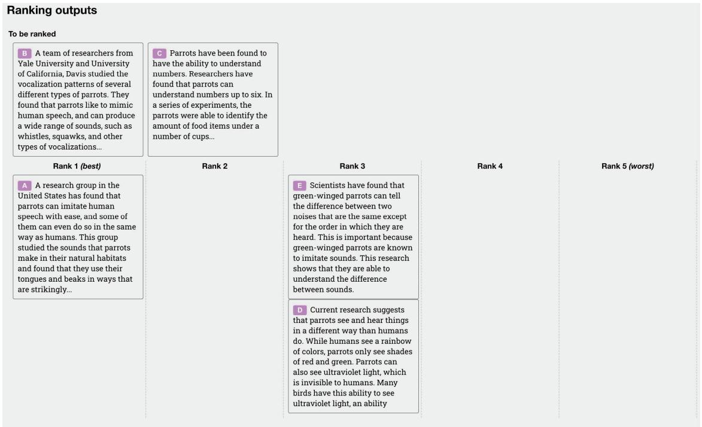  
图 1.4 InstructGPT 系统中奖励模型训练样本标注示例[24]

强化学习（Reinforcement Learning，RL）阶段根据数十万条提示词，利用前一阶段训练的奖励模型，给出SFT模型对提示词回答结果的质量评估，并与语言模型建模目标综合得到更好的效果。该阶段使用的提示词数量与有监督微调阶段类似，数量在十万个量级，并且不需要人工提前给出该提示词所对应的理想回复。使用强化学习，在SFT模型的基础上调整参数，使最终生成的文本可以获得更高的奖励（Reward）。该阶段需要的计算量较预训练阶段也少很多，通常仅需要数十块GPU，数天即可完成训练。文献[24]给出了强化学习和有监督微调的对比，在模型参数量相同的情况下，强化学习可以得到相较于有监督微调好得多的效果。关于为什么强化学习相比有监督微调可以得到更好结果的问题，截至2025年2月还没有完整或得到普遍共识的解释。目前相对得到认可的观点是，强化学习使得模型具备更好的泛化能力[43]。同时，Andrej Karpathy也指出，强化学习并不是没有问题的，它会使基础模型的熵降低，从而减少模型输出的多样性。经过强化学习方法训练后的 RL 模型，就是最终提供给用户使用、具有理解用户指令和上下文的类 ChatGPT 系统。由于强化学习方法稳定性不高，并且超参数众多，使得模型收敛难度大，叠加奖励模型的准确率问题，使得在大语言模型上有效应用强化学习非常困难。

# 1.4 本书的内容安排

本书共分为12章，围绕大语言模型基础理论、预训练、指令理解、大模型增强和大模型应用五个部分展开：第一部分介绍大语言模型的基础理论；第二部分介绍大语言模型的预训练，包括大语言模型预训练数据和分布式训练；第三部分介绍大语言模型如何理解并服从人类指令，包括有监督微调和强化学习；第四部分介绍大语言模型增强技术，包括多模态大语言模型、大模型智能体和检索增强生成；第五部分介绍大模型应用，包括大语言模型效率优化、大语言模型评估和大语言模型应用开发。具体章节安排如图1.5所示。

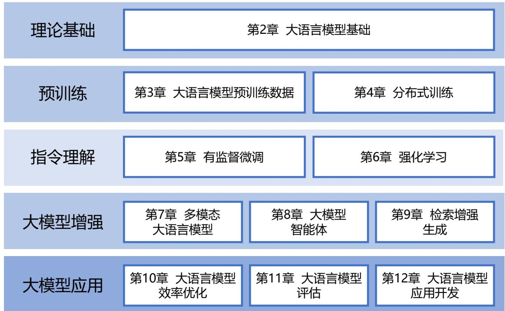  
图 1.5 本书章节安排

第2章介绍大语言模型的基础理论知识，包括语言模型的定义、Transformer结构、大语言模型框架等内容，并以LLaMA使用的模型结构为例介绍代码实例。

第 3 章和第 4 章围绕大语言模型预训练阶段的主要研究内容开展介绍，包括模型分布式训练中需要掌握的数据并行、流水线并行、模型并行及ZeRO系列优化方法。除此之外，还将介绍预训练需要使用的数据分布和数据预处理方法，并以DeepSpeed为例介绍如何进行大语言模型预训练。

第 5 章和第 6 章聚焦于大语言模型指令理解阶段的核心研究内容，探讨如何通过有监督微调和强化学习方法，使模型能够理解指令并生成类人回答。第 5 章重点介绍模型微调技术，有监督微调数据的构造策略以及高效微调方法：LoRA、Delta Tuning 等方法；第 6 章则围绕强化学习展开，讲解其基础理论与近端策略优化（PPO）技术，并结合实际案例，以DeepSpeed-Chat和veRL框架为例，详细说明如何训练类ChatGPT系统。

第 7 章、第 8 章和第 9 章围绕提升大语言模型能力展开详细探讨，内容涵盖多模态大语言模型、智能体实践及检索增强生成。第 7 章重点介绍多模态大语言模型的基础理论、架构设计与训练策略，并探讨其在实际场景中的应用实践；第 8 章聚焦智能体的发展历程与大语言模型智能体的架构设计，深入分析智能体的实现原理，并以 LangChain 为例详细阐述具体实践；第 9 章则围绕检索增强生成展开讨论，介绍其核心思想与实现方式，涵盖检索增强框架的设计、检索模块与

生成模块的协作机制，以及其在具体任务场景中的应用方法与实践。

第10章、第11章和第12章主要围绕如何应用大语言模型展开讨论，内容涵盖提升模型效率的方法、大语言模型评估，以及典型应用的开发与部署。第10章重点介绍模型压缩与优化、训练效率优化和推理效率优化等提升模型效率的关键技术；第11章聚焦于大语言模型评估，探讨其基本概念和难点，阐述评估体系的构建、评估方法的设计以及实际评估的实施；第12章则基于典型的大语言模型应用场景，详细介绍开发流程、开发工具及本地部署的实践方法。

# 2. 大语言模型基础

语言模型的核心目标是对自然语言的概率分布进行建模，这一任务在自然语言处理研究中占据重要地位，是其基础性工作之一。大量研究围绕这一目标，从不同角度展开了探索，包括 $n$ 元语言模型（ $\boldsymbol { \mathscr { n } }$ -gram Language Models）、神经语言模型和预训练语言模型等。这些研究在不同发展阶段对自然语言处理任务产生了深远影响。随着基于Transformer架构的语言模型不断发展，以及预训练-微调范式在各类自然语言处理任务中取得突破性成果，自 2020 年 OpenAI 发布 GPT-3 以来，大语言模型的研究逐步深入。尽管大语言模型参数规模庞大，并且通过有监督微调和强化学习可以完成众多任务，其理论基础仍然离不开对语言建模的核心研究。

本章首先介绍Transformer结构，并在此基础上讲解生成式预训练语言模型GPT、大语言模型的网络结构、注意力机制优化及相关实践。关于 $n$ 元语言模型、神经语言模型及其他预训练语言模型的内容，可参考《自然语言处理导论》第6章[4]。

# 2.1 Transformer 结构

Transformer 结构[44] 是由 Google 在 2017 年提出并首先应用于机器翻译的神经网络模型架构。机器翻译的目标是从源语言（Source Language）转换到目标语言（Target Language）。Transformer结构完全通过注意力机制完成对源语言序列和目标语言序列全局依赖的建模。如今，几乎全部大语言模型都是基于 Transformer 结构的。本节以应用于机器翻译的基于 Transformer 的编码器和解码器结构为例介绍该模型。

基于 Transformer 的编码器和解码器结构如图2.1 所示，左侧和右侧分别对应着编码器（En-coder）和解码器（Decoder）结构，它们均由若干个基本的Transformer块（Block）组成（对应图中的灰色框）。这里 $N \times$ 表示进行了 $N$ 次堆叠。每个 Transformer 块都接收一个向量序列 $\{ { \pmb x } _ { i } \} _ { i = 1 } ^ { t }$ 作为输入，并输出一个等长的向量序列作为输出 $\{ y _ { i } \} _ { i = 1 } ^ { t }$ 。这里的 $\mathbf { \Delta } _ { \mathbf { \mathcal { X } } _ { i } }$ 和 $\mathbf { \nabla } _ { \mathbf { \psi } _ { 3 } } \mathbf { \psi } _ { 2 } \qquad \mathbf { \psi } _ { 3 } \mathbf { \psi } _ { 4 } \qquad \mathbf { \psi } _ { 3 } \mathbf { \psi } _ { 4 } \mathbf { \psi } _ { 3 } \qquad \mathbf { \psi } _ { 4 } \mathbf { \psi } _ { 4 } \mathbf { \psi } _ { 3 } \mathbf { \psi } _ { 4 }$ 分别对应文本序列中的一个词元（Token）的表示。 $\mathbf { \nabla } _  \mathbf { \psi } _ { \mathrm { ~ } } \mathbf { ~ } \mathbf { ~ } \mathbf { ~ } \mathbf { ~ } \mathbf { ~ } \mathbf { ~ } \mathbf { ~ } \mathbf { ~ } \mathbf { ~ } \mathbf { ~ } \mathbf { ~ } \mathbf { ~ } \mathbf { ~ } \mathbf { ~ } \mathbf { ~ } \mathbf { ~ } \mathbf { ~ } \mathbf { ~ } \mathbf { ~ } \mathbf { ~ } \mathbf { ~ } \mathbf { ~ } \mathbf { ~ } \mathbf { ~ } \mathbf { ~ } \mathbf { ~ } \mathbf { ~ } \mathbf { ~ } \mathbf { ~ } \mathbf { ~ } \mathbf { ~ } \mathbf { ~ } \mathbf { ~ } \mathbf { ~ } \mathbf { ~ } \mathbf { ~ } \mathbf { ~ } \mathbf { ~ } \mathbf { ~ } \mathbf { ~ } \mathbf { ~ } \mathbf { ~ } \mathbf { ~ } \mathbf { ~ } \mathbf { ~ } \mathbf { ~ } \psi \left( \mathbf { ~ } \mathbf { ~ } \mathbf { } \psi \right) \mathbf { ~ } \psi \left( \mathbf { ~ } \mathbf { ~ } \psi \mathbf { ~ } \psi \right) $ 是当前 Transformer 块对输入 $\mathbf { \Delta } _ { \mathbf { \mathcal { X } } _ { i } }$ 进一步整合其上下文语义后对应的输出。在从输入 $\{ { \pmb x } _ { i } \} _ { i = 1 } ^ { t }$ 到输出 $\{ y _ { i } \} _ { i = 1 } ^ { t }$ 的语义抽象过程中，主要涉及如下几个模块。

• 注意力层：使用多头注意力（Multi-Head Attention）机制整合上下文语义。多头注意力并行

运行多个独立注意力机制，进而从多维度捕捉输入序列信息。它使得序列中任意两个单词之间的依赖关系可以直接被建模而不基于传统的循环结构，从而更好地解决文本的长程依赖问题。

• 位置感知前馈网络层（Position-wise Feed-Forward Network）：通过全连接层对输入文本序列中的每个单词表示进行更复杂的变换。  
• 残差连接：对应图中的Add部分。它是一条分别作用在上述两个子层中的直连通路，被用于连接两个子层的输入与输出，使信息流动更高效，有利于模型的优化。  
• 层归一化：对应图中的Norm部分。它作用于上述两个子层的输出表示序列，对表示序列进行层归一化操作，同样起到稳定优化的作用。

  
图 2.1 基于 Transformer 的编码器和解码器结构[44]

接下来依次介绍各个模块的具体功能和实现方法。

# 2.1.1 嵌入表示层

对于输入文本序列，先通过输入嵌入层（Input Embedding）将每个单词转换为其相对应的向量表示。通常，直接对每个单词创建一个向量表示。Transformer结构不再使用基于循环的方式建模文本输入，序列中不再有任何信息能够提示模型单词之间的相对位置关系。在送入编码器端建模其上下文语义之前，一个非常重要的操作是在词嵌入中加入位置编码（Positional Encoding）这一特征。具体来说，序列中每一个单词所在的位置都对应一个向量。这一向量会与单词表示对应相加并送入后续模块中做进一步处理。在训练过程中，模型会自动地学习到如何利用这部分位置信息。

为了得到不同位置所对应的编码，Transformer结构使用不同频率的正余弦函数，如下所示。

$$
\mathrm {P E} (\text {p o s}, 2 i) = \sin \left(\frac {\text {p o s}}{1 0 0 0 0 ^ {2 i / d}}\right) \tag {2.1}
$$

$$
\mathrm {P E} (\text {p o s}, 2 i + 1) = \cos \left(\frac {\text {p o s}}{1 0 0 0 0 ^ {2 i / d}}\right) \tag {2.2}
$$

其中，pos表示单词所在的位置， $2 i$ 和 $2 i + 1$ 表示位置编码向量中的对应维度， $d$ 则对应位置编码的总维度。通过上面这种方式计算位置编码有以下两个好处：第一，正余弦函数的范围是 $[ - 1 , + 1 ]$ ，导出的位置编码与原词嵌入相加不会使得结果偏离过远而破坏原有单词的语义信息；第二，依据三角函数的基本性质，可以得知第 $\mathsf { p o s } + k$ 个位置编码是第pos个位置编码的线性组合，这就意味着位置编码中蕴含着单词之间的距离信息。

使用PyTorch实现的位置编码参考代码如下：

class PositionalEncoder(nnModule): def__init__(self，d_model，max_seq_len $= 80$ ： super(）.__init_（） self.d_model $\equiv$ d_model #根据pos和i创建一个常量PE矩阵 pe $=$ torch.zeros(max_seq_len，d_model) forpos in range(max_seq_len): for i in range(0，d_model，2): pe[pos，i] $=$ math.sin(pos/（10000\*\*（i/d_model))) pe[pos，i+1] $=$ math.cos(pos/（10000\*\*（i/d_model))) pe $=$ pe unsqueeze(0) self.register_buffer('pe'，pe) defforward(self,x): #使得单词嵌入表示相对大一些 $\mathbf{x} = \mathbf{x}^{*}$ math.sqrt(self.d_model) #增加位置常量到单词嵌入表示中 seq_len=x.size(1) $\mathbf{x} = \mathbf{x} +$ Variable(self.pe[:,:seq_len]，requires_grad=False).CUDA() return x

# 2.1.2 注意力层

自注意力（Self-Attention）操作是基于Transformer的机器翻译模型的基本操作，在源语言的编码和目标语言的生成中频繁地被使用，以建模源语言、目标语言任意两个单词之间的依赖关系。将由单词语义嵌入及其位置编码叠加得到的输入表示为 $\{ \pmb { x } _ { i } \in \mathbb { R } ^ { d } \} _ { i = 1 } ^ { L }$ ，为了实现对上下文语义依赖的建模，引入自注意力机制涉及的三个元素：查询 $\pmb q _ { i }$ （Query）、键 $\mathbf { \Psi } _ { k _ { i } }$ （Key）和值 ${ \mathbf { } } v _ { i }$ （Value）。在编码输入序列的每一个单词的表示中，这三个元素用于计算上下文单词对应的权重得分。直观地说，这些权重反映了在编码当前单词的表示时，对于上下文不同部分所需的关注程度。具体来说，如图2.2 所示，通过三个线性变换 $W ^ { Q } \in \mathbb { R } ^ { d \times d _ { q } }$ , $W ^ { K } \in \mathbb { R } ^ { d \times d _ { k } }$ , $W ^ { V } \in \mathbb { R } ^ { d \times d _ { v } }$ 将输入序列中的每一个单词表示 $\mathbf { \Delta } _ { \mathbf { \mathcal { X } } _ { i } }$ 转换为其对应的 $\pmb q _ { i } \in \mathbb { R } ^ { d _ { q } }$ , $\pmb { k } _ { i } \in \mathbb { R } ^ { d _ { k } }$ , $\pmb { v } _ { i } \in \mathbb { R } ^ { d _ { v } }$ 向量。对于输入 $\{ \pmb { x } _ { i } \in \mathbb { R } ^ { d } \} _ { i = 1 } ^ { L }$ ，$Q$ 、 $\kappa$ 和 $V$ 矩阵可以通过如下公式所示：

$$
Q = X W ^ {Q} \tag {2.3}
$$

$$
\boldsymbol {K} = \boldsymbol {X} \boldsymbol {W} ^ {K} \tag {2.4}
$$

$$
\boldsymbol {V} = \boldsymbol {X} \boldsymbol {W} ^ {V} \tag {2.5}
$$

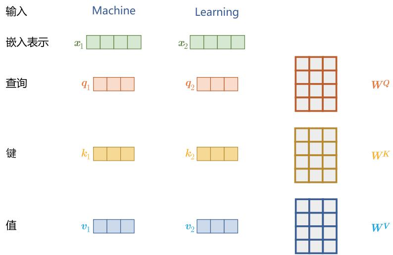  
图 2.2 自注意力机制中的查询、键、值

为了得到编码单词 $\mathbf { \Delta } _ { \mathbf { \mathcal { X } } _ { i } }$ 时所需要关注的上下文信息，通过位置 $i$ 查询向量与其他位置的键向量做点积得到匹配分数 $\pmb q _ { i } \cdot \pmb { k } _ { 1 } , \pmb q _ { i } \cdot \pmb { k } _ { 2 } , \cdot \cdot \cdot , \pmb q _ { i } \cdot \pmb { k } _ { t } ,$ 。为了防止过大的匹配分数在后续 Softmax 计算过程中导致的梯度爆炸及收敛效率差的问题，这些得分会除以放缩因子 $\sqrt { d }$ 以稳定优化。放缩后的得分经过 Softmax 归一化为概率，与其他位置的值向量相乘来聚合希望关注的上下文信息，并最小化不相关信息的干扰。上述计算过程可以被形式化地表述如下：

$$
\boldsymbol {Z} = \operatorname {A t t e n t i o n} (\boldsymbol {Q}, \boldsymbol {K}, \boldsymbol {V}) = \operatorname {S o f t m a x} \left(\frac {\boldsymbol {Q} \boldsymbol {K} ^ {\top}}{\sqrt {d}}\right) \boldsymbol {V} \tag {2.6}
$$

其中 $\pmb { Q } \in \mathbb { R } ^ { L \times d _ { q } } , \pmb { K } \in \mathbb { R } ^ { L \times d _ { k } } , \pmb { V } \in \mathbb { R } ^ { L \times d _ { v } }$ $V \in \mathbb { R } ^ { L \times d _ { v } }$ 分别表示输入序列中的不同单词的 $\mathbf { \mu } _ { q , k , v }$ 向量拼接组成的矩阵， $L$ 表示序列长度， $\boldsymbol { Z } \in \mathbb { R } ^ { L \times d _ { v } }$ 表示自注意力操作的输出。为了进一步增强自注意力机制聚合上下文信息的能力，提出了多头注意力机制，以关注上下文的不同侧面。具体来说，上下文中每一个单词的表示 $\mathbf { \Delta } _ { \mathbf { \mathcal { X } } _ { i } }$ 经过多组线性 $\{ W _ { j } ^ { Q } , W _ { j } ^ { K } , W _ { j } ^ { V } \} _ { j = 1 } ^ { N }$ 映射到不同的表示子空间中。公式 (2.6) 会在不同的子空间中分别计算并得到不同的上下文相关的单词序列表示 $\{ Z _ { j } \} _ { j = 1 } ^ { N }$ ：

$$
\boldsymbol {Z} _ {i} = \operatorname {A t t e n t i o n} \left(\boldsymbol {Q} _ {i}, \boldsymbol {K} _ {i}, \boldsymbol {V} _ {i}\right) = \operatorname {S o f t m a x} \left(\frac {\boldsymbol {Q} _ {i} \boldsymbol {K} _ {i} ^ {\top}}{\sqrt {d}}\right) \boldsymbol {V} _ {i} \tag {2.7}
$$

在此基础上，经过线性变换 $W ^ { O } \in \mathbb { R } ^ { ( N d _ { v } ) \times d }$ 用于综合不同子空间中的上下文表示并形成注意力层最终的输出 $\{ \pmb { x } _ { i } \in \mathbb { R } ^ { d } \} _ { i = 1 } ^ { L }$ ，可得到多头自注意力（Multi-Head Self-Attention）表示：

$$
\boldsymbol {Z} = \operatorname {C o n c a t} \left(\boldsymbol {Z} _ {1}, \boldsymbol {Z} _ {2}, \dots , \boldsymbol {Z} _ {N}\right) \boldsymbol {W} ^ {\boldsymbol {O}} \tag {2.8}
$$

由此可见，自注意力机制使模型能够识别不同输入部分的重要性，而不受距离的影响，从而能够捕捉输入句子中的长距离依赖关系和复杂关系。

使用 PyTorch 实现的自注意力层参考代码如下：

class MultiHeadAttention(nnModule): def__init__(self，heads，d_model，dropout $= 0.1$ ： super(）._init_(） self.d_model $\equiv$ d_model self.d_k $\equiv$ d_model// heads self.h $\equiv$ heads self.q_linear $\equiv$ nn.Linear(d_model，d_model) self.v_linear $\equiv$ nn.Linear(d_model，d_model) self.k_linear $\equiv$ nn.Linear(d_model，d_model) self.dropout $\equiv$ nn.Dropoutdropout) self.out $\equiv$ nn.Linear(d_model，d_model)   
def attention(q,k,v,d_k，mask $\equiv$ None，dropout $\equiv$ None): scores $\equiv$ torch/matmul(q,k.transpose(-2,-1)) /math.sqrt(d_k) #掩盖那些为了补全长度而增加的单元，使其通过Softmax计算后为0 if mask is not None: mask $\equiv$ mask unsqueeze(1) scores $\equiv$ scoresmasked_fill(mask $= = 0$ ，-1e9) scores $=$ F softmax(scores，dim=-1) if dropout is not None: scores $\equiv$ dropout(scores) output $=$ torch/matmul(scores,v) return output   
def forward(self,q,k,v，mask $\equiv$ None): bs $=$ q.size(0)

# 利用线性计算划分成h个头

```python
k = self.k_linear(k).view(bs, -1, self.h, self.d_k)  
q = self.q_linear(q).view(bs, -1, self.h, self.d_k)  
v = self.v_linear(v).view(bs, -1, self.h, self.d_k) 
```

# 矩阵转置

```matlab
k = k.transpose(1,2)  
q = q.transpose(1,2)  
v = v.transpose(1,2) 
```

# 计算attention

```python
scores = attention(q, k, v, self.d_k, mask, self.dropout) 
```

# 2.1.3 前馈层

前馈层接收自注意力子层的输出作为输入，并通过一个带有 ReLU 激活函数的两层全连接网络对输入进行更复杂的非线性变换。实验证明，这一非线性变换会对模型最终的性能产生重要的影响。

$$
\operatorname {F F N} (\boldsymbol {x}) = \operatorname {R e L U} \left(\boldsymbol {x} \boldsymbol {W} _ {1} + \boldsymbol {b} _ {1}\right) \boldsymbol {W} _ {2} + \boldsymbol {b} _ {2} \tag {2.9}
$$

其中 $W _ { 1 } , b _ { 1 } , W _ { 2 } , b _ { 2 }$ 表示前馈子层的参数。实验结果表明，增大前馈子层隐状态的维度有利于提高最终翻译结果的质量，因此，前馈子层隐状态的维度一般比自注意力子层要大。

使用PyTorch实现的前馈层参考代码如下：

class FeedForward(nnModule): def__init__(self，d_model，d_ff=2048，dropout $= 0.1$ ： super(）.__init_（） #d_ff默认设置为2048 self_linear_1 $\equiv$ nn.Linear(d_model，d_ff) self_dropout $\equiv$ nn_dropout捺out) self_linear_2 $\equiv$ nn.Linear(d_ff，d_model) defforward(self,x): x $\equiv$ self_dropout(F.relu(self.linear_1(x))) x $\equiv$ self.linear_2(x) returnx

# 2.1.4 残差连接与层归一化

由Transformer结构组成的网络结构通常都非常庞大。编码器和解码器均由很多层基本的Trans-former 块组成，每一层中都包含复杂的非线性映射，这就导致模型的训练比较困难。因此，研究人员在Transformer块中进一步引入了残差连接与层归一化技术，以进一步提升训练的稳定性。具体来说，残差连接主要是指使用一条直连通道直接将对应子层的输入连接到输出，避免在优化过程中因网络过深而产生潜在的梯度消失问题：

$$
\boldsymbol {x} ^ {l + 1} = f \left(\boldsymbol {x} ^ {l}\right) + \boldsymbol {x} ^ {l} \tag {2.10}
$$

其中 $\mathbf { \Delta } _ { \mathbf { \boldsymbol { x } } } l$ 表示第 $l$ 层的输入， $f ( \cdot )$ 表示一个映射函数。此外，为了使每一层的输入/输出稳定在一个合理的范围内，层归一化技术被进一步引入每个Transformer块中：

$$
\operatorname {L N} (\boldsymbol {x}) = \alpha \cdot \frac {\boldsymbol {x} - \boldsymbol {\mu}}{\sigma} + b \tag {2.11}
$$

其中 $\pmb { \mu }$ 和 $\sigma$ 分别表示均值和方差，用于将数据平移缩放到均值为 0、方差为 1 的标准分布， $\alpha$ 和$b$ 是可学习的参数。层归一化技术可以有效地缓解优化过程中潜在的不稳定、收敛速度慢等问题。使用PyTorch实现的层归一化参考代码如下：

class Norm(nnModule): def__init__(self，d_model，eps $= 1\mathrm{e} - 6$ ： super(）.__init_（） self.size $\equiv$ d_model #层归一化包含两个可以学习的参数 self.alpha $\equiv$ nn.Parameters(torch.ones(self.size)) self.bias $\equiv$ nn.Parameterrtorch.zeros(self.size)) self.eps $\equiv$ eps defforward(self，x): norm $\equiv$ self.alpha \* (x-x.mean(dim=-1,keepdim=True))\ /（x.std(dim=-1，keepdim=True) $^+$ self.eps) $^+$ self.bias returnnorm

# 2.1.5 编码器和解码器结构

基于上述模块，根据图2.1给出的网络架构，编码器端较容易实现。相比于编码器端，解码器端更复杂。具体来说，解码器的每个Transformer块的第一个自注意力子层额外增加了注意力掩码，对应图中的掩码多头注意力（Masked Multi-Head Attention）部分。这主要是因为在翻译的过程中，编码器端主要用于编码源语言序列的信息，而这个序列是完全已知的，因而编码器仅需要考虑如何融合上下文语义信息。解码器端则负责生成目标语言序列，这一生成过程是自回归的，即对于每一个单词的生成过程，仅有当前单词之前的目标语言序列是可以被观测的，因此这一额外增加的掩码是用来掩盖后续的文本信息的，以防模型在训练阶段直接看到后续的文本序列，进而无法得到有效的训练。

此外，解码器端额外增加了一个多头交叉注意力（Multi-Head Cross-Attention）模块，使用交叉注意力（Cross-Attention）方法，同时接收来自编码器端的输出和当前Transformer块的前一个掩码注意力层的输出。查询是通过解码器前一层的输出进行投影的，而键和值是使用编码器的输出进行投影的。它的作用是在翻译的过程中，为了生成合理的目标语言序列，观测待翻译的源语言序列是什么。基于上述编码器和解码器结构，待翻译的源语言文本经过编码器端的每个Transformer块对其上下文语义进行层层抽象，最终输出每一个源语言单词上下文相关的表示。解码器端以自回归的方式生成目标语言文本，即在每个时间步 $t$ ，根据编码器端输出的源语言文本表示，以及前$t - 1$ 个时刻生成的目标语言文本，生成当前时刻的目标语言单词。

使用PyTorch实现的编码器参考代码如下：

class EncoderLayer(nn.Module):   
```python
def __init__(self, d_model, heads, dropout=0.1):
    super().__init__()
    self(norm_1 = Norm(d_model)
    self(norm_2 = Norm(d_model)
    self.attn = MultiHeadAttention(heads, d_model, dropout=dropout)
    self.qq = FeedForward(d_model, dropout=dropout)
    self.dropout_1 = nn.Dropout Dropout)
    self.dropout_2 = nn.Dropout Dropout)
def forward(self, x, mask):
    attn_output = self.attn(x, x, x, mask)
    attn_output = self.dropout_1(attn_output)
    x = x + attn_output
    x = self(norm_1(x))
    ff_output = self.qq(x)
    ff_output = self.dropout_2(ff_output)
    x = x + ff_output
    x = self(norm_2(x))
    return x 
```

class Encoder(nn.Module):   
```python
def __init__(self, vocab_size, d_model, N, heads, dropout):
    super().__init__()
    self.N = N
    selfembed = Embedder(vocab_size, d_model)
    self.pe = PositionalEncoder(d_model, dropout=dropout)
    self.layers = get_clones(EncoderLayer(d_model, heads, dropout), N)
    self(norm = Norm(d_model)
def forward(self, src, mask):
    x = self_embedding(src)
    x = self.pe(x)
    for i in range(self.N):
        x = self.layers[i](x, mask)
    return self(norm(x)) 
```

class DecoderLayer(nn.Module):   
```python
def __init__(self, d_model, heads, dropout=0.1):
    super().__init__()
    self(norm_1 = Norm(d_model)
    self(norm_2 = Norm(d_model)
    self(norm_3 = Norm(d_model)
    self.dropout_1 = nn.DropoutDropout)
    self.dropout_2 = nn.DropoutDropout)
    self.dropout_3 = nn.DropoutDropout)
    self.attn_1 = MultiHeadAttention(heads, d_model, dropout=dropout)
    self.attn_2 = MultiHeadAttention(heads, d_model, dropout=dropout)
    self.mm = FeedForward(d_model, dropout=dropout)
def forward(self, x, e_outputs, src_mask, trg_mask):
    attn_output_1 = self.attn_1(x, x, x, trg_mask)
    attn_output_1 = self.dropout_1(attn_output_1)
    x = x + attn_output_1
    x = self(norm_1(x))
    attn_output_2 = self.attn_2(x, e_outputs, e_outputs, src_mask)
    attn_output_2 = self.dropout_2(attn_output_2)
    x = x + attn_output_2
    x = self(norm_2(x))
    ff_output = self.mm(x)
    ff_output = self.dropout_3(ff_output)
    x = x + ff_output
    x = self(norm_3(x))
return x 
```

class Decoder(nn.Module):   
```python
def __init__(self, vocab_size, d_model, N, heads, dropout):
    super().__init__()
    self.N = N
    selfembed = Embedder(vocab_size, d_model)
    self.pe = PositionalEncoder(d_model, dropout=dropout)
    self.layers = get_clones(DecoderLayer(d_model, heads, dropout), N)
    self(norm = Norm(d_model))
def forward(self, trg, e_outputs, src_mask, trg_mask):
    x = self_embedding(trg) 
```

基于Transformer的编码器和解码器结构整体实现的参考代码如下：

class Transformer(nn.Module):   
```python
def __init__(self, src_vocab, trg_vocab, d_model, N, heads, dropout):
    super().__init__()
    self encoder = Encoder(src_vocab, d_model, N, heads, dropout)
    self decoder = Decoder(trg_vocab, d_model, N, heads, dropout)
    self.out = nn.Linear(d_model, trg_vocab)
def forward(self, src, trg, src_mask, trg_mask):
    e_outputs = self encoder(src, src_mask)
    d_output = self decoder(trg, e_outputs, src_mask, trg_mask)
    output = self.output(d_output)
    return output 
```

可以使用如下代码对上述模型结构进行训练和测试：

# 模型参数定义  
```python
d_model = 512  
heads = 8  
N = 6  
src_vocab = len(EN_TEXT.vocab)  
trg_vocab = len(FR_TEXT.vocab)  
model = Transformer(src_vocab, trg_vocab, d_model, N, heads)  
for p in model.params():  
    if p.dim() > 1:  
        nn.init.xavier.uniform_(p)  
    optim = torch.optim.Adam(model.params(), lr=0.0001, betas=(0.9, 0.98), eps=1e-9) 
```

# 模型训练  
def train_model(epochs，print_every $\coloneqq 100$ ：   
model.train()   
start $=$ time.time()   
temp $=$ start   
total_loss $= 0$ for epoch in range(epochs): for i，batch in enumerate(train_iter): src $=$ batch.English.transpose(0,1) trg $=$ batch.French.transpose(0,1) #将我们输入的英语句子中的所有单词翻译成法语 #除了最后一个单词，因为它为结束符，不需要进行下一个单词的预测 trg_input $\equiv$ trg[:，:-1] #试图预测单词 targets $=$ trg[:，1:].contiguous().view(-1) #使用掩码代码创建函数来制作掩码 src_mask，trg_mask $=$ create_masks(src,trg_input) preds $=$ model(src,trg_input，src_mask,trg_mask) optim.zero_grad() loss $=$ F.cross_entropy(preds.view(-1，preds.size(-1))， results，ignore_index $\equiv$ target_pad) loss_backward() optim_grad()

# 2.2 生成式预训练语言模型 GPT

受到计算机视觉领域采用ImageNet[9] 对模型进行一次预训练，使得模型可以通过海量图像充分学习如何提取特征，再根据任务目标进行模型微调的范式影响，自然语言处理领域基于预训练语言模型的方法也逐渐成为主流。以ELMo[10] 为代表的动态词向量模型开启了语言模型预训练的大门，此后，以GPT[11] 和BERT[1] 为代表的基于Transformer的大规模预训练语言模型的出现，使得自然语言处理全面进入了预训练微调范式新时代。利用丰富的训练数据、自监督的预训练任务及Transformer等深度神经网络结构，预训练语言模型具备了通用且强大的自然语言表示能力，能够有效地学习到词汇、语法和语义信息。将预训练模型应用于下游任务时，不需要了解太多的任务细节，不需要设计特定的神经网络结构，只需要“微调”预训练模型，即使用具体任务的标注数据在预训练语言模型上进行监督训练，就可以取得显著的性能提升。

OpenAI 公司在 2018 年提出的生成式预训练语言模型（Generative Pre-Training，GPT）[11] 是典型的生成式预训练语言模型之一。GPT的模型结构如图2.3所示，它是由多层Transformer组成的单向语言模型，主要分为输入层、编码层和输出层三部分。

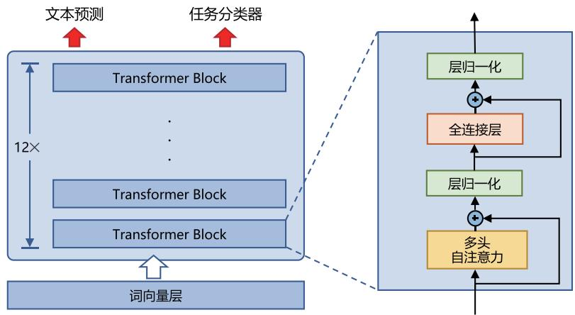  
图 2.3 GPT 的模型结构

本节将重点介绍GPT自监督预训练、有监督下游任务微调及基于HuggingFace的预训练语言模型实践。

# 2.2.1 自监督预训练

GPT采用生成式预训练方法，单向意味着模型只能从左到右或从右到左对文本序列建模，所采用的Transformer结构和解码策略保证了输入文本每个位置只能依赖过去时刻的信息。

给定文本序列 $w = w _ { 1 } , w _ { 2 } , \cdot \cdot \cdot , w _ { n }$ ，GPT 首先在输入层中将其映射为稠密的向量：

$$
\boldsymbol {v} _ {i} = \boldsymbol {v} _ {i} ^ {\mathrm {t}} + \boldsymbol {v} _ {i} ^ {\mathrm {p}} \tag {2.12}
$$

其中， $\mathbf { \Delta } \mathbf { \boldsymbol { v } } _ { i } ^ { \mathrm { t } }$ 是词 $w _ { i }$ 的词向量， $\pmb { v } _ { i } ^ { \mathrm { p } }$ 是词 $w _ { i }$ 的位置向量， ${ \mathbf { } } v _ { i }$ 为第 $i$ 个位置的单词经过模型输入层（第0层）后的输出。GPT模型的输入层与前文中介绍的神经网络语言模型的不同之处在于其需要添加位置向量，这是Transformer结构自身无法感知位置导致的，因此需要来自输入层的额外位置信息。

经过输入层编码，模型得到表示向量序列 $v = v _ { 1 } , v _ { 2 } , \cdot \cdot \cdot , v _ { n }$ ，随后将 $\textbf {  { v } }$ 送入模型编码层。编码层由 $L$ 个Transformer模块组成，在自注意力机制的作用下，每一层的每个表示向量都会包含之前位置表示向量的信息，使每个表示向量都具备丰富的上下文信息，而且，经过多层编码，GPT能得到每个单词层次化的组合式表示，其计算过程表示为：

$$
\boldsymbol {h} ^ {(l)} = \text {T r a n s f o r m e r - B l o c k} ^ {(l)} \left(\boldsymbol {h} ^ {(0)}\right) \tag {2.13}
$$

其中 $\boldsymbol { h } ^ { ( l ) } \in \mathbb { R } ^ { d \times n }$ 表示第 l 层的表示向量序列， $n$ 为序列长度， $d$ 为模型隐藏层维度， $L$ 为模型总层数。

GPT模型的输出层基于最后一层的表示 $\pmb { h } ^ { ( L ) }$ ，预测每个位置上的条件概率，其计算过程可以表示为

$$
P \left(w _ {i} \mid w _ {1}, w _ {2}, \dots , w _ {i - 1}\right) = \operatorname {S o f t m a x} \left(\boldsymbol {W} ^ {e} \boldsymbol {h} _ {i} ^ {(L)} + \boldsymbol {b} ^ {\text {o u t}}\right) \tag {2.14}
$$

其中， $W ^ { e } \in \mathbb { R } ^ { | \mathbb { V } | \times d }$ 为词向量矩阵，|V| 为词表大小。

单向语言模型按照阅读顺序输入文本序列 $w$ ，用常规语言模型目标优化 $w$ 的最大似然估计，使之能根据输入历史序列对当前词做出准确的预测：

$$
\mathcal {L} ^ {\mathrm {P T}} (w) = - \sum_ {i = 1} ^ {n} \log P \left(w _ {i} \mid w _ {0}, w _ {1}, \dots , w _ {i - 1}; \boldsymbol {\theta}\right) \tag {2.15}
$$

其中 θ 代表模型参数。也可以基于马尔可夫假设，只使用部分过去词进行训练。预训练时通常使用随机梯度下降法进行反向传播，优化该负对数似然函数。

# 2.2.2 有监督下游任务微调

通过自监督语言模型预训练，使得GPT模型具备了一定的通用语义表示能力。下游任务微调（Downstream Task Fine-tuning）的目的是在通用语义表示的基础上，根据下游任务的特性进行适配。下游任务通常需要利用有标注数据集进行训练，数据集使用D进行表示，每个样例由输入长度为$n$ 的文本序列 $x = x _ { 1 } , x _ { 2 } , \cdot \cdot \cdot , x _ { n }$ 和对应的标签 $y$ 构成。

先将文本序列 $x$ 输入GPT模型，获得最后一层的最后一个词所对应的隐藏层输出 $\pmb { h } _ { n } ^ { ( L ) }$ ，在此

基础上，通过全连接层变换结合Softmax函数，得到标签预测结果。

$$
P (y \mid x _ {1}, x _ {2}, \dots , x _ {n}) = \operatorname {S o f t m a x} \left(\boldsymbol {h} _ {n} ^ {(L)} \boldsymbol {W} ^ {y}\right) \tag {2.16}
$$

其中 $W ^ { y } \in \mathbb { R } ^ { d \times k }$ 为全连接层参数， $k$ 为标签个数。通过对整个标注数据集 $\mathbb { D }$ 优化如下目标函数精调下游任务：

$$
\mathcal {L} ^ {\mathrm {F T}} (\mathbb {D}) = - \sum_ {(x, y)} \log P (y | x _ {1}, x _ {2}, \dots , x _ {n}) \tag {2.17}
$$

在微调过程中，下游任务针对任务目标进行优化，很容易使得模型遗忘预训练阶段所学习的通用语义知识表示，从而损失模型的通用性和泛化能力，导致出现灾难性遗忘（Catastrophic Forgetting）问题。因此，通常采用混合预训练任务损失和下游微调损失的方法来缓解上述问题。在实际应用中，通常采用式（2.13）进行下游任务微调：

$$
\mathcal {L} = \mathcal {L} ^ {\mathrm {F T}} (\mathbb {D}) + \lambda \mathcal {L} ^ {\mathrm {P T}} (\mathbb {D}) \tag {2.18}
$$

其中 $\lambda$ 的取值为 [0, 1]，用于调节预训练任务的损失占比。

# 2.2.3 预训练语言模型实践

HuggingFace 是一个开源自然语言处理软件库，其目标是通过提供一套全面的工具、库和模型，使自然语言处理技术对开发人员和研究人员更易于使用。HuggingFace 最著名的贡献之一是transformers库，基于此，研究人员可以快速部署训练好的模型，以及实现新的网络结构。除此之外，HuggingFace提供了Dataset库，可以非常方便地下载自然语言处理研究中经常使用的基准数据集。本节将以构建BERT模型为例，介绍基于HuggingFace的BERT模型的构建和使用方法。

# 1. 数据集准备

常见的用于预训练语言模型的大规模数据集都可以在Dataset库中直接下载并加载。例如，如果使用维基百科的英文数据集，可以直接通过如下代码完成数据获取：

from datasets import concatenate_datasets, load_dataset  
bookcorpus = load_dataset("bookcorpus", split="train")  
wiki = load_dataset("wikipedia", "20220301.en", split="train")  
# 仅保留'text'列  
wiki = wiki.remove-columns([col for col in wiki.columns if col != "text)])  
dataset = concatenate_datasets([bookcorpus, wiki])  
# 将数据集切分为 $90\%$ 用于训练， $10\%$ 用于测试  
d = dataset.train_test_split(test_size=0.1)

接下来，将训练和测试数据分别保存在本地文件中，代码如下所示：

def dataset_to_text(dataset，outputfilename $\equiv$ "data.txt"）：""将数据集文本保存到磁盘的通用函数中""with open(outputfilename，"w")asf:for t in dataset["text"]：print(t,file $\equiv$ f)  
#将训练集保存为train.txt  
dataset_to_text(d["train"], "train.txt")  
#将测试集保存为test.txt  
dataset_to_text(d["test"], "test.txt")

# 2. 训练词元分析器

BERT 采用 WordPiece 分词算法，根据训练数据中的词频决定是否将一个完整的词切分为多个词元。因此，需要先训练词元分析器（Tokenizer）。可以使用 transformers 库中的 BertWordPiece-Tokenizer类来完成任务，代码如下所示：

```python
special_tokens = [  
    ["PAD"], ["UNK"], ["CLS"], ["SEP"], ["MASK"], "<S>", "<T>"  
]  
# 如果根据训练和测试两个集合训练词元分析器，则需要修改files  
# files = ["train.txt", "test.txt"]  
# 仅根据训练集合训练词元分析器  
files = ["train.txt"]  
# BERT中采用的默认词表大小为30522，可以随意修改  
vocab_size = 30_522  
# 最大序列长度，该值越小，训练速度越快  
max_length = 512  
# 是否将长样本截断  
truncate_longer_samples = False  
# 初始化WordPiece词元分析器  
tokenizer = BertWordPieceTokenizer()  
# 训练词元分析器  
tokenizer.train(files=files, vocab_size=vocab_size, special_tokens=special_tokens)  
# 允许截断达到最大512个词元  
tokenizer_enable_truncation(max_length=max_length)  
model_path = "pretrained-bert"  
# 如果文件夹不存在，则先创建文件夹  
if not os.path.isdir(model_path):  
    os.mkdir(model_path)  
# 保存词元分析器模型  
tokenizer.save_model(model_path)  
# 将一些词元分析器中的配置保存到配置文件，包括特殊词元、转换为小写、最大序列长度等  
with open(os.path.join(model_path, "config.json"), "w") as f:  
    tokenizer_cfg = {  
        "do_lower(case": True,  
            "unk_token": ["UNK"],  
            "sep_token": ["SEP"],  
            "pad_token": ["PAD"],  
            "cls_token": ["CLS"],  
            "mask_token": ["MASK"],  
            "model_max_length": max_length,  
            "max_len": max_length,  
        }  
    json.dump(tokenizer_cfg, f)  
# 当词元分析器进行训练和配置时，将其装载到BertTokenizerFast  
tokenizer = BertTokenizerFast.from_pretrained(model_path)
```

# 3. 预处理数据集

在启动整个模型训练之前，还需要将预训练数据根据训练好的词元分析器进行处理。如果文档长度超过512个词元，就直接截断。数据处理代码如下所示：

```python
def encode_with_truncation(examples):
    '''使用词元分析对句子进行处理并截断的映射函数（Mapping function）''
    return tokenizer(examples["text"], truncation=True, padding="max_length",
                  max_length=max_length, return_special_tokens_mask=True)
def encodeWithout_truncation(examples):
    '''使用词元分析对句子进行处理且不截断的映射函数（Mapping function）''
    return tokenizer(examples["text"], return_special_tokens_mask=True)
#编码函数将依赖于truncate_longer_samples变量
encode = encode_with_truncation if truncate_longer_samples else encode Without_truncation
#对训练数据集进行分词处理
train_dataset = d["train"].map(encode, batched=True)
#对测试数据集进行分词处理
test_dataset = d["test"].map(encode, batched=True)
if truncate_longer_samples:
    #移除其他列，将input_ids和attention_mask设置为PyTorch张量
    train_dataset.set_format(type="torch", columns=['input_ids", "attention_mask']) 
    test_dataset.set_format(type="torch", columns=['input_ids", "attention_mask']) 
else:
    #移除其他列，将它们保留为Python列表
    test_dataset.set_format(columns=['input_ids", "attention_mask", "special_tokens_mask']) 
    train_dataset.set_format(columns=['input_ids", "attention_mask", "special_tokens_mask']) 
```

truncate_longer_samples 布尔变量控制用于对数据集进行词元处理的 encode() 回调函数。如果该变量设置为 True，则会截断超过最大序列长度（max_length）的句子。如果该变量设置为 False，则需要将没有截断的样本连接起来，并组合成固定长度的向量。

from itertools import chain   
# 主要数据处理函数，拼接数据集中的所有文本并生成最大序列长度的块  
```python
def grouptexts(examples):
    # 拼接所有文本
    concatenated/examples = {k: list(chain(*examples[k])) for k in examples.keys())
    total_length = len Concatenated/examples[list(examples.keys())[0])
    # 舍弃了剩余部分，如果模型支持填充而不是舍弃，则可以根据需要自定义这部分
    if total_length >= max_length:
        total_length = (total_length // max_length) * max_length
    # 按照最大长度分割成块
    result = {
        k: [t[i : i + max_length] for i in range(0, total_length, max_length)]
        for k, t in concatenated/examples.items()
    }
    return result
# 请注意，使用batched=True，此映射一次处理1000个文本
# 因此，grouptexts会为这1000个文本组抛弃不足的部分
# 可以在这里调整batch_size，但较高的值可能会使预处理速度变慢
# 为了加速这一部分，使用了多进程处理
if not truncate_longer_samples:
    train_dataset = train_dataset.map(grouptexts, batched=True,
                      desc=f"Grouping texts in chunks of {max_length}.")
    test_dataset = test_dataset.map(grouptexts, batched=True,
                      desc=f"Grouping texts in chunks of {max_length}.")
    # 将它们从列表转换为PyTorch张量
    train_dataset.set_format("torch")
    test_dataset.set_format("torch")
```

# 4. 模型训练

在构建处理好的预训练数据之后，就可以开始模型训练。代码如下所示：

# 使用配置文件初始化模型  
```python
model_config = BertConfig(vocab_size=vocab_size, max_position_embeddings=max_length)  
model = BertForMaskedLM(config=model_config) 
```

# 初始化数据整理器，随机屏蔽20%（默认为15%）的标记  
```txt
# 用于掩盖语言建模（MLM）任务  
data.collator = DataCollatorForLanguageModeling(tokenizer=tokenizer, mlm=True, mlm(probability=0.2) 
```

```python
training_args = TrainingArguments(  
output_dir=model_path, # 输出目录，用于保存模型检查点  
evaluation_strategy="steps", # 每隔`logging_steps`步进行一次评估  
overwrite_output_dir=True,  
num_train_epochs=10, # 训练时的轮数，可以根据需要进行调整  
per_device_train_batch_size=10, # 训练批量大小，可以根据GPU内存容量将其设置得尽可能大  
gradient Accumulation_steps=8, # 在更新权重之前累积梯度  
per_device_eval_batch_size=64, # 评估批量大小  
logging_steps=1000, # 每隔1000步进行一次评估，记录并保存模型检查点  
save_steps=1000,  
# load_best_model_at_end=True, # 是否在训练结束时加载最佳模型（根据损失）  
# save_total_limit=3, # 如果磁盘空间有限，则可以限制只保存3个模型权重
```

trainer $\equiv$ Trainer( model $=$ model, args $\equiv$ training_args, data.collator $\equiv$ data.collator, train_dataset $\equiv$ train_dataset, eval_dataset $\equiv$ test_dataset,

# 训练模型  
```lua
trainer.train() 
```

训练完成后，可以得到如下输出结果：

```txt
[10135/79670 18:53:08 < 129:35:53, 0.15 it/s, Epoch 1.27/10]  
Step Training Loss Validation Loss  
1000 6.904000 6.558231  
2000 6.498800 6.401168  
3000 6.362600 6.277831  
4000 6.251000 6.172856  
5000 6.155800 6.071129  
6000 6.052800 5.942584  
7000 5.834900 5.546123  
8000 5.537200 5.248503  
9000 5.272700 4.934949  
10000 4.915900 4.549236 
```

# 5. 模型使用

可以针对不同应用需求使用训练好的模型，以句子补全为例的代码如下所示：

```python
加载模型检查点  
model = BertForMaskedLM.from_pretrained(os.path.join(model_path, "checkpoint-10000"))  
加载词元分析器  
tokenizer = BertTokenizerFast.from_pretrained(model_path)  
fill_mask = pipeline("fill-mask", model=model, tokenizer=tokenizer)  
# 进行预测  
examples = [Today's most trending hashtags on [MASK] is Donald Trump", "The [MASK] was cloudy yesterday, but today it's rainy.", ]  
for example in examples:  
    for prediction in fill_mask(object):  
        print(f"#prediction['sequence'])}, confidence: {prediction['score'])}"  
print("=*50") 
```

通过上述代码可以得到如下输出：

```txt
today's most trending hashtags on twitter is donald trump, confidence: 0.1027069091796875 today's most trending hashtags on monday is donald trump, confidence: 0.09271949529647827 today's most trending hashtags on tuesday is donald trump, confidence: 0.08099588006734848 today's most trending hashtags on facebook is donald trump, confidence: 0.04266013577580452 today's most trending hashtags on wednesday is donald trump, confidence: 0.04120611026883125 the weather was cloudy yesterday, but today it's rainy., confidence: 0.04445931687951088 the day was cloudy yesterday, but today it's rainy., confidence: 0.037249673157930374 the morning was cloudy yesterday, but today it's rainy., confidence: 0.023775646463036537 the weekend was cloudy yesterday, but today it's rainy., confidence: 0.022554103285074234 the storm was cloudy yesterday, but today it's rainy., confidence: 0.019406016916036606 
```

# 2.3 大语言模型的结构

当前，绝大多数大语言模型都采用类似GPT的架构，使用基于Transformer结构构建的仅由解码器组成的网络结构，采用自回归的方式构建语言模型，但是在位置编码、层归一化位置、激活函数等细节上各有不同。文献[13] 介绍了GPT-3模型的训练过程，包括模型架构、训练数据组成、训练过程及评估方法。由于GPT-3并没有开放源代码，根据论文直接重现整个训练过程并不容易，因此文献[29] 介绍了根据 GPT-3 的描述复现的过程，构造并开源了系统 OPT（Open Pre-trained TransformerLanguage Models）。MetaAI 也仿照 GPT-3 的架构开源了 LLaMA 模型[34]，公开评测结果及利用该模型 进 行 有 监 督 微 调 后 的 模 型 都 有 非 常 好 的 表 现。GPT-3 模 型 之

后，OpenAI 就不再开源（也没有开源模型），因此并不清楚ChatGPT和GPT-4采用的模型架构。

本节将以LLaMA模型为例，介绍大语言模型架构在Transformer原始结构上的改进，并介绍Transformer结构中空间和时间占比最大的注意力机制的优化方法。

# 2.3.1 LLaMA 的模型结构

文献 [34] 介绍了 LLaMA 采用的 Transformer 结构和细节，与 2.1 节介绍的 Transformer 结构的不同之处为采用了前置层归一化（Pre-normalization）方法并使用RMSNorm归一化函数（Root MeanSquare Normalizing Function），激活函数更换为 SwiGLU，使用了旋转位置嵌入（Rotary PositionalEmbeddings，RoPE），使用的 Transformer 结构与 GPT-2 类似，如图2.4 所示。

  
图 2.4 GPT-2 的模型结构

接下来，分别介绍 RMSNorm 归一化函数、SwiGLU 激活函数和 RoPE 的具体内容和实现。

# 1. RMSNorm 归一化函数

为了使模型训练过程更加稳定，GPT-2相较于GPT引入了前置层归一化方法，将第一个层归一化移动到多头自注意力层之前，将第二个层归一化移动到全连接层之前。同时，残差连接的位

置调整到多头自注意力层与全连接层之后。层归一化中也采用了RMSNorm归一化函数[45]。针对输入向量 $\textbf { \em a }$ ，RMSNorm 函数的计算公式如下：

$$
\operatorname {R M S} (\boldsymbol {a}) = \sqrt {\frac {1}{n} \sum_ {i = 1} ^ {n} a _ {i} ^ {2}} \tag {2.19}
$$

$$
\bar {a} _ {i} = \frac {a _ {i}}{\operatorname {R M S} (\boldsymbol {a})} \tag {2.20}
$$

此外，RMSNorm 还可以引入可学习的缩放因子 $g _ { i }$ 和偏移参数 $b _ { i }$ ，从而得到 $\begin{array} { r } { \overline { { a } } _ { i } = \frac { a _ { i } } { \mathrm { R M S } ( \mathbf { a } ) } g _ { i } + b _ { i \circ } } \end{array}$ RMSNorm 在 HuggingFace transformers 库中的代码实现如下所示：

class LlamaRMSNorm(nnModule): def__init__(self，hidden_size，eps $= 1\mathrm{e} - 6$ ： "" LlamaRMSNorm等同于T5LayerNorm "super(）.__init_（） self.weight $\equiv$ nn_PARAMETER(torch.ones(hiden_size)) self.variance_epoch $\equiv$ eps #eps防止取倒数之后分母为0 def forward(self，hidden_states): inputdtype $\equiv$ hidden_states.dtype variance $\equiv$ hidden_states.to(torch.float32).pow(2).mean(-1,keepdim $\equiv$ True) hidden_states $\equiv$ hidden_states \* torch.rsqrt(variance $^+$ self.variance_epoch) #weight是末尾乘的可训练参数，即g_i return(self.weight $\ast$ hidden_states).to(input dtype)

# 2. SwiGLU 激活函数

SwiGLU[46] 激活函数是 Shazeer 在文献 [46] 中提出的，在 $\mathrm { P a L M ^ { [ 1 4 ] } }$ 等模型中进行了广泛应用，并且取得了不错的效果，相较于ReLU函数在大部分评测中都有不少提升。在LLaMA中，全连接层使用带有SwiGLU 激活函数的位置感知前馈网络的计算公式如下：

$$
\operatorname {F F N} _ {\text {S w i G L U}} (\boldsymbol {x}, \boldsymbol {W}, \boldsymbol {V}, \boldsymbol {W} _ {2}) = \operatorname {S w i G L U} (\boldsymbol {x}, \boldsymbol {W}, \boldsymbol {V}) \boldsymbol {W} _ {2} \tag {2.21}
$$

$$
\operatorname {S w i G L U} (\boldsymbol {x}, \boldsymbol {W}, \boldsymbol {V}) = \operatorname {S w i s h} _ {\beta} (\boldsymbol {x} \boldsymbol {W}) \otimes \boldsymbol {x} \boldsymbol {V} \tag {2.22}
$$

$$
\operatorname {S w i s h} _ {\beta} (\boldsymbol {x}) = \boldsymbol {x} \sigma (\beta \boldsymbol {x}) \tag {2.23}
$$

其中， $\sigma ( x )$ 是 Sigmoid 函数。图2.5 给出了 Swish 激活函数在参数 $\beta$ 取不同值时的形状。可以看到，当 $\beta$ 趋近于0时，Swish函数趋近于线性函数 $y = x$ ；当 $\beta$ 趋近于无穷大时，Swish函数趋近

于 ReLU 函数；当 $\beta$ 取值为 1 时，Swish 函数是光滑且非单调的。在 HuggingFace 的 transformers库中 Swish 函数被 SiLU 函数[47] 代替。

  
图 2.5 Swish 激活函数在参数 $\beta$ 取不同值时的形状

# 3. RoPE

在位置编码上，使用旋转位置嵌入[48] 代替原有的绝对位置编码。RoPE 借助复数的思想，出发点是通过绝对位置编码的方式实现相对位置编码。其目标是通过下述运算给 $\mathbf { \Delta } _ { q , k }$ 添加绝对位置信息：

$$
\tilde {\boldsymbol {q}} _ {m} = f (\boldsymbol {q}, m), \tilde {\boldsymbol {k}} _ {n} = f (\boldsymbol {k}, n) \tag {2.24}
$$

详细的证明和求解过程可以参考文献[48]，最终可以得到二维情况下用复数表示的RoPE：

$$
f (\boldsymbol {q}, m) = R _ {f} (\boldsymbol {q}, m) \mathrm {e} ^ {\mathrm {i} \Theta_ {f} (\boldsymbol {q}, m)} = \| \boldsymbol {q} \| \mathrm {e} ^ {\mathrm {i} (\Theta (\boldsymbol {q}) + m \theta)} = \boldsymbol {q} \mathrm {e} ^ {\mathrm {i} m \theta} \tag {2.25}
$$

根据复数乘法的几何意义，上述变换实际上是对应向量旋转，所以位置向量称为“旋转式位置编

码”。还可以使用矩阵形式表示：

$$
f (\boldsymbol {q}, m) = \left( \begin{array}{c c} \cos m \theta & - \sin m \theta \\ \sin m \theta & \cos m \theta \end{array} \right) \left( \begin{array}{l} \boldsymbol {q} _ {0} \\ \boldsymbol {q} _ {1} \end{array} \right) \tag {2.26}
$$

根据内积满足线性叠加的性质，任意偶数维的RoPE都可以表示为二维情形的拼接，即

$$
f (\boldsymbol {q}, m) = \underbrace {\left( \begin{array}{c c c c c c c} \cos m \theta_ {0} & - \sin m \theta_ {0} & 0 & 0 & \dots & 0 & 0 \\ \sin m \theta_ {0} & \cos m \theta_ {0} & 0 & 0 & \dots & 0 & 0 \\ 0 & 0 & \cos m \theta_ {1} & - \sin m \theta_ {1} & \dots & 0 & 0 \\ 0 & 0 & \sin m \theta_ {1} & \cos m \theta_ {1} & \dots & 0 & 0 \\ \vdots & \vdots & \vdots & \vdots & \ddots & \vdots & \vdots \\ 0 & 0 & 0 & 0 & \dots & \cos m \theta_ {d / 2 - 1} & - \sin m \theta_ {d / 2 - 1} \\ 0 & 0 & 0 & 0 & \dots & \sin m \theta_ {d / 2 - 1} & \cos m \theta_ {d / 2 - 1} \end{array} \right)} _ {\boldsymbol {R} _ {d}} \left( \begin{array}{l} \boldsymbol {q} _ {0} \\ \boldsymbol {q} _ {1} \\ \boldsymbol {q} _ {2} \\ \boldsymbol {q} _ {3} \\ \vdots \\ \boldsymbol {q} _ {d - 2} \\ \boldsymbol {q} _ {d - 1} \end{array} \right) \tag {2.27}
$$

由于上述矩阵 $\mathbf { \delta } _ { R _ { d } }$ 具有稀疏性，因此可以使用逐位相乘 $\otimes$ 操作进一步提高计算速度。RoPE 在HuggingFace transformers 库中的代码实现如下所示：

```python
class LlamaRotaryEmbedding(torch(nnModule):
    def __init__(self, dim, max_position_embeddings=2048, base=10000, device=None):
        super().__init__()
        inv_freq = 1.0 / (base ** (torch.arange(0, dim, 2).float().to(device) / dim))
        self.register_buffer("inv_freq", inv_freq)
        # 在这里构建，以便使`torch.jit(trace`正常工作
        self.max_seq_len_cached = max_position_embeddings
        t = torch.arange(self.max_seq_len_cached, device= self.inv_freq_device,
            dtype= self.inv_freqdtype)
        freqs = torch.einsum("i,j->ij", t, self.inv_freq)
        # 这里使用了与论文不同的排列，以便获得相同的计算结果
        emb = torch.cat((freqs, freqs), dim=-1)
        dtype = torch.get_defaultdtype()
        self.register_buffer("cos Cached", emb.cos() [None, None, :, :].todtype, persistent=False)
        self.register_buffer("sin Cached", emb.sin() [None, None, :, :].todtype, persistent=False)
    def forward(self, x, seq_len=None):
        # x: [bs, num碛ed Heads, seq_len, head_size]
        # 在`__init__`中构建了sin/cos，这个`if`块不太可能被执行
        # 保留这里的逻辑
        if seq_len > self.max_seq_len_cached:
            self.max_seq_len_cached = seq_len
            t = torch.arange(self.max_seq_lencached, device=xdevice, dtype=self.inv_freq dtype)
            freqs = torch.einsum("i,j->ij", t, self.inv_freq)
            # 这里使用了与论文不同的排列，以便获得相同的计算结果
            emb = torch.cat((freqs, freqs), dim=-1).to(xdevice)
            self.register_buffer("cos Cached", emb.cos() [None, None, :, :].to(x.dtype),
                persistent=False)
            self.register_buffer("sin Cached", emb.sin() [None, None, :, :].to(x.dtype),
                persistent=False)
            return (
                self.cos Cached[:, :, :seq_len, ...].todtype=x.dtype),
                self.sinCached[:, :, :seq_len, ...].todtype=x.dtype),
            )
    def rotate_half(x):
        '''将输入的一半隐藏维度进行旋转'''  
x1 = x[., : x.shape[-1] // 2]
x2 = x[., x.shape[-1] // 2:]  
return torch.cat((-x2, x1), dim=-1)
```

# 4. 模型整体框架

基于上述模型和网络结构可以实现解码器层，根据自回归方式利用训练数据进行模型训练的过程与 2.2.3 节介绍的过程基本一致。不同规模的 LLaMA 模型使用的超参数如表2.1 所示。由于大语言模型的参数量非常大，并且需要大量的数据进行训练，因此仅利用单个GPU很难完成训练，需要依赖分布式模型训练框架（第4章将详细介绍相关内容）。

表 2.1 不同规模的 LLaMA 模型使用的超参数[34]  

<table><tr><td>参数规模</td><td>层数</td><td>自注意力头数</td><td>嵌入表示维度</td><td>学习率</td><td>全局批次大小</td><td>训练词元数量（个）</td></tr><tr><td>6.7B①</td><td>32</td><td>32</td><td>4096</td><td>3.0e-4</td><td>400万</td><td>1.0万亿</td></tr><tr><td>13.0B</td><td>40</td><td>40</td><td>5120</td><td>3.0e-4</td><td>400万</td><td>1.0万亿</td></tr><tr><td>32.5B</td><td>60</td><td>52</td><td>6656</td><td>1.5e-4</td><td>400万</td><td>1.4万亿</td></tr><tr><td>65.2B</td><td>80</td><td>64</td><td>8192</td><td>1.5e-4</td><td>400万</td><td>1.4万亿</td></tr></table>

HuggingFace transformers 库中 LLaMA 解码器的整体代码实现如下所示：

class LlamaDecoderLayer(nnModule): def __init__(self, config: LlamaConfig): super().__init_(self.hidden_size = config.hidden_size self.self_attn = LlamaAttention(config=config) self.mlp $=$ LlamaMLP( hidden_size $\equiv$ self.hidden_size, intermediate_size $\equiv$ config.intermediate_size, hidden_act $\equiv$ config.hidden_ACT, 1 self.output_layernorm $=$ LlamaRMSNorm(config.hidden_size, eps $\equiv$ config.rs_norm血脂) self.postattention_layernorm $=$ LlamaRMSNorm(config.hidden_size, eps $\equiv$ config.rs_norm血脂) def forward( self, hidden_states: torch.Tensor, attention_mask: Optional[torch.Tensor] $=$ None, position_ids: Optional[torch.LongTensor] $=$ None, past_key_value: Optional[Tuple[torch.Tensor]] $=$ None, output attentions: Optional[bool] $=$ False, use_cache: Optional[bool] $=$ False, ) -> Tuple[torch.FloatTensor, Optional[Tuple[torch.FloatTensor, torch.FloatTensor]]]: residual $=$ hidden_states hidden_states $=$ self-input_layernorm(hidden_states)

# # 自注意力模块

hidden_states, self_attnweights, present_key_value = self.self_attn( hidden_states $\equiv$ hidden_states, attention_mask $=$ attention_mask, position_ids $\equiv$ position_ids, past_key_value $\equiv$ past_key_value, output attentions $\equiv$ output attentions, use_cache $\equiv$ use_cache,   
）   
hidden_states $=$ residual $^+$ hidden_states

# # 全连接层

residual $=$ hidden_states   
hidden_states $\equiv$ self.postattention(layernorm(hidden_states)   
hidden_states $\equiv$ self.mlp(hidden_states)   
hidden_states $\equiv$ residual $^+$ hidden_states   
outputs $=$ (hidden_states,)   
if output attentions: outputs $+ =$ (self_attnweights,)   
if use_cache: outputs $+ =$ (present_key_value,)

# 2.3.2 注意力机制优化

在Transformer结构中，自注意力机制的时间和存储复杂度与序列的长度呈平方的关系，因此占用了大量的计算设备内存并消耗了大量的计算资源。如何优化自注意力机制的时空复杂度、增强计算效率是大语言模型面临的重要问题。一些研究从近似注意力出发，旨在减少注意力计算和内存需求，提出了稀疏近似、低秩近似等方法。此外，有一些研究从计算加速设备本身的特性出发，研究如何更好地利用硬件特性对Transformer中的注意力层进行高效计算。本节将分别介绍上述方法。

# 1. 稀疏注意力机制

对一些训练好的Transformer结构中的注意力矩阵进行分析时发现，其中很多是稀疏的，因此可以通过限制 Query-Key 对的数量来降低计算复杂度。这类方法称为稀疏注意力（SparseAttention）机制。可以将稀疏化方法进一步分成基于位置的和基于内容的两类。

基于位置的稀疏注意力机制的基本类型如图2.6所示，主要包含如下五种类型。

（1）全局注意力（Global Attention）：为了增强模型建模长距离依赖关系的能力，可以加入一些全局节点。  
（2）带状注意力（Band Attention）：大部分数据都带有局部性，限制Query只与相邻的几个节点进行交互。  
（3）膨胀注意力（Dilated Attention）：与 CNN 中的 Dilated Conv 类似，通过增加空隙获取更大的感受野。  
（4）随机注意力（Random Attention）：通过随机采样，提升非局部的交互能力。  
（5）局部块注意力（Block Local Attention）：使用多个不重叠的块（Block）来限制信息交互。


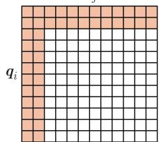  
kj   
(a)全局注意力

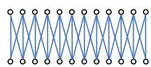

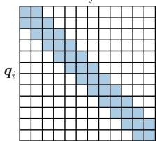  
kj   
(b)带状注意力


  
kj   
(c)膨胀注意力


  
kj   
(d)随机注意力

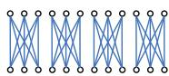

  
kj   
(e)局部块注意力  
图 2.6 五种基于位置的稀疏注意力机制[49]

现有的稀疏注意力机制，通常是基于上述五种基于位置的稀疏注意力机制的复合模式，图2.7给出了一些典型的稀疏注意力模型。Star-Transformer[50] 使用带状注意力和全局注意力。具体来说，

Star-Transformer只包括一个全局注意力节点和宽度为3的带状注意力，其中任意两个非相邻节点通过一个共享的全局注意力连接，相邻节点则直接相连。Longformer[51] 使用带状注意力和内部全局节点注意力（Internal Global-node Attention）。此外，Longformer 将上层中的一些带状注意力头部替换为具有膨胀窗口的注意力，在增加感受野的同时并不增加计算量。ETC（Extended TransformerConstruction）[52] 使用带状注意力和外部全局节点注意力（External Global-node Attention）。ETC稀疏注意力还包括一种掩码机制来处理结构化输入，并采用对比预测编码（Contrastive PredictiveCoding，CPC）[53] 进行预训练。BigBird[54] 使用带状注意力和全局注意力，并使用额外的随机注意力来近似全连接注意力。此外，BigBird揭示了稀疏编码器和稀疏解码器的使用可以模拟任何图灵机，这也在一定程度上解释了为什么稀疏注意力模型可以取得较好的结果。

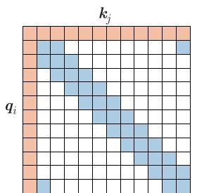  
(a) Star-Transformer

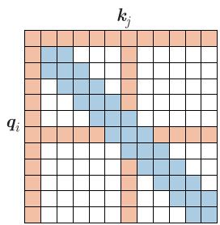  
(b) Longformer

  
(c)ETC

  
(d) BigBird   
图 2.7 典型的稀疏注意力模型[49]

基于内容的稀疏注意力机制根据输入数据创建稀疏注意力，其中一种很简单的方法是选择和给定查询（Query）有很高相似度的键（Key）。Routing Transformer[55] 采用 K-means 聚类方法，针对 Query $\{ q _ { i } \} _ { i = 1 } ^ { T }$ 和 $\mathrm { K e y } \{ k _ { i } \} _ { i = 1 } ^ { T }$ 进行聚类，类中心向量集合为 $\{ \mu _ { i } \} _ { i = 1 } ^ { k }$ ，其中 $k$ 是类中心的个数。每个 Query 只与其处在相同簇（Cluster）下的 Key 进行交互。中心向量采用滑动平均的方法进行更新：

$$
\widetilde {\boldsymbol {\mu}} \leftarrow \lambda \widetilde {\boldsymbol {\mu}} + (1 - \lambda) \left(\sum_ {i: \mu \left(\boldsymbol {q} _ {i}\right) = \boldsymbol {\mu}} \boldsymbol {q} _ {i} + \sum_ {j: \mu \left(\boldsymbol {k} _ {j}\right) = \boldsymbol {\mu}} \boldsymbol {k} _ {j}\right) \tag {2.28}
$$

$$
c _ {\mu} \leftarrow \lambda c _ {\mu} + (1 - \lambda) | \boldsymbol {\mu} | \tag {2.29}
$$

$$
\boldsymbol {\mu} \leftarrow \frac {\widetilde {\boldsymbol {\mu}}}{c _ {\mu}} \tag {2.30}
$$

其中 $| \mu |$ 表示在簇 $\pmb { \mu }$ 中向量的数量。

Reformer[56] 则采用局部敏感哈希（Local-Sensitive Hashing，LSH）的方法为每个 Query 选择Key-Value 对。其主要思想是使用 LSH 函数对 Query 和 Key 进行哈希计算，将它们划分到多个桶内，以提升在同一个桶内的 Query 和 Key 参与交互的概率。假设 $b$ 是桶的个数，给定一个大小为

$[ D _ { k } , b / 2 ]$ 的随机矩阵 $\pmb { R }$ ，LSH 函数的定义为

$$
h (\boldsymbol {x}) = \arg \max  ([ \boldsymbol {x} R; - \boldsymbol {x} R ]) \tag {2.31}
$$

当 $h q _ { i } = h k _ { j }$ 时， $\pmb q _ { i }$ 才可以与相应的 Key-Value 对进行交互。

# 2. FlashAttention

NVIDIA GPU中的不同类型的内存（显存）有不同的速度、大小及访问限制。这主要取决于它们物理上是在 GPU 芯片内部还是在板卡 RAM 存储芯片上。GPU 显存分为全局内存（GlobalMemory）、本地内存（Local Memory）、共享存储（Shared Memory，SRAM）、寄存器（Register）、常量内存（Constant Memory）、纹理内存（Texture Memory）六大类。图 2.8 为 NVIDIA GPU 的整体内存结构示意图。全局内存、本地内存、共享存储和寄存器具有读写能力。全局内存和本地内存使用的高带宽显存（High Bandwidth Memory，HBM）位于板卡RAM存储芯片上，该部分内存容量很大。所有线程都可以访问全局内存，而本地内存只能由当前线程访问。NVIDIA H100中全局内存有 80GB 空间，其访问速度虽然可以达到 3.35TB/s，但当全部线程同时访问全局内存时，其平均带宽仍然很低。共享存储和寄存器位于GPU芯片上，因此容量很小，并且只有在同一个GPU线程块（Thread Block）内的线程才可以并行访问共享存储，而寄存器仅限于同一个线程内部访问。虽然 NVIDIA H100 中每个 GPU 线程块在流式多处理器（Stream Multi-processor，SM）上可以使用的共享存储容量仅有228KB，但是其速度比全局内存的访问速度快很多。

  
图 2.8 NVIDIA GPU 的整体内存结构示意图

前文介绍了自注意力机制的原理，在GPU中进行计算时，传统的方法还需要引入两个中间矩阵 $\pmb { S }$ 和 $_ { P }$ 并存储到全局内存中。具体计算过程如下：

$$
\boldsymbol {S} = \boldsymbol {Q} \boldsymbol {K}, \quad \boldsymbol {P} = \operatorname {S o f t m a x} (\boldsymbol {S}), \quad \boldsymbol {O} = \boldsymbol {P} \boldsymbol {V} \tag {2.32}
$$

按照上述计算过程，需要先从全局内存中读取矩阵 $Q$ 和 $\kappa$ ，并将计算好的矩阵 $\pmb { S }$ 写入全局内存，然后从全局内存中获取矩阵 $_ { s }$ ，计算 Softmax 得到矩阵 $_ { P }$ ，再将其写入全局内存，最后读取矩阵$_ { P }$ 和矩阵 $V$ ，计算得到矩阵 $o$ 。这样的过程会极大地占用显存的带宽。在自注意力机制中，GPU的计算速度比内存速度快得多，因此计算效率越来越受全局内存访问的制约。

FlashAttention[57] 利用GPU硬件中的特殊设计，针对全局内存和共享存储的I/O速度的不同，尽可能地避免从 HBM 中读取或写入注意力矩阵。FlashAttention 的目标是尽可能高效地使用 SRAM来加快计算速度，避免从全局内存中读取和写入注意力矩阵。达成该目标需要做到在不访问整个输入的情况下计算Softmax函数，并且后向传播中不能存储中间注意力矩阵。在标准Attention算法中，Softmax计算按行进行，即在与 $V$ 做矩阵乘法之前，需要完成 $Q$ 、 $\kappa$ 每个分块中的一整行的计算。在得到Softmax的结果后，再与矩阵 $V$ 分块做矩阵乘。而在FlashAttention中，将输入分割成块，并在输入块上进行多次传递，以增量的方式执行Softmax计算。

自注意力算法的标准实现将计算过程中的矩阵 $_ { s }$ 、 $_ { r }$ 写入全局内存，而这些中间矩阵的大小与输入的序列长度有关且为二次型。因此，FlashAttention就提出了不使用中间注意力矩阵，通过存储归一化因子来减少全局内存消耗的方法。FlashAttention算法并没有将 $_ { s }$ 、 $_ { r }$ 整体写入全局内存，而是通过分块写入，存储前向传播的 Softmax 归一化因子，在后向传播中快速重新计算片上注意力，这比从全局内存中读取中间注意力矩阵的标准方法更快。虽然大幅减少了全局内存的访问量，重新计算也导致FLOPS增加，但总体来看运行的速度更快且使用的显存更少。具体算法如代码2.1所示，其中内层循环和外层循环所对应的计算可以参考图2.9。

输入: $Q , K , V \in \mathbb { R } ^ { N \times d }$ 位于 HBM 中，GPU 芯片中的 SRAM 大小为 $M$

输出: $o$

$\begin{array} { r } { B _ { \mathrm { c } } = \lceil \frac { M } { 4 d } \rceil } \end{array}$ ， $B _ { \mathrm { r } } = \operatorname* { m i n } ( \lceil \frac { M } { 4 d } \rceil , d ) / /$ 设置块大小（block size）

在 HBM 中初始化 $O = ( 0 ) _ { N \times d } \in \mathbb { R } ^ { N \times d } , l = ( 0 ) _ { N } \in \mathbb { R } ^ { N } , m = ( - \infty ) _ { N } \in \mathbb { R } ^ { N }$

将矩阵 $Q$ 切分成 $\begin{array} { r } { T _ { \mathrm { r } } = \lceil \frac { M } { B _ { \mathrm { r } } } \rceil } \end{array}$ 块 $Q _ { 1 } , Q _ { 2 } , \cdot \cdot \cdot , Q _ { T _ { \mathrm { r } } } , Q _ { i } \in \mathbb { R } ^ { B _ { \mathrm { r } } \times d }$

将矩阵 $\kappa$ 切分成 $\begin{array} { r } { T _ { \mathrm { c } } = \lceil \frac { M } { B _ { \mathrm { c } } } \rceil } \end{array}$ 块 $K _ { 1 } , K _ { 2 } , \cdot \cdot \cdot , K _ { T _ { \mathrm { c } } } , K _ { i } \in \mathbb { R } ^ { B _ { \mathrm { c } } \times d }$

将矩阵 $V$ 切分成 $T _ { \mathrm { c } }$ 块 $V _ { 1 } , V _ { 2 } , \cdot \cdot \cdot , V _ { T _ { \mathrm { c } } } , V _ { i } \in \mathbb { R } ^ { B _ { \mathrm { c } } \times d }$

将矩阵 $o$ 切分成 $T _ { \mathrm { r } }$ 块 $O _ { 1 } , O _ { 2 } , \cdot \cdot \cdot , O _ { T _ { \mathrm { r } } } , O _ { i } \in \mathbb { R } ^ { B _ { \mathrm { r } } \times d }$

将 $\imath$ 切分成 $T _ { \mathrm { r } }$ 块 $l _ { 1 } , l _ { 2 } , \cdot \cdot \cdot , l _ { T _ { \mathrm { r } } } , l _ { i } \in \mathbb { R } ^ { B _ { \mathrm { r } } }$

将 $_ { \mathbf { \nabla } } \mathbf { m }$ 切分成 $T _ { \mathrm { r } }$ 块 ${ \pmb { m } } _ { 1 } , { \pmb { m } } _ { 2 } , \cdot \cdot \cdot , { \pmb { m } } _ { T _ { \mathrm { r } } } , { \pmb { m } } _ { i } \in \mathbb { R } ^ { B _ { \mathrm { r } } }$ ${ \pmb m } _ { i } \in \mathbb { R } ^ { B _ { \mathrm { r } } }$

将 $K _ { j }$ 和 $V _ { j }$ 从芯片外部的 HBM 中读入芯片内部存储SRAM

计算 $S _ { i j } = Q _ { i } K _ { j } ^ { T } \in \mathbb { R } ^ { B _ { \mathrm { r } } \times B _ { \mathrm { c } } }$

计算 $\tilde { m } _ { i j } { = } \mathrm { r o w m a x } ( S _ { i j } ) \in \mathbb { R } ^ { B _ { \mathrm { r } } } , \tilde { P } _ { i j } = \mathrm { e x p } ( S _ { i j } - \tilde { m } _ { i j } ) \in \mathbb { R } ^ { B _ { \mathrm { r } } \times B _ { \mathrm { c } } }$

计算 $\tilde { l } _ { i j } { = } \mathrm { r o w s u m } ( \tilde { P } _ { i j } ) \in \mathbb { R } ^ { B _ { \mathrm { r } } }$

计算 $m _ { i } ^ { \mathrm { n e w } } = \operatorname* { m a x } ( \pmb { m } _ { i } , \tilde { \pmb { m } } _ { i j } ) \in \mathbb { R } ^ { B _ { \mathrm { r } } } , l _ { i } ^ { \mathrm { n e w } } = \mathrm { e } ^ { m _ { i } - m _ { i } ^ { \mathrm { n e w } } } l _ { i } + \mathrm { e } ^ { \tilde { m } _ { i j } - m _ { i } ^ { \mathrm { n e w } } } \tilde { l } _ { i j } \in \mathbb { R } ^ { B _ { \mathrm { r } } }$

将 $O \gets \mathrm { d i a g } ( l _ { i } ^ { \mathrm { n e w } } ) ^ { - 1 } ( \mathrm { d i a g } ( l _ { i } ) \mathrm { e } ^ { m _ { i } - m _ { i } ^ { \mathrm { n e w } } } O _ { i } + \mathrm { e } ^ { \tilde { m } _ { i j } - m _ { i } ^ { \mathrm { n e w } } } \tilde { P } _ { i j } V _ { j } )$ 写回 HBM 中

将 $l _ { i } \gets l _ { i } ^ { \mathrm { n e w } }$ 和 ${ \mathbf { } } m _ { i } \gets m _ { i } ^ { \mathrm { n e w } }$ 写回 HBM 中

代码 2.1: FlashAttention 算法  
for $j = 1$ to $\underline { { T _ { \mathrm { c } } } }$ do   
for $i = 1$ to $\underline { { T _ { \mathrm { r } } } }$ do   
end   
```txt
end 
```

return $O$

  
图 2.9 FlashAttention 计算流程图[57]

PyTorch 2.0 已经支持 FlashAttention，使用 torch.backends.cuda.enable_flash_sdp() 函数可以启用或者关闭 FlashAttention。

# 3. 多查询注意力

多查询注意力（Multi Query Attention）[58] 是多头注意力的一种变体。它的特点是，在多查询注意力中不同的注意力头共享一个键和值的集合，每个头只单独保留了一份查询参数，因此键和值的矩阵仅有一份，这大幅减少了显存占用，使其更高效。由于多查询注意力改变了注意力机制的结构，因此模型通常需要从训练开始就支持多查询注意力。文献[59]的研究结果表明，可以通过对已经训练好的模型进行微调来添加多查询注意力支持，仅需要约 $5 \%$ 的原始训练数据量就可以达到不错的效果。包括 Falcon[60]、SantaCoder[61]、StarCoder[62] 在内的很多模型都采用了多查询注意力。

以 LLM Foundry 为例，多查询注意力的实现代码如下：

多查询注意力

使用torch或triton实现的注意力允许用户使用加性偏置

class MultiQueryAttention(nn.Module):   
```python
def __init__(self, d_model: int, n_heads: int, device: Optional[str] = None, 
```

```python
super().__init__( 
```

```txt
self.d_model = d_model  
self.n_heads = n_heads  
self.head_dim = d_model // n_heads 
```

```txt
self.Wqkv = nn.Linear( # 创建Multi Query Attention  
d_model,  
d_model + 2 * self.head_dim, # 只创建查询的头向量，所以只有1个d_model  
device=device, # 键和值不再使用单独的头向量
```

```python
self.attn_fn = scaledmultihead.dot_product_attention  
self.outProj = nn.Linear(  
    self.d_model,  
    self.d_model,  
    device=device) 
```

```python
self.out_proj._is_residual = True 
```

```txt
def forward( self, x, 
```

```txt
qkv = self.Wqkv(x) # (1, 512, 960) 
```

```python
query, key, value = qkv.split( # query -> (1, 512, 768)  
[ self.d_model, self.head_dim, self.head_dim], # key -> (1, 512, 96)  
dim=2 # value -> (1, 512, 96) 
```

```python
context, attnweights, past_key_value = self.attn_fn(
    query,
    key,
    value 
```

与 LLM Foundry 中实现的多头注意力代码相比，其区别仅在建立 Wqkv 层上：

#MultiHeadAttention   
self.Wqkv $\equiv$ nn.Linear( #MultiHeadAttention的创建方法 self.d_model, 3\*self.d_model, #查询、键和值3个矩阵，所以是 $3\ast d$ _model device $\equiv$ device   
）   
query，key，value $\equiv$ qkv.chunk( #每个tensor都是(1，512，768) 3, dim=2   
）   
#MultiQueryAttention   
self.Wqkv $\equiv$ nn.Linear( #MultiQueryAttention的创建方法 d_model, d_model+2\*self.head_dim, #只创建查询的头向量，所以是1\*d_model device $\equiv$ device, #键和值不再使用单独的头向量   
）   
query，key，value $\equiv$ qkv.split( #query->（1，512，768) [self.d_model,self.head_dim,self.head_dim], #key->（1，512，96) dim=2 #value->（1，512，96)   
）

# 4. 多头潜在注意力

多头潜在注意力（Multi-Head Latent Attention，MLA）[63] 是在 DeepSeek-V2 中引入的注意力优化模型。多头潜在注意力通过在键值层利用低秩矩阵，实现对压缩潜在键值状态的缓存（更详细的KV缓存可以参考本书第10章内容），从而大幅减少了KV缓存大小，有效缓解了通信瓶颈。

具体来说，MLA方法的核心是是将传统多头注意力中的键（Key）和值（Vale）进行低秩联合压缩，得到一个低秩表示形式，以减少键值（KV）缓存。设 $d$ 为嵌入维度， $n _ { h }$ 为注意力头的数量，$d _ { h }$ 为每个头的维度， $\pmb { h } _ { t } \in \mathbb { R } ^ { d }$ 是注意力层中第 $t$ 个词元的输入。标准的多头注意力机制（MHA）首先通过三个矩阵 $W ^ { Q }$ 、 $W ^ { K }$ 、 $W ^ { V } \in \mathbb { R } ^ { d _ { h } n _ { h } \times d }$ 生成 $\pmb q _ { t }$ 、 $\pmb q _ { t }$ 、 $\pmb q _ { t } \in \mathbb { R } ^ { d _ { h } n _ { h } }$ 。MLA 方法则通过如下公式对KV 缓存进行压缩：

$$
\boldsymbol {c} _ {t} ^ {K V} = \boldsymbol {W} ^ {D K V} \boldsymbol {h} ^ {t} \tag {2.33}
$$

$$
\boldsymbol {k} _ {t} ^ {C} = \boldsymbol {W} ^ {U K} \boldsymbol {c} _ {t} ^ {K V} \tag {2.34}
$$

$$
\boldsymbol {v} _ {t} ^ {C} = \boldsymbol {W} ^ {U V} \boldsymbol {c} _ {t} ^ {K V} \tag {2.35}
$$

其中， $\pmb { c } _ { t } ^ { K V } \in \mathbb { R } ^ { d _ { c } }$ 是键和值的压缩潜在向量（Comressed Latent Vector）； $d _ { c } ( \ll d _ { h } n _ { h } )$ 表示键值压缩维度； $W ^ { D K V } \in \mathbb { R } ^ { d _ { c } \times d }$ 是下投影矩阵；而 $W ^ { U K }$ , $W ^ { U V } \in \mathbb { R } ^ { d _ { h } n _ { h } \times d _ { c } }$ 分别是键和值的上投影矩阵。在推理过程中，MLA 方法只需要缓存 $\boldsymbol { c } _ { t } ^ { K V }$ ，因此其键值缓存仅有 $d _ { c } l$ 个元素，其中 $l$ 表示层数。

此外，在推理过程中，由于 $W ^ { U K }$ 可以合并到 $W ^ { Q }$ 中， $W ^ { U V }$ 可以合并到 $W ^ { O }$ 中，甚至无需在注意力计算中真正获得键和值。为了在训练过程中减少激活内存，还可以进一步对查询（Query）进行低秩压缩：

$$
\boldsymbol {c} _ {t} ^ {Q} = \boldsymbol {W} _ {D Q} \boldsymbol {h} _ {t} \tag {2.36}
$$

$$
\boldsymbol {q} _ {t} ^ {C} = \boldsymbol {W} ^ {U Q} \boldsymbol {c} _ {t} ^ {Q} \tag {2.37}
$$

其中， $\boldsymbol { c } _ { t } ^ { Q } \in \mathbb { R } ^ { d _ { c } ^ { \prime } }$ 是查询的压缩潜在向量； $d _ { c } ^ { \prime } ( \ll \ d _ { h } n _ { h } )$ 表示查询压缩维度， $W ^ { D Q } \in \mathbb { R } ^ { d _ { c } ^ { \prime } \times d }$ 和$W ^ { U Q } \in \mathbb { R } ^ { d _ { h } n _ { h } \times d _ { c } ^ { \prime } }$ 分别是查询的下投影矩阵和上投影矩阵。

文献 [64] 还进一步在理论上证明了 MLA 方法在表现力上优于组查询注意力（Group QueryAttention，GQA）。当 MLA 和 GQA 使用相同大小的 KV 缓存时，MLA 表现出更强的能力。这是因为在某些情况下，MLA能够在通道输出上展现更大的多样性，而GQA由于组内头部是复制的，导致组内所有头部的输出相同，无法捕捉到 MLA 所能处理的某些情况。文献 [64] 还提出了TransMLA后训练方法，该方法能够将广泛使用的基于GQA的预训练模型（例如LLaMA、Qwen、Mixtral）转换为基于MLA的模型。转换后，通过进一步训练，在不增加KV缓存大小的前提下有效提升模型的表现力。

# 2.4 混合专家模型

随着 GPT-4[65]、Mixtral- $\cdot 8 \mathrm { x } 7 \mathrm { B } ^ { [ 6 6 ] }$ 、DeepSeek-V3[40] 等模型的相继推出，混合专家模型 (MixedExpert Models，MoEs)日益受到关注。依据大模型缩放法则，模型规模是提升性能的关键，然而规模扩大必然使计算资源大幅增加。因此，在有限计算资源预算下，如何用更少训练步数训练更大模型成为关键问题。为解决该问题，混合专家模型基于一个简洁的思想：模型不同部分（即“专家”）专注不同任务或数据层面。混合专家架构的引入使得训练具有数千亿甚至万亿参数的模型成为可能，如开源的 1.6 万亿参数的 Switch Transformers[67] 等。

在采用混合专家架构的大语言模型中，MoE 层通常由门控网络（Gating Network） $\mathcal { G }$ 和 $N$ 个专家网络（Experts Network） $\{ f _ { 1 } , f _ { 2 } , . . . , f _ { N } \}$ 组成。门控网络充当着选择器的角色，也称为路由，它负责决定将哪些输入数据发送给哪些专家。专家网络则分别处理特定的不同子任务。在这一过程中，并非所有专家都同时运作，而是由门控网络依据数据特性，精准地将数据路由到与之最为相关的专家那里，最终再根据一个或者多个专家输出的结果综合得到整体的预测结果。在模型架构的设计中，MoE 层通常安置于每个 Transformer 模块中前馈层（FFN）。当模型不断扩大时，FFN层在计算方面的需求也越来越高。例如，在参数数量达 5400 亿的 PaLM[14] 模型中， $90 \%$ 的参数

都位于前馈网络层内。

混合专家架构中，每个专家网络 $f _ { i }$ 通常由一个前馈层组成，其参数使用 $\mathbf { W } _ { i }$ 表示。对于给入的输入 $X$ ，其输出使用 $f _ { i } ( X ; \mathbf { W } _ { i } )$ 表示。门控网络 $\mathcal { G }$ 通常使用线性 Softmax（Linear-Softmax）网络构成，使用 $\Theta$ 表示其参数，其输出使用 $\mathcal { G } _ { i } ( \mathbf { x } ; \mathbf { \Theta } \mathbf { \Theta } )$ 表示。混合专家模型按照门控网络（Gate）类型，可以从广义上讲可以分为三个大类：稀疏混合专家模型（Sparse MoE）、稠密混合专家模型（Dense MoE）、软混合专家模型（Soft MoE），如图2.10所示。

本节将按照门控网络类型类型的分类，分别介绍稀疏混合专家模型、稠密混合专家模型和软混合专家模型的定义、特点和代表性工作。

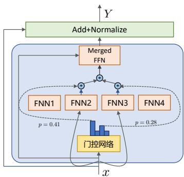  
（a）稀疏混合专家模型（Sparse MoE）

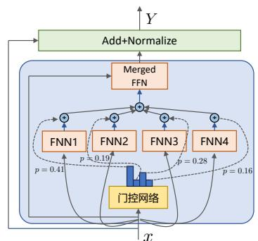  
（b）稠密混合专家模型（Dense MoE）

  
（c）软混合专家模型（Soft MoE）  
图 2.10 混合专家模型三种主要类型[68]

# 2.4.1 稀疏混合专家模型

稀疏混合专家模型，如图2.10(a)所示，对于每个输入词元，在前向计算中仅激活专家集合中的一个子集。门控网络对专家子集进行选择，通过计算排名前 $K$ 位专家的输出加权和来实现稀疏性。这个过程可以形式化的表示为：

$$
\mathcal {F} _ {\text {S p a r s e}} ^ {\text {M o E}} (\mathbf {x}; \boldsymbol {\Theta}; \left\{\mathbf {W} _ {i} \right\} _ {i = 1} ^ {N}) = \sum_ {i = 1} ^ {N} \mathcal {G} (\mathbf {x}; \boldsymbol {\Theta}) _ {i} f _ {i} (\mathbf {x}; \mathbf {W} _ {i}) \tag {2.38}
$$

$$
\mathcal {G} (\mathbf {x}; \boldsymbol {\Theta}) _ {i} = \operatorname {s o f t m a x} \left(\operatorname {T o p K} \left(g (\mathbf {x}; \boldsymbol {\Theta}) + \mathcal {R} _ {\text {n o i s e}}, K\right)\right) _ {i} \tag {2.39}
$$

$$
\operatorname {T o p - K} (g (\mathbf {x}; \boldsymbol {\Theta}), K) _ {i} = \left\{ \begin{array}{l l} g (\mathbf {x}; \boldsymbol {\Theta}) _ {i}, & g (\mathbf {x}; \boldsymbol {\Theta}) _ {i} \text {的 值 属 于 前} \mathrm {K} \text {项} \\ - \infty , & \text {其 他} \end{array} \right. \tag {2.40}
$$

其中， $g ( \mathbf { x } ; \mathbf { \Theta } \Theta )$ 表示在进行 softmax 操作之前的门控值， $\mathcal { G } ( \mathbf { x } ; \mathbf { \Theta } \Theta ) _ { i }$ 表示门控网络针对第 $i$ 个专家的输出， $\mathrm { T o p K } ( \cdot , K )$ 函数的目标是保持向量的前 $K$ 项不变，其它维度设置为 $- \infty _ { \circ }$ 。鉴于 softmax 函数自身所具有的独特性质，当把其中某些项设置为 $- \infty$ 时，这些项所对应的值会近似等同于 0。超参数 $K$ 是根据具体应用来选取的，常见的取值选择为 $K = 1 ^ { [ 6 7 , 6 9 ] }$ 或者 $K = 2 ^ { [ 6 6 , 7 0 - 7 2 ] }$ 。添加噪

声项 $\mathcal { R } _ { n o i s e }$ 是训练稀疏混合专家层的一种常用策略，一方面，它能够为模型创造更多的探索空间，促使不同专家模块之间展开多样化的尝试与协作，挖掘出潜在的优化路径；另一方面，通过打破可能出现的局部最优情况，提高了整个混合专家训练过程的稳定性[67]。

由 Mixtral AI 公司推出的 Mixtral-8x7B 模型[66] 就采用了稀疏混合专家方式，与早期的 Mistral7B模型[73] 共享基础架构。但是，Mixtral-8x7B模型使用了稀疏混合专家层代替每个Transformer块中的前馈层，每个稀疏混合专家层包含8个专家网络，门控网络每次激活2个专家。但是在Mixtral-${ } ^ { 8 \mathrm { x 7 B } }$ 模型中没有引入噪声项 $\mathcal { R } _ { n o i s e }$ ，每个专家网络则使用了SwiGLU结构[46]。由于采用了稀疏混合专家方式，虽然Mixtral-8x7B模型的总参数量大约560亿，但是每次仅使用130亿个活跃参数。并且，Mixtral-8x7B模型在很多基准测试中，展现出了优于或等同于包含了700亿参数的Llama-2-$7 0 \mathrm { B } ^ { [ 3 7 ] }$ 的性能。此外，众多大语言模型也都采用了稀疏混合专家架构，包括Switch Transformer[67]、DeepSeekMoE[74]、AdaMoE[75]、Yuan $2 . 0 { \cdot } \mathrm { M } 3 2 ^ { [ 7 6 ] }$ 、OpenMoE[77]、Qwen1.5-MoE-A2.7B[78] 等。更多相关模型可以参考文献[68]。

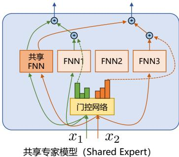  
图 2.11 共享专家模型[68]

稀疏混合专家模型中采用常规的门控策略时，分配给不同专家的词元可能需要一些共有知识或信息才能处理。因此，多个专家可能会在各自的参数中获取同样的知识，进而导致专家参数出现冗余。如果构建专门用于捕捉并整合不同情境下共有知识的共享专家，那么其他专家之间的参数冗余情况将可能得到缓解。这种冗余情况的缓解，有助于构建一个参数利用更高效且专家专业性更强的模型。因此，DeepSeekMoE[74] 提出了分离 $K _ { s }$ 个专家作为共享专家的思路。无论门控网络所给出的结果如何，每个词元都将被确定性地分配给这些共享专家，如图2.11所示，深色块SharedFFN 为共享专家，所有输入都会分配给共享专家。为保持计算成本恒定，其他经门控网络分配的专家中被激活专家的数量将减少 $K _ { s }$ 个。

稀疏混合专家模型中的 MoE 层对于并行计算也十分友好，能更便捷地在单个 GPU 上实现高效计算。常规稠密模型中，全部参数都会参与对所有输入数据的处理流程。与之不同，稀疏混合专家模型具备的稀疏特性，使得计算仅在系统的特定局部展开。也就是说，并非所有参数在处理各个输入时都会被触发或启用，而是依据输入的具体特性与需求，仅有特定的部分参数集被唤起

并运行。因此，在并行计算中可以有效利用上述特性。例如，Megablocks[79] 将 MoE 层的前馈网络运算转换为大型稀疏矩阵乘法，极大地提高了执行速度，并且能够很好地处理不同专家分配到的数量不等的词元情况。此外，MoE层可以通过标准的模型并行技术分布到多个GPU上，还可以借助专家并行（Expert Parallelism，EP）[80] 实现特殊的分区策略。

# 2.4.2 稠密混合专家模型

稠密混合专家模型，如图2.10(b)所示，对于每个输入词元，在前向计算中激活所有专家网络$\{ f _ { 1 } , . . . , f _ { N } \}$ 。门控网络根据输入赋予专家不同的权重。这个过程可以形式化的表示为：

$$
\mathcal {F} _ {D e n s e} ^ {M o E} (\mathbf {x}; \boldsymbol {\Theta}; \left\{\mathbf {W} _ {i} \right\} _ {i = 1} ^ {N}) = \sum_ {i = 1} ^ {N} \mathcal {G} (\mathbf {x}; \boldsymbol {\Theta}) _ {i} f _ {i} (\mathbf {x}; \mathbf {W} _ {i}) \tag {2.41}
$$

$$
\mathcal {G} (\mathbf {x}; \boldsymbol {\Theta}) _ {i} = \operatorname {s o f t m a x} (g (\mathbf {x}; \boldsymbol {\Theta})) _ {i} = \frac {\exp (g (\mathbf {x} ; \boldsymbol {\Theta}) _ {i})}{\sum_ {j} ^ {N} \exp (g (\mathbf {x} ; \boldsymbol {\Theta}) _ {j})} \tag {2.42}
$$

由于稠密混合专家模型在前向计算过程中会激活所有参数，不能降低模型计算量。因此，大语言模型采用稠密混合专家结构的并不多，主要包括 EvoMoE[81]、MoLE[82]、LoRAMoE[83] 以及 DS-MoE[84]等。

虽然稠密混合专家模型需要使用全部参数进行计算，并不能减少模型计算时间，但是研究人员却发现，如果能够将LoRA方法和MoE相结合，可以在占用很少GPU显存的同时，减少微调数据的大规模扩增与模型世界知识维持之间存在的冲突。有监督微调是大语言模型应用的一个关键步骤，当模型需要与更广泛的下游任务保持一致，或者希望显著提高在特定任务上的表现时，大规模增加微调数据通常成为解决方案。然而当指令数据的大规模扩增可能会破坏大语言模型中之前储存的世界知识，即世界知识遗忘。LoRAMoE[83] 采用融合混合专家和 LoRA 插件的思想，插件形式确保了在训练阶段冻结主模型，保证了主模型世界知识的完整性。

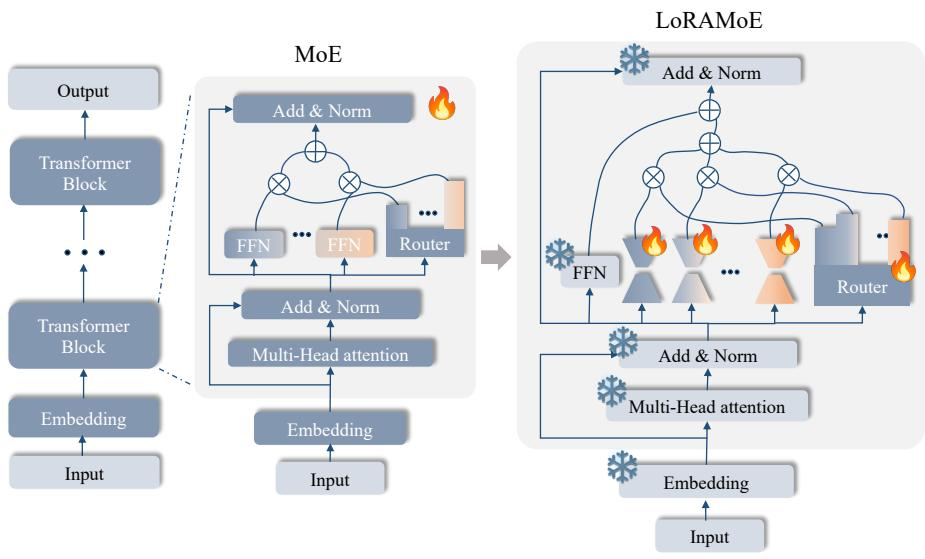  
图 2.12 LoRAMoE 模型架构图[83]

LoRAMoE模型架构如图2.12所示。基于插件的微调能够将参数的改动集中在额外引入的插件中，从而保证了模型知识的完整性，有机会引入其他插件来通过与主模型的交互来缓解知识遗忘。LoRAMoE引入了多个与前反馈神经网络并列的专家，并通过路由相连，如图2.12中标注了“火焰”符号的部分，这些部分也是需要在后续学习中进行参数学习的结构。LoRAMoE在训练阶段使用局部平衡约束损失（Localized Balancing Constraint），这种约束能够让专家自动划分为两个组：使一部分专家在专注于做下游任务的同时，另一部分专家专注于将指令与主模型的世界知识对齐，以缓解世界知识遗忘。同时局部平衡约束还能防止单个专家组内的专家退化现象，使路由平衡地关注于单个专家组的所有专家，防止个别专家长期占据优势，而其他专家未被充分训练或使用。这有助于专家之间相互配合以提高下游任务能力。微调后的 LoRAMoE 中的路由能够根据数据类型灵活地关注相应的专家，并使专家们相互配合，在保证下游任务表现的同时，也几乎不丧失世界知识。

# 2.4.3 软混合专家模型

软混合专家模型，如图2.10(c)所示，门控网络依然根据输入为各个专家分配不同的权重，但与稠密混合专家模型在前向计算中激活所有专家网络不同，软混合专家模型引入了融合前馈层（MergedFFN）。该方法通过门控网络分配的权重对不同专家的参数进行融合，仅对融合后的前馈层参数进行计算。这种设计既能在几乎不增加计算成本的情况下完成计算，又保留了稠密混合专家模型中

可使用基于梯度的训练方法的优势。这个过程可以形式化的表示为：

$$
\mathcal {F} _ {\text {S o f t}} ^ {\text {M o E}} (\mathbf {x}; \boldsymbol {\Theta}; \left\{\mathbf {W} _ {i} \right\} _ {i = 1} ^ {N}) = f _ {\text {m e r g e d}} (\mathbf {x}; \sum_ {i = 1} ^ {N} \mathcal {G} (\mathbf {x}; \boldsymbol {\Theta}) _ {i} \mathbf {W} _ {i}) \tag {2.43}
$$

$$
\mathcal {G} (\mathbf {x}; \boldsymbol {\Theta}) _ {i} = \operatorname {s o f t m a x} (g (\mathbf {x}; \boldsymbol {\Theta})) _ {i} = \frac {\exp (g (\mathbf {x} ; \boldsymbol {\Theta}) _ {i})}{\sum_ {j} ^ {N} \exp (g (\mathbf {x} ; \boldsymbol {\Theta}) _ {j})} \tag {2.44}
$$

其中，fmerged 表示融合前向层，其结构与其余专家网络 $f _ { i }$ 的结构相同。SMEAR 算法[85] 就采用了这种软混合专家结构。

软混合专家模型始终只计算单个专家的输出，其计算成本可能与单专家稀疏混合模型相当，明显低于稠密混合专家模型。但是，软混合专家模型的平均操作仍然会产生不可忽视的计算成本。为了量化这一成本，文献[85]分析了SMEAR算法的计算复杂度。假设专家网络架构是一个从 $d$ 维激活值投射到 $m$ 维向量的稠密计算，随后经过非线性变换，再附加一个从 $m$ 维投射回 $d$ 维的稠密计算。为简便起见，这里忽略成本相对较小的非线性变换成本。假定输入是一个长度为 $L$ 的激活值序列，其大小为 $L \times d _ { \circ }$ 。在这种情况下，计算合并专家的输出会产生大约 $L \times 4 \times d \times m$ 次浮点运算（FLOPs）的计算成本，而采用 $N$ 个专家的稠密混合专家模型则需要 $N \times L \times 4 \times d \times m$ 次浮点运算。此外，软混合专家模型还必须对 $N$ 个专家的参数进行平均，这又会额外产生 $N \times 2 \times d \times m$ 次浮点运算的成本。整体上 SMEAR 算法的计算复杂度是 $( L \times 4 + N \times 2 ) \times d \times m _ { \circ }$ 。综合整体计算成本，软混合专家模型计算复杂度仍然远低于稠密混合专家模型。

# 3. 大语言模型预训练数据

在预训练阶段，大语言模型从海量“高质量”文本数据中学习广泛的知识，随后这些知识存储在其模型参数当中。通过预训练使得大语言模型具备了一定程度的语言理解和生成能力。因此，如何构造海量“高质量”数据对于大语言模型预训练具有至关重要的作用。研究表明，预训练数据需要涵盖各种类型的文本，也需要覆盖尽可能多的领域、语言、文化和视角，从而提高大语言模型的泛化能力和适应性。当前大模型预训练使用的语料库涵盖网页内容、学术资料、百科、社交媒体和书籍等文本内容，同时也包含来自不同领域的文本内容，比如法律文件、年度财务报告、医学教科书等其他特定领域的数据。

本章将介绍常见的大语言模型预训练数据的来源、处理方法、预训练数据对大语言模型影响的分析及开源数据集等。

# 3.1 数据来源

文献 [13] 介绍了 OpenAI 训练 GPT-3 使用的主要数据来源，包含经过过滤的 CommonCrawl数据集[19]、WebText 2、Books 1、Books 2 及英文 Wikipedia 等数据集。其中 CommonCrawl 的原始数据有 45TB，过滤后仅保留了 570GB 的数据。通过词元方式对上述数据进行切分，大约包含5000亿个词元。为了保证模型使用更多高质量数据进行训练，在GPT-3训练时，根据数据来源的不同，设置不同的采样权重。在完成3000亿个词元的训练时，英文Wikipedia的数据平均训练轮数为 3.4 次，而 CommonCrawl 和 Books 2 仅有 0.44 次和 0.43 次。由于 CommonCrawl 数据集的过滤过程烦琐复杂，Meta 公司的研究人员在训练 OPT[29] 模型时采用了混合 RoBERTa[86]、Pile[87]和PushShift.io Reddit[88] 数据的方法。由于这些数据集中包含的绝大部分数据都是英文数据，因此OPT 也从CommonCrawl数据集中抽取了部分非英文数据加入训练数据。

大语言模型预训练所需的数据来源大体上分为通用数据和专业数据两大类。通用数据（GeneralData）包括网页、图书、新闻、对话文本等[14, 29, 39]。通用数据具有规模大、多样性和易获取等特点，因此支持大语言模型的语言建模和泛化能力。专业数据（Specialized Data）包括多语言数据、科学文本数据、代码及领域特有资料等。通过在预训练阶段引入领域数据可以有效提升大语言模

型的任务解决能力。图3.1 给出了一些典型的大语言模型所使用数据类型的分布情况。可以看到，不同的大语言模型在训练数据类型分布上的差距很大，截至2025年2月，业界关于预训练数据的配比还没达成广泛的共识。

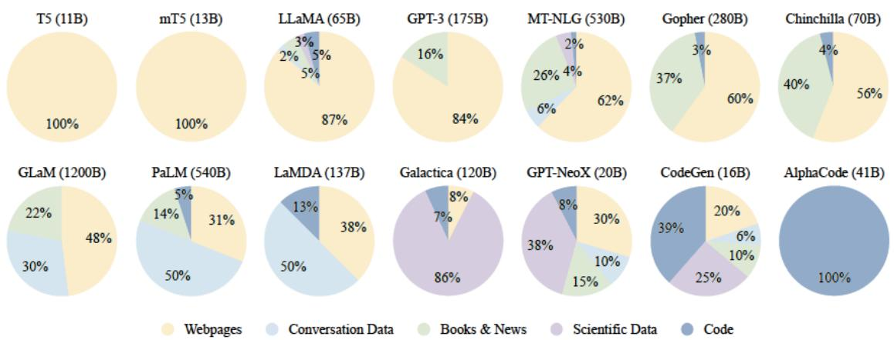  
图 3.1 典型的大语言模型所使用数据类型的分布情况[18]

# 3.1.1 通用数据

通用数据在大语言模型训练数据中占比非常高，主要包括网页、对话文本、书籍、代码、百科等不同类型的数据，为大语言模型提供了大规模且多样的训练数据。

网页（Webpage）是通用数据中数量最多的一类。随着互联网的大规模普及，人们通过网站、论坛、博客、App创造了海量的数据。根据2016年Google公开的数据，其搜索引擎索引处理了超过 130 万亿个网页数据。网页数据所包含的海量内容，使语言模型能够获得多样化的语言知识并增强其泛化能力[11, 19]。爬取和处理海量网页内容并不是一件容易的事情，因此一些研究人员构建了 ClueWeb09[89]、ClueWeb12[90]、SogouT-16[91]、CommonCrawl[19] 等开源网页数据集。虽然这些爬取的网络数据包含大量高质量的文本，但也包含非常多低质量的文本（如垃圾邮件等）。因此，过滤并处理网页数据以提高数据质量对大语言模型训练非常重要。

对话文本（Conversation Text）是指有两个或更多参与者交流的文本内容。对话文本包含书面形式的对话、聊天记录、论坛帖子、社交媒体评论等。当前的一些研究表明，对话文本可以有效增强大语言模型的对话能力[29]，并潜在地提高大语言模型在多种问答任务上的表现[14]。对话文本可以通过收集、清洗、归并等过程从社会媒体、论坛、邮件组等处构建。相较于网页数据，对话文本数据的收集和处理更加困难，数据量也少很多。常见的对话文本数据集包括PushShift.io Reddit[88, 92]、Ubuntu Dialogue Corpus[93]、Douban Conversation Corpus、Chromium Conversations Corpus 等。此外，文献[94]也提出了使用大语言模型自动生成对话文本数据的UltraChat方法。

书籍（Book）是人类知识的主要积累方式之一，从古代经典著作到现代学术著述，承载了丰富多样的人类思想。书籍通常包含广泛的词汇，包括专业术语、文学表达及各种主题词汇。利用书籍数据进行训练，大语言模型可以接触多样化的词汇，从而提高其对不同领域和主题的理解能力。相较于其他数据库，书籍也是最重要的，甚至是唯一的长文本书面语的数据来源。书籍提供了完整的句子和段落，使大语言模型可以学习到上下文之间的联系。这对于模型理解句子中的复杂结构、逻辑关系和语义连贯性非常重要。书籍涵盖了各种文体和风格，包括小说、科学著作、历史记录，等等。用书籍数据训练大语言模型，可以使模型学习到不同的写作风格和表达方式，提高大语言模型在各种文本类型上的能力。受限于版权因素，开源书籍数据集很少，现有的开源大语言模型研究通常采用 Pile 数据集[87] 中提供的 Books 3 和 BookCorpus 2 数据集。

多语言数据（Multilingual Text）对于增强大语言模型的多语言理解和生成多语言能力具有至关重要的作用。当前的大语言模型训练除了需要目标语言中的文本，通常还要整合多语言数据库。例如，BLOOM[31] 的预训练数据中包含46种语言的数据，PaLM[14] 的预训练数据中甚至包含高达122种语言的数据。此前的研究发现，通过多语言数据混合训练，预训练模型可以在一定程度上自动构建多语言之间的语义关联[95]。因此，多语言数据混合训练，可以有效提升翻译、多语言摘要和多语言问答等任务能力。此外，由于不同语言中不同类型的知识获取难度不同，多语言数据还可以有效地增加数据的多样性和知识的丰富性。

科学文本（Scientific Text）数据包括教材、论文、百科及其他相关资源。这些数据对于提升大语言模型在理解科学知识方面的能力具有重要作用[96]。科学文本数据的来源主要包括 arXiv 论文[97]、PubMed 论文[98]、教材、课件和教学网页等。由于科学领域涉及众多专业领域且数据形式复杂，通常还需要对公式、化学式、蛋白质序列等采用特定的符号标记并进行预处理。例如，公式可以用 LaTeX 语法表示，化学结构可以用 SMILES（Simplified Molecular Input Line Entry System）表示，蛋白质序列可以用单字母代码或三字母代码表示。这样可以将不同格式的数据转换为统一的形式，使大语言模型更好地处理和分析科学文本数据。

百科（Encyclopedia）数据包含百科全书、在线百科网站及其他知识数据库，这些数据中蕴含着极为丰富的知识。百科知识内容通常是经由专家严谨编撰、志愿者无私奉献以及社区贡献者协同努力，得以创作与完善，具备一定的权威性与可靠性。由于此类知识资源易于获取，在大语言模型的预训练语料构建进程中发挥着至关重要的作用。最常见的百科语料库是维基百科（Wikipedia）。它具有免费、开源、多语言以及文本价值高的特点。几乎所有的大语言模型预训练都会将维基百科作为其预训练语料库的一部分。就中文百科语料库而言，除了中文版维基百科外，还有百度百科、搜狗百科等来源。它们几乎涵盖了所有知识领域，TigerBot-wiki[99] 就是从百度百科的数据中筛选出来的。

代码（Code）是进行程序生成任务所必需的训练数据。近期的研究和ChatGPT的结果表明，通过在大量代码上进行预训练，大语言模型可以有效提升代码生成的效果[100, 101]。代码不仅包含程序代码本身，还包含大量的注释信息。与自然语言文本相比，代码具有显著的不同。代码是一种格

式化语言，它对应着长程依赖和准确的执行逻辑[102]。代码的语法结构、关键字和特定的编程范式都对其含义和功能起着重要的作用。代码的主要来源是编程问答社区（如 Stack Exchange[103, 104]）和公共软件仓库（如 GitHub[27, 100, 105]）。编程问答社区中的数据包含了开发者提出的问题、其他开发者的回答及相关代码示例。这些数据提供了丰富的语境和真实世界中的代码使用场景。公共软件仓库中的数据包含了大量的开源代码，涵盖多种编程语言和不同领域。这些代码库中的很多代码经过了严格的代码评审和实际的使用测试，因此具有一定的可靠性。

# 3.1.2 领域数据

特定领域预训练语料库是为特定领域或主题量身定制的。这类语料库通常用于大语言模型的增量预训练阶段。在用通用预训练语料库训练出一个基础模型之后，如果该模型需要应用于某一特定领域的下游任务，就可以进一步利用特定领域预训练语料库对模型进行增量预训练。这一过程在基于初始通用预训练所获得的通用能力基础上，增强了模型在特定领域的能力。虽然领域数据相比通用数据所占比例通常较低，但是其对改进大语言模型在特定领域任务上的能力有着非常重要的作用。专业数据有非常多的种类，文献[106]总结了当前开源或部分开源领域数据情况。

金融领域的预训练语料库有助于大言模型学习金融市场、经济学、投资及金融相关主题知识。金融领域文本数据通常来源于金融新闻、财务报表、公司年报、金融研究报告、金融文献、市场数据等。BBT-FinCorpus[107] 是一个大规模的中文金融领域语料库，由公司公告、研究报告、金融新闻和社交媒体这四个部分组成。该语料集用于 BBT-FinT5 基础模型的预训练[107]。FinCorpus[108]是一个中文金融领域语料库，包含公司公告、金融信息与新闻、金融考试题目等。FinGLM则致力于构建一个开放的、公益的、持久的金融大模型项目，数据涵盖 10000 份 2019 年至 2021 年上市公司的年报。FinGPT[109] 收集了金融新闻、社交媒体、金融监管机构文件、金融趋势分析文章以及金融学术数据集等数据。为了充分利用这些不同来源的丰富信息，FinGPT还构建了能够抓取结构化和非结构化数据的数据采集工具。TigerBot-research[99] 和 TigerBot-earning[99] 则分别侧重于研究报告和财务报告。

医疗领域的预训练语料库通常包含大量的医学文本语料库（包括结构化和非结构化文本），包括电子健康记录、临床记录以及医学文献等。PubMed[98] 是一个由美国国家医学图书馆（NLM）维护的在线数据库，用于检索医学和生物医学领域的文献，包括期刊文章、会议论文、技术报告、书籍、政府出版物和学位论文等大量资源。PubMed Central（PMC）则是免费全文数据库。MIMIC-III[110] 是一个大型的、可免费获取的用于医疗研究的数据库，收集了从2001年到2012年期间在Beth IsraelDeaconess Medical Center的重症监护病房（ICU）中的患者数据，包含了患者的生命体征、实验室测试结果、药物使用、诊断和治疗过程等详细的临床信息。Medical-GPT[111] 以及Baichuan-M1都使用了可开放获取的医学百科全书和医学教科书数据。Huatuo-26M[112] 是目前规模最大的中文医疗问答数据集之一，该数据集包含逾2600万条高质量的医疗问答对，涵盖疾病、症状、治疗方法以及药物信息等诸多方面。MedDialog[113] 是一个多语言的医疗对话数据集，包含中文和英文的医

疗对话数据。中文数据集包含340万条医生-患者对话，覆盖172个疾病领域，而英文数据集包含26万条对话，覆盖96个疾病领域。

法律领域也包含许多可用于模型训练的数据资源，主要包括法律法规、裁判文书等法律数据。这些数据通常可以从相关官方网站下载获得，且数据规模较大，能够为大模型提供大量的法律专业知识。此外，还还通过收集司法考试题目、法律咨询、法律问答等相关数据，这类数据涉及了真实用户的法律需求与基于法律专业知识的解答。CUAD[114] 是一个包含510个商业法律合同、超过1.3万个标注的合同审查数据集，由数十名法律专业人士和机器学习研究人员共同创建，通过法律专业人士对这些合同数据进行扩充和详细标注。TigerBot-law[99] 则汇集了11类中国法律法规，以及一些多类别语料库，还纳入了从法律相关网站抓取的数据。

# 3.2 数据处理

大语言模型的相关研究表明，数据质量对于模型的影响非常大。因此，在收集了各种类型的数据之后，需要对数据进行处理，去除低质量数据、重复数据、有害信息、个人隐私等内容[14, 115]。典型的数据处理流程如图3.2所示，主要包括质量过滤、冗余去除、隐私消除、词元切分这几个步骤。本节将依次介绍上述内容。

# 质量过滤

·语言过滤   
·指标过滤   
·统计特征过滤   
·关键词过滤

Alice is writing a paper about LLMs.#$A& Alice is writing a paper about LLMs.

# 冗余去除

·句子级别   
·文档级别   
·数据集级别

Alice is writing a paper about LLMs.Alice- is writing a paper about LLMe.

# 隐私消除

·隐私数据发现  
·隐私数据消除

The social security number of Alice is423-45-678

# 词元切分

·子词词元化  
·字节对编码   
·WordPiece

newest→n/e/w/es/t   
low→lo/w   
wid→w/id

图 3.2 典型的数据处理流程图[18]

# 3.2.1 质量过滤

互联网上的数据质量参差不齐，无论是 OpenAI 联合创始人 Andrej Karpathy 在微软 Build 2023的报告，还是当前的一些研究都表明，训练数据的质量对于大语言模型效果具有重大影响。因此，从收集到的数据中删除低质量数据成为大语言模型训练中的重要步骤。大语言模型训练中所使用的低质量数据过滤方法可以大致分为两类：基于分类器的方法和基于启发式的方法。

基于分类器的方法的目标是训练文本质量判断模型，利用该模型识别并过滤低质量数据。GPT-3[39]、PaLM[14] 和 GLaM[116] 模型在训练数据构造时都使用了基于分类器的方法。文献 [116]采用了基于特征哈希的线性分类器（Feature Hash Based Linear Classifier），可以非常高效地完成文

本质量判断。该分类器使用一组精选文本（维基百科、书籍和一些选定的网站）进行训练，目标是给于训练数据类似的网页较高分数。利用这个分类器可以评估网页的内容质量。在实际应用中，还可以通过使用 Pareto 分布对网页进行采样，根据其得分选择合适的阈值，从而选定合适的数据集。然而，一些研究发现，基于分类器的方法可能会删除包含方言或者口语的高质量文本，从而损失一定的多样性[115, 116]。

基于启发式的方法则通过一组精心设计的规则来消除低质量文本，BLOOM[31] 和 Gopher[115]采用了基于启发式的方法。一些启发式规则如下。

• 语言过滤：如果一个大语言模型仅关注一种或者几种语言，则可以大幅过滤数据中其他语言的文本。  
指标过滤：利用评测指标也可以过滤低质量文本。例如，可以使用语言模型对给定文本的困惑度进行计算，利用该值可以过滤非自然的句子。  
统计特征过滤：针对文本内容可以计算包括标点符号分布、符号字比（Symbol-to-Word Ratio）、句子长度在内的统计特征，利用这些特征过滤低质量数据。  
• 关键词过滤：根据特定的关键词集，可以识别并删除文本中的噪声或无用元素。例如，HTML标签、超链接及冒犯性词语等。

在大语言模型出现之前，在自然语言处理领域已经开展了很多文章质量判断（Text Quality Eval-uation）相关的研究，主要应用于搜索引擎、社会媒体、推荐系统、广告排序及作文评分等任务中。在搜索和推荐系统中，结果的内容质量是影响用户体验的重要因素之一，因此，此前很多工作都是针对用户生成内容（User-Generated Content，UGC）的质量进行判断的。自动作文评分也是文章质量判断领域的一个重要子任务，自1998年文献[117]提出使用贝叶斯分类器进行作文评分预测以来，基于 SVM[118]、CNN-RNN[119]、BERT[120, 121] 等方法的作文评分算法相继被提出，并取得了较大的进展。这些方法都可以应用于大语言模型预训练数据过滤。由于预训练数据量非常大，并且对质量判断的准确率要求并不非常高，因此一些基于深度学习和预训练的方法还没有应用于低质过滤中。

# 3.2.2 冗余去除

文献 [122] 指出，大语言模型训练数据库中的重复数据，会降低大语言模型的多样性，并可能导致训练过程不稳定，从而影响模型性能。因此，需要对预训练语料库中的重复数据进行处理，去除其中的冗余部分。文本冗余发现（Text Duplicate Detection）也被称为文本重复检测，是自然语言处理和信息检索中的基础任务之一，其目标是发现不同粒度上的文本重复，包括句子、段落、文档等不同级别。冗余去除就是在不同的粒度上去除重复内容，包括句子、文档和数据集等粒度。

在句子级别上，文献[123]指出，包含重复单词或短语的句子很可能造成语言建模中引入重复的模式。这对语言模型来说会产生非常严重的影响，使模型在预测时容易陷入重复循环（RepetitionLoops）。例如，使用 GPT-2 模型，对于给定的上下文“In a shocking finding, scientist discovered

a herd of unicorns living in a remote, previously unexplored valley, in the Andes Mountains. Even more surprising to the researchers was the fact that the unicorns spoke perfect English.”使用束搜索（Beam Search），当设置 $b = 3 2$ 时，模型就会产生如下输出，进入重复循环模式。“The study, published in the Proceedings of the National Academy of Sciences of the United States of America (PNAS), was conducted by researchers from the Universidad Nacional Autónoma de México (UNAM) and the Universidad Nacional Autónoma de México (UNAM/Universidad Nacional Autónoma de México/Universidad Nacional Autónoma de México/Universidad Nacional Autónoma de México/Universidad Nacional Autónoma de · · · ”。由于重复循环对语言模型生成的文本质量有非常大的影响，因此在预训练数据中需要删除 这些包含大量重复单词或者短语的句子。

在 RefinedWeb[60] 的构造过程中使用了文献 [124] 提出的过滤方法，进行了句子级别的过滤。该方法提取并过滤文档间超过一定长度的相同字符串。给定两个文档 $x _ { i }$ 和 $x _ { j }$ ，其中存在长度为 $k$ 的公共子串 $x _ { i } ^ { a \cdots a + k } = x _ { j } ^ { b \cdots b + k } ,$ = xbj 。当 $k \geqslant 5 0$ 时，就将其中一个子串过滤。公共子串匹配的关键是如何高效地完成字符串匹配，文献[60]将整个文档 $\mathcal { D }$ 转换为一个超长的字符串序列 $s$ ，之后构造序列 $s$ 的后缀数组（Suffix Array） $\mathbf { A } _ { \circ }$ 。该数组包含该序列中所有后缀按字典顺序排列的列表。具体而言，后缀数组A是一个整数数组，其中每个元素表示 $s$ 中的一个后缀的起始位置。A中的元素按照后缀的字典顺序排列。例如，序列“banana”的后缀包括“banana”“anana”“nana”“ana”“na”“a”，对应的后缀数组 A 为 [6, 4, 2, 1, 5, 3]。根据数组 A，可以很容易地找出相同的子串。如果 $S _ { i \cdot \cdot \cdot i + | s | } = S _ { j \cdot \cdot \cdot j + | s | }$ ，那么 $i$ 和 $j$ 在数组 A 中一定在紧邻的位置上。文献 [124] 中设计了并行的后缀数组构造方法，针对 Wiki-40B 训练数据（约包含 4GB 文本内容），使用拥有 96 核 CPU 以及 768GB 内存的服务器，可以在140秒内完成计算。对于包含350GB文本的C4数据集，仅需要12小时就可以完成后缀数组构造。

在文档级别上，大部分大语言模型依靠文档之间的表面特征相似度（例如 $n$ -gram 重叠比例）进行检测并删除重复文档[31, 34, 60, 124]。LLaMA[34] 采用 CCNet[125] 的处理模式，先将文档拆分为段落，并把所有字母转换为小写字母、将数字替换为占位符，删除所有 Unicode 标点符号和重音符号对每个段落进行规范化处理。然后，使用SHA-1方法为每个段落计算一个哈希码（Hash Code），并使用前 64 位数字作为键。最后，利用每个段落的键进行重复判断。RefinedWeb[60] 先去除页面中的菜单、标题、页脚、广告等内容，仅抽取页面中的主要内容。在此基础上，在文档级别进行过滤，采用与文献[115]类似的方法，使用 $n$ -gram重复程度来衡量句子、段落及文档的相似度。如果重复程度超过预先设定的阈值，则会过滤重复段落或文档。

此外，数据集级别上也可能存在一定数量的重复情况，比如很多大语言模型预训练数据集都会包含GitHub、Wikipedia、C4等。需要特别注意的是，预训练数据中混入测试数据，造成数据集污染的情况。在实际产生预训练数据时，需要从句子、文档、数据集三个级别去除重复，这对于改善语言模型的训练效果具有重要的作用[14, 126]。

# 3.2.3 隐私消除

由于绝大多数预训练数据源于互联网，因此不可避免地会包含涉及敏感或个人信息（PersonallyIdentifiable Information，PII）的用户生成内容，这可能会增加隐私泄露的风险[127]。如图3.3 所示，输入前缀词“East Stroudsburg Stroudsburg”，语言模型在此基础上补全了姓名、电子邮件地址、电话号码、传真号码及实际地址。这些信息都是模型从预训练数据中学习得到的。因此，非常有必要从预训练语料库中删除包含个人身份信息的内容。

  
图 3.3 从大语言模型中获得隐私数据的例子[127]

删除隐私数据最直接的方法是采用基于规则的算法，BigScience ROOTS Corpus[128] 在构建过程中就采用了基于命名实体识别的方法，利用命名实体识别算法检测姓名、地址、电话号码等个人信息内容并进行删除或者替换。该方法使用了基于 Transformer 的模型，并结合机器翻译技术，可以处理超过100种语言的文本，消除其中的隐私信息。该方法被集成在muliwai类库中。

# 3.2.4 词元切分

传统的自然语言处理通常以单词为基本处理单元，模型都依赖预先确定的词表V，在对输入词序列编码时，这些词表示模型只能处理词表中存在的词。因此，使用时，如果遇到不在词表中的未登录词，模型无法为其生成对应的表示，只能给予这些未登录词（Out-of-Vocabulary，OOV）一个默认的通用表示。在深度学习模型中，词表示模型会预先在词表中加入一个默认的“[UNK]”（unknown）标识，表示未知词，并在训练的过程中将[UNK]的向量作为词表示矩阵的一部分一起训练，通过引入某些相应机制来更新 [UNK] 向量的参数。使用时，对全部未登录词使用 [UNK] 向量作为表示向量。此外，基于固定词表的词表示模型对词表大小的选择比较敏感。当词表过小时，未登录词的比例较高，影响模型性能；当词表过大时，大量低频词出现在词表中，这些词的词向量很难

得到充分学习。理想模式下，词表示模型应能覆盖绝大部分的输入词，并避免词表过大所造成的数据稀疏问题。

为了缓解未登录词问题，一些工作通过利用亚词级别的信息构造词表示向量。一种直接的解决思路是为输入建立字符级别表示，并通过字符向量的组合获得每个单词的表示，以解决数据稀疏问题。然而，单词中的词根、词缀等构词模式往往跨越多个字符，基于字符表示的方法很难学习跨度较大的模式。为了充分学习这些构词模式，研究人员提出了子词词元化（Subword Tokenization）方法，试图缓解上文介绍的未登录词问题。词元表示模型会维护一个词元词表，其中既存在完整的单词，也存在形如“c”“re”“ing”等单词的部分信息，称为子词（Subword）。词元表示模型对词表中的每个词元计算一个定长向量表示，供下游模型使用。对于输入的词序列，词元表示模型将每个词拆分为词表内的词元。例如，将单词“reborn”拆分为“re”和“born”。模型随后查询每个词元的表示，将输入重新组成词元表示序列。当下游模型需要计算一个单词或词组的表示时，可以将对应范围内的词元表示合成需要的表示。因此，词元表示模型能够较好地解决自然语言处理系统中未登录词的问题。词元分析（Tokenization）是将原始文本分割成词元序列的过程。词元切分也是数据预处理中至关重要的一步。

字节对编码（Byte Pair Encoding，BPE）[129] 是一种常见的子词词元算法。该算法采用的词表包含最常见的单词及高频出现的子词。使用时，常见词通常位于BPE词表中，而罕见词通常能被分解为若干个包含在BPE词表中的词元，从而大幅减小未登录词的比例。BPE算法包括以下两个部分。

（1）词元词表的确定。  
（2）全词切分为词元及词元合并为全词的方法。

BPE中词元词表的计算过程如图3.4所示。首先，确定数据库中全词的词表和词频，然后将每个单词切分为单个字符的序列，并在序列最后添加符号“</w>”作为单词结尾的标识。例如，单词“low”被切分为序列“ $^ { \mathrm { s } } \mathrm { _ { 1 , 0 } } \mathrm { _ { \perp } } \mathrm { w _ { \perp } } < / \mathrm { w } > ^ { \mathrm { w } }$ ”。所切分出的序列元素称为字节，即每个单词都切分为字节的序列。之后，按照每个字节序列的相邻字节对和单词的词频，统计每个相邻字节对的出现频率，合并出现频率最高的字节对，将其作为新的词元加入词表，并将全部单词中的该字节对合并为新的单一字节。在第一次迭代时，出现频率最高的字节对是 (e,s)，故将“es”作为词元加入词表，并将全部序列中相邻的 (e,s) 字节对合并为 es 字节。重复这一步骤，直至 BPE 词元词表的大小达到指定的预设值，或没有可合并的字节对为止。

  
图 3.4 BPE 中词元词表的计算过程[129]

确定词元词表之后，对输入词序列中未在词表中的全词进行切分。BPE算法对词表中的词元按从长到短的顺序进行遍历，将每一个词元与当前序列中的全词或未完全切分为词元的部分进行匹配，将其切分为该词元和剩余部分的序列。例如，对于单词“lowest</w>”，先通过匹配词元“est</w>”将其切分为“low”“est</w>”的序列，再通过匹配词元“low”，确定其最终切分结果为“low”“est</w>”的序列。通过这样的过程，使用BPE尽量将词序列中的词切分成已知的词元。

在遍历词元词表后，对于切分得到的词元序列，为每个词元查询词元表示，构成词元表示序列。若出现未登录词元，即未出现在BPE词表中的词元，则采取和未登录词类似的方式，为其赋予相同的表示，最终获得输入的词元表示序列。

此外，字节级（Byte-level）BPE通过将字节视为合并的基本符号，改善多语言数据库（例如包含非 ASCII 字符的文本）的分词质量。GPT-2、BART、LLaMA 等大语言模型都采用了这种分词方法。原始LLaMA的词表大小是 $3 2 \mathrm { K ^ { \textregistered } }$ ，并且主要根据英文进行训练，因此，很多汉字都没有直接出现在词表中，需要字节来支持所有的中文字符，2个或者3个字节词元（Byte Token）才能拼成一个完整的汉字。

对于使用了BPE的大语言模型，其输出序列也是词元序列。对于原始输出，根据终结符 ${ < } / { \mathrm { w } } >$ 的位置确定每个单词的范围，合并范围内的词元，将输出重新组合为词序列，作为最终的结果。

WordPiece[130] 也是一种常见的词元分析算法，最初应用于语音搜索系统。此后，通常将该算法作为 BERT 的词元分析器[1]。WordPiece 与 BPE 有非常相似的思想，都是迭代地合并连续的词

元，但在合并的选择标准上略有不同。为了进行合并，WordPiece需要先训练一个语言模型，并用该语言模型对所有可能的词元对进行评分。在每次合并时，选择使得训练数据似然概率增加最多的词元对。Google 并没有发布其 WordPiece 算法的官方实现，HuggingFace 在其在线 NLP 课程中提供了一种更直观的选择度量方法：一个词元对的评分是根据训练数据库中两个词元的共现计数除以它们各自的出现计数的乘积。计算公式如下所示：

$$
\text {s c o r e} = \frac {\text {词 元 对 出 现 的 频 率}}{\text {第 一 个 词 元 出 现 的 频 率} \times \text {第 二 个 词 元 出 现 的 频 率}} \tag {3.1}
$$

Unigram 词元分析[131] 是另一种应用于大语言模型的词元分析算法，T5 和 mBART 采用该算法构建词元分析器。不同于BPE和WordPiece，Unigram词元分析从一个足够大的可能词元集合开始，迭代地从当前列表中删除词元，直到达到预期的词汇表大小。词元删除基于训练好的Unigram语言模型，以从当前词汇表中删除某个字词后，训练数据库似然性的增加量为选择标准。为了估计一元语言（Unigram）模型，采用了期望最大化（Expectation–Maximization，EM）算法：每次迭代时，先根据旧的语言模型找到当前最佳的单词切分方式，然后重新估计一元语言单元概率以更新语言模型。在这个过程中，使用动态规划算法（如维特比算法）高效地找到给定语言模型时单词的最佳分解方式。

以 HuggingFace NLP 课程中介绍的 BPE 代码为例，介绍 BPE 算法的构建和使用，代码实现如下所示：

from transformers import AutoTokenizer   
from collections import defaultdict   
corpus $=$ [ "This is the HuggingFace Course.", "This chapter is about tokenization.", "This section shows several tokenizer algorithms.", "Hopefully, you will be able to understand how they are trained and generate tokens.",

# 使用GPT-2词元分析器将输入分解为单词

```txt
tokenizer = AutoTokenizer.from_pretrained("gpt2") 
```

```txt
word_freqs = defaultdict(int) 
```

for text in corpus: words_with_offsetset $=$ tokenizer.backend_tokenizer.pre_tokenizer.pre_tokenize_str(text) new_words $=$ [word for word, offset in words_with_offsetset] for word in new_words:

```python
word_freqs[word] += 1  
# 计算基础词典，这里使用数据库中的所有字符  
alphabet = []  
for word in word_freqs.keys():  
    for letter in word:  
        if letter not in alphabet:  
            alphabet.append(letter)  
alphabet.sort()  
# 在字典的开头增加特殊词元，GPT-2中仅有一个特殊词元"<!endif>”，用来表示文本结束  
vocab = ["<endif>"] + alphabet.copy()  
# 将单词切分为字符  
splits = {word: [c for c in word] for word in word_freqs.keys()}  
# compute_pair_freqs函数用于计算字典中所有词元对的频率  
def compute_pair_freqs(splits):  
    pair_freqs = defaultdict(int)  
    for word, freq in word_freqs.items():  
        split = splitsword]  
        if len(split) == 1:  
            continue  
        for i in range(len(split) - 1):  
            pair = (split[i], split[i + 1])  
            pair_freqs[pair] += freq  
return pair_freqs  
# merge_pair函数用于合并词元对  
def merge_pair(a, b, splits):  
    for word in word_freqs:  
        split = splitsword]  
        if len(split) == 1:  
            continue  
        i = 0  
while i < len(split) - 1:  
    if split[i] == a and split[i + 1] == b:  
        split = split[:i] + [a + b] + split[i + 2:]  
    else:  
        i += 1  
splits[word] = split  
return splits  
# 迭代训练，每次选取得分最高词元对进行合并，直到字典大小达到设置的目标为止  
vocab_size = 50 
```

HuggingFace的transformer类中已经集成了很多词元分析器，可以直接使用。例如，利用BERT词元分析器获得输入“I have a new GPU!”的词元代码如下所示：

```python
>>> from transformers import Tokenizer
>>> tokenizer = Tokenizer.from_pretrained("bert-base-uncased")
>>> tokenizertokenizer("I have a new GPU!") 
["i", "have", "a", "new", "gp", "#u",!] 
```

# 3.3 数据影响分析

大语言模型的训练需要大量的计算资源，通常不可能多次进行大语言模型预训练。有千亿级参数量的大语言模型进行一次预训练需要花费数百万元的计算成本。因此，在训练大语言模型之前，构建一个准备充分的预训练语料库尤为重要。本节将从数据规模、数据质量和数据多样性三个方面分析数据对大语言模型的性能影响。需要特别说明的是，截至本书成稿时，由于在千亿参数规模的大语言模型上进行实验的成本非常高，很多结论是在百亿甚至十亿规模的语言模型上进行的实验，其结果并不能完整地反映数据对大语言模型的影响。此外，一些观点仍处于猜想阶段，需要进一步验证。请各位读者甄别判断。

# 3.3.1 数据规模

随着大语言模型参数规模的增加，为了有效地训练模型，需要收集足够数量的高质量数据[34, 132]。在针对模型参数规模、训练数据量及总计算量与模型效果之间关系的研究[132] 被提出之前，大部分大语言模型训练所采用的训练数据量相较于LLaMA等最新的大语言模型都少很多。表3.1给出了模型参数量与训练数据量的对比。在Chinchilla模型被提出之前，大部分大语言模型都在着重提升模型的参数量，所使用的训练数据量都在3000亿个词元左右，LaMDA模型使用的训练参数量仅有 1370 亿个。虽然 Chinchilla 模型的参数量不足 LaMDA 模型的一半，但是训练数据的词元数达到1.4万亿个，是LaMDA 模型的8倍多。

表 3.1 模型参数量与训练数据量的对比  

<table><tr><td>模型名称</td><td>参数量(个)</td><td>训练数据量(这个词元)</td></tr><tr><td>LaMDA[15]</td><td>1370亿</td><td>1680亿</td></tr><tr><td>GPT-3[39]</td><td>1750亿</td><td>3000亿</td></tr><tr><td>Jurassic [133]</td><td>1780亿</td><td>3000亿</td></tr><tr><td>Gopher [115]</td><td>2800亿</td><td>3000亿</td></tr><tr><td>MT-NLG 530B [134]</td><td>5300亿</td><td>2700亿</td></tr><tr><td>Chinchilla[132]</td><td>700亿</td><td>14000亿</td></tr><tr><td>Falcon[60]</td><td>400亿</td><td>10000亿</td></tr><tr><td>LLaMA[34]</td><td>630亿</td><td>14000亿</td></tr><tr><td>LLaMA-2[37]</td><td>700亿</td><td>20000亿</td></tr><tr><td>LLaMA-3[135]</td><td>4050亿</td><td>150000亿</td></tr><tr><td>Qwen2.5[136]</td><td>720亿</td><td>180000亿</td></tr><tr><td>GLM-4[137]</td><td>1300亿</td><td>100000亿</td></tr></table>

DeepMind 的研究人员在文献 [132] 中描述了他们训练 400 多个语言模型后得出的分析结果（模型的参数量从 7000 万个到 160 亿个，训练数据量从 5 亿个词元到 5000 亿个词元）。研究发现，如果希望模型训练达到计算最优（Compute-optimal），则模型大小和训练词元数量应该等比例缩放，即模型大小加倍则训练词元数量也应该加倍。为了验证该分析结果，他们使用与Gopher语言模型训练相同的计算资源，根据上述理论预测了 Chinchilla 语言模型的最优参数量与词元数量组合。最终确定Chinchilla语言模型具有700亿个参数，使用了1.4万亿个词元进行训练。通过实验发现，Chinchilla 在很多下游评估任务中都显著地优于 Gopher（280B）、GPT-3（175B）、Jurassic-1（178B）及 Megatron-Turing NLG（530B）。

图3.5给出了在同等计算量情况下，训练损失随参数量的变化情况。针对9种不同的训练参数量设置，使用不同词元数量的训练数据，训练不同大小的模型参数量，使得最终训练所需浮点运算数达到预定目标。对于每种训练量预定目标，图3.5(a)所示为平滑后的训练损失与参数量之间的关系。可以看到，训练损失值存在明显的低谷，这意味着对于给定训练计算量目标，存在一个最佳模型参数量和训练数据量配置。利用这些训练损失低谷的位置，还可以预测更大的模型的最佳模型参数量和训练词元数量，如图3.5(b) 和图3.5(c) 所示。图中绿色线表示根据 Gopher 训练的计算量预测的最佳模型参数量和训练数据词元数量。还可以使用幂律（Power Law）对计算量限制、损失最优模型参数量大小及训练词元数之间的关系进行建模。 $C$ 表示总计算量、 $N _ { \mathrm { o p t } }$ 表示模型最优参数量、 $D _ { \mathrm { o p t } }$ 表示最优训练词元数量，它们之间的关系如下：

$$
N _ {\text {o p t}} \propto C ^ {0. 4 9} \tag {3.2}
$$

$$
D _ {\text {o p t}} \propto C ^ {0. 5 1} \tag {3.3}
$$

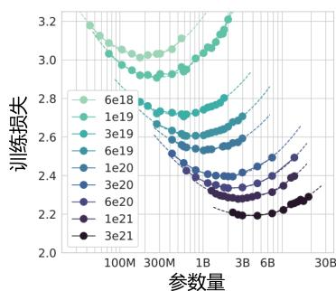


  
  
图 3.5 在同等计算量情况下，训练损失随参数量的变化情况[132]

LLaMA[34] 模型在训练时采用了与文献 [132] 相符的训练策略。研究发现，70 亿个参数的语言模型在训练超过 1 万亿个词元后，性能仍在持续增长。因此，Meta 的研究人员在 LLaMA- $2 ^ { [ 3 7 ] }$ 模型训练中，进一步增大了训练数据量，训练数据量达到 2 万亿个词元。LLaMA-3[135] 模型训练中，则是进一步将训练数据量增大到了惊人的 15 万亿个词元。Qwen2.5[136] 的 720 亿参数的开源版本，也使用了 18 万亿个词元进行了训练。文献 [132] 给出了不同参数量的 LLaMA 模型在训练期间，随着训练数据量的增加，模型在问答和常识推理任务上的效果演变，如图3.6所示。研究人员分别在 TriviaQA、HellaSwag、NaturalQuestions、SIQA、WinoGrande、PIQA 这 6 个数据集上进行了测试。可以看到，随着训练数据量的增加，模型在分属两类任务的 6 个数据集上的性能都在稳步提高。通过增加数据量和延长训练时间，较小的模型也能表现出良好的性能。

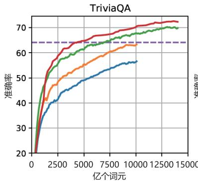

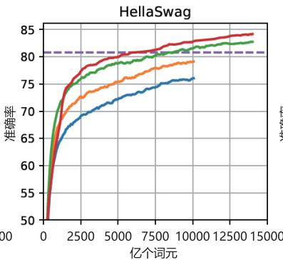


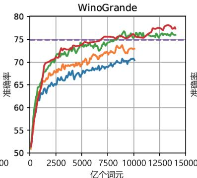

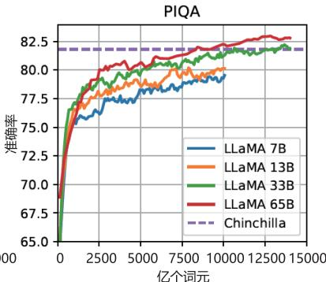  
图 3.6 LLaMA 模型在问答和常识推理任务上的效果演变[34]

文献[138]对不同任务类型所依赖的语言模型训练数量进行了分析。针对分类探查（ClassifierProbing）、信息论探查（Info-theoretic Probing）、无监督相对可接受性判断（Unsupervised RelativeAcceptability Judgment）及应用于自然语言理解任务的微调（Fine-tuning on NLU Tasks）这四类任务，基于不同量级预训练数据的RoBERTa[86] 模型进行了实验验证和分析。分别针对预训练了 $1 \mathbf { M } ^ { \textregistered }$ 、10M、100M 和 $\mathrm { 1 B ^ { \gtrless } }$ 个词元的RoBERTa模型进行能力分析。研究发现，仅对模型进行 $1 0 \mathrm { M } \mathrm { \sim } 1 0 0 \mathrm { M }$ 个词元的训练，就可以获得可靠的语法和语义特征。然而，需要更多的训练数据才能获得足够的常识知识和其他技能，并在典型的下游自然语言理解任务中取得较好的结果。

# 3.3.2 数据质量

数据质量通常被认为是影响大语言模型训练效果的关键因素之一。大量重复的低质量数据甚至导致训练过程不稳定，造成模型训练不收敛[122, 139]。现有的研究表明，训练数据的构建时间、包含噪声或有害信息情况、数据重复率等因素，都对语言模型性能产生较大影响[115, 122, 124, 140]。目前业界普遍的共识是语言模型在经过清洗的高质量数据上训练可以得到更好的性能。

文献[115]介绍了Gopher语言模型在训练时针对文本质量进行的相关实验。图3.7所示为具有140 亿个参数的模型在 OpenWebText、C4 及不同版本的 MassiveWeb 数据集上训练得到的模型效果对比。他们分别测试了利用不同数据训练得到的模型在 Wikitext103单词预测、Curation Corpus摘要及Lambada书籍级别的单词预测三个下游任务上的表现。图中纵坐标表示不同任务上的损失，数值越小表示性能越好。从结果可以看到，使用经过过滤和去重的MassiveWeb数据训练得到的语言模型在三个任务上都远好于使用未经处理的数据训练得到的模型。使用经过处理的MassiveWeb数据训练得到的语言模型在下游任务上的表现也远好于使用 OpenWebText 和 C4 数据集训练得到的结果。

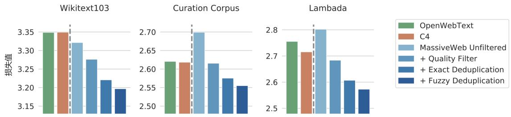  
图 3.7 Gopher 语言模型使用不同数据质量的数据训练后的效果对比[115]

构建 GLaM[116] 语言模型时，也对训练数据质量的影响进行了分析。该项分析同样使用包含17亿个参数的模型，针对下游少样本任务的性能进行了分析。使用相同超参数，对使用原始数据集和经过质量筛选后的数据训练得到的模型效果进行了对比，实验结果如图3.8 所示。可以看到，使用高质量数据训练的模型在自然语言生成和自然语言理解任务上表现更好。特别是，高质量数据对自然语言生成任务的影响大于自然语言理解任务。这可能是因为自然语言生成任务通常需要生成高质量的语言，过滤预训练语料库对语言模型的生成能力至关重要。文献[116]的研究强调了预训练数据的质量在下游任务的性能中也扮演着关键角色。

Google Research的研究人员针对数据构建时间、文本质量、是否包含有害信息进行了系统的研究[141]。他们使用包含不同时间、毒性水平、文本质量和领域的数据，训练了28个具有15亿个参数的仅解码器（Decoder-only）结构的语言模型。研究结果表明，大语言模型训练数据的时间、内容过滤方法及数据源对下游模型行为具有显著影响。

  
(a)自然语言生成任务

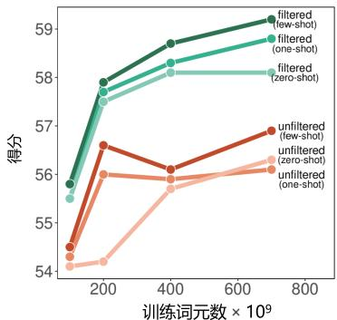  
(b)自然语言理解任务  
图 3.8 使用不同数据质量的数据训练 GLaM 语言模型的效果对比分析[116]

针对数据时效性对于模型效果的影响问题，研究人员在C4数据集的2013、2016、2019和2022版本上训练了4个自回归语言模型。对于每个版本，研究人员删除了CommonCrawl数据集中截止年份之后的所有数据。使用新闻、Twitter和科学领域的评估任务来衡量时间错配的影响。这些评估任务的训练集和测试集按年份划分，分别在每个按年份划分的数据集上微调模型，然后在2013年、2016年、2019年及2022年的测试集上进行评估。图3.9给出了使用4个不同版本的数据集训练得到的模型在 5 个不同任务上的评测结果。热力图颜色（Heatmap Colors）根据每一列进行归一化得到。从图中可以看到，训练数据和测试数据的时间错配会在一定程度上影响模型的效果。


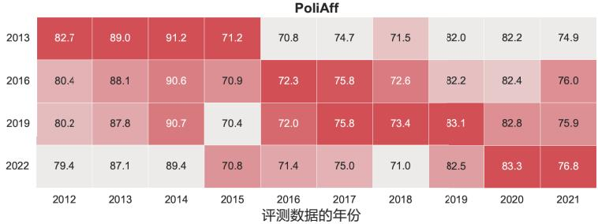  
图 3.9 训练数据和测试数据在时间错配情况下的性能分析[141]

Anthropic 的研究人员针对数据集中的重复问题开展了系统研究[122]。为了研究数据重复对大语言模型的影响，研究人员构建了特定的数据集，其中大部分数据是唯一的，只有一小部分数据

被重复多次，并使用这个数据集训练了一组模型。研究发现了一个强烈的双峰下降现象，即重复数据可能会导致训练损失在中间阶段增加。例如，通过将 $0 . 1 \%$ 的数据重复100次，即使其余 $90 \%$ 的训练数据保持不变，一个参数量为 800M 的模型的性能也可能降低到与参数量为 400M 的模型相同。此外，研究人员还设计了一个简单的复制评估，即将《哈利·波特》（Harry Potter）的文字复制11次，计算模型在该段上的损失。在仅有 $3 \%$ 的重复数据的情况下，训练过程中性能最差的轮次仅能达到参数量为其1/3的模型的效果。

文献[14]对大语言模型的记忆能力进行分析，根据训练样例在训练数据中出现的次数，显示了记忆率的变化情况，如图3.10所示。可以看到，对于在训练中只见过一次的样例，PaLM模型的记忆率为 $0 . 7 5 \%$ ，而其对见过 500 次以上的样例的记忆率超过 $40 \%$ 。这也在一定程度上说明重复数据对于语言模型建模具有重要影响。这也可能进一步影响使用上下文学习的大语言模型的泛化能力。由于PaLM模型仅使用了文档级别过滤，因此片段级别（100个以上词元）可能出现非常高的重复次数。

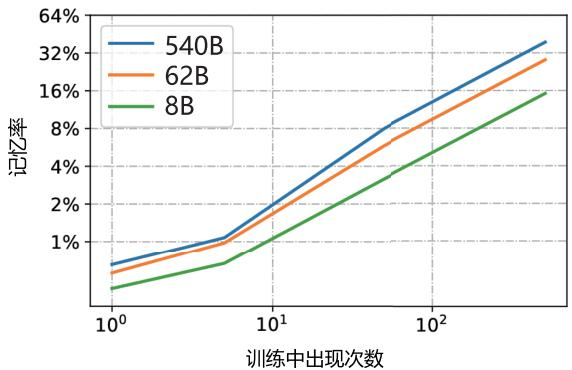  
图 3.10 大语言模型记忆能力评测[14]

# 3.3.3 数据多样性

来自不同领域、使用不同语言、应用于不同场景的训练数据具有不同的语言特征，包含不同语义知识。通过使用不同来源的数据进行训练，大语言模型可以获得广泛的知识。表3.2 给出了LLaMA 模型训练所使用的数据集。可以看到，LLaMA 模型训练混合了大量不同来源的数据，包括网页、代码、论文、图书等。针对不同的文本质量，LLaMA模型训练针对不同质量和重要性的数据集设定了不同的采样概率，表中给出了不同数据集在完成1.4万亿个词元训练时的采样轮数。

表 3.2 LLaMA 模型训练所使用的数据集[37]  

<table><tr><td>数据集</td><td>采样概率</td><td>训练轮数</td><td>存储空间</td></tr><tr><td>CommonCrawl</td><td>67.0%</td><td>1.10</td><td>3.3 TB</td></tr><tr><td>C4</td><td>15.0%</td><td>1.06</td><td>783 GB</td></tr><tr><td>GitHub</td><td>4.5%</td><td>0.64</td><td>328 GB</td></tr><tr><td>Wikipedia</td><td>4.5%</td><td>2.45</td><td>83 GB</td></tr><tr><td>Books</td><td>4.5%</td><td>2.23</td><td>85 GB</td></tr><tr><td>arXiv</td><td>2.5%</td><td>1.06</td><td>92 GB</td></tr><tr><td>Stack Exchange</td><td>2.0%</td><td>1.03</td><td>78 GB</td></tr></table>

Gopher 模型[115] 在训练过程中进行了对数据分布的消融实验，以便验证混合来源对下游任务的影响。针对MassiveText子集设置了不同权重的数据组合，并用于训练语言模型。利用Wikitext103、Lambada、C4和Curation Corpus测试不同权重组合训练得到的语言模型在下游任务上的性能。为了限制数据组合分布范围，实验中固定了 Wikipedia 和 GitHub 两个数据集的采样权重。对于 Wikipedia，要求对训练数据进行完整的学习，因此将采样权重固定为 $2 \%$ ；对于GitHub，采样权重设置为 $3 \text{‰}$ 对于剩余的4个子集（MassiveWeb、News、Books和C4）设置了7种不同的组合。图3.11给出了7种不同子集采样权重训练得到Gopher模型在下游任务上的性能。可以看到，使用不同数量子集采样权重训练，获得的模型效果差别很大。在所有任务中表现良好且在Curation Corpus上取得最佳表现的绿色配置是 $10 \%$ 的 C4、 $50 \%$ 的 MassiveWeb、 $30 \%$ 的 Books 和 $10 \%$ 的News。增加书籍数据的比例可以提高模型从文本中捕获长期依赖关系的能力，降低Lambada数据集[142] 上的损失，而使用更高比例的C4数据集[19] 则有助于在C4验证集[115] 上获得更好的表现。

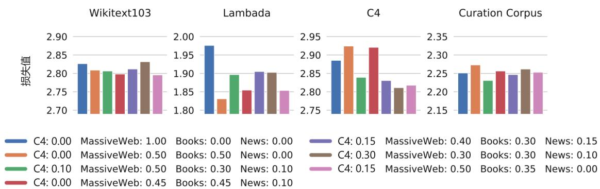  
图 3.11 使用不同采样权重训练得到的 Gopher 语言模型在下游任务上的性能[115]

# 3.4 开源数据集

随着基于统计机器学习的自然语言处理算法的发展，以及信息检索研究的需求增加，特别是近年来对深度学习和预训练语言模型的研究更深入，研究人员构建了多种大规模开源数据集，涵盖了网页、图书、论文等多个领域。在构建大语言模型时，数据的质量和多样性对于提高模型的性能至关重要。同时，为了推动大语言模型的研究和应用，学术界和工业界也开放了多个针对大语言模型的开源数据集。本节将介绍典型的开源数据集。

# 3.4.1 Pile

Pile 数据集[87] 是一个用于大语言模型训练的多样性大规模文本数据库，由 22 个不同的高质量子集构成，包括现有的和新构建的，主要来自学术或专业领域。这些子集包括Pile-CC（清洗后的 CommonCrawl 子集）、Wikipedia、OpenWebText2、arXiv、PubMed Central 等。Pile 的特点是包含了大量多样化的文本，涵盖了不同领域和主题，从而提高了训练数据集的多样性和丰富性。Pile数据集包含825GB英文文本，其组成大体上如图3.12所示，所占面积大小表示数据在整个数据集中的规模。

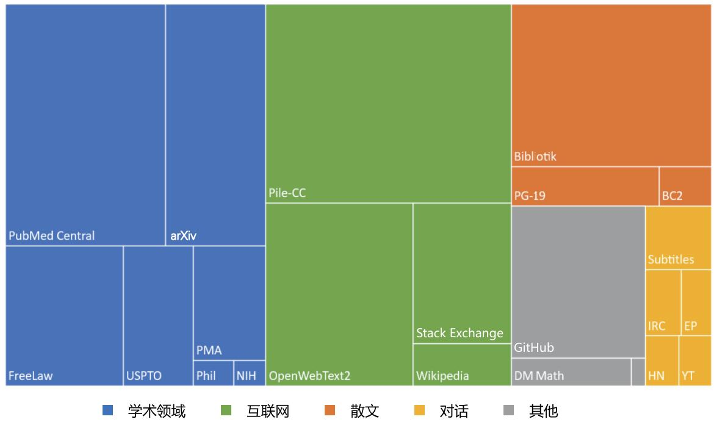  
图 3.12 Pile 数据集的组成[87]

Pile数据集由以下22个不同子集构成。

（1）Pile-CC 是基于 CommonCrawl 的数据集，该数据集通过在 Web Archive 文件上使用 jus-Text[143] 的方法进行提取，比直接使用WET文件产生更高质量的输出。  
（2）PubMed Central（PMC）是由美国国家生物技术信息中心（NCBI）运营的 PubMed 生物医学在线资源库的一个子集，PubMed 是由美国国家医学图书馆运营的生物医学文章在线存储库，提供对近500万份出版物的开放全文访问。  
（3）Books 3 是一个图书数据集，来自 Shawn Presser 提供的 Bibliotik。Bibliotik 由小说和非小说类书籍组成，几乎是图书数据集（BookCorpus 2）数据量的十倍。  
（4）OpenWebText2 （OWT2）是一个基于 WebText[11] 和 OpenWebTextCorpus 的通用数据集。它包括来自多种语言的文本内容、网页文本元数据，以及多个开源数据集和开源代码库。  
（5）arXiv 是一个自 1991 年开始运营的论文预印版本发布服务平台。发布在 arXiv 上的论文主要集中在数学、计算机科学和物理领域。arXiv 上的论文是用 LaTeX 编写的，其中公式、符号、表格等内容的表示非常适合语言模型学习。  
（6）GitHub是一个大型的开源代码库，对于语言模型完成代码生成、代码补全等任务具有非常重要的作用。  
（7）FreeLaw是一个非营利项目，为法律领域的学术研究提供访问和分析工具。CourtListener是FreeLaw项目的一部分，包含美国联邦和州法院的数百万条法律意见，并提供批量下载服务。  
（8）Stack Exchange 是一个围绕用户提供问题和答案的网站集合。Stack Exchange Data Dump包含了Stack Exchange网站集合中所有用户贡献的内容的匿名数据集。它是截至2023年9月公开可用的最大的问题-答案对数据集之一，包括编程、园艺、艺术等主题。  
（9）USPTO Backgrounds 是美国专利商标局授权的专利背景部分的数据集，来源于其公布的批量档案。由于专利通常包含任务背景介绍，给出了发明的背景和技术领域的概述，建立了问题空间的框架，因此该数据集包含了大量关于应用主题的技术内容。  
（10）Wikipedia (English) 是维基百科的英文部分。维基百科是一部由全球志愿者协作创建和维护的免费在线百科全书，旨在提供各种主题的知识。它是世界上最大的在线百科全书之一，包含多种语言，如英语、中文、西班牙语、法语、德语，等等。  
（11）PubMed Abstracts 是由 PubMed 中 3000 万份出版物的摘要组成的数据集。PubMed 还包含MEDLINE，其包含1946年至今的生物医学摘要。  
（12）Project Gutenberg 是一个包含西方经典文学的数据集。它使用的 PG-19 由 1919 年以前的Project Gutenberg 中的书籍数据组成[144]，与更现代的 Books 3 和 BookCorpus 相比，它们代表了不同的风格。  
（13）OpenSubtitles是由英文电影和电视的字幕组成的数据集[145]。字幕是对话的重要来源，并且可以增强模型对虚构格式的理解，也可能对创造性写作任务（如剧本写作、演讲写作、交互式故事讲述等）有一定作用。  
（14）DeepMind Mathematics 数据集由代数、算术、微积分、数论和概率等一系列数学问题组

成，并且以自然语言提示的形式给出[146]。大语言模型在数学任务上的表现较差[39]，这可能是由于训练集中缺乏数学问题。因此，Pile 数据集中专门增加了数学问题数据集，期望增强通过 Pile 数据集训练的语言模型的数学能力。

（15）BookCorpus 2 数据集是原始 BookCorpus[147] 的扩展版本，广泛应用于语言建模，甚至包括“尚未出版”的书籍。BookCorpus 与 Project Gutenberg、Books 3 几乎没有重叠。  
（16）Ubuntu IRC 数据集是从 Freenode IRC 聊天服务器上提取的，包含所有与 Ubuntu 相关的频道的公开聊天记录。这些聊天记录数据提供了语言模型用于建模人类交互的可能性。  
（17）EuroParl[148] 是一个多语言平行数据库，最初是为机器翻译任务构建的，也在自然语言处理的其他几个领域中得到了广泛应用[149–151]。Pile 数据集中所使用的版本包括 1996 年至 2012 年欧洲议会的21种欧洲语言的议事录。  
（18）YouTube Subtitles数据集是从YouTube上人工生成的字幕中收集的文本平行数据库。该数据集除了提供多语言数据，还包括教育内容、流行文化和自然对话的内容。  
（19）PhilPapers 数据集由 University of Western Ontario 数字哲学中心（Center for Digital Philos-ophy）维护的国际数据库中的哲学出版物组成。它涵盖了广泛的抽象、概念性的话语，其文本写作质量也非常高。  
（20）NIH数据集包含1985年至今，所有获得美国NIH资助的项目申请摘要，是高质量的科学写作实例。  
（21）Hacker News数据集是初创企业孵化器和投资基金Y Combinator运营的链接聚合器。其目标是希望用户提交“任何满足一个人的知识好奇心的内容”，文章聚焦于计算机科学和创业主题。其中包含了一些小众话题的高质量对话和辩论。  
（22）Enron Emails 数据集是由文献 [152] 提出的，它是用于研究电子邮件使用模式的数据集。该数据集的加入可以帮助语言模型建模电子邮件通信的特性。

Pile中不同数据子集所占比例及训练时的采样权重有很大不同，高质量的数据会有更高的采样权重。例如，Pile-CC 数据集包含 227.12GB 数据，整个训练周期中采样 1 轮。虽然 Wikipedia (English)数据集仅有6.38GB的数据，但是整个训练周期中采样3轮。具体的采样权重和采样轮数可以参考文献 [87]。

# 3.4.2 ROOTS

ROOTS（Responsible Open-science Open-collaboration Text Sources）数据集[128] 是 BigScience项目在训练具有1760亿个参数的BLOOM大语言模型时使用的数据集。该数据集包含46种自然语言和13种编程语言，总计59种语言，整个数据集的大小约 $1 . 6 \mathrm { T B }$ 。ROOTS数据集中各语言所占比例如图3.13 所示。图中左侧是以语言家族的字节为单位表示的自然语言占比树状图，其中欧亚大陆语言占据了绝大部分（1321.89GB）。右侧橙色矩形对应的是印度尼西亚语（18GB），它是巴布尼西亚大区唯一的代表。右下脚绿色矩形对应非洲语（0.4GB）。图中右侧是以文件数量为单

位的编程语言分布的华夫饼图（Waffle Plot），一个正方形大约对应3万个文件。

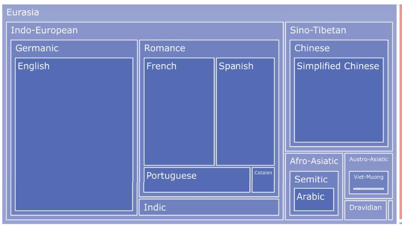

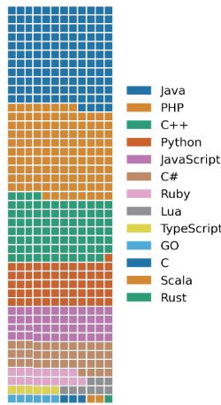  
图 3.13 ROOTS 数据集中各语言所占比例[128]

ROOTS 中的数据主要来自四个方面：公开数据、虚拟抓取、GitHub 代码和网页数据。在公开数据方面，BigScience Data Sourcing 工作组的目标是收集尽可能多的各种类型的数据，包括自然语言处理数据集和各类型文档数据集。为此，还设计了 BigScience Catalogue[153] 用于管理和分享大型科学数据集，Masader Repository用于收集阿拉伯语和文化资源的开放数据存储库。在收集原始数据集的基础上，进一步从语言和统一表示方面对收集的文档进行规范化处理。识别数据集所属语言并分类存储，将所有数据都按照统一的文本和元数据结构进行表示。由于数据种类繁多，ROOTS 数据集并没有公开其所包含数据集的情况，但是提供了 Corpus Map 及 Corpus Description工具，以便查询各类数据集占比和数据情况。在ROOTS数据集中，中文数据集的种类及所占比例如图3.14所示。其中，中文数据主要由WuDao Corpora和OSCAR[154] 组成。在虚拟抓取方面，由于很多语言的现有公开数据集较少，因此这些语言的网页信息是十分重要的资源补充。在ROOTS数据集中，采用CommonCrawl网页镜像，选取了614个域名，从这些域名下的网页中提取文本内容补充到数据集中，以提升语言的多样性。在GitHub代码方面，针对程序语言，ROOTS数据集采用了与 AlphaCode[101] 相同的方法：从 BigQuery 公开数据集中选取文件长度在 100 到 20 万字符，字母符号占比在 $1 5 \%$ 至 $6 5 \%$ ，最大行数在20至1000行的代码。训练大语言模型时，网页数据对于数据的多样性和数据量支撑起到重要的作用[2, 19]，ROOTS 数据集中包含了 OSCAR 21.09 版本，对应的是 CommonCrawl 2021 年 2 月的快照，占整体 ROOTS 数据集规模的 $3 8 \text{‰}$ 。

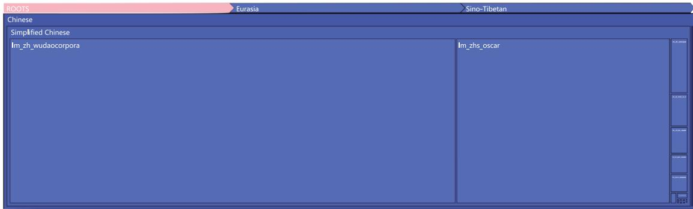  
图 3.14 在 ROOTS 数据集中，中文数据集的种类及所占比例

在数据准备完成后，还要进行清洗、过滤、去重及隐私信息删除等工作，ROOTS数据集处理流程如图3.15所示。整个处理工作并非完全依赖自动计算，而是采用人工与自动相结合的方法。针对数据中存在的一些非自然语言的文本，例如预处理错误、SEO页面或垃圾邮件（包括色情垃圾邮件），构建ROOTS数据集时会进行一定的处理。首先，定义一套质量指标，其中高质量的文本被定义为“由人类撰写，面向人类”（written by humans for humans），不区分内容（专业人员根据来源对内容进行选择）或语法正确性的先验判断。所使用的指标包括字母重复度、单词重复度、特殊字符、困惑度等。完整的指标列表可以参考文献[128]。这些指标根据来源的不同，进行了两种主要的调整：针对每种语言单独选择参数，如阈值等；人工浏览每个数据来源，以确定哪些指标最可能识别出非自然语言。其次，针对冗余信息，采用 SimHash 算法[155]，计算文档的向量表示，并根据文档向量表示之间的海明距离（Hamming Distance）是否超过阈值进行过滤。最后，使用后缀数组（Suffix Array）删除存在6000个以上字符重复的文档。通过上述方法共发现 $2 1 . 6 7 \%$ 的冗余信息。个人信息数据（包括邮件、电话、地址等）则使用正则表示的方法进行过滤。

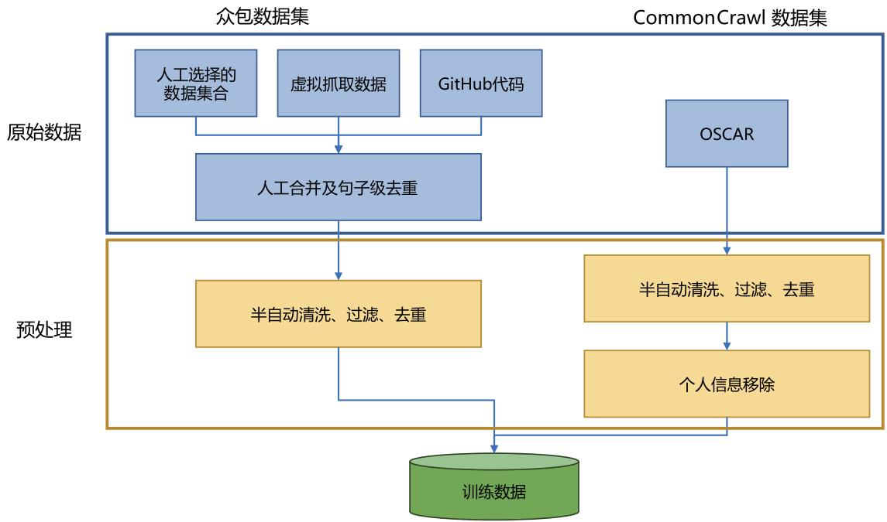  
图 3.15 ROOTS 数据集处理流程[31]

# 3.4.3 RefinedWeb

RefinedWeb[60] 是由位于阿布扎比的技术创新研究院（Technology Innovation Institute，TII）在开发Falcon大语言模型时同步开源的大语言模型预训练集合，其主要由CommonCrawl数据集[156]过滤的高质量数据组成。CommonCrawl数据集包含自2008年以来爬取的数万亿个网页，由原始网页数据、提取的元数据和文本提取结果组成，总数据量超过1PB。CommonCrawl数据集以WARC（Web ARChive）格式或者WET格式进行存储。WARC是一种用于存档Web内容的国际标准格式，包含了原始网页内容、HTTP响应头、URL信息和其他元数据。WET文件只包含抽取出的纯文本内容。

文献 [60] 中给出了 RefinedWeb 中 CommonCrawl 数据集的处理流程和数据过滤百分比，如图3.16 所示。图中灰色部分是与前一个阶段相对应的移除率，阴影部分表示总体上的保留率。在文档准备阶段，移除率以文档数量的百分比进行衡量，过滤阶段和冗余去除阶段以词元为单位进行衡量。整个处理流程分三个阶段：文档准备、过滤和冗余去除。经过上述多个步骤，仅保留了大约 $1 1 . 6 7 \%$ 的数据。RefinedWeb一共包含5万亿个词元，开源公开部分包含6千亿个词元。

图 3.16 RefinedWeb 中 CommonCrawl 数据集的过滤流程和数据过滤百分比[60]  
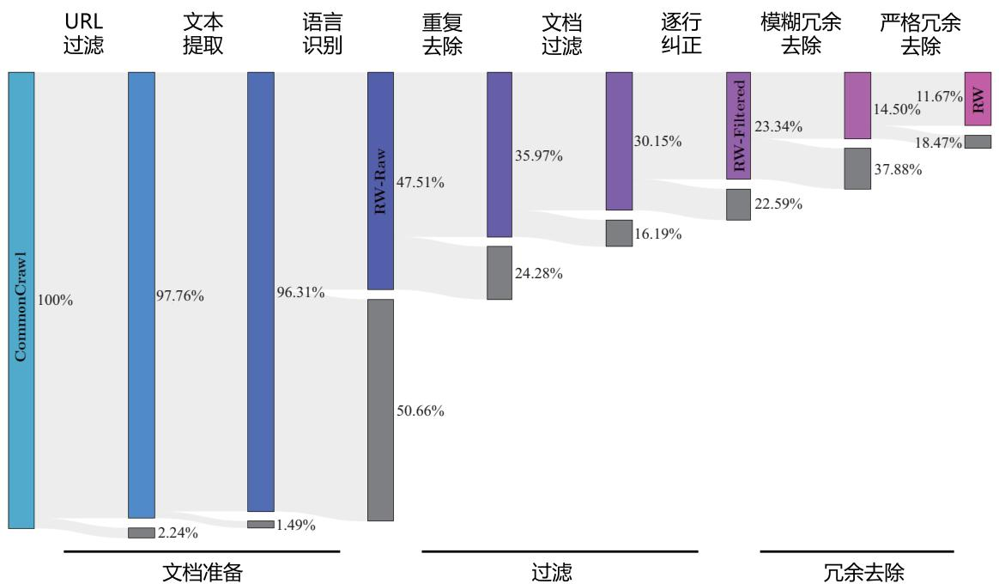  
注：URL冗余去除未在图中体现。

文档准备阶段主要是进行URL过滤、文本提取和语言识别三个任务。URL过滤（URL Filtering）主要针对欺诈和成人网站（指包含色情、暴力、赌博等内容的网站）。基于规则的过滤方法的使用如下。

（1）包含 460 万黑名单域名（Blacklist）。  
（2）根据严重程度加权的词汇列表对URL评分。

文本提取（Text Extraction）的主要目标是仅提取页面的主要内容，同时去除菜单、标题、页脚、广告等内容。RefinedWeb构建过程中使用trafilatura工具集[157]，并通过正则表达式进行部分后处理。语言识别（Language Identification）阶段使用 CCNet 提出的 fastText 语言分类器[125]。该分类器使用字符 $n$ -gram作为特征，并在Wikipedia上进行训练，支持176种语言识别。如图 3.16所示，CommonCrawl数据集中非英语数据占比超过 $50 \%$ ，经过语言识别后，过滤了所有非英语数据。通过文档准备阶段得到的数据集称为 RW-Raw。

过滤阶段主要包含重复去除、文档过滤、逐行纠正三个任务。重复去除（Repetition Removal）的主要目标是删除具有过多行、段落或 $n$ -gram重复的文档。这些文档主要由爬取错误或者低质重复的网页组成。这些内容会严重影响模型性能，使模型产生病态行为（Pathological Behavior），因此需要尽可能在早期阶段去除[123]。文档过滤（Document-wise Filtering）的目标是删除由机器生成

的垃圾信息，这些页面主要由关键词列表、样板文本或特殊字符序列组成。采用文献 [115] 中提出的启发式质量过滤算法，通过整体长度、符号与单词比率及其他标准剔除离群值，以确保文档是实际的自然语言。逐行纠正（Line-wise Correction）的目标是过滤文档中不适合语言模型训练的行（例如社交媒体计数器、导航按钮等）。使用基于规则的方法进行逐行纠正过滤，如果删除超过$5 \%$ ，则完全删除该文档。经过过滤阶段，仅有 $2 3 . 3 4 \%$ 的原始数据得以保留，所得的数据集称为RW-Filtered。

冗余去除阶段包含模糊冗余去除、严格冗余去除及 URL 冗余去除三个任务。模糊冗余去除（Fuzzy Deduplication）的目标是删除内容相似的文档。RefinedWeb 构建时使用了 MinHash 算法[158]，能快速估算两个文档间的相似度。利用该算法可以有效过滤重叠度高的文档。RefinedWeb数据集构建时，使用的是 5-gram 并分成 20 个桶，每个桶采用 450 个 Hash 函数。严格冗余去除（ExactDeduplication）的目标是删除连续相同的序列字符串。使用后缀数组进行逐个词元间的对比，并删除 50 个以上的连续相同词元序列。URL 冗余去除（URL Deduplication）的目标是删除具有相同URL的文档。CommonCrawl数据集中存在一定量的具有重复URL的文档，并且这些文档的内容通常是完全相同的。构建RefinedWeb数据集时，对CommonCrawl数据集中不同部分之间相同的URL进行了去除。该阶段处理完成后的数据集称为RefinedWeb，仅保留了原始数据的 $1 1 . 6 7 \%$ 。

以上三个阶段所包含的各个任务的详细处理规则可以参考文献[60]的附录部分。此外，文献[60]还利用三个阶段产生的数据分别训练 10 亿和 30 亿参数规模的模型，并使用零样本泛化能力对模型结果进行评测。评测后发现，RefinedWeb的效果远好于RW-Raw和RW-Filtered。这也在一定程度上说明高质量数据集对语言模型具有重要的影响。

# 3.4.4 CulturaX

CulturaX[159] 是一个可以用于预训练的多语言数据集，涵盖167种语言，包含6.3万亿个词元。它通过整合 $\mathrm { m C 4 ^ { [ 1 6 0 ] } }$ （3.1.0 版本）和 OSCAR[161–163]（20.19、21.09、22.01 以及 23.01 版本）数据集，并经过语言识别、URL过滤、基于度量的清洗、文档精炼以及数据去重等一系列严格的数据处理步骤，有效解决了现有多语言数据集存在的语言识别不准确、文档级去重缺失、数据清理不彻底等问题。该数据集具有多语言、开源、大规模和高质量的特点，旨在提升多语言场景下模型训练的数据质量，推动多语言学习的研究与发展，为训练高性能的多语言大语言模型提供了有力的数据支持，有助于打破训练数据不透明的现状。

mC4最初是为训练多语言编码器-解码器模型 $\mathrm { m T } 5 ^ { [ 1 6 0 ] }$ 而创建，涵盖101种语言，从Common-Crawl的71个月度快照中获取数据，经过去除短行页面、不良词汇页面及重复行去除等处理，其语言识别借助 cld3[164] 工具。OSCAR 数据集同样也来源于 CommonCrawl，开发了高性能的数据管道，对 166 种不同语言的网页数据进行分类和过滤。区别于以往依赖精选数据集（如 The Pile和BookCorpus）训练大语言模型的做法。在多语言场景下，网络爬虫数据集更具优势，它有助于高效收集多语言数据。尽管其原始数据质量参差不齐，但经清洗后可以很好应用于大语言模型训

练。二者组合后，为后续处理提供了多达135亿份文档。其中，mC4占比 $6 6 \%$ ，OSCAR 23.01 占比 $1 1 \%$ ，OSCAR 22.01 占比 $7 \%$ ，OSCAR 21.09 占比 $9 \%$ ，OSCAR 20.19 占比 $7 \%$ 。

基于 $\mathrm { m C 4 }$ 和OSCAR合并后的数据集，CulturaX研究团队通过一系列数据处理步骤来构造高质量的多语言数据集，包括语言识别、基于URL的过滤、基于指标的清洗、文档优化、冗余去除。具体清洗工作如下：

(1)语言识别：在处理 $\mathrm { m C 4 }$ 和OSCAR数据集时，一个较为突出的问题是二者分别使用了cld3和 FastText 这两种不同的语言识别工具。此前的研究已经证实，cld3 在语言检测方面的表现远逊于 FastText，这使得 mC4 中出现了大量的语言检测错误[154]。因此，CulturaX 团队使用 FastText 对mC4中的文档语言重新进行预测。若文档的预测语言与mC4中原本提供的语言不一致，那么该文档将从数据集中剔除。这样做的目的在于避免那些会使cld3和FastText语言检测器产生混淆的文档，因为这些文档极有可能给数据带来噪声干扰。  
(2) 基于 URL 的过滤：为了降低数据中的有害信息，CulturaX 研究团队使用了图卢兹大学（University of Toulouse）提供的最新UT1 URL和域名黑名单，将有毒和有害页面从数据中删除。该列表包含来自色情、抱怨和黑客攻击等不同主题的网站，名单每周更新两到三次。目前该黑名单包含超过370万条由人类和机器（如搜索引擎、已知地址和索引）共同贡献的记录[163]。mC4数据集之前未使用过该黑名单进行过滤。OSCAR数据集虽然使用过该黑名单进行数据清洗，但是可以根据更新的名单进一步进行清洗。  
(3)基于指标的清洗：受ROOTS语料库数据处理启发，CulturaX数据集构建中也利用各种数据集指标的分布来识别和过滤异常文档。每个指标为数据集中的文档提供量化特定属性的单一值，根据指标值及其范围确定阈值，将其分为正常和异常范围，异常范围的文档被视为噪声，并从数据集中删除。使用一系列全面的指标，包括单词数量、字符和单词重复比率等。同时高困惑度分数的文档也会被视为噪声排除。由于重复信息会对训练大语言模型产生不利影响，CulturaX 研究团队利用不同语言的停用词和标记词列表计算比率以删除文档，还通过 FastText 获取语言识别置信度辅助过滤。  
(4) 文档优化：由于 mC4 和 OSCAR 的文档是从互联网上抓取的 HTML 页面中提取的，其中很大一部分可能带有抓取和提取错误，包括长JavaScript行和无关内容。因此，对于每个文档，文档优化步骤的目标是通过一系列操作去除其噪声或不相关的部分。首先，去除每个文档末尾的短行，因为这些行通常包含页脚细节或来自网站的无用信息。其次，删除包含JavaScript（JS）关键词列表中的单词（例如“<script>”）的行，以避免不相关和非语言信息。  
(5)冗余去除：尽管进行了全面的数据清洗，但由于信息在网络上重新发布、对同一文章的多次引用、样板内容和抄袭等各种原因，剩余数据集仍可能包含大量重复数据，这会导致大语言模型记忆和泛化能力受到影响，因此数据去重对保证训练数据质量至关重要。为此，CulturaX 研究团队利用 MinHash 和 URL 对数据集进行全面去重，并按语言独立进行。其中，MinHashLSH[165]方法用于过滤相似文档，它基于MinHash[158] 的多个哈希函数和Jaccard相似度，结合局部敏感哈

希提高效率；最后基于URL去除相同URL的文档，但避免删除仅含通用域的URL。

# 3.4.5 SlimPajama

SlimPajama[166] 是由 CerebrasAI 公司针对 RedPajama 进行清洗和去重后得到的开源数据集。原始的 RedPajama 包含 1.21 万亿个词元，经过处理的 SlimPajama 数据集包含 6270 亿个词元。SlimPa-jama 还开源了用于对数据集进行端到端预处理的脚本。RedPajama 是由 TOGETHER 联合多家公司发起的开源大语言模型项目，试图严格按照介绍 LLaMA 模型的论文中的方法构造大语言模型训练所需的数据。虽然RedPajama数据集的数据质量较好，但是CerebrasAI的研究人员发现其存在以下两个问题。

（1）一些数据中缺少数据文件。  
（2）数据集中包含大量重复数据。

为此，CerebrasAI的研究人员针对RedPajama数据集开展了进一步的处理。

SlimPajama数据集的处理过程如图3.17所示。整体处理过程包括多个阶段：NFC正规化、过滤短文档、全局去重、文档交错、文档重排、训练集和保留集拆分，以及训练集与保留集中相似数据去重等步骤。所有步骤都假定整个数据集无法全部装载到内存中，并分布在多个进程中进行处理。使用64块CPU，大约花费60多个小时就可以完成1.21万亿个词元的处理。整个处理过程所需内存峰值为1.4TB。

  
图 3.17 SlimPajama 数据集的处理过程[166]

SlimPajama 处理的详细流程如下。

（1）NFC 正则化（NFC Normalization）的目标是去除非 Unicode 字符，SlimPajama 遵循 GPT-2的规范，采用 NFC（Normalization Form C）正则化方法。NFC 正则化的命令示例如下：

```shell
python preprocessing/normalize_text.py
--data_dir <prefix_path>/RedPajama/arxiv/
--target_dir <prefix_path>/RedPajama_norm/arxiv/ 
```

（2）过滤短文档（Filter Short Documents）：RedPajama 的源文件中下载错误或长度非常短的内容占比为 $1 . 8 5 \%$ ，这些内容对模型训练没有作用。在去除标点、空格、换行和制表符后，过滤了长度少于200个字符的文档。查找需要过滤的文档的命令示例如下：

```txt
python preprocessing/filter.py  
<prefix_path>/RedPajama_norm/<dataset_name>/  
<prefix_path>/RedPajama-filtered.pickle <n_docs>  
<dataset_name> <threshold> 
```

（3）全局去重（Deduplication）：为了对数据集进行全局去重（包括数据库内和数据库间的去重），SlimPajama 使用了 datasketch 库，并进行了一定的优化以减少内存消耗并增加并行性。SlimPajama采用生产者-消费者模式，对运行时占主导地位的I/O操作进行了有效的并行。整个去重过程包括多个阶段：构建MinHashLSH索引、在索引中进行查询以定位重复项、构建图表示以确定重复连通域，最后过滤每个成分中的重复项。  
（a）MinHash 生成（MinHash Generation）：为了计算每个文档的 MinHash 对象，先从每个文档中去除标点、连续空格、换行和制表符，并将其转换为小写。接下来，构建13-gram的列表，这些 $n$ -gram作为特征用于创建文档签名，并添加到MinHashLSH索引中。MinHash生成的命令示例如下：

```perl
python dedup/to_hash.py <dataset_name>  
<prefix_path>/RedPajama_norm/<dataset_name>/  
<prefix_path>/RedPajama_minhash/<dataset_name>/  
<n>dots> <iter> <index_start> <index_end>  
-w <ngram_size> -k <buffer_size> 
```

（b）重复对生成（Duplicate Pairs Generation）：使用 Jaccard 相似度计算文档之间的相似度，设置阈值为0.8来确定一对文档是否应被视为重复。SlimPajama的实现使用了–range和–bands参数，可在给定Jaccard阈值的情况下使用 datasketch/lsh.py进行计算。重复对生成的命令示例如下：

```txt
python dedup/generateDuplicate_pairs.py  
--input_dir <prefix_path>/RedPajama_minhash/  
--out_file <prefix_path>/redpjDuplicates/duplicate_pairs.txt  
--range <range> --bands <bands> --processes <n_processes> 
```

（c）重复图构建及连通域查找（Duplicate Graph Construction & Search for Connected Components）：确定了重复的文档对之后，需要找到包含重复文档的连通域。例如，根据以下文档对：(A, B)、(A,C)、(A, E)，可以形成一个(A, B, C, E)的组，并仅保留该组中的一个文档。可以使用如下命令构建重复图：

```txt
python dedup/generate-connected_components.py \  
--input_dir <prefix_path>/redpj_duplicates \  
--out_file <prefix_path>/redpj_duplicates/connected_components.pickle 
```

（d）生成最终重复列表（Generate Final List of Duplicates）：根据连通域构建一个查找表，以便稍后过滤重复项。生成最终重复列表的命令示例如下：

```shell
python preprocessing/shuffle_holdout.py pass1 \
--input_dir <prefix_path>/RedPajama_norm/ \
--duplicates <prefix_path>/redpj_duplicates/duplicates.pickle \
--short_docs <prefix_path>/RedPajama-filtered.pickle \
--out_dir <prefix_path>/SlimPajama/pass1 
```

（4）文档交错与文档重排（Interleave & Shuffle）：大语言模型训练大多是在多源数据集上进行的，需要使用指定的权重混合这些数据源。SlimPajama 数据集默认从每个数据库中采样 1 轮，可以通过修改 preprocessing/datasets.py 参数更新采样权重。除了混合数据源，还要执行随机重排操作以避免任何顺序偏差。文档交错和文档重排的命令示例如下：

```shell
python preprocess/shuffle_holdout.py pass1 \
--input_dir <prefix_path>/RedPajama_norm/ \
--duplicates <prefix_path>/redpj_duplicates/duplicates.pickle \
--short_docs <prefix_path>/RedPajama-filtered.pickle \
--out_dir <prefix_path>/SlimPajama/pass1 
```

（5）训练集和保留集拆分（Split Dataset into Train and Holdout）：这一步主要是完成第二次随

机重排并创建保留集。为了加快处理速度，将源数据分成块并行处理。以下是命令示例：

```txt
for j in {1..20}  
do  
    python preprocessing/shuffle_holdout.py pass2 "$((j-1)" "$j" "$j" \
--input_dir <prefix_path>/SlimPajama/pass1 \
--train_dir <prefix_path>/SlimPajama/train \
--holdout_dir <prefix_path>/SlimPajama/holdout > $j.log 2>&1 & done 
```

（6）训练集与保留集中相似数据去重（Deduplicate Train against Holdout）：最后一步是确保训练集和保留集之间没有重叠。为了去除训练集的污染，用 SHA256 哈希算法查找训练集和保留集之间的精确匹配项。然后，从训练集中过滤这些精确匹配项。以下是命令示例：

```shell
python dedup/dedup_train.py 1 \
--src_dir <prefix_path>/SlimPajama/train \
--tgt_dir <prefix_path>/SlimPajama/holdout \
--out_dir <prefix_path>/SlimPajama/train_deduped
for j in {2..20}
do
    python dedup/dedup_train.py "$j" \
--src_dir <prefix_path>/SlimPajama/train \
--tgt_dir <prefix_path>/SlimPajama/holdout \
--out_dir <prefix_path>/SlimPajama/train_deduped > $j.log 2>&1 &
done 
```

# 4. 分布式训练

随着大语言模型参数量和所需训练数据量的急速增长，单个机器上有限的资源已无法满足其训练的要求。需要设计分布式训练系统来解决海量的计算和内存资源需求问题。在分布式训练系统环境下，需要将一个模型训练任务拆分成多个子任务，并将子任务分发给多个计算设备，从而解决资源瓶颈。如何才能利用数万个计算加速芯片的集群，训练千亿甚至万亿参数规模的大语言模型？这其中涉及集群架构、并行策略、模型架构、内存优化、计算优化等一系列的技术。

本章将介绍分布式机器学习系统的基础概念、分布式训练的并行策略、分布式训练的集群架构，并以DeepSpeed为例，介绍如何在集群上训练大语言模型。

# 4.1 分布式训练概述

分布式训练（Distributed Training）是指将机器学习或深度学习模型训练任务分解成多个子任务，并在多个计算设备上并行训练。图4.1给出了单个计算设备和多个计算设备的示例，这里计算设备可以是中央处理器（Central Processing Unit，CPU）、图形处理器（Graphics Processing Unit，GPU）、张量处理器（Tensor Processing Unit，TPU），也可以是神经网络处理器（Neural networkProcessing Unit，NPU）。由于同一个服务器内部的多个计算设备之间可能并不共享内存，因此无论这些计算设备是处于一个服务器还是多个服务器中，其系统架构都属于分布式系统范畴。一个模型训练任务往往会有大量的训练样本作为输入，可以利用一个计算设备完成，也可以将整个模型的训练任务拆分成多个子任务，分发给不同的计算设备，实现并行计算。此后，还需要对每个计算设备的输出进行合并，最终得到与单个计算设备等价的计算结果。由于每个计算设备只需要负责子任务，并且多个计算设备可以并行执行，因此其可以更快速地完成整体计算，并最终实现对整个计算过程的加速。

促使人们设计分布式训练系统的一个最重要的原因是单个计算设备的算力已经不足以支撑模型训练。图4.2给出了机器学习模型对于算力的需求以及同期单个计算设备能够提供的算力。机器学习模型快速发展，从2013年AlexNet被提出开始，到2022年拥有5400亿个参数的PaLM模型被提出，再到2024年拥有6710亿个参数的DeepSeek-V2发布，机器学习模型以每18个月增长56

倍的速度发展。模型参数规模增大的同时，对训练数据量的要求也呈指数级增长，这更加剧了对算力的需求。然而，近几年，CPU 的算力增加已经远低于摩尔定律（Moore’s Law），虽然计算加速设备（如GPU、TPU等）为机器学习模型提供了大量的算力，但是其增长速度仍然没有突破每18个月翻倍的摩尔定律。只有通过分布式训练系统才可以匹配模型不断增长的算力需求，满足机器学习模型的发展需要。


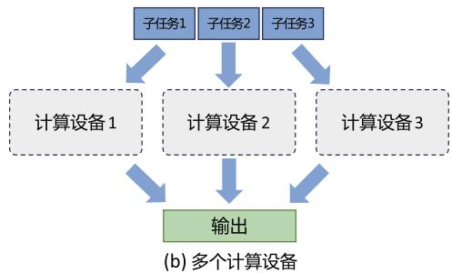  
图 4.1 单个计算设备和多个计算设备的示例

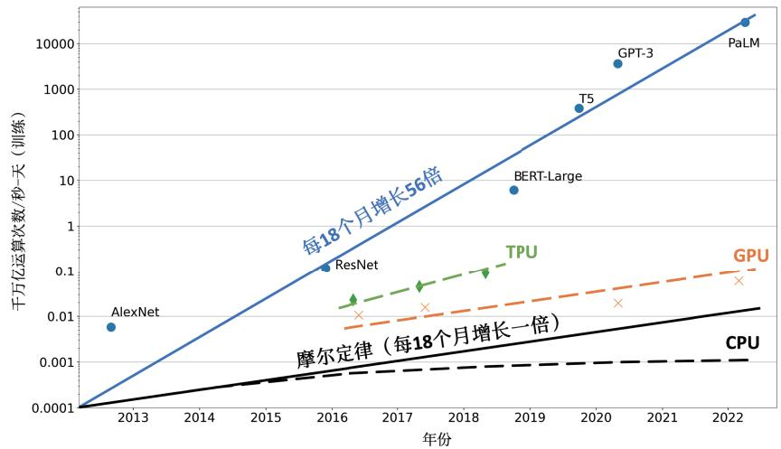  
图 4.2 机器学习模型参数量增长和计算硬件的算力增长对比[167]

分布式训练的总体目标就是加快总的训练速度，减少模型训练的总体时间。总训练速度可以用式（4.1）简略估计：

$$
\text {总 训 练 速 度} \propto \text {单 设 备 计 算 速 度} \times \text {计 算 设 备 总 量} \times \text {多 设 备 加 速 比} \tag {4.1}
$$

其中，单设备计算速度主要由单块计算加速芯片的运算速度和数据 I/O 能力决定，对单设备训练

效率进行优化，主要的技术手段有混合精度训练、算子融合、梯度累加等；在分布式训练系统中，随着计算设备数量的增加，理论上峰值计算速度会增加，然而受通信效率的影响，计算设备数量增多会造成加速比急速降低；多设备加速比是由计算和通信效率决定的，需要结合算法和网络拓扑结构进行优化，分布式训练并行策略的主要目标就是提升分布式训练系统中的多设备加速比。

大语言模型的参数量和所使用的数据量都非常大，因此都采用了分布式训练架构完成训练。文献 [13] 仅在 GPT-3 的训练过程中提到全部使用 NVIDIA V100 GPU，文献 [29] 介绍了 OPT 使用 992 块 NVIDIA A100 80GB GPU，采用全分片数据并行（Fully Sharded Data Parallel）[168] 以及Megatron-LM 张量并行（Tensor Parallelism）[169]，整体训练时间近两个月。BLOOM[31] 模型的研究人员则公开了更多在硬件和所采用的系统架构方面的细节。该模型的训练一共花费了 3.5 个月，使用 48 个计算节点。每个计算节点包含 8 块 NVIDIA A100 80GB GPU（总计 384 块 GPU），并且使用 4×NVLink 用于节点内部 GPU 之间的通信。节点之间采用 4 个 Omni-Path 100 Gbps 网卡构建的增强 8 维超立方体全局拓扑网络进行通信。文献 [34] 并没有给出 LLaMA 模型训练中所使用的集群的具体配置和网络拓扑结构，但是给出了不同参数规模的总 GPU 小时数。LLaMA 模型训练使用 NVIDIA A100 80GB GPU，LLaMA-7B 模型训练需要 82432 GPU 小时，LLaMA-13B 模型训练需要 135168 GPU 小时，LLaMA-33B 模型训练需要 530432 GPU 小时，而 LLaMA-65B 模型训练需要高达1022362GPU小时。LLaMA使用的训练数据量远超OPT和BLOOM模型，虽然模型参数量远小于上述两个模型，但是其所需计算量非常惊人。

通过使用分布式训练系统，大语言模型的训练周期可以从单计算设备花费几十年，缩短到使用数千个计算设备花费几十天。分布式训练系统需要克服计算墙、显存墙、通信墙等挑战，以确保集群内的所有资源得到充分利用，从而加速训练过程并缩短训练周期。

计算墙：单个计算设备所能提供的计算能力与大语言模型所需的总计算量之间存在巨大差异。2022 年 3 月发布的 NVIDIA H100 SXM 的单卡 FP16 算力只有 2000 TFLOPS（FloatingPoint Operations Per Second），而 GPT-3 需要 314 ZFLOPS 的总计算量，两者相差了 8 个数量级。  
• 显存墙：单个计算设备无法完整存储一个大语言模型的参数。GPT-3包含1750亿个参数，如果在推理阶段采用 FP32 格式进行存储，则需要 700GB 的计算设备内存空间，而 NVIDIAH100 GPU 只有 80GB 显存。  
通信墙：分布式训练系统中各计算设备之间需要频繁地进行参数传输和同步。由于通信的延迟和带宽限制，这可能成为训练的瓶颈。在 GPT-3 的训练过程中，如果分布式系统中存在128 个模型副本，那么在每次迭代过程中至少需要传输 89.6TB 的梯度数据。截至 2023 年 8月，单个 InfiniBand 链路仅能提供不超过 800Gbps 的带宽。

计算墙和显存墙源于单计算设备的计算和存储能力有限，与模型所需庞大计算和存储需求存在矛盾。这个问题可以通过采用分布式训练的方法解决，但分布式训练又会面临通信墙的挑战。在多机多卡的训练中，这些问题逐渐显现。随着大语言模型参数的增大，对应的集群规模也随之增

加，这些问题变得更加突出。同时，当大型集群进行长时间训练时，设备故障可能会影响或中断训练，对分布式系统的问题处理也提出了很高的要求。

# 4.2 分布式训练的并行策略

分布式训练系统的目标是将单节点模型训练转换成等价的分布式并行模型训练。对于大语言模型来说，训练过程就是根据数据和损失函数，利用优化算法对神经网络模型参数进行更新的过程。单个计算设备模型训练系统的结构如图4.3所示，其主要由数据和模型两个部分组成。训练过程由多个数据小批次（Mini-batch）完成。图中数据表示一个数据小批次。训练系统会利用数据小批次根据损失函数和优化算法计算梯度，从而对模型参数进行修正。针对大语言模型多层神经网络的执行过程，可以由一个计算图（Computational Graph）表示。这个图有多个相互连接的算子（Operator），每个算子实现一个神经网络层（Neural Network Layer），而参数则代表了这个层在训练中所更新的权重。

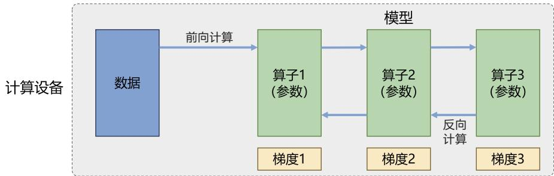  
图 4.3 单个计算设备模型训练系统的结构

计算图的执行过程可以分为前向计算和反向计算两个阶段。前向计算的过程是将数据读入第一个算子，计算出相应的输出结构，然后重复这个前向计算过程，直到最后一个算子结束处理。反向计算的过程是根据损失函数和优化算法，对每个算子依次计算梯度，并利用梯度更新本地的参数。在反向计算结束后，该数据小批次的计算完成，系统就会读取下一个数据小批次，继续下一轮的模型参数更新。

根据单个计算设备模型训练系统的流程，可以看到，如果进行并行加速，可以从数据和模型两个维度进行考虑。可以对数据进行切分（Partition），并将同一个模型复制到多个设备上，并行执行不同的数据分片，这种方式通常被称为数据并行（Data Parallelism，DP）。还可以对模型进行划分，将模型中的算子分发到多个设备上分别完成处理，这种方式通常被称为模型并行（ModelParallelism，MP）。训练大语言模型时，往往需要同时对数据和模型进行切分，从而实现更高程度的并行，这种方式通常被称为混合并行（Hybrid Parallelism，HP）。

# 4.2.1 数据并行

在数据并行系统中，每个计算设备都有整个神经网络模型的模型副本（Model Replica），进行迭代时，每个计算设备只分配一个批次数据样本的子集，并根据该批次样本子集的数据进行网络模型的前向计算。假设一个批次的训练样本数为 $N$ ，使用 $M$ 个计算设备并行计算，每个计算设备会分配到 $N / M$ 个样本。前向计算完成后，每个计算设备都会根据本地样本计算损失误差，得到梯度 $G _ { i }$ （ $i$ 为加速卡编号），并将本地梯度 $G _ { i }$ 进行广播。所有计算设备需要聚合其他加速卡给出的梯度值，然后使用平均梯度 $( \textstyle \sum _ { i = 1 } ^ { N } G _ { i } ) / N$ 对模型进行更新，完成该批次训练。图4.4 给出了由两个计算设备组成的数据并行训练系统样例。

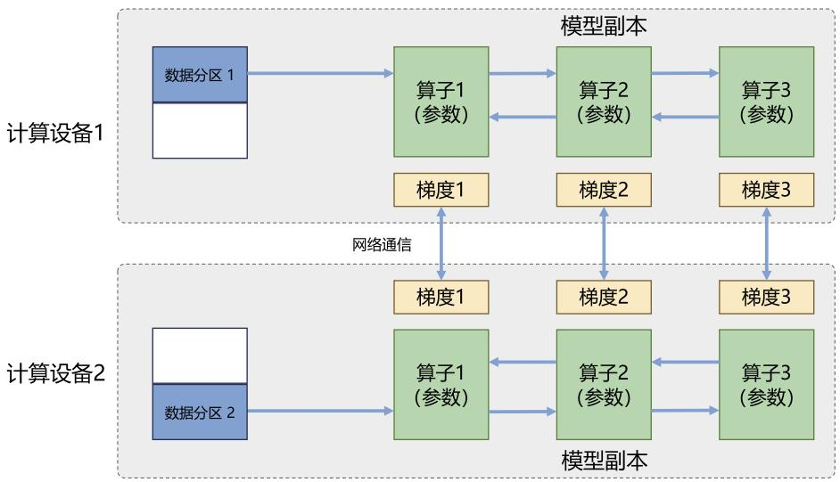  
图 4.4 由两个计算设备组成的数据并行训练系统样例

数据并行训练系统可以通过增加计算设备，有效提升整体训练吞吐量，即每秒全局批次数（Global Batch Size Per Second）。与单个计算设备训练相比，其最主要的区别在于反向计算中的梯度需要在所有计算设备中进行同步，以保证每个计算设备上最终得到的是所有进程上梯度的平均值。常见的神经网络框架中都有数据并行方式的具体实现，包括 TensorFlow DistributedStrategy、PyTorch Distributed、Horovod DistributedOptimizer 等。由于基于 Transformer 结构的大语言模型中每个算子都依赖单个数据而非批次数据，因此数据并行并不会影响其计算逻辑。一般情况下，各训练设备中前向计算是独立的，不涉及同步问题。数据并行训练加速比最高，但要求每个设备上都备份一份模型，显存占用比较高。

使用 PyTorch DistributedDataParallel 实现单个服务器多加速卡训练的代码如下。首先，构造DistributedSampler类，将数据集的样本随机打乱并分配到不同计算设备上：

class DistributedSampler(Sampler): def__init__(self,dataset，num_replicas $\equiv$ None，rank $\equiv$ None,shuffle $\equiv$ True,seed $= 0$ ： if num_re replicas is None: if not dist.is-available(): raiseRuntimeError("Requiresdistributed package to be available") num_re replicas $=$ dist.get_world_size() if rank is None: if not dist.is-available(): raiseRuntimeError("Requiresdistributed package to be available") rank $=$ dist.get_rank() self(dataset $=$ dataset #数据集 self.num_re replicas $=$ num_re replicas #进程个数，默认等于world_size(GPU块数) self rank $=$ rank #当前属于哪个进程/哪块GPU self.epoch $= 0$ self.num_samples $=$ int(math.ceil(len(self(dataset)*1.0/self(num_re replicas)) #每个进程的样本个数 self.total_size $=$ self.num_samples\*self(num_re replicas #数据集总样本的个数 self.shuffle $=$ shuffle #是否要打乱数据集 self.seed $=$ seed   
def__iter__(self): #1.Shuffle处理：打乱数据集顺序 if self.shuffle: #根据训练轮数和种子数进行混淆 g $=$ torch.Generator() #这里self.seed是一个定值，通过set_epoch改变self.epoch可以改变我们的初始化种子 #这就可以让每一轮训练中数据集的打乱顺序不同 #使每一轮训练中每一块GPU得到的数据都不一样，这有利于更好的训练 g_manual_seed(self.seed $^+$ self.epoch) indices $=$ torch.randperm(len(self(dataset)，generator=g).tolist() else: indices $=$ list(range(len(self(dataset)))   
#数据补充 indices $+ =$ indices[(self.total_size - len(indices))] assertlen(indices） $= =$ self.total_size   
#分配数据 indices $=$ indices[ Self rankingself.total_size,self.num_re replicas] assertlen(indices） $= =$ self.num_samples

returniter(indices)   
deflen_(self): return self.num_samples   
defset_epoch(self,epoch): r"" 设置此采样器的训练轮数 当:attr:'shuffle=True'时，确保所有副本在每个轮数使用不同的随机顺序 否则，此采样器的下一次迭代将产生相同的顺序 Arguments: epoch(int)：训练轮数 "" self_epoch $\equiv$ epoch

```python
import argparse   
import os   
import shutil   
import time   
import warnings   
import numpy as np   
 warnings.filterrowarnings('ignore')   
import torch   
import torch(nn as nn   
import torch.nn.parallel   
import torch)Varchnds.cudnn as cudnn   
import torch.distributed as dist   
import torch.optim   
import torch.utils.data   
import torch.utils.datadistributed   
from torch.utils.datadistributed import DistributedSampler   
from models import DeepLab   
from dataset import Cityscaples 
```

# 参数设置  
parser $=$ argparse.ArgummentParser(description $\equiv$ 'DeepLab')   
parser.add_argument('j'，'--workers'，default $\coloneqq 4$ ，type $\equiv$ int，metavar $\equiv$ N', help $\equiv$ 'number of data loading workers (default:4)）   
parser.add_argument('--epochs'，default $\coloneqq 100$ ，type $\equiv$ int，metavar $\equiv$ N', help $\equiv$ 'number of total epochs to run')   
parser.add_argument('--start-epoch'，default $\coloneqq 0$ ，type $\equiv$ int，metavar $\equiv$ N', help $\equiv$ 'manual epoch number(useful on restarts)）   
parser.add_argument('--b'，'--batch-size'，default $\coloneqq 3$ ，type $\equiv$ int, metavar $\equiv$ N')   
parser.add.argm("--local_rank'，default $\coloneqq 0$ ，type $\equiv$ int, help $\equiv$ 'node rank for distributed training')   
args $=$ parser.parse_args()   
torch.distributed.init_process_group(frame $=$ "nccl") #初始化   
print("Use GPU:{}for training".format(args.local_rank))

# 创建模型  
model $=$ DeepLab()   
torch.cuda.set_device(args.local_rank）#当前显卡   
model $=$ model.cuda()   
model $=$ torch(nn Parlable.DistributedDataParallel(model,device_ids $\coloneqq$ [args.local_rank] output_device $\equiv$ args.local_rank，find_unused_parameters $\equiv$ True）#数据并行   
criterion $=$ nn.CrossEntropyLoss().CUDA()   
optimizer $=$ torch.optim.SGD(model.params(),args.lr, momentum=args)momentum-weight decay $\equiv$ args weight decay)

通过以下命令行启动上述程序：

CUDA_VISIBLE_DEVICESE $= 0$ ,1 python -m torch.distributed.launch --nproc_per_node $\equiv 2$ main.py

# 4.2.2 模型并行

模型并行往往用于解决单节点内存不足的问题。以包含1750亿个参数的GPT-3模型为例，如果模型中每一个参数都使用32位浮点数表示，那么模型需要占用700GB内存。如果使用16位浮点数表示，那么每个模型副本需要占用350GB内存。2022年3月NVIDIA发布的H100加速卡仅支持 80GB 显存，无法将整个模型完整放入其中。模型并行可以从计算图角度，用以下两种形式进行切分。

（1）按模型的层切分到不同设备，即层间并行或算子间并行（Inter-operator Parallelism），也称之为流水线并行（Pipeline Parallelism，PP）。  
（2）将计算图层内的参数切分到不同设备，即层内并行或算子内并行（Intra-operator Parallelism），也称之为张量并行（Tensor Parallelism，TP）。两节点模型并行训练系统样例如图4.5所示，图4.5(a)为流水线并行，模型的不同层被切分到不同的设备中；图4.5(b)为张量并行，同一层中的不同参数被切分到不同的设备中进行计算。

  
图 4.5 两节点模型并行训练系统样例

# 1. 流水线并行

流水线并行是一种并行计算策略，将模型的各个层分段处理，并将每个段分布在不同的计算设备上，使得前后阶段能够流水式、分批工作。流水线并行通常应用于大语言模型的并行系统中，以有效解决单个计算设备内存不足的问题。图4.6给出了一个由四个计算设备组成的流水线并行系统，包含前向计算和后向计算。其中 $\mathrm { F _ { 1 } }$ 、 $\mathrm { F _ { 2 } }$ 、 $\mathrm { F _ { 3 } }$ 、 $\mathrm { F _ { 4 } }$ 分别代表四个前向路径，位于不同的设备上；而 $\mathrm { B _ { 4 } }$ 、$\mathrm { B _ { 3 } }$ 、 $\mathrm { B _ { 2 } }$ 、 $\mathrm { B _ { 1 } }$ 则代表逆序的后向路径，也分别位于四个不同的设备上。从图4.6中可以看出，计算图中

的下游设备（Downstream Device）需要长时间持续处于空闲状态，等待上游设备（Upstream Device）计算完成，才能开始计算自身的任务。这种情况导致设备的平均使用率大幅降低，形成了模型并行气泡（Model Parallelism Bubble），也称为流水线气泡（Pipeline Bubble）。

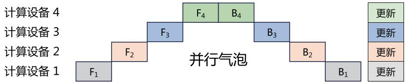  
图 4.6 流水线并行样例

朴素流水线策略所产生的并行气泡，使得系统无法充分利用计算资源，降低了系统整体的计算效率。为了减少并行气泡，文献[170]提出了GPipe方法，将小批次（Mini-batch）进一步划分成更小的微批次（Micro-batch），利用流水线并行方法，每次处理一个微批次的数据。在当前阶段计算完成得到结果后，将该微批次的结果发送给下游设备，同时开始处理后一个微批次的数据，这样可以在一定程度上减少并行气泡。图4.7 给出了 GPipe 策略流水线并行样例。前向 $\mathrm { F _ { 1 } }$ 计算被拆解为 $\mathrm { F _ { 1 1 } }$ 、 $\mathrm { F _ { 1 2 } }$ 、 $\mathrm { F _ { 1 3 } }$ 、 $\mathrm { F _ { 1 4 } }$ ，在计算设备 1 中计算完成 $\mathrm { F _ { 1 1 } }$ 后，会在计算设备 2 中进行 $\mathrm { F _ { 2 1 } }$ 计算，同时在计算设备1中并行计算 $\mathrm { F _ { 1 2 } }$ 。相比于最原始的流水线并行方法，GPipe流水线方法可以有效减少并行气泡。

  
图 4.7 GPipe 策略流水线并行样例[170]

虽然 GPipe 策略可以减少一定的并行气泡，但是只有当一个小批次中所有的前向计算都完成时，才能执行后向计算。因此，还是会产生很多并行气泡，从而降低系统的并行效率。Megatron-$\mathrm { L M } ^ { [ 1 7 1 ] }$ 采用了1F1B流水线并行策略，即一个前向通道和一个后向通道。1F1B流水线并行策略引入了任务调度机制，使得下游设备能够在等待上游计算的同时执行其他可并行的任务，从而提高设备的利用率。1F1B 给出了非交错式和交错式两种调度模式，如图4.8所示。

1F1B非交错式调度模式可分为三个阶段。首先是热身阶段，在计算设备中进行不同数量的前向计算。接下来的阶段是前向-后向阶段，计算设备按顺序执行一次前向计算，然后进行一次后向计算。最后一个阶段是后向阶段，计算设备完成最后一次后向计算。相比于GPipe策略，1F1B非交错式调度模式在节省内存方面表现得更好。然而，它需要与 GPipe 策略一样的时间来完成一轮计算。

1F1B 交错式调度模式要求微批次的数量是流水线阶段的整数倍。每个设备不仅负责连续多个层的计算，还可以处理多个层的子集，这些子集被称为模型块。具体而言，在之前的模式中，设备1可能负责层 $1 { \sim } 4$ ，设备2负责层 ${ 5 } { \sim } 8$ ，依此类推。在新的模式下，设备1可以处理层1、2、9、10，设备2处理层3、4、11、12，依此类推。在这种模式下，每个设备在流水线中被分配到多个阶段。例如，设备 1 可能参与热身阶段、前向计算阶段和后向计算阶段的某些子集任务。每个设备可以并行执行不同阶段的计算任务，从而更好地利用流水线并行的优势。这种模式不仅在内存消耗方面表现出色，还能提高计算效率，使大型模型的并行系统能够更高效地完成计算任务。

  
图 4.8 1F1B 流水线并行策略样例[171]

PyTorch 中也包含了实现流水线的 API 函数 Pipe，具体实现参考“torch.distributed.pipeline.sync.Pipe”类。可以使用这个 API 构造一个模型，其包含两个线性层，分别放置在两个计算设备中的样例如下：

```txt
{   
# 步骤0：先初始化远程过程调用（RPC）框架   
os.environ['MASTER_ADDR'] = 'localhost'   
os.environ['MASTER_PORT'] = '29500'   
torch.distributedrpc.initrpc('worker', rank=0, world_size=1)   
# 步骤1：构建一个模型，包括两个线性层   
fc1 = nn.Linear(16, 8).CUDA(0)   
fc2 = nn.Linear(8, 4).CUDA(1)   
# 步骤2：使用nn Sequential包装这两个层   
model = nnSequential(fc1, fc2)   
# 步骤3：构建流水线（torchdistributedpipeline(sync.Pipe)   
model = Pipe(model, chunks=8)   
# 进行训练/推断   
input = torch RAND(16, 16).CUDA(0)   
output_rref = model(input)   
} 
```

# 2. 张量并行

张量并行需要根据模型的具体结构和算子类型，解决如何将参数切分到不同设备，以及如何保证切分后的数学一致性这两个问题。大语言模型都是以Transformer结构为基础，Transformer结构主要由嵌入式表示（Embedding）、矩阵乘（MatMul）和交叉熵损失（Cross Entropy Loss）计算构成。这三种类型的算子有较大的差异，需要设计对应的张量并行策略[169] 才可以实现将参数切分到不同的设备。

对于嵌入式表示算子，如果总的词表数非常大，会导致单计算设备显存无法容纳 Embedding层参数。举例来说，如果词表数量是 64000，嵌入式表示维度为 5120，类型采用 32 位精度浮点数，那么整层参数需要的显存大约为 $6 4 0 0 0 \times 5 1 2 0 \times 4 / 1 0 2 4 / 1 0 2 4 = 1 2 5 0 \mathrm { { M B } }$ ，反向梯度同样需要1250MB显存，仅仅存储就需要将近2.5GB。对于嵌入表示层的参数，可以按照词维度切分，每个计算设备只存储部分词向量，然后通过汇总各个设备上的部分词向量，得到完整的词向量。图4.9给出了单节点 Embedding 和两节点 Embedding 张量并行的示意图。在单节点上，执行 Embedding操作，bz 是批次大小（batch size），Embedding 的参数大小为 [word_size, hidden_size]，计算得到[bz, hidden_size] 张量。图4.9 中 Embedding 张量并行示例将 Embedding 参数沿 word_size 维度切分为两块，每块大小为 [word_size/2, hidden_size]，分别存储在两个设备上。当每个节点查询各自的词表时，如果无法查到，则该词的表示为0，各设备查询后得到[bz, hidden_size]结果张量，最后

通过AllReduce_Sum通信①，跨设备求和，得到完整的全量结果。可以看出，这里的输出结果和单计算设备执行的结果一致。

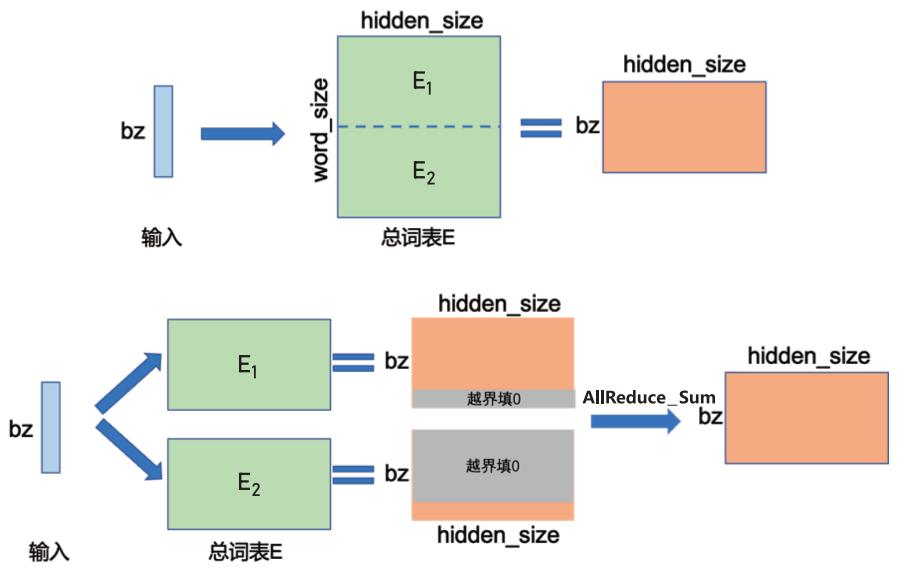  
图 4.9 单节点 Embedding 和两节点 Embedding 张量并行的示意图

矩阵乘的张量并行要充分利用矩阵的分块乘法原理。举例来说，要实现如下矩阵乘法 ${ \bf Y _ { \alpha } } =$ $\pmb { X A }$ ，其中 $\boldsymbol { X }$ 是维度为 $M \times N$ 的输入矩阵， $\pmb { A }$ 是维度为 $N \times K$ 的参数矩阵， $\mathbf { Y }$ 是结果矩阵，维度为 $M \times K$ 。如果参数矩阵 $\pmb { A }$ 非常大，甚至超出单张卡的显存容量，那么可以把参数矩阵 $\pmb { A }$ 切分到多张卡上，并通过集合通信汇集结果，保证最终结果在数学计算上等价于单计算设备的计算结果。参数矩阵 $\pmb { A }$ 存在以下两种切分方式。

（1）参数矩阵 $\pmb { A }$ 按列切块，将矩阵 $\pmb { A }$ 按列切成

$$
\boldsymbol {A} = \left[ \boldsymbol {A} _ {1}, \boldsymbol {A} _ {2} \right] \tag {4.2}
$$

（2）参数矩阵A 按行切块，将矩阵 $\pmb { A }$ 按行切成

$$
\boldsymbol {A} = \left| \begin{array}{l} \boldsymbol {A} _ {1} \\ \boldsymbol {A} _ {2} \end{array} \right| \tag {4.3}
$$

图4.10给出了参数矩阵按列切分的示例，参数矩阵 $\pmb { A }$ 分别将 $A _ { 1 } , A _ { 2 }$ 放置在两个计算设备上。两个计算设备分别计算 $Y _ { 1 } = X A _ { 1 }$ 和 $Y _ { 2 } = X A _ { 2 }$ 。计算完成后，多计算设备间进行通信，从而获

取其他计算设备上的计算结果，并拼接在一起得到最终的结果矩阵 $\mathbf { Y }$ ，该结果在数学上与单计算设备在计算结果上完全等价。

  
图 4.10 参数矩阵按列切分的示例

图4.11给出了参数矩阵按行切分的示例，为了满足矩阵乘法规则，输入矩阵 $\boldsymbol { X }$ 需要按列切分$X = [ X _ { 1 } | X _ { 2 } ] _ { \circ }$ 。同时，将矩阵分块，分别放置在两个计算设备上，每个计算设备分别计算 $Y _ { 1 } = X _ { 1 } A _ { 1 }$ 和 $Y _ { 2 } = X _ { 2 } A _ { 2 }$ 。计算完成后，多个计算设备间通信获取其他卡上的计算结果，可以得到最终的结果矩阵 $\mathbf { Y }$ 。同样，这种切分方式，既可以保证数学上的计算等价性，解决单计算设备显存无法容纳的问题，又可以保证单计算设备通过拆分的方式装下参数A。

  
图 4.11 参数矩阵按行切分的示例

Transformer 中的 FFN 结构均包含两层全连接（Fully Connected，FC）层，即存在两个矩阵乘，这两个矩阵乘分别采用上述两种切分方式，如图4.12 所示。对第一个 FC 层的参数矩阵按列切块，对第二个FC层的参数矩阵按行切块。这样，第一个FC层的输出恰好满足第二个FC层的数据输入要求（按列切分），因此可以省去第一个FC层后的汇总通信操作。多头自注意力机制的张量并行与 FFN 类似，因为具有多个独立的头，所以相较于 FFN 更容易实现并行，其矩阵切分方式如图4.13所示。具体可以参考文献[169]。

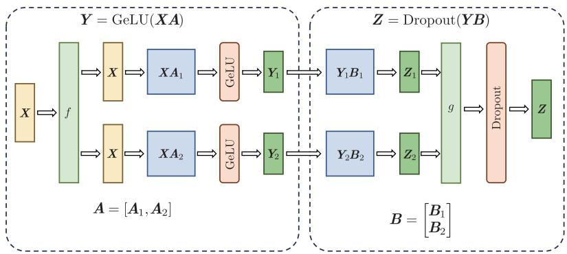  
图 4.12 FNN 结构的张量并行示意图[169]

  
图 4.13 多头自注意力机制的张量并行示意图[169]

分类网络最后一层一般会选用Softmax和Cross_entropy算子来计算交叉熵损失。如果类别数量非常大，则会导致单计算设备内存无法存储和计算logit矩阵。针对这一类算子，可以按照类别维度切分，同时通过中间结果通信，得到最终的全局交叉熵损失。首先计算的是 Softmax 值，公式如下：

$$
\operatorname {S o f t m a x} \left(x _ {i}\right) = \frac {\mathrm {e} ^ {x _ {i}}}{\sum_ {j} \mathrm {e} ^ {x _ {j}}} = \frac {\mathrm {e} ^ {x _ {i} - x _ {\max}}}{\sum_ {j} \mathrm {e} ^ {x _ {j} - x _ {\max}}} = \frac {\mathrm {e} ^ {x _ {i} - x _ {\max}}}{\sum_ {N} \sum_ {j} \mathrm {e} ^ {x _ {j} - x _ {\max}}} \tag {4.4}
$$

$$
x _ {\max } = \max  _ {p} \left(\max  _ {k} \left(x _ {k}\right)\right) \tag {4.5}
$$

其中， $p$ 表示张量并行的设备号。得到Softmax计算结果之后，同时对标签Target按类别切分，每个设备得到部分损失，最后进行一次通信，得到所有类别的损失。整个过程，只需要进行三次小量的通信，就可以完成交叉熵损失的计算。

PyTorch提供了细粒度张量级别的并行API——DistributedTensor。也提供了粗粒度模型层面的API 对“nn.Module”进行张量并行。通过以下几行代码就可以实现对一个大的张量进行分片：

import torch   
from torch.distributed._tensor import DTensor, DeviceMesh, Shard, distribute_tensor   
#使用可用设备构建设备网格（多主机或单主机）   
device_grid $\equiv$ DeviceMesh("cuda"，[0，1，2，3])   
#如果想要进行逐行分片   
rowwise-placement $=$ [Shard(0)]   
#如果想要进行逐列分片   
colwise-placement $=$ [Shard(1)]   
big_tensior $=$ torch randn(888，12)   
#分布式张量返回将根据指定的放置维度进行分片   
rowwise_tensior $=$ distribute_tensor(big_tensior, device_grid=device_grid, placements=rowwise-placement)

对于像“nn.Linear”这样已经有“torch.Tensor”作为参数的模块，也提供了模块级 API“dis-tribute_module”在模型层面进行张量并行，参考代码如下：

import torch   
from torch.distributed._tensor import DeviceMesh, Shard, distribute_tensordisturbateModule   
class MyModule(nn.Module): def__init__(self): super(..init_() self.fc1 $\equiv$ nn.Linear(8,8) self.fc2 $=$ nn.Linear(8,8) self.relu $\equiv$ nn.ReLU() def forward(self, input): return self.relu(self.fc1(input) + self.fc2(input))   
mesh $=$ DeviceMesh(device_type $\equiv$ "cuda",mesh $\equiv$ [0,1],[2,3])   
def shard.params(mod_name, mod, mesh): rowwise-placement $=$ [Shard(0),Replicate()] def to_dist_tensor(t): return distribute_tensor(t,mesh,rowwise-placement) mod._apply(to_dist_tensor)   
sharded_module $=$ distribute_module(MyModule(),mesh, partition_fn=shard.params)   
def shard_fc(mod_name, mod, mesh): rowwise-placement $=$ [Shard(0),Replicate()] if mod_name $= =$ "fc1": mod.weight $=$ torch.nn_PARAMETER(distribute_tensor(mod.weight,mesh,rowwise-placement))   
#在使用时与前面 shard.params两者间仅可以选择其一   
sharded_module $=$ distribute_module(MyModule(),mesh, partition_fn $\equiv$ shard fc)

# 4.2.3 混合并行

混合并行将多种并行策略如数据并行、流水线并行和张量并行等混合使用。通过结合不同的并行策略，混合并行可以充分发挥各种并行策略的优点，最大限度地提高计算性能和效率。针对千亿规模的大语言模型，通常，在每个服务器内部使用张量并行策略，由于该策略涉及的网络通信量较大，因此需要利用服务器内部的不同计算设备之间的高速通信带宽。通过流水线并行，将模型的不同层划分为多个阶段，每个阶段由不同的机器负责计算。这样可以充分利用多台机器的计算能力，并通过机器之间的高速通信传递计算结果和中间数据，以提高整体的计算速度和效率。最后，在外层叠加数据并行策略，以增加并发数量，加快整体训练速度。通过数据并行，将训练数据分发到多组服务器上进行并行处理，每组服务器处理不同的数据批次。这样可以充分利用多台服务器的计算资源，并增加训练的并发度，从而加快整体训练速度。

BLOOM 使用 Megatron-DeepSpeed[134] 框架进行训练，主要包含两个部分：Megatron-LM 提

供张量并行能力和数据加载原语；DeepSpeed[172] 提供 ZeRO 优化器、模型流水线及常规的分布式训练组件。通过这种方式可以实现数据、张量和流水线三维并行，BLOOM 模型训练时采用的并行计算结构如图4.14 所示。BLOOM 模型训练使用由 48 个 NVIDIA DGX-A100 服务器组成的集群，每个 DGX-A100 服务器包含 8 块 NVIDIA A100 80GB GPU，总计包含 384 块。BLOOM训练采用的策略是先将集群分为 48 个一组，进行数据并行。接下来，模型整体被分为 12 个阶段，进行流水线并行。每个阶段的模型被划分到 4 块 GPU 中，进行张量并行。同时，BLOOM

使用了ZeRO（零冗余优化器）[173] 进一步降低模型对显存的占用。通过上述步骤可以实现数百个GPU 的高效并行计算。

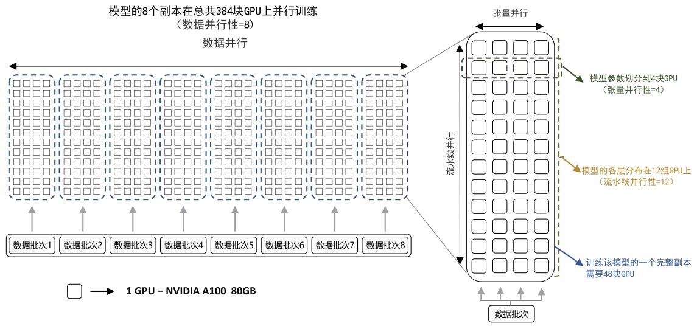  
图 4.14 BLOOM 模型训练时采用的并行计算结构[31]

# 4.2.4 计算设备内存优化

当前，大语言模型训练通常采用 Adam 优化算法，除了需要每个参数梯度，还需要一阶动量（Momentum）和二阶动量（Variance）。虽然Adam优化算法相较SGD算法效果更好也更稳定，但是对计算设备内存的占用显著增大。为了降低内存占用，大多数系统采用混合精度训练（MixedPrecision Training）方式，即同时存在 FP32（32 位浮点数）与FP16（16 位浮点数）或者 BF16（BFloat16）格式的数值。FP32、FP16和BF16的表示如图4.15所示。FP32中第31位为符号位，第30位∼第23 位用于表示指数，第 22 位∼第 0 位用于表示尾数。FP16 中第 15 位为符号位，第 14 位∼第 10位用于表示指数，第 9 位∼第 0 位用于表示尾数。BF16 中第 15 位为符号位，第 14 位∼第 7 位用于表示指数，第 6 位∼第 0 位用于表示尾数。由于 FP16 的值区间比 FP32 的值区间小很多，所以在计算过程中很容易出现上溢出和下溢出。BF16 相较于 FP16 以精度换取更大的值区间范围。由于FP16和BF16相较FP32精度低，训练过程中可能会出现梯度消失和模型不稳定的问题，因此，需要使用一些技术解决这些问题，例如动态损失缩放（Dynamic Loss Scaling）和混合精度优化器（Mixed Precision Optimizer）等。

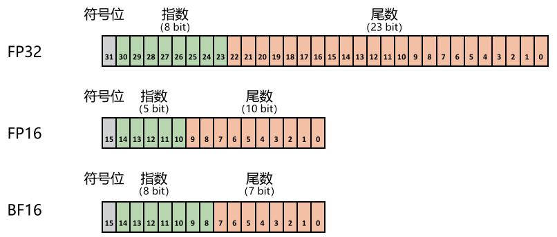  
图 4.15 FP32、FP16 和 BF16 的表示

混合精度优化的过程如图4.16 所示。Adam 优化器状态包括采用 FP32 保存的模型参数备份，一阶动量和二阶动量也都采用FP32格式存储。假设模型参数量为 $\varPhi$ ，模型参数和梯度都是用FP16格式存储，则共需要 $2 \varPhi + 2 \varPhi + ( 4 \varPhi + 4 \varPhi + 4 \varPhi ) = 1 6 \varPhi$ 字节存储。其中，Adam状态占比 $7 5 \%$ 。动态损失缩放在反向传播前，将损失变化（dLoss）手动增大 $2 ^ { K }$ 倍，因此反向传播时得到的激活函数梯度不会溢出；反向传播后，将权重梯度缩小 $2 ^ { K }$ 倍，恢复正常值。举例来说，有75亿个参数的模型，如果用FP16格式，只需要15GB计算设备内存，但是在训练阶段，模型状态实际上需要耗费 120GB 内存。计算卡内存占用中除了模型状态，还有剩余状态（Residual States），包括激活值（Activation）、各种临时缓冲区（Buffer）及无法使用的显存碎片（Fragmentation）等。可以使用激活值检查点（Activation Checkpointing）方式使激活值内存占用大幅减少，因此如何减少模型状态尤其是Adam优化器状态是解决内存占用问题的关键。

  
图 4.16 混合精度优化的过程

零冗余优化器（Zero Redundancy Data Parallelism，ZeRO）的目标是针对模型状态的存储进行去除冗余的优化[173–175]。ZeRO使用分区的方法，即将模型状态量分割成多个分区，每个计算设备只保存其中的一部分。这样整个训练系统内只需要维护一份模型状态，减少了内存消耗和通信开销。具体来说，如图4.17所示，ZeRO包含以下三种方法。

（1）对Adam优化器状态进行分区，图4.17中的 $P _ { \mathrm { o s } }$ 部分。模型参数和梯度依然是每个计算设备保存一份。此时，每个计算设备所需内存是 $4 \phi + { \textstyle { \frac { 1 2 \phi } { N } } }$ 字节，其中 $N$ 是计算设备总数。当 $N$ 比较大时，每个计算设备占用内存趋向于 $4 \varPhi \mathrm { B }$ ，也就是 $1 6 \varPhi \mathrm { B }$ 的 $\textstyle { \frac { 1 } { 4 } }$ 。  
（2）对模型梯度进行分区，图4.17 中的 $P _ { \mathrm { o s } + g }$ 部分。模型参数依然是每个计算设备保存一份。此时，每个计算设备所需内存是 $2 \Phi + \frac { 2 \Phi + 1 2 \varPhi } { N }$ 字节。当 $N$ 比较大时，每个计算设备占用内存趋向于 $2 \varPhi \mathrm { B }$ ，也就是 $1 6 \varPhi \mathrm { B }$ 的 $1 / 8 _ { \circ }$   
（3）对模型参数进行分区，图4.17 中的 $P _ { \mathrm { o s } + g + p }$ 部分。此时，每个计算设备所需内存是 $\scriptstyle { \frac { 1 6 \phi } { N } } \mathrm { B } _ { \circ }$ 当 $N$ 比较大时，每个计算设备占用内存趋向于 $0 _ { \circ }$

  
图 4.17 三种 ZeRO 方法的单个设备内存占用

在 DeepSpeed 框架中， $P _ { \mathrm { o s } }$ 对应 Zero-1， $P _ { \mathrm { o s } + g }$ 对应 Zero-2， $P _ { \mathrm { o s } + g + p }$ 对应 Zero-3。文献 [175]中也对ZeRO优化方法所带来的通信量增加的情况进行了分析，Zero-1和Zero-2对整体通信量没有影响，虽然对通信有一定延迟影响，但是整体性能受到的影响很小。Zero-3 所需的通信量则是正常通信量的1.5倍。

PyTorch 中也实现了 ZeRO 优化方法，可以使用 ZeroRedundancyOptimizer 调用，也可与“torch.nn.parallel.Distrib结合使用，以减少每个计算设备的内存峰值消耗。使用ZeroRedundancyOptimizer的参考代码如下所示：

import os   
import torch   
import torch.distributed as dist   
import torch multiprocessing as mp   
import torch.nn as nn   
import torch.optim as optim   
from torch.distributed optim import ZeroRedundancyOptimizer   
from torch.nn.paralleml import DistributedDataParallel as DDP   
def print_peak_memory(prefix, device): if device $= = 0$ . print(f"\{prefix}: {torch.cuda.max_memory_allocated(device) // 1e6}MB ")   
def example(rank, world_size, use_zero): torchmanual_seed(0) torch.cudamanual_seed(0) os.environ['MASTER_ADDR'] $=$ 'localhost' os.environ['MASTER_PORT'] $=$ '29500' # 创建默认进程组 dist.init_process_group("gloo", rank $\equiv$ rank, world_size $\equiv$ world_size)

# 创建本地模型

```python
model = nn.Sequential(*[nn.Linear(2000, 2000).to(rate) for _ in range(20)])  
print_peak_memory("Max memory allocated after creating local model", rank) 
```

# 构建DDP模型

```python
ddp_model = DDP(model, device_ids=[rank])  
print_peak_memory("Max memory allocated after creating DDP", rank) 
```

# 定义损失函数和优化器

```python
loss_fn = nn.MSELoss()  
if use_zero: optimizer = ZeroRedundancyOptimizer( # 这里使用了ZeroRedundancyOptimizer  
  ddp_model.params(), optimizer_class=torch.optim.Adam, # 包装了Adam  
  lr=0.01)  
else: optimizer = torch.optim.Adam(-ddp_model.params(), lr=0.01) 
```

# 前向传播

outputs $=$ -ddp_model(torch.randomn(20，2000).to(rate)) labels $=$ torch.randomn(20，2000).to(rate)

# 反向传播

```txt
loss_fn(outputs, labels).backward() 
```

# 更新参数

执行上述代码，可以得到如下输出：

```txt
>>> Using ZeroRedundancyOptimizer =
Max memory allocated after creating local model: 335.0MB
Max memory allocated after creating DDP: 656.0MB
Max memory allocated before optimizer step(): 992.0MB
Max memory allocated after optimizer step(): 1361.0MB
params sum is: -3453.6123046875
params sum is: -3453.6123046875
>>> Not Using ZeroRedundancyOptimizer =
Max memory allocated after creating local model: 335.0MB
Max memory allocated after creating DDP: 656.0MB
Max memory allocated before optimizer step(): 992.0MB
Max memory allocated after optimizer step(): 1697.0MB
params sum is: -3453.6123046875
params sum is: -3453.6123046875 
```

可以看到，每次迭代之后，无论是否使用ZeroRedundancyOptimizer，模型参数都使用同样的内存。在启用 ZeroRedundancyOptimizer 封装 Adam 优化器后，优化器的 step() 操作的内存峰值消耗是Adam内存消耗的一半。

# 4.3 分布式训练的集群架构

分布式训练需要使用由多台服务器组成的计算集群（Computing Cluster），而集群的架构也需要根据分布式系统、大语言模型结构、优化算法等综合因素进行设计。分布式训练集群属于高性能计算集群（High Performance Computing Cluster，HPC），其目标是提供海量的计算能力。在由高速网络组成的高性能计算上构建分布式训练系统，主要有两种常见架构：参数服务器架构和去中心化架构。

本章介绍高性能计算集群的典型硬件组成，并在此基础上介绍分布式训练系统所采用的参数服务器架构和去中心化架构。

# 4.3.1 高性能计算集群的典型硬件组成

典型的用于分布式训练的高性能计算集群的硬件组成如图4.18 所示。整个计算集群包含大量带有计算加速设备的服务器。每个服务器中往往有多个计算加速设备（通常为 $2 { \sim } 1 6$ 个）。多个服务器会被放置在一个机柜（Rack）中，服务器通过架顶交换机（Top of Rack Switch，ToR）连接网络。在架顶交换机满载的情况下，可以通过在架顶交换机间增加骨干交换机（Spine Switch）接入新的机柜。这种连接服务器的拓扑结构往往是一个多层树（Multi-Level Tree）。

  
图 4.18 典型的用于分布式训练的高性能计算集群的硬件组成[167]

在多层树结构集群中跨机柜通信（Cross-Rack Communication）往往会有网络瓶颈。以包含1750亿个参数的GPT-3模型为例，每一个参数使用32位浮点数表示，在每一轮训练迭代中，每个模型副本会生成700GB的本地梯度数据。假如采用包含1024卡的计算集群，包含128个模型副本，那么至少需要传输89.6TB（ $7 0 0 \mathrm { G B } \times 1 2 8 = 8 9 . 6 \mathrm { T B } )$ ）的梯度数据。这会造成严重的网络通信瓶颈。因此，针对大语言模型分布式训练，通常采用胖树[176]（Fat-Tree）拓扑结构，试图实现网络带宽的无收敛。此外，采用 InfiniBand（IB）技术搭建高速网络，单个 InfiniBand 链路可以提供 200Gbps或者 400Gbps 带宽。NVIDIA 的 DGX 服务器提供单机 1.6Tbps（200Gbp $\times 8 ^ { \cdot }$ ）网络带宽，HGX服务器网络带宽更是可以达到 3.2Tbps（400Gbps $\times 8 ,$ ）。

单个服务器通常由 $2 { \sim } 1 6$ 个计算加速设备组成，这些计算加速设备之间的通信带宽也是影响分布式训练的重要因素。如果这些计算加速设备通过服务器 PCIe 总线互联，则会造成服务器内部计算加速设备之间的通信瓶颈。PCIe 5.0总线也只能提供128GB/s的带宽，而NVIDIA H100采用的HBM可以提供3350GB/s的带宽。因此，服务器内部通常采用异构网络架构。NVIDIA HGXH100 8-GPU 服务器采用 NVLink 和 NVSwitch（NVLink 交换机）技术，如图4.19 所示。每块 H100GPU都有多个NVLink端口，并连接到所有（4个）NVSwitch上。每个NVSwitch都是一个完全无阻塞的交换机，完全连接所有（8 块）H100 计算加速卡。NVSwitch 的这种完全连接的拓扑结构，使得服务器内任何H100 加速卡之间都可以达到900GB/s 的双向通信速度。

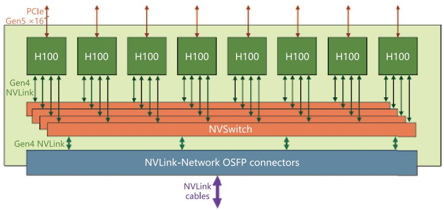  
图 4.19 NVIDIA HGX H100 8-GPU NVLink 和 NVSwitch 连接框图 [167]

# 4.3.2 参数服务器架构

参数服务器（Parameter Server，PS）架构的分布式训练系统中有两种服务器角色：训练服务器和参数服务器。参数服务器需要提供充足的内存资源和通信资源，训练服务器需要提供大量的计算资源。图4.20 为参数服务器的分布式训练集群的示意图。该集群包括两个训练服务器和两个参数服务器。假设有一个可分为两个参数分区的模型，每个分区由一个参数服务器负责参数同步。在训练过程中，每个训练服务器都拥有完整的模型，将分配到此服务器的训练数据集切片（DatasetShard）并进行计算，将得到的梯度推送到相应的参数服务器。参数服务器会等待两个训练服务器都完成梯度推送，再计算平均梯度并更新参数。之后，参数服务器会通知训练服务器拉取最新的参数，并开始下一轮训练迭代。

  
图 4.20 参数服务器的分布式训练集群的示意图[167]

参数服务器架构的分布式训练过程可以细分为同步训练和异步训练两种模式。

同步训练：训练服务器在完成一个小批次的训练后，将梯度推送给参数服务器。参数服务器在收到所有训练服务器的梯度后，进行梯度聚合和参数更新。  
• 异步训练：训练服务器在完成一个小批次的训练后，将梯度推送给参数服务器。参数服务器不再等待接收所有训练服务器的梯度，而是直接基于已收到的梯度进行参数更新。

在同步训练的过程中，参数服务器会等待所有训练服务器完成当前小批次的训练，有诸多的等待或同步机制，导致整个训练速度较慢。异步训练去除了训练过程中的等待机制，训练服务器可以独立进行参数更新，极大地加快了训练速度。引入异步更新的机制会导致训练效果有所波动。应根据具体情况和需求选择适合的训练模式。

# 4.3.3 去中心化架构

去中心化（Decentralized Network）架构采用集合通信实现分布式训练系统。在去中心化架构中，没有中央服务器或控制节点，而是由节点之间进行直接通信和协调。这种架构的好处是可以减少通信瓶颈，提高系统的可扩展性。由于节点之间可以并行地训练和通信，去中心化架构可以显著降低通信开销，并减少通信墙的影响。在分布式训练过程中，节点之间需要周期性地交换参数更新和梯度信息。可以通过集合通信（Collective Communication，CC）技术实现分布式训练，常用通信原语包括 Broadcast、Scatter、Reduce、All Reduce、Gather、All Gather、Reduce Scatter、All to All 等。4.2 节介绍的大语言模型训练所使用的分布式训练并行策略，大多使用去中心化架构，并利用集合通信实现。

下面介绍一些常见的集合通信原语。

（1）Broadcast：主节点把自身的数据发送到集群中的其他节点。Broadcast在分布式训练系统中常用于网络参数的初始化。如图4.21所示，计算设备1对大小为 $1 \times N$ 的张量进行广播，最终每张卡输出均为 $[ 1 \times N ]$ 的矩阵。

  
图 4.21 集合通信 Broadcast 原语示例

（2）Scatter：主节点对数据进行划分并散布至其他指定的节点。Scatter与Broadcast非常相似，不同的是，Scatter 是将数据的不同部分按需发送给所有的进程。如图4.22 所示，计算设备 1 将大小为 $1 \times N$ 的张量分为4份后发送到不同节点。

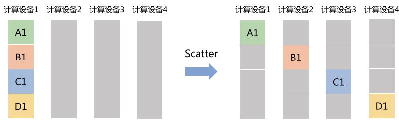  
图 4.22 集合通信 Scatter 原语示例

（3）Reduce：是一系列简单运算操作的统称，将不同节点上的计算结果进行聚合（Aggregation），可以细分为 Sum、Min、Max、Prod、Lor 等类型的归约操作。如图4.23 所示，Reduce Sum 操作将所有计算设备上的数据汇聚到计算设备1，并执行求和操作。

  
图 4.23 集合通信 Reduce Sum 原语示例

（4）All Reduce：在所有的节点上都应用同样的 Reduce 操作。可以细分为 Sum、Min、Max、Prod、Lor 等类型的归约操作。All Reduce 操作可通过单节点上的“Reduce $^ +$ Broadcast”操作完成。如图4.24 所示，All Reduce Sum 操作将所有计算设备上的数据汇聚到各个计算设备中，并执行求和操作。

  
图 4.24 集合通信 All Reduce Sum 原语示例

（5）Gather：将多个节点上的数据收集到单个节点上，可以将Gather理解为反向的Scatter。如图4.25所示，Gather操作将所有计算设备上的数据收集到计算设备1中。

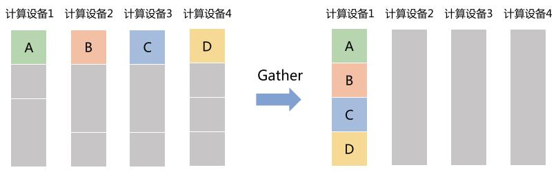  
图 4.25 集合通信 Gather 原语示例

（6）All Gather：每个节点都收集所有其他节点上的数据，All Gather相当于一个Gather操作之后跟着一个 Broadcast 操作。如图4.26 所示，All Gather 操作将所有计算设备上的数据收集到每个计算设备中。

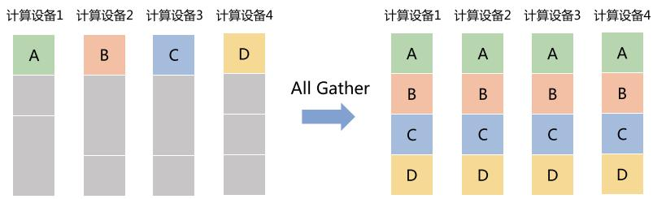  
图 4.26 集合通信 All Gather 原语示例

（7）Reduce Scatter：将每个节点中的张量切分为多个块，每个块被分配给不同的节点。接收到的块会在每个节点上进行特定的操作，例如求和、取平均值等。如图4.27 所示，每个计算设备都将其中的张量切分为 4 块，并分发到 4 个不同的计算设备中，每个计算设备分别对接收的分块进行特定操作。

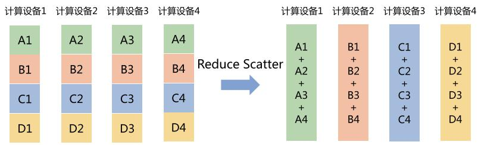  
图 4.27 集合通信 Reduce Scatter 原语示例

（8）All to All：将每个节点的张量切分为多个块，每个块分别发送给不同的节点。如图4.28所示，每个计算设备都将其中的张量切分为4块，并分发到4个不同的计算设备中。

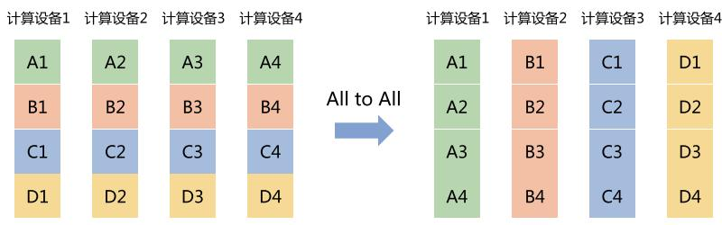  
图 4.28 集合通信 All to All 原语示例

分布式集群中的网络硬件多种多样，包括以太网、InfiniBand网络等。PyTorch等深度学习框架通常不直接操作硬件，而是使用通信库。常用的通信库包括MPI、GLOO、NCCL等，可以根据具体情况进行选择和配置。MPI（Message Passing Interface）是一种广泛使用的并行计算通信库，常用于在多个进程之间进行通信和协调。GLOO是Facebook推出的一个类似MPI的集合通信库（CollectiveCommunications Library），也大体遵照 MPI 提供的接口规定，实现了包括点对点通信、集合通信等相关接口，支持在 CPU 和 GPU 上的分布式训练。NCCL（NVIDIA Collective CommunicationsLibrary）是 NVIDIA 开发的高性能 GPU 间通信库，专门用于在多个 GPU 之间进行快速通信和同步，因为NCCL是NVIDIA基于自身硬件定制的，能做到更有针对性且更便于优化，故在NVIDIA硬件上，NCCL 的效果往往比其他通信库更好。GLOO、MPI 和 NCCL 在 CPU 和 GPU 环境下对通信原语的支持情况如表4.1所示。在进行分布式训练时，根据所使用的硬件环境和需求，选择适当的通信库可以充分发挥硬件的优势并提高分布式训练的性能和效率。一般而言，如果在CPU集群上进行训练，则可选择使用 MPI 或 GLOO 作为通信库；而如果在 GPU 集群上进行训练，则可以选择NCCL作为通信库。

表 4.1 GLOO、MPI 和 NCCL 在 CPU 和 GPU 环境下对通信原语的支持情况  

<table><tr><td rowspan="2">通信原语</td><td colspan="2">GLOO</td><td colspan="2">MPI</td><td colspan="2">NCCL</td></tr><tr><td>CPU</td><td>GPU</td><td>CPU</td><td>GPU</td><td>CPU</td><td>GPU</td></tr><tr><td>Send</td><td>✓</td><td>×</td><td>✓</td><td>?</td><td>×</td><td>✓</td></tr><tr><td>Receive</td><td>✓</td><td>×</td><td>✓</td><td>?</td><td>×</td><td>✓</td></tr><tr><td>Broadcast</td><td>✓</td><td>✓</td><td>✓</td><td>?</td><td>×</td><td>✓</td></tr><tr><td>Scatter</td><td>✓</td><td>×</td><td>✓</td><td>?</td><td>×</td><td>✓</td></tr><tr><td>Reduce</td><td>✓</td><td>×</td><td>✓</td><td>?</td><td>×</td><td>✓</td></tr><tr><td>All Reduce</td><td>✓</td><td>✓</td><td>✓</td><td>?</td><td>×</td><td>✓</td></tr><tr><td>Gather</td><td>✓</td><td>×</td><td>✓</td><td>?</td><td>×</td><td>✓</td></tr><tr><td>All Gather</td><td>✓</td><td>×</td><td>✓</td><td>?</td><td>×</td><td>✓</td></tr><tr><td>Reduce Scatter</td><td>×</td><td>×</td><td>×</td><td>×</td><td>×</td><td>✓</td></tr><tr><td>All To All</td><td>×</td><td>×</td><td>✓</td><td>?</td><td>×</td><td>✓</td></tr><tr><td>Barrier</td><td>✓</td><td>×</td><td>✓</td><td>?</td><td>×</td><td>✓</td></tr></table>

以 PyTorch 为例，介绍如何使用上述通信原语完成多计算设备间通信。先使用“torch.distributed”初始化分布式环境：

import os   
from typing import Callable   
import torch   
import torch.distributed as dist   
def init_process(link:int,size:int,fn:Callable[[int,int],None],frontend="gloo"): ""初始化分布式环境""os.environ["MASTER_ADDR"] = "127.0.0.1"os.environ["MASTER_PORT"] = "29500"dist.init_process_group腥bend，rank=rank，world_size $\equiv$ size) fn(link,size)

接下来使用“torch.multiprocessing”开启多个进程，本例中共开启了 4 个进程：

import torch multiprocessing as mp   
def func(rank:int,size:int): #每个进程都将调用此函数 continue   
if__name $\equiv$ "main": size $= 4$ processes $= []$ mp.set_start_method("spawn") for rank in range(size): p $=$ mp.Process(target $\coloneqq$ init_process，args=(rank,size，func)) p.start() processes.append(p)   
for p in processes: p.join()

每个新开启的进程都会调用“init_process”，接下来调用用户指定的函数“func”。这里以AllReduce 为例：

```python
def do_all Reduce(rank: int, size: int):
    # 创建包含所有处理器的群组
    group = dist.new_group(list(range(size)))
    tensor = torch.ones(1)
    dist.all Reduce(sensor, op=dist ReduceOp.SUM, group=group)
    # 可以是dist ReduceOp.PRODUCT, dist ReduceOp.MAX, dist ReduceOp.MIN
    # 将输出所有秩为4的结果
    print(f["{rank}"] data = {tensor[0]})
...
for rank in range(size):
    # 传递 `hello_world`
    p = mp.Process(target=init_process, args=(rank, size, do_all Reduce)) 
```

根据All Reduce 通信原语，在所有的节点上都应用同样的Reduce操作，可以得到如下输出：

[3] data = 4.0   
[0] data = 4.0   
[1] data = 4.0   
[2] data = 4.0

# 4.4 DeepSpeed 实践

DeepSpeed[172] 是一个由 Microsoft 公司开发的开源深度学习优化库，旨在提高大语言模型训练的效率和可扩展性，使研究人员和工程师能够更快地迭代和探索新的深度学习模型和算法。它采用了多种技术手段来加速训练，包括模型并行化、梯度累积、动态精度缩放、本地模式混合精度等。此外，DeepSpeed还提供了一些辅助工具，例如分布式训练管理、内存优化和模型压缩，以帮助开发者更好地管理和优化大规模深度学习训练任务。DeepSpeed是基于PyTorch构建的，因此将现有的 PyTorch 训练代码迁移到 DeepSpeed 上通常只需要进行简单的修改。这使得开发者可以快速利用 DeepSpeed 的优化功能来加速训练任务。DeepSpeed 已经在许多大规模深度学习项目中得到了应用，包括语言模型、图像分类、目标检测等领域。大语言模型BLOOM[31]（1750亿个参数）和 MT-NLG[134]（5400 亿个参数）都采用 DeepSpeed 框架完成训练。

DeepSpeed 的主要优势在于支持大规模神经网络模型、提供了更多的优化策略和工具。Deep-Speed通过实现三种并行方法的灵活组合，即ZeRO支持的数据并行、流水线并行和张量并行，可以应对不同工作负载的需求。特别是通过3D并行性的支持，DeepSpeed可以处理具有万亿个参数的超大规模模型。DeepSpeed 还引入了 ZeRO-Offload，使单个 GPU 能够训练比其显存容量大 10倍的模型。为了充分利用 CPU 和 GPU 的内存来训练大语言模型，DeepSpeed 还扩展了 ZeRO-2。此外，DeepSpeed 还提供了稀疏注意力核（Sparse Attention Kernel），支持处理包括文本、图像和语音等长序列输入的模型。DeepSpeed 还集成了 1 比特 Adam 算法（1-bit Adam），该算法可以只使用原始 Adam 算法 1/5 的通信量，达到与 Adam 类似的收敛率，显著提高分布式训练的效率，降低通信开销。

DeepSpeed 的 3D 并行充分利用硬件架构特性，综合考虑了显存效率和计算效率。4.3 节介绍了分布式集群的硬件架构，截至2023年9月，分布式训练集群通常采用NVIDIA DGX/HGX节点，利用胖树网络拓扑结构构建计算集群。因此，每个节点内部 8 个计算加速设备之间具有非常高的通信带宽，节点之间的通信带宽则相对较低。由于张量并行是分布式训练策略中通信开销最大的，因此优先考虑将张量并行计算组放置在节点内以利用更大的节点内带宽。当张量并行组不能占满节点内的所有计算节点时，选择将数据并行组放置在节点内，否则就使用跨节点进行数据并行。流水线并行的通信量最低，因此可以使用跨节点的方式调度流水线的各个阶段，降低通信带宽的要求。每个数据并行组需要通信的梯度量随着流水线和模型并行的规模线性减小，因此总通信量少于单纯使用数据并行。此外，每个数据并行组会在局部的一小部分计算节点内部独立通信，组间

通信可以并行。通过减少通信量和增加局部性与并行性，数据并行通信的有效带宽有效增大。

图4.29 给出了 DeepSpeed 3D 并行策略示意图。图中给出了 32 个计算设备进行 3D 并行的例子。神经网络的各层分为 4 个流水线阶段。每个流水线阶段中的层在 4 个张量并行计算设备之间进一步划分。最后，每个流水线阶段有两个数据并行实例，使用 ZeRO 内存优化在这 2 个副本之间划分优化器状态量。

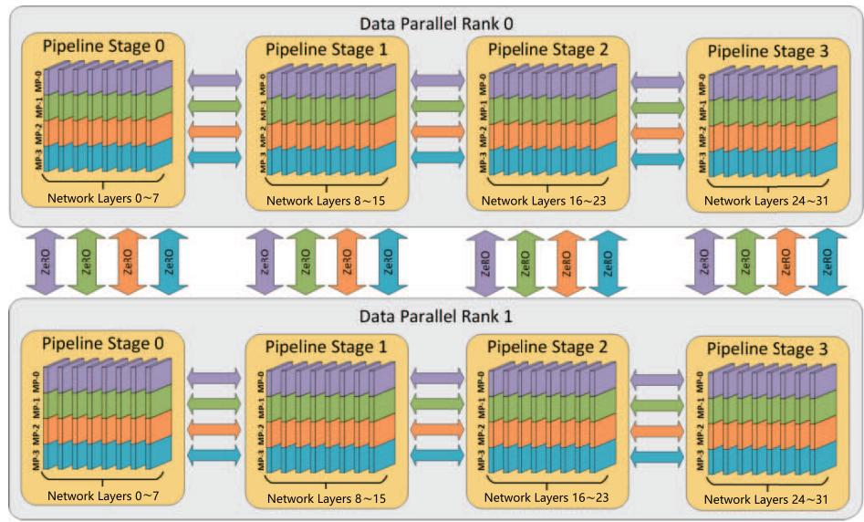  
图 4.29 DeepSpeed 3D 并行策略示意图[177]

DeepSpeed软件架构如图4.30所示，主要包含以下三部分。

（1）API：DeepSpeed提供了易于使用的API接口，简化了训练模型和推断的过程。用户只需调用几个API接口即可完成任务。通过“initialize”接口可以初始化引擎，并在参数中配置训练参数、优化技术等。这些配置参数通常保存在名为“ds_config.json”的文件中。  
（2）RunTime：RunTime 是 DeepSpeed 的核心运行时组件，使用 Python 语言实现，负责管理、执行和优化性能。它承担了将训练任务部署到分布式设备的功能，包括数据分区、模型分区、系统优化、微调、故障检测及检查点的保存和加载等任务。  
（3）Ops：Ops 是 DeepSpeed 的底层内核组件，使用 $\mathrm { C } { + + }$ 和 CUDA 实现。它优化计算和通信过程，提供了一系列底层操作，包括 Ultrafast Transformer Kernels、Fuse LAN Kernels、CustomaryDeals等。Ops 的目标是通过高效的计算和通信加速深度学习训练过程。

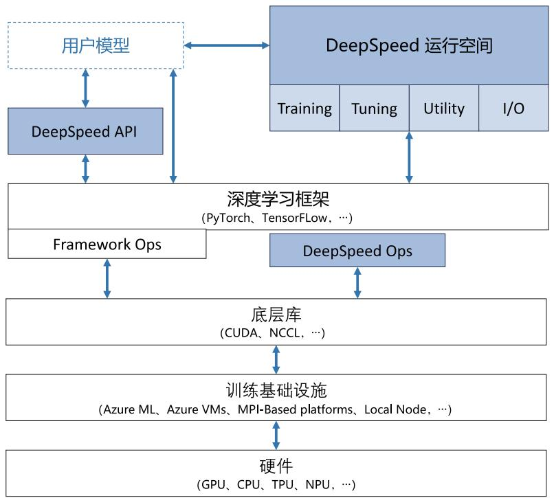  
图 4.30 DeepSpeed 软件架构

# 4.4.1 基础概念

DeepSpeed 提供了分布式计算框架，首先需要明确几个重要的基础概念：主节点、节点编号、全局进程编号、局部进程编号和全局总进程数。DeepSpeed 主节点（master_ip+master_port）负责协调所有其他节点和进程的工作，由主节点所在服务器的IP地址和主节点进程的端口号来确定主节点。主节点还负责监控系统状态、处理任务分配、结果汇总等任务，因此是整个系统的关键部分。节点编号（node_rank）是系统中每个节点的唯一标识符，用于区分不同计算机之间的通信。全局进程编号（rank）是整个系统中的每个进程的唯一标识符，用于区分不同进程之间的通信。局部进程编号（local_rank）是单个节点内的每个进程的唯一标识符，用于区分同一节点内的不同进程之间的通信。全局总进程数（world_size）是整个系统中运行的所有进程的总数，用于确定可以并行完成多少工作及完成任务所需的资源数量。

在网络通信策略方面，DeepSpeed提供了MPI、GLOO、NCCL等选项，可以根据具体情况进行选择和配置。在 DeepSpeed 配置文件中，在 optimizer 部分配置通信策略，以下是使用 1-Bit Adam优化器的配置样例，配置中使用了NCCL通信库：

```json
{
    "optimizer": {
        "type": "OneBitAdam",
        "params": {
            "lr": 0.001,
            "betas": [0.8, 0.999],
       },
        "eps": 1e-8,
        "weight Decay": 3e-7,
        "freeze_step": 400,
        "cudaAware": false,
        "comm_front_name": "nccl"
    }
} 
```

DeepSpeed 中也支持多种类型 ${ \mathrm { Z e R O } }$ 的分片机制，包括 ZeRO-0、ZeRO-1、ZeRO-2、ZeRO-3 以及ZeRO-Infinity。ZeRO-0 禁用所有类型的分片，仅将 DeepSpeed 当作分布式数据并行使用；ZeRO-1对优化器状态进行分片，占用内存为原始的1/4，通信容量与数据并行性相同；ZeRO-2对优化器状态和梯度进行分片，占用内存为原始的1/8，通信容量与数据并行性相同；ZeRO-3对优化器状态、梯度及模型参数进行分片，内存减少与数据并行度和复杂度成线性关系，同时通信容量是数据并行性的 1.5 倍；ZeRO-Infinity 是 ZeRO-3 的拓展，允许通过使用 NVMe 固态硬盘扩展 GPU 和CPU 内存来训练大语言模型。

以下是 DeepSpeed 使用 ZeRO-3 配置参数的样例：

```txt
{ "zero_optimization": { stage":3, }, "fp16": { "enabled": true }, "optimizer": { "type": "AdamW", "params": { "lr":0.001, "betas":[ 0.8, 0.999 ], "eps":1e-8, "weight Decay":3e-7 } }, ... } 
```

如果希望在ZeRO-3的基础上继续使用ZeRO-Infinity将优化器状态和计算转移到CPU中，则可以在配置文件中按照如下方式配置：

```txt
{ "zero_optimization": { "stage":3, "offload_OPTIZER": { "device":"cpu" } }, 
```

甚至可以进一步将模型参数也装载到CPU 内存中，在配置文件中按照如下方式配置：

```txt
{"zero_optimization": { "stage":3, "offload_OPTIZER":{ "device":"cpu" } "offload param": { "device":"cpu" }}}, 
```

如果希望将更多的内存装载到NVMe 中，则可以在配置文件中按照如下方式配置：

```python
{ "zero_optimization": { "stage": 3, "offload_OPTIZER": { "device": "nvme", "nvme_path": "/nvme_data" } "offload.Param": { "device": "nvme", "nvme_path": "/nvme_data" } }, 
```

# 4.4.2 LLaMA 分布式训练实践

LLaMA模型是目前最流行、性能最强大的开源模型之一，基于LLaMA构造的模型生态可以覆盖绝大部分模型使用场景。在设置完必要的数据和环境配置后，本节将逐步演示如何使用 Deep-Speed 框架训练 LLaMA 模型。

DeepSpeed 可以很好地兼容 PyTorch 和 CUDA 的大多数版本，其安装过程通常无须指定特殊配置选项，直接通过pip命令完成。

pip install deepspeed

# 1. 训练数据配置

使用PyTorch和transformers库来设置预训练模型的数据加载器，以实现在单机或多机分布式训练环境中对数据的加载和采样。需要导入的模块如下。

DataLoader是PyTorch提供的工具，用于从数据集加载数据到模型进行训练或评估。  
• RandomSampler 和 SequentialSampler 是 PyTorch 提供的两种采样器。RandomSampler 随机采样数据，而 SequentialSampler 顺序采样数据。  
• DistributedSampler 是用于分布式训练的数据采样器。  
• default_data_collator 是 transformers 库提供的默认数据收集器，用于将多个样本整合为一个批量数据。  
create_pretrain_dataset 是一个自定义函数，用于创建预训练数据集。

通过检查args.local_rank是否为−1，代码会选择使用普通的采样器（单机）还是分布式采样器（多机）。DistributedSampler确保在分布式训练环境中，每个进程或节点都能获得数据的一个不重复的子集，这使得分布式训练变为可能。而在单机环境中，使用常规的随机或顺序采样器即可。具体代码如下所示：

```python
from torch.utils.data import DataLoader, RandomSampler, SequentialSampler  
from torch.utils.datadistributed import DistributedSampler  
from transformers import default_data.collator  
fromutils.data.data_utils import create_pretrain_dataset 
```

# 数据准备  
train_dataset,eval_dataset $=$ create_pretrain_dataset( args.local_rank, args.data_path, args.data_split, args.data_output_path, args.seed,tokenizer, args.max_seq_len)   
# DataLoader创建   
if args.local_rank $= = -1$ .. trainSampler $\equiv$ RandomSampler(train_dataset) evalSampler $\equiv$ SequentialSampler.eval_dataset)   
else: trainSampler $\equiv$ DistributedSampler(train_dataset) evalSampler $\equiv$ DistributedSampler.eval_dataset)   
train_dataloder $\equiv$ DataLoader(train_dataset, collate_fn $\equiv$ default_data.collator, sampler $\equiv$ trainSampler, batch_size $\equiv$ args.per_device_train_batch_size)   
eval_dataloder $\equiv$ DataLoader(val_dataset, collate_fn $\equiv$ default_data.collator, sampler $\equiv$ evalSampler, batch_size $\equiv$ args.per_device_eval_batch_size)

# 2. 模型载入

使用 transformers 库加载和配置 LLaMA 模型及其相关的词元分析器。从 transformers 库中导入LLaMA模型、相应的词元分析器和模型配置后，使用from_pretrained方法加载预训练的LLaMA模型、词元分析器和配置。为了确保词元分析器可以处理各种文本的长度，还需要进行填充设置。如果词元分析器还没有指定填充符号，则将其设置为[PAD]，并确定填充行为发生在句子的右侧。此外，为了保证模型能够正确地处理句子结束和填充，还为模型配置设置了结束符号和填充符号的ID。最后，为了优化模型在硬件上的性能，还需要调整模型的词汇表嵌入大小，使其成为8的倍数。通过这些步骤，可以成功地加载并配置LLaMA模型，为后续的训练任务做好准备。具体代码如下：

```python
from transformers import LlamaForCausalLM, LlamaTokenizer, LlamaConfig
# 载入词元分析器：将获得正确的词元分析器并根据模型设置填充词元
tokenizer = LlamaTokenizer.from_pretrained(
    model_name_or_path, fast_tokenizer=True)
if tokenizer_pad_token is None:
    # 判断tokenizer.eos_token不为None
    # 往词元分析器中加入特殊词元
tokenizer.add_special_tokens(['pad_token': tokenizer.eos_token}]
tokenizer.add_special_tokens(['pad_token': '[PAD]']) 
tokenizer(paddingSide = 'right'
model_config = LlamaConfig.from_pretrained(model_name_or_path)
model = LlamaForCausalLM.from_pretrained(model_name_or_path, config=model_config)
model.config.end_token_id = tokenizer.eos_token_id
model.config_pad_token_id = model.config.eos_token_id
modelresize_token_embeddings(int(8 * math.ceil(len(tokenizer) / 8.0))) # 设置词表大小为8的倍数 
```

# 3. 优化器设置

DeepSpeed 库提供了高效的优化器算法，如 DeepSpeedCPUAdam 和 FusedAdam，这些算法经过特殊优化以提高在大规模数据和模型上的训练速度。优化器配置主要包含以下几个方面。

（1）参数分组：通过 get_optimizer_grouped_parameters 函数将模型参数分为两组，一组使用权重衰减，另一组则不使用。这种参数分组有助于正则化模型，防止过拟合，并允许对特定参数应用不同的学习设置。  
（2）优化器选择：根据训练设置（如是否在 CPU 上进行模型参数卸载），可以选择使用 Deep-SpeedCPUAdam或FusedAdam优化器。这两种优化器都是对经典的Adam优化器进行优化和改进的版本，为大规模训练提供了高效性能。  
（3）学习率调度：不同于固定的学习率，学习率调度器在训练过程中动态调整学习率。例如，在训练初期快速提高学习率以加速收敛，在训练中后期逐渐降低学习率以获得更精细的优化。我们的配置考虑了预热步骤、训练的总步数及其他关键因素。

具体代码如下所示：

```python
from transformers import get_scheduler  
from deepspeed ops.adam import DeepSpeedCPUAdam, FusedAdam 
```

# 设置需要优化的模型参数及优化器  
```python
optimizer_grouped_parameters = get_OPTimizer_grouped_parameters(
    model, args.weight Decay, args. learning_rate)
AdamOptimizer = DeepSpeedCPUAdam if args.offload else FusedAdam
optimizer = AdamOptimizer( optimizer_grouped_parameters,
    lr=args. learning_rate,
    betas=(0.9, 0.95))
num_update_steps_per_epoch = math.ceil (
    len(train_dataloger) / argsgradient Accumulation_steps)
lr_scheduler = get_scheduler(
    name=args.lr_scheduler_type,
    optimizer=optimizer,
    num_warmup_steps=args.num_warmup_steps,
    num_training_steps=args num_train_epochs * num_update_steps_per_epoch,
)
def get_OPTimizer_grouped_parameters(model,
    weight Decay,
    no Decay_name_list=[
        "bias", "LayerNorm.weight"]
):
# 将权重分为两组，一组有权重衰减，另一组没有
optimizer_grouped_parameters = [
    {
        "params": [ p for n, p in model.named_parameters()
            if (not any(nd in n
                for nd in no Decay_name_list) and prequires_grad)
                    "weight Decay": weight Decay,
            }
        {
            "params": [ p for n, p in model.named_parameters()
                if (any(nd in n
                    for nd in no Decay_name_list) and prequires_grad)
                    "weight Decay": 0.0,
            }
        ]
return optimizer_grouped_parameters 
```

# 4. DeepSpeed 设置

在配置代码的开始，定义了两个关键参数 GLOBAL_BATCH_SIZE 和 MICRO_BATCH_ SIZE。GLOBAL_BATCH_SIZE 定义了全局的批次大小。这通常是所有 GPU 加起来的总批次大小。MI-CRO_BATCH_SIZE定义了每块GPU上的微批次大小。因为微批次处理每次只加载并处理一小部分数据，所以可以帮助大语言模型在有限的 GPU 内存中运行。训练配置函数 get_train_ds_config主要包括以下内容。

（1）ZeRO优化配置：ZeRO是DeepSpeed提供的一种优化策略，旨在减少训练中的冗余并加速模型的训练。其中的参数，如 offload_param 和 offload_optimizer，允许用户选择是否将模型参数或优化器状态卸载到CPU。  
（2）混合精度训练：通过设置 FP16 字段，使模型可以使用 16 位浮点数进行训练，加速训练过程并减少内存使用。  
（3）梯度裁剪：通过 gradient_clipping 字段，可以防止训练过程中出现梯度爆炸问题。  
（4）混合引擎配置：hybrid_engine 部分允许用户配置更高级的优化选项，如输出分词的最大数量和推理张量的大小。  
（5）TensorBoard 配置：使用 DeepSpeed 时，可以通过配置选项直接集成 TensorBoard，从而更方便地跟踪训练过程。

（6）验证集配置函数 get_eval_ds_config：此函数提供了 DeepSpeed 的验证集。与训练配置相比，验证集配置更为简洁，只需要关注模型推理阶段。

具体代码如下所示：

```python
import torch  
import deepspeed.comm as dist 
```

```txt
GLOBAL Batch SIZE = 32  
MICRO Batch SIZE = 4 
```

def get_train_ds_config(offload, stage $= 2$ enable HYbrid engine $\equiv$ False, inference_sp_size $= 1$ release_inference_cache $\equiv$ False, pin_parameters $\equiv$ True, tp_gather_partition_size $= 8$ max_out_tokens $= 512$ enable TensorFlow $\equiv$ False, tb_path $\equiv$ "" tb_name $\equiv$ ""):

# 设置训练过程的DeepSpeed配置   
device $=$ "cpu"if offload else "none"   
zero_opt_dict $\equiv$ { "stage": stage, "offload param":{ "device": device }, "offload_OPTimizer": { "device": device }, "stage3-param Persistence_threshold":1e4, "stage3_max_live_parameters":3e7, "stage3 sufetch_bucket_size":3e7, "memory_efficientlinear":False   
}

```python
return { "train_batch_size": GLOBAL Batch SIZE, "train_micro_batch_size_per_gpu": MICRO batchesize, "steps_per_print":10, "zero_optimization": zero_opt_dict, "fp16":{ "enabled": True, "loss_scale_window":100 }, "gradient_clipping":1.0, "prescale_gradients":False, "wall_clock_breakdown": False, 
```

# 5. DeepSpeed 初始化

设置DeepSpeed的配置参数后，可以利用DeepSpeed进行模型训练的初始化，初始化流程如下。

（1）确定运行的设备：首先，检查代码是否有指定的本地 GPU（通过 args.local_rank）。如果没有指定，则程序默认使用CUDA 设备。否则，它会为进程设置指定的GPU。  
（2）初始化分布式后端：在分布式训练中，使用 deepspeed.init_distributed() 函数实现每个进程与其他进程的同步，初始化分布式环境。  
（3）获取当前进程的全局排序：在分布式训练中，使用 torch.distributed.get_rank() 函数获得每个进程的唯一排序或ID。  
（4）设置 DeepSpeed 配置：根据用户参数（如是否进行 offload、使用哪个 Zero Stage 等）构建一个DeepSpeed配置字典，来决定训练设置。  
（5）同步所有工作进程：使用torch.distributed.barrier()确保在进一步的初始化之前所有进程都已同步。  
（6）DeepSpeed 初始化：这是最关键的一步。通过 deepspeed.initialize 函数，可以将模型、优化器、参数和先前构建的 DeepSpeed 配置传递给库，进行初始化。这个函数会返回一个已经根据DeepSpeed配置进行了优化的模型和优化器。  
（7）梯度检查点：对于特别大的模型，梯度检查点是一种节省显存的技巧，即只在需要时计算模型的中间梯度。如果用户启用了这个选项，则会调用 model.gradient_checkpointing_enable() 方法来实现相关功能。

具体代码如下所示：

import deepspeed   
args.global_rank $=$ torch.distributed.get_rank()   
if args.local_rank $= = -1$ device $\equiv$ torchdevice("cuda")   
else: torch.cuda.set_device(args.local_rank) device $\equiv$ torchdevice("cuda",args.local_rank) #初始化分布式后端，它将负责同步节点/GPU torch.distributed.init_process_group腥rend $\equiv$ 'nccl') deepspeed.init_distributed()

```python
ds_config = get_train_ds_config(offline=args/offload, stage=args.zero階段, enable_tensorboard=args.enabled_tensorboard, tb_path=args.tensorboard_path, tb_name="step1_model")  
ds_config['train_micro_batch_size_pergpu'] = args.per_device_train_batch_size  
ds_config['train_batch_size'] = args.per_device_train_batch_size * torchdistributed.get_world_size() * args.trainable accumulation_steps 
```

# 设置训练种子  
```txt
set_random_seed(args.seed)  
torch_distribution.barrier( 
```

# 使用DeepSpeed对模型和优化器进行初始化  
if args.gradient_checkpointing: model.gradient_checkpointing_enable()   
```python
model, optimizer, _, lr_scheduler = deepspeed.initialize(
    model=model,
    optimizer=optimizer,
    args=args,
    config=ds_config,
    lr_scheduler=lr_scheduler,
    dist_init_required=True) 
```

# 6. 模型训练

借助DeepSpeed框架实现对模型的训练，训练步骤大致分为以下几个阶段。

（1）训练前的准备：使用print_rank_0函数输出当前的训练状态。该函数确保只有指定的进程（通常是主进程）会打印消息，避免了多进程环境下的重复输出。在开始训练之前，对模型进行一次评估，计算模型的困惑度。  
（2）训练循环：每个周期的开始，都会打印当前周期和总周期数。在每次迭代中，数据批次先被移动到相应的GPU设备，接着模型对这个批次进行前向传播计算损失。使用model.backward(loss)计算梯度，并使用 model.step() 更新模型参数。对于主进程，还会使用 print_throughput 函数打印吞吐量，这有助于了解模型的训练速度和效率。  
（3）保存模型：如果指定了输出目录，则模型的状态和配置将被保存。模型可以在不同的格式中保存，例如 HuggingFace 的模型格式或 DeepSpeed 的 Zero Stage 3 特定格式。save_hf_format函数用于保存模型为 HuggingFace 格式，这意味着训练后的模型可以使用 HuggingFace 的 from_pretrained 方法直接加载。对于 Zero Stage 3，save_zero_three_model 函数负责保存，因为在这个阶段，每个GPU 只保存了模型的一部分。

具体代码如下所示：

# 模型训练部分  
```python
print_rank_0("****** Running training ***", args.global_rank)  
print_rank_0(  
    f"****** Evaluating perplexity, \  
    Epoch {0}/\{args.num_train_epochs} ***",  
    args.global_rank)  
perplexity = evaluation(model, eval_dataloger)  
print_rank_0(f"ppl: {perplexity}", args.global_rank)  
for epoch in range(args.num_train_epochs):  
    print_rank_0(  
        f"Beginning of Epoch {epoch+1}/\{args.num_train_epochs}, \  
        Total Micro Batches {len(train_dataloger)}",  
        args.global_rank)  
model.train()  
import time  
for step, batch in enumerate(train_dataloger):  
    start = time.time()  
    batch = to_device(batch, device)  
    outputs = model(**batch, use_cache=False)  
    loss = outputs.loss  
    if args.print_loss:  
        print(  
            f"Epoch: {epoch}, Step: {step}, \  
            Rank: {torchdistributed.get_rank(), loss = {loss}]")  
    model.backup(loss)  
    model_STEP()  
end = time.time()  
if torch.distributed.get_rank() == 0:  
    printthroughput(model.model, args, end - start, args.global_rank) 
```

```python
if args.output_dir is not None:  
print_rank_0('saving the final model ..., args.global_rank)  
model = convert_lora_to_linear_layer(model) 
```

if args.global_rank $= = 0$ save_hf_format(model,tokenizer，args)

```python
if args.zero stage == 3: #对于Zero Stage3，每块GPU只有模型的一部分，因此需要一个特殊的保存函数 save_zero_three_model(model, args.global_rank, args.output_dir, zero_stage=args.zero_stage)
```

# 5. 指令微调

指令微调又称有监督微调，是指在预训练大语言模型的基础上，通过使用有标注的自然语言形式的数据，对模型参数进行微调，使模型具备指令遵循（Instruction Following）能力，能够完成各类预先设计的任务，并可以在零样本情况下处理诸多下游任务。经过海量数据预训练后的语言模型虽然具备了大量的“知识”，但是由于其训练时的目标仅是进行下一个词的预测，因此不能够理解并遵循人类自然语言形式的指令。为了使模型具有理解并响应人类指令的能力，还需要使用指令数据对其进行调整。如何构造指令数据，如何高效低成本地进行指令微调训练，以及如何在语言模型基础上进一步扩大上下文等问题，是大语言模型在指令微调阶段的核心。

本章先介绍大语言模型指令微调训练方法，在此基础上介绍高效模型微调及模型上下文窗口扩展方法，最后介绍指令微调的代码实践。

# 5.1 指令微调训练

指令微调具体训练过程并不复杂，主要分为如下三个步骤：（1）针对每一项任务去明确地定义相应的自然语言形式的指令或者提示，这些指令或提示对任务目标以及输出要求进行清晰描述；（2）把训练数据调整成包含指令以及与之对应的响应的形式；（3）使用包含指令和响应的训练数据对预训练模型进行微调操作。从训练方式的角度来看，指令微调与预训练大体上较为相似，不过指令微调的目标函数往往只是针对输出部分来计算损失。

本节将从指令微调数据构造、数据评估和影响、指令微调训练策略以及开源指令微调数据等方面进行介绍。

# 5.1.1 指令微调数据

指令微调数据通常由文本对构成，包含“指令输入”与“答案输出”两个关键部分。“指令输入”，是指人们向模型提出的各类请求，包含定义精准、清晰的指令或者提示信息，其核心作用在于详细阐释任务的目标究竟是什么，以及明确规定输出需要满足的各项要求。指令涵盖的范畴极为广泛，包括问题回答、信息分类、内容总结、文本改写等。“答案输出”，则是期望模型依据所

接收的指令而回答内容，这些回答需要符合人们预先设定的期望。答案输出的内容，可以使用人工手段或借助自动化方法来构建。举例来说，倘若想要训练模型使其拥有问题回答能力，那么便可以按照如下的方式来构造数据：

# User:

复旦大学有几个校区？

# Assistant:

复旦大学共有四个校区，分别是邯郸校区、江湾校区、枫林校区和张江校区。

• 邯郸校区：是复旦大学的主校区，通称 “本部”，位于上海市杨浦区邯郸路 220 号。  
• 江湾校区：位于上海市杨浦区淞沪路 2005 号，杨浦区新江湾城西北部，距邯郸校区约 3.5 公里。  
• 枫林校区：俗称医学院校区，位于上海市徐汇区东安路 130 号，是复旦大学除药学院外各医学院系的所在地。  
• 张江校区：位于上海市浦东新区张衡路 825 号，是由复旦大学出资，上海张江集团共同建设。

其中“复旦大学有几个校区？”是任务指令，“Assistant”后的文字是模型学习的目标。针对机器翻译、摘要生成、文章写作、代码生成、数学解题等几乎所有任务，都可以按照上述格式准备“输入-输出”数据。例如，针对文章写作任务，可以给出更清晰的指令要求以及与之匹配的输出，如下所示：

# User:

请帮我写一篇介绍复旦大学历史沿革的短文，要求 500 字以内，包含复旦大学的创建历程、发展历程等。

# Assistant:

复旦大学创建于 1905 年，其诞生与民族救亡图存紧密相连。彼时，马相伯深感 “自强之道，以作育人才为本；$\hookrightarrow$ 求才之道，尤宜以设立学堂为先”，遂创立复旦公学，校名取自《尚书大传》中 “日月光华，旦复旦兮”，$\hookrightarrow$ 寄寓复兴中华的深切期望。  
初创的复旦公学，广纳贤才，汇聚各方有志师生，艰难起步却蓬勃发展。辛亥革命后，学校逐步扩充，  
$\hookrightarrow$ 学科领域不断拓展，由单一文科迈向文理兼具，为后续腾飞筑牢根基。  
进入 20 世纪中叶，全国院系调整，复旦大学迎来新契机。诸多高校相关院系并入，师资力量大增，学术资源汇聚，  
$\hookrightarrow$ 理科优势凸显，数学、物理等学科成果斐然，逐步成长为国内顶尖学府。  
改革开放后，复旦更是锐意进取。一方面与国际高校频繁交流合作，引进前沿知识理念；另一方面加大科研投入，  
$\hookrightarrow$ 在生物医药、信息技术等前沿领域屡获突破，培养出大批栋梁之材，持续书写着辉煌篇章，  
$\hookrightarrow$ 以深厚底蕴、卓越风姿屹立于世界高校之林，为国家发展、人类进步贡献源源不断的智慧力量。

如果期望模型具备理解多轮对话的能力，也可以基于上述方式将对话历史都做为指令，让模型学习最后一轮的输出结果。举例来说，针对闲聊任务可以构造如下数据：

User:什么是 AI？

Assistant:人工智能是工程和科学的分支, 致力于构建具有思维的机器。

User:你是什么语言编写的？

Assistant: Python

User:为什么使用 Python 呢？

Assistant:对于大模型来说，Python 是主流的开发语言。像 TensorFlow 和 PyTorch 这样的框架都提供了 Python 接口。

通过这样的对话数据，可以把最后一轮“Assistant”回答前的所有数据当做“输入”，最后一轮“Assistant”回答做为“输出”，模型针对这样的“输入-输出”微调后，就能够具备理解上下文对话并给出符合期望输出的能力。

可以看到，指令微调数据由一系列文本对构成，其中每一对都涵盖了“指令输入”与“答案输出”两个关键部分。乍一看，指令微调数据构造并不复杂，但其实构建指令微调数据集是极具挑战性的任务，复杂性在诸多层面均有体现。在数据收集阶段，获取高质量指令数据集需耗费大量时间与资源，既要广泛招募参与者，精心规划有效的收集策略，还要全力保证收集到的数据兼具多样性与高质量。收集来的数据后续必经重写与筛选流程，研究人员常运用深度演化、广度演化策略以及主题多样性增强手段，而这些操作对专业知识储备和专业工具辅助的依赖程度极高。此外，数据标准化也影响指令微调效果的重要方面，只有保证数据集中指令及输入输出格式一致，模型才能精准理解、妥善处理数据。同时，数据集要具备广泛覆盖领域，需要将低资源领域与专业领域涵盖在内，以此提升模型通用性与特定领域性能。为契合各类用户不同需求以及多样化应用场景，构建支持多语言的指令数据集迫在眉睫。种种复杂性相互交织，使得指令微调数据集构建困难重重，迫切需要跨学科协同合作，探索创新方法。

# 5.1.2 数据构建方法

为了应对指令微调数据集构建中遇到的各种挑战，研究人员不断探索高效的数据构建方法。总体而言，指令微调数据集的构建方法可以分为四大类：手动构建、现有数据集转换、自动构建以及综合模式。本节将分别对这几种构建方法进行详细介绍。

# 1. 手动构建

手动构建指令的方法比较直观，可以在网上收集大量的问答数据，再人为加以筛选过滤，或者由标注者手动编写提示与相应的回答。虽然这是一个比较耗费人力的过程，但是手动构建指令微调数据集仍然具备诸多显著优势：1）高质量：专业的标注人员会对数据集进行处理与审核，这一过程有效剔除了杂质，使得数据达到更高的质量水准，为后续研究提供坚实可靠的基础；2）可解释：经过人工处理，数据的含义更加明晰，能与人类的认知模式紧密契合，研究者在使用过程中能够轻松理解数据所蕴含的意义，进而更好地挖掘其中价值；3）灵活可控：研究人员能够依据不同任务需求，灵活调整训练样本，使其精准适配多样化的研究场景，充分满足个性化的研究需要，极大地提升了数据集的实用性与适配性[106]。

通常有两种方法来构建手工生成数据集。第一种方法是通过公司员工、志愿者、标注平台人员等直接创建一组指令文本，包括指令和答案。标注过程需要遵循给定的要求和规则。例如，Databricks-dolly-15K[178] 是由数千名 Databricks 员工根据文献 [24] 中列出的指令类别创建的。一些指令允许标注员参考维基百科数据作为参考文本。OASST1[179] 则是通过全球众包生成的，有超过13,500名志愿者参与了标注过程。OL-CC[180] 也是众包和人工标注生成的开源中文指令数据集。在开放平台上，276名志愿者分别扮演人类用户和AI助手的角色开展对话，并对构建的文本进行全方位的审核，包含 10,000 条“指令-回答”数据对和 1,600 人工指令数据。Aya Dataset[181] 是多语言指令微调数据集，由来自119个国家的2,997名贡献者使用Aya标注平台协作标注。包含超过204,000个数据，覆盖 65 种语言。贡献者参与三个任务：从头开始创建新示例（原始标注）、改进现有示例以提高质量和全面性（重新标注），以及对现有贡献的质量提供反馈（标注反馈），遵循发现-改进-核实（Find-Fix-Verify）范式。

第二种方法是通过从网页上抓取人类生成的真实问答数据，并将其标准化为指令格式。Instruc-tionWild $\mathbf { V } 2 ^ { [ 1 8 2 ] }$ 中的所有指令都是从网上收集的，涵盖了社交聊天、代码相关问答等主题，大约包含 110,000 个指令。 $\mathrm { L C C C } ^ { [ 1 8 3 ] }$ 是一个中文对话数据集，包含LCCC-base和LCCC-large两个版本。其中LCCC-base采用两阶段数据收集方案，首先挑选专注发布新闻的微博帐号作为高质量用户，再收集其微博帖子下方评论并把评论路径视为对话一部分；LCCC-large 则是从包括中国 Chatterbot语料库、PTT 闲话语料库等多个开源存储库收集语料库，并与青云语料库、贴吧语料库一同清洗后处理成单轮对话数据集。

# 2. 现有数据集转换

收集和改进现有数据集也是一种用于构建指令微调数据集的方法，它涉及整合和修改多个开源数据集，最终将它们合并成一个新数据集用于大模型指令微调。文献[106]指出这种构建方式具有以下优点：（1）多样性和全面性，生成的数据集具有丰富的数据来源、多样化的任务类型和广泛的领域覆盖；（2）规模大，选择的数据集越多，规模越大；（3）节省时间，这种构建方式可以减少数据集构建所需的时间。这种数据集构造的主要是难点是质量与格式标准化。需要全面考量

源数据集的质量情况，同时还要对数据的格式进行标准化处理，这涉及多方面细致的工作以及对不同数据原有特点的把握等，操作起来较为复杂且容易出现遗漏等情况。此外，大部分已有数据集都是为传统自然语言处理任务准备，并没有包含多样性的提示词，如何构造大量多样性且语义相同的提示词也是需要解决的难点。目前已经很多指令微调数据集采用这种方式进行构建。

OIG（Open Instruction Generation）[184] 是一个大型指令微调数据集，由 LAION 社区成员创建，包含 30 个数据集和 4300 万条指令，包含使用来自多种数据源的数据增强创建的指令。它不仅涵盖标准数据集（如 Natural Questions 和 Natural Instructions），还涵盖与对话、总结、教育等相关的数据。Flan 2022[185] 数据集则是由五个部分组成，分别是 Flan 2021[186]、T0[16]、SUPER-NATURALINSTRUCTIONS[187]）、CoT 数据集和对话数据集。它涵盖了多达 1836 个数据集。每个指令提供了四个不同的指令输入模板，包括零样本、少量样本、CoT模板。Flan 2022构建过程中还使用了任务混合和输入反转等技术。输入反转（Input Inversion）是指将原始输入中的某些元素或部分进行反转或重新排列，以生成新的输入，用于增强模型的泛化能力和鲁棒性。例如，在对话任务中，将对话历史中的上下文和响应进行反转，以测试模型在不同输入顺序下的表现。在代码生成任务中，可以将代码和问题进行反转，在链式推理任务（Chain-of-Thought，CoT）中，将查询、答案和解释进行反转。任务混合（Task Mixing）则将来自不同任务的示例混合在一起进行训练，其目标旨在增强模型的泛化能力和适应不同任务的能力。

文献 [188] 针对提升大语言模型在开放领域命名实体识别中的能力进行了研究。通过整合 54个现有的中英文命名实体识别数据集，并经过两步规范化，构建了 $\mathrm { B ^ { 2 } N E R D }$ 数据集。研究指出，整合多个现有数据集的主要挑战在于实体定义的不一致性和模糊性。例如，有些数据集会区分“时代广场”这样的地点和“巴黎”这样的地缘政治实体，而另一些数据集则将两者统一标注为“LOC”。如果直接使用未经处理的混合数据，大语言模型在训练中可能会与这些不一致的数据对齐，导致模型记住特定数据集的标注规则，并在推理时对常见实体类型产生混淆。此外，合并数据集还容易引入大量冗余数据。许多数据集对常见实体进行了过多标注，而对长尾实体的样本标注较少。这种缺乏多样性的情况可能使大语言模型出现过拟合现象，并进一步导致知识遗忘和泛化能力下降的问题。

为了解决数据集合并中的定义歧义以及数据冗余等问题，文献 [188] 提出了一种多数据集合并方法，如图5.1所示。该方法分为两个步骤，第一步是系统地标准化所有收集到的数据集中的实体定义。针对不同数据集中存在的不一致实体定义，方法通过基于模型的交叉验证和基于规则的筛选自动检测这些定义冲突。随后，根据特定原则为每种独特的实体类型分配明确且可区分的标签，以消除模糊性。在此阶段，构建了一个通用的实体分类体系，涵盖了常见实体类型，并为新的NER任务提供了标签命名的指导依据。第二步则通过采用一种基于类别和语义多样性的数据修剪策略来减少冗余。具体而言，均匀选择每种实体类型的样本，同时强调语义多样性，通过选择文本相似度较低的样本来确保数据的多样性。最终，在54个中英双语命名实体识别数据集中应用该方法，得到了 $\mathrm { B ^ { 2 } N E R D }$ ，这是一个包含16个主要领域、400多种实体类型的高级命名实体识别数

据集。该数据集精炼后包含约 5.2 万条数据，能够用于提升大语言模型在开放领域信息抽取任务中的表现，从而显著增强其能力。

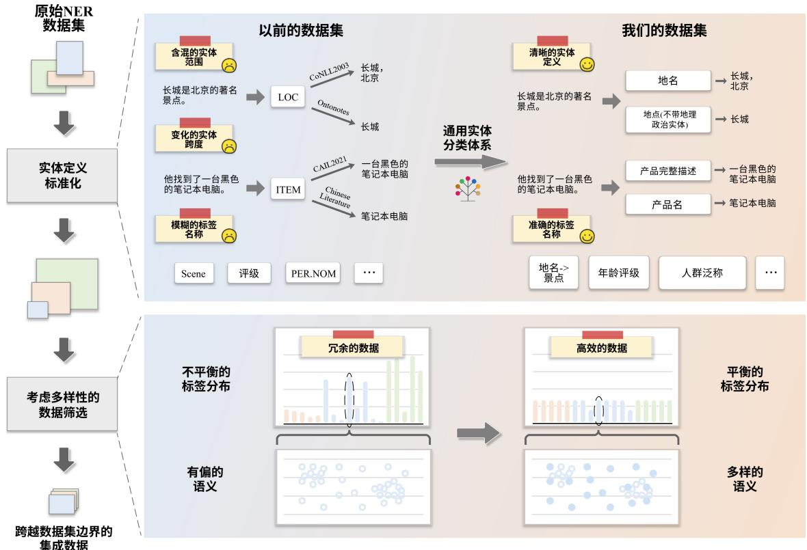  
图 5.1 适用于大模型开放领域命名实体识别任务 ${ \mathsf { B } } ^ { 2 }$ NERD 数据集构建过程[188]

# 3. 自动构建指令

手动构建指令数据代价高昂，需要大量的人力投入。因此，一些研究尝试寻找更高效的替代方法。具有代表性的工作如Self-Instruct[189]，利用大语言模型的生成能力自动构建指令。

Self-Instruct数据生成是一个迭代过程。如图5.2所示，它包含以下4个步骤。

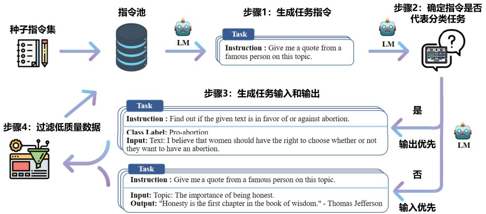  
图 5.2 Self-Instruct 数据生成过程[189]

# 步骤 1：生成任务指令

手动构建一个包含 175 个任务的小型指令数据集，称为种子指令集，用于初始化指令池。然后让模型以自举（Bootstrapping）的方式，利用指令池生成新任务的指令：每次从指令池中采样8条任务指令（其中6条来自人工编写的种子指令，2条是模型迭代生成的），将其拼接为上下文示例，引导预训练语言模型GPT-3生成更多的新任务的指令，直到模型自己停止生成，或达到模型长度限制，或是在单步中生成了过多示例（例如当出现了“Task 16”时）。本步骤所使用的提示如下所示：

Come up with a series of tasks:

Task 1: {instruction for existing task 1}

Task 2: {instruction for existing task 2}

Task 3: {instruction for existing task 3}

Task 4: {instruction for existing task 4}

Task 5: {instruction for existing task 5}

Task 6: {instruction for existing task 6}

Task 7: {instruction for existing task 7}

Task 8: {instruction for existing task 8}

Task 9:

# 步骤2：确定指令是否代表分类任务

由于后续对于分类任务和非分类任务有两种不同的处理方法，因此需要在本步骤对指令是否为分类任务进行判断，同样是利用拼接几个上下文示例的方法让模型自动判断任务类型是否是

分类。

# 步骤3：生成任务输入和输出

通过步骤 1，语言模型已经生成了面向新任务的指令，然而指令数据中还没有相应的输入和输出。本步骤将为此前生成的指令生成输入和输出，让指令数据变得完整。与之前的步骤相同，本步骤同样使用语境学习，使用来自其他任务的“指令”“输入”“输出”上下文示例做提示，预训练模型就可以为新任务生成输入–输出对。针对不同的任务类别，分别使用“输入优先”或“输出优先”方法：对于非分类任务，使用输入优先的方法，先根据任务产生输入，再根据任务指令和输入生成输出；而对于分类任务，为了避免模型过多地生成某些特定类别的输入（而忽略其他的类别），使用输出优先的方法，先产生所有可能的输出标签，再根据任务指令和输出，补充相应的输入。

“输入优先”提示模板如下所示：

Come up with examples for the following tasks. Try to generate multiple examples when possible. If $\leftrightarrow$ the task doesn't require additional input, you can generate the output directly.  
Task: Sort the given list ascendingly.  
Example 1  
List: [10, 92, 2, 5, -4, 92, 5, 101]  
Output: [-4, 2, 5, 5, 10, 92, 92, 101]  
Example 2  
List: [9.99, 10, -5, -1000, 5e6, 999]  
Output: [-1000, -5, 9.99, 10, 999, 5e6]  
Task: Converting 85 F to Celsius.  
Output: $85^{\circ}F = 29.44^{\circ}C$ Task: {Instruction for the target task}

“输出优先”提示模板如下所示：

Given the classification task definition and the class labels, generate an input that corresponds $\hookrightarrow$ to each of the class labels. If the task doesn't require input, just generate the correct $\hookrightarrow$ class label.

Task: Classify the sentiment of the sentence into positive, negative, or mixed.

Class label: mixed

Sentence: I enjoy the flavor of the restaurant but their service is too slow.

Class label: Positive

Sentence: I had a great day today. The weather was beautiful and I spent time with friends.

Class label: Negative

Sentence: I was really disappointed by the latest superhero movie. I would not recommend it.

Task: Tell me if the following email is a promotion email or not.

Class label: Promotion

Email: Check out our amazing new sale! We've got discounts on all of your favorite products.

Class label: Not Promotion

Email: We hope you are doing well. Let us know if you need any help.

Task: {Instruction for the target task}

# 步骤4：过滤低质量数据

为了保证数据的多样性，在将新生成的指令数据加入指令池之前，需要先衡量它和池中已有指令数据的相似度，只有当它和池中任何一条指令数据的ROUGE-L相似度都低于0.7时，才可能将其加入指令池。为保证数据的质量，还制定了一系列的启发式规则进行筛选：删除包含某些关键词（如“图片”）的指令数据、重复的指令数据、过长或过短的数据等。

使用Self-Instruct方法可以生成大量具有多样性的高质量数据。斯坦福的研究人员借助这种方法生成指令数据，在LLaMA模型上进行指令微调得到Alpaca模型，其在各项评估指标上都展现出了优异的性能。Alpaca所使用的指令数据集的示例如下所示：

instruction:

Describe the structure of a typical cell.

input:

output:

A typical cell consists of a membrane, cytoplasm, nucleus, nucleolus, mitochondria, and various   
$\hookrightarrow$ other organelles. The membrane encloses the other components and separates the cell from its   
$\hookrightarrow$ environment. The cytoplasm is a semi-liquid layer within the cell's membrane. It contains the   
$\hookrightarrow$ organelles and is the site of most biochemical reactions. The nucleus contains genetic   
$\hookrightarrow$ material, while the mitochondria is responsible for energy production. Other organelles   
$\hookrightarrow$ include endoplasmic reticulum and Golgi apparatus.

instruction:

Provide three possible solution to the following problem.

input:

How to reduce plastic waste?

output:

1. Reducing single-use plastic by using reusable grocery bags, food containers, and water bottles.   
2. Recycling plastic waste and using the recycled material to create new products.   
3. Educating people about the importance and benefits of reducing plastic waste.

instruction:

Paraphrase the following sentence and keep the same meaning.

input:

It is raining heavily outside.

output:

Rains are pouring down heavily outside.

# 5.1.3 指令微调数据评估与影响

指令微调数据的构造似乎并不困难，并且指令微调阶段所需要的训练数据量相对来说也比较少。根据 OpenAI 联合创始人 Andrej Karpathy 在微软 Build 2023 大会上对外公开的信息来看，构造通用大语言模型，在指令微调阶段也仅仅使用数万条数据。但是，指令微调数据直接影响指令微调的最终效果[42]，如何构造指令微调数据仍然有很多理论和实践问题亟待解决。接下来将从数据质量、数据多样性、数据对结果影响角度进行介绍。

# 1. 数据质量

指令数据的质量和多样性通常被认为是衡量指令数据的两个最重要的维度。文献 [190] 针对指令微调数据质量的影响进行了研究。由于指令微调数据包含输入和输出两个部分，因此在数据质量的度量中，文献 [190] 中将指令微调数据质量 $q ( x _ { i } )$ 分为两个部分: 指令质量 $q _ { I } ( x _ { i } )$ 和回复质量 $q _ { R } ( x _ { i } )$ 。指令微调数据质量可以形式化的表示为：

$$
q \left(x _ {i}\right) = f _ {q} \left(q _ {I} \left(x _ {i <   t}\right), q _ {R} \left(x _ {i \geqslant t}\right)\right) \tag {5.1}
$$

其中， $f _ { q }$ 是一个聚合函数，它显式或隐式地结合指令质量得分和响应质量得分。指令质量 $q _ { I }$ 可进一步细分为：1）清晰度 $q _ { I } ^ { C }$ ，用于衡量任务理解的难易程度；2）准确性 $q _ { I } ^ { A }$ ，用于衡量指令与预期任务的契合程度；3）明确性 $q _ { I } ^ { E }$ ，用于衡量指令对输出约束（例如格式和样式）的明确界定程度。$q _ { I } ( x _ { i } < t ) = g _ { I } ( q _ { I } ^ { C } ( x _ { i } < t ) , q _ { I } ^ { A } ( x _ { i } < t ) , q _ { I } ^ { E } ( x _ { i } < t ) )$ ，其中 $g _ { I }$ 也是聚合函数。同样的，对于回复的度量，其质量 $q _ { R }$ 可通过以下方式评估：1）正确性 $q _ { R } ^ { C }$ ，用于衡量回复是否正确回答了指令；2）连贯性 $q _ { R } ^ { H }$ ，用于衡量回复的逻辑一致性；3）相关性 $q _ { R } ^ { P }$ ，用于衡量回复与指令的相关程度。最终的回复质量可判定为 $q _ { R } ( x _ { i } \geqslant t ) = g _ { R } ( q _ { R } ^ { C } ( x _ { i } \geqslant t ) , q _ { R } ^ { H } ( x _ { i } \geqslant t ) , q _ { R } ^ { P } ( x _ { i } \geqslant t ) ) ^ { \Phi }$ ，其中 $g _ { R }$ 同样为聚合函数。需要注意的是，上述所有提及的质量度量组件仅为示例，并不是所有关于指令微调数据质量的衡量都要有细粒度评价值。

对数据质量的评价可以从人工设计的指标、基于模型的指标、大模型评分以及人工评分等类型进行设计。具体来说：

（1）人工设计的指标通常依据词汇、句法以及样本间语义相似性等语言分析方面来评估数据质量。每个指标都是凭借对所研究语料库的语言、领域和任务的先验知识，以经验性的方式设计而成。DQI[191] 就是典型的人工设计指标，包含了词汇量、样本间的N元语法频率及关系、样本间语义文本相似度、样本内单词相似度、样本内语义文本相似度、每个标签的N元语法频率以及样本间语义文本相似度等指标。  
（2）基于模型的指标利用训练过的模型来预测每个数据的质量。用于数据质量评判的模型可以与正在开发的语言模型有着相同或相似的架构，也可以采用完全不同的方式。困惑度（Perplexity）[192] 就是最常见的基于模型的评测指标。文献 [193] 就提出使用一个小的 GPT 类型的模型对数据进行过滤的方法。文献[194]则提出使用RoBERTa来对数据的一致性、相关性、合理性等方面进行评分。文献 [195] 使用 Qwen-1.8B 模型来过滤 UltraChat 数据集。  
（3）基于大模型评分的方法则是使用已经开发出来的能力较强的模型对指令微调数据进行评判。文献 [196–199] 等都是使用 GPT-3.5 或者 GPT-4 对数据进行评价。  
（4）人工评分则是采用人在环路（human-in-the-loop）的方法，直接使用人工对数据质量进行评判。OpenAssistant[200] 就是采用这种方式进行构建的，其实每个指令-响应对，标注人员要根据

三个维度对其进行分类：垃圾检测、指令遵循情况以及回答质量。回答质量评分又被细分为五个方面，包括质量、创造性、幽默性、礼貌性和无害性，并采用五点李克特量表进行打分。

文献 [190] 对各类数据质量评价方法的影响模型训练的效果进行了评测。通过对比不同数据质量评价方法，使用包括 LLaMA-7B、LLaMA2-7B、LLaMA2-13B 以及 Mistral-7B 等在内的模型进行训练，利用ARC、HellaSwag、MMLU、AlpacaEval等评测集合进行评价。从实验结果中可以看到，基于数据质量选择的方法即使在小规模数据情况下也能与使用全量训练的结果相匹配，并且优于从原始数据中随机选择子集的结果。比如在 Alpaca 数据集上，使用文献 [201] 提出的基于模型的 IFD 质量评价方法，仅选取 $5 \%$ 的数据，就能够在 ARC、HellaSwag 以及 AlpacaEval 等评测集合上超过使用全量数据进行训练的结果。这可以反映出，指令数据的质量对于指令微调的效果有重要影响。

# 2. 数据多样性

数据集的多样性通常认为是开发偏差更小、泛化能力更强的大语言模型的关键。针对指令数据多样性问题，文献[190]提出，多样性可以从两个维度来进行衡量，一个是每个样本的个体多样性（例如：词汇和语义丰富度），另外一个是整个数据集的总体多样性（例如：所覆盖的嵌入空间的体积）。在子集选择过程中，偏向于那些任务和领域属于长尾分布中少数类别的数据点。这种采样理念旨在保持或近似原始嵌入簇的范围。数据多样性评价函数 $q ( x _ { i } )$ 可以用形式化表示为：

$$
q \left(x _ {i}\right) = f _ {d} \left(q _ {L} \left(x _ {i}\right), q _ {S} \left(x _ {i}\right)\right) \tag {5.2}
$$

其中， $q _ { L }$ 描述词汇多样性， $q _ { S }$ 则描述语义多样性。通常情况下， $q _ { L }$ 往往会考察 $n$ 元语法、符号、单词以及序列的多样性。与之互补的是， $q _ { S }$ 强调语义多样性，即所选数据点的各种表示形式应在嵌入空间中实现最大化的多样性。可以依次或联合考虑词汇和语义多样性，以去除指令数据集中的任何重复内容。

文献 [190] 将数据多样性的评价分为人工设计的指标、基于模型的指标、基于几何的核心集采样（Geometry-based Coreset Sampling）、基于双层优化的核心集采样（Bilevel Optimization-basedCoreset Sampling）等类型，具体来说：

（1）人工设计的指标可以从数据集的构成、来源、领域、主题、标注者、词汇、语义等层面定义。类型-词元比率（Type-token Ratio，TTR）用来反映输入 $x _ { i }$ 中不同词元的比率。基于此，可以进一步构造 MTTRSS[202]、MSTTR[202]、MATTR[203] 等方法。此外，文献 [204–206] 则使用 N-Gram方法来评价文本的多样性。还可以使用BERT与K-近邻（K-Nearest Neighbor，KNN）相结合的方法在语义层面评价数据的多样性。使用 BERT 对句子进行语义向量表示，使用 KNN 对数据集进行聚类，进而评价数据多样性情况[207, 208]。  
（2）基于模型的指标与衡量模型质量的模型很类似，也是通过目标语言模型或代理语言模型来计算相关指数。数据集 $S$ 的多样性可以直观地定义为其中每个数据 $x _ { i }$ 的稀有性度量之和。因

此，可以使用熵（Entropy）相关的方法来估计这种稀有性。样本越不常见、种类越丰富，数据集的多样性就越高。在此基础上，Rényi Entropy[209]、Simpson’s Index (SI) [210, 211]、Vendi Score (VS)[212]等方法也都相继提出。文献[213]则提出了使用开放式标注（Open-Ended Tagging）方法来评价模型多样性的方法。使用GPT-4等模型，对数据集中的每个数据进行类型标注，但是并不指定类型集合。根据模型输出的类型标签来过滤低频数据和重复类型数据。

（3）基于几何的核心集采样（Geometry-based Coreset Sampling），与显式计算多样性相关指标不同，文献[214]等开始研究引入核心集采样方法来选择指令数据集，从而系统地考虑数据集多样性问题。具体来说，核心集采样旨在找到最具有信息量和多样性的子集，该子集能够最好地代表整个数据集，因此在对子集进行训练的语言模型上，可以实现与整个数据集上相当甚至更好的性能。这种思想所采用的直觉是，在嵌入空间中，相似的样本往往具有相似的属性，且多样性较低。因此，通过控制子集中任意两个样本之间的最小距离，可以有效地抑制冗余信息。具体来说，可以通过解决最小最大设施定位（Facility Location，FL）问题[215]，即在给定预算大小 $b$ 下从完整集$S$ 中选择子集 $S _ { b }$ ，使得 $S \backslash S _ { b }$ 中的样本与 $S _ { b }$ 中最近样本之间的最大距离最小化：

$$
\min  _ {S _ {b} \subset S, | S _ {b} | = b} \max  _ {x _ {i} \in S \backslash S _ {b}} \min  _ {x _ {j} \in S _ {b}} d \left(g \left(x _ {i}\right), g \left(x _ {j}\right)\right) \tag {5.3}
$$

该问题的求解是 NP 难问题，文献 [216] 提出的 K-Center Greedy 算法，文献 [217] 提出的 HerdingGreedy算法都可以用求解近似解。除此之外，还有DEITA[218] 结合数据质量和多样性的算法陆续提出。

（4）基于双层优化的核心集采样（Bilevel Optimization-based Coreset Sampling）则是将核心集采样问题转换为了双层优化（Bilevel Optimization）问题，它包含两个循环：1）外循环用于优化从 $S$ 中选择子集的硬掩码或软权重；2)内循环用于优化在 $S _ { b }$ 上的模型参数θ。可以将带有自监督语言建模损失的双层优化问题，按照如下方法形式化表示：

$$
S _ {b} = \arg \min  _ {S _ {b} ^ {\prime} \subset S, | S _ {b} | = b} \sum_ {x _ {i} \in S _ {b} ^ {\prime}, \theta = \theta^ {*}} N L L _ {i} ^ {A | Q} \tag {5.4}
$$

$$
s. t. \theta^ {*} = \arg \min  _ {\theta} \sum_ {x _ {i} \in S _ {b} ^ {\prime}} N L L _ {i} ^ {A | Q} \tag {5.5}
$$

$$
N L L _ {i} = \frac {1}{| x _ {i} |} \sum_ {j = 1} ^ {| x _ {i} |} - \log P \left(x _ {i (j)} \mid x _ {i (<   j)}; \theta\right) \tag {5.6}
$$

其中 $N L L _ { i }$ 表示针对每个数据 $x _ { i }$ 的负对数似然（Negative Log Likelihood），可以使用较小的模型进行学习，比如MPT $1 2 5 \mathbf { M } ^ { [ 2 1 9 ] }$ 等。

# 3. 数据对结果影响

大语言模型经过指令微调，可以完成多种类型的任务。指令微调数据对于模型结果有着重要的影响。本节分别以通用和问题任务为例，讨论指令微调数据与模型效果之间的关系。

针对通用任务，文献 [42] 提出了“表层对齐假设”（Superficial Alignment Hypothesis）。该假设指出，模型所具备的知识与能力，绝大部分是在预训练阶段积累和形成的，而指令微调的关键作用在于，引导模型掌握在与用户互动过程中应当运用何种格式的子分布。如果这一假设是正确的，进一步推导可得，人们可以用相当少的示例集便能对预训练语言模型实现充分且有效的微调。[220]。

为此，LIMA[42] 专门收集了一个数据集，该数据集涵盖了 1000 个提示以及与之对应的回复。在这个数据集中，输出（也就是回复）部分在风格方面是相互对齐的，不过输入（即提示）却呈现出多样化的特点。具体来说，LIMA 所期望获取的输出内容，是那种带有帮助性的、符合人工智能助手风格的内容。为了收集到这样的示例，研究人员从多个来源采样收集指令数据，包括高质量网络问答社区、Super-Natural Instructions[221] 指令集，以及大量的标注者手动编写的提示与回答。网络问答社区包含多个子版块，涵盖了不同的主题。Super-Natural Instructions 指令集也包含了多种多样的生成式任务。由于标注者各自编写的提示与回答具有天然的多样性，因此指令数据的多样性得到了很好的保障。

除此之外，LIMA研究人员做了大量的工作来保证指令数据的质量。首先，指令数据来源的可靠已经在一定程度上保证了它的质量。其次，LIMA 额外制定了一些规则进一步提高其质量。例如，对社区指令数据采样时选择排名靠前的优质回答，将所有的回答统一成AI助手的风格，删除过长或过短的回答，删除以第一人称开头的回答，删除包含链接的回答，标注者精心手动编写回答等等。

LLaMA 65B 模型使用 LIMA 数据进行训练后的结果如图5.3所示。Alpaca $6 5 \mathrm { B } ^ { [ 2 2 2 ] }$ 同样也是基于 LLaMa $6 5 \mathrm { B } ^ { [ 3 4 ] }$ 进行指令微调，但是它使用了 52,000 条指令微调数据。从实验结果上，可以看到使用 LIMA 仅使用 1000 条这样的指令数据，就可以媲美甚至超过指令数据是其几十倍的同等参数规模的其他模型。说明指令数据的质量和多样性是影响指令微调过程的关键因素。

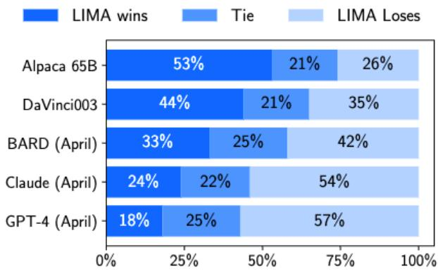  
图 5.3 LLaMA 65B 模型使用 LIMA[42] 训练效果对比

文献[190]研究也表明，在模型构建过程中，数据工程起着至关重要的作用，可以通过提升数据集的多样性，显著增强模型的泛化能力。训练数据多样性的提升，可以从多个方面着手，例如使用来自不同源头、具备不同特征且呈现不同分布的数据。此外，实验结果也说明，在数据选择环节，多样性有着不可忽视的作用。对比随机选择、均匀选择这两种常见方式，具备多样性的数据选择策略展现出明显优势。此外，相较于单纯聚焦于挑选高质量数据，若能将数据质量与多样性标准有机结合，模型也可以达到更好的效果[223]。

在问答任务方面，大语言模型的预训练依托于多样化的语料库来开展，这些语料库包含了多种类型的内容，并且涵盖了丰富的世界知识。大语言模型在预训练完成后，大量的知识被编码进了模型的参数之中。而通过监督微调的方式，就能够把这些已经编码进参数的知识有效地应用于问答任务里。然而，针对大语言模型的问答任务能力提升，存在着三个亟待解决的关键问题：（1）指令微调阶段，究竟需要多少数据量，才能使大语言模型掌握问答任务？（2）不同的指令微调数据集，会对大语言模型在问答任务上的表现产生怎样的影响？（3）不同的大语言模型在指令微调阶段，对于数据的需求方面存在着怎样的差异呢？

针对上述问题，文献[224]给出了详细的分析。研究人员使用了ENTITYQUESTIONS[225]，这是一个包含维基百科上 24 个不同话题知识的问答数据集。选择了其中 12 个与地点相关的原始训练集作为训练数据，将它们对应的测试集作为测试集，并将剩余12个话题的测试集作为领域外测试集。通过设计的多模板补全机制，能够可靠地评估大语言模型对不同知识的记忆程度。利用该机制，根据其知识记忆水平将训练和测试集均进行了5个级别的划分。

文献[224]中将训练数据划分为六个不同的数据量级别，从60个样本到完整数据集不等，并通过从 12 个话题中均匀抽样来构建训练集。实验结果表明，仅需 60 个训练样本的指令微调，就足以使大语言模型高效执行问答任务，并展现出强大的泛化能力。如图5.4所示。无论基础模型或记忆水平如何，大语言模型在使用较少训练样本时的表现优于使用 960 个或全部样本。增加训练

数据并未带来显著的性能提升，反而可能损害模型表现。

  
Train Data D 0 + D 1 ↓ Dtrain 2 + D 3 D 4   
(a) LLaMA-2-7B

  
(b) LLaMA-2-13B

  
(c) LLaMA-3-8B

  
(d) Qwen-2-7B   
图 5.4 大语言模型指令微调问答任务数据量分析

此外，上述结果也显示，使用不同记忆层次的数据进行微调，会导致模型在知识激活上有显著而规律性的差异。大语言模型在回答预训练中记忆较好的知识时表现得更准确。如果使用大量在预训练模型中没有准确记忆的数据进行指令微调，会使得模型问答能力快速大幅度下降。如图5.4所示，在LLaMA-2-7B模型上，使用960条在预训练模型中没有准确记忆的数据进行微调，问答准确率就会下降到 $30 \%$ 左右。LLaMA-2-13B、LLaMA-3-8B 以及 Qwen-2-7B 都存在非常类似的问题。这说明在指令微调中谨慎选择数据非常重要。同时，由于不同模型在预训练完成后，其知识记忆情况不同，这也导致需要针对不同模型构造不同的训练数据。这又进一步增大了指令微调阶段数据构造的难度。

# 5.1.4 指令微调训练策略

尽管从整体流程来看，指令微调的步骤并不繁杂，其训练代码甚至与预训练阶段的代码大体相同，然而，指令微调在模型获取各类关键能力的进程中却发挥着不可或缺的作用。此外，开源

模型内既存在仅完成预训练环节的模型，例如：Llama-3.1-70B、Qwen2.5-72B 等；也有经过指令微调的模型，例如：Llama-3.1-70B-Instruct、Qwen2.5-72B-Instruct 等。当着眼于特定场景下的多个任务效果提升需求时，一系列亟待解决的问题随之浮现：基于预训练模型进行训练还是基于经过指令微调的模型进行继续训练？所有任务融合在一起训练还是每个任务依次进行训练？不同的数据组成比例会对模型性能造成何种影响？这些训练策略如何影响模型性能的问题，文献 [226] 开展了较为系统探究工作。

为了简化研究难度，文献[226]中仅使用数学推理、代码生成和通用能力三大类任务研究数据量、数据组成比例、模型规模和指令微调训练策略等因素之间的关系。使用了三个基准评测，分别是用于数学推理的 GSM8K[227]、用于编程的 HumanEval[100] 和用于通用人类对齐的 MT-Bench[196]。在基础大模型方面使用了 LLaMA 7B 到 33B 不同参数规模进行了分析。探索了如图5.5中所示的四种不同的指令微调策略：多任务学习、顺序训练、混合顺序训练和双阶段混合微调。在指令微调训练数据方面，文献 [226] 分别使用了 GSM8K RFT[228]、Code Alpaca[229] 和 ShareGPT[41] 分别用于数据、编程和通用任务训练。


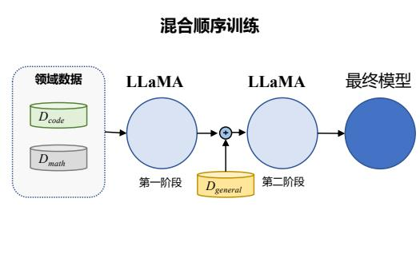

  
图 5.5 大语言模型指令微调训练策略[226]

如图5.5中所示，四种不同的指令微调策略的方式如下：（1）多任务学习：直接混合不同的指令微调数据源进行指令微调。如果我们将每个数据源视为不同的任务，那么这可以被视为多任务学习；（2）顺序训练：按顺序对每个数据集进行指令微调。按顺序对编程、数学推理和通用能力数据集进行训练。由于通用能力对于类人对齐最重要，将ShareGPT作为最后一个数据集；（3）混

合顺序训练：首先在领域数据集（代码、数学）上应用多任务学习，然后在通用能力数据集上进行指令微调；（4）双阶段混合微调：首先在领域数据集（代码、数学）上应用多任务学习，然后使用少量领域数据混合全量通用数据再进行指令微调。实验结果如表所示。

表 5.1 不同指令微调策略准确率对比[226]  

<table><tr><td rowspan="2">方法</td><td colspan="3">LLaMA - 7B</td><td colspan="3">LLaMA - 33B</td></tr><tr><td>GSM8K</td><td>HumanEval</td><td>MT-Bench</td><td>GSM8K</td><td>HumanEval</td><td>MT-Bench</td></tr><tr><td>仅通用数据</td><td>11.10%</td><td>10.42%</td><td>5.88%</td><td>26.06%</td><td>24.30%</td><td>6.63%</td></tr><tr><td>仅数学数据</td><td>49.10%</td><td>6.71%</td><td>2.53%</td><td>57.91%</td><td>15.5%</td><td>3.18%</td></tr><tr><td>仅编程数据</td><td>4.51%</td><td>18.40%</td><td>4.30%</td><td>6.06%</td><td>26.82%</td><td>4.18%</td></tr><tr><td>多任务学习</td><td>47.53%</td><td>14.63%</td><td>5.76%</td><td>56.69%</td><td>18.9%</td><td>6.07%</td></tr><tr><td>顺序训练</td><td>31.39%</td><td>15.85%</td><td>5.72%</td><td>47.27%</td><td>24.80%</td><td>6.73%</td></tr><tr><td>混合顺序</td><td>32.60%</td><td>15.24%</td><td>6.02%</td><td>44.24%</td><td>24.4%</td><td>6.43%</td></tr><tr><td>双阶段混合</td><td>41.92%</td><td>17.68%</td><td>6.08%</td><td>56.36%</td><td>25.00%</td><td>6.73%</td></tr></table>

表5.1给出了不同训练策略下数学推理、代码生成和通用任务性能。从结果中可以看到，多任务学习在这些策略中保持了领域任务的能力，但对通用能力的损害最大。顺序训练和混合顺序训练虽然保持了通用能力，但损失了太多领域任务能力。从这些结果中，可以看到多阶段训练的一个固有缺点是灾难性遗忘先验知识。双阶段混合训练，这里所采用的策略是在最后阶段融合了1/256的领域数据和全量的通用数据，LLaMA-7B数学推理准确率从 $3 2 . 6 \%$ 上升到 $4 1 . 9 2 \%$ ，代码生成准确率从 $1 5 . 2 4 \%$ 上升到 $1 7 . 6 8 \%$ ，相对于混合顺序和顺序训练策略都有显著改进。在最后的微调阶段混合领域任务数据对灾难性遗忘有显著缓解效果。

文献[226]研究还发现：（1）较大的模型通常在相同的数据量下表现出更优的性能，但是不同的任务随着模型参数增加而效果增长的速度完全不同；（2）数学推理和代码生成任务的效果随着训练数据量的增加而持续改进，而通用能力在大约在达到1000个样本后趋于平稳；（3）在数据有限的情况下，混合各类训练数据在一起可以在一定程度上增强所有任务效果，但在训练数据较为丰富时训练数据的混合则可能导致性能冲突；（4）指令微调数据量对效果的影响大于组成比例对效果的影响。详细的实验结果和分析可以参考文献[226]。

# 5.1.5 开源指令数据集

指令数据集对于指令微调非常重要，无论手工还是自动构建都需要花费一定的时间和成本。目前已经有一些开源指令数据集，本节将选择一些常用的指令数据集进行介绍。如果按照类型来划分，指令微调数据集可以分为两大类：通用指令微调数据集（General Instruction Fine-tuning Datasets）和特定领域指令微调数据集（Domain-specific Instruction Fine-tuning Datasets）。通用指令微调数据集涵盖了各种跨领域指令，旨在提高模型在通用任务上的效果以及指令遵循能力效果。特定领域

指令微调数据集中的指令是专门为特定领域设计的。例如，法律领域指令集包含法律考试、法律咨询、法律问答等任务的指令数据。

InstructGPT-sft[24] 就是典型的通用指令微调数据集，用于微调 InstructGPT 模型，在构建过程中将指令分为10个类别：生成、开放问答、头脑风暴、聊天、重写、总结、分类、其他、封闭问答以及提取。Firefly[230] 则进一步细化了指令类别，涵盖了 23 个类别。包括，故事生成、歌词生成、推理、数学、头脑风暴、封闭问答、开放问答、代码、提取、生成、重写、总结、翻译、角色扮演、社会规范等方面。2023年以来，针对大模型指令微调所使用的领域数据集也非常多，特别是医疗、法律、教育、数据、编程等方面。本节将按照通用和领域分别进行介绍。

表5.2 给出了部分开源通用指令微调数据集的汇总信息。表5.3 给出了部分开源领域指令微调数据集的汇总信息。更多数据集以及数据集描述可以参考文献[106]。

表 5.2 部分开源通用指令微调数据集的汇总信息  

<table><tr><td>指令数据集名称</td><td>发布单位</td><td>指令数据集规模</td><td>语言</td><td>是否公开</td></tr><tr><td>Alpaca Data</td><td>Standford Alpaca</td><td>5.2万条</td><td>英文</td><td>公开</td></tr><tr><td>Aya Collection</td><td>Cohere For AI等</td><td>5.13亿条</td><td>多语言</td><td>公开</td></tr><tr><td>Aya Dataset</td><td>Cohere For AI等</td><td>20.4万条</td><td>多语言</td><td>公开</td></tr><tr><td>BELLE</td><td>贝壳研究院</td><td>350万条</td><td>中文</td><td>公开</td></tr><tr><td>COIG</td><td>北京智源研究院</td><td>19.11万条</td><td>中文</td><td>公开</td></tr><tr><td>DialogStudio</td><td>Salesforce AI</td><td>87个数据集</td><td>多语言</td><td>公开</td></tr><tr><td>Dolly</td><td>Databricks</td><td>1.5万条</td><td>英语</td><td>公开</td></tr><tr><td>Firefly</td><td>YeungNLP</td><td>115万条</td><td>中文</td><td>公开</td></tr><tr><td>Flan 2022</td><td>Google Research</td><td>1836个数据集</td><td>多语言</td><td>部分</td></tr><tr><td>InstructionWild V2</td><td>新加坡国立大学</td><td>11万条</td><td>中英文</td><td>公开</td></tr><tr><td>LCCC</td><td>清华大学</td><td>1200万条</td><td>中文</td><td>公开</td></tr><tr><td>LMSYS-Chat-1M</td><td>加州大学伯克利分校</td><td>100万条</td><td>多语言</td><td>公开</td></tr><tr><td>MOSS 003 SFT</td><td>复旦大学</td><td>107万条</td><td>中英文</td><td>公开</td></tr><tr><td>OIG</td><td>LAION</td><td>388万条</td><td>多语言</td><td>公开</td></tr><tr><td>Phoenix-sft-data-v1</td><td>香港中文大学等</td><td>46.45万条</td><td>中英文</td><td>公开</td></tr><tr><td>PromptSource</td><td>布朗大学等</td><td>176个数据集</td><td>多语言</td><td>公开</td></tr><tr><td>RedGPT-Dataset-V1-CN</td><td>DA-Southampton</td><td>5万条</td><td>中文</td><td>部分</td></tr><tr><td>Self-Instruct</td><td>华盛顿大学</td><td>5.24万条</td><td>英文</td><td>公开</td></tr><tr><td>ShareChat</td><td>Sharechat</td><td>9万条</td><td>英文</td><td>公开</td></tr><tr><td>ShareGPT-Chinese-English</td><td>Sharechat</td><td>9万条</td><td>中英文</td><td>公开</td></tr><tr><td>Super-Natural Instructions</td><td>Allen Institute for AI</td><td>1616个数据集</td><td>多语言</td><td>公开</td></tr><tr><td>UltraChat</td><td>清华大学</td><td>147万条</td><td>中英文</td><td>公开</td></tr><tr><td>WizardLM_evol_instruct_V2</td><td>微软等</td><td>14.3万条</td><td>英文</td><td>公开</td></tr></table>

表 5.3 部分开源领域指令微调数据集的汇总信息  

<table><tr><td>指令数据集名称</td><td>发布单位</td><td>指令数据集规模(条)</td><td>领域</td><td>是否公开</td></tr><tr><td>ChatDoctor</td><td>德克萨斯大学西南医学中心</td><td>11.5万</td><td>医疗</td><td>公开</td></tr><tr><td>DISC-Med-SFT</td><td>复旦大学</td><td>46.49万</td><td>医疗</td><td>公开</td></tr><tr><td>Huatuo-26M</td><td>香港中文大学等</td><td>265万</td><td>医疗</td><td>公开</td></tr><tr><td>MedDialog</td><td>加州大学圣地亚哥分校</td><td>366万</td><td>医疗</td><td>公开</td></tr><tr><td>Medical Meadow</td><td>亚琛大学医院等</td><td>16万</td><td>医疗</td><td>公开</td></tr><tr><td>BELLE School Math</td><td>贝壳研究院</td><td>24.85万</td><td>数学</td><td>公开</td></tr><tr><td>Goat</td><td>新加坡国立大学</td><td>175万</td><td>数学</td><td>公开</td></tr><tr><td>OpenMathInstruct-1</td><td>NVIDIA</td><td>180万</td><td>数学</td><td>公开</td></tr><tr><td>Code Alpaca 20K</td><td>Sahil Chaudhary</td><td>2万</td><td>代码</td><td>公开</td></tr><tr><td>CodeContest</td><td>DeepMind</td><td>1.36万</td><td>代码</td><td>公开</td></tr><tr><td>CommitPackFT</td><td>Bigcode</td><td>70.21万</td><td>代码</td><td>公开</td></tr><tr><td>DISC-Law-SFT</td><td>复旦大学</td><td>40.3万</td><td>法律</td><td>部分</td></tr><tr><td>HanFei 1.0</td><td>中国科学研究院</td><td>25.5万</td><td>法律</td><td>公开</td></tr><tr><td>LawGPT</td><td>上海交通大学</td><td>10万</td><td>法律</td><td>公开</td></tr><tr><td>Lawyer LLaMA_sft</td><td>北京大学</td><td>20万</td><td>法律</td><td>公开</td></tr><tr><td>Child Chat Data</td><td>哈尔滨工业大学</td><td>5000</td><td>教育</td><td>公开</td></tr><tr><td>DISC-Fin-SFT</td><td>复旦大学</td><td>24.6万</td><td>金融</td><td>部分</td></tr><tr><td>Owl-Instruction</td><td>北京航空航天大学</td><td>1.8万</td><td>IT</td><td>公开</td></tr><tr><td>TaoLi Data</td><td>北京语言大学</td><td>8.8万</td><td>教育</td><td>公开</td></tr><tr><td>TransGPT-SFT</td><td>北京交通大学</td><td>5.8万</td><td>交通</td><td>公开</td></tr></table>

# 5.2 高效模型微调

由于大语言模型的参数量十分庞大，当将其应用到下游任务时，微调全部参数需要相当高的算力（全量微调的具体流程将在5.5节详细介绍）。为了节省成本，研究人员提出了多种参数高效（Parameter Efficient）的微调方法，旨在仅训练少量参数就使模型适应下游任务。本节将以 LoRA（Low-Rank Adaptation of Large Language Models，大语言模型的低秩适配器）[231] 为例，介绍高效模型微调方法。LoRA方法可以在缩减训练参数量和GPU显存占用的同时，使训练后的模型具有与全量微调相当的性能。

# 5.2.1 LoRA

文献 [232] 的研究表明，语言模型针对特定任务微调之后，权重矩阵通常具有很低的本征秩（Intrinsic Rank）。研究人员认为，参数更新量即便投影到较小的子空间中，也不会影响学习的有

效性[231]。因此，提出固定预训练模型参数不变，在原本权重矩阵旁路添加低秩矩阵的乘积作为可训练参数，用以模拟参数的变化量。具体来说，假设预训练权重为 $W _ { 0 } \in \mathbb { R } ^ { d \times k }$ ，可训练参数为$\Delta W = B A$ ，其中 $B \in \mathbb { R } ^ { d \times r }$ , $\pmb { A } \in \mathbb { R } ^ { r \times d }$ 。初始化时，矩阵 $\pmb { A }$ 通过高斯函数初始化，矩阵 $\textbf {  { B } }$ 为零初始化，使得训练开始之前旁路对原模型不造成影响，即参数变化量为0。对于该权重的输入 $_ { \textbf { \em x } }$ 来说，输出如下：

$$
\boldsymbol {h} = \boldsymbol {W} _ {0} \boldsymbol {x} + \Delta \boldsymbol {W} \boldsymbol {x} = \boldsymbol {W} _ {0} \boldsymbol {x} + \boldsymbol {B} \boldsymbol {A} \boldsymbol {x} \tag {5.7}
$$

LoRA 算法结构如图5.6 所示。

除LoRA外，也有其他高效微调方法，如微调适配器（Adapter）或前缀微调（Prefix Tuning）。微调适配器分别在 Transformer 层中的自注意力模块与多层感知（Multilayer Perceptron，MLP）模块之间，以及 MLP 模块与残差连接之间添加适配器层（Adapter Layer）作为可训练参数[233]，该方法及其变体会增加网络的深度，从而在模型推理时带来额外的时间开销。当没有使用模型或数据并行时，这种开销会较为明显。而对于使用 LoRA 的模型来说，由于可以将原权重与训练后权重合并，即 $\pmb { W } = \pmb { W } _ { 0 } + \pmb { B } \pmb { A }$ ，因此在推理时不存在额外的开销。前缀微调是指在输入序列前缀添加连续可微的软提示作为可训练参数。由于模型可接受的最大输入长度有限，随着软提示的参数量增多，实际输入序列的最大长度也会相应减小，影响模型性能。这使得前缀微调的模型性能并非随着可训练参数量单调上升。在文献[231]的实验中，使用LoRA方法训练的GPT-2、GPT-3模型在相近数量的可训练参数下，性能均优于或相当于使用上述两种微调方法。

  
图 5.6 LoRA 算法结构[231]

peft库中含有包括LoRA在内的多种高效微调方法，且与transformers库兼容。使用示例如下所示。其中，lora_alpha（α）表示放缩系数。表示参数更新量的 $\Delta \mathbf { W }$ 与 $\alpha / r$ 相乘后再与原本的模型参数相加。

from transformers import AutoModelForSeq2SeqLM   
from peft import get_peft_config, get_peft_model, LoraConfig, TaskType   
model_name_or_path $=$ "bigscience/mt0-large"   
tokenizer_name_or_path $=$ "bigscience/mt0-large"   
peft_config $=$ LoraConfig( task_type $\equiv$ TaskType.SEQ_2_SEQ_LM，inference_mode $\equiv$ False，r=8，lora_alpha=32，lora_dropout=0.1   
）   
model $=$ AutoModelForSeq2SeqLM.from_pretrained(model_name_or_path)   
model $=$ get_peft_model(model，peft_config)

接下来介绍peft库对LoRA的实现，也就是上述代码中get_peft_model函数的功能。该函数封装了基础模型并得到一个PeftModel类的模型。如果使用LoRA微调方法，则会得到一个LoraModel类的模型。

```python
class LoraModel(torch(nnModule):
    ""
    从预训练的Transformer模型创建Lora模型
Args:
    model([\~transformers.PreTrainedModel]): 要适配的模型
    config([\`LoraConfig]): Lora模型的配置
Returns:
    `torch(nnModule): Lora模型**
**Attributes**: 
    - **model**([\~transformers.PreTrainedModel]): -- 要适配的模型
    - **peft_config**([\`LoraConfig]): Lora模型的配置
    ""
def __init__(self, model, config, adapter_name):
    super().__init__()
    self.model = model
    self.forward = self.model.forward
    self.peft_config = config
    self.add_adapter(adapter_name, self.peft_config[adapter_name])
# Transformer具有`.config`属性，后续假定存在这个属性
if not hasattr(self, "config"):
    self.config = {"model_type": "custom"}
def add_adapter(self, adapter_name, config=None):
    if config is not None:
        model_config = getattr(self.model, "config", {"model_type": "custom'})
        if hasattr(model_config, "to_dict():
            model_config = model_config.to_dict()
            config = self._prepare_lora_config(config, model_config)
            self.peft_config[adapter_name] = config
            self._find_and_replace(adapter_name)
        if len(self.peft_config) > 1 and self.peft_config[adapter_name].bias != "none":
            raise ValueError(
                "LoraModel supports only 1 adapter with bias. When using multiple adapters, \
set bias to 'none' for all adapters."
            )
        mark_only_lora_as_trainable(self.model, self.peft_config[adapter_name].bias)
        if self.peft_config[adapter_name].inference_mode:
            _freeze_adapter(self.model, adapter_name) 
```

LoraModel 类通过 add_adapter 方法添加 LoRA 层。该方法包括 _find_and_replace 和 mark_only_lora_as_trainabl个主要函数。mark_only_lora_as_trainable 的作用是仅将 Lora 参数设为可训练的，其余参数冻结；

_find_and_replace 会根据 config 中的参数从基础模型的 named_parameters 中找出包含指定名称的模块（默认为“q”“v”，即注意力模块的 $Q$ 和 $V$ 矩阵），创建一个新的自定义类Linear模块，并替换原来的。

```python
class Linear(nn.Linear, LoraLayer):
    # Lora实现在一个密集层中
    def __init__(self, adapter_name: str, in_features: int, out_features: int, r: int = 0, lora_alpha: int = 1, lora_dropout: float = 0.0, fan_in_fan_out: bool = False, is_target_conv_1d_layer: bool = False, **kwargs,):
        init_loraweights = kwargs.pop("init_loraweights", True)
        nn.Linear.__init__(self, in_features, out_features, **kwargs) LoraLayer.__init__(self, in_features=in_features, out_features=out_features) # 冻结预训练的权重矩阵
        self.weightrequires_grad = False
        self.fan_in_fan_out = fan_in_fan_out
        if fan_in_fan_out:
            self.weight.data = self.weight.data.T
        nn.Linear.reset_parameters(self)
        self.update_layer(adaptor_name, r, lora_alpha, lora_dropout, init_loraweights)
        self.active_adapter = adapter_name
        self.is_target_conv_1d_layer = is_target_conv_1d_layer 
```

创建 Linear 模块时，会将原本模型的相应权重赋给其中的 nn.Linear 部分。另外的 LoraLayer部分则是 Lora 层，在 update_adapter 中初始化。Linear 类的 forward 方法完成了对 LoRA 计算逻辑的实现。这里的 self.scaling[self.active_adapter] 即 lora_alpha/r。

```python
result += (
self.lora_B[self.active_adapter]
self.lora_A[self.active_adapter(self.lora_dropout[self.active_adapter](x))
    selfscaling[self.active_adapter]
) 
```

在文献[231]给出的实验中，对于GPT-3模型，当 $r = 4$ 且仅在注意力模块的 $Q$ 矩阵和 $V$ 矩阵添加旁路时，保存的检查点大小减小为原来的1/10000（从原本的350GB变为35MB），训练时GPU 显存占用从原本的1.2TB变为350GB，训练速度相较全量参数微调提高了 $2 5 \%$ 。

# 5.2.2 LoRA 的变体

LoRA算法不仅在RoBERTa、DeBERTa、GPT-3等大语言模型上取得了很好的效果，还应用到了 Stable Diffusion 等视觉大模型中，可以用小成本达到微调大语言模型的目的。LoRA 算法引起了企业界和研究界的广泛关注，研究人员又先后提出了 AdaLoRA[234]、QLoRA[235]、IncreLoRA[236]及 LoRA-FA[237] 等算法。本节将详细介绍其中的 AdaLoRA 和 QLoRA 两种算法。

# 1. AdaLoRA

LoRA算法给所有的低秩矩阵指定了唯一的秩，从而忽略了不同模块、不同层的参数对于微调特定任务的重要性差异。因此，文献 [238] 提出了 AdaLoRA（Adaptive Budget Allocation for Parameter-Efficient Fine-Tuning）算法，在微调过程中根据各权重矩阵对下游任务的重要性动态调整秩的大小，用以进一步减少可训练参数量，同时保持或提高性能。

为了达到降秩且最小化目标矩阵与原矩阵差异的目的，常用的方法是对原矩阵进行奇异值分解并裁去较小的奇异值。然而，对于大语言模型来说，在训练过程中迭代地计算那些高维权重矩阵的奇异值是代价高昂的。因此，AdaLoRA由对可训练参数 $\Delta \mathbf { W }$ 进行奇异值分解，改为令 $\Delta W = P T Q$ （P、Γ、 $Q$ 为可训练参数）来近似该操作。其中 $\boldsymbol { r }$ 为对角矩阵，可用一维向量表示； $_ { P }$ 和 $Q$ 应近似为酉矩阵，需在损失函数中添加以下正则化项：

$$
R (\boldsymbol {P}, \boldsymbol {Q}) = \| \boldsymbol {P} ^ {\top} \boldsymbol {P} - \boldsymbol {I} \| _ {F} ^ {2} + \| \boldsymbol {Q} ^ {\top} \boldsymbol {Q} - \boldsymbol {I} \| _ {F} ^ {2} \tag {5.8}
$$

通过梯度回传更新参数，得到权重矩阵及其奇异值分解的近似解，然后为每一组奇异值及其奇异向量 $\{ P _ { k , * i } , \lambda _ { k , i } , Q _ { k , i * } \}$ 计算重要性分数 $S _ { k , i } ^ { ( t ) }$ 。其中，下标 $k$ 是指该奇异值或奇异向量属于第$k$ 个权重矩阵，上标 $t$ 指训练轮次为第 $t$ 轮。接下来，根据所有组的重要性分数排序来裁剪权重矩阵以达到降秩的目的。有两种方法定义该矩阵的重要程度。一种方法是直接令重要性分数等于奇异值，另一种方法是用下式计算参数敏感性：

$$
I \left(w _ {i j}\right) = \left| w _ {i j} \bigtriangledown_ {w _ {i j}} \mathcal {L} \right| \tag {5.9}
$$

其中， $w _ { i j }$ 表示可训练参数。该式估计了某个参数变为0后，损失函数值的变化。因此， $I ( w _ { i j } )$ 越大，表示模型对该参数越敏感，这个参数也就越应该被保留。然而，根据文献 [239] 中的实验结果，该敏感性度量受限于小批量采样带来的高方差和不确定性，因此并不完全可靠。相应地，文献[239]中提出了一种新的方案来平滑化敏感性，以及量化其不确定性。

$$
\bar {I} ^ {(t)} \left(w _ {i j}\right) = \beta_ {1} \bar {I} ^ {(t - 1)} + \left(1 - \beta_ {1}\right) I ^ {(t)} \left(w _ {i j}\right) \tag {5.10}
$$

$$
\bar {U} ^ {(t)} \left(w _ {i j}\right) = \beta_ {2} \bar {U} ^ {(t - 1)} + (1 - \beta_ {2}) \left| I ^ {(t)} \left(w _ {i j}\right) - \bar {I} ^ {(t)} \left(w _ {i j}\right) \right| \tag {5.11}
$$

$$
s ^ {(t)} \left(w _ {i j}\right) = \bar {I} ^ {(t)} \bar {U} ^ {(t)} \tag {5.12}
$$

通过实验对上述几种重要性定义方法进行对比，发现由式 (5.11) 计算得到的重要性分数，即平滑后的参数敏感性，效果最优。故最终的重要性分数计算式为

$$
S _ {k, i} = s \left(\lambda_ {k, i}\right) + \frac {1}{d _ {1}} \sum_ {j = 1} ^ {d _ {1}} s \left(P _ {k, j i}\right) + \frac {1}{d _ {2}} \sum_ {j = 1} ^ {d _ {2}} s \left(Q _ {k, i j}\right) \tag {5.13}
$$

# 2. QLoRA

QLoRA[235] 并没有对LoRA的逻辑做出修改，而是通过将预训练模型量化为4-bit节省计算开销。QLoRA 可以将有 650 亿个参数的模型在一块 48GB GPU 上微调并保持原本 16-bit 微调的性能。QLoRA 的主要技术为：

（1）新的数据类型 4-bit NormalFloat（NF4）。  
（2）双重量化（Double Quantization）。  
（3）分页优化器（Paged Optimizer）。分页优化器指在训练过程中显存不足时自动将优化器状态移至内存，在需要更新优化器状态时再加载回来。

接下来将具体介绍QLoRA 中的量化过程。

NF4 基于分位数量化（Quantile Quantization）构建而成，该量化方法使原数据经量化后，每个量化区间中的值的数量相同。具体做法是先对数据进行排序，然后找出所有数据中每个 $k$ 分位的值，这些值组成了所需的数据类型（Data Type）。对于4-bit来说， $k = 2 ^ { 4 } = 1 6$ 。然而，该过程的计算代价对于大语言模型的参数来说是不可接受的。考虑到预训练模型参数通常呈均值为 0 的高斯分布，因此可以先对一个标准高斯分布 $N ( 0 , 1 )$ 按上述方法得到其4-bit分位数量化数据类型，并将该数据类型的值缩放至[−1,1]。随后，将参数也缩放至 $[ - 1 , 1 ]$ 即可按通常方法进行量化。该方法存在的一个问题是数据类型中缺少对 0 的表征，而 0 在模型参数中有表示填充、掩码等特殊含义。文献[235]中对此做出改进，分别对标准正态分布的非负和非正部分取分位数并取它们的并集，组合成最终的数据类型NF4。

由于 QLoRA 的量化过程涉及放缩操作，当参数中出现一些离群点时会将其他值压缩在较小

的区间内。因此文献 [235] 中提出分块量化，以减小离群点的影响范围。为了恢复量化后的数据，需要存储每一块数据的放缩系数。如果用32位来存储放缩系数，块的大小设为64，放缩系数的存储将为每一个参数平均带来 $\frac { 3 2 } { 6 4 } = 0 . 5$ 比特的额外开销，即 $1 2 . 5 \%$ 的额外显存耗用。因此，需进一步对这些放缩系数进行量化，即双重量化。在QLoRA中，每256个放缩系数会进行一次8比特量化，最终每个参数的额外开销由原本的 0.5 比特变为 $\textstyle { \frac { 8 } { 6 4 } } + { \frac { 3 2 / 2 5 6 } { 6 4 } } = 0 . 1 2 7$ 比特。

# 5.3 模型上下文窗口扩展

随着更多长文本建模需求的出现，多轮对话、长文档摘要等任务在实际应用中越来越多，这些任务需要模型能够更好地处理超出常规上下文窗口大小的文本内容。尽管当前的大语言模型在处理短文本方面表现出色，但在支持长文本建模方面仍存在一些挑战，这些挑战包括预定义的上下文窗口大小限制等。以 MetaAI 在 2023 年 2 月开源的 LLaMA 模型[34] 为例，其规定输入文本的词元数量不得超过 2048 个。这会限制模型对长文本的理解和表达能力。当涉及长时间对话或长文档摘要时，传统的上下文窗口大小可能无法捕捉到全局语境，从而导致信息丢失或模糊的建模结果。

为了更好地满足长文本需求，有必要探索如何扩展现有的大语言模型，使其能够有效地处理更大范围的上下文信息。具体来说，扩展语言模型的长文本建模能力主要有以下方法。

增加上下文窗口的微调：采用直接的方式，即通过使用一个更大的上下文窗口来微调现有的预训练Transformer，以适应长文本建模需求。  
位置编码：改进的位置编码，如ALiBi[240]、 $\mathrm { L e X } ^ { [ 2 4 1 ] }$ 等能够实现一定程度上的长度外推。这意味着它们可以在小的上下文窗口上进行训练，在大的上下文窗口上进行推理。  
• 插值法：将超出上下文窗口的位置编码通过插值法压缩到预训练的上下文窗口中。

文献[242]指出，采用增大上下文窗口微调的方式训练的模型，对上下文的适应速度较慢。在经过了超过10000个批次的训练后，模型上下文窗口只有小幅度的增长，从2048增加到2560。实验结果显示，这种朴素的方法在扩展到更大的上下文窗口时效率较低。因此，本节中主要介绍改进的位置编码和插值法。

# 5.3.1 具有外推能力的位置编码

位置编码的长度外推能力来源于位置编码中表征相对位置信息的部分，相对位置信息不同于绝对位置信息，对于训练时的依赖较少。位置编码的研究一直是基于Transformer结构模型的重点。2017 年 Transformer 结构[12] 提出时，介绍了两种位置编码，一种是 Naive Learned Position Embedding，也就是 BERT 模型中使用的位置编码；另一种是 Sinusoidal Position Embedding，通过正弦函数为每个位置向量提供一种独特的编码。这两种最初的形式都是绝对位置编码的形式，依赖于训练过程中的上下文窗口大小，在推理时基本不具有外推能力。随后，2021年提出的RoPE[48] 在一定程度上缓解了绝对位置编码外推能力弱的问题。关于RoPE位置编码的具体细节，已在2.3.1节进行了介绍，这里不再赘述。后续在 T5 架构[243] 中，研究人员又提出了 T5 Bias Position Embedding，直

接在Attention Map上操作，对于查询和键之间的不同距离，模型会学习一个偏置的标量值，将其加在注意力分数上，并在每一层都进行此操作，从而学习一个相对位置的编码信息。这种相对位置编码的外推性能较好，可以在512的训练窗口上外推600左右的长度。

# ALiBi

受到T5 Bias的启发，Press等人提出了ALiBi[240] 算法，这是一种预定义的相对位置编码。ALiBi并不在Embedding层添加位置编码，而是在Softmax的结果后添加一个静态的不可学习的偏置项：

$$
\operatorname {S o f t m a x} \left(\boldsymbol {q} _ {i} \boldsymbol {K} ^ {\top} + m \cdot [ - (i - 1), \dots , - 2, - 1, 0 ]\right) \tag {5.14}
$$

其中 $m$ 是对不同注意力头设置的斜率值，对于具有 8 个注意力头的模型，斜率定义为几何序列11, 12, · · · , 18，对于具有更多注意力头的模型，如 16 个注意力头的模型，可以使用几何平均对之 $\textstyle { \frac { 1 } { 2 ^ { 1 } } } , { \frac { 1 } { 2 ^ { 2 } } } , \cdots , { \frac { 1 } { 2 ^ { 8 } } }$ $\textstyle { \frac { 1 } { 2 ^ { 1 } } }$ 前的 8 个斜率进行插值，从而变成 $\frac { 1 } { 2 ^ { 0 . 5 } }$ , $\textstyle { \frac { 1 } { 2 ^ { 1 } } }$ , $\frac { 1 } { 2 ^ { 1 . 5 } }$ , · · · , 128 。通常情况下，对于 $n$ 个注意头，斜率值是从 $2 ^ { \frac { - 8 } { n } }$ 开始，并使用相同的值作为其比率。ALiBi的计算过程如图5.7所示。

  
图 5.7 ALiBi 计算过程示例

ALiBi对最近性具有归纳偏差，它对远程查询–键对之间的注意力分数进行惩罚，随着键和查询之间的距离增加，惩罚也增加。不同的注意力头以不同的速率增加其惩罚，这取决于斜率幅度。实验证明，这组斜率参数适用于各种文本领域和模型尺寸，不需要在新的数据和架构上调整斜率值。

# 5.3.2 插值法

不同的预训练大语言模型使用不同的位置编码，修改位置编码意味着重新训练，因此对于已训练的模型，通过修改位置编码扩展上下文窗口大小的适用性仍然有限。为了不改变模型架构而直接扩展大语言模型上下文窗口大小，文献[242]提出了位置插值法，使现有的预训练大语言模型（包括LLaMA、Falcon、Baichuan等）能直接扩展上下文窗口。其关键思想是，直接缩小位置索引，使最大位置索引与预训练阶段的上下文窗口限制相匹配。线性插值法的示意图如图5.8所示。

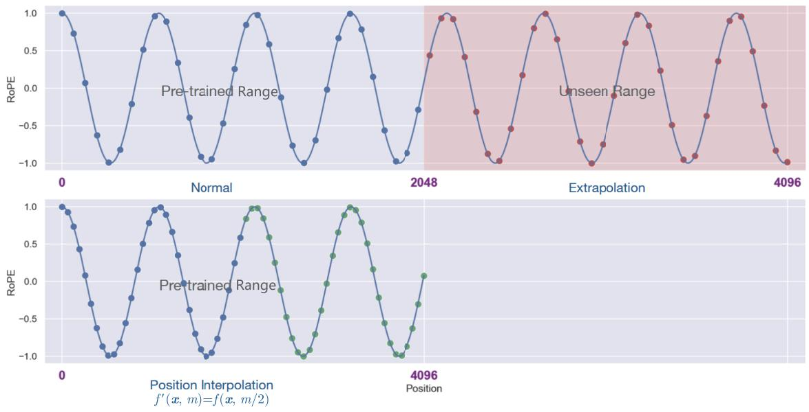  
图 5.8 线性插值法的示意图[242]

给定一个位置索引 $m \in [ 0 , c )$ 和一个嵌入向量 $\pmb { x } : = [ x _ { 0 } , x _ { 1 } , \cdots , x _ { d - 1 } ]$ ，其中 $d$ 是注意力头的维度，RoPE位置编码定义为如下函数：

$$
f (\boldsymbol {x}, m) = \left[ \left(x _ {0} + \mathrm {i} x _ {1}\right) \mathrm {e} ^ {\mathrm {i} m \theta_ {0}}, \left(x _ {2} + \mathrm {i} x _ {3}\right) \mathrm {e} ^ {\mathrm {i} m \theta_ {1}}, \dots , \left(x _ {d - 2} + \mathrm {i} x _ {d - 1}\right) \mathrm {e} ^ {\mathrm {i} m \theta_ {d / 2 - 1}} \right] ^ {\top} \tag {5.15}
$$

其中， $\mathrm { i } : = \sqrt { - 1 }$ 是虚数单位， $\theta _ { j } = 1 0 0 0 0 ^ { - 2 j / d }$ 。虽然 RoPE 位置编码所得的注意力分数只依赖于相对位置，但是其外推能力并不理想，当直接扩展上下文窗口时，模型的困惑度会飙升。具体来说，RoPE应用于注意力分数可以得到以下结果：

$$
\begin{array}{l} a (m, n) = \operatorname {R e} \langle f (\boldsymbol {q}, m), f (\boldsymbol {k}, m) \rangle \\ d / 2 - 1 \\ = \sum_ {j = 0} \left(q _ {2 j} + \mathrm {i} q _ {2 j + 1}\right) \left(k _ {2 j} - \mathrm {i} k _ {2 j + 1}\right) \cos ((m - n) \theta_ {j}) \tag {5.16} \\ + \left(q _ {2 j} + \mathrm {i} q _ {2 j + 1}\right) \left(k _ {2 j} - \mathrm {i} k _ {2 j + 1}\right) \sin ((m - n) \theta_ {j}) \\ = a (m - n) \\ \end{array}
$$

将所有三角函数视为基函数 $\phi _ { j } ( s ) : = \mathrm { e } ^ { \mathrm { i } s \theta _ { j } }$ ，可以将式 (5.16) 展开为

$$
a (s) = \operatorname {R e} \left[ \sum_ {j = 0} ^ {d / 2 - 1} h _ {j} \mathrm {e} ^ {\mathrm {i} s \theta_ {j}} \right] \tag {5.17}
$$

其中 $s$ 是查询和键之间的相对距离， $h _ { j } : = ( q _ { 2 j } + \mathrm { i } q _ { 2 j + 1 } ) ( k _ { 2 j } - \mathrm { i } k _ { 2 j + 1 } )$ 是取决于查询和键的复系数。作为基函数的三角函数具有非常强的拟合能力，基本上可以拟合任何函数，因此在不训练的情况下，对于预训练2048的上下文窗口总会存在与[0,2048]中的小函数值相对应但在[0,2048]之外的区域中大很多的系数 $h _ { j }$ （键和查询），如图5.9(a)所示，但线性插值法得到的结果平滑且数值稳定，如图5.9(b)所示。

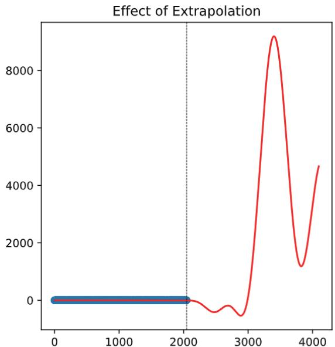  
(a) Positional difference s

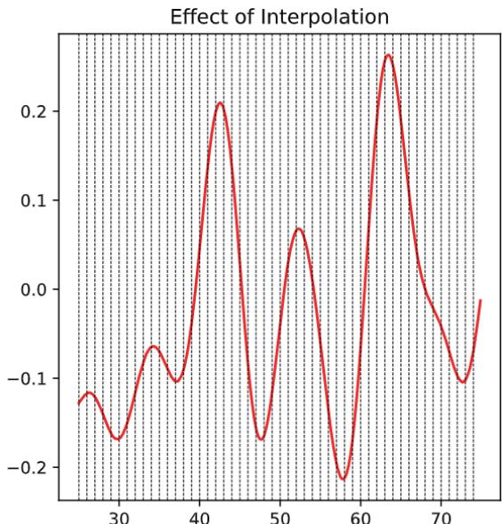  
(b) Positional difference s   
图 5.9 不同相对距离下外推法和线性插值法的注意力分数比较。

因此，可以利用位置插值修改式(5.15)的位置编码函数：

$$
f ^ {\prime} (\boldsymbol {x}, m) = f \left(\boldsymbol {x}, \frac {m L}{L ^ {\prime}}\right) \tag {5.18}
$$

这种方法对齐了位置索引和相对距离的范围，减小了上下文窗口扩展对注意力得分计算的影响，使得模型更容易适应。线性插值法具有良好的数值稳定性（具体推导请参考文献 [242]），并且不需要修改模型架构，只需要少量微调（例如，在 pile 数据集上进行 1000 步的微调）即可将 LLaMA

的上下文窗口扩展到32768。

位置插值通过小代价的微调显著扩展 LLaMA 模型的上下文窗口，在保持原有扩展模型内任务能力的基础上，显著增加模型对长文本的建模能力。另外，通过位置插值扩展的模型可以充分重用现有的预训练大语言模型和优化方法，这在实际应用中具有很大吸引力。

# 5.4 DeepSpeed-Chat SFT 实践

ChatGPT 整体的训练过程复杂，虽然基于 DeepSpeed 可以通过单机多卡、多机多卡、流水线并行等操作来训练和微调大语言模型，但是没有端到端的基于人类反馈机制的强化学习的规模化系统，仍然会造成训练类 ChatGPT 系统非常困难。DeepSpeed-Chat[244] 是微软于 2023 年 4 月发布的基于 DeepSpeed 用于训练类 ChatGPT 模型的开发工具。基于 DeepSpeed-Chat 训练类 ChatGPT对话模型的步骤框架如图5.10所示，包含以下三个步骤。

（1）指令微调：使用精选的人类回答来微调预训练语言模型以应对各种查询。  
（2）奖励模型微调：使用一个包含人类对同一查询的多个答案打分的数据集来训练一个独立的奖励模型。  
（3）基于人类反馈的强化学习（Reinforcement Learning from Human Feedback，RLHF）训练：利用近端策略优化（Proximal Policy Optimization，PPO）算法，根据奖励模型的奖励反馈进一步微调SFT 模型。

本节只针对步骤（1）指令微调的实践进行介绍，对于奖励模型微调和RLHF训练的实践会在后续对应章节中详细介绍。

  
图 5.10 基于 DeepSpeed-Chat 训练类 ChatGPT 对话模型的三个步骤[244]

DeepSpeed-Chat 具有以下三大核心功能。

（1）易用的类ChatGPT模型的训练和强化推理：只需要一个脚本就可以实现多个训练步骤，包括使用 HuggingFace 预训练的模型，使用 InstructGPT 训练的所有三个步骤构建类 ChatGPT 模型。此外，还提供了一个易于使用的推理API，用于用户在模型训练后进行对话式交互性测试。  
（2）DeepSpeed-RLHF 管道：DeepSpeed-RLHF 复现了 InstructGPT[24] 论文中的训练模式，包括指令微调、奖励模型微调和基于人类反馈的强化学习三个步骤。此外，还提供了数据抽象和混合功能，以支持用户使用多个不同来源的数据源进行训练。  
（3）DeepSpeed-RLHF 系统：将 DeepSpeed 的训练能力（Training Engine）和推理能力（InferenceEngine）整合到统一的混合引擎（DeepSpeed Hybrid Engine，DeepSpeed-HE）中用于 RLHF 训练。DeepSpeed-HE 能够无缝地在推理和训练模式之间切换，使其能够利用来自 DeepSpeed-Inference的各种优化。

# 5.4.1 代码结构

DeepSpeed-Chat 代码仓库位于微软官方 GitHub 仓库 DeepSpeedExamples/applications/DeepSpeed-Chat 路径下。在进行实际应用前，需要先对官方代码有一个全局的了解。DeepSpeed-Chat 代码的结构如下所示：

```txt
- DeepSpeed-Chat
- inference # 模型测试、推理
- training # 训练脚本
- step1_supervised_finetuning # 步骤一，指令微调
- training_log_output # 训练日志输出
- evaluationScripts # 监督微调模型评测
- trainingScripts # 模型训练脚本
- main.py # 训练脚本
- prompt_eval.py # 评测脚本
- README.md # 说明文档
- step2 Reward_model_finetuning # 步骤二，奖励模型微调
- 省略
- step3_rlhf_finetuning # 步骤三，RLHF训练
- 省略
- utils # 模型训练与评价的相关函数库
- data # 数据处理相关代码
- model # 模型相关文件
- module # 其他组件
- ds_utils.py # DeepSpeed配置相关
- utils.py # 其他相关函数
- train.py # 三步骤集成训练入口
```

当需要完整微调一个模型时（包含所有步骤），可以直接运行train.py程序。训练中主要调整如下参数。

--step训练步骤参数，表示运行哪个步骤，可选参数为1、2、3。本节介绍的内容只使用步骤一，指令微调。  
• --deployment-type 表示分布式训练模型的参数，分别为单卡 single_gpu、单机多卡 sin-gle_node 和多机多卡 multi_node。  
--actor-model 表示要训练的模型，默认参数为训练 OPT 的 "1.3b"、"6.7b"、"13b"、"66b"等各个参数量的模型。  
• --reward-model 表示要训练的奖励模型，默认参数为 OPT 的 $" 3 5 0 \mathrm { m } "$ 参数量的模型。  
• --actor-zero-stage 表示指令微调的 DeepSpeed 分布式训练配置。  
• --reward-zero-stage 表示训练奖励的 DeepSpeed 分布式训练配置。  
• --output-dir表示训练过程和结果的输出路径。

在实践中，可以直接在代码根目录下输入命令python3 train.py --step 1 2 --actor-model 1.3b --reward-model $3 5 0 \mathrm { m }$ ，表示通过 train.py 脚本进行步骤一和步骤二的训练，分别对OPT-1.3b模型进行监督微调和对OPT-350m模型进行奖励模型的训练。

当训练开始时，第一次运行会先下载OPT-1.3b模型和相应的数据集。

[2023-09-06 21:17:36,034] [INFO] [real accelerator.py:110:getAccelerator] Setting ds accelerator to CUDA (auto detect) Detected CUDA_VISIBLE_DEVICESE=0,1,2,3,4,5,6,7 but ignoring it because one or several of --include/ --exclude/--num_gpus/--num_nodes cl args were used. If you want to use CUDA_VISIBLE_DEVICESE don't pass any of these arguments to deepspeed.   
[2023-09-06 21:17:37,575] [INFO] [runner.py:555:main] cmd = /opt/miniconda3/envs/baichuan_sft/bin/ python -u -m deepspeed.launcher launching --world_info=eyJsb2NhbGhvc3Qi0iBbMF19 --master_addr=127.0.0. 1 --master_port=29500 --enable_each_rank_log $\equiv$ None main.py --model_name_or_path facebook/opt-1.3b --gradientaccumulation_steps 8 --lora_dim 128 --zero stage 0 --enable_tensorboard --tensorboard pa th /root/workspace/DeepSpeed-Chat/output/actor-models/1.3b --deepspeed --output_dir /root/workspace /DeepSpeed-Chat/output/actor-models/1.3b   
[2023-09-06 21:17:38,322] [INFO] [real accelerator.py:110:getAccelerator] Setting ds accelerator to CUDA (auto detect)   
[2023-09-06 21:17:39,762] [INFO] [launch.py:145:main] WORLD INFO DICT: {'localhost': [O]}   
[2023-09-06 21:17:39,762] [INFO] [launch.py:151:main] nnodes=1, num_local_procs=1, node_rank=0   
[2023-09-06 21:17:39,762] [INFO] [launch.py:162:main] global_rank_mapping $\equiv$ defaultdict(<class 'list >,{'localhost': [O])   
[2023-09-06 21:17:39,762] [INFO] [launch.py:163:main] dist_world_size=1   
[2023-09-06 21:17:39,762] [INFO] [launch.py:165:main] Setting CUDA_VISIBLE_DEVICESE=0   
[2023-09-06 21:17:41,099] [INFO] [real accelerator.py:110:getAccelerator] Setting ds accelerator to CUDA (auto detect)   
[2023-09-06 21:17:43,194] [WARNING] [comm.py:152:init_deepspeedihadend] NCCL backend in DeepSpeed not yet implemented   
[2023-09-06 21:17:43,194] [INFO] [comm.py:594 init distributed] cdb=None   
[2023-09-06 21:17:43,194] [INFO] [comm.py:625 init distributed] Initializing TorchBackend in DeepSpeed with backend nccl   
Downloading pytorch_model.bin: $0\%$ | 0.00/2.63G [00:00<?, ?B/s]   
Downloading pytorch_model.bin: $0\%$ | 10.5M/2.63G [00:01<?0:23, 5.91MB/s]   
Downloading pytorch_model.bin: $1 \%$ | 21.OM/2.63G [00:02<?0:38, 9.39MB/s]   
Downloading pytorch_model.bin: $1 \%$ | 31.5M/2.63G [00:03<?0:44, 11.6MB/s]   
Downloading pytorch_model.bin: $2 \%$ | 41.9M/2.63G [00:03<?0:38, 13.OMB/s]   
...   
Downloading pytorch_model.bin: $99\%$ | 2.6OG/2.63G [Oz:47<?O:Oz, 14.9MB/s]   
Downloading pytorch_model.bin: $99\%$ | 2.6IG/2.63G [Oz:48<?Oz:Oz, 15.3MB/s]   
Downloading pytorch_model.bin: $100\%$ | 2.6IG/2.63G [Oz:49<?Oz:Oz, 15.6MB/s]   
Downloading pytorch_model.bin: $100\%$ | 2.6IG/2.63G [Oz:49<?Oz:Oz, 15.8MB/s]   
Downloading pytorch_model.bin: $100\%$ | 2.6IG/2.63G [Oz:49<?Oz:Oz, 15.5MB/s]   
Downloading (...)neration_config.json: $0 \%$ | 0.00/137 [Oo:oo<?, ?B/s]   
Downloading (...)neration_config.json: $100 \%$ | 137/137 [Oo:oo<?Oo:oo, 37.9kB/s]   
Downloading readme: $100 \%$ | 530/530 [Oo:oo<?Oo:oo, 2.48MB/s]   
Downloading and preparing dataset None/None to /root/.cache/huggingface/datasets/Dahoas__parquet/ default-b9d2c4937d617106/0.0.0/14a0oe99c0d15a23649d0db894438ac81082d4b02f398733dd84f3a6c569a7 .. Downloading data files: $0 \%$ | O/2 [Oo:oo<?, ?it/s] Downloading data: $0 \%$ | O.O/68.4M [Oo:oo<?, ?B/s] ... Downloading data: $100 \%$ | 68.4M/68.4M [Oo:oo<?Oo:oo, 13.OMB/s]

此外，还可以只对模型进行指令微调。例如，通过路径 training/ step1_supervised_finetuning/training_scripts/llama2/run_llama2_7b.sh启动对应的脚本可以微调LLaMA-2 7B模型，脚本通过运行 training/step1_supervised_finetuning/main.py 启动训练。

# 5.4.2 数据预处理

训练一个属于自己的大语言模型，数据是非常重要的。通常，使用相关任务的数据进行优化的模型会在目标任务上表现得更好。在DeepSpeed-Chat中使用新的数据，需要进行如下操作。

（1）准备数据，并把数据处理成程序能够读取的格式，如 JSON、arrow。  
（2）在数据处理代码文件 training/utils/data/raw_datasets.py 和 training/utils/data/data_utils.py 中增加对新增数据的处理。  
（3）在训练脚本中增加对新增数据的支持，并开始模型训练。

在指令微调中，每条样本都有对应的 prompt 和 chosen（奖励模型微调中还有 rejected）。因此，需要将新增的数据处理成如下格式（JSON）：

```json
[  
{prompt":"你是谁？","chosen":"我是你的私人小助手。"，"rejected": "",  
},  
{prompt":"讲个笑话","chosen":"为什么有脚气的人不能吃香蕉？因为他们会变成香蕉脚！"，"rejected":""  
}  
] 
```

基于构建的数据，在 raw_datasets.py 和 data_utils.py 中增加对该数据的处理。

在 raw_datasets.py 中新增如下代码，其中 load(dataset_name) 为数据加载。

# 自定义load函数  
```python
def my_load(filepath):
    with open(filepath, 'r') as fp:
        data = json.load(fp)
    return data
# rawDatasets.py
class MyDataset(PromptRawDataset):
    def __init__(self, output_path, seed, local_rank, dataset_name):
        super().__init__(args, output_path, seed, local_rank, dataset_name)
        self(dataset_name = "MyDataset"
    # 加载数据集，其中load函数使用自定义的加载函数my_load()
    self.rawDatasets = my_load(dataset_name) 
```

# 获取训练数据  
```python
def get_train_data(self):
    return self.train_data["train"] 
```

# 获取验证数据  
```python
def get_eval_data(self):
    return self raw_datasets["eval"] 
```

# 得到一个样本的prompt  
```python
def get_prompt(self, sample):
    return "Human: " + sample['prompt'] 
```

# 得到一个样本的正例回答  
```python
def get_chosen(self, sample):
    return "Assistant" + sample['chosen'] 
```

# 得到一个样本的反例回答（在这里只进行步骤一的实践介绍，因此反例样本并不会被调用）  
```python
def get_rejected(self, sample):
    return " Assistant: " + sample['rejected'] 
```

# 得到一个样本的prompt和正例回答  
```python
def get_prompt_and_chosen(self, sample):
    return "Human: " + sample['prompt'] + " Assistant: " sample['chosen'] 
```

# 得到一个样本的prompt和反例回答  
```python
def get_prompt_and_rejected(self, sample):
    return "Human: " + sample['prompt'] + " Assistant: " + sample['rejected'] 
```

```python
datautils.py   
def get_raw_dataset(dataset_name, output_path, seed, local_rank): #加入之前构建的自定义数据类 if "MyDataset" in dataset_name: return rawDatasets.MyDataset(output_path, seed, local_rank, dataset_name) elif "Dahoas/rm-static" in dataset_name: return rawDatasets.DahoasRmstaticDataset(output_path, seed, local_rank, dataset_name) elif "Dahoas/full-hh-rlhf" in dataset_name: return rawDatasets.DahoasFullhhrlhfDataset(output_path, seed, local_rank, dataset_name) 
```

数据处理完成后，读取到的数据格式如下：

```python
# 原始样本
{
    "prompt": "讲个笑话",
    "chosen": "为什么有脚气的人不能吃香蕉？因为他们会变成香蕉脚!",
    "rejected": ""
}
# 调用my_dataset.get_prompt(sample)
Human: 讲个笑话
# 调用my_dataset.get_chosen(sample)
Human: 讲个笑话 Assistant: 为什么有脚气的人不能吃香蕉？因为他们会变成香蕉脚！
```

# 5.4.3 自定义模型

虽然DeepSpeed-Chat内置了在各项评估上都表现良好的LLaMA-2 7B模型，但是模型在预训练中并没有在足够的中文数据上训练，导致其中文能力并不强。当需要使用支持中文的预训练模型，或者更换其他模型时，就需要对DeepSpeed-Chat进行相应的更改来适配其他自定义的模型。

DeepSpeed-Chat 训练中默认使用的是基于 HuggingFace 格式的模型和数据，因此切换到 Trans-former 和 HuggingFace 支持的模型非常简单，只需将 model_name_or_path 参数修改为要使用的模型即可。对于其他暂未支持的模型而言，则需要在代码层面做相应的修改。以下为基于百川智能发布的中文大语言模型Baichuan 7B 进行自定义模型修改的具体过程。

首先进行模型结构相关的修改，在步骤一的main.py中进行如下修改来导入相应的类：

```python
# main.py
# 导入本地存储的模型相关文件
modeling_baichuan = import_module("models.Baichuan-7B.modeling_baichuan")
tokenization_baichuan = import_module("models.Baichuan-7Btokenizerization_baichuan")
# 获取Baichuan模型相关的类
BaiChuanForCausalLM = getattr(modeling_baichuan, "BaiChuanForCausalLM")
BaiChuanTokenizerizer = getattr(tokenization_baichuan, "BaiChuanTokenizerizer") 
```

对模型代码文件路径做相应的修改，改为本地存储模型代码的路径。然后，同样在 main.py 中对对应的模型加载进行修改：

```python
# main.py
# 原始代码
tokenizer = load_hf_tokenizer(args.model_name_or_path, fast_tokenizer=True)
model = create_hf_model(AutoModelForCausalLM,
    args.model_name_or_path,
    tokenizer,
    ds_config,
    disable_dropout=args.disable_dropout) 
```

```txt
修改为支持Baichuan 7B的代码  
tokenizer = BaiChuanTokenizer.from_pretrained(args.model_name_or_path)  
model = create_hf_model(BaiChuanForCausalLM, args.model_name_or_path, tokenizer, ds_config, disable_dropout=args.disable_dropout) 
```

最后，在训练脚本中将 model_name_or_path 参数修改为 Baichuan 7B 的模型路径即可开始模型的训练。训练脚本中以 DeepSpeed-Chat 中的 run_llama2_7b.sh 为模板进行修改：

```shell
# run_baichuan_7b.sh
#!/bin/bash
# Copyright (c) Microsoft Corporation.
# SPDX-License-Identifier: Apache-2.0
# DeepSpeed Team
OUTPUT=\(1
ZERO_STAGE=\)2
if [ "\(OUTPUT" == "" ]; then
OUTPUT=./output_step1_baichuan_7b
fi
if [ "\)ZERO_STAGE" == "" ]; then
ZERO_STAGE=3
fi
mkdir -p \)OUTPUT'
deepspeed main.py \
--data_path <my_data>/my_dataset \# 数据路径修改为本地的数据
--data_split 10,0,0 \# 由于只进行步骤一指令微调，因此不对数据进行切分，全部用于步骤一的训练
--model_name_or_path <my_model>/baichuan_7b \# 模型修改为本地存储的baichuan 7B模型路径
--per_device_train_batch_size 4 \
--per_device_eval_batch_size 4 \
--max_seq_len 512 \
--learning_rate 9.65e-6 \
--weight Decay 0 . \
--num_train_epochs 2 \
--gradient Accumulation_steps 1 \
--lr_scheduler_type cosine \
--num_warmup_steps 0 \
--seed 1234 \
--gradient_checkpointing \
--zero stage \)ZERO_STAGE \
--deepspeed \
--output_dir \)OUTPUT \
&> $OUTPUT/training.log 
```

# 5.4.4 模型训练

数据预处理和自定义模型的修改都完成后，就可以正式进行训练了。进入步骤一指令微调的路径 training/step1_supervised_finetuning 下，把上述构造的训练脚本放置到 training/

step1_supervised_finetuning/training_scripts/baichuan/run_baichuan_7b.sh，在命令行下可以运行以下代码启动训练：

# 在路径training/step1_supervised_finetuning下运行，示例中在一台8块NVIDIA A100机器下进行训练CUDA_VISIBLE_DEVICES $_ { , = 0 }$ ,1,2,3,4,5,6,7 bash training_scripts/baichuan/run_baichuan_7b.sh

训练进行时会进行一次评估，计算困惑度（Perplexity，PPL）。然后继续训练，在每一轮训练结束后都会进行一次评估，PPL 也会随着训练的进行逐步下降。训练的过程如下：

[2023-09-07 10:31:52,575] [INFO] [real accelerator.py:110:getAccelerator] Setting dsaccelerator to CUDA (auto detect)   
[2023-09-07 10:31:57,019] [WARNING] [runner.py:196:fetch_hostfile] Unable to find hostfile, will proceed with training with local resources only.   
Detected CUDA_VISIBLE_DEVICES=0,1,2,3,4,5,6,7: setting --include $\equiv$ localhost:0,1,2,3,4,5,6,7   
...   
running - $****$ Running training $****$ running - $****$ Evaluating perplexity, Epoch 0/2 $****$ running - ppl: 6.88722562789917   
running - Beginning of Epoch 1/2, Total Micro Batches 341   
running - Rank: 0, Epoch 1/2, Step 1/341, trained samples: 128/341, Loss 1.916015625   
running - Rank: 3, Epoch 1/2, Step 1/341, trained samples: 128/341, Loss 1.6083984375   
running - Rank: 2, Epoch 1/2, Step 1/341, trained samples: 128/341, Loss 1.7587890625   
running - Rank: 5, Epoch 1/2, Step 1/341, trained samples: 128/341, Loss 1.658203125   
running - Rank: 4, Epoch 1/2, Step 1/341, trained samples: 128/341, Loss 1.6396484375   
running - Rank: 6, Epoch 1/2, Step 1/341, trained samples: 128/341, Loss 1.94140625   
...   
running - Rank: 4, Epoch 1/2, Step 341/341, trained samples: 43584/341, Loss 2.005859375   
running - Rank: 5, Epoch 1/2, Step 341/341, trained samples: 43584/341, Loss 1.6533203125   
running - $****$ Evaluating perplexity, Epoch 1/2 $****$ running - Rank: 7, Epoch 1/2, Step 341/341, trained samples: 43584/341, Loss 2.076171875   
running - ppl: 6.158349514007568   
running - Beginning of Epoch 2/2, Total Micro Batches 341   
running - Rank: 0, Epoch 2/2, Step 1/341, trained samples: 128/341, Loss 1.7919921875   
running - Rank: 2, Epoch 2/2, Step 341/341, trained samples: 43584/341, Loss 1.291015625   
running - $****$ Evaluating perplexity, Epoch 2/2 $****$ running - Rank: 5, Epoch 2/2, Step 341/341, trained samples: 43584/341, Loss 1.4794921875   
running - Rank: 6, Epoch 2/2, Step 341/341, trained samples: 43584/341, Loss 2.017578125   
running - Rank: 7, Epoch 2/2, Step 341/341, trained samples: 43584/341, Loss 1.748046875   
running - ppl: 4.902741432189941   
...   
[2023-09-07 11:59:56,032] [INFO] [launch.py:347 main] Process 23957 exits successfully.

# 5.4.5 模型推理

模型训练完成后，可以使用 DeepSpeed-Chat 根路径下的 chat.py 进行推理。参数修改为已训练好的模型路径，具体执行方式如下：

chat.py CUDA_VISIBLE_DEVICESE $= 0$ python chat.py --path model_path

如此，即可通过命令行进行交互式测试。