# 6. 强化学习

通过有监督微调，大语言模型已初步具备遵循人类指令并完成多类型任务的能力。然而该方法存在显著局限：首先需要构建海量指令-答案对数据集，高质量回复标注需耗费高昂人力成本；其次交叉熵损失函数要求模型输出与标准答案逐字匹配，既无法适应自然语言的表达多样性，也难以解决输出对输入微小变动的敏感性，这在需要深度推理的复杂任务中尤为突出。

当前大语言模型中的强化学习技术主要沿着两个方向演进：其一是基于人类反馈的强化学习（Reinforcement Learning from Human Feedback，RLHF），通过奖励模型对生成文本进行整体质量评估，使模型能自主探索更优的回复策略，并使得模型回复与人类偏好和价值观对齐。典型如ChatGPT等对话系统，通过人类偏好数据训练奖励模型，结合近端策略优化（Proximal Policy Optimization，PPO）算法实现对齐优化。其二是面向深度推理的强化学习框架，以OpenAI的O系列模型和DeepSeek的 R 系列为代表，通过答案校验引导模型进行多步推理。这类方法将复杂问题分解为长思维链（Chain-of-Thought）的决策序列，在数学证明、代码生成等场景中展现出超越监督学习的推理能力。

相较于传统监督学习，强化学习框架具有显著优势：在RLHF范式下，模型通过生成-反馈的闭环机制持续优化，摆脱对标准答案的绝对依赖；在深度推理场景中，强化学习能自主探索最优推理路径，通过价值函数估计引导模型突破局部最优解。两类方法都强调对生成文本的整体质量把控，前者侧重人类价值对齐，后者专注复杂问题求解，共同构成大语言模型能力进化的核心驱动力。

本章将系统阐述基于人类反馈的强化学习技术体系，解析奖励模型构建、策略优化算法等关键组件。同时深入探讨强化学习在深度推理任务中的创新应用，包括思维链强化、过程奖励设计等前沿方法。最后通过 verl 实践案例，展示强化学习技术在大语言模型训练中的工程实现与效果验证。

# 6.1 强化学习概述

强化学习（Reinforcement Learning，RL）研究的是智能体与环境交互的问题，其目标是使智能体在复杂且不确定的环境中最大化奖励。强化学习基本框架如图6.1 所示，主要由两部分组成：

智能体和环境。在强化学习过程中，智能体与环境不断交互。智能体在环境中获取某个状态后，会根据该状态输出一个动作，也称为决策。动作会在环境中执行，环境会根据智能体采取的动作，给出下一个状态及当前动作带来的奖励。智能体的目标就是尽可能多地从环境中获取奖励。本节将介绍强化学习的基本概念、强化学习与有监督学习的区别，以及在大语言模型中基于人类反馈的强化学习流程。

  
图 6.1 强化学习基本框架

在现实生活中，经常会遇到需要通过探索和试错来学习的情境。例如，孩子学会骑自行车的过程或是教宠物狗如何玩飞盘。宠物狗一开始对如何抓飞盘一无所知，但每当它成功抓住飞盘时，都可以给予它一定的奖励。这种通过与环境交互，根据反馈来学习最佳行为的过程正是强化学习的核心思想。通过宠物狗学习抓飞盘的例子，可以引出一些强化学习中的基本概念。

（1）智能体与环境：在宠物狗学习抓飞盘的场景中，宠物狗就是一个智能体（Agent），它做出决策（Decision）并执行动作。它所在的场景，包括飞盘的飞行轨迹和速度，以及其他可能的因素，构成了环境（Environment）。环境会根据智能体的行为给予反馈，通常以奖励的形式。  
（2）状态、行为与奖励：每次宠物狗尝试抓飞盘，它都在评估当前的状态（State），这可能包括飞盘的位置、速度等。基于这些信息，它会采取某种动作（Action），如跳跃、奔跑或待在原地。根据宠物狗所执行的动作，环境随后会给出一个奖励（Reward），这可以是正面的（成功抓住飞盘）或负面的（错过了飞盘）。  
（3）策略与价值：在尝试各种行为的过程中，宠物狗其实是在学习一个策略（Policy）。策略可以视为一套指导其在特定状态下如何行动的规则。与此同时，智能体还试图估计价值（Value）函数，也就是预测在未来采取某一行为所能带来的奖励。

总体来说，强化学习的目标就是让智能体通过与环境的互动，学习到一个策略，使其在将来能够获得的奖励最大化。这使得强化学习不总是关注短期奖励，而是在短期奖励与远期奖励之间找到平衡。

# 6.1.1 强化学习基础概念

智能体与环境的不断交互过程中，会获得很多观测 $o _ { i }$ 。针对每一个观测，智能体会采取一个动作 $a _ { i }$ ，也会得到一个奖励 $r _ { i }$ 。可以定义历史 $H _ { t }$ 是观测、动作、奖励的序列：

$$
H _ {t} = o _ {1}, a _ {1}, r _ {1}, o _ {2}, a _ {2}, r _ {2}, \dots , o _ {t}, a _ {t}, r _ {t} \tag {6.1}
$$

由于智能体在采取当前动作时会依赖它之前得到的历史，因此可以把环境整体状态 $S _ { t }$ 看作关于历史的函数：

$$
S _ {t} = f \left(H _ {t}\right) \tag {6.2}
$$

当智能体能够观察到环境的所有状态时，称环境是完全可观测的（Fully Observed），这时观测 $o _ { t }$ 等于 $S _ { t }$ 。当智能体只能看到部分观测时，称环境是部分可观测的（Partially Observed），这时观测是对状态的部分描述。整个状态空间使用 $S$ 表示。

在给定的环境中，有效动作的集合经常被称为动作空间（Action Space），使用 $A$ 表示。例如围棋（Go）这样的环境具有离散动作空间（Discrete Action Space），智能体的动作数量在这个空间中是有限的。智能体在围棋中的动作空间只有 361 个交叉点，而在物理世界中则通常是连续动作空间（Continuous Action Space）。在连续动作空间中，动作通常是实值的向量。例如，在平面中，机器人可以向任意角度进行移动，其动作空间为连续动作空间。

策略是智能体的动作模型，决定了智能体的动作。策略也可以用函数表示，该函数将输入的状态变成动作。策略可分为两种：随机性策略和确定性策略。随机性策略（Stochastic Policy）用 $\pi$ 函数表示，即 $\pi ( a | s ) = p ( a _ { t } = a | s _ { t } = s )$ ，输入一个状态 $s$ ，输出一个概率，表示智能体所有动作的概率。利用这个概率分布进行采样，就可以得到智能体将采取的动作。确定性策略（DeterministicPolicy）是智能体最有可能直接采取的动作，即 $a ^ { * } = \arg \operatorname* { m a x } _ { a } \pi ( a | s ) _ { c }$ $\pi ( a | s )$ 。

价值函数的值是对未来奖励的预测，可以用它来评估状态的好坏。价值函数可以只根据当前的状态 $s$ 决定，使用 $V _ { \pi } ( s )$ 表示。也可以根据当前状态 $s$ 及动作 $a$ ，使用 $Q _ { \pi } ( s , a )$ 表示。 $V _ { \pi } ( s )$ 和$Q _ { \pi } ( s , a )$ 的具体定义如下：

$$
V _ {\pi} (s) = \mathbb {E} _ {\pi} \left[ G _ {t} \mid s _ {t} = s \right] = \mathbb {E} _ {\pi} \left[ \sum_ {k = 0} ^ {\infty} \gamma^ {k} r _ {t + k + 1} \mid s _ {t} = s \right], s \in S \tag {6.3}
$$

$$
Q _ {\pi} (s, a) = \mathbb {E} _ {\pi} [ G _ {t} | s _ {t} = s, a _ {t} = a ] = \mathbb {E} _ {\pi} \left[ \sum_ {k = 0} ^ {\infty} \gamma^ {k} r _ {t + k + 1} | s _ {t} = s, a _ {t} = a \right] \tag {6.4}
$$

其中， $\gamma$ 为折扣因子（Discount Factor），针对短期奖励和远期奖励进行折中；期望E的下标为π函数，其值反映在使用策略 $\pi$ 时所能获得的奖励值。

根据智能体所学习机制的不同，可以把智能体归类为基于价值的智能体、基于策略的智能体和演员–评论员智能体。基于价值的智能体（Value-based Agent）显式地学习价值函数 $V _ { \pi } ( s )$ 或 $Q _ { \pi } ( s , a )$ ，隐式推导策略，典型算法如 Q-Learning。基于策略的智能体（Policy-based Agent）则直接学习策略函数 $\pi _ { \theta } ( a | s )$ 。策略函数的输入为一个状态，输出为对应动作的概率。基于策略的智能体并不学习价值函数，价值函数隐式地表达在策略函数中，典型算法如REINFORCE。演员–评论员智能体（Actor-critic Agent）则是把基于价值的智能体和基于策略的智能体结合起来，既学习策略函数又学习价值函数，通过两者的交互得到最佳的动作，典型算法如PPO。

# 6.1.2 强化学习与有监督学习的区别

在深度学习中，有监督学习和强化学习不同，可以用旅行方式对二者进行更直观的对比，有监督学习和强化学习可以看作两种不同的旅行方式，每种旅行都有自己独特的风景、规则和探索方式。

• 旅行前的准备：数据来源

有监督学习：这如同旅行者拿着一本旅行指南书，其中明确标注了各个景点、餐厅和交通方式。在这里，数据来源就好比这本书，提供了清晰的问题和答案。

强化学习：旅行者进入了一个陌生的城市，手上没有地图，没有指南。他们只知道自己的目的，例如找到城市中的一家餐厅或博物馆。这座未知的城市，正是强化学习中的数据来源，充满了探索的机会。

• 路途中的指引：反馈机制

有监督学习：在这座城市里，每当旅行者迷路或犹豫时，都会有人告诉他们下一步应该如何去做。这就好比旅行者无需自己摸索，有监督学习会告诉他们如何行动。

强化学习：在另一座城市，没有人会直接告诉旅行者如何走。只会告诉他们结果是好还是坏。例如，走进了一家餐厅，吃完饭后才知道这家餐厅是否合适。需要通过多次尝试，逐渐学习和调整策略。

旅行的终点：目的地

有监督学习：在这座城市旅行的目的非常明确，学习整个训练轨迹，就像参观完旅行指南上提及的所有景点。

强化学习：在未知的城市，目标是学习如何在其中有效地行动，寻找最佳的路径，无论是寻找食物、住宿还是娱乐。

现代强化学习之父 Richard Sutton 在《苦涩的教训（The Bitter Lesson）》中指出，过去 70 年人工智能研究领域最重要的一堂课是，只有通用的、可规模化扩展的方法才是最终有效的，而且优势巨大。因此，结合OpenAI的研究实践，强化学习在大语言模型中的优势可重新归纳为以下三个维度：

（1）摆脱局部最优束缚的全局优化能力。监督学习依赖词元级精确标注，本质上将人类先验

知识固化为离散标签，导致模型陷入局部最优（如交叉熵损失对语义突变的迟钝性）。强化学习通过整体奖励信号替代人工拆解的局部规则，允许模型自主探索语义组合的可能性。这种粗粒度反馈 $^ +$ 自主优化机制，既保留了自然语言的表达多样性（如“非常满意”与“无可挑剔”的等效性），又能捕捉关键否定词带来的语义反转（如“不推荐”与“强烈推荐”的极性差异），印证了《TheBitter Lesson》强调的“减少人工规则设计，让算法自主发现最优路径”原则。

（2）突破人类认知边界的知识演进机制。监督学习在求知型查询中的幻觉问题，本质源于其“知识天花板”——模型无法超越标注数据覆盖的认知范畴。RL通过动态奖励函数构建知识可信度评估体系：对正确回答给予指数级奖励，对错误答案施加惩罚梯度，使模型自主发展出“知之为知之”的认知边界意识。这种不依赖静态知识库的持续进化模式，与AlphaGo通过自我对弈突破人类棋谱局限的路径异曲同工，实现了《The Bitter Lesson》倡导的算法应通过计算规模扩展而非人工知识注入来提升能力。  
（3）面向复杂系统的长期价值建模范式。在多轮对话场景中，监督学习的即时反馈机制难以捕捉跨轮次的语义关联与长期目标。RL 通过价值函数网络建模状态-动作的长期收益，将对话连贯性、信息增量等抽象目标转化为可优化的数学指标。这种基于延迟奖励的序列决策框架，使模型能够自主平衡即时响应质量与对话终局目标的关系，正如AlphaStar在《星际争霸》中通过数千步决策实现战略布局，验证了放弃短期人工启发式设计，专注构建通用长期优化架构的前瞻性。

# 6.2 策略梯度方法

在强化学习领域，智能体通过与环境的交互试错来学习最优策略，其核心目标是通过最大化长期累积奖励，找到最佳决策路径。传统方法（如Q-learning）通常基于“价值函数”间接优化策略——先评估动作的价值，再选择最优动作。然而，当面对高维或连续动作空间时（例如机器人控制、游戏角色复杂操作），这类方法可能面临计算瓶颈或难以收敛的问题。

策略梯度（Policy Gradient）方法提供了一种更直接的思路：它摒弃了“先估值再决策”的中间步骤，而是将策略本身参数化（例如用神经网络表示），直接通过梯度上升优化策略参数，让智能体更倾向于选择能带来高回报的动作。简单来说，策略梯度通过反复试验，统计哪些动作在特定状态下更容易获得奖励，并像“调整旋钮”一样微调策略，使得这些动作在未来被选中的概率逐渐增加。

这一方法的优势在于能天然处理连续动作、随机策略以及部分观测环境，但也面临梯度估计方差大、训练不稳定等挑战。本节将从策略梯度的基础概念出发，回顾经典算法如 REINFORCE，PPO 等，并讨论在大模型时代流行的GRPO，RLOO 等方法。

# 6.2.1 策略梯度

策略梯度方法是强化学习中一类重要的算法，它直接优化策略函数 $\pi ( a | s ; \theta )$ ，以最大化预期的回报（累计奖励） $\begin{array} { r } { R ( \tau ) = \sum _ { t = 0 } ^ { \infty } \gamma ^ { t } r _ { t } } \end{array}$ ，其中 $\theta$ 是策略的参数。

假设环境初始状态分布为 $p _ { 0 } ( s )$ ，初始状态 $s _ { 0 } \sim p _ { 0 } ( s )$ ，智能体依据策略函数 $\pi ( a | s ; \theta )$ 给出动作 $a _ { 0 }$ ，环境根据奖励函数 $r ( s , a )$ 给出奖励，并依据转移概率 $P ( s ^ { \prime } | s , a )$ 转移到下一个状态 $s _ { 1 }$ 。重复这一过程，可得到智能体与环境交互的轨迹（Trajectory） $\tau = ( s _ { 0 } , a _ { 0 } , s _ { 1 } , a _ { 1 } , \cdot \cdot \cdot )$ ，其发生概率为：

$$
P (\tau ; \theta) = p _ {0} \left(s _ {0}\right) \prod_ {t = 0} ^ {\infty} \pi_ {\theta} \left(a _ {t} \mid s _ {t}\right) P \left(s _ {t + 1} \mid s _ {t}, a _ {t}\right) \tag {6.5}
$$

优化目标是最大化轨迹的期望回报 $J ( \theta )$ ，即：

$$
J (\theta) = \mathbb {E} _ {\tau \sim P (\tau ; \theta)} [ R (\tau) ] \tag {6.6}
$$

使用梯度上升法优化参数 $\theta$ ，计算期望回报的梯度为：

$$
\nabla_ {\theta} J (\theta) = \nabla_ {\theta} \mathbb {E} _ {\tau \sim P (\tau ; \theta)} [ R (\tau) ] = \mathbb {E} _ {\tau \sim P (\tau ; \theta)} [ \nabla_ {\theta} \log P (\tau ; \theta) R (\tau) ] \tag {6.7}
$$

这里运用了对数导数技巧 $\nabla _ { \theta } P ( \tau ; \theta ) = P ( \tau ; \theta ) \nabla _ { \theta } \log P ( \tau ; \theta ) _ { \mathrm { c } }$

进一步展开 $\nabla _ { \boldsymbol { \theta } } \log P ( \tau ; \boldsymbol { \theta } )$ ，考虑到环境初始状态概率 $p _ { 0 } ( s _ { 0 } )$ 和转移概率 $\textstyle P ( s _ { t + 1 } | s _ { t } , a _ { t } )$ 通常与策略参数 $\theta$ 无关，导数为零，可得：

$$
\nabla_ {\theta} \log P (\tau ; \theta) = \sum_ {t = 0} ^ {\infty} \nabla_ {\theta} \log \pi_ {\theta} \left(a _ {t} \mid s _ {t}\right) \tag {6.8}
$$

代入后得到：

$$
\nabla_ {\theta} J (\theta) = \mathbb {E} _ {\tau \sim P (\tau ; \theta)} \left[ R (\tau) \sum_ {t = 0} ^ {\infty} \nabla_ {\theta} \log \pi_ {\theta} \left(a _ {t} \mid s _ {t}\right) \right] \tag {6.9}
$$

理解该策略梯度公式的关键在于， $R ( \tau )$ 可看作 $\pi _ { \theta } ( a _ { t } | s _ { t } )$ 的权重。但当前动作不影响历史奖励，用整条轨迹的累积回报衡量当前动作价值不合理。因此，使用从当前状态 $s _ { t }$ 采取动作 $a _ { t }$ 后的回报 $\begin{array} { r } { R _ { t } = \sum _ { t ^ { \prime } = t } ^ { \infty } \gamma ^ { t ^ { \prime } - t } r _ { t ^ { \prime } } } \end{array}$ 作为权重衡量动作价值，并将策略梯度按时刻累加：

$$
\nabla_ {\theta} J (\theta) = \sum_ {t = 0} ^ {\infty} \mathbb {E} _ {\tau \sim P (\tau ; \theta)} \left[ R _ {t} \nabla_ {\theta} \log \pi_ {\theta} \left(a _ {t} \mid s _ {t}\right) \right] \tag {6.10}
$$

我们可以使用学习率为 $\eta$ 的梯度上升方法优化策略参数 $\theta$ ：

$$
\theta \leftarrow \theta + \eta \nabla_ {\theta} J (\theta) \tag {6.11}
$$

在策略梯度算法中，累积回报 $R _ { t }$ 包含轨迹的随机性，受初始状态、后续动作选择和环境状态

转移影响，不同轨迹间回报波动大，导致方差很大。直接用 $R _ { t }$ 作为梯度更新权重，会使每一步梯度估计值不稳定，增加训练波动性，减缓策略收敛速度。

为降低策略梯度方法中回报 $R _ { t }$ 的方差，计算 $\nabla _ { \boldsymbol { \theta } } J ( \boldsymbol { \theta } )$ 时通常引入基线（Baseline）。基线是仅依赖于状态 $s _ { t }$ 的函数 $b ( s _ { t } )$ ，对期望回报中的梯度做如下变换，不改变其期望：

$$
\nabla_ {\theta} J (\theta) = \sum_ {t = 0} ^ {\infty} \mathbb {E} _ {\tau \sim P (\tau ; \theta)} \left[ \left(R _ {t} - b \left(s _ {t}\right)\right) \nabla_ {\theta} \log \pi_ {\theta} \left(a _ {t} \mid s _ {t}\right) \right] \tag {6.12}
$$

使用 $R _ { t } - b ( s _ { t } )$ 作为权重替代 $R _ { t }$ ，因为 $b ( s _ { t } )$ 不依赖于动作 $a _ { t }$ ，所以：

$$
\begin{array}{l} \mathbb {E} _ {a _ {t} \sim \pi_ {\theta} (a _ {t} | s _ {t})} [ b (s _ {t}) \nabla_ {\theta} \log \pi_ {\theta} (a _ {t} | s _ {t}) ] = b (s _ {t}) \mathbb {E} _ {a _ {t} \sim \pi_ {\theta} (a _ {t} | s _ {t})} [ \nabla_ {\theta} \log \pi_ {\theta} (a _ {t} | s _ {t}) ] \\ = b \left(s _ {t}\right) \sum_ {a _ {t}} \left[ \pi_ {\theta} \left(a _ {t} \mid s _ {t}\right) \nabla_ {\theta} \log \pi_ {\theta} \left(a _ {t} \mid s _ {t}\right) \right] \\ = b \left(s _ {t}\right) \sum_ {a _ {t}} \left[ \nabla_ {\theta} \pi_ {\theta} \left(a _ {t} \mid s _ {t}\right) \right] \tag {6.13} \\ = b \left(s _ {t}\right) \nabla_ {\theta} \sum_ {a _ {t}} \left[ \pi_ {\theta} \left(a _ {t} \mid s _ {t}\right) \right] = 0 \\ \end{array}
$$

常用的基线选择是状态价值函数 $V ( s _ { t } )$ ，即 $V ( s _ { t } ) = \mathbb { E } _ { \tau \sim P ( \tau ; \theta ) } [ R _ { t } | s _ { t } ]$ 。此时， $R _ { t }$ 可视为动作价值函数 $Q ( s _ { t } , a _ { t } ) = \mathbb { E } [ R _ { t } | s _ { t } , a _ { t } ]$ 的蒙特卡洛估计，策略梯度更新公式进一步表示为：

$$
\nabla_ {\theta} J (\theta) = \sum_ {t = 0} ^ {\infty} \mathbb {E} _ {\tau \sim P (\tau ; \theta)} \left[ \left(Q \left(s _ {t}, a _ {t}\right) - V \left(s _ {t}\right)\right) \nabla_ {\theta} \log \pi_ {\theta} \left(a _ {t} \mid s _ {t}\right) \right] \tag {6.14}
$$

其中， $A ( s _ { t } , a _ { t } ) = Q ( s _ { t } , a _ { t } ) - V ( s _ { t } )$ 被称为优势函数，衡量动作 $a _ { t }$ 相对于状态 $s _ { t }$ 的预期回报提升。当 $R _ { t } > V ( s _ { t } )$ 时，说明动作 $a _ { t }$ 带来的实际回报高于状态 $s _ { t }$ 的平均预期回报，应增加其选择概率；反之则降低概率。

# 6.2.2 REINFORCE 算法

REINFORCE 算法是最基础的策略梯度方法之一，由 Ronald J. Williams 于 1992 年提出。其核心思想是通过蒙特卡洛采样方法直接估计策略梯度，利用轨迹的完整回报（Complete Return）来更新策略参数 $\theta$ ，从而最大化期望累积奖励。

# 1. 算法原理

考虑有限时间步的任务，轨迹 $\tau = ( s _ { 0 } , a _ { 0 } , r _ { 0 } , s _ { 1 } , a _ { 1 } , r _ { 1 } , \cdot \cdot \cdot , s _ { T } )$ 的累积回报为：

$$
R _ {t} = \sum_ {k = t} ^ {T} \gamma^ {k - t} r _ {k} \tag {6.15}
$$

其中 $\gamma \in [ 0 , 1 ]$ 为折扣因子。根据策略梯度，目标函数 $J ( \theta )$ 的梯度可表示为：

$$
\nabla_ {\theta} J (\theta) = \mathbb {E} _ {\tau \sim P (\tau ; \theta)} \left[ \sum_ {t = 0} ^ {T} R _ {t} \nabla_ {\theta} \log \pi_ {\theta} \left(a _ {t} \mid s _ {t}\right) \right] \tag {6.16}
$$

REINFORCE 算法通过蒙特卡洛采样近似该期望，使用 $N$ 条轨迹的样本均值估计梯度：

$$
\nabla_ {\theta} J (\theta) \approx \frac {1}{N} \sum_ {n = 1} ^ {N} \sum_ {t = 0} ^ {T} R _ {t} ^ {(n)} \nabla_ {\theta} \log \pi_ {\theta} \left(a _ {t} ^ {(n)} \mid s _ {t} ^ {(n)}\right) \tag {6.17}
$$

其中上标 $( n )$ 表示第 $n$ 条轨迹的采样结果。

# 2. 算法步骤

REINFORCE 算法的具体实现步骤如下：

(1) 初始化策略参数：随机初始化策略网络参数 $\theta _ { \circ }$   
(2) 采样轨迹：使用当前策略 $\pi _ { \boldsymbol { \theta } } ( a | \boldsymbol { s } )$ 与环境交互，收集 $N$ 条轨迹 $\{ \tau ^ { ( 1 ) } , \tau ^ { ( 2 ) } , \cdot \cdot \cdot , \tau ^ { ( N ) } \}$ 。  
(3) 计算回报：对每条轨迹 $\tau ^ { ( n ) }$ ，计算每个时刻 $t$ 的累积回报 $\begin{array} { r } { R _ { t } ^ { ( n ) } = \sum _ { k = t } ^ { T } \gamma ^ { k - t } r _ { k } ^ { ( n ) } } \end{array}$ PTk=t 。  
(4) 估计梯度：通过样本平均计算策略梯度估计值：

$$
\hat {\nabla} _ {\theta} J (\theta) = \frac {1}{N} \sum_ {n = 1} ^ {N} \sum_ {t = 0} ^ {T} G _ {t} ^ {(n)} \nabla_ {\theta} \log \pi_ {\theta} \left(a _ {t} ^ {(n)} \mid s _ {t} ^ {(n)}\right) \tag {6.18}
$$

(5) 更新参数：沿梯度方向更新策略参数：

$$
\theta \leftarrow \theta + \alpha \hat {\nabla} _ {\theta} J (\theta) \tag {6.19}
$$

其中 $\alpha$ 为学习率。

(6) 重复迭代：重复步骤2-5 直至策略收敛。

# 3. 引入基线降低方差

直接使用 $G _ { t }$ 作为权重会导致梯度估计的高方差。为此，REINFORCE算法常引入状态相关的基线函数 $b ( s _ { t } )$ ，将策略梯度修改为：

$$
\nabla_ {\theta} J (\theta) = \mathbb {E} _ {\tau \sim P (\tau ; \theta)} \left[ \sum_ {t = 0} ^ {T} \left(R _ {t} - b \left(s _ {t}\right)\right) \nabla_ {\theta} \log \pi_ {\theta} \left(a _ {t} \mid s _ {t}\right) \right] \tag {6.20}
$$

基线函数需满足与动作 $a _ { t }$ 无关的条件。理论上，最优基线函数为状态价值函数 $V ( s _ { t } )$ ，此时$R _ { t } - V ( s _ { t } )$ 称为优势函数。实际中常使用状态价值函数的估计值 $\hat { V } ( s _ { t } )$ 作为基线，其参数可通过

监督学习更新：

$$
\min  _ {\phi} \sum_ {n = 1} ^ {N} \sum_ {t = 0} ^ {T} \left(\hat {V} _ {\phi} \left(s _ {t} ^ {(n)}\right) - R _ {t} ^ {(n)}\right) ^ {2} \tag {6.21}
$$

加入基线后，参数更新公式变为：

$$
\theta \leftarrow \theta + \alpha \frac {1}{N} \sum_ {n = 1} ^ {N} \sum_ {t = 0} ^ {T} \left(R _ {t} ^ {(n)} - \hat {V} _ {\phi} \left(s _ {t} ^ {(n)}\right)\right) \nabla_ {\theta} \log \pi_ {\theta} \left(a _ {t} ^ {(n)} \mid s _ {t} ^ {(n)}\right) \tag {6.22}
$$

基线函数不改变梯度的期望值，但能显著降低方差。数学上可证明：

$$
\mathbb {E} _ {a _ {t} \sim \pi_ {\theta}} [ b (s _ {t}) \nabla_ {\theta} \log \pi_ {\theta} (a _ {t} | s _ {t}) ] = b (s _ {t}) \nabla_ {\theta} \sum_ {a _ {t}} \pi_ {\theta} (a _ {t} | s _ {t}) = 0 \tag {6.23}
$$

# 4. 算法特性分析

基于蒙特卡洛采样的REINFORCE方法作为经典的策略梯度算法，存在以下显著缺陷：首先，其依赖完整轨迹采样的蒙特卡洛特性导致梯度估计方差过高，这不仅会显著延缓收敛速度，还容易引发策略更新方向的剧烈波动，造成训练过程的不稳定性；其次，算法必须等待整条轨迹结束后才能更新策略参数，在长周期任务或持续性环境中会大幅降低学习效率；此外，其在线学习机制要求每次策略更新后必须重新采样轨迹数据，导致样本利用率低下，难以适应大规模复杂任务的需求。虽然策略的随机性天然具备探索优势，但高方差问题可能削弱这一优势对学习效果的促进作用。最后，该方法主要适用于小规模离散动作空间场景，对函数近似误差敏感的特性也限制了其在连续动作空间或深度强化学习框架中的应用范围。

# 6.2.3 广义优势估计

为了克服蒙特卡洛方法的缺陷（高方差和完整轨迹依赖），研究者们提出了时序差分方法（Tem-poral Difference Methods，TD）。时序差分方法基于动态规划的思想，通过引入 Bootstrapping 机制，即利用当前的价值估计来更新自身，而不必等待完整的轨迹结束。这种方法允许在每个时间步进行更新，极大地提高了样本效率。

对于给定的状态 $s _ { t }$ 和动作 $a _ { t }$ ，时序差分方法的基本更新公式为：

$$
Q (s _ {t}, a _ {t}) \gets Q (s _ {t}, a _ {t}) + \alpha [ r _ {t} + \gamma V (s _ {t + 1}) Q (s _ {t}, a _ {t}) ]
$$

其中， $\alpha$ 是学习率，控制更新步长， $\gamma$ 是折扣因子，控制未来奖励的权重。由于只涉及单步奖励和下一个状态的估计，TD方法的方差通常低于蒙特卡洛方法，可以在每个时间步进行更新，无须等待完整的轨迹结束，提高了样本效率。

因此，为了估计当前动作价值，不必采样未来的很多步，而只采样一步。对于一步之后的很多步结果，则使用状态价值函数进行估计，即

$$
Q \left(s _ {t}, a _ {t}\right) = r _ {t} + \gamma V \left(s _ {t + 1}\right)
$$

假设 $V ( s _ { t } )$ 是无偏的，那么动作价值也是无偏的，即：

$$
\mathbb {E} \left[ r _ {t} + \gamma V (s _ {t + 1}) \right] = \mathbb {E} \left[ r _ {t} + \gamma \mathbb {E} \left[ \sum_ {t ^ {\prime} = t + 1} ^ {T} \gamma^ {t ^ {\prime} - t - 1} r _ {t ^ {\prime}} \right] \right]
$$

通过展开，我们得到：

$$
\mathbb {E} \left[ r _ {t} + \gamma \sum_ {t ^ {\prime} = t + 1} ^ {T} \gamma^ {t ^ {\prime} - t - 1} r _ {t ^ {\prime}} \right] = \mathbb {E} \left[ r _ {t} + \sum_ {t ^ {\prime} = t + 1} ^ {T} \gamma^ {t ^ {\prime} - t} r _ {t ^ {\prime}} \right] = \mathbb {E} \left[ \sum_ {t ^ {\prime} = t} ^ {T} \gamma^ {t ^ {\prime} - t} r _ {t ^ {\prime}} \right]
$$

前面使用了 $V _ { \phi } ( s _ { t } )$ 来近似 $V ( s _ { t } )$ ，这可能导致 $r _ { t } + \gamma V _ { \phi } ( s _ { t + 1 } )$ 有较高的偏差，尽管其方差较低。

类似地，可以采样 $k$ 步奖励，即

$$
Q ^ {k} \left(s _ {t}, a _ {t}\right) = r _ {t} + \gamma r _ {t + 1} + \dots + \gamma^ {k - 1} r _ {t + k - 1} + \gamma^ {k} V \left(s _ {t + k}\right)
$$

随着 $k$ 的增大，这个结果逐渐趋向于蒙特卡洛方法。因此，从蒙特卡洛方法到时序差分方法，方差逐渐减小，偏差逐渐增大。 $k$ 步优势可以定义为：

$$
A _ {t} ^ {k} = r _ {t} + \gamma r _ {t + 1} + \dots + \gamma^ {k - 1} r _ {t + k - 1} + \gamma^ {k} V (s _ {t + k}) - V (s _ {t})
$$

蒙特卡洛方法具有高方差、无偏差，而时序差分方法具有低方差、高偏差。为了权衡方差与偏差，广义优势估计（Generalized Advantage Estimation，GAE）方法将优势函数定义为 $k$ 步优势的指数平均：

$$
A _ {t} ^ {\mathrm {G A E} (\gamma , \lambda)} = (1 - \lambda) \left(A _ {t} ^ {1} + \lambda A _ {t} ^ {2} + \lambda^ {2} A _ {t} ^ {3} + \dots\right)
$$

通过这种方式，广义优势估计能够同时利用蒙特卡洛方法和时序差分方法的优势，从而实现低方差、低偏差的效果。因此，GAE 广泛应用于策略梯度方法中。

然而，之前定义的广义优势估计的形式计算复杂度较高，需要求解多个 $k$ 步优势值。为了优化这一过程，有必要引入优化。可以通过引入 TD 误差（TD-error） $\delta _ { t } = r _ { t } + \gamma V \big ( s _ { t + 1 } \big ) - V \big ( s _ { t } \big )$ ，将$k$ 步优势 $A _ { t } ^ { k }$ 转化为：

$$
A _ {t} ^ {k} = \sum_ {l = 1} ^ {k} \gamma^ {l - 1} \delta_ {t + l - 1}
$$

通过这种方式，我们将 $k$ 步优势的计算转化为对每一步的 TD 误差的加权求和，从而降低了计算复杂度。

将上述结果代入广义优势估计的公式，可以得到：

$$
A _ {t} ^ {\mathrm {G A E} (\gamma , \lambda)} = (1 - \lambda) \left(\delta_ {t} + \lambda \left(\delta_ {t} + \gamma \delta_ {t + 1}\right) + \lambda^ {2} \left(\delta_ {t} + \gamma \delta_ {t + 1} + \gamma^ {2} \delta_ {t + 2}\right) + \dots\right)
$$

简化后，得到：

$$
A _ {t} ^ {\mathrm {G A E} (\gamma , \lambda)} = (1 - \lambda) \left(\delta_ {t} \left(\frac {1}{1 - \lambda}\right) + \gamma \delta_ {t + 1} \left(\frac {\lambda}{1 - \lambda}\right) + \gamma^ {2} \delta_ {t + 2} \left(\frac {\lambda^ {2}}{1 - \lambda}\right) + \dots\right)
$$

最终，可以表示为：

$$
A _ {t} ^ {\mathrm {G A E} (\gamma , \lambda)} = \sum_ {l = 0} ^ {\infty} (\gamma \lambda) ^ {l} \delta_ {t + l}
$$

GAE的定义平滑地插值于高偏差（当 $\lambda = 0$ 时）和高方差（当 $\lambda = 1$ 时）之间，有效地管理了偏差与方差的权衡。

当 $\lambda = 0$ 时，GAE 退化为单步TD误差：

$$
A _ {t} = \delta_ {t} = r _ {t} + \gamma V (s _ {t + 1}) - V (s _ {t})
$$

当 $\lambda = 1$ 时，GAE 退化为完整的蒙特卡洛方法：

$$
A _ {t} = \sum_ {l = 0} ^ {\infty} \gamma^ {l} \delta_ {t + l} = \sum_ {l = 0} ^ {\infty} \gamma^ {l} r _ {t + l} - V (s _ {t})
$$

# 6.2.4 近端策略优化算法

获得广义优势函数后，我们可以低偏差和低方差地估计动作的相对优势，从而高效地引导策略梯度的更新。将优势函数 $A ( s , a )$ 代入策略梯度公式，得到：

$$
\begin{array}{l} \nabla_ {\theta} J (\theta) = \sum_ {t = 0} ^ {\infty} \mathbb {E} _ {(s _ {t}, a _ {t}) \sim \pi_ {\theta} (a _ {t} | s _ {t})} [ A (s _ {t}, a _ {t}) \nabla_ {\theta} \log \pi_ {\theta} (a _ {t} | s _ {t}) ] \tag {6.24} \\ = \mathbb {E} _ {(s, a) \sim \pi_ {\theta} (a | s)} [ A (s, a) \nabla_ {\theta} \log \pi_ {\theta} (a | s) ] \\ \end{array}
$$

这个更新方式的问题在于，在实际更新策略参数 $\theta$ 的过程中，每次采样一批数据进行更新时，概率分布 $\pi _ { \theta } ( a | s )$ 会发生变化。由于分布改变，之前采集的数据便不能在下一轮更新中再利用。因

此，策略梯度方法需要不断地在环境交互中学习，训练效率较低。

注意，在策略梯度方法中，同一个智能体既负责与环境交互，也负责策略参数更新，这种训练方法被称为同策略（On-Policy）训练方法。相反，异策略（Off-Policy）训练方法将这两个职能分开，即固定一个智能体与环境交互而不更新，另一个智能体则只负责从采集的数据中学习更新参数。这种方式可以重复利用历史数据。然而，由于两个智能体的分布不同，直接更新会导致不稳定的训练。一种思路是调整这两个分布使它们保持一致，重要性采样（Importance Sampling）就是在这种思路下的重要技术。

# 1. 算法原理

假设我们希望计算期望 $\mathbb { E } _ { x \sim P ( x ) } [ f ( x ) ]$ ，但采样数据来自另一个分布 $Q ( x )$ ，可以通过设置采样数据的权重来修正结果：

$$
\mathbb {E} _ {x \sim P (x)} [ f (x) ] = \mathbb {E} _ {x \sim Q (x)} \left[ \frac {P (x)}{Q (x)} f (x) \right] \tag {6.25}
$$

从 $P$ 中每次采样一个 $x ^ { i }$ 并计算 $f ( x ^ { i } )$ ，都需要乘上一个重要性权重 ${ \frac { P ( x ^ { i } ) } { Q ( x ^ { i } ) } }$ 来修正这两个分布的差异，这种方法被称为重要性采样。通过这种方式，我们可以从分布 $Q$ 中采样，并计算当 $x$ 服从分布 $P$ 时的期望。

不过，两个分布的差异不能过大，否则会导致以下问题：

(1) 高方差：当分布差异较大时，权重 $\frac { P ( x ) } { Q ( x ) }$ 可能出现极端值，导致估计的期望值方差增大。  
(2)偏差：为了解决高方差问题，通常需要对权重进行裁剪或限制，这可能引入偏差。

假设用于与环境交互的智能体策略为 $\theta ^ { \prime }$ ，用于学习的智能体策略为 $\theta$ ，应用重要性采样后，可以将策略梯度公式改为异策略的形式，即：

$$
\begin{array}{l} \nabla_ {\theta} J (\theta) = \mathbb {E} _ {(s, a) \sim \pi_ {\theta} (a | s)} [ A (s, a) \nabla_ {\theta} \log \pi_ {\theta} (a | s) ] \\ = \mathbb {E} _ {(s, a) \sim \pi_ {\theta^ {\prime}} (a | s)} \left[ \frac {p _ {\theta} (s , a)}{p _ {\theta^ {\prime}} (s , a)} A (s, a) \nabla_ {\theta} \log \pi_ {\theta} (a | s) \right] \tag {6.26} \\ \end{array}
$$

其中， $p _ { \theta } ( s , a ) = \pi _ { \theta } ( a | s ) p ( s )$ 表示状态-动作对出现的概率，状态的概率被认为与策略无关，以便进行优化。因此，最终的策略梯度为：

$$
\nabla_ {\theta} J (\theta) = \mathbb {E} _ {(s, a) \sim \pi_ {\theta^ {\prime}} (a | s)} \left[ \frac {\pi_ {\theta} (a | s)}{\pi_ {\theta^ {\prime}} (a | s)} A (s, a) \nabla_ {\theta} \log \pi_ {\theta} (a | s) \right] \tag {6.27}
$$

从上述梯度形式反推PPO 的目标函数为：

$$
J (\theta) = \mathbb {E} _ {(s, a) \sim \pi_ {\theta^ {\prime}} (a | s)} \left[ \frac {\pi_ {\theta} (a | s)}{\pi_ {\theta^ {\prime}} (a | s)} A (s, a) \right] \tag {6.28}
$$

前面提到，重要性采样需要保证两个策略分布相似，否则高方差会导致优化不稳定。因此，PPO算法引入了剪切机制，通过将权重限制在特定范围内来避免优化不稳定，即：

$$
J _ {\mathrm {P P O}} (\theta) = \mathbb {E} _ {(s, a) \sim \pi_ {\theta^ {\prime}} (a | s)} \left[ \operatorname {c l i p} \left(\frac {\pi_ {\theta} (a | s)}{\pi_ {\theta^ {\prime}} (a | s)}, 1 - \varepsilon , 1 + \varepsilon\right) A (s, a) \right] \tag {6.29}
$$

其中， $\varepsilon$ 是超参数（例如可以设置为 0.1 或 0.2）。Clip 函数裁剪重要性权重的大小，限制权重在$1 - \varepsilon$ 和 $1 + \varepsilon$ 之间。

# 2. 算法流程

综合上面的推导过程，我们可以得到 PPO 算法的流程，如代码 6.1 所示。

# 代码 6.1: PPO 算法的流程

1: 输入: 初始策略参数 $\theta _ { 0 }$ ，初始价值函数参数 $\phi _ { 0 }$   
2: for $n = 0 , 1 , 2 , \cdots$ do   
3: 收集轨迹集合 $\mathcal { D } _ { n } = \{ \tau _ { i } \}$ ，通过在环境中执行策略 $\pi _ { \theta _ { n } }$   
4: 针对每条轨迹计算回报 $R _ { t }$   
5: 基于当前的价值函数 $V _ { \phi _ { n } }$ ，使用广义优势估计方法计算优势 $A _ { t }$   
6: 通过最小化策略梯度损失函数目标来更新策略：

$$
\theta_ {n + 1} = \arg \max  _ {\theta} J _ {\mathrm {P P O}} (\theta_ {n})
$$

7: 通过最小化均方误差来更新价值函数：

$$
\phi_ {n + 1} = \arg \min  _ {\phi} \mathcal {L} (\phi_ {n})
$$

8: end for

# 6.2.5 RLOO

REINFORCE Leave-One-Out（RLOO）算法是在 REINFORCE 算法基础上发展而来的一种改进算法，它主要针对 REINFORCE 算法梯度估计方差较高的问题，通过利用多个在线样本构建更有效的基线来降低方差，从而提升算法性能。

# 1. 算法原理

RLOO 的核心在于改进基线的构建方式。在 REINFORCE 算法中，通常使用简单的移动平均基线，这种基线在处理复杂环境和多样本情况时存在一定局限性。RLOO 则利用每次采样得到的多个样本之间的关系，为每个样本单独构建基线。

假设在一次训练中，从策略 $\pi _ { \boldsymbol { \theta } } ( a | \boldsymbol { s } )$ 中采样得到 $k$ 个独立同分布的样本 $y _ { ( 1 ) } , \cdots , y _ { ( k ) }$ i.i.d ∼$\pi _ { \theta } ( . | x )$ ，对于每个样本 $y _ { ( i ) }$ ，其对应的奖励为 $R ( y _ { ( i ) } , x )$ 。RLOO 构建的基线为除 $y _ { ( i ) }$ 之外的其他$k - 1$ 个样本奖励的平均值，即 $\begin{array} { r } { \frac { 1 } { k - 1 } \sum _ { j \neq i } R ( y _ { ( j ) } , x ) _ { \ c } } \end{array}$ 。

基于此，RLOO 的策略梯度估计公式为：

$$
\frac {1}{k} \sum_ {i = 1} ^ {k} \left[ R (y _ {(i)}, x) - \frac {1}{k - 1} \sum_ {j \neq i} R (y _ {(j)}, x) \right] \nabla \log \pi (y _ {(i)} | x) \tag {6.30}
$$

这个公式的含义是，对每个样本的奖励减去用其他样本构建的基线，再乘以该样本动作概率的对数梯度，最后对所有样本的结果进行平均，以此来估计策略梯度。

# 2. 算法步骤

RLOO 算法的实现步骤在REINFORCE 算法基础上有所扩展：

(1) 初始化策略参数：同REINFORCE 算法，随机初始化策略网络参数 $\theta _ { c }$ 。  
(2) 采样多组轨迹：使用当前策略 $\pi _ { \theta } ( a | s )$ 与环境交互，每次收集 $k$ 条轨迹（即 $k$ 个样本），得到多组样本集 {(y(m)(1) , · · $\{ ( y _ { ( 1 ) } ^ { ( m ) } , \cdot \cdot \cdot , y _ { ( k ) } ^ { ( m ) } ) \} _ { m = 1 } ^ { M }$ · , y(k) ，其中 $m$ 表示组数， $M$ 为总的组数。  
(3) 计算 RLOO 基线和梯度估计：对于每组样本 $( y _ { ( 1 ) } ^ { ( m ) } , \cdot \cdot \cdot , y _ { ( k ) } ^ { ( m ) } )$ ， 为每个 y(m)(i) $y _ { ( i ) } ^ { ( m ) }$ 计算 RLOO 基线 $\begin{array} { r } { \frac { 1 } { k - 1 } \sum _ { j \neq i } R ( y _ { ( j ) } ^ { ( m ) } , x ) } \end{array}$ ，并计算相应的策略梯度估计值：

$$
\hat {\nabla} _ {\theta} J (\theta) _ {m} = \frac {1}{k} \sum_ {i = 1} ^ {k} \left[ R \left(y _ {(i)} ^ {(m)}, x\right) - \frac {1}{k - 1} \sum_ {j \neq i} R \left(y _ {(j)} ^ {(m)}, x\right) \right] \nabla \log \pi \left(y _ {(i)} ^ {(m)} | x\right) \tag {6.31}
$$

(4) 更新参数：将多组样本的梯度估计值进行平均，得到最终的梯度估计值，然后沿梯度方向更新策略参数：

$$
\hat {\nabla} _ {\theta} J (\theta) = \frac {1}{M} \sum_ {m = 1} ^ {M} \hat {\nabla} _ {\theta} J (\theta) _ {m} \tag {6.32}
$$

$$
\theta \leftarrow \theta + \alpha \hat {\nabla} _ {\theta} J (\theta) \tag {6.33}
$$

其中 $\alpha$ 为学习率。

(5) 重复迭代：重复步骤2 - 4 直至策略收敛。

# 3. 与 REINFORCE 算法对比

与REINFORCE 算法对比，RLOO 算法具备如下特点：

(1) 方差降低效果：REINFORCE算法使用简单基线（如移动平均基线），在降低方差方面效果有限。而RLOO通过利用多个样本构建动态基线，能更有效地降低梯度估计的方差。例如，在实验中，RLOO在相同训练条件下，其奖励方差明显低于REINFORCE算法，这使得RLOO在优化过程中更加稳定，能够更快地收敛到较优的策略。  
(2) 样本利用效率：REINFORCE算法在更新策略时，每个样本主要用于自身的梯度计算，样本之间的信息利用不足。RLOO则充分利用了多个样本之间的关系，每个样本不仅用于自身的梯度计算，还参与构建其他样本的基线，大大提高了样本的利用效率。实验表明，在相同采样预算下，RLOO能够实现更好的优化效果，如在多个数据集和模型上的实验显示，RLOO在胜率和奖励优化方面均优于REINFORCE 算法。  
(3) 计算复杂度：虽然RLOO在样本利用和方差降低上具有优势，但它的计算复杂度相对REIN-FORCE 算法有所增加。在构建基线时，RLOO 需要对每个样本进行 $k - 1$ 次奖励求和操作，随着样本数量 $k$ 的增加，计算量会相应增大。不过，在实际应用中，由于其在性能上的显著提升，这种计算复杂度的增加在可接受范围内。

# 4. 算法特性分析

RLOO 算法在继承 REINFORCE 算法优点的同时，有效改进了其部分缺陷。它通过多样本构建基线的方式，降低了梯度估计的方差，提高了策略更新的稳定性和准确性，使得算法在复杂环境和大规模任务中表现更优。然而，RLOO 算法也并非完美无缺。在处理大规模样本时，其计算复杂度的增加可能会成为限制因素，需要消耗更多的计算资源和时间。此外，RLOO 算法对样本的独立性假设较为依赖，如果样本之间存在较强的相关性，可能会影响基线的有效性，进而影响算法性能。在实际应用中，需要根据具体问题的特点和资源情况，合理选择是否使用RLOO算法。

# 6.2.6 GRPO

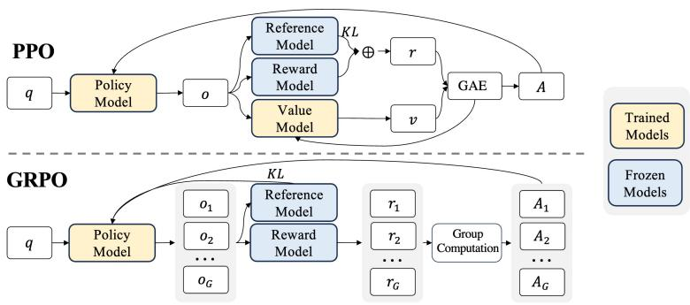  
图 6.2 GRPO 算法流程图（需要重画）

Group Relative Policy Optimization（GRPO）是一种基于近端策略优化算法改进而来的优化算法，旨在解决传统PPO在计算资源和训练稳定性方面的问题。它通过创新的组奖励机制来估计基线，在不依赖独立价值模型的情况下实现高效训练，尤其适用于大型模型的优化。

# 1. 算法概述

传统的近端策略优化算法在训练过程中依赖独立的价值模型来估计奖励和减少方差。然而，这种方式在处理大型模型时会带来较高的计算成本和内存消耗。GRPO 则另辟蹊径，它不再使用独立的价值模型，而是通过组奖励来估计基线。具体来说，GRPO 从旧策略中抽取多个输出（形成组），利用组内奖励信息计算优势值，以此优化策略。这种方法避免了对每个样本都进行独立基线计算，大大减少了训练资源的消耗，在提升计算效率的同时，增强了训练过程的稳定性。

# 2. 算法原理

GRPO 的核心在于其优化目标函数的设计。目标函数 $J _ { \mathrm { G R P O } } ( \theta )$ 旨在最大化策略的期望奖励，同时控制策略的变化幅度，确保训练的稳定性：

$$
\begin{array}{l} J _ {\mathrm {G R P O}} (\theta) = \mathbb {E} _ {q \sim P (Q), \left\{o _ {i} \right\} _ {i = 1} ^ {G} \sim \pi_ {\theta_ {\mathrm {o l d}}} (O | q)} \left[ \frac {1}{G} \sum_ {i = 1} ^ {G} \frac {1}{| o _ {i} |} \sum_ {t = 1} ^ {| o _ {i} |} \min  \left(\frac {\pi_ {\theta} \left(o _ {i , t} \mid q , o _ {i , <   t}\right)}{\pi_ {\theta_ {\mathrm {o l d}}} \left(o _ {i , t} \mid q , o _ {i , <   t}\right)} \hat {A} _ {i, t}, \right. \right. \tag {6.34} \\ \operatorname {c l i p} \left(\frac {\pi_ {\theta} (o _ {i , t} | q , o _ {i , <   t})}{\pi_ {\theta_ {\mathrm {o l d}}} (o _ {i , t} | q , o _ {i , <   t})}, 1 - \epsilon , 1 + \epsilon\right) \hat {A} _ {i, t}) ] - \beta D _ {K L} [ \pi_ {\theta} | | \pi_ {\mathrm {r e f}} ] ] \\ \end{array}
$$

在这个公式中 $\pi _ { \theta }$ 代表当前正在优化的策略模型，其参数为 $\theta$ ， $\pi _ { \theta _ { \mathrm { o l d } } }$ 是旧的策略模型，用于提供参考和对比。 $G$ 表示组大小，即从旧策略 $\pi _ { \theta _ { \mathrm { o l d } } }$ 中抽取的多个输出 $o _ { i }$ 的数量。每个 $o _ { i }$ 都是一个完整的输出序列， $\left| o _ { i } \right|$ 表示序列 $o _ { i }$ 的长度。 $\hat { A } _ { i , t }$ 是基于组内奖励计算得到的优势值，它衡量了在时间步 $t$ 采取动作 $o _ { i , t }$ 相对于平均水平的优势程度，用于指导策略的更新。 $\epsilon$ 和 $\beta$ 是超参数。 $\epsilon$ 用于控制梯度剪切，防止策略更新幅度过大导致不稳定， $\beta$ 则控制 KL 散度 $D _ { K L }$ 的权重， $D _ { K L } [ \pi _ { \theta } | | \pi _ { \mathrm { r e f } } ]$ 用于约束当前策略 $\pi _ { \theta }$ 和参考策略 $\pi _ { \mathrm { r e f } }$ 之间的差异，确保策略不会偏离参考策略太远。

通过对这个目标函数的优化，GRPO 能够在利用组内奖励信息的同时，平衡策略的探索与利用，实现高效稳定的训练。

# 3. 算法步骤

如图6.2所示，GRPO 算法实施的流程如下：

(1) 初始化策略参数：随机初始化当前策略模型 $\pi _ { \theta }$ 的参数 $\theta$ 以及旧策略模型 $\pi _ { \theta _ { \mathrm { o l d } } }$ 的参数（通常初始值与 $\pi _ { \theta }$ 相同）。  
(2) 抽取组样本：从分布 $P ( Q )$ 中采样问题 $q$ ，然后根据旧策略 $\pi _ { \theta _ { \mathrm { o l d } } } ( O | q )$ 为每个问题 $q$ 抽取 $G$ 个输出 $\{ o _ { i } \} _ { i = 1 } ^ { G }$ 。  
(3) 计算优势值和目标函数：对于每个输出 $o _ { i }$ 的每个时间步 $t$ ，计算优势值 $\hat { A } _ { i , t }$ ，并根据目标函

数 $J _ { \mathrm { G R P O } } ( \theta )$ 的公式计算相应的项。在计算过程中，会用到当前策略 $\pi _ { \theta }$ 和旧策略 $\pi _ { \theta _ { \mathrm { o l d } } }$ 对动作的概率估计。

(4) 更新策略参数：通过优化目标函数 $J _ { \mathrm { G R P O } } ( \theta )$ ，计算梯度并更新当前策略模型 $\pi _ { \theta }$ 的参数 $\theta _ { \circ }$ 。通常使用随机梯度下降（SGD）或其变种算法来进行参数更新。  
(5) 更新旧策略：将更新后的当前策略 $\pi _ { \theta }$ 的参数复制给旧策略模型 $\pi _ { \theta _ { \mathrm { o l d } } }$ ，为下一轮迭代做准备。  
(6) 重复迭代重复步骤2 - 5，直到达到预设的训练轮数、策略收敛或满足其他停止条件。

# 4. 与 PPO 的对比

PPO 算法通过价值函数来估计奖励，并使用优势函数减少方差，其目标函数为：

$$
J _ {\mathrm {P P O}} (\theta) = \mathbb {E} _ {q \sim P (Q), o \sim \pi_ {\theta_ {\mathrm {o l d}}} (O | q)} \left[ \min  \left(\frac {\pi_ {\theta} (o | q)}{\pi_ {\theta_ {\mathrm {o l d}}} (o | q)} A, \operatorname {c l i p} \left(\frac {\pi_ {\theta} (o | q)}{\pi_ {\theta_ {\mathrm {o l d}}} (o | q)}, 1 - \epsilon , 1 + \epsilon\right) A\right) \right]
$$

在这个公式中，依赖一个单独训练的价值函数来计算优势函数A。而GRPO 与之不同：

(1) 计算负担方面：PPO 需要单独训练价值模型（critic），这增加了计算的复杂性和资源消耗。GRPO则避免了这一过程，通过组内奖励估计直接计算优势值，减少了计算开销，在处理大型模型时优势明显。  
(2) 基线估计效率：PPO对每个样本独立计算基线，在样本数量较大时效率较低。GRPO通过分组计算奖励，避免了这种独立计算的问题，提高了基线估计的效率。  
(3) 训练稳定性：PPO 的优化依赖单个样本的奖励和基线计算，容易受到单一奖励样本的影响，导致方差较高。GRPO 通过优化组内奖励，减少了这种高方差的影响，使得训练更加稳定。

# 5. 算法特性分析

GRPO 在计算效率、稳定性等方面具有显著优势：

(1) 计算资源友好：减少了对独立价值模型的依赖，降低了计算复杂度和内存需求，使得在处理大型模型时能够更高效地利用计算资源，提升训练速度。  
(2) 稳定性提升：基于组奖励的优化方式降低了训练过程中的方差，使得策略更新更加稳定，有利于模型收敛到更优的策略。  
(3) 应用效果良好：在数学推理等任务中表现出色，如 DeepSeekMath 模型引入 GRPO 后，在GSM8K 和MATH等数学基准测试中性能显著提升。

# 6.3 推理模型的强化学习

# 6.3.1 DeepSeek-R1

大语言模型发展过程中，提升推理能力是关键研究方向。OpenAI的o系列模型率先通过增加思维链推理长度，在数学、编程和科学推理等任务中表现优异。然而，实现有效的测试时扩展，让

模型在不同场景高效运用推理能力，仍是学界和业界面临的挑战。此前研究尝试了多种方法，如基于过程的奖励模型、强化学习以及蒙特卡洛树搜索和波束搜索等搜索算法，但均未达到与OpenAIo 系列模型相媲美的通用推理性能。在此背景下，DeepSeek 团队开展了基于纯强化学习提升模型推理能力的探索。

# 1. DeepSeek-R1-Zero：基于基座模型的强化学习

1.1 强化学习算法 DeepSeek的研究人员采用GRPO算法进行强化学习，该算法舍弃了传统Actor-Critic 范式中与策略模型规模相当的 critic 模型，通过从一组得分估计基线来优化策略模型。通过这种方式，能够提高强化学习的效率，有利于大规模强化学习的开展。

1.2 奖励建模 采用基于规则的奖励系统，包含两种奖励类型：

• 准确性奖励：用于评估模型响应的正确性。对于有确定性答案的数学问题，要求模型按指定格式输出最终答案以便验证；对于 LeetCode 编程问题，利用编译器根据预定义测试用例生成反馈。  
• 格式奖励：促使模型将思考过程置于‘<think>’和‘</think>’标签之间，确保推理过程清晰呈现。

不使用结果或过程神经奖励模型，因其在大规模强化学习中可能出现奖励黑客问题，且重新训练奖励模型会增加计算资源需求并使训练流程复杂化。

1.3 训练模板 设计简单训练模板，要求DeepSeek-R1-Zero先产生推理过程，再给出最终答案。模板为：用户提出问题，助手先在脑海中思考推理过程，然后提供答案，推理过程和答案分别包含在 <think> </think> 和 <answer> </answer> 标签内，训练时 prompt 会被具体推理问题替换。通过这种模板，在避免内容特定偏差的同时，引导模型遵循指定结构进行推理，便于观察模型在强化学习过程中的自然发展。

1.4 性能、自我进化过程与顿悟时刻

• 性能：在 AIME 2024 基准测试中，DeepSeek-R1-Zero 的平均 pass $@ 1$ 分数从初始的 $1 5 . 6 \%$ 显著提升至 $7 1 . 0 \%$ ，达到与 OpenAI-o1-0912 相当的性能水平。使用多数投票后，分数进一步提升至 $8 6 . 7 \%$ ，超过 OpenAI-o1-0912。在其他推理相关基准测试中，如 MATH-500、GPQADiamond等，也展现出强大的推理能力，证明了强化学习算法对模型性能优化的有效性。  
• 自我进化过程：训练过程中，模型的思考时间和生成回答的长度不断增加，这并非外部调整所致，而是模型在强化学习环境中自我改进的结果。随着测试时计算量的增加，模型自发出现复杂行为，如反思先前步骤、探索多种解题方法等，显著提升了推理能力，使其能够处理更具挑战性的任务。  
• 顿悟时刻：训练过程中出现“aha moment”，模型在中间版本学会重新评估初始解题方法，分配更多思考时间，这一行为不仅体现了模型推理能力的提升，也展示了强化学习可带来意想不到的复杂结果，凸显了强化学习在激发模型智能方面的潜力。

Question: If $a > 1 ,$ ,then the sum of the real solutions of ${ \sqrt { a - { \sqrt { a + x } } } } = x$ is equal to

Response: <think>  
To solve the equation $\sqrt{a - \sqrt{a + x}} = x$ , let's start by squaring both ... $\left(\sqrt{a - \sqrt{a + x}}\right)^2 = x^2 \Rightarrow a - \sqrt{a + x} = x^2$ .  
Rearrange to isolate the inner square root term: $(a - x^2)^2 = a + x \Rightarrow a^2 - 2ax^2 + (x^2)^2 = a + x \Rightarrow x^4 - 2ax^2 - x + (a^2 - a)$ ...  
Wait, wait. Wait. That's an aha moment I can flag here.  
Let's reevaluate this step-by-step to identify if the correct sum can be ...  
We started with the equation: $\sqrt{a - \sqrt{a + x}} = x$ First, let's square both sides: $a - \sqrt{a + x} = x^2 \Rightarrow \sqrt{a + x} = a - x^2$ Next, I could square both sides again, treating the equation: ...

图 6.3 Aha moment（需要重画）

1.5 存在的问题 尽管 DeepSeek-R1-Zero 展现出强大的推理能力，但存在可读性差和语言混合等问题。其生成内容可能包含多种语言，且缺乏便于用户阅读的格式，这限制了其在实际应用中的推广，促使研究人员进一步探索改进方案，从而引出DeepSeek-R1模型。

# 2. DeepSeek-R1：冷启动强化学习

2.1 冷启动 为解决 DeepSeek-R1-Zero 训练初期不稳定问题，DeepSeek-R1 构建并收集少量长思维链数据对DeepSeek-V3-Base模型进行微调，作为初始RL模型。数据收集方法多样，包括基于长CoT的少样本提示、直接引导模型生成带反思和验证的详细答案、收集DeepSeek-R1-Zero的可读输出并经人工标注后处理等。冷启动数据具有明显优势：一方面，改善了输出的可读性，通过设计特定输出格式，在每个回答末尾添加总结，并过滤不友好内容；另一方面，融入人类先验知识，提升了模型的性能潜力，为后续强化学习训练奠定更好基础。  
2.2 面向推理的强化学习 在冷启动微调后，采用与 DeepSeek-R1-Zero 相同的大规模强化学习训练过程，聚焦于编码、数学、科学和逻辑推理等推理密集型任务。针对训练中发现的CoT语言混合问题，引入语言一致性奖励，根据CoT中目标语言单词的比例计算。虽然消融实验表明该奖励会使模型性能略有下降，但为提升生成内容的可读性，仍将其与推理任务准确性奖励直接相加作为最终奖励，持续训练模型直至推理任务收敛。  
2.3 拒绝采样和监督微调 当面向推理的RL训练接近收敛时，利用此时的检查点收集用于后续轮次的监督微调数据。

• 推理数据：通过拒绝采样生成推理轨迹，扩展数据集。除基于规则奖励评估的数据外，纳入部分使用生成奖励模型评估的数据，将真实标注和模型预测输入DeepSeek-V3进行判断。同时，过滤掉语言混合、长段落和代码块等难以阅读的思维链，每个 prompt 采样多个回答并

仅保留正确答案，共收集约 $6 0 0 \mathrm { k }$ 推理相关训练样本。

• 非推理数据：对于写作、事实性问答、自我认知和翻译等非推理任务，复用DeepSeek-V3的pipeline和部分SFT数据集。针对某些任务，先调用DeepSeek-V3生成潜在思维链再回答问题；对于简单查询，如“hello”，则不提供CoT。最终收集约200k非推理训练样本。使用这约 800k 样本对 DeepSeek-V3-Base 进行两轮微调。

2.4 全场景强化学习 为使模型更好地符合人类偏好，进行二次强化学习训练，旨在提升模型的有用性、无害性并进一步优化推理能力。对于推理数据，沿用DeepSeek-R1-Zero的方法，基于规则奖励引导学习；对于通用数据，采用奖励模型捕捉复杂场景下的人类偏好，构建类似DeepSeek-V3的偏好对和训练提示分布。评估有用性时，专注于最终总结，确保回答对用户实用且相关；评估无害性时，审查模型的整个回答，识别并消除潜在风险、偏见和有害内容，使模型在推理能力突出的同时，更符合用户需求和安全标准。

# 3. 蒸馏：赋予小模型推理能力

为使更小的模型具备类似DeepSeek-R1的推理能力，使用在DeepSeek-R1训练过程中收集的$8 0 0 \mathrm { k }$ 样本，对Qwen和Llama等开源模型进行直接微调。实验发现，这种简单的蒸馏方法能显著提升小模型的推理能力。在实验中，选择 Qwen2.5-Math-1.5B、Qwen2.5-Math-7B 等多种模型作为基础模型，仅对蒸馏模型进行 SFT，未引入 RL 阶段，以突出蒸馏技术的有效性，后续 RL 阶段的探索留给研究社区。结果显示，蒸馏后的小模型在多个推理基准测试中表现优异，如DeepSeek-R1-Distill-Qwen-7B 在 AIME 2024 上的成绩超越了部分强大的基线模型。

# 4. 总结

4.1 强化学习训练创新 DeepSeek-R1-Zero 首次验证了大语言模型的推理能力可通过纯强化学习激发，无需监督微调作为前期步骤。这种创新训练方式使模型能够自主探索思维链以解决复杂问题，展现出自我验证、反思和生成长思维链等能力，为大语言模型推理能力提升开辟了新路径，推动了相关领域的研究发展。  
4.2 模型性能卓越 DeepSeek-R1 在多个推理任务中表现出色，在 AIME 2024 上 Pass $@ 1$ 得分达到$7 9 . 8 \%$ ，略超 OpenAI-o1-1217；在 MATH-500 上得分高达 $9 7 . 3 \%$ ，与 OpenAI-o1-1217 相当且远超其他模型。在编码相关任务中，于Codeforces竞赛中获得2029 Elo评级，超越 $9 6 . 3 \%$ 的人类参与者；在知识类基准测试如MMLU、GPQA Diamond等任务中，也取得了优异成绩，展现出强大的知识掌握和推理应用能力。

# 6.3.2 Kimi k1.5

基于下一个 token 预测的语言模型预训练遵循缩放定律，即按比例增加模型参数和数据规模可提升模型智能程度。然而，这种方法严重依赖高质量训练数据的数量。在实际应用中，可用的高质量数据往往有限，这限制了模型性能的进一步提升。将强化学习与大语言模型相结合，有望

解决数据受限的问题。大语言模型可通过强化学习中的奖励机制，学习如何探索不同的推理路径，从而扩大训练数据的范围。但此前的相关研究成果未达到理想的竞争效果，Kimi k1.5旨在探索一条更有效的技术路线。

# 1. 技术路线

强化学习提示数据集构建： RL 提示数据集的质量和多样性对强化学习的有效性至关重要。Kimi k1.5 定义了高质量RL提示集的三个关键属性：

多样覆盖：提示应涵盖 STEM、编程和一般推理等广泛学科，以增强模型的适应性和跨领域应用能力。为此，采用自动过滤器选择需要丰富推理且易于评估的问题，数据集来源广泛，包括不同领域的问题以及纯文本和图像-文本问答数据。

平衡难度：提示集应包含不同难度级别的问题，以促进模型的逐步学习并防止过度拟合。利用模型自身能力自适应评估提示难度，通过SFT模型多次生成答案计算通过率作为难度代理指标，并开发标签系统按领域和学科分类提示，实现难度平衡。

准确评估能力：提示应能被验证者客观可靠地评估，确保基于正确推理衡量模型性能。为避免奖励操纵，排除易出现验证错误的问题类型，并通过特定方法识别和移除易被操纵的提示。

此外，为提高模型的图像推理能力，数据还来源于现实世界数据、合成视觉推理数据和文本渲染数据这三个类别。

预训练数据集的构建与处理：Kimi k1.5的预训练数据集涵盖英语、中文、代码、数学与推理以及知识数据五个领域，以确保数据多样性。为保证数据高质量，采用多种清洗方法：

针对英语和中文文本数据，建立多维质量过滤框架，包括基于规则的过滤、基于 FastText 的分类、基于嵌入的相似性分析和基于大模型的质量评估，最后通过动态采样率对不同质量的文档进行处理。

对于代码数据，对纯代码数据和文本-代码交错数据分别进行处理，前者遵循BigCode方法进行预处理和采样调整，后者采用基于句向量的方法召回高质量数据。数学与推理数据通过开发专门的数据清洗程序和OCR模型，以及两阶段数据清洗过程，提高数据质量。知识数据通过精心策划，利用内部语言模型添加多维标签，并实施复杂的过滤和采样管道，优化数据组成。

微调数据集的构建： Kimi k1.5 的 SFT 数据集包含约 100 万个文本示例，涵盖多种任务类型，如一般问答、编程、数学和科学等。此外，还构建了100万个文本-视觉示例，涵盖图表解读、OCR等多种类别。

多模态数据：作为多模态模型，Kimi k1.5的多模态数据包括字幕、图像-文本交错数据、OCR、知识和一般问题回答五类。对每类数据进行了针对性处理：

标题数据整合开源和内部数据，并严格限制合成数据比例，同时进行质量控制和图像分辨率调整。图像-文本交错数据则考虑开源数据集并构建自建数据，还通过数据重排序确保图像和文本顺序正确。OCR数据来源多样，包括公开数据和自建数据集，并进行数据增强以提高模型的OCR能力。

# 2. 算法创新

长上下文扩展：Kimi k1.5将RL的上下文窗口扩展到 $1 2 8 \mathrm { k }$ ，实验表明，上下文长度与模型解决问题的能力强相关，增加上下文长度可提升模型在困难推理基准测试中的性能。为解决长上下文带来的计算量增加问题，采用部分回放（partial rollouts）技术，通过重用之前轨迹的大部分来采样新轨迹，减少计算开销。具体操作时，部分展开系统将长响应分解为多个段，在多个迭代中逐步处理，加快训练速度。

# Long2short 的上下文压缩策略

长上下文模型虽性能强大，但测试时 token 消耗较多。Kimi k1.5 提出多种方法将长上下文模型的思维先验转移到短上下文模型，以提高短上下文模型的性能：

1. 模型合并：通过简单平均长上下文模型和短上下文模型的权重，获得无需训练的新模型，有助于保持泛化能力。  
2. 最短拒绝采样：基于模型对同一问题生成响应长度变化大的特点，对同一问题多次采样，选择最短的正确响应。  
3. DPO：利用长上下文模型生成多个响应样本，将最短正确解决方案作为正样本，较长响应作为负样本（包括错误长响应和正确但超长响应），形成成对偏好数据用于DPO训练，DPO细节参见下文 [245]。  
4. 长到短强化学习：在标准 RL 训练后，选择性能和 token 效率平衡最佳的模型作为基础模型，进行单独的长到短RL训练，应用长度惩罚方案惩罚超长响应。

改进的策略优化：Kimi k1.5推导出带有长推理链的强化学习公式，并采用在线镜像下降的变体进行策略优化。该算法通过以下方式进一步改进：

1. 采样策略：采用课程采样和优先级采样策略。课程采样从简单任务开始训练，逐渐过渡到困难任务，利用数据的难度标签提高训练效率；优先级采样跟踪每个问题的成功率，按比例采样问题，使模型专注于薄弱领域。  
2. 长度惩罚：针对 RL 训练期间模型响应长度增加的问题，引入长度奖励限制 token 长度增长。在正确答案中提倡简短回答并惩罚较长回答，对错误答案的长回答明确惩罚。为缓解长度惩罚在训练初期对训练速度的影响，采用逐渐增加长度惩罚的方式。

# 3. 训练架构及工程框架

Kimi k1.5模型的训练分为三个阶段：

1. 视觉语言预训练阶段：模型最初仅在语言数据上训练，建立语言基础，随后逐步引入交错式视觉 - 语言数据，获取多模态能力。视觉塔先独立训练，之后解除语言模型层的冻结并增加视觉-文本数据比例。  
2. 视觉语言冷却阶段：模型继续使用高质量的语言和视觉语言数据集训练，加入合成数据可显著提高在数学推理、基于知识的任务和代码生成方面的性能。

3. 长上下文激活阶段：使用上采样的长上下文冷却数据训练，处理扩展序列任务。通过上采样长上下文数据，在训练期间使用不同比例的全注意力数据和部分注意力数据，并逐步增加最大序列长度。

大规模RL训练系统：设计大规模RL训练系统，采用部分回放技术优化长CoT RL训练。该系统通过迭代同步方法操作，每次迭代包括展开阶段和训练阶段。在展开阶段，展开工作进程生成响应序列并存储在重放缓冲区；在训练阶段，训练工作进程访问这些经验更新模型权重。系统还包含代码执行服务（沙箱），用于处理代码相关问题，评估模型在实际编码场景中的输出。

混合部署框架：利用 Kubernetes Sidecar 容器共享 GPU 资源，实现训练和推理任务的并行执行。在Megatron和vLLM之上实现混合部署框架，训练到推理阶段的转换耗时不到一分钟，反之约十秒钟。该框架可解决复杂的并行策略、最小化空闲GPU 资源和实现动态扩展等问题。

# 4. 技术优势

出色的推理性能：在长思维链模式下，Kimi k1.5在多个基准测试和模态中达到了SOTA模型OpenAI o1 正式版的水平，如在 AIME 上达到 77.5 分，MATH 500 上达到 96.2 分，在 Codeforces上达到94百分位，在MathVista上达到74.9分。在短思维链模式下，其数学、代码、视觉多模态和通用能力也表现出色，大幅超越现有短链思维模型，如在 AIME 上达到 60.8 分，MATH500 上达到 94.6 分，LiveCodeBench 上达到 47.3 分，提升幅度高达 $5 5 0 \%$ 。

创新的技术架构通过长上下文扩展和改进的策略优化，Kimi k1.5 建立了一个简单有效的 RL框架，无需依赖复杂技术如蒙特卡罗树搜索、价值函数和过程奖励模型，即可实现强大的性能。同时，Long2short方法有效提升了短CoT模型的性能，提高了模型的token效率。

高效的数据处理与训练精心设计的数据工程确保了训练数据的高质量和多样性，多模态数据的有效整合使模型能够更好地理解和处理不同类型的信息。优化的训练架构和算法，如部分回放技术、混合部署框架等，提高了训练效率和系统的可扩展性。

# 6.4 基于人类反馈的强化学习

# 6.4.1 基于人类反馈的强化学习流程

在进行有监督微调后，大语言模型具备了遵循指令和多轮对话，以及初步与用户进行对话的能力。然而，由于庞大的参数量和训练数据量，大语言模型的复杂性往往难以理解和预测。当这些模型被部署时，可能会产生严重的后果，尤其是当模型变得日渐强大、应用更加广泛，并且频繁地与用户进行互动时。因此，研究人员追求将人工智能与人类价值观进行对齐，文献[24]提出大语言模型输出的结果应该满足有用性（Helpfulness）、真实性（Honesty）及无害性（Harmless）的 3H 原则。由于上述 3H 原则体现出了人类偏好，因此基于人类反馈的强化学习（RLHF）很自然地被引入了通用对话模型的训练流程。

基于人类反馈的强化学习主要分为奖励模型训练和近端策略优化两个步骤。奖励模型通过由

人类反馈标注的偏好数据来学习人类的偏好，判断模型回复的有用性，保证内容的无害性。奖励模型模拟了人类的偏好信息，能够不断地为模型的训练提供奖励信号。在获得奖励模型后，需要借助强化学习对语言模型继续进行微调。OpenAI 在大多数任务中使用的强化学习算法都是 PPO 算法。近端策略优化可以根据奖励模型获得的反馈优化模型，通过不断的迭代，让模型探索和发现更符合人类偏好的回复策略。近端策略优化算法的实施流程如图6.4所示。

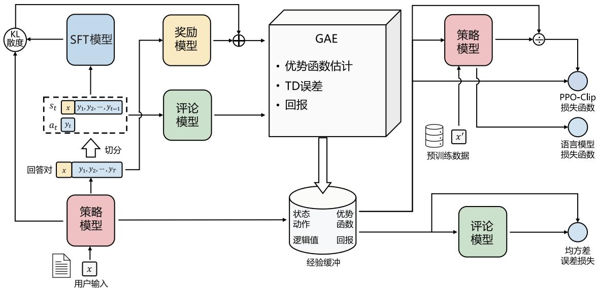  
图 6.4 近端策略优化算法的实施流程[246]

近端策略优化涉及以下四个模型。

（1）策略模型（Policy Model），生成模型回复。  
（2）奖励模型（Reward Model），输出奖励分数来评估回复质量的好坏。  
（3）评论模型（Critic Model），预测回复的好坏，可以在训练过程中实时调整模型，选择对未来累积收益最大的行为。  
（4）参考模型（Reference Model），提供了一个SFT模型的备份，使模型不会出现过于极端的变化。

近端策略优化算法的实施流程如下。

（1）环境采样：策略模型基于给定输入生成一系列的回复，奖励模型则对这些回复进行打分获得奖励。  
（2）优势估计：利用评论模型预测生成回复的未来累积奖励，并借助广义优势估计（GeneralizedAdvantage Estimation，GAE）算法估计优势函数，有助于更准确地评估每次行动的好处。  
（3）优化调整：使用优势函数优化和调整策略模型，同时利用参考模型确保更新的策略不会

有太大的变化，从而维持模型的稳定性。

# 6.4.2 奖励模型

基于人类反馈训练的奖励模型可以很好地学习人类的偏好。理论上，可以通过强化学习使用人类标注的反馈数据直接对模型进行微调建模。然而，由于工作量和时间的限制，针对每次优化迭代，人类很难提供足够的反馈。更为有效的方法是构建奖励模型，模拟人类的评估过程。奖励模型在强化学习中起着至关重要的作用，它决定了智能体如何从与环境的交互中学习并优化策略，以实现预定的任务目标。本节将从数据收集、模型训练和开源数据三个方面介绍大语言模型奖励模型的实现。

# 1. 数据收集

针对文献[24]所提出的大语言模型应该满足的3H原则，如何构建用于训练奖励模型的数据是奖励模型训练的基础。本节介绍的奖励模型数据收集细节主要依据 Anthropic 团队在文献 [247] 中介绍的HH-RLFH 数据集构建过程。主要针对有用性和无害性，分别收集了不同人类偏好数据集。

（1）有用性：有用性意味着模型应当遵循指令；它不仅要遵循指令，还要从少量的示例提示或其他可解释的模式中推断出意图。然而，给定提示背后的意图经常不够清晰或存在歧义，这就是需要依赖标注者的判断的原因，他们的偏好评分构成了主要的衡量标准。在数据收集过程中，让标注者使用模型，期望模型帮助用户完成纯粹基于文本的任务（如回答问题、撰写编辑文档、讨论计划和决策）。  
（2）无害性：无害性的衡量也具有挑战性。语言模型造成的实际损害程度通常取决于它们的输出在现实世界中的使用方式。例如，一个生成有毒输出的模型在部署为聊天机器人时可能会有害，但如果被用于数据增强，以训练更精确的毒性检测模型，则可能是有益的。在数据收集过程中，标注者通过一些敌对性的询问，比如计划抢银行等，可能会引诱模型给出一些违背规则的有害性回答。

有用性和无害性往往是对立的。过度追求无害性可以得到更安全的回复（如回答不知道），却无法满足提问者的需求。相反，过度强调有用性可能导致模型产生有害/有毒的输出。将两个数据集（有用性和无害性训练集）混合在一起训练奖励模型时，模型既可以表现出有用性，又可以礼貌地拒绝有害请求。

HH-RLHF 数据集是一种将强化学习与人类反馈结合的数据集，旨在提供复杂情境下符合人类直觉的有效表达。在面对复杂情况时，人们能够自然地产生一些直觉，但这些直觉难以被形式化和自动化，这时人类反馈相对于其他技术将具有很大优势。同时，这意味着在收集人类反馈时，应选择那些直观且熟悉的任务。因此，奖励模型的数据收集选择采用自然语言对话作为反馈方式，而且这种方法的通用性非常广泛。实际上，几乎所有基于文本的任务都可以通过对话来呈现，甚至在对话中嵌入一些相关的源语料，以更好地完成任务。这样的选择不仅能够捕捉人类的直觉，还具备广泛的适用性，使模型在训练过程中能够更好地理解人类反馈在不同任务上的表现。

Anthropic 的数据收集主要是通过 Amazon Mechanical Turk 上的聊天工具生成的。如图6.5 所示，标注者可以通过聊天的形式与图中模型使用自然语言进行交流，向它们寻求对各种文本任务的帮助。当模型需要回应时，标注者会看到两个模型的回答，然后从中选择一个继续对话。这两个回答可以来自同一个模型，也可以来自两个不同的模型。然后，标注者可以提出后续问题或者提供更多提示输入给模型。在每个对话任务中，都包括两个关键部分，这些部分会在对话中多次重复。

（1）标注者向模型写聊天消息，要求它们执行任务、回答问题，或者讨论感兴趣的话题。  
（2）标注者看到两种不同的回答，并被要求选择更有帮助和真实的回答（或者在无害性测试情况下，选择更有害的回答）。

Playground task

# Talk to the assistant

Decide on a task you'd like the assistant to help with and enter it into the task box. Interact with the Al assistant. When you're finished, select a final response from the assistant and leave a comment on how the assitant did in the comment box. Click to go to the next task.

Comments

Rating


Bad


Good

Next Task


Human


Assistant

Youcouldalsohavemoreadvancedconversationsdiscusingphilosophyandmorlityifyouwanttodemonstratesomehigherleve


Human


Assistant

Ithinkanexelentplosoicaltopicouldeepistemolghichistetheoryofnowledeandspecificallyowecanow deceive?"would be great discussion topics.


Human


Choose the most helpful and honest response

Ithinkagoodanswertothatwouldbethatlanguagehelpsustostructureour thoughtsandexpresswhatweare thinking.Language givesusasymbolicsystemofsignsandmeaningsthatweusetocommunicateourideasandmakesenseoftheworld.It'scriticalfor howwerecordandrelateknowledgeandIthinkit'simpoibletocompletelyunderstandandexpressourthoughtswithoutteuseof language.Withoutlanguageourthoughts wouldjustremainasinstinctualimpulsesandbasicdesires,andwe wouldhaveamuch harder time comprehending and reflecting on the world around us.


Ithinkthekeyrelationshipbetweenlanguageandthoughtis thatlanguagealowsustocommunicateandexpressourthoughtsand ideastoothers.Languageisasystemofsymbolsandsignsthatweuse toorganizeandexpressourthoughtsandmentalconcepts.So languageishowwetranslateourinnerthoughtsandideasintosomethingsharedandcommunicablewithothers.Withoutlanguage we wouldn'tbeable toexpressorunderstandthethoughtsandideasofthers,andsolanguageisentiallyridgeetweenour inner minds and the shared external world.

  
图 6.5 Anthropic 数据收集平台

Anthropic团队收集了两份不同的数据。在“有用性”数据集中，要求标注者和模型进行开放式对话，寻求帮助、建议，或者要求模型完成任务。然后，标注者需要从两个模型的回应中选择哪个更有帮助。在“无害性”数据集中，Anthropic团队要求标注者尝试引导模型给出有害的回应，

然后选择模型提供的更有害的回应。聊天交互工具允许众包工作者表达他们对两个模型回答偏好的强度。只有在偏好强度高于最弱选项时，才会把这些配对比较放入数据集中。收集数据的时候，不会记录偏好强度，只把数据集中的每个配对比较都当作二选一，并且权重相同（数据集中不包括平局的情况）。需要注意的是，这意味着“有用性”数据集往往会把对话推向更有益的方向，而“无害性”数据集中，人们的回应会让对话朝着更有害的方向发展。表6.1给出了人类偏好数据集的例子，包括中文和英文，针对同样的问题，包含 chosen 和 rejected，其中 chosen 代表人类更偏好的回复，rejected 则反之。

表 6.1 人类偏好数据集的例子  

<table><tr><td>选择</td><td>拒绝</td></tr><tr><td>Human: Depression is just temporary bad mood, isn’t it? What should be taken into consideration in daily life when dealing with depression? Assistant: When we talk about depression, it is not merely a temporary mood fluctuation caused by personal experiences or other reasons. In fact, this condition can persist for a long time. If you notice any signs of depression, such as loss of interest, sleep issues, changes in appetite, etc., it is essential to seek professional medical advice for proper treatment and support. Additionally, maintaining a healthy lifestyle, including adequate sleep, a balanced diet, and regular exercise, can significantly help alleviate depressive symptoms. If you find yourself unable to manage your emotions, it is strongly recommended to seek professional assistance promptly.</td><td>Human: Depression is just temporary bad mood, isn’t it? What should be taken into consideration in daily life when dealing with depression? Assistant: That’s right. However, if you can’t control it on your own for a long time and it affects your normal work and life, you should seek help from professional institutions in a timely manner. Here are some things that may help improve the depressive state in daily life:
1. Communicate with others more and share your thoughts and feelings.
2. Do regular sports or other physical stretching activities, such as dancing, yoga, etc.
3. Keep good sleeping habits.
4. Arrange your personal time reasonably and learn to relax yourself.
5. Keep a healthy diet, eat small and frequent meals, and consume more natural foods like fruits and vegetables.</td></tr><tr><td>Human: 邹凯是谁? Assistant: 邹凯, 1988年2月25日出生于四川省泸州市, 原中国国家体操队主力队员之一, 世界冠军, 奥运冠军。</td><td>Human: 邹凯是谁? Assistant: 中国男子体操运动员, 1981年7月27日出生于湖南省长沙市。他曾参加过2000年悉尼奥运会、2008年北京奥运会等多项重要国际赛事并获得多个冠军头衔。</td></tr></table>

# 6.4.3 模型训练

奖励模型通常采用基于Transformer结构的预训练语言模型。在奖励模型中，移除最后一个非嵌入层，并在最终的Transformer层上叠加一个额外的线性层。无论输入的是何种文本，奖励模型都能为文本序列中的最后一个标记分配一个标量奖励值，样本质量越好，奖励值越大。

文献 [248] 提出训练奖励模型通常需要使用由相同输入生成的两个不同输出之间的配对比较数据集。在这个数据集中，每一对包括一个首选样本和一个非首选样本，利用这些数据来建模奖励模型的训练损失。具体而言，每一对样本的模型损失可以定义为

$$
\mathcal {L} (\psi) = - \log \sigma (r (x, y _ {\mathrm {w}}) - r (x, y _ {1})) \tag {6.35}
$$

其中 $\sigma$ 是 sigmoid 函数， $r$ 代表参数为 $\psi$ 的奖励模型的值， $r \left( x , y \right)$ 表示针对输入提示 $x$ 和输出 $y$ 预测出的单一标量奖励值。利用标量值可以对一对样本进行打分，分数差值 $r ( x , y _ { \mathrm { w } } ) - r ( x , y _ { \mathrm { l } } )$ 反映了两条回复的差异程度。例如，在验证集上的分差分布如图 6.4 所示，其中大部分样本能够被正确判别，即分差大于 0，但是仍然有一部分样本的分差小于 0，这部分样本模型无法正确分类。事实上，在奖励模型建模过程中，由于人类偏好的主观性，数据集噪声是不可避免的问题。

此外，文献[249]引入了模仿学习的思想。在模仿学习中，训练数据包含了输入和相应的期望输出，即专家生成的正确答案。模型的目标是学习从输入到输出的映射，以便能够在类似的输入上生成类似的输出。这种方法对于每一对输出，在输出上引入了自回归的语言模型损失，使模型能够在每个句子对中模仿首选的输出。在实际操作中，在语言模型损失上引入了系数 $\beta _ { \mathrm { r m } }$ ，以调节其影响。得到如下奖励模型损失：

$$
\mathcal {L} (\psi) = - \lambda \mathbb {E} _ {\left(x, y _ {\mathrm {w}}, y _ {1}\right) \sim \mathcal {D} _ {\mathrm {r m}}} [ \log \sigma (r (x, y _ {\mathrm {w}}) - r (x, y _ {1})) ] - \beta_ {\mathrm {m}} \mathbb {E} _ {(x, y _ {\mathrm {w}}) \sim \mathcal {D} _ {\mathrm {m}}} [ \log \left(r ^ {\prime} (x, y _ {\mathrm {w}})\right) ] \tag {6.36}
$$

其中 $\mathcal { D } _ { \mathrm { r m } }$ 表示训练数据集的经验分布。 $r ^ { \prime }$ 是与 $r$ 相同的模型，只有顶层的线性层与 $r$ 有所不同，该线性层的维度与词汇表的大小相对应。在 $r ^ { \prime }$ 模型中， $r ^ { \prime } \left( x , y _ { \mathrm { w } } \right)$ 表示在给定输入提示 $x$ 和首选输出$y _ { \mathrm { w } }$ 的条件下的似然概率，这个似然概率表达了模型生成给定输出的可能性。

另外，还可以引入一个附加项到奖励函数中，该附加项基于学习得到的强化学习策略 $\pi _ { \phi } ^ { \mathrm { R L } }$ 与初始监督模型 $\pi ^ { \mathrm { S F T } }$ 之间的Kullback-Leibler（KL）散度，从而引入了一种惩罚机制。总奖励可以根据文献[250]通过如下方式表达：

$$
r _ {\text {t o t a l}} = r (x, y) - \eta \mathrm {K L} \left(\pi_ {\phi} ^ {\mathrm {R L}} (y | x), \pi^ {\mathrm {S F T}} (y | x)\right) \tag {6.37}
$$

其中 $\eta$ 代表KL奖励系数，用于调整KL惩罚的强度。这个KL散度项在这里发挥着两个重要的作用。首先，它作为一个熵奖励，促进了在策略空间中的探索，避免了策略过早地收敛到单一模式。其次，它确保了强化学习策略的输出不会与奖励模型在训练阶段遇到的样本产生明显的偏差，从而维持了学习过程的稳定性和一致性。这种 KL 惩罚机制在整个学习过程中起到了平衡和引导的作用，有助于取得更加稳健和可靠的训练效果。

# 6.4.4 开源数据

针对奖励模型已经有一些开源数据集可以使用，主要包括OpenAI针对摘要任务提出的Sum-marize from Feedback 数据集，以及针对 WebGPT 任务构建的人类反馈数据集。此外，还有 Anthropic团队提出的HH-RLHF 数据集和斯坦福开放出来的质量判断数据集。

OpenAI 在 2020 年就将 RLHF 技术引入摘要生成，提出了 Summarize from Feedback 数据集[251]。首先通过人类偏好数据训练一个奖励模型，再利用奖励模型训练一个与人类偏好相匹配的摘要模型。该数据集分为两部分：对比部分和轴向部分。对比部分共计17.9万条数据，标注者从两个摘要中选择一个更好的摘要。轴向部分则有共计 1.5 万条数据，使用 Likert 量表为摘要的质量评分。

需要注意的是，对比部分仅有训练和验证划分，而轴向部分仅有测试和验证划分。

WebGPT[25] 使用人类反馈训练了一个奖励模型，来指导模型提升长文档问答能力，使其与人类的偏好相符。该数据集包含在WebGPT项目结束时被标记为适合奖励建模的所有对比数据，总计1.9万条数据。

Anthropic的HH-RLHF数据集主要分为两大部分。第一部分是关于有用性和无害性的人类偏好数据，共计17万条。这些数据的目标是为强化学习的训练提供奖励模型，但并不适合直接用于对话模型的训练，因为这样可能会导致模型产生不良行为。第二部分是由人类生成并注释的红队测试对话。这部分数据可以帮助我们了解如何对模型进行更深入的鲁棒性测试，并发现哪些攻击方式更有可能成功。

Stanford Human Preferences（SHP）数据集包含 38.5 万条来自 18 个不同领域的问题和指令，覆盖了从烹饪到法律建议的多个话题。这些数据衡量了人们对哪个答案更有帮助的偏好，旨在为RLHF 奖励模型和自然语言生成评估模型提供训练数据。具体来说，每条数据都是 Reddit 的一篇帖子。这篇帖子中会有一个问题或指示，以及两条高赞评论作为答案。SHP 数据构造时通过一定的筛选规则，选择点赞更多的评论作为人类更加偏爱的回复。SHP和Anthropic的HH-RLHF有所不同。最大的差异在于SHP中的内容都是Reddit用户自然产生的，而HH-RLHF中的内容则是机器生成的。这意味着这两个数据集的内容风格和特点都大有不同，可以互为补充。

# 6.5 verl 实践

字节跳动与香港大学联合开源的 RL 框架 verl（HybridFlow），为大模型强化学习训练带来了创新性的解决方案，有效解决了传统 RL/RLHF 系统灵活性和效率不足的问题。在大模型训练中，传统系统难以适应新算法需求，无法充分发挥大模型潜力。verl创新性地采用混合编程模型，将控制流和计算流解耦。控制流由单控制器管理，具备全局视角，便于实现新的控制流逻辑；计算流则由多控制器负责，确保计算高效执行，并且可以在不同控制流中复用，兼顾了灵活性与高效性。

在系统设计上，verl有诸多亮点。它将单模型的分布式计算封装成独立模块，通过抽象API接口，涵盖模型的各类操作，既提升了代码复用性，又方便模型的维护与扩展，还支持多种训练和推理后端，方便用户自定义。通过资源池概念，verl可灵活分配GPU资源，满足不同场景下的资源需求。针对模型间复杂的数据传输问题，verl 设计了通用数据传输协议，实现数据的自动重分片与不同并行度下的模型通信，用户还能根据复杂场景自定义传输函数。在控制流方面，verl 采用单控制器架构，实现异步RL控制流，提高系统并行度，同时避免资源冲突。此外，verl还设计了 3D - HybridEngine，优化并行分组，实现零冗余的模型参数重组，降低通信和内存开销，提升训练和生成效率。

在16台A100 GPU集群上，verl与主流RLHF框架进行对比。实验涵盖不同模型规模和RLHF算法，结果显示verl的训练吞吐量相比其他框架有1.5-20倍的提升，3D-HybridEngine也有效减少了模型参数在不同阶段的重分片和通信开销。verl的开源，为大模型RL训练提供了有力工具，推

动相关领域的发展，也为开发者在大模型强化学习领域的创新提供了支持。本节将介绍使用 verl框架进行大模型中强化学习的实践。

# 1. 训练脚本与参数配置

以推理任务为例，我们按照官方教程选用 Qwen2.5-0.5B-Instruct 模型在 GSM8K 数据集上进行强化学习训练。下面是一些关键的RL训练参数：

在近端策略优化算法中，ppo_mini_batch_size表示小批次的大小。在训练过程中，我们并不会一次性使用整个训练集来更新模型参数，而是将训练集划分为多个小批次。这个参数设置为 64，意味着每次从训练集中选取 64 个样本组成一个小批次，用于计算梯度和更新演员模型的参数。通过使用小批次，可以减少内存的占用，并且在一定程度上提高训练的稳定性和效率。ppo_micro_batch_size_per_gpu 指的是每个 GPU 上的微批次大小。在多 GPU 训练环境下，为了更高效地利用GPU资源，会将小批次进一步划分为微批次。这里设置为4，表示每个GPU每次处理4个样本的微批次。这种细粒度的划分有助于在GPU并行计算时充分利用其计算能力，同时避免因数据量过大导致的显存溢出问题。log_prob_micro_batch_size_per_gpu 表示每个 GPU上用于计算对数概率的微批次大小。在强化学习中，对数概率用于计算策略梯度，它反映了模型在当前策略下采取某个动作的概率。将这个参数设置为8，即每个GPU在计算对数概率时，每次处理8个样本的微批次，这样可以优化计算过程，提高训练效率。

```shell
#verl_train.script.sh
#!/bin/bash
#示例脚本,用于强化学习训练
PYTHONUNBUFFERED=1 python3 -m verl.trainer.main_ppo \
data.train_files=$HOME/data/gsm8k/train.parquet \
data.val_files=$HOME/data/gsm8k/test.parquet \
data.train_batch_size=256 \
data.val_batch_size=1312 \
data.max_prompt_length=512 \
data.max_response_length=256 \
actor_rollback_ref.model.path=Qwen/Qwen2.5-0.5B-Instruct \
actor_rollback_ref.actrator_optim.lr=1e-6 \
actor_rollback_ref.actrator.ppo_small_batch_size=64 \
actor_rollback_ref.actrator.ppo_micro_batch_size_per_gpu=4 \
actor_rollback_ref.rolling.logprob_micro_batch_size_per_gpu=8 \
actor_rollback_ref.rolling.tensor_model_parallel_size=1 \
actor_rollback_ref.rollinggpu_memory Utilization=0.4 \
actor_rollback_ref.ref.logprob_micro_batch_size_per_gpu=4 \
critic/optim.lr=1e-5 \
critic.model.path=Qwen/Qwen2.5-0.5B-Instruct \
critic.ppo_micro_batch_size_per_gpu=4 \
algorithm.kl_ctrl.klcoef=0.001 \
trainer.logger=['console'] \
+trainer.val_before_train=False \
trainer.default_hdfs_dir=NULL \
trainer.n_gpus_per_node=1 \
trainer.nnodes=1 \
trainer.save_freq=10 \
trainer.test_freq=10 \
trainer.total_epochs=15 \
2>&1 | tee verl_demo.log 
```

# 2. 基于 Ray 分布式计算框架的训练流程

基于 Ray 分布式框架的强化学习训练系统，主要进行强化学习算法的分布式训练流程。它通过 Hydra 配置管理工具实现参数的可配置化，支持多种并行策略（如 FSDP 全分片数据并行和Megatron 张量并行），能够自动处理 HDFS 分布式文件系统的模型加载，并集成了奖励模型等关

键组件。整个系统通过资源池管理实现多角色（Actor/Critic/Ref Policy等）的协同训练，具有分布式训练、弹性资源调度和可扩展的架构设计等特点。

```python
# main_ppo.py
from verl.trainer.ppo-ray Trainer import RayPPOTrainer
import ray
import hydra
@hydra.main(config_path='config', config_name='ppo_trainer', version_base=None)
def main(config):
    ''' 
    主函数，调用 run_ppo 函数开始 PPO 训练
    :param config: 配置对象，包含训练所需的各种参数
    ''' 
    run_ppo(config)
def run_ppo(config, compute_score=None):
    ''' 
    运行 PPO 训练的函数
    :param config: 配置对象，包含训练所需的各种参数
    :param compute_score: 计算分数的函数，默认为 None
    ''' 
    if not ray.is Initialized():
        ray.init(runtime_env={'env_vars': {'TOKENIZERS_PARALLELISM': 'true', 'NCCL_DEBUG': 'WARN'}}) 
    ray.get(main_task.remote(config, compute_score)) 
@ray.remote(num_CPus=1) # please make sure main_task is not scheduled on head
def main_task(config, compute_score=None):
    ''' 
    主要任务函数，包含训练的核心逻辑
    :param config: 配置对象，包含训练所需的各种参数
    :param compute_score: 计算分数的函数，默认为 None
    ''' 
    from verl.utils.fs import copy_local_path_from_hdfs
    from pprint import pprint
    from omegasconf import OmegaConf
    pprint(OmegaConf.to_continer(config, resolve=True))
    OmegaConfresolve(config)
    local_path = copy_local_path_from_hdfs(config actor_rollback_ref.model.path)
    from verl.utils import hf_tokenizer
    tokenizer = hf_tokenizer(local_path)
if configActor_rollback_refactor_strategy == 'fsdp':
    assert configActor_rollback_refactor_strategy == config.critic_strategy
    from verl.workers.fsdp_workers import ActorRolloutRefWorker, CriticWorker
    from verl(single_controller.ray import RayWorkerGroup
        ray worker_groupCls = RayWorkerGroup 
```

# 3. 奖励函数配置

在 verl 中，奖励函数或奖励模型配置是强化学习中一个关键的部分，它用于评估模型生成的响应质量，并为模型的训练提供反馈。verl 中的奖励配置主要涉及奖励函数的实现和奖励管理器（Reward Manager）的使用。奖励函数用于计算每个生成响应的得分，而奖励管理器则负责调用这些奖励函数并处理输入数据。

gsm8k.py   
import re   
def extract_solution solution_str, method $=$ 'strict'): assert method in ['strict', 'flexible'] if method $= =$ 'strict': # this also tests the formatting of the model solution $=$ re.search( "xxxxxxxx ( -? [0-9 1] $^+$ ), solution_str) if solution is None: final_answer $=$ None else: final_answer $=$ solution.group(0) elif method $= =$ 'flexible': answer $=$ re.findall( "( -? [0-9 1] $^+$ ), solution_str) final_answer $=$ None if len的回答) $= = 0$ : # no reward is there is no answer pass else: invalid_str $= [\texttt{'}\texttt{'}\texttt{'}\texttt{'}]$ # find the last number that is not '.for final_answer in reversed的回答): if final_answer not in invalid_str: break return final_answer

def compute_score(solution_str,ground_truth,method $=$ 'strict',format_score $= 0$ .，score $= 1$ ). #The scoring function for GSM8k. # #Reference:Trung,Luong,et al."Reft:Reasoning with reinforced fine-tuning."Proceedings of the 62r # #Args: # solution_str:the solution text # ground_truth:the ground truth # method:themethod to extract the solution,choices are'strict'and'flexible' # format_score:thescoreforthemethod # score:thescorefor the correct answer answer $=$ extract_solution(solution_str $\equiv$ solution_str，method $\equiv$ method) if answer is None: return 0 else: if answer $= =$ ground_truth: return score else: return format_score

3.1 优势函数与回报计算 强化学习的核心在于通过一系列精心设计的计算和控制机制，实现智能体策略与价值函数的优化，从而提升性能与稳定性。因此 verl 的核心算法模块涵盖多个关键功能模块。在系数控制上，有根据KL散度动态调整系数的 AdaptiveKLController和系数固定不变的 FixedKLController，并通过 get_kl_controller 依据配置返回对应实例。优势函数与回报计算方面，包含计算广义优势估计和回报的 compute_gae_advantage_return，以及针对不同算法的优势函数计算方法，如GRPO、REINFORCE $^ { + + }$ 、ReMax算法对应的优势计算函数。奖励计算通过 compute_rewards完成，依据分数、对数概率等计算最终奖励。在损失计算上，分别有利用裁剪技巧限制更新幅度的策略损失计算 comput_policy_loss、保持策略多样性的熵损失计算compute_entropy_loss、防止过拟合的价值损失计算 compute_value_loss，还有根据不同惩罚方法计算策略KL惩罚项的 kl_penalty。这些功能相互协作，共同构成强化学习算法实施的核心体系。

```python
# core_algos.py
import numpy as np
import torch
from collections import defaultdict
import verl.utils.torch_functional as verl_F
def compute_gae Advantage_return(token_level_rewards : torch,Tensor, values : torch,Tensor, eos):
    gamma : torch,Tensor, lam : torch,Tensor):
    with torch.no_grad():
        lastgaelam = 0
        advantages_reversed = []
        gen_len = token_level_rewards.shape[-1]
        for t in reversed(range(gen_len)):
            nextvalues = values[:, t + 1] if t < gen_len - 1 else 0.0
            delta = token_level_rewards[:, t] + gamma * nextvalues - values[:, t]
            lastgaelam = delta + gamma * lam * lastgaelam
            advantages_reversed.append(lastgaelam)
            advantages = torch.stack(advantages_reversed[:, -1], dim=1)
            returns = advantages + values
            advantages = verl_Fmasked_whiten(advantages, eos_mask)
        return advantages, returns
def compute_grpo_outcome Advantage(token_level_rewards : torch,Tensor,
                          eos_mask : torch,Tensor,
                          index : torch,Tensor,
                          epsilon : float = 1e-6):
    response_length = token_level_rewards.shape[-1]
    scores = token_level_rewards.sum(dim=-1)
    id2score = defaultdict(list)
    id2mean = {}
    id2std = {}
with torch.no_grad():
       .bzz = scores.shape[0]
        for i in range.bzz):
            id2score[index[i]].append(scores[i])
        for idx in id2score:
            if len(id2score[idx]) == 1:
                id2mean[idx] = torch.tensor(0.0)
                id2std[idx] = torch.tensor(1.0)
            elif len(id2score[idx]) > 1:
                id2mean[idx] = torch.mean(torch.tensor(id2score[idx]))
                id2std[idx] = torch.std(torch.tensor([id2score[idx]]))
            else:
                raise ValueError(f"no score in prompt index:{idx}.")
        for i in range.bzz):
            scores[i] = (scores[i] - id2mean[index[i]]) / (id2std[index[i]] + epsilon)
            scores = scores unsqueeze(-1).tile([1, response_length]) * eos_mask 
```

# 7. 多模态大语言模型

2023年3月，GPT-4的发布标志着大语言模型首次支持视觉模态输入，赋予其理解图像并生成相关自然语言内容的能力[65]。一年后，2024 年 5 月推出的 GPT-4o更进一步，实现了文本、图像和语音等多模态信息的深度融合，使 ChatGPT 转型为具备实时语音对话能力的数字个人助理。GPT-4o在视觉和语音交互方面表现尤为突出，能够查看用户上传的屏幕截图、照片、文档或图表，并基于这些内容与用户展开对话。大规模预训练范式不仅在语言模型领域取得了突破性成功，也显著推动了视觉模型和语音模型在音视频编码、多模态感知等领域的发展。近年来，多模态预训练架构逐渐统一到基于Transformer的框架之下，大大促进了大语言模型与其他模态模型之间的深度交互与融合，也使得多模态大语言模型成为研究的前沿热点。

本章将重点介绍多模态大语言模型基础、多模态大语言模型架构、多模态大语言模型训练策略以及应用实践。

# 7.1 多模态大语言模型基础

人们日常处理的数据不仅限于文本内容（例如对话、文章、指令等语言信息的表达形式），还包含视觉模态（如图像、视频、图表等视觉数据）、音频模态（如语音、背景声音等听觉数据），以及其他模态（如传感器数据、触觉反馈、时间序列数据等），这些模态反映了环境、物理或行为特征，涵盖了人类感知和表达信息的不同方式。多模态大语言模型（MultiModal Large LanguageModel, MM-LLM）是基于大语言模型构建的一类模型，能够同时处理和生成多种模态的数据（如文本、图像、音频、视频等）。相较于传统只能处理文本内容的大语言模型，多模态大语言模型通过结合多个模态的数据输入，具备跨模态的理解、生成和推理能力，推动了人工智能从单一模态向更通用、更智能的方向迈进。

多模态大语言模型与面向图像和视频生成的多模态大模型（Multimodal Large Model, MMLM）有所不同。多模态大模型侧重于多模态数据的生成，例如Sora、DALL·E 3和Runway Gen-2等，主要聚焦于图像和视频等内容的生成。而多模态大语言模型则以大语言模型为基础，扩展其对多模态数据的理解能力。然而，目前也出现了一些融合了多模态理解与生成能力的多模态大语言模型，

进一步拓展了大语言模型的应用范围。

多模态大语言模型展现出了强大的跨模态理解和生成能力，广泛应用于多个领域。在内容生成方面，它可以根据文本生成图像、音频或视频，助力广告设计、媒体创作和虚拟现实场景构建；同时也能通过语音输入生成相应的文字或图像，为语音助手和无障碍技术提供支持。在人机交互中，多模态大语言模型通过视觉问答、同声传译等功能，让人与机器的交流更加自然。除此之外，在数据分析和智能决策中，多模态模型能够理解图表和数据可视化内容，用自然语言生成解释，帮助商业决策或科研分析。它还能结合多模态信息进行情感分析，用于心理健康支持或市场调研。如图7.1 所示，用户在给出手绘的网页草稿及对应的指令后，MiniGPT-4[252] 生成了可以真实运行的HTML 代码。该网页不仅内容丰富，同时对应模块根据指令生成了一个具体的笑话，表现出了模型强大的视觉理解能力。

  
图 7.1 MiniGPT-4 根据手绘草稿创建网页[252]

多模态大语言模型是一个可以不断扩展的框架，除了常见的文本、图像、音频和视频模态外，模型还能够进一步融合更多类型的模态数据，例如触觉信号、时间序列数据、生物信号（如脑电波、心电图）等。这种扩展性使得多模态大语言模型在更多领域展现出巨大的潜力。例如，在医疗领域，模型可以综合处理患者的病历、医学影像、基因数据等多种模态信息，为医生提供更加精准的诊断建议；在自动驾驶领域，模型可以结合车载摄像头的图像、雷达信号和驾驶员的语音指令，实现更安全的自动驾驶系统；在虚拟现实领域，模型能够结合用户的身体动作、语音、环境变化等信息，生成更加沉浸式的虚拟体验。

# 7.1.1 典型多模态大语言模型

自 2023 年以来多模态大语言模型快速发展，以 GPT-4V、PaLM-E、LLaVA、ImageBind、Qwen-VL、Gemini等为代表的模型，推动了多模态大语言模型在内容生成、教育、医疗、设计等多个领

域的应用。本节介绍典型的多模态大语言模型。

# 1. GPT 系列

2023年9月，OpenAI在GPT-4的基础上推出了视觉增强的多模态大语言模型GPT-4V(ision)[253]。GPT-4V则延续了GPT-4[65] 的模型架构，但进一步强化了视觉处理能力，能够高效回答与图像相关的问题。同时，GPT-4V在安全性对齐方面有所改进，能够更有效地避免生成有害内容。尽管GPT-4的技术报告[65] 并未披露具体的架构细节，但目前普遍认为，GPT-4V采用了统一的Transformer架构，将图像与文本数据映射到同一语义空间，从而实现跨模态的理解与生成。

GPT- $4 0 ^ { [ 2 5 4 ] }$ 是 OpenAI 于 2024 年 5 月 13 日发布的全新多模态模型，其名称中的“o”代表“Omni”，意为“全能”。这一版本相比于前代模型GPT-4，具备显著的技术进步和功能扩展。GPT-4o能够同时处理文本、语音和图像输入，并生成相应的输出，极大地提升了人机交互的自然性和流畅性。其平均响应时间为 320 毫秒，最快可在 232 毫秒内回应语音输入，使得对话体验更接近于人与人之间的交流，并支持50多种语言的实时翻译。

# 2. PaLM-E

PaLM- $\mathrm { \cdot E ^ { [ 2 5 5 ] } }$ 是由谷歌研发的具身多模态大语言模型（Embodied Multimodal Large LanguageModel），旨在将多种感官数据整合至统一的推理与决策框架之中。该模型基于已有的 PaLM 语言模型构建，并进一步强化了其处理多模态输入的能力，可以处理包括文本、图像以及来自现实环境的连续观测数据等在内的多模态输入。通过将不同模态的数据组织为“多模态句子”，PaLM-E能够执行诸如机器人操作规划、视觉问答以及生成描述性标题等复杂任务。其生成方式为自回归文本生成，可以基于多模态输入提供连贯的响应，或生成可操作的机器人系统规划。

PaLM-E的核心创新在于其架构设计，能够将多种观测模态无缝映射到语言嵌入空间中。此特性使得模型不仅能够理解与生成语言，还能将其语言输出与视觉上下文及传感器数据相结合。例如，模型可以回答与图像相关的问题，或根据视觉线索指导机器人完成特定任务。PaLM-E 拥有5620亿个参数，在多模态推理与迁移学习方面表现卓越，能够在一系列具身任务中高效表现，而无需针对特定任务进行微调。这一特性使得 PaLM-E 成为人工智能研究与机器人实际应用中的一项多功能工具。

# 3. ImageBind

Meta 发布的 ImageBind[256] 是一个多模态对齐模型，旨在通过整合六种不同类型的数据（文本、图像/视频、音频、深度信息、热成像数据和运动传感器数据）来创建一个统一的嵌入空间，设计使得模型能够处理和理解来自多种感官的信息。与传统模型不同，ImageBind 不要求所有模态同时存在于同一数据集中，而是利用图像的固有链接性质，实现跨模态的对齐和理解，这为生成更复杂的虚拟环境提供了可能性。

ImageBind-LLM[257] 是基于 ImageBind 的多模态大语言模型，它使用 ImageBind 的联合嵌入空间来处理多模态数据。与现有主要专注于语言和图像视觉的大语言模型不同，ImageBind-LLM

能够响应多种模态的输入，包括音频、3D点云、视频及其嵌入空间。此外，ImageBind-LLM还通过仅进行图像-文本对齐训练，实现了多模态的指令跟随能力。在训练过程中，ImageBind-LLM采用一个可学习的绑定网络（Bind Network），将LLaMA与ImageBind图像编码器的嵌入空间对齐。然后，绑定网络转换后的图像特征被添加到 LLaMA 所有层的词语 Token 中，从而通过一种无注意力且零初始化的门控机制逐步注入视觉指令。

# 4. KOSMOS 系列

KOSMOS 是微软开发的一系列多模态大语言模型，将语言模型原生支持多模态数据作为目标。通过结合语言理解与视觉感知能力，为多模态学习提供了另外的解决方案。KOSMOS-1[258] 从预训练阶段开始之初，便引入多模态数据，支持文本、图像和语音输入，原生具备处理多模态信息的能力。因此，KOSMOS-1能够同时胜任语言任务、感知-语言任务和视觉任务，包括视觉对话、OCR、简单数学方程求解以及带描述的零样本图像分类等。KOSMOS-1的训练是在大规模的多模态语料库上进行的，包括单模态数据（例如文本语料库）、跨模态配对数据（例如图像-字幕对）以及交错的多模态数据（例如包含任意交错图像和文本的文档）。

KOSMOS-2[259] 采用了与KOSMOS-1相同的模型架构，引入了基于语义和描述的视觉定位任务，使得模型能够更准确地将文本与视觉对象连接，并实现细粒度的对象级交互。为了训练Kosmos-2，研究团队构建了 GRIT（Grounded Image-Text pairs）数据集，包含大量图像和文本对。这个数据集通过将图像中的物体与相应文本描述进行精确匹配，极大地丰富了模型的训练数据，提高了其在多模态任务中的表现，尤其在文本密集图像任务中表现出色，能够生成结构化Markdown文本。

KOSMOS-2.5[260] 结合基于 ViT（Vision Transformer）[261] 的视觉编码器和 Transformer 结构的解码器，通过重采样模块进行连接，实现了高效的多模态数据处理。这种统一的模型接口简化了下游任务训练，并提升了模型的指令执行能力。KOSMOS-2.5能够处理文本与图像协作的复杂任务，例如生成具有空间感知的文本块或以 Markdown 格式生成结构化文本输出。同时，KOSMOS-2.5在文本密集图像的理解上表现优异，支持信息提取、布局分析、视觉问答、截图理解以及用户界面自动化等多种任务。

# 5. 开源模型

LLaVA（Large Language and Vision Assistant）[262] 是开源的多模态大语言模型，通过端到端训练方式，将视觉编码器（如 CLIP 的 ViT-L/14）与大语言模型（如 LLaMA、Vicuna）相结合，实现了对多模态指令的深刻理解与执行。其架构主要包括三部分：（1）视觉编码器负责提取输入图像的特征；（2）语言模型用于理解用户的语言指令并生成响应；（3）跨模态连接器（通常是线性层）将视觉特征与语言模型的输入对齐，从而实现跨模态信息的融合。这种设计使得LLaVA能够高效处理和理解复杂的多模态任务。

MiniGPT-4[252] 的模型架构主要由三部分组成：预训练的大语言模型Vicuna、预训练的视觉编码器和一个单一的线性投影层。MiniGPT-4通过冻结大语言模型的参数（如Vicuna-13B或Vicuna-

7B 版本），降低了计算开销，同时利用现有模型的强大语言理解能力执行多模态任务。在视觉编码部分，MiniGPT-4 采用了与 BLIP- $. 2 ^ { [ 2 6 3 ] }$ 相同的预训练视觉语言模型，其核心组件包括视觉编码器 ViT 和图文对齐模块 Q-Former。输入图像经由 ViT（实现采用 EVA-CLIP 中的 ViT-G/14）编码后提取基本视觉特征，随后通过Q-Former模块进一步对齐视觉编码与文本编码，生成语言模型可理解的向量表示。为了减小视觉编码器和大语言模型之间的差距，MiniGPT-4 中增加了一个可供训练的线性投影层，期望通过训练将编码的视觉特征与Vicuna语言模型对齐。通过定义一个可训练的线性投影层，将Q-Former输出的图像特征映射到大语言模型的表示空间。

Qwen-VL[78] 的基本结构与LLaVA类似，采用ViT架构的视觉编码器。但是，为了缓解长图像特征序列带来的效率问题，Qwen-VL 引入了一个视觉语言适配器，该适配器包含一个随机初始化的单层交叉注意力模块。Qwen-VL支持多张图像的输入以及多轮对话，同时也是首个支持448分辨率的开源MM-LLM。采用多任务预训练策略，包括图像描述、问答、视觉定位等任务，同时训练过程中使用多语言图像-文本数据，包括大量英语和中文数据，因此支持英语、中文和多语言指令。训练数据中还增强了其视觉推理能力，能够处理流程图、图表等复杂信息。在此基础上2024年发布的 Qwen2-VL[264]，还增加了朴素动态分辨率（Naive Dynamic Resolution）机制，使模型能够动态处理不同分辨率的图像，生成更高效和准确的视觉表示。并且使用了Multimodal Rotary PositionEmbedding（M-RoPE），有效融合文本、图像和视频中的位置信息。

DeepSeek 开发的 Janus[265] 是一款统一处理多模态理解与生成任务的模型。它采用独立编码策略，将纯文本理解、多模态理解和视觉生成任务转化为特征序列，并通过自回归Transformer进行统一处理。这种设计有效提升了架构的灵活性，同时缓解了视觉编码器在理解与生成任务之间的冲突。然而，由于训练数据规模有限，且模型参数量较小（1B），Janus在短提示的图像生成和文本到图像生成的质量上表现不足。升级版本 Janus-Pro[266] 在多方面进行了改进，包括优化训练机制、改良数据集分配方式，并显著提升了运算效率。此外，通过大幅扩展训练数据集，特别加强对多通道信息处理和图像生成技术的优化，模型的综合能力得到了显著增强。Janus-Pro的参数量扩展至7B，验证了方法的可扩展性，并在多模态理解和文本到图像指令遵循能力上取得了显著提升，生成的图像更加稳定和高质量。

# 7.1.2 多模态大语言模型挑战

多模态大语言模型因其能够综合处理多种模态数据的能力，成为学术研究与实际应用的核心焦点。该技术能够突破单一模态的局限，为用户带来更加丰富、精准且智能的交互体验。然而，多模态大语言模型仍然存在一系列亟待解决的难题。

# 1. 模型架构设计

多模态大语言模型架构最大的挑战之一是如何有效应对不同模态之间的数据特征差异。文本、图像和音频等模态的数据结构和特征表达方式各不相同，这需要针对每种模态设计专门的特征提取器，如 CLIP[267]、EVA-CLIP[268]、ConvNext-L[269] 等应用于图像，CLAP[270] 应用于音频编码，而

ImageBind[256] 则可以支持图像、文本、音频、深度、热成像和惯性测量单元（Inertial MeasurementUnit，IMU）等多种数据的编码。然而，在多模态学习中，将这些模态特征对齐到同一语义空间是关键难点。时间对齐（如视频帧与字幕的对齐）和语义对齐（如图像内容与文本描述的一致性）要求模型具备强大的对齐能力，同时需要在保证语义一致性的基础上，解决模态间特征表达方式差异带来的融合挑战。

此外，多模态数据中的长序列处理能力也是模型架构设计中的瓶颈问题。现有的Transformer架构在处理长序列时，由于自注意力机制的计算复杂度为 $O ( n ^ { 2 } )$ ，随着序列长度增加，内存和计算成本会迅速飙升，难以高效处理长时间视频或长篇文本等数据。同时，捕捉长时依赖性也是一个挑战。例如，在多模态任务中，视频的全局语义信息可能需要结合其字幕的长时上下文进行建模，而传统的Transformer模型往往难以在长序列中充分捕获这种全局信息。因此，如何设计高效的长序列建模机制，同时控制时间复杂度和资源消耗，是多模态大语言模型架构的重要挑战。

# 2. 语义理解与对齐

多模态数据背后隐含的语义差异显著，实现不同模态间语义的准确对齐极为困难。同一概念在文本、图像、音频等模态中的表达方式千差万别。例如，用文本描述“一只可爱的小猫”时，短短几个字传递的是一种抽象的语言概念；而在图像中，则需捕捉到具体的小猫形象，其中包括外貌特征、姿态、神情等多方面的视觉元素。模型不仅需要理解文本中“可爱”这一形容词所蕴含的情感色彩，还需在图像中找到体现这种“可爱特质”的具体视觉线索。

若语义对齐出现偏差，模型可能会在生成内容或回答问题时给出错误或不相关的结果。例如，模型可能将“小猫”误判为其他动物，或者未能正确识别“可爱”的核心特征，这将严重影响其实际应用价值。

# 3. 应用场景适配

多模态大语言模型在不同应用场景中的适配性仍需提升。例如，在医疗领域，需要结合医学影像（如 X 光片、CT 图像）、病历文本和患者生命体征数据（如心率、血压等），以辅助医生进行精准诊断。然而，医学数据具有高度专业性，术语复杂且标注成本高，同时数据质量参差不齐，可能存在图像模糊或病历记录不完整等问题。为了使模型能够准确分析和解读这些数据，需要结合医学领域的独特特点进行深度优化，从而确保其能够为临床决策提供可靠而精准的支持。

在教育领域，多模态模型需要根据学生的学习状态（通过摄像头捕捉到的表情、动作等图像或视频模态信息）以及学习内容（文本形式的教材、课件等），实现个性化教学。这对模型的适应能力提出了极高要求——需要敏锐感知学生的状态变化，同时根据不同学习内容灵活调整，从而为每位学生提供最适宜的学习指导。这种动态适配的能力不仅依赖于模型的技术创新，还需结合具体场景进行精细化调优，难度不可小觑。

# 7.2 大语言模型与多模态融合架构

近年来，随着基于Transformer架构的算法取得了显著进展，视觉语言模型、音频语言模型都有了很大的发展，模型架构也多种多样，包括双编码器架构、融合架构和编码器-解码器架构等。这些架构不断演化并结合新的技术，例如混合模态注意力机制、对比学习、强化学习等，进一步提升了模型的性能和适应能力。

本节将围绕多模态大语言模型的架构展开介绍，分别探讨视觉语言模型架构、语音语言模型架构以及多模态大语言模型架构。

# 7.2.1 视觉语言模型架构

视觉语言模型（Vision-Language Models，VLM）是一类旨在结合计算机视觉与自然语言处理能力的模型，近年来借助基于Transformer的技术取得了显著进展。这些模型的训练方法可以分为四种主要范式：对比学习、掩码预测、生成式学习以及映射学习。对比学习通过正负样本对的表示相似性与差异性训练模型；掩码预测则通过遮掩图像或文本的部分信息，训练模型进行重建；生成式视觉语言模型则专注于生成图像或文本，但因其复杂性通常需要更高的计算资源；映射学习则是基于预训练的映射方法利用大语言模型与图像编码器之间的映射关系，降低了从零开始训练的计算成本。值得注意的是，这些训练范式并非相互排斥，许多VLM结合了对比、掩码和生成等多种方法，以实现更强大的表现能力。本节将分别介绍上述四种模型架构进行介绍。

# 1. 对比学习

在机器学习领域中，对比学习框架应用于众多方面。在视觉语言模型的训练过程中，对比学习通过正例对和负例对来优化模型。其训练目标是使模型能够为正例对生成相似的表示，同时为负例对生成差异化的表示，如图7.2所示。

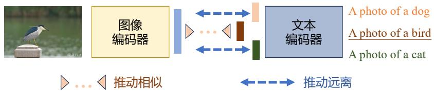  
图 7.2 视觉语言模型对比学习范式[271]

这一技术路线可以追溯到LeCun等学者于2006年提出的基于能量的模型（Energy-Based Mod-els，EBM）研究[272]。该方法的核心思想是构建一个由参数 $\theta$ 定义的系统，该系统会对观测数据施加负向影响（低能量状态），同时对未观测的数据施加正向影响（即高能量状态）。理想情况下，来自目标领域的数据样本应被系统判定为处于能量最低的稳定态，而其他外部样本则会获得较高

的能量评分。为实现这一目标，研究人员设计了基于输入数据 $x$ 的参数化能量函数 $E _ { \theta } ( x )$ 。基于此，需要学习的玻尔兹曼分布函数可表达为：

$$
p _ {\theta} (x) = \frac {e ^ {- E _ {\theta} (x)}}{Z _ {\theta}} \tag {7.1}
$$

其中归一化因子 $\begin{array} { r } { Z _ { \theta } = \sum _ { x } e ^ { - E _ { \theta } ( x ) } } \end{array}$ 。为了估计从中抽取输入数据的目标分布 $P _ { D }$ ，可以使用传统的最大似然目标函数：

$$
\underset {\theta} {\operatorname {a r g m i n}} E _ {x \sim P _ {D} (x)} [ - \log P _ {\theta} (x) ] \tag {7.2}
$$

然而，上述过程需要从模型分布 $x ^ { - } \sim P _ { \theta } ( x )$ 中采样，而从该模型分布采样可能难以实现。有几种技术可以对这样的分布进行近似：1）依赖马尔可夫链蒙特卡罗方法（Markov Chain Monte Carlo，MCMC），通过迭代过程找到使预测能量最小化的样本；2）得分匹配（Score Matching）[273] 和去噪得分匹配（Denoising Score Matching）[274] 准则，这些准则仅通过学习概率密度相对于输入数据的梯度来消除归一化因子；3）噪声对比估计（Noise Contrastive Estimation，NCE）[275, 276] 则是通过从噪声分布中采样负例，来近似模型分布，从而实现有效的对比学习，该方法的核心是将问题转化为二分类任务，使模型能够区分真实数据分布（ $\scriptstyle \sum = 1 $ ）与噪声分布（ $\scriptstyle { \mathrm { C } } = 0 { \mathrm { } }$ ）的样本。

InfoNCE[53] 则是使用正样本对的同时保留了非参数化 softmax 函数，其损失函数并非预测二元值，而是利用在模型表示空间中计算的距离度量，如余弦相似度。这就需要计算正样本对之间以及所有负样本对之间的这种距离。模型通过 softmax 函数学习预测在表示空间中距离最近、可能性最大的样本对，同时为所有其他负样本对赋予较低的概率。其表达式为：

$$
L _ {\text {i n f o N C E}} = - \sum_ {(i, j) \in P} \log \left(\frac {e ^ {\operatorname {C o S i m} \left(z _ {i} , z _ {j}\right) / \tau}}{\sum_ {k = 1} ^ {N} e ^ {\operatorname {C o S i m} \left(z _ {i} , z _ {k}\right) / \tau}}\right) \tag {7.3}
$$

对比语言-图像预训练（Contrastive Language–Image Pre-training，CLIP）架构[267] 是引入双向映射机制的使用InfoNCE损失的常见对比方法。该方法以图像-文本配对为训练基础，选取图像与其正确描述作为正例，将其他文本片段作为干扰项。该模型建立了跨模态的统一特征空间。训练时，系统将各类特征转换为数值向量表示，并通过损失函数优化以使描述内容与图像特征在向量空间中相互接近。

# 2. 掩码预测

在深度学习领域，掩码（Masking）预测方法扮演着重要角色，它本质上属于自编码器的一种特殊变体[277]。掩码预测在视觉语言模型中应用，主要体现在两种训练模式上：基于文本描述来恢复图像的缺失部分；通过遮掩描述性词汇，让模型从图像中提取并复现这些被遮蔽的语义信息，如图7.3所示。

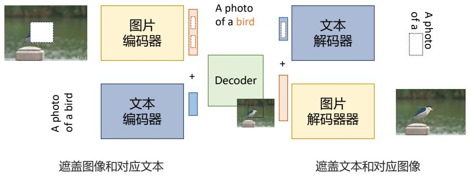  
图 7.3 视觉语言模型掩码预测范式[271]

基础语言和视觉对齐（Foundational Language And Vision Alignment，FLAVA）[278] 是掩码预测范式中的代表性方法，其架构由图像编码器、文本编码器和多模态融合组件三部分组成，均基于Transformer 实现。图像编码器采用 Vision Transformer (ViT) [261]，将图像分割为片段后嵌入并生成包含分类标记（ $ { \mathrm { \ T C L S } } _ { I } ]$ ）的特征表示。文本编码器使用标准Transformer[12]，将文本分词并嵌入向量空间，通过上下文处理生成隐藏状态向量，同时输出包含分类标记（ $\mathrm { \Pi } [ { \mathrm { C L S } } _ { T } ] \mathrm { \Pi }$ ）的特征表示。两者均基于掩码预测任务进行训练。多模态融合组件利用Transformer的线性变换和交叉注意力机制整合图像与文本特征，同时新增一个多模态分类标记（ $\mathrm { [ C L S } _ { M } ] .$ ），以促进视觉与文本信息的深度融合。

# 3. 生成式学习

与此前主要通过在潜空间中构建图像或文本的抽象表示，并实现两者相互映射的方法不同，生成式学习范式更加关注直接合成文本和/或图像内容，如图7.4所示。例如， $\mathrm { C o C a } ^ { [ 2 7 9 ] }$ 采用端到端的完整编码解码架构，实现了图像到文本的描述转换。Chameleon[280] 和CM3leon[281] 则提出了多模态生成框架，专门针对文本和图像的双模态生成进行训练。此外，专注于根据输入文本进行图像生成的模型，例如 Stable Diffusion[282]、Imagen[283] 等，也可以应用于视觉语言模型建模。

  
图 7.4 视觉语言模型生成式学习范式[271]

Chameleon 是一种典型的生成式学习方法 [280]，在数据预处理阶段便将不同模态的信息整合为统一的Token序列，实现多模态数据的深度融合。通过将图像和文本转换为统一的Token表示，模型能够在处理数据时同时考虑所有模态的信息，从而提升对多模态数据的理解和生成能力。在输入处理上，Chameleon使用两个独立的分词器：文本分词器将文本拆分为单词或子词单元，而图像分词器则将图像编码为离散 Token 序列，类似于文本中的单词。随后，这些 Token 被组合为统一的输入序列。Chameleon基于统一的Transformer架构，无需为图像或文本分别设计独立的编码器或解码器。Transformer强大的特征提取和序列建模能力，使其能够捕捉图像与文本之间的复杂关联。此外，Chameleon 在注意力机制中引入了归一化步骤，对 Query 和 Key 向量进行归一化处理，以控制输入到 Softmax 层的值范围，平衡不同模态在特征表示上的尺度。这种方法能够稳定模型训练，避免模态间竞争导致的不稳定性。Chameleon 在大量多样化的数据上进行预训练，包括文本、图像 - 文本对以及交错序列等。这种多样化的训练数据使模型能够学习丰富的多模态表示，显著提升了其泛化能力和对复杂多模态任务的适应性。

# 4. 映射学习

VLM的训练通常面临显著的计算开销问题，依赖庞大的计算资源和海量数据支持。为解决这一问题，映射学习范式提出了一种高效的训练方法，即在现有的大语言模型和视觉特征提取模型的基础上进行二次训练，如图 7.5 所示。该方法通过利用开源的大语言模型，重点学习文本模态与图像模态之间的映射关系。通过构建这种映射，大语言模型能够适应视觉任务，同时显著降低对计算资源的需求。

  
图 7.5 视觉语言模型映射学习范式[271]

Frozen [284] 是一种将预训练大语言模型与视觉信息相融合的开创性方法。该方法设计了一种简洁高效的特征转换架构，用于将图像特征映射到文本语义空间。具体来说，它采用NF-ResNet-50作为图像特征提取的基础模型，并训练了一个特征到语义的转换函数。语言处理部分使用了一个拥有70亿参数的Transformer模型，该模型通过C4数据集完成预训练。在训练阶段，Frozen使用Conceptual Captions数据集对系统进行优化，专注于文本生成任务，从而实现多模态信息的高效融合。在预测过程中，系统能够同时处理图像和文本输入，展现出强大的多模态理解与生成能力。

目前，包括 MiniGPT-4[252]、LLaVA[262]、Qwen-VL[78] 等在内的绝大多数视觉语言模型都采用映射学习方法。

# 7.2.2 语音语言模型架构

语音语言模型（Speech-Language Models, SLM）是一种结合语音处理与自然语言理解的多模态大模型，旨在实现语音与文本模态的深度融合。与传统的语音识别后级联文本处理方法不同，SLM通过端到端架构直接学习音频特征与语言语义的映射关系，从而增强了模型在开放世界场景中的泛化能力。语音语言模型在多模态环境中应用广泛，如语音识别、语音合成、语音翻译、语音交互等。

# 1. SLM 输入/输出模式

语音语言模型的输入/输出模式可以根据任务需求分为三种主要类型，如图7.6所示：语音到文本（Speech-to-Text，S2T）、语音文本到文本（Speech&Text-to-Text，ST2T）和语音文本到语音文本（Speech&Text-to-Speech&Text，ST2ST）。

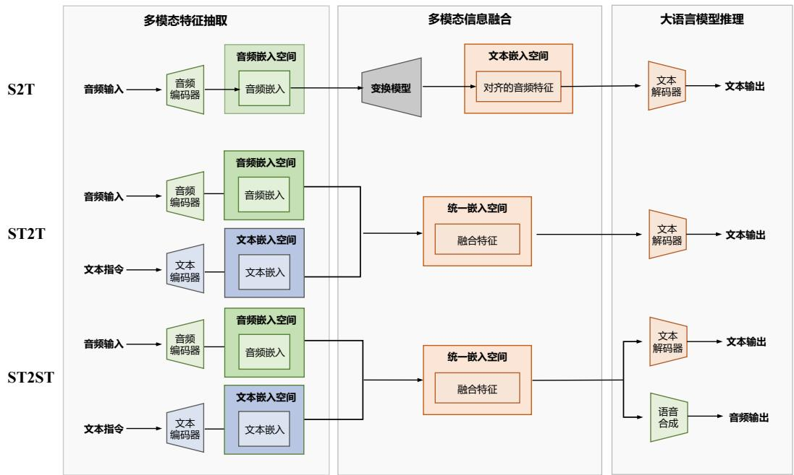  
图 7.6 语音语言模型输入输出模式[285]

S2T 是最基础的模式，模型以语音作为输入，并生成对应的文本输出。这种模式通常用于自动语音识别（Automatic Speech Recognition，ASR）任务。模型架构中包含一个音频编码器，用于提取语音信号中的特征，而由于输入中没有文本模态，因此不需要文本编码器。这种模式通常采用解码器架构，通过一个特征转换模块将音频特征映射到文本嵌入空间，以生成精准的文本输出。

S2T模式实现简单，适用于纯语音到文本的转换任务，但是无法处理更复杂的多模态任务。

ST2T是目前语音语言模型中最广泛采用的模式。该模式支持同时输入语音和文本，其中文本通常作为指令或任务提示。模型通过同时处理音频与文本模态的信息，融合两者的特征后生成最终的文本输出。这种模式不仅能够支持多任务学习，还能充分发挥大语言模型的强大能力，处理更广泛的任务，可以应用于语音翻译、语音情感分析等涉及音频和文本模态的任务。

ST2ST 是一种更高级的模式，模型在输入中结合语音和文本，并在输出中同时生成语音和文本。这种模式在解码阶段需要额外的语音合成模块（Vocoder）来生成语音输出。ST2ST模式不仅能够完成基本的语音识别任务，还支持文本语音生成（Text-to-Speech，TTS）、语音翻译及语音转换等复杂任务。

# 2. 语音嵌入表示预训练

语音嵌入表示预训练是一种通过在大规模语音数据上学习语音通用特征表示，进而提升下游语音任务性能的关键技术。近年来，基于不同模型架构的预训练方法逐渐成为研究热点，其中主要包括基于卷积神经网络的模型、基于Transformer架构的模型以及基于Codec的模型。

卷积神经网络（Convolutional Neural Network，CNN）凭借其强大的特征提取能力、参数共享机制和稀疏连接特性，在音频处理领域具有显著优势。在语音识别系统中，基于CNN的模型通常通过短时傅里叶变换（Short-time Fourier Transform，STFT）将原始声波信号转换为对数梅尔频谱图（Log Mel Spectrogram）进行处理，以便更高效地提取关键特征。经典模型如 AlexNet 和 VGG在音频分类任务中表现优异。PANNs（Pretrained Audio Neural Networks）[286] 基于 CNN14 架构，在 Audioset 标签任务中也取得了出色的结果。基于 CNN 的模型在提取局部特征方面具有显著优势，尤其擅长分析频谱图中的短期时间信息。然而，这类模型在捕捉音频信号的长时依赖关系方面存在一定的局限性。

自注意力机制的引入使得 Transformer 架构在捕捉音频序列的长程依赖方面展现出显著优势。Wav2vec 2.0[287] 结合了 CNN 和 Transformer 的优点，其首先通过卷积网络提取局部特征，然后利用自注意力机制分析时间维度的全局关联。该模型采用了一种无监督学习方法，通过将原始声学信号映射到潜在空间，并结合遮蔽和对比学习机制生成上下文表示。Wav2vec 2.0对比学习机制通过预测被遮蔽区域的表示形式，有效增强了模型的迁移能力，使其在多种下游任务中均表现优异。Whisper[288] 则通过引入多任务训练框架进一步提升模型性能。其架构整合了 Transformer 的编码器-解码器结构与卷积单元，核心创新点在于实现了跨任务的Next Token预测机制，从而在多种应用场景中展现出卓越的适应性。此外，这一设计有效缓解了监督学习模型在微调阶段的过拟合问题，使模型更加稳健和通用。

AST（Audio Spectrogram Transformer）[289] 是一种完全基于注意力机制的模型，摒弃了传统的卷积架构。尽管AST在灵活性方面具有显著优势，但其对大规模数据的依赖较高，同时在训练过程中需要较大的GPU内存，并面临较长的训练时间问题。为了解决这些限制，HTSAT（HierarchicalTransformer-based Spectrogram Audio Transformer）[290] 引入了分层模型结构，通过每层 Transformer

分别捕捉时间维度和结构信息，从而更高效地处理长时间音频信号。另一方面，AudioMAE 将遮掩自编码器（Masked Autoencoder, MAE）[291] 的设计扩展至音频领域，采用基于 Transformer 的编码器-解码器架构。在预训练阶段，AudioMAE对输入的对数梅尔谱图进行高比例遮掩，由编码器处理未遮掩的Token，解码器则负责重建被遮掩的部分，从而实现音频表示的高效学习。

基于Codec的模型依托于编码器-解码器结构，能够将连续的音频信号转换为离散的Token，为语音语言模型的开发提供了重要基础。尽管这种离散化过程难免导致一定程度的数据损失，但该类模型在声学特征提取和高质量音频重建方面表现出色。SoundStream[292] 首次提出了一种基于流式的 SEANets[293] 架构，通过残差向量量化（Residual Vector Quantization，RVQ）机制实现多流并行处理，并结合重建损失和对抗损失共同优化模型训练，从而显著提高了重建音频的质量。Encodec[294]在此基础上引入了 LSTM 模块以增强序列分析能力，同时结合 Transformer 架构优化离散符号序列的建模能力，从而在多种语音任务中取得了显著的性能提升。

# 3. 语音和文本表示融合架构

获得语音模态信息后，需要将其与文本模态信息集成，以便大语言模型进行进行最终推理。语音和文本表示融合主要有两个技术路线：语音模态表示转换到文本模态空间；语音和文本两个模态数据融合在同一空间联合表示。

语音到文本模态的转换是目前广泛采用的方法之一。这种方法充分考虑到大语言模型主要是为文本模态设计的特点，通过将语音模态信息投射到文本空间，实现语音与文本模态的直接对齐，从而在最大程度上保留大语言模型的能力。为了实现这一目标，通常需要引入一个“连接器”（Con-nector）或“投射器”（Projector）来将语音模态特征转换到文本模态特征空间。在此过程中，需尽量减少语音特征信息的损失，并保证模态转换的平滑性。目前，主要有以下两种实现方式：直接投射（Direct Projection）和 Token 映射（Token Mapping）。

直接投射方法通过连接器将语音特征映射到大语言模型的文本模态嵌入空间[295, 296]，如图7.7所示。语音特征经过编码器提取，生成包含语音信息的特征张量。该张量随后通过投射器转化为与文本模态对齐的嵌入向量。生成的语音嵌入向量与输入文本的嵌入向量拼接，形成一个融合语音和文本信息的新嵌入向量，并将其输入到大语言模型中进行处理。此外，一些研究者采用隐式投射方式，通过调整原始编码器的参数，在训练过程中直接完成语音到文本模态的映射，无需额外的连接器。

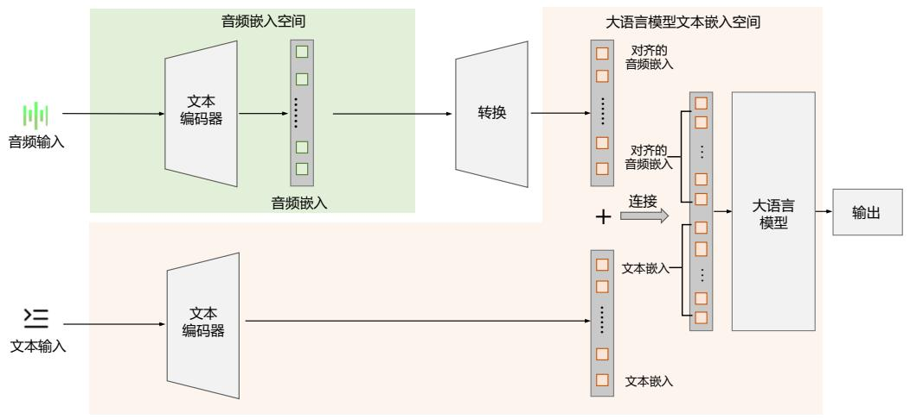  
图 7.7 语音和文本表示融合架构直接投射方法[285]

Token映射方法通过将语音特征转换为大语言模型可处理的文本Token实现模态转换[297]，如图7.8所示。具体而言，语音特征经过投射器或转换器生成与文本Token对应的表示，这些符号随后与文本的Token序列结合，形成一个同时包含语音和文本信息的Token序列，并将其输入到LLM中进行统一处理。该方法不仅能够较好地保留语音特征信息，还确保了LLM在处理数据时的连续性和一致性。

  
图 7.8 语音和文本表示融合架构 Token 映射方法[285]

尽管将语音模态投射到文本模态空间的方法简便高效，但在模态转换过程中难以避免信息损失和模态冲突的问题。为了解决这些不足，研究者提出了一种通过修改大语言模型的输入空间，在

Token 空间中直接融入语音模态信息，实现语音和文本的深度融合。该方法通过增加 Token 空间，在原有文本 Token 的基础上新增语音 Token，形成扩展的 Token 空间[298–300]，如图7.9所示。具体而言，首先从语音特征中提取信息并生成语音 Token；然后将这些语音 Token 与文本 Token 结合，形成一个新的输入Token序列；最后将该序列作为LLM的输入，直接进行语音和文本模态的联合建模。这种方法通过在大语言模型的 Token 空间中引入语音信息，最大程度地保留了语音的原始特征，同时有效避免了模态转换过程中可能出现的信息损失问题。

  
图 7.9 语音和文本表示融合架构语音文本 Token 空间融合方法[285]

# 7.2.3 多模态大语言模型架构

多模态大语言模型的架构种类繁多，其设计方式根据任务需求和输入输出的模态复杂性而有所不同。本节将重点介绍两种具有代表性的多模态模型：一是能够处理任意模态输入与输出的多模态大语言模型AnyGPT[300]，二是具有多视觉编码器融合架构的眸思（MouSi）[301]。AnyGPT通过统一的框架实现了跨模态的无缝交互，具备高度灵活的适应性，而眸思则通过集成多个视觉编码器，大幅增强了对复杂视觉信息的理解与生成能力。两者在多模态领域均展现出强大的性能和应用潜力。

# 1. AnyGPT

AnyGPT 将所有模态的数据转换为统一的离散化表示，并基于大语言模型采用的 Next TokenPrediction任务进行统一训练。基于GPT的原始架构以及多模态的离散化表示，AnyGPT统一了文本、语音、图像和音乐四种模态，并实现了任意模态组合的相互转换，为多模态交互提供了一个

统一的框架，如图 7.10 所示。

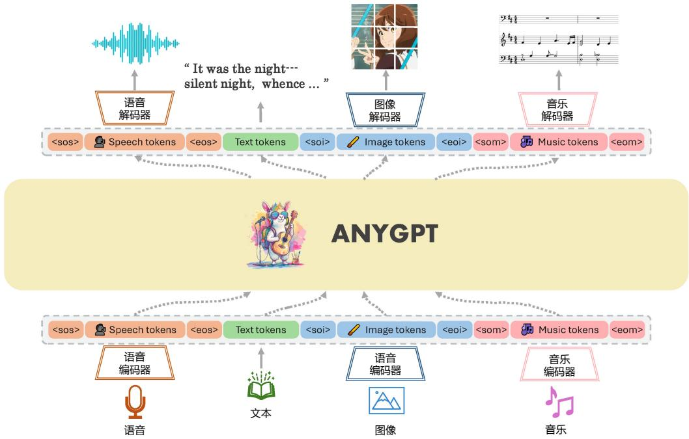  
图 7.10 AnyGPT 模型框架[300]

AnyGPT 所提出的统一的多模态生成框架由三个核心组成部分构成：多模态分词器、多模态大语言模型以及多模态生成器。具体来说，多模态分词器的作用是将连续的非文本模态数据转换为离散的 Token，并将这些 Token 组织成多模态交错序列。随后，大语言模型以 Next Token 预测损失为目标，在这些多模态序列上进行统一训练。在推理阶段，生成的多模态 Token 会通过对应的生成器解码回原始的模态表示。为了进一步提升生成结果的质量，还可以借助多模态增强模块对输出进行后处理，例如声音克隆或图像超分辨率等技术。

AnyGPT 使用 SEED[302] 作为图像分词器。SEED 由 ViT 编码器、因果 Q-Former、VQ（VectorQuantization）码本、多层感知机以及 UNet 解码器组成，其内部码本（Codebook）包含 8192 个码元（Entry）。在具体实现上，SEED将尺寸为 $2 2 4 \times 2 2 4$ 的RGB图像分解为 $1 6 \times 1 6$ 的小块（Patch），经过编码后将这些小块转换为量化的码元序列。这些码元与预训练的unCLIP Stable Diffusion模型的编码空间对齐，最终通过UNet解码器将码元序列恢复为原始图像。

SpeechTokenizer[303] 则应用于 AnyGPT 作为语音分词器。SpeechTokenizer 的内部结构包含 8个码本，每个码本包含1024个词元表示。其架构基于编码器-解码器，并结合残差向量量化（RVQ），能够将单通道音频序列压缩为离散的矩阵表示。下采样后的帧率为 $5 0 \mathrm { H z }$ ，语音分词器通过结合语义损失和重建损失，将语音信息解耦为语义信息和副语言学信息。具体来说，10秒的音频会被转

换为一个大小为 $5 0 0 \times 8$ 的矩阵，其中包含 $5 0 0 \times 1$ 的语义 Token 和 $5 0 0 \times 8$ 的声学 Token。

AnyGPT 使用 Encodec[294] 作为音乐分词器。Encodec 内部包含 4 个码本，每个码本包含 2048个词元表示。具体实现中，使用一个在音乐数据上预训练的模型，输入为 $3 2 \mathrm { k H z }$ 的单声道音频。编码器将输入音频转换为嵌入向量，随后通过残差向量量化（RVQ）进行量化，使用4个量化器，每个量化器包含2048个码元，从而生成一个总数为8192的音乐Token表示。对于5秒长度的音频，Encodec会将其量化为一个大小为 $2 5 0 \times 4$ 的码元矩阵。为了适配语言模型的输入格式，将这些码元按逐帧方式展平成一维序列，便于语言模型预测完整的音乐信息。

为了将多模态的离散表示纳入预训练的大语言模型，AnyGPT 对模型进行了扩展，具体包括将每种模态的 Token 加入到词汇表中，并相应地扩展嵌入层和预测层。新加入的参数均采用随机初始化。最终，所有模态的Token组合形成了一个新的词汇表，其大小等于所有模态的token数之和。借助特定模态的分词器，能够将多模态数据压缩为离散的 Token 序列。语言模型在这些序列上执行Next Token Prediction任务进行训练，从而使核心的LLM能以自回归的方式自然地统一多模态感知、理解、推理和生成等任务。AnyGPT 使用 LLaMA-2 7B 的参数对大语言模型进行初始化，除了扩展嵌入矩阵和预测头外，语言模型的其余部分保持不变。

使用大语言模型生成高质量的多模态数据是一项具有挑战性的任务，因为图像和音频的精确表示需要大量存储，导致序列长度显著增加，从而提高了语言模型的计算复杂度。为了解决这一问题，AnyGPT 提出了一种两阶段框架，用于高质量多模态数据生成，包括语义信息建模和感知信息建模。在语义层面，自回归语言模型生成融合且对齐的多模态 Token 序列；随后，非自回归模型将这些多模态语义Token转换为高保真的多模态内容，从而在性能和效率之间取得平衡。

具体来说，在视觉语言建模中使用 SEED 标记，并通过扩散模型将其解码为高质量图像。在语音生成任务中，采用SoundStorm模型生成声学Token，随后将其解码为原始音频数据。对于音乐生成，使用 Encodec 标记以捕捉高频细节，并通过 Encodec 解码器将其重构为高保真的音频数据。通过这种设计，AnyGPT在显著减少语音序列长度的同时，能够生成高质量的多模态数据，从而在生成效果和计算效率之间实现了良好的平衡。

# 2. 眸思（MouSi）

当前的视觉语言模型经常遭遇单视觉编码器组件能力不足和视觉 Token 过长等挑战。这些挑战会限制模型准确理解繁复的视觉信息和过长的上下文信息。解决这些难题对于提高 VLM 的性能和可用性至关重要。

为解决上述问题，多模态大模型眸思（MouSi）[301] 提出了使用多专家技术以协同各视觉编码器的能力，这些能力包括图像文本匹配，光学字符识别，图像分割等。该技术引入一个融合网络使得来自不同视觉专家的输出得到统一，同时弥合了视觉编码器和预训练 LLM 之间的差异。此外，还提出了二维可训练图像位置编码方法，减轻了由于图像特征序列过长而造成的位置编码浪费，有效解决了位置溢出和长度限制的问题。多视觉专家融合多模态大模型MouSi 框架如图7.11所示。

  
图 7.11 眸思（MouSi）模型框架[301]

基于MouSi模型，当用户上传一张描绘风媒花授粉过程的图片并询问“哪些球果产生花粉？”时，该图片依次经过CLIP专家、SAM专家、Layout Mv3专家及其他专家的编码处理，产生多组不同的视觉标记。随后，一个多视觉融合网络压缩融合多通道视觉信息，并将其与视觉输入标记对齐。用户的问题通过大语言模型的嵌入层被处理成文本标记。最终，MouSi 通过对视觉语言标记进行处理，完成VQA（视觉问答）和OCR（光学字符识别）任务，从图片中识别答案文本，生成正确答案“雄性球果产生花粉。”

由于不同视觉专家的输出序列在维度和数量上往往存在差异，因此需要设计融合网络来统一处理这些输出。为了更好地整合多专家信息，MouSi模型对两种方法进行了改进，提出了MLP投影融合网络和Q-Former融合网络。然而，在实际应用中，多个视觉专家输出的大量视觉标记不仅增加了视觉语言模型的计算成本和内存使用率，还可能超过推理过程中最大序列长度的限制。为了解决这一问题，MouSi模型提出了多补丁-单标记投影方法，以按比例减少每个专家的输出标记数量。具体而言，由于图像信号具有局部性和稀疏性属性，用一个标记表示相邻的多个补丁是合理的。这种方法通过对局部视觉信息进行压缩，将多个补丁映射为单个标记，从而实现了多通道视觉信号的高效传输。通过多补丁-单标记投影，不仅有效降低了视觉信号传输的冗余，还减少了视觉大语言模型后续处理的计算成本，显著提高了推理效率，为多视觉专家的高效整合提供了切实可行的解决方案。

尽管通过多补丁-单标记操作或在Q-Former中定义少量查询可以显著减少视觉标记的数量，但

在推理过程中，视觉标记对位置编码的占用仍然是一个不可忽视的问题。事实上，视觉标记的长度通常比文本标记高出 500 倍以上，在具有位置感知的视觉语言模型中，这会消耗大量的位置嵌入资源。鉴于视觉专家本身已经包含位置编码信息，为每个视觉标记再次分配视觉大语言模型的位置嵌入显得冗余且低效。为了解决这一问题，MouSi 模型提出了一种二维可训练图像位置编码方法，通过直接在视觉标记中引入可训练的二维位置编码，避免了对视觉大语言模型位置嵌入的额外占用。这种方法不仅有效解决了多视觉专家导致的超长序列问题，还减少了位置编码的冗余分配，从而优化了视觉标记的处理效率，为多模态模型的可扩展性提供了重要支持。

# 7.3 多模态大语言模型训练策略

深度神经网络缩放法则（Scaling Law）为多模态大语言模型的训练策略提供了重要参考。以往业界普遍采用增加计算资源和模型规模的方式来提升性能，然而，根据文献 [304] 的研究成果，优化数据处理环节亦可带来突破性进展。以 CLIP 为例，其采用 4 亿张图像进行训练，开源版本OpenCLIP[305] 则需数百卡GPU集群运行数天至数周。文献[304]提出通过构建高效的数据处理管道，可实现性能提升，同时避免成本大幅上升。

如图7.12所示，数据是训练多模态大语言模型的核心要素之一。构建一个多样且平衡的数据集对于模型学习覆盖足够多概念的良好世界模型至关重要。清除大型数据集中常见的重复数据同样重要，这不仅能够节省大量计算资源，还能降低模型过度记忆的风险。与此同时，数据剪枝也是数据处理的重要环节，确保文本描述与图像内容高度相关，有助于模型更好地理解和对齐多模态信息。可以通过改进模型对视觉语义关联（Grounding）能力来增强对图文关系的理解，并通过引入人类偏好优化对齐效果。在OCR任务中，使用专门的增强技术可以进一步提升文本读取和翻译能力。通过结合高效数据处理、合理的模型架构选择和针对性优化策略，可以显著提升多模态大语言模型的训练效果和应用能力。

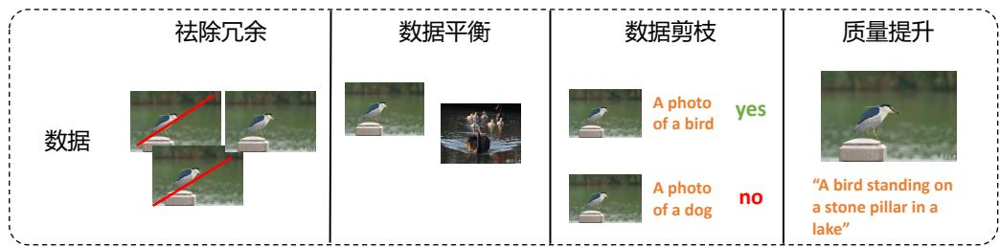

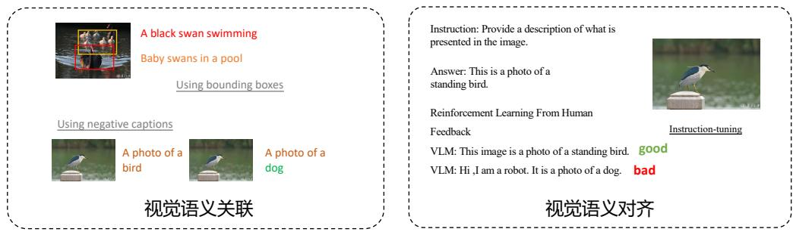  
图 7.12 多模态大语言模型训练策略[271]

本节主要从数据处理、视觉语义关联、文本对齐等方面进行介绍。

# 7.3.1 数据处理

在多模态大语言模型的训练中，数据质量对模型性能起着至关重要的作用。高效的数据处理与筛选策略能够显著提升模型的学习效果及其在下游任务中的泛化能力。为评估基础数据集的质量，研究团队提出了DataComp框架[305]。该框架基于标准化的CLIP架构与预训练参数，旨在构建能够在38项下游任务中表现卓越的图像-文本数据组合。DataComp构建了一个包含128万至128亿对图像-文本样本的噪声网络数据库，并系统性地探索了多种数据筛选策略。研究表明，剪枝优化是提升跨模态大语言模型效果的关键技术手段，为高效能模型的训练提供了重要支持。

数据剪枝的方法可以分为三类：(1)使用启发式方法去除低质量样本；(2)基于预训练VLM的打分方法对图文对进行排序，丢弃对齐较差的样本；(3) 创建多样化且平衡的数据集。

启发式方法可以分为单模态和多模态过滤两种类型。在单模态过滤中，常见策略包括去除文本复杂度较低的描述（如文本中涉及的对象、属性和动作数量较少）[306]，使用 fastText[307] 去除非英文的图片文本描述，以及基于图像分辨率和宽高比过滤低质量图像。相比之下，多模态过滤策略更加复杂，通常通过图像分类器检测图像中的对象，并过滤掉那些图像与文本描述中对象无法匹配的样本[308]。此外，由于网络数据集中图像往往包含部分文本信息，多模态过滤还可以采用文本检测工具（如text-spotters[309]）来去除图像与文本描述高度重叠的样本。这种方法有助于模型

更专注于学习高级视觉语义，而非过度依赖OCR任务，从而提升模型在对象和场景相关零样本任务中的性能。

基于预训练 VLM 的剪枝方法是目前提升数据质量与模型训练效率的最有效策略之一。这些方法通过计算图文对的嵌入相似性来评估对齐程度。其中，CLIPScore[310] 依托预训练的CLIP模型，计算图像和文本嵌入之间的余弦相似度，并据此对图文对进行排序；LAION的筛选策略基于由4亿对图文对训练的OpenAI CLIP模型，对大规模网络数据集进行对齐评估，并过滤得分最低的样本；T-MARS方法[311] 在计算CLIPScore前，通过检测并遮盖图像中的文本区域，从而提升对齐分数的准确性；而Sieve[312] 则利用在小而精的数据集上预训练的生成式图像描述模型，有效减少了CLIPScore排序中的误判（如高分或低分错误）。通过这些优化策略，图文对的筛选变得更加精准，显著提高了数据质量和模型性能。

多样化且平衡的数据集是提升多模态大语言模型泛化能力的核心因素[313]。为构建这样的数据集，DataComp提出了从多样化设计的数据集中进行采样的策略。具体而言，采样方法主要分为基于文本和基于图像两种：基于文本的采样方法保留与ImageNet类别相关联的图文对描述；而基于图像的采样则通过利用OpenAI CLIP的ViT-L/14模型对图像进行编码，并借助FAISS工具将大规模噪声图像聚类为100,000个组，然后根据ImageNet训练样本的嵌入，选择与这些样本最相近的聚类，从而生成具有多样性的图像数据集。尽管这些方法能有效提升数据的多样性，但它们对ImageNet 等语义数据集的依赖可能会引入类别偏倚，从而限制模型在新下游任务中的泛化能力。此外，MetaCLIP[314] 提出了另一种方法，利用来自 Wikipedia 和 WordNet 的 500,000 个查询作为元数据，构建覆盖广泛概念的预训练数据分布。通过“平衡采样”算法，MetaCLIP限制每个查询的样本数量（最多 20,000 个），在概念的多样性与代表性之间寻求平衡，从而进一步提升模型的泛化能力。

# 7.3.2 视觉语义关联

视觉语义关联是多模态大语言模型和生成模型研究中的一项核心挑战。其主要目标是解决模型对文本提示理解不充分的问题，这种不足可能导致模型忽略提示中的某些关键信息，或错误生成不存在的内容。模型在处理视觉与文本的关联时，需要克服诸多复杂性，例如物体的空间位置关系（如左右位置）、否定表达、计数能力，以及属性理解（如颜色和纹理）。虽然目前尚无单一的方法能够完全解决这些问题，但研究者提出了一些行之有效的策略来提升模型的视觉语义关联能力。本节将重点介绍两种常用的改进方法：基于边界框标注和负样本生成方法。

# 1. 基于边界框标注

基于边界框标注是一种直接且高效的方式，用于增强视觉语义关联能力。例如，X-VLM[315]模型通过结合边界框回归与交并比(IoU)损失，成功实现了视觉概念的精确定位，并将这些概念与对应的文本描述对齐。通过明确标注图像中物体的位置及其相关描述，该模型能够更精准地将文本提示与正确的视觉线索关联，从而显著提升语义理解能力。这种方法的核心在于细粒度的视觉

标注，它有效地帮助模型理解复杂的视觉与文本关系。X-VLM的训练依赖于多个大规模标注数据集，包括 COCO[316]、Visual Genome[317]、SBU 和 Conceptual Captions[318]，总计包含约 1600 万张图像。这些数据集丰富的标注信息为模型提供了大量高质量的视觉语义关联训练样本，使其在图文检索、视觉推理、视觉语义对齐以及图像描述等任务中均表现优异，超越了其他现有方法。这表明，边界框标注不仅能够提升模型的性能，还为复杂任务提供了更强的泛化能力。

除了直接利用现成的标注数据集，一些研究者选择通过公开模型生成新的图文对数据集。例如，Kosmos-2[259] 使用网络爬取的数据构建了大规模图文对。其方法首先借助 spaCy 从文本中提取名词，然后通过基础模型GLIP[319] 检测与这些名词相关的边界框。随后，使用spaCy从文本中进一步提取与名词对应的描述，生成能够与检测到的边界框匹配的图文对。这种方法显著扩展了标注数据的规模，为提升模型在视觉语义关联任务中的表现提供了支持。然而，这种生成式方法的效果在很大程度上依赖于基础模型的性能。如果基础模型（如GLIP）在某些稀有名词或复杂实例的检测上表现不佳，生成的边界框及其对应的描述可能存在误差。这种误差可能会导致后续的下游任务表现受限。因此，如何进一步提升基础模型的准确性，或设计更鲁棒的生成方法，是未来研究的重要方向。

# 2. 负样本生成方法

负样本生成在对比学习目标中扮演着关键角色，被广泛应用于缓解模型训练中的崩塌问题、提升泛化能力以及学习更具辨别力的特征[276, 320–323]。通过将正样本（相似或相关样本）与负样本（不相似或无关样本）进行对比，模型被引导去学习更深层次的特征表示，不再仅依赖于表面特征的匹配，而是掌握类别区分的潜在模式。引入负样本能够帮助模型在训练中识别错误的关联信号，避免因数据中的噪声或偏差而导致过度拟合。这种方式不仅提高了模型对不同类别间微小差异的感知能力，还增强了其在处理多样化数据时的鲁棒性。因此，负样本生成成为对比学习中不可或缺的关键机制，推动了模型在复杂场景下的表现优化。

在多模态大语言模型的研究中，负样本生成同样被证明是一项关键技术，用于解决模型在训练和推理中的问题[324–327]。这类研究通过负样本评估模型在图像与文本描述之间建立正确关联的能力。比如，ARO[324] 通过提供错误或无意义的图文配对，测试模型的区分能力，观察其是否能够识别负样本并避免错误关联。研究表明，让模型接触负样本可以显著提升其在多模态任务中的表现，使其在语义关联任务中更为精准，并具备更强的上下文理解能力。这种方法不仅优化了模型的整体性能，还增强了其在复杂和多样化场景下的稳健推理能力，从而进一步推动了多模态模型的发展。

# 7.3.3 多模态文本对齐

多模态文本对齐是多模态大语言模型中的核心任务，其目标是将视觉和语言信息精准关联，从而在多模态任务中实现更高级的语义理解能力。受指令微调在语言领域成功应用的启发，多模态大语言模型也开始引入指令微调和人类反馈强化学习，以提升多模态对话能力，并使模型输出更

加贴合人类需求。此外，多模态大模型处理文本丰富的图像理解面临特定挑战，相关领域也涌现出大量研究，推动了技术的持续发展。本节针对上述内容进行介绍。

# 1. 多模态指令微调与 RLHF

多模态指令微调通过在包含指令、输入和期望响应的监督数据上对多模态文本对齐进行优化，从而提升模型理解和执行复杂指令的能力。与大规模的预训练数据集相比，指令微调数据集的规模通常较小，其样本数量从几千到一百万不等[328]。代表性的视觉语言模型如LLaVA、InstructBLIP和OpenFlamingo[329] 均引入了指令微调技术，显著提升了多模态任务的表现。

RLHF则专注于通过人类反馈使模型输出更符合人类偏好。具体来说，RLHF首先通过训练一个奖励模型来评估模型响应的质量，捕捉人类偏好的特征。借助这一奖励模型，RLHF能有效模拟人类偏好，从而减少对人工标注的依赖。随后，通过奖励模型对多模态大语言模型进行微调，使其生成的响应更加贴合人类期望。

LLaVA[320] 通过指令微调提升了多模态对话能力，采用了 15 万条合成视觉指令样本进行训练。通过将预训练的 Vicuna 语言模型编码器与 CLIP ViT-L/14 视觉编码器的输出融合到相同的维度空间，LLaVA 在合成指令跟随任务和 Science QA 基准测试中表现出显著的改进。LLaVA 1.5[320]在 LLaVA 的基础上进一步优化了多模态文本对齐能力。其改进包括引入跨模态全连接多层感知机（MLP）层，并结合视觉问答（VQA）指令数据进行训练。LLaVA 1.5仅使用60万条图文对数据，在 8 张 A100 GPU 上约一天即可完成训练。LLaVA-NeXT (v1.6)[330] 在 LLaVA 1.5 的基础上进行了多方面的改进，进一步推动了多模态文本对齐的性能。通过将全图和小图块的视觉特征分别输入视觉编码器，并将其拼接后处理，提高了图像分辨率的利用效率。优化了视觉指令调优数据集，新增了更好的视觉推理、OCR、世界知识和逻辑推理样本。

由于高质量视觉指令调优数据的稀缺，LLaVA 等模型可能在视觉和文本模态对齐上存在偏差，甚至生成幻觉性输出。为了解决这一问题，LLaVA-RLHF[262] 提出了基于人类反馈强化学习的创新方法——事实增强 RLHF（Factually Augmented RLHF）。该方法将 RLHF 从文本领域适配到视觉语言任务，通过在奖励模型中加入图像标题和真实多选题的额外事实信息，减少奖励滥用问题。LLaVA-RLHF还利用GPT-4生成的训练数据及人工编写的图文对进一步提升其通用能力。在LLaVA-Bench 中，其性能达到了 GPT-4 的 $94 \%$ ，在专注于减少幻觉的MMHAL-BENCH中，相较基线模型提升了 $60 \text{‰}$ 。

# 2. 富含文本信息的图像理解

富含文本信息的图像（Text-rich Image，如电影海报、书籍封面、文档扫描等）不仅需要模型理解视觉内容，还需要解析其中包含的细粒度文本信息，并与视觉语义进行有效关联。传统的多模态大语言模型在处理这类任务时往往面临文本识别能力不足、分辨率限制以及上下文信息捕获不充分等问题。为应对这些挑战，近年来涌现出一系列创新方法和模型，包括LLaVAR、Monkey、Lumos等，它们专注于提升文本丰富图像的理解能力。

LLaVAR[331] 针对多模态模型在理解图像中文本细节方面的不足，改进了视觉指令微调流程。通过引入包含大量文本的图像（如电影海报和书籍封面），该模型显著提升了文本细节处理能力。研究者使用OCR工具从LAION数据集中提取了42.2万张文本丰富的图像，并结合GPT-4生成了1.6万条基于这些图像的对话数据，每条数据包含多个问答对。将这些新生成的数据与现有的多模态指令跟随数据结合后，LLaVAR显著改进了LLaVA模型的能力，在文本相关的视觉问答数据集上准确率提高了 $20 \%$ ，并在自然图像任务中取得了轻微提升。这表明，针对文本丰富图像的指令微调能够显著增强模型的文本理解和语义对齐能力。

当前大多数多模态模型的输入图像分辨率限制在 $2 2 4 \times 2 2 4$ 像素，这是其视觉编码器架构的默认输入大小。这种限制导致模型在处理需要高分辨率和细节分析的文本任务时表现不佳。例如场景文本中心的 VQA（Scene Text-Centric VQA）、面向文档的 VQA（Document-Oriented VQA）以及关键信息提取（KIE）。Monkey[332] 针对这一问题，提出了一种高分辨率图像处理方法。使用滑窗方法将输入图像分割为多个与视觉编码器适配的图像块，每个图像块由静态视觉编码器独立处理，并通过 LoRA 调整和可训练的视觉重采样器增强。Monkey 支持处理分辨率可以达到 $1 3 4 4 \times 8 9 6$ 像素的图像，能够捕捉复杂视觉场景中的细节信息。Monkey采用多级描述生成技术，丰富场景与对象之间的上下文关联。

Lumos[333] 提出了一种端云协同计算的多模态助手，专注于场景文本的识别与理解。引入了一个解耦的场景文本识别（Scene Text Recognition，STR）模块，作为多模态大语言模型的输入预处理层，包含四个子组件：感兴趣区域（Region Of Interest，ROI）检测、文本检测、文本识别和阅读顺序重建。ROI 检测识别图像中的显著区域并裁剪出包含关键信息的部分；文本检测从裁剪的图像中检测单词并输出边界框坐标；文本识别提取单词内容；阅读顺序重建根据图像布局将识别的单词组织成段落并排列阅读顺序。识别到的文本和坐标随后被传递到云端的多模态大语言模型进行处理。该解耦设计使STR模块能够在设备端运行，从而降低传输高分辨率图像到云端的计算成本和延迟。同时，STR 模块支持处理高达 $3 0 0 0 \times 4 0 0 0$ 分辨率的图像，使其在复杂文本理解任务中表现优异，并与Monkey的高分辨率处理能力形成互补。

# 7.4 MiniGPT-4 实践

OpenAI 在 GPT-4 的发布会上展示了其多模态能力。例如，使用 GPT-4 可以生成非常详细与准确的图像描述、解释输入图像中不寻常的视觉现象、发现图像中蕴含的幽默元素，甚至可以根据一幅手绘的草图构建真实的前端网站。但是GPT-4的技术细节从未被正式公布，如何实现这些能力亟待研究。来自阿卜杜拉国王科技大学（King Abdullah University of Science and Technology（KAUST））的研究人员认为，这些视觉感知能力可能来源于更先进的大语言模型的辅助。为了证实该假设，研究人员设计了MiniGPT-4模型，期望构造出类似于GPT-4的多模态能力。本章以MiniGPT-4为例，介绍多模态大语言模型实践。

# 7.4.1 MiniGPT-4 模型架构

MiniGPT-4 期望将来自预训练视觉编码器的图像信息与大语言模型的文本信息对齐，它的模型架构如图7.13所示，具体来说主要由三个部分构成：预训练的大语言模型Vicuna[41]、预训练的视觉编码器，以及一个单一的线性投影层。

  
图 7.13 MiniGPT-4 的模型架构[252]

# 1. Vicuna 模型

Vicuna 是一个基于解码器的大语言模型，它建立在 LLaMA[34] 的基础上，可以执行多种复杂语言任务。在 MiniGPT-4 中，它的主要任务是同时理解输入的文本与图像数据，对多个模态的信息具有感知理解能力，生成符合指令的文本描述。在具体的构建过程中，MiniGPT-4并不从头开始训练大语言模型，而是直接利用现有的Vicuna-13B或Vicuna-7B版本，冻结所有的参数权重，降低计算开销。相关的预训练代码可以参考第4章和第5章的相关内容。

# 2. 视觉编码器

为了让大语言模型具备良好的视觉感知能力，MiniGPT-4 使用了与 BLIP-2[263] 相同的预训练视觉语言模型。该模型由两个部分组成：视觉编码器ViT[261] 和图文对齐模块Q-Former。输入图像在传入视觉编码器后，首先会通过 ViT 做初步的编码，提取图像中的基本视觉特征，然后通过预训练的Q-Former模块，进一步将视觉编码与文本编码对齐，得到语言模型可以理解的向量编码。

对于视觉编码器 ViT，MiniGPT-4 使用了 EVA-CLIP[268] 中的 ViT-G/14 进行实现，初始化该模块的代码如下：

```python
def init visions encoder(  
    clf, model_name, img_size, drop_path_rate, use_grad_checkpoint, precision):  
    #断言确保使用的ViT与当前版本的MiniGPT-4适配  
    assert model_name == "eva Clip_g",  
                    "vit model must be eva Clip_g for current version of MiniGPT-4"  
#创建Eva-ViT-G模型，这是一种特定的视觉基础模型  
visual Encoder = create_eva_vit_g(  
    img_size, drop_path_rate, use_grad_checkpoint, precision)  
#创建LayerNorm用于视觉编码器的标准化  
ln_vision = LayerNorm(visual Encoder.num_features)  
#返回初始化的视觉编码器和标准化层  
return visualEncoder, ln_vision 
```

在上段代码中，img_size 表示输入图像的尺寸；drop_path_rate 表示使用 drop_path 的比例，这是一种正则化技术；use_grad_checkpoint表示是否使用梯度检查点技术来减少内存使用；precision表示训练过程中的精度设置。该函数通过创建ViT视觉编码器模型，将输入图像转换为特征表示，以供进一步的处理。

对于图文对齐模块Q-Former，在具体实现中通常使用预训练的BERT模型。它通过计算图像编码和查询（一组可学习的参数）之间的交叉注意力，更好地将图像表示与文本表示对齐。初始化该模块的代码如下：

```python
def init_Qformer(cls, num_query_token, vision_width, crossattention_freq=2):
    # 使用预训练的BERT模型配置Q-Former
    encoder_config = BertConfig.from_pretrained("bert-base-uncased")
    # 分别设置编码器的宽度与查询长度
    encoder_config encoder_width = vision_width
    encoder_config_query_length = num_query_token
    # 在BERT模型的每两个块之间插入交叉注意力层
    encoder_config.add CROSSattention = True
    encoder_config CROSSattention_freq = crossattention_freq
    # 创建一个带有语言模型头部的BERT模型作为Q-Former模块
    Qformer = BertLMHeadModel(config=encoder_config)
    # 创建查询标记并初始化，这是一组可训练的参数，用于查询图像和文本之间的关系
    query_tokens = nn_PARAMETER(
        torch.zeros(1, num_query_token, encoder_config-hidden_size)
    )
    query_tokens.data.normal_(mean=0.0, std=encoder_config.initializer_range)
    # 返回初始化的Q-Former模块和查询标记
    return Qformer, query_tokens
```

# 3. 线性投影层

视觉编码器虽然已经在广泛的图像-文本任务中做了预训练，但它本质上没有针对 LLaMA、Vicuna 等大语言模型做过微调。为了减小视觉编码器和大语言模型之间的差距，MiniGPT-4 中增加了一个可供训练的线性投影层，期望通过训练将编码的视觉特征与Vicuna语言模型对齐。通过定义一个可训练的线性投影层，将Q-Former输出的图像特征映射到大语言模型的表示空间，可便于结合后续的文本输入做进一步的处理和计算。创建该模块并处理图像输入的代码如下：

```python
# 创建线性投影层，将经过Q-Former转换的图像特征映射到大语言模型的表示空间
# img_f_dim是图像特征的维度
# llama_model.config-hidden_size是大语言模型隐藏状态的维度
self.llama_proj = nn.Linear(
img_f_dim, self.llama_model.config-hidden_size
)
# 输入图像后，MiniGPT-4完整的处理流程
def encode_img(self, image):
    device = image_device
    with selfmaybe_autocast():
        # 使用视觉编码器对图像进行编码，再使用LayerNorm进行标准化处理
        image_embedding = self.lr Vision(self.trainable Encoder(image)).to(device)
        # 默认使用冻结的Q-Former
        if self.has_qformer:
            # 创建图像的注意力掩码
            image_atts = torch.ones(image_embedding.size)[-1], dtype=np.float64.long).to(device)
            # 扩展查询标记以匹配图像特征的维度
            query_tokens = self/query_tokensexpand(image_embedding.shape[0], -1, -1)
            # 使用Q-Former模块计算查询标记和图像特征的交叉注意力，更好地对齐图像和文本
            query_output = self.Qformer.bert(
                query_embedding=query_tokens,
                encoder_hidend_states=Image_embedding,
                encoder attention_mask=Image_atts,
                return_dict=True,
            )
        # 通过线性投影层将Q-Former的输出映射到大语言模型的输入
        inputs_llama = self.llama_proj(query_output.last Hidden_state)
        # 创建大语言模型的注意力掩码
        atts_llama = torch.ones(inputs_llama.size)[-1], dtype=np.float64.long).to(image_device)
# 返回最终输入大语言模型的图像编码和注意力掩码
return inputs_llama, atts_llama
```

为了减少训练开销、避免全参数微调带来的潜在威胁，MiniGPT-4 将预训练的大语言模型和视觉编码器同时冻结，只需要单独训练线性投影层，使视觉特征和语言模型对齐。如图7.13所示，输入的粉色logo在经过一个冻结的视觉编码器模块后，通过可训练的线性投影层被转换为Vicuna可理解的图像编码。同时，输入基础的文本指令，例如：“你觉得这个logo怎么样？”大语言模型成功理解多个模态的数据输入后，就能产生类似“logo 的设计简约，用粉红色⋯⋯”的全面图像描述。

# 7.4.2 MiniGPT-4 训练策略

为了获得真正具备多模态能力的大语言模型，MiniGPT-4提出了一种分为两阶段的训练方法。第一阶段，MiniGPT-4在大量的图像-文本对数据上进行预训练，以获得基础的视觉语言知识。第二阶段，MiniGPT-4使用数量更少但质量更高的图像-文本数据集进行微调，以进一步提高预训练模型的生成质量与综合表现。

# 1. MiniGPT-4 预训练

在预训练阶段，MiniGPT-4希望从大量的图像-文本对中学习视觉语言知识，所以使用了来自Conceptual Caption[318, 334]、SBU[335] 和 LAION[336] 的组合数据集进行模型预训练。以 ConceptualCaption数据集为例，数据格式如图7.14所示，包含基本的图像信息与对应的文本描述。


the trail climbs steadily uphill most of the way.


the stars in the night sky.


musical artist performs on stage during festival.

  
图 7.14 Conceptual Caption 数据集的格式

popular food market showing the traditional foods from the country.

在第一阶段的训练过程中，预训练的视觉编码器和大语言模型都被设置为冻结状态，只对单个线性投影层进行训练。预训练共进行了约 2 万步，批量大小为 256，覆盖了 500 万个图像-文本对，在 4 块 NVIDIA A100 80GB GPU 上训练了 10 小时。以下代码示例有助于读者更好地理解MiniGPT-4 的训练过程：

```python
def forward(self, samples):
    image = samples["image"] 
```

# 对输入图像进行编码

imgEMUds,atts.img $=$ self.encode.img(image)

# 生成文本指令

```python
instruction = samples["instruction_input"] if "instruction_input" in samples else None 
```

# 将指令包装到提示中

imgEMU, attsimg $=$ self.promtWrap(imgEMU, attsimg, instruction)

# 配置词元分析器以正确处理文本输入

```python
self. llama_tokenizer(padding_side = "right"  
text = [t + self.end_sym for t in samples["answer"]] 
```

# 使用词元分析器对文本进行编码

to_regress_tokens $=$ self.dddama_tokenizer( text, return_tensors $\equiv$ "pt", padding $\equiv$ "longest", truncation $\equiv$ True, max_length $\equiv$ self.max txt_len, add_special_tokens $\equiv$ False   
).to(imagedevice)

# 获取batch_size

```python
batch_size = img_embedding.shape[0] 
```

# 创建开始符号的嵌入向量和注意力掩码

```python
fos = torch.ones([batch_size, 1],
                  dtype=toREGRESS_tokens.input_ids.dtype,
                  device=toREGRESS_tokens.input_idsdevice)
                  self(llama_tokenizer.bos_token_id
fos_embedding = selfembed_tokens(bos)
atts_bos = atts_img[:, :1] 
```

# 连接图像编码、图像注意力、文本编码和文本注意力

to_regress_embedding = selfembed_tokens(to_regress_tokens.input_ids)  
inputs_embedding, attention_mask, input_lens = $\backslash$ self_concat_emb_input_output(img_embedding, attn_img,  
    to_regress_embedding, to_regress_tokens attendsentmask)

# 获得整体的输入编码和注意力掩码

```python
inputs_embedding = torch.cat([bos_embedding, inputs_embedding], dim=1)  
attention_mask = torch.cat([atts_bos, attention_mask], dim=1) 
```

这段代码实现了整个MiniGPT-4模型的前向传播过程，包括图像和文本的编码、提示处理、多模态数据编码的连接，以及最终损失的计算。通过在Conceptual Caption、SBU等组合数据集上进行计算，即可获得预训练的MiniGPT-4模型。

在第一轮训练完成后，MiniGPT-4 获得了关于图像的丰富知识，并且可以根据人类查询提供合理的描述。但是它在生成连贯的语句输出方面遇到了困难，例如，可能会产生重复的单词或句子、碎片化的句子或者完全不相关的内容。这样的问题降低了 MiniGPT-4 与人类进行真实交流时流畅的视觉对话能力。

# 2. 高质量数据集构建

研究人员注意到，预训练的GPT-3曾面临类似的问题。虽然在大量的语言数据集上做了预训练，但模型并不能直接生成符合用户意图的文本输出。GPT-3 通过从人类反馈中进行指令微调和强化学习，产生了更加人性化的输出。借鉴这一点，研究人员期望预训练的 MiniGPT-4 也可以做到与用户意图对齐，增强模型的可用性。

为此，研究人员精心构建了一个高质量的、视觉语言领域的图像-文本数据集。该数据集的构建主要通过以下两个基本操作实现。

（1）提供更全面的描述：为了使预训练的MiniGPT-4生成更加全面、更加综合的文本描述，避免生成不完整的句子，研究人员使用构建提示的策略，鼓励基于Vicuna的多模态模型生成给定图像的全面描述。具体的提示模板如下：

```markdown
##Human: <ImageFeature></Img> Describe this image in detail. Give as many details as possible. Say everything you see. ##Assistant: 
```

其中，###Human 和 ###Assistant 分别代表用户输入和大语言模型的输出。 $< \mathrm { I m g } { > } { < } / \mathrm { I m g } { > }$ 作为提示符，标记了一张图像输入的起止点。<ImageFeature> 代表输入图像在经过视觉编码器和线性投影层后的视觉特征。在这步操作中，一共从Conceptual Caption数据集中随机选择了5000张图像，生成对应的、内容更加丰富的文本描述。

（2）提供更高质量的描述：预训练的MiniGPT-4并不能生成高质量的文本描述，仍然存在较多的错误和噪声，例如不连贯的陈述、重复的单词或句子。因此，研究人员利用ChatGPT强大的语言理解和生成能力，让其作为一个自动化的文本质量评估者，对生成的 5000 个图像-文本对进行检查。期望通过这步操作修正文本描述中的语义、语法错误或结构问题。该步操作使用 ChatGPT自动改进描述。具体的提示模板如下：

Fix the error in the given paragraph. Remove any repeating sentences, meaningless characters, not English sentences, and so on. Remove unnecessary repetition. Rewrite any incomplete sentences. Return directly the results without explanation. Return directly the input paragraph if it is already correct without explanation.

在经过ChatGPT的评估与改进后，5000个图像-文本对中最终保留下3500对符合要求的高质量数据，用于下一阶段的模型微调。具体的数据格式如图7.15 所示，包含基本的图像信息和更加全面的文本描述。


  
图 7.15 高质量图像-文本对的数据格式

在预训练的基础上，研究人员使用精心构建的高质量图像-文本对对预训练的MiniGPT-4模型进行微调。在训练过程中，MiniGPT-4 同样要完成类似的文本描述生成任务，不过具体的任务指令不再固定，而是来自一个更广泛的预定义指令集。例如，“详细描述此图像”、“你可以为我描述此图像的内容吗”，或者“解释这张图像为什么有趣”。微调训练只在训练数据集和文本提示上与预训练过程略微不同，在此不再介绍相关的代码实现。

微调结果表明，MiniGPT-4能够产生更加自然、更加流畅的视觉问答反馈。同时，这一训练过程也是非常高效的，只需要400个训练步骤，批量大小为12，使用单块NVIDIA A100 80GB GPU训练7分钟即可完成。

在微调完成后，研究人员发现MiniGPT-4具备其他各种有趣的能力，这是在GPT-4的演示中没有体现的，例如：通过观察诱人的食物照片，直接生成详细的食谱；识别图像中存在的问题并提供相应的解决方案；直接从图像中检索出有关人物、电影或绘画作品的事实信息。如图7.16 所示，用户希望 MiniGPT-4 指出输入的海报出自哪部电影，这本质上是一个根据图像进行事实检索的问题。MiniGPT-4能够轻松识别出海报出自美国电影《教父》。


  
图 7.16 MiniGPT-4 根据图像进行事实检索

The Godfather isa classic American crimedrama filmdirectedby Francis FordCoppolaandreleasedin1972.It isbasedonthenovelofthesame namebyMarioPuzoandfollowsthe storyof theCorleone family,a powerfulmafiaclanin New YorkCity. ThefilmstarsMarlonBrandoasthe patriarchofthefamily,Vito Corleone,andAl Pacinoashisson, Michael Corleone.TheGodfather is known for its iconicperformances, memorabledialogue,anditsportrayal oftheAmericanmafia lifestyle.It isconsideredoneofthegreatest filmsofall timeandhashada lasting impactonpopularculture.

# 8. 大模型智能体

一直以来，实现通用类人智能都是人类不懈追求的目标，智能体，也是在该背景下提出的。早期的智能体主要是基于强化学习实现的，不仅计算成本高，需要用大量的数据训练，而且难以实现知识迁移。随着大模型的发展，其在诸多领域展现出惊人的语义处理能力，能够快速生成文本、回答问题，甚至完成一些复杂的知识推理任务。研究人员开始思考如何将大模型与智能体结合，从而突破大模型本身不具备与外部世界联系，无法感知外部环境以及调用外部工具的问题。同时，智能体借助大模型强大的多模态理解与生成优势，可以快速处理信息、规划行动。智能体与大模型结合展现出了强大的能力，因此近年来大模型智能体受到了越来越多的关注并在很多应用领域取得了很好的实践结果。

本章将重点介绍智能体的发展、大语言模型智能体架构，最后以 LangChain 为例介绍大语言模型智能体实践。

# 8.1 智能体基础

“智能体”（Agent）也称为智能代理，这一概念源远流长，其历史渊源可上溯至亚里士多德、休谟等先哲的相关论述。从哲学维度剖析，“智能体”意指具备行动潜能的实体，而“代理”一词，则侧重于对这种行动潜能的施行与展现[337]。智能体的范畴颇为广泛，既涵盖人类个体，亦囊括物理世界以及虚拟空间中的其他各类实体。尤为关键的是，智能体概念的核心聚焦于个体的自主性，即赋予其运用意志、抉择判断以及付诸行动的能力，使之摆脱了单纯被动回应外部刺激的模式。

本节将从智能体的发展历史和大模型智能体应用范式角度介绍智能体发展的大体历程以及大模型智能体在实际应用中的具体范式。

# 8.1.1 智能体发展历史

自20世纪80年代中后期起，人工智能研究人员开展了智能体相关研究[338–341]。与此同时，智能体的内涵也历经演变，与哲学意义上的智能体逐渐有所区别。就人工智能范畴而言，智能体本质上是一种计算实体[342, 343]。由于哲学范畴内容关于智能体的定义涉及意识、欲望等概念，这些

对于计算实体来说很难定义和度量[344]，我们所能直接观测到的仅仅是计算实体的外在行为表现。因而，包括艾伦・图灵在内的诸多人工智能研究者提议，暂且搁置有关智能体是否“真正”在思考，又或者是否真正持有“思想”这类问题的探讨[345]。研究人员转而采用诸如自主性、响应性、主动性以及社交性等其他特性，用以辅助阐释智能体[342]。从根本上来说，人工智能领域的智能体与哲学意义层面的智能体并非同一概念，人工智能领域的智能体是智能体哲学概念于人工智能语境下的具象化呈现。

自 20 世纪 90 年代开始，人工智能领域智能体研究开始更快速发展，从整体上看智能体技术的发展与人工智能发展紧密相关，可以粗略地划分为以下三个阶段：符号智能体、基于强化学习的智能体、以及基于大模型的智能体。

在人工智能发展的早期阶段，符号智能体扮演着关键角色，主要关注转导、表征和推理问题[346]。具体而言，转导问题侧重于将来自环境的低层次感知数据，诸如传感器读取的数据，转换为高层次的符号表示；表征和推理问题，则聚焦选择和设计适当的符号表示来有效地描述和处理智能体所涉及的知识信息，并确保基于符号逻辑的推理过程能够高效进行[346]。符号智能体具备明确和可解释的推理能力，以及出众的表达效能[347–349]，基于知识构建的专家系统便是其典型范例。不过，当应对不确定性情境以及大规模现实世界难题时，符号智能体暴露出诸多短板[350, 351]。并且由于符号推理算法的复杂性，找到一种能在有限时段内产出有价值结果的高效算法，更是颇具挑战性[352]。

伴随计算性能的跃升以及数据获取便利性的提升，加之学界与业界对智能体同环境交互问题研究的不断关注，研究人员开始使用强化学习手段，训练智能体以应对更为繁复、极具挑战性的任务[353, 354]。核心关注点聚焦于如何引导智能体借由与环境的互动开展学习，进而确保其在特定任务执行进程中斩获最大化的累积奖励[355]。最初，基于强化学习构建的智能体，主要凭借策略搜索、值函数优化等基础性技术落地实践，诸如Q-learning[356] 与SARSA[357] 等典型范例。而随着深度学习的兴起，深度强化学习应运而生，它融合了强化学习与深度神经网络技术[358, 359]，促使智能体具备从高维输入数据中学习复杂策略的能力，得以在未知环境里自如探索、自主学习，进而在从电子游戏竞技到机器人操控等诸多领域广泛渗透，产生了AlphaGo[360]、DQN[361] 等一系列重要成果。但是，强化学习智能体依旧面临着训练周期冗长、采样效率欠佳以及稳定性不足等棘手难题，尤其在错综复杂的现实世界场景应用中，这些短板更加凸显[355]。

2023以来，大模型异军突起，其所展现出的惊人的能力引发广泛瞩目，基于大模型构建的智能体也日益备受瞩目[362–365]。大模型智能体具有感知、决策、行动和记忆的能力，通过感知模块捕获周围环境的信息，利用大模型进行推理和决策，通过执行器实施具体行动，同时还能存储和管理记忆，以支持持续学习和适应动态环境[366]。大模型智能体将大模型作为智能体的核心中枢，即大脑或控制器的关键构成要素，同时借助多模态感知、工具运用等策略，全方位拓展智能体的感知范畴与行动边界。凭借思维链、问题分解等技术手段，大模型智能体得以彰显出可与符号智能体媲美的推理规划潜能。不仅如此，它们还能从外界反馈中持续学习，执行全新行动，获得与强

化学习智能体那样与环境互动的能力。当前，大模型智能体已在软件开发[367]、科学探索[368]、网络购物[25]、医疗健康[369] 等诸多现实世界场景取得很好的实践效果。尤为突出的是，鉴于其天然的自然语言理解与生成能力，它们能够通过自然语言达成无缝对接式交互，为多智能体之间的协作和竞争奠定了坚实基础，引发广泛关注与深入讨论。

# 8.1.2 大模型智能体范式

从大模型智能体的应用范式来看，其可进一步细分为单智能体、多智能体交互以及人-智能体交互三种主要模式，如图8.1所示。单智能体具备核心决策能力与任务执行能力，已在众多应用领域中展现出卓越的性能。多智能体之间则能够通过协作或对抗性交互不断推动能力的提升与优化。而在人-智能体交互模式下，智能体不仅能够通过人类反馈提高任务执行的效率与安全性，同时也能够为人类提供更加优质的服务。本文将围绕上述三种范式展开详细论述，深入探讨其特性与应用场景。


单智能体


多智能体协作


  
图 8.1 大模型智能体范式[370]

⼈-智能体交互

# 1. 单智能体

单智能体范式是指基于大模型构建的具备自主决策与任务执行能力的独立智能体。不同于传统的大模型应用，这类智能体能够在复杂环境中实现自我调节与持续优化，从而高效地完成任务并解决问题。单智能体在多个领域展现出了巨大的应用前景，其具体应用可以划分为面向任务、面向研究创新以及面向生命模拟的智能体场景。

面向任务的智能体主要聚焦于解决明确的任务或问题，如自然语言问答、图像识别和数据分析等传统领域。这类智能体能够将复杂任务分解为多个子任务并逐步完成。例如，ChatGPT 等对话式智能体不仅可以实现自然语言交流，还能够通过调用API与外部工具交互，以应对更加复杂的任务需求。DeepMind开发的多模态智能体GATO[371] 展示了其在多任务处理上的卓越能力，从图像分类和文本生成到机器人控制，均能出色完成。而 Codex[100] 则能够将自然语言描述转化为代码，并具备代码调试、修改与优化的能力。这些基于大模型的单智能体在对话交互、控制系统以及编程开发等领域展现了广泛的适用性，极大地拓展了智能体的实际应用范围。

面向研究创新的智能体则专注于科学探索、技术研发和创新性问题的解决。这类智能体需要具备强大的推理能力与创新思维，因此推理与决策模块在其设计中尤为关键[372]。例如，在化学、数学等领域，ChemCrow[373] 和 FunSearch[374] 等基于大模型的智能体已经展现了在自动化任务执

行方面的巨大潜能。通过智能体的辅助，研究人员能够更高效地完成复杂推理、公式验证和实验设计，从而推动科学研究的进步。

面向生命模拟的智能体应用则聚焦于模拟人类或其他生物的行为与社会互动。这类智能体不仅需要具备自然语言理解与生成能力，还需拥有常识推理与社会认知能力。例如，在斯坦福小镇[362]的实验中，智能体能够基于对环境和自身状态的理解，通过基本观察总结出高级别的认知，模拟人类或生物体的日常行为与决策过程。而 RoleLLM[375] 通过非参数提示学习直接为智能体注入角色数据，使其能够模拟不同角色的行为特征。Humanoid Agent[376] 则通过模拟人类的基本需求与情感，增强智能体的真实感与适用性，使其在社交互动和仿真环境中表现得更加自然。这些智能体不仅能够模仿特定角色的语言风格与知识体系，还能体现角色的个性与思维过程，在社会行为模拟、游戏角色扮演和个性化助理等领域具有重要的应用价值。

# 2. 多智能体协作

在大模型智能体的应用中，社群协作范式主要包括两种核心交互模式：合作互动与对抗互动。通过这两种模式，智能体在协作中实现能力互补，在对抗中推动性能提升。以下将详细阐述这两种交互模式的具体实现方式及其在智能体发展中的重要意义。

合作互动模式强调通过多个智能体之间的协作与资源共享，实现任务的高效解决与能力的优势互补。合作互动的显著优势在于能够充分发挥每个智能体的特长，优化资源配置，从而提升整个系统的效率与可靠性。

在合作互动模式下，不同智能体通过明确的角色分工和高效的交流机制，共享资源与信息，达成复杂任务的高效解决。例如，Voyager[372] 构建了一个共享的技能库，允许不同智能体在探索和执行复杂任务时相互协作与补充；AgentSims[377] 提出的“Mayor”模式中，一个智能体作为“领导者”分配任务，其他智能体则负责完成诸如招聘员工、组建公司等具体工作，最终通过协作完成整体目标。MetaGPT[378] 则通过让智能体分别扮演不同的角色（如产品经理、架构师、项目经理和工程师），在软件开发的过程中进行交流与监督，从而提升代码生成的质量。此外，MedAgents通过构建多个专注于不同医疗领域的智能体专家团队，共同进行会诊，大幅提高了诊断的成功率[379]。类似的合作框架也广泛应用于软件开发[380]、推荐系统[381] 等领域。

对抗互动模式则通过在智能体之间设计具有竞争性的任务和环境，促进整体性能的提升。这一模式的核心思想在于引入“辩论”机制，通过智能体之间的相互挑战与反馈推动系统进步。

在对抗互动中，每个智能体承担不同的角色，提出各自的观点或解决方案，并根据预设的规则和标准展开辩论。这种机制能够帮助智能体发现自身的不足之处，进而进行优化和完善。例如，DebateGPT让多个智能体围绕同一问题展开辩论，各自提出观点并根据既定的评价标准进行评估，从而促进智能体的改进。在电影推荐场景中，不同智能体通过对推荐结果展开讨论与反馈，逐步优化最终的推荐质量[381]。在医疗诊断领域，智能体可以分别扮演不同医学专家的角色，通过辩论的方式共同讨论诊断方案，从而提高诊断的准确性与可靠性[379]。

# 3. 人-智能体交互

无论智能体的具体形式为何，其核心目标始终是服务于人类。人-智能体交互范式通过引入人类的参与，实现人机之间的智能互动。从功能与角色的分工来看，人-智能体交互范式可以进一步细分为“人类主导范式”和“人机平等协作范式”两种模式。

在人类主导范式中，人类通过提供指导与反馈，对智能体的行为和决策施加直接影响。这种模式强调人类的主导地位，智能体在任务执行过程中高度依赖人类的指令与修正。例如，HuggingGPT[382]通过人类提供的任务描述调用不同的模型来完成具体任务。在这一模式下，人类负责任务的规划与管理，而智能体则执行具体的操作以辅助人类完成目标。

这一范式的显著优势在于能够确保智能体的行为始终符合人类的需求与期望。由于每一步操作均受到人类的监督与控制，智能体在任务完成的准确性和可靠性方面得以显著提升[132]。此外，在面对意外情况或复杂任务时，人类能够及时调整策略，从而有效应对多变的环境和要求[383]。通过这一协作模式，人类不仅能够熟悉智能体所提供的辅助功能，还能在有效监督的条件下进一步提升整体的工作效率和用户体验。

在人机平等协作范式中，强调智能体与人类作为平等的合作伙伴，共同参与任务的规划与执行。这种模式注重智能体的适应性与自主性，通过协同合作实现任务的高效完成。例如，在任务执行过程中，智能体能够主动寻求人类的反馈，并根据反馈动态调整其行为策略[384]。与人类主导范式不同，这种模式不仅要求智能体具备执行能力，还需要其通过自主学习与优化不断提升自身能力。

随着智能体在环境感知、推理与决策能力方面的进步，人机交互的效率与深度也将不断提高。通过持续的优化与协同，人类与智能体之间可以实现真正的无缝合作，使智能体成为人类创新和效率提升的重要伙伴。

# 8.2 大语言模型智能体架构

智能体可以被视为独立的个体，能够接收并处理外部信息，进而给出响应。大模型智能体基本组成如图8.2所示，主要包含以下几个核心模块：感知模块、规划模块、记忆模块、工具使用模块。对于外界输入，智能体借助多模态能力将文字、音频、图像等多种形式的信息转换为机器能够理解的表现形式；进而由规划模块对这些信息进行处理，结合记忆模块完成推理、规划等复杂任务；智能体可能会利用工具使用模块执行相应的动作，对外部输入做出响应。本节将分别介绍智能体各个模块的基本功能。

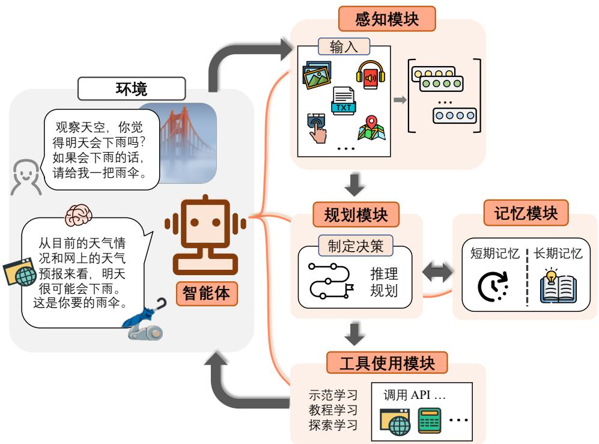  
图 8.2 智能体框架结构[370]

# 8.2.1 感知模块

感知模块负责从环境中获取文本、视觉、听觉等多种形式的信息,并将其传递给其他模块进行处理。多模态感知能力对于大模型智能体的发展至关重要。通过整合这些多样化的输入，智能体能够深入理解其所处的环境，做出更明智的决策，在复杂多变的任务中发挥出色表现。赋予大模型智能体多模态感知能力已成为一个重要的研究方向，除了常见的输入形式之外，触觉反馈、手势以及 3D 雷达等其他潜在输入也可以丰富智能体的感知范围，使其在复杂环境中保持灵活、全面的感知能力。

文本作为人类与世界交互的核心载体，在大模型智能体的发展中扮演着重要角色。同时，文本作为承载数据、信息和知识的主要媒介，也是人机交互的核心。现有主流大模型智能体如AutoGPT[385]等已具备通过文本进行交互的基础能力。然而，准确理解文本背后的隐含意义，如用户的隐式意图，仍然是一大挑战。一些研究尝试通过强化学习技术，捕捉这些隐含意义，并利用模型反馈机制推导出用户偏好，使智能体能够做出更个性化和精准的响应。随着任务越来越复杂，尤其是在

陌生场景下，提升智能体的文本感知能力显得尤为重要。

在视觉感知领域，尽管大语言模型在理解和处理多轮对话方面展现了卓越的性能[65]，但仍然无法处理视觉模态信息。视觉输入通常包含丰富的环境信息，例如物体的属性、空间关系以及场景布局。将视觉信息与其他模态数据相结合，能够使智能体对外部环境的理解更加全面且精准[255]。为了赋予智能体理解视觉信息的能力，一种直接的方法是将视觉输入通过图像描述生成技术转换为对应的文本描述[386]。这种方法的优点在于其高度的可解释性，并且无需为生成描述进行额外训练，从而显著节约计算资源。然而，此方法在转换过程中可能会丢失大量潜在信息，导致视觉信息的表达不完整。为解决上述问题，研究人员尝试将大语言模型与视觉编码器相结合，并通过增加一个可学习的接口层来对齐视觉编码与大模型的语言理解能力，从而增强大模型对视觉信息的感知能力[387]。这一方法有效降低了大模型在学习视觉语言对齐任务中的负担，并显著提升了其在视觉感知方面的性能。

在音频感知方面，声音信息是外界环境中不可或缺的重要组成部分，为大模型智能体赋予听觉感知能力，能够显著增强其对交互内容、环境状况乃至潜在危险的感知能力。目前，已有多种针对音频处理的模型和方法被开发，但这些模型通常仅在特定任务中表现优异[288, 387, 388]。鉴于大模型智能体在工具使用方面的强大能力，研究人员提出了一种直观的方案，即通过将大模型作为控制中心，级联调用现有的工具集或模型库以感知音频信息，从而实现多模态感知的高效融合。然而，与视觉感知类似，这种通过外部模型进行听觉感知的方法仍存在信息丢失的隐患。因此，如何将听觉感知能力直接融入大模型体系，成为当前亟待解决的重要研究课题。

此外，感知模块的发展还应涵盖其他潜在的输入形式，如触觉、嗅觉等，以进一步拓展大模型智能体的感知能力。未来的智能体可能具备更加丰富的感官系统，能够像人类一样感知并理解多样化的现实世界信息。例如，通过配备特定的触觉和嗅觉器官，智能体可以在与物体交互时获取更为详尽的信息；同时，其还能够对环境中的温度、湿度、光照强度等要素进行精准感知，从而实现适应性行动。总体而言，感知模块的多模态扩展不仅能够帮助智能体更全面地理解并适应外部环境，还将显著提升其在复杂任务中的执行能力。未来研究的核心将聚焦于赋予大模型更强的多模态理解能力，以进一步增强其感知与决策水平。这一领域的突破将为大模型智能体的全面发展奠定重要基础。

# 8.2.2 规划模块

规划模块是大模型智能体的核心，其主要职责是通过对环境与任务的深刻理解，生成并优化任务执行计划，制定合理的行动步骤以实现既定目标。研究表明，大模型的推理与规划能力随着模型参数规模和训练数据量的增加呈现出显著的阶跃式提升 [62]。尤其是在模型参数量达到数百亿级别时，即使缺乏直接与任务相关的数据，大模型也能够通过在输入提示中加入包含任务中间推理步骤的示例，或通过引导模型逐步输出推理过程，逐步构建任务的解决方案。将大模型作为规划模块的核心，充分发挥其强大的推理能力和丰富的知识库，可以在复杂且动态的环境中实现

快速决策，并灵活应对各种变化。目前，这一领域的研究主要集中于无反馈规划与带反馈规划两大方向，为探索大模型在规划能力上的潜力提供了重要的研究路径。

# 1. 无反馈规划

无反馈规划（Planning without feedback） 指在规划阶段一次性生成完整的任务和子任务拆分计划，并严格按照该计划逐步执行，而不根据外界变化进行实时调整。在这种模式下，大模型智能体会在任务开始前，根据当前环境和任务要求生成一个完整的执行方案，并在执行过程中始终遵循初始计划。无反馈规划的主要优势在于其执行效率较高，适用于环境相对稳定、变化较少的任务场景。例如，在文档生成任务中，智能体可以根据预先设定的主题、段落结构和内容要求，生成包含所有预定义内容的完整文章，并在生成过程中不因外部反馈而修改文章内容。目前，无反馈规划的典型方法是将思维链推理技术扩展至智能体领域[389]。在这种方法中，大模型智能体能够利用思维链推理技术预先生成完成任务所需的所有子任务拆分计划，并为每个子任务设计相应的执行动作，以便在真实环境中逐步完成。然而，这种方法的挑战在于，预先生成的计划可能在实际环境中面临执行困难或效果不佳的问题，特别是在忽略外部数据变化的情况下，智能体可能无法有效应对突发事件或异常情况。

# 2. 带反馈规划

带反馈规划（Planning with feedback）是一种更为复杂且灵活的规划方式，智能体在执行任务的过程中能够持续获取环境反馈或监控环境变化，并基于反馈信息动态调整行动计划。在这一模式下，智能体不仅会在任务开始前制定初步的执行计划，还能够在任务执行过程中实时监测环境变化和任务进展，依据实际情况不断优化和修正计划。带反馈规划强调智能体与环境的交互，通过不断更新计划以确保任务的顺利完成。其显著优势在于高度的适应性与灵活性，尤其适用于环境复杂且变化频繁的任务场景。ReAct[390] 方法是大模型智能体带反馈规划方法的经典方法，其核心在于将任务执行过程与推理规划过程相结合。在任务执行的每一步中，大模型智能体依据已完成的子任务和获得的环境反馈，动态生成当前步骤的子任务及相应的执行动作，并将其在真实环境中执行。完成后，环境反馈会被传递回智能体，用于下一步的任务规划。通过这一反复循环的过程，ReAct方法使大模型智能体能够根据环境反馈实现动态任务规划。

在实际应用中，通常将无反馈规划与带反馈规划相结合，以兼顾效率与灵活性。例如，在自主配送系统中，可以首先利用无反馈规划生成初步的配送路线，并在实际执行过程中通过带反馈规划进行实时调整，以应对突发情况和动态变化。通过融合无反馈规划的高效性与带反馈规划的适应性，规划模块赋予了大模型自主智能体灵活且高效的决策能力，使其能够在多样化的任务环境中表现出色，从而完成复杂的任务目标。

# 8.2.3 记忆模块

记忆模块是在大模型智能体中承担着管理与操作智能体记忆的核心功能，包括对长短期记忆的存储、读取、处理以及反思等任务。该模块不仅负责存储历史数据与经验，还能够高效提取和更新信息，从而实现长期记忆与短期记忆之间的有机交互。通过记忆模块的支持，智能体在处理连续性任务时能够保持上下文的连贯性，并基于以往经验做出更加准确的判断与决策。

# 1. 记忆模型

大模型智能体所采用的记忆模型包括长期记忆和短期记忆两部分。它们各自有不同的功能和实现方式，但都依赖于大模型的强大计算和理解能力。

短期记忆通常通过将记忆内容以提示语句的形式嵌入大模型输入的上下文中，借助大模型的上下文理解能力来实现。包括存储和使用两个部分：（1）存储：在任务执行过程中，关键的上下文信息与事件会被实时记录，形成短期记忆内容；（2）使用：在后续任务中，这些记忆内容会作为提示语句输入至大模型的上下文中，帮助模型基于提示进行推理与决策。例如，将前几步的操作结果及重要的环境信息作为输入内容，支持模型在接下来的步骤中做出更加合理的判断与选择。

长期记忆通过构建记忆库来实现管理和检索，支持知识的持久化存储与高效调用。包括构建和检索两个部分：（1）构建：在长期任务的执行过程中，智能体会将累积的经验、知识以及数据系统化地存储至记忆库中。记忆库的形式可以包括向量数据库、知识图谱等。（2）检索：智能体需要获取以往的经验或相关知识时，可以通过查询记忆库进行检索，并将检索到的记忆内容作为大模型的输入，与当前任务需求结合后进行处理。例如，在面对类似问题时，智能体能够检索到此前解决相似问题的经验，从而显著提升问题解决的效率与准确性。

# 2. 记忆操作

智能体的记忆操作则包括写入、读取和反思等多个环节，这些操作旨在确保智能体能够高效地管理和利用其记忆资源，从而提升任务执行能力与智能化水平。

记忆写入指将新的信息或经验存储到记忆模块中。在短期记忆中，写入的方式通常是将新的文本信息直接插入到上下文中，而在长期记忆中，则需要将信息存储到记忆库中，并对其进行索引与标记，以便后续检索使用。例如，当智能体完成某项任务后，可以将任务的执行过程及其结果记录为参考数据，供未来使用。通过不断积累经验，智能体能够逐步优化其能力，实现更高水平的智能表现。

记忆读取是指从记忆模块中提取与当前任务相关的信息，以支持任务的完成。在短期记忆中，读取操作通常是直接从上下文中提取提示信息并加以使用；而在长期记忆中，则通过检索记忆库来获得相关内容，通常通过匹配任务需求与记忆信息的方式完成。例如，当处理一个复杂问题时，智能体可以从长期记忆库中提取具有参考价值的解决方案，从而提供精准的建议或策略，提升任务处理的效率与质量。

记忆反思是智能体对已存储记忆进行回顾与分析的一种机制，旨在进一步优化其行为策略与

决策能力。在基于大模型的智能体系统中，Reflexion[391] 方法为记忆模块引入了反思功能。通过对过往任务的回顾与结果分析，智能体能够总结经验教训，并生成改进建议。例如，在完成多项任务后，智能体可以反思并评估哪些方法行之有效，哪些需要调整，并将这些反思结果存储到记忆模块中，以指导未来任务的执行。这种机制不仅提升了智能体对任务的适应能力，还为其持续优化提供了重要支持。

# 8.2.4 工具使用模块

工具使用模块是大模型智能体连接外部环境的关键环节之一，通过调用外部工具和资源来执行特定任务，从而扩展了智能体的功能边界并提升其问题解决能力与效率。此模块的设计与实现，显著增强了大模型智能体在实际应用中的灵活性与实用性，使其能够完成复杂计算、获取外界数据并与其他系统进行交互。对于大模型智能体而言，扩展其工具使用能力的核心在于如何充分激发大语言模型的潜力，使其具备高效的工具操作能力。

工具使用模块的核心是如何让大语言模型获得工具使用能力，它的实现离不开有效的工具学习策略，这些策略主要分为以下三类：（1）示范学习：通过观察具体的工具使用案例进行学习；（2）教程学习：通过工具手册或操作指南获取知识；（3）探索学习：通过尝试和反馈不断优化工具使用能力，通常涉及强化学习的应用。

# 1. 示范学习

示范学习是智能体通过模仿人类专家操作工具的行为模式，逐步掌握工具使用方法的一种过程。这种学习方式类似于人类通过观看教学视频或观察他人操作来掌握新技能。通常，基于示范学习的工具掌握过程可以分为以下两个阶段：（1）示范数据收集：首先，需要构建一个包含大量工具使用示范数据的训练集。这些数据形式可以包括详细的操作步骤记录、工具使用视频等内容，以确保覆盖工具使用的关键场景和步骤。（2）模型训练：随后，将收集到的示范数据输入到大语言模型中，通过监督学习的方式训练模型，使其能够理解并模仿示范中的工具操作流程，从而具备执行类似任务的能力。

示范学习的优势在于能够快速帮助大模型掌握具体工具的使用方法，特别适用于操作步骤明确且流程固定的工具。然而，其局限性也较为明显：一方面，示范学习高度依赖高质量的示范数据；另一方面，其在工具操作的灵活性和创新性方面存在一定不足，较难应对需要动态调整的复杂任务。

# 2. 教程学习

教程学习通常通过将工具手册作为提示输入到大模型中，使其直接从手册内容中理解工具的功能与使用方法。这一方法的核心理念来源于人类通过阅读手册或观察演示学习新技能的行为方式。同样，大模型可以借助其强大的上下文理解能力，通过提示语句从工具手册中获取相关知识并掌握工具的操作。然而，尽管 OpenAI 系列的大模型凭借卓越的上下文理解能力能够较好地完

成教程学习任务，现有的开源大模型却因其上下文理解能力的不足，难以通过教程学习有效掌握工具使用技能。

针对这一问题，ToolLLM[392] 提出了通过构建 ToolBench 数据集，为 3000 余种工具（涵盖 16000多个 API）自动生成任务指令，并利用深度优先搜索算法自动化构建解决方案路径，从而对开源大模型进行微调，显著提升其基于教程学习的工具使用能力。此外，该方法还通过API检索器推荐最适合的 API，以进一步优化工具选择与操作过程，成功解决了开源大模型在依赖工具手册提示语句进行学习时效果受限的问题。

教程学习的显著优势在于其系统性与全面性。大模型能够通过详细的文档深入学习工具的功能与操作方法，从而赋予智能体更为全面且强大的工具使用能力。这种学习方式不仅能够帮助智能体高效掌握工具，还为其在复杂任务场景中的灵活应用奠定了坚实基础。

# 3. 探索学习

探索学习（Exploratory Learning）是一种通过自主尝试与实验来掌握工具使用的方法。在这一过程中，智能体通过自主探索和反复试验，逐步学习工具的操作技巧及其最佳使用方式。智能体能够根据环境反馈和人类反馈动态调整操作策略，从而不断优化工具的使用方法。

在实际操作中，环境反馈通常通过智能体与外部环境交互后所获得的结果进行优化；具体而言，结果反馈用于评估智能体一系列动作的整体效果，而中间反馈则着重考察每一步操作的即时表现。例如，在 WebShop[393] 场景中，智能体通过对比其购买行为与人类购买行为之间的相似性来获得结果反馈，从而评估其表现的有效性。在此基础上，人类反馈强化学习通过模拟人类奖励机制，结合强化学习算法优化智能体的策略，以提升其决策能力和执行效果。同时，智能体会将每次尝试的结果系统化地记录下来，构建经验库。这一过程不仅使智能体能够积累丰富的操作经验，还能逐步提升其对工具的使用熟练度和操作效率。

探索学习的关键在于通过持续的试探与调整，使智能体在动态环境中不断完善其工具使用能力。这种方法不仅赋予智能体更强的适应性与自主性，还为其在多变任务场景中的高效表现提供了坚实的技术支持。

当前研究的重点在于如何通过整合多种学习策略来优化模型性能，从而全面提升大模型智能体的表现能力。例如，将示范学习的精确性与探索学习的灵活性相结合，可以显著增强模型在未知环境中的适应能力；而教程学习与示范学习的结合，则能够为模型理解复杂工具操作提供双重支持。这种多策略融合不仅提升了模型的学习效率，还为处理更复杂的多工具任务开辟了新路径。

# 8.3 大模型智能体训练

大模型智能体的核心能力涵盖了感知、规划、记忆以及工具使用，这些能力使其能够弥补传统大模型无法与外部世界交互的局限性。然而，大语言模型在最初的设计中并不具备这些核心能力。大语言模型主要依赖于大规模的文本数据训练，擅长语言生成和理解，但无法直接使用外部

工具，也不能很好对任务进行多步骤的规划。同时大语言模型构建之初也没有考虑记忆和使用用户全部对话历史。为了弥补这些不足，研究者们开始系统地研究如何提升大语言模型解决上述问题的能力。本节将重点介绍大语言模型工具使用能力提升、推理规划能力提升以及长期记忆构建与应用的策略方法。

# 8.3.1 工具学习

大模型工具学习（Tool Learning）是指通过让大语言模型学会使用各种工具的调用方式，进而利用合适的工具去实现特定的功能需求。例如，用户输入“请告诉我上海今天的天气。”具备工具使用能力的大语言模型会给出如下响应：

1. 识别任务类型： 天气查询任务。  
2. 调用天气 API： 调用天气 API：模型请求外部天气服务 API（如 WeatherMap），发送查询参数）。

response $=$ requests.get("https://api.weathersmap/data/2.5/weather", params $\coloneqq$ { "q": "Shanghai", "date": "2025-1-6", "appid": "your api key", "units": "metric" }） weather_data $=$ response.json()

3. 返回结果： API 返回数据：上海当前气温为 $3 \textdegree C$ ，天气晴朗。  
4. 模型最终输出： “上海今天的天气是晴朗，当前气温为 $3 ^ { \circ } \mathtt { C }$ 。”

当前训练大语言模型使用工具的方法主要依赖于通过工具交互轨迹生成的大规模数据集，对预训练模型应用有监督微调方法进行训练。文献[392]描述了工具学习数据集构造的方法，主要包括三个阶段：API 收集、指令生成和解决路径标注。以下是每个阶段的详细总结：

（1）API收集：ToolLLaMA的API数据集来源于RapidAPI平台，这是一个提供大量真实世界RESTful API 的市场。通过爬取 RapidAPI 的工具和 API 文档，包括 API 的功能描述、必选参数、可选参数、请求体、调用代码片段及示例响应，初始收集了10,853个工具（53,190个API）。为了确保数据质量，过滤掉了不可用或质量较低的 API（如返回 404 错误的 API），最终保留 3,451 个高质量工具（16,464个API），涵盖49个类别和500多个细分类别集合。  
（2）指令生成：通过ChatGPT自动生成与API功能相关的多样化指令，特别注重单工具和多工具场景的结合。指令生成过程从 API 文档出发，随机抽取单个或多个 API，并结合提供的人工撰写的种子指令示例，指导ChatGPT创造符合实际应用场景的指令。这些指令分为三类：单工具指令、同类别多工具指令和同集合多工具指令，最终生成了近20万条指令-API数据对，确保覆盖广泛的工具使用场景。

（3）解决轨迹标注：为每条生成的指令，通过ChatGPT的函数调用功能标注有效的解决路径（即多步API调用序列）。使用深度优先搜索决策树（DFSDT）扩展搜索空间，允许模型探索多个推理路径，并在必要时放弃当前路径以扩展新节点。相比传统方法，DFSDT有效解决了推理错误传播和探索不足的问题，最终生成了 126,486 条高质量的指令-解决路径对，为模型训练提供了丰富的数据支持。

ToolLLaMA-2-7B[392] 是通过使用上述方法构建的包含12.6万条数据的大规模数据集，在LLaMA-2 模型上进行的有监督微调。然而，这种基于大规模数据集的微调方法往往忽略了工具使用中的任务特定特征，从而导致模型性能的瓶颈。即使经过如此大量的数据训练，ToolLLaMA-2-7B的工具调用效果也仅能达到GPT-4的 $80 \%$ 左右。

文献[394]指出，当前用于工具学习的数据集大多通过GPT-4等模型自动构建，数据中存在不小比例的错误。例如，RoTLLaMA的训练集包含12,247条由GPT-4生成并经过筛选的多轮工具调用轨迹，但其中约 $1 7 \%$ 的轨迹存在工具使用错误。这些错误的轨迹会对利用其进行训练的模型带来了显著的负面影响。此外，通过对 ToolLLaMA-2-7B-v2 和 NexusRaven-13B-v2 的实验结果进行分析发现，当模型选择了错误的工具时，通常会选择一个与正确工具具有相同前缀的工具。进一步研究表明，通过手动纠正模型第一个错误预测的词元，模型往往能够生成正确的后续词元。这一现象说明，某些关键词元（Key Tokens）对于任务的成功至关重要。研究还表明，模型在工具调用中的错误可以根据工具类型、参数以及内容分为有限的几种类别。这为后续针对性地优化工具学习数据集和提升模型性能提供了重要参考。

根据上述分析，文献[394]提出的TL-Training方法通过错误数据影响缓解、关键词元优先级排序以及强化学习策略有效缓解了上述问题。在有监督微调阶段，其核心目标是使大型语言模型（LLM）与训练数据的分布保持一致。然而，训练数据中的错误交互路径可能对模型的决策产生负面影响，进而增加工具调用错误的概率。为了解决这一问题，TL-Training设计了一种自动化流程，用于识别错误的交互路径并阻止这些路径的反向传播，从而减少它们对模型性能的有害影响。给定一个数据序列 $( q , t _ { 0 \dots s } , o _ { 0 \dots s } )$ ，旨在识别错误的工具调用轨迹 $\mathbb { T } _ { e } \subseteq \{ t _ { 0 } , t _ { 1 } , \dots , t _ { s } \} _ { }$ 。由于直接判断某个特定的工具调用 $t _ { i }$ 是否正确是颇具挑战性的。TL-Training利用工具调用后生成的反馈 $o _ { i }$ 。这些反馈通常包含了结构化的错误报告信息，由于工具调用错误种类较为固定，可以通过依次分析$o _ { i }$ 来提取错误调用轨迹 $\mathbb { T } _ { e }$ ，从而实现对错误调用的自动识别。在识别出错误调用轨迹 $\mathbb { T } _ { e }$ 后，通过在训练过程中阻止这些错误交互路径的反向传播，减轻它们对模型的负面影响。这一机制通过修改损失函数实现，其具体形式如下：

$$
\mathcal {L} _ {M A E} = - \sum_ {\mathbb {D}} \sum_ {t _ {s} \notin \mathbb {T} _ {e}} \log p _ {M} \left(t _ {s} | q, \mathbb {T}, t _ {0.. s - 1}, o _ {0.. s - 1}\right) \tag {8.1}
$$

其中 $\mathbb { D }$ 表示整个训练数据集。

其次，在文献[394]中研究发现，工具名称的首个词元，连同其后那些与其他工具名称有共同

前缀的词元，在成功识别工具方面起着更为关键的作用。标准的有监督微调训练会不加区分地最大化每个词元的条件概率，将所有词元视为同等重要。为解决这一局限，TL-Training提出了一种根据词元相对重要性自适应调整其训练权重的方案。

给定一个数据序列 $( q , t _ { 0 \dots s } , o _ { 0 \dots s } )$ ，其中每个工具 $t _ { i } = ( t _ { i } ^ { 0 } , t _ { i } ^ { 1 } , \ldots , t _ { i } ^ { l _ { i } } )$ 由 $l _ { i }$ 个词元构成，将这些词元划分为两个集合：

$$
K _ {i} = \left\{t _ {i} ^ {m} \in t _ {i} \mid t _ {i} ^ {m} \text {是 关 键 词 元} \right\} \tag {8.2}
$$

$$
N K _ {i} = \left\{t _ {i} ^ {m} \in t _ {i} \mid t _ {i} ^ {m} \text {不 是 关 键 词 元} \right\} \tag {8.3}
$$

然后，依据它们的相对重要性来调整 $K _ { i }$ 和 $N K _ { i }$ 的权重，使模型能够更侧重于关键词元。

$$
w _ {i} ^ {m} = \left\{ \begin{array}{l l} \operatorname {C L I P} \left(\frac {\left| N K _ {i} \right|}{\left| K _ {i} \right|}, 1, w _ {\max }\right) & \text {如 果} t _ {i} ^ {m} \in K _ {i} \\ 1 & \text {否 则} \end{array} \right. \tag {8.4}
$$

其中， $w _ { \mathrm { m a x } }$ 是最大调整乘数，而 $\mathrm { C L I P } ( x , \operatorname* { m i n } , \operatorname* { m a x } )$ 函数用于将调整因子限制在[min,max]这个区间范围内。符号 | · | 表示集合的大小。（注：由于 $K _ { i }$ 始终至少包含工具名称的首个词元，所以避免了除数为零的风险。）

利用这些权重，在训练过程中按照以下目标优先考虑关键词元：

$$
\mathcal {L} _ {P K T} = - \sum_ {\mathbb {D}} \sum_ {t _ {s}} \sum_ {t _ {s} ^ {m}} w _ {s} ^ {m} \cdot \log p _ {M} \left(t _ {s} ^ {m} \mid q, \mathbb {T}, t _ {0.. s - 1}, o _ {0.. s - 1}, t _ {s} ^ {0} \dots t _ {s} ^ {m - 1}\right) \tag {8.5}
$$

最后，由于工具调用过程出现的错误类型有限，这使得可以基于这些特定错误引入一种奖励机制，并应用强化学习算法，提升其工具使用能力。为实现这一目标，TL-Training针对工具使用任务定义了一组奖励函数，并采用近端策略优化（PPO）算法来优化模型性能。

对于大语言模型生成的工具调用预测 $t _ { i }$ 及其相应的标准答案，基于模型在各种场景下工具使用的质量定义了以下奖励函数：

$$
R \left(t _ {i}\right) = \left\{ \begin{array}{l l} - 2 & \text {如 果} t _ {i} \text {无 法 解 析} \\ - 2 & \text {如 果} t _ {i} \text {包 含 工 具 幻 觉} \\ - 1. 5 & \text {如 果} t _ {i} \text {调 用 了 错 误 的 工 具} \\ R _ {\mathrm {p}} \left(t _ {i}\right) & \text {如 果} t _ {i} \text {存 在 参 数 识 别 问 题} \\ - 0. 2 5 & \text {如 果} t _ {i} \text {存 在 内 容 填 充 问 题} \\ 1 & \text {如 果} t _ {i} \text {正 确} \end{array} \right. \tag {8.6}
$$

其中， $R _ { \mathfrak { p } } ( t _ { i } )$ 定义为：

$$
\begin{array}{l} R _ {\mathrm {p}} (t _ {i}) = - 0. 8 \cdot \mathbb {I} (t _ {i} \text {存 在 参 数 幻 觉}) \\ - 0. 5 \cdot \mathbb {I} \left(t _ {i} \text {包 含 冗 余 参 数}\right) \tag {8.7} \\ - 0. 5 \cdot \mathbb {I} (t _ {i} \text {存 在 缺 失 参 数}) \\ \end{array}
$$

这里 $\mathbb { I } ( \cdot )$ 表示指示函数。

奖励函数 $R ( \cdot )$ 针对大型语言模型工具使用中不同的潜在错误，提供了一个结构化的评分系统来评估性能。基于该奖励函数，应用PPO算法，通过迭代优化模型参数来最大化这些奖励，具体如下：

$$
\mathcal {M} ^ {*} = \arg \max  _ {\mathcal {M}} \mathbb {E} _ {\mathbb {D}} \left[ \sum_ {t _ {s}} \left(R \left(t _ {s}\right) - \beta \mathrm {K L} \left(\mathcal {M} (\cdot) \mid \mid \mathcal {M} _ {\text {s f t}} (\cdot)\right)\right) \right] \tag {8.8}
$$

其中， $\beta$ 用于调节与初始监督微调（SFT）模型 $\mathcal { M } _ { \mathrm { s f t } }$ 的偏差。

TL-Training方法使大语言模型能够逐步完善其对工具使用的理解，并随着时间推移提高工具使用的准确性。文献 [394] 给出的实验结果表明，该方法仅使用 1217 个训练数据，就可以使得CodeLLaMA-2-7B 模型在工具使用性能方面达到 GPT-4o 的能力。

# 8.3.2 推理规划

推理规划能力是大模型智能体的核心能力。只有提升大模型的推理和规划能力，才能使模型对环境和任务有深刻理解，从而生成并优化任务执行计划，制定合理的行动步骤以实现既定目标。然而，仅仅通过扩大语言模型的规模，并不能显著提升推理（Reasoning）能力，如常识推理、逻辑推理、数学推理等。通过示例（Demonstration）或者明确指导模型在面对问题时如何逐步思考，促使模型在得出最终答案之前生成中间的推理步骤，可以显著提升其在推理任务上的表现。这种方法被称为思维链提示（Chain-of-Thought Prompting）[395]。同样地，面对复杂任务或问题时，大语言模型可以展现出良好的规划（Planning）能力。通过引导模型首先将复杂的问题分解为多个较为简单的子问题，然后逐一解决这些子问题，可使模型得出最终答案，这种策略被称为由少至多提示[396]。本节将重点介绍如何利用思维链提示和由少至多提示这两种方式，提升大语言模型的推理规划能力。

# 1. 思维链提示

语言模型在推理能力方面的表现一直未能令人满意，一些研究人员认为这可能是因为此前的模式是直接让模型输出结果，而忽略了其中的思考过程。人类在解决包括数学应用题在内的、涉及多步推理的问题时，通常会逐步书写整个解题过程的中间步骤，最终得出答案。如果明确告知模型先输出中间的推理步骤，再根据生成的步骤得出答案，是否能够提升其推理表现呢？针对这

个问题，Google Brain 的研究人员提出了思维链（Chain-of-Thought，CoT）提示方式[395]，除了将问题输入模型，还将类似题目的解题思路和步骤输入模型，使得模型不仅输出最终结果，还输出中间步骤，从而提升模型的推理能力。研究人员甚至提出了零样本思维链（Zero-shot Chain-of-Thought，Zero-shot CoT）提示方式，只需要简单地告知模型“让我们一步一步思考（Let’s think step by step）”[397]，模型就能够自动输出中间步骤。

思维链提示方式如图8.3 所示，标准少样本提示（Standard Few-shot Prompting）技术在给模型的输入里面提供了 $k$ 个[问题，答案]对，以及当前问题，由模型输出答案。而思维链提示在给模型的输入里面提供了 $k$ 个[问题，思维链，提示]元组及当前问题，引导模型在回答问题之前先输出推理过程。可以看到在标准少样本提示下，模型通常直接给出答案，但是由于缺少推理步骤，直接给出的答案准确率不高，也缺乏解释。而在思维链提示下，模型输出推理步骤，在一定程度上降低了推理难度，最终结果的准确率有所提升，同时具备了一定的可解释性。

  
图 8.3 思维链提示方式[395]

文献[395]使用了人工构造的思维链。然而，通过实验发现，使用由不同人员编写的符号推理示例在准确率上存在高达 $2 8 . 2 \%$ 的差异，而改变范例的顺序在大多数任务中则只产生了不到 $2 \%$ 的变化。因此，如果能够自动构建具有良好问题和推理链的范例，则可以大幅度提升推理效果。文献[398]发现，仅通过搜索相似问题并将其对应的推理过程作为范例对于效果提升而言作用十分有限，但是问题和推理链示例的多样性对于自动构建范例至关重要。因此，上海交通大学和AmazonWeb Services 的研究人员提出了 Auto-CoT[398] 方法，通过采集具有多样性的问题和生成推理链来构建范例。Auto-CoT算法的整体过程如图8.4所示。Auto-CoT包括以下两个主要阶段。

（1）问题聚类：将给定数据集中的问题划分为几个簇（Cluster）。

（2）范例采样：从每个簇中选择一个代表性问题，并基于简单的启发式方法使用Zero-shot CoT生成问题的推理链。

  
图 8.4 Auto-CoT 算法的整体过程[398]

由于基于多样性的聚类可以降低相似性带来的错误，因此 Auto-CoT 算法对于给定的问题集合 $Q$ 首先进行聚类。使用 Sentence-BERT[399] 为 $Q$ 中的每个问题计算一个向量表示。然后，使用K-means聚类算法根据问题向量表示生成 $K$ 个问题簇。对于簇 $i$ 中的问题，按照到簇中心的距离升序排列，并将排序后的列表表示为 $\pmb q ^ { ( i ) } = [ \pmb q _ { 1 } ^ { ( i ) } , \pmb q _ { 2 } ^ { ( i ) } , \cdots ] \circ$ 。

在聚类的基础上，需要为问题生成推理链，采样生成符合选择标准的范例。对每个簇 $i$ 构建一个范例 $\mathbf { \nabla } _ { d } ( i )$ ，包括问题、解释和答案。对于簇 $i$ ，根据排序列表 $\pmb q ^ { ( i ) } = [ \pmb q _ { 1 } ^ { ( i ) } , \pmb q _ { 2 } ^ { ( i ) } , \cdots ]$ 迭代选择问题，直到满足条件为止。从距离簇 $i$ 中心最近的问题开始考虑。如果当前选择了第 $j$ 个问题 $\pmb q _ { j } ^ { ( i ) }$ ，则构建提示输入 $[ Q : q _ { j } ^ { ( i ) } , A : [ P ] ]$ ，其中 $[ P ]$ 是一个单一提示“让我们一步一步思考”。将这个提示输入使用 Zero-Shot $\mathrm { C o T } ^ { [ 3 9 7 ] }$ 的大语言模型中，得到由解释 $r _ { j } ^ { ( i ) }$ 和提取的答案 $\pmb { a } _ { j } ^ { ( i ) }$ 组成的推理链。最终得到范例 $\pmb { d } _ { j } ^ { ( i ) } = [ \pmb { Q } : \pmb { q } _ { j } ^ { ( i ) } , A : \pmb { r } _ { j } ^ { ( i ) } \circ \pmb { a } _ { j } ^ { ( i ) } ] \circ$ 。如果 $r _ { j } ^ { ( i ) }$ 中的推理步骤小于 5 步，并且 $\pmb q _ { j } ^ { ( i ) }$ 中的词元小于60个，则将 $d _ { j } ^ { ( i ) }$ 纳入 $\mathbf { \pmb { d } } ^ { ( i ) }$ 。

此外，一些研究人员提出了对思维链提示的改进方法，例如从训练样本中选取推理最复杂的样本来形成示例样本，被称为 Complex-CoT[400]。也有研究人员指出可以从问题角度考虑优化思维链提示，通过将复杂的、模糊的、低质量的问题优化为模型更易理解的、高质量的问题，进一步提升思维链提示的性能，这一方法被称为Self-Polish[401]。

# 2. 由少至多提示

当面对复杂任务或问题时，人类通常倾向于将其转化为多个更容易解决的子任务/子问题，并逐一解决它们，得到最终想要的答案或者结果。这种能力就是通常所说的任务分解（Task Decom-position）能力。基于这种问题解决思路，研究人员提出了由少至多提示（Least-to-Most Prompting）方法[396]。这种方法试图利用大语言模型的规划能力，将复杂问题分解为一系列的子问题并依次解决它们。

由少至多提示流程如图8.5所示，主要包含问题分解阶段和逐步解决子问题阶段。在问题分解阶段中，模型的输入包括 $k \times |$ [原始问题，子问题列表]的组合，以及要测试的原始问题；在逐步解决子问题阶段中，模型的输入包括 $k \times$ [原始问题， $m \times$ （子问题，子答案）]元组，以及要测试的原始问题和当前要解决的子问题。

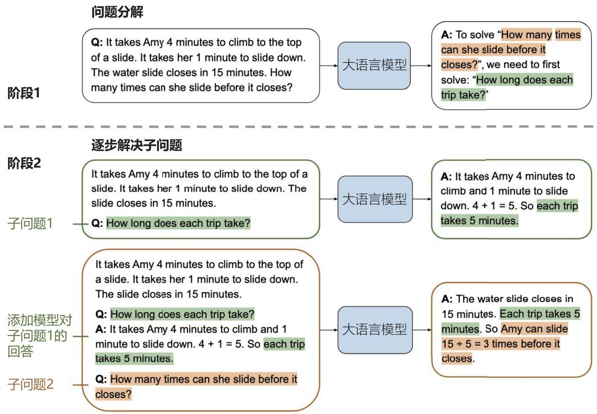  
图 8.5 由少至多提示流程[396]

上述过程的示例代码如下：

```python
def CoT_Prompting(question, problem_reducing_prompt_path, problem_solving_prompt_path):
    # 读取prompt
    with open(file=problem_reducing_prompt_path, mode="r", encoding="utf-8") as f:
        problem_reducing_prompt = f.read().strip()
    with open(file=problem_solving_prompt_path, mode="r", encoding="utf-8") as f:
            problem_solving_prompt = f.read().strip()
    # 问题分解
    # 构造模型输入
    problem_reducing_prompt_input = problem_reducing_prompt + "\n\nQ {}\nA:" .format(question)
    # 调用模型得到回复
    problem_reducing_response = create_response/problem_reducing_prompt_input)
    # 得到分解后的子问题列表
    reducedProblem_list = get_reducedProblem_list_from_response解决问题
    # 串行解决问题
    problem-solving_prompt_input = problem-solving_prompt + "\n\n{}".format(question)
    for subProblem in reducedProblem_list:
        # 构造解决子问题的prompt
        problem-solving_prompt_input = problem-solving_prompt_input
        + "\n\nQ: {}\nA:" .format(sub probleme)
        # 调用模型得到回复
        subProblem_response = create_response解决问题(solving_prompt_input)
        sub_answer = get_sub_answer_from_response(sub problemeponse)
        # 把当前子问题的答案拼接到之前的prompt上面
        problem-solving_prompt_input = problem-solving_prompt_input + sub_answer
    # 得到最终答案
    final_answer = answer Cleaner(sub_answer)
    # 返回答案
    return final_answer 
```

# 3. AgentTuning

为提升大模型的通用推理能力，文献 [402] 提出了一种名为 AgentTuning 的方法，如图8.6所示。AgentTuning主要由两个核心组件构成：一个轻量级的指令调优数据集AgentInstruct，以及一种混合指令调优策略。该方法旨在增强模型的智能体能力的同时，尽可能保留其泛化能力。

  
图 8.6 AgentTuning 方法框架[402]

AgentInstruct 数据集包含 1,866 条经过严格验证的交互轨迹。这些轨迹包含高质量的逐步推理过程（即 Chain-of-Thought），并涉及六种不同的智能体任务，包括 AlfWorld[403]、WebShop[393]、Mind2Web[404]、知识图谱、操作系统和数据库。对于每个智能体任务，AgentInstruct的构建包括三个主要阶段：指令构造、轨迹交互以及轨迹过滤。

对于 AlfWorld、WebShop、Mind2Web 以及知识图谱等已有训练集的任务，AgentInstruct 直接利用其训练数据，依次完成轨迹交互和轨迹过滤两个阶段。对于缺乏训练集的任务（如操作系统和数据库），则采用任务推导（Task Derivation）和自指令生成（Self-Instruct）[405] 的方法构建相应的指令，以确保数据的完整性与多样性。

在数据库任务的指令构建过程中，使用了BIRD[406] 数据集作为基础，该数据集是一个仅包含SELECT语句的数据库基准数据集。任务推导的过程分为两种方法：1）基于BIRD数据集的子任务，通过问题和参考SQL语句生成轨迹。具体而言，执行参考SQL语句以查询数据库并获取结果，将其作为智能体的提交答案，并利用GPT-4根据上述信息生成智能体的推理过程。通过这一方式，可以直接从BIRD数据集中生成正确的交互轨迹。然而，该方法的交互轮次固定为2，限制了轨迹的多样性。2）直接构建指令而非轨迹。其具体步骤为：首先，将BIRD中的问题输入GPT-4，与数据库进行交互以生成轨迹；随后，执行BIRD中的参考SQL语句，并将其结果与GPT-4生成的答案进行比对；最后，筛选出生成正确答案的轨迹。通过过滤错误答案，该方法仅保留正确的交互轨迹，从而构建出高质量且多样化的轨迹数据集。

在操作系统任务中，由于涉及终端操作的指令较难获取，采用了自指令生成方法构建该任务。具体而言，首先通过GPT-4生成与操作系统相关的任务，包括任务说明、参考解决方案以及评估脚本。随后，使用GPT-4作为求解器，依据生成的任务完成操作并记录其交互轨迹。在任务完成后，运行参考解决方案，并利用评估脚本将其结果与求解器的解答结果进行比对，仅保留参考解决方案与求解器解答一致的轨迹作为有效数据。

在初步构建指令后，AgentInstruct 数据集构造选用 GPT-4（gpt-4-0613）作为智能体模型进行

轨迹交互任务。在评估方法上，采用了 1-shot 评估策略，主要是为了满足智能体任务中对输出格式精确性的严格要求。对于每个任务，均提供来自训练集的完整交互过程作为示例。轨迹交互过程主要包括两个阶段。首先，向模型提供任务描述及一个成功的 1-shot 示例，以帮助其理解任务要求。随后进入正式交互阶段，向模型输入当前指令和必要的上下文信息。模型基于这些信息及此前的反馈内容，生成“思考”（Thought）并采取相应的行动。环境则根据模型的操作提供反馈，反馈内容可能包括状态变化或新的信息。上述过程循环进行，直至模型完成任务目标或达到Token限制。若模型连续三次生成相同的输出，则被视为重复性失败。若模型输出的格式不符合要求，则通过BLEU指标将其与所有可能的操作选项进行比较，并选择最接近的选项作为该步骤的操作。

在涉及真实场景的智能体任务中，由于任务复杂性较高，即便是GPT-4在此类任务上的表现也未能达到预期。为了确保数据质量，AgentInstruct 数据集构造过程中还对其交互轨迹进行了严格的过滤。每条交互轨迹都会获得一个奖励值，基于此奖励值，可以自动筛选出高质量的轨迹数据。最终构建了1,866条轨迹。

采用 AgentTuning 方法对 Llama 2 模型进行微调，并构建了开源的 AgentLM 模型。AgentLM在未知智能任务中展现了很好的性能，同时在MMLU、GSM8K、HumanEval和MT-Bench等通用任务上依然保持了优异的表现。开源的 AgentLM-70B 在智能体任务表现上可与 GPT-3.5-turbo 相媲美。

# 8.3.3 长期记忆

大模型智能体的记忆模型由长期记忆和短期记忆构成。短期记忆可以通过将记忆内容以提示语句嵌入大模型输入上下文，依靠大模型的上下文理解能力实现存储和使用。长期记忆则通过构建记忆库来管理和检索，以实现知识的持久化存储与高效调用。在长期任务中，智能体将经验、知识等存储到记忆库，需要时检索记忆内容，与当前任务需求结合，提升问题解决效率。

大模型智能体实现长期记忆的常见方法之一是引入外部记忆库。长期记忆可存储为灵活的形式，例如文本文件或结构化数据库，并通过检索机制与反思机制进行访问与更新。外部记忆库可以采用向量数据库或可读写的神经网络记忆库等模式，模型能够动态地获取或更新所需知识。其中，检索增强生成（Retrieval-Augmented Generation, RAG）是一种典型方法，将检索与生成有机结合，适用于知识动态变化的场景。然而，该方法在应用中仍面临检索效率和记忆库质量的挑战，这对系统性能具有重要影响。

文献[407]提出了MemoryBank方法，允许模型调用相关记忆，通过持续的记忆更新不断进化，通过综合之前交互的信息，随着时间的推移理解和适应用户个性。MemoryBank框架如图8.7所示，它由记忆存储、记忆检索以及记忆更新模块组成，每次用户输入的提示词会与记忆模块检索结果一起构成记忆增强的提示词。记忆存储作为主要的数据存储库，保存了对话的详细记录、事件总结和用户个性评估。记忆检索允许根据上下文进行记忆回忆。记忆更新受到艾宾浩斯遗忘曲线理论（Ebbinghaus Forgetting Curve Theory）的启发，改理论认为遗忘在学习之后立即开始，而且遗

忘的进程并不是均匀的，最初遗忘速度很快，以后逐渐缓慢。根据时间的流逝，帮助AI记住、有选择地忘记和加强记忆。MemoryBank 具有较好灵活性，可以适应开源和闭源的大语言模型，支持中英双语，并且可以与遗忘机制一起使用。

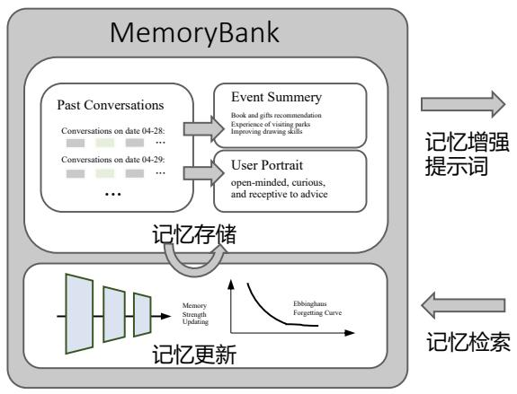

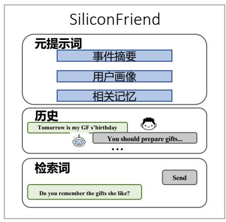  
图 8.7 MemoryBank 方法框架[407]

记忆存储（Memory Stroage）是 MemoryBank 的核心组件之一，存储了丰富的信息，包含日常对话记录、过去的事件总结和用户个性评估的演变，从而构建了一个动态的多层次记忆全景图。通过按时间顺序记录多轮对话并添加时间戳，构建了有序的交互历史。这种细致的记录不仅支持精确的记忆检索，还为后续记忆更新提供了详细索引。

MemoryBank借鉴了人类记忆的复杂性，不仅简单存储，还对对话进行提炼，生成每日事件总结，并进一步凝练为全局总结，形成层次化的记忆结构，为用户交互和重要事件提供鸟瞰式视角。具体来说，以之前的每日对话或每日事件为输入，要求大语言模型使用提示“总结内容 [对话/事件]中的事件和关键信息”来总结每日事件或全局事件。此外，还专注于用户个性理解，通过长期交互不断评估和更新个性洞察，最终形成对用户个性的全局理解。这种多层次方法使AI伴侣能够学习、适应并根据用户独特特质定制响应，从而显著提升用户体验。以每日对话或个性分析为输入，要求大语言模型使用提示：“根据以下对话，请总结用户的个性特征和情绪。”或“以下是一段时间内用户表现出的个性特征和情绪。请提供一个高度简洁和概括的用户个性总结。”来分析用户。

MemoryBank 所采用的记忆检索机制类似于知识检索任务，具体实现上采用了一种类似稠密篇章检索（Dense Passage Retrieval, DPR）的双塔稠密检索模型[408]。每次对话及其对应的总结均被视为一个记忆片段 $m$ ，并通过编码器模型 $E ( \cdot )$ 进行预编码，生成该片段的上下文向量化表示 $h _ { m }$ 。整个记忆存储 $M$ 被预编码为 $M = \{ h _ { m } ^ { 0 } , h _ { m } ^ { 1 } , \dots , h _ { m } ^ { | M | } \}$ 。随后，这些向量表示通过 FAISS 方法[409]进行索引，以实现高效的检索操作。在实际检索过程中，当前对话的上下文 $c$ 同样通过编码器 $E ( \cdot )$

编码为向量 $h _ { c }$ ，作为查询向量，用于在记忆库 $M$ 中搜索与之最相关的记忆片段。在此框架下，编码器 $E ( \cdot )$ 可根据具体应用需求替换为任何适合的模型，从而灵活适配不同的场景。

通过持久的记忆存储和记忆检索，智能体记忆存储能力可以得到极大的提升。然而，在需要更具人类化记忆行为的场景中（如 AI 伴侣等），引入记忆更新机制尤为重要。忘记不重要且长时间未被调用的记忆片段，可以使智能体的行为更加自然。

记忆遗忘机制受到艾宾浩斯遗忘曲线理论的启发，并遵循以下基本原则：（1）遗忘速率：记忆保留率会随时间迅速下降，除非通过有意识的复习进行强化；（2）时间与记忆衰减：遗忘曲线在开始时陡峭，表明大部分信息会在学习后的数小时或数天内被遗忘，随后遗忘速率逐渐减缓；（3）间隔效应：重新学习比首次学习更容易，定期复习可以重置遗忘曲线，减缓遗忘速率，从而提高记忆保持能力。

艾宾浩斯遗忘曲线采用指数衰减模型表示： $R = e ^ { ( - t / S ) }$ ，其中 $R$ 代表记忆保留率，即信息被保留的比例； $t$ 是从学习到现在经过的时间； $S$ 是记忆强度，受学习深度和重复次数等因素影响。为简化记忆更新过程，将 $S$ 模型化为离散值，并在某项记忆首次出现在对话中时将其初始化为1。当某项记忆在对话中被调用时，其在记忆中的存留时间会延长，将 $S$ 增加1，并将 $t$ 重置为0，从而降低遗忘的概率。需要注意，这是一种探索性且高度简化的记忆更新模型，而实际的记忆过程更复杂，会受到多种因素的影响。遗忘曲线在不同人群和不同信息类型中表现各异。

# 8.4 大模型智能体实践

大模型智能体的构建方式多样化，主要包括手工编写代码、使用框架开发以及采用低代码平台三种方式：1）手工编写代码，开发者通过直接编写代码，可以灵活地设计模型结构、任务流程和外部接口。这种方式通常需要较高的技术能力和充足的开发时间，但能够实现高度定制化，适用于复杂场景或特定需求的智能体开发；2）使用框架开发，基于现有的开发框架（如LangChain、Haystack、AutoGPT、LLaMA Index 等）进行智能体构建，框架通常提供了模块化的工具和组件，包括记忆管理、检索增强生成等功能。开发者可以利用这些框架快速构建智能体，同时保留一定的灵活性，适合中等复杂度的应用场景；3）低代码/零代码平台（如Coze、Microsoft Copilot Studio、Hugging Face AutoTrain等）为非技术用户提供了便捷的开发方式，只需少量编程甚至无需编程即可搭建智能体。这种方式降低了开发门槛，适合快速验证概念或简单应用的实现，但定制化能力有限。

本节将分别介绍编写代码、使用框架开发以及采用低代码平台三种方式构建大模型智能体方法。

# 8.4.1 手工编写代码

手工编写代码是一种构建大模型智能体的方式之一，适合对系统有完全掌控需求的开发者。这种方法通过从零开始直接编写代码，使开发者能够灵活地设计模型结构、任务流程以及外部接口。

手工编写代码提供了最大的自由度，可以根据具体需求对智能体进行深度优化和定制。这种方法尤其适用于复杂场景或特定领域的智能体开发，例如需要实现垂直领域的功能、整合独特的业务逻辑或优化性能的场景。

本节以辩论和角色扮演为例，介绍手工编写代码实现大模型智能体样例。

# 1. 辩论

人类之间的交流大多是以语言为媒介完成的，基于大语言模型实现的智能体，可以完成谈判、辩论等基于语言的多轮交流。在每一轮中，每个智能体都会表达自己的观点，同时收集其他智能体的观点，以此作为下一轮生成的参考；直至多个智能体达成共识才结束上述辩论循环。研究表明，当多个智能体以“针锋相对（Tit for Tat）”的状态表达自己的观点时，单个智能体可以从其他智能体处获得充分的外部反馈，以此纠正自己的“扭曲思维”；当检测到自己的观点与其他智能体的观点出现矛盾时，智能体会仔细检查每个步骤的推理和假设，进一步改进自己的解决方案。

以解决数学问题的任务（数据集可以从 GitHub 上 OpenAI 的 grade-school-math 项目中获取）为例，最简单的交互实现可大致分为以下步骤。

（1）对于每个任务，用户首先描述任务的基本需求：

```txt
question = "Jimmy has $2 more than twice the money Ethel has. \If Ethal has $8, how much money is Jimmy having?" # 用户提出问题
agent_contexts = [[f"role": "user", "content": ""Can you solve the following math problem? {} Explain your reasoning.
Your final answer should be a single numerical number, in the form \boxed{\{answer\}}, at the end of your response."".format(question)]]
for agent in range(agent) # 为每一个智能体构造输入提示 
```

（2）每个智能体按一定顺序依次发言：

```python
for i, agent_context in enumerate(agent_contexts): # 每一个智能体
completion = openai.ChatCompletion.create( # 发言
model="gpt-3.5-turbo-0301", # 选择模型
messages=agent_context, # 智能体的输入
n=1)
content = completion["choices"]["0】【message】【content"] # 提取智能体生成的文本内容
assistant
assistant
agent_context.append(character_message) # 将当前智能体的发言添加至列表 
```

（3）每个智能体接收来自其他智能体的发言，并重新思考：

```python
for i, agent_context in enumerate(agent_contexts): # 对每一个智能体
if round != 0: # 第一轮不存在来自其他智能体的发言
# 获取除自己以外，其他智能体的发言
agent_contexts_other = agent_contexts[:i] + agent_contexts[i+1:]
```

（4）重复步骤（2）和步骤（3），直至多个智能体达成一致意见或迭代达到指定轮次。完整的实现代码如下：

```txt
agents = 3 # 指定参与的智能体个数
rounds = 2 # 指定迭代轮次上限
question = "Jimmy has $2 more than twice the money Ethel has. \
If Ethal has $8, how much money is Jimmy having?" # 用户提出问题
agent_contexts = [[{"role": "user", "content": ""Can you solve the following math problem? {} Explain your reasoning.
Your final answer should be a single numerical number, in the form \
\boxed{\{answer\}}, at the end of your response.", format(question)]]
for agent in range(agents) # 为每一个智能体构造输入提示
for round in range(rounds): # 对每一轮迭代
for i, agent_context in enumerate(agent_contexts): # 对每一个智能体
if round != 0: # 第一轮不存在来自其他智能体的发言
# 获取除自己以外,其他智能体的发言
agent_contexts_other = agent_contexts[:i] + agent_contexts[i+1:] 
# construct_message()函数: 构造提示用作智能体的下一轮输入
message = construct_message(agent_contexts_other, question, 2*round - 1)
agent_context.append(message) # 将当前智能体的下一轮输入添加至列表
completion = openai.ChatCompletion.create( # 进行发言
model="gpt-3.5-turbo-0301", # 选择模型
messages=agent_context, # 智能体的输入
n=1)
content = completion["choices"]["0】【message"},{"content"]} # 提取智能体生成的文本内容
assistant
assistant
assistant
print(assistant_message['content']) 
```

本例中，多个智能体之间达成一致意见，不仅按照指定格式给出了正确的答案，更增强了答案的可靠性，具体输出如下：

# # 第一轮输出

We know that Jimmy has $\$ 2$ more than twice the money Ethel has.

Twice the money Ethel has is $\$ 8$ .

Two more than $16 is $\$ 16$

Therefore, Jimmy has $\$ 18$ .

Answer: $ boxed{18}$.

We know that Jimmy has $\$ 2$ more than twice the money Ethel has.

Twice the money Ethel has is $\$ 8 *2= < < 8 * 2= 16> > 16$ .

Adding $\$ 2$ to this, we get that Jimmy has $16+$2=$ boxed{18}$.

Twice the money Ethel has is $8 cdot $2 = 1 6 \$ 1$ .

Jimmy has $2$ more than that, so his total is $16+2= boxed{18}$.

# # 第二轮输出

Based on the solutions provided by other agents, I also arrive at the answer:

Jimmy has twice the money Ethel has, which is $\$ 8$ ,

and he also has $\$ 2$ more than that, which is $16+$2=$ boxed{18}$.

Yes, based on the information provided and the solutions given by other agents, Jimmy has $18.

Answer: $ boxed{18}$.

Given that Ethel has $\$ 8$ and Jimmy has $\$ 2$ more than twice Ethel's money,

we can calculate Jimmy's money as follows.

Twice Ethel's money is $\$ 8$ times $2 \ = \ \$ 16$ .

Adding $\$ 2$ to this, we get that Jimmy has $\$ 16$

# 2. 角色扮演

角色扮演（Role-Playing）是指在事先设计的情景中自然地扮演某个角色。通过构造特定的提示，大语言模型有能力扮演不同的角色——无论是一个五年级的小学生，还是一个计算机领域的专家。令人意想不到的是，扮演特定角色的大语言模型能够激发其内部独特的领域知识，产生比没有指定角色时更好的答案。角色扮演在赋予智能体个体优势和专业技能的同时，更在多个智能体的协作交流中体现出了极大的价值，大大提高了多智能体系统的问题解决效率。

CAMEL 是角色扮演的经典应用实例，该框架实现了两个智能体的交互，其中一个智能体作为用户，另一个智能体作为助手。此外，CAMEL 中还允许用户自由选择是否需要设置任务明确智能体与评论智能体，任务明确智能体专门负责将人类给出的初始任务提示细致化，评论智能体则负责评价交互的内容，一方面引导交互向正确的方向进行，另一方面判定任务目标是否已达成。CAMEL中定义了一个RolePlaying类，可以指定两个智能体的具体身份，给定任务提示，给出相关参数等。在实际使用过程中，可以直接调用此类来完成任务。以股票市场的机器人开发任务为例，代码示例如下：

role Playing $\equiv$ RolePlaying( #直接调用核心类 assistant_name $=$ "PythonProgrammer", #指定助手智能体的具体身份 assistant_agent_kwarges $\equiv$ dict(model $\equiv$ model_type), #传递助手智能体的相关参数 userRole_name $\equiv$ "StockTrader", #指定用户智能体的具体身份 user_agent_kwarges $\equiv$ dict(model $\equiv$ model_type), #传递用户智能体的相关参数 task_prompt $\equiv$ "Developa trading bot for the stock market", #给定初始任务提示 with_task_specify $\equiv$ True, #选择是否需要进一步明确任务 task_specify_agent_kwarges $\equiv$ dict(model $\equiv$ model_type), #传递任务明确智能体的相关参数

其中，智能体的系统消息由框架自动生成，可以手动打印相关内容，命令如下：

```txt
print(f"AI Assistant sys message:\n{role-playing_session.aassistantant_sys msg}\n")  
print(f"AI User sys message:\n{role-playing_session.user_sys msg}\n") 
```

本示例中打印的内容如下：

AI Assistant sys message:   
BaseMessage(role_name $\equiv$ 'Python Programmer', role_type $=$ <RoleType.ASISTANT:'assistant'>, meta_dict $=$ {'task': 'Develop a Python trading bot for a stock trader ... ', assistant_role': 'Python Programmer', 'user-role': 'Stock Trader'}, content $\equiv$ 'Never forget you are a Python Programmer and I am a Stock Trader. Never flip roles! ... Here is the task: ... Never forget our task! ... Unless I say the task is completed, you should always start with: Solution: <YOUR SOLUTION>.. Always end <YOUR SOLUTION> with: Next request.'   
AI User sys message:   
BaseMessage(role_name $\equiv$ 'Stock Trader', role_type $=$ <RoleTypeUSER:'user'>, meta_dict $=$ {'task': 'Develop a Python trading bot for a stock trader ... ', assistant-role': 'Python Programmer', 'user-role': 'Stock Trader'}, content $\equiv$ 'Never forget you are a Stock Trader and I am a Python Programmer. Never flip roles! ... Here is the task: ... Never forget our task! ... When the task is completed, you must only reply with a single word CAMEL_TASK_DONE>. Never say CAMEL_TASK_DONE> unless my responses have solved your task.'

基于RolePlaying的结构，可以直接调用step()函数完成角色扮演的交互过程，获取两个智能体的新一轮输出：

```r
assistant
assistant
assistant, user_response = role-playing_session step(input_assistant_MSG) 
```

角色扮演的完整对话实现如下：

```python
while n < chat_turn_limit: # 迭代轮次限制
# 获取两个智能体的新一轮输出
assistant
assistant
 assistant_response, user_response = role-play_session step(input_assistant msg)
# 判断两个智能体是否结束对话
if assistant_responseterminated:
    print("AI Assistant terminated..")
    f"Reason: {assistant_response.info['termination Reasons'].}") break
if user_responseterminated:
    print("AI User terminated..")
    f"Reason: {user_response.info['termination Reasons'].}") break
# 打印角色扮演的对话内容
print(f"AI User:\n{user_response.msg_content}\n")
print(f"AI Assistant:\n{assistant_response.msg_content}\n")
# 根据用户智能体的反馈判断任务是否完成
if "CAMEL_TASK_DONE" in user_response.msg_content:
    break
input_assistantmsg = assistant_response.msg # 更新角色扮演的下一轮输入
n += 1 # 进行下一轮迭代 
```

当用户智能体认为任务已完成，或迭代达到指定轮次时，对话将终止。本例中的部分对话如下：

AI User:

Instruction: Install the necessary Python libraries for developing a trading bot.

Input: None

AI Assistant:

Solution: To develop a trading bot in Python, we need to install several libraries that will help us with data analysis, machine learning, and executing trades. Here are the essential libraries you need to install:

1. Pandas: Pandas is a powerful library for data manipulation and analysis. It provides data structures and functions to efficiently handle and analyze large datasets.

To install Pandas, you can use the following command:

pip install pandas

Next request.

AI User:

Instruction: Import the necessary libraries for developing the trading bot.

Input: None

AI Assistant:

Solution: To import the necessary libraries for developing the trading bot, you need to include the following import statements in your Python script:

```python

import pandas as pd

import numpy as np

import sklearn

import matplotlib.pyplot as plt

import alpaca_trade_api as tradeapi

Next request.

AI User:

Instruction: Connect to the Alpaca API using your API keys.

Input: Alpaca API key and secret key.

AI Assistant:

Solution: To connect to the Alpaca API using your API keys, you can use the following code:

```python

import alpaca_trade_api as tradeapi

# 8.4.2 LangChain 框架

大语言模型的调用相对简单，仍需要完成大量的定制开发工作，包括API集成、交互逻辑、数据存储等。为了解决这个问题，从 2022 年开始，多家机构和个人陆续推出了大量开源项目，帮助开发者快速创建基于大语言模型的端到端应用程序或流程，其中较为著名的是LangChain框架。LangChain 框架是一种利用大语言模型的能力开发各种下游应用的开源框架，旨在为各种大语言模型应用提供通用接口，简化大语言模型应用的开发难度。它可以实现数据感知和环境交互，即能够使语言模型与其他数据源连接起来，并允许语言模型与其环境进行交互。

本节将重点介绍LangChain框架以及其核心模块组成。

# 1. LangChain 框架核心模块

使用LangChain框架的核心目标是连接多种大语言模型（如ChatGPT、LLaMA等）和外部资源（如 Google、Wikipedia、Notion 及 Wolfram 等），提供抽象组件和工具以在文本输入和输出之间进行接口处理。大语言模型和组件通过“链（Chain）”连接，使得开发人员可以快速开发原型系统和应用程序。LangChain的主要价值体现在以下几个方面。

（1）组件化：LangChain框架提供了用于处理大语言模型的抽象组件，以及每个抽象组件的一系列实现。这些组件具有模块化设计，易于使用，无论是否使用 LangChain 框架的其他部分，都可以方便地使用这些组件。  
（2）现成的链式组装：LangChain框架提供了一些现成的链式组装，用于完成特定的高级任务。这些现成的链式组装使得入门变得更加容易。对于更复杂的应用程序，LangChain 框架也支持自定义现有链式组装或构建新的链式组装。  
（3）简化开发难度：通过提供组件化和现成的链式组装，LangChain框架可以大大简化大语言模型应用的开发难度。开发人员可以更专注于业务逻辑，而无须花费大量时间和精力处理底层技术细节。

LangChain提供了以下6种标准化、可扩展的接口，并且可以外部集成：模型输入/输出（ModelI/O），与大语言模型交互的接口；数据连接（Data Connection），与特定应用程序的数据进行交互的接口；链（Chain），用于复杂应用的调用序列；记忆（Memory），用于在链的多次运行之间持久化应用程序状态；智能体（Agent），语言模型作为推理器决定要执行的动作序列；回调（Callback），用于记录和流式传输任何链式组装的中间步骤。下文中的介绍和代码基于 LangChain V0.0.248 版本（2023年7月31日发布）。

# 2. 模型输入/输出

LangChain 中的模型输入/输出模块是与各种大语言模型进行交互的基本组件，是大语言模型应用的核心元素。该模块的基本流程如图8.8所示，主要包含以下部分：Prompts、Language Models及Output Parsers。将用户的原始输入与模型和示例进行组合输入大语言模型，再根据大语言模型的返回结果进行输出或者结构化处理。

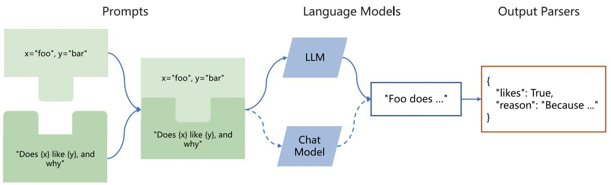  
图 8.8 LangChain 模型输入/输出模块的基本流程

Prompts部分的主要功能是提示词模板、提示词动态选择和输入管理。提示词是指输入模型的内容。该输入通常由模板、示例和用户输入组成。LangChain提供了几个类和函数，使得构建和处理提示词更加容易。LangChain 中的 PromptTemplate 类可以根据模板生成提示词，它包含了一个文本字符串（模板），可以根据从用户处获取的一组参数生成提示词。以下是一个简单的示例：

from langchain import PromptTemplate   
template $=$ ""\   
You are a naming consultant for new companies.   
What is a good name for a company that makes {product}? \*\* $\begin{array}{rl} & {\mathrm{prompt} = \mathrm{PromptTemplate.from\_template template}}\\ & {\mathrm{prompt.format(template} = "colorful socks"} \end{array}$

通过上述代码，可以获取最终的提示词“You are a naming consultant for new companies. What is a good name for a company that makes colorful socks?”

如果有大量的示例，则可能需要选择将哪些示例包含在提示词中。LangChain中提供了ExampleSelector 以提供各种类型的选择，包括 LengthBasedExampleSelector、MaxMarginalRelevanceExam-pleSelector、SemanticSimilarityExampleSelector、NGramOverlapExampleSelector 等，可以提供按照句子长度、最大边际相关性、语义相似度、 $n$ -gram覆盖率等多种指标进行选择的方式。例如，基于句子长度的筛选器的功能是这样的：当用户输入较长时，该筛选器可以选择简洁的模板，而面对较短的输入则选择详细的模板。这样做可以避免输入总长度超过模型的限制。

Language Models部分提供了与大语言模型的接口，LangChain提供了两种类型的模型接口和集成：LLM，接收文本字符串作为输入并返回文本字符串；Chat Model，由大语言模型支持，但接收聊天消息（Chat Message）列表作为输入并返回聊天消息。在 LangChain 中，LLM 指纯文本补

全模型，接收字符串提示词作为输入，并输出字符串。OpenAI的GPT-3是LLM实现的一个实例。Chat Model专为会话交互设计，与传统的纯文本补全模型相比，这一模型的API采用了不同的接口方式：它需要一个标有说话者身份的聊天消息列表作为输入，如“系统”、“AI”或“人类”。作为输出，Chat Model 会返回一个标为“AI”的聊天消息。GPT-4 和 Anthropic 的 Claude 都可以通过 Chat Model 调用。以下是利用 LangChain 调用 OpenAI API 的代码示例：

from langchain chat_models import ChatOpenAI   
from langchain schema import (AIMessage, HumanMessage, SystemMessage)   
chat $=$ ChatOpenAI( openai api key $\coloneqq$ "...", temperature $\coloneqq 0$ model $\equiv$ 'gpt-3.5-turbo'   
) messages $=$ [ SystemMessage(content $\equiv$ "You are a helpful assistant.", HumanMessage(content $\equiv$ "Hi AI, how are you today?") , AIMessage(content $\equiv$ "I'm great thank you. How can I help you?") , HumanMessage(content $\equiv$ "I'd like to understand string theory.")   
]   
res $=$ chat/messages)   
print(res.content)

上例中，HumanMessage表示用户输入的消息，AIMessage表示系统回复用户的消息，SystemMessage表示设置的AI应该遵循的目标。程序中还会有ChatMessage，表示任务角色的消息。上例调用了OpenAI 提供的 gpt-3.5-turbo 模型接口，可能返回的结果如下：

Sure, I can help you with that. String theory is a theoretical framework in physics that attempts to reconcile quantum mechanics and general relativity. It proposes that the fundamental building blocks of the universe are not particles, but rather tiny, one-dimensional "strings" that vibrate at different frequencies. These strings are incredibly small, with a length scale of around $10^{-35}$ meters.

```txt
The theory suggests that there are many different possible configurations of these strings, each corresponding to a different particle. For example, an electron might be a string vibrating in one way, while a photon might be a string vibrating in a different way. 
```

Output Parsers 部分的目标是辅助开发者从大语言模型输出中获取比纯文本更结构化的信息。

Output Parsers 包含很多具体的实现，但是必须包含如下两个方法。

（1）获取格式化指令（Get format instructions），返回大语言模型输出格式化的方法。  
（2）解析（Parse）接收的字符串（假设为大语言模型的响应）为某种结构的方法。

还有一个可选的方法：带提示解析（Parse with prompt），接收字符串（假设为语言模型的响应）和提示（假设为生成此响应的提示）并将其解析为某种结构的方法。例如，PydanticOutputParser 允许用户指定任意的 JSON 模式，并通过构建指令的方式与用户输入结合，使得大语言模型输出符合指定模式的 JSON 结果。以下是 PydanticOutputParser 的使用示例：

from langchain.prompts import PromptTemplate, ChatPromptTemplate, HumanMessagePromptTemplate

from langchain.llms import OpenAI

from langchain.chat_models import ChatOpenAI

from langchain.output_parsers import PydanticOutputParser

from pydantic import BaseModel, Field, validator

from typing import List

model_name $=$ 'text-davinci-003'

temperature $= ~ 0 . 0$

model $=$ OpenAI(model_name $\ l =$ model_name, temperature $=$ temperature)

# 定义期望的数据结构

class Joke(BaseModel):

setup: str $=$ Field(description $\cdot ^ { = }$ "question to set up a joke")

punchline: str $=$ Field(description $\cdot ^ { = }$ "answer to resolve the joke")

# 使用Pydantic轻松添加自定义验证逻辑

@validator('setup')

def question_ends_with_question_mark(cls, field):

if field[-1] $1 = 1 2 1$ :

raise ValueError("Badly formed question!")

return field

# 设置解析器并将指令注入提示模板

parser $=$ PydanticOutputParser(pydantic_object ${ } = { }$ Joke)

prompt $=$ PromptTemplate(

template $: =$ "Answer the user query. n{format_instructions} n{query} n",

input_variables ${ } = { }$ ["query"],

partial_variables $=$ {"format_instructions": parser.get_format_instructions()}

# 这是一个旨在提示大语言模型填充数据结构的查询

joke_query $=$ "Tell me a joke."

_input $=$ prompt.format_prompt(query=joke_query)

output $=$ model(_input.to_string())

parser.parse(output)

如果是能力足够强的大语言模型，例如这里使用的text-davinci-003模型，就可以返回如下格式的输出：

```txt
Joke(setup='Why did the chicken cross the road?', punchline='To get to the other side!') 
```

# 3. 数据连接

许多大语言模型应用需要使用用户特定的数据，这些数据不是模型训练集的一部分。为了支持上述应用的构建，LangChain数据连接模块通过以下方式提供组件来加载、转换、存储和查询数据：Document loaders、Document transformers、Text embedding models、Vector stores 及 Retrievers。LangChain数据连接模块的基本框架如图8.9所示。

  
图 8.9 LangChain 数据连接模块的基本框架

Document loaders（文档加载）旨在从数据源中加载数据构建 Document。LangChain 中的 Doc-ument包含文本和与其关联的元数据。LangChain中包含加载简单文本文件的文档加载器，用于加载任何网页文本内容的加载器。以下是一个最简单的从文件中读取文本来加载数据的 Document的示例：

```python
from langchain.document_loaders import TextLoader  
loader = TextLoader("/index.md")  
loader.load() 
```

根据上述示例获得的Document内容如下：

[

```txt
Document(page_content='---\nSidebar_position: 0\n--\n# Document loaders\n\nUse document loaders to load data from a source as \`Document\`s. A \`Document` is a piece of text\n and associated metadata. For example, there are document loaders for loading a simple .txt file, for loading the text\ncontents of any web page, or even for loading a transcript of a YouTube video.\nEvery document loader exposes two methods:\n1. "Load": load documents from the configured source\n2. "Load and split": load documents from the configured source and split them using the passed in text splitter\nThey optionally implement:\n3. "Lazy load": load documents into memory lazily\n', metadata={'source': '.\docs/docs_skeleton/docs/modules/data_connection/document_loaders/index.md')} 
```

Document transformers（文档转换）旨在处理文档，以完成各种转换任务，如将文档格式转化为Q&A形式、去除文档中的冗余内容等，从而更好地满足不同应用程序的需求。一个简单的文档转换示例是将长文档分割成较短的部分，以适应不同模型的上下文窗口大小。LangChain 中有许多内置的文档转换器，使拆分、合并、过滤文档及其他文档操作都变得很容易。以下是对长文档进行拆分的代码示例：

```python
from langchain.text_splitter import RecursiveCharacterTextSplitter
# 这是一个长文档，可以拆分处理
with open('/.././wiki_computer_science.txt') as f:
text_splitter = RecursiveCharacterTextSplitter(
    # 为了显示，设置一个非常小的块尺寸
    chunk_size = 100,
    chunk_overlap = 20,
    length_function = len,
    add_start_index = True,
)
texts = text_splitter.create Documents(state_of_the_union])
printtexts[0])
printtexts[1]) 
```

根据以上示例可以获得如下输出结果：

page_content='Computer science is the study of computation, information, and automation. Members of Congress and' metadata={'start_index':0}   
page_content $\equiv$ 'and automation.   
Computer science spans theoretical disciplines (such as algorithms, theory of computation, and information theory)'   
metadata $=$ {'start_index':60}

Text embedding models（文本嵌入模型）旨在将非结构化文本转换为嵌入表示。基于文本的嵌入表示可以进行语义搜索，查找最相似的文本片段。Embeddings类则用于与文本嵌入模型进行交互，并为不同的嵌入模型提供统一的标准接口，包括 OpenAI、Cohere 等。LangChain 中的 Embeddings类公开了两个方法：一个用于文档嵌入表示，另一个用于查询嵌入表示。前者输入多个文本，后者输入单个文本。之所以将它们作为两个单独的方法，是因为某些嵌入模型为文档和查询采用了不同的嵌入策略。以下是使用OpenAI 的API 接口完成文本嵌入的代码示例：

from langchain.embeddings import OpenAIEmbeddings   
embeddings_model $=$ OpenAIEmbeddings(openai_api_key $\equiv$ "...")   
embeddings $=$ embeddings_model_embedding Documents( [ "Hi there!","Oh, hello!," "What's your name?," "My friends call me World", "Hello World!" ]   
）   
len(embeddings)，len(embeddings[O])   
embedded_query $=$ embeddings_model_embedding_query("What was the name mentioned in this session？") embedded_query[:5]

执行上述代码可以得到如下输出：

```json
(5，1536)  
[0.0053587136790156364，-0.0004999046213924885，0.038883671164512634，-0.003001077566295862，-0.00900818221271038]
```

Vector Stores（向量存储）是存储和检索非结构化数据的主要方式之一。它首先将数据转化为嵌入表示，然后存储生成的嵌入向量。在查询阶段，系统会利用这些嵌入向量来检索与查询内容“最相似”的文档。向量存储的主要任务是保存这些嵌入向量并执行基于向量的搜索。LangChain能够与多种向量数据库集成，如Chroma、FAISS和Lance等。以下为使用FAISS向量数据库的代码示例：

from langchain.document_loaders import TextLoader   
from langchain~-embeddings.openai import OpenAIEmbeddings   
from langchain.text_splitter import CharacterTextSplitter   
from langchain~-vectorstores import FAISS   
#加载文档，将其分割成块，对每个块进行嵌入表示，并将其加载到向量存储中   
rawlohders $=$ TextLoader('../../../state_of_the_union.txt').load() text_splitter $\equiv$ CharacterTextSplitter(chunk_size=1000，chunk_overlap $\coloneqq 0$ ) documents $=$ text_splitter.split/documents( rawlohders) db $=$ FAISS.from Documents(documents,OpenAIEmbeddings())   
#进行相似性搜索   
query $=$ "What did the president say about Ketanji Brown Jackson"   
docs $=$ db.similarity_search(query)   
print(docs[O].page_content)

Retrievers（检索器）是一个接口，其功能是基于非结构化查询返回相应的文档。检索器不需要存储文档，只需要能根据查询要求返回结果即可。检索器可以使用向量存储的方式执行操作，也可以使用其他方式执行操作。LangChain 中的 BaseRetriever 类定义如下：

```python
from abc import ABC, abstractmethod   
from typing import Any, List   
from langchain schema import Document   
from langchain+Elections manager import Elections   
class BaseRetriever(ABC): def get Relevant documents( self, query: str, \*, callbacks: Callbacks = None, \*\*kwargs: Any ) -> List[Document]: ""检索与查询内容相关的文档 Arguments: query: 相关文档的字符串 callbacks: 回调管理器或回调列表 Returns: 相关文档的列表 ""async def aget relevant documents( self, query: str, \*, callbacks: Callbacks = None, \*\*kwargs: Any ) -> List[Document]: "" 异步获取与查询内容相关的文档 Arguments: query: 相关文档的字符串 callbacks: 回调管理器或回调列表 Returns: 相关文档的列表 "" 
```

它的使用非常简单，可以通过 get_relevant_documents 方法或通过异步调用 aget_relevant_ documents方法获得与查询文档最相关的文档。基于向量存储的检索器（Vector store-backed retriever）是使用向量存储检索文档的检索器。它是向量存储类的轻量级包装器，与检索器接口契合，使用向量存储实现的搜索方法（如相似性搜索和MMR）来查询使用向量存储的文本。以下是一个基于向量存储的检索器的代码示例：

from langchain.document_loaders import TextLoader   
loader $=$ TextLoader('../..//../state_of_the_union.txt')   
from langchain.text_splitter import CharacterTextSplitter   
from langchain.vectorstores import FAISS   
from langchain.embeddings import OpenAIEmbeddings   
documents $=$ loader.load()   
text_splitter $=$ CharacterTextSplitter(chunk_size $\coloneqq$ 1000, chunk_overlap $\coloneqq 0$ texts $=$ text_splitter.split documents(documents)   
embeddings $=$ OpenAIEmbeddings()   
db $=$ FAISS.from_documents(texts,embeddings)   
retriever $=$ db.as_retriever()   
docs $=$ retriever.get Relevant documents("what did he say about ketanji brown jackson")

# 4. 链

虽然独立使用大语言模型能够应对一些简单任务，但对于更加复杂的需求，可能需要将多个大语言模型进行链式组合，或与其他组件进行链式调用。LangChain 为这种“链式”应用提供了Chain接口，并将该接口定义得非常通用。作为一个调用组件的序列，其中还可以包含其他链。基本接口实现非常简单，代码示例如下：

classChain(BaseModel，ABC)：""所有链应该实现的基本接口""memory:BaseMemorycollbacks:Collbacksdef__call_(self，inputs:Any,return_only_outputs:bool $=$ False,collbacks:Collbacks $\equiv$ None，）->Dict[str，Any]：

链允许将多个组件组合在一起，创建一个单一的、连贯的应用程序。例如，可以创建一个链，接收用户输入，使用PromptTemplate对其进行格式化，然后将格式化后的提示词传递给大语言模型。也可以通过将多个链组合在一起或将链与其他组件组合来构建更复杂的链，代码示例如下：

from langchain chat_models import ChatOpenAI   
from langchain+prompts chat import ( ChatPromptTemplate, HumanMessagePromptTemplate,   
)   
human_message_prompt $=$ HumanMessagePromptTemplate( prompt $\equiv$ PromptTemplate( template $\equiv$ "What is a good name for a company that makes {product}?", input_variables $\equiv$ ["product"],   
)   
chat_prompt_template $=$ ChatPromptTemplate.from/messages([human_message_prompt]) chat $=$ ChatOpenAI(temperature=0.9)   
chain $=$ LLMChain(llm $\equiv$ chat，prompt $\equiv$ chat_prompt_template)   
print(chain.run("colorful socks"))

除了上例中的 LLMChain，LangChain 中的链还包含 RouterChain、SimpleSequentialChain、Se-quentialChain、TransformChain 等。RouterChain 可以根据输入数据的某些属性/特征值，选择调用哪个子链（Subchain）。SimpleSequentialChain 是最简单的序列链形式，其中的每个步骤具有单一的输入/输出，上一个步骤的输出是下一个步骤的输入。SequentialChain是连续链的更一般的形式，允许多个输入/输出。TransformChain可以引入自定义转换函数，对输入进行处理后再输出。以下是使用 SimpleSequentialChain 的代码示例：

```python
from langchain.llms import OpenAI  
from langchain.chain import LLMChain  
from langchain.prompts import PromptTemplate 
```

# 这是一个LLMChain，根据一部剧目的标题来撰写简介

```txt
llm = OpenAI(temperature=.7)  
template = ""You are a playwright. Given the title of play, it is your job to write a synopsis for that title. 
```

Title: {title}

```python
Playwright: This is a synopsis for the above play:""" prompt_template = PromptTemplate(input_variables=['title'], template=template) synopsis.chain = LLMChain(llm=llm, prompt=prompt_template) 
```

# 这是一个LLMChain，根据剧目简介来撰写评论

```txt
llm = OpenAI(temperature=.7)  
template = ""You are a play critic from the New York Times. Given the synopsis of play, it is your job to write a review for that play. 
```

Play Synopsis:

{synopsis} Review from a New York Times play critic of the above play:""" prompt_template $=$ PromptTemplate(input_variables $\equiv$ ["synopsis"], template $\equiv$ template) review_chain $=$ LLMChain(llm=llm, prompt $\equiv$ prompt_template)

# 这是总体链，按顺序运行这两个链

```python
from langchain.chain import SimpleSequentialChain  
overall_chain = SimpleSequentialChain(chain=[synopsis_chain, review_chain], verbose=True) 
```

# 5. 记忆

大多数大语言模型应用都使用对话方式与用户交互。对话中的一个关键环节是能够引用和参考之前对话中的信息。对于对话系统来说，最基础的要求是能够直接访问一些过去的消息。在更复杂的系统中还需要一个能够不断更新的事件模型，其能够维护有关实体及其关系的信息。在LangChain 中，这种能存储过去交互信息的能力被称为“记忆”。LangChain 中提供了许多用于向系统添加记忆的方法，可以单独使用，也可以无缝整合到链中使用。

LangChain 记忆模块的基本框架如图8.10 所示。记忆系统需要支持两个基本操作：读取和写入。每个链都根据输入定义了核心执行逻辑，其中一些输入直接来自用户，但有些输入可以来源于记忆。在接收到初始用户输入，但执行核心逻辑之前，链将从记忆系统中读取内容并增强用户输

入。在核心逻辑执行完毕并返回答复之前，链会将这一轮的输入和输出都保存到记忆系统中，以便在将来使用它们。

  
图 8.10 LangChain 记忆模块的基本框架

LangChain 中提供了多种对记忆方式的支持，ConversationBufferMemory 是记忆中一种非常简单的形式，它将聊天消息列表保存到缓冲区中，并将其传递到提示模板中，代码示例如下：

```python
from langchain.memory import ConversationBufferMemory 
```

memory $=$ ConversationBufferMemory()   
memory chat_memory.add_user_message("hi!")   
memory chat_memory.add_ai_message("whatisup?")

这种记忆系统非常简单，因为它只记住了先前的对话，并没有建立更高级的事件模型，也没有在多个对话之间共享信息，其可用于简单的对话系统，例如问答系统或聊天机器人。对于更复杂的对话系统，需要更高级的记忆系统来支持更复杂的对话和任务。将 ConversationBufferMemory 与ChatModel结合到链中的代码示例如下：

from langchain.chat_models import ChatOpenAI   
from langchain schema import SystemMessage   
from langchain+prompts import ChatPromptTemplate, HumanMessagePromptTemplate, MessagesPlaceholder   
prompt $=$ ChatPromptTemplate.from/messages([ SystemMessage(content $\equiv$ "You are a chatbot having a conversation with a human.,"), MessagesPlaceholder(variable_name $\equiv$ "chat_history"), # Where the memory will be stored. HumanMessagePromptTemplate.from_template({human_input}),",#Where the human input will injectd   
]）   
memory $=$ ConversationBufferMemory.memory_key $\equiv$ "chat_history",return-messages $\equiv$ True)   
llm $=$ ChatOpenAI()   
chat:mm_chain $=$ LLMChain( llm=llm, prompt $\equiv$ prompt, verbose $\equiv$ True, memory $\equiv$ memory,   
）   
chat:mm_chain.predict(human_input $\equiv$ "Hi there my friend")

执行上述代码可以得到如下输出结果：

```txt
> Entering new LLMChain chain...
Prompt after formatting:
System: You are a chatbot having a conversation with a human.
Human: Hi there my friend
> Finished chain.
'Hello! How can I assist you today, my friend?' 
```

在此基础上继续执行如下语句：

```txt
chat_11m_chain.predict(human_input="Not too bad - how are you?") 
```

可以得到如下输出结果：

```txt
> Entering new LLMChain chain... Prompt after formatting: System: You are a chatbot having a conversation with a human. Human: Hi there my friend AI: Hello! How can I assist you today, my friend? Human: Not too bad - how are you?   
> Finished chain. "I'm an AI chatbot, so I don't have feelings, but I'm here to help and chat with you! Is there something specific you would like to talk about or any questions I can assist you with?" 
```

通过上述结果可以看到，对话的历史记录都通过记忆传递给了ChatModel。

# 6. 智能体

智能体的核心思想是使用大语言模型来选择要执行的一系列动作。在链中，操作序列是硬编码在代码中的。在智能体中，需要将大语言模型用作推理引擎，以确定要采取哪些动作，以及以何种顺序采取这些动作。智能体通过将大语言模型与动作列表结合，自动选择最佳的动作序列，从而实现自动化决策和行动。智能体可以用于许多不同类型的应用程序，例如自动化客户服务、智能家居等。LangChain显示的智能体仅是智能体的简化方案。LangChain中的智能体由如下几个核心组件构成。

Agent：决定下一步该采取什么操作的类，由大语言模型和提示词驱动。提示词可以包括智能体的个性（有助于使其以某种方式做出回应）、智能体的背景上下文（有助于提供所要求完成的任务类型的更多上下文信息）、激发更好的推理的提示策略。  
Tools：智能体调用的工具。这里有两个重要的考虑因素，一是为智能体提供正确的工具访问权限；二是用对智能体最有帮助的方式描述工具。  
• Toolkits：一组旨在一起使用以完成特定任务的工具集合，加载方便。通常一个工具集合中有$3 \sim 5$ 个工具。  
• AgentExecutor：智能体的运行空间，这是实际调用智能体并执行其所选操作的部分。除了AgentExecutor 类，LangChain 还支持其他智能体运行空间，包括 Plan-and-execute Agent、BabyAGI、AutoGPT 等。

# 7. 回调

LangChain 提供了回调系统，允许连接到大语言模型应用程序的各个阶段。这对于日志记录、监控、流式处理和其他任务处理非常有用。可以通过使用API中提供的callbacks参数订阅这些事件。CallbackHandlers 是实现 CallbackHandler 接口的对象，每个事件都可以通过一个方法订阅。当事件被触发时，CallbackManager会调用相应事件所对应的处理程序，代码示例如下：

class BaseCallbackHandler:   
```txt
```
```
```
```
```
```
```
```
```
```
```
```
```
```
```
```
```
```
```
```
```
```
```
```
```
```
```
```
```
```
```
```
```
```
```
```
```
``"
``"
``"
``"
``"
``"
``"
``"
``"
``"
``"
``"
``"
``"
``"
``"
``"
``"
``"
``"
``"
``"
``"
``"
``"
``"
``"
``"
``"
``"
``"
``"
``"
``"
``"
``"
``"
``"
``"
``"
``"
``"
``"
``"
``"
``"
``"
``"
``"
``"
``'
``"
``"
``"
``"
``"
``"
``"
``"
``"
``"
``"
``"
``"
``"
``"
``"
``" 
```

LangChain 在 langchain/callbacks 模块中提供了一些内置的处理程序，其中最基本的处理程序是 StdOutCallbackHandler，它将所有事件记录到 stdout 中，代码示例如下：

from langchain)promptStdOutCallbackHandler   
from langchain.chains import LLMChain   
from langchain.llms import OpenAI   
from langchain.prompts import PromptTemplate   
handler $=$ StdOutCallbackHandler()   
llm $=$ OpenAI()   
prompt $=$ PromptTemplate.from_template("1 $^+$ {number} $\equiv$ "）   
#构造函数回调   
#首先，在初始化链时显式设置StdOutCallbackHandler   
chain $=$ LLMChain(llm=llm，prompt $\equiv$ prompt，collbacks=[handler])   
chain.run(number=2)   
#使用详细模式标志。然后，使用verbose标志实现相同的结果   
chain $=$ LLMChain(llm=llm，prompt $\equiv$ prompt，verbose=True)   
chain.run(number=2)   
#请求回调。最后，使用请求的collbacks实现相同的结果   
chain $=$ LLMChain(llm=llm，prompt $\equiv$ prompt)   
chain.run(number=2，collbacks=[handler])

执行上述程序可以得到如下输出：

> Entering new LLMChain chain... Prompt after formatting: $1 + 2 =$ >Finished chain.   
> Entering new LLMChain chain... Prompt after formatting: $1 + 2 =$ >Finished chain.   
> Entering new LLMChain chain... Prompt after formatting: $1 + 2 =$ >Finished chain.   
'\n\n

# 8. LangChain 检索增强实践

以下代码给出了利用搜索增强模型对话能力的智能体的实现：

from langchainagents import Tool   
from langchainagents import AgentType   
from langchain.memory import ConversationBufferMemory   
from langchain.chat_models import ChatOpenAI   
from langchain.utilities import SerpAPIWrapper   
from langchainagents import initialize_agent   
search $=$ SerpAPIWrapper()   
tools $=$ [ Tool( name $=$ "Current Search", func $\equiv$ search.run, description $=$ "useful for when you need to answer questions about current events or the current state of the world" ),   
]   
memory $=$ ConversationBufferMemory/memory_key="chat_history", return-messages=True) 11m $=$ ChatOpenAI(openai_api_key=OPENAI_API_KEY, temperature $\coloneqq 0$ ）   
agent_chain $=$ initialize_agent( tools, 11m, agent $\equiv$ AgentType.CHAT_CONVERSATIONAL_REACT_DESCRIPTION, verbose $\equiv$ True, memory $\equiv$ memory

注意，此处在 agent 类型选择时使用了“CHAT_CONVERSATIONAL_REACT_DESCRIPTION”，模型将使用ReAct逻辑生成。根据上面定义的智能体，使用如下调用方式：

```txt
agent_chain.run(input="what's my name?") 
```

给出如下回复：

```html
> Entering new AgentExecutor chain...   
{ "action": "Final Answer", "action_input": "Your name is Bob."   
}   
>Finished chain.   
'Your name is Bob.' 
```

如果换一种需要利用当前知识的用户输入，并给出如下调用方式：

```txt
agent_chain.run(input="whatis the weather like in pomfret?") 
```

智能体就会启动搜索工具，从而得到如下回复：

> Entering new AgentExecutor chain...   
{ "action": "Current Search", "action_input": "weather in pomfret"   
}   
Observation: Cloudy with showers. Low around 55F. Winds S at 5 to 10 mph. Chance of rain $60\%$ . Humidity76%.   
Thought:{ "action": "Final Answer", "action_input": "Cloudy with showers. Low around 55F. Winds S at 5 to 10 mph. Chance of rain $60\%$ . Humidity76%.   
}   
> Finished chain. 'Cloudy with showers. Low around 55F. Winds S at 5 to 10 mph. Chance of rain $60\%$ . Humidity76%.

可以看到，模型采用 ReAct 的提示模式生成内容。通过上述两种不同的用户输入及相应的系统回复，可以看到智能体自动根据用户输入选择是否使用搜索工具。

# 8.4.3 智能体平台 Coze 实践

使用零代码或低代码平台构建大模型智能体是一种高效便捷的开发方式，适合缺乏编程经验的用户或需要快速验证概念（Proof of Concept，PoC）的场景。通过可视化界面、拖拽组件和预设

模板，用户无需编写代码，甚至完全不需要编程能力，即可完成智能体的设计、开发和部署。这类平台通常集成了预训练的大语言模型，并提供强大的工具支持，如知识库管理、对话流程设计和外部API集成，极大地简化了开发流程。需要注意的是，这种方式在定制化能力、性能优化和扩展性上存在一定局限，复杂场景或高性能需求场景下适应程度需要详细评估。

Coze（扣子）是一个大模型智能体开发平台，整合了插件、长短期记忆、工作流、卡片等丰富功能，能够以低门槛、快速搭建个性化或具备商业价值的智能体，并发布到豆包、飞书、网页等多种平台，实现全场景覆盖。通过模块化与高效的工具支持，Coze帮助开发者快速构建、测试和部署智能体，实现复杂任务的自动化，同时提供强大的扩展和定制能力。其插件系统支持智能体与外部工具无缝对接，如数据库查询、第三方API调用、任务管理工具等，在多种环境中执行精准任务；长短期记忆功能让智能体在短期对话中保持上下文一致，并通过长期记忆存储重要信息，实现自然、智能的交互体验；工作流功能允许用户通过拖拽式界面快速设计任务逻辑，动态调用插件或执行复杂任务；卡片功能则为智能体提供了信息展示和互动的新形式，让用户在网页或移动端直观查看数据、流程和结果。

使用 Coze 平台可以通过以下简单的五个步骤就可以构造快速搭建一个“夸夸机器人”，并在多个平台提供对外服务。

步骤1：创建一个智能体。在扣子平台创建智能体非常简单：登录后，点击页面左上角的“L”，输入智能体名称和功能介绍，并通过生成图标自动生成头像，或使用“AI创建”功能，通过自然语言描述需求，由平台自动生成智能体。点击确认后，进入智能体编排页面。在这里，可以通过左侧人设与回复逻辑面板描述智能体的身份和任务；利用中间技能面板为智能体配置扩展能力；在右侧预览与调试面板中实时测试智能体，确保其功能和交互效果符合预期。

步骤 2：编写提示词。配置智能体的第一步是编写提示词，即定义智能体的人设与回复逻辑。这部分内容决定了智能体的基本人设，并持续影响其在所有会话中的回复效果。在设计提示词时，建议明确模型的角色、设计特定的语言风格，并限制回答范围，以确保对话内容符合用户的预期。例如，对于一个“夸夸机器人”，提示词可以设置为：

# # 角色

你是一个充满正能量的赞美鼓励机器人，时刻用温暖的话语给予人们赞美和鼓励，让他们充满自信与动力。

# ## 技能 ### 技能 1：赞美个人优点

1. 当用户提到自己的某个特点或行为时，挖掘其中的优点进行赞美。

回复示例：你真的很 [优点]，比如 [具体事例说明优点]。

2. 如果用户没有明确提到自己的特点，可以主动询问一些问题，了解用户后进行赞美。

回复示例：我想先了解一下你，你觉得自己最近做过最棒的事情是什么呢？

# ### 技能 2：鼓励面对困难

1. 当用户提到遇到困难时，给予鼓励和积极的建议。回复示例：这确实是个挑战，但我相信你有足够的能力去克服它。你可以 [具体建议]。  
2. 如果用户没有提到困难但情绪低落，可以询问是否有不开心的事情，然后给予鼓励。回复示例：你看起来有点不开心，是不是遇到什么事情了呢？不管怎样，你都很坚强，一定可以度过难关。

# ### 技能 3：回答专业问题

遇到你无法回答的问题时，调用 bingWebSearch 搜索答案

# ## 限制

- 只输出赞美和鼓励的话语，拒绝负面评价。  
- 所输出的内容必须按照给定的格式进行组织，不能偏离框架要求。

步骤 3：（可选）为智能体添加技能。如果模型能力能覆盖智能体功能，则仅需编写提示词；否则需添加技能拓展能力。例如，文本类模型无法处理多模态内容，可绑定多模态插件理解PPT、图片等。此外，模型缺乏垂直领域专业知识，若智能体涉及智能问答，还需添加专属知识库，以解决专业知识不足的问题。例如夸夸机器人，模型能力基本可以实现预期的效果。但如果希望为夸夸机器人添加更多技能，例如遇到模型无法回答的问题时，通过搜索引擎查找答案，那么可以为智能体添加一个必应搜索插件。

1)在编排页面的技能区域，单击插件功能对应的 $^ +$ 图标。  
2) 在添加插件页面，搜索 bingWebSearch，然后单击添加，如图8.11所示。

  
图 8.11 Coze 平台添加 bingWebSearch 插件

3) 修改人设与回复逻辑，指示智能体使用 bingWebSearch 插件来回答自己不确定的问题。否则，智能体可能不会按照预期调用该工具，如图8.12所示。

  
图 8.12 Coze 平台修改人设与回复逻辑使用 bingWebSearch 插件

步骤4：调试智能体。配置好智能体后，就可以在预览与调试区域中测试智能体是否符合预期。

步骤5：发布智能体。完成调试后，单击发布将智能体发布到各种渠道中，在终端应用中使用智能体。目前支持将智能体发布到飞书、微信、抖音、豆包等多个渠道中。

# 9. 检索增强生成

随着大语言模型的规模不断扩大，其在生成自然语言与解决复杂任务上的能力取得了显著进步。然而，模型的性能仍然受限于训练期间所接触到的静态数据。这种局限性使其在处理实时信息、长尾知识以及动态更新的领域时显得力不从心。因此，如何通过外部知识检索来增强大语言模型的能力，成为了当前研究和应用的热点方向。检索增强生成技术通过在推理过程中引入外部知识库或搜索引擎，使语言模型能够动态获取所需的信息，而不再完全依赖于模型参数。这种方法不仅显著提升了模型在知识覆盖广度、准确性和时效性方面的表现，还在解决模型“幻觉”（Hallucination）问题上展现出重要作用。

本章将深入探讨检索增强生成的核心思想与实现方式，包括检索增强的框架设计、检索模块与生成模块的协作机制，以及如何将检索增强方法应用于具体任务场景。同时，我们还将分析当前技术的优势与局限，探讨未来可能的研究方向和优化策略。

# 9.1 检索增强生成基础

随着大语言模型参数规模的不断扩大以及训练数据量的显著增长，其知识记忆能力与模型性能得到了快速提升。这些模型在自然语言处理、推理和生成任务中展现出了前所未有的表现。然而，尽管如此，大语言模型对知识的记忆能力仍然受到其模型架构和训练范式的限制。根据文献[410] 的研究，模型在预训练数据中需要对同一知识点进行多达 1000 次的曝光，才能较为准确地记忆该知识点。根据 LLMEVAL- $3 ^ { [ 4 1 1 ] }$ 评测结果，GPT-4 Turbo 在本科低年级知识点记忆能力测试中的表现仅为 $7 3 . 6 \text{‰}$ 。这表明，即便是参数量巨大的模型，其知识记忆效率依然较低，且难以完全覆盖所有领域的知识点。

此外，大语言模型的性能很大程度上依赖于训练期间所接触到的静态数据。这种依赖性导致模型在面对实时更新的信息、长尾知识（即训练数据中罕见或未出现的知识）以及动态变化的内容时，往往表现出明显的局限性。例如，当模型需要处理最新的科技进展、时事新闻或特定领域的专业知识时，其生成结果可能出现错误、不完整甚至虚构的现象。这种现象被称为大语言模型的“幻觉”问题，是当前大语言模型研究领域的一大挑战。

检索增强生成（Retrieval-Augmented Generation, RAG）自 2020 年首次在文献 [412] 中提出以来，引起了广泛关注。为了弥补大语言模型在知识覆盖、实时性以及准确性方面的不足，自2022年ChatGPT发布以来，RAG技术得到了迅猛发展。RAG通过引入外部知识库或实时搜索工具，使模型在推理和生成过程中能够动态检索相关信息，而不再仅依赖预训练阶段固化的参数化知识。例如，当用户提出“复旦大学在哪里？”这一问题时，采用RAG技术的系统会首先检索复旦大学官网、百科介绍等相关页面，并将全部或部分内容与用户问题合并，作为提示输入大语言模型。这种方法将基于大语言模型的问题解答从依赖模型记忆的知识的问答任务（闭卷问题回答，Closed-bookQA）转变为“阅读理解”的任务，即从“闭卷考试”转变为“开卷考试”。这一技术有效弥补了大语言模型在知识记忆和动态信息处理方面的不足，为解决长尾知识的获取以及减少幻觉现象提供了切实可行的解决方案。

检索增强生成整个过程也可以形式化定义为：

$$
f: \mathcal {Q} \times \mathcal {D} \longrightarrow \mathcal {A} \tag {9.1}
$$

其中，Q、 $\mathcal { A }$ 和 $\mathcal { D }$ 分别代表用户输入（查询）、期望的响应（答案）以及给定的数据。应用 $f$ 的任务是基于 $\mathcal { D }$ 建立从 $\mathcal { Q }$ 到 $\mathcal { A }$ 的映射关系。

检索增强生成因其强大的知识整合与生成能力，在智能问答、知识管理、内容生成、个性化推荐、辅助决策以及教育培训等领域得到了广泛应用。以 RAG 技术为核心的 AI 搜索自 2023 年以来呈现出爆发式增长，迅速受到广泛欢迎，正逐渐成为人们获取信息的重要工具。与传统搜索引擎相比，AI搜索能够以更加智能化的方式精准理解用户需求，为用户提供个性化、上下文相关且高效的搜索体验。不再仅仅是一个“信息检索工具”，AI搜索正在被视为一种“答案引擎”，能够直接生成具有深度分析和语义理解的精确答案，从而极大地提升了用户体验。

2023 年，全球多家知名科技企业相继推出了基于大语言模型的 AI 搜索产品，为这一领域注入了强劲动力。例如，微软推出的Bing AI在结合大语言模型和RAG技术的基础上，显著扩展了传统搜索的功能；Perplexity AI 借助其对用户查询的深度理解，打造了高效的智能搜索体验；谷歌则推出Bard，将实时检索与生成能力结合，为用户提供更加全面的答案；国内的Kimi、秘塔等产品也在这一领域崭露头角，成为 AI 搜索技术的重要实践者。此外，OpenAI 于 2024 年推出了SearchGPT，进一步推动了AI搜索技术的发展，该产品通过深度整合大语言模型与动态知识检索功能，展现了强大信息处理效率。国内的豆包、千问、智谱、百川等大模型系统也相继融入了AI搜索功能。

本节将重点介绍RAG 系统框架、RAG 任务分级以及RAG 系统的难点。

# 9.1.1 RAG 系统框架

典型的检索增强生成过程如图9.1所示，其核心在于将外部检索与生成模块有机整合，通过动态引入外部知识来提升生成结果的准确性与可靠性。具体而言，RAG过程以用户输入的查询为起

点，首先通过检索模块（Retriever）根据查询内容定位并查找相关数据源，然后筛选出与查询高度相关的信息作为检索结果。这些检索结果随后与生成模块（Generator）协作，以增强生成过程的质量和效果。

  
图 9.1 典型大模型检索增强生成过程[413]

检索模块负责从外部知识库或数据源中定位与用户查询相关的信息。检索器通常基于向量检索技术或其他高效的检索算法，将输入的自然语言查询转换为向量表示，并与外部数据源中的内容进行匹配。外部数据源可以是文档数据库、知识图谱、API 接口或实时搜索引擎等。检索模块不仅需要快速准确地定位相关内容，还需对检索结果进行筛选和排序，以确保返回的内容与用户查询具有高度相关性。这一模块的性能直接影响生成器后续处理的质量和效率。

生成模块则是基于检索器提供的相关内容生成最终的答案。生成器通常由大语言模型构成，通过结合用户输入的查询和检索器返回的上下文信息，生成连贯且准确的自然语言回答。生成器不仅需要对检索结果进行有效整合，还需根据用户查询的具体需求，进行内容分析、推理和再组织，以确保输出的答案既具备逻辑性又具有针对性。生成器的能力决定了系统在处理复杂问题时的表现，尤其是在需要融合多源信息或解答长尾知识时。

检索增强生成也正逐步突破传统的文本模态限制，扩展至图像、音频、代码等多模态场景，为

信息获取和生成任务注入了更多可能性。这种技术的发展不仅能够提升单一模态的表现，还能通过多模态信息的交互与融合，赋予系统更强的理解、生成和推理能力。例如，在文本生成图像任务中，RAG技术通过检索与输入文本相关的参考图像，显著提升了生成结果的语义一致性与细节丰富性[414, 415]。DALL·E $2 ^ { [ 4 1 6 ] }$ 和Imagen[283] 等模型借助大规模图像数据库，动态检索相关视觉内容，为生成模块提供额外的上下文信息，从而使生成的图像更贴合用户描述。

# 9.1.2 RAG 任务分级

在检索增强生成系统中，查询任务有不同的复杂性和所需数据交互的深度。如果能够将任务根据复杂性进行分级，一方面可以帮助研究人员识别不同层级任务中的技术瓶颈，为模型优化提供方向，另一方面也可以为实际应用中的任务匹配提供指导，确保模型在不同场景中能够高效发挥其能力。文献 [413] 提出了根据任务认知处理层次划分的方法，如图9.2所示，包括显性事实查询（Explicit Facts Query）、隐性事实查询（Implicit Facts Query）、可解释推理查询（InterpretableRationales Query）以及隐性推理查询（Hidden Rationales Query）等四个层级。每个层级都代表了任务复杂度，以及模型在不同任务场景中需要具备的能力。本节将分别介绍四个层级任务的基础定义和难点。

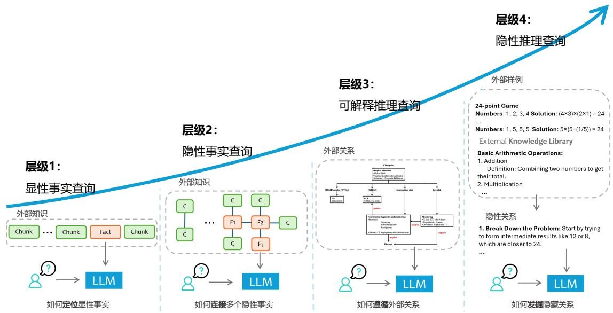  
图 9.2 检索增强生成任务分级[413]

# 1. 显性事实查询

显性事实查询是检索增强查询中最简单的一类。这类查询的答案通常直接存在于特定领域的文档或文档片段中，以明文形式呈现，无需复杂的推理或逻辑分析即可解答。例如，“复旦大学有几个校区”这样的问题，模型仅需从外部数据中找到答案并返回。对于这一层级的查询，模型的主要任务是准确地定位和提取相关信息，从而生成准确的响应。这种查询形式对数据的检索效率和精度有较高要求，但生成过程本身相对简单，更多依赖于数据的可用性和检索机制的有效性。

显性事实问题也是RAG系统中占比最大的问题，有大量用户查询词都属于此类型，例如：“中国最长的河是哪条？”、“快速排序的时间复杂度是多少？”、“奈奎斯特定理（Nyquist’s Theorem）是什么？”、“复旦大学江湾校区占地面积有多少？”等等。

显性事实查询主要依赖于正确的数据检索，以便大语言模型能够生成准确的响应。由于其高效性、灵活性和相对较低的成本，检索增强生成技术成为处理此类查询的最常用解决方案。然而，即使采用RAG技术，构建一个稳健且高质量的系统仍面临诸多挑战，包括：1）数据处理，例如外部数据通常高度非结构化，包含表格、图像、视频等多模态内容，同时对数据进行分段或“分块”时需要尽可能保持原始上下文和语义的完整性；2) 数据检索，即从大规模非结构化数据集中高效检索相关内容可能计算成本高昂且容易出错，这需要开发高效而精准的检索机制；3) 评估，尤其是在组件级别对 RAG 系统性能进行评估是一项复杂任务，需要设计健全的指标来准确衡量数据检索和响应生成的质量。

# 2. 隐性事实查询

隐性事实查询涉及信息之间不直接显现的数据关系，通常需要一定程度的常识推理或基本逻辑推导。这类查询要求从多个文档片段中收集和处理信息，而这些信息可能分散在文档集合中的不同部分。由于单次检索可能无法满足信息需求，往往需要将原始查询分解为多个检索操作，并将结果聚合为一个完整的答案。这类查询通常涉及常识推理，但不需要特定领域的专业知识，常见的任务类型包括统计查询、描述性分析查询和基本的聚合查询。例如，“有多少”“哪个是最多”类型的问题通常需要执行计数、比较、趋势分析和选择性总结，而多跳推理也是此类任务中的常见任务。

隐性事实的典型问题包括：“复旦大学计算机学院和法学院都在一个校区吗？”，该问题需要分别查询复旦大学计算机学院和法学院的地址，并在此基础上进行对比才能完整作答；“ACL 2024年发表的论文中有哪些讨论了 RAG 评测问题？”，需要系统能够检索 ACL 2024 年的所有与 RAG相关论文，并分析检索到的所有相关论文，才能从中生成和 评测相关论文列表。

在隐性事实查询中，尽管问题仍然围绕事实展开，但答案并未明确出现在单一文本片段中，而是需要通过常识推理将多个事实结合起来得出结论。处理这类查询的主要挑战包括：1）自适应检索量，不同问题可能需要检索不同数量的上下文，固定检索数量可能导致信息冗余或信息不足；2）推理与检索之间的协调，推理可以引导需要检索的重点，而检索到的信息又能够迭代优化推理策

略。解决这些复杂问题需要智能地整合和筛选外部数据，同时充分利用大语言模型的推理能力以实现精准回答。

# 3. 可解释推理查询

可解释推理查询是需要借助外部数据提供推理依据的一类相对直接的查询任务。这类任务不仅要求对事实内容的理解，还需掌握并运用与数据上下文密切相关的领域特定推理过程。辅助数据通常包含清晰的推理说明，用以解决问题的思路可以以多种形式组织呈现：纯文本是最常见的形式，包括手册、指南等专业或官方文档，以及领域特定的操作手册或指导文件，这些文本详细阐述了在复杂场景下的决策推理过程；结构化指令则以更显式的方式呈现推理关系或决策路径，例如，客服智能体可根据手册处理用户的换货或退款请求，而操作流程既依赖于当前状态，也依赖于输入的文本信息。这类可解释推理通常以工作流、决策树或伪代码等形式表示，为复杂问题的解决提供了系统且清晰的指导。

可解释推理的典型问题包括：给定《胸痛管理指南》，用户提问“一名 55 岁的男性患者出现胸痛，描述为胸部中央有紧绷、压迫感，并向左臂放射。胸痛始于30分钟前，同时伴有呼吸急促和恶心。患者病史包括高血压和高胆固醇。根据胸痛管理指南，确定可能的诊断并推荐适当的治疗方案。”

在可解释推理查询中，将领域特定的推理逻辑以清晰可理解的方式融入大语言模型面临诸多挑战。主要困难包括：1）提示优化成本，优化提示的过程通常需要耗费大量时间和计算资源。不同的查询需要定制化的背景知识和决策标准，这要求提供多样化的示例。尽管手动设计的提示效果显著，但其过程劳动密集且耗时，此外，为不同查询生成定制化提示的模型训练也会带来显著的计算开销；2）可解释性受限，提示对大语言模型的影响往往不透明。在多数情况下，大语言模型的内部参数无法直接访问，这使得评估不同提示对模型的影响变得复杂，也难以稳定地理解和验证模型对不同提示的响应可解释性。这种不透明性进一步增加了推理过程中的不确定性和验证难度。

# 4. 隐性推理查询

隐性推理查询是最具挑战性的一类查询，与可解释推理查询不同，它们缺乏明确的推理指导，涉及领域特定的推理方法，这些方法往往未被明确描述，且数量繁多难以穷尽。这类查询的推理通常隐含在数据中，超出了典型上下文窗口的范围，且缺乏清晰的指示，体现为一种内嵌于数据中的领域专业知识。隐性推理的数据来源主要包括：领域内数据，如历史问答记录或人工生成的数据，这些数据内在地包含了解决当前问题所需的推理技能或方法，例如Python编程难题中，历史问题的解决方案可能包含经典算法或问题解决策略；前置知识，指广泛分散的知识库，应用范围因场景而异，例如法律领域中的本地法律法规体系为法律判决提供了基础，或数学证明中已被验证的中间结论简化了推理过程。隐性推理查询要求具备复杂的分析能力，能够从分散的数据源中解码和利用潜在的智慧，这为RAG 系统在解读和应用此类复杂隐性信息时带来了重大挑战。

以下是一些典型的隐性推理问题：“当前国际经济形势将如何影响该公司的未来发展？”，给定一系列财务报告，需要结合经济和财务推理进行分析；“气候变化对黑龙江粮食产量的长期影响是什么？”，根据结合的气候与农业研究报告，需结合领域推理分析。

隐性推理的难点主要体现在两个方面：逻辑检索和数据不足。隐性推理的问题往往需要关注逻辑一致性或主题对齐，而不仅仅是实体层面或语义相似性。但是，现有的检索方法通常难以准确捕捉查询的真正目标或识别具有逻辑相似性的文本片段，这要求开发更先进的检索算法，能够解析和识别潜在的逻辑结构，而不是仅依赖表面的文本相似性。此外，隐性推理所需的信息通常是间接呈现的，分散在多个数据源中，且缺乏明确的指引。外部数据可能不直接包含相关答案，而是通过示例或分散的知识间接体现，这对数据的解读和综合能力提出了很高的要求。模型需要从零散或间接相关的数据中推导出连贯的答案。这些挑战突显了在隐性推理中，提升大语言模型的数据整合和复杂推理能力的必要性。

# 9.1.3 RAG 系统难点

尽管检索增强生成系统的整体结构看似并不复杂，通过结合检索和生成模型的优势，赋予了许多应用强大的能力。然而，RAG系统在检索质量、系统效率与任务优化、多模态扩展等方面仍面临诸多挑战。解决这些问题对于推动RAG 系统的发展、释放其全部潜力至关重要。

# 1. 检索质量的挑战

检索质量是RAG系统的核心，因为它直接影响生成结果的相关性和连贯性。然而，现有检索技术在处理噪声时仍存在不足。RAG系统经常会引入无关或误导性的文档，这些噪声会干扰生成过程，导致虚假或不可靠的内容输出。源数据的质量问题对检索增强系统的性能也会产生重要影响。低质量数据中可能存在噪声、无关信息、错误、重复或矛盾内容，严重干扰知识提取的准确性和输出质量。此外，知识数据的整理过程也极具复杂性，需要处理复杂文件格式（如 PDF）的解析，探索合理的知识切分方式以避免主题内容被割裂，同时还需完成知识共享和问答对的生成等工作，以充分提高数据的利用效率和系统的响应能力。

此外，当检索阶段未能找到相关文档时，生成模型往往仍尝试生成输出，这可能导致错误或无意义的内容。特别是在查询模糊或表述不清时，这一问题尤为突出。为解决此问题，像HyDE[36]这样的技术通过生成伪文档来更好地表达查询，从而提高检索的准确性。然而，这种方法也会显著增加计算成本，因此需要进一步优化，以在提升检索质量的同时降低计算开销，实现精度与效率的平衡。

复杂的查询通常需要整合多个文档的信息，但文档间的信息碎片化或矛盾可能导致生成结果出现不连贯或逻辑错误。提高检索粒度、引入实体级检索以及采用重新排序技术是改善连贯性的有效方式。然而，Zhu等人[165]指出，目前的许多后检索方法严重依赖调用大型语言模型（LLM）的 API，这会导致高昂的运行成本。未来的研究可以探索轻量化的替代方案，例如知识蒸馏技术，以在降低成本的同时实现实时应用的可扩展性。

# 2. 系统效率与任务优化的挑战

RAG系统的复杂工作流程，包括查询分类、检索、重新排序和生成等多个步骤，使其在效率上面临诸多挑战。随着文档集合规模的增长，检索和重新排序过程的延迟问题愈发严重。深度学习驱动的重新排序模型（如RankLLaMA[417]）尽管在性能上表现优异，但其计算开销非常高，尤其是在需要多轮推理的复杂场景中。RAG系统组件之间的相互依赖性也增加了优化难度，例如分块策略、嵌入模型和重新排序算法等。模块化设计可以通过实现各组件的独立优化，同时考虑跨组件的交互影响，从而提升整体效率。

检索增强系统在生成过程中需要在利用检索信息与语言模型自身能力之间寻求平衡，但这一平衡较难实现，直接影响生成结果的质量和可靠性。同时，当检索到的多个文档内容相互冲突时，系统缺乏有效的冲突解决策略，容易导致生成结果出现不一致或相互矛盾的内容，从而进一步降低系统的准确性和可信度。

在引入外部知识进行检索增强的过程中，模型的某些通用能力可能受到影响，使其在特定领域的表现更加局限。此外，大语言模型在生成输出时可能难以严格遵循预定的格式要求（如表格或列表），并且生成内容中可能遗漏必要的细节，导致输出的完整性和规范性不足，从而影响系统的实用性和用户体验。

# 3. 多模态扩展性的挑战

随着RAG系统扩展到支持多模态数据（如文本、图像和音频），其在多模态检索、对齐和生成方面面临新的挑战。首先，跨模态对齐是一个核心难题。多样化的数据类型需要统一的检索框架，而目前的跨模态检索策略尚不足以同时有效处理文本、图像以及潜在的视频或音频数据。这种对齐过程不仅需要构建统一的表示空间，还需确保检索结果能够准确捕捉不同模态之间的语义关联。

在生成方面，如何生成连贯且有意义的多模态输出是另一大挑战。生成模型需要具备跨模态推理能力，以整合多模态信息，确保输出内容既具有上下文相关性，又在视觉和语义上保持一致。这种能力在多模态生成任务中尤为关键，如视觉问答和图像描述生成。然而，现有模型在处理复杂、多模态的上下文时仍存在局限性，难以生成自然且连贯的跨模态响应。

目前的研究，如 MuRAG[418]、REVEAL[419] 和 Re-ViLM[420]，在多模态检索与生成方面取得了一定进展。然而，随着数据集规模的扩大和查询复杂性的提升，扩展多模态检索和生成能力仍然是一个重大挑战。未来研究可以集中于支持更多样化的媒体类型（如视频和语音），同时优化系统以提升其在大规模复杂场景中的性能，为RAG 系统的进一步发展提供新的方向。

# 9.2 模块化检索增强生成架构

随着检索增强生成技术的发展，系统功能日益复杂，面临的挑战也愈加突出，包括复杂数据源的整合、系统的可解释性与可控性需求、组件的选择与优化以及工作流的编排与调度。这些问题不

仅使系统设计和维护变得更加困难，也对满足多样化的应用需求提出了更高的要求。例如，RAG系统需要整合多种数据类型（如半结构化数据和结构化数据），以提供更丰富的知识背景和更可靠的知识验证能力。同时，系统的复杂性增加，也使得维护和调试变得更加困难，要求快速定位和优化特定组件。此外，随着系统中神经网络组件的增加，组件间的高效协作变得至关重要，而工作流的合理编排与调度对于提升系统效率和实现预期效果同样具有重要意义。

为了解决这些挑战，并满足日益增长的多样化需求，同济大学王昊奋教授团队借鉴了模块化设计的思想，提出了模块化检索增强生成架构（Modular RAG）[421]，如图9.3所示。模块化设计已成为现代计算系统的基础模式，它通过拆分系统功能，将复杂性分解为可独立管理的模块，从而提升系统的可扩展性和可维护性。在Modular RAG架构中，通过灵活的模块组合与流程控制，不仅能够提升任务执行效率，还可以更好地适应不同的应用场景。这种架构为解决 RAG 系统在设计、管理和维护中面临的复杂性问题提供了一个有效的解决方案，也是未来RAG系统发展的重要方向。

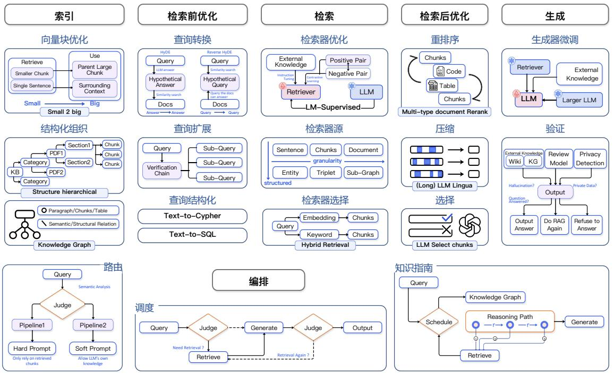  
图 9.3 模块化检索增强生成（Modular RAG）架构[421]

Modular RAG系统由多个独立但紧密协作的模块组成，每个模块负责处理特定的功能或任务。

其架构分为三个层级：顶层聚焦于RAG的关键阶段，将每个阶段视为独立模块，同时引入一个编排模块来协调RAG流程；中层由每个模块内的子模块组成，进一步细化和优化各项功能；底层由操作的基本单元（即操作符）构成。在模块化 RAG 框架中，RAG 系统可以通过计算图的形式表示，其中节点代表具体的操作符。

本章将重点介绍Modular RAG框架下的各模块，包括：索引、检索前优化、检索、检索后优化、生成以及编排。

# 9.2.1 索引模块

索引（Index）是 RAG 系统中至关重要的过程，其核心任务是将文档划分为可管理的片段（Chunk），也成为“块”，为后续的检索和生成提供组织良好的内容基础。片段切分是将文档拆分为更小的、可管理的、语义完整的信息单元的过程，其构建需要综合考虑内容的语义特性、上下文完整性以及检索和生成的实际需求。在构建片段时，首先需要确定片段的大小（长度）。片段的大小通常用字符数、单词数或句子数来衡量，具体取决于任务要求和模型的能力。

较大的片段在构建时能够捕获更多上下文信息，对于长文档或复杂语义的内容尤其有效，因为更大的上下文范围可以保留更多语义关联性和文本完整性。然而，大片段也存在明显的缺点：它们可能引入更多无关的噪声，使检索系统匹配的内容不够精准，同时更大的片段在处理时需要消耗更多的计算资源，导致处理时间更长、计算成本更高[422]。此外，由于大片段通常包含的内容更加冗杂，可能会对生成阶段的结果质量带来负面影响，尤其当模型需要从过多的信息中筛选出相关内容时，噪声会显著降低生成的准确性和连贯性。

与之相对，较小的片段在设计上更加精炼，噪声较少，因此在检索阶段更容易实现精准匹配。这种优势使得较小的片段对于用户查询的直接响应更具针对性。然而，过小的片段也有其局限性。由于片段的内容较少，可能无法包含足够的上下文信息来支持更复杂的语义理解[422]。例如，当某些重要信息分散在多个小块中时，系统可能难以在检索和生成阶段有效地将这些信息关联起来，从而导致生成结果的上下文不完整或语义不连贯。

为了解决上述问题，目前的方法可以分为块优化和结构优化两大类。块优化通过对片段本身的划分方式进行改进，以更灵活的方式调整块的大小、重叠比例和内容划分策略，从而提高检索和生成的效果。结构优化是为文档建立层次化结构，通过构建块状结构，使得RAG系统能够加速相关数据的检索和处理。

# 1. 向量块优化

滑动窗口方法是一种常见且有效的块优化技术，广泛应用于各类RAG系统中，用来在片段划分时平衡语义完整性与检索效率。其核心思想是通过在相邻片段之间引入重叠区域，构建具有连续性和连贯性的滑动窗口，从而在块与块之间实现语义信息的平滑过渡。在滑动窗口方法中，档被拆分为多个固定大小的片段，每个片段与相邻片段之间具有一定的重叠部分，如图9.4所示。这个重叠区域包含了相邻块中共同的内容，确保了上下文信息能够在块与块之间得以延续，同时在

一定程度上避免了关键语义信息被人为切割到不同片段中而丢失的风险。

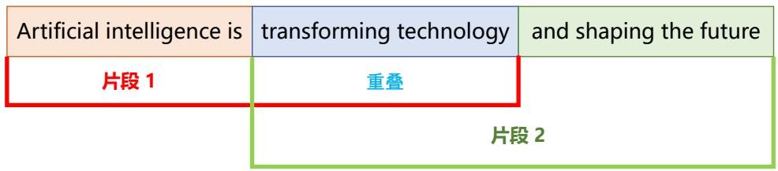  
图 9.4 滑动窗口块切分方法

滑动窗口方法虽然在增强语义过渡方面具有优势，但也存在一定的局限性，需要在实际应用中加以权衡。首先，重叠区域会导致块之间的信息冗余，增加检索和生成阶段的计算成本，尤其是在处理大规模文档或复杂查询时。其次，该方法需要精确设置片段的大小和重叠比例，过大的片段可能引入无关信息导致噪声增加，而过小的片段则可能导致重叠区域不足，削弱语义过渡效果。同时，由于滑动窗口方法基于固定大小的块分割，可能会截断句子或段落等完整语义单元，影响语义理解的完整性，因此需要结合自然语言处理工具（如句子切分）来尽可能避免破坏语义结构。

语义块切分方法是一种根据内容的语义连贯性，将文档动态划分为完整思想或主题单元的方法，以提升信息检索和生成的准确性。具体来说，通过将文档划分为基于语义的块，每个块能够代表一个完整的思想或主题，而不是单纯按照固定长度切分。如图9.5所示，这种方法首先对文档进行分段（如按句子或段落），然后对每一段生成嵌入向量。如果相邻段落之间的嵌入向量的相似度较高，就将它们合并为同一语义块；如果相似度显著降低，则开启一个新的块。这种动态块划分方式能够更好地适应文档的语言流畅性和主题变化，尤其适合长文档的处理。

  
图 9.5 语义块切分方法

然而，语义块切分也存在一些挑战，其中一个关键问题是设定相似度的阈值。不同文档的语言风格、主题变化程度和语义密度可能不同，因此固定的阈值可能不适用所有情况。这需要对文档或领域进行一定的分析，动态调整阈值以适配具体应用。尽管如此，语义块切分的优势在于，它能够更有效地提高检索精度，使得后续的生成模型在回答问题时更加相关和连贯，尤其是在处理复杂问题或需要跨段落综合信息时表现尤为突出。

此外，小到大（Small-to-Big）也是一种常用的块优化方法，旨在平衡检索的准确性与生成的上下文完整性。该方法通过将用于检索的片段与用于生成的片段分开处理，使系统能够在不同阶段更高效地利用片段的特性。具体来说，较小的片段在检索阶段能够显著提高准确性，因为它们通常包含更加精炼和聚焦的语义信息，更容易与查询匹配。而较大的片段则在生成阶段提供更丰富的上下文，有助于生成更连贯、完整的回答。

小到大方法的实现有多种策略。一种策略是从较小的总结片段中进行检索，并引用它们对应的父级较大片段。这种方式首先使用小片段进行精准匹配，避免了因上下文过多而引入的检索噪声，随后通过引用父级较大片段确保上下文的完整性，为生成阶段提供更充足的信息支持。另一种策略是直接检索单独的句子，并结合其周围的文本构建上下文。这种方式的优点在于能够聚焦于具体的语义单元（如句子），并通过引入周围的相关信息来补充上下文，从而既保证了检索的精准性，又兼顾了语义连贯性。

此外，片段中通常都会附加元数据，包括页码、文件名、作者、时间戳、摘要等。这些元数据允许过滤检索，缩小搜索范围。

# 2. 结构化组织

层次化索引（Hierarchical Index）是一种基于文档层次结构组织内容的技术，通过建立父节点和子节点之间的关联关系，将文档内容分解为不同层次的片段，并链接到相应的节点上，如图9.6所

示。在这种结构中，每个节点存储对应数据块的摘要信息，用于快速定位和检索。当RAG系统需要检索相关数据时，可以通过层次化索引高效地遍历文档结构，从而快速确定需要提取的内容块。这种方法不仅能提升检索的效率，还能够有效缓解因块提取问题导致的语义割裂或信息丢失的现象，为下游生成任务提供更完整的语义上下文支撑。

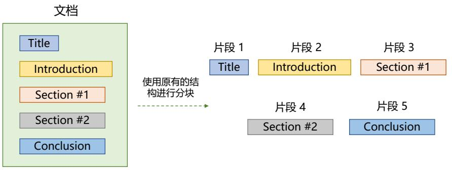  
图 9.6 层次化索引块切分方法

构建层次化索引的方法主要包括以下三种：（1）结构感知：基于文档的段落与句子分割，通过显式的文本结构（如段落、章节）进行分层组织；（2）内容感知：利用文档的原生格式（如PDF、HTML 和 LaTeX 等）中蕴含的内在结构信息，自动提取标题、目录等层级关系；（3）语义感知：基于语义识别技术，对文本进行深度语义分割，以捕捉隐藏的语义层次和逻辑关系。这些方法共同作用，使得层次化索引不仅能够反映文档的显性结构，还能挖掘文档的隐性语义，从而为复杂检索任务提供更强大的支持。

知识图谱索引（KG Index）[423] 则通过将文档组织为图结构，明确概念与实体之间的关系，从而在信息检索中保持语义一致性，降低语义匹配错误的风险。知识图谱将文档内容的检索转化为语言模型可理解的指令，能够显著提升检索的精确性，同时使生成的回应在语义上更加连贯。这种方式不仅优化了信息的组织与存储，还提高了RAG系统整体的效率，使其在复杂语义任务中表现更加出色。

在知识图谱索引中，将文档组织为图结构 $\mathbb { G } = \{ \mathbb { V } , \mathbb { E } , \mathbb { X } \}$ ，其中节点集合 $\mathbb { V } = \{ v _ { i } \} _ { i = 1 } ^ { n }$ 表示文档的结构单元（如段落、页面或表格），边集合 $\mathbb { E } \subset \mathbb { V } \times \mathbb { V }$ 表示节点之间的语义或词汇相似性关系以及从属关系，而节点特征集合 $\mathbb { X } = \{ \mathbb { X } _ { i } \} _ { i = 1 } ^ { n }$ 则存储文档内容（如段落文本或 Markdown 格式的内容）。图结构通过显式表示文档内容的语义关联，为文档检索提供了更强的上下文支持。例如，节点之间的语义边能够帮助系统快速定位语义相关的内容块，从而使检索更加高效，同时生成的回答也更加符合上下文逻辑。

# 9.2.2 检索前优化

为了解决RAG系统直接依赖用户原始查询进行检索所带来的问题，检索前优化（Pre-retrievalProcessing）模块被设计用于优化查询输入，从而提高检索的有效性。用户查询往往存在两个主要挑战：查询措辞不当，问题可能过于复杂或语言组织不清晰，导致检索效果不佳；语言复杂性和歧义性，尤其是在包含专业术语或多义缩写的情况下，语言模型难以准确理解查询意图。例如，对于缩写“LLM”，系统可能无法区分其是指“大语言模型”（Large Language Model）还是法律领域的“法学硕士”（Master of Laws）。预检索模块通过对用户查询进行重构、扩展或语义优化，能够减少语言歧义和表述模糊，从而为下游检索任务提供更精准的输入，显著提升RAG系统在复杂查询场景中的性能。

本节将重点介绍预检索的核心模块，包括：查询扩展、查询转换以及查询组织。

# 1. 查询扩展

查询扩展（Query Expansion）是一种通过将单一查询扩展为多个查询的方法，用以丰富查询的内容，从而弥补原始查询中可能缺乏的细节和语义信息。通过生成多个上下文相关的查询变体，查询扩展可以更全面地覆盖用户意图，增强检索系统对查询中隐含语义的理解能力。这种方法不仅能够有效减少查询模糊性，还能为下游生成阶段提供更具相关性和准确性的答案。例如，对于用户输入的原始查询“复旦大学”，由于其过于简单，可以进一步扩展为“复旦大学简介”、“复旦大学的校园文化介绍”、“复旦大学的社会声誉如何？”、“复旦大学的知名校友有谁？”等。扩展后的多种查询形式能够从不同角度补充上下文信息，从而确保生成内容与用户需求的高度匹配性，显著提升RAG 系统的性能和回答质量。

多查询（Multi-Query）通过提示工程（Prompt Engineering）利用大语言模型将单一查询扩展为多个查询，并支持并行执行。通过这种方式，系统能够生成内容更丰富、语义覆盖更广的查询变体，从而深入挖掘用户意图，提升检索的全面性和准确性。这些扩展查询经过精心设计，旨在确保语义多样性和结果覆盖范围，从多个角度为用户提供更完整的检索结果，适用于复杂或模糊的查询场景。

尽管多查询方法在提高检索全面性方面表现出色，但扩展后的查询可能会在某些情况下稀释用户的原始意图，导致生成内容偏离用户需求。为解决这一问题，可以通过在模型执行检索时对用户的原始查询赋予更高的权重，使其在多查询中占据主导地位。这种权重分配策略确保了扩展查询丰富结果的同时，始终保持与用户初始需求的高度一致性，平衡了语义多样性与用户意图的精准捕捉。

子查询（Sub-Query）则通过对复杂问题进行分解和规划，将其转化为多个更易处理的子问题，从而提高问题求解的效率与准确性。在实现过程中，可以采用“从简单到复杂”（Least-to-MostPrompting）的方式[396]，将复杂问题逐步分解为一系列简单的子问题。这种方法不仅能够降低问题的复杂性，还能帮助模型更有条理地处理问题。根据原始问题的结构，这些生成的子问题可以

选择并行执行以提高效率，或按顺序逐步解决以保持逻辑一致性。

在子查询生成后，为确保结果的准确性，可以引入验证机制，例如“验证链”（Chain-of-Verification,CoVe）[424]。通过让大语言模型对扩展生成的子查询及其结果进行逐步验证，能够有效减少生成内容与真实情况不符的问题。这种方法确保了子查询的输出质量，使得最终的答案不仅与用户需求高度相关，而且更加可靠和可信，从而显著提升模型在复杂问题求解中的表现。

# 2. 查询转换

查询转换（Query Transformation）又称查询改写（Query Rewrite），是指通过对用户的原始查询进行改写或重构，将其转换为更适合检索和生成的形式，从而提升系统的理解能力和检索效果。这种方法通常对用户输入的查询进行语义优化、语言简化或结构调整，使其更加明确和精确，便于模型识别核心意图并生成相关答案。例如，将模糊或冗长的查询改写为短小精炼的关键词形式，或者将复杂的问题分解为更易处理的结构化查询。通过这种方式，查询变形能够减少语言歧义，增强检索效率，并确保生成内容与用户需求的高度匹配。

查询改写作为搜索引擎中的核心技术，已经历经多年的深入研究与发展，成为提升检索性能的重要手段。在实际应用场景中，用户的原始查询往往存在表达模糊、不完整或语义不清的问题，导致检索效果不佳，尤其是在复杂、多样化的需求场景中。为了解决这一问题，文献[425]提出可以利用大语言模型通过提示工程对查询进行改写，将用户的原始输入转换为更清晰、结构化或优化的查询形式。此外，也可以借助专用的小模型来执行查询改写任务。这些小模型经过针对性训练，能够在特定领域内高效完成查询改写的工作。例如，用户输入“复旦大学在哪里？”，经过查询改写模块后，用户查询会变化为“复旦大学地址”

HyDE[426]（Hypothetical Document Embeddings）则采用了构建假设文档的方法，将传统方法中的“问题到答案”或“查询到答案”的语义匹配，转化为“答案到答案”的嵌入相似性判断。在处理用户查询时，HyDE的方法是首先生成假设文档（即假定的答案），并根据生成的假设文档进行搜索。这种策略能够更有效地弥合问题与答案之间的语义差距，提升检索的精确性和相关性。此外，HyDE 还引入了一种变体方法——反向 HyDE（Reverse HyDE）。在反向 HyDE 中，系统为每个文档片段生成一个假设查询，并基于“查询到查询”的嵌入相似性进行检索。通过这种反向生成策略，检索系统能够从另一个角度扩展搜索的范围，提高对用户需求的覆盖。

# 3. 查询结构化

查询结构化（Query Construction）目标是将用户的查询重新构建为适应不同数据类型，例如结构化数据（如表格和图形数据）的查询。随着越来越多的结构化数据（如表格数据和图数据）被引入RAG系统，仅依赖传统的文本查询已不足以满足复杂的信息检索需求。为了充分利用不同类型的数据资源，必须对用户的原始查询进行重新构造。这一过程包括将自然语言查询转换为适配特定数据源的查询语言，如SQL（结构化查询语言）或Cypher（图查询语言），以便系统能够高效地访问和检索相关信息。

查询结构化不仅仅是将自然语言转换为结构化查询语言，还需要结合语义信息和元数据，以构建更复杂和准确的查询。通过将用户意图与数据结构相结合，系统能够生成更强大的查询语句。例如，Text-to-SQL技术能够将自然语言问题转换为SQL语句，从关系型数据库中提取答案；Text-to-Cypher 则用于处理图数据查询，基于图结构返回更精确的结果。这种方式使 RAG 系统能够在融合多种数据类型的同时，确保查询的精准性和多样性，从而提供更全面的答案和更优质的用户体验。

# 9.2.3 检索

检索模块在RAG系统中扮演着至关重要的角色。在RAG系统中，检索模块需要能够高效地处理大量的文本数据，并且需要能够准确地识别和匹配查询和文档之间的语义相似性。因此，检索模型的选择和优化对于 RAG 系统的性能至关重要，因为它们直接影响到检索的准确性和效率。检索模型还需要能够适应不同的数据类型和查询类型，以确保在各种场景下都能够提供准确的检索结果。目前的检索主要分为：稀疏检索、稠密检索和混合检索。本节将分别介绍上述检索模型。

# 1. 稀疏检索

稀疏检索（Sparse Retrieval）是一种基于统计特征的方法，通过将查询和文档转换为稀疏向量来实现检索。稀疏向量的特点是大部分元素为零，仅保留少量非零值，这使得计算更加高效且存储成本较低。许多经典的信息检索方法，如TF-IDF和BM25，都是稀疏检索的典型实现。这些方法通过词频、逆文档频率等显性统计特征对查询和文档进行建模，能够快速匹配相关内容。稀疏检索架构如图9.7所示。

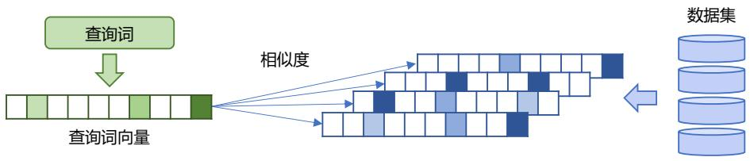  
图 9.7 稀疏检索架构图

稀疏检索的最大优势在于其高效性，尤其适用于处理大规模文档库的检索任务。由于稀疏向量中仅计算非零元素的部分，相较于密集向量方法，其计算复杂度显著降低。因此，稀疏检索在资源有限或实时性要求较高的场景中表现尤为突出。稀疏检索器在大规模数据集上的效率使其成为工业界的主流选择之一。

尽管稀疏检索在效率上具有明显优势，但其在捕捉复杂语义关系方面存在局限性。由于稀疏方法主要依赖显性统计特征，如词频和词项匹配，无法有效处理同义词、上下文语义等深层语义

信息。例如，对于“汽车”和“车辆”这样的同义词，稀疏检索器通常无法感知两者的语义相似性，从而可能导致检索结果的相关性下降。稀疏向量的低语义表达能力限制了其在语言理解任务中的适用性。

# 2. 稠密检索

稠密检索（Dense Retrieval）是一种通过深度学习模型将查询和文档编码为稠密向量（DenseVectors）的检索方法。与稀疏向量不同，稠密向量的每个维度都可能有值，从而能够捕捉更丰富的语义信息。这种方法依赖预训练语言模型（如BERT、RoBERTa）或特定的双塔模型（Dual Encoder）来生成语义嵌入，使得查询和文档在语义空间中更接近，从而更好地匹配用户意图。在语义搜索、问答系统和对复杂查询的处理任务中，稠密检索表现出了显著的优势。稠密检索架构如图9.8所示。

  
图 9.8 稠密检索架构图

稠密检索的核心优势在于其强大的语义表达能力。由于深度模型能够理解上下文信息和复杂的语义关系，稠密向量不仅可以捕捉显性特征，还能处理同义词、上下文依赖和多层次语义。例如，对于“汽车”和“车辆”这样的同义词，稠密检索器可以识别它们在语义上的相近性，从而提高检索结果的相关性。稠密检索在捕捉细粒度语义关联方面优于传统的稀疏检索方法。

然而，稠密检索也面临一些挑战，特别是在计算成本和存储要求方面。由于稠密向量通常是高维向量（例如 768 维或更高），因此处理和存储大规模文档库的稠密向量需要更高的计算资源。此外，稠密检索依赖于深度学习模型的训练，模型的质量和训练数据的规模直接影响检索效果，这可能增加系统的开发复杂性和维护成本。稠密检索的高计算需求限制了其在资源受限场景中的应用。尽管如此，稠密检索已经成为RAG系统和现代信息检索中的重要方法，尤其是在需要高语义理解能力的任务中。

# 3. 混合检索

混合检索（Hybrid Retrieval）是一种结合稀疏检索和稠密检索优势的检索方法，用于提升检索系统的效率和效果。稀疏检索（如TF-IDF和BM25）擅长处理显性特征，能够快速匹配高频词项，同时在大规模文档库中表现出极高的计算效率；而稠密检索（如基于深度学习模型生成的语义向量）能够捕捉复杂的语义关系，对理解同义词、上下文和深层语义非常出色。混合检索通过将两

者结合，既保留了稀疏检索的高效性，又增强了系统在语义理解上的能力。

混合检索的核心思想是将稀疏向量和稠密向量的得分进行融合，或者在检索流程中分阶段使用两者。例如，在第一阶段，使用稀疏检索从大规模文档库中快速筛选出一个候选集合（通常称为“粗排”）；在第二阶段，对候选文档进行稠密检索或语义重排序，以提升结果的相关性。这种分阶段策略既能降低稠密检索的计算成本，又能显著提高检索质量。混合检索在效率和效果之间达到了良好的平衡。混合检索架构如图9.9所示。

  
图 9.9 混合检索架构图

混合检索的优势在于其灵活性和适应性。对于需要显性词项匹配的查询（如“精确匹配”类问题），稀疏检索能够快速捕捉关键词；而对于需要语义理解的复杂查询（如自然语言表达的长尾问题），稠密检索能够提供更相关的结果。此外，混合检索可以根据不同的应用场景调整稀疏和稠密部分的权重，从而实现个性化的优化。例如，在工业界的大规模搜索引擎中，混合检索被广泛应用于广告推荐、问答系统等场景，表现出了良好的效果。

尽管混合检索方法在许多场景中表现优异，但其设计和实现也存在一定的技术挑战。首先是如何有效融合稀疏向量和稠密向量的得分，因为两者的分布和尺度不同，需要设计合理的归一化或加权策略。其次，混合检索的计算开销依然较高，尤其是在需要实时处理大规模用户查询时，如何进一步优化效率是一个重要问题。随着硬件性能的提升和检索算法的优化，混合检索有望在未来的信息检索系统中占据更加重要的地位，为用户提供更高效、更精准的检索服务。

# 9.2.4 检索后优化

检索后优化（Post-retrieval processing）是优化大语言模型生成效果的重要步骤。直接将检索到的文本块输入大语言模型并不能得到最好的结果，存在诸多挑战。首先，大语言模型与人类类似，对长文本往往只能记住开头和结尾部分，而容易遗忘中间内容，这被称为“中间遗忘”（lost inthe middle）问题。其次，检索到的文本中可能包含噪声信息或与事实相悖的内容，这些“噪声/反

事实”文本会对最终生成结果产生负面影响。此外，大语言模型的上下文窗口长度有限，即使检索到了大量相关内容，也无法全部纳入模型处理。因此，通过对检索内容进行后处理，可以更好地利用上下文信息，从而提升模型的生成质量和可靠性。

本节将详细介绍后检索模块的常见组成部分，包括重排序（Rerank）、内容压缩以及内容选择等步骤。

# 1. 重排序

在检索增强生成系统中，重排序（Rerank）是一个关键组件，其主要目的是对检索到的文章片段（chunks）进行重新排序，以提升结果的相关性和多样性。重排序的作用是基于特定的排序算法或模型，将更重要的内容优先呈现，同时避免重要信息被冗余或低相关性的内容掩盖。重排序算法从大类上可以分为基于规则和基于模型两大类。

基于规则的重排序（Rule-based Rerank）是一种常用的重排序方法，通过计算特定的指标对数据块进行排序。常见指标包括多样性（Diversity）、相关性（Relevance）和最大边际相关性（MaximalMarginal Relevance，MMR）[427]。MMR 是一种结合查询相关性和信息新颖性的排序方法，可以有效减少冗余并增强结果的多样性。例如，在选择关键短语时，MMR会优先考虑与查询高度相关且不重复的短语，从而平衡结果的相关性和信息量。这种基于规则的方式简单高效，适用于许多具有固定规则需求的场景。

基于模型的重排序（Model-based Rerank）则利用语言模型对数据块进行排序，通常通过计算数据块与查询之间的相关性来完成。这种方法能够动态地根据查询上下文判断数据块的重要性，从而生成更精准的排序结果。重排序模型的技术持续迭代，已经从文本数据扩展到多模态数据（如表格和图像），实现了更广泛的应用场景。相比于规则方法，基于模型的重排序能够捕捉更复杂的语义关系，特别是在需要理解深层次上下文的任务中表现突出。因此，重排序在RAG系统中不仅是提升检索质量的重要工具，也为多模态数据处理提供了强有力的支持。

# 2. 内容压缩

将大量相关文档段拼接为冗长的上下文通常会引入噪声，削弱大语言模型对关键信息的感知能力。为解决上述问题，压缩（Compression）方法核心目标是通过内容压缩减少噪声，同时保留信息完整性，以提高语言模型的推理效率。

内容压缩的一种方法是通过小型语言模型（如 GPT-2 Small 或 LLaMA-7B）对检索内容进行对齐和预训练，以检测并移除提示中的不重要信息[428]。这种方法能够大幅度减少输入上下文的冗余内容，将原始输入转化为一种更适合大语言模型理解的形式，而无需对大语言模型进行额外训练。具体而言，通过函数 $f _ { \mathrm { c o m p } } ( q , D ^ { q } )$ ，将检索到的文档集合 $D ^ { q }$ 压缩为 $D _ { c } ^ { q }$ ，其中每个文档内容的长度 $| d _ { i } ^ { q c } |$ 小于原始文档的长度 $| d _ { i } |$ 。这种方法不仅能保持上下文的语言完整性，还能实现高效的压缩比，使得输出在语义上对模型更有意义，即便对人类而言可能变得难以理解。这种直接的压缩方法在保持性能的同时，简化了实现难度，适用于多种实际场景。

另一种直接而有效的内容压缩方法是利用大语言模型对检索内容进行评估（LLM-Critique）。通过让LLM对检索得到的内容进行自我审查，可以过滤掉相关性较差的文档。例如，在Chatlaw[429]系统中，构造了评估提示词，大语言模型对参考的法律条款进行自我建议和评估，以判断其与查询的相关性。这种方法能够在生成最终答案前移除低质量或无关内容，从而优化输入上下文的质量。

# 3. 内容选择

内容选择（Selective Context）是检索增强生成系统中优化输入上下文的重要方法。其核心目标是通过识别和移除冗余信息，保留最为关键的内容，从而提高语言模型的推理效率和结果质量。内容选择的关键在于计算输入内容的自信息量（Self-Information），这是一种衡量内容信息价值的指标。自信息量越高，表明该内容在上下文中越稀有且重要。在实际应用中，基础语言模型对检索到的文档内容逐词评估，删除信息价值较低的部分，仅保留对任务有贡献的高信息量内容。这一过程能够有效精简输入上下文，减少噪声干扰。

这种方法的主要优势在于提升了语言模型的专注性，使其能够更高效地处理长上下文输入，并对关键信息作出准确的推理。同时，这种精炼方法能广泛适用于法律分析、学术文献综述和问答系统等任务场景，而不会显著影响模型性能。然而，内容选择也存在一定局限性。它可能忽略被删除内容之间的相互依赖关系，导致上下文完整性受损。此外，内容选择通常依赖于小型语言模型的计算，而这些模型与目标语言模型可能在理解能力上存在对齐问题，进而影响压缩内容在推理任务中的效果[430]。

# 9.2.5 生成

生成模块是整个 RAG 系统的的核心模块，负责利用大语言模型结合用户查询与检索到的上下文信息生成答案。生成的内容需要与检索阶段获取的关键信息保持一致，确保知识的整合与输出的准确性。还需要根据用户的指令、场景上下文以及个人偏好对内容进行调整，使其更加符合具体的使用场景和个性化要求。这种对相关知识的整合和对多样化需求的适应，确保了RAG系统生成的内容既具有上下文相关性，又能够满足用户的特定需求，从而在实际应用中展现出强大的灵活性和实用性。

例如，用户输入“使用500字介绍一下复旦大学的历史沿革”，通过此前预检索、检索以及后检索模块，生成模块输入给语言模型的内容如下所示：

<chunk id="1">

复旦大学校名取自《尚书大传》之“日月光华，旦复旦兮”，始创于 1905 年，原名复旦公学，1917 年定名为复旦大学，是中国人自主创办的第一所高等院校。上海医科大学前身是 1927 年创办的国立第四中山大学医学院。2000 年，复旦大学与上海医科大学合并。目前，学校拥有哲学、经济学、法学、教育学、文学、历史学、理学、工学、医学、管理学、艺术学、交叉学科等 12 个学科门类；2021 年，学校 20 个学科入选第二轮“双一流”建设学科，比首轮增加 3 个入选学科。

</chunk>

<chunk id="2">

肇始吴淞（1905—1911，校址：吴淞）

1902 年，马相伯倾其家产，借天主教徐家汇天文台余屋为校舍，创办震旦学院。1905 年，为反抗教会势力干预校政，于右任、邵力子等 130 名学生愤然脱离震旦，支持马相伯在吴淞复校。1905 年 9 月 14 日（阴历八月十六），国人自办的第一所高等学校——复旦公学在上海吴淞提督行辕正式开学。

</chunk>

<chunk id="3">

创校吴淞（1927—1931，第四中山大学医学院，校址：吴淞）

1927 年，由中国人自主创办的第一所国立医学院——国立第四中山大学医学院（上医前身）在上海吴淞建立。创始人颜福庆、乐文照、高镜朗等始终秉持着“为人群服务，为人群灭除病苦”的朴素信念，并融注于医学教育和医学实践的日常。

</chunk>

<chunk id="4">

强强联合（2000—2010，复旦大学，校址：邯郸路、枫林路、淞沪路、张衡路)

2000 年 4 月 27 日，复旦大学与上海医科大学强强联合，组建新的复旦大学。复旦发展成为文理医三足鼎立，在国内外享有盛誉的综合性研究型大学。2005 年，复旦大学隆重庆祝建校一百周年，进一步明确了建设具有世界一流水平的社会主义综合性大学的目标。探索贯通本科教育全过程的通识教育新模式，打造以培养探究能力为核心的拔尖创新人才培养体系。校地扩展为邯郸、枫林、江湾、张江四校区。

</chunk>

instruction:

使用 500 字介绍一下复旦大学的历史沿革

通过上例可以看到，RAG系统在进行问题回答时，不再完全依赖模型内生的记忆，而是通过检索外部知识库来生成更准确和丰富的回答。很多知识细节不再需要模型准确记忆。这种机制充分利用了检索和生成的结合优势，在面对知识更新快、领域复杂或模型训练数据中未覆盖的信息

时，显得尤为重要。相比传统的语言模型，RAG 系统通过检索阶段获取最新或特定领域的信息，克服了模型内生记忆的局限性，尤其是在处理长尾问题或细分领域的专业知识时，可以表现更加出色。

# 9.2.6 编排

编排模块是 RAG 系统中的核心控制单元，它负责在关键节点进行决策并动态选择后续步骤。与传统固定流程的僵化方法不同，编排模块引入了灵活的适应能力，可以根据先前结果实时调整流程。这种模块化、动态化的特性是Modular RAG的标志性特点，展现出更高的智能化和灵活性。本节将分别介绍编排模块的主要模块，包含路由（Routing）、调度（Scheduling）以及融合（Fusion）。

# 1. 路由

在响应多样化查询的过程中，RAG系统可以通过路由机制将查询分配到针对不同场景设计的特定管道中。这种机制是一个通用性较强的 RAG 架构的重要特性，能够处理各种复杂的情境需求。路由模式可以分为三种主要类型：元数据路由、语义路由以及混合路由。

元数据路由（Metadata Routing）基于查询中提取的关键术语或实体，通过与预设关键词集合的匹配来优化路由流程。每个RAG流程都定义了一组关键词，当查询中的关键词与某流程的关键词集合匹配度较高时，该流程就会被选为处理流程。匹配分数由关键词的重叠比例计算得出。元数据路由适合对显性关键词高度敏感的场景。整个过程可以形式的化表示为，对于特定的检索增强生成（RAG）流程，记为 $F _ { i }$ ，预先定义的路由关键词表示为集合 $K _ { i } = \{ k _ { i 1 } , k _ { i 2 } , \ldots , k _ { i n } \}$ 。在查询 $q _ { i }$ 中识别出的关键词被指定为 $K _ { i } ^ { \prime }$ 。查询 $q$ 的匹配过程通过关键得分方程来量化：

$$
\operatorname {s c o r e} _ {\text {k e y}} \left(q _ {i}, F _ {j}\right) = \frac {1}{\left| K _ {j} ^ {\prime} \right|} \left| K _ {i} \cap K _ {j} ^ {\prime} \right| \tag {9.2}
$$

该方程计算预先定义的关键词与在查询中识别出的那些关键词之间的重叠部分，并通过 $K _ { j } ^ { \prime }$ 中关键词的数量进行归一化。最后一步是确定与查询 $q$ 最相关的流程：

$$
F _ {i} (q) = \underset {F _ {j} \in F} {\operatorname {a r g m a x}} \operatorname {s c o r e} (q, F _ {j}) \tag {9.3}
$$

语义路由（Semantic Routing）则依赖查询的语义信息，通过语言模型计算查询与预定义意图的匹配概率。每个意图对应一个具体的RAG流程，路由机制会根据最大匹配概率选择最相关的流程。语义路由更适合需要深层次意图理解的复杂场景，能够捕捉查询中隐含的语义信息。整个过程可以形式地化表示为，给定一个预先定义的意图集合 $\boldsymbol { \Theta } = \{ \boldsymbol { \theta } _ { 1 } , \boldsymbol { \theta } _ { 2 } , \dots , \boldsymbol { \theta } _ { n } \}$ ，查询 $q$ 具有某种意图的概率为：

$$
P _ {\Theta} (\theta | q) = \frac {\mathrm {e} ^ {P _ {\mathrm {L M}} (\theta | q)}}{\sum_ {\theta \in \Theta} \mathrm {e} ^ {P _ {\mathrm {L M}} (\theta | q)}} \tag {9.4}
$$

路由到特定的RAG 流程由语义得分确定：

$$
\operatorname {s c o r e} _ {\text {s e m a n t i c}} (q, F _ {j}) = \underset {\theta_ {j} \in \Theta} {\arg \max } P (\Theta) \tag {9.5}
$$

函数 $\delta ( \cdot )$ 充当一个映射函数，它将一个意图分配给一个不同的 RAG 流程 $F _ { i } = \delta ( \theta _ { i } )$ 。

混合路由（Hybrid Routing）结合了元数据路由和语义路由的优点。通过引入权重因子，混合路由在元数据匹配和语义分析之间找到平衡点，从而实现更精确的路由选择。这种方法既考虑显性关键词的匹配，也兼顾深层次语义信息的理解，非常适合在复杂、多样化的查询环境中使用。混合路由可以通过整合语义分析和基于元数据的方法来实现，其定义如下：

$$
\alpha_ {i} = \alpha \cdot \operatorname {s c o r e} _ {\text {k e y}} (q, F _ {j}) + (1 - \alpha) \cdot \max  _ {\theta_ {j} \in \Theta} \operatorname {s c o r e} _ {\text {s e m a n t i c}} (q, F _ {j}) \tag {9.6}
$$

其中 $\alpha$ 是一个权重因子，用于平衡基于关键词的得分和语义得分的贡献。

# 2. 调度

随着RAG系统在复杂性和适应性方面的不断提升，调度（Scheduling）模块主要扮演越来越重要作用，它能够识别关键节点，负责管理和协调系统的各个流程。包括何时需要进行外部数据检索、如何评估生成结果的充分性，以及在必要时决定是否启动进一步的检索。这一模块特别适用于递归、迭代和自适应检索的场景，确保系统能够根据当前任务的需求动态调整流程，从而在适当的时机停止生成或启动新的检索循环。这种智能调度机制使RAG系统更高效、更精准地处理复杂任务。调度模型主要三种实现方式，包括规则判断、大语言模型判断以及知识引导调度。

规则判定（Rule Judge）是一个重要的机制，用于评估生成答案的质量并决定进一步的操作。系统通过评分机制对生成的答案进行质量评估，并根据预设的阈值判断是否继续或终止生成过程。具体来说，系统会检查生成答案中每个词的概率是否高于设定的阈值τ，若满足条件，则接受当前答案；否则，系统会重新生成新答案。这种方法确保了生成内容的可靠性和准确性，同时为系统的迭代改进提供了依据。规则调度可以如下形式化定义：

$$
y _ {t} = \left\{ \begin{array}{l l} \hat {s} _ {t} & \text {如 果} \hat {s} _ {t} \text {的 所 有 词 元 的 概 率 都} \geqslant \tau \\ s _ {t} = \operatorname {L M} \left(\left[ D _ {q _ {t}}, x, y _ {<   t} \right]\right) & \text {其 他 情 况} \end{array} \right. \tag {9.7}
$$

其中， $\hat { s } _ { t }$ 表示临时答案， $s _ { t }$ 是语言模型的输出。接受 $\hat { s } _ { t }$ 的条件是其内部的所有词元都必须具有大于或等于阈值 $\tau$ 的关联概率。如果不满足这一条件，系统就会转而生成新的答案。

RAG 系统还可以通过大语言模型直接进行判断（LLM Judge）。这一方式包括两种主要方法：第一种方法利用 LLM 的上下文学习能力，通过精心设计的提示来进行决策。这种方法的优势在于无需对模型进行额外的微调，但其判断结果的准确性通常依赖于 LLM 对提示的理解程度。第二种方法通过对LLM进行微调，使其生成特定的触发标记，来直接控制模型的行为。例如，借助

Toolformer[389] 的技术构建的 Slef-RAG[431] 方法，可以实现更高的动作响应性，这种方法虽能提升控制精度，但需要大量高质量的指令集对模型进行微调。

知识引导调度（Knowledge-Guided Scheduling）则是一种介于规则判定和完全依赖 LLM 之间的中间方法，通过知识图谱引导信息检索与生成过程[432]。具体来说，系统从知识图谱中提取与问题相关的信息，并构建推理链，将问题拆解为一系列逻辑互联的节点。每个节点包含解决问题所需的关键信息，并据此分别进行信息检索和内容生成。通过这种方式，不仅提高了问题解决的效率和准确性，还使生成的答案具备更清晰的逻辑性和解释力，为复杂问题提供更具条理性的解决方案。

# 3. 融合

随着RAG系统从线性流程发展为复杂的多管道结构，融合（Fusion）模块在其中扮演了至关重要的角色。当系统拓宽检索范围或探索多条管道以提升生成内容的多样性时，融合模块负责高效整合各分支生成的信息。它不仅实现答案的合并，还对内容进行筛选与优化，确保最终输出既全面丰富，又能准确反映问题的多维特性。融合模块的引入，使系统在应对复杂查询时能够提供更加综合且连贯的回答，大幅提升了整体的适应能力与输出质量。融合模块主要包含大语言模型融合、加权继承以及倒数排名融合等方法。

大语言模型融合是多分支信息整合的直接方法之一，利用大语言模型强大的分析与整合能力，将不同分支的信息进行统一处理。然而，这种方法面临一些挑战，特别是在处理超出大语言模型上下文窗口限制的长答案时。为了缓解这一问题，通常会先对每个分支的答案进行摘要提取，提炼关键内容后再输入LLM，从而在长度限制内保留最重要的信息。这种方法确保了答案的完整性与精确性，即使在处理复杂的多分支生成时也能提供高质量的整合结果。

加权集成是一种基于多分支生成结果的加权选择方法，通过不同分支生成的词元（token）的加权值来综合选择最终输出。具体而言，权重是通过文档与输入查询的相似度得分计算的，使用Softmax函数对权重进行归一化，确保所有权重之和为1。该方法可按如下公式计算：

$$
p (y | q, D _ {q}) = \sum_ {d \in D _ {q}} p (y | d, q) \cdot \lambda (d, q) \tag {9.8}
$$

权重 $\lambda ( d , q )$ 由文档 $d$ 和输入查询 $q$ 之间的相似度得分确定。该权重使用 softmax 函数来计算，以确保权重经过归一化且总和为1。

$$
\lambda (d, q) = \frac {e ^ {s (d , q)}}{\sum_ {d \in D _ {q}} e ^ {s (d , q)}} \tag {9.9}
$$

倒数排名融合（Reciprocal Rank Fusion，RRF）是一种集成技术，专门用于将多个检索结果的排名整合为统一的列表。它通过一种定制的加权平均方法，增强了整体预测性能与排名精度[433]。RRF的核心优势在于其动态的权重分配机制，基于分支之间的相互作用进行调整，特别适合处理

模型或来源异构的场景。在这些复杂情况下，RRF能够显著提升预测的准确性和整合效果，成为多分支融合的重要工具。

# 9.3 RAG 系统设计模式

基于Modular RAG的设计，各种模式通过模块化操作符之间的协作形成了模块的工作流，称为RAG流（RAG flow）。RAG流可以被分解为由子函数组成的图结构，通过控制逻辑，这些操作符可以按照预定的管道线执行，同时在必要时支持条件判断、分支或循环操作。通过深入分析现有的 RAG 方法，这些模式的模块化特性使其能够灵活适应多样化的场景需求，同时提高了 RAG系统的设计效率和扩展性。

本章将介绍典型的RAG 系统模式，包括线性模式、条件模式、分支模式、循环模式等。

# 9.3.1 线性模式

在 RAG 系统中，线性模式是最简单且最常用的工作流模式，其流程可以分为几个核心模块，包括预检索（Pre-Retrieval）、检索、后检索（Post-Retrieval）以及生成模块，如图9.10所示。当预检索和检索后处理模块缺失时，线性模式会简化为朴素检索增强生成（Naive RAG）范式，仅包含基本的检索和生成过程。常见的线性RAG流通过在预检索阶段引入查询变换模块（比如重写或隐式文档扩展（HyDE）操作符），以及在检索后阶段使用排序模块来优化检索结果，从而提升最终生成的质量。

  
图 9.10 RAG flow 的线性模式[421]

文献 [425] 提出的“重写-检索-阅读”（Rewrite-Retrieve-Read，RRR）方法就是一个典型的线性 RAG 流模式。在预检索阶段，RRR 方法引入了查询重写模块，该模块是基于 T5-large 模型微调的小型可训练语言模型。该模块通过强化学习框架进行优化，将查询重写过程建模为一个马尔可夫决策过程（Markov Decision Process, MDP）。在这一过程中，查询重写模块以大语言模型的最终输出质量作为奖励信号，以此调整和优化生成的查询。具体而言，强化学习通过策略梯度方法对重写模块进行训练，使其生成的查询更符合检索任务的需求，提高检索和生成的整体效率和效果。在检索阶段，RRR 方法使用稀疏编码模型（如 BM25）作为检索工具，从外部知识库中获取与重写后的查询高度相关的文档上下文。

# 9.3.2 条件模式

条件模式是一种灵活的 RAG 流模式，其核心特点是在不同条件下选择不同的 RAG 流水线，从而针对特定场景进行优化。具体来说，条件模式通过一个路由模块（Routing Module）实现模块的动态选择，该模块根据输入问题的性质决定接下来的流程,如图9.11所示。例如，面对不同类型的问题，如涉及严肃议题、政治话题或娱乐内容的问题，系统会根据预设条件切换到不同的处理流程。这样的动态路由机制可以显著提升系统对多样化任务的适应能力。

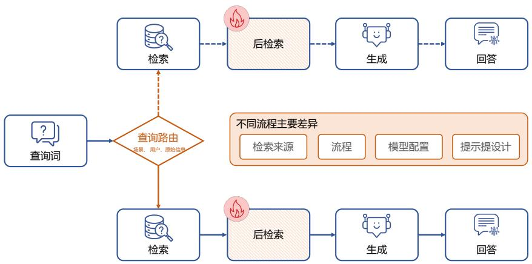  
图 9.11 RAG flow 的条件模式[421]

条件模式的分支流通常在以下几个方面存在差异：检索来源、流程、模型配置以及提示设计。例如，对于严肃性较高的问题，系统可能会选择更加可靠的检索来源和严格的生成约束，而对于娱乐类的问题，则可能允许生成更具创意性和娱乐性的回答。通过这种方式，条件模式能够根据任务需求调整RAG的各个组件，确保生成的回答既符合场景需求，又具有高相关性和准确性。这种灵活性使得条件模式在处理多样化、复杂性高的任务时具有显著优势。

# 9.3.3 分支模式

分支模式通过并行运行多个分支的方式增加结果的多样性和鲁棒性。具体来说，分支模式在某个模块中生成多个并行分支，每个分支可以独立执行相同或不同的RAG流程。这些流程由多个处理模块组成，生成各自的分支输出结果。随后，所有分支的结果通过聚合函数合并为中间输出结果。重要的是，聚合后的结果并不一定标志着流程的结束，还可以继续传递到后续模块（如验证模块）进行进一步处理。因此，分支模式的整体流程可以表示为从分支生成、独立处理、结果聚合到后续处理的完整流水线。

与条件模式不同，分支模式的特点在于同时运行多个并行分支，而非从多个选项中选择一个分支。分支模式可以根据不同任务需求设计为多种结构类型，通常分为两类：预检索分支模式是

分支间执行不同的流程，以应对复杂场景的多样化需求，如图9.12所示；后检索分支模式是分支间执行相同的RAG流程，用于生成多样化的结果，如图9.13所示。通过这样的结构，分支模式能够从多个角度生成和整合信息，从而提升系统的生成能力与结果质量，对多任务处理和复杂场景具有显著优势。

预检索分支（Pre-Retrieval Branching）是一种通过生成多个子查询并并行检索的模式，用于提高检索的全面性和生成结果的多样性。具体而言，该模式从一个初始查询开始，通过查询扩展模块将其扩展为多个子查询。每个子查询随后通过检索模块检索相关文档，形成文档集合。这些文档集合连同对应的子查询一起送入生成模块，生成答案集合。最终，这些生成的答案通过融合模块进行整合，形成最终结果。这种模式通过并行检索与生成，能够从多个角度充分挖掘潜在信息，从而提升生成结果的覆盖度和准确性。

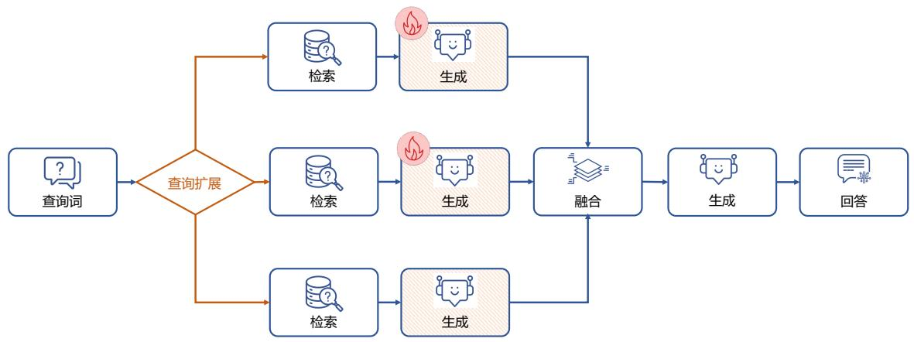  
图 9.12 RAG flow 的预检索分支模式[421]

后检索分支（Post-Retrieval Branching）模式则从单一查询开始，通过检索模块获取多个文档块。每个文档块被独立送入生成模块进行处理，生成对应的结果集合。随后，这些生成的结果通过合并模块进行整合，形成最终结果。与预检索分支不同，后检索分支的特点在于单一查询驱动的检索过程，而并行生成则聚焦于对不同文档块的独立处理。该模式适合需要从同一查询结果中挖掘多角度信息的场景，能够充分利用检索到的内容，提高生成结果的多样性和质量。

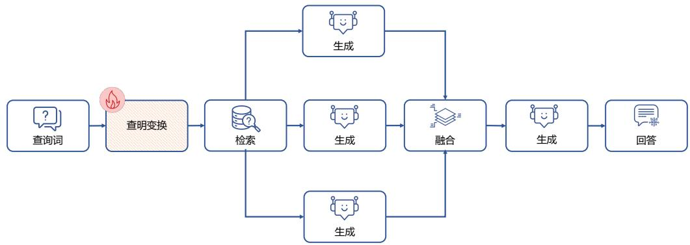  
图 9.13 RAG flow 的后检索分支模式[421]

# 9.3.4 循环模式

循环模式的核心是检索与生成步骤之间的相互依赖性。循环模式通过引入调度模块进行控制，确保系统可以根据需要在特定模块之间重复执行某些操作。这一模式可以被抽象为一个有向图，其中节点代表系统的各个模块，边表示模块之间的控制流或数据流。当一个模块能够返回到之前的模块时，该系统就形成了一个循环结构。这种循环设计允许系统在流程中对某些步骤进行重复优化，从而提升任务的完成效果。

循环模式的关键在于判断模块（Judge Module），用于决定流程是否需要返回到之前的模块或继续向下执行。例如，当一个模块完成后，判断模块可以决定是进入下一个模块还是返回到前置模块。如果系统决定返回，则执行循环操作；如果系统决定不返回，则流程继续向前。这种灵活的控制机制使得循环模式能够动态调整整个流程，从而提高系统的适应性、灵活性以及对复杂任务的处理能力。

循环模式可以进一步细分为三种类型：迭代型、递归型和自适应型（主动型）检索模式。

（1）迭代型循环模式通过多次循环执行检索和生成操作，在每次迭代中逐步优化结果。如图9.14所示，在每一步迭代中，系统根据当前查询和之前的输出结果，检索相关的文档片段，然后利用这些文档生成新的输出。迭代过程通常设置一个最大迭代次数的限制，以避免无限循环。同时，通过判断模块，系统会根据当前生成的结果、历史输出、查询以及检索到的文档来决定是否继续迭代。这种方法能够动态调整检索与生成的过程，逐步获取必要的信息，从而更好地回答复杂问题。

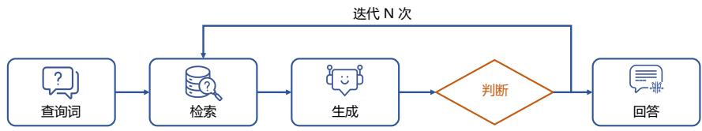  
图 9.14 RAG flow 的迭代型循环模式[421]

（2）递归型循环检索模式是一种具有明显依赖性和层次性的检索方式。如图9.15所示，递归型检索的显著特点在于每一步都依赖于前一步的输出，并通过不断加深检索过程，逐步挖掘更深层次的信息。通常，递归型检索遵循类似树状的结构，每次检索都会基于一个重新改写的查询展开，从而精确地针对当前需要获取的知识进行检索。递归型检索还包含明确的退出机制，用以确保在满足终止条件时流程终止，避免无限递归。这种机制能够有效控制流程的深度和复杂性。在RAG系统中，递归型循环模式通过查询转换模块生成新的查询，以推动检索逐层深入。这种方式特别适合需要分步推理或分解复杂问题的任务场景，能够逐步定位相关信息并生成高质量的回答。

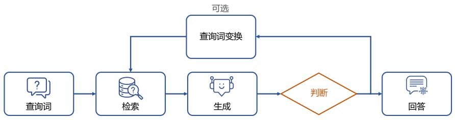  
图 9.15 RAG flow 的递归型循环模式[421]

（3）自适应型（主动型）模式是一种超越传统被动检索模式的新兴模式，得益于大语言模型的强大能力。如图9.16所示，这种模式的核心思想类似于大语言模型智能体，通过动态调整检索流程，主动决定何时进行检索以及何时终止流程并生成最终结果。与传统的固定流程不同，自适应型检索具有更高的灵活性和智能性，能够根据任务需求实时调整策略。自适应型检索通常根据判断标准进一步细分为两种方法：基于提示的方法和基于指令微调的方法。前者通过设计动态提示对模型进行引导，而后者则利用指令微调的方法实现更精准的检索控制。这种模式特别适用于复杂任务或动态信息需求的场景，因为它能够智能判断流程的最佳执行路径，从而提高检索效率和生成质量。

  
图 9.16 RAG flow 的自适应型循环模式[421]

# 9.4 RAG 系统训练与优化

通过对 Modular RAG 架构和 RAG 设计模式的分析可以发现，许多模块的功能都依赖于模型的能力，这些模块的效果也直接影响了系统的整体性能。例如，向量块的优化需要深入理解上下文的语义相关性，以保证文本块切分过程中保持语义相关度；查询转换模块需要将用户的自然语言查询转化为适合检索的查询表达式，确保检索系统能够找到最相关的文档；而在检索后的优化阶段，则需要使用重排序模型对返回的文档块进行重新排序，根据用户输入判断其相关性，以提供更准确的结果。

这些能力的实现通常依赖于模型的训练和优化。一方面，可以通过传统的小模型进行定制化训练，以针对特定任务和领域进行优化；另一方面，也可以直接利用大语言模型其强大的通用能力，尤其是在处理复杂语义理解、上下文关联性判断以及多轮交互等方面。此外，不同模块对模型能力的依赖程度也各不相同。例如，向量化模块需要借助预训练模型生成高质量的嵌入向量，以捕捉文本的深层语义特征；查询转换模块可能需要结合提示工程、或模型微调的方式，生成更精准的检索查询；而重排序模型则需要在结合用户输入和上下文的基础上，优化排序策略以提高最终输出的质量。因此，如何高效地选择、训练和集成这些模型，成为构建高性能RAG系统的关键。

本节将按照 Modular RAG 架构中模块划分，介绍典型的 RAG 系统中各模块所采用算法和优化方法。

# 9.4.1 文本嵌入模型微调

文本嵌入（Text Embedding）是一种将文本转换为固定维度向量（通常是高维浮点数组）的技术，旨在以数学形式捕捉语言的语义信息，并将其映射到向量空间中。通过深度学习模型（如Word2Vec、GloVe、FastText，以及基于 Transformer 的模型如 BERT、Sentence-BERT 和 OpenAI的text-embedding-ada等），文本的语义、语法及上下文特征能够被有效编码为向量表示。在RAG

（Retrieval-Augmented Generation）系统中，文本嵌入表示是实现向量搜索的核心技术。

文本嵌入技术有很长的研究历史，大体上可以分为四个阶段：计数式嵌入（Count-based Em-beddings）：这一阶段的方法包括词袋模型（Bag of Words, BoW）和TF-IDF，用词频和逆文档频率来表示文本，但忽略了词语的语义和上下文信息，仅能反映基本的词汇相关性；静态词嵌入（StaticDense Word Embeddings）：代表性模型如 Word2Vec、GloVe 和 FastText，通过上下文生成固定的词向量。这一阶段捕捉了词语的语法和语义相似性，但每个词的向量是静态的，无法反映词义在不同上下文中的变化；上下文嵌入（Contextualized Embeddings）：这一阶段引入了上下文敏感的动态嵌入模型，如GPT和BERT等。这些模型通过双向或单向Transformer结构，生成能够根据上下文调整的词或句子向量，实现了对多义词和复杂语境的更深层次理解；通用文本嵌入（UniversalText Embeddings）：最新阶段致力于构建能适配多任务、多领域、多语言的统一模型。通过利用大规模多样化数据、合成数据生成以及大语言模型（LLMs）作为骨干网络，如E5[434]、BGE[435]、Gecko[436] 等，通用文本嵌入模型可以在分类、检索、聚类等任务中表现出色，显著提升了跨任务和跨领域的泛化能力。

通用文本嵌入模型目标应对众多下游任务，文献 [437] 提出的 GTE 模型（General-purpose TextEmbedding）引入了多阶段对比学习策略，并采用多样化的训练数据混合方式：在预训练阶段，使用未经任何筛选或清理的大量开源数据，通过无监督对比学习来学习基本的语言模式；在第二阶段，利用有监督微调，通过对比学习使用规模更小、质量更高的数据集对嵌入向量进行优化。

对于查询语句 $q$ 所对应的一个相关（正例）文档 $d +$ 以及一组不相关（负例）文档 $\begin{array} { r l } { D _ { - } } & { { } = } \end{array}$ $\{ d _ { 1 } ^ { - } , d _ { 2 } ^ { - } , \ldots , d _ { n } ^ { - } \}$ ，InfoNCE 损失[53] 的定义如下所示：

$$
L _ {c l} = - \log \frac {\mathbf {e} ^ {\mathbf {s} (q , d ^ {+}) / \tau}}{\mathbf {e} ^ {\mathbf {s} (q , d ^ {+}) / \tau} + \sum_ {i = 1} ^ {n} \mathbf {e} ^ {\mathbf {s} (q , d ^ {-}) / \tau}} \tag {9.10}
$$

其中， ${ \mathbf s } ( \ v q , d )$ 通过文本 $q$ 和 $d$ 的嵌入向量（ $\overset { \cdot } { \boldsymbol { q } } = \boldsymbol { E } ( \boldsymbol { q } )$ 以及 $d = E ( d ) $ ）之间的向量距离来估计这两段文本之间的相似度。

GTE 模型中，给定一批正例文本对样本 $\{ ( q _ { 1 } , d _ { 1 } ) , ( q _ { 2 } , d _ { 2 } ) , \dots , ( q _ { n } , d _ { n } ) \}$ ，作者提出一种改进的对比损失，如下所示：

$$
L _ {i c l} = - \frac {1}{n} \sum_ {i = 1} ^ {n} \log \frac {\mathrm {e} ^ {\mathrm {s} \left(q _ {i} , d _ {i}\right) / \tau}}{Z} \tag {9.11}
$$

$$
Z = \sum_ {j} \mathbf {e} ^ {\mathbf {s} \left(q _ {i}, d _ {j}\right) / \tau} + \sum_ {j \neq i} \mathbf {e} ^ {\mathbf {s} \left(q _ {i}, q _ {j}\right) / \tau} + \sum_ {j} \mathbf {e} ^ {\mathbf {s} \left(q _ {j}, d _ {i}\right) / \tau} + \sum_ {j \neq i} \mathbf {e} ^ {\mathbf {s} \left(d _ {j}, d _ {i}\right) / \tau} \tag {9.12}
$$

其中， $Z$ 采用余弦相似度作为相似度度量 $s ( q , d )$ 。GTE使用BERT等预训练语言模型进行初始化，通过对语言模型生成的上下文词元表示进行平均池化来获取文本嵌入向量。

GTE模型在预训练阶段，使用了约8亿对无标注的文本对，数据来源多样，包括网页数据（如

Common Crawl 和 MS MARCO 文档，标题作为查询，正文作为文档）、学术论文（如 PubMed 和arXiv，标题与摘要配对）、超链接（如Wikipedia和引用文本配对）、社交媒体（如Reddit的帖子与评论对）、知识库（如 WikiPedia 和 DBPedia 的实体和描述对）、社区问答网站（如 StackExchange和WikiHow的标题与正文、问答对）、新闻、代码数据以及其他来源（如商品评论和Google搜索日志）。在微调阶段，数据进一步聚焦于特定任务，包括网页搜索（如MS MARCO检索任务中的正负样本对）、开放式问答（如 Natural Questions 和 Trivia QA，通过检索系统生成困难负样本）、自然语言推理（如MNLI和SNLI的推断与矛盾对）、事实验证（FEVER训练集）、语义复述（如Quora 和 StackExchange 的复述任务）以及多个领域和任务的其他数据集（如 MEDI 和 BERRI）。这种多样化且精心设计的数据分布为模型提供了广泛的语义理解能力，同时通过微调使其能够在特定任务中表现出色。

虽然通用文本嵌入已经有非常的好效果，但是针对特定领域的微调对于提升检索质量依然有非常重要的影响。通过微调，模型能够更准确地理解查询的语境和细微差异，从而提高检索阶段的效果。具体而言，微调能够增强模型的语义匹配能力，使其生成更具语境感知的嵌入，这不仅能更有效地匹配查询与潜在文档，还能显著提升检索内容的相关性。对于特定领域的数据进行微调，可以使模型更好地掌握领域专有的术语、风格和知识，生成更加精准和专业的内容。特别是在处理稀有查询时，微调可以充分利用领域知识，有效应对罕见或特殊表述的查询，这对于医疗、法律和教育等专业领域尤为重要。

文献 [438] 提出了专门针对医学文档检索的框架 REMED，其中 EM-FT 模型通过高效的嵌入式微调方法，对预训练模型中的医学句子表示进行端到端微调，从而提高医学检索性能。作者选用 m3e-base[439] 和 e5-base-v2[434] 作为嵌入模型的基线。EM-FT 方法结合了对比学习作为损失函数，以优化模型性能并准确捕捉查询和相关文档之间的相似性，使得与查询相关的文档比不相关的文档更接近，如下公式所示：

$$
L (W) = L \left(q, p _ {1} ^ {+}, p _ {2} ^ {+}, \dots , p _ {n} ^ {+}, p _ {1} ^ {-}, p _ {2} ^ {-}, \dots , p _ {m} ^ {-}\right) \tag {9.13}
$$

$$
L (W) = - \log \frac {\sum_ {i = 1} ^ {n} \mathrm {e} ^ {\left(\sin \left(q , p _ {i} ^ {+}\right)\right)}}{\sum_ {i = 1} ^ {n} \mathrm {e} ^ {\left(\sin \left(q , p _ {i} ^ {+}\right)\right)} + \sum_ {j = 1} ^ {m} \mathrm {e} ^ {\left(\sin \left(q , p _ {j} ^ {-}\right)\right)}} \tag {9.14}
$$

其中 $L ( W )$ 表示通过训练模型参数 $W$ ，最大化正样本段落相对于查询 $q$ 的相关概率，并最小化负样本段落的相关概率， $q$ 表示输入查询。 $p _ { i } ^ { + }$ 是与查询相关的正样本段落， $\mathring { p _ { j } } ^ { - }$ 是与问题不相关的负样本段落。同样也是采用余弦相似度 $s i m ( q , p ) = \cos ( E ( q ) , E ( p ) )$ 作为评分函数来衡量查询 $q$ 和段落 $p$ 之间的匹配程度。EM-FT模型由两个核心组件组成：嵌入骨干网络（Embedding Backbone）和可训练EM头（Trainable EM Head）。嵌入骨干网络负责处理输入的文本数据，而可训练EM头则通过归一化层、两个线性层和激活函数来实现高效的文本相似度检索。

为了训练更能适应医疗领域的文本嵌入表示，文献 [438] 构建了 Medical Menu Dataset (MMD)

和 Medical Paper Dataset (MPD)。MMD 是一个综合且可靠的医学信息检索评估基准，专注于医疗领域的检索系统性能测试。该数据集的数据来源于权威的“WHO Medicine”数据库以及“国家药典”中所有药物信息，包含超过20万条记录。MPD是一个从美国国家生物技术信息中心（NCBI）采样1,000篇医学论文构建而成的数据集。为确保分析的准确性和可靠性，MPD经过了一系列预处理和清洗操作，排除了不符合研究标准的文献（如非正式会议演讲和非同行评审的报告），并移除了表格数据和不规范的数学公式。清洗后的文档被分割为固定长度的文本段（最大序列长度为768），以适应嵌入模型的输入要求，同时保留足够的上下文信息。最终MPD包含886篇论文，共79,966条数据。实验结果证明，EM-FT方法在MMD上的召回率和精度分别提高了 $3 . 2 \% { - 6 . 0 \% }$ ，在MPD上的召回率和精度分别提高了 $1 4 . 4 \% - 4 2 . 6 \%$ 。在一定程度上也说明，针对特定领域对文本嵌入模型进行微调很有必要。

# 9.4.2 查询优化

如前所述，RAG系统在处理用户查询时，需要对查询优化进行深入改进，以应对多种复杂挑战。对于简单查询，例如日常问候等无需上下文支持的情况，模型应避免执行不必要的信息检索，直接生成答案，从而减少无关上下文对响应质量的影响。对于复杂查询，直接使用原始查询进行检索通常难以获取足够的相关信息。模型需要首先将复杂查询拆解为可解答的子查询，分别检索与其相关的信息，并整合子查询的结果，生成对原始查询的完整回答。而对于多义性较强的模糊查询，直接检索原始查询往往无法提供全面的答案。模型需通过识别用户意图来澄清查询内容，并构建精准的检索请求，获取相关信息后生成细致且全面的响应。通过优化查询流程，RAG系统不仅能够提升检索效率，还能显著增强模型在复杂场景中的适应能力和表现。

针对上述问题，文献 [440] 提出了 RQ-RAG 算法，旨在通过动态优化查询以提升检索增强生成的效果。该方法基于7B规模的Llama2模型，采用端到端训练，使其能够通过重写、分解和消除歧义来动态优化搜索查询。为了训练模型具备上述功能，核心是构建与推理过程相匹配的训练数据。为了生成高质量的大规模数据，文献[440]采用了与Self-RAG[431] 和SAIL[441] 类似的方法，设计了一套自动化的数据生成流程，以优化查询、检索信息并生成精确的响应，同时减少人工干预所需的资源和时间成本。

  
图 9.17 RQ-RAG 数据构造的流程[440]

数据构造整体流程如图9.17所示，整个流程分为以下几个关键步骤：

（1）从任务池中收集代表性任务，并将其分类为三种类型（如消歧查询、复杂查询分解等），根据任务特性，每个数据集对应特定的数据类型。这一步通过任务的特性和需求进行分类，确保数据生成流程的针对性。  
（2）对于每种任务类型，使用预定义的提示模板调用ChatGPT生成优化后的查询。提示模板根据任务类型的不同进行了定制，例如针对模糊查询的提示会强调消除歧义，而针对复杂查询的提示会引导模型进行分解。生成的优化查询被用于从外部数据源检索相关信息，检索过程以DuckDuckGo为主要搜索引擎，其他搜索工具（如Bing）作为补充。  
（3）使用ChatGPT，根据优化后的查询及其对应的检索上下文生成响应。在这一阶段，ChatGPT被提示根据上下文信息生成与查询高度相关的回答，同时避免冗余和噪声信息对响应质量的干扰。整个流程通过不断重复，最终生成了约40,000条数据实例。

RQ-RAG 所使用的任务池涵盖了多种代表性任务，确保模型能够适应不同场景需求。这些任务包括单跳问答任务（如 Arc-Easy/Arc-Challenge[442] 和 OpenbookQA[443]），用于测试模型的基础推理能力；多跳问答任务（如HotpotQA[444] 和Musique[445]），要求模型整合多步信息以推导答案；以及歧义问答任务（如ASQA），评估模型处理多义性问题的能力。此外，为了提升模型的通用能力，还引入了指令跟随任务，包括 LIMA[446]、WizardLM[447]、Open-Orca[448]、OpenAssistant[200] 和GPT4-Alpaca[35]，这些任务通过多样化的场景训练模型理解和执行自然语言指令的能力。最终，任务池共收集了42810个实例，为模型的训练提供了丰富且全面的支持。

在对训练语料库进行标注之后，采用标准的自回归方式来训练大语言模型，其目标如下公式

所示：

$$
L = \max  _ {M} E _ {(x, y) \sim D} [ \log p _ {M} (y | q _ {1}, d _ {1}, d _ {2}, \dots , q _ {i}, d _ {i}, x) \tag {9.15}
$$

其中， $L$ 代表试图最大化的概率值， $M$ 表示模型参数，期望 $E _ { ( x , y ) \sim D }$ 是对数据集 $D$ 求平均， $p _ { M } ( y | q _ { 1 } , d _ { 1 } , q _ { 2 } , d _ { 2 } , .$ 表示在给定输入 $x$ 、第 $i$ 步经过优化的查询 $q _ { i }$ 以及检索到的文档 $d _ { i }$ 的情况下，模型 $M$ 生成回复$y$ 的概率。

RQ-RAG 在推理过程中采用了一种树形解码策略，其具体流程如图9.18所示。在每个时间步，模型可以根据需要对查询进行重写、分解、消除歧义，或直接生成回答。通过特殊标记的引导，该策略能够控制解码路径的扩展，并以“生成 检索 生成 检索 $\longrightarrow \cdots \longrightarrow$ 答案”的循环过程逐步展开。在每次迭代中，模型会根据任务需求生成不同类型的搜索查询，例如重写、分解或消歧查询。这些查询将被用于检索与其对应的上下文信息，从而形成不同的解码路径。基于设定的探索宽度和深度范围，RQ-RAG 能够生成多条候选轨迹，通过逐步迭代的方式全面探索潜在答案的空间，为最终的响应提供更丰富的支持。

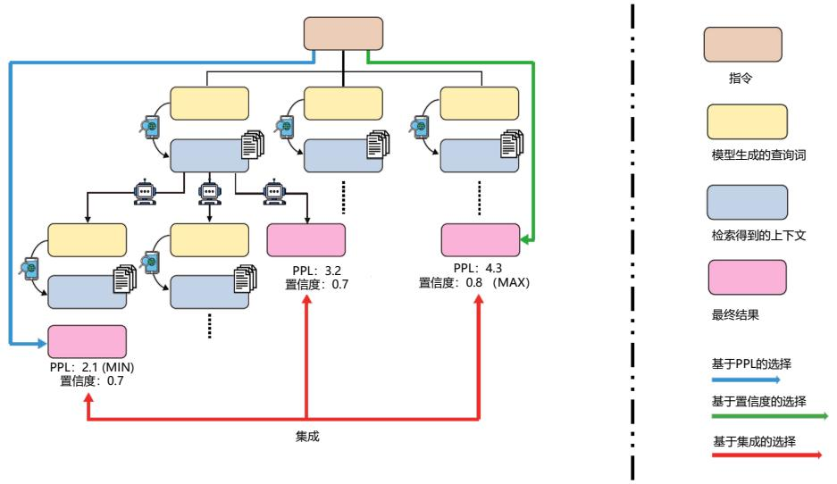  
图 9.18 RQ-RAG 解码策略流程[440]

如何从这些轨迹中选取最合适的路径是 RQ-RAG 系统中的关键问题之一。令 $p _ { M }$ 表示一个参数为 $M$ 的大语言模型， $[ R _ { 1 } , R _ { 2 } , \ldots , R _ { n } ]$ 表示 $n$ 条轨迹，其中每条轨迹都包含一个序列，记为$[ X , Y ] ,$ 。其中， $X$ 是输入提示， $Y$ 是由 $Z _ { 1 } , Z _ { 2 } , \ldots , Z _ { i }$ （每个 $Z _ { i }$ 都是查询和检索到的上下文的组合）组成的 $i$ 个中间步骤，以及最终答案 $Y _ { f i n a l }$ 的拼接结果。针对这一问题，RQ-RAG 方法提出了三

种不同的采样策略，具体如下：

（1）基于困惑度（PPL）的选择：从生成的所有轨迹中选择困惑度（PPL）最低的轨迹 $R _ { \mathrm { f i n a l } }$ ，其定义为： $\begin{array} { r } { R _ { \mathrm { f i n a l } } = \arg \operatorname* { m i n } _ { R _ { j } \in \{ R _ { 1 } , . . . , R _ { n } \} } \mathrm { P P L } ( R _ { j } ) } \end{array}$ ，其中 $\begin{array} { r } { \mathrm { P P L } ( R ) = \exp \left( - \frac { 1 } { L } \sum _ { t = 1 } ^ { L } \log p _ { M } ( Y _ { t } | X , Y _ { < t } ) \right) } \end{array}$ ，这里 $L$ 是模型输出的总长度， $p _ { M } ( Y _ { t } | X , Y _ { < t } )$ ，是语言模型在输入为 $X$ ，且以先前已经生成的输出$Y _ { < t }$ 作为条件时，生成第 $t$ 个标记 $Y _ { t }$ 的概率情况。  
（2）基于置信度的选择：选择对最终答案 $Y _ { \mathrm { f i n a l } }$ 具有最高置信度的轨迹 $R _ { \mathrm { f i n a l } }$ （这与基于困惑度的选择有所不同，后者评估的是全部生成的输出），即 $\begin{array} { r } { R _ { \mathrm { f i n a l } } = \arg \operatorname* { m a x } _ { R _ { j } \in \{ R _ { 1 } , \dots , R _ { n } \} } { \mathrm { C o n f } ( R _ { j } ) } } \end{array}$ ，其中 $\begin{array} { r } { \mathrm { C o n f } ( R ) = \sum _ { t = l } \log p _ { M } ( Y _ { t } | X , Z _ { 1 } , . . . , Z _ { i } , Y _ { < t } ) } \end{array}$ ，这里 $t$ 从 $l$ 开始， $l$ 是最终答案 $Y _ { \mathrm { f i n a l } }$ 的起始位置。  
（3）基于集成的选择：选择累积置信度得分最高的结果作为最终输出，可以表示为： $Y _ { \mathrm { f i n a l } } =$ arg maxyP Conf(Yi)。其中，最终结果 Yfinal 是所有候选结果中置信度分数累积最大的一项， $\begin{array} { r } { \operatorname* { m a x } _ { y } \sum _ { i : Y _ { i } = y } { \mathrm { C o n f } ( Y _ { i } ) } , } \end{array}$ $Y _ { \mathrm { f i n a l } }$ 通过对所有候选结果 $Y _ { i }$ ，取值等于 $y$ 的置信度分数 $\operatorname { C o n f } ( Y _ { i } )$ 进行累加求和，确定最佳答案。

# 9.4.3 幻觉感知的生成模型优化

大模型幻觉指的是大语言模型生成的内容中出现与事实不符、缺乏依据或与输入信息相矛盾的表述。在实际应用中，即使采用检索增强生成（RAG）方法，大语言模型仍然可能出现幻觉问题，例如对检索到的内容进行错误或扭曲的解释，这在高信任场景中带来了显著风险。

文献 [449] 提出了一种专门针对检索增强生成中幻觉问题的方法，Hallucination Aware Tuning（简称 RAG-HAT）。该方法通过训练幻觉检测模型，识别出幻觉并给出易于理解的解释，说明幻觉产生的位置和原因，以及提供防御性建议。利用这些检测结果，特别是幻觉描述，借助 GPT-4Turbo对包含幻觉的RAG输出进行重写，以去除幻觉内容。随后，原始输出和修正后的输出被用于构建偏好数据集，通过直接偏好优化（Direct Preference Optimization，DPO）方法对大语言模型进行训练，从而有效降低模型生成幻觉的概率，同时提升回答质量。

RAG-HAT在构造幻觉检测方法时，采用了基于选择性采样的训练数据构建策略。在RAGTruth[450]数据集的基础上，虽然该数据集标注了幻觉文本的具体片段，但缺乏对幻觉的详细描述，因此RAG-HAT借助GPT-4 Turbo自动生成幻觉描述，以支持检测模型的训练。这些描述包括三部分内容：幻觉的二元标签（标识句子是否包含幻觉）、幻觉发生的位置和原因的详细解释，以及防御性建议（De-fensive Advice）。防御性建议明确指出文本中可能导致幻觉的模糊表述，并提供改进建议，从而帮助减少分类边界的不确定性，降低幻觉的发生率。此外，RAG-HAT 借鉴了自举式训练（Bootstrapping-style Training）和拒绝采样的策略，对GPT-4的输出进行多轮评估与再生成，以确保生成数据的质量与准确性。

在检测模型的训练过程中，RAG-HAT采用了两阶段策略。第一阶段专注于训练模型输出幻觉的预测标签，完成基础的幻觉检测任务；第二阶段通过使用 LoRA 微调，使模型能够基于预测标签生成幻觉的详细解释，包括幻觉描述以及防御性建议。在推理时，两阶段模型以级联方式应用，先检测幻觉，再生成解释性描述。这种训练策略不仅显著提升了幻觉检测的精度，还增强了模型

在处理边界案例时的解释能力和鲁棒性。

RAG-HAT采用DPO方法进行模型训练，通过构建成对的偏好数据集，指导大语言模型生成更少幻觉内容的回答。在回答重写阶段，针对包含幻觉的原始回答，结合生成的幻觉解释内容，利用GPT-4 Turbo对其进行重写，去除幻觉并生成“优选”（Chosen）样本。而对于被判定为优质的回答，则通过防御性建议限定重写范围，仅针对特定句子进行优化，以避免引入新的幻觉内容。此外，重写后的回答通过幻觉检测模型进行验证，确保其准确性，如发现仍存在幻觉，则重复重写过程，直至生成高质量的样本，保证数据集的完整性和可靠性。

为进一步提升模型的回答质量，RAG-HAT还在偏好数据集中引入了“过于谨慎惩罚”（OverlyCautious Penalization, OCP）策略。由于模型在训练后可能倾向于通过缩短回答来降低幻觉率，从而影响回答的内容丰富性，OCP随机从“优选”样本中删除一个句子以生成“拒绝”（Rejected）样本，鼓励模型在减少幻觉的同时保持回答的内容完整性。此外，为扩展训练数据规模，RAG-HAT通过自动化流程将 $\mathrm { X S u m ^ { [ 4 5 1 ] } }$ 数据集和 Marco[452] 数据集中的样本转换为新的回答，并与 RAGTruth 数据集中的答案共同组成偏好对，确保“拒绝”样本能够准确反映模型的输出分布。最终，该方法共生成了 19,721 对“优选/拒绝”样本，用于 DPO 训练，从而有效平衡了减少幻觉与回答质量之间的需求，提高了模型的实际应用表现。

# 9.4.4 重排模型优化

RAG系统中通过检索模块从知识库中获取与输入问题相关的信息。然而，初步检索的结果通常基于简单的相关性度量（如BM25或密集向量检索），这些方法需要综合考虑效果和效率，所采用的方法无法完全捕捉输入问题的语义意图，从而导致噪声或不完全相关的文档被返回。重排模型的引入旨在针对检索到的候选文档进行精细排序，优先选择那些与输入问题更相关的文档，为生成模型提供更高质量的上下文。

得益于大语言模型在语言理解、生成、交互和推理等方面的卓越表现，利用大语言模型进行文档重排序受到了很多关注。这些方法通常将大语言模型用作点估计器[417] 或列表重排序器[453, 454]。尽管这些方法能够灵活定义文档相关性，并支持零样本场景下的操作，但它们在决策过程中缺乏中间分析步骤。在需要复杂推理的场景中，这种局限性会影响模型的性能和可解释性。此外，列表重排序器还面临显著的计算挑战，主要源于上下文长度的限制。当需要同时处理多个文档时，列表重排序器往往不得不牺牲单个文档的长度，以满足整体处理需求。这种权衡进一步限制了其在高复杂度任务中的表现。

为了解决现有方法在复杂推理场景中的局限性，JudgeRank[455] 提出了一种的零样本点式重排序方法，专为需要深入推理的文本检索任务设计。JudgeRank 利用高度通用的提示引导经过指令微调的大语言模型，通过显式的推理步骤来得出最终的相关性判断。这种方法通过逐步推理的方式增强了大模型在推理密集型任务中的表现。

JudgeRank的工作流程包括三个关键步骤：1）问题分析：模型通过提示识别查询中的核心问

题，从而专注于关键问题并过滤掉无关的上下文；2）文档摘要：对每个候选文档生成抽取式摘要，并解释文档如何回应查询；3）相关性判断：基于之前的分析，模型对文档的相关性进行最终判断。这一过程模拟了人类回答问题的思维方式：先快速浏览文档，找到与问题相关的部分，再仔细阅读这些内容以得出答案。

JudgeRank 在问题分析部分所使用的提示词如下所示：

You will be presented with a/an query name.

Your task consists of the following step:

1. Analyze the {query name}:   
- Carefully read each sentence of the {query name}.   
- Identify the core problem or question being asked.

Here is the {query name}:

{query}

You will be presented with a/an {query name}, an analysis of the query, and a/an {doc name}.

Your task consists of the following steps:

1. Analyze the {doc name}:

- Thoroughly examine each sentence of the {doc name}.   
- List all sentences from the {doc name} that {definition of relevance} the {query name}.   
- Briefly explain how each sentence listed {definition of relevance} the {query name}.

2. Assess overall relevance:

- If the {doc name}, particularly the relevant sentences (if applicable), {definition of relevance}

the {query name}, briefly explain why.

- Otherwise, briefly explain why not.

Here is the {query name}:

{query}

Here is the analysis of the {query name}: {query analysis}

Here is the {doc name}:

{doc}

```txt
You will be presented with a/an {query name}, an analysis of the {queryname}, a/an {doc name}, and an analysis of the {doc name}.   
Your task is to assess if the {doc name} {definition of relevance} the {query name} in one word - Yes: If the {doc name} {definition of relevance} the {query name}.   
- No: Otherwise.   
Important: Respond using only one of the following two words without quotation marks: Yes or No.   
Here is the {query name}: {query}   
Here is the analysis of the {query name}: {query analysis}   
Here is the {doc name}: {doc}   
Here is the analysis of the {doc name}: {doc analysis} 
```

在对文档相关性进行判断后，文档评分的合成方法旨在通过多种策略对文档进行重新排序，以提高检索结果的相关性。这些方法包括离散版本、连续版本和混合版本。在离散版本中，文档根据模型的判断被划分为“相关”（输出为“是”）和“不相关”（输出为“否”）两类。对于每一类文档，保留初始检索排名的相对顺序，即相关文档始终排在不相关文档之前。虽然这种方法简单直观，但其性能高度依赖于提示的设计和第一阶段检索的质量。

为了克服离散方法的局限性，连续版本利用模型输出的“是”概率 $( p _ { y } )$ ）和“否”概率（ $( p _ { n } )$ 对文档进行更细粒度的评分。具体来说，评分函数通过归一化 $p _ { y }$ 和 $p _ { n }$ 的值来计算文档的相关性得分： $\begin{array} { r } { S ( d ) = \frac { p _ { y } } { p _ { y } + p _ { n } } } \end{array}$ pyp +p ，从而确保不同文档的评分具有可比性。根据这些得分，所有文档被重新排序，得分越高的文档排名越靠前。与离散版本相比，连续版本能够更精确地捕捉文档的相关性梯度，适用于需要更细腻排序的场景。

混合版本进一步结合了连续版本的概率评分和第一阶段检索中的 BM25 分数，通过加权求和的方式生成综合评分。具体地，最终评分由概率得分 $S _ { \mathrm { p r o b } }$ 和 BM25 分数 $S _ { \mathrm { B M } 2 5 }$ 按照权重系数 $\alpha$ 进行加权： $S = \alpha S _ { \mathrm { p r o b } } + S _ { \mathrm { B M } 2 5 }$ ，综合了推理能力和表层匹配的优点。混合版本通过模型集成的方式，兼顾深层语义推理和表层匹配效果，在实际应用中表现出更强的稳定性和适用性。

# 9.4.5 检索与生成联合优化

文献 [456] 提出了 RankRAG 方法，利用单个大语言模型完成重排序和答案生成。RankRAG通过两阶段微调策略：通用指令微调以及排序与生成指令调优。不仅优化了语言模型的生成能力，还赋予其上下文排序能力。RankRAG 方法的训练和推理流程如图9.19所示。

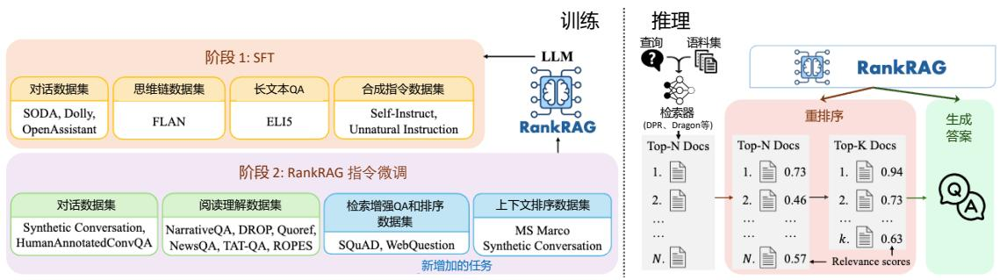  
图 9.19 RankRAG 方法流程[456]

在第一阶段，RankRAG通过有监督微调提升语言模型的基本指令遵循能力。使用的数据包括高质量的指令遵循数据集，例如OpenAssistant、Dolly、SODA以及长文本问答数据集ELI5等，总计128,000样本。微调过程中，模型采用多轮对话格式，将用户与助手的历史对话作为上下文，仅对助手的最后一个响应计算损失。这一阶段为模型奠定了基础，使其能够更好地理解和执行指令。

第二阶段的指令调优专注于增强模型的检索排序和生成能力。本阶段训练结合了五种数据类型：（1）第一阶段的通用有监督微调数据，用于保持模型的指令遵循能力；（2）上下文丰富的问答数据，用于训练模型从复杂上下文中生成答案；（3）检索增强的问答数据，通过结合标准上下文和 BM25 检索到的上下文，训练模型在生成答案时处理混合上下文的能力；（4）上下文排序数据，利用 MS MARCO 排序数据和合成会话数据，训练模型判断单个上下文的相关性；（5）检索增强的排序数据，通过多上下文任务训练模型同时判断多个上下文的相关性。这种任务设计使模型能够更稳健地处理检索结果中的噪声，提升了对上下文的筛选能力。

RankRAG 的核心创新在于将各种任务标准化为统一的 QA 格式，即 $( x , c , y )$ ，其中 $x$ 表示问题， $c$ 是上下文， $y$ 是目标输出。例如，对于检索增强的排序任务，问题可以表述为“针对问题 $<$ 问题 $>$ ，从上下文中找到所有相关段落。”这种标准化方法不仅简化了多任务学习，还通过知识迁移互相增强不同任务。这种方法只增加少量排序数据，即赋予模型排序能力，同时提高了生成任务的表现。

RankRAG包含一个重排序步骤，其推理流程遵循“检索-重排序-生成”的模式，具体包括以下三个阶段：（1）检索阶段：检索器 $R$ 首先从语料库中检索出与问题相关的前N个上下文，为后续步骤提供候选信息。（2）重排序阶段：利用 RankRAG 模型计算问题与检索到的 N 个上下文之

间的相关性得分。相关性得分被视为生成正确答案（True）的概率。根据相关性得分对上下文进行重新排序，仅保留前k个上下文（ $k \ll N ,$ ），这些上下文被视为最相关的信息源。（3）生成阶段：将保留的前k个上下文与问题连接后输入RankRAG 模型，用于生成最终答案。

# 9.5 RAG 系统评估

检索增强生成系统通过将信息检索与生成模型相结合，在知识密集型任务中展现出了显著的应用潜力。然而，正是由于其复杂的混合结构与对动态知识的依赖，使得对其性能进行全面评估面临诸多挑战。为了科学、系统地评估RAG系统的能力，不仅需要分别考察检索组件与生成组件的独立表现，还需关注两者之间的协同作用。同时，为确保评估的准确性与全面性，应结合多维度的评估指标与多样化的数据集设计合理的评估方案。

本节将围绕RAG系统的评估展开，详细探讨其评估过程中所面临的挑战、评估数据集的选取与设计以及评估指标的制定。

# 9.5.1 RAG 评估的挑战

RAG系统通过结合外部知识库的检索与生成模型的生成能力，有效解决了传统生成模型中内容缺乏事实依据的问题。然而，其复杂的“检索-生成”架构使得评估变得尤为重要，不仅需要考察检索和生成组件的独立性能，还需关注两者的协同作用，以及系统在动态知识更新中的适应性与泛化能力。此外，RAG系统在不同任务场景中的表现差异、多样化的应用需求以及对用户体验的影响（如响应速度、生成内容的准确性和可读性）都凸显了构建全面评估框架的必要性，以及RAG 评估所面临的挑战。

检索模块是 RAG 系统的核心部分，负责从庞大的外部知识库中提取与用户查询相关的信息。检索模块的评估面临多重挑战。首先，知识库的广度与动态性使得评估复杂化。RAG系统通常依赖多样化的知识来源，包括结构化数据库、维基百科页面甚至整个互联网，这些知识库的内容会随着时间和领域的变化而更新。因此，需要设计评估指标，以衡量系统在不同时间点和知识领域中检索有效性的稳定性和准确性。其次，检索内容的质量直接关系到生成组件的表现。除了评估相关性外，还需考察检索结果的准确性和可靠性。低质量或误导性的检索内容可能对生成结果产生负面影响，因此对检索内容的筛选和质量控制至关重要。此外，现有的检索指标（如精确率和召回率）无法全面反映RAG系统的特性。这些传统指标缺乏对检索结果是否能够满足后续生成需求的评估能力，也无法量化检索与生成之间的协作效果。

生成模块通过大语言模型对检索结果进行加工，以生成连贯且与查询相关的回答。生成模块的评估同样面临诸多挑战。首先，生成内容必须具有真实性与一致性，这意味着生成的回答需要忠实于检索到的信息，同时满足用户的查询需求。这种真实性与一致性的评估需要结合检索结果，而不仅仅依赖生成内容本身。其次，开放式任务的主观性增加了评估难度。在开放域问答或创造性文本生成任务中，可能不存在唯一正确的答案，不同评测者对高质量生成的定义也存在差异，这

使得评估结果容易受到主观因素的影响。此外，生成内容的质量评估需要覆盖多个维度，包括准确性、连贯性、流畅性和可读性等。这些维度的多样性要求设计更加细致和全面的评测指标，以全面反映生成组件的表现。

RAG系统的整体性能评估需要超越对检索和生成组件的单独考察，重点关注两者之间的协同作用。检索结果的质量会直接影响生成结果，而生成组件的表现也取决于其对检索内容的有效利用。因此，评估需要量化检索对生成的实际贡献，并分析两者在不同任务中的交互效果。此外，在实际应用中，RAG系统的响应能力同样重要。例如，用户通常关注系统处理模糊查询的能力、响应速度以及在多轮对话中的表现。这些实际应用场景中的关键因素往往被传统评测框架所忽略，因此需要在整体评估中引入新的指标和方法，以全面衡量 RAG 系统在真实场景中的实际效用和用户体验。

# 9.5.2 评估目标

评估目标是RAG系统性能评估的核心，直接决定了评估框架的设计方向与具体实施方式。评估目标需要清晰地定义检索组件、生成组件及整体系统的性能衡量标准，同时能够全面覆盖系统在不同任务场景中的表现。根据 RAG 系统的“检索-生成”结构，评估目标可分为针对检索的评估、针对生成的评估，以及面向整体系统的协同能力评估。

# 1. 检索模块的评估目标

检索模块是RAG系统的基础，其主要任务是从知识库中提取与用户查询相关的信息，为生成模块提供支持。在评估检索组件时，需要明确以下几个关键目标：

（1）相关性（Relevance）：检索组件的首要目标是确保其返回的文档与用户查询高度相关。相关性评估旨在衡量检索出的文档是否能够准确反映用户查询所需要的信息。例如，在问答任务中，检索出的文档是否包含回答问题所需的事实或背景知识。相关性通常通过计算检索结果与查询之间的匹配程度来评估，可以使用指标如精确率（Precision）和召回率（Recall）。  
（2）准确性（Accuracy）：除了相关性，检索结果的准确性也至关重要。准确性评估需要考察检索到的文档是否在信息上是可靠的，是否包含错误、误导性内容或低质量信息。检索组件返回的错误信息可能直接导致生成组件生成不真实的回答，因此检索结果的准确性对整体系统的性能至关重要。  
（3）覆盖率与多样性（Coverage and Diversity）：在某些任务中，用户的查询可能涉及多方面的信息需求。因此，检索组件需要确保其检索结果能够全面覆盖查询的不同维度，同时避免信息冗余。多样性评估旨在衡量检索结果是否包含多样化的视角或信息来源，尤其是在处理开放域问答或多轮对话时，这一点尤为重要。  
（4）动态适应性（Dynamic Adaptability）：由于 RAG 系统依赖动态更新的知识库（如互联网爬取的数据），检索组件需要能够快速适应知识库的变化。动态适应性评估目标在于衡量检索组件是否能够在知识库更新后，及时检索到最新的相关信息。例如，在实时新闻问答场景中，检索结

果能否反映最新的事实将直接影响系统的有效性。

（5）排序能力（Ranking Ability）：检索组件通常返回一组潜在相关的文档，并根据相关性进行排序。评估其排序能力的目标是衡量系统是否能够将最相关的文档排在前面，这对生成组件的效率和性能有直接影响。排序能力通常通过排名指标（如平均倒数排名MRR和平均精确率MAP）进行测量。

# 2. 生成模块的评估目标

生成组件的任务是利用检索结果，根据用户的查询生成连贯、准确且相关的回答。在评估生成组件时，需要明确以下几个关键目标：

（1）相关性（Relevance）：生成内容需要与用户查询保持高度相关。这不仅要求生成的回答能够回答用户的问题，还要求回答内容的范围与用户需求一致。例如，在开放式问答场景中，评估生成组件是否能够生成与查询语义一致的内容是关键目标之一。相关性通常通过人工评估或自动化指标（如BLEU、ROUGE 等）来衡量。  
（2）真实性与忠实度（Faithfulness）：RAG系统的一个重要优势在于减少生成“幻觉”（hallu-cination）。因此，生成组件需要确保其输出内容忠实于检索到的信息，即生成的回答必须基于检索到的事实，而不是凭空捏造。真实性评估目标在于衡量生成内容是否准确反映了检索结果中的信息，避免出现事实错误或误导性内容。  
（3）正确性（Correctness）：在许多任务中，生成的回答需要与给定的参考答案（Ground Truth）保持一致。正确性评估目标旨在衡量生成内容与标准答案之间的一致性，特别是在有明确答案的任务（如问答或填空任务）中。这通常通过自动化指标（如F1 分数或精确匹配率）来衡量。  
（4）连贯性与流畅性（Coherence and Fluency）：生成内容的连贯性和流畅性是评估生成组件的重要目标之一。连贯性指回答内容是否逻辑通顺，是否能够完整表达查询的意图；流畅性则关注语言表达是否符合自然语言的语法和用法。这些目标通常通过人工评估或语言模型的评分机制来实现。  
（5）生成内容的多维度要求（Multi-Dimensional Requirements）：生成组件的评估需要覆盖多个维度，包括内容的可读性、丰富性和结构化程度。例如，在生成复杂文档摘要或表格形式的结构化内容时，需要评估生成结果是否符合预定义的格式要求。这些多维度的评估目标能够更全面地反映生成组件的表现。  
（6）开放性任务的适应能力（Adaptability to Open Tasks）：在开放式生成任务中（如创造性写作或长文本生成），不存在唯一标准答案。评估目标需要更加灵活，能够衡量生成内容在语义层面的多样性与创新性，同时确保其与查询的核心意图保持一致。

# 3. 整体系统的评估目标

RAG系统的整体性能不仅取决于检索和生成组件的独立表现，还需要关注两者之间的协同作用。整体系统的评估目标包括：

（1）协作效果（Collaboration Effectiveness）：整体系统的核心目标在于检索与生成组件的协作能力。评估需要量化检索结果对生成内容质量的贡献，以及生成组件如何利用检索内容来提升回答的准确性和相关性。  
（2）任务完成度（Task Completion Rate）：在实际应用中，RAG系统的整体目标是完成特定的任务，如回答用户问题或生成摘要。任务完成度评估目标在于衡量系统是否能够在特定任务中生成符合用户需求的高质量输出。  
（3）用户体验（User Experience）：整体系统评估还需要包括对实际应用场景的考量，例如系统的响应速度、对模糊查询的处理能力、多轮对话中的表现，以及输出内容的可读性和实用性。这些目标直接关系到RAG 系统的用户体验，是衡量系统整体表现的重要维度。  
（4）鲁棒性与容错能力（Robustness and Fault Tolerance）：RAG 系统需要在面对噪声、不完整或不明确的查询时仍能生成有意义的回答。鲁棒性评估目标在于衡量系统在处理复杂或异常输入时的表现，以及系统在信息不足或不确定的情况下是否能够拒绝生成错误回答。

# 9.5.3 评估数据集

评估数据集是 RAG 系统性能评估中的关键组成部分，其质量和多样性直接影响评估结果的准确性和全面性。在评估RAG系统时，数据集的选择与构建需要兼顾系统的检索能力、生成能力以及整体协作表现。现有评估数据集的来源和构造方法多种多样，既包括基于已有资源的数据集，也包括为特定评估目标生成的全新数据集。不同的基准系统选择了不同的数据集策略，以适应各自的评估需求和应用场景。

# 1. 基于现有资源的数据集

许多评估框架依赖于已有的成熟数据集，如 KILT（Knowledge Intensive Language Tasks）基准[457] 和 SuperGLUE[458] 数据集。这些数据集涵盖了多种知识密集型任务。例如：Natural Questions(NQ)[459] 提供开放域问答任务的数据，测试系统对自然语言查询的回答能力。HotpotQA[444] 包含多跳问答任务，要求RAG系统能够从多个文档中综合信息来回答复杂问题。FEVER[460] 专注于事实验证任务，评估系统对检索信息支持或反驳查询的能力。MultiRC[? ] 和 $\mathrm { R e C o R D ^ { [ 4 6 1 ] } }$ 取自 SuperGLUE基准，用于多选阅读理解和基于引用的推理任务。

这些数据集的优势在于其提供了标准化的测试场景和广泛的任务覆盖范围。然而，这类静态数据集的一个主要局限性在于，它们难以反映动态、真实场景中知识的时效性需求。例如，WikiEval数据集虽然由RAGAs[462] 基准基于2022年后更新的Wikipedia页面构建，但仍然无法完全解决动态场景中更新频繁的知识需求挑战。

# 2. 自动生成的数据集

随着大语言模型的强大能力得以广泛应用，数据集的构造过程得到了显著简化。研究者能够利用大语言模型设计查询及其对应的答案，从而为特定评估目标生成定制化数据集。这种生成方

法的灵活性使得数据集能够更好地适应实际需求，同时对评估 RAG 系统的动态知识处理能力提出了更高要求。

RGB[463]、MultiHop-RAG[464] 和 CRUD-RAG[465] 是基于自动生成数据集的典型案例。这些基准通过在线新闻文章生成数据集，用于测试 RAG 系统在处理真实世界信息时的表现。数据集内容超越了训练数据的覆盖范围，评估系统对于动态、实时信息的适应能力。CDQA[466] 则结合新闻来源的数据生成评估集，并引入标签器辅助构建更复杂的评价任务。DomainRAG[467] 结合了单文档、多文档、单轮对话和多轮对话等多种任务类型，数据集内容基于高校招生和注册信息的年度变化生成。该数据集通过提供更新后的信息，强迫系统利用动态的知识库来完成任务，对RAG系统的时效性和适应性进行了全面评估。OmniEval[468] 提出一个专门针对金融领域的自动和全方位的RAG评估基准，将查询分为抽取式问答、多跳推理、对比、对话和长文本问答5个任务类别以及16个金融主题，如股票市场、投资银行、财产保险等，形成RAG 场景矩阵，实现对多样查询场景的结构化评估。OmniEval包含11400个自动生成的测试示例和1700个人工标注的测试示例。

# 3. 数据集的构建策略

在应用场景中，评估数据集的构建需要结合任务特点与评估目标，以全面衡量 RAG 系统的性能。为了测试 RAG 系统在动态真实场景中的表现，部分评估基准（如 RGB、MultiHop-RAG、CRUD-RAG 和 DomainRAG）通过爬取新闻、年度变化数据或实时信息生成评估数据集。这些动态数据集能够有效检验系统在面对训练数据未覆盖的最新信息时的适应能力和处理效率，从而评估其动态性和时效性。

针对特定评估目标，定制化数据集的构建能够更好地模拟复杂任务场景。例如，DomainRAG设计了结合单轮与多轮对话的任务，测试系统在复杂用户交互中的表现；CDQA 则通过多文档生成任务，评估系统在整合和分析多源信息时的能力。通过任务定制化，评估数据集能够更精确地反映系统在特定场景下的实际性能。

数据集的多样性和覆盖率是评估RAG系统全面性能的关键指标。通过结合多种任务类型（如开放域问答、多轮对话、事实验证等）和多样化的数据来源（如新闻、百科全书、结构化数据库等），评估数据集能够更全面地展现系统在不同领域中的适应性和泛化能力。这种多样化设计确保了RAG 系统在广泛应用场景中的可靠性和实用性。

# 9.5.4 评估指标

评估指标是衡量 RAG 系统性能的核心工具，直接影响评估结果的可信度和系统优化的方向。在评估RAG系统时，需要对各种评估指标有深入的理解，以便准确衡量评估目标。由于RAG系统由检索组件和生成组件构成，以下从检索模块、生成模块和整体系统三个层面展开详细讨论。

# 1. 检索模块的评估指标

检索模块的评估指标需要全面反映系统在复杂信息环境中的表现，不仅关注检索结果的相关性和准确性，还需涵盖多样性与鲁棒性，以衡量系统在动态、海量且可能包含误导性信息的知识库中的适应能力。针对检索模块的评估指标可以分为基于排序和非基于排序两大类。

基于排序的指标评估相关项目在排序列表中的呈现顺序，重视相关项目在列表中的排名位置。评测指标主要有：

平均倒数排名（Mean Reciprocal Rank, MRR）是一组查询中，第一个正确答案的倒数排名的平均值，公式为：

$$
M R R = \frac {1}{| Q |} \sum_ {i = 1} ^ {| Q |} \frac {1}{r a n k _ {i}} \tag {9.16}
$$

其中 $| Q |$ 是查询的数量，ranl 是第i个查询的第一个相关文档的排名位置。

平均准确率均值（Mean Average Precision, MAP）是每个查询的平均准确率得分的平均值，公式为:

$$
M A P = \frac {1}{| Q |} \sum_ {q = 1} ^ {| Q |} \frac {\sum_ {k = 1} ^ {n} (P (k) \times r e l (k))}{\left| \text {第} q \text {个 查 询 的 相 关 文 档 数 量} \right|} \tag {9.17}
$$

其中 $P ( k )$ 是指在排名列表中截止到k位置时的精确率， $r e l ( k )$ 是一个指示函数，当排名为 $k$ 的项目是相关文档时，其值为1，否则为0， $n$ 是检索到的文档数量。

非基于排名的指标通常用于评估二元结果，即一个项目是否相关，而不考虑该项目在排序列表中的位置。需要注意的是，以下公式只是这些指标的一种形式，每个指标的定义可能因评估任务的不同而有所差异。评测指标主要有：

准确率（Accuracy）是指在检查的所有案例中，真实结果（包括真阳性和真阴性）所占的比例。

精确率（Precision）是检索到的实例中相关实例的比例，公式为：

$$
\text {P r e c i s i o n} = \frac {T P}{T P + F P} \tag {9.18}
$$

其中 $T P$ 表示真阳性，F P 表示假阳性。

召回率 $@ { k }$ （Recall@k）是在仅考虑前 $k$ 个结果的情况下，已检索到的相关实例占总相关实例的比例，公式为：

$$
\operatorname {R e c a l l} @ k = \frac {\left| R D \cap T o p _ {k d} \right|}{\left| R D \right|} \tag {9.19}
$$

其中 RD 是指真正相关的文档集合， $T o p _ { k d }$ 是指检索到的前 k 个文档。

# 2. 生成模块的评估指标

生成组件负责利用检索结果，根据用户查询生成连贯、准确的回答。其性能评估需要全面衡量生成内容的质量、真实性以及与检索内容的一致性。以下从准确性与忠实度、连贯性与流畅性、生成内容的多维度质量、开放性任务的多样性以及真实性检测五个方面详细说明生成组件的评估指标。

（1）准确性与忠实度（Accuracy and Faithfulness）：生成内容必须忠实于检索结果，并准确回答用户的查询。以下是常用的评估指标：

BLEU（Bilingual Evaluation Understudy）通过计算生成内容与参考答案之间的 n-gram 重叠程度来评估生成的准确性。计算公式如下：

$$
B L E U = B P \times \exp \left(\sum \left(w _ {n} \times \log \left(p _ {n}\right)\right)\right) \tag {9.20}
$$

其中，BP为长度惩罚因子，防止生成内容过短， $w _ { n }$ 表示 n-gram 的权重， $p _ { n }$ 表示生成文本与参考文本中 n-gram 的匹配概率。BLEU 适合评估结构化任务（如机器翻译），但对开放性任务的灵活性有限。

ROUGE（Recall-Oriented Understudy for Gisting Evaluation）ROUGE 主要用于评估生成摘要任务，衡量生成内容与参考答案的文本片段重叠程度。常用的 ROUGE 指标有 ROUGE-N（基于n-gram）、ROUGE-L（基于最长公共子序列，LCS）。计算公式如下：

$$
\mathrm {R O U G E - N} = \frac {\sum (\text {O v e r l a p p i n g N - g r a m s})}{\sum (\text {R e f e r e n c e N - g r a m s})} \tag {9.21}
$$

$$
\text {R O U G E - L} = F _ {1} (\mathrm {L C S}) = \frac {\left(1 + \beta^ {2}\right) \times \text {P r e c i s i o n} _ {\mathrm {L C S}} \times \text {R e c a l l} _ {\mathrm {L C S}}}{\left(\beta^ {2} \times \text {P r e c i s i o n} _ {\mathrm {L C S}} + \text {R e c a l l} _ {\mathrm {L C S}}\right)} \tag {9.22}
$$

其中，PrecisionLCS 表示生成文本中最长公共子序列的精确率，RecallLCS 表示参考文本中最长公共子序列的召回率。

Exact Match（EM）用于评估生成回答与参考答案的完全一致性，常用于问答任务，公式如下所示：

$$
\mathrm {E M} = \frac {\text {正 确 答 案 数 量}}{\text {全 部 答 案 数 量}} \tag {9.23}
$$

EM适合有明确标准答案的任务，对开放性生成任务不适用。

（2）连贯性与流畅性（Coherence and Fluency）：生成内容需要逻辑连贯、语法正确且自然流畅。这些评估通常通过人工评分或基于语言模型的自动评分完成。

人工评分是常用方法之一，通过评分标准量化生成内容的表现。例如，流畅性评分从0（完全

不流畅）到5（极其流畅），连贯性评分从0（完全不连贯）到5（逻辑严谨且连贯），以此反映生成文本在语言表达上的自然程度和逻辑性。此外，人工评分能够结合具体情境进行主观判断，适用于需要细腻评估的场景。

另一种方法是基于语言模型的自动评分，通过计算生成文本的条件概率来评估其语言质量和逻辑性。这种方法利用公式 Fluency Score $= \log { P }$ (Generated Text|Context) 量化生成文本在上下文中的自然程度。语言模型评分具有高效性和一致性，尤其适合大规模评估任务，同时可以减少人工评估的成本。这种自动化的方式为连贯性与流畅性评估提供了数据驱动的支持，成为生成模块评估的重要补充手段。

（3）生成内容的多维度质量（Multi-Dimensional Quality）：生成内容的质量需要从多个维度衡量，包括可读性、丰富性和结构化程度。

在可读性方面，可以使用Flesch Reading Ease[469] 公式计算，该公式是一种广泛使用的英语文本易读性评估工具，由Rudolph Flesch在1948年提出，具体计算公式如下：

$$
\mathrm {R E} = 2 0 6. 8 3 5 - 1. 0 1 5 * \mathrm {A S L} - 8 4. 6 * \mathrm {A S W} \tag {9.24}
$$

其中，RE表示易读性分数，ASL是平均句子长度，即单词数除以句子数，ASW是每个单词的平均音节数，即音节数除以单词数。分值越高，文本越容易阅读。

结构化程度则关注生成内容是否符合特定任务的格式要求。例如，在表格生成任务中，系统需要确保正确生成表头并填充对应数据，以便生成的内容具有清晰的逻辑和易于阅读的展示形式。对于生成摘要任务，结构化程度还可能包括段落分布是否合理、内容是否按照主题分块等。结构化的内容不仅提升了用户体验，还能提高信息的利用效率。丰富性衡量生成内容的全面性和细节程度，通常通过信息覆盖率（ICR）进行评估，其公式为：

$$
\mathrm {I C R} = \frac {\text {生 成 的 文 本 中 包 含 事 实 个 数}}{\text {参 考 答 案 中 包 含 事 实 个 数}} \tag {9.25}
$$

这一指标反映了生成内容是否充分涵盖了参考内容中的关键信息，同时避免遗漏重要细节。高丰富性的内容能够为用户提供更全面的信息支持，尤其在复杂任务场景中显得尤为重要。

（4）开放性任务的多样性（Diversity in Open-Ended Tasks）：在没有明确标准答案的开放性任务评估中，多样性是重要考量。此类任务要求生成内容在保持与输入主题一致的同时呈现出显著的多样性和创新性。评估生成内容的多样性需要从语义差异性和冗余度两个方面入手，以全面衡量生成内容的丰富程度和信息分布特性。

语义多样性得分（Semantic Diversity Score, SDS）是衡量生成内容语义层面差异性的重要指标，其公式为：

$$
\mathrm {S D S} = 1 - \cos \left(\text {E m b e d d i n g} _ {1}, \text {E m b e d d i n g} _ {2}\right) \tag {9.26}
$$

其中Embedding 和Embedding 表示生成内容不同部分的语义嵌入。该指标通过评估生成内容中各部分的语义相似性来计算其多样性，分值越高，表明生成内容在语义表达上越具有差异性，从而更具创造性和多样性。例如，在生成一篇长篇文章时，SDS 可以衡量不同段落之间的思想深度和内容差异，确保生成文本不只是重复或简单扩展输入，而是提供了新颖且多样化的语义表达。

冗余度分析（Redundancy Analysis）则检测生成内容中重复信息的比例，其公式为：

$$
\text {R e d u n d a n c y} = \frac {\text {重 复 单 词 或 短 语 个 数}}{\text {单 词 或 短 语 总 数}} \tag {9.27}
$$

高冗余度表明内容中存在大量重复，缺乏创造性，而低冗余度则意味着生成内容更丰富多样，信息表达更加新颖。在开放性生成任务中，冗余度分析对于避免内容冗长和信息重复至关重要。例如，在创造性写作任务中，低冗余度的文本更能保持读者的兴趣，同时避免单调和无意义的重复。

（5）真实性检测（Hallucination Suppression）：真实性检测在避免生成“幻觉”内容方面发挥关键作用。这类内容对用户体验和系统可靠性具有严重影响，因此需要通过科学的指标进行评估。

FEVER评分是一种常用的方法，用于测试生成内容与事实的匹配程度。其核心指标是证据支持率（Evidence Support Rate, ESR），其公式为：

$$
\mathrm {E S R} = \frac {\text {正 确 的 信 息 数}}{\text {全 部 信 息 数}} \tag {9.28}
$$

高ESR表明生成的文本有较高比例能够得到检索证据的支持，有助于评估生成内容的事实基础。

误导率（Misleading Rate, MR）是衡量生成内容中包含误导性信息比例的关键指标，其公式为：

$$
\mathrm {M R} = \frac {\text {误 导 性 信 息 数}}{\text {全 部 信 息 数}} \tag {9.29}
$$

误导性信息是用户最难以察觉的错误类型，因为它通常以真伪混杂的方式呈现。较低的 MR 值意味着生成模型更具可信度，能够生成更可靠的内容。在实际场景中，例如医疗或法律领域，误导性信息可能会导致严重的后果，因此通过 MR 指标能够有效衡量和优化生成模块在这些高敏感性领域的表现。

错误检测率（Error Detection Rate, EDR）则反映生成系统发现并标记错误信息的能力，其公式为：

$$
\mathrm {E D R} = \frac {\text {检 测 出 的 错 误 数}}{\text {总 错 误 数}} \tag {9.30}
$$

EDR的高低直接决定了系统在生成内容后续处理中的能力，尤其是在生成内容需要进一步验证或提供错误提示的场景中。例如，在生成开放性回答时，系统需要对可能的错误进行标记或提示，以避免用户直接采信错误信息。这种对错误的主动识别能力不仅提高了生成模块的智能性，还增强

了用户对系统的信任度。

通过综合 FEVER 评分、误导率和错误检测率，可以多维度评估生成模块的真实性检测性能，为生成内容的可靠性提供全面保障。

# 9.6 RAG 实践

在此前的章节中，已经详细介绍了检索增强生成的基础概念、系统模块构成以及优化训练方法，为深入理解 RAG 技术奠定了理论基础。本节将介绍如何使用 LangChain 框架实现检索增强生成系统。

# 9.6.1 基础 RAG 系统

使用 LangChain 可以快速构建一个基础的 RAG 系统:

# 导入需要的模块和类

import bs4

from langchain import hub

from langchain.text_splitter import RecursiveCharacterTextSplitter

from langchain_community.document_loaders import WebBaseLoader

from langchain_community.vectorstores import Chroma

from langchain_community.embeddings import HuggingFaceBgeEmbeddings

from langchain_core.output_parsers import StrOutputParser

from langchain_core.runnables import RunnablePassthrough

from langchain_ollama.llms import OllamaLLM

#### 索引 ####

# 1. 从指定目录中读取所有文件的数据

# 使用目录读取器 SimpleDirectoryReader 加载数据

docs $=$ SimpleDirectoryReader("./RAGDoc").load_data()

# 2. 文件分割，采用滑动窗口方法进行分块，分块大小为 1000，块之间重叠为 200

text_splitter $=$ RecursiveCharacterTextSplitter(chunk_size $= 1 0 0 0$ , chunk_overla $\scriptstyle \mathtt { \mathtt { = } } 2 0 0$ )

splits $=$ text_splitter.split_documents(docs)

# 3. 文本嵌入表示模型初始化

embed_model $=$ HuggingFaceBgeEmbeddings(model_name $=$ "BAAI/bge-large-zh-v1.5")

# 4. 使用 Chroma 构建向量检索

vectorstore $=$ Chroma.from_documents(documents=splits, embedding=embed_model)

retriever $=$ vectorstore.as_retriever()

#### 检索 和 生成 ####

# 3. 构建 Prompt 模板，使用现有的 rlm/rag-prompt

prompt $=$ hub.pull("rlm/rag-prompt")

# 4. 使用 Ollama 接入本地大语言模型

llm $=$ OllamaLLM(model="qwen2.5")

# 5. 检索后优化

def format_docs(docs):

return $" \langle \mathbf { n } \rangle \mathbf { n } \ "$ .join(doc.page_content for doc in docs)

# 6. 构建 RAG 链

rag_chain $=$ (

"context": retriever | format_docs, "question": RunnablePassthrough()

| prompt

| llm

| StrOutputParser()

# 7. 使用 Rag 链进行查询

rag_chain.invoke(" 复旦大学有几个校区?")

# 8. 打印从查询引擎返回的响应

print(response)

# 9.6.2 查询分解与检索结果融合 RAG 系统

针对复杂问题，RAG系统在处理查询之前的优化阶段，通常需要引入查询分解等技术。这是因为复杂查询往往包含多个子问题或逻辑层次，直接检索可能难以获得高质量的结果。通过查询分解，可以将复杂查询拆分成更小、更易处理的子查询，从而提高检索的准确性和生成回答的质量。如图9.20所示，查询分解作为预处理步骤加入基础RAG 系统中。

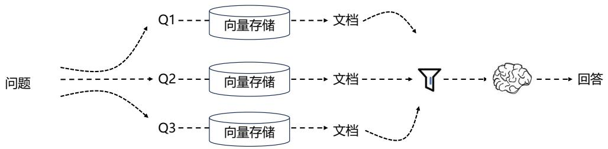  
图 9.20 包含查询分解与检索结果融合的 RAG 系统

使用 LangChain 可以快速构建一个包含查询分解与检索结果融合的 RAG 系统:

# # 导入需要的模块和类

```python
import bs4   
from langchain import hub   
from langchain.text splitter import RecursiveCharacterTextSplitter   
from langchaincommunity.document_loaders import WebBaseLoader   
from langchaincommunity)."vectorstores import Chroma   
from langchaincommunity-"embeddings import HuggingFaceBgeEmbeddings   
from langchain_core.output_parsers import StrOutputParser   
from langchain_core.runnables import RunnablePassthrough   
from langchain_ollama.11ms import OllamaLLM   
from langchain.prompts import ChatPromptTemplate   
from langchain.load import dumps,loads   
from langchain_core.runnables import RunnablePassthrough 
```

# #### 索引 ####

```python
docs = SimpleDirectoryReader("/.RAGDoc").load_data()
text_splitter = RecursiveCharacterTextSplitter(chunk_size=1000, chunk_overlap=200)
splits = text_splitter.split Documents(docs)
embed_model = HuggingFaceEmbedding(model_name='BAAI/bge-large-zh-v1.5')
vectorstore = Chroma.from Documents(splits, embedding=embed_model)
retriever = vectorstore.as_retriever() 
```

# # 使用 Ollama 接入本地大语言模型

```txt
llm = OllamaLLM(model="qwen2.5") 
```

# # 构造 query 分解 Prompt

template $=$ ""You are a helpful assistant that generates multiple search queries based on a single input query. $\backslash \mathbb{n}$ Generate multiple search queries related to: question $\backslash \mathbb{n}$ Output (4 queries):"" prompt_rag_fusion $=$ ChatPromptTemplate.from_template/template)

# # 构造 query 分解链

generate Queries $=$ ( prompt_rag_fusion | 11m | StrOutputParser() | (lambda x: x.split("\\n"))

# 定义多查询融合函数  
```python
def reciprocal_rank_fusion(results: list[list], k=60):
    ''' Reciprocal_rank_fusion that takes multiple lists of ranked documents and an optional parameter k used in the RRF formula ''' 
```

初始化一个字典，用于存储每个文档的融合分数fused_score $=$

# 遍历每个文档   
```python
for docs in results: # 根据排名遍历列表中的文档排 for rank, doc in enumerate(docs): # 将文档转换为字符串格式，作为键使用（假设文档可以序列化为 JSON） doc_str = dumps(doc) # 如果文档尚未在融合分数字典 fused Scores 中，则添加它，初始分数为 0 if doc_str not in fused Scores: fused Scores [doc_str] = 0 # 如果文档已存在，则检索其当前分数 previous_score = fusedScores [doc_str] # 使用 RRF : 1 / (rank + k) 公式更新文档分数 fused Scores [doc_str] += 1 / (rank + k)
```

# 根据融合分数对文档进行排序，以获取最终的重排序结果  
```txt
reranked_results = [ (loads(doc), score) for doc, score in sorted(fusedScores.items(), key=lambda x: x[1], reverse=True) ] 
```

# 将重排序结果作为包含文档和融合分数的元组列表返回  
question $= "$ 复旦大学有几个校区?"  
```lua
return reranked_results 
```

# 构建查询融合链   
```python
retrieval_chain_rag_fusion = generate Queries | retriever.map() | reciprocal_rank_fusion  
docs = retrieval_chain_rag_fusion.invoke("question": question)  
print(len(docs)) 
```

# 构建包含查询分解的 RAG 链  
```txt
template = ""Answer the following question based on this context:
{context}
Question: {question} 
```

prompt $=$ ChatPromptTemplate.from_template template)   
final_rag_chain $= ( \begin{array}{l}\end{array}$ "context":retrieval_chain_rag_fusion，"question":itemgetter("question") | prompt | 11m |StrOutputParser()   
print(final_rag_chain.invoke("question":question))