# 互联网大厂广告算法笔记

# 前言

# 算法驱动的广告革命

在当前互联网时代，广告已从传统的“广而告之”演变为一场精密计算的智能博弈。作为连接用户需求与商业价值的核心纽带，互联网广告不仅是各大平台最重要的变现手段，更成为了数据密集度最高、算法最复杂的领域之一。从搜索引擎到社交平台，从电子商务到短视频应用，广告算法的优劣直接决定着千亿级资金的流向与效率。

互联网广告本质是一场三方博弈——用户希望获得有价值的信息，广告主要求 ROI 最大化，平台则需要平衡用户体验与商业收益。这种微妙平衡不可能通过人工经验实现，唯有依靠先进算法系统才能动态维持。

# 广告算法的演进脉络

互联网广告算法的发展经历了从规则驱动到数据驱动的显著演进。早期基于合约的广告投放主要依靠人工售卖固定广告位，随后竞价广告的革命性引入使投放效率得到质的提升。

随着大数据时代的到来，广告算法进入了机器学习主导的新阶段。这一演进可分为三个明显时期：1.0 阶段以大规模逻辑回归和海量特征工程为标志；2.0 阶段聚焦于交叉特征挖掘，FM、DCN 等模型实现了自动化的特征交互；当前我们正处于 3.0 阶段，深度大模型成为主流，已成为各大互联网公司的标准选择。

# 核心挑战与技术体系

现代广告算法面临诸多核心挑战：如何在海量高维稀疏特征中有效捕捉信号？如何提升 CTR 与 CVR 的预测精度？如何处理 CVR 延迟反馈和数据稀疏问题？如何在探索新广告潜力与利用已知高跑量广告间取得平衡？应对这些挑战需要构建多层次的技术体系：从底层的特征工程与 Embedding 技术，到精排预估模型，再到竞价机制与出价策略，最后到预算控制与流量分配，这些技术栈的每一层都蕴含着算法创新。

当前，广告算法正朝着更智能、更自适应、更个性化的方向发展。生成式 AI 技术开始应用于广告创意自动生成、端到端一站式广告推荐，大语言模型 LLM 为广告匹配带来新的可能性与推荐的可解释性，强化学习在出价策略、多目标学习中展现巨大潜力。

# 本笔记的价值

本算法笔记系统梳理了互联网大厂广告算法的完整知识体系，从基础概念到核心算法，从架构设计到前沿趋势。不仅深入解析了广告系统的全链路技术细节，还结合工业界实践分享了大量实用洞见。无论是初入行业的工程师，还是希望深化理解的资深广告从业者，都能从中获得启发~

# 备注：

 为确保本文内容的知识产权价值及权益，本文档已设置了禁止复制权限，请您谅解。  
 考虑较多同学有复制和打印的需求，可进入 pdf 版本（需购买本文档权限，如 pdf 成员不在本文档成员中，会直接清理）互联网大厂广告算法笔记(新PDF版)，该 pdf 文档链接不定期会更新，老版本 pdf 文档会删除。

# 目录

互联网大厂广告算法笔记.......... ......1

前言.......

第一章：互联网广告基础..

1.1 广告系统基础名词解释..  
1.2 广告生态的三方角色  
1.3 广告系统全链路架构 .

第二章：广告机制算法 .

2.1 广告机制算法主要模块.  
2.2 广告竞价机制算法..

2.2.1 竞价模式 ...   
2.2.2 出价策略 . 2  
2.2.3 eCPM 计算 ..

2.3 广告排序机制算法.

2.3.1 CTR 预估 & CVR 预估 .   
2.3.2 广告多目标优化策略.   
2.3.3 广告冷启动..

2.3.3.1 冷启动的定义 ..  
2.3.3.2 各大厂冷启动判定标准与学习期  
2.3.3.3 工业界主流冷启动方案.  
2.3.3.4 冷启动的核心挑战与权衡. .8

2.4 广告定价(扣费)机制算法 .

2.4.1 四种主要定价机制类型.  
2.4.2 广告定价机制总结 2

2.5 广告预算控制算法..

2.5.1 预算分配（Budget Allocation）  
2.5.2 预算平滑（Budget Pacing） .3   
2.5.3 成本控制（Cost Control）  
2.5.4 赔付机制（Compensation Mechanism）

2.6 广告流量调控算法..

2.6.1 频次控制（Frequency Control）  
2.6.2 流量分配（Traffic Allocation）  
2.6.3 生态平衡（Ecosystem Balance）  
2.6.4 反作弊（Anti-Fraud）

第三章 广告召回粗排模块...

3.1 广告召回.

3.1.1 广告召回模块详解.

3.1.1.1 定向召回（Targeting Recall）  
3.1.1.2 向量召回（Vector Recall）  
3.1.1.3 行为召回（Behavior-based Recall）  
3.1.1.4 实时召回（Real-time Recall）  
3.1.1.5 热门/兜底召回（Fallback Recall）

3.1.2 广告召回评估指标.

3.1.2.1 基础效果指标 .  
3.1.2.2 排序质量指标 . .2  
3.1.2.3 系统性能指标 . .4

3.2 广告粗排..

3.2.1 广告粗排模块介绍.   
3.2.2 粗排模型详解 .

3.2.2.1 双塔模型（Two-Tower / DSSM）  
3.2.2.2 阿里 COLD. .2  
3.2.2.3 知识蒸馏模型 .  
3.2.2.4 FSCD（Feature Selection and Cross Distillation）  
3.2.2.5 级联粗排模型（Cascade Pre-Ranking） .3

# 第四章：广告精排重排模块 .

4.1 广告精排特征体系介绍..

4.1.1 精排特征的作用.  
4.1.2 特征类型详解 .  
4.1.3 分模型特征体系..  
4.1.4 特征体系总结对比.

4.2 PCTR 模型 .

4.2.1 pCTR 核心定位与目标 .   
4.2.2 技术栈：从特征到模型.

4.2.2.1 特征工程体系 ..  
4.2.2.2 模型架构演进 .

4.2.3 工程链路 .

4.2.3.1 离线链路 .  
4.2.3.2 在线链路 .

4.2.4 pCTR 模型优化迭代策略.

4.2.4.1 特征优化 ...  
4.2.4.2 模型优化 ..  
4.2.4.3 训练优化 ..  
4.2.4.4 线上优化 ...

4.2.5 评估与落地要点.

4.3 PCVR 模型 .

4.3.1 广告 pCVR 模型简介..  
4.3.2 pCVR 模型优化迭代策略（大厂实践·完整版）  
4.3.3 pCVR 转化数据稀疏优化方案.  
4.3.3.1 转化数据稀疏问题概述.  
4.3.3.2 主流优化方案 .

4.3.4 pCVR 样本选择偏差优化方案.

4.3.4.1 样本选择偏差问题概述.   
4.3.4.2 SSB 的主要优化方案 . 2

4.3.5 pCVR 转化延迟反馈优化方案.

4.3.5.1 延迟反馈问题概述.  
4.3.5.2 主流优化方案 . 2  
4.3.5.3 方案对比和评估指标 . 5

4.4 PLTV 模型 . ..6

4.4.1 pLTV 模型概述.. 6  
4.4.2 pLTV 建模的核心挑战 ... 6  
4.4.3 pLTV 建模方法介绍.

4.4.3.1 直接回归方法 ..  
4.3.3.2 分桶分类方法 .  
4.3.3.3 ZILN 模型.   
4.3.3.4 Two-Stage 模型 .2  
4.3.3.5 LTV 多任务学习 .

4.4.4 pLTV 模型评估指标 Normalized Gini 介绍.

4.5 广告重排模块..

4.5.1 定位与挑战..  
4.5.2 基于规则的重排方法.  
4.5.3 基于学习的 Listwise 重排 .  
4.5.4 强化学习重排方法.

4.6 模型预估校准.   
4.6.1 广告 pCXR 校准：保序回归介绍 .

# 第五章：广告出价算法 ....................... .................. .......1

5.1 第一代出价算法——PID 控制算法  
5.2 第二代出价算法——MPC出价算法介绍. 4  
5.3 第三代出价算法——强化学习出价算法.

5.3.1 强化学习出价算法概述.  
5.3.2 强化学习出价实现步骤详解. 3

5.3.3 分析总结和代码实现.  
5.4 第四代出价算法——生成式强化学习出价算法...  
5.4.1 生成式强化学习出价算法概述 .  
5.4.2 核心原理介绍 .   
5.5 出价策略 TARGET COST、NO BID 与 COST CAP 详解. .5

# 第六章：广告算法前沿技术....

6.1 生成式推荐 .

6.1.1 快手生成式推荐 OneRec 介绍.   
6.1.2 腾讯广告生成式推荐 GPR介绍. . 11   
6.1.3 快手生成式广告推荐系统GR4AD， $4 . 2 \%$ 收入ᨀ升重构全链路. .17

6.2 判别式模型 SCALING UP . . 23

6.2.1 字节 RankMixer 模型介绍.. . 23  
6.2.2 字节 OneTrans 模型介绍.. .26

6.3 通用基座大模型. .. 30

6.3.1 腾讯广告 LFM4Ads 基础大模型 — 日ᨀ收近千万... .30  
6.3.2 阿里妈妈 LUM 通用用户大模型（WSDM’26）介绍.. .. 35

6.4 序列建模优化. .. 38

6.4.1 超长行为序列建模方案 Survey . . 38  
6.4.2 序列建模与特征交互的统一——2026 腾讯 KDD 广告算法大赛解析. .42  
6.4.3 2026 腾讯广告算法大赛 Scaling Up 全链路 Infra 优化方案 Survey ... . 48

6.5 多模态 AI 技术在广告系统中的应用 .. 56

6.5.1 多模态广告素材理解与特征ᨀ取... .56  
6.5.2 多模态广告创意生成（AIGC） ..59  
6.5.3 多模态广告召回. .. 61  
6.5.4 多模态广告 CTR/CVR 预估 ... .63

6.6 强化学习在广告系统的应用. .. 64

6.6.1 智能出价优化 . .. 64  
6.6.2 广告创意动态优选. .. 65  
6.6.3 预算 Pacing 控制.. .. 66  
6.6.4 多目标分配与流量调控. ..67

# 第一章：互联网广告基础

# 1.1 广告系统基础名词解释

# 一、核心指标类

# 1. 展示与点击指标

<table><tr><td>名词</td><td>英文</td><td>定义</td><td>公式</td></tr><tr><td>曝光/展示</td><td>Impression</td><td>广告被展示给用户的次数</td><td>-</td></tr><tr><td>点击</td><td>Click</td><td>用户点击广告的次数</td><td>-</td></tr><tr><td>点击率</td><td>CTR</td><td>点击次数与展示次数的比率</td><td>CTR = Clicks / Impressions × 100%</td></tr><tr><td>千次展示成本</td><td>CPM</td><td>每一千次展示的成本</td><td>CPM = Cost / Impressions × 1000</td></tr></table>

# 2. 转化指标

<table><tr><td>名词</td><td>英文</td><td>定义</td><td>公式</td></tr><tr><td>转化</td><td>Conversion</td><td>用户完成目标行为（注册/下载/付费等）</td><td>-</td></tr><tr><td>转化率</td><td>CVR</td><td>转化次数与点击次数的比率</td><td>CVR = \(\frac{\text{Conversions}}{\text{Clicks}}\times100\%\)</td></tr><tr><td>单次转化成本</td><td>CPA</td><td>获得一次转化的平均成本</td><td>CPA = \(\frac{\text{Cost}}{\text{Conversions}}\)</td></tr><tr><td>单次激活成本</td><td>CPI</td><td>获得一次安装的成本</td><td>CPI = \(\frac{\text{Cost}}{\text{Installs}}\)</td></tr></table>

# 3. 收益指标

<table><tr><td>名词</td><td>英文</td><td>定义</td><td>公式</td></tr><tr><td>广告支出回报率</td><td>ROAS</td><td>广告收入与广告支出的比率</td><td>ROAS = Revenue/Ad Spend × 100%</td></tr><tr><td>投资回报率</td><td>ROI</td><td>净利润与投资成本的比率</td><td>ROI = Revenue-Cost/Cost × 100%</td></tr><tr><td>用户终身价值</td><td>LTV</td><td>用户在整个生命周期内带来的总收入</td><td>LTV = ARPU × Lifetime</td></tr><tr><td>平均用户收入</td><td>ARPU</td><td>每个用户带来的平均收入</td><td>ARPU = Total Revenue/Users</td></tr><tr><td colspan="4">ROAS VS ROI</td></tr><tr><td></td><td colspan="3">ROAS = Revenue/Cost vs ROI = Revenue - Cost</td></tr><tr><td colspan="4">ROAS 关注收入倍数，ROI 关注净利润率。ROAS=200% 等价于 ROI=100%</td></tr></table>

# 二、计费模式类

<table><tr><td>名词</td><td>英文</td><td>定义</td><td>适用场景</td><td>风险承担方</td></tr><tr><td>按展示付费</td><td>CPM</td><td>按千次展示收费</td><td>品牌曝光</td><td>广告主承担转化风险</td></tr><tr><td>按点击付费</td><td>CPC</td><td>按点击次数收费</td><td>效果广告</td><td>双方分担风险</td></tr><tr><td>按行为付费</td><td>CPA</td><td>按转化次数收费</td><td>效果广告</td><td>媒体承担转化风险</td></tr><tr><td>按安装付费</td><td>CPI</td><td>按App安装收费</td><td>应用推广</td><td>媒体承担安装风险</td></tr><tr><td>按播放付费</td><td>CPV</td><td>按视频播放收费</td><td>视频广告</td><td>双方分担风险</td></tr><tr><td>按时长付费</td><td>CPT</td><td>按投放时长收费</td><td>品牌广告</td><td>广告主承担全部风险</td></tr></table>


风险转移规律：从 $\mathsf { C P T } \to \mathsf { C P M } \to \mathsf { C P C } \to \mathsf { C P A }$ ，风险逐步从广告主转移到媒体。广告主越希望"按效果付费"，媒体承担的风险越大，因此单价也越高。

# 三、竞价与出价类


# 核心术语

<table><tr><td>实时竞价 RTB</td><td>Real-Time Bidding，在毫秒级时间内完成的广告位实
时竞价</td></tr><tr><td>出价 Bid</td><td>广告主愿意为一次展示/点击/转化支付的价格</td></tr></table>

eCPMeffectiveCPM预估千次展示收益，统一衡量不同计费模式的收益指标

$$
\mathrm {e C P M} _ {\mathrm {C P C}} = \mathrm {p C T R} \times \mathrm {B i d} \times 1 0 0 0
$$

$$
\mathrm {e C P M} _ {\mathrm {C P A}} = \mathrm {p C T R} \times \mathrm {p C V R} \times \mathrm {B i d} \times 1 0 0 0
$$

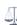

# 竞价机制对比

<table><tr><td>机制</td><td>获胜规则</td><td>扣费规则</td></tr><tr><td>第一价格</td><td>出价最高者</td><td>按最高出价扣费</td></tr><tr><td>FPA</td><td></td><td></td></tr><tr><td>第二价格</td><td>出价最高者</td><td>按次高出价+0.01</td></tr><tr><td>SPA</td><td></td><td></td></tr><tr><td>GSP</td><td>多广告位排序</td><td>各位置按下一位出价</td></tr><tr><td>广义第二价格</td><td></td><td></td></tr><tr><td>VCG</td><td>多广告位排序</td><td>基于边际贡献扣费</td></tr><tr><td>边际贡献</td><td></td><td></td></tr></table>


VCG 机制具有激励相容性质 (truthful)，广告主的最优策略就是如实出价，但计算复杂度较高。

#  竞价示例：

# 竞价示例：三个广告主竞争一个广告位

场景：广告主A出价￥5.0，广告主B出价￥3.0，广告主C出价￥2.0

第一价格竞价：A获胜，扣费?5.0 (按自己出价)

第二价格竞价：A获胜，扣费?3.01 (按次高出价+?0.01)

差异：第二价格下A节省了￥1.99，且无需猜测对手出价

# 四、预估模型类

<table><tr><td>名词</td><td>英文</td><td>定义</td><td>说明</td></tr><tr><td>点击率预估</td><td>pCTR</td><td>模型预估的广告点击概率</td><td>核心模型 广告排序的基础</td></tr><tr><td>转化率预估</td><td>pCVR</td><td>模型预估的点击后转化概率</td><td>核心模型 效果广告必备</td></tr><tr><td>点击转化率</td><td>CTCVR</td><td>从展示到转化的整体概率</td><td>组合指标 CTCVR = pCTR × pCVR</td></tr><tr><td>智能出价</td><td>oCPX</td><td>系统自动优化出价以达成目标</td><td>自动化 包含 oCPC / oCPM</td></tr><tr><td>oCPC</td><td>Optimized CPC</td><td>按点击计费，系统优化出价</td><td>目标：达成广告主设定的 CPA</td></tr><tr><td>oCPM</td><td>Optimized CPM</td><td>按展示计费，系统优化出价</td><td>目标：达成广告主设定的 CPA</td></tr></table>

#  预估模型关系图：

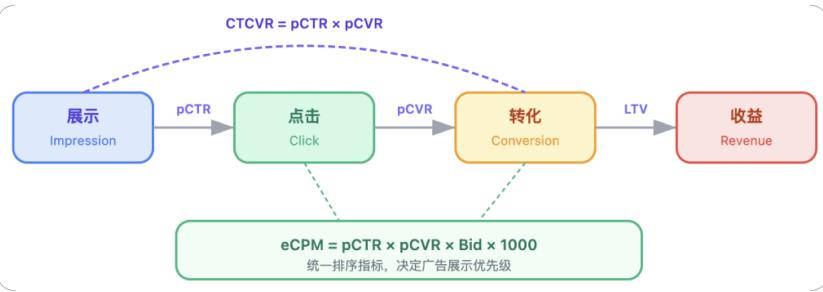

# 五、广告系统架构类

<table><tr><td>名词</td><td>英文全称</td><td>定义</td><td>服务对象</td></tr><tr><td>需求方平台DSP</td><td>Demand-Side Platform</td><td>广告主/代理商管理广告投放的平台</td><td>广告主</td></tr><tr><td>供应方平台SSP</td><td>Supply-Side Platform</td><td>媒体管理广告位和收益的平台</td><td>媒体</td></tr><tr><td>广告交易平台ADX</td><td>Ad Exchange</td><td>连接DSP和SSP的实时交易市场</td><td>双方</td></tr><tr><td>数据管理平台DMP</td><td>Data Management Platform</td><td>整合和管理用户数据的平台</td><td>数据</td></tr><tr><td>广告网络Ad Network</td><td>Ad Network</td><td>聚合多个媒体广告位的中间商</td><td>中间商</td></tr></table>

#  广告系统架构关系图：

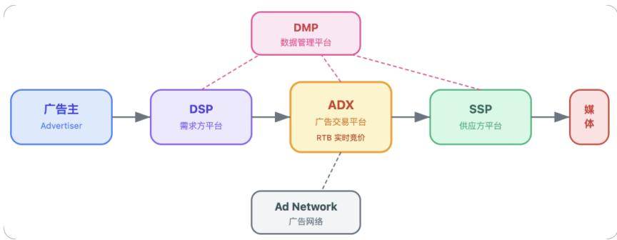

# 六、用户定向类

# 定向方式

定向 Targeting 根据条件筛选目标用户群体，包括地域、年龄、性别、兴趣等维度

人群包 Audience Package 满足特定条件的用户集合，可用于定向投放

兴趣标签 Interest Tag 根据用户行为推断的兴趣分类，如"游戏爱好者"、"美妆达人"

DMP人群 DMP Audience 通过数据管理平台定义和管理的人群

# 七、广告位与创意类

<table><tr><td>名词</td><td>英文</td><td>定义</td><td>特点</td></tr><tr><td>广告位</td><td>Ad Slot / Placement</td><td>展示广告的具体位置</td><td>不同位置CTR差异巨大</td></tr><tr><td>创意</td><td>Creative</td><td>广告的具体展示内容（图片/视频/文案）</td><td>创意质量直接影响CTR</td></tr><tr><td>落地页</td><td>Landing Page</td><td>用户点击广告后到达的页面</td><td>落地页体验影响CVR</td></tr><tr><td>原生广告</td><td>Native Ads</td><td>与内容形式融合的广告</td><td>用户体验好 不易引起反感</td></tr><tr><td>信息流广告</td><td>Feed Ads</td><td>穿插在内容流中的广告</td><td>主流形式 抖音/微信等</td></tr><tr><td>开屏广告</td><td>Splash Ads</td><td>App启动时全屏展示的广告</td><td>高曝光 CPM最高</td></tr><tr><td>插屏广告</td><td>Interstitial Ads</td><td>应用使用过程中弹出的全屏广告</td><td>打断体验 需控制频次</td></tr></table>

# 八、效果衡量类

# 归因方法

归因 Attribution 确定转化功劳归属于哪个广告触点

归因窗口 Attribution Window 判断广告是否产生转化的时间范围(如点击后7天内)

最后点击归因LastClick转化归因给最后一次点击的广告，最常用但可能低估上游渠道

首次点击归因 FirstClick转化归因给第一次点击的广告，强调获客渠道的价值

# $\circledast$ 高级定向策略

重定向 Retargeting 对已访问过的用户再次投放广告，提升转化率。典型场景：用户浏览商品但未购买，后续推送该商品广告

相似人群Lookalike 基于种子用户(如已转化用户）扩展具有相似特征的人群，扩大投放规模

RetargetinqvsLookalike:Retargetinq 针对"已知用户"再营销，Lookalike 基于"已知用户"寻找"未知用户"两者常配合使用。

# $\scriptstyle { \mathcal { f } }$ 测试与评估

A/B测试 A/B Test 对比测试不同方案效果，通过随机分流确保结果可信

增量效果 Incrementality 广告带来的额外增量转化，即"如果不投广告，这些转化是否仍会发生？"

！ 常见误区：归因 $\neq$ 增量。归因告诉你"转化来自哪个渠道"，增量告诉你"广告是否真正带来了额外转化"。高归因渠道可能增量很低 (自然转化被错误归因)。

# 九、预算与成本控制类

<table><tr><td>名词</td><td>英文</td><td>定义</td><td>作用</td></tr><tr><td>日预算</td><td>Daily Budget</td><td>每天的最大消耗金额</td><td>控制每日花费上限</td></tr><tr><td>总预算</td><td>Total Budget</td><td>整个投放周期的最大消耗金额</td><td>控制整体投放规模</td></tr><tr><td>预算平滑</td><td>Budget Pacing</td><td>控制预算消耗速度的机制</td><td>核心机制避免预算过早耗尽</td></tr><tr><td>出价上限</td><td>Bid Cap</td><td>单次竞价的最高出价限制</td><td>防止单次出价过高</td></tr><tr><td>成本上限</td><td>Cost Cap</td><td>目标 CPA 的上限控制</td><td>确保平均成本不超标</td></tr><tr><td>赔付</td><td>Compensation</td><td>超出目标成本时平台的补偿机制</td><td>平台承诺保障广告主利益</td></tr></table>

# 十、流量质量类

<table><tr><td>名词</td><td>英文</td><td>定义</td><td colspan="2">重要性</td></tr><tr><td>无效流量</td><td>IVT</td><td>非真实用户产生的无效流量</td><td>高风险</td><td>浪费广告预算</td></tr><tr><td>作弊流量</td><td>Fraud Traffic</td><td>通过欺诈手段产生的虚假流量</td><td>严重</td><td>需反作弊系统识别</td></tr><tr><td>可见性</td><td>Viewability</td><td>广告实际被用户看到的比例</td><td>关键</td><td>影响真实曝光效果</td></tr><tr><td>频次</td><td>Frequency</td><td>同一用户看到同一广告的次数</td><td>需控制</td><td>过高导致用户疲劳</td></tr><tr><td>到达率</td><td>Reach</td><td>广告触达的独立用户数量</td><td>品牌指标</td><td>衡量覆盖广度</td></tr></table>

# 核心公式汇总:

<table><tr><td>收益相关</td><td>效果相关</td><td>成本相关</td></tr><tr><td>ECPM (CPC 计费)
eCPM = pCTR × Bid × 1000</td><td>点击率
CTR = Clicks / Impressions</td><td>单次点击成本
CPC = Cost / Clicks</td></tr><tr><td>ECPM (CPA 计费)
eCPM = pCTR × pCVR × Bid × 1000</td><td>转化率
CVR = Conversions / Clicks</td><td>千次展示成本
CPM = Cost / Impressions × 1000</td></tr><tr><td>广告收入
Revenue = Impressions × eCPM / 1000</td><td>点击转化率
CTCVR = pCTR × pCVR</td><td>单次安装成本
CPI = Cost / Installs</td></tr><tr><td></td><td>单次转化成本 / 广告回报率
CPA = Cost / Conversions
ROAS = Revenue / Cost</td><td>ROI VS ROAS
ROI = Revenue - Cost / Cost = ROAS - 1</td></tr></table>

# 1.2 广告生态的三方角色

广告生态系统由三个核心角色构成：广告主（Advertiser）、媒体/流量方（Publisher） 和 用户（User）。广告平台作为中间桥梁，协调三方利益，实现价值最大化。

# 1）广告主（Advertiser）

#  定义与目标

广告主是付费推广产品或服务的企业/个人，是广告生态的资金来源。

#  核心诉求

<table><tr><td>诉求维度</td><td>具体目标</td><td>关键指标</td></tr><tr><td>效果导向</td><td>最大化广告投放回报</td><td>ROI、ROAS</td></tr><tr><td>成本控制</td><td>控制获客成本</td><td>CPA、CPL</td></tr><tr><td>规模增长</td><td>获取更多目标用户</td><td>曝光量、点击量、转化量</td></tr><tr><td>品牌建设</td><td>提升品牌知名度</td><td>品牌曝光、用户认知</td></tr></table>

#  广告主分类

广告主类型

├── 按规模   
│ ├── KA 客户（Key Account）：年消耗千万级以上大客户  
│ ├── 中小客户（SMB）：中小企业广告主  
│ └── 个人广告主：个体户、自媒体等  
├── 按行业   
│ ├── 电商：淘宝、京东店铺  
│ ├── 游戏：手游、页游推广  
│ ├── 金融：银行、保险、理财  
│ ├── 教育：在线教育、培训机构  
│ └── 本地生活：餐饮、美容、健身  
└── 按目标

├── 效果广告主：追求转化  
└── 品牌广告主：追求曝光

#  广告主关键行为

 出价（Bidding）：为每次曝光/点击/转化设定愿意支付的价格  
 定向（Targeting）：选择目标人群特征（年龄、性别、兴趣等）  
 创意（Creative）：制作广告素材（图片、视频、文案）  
 预算（Budget）：设定每日/总预算上限

#  核心公式

投资回报率 (ROI)

$$
ROI = \frac{\text{收入} - \text{花费}}{\text{花费}}\times 100\%
$$

衡量广告投资的整体回报率，RO $> 0$ 表示盈利

广告花费回报率 (ROAS)

$$
R O A S = \frac {\text {广 告 带 来 的 收 入}}{\text {广 告 花 费}}
$$

每花1元广告费带来多少收入，ROAS>1表示有效

单次转化成本 (CPA)

$$
C P A = \frac {\text {总 广 告 花 费}}{\text {转 化 次 数}}
$$

获取一次转化（如注册、购买）的平均

# 2）媒体/流量方（Publisher）

#  定义与目标

媒体是拥有用户流量的平台，通过广告位获取收益，是广告的展示载体。

#  核心诉求

<table><tr><td>诉求维度</td><td>具体目标</td><td>关键指标</td><td>说明</td></tr><tr><td>收益最大化</td><td>提升广告收入</td><td>RPM、eCPM、填充率</td><td>单位流量产生更多收入</td></tr><tr><td>用户体验</td><td>保持用户留存</td><td>DAU、MAU、停留时长</td><td>广告不能伤害用户体验</td></tr><tr><td>生态健康</td><td>平衡广告与内容</td><td>广告加载率、负反馈率</td><td>长期可持续发展</td></tr></table>

#  媒体分类

? 媒体类型

├── 按平台属性

├── 搜索引擎：百度、Google、Bing  
├── 社交媒体：微信、微博、抖音、小红书  
├── 内容平台：今日头条、知乎、B 站  
├── 电商平台：淘宝、京东、拼多多  
└── 工具应用：天气、输入法、浏览器

├── 按流量规模

├── 头部媒体：DAU > 1 亿（微信、抖音）  
├── 腰部媒体：DAU 100 万-1 亿  
└── 长尾媒体：DAU $< ~ \perp 0 0$ 万

└── 按变现模式

├── 自营广告：自建广告系统（字节、腾讯）  
└── 联盟广告：接入广告联盟 SDK

#  广告位类型


#  核心公式

千次展示收益 (RPM)

$$
R P M = \frac {\text {广 告 收 入}}{\text {展 示 次 数}} \times 1 0 0 0
$$

每千次广告展示带来的收入，媒体收益核心指标

有效千次展示成本 (eCPM)

$$
e C P M = C T R \times C V R \times P r i c e \times 1 0 0 0
$$

综合考虑点击率、转化率的实际收益

填充率 (Fill Rate)

$$
\text{填充率} = \frac{\text{实际填充广告请求数}}{\text{总广告请求数}}\times 100\%
$$

广告位被有效利用的比例，越高收益越大

广告加载率 (Ad Load)

$$
\text{广告加载率} = \frac{\text{广告内容数}}{\text{总内容数}}\times 100\%
$$

内容中广告占比，过高会伤害用户体验

# 3）用户（User）

 定义与目标：用户是广告的受众，是广告生态的核心价值来源，其行为数据驱动整个系统运转。

#  核心诉求

<table><tr><td>诉求维度</td><td>具体目标</td><td>体现</td><td>对平台的影响</td></tr><tr><td>内容相关</td><td>看到感兴趣的广告</td><td>点击率高</td><td>相关性推荐算法优化</td></tr><tr><td>体验良好</td><td>不被过度打扰</td><td>停留时间长</td><td>广告频控与加载率控制</td></tr><tr><td>信息价值</td><td>获取有用信息</td><td>转化意愿强</td><td>广告质量审核</td></tr><tr><td>隐私保护</td><td>数据安全</td><td>信任度高</td><td>合规与数据脱敏</td></tr></table>

#  用户画像维度

# 基础属性

人口统计：年龄、性别、地域、学历

设备信息：手机型号、系统、网络

账号信息：注册时长、会员等级

# 兴趣偏好

山内容兴趣：体育、美食、科技、时尚

品类偏好：服饰、数码、美妆、母婴

品牌偏好：高端、性价比、国货

# I行为特征

活跃时段：早高峰、晚高峰、深夜

√使用习惯：浏览深度、停留时长

一消费能力：客单价、消费频次

# 生命周期

新用户：注册<7天

√成长用户：活跃度上升期

☆成熟用户：稳定活跃期

$! !$ 流失用户：30天未活跃

#  用户行为漏斗


用户从看到广告到最终转化，每一步都会有流失，漏斗逐级递减

#  用户价值公式

$\Phi$ 用户生命周期价值 (LTV)

$$
L T V = \sum_ {t = 1} ^ {T} \frac {\text {R e v e n u e} _ {t}}{(1 + r) ^ {t}}
$$

用户整个生命周期内贡献的总价值 (折现后)，r为折现率，T为生命周期

用户获取成本(CAC)

$$
C A C = \frac {\text {总 营 销 费 用}}{\text {新 增 用 户 数}}
$$

获取一个新用户的平均成本，LTV/CAC>3为健康值

# 4）三方博弈与平衡

# 利益关系图：

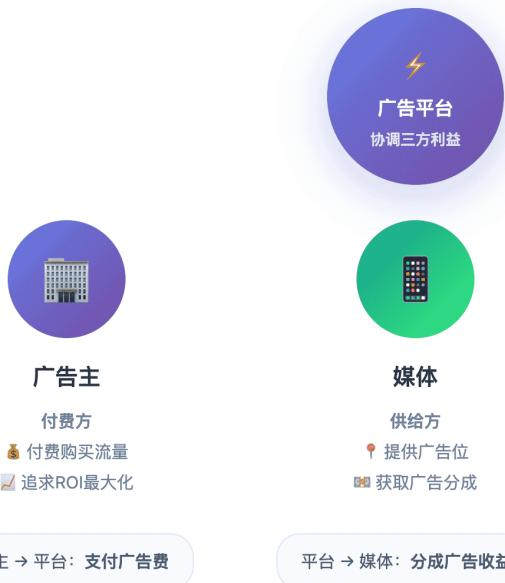


# 利益冲突与平衡策略

<table><tr><td>冲突点</td><td>广告主诉求</td><td>媒体诉求</td><td>用户诉求</td><td>平衡策略</td></tr><tr><td>广告数量</td><td>更多曝光机会</td><td>更多广告收入</td><td>少看广告</td><td>控制广告加载率 (Ad Load)</td></tr><tr><td>广告质量</td><td>追求转化效果</td><td>追求点击收益</td><td>看到有价值内容</td><td>广告审核 + 质量分机制</td></tr><tr><td>定向精度</td><td>精准触达目标用户</td><td>提升 eCPM</td><td>保护隐私</td><td>差分隐私 + 联邦学习</td></tr><tr><td>竞价公平</td><td>透明公平竞价</td><td>收益最大化</td><td>不被低质广告打扰</td><td>GSP/VCG 拍卖机制</td></tr></table>

# 1.3 广告系统全链路架构

广告系统的全链路架构设计旨在在极短的时间内（通常小于 100毫秒），在海量广告中找到最匹配当前用户和媒体环境的那一个，同时最大化各方利益（广告主 ROI、媒体收益、平台效率）。

# 一、 广告系统核心模块介绍

我们将广告系统分为三个主要层面：在线投放层面（Online Serving）、离线数据层面（Offline Data）和业务支撑层面（BusinessSupport）。

# 1. 业务支撑层面 (对外接口)

这两个平台是广告系统对外的“门户”。

 DSP (Demand-Side Platform，需求方平台) / 广告主平台

 功能：服务于广告主（买方）。广告主在这里创建广告计划、上传创意素材（图片、视频）、设置目标受众（地域、年龄、兴趣）、设定预算和出价（如 CPC点击出价）。  
 核心价值：帮助广告主高效地买到合适的流量。

 SSP (Supply-Side Platform，供给方平台) / 媒体平台

 功能：服务于媒体开发者（卖方，如 App、网站）。媒体在这里管理自己的广告位，设置底价，并发起广告请求。  
 核心价值：帮助媒体将流量变现最大化。

# 2. 在线投放层面 (核心引擎，毫秒级响应)

这是广告系统的心脏，负责实时处理广告请求并做出决策。

 广告交易平台 (Ad Exchange) / 流量网关

 功能：连接 SSP 和 DSP 的枢纽。它接收来自 SSP 的流量请求，并将其广播给多个 DSP 进行实时竞价（RTB），或者在内部进行程序化购买匹配。

 广告投放引擎 (Ad Server) - 核心中的核心

当一个广告请求到达时，引擎内部会经历一个漏斗状的筛选过程：

 A. 召回 (Retrieval)：从百万/千万级的在线广告库中，快速初步筛选出几百个与当前请求相关的广告（例如，根据地域、基本定向条件筛选）。  
 B. 过滤 (Filtering)：剔除无效广告。例如：预算耗尽的、被用户投诉屏蔽的、不符合媒体类型要求的、违反频次控制的广告。  
 C. 排序与模型预估 (Ranking & CTR/CVR Prediction)：这是最考验技术含量的部分。利用机器学习模型（深度学习模型如 DNN、DeepFM 等），实时预估每个候选广告被用户点击的概率（pCTR）或转化的概率（pCVR）。  
 D. 竞价与机制设计 (Bidding & Pricing)：结合广告主的出价和预估的点击率，计算出 eCPM（千次展示期望收益，eCPM $=$ 出价 $\star \mathsf { p C T R } \star 1 0 0 0 $ 。按照 eCPM 高低进行最终排序，选出胜出者，并根据定价机制（如广义第二价格GSP）计算最终扣费金额。

 DMP (Data Management Platform，数据管理平台) / 用户画像服务

$\bigcirc$ 功能：在线服务需要实时知道“现在访问的这个用户是谁”。DMP 提供实时的用户标签查询服务（例如：男性、25-30岁、数码爱好者、近期有购车意向）。

# 3. 离线数据层面 (系统的燃料与大脑)

在线层面的高效运转依赖于离线层面的数据积累和模型迭代。

 数据采集与传输 (Data Collection & Pipeline)功能：收集一切数据。包括曝光日志、点击日志、转化日志、用户行为日志等，通过 Kafka 等消息队列传输到大数据平台。  
 数据仓库/数据湖 (Data Warehouse/Lake)功能：存储海量的历史数据，进行清洗、ETL，形成结构化的数据表，供后续分析和建模使用。  
 特征工程与模型训练平台 (Machine Learning Platform)功能：利用离线数据，构建大规模机器学习模型。训练好的模型会被推送到在线投放引擎中，用于实时的 CTR/CVR 预估。这是一个不断迭代更新的过程（例如天级或小时级更新模型）。

# 4. 投后与结算链路

监测与归因系统 (Tracking & Attribution)功能：准确记录广告的每一次曝光和点击。当用户发生购买或下载行为时，归因系统负责判断这个转化成果应该算在哪个广告的头上。  
 计费与反作弊系统 (Billing & Anti-Fraud)功能：根据归因结果和定价模型（CPC/CPM/CPA）扣除广告主费用。同时，识别并过滤掉机器刷量、虚假点击等作弊流量，保障广告主利益。

# 二、广告系统全链路架构图

# 程序化广告关键模块图

三大核心区域：在线实时投放·离线数据闭环·参与方角色

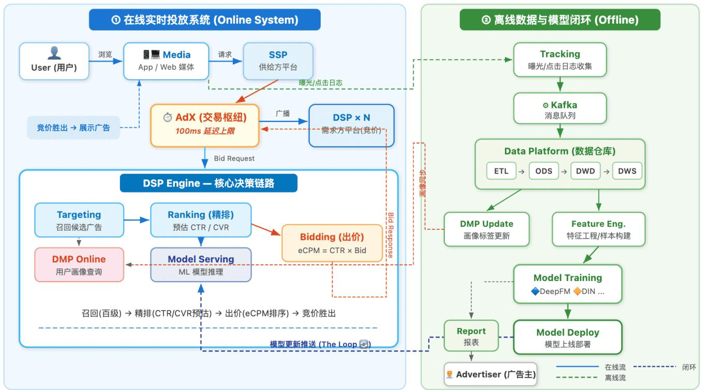

# 1. 在线实时投放系统 (Online System）

这是广告系统的“前线战场”，要求极高的并发处理能力和极低的延迟（通常整个流程需要在 100ms 内完成）。

 流程起点： 用户在 App 或网页上浏览，触发了广告位，媒体通过 SSP（供给方平台）向外发出广告请求。  
 交易枢纽 (AdX)：Ad Exchange 就像一个股票交易所，它接收 SSP 的请求，并将其广播给多个 DSP（需求方平台），询问“谁想要这个流量？”。  
 核心决策 (DSP Engine)： 这是广告主的大脑。  
 Targeting (召回)： 从茫茫多的广告库存中，初步筛选出符合当前用户定向条件的几百个候选广告。  
 DMP Online： 快速查询这个用户的画像（性别、兴趣、历史行为），辅助决策。  
 Ranking (精排/预估)： 这是最核心的技术点。利用机器学习模型预估用户对这几百个广告的 CTR 和 CVR。  
 Bidding (出价)： 根据预估的 CTR/CVR 以及广告主的预算，计算出最终的出价。  
 竞价胜出： DSP 将出价返回给 AdX，AdX 选择出价最高者，将其广告素材链接返回给媒体进行展示。

# 2.离线数据与模型闭环 (Offline System)

这是广告系统的“后勤和参谋部”，负责处理海量数据，让在线系统变得更聪明。

 数据收集 (Tracking)：当用户看到或点击广告后，媒体 SDK 发送监测日志到后端的收集服务，并写入 Kafka 消息队列。  
 数据仓库 (Data Platform)：数据经过 ETL 处理流入数据仓库（ODS $\scriptscriptstyle - >$ DWD $\scriptscriptstyle - >$ DWS），形成结构化行为数据。  
 模型训练闭环 (The Loop)：这是整个系统不断进化的关键。  
 特征工程： 将用户的历史行为数据转化为模型可理解的特征样本。  
 Model Training： 使用最新的数据训练新的机器学习模型（如 DeepFM, DIN 等）。  
 模型部署：训练好的新模型被推送到线上的 Model Serving 服务，用于下一次的实时预估。  
 画像更新：根据最新的用户行为，更新 DMP 中的用户标签。

# 3.参与方角色 (Roles)

 User：流量的产生者和广告的受众。  
 Advertiser：广告的发起者，他们提供素材和预算，并依赖离线报表来评估广告效果。

# 第二章：广告机制算法

# 2.1 广告机制算法主要模块

广告系统的机制算法是整个广告平台的核心，主要包括以下五大模块：

? 核心模块架构  

<table><tr><td>模块</td><td>核心功能</td><td>关键技术</td></tr><tr><td>竞价机制</td><td>确定参与规则</td><td>CPC/CPM/CPA/oCPX、出价策略、eCPM计算、底价</td></tr><tr><td>排序机制</td><td>流量最优分配</td><td>CTR预估、CVR预估、质量分、多目标优化、E&amp;E</td></tr><tr><td>定价机制</td><td>合理定价扣费</td><td>GSP、第一/第二价格、VCG机制</td></tr><tr><td>预算控制</td><td>控制消耗节奏</td><td>预算分配、Pacing平滑、成本控制、赔付</td></tr><tr><td>流量调控</td><td>生态健康平衡</td><td>频次控制、流量分配、反作弊</td></tr></table>


# 五大核心模块

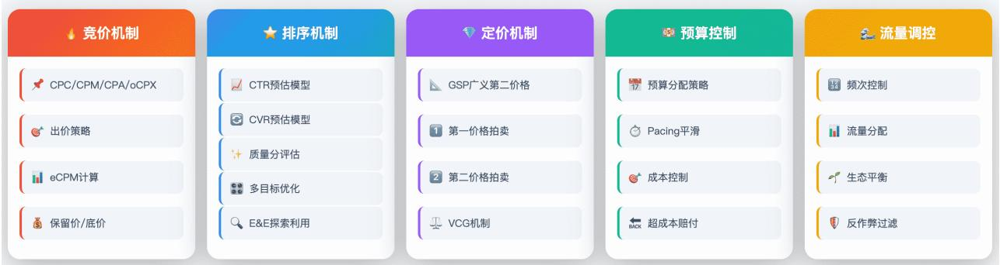

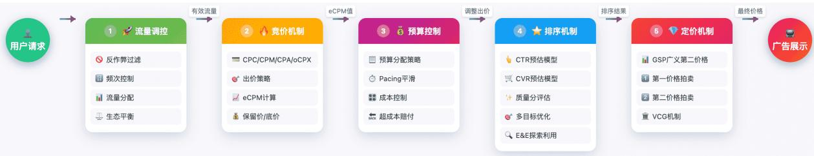  
各个模块之间的协作流程：


# 数据反馈闭环

广告展示


曝光计费(CPM)


点击计费(CPC)


转化计费(CPA)


数据回传


模型更新

# 流量调控

过滤无效流量，控制曝光频次，维护平台生态健康

输出：有效流量

#

确定广告主愿意支付的价格，计算eCPM进

输出：eCPM值

# ③预算控制

控制花费速度和总量，确保预算平稳消耗

# ④排序机制

预估点击率和转化率，多目标优化排序广告

输出：排序结果

# 定价机制

确定胜出者实际扣费价格，保证激励兼容

输出：最终价格

# 模块的核心计算公式：


eCPM计算公式

eCPM = pCTR x Bid × 1000


排序得分公式

Score = f(eCPM，QS，Rel)


GSP定价公式

CPC = eCPMz / (pCTR × 1000） + E

# 1? 竞价机制（Auction Mechanism）

<table><tr><td>子模块</td><td>说明</td></tr><tr><td>竞价模式</td><td>CPC、CPM、CPA、oCPX等</td></tr><tr><td>出价策略</td><td>手动出价、自动出价、智能出价</td></tr><tr><td>eCPM计算</td><td>eCPM = pCTR × Bid × 1000 (或含pCVR)</td></tr><tr><td>保留价/底价</td><td>最低竞价门槛，保护平台收益</td></tr></table>

# 2? 排序机制（Ranking Mechanism）

排序 $=$ f(eCPM, 质量分, 相关性, 用户体验)

<table><tr><td>子模块</td><td>说明</td></tr><tr><td>CTR 预估</td><td>点击率预估模型（深度学习）</td></tr><tr><td>CVR 预估</td><td>转化率预估模型</td></tr><tr><td>质量分</td><td>广告质量评估（相关性、落地页等）</td></tr><tr><td>多目标优化</td><td>平衡收益、体验、生态</td></tr><tr><td>探索与利用</td><td>E&amp;E 机制，新广告冷启动</td></tr></table>

# 3? 定价机制（Pricing Mechanism）

<table><tr><td>机制类型</td><td>公式/说明</td></tr><tr><td>GSP（广义第二价格）</td><td>主流，按下一名eCPM定价</td></tr><tr><td>第一价格</td><td>按出价扣费</td></tr><tr><td>第二价格</td><td>按次高价+δ扣费</td></tr><tr><td>VCG</td><td>按造成的外部损失定价</td></tr></table>

# GSP 定价公式：

$$
C P C = e C P M (\text {下 一 名}) / (p C T R \times 1 0 0 0) + \delta
$$

# 4? 预算控制（Budget Control）

<table><tr><td>子模块</td><td>说明</td></tr><tr><td>预算分配</td><td>日预算、总预算分配策略</td></tr><tr><td>预算平滑</td><td>Pacing，控制消耗速度</td></tr><tr><td>成本控制</td><td>目标 CPA/ROAS 达成</td></tr><tr><td>赔付机制</td><td>超成本补偿</td></tr></table>

# Pacing 策略：

匀速消耗：每小时消耗 $=$ 日预算 / 24

智能消耗：根据流量质量动态调整

5? 流量调控（Traffic Control）  

<table><tr><td>子模块</td><td>说明</td></tr><tr><td>频次控制</td><td>同一用户展示次数限制</td></tr><tr><td>流量分配</td><td>头部/腰部/长尾广告主分配</td></tr><tr><td>生态平衡</td><td>防止头部广告主垄断</td></tr><tr><td>反作弊</td><td>无效流量过滤</td></tr></table>

# ? 各模块重要性排序

无论从重要性、技术复杂度还是收入影响上，无疑都是排序机制最为重要。


# ? 总结

<table><tr><td>模块</td><td>核心目标</td><td>关键技术</td></tr><tr><td>竞价</td><td>确定参与规则</td><td>出价策略、eCPM</td></tr><tr><td>排序</td><td>流量最优分配</td><td>深度学习、多目标优化</td></tr><tr><td>定价</td><td>合理定价扣费</td><td>GSP、VCG机制</td></tr><tr><td>预算</td><td>控制消耗节奏</td><td>Pacing、成本控制</td></tr><tr><td>流量</td><td>生态健康平衡</td><td>频控、反作弊</td></tr></table>

这五大模块相互配合，共同构成了完整的广告机制算法体系~

# 2.2 广告竞价机制算法

广告竞价机制是数字广告系统的核心组件，决定了哪个广告能够获得展示机会以及广告主需要支付多少费用。下面详细介绍各个关键模块：

  
√广告竞价流程

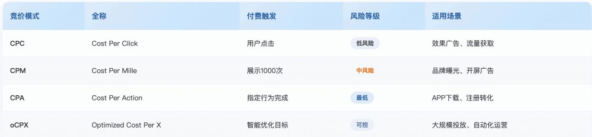

# 2.2.1 竞价模式

# CPC（Cost Per Click）- 按点击付费

 定义：广告主只在用户点击广告时才付费  
 特点：风险较低，适合追求流量的广告主  
 计算：实际扣费 $=$ 下一名出价 × (下一名质量分/自己质量分) $+ 0 . 0 1$

# CPM（Cost Per Mille）- 千次展示付费

 定义：广告展示1000次所需支付的费用  
 特点：适合品牌曝光类广告   
. 应用场景：开屏广告、品牌展示广告

# CPA（Cost Per Action）- 按转化付费

 定义：用户完成指定行为（注册、下载、购买）后付费  
 特点：风险最低，但对平台要求高  
 常见类型：CPI（安装）、CPS（销售）、CPL（线索）

# oCPX（Optimized Cost Per X）- 智能优化出价

 定义：结合机器学习的优化出价方式  
 包括：oCPC、oCPM、oCPA  
 特点：系统自动优化出价，以达成目标转化成本


# 竞价模式

# BiddingModels

CPC

按点击付费，适合效果广告

CPM

千次展示付费，适合品牌曝光

CPA

按转化付费，风险最低

oCPX

智能优化出价，ML驱动


# 出价策略

# Bidding Strategies

手动出价

完全控制，需持续优化

自动出价

系统调控，预算优先

智能出价

ML实时优化，动态调整

# 2.2.2 出价策略

# 手动出价（Manual Bidding）

特点：

├── 广告主完全控制出价金额  
├── 需要持续监控和调整  
├── 适合经验丰富的广告主  
└── 灵活性高但耗时

# 自动出价（Automatic Bidding）

特点：

├── 系统根据预算自动调整出价   
├── 目标：在预算内获取最多转化  
├── 减少人工干预   
└── 适合预算固定的广告主

# 智能出价（Smart Bidding）

特点：

├── 基于机器学习实时优化  
├── 考虑多维度信号（设备、时间、地域等）  
├── 动态调整每次竞价的出价   
└── 包括：目标CPA、目标 ROAS、最大化转化

# 2.2.3 eCPM 计算

eCPM（有效千次展示成本）是广告排序的核心指标：


eCPM计算

$$
e C P M = p C T R \times B i d \times 1 0 0 0
$$

$$
e C P M = p C T R \times p C V R \times B i d \times 1 0 0 0
$$

pCTR

PCVR

bid

# 排序逻辑：

广告排序分 $\ ` = e C P M \times Q u a l i t y \_ S c o r e \times$ 其他因子

# 保留价/底价（Reserve Price/Floor Price）


保留价/底价

Reserve Price /Floor Price

核心作用

最低竞价门槛，保护平台收益

固定底价

统一最低出价要求

动态底价

根据流量质量动态调整

分层底价

不同广告位差异化定价


拍卖类型

Auction Types

第一价格

支付自己出价，策略博弈

第二价格

支付次高价+增量，鼓励真实出价

广义第二价格拍卖

# 定义：

 参与竞价的最低出价门槛  
低于此价格的广告无法参与竞拍

# 作用：

 保护平台收益底线  
 过滤低质量广告  
 维护广告生态健康  
 防止恶意低价竞争

# 底价类型：

固定底价：统一的最低出价要求  
 动态底价：根据流量质量、时段等动态调整   
 分层底价：不同广告位/人群设置不同底价

# 总结

广告竞价机制的核心目标是在广告主收益、用户体验和平台收益之间取得平衡：

<table><tr><td>角色</td><td>关注点</td></tr><tr><td>广告主</td><td>ROI最大化、成本可控</td></tr><tr><td>用户</td><td>广告相关性、体验不受干扰</td></tr><tr><td>平台</td><td>收益最大化、生态健康</td></tr></table>

竞价机制通过 eCPM 排序 实现了这种平衡——出价高且质量好的广告更容易获胜，同时保留价机制保护了平台的基本收益。

# 2.3 广告排序机制算法

广告排序机制是广告系统中决定广告展示顺序的核心模块，其核心公式为：

排序 $\dot { \bf \varphi } = f ( e C P M ,$ 质量分，相关性，用户体验)

排序核心公式

排序 $=$ f(eCPM，质量分，相关性，用户体验)

eCPM

有效千次展示收益

质量分

广告综合质量评估

相关性

广告与用户匹配度

用户体验

用户满意度保障

广告排序整体流程：

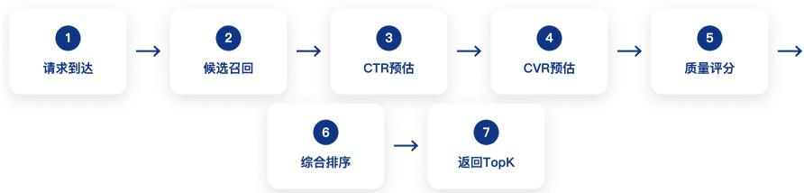  
$\circledast$ 广告排序完整流程

# 2.3.1 CTR 预估 & CVR 预估


CTR预估

Click-Through Rate Prediction ·深度学习

核心任务

预测用户点击广告的概率P(clickluser,ad,context)

模型架构

用户画像、行为序列、广告属性、上下文

评估指标

AUC、GAUC、LogloSs、校准度

LF

GBDT

FM

DeepFM

DIN

DIEN


CVR预估

Conversion Rate Prediction·转化率模型

核心任务

预测点击后的转化概率P(convertlclick

核心挑战

样本选择偏差(SSB)、数据稀疏、延迟转化

ESMM方案

pCTCVF $=$ pCTR×pCVR，全空间建模

多任务学习

共享底层表示，联合优化多个目标

单任务CVR

ESMM

MMoE

PLE

1）CTR 预估（Click-Through Rate Prediction）

定义：预测用户点击广告的概率，是排序系统中最核心的模型之一。

模型技术演进：

<table><tr><td>模型名称</td><td>类型</td><td>核心特点</td><td>特征交互</td><td>适用场景</td></tr><tr><td>LR</td><td>机器学习</td><td>线性模型,可解释性强</td><td>需手动交叉</td><td>基线模型、在线学习</td></tr><tr><td>FM / FFM</td><td>机器学习</td><td>自动二阶特征交叉</td><td>二阶自动</td><td>稀疏特征、推荐系统</td></tr><tr><td>Wide &amp; Deep</td><td>深度学习</td><td>记忆+泛化能力结合</td><td>Wide显式+Deep隐式</td><td>通用推荐、广告排序</td></tr><tr><td>DeepFM</td><td>深度学习</td><td>端到端自动特征交叉</td><td>FM+DNN联合</td><td>无需特征工程</td></tr><tr><td>DIN</td><td>深度学习</td><td>用户兴趣动态建模</td><td>Attention机制</td><td>电商广告、个性化推荐</td></tr><tr><td>DIEN</td><td>深度学习</td><td>兴趣演化序列建模</td><td>GRU + Attention</td><td>序列行为建模</td></tr></table>

深度学习模型特点  

<table><tr><td>模型</td><td>特点</td><td>应用场景</td></tr><tr><td>Wide&amp;Deep</td><td>记忆+泛化能力结合</td><td>通用推荐</td></tr><tr><td>DeepFM</td><td>自动特征交叉</td><td>稀疏特征场景</td></tr><tr><td>DIN</td><td>用户兴趣动态建模</td><td>电商广告</td></tr><tr><td>DIEN</td><td>兴趣演化建模</td><td>序列行为建模</td></tr></table>

# 关键特征

 用户侧：历史行为、人口属性、实时兴趣  
 广告侧：创意特征、落地页质量、历史 CTR  
 上下文：时间、位置、设备、页面信息

# 2）CVR 预估（Conversion Rate Prediction）

定义：预测用户在点击广告后完成转化行为的概率。

挑战与解决方案  

<table><tr><td>挑战</td><td>解决方案</td></tr><tr><td>样本选择偏差</td><td>全空间多任务建模 ESMM、ESCM^2</td></tr><tr><td>数据稀疏</td><td>迁移学习、预训练、多任务学习</td></tr><tr><td>延迟转化</td><td>Fast Emit、归因窗口、时间衰减、DFM</td></tr></table>

# 2.3.2 广告多目标优化策略

# 一、广告多目标优化问题概述

# 1.1 什么是广告多目标优化？

广告系统天然面临多方利益博弈的问题。一个广告排序决策需要同时考虑：

<table><tr><td>优化目标</td><td>核心指标</td><td>利益方</td><td>优化方法</td><td>冲突关系</td></tr><tr><td>平台收益</td><td>eCPM、RPM、总收入、ARPU</td><td>广告平台</td><td>eCPM排序、出价优化、流量分配</td><td>与用户体验负相关</td></tr><tr><td>用户体验</td><td>停留时长、满意度、留存率、负反馈率</td><td>终端用户</td><td>体验约束、负反馈控制、频控</td><td>与平台收益负相关</td></tr><tr><td>广告主ROI</td><td>CPA、ROAS、转化量、转化成本</td><td>广告主</td><td>成本控制、oCPC、自动出价</td><td>与平台收益部分冲突</td></tr><tr><td>生态健康</td><td>广告主多样性、留存率、公平性、新客占比</td><td>整体生态</td><td>多样性约束、公平分配、扶持策略</td><td>与短期收益冲突</td></tr></table>

这四个目标之间存在天然的冲突与权衡。例如，纯粹按 eCPM排序可以最大化短期收入，但会导致低质量高出价广告霸占流量，用户体验下降，最终 DAU 流失、长期收入受损。

# 1.2 形式化定义

多目标优化问题（Multi-Objective Optimization Problem, MOP）的标准形式为：

$$
\min  _ {\vec {x} \in \Omega} \vec {F} (\vec {x}) = (f _ {1} (\vec {x}), f _ {2} (\vec {x}), \dots , f _ {M} (\vec {x}))
$$

广告系统中，决策变量 是广告排序策略（选择哪些广告、以什么顺序展示）， $f _ { 1 } , f _ { 2 } , \dots , f _ { M }$ 分别对应各个优化目标。

# 1.3 核心矛盾——“不可能三角”

广告系统的三方利益构成一个经典的"不可能三角"：

 平台收益 vs 用户体验：广告加载密度越高，收入越多，但用户体验越差  
 平台收益 vs 广告主 ROI：平台收费越高，广告主 ROI 越低  
 用户体验 vs 广告主 ROI：高相关性广告体验好但可能出价低，高出价广告 ROI 好但可能不相关多目标优化的核心任务就是在这个三角中找到帕累托最优的平衡点。

平多目标优化的核心矛盾—"不可能三角"

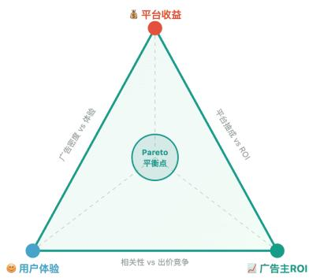

三方利益天然存在冲突，多目标优化的核心是在三者之间找到帕累托最优的动态平衡点

# 二、排序公式的多目标融合

将多个优化目标融合为单一排序得分，是工程中最直接的多目标处理方式。

# 2.1 线性加权法 & 乘法融合法

# 基本形式

线性加权排序公式

$$
\text {S c o r e} = \sum_ {k = 1} ^ {M} w _ {k} \cdot f _ {k} (u, a d) = w _ {1} \cdot \mathrm {e C P M} + w _ {2} \cdot f _ {u x} + w _ {3} \cdot f _ {e c o} + w _ {4} \cdot f _ {r e l}
$$

归一化处理 (消除量纲差异)

$$
\hat {f} _ {k} = \frac {f _ {k} - \mu_ {k}}{\sigma_ {k}} \quad \text {或} \quad \hat {f} _ {k} = \frac {f _ {k} - f _ {k} ^ {\operatorname* {m i n}}}{f _ {k} ^ {\operatorname* {m a x}} - f _ {k} ^ {\operatorname* {m i n}}}
$$

√ 权重约束:∑κwk =1,ωκ≥0   
$\checkmark$ 量纲问题：不同目标量纲差异大，必须先归一化  
√凸性限制：只能找到凸帕累托前沿上的解

优点：简单直观，易于工程实现和调参  
A缺点：无法找到非凸帕累托前沿上的解，对权重选择敏感

# 圈乘法融合法 (Multiplicative Fusion)

广告系统中最主流的融合方式，各因子互相约束：

$$
\operatorname {S c o r e} = \mathrm {e C P M} ^ {\alpha} \times \mathrm {p C T R} ^ {\beta} \times \mathrm {Q S} ^ {\gamma} \times \mathrm {U X} ^ {\delta}
$$

取对数后等价于线性形式

$$
\log (\text {S c o r e}) = \alpha \log (\mathrm {e C P M}) + \beta \log (\mathrm {p C T R}) + \gamma \log (\mathrm {Q S}) + \delta \log (\mathrm {U X})
$$

工程中常见的实际形式

$$
\operatorname {S c o r e} = \mathrm {e C P M} \times Q S ^ {\eta} \times \exp \left(\sum_ {k} \theta_ {k} \cdot g _ {k} (u, a d)\right)
$$

√任一因子为0则总分为0，天然具有否决权机制  
√指数参数控制各目标的弹性 (影响力度)  
√ gk 为各类调节因子 (新广告加权、品类均衡、频控惩罚等)

工程实践：乘法融合天然保证了各维度的"底线约束"一任何一个维度极差都会拉低总分。这是广告排序中最常用的融合方式。

# 2.2 约束优化法（Constrained Optimization）

# 约束优化建模

典型约束优化问题

$$
\max  _ {\pi} \quad \mathbb {E} \left[ \sum_ {i \in \mathcal {A}} \mathrm {e C P M} _ {i} \cdot \pi_ {i} \right]
$$

s.t. E[UserSatisfaction] ≥ Tux

$$
\mathbb {E} [ \text {A d D i v e r s i t y} ] \geq \tau_ {d i v}
$$

$$
\mathbb {E} [ \text {A d v R O I} _ {j} ] \geq \tau_ {r o i}, \forall j
$$

NegFeedbackRate ≤ Tneg

√π：广告i的展示概率/排序位置  
$\surd \tau _ { u x } , \tau _ { d i v } , \tau _ { r o i }$ ：各约束阈值，由业务方设定  
√主目标通常选择平台收益 (eCPM最大化)

# 拉格朗日对偶法求解

拉格朗日函数

$$
\mathcal {L} (\pi , \vec {\lambda}) = \mathbb {E} \left[ \sum_ {i} \mathrm {e C P M} _ {i} \cdot \pi_ {i} \right] + \sum_ {j} \lambda_ {j} (g _ {j} (\pi) - \tau_ {j})
$$

对偶问题（在线更新乘子）

$$
\lambda_ {j} ^ {(t + 1)} = \max  \left(0, \lambda_ {j} ^ {(t)} - \eta \cdot \left(g _ {j} \left(\pi^ {(t)}\right) - \tau_ {j}\right)\right)
$$

等价排序公式

$$
\operatorname {S c o r e} _ {i} = \mathrm {e C P M} _ {i} + \sum_ {j} \lambda_ {j} \cdot \frac {\partial g _ {j}}{\partial \pi_ {i}}
$$

√入j：拉格朗日乘子，自动学习约束的松紧   
√ 约束被违反时 $ \lambda _ { j }$ 增大 加强惩罚   
约束被满足时 $ \lambda _ { j }$ 减小 放松约束   
√ 乘子可在线实时更新，实现自适应调节

√工程优势：拉格朗日乘子法将约束优化转化为无约束问题，且乘子可在线学习更新，非常适合广告系统的实时调控需求。

# 2.3 融合方法对比

<table><tr><td>方法</td><td>公式形式</td><td>优点</td><td>缺点</td><td>适用场景</td><td>工业应用</td></tr><tr><td>线性加权</td><td>∑wiFi</td><td>简单直观</td><td>无法处理非凸前沿</td><td>目标量纲一致</td><td>初期系统</td></tr><tr><td>乘法融合</td><td>ΠwiFi</td><td>天然底线约束</td><td>对零值敏感</td><td>广告排序主流</td><td>☆最广泛</td></tr><tr><td>约束优化</td><td>max f1 s.t. fi ≥ ci</td><td>目标明确，可在线调控</td><td>约束阈值设定困难</td><td>有明确底线要求</td><td>☆广泛</td></tr><tr><td>Chebyshev</td><td>min maxi wi|fi - fi*|</td><td>可找非凸解</td><td>计算复杂</td><td>理论研究</td><td>较少</td></tr><tr><td>ε-约束法</td><td>max f1 s.t. fi ≥ fi* - εi</td><td>可遍历整个前沿</td><td>需多次求解</td><td>离线分析</td><td>较少</td></tr><tr><td>混合法</td><td>乘法 + 约束 + 调节因子</td><td>灵活性最强</td><td>复杂度高</td><td>成熟广告系统</td><td>☆头部公司</td></tr></table>

# 三、在线多目标调控机制

# 3.1 调控流程

在线多目标调控是一个闭环反馈系统：


# 在线多目标调控闭环流程


# 3.2 PID 控制器调权 & Bandit 方法动态调权

$5 \frac { 1 } { 4 }$ PID控制器调节排序权重

使用经典PID控制器实时调节多目标权重，确保各指标在目标范围内：

$$
w _ {k} (t + 1) = w _ {k} (t) + K _ {p} \cdot e _ {k} (t) + K _ {i} \cdot \sum_ {\tau = 0} ^ {t} e _ {k} (\tau) + K _ {d} \cdot \Delta e _ {k} (t)
$$

偏差与增量定义

$$
e _ {k} (t) = \text {T a r g e t} _ {k} - \text {A c t u a l} _ {k} (t)
$$

$$
\Delta e _ {k} (t) = e _ {k} (t) - e _ {k} (t - 1)
$$

$K _ { p }$ (比例项)：偏差越大，调整越大，快速响应  
$K _ { i }$ (积分项)：消除稳态误差，防止长期偏离   
$K _ { d }$ (微分项)：抑制振荡，平滑调节过程  
√ PID参数通过离线仿真预调优，上线后微调

实践经验：PID控制器适合目标明确、反馈延迟短的场景。对于广告系统，通常以分钟级别更新权重，小时级别评估效果。

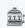

# Bandit方法动态调权

将权重选择建模为多臂老虎机(MAB）问题：

$$
w _ {k} \sim \operatorname {B e t a} (\alpha_ {k}, \beta_ {k})
$$

综合Reward定义

$$
\text {R e w a r d} = \Delta \operatorname {R e v} + \lambda_ {1} \cdot \Delta \mathrm {U X} + \lambda_ {2} \cdot \Delta \mathrm {E c o} + \lambda_ {3} \cdot \Delta \mathrm {R O I}
$$

$$
a ^ {*} = \arg \max  _ {a} \left[ \hat {\mu} _ {a} + c \sqrt {\frac {\ln t}{N _ {a} (t)}} \right]
$$

√ 将不同权重组合视为不同的"臂"  
√根据综合Reward更新后验分布  
√自动在探索新权重和利用最优权重间平衡  
√ UCB方法提供确定性的探索-利用平衡

# 3.3 RL-based 调控

将多目标调控建模为马尔可夫决策过程 (MDP):

MDP建模

$$
\text {S t a t e}: s _ {t} = \left(\operatorname {R e v} _ {t}, \mathrm {U X} _ {t}, \mathrm {E c o} _ {t}, \text {C o n t e x t} _ {t}\right)
$$

$$
\text {A c t i o n}: a _ {t} = \left(w _ {1} ^ {t}, w _ {2} ^ {t}, \dots , w _ {M} ^ {t}\right)
$$

$$
\text {R e w a r d}: r _ {t} = \sum_ {k} \lambda_ {k} \cdot f _ {k} \left(s _ {t}, a _ {t}\right)
$$

策略优化目标

$$
\operatorname * {m a x} _ {\pi} \mathbb {E} _ {\pi} \left[ \sum_ {t = 0} ^ {T} \gamma^ {t} r _ {t} \right]
$$

√状态包含当前各指标值和上下文信息 (时段、流量等)  
动作为排序权重的调整   
√ 奖励为多目标的加权组合  
√ 可使用PPO、SAC等算法训练策略网络

注意：RL方法需要大量在线交互数据，通常先在仿真环境中预训练，再在线微调。适合大规模广告系统。

# 3.4 在线调控方法对比

<table><tr><td>方法</td><td>适用场景</td><td>响应速度</td><td>复杂度</td><td>稳定性</td></tr><tr><td>PID控制</td><td>目标明确、反馈快</td><td>★★★快</td><td>低</td><td>★★★高</td></tr><tr><td>Thompson Sampling</td><td>离散权重空间</td><td>★★中</td><td>低</td><td>★★中</td></tr><tr><td>UCB</td><td>离散权重空间</td><td>★★中</td><td>低</td><td>★★★高</td></tr><tr><td>RL (PPO/SAC)</td><td>连续权重空间</td><td>★慢</td><td>高</td><td>★需调优</td></tr><tr><td>贝叶斯优化</td><td>高维连续空间</td><td>★慢</td><td>中</td><td>★★中</td></tr></table>

√工业最佳实践：大多数广告系统采用"PID为主 $^ +$ Bandit辅助"的混合策略。PID负责快速响应偏差，Bandit负责探索更优的权重组合。RL方法在头部公司的大规模系统中逐步落地。

# 2.3.3 广告冷启动

# 2.3.3.1 冷启动的定义

# 1）什么是广告冷启动

广告冷启动是指新创建的广告（或新广告主、新素材、新定向组合）由于缺乏历史投放数据，导致模型无法准确预估其点击率（pCTR）、转化率（pCVR）等关键指标，从而影响广告的竞价排序和投放效果的问题。

# 核心矛盾在于：

 模型侧：预估模型依赖历史特征（如广告历史 CTR、广告主历史 CVR 等），新广告缺乏这些统计特征，导致预估不准；  
 探索侧：系统不确定新广告的真实质量，需要给予一定的曝光机会来收集数据，但过多探索会损害用户体验和平台收入；  
 广告主侧：广告主期望新广告能快速起量，如果冷启动期表现不佳，广告主可能流失，投放关停。

# 2）冷启动的分类

<table><tr><td>冷启动类型</td><td>描述</td><td>难度</td></tr><tr><td>新广告冷启动</td><td>同一广告主下新建广告/广告组</td><td>□□</td></tr><tr><td>新广告主冷启动</td><td>全新广告主，无任何历史数据</td><td>□□□□</td></tr><tr><td>新素材冷启动</td><td>新的创意素材（图片/视频）</td><td>□□</td></tr><tr><td>新定向冷启动</td><td>新的人群定向组合</td><td>□□□</td></tr><tr><td>跨域冷启动</td><td>从一个投放场景迁移到另一个场景</td><td>□□□□</td></tr></table>

# 2.3.3.2 各大厂冷启动判定标准与学习期

# 1）学习期（Learning Phase）定义

学习期指广告系统为新广告分配的一段数据积累与模型校准时间，在此期间系统会给予一定的流量倾斜，同时容忍较大的模型预估偏差。

# 2）各大厂的学习期标准

<table><tr><td>平台</td><td>学习期时长</td><td>冷启动成功标准</td><td>关键指标</td></tr><tr><td>Meta (Facebook)</td><td>约7天</td><td>累计获得约50个转化事件</td><td>转化数≥50</td></tr><tr><td>Google Ads</td><td>约7-14天</td><td>系统提示“学习期结束”，通常需要30-50个转化</td><td>转化数+CPA稳定性</td></tr><tr><td>TikTok Ads</td><td>约3-7天</td><td>累计20-50个转化，且成本波动在目标出价的±20%以内</td><td>转化数+成本稳定性</td></tr><tr><td>腾讯广告(AMS)</td><td>约3-7天</td><td>累计6-20个转化（根据优化目标不同）</td><td>转化数+模型置信度</td></tr><tr><td>快手磁力引擎</td><td>约3-5天</td><td>累计获得一定转化量，系统自动判定</td><td>转化数+消耗稳定性</td></tr><tr><td>百度信息流</td><td>约3-7天</td><td>模型预估值趋于稳定</td><td>预估偏差率&lt;阈值</td></tr></table>

# 3）冷启动成功/失败的判定

# 成功标志：

 广告在学习期内达到目标转化数  
 实际 CPA/ROAS 与目标出价偏差在可接受范围内（通常 $\pm 2 0 \%$ ）  
 模型预估值（pCTR/pCVR）的置信区间收窄到正常水平  
 广告能够稳定获取流量，不再依赖探索加权

# 失败标志：

 学习期结束仍未达到最低转化数要求  
. 成本严重超出目标出价（通常 $> 1 5 0 \%$ ）  
 广告曝光量持续衰减，进入"死亡螺旋"  
 广告主主动暂停或大幅调整

# 2.3.3.3 工业界主流冷启动方案

# 1）模型侧方案


# 模型侧方案

# 先验值填充 (Prior Filling)

层级贝叶斯先验：全局 行业 广告主→广告，逐层继承统计特征

# Meta-Learning/迁移学习

MAML学习模型初始化参数，使新广告少量样本即可快速适应；相似广告Embedding 迁移

# 多任务学习 (MTL)

ESMM:pCVR=pCTR×pCTCVR，利用高频点击信号辅助低频转化预估

阿里ESMM

# Embedding预训练与对齐

多模态大模型提取素材语义特征，与历史广告行为Embedding对齐，弥补行为特征缺

# Uplift Modeling (扶持补贴优化)

预测每条广告「给予扶持后冷启成功概率的提升量|，将有限扶持预算分配给Uplift值最高的广告

因果推断

# 强化学习 (RL-based Cold Start)

将冷启动建模为序贯决策问题，动态调整探索力度、出价策略和流量分配

阿里妈妈美团

# $\textcircled{1}$ 默认值/先验值填充（Prior Filling）

 思路：对缺失的广告级别统计特征，使用全局均值、行业均值或广告主历史均值填充。  
 实践：Meta 使用层级贝叶斯先验（Hierarchical Bayesian Prior），从“全局 行业 广告主 广告”逐层继承，数据不够，需逐层维度上卷。  
 优点：实现简单，无额外成本，缺点：先验值可能与真实值偏差较大。

# $\textcircled{2}$ Meta-Learning / 迁移学习

 思路：利用相似广告的历史数据来初始化新广告的模型参数。  
实践：

 MAML（Model-Agnostic Meta-Learning）：学习一个好的模型初始化参数，使得新广告只需少量样本就能快速适应。

 相似广告迁移：通过广告主、行业、素材等维度找到相似广告，迁移其 Embedding 或统计特征。

 代表：快手的 Meta-Learning 冷启动方案、阿里妈妈的 COLD 模型。

# $\textcircled{3}$ 多任务学习 / 辅助任务

思路：利用曝光、点击等高频信号辅助预估低频的转化信号。  
 实践：

 ESMM（Entire Space Multi-Task Model）：pCVR = pCTR $\times$ pCTCVR，利用点击数据辅助转化预估。  
 MMoE / PLE：多任务共享底层表征，新广告即使缺乏转化数据，也能通过点击行为获得合理的表征。

 代表：阿里 ESMM、腾讯 PLE

# $\textcircled{4}$ Embedding 预训练与对齐

 思路：对广告素材（图片、视频、文本）进行预训练，获得语义 Embedding，弥补行为特征的缺失。  
. 实践：

 使用多模态大模型提取素材多模态 embedding 特征。  
 将素材语义 Embedding 与历史广告的行为 Embedding 进行对齐。

# $\textcircled{5}$ Uplift Modeling（扶持补贴优化）

近年来工业界非常重要的一个方向。核心思想是：不是所有新广告都需要同等程度的扶持，应该把有限的扶持预算分配给那些"给予扶持后冷启成功概率提升最大"的广告。

 核心公式：Uplift $=$ P(冷启成功 | 给予扶持) - P(冷启成功 | 不给扶持)  
 建模方法：

 T-Learner：分别训练 Treatment 组（给扶持）和 Control 组（不给扶持）两个模型，预测差值。  
 S-Learner：将是否给予扶持作为一个特征输入单一模型。  
 X-Learner：两阶段方法，先估计个体处理效应，再用倾向得分加权。  
 因果森林 (Causal Forest)：基于随机森林的异质性处理效应估计。

 工业实践：

 快手：利用 Uplift 模型决定哪些新广告给予 eCPM加权以及加权幅度，实现扶持预算的最优分配。  
 阿里妈妈：通过因果推断框架，识别"可挽救"的广告（即给予扶持后大概率能冷启成功的广告），避免将资源浪费在本身质量差的广告上。  
 腾讯广告：结合 Uplift 模型和赔付机制，对高 Uplift 值的广告给予更大的成本保护力度。

 关键特征：广告主历史投放表现、素材质量分、行业竞争度、出价合理性、定向宽窄度等。

 决策框架：

 高 Uplift $^ +$ 高基线成功率 优先扶持（投入产出比最高）  
 高 Uplift $^ +$ 低基线成功率 适度扶持（需要扶持才能成功）  
$\bigcirc$ 低 Uplift $^ +$ 高基线成功率 无需扶持（自然就能成功）  
 低 Uplift $^ +$ 低基线成功率 放弃扶持（扶持也难以成功）

 一图总结：

# UpliftModeling一扶持补贴的精细化分配

核心思想：不是所有新广告都需要同等程度的扶持。应该把有限的扶持预算（如eCPM加权、成本保护额度）分配给那些「给予扶持后冷启成功概率提升最大！的广告，而非平均撒胡椒面。

# 核心公式

$$
U p l i f t (x) = P (\mathrm {Y} = 1 \mid \mathrm {T} = 1, \mathrm {X} = \mathrm {x}) - P (\mathrm {Y} = 1 \mid \mathrm {T} = 0, \mathrm {X} = \mathrm {x})
$$

其中 Y=冷启是否成功，T=是否给予扶持，X=广告特征

# 建模方法

# T-Learner (双模型法)

分别训练Treatment组（给扶持）和Control组（不给扶持）两个独立模型，$=$

# S-Learner (单模型法)

将是否给予扶持T作为一个特征输入单一模型，通过改变T的取值计算Uplift

# X-Learner (交叉学习法)

两阶段方法：先估计个体处理效应 (ITE)，再用倾向得分加权融合，适合Treatment/Control样本不均衡场景

# 因果森林 (Causal Forest)

基于随机森林的异质性处理效应（HTE）估计，天然支持特征重要性分析和置信区间估计

# 决策四象限

# 高Uplif $^ +$ 高基线成功率

# 低Uplif $^ +$ 高基线成功率

无需扶持，自然就能冷启成功

# 高Uplift $^ +$ 低基线成功率

# 低Uplift $^ +$ 低基线成功率

放弃扶持，扶持也难以成功

# 关键特征

广告主历史投放表现、素材质量分、行业竞争度、出价合理性 (出价/行业均值)、定向宽窄度、预算充裕度、落地页质量分等

# $\textcircled{6}$ 强化学习方案 (RL-based Cold Start)

# 强化学习方案一冷启动的动态决策优化

强化学习在冷启动中解决的核心问题是：在冷启动的不同阶段，应该给予多少探索流量、如何调整出价、何时退出学习期——这是一个典型的序贯决策问题。

# MDP建模

<table><tr><td>要素</td><td>定义</td><td>具体内容</td></tr><tr><td>State</td><td>广告当前状态</td><td>已积累曝光/点击/转化数、pCTR/pCVR置信度、已消耗预算比例、剩余学习期时间、实时成本偏差率</td></tr><tr><td>Action</td><td>系统可执行的动作</td><td>探索加权系数调整、出价调整幅度、流量分配比例、是否扩展定向</td></tr><tr><td>Reward</td><td>即时回报</td><td>短期收入+λ1×冷启成功信号+λ2×广告主留存价值-λ3×成本超标惩罚</td></tr><tr><td>Transition</td><td>状态转移</td><td>根据当前动作和用户反馈(曝光/点击/转化),更新广告状态</td></tr></table>

# 主流算法

# Contextual Bandit

将冷启动视为上下文多臂老虎机问题，根据广告特征选择最优探索策略。计算高效，适合在线部署

# DQN/DDPG

深度强化学习方法，DQN适用于离散动作空间（如探索档位选择)，DDPG适用于连续动作空间 (如出价调整幅度)

# Hierarchical RL (分层强化学习)

上层决定宏观策略 (探索预算分配)，下层决定微观动作 (单次竞价出价调整)，解耦不同时间尺度的决策

# OfflineRL (离线强化学习)

利用历史冷启动数据离线训练策略 (如CQL、BCQ)，避免在线探索风险，再通过Online

# ConstrainedRL (约束强化学习）

策略安全性

# 关键挑战

！奖励稀疏与延迟：转化事件稀疏且存在归因延迟 (可达数小时甚至数天)，需要设计合理的中间奖励信号（如点击、加购、页面停留时长等）作为Reward Shaping  
！状态空间高维：广告特征维度高，需要有效的状态表示方法（如Embedding压缩、特征选择)，避免维度灾难  
！安全约束：探索不能导致成本严重超标或用户体验大幅下降，需要引入ConstrainedMDP或安全层 (Safety Layer)  
！非平稳环境：广告竞争格局、用户行为模式随时间变化，策略需要持续适应，通常采用滑动窗口训练或在线更新

# 工业界实践

# 阿里妈妈

基于RL的智能出价系统，冷启动期自动调整出价策略，平衡短期成本和长期起量

# 字节跳动

Contextual Bandit动态调整探索加权系数，根据实时反馈自适应调整探索力度

# 美团

分层RL框架，上层分配冷启动探索预算，下层优化单次竞价决策

# 快手

案，先离线训练基础策略再在线微调

强化学习在冷启动中的应用主要解决动态决策问题：在冷启动的不同阶段，应该给予多少探索流量、如何调整出价、何时退出学习期。

# . 问题建模：

 State：广告当前状态（已积累的曝光/点击/转化数、当前 pCTR/pCVR 置信度、已消耗预算比例、距离学习期截止的剩余时间等）  
 Action：探索加权系数、出价调整幅度、流量分配比例  
 Reward：短期收入 $^ +$ 长期广告主留存价值 + 冷启动成功率的加权组合

# . 主流算法：

 Contextual Bandit：将冷启动视为上下文多臂老虎机问题，根据广告特征选择最优的探索策略。相比传统 Bandit，引入了广告侧特征作为上下文。  
 DQN / DDPG：深度强化学习方法，适用于连续动作空间（如出价调整幅度）。阿里在智能出价中有大量实践。  
 PPO / A2C：策略梯度方法，直接优化探索策略的期望回报。  
 Hierarchical RL（分层强化学习）：上层决定宏观策略（如探索预算分配），下层决定微观动作（如单次竞价的出价调整）。  
 Offline RL：利用历史冷启动数据离线训练策略，避免在线探索的风险。如 CQL（Conservative Q-Learning）、BCQ等。

#  工业实践：

 阿里妈妈：基于强化学习的智能出价系统，在冷启动期间自动调整出价策略，平衡短期成本和长期起量目标。  
 字节跳动：利用 Contextual Bandit 动态调整新广告的探索加权系数，根据实时反馈数据自适应调整探索力度。  
 美团：分层强化学习框架，上层分配冷启动探索预算，下层优化单次竞价决策。  
 快手：Offline RL $^ +$ Online Fine-tuning 的两阶段方案，先用历史数据离线训练基础策略，再在线微调。

#  关键挑战：

 奖励稀疏：转化事件稀疏且延迟，需要设计合理的中间奖励（如点击、加购等）。  
 状态空间大：广告特征维度高，需要有效的状态表示。  
 安全约束：需要保证探索不会导致成本严重超标，通常引入约束优化（Constrained RL）。

# 2）机制侧方案

# $\textcircled{1}$ 探索加权（Exploration Boost）

 思路：在竞价排序中给新广告额外的加权，增加其获得曝光的机会  
实践：

 eCPM 加权：boosted_eCPM $=$ eCPM × ( $1 +$ boost_factor)，boost_factor 随数据积累逐渐衰减  
 UCB（Upper Confidence Bound）：score $=$ mean_reward ${ \bf \tau } + { \bf { q } } \times \mathsf { s q r t } ( \mathsf { l n } ( { \bf N } ) / { \bf { n } } )$ ，数据越少，探索奖励越大  
 Thompson Sampling：对 pCTR/pCVR 的后验分布进行采样，数据少时方差大，自然倾向探索

 代表：几乎所有大厂都在使用，Meta 的 Exploration Budget、腾讯的新广告加权

# $\textcircled{2}$ 赔付机制 / 成本保护

 思路：在冷启动期间，如果实际成本超出目标出价，平台承担部分超额成本  
实践：

 学习期内 CPA 超出目标出价的部分，平台给予赔付（通常有上限）  
 降低广告主的试错成本，鼓励广告主持续投放

 代表：腾讯广告的"学习期赔付"、巨量引擎的"成本保障"

# $\textcircled{3}$ 智能出价托管

 思路：系统自动为新广告调整出价策略，避免广告主因出价不合理导致冷启动失败  
实践：

 自动出价（Auto Bidding）：系统根据预估值和预算自动计算最优出价  
$\bigcirc$ 分阶段出价：冷启动初期适当提高出价获取数据，后期逐步回归目标出价

 代表：Google 的 Smart Bidding、Meta 的 Advantage+ Campaign

# $\textcircled{4}$ 流量调控 / 定向扩展

 思路：在冷启动期间适当放宽定向条件，扩大潜在受众范围  
实践：

 自动扩量：系统自动扩展相似人群  
 Lookalike 扩展：基于种子用户扩展相似人群  
 定向建议：系统推荐更优的定向组合

 代表：Meta 的 Advantage+ Audience、腾讯的自动扩量

# 3） 数据侧方案

# $\textcircled{1}$ 数据增强 / 样本复用

 思路：利用相似广告的历史样本来增强新广告的训练数据  
实践：

 将相似广告的正样本作为新广告的伪正样本（带权重衰减）  
 利用广告主维度的历史数据进行预训练

# $\textcircled{2}$ 实时特征 / 快速反馈

 思路：尽快利用新广告的实时投放数据更新模型  
实践：

 Online Learning：实时更新模型参数，缩短数据反馈延迟  
 实时统计特征：计算最近 N分钟/小时的实时 CTR、CVR等特征  
$\bigcirc$ 快速回流：缩短转化数据的回传延迟，延迟转化建模（Fast Emit）

 代表：阿里的 COLD（Computing power cost-aware Online and Lightweight Deep pre-ranking system）

# 2.3.3.4 冷启动的核心挑战与权衡

  
探索-利用权衡 (Exploration-Exploitation Tradeoff)   
风险：短期收入损失

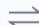

# 动态平衡

探索预算通常控制在总流量的5%~15%

  
风险：新广告无法获得数据

# eCPM加权

# UCB置信上界

# Thompson Sampling

# $\textcircled{1}$ 探索-利用权衡（Exploration-Exploitation Tradeoff）

 过多探索 短期收入损失、用户体验下降  
 过少探索 新广告无法获得足够数据，冷启动失败率高  
 业界通常设置探索预算（Exploration Budget），控制总探索量在总流量的 $5 \% - 1 5 \%$

# $\textcircled{2}$ 预估偏差与校准

 冷启动期间预估偏差大，需要特殊的校准策略  
 常用方法：分桶校准（Isotonic Regression）、贝叶斯平滑、置信区间估计

# $\textcircled{3}$ 冷启动与长期生态

 冷启动成功率直接影响广告主留存   
 需要平衡新老广告的流量分配  
 长期来看，良好的冷启动机制能吸引更多广告主，提升平台竞争力

# 2.4 广告定价(扣费)机制算法

# 什么是广告定价机制？

广告定价机制决定了广告主在竞价获胜后实际需要支付的费用。不同的定价机制会影响广告主的出价策略、平台收入以及整体市场效率。选择合适的定价机制对于构建健康的广告生态系统至关重要。合理的定价机制需要平衡三方利益：

 平台方：收益最大化  
 广告主：成本效率最优  
 用户：体验不受损

# 2.4.1 四种主要定价机制类型

# 1. GSP（广义第二价格，Generalized Second Price）

 定义：当前广告行业主流的定价机制  
原理：按下一名的 eCPM 来定价  
 公式：CPC $=$ eCPM(下一名) / (pCTR × 1000) + δ  
 特点：竞价胜出者不需要支付自己的出价，而是支付第二高出价加一个最小增量

# 2. 第一价格（First Price Auction）

定义：按出价扣费  
原理：广告主赢得竞价后，按照其实际出价进行扣费  
 特点：简单直接，但可能导致广告主策略性降低出价


# (广义第二价格)


定义：Generalized Second Price，是目前互联网广告行业最主流的定价机制。

核心原理：竞价胜出者按照下一名的eCPM来计算自己的扣费价格。

$$
C P C = e C P M (\text {下 一 名}) / (p C T R \times 1 0 0 0) + \delta
$$

参数说明：

√ eCPM(下一名)：排名第二的广告的eCPM值  
√ pCTR:预估点击率   
8：最小加价单位 （通常为0.01元)

# 第一价格


定义：First Price Auction，最简单直接的定价方式。

核心原理：广告主赢得竞价后，按照其实际出价 进行扣费。

实际扣费 $=$ 广告主出价

√计算简单，易于理解  
√广告主可能策略性压低出价  
√可能导致"赢者诅咒"问题  
√近年在程序化广告中有回归趋势

# 3. 第二价格（Second Price Auction）

 定义：按次高价 $+ \delta$ 扣费  
 原理：竞价胜出者支付第二高出价加上一个微小增量 δ  
 特点：鼓励广告主真实出价，是 GSP 的基础

# 4. VCG（Vickrey-Clarke-Groves）机制

 定义：按造成的外部损失定价  
 原理：每个广告主支付的费用等于其存在给其他广告主造成的外部性损失  
 特点：理论上能实现激励相容和社会福利最大化

#

定义：Second Price Auction，由诺贝尔奖得主Vickrey提出。

核心原理：竞价胜出者支付第二高出价+最小增量。

实际扣费=第二高出价+6

√激励相容：真实出价是最优策略  
√减少广告主的策略博弈成本  
√是GSP机制的理论基础   
√单物品拍卖的理想选择

# 會VCG机制


定义：Vickrey-Clarke-Groves机制，理论上最优的多物品拍卖机制。

核心原理：每个广告主支付的费用等于其存在给其他广告主造成的 外部性

支付 $=$ 无该广告主时其他人的总价值－有该广告主时其他人的总价值

√实现激励相容 (真实出价最优)   
√理论上实现社会福利最大化  
√计算复杂度较高  
√实际应用中较少采用

# 2.4.2 广告定价机制总结

#  一些定价中的关键概念：


# 定价中的关键概念


# 保留价 (Reserve Price)

平台设置的最低竞价门槛，用于保证最低收益和过滤低质量广告。eCPM低于保留价

Cost $=$ max(GSP扣费，Reserve Price)


# 益价因子 (Premium Factor)

根据广告位价值、时段热度、用户质量等因素调整最终扣费，实现差异化定价和收益最大化。

Final Cost $=$ Base Cost $\times$ Premium Factor


# 挤压系数 (Squash Factor)

平滑CTR差异过大带来的价格波动，避免高质量广告以过低价格获得展示，保护平台收益。

$\mathrm{eCPM_{adj} = pCTR^{\vee}\times Bld\times 1000}$ $(\forall \in (0,1])$

#  不同定价机制的对比：

<table><tr><td>机制类型</td><td>公式 / 说明</td><td>应用场景</td><td>特点</td></tr><tr><td>GSP（广义第二价格）</td><td>按下一名 eCPM 定价</td><td>当前主流</td><td>平衡收益与公平</td></tr><tr><td>第一价格</td><td>按出价扣费</td><td>部分 DSP 平台</td><td>简单直接</td></tr><tr><td>第二价格</td><td>按次高价 +δ 扣费</td><td>经典拍卖</td><td>激励真实出价</td></tr><tr><td>VCG</td><td>按造成的外部损失定价</td><td>学术理论</td><td>理论最优</td></tr></table>

#  GSP 定价公式

```txt
CPC = eCPM(下一名) / (pCTR × 1000) + δ 
```

其中，δ 为最小加价单位（通常为 0.01 元）

#  GSP定价的详细流程


# GSP定价详细流程

# 广义第二价格拍卖－计算步骤详解

  
计算eCPM

对每个参与竞价的广告计算其预期千次展示收益

$$
\mathrm {e C P M} = \begin{array}{c} \text {p C T R} \times \text {B i d} \times \\ 1 0 0 0 \end{array}
$$

  
排序确定位置

按eCPM降序排列，确定各广告展示位置

$$
\text {R a n k} = \text {s o r t (e C P M ,}
$$

  
计算扣费价格

每个位置按下一名的eCPM反推CPC

$$
\begin{array}{l} \text {C P C} _ {\mathrm {k}} = \mathrm {e C P M} _ {\mathrm {k + 1}} / \\ (\mathrm {p C T R} _ {\mathrm {k}} \times 1 0 0 0) + 6 \end{array}
$$

  
边界处理

最后一名按保留价定价

$$
\begin{array}{c} \text {C P C} _ {\text {l a s t}} = \\ \max  (\text {R e s e r v e}, 6) \end{array}
$$

#  GSP 定价实例介绍


# GSP定价实例

假设有3个广告主竞争同一个广告位：

<table><tr><td>广告主</td><td>出价(Bid)</td><td>预估CTR(pCTR)</td><td>eCPM</td><td>排名</td><td>实际CPC扣费</td></tr><tr><td>广告主A</td><td>¥2.0</td><td>5%</td><td>100</td><td>第1名</td><td>¥1.61√</td></tr><tr><td>广告主B</td><td>¥1.6</td><td>5%</td><td>80</td><td>第2名</td><td>-</td></tr><tr><td>广告主C</td><td>¥1.0</td><td>4%</td><td>40</td><td>第3名</td><td>-</td></tr></table>

# 计算说明：

广告主A胜出，其CPC扣费 $\mathbf { \equiv } =$ eCPM(B)/(pCTR(A) × 1000) + δ =80/(0.05 × 1000) + 0.01= ¥1.61虽然A出价￥2.0，但实际只需支付￥1.61(基于第二名的eCPM计算)

为什么 GSP 是主流？

 激励效果好：广告主有动力出真实价格  
 计算简单：比 VCG 容易实现  
 收益平衡：平台收益和广告主体验的良好平衡   
 历史原因：Google AdWords 首创并成功应用

# 2.5 广告预算控制算法

# 一、概述

# 1）什么是预算控制？

 预算控制（Budget Control）是广告系统中的核心机制模块，负责确保广告主的预算被合理、高效地消耗，同时达成广告主设定的成本目标（如目标 CPA、目标 ROAS）。它是连接广告主商业目标与平台竞价系统之间的桥梁。  
 在一个完整的广告投放链路中，预算控制处于竞价决策层，直接影响出价策略、流量获取和最终投放效果。

# 2）核心动机与背景

广告主投放广告时面临几个核心诉求：

 花完预算：预算利用率要高，不能大量剩余  
 均匀消耗：不能上午就花完一天的预算，下午没有曝光  
 成本可控：实际CPA/ROAS要接近目标值  
 风险兜底：即使成本超标，也有赔付机制保障

预算控制机制正是为了同时满足这四个诉求而设计的，它包含四大子模块：预算分配、预算平滑（Pacing）、成本控制、赔付机制。

# 3）预算控制的整体架构

预算控制的四大子模块形成一个层级递进的控制体系：

<table><tr><td>子模块</td><td>核心功能</td><td>关键指标</td><td>控制层级</td><td>重要性</td></tr><tr><td>预算分配</td><td>日预算、总预算分配策略，多维度切分</td><td>Budget、预算利用率</td><td>宏观层</td><td>★★★★★</td></tr><tr><td>预算平滑</td><td>Pacing控制消耗速度，PID反馈调节</td><td>Pacing Rate、消耗曲线</td><td>时间层</td><td>★★★★★</td></tr><tr><td>成本控制</td><td>目标CPA/ROAS达成，oCPX智能出价</td><td>CPA、ROAS、CVR</td><td>出价层</td><td>★★★★★</td></tr><tr><td>赔付机制</td><td>超成本补偿，建立广告主信任</td><td>超成本率、赔付金额</td><td>兜底层</td><td>★★★★★</td></tr></table>

 预算分配：解决"钱怎么分"的问题——日预算多少、各渠道/广告组如何分配  
预算平滑：解决"钱怎么花"的问题——控制消耗速度，避免过快或过慢  
成本控制：解决"花得值不值"的问题——确保每次转化的成本达标  
 赔付机制：解决"花贵了怎么办"的问题——超成本时平台兜底补偿

# 4）关键指标体系

<table><tr><td>指标</td><td>定义</td><td>理想值</td></tr><tr><td>预算利用率</td><td>实际消耗占分配预算的比例</td><td>95%~100%</td></tr><tr><td>Pacing Rate</td><td>实际消耗速度与理想消耗速度的比值</td><td>≈1.0</td></tr><tr><td>CPA</td><td>每次转化成本</td><td>≤ CPA_target</td></tr><tr><td>ROAS</td><td>广告支出回报率</td><td>≥ ROAS_target</td></tr><tr><td>超成本率</td><td>实际 CPA 超出目标 CPA 的比例</td><td>&lt; 20%</td></tr></table>

# 2.5.1 预算分配（Budget Allocation）

 定义：

 预算分配决定广告主的总预算如何在不同维度（时间、渠道、广告组）进行分配。

 核心指标

 Budget：预算总额   
 预算利用率：实际消耗/分配预算

 预算分配维度&核心公式

分配维度  

<table><tr><td>维度</td><td>说明</td><td>示例</td></tr><tr><td>时间维度</td><td>日预算、周预算、总预算</td><td>日预算¥1000, 总预算¥30000</td></tr><tr><td>渠道维度</td><td>不同广告位、流量来源</td><td>信息流 60%, 开屏 40%</td></tr><tr><td>广告组维度</td><td>多个广告组间分配</td><td>A组 50%, B组 30%, C组 20%</td></tr><tr><td>地域维度</td><td>不同地区分配</td><td>一线城市 70%, 二线 30%</td></tr></table>

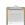

# 分配维度

√ 时间维度：日预算、周预算、总预算  
√ 渠道维度：不同广告位、流量来源  
√广告组维度：多个广告组间的预算分配  
√ 地域维度：不同地区的预算分配


# 核心公式

总预算与日预算关系

$$
B _ {t o t a l} = \sum_ {d = 1} ^ {D} B _ {d}
$$

预算利用率

预算利用率= 实际消耗×100%分配预算

 预算分配策略  

<table><tr><td>策略</td><td>核心思路</td><td>适用场景</td><td>优点</td><td>缺点</td></tr><tr><td>固定日预算</td><td>每天分配相同金额</td><td>品牌曝光、稳定投放</td><td>简单可控</td><td>无法适应流量波动</td></tr><tr><td>动态日预算</td><td>根据效果动态调整每日额度</td><td>效果广告、促销活动</td><td>灵活高效</td><td>需要算法支持</td></tr><tr><td>加速消耗</td><td>尽快花完预算</td><td>限时活动、紧急推广</td><td>快速获取流量</td><td>可能浪费预算</td></tr><tr><td>匀速消耗</td><td>均匀分配到每个时段</td><td>长期稳定投放</td><td>曝光均匀</td><td>可能错过高质量流量</td></tr></table>

 预算利用率

实际消耗预算利用率： ×100分配预算

预算利用率是衡量分配策略好坏的核心指标。理想情况下应在 $9 5 \% { \sim } 1 0 0 \%$ 之间。过低说明预算分配过多或出价过低，过高（ $> 1 0 0 \%$ ）说明存在超投风险。

# 2.5.2 预算平滑（Budget Pacing）

#  定义

控制预算的消耗速度，确保预算在投放周期内均匀消耗，避免过早花完或花不完。

#  核心指标

 Pacing Rate：实际消耗/理想消耗   
 消耗曲线：消耗随时间的变化趋势

#  两种主要策略

 匀速消耗（Uniform Pacing）：将预算均匀分配到每个时间段：  
 智能消耗（Smart Pacing）根据流量质量和历史数据动态调整：

匀速消耗 (Uniform Pacing)

将预算均匀分配到每个时间段，简单易实现。

$\textcircled { 1 } \frac { 1 } { 2 } \times 1 . 1 4 . 5 \times 1 . 5 \times 6 . 5 = \frac { 1 . 1 4 . 5 \times 1 . 5 \times 1 . 5 } { 2 4 }$

分钟级匀速公式

日预算每分钟消耗= 1440

优点：实现简单，预算消耗可预测

缺点：无法适应流量波动，可能错过高质量流量

智能消耗 (Smart Pacing)

根据流量质量和历史数据动态调整消耗速度。

智能出价调整公式

$$
B i d _ {a d j u s t e d} = B i d _ {b a s e} \times \alpha (t) \times \beta (q)
$$

√a(t)：时间调节因子，基于历史流量分布  
√β(q)：质量调节因子，基于实时流量质量  
√ 高峰期提高出价，低谷期降低出价   
√高质量流量竞争更积极

#  Pacing Rate 控制

# Pacing控制流程


设定目标

日预算/总预算


计算理想消耗

当前时刻应消耗


监控实际消耗

实时跟踪花费


计算Pacing Rate

实际/理想


调整出价

#  Pacing Rate 核心指标

Pacing Rate = Sactual Sideal 实际消耗 理想消耗

<table><tr><td>Pacing Rate</td><td>状态</td><td>调整策略</td></tr><tr><td>&gt;1.0</td><td>消耗过快</td><td>降低出价或限制竞价参与率</td></tr><tr><td>≈1.0</td><td>理想状态</td><td>保持当前策略</td></tr><tr><td>&lt;1.0</td><td>消耗过慢</td><td>提高出价或放宽定向限制</td></tr></table>

#  PID 控制算法

  
PID控制器结构示意

完整的 Pacing 控制流程为：

1. 设定目标：确定日预算/总预算   
2. 计算理想消耗曲线：基于历史流量分布生成每个时刻的理想累计消耗  
3. 监控实际消耗：实时跟踪广告花费   
4. 计算 Pacing Rate： $\mathrm { : P a c i n g ~ R a t e } = S _ { \mathrm { a c t u a l } } / S _ { \mathrm { i d e a l } }$   
5. PID 调整出价：根据偏差信号通过 PID 控制器输出出价调整量  
6. 执行与反馈：调整后的出价参与竞价，形成闭环

# $5 \frac { 1 } { 4 }$ PID控制算法

工业控制领域的经典算法，用于Pacing精细调节。

PID控制公式

$$
u (t) = K _ {p} \cdot e (t) + K _ {i} \cdot \int_ {0} ^ {t} e (\tau) d \tau + K _ {d} \cdot \frac {d e (t)}{d t}
$$

√ e(t):偏差 $\underline { { \underline { { \mathbf { \delta \pi } } } } }$ 理想消耗-实际消耗   
$\ K _ { \mathfrak { p } }$ ：比例系数，控制响应速度  
√ Ki：积分系数，消除稳态误差   
√ Kd：微分系数，抑制超调

# 2.5.3 成本控制（Cost Control）

#  定义

 确保广告投放达到目标 CPA（单次转化成本）或 ROAS（广告支出回报率）。

#  核心指标

 CPA（Cost Per Action）：单次转化成本  
 ROAS（Return On Ad Spend）：广告支出回报率  
 CVR（Conversion Rate）：转化率

#  目标 CPA 控制 & 目标 ROAS 控制

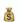

# 目标CPA控制

CPA (Cost Per Action)：每次转化成本

$$
C P A = \frac {C o s t}{C o n v e r s i o n s} = \frac {\text {总 花 费}}{\text {转 化 数}}
$$

$$
B i d _ {n e w} = B i d _ {c u r r e n t} \times \frac {C P A _ {t a r g e t}}{C P A _ {a c t u a l}}
$$

调整逻辑：

$\ddagger { C P A _ { \sf d c t u a l } } > \complement \mathsf { P A _ { t a r g e t } }$ ：降低出价  
$\ddagger { C P A \arctan } 1 < { C P A \tan } _ { \sf { q e t } }$ ：可适当提高出价

# 目标ROAS控制

ROAS (Return On Ad Spend):广告支出回报率

ROAS定义

$$
R O A S = \frac {R e v e n u e}{C o s t} = \frac {\text {广 告 带 来 的 收 入}}{\text {广 告 花 费}}
$$

$$
B i d = p C V R \times p V a l u e \times \frac {1}{R O A S _ {t a r g e t}}
$$

pCVR:预估转化率  
√pValue:预估转化价值   
ROAS目标越高，出价越保守

#  oCPX 智能出价

oCPX智能出价体系

$$
e C P M = p C T R \times p C V R \times C P A _ {t a r g e t} \times 1 0 0 0
$$

其中：

pCTR:预估点击率(Click Through Rate)   
pCVR:预估转化率(Conversion Rate)   
√ ${ \tt C P A } _ { \tt t a r g e t }$ ：广告主设定的目标转化成本

<table><tr><td>出价方式</td><td>计费点</td><td>优化目标</td></tr><tr><td>oCPM</td><td>千次曝光</td><td>转化量最大化</td></tr><tr><td>oCPC</td><td>点击</td><td>转化成本优化</td></tr><tr><td>oCPA</td><td>转化</td><td>按转化付费</td></tr></table>

#  成本控制示例

假设广告主设定目标 CPA = ¥50：

<table><tr><td>阶段</td><td>花费</td><td>转化数</td><td>实际 CPA</td><td>出价调整</td></tr><tr><td>初始</td><td>¥1,000</td><td>15</td><td>¥66.7</td><td>降低出价（系数 50/66.7=0.75）</td></tr><tr><td>调整后</td><td>¥2,000</td><td>42</td><td>¥47.6</td><td>小幅提升或保持</td></tr><tr><td>稳定期</td><td>¥5,000</td><td>100</td><td>¥50.0</td><td>达成目标</td></tr></table>

# 2.5.4 赔付机制（Compensation Mechanism）

#  定义

 当实际成本超出目标成本时，平台对广告主进行补偿的机制。

#  核心指标

 超成本率：超出目标成本的比例  
 赔付金额：需补偿给广告主的金额

#  超成本判定&赔付金额计算

超成本判定

$$
\text{超成本比例} = \frac{CPA_{actual} - CPA_{target}}{CPA_{target}}\times 100\%
$$

A超成本示例：

目标CPA=￥50，实际CPA $=$ ￥65

超成本比例 $= ( 6 5 - 5 0 ) / 5 0 \times 1 0 0 \% = 3 0 \%$ $=$

赔付金额计算

赔付金额公式

$$
\text {赔 付 金 额} = \max  (0, C o s t _ {\text {a c t u a l}} - C o s t _ {\text {e x p e c t e d}})
$$

其中期望成本

$$
C o s t _ {e x p e c t e d} = C o n v e r s i o n s \times C P A _ {\text {t a r g e t}}
$$

#  赔付触发条件

赔付并非无条件触发，需同时满足以下三个条件：

1. 转化数门槛：转化数 $\geq 2 0$ 个（确保统计显著性）  
2. 超成本阈值：超成本比例 $> 2 0 \%$ （排除正常波动）  
3. 投放时长：投放时长 $\geq 7$ 天（确保模型充分学习）

#  赔付计算示例

场景：目标 ${ \mathsf { C P A } } = \yen 50$ ，实际花费 $= \yen 3,250$ ，转化数 $= 5 0$ 个，投放天数 $= 1 0$ 天

 实际 $\mathsf { C P A } = 3 2 5 0 / 5 0 = \yen 6 5$   
 超成本比例 $= ( 6 5 - 5 0 ) / 5 0 \times 1 0 0 \% = 3 0 \% > 2 0 \% \square$   
 转化数 $= 5 0 \geq 2 0 \ \bigsqcup$   
 投放天数 $= 1 0 \geq 7 \ \perp$   
 期望成本 $\mathbf { \varepsilon } = 5 0 \times 5 0 = \yen 2, 5 0 0$   
 赔付金额 $= 3 2 5 0 - 2 5 0 0 = \yen 7 5 0$

#  赔付机制价值

<table><tr><td>维度</td><td>平台视角</td><td>广告主视角</td></tr><tr><td>信任建立</td><td>提升平台可信度，吸引更多广告主</td><td>降低投放风险，敢于尝试</td></tr><tr><td>成本兜底</td><td>需预留赔付预算，影响平台利润</td><td>成本可预期可控</td></tr><tr><td>模型优化</td><td>倒逼提升预估模型准确度</td><td>享受更稳定的投放效果</td></tr><tr><td>长期合作</td><td>提高客户留存率和LTV</td><td>更愿意持续加大投放</td></tr></table>

# 预算控制总结

# 预算控制系统架构

在实际广告系统中，预算控制模块通常部署在广告引擎（Ad Engine）中，与竞价模块紧密耦合：

1. 离线层：每日凌晨计算日预算分配、生成理想消耗曲线  
2. 近线层：每分钟/每 5 分钟更新 Pacing Rate、调整出价系数  
3. 在线层：每次竞价请求时，根据当前预算状态决定是否参与竞价及出价金额

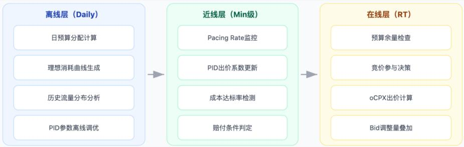

# 工程挑战与解决方案

<table><tr><td>挑战</td><td>描述</td><td>解决方案</td></tr><tr><td>预算消耗延迟</td><td>转化回传有延迟，实际消耗统计不准</td><td>引入预估消耗+延迟补偿机制</td></tr><tr><td>冷启动问题</td><td>新广告无历史数据，Pacing不准</td><td>使用相似广告的历史数据做初始化</td></tr><tr><td>多广告组竞争</td><td>同一广告主多个广告组抢预算</td><td>引入广告组级别的预算协调器</td></tr><tr><td>流量波动</td><td>突发事件导致流量剧烈波动</td><td>PID参数自适应+异常检测熔断</td></tr><tr><td>赔付滥用</td><td>广告主故意设置不合理目标触发赔付</td><td>设置合理的目标CPA下限+反作弊检测</td></tr></table>

# 核心要点

1. 预算分配是基础，决定了预算的宏观分配策略  
2. 预算平滑（Pacing）是核心，PID 控制器是最常用的 Pacing 算法  
3. 成本控制是目标，oCPX 智能出价是现代广告平台的标配  
4. 赔付机制是兜底，建立广告主信任的关键手段

# 2.6 广告流量调控算法

流量调控是广告系统中保障用户体验、维护广告生态健康、确保平台长期收益的关键模块。

# 流量调控四大子模块总览


# 2.6.1 频次控制（Frequency Control）

 定义

 频次控制是指对同一用户展示广告次数进行限制的机制，防止用户因过度曝光而产生负面情绪。

 核心目标

 保护用户体验：避免广告疲劳  
 提升广告效果：减少无效曝光  
 优化广告主 ROI：避免预算浪费在低效展示上

 频次控制维度&时间窗口设置

# 频控维度

维度

说明

示例

用户-广告

同一用户对同一广告

用户A对广告X每天最多3次

用户-广告主

同一用户对同一品牌

用户A对品牌Y每天最多5次

用户-行业

同一用户对同一行业

用户A对游戏类每天最多10次

用户-全局

同一用户所有广告

用户A每天最多看50次广告

# 时间窗口

窗口

场景

典型设置

防止短时间轰炸

1-2次/小时

日常频控

3-7次/天

周期性活动

10-20次/周

品牌广告

总计30次

 核心公式


# 核心公式

# 频次计算：

$$
F r e q u e n c y _ {u, a} = \frac {\text {I m p r e s s i o n s} _ {u , a}}{T}
$$

其中T为时间窗口 (天/周等)

# 频控判断：

$$
\text {是 否 展 示} = \left\{ \begin{array}{l l} \text {允 许} & \text {i f F r e q} _ {\text {c u r r e n t}} <   F r e q _ {\text {l i m i t}} \\ \text {拒 绝} & \text {i f F r e q} _ {\text {c u r r e n t}} \geq F r e q _ {\text {l i m i t}} \end{array} \right.
$$

#  频控策略

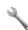

# 频控策略对比

<table><tr><td>策略</td><td>描述</td><td>适用场景</td><td>特点</td></tr><tr><td>硬频控</td><td>超过限制直接过滤</td><td>用户体验优先</td><td>严格执行，无例外</td></tr><tr><td>软频控</td><td>超过限制降低出价权重</td><td>效果广告</td><td>灵活调整，平衡收益</td></tr><tr><td>动态频控</td><td>根据用户反馈调整</td><td>智能投放</td><td>个性化，效果最优</td></tr></table>

# 2.6.2 流量分配（Traffic Allocation）

#  定义

流量分配决定不同层级广告主（头部/腰部/长尾）如何获取平台流量的机制。

#  广告主分层

<table><tr><td>层级</td><td>定义</td><td>占比</td><td>特点</td></tr><tr><td>头部广告主</td><td>Top 5%消耗</td><td>5%</td><td>预算大、专业度高、竞争力强</td></tr><tr><td>腰部广告主</td><td>Top 5%-30%</td><td>25%</td><td>预算中等、有一定优化能力</td></tr><tr><td>长尾广告主</td><td>Bottom 70%</td><td>70%</td><td>预算小、数量多、专业度低</td></tr></table>

#  分配目标：平衡三方利益

 用户：看到相关性高的广告  
 广告主：获得合理的流量机会  
 平台：最大化长期收益

#  流量分配公式


# 流量分配核心公式

基础分配权重：

$$
W _ {i} = \alpha \cdot e C P M _ {i} + \beta \cdot Q u a l i t y _ {i} + \gamma \cdot Divers i s t y _ {i}
$$

a,β,v为各因素权重系数

流量占比计算：

$$
\text{TrafficShare}_{i} = \frac{W_{i}}{\sum_{j = 1}^{N}W_{j}}\times 100\%
$$

探索流量池：

$$
T r a f f i c _ {e x p l o r e} = T o t a l \_ T r a f f i c \times r _ {e x p l o r e}
$$

r_explore 通常为 5%-10%

#  分配策略&探索流量池

# 1分配策略对比

策略

描述

效果

纯竞价分配

完全按eCPM排序

头部垄断，长尾无流量

保量分配

为不同层级保留配额

生态平衡，但可能损失收益

混合分配

竞价+多样性加权

平衡收益与生态

# $\gamma$ 探索流量池

为新广告主或新广告预留的流量池，目的

√帮助新广告冷启动   
√发现潜在优质广告  
·√保持生态活力  
√避免新人冷启动失败流失

# 2.6.3 生态平衡（Ecosystem Balance）

 定义

 生态平衡机制防止头部广告主垄断流量，维护平台广告生态的多样性和健康度。

 垄断的危害

# $1$ 垄断的危害


#  生态健康指标

HHI 指数（赫芬达尔-赫希曼指数）&基尼系数：

# $\vartriangle$ 生态健康指标公式

HHI指数 (赫芬达尔-赫希曼指数)：

$$
H H I = \sum_ {i = 1} ^ {N} s _ {i} ^ {2}
$$

s_i为第i个广告主的市场份额 $( \% )$ |HHI<1500竞争充分 $| \mathsf { H H } | \geq 2 5 0 0$ 高度集中

基尼系数：

$$
G i n i = 1 - 2 \int_ {0} ^ {1} L (x) d x
$$

L(x)为洛伦兹曲线|Gini $ 0$ 分配均匀|Gini $ \uparrow$ 完全垄断

#  平衡机制

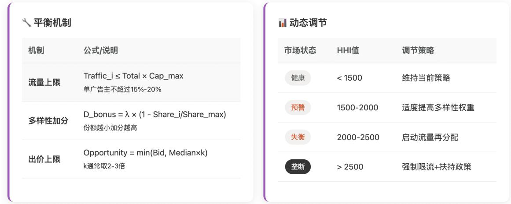

# 2.6.4 反作弊（Anti-Fraud）

#  定义

反作弊机制用于识别和过滤无效流量（Invalid Traffic, IVT），保护广告主利益。

#  作弊类型

<table><tr><td>类型</td><td>描述</td><td>危害程度</td></tr><tr><td>机器人流量</td><td>Bot自动点击/浏览</td><td>★★★★★</td></tr><tr><td>设备农场</td><td>大量设备模拟用户</td><td>★★★★★</td></tr><tr><td>刷量作弊</td><td>人工雇佣点击</td><td>★★★★★</td></tr><tr><td>归因劫持</td><td>篡改转化归因</td><td>★★★★★</td></tr><tr><td>点击注入</td><td>恶意软件注入点击</td><td>★★★★★</td></tr><tr><td>广告堆叠</td><td>不可见广告曝光</td><td>★★★</td></tr></table>

#  检测方法

规则引擎（Rule-based）& 机器学习模型

<table><tr><td>规则类型</td><td>检测内容</td><td>阈值示例</td></tr><tr><td>IP频率</td><td>同IP点击次数</td><td>&gt;50次/小时</td></tr><tr><td>点击间隔</td><td>连续点击时间差</td><td>&lt;1秒</td></tr><tr><td>CTR异常</td><td>点击率过高</td><td>&gt;30%</td></tr><tr><td>停留时长</td><td>落地页停留</td><td>&lt;1秒</td></tr><tr><td>设备指纹</td><td>设备重复率</td><td>&gt;80%相似</td></tr></table>

<table><tr><td>模型</td><td>优势</td><td>劣势</td></tr><tr><td>逻辑回归</td><td>解释性强，速度快</td><td>表达能力有限</td></tr><tr><td>随机森林</td><td>处理非线性关系</td><td>实时性稍差</td></tr><tr><td>深度学习</td><td>自动特征提取</td><td>需要大量数据</td></tr><tr><td>图神经网络</td><td>识别团伙作弊</td><td>计算复杂度高</td></tr></table>

#  处理策略

<table><tr><td>检测结果</td><td>置信度</td><td>处理方式</td></tr><tr><td>确定作弊</td><td>&gt;95%</td><td>直接过滤,不计费</td></tr><tr><td>疑似作弊</td><td>70%-95%</td><td>降权/延迟计费/人工审核</td></tr><tr><td>正常流量</td><td>&lt;70%</td><td>正常竞价计费</td></tr></table>

#  关键指标

# $\triangle$ 反作弊核心指标公式

无效流量率 (IVTRate):

$$
I V T \_ R a t e = \frac {I n v a l i d \_ T r a f f i c}{T o t a l \_ T r a f f i c} \times 100 \%
$$

行业标准：IVT Rate<5%为健康水平

精确率 (Precision):

$$
P r e c i s i o n = \frac {T P}{T P + F P}
$$

要求 $> 9 9 \%$ (避免误杀正常流量)

召回率 (Recall):

$$
R e c a l l = \frac {T P}{T P + F N}
$$

图分析团伙检测：

$$
F r a u d \_ S c o r e _ {i} = \sum_ {j \in N e i g h b o r s (i)} \frac {\text {F r a u d \_ S c o r e} _ {j}}{\left| N e i g h b o r s (j) \right|}
$$

# 总结：流量调控的核心价值如下

# 流量调控核心价值

# 用户体验保护

频次控制防止广告疲劳，提升用户满意度

# 生态健康维护

流量分配+生态平衡，确保多样性

# 广告主利益保障

反作弊机制过滤无效流量，保护预算

# 平台长期收益

健康生态带来持续增长的广告收入

# 第三章 广告召回粗排模块

# 3.1 广告召回

# 3.1.1 广告召回模块详解

 广告召回（Ad Recall/Retrieval）是广告系统中的第一道筛选环节，负责从海量广告库（百万级）中快速筛选出与当前请求相关的候选广告集合（千级），供后续排序模块进行精排。


#  多路召回架构

广告召回通常采用多路召回（Multi-Channel Recall）策略，每路召回负责从不同维度筛选候选广告：

多路召回策略

(Multi-Channel Recall)


# 定向召回

基于广告主设定的定向条件进行精确匹配，是最基础的召回方式


# 向量召回

基于深度学习的Embedding向量相似度计算实现语义级别的匹配


# 行为召回

相似广告推荐


# 实时召回

基于用户实时行为序列进行召回，捕捉即时兴


# 热门召回

基于全局热度、CTR等指标进行召回，作为兜

底策略


# 画像召回

基于用户画像标签进行人群匹配，实现精准投

放


# 3.1.1.1 定向召回（Targeting Recall）

定向召回是最基础的召回方式，根据广告主设定的投放条件进行匹配。


# 核心定向维度

# 地域定向

# 人群定向

# 过设备定向

# 时段定向

# 媒体定向

#

# 倒排索引结构

# /／ 定向条件→广告ID列表

“北京” [ad_001，ad_002，ad_005,ad_008]   
"18-24岁" [ad_002,ad_003,ad_007,ad_012]   
"ios" [ad_001，ad_002,ad_006，ad_009]

// 查询：北京n 18-24岁n i0S

//结果：[ad_002]

# 3.1.1.2 向量召回（Vector Recall）

基于深度学习的向量召回是现代广告系统的核心召回方式。

双塔模型架构：

# 双塔模型架构 (Two-Tower Model)

#

用户特征

ID、画像、行为序列

# 相似度

计算

Embedding Layer特征嵌入

score=cos(u,v)或u V

# 广告塔 (Item Tower)

广告特征

ID、类目、创意


Embedding Layer

特征嵌入

DNN Layers

深度网络

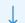

User Embedding

d维向量


度网络


Item Embedding

d维向量

# Q向量检索优化 (ANN-近似最近邻)

# HNSW

# IVF

#

#

# Milvus

向量检索优化（ANN）：

<table><tr><td>算法</td><td>全称</td><td>特点</td></tr><tr><td>HNSW</td><td>层次化可导航小世界图</td><td>高精度、快速检索</td></tr><tr><td>IVF</td><td>倒排文件索引</td><td>粗粒度聚类后精排</td></tr><tr><td>PQ</td><td>乘积量化</td><td>压缩向量、节省内存</td></tr></table>

常用向量数据库：Faiss、Milvus、Pinecone

# 3.1.1.3 行为召回（Behavior-based Recall）

基于用户历史行为进行召回：

<table><tr><td>行为类型</td><td>召回策略</td><td>说明</td></tr><tr><td>点击行为</td><td>I2I召回</td><td>点击过广告A→召回与A相似的广告</td></tr><tr><td>转化行为</td><td>转化广告召回</td><td>曾转化的广告类目/广告主</td></tr><tr><td>浏览行为</td><td>浏览序列召回</td><td>基于浏览商品/内容推荐相关广告</td></tr><tr><td>搜索行为</td><td>搜索词召回</td><td>搜索关键词匹配广告</td></tr></table>

# 基于用户行为的召回策略


# 点击行为召回

12I:点击A→召回与A相

似的广告


# 转化行为召回

召回用户曾转化的广告类

目/广告主


# 浏览行为召回

基于浏览商品/内容推荐相

关广告


# 搜索行为召回

搜索关键词匹配相关广告

# $\mathcal { S }$ Swing算法 (协同过滤召回)

$$
\mathrm {S w i n g (i , j)} = \Sigma_ {\mathrm {u}} \in \mathrm {U} _ {\mathrm {i}} \cap \mathrm {U} _ {\mathrm {j}} \Sigma_ {\mathrm {v}} \in \mathrm {U} _ {\mathrm {i}} \cap \mathrm {U} _ {\mathrm {j}}, \mathrm {v} \neq \mathrm {u} 1 / (\alpha + | \mathrm {U} _ {\mathrm {i}} \cap \mathrm {U} _ {\mathrm {v}} |)
$$

# 公式解释：

·Ui：点击过广告i的用户集合  
·lu：用户u点击过的广告集合  
·a：平滑参数 (防止分母为0)  
·核心思想：共同点击广告i和j的用户越多，且这些用户的交集越小，则i和j越相似

# 3.1.1.4 实时召回（Real-time Recall）

基于用户实时行为进行召回，捕捉即时兴趣：

#


# 用户实时行为

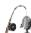

# Trigger提取

关键词/商品ID


# 向量检索/规则匹


# 实时候选集

# 实时行为序列

最近N次点击/浏览行为，捕捉短期兴

趣

#

当前会话内的行为序列，反映即时意图

#

当前页面内容、搜索词、位置等场景信

# 实时特征类型

<table><tr><td>特征类型</td><td>说明</td></tr><tr><td>实时行为序列</td><td>最近N次点击/浏览行为，捕捉短期兴趣</td></tr><tr><td>Session内行为</td><td>当前会话内的行为序列，反映即时意图</td></tr><tr><td>实时上下文</td><td>当前页面内容、搜索词、位置等场景信息</td></tr></table>

# 3.1.1.5 热门/兜底召回（Fallback Recall）

保证召回数量的兜底策略：


# 兜底召回策略


# 全局热门


# 分类热门


# 新广告探索


# 高价值广告

#  召回模块核心评估指标


# 召回效果评估指标


# 召回率

召回相关广告数／总


# 召回数量

目标：平衡效果与性能

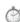

# 召回延时


# 多样性

类目/广告主覆盖度

#  召回结果融合

多路召回的结果需要进行融合去重：


# 多路召回结果融合策略


# 简单合并去重

将各路召回结果合并，按广告ID去重，保留所有候选


# 加权融合

各路召回赋予不同权重，综合打分后排序截断


# 优先级融合

定向召回优先，其他路召回按优先级补充


广告召回是广告系统的第一道筛选关口，核心目标是高效率、高召回率地从海量广告库中筛选出相关候选。

多路召回策略结合定向匹配、向量语义、行为协同、实时兴趣等多个维度，确保候选集的相关性、覆盖度和多样性。

召回模块的性能直接影响后续排序的上限，是广告系统效果优化的基础保障。

# 3.1.2 广告召回评估指标

#  基础概念：混淆矩阵

在理解召回评估指标之前，需要先理解混淆矩阵（Confusion Matrix）：

混淆矩阵(Confusion Matrix）-理解基础指标的基石

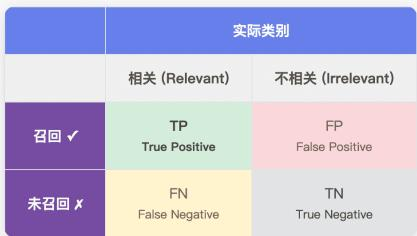

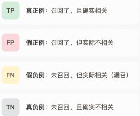

# 3.1.2.1 基础效果指标

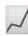

# 召回率 (Recall)

$$
\text {R e c a l l} = \frac {\mathrm {T P}}{\mathrm {T P} + \mathrm {F N}}
$$

核心目标：减少漏召


# 精确率 (Precision)

$$
\text {P r e c i n s i o n} = \frac {\mathrm {T P}}{\mathrm {T P} + \mathrm {F P}}
$$

核心目标：提高质量


# F1-Score

$$
\mathrm {F 1} = 2 \times \frac {\mathrm {P} \times \mathrm {R}}{\mathrm {P} + \mathrm {R}}
$$

核心目标：综合平衡

平F1-Score与Precision/Recall的关系

Precision


Recall


F1-Score调和平均

调和平均的特点：当P和R差距大时，F1更接近较小值，避免单一指标误导

# 1）召回率（Recall）

定义：在所有相关广告中，被召回模块成功检索出来的比例。

# 特点：

 召回率越高，说明漏召的相关广告越少   
 召回阶段通常追求高召回率，因为漏召的广告在后续阶段无法被找回

# 2） 精确率（Precision）

定义：在所有被召回的广告中，真正相关的比例。

# 特点：

 精确率越高，说明召回的广告质量越高  
 召回阶段对精确率要求相对宽松，精排阶段会进一步筛选

# 3） F1-Score

定义：精确率和召回率的调和平均数，综合衡量召回效果。

# 特点：

 当 Precision 和 Recall 差异较大时，F1 偏向较小值  
 适合用于评估整体召回效果  
 取值范围 [0, 1]，越大越好

# 3.1.2.2 排序质量指标

# 1）命中率 HR@K（Hit Rate at K）


# 命中率 HR@K (Hit Rate at K)

衡量召回系统的基本能力

山定义

在Top-K召回结果中，至少命中一个相关广告的请求占比。它回答的问题是：“召回结果中有没有相关的广告？"

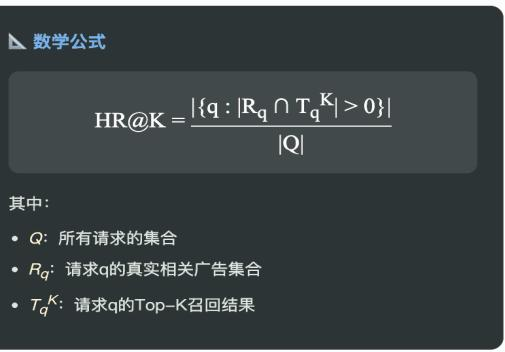

取值范围：[0,1]

越高越好

不考虑位置顺序

定义：在 Top-K 召回结果中，至少命中一个相关广告的请求占比。

# 特点：

衡量召回系统的基本能力  
 不考虑相关广告的具体位置  
取值范围 [0, 1]

# 2）MRR（Mean Reciprocal Rank）


# MRR (Mean Reciprocal Rank)

关注首个相关结果的位置

山定义

第一个相关广告位置的倒数的平均值。它回答的问题是：“第一个相关广告排在多靠前的位置？“

数学公式

$$
\mathrm {M R R} = \frac {1}{| Q |} \Sigma_ {\mathrm {q} = 1} | Q | \frac {1}{\operatorname {r a n k} _ {\mathrm {q}}}
$$

其中：

·rankq:请求q中第一个相关广告的位置  
·位置越靠前 (rank越小)，贡献越大

取值范围：[0,1]

越高越好

只关注第一个相关结果

定义：第一个相关广告位置的倒数的平均值。

特点：

 关注首个相关结果的位置  
 适合评估"找到一个相关结果就够"的场景  
取值范围 [0, 1]

3）MAP（Mean Average Precision）


# MAP (Mean Average Precision)

山定义

所有请求的AveragePrecision（AP)的平均值。AP考虑了每个相关广告在召回列表中的位置，位置越靠前贡献越大。

数学公式

$$
\mathrm {A P} = \frac {1}{| \mathbf {R} |} \sum_ {\mathbf {k} = 1} ^ {n} \mathrm {P} (\mathbf {k}) \times \operatorname {r e l} (\mathbf {k})
$$

$$
\mathrm {M A P} = \frac {1}{| Q |} \Sigma_ {\mathrm {q} = 1} ^ {| Q |} \mathrm {A P} _ {\mathrm {q}}
$$

其中：

·P(k):前k个结果的Precision   
·rel(k)：第k个结果是否相关（0或1）

取值范围：[0,1]

考虑所有相关结果

位置敏感

定义：所有请求的 Average Precision (AP)的平均值。

特点：

 考虑了所有相关广告在召回列表中的位置  
位置越靠前的相关广告贡献越大  
适合二分类相关性场景  
4）NDCG（Normalized Discounted Cumulative Gain）


计算DCG@K

$$
\mathrm {D C G} @ \mathrm {K} = \Sigma_ {\mathrm {i} = 1} ^ {\mathrm {K}} \left(2 ^ {\text {r e l}} _ {\mathrm {i}} - 1\right) / \log_ {2} (\mathrm {i} + 1)
$$

累积增益，位置越靠后折损越大（分母log增长)


计算 IDCG@K

IDCG=理想排序下的DCG值

将所有相关广告排在最前面时的DCG值


归一化得 NDCG@K

NDCG@K $, =$ DCG@K/IDCG@K

取值[0,1]，1表示完美排序

定义：考虑位置折损的排序质量指标。

特点：

取值范围 [0, 1]，越大越好   
位置越靠后，折损越大（分母 log 增长）  
 支持多级相关性评分，比 MAP 更精细  
是评估排序质量的首选指标

# 排序质量指标对比：

# □排序质量指标对比

<table><tr><td>指标</td><td>核心关注点</td><td>公式特点</td><td>适用场景</td></tr><tr><td>HR@K</td><td>Top-K中是否有相关结果</td><td>只看是否命中，不看位置</td><td>基础能力验证</td></tr><tr><td>MRR</td><td>第一个相关结果的位置</td><td>位置倒数，只取第一个</td><td>找到一个足够的场景</td></tr><tr><td>MAP</td><td>所有相关结果的位置</td><td>逐位置累积Precision</td><td>二分类相关性场景</td></tr><tr><td>NDCG</td><td>排序质量 + 位置折损</td><td>log折损，支持多级相关性</td><td>需要精细评估排序质量</td></tr></table>

# 3.1.2.3 系统性能指标

# 1） 召回延时（Latency）

定义：召回模块处理单次请求的耗时。

通常关注：

 P50 延时： $50 \%$ 请求的延时在此值以下  
 P99 延时： $9 9 \%$ 请求的延时在此值以下

目标：通常要求召回延时 < 50ms

# 2） 召回覆盖率（Coverage）

定义：被召回过的广告占全部广告库的比例。

特点：

衡量召回系统的多样性  
 避免马太效应（热门广告总被召回，冷门广告从不曝光）

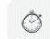

# 召回延时 (Latency)

系统响应速度

召回模块处理单次请求的耗时，直接影响用户体验和系统吞吐量。

# P50延时

# P99延时

# 目标值

# 定义公式

Latency = Tend - Start

关注分位数而非平均值，P99延时更能反映长尾请求的性能表现。


# 召回覆盖率 (Coverage)

被召回过的广告占全部广告库的比例，衡量系统对广告库的利用程度。

# 意义

# 目标


# 定义公式

Coverage= |被召回过的广告 |全部广告库|

覆盖率过低意味着大量广告从未获得曝光机会。

# 3）召回多样性（Diversity）

定义：召回结果在类目、广告主等维度的分散程度。

常用熵（Entropy）衡量：

# 特点：

 熵越大，多样性越好   
极端情况：所有广告同一类目，熵=0  
避免召回结果过于集中在某些类目


# 召回多样性 (Diversity)

召回结果在类目，广告主等维度的分散程度，避免结果过于集中。

类目多样性召回广告覆盖多少类目

广告主多样性召回广告来自多少广告主

目标


# 熵(Entropy）衡量多样性

$$
\text {D i v e r s i t y} = - \Sigma_ {\mathbf {c}} \in \mathbb {C} p _ {\mathbf {c}} \log (p _ {\mathbf {c}})
$$

·pc：类目c在召回结果中的占比  
·熵越大，分布越均匀，多样性越好  
·极端情况：所有广告同一类目，熵=0

#  指标使用场景

# 不同场景下的指标选择


# 日常监控

关注基础能力和系统稳定性，快速发现问题


# 离线评估

全面评估模型效果，指导算法选代优化


# A/B实验

对比新旧策略，综合评估效果和多样性


# 问题排查

定位具体问题：漏召、误召、还是性能瓶颈


# 冷启动评估

关注新广告是否能被召回，覆盖率是否合理


# 运营报告

整体效果汇报，易于理解和沟通

#  总结

广告召回模块的评估需要多维度、多指标综合考量：

# 3.2 广告粗排

# 3.2.1 广告粗排模块介绍

# 一、粗排模块概述

粗排（Pre-Ranking / Coarse Ranking） 是广告系统漏斗的第二层，位于召回和精排之间。其核心目标是在保证一定精度的前提下，用较低的计算成本对召回候选集进行初步筛选和排序。

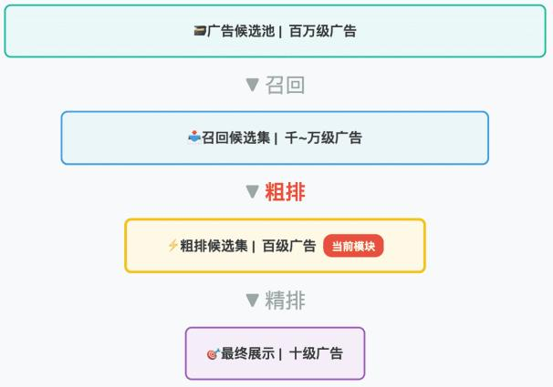

# 二、粗排的核心定位

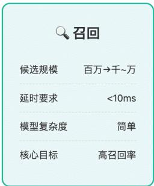  
召回vs粗排vs精排对比

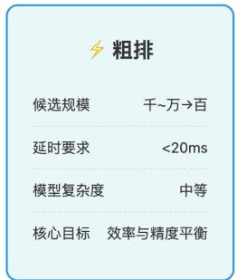

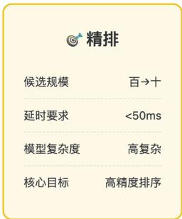

# 三、粗排模型架构

 双塔模型（Two-Tower Model）

最经典的粗排架构，将用户和广告分别编码为向量：

 用户塔（User Tower）：

$$
\mathbf {u} = f _ {\text {u s e r}} \left(\mathbf {x} _ {\text {u s e r}}\right) = \operatorname {M L P} \left(\left[ \mathbf {e} _ {\text {u i d}}; \mathbf {e} _ {\text {p r o f i l e}}; \mathbf {e} _ {\text {b e h a v i o r}} \right]\right)
$$

 广告塔（Item Tower）：

$$
\mathbf {v} = f _ {\text {i t e m}} \left(\mathbf {x} _ {\text {i t e m}}\right) = \operatorname {M L P} \left(\left[ \mathbf {e} _ {\text {a d i d}}; \mathbf {e} _ {\text {c r e a t i v e}}; \mathbf {e} _ {\text {a d v e r t i s e r}} \right]\right)
$$

 预估得分：

$$
\hat {y} = \sigma (\mathbf {u} ^ {T} \mathbf {v}) = \frac {1}{1 + e ^ {- \mathbf {u} ^ {T} \mathbf {v}}}
$$

 交叉双塔模型（Cross Two-Tower）

在双塔基础上引入轻量级交叉：

$$
\hat {y} = \sigma (\mathbf {u} ^ {T} \mathbf {v} + \mathbf {u} ^ {T} \mathbf {W} \mathbf {v})
$$

其中 是低秩交叉矩阵。

 知识蒸馏（Knowledge Distillation）

用精排模型（Teacher）指导粗排模型（Student）：

$$
\mathcal {L} _ {\text {d i s t i l l}} = \alpha \cdot \mathcal {L} _ {\text {l a b e l}} + (1 - \alpha) \cdot \mathcal {L} _ {\text {t e a c h e r}}
$$

其中：

 $\mathcal { L } _ { \mathrm { l a b e l } } = - [ y \log \hat { y } _ { s } + ( 1 - y ) \log ( 1 - \hat { y } _ { s } ) ]$ （硬标签损失）  
 $\mathcal { L } _ { \mathrm { t e a c h e r } } = \mathrm { K L } ( \hat { y } _ { t } | | \hat { y } _ { s } )$ （软标签蒸馏损失）

# 四、粗排特征工程

#  特征分类


# 用户特征

·用户ID Embedding   
·年龄、性别、地域  
·兴趣标签   
·历史行为序列

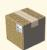

# 广告特征

·广告ID Embedding   
·创意类型、尺寸   
  
·出价、预算


# 上下文特征

·时间 (小时、星期)  
·地理位置  
·设备类型  
·网络环境


# 交叉特征

·用户-类目偏好  
·用户-广告主历史  
·时段-类目倾向  
·地域-行业偏好

H轻量在线/离线

#  特征重要性评估

使用 Permutation Importance 或 SHAP 评估：

I特征重要性评估 (Permutation Importance)

$$
\mathbf {I m p o r t a n c e} _ {j} = \frac {1}{K} \sum_ {k = 1} ^ {K} [ s - s _ {\pi_ {j}} ^ {(k)} ]
$$

其中 s是原始得分， $s _ { \pi j } ^ { ( k ) }$ 是打乱第j个特征后的得分

# 五、粗排优化策略

 级联粗排（Cascade Pre-Ranking）

分多级逐步筛选：

QStage1

向量检索

10000→3000

ANN近似检索


Stage 2

轻量模型

3000 → 500

@ Stage 3

复杂模型

500→200

输出

精排候选

送入精排

Stage 1: 向量检索 $( 1 0 0 0 0 \to 3 0 0 0 )$

Stage 2: 轻量模型 $( 3 0 0 0 ~  ~ 5 0 0 ~ \cdot$

Stage 3: 复杂模型 $( 5 0 0 ~  ~ 2 0 0$

#  其他优化策略

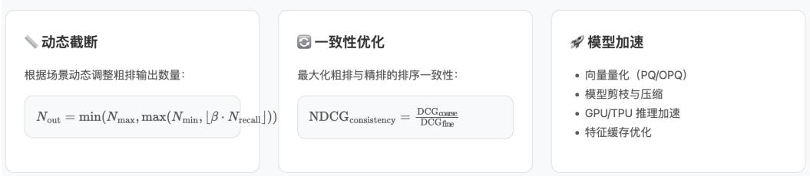

# 六、粗排核心指标

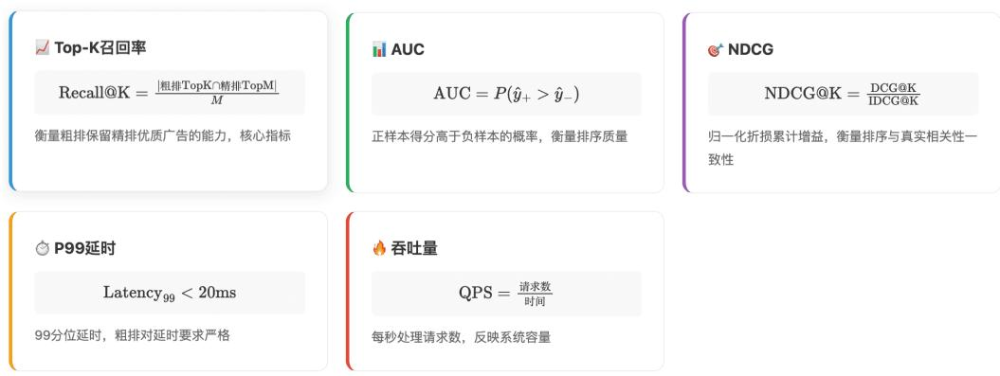

# 七、粗排与精排的对比

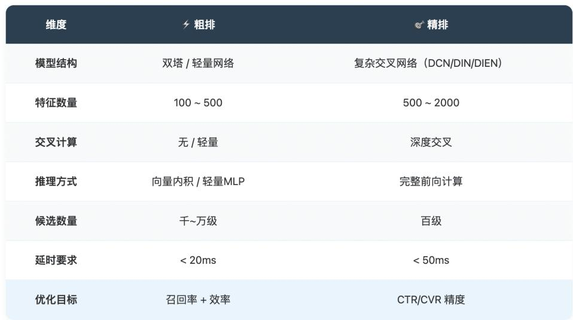

# 3.2.2 粗排模型详解

# 一、粗排模型概述

粗排模型是广告系统中平衡效率与精度的关键组件。其设计目标是：

高吞吐：处理千~万级候选集  
低延时：控制在 20ms 以内  
 较高精度：保留精排 Top-K 的大部分优质广告

# 二、业界主流粗排模型

# 3.2.2.1 双塔模型（Two-Tower / DSSM）

核心思想：双塔模型是粗排最经典的架构，将用户和广告分别编码为向量，通过向量内积计算相似度。广告向量可离线预计算，在线推理极快。

# 模型结构：

用户塔

用户画像特征

行为序列Pooling


内积计算

$\mathsf { u } ^ { \mathsf { T } } \cdot \mathsf { v }$

↓ g(uTv)


核心公式

$$
\mathbf {u} = f _ {\theta_ {y}} \left(\mathbf {x} _ {u}\right) \in \mathbb {R} ^ {d} \quad (\text {用 户 向 量})
$$

$$
\mathbf {v} = g _ {\theta_ {v}} (\mathbf {x} _ {v}) \in \mathbb {R} ^ {d} \quad (\text {广 告 向 量})
$$

$$
\hat {y} = \sigma (\mathbf {u} ^ {T} \mathbf {v}) = \frac {1}{1 + e ^ {- \mathbf {u} ^ {T} \mathbf {v}}}
$$

√广告向量可离线计算

√支持ANN检索

√推理速度极快O(d)

# 优点：

 广告向量可离线预计算  
在线只需向量内积，极速推理  
支持 ANN 近似检索

# 代表论文：

 DSSM (2013): Learning Deep Structured Semantic Models for Web Search   
 YouTube DNN (2016): Deep Neural Networks for YouTube Recommendations

# 3.2.2.2 阿里 COLD


COLD

阿里巴巴

COLD（Computing power cost-aware Online and Lightweight Deep pre-ranking system）是阿里提出的可计算资源感知粗排系统，在双塔基础上引入SE模块进行轻量级特征交叉。

COLD模型公式

$$
\hat {y} = \sigma (\mathbf {u} ^ {T} \mathbf {v} + \operatorname {S E} (\mathbf {x} _ {\text {c r o s s}}))
$$

SE模块 (Squeeze-and-Excitation) :

$$
\operatorname {S E} (\mathbf {x}) = \sigma \left(\mathbf {W} _ {2} \cdot \operatorname {R e L U} \left(\mathbf {W} _ {1} \cdot \mathbf {x}\right)\right) \odot \mathbf {x}
$$

SE模块用于学习特征间的通道注意力，增强重要特征的权重

√轻量级特征交叉

√可配置计算量

√工业验证有效

○比双塔稍复杂

# 代表论文：

 COLD (2020): COLD: Towards the Next Generation of Pre-Ranking System

# 3.2.2.3 知识蒸馏模型


Knowledge Distillation

阿里巴巴

用精排复杂模型（Teacher）的输出作为软标签，指导粗排轻量模型(Student）学习，使粗排模型获得接近精排的排序能力。


蒸馏损失函数

$$
\mathcal {L} _ {\text {d i s t i l l}} = \alpha \cdot \mathcal {L} _ {\mathrm {C E}} (y, \hat {y} _ {s}) + (1 - \alpha) \cdot \mathcal {L} _ {\mathrm {K L}} (\hat {y} _ {t}, \hat {y} _ {s})
$$

·硬标签损失： $\mathcal { L } _ { \mathrm { C E } } = - [ y \log \hat { y } _ { s } + ( 1 - y ) \log ( 1 - \hat { y } _ { s } ) ]$   
·KL散度损失： $\begin{array} { r } { \mathcal { L } _ { \mathrm { K L } } = \sum _ { i } \hat { y } _ { t } ^ { ( i ) } \log \frac { \hat { y } _ { t } ^ { ( i ) } } { \hat { y } _ { s } ^ { ( i ) } } } \end{array}$   
·带温度软标签： $\begin{array} { r } { p _ { i } = \frac { \exp ( z _ { i } / T ) } { \sum _ { j } \exp ( z _ { j } / T ) } } \end{array}$

√继承精排知识

√显著提升效果

○依赖精排模型

# 代表论文：

 Privileged Features Distillation (2020): Privileged Features Distillation at Taobao Recommendations   
 Rocket Launching (2018): Rocket Launching: A Universal and Efficient Framework for Training Well-performing Light Net.

# 3.2.2.4 FSCD（Feature Selection and Cross Distillation）

核心思想：特征选择 $^ +$ 交叉蒸馏，自动选择粗排所需的核心特征。

# 特征重要性评分：

$$
\operatorname {S c o r e} j = \frac {1}{N} \sum_ {i = 1} ^ {N} \left| \frac {\partial \mathcal {L}}{\partial x _ {j} ^ {(i)}} \right|
$$

# 代表论文：

FSCD (2021): Towards a Better Tradeoff between Effectiveness and Efficiency in Pre-Ranking

# 3.2.2.5 级联粗排模型（Cascade Pre-Ranking）

核心思想：分多级逐步筛选，每级使用更复杂的模型。

# $\mathcal { O }$ Cascade Pre-Ranking 多级架构

分多级逐步筛选，每级使用更复杂的模型。前级快速筛掉大量低质量候选，后级精细排序。

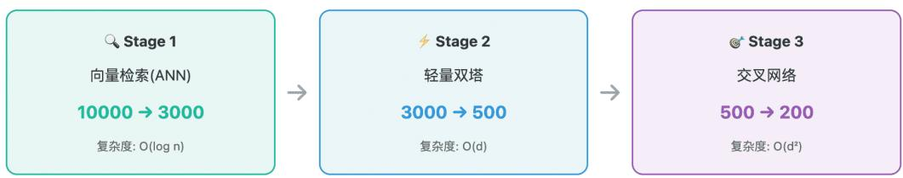

级联筛选公式

$$
\mathcal {C} _ {0} \xrightarrow {f _ {1}} \mathcal {C} _ {1} \xrightarrow {f _ {2}} \mathcal {C} _ {2} \xrightarrow {f _ {3}} \mathcal {C} _ {3}
$$

$$
| \mathcal {C} _ {0} | \gg | \mathcal {C} _ {1} | \gg | \mathcal {C} _ {2} | \gg | \mathcal {C} _ {3} |
$$

# 三、粗排模型核心公式汇总

<table><tr><td>模型</td><td>核心公式</td><td>复杂度</td><td>特点</td></tr><tr><td>双塔</td><td>\(\hat{y}=\sigma(\mathbf{u}^{T}\mathbf{v})\)</td><td>O(d)</td><td>最快，无交叉</td></tr><tr><td>交叉双塔</td><td>\(\hat{y}=\sigma(\mathbf{u}^{T}\mathbf{v}+\mathbf{u}^{T}\mathbf{W}\mathbf{v})\)</td><td>O(d²)</td><td>轻量交叉</td></tr><tr><td>COLD</td><td>\(\hat{y}=\sigma(\mathbf{u}^{T}\mathbf{v}+\mathrm{SE}(\mathbf{x}))\)</td><td>O(d+k)</td><td>SE注意力</td></tr><tr><td>蒸馏</td><td>\(\mathcal{L}=\alpha\mathcal{L}_{\mathrm{CE}}+(1-\alpha)\mathcal{L}_{\mathrm{KL}}\)</td><td>-</td><td>继承精排知识</td></tr><tr><td>级联</td><td>\(\mathcal{C}_{0}\rightarrow\mathcal{C}_{1}\rightarrow\ldots\rightarrow\mathcal{C}_{n}\)</td><td>分级</td><td>多级筛选</td></tr></table>

# 四、粗排模型训练优化

# 4.1 样本构造

$$
\mathcal {L} = - \sum_ {i} \left[ y _ {i} \log \hat {y} _ {i} + (1 - y _ {i}) \log \left(1 - \hat {y} _ {i}\right) \right]
$$

 Pointwise：

$$
\mathcal {L} = - \sum_ {(i, j) \in \mathcal {D}} \log \sigma (\hat {y} _ {i} - \hat {y} _ {j})
$$

 Pairwise（BPR Loss）：

$$
\mathcal {L} = - \sum_ {i} y _ {i} \log \frac {\exp (\hat {y} _ {i})}{\sum_ {j} \exp (\hat {y} _ {j})}
$$

 Listwise（Softmax Loss）：

# 4.2 负采样策略

$$
\mathcal {L} = - \log \frac {\exp \left(\mathbf {u} ^ {T} \mathbf {v} ^ {+}\right)}{\exp \left(\mathbf {u} ^ {T} \mathbf {v} ^ {+}\right) + \sum_ {j = 1} ^ {K} \exp \left(\mathbf {u} ^ {T} \mathbf {v} _ {j} ^ {-}\right)}
$$

 In-batch Negatives：

$$
\mathbf {v} ^ {-} = \operatorname * {a r g   m a x} _ {\mathbf {v} \in \mathcal {N}} \mathbf {u} ^ {T} \mathbf {v}, \quad \mathbf {v} \neq \mathbf {v} ^ {+}
$$

 Hard Negative Mining：

? 总结

# 核心要点总结

# 基础架构

双塔模型是粗排标配，向量内积高效推理

# 效果提升

知识蒸馏从精排继承排序能力

# 效率优化

级联粗排+ANN检索实现极速筛选

# 训练技巧

In-batch负采样+Hard Negative

# ? 相关论文链接

<table><tr><td>论文</td><td>机构</td><td>链接</td></tr><tr><td>DSSM</td><td>Microsoft 2013</td><td>Learning Deep Structured Semantic Models</td></tr><tr><td>YouTube DNN</td><td>Google 2016</td><td>Deep Neural Networks for YouTube Recommendations</td></tr><tr><td>COLD</td><td>Alibaba 2020</td><td>COLD: Towards the Next Generation of Pre-Ranking System</td></tr><tr><td>Privileged Features Distillation</td><td>Alibaba 2020</td><td>Privileged Features Distillation at Taobao</td></tr><tr><td>Rocket Launching</td><td>2018</td><td>A Universal Framework for Training Light Net</td></tr><tr><td>FSCD</td><td>2021</td><td>Towards a Better Tradeoff in Pre-Ranking</td></tr></table>

# 第四章：广告精排重排模块

# 4.1 广告精排特征体系介绍

# 4.1.1 精排特征的作用

精排（Fine-Ranking）是广告推荐系统中的关键环节，位于召回和粗排之后。

精排特征的核心作用包括：

1. 精准预估用户行为概率：通过丰富的特征信息，精确预测用户点击（CTR）、转化（CVR）等行为概率  
2. 个性化推荐：结合用户画像、上下文、广告属性等多维特征，实现千人千面的个性化广告推荐  
3. 提升广告效果：通过精准的特征刻画，提高广告投放的 ROI 和用户体验  
4. 支撑多目标优化：为 pCTR、pCVR、pDCVR、pLTV 等多个预估模型提供特征支持

# 4.1.2 特征类型详解

主要有以下四类特征：


# User用户特征

基础属性

兴趣偏好

兴趣标签、购物偏好、品牌偏好

行为统计

历史CTR、CVR、消费金

实时行为

生命周期


# Context上下文特征

时间特征

位置特征

广告位ID、页面位置、展

场景特征

搜索场景、信息流、详情

网络环境

WiFi/4G/5G、网络质量

设备信息

屏幕分辨率、设备型号、APP版本


# Ad广告特征

基础属性

目

素材特征

广告统计

历史CTR、CVR、曝光量

出价信息

算

落地页

页面类型、加载速度、转化路径


# Cross交叉特征

UserxAd

用户对广告类目的历史

UserxCtx

用户在该时段的活跃度

AdxCtx

广告在该位置的CTR

三维交叉

UserxAd类目×时段

深度交叉

模型自动学习的交叉特征

# 1. User 特征（用户特征）

用户特征主要刻画用户的基础属性、兴趣偏好和历史行为。

<table><tr><td>特征子类</td><td>说明</td><td>示例</td></tr><tr><td>基础属性</td><td>用户的静态画像信息</td><td>年龄、性别、地域、设备类型、操作系统</td></tr><tr><td>兴趣偏好</td><td>用户的兴趣标签和偏好</td><td>兴趣类目、购物偏好、品牌偏好</td></tr><tr><td>行为统计</td><td>用户的历史行为聚合统计</td><td>历史点击率、转化率、消费金额、活跃天数</td></tr><tr><td>实时行为</td><td>用户近期/实时行为序列</td><td>最近浏览商品、最近点击广告、实时搜索词</td></tr><tr><td>生命周期</td><td>用户的生命周期阶段</td><td>新用户、活跃用户、流失用户、高价值用户</td></tr></table>

# 2. Context 特征（上下文特征）

上下文特征描述广告展示时的环境信息。

<table><tr><td>特征子类</td><td>说明</td><td>示例</td></tr><tr><td>时间特征</td><td>请求发生的时间信息</td><td>小时、星期几、是否节假日、时间段</td></tr><tr><td>位置特征</td><td>广告展示的位置信息</td><td>广告位ID、页面位置、展示顺序</td></tr><tr><td>场景特征</td><td>用户当前所处场景</td><td>搜索场景、信息流场景、详情页场景</td></tr><tr><td>网络环境</td><td>用户的网络状态</td><td>WiFi/4G/5G、网络质量、IP地址</td></tr><tr><td>设备信息</td><td>请求设备的信息</td><td>屏幕分辨率、设备型号、APP版本</td></tr></table>

# 3. Ad 特征（广告特征）

广告特征描述广告素材和广告主的属性信息。

<table><tr><td>特征子类</td><td>说明</td><td>示例</td></tr><tr><td>广告基础属性</td><td>广告的静态信息</td><td>广告ID、广告主ID、行业类目、投放预算</td></tr><tr><td>素材特征</td><td>广告素材的属性</td><td>素材类型（图片/视频）、素材尺寸、文案长度</td></tr><tr><td>广告统计</td><td>广告的历史表现</td><td>历史CTR、CVR、曝光量、点击量</td></tr><tr><td>出价信息</td><td>广告的竞价信息</td><td>出价方式（CPC/CPM）、出价金额、预算消耗</td></tr><tr><td>落地页特征</td><td>广告落地页信息</td><td>落地页类型、页面加载速度、转化路径</td></tr></table>

# 4. Cross 特征（交叉特征）

交叉特征是多个维度特征的组合，用于捕捉特征间的交互关系。

<table><tr><td>特征子类</td><td>说明</td><td>示例</td></tr><tr><td>User × Ad</td><td>用户与广告的交互</td><td>用户对该广告类目的历史CTR、用户与广告主的历史互动</td></tr><tr><td>User × Context</td><td>用户与上下文的交互</td><td>用户在该时段的活跃度、用户在该位置的点击偏好</td></tr><tr><td>Ad × Context</td><td>广告与上下文的交互</td><td>广告在该位置的CTR、广告在该时段的表现</td></tr><tr><td>多维交叉</td><td>三个及以上维度的交叉</td><td>用户×广告类目×时段、用户×广告主×场景</td></tr></table>

特征数据流转：

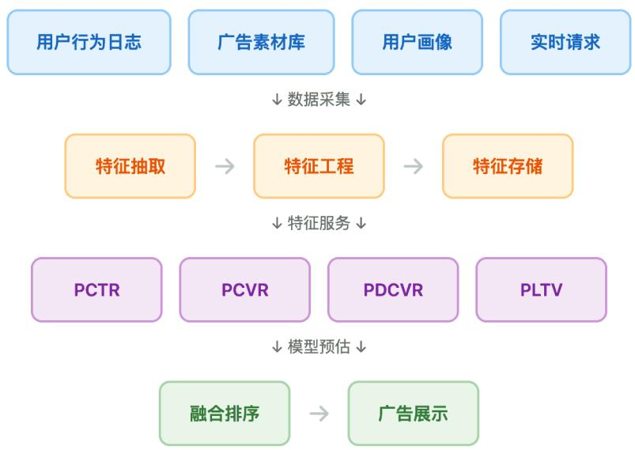

# 4.1.3 分模型的特征体系


# 四大精排模型特征体系

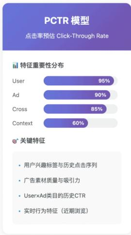

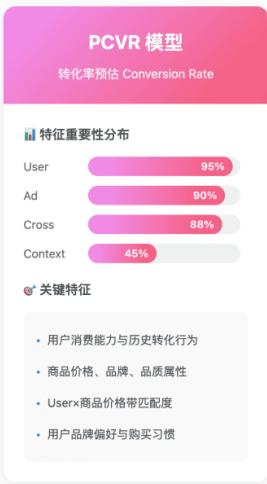

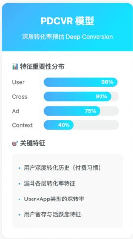

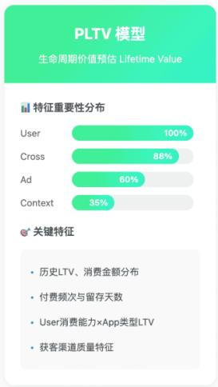

# 1. pCTR 模型（点击率预估）

模型目标：预估用户点击广告的概率

# 特征侧重：

 核心特征：User 特征、Ad 特征、User×Ad 交叉特征  
 重点关注： 用户的兴趣偏好和历史点击行为

 广告素材的吸引力（标题、图片、视频）  
 用户与广告类目/广告主的历史交互

<table><tr><td>特征类型</td><td>重要性</td><td>关键特征</td></tr><tr><td>User</td><td>□□□□□</td><td>兴趣标签、历史点击序列、实时行为</td></tr><tr><td>Ad</td><td>□□□□□</td><td>素材类型、广告类目、历史CTR</td></tr><tr><td>Context</td><td>□□□</td><td>广告位、时间、场景</td></tr><tr><td>Cross</td><td>□□□□□</td><td>User×Ad类目CTR、User×Ad主交互</td></tr></table>

# 2. pCVR 模型（转化率预估）

模型目标：预估用户点击后发生转化（如购买、注册）的概率

# 特征侧重：

 核心特征：User 特征（尤其是消费能力）、Ad 特征（商品属性）、User×Ad 深度交叉  
 重点关注： 用户的消费能力和历史转化行为

 广告商品的价格、品牌、品质  
 用户与商品/品牌的匹配度

<table><tr><td>特征类型</td><td>重要性</td><td>关键特征</td></tr><tr><td>User</td><td>□□□□□</td><td>消费能力、历史转化行为、品牌偏好</td></tr><tr><td>Ad</td><td>□□□□□</td><td>商品价格、品牌、类目、历史CVR</td></tr><tr><td>Context</td><td>□□</td><td>场景、时间（大促期间）</td></tr><tr><td>Cross</td><td>□□□□□</td><td>User×商品价格带、User×品牌CVR</td></tr></table>

# 3. pDCVR 模型（深层转化率预估）

模型目标：预估浅层转化→深层转化的概率（如注册 付费、激活 次留）

# 特征侧重：

 核心特征：用户深度行为特征、广告转化漏斗特征、长周期行为特征  
 重点关注： 用户的深度转化历史（付费习惯、复购行为）

 广告的深层转化率和漏斗表现  
 用户留存和活跃度特征

<table><tr><td>特征类型</td><td>重要性</td><td>关键特征</td></tr><tr><td>User</td><td>□□□□□</td><td>深度转化历史、付费习惯、留存特征</td></tr><tr><td>Ad</td><td>□□□□</td><td>深层CVR、漏斗转化率、用户评价</td></tr><tr><td>Context</td><td>□□</td><td>时间（付费高峰期）、场景</td></tr><tr><td>Cross</td><td>□□□□□</td><td>User×App类型深转率、User×价格带付费率</td></tr></table>

# 4. pLTV 模型（用户生命周期价值预估）

模型目标：预估用户的长期价值（如未来 N 天的付费金额）

# 特征侧重：

 核心特征：用户长周期行为特征、消费能力特征、生命周期特征   
 重点关注： 用户的历史消费金额和频次

 用户的生命周期阶段和留存情况  
 用户的付费习惯和消费偏好

<table><tr><td>特征类型</td><td>重要性</td><td>关键特征</td></tr><tr><td>User</td><td>□□□□□</td><td>历史LTV、消费金额分布、付费频次、留存天数</td></tr><tr><td>Ad</td><td>□□□</td><td>广告类目、商品客单价、App类型</td></tr><tr><td>Context</td><td>□□</td><td>获客渠道、首次触达场景</td></tr><tr><td>Cross</td><td>□□□□□</td><td>User消费能力×App类型LTV、User×渠道质量</td></tr></table>

# 4.1.4 特征体系总结对比

<table><tr><td>模型</td><td>预估目标</td><td>User特征</td><td>Ad特征</td><td>Context特征</td><td>Cross特征</td><td>时间窗口</td></tr><tr><td>PCTR</td><td>点击概率</td><td>★★★★★</td><td>★★★★★</td><td>★★★</td><td>★★★★★</td><td>短期（实时+近期）</td></tr><tr><td>PCVR</td><td>转化概率</td><td>★★★★★</td><td>★★★★★</td><td>★★</td><td>★★★★★</td><td>中期（近期+历史）</td></tr><tr><td>PDCVR</td><td>深层转化概率</td><td>★★★★★</td><td>★★★★</td><td>★★</td><td>★★★★★</td><td>中长期</td></tr><tr><td>PLTV</td><td>生命周期价值</td><td>★★★★★</td><td>★★★</td><td>★★</td><td>★★★★★</td><td>长期（全周期）</td></tr></table>

# 4.2 pCTR 模型

# 4.2.1 pCTR 核心定位与目标

# 1）什么是 pCTR 模型

pCTR（predicted Click-Through Rate）模型是广告精排系统中的核心组件，用于预测用户点击某条广告的概率。它在广告系统的漏斗中处于精排阶段，对候选广告进行精细化排序。

# 2）核心目标

<table><tr><td>目标维度</td><td>详细说明</td></tr><tr><td>业务目标</td><td>最大化广告收入（eCPM = pCTR × bid），提升广告主ROI，优化用户体验</td></tr><tr><td>技术目标</td><td>准确预估用户对广告的点击概率，AUC/GAUC等指标持续优化</td></tr><tr><td>系统目标</td><td>低延迟（&lt;50ms）、高吞吐、高可用</td></tr></table>

# 1.3 在广告系统中的位置

<table><tr><td>层级</td><td>流量规模</td><td>核心作用</td><td>pCTR 角色</td></tr><tr><td>召回(Recall)</td><td>百万级 -&gt; 万级</td><td>初步筛选，广覆盖</td><td>提供候选池</td></tr><tr><td>粗排(Pre-Ranking)</td><td>万级 -&gt; 千级</td><td>快速过滤，保下限</td><td>辅助预估，节流筛选</td></tr><tr><td>精排(Ranking)</td><td>千级 -&gt; 百级</td><td>精准排序，提上限</td><td>核心计算模块，输出pCTR</td></tr><tr><td>重排(Re-Ranking)</td><td>百级 -&gt; 十级</td><td>多样性/商业规则</td><td>辅助调整曝光顺序</td></tr><tr><td>展示(Display)</td><td>最终广告</td><td>用户触达</td><td>落地排序结果</td></tr></table>

IpCTR模型在广告系统中的位置

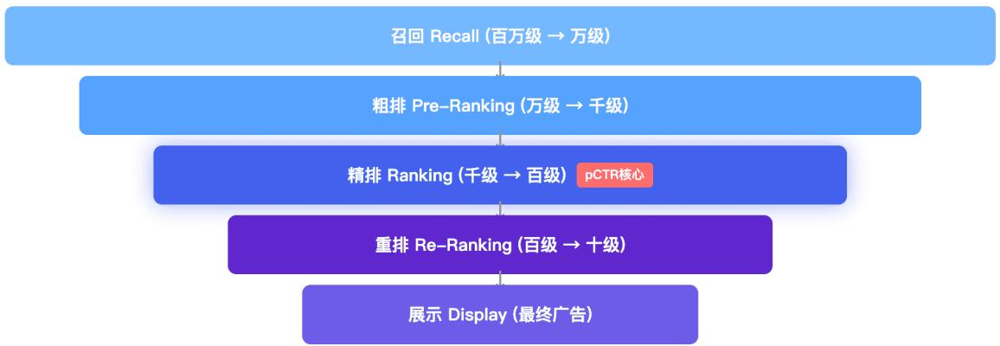

# 关键解析：

精排阶段通常面对几百个候选广告，这是模型计算复杂度与预估精度博弈的平衡点（一般来说预估精度更重要，可对收入有直接贡献）。pCTR 模型在此阶段进行最精细的打分，在保证计算效率（低延迟）的前提下，通过精准的CTR概率输出，决定最终展示的广告列表，是整个系统 “收网” 的关键一环。

# 4.2.2 技术栈：从特征到模型

# 4.2.2.1 特征工程体系

# 1）特征类型划分


# 用户特征 (User)

用户ID、年龄、性别

地域、设备型号

历史行为序列

兴趣标签、消费等级

活跃度、生命周期


# 广告特征 (Ad)

广告ID、广告主ID

创意ID、落地页

出价、行业类目

广告文案、图片特征

投放时间、预算


# 上下文特征 (Context)

请求时间、星期几

广告位置、页面类型

网络环境(WiFi/4G)

App版本、操作系统

场景类型(信息流/搜索)

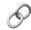

# 交叉特征 (Cross)

用户-广告交叉

用户-类目交叉

用户-广告主交叉

时间-用户交叉

设备-广告交叉

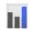

# 统计特征 (Statistics)

历史CTR/CVR

展示次数、点击次数

转化次数、转化金额

近7天/30天统计

滑动窗口统计

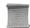

# 序列特征 (Sequence)

点击序列

购买序列

浏览序列

搜索query序列

实时行为序列

# 2）特征表示方法

# 1. 离散特征（Categorical）

a. ID 类特征使用 Embedding 向量化  
b. 支持超大规模 ID（亿级），采用 Hash Embedding 或 分布式 Embedding

# 2. 连续特征（Numerical）

a. 归一化/标准化  
b. 分桶离散化（Bucketization）  
c. 对数变换、Box-Cox 变换

# 3. 序列特征（Sequential）

a. 用户历史点击/购买序列  
b. 使用 Attention、Transformer 等机制提取序列信息

# 4. 多值特征（Multi-Hot）

a. 用户兴趣标签、广告标签   
b. Pooling（Mean/Sum/Max）或 Attention 聚合

# 4.2.2.2 模型架构演进

# 1）经典模型演进路线

# 经典模型演进路线


# 2）典型模型结构介绍

（1）Wide & Deep（2016, Google）

 Wide 部分：线性模型，记忆能力强，处理交叉特征  
 Deep 部分：DNN，泛化能力强，自动学习高阶特征交叉  
 联合训练：Wide 和 Deep 联合优化

（2）DeepFM（2017）

 FM 部分：自动学习二阶特征交叉，无需手工设计交叉特征  
 Deep 部分：学习高阶非线性特征交叉  
 共享 Embedding：FM 和 Deep 共享底层 Embedding

（3）DIN（Deep Interest Network, 2018, 阿里）

 核心创新：引入 Attention 机制，针对当前候选广告动态计算用户历史行为权重  
 解决问题：用户兴趣多样性，不同广告激活不同的用户兴趣  
 Attention 计算：attention_score $=$ f(ad_embedding, history_item_embedding)

（4）DIEN（Deep Interest Evolution Network, 2019, 阿里）

 兴趣抽取层：使用 GRU 提取用户兴趣序列  
 兴趣演化层：AUGRU 捕捉与目标广告相关的兴趣演化过程  
 辅助 loss：使用下一个点击 item 作为监督信号

（5）Transformer-based 模型

 BST（Behavior Sequence Transformer）：将 Transformer 应用于用户行为序列建模  
 优势：并行计算、长距离依赖建模能力强  
 改进：位置编码、多头注意力、层归一化

# 3） 典型模型结构示例（DeepFM、DIN）

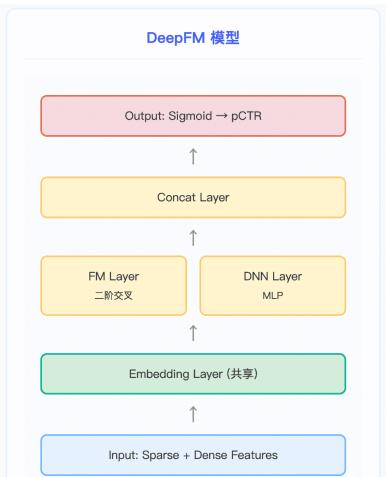

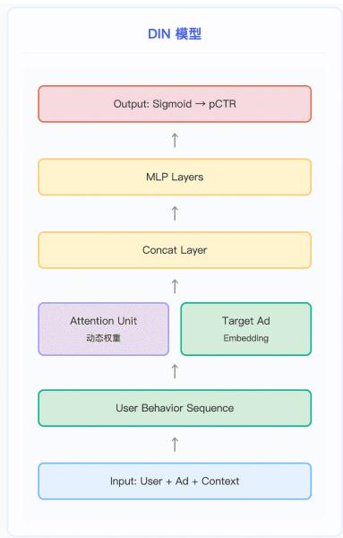

# 4）多任务学习（MTL）

现代广告系统通常需要同时预估多个目标：CTR、CVR、LTV 等

# 常见 MTL 架构：

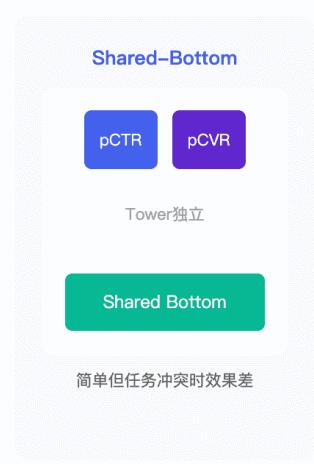


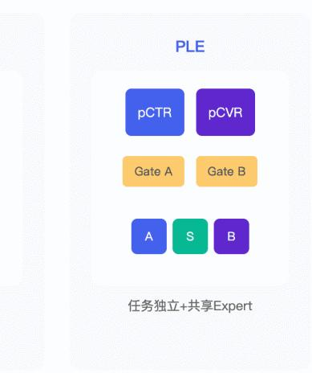


# 4.2.3 工程链路

# 4.2.3.1 离线链路

离线链路是广告 CTR/CVR 模型的数据底座与训练中枢，核心目标是通过标准化数据处理、样本构建、特征工程与模型训练，为在线链路提供高质量、高精准的模型，支撑广告推荐效果持续迭代。

# 1） 离线链路整体数据流

离线链路遵循「数据 特征 样本→模型 上线」的标准化闭环：

 用户行为日志：采集曝光、点击、转化等全链路用户行为数据，是整个链路的原始输入；  
 数据采集 & 清洗（ETL）：完成去重、过滤、补全，清洗脏数据，保障数据质量；  
 特征工程：对原始数据做抽取、变换、存储，生成模型可用的结构化特征；  
 样本生成：基于行为数据构建正负样本，设置时间窗口、负采样、延迟转化归因；  
 模型训练：通过分布式 / PS 架构完成模型训练与调优；  
 模型上线：完成效果评估、灰度发布，将模型部署到在线链路。

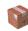

# 离线链路


# 2）样本构建

样本质量直接决定模型效果，核心规则如下：

<table><tr><td>环节</td><td>详细说明</td></tr><tr><td>正样本</td><td>点击行为（click=1）</td></tr><tr><td>负样本</td><td>曝光未点击（click=0）</td></tr><tr><td>样本时间窗口</td><td>目前大厂基本采用 online 实时训练；如果模型变更较大，需要加载历史 n 天数据进行预训练后转 online。</td></tr><tr><td>负采样</td><td>展示但未点击的广告，可能需要下采样，下采样后续需要基于采样率进行纠正</td></tr><tr><td>延迟转化</td><td>归因窗口处理（1 天/7 天/30 天）</td></tr></table>

# 3） 特征处理流程

特征工程是模型效果的核心，核心流程与要求：

 特征抽取：从用户、广告、上下文日志中解析原始特征，提取有效信号；  
 特征变换：完成归一化、分桶、特征交叉等操作，适配模型输入要求；  
 特征存储：离线特征存储于 HDFS/Hive，在线特征同步至 Redis / 特征服务，保障在线低延迟获取；  
 特征一致性：严格对齐离线训练与在线推理的特征逻辑，避免特征穿越、逻辑不一致导致的模型效果衰减。

# 4）模型训练

<table><tr><td>训练方式</td><td>适用场景</td></tr><tr><td>全量训练</td><td>定期（每周）用全量数据重新训练</td></tr><tr><td>增量训练</td><td>每天/每小时用增量数据更新模型，平衡时效性与精度</td></tr><tr><td>实时训练</td><td>流式数据实时更新（Online Learning），适配实时业务变化</td></tr></table>

# 训练框架选择：

 TensorFlow / PyTorch（深度学习模型）  
 Parameter Server 架构（大规模分布式训练）  
GPU 集群 $^ +$ 分布式 Embedding

# 核心总结：

离线链路是广告系统的后台工厂，通过标准化的数据处理、高质量样本构建、一致性特征工程与分布式模型训练，为在线链路提供稳定、精准的模型支撑，同时通过全量 / 增量 / 实时训练的分层策略，平衡模型精度、时效性与工程效率，是广告推荐效果持续优化的核心保障。

# 4.2.3.2 在线链路

# 1）整体架构

广告系统在线链路是广告推荐从请求到返回的全流程，核心目标是在延迟 $<$ xx ms的严苛要求下，完成高并发、低延迟、高精准的广告召回与排序，整体分为架构、特征服务、模型推理三大模块。

在线链路遵循「请求 特征 推理 排序 返回」的标准化流程：

 广告请求：接收用户请求，携带用户 ID、场景等核心信息；  
 特征服务：拉取用户 / 广告特征，结合实时特征与本地缓存，完成特征拼接；  
 模型推理：基于 GPU 进行批量计算，输出 pCTR/pCVR 等预测结果；  
 排序策略：结合业务规则、出价等完成最终排序；  
 返回广告：在 xx ms 内将排序后的广告列表返回给用户。

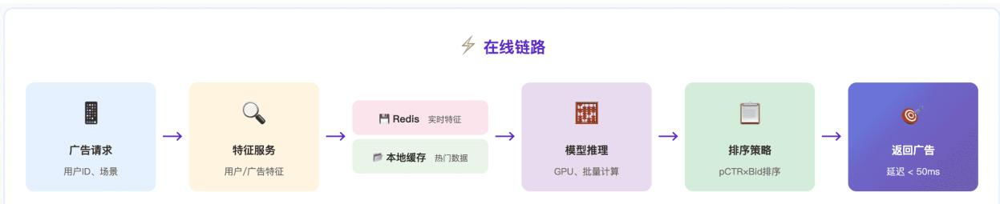

# 2）特征服务

<table><tr><td>模块</td><td>功能</td></tr><tr><td>用户特征服务</td><td>实时用户画像、历史行为序列</td></tr><tr><td>广告特征服务</td><td>广告基础属性、统计特征</td></tr><tr><td>特征拼接</td><td>组装用户、广告、上下文特征，生成模型输入向量</td></tr><tr><td>特征缓存</td><td>采用 L1 本地缓存 +L2 Redis 多级缓存，大幅降低特征获取延迟</td></tr></table>

# 3）模型推理服务

推理优化策略：  

<table><tr><td>策略</td><td>说明</td></tr><tr><td>模型压缩</td><td>量化（INT8/FP16）、剪枝、知识蒸馏</td></tr><tr><td>计算优化</td><td>算子融合、CUDA 优化、TensorRT</td></tr><tr><td>Embedding优化</td><td>分布式 Embedding、参数服务器、热门 ID 缓存，解决大 Embedding 查询延迟问题</td></tr><tr><td>批量推理</td><td>Batch 多个请求一起推理，提升 GPU 利用率</td></tr><tr><td>异步化</td><td>特征获取与推理异步并行，通过 Pipeline 流水线化，隐藏等待耗时</td></tr></table>

# 4.2.4 pCTR 模型优化迭代策略

pCTR 模型的优化围绕特征、模型、训练、线上四大方向展开，形成数据驱动的持续迭代闭环。pCTR 模型的优化不是孤立的，而是一个数据驱动的持续迭代闭环：

线上流量 曝光/点击日志 特征工程 & 样本构建 离线模型训练 离线评估 (AUC/LogLoss)

线上 A/B Test 效果评估 (CTR/CVR/eCPM) 策略调整 $ \boxed { }$ 下一轮迭代

关键原则：特征决定模型的上限，模型逼近这个上限；离线指标是必要条件，线上 A/B 才是充分条件。 每一轮迭代都应该有明确的假设 实验 验证 沉淀的闭环流程。

# pCTR 模型优化全景总结：

pCTR 模型优化围绕特征、模型、训练、线上四大核心方向，形成数据驱动的持续迭代闭环，核心逻辑如下：

1. 特征优化（定模型上限）：通过特征挖掘（实时 / 上下文特征、贝叶斯平滑）、特征交叉（AutoCross/DCN 隐式学习）、特征选择（准入/淘汰机制）、Embedding 优化（预训练/Hash 压缩/维度分配），挖掘有效信号、减少噪声，筑牢模型基础。  
2. 模型优化（逼近特征上限）：借助架构搜索（NAS）、注意力机制（DIN/多头注意力）、序列建模（BST/SIM 超长序列）、多任务学习（MMoE/PLE），增强模型表达与泛化能力，充分利用特征价值。  
3. 训练优化（释放模型潜力）：从样本处理（Hard Negative/PAL 去偏）、Loss 设计（Focal Loss/Label Smoothing）、正则化（Dropout/Mixup）、学习率策略（Warmup / 分层 LR/FTRL+Adam）精细打磨，解决样本偏差、过拟合等问题，保障模型收敛与泛化。  
4. 线上优化（效果落地关键）：通过在线学习（FTRL 实时更新）、Calibration（分桶校准）、分人群建模（LHUC/MoE）、冷启动处理（Meta-Learning），实现实时适配、精准校准，完成离线效果到线上收益的落地。

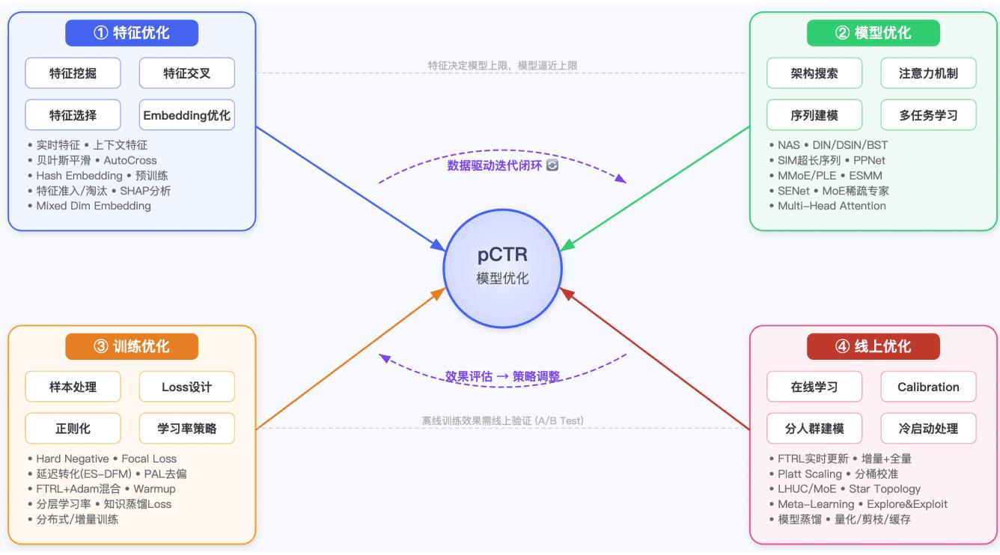

#  特征优化 & 模型优化

# 0

# Q特征优化 (Feature Optimization)


# 特征挖掘

实时特征：用户最近N分钟的点击/浏览序列，反映即时兴趣（AUC+1-3%）  
上下文特征：时间、设备、网络、广告位位置等环境信息  
统计特征：历史CTR/CVR聚合值+贝叶斯平滑处理长尾  
交叉统计：（user_groupad_category）等多维交叉统计率


# 特征交叉

AutoCross/AutoFeature:自动搜索有效交叉组合  
模型内隐式交叉：DCN/CIN（xDeepFM）自动学习高阶交叉  
FM/FFM：稀疏特征交叉经典方法，常作为baseline


# 特征选择

重要性分析：SHAP/Permutation Importance/梯度分析  
特征准入/淘汰：新特征需A/B验证；定期清理低效特征   
冗余剔除：相关性分析，移除高冗余特征降低推理开销


# Embedding优化

预训练：Word2Vec/Graph Embeding (Node2Vec,GraphSAGE)→finetune   
多任务共享：CTR/CVR/LTV共享底层 Embedding (Shared-Bottom/MMoE)   
Hash/Compositional Embedding:压缩数十亿级ID参数量  
MixedDimension：高频ID大维度，低频ID小维度

#

#


# 架构搜索

NAS:DARTS/ProxylesSNAS自动搜索层数、宽度、激活函数  
Autolnt/AutoDis:自动学习交互方式&数值特征离散化


# 注意力机制

Target Attention (DIN)：对候选广告相关的历史行为加权   
Multi-Head Self-Attention:Transformer风格，捕捉序列内依赖   
Cross-Attention:User-Ad交叉注意力，增强匹配建模


# 序列建模

BST/DSIN:Transformer编码行为序列（百级长度）  
SIM:检索式方法处理万级超长序列（Top-K检索+精排）  
Session建模：区分Session内/间的兴趣变化

时间衰减：近期行为赋予更高权重


# 多任务学习

MMoE→PLE：多门控混合专家，解决任务间seesaw效应  
ESMM:pCTVR=pCTR×pCVR，解决CVR样本选择偏差   
梯度平衡：GradNorm/PCGrad/MGDA避免梯度主导   
辅助任务：停留时长、滑动浏览等辅助信号增强泛化


# 架构创新

PPNet：个性化网络参数，千人千面架构  
SENet：特征重要性自适应加权   
稀疏MoE：SwitchTransformer风格，低成本扩大模型容量

#  训练优化 & 线上优化

#

#


# 样本处理

负采样：降采样+Calibration恢复真实分布（IPW）  
Hard NegativeMining：挖掘边界困难样本强化判别   
延迟转化（ES-DFM）：合理归因窗口，处理延迟反馈  
去偏：Position Bias(PAL)/Selection Bias消除


# Loss设计

FocalLoss：聚焦困难样本，缓解正负样本不平衡   
Label Smoothing：防过度自信，提升泛化  
Pairwise/Listwise:BPRLoss/LambdaRank优化排序   
蒸馏Loss:Teacher Soft Label指导Student模型

# 正则

Dropout/Embedding Dropout:随机丢弃防过拟合  
L1/L2正则：参数惩罚控制复杂度  
FeatureDropout：随机丢弃整个特征组增强鲁棒性  
数据增强：Mixup/Cutout特征级增强


# 学习率&优化器

Warmup+CosineDecay:初期渐增+余弦衰减   
分层学习率：Embedding大LR，DNN小LR  
FTRL+Adam混合：稀疏用FTRL，稠密用Adam（业界标配）


# 分布式训练

Data/Model Paralel:数据并行+Embedding模型并行  
AsyncSGD：异步更新，牺牲少量精度换速度  
增量训练：基于checkpoint增量更新，无需从零训练

#

# 线上优化(Online/Serving)


# 在线学习

实时参数更新：分钟级/秒级FTRLStreaming更新  
增量+全量结合：日常增量（小时级），定期全量（天级）防漂移


# Calibration（模型校准）

lsotonic Regression/PlattScaling:score→真实概率映射   
分桶校准：按人群/广告位分别校准提升细粒度精度  
负采样校准：p=p_m/（p_m+（1-p_m）/rate）


# 分人群建模

LHUC：为不同人群学习hiddenunit缩放系数  
人群MoE：不同人群路由到不同Expert网络  
StarTopology：共享骨干+独立BN/Adapter层


# 冷启动处理

Meta-Learning（MAML）：快速适应新广告/新用户  
Content-based兜底：无行为用户用上下文特征粗预估  
Explore&Exploit:Thompson Sampling/ε-greedy探索   
Look-alike：基于种子用户扩展相似人群


# Serving性能优化

知识蒸馏：Teacher→Student轻量模型，降低推理延迟   
模型压缩：量化（INT8）/剪枝/低秩分解  
特征缓存：Redis/本地缓存高频Embedding查询   
级联架构：粗排（轻量）→精排（重量级），逐级过滤

# 1. 特征挖掘

 实时特征 (Real-time Features)：捕捉用户最近几分钟/几小时内的行为，如最近点击的广告类目、最近浏览的商品序列。实时特征对 CTR 提升通常非常显著（业界经验可带来 $1 - 3 \%$ AUC 提升），因为它能反映用户的即时兴趣。  
 上下文特征 (Context Features)：包括时间（星期几、小时、是否节假日）、设备信息（机型、操作系统版本、屏幕尺寸）、网络环境（WiFi/4G/5G）、广告位位置（页面第几屏、信息流第几条）等。  
 统计特征 (Statistical Features)：历史 CTR/CVR 统计值，如某广告在过去 7 天的平均点击率、某用户在某类目下的历史转化率。常用平滑方法如 贝叶斯平滑 (Bayesian Smoothing) 来处理曝光量少的长尾情况。  
 交叉统计特征：如 (user_age_group, ad_category) 的历史 CTR、(device_type, ad_position) 的转化率等多维交叉统计。

# 2. 特征交叉

 AutoFeature / AutoCross：自动化搜索有效的特征交叉组合，避免人工枚举的低效。华为的 AutoCross、Google 的AutoML Tables 都有类似实践。  
 FM/FFM 系列：Factorization Machine 及其变体仍是处理稀疏特征交叉的经典方法，在业界广泛作为 baseline。  
 模型内隐式交叉：通过 DCN v2、RankMixer 等结构自动学习高阶特征交叉，替代手工特征工程。

# 3. 特征选择

 特征重要性分析：基于模型梯度、SHAP值、Permutation Importance等方法评估每个特征的贡献。  
 冗余特征剔除：移除高度相关的冗余特征，减少模型复杂度和推理耗时。  
 特征准入/淘汰机制：建立特征生命周期管理，新特征经过 A/B 实验验证后才正式准入；定期清理低效特征。  
 AutoML 特征选择：利用进化算法、强化学习等自动选择最优特征子集。

# 4. Embedding 优化

 预训练 Embedding：利用 Word2Vec、Graph Embedding (如 Node2Vec、GraphSAGE) 对 item/user 进行预训练，再 finetune。  
 多任务 Embedding 共享：CTR/CVR/LTV 等多任务共享底层 Embedding，通过 Shared-Bottom 或 MMoE 结构实现信息互补。  
 Hash Embedding / Compositional Embedding：针对超大规模 ID 特征（如数十亿级别的 item_id），使用 Hash Trick或 Compositional Embedding（如 QR Embedding）压缩参数量。  
 动态 Embedding 维度：高频特征分配更大的 Embedding 维度，低频特征使用较小维度（Mixed DimensionEmbedding）。

# 1. 架构搜索

 NAS (Neural Architecture Search)：自动搜索最优的网络层数、宽度、激活函数等。业界常用 DARTS、ProxylessNAS等高效搜索算法。  
 AutoInt / AutoDis：自动学习特征交互方式和数值特征离散化策略。

# 2. 注意力机制

 Target Attention (DIN)：阿里 DIN 模型，对用户历史行为序列中与当前候选广告相关的部分赋予更高权重。  
 Multi-Head Self-Attention：Transformer 风格的多头注意力，捕捉序列内部的依赖关系。  
 Co-Attention / Cross-Attention：用户侧和广告侧的交叉注意力，增强 user-ad 匹配建模。

# 3. 序列建模

 Transformer-based (BST/DSIN)：阿里 BST (Behavior Sequence Transformer)、DSIN (Deep Session Interest Network)等模型，用 Transformer 编码用户行为序列。  
 超长序列建模：SIM (Search-based Interest Model) 通过检索式方法处理万级甚至十万级用户行为序列，先检索 Top-K相关行为再精排建模。  
 Session 建模：区分用户不同 Session 的兴趣变化，如 DSIN 对 Session 内和 Session 间分别建模。  
 时间感知建模：在序列建模中加入时间衰减因子，越近的行为权重越大。

# 4. 多任务学习

 Shared-Bottom / MMoE / PLE：从简单的参数共享到 Google 的 MMoE (Multi-gate Mixture-of-Experts)，再到腾讯的PLE (Progressive Layered Extraction)，逐步解决任务间的 seesaw 效应。  
 梯度平衡：GradNorm、PCGrad、MGDA 等方法，避免某个任务的梯度主导训练过程。  
 任务关系建模：ESMM (Entire Space Multi-Task Model) 利用 pCTV $\rho { \mathsf { C } } { \mathsf { T } }$ $=$ R × pCVR 的因果链关系，解决 CVR 的样本选择偏差 (SSB) 问题。  
 辅助任务设计：添加如 “是否停留超过 N 秒”、“是否滑动浏览” 等辅助任务，增强主任务的泛化能力。

# 5. 其他架构创新

 PPNet (Parameter Personalized Network)：为不同用户/场景生成个性化的网络参数，实现千人千面的模型架构。  
 SENet (Squeeze-and-Excitation Network)：对特征进行重要性加权，自适应地放大/抑制不同特征的影响。  
 Expert 混合架构：如稀疏 MoE，在不显著增加推理成本的情况下扩大模型容量。

# 1. 样本处理

 负采样策略：对展现未点击的大量负样本进行降采样，同时配合 校准 (Calibration) 恢复真实分布。常用方法如 InversePropensity Weighting。  
 Hard Negative Mining：挖掘模型容易误判的困难负样本，强化模型在边界区域的判别能力。  
 延迟转化处理 (Delayed Feedback)：对于转化可能延迟几小时甚至几天的场景（如应用下载后付费），需要设计合理的归因窗口和样本标注策略。常用方法如 ES-DFM。  
 样本去偏 (Debiasing)：消除位置偏差 (Position Bias)、选择偏差 (Selection Bias) 等。如通过 PAL (Position-AwareLearning) 或在模型中加入 position tower。

# 2. Loss 设计

 Focal Loss：解决正负样本严重不平衡的问题，让模型更关注困难样本。  
 Label Smoothing：防止模型过度自信，提升泛化能力。   
 Pairwise/Listwise Loss：如 BPR Loss、LambdaRank，优化排序而非逐点分类。  
 知识蒸馏 Loss：用复杂 Teacher 模型的预测值作为 Soft Label 指导轻量 Student 模型训练。

# 3. 正则化

 Dropout / Embedding Dropout：随机丢弃神经元或 Embedding 维度，防止过拟合。  
 L1/L2 正则：对参数施加惩罚，控制模型复杂度。  
 Feature Dropout：随机丢弃整个特征组，增强模型的鲁棒性。  
 数据增强：特征级别的 Mixup、Cutout 等策略。

# 4. 学习率策略

 Warmup $^ +$ Cosine Decay：训练初期逐步增大学习率（Warmup），之后按余弦曲线衰减。  
 分层学习率 (Layerwise LR)：Embedding 层使用较大学习率，DNN 层使用较小学习率；或者预训练部分使用较小学习率。  
 FTRL $^ +$ Adam 混合优化器：稀疏特征（ID 类）使用 FTRL 保持稀疏性，稠密特征使用 Adam 快速收敛。这是业界在线学习的标配方案。

# 5. 分布式训练

 Data Parallel / Model Parallel：数据并行处理海量样本，模型并行处理超大 Embedding Table。  
 异步训练 (Async SGD)：在线学习场景下，多个 Worker 异步更新参数，牺牲少量精度换取训练速度。  
 增量训练 (Incremental Training)：不从零训练，而是基于上一版本模型 checkpoint 进行增量更新。

# 1. 在线学习 (Online Learning)

 实时参数更新：利用 Streaming 数据（实时曝光/点击日志）更新模型参数，通常以分钟级甚至秒级频率。使用 FTRL、Follow-the-Regularized-Leader 等在线优化器。  
 增量训练 $^ +$ 全量训练结合：日常用增量训练（小时级/分钟级），定期做全量训练（天级）防止模型漂移。

# 2. Calibration (模型校准)

 Isotonic Regression / Platt Scaling：将模型输出的 score 映射为真实概率，确保下游竞价模块计算 eCPM 的准确性。  
 分桶校准：按照不同人群、不同广告位分别校准，提高细粒度的预估准确性。  
 负采样校准：如果训练时做了负采样，需要在 serving 时做概率校正：p_real $=$ p_model / (p_model $^ +$ (1-p_model)/sampling_rate)。

# 3. 分人群建模

 LHUC (Learning Hidden Unit Contributions)：为不同人群学习不同的 hidden unit 缩放系数。  
 人群专家网络：使用 MoE 结构，不同人群路由到不同的 Expert 网络。  
 Star Topology / Scenario-Adaptive：多场景/多人群共享骨干网络，各自拥有独立的 Batch Normalization 或 Adapter层。

# 4. 冷启动处理

 Meta-Learning：用 MAML 等元学习方法，让模型快速适应新广告/新用户。  
 Content-based 特征兜底：对无行为的新用户，利用设备、地域、时段等上下文特征进行粗粒度预估。  
 Explore & Exploit：对新广告分配一定的探索流量（如 Thompson Sampling、ε-greedy），收集初始反馈数据。  
 Look-alike 扩展：基于已有高价值用户的特征，寻找相似的潜在用户群体。

# 5. Serving 性能优化

 模型蒸馏 (Knowledge Distillation)：用复杂的 Teacher 模型蒸馏出轻量的 Student 模型部署上线，降低推理延迟。  
 模型压缩：量化 (Quantization, FP32→INT8)、剪枝 (Pruning)、低秩分解等。  
 特征缓存：对高频查询的用户/广告 Embedding 做 Redis/本地缓存，减少实时计算开销。  
 级联架构 (Cascade)：粗排（轻量模型 $^ +$ 少量特征） 精排（重量级模型 $^ +$ 全部特征），逐级过滤，平衡效果和性能。

# 4.2.5 评估与落地要点

# 1）离线评估指标

<table><tr><td>指标</td><td>说明</td><td>重要性</td></tr><tr><td>AUC</td><td>ROC曲线下面积，衡量排序能力</td><td>□□□□□</td></tr><tr><td>GAUC</td><td>分组AUC，按用户分组计算后加权平均</td><td>□□□□□</td></tr><tr><td>Logloss</td><td>交叉熵损失，衡量预测概率的准确性</td><td>□□□□</td></tr><tr><td>NDCG</td><td>归一化折扣累积增益</td><td>□□□</td></tr><tr><td>Relalmpr</td><td>相对AUC提升</td><td>□□□□</td></tr></table>

# 2）在线评估指标

<table><tr><td>指标</td><td>说明</td></tr><tr><td>CTR</td><td>点击率 = 点击数 / 展示数</td></tr><tr><td>CVR</td><td>转化率 = 转化数 / 点击数</td></tr><tr><td>eCPM</td><td>千次展示收入</td></tr><tr><td>RPM</td><td>千次请求收入</td></tr><tr><td>用户体验指标</td><td>停留时长、DAU、留存率</td></tr></table>

# 3）A/B 实验框架

  
流量分层

  
实验分组

  
指标采集

  
统计检验

  
效果评估

  
全量发布


# 最小样本量

#

# ■多指标评估

# 长期跟踪

避免短期收益长期损失

# A/B 实验要点：

最小样本量计算（统计显著性）  
 AA 实验验证（检验分流均匀性）  
 多指标综合评估（避免单一指标优化）  
长期效果跟踪（避免短期收益长期损失）

# 4） 落地关键要点

<table><tr><td>要点</td><td>详细说明</td></tr><tr><td>离在线一致性</td><td>特征逻辑、数据处理离线在线必须一致</td></tr><tr><td>模型校准</td><td>预测值与真实CTR的一致性，影响后续出价</td></tr><tr><td>实时性</td><td>用户兴趣变化快，需要实时/近实时更新</td></tr><tr><td>稳定性</td><td>模型迭代平稳过渡，避免业务剧烈波动</td></tr><tr><td>可解释性</td><td>模型可解释性辅助问题定位和业务理解</td></tr><tr><td>监控告警</td><td>实时监控模型预测分布、线上指标，及时发现异常</td></tr></table>

# 4.3 pCVR 模型

# 4.3.1 广告 pCVR 模型简介

# 一、定义

pCVR（predicted Conversion Rate，预估转化率）模型是广告系统中的核心预估模型，用于预测用户点击广告后发生转化的概率。

$$
\mathrm {p C V R} = P (\text {C o n v e r s i o n} | \text {C l i c k})
$$

# 二、在广告系统中的位置

广告投放的完整链路包含多个预估模型：


<table><tr><td>模型</td><td>预估目标</td><td>公式</td></tr><tr><td>pCTR</td><td>点击率</td><td>P(Click | Impression)</td></tr><tr><td>pCVR</td><td>转化率</td><td>P(Conversion | Click)</td></tr><tr><td>pCTCVR</td><td>点击转化率</td><td>pCTR × pCVR</td></tr></table>

# 三、核心作用

eCPM 排序：决定广告展示优先级

$$
\mathrm {e C P M} = \mathrm {b i d} \times \mathrm {p C T R} \times \mathrm {p C V R}
$$

 OCPC/OCPA 出价：智能出价策略依赖 pCVR 预估；  
 ROI 优化：帮助广告主找到高转化用户，一般还依赖 pLTV 预估模型。

四、pCVR 主要挑战  

<table><tr><td>挑战</td><td>描述</td></tr><tr><td>数据稀疏 (DS)</td><td>转化事件远少于点击，正样本极度稀疏</td></tr><tr><td>样本选择偏差 (SSB)</td><td>只有点击样本才有转化标签，曝光未点击的样本无法训练</td></tr><tr><td>延迟反馈</td><td>转化可能发生在点击后很长时间</td></tr></table>

# 4.3.2 pCVR 模型优化迭代策略（大厂实践·完整版）

CVR 模型相比 CTR 模型面临更多独特挑战：样本选择偏差（SSB）、数据稀疏、转化延迟、转化类型多样。

以下从七大方向系统梳理业界主流优化策略。

  
CVR 优化策略总览架构图

# 0

# 样本选择偏差纠正 (SSB Correction)


# Entire Space系列

ESMM（阿里)：利用因果链曝光→点击→转化，pCVF $=$ pCTCVR/pCTR隐式学习  
ESM²（阿里)：引入更多中间行为节点（加购/下单)，建模完整决策路径  
ESCM2（阿里)：Counterfactual校准+CVR独立塔，兼顾纠偏与独立预估


# 逆倾向加权(IPW)

IPW校正：对点击样本按点击概率倒数加权，数学上严格纠正分布偏移   
Doubly Robust：结合 IPW与直接建模方法，提升估计鲁棒性

#

#


# Fast Emit方案

正例打散：矩形低通滤波器 $^ +$ 均匀分布打散到未来n分钟，平滑后验  
》负例延迟发射：打散模型预估延迟分布 $^ +$ AliasMethodO(1)采样发送时间  
正负对齐：保证正例与负例时间不错位，代价是正样本被重复发送一次


# DFM/ES-DFM

DFM:联合建模转化概率 $^ +$ 延迟时间分布，EM/生存分析处理censored样本  
ES-DFM：对不同回传延迟的样本赋予不同权重/标签概率


# FSIW/DEFER

FSIW:分RP/FN/RN/FP四类样本计算重要性权重  
DEFER:两阶段：FNW快速训练 $^ +$ 真实标签Fine-tune   
窗口回溯：短窗口实时 $^ +$ 长窗口全量多级修正

# 一、样本选择偏差纠正 — CVR 独有核心难题

CVR 训练样本只来自「点击过的用户」，但推理时需对「所有曝光用户」预估，造成训练/推理分布不一致。

<table><tr><td>方案</td><td>来源</td><td>核心思想</td></tr><tr><td>ESMM</td><td>阿里</td><td>利用因果链“曝光→点击→转化”，用全量曝光样本训练，通过pCVR=pCTCVR/pCTR，隐式学习CVR</td></tr><tr><td>ESM²</td><td>阿里</td><td>在ESMM基础上引入更多中间行为节点（加购、下单），建模完整用户决策路径</td></tr><tr><td>ESCM²</td><td>阿里</td><td>引入counterfactual校准机制和CVR独立塔，兼顾纠偏与独立预估能力</td></tr><tr><td>IPW</td><td>通用</td><td>逆倾向加权，对点击样本按点击概率倒数加权，数学上严格纠正分布偏移</td></tr></table>

# 二、延迟转化处理 — 转化回传滞后的应对

用户从点击到转化可能间隔数小时甚至数天，导致训练数据中存在大量「假负样本」。

# 2.1 经典方案

<table><tr><td>方案</td><td>核心思想</td></tr><tr><td>DFM</td><td>联合建模「是否转化」和「转化延迟时间分布」，用EM/生存分析处理 censored 样本</td></tr><tr><td>ES-DFM</td><td>将时间建模引入损失函数，对不同回传延迟的样本赋予不同权重/标签概率</td></tr><tr><td>FSIW</td><td>估计假负样本比例，通过重要性加权矫正，分RP/FN/RN/FP四类加权</td></tr><tr><td>DEFER</td><td>两阶段方案：第一阶段FNW 快速训练 + 第二阶段真实标签 Fine-tune</td></tr><tr><td>窗口回溯</td><td>等待归因窗口后回填标签，实时训练采用短窗口 + 定期全量修正</td></tr></table>

# 2.2 Fast Emit 方案（工业界主流实践）

Fast Emit 是业界（快手、腾讯、字节等）广泛采用的一种 “快速发射样本 $^ +$ 后续修正” 的工程范式，核心解决 freshness vs.accuracy 的矛盾。

核心理念：样本尽早下发（emit），不等归因窗口结束；通过正负样本的差异化发送策略 $^ +$ 打散机制来修正 Fake Negative 带来的偏差。

# ☆Fast Emit延迟反馈方案·工业界核心实践详解

核心理念：样本尽早发射 (emit)，不等归因窗口结束。通过正例打散 $^ +$ 负例延迟发射的差异化发送策略，保证正负样本时间对齐，在freshness与accuracy之间取得最优平衡。

# √正样本处理策略

·实时发送：每遇到正例 (转化回传）都立即发送进入训练流   
正例打散：某些广告存在批量回传正样本的情况 (如游戏广告批量回传)，正样本短期聚集会打歪模型后验  
·打散原理：利用矩形低通滤波器对后验进行滤波，对正例以均匀分布打散到未来n分钟  
■信号处理本质：滤除高频分量，平滑模型后验一—把脉冲式的正样本信号变成平滑的连续信号

# 代价与权衡

·重复发送问题：不能预知一个负样本未来是否会"变成"正样本  
·所有最终转化的样本都被当成负样本重复发送了一次 (先发负样本，后发正样本)  
■这是 freshness 和 accuracy 权衡的必然代价   
·通过后续 Calibration 机制进行修正

# ×负样本处理策略

·按比例采样：负样本远多于正样本，先进行降采样  
·延迟分布预估：调用打散模型来预估一个延迟的分布 (模拟该负样本对应的转化延迟分布)  
·Alias Method 采样：使用 O(1)离散分布采样算法，从延迟分布中采样一个发送时间  
·延迟发送：等待采样得到的时间后再发送，保证正负例样本时间没有"错位'

# 多窗口修正Pipeline (工程 Best Practice)

→实时流 (0~30min)：Fast Emit $^ +$ 正例打散 $^ +$ 负例延迟发射 在线增量训练   
短窗口 (1~24h)：回填已确认正样本，重新校正负样本权重 近线修正训练  
·长窗口 (3~7天)：归因窗口结束，标签基本完整→全量定期训练

<table><tr><td>窗口层级</td><td>时间范围</td><td>发送策略</td><td>用途 &amp; 作用</td></tr><tr><td>实时流</td><td>0 ~ 30min</td><td>正例：打散到未来n min均匀发送
负例：Alias Method延迟发射</td><td>在线增量训练，保证数据新鲜度（分钟级）</td></tr><tr><td>短窗口</td><td>1 ~ 24h</td><td>回填已确认正样本，FNW权重修正</td><td>近线修正，减少 Fake Negative 偏差</td></tr><tr><td>长窗口</td><td>3 ~ 7天</td><td>归因窗口结束，标签完整</td><td>全量定期训练（Daily/Weekly），防模型漂移</td></tr></table>

# （1）正样本处理策略

 实时发送：每遇到正例（转化回传）都实时发送进入训练流   
 正例打散：因为某些广告存在批量回传正样本的情况（如游戏广告批量回传），正样本短期聚集会打歪模型后验  
 打散原理：利用矩形低通滤波器对后验进行滤波，对正例以均匀分布打散到未来 n 分钟（例如 $\mathtt { n } = 5$ ），滤除高频分量，平滑模型后验  
 本质上是一种时域信号处理思想——把脉冲式的正样本信号变成平滑的连续信号

# （2）负样本处理策略

 先按比例采样：因为负样本远多于正样本，先进行降采样  
延迟发送：调用打散模型来预估一个延迟的分布（模拟该负样本对应的转化延迟分布）  
 按分布采样发送时间：使用 Alias Method（一种 O(1) 离散分布采样算法）从延迟分布中采样一个发送时间  
 等待后发送：等待采样得到的时间后再将负样本发送  
 核心目的：保证正例与负例样本的时间没有"错位"——因为正样本的回流天然晚于负样本，负例延迟发送是为了与正例时间对齐

# （3）Fast Emit 的代价

 因为不能判断一个负样本未来是否会"变成"正样本，故所有最终会转化的样本都被当成负样本重复发送了一次（先发负样本，后发正样本）  
 这是 Freshness 和 Accuracy 权衡的必然代价，通过后续的 Calibration 机制进行修正

Fast Emit 与多窗口修正的结合（工程 Best Practice）  

<table><tr><td>窗口</td><td>策略</td><td>用途</td></tr><tr><td>实时流（0~30min）</td><td>Fast Emit + 正例打散 + 负例延迟发射</td><td>在线增量训练，保证新鲜度</td></tr><tr><td>短窗口（1~24h）</td><td>回填已确认的正样本，重新校正负样本权重</td><td>近线修正训练</td></tr><tr><td>长窗口（3~7天）</td><td>归因窗口结束，标签基本完整</td><td>全量定期训练（Daily/Weekly）</td></tr></table>

# ®

#


# 专家网络

MMoE（Google)：多门控混合专家，任务自适应选择共享/独立表征  
PLE（腾讯）：显式区分shared $^ +$ task-specific experts，渐进式学习  
AITM（美团)：自适应信息传递模块，控制上游对下游任务影响


# 漏斗建模

任务链：曝光→点击→深度行为→转化→付费，层层监督信号  
梯度平衡：PCGrad/GradNorm/MGDA/Uncertainty Weighting   
辅助任务：停留时长、加购、收藏等中间行为作为辅助信号

# ④

# 特征工程与表征优化 (Feature Engineering)


# 实时&跨域特征

实时特征：Flink/Kafka实时流计算用户近N分钟行为序列  
跨域特征：联邦学习/安全多方计算获取其他业务线用户特征


# 行为序列建模

DIN/DIEN：TargetAttention，从行为序列中提取与当前广告最相关的行为  
SIM/ETA：检索式方法处理万级超长序列（Top-K检索 $^ +$ 精排)


# Embedding优化

Pre-train:Graph Embedding/Contrastive Learning缓解稀疏&冷启动   
多模态：CLIP图像/视频特征、文案NLP特征辅助转化意图判断

# 三、多任务学习 — CVR 建模的主流范式

CVR 天然处于多任务链路中，多任务架构是工业界标配。

MMoE（Google）：多个 Expert 网络 $^ +$ 门控机制，让不同任务自适应选择共享/独立的表征  
PLE（腾讯）：在 MMoE 基础上显式区分 shared experts 和 task-specific experts，多层级渐进式学习  
 AITM（美团）：Adaptive Information Transfer Module 建模 CTR CVR 信息传递  
 任务链建模：按业务漏斗设计多任务链路 曝光 点击 深度行为 转化→付费  
 梯度平衡：PCGrad / GradNorm / MGDA / Uncertainty Weighting 解决梯度冲突

# 四、特征工程与表征优化

CVR 的转化信号更稀疏，相比 CTR 模型对特征质量要求更高。

 实时特征：用户近 N 分钟/小时的实时行为序列，Flink/Kafka 实时流计算注入  
 跨域特征：引入其他 App/业务线的行为特征，通过联邦学习或安全多方计算获取  
 Target Attention（DIN/DIEN）：从用户行为序列中提取与当前广告最相关的历史行为  
 超长序列建模（SIM/ETA）：检索式方法从万级历史行为中快速检索相关子序列  
Pre-train Embedding：Graph Embedding / Contrastive Learning 预训练，缓解冷启动和稀疏   
 多模态特征：广告素材图像/视频特征（CLIP）、文案 NLP 特征

#

# 模型架构创新 (Model Architecture)

# 个性化千人干面

PPNet (美团)：为每个用户生成个性化网络参数 (Gate Personalization)  
》LHUC／Star Topology:分人群差异化建模，共享骨干 $^ +$ 独立BN/Adapter

# 因果因果推断

UpliftModeling：预估广告带来的增量转化效果，优化真正由广告带来的价值   
反事实推理：区分自然转化vs广告驱动转化


# Calibration&蒸馏

Calibration:Platt Scaling/Isotonic Regression /分桶校准   
知识蒸馏：复杂Teacher 轻量Student，保精度降延迟

# 五、模型架构创新

 PPNet（美团）：个性化网络参数（Gate Personalization），千人千面的 CVR 预估  
 CausalInt（因果推断）：用 uplift modeling 预估广告带来的增量转化效果  
 知识蒸馏：复杂 Teacher 蒸馏出轻量 Student 模型，降低推理延迟  
 分人群建模：新客/老客、高活/低活使用不同的 expert/tower，LHUC / Star Topology 差异化建模  
 Calibration 校准：Platt Scaling / 分桶校准保证预测概率的绝对准确性

# 六、冷启动与 Exploration

 新广告冷启动：Meta-Learning（MAML）快速适应新广告  
 新用户冷启动：Look-alike 扩展 $^ +$ 基于上下文的 context-aware 预估  
 Explore & Exploit：Thompson Sampling / LinUCB 平衡探索与利用  
 迁移学习：从数据丰富的源域迁移到目标域，预训练 $^ +$ Fine-tune

# 七、在线学习与 Serving 优化

 FTRL Streaming：分钟级/秒级实时参数更新  
 增量 $^ +$ 全量结合：日常增量（小时级） $^ +$ 定期全量（天级）防漂移   
 模型压缩：量化（INT8）/ 剪枝 / 低秩分解  
 特征缓存：Redis / 本地缓存高频 Embedding 查询

# 一句话总结：

CVR 优化的核心三板斧——选择偏差纠正（ESMM 系列）解决"训练分布不对"、延迟转化处理（Fast Emit $^ +$ 多窗口修正）解决"标签不准"、多任务学习解决"样本太少"，再辅以特征/架构/冷启动的工程优化，构成完整的 CVR 迭代体系。其中 Fast Emit通过正例打散 $^ +$ 负例延迟发射的差异化策略，在 freshness 和 accuracy 之间取得最优平衡。

总结  

<table><tr><td></td><td>方向</td><td>核心要点</td></tr><tr><td>□</td><td>选择偏差纠正</td><td>ESMM/ESM²/ESCM²/IPW,解决训练/推理分布不一致</td></tr><tr><td>□</td><td>延迟转化处理 □</td><td>Fast Emit(正例打散+负例延迟发射)、DFM、ES-DFM、FSIW、DEFER、多窗口修正</td></tr><tr><td>□</td><td>多任务学习</td><td>MMoE/PLE/AITM、任务链建模、梯度平衡</td></tr><tr><td>□</td><td>特征工程优化</td><td>实时特征、跨域特征、DIN/DIEN/SIM、Pre-train Embedding</td></tr><tr><td>□</td><td>模型架构创新</td><td>PPNet、因果推断(Uplift)、知识蒸馏、Calibration</td></tr><tr><td>□</td><td>冷启动与探索</td><td>MAML、Look-alike、Thompson Sampling、迁移学习</td></tr><tr><td>□</td><td>在线 Serving</td><td>FTRL 实时更新、模型压缩、特征缓存、级联架构</td></tr></table>

# 4.3.3 pCVR 转化数据稀疏优化方案

# 4.3.3.1 转化数据稀疏问题概述

在广告系统中，转化数据稀疏（Conversion Data Sparsity） 是pCVR模型面临的另一核心挑战。相比于点击行为，转化行为（购买、注册、付费等）发生的频率更低，导致正样本极度稀少。

# 1）问题本质

数据稀疏的层级结构： $\gg$ $\gg$

典型场景下的转化率：

曝光到点击（CTR）： $1 \% - 5 \%$   
点击到转化（CVR）：0.1% - 5%  
曝光到转化（CTCVR）： $0 . 0 0 1 \% - 0 . 2 5 \%$

# 2）数学形式化

A稀疏问题的本质

$$
\left| \mathcal {D} _ {\text {c o n v}} \right| \ll \left| \mathcal {D} _ {\text {c l c k}} \right| \ll \left| \mathcal {D} _ {\text {i m p}} \right|
$$

样本不平衡比例：

$$
\text {I m b a l a n c e R a t i o} = \frac {N ^ {-}}{N ^ {+}} = \frac {\left| \mathcal {D} _ {\text {c l e c k}} \right| - \left| \mathcal {D} _ {\text {c o n v}} \right|}{\left| \mathcal {D} _ {\text {c o n v}} \right|}
$$

在极端情况下，负正比可达100:1甚至1000:1

# 3）稀疏问题的影响

 模型偏向负样本：损失函数被大量负样本主导  
 特征学习不充分：正样本对应的特征组合覆盖不足   
 冷启动困难：新广告/新用户几乎无转化数据  
 过拟合风险：容易在少量正样本上过拟合

# 4.3.3.2 主流优化方案

# 1）方案一：样本重采样（Resampling）

核心思想：通过调整正负样本比例来平衡训练数据。

过采样（Oversampling）& 欠采样（Undersampling）：

过采样 (Oversampling)

$$
\mathcal {D} _ {\text {t r a i n}} = \mathcal {D} ^ {-} \cup \operatorname {R e p e a t} \left(\mathcal {D} ^ {+}, k\right)
$$

重复正样本k次，增加正样本权重

欠采样 (Undersampling)

$$
\mathcal {D} _ {\text {t r a i n}} = \operatorname {S a m p l e} \left(\mathcal {D} ^ {-}, \frac {| \mathcal {D} ^ {+} |}{\alpha}\right) \cup \mathcal {D} ^ {+}
$$

随机丢弃负样本，达到目标比例α

# 预测校正：

#

采样后的模型预测需要校正回真实分布：

$$
p _ {\text {c a l i b r a t e d}} = \frac {p _ {\text {m o d e l}}}{p _ {\text {m o d e l}} + (1 - p _ {\text {m o d e l}}) \cdot \frac {1 - \alpha}{\alpha} \cdot \frac {r}{1 - r}}
$$

其中r为原始正样本比例，α为采样后正样本比例

优缺点：

# 优点

·实现简单，易于理解   
·不需要修改模型结构   
·通用性强

# ×缺点

·过采样可能导致过拟合  
·欠采样丢失信息   
·校正公式需要准确估计

# 2）方案二：损失函数重加权（Class Weighting）

核心思想：为不同类别的样本分配不同的损失权重。

加权交叉熵损失

$$
\mathcal {L} = - \frac {1}{N} \sum_ {i = 1} ^ {N} \left[ w ^ {+} \cdot y _ {i} \log (\hat {y} _ {i}) + w ^ {-} \cdot (1 - y _ {i}) \log (1 - \hat {y} _ {i}) \right]
$$

逆频率加权

$$
w ^ {+} = \frac {N}{2 \cdot N ^ {+}}, \quad w ^ {-} = \frac {N}{2 \cdot N ^ {-}}
$$

权重与类别频率成反比

有效样本数加权

$$
w _ {c} = \frac {1 - \beta}{1 - \beta^ {n _ {c}}}, \quad \beta \in [ 0, 1)
$$

考虑样本的边际效用递减

# 3）方案三：ESMM（Entire Space Multi-task Model）

核心思想：利用曝光空间的大量样本，通过多任务学习缓解 CVR 的样本稀疏问题。

核心公式： $. p ( c o n v e r s i o n | i m p r e s s i o n ) = p ( c l i c k | i m p r e s s i o n ) \times p ( c o n v e r s i o n | c l i c k )$

# 优势：

 CVR 任务在曝光空间建模，样本量大幅增加  
 CTR 任务提供辅助监督信号  
 避免了点击空间的样本选择偏差（Sample Selection Bias）

  
ESMM模型架构  
为什么ESMM有效？

·空间扩展：CVR在曝光空间建模，样本量大幅增加  
·辅助监督：CTR任务提供额外的监督  
·消除SSB：避免Sample Selection   
·端到端：联合优化，信息共享

# 损失函数：

$$
\mathcal {L} = \mathcal {L} _ {C T R} + \mathcal {L} _ {C T C V R}
$$

CTR损失(点击标签监督)：

$$
\mathcal {L} _ {C T R} = - \frac {1}{N} \sum_ {i = 1} ^ {N} \left[ y _ {i} ^ {\text {c l i c k}} \log \left(\hat {y} _ {i} ^ {\text {c t r}}\right) + \left(1 - y _ {i} ^ {\text {c l i c k}}\right) \log \left(1 - \hat {y} _ {i} ^ {\text {c t r}}\right) \right]
$$

CTCVR损失 (转化标签监督)：

$$
\mathcal {L} _ {C T C V R} = - \frac {1}{N} \sum_ {i = 1} ^ {N} \left[ y _ {i} ^ {c o n v} \log \left(\hat {y} _ {i} ^ {c t c v r}\right) + \left(1 - y _ {i} ^ {c o n v}\right) \log \left(1 - \hat {y} _ {i} ^ {c t c v r}\right) \right]
$$

# 关键洞察和优缺点：

# 关键洞察

ESMM通过在曝光空间建模CTCVR，使得CVR模型可以利用全量曝光样本进行训练，而不仅仅是稀疏的点击样本。这从根本上缓解了数据稀疏问题。

# 优点

·利用全量曝光样本  
·解决SSB问题   
·工业界广泛验证   
·可扩展性强

# ×缺点

·CTR和CVR任务耦合  
·需要额外的CTR标签   
·乘法结构可能导致误差累积

# 4）方案四：迁移学习（Transfer Learning）

核心思想：从数据丰富的源域迁移知识到数据稀疏的目标域。

# 预训练-微调范式：

 预训练：在大规模点击数据上训练 CTR模型  
 迁移：将底层 Embedding 和特征提取层迁移到 CVR 模型  
 微调：在转化数据上微调上层参数


领域自适应（Domain Adaptation）：

$$
\mathcal {L} = \mathcal {L} _ {\text {t a s k}} + \lambda \cdot \mathcal {L} _ {\text {d o m a i n}}
$$

MMD（最大均值差异）用于分布对齐：

$$
\mathcal {L} _ {M M D} = \left\| \frac {1}{n _ {s}} \sum_ {i = 1} ^ {n _ {s}} \phi \left(x _ {i} ^ {s}\right) - \frac {1}{n _ {t}} \sum_ {j = 1} ^ {n _ {t}} \phi \left(x _ {j} ^ {s}\right) \right\| _ {\mathcal {H}} ^ {2}
$$

优缺点：

# 优点

·充分利用相关数据  
  
·提升泛化能力

# ×缺点

·源域和目标域需相关   
·负迁移风险   
·迁移策略需要设计

# 5）方案五：辅助任务学习（Auxiliary Task Learning）

核心思想：引入相关但数据更丰富的辅助任务，共享底层表示。

# 常见辅助任务：

点击预测（CTR）  
 加购预测（Add-to-cart）  
收藏预测（Favorite）  
 浏览时长预测

# @常见辅助任务


多任务损失函数

$$
\mathcal {L} = \mathcal {L} _ {C V R} + \sum_ {k} \alpha_ {k} \mathcal {L} _ {a u x} ^ {(k)}
$$

其中 $\alpha _ { k }$ 为各辅助任务的权重，需要根据任务相关性调整

# 6）方案六：知识蒸馏（Knowledge Distillation）

核心思想：用数据丰富的教师模型指导数据稀疏的学生模型。

软标签蒸馏：

蒸馏损失函数

$$
\mathcal {L} = (1 - \alpha) \mathcal {L} _ {C E} (\boldsymbol {y}, \hat {\boldsymbol {y}} _ {s}) + \alpha \mathcal {L} _ {K L} (\hat {\boldsymbol {y}} _ {t}, \hat {\boldsymbol {y}} _ {s})
$$

KL散度 (软标签损失)：

$$
\mathcal {L} _ {K L} = \sum_ {i} \hat {y} _ {t} ^ {(i)} \log \frac {\hat {y} _ {t} ^ {(i)}}{\hat {y} _ {s} ^ {(i)}}
$$

$$
\hat {y} = \frac {\exp (z _ {i} / T)}{\sum_ {j} \exp (z _ {j} / T)}
$$

温度T>1使得概率分布更平滑，包含更多"暗知识"

# 整体流程和优缺点：


# 优点

·利用教师模型知识  
·软标签包含更多信息  
·学生模型可以更小

# ×缺点

·需要高质量教师模型  
·蒸馏策略需要设计  
·可能引入教师模型偏差

# 方案对比

<table><tr><td>方案</td><td>核心思想</td><td>关键公式</td></tr><tr><td>1.样本重采样</td><td>调整正负样本比例</td><td>过采样/欠采样 + 预测校正</td></tr><tr><td>2.损失加权</td><td>为不同类别分配权重</td><td>\(\mathcal{L} = -\frac{1}{N}\sum_{i=1}^{N}[w^{+} \cdot y_{i}\log(\hat{y}_{i}) + w^{-} \cdot (1 - y_{i})\log(1 - \hat{y}_{i})]\)</td></tr><tr><td>3.ESMM</td><td>利用曝光空间建模</td><td>pCTCVR = pCTR × pCVR</td></tr><tr><td>4.迁移学习</td><td>从CTR迁移知识</td><td>预训练 + 微调 + MMD</td></tr><tr><td>5.辅助任务</td><td>引入相关任务</td><td>\(\mathcal{L} = \mathcal{L}_{\text{CVR}} + \sum_{k} \alpha_{k}\mathcal{L}_{\text{aux}}^{(k)}\)</td></tr><tr><td>6.知识蒸馏</td><td>教师指导学生</td><td>软标签 + 温度软化</td></tr></table>

# 实践建议：


# 实践建议

·第一步：Focal Loss $^ +$ 损失加权作为baseline，快速见效   
·第二步：引入ESMM多任务架构，利用曝光空间  
·第三步：结合辅助任务（加购、收藏等）进一步增强   
·高级优化：迁移学习处理冷启动，知识蒸馏提升效果  
·组合使用：多种方案可以组合，如ESMM $^ +$ Focal Loss $^ +$ 辅助任务

# 4.3.4 pCVR 样本选择偏差优化方案

# 4.3.4.1 样本选择偏差问题概述

SSB（Sample Selection Bias，样本选择偏差） 是 pCVR（转化率预估）模型训练中的一个核心问题。

问题背景：

在广告系统中，用户行为漏斗如下：

曝光(Impression) $\rightarrow$ 点击(Click) $\rightarrow$ 转化(Conversion)

 CVR 模型：预估 P(conversion|click)，但实际目标是 P(conversion|impression)  
 SSB 的本质：训练空间和推理空间不一致。


<table><tr><td>阶段</td><td>样本空间</td><td>说明</td></tr><tr><td>训练</td><td>点击样本</td><td>只有用户点击后才能观察到是否转化</td></tr><tr><td>推理</td><td>全部曝光样本</td><td>需要对所有曝光广告预估 CVR</td></tr></table>

训练数据分布：D_train = $\{(x, y) \mid x \in$ 点击样本\}

推理数据分布：D_test = $\{(x, y) \mid x \in$ 曝光样本\}

# 举例说明：

假设某类用户几乎不点击广告，但一旦点击转化率很高  
 由于点击样本极少，模型学不到这类用户的转化模式  
 推理时对这类用户的 CVR预估就会有偏差

# 4.3.4.2 SSB 的主要优化方案

1）ESMM（Entire Space Multi-Task Model），阿里巴巴 2018 年提出

核心思想：通过多任务学习，在全样本空间建模

pCTCVR = pCTR $\times$ pCVR P Conversion|impression) $=$ P(click|impression) $\times$ P(conversion|click)

# 模型结构：


# 优点：

 CVR 在全样本空间训练，消除 SSB  
 利用 CTR 任务的丰富样本辅助 CVR 学习  
端到端训练，参数共享

? 论文链接：https://arxiv.org/abs/1804.07931

# 2）ESM²（Entire Space Multi-Task Multi-Stage Model）

# 阿里巴巴 2019 年改进版

核心思想：将转化路径细化为多阶段

曝光 → 点击 → 加购/收藏 → 下单 → 支付

建模更细粒度的用户行为序列，每个阶段都有监督信号。


$$
P (\text {C o n v} | \text {I m p}) = P (\text {C l i c k} | \text {I m p}) \times P (\text {D e s i r e} | \text {C l i c k}) \times P (\text {C o n v} | \text {D e s i r e})
$$

$$
\mathcal {L} = \mathcal {L} _ {\mathrm {C T R}} + \mathcal {L} _ {\mathrm {C T D R}} + \mathcal {L} _ {\mathrm {C T C V R}}
$$

# 3）IPW（Inverse Propensity Weighting，逆倾向加权）

核心思想：通过样本加权来校正偏差

$$
\operatorname {L o s s} _ {\text {I P W}} = \Sigma (1 / \mathrm {P} (\text {c l i c k} | x)) \times \mathrm {L} (\mathrm {y}, \hat {\mathrm {y}})
$$

对于点击概率低的样本，给予更高权重  
弥补训练样本中低点击率样本的缺失

# 变体方案：

 Doubly Robust：结合 IPW 和直接建模，更稳健  
Multi-IPW：多目标场景的 IPW 扩展

# 4）ESCM² (Entire Space Counterfactual Multi-task Model)

阿里巴巴 2022 年提出

核心思想：结合因果推断，同时解决 SSB 和 DS（Data Sparsity）问题

# 两个关键技术：

1. CVR-IPW：用逆倾向加权消除 SSB   
2. CVR-DR（Doubly Robust）：结合 imputation 和 IPW

# 模型架构：

$\mathrm{ESCM}^2 = \mathrm{ESMM} +$ 因果去偏（IPW/DR）

# 三、方案对比

<table><tr><td>方案</td><td>核心思路</td><td>优点</td><td>缺点</td></tr><tr><td>ESMM</td><td>多任务乘法约束</td><td>简单有效，工业界广泛应用</td><td>CVR 受 CTR 影响，乘法可能放大误差</td></tr><tr><td>IPW</td><td>样本加权校正</td><td>理论保证无偏</td><td>权重方差大，不稳定</td></tr><tr><td>DR</td><td>IPW+直接建模</td><td>更稳健</td><td>实现复杂</td></tr><tr><td>ESCM²</td><td>ESMM+因果去偏</td><td>同时解决 SSB 和 DS</td><td>训练复杂</td></tr></table>

# 4.3.5 pCVR 转化延迟反馈优化方案

# 4.3.5.1 延迟反馈问题概述

在广告系统中，延迟反馈（Delayed Feedback） 是pCVR模型面临的核心挑战之一。与点击行为不同，转化行为（如购买、注册、付费等）往往发生在点击之后的数小时甚至数天，这导致了训练样本的标签不完整问题。


# 1）问题本质

当我们在时间点 t 构建训练样本时：

 正样本：已观测到转化的点击样本 ?   
 假负样本：尚未转化但未来可能转化的点击样本 $\sqsupset $ 这些样本被错误标记为负样本


# 2）数学形式化

设点击发生在时间 c，转化发生在时间 v，当前观测时间为 t：

# 观测标签vs真实标签

设点击发生在时间c，转化发生在时间v，当前观测时间为t:

$$
Y _ {o b s e r v e d} = \left\{ \begin{array}{l l} 1 & \text {i f} v \leq t (\text {已 转 化}) \\ 0 & \text {i f} v > t (\text {未 观 测 到 转 化}) \end{array} \right.
$$

真实的转化标签应为：

$$
Y _ {t r u e} = \mathbb {1} [ v <   + \infty ] = \left\{ \begin{array}{l l} 1 & \text {i f 最 终 转 化} \\ 0 & \text {i f 永 不 转 化} \end{array} \right.
$$

# 核心矛盾

当 $Y _ { o b s e r v e d } = 0$ 时，无法区分是「真负样本」还是「假负样本」！

$$
P (Y _ {t r u e} = 0 | Y _ {o b s e r v e d} = 0) \neq 1
$$

# 3）延迟分布特性

转化延迟时间 $\mathsf { D } = \mathsf { v } - \mathsf { c }$ 通常服从长尾分布，即大部分转化发生在点击后较短时间内，但仍有相当比例的转化发生在很长时间之后。常见建模方式：

指数分布

$$
P (D > d) = e ^ {- \lambda d}
$$

特点：无记忆性，参数简单

局限：不够灵活，难以拟合复杂分布

Weibull分布

$$
P (D > d) = e ^ {- (d / \eta) ^ {k}}
$$

特点：两参数，更灵活

参数：n尺度参数，k形状参数

混合指数分布

$$
P (D > d) = \sum_ {i = 1} ^ {K} \pi_ {i} \cdot e ^ {- \lambda_ {d} d}
$$

特点：高度灵活，拟合能力强

应用：捕捉多峰、长尾特性

典型转化延迟分布示意

  
训练样本筛选

# 4.3.5.2 主流优化方案

# 1）方案一：等待窗口法（Naive Approach）

核心思想：设定固定的归因窗口 W，只使用 t - W 之前的数据训练。

优点：简单易实现，标签准确

缺点：数据新鲜度差，模型滞后

$$
\text {训 练 样 本} = \left\{\left(x _ {i}, y _ {i}\right) \mid c _ {i} <   t - W \right\}
$$

历史数据

t-W之前

等待窗口

W天/小时

标签完整

可用于训练

模型训练

# 优点

·实现简单，无需修改模型   
·标签准确，无假负样本  
·易于理解和维护

# ×缺点

·数据新鲜度差   
·模型滞后于用户行为变化  
·窗口设置困难 (过长/过短都有问题)

# 2）方案二：重要性采样（Importance Sampling）

核心思想：对观测到的负样本进行重新加权，使其期望值等于真实的负样本分布。

对于观测到的负样本，其真实为负样本的概率：

# 样本权重计算

对于观测到的负样本，其真实为负样本的概率：

$$
P \left(Y _ {\text {t r u e}} = 0 \mid Y _ {\text {o b s}} = 0, \text {e l a p s e d} = e\right) = \frac {P (D > W)}{P (D > e)}
$$

样本权重：

$$
w _ {i} = \left\{ \begin{array}{l l} 1 & \text {i f} y _ {i} = 1 \\ \frac {P (D > W)}{P (D > e _ {i})} & \text {i f} y _ {i} = 0 \end{array} \right.
$$

加权损失函数

$$
\mathcal {L} = - \sum_ {i} w _ {i} \cdot \left[ y _ {i} \log (\hat {y} _ {i}) + (1 - y _ {i}) \log (1 - \hat {y} _ {i}) \right]
$$

# 优缺点：

# 优点

·可使用更新的数据  
·理论基础扎实   
·不需要修改模型结构

# ×缺点

·需要准确估计延迟分布  
·权重方差可能较大  
·对延迟分布估计敏感

# 3）方案三：Delayed Feedback Model (DFM)

核心思想：联合建模转化概率和延迟分布。同时学习转化概率模型和延迟时间分布模型，通过概率图模型联合优化。

# 模型结构：

 转化概率模型： $p ( y = 1 | x ) = \sigma ( f ( x ) )$   
 延迟分布模型： $p ( d | x , y = 1 ) = \lambda ( x ) e ^ { - \lambda ( x ) d }$

# DFM模型架构

# ÷输入特征×

用户特征、广告特征、上下文特征


# 共享表示层

Deep Neural Network


1转化概率

$$
p (y = 1 | x)
$$

延迟参数

$$
\lambda (x)
$$

核心公式

转化概率：

$$
p (y = 1 | x) = \sigma (f (x))
$$

延迟分布 (指数)：

$$
p (d \mid x, y = 1) = \lambda (x) e ^ {- \lambda (x) d}
$$

# 观测似然：

# 观测似然函数

已转化样本 (观测到正标签)：

$$
P (Y _ {o b s} = 1, D = d \mid x) = p (y = 1 | x) \cdot \lambda (x) e ^ {- \lambda (x) d}
$$

未转化样本 (观测到负标签):

$$
P \left(Y _ {o b s} = 0, e l a p s e d = e \mid x\right) = \underbrace {p (y = 0 \mid x)} _ {\text {真 负 样 本}} + \underbrace {p (y = 1 \mid x) \cdot e ^ {- \lambda (x) e}} _ {\text {假 负 样 本}}
$$

# 负对数似然损失

$$
\mathcal {L} = - \sum_ {i: y _ {i} = 1} \log \left[ p _ {i} \cdot \lambda_ {i} e ^ {- \lambda_ {i} d _ {i}} \right] - \sum_ {j: y _ {j} = 0} \log \left[ (1 - p _ {j}) + p _ {j} \cdot e ^ {- \lambda_ {j} e _ {j}} \right]
$$

# 优缺点：

# 优点

·端到端联合建模   
·理论框架完整   
·可以个性化延迟分布

# ×缺点

·指数分布假设可能过强  
·训练复杂度较高  
·收敛可能不稳定

# 4）方案四：FSIW（Fake Negative Sample Importance Weighting）

# 核心思想：显式建模假负样本的比例，并为其分配合适的重要性权重进行训练。

# 观测负样本分解

$$
P \left(Y _ {o b s} = 0 | x\right) = \underbrace {P \left(Y _ {t r u e} = 0 | x\right)} _ {\text {真 负 样 本}} + \underbrace {P \left(Y _ {t r u e} = 1 | x\right) \cdot P (D > e | x)} _ {\text {假 负 样 本}}
$$

# 假负样本概率γ

$$
\gamma = P (\mathrm {F a k e N e g a t i v e} \mid Y _ {o b s} = 0, x, e) = \frac {p (x) \cdot S (e \mid x)}{1 - p (x) + p (x) \cdot S (e \mid x)}
$$

$S ( e | x ) = P ( D > e | x )$

# FSIW损失函数

$$
\mathcal {L} = - \sum_ {i: y _ {i} = 1} \log \hat {p} _ {i} - \sum_ {j: y _ {j} = 0} \left[ (1 - \gamma_ {j}) \log (1 - \hat {p} _ {j}) + \gamma_ {j} \log \hat {p} _ {j} \right]
$$

假负样本同时贡献正样本损失和负样本损失，权重由 $\gamma$ 控制

# 训练流程和优缺点：

# FSIW训练流程


# 优点

·显式处理假负样本  
·理论基础完善   
·适应延迟分布变化

# ×缺点

·需要两阶段或联合训练  
·延迟模型估计影响效果  
·实现复杂度较高

# 5）方案五：ES-DFM（Enhanced Survival DFM）

核心思想：使用生存分析框架，通过风险函数（Hazard Function）更灵活地建模延迟分布。

风险函数 (Hazard Function)

表示在时刻d发生转化的瞬时概率：

$$
h (d | x) = \lim  _ {\Delta d \rightarrow 0} \frac {P (d \leq D <   d + \Delta d \mid D \geq d , x)}{\Delta d}
$$

生存函数 (Survival Function)

$$
S (d | x) = P (D > d | x) = \exp \left(- \int_ {0} ^ {d} h (u | x) d u\right) = \exp (- H (d | x))
$$

神经网络参数化

$$
h (d | x) = \operatorname {s o f t p l u s} \left(g _ {\theta} (x, d)\right)
$$

使用神经网络ge学习任意形式的风险函数，softplus保证非负性

# ES-DFM 模型结构和优缺点：

# ES-DFM模型架构

# 特征X+时间d

CVR Tower

Hazard Tower

转化概率

风险函数

# 优势

·不需要假设延迟分布形式

# 优点

·高度灵活，无分布假设   
·处理长尾延迟效果好  
·个性化延迟建模

#

·实现复杂度高  
·需要数值积分  
·训练时间较长

# 4.3.5.3 方案对比和评估指标

<table><tr><td>方案</td><td>适用场景</td><td>实现复杂度</td><td>效果</td></tr><tr><td>等待窗口</td><td>转化周期短</td><td>低</td><td>一般</td></tr><tr><td>重要性采样</td><td>通用</td><td>中</td><td>较好</td></tr><tr><td>DFM</td><td>延迟分布稳定</td><td>中高</td><td>好</td></tr><tr><td>FSIW</td><td>延迟分布变化</td><td>高</td><td>很好</td></tr><tr><td>ES-DFM</td><td>长尾延迟</td><td>高</td><td>很好</td></tr></table>

评估指标：


# 校准指标 (Calibration)

$$
\mathrm {P C O C} = \frac {\sum_ {i} \hat {p} _ {i}}{\sum_ {i} y _ {i}}
$$

预测转化率总和/实际转化数

理想值为1.0，偏离表示校准不准

# 分层AUC

按elapsed time 分层计算 AUC:

·AUC@1h：1小时内样本  
·AUC@6h：6小时内样本  
·AUC@24h：24小时内样本  
·AUC@Full:全部样本

# 延迟敏感性分析

观察不同归因窗口下的指标变化

·收敛速度  
·最终效果天花板  
·指标稳定性

# 4.4 pLTV 模型

# 4.4.1 pLTV 模型概述

# 1）定义与目标

pLTV（predicted Lifetime Value）模型是广告系统中预测用户生命周期价值的核心模型，用于估计用户在一定时间窗口内带来的总收益。

# 数学定义：

$$
\mathrm {p L T V} = \mathbb {E} [ \mathrm {L T V} _ {-} \text {V a l u e} (T) | X ]
$$

其中 X 表示用户、广告、上下文等特征向量，T 为观测时间窗口。

# 2）LTV 的时间维度

LTV 通常按照不同时间窗口定义：

 LTV-D1: 激活后 1 天内价值  
 LTV-D7: 激活后 7 天内价值  
 LTV-D30: 激活后 30 天内价值  
LTV-D180/D365: 长期价值

# 3）pLTV 在广告系统中的作用

在 ROI 广告出价模式下：

$$
\mathrm {e C P M} = \mathrm {p C T R} \times \mathrm {p C V R} \times \mathrm {p L T V} / \text {t a r g e t} _ {\text {r o i}}
$$

target_roi 是广告主表达的目标 ROI 出价，target_roi 出价越高，eCPM 越保守。


# 4.4.2 pLTV 建模的核心挑战


# 数据截断问题 (Censored Data)

预测长期LTV时，短期数据不完整(右删失)

$$
\tilde {y} _ {i} = \left\{ \begin{array}{l l} y _ {i} & t _ {\mathrm {o b s}} \geq T \\ y _ {i} ^ {(t _ {\mathrm {o b s}})} & t _ {\mathrm {o b s}} <   T \end{array} \right. (\text {c e n s o r e d})
$$

示例：预测D30LTV时，D7的用户数据是"截断"的


# 数据分布高度偏斜

LTV呈现严重的长尾分布特点

$$
P (\mathrm {L T V} = 0) \gg P (\mathrm {L T V} > 0)
$$

Var(LTV) > E[LTV]2


大量用户LTV=O，少量"鲸鱼用户"贡献主要收入


# 多目标与多粒度

LTV由多个子目标组成，需要综合建模

LTV = IAP + IAA + Subscription+..

IAP 应用内购买

IAA 应用内广告

订阅收入

其他变现

1）数据截断问题（Censored Data）

问题描述：在预测长期 LTV 时，短期数据不完整（右删失）。

$$
\tilde {y} _ {i} = \left\{ \begin{array}{l l} y _ {i} & \text {i f} t _ {\text {o b s e r v e}} \geq T \\ y _ {i} ^ {(t _ {\text {o b s e r v e}})} & \text {i f} t _ {\text {o b s e r v e}} <   T \end{array} \right. \quad (\text {c e n s o r e d})
$$

2）数据分布高度偏斜

# 长尾分布特点：

 大量用户 LTV 为 0（未付费/低活跃）  
 少量鲸鱼用户贡献大部分收入

数学描述：

$$
\begin{array}{l} P (\mathrm {L T V} = 0) \gg P (\mathrm {L T V} > 0) \\ \operatorname {V a r} (\mathrm {L T V}) \gg \mathbb {E} [ \mathrm {L T V} ] ^ {2} \\ \end{array}
$$

3）多目标与多粒度

LTV 由多个子目标组成：

$$
\mathrm {L T V} = \mathrm {I A P} \quad \text {R e v e n u e} + \mathrm {I A A} \quad \text {R e v e n u e} + \text {S u b s c r i p t i o n} + \dots
$$

其中 IAP 为应用内购买，IAA 为应用内广告。

# 4.4.3 pLTV 建模方法介绍

# 4.4.3.1 直接回归方法

LTV 预测建模为回归任务，直接或通过 Log 变换来拟合目标值。

# 基本MSE损失

$$
\mathcal {L} _ {\mathrm {M S E}} = \frac {1}{N} \sum_ {i = 1} ^ {N} \left(y _ {i} - \hat {y} _ {i}\right) ^ {2}
$$

！问题：对异常值敏感，高LTV用户主导损失

# Log变换改进

$$
\begin{array}{c} \hat {y} = \exp (f (x)) - 1 \\ \mathcal {L} = \frac {1}{N} \sum_ {i} (\log (y _ {i} + 1) - f (x _ {i})) ^ {2} \end{array}
$$

缓解长尾分布的影响

# 4.3.3.2 分桶分类方法

将连续 LTV 离散化为多个桶，化为多分类问题。

分桶定义

$$
\operatorname {B u c k e t} _ {k} = \left[ b _ {k - 1}, b _ {k}\right), \quad k = 1, 2, \dots , K
$$

预测值计算

$$
\hat {y} = \sum_ {k = 1} ^ {K} P (\operatorname {B u c k e t} _ {k} | x) \cdot \operatorname {c e n t e r} _ {k}
$$

Bucket 0

Bucket 1

Bucket 2

Bucket 4 (200, +∞)

# 4.3.3.3 ZILN 模型

 核心思想：

Zero-Inflated Log-Normal（零膨胀对数正态分布）：分解为"是否付费"和"付费金额"两个子任务。

概率分布

$$
P (y | x) = \left\{ \begin{array}{l l} \pi (x) & y = 0 \\ (1 - \pi (x)) \cdot \operatorname {L o g N o r m a l} (y; \mu (x), \sigma (x)) & y > 0 \end{array} \right.
$$

期望值

$$
\mathbb {E} [ y | x ] = (1 - \pi (x)) \cdot \exp \left(\mu (x) + \frac {\sigma^ {2} (x)}{2}\right)
$$

#  ZILN 模型架构&Loss&优势


# 4.3.3.4 Two-Stage 模型

第一阶段：预测是否付费（分类）

$$
P (\text {p a y} | x) = \sigma \left(f _ {1} (x)\right)
$$

第二阶段：预测付费金额（回归）

$$
\mathbb {E} [ \text {V a l u e} | \text {p a y} = 1, x ] = f _ {2} (x)
$$

最终预测：

$$
\mathrm {L T V} = P (\text {p a y} | x) \times \mathbb {E} [ \text {V a l u e} | \text {p a y} = 1, x ]
$$


最终预测公式

$$
\mathrm {L} \hat {\mathrm {T}} \mathrm {V} = P (\text {p a y} | x) \times \mathbb {E} [ \text {V a l u e} | \text {p a y} = 1, x ]
$$

# 4.3.3.5 LTV 多任务学习

<table><tr><td>模块</td><td>内容</td></tr><tr><td>递推关系</td><td>公式: LTVDn+k = LTVDn + IncrementalDn→Dn+k, 并解释各项含义</td></tr><tr><td>联合损失函数</td><td>公式: L = λ1LTV7 + λ2LTV30 + λ3LTV180, 并说明各权重和窗口</td></tr><tr><td>核心优势</td><td>短期 LTV 标签完整 → 辅助长期 LTV 学习 → 缓解数据截断问题</td></tr><tr><td>时间窗口设计</td><td>常见窗口组合 D1/D3/D7/D14/D30/D90/D180</td></tr><tr><td>网络结构</td><td>共享 Embedding + MLP 底层, 顶层 Tower 分别预估各窗口 LTV (MMoE/PLE)</td></tr><tr><td>权重调节策略</td><td>固定 λ 或动态自适应 (Uncertainty Weighting / DWA)</td></tr></table>

# 短期 LTV 到长期 LTV 的递推：

递推关系

$$
\mathrm {L T V} _ {D _ {n + k}} = \mathrm {L T V} _ {D _ {n}} + \text {I n c r e m e n t a l} _ {D _ {n} \rightarrow D _ {n + k}}
$$

联合损失函数

$$
\mathcal {L} = \lambda_ {1} \mathcal {L} _ {\mathrm {L T V} _ {7}} + \lambda_ {2} \mathcal {L} _ {\mathrm {L T V} _ {3 0}} + \lambda_ {3} \mathcal {L} _ {\mathrm {L T V} _ {1 8 0}}
$$

优势：短期LTV有更多完整标签，可以辅助长期LTV学习，缓解数据截断问题。

# 4.4.4 pLTV 模型评估指标 Normalized Gini 介绍

# 一、定义

Normalized Gini（归一化基尼系数）是衡量模型排序能力的指标，常用于回归问题（如 LTV 预估）中评估预测值对真实值的排序效果。

物理含义：

<table><tr><td>指标值</td><td>含义</td></tr><tr><td>= 1</td><td>完美排序，预测值的排序与真实值完全一致</td></tr><tr><td>= 0</td><td>随机排序，模型没有任何排序能力</td></tr><tr><td>&lt; 0</td><td>反向排序，预测值与真实值排序相反</td></tr></table>

核心意义：衡量模型能否把"高价值用户"排在前面，不关心预测的绝对值，只关心相对顺序。

# 二、计算步骤

Step 1: 计算原始 Gini

1. 按预测值排序：将样本按 y_pred 从小到大排列  
2. 计算真实值累计和：对排序后的 y_true 计算累计和 cumsum  
3. 计算 Gini Sum：

$$
\operatorname {G i n i} \operatorname {S u m} = \frac {\sum_ {i = 1} ^ {n} \operatorname {c u m s u m} _ {i}}{\sum_ {i = 1} ^ {n} y _ {\text {t r u e} , i}} - \frac {n + 1}{2}
$$

4. 归一 $\mathsf { \Delta t } : \operatorname { G i n i } = \frac { \operatorname { G i n i } \operatorname { S u m } } { n }$

Step 2: 计算理想 Gini

重复上述步骤，但按 y_true 自身排序（完美预测情况）

Step 3: 归一化

$$
\boxed {\text {N o r m a l i z e d G i n i} = \frac {\operatorname {G i n i} (y _ {t r u e} , y _ {p r e d})}{\operatorname {G i n i} (y _ {t r u e} , y _ {t r u e})}}
$$

代码示例：

```python
def normalized_gini(y_true, y_pred):
    '''计算 Normalized Gini 系数'''  
# 按预测值排序
order = np.argsort(y_pred)
y_true_sorted = y_true[order]
n = len(y_true)
cumsum = np.argsort(y_true_sorted)
gini_sum = cumsum.sum() / cumsum[-1] - (n + 1) / 2
gini = gini_sum / n
# 计算理想 Gini（按真实值排序）
order Ideal = np.argsort(y_true)
y_trueIdeal = y_true[order Ideal]
cumsum Ideal = np.argsort(y_true Ideal)
gini_sumIdeal = cumsumIdeal.sum() / cumsumIdeal[-1] - (n + 1) / 2
gini Ideal = gini_sumIdeal / n
return gini / gini Ideal if gini Ideal != 0 else 0 
```

# 三、通俗易懂解释

想象一个排队场景：

? 目标：让付费最多的用户排在队伍最前面

 真实情况：用户按实际 LTV 排队（理想排序）  
 模型预测：用户按预测 LTV 排队

Normalized Gini 就是在问：“模型排的队和理想排序有多像？”

<table><tr><td>比喻</td><td>Gini 值</td></tr><tr><td>排队顺序完全正确</td><td>1.0</td></tr><tr><td>随机乱排</td><td>0.0</td></tr><tr><td>完全排反了</td><td>-1.0</td></tr></table>

# 例子：

 真实 LTV：[1, 5, 10, 50, 100]（5 个用户）  
理想排序：用户 $5 >$ 用户 $4 >$ 用户 $\mathfrak { 3 } \mathfrak { > }$ 用户 $_ { 2 > }$ 用户 1  
 如果模型预测也是这个顺序 $ \mathsf { G i n i } = 1$   
 如果模型预测是反向的 $ \mathsf { G i n i } = - 1$

# 四、Normalized Gini 与 AUC 的联系和区别

联系：

<table><tr><td>共同点</td><td>说明</td></tr><tr><td>都衡量排序能力</td><td>都关心模型能否正确排序，不关心绝对值</td></tr><tr><td>数学等价性</td><td>Normalized Gini = 2 × AUC - 1</td></tr><tr><td>值域对应</td><td>AUC □ [0, 1] 对应 Gini □ [-1, 1]</td></tr></table>

区别：

<table><tr><td>维度</td><td>AUC</td><td>Normalized Gini</td></tr><tr><td>适用场景</td><td>二分类问题（如是否付费）</td><td>回归问题（如具体 LTV 金额）</td></tr><tr><td>关注点</td><td>正例排在负例前面的概率</td><td>加权排序，高价值样本权重更大</td></tr><tr><td>对大额敏感度</td><td>所有正例同等重要</td><td>大额用户更重要</td></tr><tr><td>值域</td><td>[0,1]</td><td>[-1,1]</td></tr></table>

关键差异示例：

假设有 3 个付费用户：用户 A：LTV = 1，用户 B：LTV = 10，用户 C：LTV = 100

AUC 视角：A、B、C 都是正例，同等重要

Gini 视角：C 的重要性是 A 的 100 倍！

如果模型把 C 排错了位置：

- AUC 只损失 1/3 的排序   
- Gini 会损失很多（因为 C 占总 LTV 的 100/111 ≈ 90%）

# 五、洛伦兹曲线（Lorenz Curve）定义

Gini 系数最经典的定义来自洛伦兹曲线：

洛伦兹曲线构建

 X 轴：样本按预测值升序排序后的样本累计比例（ $0 \%  1 0 0 \%$ ）  
 Y 轴：对应样本真实 LTV 的累计比例

关键曲线

<table><tr><td>曲线</td><td>含义</td></tr><tr><td>对角线</td><td>完美平等：每个样本贡献相同 LTV</td></tr><tr><td>Lorenz 曲线</td><td>按预测排序后，LTV 的实际累计分布</td></tr><tr><td>理想曲线</td><td>按真实 LTV 排序的最优累计分布</td></tr></table>

# 六、基于面积的 Gini 定义


$$
\mathrm {G i n i} = \frac {A}{A + B} = 2 A
$$

其中：

 $\pmb { \mathsf { A } } =$ 对角线与 Lorenz 曲线之间的面积（上图第三幅图的阴影部分）  
 B = Lorenz 曲线下方的面积   
 $\mathsf { A } + \mathsf { B } = 0 . 5$ （对角线下三角形面积）

# Normalized Gini 的面积定义

$$
\boxed \text {N o r m a l i z e d G i n i} = \frac {A _ {\text {m o d e l}}}{A _ {\text {i d e a l}}}
$$

<table><tr><td>情况</td><td>面积 A</td><td>Gini</td></tr><tr><td>随机排序</td><td>A ≈ 0 , 曲线≈对角线</td><td>≈ 0</td></tr><tr><td>模型排序</td><td>0 &lt; A &lt; A_ideal</td><td>0 ~ 1</td></tr><tr><td>理想排序</td><td>A = A_max</td><td>= 1</td></tr></table>

# 4.5 广告重排模块

# 4.5.1 定位与挑战

1）定位：广告重排模块位于广告系统链路的最后环节。


# 核心职责：

 接收精排输出的 Top-K 候选广告（通常 10-50 个）  
 考虑列表级效果（不仅优化单个广告，而是优化整体序列）  
 处理多广告相互影响（位置偏差、上下文效应、多样性）  
 满足业务约束（品牌冲突、频控、合规性）  
输出最终展示序列

2）重排的核心挑战  

<table><tr><td>挑战</td><td>描述</td><td>影响</td></tr><tr><td>位置偏差（Position Bias）</td><td>用户更倾向点击高位展示的广告</td><td>pCTR 估计不准</td></tr><tr><td>上下文效应（Context Effect）</td><td>广告效果受周围广告影响</td><td>独立评分失效</td></tr><tr><td>组合爆炸</td><td>n!种可能排列，无法穷举</td><td>搜索空间巨大</td></tr><tr><td>多目标优化</td><td>收入、体验、多样性、公平性需平衡</td><td>目标冲突</td></tr><tr><td>约束满足</td><td>品牌冲突、频控、预算等约束</td><td>可行解受限</td></tr></table>

# 4.5.2 基于规则的重排方法

# 1）贪心重排（Greedy Re-ranking）

基本思想：每次选择当前最优广告放入下一位置。

# 算法流程：

输入: 候选广告集合 A = {a₁ , a₂ , ..., a?}, 目标函数 f

输出: 排序序列 π

1. $\pi  \emptyset$   
2. for $ { \mathrm { ~  ~ t ~ } } =  { \mathrm { ~  ~ 1 ~ } }$ to n do:   
3. a* ← argmax_{a ∈ A} f(a, π, position $= \pm$ )   
4. π ← π ∪ {a*}   
5. A ← A \ {a*}   
6. return π

# 评分函数示例：


# 评分函数

$$
f (a, \pi , t) = \underbrace {\mathrm {p C T R} (a)} _ {\text {预 估 点 击 率}} \times \underbrace {\mathrm {b i d} (a)} _ {\text {出 价}} \times \underbrace {\beta_ {t}} _ {\text {位 置 系 数}} \times \underbrace {D (a , \pi)} _ {\text {多 样 性}}
$$

位置系数： $\begin{array} { r } { \beta _ { t } = \frac { 1 } { \log _ { 2 } ( t + 1 ) } } \end{array}$ 或 $\beta _ { t } = e ^ { - \lambda t }$

多样性加成： $\begin{array} { r } { D ( a , \pi ) = 1 - \alpha \cdot \mathrm { m a x } _ { a _ { j } \in \pi } S i m ( a , a _ { j } ) } \end{array}$

# 优缺点：


# 优点

实现简单，易于理解  
$ O ( n ^ { 2 } )$ 复杂度，效率高  
可灵活加入业务规则  
线上延迟低

# X缺点

贪心短视，非全局最优   
无法捕捉复杂依赖  
对评分函数设计敏感  
难以处理复杂约束

# 2）多样性重排（MMR 方法）

最大边际相关性（Maximal Marginal Relevance）：


# 最大边际相关性 (Maximal Marginal Relevance)

$$
\operatorname {M M R} \left(a _ {i}\right) = \lambda \cdot \underbrace {\operatorname {R e l} \left(a _ {i}\right)} _ {\text {相 关 性}} - (1 - \lambda) \cdot \underbrace {\max  _ {a _ {j} \in \pi} \operatorname {S i m} \left(a _ {i} , a _ {j}\right)} _ {\text {与 已 选 最 大 相 似 度}}
$$

$\lambda \in [ 0 , 1 ]$ ：相关性与多样性的权衡参数 (通常取0.5~0.8)

# 相似度计算方法：


# 类目相似度

$$
\operatorname {S i m} _ {\text {c a t}} \left(a _ {i}, a _ {j}\right) = \mathbb {1} [ \text {c a t e g o r y} (a _ {i}) = \text {c a t e g o r y} (a _ {j}) ]
$$


# Embedding余弦相似度

$$
\operatorname {S i m} _ {e m b} (a _ {i}, a _ {j}) = \frac {e _ {a _ {i}} ^ {T} \cdot e _ {a _ {j}}}{| | e _ {a _ {i}} | | \cdot | | e _ {a _ {j}} | |}
$$


# Jaccard相似度 (基于标签集合)

$$
\operatorname {S i m} _ {j a c} (a _ {i}, a _ {j}) = \frac {| T _ {i} \cap T _ {j} |}{| T _ {i} \cup T _ {j} |}
$$


# 综合相似度

$$
\operatorname {S i m} \left(a _ {i}, a _ {j}\right) = \alpha_ {1} \cdot \operatorname {S i m} _ {\text {c a t}} + \alpha_ {2} \cdot \operatorname {S i m} _ {\text {e m b}} + \alpha_ {3} \cdot \operatorname {S i m} _ {\text {j a c}}
$$

# 3）DPP（Determinantal Point Process）

行列式点过程是一种优雅的多样性建模方法，通过核矩阵的行列式同时建模质量和多样性。

# 核矩阵构造：


# 核矩阵构造

$$
L _ {i j} = q _ {i} \cdot S _ {i j} \cdot q _ {j}
$$

· $q _ { i } = { \sqrt { \mathrm { p C T R } ( a _ { i } ) \times \mathrm { b i d } ( a _ { i } ) } } ;$ ：广告 $a _ { i }$ 的质量分  
· $S _ { i j } = \phi ( a _ { i } ) ^ { T } \phi ( a _ { j } ) \in [ 0 , 1 ]$ ：归一化相似度

  
质量矩阵Q

  
相似度矩阵S

  
核矩阵L

# 子集采样概率&贪心 DDP 算法：


# 子集采样概率

$$
P (Y = S) \propto \det  (L _ {S})
$$

直观理解： $\operatorname* { d e t } ( L _ { S } )$ 同时反映子集的质量和多样性：

·对角线元素 $L _ { i i } = q _ { i } ^ { 2 }$ ：单个广告的质量  
·非对角线元素 $\mathit { L } _ { i j }$ ：广告间相似度 (越小行列式越大)  
·高质量 $^ +$ 高多样性 大行列式 高概率


# 贪心DPP选择

$$
a ^ {*} = \arg \max  _ {a \in \mathcal {A} \backslash S} \left[ \log \det  \left(L _ {S \cup \{a \}}\right) - \log \det  \left(L _ {S}\right) \right]
$$

利用矩阵求逆引理，增量计算复杂度为 $O ( k ^ { 2 } )$ ，其中 $k$ 是已选数量。

# 4.5.3 基于学习的 Listwise 重排

# 1）PRM（Personalized Re-ranking Model）

核心思想：学习一个评分函数，输入整个候选列表，输出每个广告的 Listwise 得分。

# 架构设计：


# 训练损失：


实践建议：推荐使用 ListNet $^ +$ 交叉熵辅助损失的组合，平衡排序质量和点击预测准确性。

# 2）SetRank

集合到序列模型：将重排建模为 Seq2Seq 问题。

核心思想：将重排视为 Set-to-Sequence 问题——输入无序的候选集合，输出有序的展示序列。


# 编码器（Set Encoder）：

Multihead Attention Block (MAB)

$$
\operatorname {M A B} (X, Y) = \operatorname {L a y e r N o r m} (H + \operatorname {F F N} (H))
$$

$$
H = \operatorname {L a y e r N o r m} (X + \operatorname {M u l t i H e a d} (X, Y, Y))
$$

Set Attention Block (SAB)-标准版

$$
\operatorname {S A B} (X) = \operatorname {M A B} (X, X)
$$

复杂度： $O ( n ^ { 2 } )$ ，当候选数量大时开销高。

Induced Set Attention Block (ISAB)- 优化版

$$
\operatorname {I S A B} _ {m} (X) = \operatorname {M A B} (X, \operatorname {M A B} (I, X))
$$

$\boldsymbol { I } \in \mathbb { R } ^ { m \times d }$ $m$ 个可学习的诱导点向量  
$\mathbf { M A B } ( I , X )$ ：诱导点attend到输入，得到 $m$ 个摘要向量  
·MAB(X,...)：输入attend到摘要，得到最终表示  
·复杂度：从 $O ( n ^ { 2 } )$ 降至 $O ( n m )$ ，其中 $m \ll n$

# 解码器（Autoregressive Decoder）：

# 自回归选择过程

Step t:选择第t个位置的广告

1.Query生成 (Decoder输出):

$$
q _ {t} = \operatorname {D e c o d e r} ([ h _ {\text {S T A R T}}; h _ {\pi (1)}; \dots ; h _ {\pi (t - 1)} ])
$$

2.Cross-Attention计算 (指向候选)：

$$
\alpha_ {i} ^ {(t)} = \frac {\exp \left(q _ {t} ^ {T} k _ {i} / \sqrt {d}\right)}{\sum_ {j \in \mathcal {A} _ {t}} \exp \left(q _ {t} ^ {T} k _ {j} / \sqrt {d}\right)}
$$

3.选择/采样：

$$
a _ {\pi (t)} \sim \operatorname {C a t e g o r i c a l} \left(\alpha^ {(t)}\right) \quad \text {或} \quad a _ {\pi (t)} = \arg \max  _ {i} \alpha_ {i} ^ {(t)}
$$

4.Mask更新 (避免重复选择)：

$$
\mathcal {A} _ {t + 1} = \mathcal {A} _ {t} \backslash \{a _ {\pi (t)} \}
$$

# 3）DLCM（Deep Listwise Context Model）

核心思想：使用 GRU 显式建模上下文依赖——当前位置的最优选择取决于前面已展示的广告。

GRU建模上下文依赖：


GRU建模上下文依赖

$$
h _ {t} = \operatorname {G R U} \left(h _ {t - 1}, e _ {\pi (t - 1)}\right)
$$

隐状态 $h _ { t }$ 编码了前t一1个已展示广告的信息。

位置感知评分：


# 位置感知评分

$$
\operatorname {S c o r e} \left(a _ {i}, t\right) = f _ {\theta} \left(\left[ e _ {a _ {i}}; h _ {t - 1}; \operatorname {p o s} \_ \text {e m b} (t) \right]\right)
$$

评分同时考虑：候选广告特征 $^ +$ 上下文历史 $^ +$ 目标位置。

特点：显式建模已展示广告对当前位置的影响。

PRM 和 DLCM 的对比：

<table><tr><td>特性</td><td>PRM</td><td>DLCM</td></tr><tr><td>上下文建模</td><td>隐式(Self-Attention)</td><td>显式(GRU)</td></tr><tr><td>位置依赖</td><td>弱</td><td>强</td></tr><tr><td>推理方式</td><td>并行(一次输出所有分数)</td><td>顺序(逐位置计算)</td></tr><tr><td>计算复杂度</td><td>O(n2)</td><td>O(n)但串行</td></tr><tr><td>适用场景</td><td>候选间交互强</td><td>位置效应明显</td></tr></table>

# 4.5.4 强化学习重排方法

# 1）广告重排强化学习概述

为什么使用RL？传统监督学习存在曝光偏差、贪心短视、序列依赖等问题，RL通过与环境交互学习最大化长期累积奖励的策略。


<table><tr><td>传统方法问题</td><td>描述</td><td>RL解决方案</td></tr><tr><td>曝光偏差</td><td>只能从已展示数据学习</td><td>探索-利用平衡机制</td></tr><tr><td>贪心短视</td><td>只优化即时收益</td><td>累积奖励最大化</td></tr><tr><td>序列依赖</td><td>无法建模动态行为</td><td>MDP序列决策建模</td></tr><tr><td>探索不足</td><td>缺乏探索机制</td><td>ε-greedy、熵正则化</td></tr></table>

# 2）MDP 形式化建模

将广告重排问题定义为马尔可夫决策过程（MDP）


# 状态 S

$$
s _ {t} = \left(\pi_ {<   t}, u, c, \mathcal {A} _ {t}\right)
$$

已选序列 $^ +$ 用户特征 $^ +$ $^ +$ 剩余候选集


# 转移P

$$
s _ {t + 1} = s _ {t} \oplus a _ {t}
$$

确定性转移：序列追加，候选集缩减


# 动作A

$$
a _ {t} \in \mathcal {A} _ {t}
$$

从剩余候选集选择一个广告放置在位置t


# 奖励R

$$
r _ {t} = \sum_ {m} w _ {m} \cdot r _ {t} ^ {(m)}
$$

多目标加权组合：点击+转化+收入+多样性

状态定义：

$$
s _ {t} = \left(\pi_ {<   t}, u, c, \mathcal {A} _ {t}\right)
$$

其中:

$\pi _ { < t } = \left( a _ { 1 } , \ldots , a _ { t - 1 } \right)$ ：已选广告序列  
·u：用户画像特征  
·c：上下文信息   
$\mathcal { A } _ { t } = \mathcal { A } _ { 0 } \setminus \left\{ a _ { 1 } , \ldots , a _ { t - 1 } \right\}$ ：剩余候选集

奖励函数和优化目标：

# 多目标奖励函数

$$
r _ {t} = w _ {1} \cdot r _ {t} ^ {\text {c l i c k}} + w _ {2} \cdot r _ {t} ^ {\text {c u r}} + w _ {3} \cdot r _ {t} ^ {\text {r e v e n u e}} + w _ {4} \cdot r _ {t} ^ {\text {d i v e r s i t y}}
$$

<table><tr><td>奖励分量</td><td>公式</td><td>含义</td></tr><tr><td>rclickt</td><td>1[clickt]</td><td>点击奖励</td></tr><tr><td>rcvrt</td><td>1[cvrt]</td><td>转化奖励</td></tr><tr><td>rrevenue</td><td>bidt·1[clickt]</td><td>收入奖励</td></tr><tr><td>rdiversityt</td><td>1-maxj&lt;tSim(at,aj)</td><td>多样性奖励</td></tr></table>


# 优化目标

$$
\max  _ {\pi} J (\pi) = \mathbb {E} _ {\tau \sim \pi} \left[ \sum_ {t = 1} ^ {T} \gamma^ {t - 1} r _ {t} \right]
$$

其中 $\gamma \in \left[ 0 . 9 5 , 0 . 9 9 \right]$ 是折扣因子， $_ T$ 是展示位置总数， $\tau$ 是一条完整轨迹。

# 3）PPO 训练流程

# 初始化

Initialize: 策略网络 π_θ, 价值网络 ${ \mathbb { V } } _ { - } \Phi$

Initialize: 学习率 $\propto$ , clip 参数 $\varepsilon { = } 0 \cdot 2$ , GAE 参数 λ=0.95

```txt
for iteration \(= 1\) ，2，...do:  
# \(\equiv = = = = = = = = = = = = = = = = = = = = = = = = = = = = = = = = = = = = = = = = = = = = = = = = = = = = = = = = = = = = = = = = =   
for episode \(= 1\) to N do:收集轨迹 \(\tau = (s_1,a_1,r_1,\dots,s_T,a_T,r_T)\) using \(\pi_{\theta}\) old  
# \(\equiv = = = = = = = = = = = = = = = = = = =\) Step2：计算优势 \(\equiv \equiv \equiv \equiv\)   
for each trajectory \(\tau\) do:  
#TD误差\(\delta_{-t}=\mathrm{r}_{-t}+\mathrm{V}\cdot\mathrm{V}_{-}\varphi(\mathrm{s}_{-}\{\mathrm{t}+1\})-\mathrm{V}_{-}\varphi(\mathrm{s}_{-}\mathrm{t})\)  
#GAE优势估计\(\hat{\mathbf{A}}_{-t}=\Sigma_{-}\{1=0\}^{\wedge}\{T-t\}(\gamma\lambda)^{\wedge}1\cdot\delta_{-}\{t+1\}\)  
#目标价值\(\mathrm{V\_target}=\hat{\mathrm{A}}_{-}\mathrm{t}+\mathrm{V}_{-}\varphi(\mathrm{s}_{-}\mathrm{t})\)  
# \(\equiv \equiv \equiv \equiv \equiv \equiv \equiv \equiv \equiv \equiv \equiv \equiv \equiv \equiv \equiv \equiv \equiv \equiv \equiv \equiv \equiv \equiv \equiv \equiv \equiv \equiv \equiv \equiv \equiv \equiv \equiv \equiv \equiv \equiv \equiv \equiv \equiv \equiv \equiv \equiv \equiv \equiv \equiv \equiv \equiv \equiv \equiv \equiv \equiv \equiv \equiv\) Step3：多轮更新（PPO特有） \(= = = = =\)   
for epoch \(= 1\) to K do: #K通常为3~10  
for each minibatch do:  
#计算概率比\(\mathrm{r\_t}(\theta) = \pi_{-}\theta (\mathrm{a\_t}|s\_t)/\pi_{-}\theta_{-}\) old(a_t|s_t)  
#Clipped策略损失\(\mathrm{L\_CLIP}=\min (\mathrm{r\_t}\cdot\hat{\mathrm{A}}_{-}\mathrm{t},\mathrm{clip}(\mathrm{r\_t},1-\varepsilon,1+\varepsilon)\cdot\hat{\mathrm{A}}_{-}\mathrm{t})\)  
#价值损失\(\mathrm{L\_VF}=(\mathrm{V}_{-}\varphi(\mathrm{s}_{-}\mathrm{t})-\mathrm{V}_{-}\mathrm{target})^{2}\)  
#熵奖励\(\mathrm{H}=-\Sigma\pi_{-}\theta(\mathrm{a}\mid\mathrm{s})\cdot\log\pi_{-}\theta(\mathrm{a}\mid\mathrm{s})\)  
#总损失\(\mathrm{L}=\mathrm{L\_CLIP}-\mathrm{c}_1\cdot\mathrm{L\_VF}+\mathrm{c}_2\cdot\mathrm{H}\)  
#梯度更新\(\theta\leftarrow\theta+\alpha\cdot\nabla_{-}\theta\quad\mathrm{L}\)  
\(\varphi\leftarrow\varphi-\alpha\cdot\nabla_{-}\varphi\quad\mathrm{L\_VF}\)  
# \(= = = =\) Step4：更新旧策略 \(= = = =\)   
θold←θ 
```

# 4.6 模型预估校准

# 4.6.1 广告 pCXR 校准：保序回归介绍

保序回归（Isotonic Regression）是一种用于校准机器学习模型概率预估（如广告点击率 CTR、转化率 CVR）的非参数方法，其核心是在保持原始预估值排序的前提下，通过调整预估值与真实值的映射关系来减少偏差。

# 1? 核心原理

保序回归（Isotonic Regression）是一种非参数回归方法，用于在保持单调性的前提下校准预估值。

关键思想：通过分桶合并与分段线性拟合，将无序的预估值-真实值关系调整为单调递增，从而在不改变样本间相对排序（AUC不变）的前提下修正绝对值偏差。

# 2? 具体实现步骤

以 CTR 校准为例，保序回归平滑校准算法（SIR）的流程如下：

# 1. 分桶：

 将样本按预估值 $p _ { i }$ 升序排序，等频或等宽分为 $K$ 个桶（如 100 个桶）。  
mean_actr = ∑yi 计算每个桶的平均预估值 和平均真实值： 桶内样本数

# 2. 桶合并：

 遍历相邻桶，若后一桶的 小于前一桶（逆序），则合并这两个桶。  
 重新计算合并后桶的 和 ，直到所有桶满足单调性（即 随 递增）。

# 3. 分段线性拟合：

 将合并后的桶视为节点，用线性插值构建校准函数。  
 对于预估值 p，找到其所属桶区间 $[ p _ { a } , p _ { b } ]$ ，对应的真实值区间为 $[ c _ { a } , c _ { b } ]$ ，校准值 $f ( \boldsymbol { p } )$ 通过线性计算：

$$
f (p) = c _ {a} + \frac {p - p _ {a}}{p _ {b} - p _ {a}} \left(c _ {b} - c _ {a}\right)
$$

此步骤保证校准函数连续且单调。

# 3? 校准效果评估

常用指标如下：

 PCOC（Predict Click Over Click）：

$$
\mathrm {P C O C} = \frac {\text {所 有 样 本 的 平 均 预 估 值}}{\text {所 有 样 本 的 平 均 真 实 值}} = \frac {\operatorname {m e a n} (\mathrm {p c t r})}{\operatorname {m e a n} (\mathrm {a c t r})}.
$$

PCOC 越接近 1，说明整体偏差越小，但可能掩盖局部高估/低估问题。

 Calibration-N：

 将样本按预估值分桶（如 20 个桶），计算每个桶的 PCOC。  
 计算所有桶 PCOC 与 1 的绝对偏差均值：

$$
\mathrm {C a l - N} = \frac {1}{K} \sum_ {k = 1} ^ {K} \mathrm {P C O C} _ {k} - 1
$$

Cal-N 越小，说明分桶校准效果越均匀。

#  可靠性曲线（Reliability Diagram）：

绘制预估值分桶与真实值的关系曲线，理想情况下应接近对角线。

# 4? 优缺点分析

<table><tr><td>优点</td><td>缺点</td></tr><tr><td>1 保持排序稳定性：校准不改变样本间相对顺序，AUC指标不变。</td><td>1 泛化能力有限：校准依赖预估值分桶，无法针对特征维度个性化调整。</td></tr><tr><td>2 缓解数据稀疏问题：通过分桶平均减少噪声影响。</td><td>2 对数据量敏感：数据量少时，桶内统计不稳定，易过拟合。</td></tr><tr><td>3 轻量且可解释：实现简单，校准过程可通过分桶直观理解。</td><td>3 依赖预估值排序：若模型排序能力差（AUC低），校准效果有限。</td></tr></table>

# 5? 代码实现示例

```python
import numpy as np  
from sklearn.isotonic import IsotonicRegression  
from sklearn.model_selection import train_test_split  
import matplotlib.pyplot as plt  
plt.rcParams['font.sans-serif'] = ['Arial Unicode MS'] # macOS系统自带的中文字体  
plt.rcParams['axes.unicode_minus'] = False #解决负号显示问题 
```

```txt
1. 构造模拟数据：预估值pCTR和真实点击标签y  
np.random.seed(42)  
n_samples = 3000  
pctr = np.random.uniform(0, 1, n_samples) # 模型原始预估值  
true_ctr = pctr + 0.1 * np.sin(2 * np.pi * pctr) # 真实CTR关系（引入偏差）  
y = np.random.binomial(1, true_ctr) # 生成点击标签（0/1）
```

```txt
2. 分割训练集（用于校准）和测试集  
X_train，X_test，y_train，y_test = train_test_split(pctr，y，test_size=0.3, random_state=2026)
```

```txt
3. 训练保序回归模型
ir = IsotonicRegression(out_of_bounds="clip")
ir.fit(X_train, y_train) # 输入为预估值和真实标签 
```

```txt
4. 预测校准后的值  
pctr_calibrated = ir.transform(X_test) 
```

# 5. 评估校准效果: 计算 PCOC 和 Cal-N（分 10 桶）  
```python
def evaluate Calibration(pred, true, n_bins=10):
    bins = np.linspace(0, 1, n_bins + 1)
    bincenters = (bins[-1] + bins[1:]) / 2
    pred_mean = np.zeros(n_bins)
    true_mean = np.zeros(n_bins)
    for i in range(n_bins):
        mask = (pred >= bins[i]) & (pred < bins[i + 1])
        if np.sum(mask) > 0:
            pred_mean[i] = np.mean(pred[mask])
            true_mean[i] = np.mean(true[mask])
        # 过滤无样本的桶
        mask = ~np.isnan(pred_mean)
        pcoc = np.mean(pred_mean[mask]) / np.mean(true_mean[mask])
        cal_n = np.mean(np.abs(pred_mean[mask] / true_mean[mask] - 1))
        return pcoc, cal_n, bincenters[mask], pred_mean[mask], true_mean[mask]
        pcoc, cal_n, bins, pred_bin, true_bin = evaluate Calibration(pctr_calibrated, y_test)
        print(f"PCOC: {pcoc:.3f}, Cal-N: {cal_n:.3f}") 
```

# 第五章：广告出价算法

# 5.1 第一代出价算法——PID 控制算法

PID（比例-积分-微分）控制算法是一种经典的反馈控制算法，广泛应用于工业自动化。

在广告出价算法中，PID 通过动态调整控制量（如广告出价 bid）来缩小实际成本与目标成本的偏差。其核心思想是结合当前误差（比例项）、历史误差累积（积分项）和误差变化趋势（微分项）进行综合调节，最终实现广告出价成本控制。


# 1、 核心原理

在广告出价中，PID通过周期性（如每小时）监控成本误差，输出调价因子（例如 调价因子=1+λ，其中 $\lambda$ 为 PID输出），乘以基础出价（如：出价 $\mathbf { \tilde { \mathbf { = } } } ,$ 基础出价×调价因子），使实际成本趋近目标成本：

 比例环节（P）：即时响应当前误差。误差越大，调价幅度越大，加快收敛速度，但单独使用会导致稳态误差（实际成本无法完全达到目标成本）。  
 积分环节（I）：累积历史误差，消除稳态误差（如因竞价环境波动导致的长期偏差）。但积分过强可能引起系统振荡。  
微分环节（D）：预测误差变化趋势，抑制超调（如实际成本突然飙升时提前减速调价），提高稳定性。

比例环节 (P - Proportional)

即时响应当前误差

$$
P = K _ {p} \cdot e (t)
$$

误差越大，调价幅度越大，加快收敛速度。

A局限：单独使用P会导致稳态误差—实际成本无法完全达到目标成本，始终存在-个残余偏差。

广告场景：当前CPA=60，目标CPA=50，误差=10，P项立即产生降价信号。

累积历史误差，消除稳态误差

$$
I = K _ {i} \cdot \sum_ {k = 0} ^ {t} e (k) \cdot \Delta t
$$

即使当前误差很小，只要历史累积误差不为零，I项就会持续输出调整信号。

！风险：积分过强可能引起系统振荡（积分饱和)，需要设置积分限幅。

广告场景：因竞价环境波动导致CPA长期偏高2元，1项逐步累积并消除这个偏差。

微分环节 (D－ Derivative)

预测误差变化趋势，抑制超调

$$
D = K _ {d} \cdot \frac {e (t) - e (t - 1)}{\Delta t}
$$

当误差快速变化时，D项提前"刹车"，防止调价过猛导致超调。

作用：提高系统稳定性，减少振荡。但对噪声敏感，广告场景中常设较小的 $K _ { d }$

广告场景：CPA突然从50飙升到70，D项检测到剧烈变化，提前加大降价力度。

# PID 算法的输出公式为：

$$
u (t) = K _ {p} e (t) + K _ {i} \int_ {0} ^ {t} e (\tau) d \tau + K _ {d} \frac {d e (t)}{d t}
$$

其中：

 $e ( t ) =$ 目标成本－实际成本（当前时刻的误差）  
 $K _ { p } , K _ { i } , K _ { d }$ 分别为比例、积分、微分系数

在广告出价中，PID 的输出通常作为调价因子，乘以基础出价得到最终出价：最终出价 $=$ 基础出价 $\times \left( 1 + \Delta u \right)$ ，其中 由 PID 计算得出，避免出价突变。

# 2、PID 在广告成本控制中的实现步骤

# $\textcircled{1}$ 初始化参数

 设定初始 $K _ { p } , K _ { i } , K _ { d }$ （需通过离线调参或自动优化确定）  
 设置基础出价（如历史平均出价或模型预估出价）  
 初始化误差累积项 integra $_ { | = 0 }$ 和上一次误差 prev_error=0

# $\textcircled{2}$ 误差计算

实时计算当前时刻的误差： $e ( t ) =$ 目标成本 $-$ 实际成本

# $\textcircled{3}$ PID 输出计算

 比例项 ：即时误差的放大作用，快速响应偏差。  
 积分项 ：消除稳态误差（如长期成本偏低）。  
 微分项 ：抑制误差变化速度，减少超调。  
 增量式 PID公式（避免积分饱和）：

$$
\Delta u = K _ {p} e (t) + K _ {i} \sum e (t) + K _ {d} [ e (t) - \text {p r e v} _ {-} \text {e r r o r} ]
$$

# $\textcircled{4}$ 出价调整

将调价因子 $\Delta \mathfrak { u }$ 乘以基础出价，得到最终出价：

最终出价 $\mathbf { \tilde { \mathbf { \tilde { \mathbf { \tilde { \tilde { \tilde { \tilde { \tilde { \tilde { \tilde } } } } } } } } } } }$ 基础出价 $\because ( 1 + \Delta \mathfrak { u } )$ 对出价进行上下限约束（如不超过预算或平台限制）。

# $\textcircled{5}$ 参数更新

 更新历史误差：  
 累积误差：

# 3、PID 算法的优缺点

# 优点：

 简单鲁棒：无需复杂建模，适用于动态变化的广告竞价环境。  
 动态调节：通过积分项消除长期偏差，微分项抑制波动。  
 工程易用：参数调优可通过经验或自动化工具（如网格搜索）完成。

# 缺点：

 参数敏感：Kp ,Ki ,Kd 需精细调参，否则可能导致振荡或滞后。  
 滞后系统效果差：广告成本反馈有延迟（如转化数据滞后），可能导致超调或振荡。  
 与其他方法对比：PID 虽简单，但缺乏预测能力；强化学习或模型预测控制（MPC）能更好地处理动态环境，但复杂度高。

# 4、PID 算法代码示例

```python
class PIDBidController:
def __init__(self, target_cost, kp, ki, kd, min_factor=0.5, max_factor=2.0):
    __"__
PID广告出价控制器
target_cost: 目标成本, kp: 比例系数, ki: 积分系数, kd: 微分系数, min_factor: 最小调价因子, max_factor: 最大调价因子
    __"__
self.target_cost = target_cost
self.kp, self.ki, self.kd = kp, ki, kd
self.min_factor, self.max_factor = min_factor, max_factor
selfintegral, self prevail_error = 0.0, 0.0 # 状态变量
self.first_run = True
def calculate_adjustment(self, actual_cost):
    __"__
计算调价因子
Args: actual_cost: 实际成本
Returns: adjustment_factor: 调价因子
    __"__
error = self.target_cost - actual_cost # 计算误差
if self.first_run: # 如果是第一次运行, 只计算比例项
    p(term, i(term, d_term = self.kp * error, 0.0, 0.0
        self.first_run = False
    else:
        p(term = self.kp * error   # 比例项
        selfintegral += error
        integral_max = 10.0 / self.ki if self.ki != 0 else float('inf') # 积分限幅
        selfintegral = max(min(selfintegral, integral_max), -integral_max)
        i_term = self.ki * selfintegral # 积分项 (防止积分饱和)
        d_term = self.kd * (error - self prevail_error) # 微分项
        self prevail_error = error # 保存当前误差用于下一次计算
adjustment = 1.0 + p_term + i_term + d_term # 计算调价因子
adjustment = max(min(adjustment, self.max_factor), self.min_factor) # 限幅处理
return adjustment
def calculate_bid(self, base_bid, actual_cost):
    __"计算最终出价''
adjustment_factor = selfcalculate_adjustment(actual_cost)
return base_bid * adjustment_factor
def reset(self):
    __"重置控制器状态"
self.integral = 0.0
self prevail_error = 0.0
self.first_run = True
if __name__ == "_main]:
# 创建 PID 控制器, 目标成本为 10, PID 参数需要根据实际系统调整
pid_controller = PIDBidController(
target_cost=10.0,
kp=0.1,     # 比例系数 - 控制响应速度
ki=0.01,     # 积分系数 - 消除稳态误差
kd=0.05,     # 微分系数 - 抑制振荡
min_factor=0.3, max_factor=3.0
)
# 模拟广告投放过程
base_bid = 5.0 # 基础出价
actual-costs = [12, 11, 10.5, 9.2, 10.1, 10.0, 9.1, 9.8, 11.0] # 模拟实际成本变化
print("时间\t实际成本\t调价因子\t最终出价" + "\n" + "-" * 30)
for i, actual_cost in enumerate(actual_cost):
    adjustment = pid_controllercalculate_adjustment(actual_cost)
final_bid = pid_controllercalculate_bid(base_bid, actual_cost)
print(f{"i+1}\t{actual_cost:.2f}\t{adjustment:.3f}\t{final_bid:.2f}") 
```

# 5.2 第二代出价算法——MPC 出价算法介绍

# 一、概述

# 1.1 什么是 MPC 出价？

 MPC（Model Predictive Control，模型预测控制）是广告智能出价领域的第二代核心算法。它源自工业控制领域，核心思想是：在每个决策时刻，利用预测模型对未来多个时间步的系统状态进行预测，然后在约束条件下求解最优控制序列，但只执行第一步动作，下一时刻重新预测、重新优化——即"滚动优化 $^ +$ 反馈校正"。  
 在广告出价场景中，MPC 解决了第一代 PID 控制器的核心缺陷：PID 只看当前误差，无法预见未来流量变化，导致预算分配不均、尾部超投/欠投。

# 1.2 核心动机：PID 的三大痛点

<table><tr><td>痛点</td><td>PID 具体表现</td><td>MPC 解法</td></tr><tr><td>短视决策</td><td>只看当前误差 e(t)，不考虑未来流量分布</td><td>预测未来 H 步流量，全局优化</td></tr><tr><td>约束处理弱</td><td>难以处理预算上下限、ROI 约束等硬约束</td><td>显式约束优化（线性/二次规划）</td></tr><tr><td>震荡问题</td><td>比例-积分-微分参数难调，容易超调震荡</td><td>滚动优化天然平滑，自带稳定性</td></tr></table>

# 二、MPC 核心原理

# 2.1 MPC 三大核心要素

MPC 的工作机制可以概括为三个核心要素：

 预测模型：利用系统模型预测未来 H 个时间步的状态变化；  
 滚动优化：在每个时间步，求解有限时域的最优化问题；  
 反馈校正：只执行第一步，下一时刻用实际观测重新优化。


# 2.2 MPC 控制流程图


# 三、MPC 在广告出价中的具体建模

# 3.1 状态空间定义 & 预测模型

<table><tr><td colspan="2">状态空间定义</td><td>预测模型</td></tr><tr><td colspan="2">状态变量x(t)</td><td>预算消耗预测</td></tr><tr><td>B(t)</td><td>时刻t的剩余预算</td><td rowspan="3">BUDGET CONSUMPTION
    \(\hat{B}(t+k)=B(t)-\sum_{j=0}^{k-1}\hat{V}(t+j)\cdot\hat{w}(t+j)\cdot\hat{c}(t+j,\lambda_j)\)</td></tr><tr><td>C(t)</td><td>时刻t的累计转化数</td></tr><tr><td>ROI(t)</td><td>时刻t的累计ROI</td></tr><tr><td colspan="2">控制变量u(t)</td><td>其中\(\hat{w}\)是预测竞胜率,\(\hat{c}\)是预测单次花费。</td></tr><tr><td>λ(t)</td><td>出价调节系数(bid multiplier)
实际出价=基础出价b₀×λ(t)</td><td>转化数预测</td></tr><tr><td colspan="2">外部输入(可预测)</td><td rowspan="2">CONVERSION PREDICTION
    \(\hat{C}(t+k)=C(t)+\sum_{j=0}^{k-1}\hat{V}(t+j)\cdot\hat{w}(t+j)\cdot\hat{r}(t+j)\)</td></tr><tr><td>V(t+k)</td><td>未来第k步的预测流量(请求数)</td></tr><tr><td>p(t+k)</td><td>未来第k步的预测竞争价格</td><td>竞胜率模型(Logistic近似)</td></tr><tr><td>r(t+k)</td><td>未来第k步的预测转化率</td><td>WIN RATE MODEL
    \(\hat{w}(\lambda)=\frac{1}{1+\exp(-\beta\cdot(\lambda\cdot b_0-\hat{p}))}\)</td></tr><tr><td></td><td></td><td>b0:基础出价,\(\hat{p}\):预测市场竞争价格,\(\beta\):价格敏感度参数。</td></tr></table>

# 3.2 优化目标 & 约束条件

优化目标一：预算均匀消耗 (Budget Pacing)

BUDGETPACINGOBJECTIVE

$$
\min  _ {\lambda (t: t + H - 1)} \sum_ {k = 0} ^ {H - 1} \left(\hat {B} (t + k) - B _ {\text {t a r g e t}} (t + k)\right) ^ {2} + \mu \sum_ {k = 0} ^ {H - 2} \left(\lambda_ {k + 1} - \lambda_ {k}\right) ^ {2}
$$


第一项：预算消耗轨迹跟踪目标轨迹（核心目标）

第二项：出价平滑正则化，防止出价剧烈波动，μ为平滑系数

优化目标二：ROI约束下转化最大化

CONSTRAINED CONVERSION MAXIMIZATION

$$
\max  _ {\lambda (t: t + H - 1)} \sum_ {k = 0} ^ {H - 1} \hat {V} _ {k} \cdot \hat {w} _ {k} \cdot \hat {r} _ {k}
$$

约束条件

$$
\sum_ {k = 0} ^ {H - 1} \hat {\operatorname {c o s t}} _ {k} \leq B _ {\text {r e m a i n}} (\text {预 算 约 束})
$$

$$
\mathrm {R O I} (t + H) \geq \mathrm {R O I} _ {\text {t a r g e t}} (\mathrm {R O I} \text {约 束})
$$

约束条件汇总

<table><tr><td>约束类型</td><td>数学表达</td><td>含义</td><td>类型</td></tr><tr><td>预算约束</td><td>∑cost ≤ Bremain</td><td>总花费不超过剩余预算</td><td>硬约束</td></tr><tr><td>出价范围</td><td>λmin ≤ λ(t+k) ≤ λmax</td><td>出价系数在合理范围内</td><td>硬约束</td></tr><tr><td>ROI约束</td><td>ROI(t+H) ≥ ROI target</td><td>终端ROI满足广告主要求</td><td>软/硬约束</td></tr><tr><td>平滑约束</td><td>|λk+1 - λk| ≤ Δmax</td><td>相邻时刻出价变化不超过阈值</td><td>软约束</td></tr></table>

# 四、MPC 求解方法


# 五、MPC 出价的工程实践

# 5.1 预测模型构建 & 预测时域与控制周期


# 5.2 典型系统架构


# 六、数值示例

# 6.1 场景设定

 广告主日预算：10,000 元  
 投放时段： $8 { : } 0 0 \sim 2 4 { : } 0 0$ （16 小时 = 960 分钟）  
 基础出价 $\mathsf { b } \_ { 0 } = 2 . 0$ 元  
控制周期：5 分钟一次  
预测时域： $\mathsf { H } = 1 2$ （即预测未来 60 分钟）  
 当前时刻：10:00（已投放 2 小时）

# 6.2 MPC 做法与 PID 做法对比

# PID做法

10:00状态观测

剩余预算

B=7,500元

目标剩余

Btarget = 10000 × (1- 2/16)= 8,750元

偏差

已超投1,250元

PID反应


看到超投 立即大幅降低出价（如 $\lambda = 0 . 5$ ）  
后续流量低谷期严重欠投  
再次大幅提高出价  
出价震荡，预算分配不均

出价序列 (震荡)

$\lambda : ~ 0 , 5 \theta ~ \to ~ 0 , 4 5 ~ \to ~ 0 , 6 \theta ~ \to ~ 0 , 8 \theta ~ \to ~ 1 , 2 \theta ~ \to ~ 0 , 7 \theta ~ \to ~ \dots ,$

# MPC做法

10:00状态观测+预测

当前状态

同PID：超投1,250元

流量预测

10:00~11:00是流量高峰，11:00后流量下降

MPC反应


预测到高峰即将过去 适度降低出价 (而非大幅)   
高峰期少花钱，低谷期正常出价  
预算平滑消耗   
出价平稳，预算分配均匀

# 出价序列 (平滑)

$: \ 0 . 7 5 \  \ 0 . 7 8 \  \ 0 . 8 2 \  \ 0 . 8 5 \  \ 0 . 8 8 \  \ 0 . 9 0 \  \ \ldots .$

MPC 知道高峰即将过去，不会过度压低出价，而是平滑过渡。

# 出价轨迹对比 (示意)


# 七、MPC 的优缺点与适用场景

#  优势

1. 前瞻性决策：利用预测信息，避免 PID 的短视问题  
2. 显式约束处理：天然支持预算、ROI、出价范围等多种约束  
3. 平滑控制：滚动优化天然产生平滑的出价轨迹   
4. 可解释性强：每一步的决策都有明确的数学依据  
5. 鲁棒性好：反馈校正机制容忍预测误差

#  局限性

1. 依赖预测精度：预测模型不准时，MPC 效果下降  
2. 计算成本：每个控制周期需求解优化问题（但线性 MPC 可毫秒级求解）  
3. 模型简化：实际竞价环境高度非线性，线性化可能损失精度  
4. 无法学习长期策略：MPC 是有限时域优化，不具备 RL 的长期策略学习能力

 适用场景  

<table><tr><td>场景</td><td>适用度</td><td>原因</td></tr><tr><td>预算均匀消耗（Pacing）</td><td>□□□□□</td><td>MPC 的经典应用场景</td></tr><tr><td>ROI 约束出价</td><td>□□□□</td><td>显式约束优化的天然优势</td></tr><tr><td>多目标出价（成本+量+ROI）</td><td>□□□□</td><td>多约束优化框架</td></tr><tr><td>实时竞价（RTB）</td><td>□□□</td><td>需要快速求解，适合线性 MPC</td></tr><tr><td>长周期策略优化</td><td>□□</td><td>有限时域，不如 RL</td></tr></table>

# 八、总结

# 核心要点：

 MPC $=$ 预测 $^ +$ 滚动优化 $^ +$ 反馈校正，是 PID 的全面升级  
 三大核心公式：预测模型、目标函数（QP）、约束条件  
 工程关键：预测模型精度、预测时域选择、控制周期设计  
 定位：第二代出价算法，介于 PID（太简单）和 RL（太复杂）之间的最佳平衡点

# 关键速查：

# 核心机制

。预测模型：预测未来H步状态   
·滚动优化：每步求解有限时域最优化  
·反馈校正：只执行第一步，重新优化  
·三者结合=前瞻+最优+鲁棒

# 核心公式

·滚动优化：min Σ L(x, u) +Vf   
·预算跟踪：min ∑(B-Btarget)²+ u∑(△入)²   
·竞胜率：w(入)=σ(β(λb。-p))   
·线性 MPC：uTHu +fTu

# Vs PID

·PID短视 MPC前瞻   
·PID震荡 MPC平滑   
·PID无约束 MPC显式约束   
·PID O(1) MPC毫秒级QP

# 工程要点

·预测模型精度是核心  
。推荐预测时域H=10~20   
·控制周期1~5 分钟  
：工业首选：分段线性近似+QP

# 最佳场景

：ROI约束出价★☆☆☆

# 演进路线

·第零代：规则出价   
·第一代：PID 控制  
·第二代：MPC 控制★  
·第三代：强化学习 RL  
·趋势：MPC+RL混合方案

# 5.3 第三代出价算法——强化学习出价算法

# 5.3.1 强化学习出价算法概述

# 1.1 基本概念与核心挑战

广告自动出价是实时竞价（RTB）系统中的核心组件，其本质是一个序列决策问题：在满足广告主预算和成本约束的前提下，通过动态调整出价来最大化广告效果（如转化量、ROI 等）。

强化学习（Reinforcement Learning, RL）通过将出价过程建模为智能体与环境的交互，能够学习出长期最优的出价策略。智能体根据当前状态（如预算消耗、历史成本等）选择动作（出价调整），环境则反馈奖励（如转化量）和新的状态 State。

# 广告出价面临三大核心挑战：

 预算与成本的双重约束：既要花完预算，又要控制广告转化成本。  
 环境不确定性：流量波动、竞争对手行为等难以预测。  
 长期回报与即时反馈的权衡：当前出价影响未来竞价能力，需考虑长期效果。

# 1.2 数学建模与核心公式

强化学习出价通常被建模为一个马尔可夫决策过程（MDP），其核心元素为：

#  状态（State）：

描述当前决策时刻的环境信息，通常包括：

 预算消耗率：已消耗预算 / 总预算  
 时间进度：已过去时间 / 总时间  
 成本表现：近期平均 CPA（每次转化成本）  
 历史价值：近期转化率或 ROI  
 其他：流量质量特征、竞争强度等

设状态空间为 $s _ { t } \in$ 表示时刻 t 的状态。

#  动作（Action）：

智能体基于当前状态做出的决策，即出价调整因子。通常是在基础出价（由预估 CTR/CVR 决定）上乘以一个系数：

$$
B i d _ {t} = B a s e B i d _ {t} \times a _ {t}
$$

其中 $a _ { t } \in \mathcal A$ 是动作，A 是动作空间（如连续值 [0.1, 3.0] 或离散的 {0.5, 0.8, 1.0, 1.2, 1.5}）。

#  奖励（Reward）：

智能体在执行动作后获得的即时反馈，是优化目标的直接体现。在“成本约束下最大化价值”的场景中，奖励函数需巧妙设计以兼顾目标达成和约束满足。一种常见的奖励函数设计是：

$$
r _ {t} = \text {S c a l i n g F a c t o r} \times \left(\text {V a l u e} _ {t}\right) - \text {P e n a l t y} \times \left(\text {C o s t V i o l a t i o n} _ {t}\right)
$$

其中：

 是 t 时段获得的广告主价值（如转化数量、GMV 等）。  
$\bigcirc$ 是成本约束的违反程度（如实际 CPA 超出目标 CPA 的部分）。  
$\bigcirc$ 是一个缩放系数，与实际成本与目标成本的比值负相关。

 状态转移：状态 $s _ { t }$ 在动作 $\mathbf { } \mathbf { } \mathbf { } \mathbf { } \mathbf { } \mathbf { } \mathbf { } \mathbf { } \mathbf { } \mathbf { } \mathbf { } \mathbf { } \mathbf { } \mathbf { } \mathbf { } \mathbf { } \mathbf { } \mathbf { } \mathbf { } \mathbf { } \mathbf { } \mathbf { } \mathbf { } \mathbf { } \mathbf { } \mathbf { } \mathbf { } \mathbf { } \mathbf { } \mathbf { } \mathbf { } \mathbf { } \mathbf { } \mathbf { } \mathbf { } \mathbf { } \mathbf { } \mathbf { } \mathbf { } \mathbf { } \mathbf { } \mathbf { } \mathbf { } \mathbf { } \mathbf { } \mathbf { } \mathbf { } \mathbf { } \mathbf { } \mathbf { } \mathbf { } \mathbf { } \mathbf { } \mathbf { } \mathbf { } \mathbf { } \mathbf { } \mathbf { } \mathbf { } \mathbf { } \mathbf { } \mathbf { } \mathbf { } \mathbf { } \mathbf { } \mathbf { } \mathbf { } \mathbf { } \mathbf { } \mathbf { } \mathbf { } \mathbf { } \mathbf { } \mathbf { } \mathbf { } \mathbf { } \mathbf { } \mathbf { } \mathbf { } \mathbf { } \mathbf { } \mathbf { } \mathbf { } \mathbf { } \mathbf { } \mathbf { } \mathbf { } \mathbf { } \mathbf { } \mathbf { } \mathbf { } \mathbf { } \mathbf { } \mathbf { } \mathbf { } \mathbf { } \mathbf { } \mathbf { } \mathbf { } \mathbf \Psi \mathbf { } \mathbf { } \mathbf { } \mathbf { } \mathbf \Psi \mathbf { } \mathbf { } \mathbf \Psi \mathbf { } \mathbf { } \mathbf \Psi \mathbf { } \mathbf { } \mathbf \Psi \mathbf { } \mathbf \Psi \Psi \mathbf { } \mathbf \Psi \mathbf { } \mathbf \Psi \Psi \mathbf { } \mathbf \Psi \Psi \mathbf { } \mathbf \Psi \Psi \mathbf { } \mathbf \Psi \Psi \mathbf { } \mathbf \Psi \Psi \mathbf { } \mathbf \Psi \Psi \mathbf \Psi \Psi \Psi \mathbf { } \mathbf \Psi \Psi \mathbf \Psi \Psi \Psi \mathbf \Psi \Psi \Psi \mathbf \Psi \Psi \mathbf \Psi \Psi \Psi \mathbf \Psi \Psi \mathbf \Psi \Psi \mathbf \Psi \Psi \mathbf \Psi \Psi \mathbf \Psi \Psi \mathbf \Psi \mathbf \Psi \Psi \mathbf \Psi \Psi \mathbf \Psi \mathbf \Psi \Psi \mathbf \Psi \mathbf \Psi \mathbf \Psi \Psi \mathbf \Psi \mathbf \Psi \mathbf \Psi \mathbf \Psi \mathbf \Psi \mathbf \Psi \mathbf \Psi \mathbf \Psi \mathbf \Psi $ 作用下转移到 $s _ { t + 1 }$ 。该过程由环境决定，包含了竞价环境的所有不确定性。

优化目标：是最大化整个投放周期内的累积奖励（通常不考虑折扣）：

maxE ]期 是策略plcy，从状态到动作的映时，$\pi$

强化学习出价算法的核心任务是学习一个最优策略 $\pi ^ { * }$ ，使得在任意状态 s 下，执行动作 $\pi ^ { * } ( s )$ 都能最大化期望累积奖励。该

$$
Q ^ {\pi} (s, a) = \mathbb {E} _ {\pi} \left[ \sum_ {k = t} ^ {T} r _ {k} \mid s _ {t} = s, a _ {t} = a \right]
$$

策略通常通过学习状态-动作值函数（Q 函数）来间接获得：

最优 Q 函数 $Q ^ { * }$ 满足贝尔曼方程： $Q ^ { * } ( s , a ) = \mathbb { E } _ { s ^ { \prime } } \biggl [ r + \operatorname* { m a x } _ { a ^ { \prime } } Q ^ { * } ( s ^ { \prime } , a ^ { \prime } ) \mid s , a \biggr ]$

通过不断迭代更新 Q函数，算法最终可收敛到最优策略 $\pi ^ { * } ( s ) = \arg \operatorname* { m a x } _ { a } Q ^ { * } ( s , a ) _ { , }$ 。

表：广告出价中强化学习算法的关键组成部分  

<table><tr><td>组件</td><td>符号</td><td>描述</td><td>典型示例</td></tr><tr><td>状态 (State)</td><td>St</td><td>描述系统当前状况</td><td>预算消耗率、时间进度、成本表现</td></tr><tr><td>动作 (Action)</td><td>at</td><td>智能体可执行的操作</td><td>出价调整因子（乘数）</td></tr><tr><td>奖励 (Reward)</td><td>r_t</td><td>动作后的即时反馈</td><td>转化价值 - 成本违反惩罚</td></tr><tr><td>策略 (Policy)</td><td>\(\pi(S)\)</td><td>从状态到动作的映射</td><td>贪婪策略：选择最大化 Q 值的动作</td></tr></table>

# 1.3 算法范式的演进

强化学习出价算法经历了多种范式的演进：

 基于仿真的强化学习（SBRL）：使用人工规则的仿真器模拟竞价环境，但由于仿真器与真实环境存在差异，存在严重的在离线不一致问题。  
 离线强化学习（ORL）：直接利用线上真实历史数据训练，避免了仿真器偏差。但数据覆盖的状态-动作空间有限，策略优化幅度受限。  
 基于模型的强化学习（MBRL）：利用深度学习训练一个神经网络环境模型来预测状态转移和奖励，生成虚拟数据与真实数据融合训练，缓解了 SBRL 和 ORL 的缺点。

近年来，生成式强化学习成为新趋势，它融合了生成模型（如 Transformer, Diffusion）和强化学习。例如，快手的 GAVE 算法使用 Decision Transformer，而 CBD 算法使用 Diffusion Model，更好地利用历史序列信息进行决策，实现了更精准的出价和更高的广告收入。

# 5.3.2 强化学习出价实现步骤详解

实现一个强化学习自动出价算法是一个系统工程，涉及离线训练和在线推理等多个环节。

# 2.1 问题建模与状态设计

首先需要将业务问题转化为 MDP 模型：

定义状态变量：从广告日志中提取关键特征作为状态变量。例如：

 budget_ratio: (剩余预算 / 总预算)   
 time_ratio: (已过去时间 / 总时间)  
 current_cpa: (最近 1 小时的平均转化成本)

 target_cpa: 广告主设定的目标 CPA  
 cost_violation: max(0, current_cpa - target_cpa)/target_cpa (成本违反程度)   
 conversion_rate: (最近 1 小时的转化率)

 定义动作空间：确定出价调整因子的范围和粒度。例如，可以定义动作空间为 [0.5, 0.8, 1.0, 1.2, 1.5]，分别代表大幅降价、小幅降价、维持、小幅提价、大幅提价。  
 设计奖励函数：根据优化目标设计。例如，以“在CPA约束下最大化转化量”为目标，奖励函数可以设计为：

reward $=$ conversions - lambda * cost_violation，其中 lambda 是惩罚系数，控制对成本约束违反的惩罚力度。

# 2.2 数据收集与预处理

收集历史广告投放数据来构建训练数据集。每条样本应包含：(state_t, action_t, reward_t, state_{t+1})。

 数据通常来自广告系统的实时日志，需要进行大量的特征工程和数据清洗，处理缺失值、异常值等。  
数据需要被规范化或标准化，以便模型训练。

# 2.3 模型选择与训练

根据问题复杂度和数据特点选择强化学习算法：

 Q-learning / DQN：适用于离散动作空间。DQN通过神经网络拟合 Q函数，能够处理高维状态空间。  
策略梯度方法（如 PPO）：适用于连续动作空间。  
 离线强化学习算法（如 CQL）：更注重对分布外（OOD）动作的保守估计，适合直接利用历史数据训练。  
 生成式强化学习（如 DT, Diffusion）：利用生成模型强大的序列建模能力，更好地利用历史信息进行决策。

训练过程通常如下：

1. 初始化 Q 网络（或策略网络）和环境模型（若使用 MBRL）。  
2. 从经验回放缓冲区中采样一批转移样本 (s, a, r, s')。  
3. 计算时序差分（TD）误差或策略梯度，并更新网络参数。  
4. 重复步骤 2-3直至收敛。

# 2.4 策略评估与离线仿真

在部署到线上之前，须进行严格的离线评估 （Off-Policy Evaluation, OPE）以估计新策略的性能，避免劣质策略影响线上业务。

重要性采样：是一种常用的 OPE 方法，通过加权历史数据来估计新策略的期望奖励。  
 离线仿真器：建立一个尽可能真实的仿真环境，用于测试不同出价策略的表现。仿真器的保真度至关重要。

# 2.5 在线部署与监控

经过离线评估和仿真测试后，策略可以通过逐步放量的方式部署到线上：

 A/B 测试：与旧策略（如 PID）进行对比实验，严格监控核心指标（如消耗、成本、转化量）。  
 在线学习：对于一些算法，可以设计在线更新机制，使模型能够根据实时反馈微调参数，适应环境变化。  
 全面监控：部署后需密切关注系统性能，包括模型预测准确性、推理延迟、业务指标波动等。

表：强化学习出价算法不同阶段的重点工作  

<table><tr><td>阶段</td><td>核心任务</td><td>常用方法/技术</td><td>挑战与注意事项</td></tr><tr><td>问题建模</td><td>定义状态、动作、奖励</td><td>业务分析、特征工程</td><td>奖励函数需精准反映商业目标</td></tr><tr><td>数据准备</td><td>收集历史决策数据</td><td>数据管道、日志系统</td><td>数据质量与覆盖率直接影响模型上限</td></tr><tr><td>模型训练</td><td>学习最优策略</td><td>DQN, PPO, CQL, MBRL</td><td>收敛稳定性、探索与利用的权衡</td></tr><tr><td>离线评估</td><td>预估新策略性能</td><td>重要性采样、离线仿真器</td><td>评估偏差可能导致线上表现不及预期</td></tr><tr><td>在线部署</td><td>安全上线并监控</td><td>A/B 测试、灰度发布、在线学习</td><td>保证系统稳定性，应对突发流量变化</td></tr></table>

# 5.3.3 分析总结和代码实现

# 3.1 优点

长期收益最大化：与传统规则策略（如 PID）只关注短期调节不同，强化学习通过优化累积奖励，能够进行长程规划。它能够智能地在前期“储备”预算以应对后续可能的高价值流量，或在前期成本较低时“积极”投放，从而实现整个投放周期内的整体效果最优。这种序列决策能力是其最核心的优势。  
， 强大的环境适应性：强化学习模型能够通过在线学习或定期更新的方式，从与环境的交互中持续学习，从而适应流量波动、竞争对手策略变化等动态环境。

# 3.2 缺点

对数据和模型质量依赖度高：强化学习算法的性能严重依赖于训练数据的质量和覆盖率。如果历史数据缺乏多样性（例如总是保守出价），学到的策略也会被局限在数据支持的范围内，难以超越历史水平（这也是 ORL 的核心问题）。此外，如果环境模型（在 MBRL 中）预测不准确，或者奖励函数设计有偏差，都会导致学到的策略不是真正最优，甚至产生负面效果。  
系统复杂性与部署成本高：实现一个高性能的强化学习出价系统是一项复杂的工程，涉及数据流水线、模型训练平台、离线仿真环境、在线服务引擎等多个模块。其开发、调试和维护成本远高于传统的 PID控制器。同时，模型推理延迟和计算资源也是实际部署中须考虑的因素，尤其是在毫秒级响应的 RTB 环境中。

表：不同出价算法特性对比  

<table><tr><td>特性</td><td>PID 控制</td><td>MPC</td><td>强化学习(RL)</td><td>生成式 RL</td></tr><tr><td>规划能力</td><td>短视，无规划</td><td>短期规划</td><td>长期序列规划</td><td>长程序列规划</td></tr><tr><td>环境适应性</td><td>差，需手动调参</td><td>依赖预测精度</td><td>强，能在线学习</td><td>强，能利用序列信息</td></tr><tr><td>系统复杂性</td><td>低</td><td>中</td><td>高</td><td>非常高</td></tr><tr><td>数据依赖度</td><td>低</td><td>中</td><td>高</td><td>极高</td></tr><tr><td>可解释性</td><td>高</td><td>中</td><td>低</td><td>较低</td></tr></table>

总结：强化学习为广告自动出价提供了强大的技术手段，使其能够通过序列决策最大化长期收益，并适应动态环境。从传统的 Q-learning 到先进的生成式强化学习（如 GAVE、CBD），该领域在不断演进。然而，其应用也伴随着数据依赖、系统复杂性和可解释性等挑战。

未来趋势将聚焦于出价基座大模型（利用海量数据训练通用出价模型）和出价推理大模型（引入复杂推理机制增强决策可解释性）。这些发展有望进一步推动广告出价向更高智能层次迈进，持续优化广告效果和平台收入。

# 4 代码实现示例

以下是一个基于Q-learning的简化版自动出价算法示例，实际工业级系统要复杂得多，通常会使用深度网络（DQN）、更复杂的状态特征和分布式训练框架。

import numpy as np   
import pandas as pd   
from collections import defaultdict   
class BiddingEnv:   
""''一个简化的自动出价模拟环境""''   
def __init__(self, total-budget=10000, target_cpa=50, episode_length=24): self.total-budget = total budgetself.target_cpa = target_cpa selfepisode_length = episode_length self.reset()   
def reset(self): ""重置环境状态"""" remainingBudget $=$ self.totalBudget self.current_step $= 0$ self.total_conversions,self.total_cost $= 0$ 0 #初始状态：[剩余预算比例，时间进度，标准化CPA，成本违反程度] self.state $\equiv$ np.array([1.0,0.0,0.0,0.0]) return self.state   
def step(self, action): ""执行动作，返回下一个状态、奖励和是否结束"""" base_impressions $= 1000$ base_cvr,base_cpc $= 0.03$ ,1.5 competition_factor $=$ np.random.uniform(0.9,1.1) bidmultiplier $= [0.5,0.8,1.0,1.2,1.5]$ [action] win_rate $=$ np.clipBidmultiplier \* 0.7,0.1,0.9) impressions_won $=$ int(base_impressions \* win_rate \* competition_factor) cost $=$ impressions_won \* base_cpc \* (1.0 + 0.1 \* (bid-multiplier - 1.0)) conversions $=$ impressions_won \* base_cvr if cost > selfremainingbudget: # 预算不足时按比例缩减 ratio $=$ selfremainingbudget / cost cost $=$ selfremainingbudget conversions $=$ conversions \* ratio self.remaining budgets $= =$ cost self.total_cost += cost self.total_conversions += conversions self.current_step += 1 current_cpa $=$ self.total_cost / self.total_conversions if self.total_conversions $>0$ else 0 costViolation $= \max (0$ ,current_cpa- self.target_cpa) next_state $=$ np.array([ self.remaining budgets / self.totalBudget, self.current_step / selfepisode_length, min(current_cpa / self.target_cpa,2.0), # 截断CPA比值，避免极端值 min(costViolation / self.target_cpa,1.0) ]) reward $=$ conversions # 基础奖励：获得的转化数 if current_cpa $>$ self.target_cpa: # CPA超标时，按超标比例惩罚（平滑惩罚） penalty_ratio $=$ (current_cpa - self.target_cpa)/self.target_cpa reward $= =$ conversions \* min(penalty_ratio,2.0) # 惩罚上限为2倍转化 #额外奖励：预算花完且CPA达标，给bonus done $=$ (self.remainingBudget <= 0) or (self.current_step >= selfepisode_length) if done and self.total_conversions $>0$ final_cpa $=$ self.total_cost / self.total_conversions if final_cpa $<   =$ self.target_cpa: reward $+ =$ self.total_conversions \* 0.1 # 达标bonus return next_state,reward,done,{ "cpa":current_cpa,"conversions":self.total_conversions,"cost":self.total_cost }

class QLearningBiddingAgent:   
def _discretize_state(self, state):   
```txt
```
```
```
```
```
```
```
```
```
```
```
```
```
```
```
```
```
```
```
```
```
```
```
```
```
```
```
```
```
```
```
```
```
```
```
```
```
``"
``"
``"
``"
``"
``"
``"
``"
``"
``"
``"
``"
``"
``"
``"
``"
``"
``"
``"
``"
``"
``"
``"
``"
``"
``"
``"
``"
``"
``"
``"
``"
``"
``"
``"
``"
``"
``"
``"
``"
``"
``"
``"
``"
``"
``"
``"
``"
``"
``"
``'
``"
``"
``"
``"
``"
``"
``"
``"
``"
``"
``"
``"
``"
``"
``"
``"
``"
``"
``"
``"
``"
``" 
```

# 将连续状态映射到离散桶中，减少状态空间大小

def choose_action(self, state):   
```python
budget_bin = round(state[0] * 10) / 10 # 预算：0.0, 0.1, ..., 1.0 (11个值)
time_bin = round(state[1] * 10) / 10 # 时间：0.0, 0.1, ..., 1.0 (11个值)
cpa_bin = round(state[2] * 5) / 5 # CPA比值：0.0, 0.2, ..., 2.0 (11个值)
violation_bin = round(state[3] * 5) / 5 # 违反程度：0.0, 0.2, ..., 1.0 (6个值)
return (budget_bin, time_bin, CPA_bin, violation_bin) 
```

"""ε-贪婪策略选择动作"""

```python
state_key = self._discretize_state(state)  
if np.random.randint() < self.epsilon:  
    return np.random.choice(self.action_size)  
else:  
    return np.argmax(self.q_table[state_key]) 
```

```python
def learn(self, state, action, reward, next_state, done):
    '''Q-learning更新'''  
state_key = self._discretize_state(state)  
next_state_key = self._discretize_state(next_state)  
current_q = self.q_table[state_key] [action]  
if done:
    target_q = reward
else:
    target_q = reward + self.gamma * np.max(self.q_table[state_state_key])  
self.q_table[state_key] [action] += self.lr * (target_q - current_q)  
if done:
    self.epsilon = max(self.min_epsilon, self.epsilon * self.epsilon Decay) 
```

if _name == _main ":   
```python
env = BiddingEnv()
state_dim, action_size = 4, 5
agent = QLearningBiddingAgent(state_dim, action_size)
episodes, eval_interval = 3000, 100
reward_history = []
for episode in range(episodes):
    state, total Reward, done = env.reset(), 0, False
while not done:
    action = agentchoose_action(state)
    next_state, reward, done, info = env_STEP(action)
    agentlearn(state, action, reward, next_state, done)
    state = next_state
    total Reward += reward
reward_history.append(total Reward)
if (episode + 1) % eval_interval == 0:
    avg Reward = np.mean(reward_history[-eval_interval:]) # 打印滑动平均 reward，更能反映学习趋势
print(f"Episode: {episode+1:4d}", " + f"Avg Reward(last {eval_interval}): {avg Reward:8.2f}, "f"Last Reward: {total Reward:8.2f}, " + f"Epsilon: {agent.epsilon:.3f}, "f"Q-table size: {len(agent.q_table)}, " + f"Final CPA: {info['cpa']: .1f}") 
```

# 5.4 第四代出价算法——生成式强化学习出价算法

# 5.4.1 生成式强化学习出价算法概述

生成式强化学习出价算法融合了生成式模型（如Transformer）和强化学习（RL）的优势，以解决广告出价的序列决策问题。与传统RL仅依赖当前状态决策不同，DT（Decision Transformer）模型将出价过程建模为序列生成任务，利用历史出价轨迹（状态、动作、奖励序列）预测最优出价动作，实现长期价值优化。

#  核心思想：

 序列决策建模：将广告出价视为一个序列决策过程（时间步为 t=1,2,...,T）：

 每个时刻的状态 $s _ { t }$ 包含剩余预算、剩余时间、累计消耗等变量  
 动作 $\mathbf { } \mathbf { } \mathbf { } \mathbf { } \mathbf { } \mathbf { } \mathbf { } \mathbf { } \mathbf { } \mathbf { } \mathbf { } \mathbf { } \mathbf { } \mathbf { } \mathbf { } \mathbf { } \mathbf { } \mathbf { } \mathbf { } \mathbf { } \mathbf { } \mathbf { } \mathbf { } \mathbf { } \mathbf { } \mathbf { } \mathbf { } \mathbf { } \mathbf { } \mathbf { } \mathbf { } \mathbf { } \mathbf { } \mathbf { } \mathbf { } \mathbf { } \mathbf { } \mathbf { } \mathbf { } \mathbf { } \mathbf { } \mathbf { } \mathbf { } \mathbf { } \mathbf { } \mathbf { } \mathbf { } \mathbf { } \mathbf { } \mathbf { } \mathbf { } \mathbf { } \mathbf { } \mathbf { } \mathbf { } \mathbf { } \mathbf { } \mathbf { } \mathbf { } \mathbf { } \mathbf { } \mathbf { } \mathbf { } \mathbf { } \mathbf { } \mathbf { } \mathbf { } \mathbf { } \mathbf { } \mathbf { } \mathbf { } \mathbf { } \mathbf { } \mathbf { } \mathbf { } \mathbf { } \mathbf { } \mathbf { } \mathbf { } \mathbf { } \mathbf { } \mathbf { } \mathbf { } \mathbf { } \mathbf { } \mathbf { } \mathbf { } \mathbf { } \mathbf { } \mathbf { } \mathbf { } \mathbf { } \mathbf { } \mathbf { } \mathbf { } \mathbf { } \mathbf { } \mathbf { } \mathbf { } \mathbf \Psi \mathbf { } \mathbf { } \mathbf { } \mathbf { } \mathbf \Psi \mathbf { } \mathbf { } \mathbf \Psi \mathbf { } \mathbf { } \mathbf \Psi \mathbf { } \mathbf { } \mathbf \Psi \mathbf { } \mathbf \Psi \Psi \mathbf { } \mathbf \Psi \mathbf { } \mathbf \Psi \Psi \mathbf { } \mathbf \Psi \Psi \mathbf { } \mathbf \Psi \Psi \mathbf { } \mathbf \Psi \Psi \mathbf { } \mathbf \Psi \Psi \mathbf { } \mathbf \Psi \Psi \mathbf \Psi \Psi \Psi \mathbf { } \mathbf \Psi \Psi \mathbf \Psi \Psi \Psi \mathbf \Psi \Psi \Psi \mathbf \Psi \Psi \mathbf \Psi \Psi \Psi \mathbf \Psi \Psi \mathbf \Psi \Psi \mathbf \Psi \Psi \mathbf \Psi \Psi \mathbf \Psi \Psi \mathbf \Psi \mathbf \Psi \Psi \mathbf \Psi \Psi \mathbf \Psi \mathbf \Psi \Psi \mathbf \Psi \mathbf \Psi \mathbf \Psi \Psi \mathbf \Psi \mathbf \Psi \mathbf \Psi \mathbf \Psi \mathbf \Psi \mathbf \Psi \mathbf \Psi \mathbf \Psi \mathbf \Psi $ 为出价系数（如调价倍数）  
 奖励 $r _ { t }$ 为转化价值+超成本惩罚

 生成式模型作用：DT模型通过Transformer架构对历史序列（ $s _ { t - H } , a _ { t - H } , r _ { t - H } , \ldots , s _ { t }$ ）进行编码，并预测下一动作 $a _ { t + 1 }$ ，类似语言模型的"下一词预测"。其优势在于充分利用长序列历史信息，避免传统 RL 的马尔可夫假设局限。  
 约束处理：通过 Score-based RTG（Return-to-Go）将成本约束融入生成过程，确保出价动作在满足 CPA 等约束下最大化长期转化量。

#  与传统方法对比：

 PID/MPC：仅基于当前误差或短期预测，缺乏长期规划。  
 标准 RL：依赖状态压缩，忽略历史序列的丰富信息。  
 DT-based G4RL：通过序列生成实现"多维思考"，优化整体轨迹价值。

# 5.4.2 核心原理介绍


论文：Decision Transformer: Reinforcement Learning via Sequence Modeling

基于 DT 的生成式强化学习出价涉及以下核心公式：

# 1、序列表示：

每个时刻 t 的输入序列包含四元组：

 状态 $s _ { t }$ ：剩余预算、剩余时间、累计消耗、平均转化成本等。  
 动作 $a _ { t }$ ：出价系数（如调价倍数，范围[0.5, 1.5]）。  
 Return-to-Go（RTG） $R _ { t }$ ：从 t 到 T 的累计奖励期望， $R _ { t } = \Sigma _ { k = t } ^ { T } r _ { k _ { \mathrm { c } } }$

 奖励 $r _ { t }$ ：瞬时奖励（如转化量减去超成本惩罚）

序列数据形式： $\mathrm { T r a j e c t o r y } = [ \ldots , ( R _ { t } , s _ { t } , a _ { t } ) , ( R _ { t + 1 } , s _ { t + 1 } , a _ { t + 1 } ) , \ldots ]$

# 2、Score-based RTG（约束对齐）：

为将成本约束融入生成过程，RTG 被修正为带惩罚的得分函数：

$$
R _ {t} = S _ {T} - S _ {t - 1} + \gamma \cdot \mathbb {I} _ {\mathrm {C P A} > C} \cdot (\mathrm {C P A} - C)
$$

 $S _ { T }$ ：计划总转化目标。  
 $S _ { t - 1 }$ ：已实现转化量。  
 $\gamma$ ：惩罚系数。  
 ：指示函数（当实际 CPA 超过目标成本 C 时生效）。

此公式确保当成本超标时，RTG 抬高以抑制激进出价；反之则降低 RTG 目标。

# 3、DT 模型输出（动作预测）：

DT 通过 Transformer 解码器预测动作分布：

$$
P \left(a _ {t} \mid R _ {t}, s _ {t}, a _ {<   t}\right) = \operatorname {S o f t m a x} (W \cdot \operatorname {T r a n s f o r m e r} \left(R _ {t}, s _ {t}, a _ {<   t}\right))
$$

训练目标为最小化负对数似然： $\mathcal { L } = - \sum _ { t } \log P ( a _ { t } ^ { * } | R _ { t } ^ { * } , s _ { t } ^ { * } , a _ { < t } ^ { * } )$ ， 其中 $a _ { t } ^ { * }$ 为历史最优动作。

# 4、算法实现步骤

# 步骤 1：数据准备

 收集历史出价轨迹：包括状态序列（预算、消耗等）、动作序列（出价系数）、奖励序列（转化量、成本）。  
 预处理：归一化数值特征，序列截断为固定长度 H（如 $\mapsto 2 0$ ）。

# 步骤 2：模型训练（离线）

# 1. 初始化 DT 模型：

 Transformer 架构：嵌入层将 $( R _ { t } , s _ { t } , a _ { t } )$ 映射为向量，多头自注意力机制编码序列。  
 输出层：预测动作分布。

2. Score-based RTG 计算：根据成本约束修正 RTG 标签。

3. 价值函数训练：并行训练价值网络 $V ( s _ { t } )$ ，提供探索基准。

# 4. 联合训练：

输入：历史序列 $( R _ { t } , s _ { t } , a _ { t } ) _ { t = 1 } ^ { H } _ { }$ 。  
 损失：动作预测损失 $^ +$ 价值回归损失。   
 探索机制：注入随机扰动动作，比较其价值以更新模型策略。

# 步骤 3：在线推理

1. 实时获取当前状态 $s _ { t }$ 和历史序列。  
2. 通过 DT 生成候选动作 $a _ { t }$ （基于 RTG 条件和历史上下文）。  
3. 价值函数校验：计算 $V ( s _ { t } )$ ，若探索动作价值更高则调整出价。  
4. 输出最终出价： $\mathrm { b i d } = \alpha _ { t } .$ （base_bid 为基准出价）。

# 步骤 4：约束验证

检查 CPA 达标情况，若超约束则通过 RTG 惩罚项动态调整后续出价。

# 四、优缺点分析

# 优点：

 长期序列优化能力：DT 利用全长历史信息，避免传统 RL 的短视决策，在预算分配中实现全局最优。例如，快手 GAVE算法在 Nobid 场景提升消耗 $0 . 8 \%$ ，预期消耗提升 $3 . 2 \%$ 。  
 约束对齐精准：Score-based RTG 将成本约束直接融入生成过程，确保 CPA 达标率提升（如快手实验显示 CPA 达标率提升 $1 . 9 \%$ ）。

# 缺点：

 计算复杂度高：Transformer的自注意力机制导致推理延迟增加，需高性能硬件和工程能力支持。  
 数据质量依赖：模型依赖高质量历史轨迹，劣质数据可能导致 OOD（Out-of-Distribution）问题，需额外探索机制进行缓解。

# 5.5 出价策略 Target Cost、No Bid 与 Cost Cap 详解

广告出价策略是数字营销的核心，Target Cost、No Bid 和 Cost Cap 是三种重要的广告智能出价方式。

1 三种出价策略的核心概念  

<table><tr><td>特性</td><td>Target Cost (tCPA/oCPM)</td><td>No Bid (MCB/Lowest Cost)</td><td>Cost Cap (成本上限)</td></tr><tr><td>控制目标</td><td>平均转化成本接近目标值</td><td>预算花完的前提下最大化转化量</td><td>平均转化成本不超过上限，同时尽量花完预算</td></tr><tr><td>核心输入</td><td>目标 CPA(Cost Per Acquisition)</td><td>仅需预算（无需出价）</td><td>成本上限值 + 预算</td></tr><tr><td>优化逻辑</td><td>通过PID调控使实际成本趋近目标</td><td>自动探索最低成本，预算平滑消耗</td><td>双重控制：成本约束+预算花费</td></tr><tr><td>计费方式</td><td>oCPM (优化千次展示)</td><td>oCPM/CPC/CPM</td><td>oCPM</td></tr><tr><td>成本保障</td><td>通常有超成本赔付机制</td><td>无成本保障，成本可能波动</td><td>承诺不超成本上限</td></tr><tr><td>适用场景</td><td>成本敏感，有明确转化目标</td><td>冷启动、快速起量、跑量优先场景</td><td>严格控制成本上限，同时需要花完预算的场景</td></tr><tr><td>平台示例</td><td>Google Target CPA, Facebook oCPM</td><td>Facebook Lowest Cost, 快手 MCB</td><td>Facebook Cost Cap, 各平台成本控制产品</td></tr></table>

# 2 三种出价策略的详细介绍

# 2.1 Target Cost (目标成本出价)

Target Cost，通常称为 tCPA（Target Cost Per Action）或 oCPM（Optimized Cost per Mille），是指广告主设定一个行动的转化成本（如每次安装、每次购买的成本），系统自动调整出价以实现平均转化成本尽可能接近这个目标值。

# 算法原理：

Target Cost 的核心出价公式为：ecpm $=$ tcpa_bid * pcvr * pctr * ratio，其中：

 tcpa_bid 是广告主设定的目标转化成本  
 pcvr 是模型预估的转化率  
 pctr 是模型预估的点击率  
 ratio 是动态调整因子（也称为风控因子或调价系数），是成本控制的关键

调控机制：ratio 的调整通常采用 PID 控制器、MPC、强化学习等算法。

# 关键特点：

 成本保障：许多平台提供超成本赔付机制，即当实际 CPA 超过目标 CPA 时，对超出部分进行赔付。  
 转化要求：赔付和成本稳定性通常要求一定的转化数量（如超过 5 个转化）才会生效。  
 适用场景：适合转化价值明确、成本敏感的广告主，例如电商促销、应用下载等有明确 ROI 目标的场景。

# 2.2 No Bid (无需出价)

No Bid，在不同平台也被称为 Lowest Cost（Facebook）、MCB（快手）或 Maximum Conversions。在这种模式下，广告主只需设置预算，无需设置出价。系统的目标是在指定时间范围内（通常是每日）将预算花完，并在此过程中自动探索并获得尽可能低的转化成本。

# 算法原理：

No Bid 的核心逻辑是预算平滑消耗和自动出价探索：

 预算分配：系统将每日预算 T分配到各个时段 t，计划每小时消耗预算 B_target(t) = T * (流量占比(t))。例如，若某小时平台流量占比为 $10 \%$ ，日预算为 1000，则该小时的目标消耗为 100。

 出价探索：系统从低出价开始探索，逐步提高直至能获得曝光和转化。其等效 ecpm 也可表示为 ecpm $=$ (系统自动计算出的转化出价) * pcvr * pctr。  
 反馈调节：系统实时监控实际消耗速度 B_actual(t)并与目标消耗速度 B_target(t)比较：

1. 若 B_actual(t) < B_target(t)：提高出价，以加速消耗。  
2. 若 B_actual(t) $>$ B_target(t)：降低出价，以减缓消耗。

# 关键特点：

 无成本保证：No Bid 不保证转化成本，成本可能波动较大。  
 跑量优先&冷启友好：核心目标是花完预算并获取最大转化量，适合需要快速起量和测试的场景。适合新账户、新产品、新素材的冷启动阶段，能快速积累转化数据，帮助模型学习。  
 预算敏感：成本会受预算设置影响。 预算越大，系统探索出的出价和最终成本可能越高。建议从低预算开始测试，逐步增加。

# 2.3 Cost Cap (成本上限)

Cost Cap 是一种自动化出价策略，广告主设置一个成本上限 （绝对上限值）和预算，系统承诺平均转化成本不会超过这个上限，同时会尽可能花完预算并探索最大化转化量。

# 算法原理：

Cost Cap 的核心是双重控制逻辑：

 成本约束：系统需要确保 (总消耗 / 总转化数) $\leq$ cost_cap。这通过一个严格的出价上限来实现，通常要求每次竞价的期望成本都不能超过上限。  
预算花费：在满足成本约束的前提下，系统会尽可能花完预算，类似于 No Bid的平滑消耗逻辑。

其排序公式与 Target Cost 类似，但控制逻辑更严格：

```python
ecpm = cost_cap * pcvr * pctr * ratio 
```

这里的 ratio 调整因子最关键，侧重于在严格不超成本上限的前提下探索最大花费，而非趋向一个目标值，可使用强化学习算法来实现。

# 关键特点：

 硬性成本保障：平台通常承诺平均转化成本不会超过设置的上限。  
 平衡成本与量级：旨在不超成本的前提下尽可能多花钱拿量，避免了Target Cost 可能存在的跑量能力限制和 No Bid 的成本不确定性。  
 适用场景：适合大促期间或需严格控制成本上限同时需要充分花费预算的场景，例如电商大促、新游大推等。

# 3 如何选择合适的出价策略？

选择哪种策略取决于你的具体投放目标、风险偏好和对成本的控制要求：

 如果你有明确的转化目标且对成本非常敏感 Target Cost 是更安全的选择，尤其很多平台提供超成本赔付。  
如果你正在测试新素材、新账户，或者需要快速起量，对短期成本波动容忍度较高 → No Bid 可以帮助你快速积累数据并探索系统最优成本。  
如果你需要严格控制最高成本，同时确保预算充分消耗（如在大促期间） Cost Cap 能在提供成本保障的同时最大化转化数量。

# 第六章：广告算法前沿技术

# 6.1 生成式推荐

# 6.1.1 快手生成式推荐 OneRec 介绍

快手 OneRec 是一种突破性的生成式推荐模型，其核心原理在于通过统一的端到端架构替代传统多阶段推荐流程，结合会话级生成与偏好对齐技术实现推荐系统的范式革新。

链接：OneRec: Unifying Retrieve and Rank with Generative Recommender and Preference Alignment


# 一、核心技术原理

# 1. 端到端生成架构

OneRec 采用 Encoder-Decoder 结构，直接输入用户历史行为序列（如观看、点赞记录），一次性输出完整推荐列表（Session）。

相比传统"召回 粗排 精排"级联架构，省去多阶段候选集筛选过程，消除信息传递损耗。


# 2. 语义 ID 表征体系

 通过残差量化编码将多模态视频特征转化为离散语义 ID，通过 Balanced K-means 算法避免传统 K-means 的"沙漏现象"。  
 视频特征经过层次化残差量化后生成形如[153,4092,7215]的语义 ID，分别对应【粗粒度类别 内容主题→细粒度特征】。  
 输入序列组织为[BOS]分隔的多层级 token，增强上下文建模能力。

Algorithm 1: Balanced K-means Clustering  
Input: Item set $\mathcal{V}$ , number of clusters $K$ 1 Compute $w \gets |\mathcal{V}| / K$ 2 Initialize centroids $C_l = \{c_1^l, \dots, c_K^l\}$ with random selection;  
3 repeat  
4 Initialize unassigned set $\mathcal{U} \gets \mathcal{V}$ 5 for each cluster $k \in \{1, \dots, K\}$ do  
6 Sort $\mathcal{U}$ by ascending distance from centroid $c_k^l$ ;  
7 Assign $\mathcal{V}_k \gets \mathcal{U}[0:w-1]$ ;  
8 Update centroid $c_k^l \gets \frac{1}{w} \sum_{r^l \in \mathcal{V}_k} r^l$ ;  
9 Remove assigned items $\mathcal{U} \gets \mathcal{U} \setminus \mathcal{V}_k$ ;  
10 end  
11 until Assignment convergence;  
Output: Optimized codebook $C_l = \{c_1^l, \dots, c_K^l\}$

# 3. 混合专家扩展（MoE）

 在 Decoder 层引入稀疏 MoE 机制：前馈网络替换为 $_ { \mathsf { N } } = 2 4$ 个专家网络，每个 token 仅激活 Top-2 专家（计算量仅线性增加）。  
 通过负载均衡损失防止专家坍缩。

# 二、生成机制创新

# 1. 会话级生成策略

 定义标准：生成 5-10 个视频组成的 Session，需满足观看数≥5、总时长超阈值、存在互动行为  
 解码控制：

 温度采样策略：首视频温度系数 $\mathtt { T } = 0 . 8$ （确定性高），末视频 $\tau { = } 1 . 2$ （探索性强）  
 多样性掩码：限制同类型视频重复出现概率

# 2. 迭代偏好对齐（Iteative Preference Alignment, IPA）


分两阶段优化生成质量：

 基础训练：最小化会话级 NTP (next token prediction)损失

$$
L _ {N T P} = - \sum_ {t = 1} ^ {T} \log P (x _ {t} | x _ {<   t})
$$

#  DPO 微调：

 奖励模型设计：多目标预测观看时长、完播率、点赞率等，结构采用 Self-Attention 融合会话特征  
 硬负采样：通过 Beam Search 生成候选，选择相似度 0.4-0.6 区间样本构建偏好对( )  
 偏好优化公式：

$$
L _ {D P O} = - \log \mathfrak {Q} (\mathfrak {F} (\log \frac {\pi_ {\mathfrak {V}} (S ^ {w})}{\pi_ {\mathfrak {r e f}} (S ^ {w})} - \log \frac {\pi_ {\mathfrak {V}} (S ^ {l})}{\pi_ {\mathfrak {r e f}} (S ^ {l})}))
$$

# 三、工程优化策略

# 1. 训练体系

 混合精度训练：采用 bfloat16 格式，GradScaler 损失缩放系数初始值 8192  
 分阶段解冻：先训练语义 ID层 解冻 MoE 层 联合优化DPO 目标

# 2. 在线部署推理优化

 KV 缓存分块：内存占用降低 $6 3 \%$   
 MoE 路由引擎：TensorRT 实现专用推理加速  
 动态早停机制：设置置信度阈值提前终止低质量候选

  
Figure 3: Framework of Online Deployment of OneRec.

# 四、实验效果验证

Table 2: The absolute improvement of OneRec compared to the current multi-stage system in the online A/B testing setting.   

<table><tr><td>Model</td><td>Total Watch Time</td><td>Average View Duration</td></tr><tr><td>OneRec-0.1B</td><td>+0.57%</td><td>+4.26%</td></tr><tr><td>OneRec-1B</td><td>+1.21%</td><td>+5.01%</td></tr><tr><td>OneRec-1B+IPA</td><td>+1.68%</td><td>+6.56%</td></tr></table>

该模型在快手在线 AB 测试中，参数规模达 1B 时推理成本仅增加 $7 \%$ ，验证了工业级可行性。

当前局限主要在于低活跃用户场景表现不足，未来计划引入多模态特征增强冷启动

# 6.1.2 腾讯广告生成式推荐 GPR 介绍

标题：GPR: Towards a Generative Pre-trained One-Model Paradigm for Large-Scale Advertising Recommendation   
 论文链接：https://arxiv.org/pdf/2511.10138  
 单位：腾讯 & 清华大学  
摘要：GPR 是首个端到端的生成式广告推荐框架，用统一生成模型替代传统多阶段级联系统，解决了目标不一致和误差传播问题。通过统一表示、异构分层解码器（HHD）和多阶段训练策略，GPR 在腾讯微信视频号广告系统中实现了关键业务指标（如 GMV 和 CTCVR）的显著提升。  
 核心贡献：

 提出统一输入模式和 RQ-Kmeans+ 量化方法，实现异构数据对齐。  
 设计异构分层解码器（HHD），解耦用户意图建模与广告生成。  
 引入多阶段联合训练策略（MTP 预训练、VAFT 微调、HEPO 强化学习），统一兴趣建模、价值对齐和策略优化。

# 1. 研究背景

在线广告推荐是数字经济的核心基础设施，需在严格实时低延迟要求下服务数亿用户和动态广告。传统系统采用"检索-预排序-排序"的多阶段级联 pipeline，但存在以下根本性问题：

 目标不一致：检索阶段侧重覆盖优化，排序阶段关注业务结果精准预测，导致全局最优难以实现；  
 信息瓶颈：召回模型表示能力有限，可能过早淘汰高质量候选 Item，限制深度特征交互；  
 工程复杂：跨阶段一致性维护成本高，阻碍算法迭代和系统扩展。

生成式推荐模型通过统一生成方式直接产出最优推荐 Item，确保目标一致性。然而，现有方法在工业应用中面临三大挑战：

 数据行为极端异构性：广告与内容（短视频、社交动态、新闻文章等）交织，用户行为非常嘈杂；  
 效率-灵活性权衡：需同时支持大规模数据的高效训练和超长行为序列的灵活解码；  
 收益与多利益相关者优化：需平衡用户体验、广告主 ROI 和平台收益。

  
(a) Cascading methods

  
(b) Generative methods (e.g.HSTU)

  
(c) GPR (Ours)

# 2. GPR 整体框架

GPR 将广告推荐重新定义为端到端生成任务，通过三个关键创新实现突破：

# 2.1 统一输入模式与分词方法

设计专门针对广告场景的统一输入模式和分词方法，将广告和有机内容映射到共享的多级语义 ID 空间：

#  四类 Token：

 用户 Token（U-Token）：用户属性与偏好

 有机 Token（O-Token）：用户接触的有机内容（短视频、文章等）  
 环境 Token（E-Token）：广告请求的即时上下文  
 项目 Token（I-Token）：用户交互的广告项目 Item

#  RQ-Kmeans+量化模型：

针对 RQ-VAE 和 RQ-Kmeans 存在的"码本崩溃"和"潜空间鲁棒性不足"问题，提出创新改进：

 使用 RQ-Kmeans 生成高质量码本作为初始化权重  
 引入编码器侧残差连接，加速收敛并稳定潜空间对齐  
 显著提高码本利用率（ $9 9 . 3 6 \%$ ），同时保持潜空间灵活性

  
Semantic ID:<a_0>,<b_2>,<_4>

# 2.2 异构分层解码器（Heterogeneous Hierarchical Decoder，HHD）


提出双解码器架构，将用户意图建模与广告生成解耦，平衡训练效率和推理灵活性。

HHD 由三个模块组成：异构序列解码器（HSD）、渐进 Token 解码器（PTD）和分层 Token 评估器（HTE）。

# 1）异构序列解码器（Heterogeneous Sequence-wise Decoder，HSD）

#  混合注意力机制（Hybrid Attention）：

传统因果掩码在前缀区块（U/O/E-Token）限制过严。HSD引入双向注意力，使前缀Token可相互可见，增强上下文交互。公式定义为：

$$
\operatorname {H y b r i d A t t n} (\cdot) = \operatorname {S o f t m a x} \left(\frac {Q K ^ {\top}}{\sqrt {d}} + M ^ {\text {h y b r i d}}\right) V \odot U
$$

其中，Q、K、V 是查询、键、值矩阵，d 是维度，U 是自适应嵌入。掩码 $M ^ { h y b r i d }$ 定义为：

$$
M _ {i j} ^ {\text {h y b r i d}} = \left\{ \begin{array}{l l} 0, & \text {i f} i <   j \text {o r} X _ {i}, X _ {j} \in \{U / O / E \text {- T o k e n} \} \\ - \infty , & \text {i f} j > i \end{array} \right.
$$

该掩码允许前缀 token 间全连接，而生成部分保持因果性。

 Token 感知归一化与 FFN：为每种 token 类型（U/O/E/I）分配独立的归一化层和 FFN，投影到各自语义子空间，捕捉异构序列的多样性。  
 混合递归（Mixture-of-Recursions，MoR）：增加模型深度和推理能力，不增加额外参数  
 外部知识集成：利用微调的大语言模型（LLM）生成用户兴趣的"思考过程"文本，token 化后融入意图嵌入，增强语义理解。

# 2）渐进 Token 解码器（Progressive Token-wise Decoder，PTD）

PTD 作为次级解码器，基于 Transformer 解码器架构，在 HSD 生成的意图嵌入基础上生成目标项。PTD 采用"思考-精炼-生成"范式：

 思考 Token（Thinking Tokens）：PTD 首先生成 K 个思考 Token，通过交叉注意力机制从意图嵌入中蒸馏关键信息，过滤冗余成分。  
 精炼模块（Refining Module）：基于扩散范式，包含噪声生成器和由马尔可夫链建模的反向过程。思考 Token 通过Sum_Pooling 聚合为条件，指导去噪模块迭代 refine 初始推理结果。  
 生成语义代码：最终，PTD 输出目标项的语义 ID 序列。推理时结合 Trie 价值引导束搜索提升准确性。

# 3）分层 Token 评估器（Hierarchical Token-wise Evaluator，HTE）

集成价值估计模块，预测 CTR、CVR、eCPM 等多维度业务指标，并聚合为最终价值（final_value），用于：

 推理期间的候选广告价值评估   
 强化学习后训练中的价值优势估计

# 2.3 价值引导的 Trie-Based Beam 搜索

将 Trie 约束和价值估计直接集成到解码步骤中：

 动态 Beam 宽度调整：根据 HTE 预测的语义代码价值调整 Beam 宽度  
 Trie 树剪枝：基于用户画像构建 Trie 树，早期过滤不符合用户定向策略的候选  
 早期用户级定向过滤：仅保留与用户属性（如年龄、性别）一致的候选广告

# 3. 多阶段训练策略

GPR采用三阶段训练方案，适应稀疏信号、多业务目标和动态项目空间。整体训练流程包括预训练、价值感知微调和后训练强化学习，形成完整的生成式推荐 pipeline。


# 3.1 预训练&多 Token 预测（Pre-training with Multi-Token Prediction）

 目标：在稀疏交互信号下捕获全局多兴趣用户模式  
 方法：使用 N 个并行 Head 独立预测完整 L 级语义代码路径，支持并发兴趣建模

$$
L _ {M T P} = - \sum_ {j = 1} ^ {N} \sum_ {t = 1} ^ {T} \sum_ {\ell = 1} ^ {L} \omega_ {j} ^ {H} \cdot \log P _ {j} \left(I _ {j, t, \ell} \mid S, C, I _ {j, t, 1: \ell - 1}\right)
$$

 损失函数：  
 变量解释：

 $I _ { j , t , \ell }$ ：第 j 个 Head 在位置 t 生成的第 ℓ 个语义 code。  
 $P _ { j } ( \cdot )$ ：第 j 个 Head 的掩码条件概率，限于合法代码集。  
$\bigcirc$ S 和 C：序列历史和上下文特征。  
 ：Head 的权重，满足 simplex 约束（ $\sum { \mathfrak { g } } _ { j } ^ { H } = 1$ ），初始为 1/N，后续阶段可调整以强调高质量兴趣。

 优势：避免单一路径假设，更好地覆盖广告场景中的并行兴趣

3.2 价值感知微调（Value-Aware Fine-Tuning，VAFT）

 目标：将多兴趣预训练与 monetization 目标对齐，通过引入动作价值和 eCPM感知，使模型优先处理高价值广告。传统 MTP对不同 action 价值的广告赋予相等损失权重，且统一处理 action 类型（曝光、点击、转化），忽略其层次价值（转化 $>$ 点击 > 曝光）

 方法：引入每头每位置权重 ，结合动作类型和价值层次

$$
L _ {e C P M - M T P} = - \sum_ {j = 1} ^ {N} \sum_ {t = 1} ^ {T} \sum_ {\ell = 1} ^ {L} \left(\omega_ {j} ^ {H} \omega_ {j, t} ^ {V}\right) \log P _ {j} \left(I _ {j, t, \ell} \mid S, C, I _ {j, t, 1: \ell - 1}\right)
$$

 价值对齐损失：

其中，复合权重 $\omega _ { j } ^ { H } \omega _ { j , t } ^ { V }$ 集成 Head 兴趣价值和业务价值。 $\omega _ { j , t }$ 编码业务价值，结合动作类型和归一化 eCPM：

• 曝光（i=1）：分母=1， $\omega _ { j , t } ^ { V } \propto \mathrm { e C P M }$ （基本收益贡献）。

• 点击（i=2）：分母=pCTR， $\omega _ { j , t } ^ { V } \propto \frac { \mathrm { e C P M } } { \mathrm { p C T R } }$ （奖励高点击质量广告）。

• 转化（i=3）：分母=pCTR × pCVR， $\omega _ { j , t } ^ { V } \propto \frac { \mathrm { e C P M } } { \mathrm { p C T R } \times \mathrm { p C V R } }$ （优先驱动实际转化的广告）。

通过校准 eCPM和固定动作类型系数，VAFT 稳定梯度，避免异常值过权重，提升收入目标对齐。实验显示，VAFT将 nDCG从 0.3868 提升至 0.3925。

3.3 后训练与分层增强策略优化（Hierarchy Enhanced Policy Optimization，HEPO）

后训练阶段通过强化学习在模拟环境中进行反事实评估，探索历史策略未覆盖的高价值候选。GPR 构建高保真模拟环境，复制生产系统基础设施（包括检索索引、特征处理 Pipeline、业务规则），使用生产 pCTR/pCVR ranking 模型评估策略生成序列。如果仅最终曝光层分配奖励会导致中间层次决策无直接反馈，产生信用分配问题。GPR提出 HEPO（分层增强策略优化），构建分层过程奖励：

# 过程奖励构建

 Token 流行度分数：对于每个层次 ℓ，从用户成功历史交互中计算 Token 的流行度分数 $P _ { \ell } ( t ) \mathbf { \Theta } _ { \perp }$ [0,1]，表示 token 在结果推荐中出现频率。

$$
\Delta_ {\ell} = P _ {\ell} \left(z _ {\ell}\right) - \frac {1}{| \mathcal {S} _ {\ell} |} \sum_ {t \in \mathcal {S} _ {\ell}} P _ {\ell} (t)
$$

 层级偏好信号：

$$
r _ {\ell} = \left\{ \begin{array}{l l} \alpha_ {\ell} \max  (0, \Delta_ {\ell}), & \ell <   L, \\ R, & \ell = L, \end{array} \right.
$$

 分层奖励：

其中 R 是模拟器获得的终端奖励， $\alpha _ { \ell }$ 是小尺度因子，确保过程奖励不压倒最终奖励。

优势计算与优化

 中间层：使用 GAE 计算优势，实现跨层次信用分配  
 最终层：使用请求内 z-score 归一化，稳定优化

$$
\mathcal {L} _ {\theta} = E \left[ \sum_ {\ell = 1} ^ {L} c _ {\ell} \min  \left(\rho_ {\ell} A _ {\ell}, \operatorname {c l i p} \left(\rho_ {\ell}, 1 - \epsilon , 1 + \epsilon\right) A _ {\ell}\right) \right]
$$

 策略损失：

预期请求预演（Anticipatory Request Rehearsal，ARR）

 动态样本生成：基于用户当前状态构建合成训练样本  
 自适应采样频率：根据用户活动模式调整（高活跃用户 2-4 小时，低活跃用户按比例调整）  
 实时环境捕获：有机内容重建和实时环境 Token 查询

# 4. 实验验证

# 4.1 多模态分词性能

在腾讯广告平台大规模语料上评估，RQ-Kmeans+表现最优：

 碰撞率： $2 0 . 6 0 \%$ （相比 RQ-VAE 降低 $1 1 . 2 \%$ ，RQ-Kmeans 降低 $3 . 7 \%$ ）  
 码本使用率： $9 9 . 3 6 \%$ （接近 RQ-Kmeans 的 $100 \%$ ，显著高于 RQ-VAE 的 $9 2 . 1 3 \%$ ）  
 路径平均相似度：0.992（高于基准的 0.985/0.986），表明语义 ID 分组更具一致性

# 4.2 用户行为建模性能

在十亿级用户交互数据上测试，完整 GPR 达到 $2 7 . 3 2 \%$ HitR@100：

 相对 HSTU 提升： $+ 4 3 . 9 \%$ （ $1 8 . 9 8 \%  2 7 . 3 2 \%$ ）  
 相对 OneRec 提升： $+ 3 7 . 6 \%$ （ $1 9 . 8 5 \%  2 7 . 3 2 \%$ ）  
 关键组件贡献：

 混合注意力： $+ 8 . 3 \%$ ，Token 感知 FFN： $+ 1 5 . 8 \%$ ，多 Token 预测： $+ 1 7 . 9 \%$ ，思考机制： $+ 1 4 . 6 \%$

# 4.3 业务对齐性能

价值对齐训练策略显著提升 monetization 目标：

 nDCG 提升：MTP(0.3868) → HEPO(0.4413)，相对提升 $1 4 . 1 \%$   
 最终价值提升：平均价值从 0.2412 提升至 0.2630，最大价值从 0.6201 提升至 0.7619  
 HEPO 优势：在 nDCG、OPR、平均价值和最大价值上均优于 DPO 基线

# 4.4 在线 A/B 测试结果

在微信视频号广告系统全面部署，五个版本迭代验证：

Table 4: Online A/B Test Results   

<table><tr><td>Version</td><td>GMV</td><td>GMV-Normal</td><td>Costs</td></tr><tr><td colspan="4">Launches with incremental changes.</td></tr><tr><td>v0.1: HSD+NTP+DPO</td><td>+2.11%</td><td>+2.42%</td><td>+3.29%</td></tr><tr><td>v0.2: +HEPO w/o ARR</td><td>+0.70%</td><td>+0.67%</td><td>+0.36%</td></tr><tr><td>v0.3: +MTP+Thinking</td><td>+0.63%</td><td>+0.94%</td><td>+0.21%</td></tr><tr><td>v0.4: +PTD</td><td>+0.71%</td><td>+1.04%</td><td>+0.12%</td></tr><tr><td>v0.5: +HEPO w/ ARR</td><td>+0.58%</td><td>+0.81%</td><td>+0.23%</td></tr></table>

# 核心业务指标提升

 总 GMV 提升：累计提升约 $\cdot$ （v0.1: +2.11% → v0.5: $\cdot$ ）

 成本控制：在 GMV 提升同时保持合理成本增长  
 CTCVR 提升：显著改善用户转化路径效率

# 下钻分析结果

 用户群体：低活跃用户(UG1/UG2)表现最佳（GMV $+ 3 . 5 6 { - } 3 . 8 4 \%$ ）  
 广告库存：新广告(≤3 天)表现优于成熟广告（GMV $+ 2 . 9 7 \%$ vs $+ 1 . 6 5 \%$ ）  
 冷启动处理：对新广告有更强适应性，CTCVR 提升 $4 . 0 2 \%$

# 5. 技术创新点

 统一生成范式：首个成功部署的端到端生成式广告推荐框架，替代传统多阶段 pipeline  
异构数据建模：通过统一 Token 化和 RQ-Kmeans+实现多模态数据语义对齐  
 分层解码架构：HHD 将用户理解与 Item 生成解耦，支持精细兴趣表示  
 价值感知训练：MTP、VAFT、HEPO 组成完整训练 pipeline，统一兴趣建模、价值对齐和策略优化  
 工业级部署验证：在亿级用户系统中证明相对于成熟级联系统的竞争优势

# 6. 结论

GPR 通过生成式预训练单模型范式，成功解决了广告推荐系统中的关键挑战。

实验表明，在 GMV、CTCVR 等核心业务指标上实现显著提升，推动广告推荐系统从阶段优化向端到端智能决策演进。该框架为大规模推荐系统提供了新的技术路径，支持更统一的用户意图理解、长期价值优化和数字生态系统的持续智能进化。

# 6.1.3 快手生成式广告推荐系统 GR4AD， $4 . 2 \%$ 收入提升重构全链路

 单位：快手科技  
 论文标题：Generative Recommendation for Large-Scale Advertising   
 论文 link：https://arxiv.org/pdf/2602.22732  
 公众号 link：https://mp.weixin.qq.com/s/tOvzW_fAecVyAquxQoN4Nw  
 总结：本文提出了 GR4AD（Generative Recommendation for ADvertising），一个横跨表征、学习、服务三大层面协同设计的生成式广告推荐系统。目前，该系统已全量部署在快手广告平台，服务超过 4 亿用户。  
 核心贡献：

 提出统一广告语义 ID（UA-SID），融合多模态语义与业务信号；  
 设计 LazyAR 懒惰解码器，实现推理吞吐量翻倍；  
 提出VSL+RSPO训练范式，面向商业价值的列表级优化；  
 全量部署于快手广告平台，服务超 4亿用户，广告收入提升 $4 . 2 \% +$ 。

GR4AD（Generative Recommendation for ADvertising）由快手技术团队提出，首次公开了全球首个全量上线的大规模生成式广告推荐系统 GR4AD。该系统已服务快手超 4 亿用户，实现广告收入 $\cdot$ 的核心提升，标志着工业界广告推荐正式从"检索匹配"迈入"生成式推荐"新时代。

# 一、核心背景与行业挑战

过去十年，深度学习推荐模型（DLRM）主导了工业界推荐技术栈，但已逼近天花板。生成式推荐虽在自然内容场景（如TIGER、OneRec）验证可行，但直接套用 LLM范式完全无法适配广告场景的极致要求，文章提出三大不可回避的核心挑战：

 广告物料 Token 化难题：广告融合视频、商品、广告主元数据等多模态信息，同时包含转化类型、账户 ID 等无语义但高商业价值的业务信号，传统语义 Token 化无法统一编码。  
 学习范式错位：广告优化目标不是单点点击预测，而是在 eCPM 排序、NDCG 等列表级指标下最大化商业价值；现有生成式推荐沿用 LLM 分阶段训练，不支持持续在线学习和列表级优化。  
 实时服务算力困局：广告系统需在<100ms 延迟、极高 QPS 下通过 Beam Search 生成大量高质量候选，与 LLM"单条回复、容忍长延迟"的推理模式完全不同。

# 二、核心技术方案：表征-学习-服务三位一体原生设计

GR4AD 的核心突破是彻底摒弃"LLM 套壳"思路，针对广告场景做全链路原生重构，四大核心技术分别对应解决上述三大挑战：

  
Figure 1: Overview of our proposed GR4AD: model architecture and learning algorithm.

# （一）统一广告语义 ID（UA-SID）：解决多源信息 Token 化

为每条广告生成唯一的"数字身份证"，实现语义与业务信号的统一编码，分为两步：

# 1. 统一广告嵌入（UAE）

 针对直播、商品、达人等 6 种快手广告形态，设计 6 套专属提示模板，对 Qwen3-VL-7B 进行指令微调，从内容、行业、转化心理等多维度理解广告。  
 引入 Swing 共现学习+InfoNCE 对比损失，将用户行为中的协同信号注入表征，最终 UAE 的 $\mathsf { R @ 1 }$ 召回率达 0.896，远超原始多模态模型的0.769。

# 2. 多粒度-多分辨率（MGMR）RQ-Kmeans 量化

 多分辨率（MR）：低层级用 16384 大码本捕获核心语义，高层级用 1024小码本建模残差，提升码本利用率。  
 多粒度（MG）：最后一层用非语义特征哈希替代向量量化，直接编码转化类型、账户 ID 等业务信号。  
 效果：SID 碰撞率从 $8 5 . 4 4 \%$ 降至 $1 8 . 2 6 \%$ ，码本利用率提升 3.4 倍，彻底解决"相同内容、不同投放策略"的碰撞问题。


# （二）LazyAR 惰性解码器：破解多候选推理算力瓶颈

针对标准自回归解码在大 Beam 下的计算浪费问题，提出推荐原生的解码架构：

 核心观察：第一层 SID 最难学但 Beam $\lvert = 1$ ，后续层级易但 Beam 指数膨胀， $90 \%$ 计算浪费在简单任务上。  
 核心设计：将对上一步 token 的依赖延迟到第 K 层注入，前 K 层全并行计算且所有 Beam 共享，后 L-K 层执行标准自回归解码。  
 配套优化：引入 MTP 辅助损失强制前 K 层表征质量，K 为可调超参实现精度-效率权衡。  
 效果：以 ${ < } 0 . 1 \%$ 的精度损失实现推理吞吐量翻倍，性能优于 DeepSeek-MTP，且明确指出该设计不适用于标准 LLM。

# （三）价值感知的双阶段学习（VSL $\cdot ^ { + }$ RSPO）：对齐商业价值目标

突破生成式推荐"只学分布、不优排序"的局限，构建从基础拟合到精细化价值优化的学习体系：

# 1. 价值感知监督学习（VSL）

a. $_ { \mathsf { S I D + e C P M } }$ 联合预测：将 eCPM离散化为桶作为额外预测 token，让模型同时学习内容匹配和商业价值。  
b. 价值感知样本加权：高价值用户、深度交互（购买）样本获得更高权重。  
c. 单独贡献：带来 $2 . 8 \%$ 的收入提升。

# 2. 排序引导的偏好优化（RSPO）

a. 核心创新：基于 Lambda 框架设计 RL 损失，理论上证明是 NDCG 代价的上界，直接优化列表级排序指标。  
b. 工程优化：加入参考模型可靠性门控，避免噪声样本干扰；通过样本对齐分数动态调整 VSL 与 RSPO 的权重，实现统一在线训练。  
c. 效果：是所有优化中增益最大的单一组件，单独带来 $1 . 0 6 \%$ 的收入提升，显著优于 DPO、GRPO 等通用偏好优化算法。

# （四）动态 Beam 服务（DBS）：极致优化实时推理性能

针对广告流量波动特性，设计弹性推理机制，配合多项工程优化实现工业级部署：

# 1. DBS 核心机制

a. 动态 Beam 宽度（DBW）：用 $1 2 8 {  } 2 5 6 {  } 5 1 2$ 的递增调度替代固定 512 宽度，削减中间层计算量。  
b. 流量感知自适应 Beam（TABS）：低峰期加大 Beam 提升推荐质量，高峰期收缩 Beam 保障延迟。

# 2. 配套工程优化 Beam 共享 KV Cache：

a. 将 Beam 从 batch 维度转移至序列维度，QPS 提升 $2 1 2 . 5 \%$ 。  
b. TopK 预裁剪：先并行选每个 Beam 的 TopK，再全局聚合，QPS 提升 $1 8 4 . 8 \%$ 。  
c. FP8 低精度推理、短 TTL 结果缓存等，分别带来 $5 0 . 3 \%$ 、 $2 7 . 8 \%$ 的 QPS 提升。

 最终部署性能：单张 L20 GPU 实现<100ms 延迟、 $5 0 0 + \tt Q P S$ ，满足大规模线上服务要求。

# 三、线上部署与全闭环系统

GR4AD（0.16B 参数）已全量部署于快手广告系统，构建了完整的工业级闭环：


# 1. 四大核心模块奖励系统：

a. 独立 Reward Model 对生成候选做 eCPM 评分，大 Beam 探索提供高质量 RL 信号。  
b. 在线学习模块：实时构建 VSL 和 RL 训练信号，mini-batch 更新并秒级推送参数。  
c. 实时索引模块：用 SID 替代传统嵌入索引，新物料仅需计算 UA-SID 即可秒级上线，大幅改善冷启动。  
d. 实时服务引擎：处理用户请求并返回排序后的广告列表。

# 2. Scaling Law 验证模型规模：

a. 从 0.03B 到 0.32B，收入提升从 $2 . 1 3 \%$ 单调增长至 $4 . 4 3 \%$ ，生成式广告推荐的缩放定律成立。  
b. 推理规模：Beam 宽度从 128 增加到 1024，收入从 $2 . 3 3 \%$ 提升至 $4 . 2 1 \%$ ，验证了"测试时缩放"的价值。

# 四、落地效果与行业意义

#  全维度业务收益

 核心商业化指标：广告收入提升 $4 . 2 \%$ ，广告转化率提升 $1 0 . 1 7 \%$ 。  
 生态收益：中小广告主投放量提升 $1 7 . 5 \%$ ，低活用户转化率提升 $7 . 2 8 \%$ ，实现平台、广告主、用户三方共赢。

#  行业里程碑意义

 文章最核心的结论是：生成式推荐落地广告场景，绝不能照搬 LLM，必须做推荐原生设计。  
 GR4AD首次系统性回答了生成式推荐在工业界最硬核场景的落地问题，其"表征融合业务信号 学习对齐商业价值→推理适配多候选 Beam搜索 全链路实时闭环"的设计思路，将成为行业通用范式，推动整个广告推荐系统技术栈的升级。

# 6.2 判别式模型 Scaling Up

# 6.2.1 字节 RankMixer 模型介绍

五分钟了解字节推荐大模型 RankMixer，大幅提升业务效果，且推理成本不变~

ByteDance 提出的 RankMixer 是一个面向工业级推荐系统的排序模型架构，它通过一系列创新设计，成功将模型参数量提升至十亿级别，同时保证了推理效率。

论文：RankMixer: Scaling Up Ranking Models in Industrial Recommenders


# 1. 特征令牌化（Feature Tokenization）

RankMixer 首先将传统的特征输入转换为类似于Transformer的令牌（Token）序列，以解决推荐系统中特征异构、维度不一的问题。

 输入特征分组：基于业务先验知识，将数百个特征（用户画像、视频属性、行为序列等）按语义划分为若干组，每组特征拼接成一个长向量：

$e _ { \mathrm { i n p u t } } = [ e _ { 1 } ; e _ { 2 } ; \ldots ; e _ { N } ]$ ，其中 $e _ { i }$ 代表第 $j$ 个特征组的嵌入表示。

 维度对齐与切片：将拼接后的超长向量通过线性投影或等距切分为 T 个固定维度 D 的 Token：

$$
x _ {i} = \operatorname {P r o j} \left(e _ {\text {i n p u t}} [ d \cdot (i - 1): d \cdot i ]\right), \quad i = 1, \dots , T
$$

其中，每个 token 代表一个语义一致的特征子空间，便于后续并行处理。

# 2. Token 混合模块（Token Mixing）


该模块替代了 Transformer 中的自注意力机制，实现无参数的特征交互，显著提升计算效率。

 多头拆分与重组：将每个令牌的 D 维向量拆分为 $H$ 个头（head），每个头维度为 D/H。随后，将不同令牌在相同头位置上的子向量拼接，形成新的混合Token：

$$
\operatorname {T o k e n M i x} (X) = \operatorname {C o n c a t} _ {\text {h e a d} = 1} ^ {H} \left(\operatorname {C o n c a t} _ {t = 1} ^ {T} \left(x _ {t} ^ {\text {h e a d}}\right)\right)
$$

这一操作类似张量的重排，实现跨特征的信息交换。最后输出的是一个[H, T*D/H]的 tensor。

 残差连接与归一化：将混合后的结果与原始 Token 相加，并通过 LayerNorm 稳定训练：

$$
X _ {\text {o u t}} = \operatorname {L a y e r N o r m} (X + \operatorname {T o k e n M i x} (X))
$$

与自注意力相比，Token Mixing 避免了计算二次复杂度的注意力矩阵，更适合异构特征空间。

# 3. Per-Token 前馈网络（Per-Token FFN）


为每个 Token 分配独立的前馈网络（FFN），增强模型容量并避免高频特征主导。

 独立参数设计 ：每个令牌 $x _ { i }$ 经过其专属的 FFN 进行非线性变换：

$$
y _ {i} = \sigma \left(W _ {i} ^ {(2)} \cdot \sigma \left(W _ {i} ^ {(1)} x _ {i} + b _ {i} ^ {(1)}\right) + b _ {i} ^ {(2)}\right)
$$

其中 $\sigma$ 是激活函数（如 Gelu）， W(k) $W _ { i } ^ { ( k ) }$ 和 $b _ { i } ^ { ( k ) }$ 是第 $j$ 个 Token 的私有参数。

 扩展为稀疏 MoE：为进一步提升参数规模，将 FFN 替换为稀疏混合专家（Sparse MoE）结构。通过门控机制动态选择专

家：

$$
y _ {i} = \sum_ {j = 1} ^ {E} G \left(x _ {i}\right) _ {j} \cdot \operatorname {E x p e r t} _ {j} \left(x _ {i}\right)
$$

其中门控权重 $G ( x _ { i } )$ 通过 ReLU 路由实现稀疏激活，训练时采用密集路由（Dense Training），推理时转为稀疏（SparseInference）以提升效率。

# 4. 整体架构与输出

RankMixer 由多个上述模块堆叠而成（L 层），最终输出通过 mean-pooling 聚合所有令牌，并输入到多目标预测层（如完播率、快滑率、点赞率等）。

核心创新总结：  

<table><tr><td>模块</td><td>传统方法问题</td><td>RankMixer 解决方案</td></tr><tr><td>特征输入</td><td>特征异构、维度不一，处理碎片化</td><td>语义分组+Token 化，统一维度并行处理</td></tr><tr><td>特征交互（Token Mixing）</td><td>自注意力计算复杂度高，不适于异构特征</td><td>无参数 Token 混合，高效实现跨特征信息交换</td></tr><tr><td>非线性变换（FFN）</td><td>共享参数导致高频特征主导，长尾信号丢失</td><td>每 Token 独立 FFN/MoE，提升容量与泛化能力</td></tr></table>

# 效果：

 模型效率：参数量从 16M 扩展到 1B（70 倍），但通过优化 GPU 利用率（MFU 从 $4 . 5 \%$ 提升至 $45 \%$ ），推理延迟保持稳定（14ms）。  
 业务指标：在抖音推荐场景中，用户日均活跃天数提升 $0 . 3 \%$ ，使用时长增长 $1 . 0 8 \%$ ；广告场景 AUC 提升 $0 . 7 3 \%$ ，广告主价值 advv $+ 3 . 9 \%$ 。

# 6.2.2 字节 OneTrans 模型介绍

字节跳动提出的 OneTrans 模型，通过一个统一的 Transformer 架构，有效地将推荐系统中两个核心任务——用户行为序列建模和非序列特征交互——进行了整合。

<table><tr><td></td><td>内容</td></tr><tr><td>论文标题</td><td>OneTrans: Unified Feature Interaction and Sequence Modeling with One Transformer in Industrial Recommender</td></tr><tr><td>论文链接</td><td>https://arxiv.org/abs/2510.26104</td></tr><tr><td>背景问题</td><td>传统推荐系统排序模型将序列建模（如DIN）和特征交互（如DCNv2）作为独立模块，限制了双向信息流动，且不利于统一优化和扩展，存在以下局限：·信息流动受阻：序列特征和非序列特征之间的信息无法进行双向、充分的交互。例如，用户的静态画像（如年龄）难以直接影响对其行为序列的解读。·优化与扩展困难：分离的模块导致模型结构碎片化，难以应用大语言模型（LLM）中成熟的优化技术（如KV缓存），也阻碍了模型的统一扩展。</td></tr><tr><td>核心目标</td><td>提出一个统一的Transformer骨干网络，同时处理序列建模和特征交互，促进信息双向交换，并借鉴大语言模型（LLM）的优化技术实现高效训练和推理。</td></tr><tr><td>关键创新点</td><td>1. 统一Tokenizer处理多源特征2. 混合参数化（序列Token共享参数，非序列Token独有参数）3. 金字塔堆叠结构渐进式压缩信息4. 跨请求KV缓存等LLM优化技术</td></tr><tr><td>实验效果</td><td>离线实验：CTR预测AUC提升1.53%，CVR预测UAUC提升3.23%。线上A/B：在TikTok电商场景下，用户人均订单数提升4.35%，人均GMV提升5.68%，同时推理延迟有所降低。</td></tr></table>

# 1 背景：从“分治”到“统一”的架构演进

在推荐系统的精排阶段，理解用户兴趣主要依赖两方面信息：

 一是用户的历史行为序列（如点击、购买记录），  
 二是非序列特征（如用户画像、商品属性、上下文信息）。

传统方法采用“先编码后交互”的范式：先用一个模块（如DIN）从行为序列中学习用户兴趣表示，再将这个表示与非序列特征拼接，送入另一个模块（如 DCNv2）进行高阶特征交叉。

这种“分治”策略存在明显瓶颈：

 信息流动壁垒：序列建模模块无法利用用户画像、当前场景等非序列特征来辅助理解历史行为；反之，特征交互模块也难以在早期获得序列信息的滋养。  
系统效率低下：模块分立导致计算图碎片化，无法应用 LLM 的高效优化技术（如 KV 缓存），增加了推理时延，也阻碍了模型的统一缩放。

  
(a) Conventional Approach

  
(b) OneTrans

OneTrans 的核心思想就是拆掉这堵“模块墙”，用一个统一的 Transformer 模型来协同完成这两项任务。

# 2 模型原理

OneTrans 的框架主要包含以下几个关键设计：

  
(a) OneTrans Framework

  
(b) OneTrans Block

  
(c) Mix Parameterization

# 1. 统一特征 Token 化

模型首先将异构的输入特征映射到统一的 Token 空间。

 非序列特征 Token 化：对于用户画像、商品属性、上下文等上百个非序列特征，OneTrans 采用了 Auto-Split Tokenizer。该方法将所有特征拼接后通过一个共享的 MLP，再分割成固定数量的 Token。这种方法相比按语义分组处理的 Group-wiseTokenizer 更直接高效。  
 序列特征 Token化：对于多种类型的行为序列（点击、加购等），先将每个行为项通过 MLP投影，然后融合。融合策略上，时间戳感知融合（按真实发生时间交错混合所有行为）被证明优于按行为重要性排序的策略。

# 2. OneTrans 块与混合参数化

统一的Token 序列（序列Token在前，非序列Token在后）被送入堆叠的 OneTrans块中。这是模型最具创新性的部分，它采用了混合参数化策略来应对 Token 的异质性：

 序列 Token：所有代表历史行为的序列Token共享一套Q、K、V投影矩阵和 FFN的权重。这种共享机制提升了计算效率，并促进了跨时间步的泛化。  
 非序列 Token：每个代表特定静态特征的非序列 Token 都拥有自己专属的 Q、K、V 和 FFN 权重。这保留了非序列特征的独特语义，使模型能精细学习特征间的交叉。

在注意力机制上，采用因果注意力掩码：序列 Token 只能关注其之前的序列 Token，而非序列 Token 可以关注所有序列 Token及它之前的非序列 Token，从而实现了两类特征间的双向、受控交互。

# 3. 金字塔堆叠与信息蒸馏

为了高效处理长序列，OneTrans 引入了金字塔式结构。随着网络层数的加深，每一层只保留最近的一部分序列 Token 作为Query，而 Key和 Value 则基于完整的序列计算。这样做有两个好处：

信息蒸馏：迫使模型将长序列中的信息逐步浓缩、提炼到后续的 Token 和非序列 Token 中。  
 计算效率：显著减少了需要计算的 Query 数量，降低了注意力机制的计算复杂度，节约了内存和计算资源。

# 4. 借鉴LLM 的优化技术

OneTrans 巧妙地借鉴了 LLM 的成熟优化技术，这对于工业部署至关重要：

 跨请求 KV缓存：在一个请求内，用户的行为序列（序列Token）对于所有候选商品是共享的。OneTrans 采用两阶段计算：先计算并缓存序列 Token 的键值对；对于每个候选商品，只需计算其非序列 Token，再与缓存的历史序列信息进行交叉注意力计算。这使序列计算复杂度从 O(L)降至 O(ΔL)（ΔL 是新行为数量）。  
 其他优化：同时集成 FlashAttention-2和混合精度训练，进一步降低了训练内存消耗并提升了推理速度。

# 实验效果与性能表现

# 离线实验

在字节跳动的大规模工业数据集上，OneTrans 与多种强基线模型进行了对比。

 OneTrans-S（91M 参数）：在 CTR 任务上 AUC 相对提升 $1 . 1 3 \%$ ，CVR 任务上 AUC 相对提升 $0 . 9 0 \%$ 。  
 OneTrans-L（330M 参数）：提升更为显著，CTR AUC 相对提升 $1 . 5 3 \%$ ，CVR 的用户级 AUC 相对提升 $3 . 2 3 \%$ 。

消融实验验证了其关键设计的有效性：Auto-Split Tokenizer 优于分组方式，时间戳感知融合最优，为非序列 Token 分配特定参数至关重要等。

<table><tr><td rowspan="2">Type</td><td rowspan="2">Model</td><td colspan="2">CTR</td><td colspan="2">CVR (order)</td><td colspan="2">Efficiency</td></tr><tr><td>AUC↑</td><td>UAUC↑</td><td>AUC↑</td><td>UAUC↑</td><td>Params (M)</td><td>TFLOPs</td></tr><tr><td>(1) Base model</td><td>DCNv2 + DIN (base)*</td><td>0.79623</td><td>0.71927</td><td>0.90361</td><td>0.71955</td><td>10</td><td>0.06</td></tr><tr><td rowspan="3">(2) Feature-interaction</td><td>Wukong + DIN</td><td>+0.08%</td><td>+0.11%</td><td>+0.14%</td><td>+0.11%</td><td>28</td><td>0.54</td></tr><tr><td>HiFormer + DIN</td><td>+0.11%</td><td>+0.18%</td><td>+0.23%</td><td>-0.20%</td><td>108</td><td>1.35</td></tr><tr><td>RankMixer + DIN*</td><td>+0.27%</td><td>+0.36%</td><td>+0.43%</td><td>+0.19%</td><td>107</td><td>1.31</td></tr><tr><td rowspan="3">(3) Sequence-modeling</td><td>RankMixer + StackDIN</td><td>+0.40%</td><td>+0.37%</td><td>+0.63%</td><td>-1.28%</td><td>108</td><td>1.43</td></tr><tr><td>RankMixer + LONGER</td><td>+0.49%</td><td>+0.59%</td><td>+0.47%</td><td>+0.44%</td><td>109</td><td>1.87</td></tr><tr><td>RankMixer + Transformer*</td><td>+0.57%</td><td>+0.90%</td><td>+0.52%</td><td>+0.75%</td><td>109</td><td>2.51</td></tr><tr><td rowspan="2">(4) Unified framework</td><td>ONETRANS*</td><td>+1.13%</td><td>+1.77%</td><td>+0.90%</td><td>+1.66%</td><td>91</td><td>2.64</td></tr><tr><td>ONETRANSL (default)*</td><td>+1.53%</td><td>+2.79%</td><td>+1.14%</td><td>+3.23%</td><td>330</td><td>8.62</td></tr></table>

# 线上 A/B 测试

在 TikTok 电商的真实场景中，OneTrans-L 与参数量约 100M 的先进基线（RankMixer+Transformer）进行对比，取得了显著的业务增长：

 信息流场景：人均订单数提升 $4 . 3 5 \%$ ，人均 GMV 提升 $5 . 6 8 \%$ 。  
 商城场景：人均订单数提升 $2 . 5 8 \%$ ，人均 GMV 提升 $3 . 6 7 \%$ 。  
 系统效率：在取得效果提升的同时，模型推理延迟还降低了约 $3 \%$ ，展示其优异的工程优化水平。

# 总结

 OneTrans 模型的核心贡献在于，它成功地将推荐系统中的【序列建模】和【特征交互】两个关键任务统一到了一个简洁、强大的 Transformer 架构中。  
 它通过混合参数化策略巧妙解决了特征异质性难题，并通过金字塔堆叠和跨请求 KV 缓存等设计，在保证模型性能的同时，极大地提升了计算效率，满足了工业应用对低延迟和高吞吐的严苛要求。  
 该工作不仅提升了推荐效果，更重要的是为推荐模型的设计提供了一个新的、可扩展的范式，标志着推荐系统向“大一统”的架构演进迈出了关键一步。

# 6.3 通用基座大模型

# 6.3.1 腾讯广告 LFM4Ads 基础大模型 — 日提收近千万

 单位：腾讯广告  
 论文标题：Large Foundation Model for Ads Recommendation   
 论文 link：https://arxiv.org/pdf/2508.14948  
 公众号 link：https://mp.weixin.qq.com/s/9AReGHfKgeKNzujS9_CwpA  
总结：LFM4Ads（Large Foundation Model for Ads Recommendation）是腾讯广告 2025 年推出的广告推荐领域基座大模型，核心突破是构建了全表征抽取 $^ +$ 多粒度知识迁移的工业化框架，解决了传统「基座 - 专家」范式表征迁移不全、交叉表征难复用、下游用法单一的行业痛点。该模型已在腾讯广告全流量场景落地，实现全平台 GMV 提升 $2 . 4 5 \%$ （按照腾讯 25 年财报广告收入 1450 亿计算，约提收 973 万/day），是广告推荐大模型工程化落地的标杆方案。

# 一、概述

# 1.1 什么是 LFM4Ads？

LFM4Ads（Large Foundation Model for Ads Recommendation）是腾讯广告于 2025 年推出的广告推荐领域基座大模型。其核心突破在于构建了全表征抽取 $^ +$ 多粒度知识迁移的工业化框架，解决了传统「基座-专家」范式中表征迁移不全、交叉表征难复用、下游用法单一的行业痛点。

# 1.2 核心动机

当前广告推荐系统已进入「基础大模型 下游专家模型」的主流范式，但行业现有方案存在三大核心缺陷：

<table><tr><td>痛点</td><td>具体表现</td><td>LFM4Ads 解法</td></tr><tr><td>表征迁移不全面</td><td>仅迁移用户表征（UR），忽视物品表征（IR）和交叉表征（CR）</td><td>全表征迁移：UR + IR + CR</td></tr><tr><td>交叉表征难迁移</td><td>CR为样本级，量级 U×I 爆炸，无法预计算存储</td><td>样本级→用户/物品级聚合 + TSA-EMA 更新</td></tr><tr><td>下游用法单一</td><td>仅将上游表征作为额外特征简单拼接</td><td>特征级 / 模块级 / 模型级三级迁移</td></tr></table>

# 1.3 核心成果

 模型参数量：4TB（比腾讯最大下游模型大 $48 \%$ ，比下游平均大 $42 \%$ ）  
 稀疏特征规模：63 亿级（比最大下游模型多 $2 7 0 \%$ ）  
 业务效果：全平台 GMV 提升 $2 . 4 5 \%$ ，覆盖召回、粗排、精排全链路

# 二、样本体系设计（全链路数据闭环）

# 1）样本规模与来源

LFM4Ads 构建了内容 $^ +$ 广告双域联合训练的样本体系：

 日级样本总量：数百亿级，是下游单场景模型的数十倍至数百倍  
 双域配比： $80 \%$ 内容域 $+ 2 0 \%$ 广告域

$\bigcirc$ 内容域：来自视频号、公众号、腾讯新闻等全域内容生态，行为稠密，提供通用用户偏好学习信号  
 广告域：覆盖朋友圈、视频号、广告联盟等全广告场景，保证迁移的业务针对性

# 2）双域样本对齐

内容与广告样本存在天然语义鸿沟。LFM4Ads 采用多模态大模型（LLM）为内容样本生成标准化商业特征，统一双域特征语义空间。

# 3）样本时间维度

 内容域：覆盖用户 4 个月以上历史交互  
 广告域：覆盖 2 年以上长周期广告交互  
 单样本携带 50 个用户行为序列，完整刻画长短期偏好

# 三、特征体系设计

# 1）原始输入特征

 单样本特征规模：约 1800 个原始特征，展平后超过 60000 个特征值  
 核心分类：

 用户侧：画像、设备、地域、行为序列、兴趣标签、历史广告交互等  
 物品侧：广告属性、创意特征、行业分类、广告主信息、LLM 生成的商业标签等  
 上下文：场景信息、时间特征、网络环境、流量位属性等

# 2）高阶迁移表征体系（核心创新）

基座模型从原始特征中学习三类高阶表征：  

<table><tr><td>表征类型</td><td>粒度</td><td>来源</td><td>核心作用</td></tr><tr><td>用户表征 UR</td><td>粗粒度（用户级）</td><td>用户塔输出</td><td>浓缩用户全域、全周期综合偏好</td></tr><tr><td>物品表征 IR</td><td>粗粒度（物品级）</td><td>物品塔输出</td><td>刻画广告/内容的全局属性与商业价值</td></tr><tr><td>交叉表征 CR</td><td>细粒度（用户/物品级）</td><td>混合塔 MLP 中间层</td><td>刻画用户-物品交互匹配度</td></tr></table>

# 3）稀疏特征工程能力

 支持 63 亿级稀疏特征建模  
 优化了 Embedding 层与特征交互机制

# 四、核心模型架构

# 1）三塔双分支架构

LFM4Ads 采用「用户塔 $^ +$ 物品塔 $^ +$ 混合塔」的三塔结构：

 用户特征 用户塔 用户表征 UR  
 物品特征 物品塔 物品表征 IR  
 $\mathsf { U R } + \mathsf { I R } $ 混合塔（内容分支 $^ +$ 广告分支） 预测标签  
 广告分支 MLP 中间层 交叉表征 CR


# 2）交叉表征 CR 可迁移改造（核心创新）

CR可迁移改造 (核心创新一)

问题：样本级CR的两大落地难题

X 难题一：CR 为样本级表征，同时关联用户+物品，无法对齐下游样本 难题二：量级UxI爆炸式增长，无法预计算与存储

解法：样本级 用户/物品级聚合

CR聚合公式

$$
C R _ {u} = \text {A g g r e g a t e} \left(\left\{C R (u, i) \mid i \in \mathcal {I} _ {u} \right\}\right)
$$

$$
C R _ {i} = \text {A g g r e g a t e} \left(\left\{C R (u, i) \mid u \in \mathcal {U} _ {i} \right\}\right)
$$

CR从「同时关联用户+物品」变为「仅关联用户/物品」  
可完美对齐下游任意样本  
量级从O(UxI)降至O(U+I)，实现预计算与离线存储

TSA-EMA时间感知更新 (核心创新二)

问题：用户/物品偏好的分布漂移

用户兴趣和广告效果随时间变化，聚合后的CR需要自适应更新，既不能遗忘太快也不能更新太慢。

解法：时间感知指数滑动平均

TSA-EMA 更新公式

$$
C R _ {u} ^ {(t)} = \alpha (t) \cdot C R _ {u} ^ {(t - 1)} + (1 - \alpha (t)) \cdot C R _ {\text {n e w}} (u, i)
$$

权重函数 $\alpha ( t )$ 随距上次更新的时间单调下降：

用户/物品类型

a行为

效果

不活跃 (更新间隔长)

a快速衰减

淡忘历史交互，适配最新分布变化

高活跃（更新间隔短）

a保持高位

充分利用历史信息，保证表征稳定性

# 3）多粒度下游迁移范式


 模型级用法的核心公式：

$$
\operatorname {S c o r e} (u, i) = \cos \left(U R _ {u}, I R _ {i}\right) = \frac {U R _ {u} \cdot I R _ {i}}{\left| U R _ {u} \right| \cdot \left| I R _ {i} \right|}
$$

 可加适配器用 InfoNCE 损失优化：

$$
\mathcal {L} _ {\text {I n f o N C E}} = - \log \frac {\exp (\sin (u , i ^ {+}) / \tau)}{\sum_ {j} \exp (\sin (u , i _ {j}) / \tau)}
$$

# 4）上下游全流程示意：


# 五、业务落地效果

# 1）整体效果

自 2024 Q4 起，LFM4Ads 在腾讯广告 $1 0 +$ 下游场景完成全量上线，全平台 GMV 提升 $2 . 4 5 \%$

# 2）分粒度效果

# 特征级用法：

 朋友圈广告 pCTR 模型 $6 M V + 0 . 4 2 \%$ ，pCVR 模型 GMV $+ 2 . 5 3 \%$ ；  
 视频号推荐召回 GMV $+ 0 . 7 0 \%$ ，搜索广告召回 GMV $+ 1 . 7 5 \%$ ；  
 广告联盟 pCTR 模型 GMV $+ 0 . 7 6 \%$ ，互联网服务行业 pLTV 模型 $6 M V + 0 . 9 3 \%$ ；

# 模块级用法：

 贡献最大的迁移方式，累计实现全平台 GMV 提升 $1 . 8 8 \%$ ；

模型级用法（视频号 u2i 召回）：

 CTR $+ 1 . 8 3 \%$ ，CTCTR $+ 3 . 3 4 \%$ ；  
 用户停留时长 $+ 1 . 6 6 \%$ ，快滑率 $- 0 . 3 6 \%$ 。


# 6.3.2 阿里妈妈 LUM 通用用户大模型（WSDM’26）介绍

 发表单位：阿里妈妈  
 会议：WSDM 2026  
 论文：Unlocking Scaling Law in Industrial Recommendation Systems with a Three?step Paradigm based Large User Model   
. 链接：https://arxiv.org/abs/2502.08309  
 公众号链接：https://mp.weixin.qq.com/s/HcYkUBD2ccUvXB6_CAs5RQ

LUM（Large User Model）是阿里妈妈直通车联合淘天集团未来生活实验室提出的搜推广通用用户基座大模型，以三阶段生成式范式破解传统预估模型算力低效、扩展性差、任务割裂问题，实现一次预训练、多任务复用，已在直通车主场景精排 CTR 预估全量上线，大盘 $C T R + 4 . 5 \%$ 、消耗 $42 \%$ 。

# 一、背景：传统搜推广模型的三大困局

# 1. 范式落后：依赖人工先验，难以自动泛化

从 FM/FFM、DIN/DIEN 到 DeepFM/DCN，均为人工特征工程 $\star$ 模块化堆叠，模型复杂但智能度不足，依赖规则而非数据驱动。

# 2. 算力错配：与现代 GPU 硬件严重脱节

 算术强度极低：大量耗时在稀疏 ID Embedding 查表，MFU 长期个位数  
 计算碎片化：多塔/显式交叉产生数千微小 CUDA kernel，内存访问低效   
 无稳定 Scaling 收益：扩参/扩数据无稳定效果增长，算力投入浪费

3. 架构割裂：召回、粗排、精排各建模型，用户长周期多场景行为被重复建模，数据与算力价值被稀释。

# 二、核心定位：通用用户基座，解锁搜推广的 Scaling Law

 定位：工业级统一用户理解基座，面向全链路召回/粗排/精排复用；  
 核心思路：用 Transformer 自回归预训练学习用户终身行为，计算以 GEMM 为主，MFU 超 $40 \%$ ，适配 Tensor Core 硬件；  
 核心范式：PreTrain PostTrain Application 三阶段，打通生成式建模与判别式工业系统，兼容现有 DLRM 特征与参数。

# 三、技术架构：三阶段闭环（知识构建 触发 应用）


# 阶段 1：Knowledge Construction 无监督预训练

 序列建模：将用户行为 Token 化为 Condition Token（场景/Query/上下文） $^ +$ Item Token（商品）交错序列  
 网络结构：Token Encoder 编码单 Token 信息 User Encoder 用自回归 Transformer 建模用户长序列偏好  
 预训练任务：Next-condition-item Prediction，基于历史 $^ +$ 当前 Condition 预测下一个商品  
 损失函数：InBatch InfoNCE，批内商品互为负样本（约 22k），适配工业级商品量级。

# 阶段 2：Knowledge Triggering 知识触发（生成→判别转换）

 类比 LLM 的 Prompt Engineering：构造不同 Condition Token（场景/Query/类目），精准激活对应偏好知识  
 价值：轻量推理、支持流式训练与低时延计算，适配在线生产 RT 约束，灵活适配多下游任务。

# 阶段 3：Knowledge Utilization 工业落地（CTR 预估）

两种方式无缝接入现有 DLRM，保留兼容性并放大生成式能力：

 Direct Feature Incorporation：直接将 LUM 输出序列/表征加入 CTR 模型  
 Interest Matching：Target Item 与生成序列做相似度计算，量化用户偏好。

# 四、实验效果：离线 SOTA $^ +$ 在线显著收益

# 1. 离线数据集（ML-1M/ML-20M/Amazon Books）

 超越 SASRec、HSTU、DIN、DIEN、SIM、TWIN 等所有基线  
 接入各类 DLRM 均带来稳定 AUC 提升，平均 $+ 0 . 6 7 \% { \sim } 1 . 0 3 \%$ 。

# 2. 工业真实场景

 Ranking AUC：相对生产模型 $\pm 0 . 0 1 7 6$   
 召回指标： $\mathsf { R @ } 1 0 + 0 . 0 1 3 3$ 、R@50 +0.0134   
 Scaling Law 验证：模型参数量（ $1 9 \mathsf { M } \mathrm {  } 7 \mathsf { B }$ ）、序列长度（ $2 5 6 {  } 8 1 9 2$ ）均呈幂律增长，扩规模稳定提效。

# 3. 在线全量效果

直通车主场景精排 CTR 预估全量两期，CTR $+ 4 . 5 \%$ ，消耗 $+ 2 \%$

# 五、核心创新与价值

1. 范式创新：首次在工业搜推广落地生成式基座 $\cdot \cdot$ 判别式落地的三阶段框架，兼顾效果与工程性；  
2. 算力红利：从低 MFU 碎片化计算转向高算力效率 GEMM 主导，硬件利用率提升 10 倍+；  
3. 通用复用：一次用户建模，全链路多任务共享，消除重复建设，大幅降本增效；  
4. 可扩展：严格遵循 Scaling Law，扩参数/扩序列稳定收益，支撑长期技术迭代。

# 6.4 序列建模优化

# 6.4.1 超长行为序列建模方案 Survey

在推荐系统中，超长用户行为序列建模旨在利用用户数月甚至数年的历史行为数据，以更精准地捕捉其长期且多样的兴趣。这对于提升推荐准确性、多样性和探索长尾兴趣至关重要。以下将详细介绍几种业界主流的落地方案。

<table><tr><td>方案</td><td>公司</td><td>核心思想</td><td>关键技术</td><td>论文链接</td></tr><tr><td>SIM</td><td>阿里巴巴</td><td>两阶段检索：先快速筛选相关行为，再精细建模</td><td>提出GSU（通用搜索单元）和ESU（精确搜索单元）的两阶段框架，有效处理万级以上序列</td><td>Search-based User Interest Modeling</td></tr><tr><td>TWIN</td><td>快手</td><td>一致性建模：解决两阶段模型中检索（GSU）和精排（ESU）目标不一致的问题</td><td>GSU和ESU使用完全相同的目标注意力（TA）机制进行相关性计算，大幅提升检索准确率</td><td>TWIN: Two-stage Interest Network</td></tr><tr><td>MIMN</td><td>阿里巴巴</td><td>系统与算法协同设计：通过解耦的用户兴趣中心（UIC）和记忆网络，增量更新用户兴趣</td><td>引入UIC模块将高成本的长序列计算与实时推理分离，使用MIMN网络压缩历史信息</td><td>Practice on Long Sequential User Behavior Modeling</td></tr><tr><td>LONGER</td><td>字节跳动</td><td>端到端GPU友好建模：通过令牌压缩和混合注意力机制，直接处理超长序列</td><td>采用全局令牌（Global Tokens）和令牌合并（Token Merge）技术，降低Transformer的二次计算复杂度</td><td>LONGER: Scaling Up Long Sequence Modeling</td></tr></table>

# 1 阿里巴巴：SIM（两阶段建模）

SIM 的核心创新在于其“先检索后建模”的两阶段框架，巧妙地平衡了效果和效率。

 通用搜索单元（GSU）：这是第一阶段，负责从用户上万条的终身行为序列中，快速筛选出与当前候选商品（Target Item）最相关的一个子集（例如Top-100）。GSU有两种实现方式：

 Hard Search：基于规则进行筛选，例如只选择与候选商品同类目的历史行为。这种方法非参数化、计算极快、易于线上部署，但精度较低。  
 Soft Search：基于模型进行筛选，例如通过计算行为商品嵌入（embedding）和候选商品嵌入的内积来评估相关性。这种方法更精细，但计算开销更大。

 精确搜索单元（ESU）：第二阶段会对 GSU 筛选出的短序列（如 100 条）进行精细建模。它借鉴了 DIN 等模型的思想，采用多头注意力机制，同时还会融入时间间隔信息，来动态计算每个历史行为对当前候选商品的重要性，最终生成用户的长期兴趣表示。

# 2 快手：TWIN（两阶段建模的改进）

TWIN 直击两阶段模型的一个核心痛点：GSU 的快速检索目标与 ESU 的精细建模目标不一致，导致检索出的 Top-K 行为可能并非 ESU 认为最相关的。

 一致性保持的 GSU（CP-GSU）：TWIN 的创新在于让 GSU 阶段使用与 ESU 阶段完全相同的目标注意力（Target Attention）机制来计算行为相关性。这就保证了两个阶段是“双胞胎”，具有一致的兴趣衡量标准，使得 GSU 能更准确地检索出 ESU 需要的关键行为。  
 工程优化：直接将复杂的注意力计算用于万级长序列成本极高。为此，TWIN 将行为特征拆分为物品固有特征（如视频 ID、作者）和用户-物品交叉特征（如播放时长、点击位置）。对固有特征进行预计算和缓存，对交叉特征则简化为注意力分数中的偏置项，从而大幅降低了计算开销，实现了线上可行。

# 3 阿里巴巴：MIMN（离线解耦建模）

MIMN 的独特之处在于其系统工程设计，它使模型能够处理理论上无限长的行为序列。

 用户兴趣中心（UIC）：这是一个独立于实时预测服务器的模块。UIC 的核心思想是解耦，它并不存储原始的用户行为序列，而是维护一个代表用户当前兴趣状态的记忆矩阵。这个矩阵的更新是由用户的实时行为触发事件驱动的，而非每次推荐请求。这使得主推荐引擎在推理时无需处理长序列，从而极大降低了延迟。  
 多通道用户兴趣记忆网络（MIMN）：这是在 UIC 内部运行的算法模型，灵感来源于神经图灵机（NTM）。它将用户每个新的行为增量式地写入一个外部的记忆矩阵中，并通过记忆利用正则化来避免热门物品主导记忆更新，以及记忆归纳单元（MIU）来从记忆中提炼更高阶的用户兴趣。

# 4 字节跳动：LONGER（端到端建模）

LONGER 探索了不同于两阶段检索的新路径，旨在通过改进模型架构本身，实现端到端的超长序列建模。

 全局令牌（Global Tokens）：在输入序列的开头加入候选商品、用户画像等全局信息令牌，作为注意力计算的锚点，有助于稳定长序列下的注意力分布。  
 令牌压缩（Token Merge）：将长序列中相邻的多个行为令牌（Token）合并成一个，从而显著缩短序列长度，降低标准Transformer 自注意力机制的二次计算复杂度。为了不丢失局部信息，在合并时还会使用一个轻量的 InnerTrans 模块在组内进行建模。  
 混合注意力与系统优化：结合交叉注意力和因果注意力，并采用全同步训练、混合精度、KV 缓存等工程优化技术，使模型能直接在GPU上高效处理长达上万的行为序列。

# ? 如何选择适合的方案？

 追求稳定可靠与可部署性：SIM（特别是 Hard Search 版本）经过大规模实践验证，是很好的起点，技术相对成熟，线上服务稳定。  
 追求建模的最优效果：TWIN解决了两阶段不一致的根本问题，在效果上通常有显著优势，但需要相应的工程能力实现其优化策略。  
 面临极致的性能瓶颈，对延迟要求极高：MIMN 的系统设计思路非常有启发性，通过解耦更新可以突破序列长度的限制。  
 拥有强大的 GPU 算力，希望进行端到端优化：LONGER 代表了前沿方向，避免了两阶段的信息损失，但需要投入大量计算资源。

# 6.4.2 序列建模与特征交互的统一— 2026 腾讯 KDD 广告算法大赛解析

本次大赛是 KDD Cup 2026 官方赛道，由腾讯广告主办，核心挑战是打破传统推荐系统“序列建模 $\vdots +$ 特征交互”双轨异构架构的瓶颈，设计统一的端到端模型，完成工业级 CVR（转化率）预估，同时必须满足严格的推理延迟约束，拒绝实验室刷分，要求方案可直接落地百亿级流量场景。

 大赛官网（报名/规则/提交/排名）：https://algo.qq.com/

# 一、赛题解析

# 1. 赛题背景与行业痛点

当前主流广告推荐系统普遍采用序列和非序列双轨并行架构，但在 GPU 大模型时代已成为全行业核心瓶颈：

 序列侧：用 Transformer/DIN 建模用户动态行为序列，依赖时序类算子  
 非序列特征侧：用 DCN/DeepFM/MLP 建模多域静态特征，依赖稠密类算子  
 核心问题：优化目标不一致、GPU 算力碎片化、双向信息流受限、工程维护成本高、无法统一扩展

本次大赛的核心目标，就是用单一同构的推荐 Block，在一个架构内同时完成序列建模与特征交互，探索下一代工业推荐架构的最优解。

# 2. 核心任务定义

 基础任务：给定输入特征，预测广告曝光后的转化概率（二分类任务， $0 =$ 未转化， $\ L _ { 1 } =$ 转化），输出 pCVR 值  
 输入数据分为两类：

 序列特征：用户历史交互序列（曝光、点击、转化等动作，带时间戳、物品 ID、交互强度）  
 非序列多域特征：用户属性、广告属性、上下文场景特征（共 $1 0 0 +$ 脱敏字段）

 硬性规则：全程禁止集成学习（ensemble），仅可使用单一架构参赛，比拼模型本身的创新与落地能力

# 3. 数据集&评测规则说明

# 【数据集】

数据来源：腾讯广告平台每日百亿级决策的真实脱敏业务日志，完全还原工业 CVR预估的复杂环境  
 核心特点：样本极度不平衡（转化样本占比极低）、长序列行为、高基数离散特征  
 公开示例数据：https://huggingface.co/datasets/taac2026/data_sample_1000

# 【评测规则】

 核心排名指标：ROC AUC，衡量模型对转化/未转化样本的排序能力，直接对应广告排序的业务效果  
一票否决约束：所有提交模型必须满足指定轮次的推理延迟上限，不符合要求的方案直接淘汰，确保可落地性

# 4. 赛道与奖金

 学术赛道：侧重架构创新，冠军奖金 30 万美元，优秀方案可在 KDD 2026 Workshop 发表  
 工业赛道：侧重落地性与延迟优化，冠军奖金 15 万美元  
 总奖池 88.5 万美元（约 600 万人民币），含技术创新奖、腾讯校招/社招 Offer 绿通

# 二、建模思路浅谈

# 1. 基础 Baseline 方案

 统一 Token 化（核心第一步）：把序列特征和非序列特征全部映射到同一语义空间的 Token 序列：每个用户行为对应 1个 Token，每个非序列特征域 field 对应 1 个 Token，补充类型编码、时间位置编码、行为权重编码，拼接为统一长度的Token 序列，送入骨干网络。  
 同构骨干网络：采用标准Transformer架构，对统一Token序列做全局 Self-Attention，同时完成用户行为的时序依赖建模、多域特征的交叉关联建模，无需额外的特征交叉层。  
 输出与损失：Transformer 输出的 CLS Token（或 Pooling）接入 n 层 MLP，输出转化概率，采用二分类交叉熵损失，可对 loss进行个性化加权，处理基础的样本不平衡问题（本赛题应该不考虑预估值与真实 label的Bias，真实工业场景由于广告计费需要考虑预估值的准确性）。  
 基础数据处理：长序列截断/短序列补全 padding、高基数特征哈希 Embedding、简单负采样优化样本分布等。

# 2. 进阶提分方案（tricks）

在Baseline基础上，针对赛题的工业场景痛点优化，核心是平衡预估精度与推理效率：

 统一 Token 化优化：

 给转化行为设置高于点击/曝光行为的权重；  
 加入时间衰减编码（越近的行为权重越高），时序 embedding，可参腾讯 TIN 论文；  
 拆分多尺度序列（短期 7 天/长期 30 天），例如短期序列（1~7 天）用因果 Attention 精细建模，长期序列（30~90天）用 pooling 压缩，统一架构里做双分支融合，不增加太多延迟；  
 高基数特征拆分为多个子 Token，提升表征能力，高频和低频的 sparse 特征分配不同的 emb 维度；  
 基于特征 shuffle 评估特征重要度，对重要度高的特征进行强化；

骨干网络创新：

 采用混合注意力机制：序列 Token 用因果 Attention（符合行为时序逻辑），非序列 Token 用全局 Attention；  
 参考 OneTrans 的混合参数化策略，序列 Token 共享参数、非序列 Token 用独立参数，平衡建模能力与计算量；  
 加入金字塔 Block，逐层压缩序列长度，减少冗余计算。

 样本与损失优化：

 引入对比学习优化，通过特征 mask 或者 embedding mask 构造正样本，缓解转化样本数据稀疏问题；  
 损失换成 Focal Loss $^ +$ 类别加权，负样本按“难度”加权，难负样本（高预测但未转化）权重更高；

 特征工程优化：

 提取用户行为序列的兴趣聚类特征、用户-广告匹配度特征、上下文时间周期特征，降低模型的学习成本。  
 补充显式的低阶特征交叉，例如用户兴趣 x 广告类目、上下文 x 广告类目等；个人认为部分人工交叉比模型自动学习更快更稳；

 训练过程优化：

 Warm-up $^ +$ 阶梯式学习率：前期大 lr 快速收敛，后期小 lr 精细调优，AdamW 优化器；  
 checkpoint 平均（EMA）：用 EMA 权重做最终推理；  
$\bigcirc$ 早停+验证集策略：用时间划分验证集（按天切），不要随机切，更贴合真实线上分布。

# 三、核心相关论文推荐

1. 赛题核心匹配论文（统一序列与特征交互）  

<table><tr><td>论文标题</td><td>出处</td><td>核心贡献</td><td>与赛题的关联</td></tr><tr><td>OneTrans: Unified Feature Interaction and Sequence Modeling with One Transformer in Industrial Recommender</td><td>arXiv 2025</td><td>首个将序列建模与特征交互完全统一到单个Transformer的工业级架构,设计了统一 Tokenizer、混合参数化、金字塔Block,工业数据集上效果显著</td><td>契合本次赛题的“统一架构”核心要求,是官方Baseline的核心参考,同时兼顾了推理效率优化</td></tr><tr><td>MixForm: Mixture of Sequence and Dense Features for Unified Recommendation</td><td>arXiv 2026</td><td>解决统一架构下序列与稠密特征的算力协同分配问题,设计了用户-物品解耦策略,大幅降低推理延迟</td><td>匹配赛题“工业落地+延迟约束”的要求,提供了统一架构的效率优化方案</td></tr><tr><td>InterFormer: Effective Heterogeneous Interaction Learning for Click-Through Rate Prediction</td><td>CIKM 2025</td><td>设计异构交互学习Transformer,实现序列时序依赖与多域特征交叉的双向信息流动</td><td>提供了异构特征在统一架构下的交互优化思路,用于提升AUC表现</td></tr><tr><td>HyFormer: Revisiting the Roles of Sequence Modeling and Feature Interaction in CTR Prediction</td><td>arXiv 2026</td><td>重新审视序列建模与特征交互的作用,提出混合Former架构,平衡二者的建模能力,避免算力浪费</td><td>帮助优化统一架构的精度-效率平衡,适配工业场景的算力约束</td></tr></table>

2. 相关工业落地论文：

 ESCM²: Entire Space Counterfactual Multi-Task Model for Post-Click Conversion Rate Estimation（SIGIR 2022）：解决 CVR 预估的样本选择偏差和数据稀疏问题；  
 Ads Recommendation in a Collapsed and Entangled World（KDD 2024）：介绍了工业广告推荐的特征表征、序列 建模的核心痛点与解决方案，完全贴合赛题场景。   
 GPR: Towards a Generative Pre-trained One-Model Paradigm for Large-Scale Advertising Recommendation（arXiv 2025，腾讯广告 $\div +$ 清华）：腾讯广告提出的统一生成式广告推荐范式，对下一代推荐架构的思考，与本次赛题的“统一建模”理念类似。  
 LONGER: Scaling Sequential Recommendation with Causal Transformer（KDD 2024）：提供了长序列推荐的因果Transformer 优化方案，解决长序列建模的效率问题，适配赛题的用户长行为序列场景。  
 Mamba: Linear-Time Sequence Modeling with Selective State Spaces（ICLR 2024）：线性时间复杂度的序列建模架构，比Transformer 有更低的推理延迟，适合长序列建模，可作为统一骨干的轻量化替代方案。

# 6.4.3 2026 腾讯广告算法大赛 Scaling Up 全链路 Infra 优化方案 Survey

# 一、赛事背景

# 1.1 赛事概况

TAAC $\times$ KDD Cup 2026（Towards Unifying Sequence Modeling and Feature Interaction for Large-scale Recommendation）是腾讯广告联合 ACM SIGKDD 举办的大规模推荐系统竞赛，核心任务是 pCVR（转化率预估），数据来自腾讯真实脱敏广告数据（ $\boldsymbol { \mathsf { 1 0 0 + } }$ 字段），总奖金 88.5 万美元。

# 赛事核心约束：

 禁止模型集成（Ensemble），必须单一模型生效  
 严格推理时延限制（工业级 Serving 约束）  
 评估指标：AUC（主指标）

# 1.2 Scaling Up 的核心矛盾

本赛事较为核心的收益点就是模型的 Scaling Up，但广告推荐场景下 Scaling Up 面临以下四大瓶颈：

<table><tr><td>瓶颈</td><td>问题描述</td><td>量级</td></tr><tr><td>稀疏 Embedding层</td><td>百亿甚至千亿级ID特征，参数量爆炸，显存杀手</td><td>占90%+显存</td></tr><tr><td>超长行为序列</td><td>用户行为序列几百/上千步，原生Attention \(O(L^{\wedge}2)\)不可扩展</td><td>L~=4000</td></tr><tr><td>分布式训练效率</td><td>多卡通信、IO数据加载拖慢扩容效率</td><td>通信占比30%+</td></tr><tr><td>推理时延</td><td>模型越大推理越慢，超标直接淘汰方案</td><td>毫秒级约束</td></tr></table>

工程优化目标：在无损效果的前提下，模型宽度/深度/序列长度/batch size 四大维度安全 Scale，同时训得动、推得快。

# 本文介绍的模块总览：

<table><tr><td>模块</td><td>核心内容</td><td>Scale 维度</td><td>关键技术</td></tr><tr><td>Embedding层 Scaling</td><td>分层异构存储+Hash Emb+维度平滑扩展</td><td>词表规模·显存释放</td><td>Tiered Emb / Frequency Hash / CPU Offload</td></tr><tr><td>Backbone Scaling</td><td>Attention复杂度降级+深度/宽度正则</td><td>序列长度·模型深度</td><td>FlashAttn2 / GQA / Linear Attn / SwiGLU / DropPath</td></tr><tr><td>分布式训练 Scaling</td><td>数据IO优化+多卡并行+混合精度</td><td>Batch Size·吞吐量</td><td>DDP / Emb TP / ZeRO / BF16 AMP</td></tr><tr><td>推理时延合规</td><td>量化+算子融合+蒸馏剪枝+Early Exit</td><td>Latency·模型瘦身</td><td>INT8 PTQ / CUDA Graph / Self-KD / 结构化剪枝</td></tr></table>

# 二、模块一：Embedding 层 Scaling 工程优化

广告大赛 $90 \%$ 显存被稀疏 ID Embedding 占用，Scale Up 第一步必须先优化 Embedding 层。

# 2.1 异构 Embedding 分层存储与动态 Hash Embedding

<table><tr><td>高频ID:Full Embedding
用户广告/类目</td><td>中频ID:聚类共享+投影
中等频次特征</td><td>长尾ID:Frequency Hash Emb
稀有低频特征</td></tr><tr><td>高频核心ID使用标准全量Embedding查表,保证最大表达力。</td><td>M个中频ID映射到K个聚类中心(K≤M),加低秩投影矩阵获得个性化表征。</td><td>多个ID哈希共享槽位,K个独立哈希函数平均降低冲突,彻底杜绝词表膨胀。</td></tr><tr><td>FULL EMBEDDING LOOKUP
ei=EmbTable[i], i∈Vhigh</td><td>CLUSTERED EMBEDDING + LOW-RANK
PROJECTION
ei=e_cluster(i)+Wup·Wdown·e_cluster(i)
Wdown∈R×d,Wup∈R×d,r≤d,低秩分解保留个性化</td><td>MULTI-HASH EMBEDDING
ei=1/K∑Kk=1EMbTablek[hashk(i)]</td></tr><tr><td>✓参数量=|Vhigh|×d</td><td></td><td>✓参数量=K×B×d(B为桶数)</td></tr><tr><td>✓表达力最强,无信息损失</td><td>✓参数量=K×d+2×d×r(低秩分解)</td><td>✓词表无上限,显存固定</td></tr><tr><td>✓仅用于Top-K高频ID</td><td>✓压缩比可达10~50×</td><td>✓多哈希平均降低冲突概率</td></tr><tr><td></td><td>✓聚类可用K-Means离线预处理</td><td></td></tr></table>

核心思想是按 ID 频次分层处理，不同频次的 ID 使用不同的 Embedding 策略：

 高频核心 ID（用户 ID / 广告 ID / 类目 ID）：使用标准 Full Embedding 查表，保证表达力。

$$
\mathbf {e} _ {i} = \text {E m b e d d i n g T a b l e} [ i ], \quad i \in \mathcal {V} _ {\text {h i g h}}
$$

 中频 ID：聚类共享 Embedding $^ +$ 微小投影矩阵，压缩参数量。将 M 个中频 ID 映射到 K 个聚类中心（ $K \ll M$ ），每个 ID 通过聚类中心 Embedding 加一个低秩投影矩阵获得个性化表征：

$$
\mathbf {e} _ {i} = \mathbf {e} _ {\text {c l u s t e r} (i)} + \mathbf {W} _ {\text {u p}} \cdot \mathbf {W} _ {\text {d o w n}} \cdot \mathbf {e} _ {\text {c l u s t e r} (i)}
$$

$$
\mathbf {W} _ {\text {d o w n}} \in \mathbb {R} ^ {r \times d}, \quad \mathbf {W} _ {\text {u p}} \in \mathbb {R} ^ {d \times r}, \quad r \ll d
$$

 长尾稀有 ID：使用 Frequency Hash Embedding，多个 ID 哈希共享槽位，彻底杜绝词表无限膨胀：

$$
\mathbf {e} _ {i} = \frac {1}{K} \sum_ {k = 1} ^ {K} \operatorname {E m b T a b l e} _ {k} [ \operatorname {h a s h} _ {k} (i) ]
$$

其中 K 个独立哈希函数将 ID 映射到固定大小的 Embedding 表，通过多哈希平均降低冲突。

#  工程实现：

Embedding 表分块 Parameter 并行，CPU 内存 Offload 冷 Embedding，GPU 只热载高频 Embedding，Scale 词表无上限。


# 2.2 Emb 维度平滑 & Dense 特征轻量化融合

#  Embedding 维度平滑 Scaling

不要直接暴力扩 Embedding 维度，应采用渐进式扩展： $6 4  1 2 8  2 5 6$ ，搭配 Embedding LayerNorm $^ +$ WeightDecay 解耦，防止大维度发散。

所有多域特征 Embedding 统一投影到同一 hidden_dim，适配后续统一 Backbone Scaling：

$$
\mathbf {h} i = \text {L a y e r N o r m} \left(\mathbf {W} _ {\text {p r o j}} \cdot \mathbf {e} _ {i} + \mathbf {b} _ {\text {p r o j}}\right), \quad \mathbf {W} _ {\text {p r o j}} \in \mathbb {R} ^ {d _ {\text {h i d d e n}} \times d _ {\text {e m b}}}
$$

#  Dense 特征轻量化融合

连续统计特征（历史 CTR/CVR、时间间隔、行为频次）不做无脑扩维，用 MLP 低维映射后当 Soft Token 拼接，不挤占Transformer 主干 Scale 资源：

$$
\mathbf {t} _ {\text {d e n s e}} = \operatorname {R e L U} \left(\mathbf {W} _ {2} \cdot \operatorname {R e L U} \left(\mathbf {W} _ {1} \cdot \mathbf {x} _ {\text {d e n s e}} + \mathbf {b} _ {1}\right) + \mathbf {b} _ {2}\right)
$$

# 三、模块二：主干 Backbone Scaling $^ +$ Attention 复杂度工程优化

赛事主打序列 $^ +$ 多域特征统一建模，原生全量 Self-Attention 根本 Scale 不起来，必须结构工程改造。

# 1）FlashAttention 工程加速

标准 Self-Attention 的计算公式为： $\mathrm { A t t e n t i o n } ( Q , K , V ) = \mathrm { s o f t m a x } \bigg ( \frac { Q K ^ { T } } { \sqrt { d _ { k } } } \bigg ) V$

其时间复杂度 $O ( L ^ { 2 } d )$ ，空间复杂度 ${ \cal O } ( L ^ { 2 } )$ （需存储完整注意力矩阵）。

FlashAttention 通过 IO-Aware 的 tiling 分块计算，将注意力矩阵分成小块在 SRAM 中计算，避免在 HBM 中存储完整的 $L \times L$ 矩阵：

 空间复杂度降至 O(L)（不需要物化注意力矩阵）；  
 训推提速 2~4 倍，序列长度可 Scale 到 1024/2048 不 OOM；  
 torch.nn.functional.scaled_dot_product_attention 已适配 FlashAttention-v2。

# 2）线性复杂度注意力变种

Scaling Up 加长用户行为序列提 AUC，可考虑用近似线性复杂度方案：

# 方案一：Longformer 滑动窗口 Attention

只在局部窗口 w 内计算注意力，复杂度从 O(L^2)降至 $O ( L \cdot w )$ ：

$$
\text {A t t e n t i o n} _ {i} = \operatorname {s o f t m a x} \left(\frac {q _ {i} \cdot K _ {[ i - w / 2 : i + w / 2 ]} ^ {T}}{\sqrt {d _ {k}}}\right) V _ {[ i - w / 2: i + w / 2 ]}
$$

# 方案二：Mix 混合架构

底层Mixer 做全序列粗交互Scaling，顶层少量 Attention做精交互，平衡效果与速度。

# 3）网络深度/宽度 Scaling 正则优化

堆层数（ $1 2 {  } 2 4 {  } 3 6$ 层）、扩头数/隐维必配正则，否则容易训崩或 AUC 掉点：

DropPath（随机深度）：训练时以概率 p 跳过整个残差块：

$$
x _ {l + 1} = x _ {l} + \operatorname {B e r n o u l l i} (1 - p) \cdot f _ {l} (x _ {l})
$$

p 通常从第一层的 0 线性增长到最后一层的 $p _ { \mathrm { m a x } }$ （如 0.1~0.3）。

SwiGLU 激活函数（替代 ReLU，适配大模型梯度流动）：

$$
\operatorname {S w i G L U} (x) = \left(\mathbf {W} _ {1} x + b _ {1}\right) \otimes \operatorname {S w i s h} \left(\mathbf {W} _ {2} x + b _ {2}\right)
$$

其中 $\mathrm { S w i s h } ( x ) = x \cdot \sigma ( x )$ 。

# 四、模块三：训练分布式工程 Scaling

主要有三点：数据侧 Scaling 工程优化、多卡并行组合策略、混合精度训练，具体介绍如下：

# 数据侧Scaling工程优化

Bucket Batch动态分组

将同序列长度的样本组成batch，杜绝冗余padding算力浪费。

PADDING消除加速比

$$
\mathrm {S p e e d u p} = \frac {1}{1 - \rho}
$$

Dataloader多进程 $^ +$ 预加载 Shuffle + Pin Memory   
√BucketBatch：同序列长度组batch   
√ 解决广告海量csv/parquet数据IO瓶颈

```python
class BucketBatchSampler(Sampler): Python
```
```
def __init__(self, seq_lengths, batch_size, num_buckets=10):
    sorted_idx = np.argsort(seq_lengths)
    bucket sz = lensorted_idx() // num_buckets
    self_buckets = [
        sorted_idx[i*bucket sz : (i+1)*bucket sz].tolist()
        for i in range(num_buckets)
    ]
    self.batch_size = batch_size
def __iter__(self):
    batches = []
    for bucket in self_buckets:
        np.random.shuffle(bucket)
        for i in range(0, len(bucket), self.batch_size):
            batches.append(bucket[i:i+1], self.batch_size))
    np.random.shuffle(batch)
    yield from batches 
```

多卡并行组合策略  

<table><tr><td>并行策略</td><td>适用场景</td><td>核心原理</td><td>通信开销</td></tr><tr><td>DDP数据并行</td><td>整体batch Scale</td><td>多卡同步梯度 AllReduce</td><td>O(P)</td></tr><tr><td>Emb TP张量并行</td><td>超大Emb表</td><td>词表切分多卡 + AllGather</td><td>O(B·d)</td></tr><tr><td>ZeRO-1/2</td><td>深层模型显存不足</td><td>分散优化器状态/梯度</td><td>额外AllGather</td></tr></table>

EMBEDDING张量并行

$$
\mathrm {E m b T a b l e} = \left[ \mathrm {E m b T a b l e} _ {0} \| \mathrm {E m b T a b l e} _ {1} \| \dots \| \mathrm {E m b T a b l e} _ {N - 1} \right]
$$

每张卡只存1/N词表，查表后AlIGather聚合－唯一能 Scale亿级词表的方案

混合精度训练(BF16AMP)


BF16/FP16 自动混合精度，显存直接省一半，模型宽度深度随便扩。广告二分类任务数值稳定，无underflow 隐患。

from torch.cuda.amp import autocast, GradScaler   
scalar $=$ GradScaler()   
for batch in dataloader: optimizer.zero_grad( with autocastdtype $\equiv$ torch.bfloat16): logits $=$ model(batch) loss $=$ criterion(logits，batch['label']) scalar scale(loss).backward() #梯度裁剪：大模型大batch必备   
scalar_unscale_OPTimizer   
torch(nn.utilancesclip_grad_norm_model.params(),max_norm=1.0)   
scalar_step(optimum)   
scalar.update()

# 五、模块四：推理侧 Scaling 与时延合规工程优化

赛事硬约束：推理 Latency 超标直接淘汰。比赛场景应该是离线数据集推理（非线上服务），核心约束是单样本推理时延和总推理时间。以下四大方案均为离线推理场景下最实用的加速手段，按优先级排列。

#  方案一：INT8/FP8 量化推理

将 FP32/FP16 权重和激活值量化到 INT8，离线推理速度提升 $_ { 2 \sim 4 \times }$ ，显存占用减半。广告 pCVR 模型对量化精度损失不敏感，是比赛中性价比最高、实现最简单的推理加速方案——训练完直接 PTQ 量化即可提交。

对称量化公式

$$
x _ {q} = \operatorname {c l a m p} \left(\operatorname {r o u n d} \left(\frac {x}{s}\right), - 1 2 8, 1 2 7\right), \quad s = \frac {\operatorname* {m a x} (| x |)}{1 2 7}
$$

<table><tr><td>量化方式</td><td>原理</td><td>精度损失</td><td>适用场景</td></tr><tr><td>PTQ</td><td>校准数据集统计激活分布，直接量化</td><td>极小 (&lt;0.05%)</td><td>首选，零训练成本</td></tr><tr><td>QAT</td><td>训练时模拟量化噪声，模型自适应</td><td>几乎无损</td><td>PTQ精度不够时兜底</td></tr><tr><td>FP8</td><td>8-bit浮点，动态范围优于INT8</td><td>极小</td><td>H100/4090等新卡</td></tr></table>

import torch_quantization as quant   
#PTQ训练后量化（推荐首选)   
model.eval()   
model.qconfig $\equiv$ quant.get_default_qconfig('x86')   
model_prepared $=$ quant.prepare(model,inplace $\coloneqq$ False)   
#用校准数据集跑一遍，统计激活分布   
withtorch.no_grad(): for batch in calibrationloader: model_prepared(batch)   
#转换为量化模型   
model_int8 $\equiv$ quant.convert(model_prepared)   
#推理速度提升 $2\sim 4x$ ，AUC损失 $<  0.05\%$

#  方案二：算子融合+CUDA Graph

深层模型（24~36 层）的推理瓶颈不在计算量，而在 kernel launch 开销——每个小算子都要独立启动一次 GPU kernel，累积开销巨大。算子融合将多个小算子合并为一个大 kernel，CUDA Graph 则将整个推理流程固化为一次性提交。

# 关键融合模式

QKV投影融合：3个 Linear合并为1个，减少2次 kernel launch  
LayerNorm $^ +$ 残差加 $^ +$ 激活：3合1融合kernel  
SwiGLU 融合：W1·x、Swish(W2·x)、逐元素乘合并为单 kernel  
√ FlashAttention:Attn Score $^ +$ Softmax $+ \lor$ 乘本身就是融合算子

CUDA Graph 要求输入 shape 固定。离线推理可按 固定batchsize pad 或 分档录制多个 Graph (如 batch=64/128/256/512

# CUDAGraph固化推理流程


#  方案三：自蒸馏+渐进式结构化剪枝

比赛全程禁止 Ensemble，蒸馏的 Teacher 就是你自己的大模型。先训大模型拿到最优 AUC，再用大模型的 soft label 训练结构更小的版本用于推理提交，是比赛中最经典的"训大推小"操作。

自蒸馏损失

$$
\mathcal {L} _ {\text {s e l f - K D}} = \alpha \cdot \operatorname {B C E} (y, \hat {y} _ {S}) + (1 - \alpha) \cdot \tau^ {2} \cdot \operatorname {K L} \left(\sigma \left(\frac {z _ {T}}{\tau}\right) \| \sigma \left(\frac {z _ {S}}{\tau}\right)\right)
$$

# 三种剪枝粒度

$\checkmark$ 层剪枝：按层重要性评分（梯度范数/Fisher信息）移除冗余层  
√ 头剪枝：Attention 中贡献小的 head 直接移除  
宽度剪枝：FFN中间维度按L1范数裁剪

每轮剪枝后用自蒸馏 loss 微调1~2 epoch 恢复精度，渐进式剪枝比一次性砍到位 AUC 损失更小。

# 渐进式剪枝流程


#  方案四：Early Exit（提前退出）

离线数据集中大量样本是"明显不会转化"的简单负例，不需要跑完全部 24 层。在中间层插入轻量分类头，置信度足够高时提前退出，平均推理深度大幅降低。

EARLY EXIT 判定

$\operatorname* { m a x } \bigl ( \sigma ( f _ { l } ( x ) ) , 1 - \sigma ( f _ { l } ( x ) ) \bigr ) > \theta _ { l } \quad \Rightarrow \quad \mathrm { e x i t ~ a t ~ l a y e r ~ } l$

θ为第|层的置信度阈值 (0.9~0.95)，f为辅助分类头

平均推理加速比

$$
\operatorname {S p e e d u p} = \frac {L}{\bar {l} _ {\text {e x i t}}} = \frac {L}{\sum_ {l = 1} ^ {L} l \cdot p _ {\text {e x i t}} (l)}
$$

若 60% 样本在第8 层退出 (共 24层)，平均深度 $\approx$

每隔4~6 层插入一个辅助分类头 (1层 MLP)  
$\checkmark$ 训练时所有分类头联合优化 (多任务损失)  
与量化、算子融合正交，可叠加使用


# 五、核心要点总结

# 赛事约束

·任务：pCVR 转化率预估   
·指标：AUO $^ +$ 严格推理时延   
。禁止 Ensemble，单模型生效   
。数据： $^ { 1 0 0 + }$ 字段，千亿级稀疏

# Embedding Scaling

·高频Full Emb $^ +$ 中频聚类 $^ +$ 长尾Hash   
。CPU Offload 冷 Emb，GPU 只载热数据  
。维度渐进扩展64→128→256   
·统一投影到 hidden_dim

# Backbone Scaling

。FlashAttention2 必做 (2~4× 加速)   
。GQA/MQA KV 共享降低推理开销  
·多尺度混合：滑窗底层 $^ +$ GQA顶层   
。 SwiGLU $^ +$ DropPath $^ +$ Pre-Norm

# 分布式训练

·DDP 数据并行 $^ +$ Emb 张量并行  
。ZeRO-1/2 分散优化器显存  
。BF16 AMP 显存省一半   
·Bucket Batch 消除 padding 浪费

# 推理合规

。INT8/FP8 量化 (首选 2~4×)  
·算子融合 $^ +$ CUDA Graph (1.5~3x)   
：自蒸馏 $^ +$ 渐进式剪枝 (训大推小)  
。Early Exit 简单样本提前退出

# 关键公式

。Hash Emb: e= 1/K Σ Table[hash(i)]   
  
。SwiGLU: (Wx) $\circledast$ Swish(W2x)   
。蒸馏:a·BCE+(1-a)-t²-KL(σ(zt/t)lσ(zs/t))

# 6.5 多模态 AI 技术在广告系统中的应用

多模态 AI（Multimodal AI）是指能够同时处理和理解多种信息模态（图像、文本、视频、音频等）的人工智能技术。在广告系统中，广告素材天然具有多模态属性——一条广告通常包含图片/视频、标题文案、详情描述、品牌 Logo 等多种信息形式。

传统广告系统主要依赖 ID 类特征和统计特征，对素材内容的理解非常有限。多模态 AI 的引入，使广告系统能够从内容语义层面理解广告和用户，从而在素材理解、创意生成、召回匹配、CTR/CVR预估等核心环节带来显著提升。

核心价值：

 素材理解：从"看 ID"升级为"看内容"，提取图文视频的深层语义特征；  
 创意生成：AIGC 自动化生产高质量广告素材，降低人力成本、提升投放效率；  
 召回匹配：跨模态语义检索，突破传统 ID 协同过滤的冷启动瓶颈；  
 效果预估：融合多模态特征的 CTR/CVR 模型，捕获素材质量对点击/转化的影响。

内容总览：  

<table><tr><td>模块</td><td>核心技术</td><td>关键模型</td><td>核心收益</td></tr><tr><td>素材理解与特征提取</td><td>多模态编码 + 对比学习对齐</td><td>CLIP/SigLIP + Cross-Attention</td><td>结构化语义特征，突破ID依赖</td></tr><tr><td>广告创意生成（AIGC）</td><td>扩散模型 + LLM + RLHF</td><td>SDXL/FLUX + GPT-4 + DPO</td><td>自动化素材生产，降本增效</td></tr><tr><td>多模态广告召回</td><td>跨模态双塔 + 向量检索</td><td>多模态双塔 + FAISS/Milvus</td><td>语义级召回，解决冷启动</td></tr><tr><td>多模态CTR/CVR预估</td><td>特征蒸馏 + 多模态交叉 + 多任务</td><td>DCNv2/PLE + MM特征融合</td><td>排序效果提升，素材质量感知</td></tr></table>

# 6.5.1 多模态广告素材理解与特征提取

# 1）问题定义与动机

广告素材理解的核心目标是：将非结构化的多模态广告内容（图片、文本、视频、音频）转化为结构化的语义特征向量，供下游召回、排序、审核等模块使用。

# 传统方案的局限：

仅依赖广告主填写的类目标签，信息粗粒度且不准确  
 ID 类特征（广告 ID、广告主 ID）无法泛化到新广告（冷启动问题）  
 忽略了素材视觉质量、文案情感、图文一致性等对用户决策的影响

# 2）多模态编码器架构

# 视觉编码器（Vision Encoder）：

 主流方案：CLIP ViT-L/14，输入 $2 2 4 \times 2 2 4$ 图像，输出 768 维视觉特征  
 进阶方案：SigLIP、EVA-CLIP、InternViT 等，支持更高分辨率（336/448）  
区域特征：结合目标检测（如 DINO/GroundingDINO）提取商品主体、Logo、人物等局部特征   
 OCR 识别：PaddleOCR/TrOCR 提取图片中的文字信息（价格、促销语等）

# 文本编码器（Text Encoder）：

 中文场景：RoBERTa-wwm-ext / MacBERT / Chinese-CLIP 文本塔  
 多语言场景：XLM-RoBERTa / mBERT / Multilingual-E5  
 广告文案特有处理：促销词识别、卖点提取、情感极性分析

# 视频编码器（Video Encoder）：

 帧采样：均匀采样 8~16 帧，或关键帧检测（场景切换点）  
 空间编码：每帧通过 ViT 提取空间特征  
 时序建模：TimeSformer（时空分离注意力）/ VideoMAE（掩码自编码）/ ViViT  
 音频分支：Whisper ASR 转文本 $^ +$ HuBERT 提取音频特征

# 多模态素材理解架构

图像输入

JPG/PNG/WebP

文本输入

标题/描述/文案

视频输入

关键帧+音频

音频输入

语音/BGM

# 模态特定编码器

ViT-L/14

CLIP-Vision

RoBERTa

BERT-wWm

VideoMAE

TimeSformer

Whisper

HuBERT

√特征投影层(Linear $^ +$ LayerNorm)

跨模态注意力融合 (Cross-Modal Transformer)

√对比学习对齐 (InfoNCE Loss)

统一语义向量空间 (768/1024维)

√多任务输出头

层级标签

品类/行业

质量评分

清晰度/美观

风格分类

卡通/写实

情感识别

正向/中性

# 3）跨模态对齐与融合

# 对比学习对齐（Contrastive Learning）：

核心思想是将配对的图文/视频文本映射到同一语义空间，使匹配对的相似度高于不匹配对。

$$
\mathcal {L} _ {\text {I n f o N C E}} = - \frac {1}{N} \sum_ {i = 1} ^ {N} \log \frac {\exp (\sin (v _ {i} , t _ {i}) / \tau)}{\sum_ {j = 1} ^ {N} \exp (\sin (v _ {i} , t _ {j}) / \tau)}
$$

其中 $v _ { i }$ 为视觉特征， $t _ { i }$ 为文本特征， $\tau$ 为温度系数， 为余弦相似度。

跨模态注意力融合（Cross-Modal Attention）：

$$
\operatorname {C r o s s A t t n} \left(Q _ {v}, K _ {t}, V _ {t}\right) = \operatorname {s o f t m a x} \left(\frac {Q _ {v} K _ {t} ^ {T}}{\sqrt {d _ {k}}}\right) V _ {t}
$$

以视觉特征作为 Query，文本特征作为 Key/Value（或反向），实现细粒度的图文交互。

# 多任务输出头：

 层级分类：行业 $\to$ 品类 子品类（如"电商 服饰 女装"）  
质量评分：清晰度、美观度、专业度（回归任务）  
风格标签：卡通/写实/简约/奢华等（多标签分类）  
 情感分析：正向/中性/负向（三分类）   
图文一致性：素材图片与文案的语义匹配度（回归/二分类）

4）工程实践要点  

<table><tr><td>环节</td><td>方案</td><td>关键指标</td></tr><tr><td>离线提特征</td><td>GPU 集群批量推理，特征存入向量数据库</td><td>吞吐量&gt;10 万条/小时</td></tr><tr><td>在线 serving</td><td>ONNX/TensorRT 加速，特征预计算+缓存</td><td>P99 延迟&lt;10ms</td></tr><tr><td>特征蒸馏</td><td>大模型(768d)→轻量 MLP(64d/128d)</td><td>精度损失&lt;2%</td></tr><tr><td>增量更新</td><td>新广告上线后 5min 内完成特征提取入库</td><td>时效性&lt;5min</td></tr><tr><td>特征存储</td><td>Milvus/FAISS 向量库 + Redis 特征缓存</td><td>支持 10 亿级规模</td></tr></table>

# 6.5.2 多模态广告创意生成（AIGC）

# 1）问题定义与动机

广告创意生成是指利用生成式 AI 自动化生产广告素材（图片、文案、视频），解决以下痛点：

 产能瓶颈：人工设计素材成本高、周期长，无法满足千人千面的个性化需求  
 创意疲劳：同一素材反复曝光导致 CTR 衰减（Creative Fatigue）  
 A/B测试效率：需要大量素材变体进行效果测试

# 2）广告文案生成

基础方案：LLM $^ +$ Prompt Engineering

利用 GPT-4/Claude 等大语言模型，通过精心设计的 Prompt 生成广告文案：

输入：产品名称、核心卖点、目标人群、文案风格

输出：多条候选文案（标题 $^ +$ ᧿述+CTA）

# 进阶方案：SFT微调 $^ +$ RLHF

 SFT 阶段：收集高 CTR 广告文案作为训练数据，对 LLM 进行监督微调  
 RLHF 阶段：以实际 CTR/CVR 作为奖励信号，通过 PPO/DPO 优化生成策略

$$
\mathcal {L} _ {\mathrm {D P O}} = - \mathbb {E} \left[ \log \sigma \left(\beta \log \frac {\pi_ {\theta} \left(y _ {w} \mid x\right)}{\pi_ {\mathrm {r e f}} \left(y _ {w} \mid x\right)} - \beta \log \frac {\pi_ {\theta} \left(y _ {l} \mid x\right)}{\pi_ {\mathrm {r e f}} \left(y _ {l} \mid x\right)}\right) \right]
$$

其中 y_w 为高 CTR 文案（preferred），y_l 为低 CTR 文案（rejected）。

# 3）广告图片生成

# 核心技术栈：

 基础模型：Stable Diffusion XL (SDXL) / FLUX / Midjourney API  
 可控生成：ControlNet（Canny 边缘/Depth 深度/Pose 姿态）控制构图  
 风格迁移：IP-Adapter 实现品牌风格一致性  
 商品保持：DreamBooth/LoRA 微调，确保商品主体不变形  
 背景替换：SAM 分割商品主体 $^ +$ Inpainting 生成场景背景

# 生成流程：

SAM分割 ControlNet+Inpaint产品图 →主体mask 场景合成图 $\longrightarrow$ 筛选输出

# 4）广告视频生成

 图生视频：SVD (Stable Video Diffusion) / AnimateDiff，将静态商品图转为动态展示  
 文生视频：Sora / Kling / CogVideo，根据文案脚本生成视频片段  
 模板拼接：预设视频模板 $^ +$ 动态素材填充（商品图、文案、价格标签）  
 数字人口播：HeyGen / D-ID，生成真人口播广告视频

# 5）创意效果闭环

质量过滤 收集反馈 RLHF生成素材 $\longrightarrow$ 灰度投放 $\longrightarrow$ CTR/CVR数据 →优化生成策略

<table><tr><td>评估维度</td><td>方法</td><td>阈值</td></tr><tr><td>美学质量</td><td>LAION-Aesthetics评分模型</td><td>&gt;5.5分</td></tr><tr><td>图文一致</td><td>CLIP相似度</td><td>&gt;0.25</td></tr><tr><td>合规检测</td><td>多模态审核模型</td><td>通过率&gt;95%</td></tr><tr><td>CTR预估</td><td>排序模型预打分</td><td>高于基线素材</td></tr><tr><td>多样性</td><td>素材间CLIP距离</td><td>&gt;0.3(避免同质化)</td></tr></table>

# 6）AIGC广告创意生成流水线

# AIGC广告创意生成流水线

产品信息SKU/属性/卖点

用户画像人群/偏好/场景

竞品分析爆款素材库

品牌规范 VI/调性/禁忌

# 多源信息聚合

多模态理解层(GPT-4V/Qwen-VL/LLaVA)

CoT推理 $^ +$ 创意策略生成

创意脚本规划 (卖点提炼/场景设计/情感基调)

# ↓多生成管线并行

LLM文案 GPT-4/Claude

图片生成SDXL+ControlNet

视频合成Sora/Kling

语音合成TTS+音效

# ↓质量评估 $^ +$ 效果预估

美学评分

CTR预估

合规检测

Top-K筛选输出

# 6.5.3 多模态广告召回

# 1）问题定义与动机

传统广告召回主要依赖 ID 类特征（用户 ID、广告 ID、类目 ID）进行协同过滤或定向匹配，存在以下问题：

 冷启动：新广告/新用户无历史行为，ID 协同过滤失效  
 语义鸿沟：无法理解"用户搜索’显瘦连衣裙’"与"一张修身裙广告图"的语义关联   
 跨模态匹配：用户的文本搜索意图与广告的视觉内容之间缺乏桥梁

多模态召回通过将用户意图和广告内容映射到统一的语义向量空间，实现基于内容理解的召回。

# 2）多模态双塔召回模型

# 架构设计：

 用户塔（User Tower）：

$$
\mathbf {u} = f _ {\text {u s e r}} (\text {U s e r I D}, \text {P r o f i l e}, \text {B e h a v i o r S e q}, \text {Q u e r y})
$$

 广告塔（Ad Tower）：

$$
\mathbf {a} = f _ {\mathrm {a d}} (\text {A d I D}, \text {I m a g e F e a t}, \text {T e x t F e a t}, \text {C a t e g o r y})
$$

其中 ImageFeat 和 TextFeat 分别来自预训练的视觉/文本编码器（如 CLIP），通过投影层映射到统一空间。

 相似度计算：

$$
\operatorname {s c o r e} (u, a) = \frac {\mathbf {u} \cdot \mathbf {a}}{| | \mathbf {u} | | \cdot | | \mathbf {a} | |}
$$

 训练目标：采用 Sampled Softmax Loss 或 InfoNCE Loss：

$$
\mathcal {L} = - \log \frac {\exp (\sin (\mathbf {u} _ {i} , \mathbf {a} _ {i} ^ {+}) / \tau)}{\exp (\sin (\mathbf {u} _ {i} , \mathbf {a} _ {i} ^ {+}) / \tau) + \sum_ {j} \exp (\sin (\mathbf {u} _ {i} , \mathbf {a} _ {j} ^ {-}) / \tau)}
$$

# 3）多路多模态召回策略

<table><tr><td>召回路</td><td>描述</td><td>多模态增强</td></tr><tr><td>视觉相似召回</td><td>用户历史点击广告的视觉特征 → 检索视觉相似广告</td><td>CLIP 视觉向量 I2I</td></tr><tr><td>语义匹配召回</td><td>用户搜索 Query → 检索语义匹配的广告图文</td><td>Text→Image 跨模态</td></tr><tr><td>多兴趣召回</td><td>用户多个兴趣向量 → 各路并行检索</td><td>多模态兴趣表征</td></tr><tr><td>图文联合召回</td><td>广告图文联合向量 → 综合语义匹配</td><td>融合向量检索</td></tr></table>

# 4）向量索引与在线检索

 索引构建：FAISS IVF-PQ（10 亿级广告库）/ HNSW（高召回率场景）  
 检索性能：Top-1000 候选，P99 延迟<10ms  
 增量更新：新广告上线后实时编码入库，支持分钟级生效  
 多路融合：各路召回结果按权重融合 $^ +$ 去重截断，输出 500~2000条候选

# 5）多模态召回技术方案

广告素材库图片+文案+视频

用户请求Query/Context/兴趣

↓离线/在线编码

广告塔 (CLIP+属性)

用户塔 (兴趣+Context)

↓向量入库

向量索引 FAISS/Milvus/ScaNN (HNSW/IVF-PQ)

↓ANN检索(Top-1000,<10ms)

图像相似召回视觉偏好

语义匹配召回图文对齐

多兴趣召回K路并行

121协同召回 行为关联

↓多路融合 $^ +$ 去重截断

召回候选集 (500~2000条) 粗排

# 6.5.4 多模态广告 CTR/CVR 预估

# 1）问题定义与动机

CTR/CVR 预估是广告排序的核心，直接决定广告的 eCPM 排序：

$$
\mathrm {e C P M} = \mathrm {B i d} \times p \mathrm {C T R} \times p \mathrm {C V R} \times 1 0 0 0
$$

传统 CTR 模型主要使用 ID 类特征和统计特征，引入多模态特征后可以：

 捕获素材视觉质量对点击率的影响（高质量图片 CTR 更高）  
 理解文案语义与用户意图的匹配度  
 建模图文一致性（图文不符会降低用户信任）  
 缓解新广告冷启动（有素材特征即可预估）

# 2）多模态特征融入 CTR 模型


# 多模态特征交叉：

在 CTR 模型的特征交叉层引入多模态交互：

UserImageAttn=Atention(QuserKimage,Vimge)   
，UserTextAttn $=$ Attention(Qusertett)   
$\mathrm { I m a g e T e x t A t t n } = \mathrm { A t t e n t i o n } ( Q _ { \mathrm { i m a g e } } , K _ { \mathrm { t e x t } } , V _ { \mathrm { t e x t } } )$ $=$

# 3）主流模型架构

<table><tr><td>模型</td><td>多模态融合方式</td><td>核心创新</td><td>适用场景</td></tr><tr><td>DCNv2 + MM</td><td>Cross Network + 多模态 Embedding 拼接</td><td>显式高阶特征交叉</td><td>通用CTR</td></tr><tr><td>DeepFM + MM</td><td>FM层 + 多模态特征交互</td><td>低阶+高阶自动交叉</td><td>稀疏特征场景</td></tr><tr><td>AutoInt + MM</td><td>Multi-head Self-Attention</td><td>自动学习特征交互</td><td>特征维度高</td></tr><tr><td>FiBiNet + MM</td><td>双线性特征交互 + SENet</td><td>细粒度特征重要性</td><td>多模态特征选择</td></tr><tr><td>MMOE/PLE + MM</td><td>多专家+多任务 + 多模态共享</td><td>CTR/CVR 联合建模</td><td>多目标优化</td></tr></table>

# 6.6 强化学习在广告系统的应用

强化学习(Reinforcement Learning, RL)作为一种序列决策优化方法，在广告系统中具有天然的适配性。广告系统的本质是一个多阶段决策系统：从用户请求到广告展示再到用户反馈，形成完整的交互闭环。传统的监督学习方法往往只优化单步收益（如CTR 预估），而强化学习能够建模长期价值，实现全局最优。

# 6.6.1 智能出价优化

#  概述

智能出价是强化学习在广告系统中最成功的应用场景之一。通过 RL Agent 根据实时竞价环境动态调整出价策略，在满足广告主预算和 ROI 约束的前提下，最大化广告投放效果（转化量、GMV等）。

#  背景与问题

 预算控制难题：广告主设定日预算后，如何在一天内合理分配预算，避免"早花完"或"花不出去"  
 ROI 约束：广告主要求 ROAS(广告支出回报率)达标，但流量价值随时间波动  
 竞价博弈：多个广告主同时竞价，市场价格动态变化，静态出价策略失效  
 延迟反馈：转化事件可能延迟数小时甚至数天，实时决策缺乏即时反馈

#  目标

 在预算约束下最大化转化量/GMV  
 保证全天预算平滑消耗（Pacing）  
 满足广告主 ROI 目标约束  
 提升广告主整体投放效率

#  技术方案


# RL建模要素

# 状态 State

·Bt:剩余预算比例  
·工t剩余时间比例  
·Ct:已转化数量  
·p"t:历史平均成交价  
P_t: 均成·g+价格波动率  
o_t:价格波动率

# 动作Action

出价调节系数入∈[0.5,2.0]  
连续动作空间或离散化

# 奖励Reward

·Conv:转化价值   
·Cost:消耗成本

# 环境Environment

竞价市场模拟器  
·竞争对手出价行为   
·流量供给变化  
·市场价格波动

# 6.6.2 广告创意动态优选

#  概述

同一个广告可能有多套创意素材（标题、图片、视频），强化学习用于根据用户特征和上下文，动态选择最优创意组合，实现千人千面的创意展示。

#  背景与问题

 创意冷启动：新创意缺乏历史数据，CTR 预估不准  
 探索利用困境：过度利用高 CTR 创意可能错失更优选择，过度探索降低即时收益  
 用户疲劳：同一用户多次看到相同创意，效果衰减  
 上下文敏感：不同场景（时间/页面/设备）下最优创意不同

#  目标

 快速识别高效创意，淘汰低效创意  
 平衡探索新创意与利用已知优质创意  
 实现个性化创意推荐   
 动态适应创意效果衰减

#  技术方案


# RL建模要素 (Contextual Bandit)

# 状态/上下文 Context

·user_emb:用户兴趣向量  
·ctxemb:时间/位置/设备  
·ad_emb:广告基础特征

# 动作Action

K个创意候选中选择一个

或组合：标题×图片×按钮

# 奖励Reward

·即时反馈：点击 (0/1)   
·延迟反馈：转化 (加权)

# 环境 Environment

单步决策，无状态转移

用户对创意的真实响应

每次请求独立

# 6.6.3 预算 Pacing 控制

#  概述

预算 Pacing 是控制广告主预算在投放周期内平滑消耗的技术。通过强化学习动态调整流量获取比例，避免预算过早耗尽或无法花完。

#  背景与问题

 流量波动：不同时段流量供给差异大（如晚高峰是早间的 3-5 倍）  
 竞争变化：竞争对手策略变化导致成本波动   
 效果差异：不同时段用户转化率不同，盲目平滑消耗非最优  
 多约束耦合：预算约束与 ROI 约束可能冲突

#  目标

 预算在投放周期内平滑消耗（如日预算在 24 小时均匀分布）  
 在高价值时段获取更多流量（如电商大促时段）  
 预算消耗率误差控制在 $\pm 5 \%$ 以内  
 与出价策略协同优化

#  技术方案


# RL建模要素

# 状态 State

·dB/dt:消耗速率   
·CVR_t,CPM_t:效果指标  
·traffic_t:预估流量

# 动作Action

流量获取概率p∈[0,1]   
或离散化：{0.2,0.4,0.6,0.8,1.0}   
控制参与竞价的比例

# 奖励Reward

·|B_t-B*_t:偏离惩罚

# 环境 Environment

流量供给系统  
·各时段流量分布  
·竞价市场价格  
·竞争对手行为

# 6.6.4 多目标分配与流量调控

#  概述

广告平台需要在多个目标间权衡：平台收入、广告主 ROI、用户体验、生态健康等。强化学习用于学习动态权衡策略，实现帕累托最优的流量分配。

#  背景与问题

 多方博弈：平台、广告主、用户三方利益不完全一致  
 短长期矛盾：短期收入最大化可能损害长期生态  
 公平性：大广告主垄断流量，中小广告主难以生存  
 动态平衡：最优权衡点随市场环境变化

#  目标

 实现多目标帕累托最优分配  
 动态平衡短期收入与长期生态   
 保障广告主公平竞争机会  
 维护用户体验底线

#  技术方案


# RL建模要素

# 状态State

·revenue_t:收入指标   
·satisfaction_t:满意度  
·user_exp_t:用户体验   
·diversity_t:多样性指标

# 动作Action

目标权重向量[w1...wk]   
或流量分配比例  
品牌/效果/原生配比

# 奖励Reward

·obj1:平台GMV   
·obj2: ROI达成率   
·obj3:用户留存率

# 环境Environment

广告市场生态模拟  
·多方博弈均衡   
·长短期效应  
·竞争动态