# Reinforcement Learning

# An Introduction Second Edition

# 强化学习

(第2版)

[加] Richard S. Sutton [美] Andrew G. Barto 著

俞凯 等译

# Reinforcement Learning

# An Introduction Second Edition

# 强化学习

# (第2版)

[加] Richard S. Sutton [美] Andrew G. Barto 著  
俞凯 等译

# 内容简介

本书作为强化学习思想的深度解剖之作，被业内公认为是一本强化学习基础理论的经典著作。它从强化学习的基本思想出发，深入浅出又严谨细致地介绍了马尔可夫决策过程、蒙特卡洛方法、时序差分方法、同轨离轨策略等强化学习的基本概念和方法，并以大量的实例帮助读者理解强化学习的问题建模过程以及核心的算法细节。

本书适合所有对强化学习感兴趣的读者阅读、收藏。

Copyright © 2018 Massachusetts Institute of Technology. First published in the English language by The MIT Press. All rights reserved.

本书简体中文专有翻译出版权由博达著作权代理有限公司Bardon Chinese Media Agency代理The MIT Press授权电子工业出版社，专有出版权受法律保护。

版权贸易合同登记号 图字：01-2019-0553

# 图书在版编目 (CIP) 数据

强化学习：第2版／（加）理查德·萨顿（Richard S. Sutton），（美）安德鲁·巴图（Andrew G.

Barto）著；俞凯等译．—北京：电子工业出版社，2019.9

书名原文：Reinforcement Learning: An Introduction (Second Edition)

ISBN 978-7-121-29516-4

I. ①强… II. ①理… ②安… ③俞… III. ①机器学习一算法一研究 IV. ①TP181

中国版本图书馆CIP数据核字（2019）第050906号

策划编辑：刘皎

责任编辑：梁卫红

印刷：三河市良远印务有限公司

装 订：三河市良远印务有限公司

出版发行：电子工业出版社

北京市海淀区万寿路173信箱 邮编：100036

开 本： $787\times 1092$ 1/16 印张：34.25 字数：705千字

版次：2019年9月第1版（原书第2版）

印次：2019年11月第2次印刷

定价：168.00元

凡所购买电子工业出版社图书有缺损问题，请向购买书店调换。若书店售缺，请与本社发行部联系，联系及邮购电话：(010)88254888，88258888。

质量投诉请发邮件至zlts@phei.com.cn，盗版侵权举报请发邮件至dbqq@phei.com.cn。

本书咨询联系方式：010-51260888-819，faq@phei.com.cn。

# 致中国读者

We are most pleased that Professor Kai Yu has produced this Chinese translation of our textbook, which we hope will enable more Chinese students to self-study reinforcement learning and lead to the development of new ideas within China that contribute to the diversity and vigour of worldwide reinforcement learning research.

—Richard Sutton and Andrew Barto

我们非常高兴俞凯教授将我们的教材翻译成中文，希望这本教材能够帮助更多的中国学生自学强化学习，并且促进更多的新思想在中国产生，为世界范围的强化学习研究的多样性和生机活力做出贡献。

——理查德·萨顿 安德鲁·巴图

# 名家推荐

# （按姓氏首字母排序）

一代又一代的强化学习研究人员都是在萨顿和巴图的第1版书的启发下成长起来的。新老读者都将从第2版中受益：这一新版本大大扩展了覆盖的主题范围（新主题包括人工神经网络、蒙特卡洛树搜索、平均收益最大化以及关于强化学习的经典应用和最新应用的章节），不仅增加了内容的广度，同时作者也在尝试用更加简洁的符号理清这些繁杂主题的各个方面，从而增加讲解的深度。此外，新版本保留了解释的简洁性和直观性，使各种背景的读者都能使用本书。总之，这是一本很棒的书，我衷心推荐给那些对使用、开发或理解强化学习感兴趣的人。

——乔鲍·塞派什瓦里（Csaba Szepesvari）

DeepMind研究科学家，阿尔伯塔大学计算机科学教授

本书仍然是关于强化学习的开创性教材——强化学习作为日益重要的技术，是当今许多最先进的人工智能系统背后的技术基础。本书是任何对人工智能科学抱有真正兴趣的人的必读书。

——杰米斯·哈萨比斯（Demis Hassabis）

DeepMind联合创始人兼首席执行官

强化学习是极具发展前景的重要机器学习范式。近年来通过与深度学习的结合，强化学习在棋类游戏、机器人控制和人机对话等领域的重大进展使得人们对它在人工智能未来发展中的作用极为关注和期待。本书是深入理解强化学习基本概念和算法的经典之作，也是迄今为止最系统最完整地描述强化学习领域的教材。俞凯教授是将深度强化学习成功用于人机对话系统的优秀研究者，具有丰富的强化学习和深度学习的实践经验。现在他将《强化学习》(第2版)的这本英文原著的思想和内容以符合中国人理解习惯的方式进行了翻译，忠于原著而又行文流畅，对促进强化学习在中国的研究和应用具有很大的价值。

——邓力

美国城堡基金首席人工智能官（Chief AI Offiffifficer）

美国微软公司原首席人工智能科学家

强化学习是AlphaGo采用的主要技术，也是人工智能的主流领域之一。本书是所有想要深入了解强化学习的有志之士必读的经典。作者用严谨又深入浅出的方式建构起强化学习的核心理论，并附以大量的实例帮助读者理解。我衷心推荐这本好书给大家。

黄士傑(Aja Huang)

AlphaGo首席工程师(Lead Programmer of AlphaGo)

# 名家推荐

# （按姓氏首字母排序）

这本书是强化学习的圣经。该领域正蓬勃发展，新版的出版正当其时。任何对学习决策问题感兴趣的人——学生、研究者、实践者或者其他感兴趣的非专业人士都应该拥有它。

——佩德罗·多明戈斯（Pedro Domingos）

华盛顿大学计算机科学教授，《终极算法》作者

强化学习是人工智能领域的一颗明珠。本书是强化学习领军人物 Richard Sutton 所写的经典教材，不仅系统介绍了强化学习算法，讨论了强化学习和心理学及神经科学的关系，而且包括了强化学习和深度学习结合的最新进展与应用。感谢俞凯等人的翻译，感谢电子工业出版社的工作，把这本好书介绍给国内的读者们。强烈推荐！

——漆远

蚂蚁金服副总裁，首席AI科学家

我向所有想了解这个日益重要的机器学习分支的人推荐萨顿和巴图的新版《强化学习》这一经典著作。该第2版扩展了广为流行的第一版的内容，涵盖了当今的关键算法和理论，并以真实世界的应用为例讲解了这些概念——从学习如何控制机器人，到如何编写一个击败人类围棋世界冠军的程序。此外，第2版还讨论了这些计算机算法与心理学和神经科学中关于人类学习规律的研究成果之间的本质性联系。

汤姆·米切尔（Tom Mitchell）

卡内基梅隆大学计算机科学教授

记得在2018年的IJCAI大会上，我作为国际人工智能联合会的理事会主席给Andrew Barto教授颁发2018年杰出研究贡献奖（Research Excellence Award）。这个奖每年颁发给一位长期在人工智能界探索并做出杰出贡献的科学家。我当时问Barto教授，看到现在AlphaGo和AlphaZero凭强化学习横扫围棋界，有什么感受？他说，一直到现在退休，强化学习都是小众研究领域。现在虽然已退休，但赶上AlphaGo/AlphaZero的成功，还是很感慨的！

在人工智能界，Richard Sutton（Barto的学生）和 Andrew Barto 是公认的强化学习的鼻祖，是他们师徒把强化学习作为一个机器学习的重要分支，搬上大雅之堂。这部《强化学习》（第2版）也凝聚了他们的心血。如文中所述，强化学习模拟人类学习的策略，利用积累的经验来改进决策系统的性能，就像国际象棋大师的走子一样，其是通过反复考虑对手可能的反应而进行多步的判断来给出的。这些观察通过用数学，特别是概率论对智能体、对手和环境进行简练的表达，可以解释如何通过不断的训练，逐步提高智能体的能力。

# 名家推荐

# （按姓氏首字母排序）

全书对读者的机器学习背景没有做太多的假设，从头娓娓道来，不仅把强化学习重要的理念讲得极为清晰，而且细致回顾了一些强化学习背后的科学家的小故事，生动活泼。同时，书中也不时地指出脑科学的最新发现对强化学习研究的启迪，让读者从多学科的角度得到全面的知识。书中还有无数的小例子，用以帮助读者理解复杂的概念，比如井字棋游戏。此外，书中引用最新的人工智能进展，对强化学习的经典算法（如蒙特卡洛搜索树算法）加以系统的解释，让读者理解这些算法如何应用在著名的IBM的WATSON系统和AlphaGo/AlphaZero系统中。

中文版特别值得一提的是上海交通大学俞凯教授及其团队所做的高质量的中文翻译。本书的翻译涉及众多强化学习概念的首次中文翻译，这需要译者同时具有深厚的机器学习和翻译功底。毫不夸张地说，中文版的面世为机器学习领域的中国学者和学生架起了一座通往强化学习经典知识宝库的桥梁。

——杨强

前海微众银行首席人工智能官，香港科技大学讲座教授，国际人工智能联合会理事会主席（2017—2019）

萨顿和巴图合著的第2版《强化学习》的出版正当其时。这个领域在过去20年里发生了巨大的变化，机器学习研究人员对强化学习的兴趣从来没有像现在这样强烈。如果你想完整理解智能体学习的基本原理，你可以从这本教科书开始。第2版包括了许多深度强化学习的新进展，同时也将该领域的学术历史延伸到了当前。我肯定会把它推荐给我所有的学生，以及其他想了解当前强化学习热潮的来龙去脉的研究生和科研人员。

——约舒亚·本吉奥（Yoshua Bengio）

蒙特利尔大学计算机科学与运筹学教授

《强化学习》(第2版)旨在描述强化学习的核心概念与算法，以供所有相关学科的读者学习。本书不仅包含机器学习、神经网络等人工智能诸多方面的内容，还涉及心理学与神经科学等内容，新概念、新词汇很多，给翻译带来一定的困难。严复提出翻译要做到“信、达、雅”，这部译著达到了这些要求，即准确、通顺与自然，感谢译者的努力与付出。我愿推荐此译著给广大对人工智能感兴趣的中国读者。

张铵

中国科学院院士，清华大学人工智能研究院院长

第1版出版20年后，Sutton和Barto的这本经典教科书终于出了第2版，篇幅约为第1版的两倍，增加了AlphaGo围棋等许多新内容，值得所有关心强化学习的读者阅读收藏。

周志华

南京大学计算机系主任/人工智能学院院长，欧洲科学院外籍院士

# 译者序

“思想总是走在行动的前面，就好像闪电总是走在雷鸣之前。”德国诗人海涅的诗句再恰当不过地描述了我第一次读到本书英文原版时的感受。

纵观人工智能技术的发展历史，就是一部思想、理论、算法、工程应用的成就交替出现而又交相辉映的历史。传统人工智能领域的三大学派：以逻辑推断和贝叶斯学习为代表的符号主义学派、以神经网络为代表的联结主义学派以及以控制论和强化学习为代表的行为主义学派，在不同的历史阶段都产生了很多绝妙的思想和理论成果，而技术应用的水平和范围也让它们受到的关注度起起落落。20世纪40年代到50年代，行为主义的控制论因其在航空、航天、机械、化工等领域的巨大成功受到了极大重视，也独立产生了自动控制等技术学科，甚至连早期的计算机专业也都是从控制相关的专业中分出来的，但其应用往往不被认为是一种“智能”，因而长期独立发展，游离于人工智能研究者的视野之外；而20世纪50年代人工智能的概念被正式提出以后，符号主义的数理逻辑以及贝叶斯学习等经典机器学习理论一直一枝独秀，引领着人工智能的研究和应用，尤其是专家系统和经典机器学习理论的大量成功应用，使得它成为20世纪在人工智能研究中占据统治地位的主流学派；联结主义的神经网络的发展则一波三折，20世纪60年代类脑模型的研究和80年代反向传播算法的提出都使得神经网络的研究在短时间内出现过热潮，然而理论局限和应用瓶颈一次又一次地把神经网络的研究打入冷宫，直到21世纪初，深度学习理论被提出，借助GPU等计算机硬件的算力飞跃并与大数据结合，迅速产生了巨大的产业技术红利，使得联结主义一跃成为当前人工智能研究最炙手可热的学派。而无论技术应用如何风云变幻，产业发展如何潮起潮落，在人工智能的发展历程中，始终有一批思想的先行者以近乎顽固的执着态度在不同时代的“非主流”方向上进行着思考和探索，而正是这些执着甚至孤独的思想者，在技术应用热潮冷却后的暗夜里保留了火种，照亮了人类不停息的探索之路。

本书的两位作者 Richard S. Sutton 和 Andrew G. Barto 就是这样的思想先行者，而本书所介绍的“强化学习”，则是后深度学习时代技术发展的重要火种之一。以联结主义的神经网络为代表的深度学习毫无疑问是 21 世纪初人工智能领域的最重要、最具实用意

义的技术突破之一，它为基础研究走向产业应用做出了巨大贡献，也相应地赢得了巨大的声誉和关注。然而，如火如荼的产业应用掩盖不住冷静的研究者们对人工智能未来走向的担忧，越来越多的研究者把深度学习的改良性研究视为工业界的应用技巧，而开始关注与联结主义的经典深度学习不同的人工智能范式探索。这其中，不同学派的思想融合产生了两个重要趋势。一个是将联结主义与符号主义融合起来，将神经网络的“黑箱学习”与先验知识、符号推理和经典机器学习结合，实现可解释、可推理、可操控的新一代“白箱学习”；另一个则是将联结主义与行为主义融合起来，将基于静态数据和标签的、数据产生与模型优化相互独立的“开环学习”，转变为与环境动态交互的、在线试错的、数据（监督信号）产生与模型优化紧密耦合在一起的“闭环学习”。强化学习就是“闭环学习”范式的典型代表，正如本书中所介绍的，它与传统的预先收集或构造好数据及标签的有监督学习有着本质的区别，它强调在与环境的交互中获取反映真实目标达成度的反馈信号，强调模型的试错学习和序列决策行为的动态和长期效应。这使得强化学习在人工智能领域的一些难题，如我本人所从事的认知型人机口语对话系统的研究中，具有无可替代的重要地位。而这些宝贵的思想，也为联结主义的深度学习在小数据、动态环境、自主学习等方面的进一步发展提供了重要的基础。在AlphaGo战胜李世石之后，AlphaZero以其完全凭借自我学习超越人类在各种棋类游戏中数千年经验的能力再次刷新了人类对人工智能的认识，也使得强化学习与深度学习的结合受到了学术界和产业界的前所未有的关注。

《强化学习》的英文第2版正是在这样的背景下出版的。本书并非一本实用主义的算法普及材料，而是一本强化学习思想的深度解剖之作，是强化学习基础理论的经典论述。本书没有从复杂的数学角度对强化学习的相关理论和方法给以极其严格的形式化推导，而是从强化学习的基本思想出发，深入浅出而又严谨细致地介绍了马尔可夫决策过程、蒙特卡洛方法、时序差分方法、同轨离轨策略等强化学习的基本概念和方法，并以大量的实例帮助读者理解强化学习的问题建模过程以及核心的算法细节。自1998年第1版出版以来，本书就一直是强化学习领域的经典导论性教材。在第2版中，原作者又加入了很多新的内容，包括对深度强化学习应用（如AlphaGo）的介绍，以及更新的思想和理解等，使得本书既保持对核心理论的清晰简明的讲解，又包含了与时俱进的最新应用成果和作者的最新思想。本书既可以作为一到两学期的强化学习课程的初级教材，也可以作为研究者自学的入门教程。在本书的翻译过程中，Richard S. Sutton和Andrew G. Barto还特意为中国读者写了一段寄语，其中提到希望本书的中文译本能够促进中国学生产生更多的新思想，为世界范围的强化学习的研究繁荣做出贡献。这一期望也使我倍感荣幸，希望本书的中文译本能够让他们的思想为更多的中国研究者所了解，并作为一个种子，在中国孕育并产生人工智能前沿研究的新思想。

本书的翻译得到了上海交通大学计算机系智能语音实验室同学们的大力支持，尤其是刘奇、陈志、陈露和吴越同学付出了大量的精力进行组织和排版整理，卞天灵、曹瑞升、杜晨鹏、黄子砾、金凯祺、兰鸥羽、李晨达、李大松、李福斌、李杰宇、李沐阳、刘辰、刘啸远、卢怡宙、马娆、盛佩瑶、王晨、王鸿基、王巍、吴嫣然、吴章昊、徐志航、杨闰哲、杨叶新、叶子豪、张王优、赵晏彬、周翔等同学都为本书的翻译做出了贡献。同时，也特别感谢苏州大学刘全教授，陆军军医大学王晓霞博士，清华大学刘乐章同学和北京交通大学张智慧同学对翻译稿进行了试读并帮助审校。本书的翻译也得到了电子工业出版社的大力支持，在此一并表示衷心的感谢。翻译过程难免存在疏漏和错误，欢迎读者批评指正。

俞凯

2019年4月

# 第2版前言

本书第1版出版的20年以来，在机器学习（包括强化学习）前沿技术发展的推动下，人工智能取得了重大进展。这些进展不仅归功于这些年迅猛发展起来的计算机强大的计算能力，也受益于许多理论和算法上的创新。面对这些进展，我们早有对1998年第1版书进行更新再版的打算，但直到2012年才开始真正着手编纂。第2版的目标与第1版一致：为强化学习的核心概念与算法提供清晰简明的解释，以供所有相关学科的读者学习。这一版仍然是一本概要介绍性的读物，仍然关注最核心的在线学习算法，同时增加了一些近年来日趋重要的话题，并拓展了部分内容，给出了更新的理解。强化学习领域可以延伸出很多不同的方向，但我们并不想包罗万象，在此为可能出现的些许遗漏表示歉意。

# 第2版记号变化

和第1版一样，我们没有以最严谨的形式化的方式来定义强化学习，也没有采用特别抽象的术语表达，但是为了大家能更深入地理解，有些话题仍然需要用数学来解释。无数学需求的读者可以选择跳过灰色框中的数学原理部分。在教学过程中，我们发现一些新的记号可以消除一些共同的疑惑点，因此本书的部分记号和上一版相比略有差异。首先我们对随机变量进行了区分，以大写字母表示变量本身，小写字母表示对应的实例。比如时刻 $t$ 的状态、动作和收益被表示为 $S_{t}$ 、 $A_{t}$ 和 $R_{t}$ ，而它们可能的取值被表示为 $s$ 、 $a$ 和 $r$ 。与之相伴随，我们用小写字母的形式（例如 $v_{\pi}$ ）来表示价值函数，用大写字母表示其表格型的估计值，比如 $Q_{t}(s, a)$ 。近似价值函数是具有随机参数的确定性函数，因此用小写字母表示，比如 $\hat{v}(s, \mathbf{w}_{t}) \approx v_{\pi}(s)$ 。向量用粗体的小写字母表示（包括随机变量），比如权值向量 $\mathbf{w}_{t}$ （先前用 $\theta_{t}$ 表示）、特征向量 $\mathbf{x}_{t}$ （先前用 $\phi_{t}$ 表示）。大写粗体用以表示矩阵。在第1版中我们使用了特殊记号 $\mathcal{P}_{ss'}^{a}$ 和 $\mathcal{R}_{ss'}^{a}$ 来表示转移概率和期望收益。但这种记号并不能完整地表示出收益的动态性，只表示了期望值，因此只适用于动态规划而不适用于强化学习。另一个缺点是上下标的过度使用。因此，在这一版中我们明确采用 $p(s', r|s, a)$ 的记号来表示给定当前状态 $s$ 和动作 $a$ 后，下一时刻的状态 $s'$ 和收益 $r$ 的联合概率分布。所有的记号变化都收录在稍后的“符号列表”中。

# 第2版内容结构

第2版在原先的基础上进行了许多拓展，整体结构也有所变化。第1章是导论性的介绍，其后分为三个部分。第I部分(第 $2\sim 8$ 章)会尽可能多地用表格型的案例讲解强化学习，主要包括针对表格型案例的学习和规划算法，以及它们在 $n$ 步法和Dyna中的统一表达。这部分介绍的许多算法是第2版的新增内容，包括UCB、期望Sarsa、双重学习、树回溯、 $Q(\sigma)$ 、RTDP和MCTS。从介绍表格型案例开始，可以在最简单的情况下理解算法的核心思想。本书的第Ⅱ部分(第 $9\sim 13$ 章)致力于将这些思想从表格型的情况扩展到函数逼近，包含人工神经网络、傅立叶变换基础、LSTD、核方法、梯度TD和强调TD方法、平均收益方法、真实的在线 $\mathrm{TD}(\lambda)$ 和策略梯度方法等新内容。第2版大幅拓展了对离轨策略的介绍，首先是第 $5\sim 7$ 章讲解表格型的案例，之后在第11章和第12章讲解函数逼近法。另一个变化是，这一版将 $n$ 步自举法（在第7章中详细阐述）中的前向视图思想与资格迹(在第12章中单独阐述)中的后向视图思想分开详细讲解。本书的第Ⅲ部分加入了大量阐述强化学习与心理学(第14章)、神经科学(第15章)联系的新章节，更新了针对多种案例，包括Atari游戏、Watson的投注策略和围棋人工智能AlphaGo、AlphaGoZero(第16章)的研究章节。尽管如此，本书涵盖的内容仍然只是该领域的一小部分，只反映了我们长期以来对低成本无模型方法的兴趣，这些方法可以很好地适应大规模的应用。最后一章包括了对强化学习未来的社会影响的讨论。无论好坏，第2版的篇幅达到了第1版的两倍。

本书旨在作为一到两学期强化学习课程的初级教材。一个学期的课程可以着重对前10章进行讨论，掌握核心思想，根据需要再将其他章节，或者其他书籍的某些章节，比如Bertsekas和Tsitsiklis(1996)、Wiering和van Otterlo(2012)，以及Szeptsvari(2010)或其他文献作为辅助材料。根据学生的背景，在线有监督学习的一些额外材料可能会对学习这门课有所帮助。比如“选项”的概念和模型(Sutton、Precup和Singh，1999)就是一个很好的补充。两学期的课程可以使用所有章节内容及补充材料。本书还可以作为机器学习、人工智能或神经网络等课程的一部分。这种情况只需要讲述部分内容，我们推荐对第1章进行简要概述，然后学习第2章到2.4节和第3章，随后根据时间和兴趣选择其余章节。第6章的内容对于本书和相关课程来说是最重要的。关于机器学习或神经网络的课程应该使用第9章和第10章的内容，而关于人工智能或规划算法的课程应该使用第8章的内容。在整本书中，相对比较难且对于其他课程不那么重要的章节和部分已用*注明。这些部分在第一次阅读时可以跳过，这不会影响后续阅读。练习中一些进阶的、对理解基础概念不那么重要的问题也已经用*标识。

大多数章节最后会出现题为“参考文献和历史备注”的部分，在这部分中，我们针对本章中一些值得深入探究的概念和观点提供了进一步阅读和研究的材料，并描述了相关的

历史背景。尽管我们试图使这些部分内容具有权威性和完整性，但也不免会忽略一些重要的前期工作。为此，我们再次表示歉意，也欢迎读者提出更正和扩展。

# 本书写作背景

和第1版一样，我们用本书的这一版纪念A.HarryKlopf。是Harry把本书的作者们介绍给彼此，也是他关于大脑和人工智能的想法，使我们踏上对强化学习研究的漫长征程。Harry是俄亥俄州赖特-帕特森空军基地空军科学研究所（AFOSR）航空电子管理局的一位高级研究员，他受过神经生理学的训练，并一直对机器智能很感兴趣。在解释自然智能、机器智能基础机理的问题上，他并不满意当时的人们对“平衡态搜索”(equilibrium-seeking)过程（包括内部稳态自调整过程和基于错误纠正的模式分类方法）的广泛重视。他指出，尝试最大化某种准则（无论该准则是什么）的系统与搜索平衡态的系统在本质上有所不同，而具有最大化准则的系统才是理解自然智能的重要方向，是构建人工智能的关键。Harry从AFOSR申请了项目资助，用于评估这些思想以及相关思想的科学价值。该项目于20世纪70年代末在马萨诸塞州阿默斯特大学（麻省大学阿默斯特分校）进行，最初由MichaelArbib、WilliamKilmer和NicoSpinelli指导，他们是麻省大学阿默斯特分校计算机与信息科学系的教授，系统神经科学控制论中心的创始成员。这是一支十分有远见的团队，专注于神经科学和人工智能交叉方向。

Barto，一位来自密歇根大学的博士，担任该项目的博士后研究员。与此同时，在斯坦福大学攻读计算机科学和心理学的本科生Sutton，就经典条件反射中的刺激时机的作用这一话题和Harry产生了共同兴趣。Harry向麻省大学提出建议，认为Sutton可以成为该项目的一名重要补充人员。因此，Sutton成为了麻省大学的研究生，在成为副教授的Barto的指导下攻读博士学位。

本书中对强化学习的研究都出自 Harry 推动的这一项目，且受其想法启发而来。此外，也是通过 Harry，作者们才得以聚到一起进行长期愉快的合作。因此，我们将本书献给 Harry，以纪念他对于强化学习领域和我们合作的重要贡献。我们也感谢 Arbib、Kilmer 和 Spinelli 教授为我们提供探索这些想法的机会。最后，感谢 AFOSR 在研究早期给予我们的慷慨支持，并感谢 NSF（美国国家科学基金会）在接下来的几年中给予的慷慨支持。

# 致谢

我们还要感谢在第2版中为我们提供灵感和帮助的许多人，同样我们也要对第1版中致谢过的所有人再次表示深深的感谢，如果不是他们对第1版的贡献，这一版也不会面

世。在这个长长的致谢列表中，我们增加了许多特别是第2版作出贡献的人。多年来在使用该教材的教授的课堂上，我们的学生以各种各样的方式作出贡献：指正错误，提供修改方案，也包括对我们没解释清楚的地方表达困惑。我们还要特别感谢Martha Steenstrup阅读并提供详细的意见。如果没有这些心理学和神经科学领域专家的帮助，相关章节将无法完成。感谢John Moore多年来在动物学习实验、理论和神经科学方面的耐心指导，John仔细审阅了第14章和第15章的多版草稿。感谢Matt Botvinick、Nathaniel Daw、Peter Dayan和Yael Niv对这些章节的建议，对我们阅读大量文献给予的重要指导，以及对早期草稿中错误的斧正。当然，这些章节一定还存在某些纰漏。我们感谢Phil Thomas帮助我们寻找非心理学、非神经科学研究的人士来阅读这些章节，感谢Peter Sterling帮助我们改进注释部分。感谢Jim Houk为我们介绍基底核神经中枢进行信息处理的过程，并提醒我们注意其他一些相关的神经科学的内容。在案例学习的章节，Jose Martínez、Terry Sejnowski、David Silver、Gerry Tesauro、Georgios Thecharous和Phil Thomas帮助我们了解他们的强化学习应用程序的细节，并对这些章节的草稿提出了十分有用的意见。特别感谢David Silver帮助我们更好地理解蒙特卡洛树搜索和DeepMind的围棋程序（Go-playing program）。感谢George Konidaris在傅立叶基的相关章节提供的帮助，感谢Emilio Cartoni、Thomas Cederborg、Stefan Dernbach、Clemens Rosenbaum、Patrick Taylor、Thomas Colin和Pierre-Luc Bacon在多方面对我们提供的帮助。

Sutton 还要感谢阿尔伯塔大学强化学习和人工智能实验室的成员对第 2 版的贡献，特别是 Rupam Mahmood 对于第 5 章中关于离轨策略蒙特卡洛方法的重要贡献，Hamid Maei 在第 11 章中提出的关于离轨策略学习的观点，Eric Graves 在第 13 章中进行的实验，Shangtong Zhang 复现并验证了几乎所有的实验结果，Kris De Aasis 在第 7 章和第 12 章中提供的新技术内容，以及 Harm van Seijen 提出的 $n$ 步方法与资格迹分离的观点，(和 Hado van Hasselt 一起) 和第 12 章中涉及的资格迹前向、后向等价性的观点。Sutton 也非常感谢阿尔伯塔省政府和加拿大国家科学与工程研究委员会在整个第 2 版的构思和编写期间给予的支持和自由。特别感谢 Randy Goebel 在阿尔伯塔省创建的包容支持、具有远见的基础研究环境。同时，也还要感谢在撰写本书的最后 6 个月中 DeepMind 给予的支持。

最后，我们要感谢许多阅读网络发布的第2版的细心读者们，他们发现了许多我们忽视的错误，提醒我们注意可能出现的混淆点。

# 第1版前言

我们最早是在1979年末开始关注如今被称为强化学习的领域。那时我们都在麻省大学研究一个项目，这个项目是诸多的早期项目之一，旨在证明具有由类似神经元一样的有自适应能力的单元所组成的网络，是实现人工智能的一种前途可观的想法。这个项目研究了A.HarryKlopf提出的“自适应系统异构理论”。Harry的研究是灵感源泉，使我们能够批判性地去探索，并将它们与自适应系统的早期工作历史进行比较。我们的任务是梳理这些想法，理解它们之间的关系和相对重要性。这项任务延续至今，但在1979年我们就开始意识到，那些一直以来被人视为理所当然的最简单的想法，从计算角度来看，受到的关注实在寥寥。那就是关于一个学习系统最简单的思想，即学习系统总是有某些需要，它总是通过调整自身的行为来最大化其所在环境给出的一些特殊信号。这就是“享乐主义”学习系统的概念，或者如我们现在所说，强化学习的概念。

和其他人一样，我们以为强化学习已经在早期的控制论（cybernetics）和人工智能领域中被详尽地研究过了，然而仔细调查才发现并非如此。尽管强化学习促进了一些最早的对学习的计算性研究，但大多数研究者转而研究了其他的方向，如模式分类、有监督学习和自适应控制，或者完全放弃了对学习的研究。因此，学习如何从环境中获取某些知识这类特殊问题受到的关注较少。现在回想起来，专注于这个想法是推动这个研究分支发展的关键一步。直到大家都认识到这样一个基本思想尚未被彻底研究的时候，强化学习的计算性研究才会有更多进展。

自那时以来，这个领域已经走过了很长的路，在不同方向发展着。强化学习逐渐成为机器学习、人工智能和神经网络研究中最活跃的研究领域之一。该领域已经建立了强大的数学基础，并出现了一些令人瞩目的应用。强化学习的计算性研究领域如今已成为一个很大的领域，全世界有数百名研究人员在心理学、控制理论、人工智能和神经科学等不同学科积极地探索着。尤为重要的是，它建立和发展起与最优控制和动态规划理论的关系。从交互中学习以达到目标这个问题还远远没有解决，但我们对它的理解明显更好了。我们现在可以从整体上以一致的框架来描述若干思想，例如时序差分、动态规划和函数逼近。

本书旨在为强化学习的核心概念与算法提供清晰简明的解释，以供所有相关学科的读

者学习，但我们无法详细介绍所有观点，在大多数情况下，我们会从人工智能和工程实现的角度来讲述。与其他领域的联系留待他人或后续继续研究探讨。我们不以严谨、形式化的方式来定义强化学习，不涉及高度的数学抽象，不依赖定理证明式的表述方式，而是试图以合理的程度来运用数学，使得我们既能指引正确的数学分析方向，又不偏离基本思想的简单性和一般性。

# 致谢

从某种意义上说，本书的编写已经历时30年了，我们要感谢很多人。首先，感谢那些亲自帮助我们建立整体思想的人：Harry Klopf 帮助我们认识到强化学习需要复兴；Chris Watkins、Dimitri Bertsekas、John Tsitsiklis 和 Paul Werbos 帮助我们认识到探索强化学习与动态规划关系的价值；John Moore 和 Jim Kehoe 提供了对于动物学习理论的见解和灵感；Oliver Selfridge 强调了适应性的广度和重要性；还有我们的同事和学生以各种方式提供了帮助：Ron Williams、Charles Anderson、Satinder Singh、Sridhar Mahadevan、Steve Bradtke、Bob Crites、Peter Dayan 和 Leemon Baird；Paul Cohen、Paul Utgoff、Martha Steenstrup、Gerry Tesauro、Mike Jordan、Leslie Kaelbling、Andrew Moore、Chris Atkeson、Tom Mitchell、Nils Nilsson、Stuart Russell、Tom Dietterich、Tom Dean 和 Bob Narendra 的讨论丰富了我们对强化学习的看法。感谢 Michael Littman、Gerry Tesauro、Bob Crites、Satinder Singh 和 Wei Zhang，他们分别提供了4.7节、15.1节、15.4节、15.5节和15.6节的具体内容。感谢美国空军科学研究所、美国国家科学基金会和 GTE 实验室长期以来的支持。

我们也要感谢很多读过本书草稿并提供宝贵意见的人，包括Tom Kalt、John Tsitsiklis、Pawel Cichosz、Olle Gallmo、Chuck Anderson、Stuart Russell、Ben Van Roy、Paul Steenstrup、Paul Cohen、Sridhar Mahadevan、Jette Randlov、Brian Sheppard、Thomas O'Connell、Richard Coggins、Cristina Versino、John H. Hiett、Andreas Badelt、Jay Ponte、Joe Beck、Justus Piater、Martha Steenstrup、Satinder Singh、Tommi Jaakkola、Dimitri Bertsekas、Torbjörn Ekman、Christina Björkman、Jakob Carlström和Olle Palmgren。最后，感谢Gwyn Mitchell在许多方面提供的帮助，感谢MIT出版社的Harry Stanton和Bob Prior对我们的支持。

# 符号列表

随机变量用大写字母表示，随机变量的值和标量函数用小写字母表示。实向量用粗体小写字母表示（即使是随机变量也如此）。矩阵用粗体大写字母表示。

定义为相等

约等于

成比例关系

$\operatorname*{Pr}\{X = x\}$ 随机变量 $X$ 取值为 $\mathcal{X}$ 时的概率

$X\sim p$ 随机变量 $X$ 分布为 $p(x)\doteq \operatorname *{Pr}\{X = x\}$

$\mathbb{E}[X]$ 随机变量 $X$ 的期望，即 $\mathbb{E}[X] \doteq \sum_{x} p(x)x$

$\arg \max_{a}f(a)$ $f(a)$ 取最大值时 $a$ 的值

$\ln x$ $x$ 的自然对数函数

$e^{x}$ $x$ 的自然指数函数，这里 $e\approx 2.71828$ 且 $e^{\ln x} = x$

$\mathbb{R}$ 实数集

$f:\mathcal{X}\to \mathcal{Y}$ 集合 $\mathcal{X}$ 到集合 $\mathcal{V}$ 的函数 $f$

$\leftarrow$ 赋值

$(a,b]$ 区间 $a$ 到 $b$ ，包括 $b$ 但不包括 $a$

$\varepsilon$ 贪心策略中随机采取动作的概率

$\alpha ,\beta$ 步长参数

$\gamma$ 折扣系数

$\lambda$ 资格迹中的衰减率

$\mathbb{1}_{\text{predicate}}$ 指示函数（如果predicate 为真，则 $\mathbb{1}_{\text{predicate}} \doteq 1$ ，否则为 0）

# 多臂赌博机问题符号：

$k$ （20 动作（臂）的个数

$t$ 离散的时刻或游戏数

$q_{*}(a)$ 动作 $a$ 的真实价值（期望收益）

$Q_{t}(a)$ 时刻 $t$ 时对 $q_{*}(a)$ 的估计

时刻 $t$ 时动作 $a$ 被选择的次数

$H_{t}(a)$ 学习到的在时刻 $t$ 选取动作 $a$ 的偏好

$\pi_t(a)$ 在时刻 $t$ 选取动作 $a$ 的概率

$\bar{R}_t$ 给定 $\pi_t$ 时，在时刻 $t$ 估计得到的期望收益

# 马尔可夫决策过程符号：

$s,s^{\prime}$ 状态

$a$ 动作

$r$ （20 收益

$\mathcal{S}$ 所有非终止状态的集合

$\mathcal{S}^{+}$ 所有状态的集合，包括终止状态

$\mathcal{A}(s)$ 对应状态 $s$ 的所有可行动作的集合

$\mathcal{R}$ 所有可能收益的集合，是 $\mathbb{R}$ 的有限子集

子集关系，如 $\mathcal{R} \subset \mathbb{R}$

$\in$ 属于关系，如 $s \in S, r \in \mathcal{R}$

$|S|$ 集合 $s$ 中元素的个数

$t$ 离散的时间步，或称时刻

$T, T(t)$ 某一幕的终止时刻，或是包含时刻 $t$ 的某幕的终止时刻

时刻 $t$ 时的动作

时刻 $t$ 时的状态，通常由 $S_{t - 1}$ 和 $A_{t - 1}$ 随机决定

时刻 $t$ 时的收益，通常由 $S_{t - 1}$ 和 $A_{t - 1}$ 随机决定

$\pi$ 策略（决策规则）

$\pi (s)$ 根据确定性策略 $\pi$ 在状态 $s$ 选取的动作

$\pi (a|s)$ 根据随机性策略 $\pi$ 在状态 $s$ 选取动作 $a$ 的概率

$G_{t}$ 时刻 $t$ 时的回报

$h$ 视界，进行前向观测时所涉及的时间边界

$G_{t:t + n}, G_{t:h}$ 从 $t + 1$ 到 $t + n$ ，或者到时刻 $h$ 的 $n$ 步回报(经过打折且修正过的)

$\bar{G}_{t:h}$ 从 $t + 1$ 到时刻 $h$ 的平价回报（未打折且未修正的）(5.8节)

$G_{t}^{\lambda}$ $\lambda$ 回报(12.1节）

$G_{t:h}^{\lambda}$ 截断的修正的 $\lambda$ 回报（12.3节）

$G_{t}^{\lambda s}, G_{t}^{\lambda a}$ 根据估计的状态或动作的价值函数修正的 $\lambda$ 回报(12.8节)

$p(s^{\prime},r|s,a)$ 从状态 $s$ 采取动作 $a$ 转移到状态 $s^{\prime}$ 并获得收益 $r$ 的概率

$p(s^{\prime}|s,a)$ 从状态 $s$ 采取动作 $a$ 转移到状态 $s^{\prime}$ 的概率

$r(s,a)$ 从状态 $s$ 采取动作 $a$ 时获得的即时收益的期望

$r(s,a,s^{\prime})$ 从状态 $s$ 采取动作 $a$ 转移到 $s^{\prime}$ 时获得的即时收益的期望

$v_{\pi}(s)$ 状态 $s$ 在策略 $\pi$ 下的价值（期望回报）

$v_{*}(s)$ 状态 $s$ 在最优策略下的价值

$q_{\pi}(s,a)$ 状态 $s$ 在策略 $\pi$ 下采取动作 $a$ 的价值

$q_{*}(s,a)$ 状态 $s$ 在最优策略下采取动作 $a$ 的价值

$V, V_{t}$ 状态价值函数 $v_{\pi}$ 或 $v_{*}$ 的估计值的数组表示

$Q, Q_{t}$ 动作价值函数 $q_{\pi}$ 或 $q_{*}$ 的估计值的数组表示

$\overline{V}_t(s)$ 近似动作价值的期望值，即 $\overline{V}_t(s) = \sum_a\pi (a|s)Q_t(s,a)$

$U_{t}$ 时刻的估计目标

$\delta_{t}$ 时刻的时序差分（TD）误差（随机变量）(6.1节)

$\delta_t^s,\delta_t^a$ 特定状态或特定动作的TD误差(12.9节)

在 $n$ 步方法中， $n$ 是自举法的步数

$d$ 维度——w的分量的个数

$d^{\prime}$ 可变维度—— $\theta$ 的分量的个数

$\mathbf{W}, \mathbf{W}_t$ $d$ 维的近似价值函数的权值向量

$w_{i},w_{t,i}$ 可学习权值向量的第 $i$ 个分量

$\hat{v} (s,\mathbf{w})$ 给定权值向量 $\mathbf{W}$ 时状态 $s$ 的近似价值

$v_{\mathbf{w}}(s)$ $\hat{v} (s,\mathbf{w})$ 的另一种表示

$\hat{q} (s,a,\mathbf{w})$ 给定权值向量 $\mathbf{W}$ 时“状态-动作”二元组 $s,a$ 的近似价值

$\nabla \hat{v} (s,\mathbf{w})$ $\hat{v} (s,\mathbf{w})$ 对 $\mathbf{W}$ 的偏微分列向量

$\nabla \hat{q}(s, a, \mathbf{w})$ $\hat{q}(s, a, \mathbf{w})$ 对 $\mathbf{w}$ 的偏微分列向量

$\mathbf{x}(s)$ 状态 $s$ 的可见特征向量

$\mathbf{x}(s,a)$ 状态 $s$ 采取动作 $a$ 的可见特征向量

$x_{i}(s), x_{i}(s, a) \quad \mathbf{x}(s)$ 或 $\mathbf{x}(s, a)$ 的第 $i$ 个分量

$\mathbf{x}_t$ $\mathbf{x}(S_t)$ 或 $\mathbf{x}(S_t,A_t)$ 的简写

$\mathbf{w}^{\top}\mathbf{x}$ 向量内积 $\mathbf{w}^{\top}\mathbf{x}\doteq \sum_{i}w_{i}x_{i}$ ，如 $\hat{v} (s,\mathbf{w})\doteq \mathbf{w}^{\top}\mathbf{x}(s)$

$\mathbf{v}, \mathbf{v}_t$ 表示另一个 $d$ 维权值向量，在估计 $\mathbf{w}$ 的时候使用（第11章）

$\mathbf{z}_t$ $t$ 时刻的 $d$ 维资格迹向量（第12章）

$\theta ,\theta_{t}$ 目标策略的参数向量（第13章）

$\pi (a|s,\theta)$ 给定参数向量 $\theta$ 时，在状态 $s$ 采取动作 $a$ 的概率

$\pi_{\theta}$ 参数 $\theta$ 对应的策略

$\nabla \pi (a|s,\theta)$ $\pi (a|s,\theta)$ 对 $\pmb{\theta}$ 的偏微分列向量

$J(\theta)$ 策略 $\pi_{\theta}$ 的性能度量

$\nabla J(\theta)$ $J(\theta)$ 对 $\pmb{\theta}$ 的偏微分向量

$h(s,a,\theta)$ 基于 $\pmb{\theta}$ ，在状态 $s$ 选取动作 $a$ 的偏好程度

$b(a|s)$ （20 行动策略，用于在学习目标策略 $\pi$ 的过程中选取动作

$b(s)$ 策略梯度方法中的一个基线函数 $b: S \mapsto \mathbb{R}$

$b$ 一个MDP或搜索树的分支因子

$\rho_{t:h}$ 从时刻 $t$ 开始到时刻 $h$ 的重要度采样比率(5.5节)

$\rho_{t}$ 时刻 $t$ 上的重要度采样比率 $\rho_{t} = \rho_{t:t}$

$r(\pi)$ 策略 $\pi$ 的平均收益 (收益率) (10.3节)

$\bar{R}_t$ 在时刻 $t$ 对 $r(\pi)$ 的估计

$\mu (s)$ 同轨策略的状态分布（9.2节）

由所有 $s\in \mathcal{S}$ 对应的 $\mu (s)$ 组成的 $|\mathcal{S}|$ 维超向量

$\| v\|_{\mu}^{2}$ 用 $\mu$ 加权得到的价值函数 $v$ 的范数值，即 $\| v\|_{\mu}^{2}\doteq \sum_{s}\mu (s)v(s)^{2}$ (11.4节)

$\eta (s)$ 每幕中，状态 $s$ 的期望访问次数（？？页）

$\mathrm{II}$ 价值函数的投影算子（？？页）

$B_{\pi}$ 价值函数的贝尔曼算子(11.4节）

A $d\times d$ 维矩阵 $\mathbf{A}\doteq \mathcal{E}\mathbf{x}_t\big(\mathbf{x}_t - \gamma \mathbf{x}_{t + 1}\big)^\top$   
b $d$ 维向量 $\mathbf{b}\dot{=} \mathcal{E}R_{t + 1}\mathbf{x}_t$

$\mathbf{w}_{\mathrm{TD}}$ TD不动点 $\mathbf{w}_{\mathrm{TD}} = \mathbf{A}^{-1}\mathbf{b}$ （一个 $d$ 维向量，9.4节）

I 单位矩阵  
P 策略 $\pi$ 情况下的 $|\mathcal{S}|\times |\mathcal{S}|$ 状态转移概率矩阵  
D 对角线为 $\mu$ 的 $|\mathcal{S}|\times |\mathcal{S}|$ 对角矩阵  
X 行向量为 $\mathbf{x}(s)$ 的 $|\mathcal{S}|\times d$ 矩阵

$\overline{\mathrm{VE}} (\mathbf{w})$ 均方价值函数误差 $\overline{\mathrm{VE}} (\mathbf{w})\doteq \| v_{\mathbf{w}} - v_{\pi}\|_{\mu}^{2}$ (9.2节)  
$\bar{\delta}_{\mathbf{w}}(s)$ $v_{\mathrm{w}}$ 在状态 $s$ 处的贝尔曼误差（期望TD误差）(11.4节)  
$\bar{\delta}_{\mathbf{w}}$ ，BE 分量为 $\bar{\delta}_{\mathbf{w}}(s)$ 的贝尔曼误差向量  
$\overline{\mathrm{BE}} (\mathbf{w})$ 均方贝尔曼误差 $\overline{\mathrm{BE}} (\mathbf{w})\doteq \left\| \bar{\delta}_{\mathbf{w}}\right\|_{\mu}^{2}$   
PBE (w) 均方投影贝尔曼误差 $\overline{\mathrm{PBE}} (\mathbf{w})\doteq \left\| \Pi \bar{\delta}_{\mathbf{w}}\right\|_{\mu}^{2}$   
$\overline{\mathrm{TDE}}$ (w) 均方时序差分误差 $\overline{\mathrm{TDE}} (\mathbf{w})\doteq \mathbb{E}_b[\rho_t\delta_t^2 ]$ (11.5节)   
$\overline{\mathrm{RE}} (\mathbf{w})$ 均方回报误差(11.6节)

# 目录

# 第1章导论 1

1.1 强化学习· 1  
1.2 示例 4  
1.3 强化学习要素 5  
1.4 局限性与适用范围 7   
1.5 扩展实例：井字棋· 8   
1.6 本章小结· 12  
1.7 强化学习的早期历史 13

# 第I部分 表格型求解方法 23

# 第2章 多臂赌博机 25

2.1 一个 $k$ 臂赌博机问题 25  
2.2 动作-价值方法 27  
2.3 10臂测试平台· 28  
2.4增量式实现 30   
2.5 跟踪一个非平稳问题 32  
2.6 乐观初始值 34   
2.7 基于置信度上界的动作选择 35  
2.8 梯度赌博机算法 37  
2.9 关联搜索（上下文相关的赌博机） 40  
2.10 本章小结· 41

# 第3章 有限马尔可夫决策过程 ..... 45

3.1 “智能体-环境”交互接口 45  
3.2 目标和收益 51   
3.3 回报和分幕 52  
3.4 分幕式和持续性任务的统一表示法 54  
3.5 策略和价值函数 55  
3.6 最优策略和最优价值函数 60  
3.7 最优性和近似算法 65  
3.8 本章小结· 66

# 第4章 动态规划 71

4.1 策略评估（预测） 72  
4.2 策略改进· 75   
4.3 策略迭代 78  
4.4 价值迭代· 80   
4.5 异步动态规划 83   
4.6 广义策略迭代 84  
4.7 动态规划的效率 85  
4.8 本章小结· 86

# 第5章 蒙特卡洛方法 89

5.1 蒙特卡洛预测 90  
5.2 动作价值的蒙特卡洛估计 94   
5.3 蒙特卡洛控制 95  
5.4没有试探性出发假设的蒙特卡洛控制 98  
5.5 基于重要度采样的离轨策略 101  
5.6 增量式实现 107   
5.7 离轨策略蒙特卡洛控制 108  
5.8 * 折扣敏感的重要度采样 110

5.9 * 每次决策型重要度采样 112  
5.10 本章小结· 113

# 第6章 时序差分学习 ..... 117

6.1 时序差分预测 ..... 117   
6.2 时序差分预测方法的优势 ..... 122  
6.3 TD(0) 的最优性 124  
6.4Sarsa：同轨策略下的时序差分控制· 127  
6.5 Q学习：离轨策略下的时序差分控制 129  
6.6 期望Sarsa· 131   
6.7 最大化偏差与双学习 ..... 133  
6.8 游戏、后位状态和其他特殊例子 ..... 135  
6.9 本章小结 ..... 136

# 第7章 $n$ 步自举法 139

7.1 $n$ 步时序差分预测· 140   
7.2 $n$ 步Sarsa 144   
7.3 $n$ 步离轨策略学习 146   
7.4 \*带控制变量的每次决策型方法· 148  
7.5 不需要使用重要度采样的离轨策略学习方法： $n$ 步树回溯算法···150  
7.6 \* 一个统一的算法： $n$ 步 $Q(\sigma)$ 153  
7.7 本章小结· 155

# 第8章 基于表格型方法的规划和学习 157

8.1 模型和规划 157  
8.2 Dyna：集成在一起的规划、动作和学习 159  
8.3 当模型错误的时候 ..... 164  
8.4 优先遍历· 166   
8.5 期望更新与采样更新的对比 ..... 170  
8.6 轨迹采样 ..... 173

8.7 实时动态规划 176   
8.8 决策时规划 ..... 179   
8.9 启发式搜索 180   
8.10 预演算法 ..... 182  
8.11 蒙特卡洛树搜索 184  
8.12 本章小结· 187  
8.13 第I部分总结 188

# 第Ⅱ部分 表格型近似求解方法 ..... 193

# 第9章 基于函数逼近的同轨策略预测 195

9.1 价值函数逼近 195  
9.2 预测目标 (VE) ..... 196  
9.3 随机梯度和半梯度方法 198  
9.4 线性方法 ..... 202  
9.5 线性方法的特征构造 ..... 207

9.5.1 多项式基 208  
9.5.2 傅立叶基 209  
9.5.3 粗编码· 212   
9.5.4 瓦片编码 214  
9.5.5 径向基函数 218

9.6 手动选择步长参数 ..... 219  
9.7 非线性函数逼近：人工神经网络 ..... 220  
9.8 最小二乘时序差分 ..... 225  
9.9 基于记忆的函数逼近 227  
9.10 基于核函数的函数逼近 229  
9.11 深入了解同轨策略学习：“兴趣”与“强调” 230  
9.12 本章小结 232

# 第10章 基于函数逼近的同轨策略控制 ..... 239

10.1 分幕式半梯度控制 239  
10.2 半梯度 $n$ 步Sarsa· 242  
10.3 平均收益：持续性任务中的新的问题设定 ..... 245  
10.4 弃用折扣 249   
10.5 差分半梯度 $n$ 步Sarsa 251  
10.6 本章小结 252

# 第11章 \*基于函数逼近的离轨策略方法 253

11.1 半梯度方法 254  
11.2 离轨策略发散的例子 256  
11.3 致命三要素 260  
11.4 线性价值函数的几何性质 ..... 262  
11.5 对贝尔曼误差做梯度下降 266   
11.6 贝尔曼误差是不可学习的 ..... 270  
11.7 梯度TD方法· 274  
11.8 强调TD方法· 278  
11.9 减小方差 279   
11.10 本章小结 280

# 第12章 资格迹 283

12.1 $\lambda$ -回报· 284   
12.2 TD(λ) 287   
12.3 $n$ -步截断 $\lambda-$ 回报方法· 291  
12.4 重做更新：在线 $\lambda$ -回报算法 292  
12.5 真实的在线 $\mathrm{TD}(\lambda)$ 294  
12.6 \*蒙特卡洛学习中的荷兰迹 296  
12.7 Sarsa(λ) 298   
12.8 变量 $\lambda$ 和 $\gamma$ 303

12.9 带有控制变量的离轨策略资格迹 304  
12.10 从 Watkins 的 $Q(\lambda)$ 到树回溯 $\mathrm{TB}(\lambda)$ … 308  
12.11 采用资格迹保障离轨策略方法的稳定性· 310  
12.12 实现中的问题 312  
12.13 本章小结 312

# 第13章 策略梯度方法 317

13.1 策略近似及其优势 318  
13.2 策略梯度定理 320  
13.3 REINFORCE：蒙特卡洛策略梯度 322  
13.4 带有基线的REINFORCE 325   
13.5 “行动器-评判器”方法· 327  
13.6 持续性问题的策略梯度 329  
13.7 针对连续动作的策略参数化方法 332  
13.8 本章小结 333

# 第Ⅲ部分 表格型深入研究 337

# 第14章 心理学 339

14.1 预测与控制 340  
14.2 经典条件反射 341

14.2.1 阻塞与高级条件反射· 342   
14.2.2 Rescorla-Wagner模型· 344   
14.2.3 TD模型 347  
14.2.4 TD模型模拟· 348

14.3 工具性条件反射 355  
14.4 延迟强化 359  
14.5 认知图 361  
14.6习惯行为与目标导向行为 362

14.7 本章小结 366

# 第15章 神经科学 373

15.1 神经科学基础 374  
15.2 收益信号、强化信号、价值和预测误差 375  
15.3 收益预测误差假说 377   
15.4 多巴胺 379  
15.5 收益预测误差假说的实验支持 382  
15.6 TD误差/多巴胺对应 385  
15.7 神经“行动器-评判器” 390   
15.8 行动器与评判器学习规则 393  
15.9 享乐主义神经元· 397  
15.10 集体强化学习 399  
15.11 大脑中的基于模型的算法 402  
15.12 成瘾· 403  
15.13 本章小结 404

# 第16章 应用及案例分析 413

16.1 TD-Gammon 413   
16.2 Samuel 的跳棋程序 418  
16.3 Watson 的每日双倍投注 421  
16.4 优化内存控制 ..... 424  
16.5 人类级别的视频游戏 428  
16.6 主宰围棋游戏 433

16.6.1 AlphaGo 436   
16.6.2 AlphaGo Zero 439

16.7 个性化网络服务· 442  
16.8 热气流滑翔 446

# 第17章 前沿技术 451

17.1 广义价值函数和辅助任务 ..... 451  
17.2 基于选项理论的时序摘要 453  
17.3 观测量和状态 456   
17.4 设计收益信号 460  
17.5 遗留问题 464  
17.6 人工智能的未来· 467

# 参考文献 473

# 1

# 导论

当我们思考何为学习本质时，也许首先会想到：人类是通过与环境交互来学习的。婴儿玩耍时会挥舞双臂、四处张望，没有老师的指引，只有运动感知使其和外部环境直接联结。这种联结会产生大量信息，正是这些信息告诉了我们事情之间的因果关系、特定动作的后果，以及达到目标的方式。在人类的一生中，这种交互是我们了解环境和自身的主要方式。无论是学习开车还是进行交谈，我们都能敏锐地感知所处环境对我们动作的响应，于是我们会试图通过施加动作来影响结果。在交互中学习是几乎所有学习和智能理论的基本思想。

在本书中，我们研究在交互中学习的计算性方法。主要探究理想化的机器学习场景，评估不同学习方法的有效性，而非直接建立关于人与动物如何学习的理论1。换言之，我们将以人工智能研究者或工程师的视角来探索学习机理。我们将讨论如何设计高效的机器来解决科学或经济领域的学习问题，并通过数学分析或计算机实验的方式来评估这些设计。我们所探索的方法，就称为“强化学习”。相比于其他机器学习方法，强化学习更加侧重于以交互目标为导向进行学习。

# 1.1 强化学习

强化学习就是学习“做什么（即如何把当前的情境映射成动作）才能使得数值化的收益信号最大化”。学习者不会被告知应该采取什么动作，而是必须自己通过尝试去发现哪些动作会产生最丰厚的收益。在最有趣又最困难的案例中，动作往往影响的不仅仅是即时收益，也会影响下一个情境，从而影响随后的收益。这两个特征——试错和延迟收益——是强化学习两个最重要最显著的特征。

强化学习，和其他动名词如机器学习、登山等一样，既表示一个问题，又是一类解决这种问题的方法，同时还是一个研究此问题及其解决方法的领域。将以上三者统一命名确实方便，但同时我们仍然要从概念上清晰地区分它们。尤其要区分“问题”和“解决方法”，这一点在强化学习中十分重要，一旦混淆，很多疑惑就会随之产生。

我们使用了动态系统理论中的很多思想来形式化地定义强化学习问题，特别的例子就是针对“不完全可知的马尔可夫决策过程”的最优控制。形式化的细节在第3章讲述，但其基本思想，就是在智能体为了实现目标而不断与环境产生交互的过程中，抓住智能体所面对的真实问题的主要方面。具备学习能力的智能体必须能够在某种程度上感知环境的状态，然后采取动作并影响环境状态。智能体必须同时拥有和环境状态相关的一个或多个明确的目标。马尔可夫决策过程就包含了这三个方面——感知、动作和目标，并将其以不失本质且简单的形式呈现。任何适用于解决这类问题的方法就是强化学习方法。

强化学习和现在机器学习领域中广泛使用的有监督学习不同，有监督学习是从外部监督者提供的带标注训练集中进行学习。每一个样本都是关于情境和标注的描述。所谓标注，即针对当前情境，系统应该做出的正确动作，也可将其看作对当前情景进行分类的所属类别标签。采用这种学习方式是为了让系统能够具备推断或泛化能力，能够响应不同的情境并做出正确的动作，哪怕这个情境并没有在训练集合中出现过。这是一种重要的学习方式，但是并不适用于从交互中学习这类问题。在交互问题中，我们不可能获得在所有情境下既正确又有代表性的动作示例。在一个未知领域，若想做到最好（收益最大），智能体必须要能够从自身的经验中学习。

强化学习也和机器学习研究者口中的无监督学习不同，无监督学习是一个典型的寻找未标注数据中隐含结构的过程。看上去所有的机器学习范式都可以被划分成有监督学习和无监督学习，但事实并非如此。尽管有人可能会认为强化学习也是一种无监督学习，因为它不依赖于每个样本所对应的正确行为（即标注），但强化学习的目的是最大化收益信号，而不是找出数据的隐含结构。通过智能体的经验揭示其结构在强化学习中当然是有益的，但这并不能解决最大化收益信号的强化学习问题。因此，我们认为强化学习是与有监督学习和无监督学习并列的第三种机器学习范式，当然也有可能存在其他的范式。

强化学习带来了一个独有的挑战——“试探”与“开发”之间的折中权衡。为了获得大量的收益，强化学习智能体一定会更喜欢那些在过去为它有效产生过收益的动作。但为了发现这些动作，往往需要尝试从未选择过的动作。智能体必须开发已有的经验来获取收益，同时也要进行试探，使得未来可以获得更好的动作选择空间。于是两难情况产生了：无论是试探还是开发，都不能在完全没有失败的情况下进行。智能体必须尝试各种各

样的动作，并且逐渐地筛选出那些最好的动作。在一个随机任务中，为了获得对收益期望的可靠估计，需要对每个动作多次尝试。这个“试探-开发”困境问题已经被数学家们深入研究了几十年，但是仍然没有解决。而就目前而言，在有监督学习和无监督学习中，至少在最简单的形式中，并不存在权衡试探和开发的问题。

强化学习的另一个关键特征是它明确地考虑了目标导向的智能体与不确定的环境交互这整个问题。而很多其他方法都是只考虑子问题，而忽视了子问题在更大情境下的适用性。举个例子，我们之前提到过机器学习的很多研究都与有监督学习有关，而没有明确说这个关系是如何发挥其作用的。其他研究人员也已经研究过针对总体目标的规划理论，但没有考虑规划在实时决策中的作用，也没有考虑规划所需的预测模型将从何而来。尽管这些方法也产生了许多有用的结果，但是它们的一个明显的局限性就是仅仅关注孤立的子问题。

强化学习则从一个完整的、交互式的、目标导向的智能体出发，采取了相反的思路。所有强化学习的智能体都有一个明确的目标，即能够感知环境的各个方面，并可以选择动作来影响它们所处的环境。此外，通常规定智能体从最开始就要工作，尽管其面对的环境具有很大的不确定性。当强化学习涉及规划时，它必须处理规划和实时动作选择之间的相互影响，以及如何获取和改善环境模型的问题。当强化学习涉及有监督学习时，往往有某些特定因素可以决定对于智能体来说哪些能力是重要的，哪些不是。这时，如果要想有效地进行学习算法的研究，我们必须对重要的子问题进行单独的考虑和研究。但这些子问题必须在完整的、交互式的、目标驱动的智能体问题框架中具有明确而清晰的角色定义，即使完整智能体的各种细节暂时还不知道。

我们所提到的完整的、交互式的、目标导向的智能体并不一定是完整的有机体或机器人。这些是简单的例子，但是它们也可以是一个更大的动作系统的组成部分。在这种情况下，智能体直接与这个系统的其他部分进行交互，并间接地与系统的环境交互。一个很简单的例子就是智能体监控机器人电池的电量，并且将指令发送到机器人的控制模块去。这个智能体所处的环境就是这个机器人除电池电量以外的其他部分，以及这个机器人所处的自然环境。除了最显然的案例中的智能体及其环境外，我们还应该看得更远，从而理解强化学习框架的普遍性。

现代强化学习最让人兴奋的其中一点是它与其他工程和科学学科之间实质性的、富有成果的互动。它展现出人工智能和机器学习在数十年中与统计学、优化理论和其他数学学科之间更好地互动的趋势。例如，强化学习利用参数化近似法解决了运筹学和控制论的研究中经典的“维度灾难”问题。更显而易见的是，强化学习与心理学和神经科学之间也有

很强的相互作用，并对这两个学科做出了重大的贡献。在机器学习的所有不同形式中，强化学习是和人类以及其他动物最接近的一种学习方式，并且它的许多核心算法最初也受到生物学习系统的启发。同时强化学习也由此做出了自己的成果：它给出的动物学习心理学模型能够更好地适用于一些经验数据，它也提出了一个大脑收益机制部分的重要模型。本书主要讲述了工程和人工智能范畴内的强化学习思想，与心理学和神经科学相关的内容将在第14和15章介绍。

最后，强化学习也投身到回归简单普适原则的人工智能大趋势中，从20世纪60年代末期以来，大量的人工智能研究者认为不存在什么普适的原则，智力源于针对大量特定目的产生的技巧、过程和启发式方法。有时人们会说，如果我们能把足够多的有关信息放到一台机器上，比如百万级或十亿级的信息，那么机器就会变得智能。基于一般原则的方法，比如搜索或学习，被定性为“弱方法”；而基于知识的方法则被称为“强方法”。这种观点在今天仍然很流行，但却没有那么强的主导地位了。我们不能仅作少量的尝试和努力就得出没有普适性方法的结论。在现代人工智能领域已经做了许多研究以寻找学习、搜索和决策的普适原则，尝试引入大量的领域知识。虽然目前还不清楚会在这个方向上做到什么程度，但强化学习研究无疑在追求更简单的人工智能普适原则。

# 1.2 示例

下面我们通过一些案例和应用来理解强化学习：

- 国际象棋大师走一步棋。这个选择是通过反复计算对手可能的策略和对特定局面位置及走棋动作的直观判断做出的。  
- 自适应石油控制器实时调整石油提炼过程参数。该控制器以特定的边际成本为基础，权衡优化产品的收益率/成本/质量，不需要严格遵守工程师的初始设置。  
- 一只羚羊幼崽出生后数分钟挣扎着站起来。半小时后，它能够以每小时20英里的速度奔跑。  
- 一个移动机器人决定它是进入一个新房间收集更多垃圾还是返回充电站充电。它的决定将基于当前电量，以及它过去走到充电站的难易程度。  
- 菲尔准备早餐。仔细看一下，即使是这个看似平凡的日常活动也揭示了一个复杂的网络，其中包含特定条件下的行为和连锁的目标关系：走近橱柜，打开橱柜，选择一种麦片粥盒子，然后伸手去拿，抓住，取出盒子。而取出碗、勺子和牛奶、壶这些动作则是其他复杂的需要调整的交互式的行为序列。这些行为的每一步都需要我

们环顾四周来获取信息，从而指导我们去移动和获取目标物件。我们不断地做着快速判断，判断如何获取这些物品，或者是否需要把它们拿到餐桌上。每一步都是由目标引导的，例如拿勺子或去看看冰箱，同样每一步也都是为其他目标服务的，比如拿勺子是为了吃麦片，而吃麦片最终是为了获取营养。不管菲尔本人是否意识到这一点，他的身体状态信息决定了他的营养需求、饥饿程度和食物偏好。

上面这些例子都有一个共同特征：它们太常见了，以至于我们总容易忽视它们。所有这些都涉及一个活跃的决策智能体和环境之间的交互作用，在这个不确定的环境中，智能体想要实现一个目标。智能体的动作会影响未来环境的状态（例如，国际象棋落子的位置、炼油厂的水位线，以及机器人的下一个位置和电量），进而影响未来的决策和机会。因此正确的选择需要考虑到间接的、延迟的动作后果，需要有远见和规划。

与此同时，在所有这些例子中，我们无法完全预测动作的影响，因此智能体必须频繁地监视其环境并做出适当的反应。例如，菲尔必须看着牛奶倒入麦片碗以防溢出。所有这些例子都涉及明确的目标，智能体可以根据这个目标来判断进展。国际象棋选手知道他是否得胜，炼油厂的控制器知道石油产量，羚羊幼崽知道它什么时候摔跤，移动机器人知道它的电池何时耗尽，菲尔知道他是否在享受他的早餐。

在所有这些例子中，智能体可以利用其经验来改进性能。国际象棋棋手改善他在估计落子位置时的直觉，从而改进游戏策略；羚羊幼崽提高运动效率以学会奔跑；菲尔学会了简化早餐流程。在开始的时候，智能体对任务的知识要么来自于之前的相关任务，要么来自于设计或演化，这些知识告诉了什么是有用的或易于学习的。但是对于调整动作和研究任务特性来说，更重要的还是与环境的交互。

# 1.3 强化学习要素

除了智能体和环境之外，强化学习系统有四个核心要素：策略、收益信号、价值函数以及（可选的）对环境建立的模型。

策略定义了学习智能体在特定时间的行为方式。简单地说，策略是环境状态到动作的映射。它对应于心理学中被称为“刺激-反应”的规则或关联关系。在某些情况下，策略可能是一个简单的函数或查询表，而在另一些情况下，它可能涉及大量的计算，例如搜索过程。策略本身是可以决定行为的，因此策略是强化学习智能体的核心。一般来说，策略可能是环境所在状态和智能体所采取的动作的随机函数。

收益信号定义了强化学习问题中的目标。在每一步中，环境向强化学习智能体发送一个称为收益的标量数值。智能体的唯一目标是最大化长期总收益。也就是说，收益信号决定了，对于智能体来说何为好、何为坏。在生物系统中，收益与痛苦或愉悦的体验类似。这些信号定义了智能体所面临问题的即时且典型的特征。因此，收益信号是改变策略的主要基础。如果策略选择的动作导致了低收益，那么可能会改变策略，从而在未来的这种情况下选择一些其他的动作。一般来说，收益信号可能是环境状态和在此基础上所采取的动作的随机函数。

收益信号表明了在短时间内什么是好的，而价值函数则表示了从长远的角度看什么是好的。简单地说，一个状态的价值是一个智能体从这个状态开始，对将来累积的总收益的期望。尽管收益决定了环境状态直接、即时、内在的吸引力，但价值表示了接下来所有可能状态的长期期望。例如，某状态的即时收益可能很低，但它仍然可能具有很高的价值，因为之后定期会出现高收益的状态，反之亦然。用人打比方，收益就像即时的愉悦（高收益）和痛苦（低收益），而价值则是在当前的环境与特定状态下，对我们未来究竟有多愉悦或多不愉悦的更具有远见的判断。

从某种意义上来说，收益更加重要，而作为收益预测的价值次之。没有收益就没有价值，而评估价值的唯一目的就是获得更多的收益。然而，在制定和评估策略时，我们最关心的是价值。动作选择是基于对价值的判断做出的。我们寻求能带来最高价值而不是最高收益的状态的动作，因为这些动作从长远来看会为我们带来最大的累积收益。不幸的是，确定价值要比确定收益难得多。收益基本上是由环境直接给予的，但是价值必须综合评估，并根据智能体在整个过程中观察到的收益序列重新估计。事实上，价值评估方法才是几乎所有强化学习算法中最重要的组成部分。价值评估的核心作用可以说是在过去60年里所学到的关于强化学习的最重要的东西。

强化学习系统的第四个也是最后一个要素是对环境建立的模型。这是一种对环境的反应模式的模拟，或者更一般地说，它允许对外部环境的行为进行推断。例如，给定一个状态和动作，模型就可以预测外部环境的下一个状态和下一个收益。环境模型会被用于做规划。规划，就是在真正经历之前，先考虑未来可能发生的各种情境从而预先决定采取何种动作。使用环境模型和规划来解决强化学习问题的方法被称为有模型的方法。而简单的无模型的方法则是直接地试错，这与有目标地进行规划恰好相反。我们将在第8章中探讨强化学习系统，它可以同时通过试错、学习环境模型并使用模型来进行规划。现代强化学习已经从低级的、试错式的学习延展到了高级的、深思熟虑的规划。

# 1.4 局限性与适用范围

强化学习十分依赖“状态”这个概念，它既作为策略和价值函数的输入，又同时作为模型的输入与输出。一般，我们可以把状态看作传递给智能体的一种信号，这种信号告诉智能体“当前环境如何”。我们使用的通过马尔可夫决策过程框架给出的状态的正式定义将在第3章介绍。一般来说，我们鼓励读者顺着非正式的定义思考状态的含义，把它理解为当前智能体可知的环境信息。实际上，我们认为状态产生自一些预处理系统，这些系统从逻辑上说是智能体周边环境的一部分。在本书中，我们不处理构建、改变或学习状态信号的问题（只在17.3节简单提及）。不是因为我们认为状态的表征不重要，而是为了专注于策略问题。换句话说，本书的关注点不在于设计状态信号，而在于根据给定状态信号来决定采取什么动作。

本书中讨论的大多数强化学习方法建立在对价值函数的估计上。但是这并不是解决强化学习问题的必由之路。举个例子，一些优化方法，如遗传算法、遗传规划、模拟退火算法以及其他一些方法，都可以用来解决强化学习问题，而不用显式地计算价值函数。这些方法采取大量静态策略，每个策略在扩展过的较长时间内与环境的一个独立实例进行交互。这些方法选择获取了最多收益的策略及其变种来产生下一代的策略，然后继续循环更新。我们称其为进化方法，因为这类方法与生物进化的过程十分类似，即使这类方法在单个个体的生命周期中不进行学习。如果策略空间充分小，或者可以很好地结构化以找到好的策略，或者我们有充分的时间来搜索，那么进化方法是有效的。另外，进化方法在那些智能体不能精确感知环境状态的问题上具有优势。

我们所关注的强化学习方法，是在与环境互动中学习的一类方法，而进化方法并不是。在很多种情况下，我们相信那些考虑了个体交互动作的诸多细节的学习方法，会比进化方法更加高效。进化方法忽视了强化学习问题中的一些有用结构：它们忽略了所求策略是状态到动作的函数这一事实；也没有注意个体在生命周期中都经历过哪些状态，采取了哪些动作。尽管在一些情形下，这些信息容易引起误导（例如当状态被错误感知时），但是在更多的情形下，这些信息可以让搜索更高效。尽管进化和学习之间有许多共性，并且两者常常相伴，但我们还是认为进化方法就其自身而言并不适用于强化学习问题，因此本书不会介绍与其相关的内容。

# 1.5 扩展实例：井字棋

为了向各位读者解释强化学习的总体概念，我们将其与其他的方法作比较。接下来将细致地研究一个例子。

回想一下我们幼时熟悉的井字棋。两个玩家轮流在一个 $3 \times 3$ 的棋盘上下棋。一方下X，另一方下O，直到其中一方在行、列、对角线上占据三个子（如右图中的X玩家），则该方获胜。如果棋盘被占满后没有任何一方有三个连着的棋子，那么游戏为平局。因为一个完美玩家可以永远不输，所以我们假设挑战一个不完美的玩家，即他有时候会出错使得我们有机会获胜。在这种情况下，我们假设平局和输掉比赛是一样

<table><tr><td>X</td><td>O</td><td>O</td></tr><tr><td>O</td><td>X</td><td>X</td></tr><tr><td></td><td></td><td>X</td></tr></table>

坏的结果，我们是否能够去构造一个可以看出对手破绽，在学习中提升自己胜率的玩家？

尽管这是一个简单的问题，但它还是不能被那些经典的方法轻松地解决。举例来说，经典的博弈论中经典的“极大极小”算法是不正确的，因为它假设了对手会按照某种特定的方式来玩游戏。一个极大极小的玩家从不会让游戏陷入可能会输的状态，而事实上如果遇到一位技术不佳的对手，以这些状态也能够取胜。序列决策问题的经典优化方法，比如动态规划，可以对任意的某个对手计算出一个最优的解，但是需要输入对手的完整明确的说明，包括对手在每种状态下下每一步棋的概率。但我们应当假设这样的先验信息对于问题来说并不可知，因为这与实践中遇到的大部分问题不符。另一方面，这样的信息可以从与对手多次交手的经验中估计。在这个问题上，一方能做到的最好的情况，是先学习一个对手走棋动作的模型，然后以一定的置信度，用动态规划的方法针对近似的对手模型计算一个最优的解。这和我们随后要在本书中讨论的强化学习方法相近。

用于解决此问题的进化方法，会直接在可能的策略空间中，寻找一个可以高概率赢对手的策略。在这里，一个策略是一种指导玩家在每一种相应状态（ $3 \times 3$ 棋盘上X和O的可能局面）下如何走子的规则。对于每种考虑的策略，它的获胜概率可以从与对手的多次博弈中估算。这种评估方式可以告诉我们下一种应该考虑的策略。经典的进化方法会在策略空间中进行爬山搜索，不断地生成和评估新的尝试以获得提升最大的策略。或者，可能使用类似遗传算法的进化方法来维护和评估由一组策略构成的集合。事实上，我们有上百种不同的优化方法可以使用。

下面是使用价值函数来解决井字棋的方法。首先，我们建立一个数字表，每一格表示一个游戏可能的状态。每一个数字表示对获胜概率的最新估计。这个估计就是该状态的价值，整个表是通过学习得到的价值函数。如果当前在状态A取胜的概率估计高于状态B，

那么状态A的价值比状态B的价值更高，或者状态A被认为比状态B“更好”。假设我们下的是X，那么在所有有三个连续的X的状态下获胜的概率是1，因为我们已经赢了。同样，当出现有三个连续的O的状态，或者说是棋盘已经被下满了时，获胜概率是0，因为我们已经无法取胜了。所有其他状态的初始价值为0.5，表示我们猜测会有 $50\%$ 的获胜机会。

我们和对手重复玩多次游戏。为了选择动作，我们要检查每种走棋动作（对应于棋盘上未落子的一个空格）可能产生的状态，并在表格中查找它们当前的价值。大多数时候，我们贪心地行动，选择价值最高的动作，也就是说，选择获胜概率最高的动作。然而，偶尔我们会从其他动作中随机选择。这些被称为试探性走棋行动，这些走棋可能会带来我们从未见过的状态。走棋序列在游戏中可被绘制成如图1.1所示的树状结构。

  
图1.1井字棋的走棋行动序列。实线表示博弈中所采取的动作；虚线表示我们(强化学习玩家)考虑但未做的动作。我们的第二步走棋动作是一个试探性的举措，这个动作并不是局部最优的，即我们没有采用旁边的排名更好的 $\mathbf{e}^{*}$ 的动作。试探动作不会导致任何学习，但我们的其他动作都会产生如箭头所示的自底向上的回溯更新，如文字中所解释的那样

在博弈的过程中，我们会不断改变自身所处的状态的价值。我们试图更准确地估计这些价值，使其真实地反映我们最终获胜的可能性。为了做到这一点，如图1.1中箭头所示，我们将在贪心动作之后得到的状态所对应的价值“回溯更新”到动作之前的状态上。更准确地说，我们是对早先的状态的价值进行调整，使其更接近于后面的状态所对应的价值。这可以通过将早先的状态的价值向后面的状态的价值方向移动一个增量来完成。如

果让 $S_{t}$ 表示在贪心动作之前的状态， $S_{t+1}$ 为转移之后的状态， $S_{t}$ 的价值用 $V(S_{t})$ 表示，则更新过程可以写成

$$
V (S _ {t}) \leftarrow V (S _ {t}) + \alpha \left[ V (S _ {t + 1}) - V (S _ {t}) \right],
$$

其中， $\alpha$ 是一个小的正分数，称为步长参数，其会影响学习速率。这个更新规则是时序差分的一个例子。之所以叫这个名字是因为如公式所示，价值变化更新的部分依赖于两个不同时刻的状态的价值的差，即 $V(S_{t + 1}) - V(S_t)$

上述方法在这个任务上表现很好。例如，如果步长参数随着时间的推移适当减小，对于任何固定对手，该方法会收敛于最优策略下每个状态下的真正获胜概率。此外，每一步采取的行动（除了试探性动作）实际上是对于这个（不完美的）对手的最佳行动。换句话说，该方法收敛到针对这个对手进行博弈的最佳策略。如果步长参数没有随着时间的推移降低到零，那么这个游戏也能很好地对抗缓慢改变他们策略的对手。

这个例子说明了进化方法和基于价值函数的方法的差别。评估策略的进化方法需要固定一个策略并且和对手博弈多次，或者与对手的仿真模型进行大量模拟博弈。获胜的频率是对该策略的获胜概率的无偏估计，可以用来指导下一次的策略选择。但每一次策略的改变都基于很多次博弈，只有每局比赛最后的结果会被考虑，而在博弈中间发生的事情将会被忽略。例如，如果玩家获胜，就会认为这次游戏中所有的动作都有功劳，而与每一步具体动作有多关键无关。这些功劳甚至会被分配给那些从未出现的动作！相反，基于价值函数的方法允许我们对单个状态进行评估。最后，进化方法和价值函数方法都是对策略空间进行搜索，但是学习价值函数的过程利用了博弈过程中的可用信息。

这个简单的例子说明了强化学习方法的一些关键特性。首先，强化学习强调在与环境交互的过程中学习，在这个例子中，交互的对象是博弈的对手。其次，强化学习有明确的目标，并且正确的动作需要规划和预测，这样才能考虑每次选择的长期影响。例如，简单的强化学习玩家将学会针对短视的对手设置多步陷阱。这是一个惊人的强化学习的特点，它可以不用对手的模型，也不用显式地搜索所有可能的未来状态与动作的序列，就能达到规划和预测的效果。

虽然这个例子说明了强化学习的一些关键特性，但它很简单，所以可能给人留下强化学习的应用比较有限的印象。虽然井字棋是双人博弈，但强化学习其实也适用于没有外部对手的情况，可以认为是“与自然博弈”。井字棋的游戏行为可以被分解为单独的“幕”(episode)，每一“幕”就是每一次游戏比赛，收益在每一幕结束的时候产生。而强化学习也不局限于这类问题。强化学习也在动作空间无限连续，适用于不同幅度的收益可以实时获取的情况。它也适用于不能分解成如井字棋这样为离散时间步长的问题。强化学习的

一般原理也适用于连续时间问题，尽管它的理论会变得更加复杂，为了易于理解，我们暂时不谈这种情况。

井字棋有一个相对较小的有限状态集，而当状态集很大，甚至无穷大时，我们依然可以使用强化学习。例如，Gerry Tesauro (1992, 1995) 结合上述算法与人工神经网络学习玩西洋双陆棋 (backgammon)，其中有大约 $10^{20}$ 种状态。我们不可能遍历这些状态，哪怕只是遍历其中很小的一部分。Tesauro 的程序通过学习玩得比之前的任何程序都好，现在能与世界上最好的人类玩家相匹敌（见第 16 章）。神经网络为程序提供了从其经验中进行归纳的能力，因此在新的状态中，它根据保存的过去遇到的相似状态的信息来选择动作，并由神经网络来做出最后决策。一个强化学习系统在有如此大的状态集的问题中能起到多大的作用，与它从过去的经验中进行总结推广的能力密切相关。从这个角度说，在强化学习中融入有监督学习就变得尤为重要。对于这些问题，神经网络和深度学习 (9.7 节) 并不是唯一的，或最好的方法。

在这个井字棋案例中，在学习开始之前，智能体并没有除了游戏的规则之外的先验知识，但强化学习绝不是永远像一个婴儿一样学习。相反，可以以多种方式将先验信息整合到强化学习中，这对于有效学习是至关重要的（见9.5节、17.4节和13.1节）。我们在井字棋的例子中可以直接感知真实的状态，强化学习也适用于部分状态被隐藏或智能体对不同状态感知不出区别的情况。

最后，井字棋玩家可以知道施加每个动作之后可能产生的后续状态。为了做到这一点，它必须有一个游戏模型，允许它思考它的环境会如何根据动作而变化，这些动作甚至可以是永远不会做出的动作。虽然很多问题都是这样的，但也有些问题没有这样的模型，甚至连动作可以产生的短期效果都不知道。让人欣慰的是，强化学习可以应用在任何情况下。模型并不是必需的，但如果可以找到或学到这些模型，强化学习可以很容易地利用它们（第8章）。

另一方面，有一些强化学习方法根本不需要任何类型的环境模型。无模型的系统甚至无法预测环境因动作而发生的变化。从这一点来说，井字棋玩家对于对手来说是无模型的：它没有任何对手的模型。有用的模型必须合理准确，无模型的方法在解决难以建立一个充分精确的环境模型的问题时，比起那些复杂的方法更具有优势。无模型方法也是有模型的方法的重要组成部分。在本书中，我们将用几个章节来介绍无模型方法，然后再讨论如何将它们作为更复杂的有模型的方法的组成部分。

强化学习可以用于系统的总体控制，也可以用于细节控制。虽然井字棋的玩家仅仅学会了博弈中的基本的行动，但没有什么能阻止我们使用强化学习从更高层次思考问题，每

一个“动作”也可能是被精心设计的综合解决方案的实施应用。在层次化学习系统中，强化学习可以在多个层次上同时工作。

练习1.1 左右互搏 假设上面的强化学习算法不是对战随机对手，而是以左右互搏的方式与自己对战来训练自己。你认为在这种情况下会发生怎样的事情？它是否会学习到不同的策略？

练习1.2对称性 由于对称性，井字棋的很多位置看起来不同但其实是相同的。我们如何利用这一点来修改上面提到的学习过程呢？这种改变会怎样改善学习过程？假设对方没有利用对称性，那我们应该利用吗？对称相等的位置是否必然具有相同的价值呢？□

练习1.3贪心策略 假设强化学习的玩家是贪心的，也就是说，他总是把棋子移动到他认为最好的位置，而从不进行试探。比起一个非贪心的玩家，他会玩得更好，还是更差呢？可能会出现什么问题？

练习1.4从试探中学习 假设学习更新发生在包括试探动作在内的所有动作之后，如果步长参数随着时间而适当减小（试探的趋势并不减弱），那么状态的价值将收敛到一组概率。我们从试探性的行动中学习，或者不从中学习，计算出两组概率（从概念上说），分别会是什么？假设我们继续进行试探性的行动，哪一组概率对于学习来说可能更好？哪一组更可能带来更大的胜率？

练习1.5其他提升方法 你能想出其他方法来提升强化学习的玩家能力吗？你能想出更好的方法来解决井字棋的问题吗？

# 1.6 本章小结

强化学习是一种对目标导向的学习与决策问题进行理解和自动化处理的计算方法。它强调智能体通过与环境的直接互动来学习，而不需要可效仿的监督信号或对周围环境的完全建模，因而与其他的计算方法相比具有不同的范式。在我们看来，强化学习是第一个严格意义上的解决从环境互动中学习以达到长期目标这一计算问题的领域。

强化学习使用马尔可夫决策过程的形式化框架，使用状态、动作和收益定义学习型智能体与环境的互动过程。这个框架力图简单地表示人工智能问题的若干重要特征。这些特征包含了对因果关系的认知，对不确定性的认知，以及对显式目标存在性的认知。

价值与价值函数的概念是我们在本书中探讨的大多数强化学习方法的重要特征。价值函数对于策略空间的有效搜索来说十分重要。相比于进化方法以对完整策略的反复评估为

引导对策略空间进行直接搜索，使用价值函数，是强化学习方法与进化方法的不同之处。

# 1.7 强化学习的早期历史

强化学习的历史发展有两条同样源远流长的主线，在交汇于现代强化学习之前它们是相互独立的。其中一条主线关注的是源于动物学习心理学的试错法。这条主线贯穿了一些人工智能最早期的工作，并在20世纪80年代早期激发了强化学习的复兴。而另一条主线则关注最优控制的问题以及使用价值函数和动态规划的解决方案。在很大程度上，这条主线并不涉及机器学习。尽管这两条主线在很大程度上是相互独立的，但它们都与第三条不太明显的关注时序差分方法的主线有一定程度的关联，例如这一章在井字棋例子中所用到的方法。在20世纪80年代末，这三条主线交汇在一起产生了现代的强化学习领域，正如我们在本书中所述的那样。

专注于试错学习的主线是我们最为熟悉的，也是我们在强化学习短暂的历史中最有话可说的。然而在此之前，我们先来简单地讨论一下最优控制这一条主线。

“最优控制”这一术语最早使用于20世纪50年代末，用来描述设计控制器的问题，其设计的目标是使得动态系统随时间变化的某种度量最小化或最大化。在20世纪50年代中期由Richard Bellman和其他一些人开发了针对这一问题的其中一种方法，该方法是对19世纪Hamilton和Jacobi理论的进一步延伸。这种方法运用了动态系统状态和价值函数，或者称“最优回报函数”的概念，其定义了一个函数方程，现在我们通常称它为贝尔曼方程。通过求解这个方程来解决最优控制问题的这类方法被称为动态规划（Bellman, 1957a）。Bellman（1957b）也提出了最优控制问题的离散随机版本，被称作马尔可夫决策过程（Markov decision process, MDP）。而在此之后，Ronald Howard（1960）又设计出了MDP的策略迭代方法。所有以上这些方法都是现代强化学习理论和算法背后不可或缺的要素。

动态规划被普遍认为是解决一般随机最优控制问题的唯一可行方法。它遭受了贝尔曼所谓的“维度灾难”，这意味着它的计算需求随着状态变量的数量增加呈指数级增长，但是它仍然比其他一般方法都更有效，使用更为广泛。自20世纪50年代末期以来，动态规划已经被全面开发，其中包括了对“部分可观测马尔可夫决策过程”的拓展（Lovejoy，1991）、许多应用程序（White，1985，1988，1993）、近似方法（Rust，1996）和异步方法（Bertsekas，1982，1983）等。许多优秀的现代动态规划方法都是可用的（例如Bertsekas，2005，2012；Puterman，1994；Ross，1983；Whittle，1982，1983）。

Bryson（1996）的著作较权威地描述了最优控制的发展历史。

另一方面，对最优控制和动态规划之间联系的认知过程却十分缓慢。我们无从得知究竟是什么导致了这种隔离，但主要原因大约是学科之间的隔离以及它们不同的目标。另一个可能的原因是，作为一种离线计算，动态规划主要依赖于精确的系统模型和贝尔曼方程的解析解。此外，动态规划的最简单形态是沿时间线反向推进的计算，这使得我们很难看出它如何能够被进行前向计算的学习过程所利用。动态规划最早的一些工作，比如Bellman和Dreyfus（1959）的工作，现在可以认为是一种“学习方法”。Witten（1977）的工作（下面将讨论）被认为是学习和动态规划思想的结合。Werbos（1987）明确地论证了动态规划和学习方法之间的更紧密的相互关系，以及动态规划与理解神经和认知机制的相关性。对于我们而言，动态规划方法与在线学习的首次完全整合出现在Chris Watkins 1989年的研究里，他用MDP形式对待强化学习的方式至今仍被广泛使用。从那时起，这些关系被许多研究人员做了广泛研究，特别是由Dimitri Bertsekas 和 John Tsitsiklis（1996）创造的术语“神经动态规划”，就指的是动态规划和人工神经网络的结合。目前使用的另一个术语是“近似动态规划”。虽然这些不同的方法强调了不同的方面，但它们都抱有同样的目的，即用强化学习来弥补动态规划中的典型缺陷。

我们认为所有最优控制的工作在某种意义上也都是强化学习的工作。我们将强化学习方法定义为解决强化学习问题的任何有效途径，现在很明显这些问题都与最优控制问题密切相关，尤其是那些可以形式化为马尔可夫决策过程的随机最优控制问题。因此，我们认为如动态规划等的最优控制的解决方法同样也是强化学习方法。由于几乎所有的传统方法都需要掌握关于系统的完备知识，所以说它们都是强化学习的一部分又显得有点不自然。然而从另一方面来说，许多动态规划算法都是增量式和迭代式的，它们通过循序渐进的方式逐步达到正确的答案，就像学习方法一样。正如我们在本书的其他部分所说的，这些相似之处远不止于表面。无论一个系统具备或不具备完备的知识，从理论和解决方案的角度来看它们都具有紧密的联系，所以我们觉得必须将它们作为同一主题下的内容来介绍。

让我们现在回到另一条通向现代强化学习领域的主线上，它的核心则是试错学习思想。我们在这里只对要点做概述，14.3节会更详细地讨论这个主题。根据美国心理学家R.S.Woodworth的说法，试错学习思想可以追溯到19世纪50年代Alexander Bain对“摸索和实验”学习方法的讨论，可以更具体地追溯到1894年英国动物行为学家和心理学家Conway Lloyd Morgan使用这个术语来描述他对动物行为的观察实验。而也许第一个简洁明确地表达出试错学习的本质是学习原则的则是Edward Thorndike：

“面对同样的情境时，动物可能产生不同的反应。在其他条件相同的情况下，

如果某些反应伴随着或紧随其后能够引起动物自身的满意感，则这些反应将与

情境联系得更加紧密。因此，当这种情境再次发生时，这些反应也更有可能再出现。而在其他条件相同的情况下，如果某些反应给动物带来了不适感，则这些反应与情境的联系将被减弱，所以当这种情境再次发生时，这些反应便越来越不容易再现。更大的满意度或更大的不适感，决定了更强化的或更弱化的联系。”(Thorndike，1911，p.244)

Thorndike称之为“效应定律”(Law of Effect)，因为它描述了强化事件对选择行为倾向性的影响。后来，Thorndike修改了定律，更好地解释了动物学习的数据（比如奖励和惩罚之间的区别），但各种形式的定律在学习理论专家中也产生了大量争议（例如Gallistel，2005；Herrnstein，1970；Kimble，1961，1967；Mazur，1994）。尽管如此，各种形式的效应定律被普遍认为是许多行为背后的基本原则（例如，Hilgard和Bower，1975；Dennett，1978；Campbell，1960；Cziko，1995）。这是Clark Hull影响深远的学习理论的基础，也是B.F.Skinner实验方法的基础(Hull，1943，1952；Skinner，1938)。

在动物学习领域，“强化”一词从Thorndike提出效应定律之后开始使用，最早出现在巴甫洛夫的条件反射著作的1927年英文译本中。巴甫洛夫认为“强化”就是动物行为模式的增强，它来源于动物受到增强剂的刺激后与另一刺激或反应形成的短暂关系。后来，一些心理学家扩展了“强化”一词的意义，也包括了弱化过程，同时它还适用于对刺激事件的忽略或终止。强化对行为的改变会在增强剂被撤回时仍有所保留，因此只吸引动物注意或激发其行为，而不产生持久变化的刺激物不被认为是一种增强剂。

试错学习思想在计算机中的应用最早出现于关于人工智能可能性的思考中。在1948年的报告中，图灵描述了一种“快乐-痛苦系统”的设计，它是根据效应定律运作的：

当达到没有预设动作的状态时，随机选择一些没有遇到过的数据，记录并试探性地应用这些数据。如果发生了痛苦刺激，停止所有动作试探。如果发生了愉悦刺激，则一直保持动作试探（Turing，1948）。

许多精巧的电子机械设备被制造出来演示试错学习。最早的应该是1933年由Thomas Ross 制造的一台机器，它能够穿越迷宫且通过开关设置记住路线。在1951年，已经因为“机械乌龟”(Walter，1950)成名的W. Grey Walter又制造了能够简单学习的版本(Walter，1951)。1952年，Claude Shannon演示了一种名叫Theseus的迷宫老鼠，它利用试错法在迷宫中摸索，迷宫本身通过磁铁和继电器在地板上记录成功的路径(Shannon，1951，1952)。J.A.Deutsch(1954)描述了一个以他的类似于基于模型的强化学习（第8章）的行为理论(Deutsch，1953)为基础的解迷宫机器。Marvin Minsky在他的博士论文中(Minsky，1954)讨论了强化学习的计算方法，描述了他组装的一台基于模拟信号的机器，他称其为“随机神经模拟强化计算器”，SNARCs (Stochastic

Neural-Analog Reinforcement Calculators)，模拟可修改的大脑突触连接(第15章)。网站cyberneticzoo.com上包含大量的关于这方面和其他许多电子机械学习机器的信息。

构建电子机械学习机器的努力逐渐让位于使用数字计算机通过编程来进行各种类型的机器学习，其中一些也实现了试错学习。Farley和Clark(1954)描述了一种通过试错学习的神经网络学习机器的数字化仿真程序。但他们的兴趣很快就从试错学习转向推广性和模式识别，即从强化学习转向有监督学习（Clark和Farley，1955）。这时这些学习类型之间的关系开始出现混乱。许多研究人员认为自己在研究强化学习，但其实是在研究有监督学习。例如，像Rosenblatt(1962)和Widrow及Hoff(1960)这样的神经网络先驱们显然是被强化学习所激励的。虽然他们使用了“收益”和“惩罚”这样的语言，但他们所研究的系统是有监督的学习系统，适用于模式识别和感知学习。即使在今天，一些研究人员和教科书也在最小化或模糊化这些不同类型的学习范式的区别。例如，一些神经网络教科书使用“试错”一词来描述从训练样本中学习的网络。这种混淆可以理解，因为这些网络就是使用误差信息来更新连接的权重的，但是这忽略了在试错学习中的行为选择的基本特征是基于评估性反馈的，而这些反馈不基于正确的行为应该是什么。

这些困惑在一定程度上，使得对真正的试错学习的研究在20世纪60和70年代变得十分罕见，尽管也有一些例外。在20世纪60年代，“强化”和“强化学习”两个术语在工程文献中首次被用于描述试错学习的工程用途（例如，Waltz和Fu，1965；Mendel和McClaren，1970）。特别有影响力的是Minsky的论文《走向人工智能》(Minsky，1960)，他在论文中讨论了几个关于试错学习的问题，包括预测、期望，以及他所称的“复杂强化学习系统中的基础性的功劳分配问题”：对于一项成功所涉及的许多项决策，你如何为每项决策分配功劳？我们在本书中讨论的所有方法在某种意义上都是为了解决这个问题。Minsky的论文在今天也是值得一读的。

接下来，我们将讨论一些在20世纪60年代和70年代，在试错学习计算和理论研究被相对忽视的时候，出现的一些例外情况。

其中的一个例外是新西兰研究人员JohnAndreae的工作。Andreae（1963）开发了一个叫作STeLLA的系统，它通过与环境的互动中的试错来学习。这个系统包括了关于环境的内部模型和后来开发的一个用来处理隐藏状态问题的“内心独白”模块（Andreae，1969）。Andreae后来的工作（1977）虽然更强调从老师那儿学习，但仍然包括了很多反复试错，并且系统的目标之一就是产生创造性的新事件。这个工作的一个特性被称为“回流过程”，在Andreae（1998）中有详细描述，其提供了一个类似于我们前面提及的反向回溯更新的功劳分配机制。不幸的是，他的开创性研究并不为人所知，也没有对后来的强化学

习研究产生重大影响。

比较有影响力的是 Donal Michie 的工作。在 1961 年和 1963 年，他描述了一个叫 MENACE (Matchbox Educable Naughts and Crosses Engine) 的简单试错学习系统，用来学习如何玩前述的井字棋游戏（或叫圈叉棋）。这个系统由对应于每个井字棋位置的火柴盒构成，每个火柴盒内含有许多彩色珠子，每一种不同颜色代表一种可能的移动方式。通过从当前游戏位置的火柴盒里随机拿一个珠子，就可以确定 MENACE 的移动。当游戏结束时，我们会往曾经使用过的盒子里增加珠子或减少珠子，以此来强化或惩罚 MENACE 的决策。Michie 和 Chambers (1968) 描述了另一种叫 GLEE (Game Learning Expectimaxing Engine) 的井字棋强化学习机和一个叫BOXES 的强化学习控制器。他们采用 BOXES 使得一根杆子可以在一个可移动的小车上保持平衡，这一系统就是在失败信号的基础上工作的——当杆子倒下或车到达终点时，会有失败信号发出从而帮助系统学习。这项任务是根据 Widrow 和 Smith 早期的工作改编而来的 (1964)，他们采用有监督学习的方法，假设老师的指导已经能保持杆子平衡。Michie 和 Chambers 版的杆子平衡实验是在不具备完全知识的条件下强化学习最出色的早期例子之一。包括我们自己的一些研究在内（Barto、Sutton 和 Anderson，1983；Sutton，1984），它影响了许多后来强化学习的工作。Michie 一直在不断强调试错学习作为人工智能领域基本部分的重要性 (Michie，1974)。

Widrow、Gupta 和 Maitra（1973）修改了 Widrow 和 Hoff 的最小均方误差（LMS, Least-Mean-Square）算法，以建立一种强化学习规则，其可以从成功和失败信号中而不是从训练例子中学习。他们称这种学习形式为“选择性引导适应”，并将其描述为“向评论家学习”，而不是“向老师学习”。他们分析了这条规则，并展示了如何学会玩二十一点纸牌游戏。这是 Widrow 对强化学习研究的一次单独的尝试，他本人对有监督学习的贡献在学界更有影响力。我们使用的“评判器”（critic）这个术语就是从 Widrow、Gupta 和 Maitra 的论文中衍生出来的。Buchanan、Mitchell、Smith 和 Johnson（1978）在机器学习文章中独立使用了“评判器”这个术语（Dietterich 和 Buchanan，1984），但对他们来说，评判器不止可以做性能评估，它是一个有更多用处的专家系统。

对于自动学习机的研究对试错学习发展到现代强化学习有着更直接的影响。这类方法用于解决非关联的、纯选择性的学习问题，又被称为 $k$ 臂赌博机算法，即有 $k$ 个控制杆的“单臂赌博机”算法(参见第2章)。自动学习机是一种能够在这类问题中提高获得收益的概率的简单且无需大内存的机器。它源于20世纪60年代俄罗斯数学家、物理学家M.L.Tsetlin以及他的同事们的工作（去世后发表于Tsenlin，1973)。之后，这

种方法在工程上得到广泛拓展（参见Narendra和Thathachar，1974，1989）。这些拓展包括对随机自动学习机的研究。尽管没有在传统的随机自动学习机中发展起来，Harth和Tzanakou（1974）的Alopex算法是一个检测动作之间的相关性的随机方法，其影响了我们早期的一些研究（Barto、Sutton和Brouwer，1981）。随机自动学习机是一种基于收益信号来更新动作概率的方法。随机自动学习机在早期心理学研究中就被预言，相关的研究始于William Estes在1950年关于统计学习理论的研究（Estes，1950），并被其他研究者推广，其中最著名的是心理学家Robert Bush和统计学家Frederick Mosteller（Bush and Mosteller，1955；Sternbery，1963）。

在心理学中产生的统计学习理论被经济学领域的研究者所采纳，并在经济学领域引发了一股强化学习的研究热潮。这些工作始于1973年Bush和Mosteller的学习理论在一系列经典经济模型中的应用（Cross，1973）。这项研究的目的在于探索比起传统的理想经济主体，行为更像真人的人工智能体（Arthur，1991）。该项研究又扩展到对博弈论语境中的强化学习的研究。尽管经济学领域中的强化学习的发展基本上与人工智能的早期研究是相互独立的，但强化学习与博弈论的结合却是两个领域的共同研究兴趣，这不在本书的讨论范围。Camerer(2011) 讨论了经济学中的强化学习传统，而 Nowé et al. (2012) 提供了一份从多智能体角度扩展本书中所讨论算法的综述。强化学习和博弈论的结合是一个和应用于井字棋、跳棋和其他娱乐游戏的强化学习有很大不同的主题。可参考 Szita (2012) 对关于强化学习与博弈论的结合的综述。

John Holland (1975) 基于选择原理提出了一个自适应系统的一般理论。他的早期工作主要关注试错方法的非关联形式，主要涉及进化方法和 $k$ 臂赌博机。他在 1976 年提出并在 1986 年完善了分类器系统，包含关联和价值函数的真正的强化学习系统。Holland 的分类器系统的一个关键部分是用于功劳分配的“救火队算法”，它与我们在井字棋的案例和第 6 章中讨论的时序差分算法有很深的关联。另一个关键部分是遗传算法，一种用来演化出有效表示方式的进化算法。虽然许多研究者把分类器系统发展成为了一个强化学习的主要分支（Urbanowicz 和 Moore 综述，2009），但其实遗传算法（我们一般不把遗传算法本身当作强化学习系统）和其他的进化计算方法（例如 Fogel、Owens 和 Walsh，1966 和 Koza，1992）得到了更多的关注。

在人工智能领域的强化学习中的试错方法的复兴中，最关键的人是 Harry Klopf (1972, 1975, 1982)。Klopf 意识到当研究者们仅仅关注有监督学习时，他们丢失了适应性行为的关键部分。根据 Klopf 的说法，丢失的是行为享乐的特点，即从环境中获得成就感，控制环境使其趋向于理想的结局而远离不理想的结局（见 15.9 节）。这是试错学习不可缺少

少的思想。Klopf 的想法对于笔者影响尤为深刻，我们因为研究其思想（Barto 和 Sutton, 1981a），才重视有监督学习和强化学习的区别。我和我的同事早期完成的许多工作都是出于希望展示强化学习和有监督学习本质不同的目的（Barto、Sutton 和 Brouwer, 1981; Barto 和 Sutton, 1981b; Barto 和 Anandan, 1985）。其他研究也展示了强化学习如何解决神经网络学习中的重要问题，特别是如何产生多层网络的学习算法（Barto、Anderson 和 Sutton, 1982; Barto 和 Anderson, 1985; Barto 和 Anandan, 1985; Barto, 1985, 1986; Barto 和 Jordan, 1987）。第 15 章会更加详细地讨论强化学习和神经网络的话题。

下面谈谈强化学习历史的第三条主线，时序差分学习。时序差分学习方法的特点在于它是由时序上连续地对同一个量的估计驱动的，例如下赢井字棋的概率。这条主线比起其他两条更微小、更不显著，但是却对这个领域有很重要的影响，部分原因是因为时序差分学习方法对于强化学习来说似乎是全新且独一无二的。

时序差分学习的概念部分源于动物学习心理学，特别是次级强化物的概念。次级强化物指的是一种与初级强化物（例如食物或疼痛等）配对并产生相似的强化属性的刺激物。Minsky（1954）可能是第一个认识到这个心理学的规律对人工智能学习系统很重要的人。Arthur Samuel（1959）首次提出并实现了一个包含时序差分思想的学习算法，这个算法是他著名的跳棋程序的一部分。

Samuel既没有参考Minsky的工作也没有与动物学习的理论发生任何联系。他的灵感显然来自于Claude Shannon（1950）的建议，Shannon认为计算机可以利用一个估值函数通过编程玩棋类游戏，并且也许能够通过在线修改这个函数来进一步提升性能（也许Shannon的这些思想也影响了Bellman，但我们没有证据证明）。Minsky（1961）在他的“迈向人工智能”论文中更详细地讨论了Samuel的工作，提出这项工作与自然以及人工次级强化物理论的联系。

正如我们所讨论的，在Minsky和Samuel发表成果之后的十年，在试错学习领域很少有计算性的研究工作，而时序差分学习领域完全没有计算性的工作。直到1972年，Klopf将试错学习与时序差分学习的一个重要部分相结合。Klopf的研究兴趣在于能够推广到大规模系统中的学习方法，因此他受局部强化的思想所启发，即一个学习系统的各部分可以相互强化。他发展了“广义强化”的概念，即每一个组件（字面上指每一个神经元）将其所有的输入视为强化项：将兴奋的输入视为奖励项，将抑制的输入视为惩罚项。这和我们现在所说的时序差分学习的想法是不同的，追溯起来这个工作比起Samuel的工作离时序差分学习差得更远。而另一方面，Klopf将这个思想与试错学习联系起来，并且将它和动物学习心理学的大量经验数据相关联。

Sutton (1978a, 1978b, 1978c) 进一步探索了 Klopf 的想法，尤其是和动物学习理论的联系。他将由变化导致的学习规则用短期的连续预测表达。他和 Barto 优化了这些想法并基于时序差分学习建立了一个经典条件反射的心理学模型 (Sutton 和 Barto, 1981a; Barto 和 Sutton, 1982)。之后又有一些其他的有影响力的基于时序差分学习的经典条件反射的心理学模型跟进（例如 Klopf, 1988；Moore et al., 1986；Sutton 和 Barto, 1987, 1990）。当时提出的一些神经科学的模型也可以用时序差分学习来很好地进行解释 (Hawkins 和 Kandel, 1984; Byrne、Gingrich 和 Baxter, 1990；Gelerin、Hopfield 和 Tank, 1985；Teasauro, 1986；Friston et al., 1994)，尽管这些模型大多数并没有历史上的联系。

我们早期在时序差分学习上的工作受到了动物学习理论以及Klopf的工作的很大影响。我们的工作与Minsky的“迈向人工智能”论文和Samuel的跳棋程序的联系是后来才被认识到的。然而在1981年时，我们完全认识到了之前提到的所有工作是时序差分学习和试错学习主线的一部分。那时我们提出了一种方法用来在试错学习中使用时序差分学习，即“行动器-评判器”(actor-critic)架构，并将这种方法应用于Michie和Chambers的平衡杆问题（Barto、Sutton和Anderson，1983）。Sutton（1984）在他的博士论文中详细地研究了这个方法，并在Anderson（1986）的博士论文中进一步引入了反向传播的神经网络。大约在同一时间，Holland（1986）将时序差分的思想通过他的救火队算法应用到他的分类器系统。时序差分算法发展的一个关键步骤是Sutton在1988年推进的，他将时序差分学习从控制中分离出来，将其视作一个一般的预测方法。那篇论文同时介绍了TD( $\lambda$ )算法并证明了它的一些收敛性质。

在1981年，当我们正在完成“行动器-评判器”架构的工作时，我们发现了Ian Witten的一篇论文（1977，1976a），它是已知最早的一篇包含时序差分学习规则的论文。他提出了我们现在称为TD(0)的方法，将其作为自适应控制器的一部分来处理马尔可夫决策过程。这个成果起初于1974年提交到杂志发表，并在Witten的1976年的博士论文中出现。Witten做了Andreae早年用STeLLA以及其他试错学习系统进行实验的后继工作。因此，Witten1977年的论文囊括了强化学习研究的两个主要方向——试错学习以及最优控制，同时在时序差分学习方面做出了重要的早期贡献。

在1989年，Chris Watkins提出的Q学习将时序差分学习和最优控制完全结合在了一起。这项工作拓展并整合了强化学习研究的全部三条主线的早期工作。Paul Werbos（1987）自1977年以来证明了试错学习和动态规划的收敛性，也对这项整合做出了贡献。自Watkins的成果发表后，强化学习的研究有了巨大的进步，主要是在机器学习

领域，当然也包括神经网络以及更广泛的人工智能领域。在1992年，Gerry Tesauro的西洋双陆棋程序TD-Gammon的巨大成功使这个领域受到了更多的关注。

自本书的第1版出版以来，神经科学方面产生了一个多产的子领域，这个子领域关注强化学习算法和神经系统中的强化学习的关系。这个领域的兴起主要是由于许多研究者(Friston et al., 1994; Barto, 1995a; Houk、Adams 和 Barto, 1995; Montague、Dayan 和 Sejnowski, 1996; Schultz、Dayan 和 Montague, 1997)发现了时序差分算法的行为和大脑中产生多巴胺的神经元的活动的神奇的相似性。第15章会介绍强化学习这一令人兴奋的特点。限于篇幅，最近强化学习领域的其他重要进展无法在此一一提及，我们将在对应章节的结尾处引用其中的大多数论文。

# 参考文献备注

推荐想阅读其他强化学习文献的读者参见 Szepesvári (2010)、Bertsekas 和 Tsitsiklis (1996)、Kaelbling (1993a) 以及 Masashi Sugiyama et al. (2013)。从控制论和运筹学角度介绍的书有 Si et al. (2004)、Powell (2011)、Lewis 和 Liu (2012) 以及 Bertsekas (2012)。Cao (2009) 将强化学习置于其他随机动态系统的学习优化方法的背景下进行论述。Machine Learning 期刊中有三期关注强化学习的专刊: Sutton (1992)、Kaelbling (1996) 以及 Singh (2002)。有用的研究包括 Barto (1995b), Kaelbling、Littman 和 Moore (1996) 以及 Keerthi 和 Ravindran (1997)。Weiring 和 Otterlo (2012) 撰写的书也对最近的进展做了一个极好的概述。

1.2 本节中菲尔准备早餐的例子灵感来自于Agre（1988）。  
1.5 井字棋例子中所用到的时序差分方法将在第6章讨论

# 第I部分 表格型求解方法

在本书的第I部分中，我们介绍解决简单强化学习问题所使用的算法的核心思想。简单问题指的是其状态和动作空间小到可以用数组或表格的形式表示价值函数。一般，这样的简单问题能找到精确解，也就是说，可以找到最优价值函数和最优策略。这与本书的另一部分介绍的方法有很大不同，那些方法只能找到近似解，但是它们能够有效地解决复杂的（较大规模的动作和状态空间）强化学习问题。

本部分的第1章介绍了一个特殊强化学习问题的解决方法，该问题只有一个状态，称为“赌博机问题”。第2章介绍了解决强化学习问题的一般框架，有限马尔可夫决策过程，其主要思想包括贝尔曼方程和价值函数，这一框架也贯穿了本书的其余章节。

接下来的三章介绍了处理有限马尔可夫决策过程的三个基本方法：动态规划、蒙特卡洛方法和时序差分学习。这三种方法有各自的优缺点。动态规划方法具有严格清晰的数学基础且已经被深入研究，但它需要完整、精确的环境模型。蒙特卡洛方法不需要环境模型，并且从概念上很好理解，但是不适合一步一步的增量式更新计算。最后，时序差分方法不需要环境模型，并且是完全增量式的，但是过程复杂，很难分析。这些方法在有效性和收敛速度方面也存在差异。

最后两章介绍了如何将这三种方法结合起来，以获得它们各自的优势。首先，介绍如何将蒙特卡洛方法的优点与时序差分方法的优点结合起来，形成“多步自举”方法。在本部分的最后一章中，介绍如何将时序差分方法与模型学习和规划方法（例如，动态规划）结合起来，形成表格型强化学习问题的完整统一的解决方案。

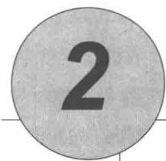

# 多臂赌博机

强化学习与其他机器学习方法最大的不同，就在于前者的训练信号是用来评估给定动作的好坏的，而不是通过给出正确动作范例来进行直接的指导。这使得主动地反复试验以试探出好的动作变得很有必要。单纯的“评估性反馈”只能表明当前采取的动作的好坏程度，但却无法确定当前采取的动作是不是所有可能性中最好的或者最差的。另一方面，单纯的“指导性反馈”表示的是应该选择的正确动作是什么，并且这个正确动作和当前实际采取的动作无关，这是有监督学习的基本方式，其被广泛应用于模式分类、人工神经网络和系统辨识等。上述两种不同的反馈有着很大的不同：评估性反馈依赖于当前采取的动作，即采取不同的动作会得到不同的反馈；而指导性反馈则不依赖于当前采取的动作，即采取不同的动作也会得到相同的反馈。当然，也有将两者结合起来的情况。

在本章中，我们将在只有一个状态的简化情况下讨论强化学习中评估与反馈的诸多性质。之前关于评估性反馈的很多研究都是在这种非关联性的简化情况下进行的，避免了完全强化学习问题中的许多复杂情况。通过研究这个问题，我们可以清楚地看到评估性反馈和指导性反馈如何不同，或者两者如何结合。

这个特别的非关联性的评估性反馈问题是“ $k$ 肾赌博机问题”的简化版本。我们使用这个问题介绍一系列基本的学习方法，这些方法将在后面介绍完全的强化学习问题时用到。在这章的最后，我们通过讨论赌博机问题变成可关联（即有多个不同状态）时的情况，更近一步地探讨完整的强化学习问题。

# 2.1 一个 $k$ 臂赌博机问题

考虑如下的一个学习问题：你要重复地在 $k$ 个选项或动作中进行选择。每次做出选择之后，你都会得到一定数值的收益，收益由你选择的动作决定的平稳概率分布产生。你的

目标是在某一段时间内最大化总收益的期望，比方说，1000次选择或者1000时刻之后。

这是“ $k$ 臂赌博机”问题的原始形式。这个名字源于老虎机（或者叫“单臂赌博机”），不同之处是它有 $k$ 个控制杆而不是一个。每一次动作选择就是拉动老虎机的一个控制杆，而收益就是得到的奖金。通过多次的重复动作选择，你要学会将动作集中到最好的控制杆上，从而最大化你的奖金。另一个类比是医生在一系列针对重病患者的试验性疗法之间进行选择。每次动作选择就是选择一种疗法，每次的收益是患者是否存活或者他因为治疗而得到的愉悦舒适感。现今“赌博机问题”这个术语有时候会作为由上述问题推广而来的大类问题的通称，但在本书中这个词只用来指赌博机这个简单的情形。

在我们的 $k$ 臂赌博机问题中， $k$ 个动作中的每一个在被选择时都有一个期望或者平均收益，我们称此为这个动作的“价值”。我们将在时刻 $t$ 时选择的动作记作 $A_{t}$ ，并将对应的收益记作 $R_{t}$ 。任一动作 $a$ 对应的价值，记作 $q_{*}(a)$ ，是给定动作 $a$ 时收益的期望：

$$
q _ {*} (a) \doteq \mathbb {E} \left[ R _ {t} \mid A _ {t} = a \right].
$$

如果你知道每个动作的价值，则解决 $k$ 臂赌博机问题就很简单：每次都选择价值最高的动作。我们假设你不能确切地知道动作的价值，但是你可以进行估计。我们将对动作 $a$ 在时刻 $t$ 时的价值的估计记作 $Q_{t}(a)$ ，我们希望它接近 $q_{*}(a)$ 。

如果你持续对动作的价值进行估计，那么在任一时刻都会至少有一个动作的估计价值是最高的，我们将这些对应最高估计价值的动作称为贪心的动作。当你从这些动作中选择时，我们称此为开发当前你所知道的关于动作的价值的知识。如果不是如此，而是选择非贪心的动作，我们则称此为试探，因为这可以让你改善对非贪心动作的价值的估计。“开发”对于最大化当前这一时刻的期望收益是正确的做法，但是“试探”从长远来看可能会带来总体收益的最大化。比如说，假设一个贪心动作的价值是确切知道的，而另外几个动作的估计价值与之差不多但是有很大的不确定性。这种不确定性足够使得至少一个动作实际上会好于贪心动作，但是你不知道是哪一个。如果你还有很多时刻可以用来做选择，那么对非贪心的动作进行试探并且发现哪一个动作好于贪心动作也许会更好。在试探的过程中短期内收益较低，但是从长远来看收益更高，因为你在发现了更好的动作后，你可以很多次地利用它。值得一提的是，在同一次动作选择中，开发和试探是不可能同时进行的，这种情况就是我们常常提到的开发和试探之间的冲突。

在一个具体案例中，到底选择“试探”还是“开发”一种复杂的方式依赖于我们得到的函数估计、不确定性和剩余时刻的精确数值。在 $k$ 臂赌博机及其相关的问题中，对于不同的数学建模，有很多复杂方法可以用来平衡开发和试探。然而，这些方法中有很多都对平稳情况和先验知识做出了很强的假设。而在实际应用以及接下来的章节中考虑的完全

的强化学习问题中，这些假设要么难以满足，要么无法被验证。而在理论假设不成立的情况下，这些方法的最优性或有界损失性是缺乏保证的。

在本书中我们并不特别关心用于平衡开发和试探的各种复杂巧妙的具体方法，我们更关心要不要去平衡它们。在这一章里，给出了几个针对 $k$ 臂赌博机问题的非常简单的平衡方法，并且显示它们比开发方法好很多。开发和试探的平衡是强化学习中的一个问题。 $k$ 臂赌博机的简单抽象让我们可以清楚地了解这一点。

# 2.2 动作-价值方法

下面我们来详细分析估计动作的价值的算法。我们使用这些价值的估计来进行动作的选择，这一类方法被统称为“动作-价值方法”。如前所述，动作的价值的真实值是选择这个动作时的期望收益。因此，一种自然的方式就是通过计算实际收益的平均值来估计动作的价值

$$
Q _ {t} (a) \doteq \frac {t \text {时 刻 前 通 过 执 行 动 作} a \text {得 到 的 收 益 总 和}}{t \text {时 刻 前 执 行 动 作} a \text {的 次 数}} = \frac {\sum_ {i = 1} ^ {t - 1} R _ {i} \cdot \mathbb {1} _ {A _ {i} = a}}{\sum_ {i = 1} ^ {t - 1} \mathbb {1} _ {A _ {i} = a}}, \tag {2.1}
$$

其中， $\mathbb{1}_{\mathrm{predicate}}$ 表示随机变量，当 predicate 为真时其值为 1，反之为 0。当分母为 0 时，我们将 $Q_{t}(a)$ 定义为某个默认值，比如 $Q_{t}(a) = 0$ 。当分母趋向无穷大时，根据大数定律， $Q_{t}(a)$ 会收敛到 $q_{*}(a)$ 。我们将这种估计动作价值的方法称为采样平均方法，因为每一次估计都是对相关收益样本的平均。当然，这只是估计动作价值的一种方法，而且不一定是最好的方法。我们继续使用这个简单的估计方法，讨论如何使用估计值来选择动作。

最简单的动作选择规则是选择具有最高估计值的动作，即前一节所定义的贪心动作。如果有多个贪心动作，那就任意选择一个，比如随机挑选。我们将这种贪心动作的选择方法记作

$$
A _ {t} \doteq \underset {a} {\operatorname {a r g m a x}} Q _ {t} (a), \tag {2.2}
$$

其中， $\arg \max_{a}$ 是使得 $Q_{t}(a)$ 值最大的动作 $a$ 。选择的贪心动作总是利用当前的知识最大化眼前的收益。这种方法根本不花时间去尝试明显的劣质动作，看看它们是否真的会更好。贪心策略的一个简单替代策略是大部分时间都表现得贪心，但偶尔（比如以一个很小的概率 $\epsilon$ ）以独立于动作-价值估计值的方式从所有动作中等概率随机地做出选择。我们将使用这种近乎贪心的选择规则的方法称为 $\epsilon$ -贪心方法。这类方法的一个优点是，如果时刻可以无限长，则每一个动作都会被无限次采样，从而确保所有的 $Q_{t}(a)$ 收敛到 $q_{*}(a)$ 。这当然也意味着选择最优动作的概率会收敛到大于 $1 - \epsilon$ ，即接近确定性选择。然而，这只是渐近性的保证，并且鲜有人提到这类方法的实际效果。

练习2.1 在 $\epsilon$ -贪心动作选择中，在有两个动作及 $\epsilon = 0.5$ 的情况下，贪心动作被选择的概率是多少？

# 2.3 10臂测试平台

为了大致评估贪心方法和 $\epsilon$ -贪心方法相对的有效性，我们将它们在一系列测试问题上进行了定量比较。这组问题是2000个随机生成的 $k$ 臂赌博机问题， $k = 10$ 。在每一个赌博机问题中，如图2.1显示的那样，动作的真实价值为 $q_{*}(a), a = 1, \ldots, 10$ ，从一个均值为0方差为1的标准正态（高斯）分布中选择。当对应于该问题的学习方法在时刻 $t$ 选择 $A_{t}$ 时，实际的收益 $R_{t}$ 则由一个均值为 $q_{*}(A_{t})$ 方差为1的正态分布决定。在图2.1中，这些分布显示为灰色区域。我们将这一系列测试任务称为10臂测试平台。对于任何学习方法，随着它在与一个赌博机问题的1000时刻交互中经验的积累，我们可以评估它的性能和动作。这构成了一轮试验。用2000个不同的赌博机问题独立重复2000个轮次的试验，我们就得到了对这个学习算法的平均表现的评估。

  
图2.1一个10臂赌博机问题的测试平台。这10个动作的真实值 $q_{*}(a)$ 分别从一个零均值单位方差的正态分布（高斯分布）中生成，然后实际的收益从均值为 $q_{*}(a)$ 单位方差的正态分布中生成，如图中灰色的分布所示  
图2.2在一个10臂测试平台上比较了上述的贪心方法和两种 $\epsilon$ -贪心方法（ $\epsilon = 0.01$

和 $\epsilon = 0.1$ )。所有方法都用采样平均策略来形成对动作价值的估计。上部的图显示了期望的收益随着经验的增长而增长。贪心方法在最初增长得略微快一些，但是随后稳定在一个较低的水平。相对于在这个测试平台上最好的可能收益1.55，这个方法每时刻只获得了大约1的收益。从长远来看，贪心的方法表现明显更糟，因为它经常陷入执行次优的动作的怪圈。下部的图显示贪心方法只在大约三分之一的任务中找到最优的动作。在另外三分之二的动作中，最初采样得到的动作非常不好，贪心方法无法跳出来找到最优的动作。 $\epsilon$ -贪心方法最终表现更好，因为它们持续地试探并且提升找到最优动作的机会。 $\epsilon = 0.1$ 的方法试探得更多，通常更早发现最优的动作，但是在每时刻选择这个最优动作的概率却永远不会超过 $91\%$ （因为要在 $\epsilon = 0.1$ 的情况下试探）。 $\epsilon = 0.01$ 的方法改善得更慢，但是在图中的两种测度下，最终的性能表现都会比 $\epsilon = 0.1$ 的方法更好。为了充分利用高和低的 $\epsilon$ 值的优势，随着时间的推移来逐步减小 $\epsilon$ 也是可以的。

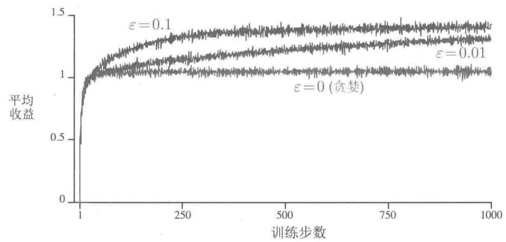

  
图2.2 $\varepsilon$ -贪心的“动作-价值”方法在10臂测试平台上的平均表现。这些数据是2000次不同的多臂赌博机实验的平均。所有的方法都采用采样平均作为对动作价值的估计

$\epsilon$ -贪心方法相对于贪心方法的优点依赖于任务。比方说，假设收益的方差更大，不

是1而是10。由于收益的噪声更多，所以为了找到最优的动作需要更多次的试探，而 $\epsilon$ -贪心方法会比贪心方法好很多。但是，如果收益的方差是0，那么贪心方法会在尝试一次之后就知道每一个动作的真实价值。在这种情况下，贪心方法实际上可能表现最好，因为它很快就会找到最佳的动作，然后再也不会进行试探。但是，即使在有确定性的情况下，如果我们弱化一些假设，对试探也有很大的好处。例如，假设赌博机任务是非平稳的，也就是说，动作的真实价值会随着时间而变化。在这种情况下，即使在有确定性的情况下，试探也是需要的，这是为了确认某个非贪心的动作不会变得比贪心动作更好。如我们将在接下来的几章中所见，非平稳性是强化学习中最常遇到的情况。即使每一个单独的子任务都是平稳而且确定的，学习者也会面临一系列像赌博机一样的决策任务，每个子任务的决策随着学习的推进会有所变化，这使得智能体的整体策略也会不断变化。强化学习需要在开发和试探中取得平衡。

练习2.2 赌博机的例子 考虑一个 $k = 4$ 的多臂赌博机问题，记作1、2、3、4。将一个赌博机算法应用于这个问题，算法使用 $\epsilon$ -贪心动作选择，基于采样平均的动作价值估计，初始估计 $Q_{1}(a) = 0, \forall a$ 。假设动作及收益的最初顺序是 $A_{1} = 1, R_{1} = -1, A_{2} = 2, R_{2} = 1, A_{3} = 2, R_{3} = -2, A_{4} = 2, R_{4} = 2, A_{5} = 3, R_{5} = 0$ 。在其中的某些时刻中，可能发生了 $\epsilon$ 的情形，导致一个动作被随机选择。请回答，在哪些时刻中这种情形肯定发生了？在哪些时刻中这种情形可能发生了？

练习2.3 在图2.2所示的比较中，从累计收益和选择最佳动作的可能性的角度考虑，哪种方法会在长期表现最好？好多少？定量地表述你的答案。

# 2.4 增量式实现

至今我们讨论的动作-价值方法都把动作价值作为观测到的收益的样本均值来估计。下面我们探讨如何才能以一种高效的方式计算这些均值，尤其是如何保持常数级的内存需求和常数级的单时刻计算量。

为了简化标记，我们关心单个动作。令 $R_{i}$ 表示这一动作被选择 $i$ 次后获得的收益， $Q_{n}$ 表示被选择 $n - 1$ 次后它的估计的动作价值，现在可以简单地把它写为

$$
Q _ {n} \doteq \frac {R _ {1} + R _ {2} + \cdots + R _ {n - 1}}{n - 1}.
$$

这种简明的实现需要维护所有收益的记录，然后在每次需要估计价值时进行计算。然而，由于已知的收益越来越多，内存和计算量会随着时间增长。每增加一次收益就需要更多的内存存储和更多的计算资源来对分子求和。

正如你怀疑的那样，这确实不是必须的。为了计算每个新的收益，很容易设计增量式公式以小而恒定的计算来更新平均值。给定 $Q_{n}$ 和第 $n$ 次的收益 $R_{n}$ ，所有 $n$ 个收益的新的均值可以这样计算

$$
\begin{array}{l} Q _ {n + 1} = \frac {1}{n} \sum_ {i = 1} ^ {n} R _ {i} \\ = \frac {1}{n} \left(R _ {n} + \sum_ {i = 1} ^ {n - 1} R _ {i}\right) \\ = \frac {1}{n} \left(R _ {n} + (n - 1) \frac {1}{n - 1} \sum_ {i = 1} ^ {n - 1} R _ {i}\right) \\ = \frac {1}{n} \left(R _ {n} + (n - 1) Q _ {n}\right) \\ = \frac {1}{n} \left(R _ {n} + n Q _ {n} - Q _ {n}\right) \\ = Q _ {n} + \frac {1}{n} \left[ R _ {n} - Q _ {n} \right], \tag {2.3} \\ \end{array}
$$

这个式子即使对 $n = 1$ 也有效，对任意 $Q_{1}$ ，可以得到 $Q_{2} = R_{1}$ 。对于每一个新的收益，这种实现只需要存储 $Q_{n}$ 和 $n$ ，和公式(2.3）的少量计算。

更新公式（2.3）的形式将会贯穿本书始终。它一般的形式是：

$$
\text {新 估 计 值} \leftarrow \text {旧 估 计 值} + \text {步 长} \times [ \text {目 标} - \text {旧 估 计 值} ]. \tag {2.4}
$$

表达式[目标－旧估计值]是估计值的误差。误差会随着向“目标”(Target)靠近的每一步而减小。虽然“目标”中可能充满噪声，但我们还是假定“目标”会告诉我们可行的前进方向。比如在上述例子中，目标就是第 $n$ 次的收益。

值得注意的是，上述增量式方法中的“步长”（stepsize）会随着时间而变化。处理动作 $a$ 对应的第 $n$ 个收益的方法用的“步长”是 $\frac{1}{n}$ 。在本书中我们将“步长”记作 $\alpha$ ，或者更普适地记作 $\alpha_{t}(a)$ 。

一个完整的使用以增量式计算的样本均值和 $\epsilon$ -贪心动作选择的赌博机问题算法的伪代码如下面的框中所示。假设函数 $\text{bandit}(a)$ 接受一个动作作为参数并且返回一个对应的收益。

# 一个简单的多臂赌博机算法

初始化，令 $a = 1$ 到 $k$

$$
Q (a) \leftarrow 0
$$

$$
N (a) \leftarrow 0
$$

无限循环：

[ A \leftarrow \begin{cases} \arg \max_{a} Q(a) & \text{以 } 1 - \varepsilon \text{ 概率 (随机跳出贪心)} \\ \text{一个随机的动作 以 } \varepsilon \text{ 概率} \end{cases} ]

$$
R \leftarrow b a n d i t (A)
$$

$$
N (A) \leftarrow N (A) + 1
$$

$$
Q (A) \leftarrow Q (A) + \frac {1}{N (A)} [ R - Q (A) ]
$$

# 2.5 跟踪一个非平稳问题

到目前为止我们讨论的取平均方法对平稳的赌博机问题是合适的，即收益的概率分布不随着时间变化的赌博机问题。但如果赌博机的收益概率是随着时间变化的，该方法就不合适。如前所述，我们经常会遇到非平稳的强化学习问题。在这种情形下，给近期的收益赋予比过去很久的收益更高的权值就是一种合理的处理方式。最流行的方法之一是使用固定步长。比如说，用于更新 $n - 1$ 个过去的收益的均值 $Q_{n}$ 的增量更新规则（2.3）可以改为

$$
Q _ {n + 1} \doteq Q _ {n} + \alpha \left[ R _ {n} - Q _ {n} \right], \tag {2.5}
$$

式中，步长参数 $\alpha \in (0,1]$ 是一个常数。这使得 $Q_{n + 1}$ 成为对过去的收益和初始的估计 $Q_{1}$ 的加权平均

$$
\begin{array}{l} Q _ {n + 1} = Q _ {n} + \alpha \left[ R _ {n} - Q _ {n} \right] \\ = \alpha R _ {n} + (1 - \alpha) Q _ {n} \\ = \alpha R _ {n} + (1 - \alpha) [ \alpha R _ {n - 1} + (1 - \alpha) Q _ {n - 1} ] \\ = \alpha R _ {n} + (1 - \alpha) \alpha R _ {n - 1} + (1 - \alpha) ^ {2} Q _ {n - 1} \\ = \alpha R _ {n} + (1 - \alpha) \alpha R _ {n - 1} + (1 - \alpha) ^ {2} \alpha R _ {n - 2} + \\ \dots + (1 - \alpha) ^ {n - 1} \alpha R _ {1} + (1 - \alpha) ^ {n} Q _ {1} \\ = (1 - \alpha) ^ {n} Q _ {1} + \sum_ {i = 1} ^ {n} \alpha (1 - \alpha) ^ {n - i} R _ {i}. \tag {2.6} \\ \end{array}
$$

我们将此称为加权平均，因为你可以验证权值的和是 $(1 - a)^n + \sum_{i=1}^{n} \alpha (1 - \alpha)^{n-i} = 1$ 。注意，赋给收益 $R_i$ 的权值 $\alpha (1 - \alpha)^{n-i}$ 依赖于它被观测到的具体时刻与当前时刻的差，即 $n - i$ 。 $1 - \alpha$ 小于 1，因此赋予 $R_i$ 的权值随着相隔次数的增加而递减。事实上，由于 $(1 - \alpha)$ 上的指数，权值以指数形式递减（如果 $1 - \alpha = 0$ ，根据约定 $0^0 = 1$ ，则所有的权值都赋给最后一个收益 $R_n$ ）。正因为如此，这个方法有时候也被称为“指数近因加权平均”。

有时候随着时刻一步步改变步长参数是很方便的。设 $\alpha_{n}(a)$ 表示用于处理第 $n$ 次选择动作 $a$ 后收到的收益的步长参数。正如我们注意到的，选择 $\alpha_{n}(a) = \frac{1}{n}$ 将会得到采样平均法，大数定律保证它可以收敛到真值。然而，收敛性当然不能保证对任何 $\{\alpha_{n}(a)\}$ 序列都满足。随机逼近理论中的一个著名结果给出了保证收敛概率为 1 所需的条件

$$
\sum_ {n = 1} ^ {\infty} \alpha_ {n} (a) = \infty   \text {且}   \sum_ {n = 1} ^ {\infty} \alpha_ {n} ^ {2} (a) <   \infty . \tag {2.7}
$$

第一个条件是要求保证有足够大的步长，最终克服任何初始条件或随机波动。第二个条件保证最终步长变小，以保证收敛。

注意，两个收敛条件在采样平均的案例 $\alpha_{n}(a) = \frac{1}{n}$ 中都得到了满足，但在常数步长参数 $\alpha_{n}(a) = \alpha$ 中不满足。在后面一种情况下，第二个条件无法满足，说明估计永远无法完全收敛，而是会随着最近得到的收益而变化。正如我们前面提到的，在非平稳环境中这是我们想要的，而且强化学习中的问题实际上常常是非平稳的。此外，符合条件(2.7）的步长参数序列常常收敛得很慢，或者需要大量的调试才能得到一个满意的收敛率。尽管在理论工作中很常用，但符合这些收敛条件的步长参数序列在实际应用和实验研究中很少用到。

练习2.4如果步长参数 $\alpha_{n}$ 不是常数，那么估计的 $Q_{n}$ 就是对于之前得到的收益的加权平均，其权值与公式(2.6)给出的不同。作为对公式(2.6)的推广，一般情况下，对于这样的步长参数序列，之前的每一次收益的步长分别是多少？

练习2.5（编程）设计并且实施一项实验来证实采用采样平均方法去解决非平稳问题的困难。使用一个10臂测试平台的修改版本，其中所有的 $q_{*}(a)$ 初始时相等，然后进行随机游走（比如说在每一步所有的 $q_{*}(a)$ 都加上一个均值为0标准差为0.01的正态分布的增量）。为其中一个使用采样平均和增量式计算的动作-价值方法，为另一个使用常数步长参数且 $\alpha = 0.1$ 的动作-价值方法，并做出如图2.2所示的分析。采用 $\epsilon = 0.1$ ，并且取很长的时间（比如10000步）。

# 2.6 乐观初始值

目前为止我们讨论的所有方法都在一定程度上依赖于初始动作值 $Q_{1}(a)$ 的选择。从统计学角度来说，这些方法（由于初始估计值）是有偏的。对于采样平均法来说，当所有动作都至少被选择一次时，偏差就会消失。但是对于步长为常数 $\alpha$ 的情况，如公式(2.6)给出的偏差会随时间减小，但不会消失。在实际中，这种偏差通常不是一个问题，有时甚至还会很有好处。缺点是，如果不将它们全部设置为0，则初始估计值实际上变成了一个必须由用户选择的参数集。好处是，通过它们可以简单地设置关于预期收益水平的先验知识。

初始动作的价值同时也提供了一种简单的试探方式。比如一个10臂的测试平台，我们替换掉原先的初始值0，将它们全部设为 $+5$ 。注意，如前所述，在这个问题中， $q_{*}(a)$ 是按照均值为0方差为1的正态分布选择的。因此 $+5$ 的初始值是一个过度乐观的估计。但是这种乐观的初始估计却会鼓励动作-价值方法去试探。因为无论哪一种动作被选择，收益都比最开始的估计值要小；因此学习器会对得到的收益感到“失望”，从而转向另一个动作。其结果是，所有动作在估计值收敛之前都被尝试了好几次。即使每一次都按照贪心法选择动作，系统也会进行大量的试探。

图2.3展示了在一个10臂测试平台上设定初始值 $Q_{1}(a) = +5$ ，并采用贪心算法的结果。为了比较，同时展示了 $\epsilon$ -贪心算法使用初始值 $Q_{1}(a) = 0$ 的结果。刚开始乐观初始化方法表现得比较糟糕，因为它需要试探更多次，但是最终随着时间的推移，试探的次数减少，它的表现也变得更好。我们把这种鼓励试探的技术叫作乐观初始价值。我们认为这是一个简单的技巧，在平稳问题中非常有效，但它远非鼓励试探的普遍有用的方法。例如，它不太适合非平稳问题，因为它试探的驱动力天生是暂时的。如果任务发生了变化，对试探的需求变了，则这种方法就无法提供帮助。事实上，任何仅仅关注初始条件的方法都不太可能对一般的非平稳情况有所帮助。开始时刻只出现一次，因此我们不应该过多地关注它。对于采样平均法也是如此，它也将时间的开始视为一种特殊的事件，用相同的权重平均所有后续的收益。但是所有这些方法都很简单，其中一个或几个简单的组合在实践中往往是足够的。在本书中，我们会经常使用这些简单的试探技巧。

练习2.6神秘的峰值 图2.3中展示的结果应该是相当可靠的，因为它们是2000个独立随机选择的10臂赌博机任务的平均值。那么，为什么乐观初始化方法在曲线的早期会出现振荡和峰值呢？换句话说，是什么使得这种方法在特定的早期步骤中表现得特别好或更糟？

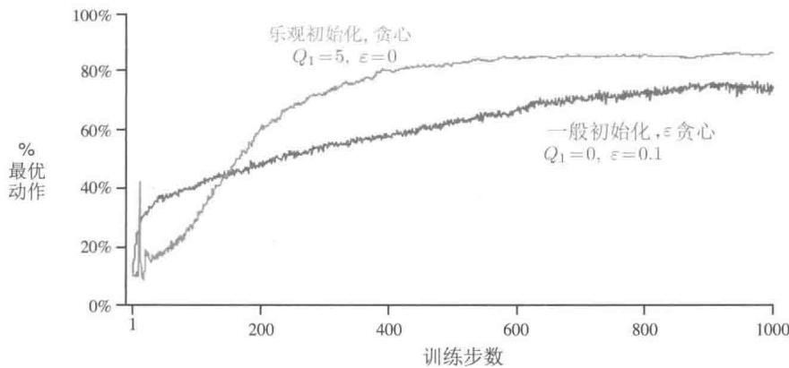  
图2.3 乐观的初始动作-价值估计在10臂赌博机测试平台上的运行效果。两种方法都使用相同的恒定的步长参数 $\alpha = 0.1$

练习2.7无偏恒定步长技巧在本章中的大多数案例中，我们使用采样平均来估计动作的价值，这是因为采样平均不会像恒定步长一样产生偏差，参见式(2.6)中的分析。然而，采样平均并不是完全令人满意的解决方案。在非平稳的问题中，它可能会表现得很差。我们是否有办法既能利用恒定步长方法在非平稳过程中的优势，又能有效避免它的偏差呢？一种可行的方法是利用如下的步长来处理某个特定动作的第 $n$ 个收益

$$
\beta_ {n} \doteq \alpha / \bar {\sigma} _ {n}, \tag {2.8}
$$

其中， $\alpha >0$ 是一个传统的恒定步长， $\bar{o}_n$ 是一个从零时刻开始计算的修正系数

$$
\bar {o} _ {n} \doteq \bar {o} _ {n - 1} + \alpha (1 - \bar {o} _ {n - 1}), \text {对} n \geqslant 0, \text {满 足} \bar {o} _ {0} \doteq 0. \tag {2.9}
$$

通过与式(2.6)类似的分析方法，试证明 $Q_{n}$ 是一个对初始值无偏的指数近因加权平均。

□

# 2.7 基于置信度上界的动作选择

因为对动作-价值的估计总会存在不确定性，所以试探是必须的。贪心动作虽然在当前时刻看起来最好，但实际上其他一些动作可能从长远看更好。 $\epsilon$ -贪心算法会尝试选择非贪心的动作，但是这是一种盲目的选择，因为它不大会去选择接近贪心或者不确定性特别大的动作。在非贪心动作中，最好是根据它们的潜力来选择可能事实上是最优的动作，这就要考虑到它们的估计有多接近最大值，以及这些估计的不确定性。一个有效的方法是按

照以下公式选择动作

$$
A _ {t} \doteq \underset {a} {\arg \max } \left[ Q _ {t} (a) + c \sqrt {\frac {\ln t}{N _ {t} (a)}} \right], \tag {2.10}
$$

在这个公式里， $\ln t$ 表示 $t$ 的自然对数（即 $\mathrm{e} \approx 2.71828$ 的多少次方等于 $t$ ）， $N_{t}(a)$ 表示在时刻 $t$ 之前动作 $a$ 被选择的次数（即公式2.1中的分母）。 $c$ 是一个大于0的数，它控制试探的程度。如果 $N_{t}(a) = 0$ ，则 $a$ 就被认为是满足最大化条件的动作。

这种基于置信度上界 (upper confidence bound, UCB) 的动作选择的思想是，平方根项是对 $a$ 动作值估计的不确定性或方差的度量。因此，最大值的大小是动作 $a$ 的可能真实值的上限，参数 $c$ 决定了置信水平。每次选 $a$ 时，不确定性可能会减小；由于 $N_{t}(a)$ 出现在不确定项的分母上，因此随着 $N_{t}(a)$ 的增加，这一项就减小了。另一方面，每次选择 $a$ 之外的动作时，在分子上的 $t$ 增大，而 $N_{t}(a)$ 却没有变化，所以不确定性增加了。自然对数的使用意味着随着时间的推移，增加会变得越来越小，但它是无限的。所有动作最终都将被选中，但是随着时间的流逝，具有较低价值估计的动作或者已经被选择了更多次的动作被选择的频率较低。

图2.4展示了在10臂测试平台上采用UCB算法的结果。如图所示，UCB往往会表现良好。但是和 $\epsilon$ -贪心算法相比，它更难推广到本书的其他章节研究的一些更一般的强化学习问题。一个困难是在处理非平稳问题时，它需要比2.5节中介绍的方法更复杂的方法。另一个难题是要处理大的状态空间，特别是本书的第Ⅱ部分研究的函数近似问题。在这些更复杂的问题中，目前还没有已知的实用方法利用UCB动作选择的思想。

  
图2.4UCB算法在10臂测试平台上的平均表现。如图所示，除了刚开始的 $k$ 步随机选择尚未尝试过的动作外，在一般情况下，UCB算法比 $\varepsilon$ -贪心算法表现要好

练习2.8UCB尖峰在图2.4中，UCB算法的表现在第11步的时候有一个非常明显的尖峰。为什么会产生这个尖峰呢？请注意，你必须同时解释为什么收益在第11步时会增

加，以及为什么在后续的若干步中会减少，你的答案才是令人满意的。（提示：如果 $c = 1$ 那么这个尖峰就不会那么突出了。）

# 2.8 梯度赌博机算法

到目前为止，我们已经探讨了评估动作价值的方法，并使用这些估计值来选择动作。这通常是一个好方法，但并不是唯一可使用的方法。在本节中，我们针对每个动作 $a$ 考虑学习一个数值化的偏好函数 $H_{t}(a)$ 。偏好函数越大，动作就越频繁地被选择，但偏好函数的概念并不是从“收益”的意义上提出的。只有一个动作对另一个动作的相对偏好才是重要的，如果我们给每一个动作的偏好函数都加上1000，那么对于按照如下softmax分布（吉布斯或玻尔兹曼分布）确定的动作概率没有任何影响

$$
\Pr \left\{A _ {t} = a \right\} \doteq \frac {e ^ {H _ {t} (a)}}{\sum_ {b = 1} ^ {k} e ^ {H _ {t} (b)}} \doteq \pi_ {t} (a), \tag {2.11}
$$

其中， $\pi_t(a)$ 是一个新的且重要的定义，用来表示动作 $a$ 在时刻 $t$ 时被选择的概率。所有偏好函数的初始值都是一样的（例如， $H_1(a) = 0, \forall a$ ），所以每个动作被选择的概率是相同的。

练习2.9 证明在两种动作的情况下，softmax分布与通常在统计学和人工神经网络中使用的logistic或sigmoid函数给出的结果相同。

基于随机梯度上升的思想，本文提出了一种自然学习算法。在每个步骤中，在选择动作 $A_{t}$ 并获得收益 $R_{t}$ 之后，偏好函数将会按如下方式更新

$$
\begin{array}{l} H _ {t + 1} \left(A _ {t}\right) \doteq H _ {t} \left(A _ {t}\right) + \alpha \left(R _ {t} - \bar {R} _ {t}\right) \left(1 - \pi_ {t} \left(A _ {t}\right)\right), \quad \text {以 及} \\ H _ {t + 1} (a) \doteq H _ {t} (a) - \alpha \left(R _ {t} - \bar {R} _ {t}\right) \pi_ {t} (a), \quad \text {对 所 有} a \neq A _ {t}, \tag {2.12} \\ \end{array}
$$

其中， $\alpha$ 是一个大于0的数，表示步长。 $\bar{R}_t \in \mathbb{R}$ 是在时刻 $t$ 内所有收益的平均值，可以按2.4节所述逐步计算（若是非平稳问题，则参照2.5节）。 $\bar{R}_t$ 项作为比较收益的一个基准项。如果收益高于它，那么在未来选择动作 $A_t$ 的概率就会增加，反之概率就会降低。未选择的动作被选择的概率上升。

图2.5展示了在一个10臂测试平台问题的变体上采用梯度赌博机算法的结果，在这个问题中，它们真实的期望收益是按照平均值为 $+4$ 而不是0（方差与之前相同）的正态分布来选择的。所有收益的这种变化对梯度赌博机算法没有任何影响，因为收益基准项让它可以马上适应新的收益水平。如果没有基准项（即把公式2.12中的 $\bar{R}_t$ 设为常数0），那么性能将显著降低，如图所示。

  
图2.5含收益基准项与不含收益基准项的梯度赌博机算法在10臂测试平台上的平均表现，其中我们设定 $q_{*}(a)$ 接近于 $+4$ 而不是0

# 通过随机梯度上升实现梯度赌博机算法

通过将梯度赌博机算法理解为梯度上升的随机近似，我们可以深入了解这一算法的本质。在精确的梯度上升算法中，每一个动作的偏好函数 $H_{t}(a)$ 与增量对性能的影响成正比

$$
H _ {t + 1} (a) \doteq H _ {t} (a) + \alpha \frac {\partial \mathbb {E} [ R _ {t} ]}{\partial H _ {t} (a)}, \tag {2.13}
$$

在这里性能的衡量指标定义为总体的期望收益

$$
\mathbb {E} \left[ R _ {t} \right] = \sum_ {x} \pi_ {t} (x) q _ {*} (x)
$$

而增量产生的影响就是上述性能衡量指标对动作偏好的偏导数。当然，我们不可能真的实现精确的梯度上升，因为真实的 $q_{*}(x)$ 是不知道的。但是事实上，前面的更新公式（2.12）与公式（2.13）采用期望价值时是等价的，即公式（2.12）是随机梯度上升方法的一个实例。对这个关系的证明只需要用初等的微积分推导几步。首先，我们仔细分析一下精确的性能梯度的定义

$$
\begin{array}{l} \frac {\partial \mathbb {E} [ R _ {t} ]}{\partial H _ {t} (a)} = \frac {\partial}{\partial H _ {t} (a)} \left[ \sum_ {x} \pi_ {t} (x) q _ {*} (x) \right] \\ = \sum_ {x} q _ {*} (x) \frac {\partial \pi_ {t} (x)}{\partial H _ {t} (a)} \\ = \sum_ {x} \left(q _ {*} (x) - B _ {t}\right) \frac {\partial \pi_ {t} (x)}{\partial H _ {t} (a)}, \\ \end{array}
$$

其中， $B_{t}$ 被称为“基准项”，可以是任何不依赖于 $x$ 的标量。我们可以把它加进来，因为所有动作的梯度加起来为0， $\sum_{x} \frac{\partial \pi_{t}(x)}{\partial H_{t}(a)} = 0$ 。即随着 $H_{t}(a)$ 的变化，一些动作的概率会增加或者减少，但是这些变化的总和为0，因为概率之和必须是1。然后我们将求和公式中的每项都乘以 $\pi_{t}(x) / \pi_{t}(x)$ ，等式保持不变

$$
\frac {\partial \mathbb {E} [ R _ {t} ]}{\partial H _ {t} (a)} = \sum_ {x} \pi_ {t} (x) \left(q _ {*} (x) - B _ {t}\right) \frac {\partial \pi_ {t} (x)}{\partial H _ {t} (a)} / \pi_ {t} (x).
$$

注意，上面的公式其实是一个“求期望”的式子：对随机变量 $A_{t}$ 所有可能的取值 $\mathcal{X}$ 进行函数求和，然后乘以对应取值的概率。可以将其简写为期望形式

$$
\begin{array}{l} = \mathbb {E} \left[ \left(q _ {*} (A _ {t}) - B _ {t}\right) \frac {\partial \pi_ {t} (A _ {t})}{\partial H _ {t} (a)} / \pi_ {t} (A _ {t}) \right] \\ = \mathbb {E} \left[ \left(R _ {t} - \bar {R} _ {t}\right) \frac {\partial \pi_ {t} \left(A _ {t}\right)}{\partial H _ {t} (a)} / \pi_ {t} \left(A _ {t}\right) \right], \\ \end{array}
$$

在这里我们选择 $B_{t} = \bar{R}_{t}$ ，并且将 $\bar{R}_t$ 用 $q_{*}(A_{t})$ 代替。这个选择是可行的，因为 $\mathbb{E}[R_t|A_t] = q_*(A_t)$ ，而且 $R_{t}$ （给定 $A_{t}$ ）与任何其他东西都不相关。很快我们就可以确定 $\frac{\partial\pi_t(x)}{\partial H_t(a)} = \pi_t(x)\bigl (\mathbb{1}_{a = x} - \pi_t(a)\bigr),\mathbb{1}_{a = x}$ 表示如果 $a = x$ 就取1，否则取0。假设现在我们有

$$
\begin{array}{l} = \mathbb {E} \left[ \left(R _ {t} - \bar {R} _ {t}\right) \pi_ {t} \left(A _ {t}\right) \left(\mathbb {1} _ {a = A _ {t}} - \pi_ {t} (a)\right) / \pi_ {t} \left(A _ {t}\right) \right] \\ = \mathbb {E} \left[ \left(R _ {t} - \bar {R} _ {t}\right) \left(\mathbb {1} _ {a = A _ {t}} - \pi_ {t} (a)\right) \right], \\ \end{array}
$$

回想一下，我们的计划是把性能指标的梯度写为某个东西的期望，这样我们就可以在每个时刻进行采样（就像我们刚刚做的那样），然后再进行与采样样本成比例地更新。将公式 (2.13) 中的性能指标的梯度用一个单独样本的期望值代替，可以得到

$$
H _ {t + 1} (a) = H _ {t} (a) + \alpha \bigl (R _ {t} - \bar {R} _ {t} \bigr) \bigl (\mathbb {1} _ {a = A _ {t}} - \pi_ {t} (a) \bigr), \qquad {\text {对 所 有}} a,
$$

你会发现这和我们在公式 (2.12) 中给出的原始算法是一致的。

现在我们只需要证明我们的假设 $\frac{\partial\pi_t(x)}{\partial H_t(a)} = \pi_t(x)\big(\mathbb{1}_{a = x} - \pi_t(a)\big)$ 就可以了。回想一下两个函数的商的导数推导公式：

$$
\frac {\partial}{\partial x} \left[ \frac {f (x)}{g (x)} \right] = \frac {\frac {\partial f (x)}{\partial x} g (x) - f (x) \frac {\partial g (x)}{\partial x}}{g (x) ^ {2}}.
$$

使用这个公式我们可以得到

$$
\begin{array}{l} \frac {\partial \pi_ {t} (x)}{\partial H _ {t} (a)} = \frac {\partial}{\partial H _ {t} (a)} \pi_ {t} (x) \\ = \frac {\partial}{\partial H _ {t} (a)} \left[ \frac {e ^ {H _ {t} (x)}}{\sum_ {y = 1} ^ {k} e ^ {H _ {t} (y)}} \right] \\ = \frac {\frac {\partial e ^ {H _ {t} (x)}}{\partial H _ {t} (a)} \sum_ {y = 1} ^ {k} e ^ {H _ {t} (y)} - e ^ {H _ {t} (x)} \frac {\partial \sum_ {y = 1} ^ {k} e ^ {H _ {t} (y)}}{\partial H _ {t} (a)}}{\left(\sum_ {y = 1} ^ {k} e ^ {H _ {t} (y)}\right) ^ {2}} \\ = \frac {\mathbb {1} _ {a = x} e ^ {H _ {t} (x)} \sum_ {y = 1} ^ {k} e ^ {H _ {t} (y)} - e ^ {H _ {t} (x)} e ^ {H _ {t} (a)}}{\left(\sum_ {y = 1} ^ {k} e ^ {H _ {t} (y)}\right) ^ {2}} \\ = \frac {\mathbb {1} _ {a = x} e ^ {H _ {t} (x)}}{\sum_ {y = 1} ^ {k} e ^ {H _ {t} (y)}} - \frac {e ^ {H _ {t} (x)} e ^ {H _ {t} (a)}}{\left(\sum_ {y = 1} ^ {k} e ^ {H _ {t} (y)}\right) ^ {2}} \\ = \mathbb {1} _ {a = x} \pi_ {t} (x) - \pi_ {t} (x) \pi_ {t} (a) \\ = \pi_ {t} (x) \left(\mathbb {1} _ {a = x} - \pi_ {t} (a)\right). \\ \end{array}
$$

（商的求导法则）

（因为 $\frac{\partial e^x}{\partial x} = e^x$ ）

我们已经证明了梯度赌博机算法的期望更新与期望收益的梯度是相等的，因此该算法是随机梯度上升算法的一种。这就保证了算法具有很强的收敛性。

注意，对于收益基准项，除了要求它不依赖于所选的动作之外，不需要其他任何的假设。例如，我们可以将其设置为0或1000，算法仍然是随机梯度上升算法的一个特例。基准项的选择不影响算法的预期更新，但它确实会影响更新值的方差，从而影响收敛速度(如图2.5所示)。采用收益的平均值作为基准项可能不是最好的，但它很简单，并且在实践中很有效。

# 2.9 关联搜索（上下文相关的赌博机）

本章到此为止，只考虑了非关联的任务，对它们来说，没有必要将不同的动作与不同的情境联系起来。在这些任务中，当任务是平稳的时候，学习器会试图寻找一个最佳的动作；当任务是非平稳的时候，最佳动作会随着时间的变化而改变，此时它会试着去追踪最佳动作。然而，在一般的强化学习任务中，往往有不止一种情境，它们的目标是学习一种策略：一个从特定情境到最优动作的映射。为了进行一般性问题分析，下面我们简要地探讨从非关联任务推广到关联任务的最简单的方法。

举个例子，假设有一系列不同的 $k$ 臂赌博机任务，每一步你都要随机地面对其中的一个。因此，赌博机任务在每一步都是随机变化的。从观察者的角度来看，这是一个单一的、非平稳的 $k$ 臂赌博机任务，其真正的动作价值是每步随机变化的。你可以尝试使用本章中描述的处理非平稳情况的方法，但是除非真正的动作价值的改变是非常缓慢的，否则这些方法不会有很好的效果。现在假设，当你遇到某一个 $k$ 臂赌博机任务时，你会得到关于这个任务的编号的明显线索（但不是它的动作价值）。也许你面对的是一个真正的老虎机，它的外观颜色与它的动作价值集合一一对应，动作价值集合改变的时候，外观颜色也会改变。那么，现在你可以学习一些任务相关的操作策略，例如，用你所看到的颜色作为信号，把每个任务和该任务下最优的动作直接关联起来，比如，如果为红色，则选择1号臂；如果为绿色，则选择2号臂。有了这种任务相关的策略，在知道任务编号信息时，你通常要比不知道任务编号信息时做得更好。

这是一个关联搜索任务的例子，因为它既涉及采用试错学习去搜索最优的动作，又将这些动作与它们表现最优时的情境关联在一起。关联搜索任务现在通常在文献中被称为上下文相关的赌博机。关联搜索任务介于 $k$ 臂赌博机问题和完整强化学习问题之间。它与完整强化学习问题的相似点是，它需要学习一种策略。但它又与 $k$ 臂赌博机问题相似，体现在每个动作只影响即时收益。如果允许动作可以影响下一时刻的情境和收益，那么这就是完整的强化学习问题。我们会在下一章中提出这个问题，并在本书的其他章节中研究它。

练习2.10 假设你现在正面对一个2臂赌博机任务，而它的真实动作价值是随时间随机变化的。特别地，假设对任意的时间，动作1和2的真实价值有 $50\%$ 的概率是0.1和0.2（情况A）， $50\%$ 的概率是0.9和0.8（情况B）。如果在每一步时你无法确认面对的是哪种情况，那么这时最优的期望成功值是多少？你如何才能得到它？现在假设每一步你被告知了情况是A还是B（但是你还是不知道真实价值，只是能够区分是不同情况）。这就是一个关联搜索的任务。对这个任务，最优的期望成功值又是多少？你应该采取什么样的策略才能达到最优？

# 2.10 本章小结

我们在这一章介绍了几种平衡试探和开发的简单方法。 $\epsilon$ -贪心方法在一小段时间内进行随机的动作选择；而UCB方法虽然采用确定的动作选择，却可以通过在每个时刻对那些具有较少样本的动作进行优先选择来实现试探。梯度赌博机算法则不估计动作价值，而是利用偏好函数，使用softmax分布来以一种分级的、概率式的方式选择更优的动作。简

单地将收益的初值进行乐观的设置，就可以让贪心方法也能进行显式试探。

很自然地，我们会问哪种方法最好。尽管这是一个很难回答的问题，但我们可以在本章的10臂测试平台上运行它们，并比较它们的性能。一个难题是它们都有一个参数，为了进行一个有意义的比较，我们将把它们的性能看作关于它们参数的一个函数。到目前为止，我们的图表已经分别给出了每种算法及参数随时间推移的学习曲线。但如果我们把所有算法的所有参数对应的学习曲线全部画在一起，就会过于复杂，造成视觉上的混乱。所以我们总结了一个完整的精简的学习曲线，展示了每种算法和参数超过1000步的平均收益值，这个值与学习曲线下的面积成正比。图2.6显示了这一章中各种赌博机算法的性能曲线，每条算法性能曲线都被看作一个自己参数的函数， $x$ 轴用单一的尺度显示了所有的参数。这种类型的图称为参数研究图。需要注意的是， $x$ 轴上参数值的变化是2的倍数，并以对数坐标表示。由图可见，每个算法性能曲线呈倒U形；所有算法在其参数的中间值处表现最好，既不太大也不太小。在评估一种方法时，我们不仅要关注它在最佳参数设置上的表现，还要注意它对参数值的敏感性。所有这些算法都是相当不敏感的，它们在一系列的参数值上表现得很好，这些参数值的大小是一个数量级的。总的来说，在这个问题上，UCB似乎表现最好。

  
图2.6本章中不同赌博机算法的参数调整研究。图中每一个点表示特定算法在特定参数下执行超过1000步以后的平均收益

尽管这一章中提出的方法很简单，但在我们看来，它们被公认为是最先进的技术。虽然有更复杂的方法，但它们的复杂性和假设使它们在我们真正关注的完整强化学习问题中并不适用。从第5章开始，我们会提出解决完整强化学习问题的学习方法，它们部分地使用了本章探讨的简单方法。

虽然本章探讨的简单方法可能是目前让我们能做到最好的方法，但它们还远远不能解决平衡试探和开发的问题。

在 $k$ 臂赌博机问题中，平衡试探和开发的一个经典解决方案是计算一个名为Gittins指数的特殊函数。这为一些赌博机问题提供了一个最优的解决方案，比在本章中讨论的方法更具有一般性，但前提是已知可能问题的先验分布。不幸的是，这种方法的理论和可计算性都不能推广到我们在本书中探讨的完整强化学习问题。

贝叶斯方法假定已知动作价值的初始分布，然后在每步之后更新分布（假定真实的动作价值是平稳的）。一般来说，更新计算可能非常复杂，但对于某些特殊分布（称为共轭先验）则很容易。这样，我们就可以根据动作价值的后验概率，在每一步中选择最优的动作。这种方法，有时称为后验采样或Thompson采样，通常与我们在本章中提出的最好的无分布方法性能相近。

贝叶斯方法甚至可以计算出试探和开发之间的最佳平衡。对于任何可能的动作，我们都可以计算出它对应的即时收益的分布，以及相应的动作价值的后验分布。这种不断变化的分布成为问题的信息状态。假设问题的视界有1000步，则可以考虑所有可能的动作，所有可能的收益，所有可能的下一个动作，所有下一个收益，等等，依此类推到全部1000步。有了这些假设，可以确定每个可能的事件链的收益和概率，并且只需挑选最好的。但可能性树会生长得非常快，即使只有两种动作和两种收益，树也会有 $2^{2000}$ 个叶子节点。完全精确地进行这种庞大的计算通常是不现实的，但可能可以有效地近似。贝叶斯方法有效地将赌博机问题转变为完整强化学习问题的一个实例。最后，我们可以使用如本书第Ⅱ部分中提出的近似强化学习方法来逼近最优解。但这个话题已经是一个科研问题了，超出了本书的讨论范围。

练习2.11（编程）为在练习2.5中提出的非平稳情况作一张类似图2.6的图。包括 $\alpha = 0.1$ 的恒定步长 $\epsilon$ -贪心算法。运行200000步，并将过去100000步的平均收益作为每个算法和参数集的性能度量。

# 参考文献和历史评注

2.1 赌博机问题在统计学、工程学和心理学方面都被研究过。在统计学方面，赌博机问题属于“实验顺序设计”问题，由Thompson（1933，1943）和Robbins（1952）提出，并且Bellman(1956)对其做了进一步研究。Berry和Fristedt（1985）从统计学的角度对解决赌博机问题的方法做了进一步扩展。Narendra和Thathachar（1989）从工程学角度研究了赌博机问题，并且对解决赌博机问题的各种理论进行了全面的讨论。在心理学方面，赌博机问题对统计学习理论有着重要影响（例如，Bush和Mosteller，1955；Estes，1950）。

术语贪心（greedy）经常被用在启发式搜索的文献中（例如，Pearl，1984）。试探与开发之间的冲突在控制工程中对应的是辨识（或估计）和控制之间的冲突（例如，Witten，1976）。

Feldbaum（1965）称其为对偶控制问题，指的是在控制具有不确定性的系统时，需要同时解决辨识和控制这两个问题。在遗传算法方面，Holland（1975）强调了这个冲突的重要性，也就是开发已有信息的需求和发现新信息的需求之间的冲突。

2.2 解决 $k$ 臂赌博机问题的动作-价值方法是由 Thathachar 和 Sastry（1985）首次提出来的。这类方法在自动学习机的研究文献中通常被称为估计子 (estimator) 算法。术语动作价值是由 Watkins（1989）提出来的。第一个使用 $\varepsilon$ -贪心方法的人有可能也是 Watkins（1989，p. 187），但是这个方法很简单，也可能有更早的使用。  
2.4-5 这部分可以认为是通用的随机迭代算法的一部分，这类方法被Bertsekas和Tsitsiklis（1996）很好地研究过。  
2.6 乐观初始化的概念是由Sutton（1996）首次引入到强化学习中的。  
2.7 早期的基于置信度上界的估计来选择动作的文章有Lai和Robbins(1985)、Kaelbling(1993b)和Agrawal(1995)。我们这里提到的UCB算法在文献中被称为UCB1，是由Auer、Cesa-Bianchi和Fischer(2002)最早实现的。  
2.8 梯度赌博机算法是基于梯度的强化学习算法的一种特殊情况，由Williams（1992）提出。后来，在此算法的基础上提出了本书后面会详细介绍的“行动器-评判器”算法和策略梯度算法。我们对此算法的研究深受Balaraman Ravindran的影响。关于“基准项”的进一步讨论，可以参阅Greensmith、Bartlett、Baxter（2002，2004）和Dick（2015）的文章。对这些算法早期的系统性的研究是由Sutton（1984）完成的。

在动作选择公式 (2.11) 中提到的术语 softmax 来自于 Bridle (1990)。但是这个概念是由 Luce (1959) 首先提出的。

2.9 术语关联搜索和对应的问题是由 Barto、Sutton 和 Brouwer (1981) 提出的。术语关联式强化学习也曾用来表示关联搜索（Barto，Anandan，1985），但是我们更倾向于把这个术语保留下来，用作完整强化学习问题（Sutton，1984）的同义词（据我们观察，现代文献中也会用“上下文赌博机”来表示这个问题）。注意，Thorndike 的效应定律（参见第 1 章）中的关联搜索指的是情境（状态）和动作之间的关联。根据操作性条件反射或工具性条件反射的理论（例如，Skinner，1938），一个鉴别性刺激指的是能够对某个特定的增强事件发生的信号做出反应。而在我们的术语体系中，不同的鉴别性刺激对应不同的状态。  
2.10 Bellman (1956) 第一次提出了如何用动态规划来解决试探和开发之间的最优平衡问题，并将该问题用贝叶斯理论进行了数学上的形式化表达。Gittins 指数方法是由 Gittins 和 Jones (1974) 提出的。Duff (1995) 介绍了如何用强化学习方法学到赌博机问题的 Gittins 指数。Kumar (1985) 的文章中详细讨论了解决这个问题的贝叶斯方法和非贝叶斯方法。术语信息状态来自于部分可观测马尔可夫决策过程的文献，例如，Lovejoy (1991)。

另一些研究的关注点在试探的效率方面，也即算法多快能找到最优的决策策略。一种形式化的衡量试探效率的方法就是类比有监督学习中的样本复杂性的概念，也就是说，用达到某个目标函数准确度所用的训练样本数来表示试探的效率。强化学习算法的试探过程的样本复杂性的一个定义是：算法在取得接近最优的动作之前所花费的时刻的数量 (Kakade, 2003)。Li (2012) 的文章中对比了一些关于强化学习中试探效率问题的理论方法。在现代，解决这个问题的方法“Thompson采样”是由Russo et al. (2018)提出的。

# 有限马尔可夫决策过程

在这一章中，我们将正式介绍有限马尔可夫决策过程（有限MDP），这也是本书后面要试图解决的问题。这个问题既涉及“评估性反馈”（如前面介绍的赌博机问题），又涉及“发散联想”，即在不同情境下选择不同的动作。MDP是序列决策的经典形式化表达，其动作不仅影响当前的即时收益，还影响后续的情境（又称状态）以及未来的收益。因此，MDP涉及了延迟收益，由此也就有了在当前收益和延迟收益之间权衡的需求。在赌博机问题中，我们估计了每个动作 $a$ 的价值 $q_{*}(a)$ ；而在MDP中，我们估计每个动作 $a$ 在每个状态 $s$ 中的价值 $q_{*}(s,a)$ ，或者估计给定最优动作下的每个状态的价值 $v_{*}(s)$ 。对于估计单个动作选择的长期结果来说，这些状态相关的数量是至关重要的。

MDP是强化学习问题在数学上的理想化形式，因为在这个框架下我们可以进行精确的理论说明。本章将介绍这个问题的数学化结构中的若干关键要素，如回报、价值函数和贝尔曼方程。还会讨论可以被抽象为有限MDP的各种应用。与所有的人工智能一样，问题的适用范围和数学灵活性之间存在一定矛盾。在本章中，我们将介绍这种矛盾，并讨论矛盾背后存在的权衡和挑战。一些MDP不能使用的强化学习方法将在第17章中讨论。

# 3.1 “智能体-环境”交互接口

MDP 就是一种通过交互式学习来实现目标的理论框架。进行学习及实施决策的机器被称为智能体 (agent)。智能体之外所有与其相互作用的事物都被称为环境 (environment)。这些事物之间持续进行交互，智能体选择动作，环境对这些动作做出相应的响应，并向智能体呈现出新的状态。1 环境也会产生一个收益，通常是特定的数值，这就是智能体在动

作选择过程中想要最大化的目标，如图3.1所示

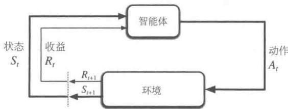  
图3.1 马尔可夫决策过程中的“智能体-环境”交互

更具体地说，在每个离散时刻 $t = 0,1,2,3,\ldots$ ，智能体和环境都发生了交互。在每个时刻 $t$ ，智能体观察到所在的环境状态的某种特征表达， $S_{t}\in S$ ，并且在此基础上选择一个动作， $A_{t}\in \mathcal{A}(s)$ 。下一时刻，作为其动作的结果，智能体接收到一个数值化的收益， $R_{t + 1}\in \mathcal{R}\subset \mathbb{R}$ ，并进入一个新的状态 $S_{t + 1}$ 。从而，MDP和智能体共同给出了一个序列或轨迹，类似这样

$$
S _ {0}, A _ {0}, R _ {1}, S _ {1}, A _ {1}, R _ {2}, S _ {2}, A _ {2}, R _ {3}, \dots \tag {3.1}
$$

在有限MDP中，状态、动作和收益的集合 $(S, A$ 和 $\mathcal{R}$ )都只有有限个元素。在这种情况下，随机变量 $R_{t}$ 和 $S_{t}$ 具有定义明确的离散概率分布，并且只依赖于前继状态和动作。也就是说，给定前继状态和动作的值时，这些随机变量的特定值， $s' \in S$ 和 $r \in \mathcal{R}$ 在t时刻出现的概率是

$$
p \left(s ^ {\prime}, r \mid s, a\right) \doteq \Pr \left\{S _ {t} = s ^ {\prime}, R _ {t} = r \mid S _ {t - 1} = s, A _ {t - 1} = a \right\}, \tag {3.2}
$$

对于任意 $s', s \in S, r \in \mathcal{R}$ ，以及 $a \in \mathcal{A}(s)$ 。函数 $p$ 定义了MDP的动态特性。公式中等号上的圆点提醒我们，这是一个定义（在这种情况下是函数 $p$ ），而不是从之前定义推导出来的事实。动态函数 $p: \mathcal{S} \times \mathcal{R} \times \mathcal{S} \times \mathcal{A} \to [0,1]$ 是有4个参数的普通的确定性函数。中间的“|”是表示条件概率的符号，但这里也只是提醒我们，函数 $p$ 为每个 $s$ 和 $a$ 的选择都指定了一个概率分布，即

$$
\sum_ {s ^ {\prime} \in \mathcal {S}} \sum_ {r \in \mathcal {R}} p (s ^ {\prime}, r | s, a) = 1, \text {对 于 所 有} s \in \mathcal {S}, a \in \mathcal {A} (s). \tag {3.3}
$$

在马尔可夫决策过程中，由 $p$ 给出的概率完全刻画了环境的动态特性。也就是说， $S_{t}$ 和 $R_{t}$ 的每个可能的值出现的概率只取决于前一个状态 $S_{t-1}$ 和前一个动作 $A_{t-1}$ ，并且与更早之前的状态和动作完全无关。这个限制并不是针对决策过程，而是针对状态的状态必须包括过去智能体和环境交互的方方面面的信息，这些信息会对未来产生一定影响。这样，状态就被认为具有马尔可夫性。我们假设这种马尔可夫性贯穿本书，尽管从第Ⅱ部分开始，我们会考虑不依赖这种性质的近似方法，并且在第17章中考虑如何从非马尔可夫观测中学习并构造马尔可夫状态。

从四参数动态函数 $p$ 中，我们可以计算出关于环境的任何其他信息，例如状态转移概率（我们将其表示为一个三参数函数 $p: S \times S \times \mathcal{A} \to [0,1]$ ）

$$
p \left(s ^ {\prime} \mid s, a\right) \doteq \Pr \left\{S _ {t} = s ^ {\prime} \mid S _ {t - 1} = s, A _ {t - 1} = a \right\} = \sum_ {r \in \mathcal {R}} p \left(s ^ {\prime}, r \mid s, a\right). \tag {3.4}
$$

我们还可以定义“状态-动作”二元组的期望收益，并将其表示为一个双参数函数 $r: \mathcal{S} \times \mathcal{A} \to \mathbb{R}$

$$
r (s, a) \doteq \mathbb {E} [ R _ {t} \mid S _ {t - 1} = s, A _ {t - 1} = a ] = \sum_ {r \in \mathcal {R}} r \sum_ {s ^ {\prime} \in \mathcal {S}} p \left(s ^ {\prime}, r \mid s, a\right), \tag {3.5}
$$

和“状态-动作-后继状态”三元组的期望收益，并将其表示为一个三参数函数 $r: \mathcal{S} \times \mathcal{A} \times \mathcal{S} \rightarrow \mathbb{R}$

$$
r (s, a, s ^ {\prime}) \doteq \mathbb {E} \left[ R _ {t} \mid S _ {t - 1} = s, A _ {t - 1} = a, S _ {t} = s ^ {\prime} \right] = \sum_ {r \in \mathcal {R}} r \frac {p \left(s ^ {\prime} , r \mid s , a\right)}{p \left(s ^ {\prime} \mid s , a\right)}. \tag {3.6}
$$

在本书中，我们经常会用到四参数函数 $p$ (式3.2)，但也会偶尔用其他函数。

MDP 框架非常抽象与灵活，并且能够以许多不同的方式应用到众多问题中。例如，时间步长不需要是真实时间的固定间隔，也可以是决策和行动的任意的连贯阶段。动作可以是低级的控制，例如机器臂的发动机的电压，也可以是高级的决策，例如是否吃午餐或是否去研究院。同样地，状态可以采取多种表述形式。它们可以完全由低级感知决定，例如传感器的直接读数，也可以是更高级、更抽象的，比如对房间中的某个对象进行的符号性描述。状态的一些组成成分可以是基于过去感知的记忆，甚至也可以是完全主观的。例如，智能体可能不确定对象位置，也可能刚刚响应过某种特定的感知。类似地，一些动作可能是完全主观的或完全可计算的。例如，一些动作可以控制智能体选择考虑的内容，或者控制它把注意力集中在哪里。一般来说，动作可以是任何我们想要做的决策，而状态则可以是任何对决策有所帮助的事情。

特别地，智能体和环境之间的界限通常与机器人或动物身体的物理边界不同。一般情况下，这个界限离智能体更近。例如，机器人的发动机、机械连接及其传感硬件通常应被

视为环境的一部分，而非智能体的一部分。同样，如果我们将MDP框架应用到人或动物身上，肌肉、骨骼和感觉器官也应被视为环境的一部分。类似地，收益发生在自然或人工学习系统的物理结构之内，但却算在智能体之外。

我们遵循的一般规则是，智能体不能改变的事物都被认为是在外部的，即是环境的一部分。但我们并不是假定智能体对环境一无所知。例如，智能体通常会知道如何通过一个动作和状态的函数来计算所得到的收益。但是，我们通常认为收益的计算在智能体的外部，因为它定义了智能体所面临的任务，因此智能体必然无法随意改变它。事实上，在某些情况下，智能体可能了解环境的一切工作机制，然而即便如此，它面临的强化学习任务仍然是困难的，正如我们知道魔方的原理，却仍然无法解决它。智能体和环境的界限划分仅仅决定了智能体进行绝对控制的边界，而并不是其知识的边界。

出于不同的目的，智能体-环境的界限可以被放在不同的位置。在一个复杂的机器人里，多个智能体可能会同时工作，但它们各自有各自的界限。比如，一个智能体可能负责高级决策，而对于执行高级决策的低级智能体来说，这些决策可能就是其状态的一部分。在实践中，一旦选择了特定的状态、动作和收益，智能体-环境的界限就已经被确定了，从而定义了一个特定决策任务。

MDP 框架是目标导向的交互式学习问题的一个高度抽象。它提出，无论感官、记忆和控制设备细节如何，无论要实现何种目标，任何目标导向的行为的学习问题都可以概括为智能体及其环境之间来回传递的三个信号：一个信号用来表示智能体做出的选择（行动），一个信号用来表示做出该选择的基础（状态），还有一个信号用来定义智能体的目标（收益）。这个框架也许不能有效地表示所有决策学习问题，但它已被证明其普遍适用性和有效性。

当然，对于不同的任务，特定的状态和动作的定义差异很大，并且其性能极易受其表征方式的影响。与其他类型的学习一样，在强化学习中，目前对它们的选择更像是实用技巧，而非科学。在本书中，我们提供了一些关于状态和动作表征的建议和示例，但是我们的重点是其背后的一般原则，即确定表征方式之后如何进行决策的学习。

例3.1生物反应器假设强化学习被用于确定生物反应器（一个巨大的培养皿，包含大量营养物和用于生产有用化学物质的细菌）的瞬时温度和搅拌速率。这个应用中的动作可能是设定目标温度和目标搅拌速率，这会被传递到较低级别的控制系统，低级别的控制系统从而直接激活加热元件和电动机以达到目标。状态很可能是热电偶，其他被过滤、延迟后的传感器读数，以及代表大量目标化学品成分的符号输入。收益可能是生物反应器产生有用化学物质速率的逐时测量。请注意，这里每个状态是传感器读数和符号输入的列表或向

量，并且每个动作是由目标温度和搅拌速率组成的向量。这是一个典型的强化学习任务，其具有结构化表示的状态和动作。另一方面，收益总是单个标量数值。

例3.2拾放机器人 考虑使用强化学习来控制机器臂进行重复拾放的任务。如果我们希望学习到快速平稳的运动方式，智能体将需要直接控制发动机，并获得关于当前机械联动位置和速度的低延迟信息。在这种情况下，动作可能是每个连接处施加到各个电动机的电压，而状态可能是连接处的角度和速度的最新示数。当成功拾取和放置一个物件时，收益可能是 $+1$ 。为了鼓励平稳的运动，在每一个时刻可以设定一个微量负值收益，定义为瞬时“抖动”的函数，它可以作为对非平稳运动的惩罚。

练习3.1 自己设计三个符合MDP框架的任务，并确定每个任务的状态、动作和收益。这三个任务要尽可能不同。而且框架要抽象灵活，并能以多种方式进行应用。至少在其中一个任务中，尝试去突破它的限制。

练习3.2 MDP框架是否足以有效地表示所有目标导向的学习任务？你能给出反例吗？□练习3.3考虑一个关于驾驶的问题。你可以通过油门、方向盘和刹车来定义动作，就像你驾驶它的方式一样。或者你可以进行更底层的定义，比如，在轮胎与地面接触的过程中，把动作想象为轮胎扭转。或者更上层的，比如，在大脑和肢体交互的过程中，动作就是通过肌肉收缩来控制四肢的。在更高的层次上，动作可以是驾驶目的地的选择。对哪一个层次的理解能更好地划分智能体和环境？在什么基础上选择这种划分会更有优势？划分的基本原则是什么？还是说这只是一个随意的选择？

# 例3.3 回收机器人

一个回收机器人可以完成在办公环境中收集废弃易拉罐的工作。它具有用于检测易拉罐的传感器，以及可以拿起易拉罐并放入机载箱中的臂和夹具，并由可充电电池供能。机器人的控制系统包括用于传感信息解释、导航和控制手臂与夹具的组件。强化学习智能体基于当前电池电量，做出如何搜索易拉罐的高级决策。举个简单的例子，假设只有两个可区分的充电水平，并组成一个很小的状态集合 $S = \{ \text{high, low} \}$ 。在每个状态中，智能体可以决定是否应该：(1) 在某段特定时间内主动搜索 (search) 易拉罐；(2) 保持静止并等待 (wait) 易拉罐；或 (3) 直接回到基地充电 (recharge)。当能量水平高 (high) 时，充电的动作是非常愚蠢的动作，所以我们不会把它加入这个状态对应的动作集合中。于是我们可以把动作集合表示为 $A(\text{high}) = \{ \text{search, wait} \}$ 和 $A(\text{low}) = \{ \text{search, wait, recharge} \}$ 。

在大多数情况下，收益为零；但当机器人捡到一个空罐子时，收益就为正；或

当电池完全耗尽时，收益就是一个非常大的负值。寻找罐子的最好方法是主动搜索，但这会耗尽机器人的电池，而等待则不会。每当机器人进行搜索时，电池都有被耗尽的可能性。耗尽时，机器人必须关闭系统并等待被救（产生低收益）。如果能量水平高，那么总是可以完成一段时间的主动搜索，而不用担心没电。以高能级开始进行一段时间的搜索后，其能量水平仍是高的概率为 $\alpha$ ，下降为低的概率为 $1 - \alpha$ 。另一方面，以低能级开始进行一段时间的搜索后，其能量水平仍是低（low）的概率为 $\beta$ ，耗尽电池能量的概率为 $1 - \beta$ 。在后一种情况下，机器人需要人工救援，然后将电池重新充电至高水平。机器人收集的每个罐子都可作为一个单位收益，而每当机器人需要被救时，收益为-3。让 $r_{\mathrm{search}}$ 和 $r_{\mathrm{wait}}$ （ $r_{\mathrm{search}} > r_{\mathrm{wait}}$ ）分别表示机器人在搜索和等待期间收集的期望数量（也就是期望收益）。最后，假设机器人在充电时不能收集罐子，并且在电池耗尽时也不能收集罐子。这个系统则是一个有限MDP，我们可以写出其转移概率和期望收益，其动态变化如下表所示。

<table><tr><td>s</td><td>a</td><td>s&#x27;</td><td>p(s&#x27;|s,a)</td><td>r(s,a,s&#x27;)</td></tr><tr><td>high</td><td>search</td><td>high</td><td>α</td><td>r_search</td></tr><tr><td>high</td><td>search</td><td>low</td><td>1-α</td><td>r_search</td></tr><tr><td>low</td><td>search</td><td>high</td><td>1-β</td><td>-3</td></tr><tr><td>low</td><td>search</td><td>low</td><td>β</td><td>r_search</td></tr><tr><td>high</td><td>wait</td><td>high</td><td>1</td><td>r_wait</td></tr><tr><td>high</td><td>wait</td><td>low</td><td>0</td><td>r_wait</td></tr><tr><td>low</td><td>wait</td><td>high</td><td>0</td><td>r_wait</td></tr><tr><td>low</td><td>wait</td><td>low</td><td>1</td><td>r_wait</td></tr><tr><td>low</td><td>recharge</td><td>high</td><td>1</td><td>0</td></tr><tr><td>low</td><td>recharge</td><td>low</td><td>0</td><td>0</td></tr></table>

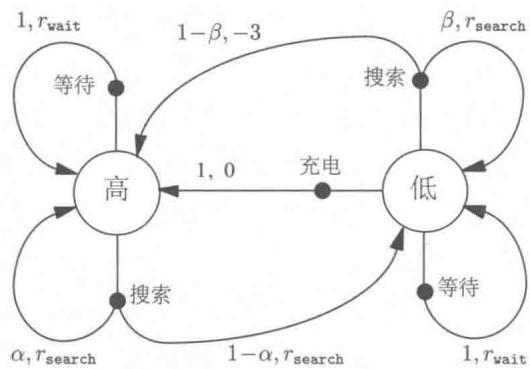

请注意，当前状态 $s$ 、动作 $a\in \mathcal{A}(s)$ 和后继状态 $s^{\prime}$ 的每一个可能的组合都在表中有对应的一行表示。另一种归纳有限MDP的有效方法就是转移图，如上图所示。图中有两种类型的节点：状态节点和动作节点。每个可能的状态都有一个状态

节点（以状态命名的一个大空心圆），而每个“状态-动作”二元组都有一个动作节点（以动作命名的一个小实心圆，和指向状态节点的连线）。从状态 $s$ 开始并执行动作 $a$ ，你将顺着连线从状态节点 $s$ 到达动作节点 $(s,a)$ 。然后环境做出响应，通过一个离开动作节点 $(s,a)$ 的箭头，转移到下一个状态节点。每个箭头都对应着一个三元组 $(s,s^{\prime},a)$ ，其中 $s^{\prime}$ 是下一个状态。我们把每个箭头都标上一个转移概率 $p(s^{\prime}|s,a)$ 和转移的期望收益 $r(s,a,s^{\prime})$ 。请注意，离开一个动作节点的转移概率之和为1。

练习3.4 请针对 $p(s', r|s, a)$ ，给出一个类似于例3.3中的表格。它应该有对应的 $s, a, s', r$ 和 $p(s', r|s, a)$ 列，并且每个 $p(s', r|s, a) > 0$ 的四元组都有对应的行。

# 3.2 目标和收益

在强化学习中，智能体的目标被形式化表征为一种特殊信号，称为收益，它通过环境传递给智能体。在每个时刻，收益都是一个单一标量数值， $R_{t} \in \mathbb{R}$ 。非正式地说，智能体的目标是最大化其收到的总收益。这意味着需要最大化的不是当前收益，而是长期的累积收益。我们可以将这种非正式想法清楚地表述为收益假设：

我们所有的“目标”或“目的”都可以归结为：最大化智能体接收到的标量信号（称之为收益）累积和的概率期望值。

使用收益信号来形式化目标是强化学习最显著的特征之一。

虽然基于收益信号来形式化目标的做法在一开始可能存在限制，但在实际中却显示出灵活性和广泛的可行性。我们来看看具体的例子是如何使用的。例如，为了使机器人学习走路，研究人员在每个时刻都提供了与机器人向前运动成比例的收益。在训练机器人学习（如逃脱迷宫）的过程中，成功逃脱前每个时刻的收益都是-1，这会鼓励智能体尽快逃脱。为了训练机器人学习寻找和回收利用空易拉罐，我们可以在大多数时候都不给予收益，只在收集到罐子时给予收益 $+1$ 。当它撞到东西，或被人喝止时，我们也可以给负收益。为了训练智能体学会下棋，我们可以设定胜利时收益为 $+1$ ，失败时收益为-1，平局或非终局收益为0。

在以上种种例子中，我们可以发现一些事情。智能体总是学习如何最大化收益。如果我们想要它为我们做某件事，我们提供收益的方式必须要使得智能体在最大化收益的同时也实现我们的目标。因此，至关重要的一点就是，我们设立收益的方式要能真正表明我们

的目标。特别地，收益信号并不是传授智能体如何实现目标的先验知识。例如，国际象棋智能体只有当最终获胜时才能获得收益，而并非达到某个子目标，比如吃掉对方的子或者控制中心区域。如果实现这些子目标也能得到收益，那么智能体可能会找到某种即使绕开最终目的也能实现这些子目标的方式。例如，它可能会找到一种以输掉比赛为代价的方式来吃对方的子。收益信号只能用来传达什么是你想要实现的目标，而不是如何实现这个目标。2

# 3.3 回报和分幕

到目前为止，我们讨论了学习的目标，尽管是非正式的。我们知道智能体的目标就是最大限度地提高长期收益。那应该怎样正式定义呢？如果把时刻 $t$ 后接收的收益序列表示为 $R_{t+1}, R_{t+2}, R_{t+3}, \ldots$ ，那么我们希望最大化这个序列的哪一方面呢？一般来说，我们寻求的是最大化期望回报，记为 $G_t$ ，它被定义为收益序列的一些特定函数。在最简单的情况下，回报是收益的总和

$$
G _ {t} \dot {=} R _ {t + 1} + R _ {t + 2} + R _ {t + 3} + \dots + R _ {T}, \tag {3.7}
$$

其中 $T$ 是最终时刻。这种方法在有“最终时刻”这种概念的应用中是有意义的。在这类应用中，智能体和环境的交互能被自然地分成一系列子序列（每个序列都存在最终时刻），我们称每个子序列为幕3 (episodes)，例如一盘游戏、一次走迷宫的旅程或任何这类重复性的交互过程。每幕都以一种特殊状态结束，称之为终结状态。随后会重新从某个标准的起始状态或起始状态的分布中的某个状态样本开始。即使结束的方式不同，例如比赛的胜负，下一幕的开始状态与上一幕的结束方式完全无关。因此，这些幕可以被认为在同样的终结状态下结束，只是对不同的结果有不同的收益。具有这种分幕重复特性的任务称为分幕式任务。在分幕式任务中，我们有时需要区分非终结状态集，记为 $S$ ，和包含终结与非终结状态的所有状态集，记作 $S^{+}$ 。终结的时间 $T$ 是一个随机变量，通常随着幕的不同而不同。

另一方面，在许多情况下，智能体-环境交互不一定能被自然地分为单独的幕，而是持续不断地发生。例如，我们很自然地就会想到一个连续的过程控制任务或者长期运行机器人的应用。我们称这些为持续性任务。回报公式（3.7）用于描述持续性任务时会出现问题，因为最终时刻 $T = \infty$ ，并且我们试图最大化的回报也很容易趋于无穷（例如，假设智

能体在每个时刻都收到 +1 的收益)。因此，在本书中，我们通常使用一种在概念上稍显复杂但在数学上更为简单的回报定义。

我们需要引入一个额外概念，即折扣。根据这种方法，智能体尝试选择动作，使得它在未来收到的经过折扣系数加权后的（我们成为“折后”）收益总和是最大化的。特别地，它选择 $A_{t}$ 来最大化期望折后回报

$$
G _ {t} \doteq R _ {t + 1} + \gamma R _ {t + 2} + \gamma^ {2} R _ {t + 3} + \dots = \sum_ {k = 0} ^ {\infty} \gamma^ {k} R _ {t + k + 1}, \tag {3.8}
$$

其中， $\gamma$ 是一个参数， $0 \leqslant \gamma \leqslant 1$ ，被称为折扣率。

折扣率决定了未来收益的现值：未来时刻 $k$ 的收益值只有它的当前值的 $\gamma^{k - 1}$ 倍。如果 $\gamma < 1$ ，那么只要收益序列 $\{R_k\}$ 有界，式(3.8）中的无限序列总和就是一个有限值。如果 $\gamma = 0$ ，那么智能体是“目光短浅的”，即只关心最大化当前收益。在这种情况下，其目标是学习如何选择 $A_{t}$ 来最大化 $R_{t + 1}$ 。如果每个智能体的行为都碰巧只影响当前收益，而不是未来的回报，那么目光短浅的智能体可以通过单独最大化每个当前收益来最大化式(3.8)。但一般来说，最大化当前收益会减少未来的收益，以至于实际上的收益变少了。随着 $\gamma$ 接近1，折后回报将更多地考虑未来的收益，也就是说智能体变得有远见了。

邻接时刻的回报可以用如下递归方式相互联系起来，这对于强化学习的理论和算法来说至关重要

$$
\begin{array}{l} G _ {t} \doteq R _ {t + 1} + \gamma R _ {t + 2} + \gamma^ {2} R _ {t + 3} + \gamma^ {3} R _ {t + 4} + \dots \\ = R _ {t + 1} + \gamma \left(R _ {t + 2} + \gamma R _ {t + 3} + \gamma^ {2} R _ {t + 4} + \dots\right) \\ = R _ {t + 1} + \gamma G _ {t + 1} \tag {3.9} \\ \end{array}
$$

请注意，如果我们定义 $G_{T} = 0$ ，那么上式会适用于任意时刻 $t < T$ ，即使最终时刻出现在 $t + 1$ 也不例外。这通常会让我们从收益序列中计算回报的过程变得简单。

尽管式(3.8)中定义的回报是对无限个收益子项求和，但只要收益是一个非零常数且 $\gamma < 1$ ，那这个回报仍是有限的。比如，如果收益是一个常数 $+1$ ，那么回报就是

$$
G _ {t} = \sum_ {k = 0} ^ {\infty} \gamma^ {k} = \frac {1}{1 - \gamma}. \tag {3.10}
$$

练习3.5 3.1节中的等式只适用于持续性任务的情况，需要少量修改才能适用于分幕式任务。请修改式(3.3)使其适于分幕式任务。

例3.4杆平衡这个任务的目标是将力应用到沿着轨道移动的小车上，以保持连在推车上的杆不会倒下。如果杆子偏离垂直方向超过一定角度或者小车偏离轨道则视为失败。每

强化学习（第2版）

次失败后，杆子重新回到垂直位置。可以视这个任务为分幕式的，这里的幕是试图平衡杆子的每一次尝试。在这种情况下，对每个杆子不倒下的时刻都可以给出收益 $+1$ ，因此直到失败前，每一次的回报就是步数。同时，永远平衡就意味着无限的回报。或者，我们可以将杆平衡作为一项

持续性的任务，并使用折扣。在这种情况下，每次失败的收益为-1，其余情况则为零。每次的回报将与 $-\gamma^{K}$ 相关，其中 $K$ 是失败前的步数。无论是上述哪种情况，尽可能长时间地保持杆子的平衡都能使得回报最大化。

练习3.6 假设你将杆平衡视为一个使用折扣的分幕式任务，当失败时收益为-1，否则收益为0。那么每次的回报是多少？这个回报和那个使用折扣的持续性任务有何不同？□

练习3.7 假设你正在设计一个走迷宫的机器人。当它从迷宫逃脱时得到收益 $+1$ ，其余情况收益为零。这个任务似乎可以被自然地分解成幕（即每次逃离迷宫的尝试），所以你决定把它当作一个分幕式任务，其目标是最大化预期的总收益，见式(3.7)。经过一段时间的训练，你发现机器人的逃离迷宫能力不再提高了。这时候可能出了什么问题？你是否有效地向机器人传达了你想要它实现的目标？

练习3.8 假设 $\gamma = 0.5$ ， $T = 5$ ，接收到的收益序列为 $R_{1} = +1,R_{2} = 2,R_{3} = 6,R_{4} = 3,R_{5} = 2$ ，那么 $G_0,G_1,\dots ,G_5$ 分别是多少？提示：反向计算。 □

练习3.9 假设 $\gamma = 0.9$ ，收益序列是首项 $R_{1} = 2$ 的无限7循环序列（即 $R_{2} = R_{3} = \dots = 7$ 。那么 $G_{1}$ 和 $G_{0}$ 分别是多少？

练习3.10 证明式(3.10)。

# 3.4 分幕式和持续性任务的统一表示法

在上一节中，我们描述了两种强化学习任务，一种是智能体-环境交互被自然地分解成单独的幕序列（分幕式任务），另外一种则不是（持续性的任务）。前一种情况在数学上更容易表示，因为在一幕中，每个动作只能影响到之后收到的有限个收益。在本书中，我们有时会讨论上述任务中的某一种，但经常是同时讨论两种任务。因此，我们需要建立一个统一的表示法，使我们能够同时精确地讨论这两种情况。

要精确地描述分幕式任务，我们需要使用一些额外的符号。与考虑一个单独的长时甚至无限长的序列不同，我们需要考虑一系列的“幕序列”，每一幕都由有限的时刻组成。

对每一幕的时刻，我们都需要从零开始重新标号。因此，我们不能简单地将时刻 $t$ 的状态表示为 $S_{t}$ ，而是要区分它所在的幕，要使用 $S_{t,i}$ 来表示幕 $i$ 中时刻 $t$ 的状态（对于 $A_{t,i}$ 、 $R_{t,i}$ 、 $\pi_{t,i}$ 、 $T_{i}$ 等也是一样的）。然而，事实证明，当我们讨论分幕式任务时，我们不必区分不同的幕。我们几乎总是在考虑某个特定的单一的幕序列，或者考虑适用于所有幕的东西。因此，在实践中，我们几乎总是通过删除幕编号的显式引用，来略微地滥用符号。也就是说，我们会用 $S_{t}$ 来表示 $S_{t,i}$ 等。

我们需要使用另一个约定来获得一个统一符号，它可以同时适用于分幕式和持续性任务。在一种情况中，我们将回报定义为有限项的总和，如式(3.7)所示；而在另一种情况中，我们将回报定义为无限项的总和，如式(3.8)所示。这两者可以通过一个方法进行统一，即把幕的终止当作一个特殊的吸收状态的入口，它只会转移到自己并且只产生零收益。例如，考虑状态转移图

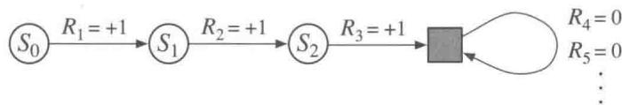

这里的方块表示与幕结束对应的吸收状态。从 $S_0$ 开始，我们就会得到收益序列 $+1, +1, +1, 0, 0, 0, \ldots$ 。总之，无论我们是计算前 $T$ 个收益（这里 $T = 3$ ）的总和还是计算无限序列的全部总和，我们都能得到相同的回报。即使我们引入折扣，这也仍然成立。因此，一般来说，我们可以根据式(3.8)来定义回报。这个定义符合前述的省略幕编号的简化写法，并且考虑了 $\gamma = 1$ 且加和依然存在的情况（例如，在分幕式任务中，所有幕都会在有限时长终止）。或者，我们也可以把回报表示为

$$
G _ {t} \doteq \sum_ {k = t + 1} ^ {T} \gamma^ {k - t - 1} R _ {k}, \tag {3.11}
$$

并允许上式包括 $T = \infty$ 或 $\gamma = 1$ (但不是二者同时)的可能性。我们在本书的其他地方就会使用这些惯例来简化符号，并表达分幕式和持续性任务之间的紧密联系（在第10章中，我们将介绍一个持续且没有折扣的形式化方法）。

# 3.5 策略和价值函数

几乎所有的强化学习算法都涉及价值函数的计算。价值函数是状态（或状态与动作二元组）的函数，用来评估当前智能体在给定状态（或给定状态与动作）下有多好。这里“有多好”的概念是用未来预期的收益来定义的，或者更准确地说，就是回报的期望值。当

然，智能体期望未来能得到的收益取决于智能体所选择的动作。因此，价值函数是与特定的行为方式相关的，我们称之为策略。

严格地说，策略是从状态到每个动作的选择概率之间的映射。如果智能体在时刻 $t$ 选择了策略 $\pi$ ，那么 $\pi (a|s)$ 就是当 $S_{t} = s$ 时 $A_{t} = a$ 的概率。就像 $p$ 一样， $\pi$ 就是一个普通的函数； $\pi (a|s)$ 中间的“|”只是提醒我们它为每个 $s\in S$ 都定义了一个在 $a\in A$ 上的概率分布。强化学习方法规定了智能体的策略如何随着其经验而发生变化。

练习3.11 如果当前状态是 $S_{t}$ ，并根据随机策略 $\pi$ 选择动作，那么如何用 $\pi$ 和四参数函数 $p$ （式3.2）来表示 $R_{t+1}$ 的期望呢？

我们把策略 $\pi$ 下状态 $s$ 的价值函数记为 $v_{\pi}(s)$ ，即从状态 $s$ 开始，智能体按照策略 $\pi$ 进行决策所获得的回报的概率期望值。对于MDP，我们可以正式定义 $v_{\pi}$ 为

$$
v _ {\pi} (s) \doteq \mathbb {E} _ {\pi} [ G _ {t} \mid S _ {t} = s ] = \mathbb {E} _ {\pi} \left[ \sum_ {k = 0} ^ {\infty} \gamma^ {k} R _ {t + k + 1} \Bigg |   S _ {t} = s \right], \text {对 于 所 有} s \in \mathcal {S}, \qquad (3. 1 2)
$$

其中， $\mathbb{E}_{\pi[\cdot]}$ 表示在给定策略 $\pi$ 时一个随机变量的期望值， $t$ 可以是任意时刻。请注意，终止状态的价值始终为零。我们把函数 $v_{\pi}$ 称为策略 $\pi$ 的状态价值函数。

类似地，我们把策略 $\pi$ 下在状态 $s$ 时采取动作 $a$ 的价值记为 $q_{\pi}(s,a)$ 。这就是根据策略 $\pi$ ，从状态 $s$ 开始，执行动作 $a$ 之后，所有可能的决策序列的期望回报

$$
q _ {\pi} (s, a) \doteq \mathbb {E} _ {\pi} [ G _ {t} \mid S _ {t} = s, A _ {t} = a ] = \mathbb {E} _ {\pi} \left[ \sum_ {k = 0} ^ {\infty} \gamma^ {k} R _ {t + k + 1} \Bigg | S _ {t} = s, A _ {t} = a \right]. \tag {3.13}
$$

我们称 $q_{\pi}$ 为策略 $\pi$ 的动作价值函数。

练习3.12 写出用 $q_{\pi}$ 和 $\pi$ 来表达的 $v_{\pi}$ 公式。

练习3.13 写出用 $v_{\pi}$ 和四参数函数 $p$ 表达的 $q_{\pi}$ 公式。

价值函数 $v_{\pi}$ 和 $q_{\pi}$ 都能从经验中估算得到。比如，如果一个智能体遵循策略 $\pi$ ，并且对每个遇到的状态都记录该状态后的实际回报的平均值，那么，随着状态出现的次数接近无穷大，这个平均值会收敛到状态价值 $v_{\pi}(s)$ 。如果为每个状态的每个动作都保留单独的平均值，那么类似地，这些平均值也会收敛到动作价值 $q_{\pi}(s,a)$ 。我们将这种估算方法称作蒙特卡洛方法，因为该方法涉及从真实回报的多个随机样本中求平均值。这些方法会在第5章中介绍。当然，当环境中有很多状态时，独立地估算每个状态的平均值是不切实际的。在这种情况下，我们可以将价值函数 $v_{\pi}$ 和 $q_{\pi}$ 进行参数化（参数的数量要远少于状态的数量），然后通过调整价值函数的参数来更好地计算回报值。将价值函数参数化也有可能得到精确的估计，但是这取决于参数化的近似函数的特性。这些可能性会在本书的第Ⅱ部分讨论。

在强化学习和动态规划中，价值函数有一个基本特性，就是它们满足某种递归关系，类似于我们前面为回报建立的递归公式(3.9)。对于任何策略 $\pi$ 和任何状态 $s$ ， $s$ 的价值与其可能的后继状态的价值之间存在以下关系

$$
\begin{array}{l} v _ {\pi} (s) \dot {=} \mathbb {E} _ {\pi} [ G _ {t} \mid S _ {t} = s ] \\ = \mathbb {E} _ {\pi} \left[ R _ {t + 1} + \gamma G _ {t + 1} \mid S _ {t} = s \right] \quad \text {由 式} (3.9) \\ = \sum_ {a} \pi (a | s) \sum_ {s ^ {\prime}} \sum_ {r} p \left(s ^ {\prime}, r \mid s, a\right) \left[ r + \gamma \mathbb {E} _ {\pi} \left[ G _ {t + 1} \mid S _ {t + 1} = s ^ {\prime} \right] \right] \\ = \sum_ {a} \pi (a | s) \sum_ {s ^ {\prime}, r} p \left(s ^ {\prime}, r | s, a\right) \left[ r + \gamma v _ {\pi} \left(s ^ {\prime}\right) \right], \text {对 于 所 有} s \in S, (3.14) \\ \end{array}
$$

其中，动作 $a$ 取自集合 $\mathcal{A}(s)$ ，下一时刻状态 $s'$ 取自集合 $\mathcal{S}$ （在分幕式的问题中，取自集合 $\mathcal{S}^+$ ），收益值 $r$ 取自集合 $\mathcal{R}$ 。可以看到，在最后一个等式中我们是如何结合两个变量和的，其中一个是在 $s'$ 的所有可能值上求和，另一个就是在 $r$ 的所有可能值上求和。我们将用这种合并起来的求和写法来简化公式。可以很清楚地看出上面表达式的最后一项是一个期望值。实际上，上面的等式就是在三个变量 $a$ 、 $s'$ 和 $r$ 上面的一种求和形式。对于每个三元组，我们首先计算 $\pi(a|s)p(s', r|s, a)$ 的概率值，并用该概率对括号内的数值进行加权，然后对所有可能取值求和得到最终的期望值。

式(3.14)被称作 $v_{\pi}$ 的贝尔曼方程。它用等式表达了状态价值和后继状态价值之间的关系。想象一下，从一个状态向后观察所有可能到达的后继状态，如右图所示。其中空心圆表示一个状态，而实心圆表示一个“状态-动作”二元组。从状态 $s$ 开始，并将其作为根节点，智能体可以根据其策略 $\pi$ ，采取动作集合中的任意一个动作（图中显示了三个

动作)。对每一个动作，环境会根据其动态特性函数 $p$ ，以一个后继状态 $s'$ （图中显示了两个状态）及其收益 $r$ 作为响应。贝尔曼方程(3.14)对所有可能性采用其出现概率进行了加权平均。这也就说明了起始状态的价值一定等于后继状态的（折扣）期望值加上对应的收益的期望值。

价值函数 $v_{\pi}$ 是贝尔曼方程的唯一解。在接下来的章节中，我们会说明为什么贝尔曼方程是一系列计算、近似和学习 $v_{\pi}$ 的基础。我们将类似上图的图叫作回溯图，因为图中的关系是回溯运算的基础，这也是强化学习方法的核心内容。通俗地讲，回溯操作就是将后继状态（或“状态-动作”二元组）的价值信息回传给当前时刻的状态（或“状态-动作”二元组）。在整本书中都使用回溯图来对我们讨论的算法进行图示总结（注意：与状态转移图不同的是，回溯图中的状态节点不需要彼此不同，举个例子，一个状态的后继状态可能仍是其本身）。

例3.5网格问题图3.2（左）所示的长方形网格代表的是一个简单的有限MDP。网格中的格子代表的是环境中的状态。在每个格子中，有四个可选的动作：东、南、西和北，每个动作都会使智能体在对应的方向上前进一格。如果采取的动作使得其不在网格内，则智能体会在原位置不移动，并且得到一个值为-1的收益。除了将智能体从特定的状态A和B中移走的动作外，其他动作的收益都是0。在状态A中，四种动作都会得到一个 $+10$ 的收益，并且把智能体移动到 $\mathsf{A}^{\prime}$ 。在状态B中，四种动作都会得到一个 $+5$ 的收益，并且把智能体移动到 $\mathsf{B}^{\prime}$ 。

  
图3.2网格示例。特殊情况下的状态跳转及其对应的收益(左)和等概率随机策略下的状态价值函数（右）

假设智能体在所有状态下选择四种动作的概率都是相等的。图3.2（右）就展示了这个策略下折扣系数 $\gamma = 0.9$ 时的价值函数 $v_{\pi}$ 。这个价值函数就是通过计算线性方程组(3.14)得到的。从价值函数图中可以知道，在底层边界附近都是负值，这是由于在随机策略下，出界的概率很高。状态A在这个策略下是最好的状态，但是其期望回报价值小于10，也就是说比当前时刻的即时收益还要小。这是因为从状态A出发只能移动到状态 $A^{\prime}$ ，继而产生很高的出界概率。另一方面，状态B的价值要比其当前时刻的即时收益(5)大，这是因为从状态B移动到状态 $B^{\prime}$ 时的收益是一个正数。即从 $B^{\prime}$ 出发时出界的期望惩罚值（负收益值）小于从 $B^{\prime}$ 出发走到状态A或者B的期望收益值。

练习3.14 例3.5中图3.2（右）所示价值函数 $v_{\pi}$ 的每个状态都需要满足贝尔曼方程(3.14)。请证明：当周围四个相邻的状态价值为 $+2.3$ 、 $+0.4$ 、 $-0.4$ 和 $+0.7$ 时，中心状态的价值为 $+0.7$ （数字精确到小数点后一位）。

练习3.15 在网格问题这个例子中，到达目标时收益为正数，出界时收益为负数，其他情况均为零。请思考，是这些收益值的符号重要，还是收益值的相对大小更重要？用式(3.8)证明，对每个收益值都加上一个常数 $c$ 就等于对每个状态价值都加上一个常数 $v_{c}$ ，因此在任何策略下，任何状态之间的相对价值不受其影响。在给定 $c$ 和 $\gamma$ 的情况下，求 $v_{c}$ 的值。

练习3.16 现在考虑在走迷宫之类的分幕式任务中，把所有的收益都加上一个常数 $c$ 。这

会对任务的结果产生影响吗？或者还会像前面讨论的持续性任务一样没有影响？说明原因并举例。

例3.6高尔夫为了把打高尔夫球抽象成强化学习任务，在球进洞之前，每次击球我们都给一个-1的惩罚(负收益)。该任务中的状态就是球的位置。状态价值就是从当前位置到球进洞这段时间内，所击球次数的负值。我们的动作可以是如何瞄准及击球，也可以是选择哪种球杆（推杆是轻击球杆，木杆是重击球杆）。假设前一个条件是给定的，仅仅考虑球杆的选择，我们假设要么选择推杆要么选择木杆。图3.3的上半部分表示一个可能的状态价值函数 $v_{\mathrm{putt}}(s)$ ，对应于一直采用推杆的策略。终止状态，即进洞的价值为0。在绿色区域上的任意位置，我们假设都可以进行一次推杆就进洞，因此这些状态的价值为-1。而在绿色区域之外，我们无法直接采用推杆将球打到洞里（因为太远了），所以其价值的绝对值更大。如果从某个状态能够通过一次推杆将球打到绿色区域，那么这个状态必须有一个比绿色区域值还小的值，即-2。为了简化问题，我们假设每次推杆都是精准和确定的，只是有一定的范围限制。这就给出了如图所示的标记为-2的尖锐轮廓，在该轮廓和绿色区域之间的任何位置都需要两次推杆才能进洞。类似地，在-2轮廓线之外的一次推杆范围内的任何位置，其值都必须为-3。依此类推，就能得到图中所有的等值轮廓线。因为推杆在沙地上无法奏效，所以沙地上的值为 $-\infty$ 。总之，我们需要6次推杆才能从标杆处进洞。

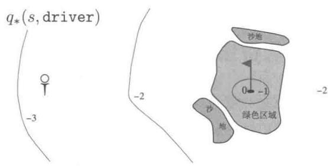  
图3.3打高尔夫球的案例。推杆的状态价值函数（上）和木杆的最优动作价值函数（下）

练习3.17 动作价值 $q_{\pi}$ 的贝尔曼方程是什么？将动作价值 $q_{\pi}(s,a)$ 用“状态-动作”二元组 $(s,a)$ 的所有可能的后继动作价值 $q_{\pi}(s',a')$ 来表示。提示：右边的回溯图就对应这一等式。证明该公式与公式(3.14)形式类似，是其在动作价值函数情况下的推广。

练习3.18 状态的价值取决于在这个状态下所有可能的动作的价值，

以及在当前策略下选取每个动作的概率。我们可以根据以该状态为根节点的小型回溯图来考虑这一点，并考虑每种可能的动作。

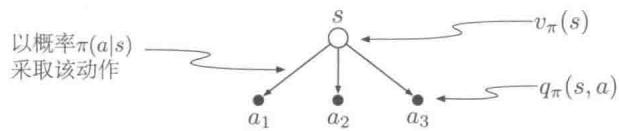

给定 $S_{t} = s$ ，根据预期的叶子节点的值 $q_{\pi}(s,a)$ ，给出对应于上图的根节点值 $v_{\pi}(s)$ 的计算公式。这个公式应该包括一个基于策略 $\pi$ 的期望。然后给出第二个公式，其中期望值用 $\pi (a|s)$ 显式地写出，这样等式中就不会出现求期望的符号了。

练习3.19 动作的价值 $q_{\pi}(s,a)$ 取决于后继收益的期望值和其余收益的总和的期望值。我们再次将其用一个小型回溯图来表示。这时，根节点代表一个动作（“状态-动作”二元组），分支为下一时刻可能的状态。

当给定 $S_{t} = s, A_{t} = a$ 以及期望后继收益 $R_{t + 1}$ 和期望后继状态价值 $v_{\pi}(S_{t + 1})$ 时，给出对应于上图的动作价值函数 $q_{\pi}(s,a)$ 的计算公式。这个公式应该包括一个期望，但并不受限于所遵循的策略。然后给出第二个公式，用式(3.2)中定义的 $p(s',r|s,a)$ 来显式地表示期望值，这样等式中就不会出现求期望的符号了。

# 3.6 最优策略和最优价值函数

解决一个强化学习任务就意味着要找出一个策略，使其能够在长期过程中获得大量收益。对于有限MDP，我们可以通过比较价值函数精确地定义一个最优策略。在本质上，价值函数定义了策略上的一个偏序关系。即如果要说一个策略 $\pi$ 与另一个策略 $\pi^{\prime}$ 相差不多甚至其更好，那么其所有状态上的期望回报都应该等于或大于 $\pi^{\prime}$ 的期望回报。也就是

说，若对于所有的 $s \in S$ ， $\pi \geqslant \pi'$ ，那么应当 $v_{\pi}(s) \geqslant v_{\pi'}(s)$ 。总会存在至少一个策略不劣于其他所有的策略，这就是最优策略。尽管最优策略可能不止一个，我们还是用 $\pi_*$ 来表示所有这些最优策略。它们共享相同的状态价值函数，称之为最优状态价值函数，记为 $v_*$ ，其定义为：对于任意 $s \in S$

$$
v _ {*} (s) \dot {=} \max  _ {\pi} v _ {\pi} (s), \tag {3.15}
$$

最优的策略也共享相同的最优动作价值函数，记为 $q_{*}$ ，其定义为：对于任意 $s\in$ $\mathcal{S},a\in \mathcal{A},$

$$
q _ {*} (s, a) \stackrel {\cdot} {=} \max  _ {\pi} q _ {\pi} (s, a), \tag {3.16}
$$

对于“状态-动作”二元组 $(s,a)$ ，这个函数给出了在状态 $s$ 下，先采取动作 $a$ ，之后按照最优策略去决策的期望回报。因此，我们可以用 $v_{*}$ 来表示 $q_{*}$ ，如下所示

$$
q _ {*} (s, a) = \mathbb {E} \left[ R _ {t + 1} + \gamma v _ {*} \left(S _ {t + 1}\right) \mid S _ {t} = s, A _ {t} = a \right]. \tag {3.17}
$$

例3.7高尔夫的最优价值函数图3.3的下半部分描绘了一种最优动作价值函数 $q_{*}(s, \text{driver})$ 的等值轮廓线。这是每个状态的价值，如果我们在第一次击球时选择木杆，并在接下来的过程中在木杆和推杆之间择优击球，则木杆能够将球击得更远，但是精确度就要低一些。只有在球非常接近洞口时，木杆才能将球一次推进洞内。因此， $q_{*}(s, \text{driver})$ 的-1等值轮廓线仅覆盖绿色区域很小的一部分。但如果能两次击球，那么我们就可以从很远的地方冲向洞口，如-2轮廓线所示。在这种情况下，我们不必执着于那么小的-1轮廓线，而是注重绿色区域的任意位置；因为只要在绿色区域内，我们就可以用推杆进洞。最优动作价值函数给出了在执行特定的第一个动作后的价值，这种情况下就是选择木杆，在此之后，哪种球杆能取得最好结果，我们就选择哪种。-3的等值轮廓线离绿地更远，并且包含了起始标杆。从标杆开始，最优的动作序列分别是两次木杆和一次推杆，进行三次击球将其送入洞内。

因为 $v_{*}$ 是策略的价值函数，它必须满足贝尔曼方程（式3.14）中状态和价值的一致性条件。但因为它是最优的价值函数，所以 $v_{*}$ 的一致性条件可以用一种特殊的形式表示，而不拘泥于任何特定的策略。这就是贝尔曼最优方程。我们可以直观地理解为，贝尔曼最优方程阐述了一个事实：最优策略下各个状态的价值一定等于这个状态下最优动作的期望回报

$$
\begin{array}{l} v_{*}(s) = \max_{a\in \mathcal{A}(s)}q_{\pi_{*}}(s,a) \\ = \max  _ {a} \mathbb {E} _ {\pi_ {*}} [ G _ {t} \mid S _ {t} = s, A _ {t} = a ] \\ \end{array}
$$

强化学习（第2版）

$$
\begin{array}{l} = \max  _ {a} \mathbb {E} _ {\pi_ {*}} [ R _ {t + 1} + \gamma G _ {t + 1} \mid S _ {t} = s, A _ {t} = a ] \quad \text {由 式} (3. 9) \\ = \max  _ {a} \mathbb {E} \left[ R _ {t + 1} + \gamma v _ {*} \left(S _ {t + 1}\right) \mid S _ {t} = s, A _ {t} = a \right] (3.18) \\ = \max  _ {a} \sum_ {s ^ {\prime}, r} p \left(s ^ {\prime}, r \mid s, a\right) [ r + \gamma v _ {*} \left(s ^ {\prime}\right) ]. (3.19) \\ \end{array}
$$

最后两个等式就是 $v_{*}$ 的贝尔曼最优方程的两种形式。 $q_{*}$ 的贝尔曼最优方程如下

$$
\begin{array}{l} q _ {*} (s, a) = \mathbb {E} \left[ R _ {t + 1} + \gamma \max  _ {a ^ {\prime}} q _ {*} \left(S _ {t + 1}, a ^ {\prime}\right) \mid S _ {t} = s, A _ {t} = a \right] \\ = \sum_ {s ^ {\prime}, r} p \left(s ^ {\prime}, r \mid s, a\right) \left[ r + \gamma \max  _ {a ^ {\prime}} q _ {*} \left(s ^ {\prime}, a ^ {\prime}\right) \right]. \tag {3.20} \\ \end{array}
$$

图3.4中的回溯图以图形化的方式展示了 $v_{*}$ 和 $q_{*}$ 的贝尔曼最优方程中所进行的后继状态和动作的扩展过程。除了在智能体的选择节点处加入了弧线表示应该在给定策略下取最大值而不是期望值之外，其他都与之前介绍的 $v_{\pi}$ 和 $q_{\pi}$ 的回溯图相同。回溯图（左）以图形化的方式表示了贝尔曼最优方程(式3.19)，回溯图（右）则图形化地表示了贝尔曼最优方程(式3.20)。

  
图3.4 $v_{*}$ 和 $q_{*}$ 的回溯图

对于有限MDP来说， $v_{\pi}$ 的贝尔曼最优方程(式3.19)有独立于策略的唯一解。贝尔曼最优方程实际上是一个方程组，每个状态对应一个方程等式。也就是说，如果有 $n$ 个状态，那么有 $n$ 个含有 $n$ 个未知量的方程。如果环境的动态变化特性 $p$ 是已知的，那么原则上可以用解非线性方程组的方法来求解 $v_{*}$ 方程组。类似地，我们也可以求得 $q_{*}$ 的一组解。

一旦有了 $v_{*}$ ，确定一个最优策略就比较容易了。对于每个状态 $s$ ，都存在一个或多个动作，可以在贝尔曼最优方程的条件下产生最大的价值。如果在一个策略中，只有这些动作的概率非零，那么这个策略就是一个最优策略。你可以将其视为一个单步搜索。如果最优价值函数 $v_{*}$ 已知，那么单步搜索后最好的动作就是全局最优动作。换句话说，对于最优价值函数 $v_{*}$ 来说，任何贪心策略都是最优策略。在计算机科学中，术语贪心用来描述仅基于局部或者当前情况进行最优选择，完全不考虑未来的变数和影响，即贪心策略对于动作的选择仅仅基于短期的结果。 $v_{*}$ 让人感兴趣的地方就在于，使用它来评估动作的短期结果（更准确地说，单步后果）时，从长期来看贪心策略也是最优的，这是由于 $v_{*}$ 本身

已经包含了未来所有可能的行为所产生的回报影响。定义 $v_{*}$ 的意义就在于，我们可以将最优的长期（全局）回报期望值转化为每个状态对应的一个当前局部量的计算。因此，一次单步搜索就可以产生长期（或说全局）最优的动作序列。

在给定 $q_{*}$ 的情况下，选择最优动作的过程变得更加容易。给定 $q_{*}$ ，智能体甚至不需要进行单步搜索的过程，也就是说，对于任意状态 $s$ ，智能体只要找到使得 $q_{*}(s, a)$ 最大的动作 $a$ 就可以了。动作价值函数有效地保存着所有单步搜索的结果。它将最优的长期回报的期望值表达为对应每个“状态-动作”二元组的一个当前局部量。因此，将价值函数表达为“状态-动作”二元组的函数而不仅仅是状态的函数后，最优动作的选取就不再需要知道后继状态和其对应的价值了，也就是说，不再需要知道任何环境的动态变化特性了。

例3.8求解网格问题假设我们在例3.5的简单网格任务(图3.5（左))中，对 $v_{*}$ 的贝尔曼方程进行了求解。我们知道从状态A转移到状态 $\mathsf{A}'$ 会得到 $+10$ 的收益，从状态B转移到状态 $\mathsf{B}'$ 会得到 $+5$ 的收益。图3.5（中）给出了最优的价值函数，图3.5（右）给出了相应的最优策略。图中有些格子中有多个箭头，其对应的每个动作都是最优的。

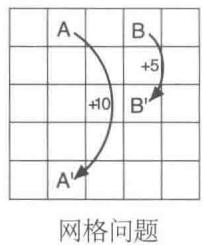

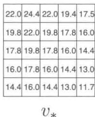

  
图3.5 网格问题的最优解

例3.9回收机器人的贝尔曼最优方程采用式(3.19)，我们可以显式地给出回收机器人的贝尔曼最优方程。为了让公式更加紧凑，我们分别将状态high与low，动作search、wait与recharge简写为h、l、s、w和re。由于这里只有两个状态，贝尔曼方程就由两个等式组成。 $v_{*}(\mathfrak{h})$ 的表示式为

$$
\begin{array}{l} v _ {*} (\mathfrak {h}) = \max  \left\{ \begin{array}{l} p (\mathfrak {h} | \mathfrak {h}, \mathfrak {s}) [ r (\mathfrak {h}, \mathfrak {s}, \mathfrak {h}) + \gamma v _ {*} (\mathfrak {h}) ] + p (1 | \mathfrak {h}, \mathfrak {s}) [ r (\mathfrak {h}, \mathfrak {s}, 1) + \gamma v _ {*} (1) ], \\ p (\mathfrak {h} | \mathfrak {h}, \mathfrak {w}) [ r (\mathfrak {h}, \mathfrak {w}, \mathfrak {h}) + \gamma v _ {*} (\mathfrak {h}) ] + p (1 | \mathfrak {h}, \mathfrak {w}) [ r (\mathfrak {h}, \mathfrak {w}, 1) + \gamma v _ {*} (1) ] \end{array} \right\} \\ = \max  \left\{ \begin{array}{l} \alpha \left[ r _ {s} + \gamma v _ {*} (h) \right] + (1 - \alpha) \left[ r _ {s} + \gamma v _ {*} (1) \right], \\ 1 \left[ r _ {w} + \gamma v _ {*} (h) \right] + 0 \left[ r _ {w} + \gamma v _ {*} (1) \right] \end{array} \right\} \\ = \max  \left\{ \begin{array}{l} r _ {\mathrm {s}} + \gamma [ \alpha v _ {*} (\mathrm {h}) + (1 - \alpha) v _ {*} (1) ], \\ r _ {\mathrm {w}} + \gamma v _ {*} (\mathrm {h}) \end{array} \right\}. \\ \end{array}
$$

强化学习（第2版）

$v_{*}(1)$ 的表达式也是类似的

$$
v _ {*} (1) = \max  \left\{ \begin{array}{l} \beta r _ {\mathrm {s}} - 3 (1 - \beta) + \gamma [ (1 - \beta) v _ {*} (\mathrm {h}) + \beta v _ {*} (1) ], \\ r _ {\mathrm {w}} + \gamma v _ {*} (1), \\ \gamma v _ {*} (\mathrm {h}) \end{array} \right\}.
$$

对于任意的 $r_s$ 、 $r_w$ 、 $\alpha$ 、 $\beta$ 和 $\gamma$ ，在符合 $0\leqslant \gamma < 1$ ， $0\leqslant \alpha ,\beta \leqslant 1$ 的情况下，存在唯一的一对值，即 $v_{*}(\mathfrak{h})$ 和 $v_{*}(1)$ ，是同时满足这两个非线性等式的解。

显式求解贝尔曼最优方程给出了找到一个最优策略的方法，也就是一个解决强化学习问题的方法。但是，这个方法很少是直接有效的。这类似于穷举搜索，预估所有的可能性，计算每种可能性出现的概率及其期望收益。这种解法至少依赖于三条在实际情况下很难满足的假设：(1) 我们准确地知道环境的动态变化特性；(2) 有足够的计算资源来求解；(3) 马尔可夫性质。对于我们感兴趣的任务来说，如果不能满足这些假设中的某一项，我们便不能使用这个方法求解。例如，在西洋双陆棋游戏中，尽管假设 (1) 和假设 (3) 都没有什么问题，但是假设 (2) 却是无法满足的。原因是，这个游戏大概有 $10^{20}$ 个状态，如果用贝尔曼方程求解 $v_{*}$ ，则当今最快的计算机也要计算上千年。求解 $q_{*}$ 也是一样的。在强化学习中，我们通常只能用近似解法来解决这类问题。

许多不同的决策方法都被视为近似求解贝尔曼最优方程的途径。例如，启发式搜索方法可以被视为对公式(3.19)的等号右侧项进行一定深度的展开，以形成一个概率“树”，然后用启发式评估函数来估算“叶子”节点的 $v_{*}$ （类似于 $\mathrm{A}^{*}$ 这样的启发式搜索方法几乎都基于分幕式的情况）。动态规划算法与贝尔曼最优方程的关系更近，它们都是基于实际经历过的历史经验来预估未来的长期或全局期望值。我们会在接下来的章节中介绍这些方法。

练习3.20 画出或者描述高尔夫例子中的最优状态价值函数。

练习3.21 画出或者描述在高尔夫例子中，对于推杆的最优动作价值函数 $q_{*}(s, \text{putter})$ 的等值轮廓线。

练习3.22 考虑右图所示的一个持续性MDP。在顶部状态下，可选的动作只有left和right。线上的数值表示在做每个动作后获得的固定收益。我们有两个确定的策略 $\pi_{\mathrm{left}}$ 和 $\pi_{\mathrm{right}}$ 。在 $\gamma$ 分别为0、0.9、0.5时，哪个策略是最优的？

练习3.23 给出回收机器人例子中， $q_{*}$ 的贝尔曼方程。

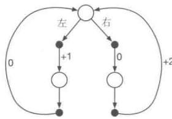

练习3.24 在图3.5给出的网格示例中，最好的状态的最优价值为24.4（精确到一位小

数)。请用你所理解的最优化策略，并结合式(3.8)来符号化地表示这个最优值，并重新计算，精确到三位小数。

练习3.25 用含有 $q_{*}$ 的等式来表示 $v_{*}$

练习3.26 在环境动态变化特性为 $p(s', r|s, a)$ 时，用含有 $v_*$ 的等式来表示 $q_*$ 。

练习3.27 用含有 $q_{*}$ 的等式来表示 $\pi_{*}$

练习3.28 在环境动态变化特性为 $p(s', r|s, a)$ 时，用含有 $v_*$ 的等式来表示 $\pi_*$ 。

练习3.29 用三参数函数 $p$ (式3.4) 和双参数函数 $r$ (式3.5) 来重写前面的四个贝尔曼价值函数 $(v_{\pi}, v_{*}, q_{\pi}$ 和 $q_{*})$ 。

# 3.7 最优性和近似算法

我们已经定义了最优价值函数和最优策略。按照上面的方法，智能体可以很好地学习到最优策略，但是事实却不是这样。对于我们感兴趣的任务，最优策略通常需要极大的计算资源。对最优性的完备严格定义对我们本书中提到的学习方法进行了组织，并且提供了对这些不同学习算法的理论性质的理解方式。但实际情况是，这些都是理想情况，真实情况下的智能体只能采用不同程度的近似方法。正如我们上面所讨论的，即使我们有一个关于环境动态变化特性的完备精确模型，贝尔曼最优方程仍然不能简单地计算出一个最优策略。例如，类似象棋之类的棋类游戏只是人类经验的一小部分，但对于大型定制的计算机来说，其仍然十分复杂，以至于根本无法计算出最优的走棋策略。现在智能体面临的一个关键问题就是能用多少计算力，特别是每一步能用的计算力。

存储容量也是一个很重要的约束。价值函数、策略和模型的估计通常需要大量的存储空间。在状态集合小而有限的任务中，用数组或者表格来估计每个状态（或“状态-动作”二元组）是有可能的。我们称之为表格型任务，对应的方法我们称作表格型方法。但在许多实际情况下，经常有很多状态是不能用表格中的一行来表示的。在这些情况下，价值函数必须采用近似算法，这时通常使用紧凑的参数化函数表示方法。

我们对强化学习问题的上述认识使我们不得不认真面对近似的问题。当然，这也给了我们难得的机会，来设计和实现有用的近似算法。例如，在近似最优行为时，智能体可能会有大量的状态，每个状态出现的概率都很低，这使得选择次优的动作对整个智能体所获得的收益的影响很小。例如，Tesauro的西洋双陆棋程序在与专业玩家对弈时当遇到从没遇到过的棋盘局面时，会选择出一些标新立异的出棋决策，而这些新奇的出棋决策其实很

可能结果很差。实际上，当游戏状态集合很大时，Tesauro的西洋双陆棋程序在大多数状态下做出的决策都是很差的。强化学习在线运行的本质使得它在近似最优策略的过程中，对于那些经常出现的状态集合会花更多的努力去学习好的决策，而代价就是对不经常出现的状态给予的学习力度不够。这是区分强化学习和其他解决MDP问题的近似方法的一个重要判断依据。

# 3.8 本章小结

我们总结一下本章介绍的强化学习的各个组成部分。强化学习是在交互中学习如何行动以实现某个目标的机器学习方法。在强化学习中，智能体及其环境在一连串的离散时刻上进行交互。这两者之间的接口定义了一个特殊的任务：动作由智能体来选择，状态是做出选择的基础，而收益是评估选择的基础。智能体内部的所有事物对于智能体来说是完全可知、完全可控的。而智能体外部的事物则是部分可控的，可能完全知道其知识，也可能不完全知道。策略是一个智能体选择动作的随机规则，它是状态的一个函数。智能体的目标，就是随着时间的推移来最大化总的收益。

当强化学习用完备定义的转移概率描述后，就构成了马尔可夫决策过程(MDP)。有限MDP是指具有有限状态、动作、收益集合的MDP。目前大多数强化学习理论都只局限于讨论有限MDP，但是相关方法和思路的应用范围却可以更加广泛。

回报是智能体要最大化的全部未来收益的函数（最大化概率期望值）。根据不同任务和是否希望对延迟的收益打折扣，它也有不同的定义。非折扣形式适用于分幕式任务，在这类任务中，智能体-环境交互会被自然分解为幕；折扣形式适用于持续性任务，在这类任务中，智能体-环境交互不会被分解为幕，而是会无限制持续下去。我们通过定义合理的回报形式，可以用同样的公式来统一描述分幕式和持续性任务这两种情况。

一旦智能体确定了某个策略，那么该策略的价值函数就可以对每个状态或“状态-动作”二元组给出对应的期望回报值。最优价值函数对每个状态或“状态-动作”二元组给出了所有策略中最大的期望回报值。一个价值函数最优的策略就叫作最优策略。对于给定的MDP，尽管状态或“状态-动作”二元组对应的最优价值函数是唯一的，但最优策略可能会有好多个。在最优价值函数的基础上，通过贪心算法得到的策略肯定是一个最优策略。贝尔曼最优方程是最优价值函数必须满足的一致性条件，原则上最优价值函数是可以通过这个条件相对容易地求解得到的。

强化学习问题可以用不同的方式表示，这取决于智能体起初能获得的先验知识。对

于完备知识问题，智能体会有一个完整精确的模型来表示环境的动态变化。如果环境是MDP，那么这个模型就包含了一个四参数转移函数 $p$ (式3.2)。对于非完备知识问题来说，我们则没有完整的环境模型。

即使智能体有一个完整精确的环境模型，智能体通常也没有足够的计算能力在每一时刻都全面地利用它。可用的存储资源也是另一个重要的约束。精确的价值函数、策略和模型都需要占用存储资源。在大多数实际问题中，环境状态远远不是一个表格能装下的，这时就需要近似方法来解决问题。

对最优性的完备严格定义对我们在这本书中提到的学习方法进行了组织，并且提供了对这些不同学习算法的理论性质的理解方式。但实际情况是，这些都是理想情况，真实情况下的智能体只能采用不同程度的近似方法。在强化学习中，我们最关心的是最优解无法找到而必须采用某种近似方法来逼近最优解的情况。

# 参考文献和历史评注

强化学习问题很好地体现了从最优控制领域产生的马尔可夫决策过程（MDP）的思想。在第1章中，我们简要讲述了这些历史影响和其他心理学的主要影响。强化学习将MDP的研究聚焦于近似算法和对真实大规模问题中的不完备信息的处理。MDP和强化学习问题与人工智能中的传统的学习和决策问题只有很弱的联系。然而，人工智能目前正在从各种角度积极研究用MDP表示的规划和决策问题。MDP比早期人工智能中的相关理论更为普遍，因为它允许更一般性的目标和不确定性。

Bertsekas (2005)、White (1969)、Whittle (1982, 1983) 和 Puterman (1994) 等文章都对 MDP 理论有重要贡献。尤其是 Ross (1983) 提出了针对有限 MDP 的一种紧凑的处理方法。MDP 也在随机最优控制的框架下被广泛研究，其中自适应最优控制方法与强化学习的联系最为紧密（如 Kumar, 1985; Kumar 和 Varaiya, 1986）。

MDP理论的发展源于对不确定性条件下的决策序列问题的研究，这种问题中的每个决策都依赖于之前的一系列决策及其结果。它有时被称为多阶段决策过程理论，或序列决策过程。并且它始于统计学文献中的序贯抽样方法，这是由Thompson（1933，1934）和Robbins（1952）提出的。我们在第2章中就引用了这些文章，将其与赌博机问题（如果将其形式化为多情境问题，那么这就是MDP的一个原型）的分析关联起来。

我们所知道的最早使用MDP形式进行强化学习建模的是Andreae(1969b)，在其对学习机器的统一框架的描述中出现了该方法。Witten和Corbin（1973）对强化学习系

统进行了实验，后来Witten（1977）用MDP形式对此进行了分析。虽然他没有明确提到MDP，但Werbos（1977）提出了与现代强化学习方法有关的随机最优控制问题的近似解法（参见Werbos, 1982, 1987, 1988, 1989, 1992）。虽然当时Werbos的想法并未得到广泛认可，但他们强调了采用近似方法解决各种领域的最优控制问题的重要性（也包括人工智能），这是非常有先见之明的。对强化学习和MDP最有影响力的整合则应当归功于Watkins（1989）。

3.1 与其他文献稍有不同的是，我们用 $p(s', r|s, a)$ 表示MDP的动态特性。在MDP文献中更常见的是，用状态转移概率 $p(s'|s, a)$ 和后继收益的期望值 $r(s, a)$ 来描述动态特性变化。然而，在强化学习中，我们更多的时候需要谈及实际中的单个独立的收益或者它的某个采样值（而不仅仅是它的期望值）。同时，我们这种符号表示也能更清楚地体现出 $S_t$ 和 $R_t$ 一般是共同决定的，因此它们肯定有相同的时间索引。在强化学习的教学中，我们发现这种符号表示在概念上更直接，且更容易理解。

关于状态的理论概念的更多直观的讨论，请参阅Minsky（1967）。

生物反应器的例子是基于Ungar（1990）、Miller和Williams（1992）的工作。回收机器人的例子是受到Jonathan Connell（1989）制造的罐头收集机器人的启发。Kober和Peters（2012）展示了一系列强化学习在机器人中的应用。

3.2 收益假设是由 Michael Littman 提出的（参考文献是私人通信）。

3.3-4 分幕式和持续性任务中的术语与MDP文献中通常使用的术语也有所不同。在那些文献中，通常区分三种类型的任务：(1)有限视界任务，其中交互在特定固定数量的时间步长之后终止；(2)不定视界任务，其中交互可以任意长但必须最后终止；和(3)无限视界任务，其中交互永不终止。我们的分幕式和持续性任务分别与“不定视界”和“无限视界”任务相似，但我们更倾向于强调交互形态的本质差异。这似乎比传统术语体系中所强调的目标函数更为根本。通常分幕式任务使用基于不定视界的目标函数，而持续性任务使用基于无限视界的目标函数，但我们认为这只是一个常见的巧合，而不是基本的差异。

杆平衡的例子来自于 Michie 和 Chambers (1968) 以及 Barto、Sutton 和 Anderson (1983)。

3.5-6 自古以来，人们就会根据长期结果的好坏去分配价值。在控制论中，最优控制论的一个关键部分，就是将状态映射到代表控制决策的长期后果的数值，这是20世纪50年代通过扩展19世纪经典力学的“状态-功能”理论而发展起来的方法（参见Schultz和Melsa，1967）。在描述如何通过编程使得电脑会下棋时，Shannon(1950)提出了一种将长期的优缺点考虑在内的评估函数。

Watkins (1989) 用于估计 $q_{*}$ 的 Q 学习算法 (第 6 章), 其使动作价值函数成为强化学习的重要部分, 因此这些函数通常被称为 “Q 函数”。但是, 动作价值函数想法的出现时间远远早于此。Shannon (1950) 提出, 一个下棋程序可以使用函数 $h(P M)$ 来决定从位置 $P$ 开始的一次出棋 $M$ 是否值得试探。Michie (1961, 1963) 的 MENACE 系统, 和 Michie 与 Chambers (1968) 的 BOXES 系统都可以被理解为对动作价值函数的估计。在经典物理学中, 哈密顿织数 (Hamilton's principal function) 就是一种动作价值函数; 牛顿动力学对于这个函数是贪心的 (例如 Goldstein, 1957)。在 Denardo (1967) 对基于压缩映射的动态规划的理论分析中,

动作价值函数也发挥了重要作用。

贝尔曼最优方程式（关于 $v_{*}$ 的）是由Richard Bellman（1957a）首先提出的，他称之为“基本函数方程”。在连续的时间和状态问题中，与贝尔曼最优方程地位相当的就是Hamilton-Jacobi-Bellman方程（通常称之为Hamilton-Jacobi方程），这表明其根源是经典物理学（例如Schultz和Melsa，1967）。

高尔夫的例子是由Chris Watkins 提出的。

# 动态规划

动态规划（Dynamic Programming，DP）是一类优化方法，在给定一个用马尔可夫决策过程（MDP）描述的完备环境模型的情况下，其可以计算最优的策略。对于强化学习问题，传统的DP算法的作用有限。其原因有二：一是完备的环境模型只是一个假设；二是它的计算复杂度极高。但是，它依然是一个非常重要的理论。对于本书后面章节介绍的方法，DP提供了一个必要的基础。事实上，所有其他方法都是对DP的一种近似，只不过降低了计算复杂度以及减弱了对环境模型完备性的假设。

在本章中，我们假设环境是一个有限MDP。也就是说，我们假设状态集合 $S$ 、动作集合 $\mathcal{A}$ 和收益集合 $\mathcal{R}$ 是有限的，并且整个系统的动态特性由对于任意 $s\in S$ 、 $a\in A(s)$ 、 $r\in \mathcal{R}$ 和 $s^{\prime}\in S^{+}$ ( $S^{+}$ 表示在分幕式任务下 $S$ 加上一个终止状态）的四参数概率分布 $p(s', r|s, a)$ 给出。尽管DP的思想也可以用在具有连续状态和动作的问题上，但是只有在某些特殊情况下才会存在精确解。一种常见的近似方法是将连续的状态和动作量化为离散集合，然后再使用有限状态下的DP算法。我们在第9章中讨论的方法可以用于具有连续状态和动作的问题及其扩展问题。

在强化学习中，DP的核心思想是使用价值函数来结构化地组织对最优策略的搜索。在本章中，我们讨论如何使用DP来计算第3章中定义的价值函数。如前所述，一旦我们得到了满足贝尔曼最优方程的价值函数 $v_{*}$ 或 $q_{*}$ ，得到最优策略就很容易了。对于任意 $s \in S$ 、 $a \in \mathcal{A}(s)$ 和 $s' \in S^{+}$ ，有

$$
\begin{array}{l} v _ {*} (s) = \max  _ {a} \mathbb {E} [ R _ {t + 1} + \gamma v _ {*} (S _ {t + 1}) \mid S _ {t} = s, A _ {t} = a ] \\ = \max  _ {a} \sum_ {s ^ {\prime}, r} p \left(s ^ {\prime}, r \mid s, a\right) \left[ r + \gamma v _ {*} \left(s ^ {\prime}\right) \right] \tag {4.1} \\ \end{array}
$$

或

强化学习（第2版）

$$
\begin{array}{l} q _ {*} (s, a) = \mathbb {E} \left[ R _ {t + 1} + \gamma \max  _ {a ^ {\prime}} q _ {*} \left(S _ {t + 1}, a ^ {\prime}\right) \mid S _ {t} = s, A _ {t} = a \right] \\ = \sum_ {s ^ {\prime}, r} p \left(s ^ {\prime}, r \mid s, a\right) \left[ r + \gamma \max  _ {a ^ {\prime}} q _ {*} \left(s ^ {\prime}, a ^ {\prime}\right) \right], \tag {4.2} \\ \end{array}
$$

由上可见，通过将贝尔曼方程转化成为近似逼近理想价值函数的递归更新公式，我们就得到了DP算法。

# 4.1 策略评估（预测）

首先，我们思考对于任意一个策略 $\pi$ ，如何计算其状态价值函数 $v_{\pi}$ ，这在DP文献中被称为策略评估。我们有时也称其为预测问题。回顾第3章的内容，对于任意 $s\in S$

$$
\begin{array}{l} v _ {\pi} (s) \doteq \mathbb {E} _ {\pi} \left[ G _ {t} \mid S _ {t} = s \right] \\ = \mathbb {E} _ {\pi} \left[ R _ {t + 1} + \gamma G _ {t + 1} \mid S _ {t} = s \right] (3.9) \\ = \mathbb {E} _ {\pi} \left[ R _ {t + 1} + \gamma v _ {\pi} \left(S _ {t + 1}\right) \mid S _ {t} = s \right] (4.3) \\ = \sum_ {a} \pi (a | s) \sum_ {s ^ {\prime}, r} p \left(s ^ {\prime}, r \mid s, a\right) [ r + \gamma v _ {\pi} \left(s ^ {\prime}\right) ], (4.4) \\ \end{array}
$$

其中， $\pi(a|s)$ 指的是处于环境状态 $s$ 时，智能体在策略 $\pi$ 下采取动作 $a$ 的概率。期望的下标 $\pi$ 表明期望的计算是以遵循策略 $\pi$ 为条件的。只要 $\gamma < 1$ 或者任何状态在 $\pi$ 下都能保证最后终止，那么 $v_{\pi}$ 唯一存在。

如果环境的动态特性完全已知，那么式(4.4)就是一个有着 $|\mathcal{S}|$ 个未知数 $(v_{\pi}(s), s \in \mathcal{S})$ 以及 $|\mathcal{S}|$ 个等式的联立线性方程组。理论上，这个方程的解可以被直接解出，但是计算过程有些烦琐。所以我们使用迭代法来解决此问题。考虑一个近似的价值函数序列， $v_0, v_1, v_2, \ldots$ ，从 $\mathcal{S}^+$ 映射到 $\mathbb{R}$ （实数集）。初始的近似值 $v_0$ 可以任意选取（除了终止状态值必须为0外）。然后下一轮迭代的近似使用 $v_{\pi}$ 的贝尔曼方程(式4.4)进行更新，对于任意 $s \in \mathcal{S}$

$$
\begin{array}{l} v _ {k + 1} (s) \dot {=} \mathbb {E} _ {\pi} \left[ R _ {t + 1} + \gamma v _ {k} \left(S _ {t + 1}\right) \mid S _ {t} = s \right] \\ = \sum_ {a} \pi (a | s) \sum_ {s ^ {\prime}, r} p \left(s ^ {\prime}, r | s, a\right) \left[ r + \gamma v _ {k} \left(s ^ {\prime}\right) \right], \tag {4.5} \\ \end{array}
$$

显然， $v_{k} = v_{\pi}$ 是这个更新规则的一个不动点，因为 $v_{\pi}$ 的贝尔曼方程已经保证了这种情况下的等式成立。事实上，在保证 $v_{\pi}$ 存在的条件下，序列 $\{v_{k}\}$ 在 $k \to \infty$ 时将会收敛到 $v_{\pi}$ 。这个算法被称作迭代策略评估。

为了从 $v_{k}$ 得到下一个近似 $v_{k + 1}$ ，迭代策略评估对于每个状态 $s$ 采用相同的操作：根据给定的策略，得到所有可能的单步转移之后的即时收益和 $s$ 的每个后继状态的旧的价值函数，利用这二者的期望值来更新 $s$ 的新的价值函数。我们称这种方法为期望更新。迭代策略评估的每一轮迭代都更新一次所有状态的价值函数，以产生新的近似价值函数 $v_{k + 1}$ 。期望更新可以有很多种不同的形式，具体取决于使用状态还是“状态-动作”二元组来进行更新，或者取决于后继状态的价值函数的具体组合方式。在DP中，这些方法都被称为期望更新，这是因为这些方法是基于所有可能后继状态的期望值的，而不是仅仅基于后继状态的一个样本。我们可以通过上述公式或者第3章中的回溯图，了解更新过程的本质。比如第57页中的回溯图就是用于迭代策略评估的期望更新方法。

为了用顺序执行的计算机程序实现迭代策略评估（见式4.5），我们需要使用两个数组：一个用于存储旧的价值函数 $v_{k}(s)$ ；另一个存储新的价值函数 $v_{k+1}(s)$ 。这样，在旧的价值函数不变的情况下，新的价值函数可以一个接一个地被计算出来。同样，也可以简单地使用一个数组来进行“就地”更新，即每次直接用新的价值函数替换旧的价值函数。在这种情况下，根据状态更新的顺序，式(4.5)的右端有时会使用新的价值函数，而不是旧的价值函数。这种就地更新的算法依然能够收敛到 $v_{\pi}$ 。事实上，由于采用单数组的就地更新算法，一旦获得了新数据就可以马上使用，它反而比双数组的传统更新算法收敛得更快。一般来说，一次更新是对整个状态空间的一次遍历。对于就地更新的算法，遍历的顺序对收敛的速率有着很大的影响。在之后我们讨论DP算法时，一般指的是就地更新的版本。

下面使用伪代码显示了一个迭代策略评估的完整就地更新的版本。请注意它

# 迭代策略评估算法，用于估计 $V \approx v_{\pi}$

输入待评估的策略 $\pi$

算法参数：小阈值 $\theta > 0$ ，用于确定估计量的精度

对于任意 $s\in S^{+}$ ，任意初始化 $V(s)$ ，其中 $V$ （终止状态） $= 0$

循环：

$$
\Delta \leftarrow 0
$$

对每一个 $s \in S$ 循环：

$$
\begin{array}{l} v \leftarrow V (s) \\ V (s) \leftarrow \sum_ {a} \pi (a | s) \sum_ {s ^ {\prime}, r} p \left(s ^ {\prime}, r | s, a\right) \left[ r + \gamma V \left(s ^ {\prime}\right) \right] \\ \Delta \leftarrow \max  (\Delta , | v - V (s) |) \\ \end{array}
$$

直到 $\Delta <  \theta$

是如何处理程序终止的。从形式上来说，迭代策略评估只能在极限意义下收敛，但实际上

强化学习（第2版）

它必须在此之前停止。伪代码在每次遍历之后会测试 $\max_{s\in S}|v_{k + 1}(s) - v_k(s)|$ ，并在它足够小时停止。

例4.1 考虑下方的一个 $4 \times 4$ 网格图。

非终止状态集合 $S = \{1,2,\dots ,14\}$ 。每个状态有四种可能的动作， $\mathcal{A} = \{\mathrm{up},\mathrm{down},$ right,left}。每个动作会导致状态转移，但当动作会导致智能体移出网格时，状态保持不变。比如， $p(6, - 1|5,\mathrm{right}) = 1$ ， $p(7, - 1|7,\mathrm{right}) = 1$ 和对于任意 $r\in \mathcal{R}$ ，都有 $p(10,r|5,\mathrm{right}) = 0$ 。这是一个无折扣的分幕式任务。在到达终止状态之前，所有动作的收益均为-1。终止状态在图中以阴影显示（尽管图中显示了两个格子，但实际仅有一个终止状态)。对于所有的状态 $s$ 、 $s^{\prime}$ 与动作 $a$ ，期望的收益函数均为 $r(s,a,s^{\prime}) = -1$ 。假设智能体采取等概率随机策略(所有动作等可能执行)。图4.1(左)显示了在迭代策略评估中价值函数序列 $\{v_k\}$ 的收敛情况。最终的近似估计实际上就是 $v_{\pi}$ ，其值为每个状态到终止状态的步数的期望值，取负。

练习4.1 在例4.1中，如果 $\pi$ 是等概率随机策略，那么 $q_{\pi}(11, \text{down})$ 是多少？ $q_{\pi}(7, \text{down})$ 呢？

练习4.2 在例4.1中，假设一个新状态15加入到状态13的下方。从状态15开始，采取策略left、up、right和down，分别到达状态12、13、14和15。假设从原来的状态转出的方式不变，那么 $v_{\pi}(15)$ 在等概率随机策略下是多少？如果状态13的动态特性产生变化，使得采取动作down时会到达这个新状态15，这时候的 $v_{\pi}(15)$ 在等概率随机策略下是多少？

练习4.3 对于动作价值函数 $q_{\pi}$ 以及其逼近序列函数 $q_0,q_1,q_2,\ldots$ ，类似于式(4.3)、式（4.4）和式（4.5）的公式是什么？

  
图4.1 小型网格上迭代策略评估的收敛情况。左栏是随机策略的状态价值函数的近似值序列（所有操作的可能性相同）。右列是与价值函数估计相对应的贪心策略序列（箭头所指是所有能达到最大值的操作，其数字四舍五入为两位有效数字）。最后的策略只能保证随机策略的改进，但在这种情况下，第三次迭代后，所有策略都是最优的

# 4.2 策略改进

只所以计算一个给定策略下的价值函数，就是为了寻找更好的策略。假设对于任意一个确定的策略 $\pi$ ，我们已经确定了它的价值函数 $v_{\pi}$ 。对于某个状态 $s$ ，我们想知道是否应该选择一个不同于给定的策略的动作 $a \neq \pi(s)$ 。我们知道，如果从状态 $s$ 继续使用现有策略，那么最后的结果就是 $v_{\pi}(s)$ 。但我们不知道换成一个新策略的话，会得到更好的还是更坏的结果。一种解决方法是在状态 $s$ 选择动作 $a$ 后，继续遵循现有的策略 $\pi$ 。这种方法的值为

强化学习（第2版）

$$
\begin{array}{l} q _ {\pi} (s, a) \doteq \mathbb {E} \left[ R _ {t + 1} + \gamma v _ {\pi} \left(S _ {t + 1}\right) \mid S _ {t} = s, A _ {t} = a \right] \tag {4.6} \\ = \sum_ {s ^ {\prime}, r} p \left(s ^ {\prime}, r \mid s, a\right) \left[ r + \gamma v _ {\pi} \left(s ^ {\prime}\right) \right]. \\ \end{array}
$$

一个关键的准则就是这个值是大于还是小于 $v_{\pi}(s)$ 。如果这个值更大，则说明在状态 $s$ 选择一次动作 $a$ ，然后继续使用策略 $\pi$ 会比始终使用策略 $\pi$ 更优。事实上，我们期望的是在每次遇到状态 $s$ 的时候，选择动作 $a$ 总可以达到更好的结果。这个时候，我们就认为这个新的策略总体来说更好。

上述情况是策略改进定理的一个特例。一般来说，如果 $\pi$ 和 $\pi'$ 是任意的两个确定的策略，对任意 $s \in S$

$$
q _ {\pi} (s, \pi^ {\prime} (s)) \geqslant v _ {\pi} (s). \tag {4.7}
$$

那么我们称策略 $\pi^{\prime}$ 相比于 $\pi$ 一样好或者更好。也就是说，对任意状态 $s\in S$ ，这样肯定能得到一样或更好的期望回报

$$
v _ {\pi^ {\prime}} (s) \geqslant v _ {\pi} (s). \tag {4.8}
$$

并且，如果式(4.7)中的不等式在某个状态下是严格不等的，那么式(4.8)在这个状态下也会是严格不等的。考虑我们之前讨论的两个策略，一个是确定的策略 $\pi$ ，一个是改进的策略 $\pi^{\prime}$ 。除去 $\pi^{\prime}(s) = a\neq \pi (s)$ 以外， $\pi$ 与 $\pi^{\prime}$ 完全相同。显然式(4.7)在除去 $s$ 以外的状态下都成立。所以，如果 $q_{\pi}(s,a) > v_{\pi}(s)$ ，那么改进后的策略相比于 $\pi$ 确实会更优。

策略改进定理的想法是很容易理解的。从式(4.7)开始，我们用式(4.6)不断扩展公式左侧的 $q_{\pi}$ ，并不断应用式（4.7）直到得到 $v_{\pi^{\prime}}(s)$

$$
\begin{array}{l} v _ {\pi} (s) \leqslant q _ {\pi} (s, \pi^ {\prime} (s)) \\ = \mathbb {E} \left[ R _ {t + 1} + \gamma v _ {\pi} \left(S _ {t + 1}\right) \mid S _ {t} = s, A _ {t} = \pi^ {\prime} (s) \right] \quad \text {由 式} \tag {4.6} \\ = \mathbb {E} _ {\pi^ {\prime}} \left[ R _ {t + 1} + \gamma v _ {\pi} \left(S _ {t + 1}\right) \mid S _ {t} = s \right] \\ \leqslant \mathbb {E} _ {\pi^ {\prime}} \left[ R _ {t + 1} + \gamma q _ {\pi} \left(S _ {t + 1}, \pi^ {\prime} \left(S _ {t + 1}\right)\right) \mid S _ {t} = s \right] \\ = \mathbb {E} _ {\pi^ {\prime}} \left[ R _ {t + 1} + \gamma \mathbb {E} _ {\pi^ {\prime}} \left[ R _ {t + 2} + \gamma v _ {\pi} \left(S _ {t + 2}\right) \mid S _ {t + 1} \right] \mid S _ {t} = s \right] \\ = \mathbb {E} _ {\pi^ {\prime}} \left[ R _ {t + 1} + \gamma R _ {t + 2} + \gamma^ {2} v _ {\pi} (S _ {t + 2}) \mid S _ {t} = s \right] \\ \leqslant \mathbb {E} _ {\pi^ {\prime}} \left[ R _ {t + 1} + \gamma R _ {t + 2} + \gamma^ {2} R _ {t + 3} + \gamma^ {3} v _ {\pi} \left(S _ {t + 3}\right) \mid S _ {t} = s \right] \\ \end{array}
$$

#

$$
\begin{array}{l} \leqslant \mathbb {E} _ {\pi^ {\prime}} \left[ R _ {t + 1} + \gamma R _ {t + 2} + \gamma^ {2} R _ {t + 3} + \gamma^ {3} R _ {t + 4} + \dots \mid S _ {t} = s \right] \\ = v _ {\pi^ {\prime}} (s). \\ \end{array}
$$

到目前为止我们已经看到了，给定一个策略及其价值函数，我们可以很容易评估一个状态中某个特定动作的改变会产生怎样的后果。我们可以很自然地延伸到所有的状态和所有可能的动作，即在每个状态下根据 $q_{\pi}(s,a)$ 选择一个最优的。换言之，考虑一个新的贪心策略 $\pi^{\prime}$ ，满足

$$
\begin{array}{l} \pi^ {\prime} (s) \doteq \underset {a} {\operatorname {a r g m a x}} q _ {\pi} (s, a) \\ = \underset {a} {\operatorname {a r g m a x}} \mathbb {E} \left[ R _ {t + 1} + \gamma v _ {\pi} \left(S _ {t + 1}\right) \mid S _ {t} = s, A _ {t} = a \right] \tag {4.9} \\ = \operatorname * {a r g m a x} _ {a} \sum_ {s ^ {\prime}, r} p \left(s ^ {\prime}, r \mid s, a\right) \left[ r + \gamma v _ {\pi} \left(s ^ {\prime}\right) \right], \\ \end{array}
$$

这里 $\arg \max_{a}$ 表示能够使得表达式的值最大化的 $a$ (如果相等则任取一个)。这个贪心策略采取在短期内看上去最优的动作，即根据 $v_{\pi}$ 向前单步搜索。这样构造出的贪心策略满足策略改进定理的条件（见式4.7），所以我们知道它和原策略相比一样好，甚至更好。这种根据原策略的价值函数执行贪心算法，来构造一个更好策略的过程，我们称为策略改进。

假设新的贪心策略 $\pi^{\prime}$ 和原有的策略 $\pi$ 一样好，但不是更好。那么一定有 $v_{\pi} = v_{\pi'}$ 再通过式（4.9）我们可以得到，对任意 $s \in S$

$$
\begin{array}{l} v _ {\pi^ {\prime}} (s) = \max  _ {a} \mathbb {E} \left[ R _ {t + 1} + \gamma v _ {\pi^ {\prime}} \left(S _ {t + 1}\right) \mid S _ {t} = s, A _ {t} = a \right] \\ = \max  _ {a} \sum_ {s ^ {\prime}, r} p \left(s ^ {\prime}, r \mid s, a\right) \left[ r + \gamma v _ {\pi^ {\prime}} \left(s ^ {\prime}\right) \right]. \\ \end{array}
$$

但这和贝尔曼最优方程 (4.1) 完全相同，因此 $v_{\pi'}$ 一定与 $v_*$ 相同，而且 $\pi$ 与 $\pi'$ 均必须为最优策略。因此在除了原策略即为最优策略的情况下，策略改进一定会给出一个更优的结果。

到目前为止，我们考虑的都是一种特殊情况，即确定性策略。一般来说，一个随机策略 $\pi$ 指定了在状态 $s$ 采取 $a$ 的概率 $\pi(a|s)$ 。我们不会再对此做详细说明，但事实上本节的方法可以很容易地扩展到随机策略中。特别地，策略改进定理在随机策略的情况下也是成立的。另外，在类似式（4.9）的策略改进步骤中如果出现了相等的情况，即有多个动作都可以得到最大值，那么在随机情况下我们不需要从中选取一个。相反，在新的贪心策略中，每一个最优的动作都能以一定概率被选中。这只要满足所有其他非最优动作的概率和为零即可。

图4.1的最后一行展示了随机策略的策略改进。这里初始的策略 $\pi$ 为等概率随机策略，新策略 $\pi^{\prime}$ 是相对于 $v_{\pi}$ 的贪心策略。价值函数 $v_{\pi}$ 的值显示在了左下图中，而 $\pi^{\prime}$ 的

可能情况显示在了右下图中。 $\pi^{\prime}$ 的图中有些状态有多个箭头，表示有多个动作在式(4.9)中都可以达到最大值；在这些动作中进行任意的概率分配都是可行的。新的策略的价值函数 $v_{\pi^{\prime}}(s)$ ，在任意状态 $s\in S$ 下可以是-1、-2或者-3，而原有的 $v_{\pi}(s)$ 几乎达到了-14。因而，对任意 $s\in S$ ，都有 $v_{\pi^{\prime}}(s)\geqslant v_{\pi}(s)$ ，这说明新的策略改进提高了。尽管在这个例子中，新策略 $\pi^{\prime}$ 已经是最优的，但是在一般情况下，这只能保证新策略相对于原策略更优。

# 4.3 策略迭代

一旦一个策略 $\pi$ 根据 $v_{\pi}$ 产生了一个更好的策略 $\pi^{\prime}$ ，我们就可以通过计算 $v_{\pi^{\prime}}$ 来得到一个更优的策略 $\pi^{\prime \prime}$ 。这样一个链式的方法可以得到一个不断改进的策略和价值函数的序列

$$
\pi_ {0} \xrightarrow {\mathrm {E}} v _ {\pi_ {0}} \xrightarrow {\mathrm {I}} \pi_ {1} \xrightarrow {\mathrm {E}} v _ {\pi_ {1}} \xrightarrow {\mathrm {I}} \pi_ {2} \xrightarrow {\mathrm {E}} \dots \xrightarrow {\mathrm {I}} \pi_ {*} \xrightarrow {\mathrm {E}} v _ {*},
$$

这里 $\xrightarrow{\mathrm{E}}$ 代表策略评估，而 $\xrightarrow{\mathrm{I}}$ 表示策略改进。每一个策略都能保证比前一个更优（除非前一个已经是最优的）。由于一个有限MDP必然只有有限种策略，所以在有限次的迭代后，这种方法一定收敛到一个最优的策略与最优价值函数。

这种寻找最优策略的方法叫作策略迭代，下面给出了完整的算法描述。注意，每一次策略评估都是一个迭代计算过程，需要基于前一个策略的价值函数开始计算。这通常会使得策略改进的收敛速度大大提高（很可能是因为从一个策略到另一个策略时，价值函数的改变比较小）。

策略迭代令人惊讶的是，它在几次迭代中就能收敛，如杰克租车问题和图4.1。图4.1的左下图显示了等概率随机策略的价值函数，而右下图则是这种价值函数的贪心策略。策略改进定理保证了每一个新策略都比原随机策略更优。在这个具体例子中，新策略不仅仅是更优，而是直接达到了最优，直接在最少步数内到达终止状态。这里，策略迭代仅仅在一次迭代之后便找到了最优的策略。

例4.2杰克租车问题杰克管理一家有两个地点的租车公司。每一天，一些用户会到一个地点租车。如果杰克有可用的汽车，便会将其租出，并从全国总公司那里获得10美元的收益。如果他在那个地点没有汽车，便会失去这一次业务。租出去的汽车在还车的第二天变得可用。为了保证每辆车在需要的地方使用，杰克在夜间在两个地点之间移动车辆，移动每辆车的代价为2美元。我们假设每个地点租车与还车的数量是一个泊松随机变量，即数量为 $n$ 的概率为 $\frac{\lambda^n}{n!}\mathrm{e}^{-\lambda}$ ，其中 $\lambda$ 是期望值。假设租车的 $\lambda$ 在两个地点分别为3和4，

而还车的 $\sigma$ 分别为3和2。为了简化问题，我们假设任何一个地点有不超过20辆车（即额外的车会被直接退到全国总公司，所以在这个问题中就意味着自动消失），并且每天最多移动5辆车。我们令折扣率 $\gamma = 0.9$ ，并将它描述为一个持续的有限MDP，其中时刻按天计算，状态为每天结束时每个地点的车辆数，动作则为夜间在两个地点间移动的车辆数。图4.2显示了策略迭代的策略序列，该策略从不移动任何车辆开始。

# 算法（使用迭代策略评估），用于估计 $\pi \approx \pi_{*}$

1. 初始化

对 $s \in S$ ，任意设定 $V(s) \in \mathbb{R}$ 以及 $\pi(s) \in \mathcal{A}(s)$

2. 策略评估

循环：

$$
\Delta \leftarrow 0
$$

对每一个 $s \in S$ 循环：

$$
\begin{array}{l} v \leftarrow V (s) \\ V (s) \leftarrow \sum_ {s ^ {\prime}, r} p \left(s ^ {\prime}, r \mid s, \pi (s)\right) [ r + \gamma V \left(s ^ {\prime}\right) ] \\ \Delta \leftarrow \max  (\Delta , | v - V (s) |) \\ \end{array}
$$

直到 $\Delta <  \theta$ （一个决定估计精度的小正数）

3. 策略改进

policy-stable $\leftarrow$ true

对每一个 $s \in S$ :

$$
o l d - a c t i o n \leftarrow \pi (s)
$$

$$
\pi (s) \leftarrow \arg \max  _ {a} \sum_ {s ^ {\prime}, r} p \left(s ^ {\prime}, r \mid s, a\right) \left[ r + \gamma V \left(s ^ {\prime}\right) \right]
$$

如果 old-action $\neq \pi(s)$ ，那么 policy-stable $\leftarrow$ false

如果 policy-stable 为 true，那么停止并返回 $V \approx v_{*}$ 以及 $\pi \approx \pi_{*}$ ；否则跳转到 2

练习4.4上面这个策略迭代算法存在一个小问题，即如果在两个或多个同样好的策略之间不断切换，则它可能永远不会终止。所以上面的算法对于教学没有问题，但不适用于实际应用。请修改伪代码以保证其收敛。

练习4.5 如何为动作价值定义策略迭代？请用类似于这里给出的关于 $v_{*}$ 的算法写出关于 $q_{*}$ 的完整算法。请特别注意这个练习，因为本书其他部分会使用到这个算法。

练习4.6假设只能考虑 $\varepsilon$ -柔性策略，即在每个状态 $s$ 中选择每个动作的概率至少为 $\varepsilon /|\mathcal{A}(s)|$ 。请定性描述在 $v_{*}$ 的策略迭代算法中，步骤3、步骤2和步骤1所需的

更改。

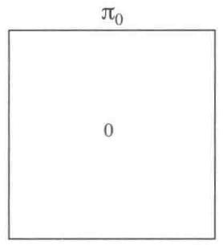

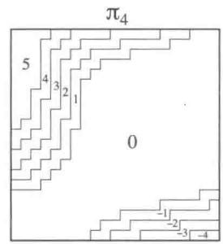

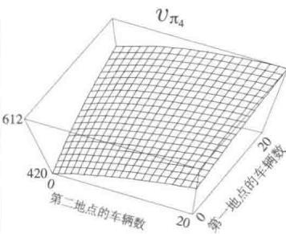  
图4.2在杰克租车问题中，策略迭代得到的策略序列以及最终的状态价值函数。前五幅图显示了在一天结束时，在每种状态下（即两地分别的车辆数），从第一地点移动到第二地点的车辆数（负数表示从第二地点转移到第一地点)，即采取的动作。每个后继策略都是对之前策略的严格改进，并且最后的策略是最优的

练习4.7（编程）编写一个策略迭代的程序，并解决下面这个更改过的杰克租车问题。杰克的一个员工在第一个地点工作，每晚坐公车到第二个地点附近的家。她乐于免费将一辆车从第一个地点移动到第二个地点。其他额外的车辆移动，包括反方向的任何移动依然耗费2美元。另外，杰克的停车空间是有限的，如果在某一个地点过夜的车辆（车辆移动后）超过10辆，他需要在另一个停车场支付4美元（无论停多少辆车）来停车。这种非线性、动态性的情况经常出现在实际问题中，且这类问题很难用动态规划以外的方法解决。为了检查你的程序，请先复现原问题的解。

# 4.4 价值迭代

策略迭代算法的一个缺点是每一次迭代都涉及了策略评估，这本身就是一个需要多次遍历状态集合的迭代过程。如果策略评估是迭代进行的，那么收敛到 $v_{\pi}$ 理论上在极限处才成立。我们是否必须等到其完全收敛，还是可以提早结束？图4.1的例子很明显地说明，

我们可以提前截断策略评估过程。在这个例子中，前三轮策略评估之后的迭代对其贪心策略没有产生任何影响。

事实上，有多种方式可以截断策略迭代中的策略评估步骤，并且不影响其收敛。一种重要的特殊情况是，在一次遍历后即刻停止策略评估（对每个状态进行一次更新）。该算法被称为价值迭代。可以将此表示为结合了策略改进与截断策略评估的简单更新公式。对任意 $s \in S$

$$
\begin{array}{l} v _ {k + 1} (s) \doteq \max  _ {a} \mathbb {E} \left[ R _ {t + 1} + \gamma v _ {k} \left(S _ {t + 1}\right) \mid S _ {t} = s, A _ {t} = a \right] \\ = \max  _ {a} \sum_ {s ^ {\prime}, r} p \left(s ^ {\prime}, r \mid s, a\right) \left[ r + \gamma v _ {k} \left(s ^ {\prime}\right) \right] \tag {4.10} \\ \end{array}
$$

可以证明，对任意 $v_{0}$ ，在 $v_{*}$ 存在的条件下，序列 $\{v_k\}$ 都可以收敛到 $v_{*}$ 。

另一种理解价值迭代的方法是借助贝尔曼最优方程（见式4.1）。值得注意的是，价值迭代仅仅是将贝尔曼最优方程变为一条更新规则。另外，除了从达到最大值的状态更新以外，价值迭代与策略评估的更新公式（见式4.5）几乎完全相同。另一种观察它们紧密关系的方法是比较第57页中算法的回溯图（策略评估）和图3.4（左图）（价值迭代）。它们是计算 $v_{\pi}$ 与 $v_{*}$ 的自然的回溯操作。

最后，我们考虑价值迭代如何终止。和策略评估一样，理论上价值迭代需要迭代无限次才能收敛到 $v_{*}$ 。事实上，如果一次遍历中价值函数仅仅有细微的变化，那么我们就可以停止。下面给出了一个使用该终止条件的完整算法。

在每一次遍历中，价值迭代都有效结合了策略评估的遍历和策略改进的遍历。在每次策略改进遍历的迭代中间进行多次策略评估遍历经常收敛得更快。一般来说，可以将截断策略迭代算法看作一系列的遍历序列，其中某些进行策略评估更新，而另一些则进行价值迭代更新。由于式(4.10)中max操作是这两种更新方式的唯一区别，这就意味着我们仅仅需要将max操作加入部分的策略评估遍历过程中即可。这些算法在带折扣的有限MDP中均会收敛到最优策略。

# 价值迭代算法，用于估计 $\pi \approx \pi_{*}$

算法参数：小阈值 $\theta >0$ ，用于确定估计量的精度

对于任意 $s \in S^{+}$ ，任意初始化 $V(s)$ ，其中 $V$ （终止状态）=0。

循环：

$\Delta \gets 0$ 对每一个 $s\in S$ 循环： $v\gets V(s)$ $V(s)\gets \max_{a}\sum_{s^{\prime},r}p(s^{\prime},r|s,a)[r + \gamma V(s^{\prime})]$ $\Delta \leftarrow \max (\Delta ,|v - V(s)|)$

直到 $\Delta <  \theta$

输出一个确定的 $\pi \approx \pi_{*}$ ，使得

$$
\pi (s) = \operatorname {a r g m a x} _ {a} \sum_ {s ^ {\prime}, r} p \left(s ^ {\prime}, r \mid s, a\right) [ r + \gamma V \left(s ^ {\prime}\right) ]
$$

例4.3赌徒问题一个赌徒下注猜测一系列抛硬币实验的结果。如果硬币正面朝上，他获得这一次下注的钱；如果背面朝上则失去这一次下注的钱。这个游戏在赌徒达到获利目标100美元或者全部输光时结束。每一次抛硬币，赌徒必须从他的赌资中选取一个整数来下注。可以将这个问题表示为一个非折扣的分幕式有限MDP。状态为赌徒的赌资 $s \in \{12\dots ,99\}$ ，动作为赌徒下注的金额 $a \in \{01\dots ,\min (s,100 - s)\}$ 。收益一般情况下均为0，只有在赌徒达到获利100美元的终止状态时为 $+1$ 。状态价值函数给出了在每个状态下赌徒获胜的概率。这里的策略是赌资到赌注的映射。最优策略将会最大化这个概率。令 $p_h$ 为抛硬币正面向上的概率。如果 $p_h$ 已知，那么整个问题可以由价值迭代或其他类似算法解决。图4.3显示了在价值迭代遍历过程中价值函数的变化，以及在 $p_h = 0.4$ 时最终找到的策略。这个策略是最优的，但并不是唯一的。事实上存在一系列的最优策略，具体取决于在argmax函数相等时的动作选取。你能猜测一下这一系列的最优策略是什么样子吗？

练习4.8 为什么赌徒问题的最优策略是一个如此奇怪的形式？特别是，当赌资为50时，他会选择全部投注，而当赌资为51时却不是这样。为什么这是一个好的策略？

练习4.9（编程）编写程序，使用价值迭代解决当 $p_h = 0.25$ 和 $p_h = 0.55$ 时的赌徒问题。在编程时，你可以为了方便加入赌资为0和100的两个虚拟状态，其值分别为0与1。将你的结果如图4.3一样图形化给出。当 $\theta \to 0$ 时，你的结果是否稳定？

练习4.10 与价值迭代更新公式(4.10)类似的动作价值函数 $q_{k + 1}(s,a)$ 更新公式是什么？

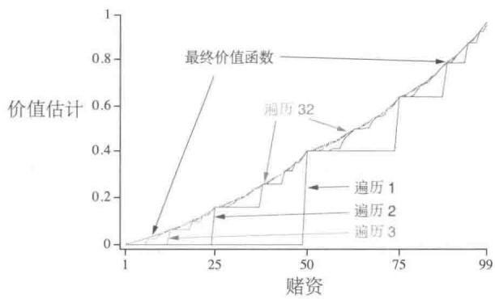

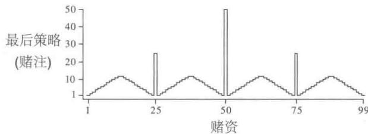  
图4.3赌徒问题的解决方法 $(p_h = 0.4)$ 。上图显示了价值迭代连续遍历得到的价值函数。下图显示了最后的策略

# 4.5 异步动态规划

我们之前讨论过的DP方法的一个主要缺点是，它们涉及对MDP的整个状态集的操作，也就是说，它们需要对整个状态集进行遍历。如果状态集很大，那么即使是单次遍历也会十分昂贵。比如，西洋双陆棋有 $10^{20}$ 多个状态。即使我们可以每秒对100万个状态进行价值迭代更新，完成一次遍历仍将需要一千多年的时间。

异步DP算法是一类就地迭代的DP算法，其不以系统遍历状态集的形式来组织算法。这些算法使用任意可用的状态值，以任意顺序来更新状态值。在某些状态的值更新一次之前，另一些状态的值可能已经更新了好几次。然而，为了正确收敛，异步算法必须要不断地更新所有状态的值：在某个计算节点后，它不能忽略任何一个状态。在选择要更新的状态方面，异步DP算法具有极大的灵活性。

例如，异步价值迭代的其中一个版本就是用价值迭代更新公式(4.10)，在每一步 $k$ 上都只就地更新一个状态 $s_k$ 的值。如果 $0 \leqslant \gamma < 1$ ，则只要所有状态都在序列 $\{s_k\}$ 中出现无数次，就能保证渐近收敛到 $v_*$ (这个序列甚至可以是随机的)。(在非折扣分幕式情况下，有些特定顺序的更新序列可能不收敛，但这个情况相对容易避免。）类似地，结合策略评

估和价值迭代更新，产生一种异步截断的策略迭代也是有可能的。尽管这种算法和其他更特殊的DP算法的细节超出了本书的讨论范围，但显而易见，不同的更新方式可以在各种无遍历的DP算法中灵活组合使用。

当然，避免遍历并不一定意味着我们可以减少计算量。这只意味着，一个算法在改进策略前，不需要陷入任何漫长而无望的遍历。我们可以试着通过选择一些特定状态来更新，从而加快算法的速度。我们也可以试着调整更新的顺序，使得价值信息能更有效地在状态间传播。对于一些状态可能不需要像其他状态那样频繁地更新其价值函数。如果它们与最优行为无关，我们甚至可以完全跳过一些状态。第8章就讨论了这样的思路。

异步算法还使计算和实时交互的结合变得更加容易。为了解决给定的MDP问题，我们可以在一个智能体实际在MDP中进行真实交互的同时，执行迭代DP算法。这个智能体的经历可用于确定DP算法要更新哪个状态。与此同时，DP算法的最新值和策略信息可以指导智能体的决策。比如，我们可以在智能体访问状态时将其更新。这使得将DP算法的更新聚焦到部分与智能体最相关的状态集成为可能。这种聚焦是强化学习中不断重复的主题。

# 4.6 广义策略迭代

策略迭代包括两个同时进行的相互作用的流程，一个使得价值函数与当前策略一致（策略评估），另一个根据当前价值函数贪心地更新策略（策略改进）。在策略迭代中，这两个流程交替进行，每个流程都在另一个开始前完成。但这也不是必须的，例如，我们可以在每两次策略改进之间只执行一次策略评估迭代，而不是一直迭代到收敛。在异步DP方法中，评估和改进流程则以更细的粒度交替进行。在某些特殊情况下，甚至有可能仅有一个状态在评估流程中得到更新，然后马上就返回到改进流程。但只要两个流程持续更新所有状态，那么最后的结果通常是相同的，即收敛到最优价值函数和一个最优策略。

我们用广义策略迭代（GPI）一词来指代让策略评估和策略改进相互作用的一般思路，与这两个流程的粒度和其他细节无关。几乎所有的强化学习方法都可以被描述为GPI。也就是说，几乎所有方法都包含明确定义的策略和价值函数，且如右图所示，策略总是基于特定的价值函数进行改进，价值函数也始终会向对应特定策略的真实价值函数收敛。显而易见，如果评估流程和改进流程都很稳定，即不再产生变化，那么价值函数和策略必定是最优的。价值函数只有在与当前策略一致时才稳定，

并且策略只有在对当前价值函数是贪心策略时才稳定。因此，只有当一个策略发现它对自己的评估价值函数是贪心策略时，这两个流程才能稳定下来。这意味着贝尔曼最优方程（4.1）成立，也因此这个策略和价值函数都是最优的。

可以将GPI的评估和改进流程看作竞争与合作。竞争是指它们朝着相反的方向前进。让策略对价值函数贪心通常会使价值函数与当前策略不匹配，而使价值函数与策略一致通常会导致策略不再贪心。然而，从长远来看，这两个流程会相互作用以找到一个联合解决方案：最优价值函数和一个最优策略。

我们也可以将GPI的评估和改进流程视为两个约束或目标之间的相互作用的流程，如右图所示的二维空间中的两条线。尽管实际的几何形状比这复杂得多，但该图也表明了在实际情况下会发生什么。每个流程都把价值函数或策略推向其中的一条线，该线代表了对于两个目标中的某一个目标的解决方案。因为这两

条线不是正交的，所以两个目标之间会产生相互作用。直接冲向一个目标会导致某种程度地偏离另一个目标。然而，不可避免的是，整体流程的结果会更接近最优的总目标。该图中的箭头对应于策略迭代的行为，即每个箭头都表示系统每次都会完全地达到其中一个目标。在GPI中，我们也可以让每次走的步子小一点，部分地实现其中一个目标。无论是哪种情况，尽管没有直接优化总目标，但评估和改进这两个流程结合在一起，就可以最终达到最优的总目标。

# 4.7 动态规划的效率

DP算法也许对一些规模很大的问题并不是非常适用，但是和其他解决马尔可夫决策过程的方法相比，DP算法实际上效率很高。如果我们忽略一些技术上的细节，动态规划算法找到最优策略的时间（最坏情况下）与状态和动作的数量是呈多项式级关系的。如果我们分别用 $n$ 和 $k$ 来表示状态和动作的数量，则意味着一个DP方法所需要的计算操作的数量少于 $n$ 与 $k$ 的某个多项式函数。即使（确定）策略的总量达到 $k^n$ ，DP算法也能保证在多项式时间内找到一个最优策略。从这个意义上来说，DP算法的效率指数级优于任何直接在策略空间搜索的方法，这是因为，为了找到最优策略，直接搜索的方法需要穷举每一种策略。线性规划方法同样可以用于解决马尔可夫决策过程，且在某些例子中，它们在最坏情况下的收敛是优于DP方法的。但是当状态数量较少时，线性规划方法就不如DP方法实用(大约需要100倍的时间)。对那些极大规模的问题，只有动态规划算法

是可行的。

DP算法有时会由于维度灾难而被认为缺乏实用性。维度灾难指的是，状态的总数量经常随着状态变量的增加而指数级上升。状态集合太大的确会带来一些困难，但是这些是问题本身的困难，而非DP作为一种解法所带来的困难。事实上，相比于直接搜索和线性规划，DP更加适合于解决大规模状态空间的问题。

在实际运用中，采用今天的计算机实现DP算法，可以解决拥有数百万个状态的马尔可夫决策过程。策略迭代和价值迭代都被广泛使用，并且目前仍没有定论到底这两种方法哪种更优。在实际运用中，这些方法的收敛速度常常比它们理论上的最坏情况要快，尤其是使用了好的初始价值函数或策略时。

对于那些有很大状态空间的问题，我们通常使用异步DP算法。同步的算法仅仅完成一次遍历，就需要计算和存储每一个状态。对于某些问题来说，如此大的存储与计算量是不切实际的。但这些问题仍然是可解的，因为往往只有相对较少的状态会沿着最优解的轨迹出现。可以在这样的情况下应用异步方法以及GPI的一些变种，它们可能比同步方法更快地找到好的甚至最优的策略。

# 4.8 本章小结

在这一章中，我们熟悉了利用动态规划方法解决有限马尔可夫决策过程的基本思想和算法。策略评估通常指的是对一个策略的价值函数进行迭代计算。策略改进指的是给定某个策略的价值函数，计算一个改进的策略。将这两种计算统一在一起，我们得到了策略迭代和价值迭代，这也是两种最常用的DP算法。这两种方法中的任意一种都可以在给定马尔可夫决策过程完整信息的条件下，计算出有限马尔可夫决策过程的最优策略和价值函数。

传统的DP方法要遍历整个状态集合，并对每一个状态进行期望更新操作。每一次操作都基于所有可能的后继状态的价值函数以及它们可能出现的概率，来更新一个状态的价值。期望更新与贝尔曼方程关系密切：只不过是将那些等式变为赋值语句而已。当更新对结果不再产生数值上的变化时，就表示已经收敛并满足对应的贝尔曼方程。我们有四个基本价值函数 $(v_{\pi}, v_{*}, q_{\pi}$ 和 $q_{*})$ ，也有四个相应的贝尔曼方程和四个对应的期望更新。它们对应的回溯图就是DP更新操作的一种直观的表达。

用广义策略迭代（GPI）的视角来分析，我们可以对DP算法和几乎所有的强化学习算法的本质有更深的理解。GPI的主要思想是采用两个相互作用的流程围绕着近似策略

和近似价值函数循环进行。一个流程根据给定的策略进行策略评估，使得价值函数逼近这个策略真实的价值函数。另一个流程根据给定的价值函数进行策略改进，在假设价值函数固定的条件下，使得这个策略更好。尽管每一个流程都改变了另一个流程，但它们的相互作用总体上可以一起找到一个联合的解：不会被任意一个流程改变的策略和价值函数，即最优解。在某些情况下，GPI可以被证明是收敛的，尤其是我们在本章中提到的传统DP算法。在其他情况下，收敛性并不能被证明，但是广义策略迭代的思想仍然可以加深我们对这个方法的理解。

有时我们并不需要用DP算法来遍历整个状态集合。异步DP算法就是一种以任意顺序更新状态的就地迭代方法，更新顺序甚至可以随机确定并可以使用过时的信息。其中许多方法可以被看作GPI的细粒度形式。

最后，我们注意到DP算法的一个特殊性质。所有的方法都根据对后继状态价值的估计，来更新对当前状态价值的估计。也就是说，它们基于其他估计来更新自己的估计。我们把这种普遍的思想称为自举法。许多的强化学习算法都采用了自举的思想，甚至是那些不像DP一样需要完整而准确的环境模型的算法也是如此。在下一章中，我们会讨论一些强化学习算法，它们不需要模型也不自举。在第6章我们会讨论另一种强化学习算法，它虽然不需要模型，但还是使用了自举的思想。这些主要的特征和性质都是可分的，但是也可以被巧妙地结合在一起。

# 参考文献和历史评注

Bellman (1957a) 提出了术语“动态规划”(Dynamic Programming, DP)，并展示了这些方法如何应用于更广泛的问题。此外还有许多文献都对DP进行了广泛的讨论，例如Bertsekas (2005, 2012）、Bertsekas和Tsitsiklis (1996）、Dreyfus和Law (1977)、Ross (1983)、White (1969)和Whittle (1982，1983）。我们对DP的兴趣仅限于解决MDP，但DP也适用于其他类型的问题。Kumar和Kanal (1988)对DP进行了更全面的介绍。

据我们所知，Minsky（1961）在评论Samuel的下棋程序时，第一次提出了DP与强化学习之间的关系。Minsky在脚注中提到，某些问题可以被描述为具有闭合解析解的Samuel的回溯过程，这类问题可以采用DP来解决。这一说法可能误导了人工智能的研究人员，让他们误认为DP仅适用于解析上可推导的问题，而因此误认为DP在很大程度上与人工智能无关。尽管没有在DP和学习算法之间建立特定的联系，Andreae（1969b）在强化学习的背景下提到了DP，特别是策略迭代。Werbos（1977）提出了一种近似DP的方法，称之为“启发式动态规划”，强调连续状态问题的梯度下降方法（Werbos, 1982, 1987, 1988, 1989, 1992）。这些方法与我们在本书中讨论的强化学习算法密切相关。Watkins（1989）明确地将强化学习与DP联系起来，并将一类强化学习方法表征为“增量动态规划”。

4.1-4 这几节描述了完善的 DP 算法，上面提及的任何一篇 DP 参考文献中都涵盖了这些算法。策略改进定理和策略迭代算法是由 Bellman（1957a）和 Howard（1960）提出的。我们的介绍受到了 Watkins（1989）对策略改进的看法的影响。我们对将价值迭代视为截断策略迭代的一种形式的讨论基于 Puterman 和 Shin（1978）提出的方法。他们提出了一类称为修正策略迭代的算法，其中将策略迭代和价值迭代作了特例。Bertsekas（1987）提出的一个分析说明了价值迭代是如何在有限的时间内找到最优策略的。

迭代策略评估是典型的逐次逼近算法用于求解线性方程组的一个例子。该算法的一个版本使用两个数组，其中一个用于保存旧值，而另一个进行更新。在 Jacobi 使用这种方法之后，这一版本通常被称为 Jacobi 型算法。它有时也被称为同步算法，因为其效果就好像所有值都在同一时间更新一样。注意，第二个数组是必需的，因为我们需要用顺序计算的方法来模拟并行更新。第二个版本的算法是“就地更新”算法，通常被称为 Gauss-Seidel 型算法，这源于经典的 Gauss-Seidel 算法被成功地用于求解线性方程组。不仅是迭代策略评估，其他的 DP 算法也都可以采用这些不同的版本来实现。Bertsekas 和 Tsitsiklis (1989) 对这些变化及其性能差异给出了极好的分析与研究。

4.5 Bertsekas (1982, 1983) 提出异步 DP 算法，并称它们为分布式 DP 算法。异步 DP 算法的最初动机是想要在多处理器系统上实现，也就是说，在处理器之间存在通信延迟，并且没有全局同步时钟。Bertsekas 和 Tsitsiklis (1989) 对这些算法进行了广泛的讨论。Jacobi 型和 Gauss-Seidel 型的 DP 算法是异步版本的特例。Williams 和 Baird (1990) 提出了一类 DP 算法，这些算法在比我们讨论过的更细的粒度上是异步的：更新操作本身也被分解为可以异步执行的步骤。  
4.7 在 Michael Littman 的帮助下，本节基于 Littman、Dean 和 Kaelbling（1995）进行编写。“维度灾难”一词是 Bellman（1957a）提出的。将线性规划应用于强化学习的奠基性工作是由 Daniela de Farias（de Farias, 2002；de Farias 和 Van Roy, 2003）做出的。

# 5

# 蒙特卡洛方法

在这一章中，我们考虑第一类实用的估计价值函数并寻找最优策略的算法。与第4章不同，在这里我们并不假设拥有完备的环境知识。蒙特卡洛算法仅仅需要经验，即从真实或者模拟的环境交互中采样得到的状态、动作、收益的序列。从真实经验中进行学习是非常好的，因为它不需要关于环境动态变化规律的先验知识，却依然能够达到最优的行为。从模拟经验中学习也是同样有效的，尽管这时需要一个模型，但这个模型只需要能够生成状态转移的一些样本，而不需要像动态规划（DP）算法那样生成所有可能转移的概率分布。在绝大多数情况下，虽然很难得到显式的分布，但从希望得到的分布进行采样却很容易。

蒙特卡洛算法通过平均样本的回报来解决强化学习问题。为了保证能够得到有良好定义的回报，这里我们只定义用于分幕式任务的蒙特卡洛算法。在分幕式任务中，我们假设一段经验可以被分为若干个幕，并且无论选取怎样的动作整个幕一定会终止。价值估计以及策略改进在整个幕结束时才进行。因此蒙特卡洛算法是逐幕做出改进的，而非在每一步（在线）都有改进。通常，术语“蒙特卡洛”泛指任何包含大量随机成分的估计方法。在这里我们用它特指那些对完整的回报取平均的算法（而非在下一章中介绍的从部分回报中学习的算法）。

第2章中的赌博机算法采样并平均每个动作的收益，蒙特卡洛算法与之类似，采样并平均每一个“状态-动作”二元组的回报。这里主要的区别在于，我们现在有多个状态，每一个状态都类似于一个不同的赌博机问题（如关联搜索或者上下文相关的赌博机），并且这些不同的赌博机问题是相互关联的。换言之，在某个状态采取动作之后的回报取决于在同一个幕内后来的状态中采取的动作。由于所有动作的选择都在随时刻演进而不断地学习，所以从较早状态的视角来看，这个问题是非平稳的。

为了处理其非平稳性，我们采用了类似于第4章中研究DP时提到的广义策略选

代 (GPI) 算法的思想。当时我们从马尔可夫决策过程的知识中计算价值函数，而现在我们从马尔可夫决策过程采样样本的经验回报中学习价值函数。价值函数和其对应的策略依然以同样的方式 (GPI) 保证其最优性。与在 DP 的章节中一样，我们首先考虑预测问题（对任意一个固定的策略 $\pi$ 计算其 $v_{\pi}$ 与 $q_{\pi}$ ），然后再考虑策略的改进问题，最后讨论控制问题以及通过 GPI 所得到的解。DP 中的所有思想都会拓展到蒙特卡洛方法中，唯一的区别在于，这里我们只有通过采样获得的经验。

# 5.1 蒙特卡洛预测

我们首先考虑如何在给定一个策略的情况下，用蒙特卡洛算法来学习其状态价值函数。我们已经知道一个状态的价值是从该状态开始的期望回报，即未来的折扣收益累积值的期望。那么一个显而易见的方法是根据经验进行估计，即对所有经过这个状态之后产生的回报进行平均。随着越来越多的回报被观察到，平均值就会收敛于期望值。这一想法是所有蒙特卡洛算法的基础。

特别是，假设给定在策略 $\pi$ 下途经状态 $s$ 的多幕数据，我们想估计策略 $\pi$ 下状态 $s$ 的价值函数 $v_{\pi}(s)$ 。在给定的某一幕中，每次状态 $s$ 的出现都称为对 $s$ 的一次访问。当然，在同一幕中， $s$ 可能会被多次访问到。在这种情况下，我们称第一次访问为 $s$ 的首次访问。首次访问型 MC 算法用 $s$ 的所有首次访问的回报的平均值估计 $v_{\pi}(s)$ ，而每次访问型 MC 算法则使用所有访问的回报的平均值。这两种蒙特卡洛 (MC) 算法十分相似但却有着不同的理论基础。“首次访问型 MC 算法”从 20 世纪 40 年代开始就被人们进行了大量的研究，是我们这一章主要关注的算法。“每次访问型 MC 算法”则能更自然地扩展到函数近似与资格迹方法，我们将分别在第 9 章和第 12 章中介绍这两个概念。下框中展示的是“首次访问型 MC 算法”的伪代码。除了无须检查 $S_t$ 是否在当前幕的早期时段出现过之外，“每次访问型 MC 算法”的流程与此相同。

当 $s$ 的访问次数（或首次访问次数）趋向无穷时，首次访问型MC和每次访问型MC均会收敛到 $v_{\pi}(s)$ 。对于首次访问型MC来说，这个结论是显然的。算法中的每个回报值都是对 $v_{\pi}(s)$ 的一个独立同分布的估计，且估计的方差是有限的。根据大数定理，这一平均值的序列会收敛到它们的期望值。每次平均都是一个无偏估计，其误差的标准差以 $1 / \sqrt{n}$ 衰减，这里的 $n$ 是被平均的回报值的个数。在每次访问型MC中，这个结论就没有这么显然，但它也会二阶收敛到 $v_{\pi}(s)$ (Singh和Sutton，1996)。

# 首次访问型MC预测算法，用于估计 $V\approx v_{\pi}$

输入：待评估的策略 $\pi$

初始化：

对所有 $s \in S$ ，任意初始化 $V(s) \in \mathbb{R}$

对所有 $s \in S$ ，Returns(s) $\leftarrow$ 空列表

无限循环 (对每幕)：

根据 $\pi$ 生成一幕序列： $S_0,A_0,R_1,S_1,A_1,R_2,\ldots ,S_{T - 1},A_{T - 1},R_T$

$$
G \leftarrow 0
$$

对本幕中的每一步进行循环， $t = T - 1, T - 2, \ldots, 0$

$$
G \leftarrow \gamma G + R _ {t + 1}
$$

除非 $S_{t}$ 在 $S_0,S_1,\ldots ,S_{t - 1}$ 中已出现过：

将 $G$ 加入 $\operatorname{Returns}(S_t)$

$$
V \left(S _ {t}\right) \leftarrow \text {a v e r a g e} \left(\operatorname {R e t u r n s} \left(S _ {t}\right)\right)
$$

下面我们通过一个例子来讲解如何应用蒙特卡洛算法。

例5.1二十一点二十一点是一种流行于赌场的游戏，其目标是使得你的扑克牌点数之和在不超过21的情况下越大越好。所有的人头牌（J、Q、K）的点数为10，A既可当作1也可当作11。假设每一个玩家都独立地与庄家进行比赛。游戏开始时会给各玩家与庄家发两张牌。庄家的牌一张正面朝上一张背面朝上。玩家直接获得21点（一张A与一张10）的情况称之为天和。此时玩家直接获胜，除非庄家也是天和，那就是平局。如果玩家不是天和，那么他可以一张一张地继续耍牌，直到他主动停止（停牌）或者牌的点数和超过21点(爆牌)。如果玩家爆牌了就算输掉比赛。如果玩家选择停牌，就轮到庄家行动。庄家根据一个固定的策略进行游戏：他一直要牌，直到点数等于或超过17时停牌。如果庄家爆牌，那么玩家获胜，否则根据谁的点数更靠近21决定胜负或平局。

二十一点是一个典型的分幕式有限马尔可夫决策过程。可以将每一局看作一幕。胜、负、平局分别获得收益 $+1$ 、 $-1$ 和0。每局游戏进行中的收益都为0，并且不打折扣 $(\gamma = 1)$ ；所以最终的收益即为整个游戏的回报。玩家的动作为要牌或停牌。状态则取决于玩家的牌与庄家显示的牌。我们假设所有的牌来自无穷多的一组牌（即每次取出的牌都会再放回牌堆)，因此就没有必要记下已经抽了哪些牌。如果玩家手上有一张A，可以视作11且不爆牌，那么称这张A为可用的。此时这张牌总会被视作11，因为如果视作1的话，点数总和必定小于等于11，而这时玩家就无须进行选择，可以直接要牌，因为抽牌几乎一定会更优。所以，玩家做出的选择只会依赖于三个变量：他手牌的总和 $(12\sim 21)$ ，庄家显示的牌 $(\mathrm{A}\sim 10)$ ，以及他是否有可用的A。这样共计就有200个状态。

考虑下面这种策略，玩家在手牌点数之和小于20时要牌，否则停牌。为了通过蒙特卡洛法计算这种策略的状态价值函数，需要根据该策略模拟很多次二十一点游戏，并且计算每一个状态的回报的平均值。我们得到了如图5.1所示的状态价值函数。有可用的A的状态的估计会更不确定、不规律，因为这样的状态更加罕见。无论是哪种情况，在大约500000局游戏后，价值函数都能很好地近似。

  
图5.1当玩二十一点游戏的策略为只在点数和为20或21停牌时，通过蒙特卡洛策略评估计算得到的近似状态价值函数

练习5.1 考虑图5.1右侧的图。为什么估计的价值函数在最后两行突然增高？为什么它在最靠左侧的一列降低？为什么上方图中靠前的值比下方图中对应位置要高？

练习5.2假如我们在解决二十一点问题时使用的不是首次访问型蒙特卡洛算法而是每次访问型蒙特卡洛算法，那么你觉得结果会非常不一样吗？为什么？

即使我们完全了解这个任务的环境知识，使用DP方法来计算价值函数也不容易。因为DP需要知道下一个时刻的概率分布，它需要知道表示环境动态的四元函数 $p$ ，而这在二十一点问题中是很难得到的。比如，假设玩家手牌的点数为14，然后选择停牌。如果将玩家最后得到 $+1$ 的收益的概率视作庄家显示的牌的函数，那么该如何进行求解？在DP之前必须计算得到所有的这些概率，然而这些计算通常既复杂又容易出错。相反，通过蒙特卡洛算法生成一些游戏的样本则非常容易，且这种情况很常见。蒙特卡洛算法只需利用若干幕采样序列就能计算的特性是一个巨大的优势，即便我们已知整个环境的动态特性也是如此。

我们是否能够将回溯图的思想应用到蒙特卡洛算法中呢？回溯图的基本思想是顶部为

待更新的根节点，下面则是中间与叶子节点，它们的收益和近似价值都会在更新时用到。

如右图所示，在蒙特卡洛算法中估计 $v_{\pi}$ 时，根为一个状态节点，然后往下是某幕样本序列一直到终止状态为止的完整轨迹，其中包含该幕中的全部状态转移。DP的回溯图（第57页）显示了所有可能的转移，而蒙特卡洛算法则仅仅显示在当前幕中采样到的那些转移。DP的回溯图仅仅包含一步转移，而蒙特卡洛算法则包含了到这一幕结束为止的所有转移。回溯图上的这些区别清楚地体现了这两种算法之间的本质区别。

蒙特卡洛算法的一个重要的事实是：对于每个状态的估计是独立的。它对于一个状态的估计完全不依赖于对其他状态的估计，这与DP完全不同。换言之，蒙特卡洛算法并没有使用我们在之前章节中描述的自举思想。

特别需要注意的是，计算一个状态的代价与状态的个数是无关的。这使得蒙特卡洛算法适合在仅仅需要获得一个或者一个子集的状态的价值函数时使用。我们可以从这个特定的状态开始采样生成一些幂序列，然后获取回报的平均值，而完全不需要考虑其他的状态。这是蒙特卡洛方法相比于DP的第三个优势（另外两个优势是：可以从实际经历和模拟经历中学习）。

线框上的肥皂泡  
  
原图来自Hersh和Griego（1969）。转载许可。版权所有（1969）Scientific American，a division of Nature America, Inc.保留所有权利。

例5.2肥皂泡假设一个闭合的线框浸泡在肥皂水中，沿着线框的边缘形成了一个肥皂

泡。如果线框的几何形状不规则但是已知，我们该如何计算肥皂泡表面的形状呢？这个形状满足任意一点受到相邻部分施加的外力和为零（否则形状会发生改变）的条件。这意味着在表面上的任意一点，其高度等于它邻域的其他点的高度的平均值。此外，表面的边界必须恰好与线框重合。这个问题通常的解法是将整个表面网格化，然后通过迭代计算每个网格的高度。在线框上的网格的高度固定为线框的高度，其他的点则调整为四个相邻网格高度的平均值。就像DP的策略迭代一样，不停迭代这个过程，最终会收敛到一个所求表面的近似值。

蒙特卡洛算法最早用来解决的问题类型与这个问题十分相似。我们可以不进行上述的迭代计算，而是在表面上选一个网格点开始随机行走，每一步等概率地走到相邻的四个网格点之一，直到到达边界。这样到达的边界点的高度的期望值就是起点高度的一个近似（事实上，之前迭代方法计算的也是此值）。因此，某个网格点的高度可以通过从此点开始的多次随机行走的终点的高度的平均值来近似。如果人们只对一个点，或者一小部分点组成的集合比较感兴趣，那么这种蒙特卡洛法比起迭代法更加有效率。

# 5.2 动作价值的蒙特卡洛估计

如果无法得到环境的模型，那么计算动作的价值（“状态-动作”二元组的价值，也即动作价值函数的值）比起计算状态的价值更加有用一些。在有模型的情况下，单靠状态价值函数就足以确定一个策略：用在DP那一章讲过的方法，我们只需要简单地向前看一步，选取特定的动作，使得当前收益与后继状态的状态价值函数之和最大即可。但在没有模型的情况下，仅仅有状态价值函数是不够的。我们必须通过显式地确定每个动作的价值函数来确定一个策略。所以我们主要的目标是使用蒙特卡洛算法确定 $q_{*}$ 。因此我们首先考虑动作价值函数的策略评估问题。

动作价值函数的策略评估问题的目标就是估计 $q_{\pi}(s,a)$ ，即在策略 $\pi$ 下从状态 $s$ 采取动作 $a$ 的期望回报。只需将对状态的访问改为对“状态-动作”二元组的访问，蒙特卡洛算法就可以用几乎和之前完全相同的方式来解决此问题。如果在某一幕中状态 $s$ 被访问并在这个状态中采取了动作 $a$ ，我们就称“状态-动作”二元组 $(s,a)$ 在这一幕中被访问到。每次访问型MC算法将所有“状态-动作”二元组得到的回报的平均值作为价值函数的近似；而首次访问型MC算法则将每幕第一次在这个状态下采取这个动作得到的回报的平均值作为价值函数的近似。和之前一样，在对每个“状态-动作”二元组的访问次数趋向无穷时，这些方法都会二次收敛到动作价值函数的真实期望值。

这里唯一的复杂之处在于一些“状态-动作”二元组可能永远不会被访问到。如果 $\pi$ 是一个确定性的策略，那么遵循 $\pi$ 意味着在每一个状态中只会观测到一个动作的回报。在无法获取回报进行平均的情况下，蒙特卡洛算法将无法根据经验改善动作价值函数的估计。这个问题很严重，因为学习动作价值函数就是为了帮助在每个状态的所有可用的动作之间进行选择。为了比较这些动作，我们需要估计在一个状态中可采取的所有动作的价值函数，而不仅仅是当前更偏好的某个特定动作的价值函数。

如同在第2章的 $k$ 臂赌博机问题中提及的一样，这是一个如何保持试探的普遍问题。为了实现基于动作价值函数的策略评估，我们必须保证持续的试探。一种方法是将指定的“状态-动作”二元组作为起点开始一幕采样，同时保证所有“状态-动作”二元组都有非零的概率可以被选为起点。这样就保证了在采样的幕个数趋向于无穷的时候，每一个“状态-动作”二元组都会被访问到无数次。我们把这种假设称为试探性出发。

试探性出发假设有时非常有效，但当然也并非总是那么可靠。特别是当直接从真实环境中进行学习时，这个假设就很难满足了。作为替代，另一种常见的确保每一个“状态-动作”二元组被访问到的方法是，只考虑那些在每个状态下所有动作都有非零概率被选中的随机策略。我们将在后文讨论此方法的两个重要的变种。现在，我们先保留试探性出发假设来完成完整的蒙特卡洛控制算法的展示。

练习5.3 计算 $q_{\pi}$ 的蒙特卡洛估计的回溯图是什么样的？

# 5.3 蒙特卡洛控制

现在已经可以考虑如何使用蒙特卡洛估计来解决控制问题了，即如何近似最优的策略。基本的思想是采用在DP章节中介绍的广义策略迭代（GPI）。在GPI中，我们同时维护一个近似的策略和近似的价值函数。价值函数会不断迭代使其更加精确地近似对应当前策略的真实价值函数，而当前的策略也会根据当前的价值函数不断调优，右图显示了这一过程。这两个过程在一定程度上会相互影响，

因为它们互相为对方确定了一个变化的优化目标，但它们整体会使得策略与价值函数趋向最优解。

首先，我们讨论经典策略迭代算法的蒙特卡洛版本。这种方法从任意的策略 $\pi_0$ 开始交替进行完整的策略评估和策略改进，最终得到最优的策略和动作价值函数

$$
\pi_ {0} \xrightarrow {\mathrm {E}} q _ {\pi_ {0}} \xrightarrow {\mathrm {I}} \pi_ {1} \xrightarrow {\mathrm {E}} q _ {\pi_ {1}} \xrightarrow {\mathrm {I}} \pi_ {2} \xrightarrow {\mathrm {E}} \dots \xrightarrow {\mathrm {I}} \pi_ {*} \xrightarrow {\mathrm {E}} q _ {*},
$$

这里， $\xrightarrow{\mathrm{E}}$ 表示策略评估，而 $\xrightarrow{\mathrm{I}}$ 表示策略改进。策略评估完全按照前一节所述的方法进行。经历了很多幕后，近似的动作价值函数会渐近地趋向真实的动作价值函数。现在假设我们观测到了无限多幕的序列，并且这些幕保证了试探性出发假设。在这种情况下，对于任意的 $\pi_{k}$ ，蒙特卡洛算法都能精确地计算对应的 $q_{\pi_k}$ 。

策略改进的方法是在当前价值函数上贪心地选择动作。由于我们有动作价值函数，所以在贪心的时候完全不需要使用任何的模型信息。对于任意的一个动作价值函数 $q$ ，对应的贪心策略为：对于任意一个状态 $s\in S$ ，必定选择对应动作价值函数最大的动作

$$
\pi (s) \stackrel {{\cdot}} {{=}} \underset {a} {\arg \max } q (s, a). \tag {5.1}
$$

策略改进可以通过将 $q_{\pi_k}$ 对应的贪心策略作为 $\pi_{k + 1}$ 来进行。这样的 $\pi_{k}$ 和 $\pi_{k + 1}$ 满足策略改进定理(4.2节)，因为对所有的状态 $s\in S$ ，

$$
\begin{array}{l} q _ {\pi_ {k}} (s, \pi_ {k + 1} (s)) = q _ {\pi_ {k}} (s, \underset {a} {\operatorname {a r g m a x}} q _ {\pi_ {k}} (s, a)) \\ = \max  _ {a} q _ {\pi_ {k}} (s, a) \\ \geqslant q _ {\pi_ {k}} (s, \pi_ {k} (s)) \\ \geqslant v _ {\pi_ {k}} (s). \\ \end{array}
$$

我们在之前章节中讨论过，这个定理保证 $\pi_{k + 1}$ 一定比 $\pi_{k}$ 更优，除非 $\pi_{k}$ 已经是最优策略，这种情况下两者均为最优策略。这个过程反过来保证了整个流程一定收敛到最优的策略和最优的价值函数。这样，在只能得到若干幕采样序列而不知道环境动态知识时，蒙特卡洛算法就可以用来寻找最优策略。

我们在上文提出了两个很强的假设来保证蒙特卡洛算法的收敛。一个是试探性出发假设，另一个是在进行策略评估的时候有无限多幕的样本序列进行试探。为了得到一个实际可用的算法，我们必须去除这两个假设。第一个假设在本章后面讨论。

首先我们先讨论在进行策略评估时可以观测到无限多幕样本序列这一假设。这个假设比较容易去除。事实上，在经典DP算法，比如迭代策略评估中也出现了同样的问题，它的结果也仅仅是渐近地收敛于真实的价值函数。无论是DP还是蒙特卡洛算法，有两个方法可以解决这一问题。一种方法是想方设法在每次策略评估中对 $q_{\pi_k}$ 做出尽量好的逼近。这就需要做一些假设并定义一些测度，来分析逼近误差的幅度和出现概率的上下界，然后采取足够多的步数来保证这些界足够小。这种方法可以保证收敛到令人满意的近似水平。然而在实际使用中，即使问题规模很小，这种方法也可能需要有大量的幂序列以用于计算。

第二种避免无限多幕样本序列假设的方法是不再要求在策略改进前就完成策略评估。在每一个评估步骤中，我们让动作价值函数逼近 $q_{\pi_k}$ ，但我们并不期望它在经过很多步之前非常接近真实的值。在4.6节中我们首次介绍GPI时就提及了这种思想。这种思想的一种极端实现形式就是价值迭代，即在相邻的两步策略改进中只进行一次策略评估，而不要求多次迭代后的收敛。价值迭代的“就地更新”版本则更加极端：在单个状态中交替进行策略的改进与评估。

对于蒙特卡洛策略迭代，自然可以逐幕交替进行评估与改进。每一幕结束后，使用观测到的回报进行策略评估，然后在该幕序列访问到的每一个状态上进行策略的改进。使用这个思路的一个简单的算法，称作基于试探性出发的蒙特卡洛（蒙特卡洛ES)，下框中给出了这个算法。

# 蒙特卡洛ES(试探性出发)，用于估计 $\pi \approx \pi_{*}$

初始化：

对所有 $s\in S$ ，任意初始化 $\pi (s)\in \mathcal{A}(s)$

对所有 $s\in \mathcal{S}$ ， $a\in \mathcal{A}(s)$ ，任意初始化 $Q(s,a)\in \mathbb{R}$

对所有 $s \in S, a \in \mathcal{A}(s), \text{Returns}(s, a) \gets$ 空列表

无限循环 (对每幕)：

选择 $S_0 \in S$ 和 $A_0 \in \mathcal{A}(S_0)$ 以使得所有“状态-动作”二元组的概率都 $>0$

从 $S_0, A_0$ 开始根据 $\pi$ 生成一幕序列： $S_0, A_0, R_1, \ldots, S_{T-1}, A_{T-1}, R_T$

$$
G \leftarrow 0
$$

对幕中的每一步循环， $t = T - 1, T - 2, \ldots, 0$

$$
G \leftarrow \gamma G + R _ {t + 1}
$$

除非二元组 $S_{t},A_{t}$ 在 $S_0,A_0,S_1,A_1\ldots ,S_{t - 1},A_{t - 1}$ 中已出现过：

将 $G$ 加入 $\operatorname{Returns}(S_t, A_t)$

$$
\begin{array}{l} Q \left(S _ {t}, A _ {t}\right) \leftarrow \text {a v e r a g e} \left(\operatorname {R e t u r n s} \left(S _ {t}, A _ {t}\right)\right) \\ \pi (S _ {t}) \leftarrow \operatorname {a r g m a x} _ {a} Q (S _ {t}, a) \\ \end{array}
$$

练习5.4 该框中的蒙特卡洛ES伪代码效率不高。因为对于每一个“状态-动作”二元组，它都需要维护一个列表存放所有的回报值，然后反复地计算它们的平均值。我们其实可以采用更高效的方法来计算，类似2.4节中介绍的，我们仅需维护一个平均值和一个统计量（对每一个“状态-动作”二元组），然后增量式地去更新就可以了。描述一下如何修改伪代码来实现这个更高效的算法。

在蒙特卡洛ES中，无论之前遵循的是哪一个策略，对于每一个“状态-动作”二元组的所有回报都被累加并平均。可以很容易发现，蒙特卡洛ES不会收敛到任何一个次优策

略。因为如果真的收敛到次优策略，其价值函数一定会收敛到该策略对应的价值函数，而在这种情况下还会得到一个更优的策略。只有在策略和价值函数都达到最优的情况下，稳定性才能得到保证。因为动作价值函数的变化随着时间增加而不断变小，所以应该一定能收敛到这个不动点，然而这一点还没有得到严格的证明。我们认为这是强化学习基础理论中最重要的开放问题之一（部分解法可以参见Sitsiklis,2002）。

例5.3解决二十一点问题使用蒙特卡洛ES可以很直接地解决二十一点问题。由于所有幕都是模拟的游戏，因此可以很容易地使所有可能的起点概率都不为零，确保试探性出发假设成立。在这个例子中，只需要简单地随机等概率选择庄家的扑克牌、玩家手牌的点数，以及确定是否有可用的A即可。我们使用之前的例子中提及的策略作为初始策略：即只在20或21点停牌。初始的动作价值函数可以全部为零。图5.2显示了蒙特卡洛ES得出的二十一点游戏的最优策略。这个策略与Thorp（1966）发现的基础策略相比，除了其中不存在可用的A外，其他完全相同。我们不确定造成这一差异的原因，但是我们相信这是我们描述的二十一点游戏版本的最优策略。

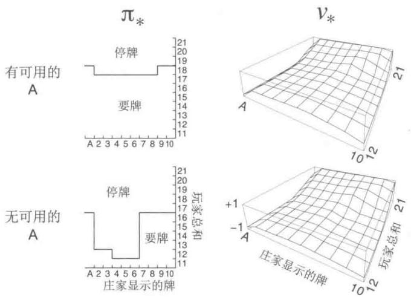  
图5.2通过蒙特卡洛ES得到的二十一点游戏的最优策略和状态价值函数。这里的状态价值函数是由通过蒙特卡洛ES得到的动作价值函数计算得到的

# 5.4 没有试探性出发假设的蒙特卡洛控制

如何避免很难被满足的试探性出发假设呢？唯一的一般性解决方案就是智能体能够持续不断地选择所有可能的动作。有两种方法可以保证这一点，分别被称为同轨策略（on-policy）方法和离轨策略（off-policy）方法。在同轨策略中，用于生成采样数据序列

的策略和用于实际决策的待评估和改进的策略是相同的；而在离轨策略中，用于评估或者改进的策略与生成采样数据的策略是不同的，即生成的数据“离开”了待优化的策略所决定的决策序列轨迹。上文提及的蒙特卡洛ES算法是同轨策略方法的一个例子。这一节我们将介绍如何设计一个同轨策略的蒙特卡洛控制方法，使其不再依赖于不合实际的试探性出发假设。离轨策略方法将在下一节中介绍。

在同轨策略方法中，策略一般是“软性”的，即对于任意 $s \in S$ 以及 $a \in A(s)$ ，都有 $\pi(a|s) > 0$ ，但它们会逐渐地逼近一个确定性的策略。第2章中提到的很多方法都能做到这一点。在这一节中我们介绍的同轨策略方法称为 $\varepsilon$ -贪心策略，意思是在绝大多数时候都采取获得最大估计值的动作价值函数所对应的动作，但同时以一个较小的 $\varepsilon$ 概率随机选择一个动作。即对于所有的非贪心动作，都有 $\frac{\varepsilon}{|\mathcal{A}(s)|}$ 的概率被选中，剩余的大部分的概率为 $1 - \varepsilon + \frac{\varepsilon}{|\mathcal{A}(s)|}$ ，这是选中贪心动作的概率。这种 $\varepsilon$ -贪心策略是 $\varepsilon$ -软性策略的一个例子，即对某个 $\varepsilon > 0$ ，所有的状态和动作都有 $\pi(a|s) \geqslant \frac{\varepsilon}{|\mathcal{A}(s)|}$ 。在所有 $\varepsilon$ -软性策略中， $\varepsilon$ -贪心策略在某种层面上是最接近贪心策略的。

同轨策略算法的蒙特卡洛控制的总体思想依然是GPI。如同蒙特卡洛ES一样，我们使用首次访问型MC算法来估计当前策略的动作价值函数。然而，由于缺乏试探性出发假设，我们不能简单地通过对当前价值函数进行贪心优化来改进策略，否则就无法进一步试探非贪心的动作。幸运的是，GPI并不要求优化过程中所遵循的策略一定是贪心的，只需要它逐渐逼近贪心策略即可。在我们的同轨策略算法中，我们仅仅改为遵循 $\varepsilon$ -贪心策略。对于任意一个 $\varepsilon$ -软性策略 $\pi$ ，根据 $q_{\pi}$ 生成的任意一个 $\varepsilon$ -贪心策略保证优于或等于 $\pi$ 。完整的算法在下框中给出。

# 同轨策略的首次访问型MC控制算法（对于 $\varepsilon$ -软性策略），用于估计 $\pi \approx \pi_{*}$

算法参数：很小的 $\varepsilon > 0$

初始化：

$\pi \gets$ 一个任意的 $\varepsilon$ -软性策略

对所有 $s \in S$ , $a \in \mathcal{A}(s)$ , 任意初始化 $Q(s, a) \in \mathbb{R}$

对所有 $s \in S, a \in \mathcal{A}(s), \text{Returns}(s, a) \gets$ 空列表

无限循环 (对每幕)：

根据 $\pi$ 生成一幕序列： $S_0,A_0,R_1,\ldots ,S_{T - 1},A_{T - 1},R_T$

$$
G \leftarrow 0
$$

对幕中的每一步循环， $t = T - 1,T - 2,\ldots ,0$

$$
G \leftarrow \gamma G + R _ {t + 1}
$$

除非“状态-动作”二元组 $S_{t},A_{t}$ 在 $S_0,A_0,S_1,A_1\ldots ,S_{t - 1},A_{t - 1}$ 已出

现过：

把 $G$ 加入 $\operatorname{Returns}(S_t, A_t)$

$$
Q \left(S _ {t}, A _ {t}\right) \leftarrow \text {a v e r a g e} \left(\operatorname {R e t u r n s} \left(S _ {t}, A _ {t}\right)\right)
$$

$A^{*}\gets \operatorname{argmax}_{a}Q(S_{t},a)$ （有多个最大值时任意选取）

对所有 $a\in \mathcal{A}(S_t)$

$$
\pi (a | S _ {t}) \leftarrow \left\{ \begin{array}{l l} 1 - \varepsilon + \varepsilon / | \mathcal {A} (S _ {t}) | & \text {i f} a = A ^ {*} \\ \varepsilon / | \mathcal {A} (S _ {t}) | & \text {i f} a \neq A ^ {*} \end{array} \right.
$$

根据策略改进定理，对于一个 $\varepsilon$ -软性策略 $\pi$ ，任何一个根据 $q_{\pi}$ 生成的 $\varepsilon$ -贪心策略都是对其的一个改进。假设 $\pi'$ 是一个 $\varepsilon$ -贪心策略。策略改进定理成立，因为对任意的 $s \in S$

$$
\begin{array}{l} q _ {\pi} (s, \pi^ {\prime} (s)) = \sum_ {a} \pi^ {\prime} (a | s) q _ {\pi} (s, a) \\ = \frac {\varepsilon}{| \mathcal {A} (s) |} \sum_ {a} q _ {\pi} (s, a) + (1 - \varepsilon) \max  _ {a} q _ {\pi} (s, a) \tag {5.2} \\ \geqslant \frac {\varepsilon}{| \mathcal {A} (s) |} \sum_ {a} q _ {\pi} (s, a) + (1 - \varepsilon) \sum_ {a} \frac {\pi (a | s) - \frac {\varepsilon}{| \mathcal {A} (s) |}}{1 - \varepsilon} q _ {\pi} (s, a) \\ \end{array}
$$

(由于期望累加和是一个用和为1的非负权重进行的加权平均值，所以一定小于等于其中的最大值)。

$$
\begin{array}{l} = \frac {\varepsilon}{| \mathcal {A} (s) |} \sum_ {a} q _ {\pi} (s, a) - \frac {\varepsilon}{| \mathcal {A} (s) |} \sum_ {a} q _ {\pi} (s, a) + \sum_ {a} \pi (a | s) q _ {\pi} (s, a) \\ = v _ {\pi} (s). \\ \end{array}
$$

所以，根据策略改进定理， $\pi' \geqslant \pi$ ，即对于任意的 $s \in S$ ，满足 $v_{\pi'}(s) \geqslant v_{\pi}(s)$ 。下面证明该式的等号成立的条件是：当且仅当 $\pi'$ 和 $\pi$ 都为最优的 $\varepsilon$ -软性策略，即它们都比所有其他的 $\varepsilon$ -软性策略更优或相同。

设想一个与原先环境几乎相同的新环境，唯一的区别是我们将策略是 $\varepsilon$ -软性这一要求“移入”环境中。新的环境与旧的环境有相同的动作与状态集，并表现出如下的行为。在状态 $s$ 采取动作 $a$ 时，新环境有 $1 - \varepsilon$ 的概率与旧环境的表现完全相同。然后以 $\varepsilon$ 的概率重新等概率选择一个动作，然后有和旧环境采取这一新的随机动作一样的表现。在这个新环境中的最优策略的表现和旧环境中最优的 $\varepsilon$ -软性策略的表现是相同的。令 $\widetilde{v}_{*}$ 和 $\widetilde{q}_{*}$ 为新环境的最优价值函数，则当且仅当 $v_{\pi} = \widetilde{v}_{*}$ 时，策略 $\pi$ 是一个最优的 $\varepsilon$ -软性策略。根据 $\widetilde{v}_{*}$ 的定义，我们知道它是下式的唯一解

$$
\widetilde {v} _ {*} (s) = (1 - \varepsilon) \max  _ {a} \widetilde {q} _ {*} (s, a) + \frac {\varepsilon}{| \mathcal {A} (s) |} \sum_ {a} \widetilde {q} _ {*} (s, a)
$$

$$
\begin{array}{l} = (1 - \varepsilon) \max  _ {a} \sum_ {s ^ {\prime}, r} p \left(s ^ {\prime}, r \mid s, a\right) \left[ r + \gamma \widetilde {v} _ {*} \left(s ^ {\prime}\right) \right] \\ + \frac {\varepsilon}{| \mathcal {A} (s) |} \sum_ {a} \sum_ {s ^ {\prime}, r} p \left(s ^ {\prime}, r \mid s, a\right) \left[ r + \gamma \widetilde {v} _ {*} \left(s ^ {\prime}\right) \right]. \\ \end{array}
$$

当等式成立且 $\varepsilon$ -软性策略 $\pi$ 无法再改进的时候，由公式 (5.2) 我们有

$$
\begin{array}{l} v _ {\pi} (s) = (1 - \varepsilon) \max  _ {a} q _ {\pi} (s, a) + \frac {\varepsilon}{| \mathcal {A} (s) |} \sum_ {a} q _ {\pi} (s, a) \\ = (1 - \varepsilon) \max  _ {a} \sum_ {s ^ {\prime}, r} p \left(s ^ {\prime}, r \mid s, a\right) \left[ r + \gamma v _ {\pi} \left(s ^ {\prime}\right) \right] \\ + \frac {\varepsilon}{| \mathcal {A} (s) |} \sum_ {a} \sum_ {s ^ {\prime}, r} p \left(s ^ {\prime}, r \mid s, a\right) \left[ r + \gamma v _ {\pi} \left(s ^ {\prime}\right) \right]. \\ \end{array}
$$

然而，除了下标为 $v_{\pi}$ 而不是 $\widetilde{v}_{*}$ 以外，这个等式和上一个完全相同。由于 $\widetilde{v}_{*}$ 是唯一解，因此一定有 $v_{\pi} = \widetilde{v}_{*}$ 。

实际上，这里我们已经介绍了如何让策略迭代适用于 $\varepsilon$ -软性策略。将贪心策略的原生概念扩展到 $\varepsilon$ -软性策略上，除了得到最优的 $\varepsilon$ -软性策略外，每一步都能保证策略有改进。尽管这个分析假设了动作价值函数可以被精确计算，然而它与动作价值函数是如何计算的无关。这样我们就得到了和上一节几乎相同的结论。虽然现在我们只能获得 $\varepsilon$ -软性策略集合中的最优策略，但我们已经不再需要试探性出发假设了。

# 5.5 基于重要度采样的离轨策略

所有的学习控制方法都面临一个困境：它们希望学到的动作可以使随后的智能体行为是最优的，但是为了搜索所有的动作（以保证找到最优动作），它们需要采取非最优的行动。如何在遵循试探策略采取行动的同时学习到最优策略呢？在前面小节中提到的同轨策略方法实际上是一种妥协——它并不学习最优策略的动作值，而是学习一个接近最优而且仍能进行试探的策略的动作值。一个更加直接的方法是干脆采用两个策略，一个用来学习并最终成为最优策略，另一个更加有试探性，用来产生智能体的行动样本。用来学习的策略被称为目标策略，用于生成行动样本的策略被称为行动策略。在这种情况下，我们认为学习所用的数据“离开”了待学习的目标策略，因此整个过程被称为离轨策略学习。

在本书的后面章节我们同时考虑同轨策略和离轨策略方法。同轨策略方法通常更简单，更容易想到。离轨策略方法则需要一些额外的概念与记号，而且因为其数据来自一个不同的策略，所以离轨策略方法方差更大，收敛更慢。但另一方面，离轨策略方法更强

大，更通用。也可将同轨策略方法视为一种目标策略与行动策略相同的离轨策略方法的特例。离轨策略方法在实际应用中有许多其他用途。例如，它常用来学习通过传统的非学习型控制器或人类专家生成的数据。离轨策略学习也被视作学习外部世界动态特性的多步预测模型中的关键思想（参见17.2节；Sutton，2009；Sutton et al., 2011）。

在本节中，我们通过讨论预测问题来开始对离轨策略方法的学习，在这个实例中，目标策略和行动策略都是固定的。假设我们希望预测 $v_{\pi}$ 或 $q_{\pi}$ ，但是我们只有遵循另一个策略 $b$ ( $b \neq \pi$ ) 所得到的若干幕样本。在这种情况下， $\pi$ 是目标策略， $b$ 是行动策略，两个策略都固定且已知。

为了使用从 $b$ 得到的多幕样本序列去预测 $\pi$ ，我们要求在 $\pi$ 下发生的每个动作都至少偶尔能在 $b$ 下发生。换句话说，对任意 $\pi (a|s) > 0$ ，我们要求 $b(a|s) > 0$ 。我们称其为覆盖假设。根据这个假设，在与 $\pi$ 不同的状态中， $b$ 必须是随机的。另一方面，目标策略 $\pi$ 则可能是确定性的。实际上，这种情况是控制应用中很有趣的一类问题。在控制过程中，目标策略通常是一个确定性的贪心策略，它由动作价值函数的当前估计值所决定。而当行动策略是随机的且具有试探性时（例如可使用 $\varepsilon$ -贪心策略），这个策略会成为一个确定性的最优策略。不过在本节中，我们仅仅讨论当 $\pi$ 不变且已知时的“预测问题”。

几乎所有的离轨策略方法都采用了重要度采样，重要度采样是一种在给定来自其他分布的样本的条件下，估计某种分布的期望值的通用方法。我们将重要度采样应用于离轨策略学习，对回报值根据其轨迹在目标策略与行动策略中出现的相对概率进行加权，这个相对概率也被称为重要度采样比。给定起始状态 $S_{t}$ ，后续的状态-动作轨迹 $A_{t}, S_{t+1}, A_{t+1}, \ldots, S_{T}$ 在策略 $\pi$ 下发生的概率是

$$
\begin{array}{l} \Pr \left\{A _ {t}, S _ {t + 1}, A _ {t + 1}, \dots , S _ {T} \mid S _ {t}, A _ {t: T - 1} \sim \pi \right\} \\ = \pi \left(A _ {t} \mid S _ {t}\right) p \left(S _ {t + 1} \mid S _ {t}, A _ {t}\right) \pi \left(A _ {t + 1} \mid S _ {t + 1}\right) \dots p \left(S _ {T} \mid S _ {T - 1}, A _ {T - 1}\right) \\ = \prod_ {k = t} ^ {T - 1} \pi (A _ {k} | S _ {k}) p (S _ {k + 1} | S _ {k}, A _ {k}), \\ \end{array}
$$

这里， $p$ 是在公式 (3.4) 中定义的状态转移概率函数。因此，在目标策略和行动策略轨迹下的相对概率（重要度采样比）是

$$
\rho_ {t: T - 1} \doteq \frac {\prod_ {k = t} ^ {T - 1} \pi \left(A _ {k} \mid S _ {k}\right) p \left(S _ {k + 1} \mid S _ {k} , A _ {k}\right)}{\prod_ {k = t} ^ {T - 1} b \left(A _ {k} \mid S _ {k}\right) p \left(S _ {k + 1} \mid S _ {k} , A _ {k}\right)} = \prod_ {k = t} ^ {T - 1} \frac {\pi \left(A _ {k} \mid S _ {k}\right)}{b \left(A _ {k} \mid S _ {k}\right)}. \tag {5.3}
$$

尽管整体的轨迹概率值与MDP的状态转移概率有关，而且MDP的转移概率通常是未知的，但是它在分子和分母中是完全相同的，所以可被约分。最终，重要度采样比只与两个策略和样本序列数据相关，而与MDP的动态特性（状态转移概率）无关。

回想一下，之前我们希望估计目标策略下的期望回报(价值)，但我们只有行动策略中的回报 $G_{t}$ 。这些从行动策略中得到的回报的期望 $\mathbb{E}[G_t|S_t = s] = v_b(s)$ 是不准确的，所以不能用它们的平均来得到 $v_{\pi}$ 。这里就要用到重要度采样了。使用比例系数 $\rho_{t:T - 1}$ 可以调整回报使其有正确的期望值

$$
\mathbb {E} \left[ \rho_ {t: T - 1} G _ {t} \mid S _ {t} = s \right] = v _ {\pi} (s). \tag {5.4}
$$

现在我们已经做好了准备工作，下面我们给出通过观察到的一批遵循策略 $b$ 的多幕采样序列并将其回报进行平均来预测 $v_{\pi}(s)$ 的蒙特卡洛算法。为了方便起见，我们在这里对时刻进行编号时，即使时刻跨越幕的边界，编号也递增。也就是说，如果这批多幕采样序列中的第一幕在时刻100时在某个终止状态结束，下一幕就起始于 $t = 101$ 。这样我们就可以使用唯一的时刻编号来指代特定幕中的特定时刻。特别地，对于每次访问型方法，我们可以定义所有访问过状态 $s$ 的时刻集合为 $\mathcal{T}(s)$ 。而对于首次访问型方法， $\mathcal{T}(s)$ 只包含在幕内首次访问状态 $s$ 的时刻。我们用 $T(t)$ 来表示在时刻 $t$ 后的首次终止，用 $G_{t}$ 来表示在 $t$ 之后到达 $T(t)$ 时的回报值。那么 $\{G_t\}_{t\in \mathcal{T}(s)}$ 就是状态 $s$ 对应的回报值， $\{\rho_{t:T(t) - 1}\}_{t\in \mathcal{T}(s)}$ 是相应的重要度采样比。为了预测 $v_{\pi}(s)$ ，我们只需要根据重要度采样比来调整回报值并对结果进行平均即可

$$
V (s) \doteq \frac {\sum_ {t \in \mathcal {T} (s)} \rho_ {t : T (t) - 1} G _ {t}}{| \mathcal {T} (s) |}. \tag {5.5}
$$

通过这样一种简单平均实现的重要度采样被称为普通重要度采样。

另一个重要的方法是加权重要度采样，它采用一种加权平均的方法，其定义为

$$
V (s) \doteq \frac {\sum_ {t \in \mathcal {T} (s)} \rho_ {t : T (t) - 1} G _ {t}}{\sum_ {t \in \mathcal {T} (s)} \rho_ {t : T (t) - 1}}, \tag {5.6}
$$

如果分母为零，式(5.6)的值也定义为零。为了理解两种重要度采样方法的区别，我们讨论它们在首次访问型方法下，获得一个单幕回报之后的估计值。在加权平均的估计中，比例系数 $\rho_{t:T(t)-1}$ 在分子与分母中被约分，所以估计值就等于观测到的回报值，而与重要度采样比无关（假设比例系数非零）。考虑到这个回报值是仅有的观测结果，所以这是一个合理的估计，但它的期望是 $v_b(s)$ 而不是 $v_\pi(s)$ ，在统计学意义上这个估计是有偏的。作为对比，使用简单平均公式(5.5)得到的结果在期望上总是 $v_\pi(s)$ （是无偏的），但是其值可能变得很极端。假设比例系数是10，这意味着，被观测到的决策序列轨迹遵循目标策略的可能性是遵循行动策略的10倍。在这种情况下，普通重要度采样的估计值会是观测到的回报值的10倍。也就是说，尽管该幕数据序列的轨迹应该可以非常有效地反映目标策略，但其估计值却会离观测到的回报值很远。

在数学上，两种重要度采样算法在首次访问型方法下的差异可以用偏差与方差来表示。普通重要度采样的估计是无偏的，而加权重要度采样的估计是有偏的（偏差值渐近收敛到零）。另一方面，普通重要度采样的方差一般是无界的，因为重要度采样比的方差是无界的。而在加权估计中任何回报的最大权值都是1。其实如果假设回报值有界，那么即使重要度采样比的方差是无穷的，加权重要度采样估计的方差仍能收敛到零（Precup、Sutton和Dasgupta，2001）。在实际应用时，人们偏好加权估计，因为它的方差经常很小。尽管如此，我们不会完全放弃普通重要度采样，因为它更容易扩展到我们将在本书第Ⅱ部分提到的基于函数逼近的近似方法。

在5.7节中，我们将给出一个使用加权重要度采样进行离轨策略估计的完整的每次访问型MC算法。

练习5.5 考虑只有一个非终止状态和一个单一动作的马尔可夫决策过程，动作设定为：以概率 $p$ 跳回非终止状态，以概率 $1 - p$ 转移到终止状态。令每一时刻所有转移的收益都是 $+1$ ，且 $\gamma = 1$ 。假设你观察到一幕序列持续了10个时刻，获得了值为10的回报。则对这个非终止状态的首次访问型和每次访问型的价值估计分别是什么？

例5.4对二十一点游戏中的状态值的离轨策略估计我们分别采用普通重要度采样和加权重要度采样，从离轨策略数据中估计单个二十一点游戏状态（见例5.1）的值。之前的蒙特卡洛控制方法的优点之一是它们无须建立对其他状态的估计就能对单个状态进行估计。在这个例子中，我们评估这样一个状态，庄家露出一张牌2，玩家的牌的和是13，且玩家有一张可用的A（也就是说，玩家有一张A，一张2，或者与之等价的情况有三张A）。通过从这个状态开始等概率选择要牌或停牌（行动策略）可以得到采样数据。目标策略只在和达到20或21时停牌，这和在例5.1中一样。在目标策略中，这个状态的值大概

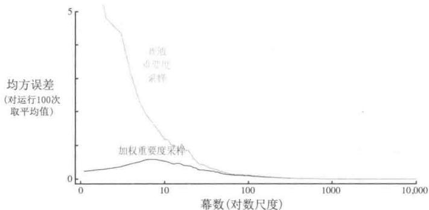  
图5.3加权重要度采样可以从离轨策略数据中，对二十一点游戏中的状态的价值进行误差更小的估计（见例5.3)

是-0.27726（这是利用目标策略独立生成1亿幕数据后对回报进行平均得到的）。两种离轨策略方法在采用随机策略经过1000幕离轨策略数据采样后都很好地逼近了这个值。为了验证结果的可靠性，我们独立运行了100次，每一次都从估计为零开始学习10000幕。图5.3展示了得到的学习曲线——图中我们将每种方法的估计的均方误差视为幕数量的函数，并将运行100次的结果进行平均。两种算法的错误率最终都趋近于零，但是加权重要度采样在开始时错误率明显较低，这也是实践中的典型现象。

例5.5无穷方差普通重要度采样的估计的方差通常是无穷的，尤其当缩放过的回报值具有无穷的方差时，其收敛性往往不尽人意，而这种现象在带环的序列轨迹中进行离轨策略学习时很容易发生。图5.4显示了一个简单的例子。图中只有一个非终止状态 $s$ 和两种动作：向左和向右。采取向右的动作将确定地向终止状态转移。采取向左的动作则有0.9的概率回到 $s$ ，0.1的概率转移到终止状态，后一种转移的收益是 $+1$ ，其他转移则都是0。我们讨论总是选择向左的动作的目标策略。所有在这种策略下的采样数据都包含了一些回到 $s$ 的转移，最终转移到终止状态并返回 $+1$ 。所以， $s$ 在目标策略下的价值始终是 $1(\gamma = 1)$ 。假设我们正从离轨策略数据中估计这个价值，并且该离轨策略中的行动策略以等概率选择向右或向左的动作。

图5.4的下部展示了基于普通重要度采样的首次访问型MC算法的10次独立运行的结果。即使在数百万幕后，预测值仍然没有收敛到正确的值1。作为对比，加权重要度采样算法在第一次以向左的动作结束的幕之后就给出了1的预测。所有不等于1的回报（即

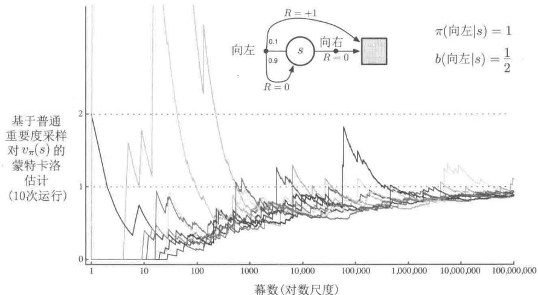  
图5.4在图中的单状态MDP中(见例5.5)，普通重要度采样得到的估计值非常不稳定。这里正确的估计值是 $1(\gamma = 1)$ 。尽管这确实是采样回报(使用重要度采样)的期望值，但这个采样的方差是无限大的，估计值并不会收敛到这个值。这些结果是通过离轨策略的首次访问型MC算法得到的

强化学习（第2版）

以向右的动作结束时得到的回报)会与目标策略不符，因此重要度采样比 $\rho_{t:T(t)-1}$ 的值为零，对式(5.6)中的分子与分母没有任何贡献。加权重要度采样算法只对与目标策略一致的回报进行加权平均，而所有这些回报值都是1。

我们可以通过简单计算来确认，在这个例子中经过重要度采样加权过的回报值的方差是无穷的。随机变量 $X$ 的方差的定义是其相对于均值 $\bar{X}$ 的偏差的期望值，可以写为

$$
\operatorname {V a r} [ X ] \doteq \mathbb {E} \left[ (X - \bar {X}) ^ {2} \right] = \mathbb {E} \left[ X ^ {2} - 2 X \bar {X} + \bar {X} ^ {2} \right] = \mathbb {E} \left[ X ^ {2} \right] - \bar {X} ^ {2}.
$$

因此，如果像在这个例子中这样，均值是有限的，那么当且仅当随机变量平方的期望是无穷时方差才为无穷。因此我们需要证明经过重要度采样加权过的回报的平方的期望是无穷

$$
\mathbb {E} _ {b} \left[ \left(\prod_ {t = 0} ^ {T - 1} \frac {\pi (A _ {t} | S _ {t})}{b (A _ {t} | S _ {t})} G _ {0}\right) ^ {2} \right].
$$

为了计算这个期望，我们把它根据幕的长度和终止情况进行分类。首先注意到，任意以向右的动作结束的幕，其重要度采样比都是零，因为目标策略永远不会采取这样的动作。这样的采样序列不会对期望产生贡献（括号中的值等于零），因此可以忽略。我们现在只需要考虑包含了一定数量（可能是零）的向左的动作返回到非终止状态，然后再接着一个向左的动作转移到终止状态的幕。所有这些幕的回报值都是1，所以可以忽略 $G_{0}$ 项。为了获得平方的期望，我们只需要考虑每种长度的幕，将每种长度的幕的出现概率乘以重要度采样比的平方，再将它们加起来：

$$
\begin{array}{l} = \frac {1}{2} \cdot 0. 1 \left(\frac {1}{0 . 5}\right) ^ {2} \quad (\text {长 度 为} 1 \text {的 幕}) \\ + \frac {1}{2} \cdot 0. 9 \cdot \frac {1}{2} \cdot 0. 1 \left(\frac {1}{0 . 5} \frac {1}{0 . 5}\right) ^ {2} \quad (\text {长 度 为} 2 \text {的 幕}) \\ + \frac {1}{2} \cdot 0. 9 \cdot \frac {1}{2} \cdot 0. 9 \cdot \frac {1}{2} \cdot 0. 1 \left(\frac {1}{0 . 5} \frac {1}{0 . 5} \frac {1}{0 . 5}\right) ^ {2} \quad (\text {长 度 为} 3 \text {的 幕}) \\ + \dots \\ = 0. 1 \sum_ {k = 0} ^ {\infty} 0. 9 ^ {k} \cdot 2 ^ {k} \cdot 2 = 0. 2 \sum_ {k = 0} ^ {\infty} 1. 8 ^ {k} = \infty . \\ \end{array}
$$

练习5.6 给定用 $b$ 生成的回报，类比公式(5.6)，用动作价值函数 $Q(s,a)$ 替代状态价值函数 $V(s)$ ，得到的式子是什么？

练习5.7 实际在使用普通重要度采样时，与图5.3所示的学习曲线一样，错误率随着训练一般都是下降的。但是对于加权重要度采样，错误率会先上升然后下降。为什么会这样？

练习5.8 在图5.4和例5.5的结果中采用了首次访问型MC方法。假设在同样的问题中采用了每次访问型MC方法。估计器的方差仍会是无穷吗？为什么？

# 5.6 增量式实现

蒙特卡洛预测方法可以通过拓展第2章（2.4节）中介绍的方法逐幕地进行增量式实现。我们在第2章中对收益进行平均，在蒙特卡洛方法中我们对回报进行平均。除此之外，在第2章中使用的方法可以以完全相同的方式用于同轨策略的蒙特卡洛方法中。对于离轨策略的蒙特卡洛方法，我们需要分别讨论使用普通重要度采样和加权重要度采样的方法。

在普通重要度采样的条件下，回报先乘上重要度采样比 $\rho_{t:T(t) - 1}$ (式5.3)进行缩放再简单地取平均。对此，我们同样可以使用第2章中介绍的增量式方法，只要将第2章中的收益替换为缩放后的回报即可。下面需要讨论一下采用加权重要度采样的离轨策略方法。对此我们需要对回报加权平均，而且需要一个略微不同的增量式算法。

假设我们有一个回报序列 $G_{1}, G_{2}, \dots, G_{n-1}$ ，它们都从相同的状态开始，且每一个回报都对应一个随机权重 $W_{i}$ （例如， $W_{i} = \rho_{t:T(t)-1}$ ）。我们希望得到如下的估计，并且在获得了一个额外的回报值 $G_{n}$ 时能保持更新。

$$
V _ {n} \doteq \frac {\sum_ {k = 1} ^ {n - 1} W _ {k} G _ {k}}{\sum_ {k = 1} ^ {n - 1} W _ {k}}, \quad n \geqslant 2, \tag {5.7}
$$

我们为了能不断跟踪 $V_{n}$ 的变化，必须为每一个状态维护前 $n$ 个回报对应的权值的累加和 $C_n$ 。 $V_{n}$ 的更新方法是

$$
V _ {n + 1} \doteq V _ {n} + \frac {W _ {n}}{C _ {n}} \left[ G _ {n} - V _ {n} \right], \quad n \geqslant 1, \tag {5.8}
$$

以及

$$
C _ {n + 1} \dot {=} C _ {n} + W _ {n + 1},
$$

这里 $C_0 \doteq 0$ ( $V_1$ 是任意的，所以不用特别指定)。下方的框中包含了一个完整的用于蒙特卡洛策略评估的逐幕增量算法。这个算法表面上针对于离轨策略的情况，采用加权重要度采样，但是对于同轨策略的情况同样适用，只需要选择同样的目标策略与行动策略即可（这种情况下 $\pi = b$ ， $W$ 始终为1）。近似值 $Q$ 收敛于 $q_{\pi}$ （对于所有遇到的“状态-动作”二元组），而动作则根据 $b$ 进行选择，这个 $b$ 可能是一个不同的策略。

练习5.9 对使用首次访问型蒙特卡洛的策略评估(5.1节)过程进行修改，要求采用2.4节中描述的对样本平均的增量式实现。

离轨策略MC预测算法（策略评估），用于估计 $Q\approx q_{\pi}$

输入：一个任意的目标策略 $\pi$

初始化，对所有 $s\in \mathcal{S}$ ， $a\in \mathcal{A}(s)$

任意初始化 $Q(s,a)\in \mathbb{R}$

$$
C (s, a) \leftarrow 0
$$

无限循环 (对每幕)：

$b \gets$ 任何能包括 $\pi$ 的策略

根据 $b$ 生成一幕序列： $S_0,A_0,R_1,\ldots ,S_{T - 1},A_{T - 1},R_T$

$$
G \leftarrow 0
$$

$$
W \leftarrow 1
$$

对幕中的每一步循环， $t = T - 1, T - 2, \ldots, 0$ ，当 $W \neq 0$ 时：

$$
G \leftarrow \gamma G + R _ {t + 1}
$$

$$
C \left(S _ {t}, A _ {t}\right) \leftarrow C \left(S _ {t}, A _ {t}\right) + W
$$

$$
Q \left(S _ {t}, A _ {t}\right) \leftarrow Q \left(S _ {t}, A _ {t}\right) + \frac {W}{C \left(S _ {t} , A _ {t}\right)} [ G - Q \left(S _ {t}, A _ {t}\right) ]
$$

$$
W \leftarrow W \frac {\pi (A _ {t} | S _ {t})}{b (A _ {t} | S _ {t})}
$$

如果 $W = 0$ ，则退出内层循环

练习5.10 从式(5.7)推导出加权平均的更新规则(式5.8)。推导时遵循非加权规则（式2.3）的推导思路。

# 5.7 离轨策略蒙特卡洛控制

我们下面讨论本书涉及的第二类学习控制方法——离轨策略方法。之前介绍的同轨策略方法与其的区别在于，同轨策略方法在使用某个策略进行控制的同时也对那个策略的价值进行评估。在离轨策略方法中，这两个工作是分开的。用于生成行动数据的策略，被称为行动策略。行动策略可能与实际上被评估和改善的策略无关，而被评估和改善的策略称为目标策略。这样分离的好处在于当行动策略能对所有可能的动作继续进行采样时，目标策略可以是确定的（例如贪心）。

离轨策略蒙特卡洛控制方法用到了在前两节中提及的一种技术。它们遵循行动策略并对目标策略进行学习和改进。这些方法要求行动策略对目标策略可能做出的所有动作都有非零的概率被选择。为了试探所有的可能性，我们要求行动策略是软性的（也就是说它在所有状态下选择所有动作的概率都非零）。

下面的框中展示了一个基于GPI和重要度采样的离轨策略蒙特卡洛控制方法，用于

估计 $\pi_{*}$ 和 $q_{*}$ 。目标策略 $\pi \approx \pi_{*}$ 是对应 $Q$ 得到的贪心策略，这里 $Q$ 是对 $q_{\pi}$ 的估计。行动策略 $b$ 可以是任何策略，但为了保证 $\pi$ 能收敛到一个最优的策略，对每一个“状态-动作”二元组都需要取得无穷多次回报，这可以通过选择 $\varepsilon$ -软性的 $b$ 来保证。即使动作是根据不同的软策略 $b$ 选择的，而且这个策略可能会在幕间甚至幕内发生变化，策略 $\pi$ 仍能在所有遇到的状态下收敛到最优。

# 离轨策略MC控制算法，用于估计 $\pi \approx \pi_{*}$

初始化，对所有 $s\in S$ ， $a\in \mathcal{A}(s)$

$Q(s,a)\in \mathbb{R}$ （任意值）

$$
C (s, a) \leftarrow 0
$$

$\pi (s)\gets \arg \max_{a}Q(s,a)$ （出现平分的情况下选取方法应保持一致）

无限循环 (对每幕)：

$b\gets$ 任意软性策略

根据 $b$ 生成一幕数据： $S_0, A_0, R_1, \ldots, S_{T-1}, A_{T-1}, R_T$

$$
\begin{array}{l} G \leftarrow 0 \\ W \leftarrow 1 \\ \end{array}
$$

对幕中的每一时刻循环， $t = T - 1, T - 2, \ldots, 0$

$$
G \leftarrow \gamma G + R _ {t + 1}
$$

$$
C \left(S _ {t}, A _ {t}\right) \leftarrow C \left(S _ {t}, A _ {t}\right) + W
$$

$$
Q \left(S _ {t}, A _ {t}\right) \leftarrow Q \left(S _ {t}, A _ {t}\right) + \frac {W}{C \left(S _ {t} , A _ {t}\right)} [ G - Q \left(S _ {t}, A _ {t}\right) ]
$$

$\pi (S_t)\gets \operatorname{argmax}_aQ(S_t,a)$ （出现平分的情况下选取方法应保持一致）

如果 $A_{t}\neq \pi (S_{t})$ 那么退出内层循环（处理下一幕数据）

$$
W \leftarrow W \frac {1}{b \left(A _ {t} \mid S _ {t}\right)}
$$

一个潜在的问题是，当幕中某时刻后剩下的所有动作都是贪心的时候，这种方法也只会从幕的尾部进行学习。如果非贪心的行为较为普遍，则学习的速度会很慢，尤其是对于那些在很长的幕中较早出现的状态就更是如此。这可能会极大地降低学习速度。目前，对于这个问题在离轨策略蒙特卡洛方法中的严重程度尚无足够的研究和讨论。但如果真的很严重，处理这个问题最重要的方法可能是时序差分学习，这一算法思想将在第6章中介绍。另外，如果 $\gamma$ 小于1，则下一节中提到的方法也可能对此有明显的帮助。

练习5.11 在算法框内的离轨策略MC控制算法中，你也许会觉得 $W$ 的更新应该采用重要度采样比 $\frac{\pi(A_t|S_t)}{b(A_t|S_t)}$ ，但它实际上却用了 $\frac{1}{b(A_t|S_t)}$ 。这为什么是正确的？

练习5.12赛道问题（编程）你正在像图5.5中所示的那样开赛车经过弯道。你想开得尽量快，但又不想因为开得太快而冲出赛道。简化的赛道是网格位置（也就是图中的单元

格)的离散集合，赛车在其中一个格内。速度也同样是离散的，在每一步中，赛车可以在水平或垂直方向上同时移动若干格。动作是速度其中一个分量的变化量。在一个时刻中，任何一个分量的改变量可能为 $+1$ 、-1或0，总共就有 $9(3\times 3)$ 种动作。两种速度分量都限制在非负且小于5，并且除非赛车在起点，否则两者不能同时为零。每幕起始于一个随机选择的起始状态，此时两个速度分量都为零。当赛车经过终点时幕终止。在赛车没有跨过终点线前，每步的收益都是-1。如果赛车碰到了赛道的边缘，它会被重置到起点线上的一个随机位置，两个速度分量都被置为零且幕继续。在每步更新赛车的位置前，先检查赛车预计的路径是否与赛道边界相交。如果它和终点线相交，则该幕结束；如果它与其他任意的地方相交，就认为赛车撞到了赛道边界并把赛车重置回起点线。为了增加任务的挑战性，在每步中，不管预期的增量是多少，两个方向上的速度增量有0.1的概率可能同时为0。使用蒙特卡洛控制方法来计算这个任务中最优的策略并展示最优策略的一些轨迹（展示轨迹时不要加随机噪声）。

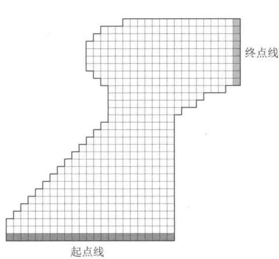  
图5.5 赛道任务中的两个右转弯赛道

# 5.8 * 折扣敏感的重要度采样

到目前为止，我们讨论的离轨策略都需要为回报计算重要度采样的权重，它把回报视为单一整体，而不考虑回报是每个时刻的折后收益之和这一内部结构。现在我们简要地介绍一些使用这种结构来大幅减少离轨策略估计的方差的前沿研究思想。

举例来说，考虑一种幕很长且 $\gamma$ 显著小于1的情况。具体来说，假设幕持续100步并

且 $\gamma = 0$ 。那么0时刻的回报就会是 $G_{0} = R_{1}$ ，但它的重要度采样比却会是100个因子之积，即 $\frac{\pi(A_0|S_0)}{b(A_0|S_0)}\frac{\pi(A_1|S_1)}{b(A_1|S_1)}\dots \frac{\pi(A_{99}|S_{99})}{b(A_{99}|S_{99})}$ 。在普通重要度采样中会用整个乘积对回报进行缩放，但实际上只需要按第一个因子来衡量，即 $\frac{\pi(A_0|S_0)}{b(A_0|S_0)}$ 。另外99个因子： $\frac{\pi(A_1|S_1)}{b(A_1|S_1)}\dots \frac{\pi(A_{99}|S_{99})}{b(A_{99}|S_{99})}$ 都是无关的，因为在得到首次收益之后，整幕回报就已经决定了。后面的这些因子与回报相独立且期望值为1，不会改变预期的更新，但它们会极大地增加其方差。在某些情况下，它们甚至可以使得方差无穷大。下面我们讨论一种思路来避免这种与期望更新无关的巨大方差。

这个思路的本质是把折扣看作幕终止的概率，或者说，部分终止的程度。对于任何 $\gamma \in [0,1)$ ，我们可以把回报 $G_{0}$ 看作在一步内，以 $1 - \gamma$ 的程度部分终止，产生的回报仅仅是首次收益 $R_{1}$ ，然后再在两步后以 $(1 - \gamma)\gamma$ 的程度部分终止，产生 $R_{1} + R_{2}$ 的回报，依此类推。后者的部分终止程度对应于第二步的终止程度 $1 - \gamma$ ，以及在第一步尚未终止的 $\gamma$ 。因此，第三步的终止程度是 $(1 - \gamma)\gamma^{2}$ ，其中 $\gamma^{2}$ 对应的是在前两步都不终止。这里的部分回报被称为平价部分回报

$$
\bar {G} _ {t: h} \doteq R _ {t + 1} + R _ {t + 2} + \dots + R _ {h}, \quad 0 \leqslant t <   h \leqslant T,
$$

其中“平价”表示没有折扣，“部分”表示这些回报不会一直延续到终止，而在 $h$ 处停止， $h$ 被称为视界（ $T$ 是幕终止的时间）。传统的全回报 $G_{t}$ 可被看作上述平价部分回报的总和

$$
\begin{array}{l} G _ {t} \dot {=} R _ {t + 1} + \gamma R _ {t + 2} + \gamma^ {2} R _ {t + 3} + \dots + \gamma^ {T - t - 1} R _ {T} \\ = (1 - \gamma) R _ {t + 1} \\ + (1 - \gamma) \gamma \left(R _ {t + 1} + R _ {t + 2}\right) \\ + (1 - \gamma) \gamma^ {2} \left(R _ {t + 1} + R _ {t + 2} + R _ {t + 3}\right) \\ \end{array}
$$

中

$$
\begin{array}{l} + (1 - \gamma) \gamma^ {T - t - 2} \left(R _ {t + 1} + R _ {t + 2} + \dots + R _ {T - 1}\right) \\ + \gamma^ {T - t - 1} \left(R _ {t + 1} + R _ {t + 2} + \dots + R _ {T}\right) \\ = (1 - \gamma) \sum_ {h = t + 1} ^ {T - 1} \gamma^ {h - t - 1} \bar {G} _ {t: h} + \gamma^ {T - t - 1} \bar {G} _ {t: T}. \\ \end{array}
$$

现在我们需要使用一种类似的截断的重要度采样比来缩放平价部分回报。由于 $\bar{G}_{t:h}$ 只涉及到视界 $h$ 为止的收益，因此我们只需要使用到 $h$ 为止的概率值。我们定义了如下普通重要度采样估计器，它是式（5.5）的推广

$$
V (s) \doteq \frac {\sum_ {t \in \mathcal {T} (s)} \left((1 - \gamma) \sum_ {h = t + 1} ^ {T (t) - 1} \gamma^ {h - t - 1} \rho_ {t : h - 1} \bar {G} _ {t : h} + \gamma^ {T (t) - t - 1} \rho_ {t : T (t) - 1} \bar {G} _ {t : T (t)}\right)}{| \mathcal {T} (s) |}, \tag {5.9}
$$

以及如下的加权重要度采样估计器，它是公式（5.6）的推广

$$
V (s) \doteq \frac {\sum_ {t \in \mathcal {T} (s)} \left((1 - \gamma) \sum_ {h = t + 1} ^ {T (t) - 1} \gamma^ {h - t - 1} \rho_ {t : h - 1} \bar {G} _ {t : h} + \gamma^ {T (t) - t - 1} \rho_ {t : T (t) - 1} \bar {G} _ {t : T (t)}\right)}{\sum_ {t \in \mathcal {T} (s)} \left((1 - \gamma) \sum_ {h = t + 1} ^ {T (t) - 1} \gamma^ {h - t - 1} \rho_ {t : h - 1} + \gamma^ {T (t) - t - 1} \rho_ {t : T (t) - 1}\right)}. \tag {5.10}
$$

我们将这两个估计器称为折扣敏感的重要度采样估计。它们都考虑了折扣率，但当 $\gamma = 1$ 时没有任何影响（和5.5节中离轨策略的估计器一样）。

# 5.9 * 每次决策型重要度采样

还有一种方法也可以在离轨策略的重要度采样中考虑回报是收益之和的内部结构，这种方法即使在没有折扣（即 $\gamma = 1$ ）时，也可以减小方差。在离轨策略估计器（式5.5）和估计器（式5.6）中，分子中求和计算中的每一项本身也是一个求和式

$$
\begin{array}{l} \rho_ {t: T - 1} G _ {t} = \rho_ {t: T - 1} \left(R _ {t + 1} + \gamma R _ {t + 2} + \dots + \gamma^ {T - t - 1} R _ {T}\right) \\ = \rho_ {t: T - 1} R _ {t + 1} + \gamma \rho_ {t: T - 1} R _ {t + 2} + \dots + \gamma^ {T - t - 1} \rho_ {t: T - 1} R _ {T}. \tag {5.11} \\ \end{array}
$$

离轨策略的估计器依赖于这些项的期望值，那么我们看看是否可以用更简单的方式来表达这个值。注意，式(5.11)中的每个子项是一个随机收益和一个随机重要度采样比的乘积。例如，用式(5.3）可以将第一个子项写为

$$
q \rho_ {t: T - 1} R _ {t + 1} = \frac {\pi (A _ {t} | S _ {t})}{b (A _ {t} | S _ {t})} \frac {\pi (A _ {t + 1} | S _ {t + 1})}{b (A _ {t + 1} | S _ {t + 1})} \frac {\pi (A _ {t + 2} | S _ {t + 2})}{b (A _ {t + 2} | S _ {t + 2})} \dots \frac {\pi (A _ {T - 1} | S _ {T - 1})}{b (A _ {T - 1} | S _ {T - 1})} R _ {t + 1}. \tag {5.12}
$$

现在可以注意到，在所有这些因子中，只有第一个和最后一个（收益）是相关的；所有其他比率均为期望值为1的独立随机变量

$$
\mathbb {E} \left[ \frac {\pi (A _ {k} | S _ {k})}{b (A _ {k} | S _ {k})} \right] \doteq \sum_ {a} b (a | S _ {k}) \frac {\pi (a | S _ {k})}{b (a | S _ {k})} = \sum_ {a} \pi (a | S _ {k}) = 1. \tag {5.13}
$$

因此，由于独立随机变量乘积的期望是变量期望值的乘积，所以我们就可以把除了第一项以外的所有比率移出期望，只剩下

$$
\mathbb {E} \left[ \rho_ {t: T - 1} R _ {t + 1} \right] = \mathbb {E} \left[ \rho_ {t: t} R _ {t + 1} \right]. \tag {5.14}
$$

如果我们对式（5.11）的第 $k$ 项重复这样的分析，就会得到

$$
\mathbb {E} \left[ \rho_ {t: T - 1} R _ {t + k} \right] = \mathbb {E} \left[ \rho_ {t: t + k - 1} R _ {t + k} \right].
$$

这样一来，原来式（5.11）的期望就可以写成

$$
\mathbb {E} \left[ \rho_ {t: T - 1} G _ {t} \right] = \mathbb {E} \left[ \tilde {G} _ {t} \right],
$$

其中

$$
\tilde {G} _ {t} = \rho_ {t: t} R _ {t + 1} + \gamma \rho_ {t: t + 1} R _ {t + 2} + \gamma^ {2} \rho_ {t: t + 2} R _ {t + 3} + \dots + \gamma^ {T - t - 1} \rho_ {t: T - 1} R _ {T}.
$$

我们可以把这种思想称为每次决策型重要度采样。借助这个思想，对于普通重要度采样估计器，我们就找到了一种替代方法来进行计算：使用 $\tilde{G}_t$ 来计算与公式(5.5)相同的无偏期望，以减小估计器的方差

$$
V (s) \doteq \frac {\sum_ {t \in \mathcal {T} (s)} \hat {G} _ {t}}{| \mathcal {T} (s) |}, \tag {5.15}
$$

对于加权重要度采样，是否也有一个每次决策型的版本？我们还不知道。到目前为止，我们已知的所有为其提出的估计器都不具备统计意义上的一致性（即数据无限时，它们也不会收敛到真实值）。

* 练习 5.13 给出从公式 (5.12) 推导公式 (5.14) 的详细步骤。

* 练习 5.14 使用截断加权平均估计器 (式 5.10) 的思想修改离轨策略的蒙特卡洛控制算法 (见 5.7 节)。注意, 首先需要把这个式子转换为动作价值函数。

# 5.10 本章小结

本章介绍了从经验中学习价值函数和最优策略的蒙特卡洛方法，这些“经验”的表现形式是多幕采样数据。相比于DP方法，这样做至少有三个优点。首先，它们不需要描述环境动态特性的模型，而可以直接通过与环境的交互来学习最优的决策行为。其次，它们可以使用数据仿真或采样模型。在非常多的应用中，虽然很难构建DP方法所需要的显式状态概率转移模型，但是通过仿真采样得到多幕序列数据却是很简单的。第三，蒙特卡洛方法可以很简单和高效地聚焦于状态的一个小的子集，它可以只评估关注的区域而不评估其余的状态（第8章会进一步讨论这一点）。

后文还会提到蒙特卡洛方法的第四个优点，蒙特卡洛方法在马尔可夫性不成立时性能损失较小。这是因为它不用后继状态的估值来更新当前的估值。换句话说，这是因为它不需要自举。

在设计蒙特卡洛控制方法时，我们遵循了第4章介绍的广义策略迭代（GPI）的总体架构。GPI包含了策略评估和策略改进的交互过程。蒙特卡洛方法提供了另一种策略评

估的方法。蒙特卡洛方法不需要建立一个模型计算每一个状态的价值，而只需简单地将从这个状态开始得到的多个回报平均即可。因为一个状态的价值就是回报的期望，因此这个平均值就是状态的一个很好的近似。在控制方法中，我们特别感兴趣的是去近似动作价值函数，因为在没有环境转移模型的情况下，它也可以用于改进策略。蒙特卡洛方法逐幕地交替进行策略评估和策略改进，并可以逐幕地增量式实现。

保证足够多的试探是蒙特卡洛控制方法中的一个重要问题。贪心地选择在当前时刻的最优动作是不够的，因为这样其他的动作就不会得到任何回报，并且可能永远不会学到实际上可能更好的其他动作。一种避免这个问题的方法是随机选择每幕开始的“状态-动作”二元组，使其能够覆盖所有的可能性。这种试探性出发方法有时可以在具备仿真采样数据的应用中使用，但不太可能应用在具有真实经验的学习中。在同轨策略方法中，智能体一直保持试探并尝试寻找也能继续保持试探的最优策略。在离轨策略方法中，虽然智能体也在试探，但它实际学习的可能是与它试探时使用的策略无关的另一个确定性最优策略。

离轨策略预测指的是在学习目标策略的价值函数时，使用的是另一个不同的行动策略所生成的数据。这种学习方法基于某种形式的重要度采样，即用在两种策略下观察到的动作的概率的比值对回报进行加权，从而把行动策略下的期望值转化为目标策略下的期望值。普通重要度采样将加权后的回报按照采样幕的总数直接平均，而加权重要度采样则进行加权平均。普通重要度采样得到的是无偏估计，但具有更大甚至可能是无限的方差。在实践中更受青睐的是加权重要度采样，它的方差总是有限的。尽管离轨策略蒙特卡洛方法的概念很简单，但它在预测和控制问题中的应用问题还尚未解决，还正在研究中。

本章中讨论的蒙特卡洛方法与第4章中讨论的DP方法的不同之处在于以下两个方面。第一，蒙特卡洛方法是用样本经验计算的，因此可以无需环境的概率转移模型，直接学习。第二，蒙特卡洛方法不自举。也就是说，它们不通过其他价值的估计来更新自己的价值估计。这两个差异并不是绑定在一起的，而是可以分开的。在第6章中，我们考虑像蒙特卡洛方法一样从经验中学习，但也像DP方法一样自举的方法。

# 参考文献和历史评注

“蒙特卡洛”一词可以追溯到20世纪40年代，当时Los Alamos的物理学家设计了一些靠运气取胜的游戏，用来学习并帮助了解一些有关原子弹的复杂物理现象。从这一角度介绍蒙特卡洛方法的教科书有Kalos和Whitlock，1986；Rubinstein，1981。

5.1-2 Singh和Sutton(1996)区分了每次访问型和首次访问型这两种MC方法并证明了这些方法与强化学习存在关联。二十一点的例子基于Widrow、Gupta和Maitra（1973）使用的一个

例子。肥皂泡的例子是经典的狄利克雷问题，其蒙特卡洛解决方案是由Kakutani（1945；参见Hersh和Griego，1969；Doyle和Snell，1984）首次提出的。  
Barto和Duff（1994）在经典蒙特卡洛算法的背景下讨论了用于求解线性方程组的策略评估。他们用Curtiss（1954）的分析指出了蒙特卡洛策略评估在大尺度问题中的计算优势。

5.3-4 蒙特卡洛 ES 是在本书 1998 版中提出的。这个工作首次将基于策略迭代的蒙特卡洛估计和控制方法明确联系在了一起。Michie 和 Chambers (1968) 早期使用蒙特卡洛方法在强化学习的背景下估计动作价值。在杆平衡（见 3.3 节的例 3.4）中，他们使用平均幕长度来评估每个状态中每个可能动作的价值（期望的平衡“生命周期”），然后他们使用这些评估来控制动作的选择。他们的方法在精神上与使用每次访问型 MC 估计的蒙特卡洛 ES 相似。Narendra 和 Wheeler (1986) 研究了有限遍历马尔可夫链的蒙特卡洛方法，此方法使用连续访问相同状态时累积的回报作为调整自动学习机动作概率的收益。

5.5 高效的离轨策略学习被认为是在多个领域出现的一个重要挑战。例如，这与概率图（贝叶斯）模型中的“干预”和“反设事实”的概念密切相关（例如，Pearl，1995；Balke 和 Pearl，1994）。使用重要度采样的离轨策略有着悠久的历史，但仍未被充分理解。Rubinstein（1981）、Hesterberg（1988）、Shelton（2001）和Liu（2001）等人讨论了加权重要度采样，有时其也被称为归一化重要度采样（例如，Koller 和 Friedman，2009）。

注意，离轨策略方法里的目标策略有时在文献中被称为“估计”策略，本书的第1版就采用了这样的术语。

5.7 赛道那道练习题改编自 Barto、Bradtke、Singh (1995) 和 Gardner (1973)。  
5.8 我们对折扣敏感的重要度采样的研究是基于 Sutton、Mahmood、Precup 和 van Hasselt (2014) 的分析。到目前为止，Mahmood (2017；Mahmood、van Hasselt 和 Sutton, 2014) 已经基本完成了这个工作。  
5.9 Precup、Sutton 和 Singh (2000) 提出了“每次决策型重要度采样”。他们也将离轨策略与时序差分学习、资格迹和近似方法相结合，提出了我们在后面章节中会讨论的各类精细问题。

# 6

# 时序差分学习

在强化学习所有的思想中，时序差分（TD）学习无疑是最核心、最新颖的思想。时序差分学习结合了蒙特卡洛方法和动态规划方法的思想。与前面提到的蒙特卡洛方法一致，时序差分方法也可以直接从与环境互动的经验中学习策略，而不需要构建关于环境动态特性的模型。与动态规划相一致的是，时序差分方法无须等待交互的最终结果（它使用了自举思想），而可以基于已得到的其他状态的估计值来更新当前状态的价值函数。时序差分、动态规划和蒙特卡洛这三个方法之间的关系是强化学习领域经常出现的话题，本章正式开始对这一话题进行探讨。我们将会看到这三种方法能够相互交融并能以多种方式结合在一起。在第7章中，我们将会介绍 $n$ -步算法，这个算法将时序差分方法和蒙特卡洛方法联系在了一起。而在第12章中，我们将介绍的TD $(\lambda)$ 算法则能无缝地统一时序差分方法和蒙特卡洛方法。

和往常一样，我们首先关注策略评估（或称预测）问题，即如何对于一个给定的策略 $\pi$ 估计它的价值函数 $v_{\pi}$ 。对于控制问题（找到最优的策略），DP、TD 和蒙特卡洛方法都使用了广义策略迭代（GPI）的某个变种。这些方法之间的主要区别在于它们解决预测问题的不同方式。

# 6.1 时序差分预测

TD和蒙特卡洛方法都利用经验来解决预测问题。给定策略 $\pi$ 的一些经验，以及这些经验中的非终止状态 $S_{t}$ ，这两种方法都会更新它们对于 $v_{\pi}$ 的估计 $V$ 。大致来说，蒙特卡洛方法需要一直等到一次访问后的回报知道之后，再用这个回报作为 $V(S_{t})$ 的目标进行估计。一个适用于非平稳环境的简单的每次访问型蒙特卡洛方法可以表示成

$$
V (S _ {t}) \leftarrow V (S _ {t}) + \alpha \left[ G _ {t} - V (S _ {t}) \right], \tag {6.1}
$$

在这里， $G_{t}$ 是时刻 $t$ 真实的回报， $\alpha$ 是常量步长参数（对比公式 (2.4)）。我们把这个方法称作常量 $\alpha MC$ 。蒙特卡洛方法必须等到一幕的末尾才能确定对 $V(S_{t})$ 的增量（因为只有这时 $G_{t}$ 才是已知的），而TD方法只需要等到下一个时刻即可。在 $t + 1$ 时刻，TD方法立刻就能构造出目标，并使用观察到的收益 $R_{t + 1}$ 和估计值 $V(S_{t + 1})$ 来进行一次有效更新。最简单的TD方法在状态转移到 $S_{t + 1}$ 并收到 $R_{t + 1}$ 的收益时会立刻做如下更新

$$
V (S _ {t}) \leftarrow V (S _ {t}) + \alpha \left[ R _ {t + 1} + \gamma V (S _ {t + 1}) - V (S _ {t}) \right] \tag {6.2}
$$

实际上，蒙特卡洛更新的目标是 $G_{t}$ ，而TD更新的目标是 $R_{t + 1} + \gamma V(S_{t + 1})$ 。这种TD方法被称为 $TD(0)$ ，或单步 $TD$ 。它实际上是第12章将会谈到的 $\mathrm{TD}(\lambda)$ 和第12章将提到的多步TD方法的一种特例。下框中的算法完整地描述了 $\mathrm{TD}(0)$ 的过程。

# 表格型TD(0)算法，用于估计 $v_{\pi}$

输入：待评估的策略 $\pi$

算法参数：步长 $\alpha \in (0,1]$

对于所有 $s \in S^{+}$ ，任意初始化 $V(s)$ ，其中 $V$ （终止状态） $= 0$

对每幕循环：

初始化 $S$

对幕中的每一步循环：

$A \leftarrow$ 策略 $\pi$ 在状态 $S$ 下做出的决策动作

执行动作 $A$ ，观察到 $R$ ， $S^{\prime}$

$$
\begin{array}{l} V (S) \leftarrow V (S) + \alpha \left[ R + \gamma V \left(S ^ {\prime}\right) - V (S) \right] \\ S \leftarrow S ^ {\prime} \\ \end{array}
$$

直到 $S$ 为终止状态

由于 $\mathrm{TD}(0)$ 的更新在某种程度上基于已存在的估计，类似于DP，我们也称它为一种自举法。我们在第3章中得知

$$
\begin{array}{l} v _ {\pi} (s) \doteq \mathbb {E} _ {\pi} \left[ G _ {t} \mid S _ {t} = s \right] (6.3) \\ = \mathbb {E} _ {\pi} \left[ R _ {t + 1} + \gamma G _ {t + 1} \mid S _ {t} = s \right] \quad \text {来 自 式} (3.9) \\ = \mathbb {E} _ {\pi} \left[ R _ {t + 1} + \gamma v _ {\pi} \left(S _ {t + 1}\right) \mid S _ {t} = s \right]. (6.4) \\ \end{array}
$$

大致来说，蒙特卡洛方法把对(6.3)式的估计值作为目标，而DP方法则把对(6.4)式的估计值作为目标。蒙特卡洛的目标之所以是一个“估计值”，是因为公式(6.3)中的期望值是未知的，我们用样本回报来代替实际的期望回报。DP的目标之所以是一个“估计值”则不是因为期望值的原因，其会假设由环境模型完整地提供期望值，真正的原因是因为真

实的 $v_{\pi}(S_{t + 1})$ 是未知的，因此要使用当前的估计值 $V(S_{t + 1})$ 来替代。TD 的目标也是一个“估计值”，理由有两个：它采样得到对式(6.4)的期望值，并且使用当前的估计值 $V$ 来代替真实值 $v_{\pi}$ 。因此，TD 算法结合了蒙特卡洛采样方法和 DP 自举法。我们之后会看到，只要大胆想象并小心实现，TD 方法可以很好地结合蒙特卡洛方法和 DP 方法的优势。

右侧的图是表格型TD(0)的回溯图。回溯图顶部状态节点的价值的估计值是根据它到一个直接后继状态节点的单次样本转移来更新的。我们将TD和蒙特卡洛更新称为采样更新，因为它们都会通过采样得到一个后继状态（或“状态-动作”二元组），使用后继状态的价值和沿途得到的收益来计算回溯值，然后相应地改变原始状态（或“状态-动作”二元组）价值的估计值。采样更新和DP方法使用的期望更新不同，它的计算基于采样得到的单个后继节点的样本数据，而不是所有可能后继节点的完整分布。

最后，注意在 $\mathrm{TD}(0)$ 的更新中，括号里的数值是一种误差，它衡量的是 $S_{t}$ 的估计值与更好的估计 $R_{t + 1} + \gamma V(S_{t + 1})$ 之间的差异。这个数值，如下面公式所示，被称为TD误差，其在强化学习中会以各种形式出现

$$
\delta_ {t} \dot {=} R _ {t + 1} + \gamma V \left(S _ {t + 1}\right) - V \left(S _ {t}\right). \tag {6.5}
$$

注意，每个时刻的TD误差是当前时刻估计的误差。由于TD误差取决于下一个状态和下一个收益，所以要到一个时刻步长之后才可获得。也就是说， $V(S_{t})$ 中的误差 $\delta_t$ 在 $t + 1$ 时刻才可获得。还要注意，如果价值函数数组 $V$ 在一幕内没有改变（例如，在蒙特卡洛方法中就是如此），则蒙特卡洛误差可写为TD误差之和

$$
\begin{array}{l} G _ {t} - V \left(S _ {t}\right) = R _ {t + 1} + \gamma G _ {t + 1} - V \left(S _ {t}\right) + \gamma V \left(S _ {t + 1}\right) - \gamma V \left(S _ {t + 1}\right) \quad \text {来 自 式} (3. 9) \\ = \delta_ {t} + \gamma \left(G _ {t + 1} - V \left(S _ {t + 1}\right)\right) \\ = \delta_ {t} + \gamma \delta_ {t + 1} + \gamma^ {2} (G _ {t + 2} - V (S _ {t + 2})) \\ = \delta_ {t} + \gamma \delta_ {t + 1} + \gamma^ {2} \delta_ {t + 2} + \dots + \gamma^ {T - t - 1} \delta_ {T - 1} + \gamma^ {T - t} \left(G _ {T} - V \left(S _ {T}\right)\right) \\ = \delta_ {t} + \gamma \delta_ {t + 1} + \gamma^ {2} \delta_ {t + 2} + \dots + \gamma^ {T - t - 1} \delta_ {T - 1} + \gamma^ {T - t} (0 - 0) \\ = \sum_ {k = t} ^ {T - 1} \gamma^ {k - t} \delta_ {k}. \tag {6.6} \\ \end{array}
$$

如果 $V$ 在该幕中变化了（例如 $\mathrm{TD}(0)$ 的情况， $V$ 不断被更新），那么这个等式就不准确，但如果时刻步长较小，则等式仍能近似成立。这个等式的泛化在 TD 学习的理论和算法中很重要。

练习6.1 如果 $V$ 在幕中发生变化，那么式(6.6)只能近似成立；等式两侧差在哪里？令 $V_{t}$ 表示在 $t$ 时刻在TD误差公式(6.5)和TD更新公式(6.2)中使用的状态价值的数组。重新进行上面的推导，推出为了让等式右侧仍等于左侧的蒙特卡洛误差，需要在TD误差之和上加上的额外项。

例6.1开车回家当你每天从工作地点开车回家时，你会估计一下路上要花多久时间。当你离开办公室时，你会注意离开的时间、今天是星期几、当日天气，以及任何其他可能相关的因素。这个星期五，你在晚上六点整离开办公室，估计回家需要花费30分钟。当你到达你的车旁时，时间是6:05，这时却开始下雨了。在雨中开车通常比较慢，所以你重新估计，觉得到家还需要35分钟，即总共需要40分钟。15分钟后，你很快开完了高速路段，下高速后你将总时间的估计值减少到35分钟。不幸的是，这时你被堵在一辆缓慢的卡车后面，且道路太窄不能超车。最终你不得不跟着卡车，直到6:40才开到你居住的街道。3分钟后你终于到家。在这个场景下，状态、时间和时长预测的序列如下：

<table><tr><td>状态</td><td>消耗的时间 (分钟)</td><td>估计 剩余时间</td><td>估计 总时间</td></tr><tr><td>周五晚上六点离开办公室</td><td>0</td><td>30</td><td>30</td></tr><tr><td>到车旁，开始下雨</td><td>5</td><td>35</td><td>40</td></tr><tr><td>下高速</td><td>20</td><td>15</td><td>35</td></tr><tr><td>在路上堵在卡车后面</td><td>30</td><td>10</td><td>40</td></tr><tr><td>开到居住的街道</td><td>40</td><td>3</td><td>43</td></tr><tr><td>到家</td><td>43</td><td>0</td><td>43</td></tr></table>

在这个例子中，收益是每一段行程消耗的时间。过程不加折扣 $(\gamma = 1)$ ，因此每个状态的回报就是从这个状态开始直到回家实际经过的总时间。每个状态的价值是剩余时间的期望值。第二列数字给出了遇到的每个状态的价值的当前估计值。

如图6.1（左）所示，一种描述蒙特卡洛方法的步骤的简单办法是在时间轴上画出行车总耗时的预测值（最后一行数据）。箭头表示的是常量 $\alpha$ MC方法（式6.1）推荐的对预测值的改变 $(\alpha = 1)$ 。这个值正是每个状态的价值的估计值（预估的剩余时间）与实际回报（真实的剩余时间）之差。例如，当你下高速时，你估计还要15分钟就能到家，但实际上需要23分钟。此时就可以用公式(6.1）确定离开高速后的剩余时间估计的增量。这时的误差 $G_{t} - V(S_{t})$ 是8分钟。假设步长参数 $\alpha$ 是 $1 / 2$ ，那么根据这一经验，离开高速后的预估剩余时间会增加4分钟。在当前这个例子中，这个改变可能过大了，因为堵在卡车

后面只是偶然运气不好。无论如何，这种更新只能离线进行，即只有到家以后才能进行更新，因为只有到这时你才知道实际的回报是多少。

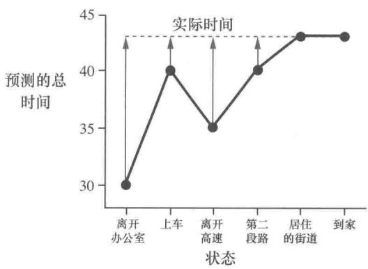

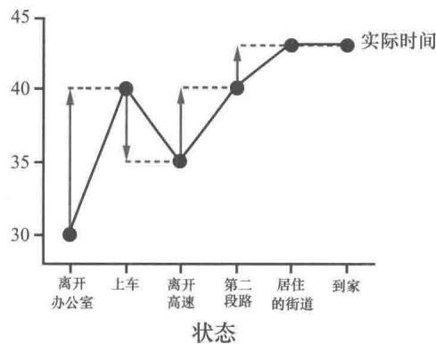  
图6.1在开车回家这个例子中，蒙特卡洛方法(左)和TD方法(右)分别建议的改变

是否真的需要等到知晓最终结果后才能开始学习呢？假设在另一天，你在离开办公室时再次估计需要30分钟才能到家，但是之后你陷入了一场严重的交通堵塞，离开办公室25分钟后仍然堵在高速上寸步难行。这时你估计还要花25分钟才能到家，总共就要50分钟。在等待的过程中，你已经发现最初30分钟的估计过于乐观了。在这里你是否只有到家后才能增加对初始状态的估计值呢？如果使用蒙特卡洛方法，答案是肯定的，因为我们还不知道真正的回报。

但是根据TD方法，我们可以立刻进行学习，将初始估计从30分钟增加到50分钟。事实上，每一个估计都会跟着其直接后继的估计一起更新。回到我们第一天开车回家那个例子，图6.1（右图）显示了根据TD规则(式6.2)推荐的总时间预测值的变化（这些改变基于 $\alpha = 1$ 情况下的更新规则）。每个误差都与预测值在时序上的变化，即预测中的时序差分，成正比。

除了让你在堵车时有事可做之外，直接根据当前预测值学习而不是等到最终知道实际回报之后再学习还有几个计算方面的优点。我们在6.2节中简要地讨论其中的几个优点。

练习6.2 这个练习是为了帮助你更好地从直觉上理解为什么TD方法通常比蒙特卡洛方法更高效。首先仔细回顾和思考一下TD方法和蒙特卡洛方法是如何应用在开车回家这个例子中的。你能想到一个使用TD更新会在平均意义上比使用蒙特卡洛更新更好的场景吗？请举出一个你觉得TD更新会更好的例子，例子中需要包括对过去经验的描述以及当前的状态。提示：假设你有很多次从办公室驾车回家的经历，某天你搬到一个新的办公

楼和一个新的停车场 (但仍从同一个入口上高速)。现在你开始学习从新办公楼回家的时间预测。在这种情况下，你能否知道为什么TD更新至少在一开始时可能会好得多？同样的事情是不是可能在原来的任务中发生过呢？

# 6.2 时序差分预测方法的优势

在TD方法中，某个估计值的更新需要部分地用到其他的估计值。它是从一个猜测中学习另一个猜测，即它能够自举。这是好事吗？和蒙特卡洛方法以及DP方法相比，TD方法有什么优势？本书不便于展开讨论这个问题。我们在本节中只进行一个简单介绍。

相比DP方法，TD方法一个显而易见的优势在于它不需要一个环境模型，即描述收益和下一状态联合概率分布的模型。

另一个很显著的优势是，相比蒙特卡洛方法，它自然地运用了一种在线的、完全递增的方法来实现。蒙特卡洛方法必须等到一幕的结束，因为只有那时我们才能知道确切的回报值，而TD方法只需等到下一时刻即可。在非常多的情况下，这是在选择方法时的一个关键的考量点。在一些应用场景中，幕非常长，所以把学习推迟到整幕结束之后就太晚了。在另一些应用场景中可能是持续性任务，无法划分出“幕”的概念。最后，我们在上一章中已经提到过，有一些蒙特卡洛方法必须对那些采用实验性动作的幕进行打折或者干脆忽略掉，这可能会大大减慢学习速度。而TD方法则不太容易受到这些问题的影响，因为它们从每次状态转移中学习，与采取什么后续动作无关。

但TD方法有扎实的理论支撑吗？不必等待实际结果，直接从后一个猜测中学习前一个猜测当然是很方便，但我们是否仍然可以保证结果收敛到正确的值？幸运的是，答案是肯定的。对于任何固定的策略 $\pi$ ，TD(0) 都已经被证明能够收敛到 $v_{\pi}$ 。如果步长参数是一个足够小的常数，那么它的均值能收敛到 $v_{\pi}$ 。如果步长参数根据随机近似条件 (2.7) 逐渐变小，则它能以概率1收敛。大多数收敛性证明仅适用于在公式 (6.2) 之前讨论的基于表格的算法，但有些也适用于使用广义线性函数近似的情况，那些情况我们将在第9章中进一步讨论。

如果TD和蒙特卡洛方法都渐近地收敛于正确的预测，那么下一个问题自然就是：“哪个收敛更快？”换句话说，哪种方法学得更快？哪种方法能更有效地利用有限的数据？目前，这还都是开放性的问题，没有人能够在数学上证明某种方法比另一种方法更快地收敛。事实上，我们甚至不清楚如何来最恰当地形式化表述这个问题！不过在实践中，如例6.2所示，TD方法在随机任务上通常比常量 $\alpha$ MC方法收敛得更快。

# 例6.2随机游走

在这个例子中，我们通过实验比较 $\mathrm{TD}(0)$ 和常量 $\alpha$ MC在下图所示的马尔可夫收益过程中的预测能力：

马尔可夫收益过程（Markov reward process, MRP）是不包含动作的马尔可夫决策过程。在只关注预测问题时，因为并不需要区分到底是环境导致的变化还是智能体引起的变化，所以经常使用MRP。在这个MRP中，所有阶段都从中心状态C开始，在每个时刻以相同的概率向左或向右移动一个状态。幕终止于最左侧或最右侧。终止于最右侧时，会有 $+1$ 的收益；除此之外的收益均为零。例如，一个典型的幕可能包含以下“状态-收益”序列：C,0,B,0,C,0,D,0,E,1。由于这个任务没有折扣，所以每个状态的真实价值是从这个状态开始并终止于最右侧的概率。因此，中心状态的真实价值为 $v_{\pi}(\mathsf{C}) = 0.5$ 。状态 $\mathrm{A}\sim \mathrm{E}$ 的真实价值分别为： $\frac{1}{6},\frac{2}{6},\frac{3}{6},\frac{4}{6}$ 和 $\frac{5}{6}$

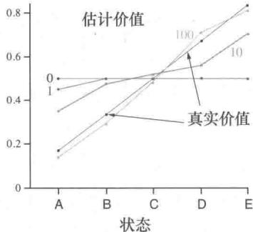

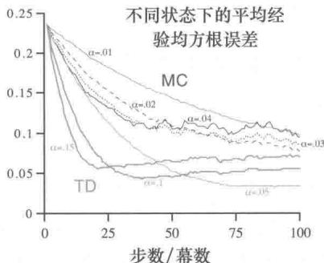

上方左侧的图显示了在经历了不同数量的幕采样序列之后，运行一次 $\mathrm{TD}(0)$ 所得到的价值估计值。在100幕后，估计值就已经非常接近真实值了。由于使用了常数步长参数（在这个例子中 $\alpha = 0.1$ ），所以估计值会反映较近的若干幕的结果，其不规律地上下波动。上方右侧的图给出了对于多个不同的 $\alpha$ 取值，两种方法的学习曲线。图中显示的性能衡量指标是学到的价值函数和真实价值函数的均方根（RMS）误差。图中显示的误差是在5个状态上的平均误差，并在100次运行中取平均的结果。在所有情况下，对于所有 $s$ ，近似价值函数都被初始化为中间值 $V(s) = 0.5$ 。在这个任务中，TD方法一直比MC方法要好。

练习6.3 在随机游走例子的左图中，第一幕只导致 $V(\mathbf{A})$ 发生了变化。由此，你觉得第一幕发生了什么？为什么只有这一个状态的估计值改变了？它的值到底改变了多少？□

练习6.4 在随机游走例子的右图中，具体结果与步长参数 $\alpha$ 的值是相关的。如果 $\alpha$ 从一个更宽广的值域中取值，会影响哪种算法更好的结论吗？是否存在另一个固定的 $\alpha$ ，使得两种算法都能表现出比图中更好的性能？为什么？

练习6.5 在随机游走例子的右图中，TD方法的均方根误差先下降后上升，尤其在 $\alpha$ 较大时更明显。这是由什么导致的？你认为这种情况总是会发生，还是与近似价值函数如何初始化相关？

练习6.6 在例6.2中的随机游走任务中，状态 $\mathrm{A} \sim \mathrm{E}$ 的真实价值分别是： $\frac{1}{6}, \frac{2}{6}, \frac{3}{6}, \frac{4}{6}$ 和 $\frac{5}{6}$ 。描述至少两种不同的计算这些值的方法。猜猜实际中我们使用的是哪种方法？为什么？□

# 6.3 TD(0)的最优性

假设只有有限的经验，比如10幕数据或100个时间步。在这种情况下，使用增量学习方法的一般方式是反复地呈现这些经验，直到方法最后收敛到一个答案为止。给定近似价值函数 $V$ ，在访问非终止状态的每个时刻 $t$ ，使用式(6.1)或式(6.2)计算相应的增量，但是价值函数仅根据所有增量的和改变一次。然后，利用新的值函数再次处理所有可用的经验，产生新的总增量，依此类推，直到价值函数收敛。我们称这种方法为批量更新，因为只有在处理了整批的训练数据后才进行更新。

在批量更新下，只要选择足够小的步长参数 $\alpha$ ，TD(0)就能确定地收敛到与 $\alpha$ 无关的唯一结果。常数 $\alpha$ MC方法在相同条件下也能确定地收敛，但是会收敛到不同的结果。理解这两种不同的结果有助于我们理解这两种方法之间的差异。在正常情况下，这些方法不会一下子就直接得到它们各自的批量更新最终结果，但它们都是在朝那个最终方向做出某种程度的更新。在针对所有可能的任务，一般性地讨论上述两种方法的区别之前，我们首先来看几个具体例子。

例6.3批量更新的随机游走在随机游走问题(例6.2)这个例子中，批量更新版本的 $\mathrm{TD}(0)$ 和常数 $\alpha$ MC是这样做的：每经过新的一幕序列之后，之前所有幕的数据就被视为一个批次。算法 $\mathrm{TD}(0)$ 或常数 $\alpha$ MC不断地使用这些批次来进行逐次更新。这里 $\alpha$ 要设置得足够小以使价值函数能够收敛。最后将所得的价值函数与 $v_{\pi}$ 进行比较，绘制在5个状态下的平均均方根误差（以整个实验的100次独立重复为基础）的学习曲线，如图6.2所示。注意批量TD方法始终优于批量蒙特卡洛方法。

在批量训练下，常数 $\alpha$ MC的收敛值 $V(s)$ 是经过状态 $s$ 后得到的实际回报的样本平均值。可以认为它们是最优估计，因为它们最小化了与训练集中实际回报的均方根误差。

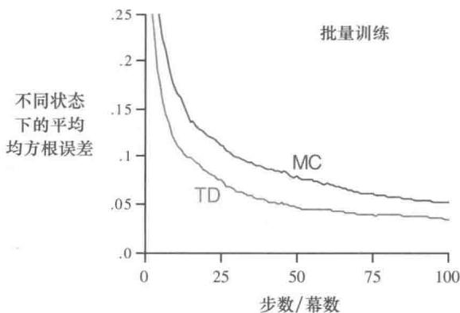  
图6.2 在随机游走任务中，在批量训练下的TD(0)和常量 $\alpha$ MC的性能

但让人惊讶的是，如图6.2所示，批量TD方法居然能在均方根误差上比它表现得更好。批量TD怎么会比这种最佳方法表现得更好呢？答案是这样的：蒙特卡洛方法只是从某些有限的方面来说最优，而TD方法的最优性则与预测回报这个任务更为相关。

例6.4你就是预测者现在想象你是一个未知的马尔可夫收益过程中对于回报的预测者。假设你观察到以下8幕数据：

A0B0

B1

B1

B1

B1

B1

B1

B0

上面内容的意思是：第一幕从状态A开始，转移至状态B，得到收益0，然后终结于状态B，最终收益为0。其他7幕数据甚至更短，从状态B开始就立刻终结了。给定这批数据，你认为最佳预测是什么？最优估计值 $V(\mathrm{A})$ 和 $V(\mathrm{B})$ 是多少？每个人应该都会同意 $V(\mathrm{B})$ 的最优估计值是 $\frac{3}{4}$ ，因为在状态B终结了8次，其中6次终结获得了1的回报，其他两次回报为0。

但是在给定这些数据时， $V(\mathbf{A})$ 的最优估计值是什么？下面有两个合理的答案。第一个答案基于如下观察：过程在状态A时，会以 $100\%$ 的概率立刻转移到状态B（得到收益为0）；并且我们已经得到了B的价值为 $\frac{3}{4}$ ，所以A的价值也一定是 $\frac{3}{4}$ 。这个答案的一种解读是认为它首先将其建模成一个如右图所示的马尔可夫过程，再根据模型计算出正确的

预测值，而这个模型给出的就是 $V(\mathsf{A}) = \frac{3}{4}$ 。这也是使用批量TD(0)方法会给出的答案。

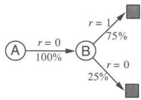

另一种合理的答案是简单地观察到状态A只出现了一次并且对应的回报为0，因此

就估计 $V(\mathbf{A}) = 0$ 。这是批量蒙特卡洛方法会得到的答案。注意这也是使得训练数据上平方误差最小的答案。实际上，这个答案在这批数据上误差为零。尽管如此，我们仍认为前一个答案 $\frac{3}{4}$ 是更好的。即使蒙特卡洛答案在已知数据上表现得更好，但如果是马尔可夫过程，我们会预测前一种使用批量TD(0)方法得到的答案会在未来的数据上产生更小的误差。

例6.4体现了通过批量 $\mathrm{TD}(0)$ 和批量蒙特卡洛方法计算得到的估计值之间的差别。批量蒙特卡洛方法总是找出最小化训练集上均方误差的估计，而批量 $\mathrm{TD}(0)$ 总是找出完全符合马尔可夫过程模型的最大似然估计参数。通常，一个参数的最大似然估计是使得生成训练数据的概率最大的参数值。在这个例子中，马尔可夫过程模型参数的最大似然估计可以很直观地从观察到的多幕序列中得到。从 $i$ 到 $j$ 的转移概率估计值，就是观察数据中从 $i$ 出发转移到 $j$ 的次数占从 $i$ 出发的所有转移次数的比例。而相应的期望收益则是在这些转移中观察到的收益的平均值。我们可以据此来估计价值函数，并且如果模型是正确的，则我们的估计也就完全正确。这种估计被称为确定性等价估计，因为它等价于假设潜在过程参数的估计是确定性的而不是近似的。批量 $\mathrm{TD}(0)$ 通常收敛到的就是确定性等价估计。

这一点也有助于解释为什么TD方法比蒙特卡洛方法更快地收敛。在以批量的形式学习的时候， $\mathrm{TD}(0)$ 比蒙特卡洛方法更快是因为它计算的是真正的确定性等价估计。这就解释了在随机游走任务（见图6.2）的批量学习结果中 $\mathrm{TD}(0)$ 为什么显示出优势。与确定性等价估计的关系也可以在一定程度上解释非批量 $\mathrm{TD}(0)$ 的速度优势（如例6.2的右图）。尽管非批量 $\mathrm{TD}(0)$ 并不能达到确定性等价估计或最小平方误差估计，但它大致朝着这些方向在更新，因此它可能比常数 $\alpha$ MC更快。目前对于在线TD和蒙特卡洛方法的效率的比较还没有明确的结论。

最后，值得注意的是，虽然确定性等价估计从某种角度上来说是一个最优答案，但直接计算它几乎是不可能的。如果 $n = |\mathcal{S}|$ 是状态数，那么仅仅建立过程的最大似然估计就可能需要 $n^2$ 的内存，如果按传统方法，计算相应的价值函数则需要 $n^3$ 数量级的步骤。相比之下，TD 方法则可以使用不超过 $n$ 的内存，并且通过在训练集上反复计算来逼近同样的答案，这一优势确实是惊人的。对于状态空间巨大的任务，TD 方法可能是唯一可行的逼近确定性等价解的方法。

* 练习 6.7 设计一个离轨策略版的 TD(0) 更新算法，使其可以用于任意的目标策略 $\pi$ ，且公式包含行动策略 $b$ 。注意：在每个时刻 $t$ 要使用重要度采样比 $\rho_{t:t}$ （式 5.3）。

# 6.4 Sarsa：同轨策略下的时序差分控制

现在，我们使用时序差分方法来解决控制问题。按照惯例，我们仍遵循广义策略迭代（GPI）的模式，只不过这次我们在评估和预测的部分使用时序差分方法。和使用蒙特卡洛方法时一样，我们同样需要在试探和开发之间做出权衡，方法又同样能被划分为两类：同轨策略和离轨策略。在本节中，我们先展示一种同轨策略下的时序差分（on-policyTD）控制方法。

第一步先要学习的是动作价值函数而不是状态价值函数。特别对于同轨策略方法，我们必须对所有状态 $s$ 以及动作 $a$ ，估计出在当前的行动策略下所有对应的 $q_{\pi}(s,a)$ 。这个估计可以使用与之前学习 $v_{\pi}$ 时完全相同的方法。回想一下，所谓“一幕数据”，是指一个状态和动作交替出现的序列：

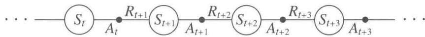

在6.3节中，我们讨论了状态之间的转移并学习了状态的价值。现在我们讨论“状态-动作”二元组之间的转移并学习“状态-动作”二元组的价值。在数学形式上这两者是相同的：它们都是带有收益过程的马尔可夫链。确保状态值在 $\mathrm{TD}(0)$ 下收敛的定理同样也适用于对应的关于动作值的算法上

$$
Q \left(S _ {t}, A _ {t}\right) \leftarrow Q \left(S _ {t}, A _ {t}\right) + \alpha \left[ R _ {t + 1} + \gamma Q \left(S _ {t + 1}, A _ {t + 1}\right) - Q \left(S _ {t}, A _ {t}\right) \right]. \tag {6.7}
$$

每当从非终止状态的 $S_{t}$ 出现一次转移之后，就进行上面的一次更新。如果 $S_{t + 1}$ 是终止状态，那么 $Q(S_{t + 1}, A_{t + 1})$ 则定义为0。这个更新规则用到了描述这个事件的五元组 $(S_{t}, A_{t}, R_{t + 1}, S_{t + 1}, A_{t + 1})$ 中的所有元素。我们根据这个五元组把这个算法命名为Sarsa。Sarsa的回溯图如右图所示。

基于Sarsa预测方法设计一个同轨策略下的控制算法是很简单和直接的。和所有其他的同轨策略方法一样，我们持续地为行动策略 $\pi$ 估计其动作价值函数 $q_{\pi}$ ，同时以 $q_{\pi}$ 为基础，朝着贪心优化的方向改变 $\pi$ 。下面框中给出了Sarsa控制算法的一般形式。

Sarna算法的收敛性取决于策略对于 $Q$ 的依赖程度。例如，我们可以采用 $\varepsilon$ -贪心或者 $\varepsilon$ -软性策略。只要所有“状态-动作”二元组都被无限多次地访问到，并且贪心策略在极限情况下能够收敛（这个收敛过程可以通过令 $\varepsilon = 1 / t$ 来实现），Sarna就能以1的概率收敛到最优的策略和动作价值函数。

# Sarna（同轨策略下的TD控制）算法，用于估计 $Q \approx q_{*}$

算法参数：步长 $\alpha \in (0,1]$ ，很小的 $\varepsilon ,\varepsilon >0$

对所有 $s\in S^{+},a\in \mathcal{A}(s)$ ，任意初始化 $Q(s,a)$ ，其中 $Q$ （终止状态，·）=0

对每幕循环：

初始化 $S$

使用从 $Q$ 得到的策略（例如 $\varepsilon$ -贪心），在 $S$ 处选择 $A$

对幕中的每一步循环：

执行动作 $A$ ，观察到 $R$ ， $S^{\prime}$

使用从 $Q$ 得到的策略（例如 $\varepsilon$ -贪心），在 $S'$ 处选择 $A'$

$$
Q (S, A) \leftarrow Q (S, A) + \alpha \left[ R + \gamma Q \left(S ^ {\prime}, A ^ {\prime}\right) - Q (S, A) \right]
$$

$$
S \leftarrow S ^ {\prime}; A \leftarrow A ^ {\prime};
$$

直到 $S$ 是终止状态

练习6.8 证明公式(6.6)的“状态-动作”二元组版本也是成立的，“状态-动作”二元组版本的TD误差是 $\delta_{t} = R_{t + 1} + \gamma Q(S_{t + 1}A_{t + 1}) - Q(S_{t},A_{t})$ 。注意，这里我们同样假设价值函数在不同时刻不发生改变。

例6.5有风的网格世界下方展示的是一个带有起始状态和目标状态的网格世界。相比标准的网格世界，它有一点不同：在网格中存在穿过中间部分的向上的侧风。这里智能体的动作包括4种：向上、向下、向右、向左。不过在中间区域，智能体执行完动作所到达的状态的位置会被“风”向上吹一点。

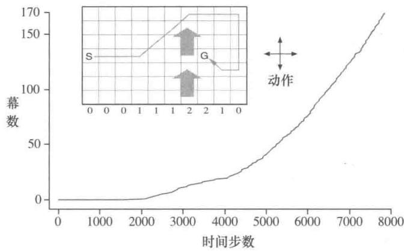

每一列的风力是不同的，风力的大小用向上吹的格数表示，写在了每列的下方。举个例子，如果你在目标状态右边的格子，那么向左这个动作会把你带到目标的格子上方的一格。这是一个不带折扣的分幕式任务。在这个任务中，在到达目标之前，每步会收到恒定

为-1的收益。

上图显示了在这个任务中使用 $\varepsilon$ -贪心的Sarsa的任务的结果（横轴是逐幕累积起来的智能体所走的总步数，纵轴则是智能体成功到达目标状态的总次数，也即完成任务的总幕数），其中 $\varepsilon = 0.1$ ， $\alpha = 0.5$ ，对于所有的 $s, a$ 进行同样的初始化 $Q(s, a) = 0$ 。通过图中逐渐变大的斜率可以看出，随着时间的推移，目标达成得越来越快。在8000时间步的时候，贪心策略已经达到最优很久了（图中显示了它的一个轨迹）；持续的 $\varepsilon$ -贪心试探导致每幕的平均长度（即任务的平均完成时间）保持在17步左右，比最小值15多了两步。需要注意，不能简单地将蒙特卡洛方法用在此任务中，因为不是所有策略都保证能终止。如果我们发现某个策略使智能体停留在同一个状态内，那么下一幕任务就永远不会开始。诸如Sarsa这样一步一步的学习方法则没有这个问题，因为它在当前幕的运行过程中很快就能学到当前的策略，而它不够好，然后就会切换到其他的策略。

练习6.9在有风的网格世界中向8个方向移动（编程）重新解决有风的网格世界问题。这次假设可以向包括对角线在内的8个方向移动，而不是原来的4个方向。利用更多的动作，你得到的结果比原来能好多少？如果还有第9个动作，即除了风造成的移动之外不做任何移动，你能进一步获得更好的结果吗？

练习6.10随机强度的风（编程）重新解决在有风的网格世界中向8个方向移动的问题。假设有风且风的强度是随机的，即在每列的平均值上下可以有1的变化。也就是说，有三分之一的时间你和在之前问题中一样，精确地按照每列下标给出的数值移动，但另有三分之一的时间你会朝上多移动一格，还有三分之一的时间你会朝下多移动一格。举个例子，如果你在目标状态右边的一格，你向左移动，那么在三分之一的时间你会移动到目标上方的一格，在另一个三分之一的时间你会移动到目标上方的两格，在剩下的三分之一的时间你会正好移动到目标。

# 6.5 Q学习：离轨策略下的时序差分控制

离轨策略下的时序差分控制算法的提出是强化学习早期的一个重要突破。这一算法被称为 $Q$ 学习 (Watkins, 1989), 其定义为

$$
Q \left(S _ {t}, A _ {t}\right) \leftarrow Q \left(S _ {t}, A _ {t}\right) + \alpha \left[ R _ {t + 1} + \gamma \max  _ {a} Q \left(S _ {t + 1}, a\right) - Q \left(S _ {t}, A _ {t}\right) \right]. \tag {6.8}
$$

在这里，待学习的动作价值函数 $Q$ 采用了对最优动作价值函数 $q_{*}$ 的直接近似作为学习目标，而与用于生成智能体决策序列轨迹的行动策略是什么无关（作为对比，Sarsa的

学习目标中使用的是待学习的动作价值函数本身，由于它的计算需要知道下一时刻的动作 $A_{t + 1}$ ，因此与生成数据的行动策略是相关的)。这大大简化了算法的分析，也很早就给出收敛性证明。当然，正在遵循的行动策略仍会产生影响，它可以决定哪些“状态-动作”二元组会被访问和更新。然而，只需要所有的“状态-动作”二元组可以持续更新，整个学习过程就能够正确地收敛。我们在第5章中已经看到，这是在一般情况下，任何方法要保证能找到最优的智能体行为的最低要求。基于这种假设以及步长参数序列的某个常用的随机近似条件，可以证明 $Q$ 能以1的概率收敛到 $q_{*}$ 。Q学习算法的流程如下面框中所示。

# Q学习（离轨策略下的时序差分控制）算法，用于预测 $\pi \approx \pi_{*}$

算法参数：步长 $\alpha \in (0,1]$ ，很小的 $\varepsilon ,\varepsilon >0$

对所有 $s\in S^{+},a\in \mathcal{A}(s)$ ，任意初始化 $Q(s,a)$ ，其中 $Q$ （终止状态，·）=0

对每幕：

初始化 $S$

对幕中的每一步循环：

使用从 $Q$ 得到的策略（例如 $\varepsilon$ -贪心），在 $S$ 处选择 $A$

执行 $A$ ，观察到 $R$ ， $S^{\prime}$

$$
\begin{array}{l} Q (S, A) \leftarrow Q (S, A) + \alpha \left[ R + \gamma \max  _ {a} Q \left(S ^ {\prime}, a\right) - Q (S, A) \right] \\ S \leftarrow S ^ {\prime} \\ \end{array}
$$

直到 $S$ 是终止状态

Q 学习的回溯图长什么样呢？规则 (式 6.8) 更新的是一个“状态-动作”二元组，因此顶部节点，也即更新过程的根节点，必须是一个代表动作的小实心圆点。更新也都来自于动作节点，即在下一个状态的所有可能的动作中找到价值最大的那个。因此回溯图底部的节点就是所有这些可能的动作节点。最后，你应该还记得，我们使用一条弧线跨过所有“下一步的动作节点”，来表示取这些节点中的最大值（如图 3.4 的右图所示）。那么现在你

能猜出这张图是什么样吗？如果你有想法，那么在看图6.4的答案前一定先做出自己的猜测。

例6.6 在悬崖边上行走这里我们通过一个网格世界的例子来比较Sarsa和Q学习两个算法，比较的重点在于同轨策略（Sarsa）和离轨策略（Q学

习）两类方法间的区别。考虑右图所示的网格世界。这是一个标准的不含折扣的分幕式任务。它包含起点和目标状态，可以执行上下左右这些常见的动作。除了掉下悬崖之外，其

他的转移得到的收益都是-1。而掉入悬崖将会得到-100的收益，同时会立即把智能体送回起点。

右图显示的是在使用 $\varepsilon$ -贪心方法（这里 $\varepsilon = 0.1$ ）来选择动作时，Sarsa和Q学习方法的表现。训练一小段时间后，Q学习学到了最优策略，即沿着悬崖边上走的策略。不幸的是，由于动作是通过 $\varepsilon$ -贪心的方式来选择的，因此在执行这个策略时，智能体会偶尔掉入悬崖。与之对比，Sarsa则考虑了动作被选取的方式，学到了一条通

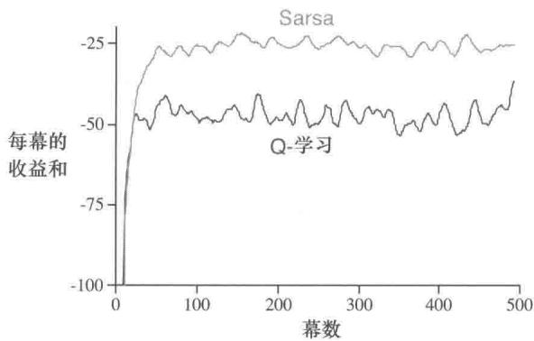

过网格的上半部分的路径，这条路径虽然更长但更安全。虽然Q学习实际上学到了最优策略的价值，其在线性能却比学到迂回策略的Sarsa更差。当然，如果 $\varepsilon$ 逐步减小，那么两种方法都会渐近地收敛到最优策略。

练习6.11 为什么Q学习被认为是一种离轨策略控制方法？

练习6.12 假设使用贪心的方式选择动作，那么此时Q学习和Sarsa是完全相同的算法吗？它们会做出完全相同的动作选择，进行完全相同的权重更新吗？

# 6.6 期望Sarsa

考虑一种与Q学习十分类似但把对于下一个“状态-动作”二元组取最大值这一步换成取期望的学习算法。即考虑一种算法，它使用如下更新规则

$$
\begin{array}{l} Q \left(S _ {t}, A _ {t}\right) \leftarrow Q \left(S _ {t}, A _ {t}\right) + \alpha \left[ R _ {t + 1} + \gamma \mathbb {E} \left[ Q \left(S _ {t + 1}, A _ {t + 1}\right) \mid S _ {t + 1} \right] - Q \left(S _ {t}, A _ {t}\right) \right] \\ \leftarrow Q \left(S _ {t}, A _ {t}\right) + \alpha \left[ R _ {t + 1} + \gamma \sum_ {a} \pi (a | S _ {t + 1}) Q \left(S _ {t + 1}, a\right) - Q \left(S _ {t}, A _ {t}\right) \right], \tag {6.9} \\ \end{array}
$$

但它又遵循Q学习的模式。给定下一个状态 $S_{t + 1}$ ，这个算法确定地向期望意义上的Sarsa算法所决定的方向上移动。因此这个算法被叫作期望Sarsa。图6.4的右侧是它的回溯图。

期望Sarsa在计算上比Sarsa更加复杂。但作为回报，它消除了因为随机选择 $A_{t + 1}$ 而产生的方差。在相同数量的经验下，我们可能会预想它的表现能略好于Sarsa，期望Sarsa也确实表现更好。图6.3显示了在悬崖边上行走这个任务中，期望Sarsa与Sarsa、Q学习相比较的汇总结果。期望Sarsa保持了Sarsa优于Q学习的显著优势。此外，在步长

参数 $\alpha$ 大量不同的取值下，期望Sarsa都显著地优于Sarsa。在悬崖边上行走这个例子中，状态的转移都是确定的，所有的随机性都来自于策略。在这种情况下，期望Sarsa可以放心地设定 $\alpha = 1$ ，而不需要担心长期稳态性能的损失。与之相比，Sarsa仅仅在 $\alpha$ 的值较小时能够有良好的长期表现，而启动期瞬态表现就很糟糕了。不管是在这个例子还是在其他例子中，期望Sarsa相比Sarsa在实验中都表现出了明显的优势。

  
图6.3在悬崖边行走这个任务中，TD控制方法的启动期瞬态性能和长期稳态性能与步长参数 $\alpha$ 之间的关系函数。这里所有算法都用的是 $\varepsilon = 0.1$ 的 $\varepsilon$ -贪心策略。每次实验中，稳态性能是100000幕数据上的平均值，而瞬态性能则是最初100幕数据上的平均值。图中启动期瞬态曲线和长期稳态曲线中的数据则分别是50000次实验运行和10次实验运行的平均值。图中实心圆表示的是每种方法最佳的瞬态性能。本图改编自van Seijen et al.(2009)

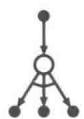  
Q学习

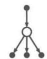  
期望Sarsa   
图6.4 Q学习和期望Sarsa的回溯图

在悬崖边上行走这个例子的实验结果中，期望Sarsa被用作一种同轨策略的算法。但在一般情况下，它可以采用与目标策略 $\pi$ 不同的策略来生成行为。在这种情况下期望Sarsa就成了离轨策略的算法。举个例子，假设目标策略 $\pi$ 是一个贪心策略，而行动策略却更注重于试探，那么此时期望Sarsa与Q学习完全相同。从这个角度来看，期望Sarsa推广了Q学习，可以将Q学习视作期望Sarsa的一种特例，同时期望Sarsa比起Sarsa也稳定地提升了性能。除了增加少许的计算量之外，期望Sarsa应该完全优于这

两种更知名的时序差分控制算法。

# 6.7 最大化偏差与双学习

我们目前讨论的所有的控制算法在构建目标策略时都包含了最大化的操作。例如在Q学习算法中，目标策略就是根据所有动作价值的最大值来选取动作的贪心策略的；在Sarsa算法中，通常按照 $\varepsilon$ -贪心算法选取目标策略，其中也包含了最大化操作。在这些算法中，在估计值的基础上进行最大化也可以被看作隐式地对最大值进行估计，而这就会产生一个显著的正偏差。我们举个例子来对其原因进行说明。假设在状态 $s$ 下可以选择多个动作 $a$ ，这些动作在该状态下的真实价值 $q(s,a)$ 全为零，但是它们的估计值 $Q(s,a)$ 是不确定的，可能有些大于零，有些小于零。真实值的最大值是零，但估计值的最大值是正数，因此就产生了正偏差。我们将其称作最大化偏差。

例6.7最大化偏差的例子最大化偏差会损害TD控制算法的性能。这里我们以图6.5中的那个简单的MDP为例说明。这个MDP有两个非终止节点A和B。每幕都从A开始并选择向左或向右的动作。选择向右这个动作会立刻转移到终止状态并得到值为0的收益和回报。选择向左的动作则会使状态转移到B，得到的收益也为0。而在B这个状态下就有很多种可能的动作，每种动作被选择后都会立刻终止并得到一个从均值为-0.1、方差为1.0的正态分布中采样得到的收益。因此，任何一个以向左开始的轨迹的期望回报

  
图6.5 Q学习和双Q学习在一个简单的分幕式MDP（展示在了图内）中的对比。Q学习在开始阶段学到的行为是：执行向左的概率会远比执行向右来得高，并且向左的概率会一直显著地高于 $5\%$ 。这个 $5\%$ 是使用 $\varepsilon = 0.1$ 的 $\varepsilon$ -贪心策略选择动作而引起的最低的向左运动的概率。与之相比，双Q学习实质上并没有受到最大化偏差的影响。这些数据都是10000次运行的平均值，动作价值都被初始化为零。在用 $\varepsilon$ -贪心策略选择动作时，如果有多个最大值，那么会随机选择一个

均为-0.1，在A这个状态中根本不该选择向左。尽管如此，我们的控制方法都会偏好向左，因为最大化偏差会让B呈现出正的价值。图6.5就显示了使用 $\varepsilon$ -贪心策略来选择动作的Q学习算法会在开始阶段非常明显地偏好向左这个动作。即使在算法收敛到稳态时，它选择向左这个动作的概率也比在这里的参数设置条件（ $\varepsilon = 0.1$ ， $\alpha = 0.1$ 以及 $\gamma = 1$ ）下的最优值高了大约 $5\%$ 。

有没有算法能够避免最大化偏差呢？让我们先考虑一个赌博机的例子。在这个例子中，我们对每个动作的价值做一个带噪声的估计，这是通过对该动作产生的所有收益进行简单平均得到的。正如前文所述，如果我们将估计值中的最大值视为对真实价值的最大值的估计，那么就会产生正的最大化偏差。对于这个问题，有一种看法是，其根源在于确定价值最大的动作和估计它的价值这两个过程采用了同样的样本（多幕序列）。假如我们将这些样本划分为两个集合，并用它们学习两个独立的对真实价值 $q(a), \forall a \in A$ 的估计 $Q_{1}(a)$ 和 $Q_{2}(a)$ ，那么我们接下来就可以使用其中一个估计，比如 $Q_{1}(a)$ ，来确定最大的动作 $A^{*} = \operatorname{argmax}_{a} Q_{1}(a)$ ，再用另一个 $Q_{2}$ 来计算其价值的估计 $Q_{2}(A^{*}) = Q_{2}(\operatorname{argmax}_{a} Q_{1}(a))$ 。由于 $\mathbb{E}[Q_{2}(A^{*})| = ] q(A^{*})$ ，因此这个估计是无偏的。我们也可以交换两个估计 $Q_{1}(a)$ 和 $Q_{2}(a)$ 的角色再执行一遍上面这个过程，那么就又可以得到另一个无偏的估计 $Q_{1}(\operatorname{argmax}_{a} Q_{2}(a))$ 。这就是双学习的思想。注意，在这里虽然我们一共学习了两个估计值，但是对每个样本集合只更新一个估计值。双学习需要两倍的内存，但每步无需额外的计算量。

双学习的思想很自然地就可以推广到那些为完备MDP设计的算法中。例如双学习版的Q学习就叫双Q学习。双Q学习把所有的时刻一分为二。假设用投硬币的方式进行划分，那么当硬币正面朝上时，进行如下的更新

$$
\begin{array}{l} Q _ {1} \left(S _ {t}, A _ {t}\right) \leftarrow Q _ {1} \left(S _ {t}, A _ {t}\right) + \\ \alpha \left[ R _ {t + 1} + \gamma Q _ {2} \left(S _ {t + 1}, \underset {a} {\operatorname {a r g m a x}} Q _ {1} \left(S _ {t + 1}, a\right)\right) - Q _ {1} \left(S _ {t}, A _ {t}\right) \right]. \tag {6.10} \\ \end{array}
$$

而如果硬币反面朝上，那么就交换 $Q_{1}$ 和 $Q_{2}$ 的角色进行同样的更新，这样就能更新 $Q_{2}$ 。这两个近似价值函数的地位是完全相同的。两种动作价值的估计值都可以在行动策略中使用。例如使用 $\varepsilon$ -贪心策略的双 Q 学习算法可以使用两个动作价值估计值的平均值（或和）。下面的框中展示了双 Q 学习的完整算法流程。这也是得到图 6.5 中的结果我们采用的算法。在那个例子中，双学习看上去消除了最大化偏差所带来的性能损失。当然双学习也可以应用到 Sarsa 和期望 Sarsa 中去。

* 练习 6.13 使用 $\varepsilon$ -贪心目标策略的双期望Sarsa 的更新步骤是怎样的？

# 双Q学习，用于估计 $Q_{1} \approx Q_{2} \approx q_{*}$

算法参数：步长 $\alpha \in (0,1]$ ，很小的 $\varepsilon ,\varepsilon >0$

对所有 $s \in S^{+}, a \in \mathcal{A}(s)$ ，初始化 $Q_{1}(s,a)$ 和 $Q_{2}(s,a)$ ，其中 $Q$ （终止状态， $\cdot = 0$ ）对每幕循环：

初始化 $S$

对幕中的每一步循环：

基于 $Q_{1} + Q_{2}$ ，使用 $\varepsilon$ -贪心策略在 $S$ 中选择 $A$

执行动作 $A$ ，观察到 $R$ ， $S^{\prime}$

以0.5的概率执行：

$$
Q _ {1} (S, A) \leftarrow Q _ {1} (S, A) + \alpha \left(R + \gamma Q _ {2} \left(S ^ {\prime}, \operatorname {a r g m a x} _ {a} Q _ {1} \left(S ^ {\prime}, a\right)\right) - Q _ {1} (S, A)\right)
$$

或者执行：

$$
\begin{array}{l} Q _ {2} (S, A) \leftarrow Q _ {2} (S, A) + \alpha \left(R + \gamma Q _ {1} \left(S ^ {\prime}, \operatorname {a r g m a x} _ {a} Q _ {2} \left(S ^ {\prime}, a\right)\right) - Q _ {2} (S, A)\right) \\ S \leftarrow S ^ {\prime} \\ \end{array}
$$

直到 $S$ 是终止状态

# 6.8 游戏、后位状态和其他特殊例子

在本书中，我们试图为大量不同的任务找到一个统一的解决方案，但当然也总会有一些任务用特定的方法来解决会更好。例如，我们使用的通用方法需要学习一个动作价值函数，但在第1章中，我们展示了一种用来学习玩井字棋的时序差分方法，而它学到的更像是一个状态价值函数。仔细分析这个例子，我们会发现，从中学到的函数既不是动作价值函数也不是通常使用的状态价值函数。传统的状态价值函数估计的是在某个状态中，当智能体可以选择执行一个动作时，这个状态的价值，但是在井字棋中使用状态价值函数评估的是在智能体下完一步棋之后的棋盘局面。我们称之为后位状态（afterstates），并将它们的价值函数称之为是后位状态价值函数。当我们知道环境动态变化中初始的一部分信息，但是不知道完整的环境动态变化信息时，后位状态这个概念是很有用的。比如在一些游戏中，我们通常都能知道在我们采取一个动作后立刻会造成什么结果。在国际象棋中，对于每种可能的下法，我们都能知道下完之后会形成什么样的局面，但我们不知道对手将会采取什么动作。后位状态价值函数就是利用了这些先验知识的更加高效的学习方法。

通过井字棋的例子，我们可以清晰地看到使用后位状态来设计算法更为高效的原因。传统的动作价值函数将当前局面和出棋动作映射到价值的估计值。然而如右图所示，很多“局面-下法”二元组都会产生相同的局面。在这样的情形下，“局面-下法”二元组是不同

强化学习（第2版）

的，但是会产生相同的“后位状态”，因此它们的价值也必须是相同的。传统的价值函数会分别评估这两个“局面-下法”二元组，但是后位状态价值函数会将这两种情况看作是一样的。任何关于上图左边的“局面-下法”二元组的学习，都会立即迁移到右边去。

除了应用在游戏中外，后位状态也能应用在其他任务中。例如，在排队任务中，有分配服务器、拒绝用户和丢弃信息这三种动作。事实上在这里，这些动作就是根据它们完全能确定的即时效果而定义的。

我们无法在这里列出所有的特殊任务，以及可以对应使用的特殊学习算法。但本书中提到的这些原理应该是广泛适用的。例如，后位状态方法仍然符合广义策略迭代的框架，在算法中，策略和（后位状态）价值函数以类似的方式产生相互作用。在很多种情况下，为了持续进行试探，我们也会面临在同轨策略和离轨策略方法之间的选择。

练习6.14 描述如何使用后位状态来对杰克租车问题(例4.2)进行建模。为什么在这个任务中使用后位状态能够加速收敛？

# 6.9 本章小结

我们在这一章中介绍了一类新的学习方法，即时序差分（TD）学习，并且展示了如何将其应用于强化学习问题中。按照惯例，我们将整个问题划分为预测问题与控制问题。在预测问题中，TD方法可以用来代替蒙特卡洛方法。对于这两种方法，为了将它们扩展到控制问题中，我们都需要借用在动态规划章节中提到的广义策略迭代（GPI）的思想，即近似的策略和价值函数需要相互作用，以使得它们都向自己的最优值的方向优化。

GPI由两个过程组成，其中一个驱使价值函数去准确地预测当前策略的回报，这就是所谓的“预测问题”。而另一个过程则驱使策略根据当前的价值函数来进行局部改善（例如可以使用 $\varepsilon$ -贪心策略），这就是所谓的“控制问题”。当第一个过程需要使用经验时，如何维持足够的试探就成为一个难题。在解决这个难题时，根据使用的是同轨策略方法还是离轨策略方法，我们可以将TD控制方法分为两类。Sarsa是一种同轨策略的方法，而Q学习则是一种离轨策略的方法。我们在这里介绍的期望Sarsa也是一种离轨策略的方法。

其实将TD方法扩展到解决控制问题还可以用第三种方法。这种在本章中并未介绍的方法叫作“行动器-评判器”方法，第13章中会进行介绍。

本章中介绍的这些方法是现在最为常用的强化学习方法。它们的流行也许是因为这些方法惊人地简洁：可以在线地应用它们，而且用几个简单的等式就可以描述，用小型程序就可以实现。在接下来的几章中，我们会扩展这些算法，它们会变得稍微复杂一些，但同时也会明显地更为强大。所有的这些新算法都会保留在这里介绍的一些特性：它们可以在线地用相对较少的计算量处理经验，它们也由TD误差驱动。在这一章中介绍的TD方法的一个特例更准确的叫法应该是单步、表格型、无模型的TD方法。在接下来的两章中，我们会将其扩展到 $n$ 步的形式（与蒙特卡洛方法相联系），再扩展到包含一个环境的模型（与规划和动态规划算法相联系）。之后，在本书的第Ⅱ部分，我们会把它们扩展到使用函数近似而不是表格的方法（与深度学习和人工神经网络相联系）。

最后，在本章中我们完全是在强化学习问题的背景下讨论TD方法，但TD方法事实上是更为一般性的方法。它们是用来学习如何在动态系统中做出长期预测的一般方法。比如TD方法也许能用于预测金融数据、寿命、选举结果、天气规律、动物行为、发电厂需求或顾客的购买行为。只有在脱离了强化学习框架，把TD方法当作一种单纯的预测方法去看待的时候，研究者们才深刻地理解了它的许多理论性质。即便是这样，TD学习方法仍有许多的潜在应用尚未被深入地研究。

# 参考文献和历史评注

正如我们在第1章的概述中提到的，时序差分学习的理念源于动物学习心理学和人工智能，其中最重要的工作是Samuel（1959）和Klopf（1972）。Samuel的工作会在16.2节中作为一个案例研究进行介绍。与时序差分学习相关的工作还有Holland（1975，1976）早期关于价值预测一致性的观点。这些观点影响了本书的作者之一（Barto）。Holland在1970—1975年间在密歇根大学教课，而他当时是密歇根大学的一名研究生。Holland的想法促使了一些与时序差分相关的系统出现，其中包括Booker的工作（1982）和Holland的“救火队算法”（1986），“救火队算法”这一工作和Sarsa有关，下面会讨论。

6.1-2 本节中所用的大部分具体的材料来自 Sutton (1988)，包括 TD(0) 算法、随机游走的例子以及“时序差分学习”这个术语。这里提到的它与动态规划和蒙特卡洛方法相联系的特点是受到 Watkins (1989)、Werbos (1987) 以及其他人的影响。回溯图是在本书的第 1 版中首次引入的。

基于Watkins和Dayan的工作（1992），Sutton（1988）证明了表格型TD(0）的均值是收敛的，Dayan（1992）证明了它以概率1收敛。Jaakkola、Jordan和Singh（1994）以及Tsitsiklis（1994）使用随机逼近理论扩展和加强了这些结论。其他的扩展和推广将在后面的

章节介绍   
6.3 在批量训练下最优的TD算法是由Sutton(1988)提出的。这个结果的提出受到了Barnard(1993)的启发，他对TD算法的推导是两个步骤的结合，一个步骤是马尔可夫链模型的增量式学习，另一个步骤则是模型的预测。确定性等价这个术语来自于自适应控制的文献（例如，Goodwin和Sin，1984）。  
6.4 Sarsa算法是由Rummery和Niranjan(1994)提出的。他们探索了它与神经网络的结合，并将其称为“改进的联结式Q学习”。“Sarsa”这个名字是由Sutton（1996）提出的。单步表格型Sarsa（即本章中处理的形式）的收敛性是由Singh、Jaakkola、Littman和Szepesvári（2000）证明的。TomKalt建议我们加入“有风的网格世界”的例子。  
Holland (1986) 的“救火队算法”的思想演变成了与Sarsa密切相关的一个算法。“救火队算法”的最初思路涉及了相互触发的规则链。它的重点在于从当前的规则将信度传回触发它的规则。随着时间的推移，“救火队算法”会将信度传回到所有的前序规则，而不仅仅是触发它的规则，从这一点上来看它越来越像时序差分学习。现代形式的“救火队算法”做了很多自然的简化，已经和单步Sarsa几乎完全相同，详见Wilson(1994)。  
6.5 Q 学习是由 Watkins (1989) 提出的，但他只提出了收敛性证明的一个梗概。Watkins 和 Dayan (1992) 将这一收敛性证明严格化。Jaakkola、Jordan 和 Singh (1994) 以及 Tsitsiklis (1994) 也提出了更多关于其收敛性的结果。  
6.6 期望Sarsa是由George John(1994)提出的，他称这种算法为“Q学习”，并强调了作为一种离轨策略算法，它相对Q学习的优势。在本书第1版的练习题中引入期望Sarsa时，我们还不知道John的工作。van Seijen、van Hasselt、Whiteson和Weiring(2009)在发表他们的工作时，也不知道John的工作。van Seijen等人提出了期望Sarsa的收敛性，以及它比普通的Sarsa和Q学习表现更好的条件。图6.3改编自他们的结果。van Seijen将“期望Sarsa”仅仅定义为一种同轨策略方法（就像我们在第1版中做的那样），而我们则用这个名称指代更一般的目标策略和行动策略不同的算法。van Hasselt(2011)首次注意到了期望Sarsa作为一般的离轨策略算法的形式，他称其为“广义Q学习”。  
6.7 van Hasselt (2010, 2011) 提出并深入研究了最大化偏差和双学习。图 6.5 中 MDP 的例子是由（van Hasselt, 2011）中的图 4.1 改编的。  
6.8 “后位状态”的概念和“决策后位状态”(Van Roy、Bertsekas、Lee 和 Tsitsiklis, 1997; Powell, 2011) 是相同的。

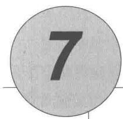

# $n$ 步自举法

在本章中，我们将统一前两章介绍的两种方法。单独的蒙特卡洛方法或时序差分方法都不会总是最好的方法。 $n$ 步时序差分方法是这两种方法更一般的推广，在这个框架下可以更加平滑地切换这两种方法。蒙特卡洛方法和时序差分方法是这个框架中的两种极端的特例，中间方法的性能一般要比这两种极端方法好。

从另一个角度来看， $n$ 步时序差分方法的另一个好处是可以解决之前更新时刻的不灵活问题。在单步时序差分方法中，相同的时刻步长（单步）决定了动作变化的频度以及执行自举操作的时间段。在很多应用中，我们希望能够尽可能快地根据任何变化来更新动作，但自举法往往需要在一个时间段中操作才能得到好的效果，在这个时间段需要有显著的状态变化。而在单步时序差分方法中，时间间隔（即时刻步长）总是一样的，所以需要进行折中。 $n$ 步方法能够使自举法在一个较长的时间段内进行，从而解决单步时序差分方法的不灵活问题。

$n$ 步时序差分方法的思想一般会作为资格迹(第12章)算法思想的一个引子，资格迹算法允许自举法在多个时间段同时开展操作。但是在本章中，我们将只从 $n$ 步时序差分方法自己的角度进行讨论，稍后我们将在第12章介绍资格迹相关的方法。这可以让我们更好地把问题进行分解，在 $n$ 步时序差分方法的框架下进行尽可能详细的讨论。

和之前一样，我们首先考虑预测问题，再考虑控制问题，即我们首先讨论 $n$ 步方法如何能够更好地对一个固定的策略预测其状态价值函数 $v_{\pi}$ 。然后，我们将此方法扩展到估计动作价值函数并讨论控制问题。

# 7.1 $n$ 步时序差分预测

介于蒙特卡洛和时序差分两种方法中间的方法是什么样呢？考虑在固定策略 $\pi$ 下利用多幕采样序列估计 $v_{\pi}$ 的情况。蒙特卡洛方法根据从某一状态开始到终止状态的收益序列，对这个状态的价值进行更新。而时序差分方法则只根据后面的单个即时收益，在下一个后继状态的价值估计值的基础上进行自举更新。在这里，用于自举的后继状态价值代表了后面所有剩余时刻的累积收益。因此，一种介于两者之间的方法根据多个中间时刻的收益来进行更新：多于一个时刻的收益，但又不是到终止状态的所有收益。例如，两步更新基于紧接着的两步收益和两步之后的价值函数的估计值。类似地，可以有三步更新、四步更新，等等。图7.1是 $v_{\pi}$ 的一个 $n$ 步更新的回溯图，最左边是时序差分更新示意图，最右边是蒙特卡洛更新示意图。

  
图7.1 $n$ 步方法的回溯图。这些方法构成了一个从单步时序差分到蒙特卡洛的方法族

$n$ 步更新的方法依然属于时序差分方法，因为在这些方法中，前面状态的估计值会根据它与后继状态的估计值的差异进行更新。不同的是，这里的后继状态是 $n$ 步后的状态，而不是紧接当前状态的下一个时刻的状态。时序差分量被扩展成 $n$ 步的方法被称为 $n$ 步时序差分方法。在前一章介绍的时序差分方法都采用的是单步更新，这也是为什么它们被

称为单步时序差分方法的原因。

更严格地讲，考虑根据“状态-收益”序列 $S_{t}, R_{t+1}, S_{t+1}, R_{t+2}, \ldots, R_{T}, S_{T}$ （为了简便，这里省略了动作）来进行状态 $S_{t}$ 的更新。我们知道，在基于蒙特卡洛的更新中， $v_{\pi}(S_{t})$ 的估计值会沿着完整回报的方向进行更新，即

$$
G _ {t} \dot {=} R _ {t + 1} + \gamma R _ {t + 2} + \gamma^ {2} R _ {t + 3} + \dots + \gamma^ {T - t - 1} R _ {T},
$$

其中， $T$ 是终止状态的时刻， $G_{t}$ 是更新的目标。尽管在蒙特卡洛更新中的目标是上面的累积收益（也即回报） $G_{t}$ ，但是在单步时序差分更新中的目标，却是即时收益加上后继状态的价值函数估计值乘以折扣系数，称其为单步回报

$$
G _ {t: t + 1} \doteq R _ {t + 1} + \gamma V _ {t} (S _ {t + 1}),
$$

其中， $V_{t}:S\to \mathbb{R}$ 是在 $t$ 时刻 $v_{\pi}$ 的估计值。 $G_{t:t + 1}$ 的下标表示这是一种截断回报，它由当前时刻 $t$ 到时刻 $t + 1$ 的累积收益和折后回报 $\gamma V_{t}(S_{t + 1})$ 组成，其中 $\gamma V_{t}(S_{t + 1})$ 替代了完整回报中的 $\gamma R_{t + 2} + \gamma^{2}R_{t + 3} + \ldots +\gamma^{T - t - 1}R_{T}$ 。类似地，这种想法也能扩展到两步的情况。两步更新的目标是两步回报

$$
G _ {t: t + 2} \dot {=} R _ {t + 1} + \gamma R _ {t + 2} + \gamma^ {2} V _ {t + 1} (S _ {t + 2}),
$$

其中， $\gamma^2 V_{t+1}(S_{t+2})$ 替代了 $\gamma R_{t+3} + \gamma^2 R_{t+4} + \dots + \gamma^{T-t-1} R_T$ 。类似地，任意 $n$ 步更新的目标是 $n$ 步回报

$$
G _ {t: t + n} \doteq R _ {t + 1} + \gamma R _ {t + 2} + \dots + \gamma^ {n - 1} R _ {t + n} + \gamma^ {n} V _ {t + n - 1} \left(S _ {t + n}\right), \tag {7.1}
$$

其中， $n\geqslant 1$ ， $0\leqslant t <   T - n$ 。所有的 $n$ 步回报都可以被看作完整回报的近似，即在 $n$ 步后截断得到 $n$ 步回报，然后其余部分用 $V_{t + n - 1}(S_{t + n})$ 来替代。如果 $t + n\geqslant T$ （即 $n$ 步回报超出了终止状态)，则其余部分的值都为0，即 $n$ 步回报等于完整的回报（如果 $t + n\geqslant T$ 则 $G_{t:t + n} = G_t)$

注意，计算 $n$ 步回报 $(n > 1)$ 需要涉及若干将来时刻的收益和状态，当状态从当前时刻 $t$ 转移到下一时刻 $t + 1$ 时，我们没法获取这些收益和状态。 $n$ 步回报只有在获取到 $R_{t + n}$ 和 $V_{t + n - 1}$ 后才能计算，而这些值都只能在时刻 $t + n$ 时才能得到。一个比较自然的基于 $n$ 步回报的状态价值函数更新算法是

$$
V _ {t + n} \left(S _ {t}\right) \doteq V _ {t + n - 1} \left(S _ {t}\right) + \alpha \left[ G _ {t: t + n} - V _ {t + n - 1} \left(S _ {t}\right) \right], 0 \leqslant t <   T, \tag {7.2}
$$

而对于任意其他状态 $s(s \neq S_t)$ 的价值估计保持不变： $V_{t + n}(S) = V_{t + n - 1}(S)$ 。这个算法被称为 $n$ 步时序差分（ $n$ 步TD）算法。注意，在最开始的 $n - 1$ 个时刻，价值函数不会被

更新。为了弥补这个缺失，在终止时刻后还将执行对应次数的更新。完整的伪代码如下框中所示。

$n$ 步时序差分算法，用于估计 $V \approx v_{\pi}$   
输入：一个策略 $\pi$ 算法参数：步长 $\alpha \in (0,1]$ ，一个正整数 $n$ 对所有的 $s\in S$ ，任意初始化 $V(s)$ 所有存取操作（对于 $S_{t}$ 和 $R_{t}$ ）的索引可以对 $n + 1$ 取模  
对每幕循环：初始化和存储 $S_0,S_0\neq$ 终止状态 $T\gets \infty$ 循环 $t = 0,1,2,\ldots$ ：如果 $t <   T$ ，那么：根据 $\pi (\cdot |S_t)$ 采取策略观察和存储下一时刻的收益 $R_{t + 1}$ 和状态 $S_{t + 1}$ 如果 $S_{t + 1}$ 是终止状态，则 $T\leftarrow t + 1$ $\tau \leftarrow t - n + 1$ （是当前正在更新的状态所在时刻）如果 $\tau \geqslant 0$ ： $G\gets \sum_{i = \tau +1}^{\min (\tau +n,T)}\gamma^{i - \tau -1}R_i$ 如果 $\tau +n <   T$ ，那么： $G\gets G + \gamma^n V(S_{\tau +n})$ $(G_{\tau ;\tau +n})$ $V(S_{\tau})\gets V(S_{\tau}) + \alpha [G - V(S_{\tau})]$ 直到 $\tau = T - 1$

练习7.1 在第6章，我们注意到，如果价值函数的估计值不是每步都被更新，则蒙特卡洛误差可以被改写成时序差分（式6.6）的和。请推广该结论，即将式（7.2）中的 $n$ 步误差也改写为时序差分误差之和的形式（同样假设在此过程中价值估计不更新）。

练习7.2（编程）在 $n$ 步方法中，价值函数需要每步都更新，所以利用时序差分误差之和来替代公式(7.2)中的错误项的算法将会与之前有些不同。这种算法是一个更好的还是更差的算法？请设计一个小实验并编程验证这个问题。

$n$ 步回报利用价值函数 $V_{t + n - 1}$ 来校正 $R_{t + n}$ 之后的所有剩余收益之和。 $n$ 步回报的一个重要特性是：在最坏的情况下，采用它的期望值作为对 $\upsilon_{\pi}$ 的估计可以保证比 $V_{t + n - 1}$ 更好。换句话说， $n$ 步回报的期望的最坏误差能够保证不大于 $V_{t + n - 1}$ 最坏误差的 $\gamma^n$ 倍

$$
\max  _ {s} \left| \mathbb {E} _ {\pi} [ G _ {t: t + n} | S _ {t} = s ] - v _ {\pi} (s) \right| \leqslant \gamma^ {n} \max  _ {s} \left| V _ {t + n - 1} (s) - v _ {\pi} (s) \right| \tag {7.3}
$$

此式对于任意 $n\geqslant 1$ 都成立。这被称为 $n$ 步回报的误差减少性质。根据这个性质，可以

证明所有的 $n$ 步时序差分方法在合适的条件下都能收敛到正确的预测。因此， $n$ 步时序差分方法是一类有坚实数学基础的方法，其中单步时序差分方法和蒙特卡洛方法是两个极端特例。

例7.1 $n$ 步时序差分方法在随机游走上的应用 在例6.2中描述的随机游走任务中使用 $n$ 步时序差分方法。假设从中间状态开始，往右边走，经过D和E，最后停在右边，收到回报1。最开始，所有的状态价值都是0.5，即 $V(s) = 0.5$ 。有过这样一次经验后，单步时序差分方法只能更新最后一个状态的值 $V(E)$ ，即向着1的方向更新。然而，两步差分方法能够更新两个状态的值： $V(D)$ 和 $V(E)$ ，它们都要朝着1的方向增大。三步差分方法或者任意 $n$ 步方法 $(n > 2)$ 都可以向1的方向更新所有经过的状态的价值函数，并且更新的大小相同。

  
图7.2在19个状态的随机游走任务中(例7.1)，对于不同的 $n$ ，作为 $\alpha$ 的函数的 $n$ 步时序差分方法的性能

$n$ 为多少时是最好的呢？图7.2展示了一个有19个状态的随机游走过程的实验结果，其中在左边的收益为-1，所有的初始状态价值为0。在本章的后面我们也将使用这个例子。结果展示了在不同的 $n$ 和 $\alpha$ 情况下 $n$ 步方法的性能。不同情况下的性能测试指标（纵坐标表示）是最后19个状态在每幕终止时的价值函数的估计值和真实值的均方误差的平均值的开方，图中展示的是最开始10幕，并重复100次（在所有的设置下动作的集合相同）的平均结果。从图中可以看出， $n$ 取中间大小的值时效果最好。这也证明了将单步时序差分方法和蒙特卡洛方法推广到 $n$ 步时序差分方法可能会得到更好的结果。

练习7.3 你认为使用一个更大随机游走任务（19个状态取代5个状态）的原因是什么呢？在小任务上 $n$ 的不同值的优势会改变吗？把左边的收益从0改到-1的原因呢？这会改变 $n$ 的最优值吗？

# 7.2 $n$ 步Sarsa

如何使得 $n$ 步方法不单用来进行预测，同时也可以用作控制呢？在本章中，我们将展示 $n$ 步方法是如何和Sarsa直接结合来产生同轨策略下的时序差分学习控制方法的。这种 $n$ 步版本的Sarsa我们称为 $n$ 步Sarsa，并且从此开始，之前章节介绍的初始版本的Sarsa我们会统称为单步Sarsa或者Sarsa(0)。

  
图7.3基于“状态-动作”二元组的 $n$ 步方法的回溯图，这些方法构成了一个从单步更新的Sarsa(0)到基于终止状态更新的蒙特卡洛算法的方法族。介于两者之间的是 $n$ 步更新，它由 $n$ 步真实收益和对第 $n$ 步“状态-动作”二元组的价值的估计值组成，所有价值都有适当的折扣。最右边的图是 $n$ 步期望Sarsa的回溯图

该方法的核心思想是将状态替换为“状态-动作”二元组，然后使用 $\varepsilon$ -贪心策略。 $n$ 步Sarsa的回溯图（见图7.3）和 $n$ 步时序差分方法的回溯图类似，都是由交替出现的状态和动作构成，唯一的不同是Sarsa的回溯图的首末两端都是动作而不是状态。我们重新根据动作的价值估计定义如下的 $n$ 步方法的回报（更新目标）

$$
G _ {t: t + n} \doteq R _ {t + 1} + \gamma R _ {t + 2} + \dots + \gamma^ {n - 1} R _ {t + n} + \gamma^ {n} Q _ {t + n - 1} \left(S _ {t + n}, A _ {t + n}\right), n \geqslant 1, 0 \leqslant t <   T - n, \tag {7.4}
$$

当 $t + n\geqslant T$ 时， $G_{t:t + n} = G_{t}$ 。基于此，很自然可以得到如下算法

$$
Q _ {t + n} \left(S _ {t}, A _ {t}\right) \doteq Q _ {t + n - 1} \left(S _ {t}, A _ {t}\right) + \alpha \left[ G _ {t: t + n} - Q _ {t + n - 1} \left(S _ {t}, A _ {t}\right) \right], 0 \leqslant t <   T, \tag {7.5}
$$

除了上面更新的状态之外，所有其他状态的价值都保持不变，即对于所有满足 $s \neq S_t$ 或 $a \neq A_t$ 的 $s, a$ 来说，有 $Q_{t + n}(s,a) = Q_{t + n - 1}(s,a)$ 。这就是 $n$ 步Sarsa算法。算法伪代码展示在下框中。关于为什么 $n$ 步Sarsa相较于单步Sarsa能够加速学习，参见图7.4的例子。

$n$ 步Sarsa，用于预估 $Q\approx q_{*}$ 或 $q_{\pi}$   
对于所有的 $s\in S,a\in A$ ，任意初始化 $Q(s,a)$ 将 $\pi$ 初始化为对应 $Q$ 的 $\varepsilon$ -贪心策略，或者某个固定的给定策略  
算法参数：步长 $\alpha \in (0,1]$ ，很小的 $\varepsilon ,\varepsilon >0$ ，正整数 $n$ 所有存取操作（对于 $S_{t}$ 、 $A_{t}$ 和 $R_{t}$ ）的索引可以对 $n + 1$ 取模  
对每幕循环初始化和存储状态 $S_0\neq$ 终止状态选择并保存动作 $A_0\sim \pi (\cdot |S_0)$ $T\gets \infty$ 循环 $t = 0,1,2,\ldots$ ：如果 $t <   T$ ，那么：采取动作 $A_{t}$ 观察并存储下一时刻的收益 $R_{t + 1}$ 和状态 $S_{t + 1}$ 如果 $S_{t + 1}$ 是终止状态，那么： $T\leftarrow t + 1$ 否则：选择并存储动作 $A_{t + 1}\sim \pi (\cdot |S_{t + 1})$ $\tau \gets t - n + 1$ （ $\tau$ 是估计值更新的时刻）如果 $\tau \geqslant 0$ ： $G\gets \sum_{i = \tau +1}^{\min (\tau +n,T)}\gamma^{i - \tau -1}R_i$ 如果 $\tau +n <   T$ ，那么 $G\gets G + \gamma^n Q(S_{\tau +n},A_{\tau +n})\qquad (G_{\tau :\tau +n})$ $Q(S_{\tau},A_{\tau})\gets Q(S_{\tau},A_{\tau}) + \alpha [G - Q(S_{\tau},A_{\tau})]$ 如果处于学习 $\pi$ 的过程中，那么需要确保 $\pi (\cdot |S_{\tau})$ 是基于 $Q$ 的 $\varepsilon$ -贪心策略直到 $\tau = T - 1$

练习7.4 证明Sarsa算法的 $n$ 步回报(式7.4)可以被严格写成一个新的时序差分的形式，如下所示

$$
G _ {t: t + n} = Q _ {t - 1} \left(S _ {t}, A _ {t}\right) + \sum_ {k = t} ^ {\min  (t + n, T) - 1} \gamma^ {k - t} \left[ R _ {k + 1} + \gamma Q _ {k} \left(S _ {k + 1}, A _ {k + 1}\right) - Q _ {k - 1} \left(S _ {k}, A _ {k}\right) \right]. \tag {7.6}
$$

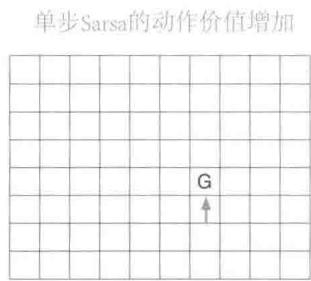

  
图7.4 在网格世界的例子中，使用 $n$ 步方法而导致的策略学习加速。第一张图显示了在一幕中智能体所走过的路径，最终停在一个具有高收益的位置，将其标记为G。在这个例子中，收益全部被初始化为0，并且除了在G位置设置了正的收益之外，所有的收益都初始化为0。其他两张图的箭头显示了在单步Sarsa和 $n$ 步Sarsa方法中，按照第一张图的路径，哪一个动作的价值得到了增强。单步Sarsa仅仅增强了这一系列动作中的最后一个，使得这个动作得到一个高收益；而 $n$ 步Sarsa则将这一系列动作中的最后 $n$ 个动作都增强了，这样从一幕序列中可以学习到更多知识

期望Sarsa是什么样呢？ $n$ 步期望Sarsa的回溯图展示在图7.3最右边。它和 $n$ 步Sarsa的回溯图一样，包括一个由采样动作和状态组成的线性串，不同之处在于它最后一个节点是一个分支，其对所有可能的动作采用策略 $\pi$ 下的概率进行了加权。这个算法也可以用 $n$ 步Sarsa的公式来描述，不同之处是需要重新定义 $n$ 步回报

$$
G _ {t: t + n} \doteq R _ {t + 1} + \dots + \gamma^ {n - 1} R _ {t + n} + \gamma^ {n} \bar {V} _ {t + n - 1} (S _ {t + n}), t + n <   T, \tag {7.7}
$$

当 $t + n\geqslant T$ 时， $G_{t:t + n}\doteq G_t$ 。其中， $\bar{V}_t(s)$ 是状态 $s$ 的期望近似价值，它采用了在目标策略下， $t$ 时刻的动作的价值估计值来计算

$$
\bar {V} _ {t} (s) \doteq \sum_ {a} \pi (a | s) Q _ {t} (s, a), \quad \text {对 所 有 的} s \in \mathcal {S}. \tag {7.8}
$$

期望估计价值在本书接下来提及的很多动作价值函数方法中会用到。如果 $s$ 是终止状态，那么我们定义它的期望估计价值为零。

# 7.3 $n$ 步离轨策略学习

回顾一下，离轨策略学习是在学习策略 $\pi$ 时，智能体却遵循另一个策略 $b$ 的学习方法。通常 $\pi$ 是针对当前的动作价值函数的贪心策略，而 $b$ 是一个更具试探性的策略，例如 $\varepsilon$ -贪心策略。为了使用遵循策略 $b$ 得到的数据，我们必须考虑两种策略之间的不同，使用它们对应动作的相对概率（详见5.5节）。在 $n$ 步方法中，回报根据 $n$ 步来建立，所以

我们感兴趣的是这 $n$ 步的相对概率。例如，实现一个简单离轨策略版本的 $n$ 步时序差分学习，对于 $t$ 时刻的更新（实际上在 $t + n$ 时刻），可以简单地用 $\rho_{t:t + n - 1}$ 来加权

$$
V _ {t + n} \left(S _ {t}\right) \doteq V _ {t + n - 1} \left(S _ {t}\right) + \alpha \rho_ {t: t + n - 1} \left[ G _ {t: t + n} - V _ {t + n - 1} \left(S _ {t}\right) \right], 0 \leqslant t <   T, \tag {7.9}
$$

其中， $\rho_{t:t+n-1}$ 叫作重要度采样率，是两种策略采取 $A_t \sim A_{t+n}$ 这 $n$ 个动作的相对概率（参见式5.3）

$$
\rho_ {t: h} \doteq \prod_ {k = t} ^ {\min  (h, T - 1)} \frac {\pi \left(A _ {k} \mid S _ {k}\right)}{b \left(A _ {k} \mid S _ {k}\right)}. \tag {7.10}
$$

例如，假定策略 $\pi$ 永远都不会采取某个特定动作 $(\pi (A_k|S_k) = 0)$ ，则 $n$ 步回报的权重应为0，即完全忽略。另一方面，假如碰巧某个动作在策略 $\pi$ 下被采取的概率远远大于行动策略 $b$ ，那么将增加对应回报的权重。这是有意义的，因为该动作是策略 $\pi$ 的特性（因此我们需要学习它），但是该动作很少被 $b$ 选择，因此也很少出现在数据中。为了弥补这个缺陷，当该动作发生时，我们不得不提高它的权重。注意，如果这两种策略实际上是一样的，那么重要度采样率总是1。所以，更新公式(7.9)是之前的 $n$ 步时序差分学习方法的推广，并且可以完整代替它。同样，之前的 $n$ 步Sarsa的更新方法可以完整地被如下简单的离轨策略版方法代替。对于 $0 \leqslant t < T$

$$
Q _ {t + n} \left(S _ {t}, A _ {t}\right) \doteq Q _ {t + n - 1} \left(S _ {t}, A _ {t}\right) + \alpha \rho_ {t + 1: t + n} \left[ G _ {t: t + n} - Q _ {t + n - 1} \left(S _ {t}, A _ {t}\right) \right], \tag {7.11}
$$

注意，这里的重要度采样率，其起点和终点比 $n$ 步时序差分学习方法（式7.9）都要晚一步。这是因为在这里我们更新的是“状态-动作”二元组。这时我们并不需要关心这些动作有多大概率被选择，既然我们已经确定了这个动作，那么我们想要的是充分地学习发生的事情，这个学习过程会使用基于后继动作计算出的重要度采样加权系数。这个算法的完整伪代码展示在下面的框里。

离轨策略版本的 $n$ 步期望Sarsa使用上文中和Sarsa相同的更新方法，除了重要度采样率少一个参数外。上面等式使用 $\rho_{t + 1:t + n - 1}$ 而不是 $\rho_{t + 1:t + n}$ ，以及使用期望Sarsa版本的 $n$ 步回报。这是因为在期望Sarsa方法中，所有可能的动作都会在最后一个状态中被考虑，实际采取的那个具体动作对期望Sarsa的计算没有影响，也就不需要去修正。

离轨策略下的 $n$ 步Sarsa，用于估计 $Q\approx q_{*}$ ，或 $q_{\pi}$   
输入：一个任意的满足 $b(a|s) > 0$ 的行动策略 $b$ ，对于所有的 $s\in S,a\in A$ 对于所有的 $s\in S,a\in A$ ，任意初始化 $Q(s,a)$ 将 $\pi$ 初始化为对应 $Q$ 的 $\varepsilon$ -贪心策略或者某个固定的给定策略  
算法参数：步长 $\alpha \in (0,1]$ ，很小的 $\epsilon ,\varepsilon >0$ ，正整数 $n$ 所有存取操作（对 $S_{t}$ 、 $A_{t}$ 和 $R_{t}$ ）的索引可以对 $n + 1$ 取模  
对每幕循环：初始化和存储状态 $S_0\neq$ 终止状态选择并保存动作 $A_0\sim b(\cdot |S_0)$ $T\gets \infty$ 循环 $t = 0,1,2,\ldots$ ：如果 $t <   T$ ，那么：选择动作 $A_{t}$ 观察并存储下一时刻的收益 $R_{t + 1}$ 和状态 $S_{t + 1}$ 如果 $S_{t + 1}$ 是终止状态，那么： $T\gets t + 1$ 否则：选择和存储动作 $A_{t + 1}\sim b(\cdot |S_{t + 1})$ $\tau \leftarrow t - n + 1$ （ $\tau$ 是估计值更新的时刻）如果 $\tau \geqslant 0$ ： $\rho \leftarrow \prod_{i = \tau +1}^{\min (\tau +n - 1,T - 1)}\frac{\pi(A_i|S_i)}{b(A_i|S_i)}\qquad (\rho_{\tau +1:t + n - 1})$ $G\gets \sum_{i = \tau +1}^{\min (\tau +n,T)}\gamma^{i - \tau -1}R_{i}$ 如果 $\tau +n <   T$ ，那么： $G\gets G + \gamma^n Q(S_{\tau +n},A_{\tau +n})$ $(G_{\tau :\tau +n})$ $Q(S_{\tau},A_{\tau})\gets Q(S_{\tau},A_{\tau}) + \alpha \rho [G - Q(S_{\tau},A_{\tau})]$ 如果处于学习 $\pi$ 的过程中，那么需要确保 $\pi (\cdot |S_{\tau})$ 是基于 $Q$ 的贪心策略直到 $\tau = T - 1$

# 7.4 * 带控制变量的每次决策型方法

之前章节展示的多步离轨策略方法非常简单，在概念上很清晰，但是可能不是最高效的。一种更精巧、复杂的方法采用了5.9节中介绍的“每次决策型重要度采样”思想。为理解这种方法，首先要注意普通的 $n$ 步方法的回报，像所有的回报一样，其可以写成递归形式。对于视界终点为 $h$ 的 $n$ 个时刻， $n$ 步回报可以写成

$$
G _ {t: h} = R _ {t + 1} + \gamma G _ {t + 1: h}, t <   h <   T, \tag {7.12}
$$

其中， $G_{h:h} \doteq V_{h-1}(S_h)$ （回顾一下，这个回报是在时刻 $h$ 使用的，之前的公式中它的角标时刻的写法是 $t + n$ ）。现在考虑遵循不同于目标策略 $\pi$ 的行动策略 $b$ 而产生的影响。所有产生的经验，包括对于 $t$ 时刻的第一次收益 $R_{t+1}$ 和下一个状态 $S_{t+1}$ 都必须用重要度采样率 $\rho_t = \frac{\pi(A_k|S_k)}{b(A_k|S_k)}$ 加权。也许有人觉得，对上述等式右侧直接加权不就行了吗？但其实我们有更好的方法。假设 $t$ 时刻的动作永远都不会被 $\pi$ 选择，则 $\rho_t$ 为零。那么简单加权会让 $n$ 步方法的回报为0，当它被当作目标时可能会产生很大的方差。而在更精巧的方法中，我们采用一个替换定义。在视界 $h$ 结束的 $n$ 步回报的离轨策略版本的定义可以写成

$$
G _ {t: h} \doteq \rho_ {t} \left(R _ {t + 1} + \gamma G _ {t + 1: h}\right) + \left(1 - \rho_ {t}\right) V _ {h - 1} \left(S _ {t}\right), t <   h <   T, \tag {7.13}
$$

其中，依然有 $G_{h:h} \doteq V_{h-1}(S_h)$ 。在这个方法中，如果 $\rho_t$ 为0，则它并不会使得目标为0并导致估计值收缩，而是使得目标和估计值一样，因而其不会带来任何变化。重要度采样率为0意味着我们应当忽略样本，所以让估计值保持不变看起来是一个合理的结果。在式（7.13）中额外添加的第二项被称为控制变量。注意，这个控制变量并不会改变更新值的期望：重要度采样率的期望为1（参见5.9节）并且与估计值没有关联，所以第二项的期望值为0。注意， $n$ 步回报的离轨策略版本的定义（式7.13）是前面同轨策略版本的定义（式7.1）的严格推广。当 $\rho_t$ 恒为1时，这两个式子是完全等价的。

对于一个传统的 $n$ 步方法，对应公式(7.13)的学习规则是 $n$ 步TD更新(式7.2)。它没有明显的重要度采样率（除了嵌入在回报当中的部分）。

练习7.5 写出上述离轨策略下的“状态-动作”二元组预测算法的伪代码。

对于动作价值， $n$ 步回报的离轨策略版本定义稍有不同。这是因为第一个动作在重要度采样中不起作用。当学习该动作的价值时，它在目标策略下有没有可能出现都不是很重要，毕竟它已经发生，且它之后获得的收益以及后继状态所对应的权重都是满格的单位权重。重要度采样只会作用在这之后的动作上。

首先需要注意，对动作价值而言，终止于视界 $h$ 的同轨策略下的 $n$ 步回报（式7.7的期望形式）可以像式(7.12)一样写成递归公式，唯一的不同是对动作价值来说，这个递归公式结束于 $G_{h:h} \doteq \bar{V}_{h-1}(S_h)$ ，如式(7.8)所示。而使用控制变量的离轨策略的形式可以为

$$
\begin{array}{l} G _ {t: h} \doteq R _ {t + 1} + \gamma \left(\rho_ {t + 1} G _ {t + 1: h} + \bar {V} _ {h - 1} \left(S _ {t + 1}\right) - \rho_ {t + 1} Q _ {h - 1} \left(S _ {t + 1}, A _ {t + 1}\right)\right), \\ = R _ {t + 1} + \gamma \rho_ {t + 1} \left(G _ {t + 1: h} - Q _ {h - 1} \left(S _ {t + 1}, A _ {t + 1}\right)\right) + \gamma \bar {V} _ {h - 1} \left(S _ {t + 1}\right), t <   h \leqslant T. \tag {7.14} \\ \end{array}
$$

如果 $h < T$ ，则上面递归公式结束于 $G_{h:h} \doteq Q_{h-1}(S_h, A_h)$ ；如果 $h \geqslant T$ ，则递归公式结束于 $G_{T-1:h} \doteq R_T$ 。由此得到的预测算法（结合了式7.5之后）是期望Sarsa的扩展。

练习7.6 证明上面式子中的控制变量不会改变回报的期望值。

* 练习7.7 写出上述离轨策略下的动作价值预测算法的伪代码。尤其要注意递归的不同终止条件，在视界的终点还是整幕数据的终点情况是不同的。

练习7.8 证明如果近似状态价值函数不变，则通用（离轨策略）版本的 $n$ 步回报(式7.13)仍然可以简洁地写为基于状态的TD误差(式6.5)的和的形式。

练习7.9针对动作版本的离轨策略 $n$ 步回报(式7.14)和期望SarsaTD误差（式6.9括号中的量）重复上面的练习题。

练习7.10（编程）设计一个小型的离轨策略预测问题，并且用它来证实：使用式(7.13)和式(7.2)的离轨策略学习算法比简单地使用式(7.1)和式(7.9)的算法在数据使用上更高效。

我们在本节和上一节以及第5章中用到的重要度采样方法使得离轨策略学习有了坚实的基础，但代价是增加了更新过程的方差。这就迫使我们使用很小的步长参数，因而导致学习过程非常缓慢。离轨策略学习比同轨策略学习更缓慢可能是无法避免的——毕竟数据与所学的东西相关性更少。但是，我们这里展示的方法也是有可能改进的。一种可能是快速地改变步长参数来适应观察到的方差，就像在Autostep方法（Mahmood、Sutton、Degris和Pilarski，2012）中实现的那样。另一个有前景的方法是Karampatziakis和Langford(2010)提出的“不变更新”，这个方法进一步被Tian（成稿中）拓展到了TD。Mahmood（2017；Mahmood和Sutton，2015）所使用的技巧也可以是解决方案的一部分。在下一节中，我们会讨论一个不使用重要度采样的离轨策略学习方法。

# 7.5 不需要使用重要度采样的离轨策略学习方法：

# $n$ 步树回溯算法

不使用重要度采样的离轨策略学习方法可能存在吗？在第6章中我们讨论了单步的Q学习和期望Sarsa方法，但是有没有相对应的多步算法呢？本节中我们就要展示这样一个 $n$ 步算法，叫作树回溯算法。

这个算法的思想受到右图所示的三步树回溯图的启发。沿着中心轴向下，图中标出的是三个采样状态和收益，以及两个采样动作。这些都是随机变量，表示在初始“状态-动作”二元组 $S_{t}, A_{t}$ 之后发生的事件。连接在每个状态侧边的是没有被采样选择的动作（对于最后一个状态，所有的动作都被认为是还没有被选择的）。由于我们没有未被选择的动

作的样本数据，因此我们采用自举方法并且使用它们的估计价值来构建用于价值函数更新的目标。这稍稍扩展了回溯图的思想。迄今为止我们总是更新图顶端的节点的估计价值，使其向更新目标前进，这个目标是由沿途所有的收益（经过适当的打折）和底部节点的估计价值组合而成的。在树回溯中，目标包含了所有的这些东西再加上每一层悬挂在两侧的动作节点的估计价值。这也是为什么它被称为树回溯：它的更新来源于整个树的动作价值的估计。

更精确地说，更新量是从树的叶子节点的动作价值的估计值计算出来的。内部的动作节点（对应于实际采取的动作），并不参与回溯。每个叶子节点的贡献会被加权，权值与它在目标策略 $\pi$ 下出现的概率成正比。因此除了实际被采用的动作 $A_{t + 1}$ 完全不产生贡献之外，一个一级动作 $a$ 的贡献权值为 $\pi (a|S_{t + 1})$ 。它的 $\pi (A_{t + 1}|S_{t + 1})$ 被用来给所有二级动作的价值加权。所以每个未被选择的二级动作 $a^{\prime}$ 的贡献权值为 $\pi (A_{t + 1}|S_{t + 1})\pi (a^{\prime}|S_{t + 2})$ ，每个三级

动作的贡献权值为 $\pi (A_{t + 1}|S_{t + 1})\pi (A_{t + 2}|S_{t + 2})\pi (a^{\prime \prime}|S_{t + 3})$ ，依此类推。就好像每个指向动作节点的箭头得到了加权，权重就是该动作在目标策略中被选择的概率。如果在这个动作的下面还有一棵树，则对应的权值会对它下面的整棵树都产生作用。

我们可以把三步树回溯看成由6个子步骤组成。“采样子步骤”是从一个动作到其后继状态的过程；“期望子步骤”则是从这个状态到所有可能的动作的选择过程，每个动作同时带上了在目标策略下的出现概率。

现在我们来详细介绍 $n$ 步树回溯算法的公式细节。树回溯算法的单步回报与期望Sarsa相同，对于 $t < T - 1$ ，有

$$
G _ {t: t + 1} \doteq R _ {t + 1} + \gamma \sum_ {a} \pi (a | S _ {t + 1}) Q _ {t} (S _ {t + 1}, a), \tag {7.15}
$$

对于 $t < T - 2$ ，两步树回溯的回报是

$$
\begin{array}{l} G _ {t: t + 2} \doteq R _ {t + 1} + \gamma \sum_ {a \neq A _ {t + 1}} \pi (a | S _ {t + 1}) Q _ {t + 1} (S _ {t + 1}, a) \\ + \gamma \pi \left(A _ {t + 1} \mid S _ {t + 1}\right) \left(R _ {t + 2} + \gamma \sum_ {a} \pi (a \mid S _ {t + 2}) Q _ {t + 1} \left(S _ {t + 2}, a\right)\right) \\ = R _ {t + 1} + \gamma \sum_ {a \neq A _ {t + 1}} \pi (a | S _ {t + 1}) Q _ {t + 1} \left(S _ {t + 1}, a\right) + \gamma \pi \left(A _ {t + 1} \mid S _ {t + 1}\right) G _ {t + 1: t + 2}, \\ \end{array}
$$

后者显示了树回溯的 $n$ 步回报的递归定义的一般形式。对于 $t < T - 1, n \geqslant 2$ ，有

$$
G _ {t: t + n} \doteq R _ {t + 1} + \gamma \sum_ {a \neq A _ {t + 1}} \pi (a | S _ {t + 1}) Q _ {t + n - 1} \left(S _ {t + 1}, a\right) + \gamma \pi \left(A _ {t + 1} \mid S _ {t + 1}\right) G _ {t + 1: t + n}, \tag {7.16}
$$

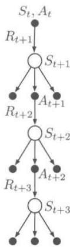  
三步树回溯更新

除了 $G_{T - 1:t + n} \doteq R_T$ 之外， $n = 1$ 的情况可由公式 (7.15) 解决。这个目标就可以用于 $n$ 步Sarsa的动作价值更新规则，对于 $0 \leqslant t < T$ ，有

$$
Q _ {t + n} \left(S _ {t}, A _ {t}\right) \doteq Q _ {t + n - 1} \left(S _ {t}, A _ {t}\right) + \alpha \left[ G _ {t: t + n} - Q _ {t + n - 1} \left(S _ {t}, A _ {t}\right) \right],
$$

其他所有“状态-动作”二元组的价值保持不变，即对于所有满足 $s \neq S_{t}$ 或 $a \neq A_{t}$ 的 $s, a$ 有 $Q_{t + n}(s, a) = Q_{t + n - 1}(s, a)$ 。下面框中显示了这一算法的伪代码。

# $n$ 步树回溯算法，用于估计 $Q \approx q_{*}$ 或 $q_{\pi}$

对于所有的 $s \in S, a \in \mathcal{A}$ ，任意初始化 $Q(s, a)$

将 $\pi$ 初始化为对应 $Q$ 的 $\varepsilon$ -贪心策略或者某个固定的给定策略

算法参数：步长 $\alpha \in (0,1]$ ，正整数 $n$

所有存取操作的索引可以对 $n + 1$ 取模

对每幕循环：

初始化和储存状态 $S_0 \neq$ 终止状态

根据 $S_{0}$ 任意选择动作 $A_0$ ；并存储 $A_0$

$$
T \leftarrow \infty
$$

循环 $t = 0,1,2,\dots$

如果 $t <   T$ ，那么：

采取动作 $A_{t}$ ；观察并存储下一时刻的收益和状态 $R_{t + 1},S_{t + 1}$

如果 $S_{t + 1}$ 是终止状态：

$$
T \leftarrow t + 1
$$

否则：

根据 $S_{t + 1}$ 任意选择一个动作 $A_{t + 1}$ ；存储 $A_{t + 1}$

$\tau \gets t + 1 - n$ （是估计值更新的时间）

如果 $\tau \geqslant 0$

如果 $t + 1\geqslant T$

$$
G \leftarrow R _ {T}
$$

否则

$$
| \quad G \leftarrow R _ {t + 1} + \gamma \sum_ {a} \pi (a | S _ {t + 1}) Q \left(S _ {t + 1}, a\right)
$$

循环 $k = \min (t,T - 1)$ 递减到 $\tau +1$

$$
G \leftarrow R _ {k} + \gamma \sum_ {a \neq A _ {k}} \pi (a | S _ {k}) Q (S _ {k}, a) + \gamma \pi (A _ {k} | S _ {k}) G
$$

$$
| \quad Q (S _ {\tau}, A _ {\tau}) \leftarrow Q (S _ {\tau}, A _ {\tau}) + \alpha [ G - Q (S _ {\tau}, A _ {\tau}) ]
$$

如果处于学习 $\pi$ 的过程中，那么需要确保 $\pi (|\bar{S}_{\tau})$ 是基于 $Q$ 的贪心策略直到 $\tau = T - 1$

练习7.11 证明如果近似动作价值不变，那么树回溯的回报（式7.16）可以写成期望TD误差之和

$$
G _ {t: t + n} = Q \left(S _ {t}, A _ {t}\right) + \sum_ {k = t} ^ {\min  (t + n - 1, T - 1)} \delta_ {k} \prod_ {i = t + 1} ^ {k} \gamma \pi \left(A _ {i} \mid S _ {i}\right),
$$

其中， $\delta_t\dot{=} R_{t + 1} + \gamma \bar{V}_t(S_{t + 1}) - Q(S_t,A_t)$ ， $\bar{V}_{t}$ 由式（7.8）给出。

# 7.6 * 一个统一的算法: $n$ 步 $Q(\sigma)$

到目前为止，我们已经考虑了三种不同的动作价值回溯算法，分别与图7.5中展示的前三个回溯图相对应。 $n$ 步Sarsa算法中的节点转移全部基于采样得到的单独路径，而树回溯算法对于状态到动作的转移，则是将所有可能路径分支全部展开而没有任何采样， $n$ 步期望Sarsa算法则只对最后一个状态到动作的转移进行全部分支展开(用期望值)，其余转移则都是基于采样进行的。这些算法在多大程度上可以统一？

一种统一框架的思想如图7.5中的第四个回溯图所示。这个思想就是：对状态逐个决定是否要采取采样操作，即依据分布选取某一个动作作为样本(Sarsa算法的情况)，或者考虑所有可能动作的期望(树回溯算法的情况)。如果一个人总是用采样操作，他就会得到Sarsa算法；反之，如果从不采样，就会得到树回溯算法。期望Sarsa算法是在最后一步之前进行采样。当然还有很多其他的可能性，正如图7.5中最后一个图所揭示的。为了

  
4步Sarsa

  
4步树回溯

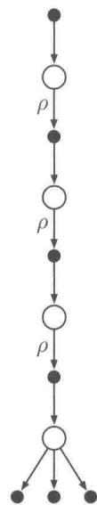  
4步期望Sarsa

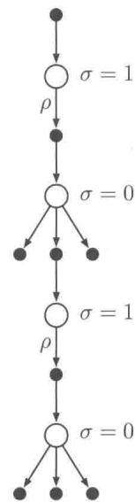  
4步 $Q(\sigma)$   
图7.5本章中的三种 $n$ 步动作价值更新的回溯图（4步方法的例子）和第四种将它们全部统一在一起的算法的回溯图。 $\rho$ 表示转移过程在离轨策略下需要使用重要度采样。第四种更新算法统一了其他所有算法，其通过引入对每个状态的采样操作标识来实现， $\sigma_{t} = 1$ 表示进行采样操作， $\sigma_{t} = 0$ 表示不采样

进一步增加可能性，我们可以考虑采样和期望之间的连续变化。令 $\sigma_t \in [0,1]$ 表示在步骤 $t$ 时采样的程度， $\sigma = 1$ 表示完整的采样， $\sigma = 0$ 则表示求期望而不进行采样。随机变量 $\sigma_t$ 可以表示成在时间 $t$ 时，关于状态、动作或者“状态-动作”二元组的函数。我们称这个新的算法为 $n$ 步 $Q(\sigma)$ 。

现在我们来推导 $n$ 步 $Q(\sigma)$ 的公式。首先我们写出视界 $h = t + n$ 时的树回溯算法的 $n$ 步回报 (式7.16)，然后再将其用期望近似价值 $\bar{V}$ (式7.8) 来表达

$$
\begin{array}{l} G _ {t: h} = R _ {t + 1} + \gamma \sum_ {a \neq A _ {t + 1}} \pi (a | S _ {t + 1}) Q _ {h - 1} (S _ {t + 1}, a) + \gamma \pi (A _ {t + 1} | S _ {t + 1}) G _ {t + 1: h} \\ = R _ {t + 1} + \gamma \bar {V} _ {h - 1} (S _ {t + 1}) - \gamma \pi (A _ {t + 1} | S _ {t + 1}) Q _ {h - 1} (S _ {t + 1}, A _ {t + 1}) + \gamma \pi (A _ {t + 1} | S _ {t + 1}) G _ {t + 1: h} \\ = R _ {t + 1} + \gamma \pi \left(A _ {t + 1} \mid S _ {t + 1}\right) \left(G _ {t + 1: h} - Q _ {h - 1} \left(S _ {t + 1}, A _ {t + 1}\right)\right) + \gamma \bar {V} _ {h - 1} \left(S _ {t + 1}\right), \\ \end{array}
$$

经过上面重写后，这个式子的形式就很像带控制变量的 $n$ 步Sarsa的回报，不同之处是用动作概率 $\pi (A_{t + 1}|S_{t + 1})$ 代替了重要度采样比 $\rho_{t + 1}$ 。对于 $Q(\sigma)$ ，我们会将两种线性情形组合起来，即对 $t < h\leqslant T$ ，有

$$
\begin{array}{l} G _ {t: h} \doteq R _ {t + 1} + \gamma \left(\sigma_ {t + 1} \rho_ {t + 1} + (1 - \sigma_ {t + 1}) \pi \left(A _ {t + 1} \mid S _ {t + 1}\right)\right) \\ \left(G _ {t + 1: h} - Q _ {h - 1} \left(S _ {t + 1}, A _ {t + 1}\right)\right) + \gamma \bar {V} _ {h - 1} \left(S _ {t + 1}\right), \tag {7.17} \\ \end{array}
$$

上面递归公式的终止条件为： $h < T$ 时 $G_{h:h} \doteq Q_{h-1}(S_h, A_h)$ ，或者 $h = T$ 时 $G_{T-1:T} \doteq R_T$ 。然后我们使用通用（离轨策略）版本的 $n$ 步Sarsa更新公式(7.5)。完整的算法如下框中所示。

# $n$ 步离轨策略下的 $Q(\sigma)$ 算法，用于估计 $Q \approx q_{*}$ 或 $q_{\pi}$

输入：一个任意的满足 $b(a|s) > 0$ 的行动策略 $b$ ，对于所有的 $s\in S,a\in A$

对于所有的 $s \in S, a \in \mathcal{A}$ ，任意初始化 $Q(s, a)$

将 $\pi$ 初始化为对应 $Q$ 的 $\varepsilon$ -贪心策略或者某个固定的给定策略

算法参数：步长 $\alpha \in (0,1]$ ，小的 $\varepsilon ,\varepsilon >0$ ，正整数 $n$

所有存取操作的索引可以对 $n + 1$ 取模

对每幕循环：

初始化并储存状态 $S_0 \neq$ 终止状态

选择并存储 $A_0\sim b(\cdot |S_0)$

$$
T \leftarrow \infty
$$

循环 $t = 0,1,2,\dots$

如果 $t <   T$

采取动作 $A_{t}$ ；观察并存储下一时刻的收益和状态 $R_{t + 1},S_{t + 1}$ 如果 $S_{t + 1}$ 是终止状态： $T\gets t + 1$ 否则：选择并存储动作 $A_{t + 1}\sim b(\cdot |S_{t + 1})$ 选择并存储 $\sigma_{t + 1}$ 存储 $\frac{\pi(A_{t + 1}|S_{t + 1})}{b(A_{t + 1}|S_{t + 1})}$ 为 $\rho_{t + 1}$ $\tau \leftarrow t - n + 1$ （ $\tau$ 是估计值更新的时间）  
如果 $\tau \geqslant 0$ ： $G\gets 0$ 循环 $k = \min (t + 1,T)$ 递减到 $\tau +1$ ：如果 $k = T$ ： $G\gets R_T$ 否则： $\bar{V}\gets \sum_{a}\pi (a|S_{k})Q(S_{k},a)$ $G\gets R_k + \gamma (\sigma_k\rho_k + (1 - \sigma_k)\pi (A_k|S_k))(G - Q(S_k,A_k)) + \gamma \bar{V}$ $Q(S_{\tau},A_{\tau})\gets Q(S_{\tau},A_{\tau}) + \alpha [G - Q(S_{\tau},A_{\tau})]$ 如果处于学习 $\pi$ 的过程中，那么需要确保 $\pi (\cdot |S_{\tau})$ 是基于 $Q$ 的贪心策略  
直到 $\tau = T - 1$

# 7.7 本章小结

在本章中，我们介绍了一系列时序差分学习方法，它们介于上一章中的单步时序差分方法和第5章中的蒙特卡洛方法之间。在学习方法中使用数量适中的自举操作是非常重要的，因为它们的表现通常优于纯粹的TD方法和蒙特卡洛方法。

本章侧重介绍了 $n$ 步方法，这类方法会向前看若干步的收益、状态和动作。右边的两个4步回溯图汇总了介绍的大部分方法。图中所示的“状态-动作”二元组更新对应于带重要度采样的 $n$ 步TD，动作价值更新对应于 $n$ 步 $Q(\sigma)$ ，它是期望Sarsa和Q学习方法的推广。所有 $n$ 步方法都要在更新之前延迟 $n$ 个时刻步长，因为这些方法必须知道一些未来发生的事件才能进行计算。另一个缺点是，它们涉及的计算量比以前的方法要大。与单步方法相比， $n$ 步方法还需要更多的内存来记忆最近的 $n$ 步中的状态、动作、收益以

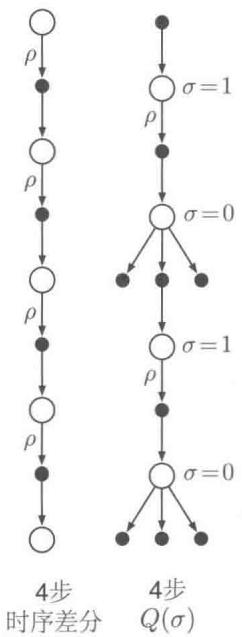

及其他变量。在第12章中，我们将看到如何借助资格迹，用最少的内存和最小的计算复杂度来实现多步TD方法。当然，相比单步方法，多步方法总会有一些额外的计算。但这样的代价还是值得的，毕竟我们可以很好地摆脱使用单步方法时带来的限制。

尽管 $n$ 步方法比使用资格迹的方法复杂得多，但在概念上它更清楚一些。我们试图利用这一点，在 $n$ 步的情况下开发两种方法来进行离轨策略学习。其一，基于重要度采样的方法。这个方法在概念上简单但方差大。如果目标策略和行动策略差别很大，则需要使用一些新的算法思想，其才能真正变得高效和实用。另一种是基于树回溯的方法，它是Q学习方法在使用随机目标策略的多步情况下的自然扩展。它不涉及任何重要度采样，但如果目标策略和行动策略显著不同，则即使 $n$ 很大，自举操作也只能跨越几个有限的时刻。

# 参考文献和历史评注

$n$ 步回报的概念是由Watkins(1989)提出的，他首先讨论了它们可以减小误差的性质。在本书的第1版中探讨了 $n$ 步算法，那时认为它们是有趣的概念，但在实践中是不可行的。Cichosz(1995)，特别是van Seijen(2016)的研究表明，它们实际上是很实用的算法。基于这一点，以及它们清晰和简洁的概念，我们选择在第2版中重点介绍。特别是，我们现在将所有关于后向视角和资格迹的讨论放到第12章。

7.1-2 随机游走的例子中展示的结果是基于Sutton(1998)以及Singh和Sutton(1996)的工作。用回溯图来描述这些例子以及本章中介绍的其他算法是新的研究结果。  
7.3-5 这几节的内容基于Precup、Sutton、Singh（2000）、Precup、Sutton、Dasgupta（2001）、Sutton、Mahmood、Precup和vanHasselt（2014）的工作。

树回溯算法是由Precup、Sutton和Singh（2000）提出的，但这里介绍的方法是新的研究结果。

7.6 $Q(\sigma)$ 算法对本书来说是新的，但 De Asis、Hernandez-Garcia、Holland 和 Sutton (2017) 对相关的算法进行了进一步的探索。