# 8

# 基于表格型方法的规划和学习

在本章中，我们将从一个统一视角来考虑一系列强化学习方法，既有具备环境模型的方法，如动态规划和启发式搜索，也包括没有环境模型的方法，如蒙特卡洛方法和时序差分方法。这些方法分别被称为基于模型和无模型的强化学习方法。基于模型的方法将规划作为其主要组成部分，而无模型的方法则主要依赖于学习。虽然这两种方法之间存在着很大的差异，但它们也有很多相似之处，特别是这两类方法的核心都是价值函数的计算。此外，所有的方法都基于对未来事件的展望，来计算一个回溯价值，然后使用它作为目标来更新一个近似价值函数。在本章之前，我们提出了蒙特卡洛方法和时序差分方法作为不同的选择，然后展示了 $n$ 步方法如何将它们统一起来（我们会在第12章中用资格迹再做一遍类似的事情）。本章的目标是将基于模型的方法和无模型的方法整合起来。在前面的章节中，我们讨论了它们之间的差异，现在我们研究它们可以混合在一起的程度。

# 8.1 模型和规划

我们所说的环境的模型，指的是一个智能体可以用来预测环境对其动作的反应的任何事物。给定一个状态和一个动作，作为环境的反应结果，模型就会产生后继状态和下一个收益的预测。如果模型是随机的，那么后继状态和下一个收益有好几种可能，每个都有一定的发生概率。一些模型生成对所有可能的结果的描述及其对应的概率分布，这种模型被称为分布模型。另一种模型从所有可能性中生成一个确定的结果，这个结果通过概率分布采样得到，我们称这种模型为样本模型。例如，考虑对12个骰子的总和进行建模。分布模型会产生所有可能结果的发生概率，而样本模型会根据这个概率分布产生一个单独的、确定的总和。在动态规划中，对MDP动态特性 $p(s', r|s, a)$ 的预测模型是分布模型；在第5章中的二十一点游戏实例中使用的模型则是样本模型。分布模型比样本模型更强大，

因为它们可以用来生成样本模型。然而在许多场景下，获得样本模型会比获得分布模型容易得多。掷骰子就是一个简单的例子。编写一个计算机程序来模拟掷骰子的结果并返回它们的总和是很容易的，但是要计算出所有可能的总和以及它们出现的概率就很困难，也很容易出错。

模型可以用来模拟（或称仿真）经验。给定一个开始状态和动作，一个样本模型会产生一个可能的转移，而分布模型会根据发生的概率产生所有可能的转移。给定一个初始状态和一个策略，一个样本模型可以生成整幕事件，一个分布模型可以生成所有可能的事件幕和它们发生的概率。在这两种情况下，我们都说模型是用来模拟环境和产生模拟经验的。

规划这个词在不同领域中有几种不同的使用方式。我们用这个术语来代表任何以环境模型为输入，并生成或改进与它进行交互的策略的计算过程

规划模型 $\longrightarrow$ 策略

在人工智能中，根据我们的定义，有两种不同的规划方法。第一种是状态空间规划，包括我们在本书中所采用的方法，可以将它们视为一种“搜索”方法，即在状态空间中寻找最优策略或实现目标的最优决策路径。每个动作都会引发状态之间的转移，价值函数的定义和计算都是基于状态的。而在所谓的方案空间规划中，规划是在“方案空间”中进行的。我们需要定义一些操作将一个“方案”（即一个具体的决策序列）转换成另一个，并且如果价值函数存在，它是被定义在不同“方案”所构成的空间中的。方案空间的规划包括进化算法和“偏序规划”（这是人工智能中的一种常见规划方法，在规划过程中并非所有阶段里的步骤都有完全确定的顺序）。方案空间方法很难有效地应用于随机性序列决策问题中，而这些问题是强化学习的重点，所以我们不会在本书中进一步讨论它们（需要的话请参考Russell和Norvig，2010）。

我们在本章中提出一个统一的视角，即所有的状态空间规划算法都有一个通用的结构，在本书所讨论的学习方法中也体现了这个结构。本章的目标就是阐述这个观点。这里有两个基本的思想：(1) 所有的状态空间规划算法都会利用计算价值函数作为改善策略的关键中间步骤；(2) 它们通过基于仿真经验的回溯操作来计算价值函数。这种通用的结构如下所示

模型 $\longrightarrow$ 模拟经验 $\longrightarrow$ 价值函数 $\longrightarrow$ 策略

显然，动态规划算法很适合这种结构：它们会先遍历状态空间，为每个状态生成可能的转移，然后利用概率分布来计算回溯值（更新目标），并更新状态的价值函数估计值。在本章

中，我们认同各种其他的状态空间规划方法也适用于这种结构，不同的方法只在它们所做的回溯操作、它们执行操作的顺序，以及回溯的信息被保留的时间长短上有所不同。

以这种视角看待“规划方法”，强调了规划方法和在本书中讨论的“学习方法”之间的关系。学习方法和规划方法的核心是通过回溯操作来评估价值函数。不同之处在于，规划利用模拟仿真实验产生的经验，学习方法使用环境产生的真实经验。当然，这种差异导致了许多其他的差异，例如，如何评估性能，以及如何产生丰富的经验。但是通用结构意味着许多思想和算法可以在规划和学习之间迁移。特别是，在许多情况下，学习算法可以代替规划方法的关键回溯步骤。学习方法只需要经验作为输入，而且在许多情况下，它们可以被应用到模拟经验中，就像应用到真实经验中一样。下面的算法流程展示了一个简单的例子，它是基于单步骤表格型的Q学习和样本模型的随机采样方法。这种方法，我们称为随机采样单步表格型 $Q$ 规划算法。它可以收敛到相应环境模型下的最优策略，其收敛条件与面向真实环境的单步表格型Q学习的最优策略收敛条件相同（每个“状态-动作”二元组必须在步骤1中被无限次地选中，并且随着时间的推移， $\alpha$ 需要适当地减小）。

# 随机采样单步表格型Q规划

# 无限循环：

1. 随机选择一个状态， $S\in S$ ，和一个动作， $A\in \mathcal{A}(S)$   
2. 发送 $S, A$ 到一个采样模型，得到

下一个收益 $R$ ，以及后继状态 $S^{\prime}$

3. 利用 $S, A, R, S'$ 进行单步表格型 Q-规划：

$$
Q (S, A) \leftarrow Q (S, A) + \alpha \left[ R + \gamma \max  _ {a} Q \left(S ^ {\prime}, a\right) - Q (S, A) \right]
$$

除了提出规划和学习方法的统一视角之外，本章第二个要讨论的主题是采用较小的增量式步长的规划方法的好处。这可以使得能在任何时候中断或重定向规划，而几乎不浪费计算资源，这也是高效地融合行动规划和模型学习的关键前提。对于那些尺度大到无法精确求解的规划问题，基于极小步长的规划可能是最有效的方法。

# 8.2 Dyna：集成在一起的规划、动作和学习

对于在线完成的规划，智能体与环境相交互时会出现一些有趣的问题。从交互中获得的新信息可能会改变模型，从而与规划过程产生相互作用。我们可能需要以某种方式对规划过程进行定制化调整，使其适应当前或后继预期的状态或决策。如果决策确定和模型学习都是计算密集型的过程，那么可能需要在它们之间分配有限的可用计算资源。为了探索

这些问题，在本节中，我们介绍一个简单的架构Dyna-Q，其集成了进行在线规划的智能体所需要的主要功能。在Dyna-Q中，每个功能都以一种极其简单的形式出现。在随后的各节中，我们会详细阐述每个功能的一些不同实现方法，以及它们之间的利弊权衡。目前，我们只是阐明相关思想让读者有一个直观的概念。

对一个规划智能体来说，实际经验至少扮演了两个角色：它可以用来改进模型（使模型与现实环境更精确地匹配）；另外，它可用于直接改善前几章中介绍的强化学习中的价值函数和策略。前者称为模型学习，后者则称为直接强化学习（direct RL）。经验、模型、价值和策略之间可能的关系如右图所示，每个箭头表示产生影响和改进的关系方向。请注意看“经验”是如何直接地或通过模型间接地改善价值函数和策略的。这其中与“规划”相关的是后面一种方式，即所谓的间接强化学习。

无论是直接还是间接的方法都有各自的优点和缺点。间接方法往往能更充分地利用有限的经验，从而获得更好的策略，减少与环境的相互作用。另一方面，直接方法则简单得多，它不受模型的设计偏差的影响。有些人认为间接方法总是优于直接的方法，而另一些人则认为直接方法更合理和可靠，因为它是人类和动物学习的主要方式。心理学和人工智能对它们的争论焦点主要在“原理认知”和“试错学习”哪个相对更重要，以及“主动的预谋性规划”和“被动的反应式决策”哪个相对而言更重要（参见第14章中的一些关于心理学方面的讨论）上。我们的观点是，在所有这些争论中，不同观点之间的差异性被夸大了。其实，分析两种观点的相似性比将它们对立起来反而能给我们更多的启发，使我们有更多的认识。例如，在本书中，我们强调了动态规划和时序差分方法之间的内在相似性，尽管其中一个是为规划而设计的，另一个是为无模型学习而设计的。

Dyna-Q包括了上图所示的所有过程，规划、动作、模型学习和直接强化学习，该过程会持续迭代。这里的规划方法是8.1节中给出的随机采样单步表格型Q规划方法。直接强化学习方法是单步表格型Q学习。模型学习方法也是基于表格的，并且假设环境是确定的。在每一次转移 $S_{t}, A_{t} \rightarrow R_{t + 1}, S_{t + 1}$ 之后，模型在它的表格中会为 $S_{t}, A_{t}$ 建立条目，记录环境在这种情况下产生的转移结果的预测值 $R_{t + 1}, S_{t + 1}$ 。因此，如果对模型之前经历过的“状态-动作”二元组进行查询，将返回最后观察到的后继状态和后继收益作为其预测值。在规划过程中，Q规划算法随机从之前经历过的“状态-动作”二元组（算法的

第1步)中进行采样，因此模型永远不会查询没有信息的“状态-动作”二元组。

图8.1给出了Dyna智能体的总体架构，它也是Dyna-Q算法的一个样例。中间一列代表智能体与环境之间的基本交互关系，这些交互产生了真实经验。图左边的箭头表示直接强化学习操作，它直接通过实际经验改善价值函数和策略。图中右边的部分是基于模型的过程。模型从实际经验中学习，并进行仿真产生模拟经验。我们使用术语搜索控制来指代为模型生成的模拟经验选择初始状态和动作的过程。最后，通过将强化学习方法应用于模拟经验得到规划，就像它们真的发生过一样。通常情况下，在Dyna-Q中，同样的强化学习方法既可以从真实的经验中学习，也可以应用于模拟经验以进行规划。因此，强化学习方法是学习和规划的“最终共同路径”。学习和规划是紧密地结合在一起的，它们分享几乎所有相同的计算资源，不同的只是它们的经验的来源。

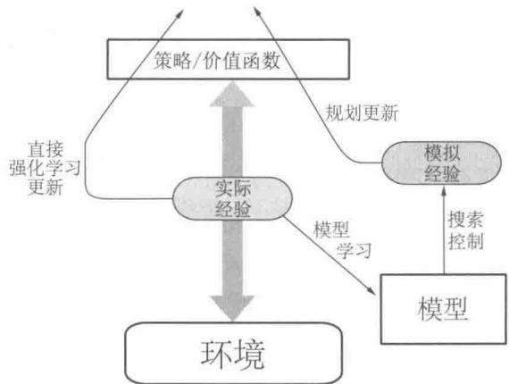  
图8.1一般的Dyna架构。真正的经验在环境和策略之间来回传递，影响策略和价值函数，就像环境模型产生的模拟经验一样

从概念上讲，规划、动作、模型学习和直接强化学习在Dyna的智能体中是同时发生并行进行的。然而，对于在串行计算机中的具体实现，在每一步我们都需要指定它们发生的顺序。在Dyna-Q中，动作执行、模型学习和直接强化学习过程只需要很少的计算，我们假设它们只消耗一小部分时间。每一步的剩余时间都可以用于规划过程，而这个过程是计算密集型的。我们假设在每个步骤之后，即动作执行、模型学习和直接强化学习之后，都有时间来完成Q-规划算法的 $n$ 次迭代（算法步骤 $1\sim 3$ ）。在下面的框中给出了Dyna-Q的算法流程伪代码，其中，Model(s,a)表示基于“状态-动作”二元组 $(s,a)$ 预测的后继状态和收益的内容。直接强化学习、模型学习和规划分别由步骤(d)、(e)和(f)来实现。如果省略(e)和(f)，则剩下的算法是单步表格型Q学习算法。

# 表格型Dyna-Q算法

对所有的 $s\in S$ 和 $a\in \mathcal{A}(s)$ ，初始化 $Q(s,a)$ 和Model(s,a)

无限循环：

(a) $S\gets$ 当前（非终止）状态   
(b) $A\gets \varepsilon$ -贪心 $(S,Q)$   
(c) 采取动作 $A$ ；观察产生的收益 $R$ 以及状态 $S'$   
(d) $Q(S,A)\gets Q(S,A) + \alpha \left[R + \gamma \max_{a}Q(S^{\prime},a) - Q(S,A)\right]$   
(e) Model(S, A) $\leftarrow R, S'$ （假设环境是确定的）  
(f) 重复 $n$ 次循环：

$S \gets$ 随机选择之前观察到的状态

$A \leftarrow$ 随机选择之前在状态 $S$ 下采取过的动作 $A$

$$
\begin{array}{l} R, S ^ {\prime} \leftarrow M o d e l (S, A) \\ Q (S, A) \leftarrow Q (S, A) + \alpha \left[ R + \gamma \max  _ {a} Q \left(S ^ {\prime}, a\right) - Q (S, A) \right] \\ \end{array}
$$

例8.1 Dyna迷宫现在我们讨论图8.2所示的简单迷宫。在47个状态中，每一个状态都有四种动作：上、下、左、右，这使得智能体一定会走到紧挨它周围的某个状态，除非移动被屏障或迷宫的边缘阻挡。在遮挡情况下，智能体仍然保持它原来的位置。在所有的转移中，收益都是零，除了目标状态是 $+1$ 外。到达目标状态(G)后，智能体返回到开始状态(S)以开始新的一幕。这是一个带折扣的分幕式任务，其中 $\gamma = 0.95$

图8.2的主要部分显示了在迷宫任务中使用dyna-Q智能体的实验的平均学习曲线。

  
图8.2一个简单的迷宫（见图中图）以及Dyna-Q智能体在每一真实时间步长内不同规划步数的平均学习曲线。这个任务要求它们从S移动到G，越快越好

最初的动作价值是零，步长参数 $\alpha = 0.1$ ，试探参数 $\varepsilon = 0.1$ 。在进行贪心动作选择的时候，遇到概率相等时会进行随机选取。智能体根据每个真实时刻里面规划的步骤数量 $n$ 的不同而有所不同。对于每个 $n$ ，曲线显示的是在每幕达到目标时智能体所花费的步数，这个数字是30次重复实验的平均结果。在每次重复实验中，随机数字发生器的初始种子在算法之间保持不变。正因为如此，对于所有的 $n$ 值，第一幕是完全相同的（大约是1700步)，这个数据没有体现在图中。在第一幕之后，对于所有的 $n$ 值，性能都有所改善，但是对于更大的 $n$ 值来说则改善要快得多。回想一下， $n = 0$ 的智能体是一个无规划的智能体，只使用直接强化学习（单步表格型Q学习）方法。尽管对参数值 $(\alpha$ 和 $\varepsilon)$ 进行了优化，但它仍然是在这个问题上最慢的智能体。无规划智能体用了大约25幕才取得 $(\varepsilon -)$ 最优性能，然而 $n = 5$ 的智能体只用了5幕， $n = 50$ 时只用了3幕。

图8.3显示了带规划的智能体为什么比无规划的智能体能更快地找到解决方案。图中显示的是 $n = 0$ 和 $n = 50$ 时的智能体在第二幕的中间所找到的策略。如果没有规划 $(n = 0)$ ，则每一幕只会给策略学习增加一次学习机会，即智能体仅仅在一个特定时刻（该幕最后一个时刻）进行了学习。而有规划的时候，虽然在第一幕中仍然只有一步的学习，但是到第二幕时，可以学出一个宽泛的策略，于是不用等到这一幕结束就可以做多次回溯更新计算，这些计算几乎可以回溯到初始状态。这个策略是智能体在初始状态附近徘徊时通过规划过程构建的。到第三幕结束时，将找到一个完整的最优策略，达到完美的性能表现。

  
图8.3带规划与无规划的Dyna-Q智能体在第二幕中间时学习到的策略。箭头表示在每个状态下的贪心动作；如果在某个状态上没有箭头，那么所有的动作价值在那个状态下是相等的。黑色方块表示智能体的位置

在Dyna-Q中，学习和规划是由完全相同的算法完成的，真实经验用于学习，模拟经验用于规划。因为规划是增量式进行的，所以将规划和动作融合起来是很简单的，两者都以尽可能快的速度进行。智能体既是反应式的也是预谋式的，它总是立即对最新的传感信息给予反馈回应，但也同时总是在后台不断地进行规划。同样在后台运行的还有模型学习过程。随着新信息的获得，模型不断更新以更好地匹配现实。随着模型的改变，进行中的规划过程也将逐渐计算出一种不同的动作方式来匹配新的模型。

练习8.1 图8.3中的无规划方法看起来特别差，这是因为它是单步法。使用多步自举法会得到更好的结果。你认为第7章中的多步自举法可以和Dyna方法一样好吗？解释为什么是或者为什么不是。

# 8.3 当模型错误的时候

在上一节中给出的迷宫示例中，模型的变化是相对有限的。该模型最初是空的，然后只填充完全正确的信息。一般来说，我们不见得总能如此幸运。因为在随机环境中只有数量有限的样本会被观察到，或者因为模型是通过泛化能力较差的函数来近似的，又或者仅仅是因为环境发生改变且新的动态特性尚未被观察到，模型都可能不正确。当模型不正确时，规划过程就可能会计算出次优的策略。

在某些情况下，规划计算出的次优策略会使得我们很快发现并修正模型错误。这种情形往往会在模型比较“乐观”的时候发生，即模型倾向于预测出比真实可能情况更大的收益或更好的状态转移。规划得出的策略会尝试开发这些机会，这样，智能体很快就能发现其实这些机会根本不存在，于是就感知到模型错误，继而修正错误。

例8.2屏障迷宫图8.4展示了一个有较小的建模错误然后得到修复的迷宫示例。最初，如左图所示，从开始到目标的最短路径是从屏障右边绕过。经过1000次学习后，该最短路径被封锁了，取而代之的是一条从屏障左边绕过的路径，如右图所示。图表展示

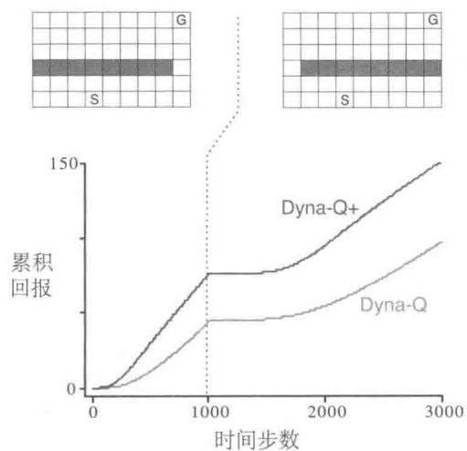  
图8.4Dyna智能体在屏障迷宫任务上的平均性能。左图环境用于开始的1000步，右图的环境用于之后的步数。Dyan-Q+在Dyan-Q的基础上增加了额外的试探收益来鼓励试探性动作

了Dyna-Q智能体和 $\mathrm{Dyna - Q + }$ 智能体的平均累积收益。图中的第一部分表明，Dyna-Q和 $\mathrm{Dyna - Q + }$ 都在1000步之内找到了最短路径。当环境改变时，曲线变平，表明在这一段智能体没有得到收益，因为它们在屏障后面徘徊。但是过了一段时间后，它们依然能够学习到新的最优动作。

当环境变得比以前更好，但以前正确的策略并没有反应出这些改善时，智能体的学习就会遇到很大困难。在这些情况下，建模错误可能在很长时间甚至一直都不会被检测到。例8.3捷径迷宫这种环境变化引起的问题由图8.5所示的捷径迷宫示例所示。最初，最优路径绕过屏障的左侧(左上)。然而，在3000步之后，沿着右侧打开一条较短的路径，而它不会影响较长的路径(右上角)。图表显示，普通Dyna-Q不会切换到捷径。事实上，它从未意识到新路径的存在。它的模型说没有捷径，所以它规划得越多，就越不可能走到右边发现它。即使使用了一个 $\epsilon$ -贪心策略，智能体也不太可能采取足够大量的试探动作来发现捷径。

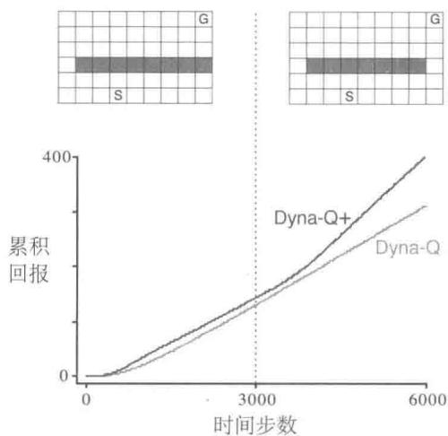  
图8.5Dyna智能体在捷径迷宫任务上的平均性能。左图环境用于开始的3000步，右图的环境用于之后的步数

我们在这里遇到的问题是试探和开发之间矛盾的另一种版本。在“规划”的语境中，“试探”意味着尝试那些改善模型的动作，而“开发”则意味着以当前模型的最优方式来执行动作。我们希望智能体通过试探发现环境的变化，但又不希望试探太多使得平均性能大大降低。正如之前阐述“试探”和“开发”之间的矛盾时讨论的，可能并不存在既完美又实用的解决方案，但简单的启发式方法常常很有效。

解决了捷径迷宫问题的Dyna-Q+智能体就采用了这种启发式方法。该智能体对每一个“状态-动作”二元组进行跟踪，记录它自上一次在与环境进行真实交互时出现以来，

已经过了多少时刻。时间越长，我们就越有理由推测这个二元组相关的环境动态特性会产生变化，也即关于它的模型是不正确的。为了鼓励测试长期未出现过的动作，一个特殊的为该动作相关的模拟经验设置的“额外收益”将会提供给智能体。特别是，如果模型对单步转移的收益是 $r$ ，而这个转移在 $\tau$ 时刻内没有被尝试，那么在更新时就会采用 $r + \kappa \sqrt{\tau}$ 的收益，其中 $\kappa$ 是一个比较小的数字。这会鼓励智能体不断试探所有可访问的状态转移，甚至使用一长串的动作来完成这种试探1。当然，所有这些试探动作都有代价，但在许多情况下，就像在捷径迷宫中一样，这种“计算上的好奇心”是非常值得付出额外代价的。

练习8.2 为什么带额外试探收益的Dyna智能体（Dyma-Q+）会在“屏障迷宫”和“捷径迷宫”任务的第一和第二个阶段都表现得比原来的Dyan-Q智能体要好？

练习8.3 仔细观察图8.5可以发现，Dyna-Q+与Dyna-Q的差距在第一阶段推进过程中有微小的收窄。这是为什么？

练习8.4（编程）上面所述的对应试探的额外收益改变了对状态和动作价值函数的估计值。这是必然的吗？事实上，我们是否可以让收益 $\kappa \sqrt{\tau}$ 只用于动作选择，而不用于更新价值函数，也就是说，动作总是根据最大化 $Q(S_{t},a) + \kappa \sqrt{\tau(S_{t},a)}$ 来选择？请在网格世界的实验中验证这种替代方法的优缺点。

练习8.5 如何修改上文展示的表格型Dyna-Q算法，使得它能够处理随机的环境？这一修改在一个变化的环境中（如本章所考虑）有多大可能会表现得非常差？如何修改算法使得它能够同时适应随机的环境和变化的环境？

# 8.4 优先遍历

对于前面几节介绍的 Dyna 智能体，模拟转移是从所有先前经历过的每个“状态-动作”二元组中随机均匀采样得到的。但均匀采样通常不是最好的。如果模拟转移和价值函数更新集中在某些特定的“状态-动作”二元组上，则规划可能会高效得多。例如，考虑在第一个迷宫任务的第二幕发生的事情（图 8.3）。在第二幕开始时，只有能够直接到达终点目标的“状态-动作”二元组才具有正的价值；所有其他二元组的价值仍然是零。这意味着对绝大多数转移而言，更新价值函数是毫无意义的，因为它们只是将智能体从一个零值状态转移到另一个零值状态，这时进行更新计算将不会有任何影响。只有那些跳入终点目标之前的状态或者从这个状态跳出的转移过程才会导致价值估计的改变。如果使用均匀

采样的模拟转移，那么在达到其中一个有用的更新之前将进行很多没用的更新。随着规划的进行，有效更新的范围也会不断扩大，但是与那些把更新重点放在最有用的地方的方法相比，规划过程的效率还是非常低的。如果我们真正的目标是一个更大尺度的问题，其有非常大的状态空间，那么采用均匀采样来更新的方式将是极其低效的。

这个例子表明，从终点目标状态进行反向工作可能使得搜索范围更为集中。当然，我们并不想使用任何依赖于“目标状态”的方法。我们预想的方法应该是一般性的收益函数都可以使用的。目标状态只是一种特殊情况，便于启发我们思考。一般来说，我们希望不仅从目标状态反向计算，而且还要从能使得价值发生变化的任何状态进行反向计算。假设在给定的环境模型下，初始的价值在达到目标之前都是正确的，如迷宫示例中所示，同时假设智能体在环境中发现了一个变化，改变了它的某个状态的估计价值，无论是增加还是减少。通常这将意味着也应该改变许多其他状态的价值，但是唯一有用的单步更新是与特定的一些动作相关的，这些动作直接使得智能体进入价值被改变的状态。如果这些动作的价值被更新，则它们的前导状态的价值也会依次改变。若以上分析成立，那么我们就首先需要更新相关的前导动作的价值，然后改变它们的前导状态的价值。通过这种方式，我们可以从任意的价值发生变化的状态中进行反向操作，要么进行有用的更新，要么就终止信息传播。这个总体思路可以称为规划计算的反向聚焦。

当有用更新的边界不断反向推演传播时，它的范围常常迅速扩大，产生许多可以有效更新的“状态-动作”二元组。但并不是所有这些二元组都同样有用。一些状态的价值可能发生了很大的变化，而另一些状态的价值可能变化不大。价值改变很大的状态的前导状态的价值也更有可能改变很大。在随机环境中，转移概率估计值的波动也会影响价值变化的大小以及“状态-动作”二元组更新的优先级。根据某种更新迫切性的度量对更新进行优先级排序是很自然的。这就是优先级遍历背后的基本思想。如果某个“状态-动作”二元组在更新之后的价值变化是不可忽略的，就可以将它放入优先队列维护，这个队列是按照价值改变的大小来进行优先级排序的。当队列头部的“状态-动作”二元组被更新时，也会计算它对其前导“状态-动作”二元组的影响。如果这些影响大于某个较小的阈值，我们就把相应的前导“状态-动作”二元组也插入优先队列中（如果已经在队列中，则保留优先级高的那一个）。通过这种方法，价值变化的影响被有效地反向传播直到影响消失。下面的框中给出了在确定性环境下的完整算法描述。

# 在确定性环境下的优先级遍历算法

对所有 $s \in S$ 和 $a \in \mathcal{A}(s)$ ，初始化 $Q(s, a)$ 和 Model(s, a)，并初始化 $PQueue$ 为空

无限循环：

(a) $S\gets$ 当前（非终止）状态   
(b) $A\gets policy(S,Q)$   
(c) 采取动作 $A$ ；观察产生的收益 $R$ ，以及状态 $S'$   
(d) Model(S,A)←R,S'   
(e) $P\gets |R + \gamma \max_{a}Q(S^{\prime},a) - Q(S,A)|.$   
(f) 如果 $P > \theta$ ，那么将 $S, A$ 以优先级 $P$ 插入 $PQueue$ 中  
(g) 循环 $n$ 次，同时 $PQueue$ 非空：

$$
S, A \leftarrow f i r s t (P Q u e u e)
$$

$$
R, S ^ {\prime} \leftarrow M o d e l (S, A)
$$

$$
Q (S, A) \leftarrow Q (S, A) + \alpha \left[ R + \gamma \max  _ {a} Q \left(S ^ {\prime}, a\right) - Q (S, A) \right]
$$

对所有的预测可以到达 $S$ 的 $\bar{S},\bar{A}$ 进行循环：

$\bar{R} \gets$ 对于 $\bar{S}, \bar{A}$ , $S$ 预测的收益

$$
P \leftarrow | \bar {R} + \gamma \max  _ {a} Q (S, a) - Q (\bar {S}, \bar {A}) |.
$$

如果 $P > \theta$ ，那么将 $\bar{S},\bar{A}$ 以优先级 $P$ 插入 $PQueue$ 中

例8.4迷宫问题中的优先遍历 优先遍历通常能够显著提高在迷宫任务中发现最优解决方案的速度，通常可以快 $5\sim 10$ 倍。一个典型例子如右图所示。这些数据对应于图8.2中所示结构完全相同的一系列的迷宫任务，只是它们在网格世界的分辨率有所不同。与无优先的Dyna-Q相比，优先遍历保持了明显的优势。两个系统在每次环境交互中最多可以完成 $n = 5$ 次更新。改自Peng和Williams(1993)。

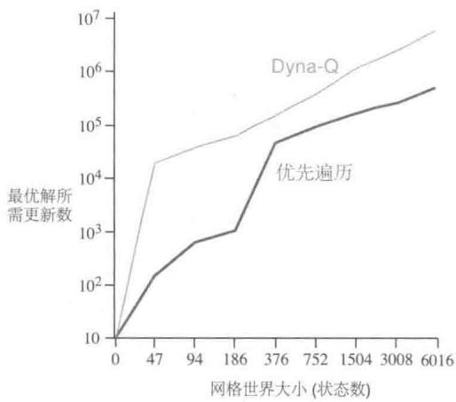

将优先遍历方法推广到随机环境是很直接的。模型维护就是记录每个“状态-动作”二元组的出现次数和它们的后继状态的出现次数。然后很自然地，我们不会像之前一样采用单个样本来更新“状态-动作”二元组的价值函数，而是采用概率期望意义下的更新，即需要顾及所有可能的后继状态及其发生概率。

# 例8.5 杆子操控问题中的优先遍历

这个任务的目的是在一个有限的矩形工作空间内，以最少量量的步骤，将一个杆子绕过一些放置在奇怪位置的屏障，移动到目标位置。杆子可以沿其长轴或垂直于该轴移动，或者可以围绕其中心的任一方向旋转。每个动作的距离约为工作空间的1/20，旋转增量为10度。平移是确定性的，且量化为 $20 \times 20$ 个位置之一。右图是采用优先遍历的结果，显示了所发现的屏障以及所找到的从起始点到目标的最短解决方案。这个问题仍然是确定性的，但有4个动作和14400个潜在的状态（其中有些是由于有屏障而无法达到的状态）

态)。这个问题可能已经大到无法用非优先遍历的方法来解决。图片来自Moore和Atkeson(1993)。

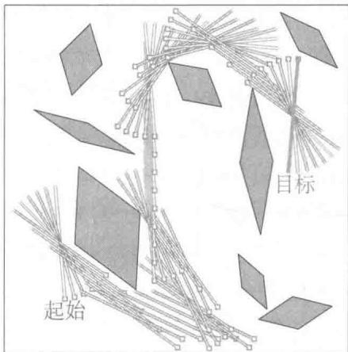

优先遍历只是分配计算量以提高规划效率的一种方式。这可能不是最好的方法。优先遍历的局限之一是它采用了期望更新，这在随机环境中可能会浪费大量计算来处理低概率的转移。正如我们在下一节展示的，在许多情况下，采样更新方法可以用更小的计算量得到更接近真实价值函数的估计，虽然它会引入一些估计方差。采样更新的方法具有优势，因为它将总体回溯计算分解成更小的片断（对应于单步转移），从而使得它可以将焦点收窄到那些具有最大影响的小片段上。这个思想后来被进一步发展到极致，从而 van Seijen 和 Sutton (2013) 提出了“小范围回溯”。在小范围回溯中，更新操作是沿着单个转移进行的，就像采样更新一样；但它又是基于转移的概率而非采样样本进行计算的，这又和期望更新类似。通过选择小范围回溯更新的顺序，规划的效率可以大大提升，超过优先遍历方法。

我们在本章中的观点是，各种状态空间规划可以被视为一系列价值更新，只是更新的方式各有差异，如期望或采样、大或小，以及更新的完成顺序有所不同。在本节中，我们强调了反向聚焦方法，但这只是一种思路。例如，另外一种思路就是从当前策略下经常能访问到的状态出发，估计哪些后继状态是容易到达的，然后聚焦于那些容易到达的状态。这可以称为前向聚焦。Peng和Williams（1993）以及Barto、Bradtke和Singh（1995）探讨了前向聚焦的若干版本，接下来的几节将会充分讨论相关的方法。

# 8.5 期望更新与采样更新的对比

前面几节的例子已经显示了一些将学习(learning)和规划（planing）相结合的可能性。接下来，我们从讨论期望更新和采样更新的相对优势入手，分析一些相关的基本思想。

本书的大部分内容都是关于不同类型的价值函数更新的，我们已经讨论过很多不同的种类。目前我们关注单步更新方法，它们主要沿着三个维度产生变化。一个是它们更新状态价值还是动作价值；第二是它们所估计的价值对应的是最优策略还是任意给定策略。这两个维度组合出四类更新，用于近似四个价值函数： $q^{*}$ 、 $v^{*}$ 、 $q_{\pi}$ 和 $v_{\pi}$ 。最后一个维度是采用期望更新还是采样更新。期望更新会考虑所有可能发生的转移；而采样更新则仅仅考虑采样得到的单个转移样本。这三个维度产生了8种情况，其中7种对应于特定的算法，如图8.6所示（第8种情况似乎不对应任何有用的更新）。这些单步更新中的任何一种都

  
图8.6 本书中所有单步更新方法的回溯图

可用于规划。前面讨论的 Dyna-Q 智能体使用 $q^{*}$ 采样更新，但是也可以使用 $q^{*}$ 期望更新，或者对 $q_{\pi}$ 采用期望或采样更新。Dyna-AC 系统使用 $v_{\pi}$ 采样更新和基于学习的策略结构（参见第 13 章）。对于随机环境问题，总是使用某种期望更新方法来完成优先遍历。

我们在第6章中介绍单步采样更新时，将其作为期望更新的替代方法。在没有概率分布模型的情况下，进行期望更新是不可能的，但我们可以使用真实环境得到转移样本或从采样模型中得到转移样本来完成采样更新。这里隐含的观点是，如果可能，我们更喜欢采用期望更新而不是采样更新。但事实真是这样吗？期望更新肯定会产生更好的估计，因为它们没有受到采样误差的影响，但是它们也需要更多的计算，计算往往是规划过程中的限制性资源。要正确评估期望更新和采样更新的相对优势，我们必须控制不同的计算量需求。

具体来说，我们讨论一种将期望更新和采样更新用于近似 $q^{*}$ 的特殊例子。在这个例子中，状态和动作都是离散的，近似价值函数 $Q$ 采用表格来表示，环境模型的估计采用 $p(s', r|s, a)$ 来表示。则“状态-动作”二元组 $s, a$ 的期望更新是

$$
Q (s, a) \leftarrow \sum_ {s ^ {\prime}, r} \hat {p} \left(s ^ {\prime}, r \mid s, a\right) \left[ r + \gamma \max  _ {a ^ {\prime}} Q \left(s ^ {\prime}, a ^ {\prime}\right) \right]. \tag {8.1}
$$

与之对应的 $s, a$ 的采样更新则是一种类似 Q 学习的更新。给定后继状态 $S'$ 和收益 $R$ （来自模型）的采样更新是

$$
Q (s, a) \leftarrow Q (s, a) + \alpha \left[ R + \gamma \max  _ {a ^ {\prime}} Q \left(S ^ {\prime}, a ^ {\prime}\right) - Q (s, a) \right], \tag {8.2}
$$

其中， $\alpha$ 是一个通常为正数的步长参数。

当环境是随机环境时，期望更新和采样更新之间的差异是显著的，特别是在给定状态和动作的情况下，后继状态一般有多种可能，并且概率各不相同。如果只有一个后继状态是可能的，那么上面给出的期望更新和采样更新是相同的（取 $\alpha = 1$ ）。如果后继状态有很多种可能，那么就可能会有显著差异。期望更新的一个优势是它是一个精确的计算，这使得一个新的 $Q(s, a)$ 的正确性仅仅受限于 $Q(s', a')$ 在后继状态下的正确性。而采样更新除此之外，还会受到采样错误的影响。但另一方面，采样更新在计算上复杂度更低，因为它只考虑单个后继状态，而不是所有可能的后继状态。在实践中，价值函数更新操作所需的计算量通常由需要进行 $Q$ 函数评估的“状态-动作”二元组的数量决定。对于一个特定的初始二元组 $s, a$ ，设 $b$ 是分支因子（即对于所有可能的后继状态 $s'$ ，其中 $\hat{p}(s'|s, a) > 0$ 的数目），则这个二元组的期望更新需要的计算量大约是采样更新的 $b$ 倍。

如果有足够的时间来完成期望更新，则所得到的估计总体上应该比 $b$ 次采样更新更好，因为没有采样误差。但是如果没有足够的时间来完成一次期望更新，那么采样更新

总是比较可取的，因为它们至少可以通过少于 $b$ 次的更新来改进估计值。在有许多“状态-动作”二元组的大尺度问题中，我们往往处于后一种情况，大量的“状态-动作”二元组使得期望更新消耗非常长的时间。这种情况下，我们最好先在很多“状态-动作”二元组中进行若干次采样更新，而不是直接进行期望更新。那么给定一个单位的计算量，是否采用期望更新比采用 $b$ 倍次数的采样更新会更好呢？

图8.7展示了对这个问题的分析结果。图中显示了在多个不同的分支因子 $b$ 下，期望更新和采样更新的估计误差对计算次数的函数变化。这里讨论的情况是：所有 $b$ 个后继状态都是等概率发生的，并且其中初始估计的误差是1。后继状态的价值假定是正确的，所以期望更新在完成时会将误差减小到零。在这种情况下，采样更新会使得误差以比例系数 $\sqrt{\frac{b - 1}{bt}}$ 减小，其中 $t$ 是已经进行过的采样更新的次数（假定采样平均值，即 $\alpha = 1 / t$ ）。图8.7中显示出的一个关键现象是，对于中等大小的 $b$ 来说，估计误差的大幅下降只需要消耗很少的一部分计算次数。我们的解释是，在这些情况中，许多“状态-动作”二元组都可以使其价值得到显著的改善，甚至达到和期望更新差不多的效果；但在同样的时间里，却只有一个“状态-动作”二元组可以得到期望更新。

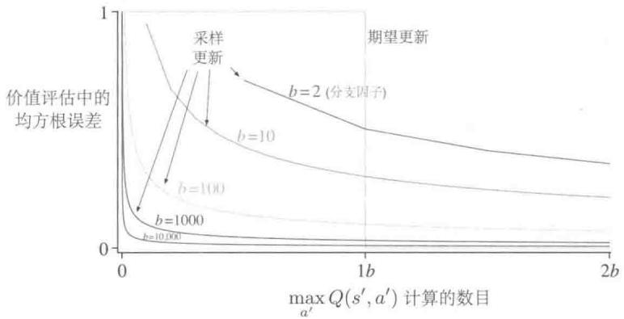  
图8.7 期望更新和采样更新的效率比较

图8.7中的采样更新的优势很可能被低估。在一个真实的问题中，后继状态的价值自身就是不断被更新的估计值。由于后继状态的价值经过更新后变得更准确，因此回溯之后的状态价值也会更快地变得准确，这是采样更新具有的第二个优势。这些都表明，对于拥有很大的随机分支因子并要求对大量状态价值准确求解的问题，采样更新可能比期望更新要好。

练习8.6 上述分析都是基于一个假设：可能的 $b$ 种后继状态是以相同概率出现的。假设我们的分布具有偏峰而不是均匀的，则 $b$ 中有一些状态会比其他状态出现的可能性大得

多。这会加强还是减弱采样更新相对于期望更新的优势？请论证你的观点。

# 8.6 轨迹采样

在本节中，我们比较两种状态更新过程的算力分配方法。基于动态规划的经典方法是遍历整个状态（或“状态-动作”二元组）空间，每遍历一次就对每个状态（或“状态-动作”二元组）的价值更新一次。这对大规模任务是有问题的，因为很可能根本没有时间完成一次遍历。在许多任务中，绝大多数状态是无关紧要的，因为只有在非常糟糕的策略中才能访问到这些状态，或者访问到这些状态的概率很低。穷举式遍历将计算时间均匀地用于状态空间的所有部分，而不是集中在需要的地方。正如我们在第4章中讨论的，穷举式遍历以及对所有状态均匀分配时间的处理并非动态规划的必要属性。原则上，价值函数更新所使用的算力可以用任何方式分配（为确保收敛，所有状态或“状态-动作”二元组必须被无限次访问，但是在8.7节中讨论了例外的情况），但是在实践中，我们经常使用穷举式遍历。

第二种方法是根据某些分布从状态或“状态-动作”二元组空间中采样。我们可以像Dyna-Q智能体一样进行随机均匀采样，但这样做可能会遇到一些和穷举式遍历相同的问题。更让人感兴趣的一种方式是根据同轨策略下的分布来分配用于更新的算力，也就是根据在当前所遵循的策略下观察到的分布来分配算力。这种分布的一个优点是容易生成，我们只需要按部就班地与模型交互并遵循当前的策略就可以了。在一个分幕式任务中，任务从初始状态（或根据初始状态的分布）开始运行，并进行模拟仿真直到终止状态。在一个持续性任务中，任务从任何地方开始运行，只是需要继续模拟仿真。在任一种情况下，样本状态转移和收益都由模型给出，并且样本动作由当前策略给出。换句话说，我们通过模拟仿真得到独立且明确的完整智能体运行轨迹，并对沿途遇到的状态或“状态-动作”二元组执行回溯更新。我们称这种借助模拟生成经验来进行回溯更新的方法为轨迹采样。

如果要根据同轨策略分布（即遵循同轨策略所产生的状态和动作序列的概率分布）来进行更新算力的分配，除了对完整轨迹采样外，我们很难想象出其他有效的方式来进行算力分配。如果我们明确地知道同轨策略的概率分布，那么它可以遍历所有的状态，根据同轨策略分布来对每个状态的回溯更新进行加权，但这又产生了与穷举式遍历一样的计算成本问题。一种可能是从分布中采样并更新单个的“状态-动作”二元组，但是即使这样做可以解决效率问题，但它又将为轨迹的模拟仿真带来什么好处呢？甚至找到同轨策略分布的显式表达都几乎是不可能的。每当策略发生变化时，分布情况也会发生变化，而计算分布本身所需要的算力几乎会与完整的策略评估相当。考虑到类似的各种问题，轨迹采样似

乎是一个既有效又精巧的方法。

那么基于同轨策略分布对更新过程进行算力分配是否是个好主意呢？从直觉上来说，这似乎是一个不错的选择，至少比均匀分布更好。例如，如果你正在学习下棋，你学习的是真实游戏中可能出现的位置，而不是棋子的随机位置。后者虽然可能是合法的状态，但是能够准确地评估它们的价值与评估真实游戏中的位置是不同的技能。我们在第Ⅱ部分中也会看到，当使用函数逼近时，同轨策略分布具有显著的优势。不管是否使用函数逼近，我们都认为同轨策略会显著提高规划的速度。

聚焦于同轨策略分布可能是有益的，因为这使得空间中大量不重要的区域被忽略。但这也可能是有害的，因为这使得空间中的某些相同的旧区域一次又一次地被更新。我们做一个小型实验来评估相关的影响。为了隔离分布函数具体形式的影响，我们使用式(8.1)定义的单步表格型期望更新。在均匀分布的情况下，我们需要遍历所有的“状态-动作”二元组进行就地更新。在同轨策略的情况下，我们模拟多幕数据，所有幕都从同样的初始状态开始，对 $\varepsilon$ -贪心策略（ $\varepsilon = 0.1$ ）下出现的每个“状态-动作”二元组进行回溯更新。这些任务是没有折扣的分幕式任务，按照如下步骤随机生成。对 $|S|$ 个状态中的每个状态，有两个可能的动作，每个动作都导致 $b$ 种后继状态中的一个，针对每个“状态-动作”二元组进行 $b$ 种后继状态选择时采用不同的概率分布。分支因子 $b$ 对于所有“状态-动作”二元组都是相同的。另外，在所有的转移中，跳到终止状态结束整幕交互的概率为0.1。每一次转移的期望收益是从一个标准高斯分布（均值为0，方差为1）中得到的。在规划过程的任何时刻，我们都可以停下来，采用穷举方法计算 $v_{\bar{\pi}}(s_0)$ ，它是在贪心策略下给定当前的动作价值函数 $Q$ 时初始状态的真实价值 $\tilde{\pi}$ 。这个值可以反映智能体使用贪心策略在新的一幕数据上运行时的性能（所有这一切都假定环境模型是确定的）。

图8.8的上半部分显示了超过200个采样任务的平均结果，每个任务有1000个状态，分支因子分别为1、3和10。图中画出的是策略质量对期望更新次数的函数。在所有情况下，根据同轨策略分布进行抽样都显示出类似的趋势：初始阶段规划速度更快，但长期看却变化迟缓。分支因子越小时，这个效应就越强，且初始的快速规划的时间也越长。在其他实验中，我们发现随着状态数量的增加，这些效应也变得更强。例如，图8.8的下半部分显示了分支因子为1的10000个状态的任务的结果。在这种情况下，同轨策略的优势很大而且可以保持很长时间。

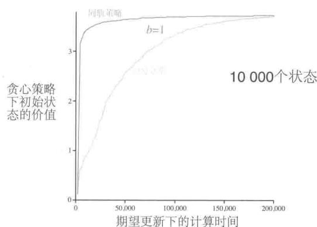  
图8.8 在状态空间中随机均匀分配算力与将算力聚焦于模拟仿真生成的同轨策略轨迹上的相对效率比较。它们都从相同的状态开始。我们在这里使用了随机生成的两种不同尺度的任务以及不同的分支因子 $b$

所有这些结果都是有道理的。在短期内，根据同轨策略分布进行采样有助于聚焦于接近初始状态的后继状态。如果有很多状态且分支因子很小，则这种效应会很大而且持久。从长期来看，聚焦于同轨策略分布则可能存在危害，因为通常发生的各种状态都已经有了正确的估计值。采样到它们是没什么用的，只有采样到其他的状态才会使得更新过程有价值。这可能就是从长远来看穷举式的、分散的采样方式表现得更好的原因，至少对于小问题来说是如此。上述结果还不能形成一般性的结论，因为它们仅适用于以特定的随机方式产生的问题。但是它们确实表明，根据同轨策略分布的采样对于大尺度问题可能具有很大的优势，特别是对那些在同轨策略分布下只有一个很小的“状态-动作”二元组空间区域会被访问的问题就更是如此。

练习8.7 图8.8中有一些曲线看起来早期性能不太好，尤其是最上面 $b = 1$ 且按均匀分布更新的曲线。为什么会这样呢？数据的哪一方面支持了你的分析？

练习8.8（编程）复现图8.8中下半部分的实验结果。然后在 $b = 3$ 的设定下进行相同实

验。你得到的实验结果说明了什么？

# 8.7 实时动态规划

实时动态规划(real-time dynamic programming，RTDP)，是动态规划(dynamic programming，DP)价值迭代算法的同轨策略轨迹采样版本。由于它与传统的基于遍历的策略迭代密切相关，所以RTDP以特别明确的方式说明了同轨策略轨迹采样具有的一些优点。RTDP通过式(4.10)定义的表格型价值迭代期望更新的方式来更新在真实或模拟轨迹中访问过的状态的价值。这就是生成图8.8所示的同轨策略结果的算法。

RTDP 和传统 DP 之间的紧密联系使得通过已有理论可以得出一些理论结果。如 4.5 节中所讨论的，RTDP 是异步 DP 算法的一个例子。异步 DP 算法不是根据对状态集合的系统性遍历来组织的，它可以采用任何顺序和其他状态恰好可用的任何价值来计算某个状态的价值函数更新。在 RTDP 中，更新顺序是由真实或模拟轨迹中状态被访问的顺序决定的。

如果轨迹只能从指定的一组初始状态开始，并且如果你对给定策略下的预测问题感兴趣，则同轨策略轨迹采样允许算法完全跳过那些给定策略从任何初始状态开始都无法到达的状态（不可到达的状态与预测问题无关）。对于一个控制问题，其目标是找到最优策略，而不是像预测问题一样评估给定的策略。这时可能存在一些状态，来自任何初始状态的任何最优策略都无法到达它们。对于这些不相关的状态，我们就不需要指定最优动作。我们需要的是最优部分策略，即策略对于相关的状态是最优的，而对于不相关的状态则可以指定任意的甚至是未定义的动作。

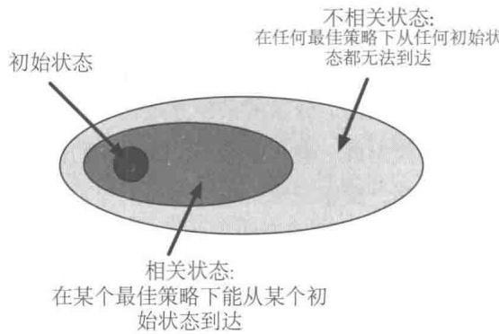

但是，通过采取同轨策略下的轨迹采样控制方法（如Sarsa）（6.4节）来寻找这样一个最优部分策略，通常需要无数次访问所有的“状态-动作”二元组——也包括那些不相关

的状态。这可以通过使用“试探性出发”来完成(5.3节)。对于RTDP也是如此。对于采用试探性出发的分幕式任务，RTDP是一种异步价值迭代算法，它会收敛到带折扣的有限马尔可夫决策过程（在某些条件下也适用于不带折扣的情况）的最优策略。与预测问题的情况不同的是，如果收敛到最优策略很重要，则通常不可能停止对任何状态或“状态-动作”二元组的更新。

RTDP最有趣的是，对于满足某些合理条件的特定类型的问题，RTDP可以保证找到相关状态下的最优策略，而无须频繁访问每个状态，甚至可以完全不访问某些状态。事实上，在某些问题上，只需要访问一小部分状态。这对于具有大尺度状态集的问题来说可能是一个很大的优势，因为对于它们来说即使单次遍历也是不可行的。

使上述结论成立的任务是3.4节中讨论的不带折扣的分幕式任务，这些任务都是目标状态的收益为零的MDP。在真实或模拟轨迹中的每个时刻中，RTDP选择一个贪心动作（概率相等时就随机选择），并对当前状态进行期望价值迭代更新操作。RTDP也可以在每个时刻对其他状态的任意集合进行价值更新，例如，它可以对当前状态的有限视界内通过前瞻搜索（look-ahead search）访问到的状态的价值进行更新。

在很多问题中，每一幕序列开始于从若干初始状态中随机选择的一个状态，并且在目标状态结束。对于这类问题，RTDP 可以（概率为 1）收敛于对所有相关状态的最优策略。这时需要满足的前提条件如下：1) 每个目标状态的初始值为零；2) 存在至少一个策略，保证从任何初始状态都能够（概率为 1）达到目标状态；3) 从非目标状态跳出的转移所对应的所有收益都严格为负；4) 所有初始值都大于等于其最优值（可以通过简单地将所有状态的初始值设置为零来满足）。Barto、Bradtke 和 Singh (1995) 通过将异步 DP 的结果与由 Korf (1990) 所提出的启发式搜索（又称实时 $A^{*}$ 学习）算法的结果相结合，证明了上述结论。

随机最优路径问题的很多具体例子都是具有上述属性的任务，只是它们通常以最小化代价函数来表示，而不是像这里一样最大化累积收益。本书中的最大化负回报就等价于最小化从初始状态到目标状态的路径的代价。这类任务的一个例子就是“最短时间控制”任务，其中到达目标所需的每个时间步长产生值为-1的收益；另一个例子就是像3.5节中的高尔夫例子那样的问题，其目标是以最少的杆数进洞。

例8.6赛道问题中的RTDP练习题5.12的赛道问题是一个随机最优路径问题。下面我们通过赛道问题的例子来比较RTDP和传统的DP价值迭代算法，说明同轨策略轨迹采样的优点。

回顾该练习题，智能体必须学习如何驾驶赛车转弯，如图5.5所示，并保持在赛道

上，且尽可能快地穿过终点线。状态集合包括了所有离散的网格位置，以及非负的横向或纵向速度。速度就是每个时间步长里面赛车走过的横向和纵向的格子数目。动作表示对速度产生增量，每步中的变化可以是 $+1$ 、-1 或 0；在每步中，还有 0.1 的概率赛车的速度增量并不是选手想达到的增量，而是 0。初始状态是起跑线上所有的零速状态；目标状态是在一个时间步长里面从赛道内穿过终点线可到达的所有状态。与练习题 5.12 不同，这里的赛车速度没有限制，所以状态集可能是无限的。然而，无论采用何种策略，从初始状态出发可能到达的状态集合都是有限的，并且可以认为它是对应该问题的实际可能的状态集合。每一幕都从随机选择的初始状态出发，当赛车越过终点线时结束。每一步的收益是 -1，直到赛车越过终点线。如果赛车撞到轨道边界，它将被移回到随机初始状态，然后该幕比赛继续。

类似于图5.5左边的小赛道有9115个状态可以在某个策略下从初始状态到达，但其中只有599个是最优策略相关的，即它们在一些最优策略下可以从一些初始状态到达（相关状态的数量是通过对 $10^{7}$ 幕数据执行最优动作时访问的状态进行计数来估计的）。

下表给出了运用传统DP和RTDP方法解决此任务的结果比较。这些结果是运行25次以上的平均值，每次开始时都使用不同的随机数种子。在这种情况下，传统DP是使用状态集的穷举式遍历的价值迭代算法，一次只更新一个状态，这意味着每个状态的更新会使用其他状态的最新估计值（这是Gauss-Seidel版本的价值迭代，在这个问题上大约是Jacobi版本的两倍快，参见4.8节）。我们没有特别注意更新的顺序，其他顺序可能会产生更快的收敛。两种方法每次运行的初始值都为零。当一次遍历中状态价值的最大变化小于 $10^{-4}$ 时，判断DP收敛；而当超过20幕比赛的撞线平均时间趋于某个稳定数值时，判断RTDP收敛。此版本的RTDP在每一步仅仅更新当前状态的价值。

<table><tr><td></td><td>DP</td><td>RTDP</td></tr><tr><td>到收敛时平均所需计算</td><td>28次遍历</td><td>4000幕序列</td></tr><tr><td>到收敛时平均更新次数</td><td>252784</td><td>127600</td></tr><tr><td>每幕中的平均更新次数</td><td>—</td><td>31.9</td></tr><tr><td>更新≤100次的状态百分比(%)</td><td>—</td><td>98.45</td></tr><tr><td>更新≤10次的状态百分比(%)</td><td>—</td><td>80.51</td></tr><tr><td>更新0次的状态百分比(%)</td><td>—</td><td>3.18</td></tr></table>

这两种方法得到的策略都平均需要用 $14\sim 15$ 步来撞线，但RTDP只需要大约DP一半的更新次数就可以找到这样的策略。这是RTDP在同轨策略下的轨迹采样的结果。每个状态的价值都在DP的每一次遍历中进行更新，而RTDP则将更新集中在较少的状态上。平均来说，RTDP更新的状态有 $98.45\%$ 不超过100次， $80.51\%$ 的状态不超过10次。在平均水平上，有290个状态完全没有更新。

RTDP相比于传统价值迭代方法的另一个优点是，随着价值函数接近最优价值函数 $v_{*}$ ，智能体产生轨迹所使用的策略也会接近最优策略，因为它相对于当前价值函数总是贪心的。这与传统价值迭代方法的情况形成了对比。在实践中，当价值函数在某次遍历中的改变量很小时，价值迭代将终止，这种终止方式就是获得上表中的结果的方式。这时，价值函数已经非常接近 $v_{*}$ ，贪心策略也非常接近最优策略。然而，其实远在价值迭代终止之前，那些对最新的价值函数贪心的策略就有可能已经是最优的了（回顾第4章的讨论：最优策略对于多个不同价值函数而言都可以是贪心的，而不仅仅是 $v_{*}$ ）。在价值迭代收敛之前检查最优策略的出现不是传统DP算法的一部分，并且需要大量的额外计算。

在赛道的例子中，我们可以在每次DP遍历之后都运行多幕测试，测试中智能体根据当前遍历得到的结果贪心地选择动作。这样我们就可能找到DP计算中一个最早的时间点，在这个时间点上得到的近似最优评估函数已经足够好了，能够使得对应的贪心策略几乎是最优的。对于这条赛道，经过15次价值迭代的遍历或者136725次价值迭代更新之后，出现了一个接近最优的策略。这远远低于DP方式收敛到 $v_{*}$ 所需的252784次更新，但是超过了RTDP方式所需的127600次更新。

虽然这些模拟实验肯定不是 RTDP 与传统的基于遍历的价值迭代方法的决定性比较，但这说明了同轨策略轨迹采样的一些优势。传统的价值迭代方法更新所有状态的价值，而 RTDP 则关注与问题目标相关的状态子集。随着学习的进行，这一关注点范围越来越窄。因为 RTDP 的收敛定理适用于模拟情况，所以我们知道 RTDP 最终将只关注相关状态，即构成最优路径的状态。RTDP 只用了传统遍历价值迭代方法所需计算量的 $50\%$ 就实现了几乎最优的控制。

# 8.8 决策时规划

“规划”过程至少有两种运行方式。本章到目前为止所讨论的，是以动态规划和 Dyna 为代表的方法。它们从环境模型（单个样本或概率分布）生成模拟经验，并以此为基础采用规划来逐步改进策略或价值函数。这里，动作选择要么是从表格中比较当前状态下的动作价值（表格型方法的情况），要么是通过近似方法中的数学表达式进行评估（第Ⅱ部分中讨论）。在为当前状态 $S_{t}$ 进行动作选择之前，规划过程都会预先针对多个状态（包括 $S_{t}$ ）的动作选择所需要的表格条目（表格型方法）或数学表达式（近似方法）进行改善。在这种运行方式下，规划并不仅仅聚焦于当前状态，而是还要预先在后台处理其他的多个状态。我们称这种规划方式为后台规划。

规划过程的另一种运行方式是在遇到每个新状态 $S_{t}$ 之后才开始并完成规划，这个计算过程的输出是单个动作 $A_{t}$ ，在下一时刻，规划过程将从一个新的状态 $S_{t+1}$ 开始，产生 $A_{t+1}$ ，依此类推。使用这种规划运行方式的最简单的例子就是：状态的价值是已知的，对于每个可选的动作，都可以得到环境模型预测出的后继状态的价值，我们通过比较这些价值来进行动作的选择（或者如第1章中的井字棋例子，通过比较“后位状态”的价值来进行动作选择）。更一般来说，以这种方式运行的规划过程可以比单步前瞻看得更远，同时对于动作选择的评估会产生许多不同的预测状态和收益轨迹。与第一种规划的运行方式不同，这里的规划聚焦于特定的状态，我们称之为决策时规划。

我们可以用两种方式来解读“规划”——一是使用模拟经验来逐步改进策略或价值函数；二是使用模拟经验为当前状态选择一个动作，这两种方式可以很自然地以有趣的方式融合在一起，但其实往往是分开研究它们的。我们首先仔细分析“决策时规划”。

即使只在决策的时刻进行规划，我们仍然可以像在第8章中那样，从模拟经验到更新和价值，以及最终的策略来分析它。只不过现在的情况下，价值和策略不是普适的，而是对于当前状态和可选动作是特定的。因此，在选择了当前状态下的动作之后，我们通常可以丢弃规划过程中创建的特定的价值和策略。在许多应用中，这并不是一个巨大的损失，因为一个应用往往存在很多的状态，而我们不可能在短时间内回到同一个状态。一般来说，我们也许想要做以下两个方面的结合：对当前状态的重点规划以及存储规划的结果，以便在以后从很远的地方也能再回到同一个状态。决策时规划在不需要快速响应的应用程序中是最有用的。例如，在下棋程序中，每次走棋都可以允许数秒甚至数分钟的计算，强大的程序可以在此时间内规划出之后的几十步走棋方式。另一方面，如果低延迟动作选择优先，则在后台进行规划通常能够更好地计算出一个策略，以便可以将其迅速地应用于每个新遇到的状态。

# 8.9 启发式搜索

人工智能中经典的状态空间规划方法就是决策时规划，整体被统称为启发式搜索。在启发式搜索中，对于遇到的每个状态，我们建立一个树结构，该结构包含了后面各种可能的延续。我们将近似价值函数应用于叶子节点，然后以根状态向当前状态回溯更新。搜索树中的回溯更新与在本书中讨论的最大值的期望更新（对于 $v_{*}$ 和 $q_{*}$ ）完全相同。回溯更新在当前状态的状态动作节点处停止。计算了这些节点的更新值后，则选择其中最好的值作为当前动作，然后舍弃所有更新值。

在传统的启发式搜索中，不需要通过改变近似价值函数来保存回溯更新的价值。实际上，价值函数一般是由人们设计的，而不会因为搜索而改变。不过，让价值函数随着时间推移得到改善是很自然的想法，这可以通过使用启发式搜索来计算回溯更新价值或本书中提出的任何其他方法来实现。其实在某种意义上我们一直采取这种做法。我们讲述的贪心策略、 $\varepsilon$ -贪心策略和UCB（2.7节）动作选择方法与启发式搜索并没有那么不同，尽管它们的规模更小。例如，为了计算给定模型和状态价值函数下的贪心动作，我们必须从每个可能的动作出发，将所有可能的后继状态的收益考虑进去并进行价值估计，然后再选择最优动作。与传统的启发式搜索类似，此过程计算各种可能动作的更新价值，但不会尝试保存它们。可以将启发式搜索视为单步贪心策略的某种扩展。

我们需要采用比单步搜索更深的搜索方式的根本原因是为了获得更好的动作选择。如果有一个完美的环境模型和一个不完美的动作价值函数，那么实际上更深的搜索通常会产生更好的策略。当然，如果搜索一直持续到整幕序列结束的位置，那么不完美的价值函数的影响就被消除了，这时确定的动作一定是最优的。如果搜索具有足够的深度 $k$ 使得 $\gamma^k$ 非常小，则动作也将相应地接近最优。另一方面，搜索越深，需要的计算越多，通常导致响应时间越长。Tesauro的大师级西洋双陆棋玩家TD-Gammon（16.1节）提供了一个很好的例子。该系统使用TD学习方法，通过许多游戏的自玩功能去学习后位状态的价值函数，使用一种启发式搜索来控制走棋。作为一个模型，TD-Gammon使用了投骰子概率的先验知识，并假设对手总是选择TD-Gammon评为最优的动作。Tesauro发现，启发式搜索越深，TD-Gammon做出的动作越好，但是每次走棋所花的时间也越长。西洋双陆棋有一个很大的分支因子，但它却必须在数秒内进行走棋，因此只能选择性地搜索有限几步，但即使这样，搜索也会产生明显更好的动作选择。

我们应该能够看到启发式搜索中算力聚焦的最明显的方式：关注当前状态。在启发式搜索中，由于其搜索树很紧地聚焦于当前状态的即时后继状态和动作，因此表现出明显的效果。虽然你可能在生活中会花更多的时间玩国际象棋而不是跳棋，但是当你玩跳棋的时候，你就要用跳棋的思维来思考，考虑特定的跳棋位置，下一步走什么，以及随后棋子的位置，等等。无论你如何选择走棋动作，这些“当前”的状态和动作对更新至关重要，与它们相关的近似价值函数也是你最迫切希望能够准确估计的。你的计算和有限内存资源都应优先用于即将发生的事件。例如在国际象棋中，有太多可能的位置可以用来存储不同的价值估计，但是基于启发式搜索的象棋程序，可以轻松地存储从单个位置进行前瞻搜索所遇到的数百万个位置的不同估计值。内存和计算资源对当前决策的高度聚焦可能是启发式搜索如此有效的原因。

可以以类似的方式改变更新的算力分配，以聚焦于当前状态及其可能的后继状态。作为一种极端情况，我们可以使用启发式搜索的方法来构建搜索树，然后从下到上执行单步回溯更新，如图8.9所示。如果以这种方式对回溯更新进行排序并使用表格型表示，那么我们将得到与深度优先的启发式搜索完全相同的回溯更新方式。对于任何状态空间搜索，都能够以这种视角将其看作拼接在一起的大量的单步回溯更新。因此，我们所观察到的深度搜索的性能提升并不是由于使用了多步回溯更新，而是由于回溯更新聚焦于当前状态后面的即时后继状态和动作。通过进行大量特定的与候选动作相关的计算，决策时规划产生的决策会比依靠不集中的回溯更新产生的决策更好。

  
图8.9启发式搜索可以由一系列的由叶子节点朝根节点的单步更新来实现(细线轮廓)。这里显示的顺序是一个挑选出来的深度优先搜索使用的顺序

# 8.10 预演算法

预演(rollback)算法是一种基于蒙特卡洛控制的决策时规划算法，这里的蒙特卡洛控制应用于以当前环境状态为起点的采样模拟轨迹。预演算法通过平均许多起始于每一个可能的动作并遵循给定的策略的模拟轨迹的回报来估计动作价值。当动作价值的估计被认为足够准确时，对应最高估计值的动作（或多个动作中的一个）会被执行，之后这个过程再从得到的后继状态继续进行。正如Tesauro和Galperin（1997）所解释的，他们曾用预演算法玩西洋双陆棋。“预演”(rollback)这一术语来源于在西洋双陆棋中通过“预演”(playing out/rolling out)来估计棋盘局面的价值，即利用随机生成的骰子序列以及某个固定的走棋策略来推演从当前局面到棋局结束的结果，之后利用多次预演的完整棋局来估计当前局面的价值。

预演算法是蒙特卡洛控制算法的一个特例，因为它计算模拟轨迹的平均回报，这些模拟轨迹由随机生成的状态转移构成。但与第5章中介绍的蒙特卡洛控制算法不同的是，预演算法的目标不是估计一个最优动作价值函数 $q_{*}$ ，或对于给定的策略 $\pi$ 的完整的动作价值函数 $q_{\pi}$ 。相反，它们仅对每一个当前状态以及一个给定的被称为预演策略的策略做出动作价值的蒙特卡洛估计。作为一种决策时规划算法，预演算法只是即时地利用这些动作价值的估计值，之后就丢弃它们。这一特点使得预演算法的实现是相对简单的，因为既没有必要采样每一个“状态-动作”二元组的结果，也没有必要估计一个涵盖状态空间或“状态-动作”二元组空间的函数。

那么预演算法到底能得到什么？4.2节中的策略改进定理告诉我们，给定两个策略 $\pi$ 与 $\pi^{\prime}$ ，它们几乎完全相同，只在某个特定的状态 $s$ 上会有 $\pi^{\prime}(s) = a\neq \pi (s)$ ；则如果 $q_{\pi}(s,a)\geqslant v\pi (s)$ ，那么策略 $\pi^{\prime}$ 一定不差于 $\pi$ 。更进一步，如果不等式严格成立，那么事实上 $\pi^{\prime}$ 会严格优于 $\pi$ 。用 $s$ 代表当前状态， $\pi$ 代表预演策略，这一结论就可以应用到预演算法中。将模拟轨迹的结果平均就可以得到对于每个动作 $a^\prime \in \mathcal{A}(s)$ 的 $q_{\pi}(s,a^{\prime})$ 的估计。那么在 $s$ 状态下选取使估计值最大的动作并在其他情况下遵循 $\pi$ 的策略就是一个从 $\pi$ 提高性能的不错的选择。这一结果很像4.3节中提到的动态规划中的策略迭代算法中的一步（尽管它更像4.5节中提到的异步价值迭代中的一步，因为它只改变当前状态的动作）。

换句话说，预演算法的目的是为了改进预演策略的性能，而不是找到最优的策略。从过去的经验来看，预演算法表现得出人意料地有效。Tesauro和Galperin（1997）就曾经惊讶于预演算法在西洋双陆棋中的巨大性能提升。在一些应用场合下，即使预演策略是完全随机的，预演算法也能产生很好的效果。但是改进后的策略的性能取决于预演策略的性质以及基于蒙特卡洛价值估计的动作的排序。从直观上来看，基础预演策略越好，价值的估计越准确，预演算法得到的策略就越可能更好（参见Gelly和Silver，2007）。

这就涉及了一个重要的权衡，因为更好的预演策略一般都意味着要花更多的时间来模拟足够多的轨迹从而得到一个良好的价值估计。作为决策时规划方法，预演算法常常不得不面对严格的时间约束。预演算法需要的计算时间取决于每次决策时需要评估的动作的个数、为了获得有效的回报采样值而要求模拟轨迹具备的步数、预演策略进行决策所花费的时间，以及为了得到良好的蒙特卡洛动作价值估计所需的模拟轨迹的数量。

平衡这些因素在任何预演算法的应用中都是很重要的，不过有一些方法能够缓解这个问题。由于蒙特卡洛实验之间是相互独立的，因此可以在多个独立的处理器上并行地进行多次实验。另一个技巧是在尚未完成时就截断模拟轨迹，利用预存的评估函数来更

正截断的回报值（我们在前几章讲述的所有关于截断回报和更新的方法都可以在此使用）。Tesauro 和 Galperin (1997) 提出了另一种可行的方法，即监控蒙特卡洛模拟过程并对那些不太可能是最优的，或其值与当前的最优值很接近以至于选择它们不会带来任何区别的动作进行剪枝（虽然 Tesauro 和 Galperin 指出，这会使并行实现变得很复杂）。

我们一般不认为预演算法是一种学习算法，因为它们不保持对于价值或策略的长时记忆。但是这类算法利用了我们在本书中强调的一些强化学习的特点。以蒙特卡洛控制为例，它们通过平均一组采样轨迹的回报值来估计动作价值，这里的轨迹是通过与一个环境的采样模型进行模拟交互得到的。在这方面它们和强化学习是类似的：它们都通过轨迹采样来避免对于动态规划的穷举式遍历，都通过使用采样更新而非期望更新来避免使用概率分布模型。最后，预演算法贪心地根据估计的动作价值选择动作，这就有效利用了策略改进的性质。

# 8.11 蒙特卡洛树搜索

蒙特卡洛树搜索（Monte Carlo Tree Search，MCTS）是最近的一个引人注目的决策时规划的成功例子。MCTS 和上面介绍的一样，是一种预演算法，但是它的进步在于引入了一种新手段，通过累积蒙特卡洛模拟得到的价值估计来不停地将模拟导向高收益轨迹。计算机围棋从 2005 年的业余水平到 2015 年的大师水平（大于等于 6 段）的进步大部分归功于 MCTS。从这一基本算法发展出了很多变体，其中我们在 16.6 节中讨论的一种变体，对于 2016 年程序 AlphaGo 对阵 18 届世界围棋冠军所取得的令人震惊的胜利是十分关键的。MCTS 已经在很多其他高难度的任务中也被证明是有效的，这些任务包括普通的游戏（例如，Finnsson 和 Björnsson，2008；Genesereth 和 Thielscher，2014），但不仅限于游戏，如果有一个简单到可以进行快速多步模拟的环境模型，它也可以有效地解决单智能体序列决策问题。

在遇到一个新状态后，MCTS首先用来选择智能体在这个状态下的动作，之后它又会被用来选择后继状态下的动作，依此类推。就像在预演算法中一样，每一次的执行都是一个循环重复的过程：模拟许多从当前状态开始运行到终止状态（或运行到步数足够多，以至于折扣系数使得更遥远的收益对回报值的贡献小到可以忽略为止）的轨迹。MCTS的核心思想是对从当前状态出发的多个模拟轨迹不断地聚焦和选择，这是通过扩展模拟轨迹中获得较高评估值的初始片段来实现的，而这些评估值则是根据更早的模拟样本计算的。MCTS不需要保存近似价值函数或每次动作选择的策略。不过在很多实现中它还是会保存选中的动作价值，在下一次的执行中很可能会有用。

在多数情况下，模拟轨迹生成过程中的动作是用一个简单的策略生成的，一般将其称之为预演策略（因为它经常用在更简单的预演算法中）。当预演策略和模型都不需要大量的计算时，在短时间内就可以生成大量的模拟轨迹。正如在任何表格型蒙特卡洛方法中一样，“状态-动作”二元组的价值估计就是从这个“状态-动作”二元组出发的（模拟）后续轨迹的回报的平均值。在计算过程中，我们只维护部分的蒙特卡洛估计值，这些估计值对应于会在几步之内到达的“状态-动作”二元组所形成的子集，这就形成了一棵以当前状态为根节点的树，如图8.10所示。MCTS会增量式地逐步添加节点来进行树扩展，这些节点代表了从模拟轨迹的结果上看前景更为光明的状态。任何一条模拟轨迹都会沿着这棵树运行，最后从某个叶子节点离开。在树的外部以及叶子节点上，通过预演策略选择动作，但对树内部的状态可能有更好的方法。对于内部状态，至少对部分动作有价值估计，所以我们可以用一个知晓这些信息的策略来从中选取。这个策略可以被称为树策略，它能够平衡试探和开发。例如，树策略可以使用 $\epsilon$ -贪心策略或UCB选择规则（第2章）来选择动作。

具体来说，如图8.10所示，一个基本版的MCTS的每一次循环中包括下面四个步骤：

1. 选择。从根节点开始，使用基于树边缘的动作价值的树策略遍历这棵树来挑选一个叶子节点。  
2. 扩展。在某些循环中（根据应用的细节决定），针对选定的叶子节点找到采取非试探性动作可以到达的节点，将一个或多个这样的节点加为该叶子节点的子节点，以此来实现树的扩展。  
3. 模拟。从选定的节点，或其中一个它新增加的子节点（如果存在）出发，根据预演策略选择动作进行整幕的轨迹模拟。得到的结果是一个蒙特卡洛实验，其中动作首先由树策略选取，而到了树外则由预演策略选取。  
4. 回溯。模拟整幕轨迹得到的回报值向上回传，对在这次MCTS循环中，树策略所遍历的树边缘上的动作价值进行更新或初始化。预演策略在树外部访问到的状态和动作的任何值都不会被保存下来。图8.10说明了这一过程，图中展示了从模拟轨迹的终止节点直接到预演策略开始的状态-动作节点的回溯过程（虽然一般情况下，向上回溯到这个状态-动作节点的应该是整个模拟轨迹的回报值）。

MCTS 首次被提出时是为了在用程序玩围棋等双人竞技游戏时选择走法。对于玩游戏来说，每一个模拟的“幕”都是双方玩家通过树策略和预演策略选择走法的一局完整的游戏。16.6 节介绍了在 AlphaGo 程序中使用的一种 MCTS 的扩展，它将 MCTS 中的蒙特卡洛估值与在自我对弈强化学习的过程中使用一个深度神经网络学得的动作价值融合

在一起。

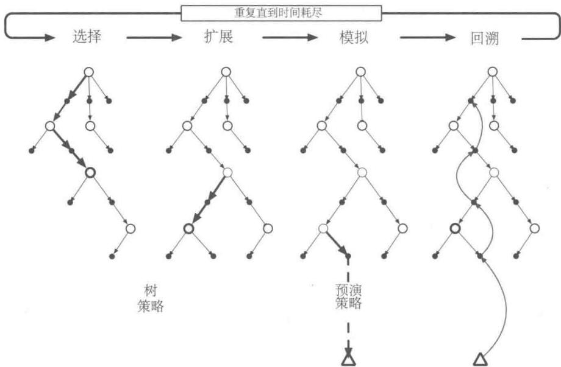  
图8.10 蒙特卡洛树搜索。当环境转移到一个新的状态时，MCTS会在动作被选择前执行尽可能多次迭代，逐渐构建一个以根为当前状态的树。每一次迭代又包括四步操作：选择、扩展（可以跳过某些循环）、模拟和回溯，如图中箭头和文字所示。该图修改自Chaslot、Bakkes、Szita和Spronck(2008)

将MCTS与本书中所介绍的强化学习原理相联系，可以对为什么它能取得如此引人注目的结果这一问题，进行一些深入的分析。在本质上，MCTS将基于蒙特卡洛控制的决策时规划算法应用到了从根节点开始的模拟中，换句话说，这是一种在前一节中所介绍的预演算法。因此，它也受益于在线、增量的、基于采样的价值估计和策略改进。除此之外，它保存了树边缘上的动作-价值估计值并用强化学习中的采样更新方法来进行更新。这样做可以使MCTS实验聚焦于某些特定轨迹，这些轨迹的初始片段与之前模拟实验中高收益的轨迹的初始片段是相同的。另外，通过逐步扩展这棵树，MCTS成功地产生了一张用来储存部分动作价值函数的查找表，其中的内存分配给了某些特定的“状态-动作”二元组估计值，它们对应于高收益采样轨迹的开始片段所访问过的“状态-动作”二元组。因此，MCTS避免了估计一个全局的动作价值函数，但同时其依然可以通过过去的经验来引导试探过程。

通过MCTS进行决策时规划的巨大成功对人工智能产生了深刻的影响，许多研究者正在研究这一基础过程的改进与扩展，以将其用于游戏以及单智能体的应用任务中。

# 8.12 本章小结

进行规划时需要有一个描述环境的模型。概率分布模型由后继状态的概率和可能动作的收益组成。而采样模型根据这些概率生成单个状态转移以及相应的收益。进行动态规划需要概率分布模型，因为它要做期望更新，而这需要计算对所有可能的后继状态和收益的期望。另一方面，为了模拟与环境交互的过程，我们需要一个采样模型，在这个过程中我们会使用许多强化学习算法都用到的采样更新。一般来说，采样模型比概率分布模型更容易获得。

规划最优行为和学习最优行为之间具有惊人的密切关系，我们在本章中已经从这个角度做了很多介绍。这两者都需要估计同样的价值函数，而且都很自然地通过一长串的简单回溯操作来增量式地更新估计值。这使得可以很方便直接地将学习与规划整合在一起：只需要让两者更新同一个价值函数就可以了。此外，通过简单地将算法应用于模拟的（基于模型的）经验而不是实际经验，就可以将任何学习方法转化成规划方法。在这一点上学习和规划变得更相似；它们只不过是完全相同的算法应用在两种不同来源的经验上。

将增量式规划方法与动作以及模型学习相结合是十分直接的。规划、动作和模型学习以一种循环的方式（见第160页中的图示）相互作用，每一部分输出的正是改善其他部分所需要的信息。不禁止它们之间的其他交互，但也并不需要那些交互。最自然的方法是让所有的过程异步同时进行。如果一些过程必须共享计算资源，那么就可以几乎任意地划分资源，怎么划分最方便或使得正在进行的任务效率最高就怎么划分。

在这一章中，我们讨论了状态空间规划方法的很多变种，这些变种可以从几个不同的维度来分类。一个维度是更新跨度的大小。更新的规模越小，规划方法就越容易倾向于增量式地运行。最小规模的更新就应该是单步采样回溯了，例如Dyna。另一个重要的维度是更新算力的分配，也就是搜索过程中的算力聚焦。优先遍历方法在回溯时聚焦于那些估计值刚刚发生变化的状态的前导节点。同轨策略轨迹采样聚焦在那些智能体在控制环境的过程中最可能碰到的状态或“状态-动作”二元组。这使得在计算时可以跳过状态空间中与预测或控制问题无关的部分。实时动态规划作为一种基于同轨策略轨迹采样的价值迭代算法，体现出了这种思路相对于传统的基于遍历的策略迭代算法的一些优势。

规划过程也可以从某些适当的状态向未来聚焦，比如那些曾经在智能体-环境的交互中遇到过的状态。这其中最重要的一种形式就是决策时规划，即规划是动作选择过程的一部分。人工智能领域中研究的经典启发式搜索是这类方法的一个很好的例子。其他的例子还有预演算法和蒙特卡洛树搜索等，这些方法都受益于在线、增量式、基于采样的价值估

计和策略改进。

# 8.13 第I部分总结

这里对本书的第I部分做一个总结。在这一部分，我们试图对强化学习做一个综合完整的介绍。我们并不是把强化学习当作几个独立方法的组合，而是把它当作横跨不同方法的一组逻辑连贯的思想来介绍。每个思想都可以被看作方法变种的一个设计维度。这一组维度组合在一起，就构成了对应各种可能方法的一个巨大的空间。通过在这个方法空间中沿着不同维度进行探索，读者能够获得对强化学习最宽泛和最深刻的理解。在本节中，我们将用方法空间中不同维度对应的概念来对前面介绍过的各种强化学习方法进行概括总结。

在本书中目前提到的所有方法都包含三个重要的通用思想：首先，它们都需要估计价值函数；第二，它们都需要沿着真实或模拟的状态轨迹进行回溯操作来更新价值估计；第三，它们都遵循广义策略迭代 (GPI) 的通用流程，也就是说它们会维护一个近似价值函数和一个近似策略，并且持续地基于一方的结果来改善另一方。这三个思想也是贯穿全书的核心内容。我们认为价值函数、基于回溯的价值更新和广义策略迭代 (GPI) 几乎是任何一种智能模型都用到的有效组织原理，无论是人工智能还是自然智能都不例外。

不同方法变种的最重要的两个维度如图8.11所示。这两个维度是与改善价值函数的更新操作的类型联系在一起的。水平方向代表的是：使用采样更新（基于一个采样序列）还是期望更新（基于可能序列的分布）。期望更新需要一个概率分布模型；与此不同的是，采样更新只需要一个采样模型即可，或者在没有模型的情况下，通过与真实环境交互也能完成（另一个维度）。图8.11的纵轴方向对应的是更新的深度，也即“自举”的程度。在图示空间的四个角，有三个用于估计价值的最重要的方法：动态规划、时序差分和蒙特卡洛。此空间的左边沿代表的是采样更新方法，从单步时序差分更新到蒙特卡洛更新。中间部分包括了基于 $n$ 步更新的方法谱系（在第12章中，我们会将其扩展为 $n$ 步更新的组合，例如基于资格迹的 $\lambda$ -更新）

动态规划方法在图示空间的右上方，因为动态规划属于单步期望更新。右下角是期望更新的一个极端情况，每次更新都会遍历所有可能的情况直到到达最后的终止状态（或者在持续性任务中，折扣系数的累乘导致之后的收益对当前的回报不再有影响为止）。这是启发式搜索中的一种情况。这个维度中间部分的方法包括启发式搜索和相关的方法（搜索和更新到一个固定的深度）。还有一些在水平方向上处于中间的方法，包括期望和采样混

合更新方法和在单次更新中混合采样样本和分布概率方法。正方形的内部代表的就是所有这些中间方法的空间。

本书强调的第三个维度是同轨策略和离轨策略的维度。对于前一种情况，智能体在当前策略下学习价值函数，而后一种情况则学习一个对应于不同策略的价值函数，通常是智能体认为的当前最好的策略。由于需要试探，行动策略通常并不被认为是最好的策略。第三个维度可以被可视化为与图8.11中的平面垂直的维度。

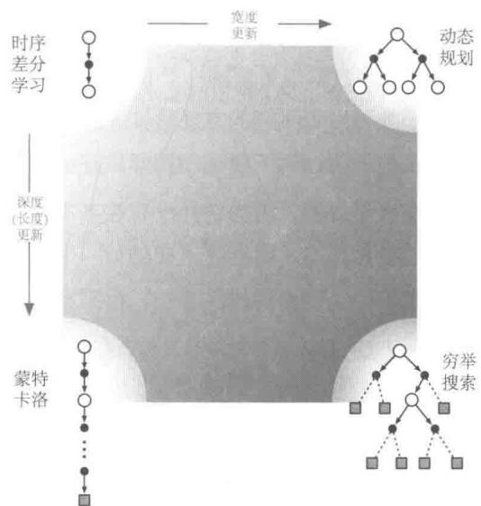  
图8.11 强化学习方法空间的一个横截面，突出了本书第I部分提到的两个重要维度：更新的深度和宽度

除了刚刚讨论的三个维度之外，我们还给出了其他的分类标准，以供参考。

回报的定义 任务是分幕式还是持续性的，带折扣的还是不带折扣的？

动作价值、状态价值还是后位状态价值需要估计哪种价值？如果是状态价值，则在进行动作选择时，要么有一个模型，要么有一个独立的策略（如“行动器-评判器”方法）。

动作选择/试探怎样进行动作选择来确保在试探和开发之间做一个合理的平衡？我们已经讨论了一些很简单的方法： $\varepsilon$ -贪心、价值的乐观初始化、柔性最大化和上确界。

同步还是异步对于所有状态来说，更新是同时进行的还是按照某种顺序一个接着一个更新？

真实还是模拟仿真 更新基于真实的经验还是模拟的经验？如果两者都有，它们的比例是怎样的？

更新的位置 哪个状态或“状态-动作”二元组应该被更新？无模型的方法只能从真实遇到的状态和“状态-动作”二元组中进行选择，但是基于模型的方法就可以任意选择。这里有很多种可能的情况。

更新的时机更新是动作选择的一部分，还是在动作选择之后进行？

更新的记忆 更新的价值应该被保存多久？它们应该被永久保存，还是像在启发式搜索中那样仅仅在动作选择期间保存？

当然，这些并不是全部的维度，而且它们之间也不完全是互斥的。每个独立的算法都会在不同的维度上和其他的方法有所区别，并且很多算法处于不同维度的不同位置上。例如，Dyna 方法会用真实和模拟的数据来更新同一个价值函数。而同时维护多个价值函数也是非常合理的，这些价值函数可以用不同的方法计算，或者基于不同的状态和动作的表示。这些维度构成了一组连贯的思想，用于描述和探索广阔的方法空间。

最重要的一个维度没有在这里提及，因为它并没有在本书的第I部分出现，这个维度就是函数逼近。函数逼近可以被看作与之前维度正交的另一个维度，它包含了一系列的方法谱系，从表格型方法到状态聚类，到各种线性方法，再到不同的非线性方法。这个维度将会在第Ⅱ部分展开介绍。

# 参考文献和历史评注

8.1 这里讨论的关于规划和学习的总体观点是在多年中一步一步发展起来的，本书的作者参与的有 (Sutton, 1990, 1991a, 1991b; Barto、Bradtke 和 Singh, 1991, 1995; Sutton 和 Pinette, 1985; Sutton 和 Barto, 1981b)。相关观点受到了 Agre 和 Chapman (1990; Agre 1988)、Bertsekas 和 Tsitsiklis (1989)、Singh (1993) 等人的很大影响。作者的观点也受到了心理学研究中的隐式学习 (Tolman, 1932) 和关于思考行为的本质的心理学观点 (例如, Galanter 和 Gerstenhaber, 1956; Craik, 1943; Campbell, 1960; Dennett, 1978) 的影响。在本书的第Ⅲ部分中，14.6节介绍了基于模型和无模型方法与心理学中的学习和行为之间的关系。15.11节讨论了人类大脑是如何实现这些方法的。  
8.2 用于描述强化学习种类的术语直接和间接来自于自适应控制的文献（例如，Goodwin 和 Sin，1984）。自适应控制中的术语系统识别在强化学习中叫作模型学习（例如，Goodwin 和 Sin，1984；Ljung 和 Soderstrom，1983；Young，1984）。Dyna 结构来自于 Sutton (1990)，本节和下一节的结果都来自这篇报告。Barto 和 Singh (1990) 提及了一些对比直接和间接强化学习方法时需要考虑的问题。  
8.3 有几个基于模型的强化学习工作将试探奖励和乐观初始化的思想发展到了逻辑上的极致，这些方法假设所有尚未完全试探过的动作选择会有最大的收益值，并且用最优的路径来测试它们。Kearns 和 Singh (2002) 的 $\mathrm{E}^3$ 算法和 Brafman 和 Tennenholtz (2003) 的 R-max 算法

都能够保证在多项式时间内找到最优结果。这通常对于实际情况来说太慢了，但却可能是在最坏情况下能够做得最好的方法。

8.4 优先遍历同时被Moore和Atkeson(1993)以及Peng和Williams(1993)提出。第168页第一个框中的结果来自于Peng和Williams(1993)，第169页第二个框中的结果来自于Moore和Atkeson。这个领域接下来主要的工作包括McMahan和Gordon(2005)以及van Seijen和Sutton(2013)。  
8.5 这一节主要受到Singh（1993）中实验的影响。  
8.6-7 轨迹采样从一开始就自然地成为强化学习的一部分，但是被 Barto、Bradtke 和 Singh (1995) 在介绍 RTDP 时作为重点内容显式地提出来了。实时 $A^{*}$ 学习 $(\mathrm{LRTA}^{*})$ 算法是一种能够同时用在 Korf 关注的随机问题和确定问题中的异步动态规划算法。比 LRTA* 更进一步，RTDP 能够在动作执行的时间间隔内更新多个状态的价值。Barto et al. (1995) 证明了这里的收敛结果，这个证明结合了 Korf (1990) 对 LRTA* 的收敛性证明和 Bertsekas (1982) (还有 Bertsekas 和 Tsitsiklis, 1989) 的结果，该结果可以保证在没有折扣的情况下随机最短路径问题收敛。通过结合模型学习和 RTDP，可以得到自适应 RTDP，这在 Barto et al. (1995) 和 Barto (2011) 都有介绍。  
8.9 对于启发式搜索，我们推荐读者查阅 Russell 和 Norvig (2009) 和 Korf (1988) 的工作。Peng 和 Williams (1993) 对更新的前向聚焦进行了很多探索。  
8.10 Abramson (1990) 的期望产出模型是应用在双人游戏的一种预演算法，在这个游戏中双方都是模拟器并采取随机动作。他认为就算是随机进行游戏，这个游戏也有“强大的启发信息”，而且是“清晰的，准确的，易估计的，可有效计算的和领域独立的。”Tesauro 和 Galperin (1997) 通过提升西洋双陆棋程序的性能说明了预演算法的有效性。其中的术语“预演”来自于评估西洋双陆棋局面的方法，这种方法从当前局面通过随机生成骰子序列来推演棋局结果，并根据其回报来进行当前局面的评估。Bertsekas、Tsitsiklis 和 Wu (1997) 研究了预演算法并将其应用于组合优化问题。Bertsekas (2013) 对它们在离散确定性优化问题中的应用进行了综述，得出“它们经常是很有效的”的结论。  
8.11 MCTS的核心思想在Coulom（2006）以及Kocsis和Szepesvári（2006）中被提出，并且是在以前的蒙特卡洛规划算法研究的基础上提出的。Browne、Powley、Whitehouse、Lucas、Cowling、Rohlfshagen、Tavener、Perez、Samothrakis和Colton(2012)给出了关于MCTS方法及其应用的很好的综述。图8.10基于Chaslot et al.（2008）中的插图。David Silver为本节中的思想和表述做出了贡献。

# 第Ⅱ部分 表格型近似求解方法

在本书的第Ⅱ部分，我们会将第I部分的表格型方法扩展到拥有任意大的状态空间的问题上。很多我们想要应用强化学习的任务都具有组合性的、巨大的状态空间，以照片为例，通过照相所得到的所有可能的图片的数量远远大于宇宙中原子的数量。在这种情况下，即使有近乎无限的时间与数据，我们也不能期望能够找到最优的策略或最优价值函数，我们的目标转而为使用有限的计算资源找到一个比较好的近似解。在本书的这部分，我们将探讨这种近似求解的方法。

巨大的状态空间所面临的问题不仅仅是大型表格所需要的内存，还在于精确地填充它们所需要的时间和数据。在许多任务中，几乎遇到的所有状态都是以前从未见过的。为了在这些状态下做出合理的决定，就必须从以往经历的与当前状态在某种程度上相似的状态中去归纳。换句话说，关键问题是泛化能力。如何将状态空间中一个有限子集的经验进行推广来很好地近似一个大得多的子集呢？

幸运的是，从样例中进行泛化的方法已经得到了广泛的研究，我们不需要在强化学习中发明新的方法。在某种程度上，我们只需要将强化学习方法与现有的泛化方法结合起来。我们所需要的泛化通常被称为函数逼近，因为它从一个预期的函数（例如一个价值函数）中获取实例，并试图对它们进行泛化来逼近整个函数。函数逼近是一种有监督学习的例子，是机器学习、人工神经网络、模式识别和统计曲线拟合的基础方法。从理论上讲，这些领域中所研究的任何一个方法都可以作为函数逼近方法用在强化学习中，然而在实践中，这些函数逼近方法之间通常会有差异，其中某些方法在特定问题上会比其他方法表现得更为出色。

然而，使用函数逼近的强化学习会出现在传统的有监督学习中一般不会出现的新问题，如非平稳性、自举和延时目标。我们会在本部分接下来的5章中依次介绍这些以及其他的一些问题。首先，我们关注同轨策略的训练，第9章讨论预测问题，即给定策略，仅仅去逼近其价值函数；然后在第10章的控制问题中，介绍最优策略的近似。对离轨策略进行函数逼近的挑战性问题在第11章中讨论。在这3个章节中，我们需要返回最基本的

强化学习（第2版）

原理，然后重新定义使用了函数逼近的学习目标。第12章介绍并分析资格迹，这种算法机制在大多数情况下可以极大地提高多步强化学习方法的计算性能。本部分的最后一章探讨了一种不同的算法来解决控制问题，即策略梯度方法，它直接对最优策略进行逼近，且完全不需要近似的价值函数（尽管同样近似一个价值函数可能会更有效率）。

# 基于函数逼近的同轨策略预测

在这一章中，我们开始研究强化学习中的函数逼近法，该方法使用同轨策略数据来估计状态价值函数，换句话说，就是从已知的策略 $\pi$ 生成的经验来近似一个价值函数 $v_{\pi}$ 。在本章中比较特殊的是，近似的价值函数不再表示成一个表格，而是一个具有权值向量 $\mathbf{w} \in \mathbb{R}^d$ 的参数化函数。我们将给定权值向量 $\mathbf{w}$ 在状态 $s$ 的近似价值函数写作 $\hat{v}(s, \mathbf{w}) \approx v_{\pi}(s)$ 。例如， $\hat{v}$ 可能是一个状态的特征空间里的线性函数， $\mathbf{w}$ 是特征向量的权值。更一般的情况， $\hat{v}$ 可能是由多层的人工神经网络计算得到的函数，而 $\mathbf{w}$ 是层与层之间连接的权值向量。通过调整权值，神经网络可以实现各种不同的函数。或者 $\hat{v}$ 可能是一个由决策树计算得到的函数， $\mathbf{w}$ 是树的所有分支节点和叶子节点的值。通常来说，权值的数量（ $\mathbf{w}$ 的维度）远远小于状态的数量（ $d \ll |\mathcal{S}|$ ）。另外改变一个权值将改变许多状态的估计值。因此，当一个状态被更新时，许多其他状态的价值函数也会被更改。这样的泛化可能使得学习能力更为强大，但也可能更加难以控制与理解。

可能令人惊讶的是，将强化学习扩展到函数逼近还有助于解决“部分观测”问题，即智能体无法观测到完整的状态的情况。如果参数化函数 $\hat{v}$ 的形式化表达并不依赖于状态的某些特定的部分，那么可以认为状态的这些部分是不可观测的。事实上，本书这一部分所有使用函数逼近获得的理论结果都能有效地用到部分观测问题上。但是，函数逼近无法根据过往的部分观测记忆来对状态表达进行扩充。我们会在17.3节中简要讨论一些可能的扩展。

# 9.1 价值函数逼近

本书中所有的预测方法都可以表示为对一个待估计的价值函数的更新，这种更新使得某个特定状态下的价值移向一个“回溯值”，或称该状态下的更新目标。我们使用

符号 $s \mapsto u$ 表示一次单独的更新，这里 $s$ 表示更新的状态，而 $u$ 表示 $s$ 的估计价值朝向的更新目标。比如，蒙特卡洛的价值函数预测的更新是 $S_{t} \mapsto G_{t}$ ， $\mathrm{TD}(0)$ 的更新是 $S_{t} \mapsto R_{t+1} + \gamma \hat{v}(S_{t+1}, \mathbf{w}_{t})$ ，然后 $n$ 步 TD 更新是 $S_{t} \mapsto G_{t:t+n}$ 。在 DP（动态规划）的策略评估更新中， $s \mapsto \mathbb{E}_{\pi}[R_{t+1} + \gamma \hat{v}(S_{t+1}, \mathbf{w}_{t}) \mid S_{t} = s]$ ，DP 的任意一个状态 $s$ 都会被更新，而其他的方法只会更新在经验中遇到的状态 $S_{t}$ 。

很自然地，我们可以将每一次更新解释为给价值函数指定一个理想的“输入-输出”范例样本。从某种意义上来说，更新 $s \mapsto u$ 意味着状态 $s$ 的估计价值需要更接近更新目标 $u$ 。到目前为止，实际使用的更新是简单的： $s$ 的估计价值只是简单地向 $u$ 的方向进行了一定比例的移动，而其他状态的估计价值保持不变。现在我们允许使用任意复杂的方法来进行更新，在 $s$ 上进行的更新会泛化，使得其他状态的估计价值同样发生变化。学习拟合“输入-输出”样例的机器学习方法叫作有监督学习，当输出 $u$ 为数字时，这个过程通常被称为函数逼近。函数逼近需要获取它所逼近的函数的理想“输入-输出”样本。我们简单地把每次更新使用的 $s \mapsto u$ 作为使用函数逼近的价值函数预测的训练样本，然后把产生的近似函数作为估计价值函数。

我们可以将每一次更新都视为一个常规的训练样本，这使得我们可以使用几乎所有现存的函数逼近方法来进行价值函数预测。原则上我们可以使用任何的有监督学习的方法，包括人工神经网络、决策树以及各种多元回归。然而，并不是所有的函数逼近方法都适用于强化学习。最为复杂的人工神经网络和统计方法都假设存在一个静态训练集，并在此集合上可以进行多次训练。然而，在强化学习中，能够在线学习是很重要的，即智能体需要与环境或环境的模型进行交互。想要做到这一点，就需要算法能够从逐步得到的数据中有效地学习。此外，强化学习通常需要能够处理非平稳目标函数（即随时间变化的目标函数）的函数逼近方法。例如，在基于GPI（通用策略迭代）的控制方法中，我们经常需要在 $\pi$ 变化时学习 $q_{\pi}$ 。即使策略保持不变，使用自举法（DP以及TD学习）产生的训练样例也是非平稳的。难以处理这种非平稳性的算法就不太适合强化学习。

# 9.2 预测目标（VE）

到目前为止，我们还没有确定一个清晰明确的预测目标。在表格型情况下，不需要对预测质量的连续函数进行衡量，这是因为学习到的价值函数完全可以与真实的价值函数精确相等。此外，在每个状态下学习的价值函数都是解耦的——一个状态的更新不会影响其他状态。但是在函数逼近中，一个状态的更新会影响到许多其他状态，而且不可能让所有状态的价值函数完全正确。根据假设，状态的数量远多于权值的数量，所以一个状态的

估计价值越准确就意味着别的状态的估计价值变得不那么准确。所以我们需要给出哪些状态是我们最关心的。我们必须指定一个状态的分布 $\mu(s) \geqslant 0$ ， $\sum_{s} \mu(s) = 1$ 来表示我们对于每个状态 $s$ 的误差的重视程度。一个状态 $s$ 的误差表示近似价值函数 $\hat{v}(s, \mathbf{w})$ 和真实价值函数 $v_{\pi}(s)$ 的差的平方。将分布 $\mu$ 作为这些误差的权值，我们就得到一个自然的目标函数，即均方价值误差，记作 $\overline{\mathrm{VE}}$

$$
\overline {{\mathrm {V E}}} (\mathbf {w}) \doteq \sum_ {s \in \mathcal {S}} \mu (s) \left[ v _ {\pi} (s) - \hat {v} (s, \mathbf {w}) \right] ^ {2}. \tag {9.1}
$$

这个度量的平方根，即 $\overline{\mathrm{VE}}$ 方根，给出了一个粗略的对近似价值函数与真实价值差异大小的度量，这经常在画图时使用。通常情况下，我们将在状态 $s$ 上消耗的计算时间的比例定义为 $\mu(s)$ 。在同轨策略训练中称其为同轨策略分布，本章着重研究这种情形。在持续性任务中，同轨策略分布是 $\pi$ 下的平稳分布。

# 分幕式任务中的同轨策略分布

在分幕式任务中，同轨策略分布与上文有些区别，因为它与幕的初始状态的选取有关。令 $h(s)$ 表示从状态 $s$ 开始一幕交互序列的概率，令 $\eta (s)$ 表示 $s$ 在单幕交互中消耗的平均时间(时刻步数)。所谓“在状态 $s$ 上的消耗时间”是指，由 $s$ 开始的一幕序列，或者发生了一次由前导状态 $\bar{s}$ 到 $s$ 的转移

$$
\eta (s) = h (s) + \sum_ {\bar {s}} \eta (\bar {s}) \sum_ {a} \pi (a | \bar {s}) p (s | \bar {s}, a), \text {对 所 有} s \in \mathcal {S}. \tag {9.2}
$$

可以求解这个方程组得到期望访问次数 $\eta(s)$ 。同轨策略分布被定义为其归一化的时间消耗的比例

$$
\mu (s) = \frac {\eta (s)}{\sum_ {s ^ {\prime}} \eta \left(s ^ {\prime}\right)}, \text {对 所 有} s \in \mathcal {S}. \tag {9.3}
$$

这是一个对没有折扣问题的自然考虑。如果存在折扣 $(\gamma < 1)$ ，那么可以将它表示为某种形式的幕终止条件（软性终止），为此，可以简单地在式(9.2)中的第二项加入因子 $\gamma$ 。

在持续性和分幕式任务的两种情况下智能体的行为是类似的，但是在进行近似求解的时候必须将它们分开来进行严格的讨论，我们在本书这一部分会多次看到这一点。这使得学习目标的设定更加规范。

目前还不确定 $\overline{\mathrm{VE}}$ 是否是强化学习正确的性能目标。不要忘记我们的终极目标，学习价值函数的目的是要寻找更好的策略。达到这个目的的最优价值函数不一定是满足最小化 $\overline{\mathrm{VE}}$ 的价值函数。然而，对于价值函数预测来说，我们还不清楚是否存在一个更清晰的目标。所以现在，我们主要关注 $\overline{\mathrm{VE}}$ 。

对于 $\overline{\mathrm{VE}}$ 而言，最理想的目标是对于所有可能的 $\mathbf{w}$ 找到一个全局最优的权值向量 $\mathbf{w}^*$ ，满足 $\overline{\mathrm{VE}}(\mathbf{w}^*) \leqslant \overline{\mathrm{VE}}(\mathbf{w})$ 。对于一些简单的函数逼近模型（如线性模型）可能会寻找到最优解，然而对于复杂模型（如人工神经网络和决策树）则比较困难。因此，对于复杂的函数逼近模型可能转而寻求局部最优，即对于一个权值向量 $\mathbf{w}^*$ 以及其附近的所有向量 $\mathbf{w}$ ，满足 $\overline{\mathrm{VE}}(\mathbf{w}^*) \leqslant \overline{\mathrm{VE}}(\mathbf{w})$ 。尽管这不能让人完全放心，然而对于非线性函数逼近模型，通常这就是最好的选择，而且一般来说得出的结果是可以接受的。但是，在许多我们感兴趣的强化学习的案例中，最优收敛性仍然是无法保证的，甚至无法保证收敛到最优值附近的某个边界距离之内。事实上很多方法会发散，这种情况下它们的 $\overline{\mathrm{VE}}$ 趋向于无穷。

在之前的两节中，我们概述了一个能够将用于价值函数预测的众多强化学习方法和大量的函数逼近方法结合的框架：使用前者的更新来生成后者的训练数据。我们还描述了这些方法可能试图最小化的性能度量： $\overline{\mathrm{VE}}$ 。函数逼近方法太多了，以至于我们不可能讨论所有这些方法，而且对于大多数函数逼近方法，我们对其知之甚少，因而难以对其进行可靠的评估。我们只讨论很少的一些函数逼近方法。在本章的后面，我们主要关注基于梯度的函数逼近方法，特别是线性梯度下降法。我们关注这些方法，一部分原因是我们认为它们揭示了关键的理论问题因而很有前途，另一方面它们相对简单，在本书有限的篇幅中比较容易解释。

# 9.3 随机梯度和半梯度方法

我们下面详细研究一类用于价值函数预测的基于随机梯度下降（SGD）的函数逼近方法。SGD是应用最为广泛的函数逼近方法之一，并且其特别适用于在线强化学习。

在梯度下降法中，权值向量是一个由固定实数组成的列向量，写作 $\mathbf{w} \doteq (w_{1}, w_{2}, \ldots, w_{d})^{\top}$ ，近似价值函数 $\hat{v}(s, \mathbf{w})$ 满足对所有 $s \in S$ ，函数对 $\mathbf{w}$ 都是可微的。我们会在一系列的离散时刻 $t = 0, 1, 2, 3, \ldots$ 上对 $\mathbf{w}$ 进行更新，所以定义符号 $\mathbf{w}_{t}$ 为每个时刻的权值向量。现在，假设在每一步，我们观察到一个新样本 $S_{t} \mapsto v_{\pi}(S_{t})$ ，这个样本包括一个（可能是随机选择的）状态 $S_{t}$ 以及它在给定策略下的真实价值。这些状态可能是与环境交互产生的一个后继状态，但现在我们不做假设。即使我们获得了关于每个 $S_{t}$ 完全正确的价值函数 $v_{\pi}(S_{t})$ ，但函数逼近器能调度的计算资源是有限的，因此仍然会给出受限的精确度。特别地，一般来说不会存在 $\mathbf{w}$ 使得价值函数能够精确计算所有的状态，甚至连精确计算所有的样本都做不到。更何况，我们还必须将它推广到没有出现在样本中的其他状态。

我们假设状态在样本中的分布 $\mu$ 和式(9.1)中试图最小化的VE中的分布相同。在这种情况下，一个好的策略就是尽量减少观测到的样本的误差。随机梯度下降（stochastic gradient-descent, SGD）的方法对于每一个样本，将权值向量朝着能够减小这个样本的误差的方向移动一点点

$$
\begin{array}{l} \mathbf {w} _ {t + 1} \dot {=} \mathbf {w} _ {t} - \frac {1}{2} \alpha \nabla \left[ v _ {\pi} \left(S _ {t}\right) - \hat {v} \left(S _ {t}, \mathbf {w} _ {t}\right) \right] ^ {2} (9.4) \\ = \mathbf {w} _ {t} + \alpha \left[ v _ {\pi} \left(S _ {t}\right) - \hat {v} \left(S _ {t}, \mathbf {w} _ {t}\right) \right] \nabla \hat {v} \left(S _ {t}, \mathbf {w} _ {t}\right), (9.5) \\ \end{array}
$$

其中， $\alpha$ 是一个正的步长参数。然后对于任何一个关于向量（这里是 $\mathbf{w}$ ）的标量函数 $f(\mathbf{w})$ ， $\nabla f(\mathbf{w})$ 表示一个列向量，其每一个分量是该函数对输入向量对应分量的偏导数

$$
\nabla f (\mathbf {w}) \doteq \left(\frac {\partial f (\mathbf {w})}{\partial w _ {1}}, \frac {\partial f (\mathbf {w})}{\partial w _ {2}}, \dots , \frac {\partial f (\mathbf {w})}{\partial w _ {d}}\right) ^ {\top}. \tag {9.6}
$$

这个导数向量是 $f$ 关于 $\mathbf{w}$ 的梯度。之所以说SGD是一种“梯度下降”方法，是因为 $\mathbf{w}_t$ 在整个时刻中按比例向样本的平方误差(式9.4)的负梯度移动。这就是误差下降最快速的方向。梯度下降方法被称为“随机的”体现在更新仅仅依赖于一个样本来完成，而且该样本很有可能是随机选择的。在许多例子中，通过小步长的更新，总体的效果就是最小化一个平均的性能度量，如VE。

SGD在梯度方向上只更新一小步的原因并不是很明显。我们能否沿着这个方向移动，直到完全消除这个样本的误差呢？在大多数情况下，这是可以做到的，但这通常是不可取的。请记住，我们不寻求或期望找到一个对所有状态都具有零误差的价值函数，我们只是期望找到能够在不同状态平衡其误差的一个近似的价值函数。如果我们在一个时刻中完全修正了每个样本，那么我们就无法找到这样的平衡。事实上，SGD方法的收敛性建立在 $\alpha$ 随时间减小的假设上。如果 $\alpha$ 以满足标准随机近似条件(式2.7)的方式减小，那么SGD方法(式9.5)能保证收敛到局部最优解。

现在我们讨论一种新情况：第 $t$ 个训练样本 $S_{t} \mapsto U_{t}$ 的目标输出 $U_{t} \in \mathbb{R}$ 不是真实的价值 $v_{\pi}(S_t)$ ，而是它的一个随机近似。例如， $U_{t}$ 可能是 $v_{\pi}(S_t)$ 的一个带噪版本，或者是用前一节的 $\hat{v}$ 获得的一个基于自举法的目标。在这种情况下，由于 $v_{\pi}(S_t)$ 未知，因此我们不能直接使用式 (9.5) 进行更新，但是我们可以用 $U_{t}$ 近似取代 $v_{\pi}(S_t)$ 。这就产生了以下用于进行状态价值函数预测的通用SGD方法

$$
\mathbf {w} _ {t + 1} \dot {=} \mathbf {w} _ {t} + \alpha \left[ U _ {t} - \hat {v} \left(S _ {t}, \mathbf {w} _ {t}\right) \right] \nabla \hat {v} \left(S _ {t}, \mathbf {w} _ {t}\right). \tag {9.7}
$$

如果 $U_{t}$ 是一个无偏估计，即满足对任意的 $t$ ，有 $\mathbb{E}[U_t|S_t = s] = v_\pi (S_t)$ ，那么在 $\alpha$ 的下降满足随机近似条件(式2.7)的情况下， $\mathbf{w}_t$ 一定会收敛到一个局部最优解。

例如，假设样本中的状态是通过使用策略 $\pi$ 与环境进行交互（或模拟交互）而产生的。因为一个状态的真实价值是它之后所有回报的期望，蒙特卡洛目标 $U_{t} \doteq G_{t}$ 根据定义就是 $v_{\pi}(S_t)$ 的无偏估计。在这种选择下，通用SGD方法(9.7)会收敛到 $v_{\pi}(S_t)$ 的一个局部最优近似。因此，蒙特卡洛状态价值函数预测的梯度下降版本可以保证找到一个局部最优解。下框中展示了完整算法的伪代码。

# 梯度蒙特卡洛算法，用于估计 $\hat{v} \approx v_{\pi}$

输入：待评估的策略 $\pi$

输入：一个可微的函数 $\hat{v}:\mathcal{S}\times \mathbb{R}^d\to \mathbb{R}$

算法参数：步长 $\alpha >0$

对价值函数的权值 $\mathbf{w} \in \mathbb{R}^{\mu}$ 进行任意的初始化（比如 $\mathbf{w} = \mathbf{0}$ ）

无限循环 (对每一幕)：

根据 $\pi$ 生成一幕交互数据 $S_{0},A_{0},R_{1},S_{1},A_{1},\dots ,R_{T},S_{T}$

对该幕的每一步， $t = 0,1,\dots ,T - 1$

$$
\mathbf {w} \leftarrow \mathbf {w} + \alpha \left[ G _ {t} - \hat {v} (S _ {t}, \mathbf {w}) \right] \nabla \hat {v} (S _ {t}, \mathbf {w})
$$

如果使用 $v_{\pi}(S_t)$ 的自举估计值作为式 (9.7) 中的目标 $U_{t}$ ，则无法得到相同的收敛性保证。自举目标，如 $n$ 步回报 $G_{t:t + n}$ 或DP目标 $\sum_{a s', r} \pi(a|S_t)p(s', r|S_t, a)[r + \gamma \hat{v}(s', \mathbf{w}_t)]$ 都取决于权值向量 $\mathbf{w}_t$ 的当前值，这意味着它们是有偏的，所以它们无法实现真正的梯度下降法。一种看待此问题的方法是，从式 (9.4) 到式 (9.5) 的关键步骤依赖于与 $\mathbf{w}_t$ 无关的目标。如果使用自举估计来代替 $v_{\pi}(S_t)$ ，那么这个步骤将是无效的。自举法实际上并不是真正的梯度下降的实例（Barnard，1993）。它只考虑了改变权值向量 $\mathbf{w}_t$ 对估计的影响，却忽略了对目标的影响。由于只包含了一部分梯度，我们称之为半梯度方法。

尽管半梯度（自举法）方法不像梯度方法那样稳健地收敛，但它们在一些重要情况下依然可以可靠地收敛，比如下一节会讨论的线性情况。此外，它们还有其他重要的优点，所以它们通常是首选方案。其中一个优点是，正如我们在第6章和第7章中看到的，它们的学习速度通常比较快。另一个是它们支持持续地和在线地学习，而不需要等待一幕的结束。这使它们能够用于持续性的问题，并有一些计算优势。半梯度 $\mathrm{TD}(0)$ 是一个在原型意义上的半梯度方法，它使用 $U_{t} \doteq R_{t+1} + \gamma \hat{v}(S_{t+1}, \mathbf{w})$ 作为其目标。下框中给出了完整的伪代码。

# 半梯度 $\mathrm{TD}(0)$ ，用于估计 $\hat{v}\approx v_{\pi}$

输入：待评估的策略 $\pi$

输入：一个可微的函数 $\hat{v}:\mathcal{S}^{+}\times \mathbb{R}^{d}\to \mathbb{R}$ ，满足 $\hat{v} (\text{终止状态},\cdot) = 0$

算法参数：步长 $\alpha >0$

对价值函数的权值 $\mathbf{w} \in \mathbb{R}^d$ 进行任意的初始化（比如 $\mathbf{w} = \mathbf{0}$ ）

对每一幕循环：

初始化 $S$

对该幕的每一步循环：

选取 $A\sim \pi (\cdot |S)$

采取动作 $A$ ，观察 $R,S^{\prime}$

$$
\begin{array}{l} \mathbf {w} \leftarrow \mathbf {w} + \alpha \left[ R + \gamma \hat {v} \left(S ^ {\prime}, \mathbf {w}\right) - \hat {v} (S, \mathbf {w}) \right] \nabla \hat {v} (S, \mathbf {w}) \\ S \leftarrow S ^ {\prime} \\ \end{array}
$$

直到 $S^{\prime}$ 为终止状态

状态聚合是一种简单形式的泛化函数逼近，这里状态被分成不同组，每个组对应一个估计值（对应权值向量 $\mathbf{w}$ 的一个维度分量）。状态的价值估计就是所在组对应的分量，当状态被更新时，只有这个对应分量被单独更新。状态聚合是SGD(9.7)的一个特殊情况，其梯度 $\nabla \hat{v} (S_t,\mathbf{w}_t)$ 对于 $S_{t}$ 所在组为1，对于其余组为0。

例9.1使用状态聚合的1000个状态的随机游走考虑随机游走任务的1000个状态的版本（例6.2和例7.1)。状态从左到右以 $1\sim 1000$ 编号，并且所有幕都在中心状态500的附近开始。状态转移为从当前状态向左侧的100个邻居状态中的一个移动，或者向右侧的100个邻居状态中的一个移动，所有转移都是等概率的。如果当前状态临近边缘，那么在该方向上可能少于100个邻居。在这种情况下，所有进入这些不存在的邻居的概率变为在对应边界终止的概率(因此，状态1有0.5的概率在左侧终止，状态950有0.25的概率在右侧终止)。和之前一样，于左侧终止产生-1的收益，于右侧终止产生 $+1$ 的收益。所有其他转移都是零收益。在本节中，我们以此任务作为示例。

图9.1显示了这个任务真实的价值函数 $v_{\pi}$ 。它几乎是一条直线，仅仅在最后100个状态有些弯曲，向水平方向倾斜。图中还显示了使用状态聚合的梯度蒙特卡洛算法在100000幕后，以步长 $\alpha = 2 \times 10^{-5}$ 最终获得的近似价值函数。对于状态集合，1000个状态分成10组，每组100个状态（即状态 $1 \sim 100$ 是一个组，状态 $101 \sim 200$ 是另一个组，依此类推）。图中所示的阶梯效果是状态聚合的典型特征。在每组内，近似值是常数，并且从一组突变到另一组。这些近似值接近VE的全局最小值(式9.1)。

  
图9.1使用状态聚合的梯度蒙特卡洛（第200页）算法，对1000个状态的随机游走任务的函数逼近结果

通过参考该任务的状态分布 $\mu$ ，你会注意到近似价值函数的一些细节，可以参看图的下半部分以及对应的右侧标尺。中心状态500是每幕的第一个状态，但很少再次被访问到。平均而言，约有 $1.37\%$ 的时刻花费在了开始状态。从开始状态能够一步到达的状态是被访问次数第二多的，其中每个状态大约花费的时刻为 $0.17\%$ 。从那里开始， $\mu$ 几乎线性下降，在边界状态1和1000处达到约 $0.0147\%$ 。该分布最明显的效果体现在，最左边的组的估计值明显高于真实状态价值的不带权平均值，而最右边的组，其估计值明显偏低。这是由于这一部分的状态在 $\mu$ 的权值分布上最不对称。例如，在最左边的一组中，状态100的权重比起状态1要大3倍以上。因此，组的估计偏向于状态100的真实价值，而这个估计高于状态1的真实价值。

# 9.4 线性方法

函数逼近最重要的特殊情况之一是其近似函数 $\hat{v} (\cdot ,\mathbf{w})$ 是权值向量 $\mathbf{W}$ 的线性函数。对应于每个状态 $s$ ，存在一个和 $\mathbf{W}$ 相同维度的实向量 $\mathbf{x}(s)\doteq (x_1(s),x_2(s),\ldots ,x_d(s))^{\top}$ 。线性近似的状态价值函数可以写作 $\mathbf{W}$ 和 $\mathbf{x}(s)$ 的内积

$$
\hat {v} (s, \mathbf {w}) \doteq \mathbf {w} ^ {\top} \mathbf {x} (s) \doteq \sum_ {i = 1} ^ {d} w _ {i} x _ {i} (s). \tag {9.8}
$$

在这种情况下，我们称近似价值函数是依据权值线性的，或者简单地说是线性的。

向量 $\mathbf{x}(s)$ 表示 $s$ 的特征向量。 $\mathbf{x}(s)$ 的每一个分量 $x_{i}(s)$ 是一个函数 $x_{i}:S\to \mathbb{R}$ 。我们所说的一个特征就是一个完整的函数，状态 $s$ 对应的函数值称作 $s$ 的特征。对于线性方法，特征被称作基函数，这是因为它们构成了可能的近似函数集合的线性基。构造 $d$ 维特征向量来表示一个状态与选择一组 $d$ 个基函数是相同的。还能以其他多种方式定义特

征。接下来的章节介绍其中一些方式

对于线性函数逼近，使用SGD更新是非常自然的。在这种情况下，近似价值函数关于 $\mathbf{w}$ 的梯度是

$$
\nabla \hat {v} (s, \mathbf {w}) = \mathbf {x} (s).
$$

因此，通用SGD更新式(9.7)在线性情况下可以简化为一个特别简单的形式

$$
\mathbf {w} _ {t + 1} \dot {=} \mathbf {w} _ {t} + \alpha \left[ U _ {t} - \hat {v} (S _ {t}, \mathbf {w} _ {t}) \right] \mathbf {x} (S _ {t}).
$$

因为线性SGD非常简单，所以它是最受欢迎的数学分析方法之一。对于各种学习系统，几乎所有有用的收敛性结果都是基于线性（或更简单的）函数逼近方法获得的。

特别是，在线性情况下，函数只存在一个最优值（或者在一些退化的情况下，有若干同样好的最优值），因此保证收敛到或接近局部最优值的任何方法，也都自动地保证收敛到或接近全局最优值。例如，如果 $\alpha$ 按照常规条件随时间减小，则前一节提到的梯度蒙特卡洛算法在线性函数逼近下收敛到 $\overline{\mathrm{VE}}$ 的全局最优值。

前一节提到的半梯度 $\mathrm{TD}(0)$ 算法也在线性函数逼近下收敛，但它并不遵从SGD的一般通用结果，对此，我们需要有一个额外定理来证明。权值向量也不是收敛到全局最优，而是靠近局部最优的点。仔细考虑这个重要的情况是很有帮助的，特别是在持续性任务的情况下。在每个时刻 $t$ 的更新是

$$
\begin{array}{l} \mathbf {w} _ {t + 1} \dot {=} \mathbf {w} _ {t} + \alpha \left(R _ {t + 1} + \gamma \mathbf {w} _ {t} ^ {\top} \mathbf {x} _ {t + 1} - \mathbf {w} _ {t} ^ {\top} \mathbf {x} _ {t}\right) \mathbf {x} _ {t} \tag {9.9} \\ = \mathbf {w} _ {t} + \alpha \left(R _ {t + 1} \mathbf {x} _ {t} - \mathbf {x} _ {t} \left(\mathbf {x} _ {t} - \gamma \mathbf {x} _ {t + 1}\right) ^ {\top} \mathbf {w} _ {t}\right), \\ \end{array}
$$

在这里我们使用简写 $\mathbf{x}_t = \mathbf{x}(S_t)$ 。一旦系统到达一个稳定状态，对于任意给定的 $\mathbf{w}_t$ ，下一个更新的权值向量的期望可以写作

$$
\mathbb {E} \left[ \mathbf {w} _ {t + 1} \mid \mathbf {w} _ {t} \right] = \mathbf {w} _ {t} + \alpha (\mathbf {b} - \mathbf {A} \mathbf {w} _ {t}), \tag {9.10}
$$

其中，

$$
\mathbf {b} \doteq \mathbb {E} [ R _ {t + 1} \mathbf {x} _ {t} ] \in \mathbb {R} ^ {d}   \text {以 及}   \mathbf {A} \doteq \mathbb {E} \Big [ \mathbf {x} _ {t} \big (\mathbf {x} _ {t} - \gamma \mathbf {x} _ {t + 1} \big) ^ {\top} \Big ] \in \mathbb {R} ^ {d} \times \mathbb {R} ^ {d}
$$

从式(9.10)可以清楚地看出，如果系统收敛，它必须收敛于满足下式的权值向量 $\mathbf{W}_{\mathrm{TD}}$

$$
\begin{array}{l} \mathbf {b} - \mathbf {A} \mathbf {w} _ {\mathrm {T D}} = 0 \\ \Rightarrow \quad \mathbf {b} = \mathbf {A} \mathbf {w} _ {\mathrm {T D}} \\ \Rightarrow \quad \mathbf {w} _ {\mathrm {T D}} \doteq \mathbf {A} ^ {- 1} \mathbf {b}. \tag {9.12} \\ \end{array}
$$

这个量被称为 $TD$ 不动点。事实上，线性半梯度 $\mathrm{TD}(0)$ 就收敛到这个点上。下框中给出了收敛性以及逆的存在性的证明。

# 线性TD(0)收敛性的证明

是什么保证了线性TD(0)算法（式9.9）的收敛性？我们可以通过重写式（9.10）得到

$$
\mathbb {E} [ \mathbf {w} _ {t + 1} | \mathbf {w} _ {t} ] = (\mathbf {I} - \alpha \mathbf {A}) \mathbf {w} _ {t} + \alpha \mathbf {b}. \tag {9.13}
$$

注意，是矩阵 $\mathbf{A}$ 与 $\mathbf{w}_t$ 相乘而不是 $\mathbf{b}$ ，所以只有 $\mathbf{A}$ 与收敛性有关。为了更直观地考虑，不妨设 $\mathbf{A}$ 是对角矩阵。如果任意的对角线元素是负的，那么 $\mathbf{I} - \alpha \mathbf{A}$ 中对应的元素将大于1，则 $\mathbf{w}_t$ 对应元素会被放大，最终造成发散。换言之，如果 $\mathbf{A}$ 的所有对角线元素为正，那么选取比最大元素的倒数小的 $\alpha$ ，这样 $\mathbf{I} - \alpha \mathbf{A}$ 的对角线元素均在 $0\sim 1$ 之间。这样在更新中会促使 $\mathbf{w}_t$ 收缩，从而保证稳定性。一般，当 $\mathbf{A}$ 是正定的时候 $\mathbf{w}_t$ 会趋向于零，正定指的是对任意实向量 $y$ 满足 $y^\top \mathbf{A}y > 0$ 。正定同样可以保证逆 $\mathbf{A}^{-1}$ 存在。

对于线性 $\mathrm{TD}(0)$ ，在 $\gamma < 1$ 的连续情况中，矩阵A(式9.11)可以写作

$$
\begin{array}{l} \mathbf {A} = \sum_ {s} \mu (s) \sum_ {a} \pi (a | s) \sum_ {r, s ^ {\prime}} p (r, s ^ {\prime} | s, a) \mathbf {x} (s) \left(\mathbf {x} (s) - \gamma \mathbf {x} (s ^ {\prime})\right) ^ {\top} \\ = \sum_ {s} \mu (s) \sum_ {s ^ {\prime}} p \left(s ^ {\prime} \mid s\right) \mathbf {x} (s) \left(\mathbf {x} (s) - \gamma \mathbf {x} \left(s ^ {\prime}\right)\right) ^ {\top} \\ = \sum_ {s} \mu (s) \mathbf {x} (s) \left(\mathbf {x} (s) - \gamma \sum_ {s ^ {\prime}} p \left(s ^ {\prime} \mid s\right) \mathbf {x} \left(s ^ {\prime}\right)\right) ^ {\top} \\ = \mathbf {X} ^ {\top} \mathbf {D} (\mathbf {I} - \gamma \mathbf {P}) \mathbf {X}, \\ \end{array}
$$

这里 $\mu (s)$ 是 $\pi$ 下的平稳分布， $p(s^{\prime}|s)$ 是策略 $\pi$ 下从 $s$ 到 $s^{\prime}$ 的转移概率， $\mathbf{P}$ 是这个概率对应的 $|\mathcal{S}|\times |\mathcal{S}|$ 的矩阵， $\mathbf{D}$ 是对角线为 $\mu (s)$ 的 $|\mathcal{S}|\times |\mathcal{S}|$ 的对角阵，X是行向量为 $\mathbf{x}(s)$ 的 $|\mathcal{S}|\times d$ 的矩阵。可以发现，中间的矩阵 $\mathbf{D}(\mathbf{I} - \gamma \mathbf{P})$ 是A正定性的关键。

对于这样的关键矩阵，当它所有列的和为非负数时，正定性可以得到保证。Sutton（1988，27页）中基于两个前提定理给出了证明。其中一个定理是，任意矩阵 $\mathbf{M}$ 是正定的条件为当且仅当其对称矩阵 $\mathbf{S} = \mathbf{M} + \mathbf{M}^{\top}$ 正定（Sutton 1998，附录）。第二个定理是，对于任意一个对称实矩阵 $\mathbf{S}$ ，如果它的所有对角线元素为正且大于对应的非对角线元素绝对值之和，那么它是正定的（Varga 1962，23页）。对于我们的关键矩阵 $\mathbf{D}(\mathbf{I} - \gamma \mathbf{P})$ ，对角线元素为正，非对角线元素为负，所以问题转化为证明每个行和加上对应的列和为正。因为 $\mathbf{P}$ 是一个概率矩阵且 $\gamma < 1$ ，所以行和为正。所以问题变为证明列和非负。注意，任意矩阵 $\mathbf{M}$ 对应的分量为列和的行向

量，可以写作 $1^{\top}\mathbf{M}$ ，这里1是所有分量为1的列向量。令 $\mu$ 为 $\mu(s)$ 组成的 $|S|$ 维向量，由于 $\mu$ 是一个平稳分布，则有 $\mu = \mathbf{P}^{\top}\mu$ 。我们的关键矩阵的列和，可以写作

$$
\begin{array}{l} \mathbf {1} ^ {\top} \mathbf {D} (\mathbf {I} - \gamma \mathbf {P}) = \boldsymbol {\mu} ^ {\top} (\mathbf {I} - \gamma \mathbf {P}) \\ = \boldsymbol {\mu} ^ {\top} - \gamma \boldsymbol {\mu} ^ {\top} \mathbf {P} \\ = \boldsymbol {\mu} ^ {\top} - \gamma \boldsymbol {\mu} ^ {\top} \quad (\text {因 为} \boldsymbol {\mu} \text {是 平 稳 分 布}) \\ = (1 - \gamma) \boldsymbol {\mu} ^ {\top}, \\ \end{array}
$$

所有分量均为正。所以，关键矩阵与矩阵A都是正定的，进而同轨策略TD(0)是稳定的。(如果需要证明概率版本的收敛性，则需要考虑一些额外情况以及 $\alpha$ 随时间减小的方式。）

在TD不动点处，已经证明（在持续性任务的情况下）VE在可能的最小误差的一个扩展边界内

$$
\overline {{\mathrm {V E}}} (\mathbf {w} _ {\mathrm {T D}}) \leqslant \frac {1}{1 - \gamma} \min  _ {\mathbf {w}} \overline {{\mathrm {V E}}} (\mathbf {w}). \tag {9.14}
$$

也就是说，TD法的渐近误差不超过使用蒙特卡洛法能得到的最小可能误差的 $\frac{1}{1 - \gamma}$ 倍。因为 $\gamma$ 常常接近于1，所以这个扩展因子可能相当大，所以TD方法在渐近性能上有很大的潜在损失。另一方面，回想一下我们在第6章与第7章看到的，与蒙特卡洛方法相比，TD方法的方差大大减小，因此速度更快。所以哪种方法最好取决于近似和问题的性质，以及学习能够持续多久。

类似于式(9.14)的误差边界也适用于其他同轨策略的自举方法。例如，线性半梯度DP（满足 $U_{t}\doteq \sum_{a}\pi (a|S_{t})\sum_{s^{\prime},r}p(s^{\prime},r|S_{t},a)[r + \gamma \hat{v} (s^{\prime},\mathbf{w}_{t})]$ 的式（9.7))，如果根据同轨策略分布更新也会收敛到TD不动点。单步的半梯度动作价值函数方法，例如下一章讨论的半梯度Sarsa(0）会收敛到一个类似的不动点和一个类似的误差边界。对于分幕式的情况，有一个略微不同但相似的边界（见Bertsekas和Tsitsiklis,1996)。这里省略了一些关于收益、特征以及步长参数减小这样一些技术细节。完整的细节可以在原始文献中找到(Tsitsiklis和VanRoy，1997)。

得到这些收敛结果的关键在于状态是按照同轨策略分布来更新的。对于按照其他分布的更新，使用函数逼近的自举法可能发散到无穷大。第11章讨论了一个这样的例子以及可能的解决方法。

例9.21000状态随机游走任务上的自举法 状态聚合是线性函数逼近的一个特例，所以

我们回到1000状态随机游走任务来说明本章的一些观点。图9.2的左半部分展示了使用与例9.1中相同的状态聚合的半梯度TD(0)算法（201页）学习到的最终的价值函数。我们看到，渐近TD近似法比图9.1所示的蒙特卡洛近似法更加远离真实价值函数。

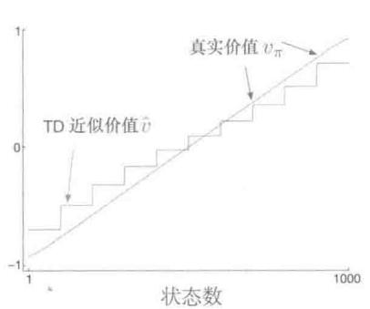

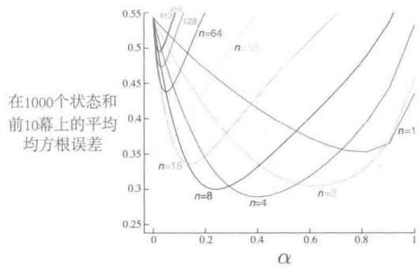  
图9.2在1000状态的随机游走任务上使用带状态聚合的自举法。左：半梯度TD的渐近估计值比图9.1中的渐近蒙特卡洛估计值要差一些。右：带状态聚合的 $n$ 步方法的性能与采用表格型表示的方法的性能非常相似（对比图7.2）。这些数据是100次运行的平均值

尽管如此，TD方法在学习速率方面仍然有很大的潜在优势，而且如同我们在第7章的 $n$ 步TD法中发现的，它是蒙特卡洛方法的推广。图9.2的右半部分显示了使用状态聚合的 $n$ 步半梯度TD方法在1000状态的随机游走问题的结果，与我们之前用表格型方法解决的19状态随机游走（见图7.2）的结果非常相似。为了获得数量上相似的结果，我们将状态聚合为20组，每组50个状态。这样，20个聚类组就在数量上接近表格型问题中的19个状态。特别地，根据问题定义，每个状态可以等概率地向右或左移动最多100个状态，在这样的设置下，比较典型的转移就是向左或右移动50个状态，这就从数量上和19状态的表格型问题的单状态移动十分类似了。为了全方位地比较，我们也使用相同的性能指标：前10幕在所有状态上的不带权RMS误差。没有使用VE是因为前者更适用于函数逼近。

这个例子中所使用的半梯度 $n$ 步TD算法是第7章提出的表格型 $n$ 步TD算法在半梯度函数逼近下的自然延伸。其伪代码在下框中给出。

# $n$ 步半梯度TD算法，用于估计 $\tilde{v}\approx v_{\pi}$

输入：待评估的策略 $\pi$

输入：一个可微的函数 $\hat{v}:\mathcal{S}^{+}\times \mathbb{R}^{d}\to \mathbb{R}$ ，满足 $\hat{v} (\text{终止状态},\cdot) = 0$

算法参数：步长 $\alpha >0$ ，正整数 $n$

对价值函数权值 $\mathbf{w}$ 进行任意的初始化（比如 $\mathbf{w} = \mathbf{0}$ ）

所有的存取操作（对 $S_{t}$ 和 $R_{t}$ ）的索引可以对 $n + 1$ 取模

对每一幕循环：

初始化并存储 $S_0 \neq$ 终止状态

$$
T \leftarrow \infty
$$

对 $t = 0,1,2,\ldots$ 循环：

如果 $t <   T$ ，那么：

根据 $\pi (\cdot |S_t)$ 采取动作

观察并存储下一个收益 $R_{t + 1}$ 和下一个状态 $S_{t + 1}$

如果 $S_{t + 1}$ 为终止状态，那么 $T\gets t + 1$

$\tau \gets t - n + 1$ ( $\tau$ 是正在被更新的状态所在的时刻)

如果 $\tau \geqslant 0$

$$
| \quad G \leftarrow \sum_ {i = \tau + 1} ^ {\min  (\tau + n, T)} \gamma^ {i - \tau - 1} R _ {i}
$$

如果 $\tau + n < T$ ，那么： $G \leftarrow G + \gamma^{n} \hat{v}(S_{\tau + n}, \mathbf{w})$ （ $G_{\tau; \tau + n}$ ）

$$
| \quad \mathbf {w} \leftarrow \mathbf {w} + \alpha [ G - \hat {v} (S _ {\tau}, \mathbf {w}) ] \nabla \hat {v} (S _ {\tau}, \mathbf {w})
$$

直到 $\tau = T - 1$

与式 (7.2) 类似，这个算法的关键方程是

$$
\mathbf {w} _ {t + n} \dot {=} \mathbf {w} _ {t + n - 1} + \alpha \left[ G _ {t: t + n} - \hat {v} \left(S _ {t}, \mathbf {w} _ {t + n - 1}\right) \right] \nabla \hat {v} \left(S _ {t}, \mathbf {w} _ {t + n - 1}\right), 0 \leqslant t <   T \tag {9.15}
$$

这里 $n$ 步回报从式（7.1）推广为

$$
G _ {t: t + n} \doteq R _ {t + 1} + \gamma R _ {t + 2} + \dots + \gamma^ {n - 1} R _ {t + n} + \gamma^ {n} \hat {v} \left(S _ {t + n}, \mathbf {w} _ {t + n - 1}\right), 0 \leqslant t \leqslant T - n. \tag {9.16}
$$

练习9.1 证明本书第I部分讲述的表格型方法是线性函数逼近的一个特例。在这种情况下特征向量是什么？

# 9.5 线性方法的特征构造

线性方法是非常有趣的，这不仅因为它们有收敛性保证，而且在实践中，它们在数据和计算方面可以非常高效。然而，是否会具有这些优势很大程度上取决于我们如何选取用来表达状态的特征，这就是本节讨论的内容。选择适合于任务的特征是将先验知识加入强化学习系统的一个重要方式。直观地说，这些特征应该提取状态空间中最通用的信息。例如，如果我们要对几何对象进行评估，那么我们可以选取形状、颜色、大小或功能等作为特征。如果我们正在评估一个移动机器人的状态，那么特征应该包括位置、电池电量、最近的声呐读数，等等。

线性形式的一个局限性在于它无法表示特征之间的相互作用，比如特征 $i$ 仅仅在特征 $j$ 不存在的情况下才是好的。一个具体例子是：在杆平衡任务（例3.4）中，高角速度既可能是好的也可能是坏的，取决于角度。如果角度很高，那么高角速度可能存在坠落的危险，这是一个坏的状态；然而如果角度较低，那么高角速度意味着杆正在自我调整，这是一个好的状态。如果我们将角度和角速度分开编码到特征中，一个线性的价值函数无法表征这种情况。我们需要把这两个状态维度结合起来加入特征中。接下来我们讨论多种通用的方法。

# 9.5.1 多项式基

很多问题的状态是通过数字表达的，例如杆平衡问题（例3.4）中的位置和速度，杰克租车问题（例4.2）中的车辆数，赌徒问题（例4.3）中的赌本，等等。在这类问题中，强化学习的函数逼近与我们熟知的插值与回归任务有许多相似之处。常用于插值与回归任务的各种特征族也可用于强化学习。多项式是用来解决插值与回归问题的一类最简单的特征族。尽管这里讨论的多项式特征没有其他类型的特征在强化学习中表现得好，但是由于它们足够简单并且我们熟知，所以可以从它们开始研究。

举个例子，假设一个强化学习问题的状态空间是二维的。单个状态 $s$ 对应的两个数字分别是： $s_1 \in \mathbb{R}$ 和 $s_2 \in \mathbb{R}$ 。你可以简单地选择直接使用 $s$ 的两个维度来作为特征，即 $\mathbf{x}(s) = (s_1, s_2)^\top$ ，但这样就无法表示两个维度之间的相互关系。此外，如果 $s_1$ 与 $s_2$ 均为零，那么近似价值也一定为零。这些局限性都可以通过把 $s$ 表征为四维的特征向量 $\mathbf{x}(s) = (1, s_1, s_2, s_1 s_2)^\top$ 来解决。第一个特征1用于构造仿射函数中的常数项，而乘积 $s_1 s_2$ 可以表示两个维度的相互作用。当然，你也可以选择更高维度的特征，如 $\mathbf{x}(s) = (1, s_1, s_2, s_1 s_2, s_1^2, s_2^2, s_1 s_2^2, s_1^2 s_2, s_1^2 s_2^2)$ 来表征更为复杂的相互作用。这样的特征向量使得模型能够近似关于状态分量的任意一个二次函数，尽管近似模型的权值依然是线性的，但这些权值是可学习的。把这个例子从两个数字分量一般化到 $k$ 个数字分量，我们可以表达特征维度之间高度复杂的相互作用。

假设每一个状态 $s$ 对应 $k$ 个数字分量 $s_1, s_2, \ldots, s_k$ ，每一个 $s_i \in \mathbb{R}$ 。对这个 $k$ 维的状态空间，每一个 $n$ 阶多项式基特征 $x_i$ 可以写作

$$
x _ {i} (s) = \Pi_ {j = 1} ^ {k} s _ {j} ^ {c _ {i, j}}, \tag {9.17}
$$

这里 $c_{ij}$ 是集合 $\{0,1,\dots,n\} n\geqslant 0$ 中的一个整数。用于 $k$ 维状态的 $n$ 阶多项式基特征，含有 $(n + 1)^k$ 个不同的特征。

高阶多项式基可以更精确地近似更复杂的函数。但是，由于 $n$ 阶多项式基的特征数量随着状态空间维数 $k$ 呈指数增长（如果 $n > 0$ ），通常需要选择一个子集来进行函数逼近。可以采用待近似函数的先验知识来进行特征选择，也可以使用一些多项式回归中常用的特征自动选择方法，但需要做一些调整来适应强化学习的增量特性和非平稳特性。

练习9.2 为什么在式（9.17）中对于 $k$ 维状态能够定义 $(n + 1)^{k}$ 个不同特征？

练习9.3 特征向量 $\mathbf{x}(s) = (1, s_1, s_2, s_1 s_2, s_1^2, s_2^2, s_1 s_2^2, s_1^2 s_2, s_1^2 s_2^2)^\top$ 中的 $n$ 和 $c_{i,j}$ 分别是多少？

# 9.5.2 傅立叶基

另一种线性函数逼近方法基于历史悠久的傅立叶级数，它会将周期函数表示为正弦和余弦基函数（特征）的加权和（如果对于所有的 $x$ 和某个周期值 $\tau$ ，都有 $f(x) = f(x + \tau)$ 那么函数 $f$ 是周期函数）。傅立叶级数和更通用的傅立叶变换在应用科学中被广泛运用，这是因为如果需要近似的函数是已知的，那么基函数的权值可以由简单的公式得出，更进一步，只要有足够的基函数，就能足够精确地近似任意函数。在强化学习中，待近似的函数通常是未知的，傅立叶基函数通常很受青睐，因为它们易于使用并且在一系列强化学习问题中表现良好。

首先考虑一维情况。周期为 $\tau$ 的一维函数的傅立叶级数通常表达为正弦函数和余弦函数的线性组合，这些正余弦函数的周期可以被 $\tau$ 整除（换句话说，其频率是基频 $1 / \tau$ 的整数倍）。如果你对有界区间内定义的非周期函数的近似感兴趣，也可以使用这些傅立叶基函数，并将 $\tau$ 设置为区间的长度。那么感兴趣的函数就是正弦和余弦基函数的周期性线性组合中的一个周期。

此外，如果将 $\tau$ 设置为感兴趣区间长度的两倍，并将注意力集中在半区间 $[0, \tau / 2]$ 上的近似值，则可以只使用余弦特征。这是可行的，因为我们可以仅仅用余弦基函数来表示任何偶函数，即任何关于原点对称的函数。因此，半周期 $[0, \tau / 2]$ 上的任何函数都可以用足够多的余弦基函数来尽可能地近似（说“任何函数”并不完全正确，因为这些函数必须在数学上表现良好，但是我们这里不考虑这些）。或者，我们也可以只使用正弦基函数，其线性组合总是奇函数，即关于原点的反对称函数。但是通常只保留余弦函数是较好的。因为“半偶”函数比“半奇”函数更容易近似，后者在原点处通常是不连续的。当然，这并不意味着不能同时在区间 $[0, \tau / 2]$ 上使用正弦和余弦函数，在某些情况下同时使用是有利的。

根据这一思路，我们令 $\tau = 2$ 以便将函数定义在半 $\tau$ 区间[0,1]，一维 $n$ 阶傅立叶余

弦基由 $n + 1$ 个特征构成

$$
x _ {i} (s) = \cos (i \pi s), \quad s \in [ 0, 1 ],
$$

其中， $i = 1,\dots ,n$ 。图9.3展示了一维傅立叶余弦基函数 $x_{i}$ ，其中 $i = 1,2,3,4$ ， $x_0$ 是一个常数函数。

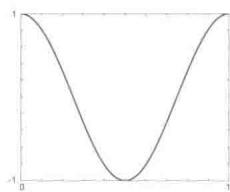

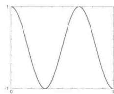

  
图9.3 一维傅立叶余弦基特征 $x_{i}, i = 1,2,3,4$ ，用于近似区间为[0,1]的函数。见Konidaris等(2011)。

同样的推理适用于多维情况下的傅立叶余弦级数近似，下框中给出了详细描述。

假设每个状态 $s$ 对应一个 $k$ 维向量， $\mathbf{s} = (s_1, s_2, \ldots, s_k)^\top$ ，这里 $s_i \in [0,1]$ 。 $n$ 阶傅立叶余弦基的第 $i$ 个特征可以写作

$$
x _ {i} (s) = \cos (\pi \mathbf {s} ^ {\top} \mathbf {c} ^ {i}), \tag {9.18}
$$

这里 $\mathbf{c}^i = (c_1^i,\dots ,c_k^i)^\top$ 且 $c_{j}^{i}\in \{0,\ldots ,n\} ;j = 1,\ldots ,k;i = 1,\ldots ,(n + 1)^{k}$ 。这样，我们就对于 $(n + 1)^k$ 种可能的每一个整数向量 $\mathbf{c}^i$ 定义了一个特征。内积 $\mathbf{s}^{\top}\mathbf{c}^{i}$ 的作用是把 $\{0,\dots ,n\}$ 中的一个整数赋给s中的每一维。如同一维的情况，该整数确定了特征在这一维上的频率。当然，也可以平移与缩放特征来对应特定应用的有界状态空间。

作为一个例子，考虑 $k = 2$ 的情况，其中 $\mathbf{s} = (s_1, s_2)^\top$ ，每个 $\mathbf{c}^i = (c_1^i, c_2^i)^\top$ 。图9.4选取了6个傅立叶余弦特征进行展示，每个都由定义它的向量 $\mathbf{c}^i$ 标记（ $s_1$ 是水平轴， $\mathbf{c}^i$ 的索引 $i$ 被省略掉以显得简洁）。 $c$ 中的任意零都表示特征在该维上是常数。所以如果 $\mathbf{c} = (0,0)^\top$ ，那么这个函数在两个维度上都是常数；如果 $\mathbf{c} = (c_1,0)^\top$ ，则特征在第二维上是常数，且根据第一维的频率 $c_1$ 的变化而变化； $\mathbf{c} = (0, c_2)^\top$ 时同理。当 $\mathbf{c} = (c_1, c_2)^\top$ 且没有一个 $c_j = 0$ 时，特征沿两个维度变化，表征出两个状态变量之间的相互作用。 $c_1$ 和 $c_2$ 的值决定了每个维度上的频率，它们的比例则给出了相互作用的方向。

在一些学习算法中使用傅立叶余弦特征时，如式(9.7)、半梯度TD(0)或半梯度Sarsa，对于不同的特征最好使用不同的步长参数。令 $\alpha$ 为基础的步长参数，Konidaris、Osentoski以及Thomas（2011）建议对于每一个特征 $x_{i}$ ，将步长参数设置为： $\alpha_{i} = \alpha /\sqrt{(c_{1}^{i})^{2} + \ldots + (c_{k}^{i})^{2}}$ （除非每一个 $c_{j}^{i} = 0$ ，这时令 $\alpha_{i} = \alpha$ ）。

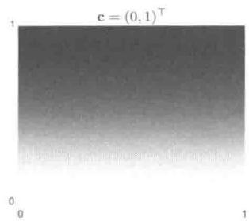

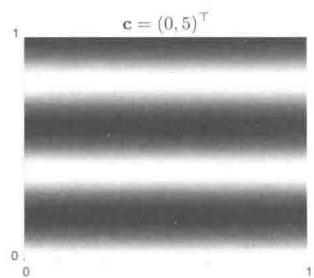

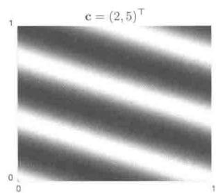

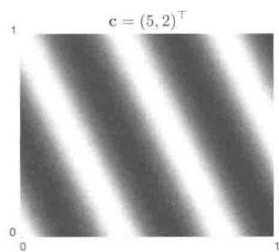  
图9.46个二维傅立叶余弦特征示例，每个都由定义它的向量 $\mathbf{c}^i$ 标记（ $s_1$ 是水平轴， $\mathbf{c}^i$ 中的索引 $i$ 被省略掉以显得简洁)。见Konidaris et al.(2011)

使用傅立叶余弦特征的Sarsa，相比于其他一些基函数的集合，包括多项式与径向基函数，有更好的表现。然而，不足为奇的是，傅立叶特征在不连续性方面存在问题，除非包含非常高频的基函数，否则很难避免不连续点周围的“波动”问题。

$n$ 阶傅立叶基的特征个数随状态空间维数呈指数增长，但是如果这个空间足够小（如 $k \leqslant 5$ ），那么便可以选择 $n$ 使得所有的 $n$ 阶傅立叶特征均被使用上。这使得特征的选择或多或少都是自动的。然而对于高维度状态空间的情况，选取一个特征的子集就是必要的。这可以通过引入待近似函数的先验知识来完成，或使用一些自动选择方法来处理强化学习本质上的增量特性和非平稳特性。傅立叶基特征在这方面的优点是，可以通过设置 $\mathbf{c}^i$ 向量来描述状态变量之间的相互作用，以及通过限制向量 $\mathbf{c}^j$ 的值来近似去除那些被认为是噪音的高频成分。另一方面，由于傅立叶特征在整个状态空间上几乎是非零的（仅包含可忽略的零点），所以可以说它们表征了状态的全局特性，然而这却使得表征局部特性变得比较困难。

图9.5所示是1000状态随机游走例子的基于傅立叶基和多项式基的学习曲线。一般来说，我们不建议使用多项式基进行在线学习。

强化学习（第2版）

  
图9.5 傅立叶基与多项式基在1000状态随机游走问题上的结果。这里显示的是梯度蒙特卡洛法使用5、10、20阶傅立叶基和多项式基的学习曲线。步长参数对于每种情况大致都是最优的：多项式基 $\alpha = 0.0001$ ，傅立叶基 $\alpha = 0.00005$ 。性能评价指标（y轴）是均方根价值误差（式9.1)

# 9.5.3 粗编码

考虑一个任务，其状态集在一个连续二维空间上。在这种情况下，一种表征的方式是将特征表示为如图9.6所示的状态空间中的圆。如果状态在圆内，那么对应的特征为1并称作出席；否则特征为0并称作缺席。这样的0-1特征被称为二值特征。给定一个状态，其中二值特征表示该状态位于哪个圆内，因此就可以粗略地对其位置进行编码。这种表示状态重叠性质的特征（不一定是圆或者二值）被称为粗编码。

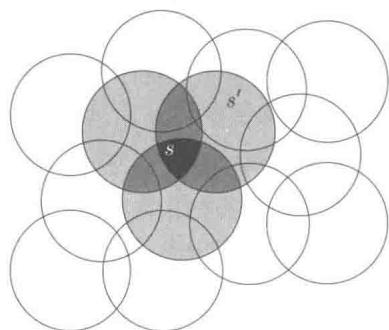  
图9.6 粗编码。从状态 $s$ 到 $s^{\prime}$ 的泛化能力取决于它们感受野（这里是圆）的重叠度。这两个状态有一个特征是重合的，所以它们之间有一定的泛化能力

假设使用线性梯度下降进行函数逼近，考虑圆的大小和密度的影响。每个圆受学习影响的是对应的单一权值（w的一个分量）。如果我们训练一个状态，即空间中的一个点，那么所有与这个状态相交的圆的权值将受到影响，这就产生了“泛化”。因此，根据式(9.8)，这些圆的并集内的所有状态的近似价值函数都会受到影响，就如图9.7所示，一个状态点所“共有”的圆越多，其影响就越大。如果如图9.6（左）一样圆很小，那么泛化的距离范

围就比较小，而如果像图9.6（中）一样很大，那么泛化距离范围就比较大。此外，特征的形状决定泛化的性质。例如，如果它们不是严格的圆形，而是沿一个方向拉长，那么泛化能力也会同样受到影响，如图9.6（右）所示。

  
窄泛化

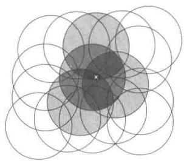  
宽泛化

  
不对称泛化  
图9.7线性函数逼近的推广能力取决于特征的感受野的大小与形状。这三幅图有几乎相同的特征个数与密度

具有更大感受野的特征可以带来更强的泛化能力，但似乎这也会限制学到的函数的表达能力，使其成为一个粗近似而不能做出比感受野的宽度更细致的判别。令人高兴的是，事实并非如此。初始时从一个点推广到其他点的泛化能力确实是由感受野的大小与形状控制的，但最终可达到的精细判别能力（敏锐度），则更多地是由特征的数量控制的。

例9.3粗编码的粗度这个例子介绍了粗编码中感受野的大小对学习的影响。我们使用基于粗编码的线性函数逼近及式(9.7)来学习一个一维方波函数（如图9.8顶部所示）。函数值 $U_{t}$ 被当作学习目标。在只有一维时，感受野不是圆而是区间。正如图底部所示，我们使用三种不同大小的窄、中、宽的区间反复进行学习。在所有这三种情况中，特征的密度都是相同的，大约每个区间有50个特征。训练样本是在这个区间范围内均匀随机生成的。步长参数 $\alpha = \frac{0.2}{n}$ ，其中 $n$ 是每次“出席”的特征数量。图9.8展示了在三种情况中学到的函数。我们可以观察到，特征的宽度对于早期的学习有着巨大的影响。选用较宽的特征，泛化能力就可以更强；而用较窄的特征，就只有每个训练点的邻域会被改变，这导致学到的函数更为起伏。但是，最后学到的函数仅仅受到特征的宽度微弱的影响。感受野的形状对于泛化有着巨大的影响，但对于渐进解的质量影响很小。

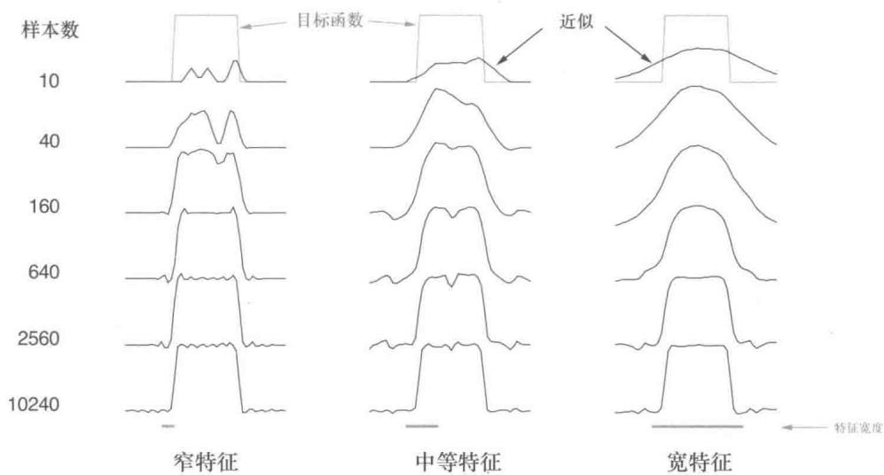  
图9.8特征宽度对初始泛化的巨大影响（第一行）和对最终渐近准确率的微弱影响（最后一行）

# 9.5.4 瓦片编码

瓦片编码是一种用于多维连续空间的粗编码，具有灵活并且计算高效的特性。对于现代的时序数字计算机来说，它也许是最为实用的特征表达形式。

在瓦片编码中，特征的感受野组成了状态空间中的一系列划分。每个划分被称为一个覆盖，划分中的每一个元素被称为一个瓦片。例如二维空间中最简单的划分就是图9.9左侧所示的均匀网格。这里的瓦片或感受野是正方形而不是图9.7中所示的圆形。如果仅仅使用单一的划分，那么白点所示的状态就会被它所处的瓦片这一单一特征所表达。泛化的影响涉及同一瓦片内的其他状态，而对外部的状态则毫无影响。仅使用一次覆盖，我们得到的并不是粗编码而只是状态聚合的一个特例。

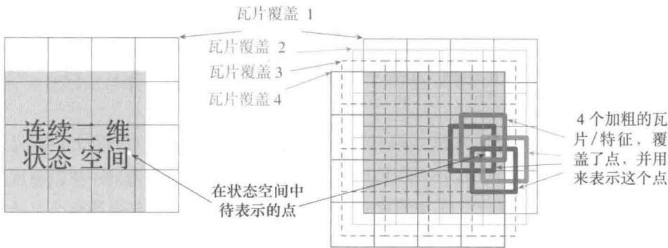  
图9.9有限二维空间上的多个重叠的网格覆盖。不同的覆盖在每个维度上有一个统一的偏移

为了拥有粗编码的优点，我们需要相互重叠的感受野，而根据定义，一个覆盖的各个瓦片是不重叠的。为了得到使用瓦片编码的真正粗编码，我们需要使用多个覆盖，每一个都相对于瓦片宽度进行一定比例的偏移。图9.9右侧展示了一个包含4个覆盖的简单情况。每一个状态，比如白点表示的那个，在每个覆盖中都只位于一个瓦片内。这4个瓦片代表了这个状态发生时会激活的4个特征。具体来说，特征向量 $\mathbf{x}(s)$ 对应每个覆盖中的每一个瓦片有一个分量。在这个例子中总共有 $4\times 4\times 4 = 64$ 个分量，除了 $s$ 落在的4个瓦片对应的分量之外其余的值都为0。图9.10展示了在1000个状态随机游走的例子中使用多个带偏移的覆盖（粗编码）相比于只使用单个覆盖的优势。

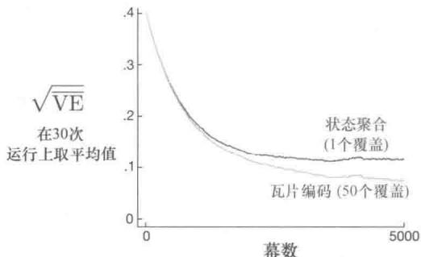  
图9.10 为什么我们要使用粗编码。图中展示的是1000状态随机游走例子中梯度蒙特卡洛算法分别使用单覆盖和多重覆盖的学习曲线。1000个状态组成的空间被当作单个连续的维度来处理，使用200个状态宽的瓦片进行覆盖。多重覆盖彼此之间的偏移量为4个状态。为了使两种情况下的初始学习率相同，在单覆盖时步长参数 $\alpha = 0.0001$ ，而在50个多重覆盖时， $\alpha = 0.0001 / 50$

使用瓦片编码的一个直接的优点是，由于是整体空间的划分，所以任何状态在每一时刻激活的特征的总数是相同的。每一个覆盖中有且只有一个特征被激活，所以特征的总数总是等于覆盖的个数。这使得步长参数 $\alpha$ 的取值简单而且符合直觉。例如，可以选 $\alpha = \frac{1}{n}$ ，其中 $n$ 是覆盖个数，这就是单次尝试学习。如果在样本 $s \mapsto v$ 上训练，那么无论先验估计 $\hat{v}(s, \mathbf{w}_t)$ 是多少，新的估计总是 $\hat{v}(s, \mathbf{w}_{t+1}) = v$ 。通常为了使得目标输出具有较好的泛化性以及一定的随机波动，我们会希望更新的变化比这更慢一些。例如，我们可以选取 $\alpha = \frac{1}{10n}$ ，在这个情况下，一次更新中被训练的状态的估计值只朝着目标值接近十分之一的距离移动，而邻近的状态会靠近得更少，变化幅度与它们重叠的瓦片数成比例。

瓦片编码由于使用二值特征向量，因此也有着计算上的优势。因为每个分量都是0或1，所以近似价值函数(式9.8)的加权和的计算是极其简单的。不需要进行 $d$ 次乘法和加法，而只需要简单地计算 $n \ll d$ 个激活的特征对应的下标，然后将 $n$ 个对应的权值向量的分量加起来就可以了。

如果某个状态与被训练的那个状态处于相同的瓦片之内，它就会受到被训练状态的泛化影响，这种影响的强度与该状态与被训练状态共同隶属的瓦片数量成比例。甚至如何选择覆盖之间的偏移都会影响泛化能力。如果它们像在图9.9中一样在各个维度上有着均匀的偏移，那么如图9.11的上半部分所示，不同的状态可以在不同的方向上有性质上不同的泛化。8个子图中的每一个都展示了从一个被训练的状态到附近其他状态的泛化模式。在这个例子中有8个覆盖，所以在一个瓦片中有64个独立的泛化影响区，但它们的泛化都是这8种模式中的一种。注意，在许多模式中，均匀偏移会在对角线上产生巨大的影响。如图的下半部分所示，这一现象可以通过使用非对称偏移来避免。下方的这些泛化模式是更好的，因为它们都很好地集中在被训练状态周围并且没有明显的不对称性。

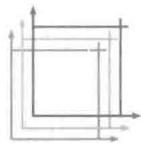  
均匀偏移覆盖下可能产生的泛化

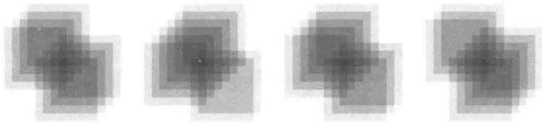

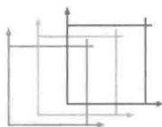  
非对称偏移覆盖下可能产生的泛化

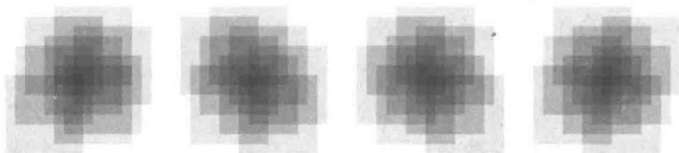

  
图9.11为什么在瓦片编码中更推荐使用非对称偏移。图中展示了在8个覆盖的情况下，被训练状态向附近的状态进行泛化的强度，黑色的小加号表示被训练的状态。如果覆盖是均匀偏移的（上方），则会产生对角线形状的畸变和显著的泛化影响波动；而使用非对称偏移的划分，泛化就会更均匀，更接近球形

在所有例子中，不同覆盖之间的偏移量在每个维度上都与瓦片宽度成比例。如果用 $w$ 来表示瓦片的宽度， $n$ 来表示覆盖的数量，那么 $\frac{w}{n}$ 是一个基本单位。在一个边长为 $\frac{w}{n}$ 的小方块内，所有的状态都会激活同样的瓦片，因此有着同样的特征表示和近似价值函数。

如果一个状态在任意一个笛卡儿方向上移动了 $\frac{w}{n}$ ，其特征表示的一个维度分量就会变化。均匀偏移覆盖的偏移量就正好是这个单位距离。在二维空间中，如果我们说每个覆盖都以位移向量（11）偏移，则意思是每个覆盖相对前一个覆盖的偏移量是 $\frac{w}{n}$ 乘上这个向量。在这种表示体系下，图9.11下半部分的非对称偏移覆盖以位移向量（13）偏移。

有许多研究关注过不同的位移向量对瓦片编码的泛化能力的影响（Parks和Militzer，1991；An，1991；An、Miller和Parks，1991；Miller、An、Glanz和Carter，1990）。这些研究会评估它们的各向同质性以及出现对角线畸变（如在位移向量(11)中看到的）的趋势。基于这些工作，Miller和Glanz(1996)推荐使用由较小的奇数组成的位移向量。具体来说，对一个 $k$ 维的连续空间，一个好的选择是使用较小的奇数 $(1,3,5,7,\ldots ,2k - 1)$ 并取 $n$ （覆盖的个数）为2的整数次幂，且保证 $n$ 大于等于 $4k$ 。这就是我们如何产生图9.11下半部分的那些覆盖的方法，在这里 $k = 2$ ， $n = 2^{3}\geqslant 4k$ ，并且位移向量是(1,3)。在三维空间的情形下，前四个覆盖相对于基础位置的偏移量分别会是 $(0,0,0)$ ， $(1,3,5)$ (2,6,10)和(3,9,15)。对于任何可行的 $k$ ，开源软件都可以高效地生成这样的覆盖。

在选择覆盖策略时，我们需要挑选覆盖的个数以及瓦片的形状。覆盖的个数和瓦片的形状一起决定了这个渐近近似的分辨率或细度，这与图9.8展示的一般的粗编码的情况相同。瓦片的形状像图9.6中展示的决定泛化的本质。方形的瓦片像图9.11（下半部分）所显示的在各个维度上均匀地泛化。在一个维度上被拉长的瓦片，比如图9.12（中）所示的条形瓦片，会促进这个方向上的泛化。图9.12（中）所示的覆盖在左侧也更密更细，这会增进在水平轴上值比较小时的区分程度。图9.12（右）所示的对角条形覆盖会促进在一个对角线方向上的泛化。在更高维的情形下，沿着坐标轴的条形意味着忽视覆盖中的某些维度，即相当于用超平面去切割。如图9.12（左）中所示的不规则瓦片也可能会出现，尽管在实际中非常罕见并且不被标准软件所支持。

  
不规则

  
长条纹

  
斜条纹   
图9.12 覆盖不一定要是网格状，它们可以是任意的形状，可以是不均匀的。尽管如此，在很多种情况下依然可以高效地计算

在实际运用中，最好在不同的覆盖中使用不同形状的瓦片。比如可能会用一些竖条形瓦片和一些横条形的瓦片。这样做可以促进两个方向上的泛化。但是仅仅使用条形的瓦片不可能学到，对任意的横纵坐标组合都有一个不同的值（不管学到了什么，学到的值都会被融入有着相同的横坐标和纵坐标的多个状态中去）。为了达到这一点，我们需要使用图9.9中所示的正方形瓦片的组合。通过使用多个覆盖（一些横条，一些竖条，和一些正方的）我们就可以得到所有想要的特性：优先沿着每个维度泛化，同时拥有学习特定的组合值的能力（例子参见Sutton，1996）。覆盖的选择决定了泛化能力，在这个选择可以被有效地自动生成之前，使用丰富的瓦片编码使得选择既灵活又符合常识是非常重要的。

另一个用于减小内存的重要技巧是哈希——一种伪随

机地将一个大覆盖分解成一组小得多的瓦片的集合的方法。哈希产生的瓦片由随机散布于整个状态空间中的不连续且互斥的区域所组成，但它们合在一起仍然完整覆盖了整个状态空间。例如右图，一个瓦片可能由四个子瓦片组成。通过哈希，内存需求可以大幅度降低，同时几乎没有性能损失。可以这样做是因为状态空间只有一小部分需要高分辨率。哈希使我们免受维度灾难影响，内存需求不再随着维度指数级增

长，而只需要与实际问题规模匹配就可以。关于瓦片编码的优秀开源代码实现往往都包含哈希方法。

练习9.4假如我们相信两个维度中的一个比起另一个在价值函数中起的作用更大，那么泛化应该主要发生在该维度的方向上而不是另一个维度。什么样的覆盖最能够利用这一先验知识？

# 9.5.5 径向基函数

径向基函数 (radial basis function, RBF) 是粗编码在连续特征 (实值特征) 中的自然推广。每个特征不再要么是 0 要么是 1，而可以是区间 $[0,1]$ 中的任何值，这个值反映了这个特征“出席”的程度。一个典型的径向基函数特征 $x_{i}$ ，有一个高斯 (钟形) 响应 $x_{i}(s)$ ，其值只取决于状态 $s$ 和特征的中心状态 $c_{i}$ 的距离，并与特征的宽度 $\sigma_{i}$ 相关

$$
x _ {i} (s) \dot {=} \exp \left(- \frac {\| s - c _ {i} \| ^ {2}}{2 \sigma_ {i} ^ {2}}\right).
$$

公式中的范数，或称距离度量，可以根据要处理的状态和任务的情况来选取。图9.13展示了欧几里得距离下的一个一维的例子。

  
图9.13 一维径向基函数

RBF相对于二值特征的主要优点在于它们可以生成光滑且可微的近似函数。虽然这很吸引人，但其实在大多数情况下这并没有实际的意义。尽管如此，在瓦片编码的相关研究中，仍有大量关于RBF这类分级响应函数的研究（An，1991；Miller等，1991；An等，1991；Lane、Handelman和Gelfand，1992）。所有这些方法都带来大量额外的计算复杂度(相比瓦片编码)，并且通常在多于两个状态维度时性能会下降。在高维的情况下，瓦片的边界更为重要，而在边界附近获得良好的分级瓦片激活被证明是困难的。

一个RBF网络是一个使用RBF作为特征的线性函数逼近器。和其他的线性函数逼近器一样，其学习过程使用式(9.7)和式(9.8)。此外，RBF网络的某些学习方法也会改变特征的中心位置和宽度，使它们成为非线性函数逼近器。非线性方法可能会更准确地拟合目标函数。RBF网络，尤其是非线性RBF网络的缺点是其巨大的计算复杂度，以及经常需要更多地手动调参来使得学习变得既鲁棒又高效。

# 9.6 手动选择步长参数

大部分SGD方法需要设计者选取适当的步长参数 $\alpha$ 。在理想的情况下，这是可以自动完成的。在某些情况下确实如此，但按照惯例在大多数情况下依然是手动进行的。要做到这一点，并且更好地理解这些算法，我们需要对步长参数的作用有直观的感觉。那么，我们能在一般情况下给出它的设置方法吗？

遗憾的是，理论上的分析并不会有多少帮助。随机近似的理论给出了缓慢减小的步长序列上的条件(式2.7)，可以保证收敛，然而这会使得学习变得很慢。在表格型MC方法中，产生随机样本的经典选择 $\alpha_{t} = 1 / t$ ，不适用于TD方法，不适用于非稳定问题，也不适用于任何函数逼近。对于线性方法，存在通过递归最小二乘法设定的最优矩阵步长，且这种方法可以被推广到时序差分学习（比如9.8节中描述的LSTD）中，但是它所需要的步长参数个数是 $O(d^{2})$ 级别的，或是正在学习的参数量的 $d$ 倍以上。所以在需要函数逼近的大规模问题上，我们不得不抛弃它们。

为了更直观地感受应该如何手动设置步长参数，最好暂时回到表格型的情况。在此种情况下，我们可以理解步长 $\alpha = 1$ 会导致更新后的样本误差被完全抹除（见式2.4中步长

为1的情况)。如之前我们所讨论的，我们通常希望学习比这要慢一些。在表格型的情况下，步长 $\alpha = \frac{1}{10}$ 大约需要10次经验来大致收敛到它们的目标均值，如果我们希望从100次经验中学习，应该设置 $\alpha = \frac{1}{100}$ 。一般情况下，如果 $\alpha = \frac{1}{\tau}$ ，那么一个状态的表格型估计将在大约 $\tau$ 次经验之后接近它的目标均值，且更近的目标的影响更大。

对于一般的函数逼近，则没有一个清晰的“状态的经验数量”的概念，因为每一个状态都可能与其他状态存在某种程度上的相似性或不相似性。然而，在线性函数逼近的情况下，有一个类似的规则可以给出类似的行为。假设你希望从基本上相同的特征向量的 $\tau$ 次经验来学习，一个好的粗略经验法则是将线性SGD的步长参数设置为

$$
\alpha \dot {=} (\tau \mathbb {E} [ \mathbf {x} ^ {\top} \mathbf {x} ]) ^ {- 1}, \tag {9.19}
$$

这里 $\mathbf{x}$ 是从SGD的输入向量的分布中选取的一个随机特征向量。这种方法在特征向量的长度变化不大时特别有效。在理想情况下， $\mathbf{x}^{\top}\mathbf{x}$ 为常数。

练习9.5 假设你使用瓦片编码将一个七维连续状态空间映射到一个二值特征向量空间来估计状态价值函数 $\hat{v}(s, \mathbf{w}) \approx v_{\pi}(s)$ 。你认为不同维度间没有很强的相互作用，所以决定每个维度分别使用8个覆盖（条状覆盖），共 $7 \times 8 = 56$ 个覆盖。除此之外，为描述不同维度之间确实出现两两相互作用的情况，你又对所有 $\binom{7}{2} = 21$ 种组合使用了方形覆盖。对于每对可能的两两维度的组合，你使用了两个覆盖，所以共计 $21 \times 2 + 56 = 98$ 个覆盖。给定这些特征向量，你认为你依然需要消除一些噪音的影响，所以决定进行渐进地学习，在接近渐近线前需要看到同一个特征向量大约出现10次。那么你应该选择怎样的步长参数 $\alpha$ ？为什么？

# 9.7 非线性函数逼近：人工神经网络

人工神经网络（artificial neural networks，ANN）被广泛应用于非线性函数逼近。一个ANN是由相互连接的单元组成的网络，这些单元拥有神经系统主要部分的神经元的某些性质。ANN具有悠久的历史，最近深层的ANN（深度学习）在一些机器学习系统，包括强化学习系统中展现了惊人的成果。在第16章，我们将展示一些令人惊叹的采用ANN进行函数逼近的强化学习系统的例子。

图9.14展示了一个普通的前向ANN，这种网络在网络内部没有环，也就是在网络中没有一个单元的输出可以影响它自身的输入。图中网络的输出层有两个单元，输入层有四个单元，同时有两个“隐层”：网络中既不是输入也不是输出的层。每条连接的边有一个实值权值。这些权值大致相当于真实神经系统中突触连接的角色（参见15.1节）。如果一

个ANN中至少有一个环，那它就是一个循环神经网络，而不是前向神经网络。虽然前向和循环ANN在强化学习系统中都会使用，但在这里我们仅以简单的前向神经网络为例来进行探讨。

  
图9.14具有四个输入单元，两个输出单元，两个隐层的前向ANN

ANN 的计算单元（图 9.14 中的圆圈）一般是半线性的，也就是它首先求输入信号的加权和，然后再对结果应用非线性函数，称作激活函数，最后得到单元的输出（或称“激活”）。有许多不同的激活函数，它们一般都是 S 形函数，或 sigmoid 函数，例如 logistic 函数 $f(x) = 1 / (1 + e^{-x})$ ；有时也使用非线性整流函数 $f(x) = \max(0, x)$ 。或是阶梯函数，例如当 $x \geqslant \theta$ 时 $f(x) = 1$ ，否则为 0；通过使用阈值 $\theta$ 可以使得计算单元的输出是二值的。网络的输入层单元有些不同，它们的激活依靠从外部来的值，这些值也是该网络去近似的函数的输入值。

前向ANN的每一个输出单元的激活是网络输入单元的激活的非线性函数。网络中的连接权值就是函数的参数。一个没有隐层的ANN只能表示一小部分可能的“输入-输出”映射函数。然而，如果ANN拥有一个隐层，并且这个隐层包含足够多数量的sigmoid激活单元，则这个ANN可以在网络输入空间的一个紧凑区域内以任意精度逼近任意的连续函数（Cybenko，1989）。对于其他满足适当条件的非线性激活函数，此结论也成立。注意，非线性在这里很重要：如果一个多层ANN的所有单元的激活函数都是线性的，那么这个网络等价于一个没有隐层的网络（因为线性函数的线性函数仍然是线性的）。

尽管存在上述单隐层ANN的“泛逼近”性质，但实践和理论都表明，对于许多人工智能任务所需要的复杂函数而言，采用层次化的抽象可以使得逼近过程更容易。在这里，

高层的抽象是许多低层抽象的层次化组合，例如多隐层的ANN深度结构（更多综述参见Bengio，2009）。深度ANN的各层逐步计算ANN网络的“原始”输入的越来越抽象的表示，每一个计算单元提供了整个“输入-输出”网络函数的层次化表示中的一个特征。

这样一来，训练ANN的隐层就成为对于给定问题自动发现特征的一种方法。它不需要人工设计的特征，可以直接自动获得分层表示的特征。这是人工智能领域的一个持续的挑战，也是为什么多隐层的ANN的学习算法多年以来受到如此重视的原因。ANN一般用随机梯度下降法(9.3节)训练。每个权值朝着网络的整体性能上升的方向调整，性能一般用一个需要最大化或者最小化的目标函数来衡量。在大多数有监督学习中，目标函数一般是带标注的训练样本上的期望误差，或者损失。在强化学习中，ANN可以使用TD误差来学习价值函数，或者像在梯度赌博机(2.8节)中一样最大化期望收益，或者使用策略梯度算法(第13章)。在所有的这些情况中，都需要估计每一个权值的变化如何影响网络的整体性能，也就是，在当前权值下估计目标函数对每个权值的偏导。梯度是所有这些偏导组成的向量。

求包含隐层（假设单元的激活函数可导）的ANN的梯度最有效的是反向传播算法，它包括交替的前向和反向传播过程。前向过程通过给定网络输入单元的当前激活来计算网络中每一个单元的激活输出。在每个前向传播过程后，反向传播过程可以高效地计算每个权值的偏导（和其他随机梯度学习算法一样，这些偏导组成的向量是真实梯度的估计）。在后面的15.10节，我们讨论利用强化学习原理而不是反向传播算法来训练带隐层的ANN。这些方法没有反向传播算法高效，但是它们可能更像真实神经系统的学习过程。

对于包含1到2个隐层的浅层网络，反向传播算法可以得到很好的结果，但是对于更深的ANN可能并不奏效。实际上，训练一个 $k + 1$ 层网络的效果可能比 $k$ 层网络的效果还要差，尽管更深的网络可以表示浅层网络可以表示的所有函数（Bengio，2009）。解释这种现象不是很容易，但是其中有些因素是很重要的。首先，深度ANN中拥有大量的参数，这使得它很难避免过拟合的问题，也就是，网络很难正确泛化到训练数据中没有的情况。其次，反向传播算法在深度ANN中效果不是很好，因为反向过程中计算的偏导在向输入层传播的过程中要么很快减小使学习变慢，要么快速变大使学习不稳定。现在深度ANN取得的一系列令人印象深刻成果，在很大程度上源于成功解决了这些问题。

过拟合是任何函数逼近方法在有限的数据上训练多自由度函数都会遇到的问题。对于在线的强化学习，这个问题相对来说不突出，因为它不依赖于有限的训练集，但是有效地泛化依然是一个重要的问题。过拟合是ANN的一个普遍问题，但在深度ANN中由于参数量巨大，这个问题就显得尤其突出。有许多防止过拟合的方法，包括：当模型的性能开

始在校验集上下降时停止训练(交叉验证)，修改目标函数限制近似函数的复杂度（正则化)，引入参数依赖减小自由度(如参数共享)等。

一个特别有效的防止深度 ANN 过拟合的方法是由 Srivastava、Hinton、Krizhe-vsky、Sutskever 和 Salakhutdinov (2014) 提出的随机丢弃法。在训练时，网络中的单元包括对应的连接会被随机丢弃。这好比是训练了很多“瘦身”后的网络。在测试阶段将这些网络的结果组合在一起，是提高泛化能力的有效途径。一种有效的组合方法就是将每个单元的输出连接的权值乘以该单元在训练过程中被保留的概率（这个概率就是 1 减去随机丢弃的概率）。Srivastava 等人发现这种方法能够显著提高泛化性能。它促使每个独立的隐层单元学到的特征能够适应其他特征的随机组合。这增加了隐层单元所形成的特征的多方适用性，使网络不至于过分地关注那些罕见的样本。

Hinton、Osindero 和 Teh (2006) 在如何训练深层的 ANN 方面取得了重要的进展，当时他们使用的是深度置信网络，这种网络也是层级连接的网络，和我们这里讨论的深度 ANN 很像。在他们的方法中，网络的较深层利用无监督学习算法逐层训练。逐层无监督学习使得优化是每层局部的，不依赖于整个网络整体的目标函数，这可以有效地抽取能够捕捉输入统计特性的特征。首先训练最深的层，然后固定这一层，训练第二深的层，依此类推，直到所有或者绝大部分权值都训练了。这些权值会作为有监督学习的初始权值，接下来根据目标函数利用反向传播算法继续调整权值。研究表明，这种方法的效果比随机初始化权值的效果明显要好。这种方法效果好的原因可能有很多，其中一个解释是这种方法可以把网络的权值预训练到一个比较适合梯度方法调整的区域。

批量块归一化(Ioffe和Szegedy，2015)是另一种可以使深度ANN更容易训练的技术。人们早已发现如果输入数据的值域是归一化的，那么ANN会更容易训练。基于这个认识，一种简单做法就是将输入变量的值域调整为均值为0，方差为1。深度ANN的批量块归一化方法将较深的层的输出在输入给下一层之前进行归一化。Ioffe和Szegedy(2015)使用训练样本的一个子集，或称“小批量块”，在层与层之间进行归一化来改进深度ANN的学习率。

另一种适合训练深度ANN的方法是深度残差学习（He、Zhang、Ren和Sun，2016）。有时候，知道一个函数与恒等函数的差别可以帮助我们更好地学习这个函数。那么我们就可以把这个差值，或称为残差，输入给待学习的函数。在深度ANN中，可以将若干隐层组成一个模块，通过在模块旁边加入“捷径连接”（或称“翻越连接”）来学习一个残差函数。这些连接将模块的输入直接送给它的输出，且没有增加额外的权值。He等人(2016)使用相邻层带翻越连接的深度卷积网络评估了这种方法，发现它在基本的图像分类问题上

的表现比没有带翻越连接的网络有极大的提升。批量块归一化与深度残差学习被同时用在了强化学习的著名应用“围棋”游戏上，第16章会详细描述这些内容。

深度卷积网络是一类典型的深度 ANN，它在包括强化学习（第16章）在内的许多应用中取得了良好的效果。这种类型的网络比较适合于处理高维空间数据，比如图像。这个模型是受大脑中早期视觉信号处理工作机制的启发而建立的（LeCun、Bottou、Bengio和Haffner，1998）。由于它的特殊结构，深度卷积网络可以直接利用反向传播算法来优化，而不需借助前面介绍的训练深层网络的各种方法。

图9.15是一个深度卷积网络的示意图，它来源于LeCun等（1998）为手写字母识别建立的模型。它包含交替出现的卷积层和下采样层，最后是几个全连接层。每一个卷积层产生一些“特征图”。每个特征图是一个单元阵列上的激活模式，每个单元对它的感受野内的数据执行相同的操作，这个“感受野”就是该单元能够“看到“的前一层的输出（如果是第一层卷积，则是网络输入）中的一部分。特征图中的每个单元除了它们的感受野不同之外，其他都是相同的；而且这些感受野的形状相同，只是在输入数据的不同位置之间挪动。同一特征图中的不同单元共享相同的权值。这意味着特征图不管输入数据的位置在哪儿，都在检测相同的特征。例如图9.15所示的网络，第一个卷积层有6个特征图，每一个包含 $28 \times 28$ 个单元。每个特征图中的每一个单元有 $5 \times 5$ 的输入区域，不同单元的输入数据互相重叠（在这里有五行四列重叠）。因此，6个特征图的每个各有25个可以调整的权值。

  
图9.15 深度卷积网络。已获得Proceedings of the IEEE的使用许可，来源于“应用于文本识别的梯度学习”一文，作者是LeCun、Bottou、Bengio和Haffner，发表于86卷，1998年。该许可通过IEEE Clearance Center，Inc.授权

深度卷积网络中的下采样层的作用是降低特征图的空间分辨率。在下采样层中，特征图中的每一个单元是前一个卷积层的特征图中感受野内的单元的平均。例如，在图9.15中第一个下采样层中的6个特征图中，每个特征图中的一个单元是第一个卷积层的一个

特征图中的 $2 \times 2$ 非重叠区域的平均，产生了6个 $14 \times 14$ 的特征图。下采样层使得网络对特征所处的空间位置不敏感，也就是说可以使网络的输出有空间不变性。这是很有用的，因为在一个位置检测的特征很可能在其他位置也有用。

上文中仅仅提到了一点点 ANN 的设计和训练的进展，这些都对强化学习非常有用。尽管目前的强化学习理论主要集中在表格型或者线性函数逼近方法上，大量的强化学习应用的巨大成功要归功于多层 ANN 对非线性函数的近似。我们将在第 16 章讨论一些这样的应用。

# 9.8 最小二乘时序差分

本章到目前为止讨论的所有方法都需要在每一个时刻进行正比于参数个数的计算。然而，通过更多的计算其实可以做得更好。在这一节我们介绍一种线性函数逼近的方法。有观点认为，该方法可能是所有计算方法中最好的一个。

如9.4节中所述，使用线性函数逼近的 $\mathrm{TD}(0)$ 可以渐进地收敛（要求步长参数适当地减小）到TD的不动点

$$
\mathbf {w} _ {\mathrm {T D}} = \mathbf {A} ^ {- 1} \mathbf {b},
$$

这里

$$
\mathbf {A} \doteq \mathbb {E} [ \mathbf {x} _ {t} (\mathbf {x} _ {t} - \gamma \mathbf {x} _ {t + 1}) ^ {\top} ] \quad \text {以 及} \quad \mathbf {b} \doteq \mathbb {E} [ R _ {t + 1} \mathbf {x} _ {t} ].
$$

可能有人会问，为什么我们必须迭代地求解呢？这是对数据的一种浪费！我们能否通过对A和b的估计，然后直接计算TD不动点呢？最小二乘时序差分(Least-Squares TD)算法，或者简称LSTD，就是这样做的。它首先估计

$$
\widehat {\mathbf {A}} _ {t} \doteq \sum_ {k = 0} ^ {t - 1} \mathbf {x} _ {k} (\mathbf {x} _ {k} - \gamma \mathbf {x} _ {k + 1}) ^ {\top} + \varepsilon \mathbf {I} \quad \text {以 及} \quad \widehat {\mathbf {b}} _ {t} \doteq \sum_ {k = 0} ^ {t - 1} R _ {t + 1} \mathbf {x} _ {k}, \tag {9.20}
$$

这里 $\mathbf{I}$ 是单位矩阵，然后当比较小的 $\varepsilon > 0$ 时， $\varepsilon \mathbf{I}$ 可以保证 $\widehat{\mathbf{A}}_t$ 总是可逆。看起来似乎这两个估计都应该除以 $t$ ，实际上确实是这样。按照此处的定义，真正的估计是 $t$ 乘以 $\mathbf{A}$ 和 $t$ 乘以 $\mathbf{b}$ 。然而这个附加的系数 $t$ 并不重要，LSTD 使用这些估计值来计算 TD 不动点时，这个系数会被约掉，如下面公式所示

$$
\mathbf {w} _ {t} \doteq \widehat {\mathbf {A}} _ {t} ^ {- 1} \widehat {\mathbf {b}} _ {t}. \tag {9.21}
$$

上式是线性TD(0)算法的数据效率最高的一种形式，但是计算复杂度也更高。回顾一下，半梯度 $\mathrm{TD}(0)$ 要求的内存和每步的计算复杂度都只有 $O(d)$

LSTD 的复杂度是多少呢？根据上面的描述，复杂度似乎随着 $t$ 的增加而增加，但是式 (9.20) 中的两个近似量可以用我们之前（如第 2 章）介绍的增量式算法实现，所以每步的计算时间可以保持在常数复杂度内。即使如此， $\widehat{\mathbf{A}}_t$ 的更新会涉及外积计算（一个列向量乘以一个行向量），这是一个矩阵更新，它的计算复杂度是 $O(d^{2})$ ，当然它的空间复杂度也是 $O(d^{2})$ 。

一个潜在的更大的问题是最终的计算式(9.21)用到了 $\widehat{\mathbf{A}}_t$ 的逆，计算复杂度是 $O(d^{3})$ 。幸运的是，在我们这个特殊的式子，即外积的和里，矩阵的求逆运算可以采用复杂度为 $O(d^{2})$ 的增量式更新。对于 $t > 0$ ，有

$$
\begin{array}{l} \widehat {\mathbf {A}} _ {t} ^ {- 1} = \left(\widehat {\mathbf {A}} _ {t - 1} + \mathbf {x} _ {t - 1} (\mathbf {x} _ {t - 1} - \gamma \mathbf {x} _ {t}) ^ {\top}\right) ^ {- 1} \quad \text {由 式} (9. 2 0) \\ = \widehat {\mathbf {A}} _ {t - 1} ^ {- 1} - \frac {\widehat {\mathbf {A}} _ {t - 1} ^ {- 1} \mathbf {x} _ {t - 1} \left(\mathbf {x} _ {t - 1} - \gamma \mathbf {x} _ {t}\right) ^ {\top} \widehat {\mathbf {A}} _ {t - 1} ^ {- 1}}{1 + \left(\mathbf {x} _ {t - 1} - \gamma \mathbf {x} _ {t}\right) ^ {\top} \widehat {\mathbf {A}} _ {t - 1} ^ {- 1} \mathbf {x} _ {t - 1}}, \tag {9.22} \\ \end{array}
$$

而 $\widehat{\mathbf{A}}_0\dot{=} \varepsilon \mathbf{I}$ 。尽管被称为Sherman-Morrison公式的等式(9.22)看起来很复杂，但它只涉及“向量-矩阵”和“向量-向量”的乘法，因此复杂度是 $O(d^{2})$ 。因此，我们可以使用式(9.22)存储和维护逆矩阵 $\widehat{\mathbf{A}}_t^{-1}$ ，然后在式(9.21）中使用，每步计算只需要 $O(d^{2})$ 的时空复杂度。完整的算法在下面的方框中给出。

当然， $O(d^2)$ 仍然显著高于半梯度TD的 $O(d)$ 复杂度。LSTD数据效率更高的特性是否值得这个计算花费取决于 $d$ 有多大，学得快有多重要，以及系统其他部分的花费。事实上，虽然LSTD经常被宣扬具有不需要设置步长参数的优势，但这个优势可能被夸大了。虽然LSTD不需要设置步长，但是需要参数 $\varepsilon$ ；如果 $\varepsilon$ 设置得太小，则这些逆可能变化非常大，如果 $\varepsilon$ 设置得过大，则学习过程会变得很慢。另外，LSTD没有步长意味着它没有遗忘机制。虽然有时候这是我们想要的，但是当目标策略 $\pi$ 像在强化学习和GPI中那样不断变化时，这就会产生问题。在控制应用中，LSTD经常和其他有遗忘机制的方法相结合，这使得它不需要设置步长的优势消失了。

$O(d^{2})$ 版本LSTD，用于估计 $\hat{v} = \mathbf{w}^{\top}\mathbf{x}(\cdot)\approx v_{\pi}$

输入：特征表示 $\mathbf{x}\mathcal{S}^{+}\rightarrow \mathbb{R}^{d}$ 满足 $\mathbf{x}$ （终止状态） $= 0$

算法参数：很小的 $\varepsilon, \varepsilon > 0$

$$
\widehat {\mathbf {A} ^ {- 1}} \leftarrow \varepsilon^ {- 1} \mathbf {I}
$$

一个 $d \times d$ 的矩阵

$$
\hat {\mathrm {b}} \leftarrow 0
$$

一个 $d$ 维向量

对每一幕循环：

初始化 $S$ ； $\mathbf{x}\gets \mathbf{x}(S)$

对该幕的每一步循环：

选择并采取动作 $A\sim \pi (\cdot |S)$ ，观测 $R S^{\prime}$ $\mathbf{x}^{\prime}\gets \mathbf{x}(S^{\prime})$

$$
\begin{array}{l} \mathbf {v} \leftarrow \widehat {\mathbf {A} ^ {- 1}} ^ {\top} (\mathbf {x} - \gamma \mathbf {x} ^ {\prime}) \\ \widehat {\mathbf {A} ^ {- 1}} \leftarrow \widehat {\mathbf {A} ^ {- 1}} - \left(\widehat {\mathbf {A} ^ {- 1}} \mathbf {x}\right) \mathbf {v} ^ {\top} / \left(1 + \mathbf {v} ^ {\top} \mathbf {x}\right) \\ \widehat {\mathbf {b}} \leftarrow \widehat {\mathbf {b}} + R \mathbf {x} \\ \mathrm {w} \leftarrow \widehat {\mathrm {A} ^ {- 1} \mathrm {b}} \\ S \leftarrow S ^ {\prime}; \mathrm {x} \leftarrow \mathrm {x} ^ {\prime} \\ \end{array}
$$

直到 $S^{\prime}$ 为终止状态

# 9.9 基于记忆的函数逼近

到目前为止，我们已经讨论了逼近价值函数的参数化方法。在这种方法中，我们通过某种学习算法去调整某个逼近函数的参数，以近似在整个状态空间上定义的价值函数。在每一次更新中， $s \mapsto \mu$ 是一个训练样本，它被学习算法用于改变逼近函数的参数使得近似误差减小。每次更新后，训练样本就可以被丢弃（尽管也可以储存下来以备再次使用）。当我们需要使用某个状态的价值的估计值时（我们称之为查询状态），可以简单地在该状态对逼近函数进行评估（即计算函数输出值），评估中使用通过学习算法得到的最新的参数。

基于记忆的函数逼近方法则非常不同。它们仅仅在记忆中保存看到过的训练样本（至少保存样本的子集）而不更新任何的参数。每当需要知道查询状态的价值估计值时，就从记忆中检索查找出一组样本，然后使用这些样本来计算查询状态的估计值。这种方法有时被称为拖延学习（lazy learning），因为处理训练样本被推迟到了系统被查询的时候。

基于记忆的函数逼近方法是非参数化方法的主要例子。与参数化方法不同，非参数化方法逼近函数的形式不局限于一个固定的参数化的函数类（例如线性函数或者多项式函数），而是由训练样本本身和一些将它们们结合起来为查询状态输出估计值的方法共同决定。当更多的训练实例在记忆中积累时，我们希望非参数化方法可以对任何目标函数生成更加精确的估计。

有许多不同的基于记忆的函数逼近方法，它们间的主要区别在于如何选择和使用储存下来的训练样本以回应查询操作。这里，我们主要关注局部学习方法，这种方法仅仅使用查询某个状态的相邻的状态来估计其价值函数的近似值。该方法从记忆中检索出一组和查询状态最相关的训练样本，相关性取决于状态之间的距离：训练样本和查询状态越靠近，

我们就认为它们越相关，而状态之间的距离可以用许多不同的方法来定义。在查询状态得到它的价值估计后，这个局部的近似就被舍弃了。

基于记忆的函数逼近最简单的例子是最近邻居法，它简单地在记忆中找到与查询状态最相近的实例，并且将该最近邻样本的价值返回作为查询状态的价值近似。换句话说，如果查询状态是 $s$ ，并且 $s' \mapsto g$ 是记忆中的样本，而且 $s'$ 是与 $s$ 距离最近的状态，那么 $g$ 就作为 $s$ 的近似值。稍微复杂一点的方法是加权平均法，该方法检索一组最近的样本，然后返回目标值的加权平均值，而权值一般随着状态与查询状态之间的距离增加而下降。局部加权回归和加权平均法非常类似，但是它通过参数化的近似方法拟合一个曲面，该曲面会最小化类似于式(9.1)的一个加权误差，这里误差的权值取决于和查询状态之间的距离。返回值是查询状态在这个拟合的曲面上的值，之后该曲面被舍弃。

基于记忆的方法由于是非参数化方法，因而相较于参数化方法，它具有不需要预先确定近似函数形式的优势。随着越来越多的数据积累，精确度也得以提高。基于记忆的局部近似法还有其他的性质，使得它非常适合用于强化学习。如8.6节中所讨论，轨迹采样在强化学习中非常重要，因此，基于记忆的局部近似可以将函数逼近集中在真实或者模拟轨迹中的访问过的状态（或者“状态-动作”二元组中）的局部邻域。全局近似估计是没有必要的，因为状态空间中的许多区域永远不会（或者几乎不会）被访问到。除此之外，基于记忆的方法允许智能体对于当前状态邻域的价值估计有即时的影响，而参数化方法则需要不断增量式地调整参数来获得全局近似。

避免全局估计也是解决维度灾难的一种方法。例如，对于一个 $k$ 维的状态空间，储存全局近似的表格型方法需要 $k$ 的指数级的空间。而另一方面，在基于记忆的方法中，进行实例储存的时候，每个样本只需要与 $k$ 成比例的存储空间， $n$ 个实例总的记忆存储空间线性正比于 $n$ 。没有东西会是 $k$ 或 $n$ 的指数级。当然，遗留下来的最关键的问题，就是基于记忆的方法能否足够快地回复对智能体有用的查询。与之相关的问题是随着记忆量的增加，速度下降得有多快。在许多应用中，在一个很大的数据库中找到近邻样本所花费的时间可能太长以至于是不可行的。

基于记忆的方法的支持者已经开发出一系列方法来加速近邻搜索。使用并行计算机或者特制硬件是其中的一种方法；另一种方法是使用特殊的多维数据结构来储存训练数据。其中一种数据结构就是 $k$ -d 树（ $k$ 维树的简称），它递归地将 $k$ 维空间划分成二叉树节点可以表示的空间。依据数据量和数据在状态空间中的分布方式，使用 $k$ -d 树可以在近邻搜索中很快排除空间中的大片无关区域，使得对某些暴力搜索会花费很长时间的问题的搜索变得可行。

局部加权回归也需要快速算法来进行局部回归计算，因为它在回复每次查询时都不得不重复执行。研究人员已经找出了很多解决方案，包括为了使数据库保持一定限度的规模而进行主动的条目遗忘的方法。本章结尾处的参考文献和历史评注部分列出了一些相关文献，包括一系列基于记忆的方法在强化学习中的应用的论文。

# 9.10 基于核函数的函数逼近

基于记忆的方法，例如上文中描述的加权平均法和局部加权回归法，都会给数据库中的样本 $s' \mapsto g$ 分配权值。而权值往往基于 $s'$ 和查询状态 $s$ 之间的距离。分配权值的函数我们称之为核函数，或者简称为核。如在加权平均和局部加权回归法中，核函数 $k: \mathbb{R} \to \mathbb{R}$ 按照状态之间的距离分配权值。更一般地，权值不是一定取决于距离，也可以基于一些其他衡量状态之间的相似度的方法。在这种情况下， $k: S \times S \to \mathbb{R}$ ，即 $k(s, s')$ 是在查询状态为 $s$ 时，为 $s'$ 对于查询回复的影响所分配的权值。

从稍微不同的视角看，可以认为 $k(s, s')$ 是对于从 $s'$ 到 $s$ 的泛化能力的度量。核函数将任意状态对于其他状态的相关性知识数值化地表示出来了。一个例子就是图9.11中展示的瓦片编码的泛化能力，这些能力对应于不同的核函数，它们分别来源于均匀的和非对称的瓦片偏移。尽管瓦片编码没有在它的操作中显式地使用核函数，但是实际上还是根据某个核函数来生成的。事实上，随着我们接下来的讨论，基于线性参数化函数逼近的泛化能力总能用核函数来表示。

核函数回归是一种基于记忆的方法，它对记忆中储存的所有样本的对应目标计算其核函数加权平均值，并将结果返回给查询状态。如果 $\mathcal{D}$ 是一组储存的样本，而 $g(s^{\prime})$ 表示储存样本中状态 $s^{\prime}$ 的目标结果，那么核函数回归会逼近目标函数，在这种情况中，基于 $\mathcal{D}$ 的价值函数表示为

$$
\hat {v} (s, \mathcal {D}) = \sum_ {s ^ {\prime} \in \mathcal {D}} k (s, s ^ {\prime}) g \left(s ^ {\prime}\right). \tag {9.23}
$$

上文提及的普通加权平均法是上式的一种特殊情况，在这种情况中只有当状态 $s$ 和状态 $s^{\prime}$ 相邻时 $k(s,s^{\prime})$ 的值才不为0，这样求和就不需要对 $\mathcal{D}$ 中的全部元素进行计算。

一个常用的核函数是9.5.5节中描述的在RBF函数逼近中使用的高斯径向基函数（Radial Basis Function，RBF）。在那一节的介绍中，RBF特征的中心和宽度要么是一开始就固定，中心主要集中在许多样本出现的区域；要么就是在学习过程中不断调整。调整中心和宽度的“去除法”(Barring methods)是一种线性参数化方法，它的参数是每个RBF特征的权值，而这些权值则采用随机梯度或者半梯度下降进行学习。这种近似逼

近的形式本质上是预先确定的RBF特征的线性组合。使用RBF核的核函数回归法与去除法有两方面不同。首先，它是基于记忆样本的：每个RBF以储存样本的状态为中心。其次，它是非参数化的：没有参数需要学习。对于查询操作的回复由式(9.23)给出。

当然，为了实际实现核函数回归还有许多不得不解决的问题，这些问题都超出了我们讨论的范围。然而，结果显示，任何线性参数化回归方法，如我们在9.4节中描述的一样，状态由特征向量 $\mathbf{x}(s) = (x_{1}(s), x_{2}(s), \ldots, x_{d}(s))^{\top}$ 表示的，都可以被重塑为核函数回归，在这里 $k(s, s')$ 是状态 $s$ 和 $s'$ 的特征向量内积，即

$$
k (s, s ^ {\prime}) = \mathbf {x} (s) ^ {\top} \mathbf {x} (s ^ {\prime}). \tag {9.24}
$$

如果使用相同的特征向量以及同样的训练数据来学习，则采用这种核函数的核函数回归与线性参数化回归会得到相同的近似结果。

我们跳过对此的数学证明，因为这可以在任何现代的机器学习文献中找到，例如Bishop(2006)，只是在此指出其重要的意义。相比于为了线性参数化函数逼近模型构造特征，我们可以直接构造特征向量的核函数。不是所有的核函数都可以像式(9.24)一样表示为特征向量的内积，但是可以这样表示的核函数对于等价的参数化方法有着显著的优势。对于很多类型的特征向量，式(9.24)有一个简洁的函数形式来避免任何涉及 $d$ 维特征空间的计算。在这种情况下，核函数回归远比直接使用特征向量的线性参数化方法简单。我们称之为“核方法”，它支持在巨大高维特征空间中高效工作，而实际上仅仅需要处理记忆中存储的训练样本。核方法是许多机器学习方法的基础，研究人员已经展示了它对强化学习是有帮助的。

# 9.11 深入了解同轨策略学习：“兴趣”与“强调”

本章到目前为止，我们所讨论的算法都将遇到的所有状态平等地看待，仿佛它们是同等重要的。然而，在某些场景中，我们对某些状态比对其他状态更感兴趣。例如，在带折扣的分幕式问题中，我们可能对可以精确估计价值的早期状态更感兴趣，因为那些后期状态获得的收益由于折扣的存在对初始状态的价值贡献不大。或者，如果我们学习的是动作价值函数，则精确地去估计那些比起贪心动作要差很多的动作的价值函数并不那么重要。函数逼近的资源总是有限的，如果它们被更有目的性地利用，性能也会得以提升。

我们平等对待所有状态的原因是我们根据同轨策略分布进行更新，在这种情况下半梯度方法可以得到更好的理论结果。回顾一下，同轨策略状态分布被定义为遵循目标策略运行的智能体在MDP中遇到的状态分布。现在我们推广这一概念。对于一个MDP，我们

可以有很多同轨策略分布，而不是仅仅有一个。所有的分布都遵从目标策略运行时在轨迹中遇到的状态分布，但是它们在不同的轨迹中是不同的，从某种意义上来说，就是源于轨迹的初始化不同。

我们下面介绍一些新概念。首先介绍一个非负随机标量变量 $I_{t}$ ，称之为兴趣值，表示我们在 $t$ 时刻有多大兴趣要精确估计一个状态（或者“状态-动作”二元组）的价值。如果我们根本不在意这个状态，那么兴趣值为0；如果我们非常在意，兴趣值会为1，虽然理论上它可以取任意的非负值。兴趣值可以用任何有前后因果关系的方式来设置，例如，可以基于从初始时刻到 $t$ 时刻的部分轨迹，或者基于在 $t$ 时刻学到的参数。在 $\overline{\mathrm{VE}}$ (式9.1)中的分布 $\mu$ ，现在被定义为遵从目标策略运行过程中所遇到的状态的以兴趣值为权值的加权分布。其次，我们会介绍另一个非负随机标量变量，即强调值 $M_{t}$ 。这个标量会被乘上学习过程中的更新量，因此决定了在 $t$ 时刻强调或者不强调“学习”。给定这些定义，我们可以用更一般的 $n$ 步学习法则来替代式(9.15)，如下所示

$$
\begin{array}{l} \mathbf {w} _ {t + n} \dot {=} \mathbf {w} _ {t + n - 1} + \alpha M _ {t} \left[ G _ {t: t + n} - \hat {v} \left(S _ {t}, \mathbf {w} _ {t + n - 1}\right) \right] \\ \nabla \hat {v} \left(S _ {t}, \mathbf {w} _ {t + n - 1}\right), 0 \leqslant t <   T, \tag {9.25} \\ \end{array}
$$

这里的 $n$ 步回报由式（9.16）给出，并且强调值也由兴趣值递归地确定

$$
M _ {t} = I _ {t} + \gamma^ {n} M _ {t - n}, 0 \leqslant t <   T, \tag {9.26}
$$

这里对所有 $t < 0$ ， $M_{t}\doteq 0$ 。这些等式也包括了蒙特卡洛的情况，只需要 $G_{t:t + n} = G_{t}$ 。所有的更新在每幕的结尾进行， $n = T - t$ 以及 $M_{t} = I_{t}$ 。

例9.4展示了兴趣值和强调值如何能够更精确地估计价值函数。

# 例9.4 兴趣与强调

为了观察使用兴趣值和强调值的潜在优势，考虑下图的四状态的马尔可夫收益过程：

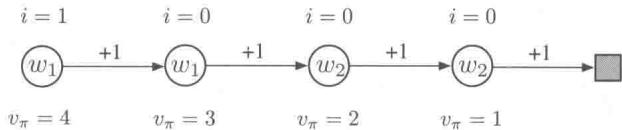

所有幕都从最左边的状态开始，然后每次向右传递一个状态，并且收获 $+1$ 的收益，直到到达终止状态。因此，第一个状态的真实价值为4，第二个状态的真实价值为3，等等，如同每个状态下方所示。这些是状态的真实价值，而估

计值只能近似这些值，因为它们是受到参数化的约束的。参数向量有两个元素，即 $\mathbf{w} = (w_{1}, w_{2})^{\top}$ ，并且参数也被写在每个状态里面。前两个状态的估计价值都由 $w_{1}$ 单独给出，因此即便它们的真实价值不同，这两个值也必然相等。类似地，第三个和第四个状态的估计价值也由 $w_{2}$ 单独决定，无论真实价值如何，这两个估计值也必然相等。假设我们只对最左边的状态的准确估计值感兴趣，我们将它的兴趣值分配为 1，而将其他所有的状态的兴趣值都分配为 0，正如状态上方所表示的。

首先，考虑将梯度蒙特卡洛算法应用于这个问题。在本章前面提出的这种算法没有考虑兴趣值与强调值（式9.7和200页框中的算法），该算法将收敛（通过步长参数的减小）到参数向量 $\mathbf{w}_{\infty} = (3.5,1.5)$ ，这将给第一个状态，也就是我们唯一感兴趣的状态3.5的估计价值（在第一个状态和第二个状态的真实价值的中间）。本节提出的使用兴趣值和强调值的方法，在另一方面，将正确学习第一个状态的价值。 $w_{1}$ 将收敛至4，而 $w_{2}$ 永不被更新，因为除了最左边的状态以外，其他所有状态的强调值都为0。

现在考虑使用两步半梯度TD法。在本章之前讨论的未使用兴趣值与强调值的该方法（式9.15、式9.16和第206页框中的算法），将再次收敛到 $\mathbf{w}_{\infty} = (3.5,1.5)$ 而使用兴趣值和强调值的该方法将收敛于 $\mathbf{w}_{\infty} = (4,2)$ 。后者产生了第一个状态和第三个状态的实际真实价值而不会对第二个或者第四个状态做出任何更新。

# 9.12 本章小结

如果希望强化学习系统能够应用于人工智能和大型工程应用中，则系统必须有能力进行泛化。为了实现这个目标，现存的大量的有监督学习函数逼近的任何方法其实都可以使用，只要将每次更新时涉及的二元组 $s \mapsto g$ 作为训练样本来使用就可以了。

可能最合适的有监督学习方法就是参数化函数逼近方法，在这些方法中，策略使用权值向量 $\mathbf{w}$ 作为参数。尽管权值向量有很多分量，状态空间仍然巨大，我们必须找到一种合适的近似方法。我们定义均方价值误差 $\overline{\mathrm{VE}} (\mathbf{w})$ 为对使用权值向量 $\mathbf{w}$ 的近似价值函数 $v_{\pi_{\mathbf{w}}}(s)$ 的带权误差测量，其权重由同轨策略分布 $\mu$ 决定。 $\overline{\mathrm{VE}}$ 给了我们一种清晰的方式来在同轨策略的情况下衡量不同的价值函数近似。

为了找到一个好的权值向量，最受欢迎的方法是随机梯度下降（SGD）的各类变种方法。本章中，我们主要讨论带固定策略的同轨策略的情况，这也被称作策略评估或者预测。关于这种情况的一种很自然的算法就是 $n$ 步半梯度 $TD$ ；梯度蒙特卡洛法和半梯度 $TD(0)$ 是 $n$ 步半梯度 $TD$ 分别在 $n = \infty$ 和 $n = 1$ 时的特殊情况。半梯度 $TD$ 法不是真正的梯度方法。在这种自举法（包括 DP）中，权值向量在更新目标中出现，然而在计

算梯度时却不考虑它，因此它们被称为半梯度方法。正因为如此，它们也不能依靠经典的SGD结果来进行分析。

尽管如此，半梯度法在线性函数逼近的一些特殊情况中有很好的结果，线性函数逼近中价值估计值是特征乘上对应权值的加和。线性情况在理论上往往是最容易理解的，并且当给予合适的特征时，在实际使用上也非常有效。在强化学习中，选择特征往往是增加先验知识的一个重要途径。可以选择使用多项式形式，但是这种情况在以强化学习为典型的在线学习中普遍效果不好。更好的选择特征的方法是根据傅立叶基或者某种稀疏的感受野重叠的粗编码来选择。瓦片编码就是一种计算上特别灵活和有效的粗编码形式。径向基函数在一维或者二维任务中非常有用，在这种任务中，平滑变化的响应是非常重要的。LSTD是数据效率最高的线性TD预测方法，但是它需要的计算量是权值数量的平方数量级，而所有其他方法的复杂度都仅仅是权值数量的线性数量级。非线性方法包括用反向传播和各种SGD训练的人工神经网络，这种方法在近些年来非常流行，也被称为深度强化学习。

线性半梯度 $n$ 步TD已被证明在标准条件下对于所有的 $n$ 都收敛，并且会收敛到最优误差的一个边界 $\overline{\mathrm{VE}}$ 以内（可由蒙特卡洛法渐近地获得）。这个边界总是随着 $n$ 的增大而变小，并在 $n\to \infty$ 趋近于零。然而，在实际中，选择很大的 $n$ 会导致非常慢的学习，并且一定程度的自举法 $(n < \infty)$ 通常是首选，这和第7章中的表格型 $n$ 步方法以及第6章中的表格型TD和蒙特卡洛方法是类似的。

# 参考文献和历史评注

泛化和函数逼近一直是强化学习的重要组成部分。Bertsekas 和 Tsitsiklis (1996), Bertsekas (2012) 以及 Sugiyama 等人 (2013) 论述了强化学习中函数逼近的最新前沿技术进展。本节的末尾讨论了强化学习中函数逼近的一些早期工作。

9.3 在有监督学习中，最小化均方误差的梯度下降方法是众所周知的。Widrow 和 Hoff (1960) 提出的最小均方（LMS）算法是典型的增量式梯度下降算法。很多文献讨论了这个算法和其他相关算法的细节（比如，Widrow 和 Stearns, 1985；Bishop, 1995；Duda 和 Hart, 1973）。半梯度 $\mathrm{TD}(0)$ 是由 Sutton 提出的 (1984, 1988)，其是将在第 12 章中讨论的线性 $\mathrm{TD}(\lambda)$ 算法的一部分。描述这些自举方法的术语“半梯度”是本书第 2 版新提出的。

可能是 Michie 和 Chambers 的 BOXES 系统 (1968) 最早在强化学习中使用状态聚合。强化学习中的状态聚合理论由 Singh、Jaakkola 和 Jordan (1995) 以及 Tsitsiklis 和 Van Roy (1996) 进一步发展了。状态聚合早期用于动态规划 (例如, Bellman, 1957a)。

9.4 Sutton (1988) 证明了线性 $\mathrm{TD}(0)$ 可以在均值上收敛到最小 $\overline{\mathrm{VE}}$ 的解，条件是特征向

量 $\{\mathbf{x}(s) s \in S\}$ 线性独立。以概率1收敛的证明，几乎在同一时代被数位研究者完成（Peng, 1993; Dayan 和 Sejnowski, 1994; Tsitsiklis, 1994; Gurvits、Lin 和 Hanson, 1994）。此外，Jaakkola、Jordan和Singh (1994) 证明了在线更新情形下的收敛性。所有这些结果都假定特征向量线性独立，这意味着状态的数量至少和 $\mathbf{w}_t$ 的分量一样多。在更重要的情况下，即一般性的（可线性相关的）特征向量的收敛证明是由Dayan (1992) 最先完成的。Tsitsiklis 和 Van Roy (1997) 在Dayan结果的基础上，做了重大推广和加强。他们证明了本节介绍的主要结果：线性自举方法的渐近误差的边界。

9.5 我们所讨论的线性函数逼近的各种可能的情况的材料来源于Barto(1990)。  
9.5.2 Konidaris、Osentoski 和 Thomas (2011) 介绍了傅立叶基的一种简单形式，这种形式适合用于多维连续状态空间的强化问题以及非周期性函数的学习。  
9.5.3 术语粗编码是 Hinton (1984) 创造的，图 9.7 基于他所画的图。Waltz 和 Fu (1965) 提供了一个早期的在强化学习系统中使用这种类型的函数逼近的例子。  
9.5.4 瓦片编码，包括哈希，是由Albus（1971，1981）引入的。他在他的“小脑模型咬合控制器”或称CMAC中描述了这个方法，瓦片编码在一些文献中也出现过。术语“瓦片编码”对本书第1版而言是新引入的，虽然采用这些术语描述CMAC的想法是从Watkins（1989）那里得到的。瓦片编码被用在很多强化学习的系统（比如Shewchuk和Dean，1990；Lin和Kim，1991；Miller、Scalera和Kim，1994；Sofge和White，1992；Tham，1994；Sutton，1996；Watkins，1989）以及一些其他的学习控制系统中（比如，Kraft和Campagna，1990；Kraft、Miller和Dietz，1992）。这一节重点描述了Miller和Glanz（1996）的工作。通用瓦片编码有多种语言版本的软件可用（见http://incompleteideas.net/tiles/tiles3.html）。  
9.5.5 自从Broomhead与Lowe(1988)将使用基于径向基函数的函数逼近与ANN联系起来，前者已经得到了广泛的关注。Powell(1987)回顾了早期对RBF的使用，Poggio和Girosi(1989, 1990)推广和应用了这个方法。  
9.6 自动调整步长参数的方法包括RMSprop（Tieleman和Hinton，2012）；Adam（Kingma和Ba，2015）；随机元下降法，如Delta-Bar-Delta（Jacobs,1988），它的增量式版本（Sutton，1992b，c；Mahmood等，2012)，以及非线性版本(Schraudolph，1999，2002)。特地为强化学习设计的方法包括AlphaBound（Dabney和Barto，2012）；SID和NOSID（Dabney，2014)；TIDBD（Kearney等，准备中）以及使用随机元下降法的策略梯度学习（Schraudolph、Yu和Aberdeen，2006)。  
9.7 McCulloch 和 Pitts (1943) 引入阈值逻辑单元作为抽象神经元模型是整个 ANN 时代的开端。ANN 作为一个分类或回归的学习方法，它的发展经历了多个阶段，大致为：以感知器 (Rosenblatt, 1962) 和 ADALINE（自适应线性元素）（Widrow 和 Hoff, 1960）为代表的使用单层 ANN 学习的阶段，以误差反向传播 (LeCun, 1985; Rumelhart、Hinton 和 Williams, 1986) 为代表的使用多层 ANN 学习的阶段，以及现在的强调表征学习的深度学习阶段（比如 Bengio、Courville 和 Vincent, 2012; Goodfellow、Bengio 和 Courville, 2016）。介绍 ANN 的书有很多，包括 Haykin (1994)、Bishop (1995) 和 Ripley (2007) 等。

ANN作为强化学习中函数逼近的例子可以追溯到早期的Farley和Clark（1954），其中使用了类似强化学习的方法来修改代表策略的线性阈值函数。Widrow、Gupta和Maitra(1973)展示了一个类似神经元的线性阈值单元来实现一个学习过程，他们称之为带评判器的

学习或选择性自举自适应。这是一个基于ADALINE变种的强化学习过程。Werbos（1987，1994）开发了一种使用误差反向传播方式训练的ANN来学习策略和价值函数的类TD算法。Barto、Sutton和Brouwer（1981）以及Barto和Sutton（1981b）扩展了用关联记忆网络（如Kohonen，1977；Anderson、Silverstein、Ritz和Jones，1977）来进行强化学习的思想。Barto、Anderson和Sutton（1982）使用了一个双层ANN来学习一个非线性控制策略，并强调了第一层的作用是用来学习一个合适的表征。Hampson（1983，1989）是早期使用多层ANN来学习价值函数的倡议者。Barto、Sutton和Anderson（1983）提出了一种基于ANN的“行动器-评判器”算法解决平衡杆问题（见15.7节和15.8节）。Barto和Anandan（1985）提出了选择性自举算法（Widrow等，1973）的一个随机版本，称为收益-惩罚 $(A_{R - P})$ 关联算法。Barto（1985，1986）以及Barto和Jordan（1987）描述了一个由 $A_{R - P}$ 单元组成的多层ANN来解决线性不可分的分类问题，其单元训练使用了全局传送的强化信号。Barto（1985）讨论了这种神经网络方法，以及这类学习规则与当时的一些文献的关系。（关于这种训练多层ANN方法的更多讨论见15.10节。）Anderson（1986，1987，1989）评估了多种训练多层ANN的方法，并且展示了一个“行动器-评判器”算法。行动器和评判器都是通过误差反向传播训练的两层ANN，这些算法在杆平衡和汉诺塔任务中优于单层ANN。Williams（1988）描述了反向传播和强化学习可以结合用于训练ANN的几种方法。Gullapalli（1990）和Williams（1992）研究了具有连续实值输出而不是二值输出的类神经元单元的强化学习算法。Barto、Sutton和Watkins（1990）认为，ANN可以在逼近解决序列决策问题所需的函数方面发挥重要作用。Williams（1992）将REINFORCE学习规则（13.3节）与误差反向传播方法相关联来训练多层ANN。Tersauro的TD-Gammon（Tesauro 1992，1994；16.6节）在西洋双陆棋任务中，展现了使用函数逼近的多层ANN的TD(λ)算法的重要影响力。Silver等（2016，2017a，b；16.6节）的AlphaGo、AlphaGo Zero以及AlphaZero使用带深度卷积ANN的强化学习在围棋游戏上取得了惊人的成果。Schmidhuber（2015）回顾了ANN在强化学习中的应用，包括循环ANN的应用。

9.8 LSTD 由 Bradtke 和 Barto 提出（见 Bradtke，1993，1994；Bradtke 和 Barto，1996；Bradtke、Ydstie 和 Barto，1994），并由 Boyan（1999，2002）、Nedic 和 Bertsekas（2003），以及 Yu（2010）进一步发展了。逆矩阵的增量式更新至少自 1949 年以来就为人所知（Sherman 和 Morrison，1949）。Lagoudakis 和 Parr（2003；Busoniu、Lazaric、Ghavamzadeh、Munos、Babuska 和 De Schutter，2012）介绍了最小二乘法控制的一个扩展。  
9.9 我们对基于记忆的函数逼近的讨论主要基于 Atkeson、Moore 和 Schaal (1997) 对局部加权学习的回顾。Atkeson (1992) 讨论了在基于记忆的机器人学习中使用局部加权回归，并提供了大量的介绍相关思想的来龙去脉的书目。Stanfill 和 Waltz (1986) 认为人工智能中基于记忆的方法具有重要意义，特别是在并行体系结构方面，如连接机。Baird 和 Klopf (1993) 介绍了一种新颖的基于记忆的方法，并将其用作杆平衡任务中的 Q 学习的函数逼近方法。Schaal 和 Atkeson (1994) 将局部加权回归应用于机器人杂耍控制问题，在这个问题上，它被用来学习一个系统模型。Peng (1995) 使用杆平衡任务实验了若干最近邻的方法来逼近价值函数、策略和环境模型。Tadepalli 和 Ok (1996) 在一个仿真的自动导引车任务中，采用局部加权线性回归学习价值函数获得了令人振奋的结果。在一些模式识别任务中，Bottou 和 Vapnik (1992) 展示了几种局部学习算法与非局部算法相比的令人惊讶的效率，讨论了局部学习对泛化的

影响。

Bentley (1975) 介绍了 $k$ -d 树并且报告了 $\mathrm{O}(\log n)$ 的平均运行时间，用于在 $n$ 条记录上进行最近邻搜索。Friedman、Bentley 和 Finkel (1977) 阐明了用 $k$ -d 树进行最近邻搜索的算法。Omohundro (1987) 讨论了 $k$ -d 树等分层数据结构可能带来的效率增益。Moore、Schneider 和 Deng (1997) 介绍了使用 $k$ -d 树进行有效的局部加权回归。

9.10 核函数回归的起源是Aizerman、Braverman和Rozonoer（1964）的势函数方法。他们将数据比喻为指向空间分布的各种正负和大小不同的电荷。通过将点电荷的电势求和而产生的在空间上的电势对应于内插值表面。在这个类比中，核函数是一个点电荷的电势，它随着电荷距离的倒数而下降。Connell和Utgoff（1987）运用了一种“行动器-评判器”的方法来执行杆平衡任务，在这个任务中，评判器使用核回归给出的逆向距离加权来逼近价值函数。在机器学习中，这些作者并没有使用术语“核”，而是使用了“Shepard的方法”(Shepard，1968)。其他基于核函数的强化学习方法包括Ormoneit和Sen（2002），Dietterich和Wang（2002），Xu、Xie、Hu和Lu（2005），Taylor和Parr（2009），Barreto、Precup和Pineau（2011）以及Bhat、Farias和Moallemi（2012）。

9.11 对于强调值-TD方法，详见11.8的参考文献

我们所知道的最早使用函数逼近方法学习价值函数的例子是Samuel的跳棋程序（1959，1967）。Samuel遵照Shannon（1950）的建议：作为游戏中的走棋决策依据的价值函数不必非常精确，而通过特征的线性组合来近似就可以了。除了线性函数逼近之外，Samuel还尝试使用查询表和分层查找表(Griffith，1966，1974；Page，1977；Biermann、Fairfield和Beres，1982）。

几乎在Samuel研究的同时，Bellman和Dreyfus（1959）提出了使用动态规划的函数逼近方法（人们认为Bellman和Samuel彼此有一定的影响，但我们知道两者的文章中都没有提及另一个）。关于函数逼近方法和动态规划的延伸，现在已经有了相当广泛的文献，包括多格方法以及使用正交多项式的方法等（Bellman和Dreyfus, 1959；Bellman、Kalaba和Kotkin, 1973；Daniel, 1976; Whitt, 1978; Reetz, 1977; Schweitzer和Seidmann, 1985; Chow和Tsitsiklis, 1991; Kushner和Dupuis, 1992; Rust, 1996）。

Holland (1986) 的分类系统使用了一种选择性的特征匹配技术来统一“状态-动作”二元组的评估信息。每个分类器对应于某个状态子集，这些子集中的状态对某些特征具有指定值，其余特征则具有任意值（“通配符”）。然后将这些状态子集用于传统的状态聚合方法以进行函数逼近。Holland 的想法是使用遗传算法来训练一组分类器，这些分类器将共同实现一个有用的动作价值函数。Holland 的思想影响了作者对强化学习的早期研究，但是我们关注了不同的函数逼近方法。作为函数逼近模型，分类器在几个方面受到限制。首先，它们是状态聚合方法，有规模扩展的限制，也不方便有效地表示平滑函数。另外，分类器的匹配规则只能实现与特征轴平行的聚合边界。或许传统分类器系统的最重要的局限，还是采用进化算法之一的遗传算法来学习分类器。正如我们在第 1 章中讨论的，在学习过程中，有大量关于如何学习的详细信息是进化方法所不能很好利用的。这个观点导致我们改用有监督学习方法来加强学习，特别是采用梯度下降和 ANN 方法。Holland 的方法和我们的方法之间的这些差异并不令人惊讶，因为 Holland 的想法是在 ANN 被普遍认为计算能力太弱以至于并不实用的时期提出的，而我们的工作开始于广泛地质疑传统算法的时期。这些不同方法的结合其实还有很多的可能。

Christensen和Korf（1986）在国际象棋博弈中尝试了修正线性价值函数逼近系数的回归方法。Chapman和Kaelbling（1991）以及Tan（1991）对学习价值函数的决策树方法进行了改进。基于解释的学习方法也适用于学习价值函数，它可以产生紧凑的表征（Yee、Saxena、Utgoff和Barto，1990；Dietterich和Flann，1995）。

# 10

# 基于函数逼近的同轨策略控制

在这一章中，我们关注对动作价值函数 $\hat{q}(s, a, \mathbf{w}) \approx q_{*}(s, a)$ 进行参数化逼近的控制问题，这里 $\mathbf{w} \in \mathbb{R}^{d}$ 是有限维权值向量。我们继续将注意力集中在同轨策略的情况中，离轨策略的方法留到第11章讨论。本章以半梯度Sarsa算法为例，它是上一章中讨论的半梯度TD(0)算法到动作价值，以及到策略控制的自然延伸。在分幕式任务的情况下，这种延伸是直接的，但是在持续性任务的情况下，我们必须退回几步来重新审视如何使用折扣来定义最优策略。令人惊讶的是，一旦我们有了真正的函数逼近，我们就必须放弃折扣并将控制问题的定义转换为一个新的“平均收益”的形式，这个形式有一种新的“差分”价值函数。

从分幕式任务的情形开始，我们将上一章中介绍的函数逼近思想从状态价值函数扩展到动作价值函数。然后，我们根据同轨策略下的GPI的一般模式使用 $\varepsilon$ -贪心法选择动作，将它们扩展到控制问题上。我们会展示高山行车问题上的 $n$ 步线性Sarsa的结果。然后，我们转向持续性任务的情况，再将这些思想应用到带差分价值的平均收益的情形上。

# 10.1 分幕式半梯度控制

将第9章的半梯度预测方法延伸到动作价值上是直接的。在这种情况下近似的动作价值函数， $\hat{q} \approx q_{\pi}$ ，表示为具有权值向量 $\mathbf{w}$ 的参数化函数形式。之前我们关注的是形如 $S_{t} \mapsto U_{t}$ 的随机训练样本，而现在要讨论形如 $S_{t}, A_{t} \mapsto U_{t}$ 的样本。更新目标 $U_{t}$ 可以是 $q_{\pi}(S_{t}, A_{t})$ 的任意近似，包括一些常见的回溯值，如完整的蒙特卡洛回报 $(G_{t})$ 或 $n$ 步Sarsa回报(式7.4)。动作价值函数预测的梯度下降更新的一般形式是

$$
\mathbf {w} _ {t + 1} \doteq \mathbf {w} _ {t} + \alpha \left[ U _ {t} - \hat {q} \left(S _ {t}, A _ {t}, \mathbf {w} _ {t}\right) \right] \nabla \hat {q} \left(S _ {t}, A _ {t}, \mathbf {w} _ {t}\right). \tag {10.1}
$$

作为一般形式的例子，单步Sarsa方法的更新可以表示为

$$
\mathbf {w} _ {t + 1} \dot {=} \mathbf {w} _ {t} + \alpha \left[ R _ {t + 1} + \gamma \hat {q} \left(S _ {t + 1}, A _ {t + 1}, \mathbf {w} _ {t}\right) - \hat {q} \left(S _ {t}, A _ {t}, \mathbf {w} _ {t}\right) \right] \nabla \hat {q} \left(S _ {t}, A _ {t}, \mathbf {w} _ {t}\right). \tag {10.2}
$$

我们把这种方法称为分幕式半梯度单步Sarsa。对于一个固定的策略，这个方法的收敛情况与TD(0)一样，具有相同的误差边界（式9.14）。

为了得到控制方法，我们需要将这种动作价值函数预测与策略改进及动作选择的技术结合起来。适用于连续动作或从大型离散集合中选取动作的技术是当前研究的热点，目前还没有完美的解决方案。另一方面，如果动作集合是离散的并且不是太大，那么我们可以使用前几章中已经提及的技术。也就是说，对于当前状态 $S_{t}$ 中的每个可能的动作 $a$ ，我们可以计算 $\hat{q} (S_t,a,\mathbf{w}_t)$ ，然后贪心地选择动作 $A_{t}^{*} = \operatorname{argmax}_{a}\hat{q} (S_{t},a,\mathbf{w}_{t})$ 。通过将估计策略变为贪心策略的一个柔性近似，如 $\varepsilon$ -贪心策略，策略改进便完成了（在本章所处理的同轨策略情形中）。也使用同样的策略来选取动作。完整算法的伪代码在下框中给出。

# 分幕式半梯度Sarsa，用于估计 $\hat{q}\approx q_{*}$

输入：一个参数化的可微动作价值函数 $\hat{q}:\mathcal{S}\times \mathcal{A}\times \mathbb{R}^d\to \mathbb{R}$

算法参数：步长 $\alpha > 0$ ，很小的 $\varepsilon, \varepsilon > 0$

任意初始化价值函数的权值 $\mathbf{w} \in \mathbb{R}^d$ （比如 $\mathbf{w} = \mathbf{0}$ ）

对每一幕循环：

$S, A \gets$ 幕的初始状态和动作（如 $\varepsilon-$ 贪心策略）

对该幕的每一步循环：

采取动作 $A$ ，观察 $R,S^{\prime}$

如果 $S^{\prime}$ 为终止状态：

$$
\mathbf {w} \leftarrow \mathbf {w} + \alpha \left[ R - \hat {q} (S, A, \mathbf {w}) \right] \nabla \hat {q} (S, A, \mathbf {w})
$$

到下一幕

通过 $\hat{q} (S^{\prime},\cdot ,\mathbf{w})$ 选取 $A^\prime$ （如 $\varepsilon$ -贪心策略）

$$
\begin{array}{l} \mathbf {w} \leftarrow \mathbf {w} + \alpha \left[ R + \gamma \hat {q} \left(S ^ {\prime}, A ^ {\prime}, \mathbf {w}\right) - \hat {q} (S, A, \mathbf {w}) \right] \nabla \hat {q} (S, A, \mathbf {w}) \\ S \leftarrow S ^ {\prime} \\ A \leftarrow A ^ {\prime} \\ \end{array}
$$

例10.1高山行车问题如图10.1左上角所示，考虑把一辆动力不足的汽车驶上陡峭的山顶。困难在于重力比汽车的发动机更强，即使在全油门下汽车也不能驶上陡坡。唯一的解决办法就是先远离目标，向左行驶到反方向的斜坡，然后再踩下全油门向目标冲。在这种情况下，尽管过程中都在减速，但反方向斜坡加速建立起的惯性也可能使汽车通过陡峭的斜坡。这是一个连续控制任务的简单例子，在某种意义上，事情会先变得更糟（离目标

越远)，然后才能变得更好。许多控制方法面对这类任务都有很大的困难，除非靠人类设计师在外部进行干预。

  
图10.1 高山行车问题（左上部分）以及在一次行驶中学习到的对应的代价函数 $(- \max_{a} \hat{q}(s, a, w))$

这个问题的收益在所有的时刻都是-1，直到汽车移动到山顶的目标位置，表明该幕结束。共有三种可能的动作：全油门前进 $(+1)$ ，全油门后退 $(-1)$ 和零油门 $(0)$ 。汽车按照简化的物理学原理运动。它的位置 $x_{t}$ 和速度 $\dot{x}_{t}$ 如下更新

$$
x _ {t + 1} \doteq \text {b o u n d} \left[ x _ {t} + \dot {x} _ {t + 1} \right]
$$

$$
\dot {x} _ {t + 1} \doteq \text {b o u n d} \left[ \dot {x} _ {t} + 0. 0 0 1 A _ {t} - 0. 0 0 2 5 \cos \left(3 x _ {t}\right) \right],
$$

其中，bound 操作限制了 $-1.2 \leqslant x_{t+1} \leqslant 0.5$ 以及 $-0.07 \leqslant \dot{x}_{t+1} \leqslant 0.07$ 。另外，当 $x_{t+1}$ 到达左边界时， $\dot{x}_{t+1}$ 被重置为零。当它到达右边界时，目标达成且该幕终止。每一幕从一个随机位置 $x_t \in [-0.6, -0.4)$ 和零速度开始。为了将这两个连续的状态变量转换成二值化特征，我们使用如图 9.9 所示的网格覆盖。使用 8 个瓦片，每个瓦片盖住每个维度的边界距离的 $1/8$ ，并使用 9.5.4 节介绍的不对称偏移。对每一个“状态-动作”二元组，我

强化学习（第2版）

们使用瓦片编码产生的特征向量 $\mathbf{x}(s,a)$ 与参数向量的线性组合来逼近动作价值函数

$$
\hat {q} (s, a, \mathbf {w}) \dot {=} \mathbf {w} ^ {\top} \mathbf {x} (s, a) = \sum_ {i = 1} ^ {d} w _ {i} \cdot x _ {i} (s, a). \tag {10.3}
$$

图10.1显示了通过这种形式的函数逼近来学习解决这个任务时通常会发生什么。1图中显示的是在单次运行中学习的价值函数的负值(代价函数)。最初的动作价值函数都是零，这是乐观的（注意，这个任务中所有的真实价值都是负数)，这使得即使试探参数 $\varepsilon$ 为0，也会引起广泛的试探。这可以从图的中间顶部标为“第428步”的图中看到。尽管这时候连一幕都没有完成，但是车子在山谷里沿着状态空间的弧形轨迹来回摆动。所有经常访问的状态的价值函数都比未试探到的状态低，这是因为实际的收益比（不切实际的）预期的要差。这会不断驱使智能体离开其所在的地点，去探索新的状态，直到找到解决方案。

图10.2显示了这个问题中的若干半梯度Sarsa学习曲线，不同的线具有不同的步长。

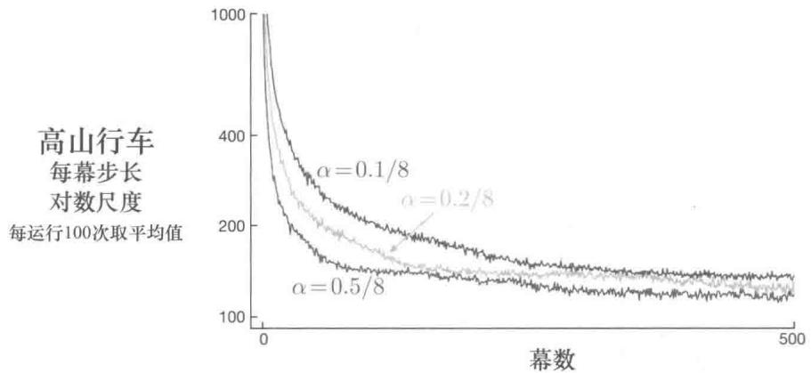  
图10.2使用瓦片编码近似以及 $\varepsilon$ -贪心动作选择的高山行车问题的半梯度Sarsa学习曲线

# 10.2 半梯度 $n$ 步Sarsa

我们可以通过使用 $n$ 步回报作为半梯度公式（10.1）中的更新目标来获得分幕式半梯度Sarsa的 $n$ 步版本。 $n$ 步回报可以很快地从表格型公式(7.4)推广到函数逼近形式

$$
\begin{array}{l} G _ {t: t + n} \dot {=} R _ {t + 1} + \gamma R _ {t + 2} + \dots + \gamma^ {n - 1} R _ {t + n} \\ + \gamma^ {n} \hat {q} \left(S _ {t + n}, A _ {t + n}, \mathbf {w} _ {t + n - 1}\right), t + n <   T, \tag {10.4} \\ \end{array}
$$

通常，如果 $t + n\geqslant T$ 则有 $G_{t:t + n}\dot{=} G_t$ 。 $n$ 步的更新公式为

$$
\mathbf {w} _ {t + n} \doteq \mathbf {w} _ {t + n - 1} + \alpha \left[ G _ {t: t + n} - \hat {q} \left(S _ {t}, A _ {t}, \mathbf {w} _ {t + n - 1}\right) \right] \nabla \hat {q} \left(S _ {t}, A _ {t}, \mathbf {w} _ {t + n - 1}\right), 0 \leqslant t <   T. \tag {10.5}
$$

完整的伪代码在下框中给出

# 分幕式半梯度 $n$ 步Sarsa，用于估计 $\hat{q}\approx q_{*}$ 或 $q_{\pi}$

输入：一个参数化的可微动作价值函数 $\hat{q}:\mathcal{S}\times \mathcal{A}\times \mathbb{R}^d\to \mathbb{R}$

输入：一个策略 $\pi$ （如果要估计 $q_{\pi}$ ）

算法参数：步长 $\alpha > 0$ ，很小的 $\varepsilon, \varepsilon > 0$ ，正整数 $n$

任意初始化价值函数权值 $\mathbf{w} \in \mathbb{R}^d$ （如 $\mathbf{w} = \mathbf{0}$ ）

所有的存取操作（对 $S_{t}$ 、 $A_{t}$ 和 $R_{t}$ ）的索引可以对 $n + 1$ 取模

对每一幕循环：

初始化并存储 $S_0, S_0 \neq$ 终止状态

选取并存储动作 $A_0 \sim \pi(\cdot | S_0)$ 或根据 $\hat{q}(S_0, \cdot, \mathbf{w})$ 进行 $\varepsilon$ -贪心选择

$$
T \leftarrow \infty
$$

循环 $t = 0,1,2,\dots$

如果 $t <   T$ ，那么：

采取动作 $A_{t}$

观察并存储下一个收益 $R_{t + 1}$ 和下一个状态 $S_{t + 1}$

如果 $S_{t + 1}$ 为终止状态，那么

$$
T \leftarrow t + 1
$$

否则：

选取并存储 $A_{t + 1}\sim \pi (\cdot |S_{t + 1})$ 或根据 $\hat{q} (S_{t + 1},\cdot ,\mathbf{w})$ 进行 $\varepsilon$ -贪心选择

$\tau \gets t - n + 1$ ( $\tau$ 是估计值被更新的时刻)

如果 $\tau \geqslant 0$

G←∑(+n,T)γi-τ-1R

如果 $\tau + n < T$ ，那么 $G \leftarrow G + \gamma^{n} \hat{q}(S_{\tau + n}, A_{\tau + n}, \mathbf{w})$ （ $G_{\tau; \tau + n}$ ）

$\mathbf{w}\gets \mathbf{w} + \alpha [G - \hat{q} (S_{\tau},A_{\tau},\mathbf{w})]\nabla \hat{q} (S_{\tau},A_{\tau},\mathbf{w})$

直到 $\tau = T - 1$

正如我们之前看到的，使用中等程度的自举法往往能得到最好的性能，对应的便是大于1的 $n$ 。图10.3显示了这个算法在高山行车问题的任务中，使用 $n = 8$ 相比于 $n = 1$ 如何学习得更快并获得更好的渐近性能。图10.4显示了参数 $\alpha$ 和 $n$ 对学习速度的影响的更详细的研究结果。

强化学习（第2版）

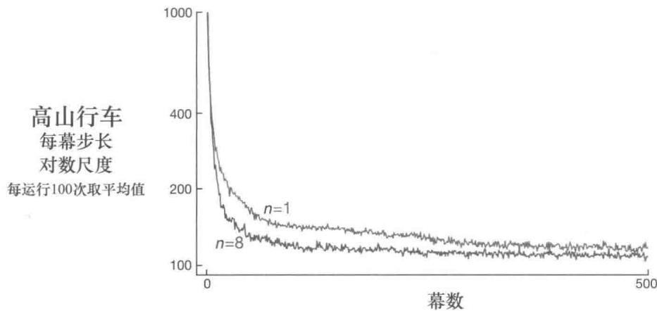  
图10.3单步和8步半梯度Sarsa在高山行车任务中的性能对比。这里使用了较好的步长参数： $n = 1$ 时 $\alpha = 0.5 / 8$ 以及 $n = 8$ 时 $\alpha = 0.3 / 8$

练习10.1 在本章中，我们没有明确地讨论任何蒙特卡洛方法，也没有给出过相关伪代码。它们应该是怎样的？为什么不给出它们的伪代码？它们在高山行车问题上会有怎样的表现？

练习10.2 给出用于控制问题的半梯度单步期望Sarsa的伪代码。

练习10.3 为什么图10.4中较大的 $n$ 比较小的 $n$ 有更高的标准差？

  
图10.4 $\alpha$ 和 $n$ 对使用了瓦片编码近似的 $n$ 步半梯度Sarsa在高山行车任务上初期性能的影响。和往常一样，使用中等程度的自举法（ $n = 4$ ）可以获得最佳性能。图中所示的结果是对按照对数尺度选择的若干 $\alpha$ 进行计算的，然后将这些结果用直线连接就成了图中的折线。对应的标准差范围在 $n = 1$ 时是0.5（小于线的宽度）， $n = 16$ 时是4，这说明主要的效果比较在统计意义上是显著的

# 10.3 平均收益：持续性任务中的新的问题设定

我们现在介绍第三种经典的马尔可夫决策问题(MDP)的目标设定：“平均收益”设定。它不同于之前提到的“分幕式”设定和“折扣”设定。就像折扣设定一样，平均收益也适用于持续性问题，即智能体与环境之间的交互一直持续而没有对应的终止或开始状态。然而，与“折扣”设定不同的是，这里不考虑任何折扣，智能体对于延迟收益的重视程度与即时收益相同。平均收益设定在经典的动态规划理论中经常被讨论到，但在强化学习中讨论得比较少。正如我们在下一节要讨论的，折扣设定对函数逼近来说是有问题的，因此需要用平均收益设定来替换它。

在平均收益设定中，一个策略 $\pi$ 的质量被定义为在遵循该策略时的收益率的平均值，简称平均收益，表示为 $r(\pi)$

$$
\begin{array}{l} r (\pi) \doteq \lim  _ {h \rightarrow \infty} \frac {1}{h} \sum_ {t = 1} ^ {h} \mathbb {E} \left[ R _ {t} \mid S _ {0}, A _ {0: t - 1} \sim \pi \right] (10.6) \\ = \lim  _ {t \rightarrow \infty} \mathbb {E} \left[ R _ {t} \mid S _ {0}, A _ {0: t - 1} \sim \pi \right], (10.7) \\ = \sum_ {s} \mu_ {\pi} (s) \sum_ {a} \pi (a | s) \sum_ {s ^ {\prime}, r} p \left(s ^ {\prime}, r \mid s, a\right) r, \\ \end{array}
$$

这里的期望根据初始状态 $S_{0}$ 和遵循 $\pi$ 生成的动作序列 $A_{0}, A_{1}, \ldots, A_{t-1}$ 来决定， $\mu_{\pi}$ 是一个稳态分布，假设对于每一个 $\pi$ 都存在并独立于 $S_{0}$ 的，则 $\mu_{\pi}(s) \doteq \lim_{t \to \infty} \Pr \{S_{t} = s \mid A_{0:t-1} \sim \pi\}$ 。这种关于MDP的假设被称为遍历性。它意味着MDP开始的位置或智能体的早期决定只具有临时的效果；从长远来看，一个状态的期望只与策略本身以及MDP的转移概率相关。遍历性足以保证上述公式中极限的存在。

在没有折扣的持续性任务的情况下，不同类型的最优之间可能有微小的区别。然而，就大多数实际目标而言，根据每个时刻的平均收益，即 $r(\pi)$ ，简单地对策略排序往往就够了。如式（10.7）所示，这个量本质上是 $\pi$ 下的平均收益。特别地，我们认为所有达到 $r(\pi)$ 最大值的策略都是最优的。

注意，“稳态分布”是一个特殊的分布，即如果你按照 $\pi$ 选择动作，依然会获得同样的分布。换言之就是

$$
\sum_ {s} \mu_ {\pi} (s) \sum_ {a} \pi (a | s) p \left(s ^ {\prime} \mid s, a\right) = \mu_ {\pi} \left(s ^ {\prime}\right). \tag {10.8}
$$

在平均收益设定中，回报是根据即时收益和平均收益的差来定义的

$$
G _ {t} \doteq R _ {t + 1} - r (\pi) + R _ {t + 2} - r (\pi) + R _ {t + 3} - r (\pi) + \dots . \tag {10.9}
$$

这被称为差分回报，相应的价值函数被称为差分价值函数。它们的定义方式和之前的相同，我们也会用一样的符号表示它们： $v_{\pi}(s) \doteq \mathbb{E}_{\pi}[G_t|S_t = s]$ 和 $q_{\pi}(s,a) \doteq \mathbb{E}_{\pi}[G_t|S_t = s,A_t = a]$ （类似的还有 $v_{*}$ 和 $q_{*}$ ）。差分价值函数也有贝尔曼方程，但是和我们之前见到的有些许不同。我们把所有的 $\gamma$ 去掉了，并用即时收益和真实平均收益之间的差来代替原来的即时收益

$$
v _ {\pi} (s) = \sum_ {a} \pi (a | s) \sum_ {r, s ^ {\prime}} p \left(s ^ {\prime}, r | s, a\right) \left[ r - r (\pi) + v _ {\pi} \left(s ^ {\prime}\right) \right],
$$

$$
q _ {\pi} (s, a) = \sum_ {r, s ^ {\prime}} p \left(s ^ {\prime}, r \mid s, a\right) \left[ r - r (\pi) + \sum_ {a ^ {\prime}} \pi \left(a ^ {\prime} \mid s ^ {\prime}\right) q _ {\pi} \left(s ^ {\prime}, a ^ {\prime}\right) \right],
$$

$$
v _ {*} (s) = \max  _ {a} \sum_ {r, s ^ {\prime}} p \left(s ^ {\prime}, r \mid s, a\right) \left[ r - \max  _ {\pi} r (\pi) + v _ {*} \left(s ^ {\prime}\right) \right], \text {以 及}
$$

$$
q _ {*} (s, a) = \sum_ {r, s ^ {\prime}} p \left(s ^ {\prime}, r \mid s, a\right) \left[ r - \max  _ {\pi} r (\pi) + \max  _ {a ^ {\prime}} q _ {*} \left(s ^ {\prime}, a ^ {\prime}\right) \right]
$$

参见公式(3.14)、练习3.17、公式(3.19)，以及公式(3.20)。

对于两类TD误差也有对应的差分形式

$$
\delta_ {t} \doteq R _ {t + 1} - \bar {R} _ {t + 1} + \hat {v} \left(S _ {t + 1}, \mathbf {w} _ {t}\right) - \hat {v} \left(S _ {t}, \mathbf {w} _ {t}\right), \tag {10.10}
$$

以及

$$
\delta_ {t} \doteq R _ {t + 1} - \bar {R} _ {t + 1} + \hat {q} \left(S _ {t + 1}, A _ {t + 1}, \mathbf {w} _ {t}\right) - \hat {q} \left(S _ {t}, A _ {t}, \mathbf {w} _ {t}\right), \tag {10.11}
$$

这里 $\bar{R}_t$ 是在时刻 $t$ 对平均收益 $r(\pi)$ 的估计。有了这些改进的定义，大多数算法和理论结果都无须改变，就适用于平均收益设定。

例如，半梯度Sarsa的平均收益版本的定义和式（10.2）完全相同，除了TD误差有些区别外。即

$$
\mathbf {w} _ {t + 1} \dot {=} \mathbf {w} _ {t} + \alpha \delta_ {t} \nabla \hat {q} \left(S _ {t}, A _ {t}, \mathbf {w} _ {t}\right) \tag {10.12}
$$

这里 $\delta_t$ 在式（10.11）中给出。下框中是完整算法的伪代码。

练习10.4 给出半梯度的Q学习的差分版本的伪代码。

练习10.5 除了式(10.10)之外，还需要哪些公式才能明确地得到差分版本的 $\mathrm{TD}(0)$ ？□

练习10.6 一个马尔可夫收益过程包含三个环状的状态A、B、C，状态确定地沿着环转移。到达A时获得收益 $+1$ ，其他情况收益为0。请问对应的三个状态的差分价值是多少？

□

# 差分半梯度Sarsa算法，用于估计 $\hat{q}\approx q_{*}$

输入：一个参数化的可微动作价值函数 $\hat{q}:\mathcal{S}\times \mathcal{A}\times \mathbb{R}^d\to \mathbb{R}$

算法参数：步长 $\alpha, \beta > 0$

任意初始化价值函数权值 $\mathbf{w} \in \mathbb{R}^d$ （如 $\mathbf{w} = \mathbf{0}$ ）

任意初始化平均收益的估计值 $\bar{R} \in \mathbb{R}$ （如 $\bar{R} = 0$ ）

初始化状态 $S$ 和动作 $A$

对每一个步循环：

采取动作 $A$ ，观察 $R,S^{\prime}$

通过 $\hat{q}(S', \cdot, \mathbf{w})$ 选取 $A'$ （如 $\varepsilon$ -贪心策略）

$$
\delta \leftarrow R - \bar {R} + \hat {q} \left(S ^ {\prime}, A ^ {\prime}, \mathbf {w}\right) - \hat {q} (S, A, \mathbf {w})
$$

$$
\bar {R} \leftarrow \bar {R} + \beta \delta
$$

$$
\mathbf {w} \leftarrow \mathbf {w} + \alpha \delta \nabla \hat {q} (S, A, \mathbf {w})
$$

$$
S \leftarrow S ^ {\prime}
$$

$$
A \leftarrow A ^ {\prime}
$$

例10.2访问控制队列任务这是一个涉及一组 $k$ 个服务器的访问控制的决策任务。四个不同优先级的客户到达一个队列。如果让用户访问服务器，客户会根据他们的优先级向服务器支付1、2、4或8的收益，优先级更高的客户支付更多。在每个时刻中，队列头的客户要么被接受（分配给他一个服务器），要么被拒绝（从队列中移走，服务器收益为0）。无论是这两种情况的哪一种，下一个时刻均考虑队列中的下一个客户。队列从不被清空，队列中客户的优先级也是等概率随机分布的。当然，如果没有空闲的服务器，客户就不能被服务，而是被拒绝。每一个忙碌的服务器在每一时刻中都有 $p = 0.06$ 的概率变得空闲。虽然我们刚刚对这个任务给出了确定的描述定义，但我们假设客户到达和离开的统计量是未知的。任务在每个时刻根据优先级和空闲服务器的数量决定是否接受或拒绝下一个客户，以期最大化无折扣的长期收益。

在这个例子中，我们考虑一种表格型的解决方案。尽管这样的解决方案在状态之间没有泛化能力，但我们仍然可以使用一般的函数逼近的设定，因为函数逼近设定是表格型设定的扩展。因此，对于每一个“状态-动作”二元组（状态是队列中的空闲服务器的数量和客户的优先级，动作是接受或拒绝），我们都有一个差分动作价值估计。图10.5展示了差分半梯度Sarsa在 $k = 10$ 和 $p = 0.06$ 时的解。在这个算法中 $\alpha = 0.01$ ， $\beta = 0.01$ 以及 $\varepsilon = 0.1$ 。初始的动作价值和 $\bar{R}$ 都是0。

强化学习（第2版）

  
图10.5差分半梯度单步Sarsa在控制访问队列任务上，两百万步之后找到的策略和价值函数。图右侧的断崖下跌可能是因为缺少数据，这一部分非常多的状态从未经历过。学习到的 $\bar{R}$ 的值大约为2.31

练习10.7 假设存在一个MDP，对任意的策略都产生确定的收益序列 $+1, 0, +1, 0, +1, 0, \ldots$ 直到永远。从技术上来说，这是不被允许的，因为这违背了遍历性。这里不存在稳态极限分布 $\mu_{\pi}$ 且极限式(10.7)不存在。但是，这种情况下平均收益式(10.6)是良好定义的；那么它是什么？考虑这个MDP内的两个状态。从A开始，收益序列和前面描述的完全相同，会从 $+1$ 开始；然而从B开始时，收益序列从0开始，然后变为 $+1, 0, +1, 0, \ldots$ 。差分回报式(10.9)在这种情况下没有良好定义，因为对应的极限不存在。为了修复这个问题，我们可以转而定义一个状态的价值为

$$
v _ {\pi} (s) \doteq \lim  _ {\gamma \rightarrow 1} \lim  _ {h \rightarrow \infty} \sum_ {t = 0} ^ {h} \gamma^ {t} \left(\mathbb {E} \left[ R _ {t + 1} \mid S _ {0} = s \right] - r (\pi)\right). \tag {10.13}
$$

在这种定义下，A和B的状态价值是多少？

练习10.8 第247页的框中的伪代码使用 $\delta_t$ 作为误差来更新 $\bar{R}_{t+1}$ ，而不是简单地用 $R_{t+1} - \bar{R}_{t+1}$ 来更新。虽然这两个误差定义都可以，但是 $\delta_t$ 效果更好。为了探明原因，我们讨论练习10.6中三个状态的环状MRP。平均收益的估计值应该趋向于它的真实值 $\frac{1}{3}$ 。假设已经达到这个值并且保持固定。误差 $R_t - \bar{R}_t$ 的序列是怎样的？误差（使用式10.10） $\delta_t$ 的序列呢？如果允许平均收益的估计值随着误差的反馈而改变，则哪一个序列会产生更为稳定的估计？为什么？

# 10.4 弃用折扣

持续性的带折扣问题的公式化表达在表格型的情况下中非常有用，因为每个状态的回报可以被分别地识别和取平均。但是在采用函数逼近的情况下，是否将折扣用在问题的公式化表达中则需要打一个问号。

为了搞清楚为什么，我们考虑一个没有开始或结束的无限长的收益序列，也没有清晰定义的可区分的状态。这些状态可能仅仅由特征向量来表示，而它们对于区分不同的状态可能作用不大。作为一个特例，所有特征向量可能都是一样的。因此，只有收益序列（以及动作），而且只能依靠这些来评估性能。那么如何才能做到呢？一种方法是通过计算较长时间间隔的收益的平均来进行性能评估——这就是平均收益的设定。那么如何使用折扣呢？对于每一步我们都可以计算折后回报。有些回报很小，有些很大，所以我们需要在足够大的时间间隔中进行平均。在持续性问题上没有开始和结束，没有特殊的时刻，所以这是我们唯一能做的。然而，如果你这样做，结果表明折后回报的均值和平均回报成正比。事实上，对于策略 $\pi$ ，折后回报的均值总是 $r(\pi) / (1 - \gamma)$ ，也就是说，它本质上就是平均收益 $r(\pi)$ 。特别是，在平均折后回报的设定中，所有策略的排序与在平均收益设定中是完全相同的。折扣率 $\gamma$ 在问题中没有任何作用。它实际上可以是零，而这个排序仍然保持不变。

这个惊人的事实的证明在下面的方框中，其基本思想可以通过对称的观点来解释。每一个时刻都和其他一样。有折扣的情况下，每一个收益都会在回报的某个位置恰好出现一次。第 $t$ 个收益会无折扣地出现在第 $t - 1$ 个回报中，在第 $t - 2$ 个回报中打一次折扣，在第 $t - 1000$ 个回报中打999次折扣。所以第 $t$ 个收益的权重就是 $1 + \gamma + \gamma^2 + \gamma^3 + \dots = 1 / (1 - \gamma)$ 。因为所有状态都是一样的，它们都是这个权重，所以回报的平均值是这个系数乘以平均收益，也就是 $r(\pi) / (1 - \gamma)$ 。

# 持续性问题中折扣的无用性

我们可以设定策略排序的准则为折后价值的概率加权和，概率分布是给定策略下的状态分布。这时，我们也许能够把折扣系数的影响去掉。

$$
\begin{array}{l} J (\pi) = \sum_ {s} \mu_ {\pi} (s) v _ {\pi} ^ {\gamma} (s) \quad (\text {这 里} v _ {\pi} ^ {\gamma} \text {是 折 后 价 值 函 数}) \\ = \sum_ {s} \mu_ {\pi} (s) \sum_ {a} \pi (a | s) \sum_ {s ^ {\prime}} \sum_ {r} p \left(s ^ {\prime}, r | s, a\right) \left[ r + \gamma v _ {\pi} ^ {\gamma} \left(s ^ {\prime}\right) \right] \quad (\text {贝 尔 曼 公 式}) \\ \end{array}
$$

$$
\begin{array}{l} = r (\pi) + \sum_ {s} \mu_ {\pi} (s) \sum_ {a} \pi (a | s) \sum_ {s ^ {\prime}} \sum_ {r} p \left(s ^ {\prime}, r \mid s, a\right) \gamma v _ {\pi} ^ {\gamma} \left(s ^ {\prime}\right) \quad \text {由 式} (1 0. 7) \text {得 到} \\ = r (\pi) + \gamma \sum_ {s ^ {\prime}} v _ {\pi} ^ {\gamma} (s ^ {\prime}) \sum_ {s} \mu_ {\pi} (s) \sum_ {a} \pi (a | s) p \left(s ^ {\prime} \mid s, a\right) \quad \text {由 式} \tag {3.4} \\ = r (\pi) + \gamma \sum_ {s ^ {\prime}} v _ {\pi} ^ {\gamma} \left(s ^ {\prime}\right) \mu_ {\pi} \left(s ^ {\prime}\right) \quad \text {由 式 (1 0 . 8) 得 到} \\ = r (\pi) + \gamma J (\pi) \\ = r (\pi) + \gamma r (\pi) + \gamma^ {2} J (\pi) \\ = r (\pi) + \gamma r (\pi) + \gamma^ {2} r (\pi) + \gamma^ {3} r (\pi) + \dots \\ = \frac {1}{1 - \gamma} r (\pi). \\ \end{array}
$$

根据折扣准则得到的策略的排序与无折扣的（平均收益）准则下的排序完全相同。注意，折扣率 $\gamma$ 完全不影响顺序！

这个例子以及框中更一般的论证表明，在一个同轨策略分布上优化折后价值函数，其效果和优化一个无折扣的平均收益完全相同， $\gamma$ 的实际值对策略排序结果没有影响。这明显地表明折扣在使用函数逼近的控制问题定义中不起作用。但是，我们也可以将折扣用于解决方案中。就是把折扣参数 $\gamma$ 从一个问题参数变为了一个解决方案的参数！然而，在这种情况下我们无法保证优化的是平均收益（或等价于在某个同轨策略分布上的折后价值函数）。

使用函数逼近的折扣控制设定困难的根本原因在于我们失去了策略改进定理（4.2节）。我们在单个状态上改进折后价值函数不再保证我们会改进整个策略。而这个保证是强化学习控制方法的核心，使用函数逼近让我们失去了这个核心！

事实上，策略改进定理的缺失也是分幕式设定以及平均收益设定的理论缺陷。一旦引入了函数逼近，我们无法保证在任何设定下都一定会有策略的改进。在第13章中，我们会介绍另一类基于参数化策略的强化学习算法，其有类似于策略改进定理的“策略梯度定理”进行理论上的保证。但是对于我们现在见到的学习动作价值的方法，还没有一个局部的改进保证（可能Perkins和Percup（2003）采取的方法提供了部分答案）。我们确实知道的是， $\varepsilon$ -贪心优化有时会导致一个较差的策略，因为算法可能在若干好的策略之间来回摆动而不收敛到其中的一个（Gordon，1996a）。这是一个有多个开放的理论问题的领域。

# 10.5 差分半梯度 $n$ 步Sarsa

为了推广到 $n$ 步自举法，我们需要一个 $n$ 步版本的TD误差。我们首先将 $n$ 步回报式(7.4)推广到它的差分形式，使用函数逼近有

$$
G _ {t: t + n} \doteq R _ {t + 1} - \bar {R} _ {t + 1} + R _ {t + 2} - \bar {R} _ {t + 2} + \dots + R _ {t + n} - \bar {R} _ {t + n} + \hat {q} \left(S _ {t + n}, A _ {t + n}, \mathbf {w} _ {t + n - 1}\right), \tag {10.14}
$$

其中， $\bar{R}$ 是对 $r(\pi)$ 的估计， $n \geqslant 1$ 且 $t + n < T$ 。如果 $t + n \geqslant T$ ，和往常一样定义 $G_{t:t+n} \doteq G_t$ 。 $n$ 步 TD 误差变为：

$$
\delta_ {t} \doteq G _ {t: t + n} - \hat {q} \left(S _ {t}, A _ {t}, \mathbf {w}\right), \tag {10.15}
$$

之后，我们可以使用常规的半梯度Sarsa更新式（10.12）。在下面框中给出了完整算法的伪代码。

# 差分半梯度 $n$ 步Sarsa算法，用于估计 $\hat{q}\approx q_{\pi}$ 或 $q_{*}$

输入：一个参数化的可微动作价值函数 $\hat{q}\mathcal{S}\times \mathcal{A}\times \mathbb{R}^d\to \mathbb{R}$ ，一个策略 $\pi$

任意初始化价值函数权值 $\mathbf{w} \in \mathbb{R}^d$ （如 $\mathbf{w} = \mathbf{0}$ ）

任意初始化平均收益估计 $\bar{R} \in \mathbb{R}$ （如 $\bar{R} = 0$ ）

算法参数：步长 $\alpha, \beta > 0$ ，正整数 $n$

所有的存取操作（对 $S_{t}$ 、 $A_{t}$ 和 $R_{t}$ ）的索引可以对 $n + 1$ 取模

初始化并存储 $S_{0}$ 和 $A_0$

对每一步循环， $t = 0,1,2,\dots$

采取动作 $A_{t}$

观察并存储下一个收益 $R_{t + 1}$ 和下一个状态 $S_{t + 1}$

选取并存储 $A_{t + 1}\sim \pi (\cdot |S_{t + 1})$ 或根据 $\hat{q} (S_{t + 1},\cdot ,\mathbf{w})$ 进行 $\varepsilon$ -贪心选择

$\tau \gets t - n + 1$ ( $\tau$ 是估计值被更新的时刻)

如果 $\tau \geqslant 0$

$$
\begin{array}{l} \delta \leftarrow \sum_ {i = \tau + 1} ^ {\tau + n} \left(R _ {i} - \bar {R}\right) + \hat {q} \left(S _ {\tau + n}, A _ {\tau + n}, \mathbf {w}\right) - \hat {q} \left(S _ {\tau}, A _ {\tau}, \mathbf {w}\right) \\ \bar {R} \leftarrow \bar {R} + \beta \delta \\ \mathbf {w} \leftarrow \mathbf {w} + \alpha \delta \nabla \hat {q} \left(S _ {\tau}, A _ {\tau}, \mathbf {w}\right) \\ \end{array}
$$

练习10.9 在差分半梯度 $n$ 步Sarsa算法中，平均收益的步长参数 $\beta$ 需要足够小，以保证 $\bar{R}$ 是一个较好的对平均收益的长期估计。然而， $\bar{R}$ 由于其初始值在许多时刻中会造成偏向性，导致学习变得低效，因而可以使用采样观测的收益的平均值来代替 $\bar{R}$ 。其会在前期迅速适应，但在后期同样适应得很慢。由于策略缓慢的变化， $\bar{R}$ 也会发生变化。这种可

能存在的长期非平稳性使得采样平均法并不适用。事实上，平均收益的步长参数是使用练习2.7中的无偏常数步长技巧的最佳之地。描述一下，框中的差分半梯度 $n$ 步Sarsa算法需要如何变化才能使用这个技巧。

# 10.6 本章小结

在本章中，我们延伸了前一章中介绍的参数化函数逼近和半梯度下降的思想，并引入控制问题中。这个延伸对于分幕式任务的情况来说是显然的，但对于持续性任务的情况，我们必须引入一个全新的问题公式化表达，这个新的公式化表达基于最大化每个时刻的平均收益。令人惊讶的是，在函数逼近的情况下，带折扣的公式化表达是没用的。在近似情况下，大多数策略不能用一个价值函数表示。当我们需要对任意的策略进行排序时，平均收益 $r(\pi)$ 提供了一种有效的方法。

平均收益的公式化表达涉及价值函数、贝尔曼方程和TD误差新的差分版本，但所有这些都与旧版本相似，而且概念上的变化很小。同样，也有类似的一组平均收益情况下的差分版本的算法。

# 参考文献和历史评注

10.1 采用函数逼近的半梯度Sarsa由Rummery和Niranjan（1994）首次提出。使用 $\varepsilon$ -贪心动作选择的线性半梯度Sarsa在一般的情形下不收敛，但是会落入最优解的一个有界的范围内(Grodon，1996a，2001)。Precup和Perkins(2003)证明了差分动作选择设定的收敛性，另外也可参见Perkins和Pendrith(2002）以及Melo、Meyn和Ribiero(2008)。高山行车的例子基于Moore(1990)研究的一个类似的任务，但这里的确切形式是Sutton(1996)先使用的。  
10.2 分幕式 $n$ 步半梯度Sarsa基于van Seijen(2016)的前向Sarsa $(\lambda)$ 算法。这里显示的实证结果是本书第2版最新加入的。  
10.3 动态规划（如Puterman，1994）和强化学习（Mahadevan，1996；Tadepalli和Ok，1994；Bertsekas和Tsitsiklis，1996；Tsitsiklis和VanRoy，1999）分别从各自的角度描述了平均收益的问题形式。这里描述的算法是Schwartz(1993)提出的“R-学习”算法的同轨策略版本。取名为“R-学习”可能是因为R是Q的下一个字母，但是我们更倾向于它指代的是差分或者相对(relative)值的学习。访问控制队列的例子是根据Carlström和Nordström(1997)的工作提出的。  
10.4 在本书第1版出版后不久，在基于函数逼近的强化学习的问题公式化表达中使用“折扣”的局限性就被作者认识到了。可能是Singh、Jaakkola和Jordan（1994）首次在出版物中指明了这一点。

# * 基于函数逼近的离轨策略方法

本书自第5章开始，就将同轨策略和离轨策略学习作为两种不同的方式，以解决在广义策略迭代的学习方式中试探和开发之间的内在冲突。之前的两章我们用函数逼近来处理同轨策略的情况，而在本章中我们用函数逼近处理离轨策略。相较于同轨策略学习，对离轨策略学习进行函数逼近的拓展是截然不同的，而且困难得多。第6章和第7章中提出的表格型离轨策略方法可以很容易地拓展到半梯度的算法，但是它们并不像同轨策略学习训练下那样能够稳健地收敛。在本章中，我们将考虑上述收敛问题，并进一步关注线性函数逼近的理论，介绍“可学习程度”的概念，然后我们讨论一些离轨策略情形下的新算法，它们有更强的收敛性保证。在本章最后，介绍一些改进的算法，但是相比同轨策略学习而言，它们的理论结果不够亮眼，实践的效果也不那么令人满意。沿着这条路线，我们对强化学习中同轨策略学习和离轨策略学习的近似方法都会有更深入的理解。

在之前提到的离轨策略学习中，我们的目的是学习一个目标策略 $\pi$ ，然后数据由另外一个行动策略 $b$ 提供。在进行预测时，两个策略都给定而且不变，我们的目的是学习状态价值函数 $\hat{v} \approx v_{\pi}$ 或动作价值函数 $\hat{q} \approx q_{\pi}$ 。在进行控制时，动作价值函数是学出来的，并且两个策略通常都会在学习的过程中变化， $\pi$ 逐渐变成关于 $\hat{q}$ 的贪心策略，而 $b$ 逐渐变成关于 $\hat{q}$ 的某种带有试探性的类似于 $\varepsilon$ 贪心策略的东西。

离轨策略学习目前面临的挑战主要来自两方面：一是来自于表格型情况；二是来自于函数逼近情况。第一个挑战需要处理更新的目标（注意不要与目标策略混淆），第二个挑战需要处理更新的分布。我们在第5章和第7章中提出的重要度采样技术可以应对第一个挑战，这些方法可能会带来更大的方差，但是确实是所有成功的算法都需要采用的，无论是表格型方法还是函数逼近方法。本章的第一节会介绍这些技术的拓展。

而解决离轨策略学习的第二个挑战则需要做的更多，因为离轨策略情况下更新后的分布与同轨策略的分布并不一样。同轨策略的分布对于半梯度方法的稳定性而言至关重要。

有两种通用的方式可以解决这个问题：一种是再次使用重要度采样，扭曲更新后的分布将其变回同轨策略的分布，使得能保证半梯度方法收敛（在线性的情况下）；另一种是寻找不依赖于任何特殊分布就能稳定的真实梯度方法。对于这两种方式我们都提出了一些方法，但这是一个非常前沿的研究领域，我们尚不清楚哪种方式会在实战中更加有效。

# 11.1 半梯度方法

这一节我们首先描述在前面的章节中为离轨策略情形设计的算法，以及如何能够非常容易地作为半梯度的方法推广到函数逼近的情况。这些方法解决了离轨策略学习的第一个挑战（更新目标的变换），但是没有解决第二个（更新分布的变换）。相应地，这些方法可能在某些情况下会发散，在这个意义上它们是不合理的，但是它们仍然经常被成功使用。请记住，这些方法只对表格型的情况保证稳定且渐近无偏，这对应于函数逼近的一种特殊情况。因此，仍然可以将它们与特征选择方法相结合，从而保证结合的系统稳定。无论如何，这些算法非常简单，因此是我们讨论的一个很好的起点。

在第7章中我们描述了一系列表格型情况下的离轨策略算法。为了把它们转换成半梯度的形式，我们简单地使用近似价值函数 $(\hat{v}$ 或者 $\hat{q})$ 及其梯度，把对于一个数组（ $V$ 或者 $Q$ ）的更新替代为对于一个权重向量 $\mathbf{W}$ 的更新。这些算法中的很多算法都使用了每步的重要度采样率

$$
\rho_ {t} \dot {=} \rho_ {t: t} = \frac {\pi (A _ {t} | S _ {t})}{b (A _ {t} | S _ {t})}. \tag {11.1}
$$

例如，单步的状态价值函数算法就是半梯度的离轨策略 $\mathrm{TD}(0)$ ，它就像对应的同轨策略算法（第215页）一样，除了添加了一个额外的 $\rho_{t}$

$$
\mathbf {w} _ {t + 1} \doteq \mathbf {w} _ {t} + \alpha \rho_ {t} \delta_ {t} \nabla \hat {v} \left(S _ {t}, \mathbf {w} _ {t}\right), \tag {11.2}
$$

其中， $\delta_t$ 的确切定义取决于这个问题是分幕式、带折扣的，还是持续性、无折扣的。

$$
\delta_ {t} \doteq R _ {t + 1} + \gamma \hat {v} (S _ {t + 1}, \mathbf {w} _ {t}) - \hat {v} (S _ {t}, \mathbf {w} _ {t}), \text {或} \tag {11.3}
$$

$$
\delta_ {t} \doteq R _ {t + 1} - \bar {R} _ {t} + \hat {v} \left(S _ {t + 1}, \mathbf {w} _ {t}\right) - \hat {v} \left(S _ {t}, \mathbf {w} _ {t}\right). \tag {11.4}
$$

对于动作价值函数，单步的算法是半梯度的期望Sarsa算法

$$
\mathbf {w} _ {t + 1} \doteq \mathbf {w} _ {t} + \alpha \delta_ {t} \nabla \hat {q} (S _ {t}, A _ {t}, \mathbf {w} _ {t}), \text {和} \tag {11.5}
$$

$$
\delta_ {t} \doteq R _ {t + 1} + \gamma \sum_ {a} \pi (a | S _ {t + 1}) \hat {q} \left(S _ {t + 1}, a, \mathbf {w} _ {t}\right) - \hat {q} \left(S _ {t}, A _ {t}, \mathbf {w} _ {t}\right), \text {或} \quad (\text {分 幕 式 情 况})
$$

$$
\delta_ {t} \doteq R _ {t + 1} - \bar {R} _ {t} + \sum_ {a} \pi (a | S _ {t + 1}) \hat {q} \left(S _ {t + 1}, a, \mathbf {w} _ {t}\right) - \hat {q} \left(S _ {t}, A _ {t}, \mathbf {w} _ {t}\right). \quad (\text {持 续 性 情 况})
$$

注意，这个算法并未使用重要度采样。在表格型的情形下很明显这样做是合适的，因为唯一采样的动作是 $A_{t}$ ，而且在学习它的价值的过程中，我们不需要考虑其他的动作。在使用函数逼近的情况下，就没有这么确定了，因为我们可能希望给不同的“状态-动作”二元组以不同的权重。要等到人们对强化学习的函数逼近理论有了更透彻的理解后，才能找到这个问题适当的解决方法。

在这些算法的多步推广中，状态价值函数和动作价值函数算法都包括了重要度采样。例如， $n$ 步版本的Sarsa写为

$$
\mathbf {w} _ {t + n} \doteq \mathbf {w} _ {t + n - 1} + \alpha \rho_ {t + 1} \dots \rho_ {t + n - 1} \left[ G _ {t: t + n} - \hat {q} \left(S _ {t}, A _ {t}, \mathbf {w} _ {t + n - 1}\right) \right] \nabla \hat {q} \left(S _ {t}, A _ {t}, \mathbf {w} _ {t + n - 1}\right) \tag {11.6}
$$

其中

$$
G _ {t: t + n} \doteq R _ {t + 1} + \dots + \gamma^ {n - 1} R _ {t + n} + \gamma^ {n} \hat {q} \left(S _ {t + n}, A _ {t + n}, \mathbf {w} _ {t + n - 1}\right), \quad (\text {分 幕 式 情 况})
$$

或

$$
G _ {t: t + n} \doteq R _ {t + 1} - \bar {R} _ {t} + \dots + R _ {t + n} - \bar {R} _ {t + n - 1} + \hat {q} \left(S _ {t + n}, A _ {t + n}, \mathbf {w} _ {t + n - 1}\right), \quad (\text {持 续 性 情 况})
$$

在这里我们对于结束时刻的处理不太正式。在第一个公式中， $k \geqslant T$ 的 $\rho_{k}$ 都应该取值为1，而且 $t + n \geqslant T$ 的 $G_{t:n}$ 都应该取值为 $G_{t}$ 。

回顾一下，我们在第7章中也提出了一个完全不包含重要度采样的离轨策略算法： $n$ 步树回溯算法。下面是它的半梯度版本。

$$
\mathbf {w} _ {t + n} \doteq \mathbf {w} _ {t + n - 1} + \alpha \left[ G _ {t: t + n} - \hat {q} \left(S _ {t}, A _ {t}, \mathbf {w} _ {t + n - 1}\right) \right] \nabla \hat {q} \left(S _ {t}, A _ {t}, \mathbf {w} _ {t + n - 1}\right), \tag {11.7}
$$

$$
G _ {t: t + n} \doteq \hat {q} \left(S _ {t}, A _ {t}, \mathbf {w} _ {t - 1}\right) + \sum_ {k = t} ^ {t + n - 1} \delta_ {k} \prod_ {i = t + 1} ^ {k} \gamma \pi \left(A _ {i} \mid S _ {i}\right), \tag {11.8}
$$

其中， $\delta_t$ 的定义与上面期望Sarsa算法是一样的。

我们也在第7章中定义了一个 $n$ 步 $Q(\sigma)$ 算法，统一了所有的动作价值函数算法。我们把这个算法的半梯度形式和 $n$ 步的状态价值函数算法的半梯度形式，留给读者作为练习。

练习11.1将 $n$ 步的离轨策略TD(式7.9)转换为半梯度形式。给出分幕式和持续性情况下相应的回报值定义。

* 练习 11.2 将 $n$ 步的 $Q(\sigma)$ 公式 (7.11) 和 (7.17) 转化为半梯度的形式。给出分幕式和持续性情况下的定义。

# 11.2 离轨策略发散的例子

在这一节中我们开始讨论使用函数逼近的离轨策略学习面临的第二个挑战：更新的分布与同轨策略分布并不一致。我们介绍一些离轨策略学习中有启发性的反例，其中半梯度和其他的简单算法都不稳定而且会发散。

为了建立直觉，我们最好先讨论一个非常简单的情况。假设我们有两个状态（作为更大的MDP的一部分），它们的估计价值函数形式为 $w$ 和 $2w$ ，其中参数向量 $\mathbf{W}$ 仅仅包含一个独立分量 $w$ 。这在线性函数逼近的情况下会发生，如果两个状态的特征向量都是单个数字（只有一个分量的向量），那么在这个例子中是1和2。在第一个状态中，只有一个动作可选，它将确定性地导致一个到第二个状态的转移，收益为0。

其中这两个圈内的表达式表示这两个状态的价值。

假设初始时 $w = 10$ 。这将会引发从估计价值为 10 的状态转移到估计价值为 20 的状态。这看起来是一个好的转移，之后 $w$ 将会被增大，以提升第一个状态的估计价值。如果 $\gamma$ 接近于 1，那么 TD 误差将接近于 10，而且如果 $\alpha = 0.1$ ，那么 $w$ 将会被增大至接近 11，以尝试减小 TD 误差。然而第二个状态的估计价值也会被增大到接近 22。如果转移再次发生，那么它将会从一个估计价值 $\approx 11$ 的状态转移到一个估计价值 $\approx 22$ 的状态，其中 TD 误差 $\approx 11$ ——相比于之前更大而不是更小。看起来第一个状态被低估了，之后它的价值会再一次被增大，这一次到了 $\approx 12.1$ 。这看起来很糟糕，而且事实上继续这样更新下去 $w$ 将会发散到无穷。

为了明确地看到这一点，我们必须更仔细地查看更新序列。

在两个状态之间转移的TD误差是

$$
\delta_ {t} = R _ {t + 1} + \gamma \hat {v} \left(S _ {t + 1}, \mathbf {w} _ {t}\right) - \hat {v} \left(S _ {t}, \mathbf {w} _ {t}\right) = 0 + \gamma 2 w _ {t} - w _ {t} = (2 \gamma - 1) w _ {t},
$$

并且离轨策略半梯度的TD(0)更新（来自式11.2）是

$$
w _ {t + 1} = w _ {t} + \alpha \rho_ {t} \delta_ {t} \nabla \hat {v} (S _ {t}, w _ {t}) = w _ {t} + \alpha \cdot 1 \cdot (2 \gamma - 1) w _ {t} \cdot 1 = (1 + \alpha (2 \gamma - 1)) w _ {t}.
$$

注意，重要度采样率 $\rho_{t}$ 在这个转移上是1，因为从第一个状态出发只有一种动作可

选，因此在目标策略和行动策略中，采取这个动作的概率必须都是1。在上面的最后一个更新中，新的参数是旧的参数乘上一个标量常数， $1 + \alpha (2\gamma - 1)$

如果这个常数大于1，那么系统是不稳定的，而且 $w$ 将会变为正无穷或者负无穷，具体取决于它的初始值。在此处，当 $\gamma > 0.5$ 时该常数大于1。注意，只要 $\alpha > 0$ ，稳定性并不依赖于具体的步长。更小或者更大的步长将会影响 $w$ 变成无穷的速度，但是并不影响它是否发散。

这个例子的关键在于，一个转移重复发生，但是 $w$ 没有在其他的转移上更新。这在离轨策略训练的情况下是可能的，因为行动策略可能选择那些目标策略不会选的其他转移所对应的动作。对于这些转移而言， $\rho_{t}$ 将会是 0，而且不会做更新。然而在同轨策略训练中， $\rho_{t}$ 总会是 1。每一次当有一个从 $w$ 状态到 $2w$ 状态的转移时， $w$ 会被增大，而之后一定也会有一个由 $2w$ 出发的转移。那个转移将会减小 $w$ ，除非它到达一个值更比 $2w$ 更高的状态（因为 $\gamma < 1$ ）。之后的那个状态必须紧接着一个价值更高的状态，否则 $w$ 会再一次被减小。每个状态都通过创建一个更高的期望来支持前一个状态。最终这种行为必将付出代价，在同轨策略的情况下，对未来收益的承诺会被保留，系统也会受到制约。但是在离轨策略的情况下，可以做出承诺，但在采取一个目标策略永远不会做出的动作之后，便会忘掉并且原谅它。

这是一个简单的例子，说明了为什么离轨策略训练可能会导致发散，但是它并不完全令人信服，因为它不是完整的，而只是一个完整的MDP的片段。真的会有一个完整的系统不稳定吗？一个简单的完整的发散例子是Baird的反例。考虑这个分幕式的有7个状态和两个动作的MDP，如图11.1所示。其中点划线动作等概率地让系统进入上方的6个状态之一，同时实线动作让系统进入第7个状态。

行动策略 $b$ 以6/7和1/7的概率选择点划线和实线动作，因此下一个状态的分布是均匀的（对于所有非终止状态而言都一样），这也是每幕的初始分布。目标策略 $\pi$ 总是选择实线动作，所以同轨策略分布（对于 $\pi$ ）集中于第7个状态。收益对于所有的转移而言都是0。折扣率 $\gamma = 0.99$

现在我们考虑在每个状态圈中的表达式所给出的线性参数下估计状态的价值。例如，最左侧的状态的估计值为 $2w_{1} + w_{8}$ ，其中下标对应于总的权重向量 $\mathbf{w} \in \mathbb{R}^{8}$ 的分量，这对应于第一个状态的特征向量 $\mathbf{x}(1) = (2,0,0,0,0,0,0,1)^{\top}$ 。由于所有转移的收益都是 0，所以对于所有的 $s$ ，其真实的价值函数是 $v_{\pi}(s) = 0$ 。如果 $\mathbf{w} = \mathbf{0}$ ，就可以准确地近似。事实上，我们可以得到许多个解，因为权重分量的成员个数（8 个）大于非终止状态的个数（7 个）。除此之外，特征向量的集合 $\{\mathbf{x}(s): s \in S\}$ 是一个线性独立的集合。从所有这些方

面来看，这个任务看起来都很适合于线性函数近似的情况。

  
图11.1Baird的反例。这个马尔可夫过程的近似状态价值函数具有线性表达式，如每个状态圈内所示。实线动作会导致进入第7个状态，点划线动作会导致以相同的概率进入其他6个状态。所有转移的收益总是0

如果我们把半梯度 $\mathrm{TD}(0)$ 应用到问题图 (11.2) 中，那么权重会发散到无穷，正如图 11.2 左图所示。无论步长多小，不稳定性对于任何的正步长都会发生。事实上，它甚至会在动态规划所采用的期望更新中出现，正如图 11.2 右图所示。这也就是说，如果权重向量 $\mathbf{w}_k$ 用一种半梯度的方式，对同一时刻的所有状态更新，使用 DP（基于期望的）目标

$$
\mathbf {w} _ {k + 1} \doteq \mathbf {w} _ {k} + \frac {\alpha}{| S |} \sum_ {s} \left(\mathbb {E} \left[ R _ {t + 1} + \gamma \hat {v} \left(S _ {t + 1}, \mathbf {w} _ {k}\right) \mid S _ {t} = s \right] - \hat {v} (s, \mathbf {w} _ {k})\right) \nabla \hat {v} (s, \mathbf {w} _ {k}). \tag {11.9}
$$

  
图11.2Baird的反例中不稳定性的展示。图中展示了两个半梯度算法的参数向量 $\mathbf{w}$ 各分量的变化过程。步长 $\alpha = 0.01$ ，而且初始的权重 $\mathbf{w} = (1,1,1,1,1,1,10,1)^{\top}$

在这种情况下，没有随机性也没有异步性，只是一个经典的DP更新。除了使用半梯度的函数近似之外，这个方法非常传统。然而系统还是不稳定。

如果我们只是在Baird反例中更换DP更新的分布：将均匀分布更换为同轨策略分布（通常需要异步的更新），那么就可以保证收敛，且误差限制在式(9.14)内。这个例子非常惊人，因为我们使用的TD和DP方法都毫无疑问是最简单且最好理解的自举法。同时，使用的线性的半梯度方法也毋庸置疑是最简单且最好理解的函数逼近方法。这个例子表明，如果没有按照同轨策略分布更新，即使是最简单的自举法和函数逼近法的组合也有可能是不稳定的。

在Q-学习中，有许多类似于Baird所示的发散的反例。这值得我们关注，Q-学习往往在所有的控制方法中都有最好的收敛保证。人们已经付出了许多努力去寻找这个问题的解决方案，或寻找一些更弱但是仍然可用的保证。例如，只要行动策略和目标策略足够接近，可能可以保证Q-学习的收敛性，比如在 $\varepsilon$ -贪心策略下。就我们所知，Q-学习在这种情况下还从来没有被发现过会发散，但是目前也尚未有理论分析。随后，我们介绍一些其他的已经被研究过的想法。

假设我们不是像在Baird的反例中那样在每个迭代里向期望的单步回报走一步，而是事实上一路上都在向最好的最小二乘近似去优化价值函数，这能够解决不稳定的问题吗？如果特征向量 $\{\mathbf{x}(s):s\in S\}$ ，组成一组线性无关的集合（正如在Baird的反例中那样），这是可以的，因为此时在每个迭代中都可以得到精确解，这也可以规约到标准的表格型DP中。但是，此处的关键问题是考虑精确解不存在的情况。在这种情况下，即使在每次迭代都得到了最好的近似，也是不能保证稳定性的，正如例子中所展示的。

例11.1 Tsitsiklis和vanRoy's的反例这个例子展示了线性函数逼近可能不适用于DP，即使在每一步都找到了最小二乘解。

反例由 $w$ 到 $2w$ 的例子加上一个终止状态扩展而来（本节前面有介绍），如右图所示。如我们之前做的，第一个状态的估计值是 $w$ ，第二个状态的估计值是 $2w$ 。在所有的转移上的收益都是0，因此真实的价值对于两个状态而言都是0，这完全可以表示成 $w = 0$ 。如果我们在每一步都调整 $w_{k+1}$ ，使其最小化估计值和期望的单步回报值之间的 $\overline{\mathrm{VE}}$ ，那么我们有

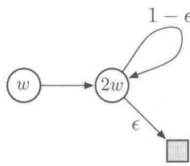

$$
w _ {k + 1} = \underset {w \in \mathbb {R}} {\arg \min } \sum_ {s \in \mathcal {S}} \left(\hat {v} (s, w) - \mathbb {E} _ {\pi} \left[ R _ {t + 1} + \gamma \hat {v} \left(S _ {t + 1}, w _ {k}\right) \mid S _ {t} = s \right]\right) ^ {2}
$$

强化学习（第2版）

$$
\begin{array}{l} = \underset {w \in \mathbb {R}} {\operatorname {a r g m i n}} \left(w - \gamma 2 w _ {k}\right) ^ {2} + \left(2 w - (1 - \varepsilon) \gamma 2 w _ {k}\right) ^ {2} \\ = \frac {6 - 4 \varepsilon}{5} \gamma w _ {k}. \tag {11.10} \\ \end{array}
$$

当 $\gamma >\frac{5}{6 - 4\varepsilon}$ 且 $w_0\neq 0$ 时，序列 $\{w_{k}\}$ 会发散。

另一个避免不稳定的方式是使用函数逼近中的一些特殊方法。特别是，对于不从观测目标中推测的函数逼近方法而言，是保证稳定性的。这些方法，称作平均器，包括最近邻方法和局部加权回归，但是不包括一些流行的方法，比如瓦片编码和人工神经网络（ANN）。

练习11.3（编程）将单步的半梯度Q-学习算法应用到Baird的反例中，用实验来证明其权重会发散。

# 11.3 致命三要素

现在我们可以总结一下之前的讨论。只要我们的方法同时满足下述三个基本要素，就一定会有不稳定和发散的危险。我们称这三个基本要素为致命三要素。

函数逼近函数逼近是一种强大且可拓展的方法，可将我们的函数泛化到一个远大于内存和计算资源限制的状态空间中（如线性函数逼近和人工神经网络）。

自举法使用当前的目标估计值进行更新以得到新的目标估计值（如动态规划和TD方法），而不是只依赖于真实收益和完整回报（如蒙特卡洛方法）。

离轨策略训练用来进行训练的状态转移分布不是由目标策略产生的。如动态规划中所做的，遍历整个状态空间并均匀地更新所有状态而不理会目标策略就是一个离轨策略训练的例子。

特别要注意，这种风险并不是由控制或者广义策略迭代造成的。在比控制更简单的预测问题中，只要包含致命三要素，不稳定性也会出现，而这些情况则更加难以分析。风险也不是由于学习或环境的不确定性造成的，因为它在环境全部已知的规划算法（例如动态规划）中也会出现。

如果致命三要素中只有两个要素是满足的，那么可以避免不稳定性。很自然地，我们会仔细检查这三个要素，看看哪一个要素是不必要的。

在这三个要素中，函数逼近是最不可能被舍弃的。我们需要能处理大规模问题并具有足够的表达能力的方法。我们至少需要一个带大量特征和参数的线性函数逼近器。状态聚

合或者非参数化的方法的复杂性随着数据的增加而增大，都效果太差或者代价太昂贵。类似于LSTD的最小二乘方法的时间复杂度是平方级的，因此对于大规模的问题而言也过于昂贵。

不使用自举法是有可能的，付出的代价是计算和数据上的效率。也许最重要的损失还是计算上的效率。蒙特卡洛（非自举法）方法需要存储从每一步决策到获得最终回报值过程中的所有中间变量，并且这些计算都需要在最终的回报得到之后开始进行。在串行的冯诺依曼架构计算机上，这些计算的问题并不突出，但是对于专用的硬件来说非常明显。使用自举法和资格迹的方法（见第12章），数据可以在它们生成的时候立即被处理，并且之后不会再被用到。自举法使节约通信和内存开销变得可能，带来的收益是可观的。

放弃自举法带来的数据效率上的损失也非常显著，我们在第7章（图7.2）和第9章（图9.2）都见过这个问题：使用某种程度上的自举法在随机游走预测任务上的表现都好于蒙特卡洛算法。在第10章中，我们在高山行车任务（图10.4）上看到了类似的现象。很多其他的问题在使用自举法之后也会使学习更快（例如图12.14）。自举法通常可以提高学习的速度，因为它允许学习过程中利用状态的性质和自举计算中识别状态的能力。另一方面，自举法会削弱某些问题上的学习：在这些问题中状态的表征不好，所以泛化性很差（例如，Tetris、see Simsek、Algorta 和 Kothiyal，2016 中的例子）。一个不好的状态表征也会使得产生偏差，这也是导致自举法的近似的边界更差的原因（式9.14）。

总的来看，自举法的能力被认为是很有用的。人们可能有时选择不用自举法而是选择长期的 $n$ 步更新（或者使用一个更大的自举法参数， $\lambda \approx 1$ ；详见第12章)，但是自举法常常能极大地提升效率。自举法的这种能力使我们非常乐于将它保留在我们的工具包中。

最后一个是离轨策略学习，我们是否可以放弃它呢？同轨策略的方法通常来说足够了。对于无模型的强化学习而言，我们可以简单地使用Sarsa而不是Q学习。离轨策略方法将行动策略与目标策略分离，这可以被视作一个吸引人的便利，但并不是必要的。事实上，离轨策略学习在一些其他情形下可能是实质性的需求，在本书中我们并没有介绍这些情况，但是它们对于构建强人工智能这个更大的目标而言可能很重要。

在这些使用情形下，智能体不止学习一个价值函数和一个策略，而是同时学习多个。这在心理学中有大量的证据：人和动物学习预测多种感知事件，而不仅仅是收益。我们可能对不寻常的事物感到惊讶，并纠正我们对它们的预测，即使它们只是中效价值（既不是好的也不是坏的）。这种预测可能构成了我们对于世界的预测模型的基础，例如用于规划的模型。我们预测在动眼之后会看到什么，预测要花多久时间可以走到家，预测我们在打篮球时投篮命中的概率，预测我们承担下一个新项目时将获得的满意程度。在所有的这些

例子中，我们所预测的事件都取决于我们的某种行为。为了同时学习这些事件，我们需要从一个经验流中学习。目标策略有许多个，因此一个行动策略不可能同时等同于所有目标策略。并行地学习在概念上是可行的，因为行动策略可能部分地与多个目标策略有重叠。为了发挥它的全部优势，需要离轨策略学习。

# 11.4 线性价值函数的几何性质

为了更好地理解离轨策略中稳定性方面的挑战，最好能更抽象地、独立于学习过程地考虑价值函数近似问题。我们可以想象一个由所有可能的状态价值函数构成的空间，所有的函数都把状态映射到一个实数： $v: S \to \mathbb{R}$ 。这些价值函数中很多都不对应于任何一个策略。对于我们的目标而言，更重要的是很多都不可以被函数逼近器表示——按设计我们的函数逼近器的参数量远小于状态的参数量。

给定一个状态空间的枚举向量 $\mathcal{S} = \{s_1,s_2,\dots ,s_{|\mathcal{S}|}\}$ ，任何价值函数 $v$ 都对应于一个价值向量，代表该函数按顺序作用于这个状态空间的每个状态的取值 $[v(s_1),v(s_2),\ldots ,$ $v(s_{|\mathcal{S}|})]^{\top}$ ，这个向量的元素个数和状态数量一致。在大多数情况下，我们想使用函数逼近方法，因为显式表达出这个向量需要的元素数量太多，超过我们的实际需求。然而，这个向量的想法在概念上是非常有用的，我们认为一个价值函数和它的向量表示是可互换的。

为了建立直觉，我们考虑这样一种情况：有三个状态 $S = \{s_1, s_2, s_3\}$ 和两个参数 $\mathbf{w} = (w_1, w_2)^\top$ ，我们可以把所有的价值函数/价值向量当作三维空间中的点。这些参数构成了在二维子空间上的另一个坐标系统，任何的权重向量 $\mathbf{w} = (w_1, w_2)^\top$ 是一个二维子空间上的点，因此也是给这三个状态赋值的完整价值函数 $v_{\mathrm{w}}$ 。在一般的函数逼近下，全部空间和可表示函数的子空间可能关系很复杂，但是在线性函数逼近的情况下，子空间是一个平面，如图 11.3 所示。

现在我们考虑一个固定的策略 $\pi$ ，我们假设它的真实的价值函数太复杂，不能用一个近似函数来精确表示。因此 $v_{\pi}$ 不在这个子空间中。在图中，它被描绘为在可表示函数组成的子空间（平面）的上方。

如果 $v_{\pi}$ 不能被完全表示，距离它最近的可表示的价值函数是什么呢？这是一个有趣的问题，有很多不同的答案。我们首先需要一个度量两个函数之间距离的方法，给定两个价值函数 $v_{1}$ 和 $v_{2}$ ，我们可以讨论它们向量表示之间的差 $v = v_{1} - v_{2}$ 。如果 $v$ 很小，那么两个价值函数彼此很靠近。但是如何去度量这个差异向量的大小呢？传统的欧几里得范数在此处并不适用，因为正如我们在9.2节中所讨论的，有些状态比其他的状态更加重要，

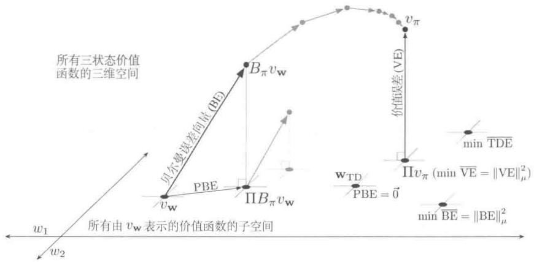  
图11.3 线性价值函数逼近的几何性质。图中展现的是在三个状态上的所有价值函数的三维空间，图中的平面是一个子空间，表示可以被一个线性函数逼近器用参数 $\mathbf{w} = (w_{1}, w_{2})$ 表示的所有价值函数。真实的价值函数 $v_{\pi}$ 在一个更大的空间中，可以被投影（到子空间中，使用一个投影算子 $\Pi$ ）为在价值函数误差（VE）意义上最好的近似。在贝尔曼误差（BE）、投影贝尔曼误差（PBE）和时序差分误差（TDE）意义下最好的近似都可能不一样，在右下角中都有显示（VE、BE和PBE在本图中都用相应的向量来表示）。贝尔曼算子作用于一个平面上的价值函数，得到一个平面外的价值函数，并可以在稍后被投影回来。如果你在子空间之外不断迭代地应用贝尔曼算子（在上方用灰色表示），将得到真实的价值函数——正如传统的动态规划所做的。如果相反，你在每步都投影到子空间，如下方灰色所显示的，那么最终的不动点会正好在PBE为0的向量的位置

因为它们出现得更为频繁，因此我们对它们更加感兴趣（见9.11节）。像在9.2节中那样，我们使用分布 $\mu : S \to [0,1]$ 来准确地量化我们对不同的状态的关注程度（通常使用同轨策略分布），然后我们可以用如下范数来定义价值函数之间的距离

$$
\| v \| _ {\mu} ^ {2} \doteq \sum_ {s \in S} \mu (s) v (s) ^ {2}. \tag {11.11}
$$

注意，在9.2节中的 $\overline{\mathrm{VE}}$ 可以用这个范数简单地写成： $\overline{\mathrm{VE}} (\mathbf{w}) = \| v_{\mathbf{w}} - v_{\pi}\|_{\mu}^{2}$ 。对于任何价值函数 $v$ ，用来在可表示的函数的子空间内寻找其最近邻的函数的操作就是投影操作。我们定义一个投影算子 $\Pi$ ：以任何函数作为输入，将其投影到可表示函数的子空间中在我们的范数定义下最近的点

$$
\Pi v \doteq v _ {\mathbf {w}} \quad \text {这 里} \mathbf {w} = \underset {\mathbf {w} \in \mathbb {R} ^ {d}} {\arg \min } \| v - v _ {\mathbf {w}} \| _ {\mu} ^ {2}. \tag {11.12}
$$

因此这个离真实的价值函数 $v_{\pi}$ 最近的可表示价值函数也就是它的投影： $\Pi v_{\pi}$ ，如图11.3所示。这是一个可以被蒙特卡洛方法找到的渐近解，尽管通常很慢。下框中进一步讨论了投影操作。

# 投影矩阵

对于一个线性函数的近似，投影操作是线性的，这意味着其可以被一个 $|S|\times |S|$ 的矩阵表示

$$
\Pi \doteq \mathbf {X} \left(\mathbf {X} ^ {\top} \mathbf {D} \mathbf {X}\right) ^ {- 1} \mathbf {X} ^ {\top} \mathbf {D}, \tag {11.13}
$$

其中，与9.4节中一样，D指的是 $|\mathcal{S}|\times |\mathcal{S}|$ 的对角矩阵，其中 $\mu (s)$ 作为对角线元素，并且X代表 $|\mathcal{S}|\times d$ 的矩阵，其中每一行都是对应一个状态 $s$ 的特征向量 $x(s)^{\top}$ 。如果式(11.13）中的逆矩阵不存在，那么我们使用伪逆来代替。使用这些矩阵，向量的范数可以写成

$$
\| v \| _ {\mu} ^ {2} = v ^ {\top} \mathbf {D} v, \tag {11.14}
$$

并且近似的线性价值函数可以写成

$$
v _ {\mathbf {w}} = \mathbf {X} \mathbf {w}. \tag {11.15}
$$

TD方法会找到不同的解，为了理解它们的基本原理，回忆价值函数 $v_{\pi}$ 的贝尔曼方程

$$
v _ {\pi} (s) = \sum_ {a} \pi (a | s) \sum_ {s ^ {\prime}, r} p (s ^ {\prime}, r | s, a) [ r + \gamma v _ {\pi} (s ^ {\prime}) ], \quad \text {对 所 有} s \in \mathcal {S}. \tag {11.16}
$$

真实的价值函数 $v_{\pi}$ 是唯一完全满足式 (11.16) 的价值函数。如果用一个近似价值函数 $v_{\mathrm{w}}$ 替换 $v_{\pi}$ ，则改变过的方程左右两侧的差值可以用于衡量 $v_{\mathrm{w}}$ 和 $v_{\pi}$ 之间的差距。我们把它叫作在状态 $s$ 时的贝尔曼误差

$$
\begin{array}{l} \bar {\delta} _ {\mathbf {w}} (s) \doteq \left(\sum_ {a} \pi (a | s) \sum_ {s ^ {\prime}, r} p \left(s ^ {\prime}, r \mid s, a\right) [ r + \gamma v _ {\mathbf {w}} \left(s ^ {\prime}\right) ]\right) - v _ {\mathbf {w}} (s) (11.17) \\ = \mathbb {E} _ {\pi} \left[ R _ {t + 1} + \gamma v _ {\mathbf {w}} \left(S _ {t + 1}\right) - v _ {\mathbf {w}} \left(S _ {t}\right) \mid S _ {t} = s, A _ {t} \sim \pi \right], (11.18) \\ \end{array}
$$

它清楚地展示了贝尔曼误差与TD误差(式11.3)之间的关系：贝尔曼误差是TD误差的期望。

在所有状态下的贝尔曼误差组成的向量 $\bar{\delta}_{\mathbf{w}} \in \mathbb{R}^{|S|}$ ，被称作贝尔曼误差向量（在图11.3中用BE表示）。这个向量在范数上的总大小，是价值函数的误差的一个总的衡量，称作均方贝尔曼误差

$$
\overline {{\mathrm {B E}}} (\mathbf {w}) = \left\| \bar {\delta} _ {\mathbf {w}} \right\| _ {\mu} ^ {2}. \tag {11.19}
$$

通常不可能把 $\overline{\mathrm{BE}}$ 减小到0（在此处 $v_{\mathrm{w}} = v_{\pi}$ ），但是对于线性函数逼近，有一个唯一的最

小化 $\overline{\mathrm{BE}}$ 的值 $\mathbf{w}$ 。这个点在可表示函数的子空间中（在图11.3中用min $\overline{\mathrm{BE}}$ 标记）通常不同于最小化VE的点(用 $\Pi v_{\pi}$ 表示)。在随后的两节中我们将讨论最小化BE的方法。

贝尔曼误差向量如图11.3所示，其是将贝尔曼算子 $B_{\pi}:\mathbb{R}^{|S|}\to \mathbb{R}^{|S|}$ 作用在近似价值函数中的结果。对于所有的 $s\in S$ 和 $v:S\rightarrow \mathbb{R}$ ，贝尔曼算子的定义如下

$$
\left(B _ {\pi} v\right) (s) \doteq \sum_ {a} \pi (a | s) \sum_ {s ^ {\prime}, r} p \left(s ^ {\prime}, r \mid s, a\right) [ r + \gamma v \left(s ^ {\prime}\right) ], \tag {11.20}
$$

对于 $v$ 的贝尔曼误差向量可以写为 $\bar{\delta}_{\mathbf{w}} = B_{\pi}v_{\mathbf{w}} - v_{\mathbf{w}}$

如果把贝尔曼算子作用到一个可表示空间内的价值函数上，那么通常它会产生一个在子空间之外的价值函数，正如图中所显示的。在动态规划（不包含函数逼近）中，这个算子会反复作用到可表示空间之外的点上，如图11.3上方灰色箭头所指示的。最终这个过程收敛到真实的价值函数 $v_{\pi}$ ：贝尔曼算子的唯一不动点，唯一满足如下条件的价值函数

$$
v _ {\pi} = B _ {\pi} v _ {\pi}, \tag {11.21}
$$

这只是用另一种方式来写关于 $\pi$ 的贝尔曼方程(式11.16)。

然而，在有函数逼近的情况下，无法表示子空间之外的中间过渡价值函数。我们并不能按照图11.3中的上部分灰色箭头所示那样操作。因为在第一次更新（黑色线条）之后，价值函数必须被投影回可表示空间，之后再在可表示空间里进行下一次迭代；价值函数又一次被贝尔曼算子带出子空间，然后又被投影算子映射回到子空间，正如下方的灰色箭头和线所示。这些箭头表示一个带近似的类似于DP的过程。

在这种情况下，我们感兴趣的是贝尔曼误差向量在可表示空间内的投影。这就是投影贝尔曼误差向量 $\Pi \bar{\delta}_{v_{\mathrm{w}}}$ ，在图11.3中用PBE表示。这个向量的范数大小是另一个衡量近似价值函数误差的指标。对于任意的近似价值函数 $v$ ，我们定义均方投影贝尔曼误差，记作 $\overline{\mathrm{PBE}}$ ，为

$$
\overline {{\mathrm {P B E}}} (\mathbf {w}) = \left\| \Pi \bar {\delta} _ {\mathbf {w}} \right\| _ {\mu} ^ {2}. \tag {11.22}
$$

使用线性函数逼近，总会存在一个近似的价值函数（在子空间中）使得PBE为零。这是一个TD的不动点，在9.4节中介绍过 $\mathbf{W}_{\mathrm{TD}}$ 。正如我们所见，这个点在半梯度的TD方法和离轨策略训练下并不总是稳定的。从图中可以看出，这个价值函数通常也不同于那些优化VE或者BE所得到的价值函数。在11.7节和11.8节中讨论能够保证收敛到不动点的方法。

# 11.5 对贝尔曼误差做梯度下降

在对价值函数的近似及其各种目标有了理解之后，我们回到离轨策略学习的稳定性方面的挑战问题上。我们可以使用随机梯度下降（SGD，9.3节）的方法，其中更新的量在期望上等于目标函数的负梯度。这些方法总是会让目标函数减小（期望上），因此通常是稳定的，而且有着良好的收敛性质。在本书到目前为止研究的这些算法中，只有蒙特卡洛方法是真正的SGD方法。这些方法在同轨策略和离轨策略以及一般的非线性（可导的）函数逼近器下均可有效收敛，尽管它们通常慢于使用自举法的半梯度方法（非SGD方法）。半梯度方法可能在离轨策略学习中发散（正如我们本章前面介绍的），也可能在人为设计的非线性函数逼近的一些例子（Tsitsiklis和van Roy，1997）中发散。使用真实的SGD方法，这样的发散是不会出现的。

SGD的吸引力如此之大，以至于人们花费了很大精力去寻找在强化学习中使用它的实用方法。在所有这些努力中，我们首先应该考虑的是待优化的误差或目标函数的选择。在这一节和下一节中我们将讨论一些最流行的目标函数的起源和局限性，它们基于我们上一节中所提到的贝尔曼误差。尽管这已经是一个流行并且有影响力的方法，但我们认为这是一个错误的研究方向，并不能产生优秀的学习方法。另一方面，这种方法失败的方式非常有趣，为我们寻找好的方法提供了灵感。

首先，我们先不考虑贝尔曼误差，先讨论一些更加直接且简单的东西。时序差分学习由TD误差所驱动。那么为什么不把最小化TD误差的平方期望作为目标呢？在一般的函数逼近的例子里，带折扣的单步TD误差是

$$
\delta_ {t} = R _ {t + 1} + \gamma \hat {v} \left(S _ {t + 1}, \mathbf {w} _ {t}\right) - \hat {v} \left(S _ {t}, \mathbf {w} _ {t}\right).
$$

基于此，一个被称为均方TD误差的可能的目标函数是

$$
\begin{array}{l} \overline {{\mathrm {T D E}}} (\mathbf {w}) = \sum_ {s \in S} \mu (s) \mathbb {E} \left[ \delta_ {t} ^ {2} \mid S _ {t} = s, A _ {t} \sim \pi \right] \\ = \sum_ {s \in S} \mu (s) \mathbb {E} \left[ \rho_ {t} \delta_ {t} ^ {2} \mid S _ {t} = s, A _ {t} \sim b \right] \\ = \mathbb {E} _ {b} \left[ \rho_ {t} \delta_ {t} ^ {2} \right]. \quad (\mu \text {是 在} b \text {下 得 到 的 分 布}) \\ \end{array}
$$

最后一个方程是SGD想要的那种形式，它给出一个期望值形式的目标，这个期望可以从经验中采样求得（记住经验是从行动策略 $b$ 得到的）。因此，按照标准的SGD方法，我们

可以得到基于这种期望值的一个样本的单步更新。

$$
\begin{array}{l} \mathbf {w} _ {t + 1} = \mathbf {w} _ {t} - \frac {1}{2} \alpha \nabla \left(\rho_ {t} \delta_ {t} ^ {2}\right) \\ = \mathbf {w} _ {t} - \alpha \rho_ {t} \delta_ {t} \nabla \delta_ {t} \\ = \mathbf {w} _ {t} + \alpha \rho_ {t} \delta_ {t} \left(\nabla \hat {v} \left(S _ {t}, \mathbf {w} _ {t}\right) - \gamma \nabla \hat {v} \left(S _ {t + 1}, \mathbf {w} _ {t}\right)\right), \tag {11.23} \\ \end{array}
$$

你会发现除了额外的最后一项，它与半梯度TD算法(式11.2)无异。这一项补全了这个梯度，而且让它成为了一个真正的SGD算法并有优异的收敛保证。我们把这个算法叫作朴素残差梯度算法（命名自Baird，1995）。尽管朴素残差梯度算法稳健地收敛，但是它并不一定会收敛到我们想要的地方。

# 例 11.2 A-分裂的例子，展示了朴素残差梯度算法的不足

考虑右图所示的三个状态的分幕式MRP。每幕始于状态A之后随机地“分裂”，一半的时间走向状态B（然后终止并返回收益1），一半的时间走向状态C（然后终止并返回收益0）。第一个从A出发转移的收益总是0，无论之后转移如何发展。因为这是一个分幕式问题，所以我

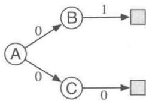

我们可以将 $\gamma$ 设置为1，我们也假设用同轨策略训练，因此 $\rho_{t}$ 总是1。假设使用表格型的函数逼近，因此学习算法可以自由地给三个状态以任意、独立的值。从而这应该是一个简单的问题。

这些值应该是什么呢？从A出发，一半的时间里回报值是1，且另一半的时间里回报值是0；A应该有价值 $\frac{1}{2}$ 。从B出发回报值永远是1，因此它的价值应该是1；类似地，C的回报值总是0，因此它的价值应该是0。这些都是真实的价值，而且这是一个表格式的问题，所有之前提到的方法都完全收敛到这些值。

然而，朴素残差梯度算法为B和C寻找到了不同的值。它在B收敛到了值 $\frac{3}{4}$ 而在C有一个值 $\frac{1}{4}$ (A正确收敛到了 $\frac{1}{2}$ )。这些确实是最小化TDE的结果。

我们用这些值计算 $\overline{\mathrm{TDE}}$ 。每幕的第一个转移要么从A的 $\frac{1}{2}$ 提高到B的 $\frac{3}{4}$ 改变为 $\frac{1}{4}$ ；或者从A的 $\frac{1}{2}$ 降低到C的 $\frac{1}{4}$ ，变化为 $-\frac{1}{4}$ 。因为在这些转移上的收益为0，而且 $\gamma = 1$ ，这些改变就是TD误差，因此在第一个转移上的TD误差的平方总是 $\frac{1}{16}$ 。第二个转移是类似的；要么从B的 $\frac{3}{4}$ 增加到收益1(并进入一个价值为0的终止状态)，或者从C的 $\frac{1}{4}$ 减小到收益0(也是进入一个价值为0的终止状态)。因此，第二步的TD误差总是 $\pm \frac{1}{4}$ ，平方误差则是 $\frac{1}{16}$ 。因此，对于这组值，

TDE在每一步上都是 $\frac{1}{16}$

现在我们为真实的价值计算 $\overline{\mathrm{TDE}}$ (B 为 1, C 为 0, A 为 $\frac{1}{2}$ )。在这种情况下第一个转移要么在 B 从 $\frac{1}{2}$ 提升到 1，要么在 C 从 $\frac{1}{2}$ 降到 0，这两种情况的绝对误差都是 $\frac{1}{2}$ ，平方误差为 $\frac{1}{4}$ 。第二个转移的误差为 0，因为初始值无论是 0 还是 1（取决于从 B 还是 C 开始转移），都恰好与即时收益和回报相等。由于 $\frac{1}{8}$ 大于 $\frac{1}{16}$ ，因此这个解劣于通过 $\overline{\mathrm{TDE}}$ 优化找到的解。在这个简单的问题中，真实的价值并不对应最小的 $\overline{\mathrm{TDE}}$ 。

在A-分裂的例子中使用了一个表格型的表示，因此真实的状态价值可以被确切地表达出来，然而朴素残差梯度算法发现了不同的值，而且这些值相比于真实的值有更低的TDE。最小化TDE是朴素的，通过减小所有的TD误差，它更倾向于得到时序上平滑的结果，而不是准确的预测。

还有一个更好的想法是最小化贝尔曼误差。如果学到了准确的价值，那么在任何位置贝尔曼误差都是0。因此，最小化贝尔曼误差在A-分裂的例子中应该没有任何问题。通常我们不能期望达到0的贝尔曼误差，因为它包括寻找真实的价值函数的过程，而我们假定真实的价值函数在可表达的函数空间之外。但是接近于它看起来是一个很自然的目标。正如我们所见，贝尔曼误差与TD误差也是紧密相关的。对于一个状态而言，贝尔曼误差是那个状态上TD误差的期望。因此我们对TD误差的期望重复上面的推导（所有的期望都隐式以 $S_{t}$ 为条件）

$$
\begin{array}{l} \mathbf {w} _ {t + 1} = \mathbf {w} _ {t} - \frac {1}{2} \alpha \nabla \left(\mathbb {E} _ {\pi} [ \delta_ {t} ] ^ {2}\right) \\ = \mathbf {w} _ {t} - \frac {1}{2} \alpha \nabla \left(\mathbb {E} _ {b} \left[ \rho_ {t} \delta_ {t} \right] ^ {2}\right) \\ = \mathbf {w} _ {t} - \alpha \mathbb {E} _ {b} [ \rho_ {t} \delta_ {t} ] \nabla \mathbb {E} _ {b} [ \rho_ {t} \delta_ {t} ] \\ = \mathbf {w} _ {t} - \alpha \mathbb {E} _ {b} \left[ \rho_ {t} \left(R _ {t + 1} + \gamma \hat {v} \left(S _ {t + 1}, \mathbf {w}\right) - \hat {v} \left(S _ {t}, \mathbf {w}\right)\right) \right] \mathbb {E} _ {b} \left[ \rho_ {t} \nabla \delta_ {t} \right] \\ = \mathbf {w} _ {t} + \alpha \left[ \mathbb {E} _ {b} \left[ \rho_ {t} \left(R _ {t + 1} + \gamma \hat {v} \left(S _ {t + 1}, \mathbf {w}\right)\right) \right] - \hat {v} \left(S _ {t}, \mathbf {w}\right) \right] \left[ \nabla \hat {v} \left(S _ {t}, \mathbf {w}\right) \right. \\ - \gamma \mathbb {E} _ {b} \left[ \rho_ {t} \nabla \hat {v} \left(S _ {t + 1}, \mathbf {w}\right) \right]. \\ \end{array}
$$

这种更新和采样它的多种方式被称作残差梯度算法。如果你简单地在所有期望中使用采样值，那么上面的公式就几乎规约到式(11.23)，朴素残差梯度算法。但是这个方法

过于简单，因为上面的公式包括了下一个状态 $S_{t + 1}$ ，其在两个相乘的期望值中出现。为了得到这个乘积的无偏样本，需要下一个状态的两个独立样本，但是通常在与外部环境的交互过程中，我们只能得到一个。可以一个用期望值，一个用采样值，但是不能都用期望值或采样值。

有两种方式可以让残差梯度算法起作用。一种是在确定性的环境下，如果到下一个状态的转移是确定性的，那么两个样本一定是一样的，则朴素的算法就是有效的。另一种方式是从 $S_{t}$ 中获得下一个状态 $(S_{t + 1})$ 的两个独立样本，一个用于第一个期望，另一个用于第二个期望。在与真实环境的交互中，这看起来是不可能的，但是在与模拟环境交互时，这是可行的。我们可以在进入真实的后继状态之前，退回到前面的状态，并且获得另一个后继状态。无论是上面的哪一种情况，残差梯度算法都能保证在一般步长参数上收敛到 $\overline{\mathrm{BE}}$ 的最小值。作为一种SGD方法，用在线性和非线性的函数逼近器上都可以稳健地收敛。在线性的情况下，总会收敛到最小化 $\overline{\mathrm{BE}}$ 的独一无二的 $\mathbf{w}$ 。

然而，残差梯度方法的收敛性仍然有三点不能让人满意。第一点是在实际应用中它速度非常慢，远远慢于半梯度方法。实际上，这种方法的支持者们已经提出了将它与快速半梯度方法初始化合并，并逐渐地切换到具有收敛性保证的残差梯度算法（Baird和Moore，1999）。残差梯度算法令人不满意的第二点是它看起来仍然收敛到错误的值。它在所有的表格型情况下都会得到正确的值，例如在A-分裂的例子中，因为在那些情况下贝尔曼方程都能找到确切的解。但是如果我们用真正的函数逼近来检查样本，那么我们会发现残差梯度算法（实际上对应于BE目标函数），似乎找到了错误的价值函数。其中最明显的例子当属A-分裂例子的一个变体，其又被称作A-预先分裂，在下框中所示的例子中，残差梯度算法与朴素的版本找到了一样差的解。这个例子直观地展示了最小化BE（残差梯度算法确实在做的事情）可能也不是一个好的目标。

# 例 11.3 A- 预先分裂的例子, $\overline{\mathrm{{BE}}}$ 的一个反例

考虑右侧的一个三状态的分幕式MRP：每幕始于A1或者A2，两者概率相等。这两个状态对于函数逼近器而言看起来完全一样，就像一个单个的状态A，它的特征表示与另外两个状态B和C的特征表示不同且不相关，B和C之间也互不相同。特别地，函数逼近器

的参数有三个成员，一个提供状态B的值，一个提供状态C的值，另一个提供状态A1和A2的值。除了初始状态的选择之外，系统是确定的。如果它始于A1，那么它会转移到B，得到收益0，之后终止，得到收益1；如果它始于A2，那么它

会转移到C，然后终止，两步的收益都是0。

对于一个只关注特征的学习算法，这个系统看起来与A-分裂的例子是一样的。这个系统看起来总是在A出发，等概率地转移到B或者C，之后以1或者0的收益终止，具体的值完全取决于前一个状态是什么。像在A-分裂的例子中一样，B和C的真实值是1和0，而且由对称得到，对于A1和A2而言最好的共享价值是 $\frac{1}{2}$ 。

由于这个问题在外部看起来等同于A-分裂的例子，因此我们已经知道算法会找到什么值了。半梯度的TD收敛到刚刚提到的真实值，然而朴素残差梯度算法对于B和C分别收敛到值 $\frac{3}{4}$ 和 $\frac{1}{4}$ 。所有这些转移都是确定性的，因此非朴素的残差梯度算法将会收敛到这些值（在这个情况下是一样的算法）。接下来，这个“朴素”的解法也一定是最小化BE的解法，而且它确实是这样。在一个确定性的问题中，贝尔曼误差和TD误差都是一样的，因此BE总是和TDE一样。在这个例子中优化BE，会导致和朴素的残差梯度算法在A-分裂例子中一样的失败模式。

下一节解释残差梯度算法不令人满意的第三点，就像第二点一样，第三点也是BE目标本身的问题，而不是任何特定算法的问题。

# 11.6 贝尔曼误差是不可学习的

本节中提出的不可学习的概念与机器学习中常用的不同。在机器学习中，我们假定可学习就是它可以被高效地学会，意味着可以用多项式级而不是指数级数量的样本学会它。而在此处我们用更基础的方式使用这个术语，可学习意味着用任意多的经验可以学到。事实证明，很多在强化学习中我们明显感兴趣的量，即使有无限多的数据，也不能从中学到。这些量都是良好定义的，而且在给定环境的内在结构时可以计算出来，但是不能从外部可观测的特征向量、动作和收益的序列中得到。1 我门称它们是不可学习的。事实证明，在前两节中介绍的贝尔曼误差目标（BE）在这个意义上是不可学习的。贝尔曼误差目标不能从可观测的数据中学到，这也许是不使用它的最大的理由。

为了使可学习的概念更加清晰，我们首先介绍一些简单的例子。考虑两个马尔可夫收益过程2(MRP)，如下图中所示。

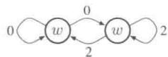

当两条边离开同一个状态时，两个转移都被认为是等概率发生的，数字表明了获得的收益。所有状态看起来都是一样的，它们有相同的单变量特征 $x = 1$ 而且有相同的近似值 $w$ 。因此，数据轨迹唯一不同的部分是收益序列。左侧的MRP处于同一个状态下，随机产生无穷无尽的0和2的流，产生每个的概率都是0.5。右侧的MRP，在每一步中，要么处在它当前的状态，要么切换到另一个，这两个动作发生的概率是一样的。收益函数在这个MRP中是确定的，从某一个状态出发永远是0，从另一个状态出发永远是2。但是由于在每步中处于每个状态的概率都是一样的，可观测的数据又一次是一个由0和2随机组成的无限长的流，等同于左侧的MRP（我们可以假设右侧的MRP等概率地从两个状态之一出发）。因此即使给定了无限数量的数据，仍然不可能分辨是哪一个MRP产生了它。特别是，我们不能分辨MRP有一个状态还是两个状态，是随机的还是确定的。这些事情都是不可学习的。

这一对MRP也展示了VE目标（式9.1）是不可学习的。如果 $\gamma = 0$ ，那么这三个状态(在两个MRP中)的真实值从左到右分别是1、0、2。假设 $w = 1$ ，那么VE对于左边的MRP而言是0，但是对于右侧的MRP而言是1。因为VE在这两个问题中是不一样的，然而产生的数据却遵从同一分布，因此VE也是不可学习的。VE并不是这个数据分布唯一确定的函数。而且如果它是不可学习的，那么VE作为一个学习的目标如何才能起作用呢？

如果一个目标不可学习，那么它的效用确实会受到质疑。然而在 $\overline{\mathrm{VE}}$ 的例子中，还有一条出路。注意，对于以上两个MRP，它们的最优解 $w = 1$ 相同（假设在右侧的MRP中， $\mu$ 对于这两个不可区分的状态而言是相同的）。这只是一种偶然，还是说对于所有有着相同数据分布以及相同最优参数向量的MDP而言都是广泛成立的呢？如果这一点成立（我们会在后面说明这确实是成立的），那么 $\overline{\mathrm{VE}}$ 仍然是一个有用的目标。 $\overline{\mathrm{VE}}$ 是不可学习的，但是优化它的参数是可学习的！

为了理解这一点，引入另一个自然的目标函数是很有用的，这时我们需要一个明显可学习的量。一个总是可观察的误差是每个时刻的估计价值与这个时刻之后的实际回报的误差。均方回报误差，又记作 $\overline{\mathrm{RE}}$ ，是一个在 $\mu$ 分布下这个误差的平方的期望。在同轨策略的情况下， $\overline{\mathrm{RE}}$ 可以写成

强化学习 (第2版)

$$
\begin{array}{l} \overline {{\mathrm {R E}}} (\mathbf {w}) = \mathbb {E} \left[ \left(G _ {t} - \hat {v} (S _ {t}, \mathbf {w})\right) ^ {2} \right] \\ = \overline {{\mathrm {V E}}} (\mathbf {w}) + \mathbb {E} \left[ \left(G _ {t} - v _ {\pi} (S _ {t})\right) ^ {2} \right]. \tag {11.24} \\ \end{array}
$$

因此这两个目标是相同的，除了一个不依赖于参数向量的方差项外。这两个目标因此必须有相同的最优参数值 $\mathbf{w}^*$ 。在图11.4的左图中总结了总的关系。

* 练习11.4 证明式(11.24)。提示：把 $\overline{\mathrm{RE}}$ 写成一个在给定 $S_{t} = s$ 时平方误差在所有可能的状态 $s$ 上的期望。然后由误差加减状态 $s$ 的真实值（在平方之前），把减去的真实值和回报放在一起，增加的真实值和估计值放在一起。之后，如果展开平方项，最复杂的项将会变成0，留下的是式(11.24)。

现在我们回到BE。BE与VE类似的地方在于，可以从MDP的知识中计算出它，但是不可以从数据中学出来。但是它与VE不同的地方在于，它的极小值解是不可学习的。下面框中展示了一个反例——两个MRP产生相同的数据分布，但是使它们最小化的参数向量是不同的，这证明了最优的参数向量并不是一个关于数据的函数，因此不能够从数据中学出来。我们考虑的其他的自举法目标：PBE和TDE，可以由数据决定（可学习），而且可以决定最优解。这些最优解通常与其他目标和BE的最小值确定的解不同。在图11.4的右图中总结了一般的情况。

  
蒙特卡洛目标

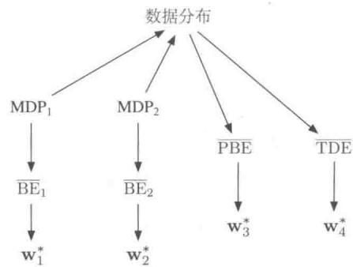  
自举法目标  
图11.4 数据分布、MDP和各种目标函数之间的因果关系 左侧，蒙特卡洛目标：两个不同的MDP可以产生相同的数据分布，但是会具有不同的VE，这证明VE目标不能够由数据决定，因此是不可学习的。然而，所有这样的VE还具有相同的最优参数向量 $\mathbf{w}^{*}$ ！除此之外，这个相同的 $\mathbf{w}^{*}$ 可以从另一个目标中确定：RE，可以从数据分布中唯一确定。因此尽管VE不行，但是 $\mathbf{w}^{*}$ 和RE是可学习的。右侧，自举法目标：两个不同的MDP可以产生相同的数据分布，但是也会产生不同的BE，而且最小化时会有不同的参数向量；这些不可以从数据分布中学习到。PBE和TDE目标以及它们（不同的）最小值可以直接从数据中确定，因此是可以学习的

因此，BE是不可学习的；不能从特征向量和其他可观测的数据中估计它。这限制

了 $\overline{\mathrm{BE}}$ 用于有模型的情形。几乎没有算法能够在不接触特征向量以外的底层的MDP状态的情况下最小化 $\overline{\mathrm{BE}}$ 。残差梯度算法是唯一能够最小化 $\overline{\mathrm{BE}}$ 的算法，因为它允许从一个状态中采样两次——这些状态不仅仅有相同的特征向量，而是有完全相同的基础底层状态。我们现在可以看到，没有办法绕过这个问题，最小化 $\overline{\mathrm{BE}}$ 需要能够触达像这样的名义上的基础底层MDP。这是 $\overline{\mathrm{BE}}$ 的一个重要的限制，超出了例11.3中A-预先分裂的例子给出的限制。所有这些引导我们把注意力转向 $\overline{\mathrm{PBE}}$ 。

# 例11.4 贝尔曼误差可学习的反例

为了展示所有的可能性，我们需要一个相对上面的略微复杂一点的马尔可夫收益过程（MRP）对。考虑如下的几个MRP：

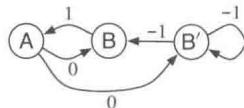

当两条边离开同一个状态时，两个转移都被认为是等概率发生的，数字表示接收到的收益。左侧的MRP有两个状态，它们由不同的字母表示。右侧的MRP有三个状态，其中的两个，B和 $\mathsf{B}^{\prime}$ ，从外观上看一样，并且会使用一样的近似值。特别是，w有两个分量，状态A的值由第一个分量确定，状态B和 $\mathsf{B}^{\prime}$ 的值由第二个分量确定。第二个MRP被设计成在三个状态上消耗的时间相同，因此我们对于所有的 $s$ ，设置 $\mu (s) = \frac{1}{3}$

注意，对于这两个MRP而言，可观测的数据分布是一样的。在两种情况中，智能体都看到单个A出现，随之获得收益0，然后出现一些Bs，除了最后一个以外每个都获得收益-1，最后一个的收益是1，之后我们重新回到A和收益0，等等。所有的这些统计细节都是一样的。在两个MRP中，出现一个长度为 $k$ 的Bs序列的概率为 $2^{-k}$

现在我们假设 $\mathbf{w} = \mathbf{0}$ 。在第一个MRP中，这是一个精确解，而且 $\overline{\mathrm{BE}}$ 是0。在第二个MRP中，这个解在B和 $B^{\prime}$ 上都产生了一个值为1的平方误差，以至于 $\overline{\mathrm{BE}} = \mu (\mathrm{B})1 + \mu (\mathrm{B}^{\prime})1 = \frac{2}{3}$ 。这两个MRP产生了一样的数据分布，但是有不同的BE；因此BE是不可学习的。

除此之外（不像之前的 $\overline{\mathrm{VE}}$ 的例子），最小化 $\mathbf{w}$ 的值对两个MRP而言是不同的。对于第一个MRP， $\mathbf{w} = 0$ 最小化的是对于任意 $\gamma$ 的BE。对于第二个MRP，最小化的 $\mathbf{w}$ 是一个关于 $\gamma$ 的复杂函数，但是在极限情况下，例如 $\gamma \rightarrow 1$ ，它是 $(-\frac{1}{2},0)^{\top}$ 。所以只依靠数据不能通过最小化BE得到解，需要关于MRP的数据以外的知识才可以。从这个意义上说，理论上我们不能把BE作为学习的目标。

第二个MRP中A的使BE最小化的值距离0如此之远，有些令人惊讶。回顾一下，A有一个专用的权重，因此它的值在函数逼近中是不受限的。A紧跟着收益0，然后转移到一个值接近于0的状态，这表明 $v_{\mathrm{w}}(\mathsf{A})$ 应该是0；那为什么它的最优值实际上是负的而不是0呢？答案是把 $v_{\mathrm{w}}(\mathsf{A})$ 变成负值减小了从B到达A的误差。这个确定的转移收益为1，这意味着B应该比A大1。因为B的值接近于0，所以A的值将会变得接近于-1。A的最小化BE的值 $\approx -\frac{1}{2}$ 是一个减小进入和离开A的误差的一个折中。

# 11.7 梯度TD方法

我们现在考虑最小化 $\overline{\mathrm{PBE}}$ 的SGD方法。正如真实的SGD方法，这些梯度 $TD$ 方法有稳健的收敛性质，即使在离轨策略训练和非线性函数逼近的情况下。之前我们讨论过，在线性的情况中，总有一个正确的解，在TD不动点 $\mathbf{w}_{\mathrm{TD}}$ 上 $\overline{\mathrm{PBE}}$ 是0。这个解可以用最小二乘法找到(9.8节)，但是只能用时间复杂度是参数数量平方级 $O(d^{2})$ 的方法。相反，我们现在寻求时间复杂度为 $O(d)$ 并且有稳健收敛性质的SGD方法。梯度TD方法可以实现这些目标，其付出的代价是时间复杂度增加一倍。

为了得到一个用于PBE（假设在线性函数逼近下）的SGD方法，我们从以矩阵形式扩展和重写目标函数(式11.22)开始

$$
\begin{array}{l} \overline {{\mathrm {P B E}}} (\mathbf {w}) = \left\| \Pi \bar {\delta} _ {\mathbf {w}} \right\| _ {\mu} ^ {2} \\ = \left(\Pi \bar {\delta} _ {\mathbf {w}}\right) ^ {\top} \mathbf {D} \Pi \bar {\delta} _ {\mathbf {w}} \quad \text {由 式 (1 1 . 4) 得 到} \\ = \bar {\delta} _ {\mathbf {w}} ^ {\top} \Pi^ {\top} \mathbf {D} \Pi \bar {\delta} _ {\mathbf {w}} \\ = \bar {\delta} _ {\mathbf {w}} ^ {\top} \mathbf {D} \mathbf {X} \left(\mathbf {X} ^ {\top} \mathbf {D} \mathbf {X}\right) ^ {- 1} \mathbf {X} ^ {\top} \mathbf {D} \bar {\delta} _ {\mathbf {w}} \tag {11.25} \\ \end{array}
$$

（通过式11.4以及等式 $\Pi^{\top}\mathbf{D}\Pi = \mathbf{DX}\left(\mathbf{X}^{\top}\mathbf{DX}\right)^{-1}\mathbf{X}^{\top}\mathbf{D})$

$$
= \left(\mathbf {X} ^ {\top} \mathbf {D} \bar {\delta} _ {\mathbf {w}}\right) ^ {\top} \left(\mathbf {X} ^ {\top} \mathbf {D} \mathbf {X}\right) ^ {- 1} \left(\mathbf {X} ^ {\top} \mathbf {D} \bar {\delta} _ {\mathbf {w}}\right). \tag {11.26}
$$

关于 $\mathbf{W}$ 的梯度是

$$
\nabla \overline {{\mathrm {P B E}}} (\mathbf {w}) = 2 \nabla \left[ \mathbf {X} ^ {\top} \mathbf {D} \bar {\delta} _ {\mathbf {w}} \right] ^ {\top} \left(\mathbf {X} ^ {\top} \mathbf {D} \mathbf {X}\right) ^ {- 1} \left(\mathbf {X} ^ {\top} \mathbf {D} \bar {\delta} _ {\mathbf {w}}\right).
$$

为了把它转化成SGD方法，我们需要在每个时间点上采样一些东西，并把这个量作为它的期望值。令 $\mu$ 为在行动策略下访问的状态分布。所有这三个因子都可以写成在这个分

布下的某个期望的形式。例如，最后一个因子可以写成

$$
\mathbf {X} ^ {\top} \mathbf {D} \bar {\delta} _ {\mathbf {w}} = \sum_ {s} \mu (s) \mathbf {x} (s) \bar {\delta} _ {\mathbf {w}} (s) = \mathbb {E} [ \rho_ {t} \delta_ {t} \mathbf {x} _ {t} ],
$$

这就是半梯度的TD(0)更新式(11.2)的期望。第一个因子是这个更新梯度的转置

$$
\begin{array}{l} \nabla \mathbb {E} \left[ \rho_ {t} \delta_ {t} \mathbf {x} _ {t} \right] ^ {\top} = \mathbb {E} \left[ \rho_ {t} \nabla \delta_ {t} ^ {\top} \mathbf {x} _ {t} ^ {\top} \right] \\ = \mathbb {E} \left[ \rho_ {t} \nabla \left(R _ {t + 1} + \gamma \mathbf {w} ^ {\top} \mathbf {x} _ {t + 1} - \mathbf {w} ^ {\top} \mathbf {x} _ {t}\right) ^ {\top} \mathbf {x} _ {t} ^ {\top} \right] \quad (\text {使 用 分 幕 式} \delta_ {t}) \\ = \mathbb {E} \left[ \rho_ {t} \left(\gamma \mathbf {x} _ {t + 1} - \mathbf {x} _ {t}\right) \mathbf {x} _ {t} ^ {\top} \right]. \\ \end{array}
$$

最后，中间的因子是特征向量的外积矩阵的期望的逆。

$$
\mathbf {X} ^ {\top} \mathbf {D} \mathbf {X} = \sum_ {s} \mu (s) \mathbf {x} _ {s} \mathbf {x} _ {s} ^ {\top} = \mathbb {E} \left[ \mathbf {x} _ {t} \mathbf {x} _ {t} ^ {\top} \right].
$$

我们把 $\overline{\mathrm{PBE}}$ 的梯度的三个因子换成这些期望的形式，得到

$$
\nabla \overline {{\mathrm {P B E}}} (\mathbf {w}) = 2 \mathbb {E} \left[ \rho_ {t} \left(\gamma \mathbf {x} _ {t + 1} - \mathbf {x} _ {t}\right) \mathbf {x} _ {t} ^ {\top} \right] \mathbb {E} \left[ \mathbf {x} _ {t} \mathbf {x} _ {t} ^ {\top} \right] ^ {- 1} \mathbb {E} \left[ \rho_ {t} \delta_ {t} \mathbf {x} _ {t} \right]. \tag {11.27}
$$

把梯度写成这样的形式你可能看不出有任何好处。这是三个表达式的乘积，第一个和最后一个都不是独立的。它们都依赖于下一个状态的特征向量 $\mathbf{x}_{t + 1}$ ，我们不能仅仅对这两个期望采样，然后将这些样本相乘。这样会像朴素残差梯度算法那样得到一个有偏的估计。

另一个想法是分别估计这三个期望，然后将它们合并起来得到一个梯度的无偏估计。这种方法虽然有效，但是需要太多的计算资源了，尤其是储存前两个期望，需要 $d \times d$ 的矩阵，并且需要计算第二个的逆。可以改进这个想法。如果估计了三个期望中的两个且储存了，那么对于第三个，可以通过采样，然后与其他两个量的储存值结合使用。例如，你可以储存后两个量的估计（使用9.8节中的矩阵求逆的增量式更新技术），之后对第一个表达式采样。不幸的是，总的算法仍然是平方级的时间复杂度（阶为 $O(d^{2})$ ）。

分别储存一些估计，然后把它们与样本合并，这是一个好的想法，而且可以用于梯度TD方法中。梯度TD方法估计并储存式(11.27)中的后两个因子。这些因子是 $d\times d$ 的矩阵和一个 $d$ 维向量，因此它们的乘积只是一个 $d$ 维向量，就像 $\mathbf{W}$ 本身。我们把这第二个学到的向量记为 $\mathbf{V}$

$$
\mathbf {v} \approx \mathbb {E} \left[ \mathbf {x} _ {t} \mathbf {x} _ {t} ^ {\top} \right] ^ {- 1} \mathbb {E} \left[ \rho_ {t} \delta_ {t} \mathbf {x} _ {t} \right]. \tag {11.28}
$$

这种形式对于学习线性有监督学习的学生而言非常熟悉，这是试图从特征近似 $\rho_{t}\delta_{t}$ 的最小二乘解。通过最小化期望平方误差 $\left(\mathbf{v}^{\top}\mathbf{x}_{t} - \rho_{t}\delta_{t}\right)^{2}$ 增量式地寻找向量 $\mathbf{v}$ 的标

准SGD方法又被称为最小均方(Least Mean Square，LMS)规则（此处增加了一个重要度采样率）

$$
\mathbf {v} _ {t + 1} \dot {=} \mathbf {v} _ {t} + \beta \rho_ {t} (\delta_ {t} - \mathbf {v} _ {t} ^ {\top} \mathbf {x} _ {t}) \mathbf {x} _ {t},
$$

其中， $\beta > 0$ 是另一个步长参数。我们可以使用这种方法以 $O(d)$ 空间和时间复杂度有效得到式 (11.28)。

给定一个近似式（11.28）的保存下来的估计 $\mathbf{v}_t$ ，我们可以通过基于式（11.27）的SGD方法更新主要参数向量 $\mathbf{w}_t$ 。最简单的规则是

$$
\begin{array}{l} \mathbf {w} _ {t + 1} = \mathbf {w} _ {t} - \frac {1}{2} \alpha \nabla \overline {{\mathrm {P B E}}} (\mathbf {w} _ {t}) \quad \text {一 般 的 S G D 规 则} \\ = \mathbf {w} _ {t} - \frac {1}{2} \alpha 2 \mathbb {E} \left[ \rho_ {t} \left(\gamma \mathbf {x} _ {t + 1} - \mathbf {x} _ {t}\right) \mathbf {x} _ {t} ^ {\top} \right] \mathbb {E} \left[ \mathbf {x} _ {t} \mathbf {x} _ {t} ^ {\top} \right] ^ {- 1} \mathbb {E} \left[ \rho_ {t} \delta_ {t} \mathbf {x} _ {t} \right] \quad \text {由 式 (1 1 . 2 7) 得 到} \\ = \mathbf {w} _ {t} + \alpha \mathbb {E} \left[ \rho_ {t} \left(\mathbf {x} _ {t} - \gamma \mathbf {x} _ {t + 1}\right) \mathbf {x} _ {t} ^ {\top} \right] \mathbb {E} \left[ \mathbf {x} _ {t} \mathbf {x} _ {t} ^ {\top} \right] ^ {- 1} \mathbb {E} \left[ \rho_ {t} \delta_ {t} \mathbf {x} _ {t} \right] (11.29) \\ \approx \mathbf {w} _ {t} + \alpha \mathbb {E} \left[ \rho_ {t} \left(\mathbf {x} _ {t} - \gamma \mathbf {x} _ {t + 1}\right) \mathbf {x} _ {t} ^ {\top} \right] \mathbf {v} _ {t} \quad \text {基 于 式} (11.28) \\ \approx \mathbf {w} _ {t} + \alpha \rho_ {t} \left(\mathbf {x} _ {t} - \gamma \mathbf {x} _ {t + 1}\right) \mathbf {x} _ {t} ^ {\top} \mathbf {v} _ {t}. (采样) \\ \end{array}
$$

这个算法又被称作 $GTD2$ 。注意最后的内积项 $(\mathbf{x}_t^\top \mathbf{v}_t)$ 是最先完成的，之后整个算法的时间复杂度是 $O(d)$ 。

在替换为 $\mathbf{v}_t$ 之前多做几步分析，我们可以得到一个更好的算法，从式（11.29）开始

$$
\begin{array}{l} \mathbf {w} _ {t + 1} = \mathbf {w} _ {t} + \alpha \mathbb {E} \left[ \rho_ {t} \left(\mathbf {x} _ {t} - \gamma \mathbf {x} _ {t + 1}\right) \mathbf {x} _ {t} ^ {\top} \right] \mathbb {E} \left[ \mathbf {x} _ {t} \mathbf {x} _ {t} ^ {\top} \right] ^ {- 1} \mathbb {E} \left[ \rho_ {t} \delta_ {t} \mathbf {x} _ {t} \right] \\ = \mathbf {w} _ {t} + \alpha \left(\mathbb {E} \left[ \rho_ {t} \mathbf {x} _ {t} \mathbf {x} _ {t} ^ {\top} \right] - \gamma \mathbb {E} \left[ \rho_ {t} \mathbf {x} _ {t + 1} \mathbf {x} _ {t} ^ {\top} \right]\right) \mathbb {E} \left[ \mathbf {x} _ {t} \mathbf {x} _ {t} ^ {\top} \right] ^ {- 1} \mathbb {E} \left[ \rho_ {t} \delta_ {t} \mathbf {x} _ {t} \right] \\ = \mathbf {w} _ {t} + \alpha \left(\mathbb {E} \left[ \mathbf {x} _ {t} \rho_ {t} \delta_ {t} \right] - \gamma \mathbb {E} \left[ \rho_ {t} \mathbf {x} _ {t + 1} \mathbf {x} _ {t} ^ {\top} \right]\right) \mathbb {E} \left[ \mathbf {x} _ {t} \mathbf {x} _ {t} ^ {\top} \right] ^ {- 1} \mathbb {E} \left[ \rho_ {t} \delta_ {t} \mathbf {x} _ {t} \right] \\ = \mathbf {w} _ {t} + \alpha \left(\mathbb {E} \left[ \mathbf {x} _ {t} \rho_ {t} \delta_ {t} \right] - \gamma \mathbb {E} \left[ \rho_ {t} \mathbf {x} _ {t + 1} \mathbf {x} _ {t} ^ {\top} \right] \mathbf {v} _ {t}\right) \\ = \mathbf {w} _ {t} + \alpha \rho_ {t} \left(\delta_ {t} \mathbf {x} _ {t} - \gamma \mathbf {x} _ {t + 1} \mathbf {x} _ {t} ^ {\top} \mathbf {v} _ {t}\right), \quad (\text {采 样}) \\ \end{array}
$$

如果最后的乘积 $(x_{t}^{\top}\mathbf{v}_{t})$ 首先完成，那么时间复杂度依然是 $O(d)$ 。这个算法又被称为带梯度修正的 $TD(0)(TDC)$ 或者 $GTD(0)$ 。

图11.5展示了一个TDC在Baird的反例上的一个实例以及期望的行为。正如我们所设想的， $\overline{\mathrm{PBE}}$ 降到了0，但是参数向量的各个分量并没有接近0。事实上，这些值仍然距离最优解 $\hat{v}(s) = 0$ 非常远。对于所有的 $s$ ，对它而言 $\mathbf{w}$ 需要与 $(1,1,1,1,1,1,4,-2)^{\top}$ 成正比。在1000个迭代之后，我们仍然距离最优解非常遥远，正如我们从VE中看到的，它几乎停留在2。事实上这个系统确实能收敛到一个最优解，但是这个过程极其缓慢，因为 $\overline{\mathrm{PBE}}$ 已经与0非常接近了。

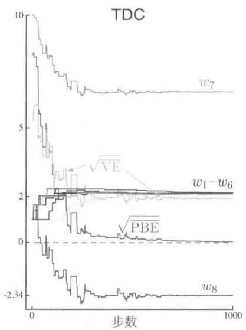

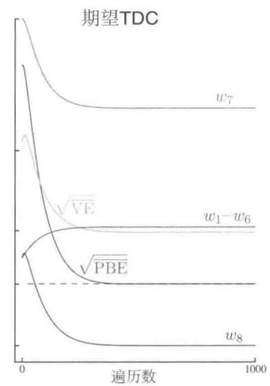  
图11.5在Baird的反例上TDC算法的行为。左侧展示的是运行一轮之后的通常结果，右侧展示的是，如果除了两个TDC的参数向量之外更新都是同步进行的话（类比于式11.9)，这个算法的期望行为。步长 $\alpha = 0.005$ ， $\beta = 0.05$

GTD2和TDC都包含两个学习过程，主要的过程是学习 $\mathbf{w}$ ，次要的过程是学习 $\mathbf{v}$ 。主要的学习过程的逻辑依赖于次要的学习过程结束，至少是近似结束，然而次要的学习过程会继续进行，并且不受主要的学习过程影响。我们把这种不对称的依赖称为梯级。在梯级中我们通常假设次要学习过程要进行得更快，因此总是处于它的渐近值，其足够精确而且已经准备好辅助主要学习过程。这些方法的收敛性证明通常需要显式地做这个假设。这些被称作两个时间量级的证明。时间量级更快的那个是次要学习过程，时间量级更慢的那个是主要学习过程。如果 $\alpha$ 是主要学习过程的步长，而且 $\beta$ 是次要学习过程的步长，那么这些收敛证明通常需要限制 $\beta \rightarrow 0$ 而且 $\frac{\alpha}{\beta} \rightarrow 0$ 。

梯度TD方法目前是最容易理解而且应用广泛的离轨策略方法。它可以扩展到动作价值函数和控制问题(GQ，Maei等，2010)，扩展到资格迹 $(\mathrm{GTD}(\lambda)$ 和 $\mathrm{GQ}(\lambda)$ ，Maei，2011；Maei和Sutton，2010)，还有非线性函数逼近(Maei等，2009)。人们也提出了在半梯度TD和梯度TD之间切换的混合算法(Hackman，2012；White和White，2016)。在目标策略和行动策略差异很大时，混合TD算法的行为很像梯度TD算法；当目标策略和行动策略相同时，混合TD算法的行为很像半梯度算法。最后，梯度TD的想法已经与近似方法和控制变量的思想相结合，产生了更高效的方法(Mahadevan等，2014)。

# 11.8 强调TD方法

我们现在来看另一个主流方法，这个方法在人们寻求廉价而高效的使用函数逼近的离轨策略学习方法中被进行了广泛的讨论。回顾线性的半梯度TD方法，它在同轨策略分布下训练时，既高效又稳定。而且我们在9.4节中展示过，这是因为矩阵A(式(9.11))的正定性，还有同轨策略状态分布 $\mu_{\pi}$ 和在目标策略下的状态转移概率 $p(s|s,a)$ 之间的匹配。在离轨策略学习中，我们使用重要度采样重新分配了状态转移的权重，使得它们变得适合学习目标策略。但是状态分布仍然是行动策略产生的，这里就有了一个不匹配之处。一个自然的想法是以某种方式重新分配状态的权重，强调一部分而淡化另一部分，目的是将更新分布变为同轨策略分布。这样就匹配了，而且稳定性和收敛性都会由之前存在的结果所保证。这就是强调TD方法的想法，在9.11节中讲述同轨策略训练时第一次提出了该想法。

事实上，“同轨策略分布”的说法并不准确，因为存在有许多同轨策略分布，其中的任何一个都能保证稳定。考虑一个无折扣的分幕式问题。幕如何终止完全由转移概率所决定。但是一幕可能有多个不同的开始方式。无论幕如何开始，如果所有的状态转移都遵从目标策略，那么得到的状态分布是一个同轨策略分布。你可能在终止状态附近开始，并且在幕结束之前只以高概率访问了几个状态。或者你可能在离终止状态很远的位置开始，在终止之前经过了很多状态。这些都是同轨策略分布，在这两个分布上用线性半梯度方法训练都可以保证稳定。无论过程如何开始，只要所有遇到的状态都更新了，那么其中一个同轨策略分布就可以一直发挥效用直到终止。

如果带折扣，则它可以被视作这些目标的部分终止，或者按概率终止。如果 $\gamma = 0.9$ 那么我们可以认为该过程在每步以0.1的概率终止，然后立即于转移到的状态重启。带折扣的问题可以定义为在每一步以 $1 - \gamma$ 的概率连续终止并重启。这种思考折扣的方式是一种更通用的概念伪终止的例子——“终止”不影响状态转移序列，但是影响学习过程和被学习的量。这种伪终止对于离轨策略学习非常重要，因为重启是个选项（记住，我们可以以任何喜欢的方式开始）。而且终止减弱了同轨策略分布中对持续记录经过的状态的需求。这也就是说，如果我们考虑在新状态上重启，那么折扣会很快给我们一个受限的同轨策略分布。

学习分幕式状态价值的单步强调TD算法定义如下

$$
\delta_ {t} = R _ {t + 1} + \gamma \hat {v} \left(S _ {t + 1}, \mathbf {w} _ {t}\right) - \hat {v} \left(S _ {t}, \mathbf {w} _ {t}\right),
$$

$$
\mathbf {w} _ {t + 1} = \mathbf {w} _ {t} + \alpha M _ {t} \rho_ {t} \delta_ {t} \nabla \hat {v} (S _ {t}, \mathbf {w} _ {t}),
$$

$$
M _ {t} = \gamma \rho_ {t - 1} M _ {t - 1} + I _ {t},
$$

其中， $I_{t}$ 为兴趣值，可以取任意值；而 $M_{t}$ 为强调值，被初始化为 $M_{t - 1} = 0$

这个算法在Baird的反例上如何表现呢？图11.6展现了参数向量的每个分量的期望轨迹（对于在所有的 $t$ 上 $I_{t} = 1$ 的情形）。图中有一些抖动，但是最终所有的分量都收敛了，而且 $\overline{\mathrm{VE}}$ 收敛到0。这些轨迹是通过迭代式地计算参数向量轨迹的期望得到的，而没有任何由于状态转移和收益采样引起的方差。这里没有展示直接使用强调TD算法的结果，因为它在Baird反例上的方差过高，所以几乎不可能在计算实验上得到一致性的结果。在这个问题中，算法理论上收敛到最优解，但是实际上并不是这样。我们在下一节中讨论如何减小所有这些算法的方差。

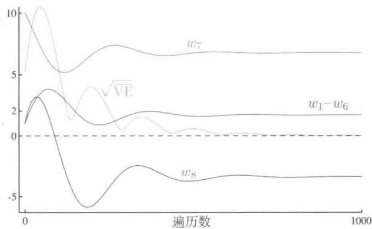  
图11.6在Baird的反例中，单步的强调TD算法行为的期望。步长 $\alpha = 0.03$

# 11.9 减小方差

与同轨策略学习相比，离轨策略学习本质上具有更大的方差。这并不奇怪，如果你接收到与策略关联不太紧密的数据，你应该可以预见，这只能学到这个策略下的价值的较少信息。在极端情况下，可能学不到任何东西。例如，你不能指望通过烹饪晚餐来学习如何开车。只有当目标和行动策略相关时，即它们访问相似的状态，并且采取类似的动作，才能让智能体在离轨策略训练过程中取得显著的进步。

另一方面，任何策略都有很多“邻居”。很多相似的策略在访问过的状态和采取过的动作上有相当程度的重叠，然而它们并不等同。离轨策略学习存在的最重要的原因就是允许推广泛化到这些大量的“相关但不等同的策略”。如何最好地利用这些经验仍然是一个问题。既然我们已经有了一些在期望值上（如果步长设置对了的话）稳定的方法，我们自

然会把注意力集中在减小估计的方差上。有许多关于此的思想，我们在这里只介绍一小部分。

为什么在基于重要度采样的离轨策略方法中，控制方差尤其重要呢？正如我们所见，重要度采样通常包括策略比率的乘积。这些比率的期望总是1(式5.13)，但是它们的真实值可能非常高，或者低到接近0。连续的比率之间是不互相关联的，因此它们的乘积的期望值也总是1，但是它们的方差可能很大。回想一下，在SGD方法中将这些比率乘上步长大小，因此高方差意味着步长之间的差异会很大。这对于随机梯度下降而言是很有问题的，因为有时会出现很大的步长。而步长必须不能太大，因为这样会把参数带到一个完全不同的梯度空间。随机梯度下降法依赖于在多步上取平均，以获得一个梯度的良好感知，如果它们在一个样本上做了太大的移动，它们就会变得不可靠。如果为了避免这一点，将步长参数设置得太小，那么期望的步长最终会变得很小，导致学习非常缓慢。动量的概念(Derthick，1984)、Polyak-Ruppert求和的概念(Polyak，1990；Ruppert,1988;Polyak和Juditsky，1992），或者这些想法的进一步扩展，可能会对此有很大的帮助。对于参数向量的不同部分自适应地设置分离的步长也是非常合适的（例如，Jacobs,1988;Sutton，1992b，c)，还有Karampatziakis和Langford (2010)提出的“重要性权重感知”的更新。

在第5章中，我们知道了加权的重要度采样相比于普通的重要度采样，有更好的性能以及更小的方差。然而，将加权重要度采样应用于函数逼近的情形是一个挑战，而且可能需要以 $O(d)$ 的时间复杂度近似完成（Mahmood和Sutton，2015）。

树回溯算法（7.5节）表明，可以不使用重要度采样而进行一些离轨策略学习。这个想法被扩展到离轨策略的情形，并产生了一些稳定并且更加高效的方法，这些方法由Munos、Stepleton、Harutyunyan和Bellemare(2016)还有Mahmood、Yu和Sutton(2017)提出。

另一个补充性的方法是允许目标策略部分地由行动策略决定。使用这种方法的话，目标策略永远不会与行动策略有太大不同，从而产生大的重要度采样率。例如，Precup 等人 (2006) 提出了“识别器”思想，其通过参考行动策略来定义目标策略。

# 11.10 本章小结

离轨策略学习是一个诱人的挑战，它能测试我们设计稳定高效的学习算法的聪明才智。表格型的Q学习使得离轨策略学习看起来很简单，并且能够自然地推广到期望Sarsa和树回溯算法。但正如我们在本章中看到的，将这些思想扩展到函数逼近，甚至只是扩展

到线性函数逼近，都会面临新的挑战，并迫使我们加深对强化学习算法的理解。

为什么要花这么长的篇幅呢？我们要寻求离轨策略算法的一个原因是，在处理试探和开发之间的权衡时提供灵活性。另一个是将行为独立于学习，并且避免目标策略的专制。TD学习似乎提供了并行地学习多个事物的可能性，也即使用一个经验流同时解决多个任务。我们当然可以在一些特殊情况下这样做，只是并不是在所有我们所希望的情况下都可以这样做，或者都能达到我们想要的效率。

在这一章中我们把离轨策略学习面临的挑战分为两个。第一个是纠正行动策略的学习目标。我们使用前面为表格型情况设计的技术直截了当地处理，虽然要付出增加更新的方差的代价，因此减慢了学习速度。高方差可能长期会是离轨策略学习的一个挑战。

离轨策略学习面临的第二个挑战是包含了自举法的半梯度TD方法的不稳定性。我们寻求强大的函数逼近、离轨策略学习，还有自举TD方法的高效和灵活性。但是在一个算法中将致命三要素的三个部分结合起来，而不引入潜在的不稳定性，是我们面临的一个挑战。过去有一些尝试，其中最流行的是寻求对贝尔曼误差（又称作贝尔曼残差）进行真实的随机梯度下降(SGD)。然而我们的分析得出的结论是，在很多种情况下这并不是一个吸引人的目标，更何况也不能通过学习算法来实现——BE的梯度是不能仅仅从基于特征向量而非真正的底层基础状态的经验中学习到的。另一种方法，梯度TD方法，在投影贝尔曼误差中进行随机梯度下降。PBE的梯度是可以在 $O(d)$ 的时间复杂度内学习到的，但是需要新增额外的第二个参数向量和第二个步长，这些是必须要付出的额外代价。最新的一个方法族“强调TD方法”改进了重新分配权重更新的旧思想，它强调其中一部分而弱化其他的部分。用这种方法，通过计算上简单的半梯度方法恢复了使得同轨策略学习稳定的特定属性。

离轨策略学习的整个领域是相对新且没有被攻克的领域。哪一种算法最好，甚至说哪一种算法可以使用都没有定论。在本章中最后介绍的新算法所带来的复杂性真的是必要的吗？其中的哪些方法可以有效地与减少方差的方法相结合呢？离轨策略学习的潜力仍然很吸引人，攻克它的最好方式仍然是一个谜。

# 参考文献和历史评注

11.1 第一个半梯度方法是线性 $\mathrm{TD}(\lambda)$ (Sutton，1988)，“半梯度”这个说法则是更近一些时间被提出来的(Sutton，2015a)。使用通用的重要度采样率的半梯度离轨策略 $\mathrm{TD}(0)$ 算法近年才被Sutton、Mahmood和White(2016)明确地提出来，但是动作价值函数形式在很早就被Precup、Sutton和Singh（2000）提出，他们也完成了这些算法的资格迹形式（见第12

章)。它们的持续性且不带折扣的形式还没有被深入研究。本书给出的 $n$ 步形式是全新的。  
11.2 最早的 $w$ 到 $2w$ 的例子由 Tsitsiklis 和 van Roy (1996) 给出，他们在第 249 页的方框中介绍了具体的反例。Baird 的反例归功于 Baird (1995)，尽管我们这里展现的版本被做了少许修改，函数逼近的平均方法由 Gordon (1995, 1996b) 提出。使用离轨策略梯度 DP 方法不稳定的其他例子和更复杂的函数逼近方法由 Boyan 和 Moore (1995) 提出。Bradtke (1993) 给出了一个例子，其中在线性二次调节问题中，使用线性函数逼近器进行 Q 学习会收敛到不稳定策略。  
11.3 致命三要素最早被 Sutton (1995b) 所确定，之后由 Tsitsiklis 和 van Roy (1997) 进行了彻底的分析。“致命三要素”这个说法由 Sutton (2015a) 给出。  
11.4 包含动态规划算子的线性分析的先驱者是 Tsitsiklis 和 van Roy (1996; 1997)。如图 11.3 所示的表示方法首先由 Lagoudakis 和 Parr 提出。

我们所称的记作 $B_{\pi}$ 的贝尔曼算子，被更一般地记为 $T^{\pi}$ 并且称作“动态规划算子”，同时一般形式的 $T^{(\lambda)}$ ，也被称作“TD(λ）算子”（Tsitsiklis和vanRoy，1996，1997）。  
11.5 BE首先由Schweitzer和Seidmann（1985）提出，作为动态规划的一个目标函数。Baird(1995，1999)将它拓展成为基于随机梯度下降的TD学习。在文献中，BE最小化通常被称为贝尔曼残差最小化。

最早的A-分裂的例子源于Dayan(1992)。这里的两个形式由Sutton等(2009a)给出。

11.6 这一节的内容是此版本的新内容。  
11.7 梯度TD方法由Sutton、Szepesvári和Maei(2009b)提出。在本节中强调的方法由Sutton等(2009a)和Mahmood等(2014)提出。迄今为止，梯度TD和相关方法的最敏感的实证研究由Geist和Scherrer(2014)，Dann、Neumann和Peters(2014)，还有White(2015)给出。梯度TD方法的理论最新进展Yu(2017)在研究。  
11.8 强调TD算法由Sutton、Mahmood和White(2016)提出。完全收敛的证明和其他的理论在之后由Yu(2015；2016；Yu、Mahmood和Sutton,2017)，Hallak、Tamar和Mannor(2015)，还有Hallak、Tamar、Munos和Mannor(2016)建立。

# 12

# 资格迹

资格迹是强化学习的基本方法之一。例如，在著名的 $\mathrm{TD}(\lambda)$ 算法中， $\lambda$ 就是资格迹的一个应用。几乎所有用到了时序差分的算法，比如 Q 学习和 Sarsa，都可以与资格迹结合起来，获得一个更加有效的一般性方法。

资格迹将时序差分和蒙特卡洛算法统一了起来并进行了扩展。将时序差分算法与资格迹方法相结合后，便产生了一系列算法，蒙特卡洛算法 $(\lambda = 1)$ 和单步时序差分算法 $(\lambda = 0)$ 是其中的两个极端情况。 $\lambda$ 取中间值的其他算法一般比两种极端算法中任意一种都表现得好。资格迹也提供了一种方法使得蒙特卡洛算法一方面可以在线使用，另一方面可以在不是分幕式的持续性问题上使用。

在第7章介绍的 $n$ -步时序差分算法，使我们已经看到了统一时序差分和蒙特卡洛算法的一种方式，但是资格迹在此基础上给出了具有明显计算优势的更优雅的算法机制。这个机制的核心是一个短时记忆向量，资格迹 $\mathbf{z}_t \in \mathbb{R}^d$ ，以及与之相对的长时权重向量 $\mathbf{w}_t \in \mathbb{R}^d$ 。这个方法核心的思想是，当参数 $\mathbf{w}_t$ 的一个分量参与计算并产生一个估计值时，对应的 $\mathbf{z}_t$ 的分量会骤然升高，然后逐渐衰减。在迹归零前，如果发现了非零的时序差分误差，那么相应的 $\mathbf{w}_t$ 的分量就可以得到学习。迹衰减参数 $\lambda \in [0,1]$ 决定了迹的衰减率。

在 $n$ 步算法中资格迹的主要计算优势在于，它只需要追踪一个迹向量，而不需要存储最近的 $n$ 个特征向量。同时，学习也会持续并统一地在整个时间上进行，而不是延迟到整个幕的末尾才能获得信号。另外，可以在遇到一个状态后马上进行学习并影响后续决策而不需要 $n$ 步的延迟。

资格迹说明，有时可以用不同的方式来实现学习算法从而获得计算优势。很多算法采用最自然的方式进行形式化，并被理解为某种状态价值的更新，这个更新基于该状态的若干后继时刻发生的事件。比如，蒙特卡洛算法（第5章）基于当前状态的所有未来收益来

更新， $n$ -步时序差分算法（第7章）基于接下来 $n$ 步的收益及 $n$ 步之后的状态来更新。这些通过待更新的状态往前看得到的算法，被称为前向视图。前向视图的一般实现比较复杂，因为它的更新依赖于当前还未发生的未来。然而，如我们将在本章中展示的，使用当前的时序差分误差并用资格迹往回看那些已访问过的状态，就能够得到几乎一样（有时甚至完全一模一样）的更新。这种替代的学习算法称为资格迹的后向视图。谈到后向视图、前后向视图之间的转换，以及前后向视图的等价性，则可以追溯到时序差分算法的引入，然而它们从2014年以来变得更加有效与复杂。这里我们从现代的视角来介绍其基础知识。

如同往常一样，我们先讨论状态的价值预测问题，接着再推广到动作价值以及控制问题。首先讨论同轨策略的情况再扩展到离轨策略学习上。我们主要关注用线性函数逼近的情况，在这种情况下使用资格迹效果较好。所有的这些结果也适用于表格型学习与状态聚合学习，因为它们都是线性函数逼近的特例。

# 12.1 $\lambda$ -回报

在第7章中，我们定义了 $n$ 步回报为最初 $n$ 步的折后收益加上 $n$ 步后到达状态的折后预估价值(式7.1)。对于任意参数化的函数逼近，可以将其一般化的公式写为：

$$
G _ {t: t + n} \doteq R _ {t + 1} + \gamma R _ {t + 2} + \dots + \gamma^ {n - 1} R _ {t + n} + \gamma^ {n} \hat {v} \left(S _ {t + n}, \mathbf {w} _ {t + n - 1}\right), 0 \leqslant t \leqslant T - n. \tag {12.1}
$$

我们注意到，在第7章中， $n\geqslant 1$ 的每一个 $n$ 步回报，对于表格型学习的更新均是一个合法的更新目标，就如同用于式(9.7)的近似SGD更新一样。

注意，一次有效的更新除了以任意的 $n$ 步回报为目标之外，也可以用不同 $n$ 的平均 $n$ 步回报作为更新目标。比如，可以将一个二步回报的一半与四步回报的一半合在一起作为一个更新目标，即 $\frac{1}{2} G_{t:t+2} + \frac{1}{2} G_{t:t+4}$ 。任何这样的 $n$ 步回报的平均值都是可取的，即使是一个无限的集合，只要满足权重都为正数且和为 1 即可。这样的复合型的回报有着类似于式 (7.3) 中独立的 $n$ 步回报一样能够减小误差的性质，因此可以保证更新的收敛性。平均回报产生了一系列新的算法。比如，可以通过平均单步与无限步的回报来得到一种将时序差分和蒙特卡洛算法结合的方式。理论上，甚至可以将基于经验的更新与动态规划的更新进行平均得到一个简单的结合基于经验的更新和基于模型的更新的算法（参见第 8 章）。

将简单的更新平均而组成的更新被称为复合更新。一个复合更新的回溯图包括了每个组成部分的单独的回溯图，并在上方画一道水平线，下方注明每个组成部分的权重。例如，本节最开始提及的例子，将二步回报的一半与四步回报的一半混合所得到的回溯图如右图所示。一个复合更新只能在它的组分中最长的那个更新完成后完成。例如，右图所示的

更新，只能在 $t + 4$ 时刻完成对 $t$ 时刻的估计。一般来说，我们会限制组分中最长部分的长度，因为它决定了更新的延迟。

可以把 $\mathrm{TD}(\lambda)$ 算法视作平均 $n$ 步更新的一种特例。这里的平均值包括了所有可能的 $n$ 步更新，每一个按比例 $\lambda^{n-1}$ 加权，这里 $\lambda \in [0,1]$ ，最后乘上正则项 $(1 - \lambda)$ 保证权值和为1（参见图12.1）。产生的结果称为 $\lambda$ -回报，定义为

$$
G _ {t} ^ {\lambda} \doteq (1 - \lambda) \sum_ {n = 1} ^ {\infty} \lambda^ {n - 1} G _ {t: t + n}. \tag {12.2}
$$

图12.2展示了 $\lambda$ -回报的每一个 $n$ 步更新的权值的序列。单步回报获得了最大的权值 $(1 - \lambda)$ ；两步回报为次大值 $(1 - \lambda)\lambda$ ；三步回报获得权值为 $(1 - \lambda)\lambda^2$ 。依此类推。每多一步，权值按照 $\lambda$ 衰减。在到达一个终止状态后，所有的后续 $n$ 步回报等于 $G_{t}$ 。如果愿意的话，可以将这些终止状态之后的计算项从主要的求和项中独立出来，如图所示，得到

$$
G _ {t} ^ {\lambda} = (1 - \lambda) \sum_ {n = 1} ^ {T - t - 1} \lambda^ {n - 1} G _ {t: t + n} + \lambda^ {T - t - 1} G _ {t}. \tag {12.3}
$$

通过这个公式，我们可以很清楚地看到，当 $\lambda = 1$ 时会发生什么。此时，求和项为零，剩余的项就是常规的回报 $G_{t}$ 。因此，在 $\lambda = 1$ 时， $\lambda$ -回报的更新算法就是蒙特卡洛算法。另一方面，当 $\lambda = 0$ 时， $\lambda$ -回报即为 $G_{t:t+1}$ ，即单步回报。所以，在 $\lambda = 0$ 时， $\lambda$ -回报的更新就是单步时序差分算法。

  
图12.1 $\mathrm{TD}(\lambda)$ 回溯图。如果 $\lambda = 0$ ，则整个更新被简化为只有第一部分的更新，即单步时序差分更新；当 $\lambda = 1$ 时，则整个更新被简化为最后一部分的更新，即蒙特卡洛更新

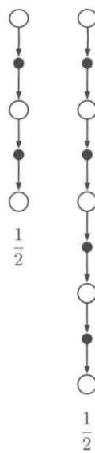

练习12.1如同回报可以被递归地表示为首个收益与下一时刻回报的和(式3.9)，对 $\lambda$ -回报也可以这样做。请根据式（12.2）和式（12.1）推导其递归关系。

练习12.2如图12.2所示，参数 $\lambda$ 表征了权值指数衰减的速度，因此就确定了在更新时 $\lambda$ -回报算法往后看多远。但是使用 $\lambda$ 这样的速率值来描述衰减的速度比较笨拙。一般来说，最好指定其半衰期。那么关于 $\lambda$ 与半衰期 $\tau_{\lambda}$ 的公式是什么？这里半衰期指的是权重序列达到初始值的一半所需的时间。

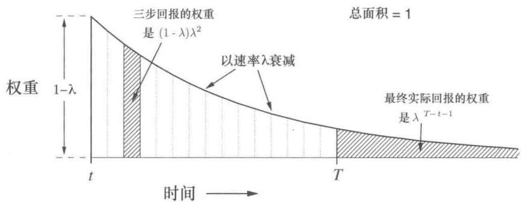  
图12.2 $\lambda$ -回报中每个 $n$ 步回报的权重

我们现在已经可以定义基于 $\lambda$ -回报的第一个学习算法了，即离线 $\lambda$ -回报算法。作为一个离线算法，在一幕序列的中间不会改变权值向量。而是在整幕结束后，才会进行整个序列的离线更新。根据我们常用的半梯度准则，使用 $\lambda$ -回报作为目标

$$
\mathbf {w} _ {t + 1} \dot {=} \mathbf {w} _ {t} + \alpha \left[ G _ {t} ^ {\lambda} - \hat {v} \left(S _ {t}, \mathbf {w} _ {t}\right) \right] \nabla \hat {v} \left(S _ {t}, \mathbf {w} _ {t}\right), t = 0, \dots , T - 1. \tag {12.4}
$$

$\lambda$ -回报给了一种在蒙特卡洛算法与单步时序差分算法之间平滑移动的可以与第7章提及的 $n$ 步时序差分相比的算法。我们在19-状态随机行走问题（例7.1）上检测了其效果。图12.3给出了离线 $\lambda$ -回报算法在这个问题上与之前 $n$ 步算法（与图7.2相同）的比较。实验和之前相同，唯一的区别是此处的变量为 $\lambda$ 而不是 $n$ 。性能由最开始10幕中19个状态的真实价值与估计价值的均方根误差的平均值来衡量。注意，离线 $\lambda$ -回报算法与 $n$ 步算法的性能相当。在两种情况下，都是在 $n$ -步算法的 $n$ 和 $\lambda$ -回报的 $\lambda$ 取中间值时获得最好的性能。

我们目前采取的所有算法，理论上都是前向的。对于访问的每一个状态，我们向前（未来的方向）探索所有可能的未来的收益并决定如何最佳地结合它们。如图12.4所示，我们可以想象处于状态流中，从每一个状态往前看并决定如何更新这个状态。每次更新完一个状态，移到下一个并且再也不会往回更新之前的状态。另一方面，未来的状态会从之前的位置被重复地观测与处理。

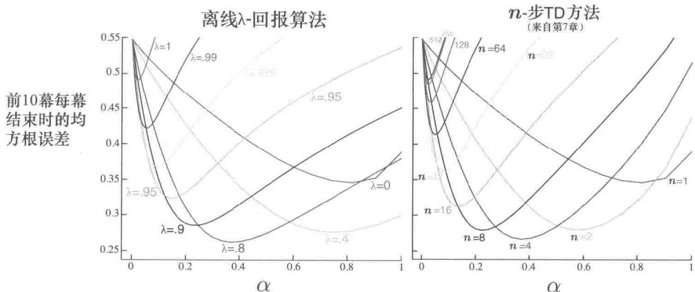  
图12.3 19-状态随机游走的结果(例7.1)：离线 $\lambda$ -回报算法和 $n$ -步时序差分方法的性能比较。两种算法都是在自举参数（ $\lambda$ 或 $n$ ）为中间值时表现最好。离线 $\lambda$ -回报算法的结果在 $\alpha$ 和 $\lambda$ 为最优值以及 $\alpha$ 较大时会稍微好一些

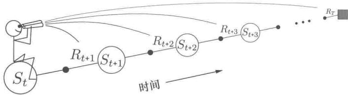  
图12.4前向视图，如何通过未来的收益和状态更新每一个状态值

# 12.2 TD(λ)

$\mathrm{TD}(\lambda)$ 是强化学习中最古老、使用也最广泛的算法之一，它是第一个使用资格迹展示了更理论化的前向视图和更易于计算的后向视图之间关系的算法。这里我们将以实证的方式展示它近似于上一章的离线 $\lambda$ -回报算法。  
$\mathrm{TD}(\lambda)$ 通过三种方式改进了离线 $\lambda$ -回报算法。首先它在一幕序列的每一步更新权重向量而不仅仅在结束时才更新。其次，它的计算平均分配在整个时间轴上，而不仅仅是幕的结尾。第三，它也适用于持续性问题而不是仅仅适用于分幕式的情况。本节介绍基于函数逼近的半梯度版本的 $\mathrm{TD}(\lambda)$

通过函数逼近，资格迹 $\mathbf{z}_t\in \mathbb{R}^d$ 是一个和权值向量 $\mathbf{w}_t$ 同维度的向量。权值向量是一个长期的记忆，在整个系统的生命周期中进行积累；而资格迹是一个短期记忆，其持续时间通常少于一幕的长度。资格迹辅助整个学习过程，它们唯一的作用是影响权值向量，而

权值向量则决定了估计值。

在 $\mathrm{TD}(\lambda)$ 中，资格迹向量被初始化为零，然后在每一步累加价值函数的梯度，并以 $\gamma \lambda$ 衰减

$$
\begin{array}{l} \mathbf {z} _ {- 1} \doteq \mathbf {0}, \tag {12.5} \\ \mathbf {z} _ {t} \dot {=} \gamma \lambda \mathbf {z} _ {t - 1} + \nabla \hat {v} (S _ {t}, \mathbf {w} _ {t}), 0 \leqslant t \leqslant T, \\ \end{array}
$$

这里 $\gamma$ 是折扣系数，而 $\lambda$ 为前一章介绍的衰减率参数。资格迹追踪了对最近的状态评估值做出了或正或负贡献的权植向量的分量，这里的“最近”由 $\gamma \lambda$ 来定义（回忆一下，在线性函数逼近中， $\nabla \hat{v}(S_t, \mathbf{w}_t)$ 就是特征向量 $\mathbf{x}_t$ ，在这种情况下，资格迹向量就是过去不断衰减的输入向量之和）。当一个强化事件出现时，我们认为这些贡献“痕迹”展示了权值向量的对应分量有多少“资格”可以接受学习过程引起的变化。我们关注的强化事件是一个又一个时刻的单步时序差分误差。预测的状态价值函数的时序差分误差为

$$
\delta_ {t} \doteq R _ {t + 1} + \gamma \hat {v} \left(S _ {t + 1}, \mathbf {w} _ {t}\right) - \hat {v} \left(S _ {t}, \mathbf {w} _ {t}\right). \tag {12.6}
$$

在 $\mathrm{TD}(\lambda)$ 中，权值向量每一步的更新正比于时序差分的标量误差和资格迹

$$
\mathbf {w} _ {t + 1} \dot {=} \mathbf {w} _ {t} + \alpha \delta_ {t} \mathbf {z} _ {t}. \tag {12.7}
$$

# 半梯度 $\mathrm{TD}(\lambda)$ 算法，用于估计 $\hat{v}\approx v_{\pi}$

输入：待评估的策略 $\pi$

输入：一个可微的函数 $\hat{v} S^{+}\times \mathbb{R}^{d}\to \mathbb{R}$ ，满足 $\hat{v}$ （终止状态，） $= 0$

算法参数：步长 $\alpha > 0$ ，迹衰减率 $\lambda \in [0,1]$

任意初始化价值函数的权重 $\mathbf{w}$ （如 $\mathbf{w} = \mathbf{0}$ ）

对每一幕循环：

初始化 $S$

$$
z \leftarrow 0
$$

（一个 $d$ 维向量）

对幕中的每一步循环：

选择 $A\sim \pi (\cdot |S)$

执行 $A$ ，观察到 $R,S^{\prime}$

$$
\begin{array}{l} | \mathbf {z} \leftarrow \gamma \lambda \mathbf {z} + \nabla \hat {v} (S, \mathbf {w}) \\ \mid \delta \leftarrow R + \gamma \hat {v} (S ^ {\prime}, \mathbf {w}) - \hat {v} (S, \mathbf {w}) \\ | \mathrm {w} \leftarrow \mathrm {w} + \alpha \delta \mathrm {z} \\ \mid S \leftarrow S ^ {\prime} \\ \end{array}
$$

直到 $S^{\prime}$ 为终止状态

$\mathrm{TD}(\lambda)$ 在时间上往回看。每个时刻我们计算当前的时序差分误差，并根据之前状态对当前资格迹的贡献来分配它。如图12.5所示，我们可以想象在一个状态流中，计算时序差分误差，然后将其传播给之前访问的状态。当时序差分误差和迹同时起作用时，便得到了式（12.7）所示的更新。

  
图12.5TD(λ)的后向视图，每一次更新都依赖于当前的时序差分误差和当前时刻的资格迹，资格迹归纳了过去所有事件的影响

为了更好地理解后向视图，考虑 $\lambda$ 的不同取值。如果 $\lambda = 0$ ，根据式(12.5)，在 $t$ 时刻的迹恰好为 $S_{t}$ 对应的价值函数梯度。所以此时的 $\mathrm{TD}(\lambda)$ 的更新式（12.7）退化为第9章中的单步半梯度时序差分更新（同时，在表格型学习的情况下，退化为简单时序差分规则式(6.2)。因此，把这种算法称为 $\mathrm{TD}(0)$ 。就图12.5而言， $\mathrm{TD}(0)$ 仅仅让当前时刻的前导状态被当前的时序差分误差所改变。对于更大的 $\lambda (\lambda < 1)$ ，更多的之前的状态会被改变，但是如图所示，越远的状态改变越少，这是因为对应的资格迹更小。也可以这样说，较早的状态被分配了较小的信用来“消费”TD误差。

如果 $\lambda = 1$ ，那么之前状态的信用每步仅仅衰减 $\gamma$ 。这个恰好与蒙特卡洛算法的行为一致。例如，时序差分误差 $\delta_{t}$ 包括了无折扣的 $R_{t + 1}$ ，在将它反传到 $k$ 步的时候就需要以 $\gamma^k$ 计算折扣，如同回报中的任何一个时刻的收益一样，而这恰好是不断衰减的资格迹所做的事情。如果 $\lambda = 1$ 并且 $\gamma = 1$ ，那么资格迹在任何时候都不衰减。在这种情况下，该算法与无折扣的分幕式任务的蒙特卡洛算法的表现就是完全相同的。当 $\lambda = 1$ 时，这种算法也被称为TD(1)。

TD(1) 相比于之前提出的版本是一种通用的实现蒙特卡洛算法的方式，它大大扩展了适用范围。之前的蒙特卡洛算法局限于幕任务，而 TD(1) 可以适用于带折扣的持续性任务。此外，TD(1) 可以增量式地在线运行。蒙特卡洛算法的一个缺点是除非到了一幕的结束，否则它无法学习到任何东西。比如，如果在蒙特卡洛控制中，采取了一个会获得很差收益但并不终止当前幕的动作，则智能体在这一幕中重复这个动作的倾向不会变低。相反，在线 TD(1) 算法以 $n$ -步时序差分的方式从正在进行的未终结的幕中学习，其中用于

学习的信息是到当前时刻为止的最近 $n$ 步决策的信息。如果在一幕中发生了某个特别好或者差的事件，则基于TD(1)的算法能够在同一幕中立即调整智能体的行为。

我们可以通过重新讨论19状态随机行走问题(例7.1)来比较 $\mathrm{TD}(\lambda)$ 算法和离线 $\lambda$ -回报算法。两个算法的结果显示在图12.6中。对于每一个 $\lambda$ 值，如果选择最优的 $\alpha$ 或者稍小一点的值，则两种算法的性能几乎是相同的。但是如果 $\alpha$ 的值比最优值大， $\lambda$ -回报算法仅仅变差一点，而 $\mathrm{TD}(\lambda)$ 算法则变差了很多，甚至有可能不稳定。对 $\mathrm{TD}(\lambda)$ 算法来说，在这个任务上这种情况不是一个大问题，因为一般不会使用这么大的参数，但是在其他任务上，这可能是一个很大的弱点。

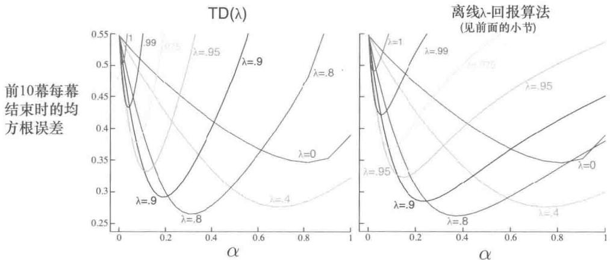  
图12.6 19状态随机游走的结果（例7.1）。TD(λ)和离线λ-回报算法的性能比较。当(λ)值较小时（比最优值小），两个算法看起来性能差不多，但是在α值较大时，TD(λ)表现得更差一些

如果更新步长按照通常的条件 (式2.7)，随着时间的推移而减小，那么线性 $\mathrm{TD}(\lambda)$ 被证明会在同轨策略的情况下收敛。如9.4节讨论的，这里的收敛并不会正好收敛到对应于最小误差的权值向量，而是根据 $\lambda$ 收敛到它附近的一个权值向量。之前证明的近似误差的上界(式9.14)现在可以推广到任意一个 $\lambda$ 。对于一个带折扣的持续性任务，有

$$
\overline {{\mathrm {V E}}} \left(\mathbf {w} _ {\infty}\right) \leqslant \frac {1 - \gamma \lambda}{1 - \gamma} \min  _ {\mathbf {w}} \overline {{\mathrm {V E}}} (\mathbf {w}). \tag {12.8}
$$

也就是说，渐近误差不会超过 $\frac{1 - \gamma\lambda}{1 - \gamma}$ 乘上最小的可能误差。当 $\lambda$ 接近于1时，这个上界接近最小的误差（在 $\lambda = 0$ 时上界最松）。然而，实际上 $\lambda = 1$ 通常是一个最差的选择，我们稍后在图12.14中会看到这一点。

练习12.3 观察 $\mathrm{TD}(\lambda)$ 如何逼近离线 $\lambda$ -回报算法，可以发现，后者的误差项（式12.4中括号中的项）可以写为固定的单个 $\mathbf{w}$ 的时序差分误差（式12.6）的和。请遵循式(6.6）中的模式并使用练习12.1中获得的 $\lambda$ -回报的递归式证明。

练习12.4 利用上一个练习中的结果证明，如果一幕中的每一步都计算权重更新，但并不真正进行权重的更新（即 $\mathbf{w}$ 保持不变），则 $\mathrm{TD}(\lambda)$ 中的权重更新的和等于离线 $\lambda$ -回报的更新的和。

# 12.3 $n$ -步截断 $\lambda$ -回报方法

离线 $\lambda$ -回报算法描述的是一种理想状况，但是其作用是有限的，因为它使用了直到幕末尾才知道的 $\lambda$ -回报（式12.2）。在持续性任务的情况下，严格说 $\lambda$ -回报是永远未知的，因为它依赖于任意大的 $n$ 所对应的 $n$ -步回报，也即依赖于任意遥远的未来所产生的收益。然而，由于每一时刻有 $\gamma \lambda$ 的衰减，实际上对长期未来的收益的依赖是越来越弱的。那么一个自然的近似便是截断一定步数之后的序列。现有的 $n$ -步回报方法很自然地给我们提供了一种启示：缺少的真实收益可以用估计值来代替。

一般地，假定数据最远只能到达未来的某个视界 $h$ ，则我们可以定义当前时刻 $t$ 的截断 $\lambda$ -回报为

$$
G _ {t: h} ^ {\lambda} \doteq (1 - \lambda) \sum_ {n = 1} ^ {h - t - 1} \lambda^ {n - 1} G _ {t: t + n} + \lambda^ {h - t - 1} G _ {t: h}, 0 \leqslant t <   h \leqslant T. \tag {12.9}
$$

如果将这个等式与 $\lambda$ -回报式（12.3）相比较，则可以发现视界 $h$ 的作用与之前的终止时刻 $T$ 的作用相同。在 $\lambda$ -回报中，对真实回报给出了一个残差权重，而这里则将残差权重给可能的最长 $n$ -步回报了，即 $(h - t)$ 步回报（见图12.2）。

类似于第7章中的 $n$ -步算法的产生，截断 $\lambda$ -回报的引入马上就产生了一类新的 $n$ -步截断 $\lambda$ -回报算法。在所有这类算法中，更新推迟 $n$ 步且只考虑前 $n$ 个收益，但是现在将所有的 $k$ 步回报 $(1 \leqslant k \leqslant n)$ 都考虑进来（较早的 $n$ -步算法只使用 $n$ -步回报），其几何加权如图12.2所示。在使用状态价值函数的情况下，这一类算法被称为截断 $\mathrm{TD}(\lambda)$ ，或者 $\mathrm{TTD}(\lambda)$ 。其复合回溯图如图12.7所示，与普通的 $\mathrm{TD}(\lambda)$ 的回溯图（图12.1）非常类似，唯一的区别在于最长的部分最多为 $n$ 步而不是一直到整幕序列的末尾。 $\mathrm{TTD}(\lambda)$ 的定义为（参见式9.15）

$$
\mathbf {w} _ {t + n} \dot {=} \mathbf {w} _ {t + n - 1} + \alpha \left[ G _ {t: t + n} ^ {\lambda} - \hat {v} \left(S _ {t}, \mathbf {w} _ {t + n - 1}\right) \right] \nabla \hat {v} \left(S _ {t}, \mathbf {w} _ {t + n - 1}\right), 0 \leqslant t <   T.
$$

可以很高效地实现这个算法，以保证其每步的计算量不随着 $n$ 变化（但是内存的开销无法减少）。如 $n$ -步时序差分算法一样，最初 $n - 1$ 个时刻不进行更新，另外有 $n - 1$ 次更新

  
图12.7 截断 $\mathrm{TD}(\lambda)$ 的回溯图

在幕终止后进行。高效率的实现依赖于 $k$ 步 $\lambda$ -回报可以写为

$$
G _ {t: t + k} ^ {\lambda} = \hat {v} \left(S _ {t}, \mathbf {w} _ {t - 1}\right) + \sum_ {i = t} ^ {t + k - 1} (\gamma \lambda) ^ {i - t} \delta_ {i} ^ {\prime}, \tag {12.10}
$$

其中

$$
\delta_ {t} ^ {\prime} \doteq R _ {t + 1} + \gamma \hat {v} (S _ {t + 1}, \mathbf {w} _ {t}) - \hat {v} (S _ {t}, \mathbf {w} _ {t - 1}).
$$

练习12.5 在本书中（一般是在练习中），已经多次证明如果价值函数保持不变，则回报可以写为时序差分误差之和。请证明式(12.10)也符合这个结论。

# 12.4 重做更新：在线 $\lambda$ -回报算法

选择截断 $\mathrm{TD}(\lambda)$ 中的截断参数 $n$ 时需要折中考虑。 $n$ 应该尽量大使其更接近离线 $\lambda$ -回报算法，同时它也应该比较小使得更新更快且更迅速地影响后续行为。我们是否能够找到最好的折中呢？原则上可以，但是必须以增加计算复杂性为代价。

基本思想是，在每一步收集到新的数据增量的同时，回到当前幕的开始并重做所有的更新。由于获得了新的数据，因此新的更新会比原来的好。换言之，更新总是朝向一个 $n$ -步截断 $\lambda$ -回报目标，但是每次都使用新的视界。每一次遍历当前幕时，都可以使用一个稍长一点的视界来得到一个稍好一点的结果。回顾一下， $n$ -步截断 $\lambda$ -回报的定义为

$$
G _ {t: h} ^ {\lambda} \doteq (1 - \lambda) \sum_ {n = 1} ^ {h - t - 1} \lambda^ {n - 1} G _ {t: t + n} + \lambda^ {h - t - 1} G _ {t: h}.
$$

现在我们来探讨一下，如果计算复杂性不是问题的话，如何理想地使用这个目标。幕开始时，在时刻0使用上一幕末尾的权值 $\mathbf{w}_0$ 。在视界扩展到时刻1时开始学习。给定了到视界1为止的数据，0时刻的估计目标只能是单步回报 $G_{0:1}$ ，它包括了 $R_{1}$ 和基于估计值 $\hat{v}(S_1, \mathbf{w}_0)$ 的自举项。当式（12.9）的第一项中的求和运算退化为0时，就是 $G_{0:1}^{\lambda}$ 。用这个目标更新，可以得到 $\mathbf{w}_1$ 。然后，随着视界扩展到时刻2，我们可以做什么？我们有从 $R_2$ 和 $S_2$ 处获取的新数据，以及新的权值 $\mathbf{w}_1$ ，所以我们现在可以为第一个 $S_0$ 的更新构建一个更好的目标 $G_{0:2}^{\lambda}$ ，以及第二个 $S_1$ 的更新的更好的目标 $G_{1:2}^{\lambda}$ 。采用这些改善过的目标，我们从 $\mathbf{w}_0$ 开始重做 $S_1$ 和 $S_2$ 的更新，就得到了 $\mathbf{w}_2$ 。接着将视界扩展到时刻3再重复这个过程：一路回到头产生3个新的目标，再从原来的 $\mathbf{w}_0$ 开始重做所有的更新，以最终得到 $\mathbf{w}_3$ ，依此类推。当视界每扩展一步，我们都要从 $\mathbf{w}_0$ 开始重做所有的更新。这个过程要使用在前面的视界下得到的权重向量。

这个概念性的算法涉及了对整幂序列的多次遍历，对每个不同的视界都要遍历一次，每次都生成了一个不同的权值序列。为了清晰地描述这个算法，我们必须区分不同视界计算的不同权值向量。我们定义 $\mathbf{w}_t^h$ 为在视界为 $h$ 的序列的时刻 $t$ 所生成的权值。第一个权值向量 $\mathbf{w}_0^h$ 由上一幕继承而来，最后一个权值向量 $\mathbf{w}_h$ 为算法的最终权值向量。最终一个视界 $h = T$ 获得的最终权值 $\mathbf{w}_T^T$ 会被传送给下一幕用作初始权值向量。在这种情况下，之前描述的三个权值向量序列可以被表示为

$$
\begin{array}{l} h = 1: \mathbf {w} _ {1} ^ {1} \doteq \mathbf {w} _ {0} ^ {1} + \alpha \left[ G _ {0: 1} ^ {\lambda} - \hat {v} (S _ {0}, \mathbf {w} _ {0} ^ {1}) \right] \nabla \hat {v} (S _ {0}, \mathbf {w} _ {0} ^ {1}), \\ h = 2: \mathbf {w} _ {1} ^ {2} \dot {=} \mathbf {w} _ {0} ^ {2} + \alpha \left[ G _ {0: 2} ^ {\lambda} - \hat {v} (S _ {0}, \mathbf {w} _ {0} ^ {2}) \right] \nabla \hat {v} (S _ {0}, \mathbf {w} _ {0} ^ {2}), \\ \mathbf {w} _ {2} ^ {2} \doteq \mathbf {w} _ {1} ^ {2} + \alpha \left[ G _ {1: 2} ^ {\lambda} - \hat {v} \left(S _ {1}, \mathbf {w} _ {1} ^ {2}\right) \right] \nabla \hat {v} \left(S _ {1}, \mathbf {w} _ {1} ^ {2}\right), \\ \end{array}
$$

$$
\begin{array}{l} h = 3: \mathbf {w} _ {1} ^ {3} \dot {=} \mathbf {w} _ {0} ^ {3} + \alpha \left[ G _ {0. 3} ^ {\lambda} - \hat {v} (S _ {0}, \mathbf {w} _ {0} ^ {3}) \right] \nabla \hat {v} (S _ {0}, \mathbf {w} _ {0} ^ {3}), \\ \mathbf {w} _ {2} ^ {3} \doteq \mathbf {w} _ {1} ^ {3} + \alpha \left[ G _ {1: 3} ^ {\lambda} - \hat {v} \left(S _ {1}, \mathbf {w} _ {1} ^ {3}\right) \right] \nabla \hat {v} \left(S _ {1}, \mathbf {w} _ {1} ^ {3}\right), \\ \mathbf {w} _ {3} ^ {3} \doteq \mathbf {w} _ {2} ^ {3} + \alpha \left[ G _ {2: 3} ^ {\lambda} - \hat {v} \left(S _ {2}, \mathbf {w} _ {2} ^ {3}\right) \right] \nabla \hat {v} \left(S _ {2}, \mathbf {w} _ {2} ^ {3}\right). \\ \end{array}
$$

更新的一般形式为

$$
\mathbf {w} _ {t + 1} ^ {h} \doteq \mathbf {w} _ {t} ^ {h} + \alpha \left[ G _ {t: h} ^ {\lambda} - \hat {v} \left(S _ {t}, \mathbf {w} _ {t} ^ {h}\right) \right] \nabla \hat {v} \left(S _ {t}, \mathbf {w} _ {t} ^ {h}\right), 0 \leqslant t <   h \leqslant T.
$$

这个更新公式与 $\mathbf{w}_t\dot{=} \mathbf{w}_t^t$ 一起，就定义了所谓的在线 $\lambda$ -回报算法。

在线 $\lambda$ -回报算法是一个完全在线的算法，其在一幕中的每一个时刻 $t$ ，仅仅使用时刻 $t$ 获取的信息确定新的权值向量 $\mathbf{w}_t$ 。它的主要缺点是计算非常复杂，每一个时刻需要遍历整幕序列。注意，从严格意义上说，它比离线 $\lambda$ -回报算法要复杂，因为后者在终止

时虽然也需要遍历整幕，但是在该幕中间不会做任何的更新。作为回报，在线算法有望获得比离线算法更好的结果。这不仅仅是因为在幕的中间会进行更新，而离线算法不会做更新，而且也因为在幕结束时，用于自举的权值向量（在 $G_{t:h}^{\lambda}$ 中）获得了更多数量的有意义的更新。图12.8比较了这两种算法在19-状态随机游走任务上的效果，在这个图中我们可以观察到上述结论。

  
图12.8 19-状态随机游走的结果(例7.1)：在线和离线 $\lambda$ -回报的性能比较。这里的性能指标是每幕结尾的VE，在这种情况下，离线算法应该表现得最好。尽管如此，在线算法的表现还是相当不错的。相比之下， $\lambda = 0$ 时两种算法表现相同

# 12.5 真实的在线 $\mathrm{TD}(\lambda)$

刚才提出的在线 $\lambda$ -回报算法是效果最好的时序差分算法。然而，就像前面介绍的，这个算法很复杂。是否存在一种方法将这个前向视图算法转换为一个利用资格迹的有效后向视图算法呢？事实上，对于线性函数逼近，的确存在一种在线 $\lambda$ -回报算法的精确计算实现。这种实现被称为真实在线 $\mathrm{TD}(\lambda)$ 算法，因为它对 $\mathrm{TD}(\lambda)$ 的近似比理想的在线 $\lambda$ -回报算法对 $\mathrm{TD}(\lambda)$ 算法的近似更加“真实”。

真实在线 $\mathrm{TD}(\lambda)$ 算法的推导有些复杂（可以参考下一节内容以及论文 van Seijen et al., 2016 的附录），但是推导的实现策略是简单的。在线 $\lambda$ -回报算法的权重向量的序列可以被组织成一个三角形

$$
\begin{array}{l} \mathbf {w} _ {0} ^ {0} \\ \begin{array}{c c} \mathbf {w} _ {0} ^ {1} & \mathbf {w} _ {1} ^ {1} \end{array} \\ \mathbf {w} _ {0} ^ {2} \quad \mathbf {w} _ {1} ^ {2} \quad \mathbf {w} _ {2} ^ {2} \\ \mathbf {w} _ {0} ^ {3} \mathbf {w} _ {1} ^ {3} \mathbf {w} _ {2} ^ {3} \mathbf {w} _ {3} ^ {3} \\ \begin{array}{c c c c c} \vdots & \vdots & \vdots & \vdots & \ddots \end{array} . \\ \mathbf {w} _ {0} ^ {T} \mathbf {w} _ {1} ^ {T} \mathbf {w} _ {2} ^ {T} \mathbf {w} _ {3} ^ {T} \dots \mathbf {w} _ {T} ^ {T} \\ \end{array}
$$

在每个时刻中产生这个三角形的一行。只有对角线上的权重向量 $\mathbf{w}_t^t$ 是我们真正需要的。第一个权重向量 $\mathbf{w}_0^0$ 是输入，最后一个 $\mathbf{w}_T^T$ 是输出，在这条线上的每一个权重向量 $\mathbf{w}_t^t$ 在 $n$ -步自举法更新回报值中产生作用。在最终的算法中对角权重向量被重命名了，取消了上标， $\mathbf{w}_t \doteq \mathbf{w}_t^t$ 。接下来，就要找到一个通过前一个值计算 $\mathbf{w}_t^t$ 的紧凑有效方式。如果这一步完成了，对于 $\hat{v}(s, \mathbf{w}) = \mathbf{w}^\top \mathbf{x}(s)$ 的线性情况，我们可以得到真实的在线 $\mathrm{TD}(\lambda)$ 算法

$$
\mathbf {w} _ {t + 1} \dot {=} \mathbf {w} _ {t} + \alpha \delta_ {t} \mathbf {z} _ {t} + \alpha \left(\mathbf {w} _ {t} ^ {\top} \mathbf {x} _ {t} - \mathbf {w} _ {t - 1} ^ {\top} \mathbf {x} _ {t}\right) (\mathbf {z} _ {t} - \mathbf {x} _ {t}),
$$

在这个公式中我们使用了 $\mathbf{x}_t\dot{=} \mathbf{x}(S_t)$ ， $\delta_t$ 的定义同 $\mathrm{TD}(\lambda)$ （式12.6）中的定义，且 $\mathbf{z}_t$ 被定义为

$$
\mathbf {z} _ {t} \dot {=} \gamma \lambda \mathbf {z} _ {t - 1} + \left(1 - \alpha \gamma \lambda \mathbf {z} _ {t - 1} ^ {\top} \mathbf {x} _ {t}\right) \mathbf {x} _ {t}. \tag {12.11}
$$

这个算法被证明能够产生和在线 $\lambda$ -回报算法（van Seijen et al. 2016）完全相同的权值向量 $\mathbf{w}_t, 0 \leqslant t \leqslant T$ 。所以在图 12.8 左边的随机行走实验的结果不会变化，但是现在这个算法显然代价没有原来昂贵。真实在线 $\mathrm{TD}(\lambda)$ 算法的内存需求与常规的 $\mathrm{TD}(\lambda)$ 相同，然而每一步的计算量增加了约 $50\%$ （在资格迹的更新中多出一个内积）。总体上，每一步的计算复杂度仍然是 $O(d)$ ，与 $\mathrm{TD}(\lambda)$ 相同。下面框中描述了这个算法的完整伪代码。

# 真实在线 $\mathrm{TD}(\lambda)$ 算法，用于估计 $\mathbf{w}^{\top}\mathbf{x}\approx v_{\pi}$

输入：待评估的策略 $\pi$

输入：特征函数 $\mathbf{x}:\mathcal{S}^{+}\to \mathbb{R}^{d}$ ，满足 $\mathbf{x}$ （终止状态，·）=0

算法参数：步长 $\alpha >0$ ，迹衰减率 $\lambda \in [0,1]$

初始化价值函数的权重 $\mathbf{w} \in \mathbb{R}^d$ （如 $\mathbf{w} = \mathbf{0}$ ）

对每一幕循环：

初始化状态，并得到对应的特征向量 $\mathbf{x}$

$$
z \leftarrow 0
$$

(一个 $d$ 维向量)

$$
V _ {o l d} \leftarrow 0
$$

（一个临时的标量）

对幕中的每一步循环：

选择 $A\sim \pi$

执行 $A$ ，观察到 $R$ ， $\mathbf{x}^{\prime}$ （下一个状态的特征向量）

$$
\begin{array}{l} | V \leftarrow \mathbf {w} ^ {\top} \mathbf {x} \\ | V ^ {\prime} \leftarrow \mathbf {w} ^ {\top} \mathbf {x} ^ {\prime} \\ \mid \delta \leftarrow R + \gamma V ^ {\prime} - V \\ | \mathbf {z} \leftarrow \gamma \lambda \mathbf {z} + (1 - \alpha \gamma \lambda \mathbf {z} ^ {\top} \mathbf {x}) \mathbf {x} \\ | \mathbf {w} \leftarrow \mathbf {w} + \alpha (\delta + V - V _ {\text {o l d}}) \mathbf {z} - \alpha (V - V _ {\text {o l d}}) \mathbf {x} \\ | V _ {o l d} \leftarrow V ^ {\prime} \\ \mid \mathrm {x} \leftarrow \mathrm {x} ^ {\prime} \\ \end{array}
$$

直到 $\mathbf{x}^{\prime} = \mathbf{0}$ （到达终止状态）

真实在线 $\mathrm{TD}(\lambda)$ 算法的资格迹（式12.11）被称为荷兰迹（该命名并无特殊算法含义，只是由于算法发展过程中有两位荷兰人对此做出了重要贡献），用以与 $\mathrm{TD}(\lambda)$ 算法中的迹（式12.5）做区分，那种迹被称为积累迹。早期的研究中经常使用一种被称为替换迹的第三种迹，这种迹的定义只适用于表格型的情况或特征向量是二值化的情况（例如利用瓦片编码产生的特征）。替换迹每个分量的定义，取决于特征向量中分量是1还是0

$$
z _ {i, t} \doteq \left\{ \begin{array}{l l} 1 & \text {如 果} x _ {i, t} = 1 \\ \gamma \lambda z _ {i, t - 1} & \text {其 他 情 况}. \end{array} \right. \tag {12.12}
$$

如今替换迹已经过时了，荷兰迹几乎可以完全取代替换迹。

# 12.6 * 蒙特卡洛学习中的荷兰迹

尽管资格迹与时序差分学习在历史发展上是紧密关联的，但实际上它们互相之间并没有关系。事实上，如我们在本章中所介绍的，资格迹也出现在蒙特卡洛学习中。对之前介绍的前向视图线性蒙特卡洛算法（第9章），利用荷兰迹可以推导出一个等价的但是计算代价更小的后向视图算法。这是我们在本书中唯一明确表明前向视图和后向视图等价性的地方。它有助于真实在线 $\mathrm{TD}(\lambda)$ 算法和在线 $\lambda$ -回报算法等价性的证明，使之简单很多。

线性版本的梯度蒙特卡洛预测算法（第200页）形成了下面的一系列更新方式，每次对幕中的某个时刻进行更新

$$
\mathbf {w} _ {t + 1} \doteq \mathbf {w} _ {t} + \alpha \left[ G - \mathbf {w} _ {t} ^ {\top} \mathbf {x} _ {t} \right] \mathbf {x} _ {t}, 0 \leqslant t <   T. \tag {12.13}
$$

为了使例子更加简单，我们假设回报值 $G$ 是在幕结束时得到的单一收益回报值（这就是 $G$

为什么没有时间下标的原因)，且没有折扣存在。在这种情况下，更新准则也被称为最小均方（LMS）规则，作为一种蒙特卡洛算法，它所有的更新取决于最终的收益或回报，所以在幕结束前不能更新。蒙特卡洛算法是一种离线算法，这里我们不是为了解决“离线”更新的问题，而是追求一个实现该算法的计算优势。在每幕结束前权重仍然不会被更新，但在幕中的每一步多做一些运算，在最后少做些运算。这会更加平均地分配计算——每步复杂度是 $O(d)$ ，且这样也消除了为了在幕结尾使用特征向量而把它存储下来的需求。相反，我们引入一个额外的向量存储器，资格迹，它总结了到目前为止看到的所有特征向量，这足以在幕结尾处高效地精确重构相同的整体蒙特卡洛更新序列（式12.13）。

$$
\begin{array}{l} \mathbf {w} _ {T} = \mathbf {w} _ {T - 1} + \alpha (G - \mathbf {w} _ {T - 1} ^ {\top} \mathbf {x} _ {T - 1}) \mathbf {x} _ {T - 1} \\ = \mathbf {w} _ {T - 1} + \alpha \mathbf {x} _ {T - 1} \left(- \mathbf {x} _ {T - 1} ^ {\top} \mathbf {w} _ {T - 1}\right) + \alpha G \mathbf {x} _ {T - 1} \\ = \left(\mathbf {I} - \alpha \mathbf {x} _ {T - 1} \mathbf {x} _ {T - 1} ^ {\top}\right) \mathbf {w} _ {T - 1} + \alpha G \mathbf {x} _ {T - 1} \\ = \mathbf {F} _ {T - 1} \mathbf {w} _ {T - 1} + \alpha G \mathbf {x} _ {T - 1} \\ \end{array}
$$

其中， $\mathbf{F}_t\dot{=}\mathbf{I} - \alpha \mathbf{x}_t\mathbf{x}_t^\top$ 是遗忘矩阵，或者衰减矩阵。现在按上述方式递归下去

$$
\begin{array}{l} = \mathbf {F} _ {T - 1} \left(\mathbf {F} _ {T - 2} \mathbf {w} _ {T - 2} + \alpha G \mathbf {x} _ {T - 2}\right) + \alpha G \mathbf {x} _ {T - 1} \\ = \mathbf {F} _ {T - 1} \mathbf {F} _ {T - 2} \mathbf {w} _ {T - 2} + \alpha G \left(\mathbf {F} _ {T - 1} \mathbf {x} _ {T - 2} + \mathbf {x} _ {T - 1}\right) \\ = \mathbf {F} _ {T - 1} \mathbf {F} _ {T - 2} \left(\mathbf {F} _ {T - 3} \mathbf {w} _ {T - 3} + \alpha G \mathbf {x} _ {T - 3}\right) + \alpha G \left(\mathbf {F} _ {T - 1} \mathbf {x} _ {T - 2} + \mathbf {x} _ {T - 1}\right) \\ = \mathbf {F} _ {T - 1} \mathbf {F} _ {T - 2} \mathbf {F} _ {T - 3} \mathbf {w} _ {T - 3} + \alpha G \left(\mathbf {F} _ {T - 1} \mathbf {F} _ {T - 2} \mathbf {x} _ {T - 3} + \mathbf {F} _ {T - 1} \mathbf {x} _ {T - 2} + \mathbf {x} _ {T - 1}\right) \\ \end{array}
$$

中

$$
\begin{array}{l} = \underbrace {\mathbf {F} _ {T - 1} \mathbf {F} _ {T - 2} \cdots \mathbf {F} _ {0} \mathbf {w} _ {0}} _ {\mathbf {a} _ {T - 1}} + \alpha G \underbrace {\sum_ {k = 0} ^ {T - 1} \mathbf {F} _ {T - 1} \mathbf {F} _ {T - 2} \cdots \mathbf {F} _ {k + 1} \mathbf {x} _ {k}} _ {\mathbf {Z} _ {T - 1}} \\ = \mathbf {a} _ {T - 1} + \alpha G \mathbf {z} _ {T - 1}, \tag {12.14} \\ \end{array}
$$

其中， $\mathbf{a}_{T-1}$ 和 $\mathbf{z}_{T-1}$ 是在 $T-1$ 时刻两个辅助记忆向量的值，它们可以在不知道 $G$ 的条件下被增量式地更新，每一个时间步骤的复杂度是 $O(d)$ 。 $\mathbf{z}_t$ 向量事实上是资格迹中的荷兰迹。它用 $\mathbf{z}_0 = \mathbf{x}_0$ 初始化，并根据下式更新

$$
\begin{array}{l} \mathbf {z} _ {t} \doteq \sum_ {k = 0} ^ {t} \mathbf {F} _ {t} \mathbf {F} _ {t - 1} \dots \mathbf {F} _ {k + 1} \mathbf {x} _ {k}, 1 \leqslant t <   T \\ = \sum_ {k = 0} ^ {t - 1} \mathbf {F} _ {t} \mathbf {F} _ {t - 1} \dots \mathbf {F} _ {k + 1} \mathbf {x} _ {k} + \mathbf {x} _ {t} \\ \end{array}
$$

强化学习（第2版）

$$
\begin{array}{l} = \mathbf {F} _ {t} \sum_ {k = 0} ^ {t - 1} \mathbf {F} _ {t - 1} \mathbf {F} _ {t - 2} \dots \mathbf {F} _ {k + 1} \mathbf {x} _ {k} + \mathbf {x} _ {t} \\ = \mathbf {F} _ {t} \mathbf {z} _ {t - 1} + \mathbf {x} _ {t} \\ = \left(\mathbf {I} - \alpha \mathbf {x} _ {t} \mathbf {x} _ {t} ^ {\top}\right) \mathbf {z} _ {t - 1} + \mathbf {x} _ {t} \\ = \mathbf {z} _ {t - 1} - \alpha \mathbf {x} _ {t} \mathbf {x} _ {t} ^ {\top} \mathbf {z} _ {t - 1} + \mathbf {x} _ {t} \\ = \mathbf {z} _ {t - 1} - \alpha \left(\mathbf {z} _ {t - 1} ^ {\top} \mathbf {x} _ {t}\right) \mathbf {x} _ {t} + \mathbf {x} _ {t} \\ = \mathbf {z} _ {t - 1} + \left(1 - \alpha \mathbf {z} _ {t - 1} ^ {\top} \mathbf {x} _ {t}\right) \mathbf {x} _ {t}, \\ \end{array}
$$

这就是 $\gamma \lambda = 1$ （参见式12.11）情况下的荷兰迹。 $\mathbf{a}_t$ 辅助向量被初始化为 $\mathbf{a}_0 = \mathbf{w}_0$ ，然后根据下式更新

$$
\mathbf {a} _ {t} \dot {=} \mathbf {F} _ {t} \mathbf {F} _ {t - 1} \dots \mathbf {F} _ {0} \mathbf {w} _ {0} = \mathbf {F} _ {t} \mathbf {a} _ {t - 1} = \mathbf {a} _ {t - 1} - \alpha \mathbf {x} _ {t} \mathbf {x} _ {t} ^ {\top} \mathbf {a} _ {t - 1}, 1 \leqslant t <   T.
$$

辅助向量 $\mathbf{a}_t$ 和 $\mathbf{z}_t$ 在每个时间步骤 $t < T$ 更新，并在时刻 $T$ 观测到 $G$ 时，它们被用来根据式(12.14)计算 $\mathbf{w}_T$ 。在这种情况下，我们可以获得与蒙特卡洛/最小均方算法（式12.13的计算特性较差）相同的最终结果，但是我们使用了一个每步时间和存储复杂度是 $O(d)$ 的增量式算法。这是一个令人惊讶且吸引人的结果，因为资格迹（特别是荷兰迹）的概念是在没有时序差分学习的情景下被提出的（对比一下van Seijen和Sutton 2014的论文）。资格迹看起来并不只是针对时序差分学习的，它们更加基础。任何时候只要我们想要高效地学习长期的预测，资格迹就有用武之地。

# 12.7 Sarsa(λ)

对于本章中提出的方法，我们只需要做很少的改动就可以将资格迹扩展到动作价值函数方法中。为了学习近似动作价值函数 $\hat{q}(s, a, w)$ 而非近似状态价值函数 $\hat{v}(s, w)$ ，我们需要利用在第10章中介绍的 $n$ -步回报的动作价值函数形式

$$
G _ {t: t + n} \doteq R _ {t + 1} + \dots + \gamma^ {n - 1} R _ {t + n} + \gamma^ {n} \hat {q} \left(S _ {t + n}, A _ {t + n}, \mathbf {w} _ {t + n - 1}\right), t + n <   T,
$$

当 $t + n \geqslant T$ 时，设 $G_{t:t + n} \doteq G_t$ 。根据这个定义，我们可以得到截断 $\lambda$ -回报的动作价值函数的形式，其和式 (12.9) 中的状态价值函数很类似。在离线 $\lambda$ -回报算法 (式12.4) 的动作价值函数形式中使用 $\hat{q}$ 取代 $\hat{v}$

$$
\mathbf {w} _ {t + 1} \dot {=} \mathbf {w} _ {t} + \alpha \left[ G _ {t} ^ {\lambda} - \hat {q} \left(S _ {t}, A _ {t}, \mathbf {w} _ {t}\right) \right] \nabla \hat {q} \left(S _ {t}, A _ {t}, \mathbf {w} _ {t}\right), t = 0, \dots , T - 1, \tag {12.15}
$$

其中， $G_{t}^{\lambda} \doteq G_{t:\infty}^{\lambda}$ 。它的前向视图的复合回溯图如图12.9所示，注意此图与 $\mathrm{TD}(\lambda)$ 算法的回溯图（见图12.1）的相似性。第一次更新向前看一个完整的步骤，到下一个“状态-动作”二元组，第二次更新向前看两个完整的步骤，到第二个“状态-动作”二元组，依此类推。最后一个更新基于整个回报值。每一个 $\lambda$ -回报中 $n$ -步的加权与 $\mathrm{TD}(\lambda)$ 和 $\lambda$ -回报算法（式12.3）相同。

  
图12.9Sarsa $(\lambda)$ 的回溯图，可以与图12.1做比较

动作价值函数的时序差分方法，又被称为Sarsa(λ)，近似了前向视图。它与前面提到的TD(λ)有着相同的更新规则

$$
\mathbf {w} _ {t + 1} \dot {=} \mathbf {w} _ {t} + \alpha \delta_ {t} \mathbf {z} _ {t},
$$

自然地，动作价值函数版本的TD误差为

$$
\delta_ {t} \dot {=} R _ {t + 1} + \gamma \hat {q} \left(S _ {t + 1}, A _ {t + 1}, \mathbf {w} _ {t}\right) - \hat {q} \left(S _ {t}, A _ {t}, \mathbf {w} _ {t}\right), \tag {12.16}
$$

以及动作价值函数版本的资格迹为

$$
\begin{array}{l} \mathbf {z} _ {- 1} \doteq \mathbf {0}, \\ \mathbf {z} _ {t} \dot {=} \gamma \lambda \mathbf {z} _ {t - 1} + \nabla \hat {q} (S _ {t}, A _ {t}, \mathbf {w} _ {t}), 0 \leqslant t \leqslant T \\ \end{array}
$$

(或者也可以用式12.12中定义的替换迹)。采用线性函数逼近的Sarsa $(\lambda)$ 的完整伪代码、二值特征以及积累迹或替换迹在下面框中给出。伪代码强调了对于二值特征（激发的特征值为1，否则为0）的几个可能优化方法。

例12.1网格世界中的迹资格迹的使用可以大大提升控制算法的效率，使其超过单步法甚至 $n$ 步法的效率。具体原因如下图中的网格世界例子所示。

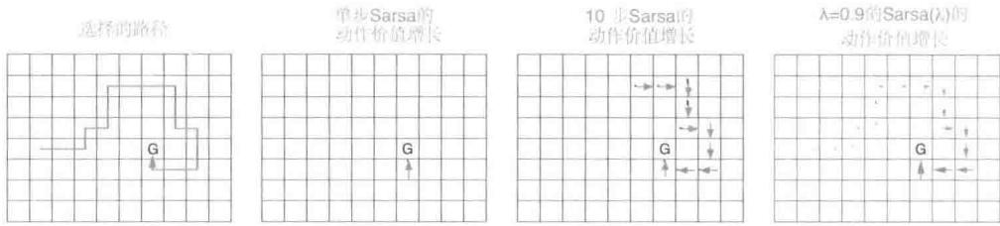

第一个图中展示了智能体在单幕中选择的道路。在这个例子中，所有的估计价值的初值都设为零，且除了一个用G表示的目标位置的收益为正值外，其他所有的收益都是零。其他三个图中的箭头分别展示了对于不同的算法，智能体到达目标后哪些动作的价值会增加，增加多少。单步法只会更新最后一个动作价值， $n$ -步法会均等地更新最后的 $n$ 个动作价值，资格迹法会从幕的开始不同程度地更新所有的动作价值，更新程度根据时间远近衰减。采用衰减策略一般是最好的做法。

# 采用二值特征和线性函数逼近的Sarsa(λ)算法，用于估计 $\mathbf{w}^{\top}\mathbf{x}\approx q_{\pi}$ 或者 $q_{*}$

输入：函数 $\mathcal{F}(s,a)$ ，返回值为 $s,a$ 的激活特征的下标集合

输入：策略 $\pi$ （如果要估计 $q_{\pi}$ ）

算法参数：步长 $\alpha > 0$ ，迹衰减率 $\lambda \in [0,1]$

初始化： $\mathbf{w} = (w_{1},\dots ,w_{d})^{\top}\in \mathbb{R}^{d}$ （如 $\mathbf{w} = \mathbf{0}$ ， $\mathbf{z} = (z_{1},\dots ,z_{d})^{\top}\in \mathbb{R}^{d}$

对每一幕循环：

初始化 $S$

根据 $\pi (\cdot |S)$ 采样 $A$ 或者根据 $\hat{q} (S,\cdot ,\mathbf{w})$ 利用 $\varepsilon$ -贪心策略选择 $A$

$$
z \leftarrow 0
$$

对幕中的每一步循环：

执行动作 $A$ ，观察到 $R,S^{\prime}$

$$
\delta \leftarrow R
$$

对 $\mathcal{F}(S,A)$ 中的元素 $i$ 循环：

$$
\delta \leftarrow \delta - w _ {i}
$$

$$
z _ {i} \leftarrow z _ {i} + 1 \quad (\text {积 累 迹})
$$

或 $z_{i}\gets 1$ （替代迹）

如果 $S^{\prime}$ 是终止状态：

$$
\mathbf {w} \leftarrow \mathbf {w} + \alpha \delta \mathbf {z}
$$

转到下一幕

根据 $\pi (\cdot |S^{\prime})$ 采样 $A^\prime$ 或者根据 $\hat{q} (S^{\prime},\cdot ,\mathbf{w})$ 近似贪心选择 $A^{\prime}$

对于 $\mathcal{F}(S', A')$ 的元素 $i$ 循环： $\delta \gets \delta + \gamma w_i$

$$
\mathbf {w} \leftarrow \mathbf {w} + \alpha \delta \mathbf {z}
$$

$$
\mathbf {z} \leftarrow \gamma \lambda \mathbf {z}
$$

$$
S \leftarrow S ^ {\prime} A \leftarrow A ^ {\prime}
$$

练习12.6 修改Sarsa(λ)的伪代码，采用荷兰迹(式12.11)，而不使用真实在线算法的其他特征。假设使用线性函数逼近和二值特征。

例12.2Sarsa $(\lambda)$ 用于高山行车图12.10（左图）展示了Sarsa $(\lambda)$ 用于例10.1中的高山行车任务的结果。函数逼近、动作选择以及环境细节与第10章中的完全一致，可以从数值上将这些结果与 $n$ 步Sarsa的结果(右图）相比。早先的那些结果展示的是随更新步长 $n$ 的变化，这里的Sarsa $(\lambda)$ 展示的是随迹参数 $\lambda$ 的变化， $\lambda$ 和 $n$ 有着类似的作用。Sarsa $(\lambda)$ 的迹衰减自举策略在这个问题上表现出更高的学习效率。

高山行车任务中前50幕（每幕100步）的平均时间步

  
图12.10 使用替换迹的Sarsa $(\lambda)$ 和 $n$ 步Sarsa（复制于图10.4）性能随步长 $\alpha$ 的变化图

对于理想的时序差分方法，即12.4节中提到的在线 $\lambda$ -回报算法，也有一种动作价值函数的对应版本。除了要采用本节开头介绍的 $n$ 步回报的动作价值函数形式外，其他的都和之前介绍的一样。对于线性函数逼近，理想算法同样有精确的、高效的 $O(d)$ 复杂度实现，被称为真实在线Sarsa(λ)。其也适用于在12.5节和12.6节中的分析，除了采用动作价值函数特征向量 $\mathbf{x}_t = \mathbf{x}(S_t,A_t)$ 代替状态价值函数特征向量 $\mathbf{x}_t = \mathbf{x}(S_t)$ 外没有任何改动。这个算法的伪代码在下面框中给出。图12.11比较了采用不同版本的Sarsa(λ)算法在高山行车例子中的表现。

  
图12.11Sarsa(λ）在高山行车任务上的比较。无论是使用积累迹还是替换迹，真实在线Sarsa(λ）比普通Sarsa(λ）的性能都要好。当然也包括使用替换迹的Sarsa(λ）的另一版本，即在每一时刻，没有被选择的状态和动作的迹被置为零

# 真实在线Sarsa(λ)算法，用于估计 $\mathbf{w}^{\top}\mathbf{x}\approx q_{\pi}$ 或者 $q_{*}$

输入：特征向量 $\mathbf{x}:\mathcal{S}^{+}\times \mathcal{A}\to \mathbb{R}^{d}$ ，满足 $\mathbf{x}$ (终止状态，·）=0

输入：策略 $\pi$ （如果要估计 $q_{\pi}$ ）

算法参数：步长 $\alpha >0$ ，迹衰减率 $\lambda \in [0,1]$

初始化： $\mathbf{w}\in \mathbb{R}^d$ （例如， $\mathbf{w} = \mathbf{0}$ ）

对每一幕循环：

初始化 $S$

根据 $A\sim \pi (\cdot |S)$ 采样动作或从 $S$ 根据 $\mathbf{w}$ 近似贪心选择 $A$

$$
\begin{array}{l} \mathbf {x} \leftarrow \mathbf {x} (S, A) \\ \mathbf {z} \leftarrow 0 \\ Q _ {o l d} \leftarrow 0 \\ \end{array}
$$

对幕中的每一步循环：

执行动作 $A$ ，观察到 $R$ ， $S^{\prime}$   
| 根据 $A' \sim \pi(\cdot | S')$ 采样动作或从 $S'$ 根据 $\mathbf{w}$ 近似贪心选择 $A$

$$
\begin{array}{l} | \mathrm {x} ^ {\prime} \leftarrow \mathrm {x} \left(S ^ {\prime}, A ^ {\prime}\right) \\ | Q \leftarrow \mathbf {w} ^ {\top} \mathbf {x} \\ | Q ^ {\prime} \leftarrow \mathbf {w} ^ {\top} \mathbf {x} ^ {\prime} \\ \mid \delta \leftarrow R + \gamma Q ^ {\prime} - Q \\ | z \leftarrow \gamma \lambda z + (1 - \alpha \gamma \lambda z ^ {\top} x) x \\ \end{array}
$$

$$
\begin{array}{l} \mid \mathbf {w} \leftarrow \mathbf {w} + \alpha (\delta + Q - Q _ {o l d}) \mathbf {z} - \alpha (Q - Q _ {o l d}) \mathbf {x} \\ \mid Q _ {o l d} \leftarrow Q ^ {\prime} \\ \mid \mathbf {x} \leftarrow \mathbf {x} ^ {\prime} \\ \mid A \leftarrow A ^ {\prime} \end{array}
$$

直到 $S^{\prime}$ 是终止状态

# 12.8 变量 $\lambda$ 和 $\gamma$

现在到了基础时序差分学习算法的结尾部分。为了用更一般化的形式表述最终的算法，有必要将自举法和折扣的常数系数推广到依赖于状态和动作的函数。也就是说，每个时刻会有一个不同的 $\lambda$ 和一个不同的 $\gamma$ ，用 $\lambda_{t}$ 和 $\gamma_{t}$ 来表示。现在我们改变记号，使得 $\lambda : S \times A \to [0,1]$ 是状态和动作到单位区间的函数映射，且 $\lambda_{t} \doteq \lambda(S_{t}, A_{t})$ ，类似地， $\gamma : S \to [0,1]$ 是状态到单位区间的函数映射，且 $\gamma_{t} \doteq \gamma(S_{t})$ 。

使用终止函数 $\gamma$ 的影响尤其重大，因为它改变了回报值，即改变了我们想要估计的最基本的随机变量的期望值。现在回报值被更一般化地定义为

$$
\begin{array}{l} G _ {t} \dot {=} R _ {t + 1} + \gamma_ {t + 1} G _ {t + 1} \\ = R _ {t + 1} + \gamma_ {t + 1} R _ {t + 2} + \gamma_ {t + 1} \gamma_ {t + 2} R _ {t + 3} + \gamma_ {t + 1} \gamma_ {t + 2} \gamma_ {t + 3} R _ {t + 4} + \dots \\ = \sum_ {k = t} ^ {\infty} R _ {k + 1} \prod_ {i = t + 1} ^ {k} \gamma_ {i}, \tag {12.17} \\ \end{array}
$$

在式中，为了保证和是有限的，我们要求 $\prod_{k = t}^{\infty}\gamma_{k} = 0$ 对所有 $t$ 都成立。这个定义的一个方便之处在于它允许不将幕、起始状态、终止状态和时刻 $T$ 作为特殊的情况和数据进行处理。根据这个定义，终止状态就是一个 $\gamma (s) = 0$ 的状态，且会转移到一个初始状态。在这种情况下（通过选择 $\gamma (\cdot)$ 作为常量函数）我们可以得到经典的分幕式任务的特例情况。“状态相关的幕终止”包括了其他一些例子，例如伪终止，在这里我们预测一个已完成但不改变马尔可夫过程流向的量。折后回报值自身就可以被认为是这样一个量，“状态相关的终止”是分幕式和带折扣的持续性任务的深层统一（非折扣持续性任务的情况还需要一些特殊处理）。

在这个问题中对变量自举法的泛化并不像折扣一样是问题本身的变化，而是解决方案的变化。这个泛化影响了状态和动作的 $\lambda$ -回报值。新的基于状态的 $\lambda$ -回报值可以被递归地写为

$$
G _ {t} ^ {\lambda s} \dot {=} R _ {t + 1} + \gamma_ {t + 1} \left((1 - \lambda_ {t + 1}) \hat {v} \left(S _ {t + 1}, \mathbf {w} _ {t}\right) + \lambda_ {t + 1} G _ {t + 1} ^ {\lambda s}\right), \tag {12.18}
$$

我们现在把“s”加为 $\lambda$ 上标以提醒这是一个基于状态价值自举的回报值，从而与基于动作价值的自举回报值相区分（我们在下式中用“a”作为上标）。这个公式表明 $\lambda$ -回报值是第一个收益值（没有折扣且不受自举操作的影响）加上一个可能的第二项，该项反映了在多大程度上我们不会在下一个状态打折扣（也即根据 $\gamma_{t+1}$ 来决定打多少折扣。回顾一下，如果下一个状态是终止状态，则这个值是零）。当不在下一个状态终止时，我们就会有第二项。根据状态自举的程度，可以将它分为两种情况。在有自举的情况下，这一项是状态的估计价值；在无自举的情况下，这一项是下一个时刻的 $\lambda$ -回报值。基于动作的 $\lambda$ -回报要么是Sarsa的如下形式

$$
G _ {t} ^ {\lambda a} \doteq R _ {t + 1} + \gamma_ {t + 1} \left((1 - \lambda_ {t + 1}) \hat {q} \left(S _ {t + 1}, A _ {t + 1}, \mathbf {w} _ {t}\right) + \lambda_ {t + 1} G _ {t + 1} ^ {\lambda a}\right), \tag {12.19}
$$

要么是期望Sarsa的形式

$$
G _ {t} ^ {\lambda a} \dot {=} R _ {t + 1} + \gamma_ {t + 1} \left((1 - \lambda_ {t + 1}) \bar {V} _ {t} \left(S _ {t + 1}\right) + \lambda_ {t + 1} G _ {t + 1} ^ {\lambda a}\right), \tag {12.20}
$$

其中，式（7.8）被推广到函数逼近，如下所示

$$
\bar {V} _ {t} (s) \doteq \sum_ {a} \pi (a | s) \hat {q} (s, a, \mathbf {w} _ {t}). \tag {12.21}
$$

练习12.7 定义 $G_{t:h}^{\lambda s}$ 和 $G_{t:h}^{\lambda a}$ ，将上述三个递归方法推广到它们的截断版本。

# 12.9 带有控制变量的离轨策略资格迹

最后一步是引入重要度采样。与 $n$ -步方法的情况不同，对于完整的非截断 $\lambda$ -回报，我们没有一个可以让重要度采样在目标回报之外完成的实际可行的方案。我们会直接考虑带有控制变量的每次决策型重要度采样的自举法的推广(7.4节)。根据模型(式7.13)，状态的 $\lambda$ -回报的最终定义将式(12.18)推广为

$$
G _ {t} ^ {\lambda s} \doteq \rho_ {t} \left(R _ {t + 1} + \gamma_ {t + 1} \left((1 - \lambda_ {t + 1}) \hat {v} \left(S _ {t + 1}, \mathbf {w} _ {t}\right) + \lambda_ {t + 1} G _ {t + 1} ^ {\lambda s}\right)\right) + (1 - \rho_ {t}) \hat {v} \left(S _ {t}, \mathbf {w} _ {t}\right) \tag {12.22}
$$

其中， $\rho_{t} = \frac{\pi(A_{t}|S_{t})}{b(A_{t}|S_{t})}$ 是普通的单步重要度采样率。与本书中我们所见到的其他回报很像，这个回报的截断版本可以简单地用基于状态的时序差分误差总和的形式来近似表示，

$$
\delta_ {t} ^ {s} = R _ {t + 1} + \gamma_ {t + 1} \hat {v} \left(S _ {t + 1}, \mathbf {w} _ {t}\right) - \hat {v} \left(S _ {t}, \mathbf {w} _ {t}\right), \tag {12.23}
$$

以及

$$
G _ {t} ^ {\lambda s} \approx \hat {v} \left(S _ {t}, \mathbf {w} _ {t}\right) + \rho_ {t} \sum_ {k = t} ^ {\infty} \delta_ {k} ^ {s} \prod_ {i = t + 1} ^ {k} \gamma_ {i} \lambda_ {i} \rho_ {i}. \tag {12.24}
$$

如果近似价值函数不变，则上式中的近似值将变为精确值。

练习12.8 证明如果价值函数不变，则式（12.24）会成为精确表达式。为了节省篇幅，考虑 $t = 0$ 的情况，并使用记号 $V_{k} \doteq \hat{v}(S_{k}, \mathbf{w})$ □

练习12.9 把一般的离轨策略截断形式记为 $G_{t:h}^{\lambda s}$ 。请基于式（12.24）猜测其正确的表达式。

上述形式的 $\lambda$ -回报(式12.24)可以很方便地使用前向视图更新，

$$
\begin{array}{l} \mathbf {w} _ {t + 1} = \mathbf {w} _ {t} + \alpha \left(G _ {t} ^ {\lambda s} - \hat {v} \left(S _ {t}, \mathbf {w} _ {t}\right)\right) \nabla \hat {v} \left(S _ {t}, \mathbf {w} _ {t}\right) \\ \approx \mathbf {w} _ {t} + \alpha \rho_ {t} \left(\sum_ {k = t} ^ {\infty} \delta_ {k} ^ {s} \prod_ {i = t + 1} ^ {k} \gamma_ {i} \lambda_ {i} \rho_ {i}\right) \nabla \hat {v} (S _ {t}, \mathbf {w} _ {t}), \\ \end{array}
$$

这对于有经验的人来说看上去像一个基于资格的时序差分更新，其中的乘积项像一个资格迹并且与时序差分误差相乘。但这只是前向视图中的单个时刻的情况。我们要寻找的关系是，沿着各个时刻求和的前向视图更新与沿时刻累加的反向视图更新是近似等价的（这个关系只能是近似的，因为我们再一次忽略了价值函数的变化）。沿着各个时刻求和的前向视图更新为

(使用求和规则： $\sum_{t = x}^{y}\sum_{k = t}^{y} = \sum_{k = x}^{y}\sum_{t = x}^{k})$

$$
\begin{array}{l} \sum_ {t = 1} ^ {\infty} \left(\mathbf {w} _ {t + 1} - \mathbf {w} _ {t}\right) \approx \sum_ {t = 1} ^ {\infty} \sum_ {k = t} ^ {\infty} \alpha \rho_ {t} \delta_ {k} ^ {s} \nabla \hat {v} \left(S _ {t}, \mathbf {w} _ {t}\right) \prod_ {i = t + 1} ^ {k} \gamma_ {i} \lambda_ {i} \rho_ {i} \\ = \sum_ {k = 1} ^ {\infty} \sum_ {t = 1} ^ {k} \alpha \rho_ {t} \nabla \hat {v} \left(S _ {t}, \mathbf {w} _ {t}\right) \delta_ {k} ^ {s} \prod_ {i = t + 1} ^ {k} \gamma_ {i} \lambda_ {i} \rho_ {i} \\ = \sum_ {k = 1} ^ {\infty} \alpha \delta_ {k} ^ {s} \sum_ {t = 1} ^ {k} \rho_ {t} \nabla \hat {v} \left(S _ {t}, \mathbf {w} _ {t}\right) \prod_ {i = t + 1} ^ {k} \gamma_ {i} \lambda_ {i} \rho_ {i}, \\ \end{array}
$$

如果可以将第二个求和项中的整个表达式写为资格迹的形式并进行增量式更新，那么上式可以写成后向视图时序差分更新的总和的形式。现在我们来证明可以这样做，也就是说，如果这个表达式是 $k$ 时刻的迹，那么我们可以用其在 $k - 1$ 时刻的值来更新它

$$
\begin{array}{l} \mathbf {z} _ {k} = \sum_ {t = 1} ^ {k} \rho_ {t} \nabla \hat {v} \left(S _ {t}, \mathbf {w} _ {t}\right) \prod_ {i = t + 1} ^ {k} \gamma_ {i} \lambda_ {i} \rho_ {i} \\ = \sum_ {t = 1} ^ {k - 1} \rho_ {t} \nabla \hat {v} \left(S _ {t}, \mathbf {w} _ {t}\right) \prod_ {i = t + 1} ^ {k} \gamma_ {i} \lambda_ {i} \rho_ {i} + \rho_ {k} \nabla \hat {v} \left(S _ {k}, \mathbf {w} _ {k}\right) \\ \end{array}
$$

强化学习（第2版）

$$
\begin{array}{l} = \gamma_ {k} \lambda_ {k} \rho_ {k} \underbrace {\sum_ {t = 1} ^ {k - 1} \rho_ {t} \nabla \hat {v} \left(S _ {t} , \mathbf {w} _ {t}\right) \prod_ {i = t + 1} ^ {k - 1} \gamma_ {i} \lambda_ {i} \rho_ {i}} _ {\mathbf {z} _ {k - 1}} + \rho_ {k} \nabla \hat {v} \left(S _ {k}, \mathbf {w} _ {k}\right) \\ = \rho_ {k} \left(\gamma_ {k} \lambda_ {k} \mathbf {z} _ {k - 1} + \nabla \hat {v} \left(S _ {k}, \mathbf {w} _ {k}\right)\right), \\ \end{array}
$$

将索引从 $k$ 更改为 $t$ ，则得到状态值的一般化的积累迹更新

$$
\mathbf {z} _ {t} \doteq \rho_ {t} \left(\gamma_ {t} \lambda_ {t} \mathbf {z} _ {t - 1} + \nabla \hat {v} \left(S _ {t}, \mathbf {w} _ {t}\right)\right), \tag {12.25}
$$

这个资格迹和 $\mathrm{TD}(\lambda)$ (式12.7）的半梯度参数更新规则共同形成了一个通用的 $\mathrm{TD}(\lambda)$ 算法，这个算法可以应用在同轨策略或离轨策略数据上。在同轨策略情况下，这个算法就是 $\mathrm{TD}(\lambda)$ ，因为 $\rho_{t}$ 总为1且式(12.25)变为了通用积累迹(式12.5)(扩展到变量 $\lambda$ 和 $\gamma$ )。在离轨策略情况下，该算法往往效果很好，但作为一种半梯度方法，它不能保证稳定性。在接下来的几节中，我们考虑能保证稳定性的扩展方法。

我们可以遵循一系列非常相似的步骤获得动作价值函数方法的离轨策略资格迹和对应的通用Sarsa(λ)算法。我们可以从通用的基于动作的 $\lambda$ -回报的递归形式开始，使用式（12.19）或式（12.20）都可以，后者（期望Sarsa的形式）更简单一些。根据模型（式7.14），我们将式（12.20）扩展到离轨策略的情况

$$
\begin{array}{l} G _ {t} ^ {\lambda a} \dot {=} R _ {t + 1} + \gamma_ {t + 1} \left((1 - \lambda_ {t + 1}) \bar {V} _ {t} (S _ {t + 1}) + \lambda_ {t + 1} \left[ \rho_ {t + 1} G _ {t + 1} ^ {\lambda a} + \bar {V} _ {t} (S _ {t + 1}) \right. \right. \\ \left. \left. - \rho_ {t + 1} \hat {q} \left(S _ {t + 1}, A _ {t + 1}, \mathbf {w} _ {t}\right) \right]\right) \\ = R _ {t + 1} + \gamma_ {t + 1} \left(\bar {V} _ {t} \left(S _ {t + 1}\right) + \lambda_ {t + 1} \rho_ {t + 1} \left[ G _ {t + 1} ^ {\lambda a} - \hat {q} \left(S _ {t + 1}, A _ {t + 1}, \mathbf {w} _ {t}\right) \right]\right) \tag {12.26} \\ \end{array}
$$

其中， $\hat{q}_t(S_{t + 1})$ 在式(12.21)中给出。同样， $\lambda$ -回报可以近似写作时序差分误差的总和，

$$
G _ {t} ^ {\lambda a} \approx \hat {q} \left(S _ {t}, A _ {t}, \mathbf {w} _ {t}\right) + \sum_ {k = t} ^ {\infty} \delta_ {k} ^ {a} \prod_ {i = t + 1} ^ {k} \gamma_ {i} \lambda_ {i} \rho_ {i}, \tag {12.27}
$$

使用基于动作的时序差分误差的期望形式

$$
\delta_ {t} ^ {a} = R _ {t + 1} + \gamma_ {t + 1} \bar {V} _ {t} \left(S _ {t + 1}\right) - \hat {q} \left(S _ {t}, A _ {t}, \mathbf {w} _ {t}\right). \tag {12.28}
$$

与之前一样，当近似价值函数不变时，近似值逼近准确值。

练习12.10 证明如果价值函数不变化，则式（12.27）中的近似值变为精确值。为了节省篇幅，考虑 $t = 0$ 的情况，并使用符号 $Q_{k} = \hat{q}(S_{k}, A_{k}, \mathbf{w})$ 。提示：首先写出 $\delta_{0}^{a}$ 和 $G_{0}^{\lambda a}$ ，然后再推导出 $G_{0}^{\lambda a} - Q_{0}$ □

练习12.11 把通用离轨策略的截断回报记为 $G_{t:h}^{\lambda a}$ 。基于式(12.27)，猜猜它正确的表达式。

使用和基于状态的情况完全类似的步骤，我们可以基于式(12.27)写出前向视图更新，用求和规则转换更新的求和项，最后得出如下形式的动作价值函数的资格迹

$$
\mathbf {z} _ {t} \doteq \gamma_ {t} \lambda_ {t} \rho_ {t} \mathbf {z} _ {t - 1} + \nabla \hat {q} \left(S _ {t}, A _ {t}, \mathbf {w} _ {t}\right). \tag {12.29}
$$

这个资格迹和基于期望的时序差分误差 (式 12.28) 以及半梯度参数更新规则 (式 12.7) 一起，形成了一个优雅的高效的期望 Sarsa(λ) 算法，可以将它应用于同轨策略或离轨策略数据。到目前为止，它可能是同类型算法中最好的了（当然，在以某种方式与下面几节中介绍的方法结合之前，是不能保证它的稳定性的）。对于 $\lambda$ 和 $\gamma$ 为常量的同轨策略情况，以及一般的“状态-动作”二元组时序差分误差 (式 12.16)，这个算法等价于 12.7 节介绍的 Sarsa(λ) 算法。

练习12.12 详细说明以上从式(12.27)推出式(12.29)的步骤。可以从更新式(12.15)开始，用 $G_{t}^{\lambda}$ 替换式（12.26）中的 $G_{t}^{\lambda a}$ ，然后遵循推导式（12.25）相同的步骤。

当 $\lambda = 1$ 时，这些算法与对应的蒙特卡洛算法密切相关。你可能会期待，对于分幕式问题和离线更新，两者的等价性完全成立，但事实上，两者的关系要更细微，也比这稍微弱一些。在最有利的条件下，仍然不能保证每一幕更新的等价性，而仅仅只能得到它们的期望的等价性。这并不令人惊讶，因为这些方法会随着序列轨迹的展开而进行不可逆的更新，而在真正的蒙特卡洛方法中，如果目标策略下的轨迹内的动作出现了零概率的情况，则不会进行更新。特别地，这些方法即使在 $\lambda = 1$ 的情况下，仍然需要使用自举法，因为它们的目标取决于当前价值的估计——只是在期望值中这种依赖性消失了。在实际中这是一个好的还是坏的性质就是另外一个问题了。最近提出的一些方法确实实现了精确的等价性（Sutton、Mahmood、Precup 和 van Hasselt, 2014）。这些方法需要一个额外的“临时权重”向量，用以记录已经完成了但可能需要根据后面采取的动作进行撤销（或强调）的更新。这些方法的状态和“状态-动作”二元组的版本被分别称为 $\mathrm{PTD}(\lambda)$ 和 $\mathrm{PQ}(\lambda)$ ，其中“P”表示临时的意思（Provisional）。

所有这些新的离轨策略方法的实际影响都尚未确定。但毫无疑问的是，在使用重要度采样的所有离轨策略方法中都会出现高方差的问题（11.9节）。

如果 $\lambda < 1$ ，那么所有这些离轨策略算法都涉及自举法和致命三要素(11.3节)，这意味着它们只能在表格型情况、状态聚合和其他函数逼近的有限形式下保证稳定。对于线性和更一般的函数逼近形式，参数向量可能会如第11章中的例子那样发散到无穷大。正如

我们之前所讨论的，离轨策略学习的挑战有两个。离轨策略资格迹有效地解决了第一个挑战，即纠正了目标的期望值，但完全没有解决第二个挑战，即与更新的分布相关的挑战。12.11节总结了一些算法策略，用于解决离轨策略学习资格迹的第二个挑战。

练习12.13 请写出状态价值和动作价值方法的离轨策略资格迹的荷兰迹和替换迹形式。

# 12.10 从 Watkins 的 $\mathrm{Q}(\lambda)$ 到树回溯 $\mathrm{TB}(\lambda)$

多年以来，学术界提出了一系列将Q学习扩展到资格迹的方法。Watkins的 $\mathrm{Q}(\lambda)$ 是其中的第一个方法，在这种方法中，只要采取贪心动作，它就会以正常方式让其资格迹衰减，然后在第一次非贪心动作后把迹缩减为零。Watkins $\mathrm{Q}(\lambda)$ 的回溯图如图12.12所示。在第6章中，我们将Q学习和期望Sarsa在后者的离轨策略版本中进行了统一，在此框架下Q学习是一个特例，我们同时将其推广到任意的目标策略。在本章的上一节中，我们将期望Sarsa推广到了离轨策略资格迹。在7章中，我们区分了 $n$ 步期望Sarsa和 $n$ 步树回溯，后者保留了不使用重要度采样的性质。并且，它还提供了树回溯的资格迹版本，我们称之为树回溯 $(\lambda)$ 或简称为 $TB(\lambda)$ 。这可以说是Q学习的真正继承者，因为它既可以使用离轨策略数据，也仍然保留其可以不使用重要度采样的优势。

  
图12.12 Watkins的 $Q(\lambda)$ 的回溯图。一旦到达某幕的结尾或者非贪心动作被选取，整个序列的各个分量更新都将结束

$\mathrm{TB}(\lambda)$ 的概念很简单。如图12.13的回溯图所示，不同长度的树回溯更新（7.5节）都

以通常的方式根据自举法参数 $\lambda$ 进行加权。为了获得包含正确的自举法索引和折扣参数的详细表达式，最好从动作价值函数的 $\lambda$ -回报的递归形式(式12.20)，开始，然后根据模型(式7.16)扩展以自举法表示的目标表达式

$$
\begin{array}{l} G _ {t} ^ {\lambda a} \doteq R _ {t + 1} + \gamma_ {t + 1} \left((1 - \lambda_ {t + 1}) \bar {V} _ {t} (S _ {t + 1}) + \lambda_ {t + 1} \left[ \sum_ {a \neq A _ {t + 1}} \pi (a | S _ {t + 1}) \hat {q} (S _ {t + 1}, a, \mathbf {w} _ {t}) \right. \right. \\ \left. + \pi \left(A _ {t + 1} \mid S _ {t + 1}\right) G _ {t + 1} ^ {\lambda a} \right] \\ \end{array}
$$

根据一般模式，利用基于动作的时序差分误差的期望形式(式12.28)，也可以将它近似写为时序差分误差的总和（忽略近似价值函数引起的变化）

$$
G _ {t} ^ {\lambda a} \approx \hat {q} \left(S _ {t}, A _ {t}, \mathbf {w} _ {t}\right) + \sum_ {k = t} ^ {\infty} \delta_ {k} ^ {a} \prod_ {i = t + 1} ^ {k} \gamma_ {i} \lambda_ {i} \pi \left(A _ {i} | S _ {i}\right),
$$

  
图12.13 树回溯算法的 $\lambda$ 版本的回溯图

接下来的步骤和上一节一样，我们得到一个与目标策略中所选动作的概率相关的特殊的资格迹更新

$$
\mathbf {z} _ {t} \doteq \gamma_ {t} \lambda_ {t} \pi (A _ {t} | S _ {t}) \mathbf {z} _ {t - 1} + \nabla \hat {q} (S _ {t}, A _ {t}, \mathbf {w} _ {t}).
$$

这和参数更新规则 (式12.7) 一起定义了 $\mathrm{TB}(\lambda)$ 算法。像所有的半梯度算法一样，当与离轨策略数据以及一个强大的函数逼近器一同使用时， $\mathrm{TB}(\lambda)$ 不能保证稳定性。因此，它必须与下面两节中提出的方法之一结合使用。

* 练习 12.14 双期望 Sarsa 如何被扩展到资格迹？

□

# 12.11 采用资格迹保障离轨策略方法的稳定性

前面介绍的一些使用资格迹的方法，在离轨策略训练的情况下可以有稳定性的保证。在这里，我们使用本书中的一些标准概念，包括通用的自举和折扣函数，来介绍四种最重要的方法。它们全部都基于11.7节和11.8节中介绍的梯度TD或强调TD的思想。这里所有算法都假设采用线性函数逼近，到非线性函数逼近的扩展可以在相关文献中找到。

$GTD(\lambda)$ 是类似于TDC的资格迹算法，TDC是在11.7节中讨论的两个“状态-动作”二元组的梯度时序差分预测算法中较好的那个。 $\mathrm{GTD}(\lambda)$ 的目的是学习一个参数 $\mathbf{w}_t$ 使得 $\hat{v}(s,\mathbf{w})\doteq \mathbf{w}_t^\top \mathbf{x}(s)\approx v_\pi (s)$ ，学习所使用的训练数据甚至可以遵循另一策略 $b$ 产生的数据。它的更新公式是

$$
\mathbf {w} _ {t + 1} \dot {=} \mathbf {w} _ {t} + \alpha \delta_ {t} ^ {s} \mathbf {z} _ {t} - \alpha \gamma_ {t + 1} (1 - \lambda_ {t + 1}) (\mathbf {z} _ {t} ^ {\top} \mathbf {v} _ {t}) \mathbf {x} _ {t + 1},
$$

其中， $\delta_t^s$ ， $\mathbf{z}_t$ 和 $\rho_t$ 根据式（12.23）、式（12.25）和式（11.1）定义，另外

$$
\mathbf {v} _ {t + 1} \dot {=} \mathbf {v} _ {t} + \beta \delta_ {t} ^ {s} \mathbf {z} _ {t} - \beta \left(\mathbf {v} _ {t} ^ {\top} \mathbf {x} _ {t}\right) \mathbf {x} _ {t}, \tag {12.30}
$$

其中，如11.7节介绍的， $\mathbf{v} \in \mathbb{R}^d$ 是和 $\mathbf{w}$ 维度一样的向量，可以初始化为 $\mathbf{v}_0 = \mathbf{0}$ ， $\beta > 0$ 是步长参数。

$GQ(\lambda)$ 是使用资格迹的动作价值函数的梯度时序差分算法，其目的是学习一个参数 $\mathbf{w}_t$ 使得离轨策略数据满足 $\hat{q}(s, a, \mathbf{w}_t) \doteq \mathbf{w}_t^\top \mathbf{x}(s, a) \approx q_\pi(s, a)$ 。如果目标策略是 $\varepsilon$ -贪心的，或趋向于 $\hat{q}$ 的贪心策略，那么 $\mathrm{GQ}(\lambda)$ 可以被用作一个控制算法。它的更新公式是

$$
\mathbf {w} _ {t + 1} \dot {=} \mathbf {w} _ {t} + \alpha \delta_ {t} ^ {a} \mathbf {z} _ {t} - \alpha \gamma_ {t + 1} (1 - \lambda_ {t + 1}) (\mathbf {z} _ {t} ^ {\top} \mathbf {v} _ {t}) \bar {\mathbf {x}} _ {t + 1},
$$

其中， $\overline{\mathbf{x}}_t$ 是目标策略下 $S_{t}$ 的平均特征向量

$$
\bar {\mathbf {x}} _ {t} \doteq \sum_ {a} \pi (a | S _ {t}) \mathbf {x} (S _ {t}, a),
$$

$\delta_t^a$ 是时序差分误差的期望形式，可以写作

$$
\delta_ {t} ^ {a} \dot {=} R _ {t + 1} + \gamma_ {t + 1} \mathbf {w} _ {t} ^ {\top} \bar {\mathbf {x}} _ {t + 1} - \mathbf {w} _ {t} ^ {\top} \mathbf {x} _ {t},
$$

采用通常的方式针对式（12.29）的动作价值定义 $\mathbf{z}_t$ ，剩下的和 $\mathrm{GTD}(\lambda)$ 中的定义一样，包括对 $\mathbf{v}_t$ 的更新（式12.30）。

$HTD(\lambda)$ 是结合了 $\mathrm{GTD}(\lambda)$ 和 $\mathrm{TD}(\lambda)$ 两个方面的混合状态价值函数算法。它最具吸引力的特征是，它是 $\mathrm{TD}(\lambda)$ 算法针对离轨策略学习的严格的一般化形式，也就是说，如果行动策略碰巧与目标策略相同，那么 $\mathrm{HTD}(\lambda)$ 会变得和 $\mathrm{TD}(\lambda)$ 一样，而 $\mathrm{GTD}(\lambda)$ 并不具有这种性质。这个特征很有吸引力，因为 $\mathrm{TD}(\lambda)$ 常常比 $\mathrm{GTD}(\lambda)$ 收敛得更快，并且 $\mathrm{TD}(\lambda)$ 仅需要设置一个步长。 $\mathrm{HTD}(\lambda)$ 被定义为

$$
\mathbf {w} _ {t + 1} \dot {=} \mathbf {w} _ {t} + \alpha \delta_ {t} ^ {s} \mathbf {z} _ {t} + \alpha \left(\left(\mathbf {z} _ {t} - \mathbf {z} _ {t} ^ {b}\right) ^ {\top} \mathbf {v} _ {t}\right) \left(\mathbf {x} _ {t} - \gamma_ {t + 1} \mathbf {x} _ {t + 1}\right),
$$

$\mathbf{v}_{t + 1}\doteq \mathbf{v}_t + \beta \delta_t^s\mathbf{z}_t - \beta \left(\mathbf{z}_t^{b^\top}\mathbf{v}_t\right)\left(\mathbf{x}_t - \gamma_{t + 1}\mathbf{x}_{t + 1}\right),$ 其中 $\mathbf{v}_0\dot{=} 0$

$\mathbf{z}_t \doteq \rho_t (\gamma_t \lambda_t \mathbf{z}_{t-1} + \mathbf{x}_t)$ , 其中 $\mathbf{z}_{-1} \doteq \mathbf{0}$

$\mathbf{z}_t^b \doteq \gamma_t \lambda_t \mathbf{z}_{t-1}^b + \mathbf{x}_t$ ，其中 $\mathbf{z}_{-1}^b \doteq \mathbf{0}$

其中， $\beta > 0$ 是额外的步长参数。除了额外的权重 $\mathbf{v}_t$ 外， $\mathrm{HTD}(\lambda)$ 还有一个额外的资格迹 $\mathbf{z}_t^b$ 。这些是行动策略下的常规的积累资格迹，如果所有 $\rho_t$ 都为1，则它等于 $\mathbf{z}_t$ ，这导致 $\mathbf{w}_t$ 更新中的第二项为零，并且整个更新将简化为 $\mathrm{TD}(\lambda)$ 。

强调 $TD(\lambda)$ 是单步强调TD算法（见9.11节和11.8节）到资格迹的扩展。所得到的算法在允许任意程度的自举的同时，依然保持很强的离轨策略收敛保证，但同时也导致高方差和潜在的收敛变慢。强调TD $(\lambda)$ 定义为

$$
\mathbf {w} _ {t + 1} \doteq \mathbf {w} _ {t} + \alpha \delta_ {t} \mathbf {z} _ {t}
$$

$$
\delta_ {t} \dot {=} R _ {t + 1} + \gamma_ {t + 1} \mathbf {w} _ {t} ^ {\top} \mathbf {x} _ {t + 1} - \mathbf {w} _ {t} ^ {\top} \mathbf {x} _ {t}
$$

$\mathbf{z}_t \doteq \rho_t \left( \gamma_t \lambda_t \mathbf{z}_{t-1} + M_t \mathbf{x}_t \right)$ , 其中 $\mathbf{z}_{-1} \doteq \mathbf{0}$

$$
M _ {t} \dot {=} \lambda_ {t} I _ {t} + (1 - \lambda_ {t}) F _ {t}
$$

$F_{t}\doteq \rho_{t - 1}\gamma_{t}F_{t - 1} + I_{t}$ ，其中 $F_0\dot{=} i(S_0)$

同11.8节描述的一样，其中 $M_t \geqslant 0$ 是强调的一般形式， $F_t \geqslant 0$ 被称为追随迹， $I_t \geqslant 0$ 是兴趣。注意，像 $\delta_t$ 一样， $M_t$ 不是一个真正额外的存储变量。通过将其定义代入资格迹表达式中，可以从算法中将其移除。强调TD（λ）算法的真实在线版本的伪代码和软件可以在网上获得（Sutton，2015b）。

在同轨策略情况下（对于所有 $t$ ， $\rho_{t} = 1$ ），强调TD（λ）算法与传统TD(λ)算法类似，但仍有很大不同。事实上，强调TD（λ）算法对所有状态相关的 $\lambda$ 函数都保证收敛，而TD(λ)却没有这样的性质。TD(λ)只对所有常量 $\lambda$ 保证收敛。参见Yu提供的反例(Ghiassian、Rafiee和Sutton，2016)。

# 12.12 实现中的问题

初看上去使用资格迹的表格型方法可能比单步法复杂得多。最朴素的实现需要每个状态（或“状态-动作”二元组）在每个时间步骤同时更新价值估计和资格迹。对于基于单指令多任务(SIMD)的并行计算机或合理的神经网络，实现不会是一个问题；但是对于常规的串行计算机上的实现来说，这就是一个问题。幸运的是，对于 $\lambda$ 和 $\gamma$ 的一些典型值，几乎所有状态的资格迹都总是接近于零，只有那些最近被访问过的状态的资格迹才会有显著大于零的值，因此，实际上只需要更新这几个状态，就能对原始算法有很好的近似。

在实践中，常规计算机上的实现可以仅跟踪和更新具有非零迹的少数状态。有了这个技巧，在表格型方法中使用资格迹的计算复杂度通常只是单步法的几倍。当然，确切的倍数取决于 $\lambda$ 、 $\gamma$ 和其他部分的计算复杂度。请注意，表格型情况在某种意义上是资格迹计算复杂度的最坏情况。当使用函数逼近时，不使用资格迹的计算优势通常会减小。例如，如果使用人工神经网络和反向传播算法，则使用资格迹通常仅会导致每步计算所需存储空间和计算量增加一倍。截断 $\lambda$ -回报法（12.3节）可以在常规计算机上高效计算，但一般需要一些额外的内存。

# 12.13 本章小结

资格迹和时序差分误差的结合提供了一种可以在蒙特卡洛法和时序差分法之间进行转换的高效的增量式方法。第7章的 $n$ 步法也实现了这一点，但资格迹方法更为普遍，通常学习速度更快，而且提供了不同的计算复杂度权衡。本章提供了用于离轨策略和同轨策略学习以及可变的自举及折扣的资格迹的一个优雅的、新兴的理论解释。这个优雅理论的一个方面是真实在线法，它准确地再现了理想方法的行为，同时保留了常规时序差分法的计算优势。另一方面提供了自动地从直观的前向视图方法转换为更高效的增量式后向视图方法的可能途径。我们通过一个推导阐述了这个一般化的思想，这个推导使用真实在线时序差分法中的创新性的资格迹，将经典的计算复杂度高的蒙特卡洛算法转换为计算复杂度低的增量式的非时序差分实现。

正如我们在第5章中提到的，蒙特卡洛法由于不使用自举法，可能在非马尔可夫任务中有优势。因为资格迹使时序差分方法更像蒙特卡洛方法，它们在这些情况下也可以有优势。如果由于其他优点而想使用时序差分方法，但任务至少部分为非马尔可夫，那么就可以使用资格迹方法了。资格迹是针对长延迟的收益和非马尔可夫任务的首选方法。

通过调整 $\lambda$ ，资格迹方法可以作为介于蒙特卡洛法和单步时序差分法之间的任一种方法。为多少时最合适呢？我们对这个问题还没有很好的理论回答，但是可以基于经验给出一些可能的参考问答。对于包含有多个时间步骤的分幕式任务，或折扣半衰期内的有多个步骤的任务，使用资格迹比不用明显更好（例如，见图12.14）。另一方面，如果资格迹长到产生完全或者近似完全的蒙特卡洛方法，则性能会急剧下降。介于中间的某种方法似乎是更好的选择。资格迹应该使我们偏向蒙特卡洛方法，但并不是完全趋向蒙特卡洛方法。在未来，使用变量 $\lambda$ 更精细地调整时序差分法和蒙特卡洛法之间的权衡是有可能的，但目前尚不清楚如何可靠和有效地去实现。

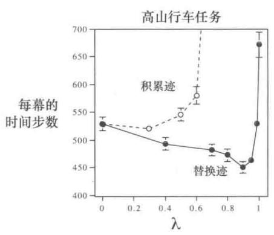

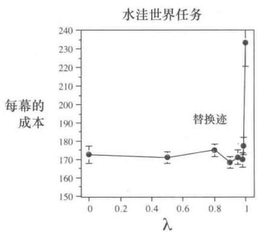

  
图12.14在4个任务上评测 $\lambda$ 对强化学习的影响。在所有的任务中，一般都是 $\lambda$ 为中间值时效果最好（图中纵轴的值较小）。左边两个图是Sarsa(λ)算法和瓦片编码方法使用替换迹或者积累迹(Sutton，1996）在简单的连续状态控制任务上的结果。右上角的图是TD(λ)在随机游走任务上策略评估的结果（Singh和Sutton，1996）。右下角的图是在倒立摆任务上的结果，这个结果来源于早期的研究（Sutton，1984）并且还没有公开发表过

使用资格迹的方法需要比单步法进行更多的计算，但作为好处，它们的学习速度显著加快，特别是当收益被延迟许多时间步骤时。因此，在数据稀缺并且不能被重复处理的情

况下，使用资格迹通常是有意义的，许多在线应用就是这种情况。另一方面，在离线应用中可以很容易地生成数据，例如从廉价的模拟中生成数据，那么通常不使用资格迹。在这些情况下，目标不是从有限的数据中获得更多的数据，而是尽可能快地处理尽可能多的数据。使用资格迹带来的学习的加速通常抵不上它们的计算成本，因而在这种情况下单步法更受欢迎。

# 参考文献和历史评注

将资格迹用于强化学习源于Klopf（1972）中的一系列思想。资格迹的使用也是基于Klopf的工作(Sutton，1978a，1978b，1978c；Barto和Sutton，1981a，1981b；Sutton和Barto，1981a；Barto、Sutton和Anderson，1983；Sutton，1984)。我们可能是最先使用“资格迹”这个术语的人(Sutton and Barto，1981a)。关于刺激在神经系统中产生后效应对于学习很重要这个思想由来已久(参见第14章)。资格迹最早在第13章介绍的行动器-评判器方法(Barto、Sutton和Anderson，1983；Sutton，1984)中使用。

12.1 在本书的第1版中复合更新被称为“复杂回溯”。  
$\lambda$ -回报及其减小误差的性质是由Watkins(1989)首先提出的，随后由Jaakkola，Jordan，and Singh(1994)进行了扩展。本章及后续章节介绍的随机游走的结果是新的，术语“前向视图”和“后向视图”也是新的。本书的第1版中介绍了 $\lambda$ -回报算法的概念，本书中更好的处理方式来源于Harm van Seijen（例如van Seijen和Sutton，2014）。  
12.2 使用积累迹的 $\mathrm{TD}(\lambda)$ 算法是由Sutton(1988，1984)提出的。均值收敛性由Dayan(1992)提出，依概率1收敛有很多研究者证明过，包括Peng(1993)，Dayan和Sejnowski(1994)，Tsitsiklis(1994)，以及Gurvits、Lin和Hanson(1994)。线性 $\mathrm{TD}(\lambda)$ 的渐近 $\lambda$ 相关解的误差界是由Tsitsiklis和VanRoy(1997）提出的。  
12.3-5 截断时序差分方法由Cichosz（1995）和van Seijen(2016)提出。真实在线 $\mathrm{TD}(\lambda)$ 方法和其他相关的想法最早源于van Seijen的工作（van Seijen和Sutton，2014；van Seijen et al., 2016）。替换迹由Singh and Sutton(1996)提出。  
12.6 这一节中的相关材料来源于 van Hasselt 和 Sutton (2015)。  
12.7 使用积累迹的Sarsa(λ)算法最早在Rummery和Niranjan（1994；Rummery，1995）中的控制方法中被提出。真实在线Sarsa(λ)由van Seijen和Sutton（2014）提出。第302页中的算法从van Seijen et al.（2016）中的算法改编而来。高山行车的例子是特地为本书编写的，其中图12.11从van Seijen和Sutton（2014）改编而来。  
12.8 关于变量 $\lambda$ 的公开讨论可能首先来自Watkins(1989)，他指出在 $Q(\lambda)$ 中当非贪心动作被选择时更新序列的截取可以通过将 $\lambda$ 临时设置为0实现。  
本书的第1版也介绍了变量 $\lambda$ 。变量 $\gamma$ 来源于关于选项的研究 (Sutton、Precup 和 Singh, 1999) 以及相关的前期工作 (Sutton, 1995a), 最终在关于 $GQ(\lambda)$ 的论文 (Maei 和 Sutton,

2010)中被清晰地介绍了，这篇论文也介绍了 $\lambda$ -回报的一些递归形式。

Yu (2012) 给出了关于可变的 $\lambda$ 的不同定义。

12.9 离轨策略的资格迹首先由Precup et al. (2000, 2001)提出，之后被Bertsekas和Yu (2009), Maei (2011; Maei和Sutton, 2010), Yu (2012), Sutton、Mahmood、Precup和van Hasselt (2014)等人进一步发展。其中，van Hasselt (2014)采用了强大的前向视角来描述采用状态相关的 $\lambda$ 和 $\gamma$ 的离轨策略时序差分方法。本书里相关内容的介绍相对还比较新。这一节最后介绍了优雅的期望Sarsa(λ)算法。虽然这个算法看起来很自然，但是据我们所知，之前还没有在文献中介绍或者测试过它。  
12.10 Watkin Q(λ) 来源于 Watkins (1989)。Munos、Stepleton、Harutyunyan 和 Bellemare (2016) 证明了表格型、分幕式、离线版本的收敛性。替代 Q(λ) 由 Peng 和 Williams (1994, 1996) 及 Sutton、Mahmood、Precup 和 van Hasselt (2014) 提出。树回溯 TB(λ) 由 Precup、Sutton 和 Singh (2000) 提出。  
12.11 GTD(λ) 由 Maei (2011) 提出。GQ(λ) 由 Maei 和 Sutton (2010) 提出。White 和 White (2016) 在 Hackman (2012) 提出的单步 HTD 算法的基础上提出了 HTD(λ) 算法。Yu (2017) 给出了一些关于梯度-时序差分方法的最新理论结果。Sutton、Mahmood 和 White (2016) 提出了强调 TD(λ)，并证明了它的稳定性。Yu (2015，2016) 证明了它的收敛性，Hallak et al. (2015，2016) 进一步发展了该算法。

# 13

# 策略梯度方法

在这一章，我们将讨论一些新的内容。到目前为止，本书中几乎所有的方法都是基于动作价值函数的方法，它们都是先学习动作价值函数，然后根据估计的动作价值函数选择动作1；如果没有动作价值函数的估计，策略也就不会存在。在这一章中，我们讨论直接学习参数化的策略的方法，动作选择不再直接依赖于价值函数。价值函数仍然可以用于学习策略的参数，但对于动作选择而言就不是必需的了。我们用记号 $\theta \in \mathbb{R}^{d'}$ 表示策略的参数向量。因此，我们把在 $t$ 时刻、状态 $s$ 和参数 $\theta$ 下选择动作 $a$ 的概率记为 $\pi(a|s, \theta) = \operatorname*{Pr}\{A_t = a \mid S_t = s, \theta_t = \theta\}$ 。如果也使用估计的价值函数，那么价值函数的参数像 $\hat{v}(s, \mathbf{w})$ 中一样用 $\mathbf{w} \in \mathbb{R}^d$ 表示。

本章讨论的策略参数的学习方法都基于某种性能度量 $J(\theta)$ 的梯度，这些梯度是标量 $J(\theta)$ 对策略参数的梯度。这些方法的目标是最大化性能指标，所以它们的更新近似于 $J$ 的梯度上升

$$
\theta_ {t + 1} = \theta_ {t} + \alpha \widehat {\nabla J (\theta_ {t})} \tag {13.1}
$$

其中， $\widehat{\nabla J(\theta_t)} \in \mathbb{R}^{d'}$ 是一个随机估计，它的期望是性能指标对它的参数 $\theta_t$ 的梯度的近似。我们把所有符合这个框架的方法都称为策略梯度法，不管它们是否还同时学习一个近似的价值函数。同时学习策略和价值函数的方法一般被称为行动器-评判器方法，其中“行动器”是指学习到的策略，可以视其为智能体进行决策动作的“施动器”；“评判器”指学习到的价值函数，一般是状态价值函数，用于评估特定情况下的价值，可以视其为智能体对当前状况的“评判器”。我们首先考虑分幕式情况，在这种情况下性能指标被定义为：在当前参数化策略下初始状态的价值函数。然后我们再考虑持续性的问题，就像10.3节一样，这种情况下性能指标被定义为平均收益。最后我们可以用相似的术语解释两种情况

下的算法。

# 13.1 策略近似及其优势

在策略梯度方法中，策略可以用任意的方式参数化，只要 $\pi(a|s, \theta)$ 对参数可导，即只要对于所有的 $s \in S$ ， $a \in \mathcal{A}(s)$ 和 $\theta \in \mathbb{R}^{d'}$ ， $\nabla \pi(a|s, \theta)$ ( $\pi(a|s, \theta)$ 对参数 $\theta$ 的偏导组成的列向量) 存在且是有限的。在实际中，为了便于探索，我们一般会要求策略永远不会变成确定的（即对于所有 $s$ 、 $a$ 、 $\theta$ ， $\pi(a|s, \theta) \in (0,1)$ ）。在这一节，我们将介绍最常见的对于离散动作空间的策略参数化方法，并且指出其相对价值函数方法的优势。基于策略的方法也提供了良好的处理连续动作的方法，我们稍后在 13.7 节介绍。

如果动作空间是离散的并且不是特别大，自然的参数化方法是对每一个“状态-动作”二元组估计一个参数化的数值偏好 $h(s, a, \theta) \in \mathbb{R}$ 。在每个状态下拥有最大偏好值的动作被选择的概率也最大，例如，可以根据一个指数柔性最大化（softmax）分布

$$
\pi (a | s, \theta) \doteq \frac {e ^ {h (s , a , \theta)}}{\sum_ {b} e ^ {h (s , b , \theta)}}, \tag {13.2}
$$

其中， $e \approx 2.71828$ 是自然对数的底。注意，这里的分母的作用仅仅是使在每个状态下选择动作的概率之和为1。我们称这种形式的策略参数化为动作偏好值的柔性最大化。

这些动作偏好值可以被任意地参数化。例如，它们可以用神经网络表示， $\theta$ 是网络连接权重的向量（例如16.6节介绍的AlphaGo系统），或者可以是特征的简单线性组合

$$
h (s, a, \theta) = \theta^ {\top} \mathbf {x} (s, a), \tag {13.3}
$$

特征向量 $\mathbf{x}(s,a)\in \mathbb{R}^{d^{\prime}}$ 可以由第9章介绍的任意一种方法构建。

根据偏好柔性最大化分布选择动作的一个直接好处是近似策略可以接近于一个确定策略，尽管基于 $\varepsilon$ -贪心的动作选择中会有 $\varepsilon$ 的概率选择随机动作。当然，我们也可以根据动作价值的柔性最大化分布选择动作，但是这不会使策略趋向于一个确定的策略。相反，动作价值的估计值会收敛于对应的真实值，而这些真实值之间的差异是有限的，因此各个动作会对应到一个特定的概率值而不是0和1。如果在柔性最大化分布中引入一个温度参数，然后这个温度参数可以随时间逐步减小接近一个确定值，但是在实际中如果没有比简单假设更多的关于真实动作价值的先验知识，则很难确定减小的流程，甚至初始温度都很难确定。而动作偏好则不同，因为它们不趋向于任何特定的值；相反，它们趋向于最优的随机策略。如果最优策略是确定的，则最优动作的偏好值将可能趋向无限大于所有次优的动作（如果参数允许的话）。

利用动作偏好的柔性最大化分布的参数化策略还有另外一个优势，即它可以以任意的概率来选择动作。在有重要函数近似的问题中，最好的近似策略可能是一个随机策略。例如，在非完全信息的纸牌游戏中，最优的策略一般是以特定的概率选择两种不同玩法，例如德州扑克中的虚张声势。基于动作价值函数的方法没有一种自然的途径来求解随机最优策略，但是基于策略近似的方法可以，例13.1就是一个很好的例子。

# 例 13.1 带有动作切换的小型走廊任务

考虑下图中的小型走廊网格世界。像往常一样，每步的收益是 $-1$ 。对于三个非终止状态，在每个状态都有两个可选动作：right或者left。对于第1个和第3个状态，这些动作会导致正常的向左或者向右移动（在第1个状态选择left不会导致移动），在第2个状态动作的效果刚好相反，即选择动作right会导致向左移动，选择动作left会导致向右移动。这个问题很难，因为在函数近似下所有的状态是等同的。特别地，对于所有的状态 $s$ ，我们定义 $\mathbf{x}(s,\mathrm{right}) = [1,0]^{\top}$ 和 $\mathbf{x}(s,\mathrm{left}) = [0,1]^{\top}$ 。基于动作价值函数的 $\varepsilon$ -贪心法实际上是被限制在两种策略中做选择：在所有的步骤中以较大的概率 $1 - \varepsilon /2$ 选择动作right，或者以相同的概率选择动作left。如果 $\varepsilon = 0.1$ ，则这两种策略得到的（在初始状态）回报分别小于-44和-82，如下图所示。如果一个方法可以以一定的概率选择动作right，则表现会好很多。最好的概率是0.59，这种情况下可以得到的回报大约是-11.6。

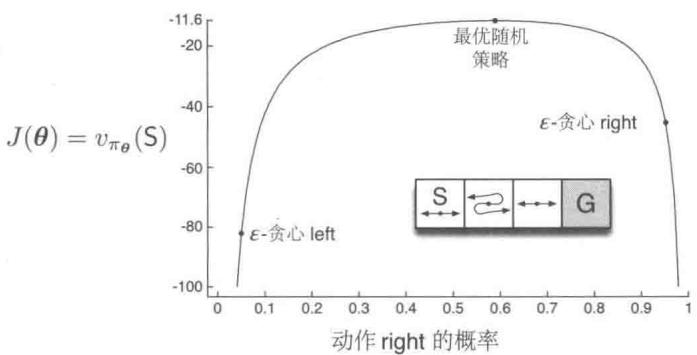

策略参数化相对动作价值函数参数化的一个最简单的优势可能是策略可以用更简单的函数近似。策略和动作价值函数的复杂度因问题而异。对于一些情况，动作价值函数更简单，更容易近似。而对于其他一些情况，策略更简单。在后一种情况中，基于策略的方法一般学习得更快，并且得到更好的渐近策略（参考 Simsek、Algórta 和 Kothiyal，2016 中的案例）。

最后，我们注意到，策略参数化形式的选择有时是在基于强化学习的系统中引入理想

强化学习（第2版）

中的策略形式的先验知识的一个好方法。这也是我们一般使用基于策略的学习方法的最重要的原因之一。

练习13.1 根据你对网格世界这个问题的理解以及它的状态转移定义，给出例13.1中选择动作right的最优概率的精确的符号表达式。

# 13.2 策略梯度定理

策略参数化相对于 $\varepsilon$ -贪心动作选择法除了有实践上的优势外，还有重要的理论优势。对于连续的策略参数化，选择动作的概率作为被优化的参数的函数会平滑地变化，但是 $\varepsilon$ -贪心方法则不同，只要估计的动作价值函数的变化导致了最大动作价值对应的动作发生了变化，则选择某个动作的概率就可能会突然变化很大，即使估计的动作价值函数只发生了任意小的变化。很大程度上由于这个原因，基于策略梯度的方法能够比基于动作价值函数的方法有更强的收敛保证。特别地，策略关于参数变化的连续性使得基于梯度的方法能够近似梯度（式13.1）。

在分幕式和持续性的两种不同的情况下，它们的性能指标 $J(\theta)$ 的定义不同，因此在一定程度上不得不分开处理。虽然如此，我们将统一地介绍两种情况，给出一些记号，使得主要的理论结果可以用同一组公式表示。

在这一节，我们考虑分幕式情况，将性能指标定义为幕初始状态的价值。我们可以在不丧失任何泛化性的情况下进行一些符号的简化，假设每幕都从某个（非随机的）状态 $s_0$ 开始。则将性能指标定义为

$$
J (\boldsymbol {\theta}) \dot {=} v _ {\pi_ {\boldsymbol {\theta}}} (s _ {0}), \tag {13.4}
$$

其中， $v_{\pi_\theta}$ 是在策略 $\pi_\theta$ 下的真实价值函数，策略由参数 $\theta$ 决定。从这里开始，在后面的讨论中我们假设分幕式情况下没有折扣 $(\gamma = 1)$ ，尽管为了完整性，我们在算法描述中包括了带折扣的情况。

在函数逼近的情况下，看起来想要通过调整策略参数来保证性能得到改善是一件很有挑战的事情。主要问题是性能既依赖于动作的选择，也依赖于动作选择时所处的状态的分布，而它们都会受策略参数的影响。给定一个状态，策略参数对动作选择及收益的影响可以根据参数比较直观地计算出来。但是因为状态分布和环境有关，所以策略对状态分布的影响一般很难确切知道。而性能指标对模型参数的梯度却依赖于这种未知影响，那么如何估计这个梯度呢？

幸运的是，策略梯度定理为这个问题提供了很好的理论解答，它给我们提供了一

个性能指标相对于策略参数的解析表达式（这正是我们在近似梯度上升时需要的，参见式13.1)，其中没有涉及对状态分布的求导。在分幕式情况下策略梯度定理表达式如下

$$
\nabla J (\boldsymbol {\theta}) \propto \sum_ {s} \mu (s) \sum_ {a} q _ {\pi} (s, a) \nabla \pi (a | s, \boldsymbol {\theta}), \tag {13.5}
$$

其中，这个梯度是关于参数向量 $\theta$ 每个元素的偏导组成的列向量， $\pi$ 表示参数向量 $\theta$ 对应的策略。符号 $\propto$ 表示“正比于”。在分幕式情况下，这个比例常量是幂的平均长度；在持续性的情况下，这个常量是1，这种情况下应该是等式。这里的分布 $\mu$ （见第9章和第10章）是在策略 $\pi$ 下的同轨策略分布（参考第197页）。下框中给出了分幕式情况下的策略梯度定理证明。

# 策略梯度定理的证明（分幕式情况）

只需要基本的微积分知识和重排公式中的各项，我们就能根据一些基本原理来证明策略梯度定理。为了使符号简单，在所有公式中我们隐去了 $\pi$ 对 $\theta$ 的依赖，同样，也隐去了梯度对 $\theta$ 的依赖。首先，注意，状态价值函数的梯度可以写为动作价值函数的形式

$$
\begin{array}{l} \nabla v _ {\pi} (s) = \nabla \left[ \sum_ {a} \pi (a | s) q _ {\pi} (s, a) \right], \text {对 所 有} s \in \mathcal {S} \qquad (\text {练 习} 3. 1 8) \\ = \sum_ {a} \left[ \nabla \pi (a | s) q _ {\pi} (s, a) + \pi (a | s) \nabla q _ {\pi} (s, a) \right] \quad (\text {微 积 分 的 乘 法 法 则}) \\ = \sum_ {a} \left[ \nabla \pi (a | s) q _ {\pi} (s, a) + \pi (a | s) \nabla \sum_ {s ^ {\prime}, r} p \left(s ^ {\prime}, r \mid s, a\right) \left(r + v _ {\pi} \left(s ^ {\prime}\right)\right) \right] \\ \end{array}
$$

(练习3.19和式3.2)

$$
\begin{array}{l} = \sum_ {a} \left[ \nabla \pi (a | s) q _ {\pi} (s, a) + \pi (a | s) \sum_ {s ^ {\prime}} p (s ^ {\prime} | s, a) \nabla v _ {\pi} (s ^ {\prime}) \right] \tag {式3.4} \\ = \sum_ {a} \left[ \nabla \pi (a | s) q _ {\pi} (s, a) + \pi (a | s) \sum_ {s ^ {\prime}} p (s ^ {\prime} | s, a) \right. \quad (\text {展 开}) \\ \left. \sum_ {a ^ {\prime}} \left[ \nabla \pi \left(a ^ {\prime} \mid s ^ {\prime}\right) q _ {\pi} \left(s ^ {\prime}, a ^ {\prime}\right) + \pi \left(a ^ {\prime} \mid s ^ {\prime}\right) \sum_ {s ^ {\prime \prime}} p \left(s ^ {\prime \prime} \mid s ^ {\prime}, a ^ {\prime}\right) \nabla v _ {\pi} \left(s ^ {\prime \prime}\right) \right] \right] \\ = \sum_ {x \in S} \sum_ {k = 0} ^ {\infty} \Pr (s \rightarrow x, k, \pi) \sum_ {a} \nabla \pi (a | x) q _ {\pi} (x, a), \\ \end{array}
$$

在重新展开后，其中 $\operatorname*{Pr}(s\to x,k,\pi)$ 是在策略 $\pi$ 下，状态 $s$ 在 $k$ 步内转移到状态 $x$ 的概率。所以，我们可以马上得到

$$
\begin{array}{l} \nabla J (\boldsymbol {\theta}) = \nabla v _ {\pi} (s _ {0}) \\ = \sum_ {s} \left(\sum_ {k = 0} ^ {\infty} \Pr (s _ {0} \rightarrow s, k, \pi)\right) \sum_ {a} \nabla \pi (a | s) q _ {\pi} (s, a) \\ = \sum_ {s} \eta (s) \sum_ {a} \nabla \pi (a | s) q _ {\pi} (s, a) \quad (\text {内 容 框 ， 第} 1 9 7 \text {页}) \\ = \sum_ {s ^ {\prime}} \eta \left(s ^ {\prime}\right) \sum_ {s} \frac {\eta (s)}{\sum_ {s ^ {\prime}} \eta \left(s ^ {\prime}\right)} \sum_ {a} \nabla \pi (a | s) q _ {\pi} (s, a) \\ = \sum_ {s ^ {\prime}} \eta (s ^ {\prime}) \sum_ {s} \mu (s) \sum_ {a} \nabla \pi (a | s) q _ {\pi} (s, a) \tag {式9.3} \\ \propto \sum_ {s} \mu (s) \sum_ {a} \nabla \pi (a | s) q _ {\pi} (s, a) \quad (\text {证 毕}) \\ \end{array}
$$

# 13.3 REINFORCE：蒙特卡洛策略梯度

下面介绍第一个策略梯度学习算法。回想式（13.1）中的随机梯度上升，其中需要一种获取样本的方法，这些采样的样本梯度的期望正比于性能指标对于策略参数的实际梯度。这些样本梯度只需要正比于实际的梯度，因为任何常数的正比系数显然都可以被吸收到步长参数 $\alpha$ 中。策略梯度定理给出了一个正比于梯度的精确表达式。现在只需要一种采样的方法，使得采样样本的梯度近似或者等于这个表达式。注意，策略梯度定理公式的右边是将目标策略 $\pi$ 下每个状态出现的频率作为加权系数的求和项，如果按策略 $\pi$ 执行，则状态将按这个比例出现。因此

$$
\begin{array}{l} \nabla J (\theta) \propto \sum_ {s} \mu (s) \sum_ {a} q _ {\pi} (s, a) \nabla \pi (a | s, \theta) \\ = \mathbb {E} _ {\pi} \left[ \sum_ {a} q _ {\pi} \left(S _ {t}, a\right) \nabla \pi (a \mid S _ {t}, \boldsymbol {\theta}) \right]. \tag {13.6} \\ \end{array}
$$

我们可以在这里停下来，并将我们的随机梯度上升算法（式13.1）实例化为

$$
\boldsymbol {\theta} _ {t + 1} \doteq \boldsymbol {\theta} _ {t} + \alpha \sum_ {a} \hat {q} (S _ {t}, a, \mathbf {w}) \nabla \pi (a | S _ {t}, \boldsymbol {\theta}), \tag {13.7}
$$

这里 $\hat{q}$ 是由学习得到的 $q_{\pi}$ 的近似。这个算法被称为全部动作算法，因为它的更新涉及了所有可能的动作，这是很有前途并值得进一步研究的方法。但我们目前的兴趣还是在经典的REINFORCE算法(Williams,1992)，这种经典算法在时刻 $t$ 的更新仅仅涉及了 $A_{t}$ 即在时刻 $t$ 被实际采用的动作。

我们接下来继续进行REINFORCE算法的推导。与式(13.6)中引入 $S_{t}$ 的过程类似，我们将 $A_{t}$ 引入进来，把对随机变量所有可能取值的求和运算替换为对 $\pi$ 的期望，然后对期望进行采样。式(13.6)涉及了对动作的求和，但每一项中并没有将 $\pi (a|S_t,\theta)$ 作为加权系数，而这是对 $\pi$ 求期望所必须的。所以，我们采用了一个不改变等价性的方法来引入这个概率加权系数，将每一个求和项分别乘上再除以概率 $\pi (a|S_t,\theta)$ 就可以了。从式(13.6)继续推导，我们有

$$
\begin{array}{l} \nabla J (\boldsymbol {\theta}) = \mathbb {E} _ {\pi} \left[ \sum_ {a} \pi (a | S _ {t}, \boldsymbol {\theta}) q _ {\pi} (S _ {t}, a) \frac {\nabla \pi (a | S _ {t} , \boldsymbol {\theta})}{\pi (a | S _ {t} , \boldsymbol {\theta})} \right] \\ = \mathbb {E} _ {\pi} \left[ q _ {\pi} \left(S _ {t}, A _ {t}\right) \frac {\nabla \pi \left(A _ {t} \mid S _ {t} , \theta\right)}{\pi \left(A _ {t} \mid S _ {t} , \theta\right)} \right] \quad (\text {用 采 样} A _ {t} \sim \pi \text {替 换} a) \\ = \mathbb {E} _ {\pi} \left[ G _ {t} \frac {\nabla \pi \left(A _ {t} \mid S _ {t} , \theta\right)}{\pi \left(A _ {t} \mid S _ {t} , \theta\right)} \right], \quad (\text {因 为} \mathbb {E} _ {\pi} [ G _ {t} \mid S _ {t}, A _ {t} ] = q _ {\pi} (S _ {t}, A _ {t})) \\ \end{array}
$$

$G_{t}$ 是通常的回报。括号中的最后一个表达式就恰好是我们想要的，这个量可以通过每步的采样计算得到，它的期望等于真实的梯度。使用这个梯度实现式（13.1）中的随机梯度上升算法，就可以得到如下式

$$
\boldsymbol {\theta} _ {t + 1} \doteq \boldsymbol {\theta} _ {t} + \alpha G _ {t} \frac {\nabla \pi (A _ {t} | S _ {t} , \boldsymbol {\theta} _ {t})}{\pi (A _ {t} | S _ {t} , \boldsymbol {\theta} _ {t})}. \tag {13.8}
$$

这个算法被称为REINFORCE（这个名字最初来源于Williams，1992）。它的更新有直观上的吸引力。每一个增量更新都正比于回报 $G_{t}$ 和一个向量的乘积，这个向量是选取动作的概率的梯度除以这个概率本身。这个向量是参数空间中使得将来在状态 $S_{t}$ 下重复选择动作 $A_{t}$ 的概率增加最大的方向。这个更新使得参数向量沿着这个方向增加，更新大小正比于回报，反比于选择动作的概率。前者的意义在于它使得参数向着更有利于产生最大回报的动作的方向更新。后者有意义是因为如果不这样的话，频繁被选择的动作会占优（在这些方向更新更频繁），即使这些动作不是产生最大回报的动作，最后可能也会胜出，这就会影响性能指标的优化。

注意，REINFORCE需要使用从时刻 $t$ 开始的完全回报，即从当前时刻到幕结束的所有收益。从这个角度来说，REINFORCE是一个蒙特卡洛算法，只有在分幕式情形下才能很好定义它，因为它所有的更新都只有在当前幕执行完后才能进行（类似第5章介绍的蒙特卡洛算法）。具体算法在下面框中描述。

注意代码中的最后一行的更新式和式（13.8）的更新规则不同。唯一的区别是伪代码中使用了式（13.8）中向量 $\frac{\nabla\pi(A_t|S_t,\pmb{\theta}_t)}{\pi(A_t|S_t,\pmb{\theta}_t)}$ 的一种更紧凑的表达方式 $\nabla \ln \pi (A_t|S_t,\pmb {\theta}_t)$ 。这两种向量的表达方式相同，是因为有等式 $\nabla \ln x = \frac{\nabla x}{x}$ 成立。在历史文献中，这个向量有

许多不同的名字和记法，这里我们叫它迹向量。注意，这是算法中策略参数唯一出现的地方。

# REINFORCE: $\pi_{*}$ 的蒙特卡洛策略梯度的控制算法（分幕式）

输入：一个可导的参数化策略 $\pi (a|s,\theta)$

算法参数：步长 $\alpha >0$

初始化策略参数 $\theta \in \mathbb{R}^{d^{\prime}}$ （如初始化为0）

无限循环 (对于每一幕)：

根据 $\pi (\cdot |\cdot ,\theta)$ ，生成一幕序列 $S_0,A_0,R_1,\ldots ,S_{T - 1},A_{T - 1},R_T$

对于幕的每一步循环， $t = 0,1,\dots ,T - 1$

$$
\begin{array}{l} G \leftarrow \sum_ {k = t + 1} ^ {T} \gamma^ {k - t - 1} R _ {k} \tag {G_t} \\ \theta \leftarrow \theta + \alpha \gamma^ {t} G \nabla \ln \pi \left(A _ {t} \mid S _ {t}, \theta\right) \\ \end{array}
$$

伪代码中的更新式和REINFORCE更新式（13.8）的另一个不同是，前者更新式中有一个 $\gamma^t$ 。这是因为，正如我们在前面提到的，在正文中我们只考虑没有折扣的情况 $(\gamma = 1)$ ，但是在伪代码中，我们给出了一个带折扣情况下的更一般化的算法。正文中介绍的所有方法如果用在带折扣的情况下，只需要做一些适当的调整（包括第197页框中的内容），但是如果我们把它加到正文介绍中，就会增加额外的复杂度。

* 练习 13.2 请推广第 197 页框中的内容、策略梯度定理 (式 13.5)、策略梯度定理的证明 (第 321 页)、REINFORCE 更新式 (13.8) 的推导步骤, 使得式 (13.8) 中包含 $\gamma^t$ , 从而可以和伪代码中的算法对应。

图13.1是REINFORCE在例13.1短走廊网格世界任务中100次平均的性能表现图。

作为一个随机梯度方法，REINFORCE有很好的理论收敛保证。每幕的期望更新和性能指标的真实梯度的方向相同。这可以保证期望意义下的性能指标的改善，只要 $\alpha$ 足够小，在标准的随机近似条件（减小 $\alpha$ ）下，它可以收敛到局部最优。然而，作为蒙特卡洛方法，REINFORCE可能有较高的方差，因此导致学习较慢。

练习13.3在13.1节中，我们用线性动作偏好(式13.3)的柔性最大化分布(式13.2)作为策略的参数化形式。对于这种参数形式，请用定义和基本的微积分证明它的迹向量是

$$
\nabla \ln \pi (a | s, \theta) = \mathbf {x} (s, a) - \sum_ {b} \pi (b | s, \theta) \mathbf {x} (s, b). \tag {13.9}
$$

□

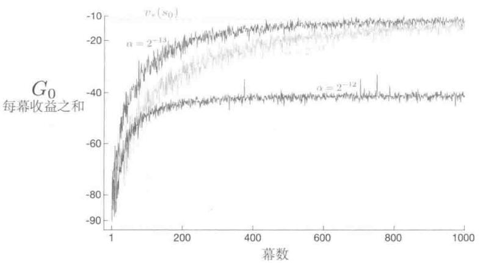  
图13.1REINFORCE在短走廊网格世界任务上的表现(例13.1)。在合适的更新步长下，每幕的收益之和能够接近初始状态的最优回报

# 13.4 带有基线的REINFORCE

可以将策略梯度定理（式13.5）进行推广，在其中加入任意一个与动作价值函数进行对比的基线 $b(s)$

$$
\nabla J (\theta) \propto \sum_ {s} \mu (s) \sum_ {a} \left(q _ {\pi} (s, a) - b (s)\right) \nabla \pi (a | s, \theta). \tag {13.10}
$$

这个基线可以是任意函数，甚至是一个随机变量，只要不随动作 $a$ 变化，上述等式仍然成立，这是因为减的那一项等于0

$$
\sum_ {a} b (s) \nabla \pi (a | s, \theta) = b (s) \nabla \sum_ {a} \pi (a | s, \theta) = b (s) \nabla 1 = 0.
$$

可以使用式（13.10）所示的策略梯度定理以前一节介绍的类似的方法推导出更新规则。最终推导出的更新公式是一个包含基线的新的REINFORCE版本

$$
\boldsymbol {\theta} _ {t + 1} \doteq \boldsymbol {\theta} _ {t} + \alpha \left(G _ {t} - b (S _ {t})\right) \frac {\nabla \pi \left(A _ {t} \mid S _ {t} , \boldsymbol {\theta} _ {t}\right)}{\pi \left(A _ {t} \mid S _ {t} , \boldsymbol {\theta} _ {t}\right)}. \tag {13.11}
$$

因为这个基线也可以是常量0，所示上式是REINFORCE更一般的推广。一般，加入这个基线不会使更新值的期望发生变化，但是对方差会有很大的影响。例如，在2.8节中，我们看到一个类似的基线可以极大地降低梯度赌博机算法的方差（因而也加快了学习速度）。在赌博机算法中，基线就是一个数值（到目前为止的平均收益），但是对于马尔可夫

决策过程，这个基线应该根据状态的变化而变化。在一些状态下，所有动作的价值可能都比较大，因此我们需要一个较大的基线用以区分拥有更大值的动作和相对值不那么高的动作；在其他状态下当所有动作的值都较低时，基线也应该较小。

状态价值函数 $\hat{v}(S_t, \mathbf{w})$ 就是一个我们比较自然地能想到的基线，其中， $\mathbf{w} \in \mathbb{R}^d$ 是权重向量，可以用前面章节中介绍的方法对其进行优化。REINFORCE 使用蒙特卡洛方法学习策略参数 $\theta$ ，很自然地也可以使用蒙特卡洛方法学习状态价值函数的权重 $\mathbf{w}$ 。用学习到的状态价值函数作为基线的 REINFORCE 算法的完整伪代码在下面框中给出。

# 带基线的REINFORCE算法（分幕式），用于估计 $\pi_{\theta}\approx \pi_{*}$

输入：一个可微的参数化策略 $\pi (a|s,\theta)$

输入：一个可微的参数化状态价值函数 $\hat{v} (s,\mathbf{w})$

算法参数：步长 $\alpha^{\theta} > 0$ ， $\alpha^{\mathrm{w}} > 0$

初始化策略参数 $\theta \in \mathbb{R}^{d^{\prime}}$ 和状态价值函数的权重 $\mathbf{w}\in \mathbb{R}^d$ （如初始化为0）

无限循环 (对于每一幕)：

根据 $\pi (\cdot |\cdot ,\theta)$ ，生成一幕序列 $S_0,A_0,R_1,\ldots ,S_{T - 1},A_{T - 1},R_T$

对于幕中的每一步循环， $t = 0,1,\dots ,T - 1$

$$
\begin{array}{l} G \leftarrow \sum_ {k = t + 1} ^ {T} \gamma^ {k - t - 1} R _ {k} \tag {G_t} \\ \delta \leftarrow G - \hat {v} (S _ {t}, \mathbf {w}) \\ \mathbf {w} \leftarrow \mathbf {w} + \alpha^ {\mathbf {w}} \delta \nabla \hat {v} (S _ {t}, \mathbf {w}) \\ \theta \leftarrow \theta + \alpha^ {\theta} \gamma^ {t} \delta \nabla \ln \pi \left(A _ {t} \mid S _ {t}, \theta\right) \\ \end{array}
$$

这个算法有两个步长，记为 $\alpha^{\theta}$ 和 $\alpha^{\mathrm{w}}$ （其中 $\alpha^{\theta}$ 是式13.11中的 $\alpha$ ）。价值函数的步长 $\alpha^{\mathrm{w}}$ 相对比较容易设置，在线性的情况下，我们可以参考好多规则来设置它，比如 $\alpha^{\mathrm{w}} = 0.1 / \mathbb{E}\big[\| \nabla \hat{v} (S_t,\mathbf{w})\|_\mu^2\big]$ （参考9.6节）。但是对如何设置策略参数更新的步长 $\alpha^{\theta}$ 还不是特别清楚。它取决于收益变化的范围以及策略参数化形式。

图13.2比较了REINFORCE算法在例13.1的短走廊网格世界问题中带基线和不带基线的情况。这里基线使用的近似状态价值函数是 $\hat{v} (s,\mathbf{w}) = w$ ，即 $\mathbf{W}$ 是一个标量 $w$ 。

  
图13.2在REINFORCE中加入基线可以使模型学习得更快，就像在这里展示的短走廊网格世界(例13.1)上的表现一样。这里不带基线的REINFORCE的更新步长是挑选的其中最好的一个(参见图13.1)。每条线是100次独立实验的平均

# 13.5 “行动器-评判器”方法

尽管带基线的强化学习方法既学习了一个策略函数也学习了一个状态价值函数，我们也不认为它是一种“行动器-评判器”方法，因为它的状态价值函数仅被用作基线，而不是作为一个“评判器”。也就是说，它没有被用于自举操作（用后继各个状态的价值估计值来更新当前某个状态的价值估计值），而只是作为正被更新的状态价值的基线。做这个区分是很有必要的，因为只有采用自举法时，才会出现依赖于函数逼近质量的偏差和渐近性收敛。正如我们前面已经介绍过的，通过自举法引入的偏差以及状态表示上的依赖经常是很有用的，因为它们降低了方差并加快了学习。带基线的强化学习方法是无偏差的，并且会渐近地收敛至局部最小值，但是和所有的蒙特卡洛方法一样，它的学习比较缓慢（产生高方差估计），并且不便于在线实现，或者不便于应用于持续性问题。正如我们之前介绍的，使用时序差分我们可以消除这些不便，并且通过使用多步方法，我们可以灵活地选择自举操作的程度。为了在策略梯度法中获得这些优势，我们使用带自举评判器的“行动器-评判器”方法。

首先考虑单步“行动器-评判器”方法，它和第6章介绍的时序差分法很类似，如 $\mathrm{TD}(0)$ 、Sarsa(0)和Q学习。单步方法的主要优势在于它们是完全在线和增量式的，同时也避免了使用资格迹的复杂性。它们是资格迹方法的一种特殊情况，不是一般化的方法，但是更加容易理解。单步“行动器-评判器”方法使用单步回报（并使用估计的状态价

值函数作为基线)来代替REINFORCE算法(式13.11)中的整个回报，具体如下

$$
\begin{array}{l} \boldsymbol {\theta} _ {t + 1} \doteq \boldsymbol {\theta} _ {t} + \alpha \left(G _ {t: t + 1} - \hat {v} \left(S _ {t}, \mathbf {w}\right)\right) \frac {\nabla \pi \left(A _ {t} \mid S _ {t} , \boldsymbol {\theta} _ {t}\right)}{\pi \left(A _ {t} \mid S _ {t} , \boldsymbol {\theta} _ {t}\right)} (13.12) \\ = \boldsymbol {\theta} _ {t} + \alpha \left(R _ {t + 1} + \gamma \hat {v} \left(S _ {t + 1}, \mathbf {w}\right) - \hat {v} \left(S _ {t}, \mathbf {w}\right)\right) \frac {\nabla \pi \left(A _ {t} \mid S _ {t} , \boldsymbol {\theta} _ {t}\right)}{\pi \left(A _ {t} \mid S _ {t} , \boldsymbol {\theta} _ {t}\right)} (13.13) \\ = \boldsymbol {\theta} _ {t} + \alpha \delta_ {t} \frac {\nabla \pi \left(A _ {t} \mid S _ {t} , \boldsymbol {\theta} _ {t}\right)}{\pi \left(A _ {t} \mid S _ {t} , \boldsymbol {\theta} _ {t}\right)}. (13.14) \\ \end{array}
$$

我们可以很自然地采用半梯度方法 $\mathrm{TD}(0)$ 来学习状态价值函数。完整算法的伪代码在下框中给出。注意，这是一个完全在线、增量式的算法，其状态、动作和收益都只会在它们第一次被收集到时使用，之后都不会再次使用。

# 单步“行动器-评判器”方法（分幕式），用于估计 $\pi_{\theta} \approx \pi_{*}$

输入：一个可微的参数化策略 $\pi (a|s,\theta)$

输入：一个可微的参数化状态价值函数 $\hat{v} (s,\mathbf{w})$

算法参数：步长 $\alpha^{\theta} > 0$ ， $\alpha^{\mathrm{w}} > 0$

初始化策略参数 $\theta \in \mathbb{R}^{d^{\prime}}$ 和状态价值函数的权重 $\mathbf{w}\in \mathbb{R}^d$ （如初始化为0）

无限循环 (对于每一幕)：

初始化 $S$ （幕的第一个状态）

$$
I \leftarrow 1
$$

当 $S$ 是非终止状态时，循环：

$$
A \sim \pi (\cdot | S, \theta)
$$

采取动作 $A$ ，观察到 $S^{\prime},R$

$\delta \gets R + \gamma \hat{v} (S^{\prime},\mathbf{w}) - \hat{v} (S,\mathbf{w})$ （如果 $S^{\prime}$ 是终止状态，则 $\hat{v} (S^{\prime},\mathbf{w})\doteq 0)$

$$
\begin{array}{l} \mathbf {w} \leftarrow \mathbf {w} + \alpha^ {\mathbf {w}} \delta \nabla \hat {v} (S, \mathbf {w}) \\ \theta \leftarrow \theta + \alpha^ {\theta} I \delta \nabla \ln \pi (A | S, \theta) \\ I \leftarrow \gamma I \\ S \leftarrow S ^ {\prime} \\ \end{array}
$$

我们可以很自然地将其推广到 $n$ -步方法的前向视图中，然后再推广到 $\lambda$ -回报算法。只需要把式(13.12)中的单步回报相应地替换为 $G_{t:t+n}$ 或 $G_t^\lambda$ 即可。推广到 $\lambda$ -回报的后向视图也很直接，对于行动器和评判器，遵循第12章中介绍的方法，分别使用不同的资格迹。下面框中给出了完整算法的伪代码。

带资格迹的“行动器-评判器”方法(分幕式)，用于估计 $\pi_{\theta}\approx \pi_{*}$   
输入：一个可微的参数化策略 $\pi (a|s,\theta)$ 输入：一个可微的参数化状态价值函数 $\hat{v} (s,\mathbf{w})$ 参数：迹衰减率 $\lambda^{\theta}\in [0,1]$ ， $\lambda^{\mathrm{w}}\in [0,1]$ ；步长 $\alpha^{\theta} > 0$ ， $\alpha^{\mathrm{w}} > 0$ 初始化策略参数 $\pmb {\theta}\in \mathbb{R}^{d^{\prime}}$ 和状态价值函数的权重 $\mathbf{w}\in \mathbb{R}^{d}$ （如初始化为0）  
无限循环（对于每一幕）：初始化 $S$ （幕的第一个状态） $\mathbf{z}^{\theta}\gets \mathbf{0}$ （ $d^{\prime}$ 维资格迹向量） $\mathbf{z}^{\mathrm{w}}\gets \mathbf{0}$ （ $d$ 维资格迹向量） $I\gets 1$ 当 $S$ 不是终止状态时，循环： $A\sim \pi (\cdot |S,\theta)$ 采取动作 $A$ ，观察到 $S^{\prime},R$ $\delta \leftarrow R + \gamma \hat{v} (S^{\prime},\mathbf{w}) - \hat{v} (S,\mathbf{w})$ （如果 $S^{\prime}$ 是终止状态，则 $\hat{v} (S^{\prime},\mathbf{w})\doteq 0)$ $\mathbf{z}^{\mathrm{w}}\gets \gamma \lambda^{\mathrm{w}}\mathbf{z}^{\mathrm{w}} + I\nabla \hat{v} (S,\mathbf{w})$ $\mathbf{z}^{\theta}\gets \gamma \lambda^{\theta}\mathbf{z}^{\theta} + I\nabla \ln \pi (A|S,\theta)$ $\mathbf{w}\leftarrow \mathbf{w} + \alpha^{\mathrm{w}}\delta \mathbf{z}^{\mathrm{w}}$ $\theta \leftarrow \theta +\alpha^{\theta}\delta \mathbf{z}^{\theta}$ $I\gets \gamma I$ $S\gets S^{\prime}$

# 13.6 持续性问题的策略梯度

正如在10.3节中讨论的，对于没有分幕式边界的持续性问题，我们需要根据每个时刻上的平均收益来定义性能

$$
\begin{array}{l} J (\theta) \doteq r (\pi) \doteq \lim  _ {h \rightarrow \infty} \frac {1}{h} \sum_ {t = 1} ^ {h} \mathbb {E} \left[ R _ {t} \mid S _ {0}, A _ {0: t - 1} \sim \pi \right] \tag {13.15} \\ = \lim  _ {t \rightarrow \infty} \mathbb {E} \left[ R _ {t} \mid S _ {0}, A _ {0: t - 1} \sim \pi \right] \\ = \sum_ {s} \mu (s) \sum_ {a} \pi (a | s) \sum_ {s ^ {\prime}, r} p \left(s ^ {\prime}, r \mid s, a\right) r, \\ \end{array}
$$

其中， $\mu$ 是策略 $\pi$ 下的稳定状态的分布， $\mu(s) \doteq \lim_{t \to \infty} \Pr\{S_t = s | A_{0:t} \sim \pi\}$ ，并假设它一定存在并独立于 $S_0$ （一种遍历性假设）。注意，这是一个很特殊的状态分布，如果一直根

据策略 $\pi$ 选择动作，则这个分布会保持不变：

$$
\sum_ {s} \mu (s) \sum_ {a} \pi (a | s, \pmb {\theta}) p (s ^ {\prime} | s, a) = \mu (s ^ {\prime}), \text {对 所 有} s ^ {\prime} \in \mathcal {S}. \tag {13.16}
$$

用于持续性问题的“行动器-评判器”算法（后向视图）的完整伪代码在下框中给出。

# 带资格迹的“行动器-评判器”方法(持续的)，用于估计 $\pi_{\theta} \approx \pi_{*}$

输入：一个可微的参数化策略 $\pi (a|s,\theta)$

输入：一个可微的参数化状态价值函数 $\hat{v} (s,\mathbf{w})$

算法参数： $\lambda^{\mathrm{w}}\in [0,1]$ ， $\lambda^{\theta}\in [0,1]$ ， $\alpha^{\mathrm{w}} > 0$ ， $\alpha^{\theta} > 0$ ， $\alpha^{R} > 0$

初始化 $\bar{R}\in \mathbb{R}$ （如初始化为0）

初始化状态价值函数权重 $\mathbf{w} \in \mathbb{R}^d$ 和策略参数 $\theta \in \mathbb{R}^{d'}$ (如初始化为0)

初始化 $S \in S$ （如初始化为 $s_0$ ）

$\mathbf{z}^{\mathrm{w}} \gets \mathbf{0}$ ( $d$ 维资格迹向量)

$\mathbf{z}^{\theta}\gets 0$ $(d^{\prime}$ 维资格迹向量）

无限循环（对于每一个时刻）：

采取动作 $A$ ，观察到 $S^{\prime},R$

$$
\begin{array}{l} A \sim \pi (\cdot | S, \boldsymbol {\theta}) \\ \delta \leftarrow R - \bar {R} + \hat {v} \left(S ^ {\prime}, \mathbf {w}\right) - \hat {v} (S, \mathbf {w}) \\ \bar {R} \leftarrow \bar {R} + \alpha^ {\bar {R}} \delta \\ \mathbf {z} ^ {\mathrm {w}} \leftarrow \lambda^ {\mathrm {w}} \mathbf {z} ^ {\mathrm {w}} + \nabla \hat {v} (S, \mathbf {w}) \\ \mathbf {z} ^ {\theta} \leftarrow \lambda^ {\theta} \mathbf {z} ^ {\theta} + \nabla \ln \pi (A | S, \theta) \\ \mathbf {w} \leftarrow \mathbf {w} + \alpha^ {\mathbf {w}} \delta \mathbf {z} ^ {\mathbf {w}} \\ \theta \leftarrow \theta + \alpha^ {\theta} \delta \mathbf {z} ^ {\theta} \\ S \leftarrow S ^ {\prime} \\ \end{array}
$$

自然地，在持续性问题中，我们用差分回报定义价值函数， $v_{\pi}(s) \doteq \mathbb{E}_{\pi}[G_t|S_t = s]$ 以及 $q_{\pi}(s,a) \doteq \mathbb{E}_{\pi}[G_t|S_t = s,A_t = a]$ ，其中

$$
G _ {t} \doteq R _ {t + 1} - r (\pi) + R _ {t + 2} - r (\pi) + R _ {t + 3} - r (\pi) + \dots . \tag {13.17}
$$

有了这些定义，适用于分幕式情况下的策略梯度定理（式13.5）对于持续性任务的情况也同样正确。下面框中给出证明。前向和后向视图的公式也同样保持不变。

# 策略梯度定理证明（持续性问题）

持续性问题的策略梯度定理的证明和分幕式问题的证明非常类似。这里我们再一次明确 $\pi$ 是关于 $\theta$ 的一个函数，所求的是关于 $\theta$ 的梯度。回顾一下，在持续性问题中 $J(\theta) = r(\pi)$ (式13.15)，并且 $v_{\pi}$ 和 $q_{\pi}$ 是用差分回报表示的价值函数。对于任意 $s \in S$ ，状态价值函数的梯度可以表示为

$$
\begin{array}{l} \nabla v _ {\pi} (s) = \nabla \left[ \sum_ {a} \pi (a | s) q _ {\pi} (s, a) \right], \text {对 所 有} s \in \mathcal {S} \tag {练习3.18} \\ = \sum_ {a} \left[ \nabla \pi (a | s) q _ {\pi} (s, a) + \pi (a | s) \nabla q _ {\pi} (s, a) \right] \quad (\text {微 积 分 的 乘 法 法 则}) \\ = \sum_ {a} \left[ \nabla \pi (a | s) q _ {\pi} (s, a) + \pi (a | s) \nabla \sum_ {s ^ {\prime}, r} p \left(s ^ {\prime}, r | s, a\right) \left(r - r (\theta) + v _ {\pi} \left(s ^ {\prime}\right)\right) \right] \\ = \sum_ {a} \left[ \nabla \pi (a | s) q _ {\pi} (s, a) + \pi (a | s) \left[ - \nabla r (\theta) + \sum_ {s ^ {\prime}} p \left(s ^ {\prime} \mid s, a\right) \nabla v _ {\pi} \left(s ^ {\prime}\right) \right] \right]. \\ \end{array}
$$

重新组合公式后，我们可以获得

$$
\nabla r (\theta) = \sum_ {a} \left[ \nabla \pi (a | s) q _ {\pi} (s, a) + \pi (a | s) \sum_ {s ^ {\prime}} p \left(s ^ {\prime} | s, a\right) \nabla v _ {\pi} \left(s ^ {\prime}\right) \right] - \nabla v _ {\pi} (s).
$$

注意，等式左边可以写为 $\nabla J(\pmb {\theta})$ ，它与 $s$ 无关。因此等式右边也与 $s$ 无关。我们可以放心地用 $\mu (s)$ $(s\in S)$ 进行加权求和，而不会改变原来的结果（因为 $\sum_{s}\mu (s) = 1)$ 。所以，

$$
\begin{array}{l} \nabla J (\boldsymbol {\theta}) = \sum_ {s} \mu (s) \left(\sum_ {a} \left[ \nabla \pi (a | s) q _ {\pi} (s, a) + \pi (a | s) \sum_ {s ^ {\prime}} p \left(s ^ {\prime} \mid s, a\right) \nabla v _ {\pi} \left(s ^ {\prime}\right) \right] - \nabla v _ {\pi} (s)\right) \\ = \sum_ {s} \mu (s) \sum_ {a} \nabla \pi (a | s) q _ {\pi} (s, a) \\ + \sum_ {s} \mu (s) \sum_ {a} \pi (a | s) \sum_ {s ^ {\prime}} p \left(s ^ {\prime} \mid s, a\right) \nabla v _ {\pi} \left(s ^ {\prime}\right) - \sum_ {s} \mu (s) \nabla v _ {\pi} (s) \\ = \sum_ {s} \mu (s) \sum_ {a} \nabla \pi (a | s) q _ {\pi} (s, a) \\ + \sum_ {s ^ {\prime}} \underbrace {\sum_ {s} \mu (s) \sum_ {a} \pi (a | s) p \left(s ^ {\prime} \mid s , a\right)} _ {\mu \left(s ^ {\prime}\right)} \nabla v _ {\pi} \left(s ^ {\prime}\right) - \sum_ {s} \mu (s) \nabla v _ {\pi} (s) \\ = \sum_ {s} \mu (s) \sum_ {a} \nabla \pi (a | s) q _ {\pi} (s, a) + \sum_ {s ^ {\prime}} \mu \left(s ^ {\prime}\right) \nabla v _ {\pi} \left(s ^ {\prime}\right) - \sum_ {s} \mu (s) \nabla v _ {\pi} (s) \\ = \sum_ {s} \mu (s) \sum_ {a} \nabla \pi (a | s) q _ {\pi} (s, a). \quad \text {证 毕} \\ \end{array}
$$

# 13.7 针对连续动作的策略参数化方法

基于参数化策略函数的方法还提供了解决动作空间大甚至动作空间连续（动作无限多）的实际途径。我们不直接计算每一个动作的概率，而是学习概率分布的统计量。例如，动作集可能是一个实数集，可以根据正态分布来选择动作。

正态分布的概率密度函数一般可以写为

$$
p (x) \doteq \frac {1}{\sigma \sqrt {2 \pi}} \exp \left(- \frac {(x - \mu) ^ {2}}{2 \sigma^ {2}}\right), \tag {13.18}
$$

其中， $\mu$ 和 $\sigma$ 这里代表正态分布的均值和标准差。当然这里的 $\pi$ 近似为 $\pi \approx 3.14159$ 。几组不同的均值和标准差的概率密度函数如下图所示。 $p(x)$ 的值是指在 $x$ 处的概率密度，而不是概率。它的值可以大于1，在 $p(x)$ 图像之下的总面积必须为1。一般来说，我们可以对于任意范围的 $x$ 求小于 $p(x)$ 的积分来得到 $x$ 在此范围内的概率。

为了得到一个参数化的策略函数，可以将策略定义为关于实数型的标量动作的正态概率密度，其中均值和标准差由状态的参数化函数近似给出。具体如下

$$
\pi (a | s, \theta) \doteq \frac {1}{\sigma (s , \theta) \sqrt {2 \pi}} \exp \left(- \frac {(a - \mu (s , \theta)) ^ {2}}{2 \sigma (s , \theta) ^ {2}}\right), \tag {13.19}
$$

其中， $\mu : \mathcal{S} \times \mathbb{R}^{d'} \to \mathbb{R}$ 和 $\sigma : \mathcal{S} \times \mathbb{R}^{d'} \to \mathbb{R}^+$ 是两个参数化的近似函数。为了保持示例的完整，我们只需要给出这些近似函数的形式。为此，我们将策略的参数向量划分为两个部分， $\theta = [\theta_{\mu}, \theta_{\sigma}]^{\top}$ ，一部分用来近似均值，一部分用来近似标准差。均值可以用一个线性函数来逼近。标准差必须为正数，因而使用线性函数的指数形式比较好。因此

$$
\mu (s, \pmb {\theta}) \doteq \pmb {\theta} _ {\mu} ^ {\top} \mathbf {x} _ {\mu} (s) \quad \text {和} \quad \sigma (s, \pmb {\theta}) \doteq \exp \Big (\pmb {\theta} _ {\sigma} ^ {\top} \mathbf {x} _ {\sigma} (s) \Big), \tag {13.20}
$$

其中， $\mathbf{x}_{\mu}(s)$ 和 $\mathbf{x}_{\sigma}(s)$ 是由第9章介绍的方法构造的状态特征向量。有了这些定义，本章后面描述的所有算法都能被用来学习如何选择实数型的动作。

练习13.4 请证明基于正态分布的参数化策略(式13.19)，资格迹有如下两个部分

$$
\nabla \ln \pi (a | s, \pmb {\theta} _ {\mu}) = \frac {\nabla \pi (a | s , \pmb {\theta} _ {\mu})}{\pi (a | s , \pmb {\theta})} = \frac {1}{\sigma (s , \pmb {\theta}) ^ {2}} \bigl (a - \mu (s, \pmb {\theta}) \bigr) \mathbf {x} _ {\mu} (s), \text {以 及}
$$

$$
\nabla \ln \pi (a | s, \boldsymbol {\theta} _ {\sigma}) = \frac {\nabla \pi (a | s , \boldsymbol {\theta} _ {\sigma})}{\pi (a | s , \boldsymbol {\theta})} = \left(\frac {(a - \mu (s , \boldsymbol {\theta})) ^ {2}}{\sigma (s , \boldsymbol {\theta}) ^ {2}} - 1\right) \mathbf {x} _ {\sigma} (s).
$$

练习13.5 伯努利逻辑单元是用于某些人工神经网络的随机神经单元（参见9.7）。在 $t$ 时刻，它的输入是特征向量 $\mathbf{x}(S_t)$ ；它的输出 $A_t$ 是一个有两种取值（0和1）的随机变量，其中， $\operatorname{Pr}\{A_t = 1\} = P_t$ 以及 $\operatorname{Pr}\{A_t = 0\} = 1 - P_t$ （满足伯努利分布）。令 $h(s,0,\theta)$ 和 $h(s,1,\theta)$ 为给定策略参数 $\theta$ 在状态 $s$ 下两种动作的偏好。假设两种偏好的差异由单元输入向量的加权和给出，也就是说 $h(s,1,\theta) - h(s,0,\theta) = \theta^\top \mathbf{x}(s)$ ，其中 $\theta$ 是单元的权重向量。

(a) 证明如果使用指数形式的柔性最大化分布 (式13.2) 将偏好传化为策略，那么 $P_{t} = \pi(1|S_{t},\pmb{\theta}_{t}) = 1 / (1 + \exp(-\pmb{\theta}_{t}^{\top}\mathbf{x}(S_{t}))$ （逻辑回归函数）。  
(b) 收到回报 $G_{t}$ 后，蒙特卡洛 REINFORCE 方法如何将 $\theta_{t}$ 更新为 $\theta_{t + 1}$ ？  
(c) 通过梯度计算，使用 $a, \mathbf{x}(s)$ 和 $\pi(a|s, \theta)$ 来表示伯努利逻辑单元中的迹 $\nabla \ln \pi(a|s, \theta)$ 。

提示：首先单独对于每个动作计算 $P_{t} = \pi (a|s,\theta_{t})$ 的对数的导数，再将两个结果表示为依赖于 $a$ 和 $P_{t}$ 的一个式子，接着使用链式法则。注意逻辑回归函数 $f(x)$ 的导数为 $f(x)(1 - f(x))$ □

# 13.8 本章小结

在本章之前，本书主要介绍的是基于动作价值的方法，即这些方法先学习动作价值函数，然后使用这些值来决定动作的选择。在本章，我们讨论了学习一个参数化的策略来保证无须根据动作价值函数的估计值来选择动作，虽然可能仍然需要估计动作价值函数，并用其更新策略参数。特别地，我们介绍了策略梯度法，即在每一步更新中，我们朝着性能指标对策略参数的梯度的估计值的方向进行更新。

学习和储存策略参数的方法拥有很多优点。它们能够学习选择动作的特定的概率。它们能够实现合理程度的试探并逐步接近确定性的策略。它们能够自然地处理连续状态空

间。一般来说，这些事情对于基于策略的方法都十分简单，而对于 $\varepsilon$ -贪心法和动作价值函数方法来说都是几乎不可能的。另外，在某些问题中，参数化的策略表示比使用价值函数更加简单，这些问题更适合使用参数化策略方法。

参数化策略的方法也因策略梯度定理相较于动作价值函数方法拥有一个重要的理论优势，它给出了一个明确的公式来表明在不涉及状态分布导数的情况下，性能指标是如何被策略参数影响的。这个定理为所有的策略梯度法提供了理论依据。

REINFORCE法直接来自于策略梯度定理。增加一个状态价值函数作为基线降低了REINFORCE法的方差，同时也没引入偏差。使用状态价值函数进行自举会引入偏差，虽然如此，它还是可以被接受的，因为基于自举法的时序差分一般好于蒙特卡洛法（大幅度降低方差）。状态价值函数也可以用来给策略的动作选择进行评估打分。相应地，前者我们称为评判器，后者我们称为行动器，整个方法我们经常称之为“行动器-评判器”法。

总体上，相较于动作价值函数法，策略梯度法提供了显著不同的优势或劣势。到目前为止，策略梯度法的某些方面还不能很好地被我们所理解，但是一系列的实验和研究正在进行中。

# 参考文献和历史评注

我们现在看到的和策略梯度有关的方法实际上最早在强化学习（Witten，1977；Barto、Sutton 和 Anderson，1983；Sutton，1984；Williams，1987，1992）以及之前的领域（Phansalkar 和 Thathachar，1995）中被研究过。在 20 世纪 90 年代，这些方法被本书中其他章节介绍的动作价值函数法所取代。然而，在近些年，人们渐渐又开始关注“行动器-评判器”法以及策略梯度法。除了这里所提到的，还有自然梯度法（Amari，1998；Kakade，2002；Peters、Vijayakumar 和 Schaal，2005；Peters 和 Schall，2008；Park、Kim 和 Kang，2005；Bhatnagar、Sutton、Ghavamzadeh 和 Lee，2009；见 Grondman、Busoniu、Lopes 和 Babuska，2012），以及确定性策略梯度（Silver et al.，2014）。主要应用包括直升机特技自动驾驶仪和 AlphaGo（参见 16.6 节）。

本章的内容主要基于Sutton、McAllester、Singh和Mansour（2000，也可以参见Sutton、Singh和McAllester，2000）的工作，他们提出了“策略梯度法”这个概念。Bhatnagar et al. (2009)写了一个重要的相关综述。Aleksandrov、Sysoyev和Shemeneva(1968)最早进行相关方面的研究。Thomas(2014)首先意识到在有折扣的分幕式问题中，需要引入 $\gamma^t$ ，就像我们在本章中介绍的相关算法。

13.1 本章的例13.1及其结果由EricGraves提供  
13.2 本节和第331页介绍的策略梯度定理由Marbach和Tsitsiklis（1998，2001）首先提出，然后Sutton et al.（2000）也独立地推导得出。Cao和Chen（1997）提出了一种类似的表达式。其他早期的相关工作还包括Konda和Tsitsiklis（2000，2003），Baxter和Bartlett（2000），Baxter、Bartlett和Weaver（2001）。Sutton、Singh和McAllester(2000)还提供了一些其他的结果。  
13.3 REINFORCE最早的工作要追溯到Williams(1987，1992)。Phansalkar和Thathachar(1995）为改进的REINFORCE算法提供了局部和全局收敛的证明。“全部动作”算法是在一篇虽未正式发表但却广为流传的未完成论文中被首先提出的(Sutton、Singh和McAllester,2000)。随后，Ciosek和Whiteson(2017，2018)进一步拓展了该算法，并将其命名为“期望策略梯度”；Asadi、Allen、Roderick、Mohamed、Konidaris和Littman(2017）也拓展了该算法，并称其为“平均行动器-评判器”算法。  
13.4 策略梯度定理中的基线是由Williams（1987，1992）提出的。Greensmith、Bartlett和Baxter(2004)分析出了一种理论上更好的基线（见Dick，2015）。Thomas和Brunskill(2017)认为，依赖于动作的基线在使用的时候可以不产偏差。  
13.5-6 “行动器-评判器”方法是最早一批在强化学习中被研究的方法（Witten，1977；Barto、Sutton和Anderson，1983；Sutton，1984）。这里以及13.6节提出的算法基于Degris、White和Sutton(2012)的工作，他们也介绍了对离轨策略的策略梯度方法的研究。  
13.7 最先提出用文中介绍的这种方法处理连续动作的可能是Williams（1987，1992）。第332页的图来自维基百科。

# 第Ⅲ部分 表格型深入研究

本书的最后一部分超出了前两部分提出的标准强化学习思想的范畴。该部分简要地介绍了它们与心理学和神经科学的关系、强化学习应用的一些案例，以及未来强化学习研究的一些前沿领域。