# 14

# 心理学

在前面的章节中，我们仅从计算的角度讨论了各种算法。在本章中，我们从其他角度来探讨这些算法：心理学的角度以及对动物如何学习的研究。首先讨论强化学习的思想和算法与心理学家发现的有关动物学习方法的关联，其次解释强化学习对研究动物如何学习的影响。通过强化学习的清晰的形式化表达，将任务、回报和算法系统化，这对于理解实验数据、提出新的实验以及指出可能对实验操作和测量至关重要的因素而言，都是非常有用的。优化长期回报是强化学习的核心，这有助于我们理解一些动物学习和行为的谜团。

强化学习与心理学理论之间的一些对应关系并不令人感到惊讶，因为强化学习的发展受到了心理学理论的启发。然而，正如本书中所介绍的，强化学习是从人工智能研究者或工程师的角度探索理想化的情况，目的是用有效的算法解决计算问题，而不是复制或详细解释动物如何学习。因此，我们描述的一些对应关系将在各自领域中独立出现的想法联系起来。我们相信这些关系是特别有意义的，因为它们揭示了学习的重要计算原理，无论是通过人工系统还是自然系统进行学习。

在大多数情况下，与强化学习相对应的心理学习理论是为了解释动物，如老鼠、鸽子和兔子，如何在受控的实验室中学习而提出的。在20世纪，进行了数千个这样的实验，其中许多实验在今天仍在进行。尽管这些实验有时候被忽视，因为它们与很多更广泛的心理学问题无关，但是这些实验揭示了动物学习的细微特性，而且往往受具体的理论问题的驱动。随着心理学研究把焦点转移到更多的行为认知方面，即思维和推理等心理过程，动物学习实验在心理学中的作用就不如以前那么大了。但是，这些实验使我们发现了动物中广泛使用的基本学习原理，这些原理在设计人工学习系统时不应该被忽略。另外，我们将会看到，认知处理的某些方面很自然地与强化学习提供的计算视角相关联。

本章的最后一部分不仅包括了我们已经讨论的这些关联的参考资料，也包括了我们在讨论中没有涉及的一些关联关系的参考资料。我们希望本章能够鼓励读者更深入地探讨两

者的联系。在最后一节，我们还讨论了强化学习和心理学中使用的术语的关联。强化学习中使用的许多术语和短语都是从动物学习理论中借鉴的，但这些术语和短语的计算/工程意义并不总是与它们在心理学上的含义相吻合。

# 14.1 预测与控制

我们在本书中描述的算法分为两大类：预测算法和控制算法1。这个分类在第3章介绍的强化学习问题的解决方法中已经很自然地体现出来了。这些类别分别对应于心理学家广泛研究的学习类别：经典（或巴甫洛夫）条件反射和工具性（或操作性）条件反射。考虑到心理学对强化学习的影响，有这些对应关系并不足为奇，但是由于它们将来源于不同目标的思想联系起来了，所以还是很令人惊讶的。

本书中介绍的预测算法估计的值取决于智能体所处环境的特征如何在未来展开。特别地，我们专注于估计智能体与环境交互时期望获得的回报。从这个角度来看，预测算法是一种策略评估算法，它们是策略改进算法中不可或缺的组成部分。但预测算法不限于预测未来的收益，它们可以预测环境的任何特征（例如，参见Modayil、White和Sutton，2014）。预测算法与经典条件反射之间的关联源于它们的共同特性，即预测将会到来的外部刺激，无论这些刺激是否有收益（或惩罚）。

工具性（或者操作性）条件反射实验的情况则不同。这种实验一般被设置为根据动物的表现决定给动物它们喜欢的东西（收益）或者不喜欢的东西（惩罚）。动物会逐渐倾向于增加产生收益的行为，而降低导致惩罚的动作。在工具性条件反射中，强化刺激信号被认为是偶发的影响动物的行为，而在经典条件反射中则不是（尽管在经典条件反射实验中也很难完全消除所有的行为偶发性的影响）。工具性条件反射实验类似于我们在第1章中简单讨论过的受Thorndike“效应定律”(Law of Effect)启发的实验。控制是这种学习形式的核心，它与强化学习中的策略改进算法的做法相对应。

从预测的角度思考经典条件反射，从控制的角度考虑工具性条件反射，是将强化学习的计算视角与动物学习联系起来的一个起点，但实际的情况比这更复杂。经典条件反射一般不仅仅是预测，它也会涉及动作，因此也可以将它看作一种控制模式，有时被称为巴甫洛夫控制。更进一步，经典条件反射和工具性条件反射可能会相互交叉，在大多数实验情况下两种学习模式可能都存在。尽管存在这些复杂性，但将经典条件反射/工具性条件反射与预测/控制分别对应是将强化学习与动物学习联系起来的一个方便的初步近似。

在心理学中，术语“强化”用于描述经典条件反射和工具性条件反射中的学习。最初只是指加强某种行为模式，现在它通常也被用来指对某种行为模式的削弱。引起动物行为改变的刺激被称为强化剂，无论它是否依赖于动物先前的行为。在本章最后，我们将更详细地讨论这个术语，以及它与机器学习中使用的术语之间的关系。

# 14.2 经典条件反射

俄罗斯著名生理学家伊凡·巴甫洛夫在研究消化系统活动时发现，动物对某些特定刺激因素的先天反应可以被其他无关的因素所激发。他以狗作为实验对象，并对它们进行手术以便于准确测量其唾液反射的强度。在他记录的一个实验中，狗只会在给其提供食物约5秒之后的几秒内分泌大约6滴唾液，而在其余时间内不产生唾液。然而，如果在给狗食物前的较短时间内给予它另一种与食物无关的刺激，如节拍器的声音，经过多次重复实验后，当狗听到节拍器的声音后，也会产生对食物一样的唾液反应。“唾液腺的分泌功能就这样被声音的刺激激活了，尽管这是与食物完全不同的刺激”(Pavlov，1927，第22页)，巴甫洛夫这样总结这一发现的意义：

显然，在自然条件下，正常的动物不仅要对自身直接有利或有害的刺激做出必要的反应，而且还要对其他物理或化学介质，如声波、光线等做出反应，尽管这些信号本身只是提示刺激的迫近。就像正在捕食野兽的身影和吼叫并不会对其他小动物造成实质性的伤害，真正的危险隐藏在它的牙齿和利爪中（Pavlov，1927，第14页）。

这种将新的刺激与先天的反射联系在一起的方式被称为经典条件反射或巴甫洛夫反射。巴甫洛夫(确切地说是他的译者)将先天反应(如前述的分泌唾液)称为“无条件反射”(unconditioned response, UR), 其天然的刺激因素(如食物)称为“无条件刺激”(unconditioned stimuli, US)。同时, 他将由预先指定刺激所触发的反射(同样是分泌唾液)称为“条件反射”(conditioned response, CR), 而在先天条件下不会引起强烈反应的中性刺激(如节拍器的声音)则被称为“条件刺激”(conditioned stimuli, CS), 在经过反复的训练之后, 动物会认为条件刺激是无条件刺激的预示, 因此会对条件刺激产生条件反射。这些术语仍然用于描述传统的条件反射实验(更确切地说应该是“条件制约的”和“无条件制约的”, 而不是条件的和无条件的)。由于US强化了CR对CS的反应, 因此我们将US称为强化剂。

右图显示了条件反射实验中的两种实现方式，分别为延迟条件反射和痕迹条件反射。

我们将CS产生与US产生之间的时间间隔称为刺激间隔(interstimulusinterval，ISI)。在延迟条件反射中，CS贯穿了整个刺激间隔(在通常情况下，US和CS同时结束，如右图所示)。而在痕迹条件反射中，US在CS结束后才开始产生，而从CS结束到US产生的时间间隔被称为痕迹间隔

巴甫洛夫的狗在听到节拍器声音后分泌唾液只是经典条件反射的一个例子，人们在多种动物的不同反射系统中，都对这种现象进行了深入的研究。无条件反射往

延迟条件反射

痕迹条件反射

往往是动物对某种情况的准备措施，如狗分泌唾液，或者是对某种情况的防御措施，例如在眼睛受到刺激时会进行眨眼反射，在看到捕食者时动物的身躯会变僵硬等。在一系列的实验中，动物逐渐学习到，CS 的产生通常预示着 US 的产生，因此动物就会根据 CS 产生 CR 来面对之后到来的 US 进行准备或防御工作。一些 CR 与 UR 类似，但是往往产生时间更早，并且提高效率的方式有所不同。如在一个以家兔为对象的深入实验中，在声音刺激 (CS) 后向家兔眼睛中吹气 (US)，家兔会产生反射，其眼内的瞬膜会闭合来保护自己的眼睛不受到伤害 (UR)。在多次训练之后，声音刺激会触发瞬膜闭合的条件反射，该反射最初发生在向家兔眼睛吹气之前，但是最终会在最有可能吹气的时间点产生闭合反射。这个 CR 通过对吹气时间的预期进行同步启动，相较于对 US 简单的闭合反应，它更能够起到保护作用。通过学习刺激之间的预测关系来预测事件发生的能力对于动物是非常有益的，这也在动物世界中广泛存在。

# 14.2.1 阻塞与高级条件反射

我们可以在实验中观察到经典条件反射的许多有趣特性。除了CR的预期性质之外，在经典条件反射模型的发展中还有两个显著的特点：阻塞和高级条件反射。当一个潜在的CS与之前曾用于激发动物产生该CR的另一个CS一起呈现时，若动物未能学习到该CR，则产生阻塞。如，在家兔瞬膜闭合反射阻塞实验的第一阶段中，家兔首先被声音(CS)以及向眼中吹气(US)所刺激。实验的第二阶段包括一个额外的训练，在这个训练中增加了新的刺激因素，例如灯光，与声音一同组成了声音/光的复合条件刺激，在这个条件刺激之后，依然向家兔眼中吹气，作为无条件刺激。在实验的第三个阶段，只用灯

光作为CS来对家兔进行条件刺激，发现家兔很少或几乎没有产生瞬膜闭合的条件反射。对光刺激的条件反射学习被之前对声音的条件反射学习所阻塞了。1实验中阻塞的结果挑战了条件反射的形成只取决于简单的时间接近性这一结论，即产生条件反射的充分必要条件是US频繁地紧随在CS后面。在下一节我们将讲述Rescorla-Wagner模型（RescorlaandWagner，1972)，该模型对阻塞提出了一种很有影响力的解释。

如果我们将之前用作条件反射的CS作为另外一个中性的刺激因素的US进行条件作用时，则会形成高级条件反射。巴甫洛夫曾经描述过这样一个实验：他的助手首先使一只狗对节拍器的声音产生分泌唾液的条件反射。在形成这一阶段的条件反射之后，他进行了一系列的实验，将一个黑色的方块放置在狗的视线内，然后跟着产生节拍器的声音，不过在放置黑色方块的时候并不给狗提供食物。起初，狗对这个黑色方块表现出漠不关心的态度，但是在仅10次实验后，狗在看到这个黑色方块后就开始分泌唾液，尽管在这个过程中并没有食物的出现。在这个实验中，黑色方块为CS，节拍器的声音作为US，激发了狗对CS的条件反射。这就是次级条件反射。同理，如果黑色方块被当作US去进一步建立狗对其他CS的条件反射，这就被称为三级条件反射，依此类推。但在实际中，高级条件反射较难实现，特别是在次级以上的情况下。部分原因是在高级的条件作用实验中，高级的强化刺激后面没有原始US的作用，使其失去了强化的效果。但是在适当的条件下，例如，将一级条件作用实验与高级条件作用实验相结合，或给予实验对象通用的激励刺激时，次级条件反射以上的高级条件反射是可以表现出来的。正如我们下面将要讲述的TD条件反射模型，使用了自我引导的思想，这也是我们方法的核心，通过纳入具有预期特性的CR和高级条件反射，它扩展了Rescorla-Wagner模型对于阻塞的描述。

高级工具性条件反射也会发生。经过长期进化，动物自身会具有本能的趋利避害的强化过程，我们称这样的强化过程为初级强化。而能够一致性地预测初级强化过程的刺激物则被称为强化剂。依此类推，若某种刺激物预示着强化剂的出现，则称其为次级强化剂，或者更普遍地称为高级强化剂或者条件强化剂——当被预示的强化刺激本身为次级强化剂或者更高级的强化剂时，后面的术语更加准确。条件强化剂会引发一个条件强化过程：即条件收益或条件惩罚。条件强化与初级强化一样，增加了动物采用会获得条件收益的行为的倾向，减少了动物采用会导致条件惩罚行为的倾向（见本章末对我们使用的术语与心理学术语区别的注释）。

由此看来，条件强化是一个关键现象，例如，为什么我们要努力工作来获得金钱这个

强化剂，它的价值完全来自于人们对拥有金钱后的预期。在13.5节描述的“行动器-评判器”方法中（同样在15.7节和15.8节里讨论过），评判器使用TD方法来评估一个行动器的策略，它所估计的价值给行动器提供了条件强化，使得行动器可以据此来改进它的策略。这种对于高级工具性条件反射的模拟有助于解决1.7节提到的功劳分配问题。因为当基础的收益信号被延迟时，评判器会给行动器提供每个时刻的强化。我们将在14.4节中进一步讨论这个问题。

# 14.2.2 Rescorla-Wagner模型

Rescorla 和 Wagner 创建这个模型的主要目的是解决阻塞问题。Rescorla-Wagner 模型的核心思想是动物只有在事件违背其预期时才会学习，换句话说就是当动物感到惊讶时（尽管不一定意味着任何有意识的预期与情绪）。我们首先使用 Rescorla 和 Wagner 自己的术语和符号来描述一下他们的模型，然后再使用我们在讲述 TD 模型时使用的术语和符号。

Rescorla 和 Wagner 是这样描述他们的模型的。该模型会调整复合 CS 中每个子刺激物的“关联强度”，关联强度是表示相应子刺激物预测一个 US 出现的强度和准确程度的数值。当使用一个由多种刺激物组成的复合 CS 进行经典条件反射的实验时，每种子刺激物的关联强度不仅仅取决于自身，还在某种程度上取决于整个复合 CS 的关联强度，即“聚合关联强度”。

Rescorla和Wagners假设了一个复合CSAX，它由刺激A和X组成，其中动物可能已经经历过刺激A，但是没有经历过刺激X。令 $V_{\mathrm{A}}$ 、 $V_{\mathrm{X}}$ 和 $V_{\mathrm{AX}}$ 分别表示刺激物A、X以及复合刺激物AX的关联强度。假设在某个实验中，复合CSAX作用于实验对象后，紧接着用US对实验对象进行刺激，这里我们将US标注为刺激物Y。则复合刺激CS中每个部分的关联强度变化的公式如下：

$$
\begin{array}{l} \Delta V _ {\mathrm {A}} = \alpha_ {\mathrm {A}} \beta_ {\mathrm {Y}} \left(R _ {\mathrm {Y}} - V _ {\mathrm {A X}}\right) \\ \Delta V _ {\mathrm {X}} = \alpha_ {\mathrm {X}} \beta_ {\mathrm {Y}} \left(R _ {\mathrm {Y}} - V _ {\mathrm {A X}}\right), \\ \end{array}
$$

其中， $\alpha_{\mathrm{A}}\beta_{\mathrm{Y}}$ 和 $\alpha_{\mathrm{X}}\beta_{\mathrm{Y}}$ 是步长参数，它们取决于US以及CS的各个组成部分， $R_{\mathrm{Y}}$ 是US Y可以支持的关联强度渐近水平（Rescorla和Wagner在这里用 $\lambda$ 来代替 $R$ ，但是在这里我们依然使用 $R$ 以避免混淆，因为我们通常认为 $R$ 表示收益信号的大小。但需要说明的是，US在经典条件反射中不一定是收益或者惩罚）。Rescorla-Wagner模型的一个重要假设是认为聚合关联强度 $V_{\mathrm{AX}}$ 与 $V_{\mathrm{A}} + V_{\mathrm{X}}$ 是相等的。而由这些 $\Delta$ 改变的关联强度则会成

为下一轮试验时的初始关联强度。

出于完整性考虑，模型还需要一个反应生成机制，这个机制能够将 $V$ 的值映射到CR中。由于这种映射可能会取决于实验中的各种细节，Rescorla和Wagner并没有详细说明这种映射关系，仅仅简单地假定 $V$ 的值越大，越有可能产生CR，若 $V$ 的值为负数，则不会产生任何CR。

Rescorla-Wagner模型考虑了如何获得CR，这在一定程度上解释了阻塞的产生。只要复合刺激物的聚合关联强度 $V_{\mathrm{AX}}$ 低于USY所支持的关联强度渐近水平 $R_{\mathrm{Y}}$ ，则预测误差 $R_{\mathrm{Y}} - V_{\mathrm{AX}}$ 为正值。这说明在连续的实验中，复合CS中子刺激物的关联强度 $V_{\mathrm{A}}$ 和 $V_{\mathrm{X}}$ 持续增加，直到聚合关联强度 $V_{\mathrm{AX}}$ 与 $R_{\mathrm{Y}}$ 相等为止，此时，子刺激物的关联水平不再变化(除非US变化)。若动物已经对某种复合CS产生条件反射，那么再向这种复合CS中添加新的刺激物形成增强的CS，但是由于预测误差的值已经被减小到0或极低的值，因此增强的CS在被进一步的条件作用时，新添加刺激物的关联强度就会增加很少或者完全不增加。因为之前的CS已经可以几乎完美地预测出US的出现，所以新的刺激物出现所引起的误差或意外就变得很小，这就表明之前的知识阻塞了对新刺激物的学习。

为了从Rescorla-Wagner模型过渡到经典条件反射TD模型（我们称之为TD模型），我们首先根据本书中使用的概念来重塑这个模型。具体而言，将用于学习线性函数逼近(9.4节)的符号匹配到这个模型中，并且我们认为条件作用的过程是一种在复合CS的基础上对“US的大小”的预测学习实验，US的大小就是Rescorla-Wagner模型在上面给出的 $R_{\mathrm{Y}}$ 。同时，我们还要引入一些状态。因为Rescorla-Wagner模型是一个试验层面的模型，也就是说它通过连续不断地试验来确定关联强度的变化而不考虑两个试验之间发生的任何细节变化。在讲述完整个TD模型之前，无须考虑状态在一次试验中是如何变化的。我们现在只需要把状态看成一种标记方法就可以了，它标记了试验中的复合CS的组成。

因此，我们假定试验的类型或者状态 $s$ 由一个实数特征向量 $\mathbf{x}(s) = (x_{1}(s), x_{2}(s), \ldots, x_{d}(s))^{\top}$ 描述，其中，如果复合CS第 $i$ 个组成成分在一次试验中存在，则 $x_{i}(s) = 1$ ，否则为0。设 $d$ 维的关联强度向量为 $\mathbf{w}$ ，则状态 $s$ 的聚合关联强度为

$$
\hat {v} (s, \mathbf {w}) = \mathbf {w} ^ {\top} \mathbf {x} (s). \tag {14.1}
$$

这与强化学习中的价值估计相对应，我们将其视为对 $US$ 的预测

现在，我们暂时让 $t$ 表示完整试验的总数，而不是它的通常含义——时刻（当我们讲述下面的TD模型时，我们依然使用 $t$ 的通常含义）。同时， $S_{t}$ 是对应于试验 $t$ 的状态。

条件作用试验 $t$ 按照如下公式将关联强度向量 $\mathbf{w}_t$ 更新为 $\mathbf{w}_{t + 1}$

$$
\mathbf {w} _ {t + 1} = \mathbf {w} _ {t} + \alpha \delta_ {t} \mathbf {x} (S _ {t}), \tag {14.2}
$$

其中， $\alpha$ 是步长参数，因为我们正在描述Rescorla-Wagner模型，所以这里 $\delta_t$ 指预测误差。

$$
\delta_ {t} = R _ {t} - \hat {v} \left(S _ {t}, \mathbf {w} _ {t}\right). \tag {14.3}
$$

$R_{t}$ 是试验 $t$ 的预测目标，即US的大小，用Rescorla和Wagner的话来说就是US在试验中可以支持的关联强度。我们可以注意到，由于式(14.2)中存在因子 $\mathbf{x}(S_t)$ ，所以在复合CS中，只有在试验中出现的子刺激物的关联强度才会在一次试验后被调整。我们可以将预测误差视为对意外程度的度量，而聚合关联强度可以被视为动物的某种期望值，当它不符合目标US强度时就意味着动物的期望被违背了。

从机器学习的角度来看，Rescorla-Wagner模型是一个基于误差纠正的监督学习模型。它本质上与最小均方(LMS)或Widrow-Hoff（Widrow和Hoff，1960）学习规则一样，通过调整权重使得误差的均方差尽可能接近于0，在这个模型中，权重就是关联强度。这种“曲线拟合”或者回归算法被广泛地应用于工程和科学应用当中(参见9.4节)。

Rescorla-Wagner 模型在动物学习理论的历史上是非常有影响力的，因为它表明，“机械”理论可以解释关于阻塞的主要事实，而不用诉诸于更复杂的认知学理论。例如，当动物已经明确感知到另外一种子刺激物出现时，它会根据其之前的短期记忆来评估刺激物与 US 之间的预测关系。Rescorla-Wagner 模型表明了条件反射的连续性理论（即刺激的时间连续性是学习的充分必要条件）经过简单的调整可以用来解释阻塞现象 (Moore and Schmajuk, 2008)。

Rescorla-Wagner模型对阻塞现象以及条件反射的其他特征做出了简单的解释，但是这并不是一个针对条件反射最完整或最好的模型。对于目前所观察到的效应也有许多不同的理论给出了解释，并且为了理解经典条件反射的许多微妙之处，相关方面仍在不断发展。我们在下面即将讲解的TD模型，虽然也不是最好或最完整的条件反射模型，但它扩展了Rescorla-Wagner模型，对试验内和试验间的刺激时序关系对学习效果的影响做出了解释，同时也解释了高级条件反射可能的出现原因。

# 14.2.3 TD模型

与Rescorla-Wagner相反，TD模型不是一个试验层面的模型，而是一个实时模型。在Rescorla-Wagner模型中， $t$ 每增加1则表示经过了一个完整的条件反射试验，因此该模型不适合对试验进程中发生的细节进行描述。在每次试验中，动物可能会经历各种在特定时刻产生并持续特定时长的刺激，这些时间关系会对动物的学习效果产生显著的影响。同时，Rescorla-Wagner模型也没有考虑高级条件反射的机制，但是对于TD模型来说，高级条件反射是TD模型的核心思想——自举思想的自然结果。

我们从Rescorla-Wagner模型的结构开始讲述TD模型，但是从现在开始 $t$ 表示试验中或两次试验之间的时刻，而不是一次完成的试验。我们将 $t$ 和 $t + 1$ 之间的时间视为一个很小的时间间隔，例如0.01s,将一次试验视为一个状态序列，每个状态对应于一个时刻。因此，每个 $t$ 对应的状态表示了在 $t$ 这个时刻的刺激物的各种细节，而不仅仅是在一次试验中CS各种组成部分出现的标记。实际上，我们可以完全抛弃以一次试验为单位的想法。从动物的视角来看，动物与其所处环境之间的交互是连续的，一次试验仅仅是这种连续体验的一个片段。按照我们对智能体与其所处环境交互的观点，假设动物正在经历一系列无限的状态 $s$ ，每个状态由一个特征向量 $\mathbf{x}(s)$ 表示。这也就是说，我们可以将多次试验视为一个大的试验中的若干时间片段，刺激模式不断在这些时间片段中重复，这样做往往十分方便。

状态特征不仅可以描述动物所经历的外部刺激，还可以描述外部刺激在动物大脑中产生的神经活动模式，而这些模式是历史相关的，这意味着可以通过一系列外部刺激来形成持久的神经活动模式。当然，我们并不知道这些模式的具体内容是什么，但是诸如TD模型这样的实时模型可以让我们探究各种关于外部刺激的内部表征的学习假说所呈现的结果。综上所述，TD模型并不会确定任何一种特定的状态刺激表示。此外，由于TD模型包含了跨越不同刺激时间间隔的折扣和资格迹，因此，该模型还可以让我们探究折扣和资格迹是如何与刺激物的表示进行交互的，这些交互可以用于预测经典条件反射试验的结果。

下面我们来描述一些与TD模型一起使用的状态表示及其含义，但是我们暂且还不知道状态表示的具体内容，因此我们假设每个状态 $s$ 都是由一个特征向量 $\mathbf{x}(s) = (x_{1}(s)x_{2}(s)\dots ,x_{n}(s))^{\top}$ 来表示的。那么与状态 $s$ 对应的聚合关联强度和Rescorla-Wagner相同，都由式(14.1)给出。但是TD模型对于关联强度向量 $\mathbf{w}$ 的更新方式是不同的。由于参数 $t$ 目前表示的是一个时刻而不是一次完整的试验，因此TD模型根据如下公式进行更新

$$
\mathbf {w} _ {t + 1} = \mathbf {w} _ {t} + \alpha \delta_ {t} \mathbf {z} _ {t}, \tag {14.4}
$$

上式将Rescorla-Wagner模型更新公式（14.2）中的 $\mathbf{x}_t(S_t)$ 替换为 $\mathbf{z}_t$ ， $\mathbf{z}_t$ 是一个资格迹向量。同时，这里的 $\delta_t$ 与式（14.3）中的不同，其代表TD误差。

$$
\delta_ {t} = R _ {t + 1} + \gamma \hat {v} \left(S _ {t + 1}, \mathbf {w} _ {t}\right) - \hat {v} \left(S _ {t}, \mathbf {w} _ {t}\right), \tag {14.5}
$$

其中， $\gamma$ 是折扣系数（介于0和1之间）， $R_{t}$ 是在 $t$ 时刻的预测目标， $\hat{v}(S_{t+1}, \mathbf{w}_{t})$ 和 $\hat{v}(S_{t}, \mathbf{w}_{t})$ 是在 $t+1$ 时刻与 $t$ 时刻对应的聚合关联强度，如式(14.1)中所定义的。

资格迹向量 $\mathbf{z}_t$ 的每个分量 $i$ 根据特征向量 $\mathbf{x}(S_t)$ 的分量 $x_{i}(S_{t})$ 进行增加或减少，其余的资格迹向量根据系数 $\gamma \lambda$ 进行衰减

$$
\mathbf {z} _ {t + 1} = \gamma \lambda \mathbf {z} _ {t} + \mathbf {x} (S _ {t}). \tag {14.6}
$$

这里的 $\lambda$ 是资格迹的衰减系数。

这里注意，如果 $\gamma = 0$ ，那么TD模型就会退化为Rescorla-Wagner模型，但是不同之处在于 $t$ 的含义（在Rescorla-Wagner模型中表示一次试验，在TD模型中表示某个时刻）。同时，在TD模型中，预测目标 $R$ 要多出一步。TD模型相当于线性函数逼近(第12章)中半梯度 $\mathrm{TD}(\lambda)$ 算法的后向视图，但区别在于当使用TD算法学习价值函数来进行策略改进时， $R_{t}$ 不必是收益信号。

# 14.2.4 TD模型模拟

TD这样的实时模型是十分有趣的，主要是因为它可以对大量的情形进行预测，而这些情形是无法被试验层面的模型表示的。这些情形涉及条件刺激的出现的时机以及持续时间、与US出现时机有关的刺激物出现的时机，以及CR的出现时间及形态等。例如，US通常只能在起条件作用的刺激出现后出现，而学习的速率和效率取决于内部刺激间隔(ISI)或CS与US出现的时间间隔。CS往往出现在US之前，并且在学习过程中，它们的时间分布也随之变化。在使用复合CS的条件下，组成它的不同刺激可能不是同时开始同时结束的，有时，刺激会按照时间序列依次发生，形成一个连续复合刺激。像上述这样对于时机考量的关键在于刺激是如何表现的，这些表现形式是如何在试验中和试验间随着时间展开的，以及它们是如何与折扣和资格迹相互作用的。

图14.1显示了三种用于研究TD模型行为的刺激表示：全串行复合刺激表示（CSC）、微刺激表示（MS）以及存在表示(Ludvig、Sutton和Kehoe，2012)。这三种表示的不同之处在于，每一种刺激物在出现时间点附近的泛化程度有所不同。

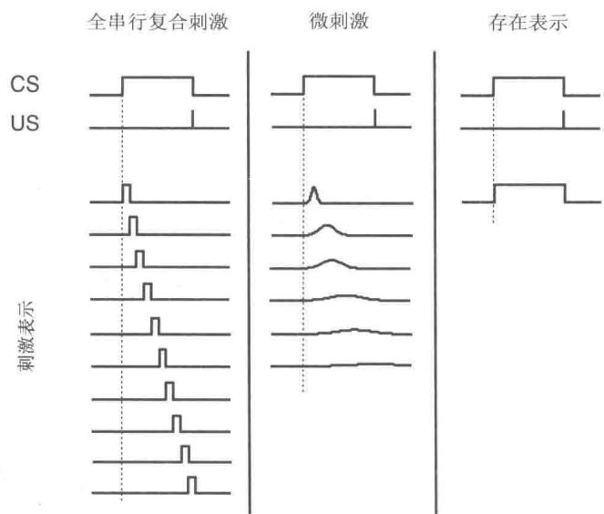  
图14.1模型中可能出现的三种刺激表示(按列来划分)。每一行表示刺激表示中的一个元素。这三种表示在时序上的泛化程度是不同的，全串行复合刺激(左列)在相邻的时间点处没有泛化，存在表示(右列)在相邻点处被完全泛化。而微刺激则居于两者之间。时序上的泛化程度决定了用于学习US预测的时间颗粒度。改编自Learning and Behavior，第40卷，2012，第311页，E.A.A.Ludvig，R.S.Sutton，E.J.Kehoe。已获Springer出版社授权

图14.1中最简单的刺激表示就是位于右侧的存在表示。在这种表示下，一次试验中的复合CS的每个组成部分都对应一个单一的特征值，如果该组成部分在试验中出现，则无论何时其特征值都对应为1，否则为0。存在表示并不是对于刺激在动物脑部表现形式的实际假设，但是正如我们下面将要谈到的，这种形式下的TD模型可以产生许多能够在经典条件反射中看到的计时现象。

而对于全串行复合刺激表示（图14.1中左列所示），每个外部的刺激都会启动一个时间精准的短时内部信号序列。这个信号序列一直持续到这个外部刺激结束为止。这里假设动物的神经系统里有一个时钟，可以在刺激出现时精确记录时间，这就是工程师们所谓的“抽头延时线”。与存在表示类似，CSC表示，作为大脑在内部表示刺激的一种假设，

是不真实的，但是Ludvig等人(2012)将其称为“有用的虚构”，因为它可以揭示TD模型在相对不受刺激表示形式约束的情况下的工作细节。同时，CSC表示也用在大多数关于在脑中生产多巴胺神经元的TD模型中，这是我们将在第15章讨论的问题。CSC表示经常被视为TD模型的核心组成部分，即使这种看法是错误的。

MS表示（图14.1中间列)与CSC表示类似，每个外部的刺激都会开启一个级联的内部刺激，但是在这种情况下，内部刺激(也就是微刺激)并不像CSC那样是受限的非重叠的形式，它们会随着时间的变化进行延长然后重叠。刺激开始后，不同集合的微刺激会随着时间的流逝变强或变弱，同时，后面到来的刺激的持续时间逐渐变长，但是刺激强度的峰值在逐渐减小。显然，根据微刺激的性质，MS表示会有许多种类，很多MS表示的例子已经在文献中被研究过了，并且在某些例子中还同时研究了动物脑中的想法是如何产生的这一课题（具体可以参考章后的参考文献和历史评注）。MS表示在关于神经系统对于刺激表示的假设方面，比存在表示和CSC表示更加贴合实际，并且可以使TD模型的行为与在动物试验中收集到的更广泛的现象相关联。特别地，通过假设微刺激的级联是由US和CS开启的，并且研究微刺激资格迹以及折扣之间的相互作用对学习产生的显著影响，TD模型可以帮助我们构建一些假设，这些假设可以解释经典条件反射中的许多微妙现象以及它们是如何从动物大脑中产生的。我们将在后面的章节对此进行更多的讨论，特别是在第15章，将讨论强化学习和神经科学方面的内容。

然而，即便是最简单的存在表示，所有Rescorla-Wagner模型能够解释的关于条件反射的基本特性都可以由TD模型产生，并且超出试验层面模型描述范围的条件反射特征也可以由TD模型产生。例如我们之前提到过的一个显著特征：US在通常情况下必须在激发条件反射的中性刺激出现之后出现，在经过条件作用后，条件反射CR会在无条件刺激US出现之前出现。换句话说，条件反射通常需要一个正值的ISI，并且CR通常预测了US的出现。

基于ISI的条件反射的强度（例如，CS引起CR的百分比）在不同的物种和反射系统中有很大不同，但是大体上具有以下特性：当ISI为0或者负数时，条件反射强度几乎是可以忽略不计的。例如当US与CS同时出现，或US在CS之前出现时（尽管一些研究发现，当ISI为负时，关联强度有时会少许增加或变为负数）。条件反射的强度会在ISI是某个正数时增加到最大值，此时的条件反射作用是最有效的，然后随着CS和US之间的间隔越来越大，强度会逐渐衰减到0。而具体间隔的大小也是根据反射系统的不同而有很大的差异。TD模型对这种依赖描述的精确性还取决于它的参数取值和刺激表示的细节，但是基于ISI的特征是TD模型的核心属性。

串行复合中的一个理论问题是：当利用复合CS来进行条件反射刺激，且复合CS的组成部分是按照序列的方式依次出现时，序列元素之间长距离关联的强化是如何产生的。我们发现，如果在第一个CS(CSA)与US之间空余的间隔中加入第二个CS(CSB)来形成一个串行复合刺激，则对于CSA的条件反射就会被促进。右图显示了使用存在表示的TD模型的一个实验过程，图的顶部显示的是该实验的时序细节。实验结果与理论相一致（Kehoe，1982）。在该模型中，在第二

  
TD模型中远程关联的促进

个CS的参与下，第一个CS的条件反射率以及条件反射的渐近水平都得到了提升。

在对刺激的时间关系对于条件反射的影响的探究中，Egger和Miller（1962）进行了一次著名的实验。该实验涉及了在一个延迟排列中的两个重叠的CS，如右图上部所示。尽管CSB在时间关系上更接近US，但与仅存在CSB的实验相比，CSA的存在大幅度降低了CSB对于条件反射的作用。图的下半部分显示了TD模型在模拟这个实验时的结果，可以看出与实际实验的结果是相同的。

TD模型考虑了阻塞问题，因为它和Rescorla-Wagner模型一样有一个误差纠正的学习规则。然而，在解释基本的阻塞规则之外，

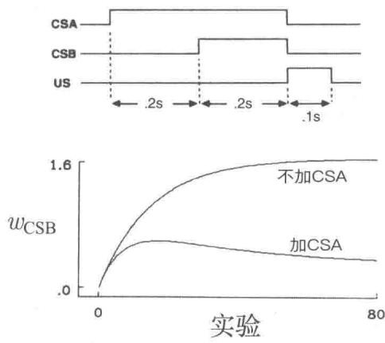  
TD模型中的Egger-Miller效应

TD模型还预测（在存在表示和更复杂的情形下），如果被阻塞的刺激发生的时间提前一段时间，被阻塞的刺激就可以先于阻塞它的刺激发生（如图14.2所示），这样阻塞就可以被逆转。TD模型所表现出的这一特性是很值得关注的，因为在引入该模型时并没有观察到这种现象。回顾一下阻塞的内容，如果一个动物已经学习到了某种CS预示着某种US的发生，那么在学习另外一种CS同样预示该US发生这一知识时，学习的效果会大大减弱。也就是对第二种CS的学习被阻塞了。但是如果新加入的CS先于之前训练好的CS出现，则根据TD模型，动物对新加入CS的学习就不会被阻塞。实际上，如果持续进行这样的训练，新加入的CS的关联强度会增加，而之前CS的关联强度会减小。TD模

型在这种情况下表现出的行为如图14.2所示。这一模拟实验与Egger-Miller的实验不同，在Egger-Miller实验中，后出现的且持续时间更短的CS在它与US完全相关之前，都会获得优先的训练权重。Kehoe、Schreurs以及Graham(1987)对这个令人惊讶的预测结果进行了实验，他们利用之前已经被深入研究的兔子瞬膜闭合实验进行研究。最后的结果证实了TD模型的预测，并且他们指出，使用非TD模型来解释他们的数据是十分困难的。

  
图14.2 TD模型中的时序优先性的覆盖阻塞

在TD模型中，较早出现的预测性刺激的优先级高于较晚出现的预测性刺激，因为就像本书中所描述的所有预测方法一样，TD模型基于“回溯”或“自举”的思想：关联强度的更新改变了某个特定状态对其后继状态的强度。另外，基于自举思想的TD模型为“高级条件反射”提供了一个解释，这也是Rescoral-Wagner和其他类似模型所不具有的条件反射特性。我们在前文提到，用作条件反射的CS可以作为US来激发对另一种中性刺激的条件反射，这种现象就是高级条件反射。图14.3显示了TD模型（同样在存在表示的情况下）在高级条件反射实验中的行为，在这个实验中是次级条件反射。在第一阶段（未在图中显示），CSB作为US的预示被进行训练，因此CSB的关联强度会增加，在本实验中增加到了1.65。在第二阶段，在没有US的情况下，CSA与CSB组合出现的时间序列如图14.3上部所示，实验结果表明在没有US出现的情况下，CSA依然会获得一定的关联强度。在持续的训练后，CSA的关联强度会达到一个峰值后下降，下降的原因是介于CSA和US之间的强化剂CSB的关联强度在持续下降，导致其丧失了提供次级强化作用的能力。CSB关联强度减弱的原因是US没有在这些更高级的条件反射实验中出现。以上的实验被称为CSB的消退训练，因为CSB与US的预测关系被扰乱了，其作为强化剂的作用也被削弱了。在动物实验中也出现了同样的情况。在高级条件反射中，

条件强化作用衰减的现象使得高级条件反射难以实现，除非我们定期插入第一阶段的实验来恢复最初的预测关系。

  
图14.3 TD模型中的次级条件反射

TD模型提供了对次级（二级）以及更高级的条件反射的模拟，因为在TD误差 $\delta_t$ （式14.5）中，有 $\gamma \hat{v} (S_{t + 1},\mathbf{w}_t) - \hat{v} (S_t,\mathbf{w}_t)$ 这一项，因此，如果之前学习的结果 $\gamma \hat{v} (S_{t + 1},\mathbf{w}_t)$ 与 $\hat{v} (S_t,\mathbf{w}_t)$ 不相等，则 $\delta_t$ 不再是0(时间上的区别)。这种区别与式(14.5）中的 $R_{t + 1}$ 有相同的地位，这意味着就学习而言，时间上的差别和US是否出现导致的差异是相同的。实际上，我们通过在第6章提到的TD算法与动态规划算法的联系可以知道，TD算法的这种特性是其发展的主要原因。自举值与次级条件反射以及高级条件反射密切相关。

在上文所介绍的TD模型行为的例子中，我们只考虑了复合CS中各个组成部分关联强度的变化，并没有关注模型对于动物条件反射（CR）各种性质的预测，包括条件反射产生的时间、状态，以及它们是如何在条件反射实验中形成的。这些性质往往取决于动物的种类、反射系统以及条件反射实验的各种参数等，但是在很多以不同动物、不同反射系统为对象的实验中，CR的大小，或者说CR出现的概率会随着US预计出现时间的临近而增加。例如之前提到的兔子瞬膜闭合反射，在该条件反射实验中，随着实验次数的增加，从CS出现到兔子瞬膜开始闭合之间的时间间隔在逐渐减小，并且瞬膜闭合的幅度也随着时间从CS到US的推移而增加，并在US预计发生的时间点处达到最大振幅。CR的产生时间与状态对生物有很重要的适应意义。在上面的例子中，如果瞬膜闭合得太早，会对兔子的视线造成影响（即使瞬膜是半透明的），如果闭合得太迟，则无法对眼睛进行有效的保护。像上述这样捕获CR特征对于经典条件反射模型是很有挑战性的。

TD模型没有任何一种机制可以将US预测的时间过程 $\hat{v} (S_t,\mathbf{w}_t)$ 转化为一种特征描

述，使得其可以与动物的CR特征进行对比。因此最简单的选择是让模拟CR的时间过程等于US预测的时间过程。在这种情况下，模拟CR的特征以及它们在试验过程中的变化仅取决于刺激表示以及模型参数 $\alpha$ 、 $\gamma$ 和 $\lambda$ 。

图14.4显示了在三种刺激表示下（图14.1）US在不同时间点预测的时间流程。对于这些模拟，US在CS出现的25个时刻后出现，并且 $\alpha = 0.05$ ， $\lambda = 0.95$ ， $\gamma = 0.97$ 。在CSC表示下(图14.4左部)，TD模型生成的US预测曲线在CS和US的区间内呈指数级增长，直到在US发生的时间点(在第25个时刻)达到最大值。这种指数增长是TD模型学习规律中折扣体现的结果。在存在表示(图14.4中间)下，对US的预测在刺激出现后几乎是一个常数，因为对于每一种刺激只能学习到一个关联强度。因此，使用存在表示的TD模型无法重现CR在时间上的许多特征。而对于MS表示(图14.4右部)来说，US预测的发展更为复杂，经过200次试验，US预测的表现近似于CSC表示产生的预测曲线。

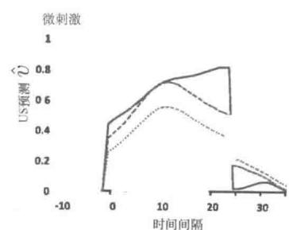  
图14.4TD模型在三种刺激表示下对US预测学习的时间流程。左：在全串行复合刺激(CSC)中，US预测值在CS和US之间呈指数增长，在US发生时达到峰值。渐近线(第200次试验)上US预测值也在US发生时达到最高值(在模拟中，最高值为1)。中：在存在表示中，US预测值随时间收敛于一个常数。这个常数的大小由US的强度以及CS与US之间的间隔决定。右：在微刺激表示中，在渐近线上，TD模型通过不同微刺激的线性组合描绘出与CSC类似的指数增长曲线。图片改编自Learning&Behavior，第40卷，2012，E.A.Ludvig，R.S.Sutton，E.J.Kehoe

图14.4所示的US预测曲线并不是为了精确匹配某个特定动物在条件反射实验中CR的表现，但是它们表明了刺激表示对TD模型的预测结果有很大的影响。此外，刺激表示与折扣和资格迹交互的方式对US预测的轮廓图的性质也有很大的影响。在另一方面，将US的预测转化为CR的“反应生成机制”也会产生很大影响，但是这超出了我们的讨论范围。图14.4所示的内容是“原始的”US预测轮廓图。对于动物大脑是如何根据对US的预测做出明显反应这个问题，即使不做出任何特定假设，我们也能看到，在图14.4中CSC和MS的图像曲线会随着US发生时间的临近而上升，并且在US发生时

达到最大值，就像在许多动物条件反射实验中所见到的那样。

当TD模型与特定的刺激表示和反应生成机制相结合后，就能够解释在经典条件反射中观察到的各种现象，但它远不是一个完美的模型。为了生成经典条件反射的其他细节，我们需要扩展TD模型，如通过添加基于模型的元素和机制来自适应地改变它的一些参数。其他对经典条件反射建模的方法与Rescorla-Wagner类型的误差纠正过程有着明显的不同。例如，贝叶斯模型是在概率框架内工作的，在这个框架中，实际经验会修正概率估计。而所有的这些模型都有助于我们对经典条件反射的理解。

TD模型最显著的特点大概是它基于一个理论，该理论说明了动物神经系统在经历条件作用时尝试去做的事情：形成准确的长期预测，这与刺激物的表示形式所带来的限制以及神经系统的工作方式相一致。换句话说，该理论提出了一个针对经典条件反射的规范性描述，表明长期预测才是经典条件反射的重要特征，而并非即时预测。

对条件反射TD模型的探究是对动物学习行为的一些细节进行建模的一个实例。TD学习除了作为算法外，也是生物学习方面模型的基础。正如我们在第15章将要讨论的，TD学习也被证明是一种有影响力的多巴胺神经元模型。多巴胺是哺乳动物大脑中的一种化学物质，它与获得回报的过程密切相关。这些也是强化学习理论与动物行为和神经数据密切联系的实例。

现在我们考虑强化学习与动物行为在工具性条件反射实验中的对应关系，这也是动物心理学家研究的另一种主要实验。

# 14.3 工具性条件反射

在工具性条件反射的实验中，学习是依赖于行为的结果来进行的，即根据动物做了什么来发送强化刺激信号。相比之下，在经典条件反射的实验中的强化刺激信号（即US）的传送是与动物的行为无关的。通常，工具性条件反射与操作性条件反射被认为是一样的，“操作性条件反射”这个术语是B.F.Skinner(1938，1961)在基于行为的条件性强化实验中提出的。但这两个术语在实验和理论方面还是有一些差异的，在下面的内容中我们会提及这些差异。这里我们只用“工具性条件反射”这个词来表示强化过程取决于行为的实验。工具性条件反射的起源可以追溯到本书第1版出版的一百年前美国心理学家EdwardThorndike进行的实验。

Thorndike将猫放进如下图所示的“迷箱”中，观察猫的行为，在该箱子中的猫需要采取特定的动作才能逃出箱子。例如，一个箱子中的猫可以通过采取如下三个动作打开箱

子的门：按压箱子背面的板；抓住并拉动绳子；以及上下推动把手。当第一次被放在“迷箱”之中并且可以同时看到箱子外面的食物时，Thorndike中的猫除了少数几只外，都显示出“明显的不适”和异常活跃的动作来“本能地逃出禁闭”(Thorndike，1898)

  
一个Thorndike迷箱

来自Thorndike，Animal Intelligence：An Experimental Study of the Associative Processes in Animals, The Psychological Review, Series of Monograph Supplements II(4), Macmillan, New York, 1898.

实验中包含了不同的猫以及具有不同逃跑机制的箱子，Thorndike记录了每只猫在每个箱子的多次试验中逃跑所耗的时间。他观察到随着试验次数的增加，试验所用的时间不停地下降，例如从300s降到6s、7s。Thorndike这样描述“迷箱”中猫的行为：

由于冲动抓遍整个箱子却难以逃出箱子的猫可能会正好抓绳子、环和按按钮而打开箱子的门。逐渐地，不能打开门的冲动慢慢消失，而成功打开门的冲动会由于开门带来的快乐而逐渐加强。最终经过多次试验后，猫一被放入箱子中，就会立刻以一种确定的方式去按按钮和拉环（Thorndike 1898, p. 13）

Thorndike 在这些和其他实验（实验对象为狗、鸡、猴子甚至是鱼）的基础上总结了一系列学习的“规律”，其中最具影响力的是我们在第 1 章（14 页）中提到的效应定律。效应定律所描述的内容现在通常被称为试错学习。正如在第 1 章中提到的，“效应定律”在许多方面都引起了争议，并且其细节在这些年也还在修改。不管该定律的形式怎么变，它都表述了一个关于学习的久经考验的原则。

强化学习算法中的关键特点可以对应到效应定律中描述的动物学习的特点。第一，强化学习算法是选择性的，即它们会尝试不同的选择，并通过比较这些选择的结果来在其中挑选。第二，强化学习算法是关联性的，即在构建智能体的策略时，其可进行的选择是与特定的场合或状态相关联的。如效应定律中描述的学习一样，强化学习不仅仅是一个找到能产生大量收益的动作的过程，也是一个将动作与场合或状态连接在一起的过程。

Thorndike用“选择与连接”一词来表示学习(Hilgard，1956)。进化中的自然选择过程是一个很好的选择过程的例子，但是它不具有关联性(至少目前是这么认为的)。监督学习具有关联性，但是它没有选择性，因为它依赖的指令直接告诉智能体如何改变它的行为。

使用计算机科学的术语进行描述的话，“效应定律”描述的是一种基本的结合搜索和存储的方法，搜索的方式是在某个场合下尝试不同的动作并在其中选择一个，而存储则是将场合和在该场合下目前为止找到的最好的动作关联起来。无论存储的形式是智能体的策略、价值函数还是环境模型，搜索和存储都是所有强化学习算法中的关键组成部分。强化学习算法对于搜索的需求导致它必须以某种方式进行试探。很明显，动物也需要试探，而早期的动物学习研究人员对于动物在类似于Thorndike的谜箱实验这样的场合下选择动作时究竟使用了多少指导持有不同的意见。动作的选择到底是“随机选择的或者说是胡乱选择的”(Woodworth，1938，p.777)，还是在一定的指导（先验知识、推理或其他形式）基础上选择的。尽管包括Thorndike在内的一些学者支持前者，另一些人则认为试探的过程是更精细的。强化学习算法对于智能体在选择动作使用多少指导有着多样的选择。在本书中介绍的算法中，试探过程的形式，如 $\varepsilon$ -贪心法和基于置信区间界限的动作选择等，都属于最简单的一类。只要能够保证某种形式的试探使得算法可以高效运行，其实我们也可以设计更为复杂的方法。

强化学习的一个特性是在任何时刻可以选择的动作的集合依赖于环境的当前状态，这一特性与Thorndike在他的谜箱实验中观察到的猫的行为也是类似的。这些猫所选择的动作是在当前的场合下它们本能会做出的一些动作，Thorndike称其为“本能冲动”。当猫第一次被放进箱子里面时，猫会本能地用力抓挠和撕咬（这是猫处在狭小空间内的本能反应）。成功的动作是从这些动作而不是从所有动作中选出来的。这与我们之前提到的形式化很相似，即在当前状态 $s$ 时选择的动作都来自一个可选动作集合 $A(s)$ 。确定这个集合是强化学习的一个重点，因为它能大幅简化学习过程。这些动作就像是动物的本能冲动一样。另一方面，Thorndike的猫并非单纯地从本能冲动的集合中选择动作，而是会根据当前状况本能地对可选动作进行排序。这是另一个能简化强化学习的方式。

在受效应定律影响的动物学习研究人员中，最著名的两位是Clark Hull（例如 Hull，1943）和B.F.Skinner（例如Skinner，1938），他们研究的核心就是基于行为的结果来选择行为这一想法。强化学习中的很多特性与Hull理论是一致的，其中包括了采用类似于资格迹的机制和次级强化来在动作和由其引发的强化刺激信号（参见14.4节）之间有很长的时间间隔时进行学习。随机性在Hull理论中也是很重要的，它通过一种称为“行为振荡”的方式引入随机性来得到试探性的行为。

Skinner 不完全同意效应定律中的关于存储的那部分描述。他反对关联连接的观点，强调动作是从自发行为中选择的。他提出了“操作”这个术语来强调动作对于动物所处环境的影响的重要作用。与 Thorndike 等人的实验不同，Skinner 的操作性条件反射实验并非由一连串单独的试验组成，它允许动物在更长的一段不受打断的时间内表现其行为。他发明了操作性条件反射箱，现在叫作“Skinner 箱”。它最简单的版本包含一个杠杆或一个钥匙，一旦盒子里面的动物按压了，就会得到回报，例如水或者食物。回报的规则是预先设计好的，其也被称作强化程序表。通过记录随着时间推移动物按压杠杆的累积次数，Skinner 和他的同事可以试探不同的强化程序表对动物按压频率的影响。如何使用本书中介绍的强化学习方法来对这些实验结果进行建模这一问题还并没有被系统地研究过，不过在本章最后的参考文献与历史评注部分中我们提到了一些例外情况。

Skinner的另一个贡献在于，他发现通过强化对理想行为模式的接连不断的近似可以实现对动物的有效训练，他将这个过程称作塑造。虽然其他人，包括Skinner自己都曾用过这个方法，但真正让他意识到其重要性的实验，是他和他的同事们尝试训练鸽子用它的喙击木球来使球滚动，但他们等了很长时间，都没等到他们可以用于强化的击中木球的情况，在这样的情况下，他们

……决定对任何只要与击球有细微的相似的反应都进行强化。例如在一开始强化的反应可能只是看着木球，后来就可以选择强化离最终的目标更接近的反应。结果令人惊喜。几分钟后，球就从盒子边上掉了出来，鸽子就已经像冠军壁球选手一样了。”(Skinner，1958，p.94)

这些鸽子不仅学会了一种对它们来说不同寻常的动作，而且它们通过一个行为和强化规则互相对应变化的交互过程能够快速地进行学习。Skinner将强化规则变化的这个过程与雕塑家将粘土塑成想要的形状的过程相比较。塑造在强化学习的计算系统中也是一个强有力的技术。由于收益的稀疏性，或者由于很难从初始行为达到这些状态，因此当智能体很难得到任何非零的收益信号时，如果从比较简单的问题开始，然后逐渐增加任务难度，智能体的学习过程就会更有效，并且对于有些任务，必须要采取这种学习策略。

心理学中的动机这一概念与工具性条件反射实验密切相关，这里的动机指的是一种影响行为的方向、大小和活力的过程。以Thorndike实验中的猫为例，猫想要逃出谜箱的动机是它们想要得到放在箱子外面的食物。这个目标对它们非常诱人，那么就会强化那些能使它们顺利逃出箱子的动作。尽管动机这个概念有很多的特性，很难以一种准确的方式将其从计算的角度与强化学习联系起来，但在某些特性上，两者的联系清晰可见。

从某种意义上来说，强化学习智能体的收益信号是其动机中最基本的部分：智能体被

其激发去最大化长期的总收益。那么，动机中的一个关键点就在是什么使得智能体的某段经历具有收益。在强化学习中，收益信号取决于强化学习智能体所处环境的状态和智能体的动作。更进一步，在第1章中提到过，智能体的环境状态不仅包含关于广义的机器（比如生物体或机器人）外部的信息（这类信息能确定智能体所在），同样包含关于机器内部的信息。一部分内部信息对应的就是心理学中动物的动机状态，这个动机状态影响了动物觉得什么更具有收益的判断。举个例子来说，动物感到在饥饿状态下进食的收益会比它刚饱餐一顿后再进食的收益更多。状态依赖这一概念的范围很广，其允许多种不同的关于收益信号如何产生的调整方式。

引入价值函数带来了与心理学中动机的概念更深层次的联系。如果在选择动作时最基本的动机是取得尽可能多的收益，那么对于使用价值函数来选择动作的强化学习智能体来说，其动机更接近真实情况，即最大化价值函数的正梯度，也就是选择能够达到接下来的最大状态值的动作（换种说法，即选择得到的动作价值最大的动作）。对于这些智能体来说，价值函数是决定它们的行为方向的主要驱动力。

动机的另一个特性是动物的动机状态不仅能影响学习过程，而且也会影响在学习后动物的行为的强度和活力。例如，在学习如何在迷宫中找食物后，饥饿的老鼠会比不饿的老鼠更快地到达目标。我们还不是很清楚如何将动机的这个特性与强化学习框架联系起来，但在本章中最后的参考文献和历史评注中，我们引用了几篇提出基于强化学习的行为活力理论的文章。

我们接下来关注当强化刺激在它们强化的事件后很久才出现时进行学习的问题。强化学习算法中用来在延迟强化的情景下学习的机制（资格迹和TD学习算法），与心理学家对于动物如何在这一情景下进行学习的假设是很接近的。

# 14.4 延迟强化

效应定律的成立需要假设能够反向影响之前的连接，但早期的一些批评者并不认同现在能影响过去的事情的想法。在学习时，动作和其导致的收益或惩罚之间甚至可能存在巨大的时间间隔，这更加重了批评者的这种担忧。我们将这个问题称为延迟强化，这与Minsky（1961）提出的“学习系统的功劳分配问题”（如何将成功结果的功劳分配给许多在取得成功的过程中做出的动作？）密切相关。本书中介绍的强化学习算法包括两种用来解决这个问题的机制。第一种就是使用资格迹；第二种则是用TD方法来学习价值函数，学到的价值函数（在类似于工具性条件反射实验的任务中）几乎可以立刻对动作进行评估，

或者（在类似于经典条件反射实验的任务中）可以立刻对目标做出估计。在动物学习理论中，这两种方法都有对应的相似机制。

Pavlov (1927) 指出在每一次刺激结束之后，刺激产生的痕迹都会在神经系统中保留一段时间，同时他提出正是这些刺激留下的痕迹使得即使在 CS 结束时刻和 US 开始时刻之间有一段时间间隔，学习仍然是可能的。今天，这一假设条件也被称为痕迹条件反射（第 342 页）。假设在 US 到来时，CS 的痕迹依然存在，那么通过同时存在的痕迹与 US 就能进行学习。在第 15 章中，我们会讨论一些关于神经系统中的痕迹机制的话题。

在工具性条件反射中，刺激痕迹同样被用来在动作与其最终导致的收益或惩罚之间有时间间隔时作为桥梁。在Hull的影响学习理论中，“整体刺激痕迹”会导致产生他称之为动物的目标梯度，其描述的是随着强化信号的延迟变大，工具性条件反射反应的最大强度如何减弱。(Hull，1932，1943)Hull猜想动物做过的动作会留下内部刺激，而这些刺激的痕迹是随着时间的推移以指数级衰减的。通过观察当时可以得到的动物学习实验的数据，他猜想在 $30\mathrm{s}\sim 40\mathrm{s}$ 后，痕迹就会衰减至0。

本书中提到的算法中所使用的资格迹与Hull的痕迹很相似，它们都是过去的状态或“状态-动作”二元组的痕迹，并且随着时间衰减。资格迹是Klopf(1972)在他的神经元理论中提出的，它最初指的是过去在突触或者神经元之间的连接上发生的事件所留下的痕迹。Klopf的痕迹比我们算法中的指数衰减痕迹更为复杂，我们在15.9节中介绍他的理论时会更详细地介绍这一点。

为了解释有些目标梯度存在的时间比刺激痕迹存在的时间更长的现象，Hull(1943)提出更长的梯度来自于从目标回传的条件强化，这一过程和他的“整体刺激痕迹”是同时进行的。动物实验揭示了如果在延迟周期内符合条件强化过程，那么随着延迟变长，学习过程就不会像在次级强化受到阻碍的条件下那样减弱。如果在延迟间隔中存在经常出现的次级，那么就更有利于条件强化的形成。这种情况就像收益没有延迟一样，因为有很多的即时条件强化。基于此，Hull设想存在一种“基础梯度”，其来自于初级强化的延迟并由于痕迹的存在而减弱，而条件强化信号则会逐步修改和拖长基础梯度。

本书中提到的使用资格迹和价值函数在延迟强化的条件下进行学习的算法与Hull关于动物如何在同样条件下学习的假设是一致的。其一致性在13.5节、15.7节和15.8节中提到的“行动器-评判器”框架中显得最为清晰。评判器使用了TD算法来学习系统当前行为所对应的价值函数，即这一价值函数能预测当前策略的收益。行动器基于评判器的预测，更准确地说是预测中的变化，来更新当前的策略。由评判器计算得到的TD误差就像行动器的条件强化信号，即使在收益信号有巨大延迟时仍能即时地评估当前表现。估计动

作价值函数的算法，比如Q学习和Sarsa，同样也使用TD学习的原理，使用条件强化来在存在延迟强化时进行学习。我们在第15章中讨论的TD学习与产生多巴胺神经元活动之间的密切联系将会进一步支撑强化学习算法与Hull的学习理论之间的关联。

# 14.5 认知图

基于模型的强化学习算法使用了环境模型，这与心理学中所说的认知图有许多共同点。回顾我们在第8章中讨论的规划和学习，环境模型是智能体用来预测在它采取动作之后，环境将会把它转移到哪个状态以及给予多少反馈的一个模型；规划指的是在这样一个模型下计算出一个策略的过程。环境模型由两个部分组成：状态转移部分包含了关于动作将会如何影响状态转移的知识；回报模型部分包含了关于每个状态和“状态-动作”二元组的预期收益信号的知识。基于模型的强化学习算法通过使用模型，来预测可能的行动过程导致的未来状态和从这些状态产生的预期收益信号。最简单的规划算法用于比较一系列“想象出来”的决策序列的预期后果。

接下来的问题是动物会不会用到环境模型，如果使用了环境模型，那么这些模型是什么样子的，它们又是怎么学习的？这些问题在动物学习的研究中扮演着重要的角色。一些研究人员提出潜在学习的概念，开始挑战当时盛行的关于学习和行为的“刺激-反应”(S-R)的观点（对应于最简单的模型无关的学习策略）。在早期的潜在学习实验中，有两组老鼠放进迷宫盒中。在实验组中，第一阶段老鼠是没有任何收益的，但是在第二阶段一开始就用食物作为收益。对于控制组，第一阶段和第二阶段都会有食物放在目标盒中。问题就是实验组的老鼠是否能够在没有收益的第一阶段学到一些东西。虽然实验组的老鼠在第一个无收益阶段似乎没有学习太多东西，但是一旦在第二阶段找到食物了，它们便很快赶上控制组的老鼠。这可以总结为：“在无收益阶段，实验组老鼠对迷宫进行潜在学习，一旦产生收益，它们就能快速利用。”(Blodgett, 1929).

与潜在学习关系最大的是心理学家Edward Tolman，他解释了这个结果，并且被广泛认可。他提出，动物可以在收益或者惩罚缺失的情况下，学习到一个“环境的认知图”，当动物在以后有动机去达成一个目标时，他们会利用这个图（Tolman，1948）。认知图允许老鼠规划一条不同于在一开始试探时使用的路线。对试验结果的这种解释导致了心理学中以行为主义为中心与以认知为中心学派之间的持久争论。用现代的术语来说，认知图不仅限于空间布局的模型，而是一个更加广义的环境模型，或者是动物的“任务空间”的模型（例如Wilson、Takahashi、Schoenbaum和Niv，2014）。用认知图解释潜在学习实验，可以视作动物使用了基于模型的算法，并且环境模型可以在没有显式的收益或惩罚时被学

习到。之后当动物发现收益/惩罚的迹象而有动力时，模型将被用于规划。

Tolman关于动物如何学习认知图的解释是，他们通过在试探环境时体验连续的刺激，来学习刺激-刺激(S-S)连接。在心理学中这又被称为期望理论：给定S-S连接，一个刺激的出现将会产生一个关于下一个刺激的预期。这很像控制工程师们所称的系统辨别，其中一个未知动态特性的系统模型通过从有标注的训练样本中学习得到。在最简单的离散时间版本中，训练样本是 $\mathrm{S - S^{\prime}}$ 对，其中S是一个状态，后继状态 $S^{\prime}$ 是一个标签。当观察到S时，模型产生一个期望的状态 $S^{\prime}$ 。更加有利于规划的模型也要包含动作，因此训练样本看起来是SA-S'，其中 $S^{\prime}$ 代表在S状态下采取动作A时期望的下一个状态。学习环境如何产生收益也是有用的。在这种情况下，样本的形式是S-R或者SA-R，其中 $R$ 是关于S或者SA对的收益信号。以上是有监督学习的形式，其中智能体通过学习获得认知图，无论它在试探环境中有没有接收到非零收益信号。

# 14.6 习惯行为与目标导向行为

无模型与基于模型的强化学习算法之间的差别，对应于心理学家对于学习到的行为模式所做的“习惯行为”与“目标导向行为”之间的区分。习惯是由适当的刺激触发，之后多多少少会自动执行的行为模式。目标导向的行为，可以通过心理学家如何使用这个词组看出：在某种意义上它是有目的性的，它是通过目标价值的知识以及行动与其后果之间的关系来控制的。习惯有时被认为是由先行刺激所控制的，而目标导向行为被认为是由于其后果所控制的（Dickinson，1980，1985）。目标导向控制的优势在于它能够使得动物根据环境状态的变化及时调整行为。习惯动作能够对来自固定环境的输入快速反应，但是它不能对变化的环境做出调整。目标导向行为控制的发展对动物智力进化来说可能是重要的一步。

图14.5展示了无模型与基于模型的决策策略之间的差别，这个任务就是之前提到的老鼠迷宫游戏，每个目标盒子都有对应的收益值大小（如图14.5顶部所示）。从状态 $S_{1}$ 开始，老鼠要么选择往左要么选择往右，接下来老鼠到达 $S_{2}$ 或 $S_{3}$ 状态，此时它还是只能选择往左或者往右，到达目标盒子就得到对应的收益。目标盒子就是老鼠迷宫任务终止状态。无模型的策略（图14.5左下）依据的是存储的“状态-动作”二元组的值。这些动作价值评估的是老鼠在对应环境状态下可选动作能够获得的最大的收益值。这些动作价值是在多次进行老鼠迷宫试验中得到的。动作价值会越来越接近最优收益值，老鼠为了得到最优策略每次都会选择有最大动作值的那个动作。在这种情况下，当动作值的估计越来越准确时，老鼠会在状态 $S_{1}$ 选择往左，在状态 $S_{2}$ 选择往右，这样会得到最大收益值4。另一个不同的无模型策略就是简单地按照存储的策略来代替状态值，就是直接在状态 $S_{1}$ 选择

动作往左，在状态 $S_{2}$ 选择动作往右。这些做决策的策略都不依赖于环境模型，没有必要去询问状态转移模型，也不需要目标盒子特征和它们所传递的收益之间的联系。

  
图14.5 解决假想的顺序动作选择问题的基于模型和无模型的策略。上图：一只老鼠在一个有不同的目标盒子的迷宫中寻路，每个盒子带有一个收益值（在图中显示）。左下角：无模型的策略，依赖于经过多次试验获得的所有“状态-动作”二元组的动作价值。为了做出决定，老鼠只需在每个状态选择具有该状态的最大动作值的动作。右下：在基于模型的策略中，老鼠学习包括状态-动作-下一状态转移相关的知识的环境模型，以及由与每个独特目标盒子相关联的收益的知识组成的收益模型。通过使用模型模拟动作选择序列以找到产生最高回报的路径，老鼠可以决定在每个状态下转到哪个方向。改编自Trendsin Cognitive Science, volume 10, number 8, Y.Niv,D.Joel,and P.Dayan,ANormative Perspective on Motivation,p.376,2006

图14.5（右下）展示了基于模型的策略，它使用环境模型中的状态转移模型和收益值模型。状态转移模型如决策树所示，收益模型把目标盒子独有的特征和它们包含的收益值联系起来 $(S_{1}, S_{2}$ 和 $S_{3}$ 状态下的收益值也是收益值模型的一部分，在这里它们的收益值为0，且没有展示）。基于模型的智能体可以通过模型来模拟动作选择的序列，找到一条产生最高回报值的路径。从而决定在每一个状态下转到哪个方向。在这种情况下，回报值是在路径末端获得的收益。在图中的例子里，如果我们有一个足够精确的模型，老鼠会选择先向左然后向右，从而得到收益值4。比较模拟路径的预测回报是一种简单的规划，可以通过第8章中讨论的各种方式完成。

如果无模型智能体的环境改变了它对于智能体的动作做出的反应时，智能体必须在这个改变的环境中获得新的经验，以更新其策略或者价值函数。如图14.5（左下）所示的无模型策略，如果其中一个目标盒子不知为何移动了位置，传递出一个不一样的收益，那么老鼠不得不穿过迷宫（也许需要很多次）来体验到达目标盒子时的新收益，同时要基于这些经验更新它的策略或动作价值函数（或者两者）。关键是，如果无模型的智能体要改变由其策略决定的某个状态下的动作，或者改变对应某个状态的动作价值，它需要移动到那个状态，做出动作（可能需要多次），然后体验这个动作带来的结果。

而基于模型的智能体就能在没有任何这种“个人经验”的情况下适应环境的变化，这种模型会自动（通过规划）改变智能体的策略。规划过程可以决定环境变化导致的结果，而与智能体自己过去的经验是没有任何联系的。举个例子来说，将14.5中的最后收益值是4的目标盒子的收益值改为1。即使没有动作选择策略寻找收益值改变的那个目标盒子，老鼠的收益值模型也要改变。规划过程由于使用环境模型，所以收益值的改变对于规划来说是透明的，在迷宫实验中不需要额外的经验，在这种情况下，将策略改变为在 $S_{1}$ 和 $S_{3}$ 状态都选择右转，从而获得3的回报值。

正是这种逻辑构成了动物的结果贬值实验的基础。这些实验的结果为动物是学习到了一个习惯还是由目标导向控制行为问题提供了有益的启发。结果贬值实验与潜在学习实验类似，收益值会发生对应改变。在学习开始时收益值固定，之后其中一个结果的收益值发生改变，有可能变为零，甚至有可能变为负值。

早期 Adams 和 Dickinson(1981) 完成了这种类型的一个重要实验。他们通过工具性条件反射训练老鼠，直到老鼠在训练室中学会大力按压用于获得蔗糖球的杠杆。然后将老鼠放在同一个空间里，把杠杆收回，并独立地提供食物：这意味着蔗糖可以可以独立于老鼠的动作提供给它们。15 分钟自由进食后，给一组老鼠注射会引起恶心的毒氯化锂。这个过程重复三次，最后一次注射后，没有任何一只接受注射的老鼠会吃掉这些独立提供的蔗糖球，这表明蔗糖球的收益价值已经下降（蔗糖球已经贬值）。下一组实验一天后进行，老鼠再次被放置在室内，并进行了一次消退训练，也就是说响应杆已经回到原位，但与蔗糖球分配器断开连接，因此按压它不会释放蔗糖球。我们的问题是：那些已经经历蔗糖球收益值下降（第一组实验）的老鼠是否会比没有感受到蔗糖球收益值下降的老鼠更少地按压杠杆，即使没有接受注射的老鼠经历了杠杆与蔗糖球分配器断开所导致的收益贬值。结果表明，注射药物的老鼠的反应率明显低于未经历注射的老鼠。

Adams和Dickinson得出的结论是，注射的老鼠通过认知图将杠杆按压与蔗糖球相联系，并将蔗糖球与感到恶心联系，从而使相关的杠杆按压伴随恶心。因此，在消退实验

中，老鼠“知道”按下杠杆的后果是它们不想要的，所以它们从一开始就减少了杠杆的压力。重要的一点是，它们并没有真正经历过按压杠杆之后就产生恶心的情况。它们似乎能够将行为选择结果的知识（按压杠杆后将得到一个蔗糖球）与结果的收益价值（感到恶心，从而应避免蔗糖球）相结合，因此它们可以相应地改变行为。并不是每个心理学家都同意该实验的这种“认知”的说法，这不是解释这些结果的唯一可能的方式，但是基于模型的“规划”的解释是被广泛接受的。

没有什么能阻止智能体使用无模型和基于模型的算法，并且使用两者都有很好的理由。根据我们自己的经验，我们知道，经过大量的重复后，目标导向的行为往往会变成习惯性的行为。实验表明，这也发生在老鼠身上。Adams (1982) 进行了一个实验，看看扩展训练是否会把目标导向的行为转化为习惯行为。他通过比较结果贬值对经历不同训练量的老鼠的影响来做到了这一点。如果延长的训练使老鼠对贬值不那么敏感，那么相较于接受较少训练的老鼠，这将是延长的训练使得该行为更加习惯的依据。Adams 的实验紧跟着刚刚描述的 Adams 和 Dickinson (1981) 的实验。简化一下，一组老鼠接受了训练，直到它们做了 100 次获得收益的杠杆按压，另一组老鼠是过度训练组，它们做了 500 次获得收益的杠杆按压。训练结束后，两组老鼠的收益均贬值（通过注射氯化锂产生恶心）。然后对两组老鼠进行一次消退训练。Adams 的问题是，贬值是否会使得过度训练组的老鼠的按压杠杆率低于未过度训练的老鼠，这将证明延长的训练降低了对结果贬值的敏感性。结果是，贬值大大降低了非过度训练老鼠的杠杆按压率。而对于过度训练的老鼠则相反，贬值对它们的杠杆按压率影响不大。事实上，如果有的话，也会使得它更有活力（完整的实验包括对照组，显示不同量的训练本身并不显著影响学习后的杠杆按压率）。这个结果表明，没有过度训练的老鼠以对它们的目标导向的方式（对其行为的结果有清楚的了解）选择它们的行为，过度训练的老鼠已经形成了杠杆按压的习惯。从计算的角度来看这些实验结果，可以想到为什么人们会期望动物在某些情况下习惯性选择动作，在其他情况下以目标导向来选择动作，以及为什么会从一种控制模式转换到另一种控制模式来继续学习。虽然无疑动物使用的算法与我们在本书中介绍的算法不会完全一致，但是可以通过考虑各种强化学习算法所暗含的折中方法来洞察动物的行为。计算神经科学家 Daw、Niv 和 Dayan (2005) 提出的一个想法是：动物同时使用无模型和基于模型的决策过程。每个过程都生成一个候选动作，最终选择执行的动作被认为是两个中更值得信赖的过程所提出的动作，其由整个学习过程中保持的置信度决定。对于基于模型的系统，规划过程的早期学习阶段更值得信赖，因为它将短期预测串在一起，与无模型流程的长期预测相比，这些预测可以变得更准确，经验更少。但是随着经验的不断增长，无模型过程变得更加值得信赖，因为规划很容易出错（由于模型的不准确性和使规划变得可行所必需的捷径，例如各

种形式的“树剪枝”，即删除没有希望得到结果的搜索树分支）。

根据这个想法，随着更多经验的积累，人们会期望从目标导向行为转向习惯行为。已经有人提出关于动物如何在目标导向和习惯控制之间进行权衡的其他想法，并且行为和神经科学领域都在继续研究这个问题和相关问题。

无模型和基于模型的算法之间的区别被证明对本研究是有用的。人们可以在抽象设置中检查这些类型算法计算上的潜在含义，从而揭示每种类型的基本优势和局限性。这有助于提出和锐化指导实验设计的问题，这些问题是心理学家增加对习惯行为和目标导向行为控制的理解所必需的。

# 14.7 本章小结

本章主要讨论强化学习与动物学习心理实验研究的关联。我们从一开始就强调，本书中介绍的强化学习并不是模拟动物行为中的细节，而是从人工智能和工程角度出发，探究其理想化环境的抽象计算框架。但是许多强化学习算法都是受心理学理论启发而来的，并且在某些情况下，这些算法也会促进新的动物学习模型的产生。在本章中，我们介绍了几种最明确的关联。

强化学习中的预测算法与控制算法的区别类似于动物学习理论中的经典条件反射与工具性条件反射的区别。工具性条件反射和经典条件反射的主要区别在于，在前者中，强化刺激取决于动物的行为，而在后者中则不然。通过TD算法进行预测类似于条件反射，我们将条件反射的TD模型视为用强化学习原理解释动物学习行为的细节的一个例子。这个模型是Rescorla-Wagner的一个推广，因为在单独的实验中，对学习造成影响的事件的时间维度也被包括在该模型中，并且它对次级条件反射也做出了说明，在次级条件反射中对强化刺激信号的预测变成了强化刺激信号自身。同时，该模型也是一种多巴胺神经元活动观点的基础，我们将在第15章进行介绍。

通过试验和误差进行学习是强化学习控制部分的基础。本章展示了一些Thorndike在猫和其他动物身上进行的实验，从这些实验中，Thorndike得出了“效应定律”，本书的第1章也讨论过这个定律(1.7节)。我们在本章指出，在强化学习中试探不仅仅局限于“盲目探索”，而是只要存在一定的试探行为，我们就可以使用先验或者先前学习到的知识，通过精心设计的方法来生成一系列试验。本章也讨论了B.F.Skinner称之为“塑造”的训练方法。在这个方法中，通过逐步改变收益的偶发程度来使动物的行为持续接近理想的行为。塑造不仅在动物训练中是不可或缺的，它在强化学习中也是训练智能体的有效手

段。还有一个关于动物动机状态的概念，它决定了动物将要接近或者避免的事物，以及事件对于动物的利害关系。

本书中提到的强化学习算法包含两个解决延迟强化问题的基本方法：资格迹和通过TD算法学习到的价值函数。两种机制都来源于动物学习理论。资格迹与早期理论中的刺激痕迹比较相似，而价值函数则与次级强化的作用近似，提供即时的评估反馈。

本章强调的另一个对应关系是强化学习环境模型与心理学家所称的认知图之间的关系。在20世纪中期进行的一些实验声称，它们证明了动物对认知图学习的能力是对“状态-动作”关联的替代或者补充。而后又利用它们去指导动物的行为，特别是在环境产生非预期变化的时候。强化学习中的环境模型像认知图一样，可以通过监督学习的方法进行学习，而不需要依赖收益信号。学习完成后就可以用它们来做行为规划。

在强化学习中无模型和基于模型的区别在心理学中对应于习惯行为和目标导向行为，无模型算法通过从策略或动作价值函数中获取的信息来进行决策，而基于模型的方法通过智能体环境模型提前规划好的结果来进行动作选择。结果贬值实验为动物的行为是习惯行为还是目标导向行为提供了丰富信息。强化学习理论可以帮助我们清晰地思考这些问题。

很显然，动物学习的思想渗透于强化学习中，但是作为机器学习的一个分支，强化学习主要是为了设计和理解有效的学习算法，而不是重现或者解释动物行为中的细节。因此，我们应当专注于动物学习中明显涉及解决预测和控制问题的方法，强调强化学习和心理学思想有效的双向交流，而无须深入探究许多动物学习研究者所关注的行为细节和争论。随着动物学习中其他特征的计算效用被更好地了解，未来强化学习理论和算法也可能会利用这些特征。我们期望强化学习与心理学之间思想的交流能产生更多有效的成果。

强化学习与心理学以及其他行为科学的许多联系超出了本章的讨论范围。例如，我们在很大程度上省略了强化学习与决策心理学的联系，决策心理学主要关注在经过学习之后，动物是如何进行决策和行为选择的。我们也没有讨论动物行为在生态和进化方面与强化学习的联系，这方面的问题主要包括：动物是如何与彼此以及物理环境相关联的，以及动物的行为是如何影响进化的适应程度的。优化方法、马尔可夫过程以及动态规划在这些领域内占有重要的地位，我们所强调的智能体与动态环境的交互和对复杂生态系统中智能体行为的研究是相互联系的。本书中没有提到多个智能体的强化学习与动物在社会层面的行为也是互相联系的。尽管这里我们没有过多讨论，但绝不能把强化学习理解为是摒弃了进化观点的理论。它并不意味着学习和行为要从零开始。实际上，工程应用中的经验告诉我们，将知识结合到强化学习系统中就像是进化赋予动物知识一样是十分重要的。

# 参考文献和历史评注

Ludvig、Bellemare和Pearson(2011)以及Shah(2012)以心理学和神经科学为背景回顾了强化学习。这些文章对于本章以及下一章神经科学的学习都十分有帮助。

14.1 Dayan、Niv、Seymour以及Daw(2006)主要研究了经典条件反射以及工具性条件反射之间的相互作用，特别是经典条件反射和工具性条件反射相冲突的情况。他们提出了一个Q学习的框架，来对这种相互作用进行建模。Modayil和Sutton(2014)使用了一个移动机器人来证明控制方法可以有效地将一个固有反应与在线预测学习结合在一起，并将其称之为巴甫洛夫控制。他们强调这与强化学习中通常的控制方法不同，其以根据预测进行的固定反应为基础，而不是基于收益的最大化。由Ross(1933)提出的机电一体机以及Walter乌龟机器人的学习方式都是巴甫洛夫控制的早期例证。  
14.2.1 Kamin（1968）首先记录了经典条件反射中的阻塞现象，也就是现在所说的“Kamin阻塞”。Moore和Schmajuk（2008）很好地总结了阻塞现象、对其进行的模拟实验及其在动物学习领域中持久的影响。Gibbs、Cool、Land、Kehoe以及Gormezano（1991）描述了兔子瞬膜闭合反射中的次级条件反射以及它与串行复合刺激下条件反射的关系。Finch和Culler（1934）记录了在狗的前腿后撤实验当中，“当通过各种指令来维持动物动机的时候”，狗获得了五级条件反射。  
14.2.2 Rescorla-Wagner模型中动物从惊奇中学习的思想是由Kamin（1969）提出的。除了Rescorla-Wagner模型以外的条件反射模型还有Klopf（1988），Grossberg（1975），Moore和Stickne（1980），Pearce和Hall，以及Courville、Daw和Touretzky等人提出的模型。Schmajuk（2008）回顾了关于条件反射的许多模型。  
14.2.3 早期针对条件反射的TD模型是由Sutton和Barto提出的，其中也包含了对于时间上的提前可以消除阻塞这一预测，这在Kehoe、Schreurs以及Graham(1987)的兔子瞬膜闭合实验中得到了验证。Sutton和Barto(1981)最早认识到Rescorla-Wagner模型与最小均方(LMS)，也就是Widrow-Hoff学习规则(Widrow和Hoff，1960)几乎是等价的。在Sutton提出TD算法后，人们对这个早期的模型进行了修正，并将其作为TD模型发表在论文中(1987)，然后于1990年进一步完善了此模型。本章大部分内容也是基于此展开的。Moore及其同事(Moore、Desmond、Berthier、Blazis、Sutton及Barto，1986;Moore和Blazis,1989；Moore、Choi和Brunzell，1998；Moore、Marks、Castagna以及Polewan，2001）对TD模型及其可能的神经网络实现进行了进一步的探究。Klopf针对经典条件反射的驱动强化理论进一步扩展了TD模型，使其能够解决实验中额外的细节问题，例如采集曲线为什么是S形的。在一些文献中，TD被认为是时间导数(TimeDerivative)而不是时间差(TemporalDifference)。  
14.2.4 Ludvig、Sutton 和 Kehoe (2012) 对 TD 模型在之前未进行研究的涉及经典条件反射的任务中的表现进行了评估，并检验了各种刺激表示的影响，包括他们之前提出的微刺激表示（Ludvig、Sutton 和 Kehoe，2008）。在 TD 模型的背景下，早期对各种刺激表示的影响的研究也是由上文提到的 Moore 及其同事完成的。他们同时还研究了刺激表示在响应时间和形貌上的可能神经实现。即使不在 TD 模型的背景下，许多人也

提出和研究了与 Ludvig 等人提出的微刺激表示类似的其他刺激表示。包括 Grossberg 和 Schmajuk (1989), Brown、Bullock 和 Grossberg (1999), Buhusi 和 Schmajuk (1999), 以及 Machado (1997)。第 351 页 $\sim 353$ 页的图片改编自 Sutton 和 Barto 的文章 (1990)。

14.3 1.7节中有一些关于试错学习和效应定律的历史评注。Peter Dayan表示Thorndike猫可能根据由本能决定的环境相关的动作的优先级来进行试探，而不仅仅是从一系列原始本能冲动中进行选择。Selfridge、Sutton和Barto说明了在杆平衡强化学习任务中塑造的有效性。Gullapalli和Barto(1992)，Mahadevan和connell(1991)，Mataric(1994)，Dorigo和Colombette(1994)，Saksida、Raymond和Touretzky(1997)，以及Randlov和Alström(1998)这些人提出了在强化学习中使用塑造的其他例子。Ng(2003)以及Ng、Harada和Russell(1999)等人对于“塑造”这个术语的使用在某种意义上与Skinner不同，他们主要关注于如何在不改变最优策略集合的情况下改变收益信号。

Dickinson 和 Balleine (2002) 探讨了学习和动机之间相互作用的复杂性。Wise (2004) 概括了强化学习与动机之间的关系。Daw 和 Shohamy (2008) 在强化学习理论中将学习和动机联系在了一起。参见 McClure、Daw 和 Montague (2003), Niv、Joel 和 Dayan (2006), Rangel、Camerer 和 Montague (2008) 以及 Dayan 和 Berridge (2014)。McClure 等人 (2003), Niv、Daw 和 Dayan (2006) 以及 Niv、Daw、Joel 和 Dayan (2007) 提出了与强化学习相关的行为活力理论。

14.4 Hull 在耶鲁大学的学生兼合作者 Spence，详细阐述了高阶强化在解决延迟强化问题中的作用。极长的延迟学习实验，如在味觉厌恶条件反射实验中进行数个小时的延迟，使得干涉理论替代了痕迹衰减理论（例如 Revusky 和 Garcia，1970；以及 Boakesa 和 Costa，2014）。其他延迟强化学习的观点引入了意识和工作记忆（如 Clark 和 Squire，1998；Seo、Barraclough 和 Lee，2007）。  
14.5 Thistlethwaite (1951) 广泛地总结了在其文章出版之前的潜在学习实验。Ljung (1998) 总结了工程当中的模型学习（也就是系统辨识）技术。Gopnik、Glymour、Sobel、Schulz、Kushnir 和 Danks (2004) 提出了一个关于儿童学习模型的贝叶斯理论。  
14.6习惯行为和目标导向行为与无模型和基于模型强化学习之间的联系首先是由Daw、Niv和Dayan(2005)提出的。解释习惯行为和目标导向行为的假想的迷宫任务也是基于Niv、Joel和Dayan(2006)给出的解释。Dolan和Dayan(2013)回顾总结了与这个问题相关的四代实验研究，并探讨了如何在强化学习的无模型/基于模型的区分的基础上进一步解决这个问题。Dickinson(1980，1985）以及Dickinson与Balleine(2002)探讨了与这种区别有关的实验证据。另一方面，Donahoe和Burgos(2000)认为无模型过程可以解释结果贬值实验的结果。Dayan和Berridge(2014)认为经典条件反射包括基于模型的过程。Rangel、Camerer和Montague总结了许多关于习惯、目标导向以及巴甫洛夫控制模型的重要问题。

术语注释 在心理学中，强化的传统含义是指通过使动物接受相应的刺激（或不再接受刺激）来加强动物的某种行为模式（通过增加它的强度或频率），而这种刺激与另外的刺激或反应有着合适的时间关系。强化会对动物未来的行为造成改变。在心理学中，强化

有时是指造成动物行为持续性改变的过程，无论这种改变是加强还是减弱了这种行为模式(Mackintosh，1983)。让强化来表示“弱化”这个概念可能与其日常的含义以及心理学上的传统含义不一致，但是这里我们采用了这个有用的延伸。在任何情况下，改变行为的刺激信号被称为强化剂。

心理学家不像我们那样经常使用强化学习这个特别的短语。动物学习理论的先驱可能认为强化和学习是同义词，所以同时使用两个词显得有些重复。我们对这个短语的使用主要遵循其在计算和工程研究中的应用，这主要受到Minsky（1961）的影响。但是最近，这个短语在心理学和神经科学中也开始通用了，这可能是因为强化学习算法和动物学习之间有着强烈的共通之处。本章以及下一章会提及这一点。

通常情况下，一个收益是动物努力去争取的事物或事件。收益作为动物“好的”表现行为的报酬，也可给予动物让它的行为变得“更好”。类似地，惩罚是动物通常会避免的事物或事件，作为“坏的”行为的后果，通常用来改变这种坏的行为。初级收益是在动物进化过程中建立在动物神经系统内部的收益，以提高其生存和繁衍的机会。例如，通过有营养的食物的味道、性接触、成功逃脱以及其他刺激以及事件产生的收益，预示着动物成功繁衍的历史。正如在14.2.1节中解释的，高阶收益是由预示着初级收益的某种刺激传递的收益，或是直接或间接预示这种刺激的其他刺激产生的收益。如果一个收益的性质取决于对初级收益的预测结果，则将其称为次级收益。

在本书中，我们将 $R_{t}$ 称为“ $t$ 时刻的收益信号”，有时我们也将其简称为“ $t$ 时刻的收益”，但是我们不将其视为智能体环境中的一个事物或是事件。由于 $R_{t}$ 是一个数字而不是一个事物或事件，因此它更像是神经科学中的收益信号，这是一种在大脑内部的信号，类似于神经的活动，其对决策和学习产生影响。这种信号可能会在动物察觉到某种吸引人的（或令人厌恶的）事物时，触发，也可以被不在外部环境中客观存在的事物所触发，例如记忆、想法或幻觉等。因为 $R_{t}$ 可以是正数、负数或0，所以我们将负值的 $R_{t}$ 称为惩罚，等于0的 $R_{t}$ 称为中性信号，但是为了简单，我们通常会避免这些说法。

在强化学习中，产生所有 $R_{t}$ 的过程定义了智能体尝试去解决的问题。智能体的目标是使 $R_{t}$ 随着时间流逝尽可能地变大。从这个意义上说，如果我们将动物所面对的问题设想为在其一生中尽可能多地获得初级收益（而且通过将在进化过程中得到的前瞻性的“智慧”，通过基因延续到后代中去，来提升它解决问题的机会），则可以将 $R_{t}$ 看作给动物的初级收益。然而，正如我们将在第15章介绍的，动物脑中不可能只有类似于 $R_{t}$ 一样单一的“主导”收益信号。

不是所有的强化剂都是收益或惩罚。有时强化并不一定是动物接收到衡量其行为好坏的刺激信号后产生的结果。无论动物的行为结果表现如何，都可以通过刺激来强化动物的某种行为模式。正如在14.1节提到的，工具性条件反射实验和经典条件反射实验之间的决定性差异就是强化剂的传递是否取决于动物之前的行为。两种类型的实验中都有强化作用，但只有前者才通过反馈来评价过去的行为（虽然经常有人指出，即使在经典条件反射实验中，尽管强化US不依赖于智能体的先前行为，但它的强化值也会受到先前行为的影响。例如在向兔子眼睛中吹气时，已经闭着的眼睛可以让这种刺激变得不那么讨厌）。

在第15章讨论信号的神经关联时，收益信号和强化信号之间的区别是一个要点。对于我们来说，强化信号和收益信号一样，在任何确定的时间点都是一个正数或负数，也可以为0。强化信号是引导学习算法在智能体策略、价值估计以及环境模型中做出改变的主要因素。对于我们来说，最有意义的定义就是强化信号在任何时候都是一个数字，将这个数字乘以（可能与一些常数一起）一个向量来确定某些学习算法中的参数更新。

对于某些算法，收益信号本身就是参数更新方程中的关键乘数。在这些算法中，强化信号和收益信号是一样的。但是对于本书中讨论的大部分算法来说，强化信号还包含除了收益信号之外的其他项。例如TD误差 $\delta_{t} = R_{t + 1} + \gamma V(S_{t + 1}) - V(S_t)$ ，就是基于时序差分的状态价值学习的强化信号(在动作价值学习中也同理)。在这个强化信号中， $R_{t + 1}$ 是初级强化的贡献量，而预测的状态价值之间的时序差分 $\gamma V(S_{t + 1}) - V(S_t)$ （动作价值时序差分也类似）是条件强化的贡献量。因此，当 $\gamma V(S_{t + 1}) - V(S_t) = 0$ 时， $\delta_t$ 信号就是“纯粹的”初级强化；而当 $R_{t + 1} = 0$ 时，则为“纯粹的”条件强化。但是通常情况下是两种信号的混合。正如我们在6.1节中提到的，这个 $\delta_t$ 在 $t + 1$ 时刻之前是未知的。因此我们将 $\delta_t$ 视为在 $t + 1$ 时刻的强化信号，由于它强化了 $t$ 时刻之前所做的预测或（和）动作，因此这样做是合理的。

著名心理学家B.F.Skinner以及他的学生使用的术语可能会让我们产生混淆。Skinner认为，若动物行为的后果是增加了这种行为的频率，就是产生了正向强化；若行为的后果是减少了该行为的频率，就是产生了惩罚。若动物行为导致某种反感刺激（动物不喜欢的刺激）的消失，从而增加动物这种行为的频率，就是产生了负向强化。而另一方面，若动物行为导致某种有利刺激（动物喜欢的刺激）消失，从而减少这种行为的频率，就是产生了负向惩罚。但是我们认为这些区别并不是至关重要的，因为我们的方法比这更加抽象，收益和强化信号都允许采用正值和负值（请特别注意，当强化信号为负时，它与Skinner的负向强化不同）。

在另一方面，经常有人指出，使用一个数字作为信号，收益或惩罚仅取决于它的正负值，这与动物的喜好和厌恶系统不一致。因为实际上这个系统有许多本质上不同的性质，并且涉及不同的大脑机制。这实际上指明了强化学习在未来的一个发展方向：即利用独立的好恶系统的计算优势。目前我们正在尝试各种可能性。

另外一个在使用上有差异的术语是动作。对于许多认知科学家来说，一个动作是有目的性的，因为它是动物对于行为及其后果关系认识的结果。动作是目标导向的，是动物决策的结果，而不是像由刺激触发的反应那样是习惯或反射的结果。但是在这里，我们对“动作”这个词与其他词如“行动”、“决策”、“反应”等不做明显区分，因为对于我们来说，这些区别都包含在无模型和基于模型的强化学习算法的差异中，我们在14.6节中，在讨论习惯行为和目标导向行为的关系时讨论过这个问题。Dickinson（1985）也探讨了关于行动和响应的区别。

本书中使用最频繁的另一个术语就是控制。这里所谓的控制与动物学习心理学家心中的控制含义完全不同。控制在这里的意思是指智能体通过影响其所在的环境来产生对其有利的状态或事件，即智能体对环境加以控制，这也是控制工程师们对控制的理解。另一方面，在心理学中，控制通常表示动物的行为被刺激或强化过程所影响（所控制），也就是环境控制了智能体。在这种意义下，控制是行为纠正治疗的基础。当然，当智能体与环境交互时，这两种控制都会发生，但是我们主要关注智能体作为控制者的情况，而不是环境作为控制者。一个与此类似的观点是智能体实际上在控制它从环境接收到的输入（Powers, 1973)，这种观点在某种程度上更加具有启发性。

有时，强化学习被理解为仅涉及直接从收益（和惩罚）中学习策略，而不涉及价值函数和环境模型。这也就是心理学家所说的“刺激-反应”学习，或S-R学习。但是对于我们来说，强化学习更加广泛，除了S-R学习之外，还包括了许多涉及价值函数、环境模型、规划以及其他通常被认为属于认知心理范畴的方法。

# 15

# 神经科学

神经科学是对神经系统的多学科研究的总称，主要包括：如何调节身体功能，如何控制行为，由发育、学习和老化所引起的随着时间的变化，以及细胞和分子机制如何使这些功能成为可能。强化学习的最令人兴奋的方面之一是来自神经科学的越来越多的证据表明，人类和许多其他动物的神经系统实施的算法和强化学习算法在很多方面是一一对应的。本章主要解释这些相似之处，以及他们对动物的基于收益的学习的神经基础的看法。

强化学习和神经科学之间最显著的联系就是多巴胺，它是一种哺乳动物大脑中与收益处理机制紧密相关的化学物质。多巴胺的作用就是将TD误差传达给进行学习和决策的大脑结构。这种相似的关系被表示为多巴胺神经元活动的收益预测误差假说，这是由强化学习和神经科学实验结果引出的一个假设。在本章中，我们将讨论这个假设，引出这个假设的神经科学发现，以及为什么它对理解大脑收益系统有重要作用。我们还会讨论强化学习和神经科学之间的相似之处，虽然这种相似不如多巴胺/TD误差之间的相似那么明显，但它提供了有用的概念工具，用于研究动物的基于收益的学习机制。强化学习的其他元素也有可能会影响神经系统的研究，但是本章对它们与神经科学之间的联系相对讨论得不多。我们在本章只讨论一些我们认为随着时间的推移会变得重要的联系。

正如我们在本书第1章的强化学习的早期历史部分（1.7节）所概述的，强化学习的许多方面都受到神经科学的影响。本章的第二个目标是向读者介绍有关脑功能的观点，这些观点对强化学习方法有所贡献。从脑功能的理论来看，强化学习的一些元素更容易理解。对于“资格迹”这一概念尤其如此，资格迹是强化学习的基本机制之一，起源于突触的一个猜想性质（突触是神经细胞与神经元之间相互沟通的结构）。

在本章，我们并没有深入研究动物的基于收益学习的复杂神经系统，因为我们不是神经科学家。我们并不试图描述（甚至没有提及）许多大脑结构，或任何分子机制，即使它们都被认为参与了这些过程。我们也不会对与强化学习非常吻合的假设和模型做出评判。

神经科学领域的专家之间有不同的看法是很正常的。我们仅仅想给读者讲好有吸引力和建设性的例子。我们希望这一章给读者展现多种将强化学习及其理论基础与动物的基于收益学习的神经科学理论联系起来的渠道。

许多优秀的著作介绍了强化学习与神经科学之间的联系，我们在本章的最后一节中引用了其中的一些。我们的方法和这些方法不太相似，因为我们假设读者熟悉本书前面几章所介绍的强化学习，但是不了解有关神经科学的知识。因此我们首先简要介绍神经科学的概念，以便让你有基本的理解。

# 15.1 神经科学基础

了解一些关于神经系统的基本知识有助于理解本章的内容。我们后面提到的术语用楷体表示。如果你已经有神经科学方面的基本知识，则可以跳过这一节。

神经元是神经系统的主要组成部分，是专门用于电子和化学信号的处理及信息传输的细胞。它们以多种形式出现，但神经元通常具有细胞体、树突和单个轴突。树突是从细胞体分叉出来，以接收来自其他神经元的输入（或者在感觉神经元的情况下还接收外部信号）的结构。神经元的轴突是将神经元的输出传递给其他神经元（或肌肉、腺体）的纤维。神经元的输出由被称为动作电位的电脉冲序列构成，这些电脉冲沿着轴突传播。动作电位也被称为尖峰，而神经元在产生尖峰时被认为是触发的。在神经网络模型中，通常使用实数来表示神经元的放电速率，即每单位时间的平均放电次数。

神经元的轴突可以分很多叉，使神经元的动作电位达到许多目标。神经元轴突的分叉结构部分被称为神经元的轴突中枢。因为动作电位的传导是一个主动过程，与导火索的燃烧不同，所以当动作电位到达轴突的分叉点时，它会“点亮”所有输出分支上的动作电位（尽管有时会无法传播到某个分支）。因此，具有大型轴突中枢的神经元的活动可以影响许多目标位置。

突触通常是轴突分叉终止处的结构，作为中介调整一个神经元与另一个神经元之间的通信。突触将信息从突触前神经元的轴突传递到突触后神经元的树突或细胞体。除少数例外，当动作电位从突触前神经元传输到突触的时候，突触会释放化学神经递质（但有时神经元之间有直接电耦合的情况，但是在这里我们不涉及这些）。从突触的前侧释放的神经递质分子会弥漫在突触间隙，即突触前侧的末端和突触后神经元之间的非常小的空间，然后与突触后神经元表面的受体结合，以激发或抑制其产生尖峰的活性，或以其他方式调节其行为。一种特定的神经递质可能与几种不同类型的受体结合，每种受体在突触后神经元

上产生不同的反应。例如，神经递质多巴胺至少可以通过五种不同类型的受体来影响突触后神经元。许多不同的化学物质已被确定为动物神经系统中的神经递质。

神经元的背景活动指的是“背景”情况下的活动水平，通常是它的放电速率。所谓“背景情况”是指神经元的活动不是由实验者指定的任务相关的突触输入所驱动的，例如，当神经元的活动与作为实验的一部分传递给被试者的刺激无关时，我们就认为其活动是背景活动。背景活动可能由于输入来自于更广泛的网络而具有不规则性，或者由于神经或突触内的噪声而显得不规则。有时背景活动是神经元固有的动态过程的结果。与其背景活动相反，神经元的阶段性活动通常由突触输入引起的尖峰活动冲击组成。对于那些变化缓慢、经常以分级的方式进行的活动，无论是否是背景活动，都被称为神经元的增补活动。

突触释放的神经递质对突触后神经元产生影响的强度或有效性就是突触的效能。一种利用经验改变神经系统的方式就是通过改变突触的效能来改变神经系统，这个“效能”是突触前和突触后神经元的活动的组合产生的结果，有时也来自于神经调节剂产生的结果。所谓神经调节剂，就是除了实现直接的快速兴奋或抑制之外，还会产生其他影响的神经递质。

大脑含有几个不同的神经调节系统，由具有广泛分叉的树状轴突神经元集群组成，每个系统使用不同的神经递质。神经调节可以改变神经回路的功能、中介调整的动因、唤醒、注意力、记忆、心境、情绪、睡眠和体温。这里重要的是，神经调节系统可以分配诸如强化信号之类的标量信号以改变突触的操作，这些突触往往广泛分布在不同地方但对神经元的学习具有关键作用。

突触效能变化的能力被称为突触的可塑性。这是学习活动的主要机制之一。通过学习算法调整的参数或权重对应于突触的效能（synaptic efficacies）。正如我们下面要详细描述的，通过神经调节剂多巴胺对突触可塑性进行调节是大脑实现学习算法的一种机制，就像本书所描述的那些算法一样。

# 15.2 收益信号、强化信号、价值和预测误差

神经科学和计算型的强化学习之间的联系始于大脑信号和在强化学习理论与算法中起重要作用的信号之间的相似性。在第3章中，我们提到，任何对目标导向的行为进行学习的问题描述都可以归结为具有代表性的三种信号：动作、状态和收益。然而，为了解释神经科学和强化学习之间的联系，我们必须更加具体地考虑其他强化学习的信号，这些信号以特定的方式与大脑中的信号相对应。除了收益信号以外，还包含强化学习信号（我们

认为这些信号不同于收益信号）、价值信号和传递预测误差的信号。当我们以某种方式用对应函数来标记一个信号的时候，我们就在强化学习理论的语境之下把信号和某个公式或算法中的一项对应起来。另一方面，当我们提到大脑中的一个信号时，也是想表示一个生理事件，比如动作电位的突变或者神经递质的分泌。把一个神经信号标记为对应函数，比如把一个多巴胺神经元相位活动称为一个强化信号，意味着我们推测这个神经信号的作用与强化学习理论中的信号作用类似。

找到这些对应关系的证据面临诸多挑战。与收益处理过程相关的神经活动几乎可以在大脑的每一个部分找到，但是由于不同的信号通常具有高度相关性，因此我们很难清楚地解释结果。我们需要设计严谨的实验来把一种类型的收益相关信号和其他类型的收益信号区别开来，或者和其他与收益过程无关的大量信号区别开来。尽管存在这些困难，但我们已经进行了许多实验来使强化学习理论和算法与神经信号对应起来，并建立一些具有说服力的联系。为了在后续章节中说明这些联系，在本节的后面，我们将告诉读者各种收益相关的信号与强化学习理论中信号的对应关系。

在第14章末介绍术语时，我们说到的 $R_{t}$ 更像动物大脑中的收益信号，而非动物环境中的物体或事件。收益信号（以及智能体的环境）定义了强化学习智能体正试图解决的问题。就这一点而言， $R_{t}$ 就像动物大脑中的一个信号，定义收益在大脑各个位置的初始分布。但是在动物的大脑中不可能存在像 $R_{t}$ 这样的统一的收益信号。我们最好把 $R_{t}$ 看作一个概括了大脑中许多评估感知和状态奖惩性质的系统产生的大量神经信号整体效应的抽象。

强化学习中的强化信号与收益信号不同。强化信号的作用是在一个智能体的策略、价值估计或环境模型中引导学习算法做出改变。对于时序差分方法，例如， $t$ 时刻的强化信号是TD误差 $\delta_{t-1} = R_t + \eta V(S_t) - V(S_{t-1})^1$ 。某些算法的强化信号可能仅仅是收益信号，但是大多数是通过其他信息调整过的收益信号，例如TD误差中的价值估计。

状态价值函数或动作价值函数的估计，即 $V$ 或 $Q$ ，指明了在长期内对智能体来说什么是好的，什么是坏的。它们是对智能体未来期望积累的总收益的预测。智能体做出好的决策，就意味着选择合适的动作以到达具有最大估计状态价值的状态，或者直接选择具有最大估计动作价值的动作。

预测误差衡量期望和实际信号或感知之间的差异。收益预测误差 (reward prediction

errors, RPE) 衡量期望和实际收到的收益信号之间的差异，当收益信号大于期望时为正值，否则为负值。像式 (6.5) 中的 TD 误差是特殊类型的 RPE，它表示当前和早先的长期回报期望之间的差异。当神经科学家提到 RPE 时，他们一般（但不总是）指 TD RPE，在本章中我们简单地称之为 TD 误差。在本章中，TD 误差通常不依赖于动作，不同于在 Sarsa 和 Q-学习算法中学习动作价值时的 TD 误差。这是因为最明显的与神经科学的联系是用动作无关的 TD 误差来表述的，但是这并不意味着不存在与动作相关的 TD 误差的联系（用于预测收益以外信号的 TD 误差也是有用的，但我们不加以考虑，这类例子可以参考 Modayil、White 和 Sutton，2014）。

关于神经科学数据与这些从理论上定义的信号之间的联系，我们可以提很多问题。比如，观测到的信号更像一个收益信号、价值信号、预测误差、强化信号，还是一个完全不同的东西？如果是误差信号，那是收益预测误差（RPE）、TD误差，还是像Rescorla-Wagner误差（式14.3）这样的更简单的误差？如果是TD误差，那是否是动作相关的“Q学习”或Sarsa等误差？如上所述，通过探索大脑来回答这样的问题是非常困难的。但实验证据表明，一种神经递质，特别是多巴胺，表示RPE信号，而且生产多巴胺的神经元的相位活动事实上会传递TD误差（见15.1节节关于相位活动的定义）。这个证据引出了多巴胺神经元活动的收益预测误差假说，我们将在下面描述。

# 15.3 收益预测误差假说

多巴胺神经元活动的收益预测误差假说认为，哺乳动物体内产生多巴胺的神经元的相位活动的功能之一，就是将未来的期望收益的新旧估计值之间的误差传递到整个大脑的所有目标区域。Montague、Dayan和Sejnowski（1996）首次明确提出了这个假说（虽然没有用这些确切的词语），他们展示了强化学习中的TD误差概念是如何解释哺乳动物中多巴胺神经元相位活动各种特征的。引出这一假说的实验于20世纪80年代、90年代初在神经科学家沃尔夫拉姆·舒尔茨的实验室进行。15.5节描述了这些重要实验，15.6节解释了这些实验的结果与TD误差的一致性，本章末尾的参考文献和历史评注部分包含了记录这个重要假设发展历程的文献。

Montague 等人 (1996) 比较了经典条件反射下时序差分模型产生的 TD 误差和经典条件反射环境下产生多巴胺的神经元的相位活动。回顾 14.2 节，经典条件反射下的时序差分模型基本上是线性函数逼近的半梯度下降 $\mathrm{TD}(\lambda)$ 算法。Montague 等人做了几个假设来进行对比。首先，由于 TD 误差可能是负值，但神经元不能有负的放电速率，所以他们假设与多巴胺神经元活动相对应的量是 $\delta_{t-1} + b_t$ ，其中 $b_t$ 是神经元的背景放电速率。

负的TD误差对应于多巴胺神经元低于其背景放电速率的放电速率降低量1。

第二个假说是关于每次经典条件反射试验所访问到的状态以及它们作为学习算法的输入量的表示方式的。我们在14.2.4中针对时序差分模型讨论过这个问题。Montague等人选择了全串行复合刺激表示(CSC)，如图14.1左边一列所示，但略有不同的是，短期内信号的序列一直持续到US开始出现，而这里就是非零收益信号到达的地方。这种表示方式使得TD误差能够模仿这样一种现象：多巴胺神经元活动不仅能预测未来收益，也对收到预测线索之后，收益何时可以达成是敏感的。我们必须有一些方法来追踪感官线索和收益达成之间的间隔时间。如果一个刺激对其后会继续产生的内部信号的序列进行了初始化，并且它们在刺激结束之后的每个时刻都产生不同的信号，那么在每个时刻，我们可以用不同的状态来表示这些信号。因此，依赖于状态的TD误差对试验中事件发生的时间是敏感的。

有了这些关于背景放电速率和输入表示的假说，在15.5节的模拟试验中，时序差分模型的TD误差与多巴胺神经元的相位活动就十分相似了。在15.5节中我们对这些相似性细节进行了描述，TD误差与多巴胺神经元的下列特征是相似的：1)多巴胺神经元的相位反应只发生在收益事件不可预测时；2)在学习初期，在收益之前的中性线索不会引起显著的相位多巴胺反应，但是随着持续的学习，这些线索获得了预测值并随即引起了相位多巴胺反应；3)如果存在比已经获得预测值的线索更早的可靠线索，则相位多巴胺反应将会转移到更早的线索，并停止寻找后面的线索；4)如果经过学习之后，预测的收益事件被遗漏，则多巴胺神经元的反应在收益事件的期望时间之后不久就会降低到其基准水平之下。

虽然在Schultz等人的实验中，并不是每一个被监测到的多巴胺神经元都有以上这些行为，但是大多数被监测神经元的活动和TD误差之间惊人的对应关系为收益预测误差假说提供了强有力的支持。然而，仍存在一些情况，基于假设的预测与实验中观察到的不一致。输入表示的选择对于TD误差与多巴胺神经元活动某些细节之间的匹配程度来说至关重要，特别是多巴胺神经元的反应时间的细节。为了使二者更加吻合，有一些关于输入表示和时序差分学习其他特征的不同思想被提了出来，我们会在下面讨论一些，但主流的表示方法还是Montague等人的CSC表示方法。总体而言，收益预测误差假说已经在研究收益学习的神经科学家中被广泛接受，并且已经被证明能适应来自神经科学实验的更多结果。

为描述支持收益预测误差假说的神经科学实验，我们会提供一些背景使得假设的重要

性更容易被理解。我们接下来介绍一些关于多巴胺的知识，和它影响的大脑结构，以及它们是如何参与收益学习过程的。

# 15.4 多巴胺

多巴胺是神经元产生的一种神经递质，其细胞体主要位于哺乳动物大脑的两个神经元群中：黑质致密部（SNpc）和腹侧被盖区（VTA）。多巴胺在哺乳动物大脑的许多活动中起着重要的作用。其中突出的是动机、学习、行动选择、大多数形式的成瘾、精神分裂症和帕金森病。多巴胺被称为神经调节剂，因为除了直接快速使靶向神经元兴奋或抑制靶向神经元之外，多巴胺还具有许多功能。虽然多巴胺的很多功能和细胞效应的细节我们仍不清楚，但显然它在哺乳动物大脑收益处理过程中起着基础性的作用。多巴胺不是参与收益处理的唯一神经调节剂，其在厌恶情况下的作用（惩罚）仍然存在争议。多巴胺也可以在非哺乳动物中发挥作用。但是在包括人类在内的哺乳动物的收益相关过程中，多巴胺起到的重要作用毋庸置疑。

一个早期的传统观点认为，多巴胺神经元会向涉及学习和动机的多个大脑区域广播收益信号。这种观点来自詹姆斯·奥尔德斯（James Olds）和彼得·米尔纳（Peter Milner），他们在1954年著名的论文中描述了电刺激对老鼠大脑某些区域的影响。他们发现，对特定区域的电刺激对控制老鼠的行为方面有极强的作用：“……通过这种收益对动物的行为进行控制是极有效的，可能超过了以往所有用于动物实验的收益”（Olds和Milner，1954）。后来的研究表明，这些对最敏感的位点的刺激所激发的多巴胺通路，通常就是直接或间接地被自然的收益刺激所激发的多巴胺通路。在人类被试者中也观察到了与老鼠类似的效应。这些观察结果有效表明多巴胺神经元活动携带了收益信息。

但是，如果收益预测误差假说是正确的，即使它只解释了多巴胺神经元活动的某些特征，那么这种关于多巴胺神经元活动的传统观点也不完全正确：多巴胺神经元的相位反应表示了收益预测误差，而非收益本身。在强化学习的术语中，时刻 $t$ 的多巴胺神经元相位反应对应于 $\delta_{t-1} = R_t + \gamma V(S_t) - V(S_{t-1})$ ，而不是 $R_t$ 。

强化学习的理论和算法有助于一致性地解释“收益-预测-误差”的观点与传统的信号收益的观点之间的关系。在本书讨论的许多算法中， $\delta$ 作为一个强化信号，是学习的主要驱动力。例如， $\delta$ 是经典条件反射时序差分模型中的关键因素，也是在“行动器-评判器”框架中学习价值函数和策略的强化信号（13.5节和15.7节）。 $\delta$ 的动作相关的形式是Q学习和Sarsa的强化信号。收益信号 $R_{t}$ 是 $\delta_{t - 1}$ 的重要组成部分，但不是这些算法中强

化效应的完全决定因素。附加项 $\gamma V(S_{t}) - V(S_{t - 1})$ 是 $\delta_{t - 1}$ 的次级强化部分，即使有收益 $(R_{t}\neq 0)$ 产生，如果收益可以被完全预测，则TD误差也可以是没有任何影响的（15.6节详细解释）。

事实上，仔细研究 Olds 和 Milner 1954 年的论文可以发现，这主要是工具性条件反射任务中电刺激的强化效应。电刺激不仅能激发老鼠的行为——通过多巴胺对动机的作用，还导致老鼠很快学会通过按压杠杆来刺激自己，而这种刺激会长时间频繁进行。电刺激引起的多巴胺神经元活动强化了老鼠的杠杆按压动作。

最近使用光遗传学方法的实验证实了多巴胺神经元的相位反应作为强化信号的作用。这些方法允许神经科学家在清醒的动物中以毫秒的时间尺度精确地控制所选的特定类型的神经元活动。光遗传学方法将光敏蛋白质引入选定类型的神经元中，使这些神经元可以通过激光闪光被激活或静默。第一个使用光遗传学方法研究多巴胺神经元的实验显示，使小鼠产生多巴胺神经元相位激活的光遗传刺激会使小鼠更喜欢房间里接受刺激的一侧（在房间的另一侧它们没有收到或只收到低频率的刺激）(Tsai et al, 2009)。在另一个例子中，Steinberg等人(2013)利用多巴胺神经元的光遗传对老鼠身上的多巴胺神经元活动进行人

为激活，这时本该发生收益刺激但实际没有，多巴胺神经元活动通常暂停。人为激活后，响应持续并由于缺少强化信号（在消退试验中）而正常地衰减，由于收益已经被正确预测，所以学习通常会被阻塞（阻塞示例见本书14.2.1节）。

多巴胺强化作用的另外证据来自果蝇的光遗传学实验，尽管这些动物中多巴胺的作用与哺乳动物中的作用相反：至少对多巴胺神经元活化的群体来说，多巴胺神经元活性的光学触发像对脚电击一样来强化“回避行为”（Claridge-Chang等，2009）。虽然这些光遗传学实验都没有显示多巴胺神经元相位活动特别像TD误差，但是它们有力地证明了多巴胺神经元相位活动像 $\delta$ 在强化信号预测（经典条件反射）和控制（工具性条件反射）中那样起着重要作用（或许对果蝇来说像-δ的作用）。

多巴胺神经元特别适合于向大脑的许多区域广播强化信号。这些神经元具有巨大的轴突，每一个

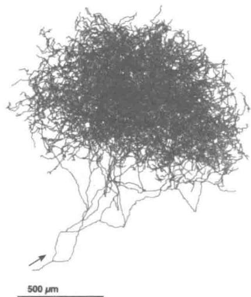

单个神经元的轴突生成多巴胺作为神经递质。这些轴突通过突触和脑中目标区域的大量神经元树突进行信息传递。

引自：The Journal of Neuroscience, Matsuda, Furuta, Nakamura, Hioki, Fujiyama, Arai, and Kaneko, volume 29, 2009, page 451.

都能在比普通轴突多 $100 \sim 1000$ 倍的突触位点上释放多巴胺。右图显示了单个多巴胺神经元的轴突，其细胞体位于老鼠大脑的SNpc中。每个SNpc或VTA多巴胺神经元的轴突在靶向大脑区域中的神经元树突上产生大约500000个突触。

如果多巴胺神经元像强化学习 $\delta$ 那样广播强化信号，那么由于这是一个标量信号，即单个数字，所以在SNpc和VTA中的所有多巴胺神经元会被预期以相同的方式激活，并以近似同步的方式发送相同的信号到所有轴突的目标位点。尽管人们普遍认为多巴胺神经元确实能够像这样一起行动，但最新证据指出，多巴胺神经元的不同亚群对输入的响应取决于它们向其发送信号的目标位点的结构，以及信号对目标位点结构的不同作用方式。多巴胺具有传导RPE以外的功能。而且即使是传导RPE信号的多巴胺神经元，多巴胺也会将不同的RPE发送到不同的结构去，这个发送过程是根据这些结构在产生强化行为中所起的作用来进行的。这超出了我们讨论的范围，但无论如何，矢量值RPE信号从强化学习的角度看是有意义的，尤其是当决策可以被分解成单独的子决策时，或者更一般地说，处理结构化的功劳分配问题时就更是如此。所谓结构化功劳分配问题是指：如何为众多影响决策的结构成分分配成功的功劳收益（或失败的惩罚）？我们会在15.10节中详细讨论这一点。

大多数多巴胺神经元的轴突与额叶皮层和基底神经节中的神经元发生突触接触，涉及自主运动、决策、学习和认知功能的大脑区域。由于大多数关于多巴胺强化学习的想法都集中在基底神经节，而多巴胺神经元的连接在那里特别密集，所以我们主要关注基底神经节。基底神经节是很多神经元组（又称“神经核”）的集合，位置在前脑的基底。基底节的主要输入结构称为纹状体。基本上所有的大脑皮层以及其他结构，都为纹状体提供输入。皮层神经元的活动传导关于感官输入、内部状态和运动活动的大量信息。皮层神经元的轴突在纹状体的主要输入/输出神经元的树突上产生突触接触，称为中棘神经元。纹状体的输出通过其他基底神经核和丘脑回到皮质的前部区域和运动区域，使得纹状体可能影响运动、抽象决策过程和收益处理。纹状体的两个主要分叉对于强化学习来说十分重要：背侧纹状体，主要影响动作选择；和腹侧纹状体，在收益处理的不同方面起关键作用，包括为各类知觉分配有效价值。

中棘神经元的树突上覆盖着“棘”，该皮质神经元的尖端轴突有突触之间信息传递的功能。这些棘也会参与突触之间的信息传递——在这种情况下连接的是脊柱茎，其是多巴胺神经元的轴突（图15.1）。这样就将皮层神经元的突触前活动、中棘神经元的突触后活动和多巴胺神经元的输入汇集在一起。实际上这些发生在脊柱茎上的过程很复杂，还没有被完全弄清楚。图15.1通过显示两种类型的多巴胺受体——谷氨酸受体（谷氨酸受

体的神经递质)，以及各种信号相互作用的方式说明了这种活动的复杂性。但有证据表明，神经科学家称之为皮质纹状体突触的从皮层到纹状体突触相关性的变化，取决于恰当时机的多巴胺信号。

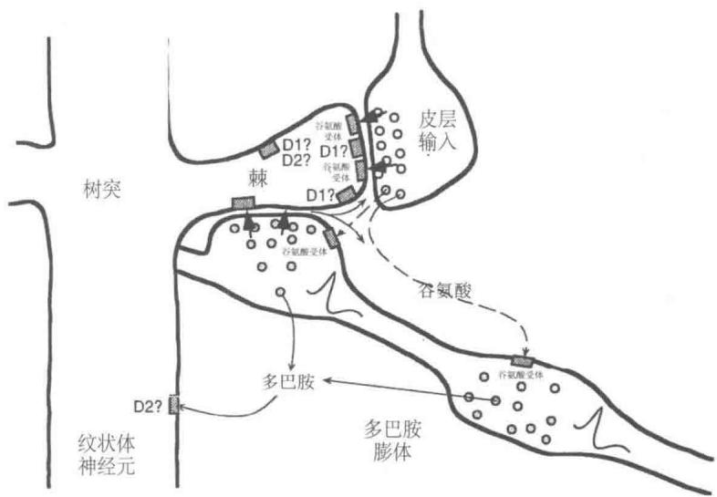  
图15.1 纹状神经元的脊柱茎的输入来自于皮层神经元和多巴胺神经元。皮层神经元轴突通过纹状体突触影响纹状神经元，神经递质谷氨酸在棘端覆盖纹状神经元树突。一个VTA或 $\mathrm{SN}_{\mathrm{pc}}$ 多巴胺神经元的轴突在脊柱茎旁边（图的右下方）。轴突上的“多巴胺膨体”在脊柱茎或附近释放多巴胺，在将皮层突触前输入、纹状体神经元突触后活动和多巴胺结合起来的组织方式中，这使得可能有几种类型的学习规则共同支配皮质纹状突触的可塑性。多巴胺神经元的每个轴突与大约500000个脊柱茎的突触发生信息传递。其他神经递质传递途径和多种受体类型不在我们讨论范围，如D1和D2多巴胺受体，多巴胺可以在脊柱和其他突触后位点产生不同的效应。引自：Journal of Neurophysiology, W. Schultz, vol. 80, 1998, page 10.

# 15.5 收益预测误差假说的实验支持

多巴胺神经元以激烈、新颖或意想不到的视觉、听觉刺激来触发眼部和身体的运动，但它们的活动很少与运动本身有关。这非常令人惊讶，因为多巴胺神经元的功能衰退是帕金森病的一个原因，其症状包括运动障碍，尤其是自发运动中的缺陷。Romo和Schultz（1990）以及Schultz和Romo（1990）通过记录猴子移动手臂时多巴胺神经元和肌肉的活动开始向收益预测误差假说迈出第一步。

他们训练了两只猴子，当猴子看见并听到门打开的时候，会把手从静止的地方移动到一个装有苹果、饼干或葡萄干的箱子里。然后猴子可以抓住食物并吃到嘴里。当猴子学

会这么做之后，它又接受另外两项任务的训练。第一项任务的目的是看当运动是自发时多巴胺神经元的作用。箱子是敞开的，但上面被覆盖着，猴子不能看到箱子里面的东西，但可以从下面伸手进去。预先没有设置触发刺激，当猴子够到并吃完食物后，实验者通常（虽然并非总是）在猴子没看见的时候悄悄将箱中的食物粘到一根坚硬的电线上。在这里，Romo和Schultz观察到的多巴胺神经元活动与猴子的运动无关，但是当猴子首先接触到食物时，这些神经元中的大部分会产生相位反应。当猴子碰到电线或碰到没有食物的箱子时这些神经元没有响应。这是表明神经元只对食物，而非任务中的其他方面有反应的很好的证据。

Romo 和 Schultz 第二个任务的目的是看看当运动被刺激触发时会发生什么。这个任务使用了另外一个有可移动盖子的箱子。箱子打开的画面和声音会触发朝向箱子的移动。在这种情况下，Romo 和 Schultz 发现，经过一段时间的训练后，多巴胺神经元不再响应食物的触摸，而是响应食物箱开盖的画面和声音。这些神经元的相位反应已经从收益本身转变为预测收益可用性的刺激。在后续研究中，Romo 和 Schultz 发现，他们所监测的大多数多巴胺神经元对行为任务背景之外的箱子打开的视觉和声音没有反应。这些观察结果表明，多巴胺神经元既不响应于运动的开始，也不响应于刺激的感觉特性，而是表示收益的期望。

Schultz 的小组进行了许多涉及 SNpc 和 VTA 多巴胺神经元的其他研究。一系列特定的实验表明，多巴胺神经元的相位反应对应于 TD 误差，而不是像 Rescorla-Wagner 模型 (式 (14.3)) 那样的简单误差。在第一个实验中 (Ljungberg、Apicella 和 Schultz, 1992)，训练猴子们在打开光照（作为“触发线索”）之后按压杠杆来获得一滴苹果汁。正如 Romo 和 Schultz 早些时候所观察到的，许多多巴胺神经元最初都对收益——果汁滴下来——有所回应 (图 15.2，上图)。但是许多神经元在训练继续下去后失去了收益反应，而是转而对预测收益的光照有所反应 (图 15.2，中图)。在持续的训练中，随着响应触发线索的多巴胺神经元变少，按压杠杆变得更快。

在这项研究之后，同样的猴子接受了新的任务训练（Schultz、Apicella和Ljungberg，1993）。这次猴子面临两个杠杆，每个杠杆上面都有一盏灯。点亮其中一个灯是一个“指示线索”，指示两个手柄中的哪一个会产生一滴苹果汁。在这个任务中，指示线索先于触发提示产生，提前产生的间隔固定为1秒。猴子要学着在看到触发线索之前保持不动，多巴胺神经元活动增加，但是现在监测到多巴胺神经元的反应几乎全部发生在较早的指示线索上，而不是触发线索（图15.2，下图）。在这个任务被充分学习时，再次响应指示线索的多巴胺神经元数量也大大减少了。在学习这些任务的过程中，多巴胺神经元活动从最初的

  
图15.2多巴胺神经元的反应从最初的反应到初级收益再到早期的预测刺激的转变。图中展示的是在细微时间间隔内被监测的多巴胺神经元产生的动作电位（这些数据是 $23\sim 44$ 个神经元产生的)。顶部图：多巴胺神经元被无规律产生的苹果汁激活。中间图：随着学习，多巴胺神经元对收益预测触发线索产生反应，对收益传递失去反应。底部图：通过在触发脉冲之前增加1s的指示线索，多巴胺神经元将它们的响应从触发线索转移到较早的指示线索。引自：Schultz et al.(1995)，MIT Press.

响应收益转变为响应较早的预测性刺激，首先响应触发刺激，然后响应更早的指示线索。随着响应时间的提前，它在后面的刺激中消失。这种对后来的预测因子失去反应，而转移到对早期收益预测有所反应，是时序差分学习的一个标志（见图14.2）。

刚刚描述的任务也揭示了时序差分学习与多巴胺神经元活动共同具有的另一个属性。猴子有时会按下错误的按键，即指示按键以外的按键，因此没有收到任何收益。在这些试验中，许多多巴胺神经元在收益正常给出后不久就显示其基线放电速率急剧下降，这种情况发生时没有任何外部线索来标记通常的收益传送时间（图15.3）。不知何故猴子在内部也能追踪收益传送的时间（响应时间是最简单的时序差分学习版本需要修改的一个地方，以解释多巴胺神经元反应时间的一些细节，我们在下一节会考虑这个问题）。

上述研究的观察结果使Schultz和他的小组得出结论：多巴胺神经元对不可预测的收益，最早的收益预测因子做出反应，如果没有发现收益或者收益的预测因子，那么多巴胺神经元活性会在期望时间内降低到基线以下。熟悉强化学习的研究人员很快就认识到，这些结果与时序差分算法中时序差分强化信号的表现非常相似。下一节通过一个具体的例子来详细探讨这种相似性。

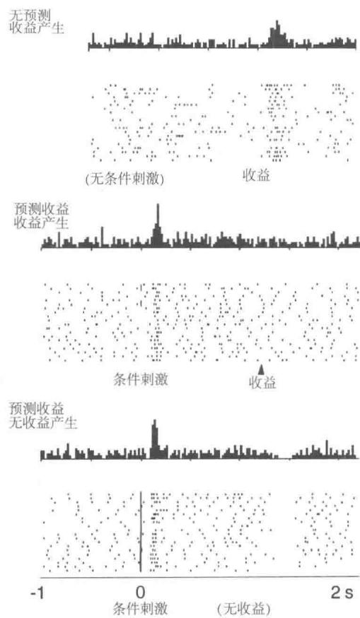  
图15.3多巴胺神经元的反应在预期收益衰退发生后不久就低于基线。顶部图：多巴胺神经元被无规律产生的苹果汁激活。中间图：多巴胺神经元对预测收益的条件刺激(CS)做出反应，并不对收益本身做出反应。底部图：当预测收益的条件刺激停止产生时，多巴胺神经元的活动会在期望的收益产生后的短时间内低于基线值。这些图的上部分显示的是所监测的多巴胺神经元在所指示的细微时间间隔内产生的动作电位的平均数目。这些图的下部分的光栅图显示了监测的单个多巴胺神经元的活动模式，每个点代表动作电位。引自：Schultz, Dayan, and Montague, A Neural Substrate of Prediction and Reward, Science, vol. 275, issue 5306, pages 1593-1598, March 14, 1997. Reprinted with permission from AAAS.

# 15.6 TD误差/多巴胺对应

这一节解释TD误差 $\delta$ 与实验中观察到的多巴胺神经元的相位反应之间的联系。我们观察 $\delta$ 在学习的过程中如何变化，如上文中提到的任务一样，一只猴子首先看到指令提示，然后在一个固定的时间之后必须正确地响应一个触发提示以获得收益。我们采用一种这个任务的简化理想版本，但是我们会更深入地研究细节，因为我们想要强调TD误

差与多巴胺神经元活动对应关系的理论基础

第一个最基本的简化假设是智能体已经学习了获得收益的动作。接下来它的任务就是根据它经历的状态序列学习对于未来收益的准确预测。这就是一个预测任务了，或者从更技术化的角度描述，是一个策略评估任务：针对一个固定的策略学习价值函数（4.1节和6.1节）。要学习的价值函数对每一个状态分配一个值，这个值预测了如果智能体根据给定的策略选择动作则接下来状态的回报值，这个回报值是所有未来收益的（可能是带折扣的）总和。这对于猴子的情境来说是不实际的，因为猴子很可能在学习正确行动的同时学习到了这些预测（就像强化学习算法同时学习策略和价值函数，例如“行动器-评判器”算法），但是这个情境相比同时学习策略和价值函数更易于描述。

现在试想智能体的经验可以被分为多个试验，在每个试验中相同的状态序列重复出现，但在每个时刻的状态都不相同。进一步设想，被预测的收益仅限于一次试验，这使我们的每次试验类似于强化学习的一幕，正如我们之前所定义的。在现实中，被预测的回报值不仅限于单个试验，且两个试验之间的时间间隔是决定动物学习到什么的重要影响因素。这对于时序差分学习来说同样是真实的，但是在这里我们假设回报值不会随着多个试验逐渐积累。在这种情况下，如Schultz和他的同事们做的，一次实验中的一个试验等价于强化学习的一幕（尽管在这个讨论中，我们用术语“试验”而不是“幕”来更好地与实验相联系）。

通常，我们同样需要对状态怎样被表示为学习算法的输入做出假设，这是一个影响TD误差与多巴胺神经元的活动联系有多紧密的假设。我们稍后讨论这个问题，但是我们现在假设与Montague相同的CSC表示，在实验中的每一个时刻，访问过的每一个状态都有一个单独的内部刺激。这使得整个过程被简化到本书第I部分讨论的表格型的情况。最终，我们假设智能体使用 $\mathrm{TD}(0)$ 来学习一个价值函数 $V$ ，将其存储在一个所有状态初始值为零的查询表中。我们同样假设这是一个确定的任务且折扣因子 $\gamma$ 非常接近于1，以至于我们可以忽略它。

图15.4展示了在这个策略评估任务中几个学习阶段中的 $R$ 、 $V$ 和 $\delta$ 的时间过程。时间轴表示在一个试验中一系列状态被访问的时间区间（为了表达清楚，我们没有展示单独状态）。除了在智能体到达收益状态外收益信号在整个试验中始终为零，如图中时间线右末端所示，收益信号成为一个正数，如 $R^{*}$ 。时序差分学习的目标是预测在试验中访问过的每一个状态的回报值，在没有折扣的情况下并且假设预测值被限制为针对单独试验，对于每个状态就是 $R^{*}$ 。

在得到真实收益的每个状态之前是一系列的收益预测状态，最早收益预测状态被

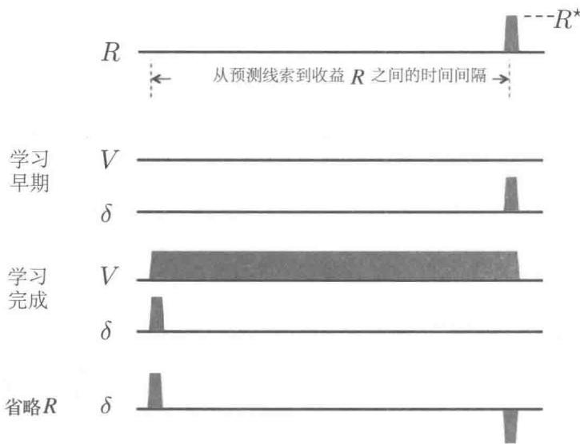  
图15.4时序差分学习中的TD误差 $\delta$ 的表现与多巴胺神经元相位活动特征完全一致。(这里的TD误差 $\delta$ 指的是 $t$ 时刻的误差： $\delta_{t - 1}$ )。一个状态序列，通常情况下表示预测线索到收益之间的间隔，后面是非零收益 $R^{*}$ 学习早期：初始化价值函数 $V$ 和 $\delta$ ，一开始初始化为 $R^{*}$ 。学习完成：价值函数精确地预测未来收益，在早期的预测状态， $\delta$ 是正值，在非零收益时 $\delta = 0$ 。省略 $R$ ：当省略预测收益时， $\delta$ 是负值。文中有这一现象的完整解释

展示在时间线的最左端。这个状态就像是接近试验开始时的状态，例如在上文中描述的Schultz的猴子实验中的指令线索状态。这是在试验中可以用来可靠预测试验收益的首个状态（当然，在现实中，在先前试验中访问过的状态可能是更早的收益预测状态，但是我们限制预测针地单独的试验，它们不能作为这个试验的收益的预测。在下面我们给出一个更加令人满意的，尽管更抽象的，对于最早收益预测状态的描述）。一个试验中的最近收益预测状态是指试验中收益状态的前一个状态。这个状态被表示为图15.4中时间线上最右端的状态。注意一个试验的收益状态不能预测该试验的回报值：这个状态的值将被用来预测接下来所有试验的累积回报值，在当前分幕式的框架里我们假设这个回报值是零。

图15.4展示了 $V$ 和 $\delta$ 的首次试验的时间过程，在图中被标记为“学习早期”。因为除了到达收益状态时的收益以外，试验中的所有信号都是零，且所有 $V$ 值都是零，TD误差在它在收益状态变为 $R^{*}$ 前都是零。这个结果是由于 $\delta_{t - 1} = R_t + V_t - V_{t - 1} = R_t + 0 - 0 = R_t$ 这个值在获得收益变为 $R^{*}$ 前都是零。在这里 $V_{t}$ 和 $V_{t - 1}$ 是在试验中时刻 $t$ 和 $t - 1$ 访问状态的预测价值。在这个学习阶段中的TD误差与多巴胺神经元对一个不可预知的收益的响应类似，例如在训练起始时的一滴苹果汁。

在首个试验和所有接下来的试验中，TD(0)更新发生在第6章中描述的每次状态转移中。这样会随着收益状态的价值更新的反向传递，不断地增加收益预测状态的价值，直到收敛到正确的回报预测。在这种情况下（假设没有折扣），正确的预测值对于所有收益预测状态都等于 $R^{*}$ 。这可以在图15.4看出，在 $V$ 的标有“学习完成”的图中，从最早到最晚的收益预测状态的价值都等于 $R^{*}$ 。在最早收益预测状态前的状态的价值都很小（在图15.4中显示为0)，因为它们不是收益的可靠预测者。

当学习完成时，也即当 $V$ 达到正确的值时，因为预测现在是准确的，所以从任意收益预测状态出发的转移所关联的TD误差都是零，这是因为对一个从收益预测状态到另一个收益预测状态的转移来说，我们有 $\delta_{t - 1} = R_t + V_t - V_{t - 1} = 0 + R^* -R^* = 0$ 。且对于最新的收益预测状态到收益状态来说，我们有 $\delta_{t - 1} = R_t + V_t - V_{t - 1} = R^* +0 - R^* = 0$ 。在另一方面，从任意状态到最早收益预测状态转移的TD误差都是正的，这是由这个状态的低值与接下来收益预测状态的高值的不匹配造成的。实际上，如果在最早收益预测状态前的状态价值为零，则在转移到最早收益预测状态后，我们有 $\delta_{t - 1} = R_t + V_t - V_{t - 1} = 0 + R^* -0 = R^*$ 图15.4中的 $\delta$ 的“学习完成”图在最早收益预测状态为正值，在其他地方为零。

转移到最早收益预测状态时的正的TD误差类似于多巴胺对最早刺激的持续性反应，用以预测收益。同样道理，当学习完成时，从最新的收益预测状态到收益状态的转移产生一个值为零的TD误差，因为最新收益预测状态的值是正确的，抵销了收益。这与相比一个不可预测的收益，对一个完全可预测的收益，更少的多巴胺神经元产生相位响应的观察是相符的。

在学习后，如果收益突然被取消了，那么TD误差在收益的通常时间都是负的，因为最新收益预测状态的值太大了： $\delta_{t-1} = R_t + V_t - V_{t-1} = 0 + 0 - R^* = -R^*$ ，正如图15.4中所示的标有“省略 $R$ ”的 $\delta$ 图所示。这就像在Schultz et al. (1993)实验和图15.3中的多巴胺神经元行为，其在一个预测的收益被取消时会降低到基线以下。

需要更多地注意最早收益预测状态的概念。在上文所提到的情境中，由于整个实验经历是被分为多次试验的，且我们假设预测被限制于单次试验，则最早收益预测状态总是试验中的第一个状态。明显这不符合真实情况。一种考虑最早收益预测状态的更一般的方式是，认为它是一个不可预知的收益预估器，且可能有非常多这样的状态。在动物的生活中，很多不同的状态都在最早收益预测状态之前。然而，由于这些状态通常跟随着不能预测收益的其他状态，因此它们的收益的预测力，也就是说，它们的值，很低。一个TD算法，如果在动物的一生中始终运行，也会更新这些状态的价值，但是这些更新并不会一直累积，因为根据假设，这些状态中没有一个能保证出现在最早收益预测状态之前。如果它

们中的任意一个能够保证，它们也会是收益预测状态。这也许解释了为什么经过过度训练，在试验中多巴胺的反应甚至降低到了最早的收益预测刺激水平。经过过度训练，可以预料，就算是以前不能预测的状态都会被某些与更早的状态联系起来的刺激预测出来：在实验任务的内部和外部，动物与环境的相互作用将变成平常的、完全可预测的事情。但是，当我们通过引入新的任务来打破这个常规时，我们会观察到TD误差重新出现了，正如在多巴胺神经元活动中观察到的那样。

上面描述的例子解释了为什么当动物学习与我们例子中的理想化的任务类似的任务时，TD 误差与多巴胺神经元的相位活动有着共同的关键特征。但是并非多巴胺神经元的相位活动的所有性质都能与 $\delta$ 的性质完美对应起来。最令人不安的一个差异是，当收益比预期提前发生时会发生什么。我们观察到一个预期收益的省略会在收益预期的时间产生一个负的预测误差，这与多巴胺神经元降至基线以下相对应。如果收益在预期之后到达，它就是非预期收益并产生一个正的预测误差。这在 TD 误差和多巴胺神经元反应中同时发生。但是如果收益提前于预期发生，则多巴胺神经元与 TD 误差的反应不同——至少在 Montague et al. (1996) 使用的 CSC 表示与我们的例子中不同。多巴胺神经元会对提前的收益进行反应，反应与正的 TD 误差一致，因为收益没有被预测会在那时发生。然而，在后面预期收益出现却没有出现的时刻，TD 误差将为负，但多巴胺神经元的反应却并没有像负的 TD 误差的那样降到基线以下（Hollerman 和 Schultz，1998）。在动物的大脑中发生了相比于简单的用 CSC 表示的 TD 学习更加复杂的事情。

一些TD误差与多巴胺神经元行为的不匹配可以通过选择对时序差分算法合适的参数并利用除CSC表示外的其他刺激表示来解决。例如，为了解决刚才提到的提前收益不匹配的问题，Suri和Schultz(1999)提出了一种CSC的表示，在这种表示中由较早刺激产生的内部信号序列被出现的收益取消。另一个由Daw、Courville和Touretzky(2006)提出的解决方法是大脑的TD系统使用在感觉皮层进行的统计建模所产生的表示，而不是基于原始感官输入的简单表示。Ludvig、Sutton和Kehoe(2008)发现采用微刺激表示的TD学习比CSC表示更能在收益早期和其他情形下模拟多巴胺神经元的行为（见图14.1)。Pan、Schmidt、Wickens和Hyland(2005)发现即使使用CSC表示，延迟的资格迹可以改善TD误差与多巴胺神经元活动的某些方面的匹配情况。一般来说，TD误差的许多行为细节取决于资格迹、折扣和刺激表示之间微妙的相互作用。这些发现在不否定多巴胺神经元的相位行为被TD误差信号很好地表征的核心结论下细化了收益预测误差假说。

在另一方面，在TD理论和实验数据之间有一些不能通过选择参数和刺激表示轻易

解决的差异（我们将在章末参考文献和历史评注的部分介绍某些差异），随着神经科学家进行更多细化的实验，更多的差异会被发现。但是收益预测误差假说作为提升我们对于大脑收益系统理解的催化剂已经表现得非常有效。人们设计了复杂的实验来证明或否定通过假设获得的预测，实验的结果也反过来优化并细化了TD误差/多巴胺假设。

一个明显的发展方向是，与多巴胺系统的性质如此契合的强化学习算法和理论完全是从一个计算的视角开发的，没有考虑到任何多巴胺神经元的相关信息——注意，TD学习和它与最优化控制及动态规划的联系是在任何揭示类似TD的多巴胺神经元行为本质的实验进行前很多年提出的。这些意外的对应关系，尽管还并不完美，却也说明了TD误差和多巴胺的相似之处抓住了大脑收益过程的某些关键环节。

除了解释了多巴胺神经元相位行为的很多特征外，收益预测误差假说将神经科学与强化学习的其他方面联系起来，特别地，与采用TD误差作为强化信号的学习算法联系起来。神经科学仍然距离完全理解神经回路、分子机制和多巴胺神经元的相位活动的功能十分遥远，但是支持收益预测误差假说的证据和支持多巴胺相位反应是用于学习强化信号的证据，暗示了大脑可能实施类似的“行动器-评判器”算法，在其中TD误差起着至关重要的作用。其他的强化学习算法也是可行的候选，但是“行动器-评判器”算法特别符合哺乳动物的大脑解剖学和生理学，我们在下面两节中进行阐述。

# 15.7 神经“行动器-评判器”

“行动器-评判器”算法同时对策略和价值函数进行学习。行动器是算法中用于学习策略的组件，评判器是算法中用于学习对行动器的动作选择进行“评价”的组件，这个“评价”是基于行动器所遵循的策略来进行的，无论这个策略是什么。评判器采用TD算法来学习行动器当前策略的状态价值函数。价值函数允许评判器通过向行动器发送TD误差 $\delta$ 来评价一个行动器的动作。一个正的 $\delta$ 意味着这个动作是好的，因为它导向了一个好于预期价值的状态；一个负的 $\delta$ 意味着这个动作是坏的，因为它导向了一个差于预期价值的状态。根据这些评价，行动器会持续更新其策略。

“行动器-评判器”算法有两个鲜明特征让我们认为大脑也许采用了类似的算法。第一个是，“行动器-评判器”算法的两个部分（行动器和评判器）代表了纹状体的两部分（背侧和腹侧区）(15.4节)。对于基于收益的学习来说，这两部分都非常重要——也许分别起着行动器和评判器的作用。暗示大脑的实现是基于“行动器-评判器”算法的第二个特征是，TD误差有着同时作为行动器和评判器的强化信号的双重作用。这与神经回路的一

些性质是吻合的：多巴胺神经元的轴突同时以纹状体背侧和腹侧区为目标；多巴胺对于调节两个结构的可塑性都非常重要；且像多巴胺一样的神经调节器如何作用在目标结构上取决于目标结构的特征而不仅取决于调节器的特征。

13.5节展示了作为策略梯度方法的“行动器-评判器”算法，但是Barto、Sutton和Anderson（1983）的“行动器-评判器”算法更加简单并且是用人工神经网络来表达的。在这里，我们描述一种类似于Barto等人的人工神经网络的实现，且我们基于Takahashi、Schoenbaum和Niv（2008）的工作，给出一个这样的人工神经网络如何通过真正的大脑神经网络实现的原理方案。我们把对“行动器-评判器”学习规则的讨论推后到15.8节，在这一节我们会将它们作为策略梯度公式的特殊情况，来讨论它们所暗示的多巴胺调节突触可塑性的原理。

图15.5a展示了“行动器-评判器”算法的人工神经网络实现，神经网络的不同部分分别实现了评判器和行动器。评判器由一个单独的神经单元 $V$ （它的输出代表了状态价值）和如图所示的菱形的TD计算组件组成，这个组件通过 $V$ 的输出、收益信号和过去的状态价值来计算TD误差（正如从TD菱形框出来的自环一样）。行动器网络由一层 $k$ 个行动器单元组成，标记为 $A_{i}, i = 1,\dots,k$ ，每个行动器单元的输出是一个 $k$ 维的动作向量。另一种替代性选择是有 $k$ 个分开的动作，每一个指挥一个单独的单元，每一个都为了被执行而与其他的进行竞争。但是在这里，我们把整个 $A$ 向量视为一个动作。

评判器和行动器网络都可以接收多个特征，它们表示了智能体所在的环境的状态（回顾第1章，在这一章中提到的强化学习智能体的“环境”包括了很多组成部分，有的在容纳智能体的整体系统的外部，有的在这些系统的内部）。图中将这些特征表示为标有 $x_{1}, x_{2}, \ldots, x_{n}$ 的圈，为了使图更加简单，我们重复了两次。从每个特征 $x_{i}$ 到评判器单元 $V$ 的连接，以及它们到每个动作单元 $A_{i}$ 的连接都有一个对应的权重参数，表示突触的效能。在评判器网络中的权重参数化了价值函数，在行动器网络中的权重参数化了策略。网络根据我们下一章中描述的“行动器-评判器”学习规则来改变权重进行学习。

在评判器神经回路产生的TD误差是改变的评判器和行动器网络权值的增强信号。这在图15.5a中用标有“TD误差 $\delta$ ”的线表示，它穿过了所有评判器和行动器网络的连接。将这种网络实现的方式与收益预测误差假说以及多巴胺神经元广泛分布的事实（通过大量的神经元的轴突树)联系在一起考虑，我们认为将这样的“行动器-评判器”网络作为基于收益的学习在大脑中发生机制的假设是比较合理的。

图15.5b揭示了在图左侧的人工神经网络根据Takahashi et al.(2008)的假设如何与大脑中的结构对应。这个假设分别把行动器和评判器的价值学习部分对应到了纹状体的背

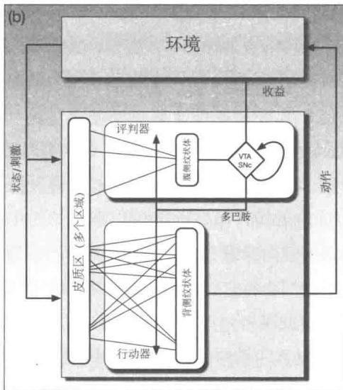  
图15.5“行动器-评判器”算法的人工神经网络实现和模拟神经实现。a）将“行动器-评判器”算法用人工神经网络来表示。行动器会根据从评判器获取的TD误差来更新策略，同时评判器也用相同的 $\delta$ 来调整状态价值函数的参数。评判器通过收益信号 $R$ 和估计的状态价值来求得TD误差。行动器不会直接得到收益信号，评判器也不会直接得到动作。b）“行动器-评判器”算法的模拟神经实现。行动器和评判器的状态价值学习部分分别位于纹状体的腹侧和背侧。TD误差由位于VTA和 $\mathrm{SN}_{\mathrm{pc}}$ 的多巴胺神经元传递，以调节从皮质区到腹侧和背侧纹状体的突触效应的变化。引自：Frontiers in Neuroscience, vol. 2(1), 2008, Y. Takahashi, G. Schoenbaum, and Y. Niv, Silencing the critics: Understanding the effects of cocaine sensitization on dorsolateral and ventral striatum in the context of an Actor/Critic model.

侧和腹侧区基底神经节的输入结构。回顾15.4节中的介绍：背侧纹状体主要与动作的选择关系密切，腹侧纹状体被认为对收益处理的不同方面极为关键，包括对感觉的情感值的分配。大脑皮层以及其他结构将输入送到纹状体传达关于刺激、内部状态和神经活动的信息。

在这个假想的“行动器-评判器”大脑实现中，腹侧纹状体发送信息到VTA和SNpc，在这些核中，多巴胺神经元结合收益信息生成TD误差相应的活动（尽管仍然不能解释多巴胺神经元如何计算这些误差）。在图15.5a中的“TD误差 $\delta$ ”线在图15.5b中变为“多巴胺”线，它代表了细胞体在VTA和SNpc中的多巴胺神经元的广泛分叉。回顾图15.1，这些轴突与中棘神经元的树突棘突触接触在一起，它们是两个纹状体背侧和腹侧部位的主要输入/输出神经元。发送输入到纹状体的大脑皮层神经元的轴突在这些刺尖使突触接触在一起。根据这些假设，正是在这些刺尖处，突触从皮质区域到纹状体的功效的变化受到学习规则的支配，这些规则严格依赖于多巴胺提供的强化信号。

在图15.5b中展示的假设的一个重要的含义是：多巴胺信号不是像强化学习量 $R_{t}$ 这样的主要收益信号。事实上，这个假设暗示了人们并不一定能探测大脑并从任何单个神经元的活动中找出类似 $R_{t}$ 的信号。收益相关的信息是由许多相互联系的神经系统产生的，并根据不同的收益采用不同的结构。多巴胺神经元从许多不同的大脑区域收集信息，所以对 $\mathrm{SN}_{\mathrm{pc}}$ 和VTA的输入（在图15.5b中标为“收益”）应该被认为是从多个输入通道一起到达核中的神经元的收益相关信息的向量。理论上的收益标量信号值 $R_{t}$ 应该与对多巴胺神经活动有关的所有收益相关信息的贡献相联系。这是横跨不同大脑区域的许多神经元的综合活动模式的结果。

尽管在图15.5b中展示的“行动器-评判器”神经实现在某些问题下可能是正确的，但它明显需要提炼、扩展、修改，才有资格作为一个完整的多巴胺神经元相位活动的功能模型。在本章末的参考文献和历史评注部分引用了更详细的支持这一假说和反对这一假说的实证。我们现在具体来看看行动器和评判器的学习算法是如何揭示控制突触功能变化的规则的。

# 15.8 行动器与评判器学习规则

如果大脑真的实现了类似于“行动器-评判器”的算法，并且如同图15.5b（如前所述，这可能是一个过于简单化的假设）一样假设大量的多巴胺神经元广播一个共同的强化信号到背侧和腹侧纹状体的皮质突触处，那么这个强化信号对于这两种结构的突触的影响是不同的。行动器和评判器的学习规则使用的是同样的强化信号，即TD误差 $\delta$ ，但是这两个部分对学习的影响是不同的。TD误差（与资格迹结合）告诉行动器如何更新动作的概率以到达具有更高价值的状态。行动器的学习有些类似于采用效应定律的工具性条件反射(1.7节)，行动器的目标是使得 $\delta$ 尽可能为正。另一方面，TD误差（当与资格迹结合时）告诉评判器价值函数参数改变的方向与幅度以提高其预测准确性。评判器致力于减小 $\delta$ 的幅度，采用类似于经典条件反射(14.2节)中的TD模型的学习规则使幅度尽量接近于零。行动器和评判器学习规则之间的区别相对简单，但是这个区别对于“行动器-评判器”算法本质上如何起作用有着显著的影响。区别仅仅在于每种学习规则使用的资格迹的类型。

如图15.5b所示，多于一类以上的学习规则可以被用来训练“行动器-评判器”网络。但具体来说，在这里我们集中讨论13.6节中针对持续性问题的带资格迹的“行动器-评判器”算法。在每个从状态 $S_{t}$ 到状态 $S_{t + 1}$ 的转移过程中，智能体选取动作 $A_{t}$ ，并且得到收益值 $R_{t + 1}$ ，算法会计算TD误差，然后更新资格迹向量 $(\mathbf{z}_t^{\mathrm{w}}$ 和 $\mathbf{z}_t^\theta$ )和评判器与行动器

的参数 $(\mathbf{w}$ 和 $\theta$ )，更新方式如下

$$
\begin{array}{l} \delta_ {t} = R _ {t + 1} + \gamma \hat {v} (S _ {t + 1}, \mathbf {w}) - \hat {v} (S _ {t}, \mathbf {w}), \\ \mathbf {z} _ {t} ^ {\mathbf {w}} = \lambda^ {\mathbf {w}} \mathbf {z} _ {t - 1} ^ {\mathbf {w}} + \nabla \hat {v} (S _ {t}, \mathbf {w}), \\ \mathbf {z} _ {t} ^ {\theta} = \lambda^ {\theta} \mathbf {z} _ {t - 1} ^ {\theta} + \nabla \ln \pi \left(A _ {t} | S _ {t}, \theta\right), \\ \mathbf {w} \leftarrow \mathbf {w} + \alpha^ {\mathbf {w}} \delta_ {t} \mathbf {z} _ {t} ^ {\mathbf {w}}, \\ \theta \leftarrow \theta + \alpha^ {\theta} \delta z _ {t} ^ {\theta}, \\ \end{array}
$$

其中， $\gamma \in [0,1)$ 是折扣率， $\lambda^w c \in [0,1]$ 和 $\lambda^w a \in [0,1]$ 分别是评判器与行动器的自举参数。 $\alpha^{\mathbf{w}} > 0$ 和 $\alpha^\theta > 0$ 是步长参数。

可以把估计价值函数 $\hat{v}$ 看作一个线性神经元的输出，称为评判器单元，在图15.5a中被标记为 $V$ 。从而，价值函数就是表示状态 $s$ 的特征向量的线性函数， $\mathbf{x}(s) = (x_{1}(s),\ldots ,x_{n}(s))^{\top}$ 。价值函数被权重向量 $\mathbf{w} = (w_{1},\dots ,w_{n})^{\top}$ 参数化为

$$
\hat {v} (s, \mathbf {w}) = \mathbf {w} ^ {\top} \mathbf {x} (s). \tag {15.1}
$$

每个 $x_{i}(s)$ 就像神经元突触的突触前信号，其功效为 $w_{i}$ 。权重由上面公式的规则更新： $\alpha^{\mathrm{w}}\delta_{t}\mathbf{z}_{t}^{\mathrm{w}}$ ，这里强化信号 $\delta_t$ 对应于广播到所有评判器单元的多巴胺信号。资格迹向量 $\mathbf{z}_t^{\mathrm{w}}$ 对于评判器单元是 $\nabla \hat{v} (S_t,\mathbf{w})$ 的一个迹(最近几个值的平均)。由于 $\hat{v} (s,\mathbf{w})$ 对于权重是线性的，所以 $\nabla \hat{v} (S_t,\mathbf{w}) = \mathbf{x}(S_t)$

从神经方面来说，这意味着每一个突触有着自己的资格迹，而且是向量 $\mathbf{z}_t^{\mathrm{w}}$ 的一个分量。一个突触的资格迹根据到达突触的活动水平，即突触前活动的水平，不断地累积，在这里由到达突触的特征向量 $\mathbf{x}(S_t)$ 的分量所表示。此外这个资格迹由分数 $\lambda^{\mathrm{w}}$ 所支配的速率向零衰减。当一个突触的资格迹非零时，称其为可修改的。突触的功效如何被修改取决于突触可修改时到达的强化信号。我们称这些评判器单元的突触的资格迹为非偶发资格迹，这是因为它们仅仅依赖于突触前活动并且不以任何方式影响突触后活动。

评判器单元的突触的非偶发资格迹意味着评判器单元的学习规则本质上是14.2节中描述的经典条件反射的TD模型。使用我们在上文对评判器单元和它的学习规则的定义，图15.5a中的评判器与Barto et al.（1983）中的神经网络“行动器-评判器”算法中的评判器是相同的。显然，这样只有一个线性类神经单元的评判器只是一个最简单的起点，这样的评判器单元是一个更复杂的有能力学习更复杂价值函数的神经网络的一个代理。

图15.5a中的行动器是一个有 $k$ 个类神经行动器单元的单层网络，并且在时刻 $t$ 接收和评判器单元一样的特征向量 $\mathbf{x}(S_t)$ 。每一个行动器单元 $j$ ， $j = 1,\dots ,k$ ，有自己的权

重向量 $\theta_{j}$ ，但是由于所有的行动器单元都是相同的，所以我们只描述其中一个，并省略其下标。这些单元遵循上面的“行动器-评判器”算法的一种实现是：每一个单元均为伯努利逻辑单元。这意味着，每一个行动器单元的输出是一个取值为0或1的随机变量 $A_{t}$ 。把值1看作神经元的放电，即放出一个动作电位。一个单元的输入向量的加权和 $\theta^{\top}\mathbf{x}(S_{t})$ 通过柔性最大化分布(式13.2)决定了这个单元的动作被选择的概率，对于两个动作的情况即为逻辑回归函数

$$
\pi (1 | s, \boldsymbol {\theta}) = 1 - \pi (0 | s, \boldsymbol {\theta}) = \frac {1}{1 + \exp (- \boldsymbol {\theta} ^ {\top} \mathbf {x} (s))}. \tag {15.2}
$$

每一个行动器单元的权重通过上面的规则更新： $\theta \gets \theta + \alpha^{\theta} \delta_{t} \mathbf{z}_{t}^{\theta}$ ，这里 $\delta$ 依然对应多巴胺信号：送往所有行动器单位突触的相同的强化信号。图15.5a中展示了 $\delta_{t}$ 广播到了每一个行动器单位的突触（这使得整个行动器网络形成了一个强化学习智能体团队，我们将在15.10节中讨论这个问题）。行动器的资格迹向量 $\mathbf{z}_{t}^{\theta}$ 是 $\nabla \ln \pi(A_{t}|S_{t},\theta)$ 的资格迹。为了理解这个资格迹，请参看练习13.5，在该练习中定义了这种类型的单元并要求给出它的强化学习规则。练习要求你通过计算梯度，用 $a$ 、 $\mathbf{x}(s)$ 和 $\pi(a|s,\theta)$ 这些项表示 $\nabla \ln \pi(a|s,\theta)$ 。对于在时刻 $t$ 的动作和状态，答案是

$$
\nabla \ln \pi \left(A _ {t} \mid S _ {t}, \boldsymbol {\theta}\right) = \left(A _ {t} - \pi \left(1 \mid S _ {t}, \boldsymbol {\theta}\right)\right) \mathbf {x} \left(S _ {t}\right). \tag {15.3}
$$

与评判器突触只累积突触前活动 $\mathbf{x}(S_t)$ 的非偶发资格迹不同，行动器单元的资格迹还取决于行动器单元本身的活动，我们称其为偶发资格迹。资格迹在每一个突触都会持续衰减，但是会根据突触前活动以及突触后神经元是否放电增加或减少。式（15.3）中的因子 $A_{t} - \pi (1|S_{t},\pmb{\theta})$ 在 $A_{t} = 1$ 时为正，反之亦然。行动器单元资格迹的突触后偶发性是评判器与行动器学习规则唯一的区别。由于保持了在哪个状态采取了怎样的动作这样的信息，偶发资格迹允许收益产生的奖励（正 $\delta$ 或者接受的惩罚（负 $\delta$ )根据策略参数（对行动器单元突触的功效）进行分配，其依据是这些参数对之后的 $\delta$ 值的影响的贡献。偶发资格迹标记了这些突触应该如何修改才能更有效地导向正值的 $\delta$

评判器与行动器的学习规则是如何改变皮质突触的功效的呢？两个学习规则都与唐纳德·赫伯的经典推论相关，即当一个突触前信号参与了激活一个突触后神经元时，突触的功效应该增加（Hebb，1949）。评判器与行动器的学习规则与 Hebbian 的推论共同使用了这么一个观点，那就是突触的功效取决于几个因素的相互作用。在评判器学习规则中，这种相互作用是在强化信号 $\delta$ 与只依赖于突触前信号的资格迹之间的。神经科学家称其为双因素学习规则，这是因为相互作用在两个信号或量之间进行。另一方面，行动器学习规则是三因素学习规则，这是因为除了依赖于 $\delta$ ，其资格迹还同时依赖于突触前和突触后

活动。然而，与赫伯的推论不同的是，不同因素的相对发生时间对突触功效的改变是至关重要的，资格迹的介入允许强化信号影响最近活跃的突触。

评判器与行动器学习规则的信号之间的一些细微之处更加值得关注。在定义类神经评判器与行动器单元时，我们忽略了突触的输入需要少量的时间来影响真正的神经元的放电。当一个突触前神经元的动作电位到达突触时，神经递质分子被释放并跨越突触间隙到达突触后神经元，并与突触后神经元表面上的受体结合；这会激活使得突触后神经元放电的分子机制（或者在抑制突触输入情况下抑制其放电）。这个过程可能持续几十毫秒。但是，根据式(15.1)与式(15.2)，对评判器与行动器单元进行输入，会瞬间得到单元的输出。像这样忽略激活时间在Hebbian式可塑性的抽象模型中是很常见的，这种模型里突触的功效的改变由同时发生的突触前与突触后活动决定。更加真实的模型则必须要将激活时间考虑进去。

激活时间对于更真实的行动器单元更为重要，这是因为它会影响偶发资格迹如何将强化信号分配到适当的突触。表达式 $(A_{t} - \pi (1|S_{t},\theta))\mathbf{x}(S_{t})$ 定义了行动器单元的学习规则所对应的偶发资格迹，它包括了突触后因子 $(A_{t} - \pi (1|S_{t},\theta))$ 与突触前因子 $\mathbf{x}(S_t)$ 。这个能够起作用，是因为在忽略了激活时间的情况下，突触前活动 $\mathbf{x}(S_t)$ 参与了引起在 $(A_{t} - \pi (1|S_{t},\theta))$ 中出现的突触后活动。为了正确地分配强化信号，在资格迹中定义的突触前因子必须是同样定义在资格迹中的突触后因子的产生动因。更真实的行动器单元的偶发资格迹不得不将激活时间考虑进来（激活时间不应该与神经元获取其活动导致的强化信号所需的时间所混淆。资格迹的功能是跨越这个一般来说比激活时间更长的间隔，我们会在后面的章节进一步讨论这个问题）。

神经科学已经提示了这个过程可能是如何在大脑中起作用的。神经科学家发现了一种被称为尖峰时间依赖可塑性（STDP）的赫布式可塑性，这似乎有助于解释类行动器的突触可塑性在大脑中的存在。STDP是一种Hebbian式可塑性，但是其突触功效的变化依赖于突触前与突触后动作电位的相对时间。这种依赖可以采取不同的形式，但是最重要的研究发现，若尖峰通过突触到达且时间在突触后神经元放电不久之前，则突触的强度会增加。如果时间顺序颠倒，那么突触的强度会减弱。STDP是一种需要考虑神经元激活时间的Hebbian式可塑性，这是类行动器学习所需要的一点。

STDP 的发现引导神经科学家去研究一种可能的 STDP 的三因素形式，这里的神经调节输入必须遵循适当的突触前和突触后尖峰时间。这种形式的突触可塑性，被称为收益调制 STDP，其与行动器学习规则十分类似。常规的 STDP 产生的突触变化，只会发生在一个突触前尖峰紧接着突触后尖峰的时间窗口内神经调节输入的时候。越来越多的证

据证明，基于收益调制的STDP发生在背侧纹状体的中棘神经元的脊髓中，这表示行动器学习在如图15.5b中所示的“行动器-评判器”算法的假想神经实现中确实发生了。实验已经证明基于收益调制的STDP中，皮质纹状体突触的功效变化只在神经调节脉冲在突触前尖峰以及紧接着的突触后尖峰之间的 $10\mathrm{~s~}$ 的时间窗口内到达才会发生（Yagishita et al. 2014）。尽管证据都是间接的，但这些实验指出了偶发资格迹的存在延续了时间的进程。产生这些迹的分子机制以及可能属于STDP的迹都要短得多，而且尚未被理解，但是侧重于时间依赖性以及神经调节依赖性的突触可塑性的研究依然在继续。

我们这里讨论的使用效应定律学习规则的类神经行动器单元，在Barto et al. (1983)的“行动器-评判器”网络中以一种比较简单的形式出现。这个网络受到一种由生理学家A.H.Klopf(1972，1982)提出的“享乐主义神经元”假说的启发。注意，不是所有的Klopf的假说的细节都与我们已知的突触可塑性的知识一致，但是STDP的发现和越来越多的基于收益调制的STDP的证据说明Klopf的想法并不太离谱。我们接下来将讨论Klopf的享乐主义神经元假说。

# 15.9 享乐主义神经元

在享乐主义神经元假说中，Klopf（1972，1982）猜测，每一个独立的神经元会寻求将作为奖励的突触输入与作为惩罚的突触输入之间的差异最大化，这种最大化是通过调整它们的突触功效来实现的，调整过程基于它们自己的动作电位所产生的奖励或惩罚的结果。换言之，如同可以训练动物来完成工具性条件反射任务一样，单个神经元用基于条件性反应的强化信号来训练。他的假说包括这样的思想：奖励或者惩罚通过相同的突触被输入到神经元，并且会激发或者抑制神经元的尖峰产生活动（如果Klopf知道我们今天对神经调节系统的了解，他可能会将强化作用分配给神经调节输入，但是他尝试避免任何中心化的训练信息来源）。过去的突触前与突触后活动的突触局部迹在Klopf的假说中，是决定突触是否具备资格（就是他引入的“资格”一词）可以对之后的奖励或者惩罚进行修改的关键。他猜测，这些迹是由每个突触局部的分子机制实现的，因而与突触前与突触后神经元的电生理活动是不同的。在本章后面的参考文献和历史评注部分我们给出了一些其他人的类似的想法。

Klopf推断突触功效通过如下的方式变化：当一个神经元发射出一个动作电位时，它的所有促进这个动作电位的突触会变得有资格来经历其功效的变化。如果一个动作电位在奖励值提升的一个适当的时间内被触发，那么所有有资格的突触的功效都会提升。对应地，如果一个动作电位在惩罚值提升的一个适当时间内被触发，那么所有有资格的突触功

效都会下降。这是通过在突触那里触发资格迹来实现的，这种触发只在突触前与突触后的活动碰巧一致的时候才会发生（或者更确切地说，是在突触前活动和该突触前活动所参与引发的突触后活动同时出现的时候才会发生）。这实际上就是我们在前一节描述的行动器单元的三因素学习规则。

Klopf 理论中资格迹的形状与时间因素反映了神经元所处的许多反馈回路的持续时间，其中的一些完全位于机体的大脑和身体内，而另一些则通过运动与感知系统延伸到机体外部的环境中。他的想法是资格迹的形状是神经元所处的反馈回路的持续时间的直方图。资格迹的高峰会出现在神经元参与的最常见的反馈回路发生的持续时间内。本书中的算法使用的资格迹是 Klopf 原始想法的一个简化版本，通过由参数 $\lambda$ 和 $\gamma$ 控制的指数（或者说几何）下降的函数实现。这简化了仿真模拟与理论，但是我们认为这些简单的资格迹是 Klopf 原始的迹概念的一个代替，后者在完善功劳分配过程的复杂强化学习系统中可能拥有计算优势。

Klopf的享乐主义神经元假说并不像它最初出现时那样，似乎不合情理。大肠杆菌是一个已经被充分研究的单细胞的例子，它会寻求某些特定刺激但同时避免其他刺激。这个单细胞机体的移动动作会受到其环境的化学刺激的影响，这种行为被称为趋化性。它通过附着于表面的称为鞭毛的毛状结构的旋转在液体环境中游泳（是的，它旋转它们）。细菌环境中的分子会与其表面上的受体结合。结合事件调节细菌逆转鞭毛旋转的概率。每一次逆转会使得细菌进行翻滚并朝向一个随机的新方向。一点点的化学记忆与计算使得鞭毛逆转的频率在细菌游向高浓度的、它需要的分子（引诱剂）时会减少，在游向高浓度的、对它有害的分子（驱逐剂）时会增加。结果便是细菌趋向于游向引诱剂且排斥游向驱逐剂。

刚刚描述的趋化行为被称为调转运动。这是一种试错行为，尽管可能这并不涉及学习：细菌需要一点点短期记忆来检测分子浓度的梯度，但是很有可能是它并不保有长期记忆。人工智能先驱奥利弗·塞尔弗里奇称这个策略为“跑动与旋转”，指出其实用的基本的适应性策略：“如果事情变好则保持同样的方式，否则四处游走”(Selfridge，1978, 1984)。同样，可以想象一个神经元在其嵌入的反馈回路的复杂集合组成的媒介中“游泳”（当然不是字面意思），尝试获取一种输入信号并避免其他的。然而，与细菌不同，神经元的突触强度保持了之前试错行为的信息。如果这种对神经元（或是一类神经元）的看法是可信的，那么这个神经元与环境交互的整个闭环性质对于理解其行为是十分重要的，其中神经元的环境由其余的动物以及所交互的环境组成。

Klopf的享乐主义神经元假说超出了单个神经元是强化学习智能体的观点。他认为智能的许多方面可以被理解为是具有自私享乐主义的神经元群体的集体行为的结果，这些神

经元在构成动物神经系统的巨大的社会和经济系统中相互作用。无论这个观点对神经系统是否有用，强化学习智能体的集体行为对神经科学是有影响的。接下来我们讨论这个问题。

# 15.10 集体强化学习

强化学习智能体群体的行为与社会以及经济系统的研究高度相关。如果Klopf的享乐主义神经元假设是正确的，则其与神经科学也是相关的。上文描述的人类大脑实现“行动器-评判器”算法的假说，仅仅在狭窄的范围内契合了纹状体的背侧与腹侧的细分。根据假说，它们分别对应行动器与评判器，每一个都包括数以百万计的中棘神经元，这些中棘神经元的突触改变是由多巴胺神经元活动的相位调制引起的。

图15.5a中的行动器是一个有 $k$ 个行动器单元的单层网络。由这个网络产生的动作向量 $(A_{1}, A_{2}, \dots, A_{k})^{\top}$ 推测用于驱动动物的行为。所有这些单元的突触的功效的变化取决于强化信号 $\delta$ 。由于动作单元试图让 $\delta$ 尽可能地大，故 $\delta$ 从效果上说就是它们的收益信号（这种情况下，强化信号与收益信号是相同的）。所以，每一个动作单元本身就是一个强化学习智能体——或者你可以认为是一个享乐主义神经元。现在，为了尽可能简化情况，假设这些单元在同一时间收到同样的收益信号（尽管如前文所述，多巴胺在同一时间以同样的情况释放到皮质突触的假设有些过于简单化）。

当强化学习智能体群体的所有成员都根据一个共同的收益信号学习时，强化学习理论可以告诉我们什么？多智能体强化学习领域考虑了强化学习智能体群体学习的很多方面。尽管讨论这个领域已经超出了本书的范围，但是我们认为知道一些基本的概念与结果有助于思考在大脑中广泛分布的神经调节系统。在多智能体强化学习（以及博弈论）中，所有的智能体会尝试最大化一个同时收到的公共收益信号，这种问题一般被称为合作游戏或者团队问题。

团队问题有趣且具有挑战性的原因是送往每个智能体的公共收益信号评估了整个群体产生的模式，即评估整个团队成员的集体动作。这意味着每一个单独的智能体只有有限的能力来影响收益信号，因为任何单个的智能体的贡献仅仅是由公共收益信号评估的集体动作的一个部分。在这种情境下，有效的学习需要解决一个结构化功劳分配问题：哪些团队成员，或者哪组团队成员，值得获得对应于有利的收益信号的功劳，或者受到对应于不利的收益信号的惩罚？这是一个合作游戏，或者说是团队问题，因为这些智能体联合起来尝试增加同一个收益信号：智能体之间是没有冲突的。竞争游戏的情境则是不同的。智

能体收到不同的收益信号，然后每一个收益信号再一起评估群体的集体动作，且每一个智能体的目标是增加自己的收益信号。在这种情况下，可能会出现有冲突的智能体，这意味着对于一些智能体有利的动作可能对其他智能体是有害的。甚至决定什么是最好的集体动作也是博弈论的一个重要问题。这种竞争的设定也可能与神经科学相关（例如，多巴胺神经元活动异质性的解释），但是在这里我们只关注合作或者说团队配合的情况。

如何使得一个团队中每一个强化学习智能体学会“做正确的事情”，进而使得团队的集体动作得到高额回报？一个有趣的结果是如果每一个智能体都能有效地学习，尽管其收益信号可能被大量的噪声干扰破坏，尽管缺乏完整的状态信息，但整个群体将会学习到产生集体动作来改进公共的收益信号，即使在智能体无法互相沟通时也能做到。每一个智能体面对自己的强化学习任务，而且它对收益信号的影响被掩盖在其他智能体影响的噪声中。事实上，对于任意一个智能体，所有其他的智能体都是其环境的一部分，这是因为其输入，包括传递的状态信息以及收益，都依赖于其他智能体的表现。此外，由于缺乏其他智能体的动作，实际上是缺乏其他智能体确定它们策略的参数，使得每一个智能体只能部分地观察其所在环境的状态。这使得每一个团队成员的学习任务非常难，但是如果使用一个即使在这种情况下依然能够增加收益信号的强化学习算法，则强化学习智能体的团队可以学习产生能够随着时间推移改进团队公共评估信号的集体动作。

如果团队成员是类神经单元，那么每个单元必须有一个增加随着时间的推移收到的收益的目标，就像我们在15.8节中提及的行动器单元一样。每个单元的学习算法必须有两个必要的特征。首先，它必须使用偶发资格迹。回想偶发资格迹，在神经方面，在一个突触的突触前输入参与影响了突触后神经元放电时，其迹会被初始化（或者增加）。一个非偶发资格迹，相反，由突触前输入独立初始化或增加，与突触后神经元无关。如15.8节解释的，为了保持在何种状态采取了何种动作的信息，偶发资格迹允许根据这个智能体的策略参数对智能体动作的贡献值，来对这个参数分配功劳或施加惩罚。同理，一个团队成员必须记住其最近的动作，这样它能够根据其随后获取的收益信号来增加或者减少产生这个动作的似然度。偶发资格迹的动作部分地实现了这个动作记忆。然而，由于学习任务的复杂性，偶发资格迹只是功劳分配的一个初步步骤：单个团队成员的动作与整个团队收益信号的变化之间的关系是一种统计相关性，需要在大量的尝试中进行估计。偶发资格迹是这一过程中不可或缺的但又很基础的一步。

使用非偶发资格迹的学习在团队情况下完全不起作用，这是因为它无法提供一种方法来联系动作与接下来的收益信号的变化。非偶发资格迹有能力学习如何进行预测，就如同“行动器-评判器”算法中的评判器部分，但是不支持学习如何进行控制，即行动器部分必

须做的事情。一个群体中的类评判器成员智能体可能仍然可以获得公共的强化信号，但是它们都会学习预测一个相同的量（在“行动器-评判器”的情况下，是当前策略的期望回报）。集体的每个成员能够多成功地学习到预测其期望回报依赖于其获取的信息，而这对于集体中不同的成员而言可能相差非常大。这里智能体集体并不需要产生差异化的活动模式。根据定义这不是一个团队问题。

团队问题中的集体学习的第二个要求是团队成员的动作要有变化性，这样才能使得整个团队能够试探整个集体行动的空间。最简单的方法是团队中的每一个强化学习智能体分别在自己的动作空间中独立地试探，这样其输出就有持久的变化性。这会使得整个团队改变其集体动作。比如，一组在15.8节中描述的行动器单元可以试探整个合作动作的空间，这是因为每一个单元的输出（一个伯努利逻辑单元）在概率上取决于其输入向量的加权和。加权和会使得放电的概率向上或向下偏移，但其依然具有变化性。由于每一个单元使用REINFORCE策略梯度算法(第13章)，所以每一个单元都会调整自己的权重，使得它在自己的动作空间内随机试探所经历的平均收益最大化。正如Williams(1992)所做的那样，一个由基于伯努利逻辑的REINFORCE单元组成的团队从整体来看实现了一个公共强化信号平均速率意义下的策略梯度算法，这里的动作是团队的集体动作。

此外，Williams（1992）证明，一个由伯努利逻辑单元组成的团队，在团队的单元互联成为多层神经网络时，使用REINFORCE算法可以提高平均收益。在这种情况下，尽管收益只依赖于网络输出单元的集体动作，但是收益信号会被广播给网络中的所有单元。这表示一个多层的基于伯努利逻辑的REINFORCE单元团队可以如广泛使用的基于误差反向传播的多层神经网络一样进行训练，只不过在这种情况下，反向传播过程被收益信号的广播所取代。实际上，误差反向传播算法速度相当快，但是强化学习团队算法作为一种神经机制更为合理，特别是在15.8节所描述的收益调制STDP的学习中就更是如此。

通过团队成员独立试探的团队试探只是最简单的方式。如果团队成员可以协调动作去关注集体动作空间的一些特定部分，则更加复杂的方法也是可行的，这种协调可以通过互相通信或者对公共的输入进行响应来完成。同样存在一些比解决结构性功劳分配的偶发资格迹更复杂的机制，这些机制在集体动作受到某种限制的团队问题中可能更加简单。一个极端的例子是赢家通吃安排（比如，大脑横向抑制的结果），其限制集体动作为一个或少数几个团队成员做贡献的动作。在这种情况下，只有通吃的赢家才会获得功劳或受到惩罚。

合作游戏（或者团队问题）以及非合作游戏的学习过程的细节超出了本书讨论的范围。本章末尾的参考文献和历史评注部分列出了一系列公开的研究，包括涉及神经科学的集体强化学习的广泛的资料。

# 15.11 大脑中的基于模型的算法

对强化学习中无模型和基于模型的算法进行区分已经被证明对于研究动物的学习和决策过程是有用的。14.6节讨论了如何区分动物的习惯性行为与目标导向行为。上文讨论的关于大脑可能如何使用“行动器-评判器”算法的假说仅仅与动物的习惯性行为模式有关，这是因为基础的“行动器-评判器”算法是无模型的。那么怎样的神经机制负责产生目标导向的行为，又是如何与潜在的习惯性行为相互作用的呢？

一种研究大脑结构如何与行为模式匹配的方法是抑制鼠脑中一个区域的活动来观察老鼠在结果贬值实验（14.6节）中的行为。这样的实验结果表明，“行动器-评判器”假设中将行动器放置在背侧纹状体中过于简单了。抑制背侧纹状体的一个部分，外侧纹状体(DLS)会损害习惯性学习，使得动物更依赖于目标导向的过程。另一方面，抑制背内侧纹状体(DMS)会损害目标导向的过程，使得动物更依赖于习惯性学习。由这样的结果所支撑的观点显示，啮齿动物的背外侧纹状体更多地涉及无模型的过程，而背内侧纹状体更多地涉及基于模型的过程。使用功能性神经影像对人类的研究以及对非人灵长类动物的研究结果都支持类似的观点：大脑的不同结构分别对应于习惯性和目标导向的行为模式。

其他的研究确定了目标导向的活动与大脑前额叶皮质有关，这是涉及包括规划与决策在内的执行功能的额叶皮质的最前部分。具体涉及的部分是眶额皮质(OFC)，为前额叶皮质在眼睛上部的部分。人类的功能性神经影像学研究和猴子的单个神经元活动记录显示，眶额皮质的强烈运动与生理性的重大刺激的主观收益价值有关，这些运动也与动作所引发的期望收益有关。尽管依然有争议，但这些结果表明眶额皮质在目标导向选择中进行了重要的参与。这可能对于动物环境模型的收益部分是至关重要的。

另一个涉及基于模型的行为的结构是海马体，它对记忆与空间导航非常重要。老鼠的海马体在目标导向的迷宫导航中至关重要，Tolman认为动物使用模型或者认知地图来选择动作(14.5节)。海马体也可能是人类想象未知经历的能力的重要部分（Hassabis和Maguire，2007；Olafsdóttir、Barry、Saleem、Hassabis和Spiers,2015）。

一些发现直接揭示了海马体在规划过程中起到重要的作用，这里的“规划过程”就是指在进行决策时引入外部环境模型的过程。相关的研究发现解码海马体的神经元活动的实验，实验目的是确定在每个时刻海马体的活动所表示的空间范围。当一个老鼠在迷宫的一个选择点停顿时，海马体的空间表征会遍历由该点出发（而不是后退）的所有可能路径（Johnson和Redish，2007）。此外，这些遍历表示的空间轨迹与老鼠随后的导航行为紧密相关（Pfeiffer和Foster，2013）。这些结果表明，海马体对于动物的环境模型的状态

转移非常重要，而且它是用于模拟将来可能的状态序列以评估可能的动作方案的系统的一部分，这就是一种“规划”过程。

基于上述结果，产生了大量关于目标导向或基于模型学习和决策的潜在神经机制的研究文献，但是依然有很多问题没有被解答。比如，为何像背外侧纹状体和背内侧纹状体一样非常类似的结构，会成为非常不同的学习和行为模式（类似于无模型和基于模型的算法之间的不同）的重要组成部分？是否由分离的结构负责环境模型的转移与收益部分？是否像海马体向前遍历活动所揭示的那样，决策时采取的所有的规划活动都是通过对可能的未来动作方案进行模拟来完成的？换言之，是否所有的规划都和预演算法（8.10节）类似？还是模型有时会通过环境背景调整或重新计算价值信息，就像Dyna架构（8.2节）所做的？大脑如何在习惯性与目标导向的系统之间进行仲裁？在神经基质上这两个系统是否存在着事实上的清晰的分离？

对于最后一个问题，还没有证据能给出一个正面的答复。为总结这些情况，Doll、Simon和Daw（2012）写道：“基于模型的影响在大脑处理收益信息的地方多少会出现，几乎无处不在”。这一论断是真实的，即使在对于无模型学习至关重要的地方也是如此。这个论断也包括了多巴胺信号本身，这些信号除了作为无模型过程的收益预测误差以外，也表现出对基于模型信息的影响。

持续有神经科学研究指出，强化学习中无模型和基于模型的算法之间的区别，潜在地启发并增强了人们对大脑中习惯性和目标导向过程的理解。而对神经机制的更好的掌握，则可能会促进尚未在目前的计算强化学习理论中被探索的新型算法的产生，使得无模型和基于模型的算法特点可以结合在一起。

# 15.12 成瘾

了解药物滥用的神经基础是神经科学的高优先目标，并有可能为这一严重的公共健康问题提供新的治疗方法。一种观点认为，药物需求与我们寻求能满足生理需求的具有自然收益的体验具有相同的动机和学习过程。通过被强化增强，成瘾物质有效地控制了我们学习和决策的自然机制。这似乎是合理的，因为许多（尽管不是全部）药物滥用可以直接或间接地增加纹状体多巴胺神经元轴突末端周围区域的多巴胺水平，这个区域是与正常的基于收益学习密切相关的脑结构(15.7节)。但是与药物成瘾相关的自残行为并不是正常学习的特征。当收益是成瘾药物产生的结果时，多巴胺介导学习到底有何不同？成瘾是正常的学习过程对我们整个进化历史中不可获得的物质的反应结果，所以不能对它们的破坏效

应做出反应吗？或者成瘾物质以某种方式干扰了正常的多巴胺介导学习了吗？

多巴胺活动的收益预测误差假说及其与TD学习的联系是Redish(2004)提出的包括部分成瘾特征的模型的基础。基于对该模型的观察，可卡因和一些其他成瘾药物的施用会导致多巴胺的短暂增加。在模型中，这种多巴胺激增被认为是增加了TD误差，其中 $\delta$ 是不能被价值函数变化抵消的。换句话说，虽然 $\delta$ 可以降低到一个正常的收益被前因事件所预测的程度(15.6节)，但成瘾刺激对 $\delta$ 的影响却不会随着收益信号被预测而下降：药物收益不能被“预测抵消”。在收益信号是由于成瘾药物引起的情况下，该模型会不断阻止 $\delta$ 变成负数，因而对那些与药物施用相关的状态而言就会消除TD学习本该有的纠错特性。结果就是这些药物控制的状态价值会无限制地增加，使得导向这些状态的动作会优先于所有其他行为。

成瘾行为比 Redish 模型得出的结果要复杂得多，但该模型的主要思想可能显示了这个难题中的一个侧面。或者这个模型可能会引起误解，因为多巴胺似乎在所有形式的成瘾中都不起关键作用，并不是每个人都同样容易形成上瘾行为。此外，该模型不包括伴随慢性药物摄取的许多回路和大脑区域的变化，例如，反复使用药物而效果减弱的变化。另外，成瘾也可能涉及基于模型的过程。无论如何，Redish 的模型显示了强化学习理论是如何用来帮助理解一个主要的健康问题的。通过类似的方式，强化学习理论已经在计算精神病学新领域的发展中产生影响，其目的是通过数学和计算方法来提高对精神障碍的理解。

# 15.13 本章小结

与大脑收益系统相关的神经通路非常复杂并且至今没有被完全理解，但旨在理解这些通路及其在行为中的作用的神经科学研究正在迅速发展。本研究揭示了本书介绍的大脑收益系统和强化学习理论之间惊人的对应关系。

多巴胺神经元活动的收益预测误差假说是由这样一群科学家提出的：他们认识到了TD误差行为与产生多巴胺的神经元活动之间的惊人相似之处。多巴胺是哺乳动物中与收益相关的学习和行为所必需的神经递质。在神经科学家WolframSchultz的实验室里进行的实验表明，多巴胺神经元会对具有大量突发性活动的收益事件做出响应，称之为相位反应。而这种响应只有在动物不预期这些事件发生的情况下才会出现，这表明多巴胺神经元表示的是收益预测的误差而不是收益本身。此外，这些实验表示，当动物学习了如何根据先前的感官线索预测收益事件时，多巴胺神经元的相位活动的发生会向较早的预测线索倾斜，而对于较晚的预测线索会减少。这与一个强化学习智能体学习预测收益的过程中

对TD误差进行的回溯计算类似

其他一些实验结果严格地证明了多巴胺神经元相位活动是一种可以用于学习的强化信号，它通过大量产生多巴胺的神经元的轴突到达大脑的多个区域。这些结果与我们在前文所做的对两种信号的区分是一致的，一种是收益信号 $R_{t}$ ，另一种是强化信号，在大多数算法中就是TD误差 $\delta_{t}$ 。多巴胺神经元的相位反应是强化信号，而不是收益信号。

一个重要的假说是：大脑实现了一个类似于“行动器-评判器”算法的东西。大脑中的两个结构（纹状体的背侧和腹侧分支）都在收益学习中起着关键作用，可能分别扮演着行动器和评判器的角色。TD误差是行动器与评判器的强化信号，这与多巴胺神经元轴突将纹状体的背侧和腹侧分支作为靶标的事实非常吻合。多巴胺似乎对调节两种结构的突触可塑性较为关键。并且对神经调节剂（如多巴胺）的目标结构的影响不仅取决于神经调节剂的性质，还取决于目标结构的性质。

行动器与评判器可以通过人工神经网络来实现，该网络由一系列类神经元单元组成，它们的学习规则基于13.5节中所描述的策略梯度“行动器-评判器”方法。这些网络中的每个连接就像是大脑中的神经元之间的突触，学习规则对应于突触功效如何随着突触前后的神经元活动而变化的规则，以及与来自多巴胺神经元的输入相对应的神经调制输入。在这种情况下，每个突触都有自己的资格迹以记录过去涉及的突触活动。行动器与评判器的学习规则的唯一区别在于它们使用了不同类型的资格迹：评判器单元的迹是非偶发的，因为它们不涉及评判器单元的输出；而行动器单元的迹是偶发的，因为除了行动器的输入外，它们还依赖于行动器单元的输出。在大脑的行动器与评判器系统的假想实现中，这些学习规则分别对应于规定皮质纹状体突触的可塑性规则，所述规则将信号从皮层传递到背侧和腹侧纹状体分支中的主要神经元，突触也接收来自多巴胺神经元的输入。

在“行动器-评判器”网络中，行动器单元的学习规则与收益调制的尖峰时间依赖可塑性密切相关。在尖峰时间依赖可塑性（STDP）中，突触前后活动的相对时间决定了突触变化的方向。在收益调制的STDP中，突触的变化还取决于神经调节剂，例如多巴胺，其在满足STDP的条件之后可以最多持续10s的时间到达。很多证据说明，收益调制的STDP发生在皮层纹状突触，这就是行动器的学习在“行动器-评判器”系统的假想神经实现中发生的地方。这些证据增加了这样一个假设的合理性，即类似“行动器-评判器”系统的东西存在于一些动物的大脑之中。

突触资格的概念和行动器学习规则中的基本特征都来自于Klopf关于“享乐主义神经元”的假设(Klopf，1972，1981)。他猜测个体神经元试图通过在其动作电位的奖励或惩罚后果的基础上，调整其突触的功效，来获得奖励和避免惩罚。神经元活动可以影响之

后的输入，因为神经元被嵌入许多反馈回路中，一些回路存在于动物的神经系统和身体内，另一些则通过外部环境实现。Klopf关于资格的想法是，如果突触参与了神经元的行动（使其成为资格迹的偶发形式），那么突触会暂时被标记为有资格进行修改。如果在突触合格时强化信号到达，那么突触的功效会被修改。我们提到细菌的趋化行为就是单一细胞的一个例子，这种行为指导着细菌的运动以寻找一些分子并避免其他分子。

多巴胺系统的显著特征是释放多巴胺的神经纤维可以广泛地投射到大脑的多个部分。尽管只有一些多巴胺神经元群体广播相同的强化信号，但如果这个信号到达参与行动器学习的许多神经元突触，那么这种情况可以被模拟为一个团队问题。在这种类型的问题中，强化学习智能体集合中的每个智能体都会收到相同的强化信号，这个信号取决于所有成员或团队的活动。如果每个团队成员使用一个足够有效的学习算法，则即使团队成员之间没有直接交流，团队也可以集体学习，以提高整个团队的绩效，并按照全局广播的强化信号进行评估。这与多巴胺信号在大脑中的广泛散布是一致的，并且为广泛使用的用于训练多层网络的误差反向传播方法提供了神经运动意义上可行的替代方案。

无模型和基于模型的强化学习之间的区别可以帮助神经科学家研究习惯性和目标导向的学习和决策的神经基础。目前为止的研究指出，一些大脑区域比其他区域更容易参与某一类型的过程，但由于无模型和基于模型的过程在大脑中似乎并没有完全分离，所以我们仍然没有一个完整的理解，许多问题仍未得到回答。也许最有趣的是，证据表明，海马体，一种传统上与空间导航和记忆有关的结构，参与了模拟未来可能的行动过程，以此来作为动物决策过程的一部分。这表明它是使用环境模型进行规划的系统的一部分。

强化学习理论也影响着对药物滥用的神经过程的思考。有一种药物成瘾的模型建立在收益预测误差假说的基础之上。它指出，成瘾性兴奋剂（如可卡因）破坏了TD学习的稳定性，从而导致药物摄入的相关动作的价值无限增长。这远不是一个完整的成瘾模型，但它说明了计算观点是如何揭示某种理论以对其进行进一步的研究和测试的。计算精神病学的新领域同样侧重于计算模型的使用（其中一些理论来自强化学习），以更好地理解精神障碍。

本章只是浅显地讨论了与强化学习相关的神经科学是如何与计算机科学和工程的发展相互影响的。强化学习算法的大多数特征都是基于纯粹的计算考虑，但是其中一些受到了有关神经学习机制假设的影响。值得注意的是，随着关于大脑的收益过程的实验数据积累，强化学习算法的许多纯粹的计算动机特性会变得与神经科学数据一致。而随着未来神经科学家们继续解密动物的基于收益的学习和行为的神经基础，计算强化学习的其他特征，如资格迹和强化学习智能体团队在全局广播的强化信号的影响下学习集体行动的能

力，也可能最终显示出与实验数据的一致性。

# 参考文献和历史评注

探讨关于学习和决策的神经科学与强化学习理论之间的相似性的出版物的数量是巨大的。我们只能列举一小部分。参考Niv(2009)，Dayan和Niv(2008)，Gimcher(2011)，Ludvig、Bellemare和Pearson(2011)以及Shah(2012)是不错的开始。

和经济学、进化生物学和数学心理学一起，强化学习理论正在帮助制定人类和非人类灵长类动物神经机制选择的定量模型。本章着重于探讨学习过程，只是略微涉及了决策过程相关的神经科学。Glimcher (2003) 介绍了“神经经济学”领域，其中强化学习有助于从经济学角度研究决策的神经基础。另见 Glimcher 和 Fehr (2013)。Dayan 和 Abbott (2001) 关于神经科学计算和数学建模的文章包括了强化学习在这些方法中的作用。Sterling 和 Laughlin (2015) 从通用设计原则的角度研究了学习的神经基础，这些原则使得有效的适应性行为成为可能。

15.1 关于基础神经科学有很多很好的论述。Kandel、Schwartz、Jessell、Siegelbaum和Hudspeth(2013)是一个权威的、非常全面的参考文献。  
15.2 Berridge和Kringelbach(2008)回顾了收益和愉悦的神经基础，指出收益处理有许多维度，涉及许多神经系统。由于篇幅所限，我们并没有仔细讨论Berridge和Robinson(1998)的有影响力的研究。他们区分了他们称之为“喜欢”的刺激的享乐影响和他们称之为“想要”的激励效应。Hare、O'Doherty、Camerer、Schultz和Rangel(2008)从经济学角度对价值相关信号的神经基础进行了研究，区分了目标价值、决策价值和预测误差。决策价值是目标价值减去行动成本。另见Rangel、Camerer和Montague(2008)，Rangel和Hare(2010)以及Peters和Büchel(2010)。  
15.3 多巴胺神经元活动的收益预测误差假说被Schultz、Montague和Dayan（1997）大力讨论。这个假设首先由Montague、Dayan和Sejnowski（1996）明确提出。在他们论述假说的时候，他们所说的是“收益预测误差”(RPE)，但并不专门指TD误差；然而，他们的假说的解释清楚地表明他们所指的就是TD误差。我们所知道的关于TD误差/多巴胺连接的最早知识来源于Montague、Dayan、Nowlan、Pouget和Sejnowski（1993），他们提出了一个TD误差调制的Hebbian学习规则，这一规则的提出受到Schultz的小组所给出的多巴胺信号传导的实验结果的启发。Quartz、Dayan、Montague和Sejnowski（1992年）的摘要也指出了这种联系。Montague和Sejnowski（1994）强调了预测在大脑中的重要性，并概述了采用TD误差调节的预测性Hebbian学习是如何通过散布式的神经调节系统（如多巴胺系统）来实现的。Friston、Tononi、Reeke、Sporns和Edelman（1994）提出了一个大脑中依赖于价值的学习模型，其中突触变化是由全局神经调制信号提供的类TD误差来介导的（尽管他们没有单独讨论多巴胺)。Montague、Dayan、Person和Sejnowski（1995）提出了一个使用TD误

差的蜜蜂觅食模型。该模型基于Hammer、Menzel及其同事的研究(Hammer和Menzel,1995；Hammer，1997)，并显示神经调节剂真蛸胺可以作为蜜蜂的强化信号。Montague等人(1995)指出，多巴胺可能在脊椎动物大脑中起着类似的作用。Barto（1995）将“行动器-评判器”的体系结构与基底神经节回路相联系，并讨论了TD学习与Schultz小组的主要成果之间的关系。Houk、Adams和Barto（1995）提出了TD学习和“行动器-评判器”架构如何映射到基底神经节的解剖学、生理学和分子机制。Doya和Sejnowski（1998）扩展了他们早期关于鸟鸣学习模型的论文（Doya和Sejnowski，1994），其中包括一个类似TD的多巴胺误差，用于加强听觉输入的记忆选择。O'Reilly和Frank（2006）以及O'Reilly、Frank、Hazy和Watz（2007）认为相位多巴胺信号是RPE而不是TD误差。为了支持他们的理论，他们引用了一些可变刺激间隔的结果，这些结果不同于简单TD模型的预测结果。另外一个事实是，即使在TD学习不是特别受限的情况下，高于二阶调节的高阶调节也很少会被观察到。Dayan和Niv（2008）讨论了强化学习理论和收益预测误差假说与实验数据对应时，所出现的“好的、坏的、丑陋的”情况。Glimcher（2011）回顾了支持收益预测误差假说的实证结果，并强调了当代神经科学假说的重要性。

15.4 Graybiel (2000) 是对基底神经节的简要介绍。实验提到，涉及多巴胺神经元的光遗传激活是由 Tsai、Zhang、Adamantidis、Stuber、Bonci、de Lecea 和 Deisseroth (2009)，Steinberg、Keiflin、Boivin、Witten、Deisseroth 以及 Janak (2013) 和 Claridge-Chang、Roorda、Vron-tou、Sjulson、Li、Hirsh 和 Miesenbock (2009) 进行的。Fiorillo、Yun 和 Song (2013)，Lammel、Lim 和 Malenka (2014)，以及 Saddoris、Cacciapaglia、Wightmman 和 Carelli (2015) 等都表明，多巴胺神经元的信号特性是针对特定的不同目标区域的。RPE 信号传导神经元可能属于具有不同目标区域和具备不同功能的多巴胺神经元群体之一。Eshel、Tian、Bukwich 和 Uchida (2016) 发现在小鼠的经典条件反射中，多巴胺神经元的收益预测误差反应在横向 VTA 中是一致的，但他们的结果并不排除在更广泛的区域中的反应多样性。Gershman、Pesaran 和 Daw (2009) 研究了一些特定的强化学习任务，这些任务可以被分解为分别具有收益信号的独立子任务，在人类神经影像学数据中发现证据，表明大脑确实利用了这种分解结构。  
15.5 Schultz 在 1998 年的调查文章 (Schultz, 1998) 是关于多巴胺神经元的收益预测信号的非常广泛的文献中很好的一篇。Berns、McClure、Pagnoni 和 Montague (2001 年), Breiter、Aharon、Kahneman、Dale 和 Shizgal (2001), Pagnoni、Zink、Montague 和 Berns (2002) 以及 O'Doherty、Dayan、Friston、Critchley 和 Dolan (2003) 描述了功能性脑成像研究, 相关证据支持人类大脑内存在类似 TD 误差之类的信号的论断。  
15.6 本节大致遵循 Barto (1995a)，其中解释了 TD 误差如何模拟 Schultz 小组关于多巴胺神经元相位反应的主要结果。  
15.7 本节主要基于Takahashi、Schoenbaum、Niv(2008)和Niv(2009)。据我们所知，Barto(1995)和Houk、Adams及Barto(1995)首先推测了在基底神经节可能实现“行动器-评判器”算法。O'Doherty、Dayan、Schultz、Deichmann、Friston和Dolan(2004)在对参与工具性条件反射实验的人类被试者进行人体功能磁共振成像时发现，行动器和评判器很可能分别位于背侧和腹侧纹状体。Gershman、Moustafa和Ludvig(2014)侧重于研究如何在基底神经节强化学习模型中表示时间，讨论时间表示的各种计算方法的证据和影响。

本节描述的“行动器-评判器”结构的神经实现假设包括少量已知基底神经节解剖学和生理学的细节。除了Houk、Adams和Barto（1995）的更详细的假设之外，还有一些其他的假设包括解剖学和生理学的更具体的联系，并且声称可以解释其他的实验数据现象。这些假设包括Suri和Schultz（1998，1999），Brown、Bullock和Grossberg（1999），Contreras-Vidal和Schultz（1999），Suri、Bargas和Arbib（2001），O'Reilly和Frank（2006）以及O'Reilly、Frank、Hazy和Watz（2007）。Joel、Niv和Ruppin（2002）批判性地评估了这些模型中几种模型的解剖合理性，并提出了一种替代方案，旨在适应基底神经节回路的一些被忽视的特征。

15.8 这里讨论的行动器学习规则比 Barto 等人 (1983) 的早期“行动器-评判器”网络更复杂。在那个早期网络中，行动器单元的资格迹只有 $A_{t} \times \mathbf{x}(S_{t})$ ，而不是完整的 $(A_{t} - \pi(1|S_{t},\theta))\mathbf{x}(S_{t})$ 。Barto 等人的工作并没有从第 13 章中提出的策略梯度理论中受益，也没有受到 Williams (1986, 1992) 所展示的伯努利逻辑单元的人工神经网络实施策略梯度方法的影响。

Reynolds和Wickens(2002)提出了皮质纹状体通路中突触可塑性的三因素规则，其中多巴胺调节皮质纹状体突触功效的变化。他们讨论了这种学习规则的实验支持及其可能的分子基础。尖峰时间依赖可塑性（STDP）的明确证明归功于Markram、Lübke、Frotscher和Sakmann(1997)。其中一些证据来源于Levy和Steward(1983)的早期实验以及另外一些研究者，这些证据说明突触后尖峰对于诱导突触功效的变化是至关重要的。Rao和Sejnowski(2001)提出STDP是如何在类似TD的机制的情况下发生的，非偶发性的资格迹持续约 $10\mathrm{ms}$ 。Dayan(2002)评论说，这里的误差项，应该是类似Sutton和Barto(1981)所提出的经典条件反射的早期模型中的误差，而不是一个真正的TD误差。Wickens(1990)，Reynolds和Wickens(2002)以及Calabresi、Picconi、Tozzi和Di Filippo(2007）等都是有关收益调节STDP的代表性文献。Pawlak和Kerr(2008)指出，多巴胺对于在中型棘状神经元的皮质纹状体突触中诱导STDP是必要的，同时可参见Pawlak、Wickens、Kirkwood和Kerr(2010)。Yagishita、Hayashi-Takagi、Ellis-Davies、Urakubo、Ishii和Kasai(2014)发现多巴胺仅在STDP刺激后 $0.3s\sim 2s$ 的时间窗内促进小鼠的中型多棘神经元的脊柱增大。Izhikevich(2007)提出并探索了使用STDP时序条件来触发偶发性资格迹的思路。Fremaux、Spekeler和Gerstner(2010)提出了基于收益调节STDP的规则进行成功学习的理论条件。

15.9 受到Klopf的享乐主义神经元假说(Klopf，1972，1982)的启发，我们的“行动器-评判器”算法被实现为具有单个类神经元单元的人工神经网络，称为行动器单元，实施类似效应定律的学习规则（Barto、Sutton和Anerson，1983）。其他人也提出了与Klopf的突触局部资格有关的想法。Crow(1968)提出，皮质神经元突触的变化对神经活动的后果敏感。为了强调需要解决神经活动及其后果(后果是以突触可塑性的收益调节的形式出现的)的时间延迟问题，他提出了一种偶发形式的资格，但与整个神经元而不是单个突触相关联。根据他的假设，神经活动的波浪

导致参与波浪的细胞有短期的变化，使得它们从没有被激活的细胞的背景中被挑选出来。……通过收益信号的短期改变，这样的细胞会变得敏感……以这样的方式，如果在变化过程的衰变时间结束之前发生这样的信号，则细胞之间的突触连接会更有效（Crow，1968）。

早期的理论认为，通过引入收益信号对回路的影响，回荡神经回路就扮演了这样的角色，即

回荡神经回路“会建立突触连接使得回荡可以发挥作用（也就是说，那些在收益信号时间参与活动的连接），而不是建立导致自适应运动输出的路径上的突触连接。”Crow反对这些早期理论，他进一步假设收益信号是通过一个“不同的神经纤维系统”传递的，这个系统会将突触连接的形式“从短时变成长时”。这个思想也可能是借鉴了Olds和Milner(1954)的工作。

在另一个有远见的假设中，Miller（1981）提出了一个类效应定律学习规则，其中包括突触局部的偶发式资格迹：

可以设想，在特定的感官环境条件下，神经元B偶然地发出一个“有意义的爆发”的活动，然后转化为运动行为，接着改变了环境条件。这里必须假设有意义的爆发在神经元水平上对当时所有的突触都有影响……从而使突触的初步选择得到加强，尽管还没有实际加强。…加强信号……做出最终选择……

并在适当的突触中实现明确的变化 (Miller, 1981, 第 81 页)。

Miller的假设还包括一种类似评判器的机制，他称之为“感官分析器单元”，它根据经典条件反射原理工作，为神经元提供强化信号，从而使得它们学会从低价值状态转移到高价值状态，这个过程很可能在“行动器-s评判器”架构中使用了TD误差作为强化信号。Miller的想法不仅与Klopf（除明确引用一个独特的“强化信号”之外）相似，而且还预测了收益调制的STDP的一般特征。

Seung (2003) 称之为“享乐主义突触”的一个相关但又不同的观点是，突触以效应定律的方式单独调整释放神经递质的概率：如果释放后会有收益则释放的概率增加，而如果释放失败会带来收益则释放概率降低。这与Minsky在1954年普林斯顿大学博士学位课程中所使用的学习范式基本相同(Minsky，1954)，他将突触类学习元素称为SNARC（随机神经模拟增强计算）。偶发性资格迹也涉及这些思想，虽然其取决于个体突触而不是突触后神经元的活动。与之相关的还有Unnikrishnan和Venugopal(1994)提出的方法，他们使用Harth和Tzanakou(1974)的基于相关性的方法来调整神经网络的权重。

Frey和Morris(1997)提出了诱导突触功效长期增强的“突触标签”的概念。尽管与Klopf的“资格”概念没有什么不同，但他们的标签被假设为暂时加强了突触，并可以通过随后的神经元活化转化为持久的加强。O'Reilly和Frank(2006)及O'Reilly、Frank、Hazy和Watz(2007)的模型使用工作记忆来弥合时间间隔，而不是资格迹。Wickens和Kotter(1995)讨论了突触资格的可能实现机制。He、Huertas、Hong、Tie、Hell、Shouval和Kirkwood(2015)提供的证据支持皮质神经元突触中的偶发性资格迹的存在，其实现的时间进程类似于Klopf假设的资格迹。

Barto（1989）对神经元的学习规则与细菌趋化过程的类比进行了讨论。Koshland对细菌趋化性的广泛研究部分地是由细菌特征和神经元特征之间的相似性所驱动的（Koshland，1980）。另见Berg（1975）。Shimansky（2009）提出了一种类似于上文提到的Seung提出的突触学习规则，其中每个突触分别起到了趋化性细菌的作用。在这种情况下，突触集合在突触权重值的高维空间中向引诱物“游动”。Montague、Dayan、Person和Sejnowski（1995）提出了一种涉及神经调节剂真蛸胺的蜜蜂觅食行为的类趋化模型。

15.10 强化学习智能体在团队和游戏问题上的行为已经被进行了长期的研究，大致分为三个阶段。据我们所知，第一个阶段是从俄罗斯数学家和物理学家M.L.Tsetlin的研究开始的。他在1966年去世之后，他的工作结集为Tsetlin（1973）出版。我们在1.7节和4.8节提

到过他在赌博机问题相关的自动学习机方面的研究。Tsetlin系列还包括对团队和游戏问题中自动学习机的研究，这引发了后来对Narendra和Thathachar（1974），Viswanathan和Narendra（1974），Lakshmivarahan和Narendra（1982），Narendra和Wheeler（1983），Narendra（1989）以及Thathachar和Sastry（2002）描述的随机自动学习机这个领域的研究。Thathachar和Sastry（2011）是一个较新的研究。这些研究大多局限于非关联自动学习机，这意味着他们没有解决关联性或情境性的赌博机问题（2.9节）。

第二个阶段从自动学习机向关联性或情境性扩展开始。Barto、Sutton 和 Brouwer (1981) 以及 Barto 和 Sutton (1981b) 在单层人工神经网络中用关联随机自动学习机进行了实验，其中广播了一个全局增强信号。这种学习算法是 Harth 和 Tzanakou (1974) 的 Alopex 算法的一种关联性扩展版本。他们称实施了这种学习方法的类似神经元的元素为关联搜索元素 (ASE)。Barto 和 Anand dan (1985) 介绍了一种更复杂的关联强化学习算法，称为关联收益惩罚 $\left(\mathrm{A}_{\mathrm{R}-\mathrm{P}}\right)$ 算法。他们将随机自动学习机理论与模式分类理论相结合，证明了收敛性。Barto (1985, 1986) 以及 Barto 和 Jordan (1987) 描述了由 $\mathrm{A}_{\mathrm{R}-\mathrm{P}}$ 单元组连接成多层神经网络的结果，该结果表明它们可以学习非线性函数，如 XOR 等，具有全局广播的强化信号。Barto (1985) 广泛地讨论了人工神经网络的这种方法，以及这种类型的学习规则在当时的文献中是如何与其他人相关的。Williams (1992) 对这类学习规则进行了数学分析和拓展，并将其用于训练多层人工神经网络的误差反向传播方法。Williams (1988) 描述了将反向传播和强化学习结合用于训练人工神经网络的几种方法。Williams (1992) 指出 $\mathrm{A}_{\mathrm{R}-\mathrm{P}}$ 算法的一个特殊情况，REINFORCE 算法，尽管通用 $\mathrm{A}_{\mathrm{R}-\mathrm{P}}$ 算法获得了更好的结果（Barto, 1985）。

强化学习智能体研究的第三个阶段受到了神经科学进展的影响，包括对多巴胺作为广泛传播的神经调节剂作用的深入理解以及关于收益调节 STDP 的猜测。这项研究的内容比早期的研究多得多，这项研究考虑了突触可塑性和神经科学的其他限制的细节。相关文献包括（按照时间及字母顺序）：Bartlett 和 Baxter (1999, 2000)，Xie 和 Seung (2004)，Baras 和 Meir (2007)，Farries 和 Fairhall (2007)，Florian (2007)，Izhikevich (2007)，Pecevski、Maass 和 Legenstein (2008)，Legenstein、Pecevski 和 Maass (2008)，Kolodziejski、Porr 和 Wörgotter (2009)，Urbanczik 和 Senn (2009) 以及 Vasilaki、Fremaux、Urbanczik、Senn 和 Gerstner (2009)。Nowé、Vrancx 和 De Hauwere (2012) 的文献中介绍了更广泛的多智能体强化学习领域的最新发展。

15.11 Yin 和 Knowlton (2006) 回顾了啮齿类动物结果贬值实验的发现，认为习惯和目标导向行为（心理学家使用这个词）分别与背外侧纹状体（DLS）和背内侧条纹（DMS）最为相关。在 Valentin、Dickinson 和 O'Doherty (2007) 的结果贬值背景下，人类受试者功能性成像实验的结果表明，眶额皮层（OFC）是目标导向选择的重要组成部分。Padoa Schioppa 和 Assad (2006) 进行了猴子的单元记录实验，有力支撑了 OFC 在进行价值编码来指导行为选择的过程中扮演了重要角色的论断。Rangel、Camerer 和 Montague (2008) 以及 Rangel 和 Hare (2010) 从神经经济学的角度介绍了关于大脑如何制定目标导向决策的一系列发现。Pezzulo、vander Meer、Lansink 和 Pennartz (2014) 回顾了内部生成序列的神经科学，并提出了这些机制如何成为基于模型的规划的组成部分的模型。Daw 和 Shohamy (2008) 提出，多巴胺信号与习惯性或无模型行为可以很好地联系起来，而其他一些过程则涉及目标导向或基于模型的行为。Bromberg-Martin、Matsumoto、Hong 和 Hikosaka (2010) 的实验数据表

强化学习（第2版）

明，多巴胺信号包含习惯和目标导向行为的相关信息。Doll、Simon 和 Daw (2012) 认为，大脑在习惯性和目标导向的学习和选择之间可能没有明确的区分。

15.12 Keiflin和Janak(2015)回顾了TD误差和成瘾二者之间的联系。Nutt、Lingford-Hughes、Erritzoe和Stokes(2015)批判性地评估了成瘾源于多巴胺系统紊乱的假说。Montague、Dolan、Friston和Dayan(2012)概述了计算精神病学领域的目标和早期工作，Adams、Huys和Roiser(2015)回顾了最近的进展。

# 16

# 应用及案例分析

在本章中，我们介绍一些强化学习的研究案例。其中有一些是有潜在的经济意义的重要的应用。而另一些，例如Samuel的跳棋程序，主要是历史兴趣。介绍这些案例主要是为了说明在真实的应用中会出现的折中和问题。例如，我们强调领域知识是如何在问题的制定和解决过程中被纳入的。我们还强调了对于成功的应用程序来说至关重要的代表性问题。当然，在这些案例研究中使用的算法比我们在书中所展示的算法要复杂得多。强化学习的应用还远远不止这些，通常是非常规的，它们对技巧的需求和对科学的需求一样多。如何使应用程序更简单、更直观，是当前强化学习研究的目标之一。

# 16.1 TD-Gammon

到目前为止，强化学习令人印象深刻的应用之一就是Gerald Tesauro对西洋双陆棋游戏（Tesauro，1992，1994，1995，2002）的研究。Tesauro的TD-Gammon程序需要很少的西洋双陆棋游戏相关知识，但是在经过学习之后，它可以下得非常好，接近世界上最强的大师级别。TD-Gammon中的学习算法是 $\mathrm{TD}(\lambda)$ 算法和使用反向传播TD误差训练的多层神经网络的非线性函数逼近的直接组合。

西洋双陆棋是一个在世界各地都玩的流行游戏，有无数关于它的比赛和定期的世界锦标赛。它在某种程度上是一种机会游戏，也是一种很流行需要投入大量资金的游戏。专业的西洋双陆棋选手可能比专业的国际象棋选手还要多。这个游戏是在24个叫作“点”的局面位置的棋盘上，用15个白色棋子和15个黑色棋子进行博弈。右图显示了从持白子的

玩家角度看的游戏初期的棋盘。

在这个图中，白棋方刚刚掷出骰子，得到5和2。这意味着他可以移动他的一个棋子5步和一个棋子（可能是同一个棋子）2步。例如，他可以移动两个在12点的棋子，一个移到17点，另一个移到14点。白棋方的目标是把他所有的棋子都移到最后一个象限（第 $19\sim 24$ 点），然后再把棋子移出棋盘。黑色棋子的移动方向相反。第一个移出所有棋子的玩家获胜。但比较复杂的是，这些棋子会在不同的运动方向上相互影响。例如，如果轮到黑色棋子方，他可以利用掷出来2的骰子将黑色棋子从24点移动到22点，并在那里“打击”白色棋子。被击中的棋子被放在棋盘中间的条状区域（我们看到已经有一个之前被击中的黑棋在里面了），从那里再重新开始进入比赛。但是，如果一个点上有两个棋子，那么对手就不能将棋子移动到那个点上，从而保护自己的棋子免受打击。因此，如图所示，白棋方不能使用投掷出的5和2将1点处的白色棋子向右移动，因为它们所有可能到达的点(3和5)正在被至少两颗黑色棋子占据。形成连续的占用点阻止对手是游戏的基本策略之一。

西洋双陆棋还包含一些更复杂的问题，但上面的描述已经给出了基本的概念。这个游戏有30个棋子和24个可能的局面位置（如果考虑中间的条状区域和棋盘外区域则是26个局面位置）。大家应该清楚可能的双陆棋棋盘局面位置状态的数量是巨大的，远远超过任何计算机物理上可实现的存储元件的数量。从每个局面位置状态可能移动到的目标局面位置的移动方法数量也很大。对于一次典型的掷骰子，就可能有20种不同的移动方法。如果要考虑将来的棋盘运动，比如对手的反应，则必须考虑可能的掷骰结果。结果是游戏状态树的分支大约为400个，这个数字太大以至于不能有效地使用在国际象棋和跳棋等游戏中已经被证明非常有效的传统启发式搜索方法。

一方面，这个游戏与TD学习方法的能力非常匹配。虽然游戏是高度随机的，但游戏状态的完整描述是始终可用的。这个游戏在一系列的移动和局面位置上演变，直到最后以某个或另一个玩家的胜利结束游戏。输赢结果可以当作要预测的收益。另一方面，我们迄今所描述的理论结果仍然不能有效地应用于这一任务，因为状态的数量非常大，不能使用查表法，并且下棋的对手是不确定性和时间变化的来源。

TD-Gammon采用了一种非线性形式的 $\mathrm{TD}(\lambda)$ 。任何局面状态(棋盘局面位置)的估计价值 $\hat{v}(s, \mathbf{w})$ 意在估计从状态 $s$ 开始获胜的概率。为了实现这个目标，除了赢得比赛的时刻外，所有其他时刻的收益被定义为零。为了建模价值函数，TD-Gammon使用了标准的多层神经网络，如图16.1所示（真实的网络在最后一层有两个额外的单元来估计每个玩家获胜的概率）。网络由一层输入单元、一层隐藏单元以及最后的输出单元组成。网络

的输入是一个西洋双陆棋的局面位置状态的表示，输出是该局面位置状态的价值函数的估计值。

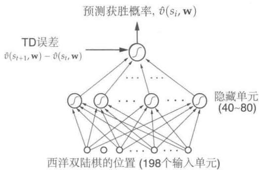  
图16.1 TD-Gammon ANN网络

在TD-Gammon的第一个版本（TD-Gammon0.0）中，西洋双陆棋的局面状态以相对直接的方式表示网络，几乎不涉及双陆棋的游戏知识。但是，它的确涉及了神经网络工作和输入信息表达形式的实质知识。注意，Tesauro的准确表述是很有启发意义的。神经网络共有198个输入单元。以白棋为例，西洋双陆棋板上的每一个点，都用四个单元表示在这个点上白棋的数量。如果没有白色的棋子，那这四个单元都是0。如果第一个局面位置有一个白棋，那么第一个单元的值就设置为1。这编码了一个“瑕疵点”的基本概念，即一个棋子能被对手打击。如果有两个或更多的棋子，则第二个单元设置为1。这种方式编码了一种叫作“安全点”的基本概念，在安全点上对手将无法落子。如果这个点上恰好有3个棋子，则第三个单元设置为1，这编码了“单级备用”的基本概念，即一个额外的棋子加在两颗棋子上锁定了这个点。最后如果这个点有超过三个棋子，则第四个单元将会被设置成为正比于多出来的棋子数量的一个数。我们用 $n$ 表示当前该点上的棋子数量，如果 $n > 3$ ，则第四个单元的值为 $(n - 3) / 2$ ，这就编码了一个当前点的“多级备用”的线性表示。

在棋盘上的24个点中，每个点采用4个白色，4个黑色单元表示，共计192个单元。另外两个单元编码棋盘中间的长条局面位置上的白色和黑色棋子的数量（每个都取 $n / 2$ 的值，其中 $n$ 是中间条上的棋子数），还有两个单元编码了当前已经被成功移除棋盘的黑色和白色棋子数量（这里取 $n / 15$ ，其中 $n$ 是已经被移出的棋子数量）。最后，还有两个单元表示当前轮到黑棋方走棋还是白棋方。我们需要清楚这些选择背后的一般逻辑。基本上，Tesauro试图以直接的方式来表示局面位置状态，同时使所需的单元数量相对较少。他为每种概念上独立的可能性提供一个表示单元，并调整它们使它们大致在相同的范围内，在

这种情况下是在0和1之间。

给定一个西洋双陆棋局面位置的表示，网络以标准方式计算其估计值。对应于从输入单元到隐藏单元的每个连接的权值是实数。来自每个输入单元的信号乘以其相应的权重并且在第 $j$ 个隐藏单元处求和。隐藏单元 $j$ 的输出 $h(j)$ 是非线性 sigmoid 函数

$$
h (j) = \sigma \left(\sum_ {i} w _ {i j} x _ {i}\right) = \frac {1}{1 + e ^ {- \sum_ {i} w _ {i j} x _ {i}}},
$$

其中， $x_{i}$ 是第 $i$ 个输入单元的值， $w_{ij}$ 是其与第 $j$ 个隐藏单元的连接的权重（所有权重一起组成网络参数向量 $\mathbf{W}$ ）。sigmoid 的输出保证在0和1之间，并且能从自然的角度解释这些输出是基于所有事件的总和的概率。从隐藏单元到输出单元的计算也是类似的。从隐藏单元到输出单元的每个连接都有与之对应的单独的权重，输出单元将这些权值求和，然后用相同的 sigmoid 非线性函数来计算最终输出。

TD-Gammon采用半梯度形式作为12.2节详细描述过的 $\mathrm{TD}(\lambda)$ 算法的训练方法，使用误差反向传播算法计算梯度（Rumelhart、Hinton和Williams,1986）。这种情况的一般更新规则是

$$
\mathbf {w} _ {t + 1} \dot {=} \mathbf {w} _ {t} + \alpha \left[ R _ {t + 1} + \gamma \hat {v} \left(S _ {t + 1}, \mathbf {w} _ {t}\right) - \hat {v} \left(S _ {t}, \mathbf {w} _ {t}\right) \right] \mathbf {z} _ {t}, \tag {16.1}
$$

其中， $\mathbf{w}_t$ 是所有可修改参数（在这种情况下是网络的权重）的向量，并且 $\mathbf{z}_t$ 是资格迹向量，和 $\mathbf{w}_t$ 的每个分量一一对应，它的计算公式是

$$
\mathbf {z} _ {t} \doteq \gamma \lambda \mathbf {z} _ {t - 1} + \nabla \hat {v} (S _ {t}, \mathbf {w} _ {t}),
$$

当 $\mathbf{z}_0\dot{=} 0$ 时，这个方程中的梯度可以通过反向传播程序有效地计算出来。在西洋双陆棋程序中， $\gamma = 1$ ，除了获胜之外收益总是零，学习规则的TD误差部分通常是 $\hat{v} (S_{t + 1},\mathbf{w}) - \hat{v} (S_t,\mathbf{w})$ ，如图16.1所示。

为了应用学习规则，我们需要有一个西洋双陆棋游戏的数据来源。Tesauro通过让他的西洋双陆棋程序和自己进行无休止的对战来获得无尽的游戏对战数据。在选择走棋动作上，TD-Gammon考虑了20种左右的掷骰方式和与之对应的结果的局面位置。由此产生的局面位置在6.8节中讨论过。使用神经网络作为价值函数来估计它们每个局面位置的价值。之后选择能使目标局面位置的估计价值最高的动作。TD-Gammon的黑白双方不断地进行这个过程，并走棋，就可以很容易地产生大量的西洋双陆棋游戏的数据。每场比赛都被视为一个单独的幕，每幕拥有其对应的局面位置状态序列 $S_{0}, S_{1}, S_{2}, \ldots$ 。Tesauro会增量式（也即在每次走棋之后）地应用非线性优化TD规则(式16.1)。

将网络的权重新始值设置为小随机数，最初的评估也是完全随机给出的。由于走棋动作是在这些评估的基础上做出的选择，所以最初的走棋很差，而最初的比赛往往会在一方或另一方获胜之前经历数百或数千次的随机移动。几十场比赛和训练之后，模型的表现会迅速变好。

在大约和自己对战了30万场比赛之后，TD-Gammon0.0学习达到了和之前最好的西洋双陆棋程序一样的水平。这个结果非常惊人，因为所有以前的表现优秀的西洋双陆棋程序都使用了额外的双陆棋知识。比如，那时候的卫冕冠军是Tesauro编写的另一个程序Neurogammon，它使用了神经网络而不是TD学习。Neurogammon的神经网络训练数据是由西洋双陆棋专家提供的示范性走棋的大型训练数据库。此外，它还应用了一系列特别为西洋双陆棋量身设计的功能。Neurogammon是一个高度优化且高度有效的西洋双陆棋程序，在1989年决定性地赢得了世界西洋双陆棋奥林匹克冠军。另一方面，TD-Gammon0.0却是被构建为具有零基础知识的西洋双陆棋程序。它能够和Neurogammon以及所有其他的具有先验知识的方法表现得一样好，这一点是对自我学习方法潜力的惊人证明。

从零先验知识训练得出的TD-Gammon0.0的比赛结果提供了一个明显的优化思路：添加专业西洋双陆棋知识，但仍然保持自学TD的学习方法。这样修改之后产生了TD-Gammon1.0。TD-Gammon1.0显然比之前所有的西洋双陆棋程序都要好得多，甚至只有在和人类专家博弈时才会出现紧张的对抗。紧接着后来的版本TD-Gammon2.0（40个隐藏单元）和TD-Gammon2.1（80个隐藏单元）增加了一个选择性双层搜索程序。为了更好地选择走棋动作，这些程序不仅向前看，而且考虑对手可能的掷骰子点数和走棋的策略。假设对手总是立即采取当前最优的动作，则程序会计算每个候选走棋动作的期望价值，并选出最好的动作。为了节省计算时间，第二层搜索仅针对在第一层之后排名很高的候选走棋方案，大概平均四五个走棋动作。双层搜索只影响走棋动作的选择，而神经网络的学习过程和以前完全一样。TD-Gammon3.0和3.1的最终版本使用了160个隐藏单元和一个选择性的三层搜索。TD-Gammon融合了学习到的价值函数和在启发式搜索和蒙特卡洛搜索树方法中使用的决策时间搜索。在后续的工作中，Tesauro和Galperin（1997）研究了将轨迹采样方法作为全宽度搜索的替代方法，它可以在保持思考时间合理（每次移动需 $5s\sim 10s$ )的情况下，实现大倍数的 $(4x\sim 6x)$ 错误率降低。

在20世纪90年代，Tesauro能够与世界级的人类玩家进行大量的比赛。表16.1给出了比赛的结果。根据这些结果和西洋双陆棋大师的分析（Robertie，1992；见Tesauro，1995)，TD-Gammon3.0似乎接近甚至可能超过世界上最强的人类玩家。Tesauro在随后

的一篇文章（Tesauro，2002）中报道了TD-Gammon相对于顶级人类玩家的走棋动作决策和双向决策的分析结果。结论是，TD-Gammon3.1相对于顶级人类玩家，在走棋决策中有“压倒性的优势”，在双向决策上有“微小的优势”。

表 16.1 TD-Gammon 结果总结  

<table><tr><td>程序</td><td>隐藏单元数</td><td>训练对局数</td><td>对手</td><td>结果</td></tr><tr><td>TD-Gammon 0.0</td><td>40</td><td>300 000</td><td>其他程序</td><td>并列最佳</td></tr><tr><td>TD-Gammon 1.0</td><td>80</td><td>300 000</td><td>Robertie, Magriel, ...</td><td>-13 分 / 51 次对局</td></tr><tr><td>TD-Gammon 2.0</td><td>40</td><td>800 000</td><td>多位大师</td><td>-7 分 / 38 次对局</td></tr><tr><td>TD-Gammon 2.1</td><td>80</td><td>1 500 000</td><td>Robertie</td><td>-1 分 / 40 次对局</td></tr><tr><td>TD-Gammon 3.0</td><td>80</td><td>1 500 000</td><td>Kazaros</td><td>+6 分 / 20 次对局</td></tr></table>

TD-Gammon也影响了最好的人类玩家对这个游戏的下法。例如，它学习到了一些在最好的人类玩家中很不常见的空位的下法。基于TD-Gammon的成功和进一步的分析，最好的人类玩家现在就在采用和TD-Gammon一样的下法（Tesauro，1995）。在TD-Gammon的启发下，其他自主学习的双陆棋神经网络也大量出现，比如Jellyfish、Snowie和GNUBackgammon，很快它们就对人类的下棋方法产生了很大的影响。这些项目能够广泛传播神经网络产生的新的游戏知识，从而大大提高人类比赛的整体水平（Tesauro，2002）。

# 16.2 Samuel的跳棋程序

对于Tesauro的TD-Gammon，一个重要的前置研究是Arthur Samuel(1959，1967)在构建跳棋程序中的开创性工作。Samuel是最早有效利用启发式搜索方法和我们现在称之为时序差分学习的研究者之一。他的跳棋程序除了具有历史价值外，还具有启发性的案例研究价值。我们主要关注Samuel的方法与现代强化学习方法间的联系并试图探讨Samuel使用它们的动机。

Samuel于1952年首先为IBM701写了一个棋盘游戏程序，他的第一个学习程序于1955年完成，并于1956年在电视上展示。该程序的后期版学到了一些虽然不是专家级别但也还不错的游戏技巧。Samuel在机器学习的领域研究时被游戏领域吸引是因为游戏比起“从生活中提取”的问题要简单得多，且对于研究启发式程序和学习如何一起使用卓有成效。他选择了研究跳棋，而不是国际象棋，因为它相对简单，可以更聚焦于机器学习过程。

Samuel 的程序通过从每一个当前局面位置执行前瞻性搜索来工作。其使用我们现在所说的启发式搜索方法来确定如何去做，如展开搜索树以及何时停止搜索。

每一次棋局结束时的局面都是通过一个使用线性函数逼近的价值函数（或称“评分多项式”）来评估或“评分”的。这个工作以及Samuel在其他方面的一些工作似乎受到了Shannon(1950)的建议的启发。特别是，Samuel的程序是基于Shannon的极小极大过程的程序，从当前局面位置找到最好的下一步。从评分的终局局面通过搜索树反向计算，在每个局面下的局面位置都可以得到一个最优走棋策略情况下的得分，在这个计算过程中会假设机器总是会尽量使得分数最大化，同时对手总是尽量减少它的分数。Samuel把这称为该局面位置的回溯分数。当极小极大过程到达搜索树的根节点（当前的局面位置）时，它会假设对手将采用与他的观点相同的评估标准，它在此假设下选择最好的走棋动作。Samuel程序部分版本采用了复杂的搜索控制方法，例如“alpha-beta”剪枝（参见Pearl，1984）。

Samuel 使用了两种主要的学习方法，其中最简单的就是机械学习（死记硬背）。它只是简单地保存每个棋盘局面位置的描述，在游戏过程中与由极小极大程序确定的回溯更新值一起被保存。结果是，如果一个已经遇到过的局面再次出现作为搜索树的终局局面，搜索的深度会大大增加，因为这个局面位置的存储值已经包含了早先执行的一个或多个搜索的结果。这就产生了一个问题：程序没有动力沿着最短最直接的路径走向胜利。Samuel 给出了一个找到“方向感”的方法：在极小极大分析中，每次回溯一个级别（称作 ply）就会把局面分数减掉一个很小的量。“如果该程序现在面临的可选局面位置当中，不同局面位置的分数区别仅仅是由层数不同导致的，则它会自动做出最有利的选择：如果能导向赢棋则选择较低层的局面（更快导向胜利）。如果会导向输棋则选择较高层的局面（更慢导向失败）。”(Samuel, 1959, 第80页)。Samuel发现这个类似折扣的技术对学习的成功至关重要。机械学习缓慢而持续地改进，这对于开局和残局来说是最有用的方法。他的程序经过了多方面的学习，包括和自己对抗，和各种各样的人类对手对抗，以及在有监督学习模式下从记录在册的历史游戏中学习招式等。在这之后，这个程序成为了一个“优于平均水平的新手”。

死记硬背的机械学习和 Samuel 的其他工作都强烈地揭示出时序差分学习的基本思想——一个状态的价值应该等于可能的后续状态的价值。Samuel 在他的第二个学习方法，即“泛化学习”中修改价值函数的参数的过程最接近这个思想。Samuel 的方法在概念上与 Tesauro 在 TD-Gammon 中使用的很相似。他让程序与程序的另一个版本相互玩了很多局游戏，并在每一步走棋之后进行回溯更新操作。Samuel 关于更新的思想可以用

图16.2中的回溯图描述。每个空心圆表示程序要走的下一个位置，称为走棋局面位置，每个实心圆表示对手下一次要走的位置。在双方都走棋之后，对每个走棋局面位置的价值进行更新，这会产生第二个走棋局面位置。更新的方向是朝向从第二个走棋局面位置开始的搜索得到的最小价值。因此，整体的更新效果就是由一个完整的真实走棋事件以及一次对可能发生的走棋事件的搜索所做出的，如图16.2所示。由于计算的原因，Samuel的实际算法比这个复杂得多，但这是基本的思想。

  
图16.2 Samuel的跳棋程序的回溯图

Samuel没有引入明确的收益概念。相反，他确定了最重要的特征——棋子优势特征，该特征度量了程序与对手的棋子的数量关系，对“国王”棋子给予更高的权重，并且包括了一些精细化调整，使得在快赢棋的时候比快输棋的时候更容易进行棋子对消。因此，Samuel程序的目标是提高棋子的优势，在跳棋的例子当中，这些优势与赢棋高度相关。

然而，Samuel 的学习方法可能已经去掉了一个更好的时序差分算法的重要组成部分。我们可以在 Samuel 的方法中清楚地看到，时序差分学习被看作使价值函数与自身保持一致的一种方式。但是，同样也需要将价值函数与状态的真实价值联系起来。我们通过收益来实现这种联系，收益的计算需要包括折扣或将固定值赋给终止状态。但 Samuel 的方法没有包括收益和对游戏最终局面位置的特殊处理。正如 Samuel 自己所指出的那样，只要给所有局面位置一个固定的价值，价值函数就可以变得一致。他希望通过给予棋子优势局面一个大的、不可改变的权值来防止这种情况的发生。然而，尽管这种方法可能会降低找到无用的价值函数的可能性，却并不能完全防止它们的出现。例如，通过在函数参数中设置可修改的权重，则不可修改的权值的影响会被抵消，我们仍然可以得到一个恒定为常数的函数。

由于Samuel的学习过程并不保证找到的评估函数是有用的，因此它有可能随着经验增加而变得更糟。事实上，Samuel指出，在大量的自我博弈训练过程中也观察到了这一点。为了进一步改善这个程序，Samuel不得不干预训练过程，把绝对值最大的权重重新设定为零。他的解释是，这种激烈的干预使得该程序脱离了局部最优。但是另一种可能性是，这种干预使得程序离开了无意义的评估函数，这些无意义的函数虽然满足一致性，但却和游戏的输赢毫无关系。

尽管存在这些潜在的问题，Samuel的跳棋程序使用泛化学习方法依然能达到“优于平均水平”。一些相当不错的业余人类棋手称其“棘手但可打败”(Samuel，1959)。与机械学习的版本相比，这个版本的程序能够实现很好的中局走棋，但是在开局和残局处理方面仍然很弱。该程序包括了特征筛选的能力，可以搜索到对优化价值函数最有用的特征。后来的版本(Samuel，1967)在搜索过程中加入了一些改进，比如alpha-beta剪枝，大量使用被称为“书本学习”的有监督学习模式，以及称为签名表的分层查找表(Griffith，1966)表示价值函数而不是线性函数逼近。这个版本学习达到的程度比1959年的版本好得多，尽管还没达到大师级。Samuel的跳棋程序被广泛认为是人工智能和机器学习方面的重大成就。

# 16.3 Watson的每日双倍投注

IBM WATSON1是由 IBM 研究人员开发的一个系统，用来玩受欢迎的电视竞猜节目 Jeopardy2，2011 年在与人类冠军的展览比赛中获得一等奖。虽然 WATSON 所展示的主要技术成就是能够迅速准确地回答广泛领域的常识，但它能赢得 Jeopardy3，同时依赖于在游戏关键环节的复杂决策策略。Tesauro、Gondek、Lechner、Fan 和 Prager (2012, 2013) 对前述的 Tesauro 的 TD-Gammon 系统进行了改造，创造了 WATSON，其在 Jeopardy4的“每日双倍投注”(Daily-Double, DD) 中的表现超过了人类冠军。这些作者报告说，WATSON 的投注策略的有效性远远超出了人类玩家能够在现场游戏中做到的，而且它与其他先进策略一起，是使 WATSON 获胜的重要因素。在这里，我们只关注 DD 投注，因为它是 WATSON 强化学习最重要的一个例子。

Jeopardy! 由三名玩家共同参与。他们面对一个显示 30 个方格的显示板，每个方格后面隐藏着一个价值若干美元的题目。方格排列成 6 列，每列对应一个不同的类别。参赛者选择一个方格，主持人阅读方格对应的题目，每个参赛者可以按键发出蜂鸣声（“嗡嗡”）

来响应题目。先响的参赛者会尝试回答这个题目。如果这个参赛者的回答是正确的，则他的得分会增加方格所对应的美元值；如果他的回答不正确，或者他在5s内没有回答，则他的分数就会减少，其他的参赛者就有机会回答同样的题目。一个或两个方格（取决于游戏的当前回合）是特殊的“双倍投注（DD）方块”。选择其中之一的选手得到一个独占的机会来回答问题，并且必须在提示线索之前决定投注多少。赌注必须大于5美元，但不得大于参赛者的当前得分。如果参赛者对DD线索的回答正确，则他的得分会增加，增加量就是投注量；否则按投注金额减少。每场比赛结束时都会有一个“最终危险边缘”(Final Jeopardy，FJ)轮，其中每个参赛者写下一个密封的赌注，然后在问题被读取后写下自己的答案。三轮比赛中得分最高的选手（其中每一轮会由30条线索组成）是胜利者。游戏中有很多其他的细节，但是上面的介绍足以体现DD投注的重要性。赢或输往往取决于参赛者的DD投注策略。

每当WATSON选择一个DD方格时，它通过比较动作价值 $\hat{q} (s,bet)$ 来选择它的赌注bet， $\hat{q} (s,bet)$ 估计了在每轮合法赌注下，能够从当前游戏状态 $s$ 获胜的概率。除了下面描述的一些降低风险的措施外，WATSON选择了对应最大动作价值的投注。无论何时需要投注时，都会计算动作价值，它可以通过游戏开始前学习得到的两种类型的估计值来计算。第一种是后位状态(6.8节）的估计价值。这些估计是从一个价值函数 $\hat{v} (\cdot ,\mathbf{w})$ 得到的，由参数 $\mathbf{w}$ 定义，它给出了从任何游戏状态中获胜的概率。用于计算动作价值的第二个估计值是“类内DD置信度” $p_{DD}$ ，它估计了WATSON能够正确回答尚未显示的DD问题线索的可能性。

Tesauro等人使用上述TD-Gammon的强化学习方法来学习 $\hat{v} (\cdot ,\mathbf{w})$ ：使用多层神经网络的非线性 $\mathrm{TD}(\lambda)$ 的直接组合，其中在多个模拟游戏期间通过反向传播TD误差来训练权重 $\mathbf{W}$ 。通过专门为Jeopardy！设计的特征向量表示各个状态。特征包括三名玩家的当前分数、剩余的DD数量、剩余问题的总美元值以及与剩余游戏数量有关的其他信息。与通过自我学习的TD-Gammon不同，WATSON的 $\hat{v}$ 学习了数以百万计的与精心制作的人类玩家模型对战的模拟游戏。类内置信度估计基于WATSON在之前的同类问题线索的回答中所给出的正确答案数 $r$ 和错误答案数 $w$ 。对 $(r,w)$ 的依赖性是根据WATSON在数千种历史类别中的实际精度估计出来的。

有了以前学到的价值函数 $\hat{v}$ 和类别DD的置信度 $p_{DD}$ ，WATSON为每个合法的美元赌注计算的 $\hat{q}(s,\mathrm{bet})$ 如下

$$
\hat {q} (s, \text {b e t}) = p _ {D D} \times \hat {v} \left(S _ {\mathrm {W}} + \text {b e t}, \dots\right) + \left(1 - p _ {D D}\right) \times \hat {v} \left(S _ {\mathrm {W}} - \text {b e t}, \dots\right), \tag {16.2}
$$

其中， $S_{\mathrm{W}}$ 是WATSON的当前分数， $\hat{v}$ 给出WATSON对DD问题的反应后的游戏状态（正

确或不正确)的估计价值。以这种方式计算动作价值与练习3.19是对应的，即动作价值是给定动作的后继状态的期望价值（不同之处是，在这里它是下一个“后位状态”的期望价值，因为整个游戏的完整的后继状态取决于下一个方格的选择）。

Tesauro 等人发现通过最大化动作价值来选择赌注招致了“令人恐惧的风险”，这意味着如果 WATSON 对问题的回答恰巧是错误的，则损失可能是灾难性的。为了减少错误回答的风险，Tesauro 等人对式 (16.2) 进行了调整，对 WATSON 的“正确/不正确”后位状态的价值评估减掉一个量，该量是标准差的一个小部分。他们还禁止了一些可能使得答错情况下的后位状态价值评估低于一定限度的投注，以进一步降低风险。这些措施略微降低了 WATSON 的获胜期望，但是显著降低了风险，不仅降低了 DD 投注的平均风险，而且在极端风险的情况下，风险中立（risk-neutral）的 WATSON 将会赢得大部分或全部资金。

为什么TD-Gammon不用自我博弈（self-play）的方法来学习关键的价值函数 $\hat{v}$ 呢？通过自我博弈的方法来学习Jeopardy！不会表现很好，因为WATSON与任何人类选手都非常地不同。自我博弈会导致对状态空间中某些不会在典型的与人类对手（特别是人类冠军）的对抗中出现的区域的试探。另外，不像西洋双陆棋，Jeopardy！是一个不完备信息的博弈游戏，因为参赛者无法获得所有的信息来影响对手的表现。特别是Jeopardy！的参赛者不知道他们有多少信心来对付各种类型的问题。自我博弈更像与拿着一样牌的人玩牌。

由于这些复杂性，开发WATSON的DD投注策略的很大一部分工作是对人类对手建模。这些模型没有解决游戏的自然语言方面的问题，而是关于游戏过程中可能发生的事件的一个随机过程模型。统计数据是从这个节目开始至今大量的粉丝创建的游戏信息档案中提取的。档案包括问题顺序、参赛者答案的正确与否、DD的局面位置以及近30万条问题的DD和FJ投注等信息。构建了三个模型：基于所有数据的平均参赛者模型、基于100个最佳选手的比赛统计数据的冠军模型和基于10个最佳选手的比赛统计数据的超级冠军模型。除了在学习期间作为对手之外，这些模型还被用来评估学到的DD投注策略的好坏。当使用基础的启发式DD投注策略时，WATSON的模拟赢率为 $61\%$ ；当使用学到的价值和默认的置信度时，其胜率增至 $64\%$ ；而且在个别高置信度的类别里，这个胜率是 $67\%$ 。Tesauro等人认为这是一个显著的改进，因为每场比赛只需要 $1.5 \sim 2$ 次DD投注。

由于WATSON只有几秒钟的时间来投注、选择方格并决定是否按键发出蜂鸣声，所以做出这些决定所需的计算时间是一个关键因素。 $\hat{v}$ 的神经网络实现允许DD投注快到足以满足现场比赛的时间限制。然而，一旦可以通过仿真软件的改进足够快地模拟游戏，在游戏残局(即快结束的时候)，通过对许多蒙特卡洛试验进行平均来估计投注的价值也是

可行的，其中每次投注的结果是通过模拟游戏结束来获得的。在现场比赛的残局DD投注选择过程中使用基于蒙特卡洛试验的方法而不是神经网络方法可以显著地改善WATSON的表现，因为在残局估值中的错误可能会严重影响获胜的机会。虽然在整个游戏过程中通过蒙特卡洛试验做出所有的决定可能会获得更好的投注决策，但考虑到游戏的复杂性和现场比赛的时间限制，这是不可能的。

虽然WATSON能够迅速准确地回答自然语言问题，这是它的主要优势，但是它的复杂决策策略在击败人类冠军的过程中功不可没。Tesauro等人（2012）说：

…显而易见，我们的策略算法达到了超出人类能力的定量精度和实时性能水平。在DD投注和残局处理的情况下尤其如此，在这种情况下，人类根本无法与WATSON所执行的准确的置信度估计以及复杂的决策计算相匹敌。

# 16.4 优化内存控制

大多数计算机使用动态随机存取存储器（DRAM）作为其主存储器，因为它具有低成本和高容量的优势。DRAM内存控制器的工作就是高效地使用处理器芯片和片外DRAM系统之间的接口，以提供高速程序执行所需的高带宽和低延迟数据传输。内存控制器需要处理动态变化的读/写请求模式，同时遵守硬件要求的大量时序和资源约束。这是一个令人生畏的调度问题，特别是对于现代的共享DRAM的多核处理器就更是如此。

Ipek、Mutlu、Martínez和Caruana（2008）（另见Martínez和Ipek，2009）设计了一个强化学习内存控制器，并证明与他们那个时代的其他传统内存控制器相比，它可以显著提高程序执行的速度。他们的动机是解决传统内存控制器的局限性，这些控制器使用的策略没有利用过去的调度经验，也没有考虑调度决策的长期后果。Ipek等人的项目是通过仿真来实现的，但是他们给出了详细的设计方案，足以直接在处理器芯片上实现相关的硬件（包括学习算法）。

访问DRAM涉及许多步骤，必须按照严格的时间限制来完成。DRAM系统由多个DRAM芯片组成，每个DRAM芯片包含按行和列排列的多个矩形存储单元阵列。每个单元用电容上的电荷存储一位信息。由于电荷随时间减少，所以每个DRAM单元需要每隔几毫秒就进行一次充电刷新，以防止存储器内容丢失。DRAM需要刷新是DRAM被称为“动态（Dynamic）”的原因。

每个单元阵列都有一个行缓冲区，保存一行“位”信息，可以传入或传出阵列的某一行。一个激活命令“打开一行”，这意味着将该命令指示的地址行的内容移动到行缓冲区。

打开一行，控制器就可以向单元阵列发出读取和写入命令。每个读取命令将行缓冲器中的“词”（一个短的连续位序列）传送到外部数据总线，并且每个写入命令将外部数据总线中的词传送到行缓冲器。在打开另一个不同的行之前，必须发出预充电命令，将行中的（可能更新的）数据传送回单元阵列的被寻址的行。之后，另一个激活命令可以打开一个新的行进行访问。读取和写入命令是列命令，因为它们将“位”顺序地传入或传出行缓冲区的每一列；可以一次性传输多个位而不需要重新打开该行。对当前打开的行进行读取和写入，要比访问其他不同的行快很多，因为访问其他不同行将涉及额外的行命令：预充电和激活，这有时被称为“行的局部性”。内存控制器维护了一个“存储事务队列”，它保存了共享内存系统的多个处理器所发出的内存访问请求。控制器必须通过向内存系统发出命令来处理请求，同时遵守大量的时序约束。

控制器调度访问请求的策略可能会对内存系统的性能产生很大的影响，例如请求可以满足的平均等待时间以及系统能够达到的吞吐量。最简单的调度策略就是按照访问请求到达的先后顺序来进行处理，即在开始服务下一个请求之前发出当前访问请求所需的所有命令。但是如果系统还没有为这些命令中的某一个做好准备，或者执行一个命令会导致资源利用不足（例如，由于服务某个命令而引起的时间限制），那么在旧的访问请求完成之前就开始服务新的请求就是有意义的。我们可以通过对请求进行重新排序来获得更高的效率，例如，给予读取请求更高的优先级，或者优先对已经打开的行进行读取/写入。这种思想下的一种调度策略就是“先就绪-先到先得”（First-Ready, First-Come-First-Serve）（FR-FCFS）策略，它给予列命令（读取和写入）比行命令（激活和预充电）更高的优先级，并且在就绪优先级相等的情况下给予较早的命令更高的优先级。通常，FR-FCFS 在平均内存访问延迟方面的表现优于其他调度策略（Rixner，2004）。

图16.3是Ipek等人的强化学习内存控制器的总体视图。他们将DRAM访问过程建模为MDP，其状态是事务队列的内容，其动作是对DRAM系统的命令：预充电，激活，读取，写入和 $NoOp$ (无动作)。当动作是读取或写入时，收益信号是1，否则是0。状态转换被认为是随机的，因为系统的下一个状态不仅取决于调度程序的命令，还取决于调度器不能控制的系统行为特性，例如访问DRAM的处理器的工作负载。

这个MDP的关键是对每个状态对应的可执行动作进行限制。回想第3章，可用动作的集合取决于状态： $A_{t}\in \mathcal{A}(S_{t})$ ，其中 $A_{t}$ 是时刻 $t$ 处的动作， $\mathcal{A}(S_t)$ 是状态 $S_{t}$ 中的可行动作集合。在这个应用中，DRAM系统的完整性是通过不允许违反时序或资源限制来保证的。尽管Ipek等人没有明确说明，但他们通过对所有可能的状态 $S_{t}$ 预先定义集合 $\mathcal{A}(S_t)$ 有效地实现了这一点。

  
图16.3 强化学习DRAM控制器的总体视图。调度器是强化学习智能体。其环境由任务队列的特征来表示，其动作是对DRAM系统发出的命令。©2009 IEEE. Reprinted, with permission, from J. F. Martínez and E. Ipek, Dynamic multicore resource management: A machine learning approach, Micro, IEEE, 29(5), p. 12.

这些限制解释了为什么MDP有一个NoOp操作，以及为什么除非发出读取或写入命令，否则收益信号都是0。当NoOp是某个状态下唯一合法的动作时，它才会被发出。为了最大限度地利用内存系统，控制器的任务是将系统驱动到可以选择读取或写入动作的状态：只有这些动作会引发通过外部数据总线发送数据，所以只有这些动作才有助于提升系统的吞吐量。尽管预充电和激活不会立即产生收益，但是智能体需要选择这些动作，以便稍后选择带收益的读写操作。

调度智能体使用Sarsa(6.4节)算法来学习动作价值函数。状态由6个整数特征表示。为了逼近动作价值函数，该算法使用了带哈希的瓦片编码实现的线性函数逼近(9.5.4节)。瓦片编码有32个覆盖，每个覆盖存储256个动作价值，以16位定点的方式存储。试探方式是 $\varepsilon = 0.05$ 的 $\varepsilon$ -贪心策略。

状态特征包括任务队列中读请求的数量、任务队列中写请求的数量、等待其行被打开的任务队列中的写请求和读请求的数量（其他特征取决于DRAM如何与高速缓存存储器相互作用，我们在这里省略细节）。状态特征的选择基于Ipek等人对影响DRAM性能的各种因素的理解。例如，根据每个任务队列中有多少个任务，来平衡读写服务的速率，可以帮助避免DRAM系统与高速缓冲存储器的交互停滞。作者实际上生成了一个相对较长的潜在特征列表，然后使用分阶段特征选择的模拟实验将它们减少到极少。

作为一个MDP，这个调度问题的一个有趣的方面是：输入瓦片编码（tile code）以定

义动作价值函数的特征与用于指定动作约束集合 $A(S_{t})$ 的特征是不同的。瓦片编码的输入源自任务队列的内容，而约束集则取决于许多与时序和资源约束相关的其他特征，这些特征必须满足整个系统的硬件实现。通过这种方式，动作约束确保学习算法的试探不会危及物理系统的完整性，而学习被有效地限制在硬件实现的更大状态空间的“安全”区域。

由于这项工作的目标是学习控制器可以在芯片上实现，以便在计算机运行时可以在线进行学习，所以硬件实现细节是重要的考虑因素。该设计包括两个五阶段流水线，用于计算和比较每个处理器时钟周期的两个动作价值，并更新相应的动作价值估计值。这包括访问存储在静态RAM中的瓦片编码。在Ipek等人模拟的实验设置（4GHz的四核芯片，这是他们的时代里的一个典型的高端工作站配置）下，每个DRAM周期有10个处理器周期。考虑到填充流水线所需的处理器时钟周期，在每个DRAM周期内最多可以评估12个动作。Ipek等人发现，在任何状态下合法命令的数量极少会大于这个数字，而且即使没有足够的时间来考虑所有的合法命令，性能损失也是微不足道的。这些和其他巧妙的设计细节使得在多处理器芯片上实现完整的控制器和学习算法成为可能。

Ipek 等人通过模拟仿真将他们的学习控制器与其他三种控制器进行了性能比较。这三种控制器分别是：1) 前述的“先就绪-先到先得”(FR-FCFS) 控制器，它具有最优的平均性能；2) 常规控制器，它按顺序处理每个请求；以及 3) 不可实现的理想控制器，也称为乐观控制器，它忽略了时序和资源的限制，在有足够请求量的情况下能够保持 $100\%$ 的 DRAM 吞吐量，而在请求量不够的时候才对 DRAM 延迟（行缓冲区的命中）和带宽建模。他们模拟了由科学和数据挖掘应用组成的 9 个内存密集型并行工作负载。图 16.4 显示了 9 个应用的每个控制器的性能 (FR FCFS 执行时间与其执行时间的比值)，以及它们在各个应用中的性能的几何平均值。学习控制器在图中被标记为 RL，在 9 个应用中它们的性能比 FR-FCFS 提高了 $7\% \sim 33\%$ ，平均提高了 $19\%$ 。当然，没有任何一个可实现的控制器可以与理想控制器的性能相匹配，因为理想控制器忽略了所有的时序和资源约束，但是学习控制器的表现与理想控制器的上限表现差距缩小了 $27\%$ 。

因为在芯片上实现学习算法的基本动机是让调度策略可以在线地适应不断变化的工作负载，Ipek等人对在线学习与预先学习固定策略的方法进行了分析比较。他们用来自所有9个基准应用程序的数据训练了他们的控制器，然后在整个应用程序的模拟执行过程中保持动作价值不变。他们发现，在线学习的控制器的平均性能比使用固定策略的控制器的平均性能好 $8\%$ ，从而得出结论：在线学习是他们方法的一个重要特性。

这种学习型内存控制器从来没有真正在物理硬件上实现，因为制造成本很高。然而，Ipek等人根据他们的模拟结果有力地证明，通过强化学习方法进行在线学习的内存控制

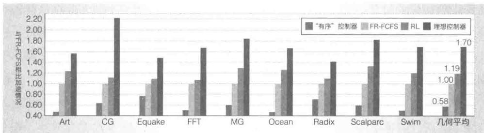  
图16.4 4个控制器在9个基准应用上的模拟仿真性能。控制器为：最简单的“有序”控制器、“先就绪-先到先得”控制器FR-FCFS、学习控制器RL，以及忽略所有时序和资源约束以提供性能上限的不可实现的理想控制器。性能指标是执行时间的倒数，并归一化到FR-FCFS的性能，也即FR-FCFS执行时间与每个控制器执行时间的比值。最右边是每个控制器在9个基准测试应用上的性能的几何平均值。控制器RL最接近理想的性能。©2009 IEEE. Reprinted, with permission, from J. F. Martínez and E. Ipek, Dynamic multicore resource management: A machine learning approach, Micro, IEEE, 29(5), p. 13.

器有可能将性能提高到原本需要更复杂且更昂贵的存储器系统的水平，同时没有了人类设计师手动设计有效的调度策略所需的某些负担。Mukundan 和 Martínez (2012) 通过研究学习控制器的其他行为、其他性能标准以及使用遗传算法推导出的更复杂的收益函数推动了这个项目的进展。他们考虑了与能源效率有关的额外性能指标。这些研究的结果超越了上述的早期结果，并且在他们考虑的所有性能指标方面大大超过了 2012 年的水平。这种方法在开发复杂的功耗感知型 DRAM 接口方面前途可期。

# 16.5 人类级别的视频游戏

将强化学习应用于现实世界问题的最大挑战之一是决定如何表示和存储价值函数和策略。除非状态集合是有限的且足够小以允许通过表格进行详尽表示（如本书中许多的说明示例中那样），否则必须使用参数化函数逼近方案。无论是线性还是非线性的，函数逼近都依赖于特征，这些特征必须是学习系统易于访问的，并且能够表达熟练操作所需的信息。强化学习的大部分成功应用都是基于精心设计的特征集合的，这些特征往往是依据人类对特定待处理问题的知识和直觉而手动设计的。

Google DeepMind 的一个研究小组开发了一个令人印象深刻的演示项目，即深度多层人工神经网络（ANN）可以自动完成特征设计的过程（Mnih et al., 2013, 2015）。从1986年反向传播算法作为学习内部特征表示的方法（Rumelhart、Hinton和Williams, 1986；参见9.7节）开始流行以来，多层神经网络已经被广泛用于强化学习中的函数逼近。通过将

反向传播引入强化学习，人类取得了惊人的成果。前文所介绍的Tesauro及TD-Gammon和Watson的同事所取得的成果就是值得关注的例子。这些例子和其他应用都受益于多层人工神经网络学习任务相关的特征的能力。然而，在我们知道的所有例子中，最令人印象深刻的例子都要求网络的输入是针对特定问题设计的特征。这在TD-Gammon结果中生动地表现了出来。TD-Gammon0.0的网络输入本质上是西洋双陆棋盘的“原始”表示，这意味着它涉及了很少的走棋知识，但它几乎能达到先前最好的西洋双陆棋程序的水平。而添加一些为西洋双陆棋设计的特定特征则产生了TD-Gammon1.0，其比之前的所有程序都要好得多，并且能与人类高手比拼。

Mnih 等人开发了一种称为深度 $Q$ 网络 (Deep Q-Network, DQN) 的强化学习智能体, 它将 $Q$ 学习与深度卷积 ANN 结合起来。深度卷积 ANN 是一种专门用于处理图像等空间数据阵列的深度 ANN。我们在 9.7 节描述了深度卷积 ANN。在 Mnih 等人的 DQN 工作出现之前, 包括深度卷积 ANN 在内的深度人工神经网络在许多应用中已经有了令人印象深刻的表现, 但是它们还没有被广泛用于强化学习。

Mnih 等人使用 DQN 来展示单个强化学习智能体如何在不依赖于特定问题的特征集合的情况下在许多不同问题中表现出较高的性能。为了证明这一点，他们让 DQN 通过与游戏模拟器交互来学习 49 种不同的 Atari 2600 视频游戏。为了学习每个游戏，DQN 使用相同的原始输入、相同的网络架构和相同的参数值（例如，步长、折扣率、试探参数以及更具体的与实现相关的参数）。DQN 在大部分游戏中达到或超过人类水平。虽然这些游戏在观看视频图像方面表现相似，但是在其他方面却有很大的不同。它们的动作具有不同的效果，它们有不同的状态转移动态特性，它们需要使用不同的策略来获得高分。深度卷积 ANN 学习将所有游戏共有的原始输入转化为专门用于表示动作价值的特征，这些动作价值是在大多数游戏中实现的高水平 DQN 所需要的。

Atari 2600 是一款家庭视频游戏机，1977 年至 1992 年的各种版本由 Atari Inc. 销售。它推出或推广了许多现在被认为是经典的视频游戏，如 Pong、Breakout、Space Invaders 和 Asteroids。尽管比现代视频游戏简单得多，但 Atari 2600 游戏对于玩家来说仍然具有娱乐性和挑战性，而且它们已经成为开发和评估强化学习方法的试验基地（Diuk、Cohen、Littman，2008；Naddaf，2010；Cobo、Zang、Isbell 和 Thomaz，2011；Bellemare、Veness 和 Bowling，2012）。Bellemare、Naddaf、Veness 和 Bowling (2012) 开发了公用的街机学习环境（Arcade Learning Environment, ALE）以鼓励使用 Atari 2600 游戏来研究学习算法和规划算法。

这些先前的研究和ALE的可用性使得Atari2600游戏系列成为了Mnih等人演示程

序的一个很好的选择。Mnih 等人的工作同时也受到了在西洋双陆棋中实现的令人印象深刻的接近人类水平的 TD-Gammon 的影响。DQN 与 TD-Gammon 类似，使用多层 ANN 作为函数逼近来实现半梯度形式的 TD 算法，梯度采用反向传播算法计算。然而，DQN 不像 TD-Gammon 那样使用 $\mathrm{TD}(\lambda)$ ，而是使用 Q 学习的半梯度形式。TD-Gammon 估计了后位状态的价值，这些估计值通过西洋双陆棋的走棋规则可以很容易地获得。Atari 游戏要使用相同的算法为每个可能的动作生成下一个状态（在这种情况下不会有“后位状态”）。这可以通过使用游戏模拟器对所有可能的动作（ALE 使之成为可能）运行单步模拟来完成。或者可以学习每个游戏的状态转移函数的模型进而预测下一个状态（Oh、Guo、Lee、Lewis 和 Singh，2015）。虽然这些方法可能产生与 DQN 相媲美的结果，但实施起来会更复杂，而且会显著增加学习所需的时间。使用 Q 学习的另一个动机是 DQN 使用了经验回放 方法，如下所述，这需要一个离轨策略算法。无模型和离轨策略的问题特性使得 Q 学习成为一种自然的选择。

在描述DQN的细节以及如何进行实验之前，我们来看看DQN能够实现的技能水平。Mnih等人将DQN的得分与当时文献中表现最好的学习系统的得分、专业人类游戏测试者的得分以及智能体随机选择动作的得分进行比较。文献中最好的系统使用线性函数逼近，并使用Atari2600游戏的一些知识进行特征的人工设计(Bellemare、Naddaf、Veness和Bowling，2012)。DQN通过与游戏模拟器交互5000万帧来学习每个游戏，这相当于约38天的玩游戏经验。在每场比赛学习开始时，DQN网络的权重被重置为随机值。为了评估DQN学习后的技能水平，对每个游戏取超过30次比赛的平均分数，每次游戏比赛持续时间5分钟，并以随机初始状态开始。专业的人工测试人员使用相同的仿真器进行游戏(声音关闭，以消除相对于不处理音频的DQN任何可能的优势)。经过2个小时的练习，每个游戏人类打20场比赛，每场比赛最多5分钟，在这段时间内不允许休息。DQN学习比其他所有游戏中的最佳强化学习系统发挥得更好，并且在22场比赛中比人类玩家表现更好。如果设定等于或超过人类得分 $75\%$ 以上的得分就代表着机器与人类表现相似或更好，则Mnih等人得出的结论是，在46场比赛中，29场比赛的得分水平达到或超过了人类水平。参见Mnih等人(2015)关于这些结果的更详细的描述。

对于一个人工学习系统来说，达到这样的水平就足够令人印象深刻了。但真正被认为是人工智能一大突破的是，几乎一样的学习系统可以不借助任何与特定游戏有关的修改就可以在广泛的游戏种类中达到这样的水平。一个人类玩家在玩这46个Atari游戏的时候，看到的是 $60\mathrm{Hz}$ 的210像素 $\times 160$ 像素的图像帧，共128个颜色。原则上，这些图像可以直接作为DQN的原始输入，但是为了减少内存和计算复杂度，Mnih等人对每一帧进行预处理以产生一个 $84\times 84$ 的亮度值矩阵。由于许多Atari游戏的完整状态不能完

全从图像帧中观察到，所以Mnih等人“堆叠”了四个最近时刻的帧，使得网络的输入具有 $84 \times 84 \times 4$ 的尺寸。这并没有消除所有游戏的部分可观测性，但会有助于它们更具有马尔可夫性。

这里的一个重点是，这46个游戏的预处理步骤完全相同，而且这些预处理并没有涉及游戏特定的先验知识。唯一的假设是，采用这种降低的维度也应该可以学到好的策略，并且堆叠相邻的帧有助于处理游戏的部分可观测性问题。由于游戏特定的低于最小量的先验知识被用于图像帧的预处理，所以我们可以将 $84 \times 84 \times 4$ 输入向量视为对DQN的“原始”输入。

DQN的基本结构类似于图9.15所示的深层卷积ANN（尽管与该网络不同，DQN中的下采样被视为每个卷积层的一部分，对于其特征图的组成单元，仅仅选择了所有可能的感受野的一部分）。DQN有三个隐卷积层，然后是一个全连接的隐层，再然后是输出层。DQN的三个隐连卷积层产生了32个 $20\times 20$ 的特征图、64个 $9\times 9$ 的特征图和64个 $7\times 7$ 的特征图。每个特征图中的单元所采用的激活函数是整流非线性函数 $(\mathrm{ReLU}\max (0x))$ 。第三个卷积层中的3136 $(64\times 7\times 7)$ 个单元全部连接到全连接层中的512个单元的每一个单元，然后每个单元连接到输出层中的全部18个单元，每个单元对应Atari游戏中每个可能的动作。

对于由网络输入表示的状态，DQN的输出单元的激活水平对应于“状态-动作”二元组的最优动作估计价值(最优Q值)。输出单元对游戏动作的分配随着游戏的不同而变化，并且由于游戏中有效动作的数量在 $4\sim 18$ 之间变化，所以并不是所有的输出单元在所有游戏中都具有功能角色。它有助于将网络看作18个独立的网络，用于估计每个可能操作的最佳动作价值。实际上，这些网络共享它们的初始层，但是输出单元学习以不同的方式使用这些层提取的特征。

DQN的收益信号反映了一个游戏的得分从一个时刻到下一个时刻是如何变化的：每当它增加时为 $+1$ ，每当它减少时为-1，否则为0。这标准化了整个游戏的收益信号，并适用于所有游戏的步长参数，尽管它们的分数范围各不相同。DQN使用了一个 $\varepsilon$ -贪心策略，其中 $\varepsilon$ 在前一百万帧内线性递减，在剩下的学习期间保持低值。通过在少量游戏上执行非正式的搜索，可以选择各种其他参数的值，例如学习步长、折扣率以及具体实现相关的其他参数的值。然后这些值被固定并用于所有的游戏。

在DQN选择一个动作后，该动作由游戏模拟器执行，然后模拟器返回收益和下一个视频帧。该帧被预处理，并被添加到四帧堆叠，成为网络的下一个输入。现在我们暂时跳过Mnih等人对基本Q学习过程的修改，则DQN可以使用下面的Q学习的半梯度形式

更新网络的权重

$$
\mathbf {w} _ {t + 1} = \mathbf {w} _ {t} + \alpha \left[ R _ {t + 1} + \gamma \max  _ {a} \hat {q} \left(S _ {t + 1}, a, \mathbf {w} _ {t}\right) - \hat {q} \left(S _ {t}, A _ {t}, \mathbf {w} _ {t}\right) \right] \nabla \hat {q} \left(S _ {t}, A _ {t}, \mathbf {w} _ {t}\right), \tag {16.3}
$$

其中， $\mathbf{w}_t$ 是网络权重的向量， $A_t$ 是在 $t$ 时刻选择的动作， $S_t$ 和 $S_{t+1}$ 分别代表在 $t$ 和 $t+1$ 时刻的网络输入，即预处理得到的4帧图像的堆叠。

式（16.3）中的梯度是通过反向传播计算的。再想象一下，如果每个动作都有一个单独的网络，则对于时刻 $t$ 的更新，反向传播只应用于对应 $A_{t}$ 的网络。Mnih 等人采用了一些技术来改善应用于大型网络的反向传播算法。他们使用了一种小批量方法，只有在小批量图像（这里是 32 张图像）上累积梯度信息之后，才能更新权重。与每次操作后更新权重的通常程序相比，这产生了更平滑的采样梯度。他们还使用了一种名为 RMSProp 的渐变上升算法（Tieleman and Hinton，2012），通过调整每个权重的步长参数，根据该权重近期梯度的平均运行速度来加速学习。

Mnih 等人以三种方式修改基本的 Q 学习过程。首先，他们使用了 Lin (1992) 首先研究的经验回放的方法。该方法将智能体在每个时刻的经验存储到一个“回放内存”中，通过访问这个内存来执行权重更新。它在 DQN 中按照如下方式工作。游戏模拟器在图像堆叠所表示的状态 $S_{t}$ 下执行动作 $A_{t}$ 后，返回收益 $R_{t+1}$ 和图像堆叠状态 $S_{t+1}$ ，在回放内存中添加代表经验的四元组 $(S_{t}, A_{t}, R_{t+1}, S_{t+1})$ 。这个“回放内存”在同一游戏的许多比赛中将经验进行了累积。在每个时刻，多个 Q 学习更新（小批量）是根据从“回放内存”中随机抽取的经验进行的。与通常的 Q 学习形式相比， $S_{t+1}$ 不再是下一次更新时的 $S_{t}$ ，取而代之的是，使用从回放内存中提取的不相关的经验作为下一次更新的数据。由于 Q 学习是一种离轨策略算法，因此不需要沿着连接的轨迹更新参数。

Q学习与经验回放相结合相比于Q学习的通常形式有一些优势。使用每个存储的经验进行更新的能力使得DQN能够更有效地从其经验中学习。经验回放减少了更新的方差，因为连续的更新之间是不相关的，这与标准的Q学习中与连续更新高度相关的情况不同。通过去除连续经验对当前权重的依赖，经验回放消除了一个不稳定的根源。

Mnih 等人第二种方法是修改标准的 Q 学习来提高其稳定性。与其他自举法一样，Q 学习更新的目标取决于当前的动作价值函数估计。当使用参数化函数逼近方法来表示动作价值时，目标就是具有相同参数的函数，而这些参数又是正被更新的参数。例如式 (16.3) 给出的更新的目标是 $\gamma \max_{a} \hat{q}(S_{t+1}, a, \mathbf{w}_t)$ 。更新公式对于 $\mathbf{w}_t$ 的依赖使得过程复杂化了，这与更简单的有监督学习形成了鲜明对比，有监督学习中的目标不依赖于被更新的参数。正如第 11 章所讨论的，这会导致振荡或发散。

为了解决这个问题，Mnih等人使用了一种使Q学习更接近简单的有监督学习情况的

技术，同时仍然允许它进行自举。每当对动作价值网络的权重 $\mathbf{w}$ 进行了 $C$ 次更新时，他们将网络的当前权值插入另一个网络中，并将这些复制的权值固定，用于 $\mathbf{w}$ 的下一组 $C$ 次更新。这个复制的网络在下一组 $C$ 次更新的 $\mathbf{w}$ 输出被用作Q学习目标。让 $\tilde{q}$ 表示这个复制网络的输出，那么代替式(16.3）的更新规则是

$$
\mathbf {w} _ {t + 1} = \mathbf {w} _ {t} + \alpha \left[ R _ {t + 1} + \gamma \max  _ {a} \tilde {q} (S _ {t + 1}, a, \mathbf {w} _ {t}) - \hat {q} (S _ {t}, A _ {t}, \mathbf {w} _ {t}) \right] \nabla \hat {q} (S _ {t}, A _ {t}, \mathbf {w} _ {t}).
$$

对标准Q学习的最后一种修改同样可以提高稳定性。他们对误差项 $R_{t + 1} + \gamma \max_{a}\tilde{q} (S_{t + 1},$ $a,\mathbf{w}_t) - \hat{q} (S_t,A_t,\mathbf{w}_t)$ 进行截断，使其结果保持在[-1,1]区间内。

Mnih 等人对 5 款游戏进行了大量的学习运行，以深入了解 DQN 的各种设计特点对其性能的影响。他们用经验回放与复制目标网络的四种可能组合（包括该技术或不包括该技术）来运行 DQN。尽管每个游戏运行的结果各不相同，但是这些技术中的每一个技术都能够显著提高性能，并且在一起使用时性能会得到极大的提高。Mnih 等人还研究了深度卷积 ANN 在 DQN 学习能力中所起的作用。将 DQN 的深度卷积版本与只有一个线性层网络的版本进行比较，两者都接收相同的预处理视频帧堆叠。深度卷积版本在所有 5 个测试游戏中都取得了比线性版本更明显的改善。

创造超越多种挑战性任务的人造智能体是人工智能的一个长期目标。然而，作为实现这一目标的重要手段的机器学习，却往往不得不为特定的问题采用人工设计特定的特征表达，这显得不够智能。DeepMind 的 DQN 则向前迈进了一大步，证明一个智能体可以自动学习特定于问题的特征，并在一系列任务中获得人类水平的技能。但正如 Mnih 等人指出的，DQN 并不能完全解决“任务独立的学习”问题。尽管玩好 Atari 游戏所需的技能显著多样化，但对于所有的游戏，都是通过观察视频图像来玩的，这使得深度卷积 ANN 成为这一任务的自然选择。此外，DQN 在一些 Atari 2600 游戏上的表现明显劣于这些游戏的人类玩家。对于 DQN 来说，最难的游戏（特别是像“蒙特祖玛的复仇”（Montezuma's Revenge）这样的游戏，DQN 的学习水平仅仅相当于一个随机选手）所需要的深层规划都超出了 DQN 的设计架构。此外，通过广泛的练习来学习控制技能，就像 DQN 学习如何玩 Atari 游戏一样，只是人类常规学习的一种类型。尽管有这些限制，DQN 仍然通过成功地将强化学习与现代深度学习方法相结合，提高了机器学习的最前沿技术水平。

# 16.6 主宰围棋游戏

数十年来中国的古代游戏围棋难倒了人工智能研究人员。在其他游戏中达到人类技能甚至超过人类技能的方法在实现强大的围棋程序方面还没有成功。在非常活跃的围棋程

序社区和一系列的国际竞赛的促进下，围棋程序的使用水平多年来有了显著的提高。然而，直到目前，还没有一个围棋程序能够达到任何一个人类围棋大师级别的相近水平。在这里，我们介绍一个由Google DeepMind团队开发的称为AlphaGo的程序（Silver et al., 2016），他们通过结合深度神经网络（深度ANN,9.7节）、有监督学习、蒙特卡洛树搜索（MCTS,8.11节）和强化学习打破了这一障碍。在Silver等人2016年发布研究成果的时候，AlphaGo已经显示出比其他现有的围棋程序更加强大，并且在与人类欧洲围棋冠军樊麾的5场比赛中一场未输。这是围棋程序在对人类专业棋手的无让棋专业比赛上的首次完胜。此后不久，AlphaGo在与18次世界冠军围棋棋手李世石的比赛中取得惊人的胜利，在挑战赛的5场比赛中赢得4场，这一时成为全球头条新闻。人工智能研究人员曾认为，要达到这个水平，还需要更多的时间，也许是数个世纪。

在本章我们会介绍AlphaGo和AlphaGo Zero。AlphaGo除了使用强化学习方法外，还使用了依赖于大量标注过的人类棋局的有监督学习。而在AlphaGo Zero中则只用到了强化学习的方法，除了提供游戏的基础规则外没有任何人工数据和人为指导。我们首先详细地介绍AlphaGo，然后再介绍相对简单的AlphaGo Zero，它既具有很高的性能又是一个更纯粹的强化学习程序。

在许多方面，AlphaGo和AlphaGo Zero被认为是Tesauo的TD-Gammon(16.1节)的继承者，而TD-Gammon自身又是Samuel跳棋程序的继承者(16.2节)。所有的这些程序都包含有模拟自我对局的强化学习。AlphaGo和AlphaGo Zero还借鉴了DeepMind的玩Atari游戏的DQN程序中所使用的深度卷积网络，用它来逼近最优价值函数。

围棋是两个玩家之间的游戏，他们交替地将黑色和白色棋子放置在一个 $19 \times 19$ 的棋盘上的空闲交叉处或“点”上。比赛的目标是比对手占有更大的棋盘区域。棋子的俘获（或称吃掉）规则极为简单：如果一个玩家的棋子完全被对手的棋子所包围，即没有水平或垂直相邻的未被占用的点，则该棋子被俘获。例如，图16.5显示了左边的三个白色棋子上有一个未占用的相邻点（标记为X）。如果黑方玩家在X上放置一个棋子，那么三个白棋子就会被吃掉并拿出棋盘（图16.5中间）。然而，如果白方玩家首先在X点放置一个棋子，那么前述的俘获

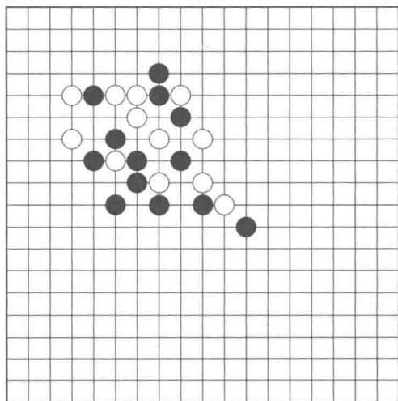  
围棋棋盘

就失效了（图16.5右）。在这个基础上，还需要一些其他规则来防止无限的俘获/重新俘获的循环。在游戏结束时，任何玩家都无法放置另一个棋子。由这些简单的规则产生了一个非常复杂的游戏，已经有数千年的历史了。

  
图16.5 围棋俘获规则。左：三个白子没有被包围，因为X点处没有被占。中：如果黑方在X处落子，那么三个白子将被俘获并吃掉（移出棋盘）。右：如果白方先在X处落子，那么将阻止俘获

在其他游戏中使用的强大游戏方法，如国际象棋，并不能很好地应用于围棋。围棋的搜索空间远远大于国际象棋，因为围棋的每个局面的合法棋招的数量比国际象棋（ $\approx 250$ 对比 $\approx 35$ ）要大得多，而且围棋往往要经历比国际象棋更多的走棋步数（ $\approx 150$ 对比 $\approx 80$ ）。但是搜索空间的大小并不是使得围棋非常复杂的主要因素。穷举式搜索对国际象棋和围棋都是不可行的，甚至在 $9 \times 9$ 的小棋盘上下围棋也被证明是非常困难的。专家们一致认为，设计专业水平的围棋程序的主要障碍是定义适当的局面评估函数。一个好的评估函数会允许搜索空间被裁剪到一个可行的深度，而这是通过提供相对容易的计算来预测更深的搜索可能产生什么来达到的。根据 Müller (2002) 的说法：“对于围棋没有找到简单而合理的评估函数。”向前迈出的一大步是将蒙特卡洛树搜索 (MCTS) 引入围棋程序中，并不试图保存一个评估函数，而是通过在决策时运行整个游戏的许多蒙特卡洛模拟来对走棋动作进行评估。在 AlphaGo 开发的时代，最强大的程序全部使用了 MCTS，但是仍然难以达到大师级的水平。

回顾8.11节，MCTS是一个决策时的规划过程，它没有试图学习和存储一个全局的价值评估函数。8.10节中讨论的预演策略就是在完整的一幕（围棋中完整的一次对局）中运行多次蒙特卡洛模拟来帮助选择下一个动作（在围棋中的每一步走棋，即在哪里落子或者认输）的。与简单的预演算法不同的是，MCTS是一个迭代过程，它以当前的环境状态为根节点增量式地扩展出一棵搜索树。如图8.10所示，每次遍历搜索树时都依据树的边上的统计数值来指导模拟动作的选择。在基本的MCTS中，当模拟到达搜索树的叶子节点时，MCTS会将该叶子节点的部分或所有的子节点加入搜索树中。从叶子节点或者新增的节点处开始执行预演，一次模拟过程一般会持续到终止状态才结束，其中动作选取用的是预演策略。当预演完成后，搜索树上被遍历过的边上的统计数值都要依据预演的结果进行更新。MCTS在给定时间内完成尽可能多的模拟过程。最终的动作会从根节点（它仍然代表着当前的环境状态）选取，选择依据就是根节点发出的边上的统计数值。而这个动

作就是智能体执行的动作。之后，环境会转移到下一个状态，MCTS 就以新的当前状态为根节点重新执行一遍。这个新的执行过程的开头可能只有一个根节点，也可能是在上一棵搜索树上接着执行，也就是以新的当前状态为根节点的子树被保留，其他部分被丢弃。

# 16.6.1 AlphaGo

AlphaGo的主要创新点在于用改进的MCTS进行走子，这个改进版本的MCTS使用强化学习得到的策略和价值函数做指导，其中函数逼近使用了深度卷积神经网络。另一个重要做法就是用人工标记的对局数据对使用到的神经网络参数进行预训练，而不是随机初始化网络参数。

DeepMind 团队将 AlphaGo 中改进的 MCTS 称为“异步策略和价值 MCTS”（asynchronous policy and value MCTS），简称 APV-MCTS。它通过前面所描述的基础版本的 MCTS 来选择动作，但是在如何扩展搜索树以及如何评估动作方面进行了改进。基础 MCTS 用原先记录的动作价值从叶子节点选择一条未试探过的边，而 AlphaGo 中的 APV-MCTS 则根据 13 层的深度卷积网络提供的概率值来扩展搜索树的边，该卷积网络又被称为有监督学习策略网络，网络参数是使用接近 3000 万个人工标注的专家数据进行有监督学习得到的。

另一方面，基础MCTS只用预演的回报值来估计新增状态节点的价值，而在APVMCTS中对新增状态节点的估计来源于两个部分：预演估计值和强化学习方法得到的价值函数 $v_{\theta}$ 。如果 $s$ 是新增节点，那么它的价值就是

$$
v (s) = (1 - \eta) v _ {\theta} (s) + \eta G, \tag {16.4}
$$

其中， $G$ 就是预演的回报值， $\eta$ 控制着这两种估计方法的结合得到的最终值。在AlphaGo中，这些值来自于价值网络（另一个13层的深度卷积网络），它按照本节下面描述的方法进行训练并输出棋局状态的估计价值。AlphaGo中对局的两个模拟棋手的APV-MCTS的预演都是用线性网络表示的快速预演策略，这个线性网络也是提前用有监督学习训练好的。在程序执行过程中，APV-MCTS持续更新模拟走子在搜索树中经过的每条边的次数，当预演过程结束后，就在根节点处选择被访问次数最多的那条边作为接下来的走子动作。

价值网络的结构与深度卷积的有监督策略网络结构是一样的，不同的只有输出端：有监督学习卷积网络的输出是合法走子动作的概率分布值，而价值网络只输出对当前局面状态的评估值，也就是只输出一个代表局面状态评估的标量值。理想情况下，价值网络会输出最优的状态价值，然后可以按照TD-Gammon的思路对最优价值函数进行逼近，即采

用耦合了深度卷积神经网络的 $\mathrm{TD}(\lambda)$ 算法进行自我博弈来逼近。但是DeepMind团队在像围棋这样复杂的任务上使用了不同的方法并取得了更好的效果。他们将训练价值网络的过程分成了两个阶段。第一个阶段，他们用强化学习的方法得到一个尽可能好的策略，并称其为 $RL$ 策略网络，该网络结构与有监督学习策略网络是完全一样的。这个网络以有监督学习得到的有监督策略网络（SL策略网络）的最终权值来初始化，然后再用策略梯度方法对其进行进一步优化。第二个阶段，DeepMind团队称其为蒙特卡洛策略评估过程，该策略评估过程使用了大量的模拟对局数据，在模拟过程中使用第一个阶段的RL策略网络来进行走棋。

图16.6展示了AlphaGo中使用的网络和具体的训练步骤(DeepMind团队称其为AlphaGo流水线)。在上线之前，需要训练这些网络，上线之后网络参数就是固定的了。

  
图16.6 AlphaGo流水线图。授权自MacmillanPublishersLtd:Nature,vol.529(7587),p.485,copyright (2016)

接下来介绍的是AlphaGo中使用的神经网络和训练过程的细节。相同结构的有监督学习和强化学习策略网络，都是和16.5节中介绍的玩Atari游戏的DQN算法中使用的深度卷积神经网络是相似的。它们有13个卷积层加上最后一个柔性最大化(softmax)输出层，输出的是对应 $19\times 19$ 的棋盘上每个点的落子概率。可以将网络的输入看作 $19\times 19\times 48$ 的图片矩阵，这个矩阵表示的意思就是棋盘上每个点都是用48个二进制或整数值的特征来表示的。例如，对于棋盘上每个点来说，有特征表示该点是否被AlphaGo棋子占据，有特征表示该点是否被对手的棋子占据或者没有棋子，这些特征都是从棋盘上直观看出来的。还有一些特征基于围棋的规则，比如说该棋子的邻接位置为空的数目、落子到该位置上对手棋子被围住的数目及某个位置落子后双方走棋的轮回数目。除此之外，

还有一些设计团队认为重要的特征。

训练有监督学习策略网络时，用分布式随机梯度下降方法在50个处理器上花了大约三个星期的时间。训练好的网络能达到 $57\%$ 的精度，而其他研究组截止到DeepMind论文发表时的最好结果是 $44.4\%$ 。训练强化学习策略网络是用策略梯度的方法来做的，其中对局双方中的待更新的网络使用当前的强化学习策略网络，对手使用的是从早期迭代得到的版本中随机选择的策略。与随机选择的对手进行对局能够有效避免当前策略的过拟合问题。如果当前策略赢，收益信号就是 $+1$ ，如果输就是 $-1$ ，其他情况就是0。这些对局过程是直接依据两个策略网络进行落子的，没有涉及MCST。通过在50个处理器上并行模拟大量对局，DeepMind团队在一天内用一百万个对局训练了强化学习策略网络。在对最后的强化学习策略进行测试时发现，强化学习策略在与有监督学习策略的对局中胜率高达 $80\%$ ，在与每次走子模拟100000个终局结果的MCTS方法进行对局时，胜率到达 $85\%$ 。

价值网络的结构与SL和RL策略网络的结构是一致的，但是价值网络的输出只有一个值。价值网络的输入在SL和RL策略网络输入的特征基础上加上了一个二进制特征来表示当前落子的颜色。蒙特卡洛策略评估用强化学习策略进行自我对局时产生的对局数据来训练价值网络。为了由于避免自我对局中产生的数据有很强的局面位置相关性而导致的过训练和不稳定，DeepMind团队构建了一个3000万局面的数据集合，其中每个局面都是从不同的自我对局游戏中选择出来的，即每次对局游戏中只抽取1个局面放入数据集。训练过程中设置批量块的大小为32，总共训练5000万个批量块。这个训练过程在50块GPU上跑了一周。

在正式比赛开始之前，还需要学习预演策略，它是用简单的线性网络在800万个实际对局数据上用有监督学习方法训练得到的。预演策略网络需要在尽可能准确的基础上快速地落子。原则上，应该在预演中使用前面介绍的SL或RL策略网络，但是对于预演模拟来说，这两个深度神经网络的前向计算过程需要花费的时间太长，因为在线对局的时候需要进行大量的预演模拟。由于这个原因，预演策略网络应该要比其他的策略网络更简单，同时该网络的输入棋盘特征应该比其他策略网络能更加快速地得到。AlphaGo中的预演策略网络的每个线程在一秒内可以模拟1000次完整的对局。

有人可能会问，为什么在扩展APV-MCTS的时候选择有监督学习策略来代替更好的强化学习策略去选取落子动作呢？由于这两个策略的网络结构是一样的，所以它们花费的时间也是一样的。DeepMind团队发现用APV-MCTS与人类棋手对局时，有监督学习策略要比强化学习策略表现更好。他们给出的解释是强化学习策略的优化过程都是基于最优

的走子动作的，但是没有考虑人类棋手走子的特征。有趣的是，在APV-MCTS中用的价值函数情况恰好相反。他们发现用强化学习策略得到的价值函数要比用有监督学习策略得到的价值函数的效果好。

将上面提到的方法结合在一起就得到了AlphaGo的强大的下棋技巧。DeepMind团队比较了不同版本的AlphaGo来说明这些不同部分对于AlphaGo最终性能的影响。式(16.4)中提到的参数 $\eta$ 控制来自价值网络和预演过程的估计值的贡献比例。当 $\eta = 0$ 时，AlphaGo只用价值函数；而当 $\eta = 1$ 时，就只用预演进行评估。他们发现只使用价值网络要比只用预演的效果好，实际上，比当时其他的围棋程序都要好。最好的结果出现在 $\eta = 0.5$ 时，这个结果说明将价值网络和预演结合对于AlphaGo的成功是至关重要的。这些评估方法都是相辅相成的：价值网络可以更有效地评估性能较好的强化学习策略，但它太慢以至于不能用于在线对局；而性能较差但速度极快的预演策略也可以增加在线对局中的某些特定状态的价值网络的评估精度。

总的来说，AlphaGo巨大的成功激发了人们对于新一轮人工智能的热情，特别是将深度强化学习的方法应用到更加具有挑战性的领域。

# 16.6.2 AlphaGo Zero

在AlphaGo经验的基础上，DeepMind团队研究出了AlphaGoZero。相较于AlphaGo，该项目除了围棋的基本规则以外没有用到任何人类数据。AlphaGoZero是直接从自我对局中学出来的，输入的特征只是棋盘上对应棋子局面位置的信息。AlphaGoZero使用的是策略迭代的方法，也就是策略评估和策略改进交替进行的强化学习方法。图16.7显示了AlphaGoZero算法的样子。AlphaGoZero和AlphaGo之间的重要区别就是，AlphaGoZero在整个自我对局强化学习期间都使用MCTS进行走子。而AlphaGo只在在线对局的时候用了MCTS，在学习期间没有用。除了没有使用人工数据和手动设计特征外，它们之间不同的是，AlphaGoZero只用了一个深度卷积神经网络和简化版的MCTS。

AlphaGo Zero 中的 MCTS 是 AlphaGo 中的简化版本，它并没有包括完整对局的预演，因此不需要一个预演策略。AlphaGo Zero 中 MCTS 的每次迭代的模拟都是在当前搜索树的叶子节点停止的，而不是在一次完整的对局模拟的终局才停止。AlphaGo Zero 中 MCTS 的每次迭代都依据的是深度卷积网络的输出，图 16.7 中用 $f_{\theta}$ 标记，其中 $\theta$ 代表网络参数。如上面提到的，AlphaGo Zero 中的深度卷积网络的输入就是纯粹的棋盘棋子分布特征，它的输出有两部分：一个是标量值 $v$ ，估计的是棋手在当前局面下能够赢得比赛的概率；另一个是向量值 $p$ ，就是接下来棋手可能走子情况的概率分布值，包括了当

  
图16.7 AlphaGo Zero 自我对局强化学习。a) 程序自我对局很多盘，这里表示其中一局的局面状态序列 $s_i$ ， $i = 1,2,\ldots,T$ ，走子动作表示为 $a_i$ ， $i = 1,2,\ldots,T$ ，获胜者为 $z$ 。每步走子 $a_i$ 依据动作的概率 $\pi_i$ ，这个概率是在深度卷积神经网络的指导下从根节点执行MCTS算法求得的，这里标记为 $f_\theta$ ， $\theta$ 为最新更新的权重。这里只展示了其中一个局面位置 $s_i$ ，对于其他局面位置 $s_i$ ，重复上面的过程即可，网络的输入就是棋盘局面位置 $s_i$ 的表示（同时还包括它之前的若干时刻的局面状态，在这里没有画出来）。网络的输出是用来指导MCTS进行前向搜索的走子的概率分布，用向量 $\mathbf{p}$ 表示，标量 $v$ 是用来估计当前棋手赢棋的概率的。b) 深度卷积神经网络的训练。训练样本随机取自最近的自我对局的走子过程。网络参数 $\theta$ 的更新目标是让策略向量 $\mathbf{p}$ 接近MCTS得到的概率分布 $\pi$ ，并且准确预测赢的概率 $v$ 。本图在原作者和 DeepMind 的同意下选自 Silver et al. (2017a)

前局面上所有合法的走子位置的概率，以及“认输”和“走子”的选择。

AlphaGo Zero 在自我对局时，并不是依据网络输出的概率值 $\mathbf{p}$ 来选择动作，而是用这些概率值和网络输出的价值估计值来指导 MCTS 的过程，MCTS 执行完后会输出新的动作概率分布，如图 16.7 中所示的 $\pi_{i}$ 。这些策略会从 MCTS 的过程中获益，也就是说，AlphaGo Zero 中的实际选择动作的策略要比网络输出 $\mathbf{p}$ 的策略更优。Silver et al. (2017a) 中写道：“可以将 MCTS 看作一种有效的策略改进的算子。”

接下来介绍AlphaGoZero中的神经网络和训练方法的细节。可以将神经网络的输入看作 $19\times 19\times 17$ 的图片矩阵，棋盘上每个点用17个二进制特征表示。前8个特征是棋手当前和过去7轮在该点的落子情况，如果棋手的子在该点则这个特征值就为1，否则

为0。接下来的8个特征也表示了对手当前和过去的8轮里在该点的落子情况，编码方式与前面的方法一样。最后一个特征在一局棋里是一个常数，表示的是当前棋局里面本方棋手的颜色，1代表黑子，0代表白子。由于围棋不允许悔棋而且后下的一方会得到一些“补偿分”，所以当前棋盘局面位置信息不是围棋的马尔可夫状态。这就是为什么设计的特征里面会有过去的棋盘局面位置信息和棋子颜色特征（可以表示先下还是后下）。

AlphaGo Zero 中的神经网络是“双头”的，也就是说网络中前面的部分是共享的，在最后输出的时候分成两个独立的“头”，每个头也有独立的网络层加上最后各自的输出层。在 AlphaGo Zero 的深度神经网络中，其中一个头输出 $362 (= 19^{2} + 1)$ 个动作的概率 $\mathbf{p}$ ，包括在棋盘上每个点的落子和认输的概率；另一个头就输出一个标量值 $v$ ，估计的是当前棋手在目前局面下能够赢得比赛的概率。网络共享部分有 41 个卷积层，每一层都有批量块归一化（Batch Normalization），并且在隔层之间添加了翻越连接以实现残差学习（见 9.7 节）。总体上，走子概率网络和价值网络分别由 43 和 44 层网络组成。

AlphaGo Zero 中的深度神经网络是用随机初始化开始训练的，优化器用的是随机梯度下降（带有动量、正则化和步长参数，步长会随着训练轮数增多逐渐减小），并且是从最近 500000 场自我对局产生的数据中随机采样，以批量块更新的方式更新当前策略的。在输出动作 p 时，也会加一些额外的噪声以鼓励试探。在训练时会设置阶段检查点，Silver et al. (2017a) 选择每训练 1000 步就对神经网络输出的策略与当前最优的策略进行 400 次模拟对局（其中每步走子都采用 1600 次迭代的 MCTS 选择动作）。如果新的策略比当前最优的策略性能好（需要大于一个阈值以减少结果中的噪声影响），那么就用它替换原来的最优策略以进行接下来的自我对局训练。该神经网络参数的更新使得网络的策略输出 p 越来越接近 MCTS 的输出结果，从而使得价值函数的预测输出 $v$ 接近在当前最优策略下在对应棋局下能获胜的概率。

DeepMind 团队在超过 490 万次的自我对局上训练 AlphaGo Zero，花了接近 3 天的时间。每个对局中的每一步走子的选择都需要 MCTS 的 1600 次迭代，每一步走子需要花费 $0.4 \mathrm{~s}$ 左右的时间。网络参数的更新超过了 70 万个批量块，每个批量块由 2048 个棋盘局面组成。然后他们将训练好的 AlphaGo Zero 分别与 5：0 战胜樊麾的 AlphaGo 版本和 4：1 战胜李世石的版本进行性能对比。他们使用 Elo 等级分（Elo 等级分制度是由匈牙利裔美国物理学家 Elo 创建的一个衡量各类对弈活动选手水平的评分方法，是当今对弈水平评估的公认的权威方法）来评估围棋程序的相关性能。两个 Elo 等级分之间的差异可以被视为对棋手之间的对弈结果的预测。AlphaGo Zero、战胜樊麾的 AlphaGo 版本和战胜李世石的 AlphaGo 版本的 Elo 等级分分别是 4308、3144 和 3739。从 Elo 等级

分的差异可以看出，AlphaGo Zero 在与其他棋手程序对局时获胜的概率接近 1。训练好的 AlphaGo Zero 和战胜李世石的 AlphaGo 版本进行了 100 盘对局，AlphaGo Zero 取得了 100 胜的成绩。

DeepMind 团队还比较了用 16 万盘对局里的包含接近 3000 万个局面位置的数据集有监督地训练和 AlphaGo Zero 网络相同的独立的神经网络。他们发现一开始有监督方法训练出来的策略性能确实要比 AlphaGo Zero 的好，同时比人类专业棋手也要好。但是训练一天后，AlphaGo Zero 逐渐超过了有监督训练的方法。这个现象说明，AlphaGo Zero 找到了不同于人类棋手下棋的策略。实际上，AlphaGo Zero 发现了一些经典围棋策略的更好的变种，而且 AlphaGo Zero 也会更加偏好这些策略。

AlphaGo Zero 算法的最后测试版本使用了更大的人工神经网络以及超过 2900 万个自我对局的数据来训练，权重初始化仍然是随机的，训练共花费了大约 40 天。这个版本的 Elo 等级分高达 5185。该团队将这个版本的 AlphaGo Zero 和当时最强的程序 AlphaGo Master 进行了对比，AlphaGo Master 和 AlphaGo Zero 的网络完全一样，但类似 AlphaGo，它也使用了人类对局数据和人工特征。AlphaGo Master 的 Elo 等级分是 4858，它已经在与人类最强的职业选手的比赛中取得了 60:0 的成绩。但是，在与 AlphaGo Zero 的 100 次对局中，只获得了 11 次胜利，而 AlphaGo Zero 取得了 89 次胜利。这就说明了 AlphaGo Zero 算法强大的问题解决能力。

AlphaGo Zero 明显地显示出，在没有人工数据、没有人工提取特征，而仅仅使用极少的先验知识的条件下，通过基于简单的MCTS和深度神经网络的纯粹的强化学习方法，机器也可以有超出人类水平的表现。我们坚信在DeepMind的AlphaGo Zero和AlphaGo的启发之下，这些算法肯定会被用到其他领域更具挑战性的任务之中。

最近，Silver et al. (2017b) 又开发了一个更好的程序，叫作 AlphaZero，其中没有使用任何关于围棋的先验知识。AlphaZero 是一种通用的强化学习方法，它在围棋、国际象棋、日本将棋等众多棋类游戏中，都在迄今为止最好的程序之上又产生了进一步的性能提升。

# 16.7 个性化网络服务

诸如分发新闻或广告等个性化网络服务是一种用来提升用户对网站满意度或提高营销活动收益的方法。我们可以采用某种“策略”，基于某个用户的在线行为历史推断出其兴趣和偏好，从而推荐对其而言最好的内容。这是一个机器学习，尤其是强化学习自然的

应用领域。一个强化学习系统可以根据用户的反馈进行调整来优化推荐策略。一种获得用户反馈的方式是网站满意度调查，但是为了实时取得反馈，常常会监控用户的点击，并以此作为用户对于链接感兴趣的标志。

一种长期用于市场营销的被称为A/B测试的方法，是一种简化的强化学习方法，其用来决定网站的两个版本，A或B，哪种更受用户青睐。因为它和双臂赌博机问题一样是非关联性的，所以它并不能让内容分发变得个性化。添加由描述用户个体和将被分发的内容的特征组成的上下文可以使个性化服务成为可能。这被形式化为一个带上下文的赌博机问题（或一个关联性强化学习问题，见2.9节），其目标是最大化用户的点击总数。Li、Chu、Langford和Schapire(2010)应用了一种带上下文的赌博机算法，通过选择专题新闻报道来解决个性化“雅虎今日头条”(Yahoo!FrontPageToday)网页的问题。他们的目标是最大化点击率(click-throughrate，CTR)，即所有用户在一个网页上点击的总数与该网页被访问的总次数的比例。带上下文的赌博机算法相比一个标准的非关联赌博机算法这个数据提升了 $12.5\%$ 。

Theocharou、Thomas 和 Ghavamzadeh (2015) 声称，通过将个性化推荐形式化成一个马尔可夫决策过程（MDP）可以得到更好的结果，这个 MDP 的目标为最大化所有用户在反复访问一个网站的过程中总的点击数。由这个带上下文的赌博机形式化得到的策略是贪心的，它们不考虑动作的长期效果。这些策略有效地对待网站的每一次访问，就好像它是由一个从网站的所有访客中随机采样出来的新访客产生的一样。由于不考虑许多用户重复地访问同一网站这一事实，贪心策略并没有利用与单一用户的长期交互带来的可能性来改善结果。

作为一个展示一种市场营销策略如何有效利用长期交互的例子，Theocharous等人将一个贪心策略与一个长期的策略对比而展示某种产品（比如汽车）的广告。如果用户立刻想买这辆车，贪心策略展示的广告也许会显示一个折扣。用户也许会接受这个折扣，也许会离开这个网站，并且如果他们回到这个网站，他们会看到一样的折扣。另一方面，长期策略可以在呈现最终交易之前，将用户转移到一个“销售漏斗”，诱使其逐步下沉到最终交易。它也许会从描述可获得的优惠条件开始，然后称赞一个优秀的客户服务部门，然后在其下一次访问时再提供最后的折扣。这类策略可以使用户重复访问这一站点而带来更多的点击，并且如果合适地定制这个策略，也会带来更多的销售额。

在 Adobe Systems Incorporated 工作时，Theochondrous 等人进行了一些实验，看看用来最大化长期点击数的策略是否真的相比短期的贪心策略在表现上有提升。Adobe Marketing Cloud 是一套许多公司用来执行数字营销的工具，它提供了可以自动针对用户

进行广告以及进行筹款活动的基础设施。事实上使用这些工具部署新颖的策略会带来巨大的风险，因为一个新的策略可能最终会效果很差。由于这个原因，研究团队需要评估，如果真的部署的话，这个策略的性能会如何，但这个评估需要在执行其他策略时收集到的数据上展开。因此，这个研究的一个关键点就是离轨策略评估。更进一步，研究团队希望可以进行高置信度的评估以降低部署新策略的风险。尽管高置信度离轨策略评估是这项研究的核心部分（也可参见Thomas, 2015；Thomas、Theocharous和Ghavamzadeh，2015），在这里我们只关注具体的算法及其结果。

Theocharous 等人比较了两种用于学习广告推荐策略的算法的结果。他们将第一个算法称为贪心优化，其目标是最大化立即点击的概率。就如在标准的带上下文的赌博机形式化中一样，这个算法并不考虑推荐的长期效果。另一个算法是一种基于MDP形式化的强化学习算法，其目标是提高用户多次访问一个网站的总点击量。他们将后一个算法称为终生价值 (life-time value, LTV) 优化。这个问题对两个算法都具有挑战性，因为由于用户一般不会点击广告，导致在这个领域中的收益信号十分稀疏，同时用户的点击是十分随机的，所以收益值会具有很大的方差。

这些算法使用从银行业得到的数据集来进行训练和测试。这些数据集包含了用户与一个银行的网站进行交互的完整轨迹，这些交互结束时网站都会从一系列可能的优惠中选择一种推荐给用户。如果一个用户点击了，则收益为1，否则就为0。其中一个数据集包含了某个银行在一个月中的大约20万个交互记录，在这些交互中该银行的策略是随机提供7种优惠中的一种。其余的数据集来自于其他银行的营销活动，包含40万个交互记录，涉及12种可能的优惠。所有的交互记录都包含了顾客的特征，例如从上次该顾客访问这个网站到现在隔了多久，顾客到现在为止的总访问量，上一次该顾客点击的时间、地理位置、用户的兴趣，以及人口统计信息的特征等。

贪心优化基于一个映射，它将点击概率视为用户特征的函数。这个映射通过在其中一个数据集上使用随机森林（random forest, RF）算法（Breiman，2001）进行有监督学习得到。RF算法被广泛用于工业界的大规模应用中，因为它们不倾向于过拟合，同时对于异常离群点和噪声较不敏感，所以是有效的预测工具。得到这个映射之后，Theocharous等人使用这一映射定义了一个 $\varepsilon$ -贪心策略：以 $1 - \epsilon$ 的概率挑选RF算法预测出的优惠以保证有最高的概率产生一次点击，否则均匀地随机挑选其他的优惠。

LTV 优化使用一种被称为拟合 $Q$ 迭代 (fitted Q iteration, FQI) 的批处理强化学习算法。这是一种将拟合价值迭代 (Gordon, 1999) 应用于 $Q$ -学习的变种。批处理的意思是整个用于学习的数据集从一开始就是全都可访问的，与之相比，在本书所讨论的在线算

法中，数据是在学习算法执行的过程中逐步获得的。当在线学习不实际可行的时候，批处理强化学习有些时候是必需的，并且它们可以使用任何批处理模式的有监督学习回归算法，这其中包括了一些因为可以很好地推广到高维空间而著称的算法。FQI的收敛性取决于函数逼近算法的性质（Gordon，19999）。在LTV优化的应用中，Theocharous等人使用了他们用于贪心优化的同样的RF算法。由于在这种情况下FQI收敛不是单调的，因此Theocharous等人通过使用验证集的离轨策略估计来跟踪最优的FQI策略。总结如下：拟合Q迭代(FQI)采用了RF算法得到的映射作为初始的动作价值函数以进行贪心优化，并用离轨策略得到一个最优策略。最后用于测试LTV方法的策略是一个基于这个FQI的最优策略的 $\varepsilon$ -贪心策略。

为了度量这个由贪心和LTV方法得到的策略的性能，Theocharous等人使用了CTR指标和一个他们称之为LTV的指标。除了LTV指标严格区分网站的访问用户之外，这两个指标是类似的

$$
\begin{array}{l} \mathrm {C T R} = \frac {\text {全 部 点 击 次 数}}{\text {全 部 访 问 次 数}}, \\ \mathrm {L T V} = \frac {\text {全 部 点 击 次 数}}{\text {全 部 访 问 用 户 数}}. \\ \end{array}
$$

图16.8展示了这两个指标的区别。每一个圆圈代表一个用户访问，实心黑圈表示带有用户点击的访问。CTR不区分每次访问的访问者，这些序列的CTR值为0.35，而LTV则是1.5。由于LTV比CTR大的程度取决于单个用户重复访问网站的次数，因此它可以作为一个衡量一种策略如何鼓励用户与网站延长交互的指标。

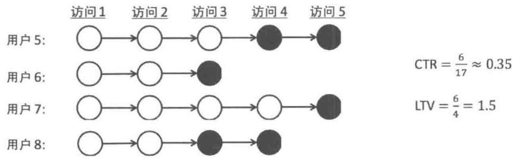  
图16.8点击率（CTR）与终生价值(LTV)的对比。每一个圆圈代表一个用户访问，实心黑圈表示带有用户点击的访问。图取自Theocharousetal.(2015).

由贪心和LTV方法分别得到的两种策略的对比测试是在一组真实数据集上采用高置信度离轨策略评估方法进行的，该数据集包括了一个采用随机策略的银行网站与用户进行交互的真实数据。正如预期的，结果显示，在使用CTR指标评判时，贪心方法性能最好，而LTV优化算法则在使用LTV作为评判指标时性能最好。而且（虽然我们忽略了细节）高置信度离轨策略评估方法可以提供概率意义下的保证，确认LTV优化算法可以（以

高概率)产生改善当前部署的策略性能的新策略。由于这些概率意义下的保证，Adobe在2016年宣布新的LTV算法会成为AdobeMarketingCloud的一个标准组件，这使得零售商可以选择一个更容易得到长期高回报的策略，而不是一个对于长期结果不敏感的策略，来发布一系列的优惠。

# 16.8 热气流滑翔

鸟类和滑翔机可以借助上升气流（热气流）来提升高度以此在耗费很少能量甚至不耗费能量的情况下维持飞行。热气流滑翔是一种复杂的技术，它需要对微小的环境信号做出应对，以尽可能长时间地利用一簇上升气流来提升高度。Reddy、Celani和Vergassola（2016）使用强化学习来研究在常伴有上升气流的强烈大气湍流中有效地进行热气流滑翔的策略。他们主要的目标是理解鸟类所察觉到的环境信号以及鸟类如何利用这些信号来获得它们令人惊奇的热气流滑翔性能，但他们的研究也同时促进了自动滑翔机技术的发展。强化学习在之前曾经被应用于高效导航到上升的热气流附近的问题（Woodbury、Dunn和Valasek，2014），但还没有在上升湍流内部滑翔这样更具挑战性的问题中使用过。

Reddy等人将滑翔问题建模为一个带折扣的持续MDP。智能体与一个精细的在湍流中飞行的滑翔机环境模型进行交互。他们做出了大量努力让环境模型产生真实的热力学湍流条件，包括调研了多种不同的用于大气建模的方法。对于机器学习实验，气流处在一个边长为一千米，一个面位于地面的三维盒子中，气流通过一系列精细的基于物理原理设计的气流速度、温度和气压的偏微分方程组建模。在数值模拟中加上一些小的随机的扰动可以使模型产生模拟的热上升气流以及伴随的湍流（图16.9左边部分）。滑翔机的飞行使用包含速度、推力、阻力和其他控制固定翼飞行器无动力飞行的因素的空气动力学方程建模。操控滑翔机涉及改变其迎角（滑翔机的机翼和气流方向之间的夹角）以及其倾斜角（图16.9右边部分）。

在智能体和环境之间的交互接口需要定义智能体的动作、智能体从环境获取的状态信息以及收益信号。通过对于不同的选择可能性进行试验，Reddy等人确认，就他们的操控目标而言，对于迎角和倾斜角分别有3个动作就足够了：对当前的倾斜角和迎角分别提升或降低 $5^{\circ}$ 和 $2.5^{\circ}$ ，或者保持不变。这总共形成了 $3^{2}$ 种可能的动作。倾斜角被约束在 $-15^{\circ} \sim +15^{\circ}$ 之间。

由于他们的一个研究目的是确定有效地滑翔所必需的环境信号的最小集合，既为了揭

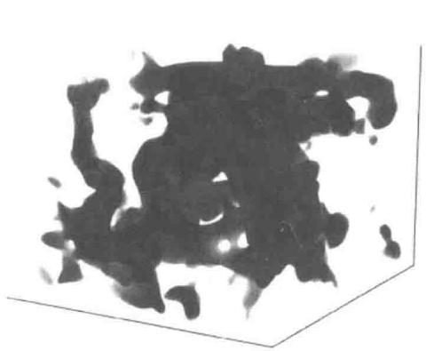

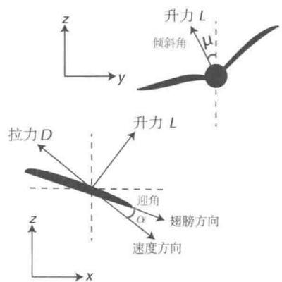  
图16.9 热气流滑翔模型。左：空气模拟方块的垂直速度场的快照，淡（深）灰色是大量的上升（下降）气流。右：无动力飞行倾斜角 $\mu$ 和迎角 $\alpha$ 的图标。图片来自：PNAS vol. 113(22)，p. E4879, 2016, Reddy, Celani, Sejnowski, and Vergassola, Learning to Soar in Turbulent Environments.

示鸟类滑翔所使用的信号，也为了最小化自动滑翔机进行滑翔所需的传感器复杂度，他们尝试用不同信号的集合作为强化学习智能体的输入。他们从使用一个四维状态空间的状态聚合（9.3节）开始，其中每个维度分别表示当地垂直风速、垂直风加速度、取决于左右翼尖处的垂直风速之间的差异的扭矩以及当地气温。每个维度被离散成三类：大正量、大负量和小量。下文所示的结果说明了其中只有两个维度对于有效滑翔的行为是重要的。

热气流滑翔总的目标是借每簇上升气流提升尽可能高的高度。Reddy等人尝试使用了一个直接的收益信号，这个信号在每幕结束时根据智能体在每幕中提升的高度来表达智能体的收益，如果滑翔机触地则会有一个大的负的收益信号，其余情况则为零。他们发现，在真实的气流运动时间周期里，使用这种收益信号进行学习是不成功的，而且加入资格迹也没有帮助。通过对不同收益信号进行试验，他们发现使用一种如下的收益信号进行学习是最好的：这种收益在每一时刻将上一时刻观测到的垂直风速和垂直风加速进行了线性组合。

学习过程使用的是单步Sarsa算法，其中动作是按照柔性最大化（soft-max）得到的归一化动作价值的概率分布选择的。特别指出，动作概率是根据带动作偏好的式(13.2)计算出来的，而动作偏好在这里定义为

$$
h (s, a, \theta) = \frac {\hat {q} (s , a , \theta) - \min  _ {b} \hat {q} (s , b , \theta)}{\tau \left(\max  _ {b} \hat {q} (s , b , \theta) - \min  _ {b} \hat {q} (s , b , \theta)\right)},
$$

其中， $\theta$ 为表示参数集合的向量，向量的每个元素分别对应于每个动作和聚合的状态组； $\hat{q}(s, a, \theta)$ 仅返回对应特定 $s, a$ 二元组的元素。上面的等式通过将动作价值的估计值归一

化到[0,1]区间，再除以正的温度参数 $\tau$ ，形成了“动作偏好”1。随着 $\tau$ 的增加，选择某个动作的概率与对它的偏好的依赖越来越小；当 $\tau$ 减小到接近0时，选择“最偏好”的动作的概率就会接近于1，这使得该策略变为了贪心策略。温度参数 $\tau$ 被初始化为2.0，并在学习过程中逐步下降到0.2。动作偏好是从当前动作价值的估计值中计算出来的：最大估计值的动作给出了 $1 / \tau$ 的偏好，最小估计值的动作的偏好是0，其他动作的偏好分布在这两个极值之间。步长和折扣率参数被分别固定为0.1和0.98。

在智能体进行学习的每一幕中，智能体会控制滑翔机在一段独立生成的模拟湍流中进行模拟飞行。每幕持续2.5分钟，模拟的步长为1秒。学习过程会在几百幕之后收敛。图16.10的左半部分展示了在学习之前，智能体随机选择动作的一条采样轨迹。从图中的顶部开始，滑翔机的轨迹沿着箭头所指的方向快速地下降高度。图16.10的右半部分是一条学习之后的轨迹。滑翔机从同样局面位置开始（这里位于图中底部），在一簇上升气流中盘旋提升高度。虽然Reddy等人发现其性能在不同段的模拟气流中有着较大的变化，但总体来说，滑翔机触地的次数在学习过程中稳定地下降，直到接近于零。

  
图16.10 热气流滑翔的轨迹采样，箭头表示从同一个起点出发的飞行的方向（注意高度的坐标经过了平移和缩放）。左：学习之前，智能体随机地选择动作，滑翔机下降。右：学习之后，滑翔机沿着一条螺旋形的轨迹来提升高度。配图来自PNAS vol. 113(22)，p. E4879，2016，Reddy，Celani，Sejnowski，and Vergassola，Learning to Soar in Turbulent Environments.

在对智能体可获得的特征的不同集合进行试验后，结果显示，只包含垂直风加速度和扭矩的特征组合是最佳的。作者们猜想，这些特征提供了关于垂直风速在两个不同方向上的梯度信息，它们使得控制器可以选择是调整倾斜角改变方向，还是不改变倾斜角而沿着同样的方向飞行。这使得滑翔机可以停留在一簇上升气流中。垂直风速是热气流强度的标

志，但它并不能帮助滑翔机停留在气流中。他们发现感知温度也没有什么作用。他们也发现，控制迎角并不能帮助滑翔机停留在一个特定的热气流中，而是能在长距离飞行（如越野滑翔或鸟类迁徙时）中帮助滑翔机在热气流之间实现跨越。

由于在不同强度的湍流中滑翔需要不同的策略，从弱湍流到强湍流的情况他们都做了训练。在强湍流中，剧烈变化的风和滑翔机的速度缩短了控制器可以用来反应的时间。相比在湍流较弱时可以进行的操控，这降低了可以控制的程度。Reddy等人检验了使用Sarsa在不同情况中学到的策略。在不同情况下学到的规则有这些相同的特点：当感受到负的风加速度时，向有着更大升力的机翼的方向急转弯；但感受到正向的大的风加速度同时扭矩为零时，什么都不要做。然而，不同强度的湍流也会导致策略的不同。在强湍流中学到的策略会更加保守，它们会更偏好小的倾斜角；而在弱湍流中，最优的动作往往是急转弯，转得越大越好。作者们经过对于在不同情况下学到的策略对倾斜角的偏好的系统研究，提出了一种分阶段控制的方法：通过检测垂直风加速度是否超过一个特定的阈值，控制器可以调整它的策略来应付不同强弱的湍流情况。

Reddy等人也研究了折扣率 $\gamma$ 对学到的策略的性能的影响。他们发现，当 $\gamma$ 变大时，在一幕中获得的高度提升会变大，并在 $\gamma = 0.99$ 时达到最大值，这表示热气流滑翔需要考虑控制选择的长期效果。

对于热气流滑翔的量化研究展示了强化学习是如何进一步地改善不同种类的目标的。在不同的环境信号和控制动作集合下进行策略的学习，既能促进设计自动滑翔机的工程目标，也能促进对于鸟类滑翔技能进行理解的科学目标。在这两种情形下，由学习实验得到的猜想都可以在相应的领域中进行测试。对于工程目标，可以制作真正的滑翔机；而对于科学目标，可以将预测行为和观测到的鸟类真实滑翔行为进行对比。

17

# 前沿技术

在本章中大家将接触一些超出本书范围的话题，但是我们认为这些话题对于强化学习的未来非常重要。很多话题会超出我们所熟知的知识范围，并且有些会把我们带出马尔可夫决策过程（MDP）框架。

# 17.1 广义价值函数和辅助任务

在本书中，价值函数的概念从前到后变得越来越广义。使用离轨策略学习技术时，我们允许价值函数以任意的目标策略作为条件。之后在12.8节中，我们把折扣过程推广为一个终止函数 $\gamma : S \mapsto [0,1]$ ，使得可以在每个时刻采用不同的折扣系数（discount rate）来决定回报（式12.17）。这允许我们在一个任意的、状态相关的视界下，预测未来将得到多少收益。下一步，或许是最后一步，将“收益”（reward）的概念进行推广，以允许对任意信号的预测。我们可能对一段声音、一种颜色的感知，或者一个内部的经过复杂处理的信号（例如另一个预测值）的未来的值之和进行预测，而不只是对未来的收益值之和进行预测。不管在这种类似于价值函数的预测过程中，我们累加的是什么信号，我们都称其为这种预测的累积量。我们将其形式化地表示成一个累计信号 $C_t \in \mathbb{R}$ ，在这种记号下，广义价值函数（general value function，GVF）将记为

$$
v _ {\pi , \gamma , C} (s) = \mathbb {E} \left[ \sum_ {k = t} ^ {\infty} \left(\prod_ {i = t + 1} ^ {k} \gamma \left(S _ {i}\right)\right) C _ {k + 1} \mid S _ {t} = s, A _ {t: \infty} \sim \pi \right]. \tag {17.1}
$$

像传统的价值函数（例如 $v_{\pi}$ 或者 $q_{*}$ ）一样，这是一个可以用参数化的形式逼近的理想函数，我们可以继续用 $\hat{v}(s, \mathbf{w})$ 来标记它，尽管对于每一种 $\pi$ 、 $\gamma$ 和 $C_t$ 的选择，在每次预测过程中都会有一个不同的参数 $\mathbf{w}$ 。因为一个GVF并不必然与收益有联系，因此将其称为值函数可能有些用词不当。我们可以简单地称之为“预测”，或者用更独特的方式说：

预报（由Ring提出，准备发表）。不管如何称呼它，它的形式都和价值函数一样，因此可以用本书中提出的学习近似价值函数的方法学出来。在学习预测值的同时，我们也可以采用广义策略迭代(4.6节)或者“行动器-评判器”算法，通过最大化预测值来学习策略。用这种方式，一个智能体可以学习如何预测和控制大量不同类型的信号，而不仅仅是长期收益。

为什么预测和控制长期收益之外的信号可能有用呢？这类信号控制任务是在最大化收益的主任务之外额外添加的辅助任务。一个答案是，预测和控制许多不同种类的信号可以构建一种强大的环境模型。正如我们在第8章所述，一个好的环境模型可以让智能体更高效地得到收益。清楚地回答这个问题需要一些其他的概念，我们将在下一节中介绍。首先我们考虑两个相对简单的方法，在这些方法中，多个不同种类的预测问题会对强化学习智能体的学习有所帮助。

辅助任务帮助主任务的一个简单情形是它们可能需要一些相同的表征。有些辅助任务可能更简单，延迟更小，动作和结果之间的关联关系更加明晰。如果在简单的辅助任务中，可以很早发现好的特征，那么这些特征可能会显著地加速主任务的学习。没有什么理由可以解释为什么这是对的，但是在很多情况下这看起来很有道理。例如，如果你学习在很短的时间内（例如几秒钟）预测和控制你的传感器，那么你可能会想出这个目标物体的部分特点，这将对预测和控制长期收益有很大的帮助。

我们可能会想象一个人工神经网络（ANN），其中的最后一层被分为好几个部分，我们称它们为头部，每一个都在处理不同的任务。一个头部可能产生主任务的价值函数预测（将收益作为其累计量），而其他的头部可能产生很多辅助任务的解。所有的头部都可以通过随机梯度下降法反向传播误差到同一个“身体”里——即它们前面所共享的网络部分——从第二层到最后一层都在尝试构建表示以提供必要的信息给头部。研究人员们尝试了各种各样的辅助任务，例如预测像素的变化，预测下一时间点的收益，以及预测回报的概率分布。在很多种情况下这个方法都显示出了对主任务学习的加速效果（Jaderberg et al., 2017）。类似地，作为一种有助于状态预测的方法，多预测的方法也被反复地提出过（见17.3节）。

另一个理解为何学习辅助任务可以提升表现的简单的方法是类比于经典条件反射这一心理学现象(14.2节)。一种理解经典条件反射的方法是，进化使我们内置（非学习式的）了一个从特定信号的预测值到特定动作之间的反射关联。例如，人和许多其他动物看起来有一种内置的眨眼反射机制，当对于眼球将收到戳击的预测值超过某个阈值的时候，就会闭眼。这个预测是学出来的，但是预测和闭眼之间的关联是内置的，因此动物可以避

免眼球受到突然的戳击。类似地，恐惧和心率加快或者愣住之间的关联，也可以是内置的。智能体的设计者们可以做一些类似的事情，例如，自动驾驶汽车可以学习“向前开车会不会导致碰撞”，然后将其“停车/避开”的行为建立一个内置反射，当预测值超过一定阈值时触发。或者考虑一个真空清洁机器人，其可以学习预测是否会在返回充电装置前用尽电量，并且在该预测值变为非零时，条件反射一样地掉头移动到充电站。准确的预测取决于房间的大小、机器人所在的房间、电池的年龄，机器人的设计者很难了解所有这些细节。让设计者使用传感器的手段设计一个有效的算法来决定是否回头是很困难的，但是使用学习到的预测则很容易做到这一点。我们预见到很多方法都会像这样将学习到的预测和内置控制行为的算法有效结合在一起。

最后，也许辅助任务最重要的作用，是改进了我们本书之前所做的假设：即状态的表示是固定的，而且智能体知道这些表示。为了解释这个重要作用，我们首先要回过头来了解本书所做的假设的重要性以及去除它所带来的影响。这将在17.3中介绍。

# 17.2 基于选项理论的时序摘要

马尔可夫决策过程形式上的一个吸引人的地方是，它可以有效地用在不同时间尺度的任务上。我们可以用它来形式化许多任务，例如决定收缩哪一块肌肉来抓取一个目标，乘坐哪一架航班方便地到达一个遥远的城市，选择哪一种工作来过上满意的生活。这些任务在时间尺度上差异很大，然而每一个都可以表达成马尔可夫决策过程(MDP)，然后用本书中讲述的规划和学习过程完成。所有这些任务都涉及由与环境的相互作用、序贯决策以及一个随时间累积的收益构成的目标，因此它们都可以被形式化成马尔可夫决策过程。

尽管所有这些任务都可以被形式化为MDP，但是我们可能认为它们不能被形式化为一个单一的MDP，因为这些过程涉及的时间尺度都不同，例如选择的种类和动作都截然不同。例如，把预定跨洲的航班和肌肉收缩放在同一时间尺度上是不合适的。但是对于其他任务而言，例如抓取、掷标枪、击打棒球，用肌肉收缩的层次来刻画可能刚刚好。人类可以无缝地在各个时间层次上切换，而没有一点转换的痕迹。那么MDP框架可不可以被拉伸，从而同步地覆盖所有这些时间层次呢？

也许是可以的，一种流行的观点是：先形式化一个非常小的时间尺度上的MDP，从而允许在更高的层次上使用扩展动作（每个时刻对应于更低层次上的多个时刻）的规划。为了做到这一点，我们需要使用一个展开到多个时刻的“动作方针”的概念，并引入一个“终止”的概念。对这两个概念的通用的形式化方式是将它们用一个策略 $\pi$ 和一个状态相

关的终止函数 $\gamma$ 来表达，就像在GVF中定义的那样。我们将这样的一个“策略-终止函数”二元组定义为一种广义的动作，称之为“选项”。在 $t$ 时刻执行一个选项 $\omega = \langle \pi_{\omega}, \gamma_{\omega} \rangle$ 就表示从 $\pi_{\omega}(\cdot | S_t)$ 中获得一个动作 $A_t$ ，然后在 $t + 1$ 时刻以 $1 - \gamma_{\omega}(S_{t + 1})$ 的概率终止。如果选项不在 $t + 1$ 时刻停止，那么 $A_{t + 1}$ 从 $\pi_{\omega}(\cdot | S_{t + 1})$ 中选择，而且选项在 $t + 2$ 时刻以 $1 - \gamma_{\omega}(S_{t + 2})$ 的概率终止。很容易就可以把低层次的动作看作选项的一种特例——每一个动作 $a$ 都对应于一个选项 $\langle \pi_{\omega}, \gamma_{\omega} \rangle$ ，这个选项的策略会选出一个动作（对于每个 $s \in S$ ， $\pi_{\omega}(s) = a$ ），并且其终止函数是零（对于每个 $s \in S^+$ ， $\gamma_{\omega}(s) = 0$ ）。选项有效地扩展了动作空间。智能体可以选择一个低层次的动作/选项，在单步之后终止，或者选一个扩展的选项，它可能在执行多步之后才终止。

“选项”的架构设计允许它与低级别的动作进行角色互换。例如，一个动作价值函数的记号 $q_{\pi}$ 可以被自然地推广为选项值函数，它以状态和选项作为输入，仍然返回期望回报，只是产生这个期望回报的过程包括了从输入状态开始，执行输入的选项直到它终止，并在之后继续遵循策略 $\pi$ 的整个过程。我们也可以把策略的概念推广到层次化策略，它选择的是选项而不是动作，其中每个选项被选中之后，都会一直运行到终止。在这些思想下，本书中的许多算法都可以推广到学习近似的选项值函数和层次化的策略。在最简单的情况下，学到的策略从选项开始直接跳到选项结束，更新只在选项结束的时候出现。更精细一些的做法是，更新可以在每一个时刻进行，使用一种“选项内部”的学习算法，这通常需要离轨策略算法。

选项的思想带来的最重要的推广也许是第3、4和8章中所提出的环境模型。关于“动作”的传统模型是状态转移概率和采取这个动作的即时收益的期望。那么传统的动作模型如何推广到选项模型呢？对于选项而言，合适的模型也应该包含有两部分：一个部分对应于执行选项后产生的状态转移结果；另一个对应于执行选项过程中的累积收益的期望。选项模型的收益部分，类比于“状态-动作”二元组的期望收益式(3.5)，对于所有的选项 $\omega$ 和所有的状态 $s\in S$ ，定义为

$$
r (s, \omega) \doteq \mathbb {E} \left[ R _ {1} + \gamma R _ {2} + \gamma^ {2} R _ {3} + \dots + \gamma^ {\tau - 1} R _ {\tau} \mid S _ {0} = s, A _ {0: \tau - 1} \sim \pi_ {\omega}, \tau \sim \gamma_ {\omega} \right], \tag {17.2}
$$

其中， $\tau$ 是一个随机时刻，代表选项的终止时刻，它由参数 $\gamma_{\omega}$ 决定。在这个等式中，需要注意总体折扣系数 $\gamma$ 所扮演的角色——折扣是由 $\gamma$ 决定的，但是选项的终止是由 $\gamma_{\omega}$ 决定的。一个选项模型的状态转移部分则更为精巧。这部分模型刻画了每一个可能的选项结果状态的概率（就像在式3.4中一样），但是在这里，可能在多个时刻之后才能到达这个选项结果状态，其中的每个状态都有不同程度的折扣。选项 $\omega$ 的这部分模型在如下公式

中指定了 $\omega$ 的每个可能的起始状态 $s$ ，以及 $\omega$ 的每个可能的终止状态 $s^{\prime}$

$$
p \left(s ^ {\prime} \mid s, \omega\right) \doteq \sum_ {k = 1} ^ {\infty} \gamma^ {k} \Pr \left\{S _ {k} = s ^ {\prime}, \tau = k \mid S _ {0} = s, A _ {0: k - 1} \sim \pi_ {\omega}, \tau \sim \gamma_ {\omega} \right\}. \tag {17.3}
$$

注意，由于存在折扣系数项 $\gamma^k$ ，这里的 $p(s'|s,\omega)$ 不再是一个转移概率，并且不再对于所有可能的 $s'$ 求和为1（无论如何，我们会继续在 $p$ 中使用记号|）。

上面关于选项模型的状态转移部分的定义使得我们可以为所有的选项定义形式化的贝尔曼方程和动态规划算法，其中也包括作为选项特例的低级别的动作。例如，对于层次化策略 $\pi$ 来说，通用的贝尔曼方程是

$$
v _ {\pi} (s) = \sum_ {\omega \in \Omega (s)} \pi (\omega | s) \left[ r (s, \omega) + \sum_ {s ^ {\prime}} p \left(s ^ {\prime} \mid s, \omega\right) v _ {\pi} \left(s ^ {\prime}\right) \right], \tag {17.4}
$$

其中， $\Omega(s)$ 表示状态 $s$ 中所有可行的选项的集合。如果 $\Omega(s)$ 仅仅包含低级别的动作，那么这个方程退化为通常的贝尔曼方程（式3.14），唯一不同的是 $\gamma$ 被包含在新定义的 $p$ 中，即式(17.3)，因此在此处没有出现。类似地，相应的选项的规划算法中也没有 $\gamma$ 。例如，作为式(4.10)的推广，带选项的价值迭代算法是

$$
v _ {k + 1} (s) \doteq \max  _ {\omega \in \Omega (s)} \left[ r (s, \omega) + \sum_ {s ^ {\prime}} p (s ^ {\prime} | s, \omega) v _ {k} (s ^ {\prime}) \right], \text {对 于 所 有} s \in \mathcal {S}. \tag {17.5}
$$

如果 $\Omega(s)$ 包含了每个状态 $s$ 下所有可行的低级别动作，那么这个算法会收敛到通常意义上的 $v*$ ，从中我们可以计算出最优的策略。然而，如果我们能够在每一个状态下，只考虑所有可能选项 $\Omega(s)$ 的某个子集进行规划，则可能更有用。这样的话价值迭代将会收敛到限制在给定的选项子集下的最优的层次化策略。尽管这个策略从全局看可能是次优的，但收敛可能会更快，因为我们只考虑较少的选项，而且每个选项都可以在时间上跳跃多步。

为了在有选项的情况下做规划，我们必须已知选项模型，或者学出选项模型。一个学出选项模型的自然方法是使用一系列的GVF（我们在上一节中定义过）来对它进行表示，然后使用本书中提到的方法来学习GVF。对于选项模型的收益部分，不难看出如何做到这一点。我们仅仅需要把GVF的累计量选为收益 $(C_t = R_t)$ ，把它的策略设为选项的策略 $(\pi = \pi_{\omega})$ ，把它的终止函数设为折扣系数乘以选项的终止函数 $(\gamma(s) = \gamma \cdot \gamma_{\omega}(s))$ 。如此一来，真实的GVF将等同于选项模型的收益部分， $v_{\pi, \gamma, C}(s) = r(s, \omega)$ ，并且本书中介绍的各种学习方法都可以用来近似它。选项模型的状态转移部分会更复杂一些。我们需要对选项对应的每一个可能的终止状态分配一个GVF。除了在选项终止且终止于相应的

状态时，我们不希望这些GVF积累任何量。这可以通过如下设定来实现：把预测转移到 $s^{\prime}$ 的GVF的累计量写为 $C_t = (1 - \gamma_\omega (S_t))\mathbb{1}_{S_t = s'}$ 。该GVF的策略和终止函数都和选项模型的收益部分一样设置。那么真实的GVF就等同于选项的状态转移模型的 $s^{\prime}$ 部分： $v_{\pi \gamma C}(S) = p(s'|s,\omega)$ ，这样本书中介绍的方法也就可以用来学习它。尽管这其中的每一步看起来都很自然，但是把它们整合在一起（包括函数逼近和其他关键部分）是很有挑战性的，而且超出了现有最先进的技术水平。

练习17.1 在本节中展示了折扣情况下的选项，但是在使用函数逼近的时候，折扣对于控制问题是否合适是有争议的（参见10.4节）。那么层次化策略的自然的贝尔曼方程形式应该是什么样的呢？它应当与式(17.4)中的类似，但需要在平均收益设置(10.3节）下进行定义。类比于式(17.2)和式(17.3)，在平均收益设置下，选项模型的两个部分分别是什么样子的呢？

# 17.3 观测量和状态

在本书中，我们都把学到的近似价值函数（还有第13章中的策略）写成关于状态的函数。这是本书的第I部分中介绍的方法的重大局限，在这些方法中，学习得到的价值函数用一张表格来表示，因此任意的价值函数都能被精确近似。这种情况等同于假设环境的状态完全可以被智能体感知。但是在很多情况下，传感器输入只会告诉你这个世界状态的部分信息。有些对象可能被其他的东西遮挡住了，或者在智能体的身后，亦或是在几里之外。在这些情况下，关于环境的很重要的一部分信息可能并不能直接观察到。而且，把学习到的价值函数实现为一个关于环境状态空间的表格，是一种过强的、不现实而且局限性很大的假设。

在本书第Ⅱ部分提出的参数化函数逼近框架则限制要少得多，甚至可以说它是没有局限性的（虽然这种说法是有争议的）。在第Ⅱ部分中，我们保留了学习到的价值函数（和策略）是关于环境的状态的函数这一假设，但是允许这些函数在参数化的框架下自由变化。一个有些令人吃惊而且并不被广泛认可的观点是，函数逼近包含了“部分可观测性”的很多方面。例如，如果有一个不可观测的状态变量，那么我们通过选择参数化的方式使得近似价值函数与这个变量无关。这样做的效果就如同这个状态变量是不可观测的。正因为如此，在所有参数化的情况下获得的结果都可以被应用在部分可观测的情况下，而不需要做任何改变。从这个意义上说，参数化函数逼近的情况包含了部分可观测性的情况。

然而，如果不显式地、明确地为部分可观测性建模，仍然有很多问题无法被深入研

究。尽管我们在这里不能给出一个完整的处理部分可观测性的方法，但是我们可以大致列出需要做出的一些改变，以下是具体的四个步骤：

首先，我们需要改变问题：环境所提供的不是其状态的精确信息，而仅仅是观测量，——这是一个依赖于状态的变量，就像机器人的传感器那样，提供关于状态的部分信息。为了简化问题，我们假设收益是一个关于状态的直接的、已知的函数（观测量可能是一个向量，收益可能是它的某一个分量）。那么环境交互将没有明确的状态或者收益，而仅仅给出一个简单的动作 $A_{t} \in \mathcal{A}$ 和观测量 $O \in \mathcal{O}$ 的交互序列

$$
A _ {0}, O _ {1}, A _ {1}, O _ {2}, A _ {2}, O _ {3}, A _ {3}, O _ {4}, \dots ,
$$

永远这样持续下去（与式3.1对比）或者形成“幕”，每幕都以一个特殊的终止观测量来结束。

然后我们可以用观测量和动作的序列来恢复本书中提到的状态的概念。我们使用术语历史以及记号 $H_{t}$ 表示一个轨迹从初始部分一直到当前的观测量： $H_{t} \doteq A_{0}, O_{1}, \ldots, A_{t-1}, O_{t}$ 。历史代表了我们在不看数据流外部信息的情况下，对过去所能了解的最多信息（因为历史是整个过去的数据流）。当然历史会随着 $t$ 增长，从而变大而且笨重，状态的想法就是历史的某种“紧凑”的总结，对于预测未来而言，它和真实的历史同等有用。我们看看这到底意味着什么：为了成为历史的总结，状态必须是一个历史的函数 $S_{t} = f(H_{t})$ ，为了能够像历史一样对预测未来有用，它必须有我们所知道的马尔可夫性。更正式的说法是，这是函数 $f$ 的性质。对于所有的观测量 $o \in \mathcal{O}$ 和动作 $a \in \mathcal{A}$ ，一个函数 $f$ 有马尔可夫性，当且仅当任意被预测到同一个状态 $(f(h) = f(h'))$ 的两个历史 $h$ 和 $h'$ 都对于它们的下一个观测量有相同的概率。

$$
f (h) = f \left(h ^ {\prime}\right) \Rightarrow \Pr \left\{O _ {t + 1} = o \mid H _ {t} = h, A _ {t} = a \right\} = \Pr \left\{O _ {t + 1} = o \mid H _ {t} = h ^ {\prime}, A _ {t} = a \right\}, \tag {17.6}
$$

如果 $f$ 是马尔可夫的，那么 $S_{t} = f(H_{t})$ 就是一个“状态”，这是本书中使用的术语。我们在之后会称其为马尔可夫状态，从而将其与那些虽然总结了历史却不具有马尔可夫性的状态区分开来（稍后讨论不具有马尔可夫性的状态）。

一个马尔可夫状态是预测下一个观测量(式17.6)的良好基础，但更重要的是，它是预测/控制任何事情的良好基础。例如，令一个测试序列为任何特定的在未来可能发生的交替出现的“动作-观测量”序列。比如一个三步的测试序列可以记为： $\tau = a_{1}, o_{1}, a_{2}, o_{2}, a_{3}, o_{3}$ 。给定历史 $h$ ，这个测试序列的概率被定义为

$$
p (\tau | h) \doteq \Pr \left\{O _ {t + 1} = o _ {1}, O _ {t + 2} = o _ {2}, O _ {t + 3} = o _ {3} \mid H _ {t} = h, A _ {t} = a _ {1}, A _ {t + 1} = a _ {2}, A _ {t + 2} = a _ {3} \right\}. \tag {17.7}
$$

如果 $f$ 是马尔可夫的，而且 $h$ 和 $h'$ 是在 $f$ 下会被映射到相同的状态的两个不同的历史，那么对于任意长度的任意测试序列 $\tau$ ，给定这两个历史时它们的概率一定是相同的

$$
f (h) = f \left(h ^ {\prime}\right) \Rightarrow p (\tau | h) = p (\tau | h ^ {\prime}). \tag {17.8}
$$

换句话说，一个马尔可夫状态总结了对于预测测试序列的概率有用的所有历史信息。事实上，它总结了做任何预测所需要的全部信息，包括预测任意的GVF以及最优的行为（如果 $f$ 是马尔可夫的，那么总会存在一个确定的函数 $\pi$ ，使得选择 $A_{t} = \pi (f(H_{t}))$ 是最优的）。

将强化学习的概念扩展到部分可观测的情况的第三步是需要考虑一些计算上的问题。特别是，我们希望状态是历史的紧凑的总结。例如，对于一个马尔可夫的函数 $f$ ，映射到自己的函数完全满足这个条件，然而并没有什么用，因为正如我们之前所提到的，对应的 $S_{t} = H_{t}$ 会随着时间增长而变得笨重。但是更本质的原因是，这个历史再也不会在未来出现了。智能体永远不会两次进入同一个状态（在一个持续性的任务中），因此永远不会从表格型学习方法中获益。我们希望我们的状态是“紧凑”的，而且是马尔可夫的。在如何获得和更新状态的问题上，我们也有类似的需求。我们并不真的想要一个包括“所有历史”的函数 $f$ 。相反地，出于计算上的考虑，我们偏向于通过相对简单的增量式递归计算获得与 $f$ 一样的效果，这个计算过程使用下一个时刻的增量 $A_{t}$ 和 $O_{t+1}$ ，从 $S_{t}$ 计算 $S_{t+1}$

$$
S _ {t + 1} = u \left(S _ {t}, A _ {t}, O _ {t + 1}\right), \text {对 于 所 有} t \geqslant 0,
$$

其中，初始状态 $S_0$ 是给定的。函数 $u$ 又被称作状态更新函数。例如，如果 $f$ 是映射到自身的函数 $(S_t = H_t)$ ，那么 $u$ 仅仅是在 $S_t$ 的后面加上了一个 $A_t$ 和 $O_{t+1}$ 。给定 $f$ ，构造一个相应的 $u$ 总是可行的，但是可能在计算上并不方便，而且正如上面映射到自身的函数的例子，它可能不能产生一个“紧凑”的状态。状态更新函数在任何智能体的架构中都是解决部分可观测性问题的核心部分。它必须在计算上是高效的，因为在看到状态之前，我们不能采取任何动作或者做任何预测。

一个通过状态更新函数获得马尔可夫状态的典型例子采用了流行的贝叶斯方法，被称作“部分可观测MDP”(Partially Observable MDP，POMDP)。在这个方法中，假定存在一个完备定义的隐变量 $X_{t}$ ，它真实反应环境的变化并产生可见的环境观测量，但它们对于智能体而言从来都是不可观测的（不要将它与智能体用于预测和决策的状态 $S_{t}$ 相混淆）。对于POMDP而言，一种自然的马尔可夫状态 $S_{t}$ 就是给定历史时在隐变量上的一个概率分布，这个“概率分布”被称作置信状态(belief state)。为了更具体一些，假设在通常情况下，存在有限个隐变量： $X_{t} \in \{1,2,\dots,d\}$ ，那么置信状态则是一个向

量 $S_{t}\doteq s_{t}\in \mathbb{R}^{d}$ ，其各个成员分量为

$$
\mathbf {s} _ {t} [ i ] \doteq \operatorname * {P r} \{X _ {t} = i \mid H _ {t} \}, \text {对 所 有 可 能 的 隐 状 态} i \in \{1, 2, \dots , d \}. \tag {17.9}
$$

无论 $t$ 如何增长，置信状态都保持相同的大小（相同数量的成员）。假设我们有足够多的关于环境内部如何工作的知识，它也可以由贝叶斯公式增量式地更新。特别地，置信状态更新函数的第 $i$ 个成员是

$$
u (\mathbf {s}, a, o) [ i ] = \frac {\delta^ {s} \sum_ {x = 1} ^ {d} \mathbf {s} [ x ] p (i , o | x , a)}{\delta^ {s} \sum_ {x = 1} ^ {d} \sum_ {x ^ {\prime} = 1} ^ {d} \mathbf {s} [ x ] p \left(x ^ {\prime} , o | x , a\right)}, \tag {17.10}
$$

其中， $a\in \mathcal{A},o\in \mathcal{O}$ ，置信状态 $s\in \mathbb{R}_d$ ，其元素为 $s[x]$ 。这里有4个变量的 $p$ 函数与MDP中(参见第3章)通常使用的并不一样，而是在POMDP情况下的基于隐状态的推广形式： $p(x^{\prime},o|x,a)\doteq \operatorname *{Pr}\{X_{t} = x^{\prime},O_{t} = o\mid X_{t - 1} = x,A_{t - 1} = a\}$ 。这个方法在理论研究中非常流行，并且有非常重要的应用，但是其假设和计算复杂性的可扩展性太差，我们不推荐在人工智能中使用该方法。

另一个马尔可夫状态的例子是预测状态表示(Predictive State Representations, PSR)。PSR解决了POMDP方法的弱点：在POMDP中，智能体的状态 $S_{t}$ 的语义是以环境的隐状态 $X_{t}$ 为基础的。由于隐状态无法被观测，其学习也就比较困难。在PSR和相关方法中，智能体状态的语义是以未来的观测量和动作的预测值为基础的，因而是可以观测到的。在PSR中，一个马尔可夫状态被定义为一个 $d$ 维的概率向量，由 $d$ 个“核心”测试序列的概率组成，测试序列则由前面介绍的式(17.7）所定义。这个向量之后由状态更新函数 $\mathcal{U}$ 更新，它是贝叶斯公式的一种扩展，但以可观测的数据为基础，这就让它的学习变得更容易了。这个方法已经在很多方面得到了扩展，包括终端测试、组合测试、强有力的“谱”方法，还有从TD方法中学到的闭环和时序摘要测试。最好的理论进展有些是针对被称为可观测的操作模型(ObservableOperatorModels,OOM)和序列系统(Thon,2017)的。

在我们简短的概要介绍中，处理强化学习中的部分可观测性的第四步是重新引入近似的概念。正如我们在第二部分中所讨论的，想要达到人工智能必须得接受近似方法。不仅对于价值函数是这样，对于状态也是这样。我们必须接受并且在“近似状态”的概念下开展我们的工作。近似状态将会在我们的算法中扮演和原来一样的角色，因此我们继续对智能体使用的状态使用记号 $S_{t}$ ，尽管它可能不是马尔可夫的。

也许近似状态的最简单的例子就是最近的观测量 $S_{t} \doteq O_{t}$ 。当然这种方法不能够处理有隐变量信息的情况。可能更好的表达方式是，对于某个 $k \geqslant 1$ ，使用最近的 $k$ 个观测量

和动作来表达状态： $S_{t} \doteq O_{t}, A_{t-1} O_{t-1}, \dots, A_{t-k}$ ，这可以通过引入一个特殊的状态更新函数来实现：每次加入新数据并平移，同时把最旧的数据删除。 $k$ 阶历史的方法仍然非常简单，但是相比于直接使用单个观测量作为状态，它可以大大增加智能体的能力。

当马尔可夫性质（式17.6）只是被近似满足的时候会发生什么呢？不幸的是，当单步预测所定义的马尔可夫性变得哪怕有一点不准确的时候，长期预测的表现就可能会遭遇急剧的下滑。长期的测试序列、GVF，还有状态更新函数都有可能近似得很糟糕。短期和长期的近似目标就是不一样的。当前也没有这个方面的有效的理论保证。

然而，仍然有理由认为在本节中描述的通用思想可以用到近似的情况下。这个通用的思想就是：一个对于某些预测而言好的状态，对其他的情况也会是好的（特别是，对于一个马尔可夫状态，如果它足够做单步预测，则对其他的情况也是足够的）。如果我们退一步，不考虑马尔可夫情况下的特定结果，则前面的通用思想与我们在17.1节中讨论的多头部学习和辅助任务是相似的。在17.1节，我们讨论了对于辅助任务来说好的表示为什么对于主任务来说往往也是好的。这些思想合在一起就揭示了一个可以同时对部分可观测性和表征进行学习的方法：采用多重预测并以此来指导状态特征的构建。这样一来，完美但并不可行的马尔可夫性带来的理论保证就被一个启发式原则所替代，这个原则就是：对某些预测有益的信息对于其他预测而言也会是好的。这种方法可以很好地与计算资源的规模相匹配。在大型机器上，人们可以尝试大量的不同的预测：可能会倾向于那些接近于最感兴趣的目标、最容易可靠地学习的预测。在这里很重要的一点是，不要手动选择预测目标，而智能体应该做到这一点。而这可能需要一个通用的表达“预测”的语言，使得智能体可以系统地试探一个广大的可行预测的空间，从中发现最有用的内容。

特别地，POMDP和PSR方法都可以应用于近似状态。状态的语义在形成状态更新函数的时候非常有用，就像在这两种方法和 $k$ 阶的方法中那样。但对保持状态内信息的有用性而言，语义正确的需求并没有那么强烈。有些状态扩充的算法，例如回声状态网络（Jaeger，2002），几乎保留了关于历史的任何信息，但是依然表现很好。这个领域依然有很多的可能性，因此我们期待更多的工作和新的思想。针对近似状态，学习状态更新函数是强化学习中的表示学习问题的一个重要组成部分。

# 17.4 设计收益信号

强化学习相较于有监督学习的一个主要优势是，强化学习并不依赖于细节性的监督信息：生成一个收益信号并不依赖于“智能体的哪个动作才是正确的”这一先验知识细节。

但是强化学习的成功应用很大程度上依赖于我们的收益信号在多大程度上符合了设计者制定的目标，以及这些信号能够多好地衡量在达到目标过程中的进步。出于这些原因，设计收益信号是任何一个强化学习应用的重要部分。

设计收益信号指的是设计智能体所在的环境的一个部分，这部分负责在 $t$ 时刻产生一个标量收益 $R_{t}$ 送回到智能体。在第14章末尾讨论术语的时候，我们提到，称 $R_{t}$ 更像一个在动物大脑内部产生的信号，而不是在动物的外部环境中的一个对象或者事件。大脑中产生这些信号的部分已经进化了数百万年，因此非常适应我们的祖先在将他们的基因传递下去的时候所面临的各种挑战。我们因此不应该认为设计收益信号是一件容易的事情。

设计收益信号的一个挑战来自于，智能体需要学习，在行为上接近并在最终达到设计者所希望的目标。如果设计者的目标很容易辨别，那么这个任务可能很简单，例如寻找一个良好定义的问题的解，或者在一个良好定义的游戏中取得高分。在这些例子中，我们通常可以通过“问题是否解决”和“游戏分数是否提高”来定义收益函数。但是在有些问题中，目标并不容易被翻译成收益函数，尤其是当这些问题需要智能体做非常有技巧性的动作来完成复杂任务或者一系列任务的时候就更是如此，例如家务机器人助理所需要解决的问题。更进一步，强化学习智能体可能会发现一些意想不到的方法使得环境可以给出收益信号，但其中有一些可能是我们并不想要的，甚至有时是很危险的方法。这对于任何像强化学习这样依赖于优化的算法而言，都是一个长期存在并且非常关键的挑战。我们将在17.6节，也就是本书的最后一节中详细讨论这个问题。

即使有一个简单且易于辨识的目标，收益稀疏的问题仍然时常出现。足够频繁地提供非零收益让智能体实现一次目标，本身就已经是一个令人畏惧的挑战，更不要说让它高效地从各种各样的初始状态下进行学习了。那些可以明确地触发收益的“状态-动作”二元组可能很少，而且相互之间隔得很远；且代表着向目标前进的收益也可能并不常见，因为朝向目标的进步总是很难甚至是无法衡量的。智能体可能会长期没有目的地漫游（Minsky，1961所称的“高原问题”）。

在实践中，设计收益信号通常会归到一个反复试验的搜索过程，直到找到一个可以产生合理结果的信号。如果智能体没有成功学习，学得太慢，或者学习到了错误的东西，那么这个应用的设计者会调整收益信号并且再试一次。为了做到这一点，设计者会对智能体的表现用某种评估标准来衡量，而他会把这种评估标准翻译成一个收益信号，使得智能体的目标和设计者自己的目标相匹配。如果学习的进程太慢了，那么设计者可能会尝试设计一个非稀疏的信号，其可以在智能体与环境交互的过程中更有效地指导学习。

解决稀疏收益问题的一个非常诱人的手段是，以设计者认为达到最终目标所经历的重

要的几个阶段作为子目标，对这些子目标提供收益函数。但是，当使用这些有明确目的性的补充收益来扩充原来的收益函数时，也可能会使智能体的行为与我们的预期大相径庭，智能体可能最终根本不会达到总的目标。一个更好的提供这样的指导的方法是，把收益函数放在一边而对价值函数的逼近过程进行扩充，给它扩充一个描述最终目标的初始猜测，或描述部分目标的初始猜测。例如，假设我们想把 $v_{0}: S \to \mathbb{R}$ 作为真实的最优价值函数 $v_{*}$ 的一个初始猜测，并且我们使用关于特征 $x: S \to \mathbb{R}^{d}$ 的线性函数逼近，那么我们可以把初始的价值函数逼近形式定义为

$$
\hat {v} (s, \mathbf {w}) \doteq \mathbf {w} ^ {\top} \mathbf {x} (s) + v _ {0} (s), \tag {17.11}
$$

然后按照惯例更新权重 $\mathbf{w}$ ，如果初始的权重向量是0，那么初始的价值函数则是 $v_{0}$ ，但是渐近解的质量会像往常一样由特征向量决定。可以针对任意的非线性函数逼近器和任意形式的 $v_{0}$ 来做这种初始化，尽管这并不保证能加速学习。

一个处理稀疏收益问题的非常有效的方式是塑造技术，它由心理学家B.F.Skinner提出，并在本书的14.3节中有所介绍。这种技术的有效性依赖于一个事实：稀疏收益问题并不只是收益信号本身的问题，它们也是智能体策略的问题，有些策略会阻碍智能体频繁达到可以产生收益的状态。塑造技术会在学习过程中不断改变收益信号：给定智能体的初始行为，从一个不那么稀疏的收益信号开始，渐渐地把它调整到适合最初感兴趣的问题的收益信号。智能体面临一系列难度逐渐增加的强化学习问题，其中在每个阶段学习到的东西，可以让下一个更难的问题变得相对简单一些。这是因为智能体通过学习简单问题得到了先验知识，这些知识使得它能够更加频繁地获得复杂问题下的收益；而如果不学习先验知识就直接优化复杂问题的收益，则收益会非常稀疏。“塑造”是训练动物过程中的一个基础技术，它在计算强化学习中非常有效。

如果我们对于收益信号如何设计一筹莫展，但是有另外一个智能体，它可能是一个人类，已经是该领域的专家，并且它的行为可以被我们观察到，那么我们可以如何利用这一点呢？在这种情况下，我们可以使用被称为“模仿学习”“从示范中学习”和“学徒学习”的算法。这里的思想是从专家智能体中获得收益，同时保留进一步提升的可能性。从专家的行为中学习可以通过直接的有监督学习，或者通过被称作“逆强化学习”的技术抽取收益函数，然后使用强化学习算法从这个收益函数学出一个策略。Ng和Russell(2000)研究了逆强化学习的任务，他们尝试仅仅从专家的行为中恢复出专家的收益信号。但这种做法无法找到精确解，因为一个策略可能对很多个不同的收益信号而言都是最优的（例如，任何对所有状态和动作给予相同收益的信号）。但是，我们仍然可能找到合理的候选收益信号。只不过这个过程需要很强的假设，包括对环境动态特性的先验知识，以及与收益信

号成线性关系的特征向量。同时，这个方法也要求对问题做多次完全求解（例如通过动态规划）。虽然有这些困难，但是Abbeel和 $\mathrm{Ng}$ (2004)称逆强化学习有时会比有监督学习更有效。

另一个找到好的收益信号的方法，是将试错搜索过程自动化以找到好的信号。从应用角度来说，收益信号是学习算法的一个参数。正如我们可以对算法的其他参数所做的那样，我们可以自定义可行的搜索空间，然后用优化算法自动优化这些收益信号。优化算法是这样评估每一个候选收益信号的：以该收益信号运行强化学习算法若干步，然后用一个包含设计者真实目标的“高级”目标函数来计算评分，不需要考虑该智能体的局限。甚至可以通过在线梯度上升来提升收益信号，其中梯度来自于高级的目标函数（Sorg、Lewis和Singh，2010）。把这个算法与真实世界相联系的话，优化高级目标函数可以类比为进化，其中高级优化函数代表动物的进化适应程度，这通过能活到繁殖年龄的后代数量来衡量。

这种具有上下两层优化算法（一层类似于进化，另一层是智能体个体的强化学习）的计算实验已经证实，直觉本身并不总足以用来设计一个好的收益信号（Singh、Lewis和Barto，2009）。利用高级目标函数所衡量的强化学习智能体的性能表现，可能会对智能体收益信号的某些细节方面特别敏感，这些敏感性来源于智能体本身的局限以及它在其中活动和学习的环境。这些实验也表明一个智能体的目标不应该总是与智能体设计者的目标一致。

最初这件事情显得很反直觉，但是对于一个智能体而言，它不可能不管收益信号是什么就达到设计者的目标。智能体需要在很多限制下学习，例如有限的计算能耗、有限的环境信息或者有限的学习时间。当有这样那样的限制的时候，学习去达成一个与设计者目标不同的目标，而不是直接去追求设计者的目标（Sorg、Singh和Lewis,2010；Sorg,2011），这可能有时会更加接近于设计者的初衷。在自然界中很容易找到这样的例子，因为我们不能直接接触到大多数食物的营养值，我们的收益信号的设计者——进化——给予我们一个收益信号让我们去找某些特定味道。尽管这当然并不绝对可靠（事实上，在某些与祖先环境不同的环境中可能是有害的），但这个信号补偿了我们之前许多的限制：有限的感官功能，有限的学习时间，以及在寻找健康饮食的过程中进行个体尝试实验所冒的风险类似地，因为动物并不能实际观察到它的进化适应性，所以进化适应性的目标函数本身并不能作为收益信号。相反，进化过程所提供的一系列收益信号都是可以观测的，并且是对进化适应性敏感的。

最后我们要记住，强化学习智能体并不一定是一个完整的有机物或者机器人。它可能

是一个更大的行为系统的一部分。这意味着收益信号可能被更大的行动智能体内部的事情所影响，例如动机、记忆、想法甚至幻觉。收益信号可能也依赖于学习过程本身的一些性质，比如衡量学习中进步了多少。让收益信号对这样的内部信息敏感，可以使智能体作为“认知架构”的一部分，学习如何控制认知架构，同时也可以获取一些特定的知识和技能，这些技能很难只依赖于外部的收益信号学习到。这种可能性导致了“内在激励的强化学习”这个思想，稍后我们会简要地讨论这个问题。

# 17.5 遗留问题

在本书中，我们介绍了通向人工智能的强化学习方法的基础知识。粗略地说，这个方法依赖于模型无关和模型相关的方法的结合（如第8章中的Dyna框架所示），并利用第Ⅱ部分中介绍的函数逼近技术。其中的关注焦点是“在线”和“增量式”的算法（我们甚至认为这些方法比基于模型的方法更为基本），以及如何在离轨策略训练的情形中使用这些算法。后者的完整应用只在这最后一章中有所阐述。也就是说，我们之前一直将离轨策略学习视为解决试探和开发之间矛盾的一种吸引人的方式，但是只有在这一章中，我们才真正完整地讨论了依赖于离轨策略学习的应用，包括学习GVF的同时也学习多个不同的辅助任务，还有通过时序摘要的选项模型来对世界进行层次化的学习。正如我们不断在本书中指出的，并且本章中所讨论的未来潜在研究方向也表明，目前仍有很多工作有待完成。但是，假设我们认可本书中全部的内容以及本章到现在为止所概括的全部方向，那么还剩下的是什么呢？当然我们不能确切地知道什么是需要的，但是我们可以做一些猜测。在这一节中我们强调6个更长远的问题，有待未来的研究去解决。

第一个问题是，我们仍然需要更强大的参数化函数逼近方法，它应当可以在完全增量式和在线式的设置下很好地工作。基于深度学习和人工神经网络的方法是这个方向上的重要一步，但是它们仍然只是在极大的数据集上批量训练才能得到很好的效果，要么是大量离线地自我对局博弈，要么是通过多个智能体在同一个任务上交错地采集经验来学习。这些以及其他的一些设置都是为了解决当下的深度学习方法的局限，即深度学习方法在增量式、在线式学习的设定下会陷入挣扎，而增量式和在线式学习又恰恰是本书中强调的最自然的强化学习方法的特质。这个问题又被称作“灾难性的干扰”，或者“相关的数据”。每当学习到一些新的东西时，它都倾向于忘记之前学的东西，而不是将新知识作为补充，这会导致之前学习到的那些优点都丢失。例如“回放缓存”之类的技术经常被用于储存和重新导出旧的数据，使得之前学到的优点不至于永久丢失。我们必须诚实地说，目前的深度学习方法并不完全适合在线学习。我们找不到这种限制无法解决的理由，但是迄今为止，

在保持深度学习优势的同时解决这个问题的算法仍然还没有被设计出来。大部分当下的深度学习研究的导向是在这个限制下工作而不是去掉这个限制。

第二点（也许是紧密相连的），我们仍然需要一些方法来学习特征表示，使得后续的学习能够很好地推广。这个问题是一个更广义的问题（被称为“表征学习”“构造型归纳”和“元学习”）的例子。我们如何使用经验去学习归纳各种偏差，使得未来的学习能够得到更好的推广也因此学得更快，而不只是学习一个想要的函数。这是一个很老的问题，可以追溯到20世纪50年代和60年代的人工智能和模式识别的起源1。这样的年代可能会让人感到犹豫，也许这个问题没有好的解决方案。但是同样也有可能是我们尚未到达找出解决方案并展示它的有效性的阶段。如今的机器学习是在一个远大于过去的规模上进行的。一个好的表征学习方法可能带来的收益越来越清晰。我们注意到，在一个新的机器学习年会——国际表征学习会议(International Conference on Learning Representations, ICLR)上，自2013年起每年都有人探讨这个问题。但在强化学习的语境下探索表征学习则不是那么常见。强化学习给这个旧问题带来了许多新的可能性，例如17.1节中提到的辅助任务。在强化学习中，表征学习的问题与17.3节中讨论的学习状态更新函数的问题是一致的。

第三点，我们仍然需要使用可扩展的方法在学习到的环境模型中进行规划。规划方法已经被证明在某些应用上极为有效，如AlphaGo Zero和计算机国际象棋等，这些问题中的环境模型可以从游戏的规则或者人类设计者的知识中完整地得到。但是在完全基于模型的强化学习任务中，需要从数据中学习环境模型，然后再用于规划，可很少有成功的例子。第8章中介绍的Dyna系统是一个例子，但是正如我们当时所讨论并且也在大部分随后的工作中被人提及的，它使用了一个不带函数逼近的表格型模型，这在很大程度上限制了它的应用范围。只有少部分的研究探讨了线性模型的使用，更少的研究同时探索了在17.2节中讨论的基于选项的时序摘要方法。

为了使规划方法可以在学习得到的环境模型上有效地使用，我们还需要做很多工作。例如，模型的学习过程应该是选择式的，因为模型的范围会严重影响规划的效率。如果一个模型注重于最重要的选项的关键结果，则规划可能是快速和高效的；但是如果一个模型包含了不太可能被选到的选项的非主要后果的详细信息，则规划可能几乎没有什么用。环境模型应该以优化规划过程为目标，谨慎而明智地构建其状态和动态特性。应该持续地监测模型的各个方面，以了解它们对规划效率贡献或者减损的程度。本领域尚未解决这个复

杂的问题或者设计出考虑其影响的模型学习算法。

第四个在未来的研究中需要重点解决的问题，是自动化智能体的任务选择过程，智能体在这些任务上工作并且使用这些任务提升自己的竞争力。在机器学习中，人类设计者为智能体设计学习的目标是一件很常见的事情。因为这些任务是提前已知而且固定的，因此它们可以被内嵌在学习算法的代码中。然而如果我们看得更远一些，则我们可能希望智能体对于将来想掌握什么技能做出自己的选择。这可能是某个特定的已知的大任务中的一个子任务，或者它们可能意图创造一些积木式的模块，允许智能体在一些尚未见过但是将来可能面临的问题上更加高效地学习。

这些任务可能像17.1节中讨论的辅助任务或者GVF，或者是用17.2节中讨论的基于选项的方法解决的任务。例如在构建一个GVF的过程中，累积量、策略、终止函数分别应该是什么样子的？当前的最优方法是手动选择它们，但是如果我们可以把这些任务选择变得自动化，那么它可能会更强大并且推广性也更强，尤其是当任务选择来自于智能体已经构建的一些“积木”的时候就更是如此，这些“积木”可能是之前在表征学习或者在子问题的经验学习中产生的结果。如果GVF的设计是自动化的，那么设计的选择本身将会被显式地表达出来：它们将会在计算机中以一种可以设置、改变、操控、筛选和搜索的方式自动组织起来，而不是在设计者的大脑中，随后写进代码里。之后任务可以一个接着一个地被层次化组织起来，就像人工神经网络中的特征一样。任务就是一个一个的问题，而人工神经网络的内容就是这些问题的答案。我们期望将来有一个完整的层次化的问题与现代深度学习方法提供的层次化的答案相匹配。

第五个我们认为对未来研究至关重要的问题是，通过实现某种可计算的好奇心来推动行为和学习之间的相互作用。在本章中我们想象过一个场景：从一个经验流中，通过离轨策略的方法，同时学习多个任务。采取的动作当然会影响经验流，而经验流反过来也会决定学习会出现多少次，什么任务将会被学习。当收益信号不可用，或者不被智能体行为强烈影响的时候，智能体可以自由选择动作，在某种意义上最优化这些任务上的学习，也就是说使用某些衡量学习进度的指标作为内在的收益，来实现一种“好奇心”的计算形式。除了衡量学习进度之外，内在的收益函数可以以其他的可能性，找到最出人意料、新奇或者有趣的输入，或者评价智能体对环境造成影响的能力。用这些方式产生的内在收益信号，可以被智能体用来给自己提出任务，任务的提出可以通过定义辅助任务、GVF或者选项等方式实现，以使得学到的技能可以提升智能体掌握未来任务的能力。从结果上看，这很像计算意义上的玩耍。现在已经有了很多关于使用内在收益信号的研究，在这个大的方向上还有很多激动人心的话题，等待未来的研究去揭示。

最后一个在将来的研究中需要注意的问题是开发足够安全（达到可以接受的程度）的方法将强化学习智能体嵌入真实物理环境中，从而保证强化学习带来的好处超过其带来的危害。这是未来研究最重要的一个方向之一，我们将在下一节中讨论它。

# 17.6 人工智能的未来

我们在20世纪90年代中期撰写本书第1版的时候，人工智能取得了显著的进展，而且产生了一定的社会效应，尽管这个时期大多数激动人心的进展只是显示出人工智能可能的前景而已。机器学习就是这个前景中的一部分，但是对于人工智能而言还不能算是不可或缺的。如今人工智能的前景已经落地为应用，而且正在改变百万人的生活。机器学习本身也成为了一项关键技术。在我们写本书第2版的时候，一些人工智能方面最卓越的成就已经包括了强化学习技术，比如著名的“深度强化学习”——强化学习与深度人工神经网络结合。我们正处在一波人工智能真实场景应用的浪潮之中，它们中将会有很多都使用深度或者非深度的强化学习，我们很难预料它们将以什么样的方式影响我们的生活。

但是大量真实世界中的成功案例并不代表真正的人工智能已经实现了。尽管人工智能在很多领域都取得了很大的进展，但是人工智能与人类智能，甚至与动物智能之间的鸿沟都是很大的。人工智能在某些领域能有超过人类的表现，甚至是围棋这种非常难的游戏，然而开发像人类这样完整地拥有通用适应性和解决问题的能力、复杂的情感系统和创造力，以及从经验中快速学习的能力的可交互式的智能体仍然任重道远。强化学习作为一个关注于动态环境交互式学习的技术，在将来会发展为这种智能体的不可或缺的部分。

强化学习与心理学及神经科学的联系（第14和15章）弱化了其与人工智能其他的长期目标之间的关联，即揭示关于心智的一些关键问题，以及心智如何从大脑中产生。强化学习已经帮助我们理解了大脑的收益机制、动机和做决策的过程。因此有理由相信，在与计算精神疾病学相结合之后，强化学习将会帮助我们研发治疗精神紊乱，包括药物滥用和药物成瘾的方法。

强化学习在未来将会取得的另一个成就是辅助人类决策。在模拟仿真环境中进行强化学习，从中得到的决策函数可以指导人类做决策，比如教育、医疗、交通、能源、公共部门的资源调度。与其密切相关的一个强化学习的特征是，它总是考虑决策的长期效应。这在围棋和西洋双陆棋中是非常明显的，这些也正是强化学习给人留下最深刻印象的案例。同时这也是攸关我们人类和星球命运的诸多高风险决策的特征。在过去的很多领域中，决策分析人员已经使用了强化学习，并将其决策用于指导人类。使用高级的函数逼近方法和

大量的计算资源，强化学习方法已经展现出了一些潜力，期望攻克将传统决策辅助方法推广到更大规模、更复杂问题的难题。

人工智能的快速发展让我们开始担心它可能对社会甚至人类本身造成严重的威胁。著名的科学家和人工智能先驱 Herbert Simon 早在 2000 年 (Simon, 2000) 于 CMU 举办的地球研讨会 (Earthware Symposium) 上的一个演讲中，就预言了这一点。他指出在任何新形式的知识中，前景和危险都存在着永恒的冲突。他用古希腊神话中普罗米修斯和潘多拉之盒的例子打比方，现代科学的英雄普罗米修斯，为了人类的福祉，从诸神那里盗取火种；而开启潘多拉之盒，只是一个小小的无意之举，却给人类带来了灾难。Simon 认为我们需要承认这样的冲突是不可避免的，同时应该把自己当作未来的设计者而不是观众，我们更倾向于做普罗米修斯那样的决策。这对于强化学习来说非常正确，如果不就地部署强化学习，它在给社会带来福利的同时，也有可能造成我们不希望看到的后果。因此，包括强化学习在内的人工智能应用，其安全性是一个需要重视的课题。

一个强化学习智能体可以通过与真实世界环境、模拟环境（模拟真实世界的一部分）或者这两者的结合环境进行交互而学习。模拟器提供安全的环境，以供智能体自由试探，而不需要考虑对自己/环境带来的危害。在大多数现有的应用中，决策是通过与模拟环境交互，而不是直接与真实世界交互学习到的。除了避免在真实世界中造成不希望看到的后果之外，在模拟环境中学习，可以得到模拟的无穷无尽的数据，这比在真实环境中得到这些数据要容易得多。而且由于在模拟环境下，因此交互的速度通常比在真实环境中快，一般在模拟环境中的学习也要快于在真实世界环境中的学习。

然而，展现强化学习的全部潜力需要将智能体置于真实世界的经验流中，在我们的真实世界中行动、试探、学习，而不是仅仅在它们的虚拟世界中。总而言之，强化学习算法（至少在本书中关注的那些）被设计成在线式的，并且它们在很多方面都在效仿动物如何在不稳定和有敌人的环境下存活。嵌入真实世界中的强化学习智能体可以在实现人工智能放大、扩充人类能力的过程中起到变革性的作用。

希望我们的强化学习智能体在真实环境中学习的一个主要原因是：以极高的保真度模拟真实世界的经验通常是很困难甚至是不可能的，因而很难保证在模拟世界学习到的策略，无论是通过强化学习还是其他别的方法学到的，其可以安全并良好地指导真实的动作。这对于某些依赖于人类行为的动态环境而言尤其明显，例如，教育、医疗、交通、公共政策，在这些环境中，提升决策力可以带来切实的收益。然而部署这些智能体到真实世界中，需要考虑人工智能可能造成的危险。

其中有些危险是与强化学习密切相关的。因为强化学习依赖于优化，因此它继承所

有优化方法的优点和缺点。其中一个缺点是设计目标函数的问题，在强化学习中这被称作收益信号，它帮助智能体学到我们想要的行为，同时规避那些我们不想要的行为。我们在17.4节中提到，强化学习智能体可能会试探到意想不到的方式，通过这种方式使它们的环境传递收益，而有些方式并不是我们想要的，甚至是危险的。当我们只是非直接地制定我们想要系统学习的东西时，正如我们设计强化学习的收益信号那样，在学习结束之前，我们不会知道我们的智能体距离完成我们的期望有多近。这并不是强化学习所带来的新问题，在文学和工程实践中这个问题的提出已经很久了，例如在歌德的诗歌“魔法师的学徒”(Goethe 1878)中，学徒对扫帚施法，以帮助他取水，但结果却造成了出人意料的洪水，这是因为学徒对魔法的掌握不到家。在工程中，Norbert Wiener，控制论（cybernetics）的奠基人，早在半个世纪以前就指出了这个问题。他把这个问题联系到了一个超自然的故事“猴子的爪子”(Wiener，1964)：“它满足了你向他要的，但并不是你应该向他要的，或者不是你本来的意图。”这个问题也在现代的文献中有长篇讨论(Nick Bostrom 2014)。任何在强化学习方面有经验的人都可能发现他们的系统找到了一些出人意料的方式来提高收益。有些时候意想不到的行为是很好的，它以一种全新的方式解决了问题。但是在其他情况下，智能体学习到的东西违背了系统设计者的初衷，因为设计者完全没有考虑到某些情况。仔细设计收益函数是非常重要的，它帮助智能体在真实世界中行动，且不会给人类以观察其行为和动机并轻易干扰它的行为的机会。

尽管优化可能带来非预期的负面效果，但数百年来，优化一直在被工程师、架构师，还有潜在的可能造福人类的设计者们广泛使用。我们生活中很多好的方面都依赖于优化算法的应用。另一方面，也有很多方法被提出来解决优化潜在的风险，例如增加硬或软的约束，使用鲁棒和风险低的策略来限制优化，使用多目标函数优化等。这些方法中有些已经被用到了强化学习中，而且更多这方面的研究还有待进行。如何把强化学习智能体的目标调整成我们人类的目标，仍然是个难题。

另一个强化学习在真实世界中行动和学习带来的挑战是，我们不仅仅关注智能体学习的最终效果，而且关注其在学习时的行为方式。如何保证智能体可以得到足够多的经验以学习一个高性能的决策，同时又能保证不损害环境、其他智能体或者它本身（更现实地说，如何把伤害的可能性降得尽可能低）？这个问题并不新鲜，也不只在强化学习中存在。对于嵌入式强化学习，风险控制和减轻问题与控制工程师们在最初使用自动化控制时所面临的问题是一样的。那时控制器的行为并不可控，很多时候还可能有灾难性后果，例如对飞机和精密化学过程的控制。控制的应用依赖于精细的系统建模、模型验证和大量的测试。关于让事先完全不了解的动态系统保证收敛和适配控制器的稳定性，已经有大量的理论。理论的保证从来不是万能的，因为它们依赖于数学上的假设成立。但是如果没有这些理论

与风险控制和减轻的实践相结合，自适应或者其他类型的自动控制就不会像今天我们看到的那样，可以有效地提升质量、效率和成本收益。未来强化学习研究最重要的方向之一是适应和改善现有方法，以控制嵌入式的智能体在可接受的程度上足够安全地在真实物理环境中工作。

在最后，我们回到 Simon 的号召：我们要意识到我们是未来的设计者，而不仅仅是观众。通过我们作为个体所做的决策，以及我们对于社会如何治理所施加的影响，我们可以共同努力以保证新科技带来的好处大于其带来的危害。在强化学习领域里有充足的机会来做这件事情，因为它既可以帮助提升这个星球上生命的质量，促进公平和可持续发展，也有可能带来新的危机。现在已经存在的一个威胁就是人工智能应用造成了许多人的失业。当然我们也有充分的理由去相信，人工智能带来的好处将远大于其造成的危害。关于安全问题，强化学习带来的危害并没有和当下已经被广泛采用的相关领域的控制优化算法带来的危害有本质的区别。强化学习未来的应用涉足真实世界时，开发者们有义务遵循同类技术中成熟的实践经验，同时拓展它们，以保证普罗米修斯一直占据上风。

# 参考文献和历史评注

17.1 广义的价值函数最早是 Sutton 和他的同事 (Sutton, 1995a; Sutton et al., 2011; Modayil、White 和 Sutton, 2013) 提出的。Ring 提出了 (正在准备中) 一种使用 GVF (“预报”) 的延伸思想实验, 已经有一定的影响力, 不过尚未发表。

使用多个头部的强化学习是由Jaderberg et al. (2017) 首次展示的，Bellemare、Dabney和Munos (2017) 等人证实了预测收益分布的更多信息可以显著提升学习速度来实现对其期望的优化（这也是辅助任务的一个例子）。在这之后，很多研究者都开始在这个方向开展研究工作。

就我们所知，经典条件反射作为学习预测的一般理论以及对预测的内在反射性反应并没有在心理学的文献中得到过明确阐述。Modayil和Sutton(2014)将其描述为一种控制机器人和其他智能体的方法，称为“巴甫洛夫控制”，暗示其根源为条件反射。

17.2 将动作的时序摘要过程形式化为“选项”的过程是Sutton、Precup和Singh(1999)等人提出的，这也基于前人的工作，包括Parr(1998)和Sutton(1995a)以及半MDP的经典工作（例如，见Puterman，1994)。Precup(2000)的博士论文完整地提出了选项的思想。这些早期工作一个很大的局限是它们没有处理离轨策略情况下的函数逼近。选项内部的学习通常来说需要离轨策略方法，那时还不能通过函数逼近来可靠地完成。尽管现在我们有了一系列使用函数逼近的稳定离轨策略算法，但它们与选项的结合并没有在本书出版的时候被真正地发掘出来。Barto和Mahadevan(2003)还有Hengst(2012)回顾了形式化的选项，还有其他的时序摘要算法。

使用GVF实现带选项的模型在前文中没有提到。我们的介绍中使用了Modayil、White

和 Sutton (2014) 等人提出的技巧，在策略结束的时候预测信号。  
使用函数逼近来学习带选项的模型的部分工作由Bacon、Harb和Precup（2017）等人提出。目前的文献中还没有人提出把选项和带选项的模型拓展到平均收益的情形。  
17.3 Monahan (1982) 给出了一个关于 POMDP 方法的很好的展示。PSR 和测试序列的概念由 Littman、Sutton 和 Singh (2002) 等人提出。OOM 由 Jaeger (1997, 1998, 2000) 提出。统一 PSR、OOM 和很多其他工作的序列系统，由 Michael Thon (2017; Thon 和 Jaeger, 2015) 在博士论文中提出。  
强化学习与非马尔可夫状态表示的理论由Singh、Jaakkola和Jordan(1994；Jaakkola、Singh和Jordan，1995）明确提出，早期的处理部分可观测性的强化学习方法由Chrisman(1992)，McCallum(1993，1995)，Parr和Russell(1995)，Littman、Cassandra和Kaelbling(1995)，还有byLin和Mitchell(1992)提出。  
17.4 早期关于强化学习的建议和教学参考包括 Lin (1992), Maclin 和 Shavlik (1994), Clouse (1996), 还有 Clouse 和 Utgoff (1992)。  
不应该将Skinner的塑造技术与 $\mathrm{Ng}$ 、Harada和Russell（1999）提出的“基于势的塑造”技术相混淆。Wiewiora(2003)说明了该技术实际上与一个更简单的思想等价：给价值函数提供初始近似，如式（17.11）所示。  
17.5 我们推荐由 Goodfellow、Bengio 和 Courville (2016) 所著的讨论当下深度学习技术的书。ANN 中的灾难性干扰问题由 McCloskey 和 Cohen (1989), Ratcliff (1990), 还有 French (1999) 提出。回放缓存的技术由 Lin (1992) 提出, 其著名应用是 Atari 游戏系统 (16.5 节, Mnih et al., 2013, 2015)。  
Minsky（1961）是第一个认识到表征学习问题的人。  
为数不多的使用学习到的近似模型做规划的研究由Kuvayev和Sutton（1996），Sutton、Szepesvari、Geramifard和Bowling（2008），Nouri和Littman（2009），还有Hester和Stone(2012）等人做。  
在人工智能中，模型的设计需要仔细选择以避免过慢的规划，这是人们熟知的。一些经典的工作包括Minton(1990)和Tambe、Newell，还有Rosenbloom(1990)。Hauskrecht、Meuleau、Kaelbling、Dean和Boutilier(1998)在带确定性的选项的MDP中展示了相应的效果。  
Schmidhuber (1991a, b) 指出，如果收益信号是关于智能体的环境改善得有多快的一个函数，那么像好奇心那样的事情会导致怎样的后果。由 Klyubin、Polani 和 Nehaniv (2005) 提出的授权函数是一个信息理论的度量，衡量智能体控制环境的能力，它也可以作为一种内在的收益信号。Baldassarre 和 Mirolli (2013) 的文章研究生物学和计算角度上的内在收益和动机，包括一种“内在激励的强化学习”的观点，使用了由 Singh、Barto 和 Chentenez (2004) 提出的术语。同时可以参考 Oudeyer 和 Kaplan (2007)，Oudeyer、Kaplan 和 Hafner (2007)，还有 Barto (2013) 的工作。

# 参考文献

Abbeel, P., Ng, A. Y. (2004). Apprenticeship learning via inverse reinforcement learning. In Proceedings of the 21st International Conference on Machine Learning (ICML 2004). ACM, New York.   
Abramson, B. (1990). Expected-outcome: A general model of static evaluation. IEEE Transactions on Pattern Analysis and Machine Intelligence, 12(2): 182-193.   
Adams, C. D. (1982). Variations in the sensitivity of instrumental responding to reinforcer devaluation. The Quarterly Journal of Experimental Psychology, 34(2): 77-98.   
Adams, C. D., Dickinson, A. (1981). Instrumental responding following reinforcer devaluation. The Quarterly Journal of Experimental Psychology, 33(2): 109-121.   
Adams, R. A., Huys, Q. J. M., Roiser, J. P. (2015). Computational Psychiatry: towards a mathematically informed understanding of mental illness. Journal of Neurology, Neurosurgery & Psychiatry. doi:10.1136/jnnp-2015-310737   
Agrawal, R. (1995). Sample mean based index policies with $O(logn)$ regret for the multi-armed bandit problem. Advances in Applied Probability, 27(4): 1054-1078.   
Agre, P. E. (1988). The Dynamic Structure of Everyday Life. Ph.D. thesis, Massachusetts Institute of Technology, Cambridge MA. AI-TR 1085, MIT Artificial Intelligence Laboratory.   
Agre, P. E., Chapman, D. (1990). What are plans for? Robotics and Autonomous Systems, 6(1-2): 17-34.   
Aizerman, M. A., Braverman, E. I., Rozonoer, L. I. (1964). Probability problem of pattern recognition learning and potential functions method. *Avtomat. i Telemekh*, 25(9): 1307-1323.   
Albus, J. S. (1971). A theory of cerebellar function. Mathematical Biosciences, 10(1-2): 25-61.   
Albus, J. S. (1981). Brain, Behavior, and Robotics. Byte Books, Peterborough, NH.   
Aleksandrov, V. M., Sysoev, V. I., Shemeneva, V. V. (1968). Stochastic optimization of systems. Izv. Akad. Nauk SSSR, Tekh. Kibernetika: 14-19.   
Amari, S. I. (1998). Natural gradient works efficiently in learning. *Neural Computation*, 10(2): 251-276.   
An, P. C. E. (1991). An Improved Multi-dimensional CMAC Neural network: Receptive Field Function and Placement. Ph.D. thesis, University of New Hampshire, Durham.   
An, P. C. E., Miller, W. T., Parks, P. C. (1991). Design improvements in associative memories for

cerebellar model articulation controllers (CMAC). Artificial Neural Networks, pp. 1207-1210, Elsevier North-Holland. http://www.incompleteideas.net/papers/AnMillerParks1991.pdf   
Anderson, C. W. (1986). Learning and Problem Solving with Multilayer Connectionist Systems. Ph.D. thesis, University of Massachusetts, Amherst.   
Anderson, C. W. (1987). Strategy learning with multilayer connectionist representations. In Proceedings of the 4th International Workshop on Machine Learning, pp. 103-114. Morgan Kaufmann.   
Anderson, C. W. (1989). Learning to control an inverted pendulum using neural networks. IEEE Control Systems Magazine, 9(3): 31-37.   
Anderson, J. A., Silverstein, J. W., Ritz, S. A., Jones, R. S. (1977). Distinctive features, categorical perception, and probability learning: Some applications of a neural model. Psychological Review, 84(5): 413-451.   
Andreae, J. H. (1963). STELLA, A scheme for a learning machine. In Proceedings of the 2nd IFAC Congress, Basle, pp. 497-502. Butterworths, London.   
Andreae, J. H. (1969a). A learning machine with monologue. International Journal of Man-Machine Studies, 1(1): 1-20.   
Andreae, J. H. (1969b). Learning machines—a unified view. In A. R. Meetham and R. A. Hudson (Eds.), Encyclopedia of Information, Linguistics, and Control, pp. 261-270. Pergamon, Oxford.   
Andreae, J. H. (1977). Thinking with the Teachable Machine. Academic Press, London.   
Arthur, W. B. (1991). Designing economic agents that act like human agents: A behavioral approach to bounded rationality. The American Economic Review, 81(2): 353-359.   
Atkeson, C. G. (1992). Memory-based approaches to approximating continuous functions. In Sante Fe Institute Studies in the Sciences of Complexity, Proceedings Vol. 12, pp. 521-521. Addison-Wesley.   
Atkeson, C. G., Moore, A. W., Schaal, S. (1997). Locally weighted learning. Artificial Intelligence Review, 11: 11-73.   
Auer, P., Cesa-Bianchi, N., Fischer, P. (2002). Finite-time analysis of the multiarmed bandit problem. Machine learning, 47(2-3): 235-256.   
Bacon, P. L., Harb, J., Precup, D. (2017). The Option-Critic Architecture. In Proceedings of the Association for the Advancement of Artificial Intelligence, pp. 1726-1734.   
Baird, L. C. (1995). Residual algorithms: Reinforcement learning with function approximation. In Proceedings of the 12th International Conference on Machine Learning (ICML 1995), pp. 30-37. Morgan Kaufmann.   
Baird, L. C. (1999). Reinforcement Learning through Gradient Descent. Ph.D. thesis, Carnegie Mellon University, Pittsburgh PA.   
Baird, L. C., Klopf, A. H. (1993). Reinforcement learning with high-dimensional, continuous

actions. Wright Laboratory, Wright-Patterson Air Force Base, Tech. Rep. WL-TR-93-1147.   
Baird, L., Moore, A. W. (1999). Gradient descent for general reinforcement learning. In Advances in Neural Information Processing Systems 11 (NIPS 1998), pp. 968-974. MIT Press, Cambridge MA.   
Baldassarre, G., Mirolli, M. (Eds.) (2013). Intrinsically Motivated Learning in Natural and Artificial Systems. Springer-Verlag, Berlin Heidelberg.   
Balke, A., Pearl, J. (1994). Counterfactual probabilities: Computational methods, bounds and applications. In Proceedings of the Tenth International Conference on Uncertainty in Artificial Intelligence (UAI-1994), pp. 46-54. Morgan Kaufmann.   
Baras, D., Meir, R. (2007). Reinforcement learning, spike-time-dependent plasticity, and the BCM rule. Neural Computation, 19(8): 2245-2279.   
Barnard, E. (1993). Temporal-difference methods and Markov models. IEEE Transactions on Systems, Man, and Cybernetics, 23(2): 357-365.   
Barreto, A. S., Precup, D., Pineau, J. (2011). Reinforcement learning using kernel-based stochastic factorization. In Advances in Neural Information Processing Systems 24 (NIPS 2011), pp. 720-728. Curran Associates, Inc.   
Bartlett, P. L., Baxter, J. (1999). Hebbian synaptic modifications in spiking neurons that learn. Technical report, Research School of Information Sciences and Engineering, Australian National University.   
Bartlett, P. L., Baxter, J. (2000). A biologically plausible and locally optimal learning algorithm for spiking neurons. Rapport technique, Australian National University.   
Barto, A. G. (1985). Learning by statistical cooperation of self-interested neuron-like computing elements. Human Neurobiology, 4(4): 229-256.   
Barto, A. G. (1986). Game-theoretic cooperativity in networks of self-interested units. In J. S. Denker (Ed.), Neural Networks for Computing, pp. 41-46. American Institute of Physics, New York.   
Barto, A. G. (1989). From chemotaxis to cooperativity: Abstract exercises in neuronal learning strategies. In R. Durbin, R. Maill and G. Mitchison (Eds.), The Computing Neuron, pp. 73-98. Addison-Wesley, Reading, MA.   
Barto, A. G. (1990). Connectionist learning for control: An overview. In T. Miller, R. S. Sutton, and P. J. Werbos (Eds.), Neural Networks for Control, pp. 5-58. MIT Press, Cambridge, MA.   
Barto, A. G. (1991). Some learning tasks from a control perspective. In L. Nadel and D. L. Stein (Eds.), 1990 Lectures in Complex Systems, pp. 195-223. Addison-Wesley, Redwood City, CA.   
Barto, A. G. (1992). Reinforcement learning and adaptive critic methods. In D. A. White and D. A. Sofge (Eds.), Handbook of Intelligent Control: Neural, Fuzzy, and Adaptive Approaches, pp. 469-491. Van Nostrand Reinhold, New York.   
Barto, A. G. (1995a). Adaptive critics and the basal ganglia. In J. C. Houk, J. L. Davis, and D.

G. Beiser (Eds.), Models of Information Processing in the Basal Ganglia, pp. 215-232. MIT Press, Cambridge, MA.   
Barto, A. G. (1995b). Reinforcement learning. In M. A. Arbib (Ed.), Handbook of Brain Theory and Neural Networks, pp. 804-809. MIT Press, Cambridge, MA.   
Barto, A. G. (2011). Adaptive real-time dynamic programming. In C. Sammut and G. I Webb (Eds.), Encyclopedia of Machine Learning, pp. 19-22. Springer Science and Business Media.   
Barto, A. G. (2013). Intrinsic motivation and reinforcement learning. In G. Baldassarre and M. Mirolli (Eds.), Intrinsically Motivated Learning in Natural and Artificial Systems, pp. 17-47. Springer-Verlag, Berlin Heidelberg.   
Barto, A. G., Anandan, P. (1985). Pattern recognizing stochastic learning automata. IEEE Transactions on Systems, Man, and Cybernetics, 15(3): 360-375.   
Barto, A. G., Anderson, C. W. (1985). Structural learning in connectionist systems. In *Program of the Seventh Annual Conference of the Cognitive Science Society*, pp. 43-54.   
Barto, A. G., Anderson, C. W., Sutton, R. S. (1982). Synthesis of nonlinear control surfaces by a layered associative search network. Biological Cybernetics, 43(3): 175-185.   
Barto, A. G., Bradtke, S. J., Singh, S. P. (1991). Real-time learning and control using asynchronous dynamic programming. Technical Report 91-57. Department of Computer and Information Science, University of Massachusetts, Amherst.   
Barto, A. G., Bradtke, S. J., Singh, S. P. (1995). Learning to act using real-time dynamic programming. Artificial Intelligence, 72(1-2): 81-138.   
Barto, A. G., Duff, M. (1994). Monte Carlo matrix inversion and reinforcement learning. In Advances in Neural Information Processing Systems 6 (NIPS 1993), pp. 687-694. Morgan Kaufmann, San Francisco.   
Barto, A. G., Jordan, M. I. (1987). Gradient following without back-propagation in layered networks. In M. Caudill and C. Butler (Eds.), Proceedings of the IEEE First Annual Conference on Neural Networks, pp. II629-II636. SOS Printing, San Diego.   
Barto, A. G., Mahadevan, S. (2003). Recent advances in hierarchical reinforcement learning. Discrete Event Dynamic Systems, 13(4): 341-379.   
Barto, A. G., Singh, S. P. (1990). On the computational economics of reinforcement learning. In _Connectionist Models: Proceedings of the 1990 Summer School_ Morgan Kaufmann.   
Barto, A. G., Sutton, R. S. (1981a). Goal seeking components for adaptive intelligence: An initial assessment. Technical Report AFWAL-TR-81-1070. Air Force Wright Aeronautical Laboratories/Avionics Laboratory, Wright-Patterson AFB, OH.   
Barto, A. G., Sutton, R. S. (1981b). Landmark learning: An illustration of associative search. Biological Cybernetics, 42(1): 1-8.   
Barto, A. G., Sutton, R. S. (1982). Simulation of anticipatory responses in classical conditioning by a neuron-like adaptive element. Behavioural Brain Research, 4(3): 221-235.

Barto, A. G., Sutton, R. S., Anderson, C. W. (1983). Neuronlike elements that can solve difficult learning control problems. IEEE Transactions on Systems, Man, and Cybernetics, 13(5): 835-846. Reprinted in J. A. Anderson and E. Rosenfeld (Eds.), Neurocomputing: Foundations of Research, pp. 535-549. MIT Press, Cambridge, MA, 1988.   
Barto, A. G., Sutton, R. S., Brouwer, P. S. (1981). Associative search network: A reinforcement learning associative memory. Biological Cybernetics, 40(3): 201-211.   
Barto, A. G., Sutton, R. S., Watkins, C. J. C. H. (1990). Learning and sequential decision making. In M. Gabriel and J. Moore (Eds.), Learning and Computational Neuroscience: Foundations of Adaptive Networks, pp. 539-602. MIT Press, Cambridge, MA.   
Baxter, J., Bartlett, P. L. (2001). Infinite-horizon policy-gradient estimation. Journal of Artificial Intelligence Research, 15:319-350.   
Baxter, J., Bartlett, P. L., Weaver, L. (2001). Experiments with infinite-horizon, policy-gradient estimation. Journal of Artificial Intelligence Research, 15: 351-381.   
Bellemare, M. G., Dabney, W., Munos, R. (2017). A distributional perspective on reinforcement learning. arXiv preprint arXiv:1707.06887.   
Bellemare, M. G., Naddaf, Y., Veness, J., Bowling, M. (2013). The arcade learning environment: An evaluation platform for general agents. Journal of Artificial Intelligence Research, 47: 253-279.   
Bellemare, M. G., Veness, J., Bowling, M. (2012). Investigating contingency awareness using Atari 2600 games. In Proceedings of the Twenty-Sixth AAAI Conference on Artificial Intelligence (AAAI-12), pp. 864-871. AAAI Press, Menlo Park, CA.   
Bellman, R. E. (1956). A problem in the sequential design of experiments. *Sankhya*, 16: 221-229.   
Bellman, R. E. (1957a). Dynamic Programming. Princeton University Press, Princeton.   
Bellman, R. E. (1957b). A Markov decision process. Journal of Mathematics and Mechanics, 6(5): 679-684.   
Bellman, R. E., Dreyfus, S. E. (1959). Functional approximations and dynamic programming. Mathematical Tables and Other Aids to Computation, 13: 247-251.   
Bellman, R. E., Kalaba, R., Kotkin, B. (1973). Polynomial approximation—A new computational technique in dynamic programming: Allocation processes. Mathematical Computation, 17: 155-161.   
Bengio, Y. (2009). Learning deep architectures for AI. Foundations and Trends in Machine Learning, 2(1): 1-27.   
Bengio, Y., Courville, A. C., Vincent, P. (2012). Unsupervised feature learning and deep learning: A review and new perspectives. CoRR 1, arXiv 1206.5538.   
Bentley, J. L. (1975). Multidimensional binary search trees used for associative searching. Communications of the ACM, 18(9): 509-517.   
Berg, H. C. (1975). Chemotaxis in bacteria. Annual review of biophysics and bioengineering, 4(1):

119-136.   
Berns, G. S., McClure, S. M., Pagnoni, G., Montague, P. R. (2001). Predictability modulates human brain response to reward. The journal of neuroscience, 21(8): 2793-2798.   
Berridge, K. C., Kringelbach, M. L. (2008). Affective neuroscience of pleasure: reward in humans and animals. Psychopharmacology, 199(3): 457-480.   
Berridge, K. C., Robinson, T. E. (1998). What is the role of dopamine in reward: hedonic impact, reward learning, or incentive salience? *Brain Research Reviews*, 28(3): 309-369.   
Berry, D. A., Fristedt, B. (1985). Bandit Problems. Chapman and Hall, London.   
Bertsekas, D. P. (1982). Distributed dynamic programming. IEEE Transactions on Automatic Control, 27(3): 610-616.   
Bertsekas, D. P. (1983). Distributed asynchronous computation of fixed points. Mathematical Programming, 27(1): 107-120.   
Bertsekas, D. P. (1987). Dynamic Programming: Deterministic and Stochastic Models. Prentice-Hall, Englewood Cliffs, NJ.   
Bertsekas, D. P. (2005). Dynamic Programming and Optimal Control, Volume 1, third edition. Athena Scientific, Belmont, MA.   
Bertsekas, D. P. (2012). Dynamic Programming and Optimal Control, Volume 2: Approximate Dynamic Programming, fourth edition. Athena Scientific, Belmont, MA.   
Bertsekas, D. P. (2013). Rollout algorithms for discrete optimization: A survey. In Handbook of Combinatorial Optimization, pp. 2989-3013. Springer, New York.   
Bertsekas, D. P., Tsitsiklis, J. N. (1989). Parallel and Distributed Computation: Numerical Methods. Prentice-Hall, Englewood Cliffs, NJ.   
Bertsekas, D. P., Tsitsiklis, J. N. (1996). Neuro-Dynamic Programming. Athena Scientific, Belmont, MA.   
Bertsekas, D. P., Tsitsiklis, J. N., Wu, C. (1997). Rollout algorithms for combinatorial optimization. Journal of Heuristics, 3(3): 245-262.   
Bertsekas, D. P., Yu, H. (2009). Projected equation methods for approximate solution of large linear systems. Journal of Computational and Applied Mathematics, 227(1): 27-50.   
Bhat, N., Farias, V., Moallemi, C. C. (2012). Non-parametric approximate dynamic programming via the kernel method. In Advances in Neural Information Processing Systems 25 (NIPS 2012), pp. 386-394. Curran Associates, Inc.   
Bhatnagar, S., Sutton, R., Ghavamzadeh, M., Lee, M. (2009). Natural actor-critic algorithms. Automatica, 45(11).   
Biermann, A. W., Fairfield, J. R. C., Beres, T. R. (1982). Signature table systems and learning. IEEE Transactions on Systems, Man, and Cybernetics, 12(5): 635-648.   
Bishop, C. M. (1995). Neural Networks for Pattern Recognition. Clarendon, Oxford.   
Bishop, C. M. (2006). Pattern Recognition and Machine Learning. Springer Science + Business

Media New York LLC.   
Blodgett, H. C. (1929). The effect of the introduction of reward upon the maze performance of rats. University of California Publications in Psychology, 4: 113-134.   
Boakes, R. A., Costa, D. S. J. (2014). Temporal contiguity in associative learning: I interference and decay from an historical perspective. Journal of Experimental Psychology: Animal Learning and Cognition, 40(4): 381-400.   
Booker, L. B. (1982). Intelligent Behavior as an Adaptation to the Task Environment. Ph.D. thesis, University of Michigan, Ann Arbor.   
Bostrom, N. (2014). Superintelligence: Paths, Dangers, Strategies. Oxford University Press, Oxford.   
Bottou, L., Vapnik, V. (1992). Local learning algorithms. *Neural Computation*, 4(6): 888-900.   
Boyan, J. A. (1999). Least-squares temporal difference learning. In Proceedings of the 16th International Conference on Machine Learning (ICML 1999), pp. 49-56.   
Boyan, J. A. (2002). Technical update: Least-squares temporal difference learning. Machine Learning, 49(2): 233-246.   
Boyan, J. A., Moore, A. W. (1995). Generalization in reinforcement learning: Safely approximating the value function. In Advances in Neural Information Processing Systems 7 (NIPS 1994), pp. 369-376. MIT Press, Cambridge, MA.   
Bradtke, S. J. (1993). Reinforcement learning applied to linear quadratic regulation. In Advances in Neural Information Processing Systems 5 (NIPS 1992), pp. 295-302. Morgan Kaufmann.   
Bradtke, S. J. (1994). Incremental Dynamic Programming for On-Line Adaptive Optimal Control. Ph.D. thesis, University of Massachusetts, Amherst. Appeared as CMPSCI Technical Report 94-62.   
Bradtke, S. J., Barto, A. G. (1996). Linear least-squares algorithms for temporal difference learning. Machine Learning, 22: 33-57.   
Bradtke, S. J., Ydstie, B. E., Barto, A. G. (1994). Adaptive linear quadratic control using policy iteration. In Proceedings of the American Control Conference, pp. 3475-3479. American Automatic Control Council, Evanston, IL.   
Brafman, R. I., Tennenholtz, M. (2003). R-max - a general polynomial time algorithm for near-optimal reinforcement learning. Journal of Machine Learning Research, 3: 213-231.   
Breiman, L. (2001). Random forests. Machine Learning, 45(1): 5-32.   
Breiter, H. C., Aharon, I., Kahneman, D., Dale, A., Shizgal, P. (2001). Functional imaging of neural responses to expectancy and experience of monetary gains and losses. *Neuron*, 30(2): 619-639.   
Breland, K., Breland, M. (1961). The misbehavior of organisms. American Psychologist, 16(11): 681-684.   
Bridle, J. S. (1990). Training stochastic model recognition algorithms as networks can lead to

maximum mutual information estimates of parameters. In Advances in Neural Information Processing Systems 2 (NIPS 1989), pp. 211-217. Morgan Kaufmann, San Mateo, CA.   
Broomhead, D. S., Lowe, D. (1988). Multivariable functional interpolation and adaptive networks. Complex Systems, 2: 321-355.   
Bromberg-Martin, E. S., Matsumoto, M., Hong, S., Hikosaka, O. (2010). A pallidus-habenuladopamine pathway signals inferred stimulus values. Journal of Neurophysiology, 104(2): 1068-1076.   
Browne, C.B., Powley, E., Whitehouse, D., Lucas, S.M., Cowling, P.I., Rohlfshagen, P., Tavener, S., Perez, D., Samothrakis, S., Colton, S. (2012). A survey of monte carlo tree search methods. IEEE Transactions on Computational Intelligence and AI in Games, 4(1): 1-43.   
Brown, J., Bullock, D., Grossberg, S. (1999). How the basal ganglia use parallel excitatory and inhibitory learning pathways to selectively respond to unexpected rewarding cues. The Journal of Neuroscience, 19(23): 10502-10511.   
Bryson, A. E., Jr. (1996). Optimal control—1950 to 1985. IEEE Control Systems, 13(3): 26-33.   
Buchanan, B. G., Mitchell, T., Smith, R. G., Johnson, C. R., Jr. (1978). Models of learning systems. Encyclopedia of Computer Science and technology, 11.   
Buhusi, C. V., Schmajuk, N. A. (1999). Timing in simple conditioning and occasion setting: A neural network approach. Behavioural Processes, 45(1): 33-57.   
Buşoniu, L., Lazaric, A., Ghavamzadeh, M., Munos, R., Babuška, R., De Schutter, B. (2012). Least-squares methods for policy iteration. In M. Wiering and M. van Otterlo (Eds.), Reinforcement Learning: State-of-the-Art, pp. 75-109. Springer-Verlag Berlin Heidelberg.   
Bush, R. R., Mosteller, F. (1955). Stochastic Models for Learning. Wiley, New York.   
Byrne, J. H., Gingrich, K. J., Baxter, D. A. (1990). Computational capabilities of single neurons: Relationship to simple forms of associative and nonassociative learning in aplysia. In R. D. Hawkins and G. H. Bower (Eds.), Computational Models of Learning, pp. 31-63. Academic Press, New York.   
Calabresi, P., Picconi, B., Tozzi, A., Filippo, M. D. (2007). Dopamine-mediated regulation of corticostriatal synaptic plasticity. Trends in Neuroscience, 30(5): 211-219.   
Camerer, C. (2011). Behavioral Game Theory: Experiments in Strategic Interaction. Princeton University Press.   
Campbell, D. T. (1960). Blind variation and selective survival as a general strategy in knowledge-processes. In M. C. Yovits and S. Cameron (Eds.), Self-Organizing Systems, pp. 205-231. Pergamon, New York.   
Cao, X. R. (2009). Stochastic learning and optimization—A sensitivity-based approach. Annual Reviews in Control, 33(1): 11-24.   
Cao, X. R., Chen, H. F. (1997). Perturbation realization, potentials, and sensitivity analysis of Markov processes. IEEE Transactions on Automatic Control, 42(10): 1382-1393.

Carlström, J., Nordström, E. (1997). Control of self-similar ATM call traffic by reinforcement learning. In Proceedings of the International Workshop on Applications of Neural Networks to Telecommunications 3, pp. 54-62. Erlbaum, Hillsdale, NJ.   
Chapman, D., Kaelbling, L. P. (1991). Input generalization in delayed reinforcement learning: An algorithm and performance comparisons. In Proceedings of the Twelfth International Conference on Artificial Intelligence (IJCAI-91), pp. 726-731. Morgan Kaufmann, San Mateo, CA.   
Chaslot, G., Bakkes, S., Szita, I., Spronck, P. (2008). Monte-Carlo tree search: A new framework for game AI. In Proceedings of the Fourth AAAI Conference on Artificial Intelligence and Interactive Digital Entertainment (AIDE-08), pp. 216-217. AAAI Press, Menlo Park, CA.   
Chow, C.-S., Tsitsiklis, J. N. (1991). An optimal one-way multigrid algorithm for discrete-time stochastic control. IEEE Transactions on Automatic Control, 36(8): 898-914.   
Chrisman, L. (1992). Reinforcement learning with perceptual aliasing: The perceptual distinctions approach. In Proceedings of the Tenth National Conference on Artificial Intelligence (AAAI-92), pp. 183-188. AAAI/MIT Press, Menlo Park, CA.   
Christensen, J., Korf, R. E. (1986). A unified theory of heuristic evaluation functions and its application to learning. In Proceedings of the Fifth National Conference on Artificial Intelligence, pp. 148-152. Morgan Kaufmann.   
Cichosz, P. (1995). Truncating temporal differences: On the efficient implementation of TD( $\lambda$ ) for reinforcement learning. Journal of Artificial Intelligence Research, 2: 287-318.   
Claridge-Chang, A., Roorda, R. D., Vrontou, E., Sjulson, L., Li, H., Hirsh, J., Miesenbock, G. (2009). Writing memories with light-addressable reinforcement circuitry. Cell, 139(2): 405-415.   
Clark, R. E., Squire, L. R. (1998). Classical conditioning and brain systems: the role of awareness. Science, 280(5360): 77-81.   
Clark, W. A., Farley, B. G. (1955). Generalization of pattern recognition in a self-organizing system. In Proceedings of the 1955 Western Joint Computer Conference, pp. 86-91.   
Clouse, J. (1996). On Integrating Apprentice Learning and Reinforcement Learning TITLE2. Ph.D. thesis, University of Massachusetts, Amherst. Appeared as CMPSCI Technical Report 96-026.   
Clouse, J., Utgoff, P. (1992). A teaching method for reinforcement learning systems. In Proceedings of the 9th International Workshop on Machine Learning, pp. 92-101. Morgan Kaufmann.   
Cobo, L. C., Zang, P., Isbell, C. L., Thomaz, A. L. (2011). Automatic state abstraction from demonstration. In Proceedings of the Twenty-Second International Joint Conference on Artificial Intelligence (IJCAI-11), pp. 1243-1248. AAAI Press.   
Connell, J. (1989). A colony architecture for an artificial creature. Technical Report AI-TR-1151. MIT Artificial Intelligence Laboratory, Cambridge, MA.

Connell, M. E., Utgoff, P. E. (1987). Learning to control a dynamic physical system. Computational intelligence, 3(1): 330-337.   
Contreras-Vidal, J. L., Schultz, W. (1999). A predictive reinforcement model of dopamine neurons for learning approach behavior. Journal of Computational Neuroscience, 6(3): 191-214.   
Coulom, R. (2006). Efficient selectivity and backup operators in Monte-Carlo tree search. In Proceedings of the 5th International Conference on Computers and Games (CG'06), pp. 72-83. Springer-Verlag Berlin, Heidelberg.   
Courville, A. C., Daw, N. D., Touretzky, D. S. (2006). Bayesian theories of conditioning in a changing world. Trends in Cognitive Science, 10(7): 294-300.   
Craik, K. J. W. (1943). The Nature of Explanation. Cambridge University Press, Cambridge.   
Cross, J. G. (1973). A stochastic learning model of economic behavior. The Quarterly Journal of Economics, 87(2): 239-266.   
Crow, T. J. (1968). Cortical synapses and reinforcement: a hypothesis. Nature, 219(5155): 736-737.   
Curtiss, J. H. (1954). A theoretical comparison of the efficiencies of two classical methods and a Monte Carlo method for computing one component of the solution of a set of linear algebraic equations. In H. A. Meyer (Ed.), Symposium on Monte Carlo Methods, pp. 191-233. Wiley, New York.   
Cybenko, G. (1989). Approximation by superpositions of a sigmoidal function. Mathematics of control, signals and systems, 2(4): 303-314.   
Cziko, G. (1995). Without Miracles: Universal Selection Theory and the Second Darwinian Revolution. MIT Press, Cambridge, MA.   
Dabney, W. (2014). Adaptive step-sizes for reinforcement learning. PhD thesis, University of Massachusetts, Amherst.   
Dabney, W., Barto, A. G. (2012). Adaptive step-size for online temporal difference learning. In Proceedings of the Annual Conference of the Association for the Advancement of Artificial Intelligence (AAAI).   
Daniel, J. W. (1976). Splines and efficiency in dynamic programming. Journal of Mathematical Analysis and Applications, 54: 402-407.   
Dann, C., Neumann, G., Peters, J. (2014). Policy evaluation with temporal differences: A survey and comparison. Journal of Machine Learning Research, 15: 809-883.   
Daw, N. D., Courville, A. C., Touretzky, D. S. (2003). Timing and partial observability in the dopamine system. In Advances in Neural Information Processing Systems 15 (NIPS 2002), pp. 99-106. MIT Press, Cambridge, MA.   
Daw, N. D., Courville, A. C., Touretzky, D. S. (2006). Representation and timing in theories of the dopamine system. *Neural Computation*, 18(7): 1637-1677.   
Daw, N. D., Niv, Y., Dayan, P. (2005). Uncertainty based competition between prefrontal and

dorsolateral striatal systems for behavioral control. Nature Neuroscience, 8(12): 1704-1711.   
Daw, N. D., Shohamy, D. (2008). The cognitive neuroscience of motivation and learning. Social Cognition, 26(5): 593-620.   
Dayan, P. (1991). Reinforcement comparison. In D. S. Touretzky, J. L. Elman, T. J. Sejnowski, and G. E. Hinton (Eds.), Connectionist Models: Proceedings of the 1990 Summer School, pp. 45-51. Morgan Kaufmann.   
Dayan, P. (1992). The convergence of $\mathrm{TD}(\lambda)$ for general $\lambda$ . Machine Learning, 8(3): 341-362.   
Dayan, P. (2002). Matters temporal. Trends in Cognitive Sciences, 6(3): 105-106.   
Dayan, P., Abbott, L. F. (2001). Theoretical Neuroscience: Computational and Mathematical Modeling of Neural Systems. MIT Press, Cambridge, MA.   
Dayan, P., Berridge, K. C. (2014). Model-based and model-free Pavlovian reward learning: Revaluation, revision, and revaluation. Cognitive, Affective, & Behavioral Neuroscience, 14(2): 473-492.   
Dayan, P., Niv, Y. (2008). Reinforcement learning: the good, the bad and the ugly. *Current Opinion in Neurobiology*, 18(2): 185-196.   
Dayan, P., Niv, Y., Seymour, B., Daw, N. D. (2006). The misbehavior of value and the discipline of the will. *Neural Networks*, 19(8): 1153-1160.   
Dayan, P., Sejnowski, T. (1994). TD(λ) converges with probability 1. Machine Learning, 14(3): 295-301.   
De Asis, K., Hernandez-Garcia, J. F., Holland, G. Z., Sutton, R. S. (2017). Multi-step Reinforcement Learning: A Unifying Algorithm. arXiv preprint arXiv: 1703.01327.   
Dean, T., Lin, S.-H. (1995). Decomposition techniques for planning in stochastic domains. In Proceedings of the Fourteenth International Joint Conference on Artificial Intelligence (IJCAI-95), pp. 1121-1127. Morgan Kaufmann. See also Technical Report CS-95-10, Brown University, Department of Computer Science, 1995.   
Degris, T., White, M., Sutton, R. S. (2012). Off-policy actor-critic. In Proceedings of the 29th International Conference on Machine Learning (ICML 2012). arXiv preprint arXiv: 1205.4839, 2012.   
Denardo, E. V. (1967). Contraction mappings in the theory underlying dynamic programming. SIAM Review, 9(2): 165-177.   
Dennett, D. C. (1978). Why the Law of Effect Will Not Go Away. *Brainstorms*, pp. 71-89. Bradford/MIT Press, Cambridge, MA.   
Derthick, M. (1984). Variations on the Boltzmann machine learning algorithm. Carnegie-Mellon University Department of Computer Science Technical Report No. CMU-CS-84-120.   
Deutsch, J. A. (1953). A new type of behaviour theory. *British Journal of Psychology*. General Section, 44(4): 304-317.   
Deutsch, J. A. (1954). A machine with insight. Quarterly Journal of Experimental Psychology,

$\delta (1)$ :6-11.   
Dick, T. (2015). *Policy Gradient Reinforcement Learning Without Regret*. M.Sc. thesis, University of Alberta, Edmonton.   
Dickinson, A. (1980). Contemporary Animal Learning Theory. Cambridge University Press, Cambridge.   
Dickinson, A. (1985). Actions and habits: the development of behavioral autonomy. Phil. Trans. R. Soc. Lond. B, 308(1135): 67-78.   
Dickinson, A., Balleine, B. W. (2002). The role of learning in motivation. In C. R. Gallistel (Ed.), Stevens' Handbook of Experimental Psychology, volume 3, pp. 497-533. Wiley, NY.   
Dietterich, T. G., Buchanan, B. G. (1984). The role of the critic in learning systems. In O. G. Selfridge, E. L. Rissland, and M. A. Arbib (Eds.), Adaptive Control of Ill-Defined Systems, pp. 127-147. Plenum Press, NY. Proceedings of the NATO Advanced Research Institute on Adaptive Control of Ill-defined Systems, NATO Conference Series II, Systems Science, Vol. 16.   
Dietterich, T. G., Flann, N. S. (1995). Explanation-based learning and reinforcement learning: A unified view. In A. Prieditis and S. Russell (Eds.), Proceedings of the 126h International Conference on Machine Learning (ICML 1995), pp. 176-184. Morgan Kaufmann.   
Dietterich, T. G., Wang, X. (2002). Batch value function approximation via support vectors. In Advances in Neural Information Processing Systems 14 (NIPS 2001), pp. 1491-1498. MIT Press, Cambridge, MA.   
Diuk, C., Cohen, A., Littman, M. L. (2008). An object-oriented representation for efficient reinforcement learning. In Proceedings of the 25th International Conference on Machine Learning (ICML 2008), pp. 240-247. ACM, New York.   
Dolan, R. J., Dayan, P. (2013). Goals and habits in the brain. *Neuron*, 80(2): 312-325.   
Doll, B. B., Simon, D. A., Daw, N. D. (2012). The ubiquity of model-based reinforcement learning. Current Opinion in Neurobiology, 22(6): 1-7.   
Donahoe, J. W., Burgos, J. E. (2000). Behavior analysis and revaluation. Journal of the Experimental Analysis of Behavior, 74(3): 331-346.   
Dorigo, M., Colombetti, M. (1994). Robot shaping: Developing autonomous agents through learning. Artificial Intelligence, 71(2): 321-370.   
Doya, K. (1996). Temporal difference learning in continuous time and space. In Advances in Neural Information Processing Systems 8 (NIPS 1995), pp. 1073-1079. MIT Press, Cambridge, MA.   
Doya, K., Sejnowski, T. J. (1995). A novel reinforcement model of birdsong vocalization learning. In Advances in Neural Information Processing Systems 7 (NIPS 1994), pp. 101-108. MIT Press, Cambridge, MA.   
Doya, K., Sejnowski, T. J. (1998). A computational model of birdsong learning by auditory experience and auditory feedback. In P. W. F. Poon and J. F. Brugge (Eds.), Central Auditory

Processing and Neural Modeling, pp. 77-88. Springer, Boston, MA.   
Doyle, P. G., Snell, J. L. (1984). *Random Walks and Electric Networks*. The Mathematical Association of America. Carus Mathematical Monograph 22.   
Dreyfus, S. E., Law, A. M. (1977). The Art and Theory of Dynamic Programming. Academic Press, New York.   
Duda, R. O., Hart, P. E. (1973). Pattern Classification and Scene Analysis. Wiley, New York.   
Duff, M. O. (1995). Q-learning for bandit problems. In Proceedings of the 12th International Conference on Machine Learning (ICML 1995), pp. 209-217. Morgan Kaufmann.   
Egger, D. M., Miller, N. E. (1962). Secondary reinforcement in rats as a function of information value and reliability of the stimulus. Journal of Experimental Psychology, 64: 97-104.   
Eshel, N., Tian, J., Bukwich, M., Uchida, N. (2016). Dopamine neurons share common response function for reward prediction error. Nature Neuroscience, 19(3): 479-486.   
Estes, W. K. (1943). Discriminative conditioning. I. A discriminative property of conditioned anticipation. Journal of Experimental Psychology, 32(2): 150-155.   
Estes, W. K. (1948). Discriminative conditioning. II. Effects of a Pavlovian conditioned stimulus upon a subsequently established operant response. Journal of Experimental Psychology, 38(2): 173-177.   
Estes, W. K. (1950). Toward a statistical theory of learning. *Psychological Review*, 57(2): 94-107.   
Farley, B. G., Clark, W. A. (1954). Simulation of self-organizing systems by digital computer. IRE Transactions on Information Theory, 4(4): 76-84.   
Farries, M. A., Fairhall, A. L. (2007). Reinforcement learning with modulated spike timing? dependent synaptic plasticity. Journal of Neurophysiology, 98(6): 3648-3665.   
Feldbaum, A. A. (1965). Optimal Control Systems. Academic Press, New York.   
Finch, G., Culler, E. (1934). Higher order conditioning with constant motivation. The American Journal of Psychology: 596-602.   
Finnsson, H., Björnsson, Y. (2008). Simulation-based approach to general game playing. In Proceedings of the Association for the Advancement of Artificial Intelligence, pp. 259-264.   
Fiorillo, C. D., Yun, S. R., Song, M. R. (2013). Diversity and homogeneity in responses of midbrain dopamine neurons. The Journal of Neuroscience, 33(11): 4693-4709.   
Florian, R. V. (2007). Reinforcement learning through modulation of spike-timing-dependent synaptic plasticity. *Neural Computation*, 19(6): 1468-1502.   
Fogel, L. J., Owens, A. J., Walsh, M. J. (1966). Artificial Intelligence through Simulated Evolution. John Wiley and Sons.   
French, R. M. (1999). Catastrophic forgetting in connectionist networks. Trends in cognitive sciences, 3(4): 128-135.   
Frey, U., Morris, R. G. M. (1997). Synaptic tagging and long-term potentiation. Nature, 385(6616):

533-536.   
Fremaux, N., Sprekeler, H., Gerstner, W. (2010). Functional requirements for reward-modulated spike-timing-dependent plasticity. The Journal of Neuroscience, 30(40): 13326-13337   
Friedman, J. H., Bentley, J. L., Finkel, R. A. (1977). An algorithm for finding best matches in logarithmic expected time. ACM Transactions on Mathematical Software, 3(3): 209-226.   
Friston, K. J., Tononi, G., Reeke, G. N., Sporns, O., Edelman, G. M. (1994). Value-dependent selection in the brain: Simulation in a synthetic neural model. *Neuroscience*, 59(2): 229-243.   
Fu, K. S. (1970). Learning control systems—Review and outlook. IEEE Transactions on Automatic Control, 15(2): 210-221.   
Galanter, E., Gerstenhaber, M. (1956). On thought: The extrinsic theory. *Psychological Review*, 63(4): 218-227.   
Gallistel, C. R. (2005). Deconstructing the law of effect. Games and Economic Behavior, 52(2): 410-423.   
Gardner, M. (1973). Mathematical games. Scientific American, 228(1): 108-115.   
Geist, M., Scherrer, B. (2014). Off-policy learning with eligibility traces: A survey. Journal of Machine Learning Research, 15(1): 289-333.   
Gelly, S., Silver, D. (2007). Combining online and offline knowledge in UCT. Proceedings of the 24th International Conference on Machine Learning (ICML 2007), pp. 273-280.   
Gelperin, A., Hopfield, J. J., Tank, D. W. (1985). The logic of limax learning. In A. Selverston (Ed.), Model Neural Networks and Behavior, pp. 247-261. Plenum Press, New York.   
Genesereth, M., Thielscher, M. (2014). General game playing. Synthesis Lectures on Artificial Intelligence and Machine Learning, 8(2): 1-229.   
Gershman, S. J., Moustafa, A. A., Ludvig, E. A. (2014). Time representation in reinforcement learning models of the basal ganglia. Frontiers in Computational Neuroscience, 7: 194. DOI=10.3389/fncom.2013.00194.   
Gershman, S. J., Pesaran, B., Daw, N. D. (2009). Human reinforcement learning subdivides structured action spaces by learning effector-specific values. The Journal of Neuroscience, 29(43): 13524-13531.   
Ghiassian, S., Rafiee, B., Sutton, R. S. (2016). A first empirical study of emphatic temporal difference learning. Workshop on Continual Learning and Deep Learning at the Conference on Neural Information Processing Systems (NIPS 2016). ArXiv: 1705.04185.   
Gibbs, C. M., Cool, V., Land, T., Kehoe, E. J., Gormezano, I. (1991). Second-order conditioning of the rabbit's nictitating membrane response. Integrative Physiological and Behavioral Science, 26(4): 282-295.   
Gittins, J. C., Jones, D. M. (1974). A dynamic allocation index for the sequential design of experiments. In J. Gani, K. Sarkadi, and I. Vincze (Eds.), Progress in Statistics, pp. 241-266. North-Holland, Amsterdam-London.

Glimcher, P. W. (2011). Understanding dopamine and reinforcement learning: The dopamine reward prediction error hypothesis. Proceedings of the National Academy of Sciences, 108 (Supplement 3): 15647-15654.   
Glimcher, P. W. (2003). Decisions, Uncertainty, and the Brain: The science of Neuroeconomics. MIT Press, Cambridge, MA.   
Glimcher, P. W., Fehr, E. (Eds.) (2013). Neuroeconomics: Decision Making and the Brain, Second Edition. Academic Press.   
Goethe, J. W. V. (1878). The Sorcerer's Apprentice. In *The Permanent Goethe*, p. 349. The Dial Press, Inc., New York.   
Goldstein, H. (1957). Classical Mechanics. Addison-Wesley, Reading, MA.   
Goodfellow, I., Bengio, Y., Courville, A. (2016). Deep Learning. MIT Press, Cambridge, MA.   
Goodwin, G. C., Sin, K. S. (1984). Adaptive Filtering Prediction and Control. Prentice-Hall, Englewood Cliffs, NJ.   
Gopnik, A., Glymour, C., Sobel, D., Schulz, L. E., Kushnir, T., Danks, D. (2004). A theory of causal learning in children: Causal maps and Bayes nets. *Psychological Review*, 111(1): 3-32.   
Gordon, G. J. (1995). Stable function approximation in dynamic programming. In A. Frieditis and S. Russell (Eds.), Proceedings of the 12th International Conference on Machine Learning (ICML 1995), pp. 261-268. Morgan Kaufmann. An expanded version was published as Technical Report CMU-CS-95-103. Carnegie Mellon University, Pittsburgh, PA, 1995.   
Gordon, G. J. (1996a). Chattering in SARSA(λ). CMU learning lab internal report.   
Gordon, G. J. (1996b). Stable fitted reinforcement learning. In Advances in Neural Information Processing Systems 8 (NIPS 1995), pp. 1052-1058. MIT Press, Cambridge, MA.   
Gordon, G. J. (1999). Approximate Solutions to Markov Decision Processes. Ph.D. thesis, Carnegie Mellon University, Pittsburgh PA. Pittsburgh, PA.   
Gordon, G. J. (2001). Reinforcement learning with function approximation converges to a region. In Advances in Neural Information Processing Systems 13 (NIPS 2000), pp. 1040-1046. MIT Press, Cambridge, MA.   
Graybiel, A. M. (2000). The basal ganglia. *Current Biology*, 10(14): R509–R511.   
Greensmith, E., Bartlett, P. L., Baxter, J. (2002). Variance reduction techniques for gradient estimates in reinforcement learning. In Advances in Neural Information Processing Systems 14 (NIPS 2001), pp. 1507-1514. MIT Press, Cambridge, MA.   
Greensmith, E., Bartlett, P. L., Baxter, J. (2004). Variance reduction techniques for gradient estimates in reinforcement learning. Journal of Machine Learning Research, 5(Nov): 1471-1530.   
Griffith, A. K. (1966). A new machine learning technique applied to the game of checkers. Technical Report Project MAC, Artificial Intelligence Memo 94. Massachusetts Institute of Technology, Cambridge, MA.

Griffith, A. K. (1974). A comparison and evaluation of three machine learning procedures as applied to the game of checkers. Artificial Intelligence, 5(2): 137-148.   
Grondman, I., Busoniu, L., Lopes, G. A., Babuska, R. (2012). A survey of actor-critic reinforcement learning: Standard and natural policy gradients. IEEE Transactions on Systems, Man, and Cybernetics, Part C (Applications and Reviews), 42(6): 1291-1307.   
Grossberg, S. (1975). A neural model of attention, reinforcement, and discrimination learning. International Review of Neurobiology, 18: 263-327.   
Grossberg, S., Schmajuk, N. A. (1989). Neural dynamics of adaptive timing and temporal discrimination during associative learning. *Neural Networks*, 2(2): 79-102.   
Gullapalli, V. (1990). A stochastic reinforcement algorithm for learning real-valued functions. Neural Networks, 3(6): 671-692.   
Gullapalli, V., Barto, A. G. (1992). Shaping as a method for accelerating reinforcement learning. In Proceedings of the 1992 IEEE International Symposium on Intelligent Control, pp. 554-559. IEEE.   
Gurvits, L., Lin, L.-J., Hanson, S. J. (1994). Incremental learning of evaluation functions for absorbing Markov chains: New methods and theorems. Siemens Corporate Research, Princeton, NJ.   
Hackman, L. (2012). Faster Gradient-TD Algorithms. M.Sc. thesis, University of Alberta, Edmonton.   
Hallak, A., Tamar, A., Mannor, S. (2015). Emphatic TD Bellman operator is a contraction. ArXiv:1508.03411.   
Hallak, A., Tamar, A., Munos, R., Mannor, S. (2016). Generalized emphatic temporal difference learning: Bias-variance analysis. In Proceedings of the Thirtieth AAAI Conference on Artificial Intelligence (AAAI-16), pp. 1631-1637. AAAI Press, Menlo Park, CA.   
Hammer, M. (1997). The neural basis of associative reward learning in honeybees. Trends in Neuroscience, 20(6): 245-252.   
Hammer, M., Menzel, R. (1995). Learning and memory in the honeybee. The Journal of Neuroscience, 15(3): 1617-1630.   
Hampson, S. E. (1983). A Neural Model of Adaptive Behavior. Ph.D. thesis, University of California, Irvine.   
Hampson, S. E. (1989). Connectionist Problem Solving: Computational Aspects of Biological Learning. Birkhauser, Boston.   
Hare, T. A., O'Doherty, J., Camerer, C. F., Schultz, W., Rangel, A. (2008). Dissociating the role of the orbitofrontal cortex and the striatum in the computation of goal values and prediction errors. The Journal of Neuroscience, 28(22): 5623-5630.   
Harth, E., Tzanakou, E. (1974). Alopex: A stochastic method for determining visual receptive fields. Vision Research, 14(12): 1475-1482.

Hassabis, D., Maguire, E. A. (2007). Deconstructing episodic memory with construction. Trends in cognitive sciences, 11(7): 299-306.   
Hauskrecht, M., Meuleau, N., Kaelbling, L. P., Dean, T., Boutilier, C. (1998). Hierarchical solution of Markov decision processes using macro-actions. In Proceedings of the Fourteenth Conference on Uncertainty in Artificial Intelligence, pp. 220-229. Morgan Kaufmann.   
Hawkins, R. D., Kandel, E. R. (1984). Is there a cell-biological alphabet for simple forms of learning? Psychological Review, 91(3): 375-391.   
Haykin, S. (1994). Neural networks: A Comprehensive Foundation, Macmillan college publishing company, New York.   
He, K., Huertas, M., Hong, S. Z., Tie, X., Hell, J. W., Shouval, H., Kirkwood, A. (2015). Distinct eligibility traces for LTP and LTD in cortical synapses. Neuron, 88(3): 528-538.   
He, K., Zhang, X., Ren, S., Sun, J. (2016). Deep residual learning for image recognition. In Proceedings of the 1992 IEEE Conference on Computer Vision and Pattern Recognition, pp. 770-778.   
Hebb, D. O. (1949). The Organization of Behavior: A Neuropsychological Theory. John Wiley and Sons Inc., New York. Reissued by Lawrence Erlbaum Associates Inc., Mahwah NJ, 2002.   
Hengst, B. (2012). Hierarchical approaches. In M. Wiering and M. van Otterlo (Eds.), Reinforcement Learning: State-of-the-Art, pp. 293-323. Springer-Verlag Berlin Heidelberg.   
Herrnstein, R. J. (1970). On the Law of Effect. Journal of the Experimental Analysis of Behavior, 13(2): 243-266.   
Hersh, R., Griego, R. J. (1969). Brownian motion and potential theory. Scientific American, 220(3): 66-74.   
Hester, T., Stone, P. (2012). Learning and using models. In M. Wiering and M. van Otterlo (Eds.), Reinforcement Learning: State-of-the-Art, pp. 111-141. Springer-Verlag Berlin Heidelberg.   
Hesterberg, T. C. (1988), Advances in Importance Sampling, Ph.D. thesis, Statistics Department, Stanford University.   
Hilgard, E. R. (1956). Theories of Learning, Second Edition. Appleton-Century-Cofts, Inc., New York.   
Hilgard, E. R., Bower, G. H. (1975). Theories of Learning. Prentice-Hall, Englewood Cliffs, NJ.   
Hinton, G. E. (1984). Distributed representations. Technical Report CMU-CS-84-157. Department of Computer Science, Carnegie-Mellon University, Pittsburgh, PA.   
Hinton, G. E., Osindero, S., Teh, Y. (2006). A fast learning algorithm for deep belief nets. Neural Computation, 18(7): 1527-1554.   
Hochreiter, S., Schmidhuber, J. (1997). LTSM can solve hard time lag problems. In Advances in Neural Information Processing Systems 9 (NIPS 1996), pp. 473-479. MIT Press, Cambridge, MA.   
Holland, J. H. (1975). Adaptation in Natural and Artificial Systems. University of Michigan Press,

Ann Arbor.   
Holland, J. H. (1976). Adaptation. In R. Rosen and F. M. Snell (Eds.), Progress in Theoretical Biology, vol. 4, pp. 263-293. Academic Press, New York.   
Holland, J. H. (1986). Escaping brittleness: The possibility of general-purpose learning algorithms applied to rule-based systems. In R. S. Michalski, J. G. Carbonell, and T. M. Mitchell (Eds.), Machine Learning: An Artificial Intelligence Approach, vol. 2, pp. 593-623. Morgan Kaufmann.   
Hollerman, J. R., Schultz, W. (1998). Dopmine neurons report an error in the temporal prediction of reward during learning. Nature Neuroscience, 1(4): 304-309.   
Houk, J. C., Adams, J. L., Barto, A. G. (1995). A model of how the basal ganglia generates and uses neural signals that predict reinforcement. In J. C. Houk, J. L. Davis, and D. G. Beiser (Eds.), Models of Information Processing in the Basal Ganglia, pp. 249-270. MIT Press, Cambridge, MA.   
Howard, R. (1960). Dynamic Programming and Markov Processes. MIT Press, Cambridge, MA.   
Hull, C. L. (1932). The goal-gradient hypothesis and maze learning. *Psychological Review*, 39(1): 25-43.   
Hull, C. L. (1943). Principles of Behavior. Appleton-Century, New York.   
Hull, C. L. (1952). A Behavior System. Wiley, New York.   
Ioffe, S., Szegedy, C. (2015). Batch normalization: Accelerating deep network training by reducing internal covariate shift. arXiv:1502.03167.   
Ipek, E., Mutlu, O., Martínez, J. F., Caruana, R. (2008). Self-optimizing memory controllers: A reinforcement learning approach. In ISCA '08:Proceedings of the 35th Annual International Symposium on Computer Architecture, pp. 39-50. IEEE Computer Society Washington, DC, USA.   
Izhikevich, E. M. (2007). Solving the distal reward problem through linkage of STDP and dopamine signaling. Cerebral Cortex, 17(10): 2443-2452.   
Jaakkola, T., Jordan, M. I., Singh, S. P. (1994). On the convergence of stochastic iterative dynamic programming algorithms. Neural Computation, 6:1185-1201.   
Jaakkola, T., Singh, S. P., Jordan, M. I. (1995). Reinforcement learning algorithm for partially observable Markov decision problems. In Advances in Neural Information Processing Systems 7 (NIPS 1994), pp. 345-352. MIT Press, Cambridge, MA.   
Jacobs, R. A. (1988). Increased rates of convergence through learning rate adaptation. Neural Networks, 1(4): 295-307.   
Jaderberg, M., Mnih, V., Czarnecki, W. M., Schaul, T., Leibo, J. Z., Silver, D., Kavukcuoglu, K. (2016). Reinforcement learning with unsupervised auxiliary tasks. arXiv preprint arXiv: 1611.05397.   
Jaeger, H. (1997). Observable operator models and conditioned continuation representations. Ar-

beitspapiere der GMD 1043, GMD Forschungszentrum Informationstechnik, Sankt Augustin, Germany.   
Jaeger, H. (1998). Discrete Time, Discrete Valued Observable Operator Models: A Tutorial. GMD-Forschungszentrum Informationstechnik.   
Jaeger, H. (2000). Observable operator models for discrete stochastic time series. *Neural Computation*, 12(6): 1371-1398.   
Jaeger, H. (2002). Tutorial on training recurrent neural networks, covering BPPT, RTRL, EKF and the 'echo state network' approach. German National Research Center for Information Technology, Technical Report GMD report 159, 2002.   
Joel, D., Niv, Y., Ruppin, E. (2002). Actor-critic models of the basal ganglia: New anatomical and computational perspectives. *Neural Networks*, 15(4): 535-547.   
Johnson, A., Redish, A. D. (2007). Neural ensembles in CA3 transiently encode paths forward of the animal at a decision point. The Journal of Neuroscience, 27(45): 12176-12189.   
Kaelbling, L. P. (1993a). Hierarchical learning in stochastic domains: Preliminary results. In Proceedings of the 10th International Conference on Machine Learning (ICML 1993), pp. 167-173. Morgan Kaufmann.   
Kaelbling, L. P. (1993b). Learning in Embedded Systems. MIT Press, Cambridge, MA.   
Kaelbling, L. P. (Ed.) (1996). Special triple issue on reinforcement learning, Machine Learning, 22(1/2/3).   
Kaelbling, L. P., Littman, M. L., Moore, A. W. (1996). Reinforcement learning: A survey. Journal of Artificial Intelligence Research, 4: 237-285.   
Kakade, S. M. (2002). A natural policy gradient. In Advances in Neural Information Processing Systems 14 (NIPS 2001), pp. 1531-1538. MIT Press, Cambridge, MA.   
Kakade, S. M. (2003). On the Sample Complexity of Reinforcement Learning. Ph.D. thesis, University of London.   
Kakutani, S. (1945). Markov processes and the Dirichlet problem. Proceedings of the Japan Academy, 21(3-10): 227-233.   
Kalos, M. H., Whitlock, P. A. (1986). Monte Carlo Methods. Wiley, New York.   
Kamin, L. J. (1968). "Attention-like" processes in classical conditioning. In M. R. Jones (Ed.), Miami Symposium on the Prediction of Behavior, 1967: Aversive Stimulation, pp. 9-31. University of Miami Press, Coral Gables, Florida.   
Kamin, L. J. (1969). Predictability, surprise, attention, and conditioning. In B. A. Campbell and R. M. Church (Eds.), Punishment and Aversive Behavior, pp. 279-296. Appleton-Century-Crofts, New York.   
Kandel, E. R., Schwartz, J. H., Jessell, T. M., Siegelbaum, S. A., Hudspeth, A. J. (Eds.) (2013). Principles of Neural Science, Fifth Edition. McGraw-Hill Companies, Inc.   
Karampatziakis, N., Langford, J. (2010). Online importance weight aware updates. ArXiv: 1011.1576.

Kashyap, R. L., Blaydon, C. C., Fu, K. S. (1970). Stochastic approximation. In J. M. Mendel and K. S. Fu (Eds.), Adaptive, Learning, and Pattern Recognition Systems: Theory and Applications, pp. 329-355. Academic Press, New York.   
Kearney, A., Veeriah, V, Travnik, J, Sutton, R. S., Pilarski, P. M. (in preparation). TIDBD: Adapting Temporal-difference Step-sizes Through Stochastic Meta-descent.   
Kearns, M., Singh, S. (2002). Near-optimal reinforcement learning in polynomial time. Machine Learning, 49(2-3): 209-232.   
Keerthi, S. S., Ravindran, B. (1997). Reinforcement learning. In E. Fieslerm and R. Beale (Eds.), Handbook of Neural Computation, C3. Oxford University Press, New York.   
Kehoe, E. J. (1982). Conditioning with serial compound stimuli: Theoretical and empirical issues. Experimental Animal Behavior, 1: 30-65.   
Kehoe, E. J., Schreurs, B. G., Graham, P. (1987). Temporal primacy overrides prior training in serial compound conditioning of the rabbit's nictitating membrane response. *Animal Learning & Behavior*, 15(4): 455-464.   
Keiflin, R., Janak, P. H. (2015). Dopamine prediction errors in reward learning and addiction: Ffrom theory to neural circuitry. Neuron, 88(2): 247-263.   
Kimble, G. A. (1961). *Hilgard and Marquis' Conditioning and Learning*. Appleton-Century-Crofts, New York.   
Kimble, G. A. (1967). Foundations of Conditioning and Learning. Appleton-Century-Crofts, New York.   
Kingma, D., Ba, J. (2014). Adam: A method for stochastic optimization. ArXiv: 1412.6980.   
Klopf, A. H. (1972). Brain function and adaptive systems—A heterostatic theory. Technical Report AFCRL-72-0164, Air Force Cambridge Research Laboratories, Bedford, MA. A summary appears in Proceedings of the International Conference on Systems, Man, and Cybernetics (1974). IEEE Systems, Man, and Cybernetics Society, Dallas, TX.   
Klopf, A. H. (1975). A comparison of natural and artificial intelligence. SIGART Newsletter, 53: 11-13.   
Klopf, A. H. (1982). The Hedonistic Neuron: A Theory of Memory, Learning, and Intelligence. Hemisphere, Washington, DC.   
Klopf, A. H. (1988). A neuronal model of classical conditioning. *Psychobiology*, 16(2): 85-125.   
Klyubin, A. S., Polani, D., Nehaniv, C. L. (2005). Empowerment: A universal agent-centric measure of control. In Proceedings of the 2005 IEEE Congress on Evolutionary Computation (Vol. 1, pp. 128-135). IEEE.   
Kober, J., Peters, J. (2012). Reinforcement learning in robotics: A survey. In M. Wiering, M. van Otterlo (Eds.), Reinforcement Learning: State-of-the-Art, pp. 579-610. Springer-Verlag Berlin Heidelberg.   
Kocsis, L., Szepesvari, Cs. (2006). Bandit based Monte-Carlo planning. In Proceedings of the

European Conference on Machine Learning, pp. 282-293. Springer-Verlag Berlin Heidelberg.   
Kohonen, T. (1977). Associative Memory: A System Theoretic Approach. Springer-Verlag, Berlin.   
Koller, D., Friedman, N. (2009). Probabilistic Graphical Models: Principles and Techniques. MIT Press.   
Kolodziejski, C., Porr, B., Wörgotter, F. (2009). On the asymptotic equivalence between differential Hebbian and temporal difference learning. *Neural Computation*, 21(4): 1173-1202.   
Kolter, J. Z. (2011). The fixed points of off-policy TD. In Advances in Neural Information Processing Systems 24 (NIPS 2011), pp. 2169-2177. Curran Associates, Inc.   
Konda, V. R., Tsitsiklis, J. N. (2000). Actor-critic algorithms. In Advances in Neural Information Processing Systems 12 (NIPS 1999), pp. 1008-1014. MIT Press, Cambridge, MA.   
Konda, V. R., Tsitsiklis, J. N. (2003). On actor-critic algorithms. SIAM Journal on Control and Optimization, 42(4): 1143-1166.   
Konidaris, G. D., Osentoski, S., Thomas, P. S. (2011). Value function approximation in reinforcement learning using the Fourier basis. In Proceedings of the Twenty-Fifth Conference of the Association for the Advancement of Artificial Intelligence, pp. 380-385.   
Korf, R. E. (1988). Optimal path finding algorithms. In L. N. Kanal and V. Kumar (Eds.), Search in Artificial Intelligence, pp. 223-267. Springer-Verlag, Berlin.   
Korf, R. E. (1990). Real-time heuristic search. Artificial Intelligence, 42(2-3), 189-211.   
Koshland, D. E. (1980). Bacterial Chemotaxis as a Model Behavioral System. Raven Press, New York.   
Koza, J. R. (1992). Genetic Programming: On the Programming of Computers by Means of Natural Selection (Vol. 1). MIT Press., Cambridge, MA.   
Kraft, L. G., Campagna, D. P. (1990). A summary comparison of CMAC neural network and traditional adaptive control systems. In T. Miller, R. S. Sutton, and P. J. Werbos (Eds.), Neural Networks for Control, pp. 143-169. MIT Press, Cambridge, MA.   
Kraft, L. G., Miller, W. T., Dietz, D. (1992). Development and application of CMAC neural network-based control. In D. A. White and D. A. Sofge (Eds.), Handbook of Intelligent Control: Neural, Fuzzy, and Adaptive Approaches, pp. 215-232. Van Nostrand Reinhold, New York.   
Kumar, P. R., Varaiya, P. (1986). Stochastic Systems: Estimation, Identification, and Adaptive Control. Prentice-Hall, Englewood Cliffs, NJ.   
Kumar, P. R. (1985). A survey of some results in stochastic adaptive control. SIAM Journal of Control and Optimization, 23(3): 329-380.   
Kumar, V., Kanal, L. N. (1988). The CDP, A unifying formulation for heuristic search, dynamic programming, and branch-and-bound. In L. N. Kanal and V. Kumar (Eds.), Search in Artificial Intelligence, pp. 1-37. Springer-Verlag, Berlin.   
Kushner, H. J., Dupuis, P. (1992). Numerical Methods for Stochastic Control Problems in Continuous Time. Springer-Verlag, New York.

# 强化学习（第2版）

Kuvayev, L., Sutton, R.S. (1996). Model-based reinforcement learning with an approximate, learned model. Proceedings of the Ninth Yale Workshop on Adaptive and Learning Systems, pp. 101-105, Yale University, New Haven, CT.   
Lagoudakis, M., Parr, R. (2003). Least squares policy iteration. Journal of Machine Learning Research, 4(Dec): 1107-1149.   
Lai, T. L., Robbins, H. (1985). Asymptotically efficient adaptive allocation rules. Advances in Applied Mathematics, 6(1): 4-22.   
Lakshmivarahan, S., Narendra, K. S. (1982). Learning algorithms for two-person zero-sum stochastic games with incomplete information: A unified approach. SIAM Journal of Control and Optimization, 20(4): 541-552.   
Lammel, S., Lim, B. K., Malenka, R. C. (2014). Reward and aversion in a heterogeneous midbrain dopamine system. Neuropharmacology, 76: 353-359.   
Lane, S. H., Handelman, D. A., Gelfand, J. J. (1992). Theory and development of higher-order CMAC neural networks. IEEE Control Systems, 12(2): 23-30.   
LeCun, Y. (1985). Une proc?dure d'apprentissage pour r?seau a seul asymmetrique (a learning scheme for asymmetric threshold networks). In Proceedings of Cognitive 85, Paris, France.   
LeCun, Y., Bottou, L., Bengio, Y., Haffner, P. (1998). Gradient-based learning applied to document recognition. Proceedings of the IEEE, 86(11): 2278-2324.   
Legenstein, R. W., Maass, D. P. (2008). A learning theory for reward-modulated spike-timing-dependent plasticity with application to biofeedback. PLoS Computational Biology, 4(10).   
Levy, W. B., Steward, D. (1983). Temporal contiguity requirements for long-term associative potentiation/depression in the hippocampus. *Neuroscience*, 8(4): 791-797.   
Lewis, F. L., Liu, D. (Eds.) (2012). Reinforcement Learning and Approximate Dynamic Programming for Feedback Control. John Wiley and Sons.   
Lewis, R. L., Howes, A., Singh, S. (2014). Computational rationality: Linking mechanism and behavior through utility maximization. Topics in Cognitive Science, 6(2): 279-311.   
Li, L. (2012). Sample complexity bounds of exploration. In M. Wiering and M. van Otterlo (Eds.), Reinforcement Learning: State-of-the-Art, pp. 175-204. Springer-Verlag Berlin Heidelberg.   
Li, L., Chu, W., Langford, J., Schapire, R. E. (2010). A contextual-bandit approach to personalized news article recommendation. In Proceedings of the 19th International Conference on World Wide Web, pp. 661-670. ACM, New York.   
Lin, C.-S., Kim, H. (1991). CMAC-based adaptive critic self-learning control. IEEE Transactions on Neural Networks, 2(5): 530-533.   
Lin, L.-J. (1992). Self-improving reactive agents based on reinforcement learning, planning and teaching. Machine Learning, 8(3-4): 293-321.   
Lin, L.-J., Mitchell, T. (1992). Reinforcement learning with hidden states. In Proceedings of the Second International Conference on Simulation of Adaptive Behavior: From Animals to

Animats, pp. 271-280. MIT Press, Cambridge, MA.   
Littman, M. L., Cassandra, A. R., Kaelbling, L. P. (1995). Learning policies for partially observable environments: Scaling up. In Proceedings of the 12th International Conference on Machine Learning (ICML 1995), pp. 362-370. Morgan Kaufmann.   
Littman, M. L., Dean, T. L., Kaelbling, L. P. (1995). On the complexity of solving Markov decision problems. In Proceedings of the Eleventh Annual Conference on Uncertainty in Artificial Intelligence, pp. 394-402.   
Littman, M. L., Sutton, R. S., Singh (2002). Predictive representations of state. In Advances in Neural Information Processing Systems 14 (NIPS 2001), pp. 1555-1561. MIT Press, Cambridge, MA.   
Liu, J. S. (2001). Monte Carlo Strategies in Scientific Computing. Springer-Verlag, Berlin.   
Ljung, L. (1998). System identification. In A. Procházka, J. Uhlíř, P. W. J. Rayner, and N. G. Kingsbury (Eds.), Signal Analysis and Prediction, pp. 163-173. Springer Science + Business Media New York, LLC.   
Ljung, L., Soderstrom, T. (1983). Theory and Practice of Recursive Identification. MIT Press, Cambridge, MA.   
Ljungberg, T., Apicella, P., Schultz, W. (1992). Responses of monkey dopamine neurons during learning of behavioral reactions. Journal of Neurophysiology, 67(1): 145-163.   
Lovejoy, W. S. (1991). A survey of algorithmic methods for partially observed Markov decision processes. Annals of Operations Research, 28(1): 47-66.   
Luce, D. (1959). Individual Choice Behavior. Wiley, New York.   
Ludvig, E. A., Bellemare, M. G., Pearson, K. G. (2011). A primer on reinforcement learning in the brain: Psychological, computational, and neural perspectives. In E. Alonso and E. Mondragon (Eds.), Computational Neuroscience for Advancing Artificial Intelligence: Models, Methods and Applications, pp. 111-44. Medical Information Science Reference, Hershey PA.   
Ludvig, E. A., Sutton, R. S., Kehoe, E. J. (2008). Stimulus representation and the timing of reward-prediction errors in models of the dopamine system. *Neural Computation*, 20(12): 3034-3054.   
Ludvig, E. A., Sutton, R. S., Kehoe, E. J. (2012). Evaluating the TD model of classical conditioning. Learning & behavior, 40(3): 305-319.   
Machado, A. (1997). Learning the temporal dynamics of behavior. *Psychological Review*, 104(2): 241-265.   
Mackintosh, N. J. (1975). A theory of attention: Variations in the associability of stimuli with reinforcement. Psychological Review, 82(4): 276-298.   
Mackintosh, N. J. (1983). Conditioning and Associative Learning. Clarendon Press, Oxford.   
Maclin, R., Shavlik, J. W. (1994). Incorporating advice into agents that learn from reinforcements. In Proceedings of the Twelfth National Conference on Artificial Intelligence (AAAI-94), pp.

694-699. AAAI Press, Menlo Park, CA.   
Maei, H. R. (2011). Gradient Temporal-Difference Learning Algorithms. Ph.D. thesis, University of Alberta, Edmonton.   
Maei, H. R., Sutton, R. S. (2010). GQ( $\lambda$ ): A general gradient algorithm for temporal-difference prediction learning with eligibility traces. In Proceedings of the Third Conference on Artificial General Intelligence, pp. 91-96.   
Maei, H. R., Szepesvári, Cs., Bhatnagar, S., Precup, D., Silver, D., Sutton, R. S. (2009). Convergent temporal-difference learning with arbitrary smooth function approximation. In Advances in Neural Information Processing Systems 22 (NIPS 2009), pp. 1204-1212. Curran Associates, Inc.   
Maei, H. R., Szepesvári, Cs., Bhatnagar, S., Sutton, R. S. (2010). Toward off-policy learning control with function approximation. In Proceedings of the 27th International Conference on Machine Learning (ICML 2010), pp. 719-726.   
Mahadevan, S. (1996). Average reward reinforcement learning: Foundations, algorithms, and empirical results. Machine Learning, 22(1): 159-196.   
Mahadevan, S., Liu, B., Thomas, P., Dabney, W., Giguere, S., Jacek, N., Gemp, I., Liu, J. (2014). Proximal reinforcement learning: A new theory of sequential decision making in primal-dual spaces. ArXiv preprint arXiv: 1405.6757.   
Mahadevan, S., Connell, J. (1992). Automatic programming of behavior-based robots using reinforcement learning. Artificial Intelligence, 55(2-3): 311-365.   
Mahmood, A. R. (2017). Incremental Off-Policy Reinforcement Learning Algorithms. Ph.D. thesis, University of Alberta, Edmonton.   
Mahmood, A. R., Sutton, R. S. (2015). Off-policy learning based on weighted importance sampling with linear computational complexity. In Proceedings of the 31st Conference on Uncertainty in Artificial Intelligence (UAI-2015), pp. 552-561. AUAI Press Corvallis, Oregon.   
Mahmood, A. R., Sutton, R. S., Degris, T., Pilarski, P. M. (2012). Tuning-free step-size adaptation. In 2012 IEEE International Conference on Acoustics, Speech and Signal Processing (ICASSP), Proceedings, pp. 2121-2124. IEEE.   
Mahmood, A. R., Yu, H., Sutton, R. S. (2017). Multi-step off-policy learning without importance sampling ratios. ArXiv 1702.03006.   
Mahmood, A. R., van Hasselt, H., Sutton, R. S. (2014). Weighted importance sampling for off-policy learning with linear function approximation. Advances in Neural Information Processing Systems 27 (NIPS 2014), pp. 3014-3022. Curran Associates, Inc.   
Marbach, P., Tsitsiklis, J. N. (1998). Simulation-based optimization of Markov reward processes. MIT Technical Report LIDS-P-2411.   
Marbach, P., Tsitsiklis, J. N. (2001). Simulation-based optimization of Markov reward processes. IEEE Transactions on Automatic Control, 46(2): 191-209.

Markram, H., Lübke, J., Frotscher, M., Sakmann, B. (1997). Regulation of synaptic efficacy by coincidence of postsynaptic APs and EPSPs. Science, 275(5297): 213-215.   
Martínez, J. F., Ipek, E. (2009). Dynamic multicore resource management: A machine learning approach. Micro, IEEE, 29(5): 8-17.   
Mataric, M. J. (1994). Reward functions for accelerated learning. In Proceedings of the 11th International Conference on Machine Learning (ICML 1994), pp. 181-189. Morgan Kaufmann.   
Matsuda, W., Furuta, T., Nakamura, K. C., Hioki, H., Fujiyama, F., Arai, R., Kaneko, T. (2009). Single nigrostriatal dopaminergic neurons form widely spread and highly dense axonal arborizations in the neostriatum. The Journal of Neuroscience, 29(2): 444-453.   
Mazur, J. E. (1994). Learning and Behavior, 3rd ed. Prentice-Hall, Englewood Cliffs, NJ.   
McCallum, A. K. (1993). Overcoming incomplete perception with utile distinction memory. In Proceedings of the 10th International Conference on Machine Learning (ICML 1993), pp. 190-196. Morgan Kaufmann.   
McCallum, A. K. (1995). Reinforcement Learning with Selective Perception and Hidden State. Ph.D. thesis, University of Rochester, Rochester NY.   
McCloskey, M., Cohen, N. J. (1989). Catastrophic interference in connectionist networks: The sequential learning problem. Psychology of Learning and Motivation, 24:109-165.   
McClure, S. M., Daw, N. D., Montague, P. R. (2003). A computational substrate for incentive salience. Trends in Neurosciences, 26(8): 423-428.   
McCulloch, W. S., Pitts, W. (1943). A logical calculus of the ideas immanent in nervous activity. Bulletin of Mathematical Biophysics, 5(4): 115-133.   
McMahan, H. B., Gordon, G. J. (2005). Fast Exact Planning in Markov Decision Processes. In Proceedings of the International Conference on Automated Planning and Scheduling, pp. 151-160.   
Melo, F. S., Meyn, S. P., Ribeiro, M. I. (2008). An analysis of reinforcement learning with function approximation. In Proceedings of the 25th International Conference on Machine Learning (ICML 2008), pp. 664-671.   
Mendel, J. M. (1966). A survey of learning control systems. ISA Transactions, 5:297-303.   
Mendel, J. M., McLaren, R. W. (1970). Reinforcement learning control and pattern recognition systems. In J. M. Mendel and K. S. Fu (Eds.), Adaptive, Learning and Pattern Recognition Systems: Theory and Applications, pp. 287-318. Academic Press, New York.   
Michie, D. (1961). Trial and error. In S. A. Barnett and A. McLaren (Eds.), Science Survey, Part 2, pp. 129-145. Penguin, Harmondsworth.   
Michie, D. (1963). Experiments on the mechanisation of game learning. 1. characterization of the model and its parameters. The Computer Journal, 6(3): 232-263.   
Michie, D. (1974). On Machine Intelligence. Edinburgh University Press, Edinburgh.   
Michie, D., Chambers, R. A. (1968). BOXES, An experiment in adaptive control. In E. Dale and

D. Michie (Eds.), Machine Intelligence 2, pp. 137-152. Oliver and Boyd, Edinburgh.   
Miller, R. (1981). Meaning and Purpose in the Intact Brain: A Philosophical, Psychological, and Biological Account of Conscious Process. Clarendon Press, Oxford.   
Miller, W. T., An, E., Glanz, F., Carter, M. (1990). The design of CMAC neural networks for control. Adaptive and Learning Systems, 1:140-145.   
Miller, W. T., Glanz, F. H. (1996). UNH_CMAC verison 2.1: The University of New Hampshire Implementation of the Cerebellar Model Arithmetic Computer - CMAC. Robotics Laboratory Technical Report, University of New Hampshire, Durham.   
Miller, S., Williams, R. J. (1992). Learning to control a bioreactor using a neural net Dyna-Q system. In Proceedings of the Seventh Yale Workshop on Adaptive and Learning Systems, pp. 167-172. Center for Systems Science, Dunham Laboratory, Yale University, New Haven.   
Miller, W. T., Scalera, S. M., Kim, A. (1994). Neural network control of dynamic balance for a biped walking robot. In Proceedings of the Eighth Yale Workshop on Adaptive and Learning Systems, pp. 156-161. Center for Systems Science, Dunham Laboratory, Yale University, New Haven.   
Minton, S. (1990). Quantitative results concerning the utility of explanation-based learning. Artificial Intelligence, 42(2-3): 363-391.   
Minsky, M. L. (1954). Theory of Neural-Analog Reinforcement Systems and Its Application to the Brain-Model Problem. Ph.D. thesis, Princeton University.   
Minsky, M. L. (1961). Steps toward artificial intelligence. Proceedings of the Institute of Radio Engineers, 49:8-30. Reprinted in E. A. Feigenbaum and J. Feldman (Eds.), Computers and Thought, pp. 406-450. McGraw-Hill, New York, 1963.   
Minsky, M. L. (1967). Computation: Finite and Infinite Machines. Prentice-Hall, Englewood Cliffs, NJ.   
Mnih, V., Kavukcuoglu, K., Silver, D., Graves, A., Antonoglou, I., Wierstra, D., Riedmiller, M. (2013). Playing atari with deep reinforcement learning. arXiv preprint arXiv:1312.5602.   
Mnih, V., Kavukcuoglu, K., Silver, D., Rusu, A. A., Veness, J., Bellemare, M. G., Graves, A., Riedmiller, M., Fidjeland, A. K., Ostrovski, G., Petersen, S., Beattie, C., Sadik, A., Antonoglou, I., King, H., Kumaran, D., Wierstra, D., Legg, S., Hassabis, D. (2015). Human-level control through deep reinforcement learning. Nature, 518(7540): 529-533.   
Modayil, J., Sutton, R. S. (2014). Prediction driven behavior: Learning predictions that drive fixed responses. In AAAI-14 Workshop on Artificial Intelligence and Robotics, Quebec City, Canada.   
Modayil, J., White, A., Sutton, R. S. (2014). Multi-timescale nexting in a reinforcement learning robot. Adaptive Behavior, 22(2): 146-160.   
Monahan, G. E. (1982). State of the art—a survey of partially observable Markov decision processes: theory, models, and algorithms. Management Science, 28(1): 1-16.

Montague, P. R., Dayan, P., Nowlan, S. J., Pouget, A., Sejnowski, T. J. (1993). Using aperiodic reinforcement for directed self-organization during development. In Advances in Neural Information Processing Systems 5 (NIPS 1992), pp. 969-976. Morgan Kaufmann.   
Montague, P. R., Dayan, P., Person, C., Sejnowski, T. J. (1995). Bee foraging in uncertain environments using predictive hebbian learning. Nature, 377(6551): 725-728.   
Montague, P. R., Dayan, P., Sejnowski, T. J. (1996). A framework for mesencephalic dopamine systems based on predictive Hebbian learning. The Journal of Neuroscience, 16(5): 1936-1947.   
Montague, P. R., Dolan, R. J., Friston, K. J., Dayan, P. (2012). Computational psychiatry. Trends in Cognitive Sciences, 16(1): 72-80.   
Montague, P. R., Sejnowski, T. J. (1994). The predictive brain: Temporal coincidence and temporal order in synaptic learningmechanisms. Learning & Memory, 1(1): 1-33.   
Moore, A. W. (1990). Efficient Memory-Based Learning for Robot Control. Ph.D. thesis, University of Cambridge.   
Moore, A. W., Atkeson, C. G. (1993). Prioritized sweeping: Reinforcement learning with less data and less real time. Machine Learning, 13(1): 103-130.   
Moore, A. W., Schneider, J., Deng, K. (1997). Efficient locally weighted polynomial regression predictions. In Proceedings of the 14th International Conference on Machine Learning (ICML '97). Morgan Kaufmann.   
Moore, J. W., Blazis, D. E. J. (1989). Simulation of a classically conditioned response: A cerebellar implementation of the sutton-barto-desmond model. In J. H. Byrne and W. O. Berry (Eds.), Neural Models of Plasticity, pp. 187-207. Academic Press, San Diego, CA.   
Moore, J. W., Choi, J.-S., Brunzell, D. H. (1998). Predictive timing under temporal uncertainty: The time derivative model of the conditioned response. In D. A. Rosenbaum and C. E. Collyer (Eds.), Timing of Behavior, pp. 3-34. MIT Press, Cambridge, MA.   
Moore, J. W., Desmond, J. E., Berthier, N. E., Blazis, E. J., Sutton, R. S., Barto, A. G. (1986). Simulation of the classically conditioned nictitating membrane response by a neuron-like adaptive element: I. Response topography, neuronal firing, and interstimulus intervals. Behavioural Brain Research, 21(2): 143-154.   
Moore, J. W., Marks, J. S., Castagna, V. E., Polewan, R. J. (2001). Parameter stability in the TD model of complex CR topographies. In Society for Neuroscience Abstracts, 27:642.   
Moore, J. W., Schmajuk, N. A. (2008). Kamin blocking. *Scholarpedia*, 3(5): 3542.   
Moore, J. W., Stickney, K. J. (1980). Formation of attentional-associative networks in real time: Role of the hippocampus and implications for conditioning. *Physiological Psychology*, 8(2): 207–217.   
Mukundan, J., Martínez, J. F. (2012). MORSE, Multi-objective reconfigurable self-optimizing memory scheduler. In IEEE 18th International Symposium on High Performance Computer

Architecture (HPCA), pp. 1-12.   
Müller, M. (2002). Computer Go. Artificial Intelligence, 134(1): 145-179.   
Munos, R., Stepleton, T., Harutyunyan, A., Bellemare, M. (2016). Safe and efficient off-policy reinforcement learning. In Advances in Neural Information Processing Systems 29 (NIPS 2016), pp. 1046-1054. Curran Associates, Inc.   
Naddaf, Y. (2010). Game-Independent AI Agents for Playing Atari 2600 Console Games. Ph.D. thesis, University of Alberta, Edmonton.   
Narendra, K. S., Thathachar, M. A. L. (1974). Learning automata—A survey. IEEE Transactions on Systems, Man, and Cybernetics, 4:323-334.   
Narendra, K. S., Thathachar, M. A. L. (1989). Learning Automata: An Introduction. Prentice-Hall, Englewood Cliffs, NJ.   
Narendra, K. S., Wheeler, R. M. (1983). An N-player sequential stochastic game with identical payoffs. IEEE Transactions on Systems, Man, and Cybernetics, 6:1154-1158.   
Narendra, K. S., Wheeler, R. M. (1986). Decentralized learning in finite Markov chains. IEEE Transactions on Automatic Control, 31(6): 519-526.   
Nedic, A., Bertsekas, D. P. (2003). Least squares policy evaluation algorithms with linear function approximation. Discrete Event Dynamic Systems, 13(1-2): 79-110.   
Ng, A. Y. (2003). Shaping and Policy Search in Reinforcement Learning. Ph.D. thesis, University of California, Berkeley.   
Ng, A. Y., Harada, D., Russell, S. (1999). Policy invariance under reward transformations: Theory and application to reward shaping. In I. Bratko and S. Dzeroski (Eds.), Proceedings of the 16th International Conference on Machine Learning (ICML 1999), pp. 278-287.   
Ng, A. Y., Russell, S. J. (2000). Algorithms for inverse reinforcement learning. In Proceedings of the 17th International Conference on Machine Learning (ICML 2000), pp. 663-670.   
Niv, Y. (2009). Reinforcement learning in the brain. Journal of Mathematical Psychology, 53(3): 139-154.   
Niv, Y., Daw, N. D., Dayan, P. (2006). How fast to work: Response vigor, motivation and tonic dopamine. In Advances in Neural Information Processing Systems 18 (NIPS 2005), pp. 1019-1026. MIT Press, Cambridge, MA.   
Niv, Y., Daw, N. D., Joel, D., Dayan, P. (2007). Tonic dopamine: opportunity costs and the control of response vigor. Psychopharmacology, 191(3): 507-520.   
Niv, Y., Joel, D., Dayan, P. (2006). A normative perspective on motivation. Trends in Cognitive Sciences, 10(8): 375-381.   
Nouri, A., Littman, M. L. (2009). Multi-resolution exploration in continuous spaces. In Advances in Neural Information Processing Systems 21 (NIPS 2008), pp. 1209-1216. Curran Associates, Inc.   
Nowé, A., Vrancx, P., Hauwere, Y.-M. D. (2012). Game theory and multi-agent reinforcement

learning. In M. Wiering and M. van Otterlo (Eds.), Reinforcement Learning: State-of-the-Art, pp. 441-467. Springer-Verlag Berlin Heidelberg.   
Nutt, D. J., Lingford-Hughes, A., Erritzoe, D., Stokes, P. R. A. (2015). The dopamine theory of addiction: 40 years of highs and lows. Nature Reviews Neuroscience, 16(5): 305-312.   
O'Doherty, J. P., Dayan, P., Friston, K., Critchley, H., Dolan, R. J. (2003). Temporal difference models and reward-related learning in the human brain. Neuron, 38(2): 329-337.   
O'Doherty, J. P., Dayan, P., Schultz, J., Deichmann, R., Friston, K., Dolan, R. J. (2004). Dissociable roles of ventral and dorsal striatum in instrumental conditioning. Science, 304(5669): 452-454.   
Olafsdóttir, H. F., Barry, C., Saleem, A. B., Hassabis, D., Spiers, H. J. (2015). Hippocampal place cells construct reward related sequences through unexplored space. *Elite*, 4: e06063.   
Oh, J., Guo, X., Lee, H., Lewis, R. L., Singh, S. (2015). Action-conditional video prediction using deep networks in Atari games. In Advances in Neural Information Processing Systems 28 (NIPS 2015), pp. 2845-2853. Curran Associates, Inc.   
Olds, J., Milner, P. (1954). Positive reinforcement produced by electrical stimulation of the septal area and other regions of rat brain. Journal of Comparative and Physiological Psychology, 47(6): 419-427.   
O'Reilly, R. C., Frank, M. J. (2006). Making working memory work: A computational model of learning in the prefrontal cortex and basal ganglia. *Neural Computation*, 18(2): 283-328.   
O'Reilly, R. C., Frank, M. J., Hazy, T. E., Watz, B. (2007). PVLV, the primary value and learned value Pavlovian learning algorithm. Behavioral Neuroscience, 121(1): 31-49.   
Omohundro, S. M. (1987). Efficient algorithms with neural network behavior. Technical Report, Department of Computer Science, University of Illinois at Urbana-Champaign.   
Ormoneit, D., Sen, S. (2002). Kernel-based reinforcement learning. Machine Learning, 49(2-3): 161-178.   
Oudeyer, P.-Y., Kaplan, F. (2007). What is intrinsic motivation? A typology of computational approaches. Frontiers in Neurorobotics, 1: 6.   
Oudeyer, P.-Y., Kaplan, F., Hafner, V. V. (2007). Intrinsic motivation systems for autonomous mental development. IEEE Transactions on Evolutionary Computation, 11(2): 265-286.   
Padoa-Schioppa, C., Assad, J. A. (2006). Neurons in the orbitofrontal cortex encode economic value. Nature, 441(7090): 223-226.   
Page, C. V. (1977). Heuristics for signature table analysis as a pattern recognition technique. IEEE Transactions on Systems, Man, and Cybernetics, 7(2): 77-86.   
Pagnoni, G., Zink, C. F., Montague, P. R., Berns, G. S. (2002). Activity in human ventral striatum locked to errors of reward prediction. Nature Neuroscience, 5(2): 97-98.   
Pan, W.-X., Schmidt, R., Wickens, J. R., Hyland, B. I. (2005). Dopamine cells respond to predicted events during classical conditioning: Evidence for eligibility traces in the reward

learning network. The Journal of Neuroscience, 25(26): 6235-6242.   
Park, J., Kim, J., Kang, D. (2005). An RLS-based natural actor-critic algorithm for locomotion of a two-linked robot arm. Computational Intelligence and Security: 65-72.   
Parks, P. C., Militzer, J. (1991). Improved allocation of weights for associative memory storage in learning control systems. In IFAC Design Methods of Control Systems, Zurich, Switzerland, pp. 507-512.   
Parr, R. (1988). Hierarchical Control and Learning for Markov Decision Processes. Ph.D. thesis, University of California, Berkeley.   
Parr, R., Russell, S. (1995). Approximating optimal policies for partially observable stochastic domains. In Proceedings of the Fourteenth International Joint Conference on Artificial Intelligence, pp. 1088-1094. Morgan Kaufmann.   
Pavlov, I. P. (1927). Conditioned Reflexes. Oxford University Press, London.   
Pawlak, V., Kerr, J. N. D. (2008). Dopamine receptor activation is required for corticostriatal spike-timing-dependent plasticity. The Journal of Neuroscience, 28(10): 2435-2446.   
Pawlak, V., Wickens, J. R., Kirkwood, A., Kerr, J. N. D. (2010). Timing is not everything: neuromodulation opens the STDP gate. Frontiers in Synaptic Neuroscience, 2: 146. doi: 10.3389/fnsyn.2010.00146.   
Pearce, J. M., Hall, G. (1980). A model for Pavlovian learning: Variation in the effectiveness of conditioning but not unconditioned stimuli. Psychological Review, 87(6): 532-552.   
Pearl, J. (1984). Heuristics: Intelligent Search Strategies for Computer Problem Solving. Addison-Wesley, Reading, MA.   
Pearl, J. (1995). Causal diagrams for empirical research. Biometrika, 82(4): 669-688.   
Pecevski, D., Maass, W., Legenstein, R. A. (2008). Theoretical analysis of learning with reward-modulated spike-timing-dependent plasticity. In Advances in Neural Information Processing Systems 20 (NIPS 2007), pp. 881-888. Curran Associates, Inc.   
Peng, J. (1993). Efficient Dynamic Programming-Based Learning for Control. Ph.D. thesis, Northeastern University, Boston MA.   
Peng, J. (1995). Efficient memory-based dynamic programming. In Proceedings of the 12th International Conference on Machine Learning (ICML 1995), pp. 438-446.   
Peng, J., Williams, R. J. (1993). Efficient learning and planning within the Dyna framework. Adaptive Behavior, 1(4): 437-454.   
Peng, J., Williams, R. J. (1994). Incremental multi-step Q-learning. In Proceedings of the 11th International Conference on Machine Learning (ICML 1994), pp. 226-232. Morgan Kaufmann, San Francisco.   
Peng, J., Williams, R. J. (1996). Incremental multi-step Q-learning. Machine Learning, 22(1): 283-290.   
Perkins, T. J., Pendraith, M. D. (2002). On the existence of fixed points for Q-learning and Sarsa in

partially observable domains. In Proceedings of the 19th International Conference on Machine Learning (ICML 2002), pp. 490-497.   
Perkins, T. J., Precup, D. (2003). A convergent form of approximate policy iteration. In Advances in Neural Information Processing Systems 15 (NIPS 2002), pp. 1627-1634. MIT Press, Cambridge, MA.   
Peters, J., Büchel, C. (2010). Neural representations of subjective reward value. Behavioral Brain Research, 213(2): 135-141.   
Peters, J., Schaal, S. (2008). Natural actor-critic. Neurocomputing, 71(7): 1180-1190.   
Peters, J., Vijayakumar, S., Schaal, S. (2005). Natural actor-critic. In European Conference on Machine Learning, pp. 280-291. Springer Berlin Heidelberg.   
Pezzulo, G., van der Meer, M. A. A., Lansink, C. S., Pennartz, C. M. A. (2014). Internally generated sequences in learning and executing goal-directed behavior. Trends in Cognitive Science, 18(12): 647-657.   
Pfeiffer, B. E., Foster, D. J. (2013). Hippocampal place-cell sequences depict future paths to remembered goals. Nature, 497(7447): 74-79.   
Phansalkar, V. V., Thathachar, M. A. L. (1995). Local and global optimization algorithms for generalized learning automata. Neural Computation, 7(5): 950-973.   
Poggio, T., Girosi, F. (1989). A theory of networks for approximation and learning. A.I. Memo 1140. Artificial Intelligence Laboratory, Massachusetts Institute of Technology, Cambridge, MA.   
Poggio, T., Girosi, F. (1990). Regularization algorithms for learning that are equivalent to multilayer networks. Science, 247(4945): 978-982.   
Polyak, B. T. (1990). New stochastic approximation type procedures. Automat. i Telemekh, 7(98-107): 2 (in Russian).   
Polyak, B. T., Juditsky, A. B. (1992). Acceleration of stochastic approximation by averaging. SIAM Journal on Control and Optimization, 30(4): 838-855.   
Powell, M. J. D. (1987). Radial basis functions for multivariate interpolation: A review. In J. C. Mason and M. G. Cox (Eds.), Algorithms for Approximation, pp. 143-167. Clarendon Press, Oxford.   
Powell, W. B. (2011). Approximate Dynamic Programming: Solving the Curses of Dimensionality, Second edition. John Wiley and Sons.   
Powers, W. T. (1973). Behavior: The Control of Perception. Aldine de Gruyter, Chicago. 2nd expanded edition 2005.   
Precup, D. (2000). Temporal Abstraction in Reinforcement Learning. Ph.D. thesis, University of Massachusetts, Amherst.   
Precup, D., Sutton, R. S., Dasgupta, S. (2001). Off-policy temporal-difference learning with function approximation. In Proceedings of the 18th International Conference on Machine

Learning (ICML 2001), pp. 417-424.   
Precup, D., Sutton, R. S., Paduraru, C., Koop, A., Singh, S. (2006). Off-policy learning with options and recognizers. In Advances in Neural Information Processing Systems 18 (NIPS 2005), pp. 1097-1104. MIT Press, Cambridge, MA.   
Precup, D., Sutton, R. S., Singh, S. (2000). Eligibility traces for off-policy policy evaluation. In Proceedings of the 17th International Conference on Machine Learning (ICML 2000), pp. 759-766. Morgan Kaufmann.   
Puterman, M. L. (1994). Markov Decision Problems. Wiley, New York.   
Puterman, M. L., Shin, M. C. (1978). Modified policy iteration algorithms for discounted Markov decision problems. Management Science, 24(11): 1127-1137.   
Quartz, S., Dayan, P., Montague, P. R., Sejnowski, T. J. (1992). Expectation learning in the brain using diffuse ascending connections. In Society for Neuroscience Abstracts, 18: 1210.   
Randlov, J., Alstrom, P. (1998). Learning to drive a bicycle using reinforcement learning and shaping. In Proceedings of the 15th International Conference on Machine Learning (ICML 1998), pp. 463-471.   
Rangel, A., Camerer, C., Montague, P. R. (2008). A framework for studying the neurobiology of value-based decision making. Nature Reviews Neuroscience, 9(7): 545-556.   
Rangel, A., Hare, T. (2010). Neural computations associated with goal-directed choice. *Current Opinion in Neurobiology*, 20(2): 262-270.   
Rao, R. P., Sejnowski, T. J. (2001). Spike-timing-dependent Hebbian plasticity as temporal difference learning. Neural Computation, 13(10): 2221-2237.   
Ratcliff, R. (1990). Connectionist models of recognition memory: Constraints imposed by learning and forgetting functions. *Psychological Review*, 97(2): 285-308.   
Reddy, G., Celani, A., Sejnowski, T. J., Vergassola, M. (2016). Learning to soar in turbulent environments. Proceedings of the National Academy of Sciences, 113(33): E4877-E4884.   
Redish, D. A. (2004). Addiction as a computational process gone awry. Science, 306(5703): 1944-1947.   
Reetz, D. (1977). Approximate solutions of a discounted Markovian decision process. Bonner Mathematische Schriften, 98: 77-92.   
Rescorla, R. A., Wagner, A. R. (1972). A theory of Pavlovian conditioning: Variations in the effectiveness of reinforcement and nonreinforcement. In A. H. Black and W. F. Prokasy (Eds.), Classical Conditioning II, pp. 64-99. Appleton-Century-Crofts, New York.   
Revusky, S., Garcia, J. (1970). Learned associations over long delays. In G. Bower (Ed.), The Psychology of Learning and Motivation, v. 4, pp. 1-84. Academic Press, Inc., New York.   
Reynolds, J. N. J., Wickens, J. R. (2002). Dopamine-dependent plasticity of corticostriatal synapses. *Neural Networks*, 15(4): 507-521.   
Ring, M. B. (in preparation). Representing knowledge as forecasts (and state as knowledge).

Ripley, B. D. (2007). Pattern Recognition and Neural Networks. Cambridge University Press.   
Rixner, S. (2004). Memory controller optimizations for web servers. In Proceedings of the 37th annual IEEE/ACM International Symposium on Microarchitecture, p. 355-366. IEEE Computer Society.   
Robbins, H. (1952). Some aspects of the sequential design of experiments. Bulletin of the American Mathematical Society, 58:527-535.   
Robertie, B. (1992). Carbon versus silicon: Matching wits with TD-Gammon. Inside Backgammon, 2(2): 14-22.   
Romo, R., Schultz, W. (1990). Dopamine neurons of the monkey midbrain: Contingencies of responses to active touch during self-initiated arm movements. Journal of Neurophysiology, 63(3): 592-624.   
Rosenblatt, F. (1962). Principles of Neurodynamics: Perceptrons and the Theory of Brain Mechanisms. Spartan Books, Washington, DC.   
Ross, S. (1983). Introduction to Stochastic Dynamic Programming. Academic Press, New York.   
Ross, T. (1933). Machines that think. Scientific American, 148(4): 206-208.   
Rubinstein, R. Y. (1981). Simulation and the Monte Carlo Method. Wiley, New York.   
Rumelhart, D. E., Hinton, G. E., Williams, R. J. (1986). Learning internal representations by error propagation. In D. E. Rumelhart and J. L. McClelland (Eds.), Parallel Distributed Processing: Explorations in the Microstructure of Cognition, vol. I, Foundations. Bradford/ MIT Press, Cambridge, MA.   
Rummery, G. A. (1995). Problem Solving with Reinforcement Learning. Ph.D. thesis, University of Cambridge.   
Rummery, G. A., Niranjan, M. (1994). On-line Q-learning using connectionist systems. Technical Report CUED/F-INFENG/TR 166. Engineering Department, Cambridge University.   
Ruppert, D. (1988). Efficient estimations from a slowly convergent Robbins-Monro process. Cornell University Operations Research and Industrial Engineering Technical Report No. 781.   
Russell, S., Norvig, P. (2009). Artificial Intelligence: A Modern Approach, 3rd edition. Prentice-Hall, Englewood Cliffs, NJ.   
Russo, D. J., Van Roy, B., Kazerouni, A., Osband, I., Wen, Z. (2018). A tutorial on Thompson sampling, Foundations and Trends in Machine Learning. ArXiv: 1707.02038.   
Rust, J. (1996). Numerical dynamic programming in economics. In H. Amman, D. Kendrick, and J. Rust (Eds.), Handbook of Computational Economics, pp. 614-722. Elsevier, Amsterdam.   
Saddoris, M. P., Cacciapaglia, F., Wightmman, R. M., Carelli, R. M. (2015). Differential dopamine release dynamics in the nucleus accumbens core and shell reveal complementary signals for error prediction and incentive motivation. The Journal of Neuroscience, 35(33): 11572-11582.   
Saksida, L. M., Raymond, S. M., Touretzky, D. S. (1997). Shaping robot behavior using principles from instrumental conditioning. Robotics and Autonomous Systems, 22(3): 231-249.

Samuel, A. L. (1959). Some studies in machine learning using the game of checkers. IBM Journal on Research and Development, 3(3), 210-229. Reprinted in E. A. Feigenbaum and J. Feldman (Eds.), Computers and Thought, pp. 71-105. McGraw-Hill, New York, 1963.   
Samuel, A. L. (1967). Some studies in machine learning using the game of checkers. II—Recent progress. IBM Journal on Research and Development, 11(6): 601-617.   
Schaal, S., Atkeson, C. G. (1994). Robot juggling: Implementation of memory-based learning. IEEE Control Systems, 14(1): 57-71.   
Schmajuk, N. A. (2008). Computational models of classical conditioning. *Scholarpedia*, 3(3): 1664.   
Schmidhuber, J. (1991a). Curious model-building control systems. In Proceedings of the IEEE International Joint Conference on Neural Networks, pp. 1458-1463. IEEE.   
Schmidhuber, J. (1991b). A possibility for implementing curiosity and boredom in model-building neural controllers. In From Animals to Animats: Proceedings of the First International Conference on Simulation of Adaptive Behavior, pp. 222-227. MIT Press, Cambridge, MA.   
Schmidhuber, J. (2015). Deep learning in neural networks: An overview. *Neural Networks*, 6: 85-117.   
Schmidhuber, J., Storck, J., Hochreiter, S. (1994). Reinforcement driven information acquisition in nondeterministic environments. Technical report, Fakultät für Informatik, Technische Universität München, München, Germany.   
Schraudolph, N. N. (1999). Local gain adaptation in stochastic gradient descent. In Proceedings of the International Conference on Artificial Neural Networks, pp. 569-574. IEEE, London.   
Schraudolph, N. N. (2002). Fast curvature matrix-vector products for second-order gradient descent. Neural Computation, 14(7): 1723-1738.   
Schraudolph, N. N., Yu, J., Aberdeen, D. (2006). Fast online policy gradient learning with SMD gain vector adaptation. In Advances in Neural Information Processing Systems, pp. 1185-1192.   
Schultz, D. G., Melsa, J. L. (1967). State Functions and Linear Control Systems. McGraw-Hill, New York.   
Schultz, W. (1998). Predictive reward signal of dopamine neurons. Journal of Neurophysiology, 80(1): 1-27.   
Schultz, W., Apicella, P., Ljungberg, T. (1993). Responses of monkey dopamine neurons to reward and conditioned stimuli during successive steps of learning a delayed response task. The Journal of Neuroscience, 13(3): 900-913.   
Schultz, W., Dayan, P., Montague, P. R. (1997). A neural substrate of prediction and reward. Science, 275(5306): 1593-1598.   
Schultz, W., Romo, R. (1990). Dopamine neurons of the monkey midbrain: contingencies of responses to stimuli eliciting immediate behavioral reactions. Journal of Neurophysiology, 63(3): 607-624.

Schultz, W., Romo, R., Ljungberg, T., Mirenowicz, J., Hollerman, J. R., Dickinson, A. (1995). Reward-related signals carried by dopamine neurons. In J. C. Houk, J. L. Davis, and D. G. Beiser (Eds.), Models of Information Processing in the Basal Ganglia, pp. 233-248. MIT Press, Cambridge, MA.   
Schwartz, A. (1993). A reinforcement learning method for maximizing undiscounted rewards. In Proceedings of the 10th International Conference on Machine Learning (ICML 1993), pp. 298-305. Morgan Kaufmann.   
Schweitzer, P. J., Seidmann, A. (1985). Generalized polynomial approximations in Markovian decision processes. Journal of Mathematical Analysis and Applications, 110(2): 568-582.   
Selfridge, O. G. (1978). Tracking and trailing: Adaptation in movement strategies. Technical report, Bolt Beranek and Newman, Inc. Unpublished report.   
Selfridge, O. G. (1984). Some themes and primitives in ill-defined systems. In O. G. Selfridge, E. L. Rissland, and M. A. Arbib (Eds.), Adaptive Control of Ill-Defined Systems, pp. 21-26. Plenum Press, NY. Proceedings of the NATO Advanced Research Institute on Adaptive Control of Ill-defined Systems, NATO Conference Series II, Systems Science, Vol. 16.   
Selfridge, O. J., Sutton, R. S., Barto, A. G. (1985). Training and tracking in robotics. In A. Joshi (Ed.), Proceedings of the Ninth International Joint Conference on Artificial Intelligence, pp. 670-672. Morgan Kaufmann.   
Seo, H., Barraclough, D., Lee, D. (2007). Dynamic signals related to choices and outcomes in the dorsolateral prefrontal cortex. Cerebral Cortex, 17(suppl 1): 110-117.   
Seung, H. S. (2003). Learning in spiking neural networks by reinforcement of stochastic synaptic transmission. *Neuron*, 40(6): 1063-1073.   
Shah, A. (2012). Psychological and neuroscientific connections with reinforcement learning. In M. Wiering and M. van Otterlo (Eds.), Reinforcement Learning: State-of-the-Art, pp. 507-537. Springer-Verlag Berlin Heidelberg.   
Shannon, C. E. (1950). Programming a computer for playing chess. Philosophical Magazine and Journal of Science, 41(314): 256-275.   
Shannon, C. E. (1951). Presentation of a maze-solving machine. In H. V. Forester (Ed.), Cybernetics. Transactions of the Eighth Conference, pp. 173-180. Josiah Macy Jr. Foundation.   
Shannon, C. E. (1952). "Theseus" maze-solving mouse. http://cyberneticzoo.com/mazesol- vers/ 1952-?-theseus-maze-solving-mouse-?-claude-shannon-american/.   
Shelton, C. R. (2001). Importance Sampling for Reinforcement Learning with Multiple Objectives. Ph.D. thesis, Massachusetts Institute of Technology, Cambridge MA.   
Shepard, D. (1968). A two-dimensional interpolation function for irregularly-spaced data. In Proceedings of the 23rd ACM National Conference, pp. 517-524. ACM, New York.   
Sherman, J., Morrison, W. J. (1949). Adjustment of an inverse matrix corresponding to changes in the elements of a given column or a given row of the original matrix (abstract). Annals of

Mathematical Statistics, 20(4): 621.   
Shewchuk, J., Dean, T. (1990). Towards learning time-varying functions with high input dimensionality. In Proceedings of the Fifth IEEE International Symposium on Intelligent Control, pp. 383-388. IEEE Computer Society Press, Los Alamitos, CA.   
Shimansky, Y. P. (2009). Biologically plausible learning in neural networks: a lesson from bacterial chemotaxis. Biological Cybernetics, 101(5-6): 379-385.   
Si, J., Barto, A., Powell, W., Wunsch, D. (Eds.) (2004). Handbook of Learning and Approximate Dynamic Programming. John Wiley and Sons.   
Silver, D. (2009). Reinforcement Learning and Simulation Based Search in the Game of Go. Ph.D. thesis, University of Alberta, Edmonton.   
Silver, D., Huang, A., Maddison, C. J., Guez, A., Sifre, L., van den Driessche, G., Schrittwieser, J., Antonoglou, I., Panneershelvam, V., Lanctot, M., Dieleman, S., Grewe, D., Nham, J., Kalchbrenner, N., Sutskever, I., Lillicrap, T., Leach, M., Kavukcuoglu, K., Graepel, T., Hassabis, D. (2016). Mastering the game of Go with deep neural networks and tree search. Nature, 529(7587): 484-489.   
Silver, D., Lever, G., Heess, N., Degris, T., Wierstra, D., Riedmiller, M. (2014). Deterministic policy gradient algorithms. In Proceedings of the 31st International Conference on Machine Learning (ICML 2014), pp. 387-395.   
Silver, D., Schrittwieser, J., Simonyan, K., Antonoglou, I., Huang, A., Guez, A., Hubert, T., Baker, L., Lai, M., Bolton, A., Chen, Y., Lillicrap, L., Hui, F., Sifre, L., van den Driessche, G., Graepel, T., Hassibis, D. (2017a). Mastering the game of Go without human knowledge. Nature, 550(7676): 354-359.   
Silver, D., Hubert, T., Schrittwieser, J., Antonoglou, I., Lai, M., Guez, A., Lanctot, M., Sifre, L., Kumaran, D., Graepel, T., Lillicrap, T., Simoyan, K., Hassibis, D. (2017b). Mastering chess and shogi by self-play with a general reinforcement learning algorithm. ArXiv: 1712.01815.   
Simsek, Ö., Algorta, S., Kothiyal, A. (2016). Why most decisions are easy in tetris—And perhaps in other sequential decision problems, as well. In Proceedings of the 33rd International Conference on Machine Learning (ICML 2016), pp. 1757-1765.   
Simon, H. (2000). Lecture at the Earthware Symposium, Carnegie Mellon University. https:// www.youtube.com/watch?v=EZhyi-8DBjc.   
Singh, S. P. (1992a). Reinforcement learning with a hierarchy of abstract models. In Proceedings of the Tenth National Conference on Artificial Intelligence (AAAI-92), pp. 202-207. AAAI/MIT Press, Menlo Park, CA.   
Singh, S. P. (1992b). Scaling reinforcement learning algorithms by learning variable temporal resolution models. In Proceedings of the 9th International Workshop on Machine Learning, pp. 406-415. Morgan Kaufmann.   
Singh, S. P. (1993). Learning to Solve Markovian Decision Processes. Ph.D. thesis, University of

Massachusetts, Amherst.   
Singh, S. P. (Ed.) (2002). Special double issue on reinforcement learning, Machine Learning, 49(2-3).   
Singh, S., Barto, A. G., Chentanez, N. (2005). Intrinsically motivated reinforcement learning. In Advances in Neural Information Processing Systems 17 (NIPS 2004), pp. 1281-1288. MIT Press, Cambridge, MA.   
Singh, S. P., Bertsekas, D. (1997). Reinforcement learning for dynamic channel allocation in cellular telephone systems. In Advances in Neural Information Processing Systems 9 (NIPS 1996), pp. 974-980. MIT Press, Cambridge, MA.   
Singh, S. P., Jaakkola, T., Jordan, M. I. (1994). Learning without state-estimation in partially observable Markovian decision problems. In Proceedings of the 11th International Conference on Machine Learning (ICML 1994), pp. 284-292. Morgan Kaufmann.   
Singh, S., Jaakkola, T., Littman, M. L., Szepesv ri, C. (2000). Convergence results for single-step on-policy reinforcement-learning algorithms. Machine Learning, 38(3): 287-308.   
Singh, S. P., Jaakkola, T., Jordan, M. I. (1995). Reinforcement learning with soft state aggregation. In Advances in Neural Information Processing Systems 7 (NIPS 1994), pp. 359-368. MIT Press, Cambridge, MA.   
Singh, S., Lewis, R. L., Barto, A. G. (2009). Where do rewards come from? In N. Taatgen and H. van Rijn (Eds.), Proceedings of the 31st Annual Conference of the Cognitive Science Society, pp. 2601-2606. Cognitive Science Society.   
Singh, S., Lewis, R. L., Barto, A. G., Sorg, J. (2010). Intrinsically motivated reinforcement learning: An evolutionary perspective. IEEE Transactions on Autonomous Mental Development, 2(2): 70-82. Special issue on Active Learning and Intrinsically Motivated Exploration in Robots: Advances and Challenges.   
Singh, S. P., Sutton, R. S. (1996). Reinforcement learning with replacing eligibility traces. Machine Learning, 22(1-3): 123-158.   
Skinner, B. F. (1938). The Behavior of Organisms: An Experimental Analysis. Appleton-Century, New York.   
Skinner, B. F. (1958). Reinforcement today. American Psychologist, 13(3): 94-99.   
Skinner, B. F. (1963). Operant behavior. American Psychologist, 18(8): 503-515.   
Sofge, D. A., White, D. A. (1992). Applied learning: Optimal control for manufacturing. In D. A. White and D. A. Sofge (Eds.), Handbook of Intelligent Control: Neural, Fuzzy, and Adaptive Approaches, pp. 259-281. Van Nostrand Reinhold, New York.   
Sorg, J. D. (2011). The Optimal Reward Problem: Designing Effective Reward for Bounded Agents. Ph.D. thesis, University of Michigan, Ann Arbor.   
Sorg, J., Lewis, R. L., Singh, S. P. (2010). Reward design via online gradient ascent. In Advances in Neural Information Processing Systems 23 (NIPS 2010), pp. 2190-2198. Curran Associates,

Inc.   
Sorg, J., Singh, S., Lewis, R. (2010). Internal rewards mitigate agent boundedness. In Proceedings of the 27th International Conference on Machine Learning (ICML 2010), pp. 1007-1014.   
Spence, K. W. (1947). The role of secondary reinforcement in delayed reward learning. *Psychological Review*, 54(1): 1-8.   
Srivastava, N., Hinton, G., Krizhevsky, A., Sutskever, I., Salakhutdinov, R. (2014). Dropout: A simple way to prevent neural networks from overfitting. Journal of Machine Learning Research, 15(1): 1929-1958.   
Staddon, J. E. R. (1983). Adaptive Behavior and Learning. Cambridge University Press.   
Stanfill, C., Waltz, D. (1986). Toward memory-based reasoning. *Communications of the ACM*, 29(12): 1213-1228.   
Steinberg, E. E., Keiflin, R., Boivin, J. R., Witten, I. B., Deisseroth, K., Janak, P. H. (2013). A causal link between prediction errors, dopamine neurons and learning. Nature Neuroscience, 16(7): 966-973.   
Sterling, P., Laughlin, S. (2015). Principles of Neural Design. MIT Press, Cambridge, MA.   
Sugiyama, M., Hachiya, H., Morimura, T. (2013). Statistical Reinforcement Learning: Modern Machine Learning Approaches. Chapman & Hall/CRC.   
Suri, R. E., Bargas, J., Arbib, M. A. (2001). Modeling functions of striatal dopamine modulation in learning and planning. *Neuroscience*, 103(1): 65-85.   
Suri, R. E., Schultz, W. (1998). Learning of sequential movements by neural network model with dopamine-like reinforcement signal. Experimental Brain Research, 121(3): 350-354.   
Suri, R. E., Schultz, W. (1999). A neural network model with dopamine-like reinforcement signal that learns a spatial delayed response task. *Neuroscience*, 91(3): 871-890.   
Sutton, R. S. (1978a). Learning theory support for a single channel theory of the brain. Unpublished report.   
Sutton, R. S. (1978b). Single channel theory: A neuronal theory of learning. *Brain Theory Newsletter*, 4:72-75. Center for Systems Neuroscience, University of Massachusetts, Amherst, MA.   
Sutton, R. S. (1978c). A unified theory of expectation in classical and instrumental conditioning. Bachelors thesis, Stanford University.   
Sutton, R. S. (1984). Temporal Credit Assignment in Reinforcement Learning. Ph.D. thesis, University of Massachusetts, Amherst.   
Sutton, R. S. (1988). Learning to predict by the method of temporal differences. Machine Learning, 3(1): 9-44 (important erratum p. 377).   
Sutton, R. S. (1990). Integrated architectures for learning, planning, and reacting based on approximating dynamic programming. In Proceedings of the 7th International Workshop on Machine Learning, pp. 216-224. Morgan Kaufmann.

Sutton, R. S. (1991a). Dyna, an integrated architecture for learning, planning, and reacting. SIGART Bulletin, 2(4): 160-163. ACM, New York.   
Sutton, R. S. (1991b). Planning by incremental dynamic programming. In Proceedings of the 8th International Workshop on Machine Learning, pp. 353-357. Morgan Kaufmann.   
Sutton, R. S. (Ed.) (1992a). Reinforcement Learning. Kluwer Academic Press. Reprinting of a special double issue on reinforcement learning, Machine Learning, 8(3-4).   
Sutton, R.S. (1992b). Adapting bias by gradient descent: An incremental version of delta-bar-delta. Proceedings of the Tenth National Conference on Artificial Intelligence, pp. 171-176, MIT Press.   
Sutton, R.S. (1992c). Gain adaptation beats least squares? Proceedings of the Seventh Yale Workshop on Adaptive and Learning Systems, pp. 161-166, Yale University, New Haven, CT.   
Sutton, R. S. (1995a). TD models: Modeling the world at a mixture of time scales. In Proceedings of the 12th International Conference on Machine Learning (ICML 1995), pp. 531-539. Morgan Kaufmann.   
Sutton, R. S. (1995b). On the virtues of linear learning and trajectory distributions. In Proceedings of the Workshop on Value Function Approximation at The 12th International Conference on Machine Learning (ICML 1995).   
Sutton, R. S. (1996). Generalization in reinforcement learning: Successful examples using sparse coarse coding. In Advances in Neural Information Processing Systems 8 (NIPS 1995), pp. 1038-1044. MIT Press, Cambridge, MA.   
Sutton, R. S. (2009). The grand challenge of predictive empirical abstract knowledge. Working Notes of the IJCAI-09 Workshop on Grand Challenges for Reasoning from Experiences.   
Sutton, R. S. (2015a) Introduction to reinforcement learning with function approximation. Tutorial at the Conference on Neural Information Processing Systems (NIPS), Montreal, December 7, 2015.   
Sutton, R. S. (2015b) True online Emphatic TD( $\lambda$ ): Quick reference and implementation guide. ArXiv:1507.07147. Code is available in Python and C++ by downloading the source files of this arXiv paper as a zip archive.   
Sutton, R. S., Barto, A. G. (1981a). Toward a modern theory of adaptive networks: Expectation and prediction. Psychological Review, 88(2): 135-170.   
Sutton, R. S., Barto, A. G. (1981b). An adaptive network that constructs and uses an internal model of its world. Cognition and Brain Theory, 3:217-246.   
Sutton, R. S., Barto, A. G. (1987). A temporal-difference model of classical conditioning. In Proceedings of the Ninth Annual Conference of the Cognitive Science Society, pp. 355-378. Erlbaum, Hillsdale, NJ.   
Sutton, R. S., Barto, A. G. (1990). Time-derivative models of Pavlovian reinforcement. In M. Gabriel and J. Moore (Eds.), Learning and Computational Neuroscience: Foundations of

Adaptive Networks, pp. 497-537. MIT Press, Cambridge, MA.   
Sutton, R. S., Maei, H. R., Precup, D., Bhatnagar, S., Silver, D., Szepesvári, Cs., Wiewiora, E. (2009a). Fast gradient-descent methods for temporal-difference learning with linear function approximation. In Proceedings of the 26th International Conference on Machine Learning (ICML 2009), pp. 993-1000. ACM, New York.   
Sutton, R. S., Szepesvári, Cs., Maei, H. R. (2009b). A convergent $O(d^{2})$ temporal-difference algorithm for off-policy learning with linear function approximation. In Advances in Neural Information Processing Systems 21 (NIPS 2008), pp. 1609-1616. Curran Associates, Inc.   
Sutton, R. S., Mahmood, A. R., Precup, D., van Hasselt, H. (2014). A new $\mathrm{Q}(\lambda)$ with interim forward view and Monte Carlo equivalence. In Proceedings of the International Conference on Machine Learning, 31. JMLR W&CP 32(2).   
Sutton, R. S., Mahmood, A. R., White, M. (2016). An emphatic approach to the problem of off-policy temporal-difference learning. Journal of Machine Learning Research, 17(73): 1-29.   
Sutton, R. S., McAllester, D. A., Singh, S. P., Mansour, Y. (2000). Policy gradient methods for reinforcement learning with function approximation. In Advances in Neural Information Processing Systems 12 (NIPS 1999), pp. 1057-1063. MIT Press, Cambridge, MA.   
Sutton, R. S., Modayil, J., Delp, M., Degris, T., Pilarski, P. M., White, A., Precup, D. (2011). Horde: A scalable real-time architecture for learning knowledge from unsupervised sensorimotor interaction. In Proceedings of the Tenth International Conference on Autonomous Agents and Multiagent Systems, pp. 761-768, Taipei, Taiwan.   
Sutton, R. S., Pinette, B. (1985). The learning of world models by connectionist networks. In Proceedings of the Seventh Annual Conference of the Cognitive Science Society, pp. 54-64.   
Sutton, R. S., Precup, D., Singh, S. (1999). Between MDPs and semi-MDPs: A framework for temporal abstraction in reinforcement learning. Artificial Intelligence, 112(1-2): 181-211.   
Sutton, R. S., Singh, S. P., McAllester, D. A. (2000). Comparing policy-gradient algorithms. Unpublished manuscript.   
Sutton, R. S., Szepesvári, Cs., Geramifard, A., Bowling, M., (2008). Dyna-style planning with linear function approximation and prioritized sweeping. In Proceedings of the 24th Conference on Uncertainty in Artificial Intelligence, pp. 528-536.   
Szepesvári, Cs. (2010). Algorithms for reinforcement learning. In *Synthesis Lectures on Artificial Intelligence and Machine Learning*, 4(1): 1-103. Morgan and Claypool.   
Szita, I. (2012). Reinforcement learning in games. In M. Wiering and M. van Otterlo (Eds.), Reinforcement Learning: State-of-the-Art, pp. 539-577. Springer-Verlag Berlin Heidelberg.   
Tadepalli, P., Ok, D. (1994). H-learning: A reinforcement learning method to optimize undiscounted average reward. Technical Report 94-30-01. Oregon State University, Computer Science Department, Corvallis.   
Tadepalli, P., Ok, D. (1996). Scaling up average reward reinforcement learning by approximating

the domain models and the value function. In Proceedings of the 13th International Conference on Machine Learning (ICML 1996), pp. 471-479.   
Takahashi, Y., Schoenbaum, G., and Niv, Y. (2008). Silencing the critics: Understanding the effects of cocaine sensitization on dorsolateral and ventral striatum in the context of an actor/ critic model. Frontiers in Neuroscience, 2(1): 86-99.   
Tambe, M., Newell, A., Rosenbloom, P. S. (1990). The problem of expensive chunks and its solution by restricting expressiveness. Machine Learning, 5(3): 299-348.   
Tan, M. (1991). Learning a cost-sensitive internal representation for reinforcement learning. In L. A. Birnbaum and G. C. Collins (Eds.), Proceedings of the 8th International Workshop on Machine Learning, pp. 358-362. Morgan Kaufmann.   
Taylor, G., Parr, R. (2009). Kernelized value function approximation for reinforcement learning. In Proceedings of the 26th International Conference on Machine Learning (ICML 2009), pp. 1017-1024. ACM, New York.   
Taylor, M. E., Stone, P. (2009). Transfer learning for reinforcement learning domains: A survey. Journal of Machine Learning Research, 10:1633-1685.   
Tesauro, G. (1986). Simple neural models of classical conditioning. Biological Cybernetics, 55(2-3): 187-200.   
Tesauro, G. (1992). Practical issues in temporal difference learning. Machine Learning, 8(3-4): 257-277.   
Tesauro, G. (1994). TD-Gammon, a self-teaching backgammon program, achieves master-level play. Neural Computation, 6(2): 215-219.   
Tesauro, G. (1995). Temporal difference learning and TD-Gammon. *Communications of the ACM*, 38(3): 58-68.   
Tesauro, G. (2002). Programming backgammon using self-teaching neural nets. Artificial Intelligence, 134(1-2): 181-199.   
Tesauro, G., Galperin, G. R. (1997). On-line policy improvement using Monte-Carlo search. In Advances in Neural Information Processing Systems 9 (NIPS 1996), pp. 1068-1074. MIT Press, Cambridge, MA.   
Tesauro, G., Gondek, D. C., Lechner, J., Fan, J., Prager, J. M. (2012). Simulation, learning, and optimization techniques in Watson's game strategies. IBM Journal of Research and Development, 56(3-4): 16-1-16-11.   
Tesauro, G., Gondek, D. C., Lenchner, J., Fan, J., Prager, J. M. (2013). Analysis of WATSON's strategies for playing Jeopardy! Journal of Artificial Intelligence Research, 47:205-251.   
Tham, C. K. (1994). Modular On-Line Function Approximation for Scaling up Reinforcement Learning. Ph.D. thesis, University of Cambridge.   
Thathachar, M. A. L., Sastry, P. S. (1985). A new approach to the design of reinforcement schemes for learning automata. IEEE Transactions on Systems, Man, and Cybernetics, 15(1): 168-

175.   
Thathachar, M., Sastry, P. S. (2002). Varieties of learning automata: an overview. IEEE Transactions on Systems, Man, and Cybernetics, Part B: Cybernetics, 36(6): 711-722.   
Thathachar, M., Sastry, P. S. (2011). Networks of Learning Automata: Techniques for Online Stochastic Optimization. Springer Science & Business Media.   
Theocharous, G., Thomas, P. S., Ghavamzadeh, M. (2015). Personalized ad recommendation for life-time value optimization guarantees. In Proceedings of the Twenty-Fourth International Joint Conference on Artificial Intelligence (IJCAI-15). AAAI Press, Palo Alto, CA.   
Thistlethwaite, D. (1951). A critical review of latent learning and related experiments. *Psychological Bulletin*, 48(2): 97-129.   
Thomas, P. S. (2014). Bias in natural actor-critic algorithms. In Proceedings of the 31st International Conference on Machine Learning (ICML 2014), JMLR W8CP 32(1), pp. 441-448.   
Thomas, P. S. (2015). Safe Reinforcement Learning. Ph.D. thesis, University of Massachusetts, Amherst.   
Thomas, P. S., Theochondrous, G., Ghavamzadeh, M. (2015). High-confidence off-policy evaluation. In Proceedings of the Twenty-Ninth AAAI Conference on Artificial Intelligence (AAAAI-15), pp. 3000-3006. AAAI Press, Menlo Park, CA.   
Thompson, W. R. (1933). On the likelihood that one unknown probability exceeds another in view of the evidence of two samples. Biometrika, 25(3-4): 285-294.   
Thompson, W. R. (1934). On the theory of apportionment. American Journal of Mathematics, 57: 450-457.   
Thon, M. (2017). Spectral Learning of Sequential Systems. Ph.D. thesis, Jacobs University Bremen.   
Thon, M., Jaeger, H. (2015). Links between multiplicity automata, observable operator models and predictive state representations: a unified learning framework. The Journal of Machine Learning Research, 16(1): 103-147.   
Thorndike, E. L. (1898). Animal intelligence: An experimental study of the associative processes in animals. The Psychological Review, Series of Monograph Supplements, II(4).   
Thorndike, E. L. (1911). Animal Intelligence. Hafner, Darien, CT.   
Thorp, E. O. (1966). Beat the Dealer: A Winning Strategy for the Game of Twenty-One. Random House, New York.   
Tian, T. (in preparation) An Empirical Study of Sliding-Step Methods in Temporal Difference Learning. M.Sc thesis, University of Alberta, Edmonton.   
Tieleman, T., Hinton, G. (2012). Lecture 6.5-RMSProp. COURSERA: Neural networks for machine learning 4.2:26-31.   
Tolman, E. C. (1932). *Purposive Behavior in Animals and Men*. Century, New York.

Tolman, E. C. (1948). Cognitive maps in rats and men. *Psychological Review*, 55(4): 189-208.   
Tsai, H.-S., Zhang, F., Adamantidis, A., Stuber, G. D., Bonci, A., de Lecea, L., Deisseroth, K. (2009). Phasic firing in dopaminergic neurons is sufficient for behavioral conditioning. Science, 324(5930): 1080-1084.   
Tsetlin, M. L. (1973). Automaton Theory and Modeling of Biological Systems. Academic Press, New York.   
Tsitsiklis, J. N. (1994). Asynchronous stochastic approximation and Q-learning. Machine Learning, 16(3): 185-202.   
Tsitsiklis, J. N. (2002). On the convergence of optimistic policy iteration. Journal of Machine Learning Research, 3:59-72.   
Tsitsiklis, J. N., Van Roy, B. (1996). Feature-based methods for large scale dynamic programming. Machine Learning, 22(1-3): 59-94.   
Tsitsiklis, J. N., Van Roy, B. (1997). An analysis of temporal-difference learning with function approximation. IEEE Transactions on Automatic Control, 42(5): 674-690.   
Tsitsiklis, J. N., Van Roy, B. (1999). Average cost temporal-difference learning. Automatica, 35(11): 1799-1808.   
Turing, A. M. (1948). Intelligent machinery. In B. Jack Copeland (Ed.) (2004), The Essential Turing, pp. 410-432. Oxford University Press, Oxford.   
Ungar, L. H. (1990). A bioreactor benchmark for adaptive network-based process control. In W. T. Miller, R. S. Sutton, and P. J. Werbos (Eds.), Neural Networks for Control, pp. 387-402. MIT Press, Cambridge, MA.   
Unnikrishnan, K. P., Venugopal, K. P. (1994). A correlation-based learning algorithm for feedforward and recurrent neural networks. Neural Computation, 6(3): 469-490.   
Urbanczik, R., Senn, W. (2009). Reinforcement learning in populations of spiking neurons. Nature neuroscience, 12(3): 250-252.   
Urbanowicz, R. J., Moore, J. H. (2009). Learning classifier systems: A complete introduction, review, and roadmap. Journal of Artificial Evolution and Applications. 10.1155/2009/736398.   
Valentin, V. V., Dickinson, A., O'Doherty, J. P. (2007). Determining the neural substrates of goal-directed learning in the human brain. The Journal of Neuroscience, 27(15): 4019-4026.   
van Hasselt, H. (2010). Double Q-learning. In Advances in Neural Information Processing Systems 23 (NIPS 2010), pp. 2613-2621. Curran Associates, Inc.   
van Hasselt, H. (2011). Insights in Reinforcement Learning: Formal Analysis and Empirical Evaluation of Temporal-difference Learning. SIKS dissertation series number 2011-04.   
van Hasselt, H. (2012). Reinforcement learning in continuous state and action spaces. In M. Wiering and M. van Otterlo (Eds.), Reinforcement Learning: State-of-the-Art, pp. 207-251. Springer-Verlag Berlin Heidelberg.   
van Hasselt, H., Sutton, R. S. (2015). Learning to predict independent of span. ArXiv 1508.04582.

Van Roy, B., Bertsekas, D. P., Lee, Y., Tsitsiklis, J. N. (1997). A neuro-dynamic programming approach to retailer inventory management. In Proceedings of the 36th IEEE Conference on Decision and Control, Vol. 4, pp. 4052-4057.   
van Seijen, H. (2016). Effective multi-step temporal-difference learning for non-linear function approximation. arXiv preprint arXiv:1608.05151.   
van Seijen, H., Sutton, R. S. (2013). Efficient planning in MDPs by small backups. In: Proceedings of the 30th International Conference on Machine Learning (ICML 2013), pp. 361-369.   
van Seijen, H., Sutton, R. S. (2014). True online TD( $\lambda$ ). In Proceedings of the 31st International Conference on Machine Learning (ICML 2014), pp. 692-700. JMLR W&CP 32(1),   
van Seijen, H., Mahmood, A. R., Pilarski, P. M., Machado, M. C., Sutton, R. S. (2016). True online temporal-difference learning. Journal of Machine Learning Research, 17(145): 1-40.   
van Seijen, H., Van Hasselt, H., Whiteson, S., Wiering, M. (2009). A theoretical and empirical analysis of Expected Sarsa. In IEEE Symposium on Adaptive Dynamic Programming and Reinforcement Learning, pp. 177-184.   
Varga, R. S. (1962). Matrix Iterative Analysis. Englewood Cliffs, NJ: Prentice-Hall.   
Vasilaki, E., Fremaux, N., Urbanczik, R., Senn, W., Gerstner, W. (2009). Spike-based reinforcement learning in continuous state and action space: when policy gradient methods fail. *PLoS Computational Biology*, 5(12).   
Viswanathan, R., Narendra, K. S. (1974). Games of stochastic automata. IEEE Transactions on Systems, Man, and Cybernetics, 4(1): 131-135.   
Walter, W. G. (1950). An imitation of life. Scientific American, 182(5): 42-45.   
Walter, W. G. (1951). A machine that learns. Scientific American, 185(2): 60-63.   
Waltz, M. D., Fu, K. S. (1965). A heuristic approach to reinforcement learning control systems. IEEE Transactions on Automatic Control, 10(4): 390-398.   
Watkins, C. J. C. H. (1989). Learning from Delayed Rewards. Ph.D. thesis, University of Cambridge.   
Watkins, C. J. C. H., Dayan, P. (1992). Q-learning. Machine Learning, 8(3-4): 279-292.   
Werbos, P. J. (1977). Advanced forecasting methods for global crisis warning and models of intelligence. *General Systems Yearbook*, 22(12): 25-38.   
Werbos, P. J. (1982). Applications of advances in nonlinear sensitivity analysis. In R. F. Drenick and F. Kozin (Eds.), System Modeling and Optimization, pp. 762-770. Springer-Verlag, Berlin.   
Werbos, P. J. (1987). Building and understanding adaptive systems: A statistical/numerical approach to factory automation and brain research. *IEEE Transactions on Systems, Man, and Cybernetics*, 17(1): 7-20.   
Werbos, P. J. (1988). Generalization of back propagation with applications to a recurrent gas market model. Neural Networks, 1(4): 339-356.   
Werbos, P. J. (1989). Neural networks for control and system identification. In Proceedings of the

28th Conference on Decision and Control, pp. 260-265. IEEE Control Systems Society.   
Werbos, P. J. (1992). Approximate dynamic programming for real-time control and neural modeling. In D. A. White and D. A. Sofge (Eds.), Handbook of Intelligent Control: Neural, Fuzzy, and Adaptive Approaches, pp. 493-525. Van Nostrand Reinhold, New York.   
Werbos, P. J. (1994). The Roots of Backpropagation: From Ordered Derivatives to Neural Networks and Political Forecasting (Vol. 1). John Wiley and Sons.   
Wiering, M., Van Otterlo, M. (2012). Reinforcement Learning: State-of-the-Art. Springer-Verlag Berlin Heidelberg.   
White, A. (2015). Developing a Predictive Approach to Knowledge. Ph.D. thesis, University of Alberta, Edmonton.   
White, D. J. (1969). Dynamic Programming. Holden-Day, San Francisco.   
White, D. J. (1985). Real applications of Markov decision processes. Interfaces, 15(6): 73-83.   
White, D. J. (1988). Further real applications of Markov decision processes. Interfaces, 18(5): 55-61.   
White, D. J. (1993). A survey of applications of Markov decision processes. Journal of the Operational Research Society, 44(11): 1073-1096.   
White, A., White, M. (2016). Investigating practical linear temporal difference learning. In Proceedings of the 2016 International Conference on Autonomous Agents and Multiagent Systems, pp. 494-502.   
Whitehead, S. D., Ballard, D. H. (1991). Learning to perceive and act by trial and error. Machine Learning, 7(1): 45-83.   
Whitt, W. (1978). Approximations of dynamic programs I. Mathematics of Operations Research, 3(3): 231-243.   
Whittle, P. (1982). Optimization over Time, vol. 1. Wiley, New York.   
Whittle, P. (1983). Optimization over Time, vol. 2. Wiley, New York.   
Wickens, J., Kotter, R. (1995). Cellular models of reinforcement. In J. C. Houk, J. L. Davis and D. G. Beiser (Eds.), Models of Information Processing in the Basal Ganglia, pp. 187-214. MIT Press, Cambridge, MA.   
Widrow, B., Gupta, N. K., Maitra, S. (1973). Punish/reward: Learning with a critic in adaptive threshold systems. IEEE Transactions on Systems, Man, and Cybernetics, 3(5): 455-465.   
Widrow, B., Hoff, M. E. (1960). Adaptive switching circuits. In 1960 WEsCON Convention Record Part IV, pp. 96-104. Institute of Radio Engineers, New York. Reprinted in J. A. Anderson and E. Rosenfeld, Neurocomputing: Foundations of Research, pp. 126-134. MIT Press, Cambridge, MA, 1988.   
Widrow, B., Smith, F. W. (1964). Pattern-recognizing control systems. In J. T. Tou and R. H. Wilcox (Eds.), Computer and Information Sciences, pp. 288-317. Spartan, Washington, DC.   
Widrow, B., Stearns, S. D. (1985). Adaptive Signal Processing. Prentice-Hall, Englewood Cliffs,

NJ.   
Wiener, N. (1964). God and Golem, Inc: A Comment on Certain Points where Cybernetics Impinges on Religion. MIT Press, Cambridge, MA.   
Viewiora, E. (2003). Potential-based shaping and Q-value initialization are equivalent. Journal of Artificial Intelligence Research, 19:205-208.   
Williams, R. J. (1986). Reinforcement learning in connectionist networks: A mathematical analysis. Technical Report ICS 8605. Institute for Cognitive Science, University of California at San Diego, La Jolla.   
Williams, R. J. (1987). Reinforcement-learning connectionist systems. Technical Report NU-CCS-87-3. College of Computer Science, Northeastern University, Boston.   
Williams, R. J. (1988). On the use of backpropagation in associative reinforcement learning. In Proceedings of the IEEE International Conference on Neural Networks, pp. I263-I270. IEEE San Diego section and IEEE TAB Neural Network Committee.   
Williams, R. J. (1992). Simple statistical gradient-following algorithms for connectionist reinforcement learning. Machine Learning, 8(3-4): 229-256.   
Williams, R. J., Baird, L. C. (1990). A mathematical analysis of actor-critic architectures for learning optimal controls through incremental dynamic programming. In Proceedings of the Sixth Yale Workshop on Adaptive and Learning Systems, pp. 96-101. Center for Systems Science, Dunham Laboratory, Yale University, New Haven.   
Wilson, R. C., Takahashi, Y. K., Schoenbaum, G., Niv, Y. (2014). Orbitofrontal cortex as a cognitive map of task space. Neuron, 81(2): 267-279.   
Wilson, S. W. (1994). ZCS, A zeroth order classifier system. *Evolutionary Computation*, 2(1): 1-18.   
Wise, R. A. (2004). Dopamine, learning, and motivation. Nature Reviews Neuroscience, 5(6): 1-12.   
Witten, I. H. (1976). The apparent conflict between estimation and control—A survey of the two-armed problem. Journal of the Franklin Institute, 301(1-2): 161-189.   
Witten, I. H. (1977). An adaptive optimal controller for discrete-time Markov environments. Information and Control, 34(4): 286-295.   
Witten, I. H., Corbin, M. J. (1973). Human operators and automatic adaptive controllers: A comparative study on a particular control task. International Journal of Man-Machine Studies, 5(1): 75-104.   
Woodbury, T., Dunn, C., and Valasek, J. (2014). Autonomous soaring using reinforcement learning for trajectory generation. In 52nd Aerospace Sciences Meeting, p. 0990.   
Woodworth, R. S. (1938). Experimental Psychology. New York: Henry Holt and Company.   
Xie, X., Seung, H. S. (2004). Learning in neural networks by reinforcement of irregular spiking. Physical Review E, 69(4): 041909.

Xu, X., Xie, T., Hu, D., Lu, X. (2005). Kernel least-squares temporal difference learning. International Journal of Information Technology, 11(9): 54-63.   
Yagishita, S., Hayashi-Takagi, A., Ellis-Davies, G. C. R., Urakubo, H., Ishii, S., Kasai, H. (2014). A critical time window for dopamine actions on the structural plasticity of dendritic spines. Science, 345(6204): 1616-1619.   
Yee, R. C., Saxena, S., Utgoff, P. E., Barto, A. G. (1990). Explaining temporal differences to create useful concepts for evaluating states. In Proceedings of the Eighth National Conference on Artificial Intelligence (AAAI-90), pp. 882-888. AAAI Press, Menlo Park, CA.   
Yin, H. H., Knowlton, B. J. (2006). The role of the basal ganglia in habit formation. Nature Reviews Neuroscience, 7(6): 464-476.   
Young, P. (1984). Recursive Estimation and Time-Series Analysis. Springer-Verlag, Berlin.   
Yu, H. (2010). Convergence of least squares temporal difference methods under general conditions. International Conference on Machine Learning 27, pp. 1207-1214.   
Yu, H. (2012). Least squares temporal difference methods: An analysis under general conditions. SIAM Journal on Control and Optimization, 50(6): 3310-3343.   
Yu, H. (2015). On convergence of emphatic temporal-difference learning. In Proceedings of the 28th Annual Conference on Learning Theory, JMLR W&CP 40. Also ArXiv:1506.02582.   
Yu, H. (2016). Weak convergence properties of constrained emphatic temporal-difference learning with constant and slowly diminishing stepsize. Journal of Machine Learning Research, 17(220): 1-58.   
Yu, H. (2017). On convergence of some gradient-based temporal-differences algorithms for off-policy learning. Arxiv:1712.09652.   
Yu, H., Mahmood, A. R., Sutton, R. S. (2017). On generalized bellman equations and temporal-difference learning. ArXiv:17041.04463. A summary appeared in Proceedings of the Canadian Conference on Artificial Intelligence, pp. 3-14. Springer.   
Zhang, M., Yum, T. P. (1989). Comparisons of channel-assignment strategies in cellular mobile telephone systems. IEEE Transactions on Vehicular Technology, 38:211-215.   
Zhang, W. (1996). Reinforcement Learning for Job-shop Scheduling. Ph.D. thesis, Oregon State University, Corvallis. Technical Report CS-96-30-1.   
Zhang, W., Dietterich, T. G. (1995). A reinforcement learning approach to job-shop scheduling. In Proceedings of the Fourteenth International Joint Conference on Artificial Intelligence (IJCAI-95), pp. 1114-1120. Morgan Kaufmann.   
Zhang, W., Dietterich, T. G. (1996). High-performance job-shop scheduling with a time-delay TD(λ) network. In Advances in Neural Information Processing Systems 8 (NIPS 1995), pp. 1024-1030. MIT Press, Cambridge, MA.   
Zweben, M., Daun, B., Deale, M. (1994). Scheduling and rescheduling with iterative repair. In M. Zweben and M. S. Fox (Eds.), Intelligent Scheduling, pp. 241-255. Morgan Kaufmann.

# 作者寄语

希望这本教材能够帮助更多的中国学生自学强化学习，并且促进更多的新思想在中国产生，为世界范围的强化学习研究的多样性和生机活力做出贡献。

——理查德·萨顿 安德鲁·巴图

# 名家热评

强化学习是极具发展前景的重要机器学习范式。本书是深入理解强化学习基本概念和算法的经典之作，也是迄今最系统最完整描述强化学习领域的教材。

——邓力

美国城堡基金首席人工智能官（Chief AI Officer）

美国微软公司原首席人工智能科学家

强化学习是AlphaGo的主要技术，也是人工智能的主流领域之一。本书是广大想要深入了解强化学习的有志之士必读的经典……我衷心推荐这本好书给大家。

黄士傑（Aja Huang）

AlphaGo首席工程师(LeadProgrammerofAlphaGo）

在人工智能界，Richard Sutton（Barto的学生）和Andrew Barto是公认的强化学习的鼻祖，是他们师徒把强化学习作为一个机器学习的重要分支，搬上大雅之堂。这部《强化学习》（第2版）也凝聚了他们的心血。

——杨强

前海微众银行首席人工智能官，香港科技大学讲座教授，国际人工智能联合会理事会主席（2017—2019）

第2版包括了许多深度强化学习的新进展，同时也将该领域的学术历史延伸到了当前。我肯定会把它推荐给我所有的学生，以及其他想了解当前强化学习热潮的来龙去脉的研究生和科研人员。

——约舒亚·本吉奥（Yoshua Bengio）

蒙特利尔大学计算机科学与运筹学教授

本书旨在提供强化学习的核心概念与算法，以供所有相关学科的读者学习，这部译著达到了准确、通顺与自然，我愿推荐此译著给广大对人工智能感兴趣的中国读者。

一张钹

中国科学院院士，清华大学人工智能研究院院长

第1版出版20年后，Sutton和Barto的这本经典教科书终于出了第2版，篇幅约为第1版的两倍，增加了AlphaGo围棋等许多新内容，值得所有关心强化学习的读者阅读收藏。

周志华

南京大学计算机系主任/人工智能学院院长，欧洲科学院外籍院士

注册成为博文视点社区（www.broadview.com.cn）用户，即享受以下服务。

- 提勘误赚积分：可在【提交勘误】处提交对内容的修改意见，若被采纳将获赠博文视点

社区积分（可用来抵扣购买电子书的相应金额）。

- 交流学习：在页面下方【读者评论】处留下您的疑问或观点，与大家共同交流。

页面入口：http://www.broadview.com.cn/29516

策划编辑：刘皎  
责任编辑：梁卫红  
封面设计：吴海燕

欢迎投稿

邮箱：Ljiao@phei.com.cn  
电话：010-88254395  
新浪微博：@皎丫子

上架建议：人工智能>强化学习

定价：168.00元