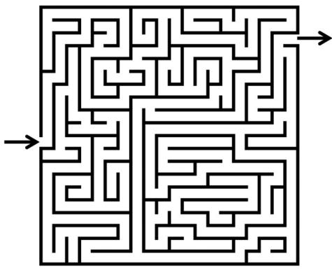
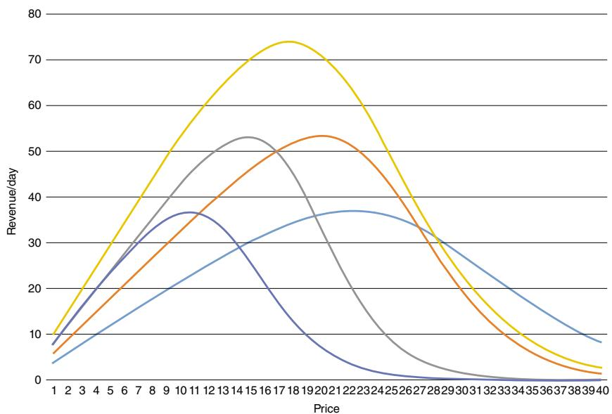
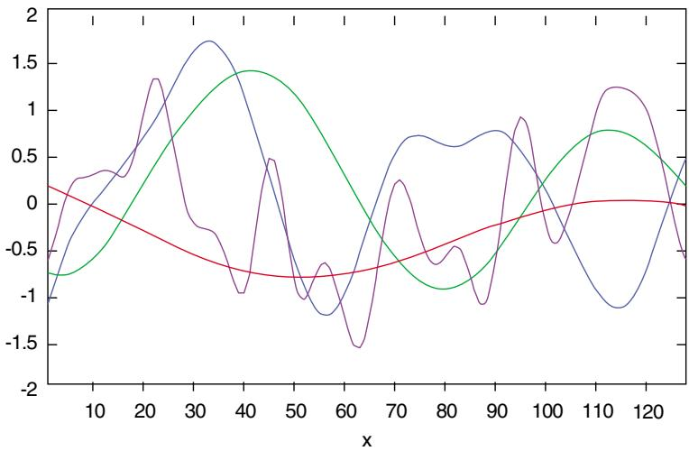
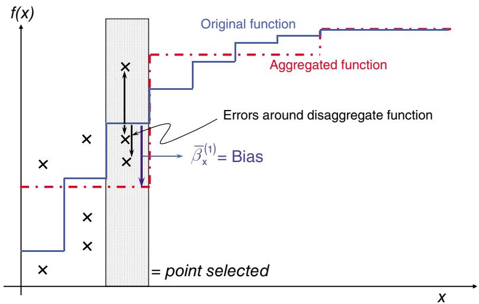
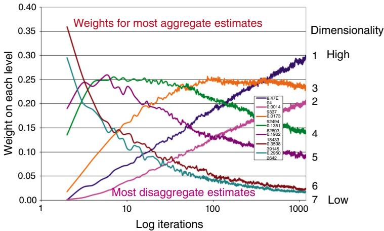
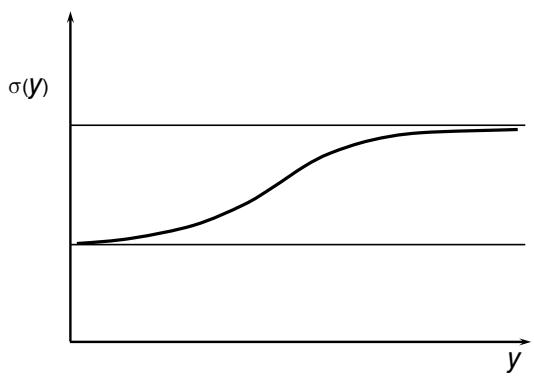
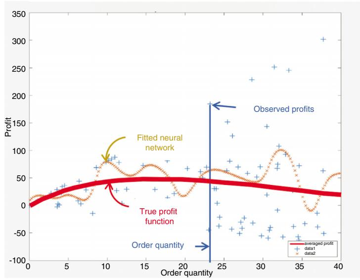
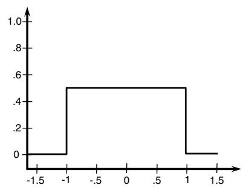
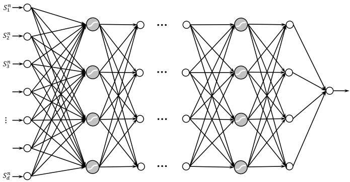
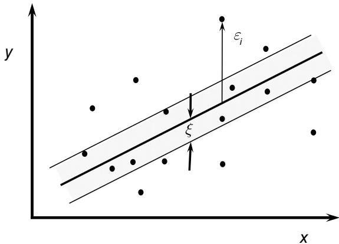

WARREN B. POWELL

# REINFORCEMENT

# LEARNING AND

# STOCHASTIC OPTIMIZATION

A UNIFIED FRAMEWORK

FOR SEQUENTIAL DECISIONS

Reinforcement Learning and Stochastic Optimization: A Unified Framework for Sequential Decisions

# Reinforcement Learning and Stochastic Optimization

A Unified Framework for Sequential Decisions

Warren B. Powell Princeton University Princeton, NJ

WILEY

This edition first published 2022

$\circledcirc$ 2022 John Wiley & Sons, Inc.

All rights reserved. No part of this publication may be reproduced, stored in a retrieval system, or transmitted, in any form or by any means, electronic, mechanical, photocopying, recording or otherwise, except as permitted by law. Advice on how to obtain permission to reuse material from this title is available at http://www.wiley.com/go/permissions.

The right of Warren B. Powell to be identified as the author of this work has been asserted in accordance with law.

Registered Office

John Wiley & Sons, Inc., 111 River Street, Hoboken, NJ 07030, USA

Editorial Office

111 River Street, Hoboken, NJ 07030, USA

For details of our global editorial offices, customer services, and more information about Wiley products visit us at www.wiley.com.

Wiley also publishes its books in a variety of electronic formats and by print-on-demand. Some content that appears in standard print versions of this book may not be available in other formats.

Limit of Liability/Disclaimer of Warranty

The contents of this work are intended to further general scientific research, understanding, and discussion only and are not intended and should not be relied upon as recommending or promoting scientific method, diagnosis, or treatment by physicians for any particular patient. In view of ongoing research, equipment modifications, changes in governmental regulations, and the constant flow of information relating to the use of medicines, equipment, and devices, the reader is urged to review and evaluate the information provided in the package insert or instructions for each medicine, equipment, or device for, among other things, any changes in the instructions or indication of usage and for added warnings and precautions. While the publisher and authors have used their best efforts in preparing this work, they make no representations or warranties with respect to the accuracy or completeness of the contents of this work and specifically disclaim all warranties, including without limitation any implied warranties of merchantability or fitness for a particular purpose. No warranty may be created or extended by sales representatives, written sales materials or promotional statements for this work. The fact that an organization, website, or product is referred to in this work as a citation and/or potential source of further information does not mean that the publisher and authors endorse the information or services the organization, website, or product may provide or recommendations it may make. This work is sold with the understanding that the publisher is not engaged in rendering professional services. The advice and strategies contained herein may not be suitable for your situation. You should consult with a specialist where appropriate. Further, readers should be aware that websites listed in this work may have changed or disappeared between when this work was written and when it is read. Neither the publisher nor authors shall be liable for any loss of profit or any other commercial damages, including but not limited to special, incidental, consequential, or other damages.

A catalogue record for this book is available from the Library of Congress

Hardback ISBN: 9781119815037; ePub ISBN: 9781119815051; ePDF ISBN: 9781119815044; Obook ISBN: 9781119815068.

Cover image: $\circledcirc$ DeniseSmit/Getty Images

Cover design by Wiley

Set in 9.5/12.5pt STIXTwoText by Integra Software Services Pvt. Ltd, Pondicherry, India

# Contents

Preface xxv

Acknowledgments xxxi

# Part I – Introduction 1

# 1 Sequential Decision Problems 3

1.1 The Audience 7   
1.2 The Communities of Sequential Decision Problems 8   
1.3 Our Universal Modeling Framework 10   
1.4 Designing Policies for Sequential Decision Problems 15   
1.4.1 Policy Search 15   
1.4.2 Policies Based on Lookahead Approximations 17   
1.4.3 Mixing and Matching 18   
1.4.4 Optimality of the Four Classes 19   
1.4.5 Pulling it All Together 19   
1.5 Learning 20   
1.6 Themes 21   
1.6.1 Blending Learning and Optimization 21   
1.6.2 Bridging Machine Learning to Sequential Decisions 21   
1.6.3 From Deterministic to Stochastic Optimization 23   
1.6.4 From Single to Multiple Agents 26   
1.7 Our Modeling Approach 27   
1.8 How to Read this Book 27   
1.8.1 Organization of Topics 28   
1.8.2 How to Read Each Chapter 31   
1.8.3 Organization of Exercises 32

1.9 Bibliographic Notes 33

Exercises 34

Bibliography 38

# 2 Canonical Problems and Applications 39

2.1 Canonical Problems 39

2.1.1 Stochastic Search – Derivative-based and Derivative-free 40

2.1.1.1 Derivative-based Stochastic Search 42

2.1.1.2 Derivative-free Stochastic Search 43

2.1.2 Decision Trees 44

2.1.3 Markov Decision Processes 45

2.1.4 Optimal Control 47

2.1.5 Approximate Dynamic Programming 50

2.1.6 Reinforcement Learning 50

2.1.7 Optimal Stopping 54

2.1.8 Stochastic Programming 56

2.1.9 The Multiarmed Bandit Problem 57

2.1.10 Simulation Optimization 60

2.1.11 Active Learning 61

2.1.12 Chance-constrained Programming 61

2.1.13 Model Predictive Control 62

2.1.14 Robust Optimization 63

2.2 A Universal Modeling Framework for Sequential

Decision Problems 64

2.2.1 Our Universal Model for Sequential Decision Problems 65

2.2.2 A Compact Modeling Presentation 68

2.2.3 MDP/RL vs. Optimal Control Modeling Frameworks 68

2.3 Applications 69

2.3.1 The Newsvendor Problems 70

2.3.1.1 Basic Newsvendor – Final Reward 70

2.3.1.2 Basic Newsvendor – Cumulative Reward 71

2.3.1.3 Contextual Newsvendor 71

2.3.1.4 Multidimensional Newsvendor Problems 72

2.3.2 Inventory/Storage Problems 73

2.3.2.1 Inventory Without Lags 73

2.3.2.2 Inventory Planning with Forecasts 75

2.3.2.3 Lagged Decisions 75

2.3.3 Shortest Path Problems 76

2.3.3.1 A Deterministic Shortest Path Problem 76

2.3.3.2 A Stochastic Shortest Path Problem 77

2.3.3.3 A Dynamic Shortest Path Problem 78

2.3.3.4 A Robust Shortest Path Problem 78   
2.3.4 Some Fleet Management Problems 78   
2.3.4.1 The Nomadic Trucker 79   
2.3.4.2 From One Driver to a Fleet 80   
2.3.5 Pricing 80   
2.3.6 Medical Decision Making 81   
2.3.7 Scientific Exploration 82   
2.3.8 Machine Learning vs. Sequential Decision Problems 83   
2.4 Bibliographic Notes 85

Exercises 90

Bibliography 93

# 3 Online Learning 101

3.1 Machine Learning for Sequential Decisions 102   
3.1.1 Observations and Data in Stochastic Optimization 102   
3.1.2 Indexing Input $x ^ { n }$ and Response $y ^ { n + 1 }$ 103   
3.1.3 Functions We are Learning 103   
3.1.4 Sequential Learning: From Very Little Data to … More Data 105   
3.1.5 Approximation Strategies 106   
3.1.6 From Data Analytics to Decision Analytics 108   
3.1.7 Batch vs. Online Learning 109   
3.2 Adaptive Learning Using Exponential Smoothing 110   
3.3 Lookup Tables with Frequentist Updating 111   
3.4 Lookup Tables with Bayesian Updating 112   
3.4.1 The Updating Equations for Independent Beliefs 113   
3.4.2 Updating for Correlated Beliefs 113   
3.4.3 Gaussian Process Regression 117   
3.5 Computing Bias and Variance* 118   
3.6 Lookup Tables and Aggregation* 121   
3.6.1 Hierarchical Aggregation 121   
3.6.2 Estimates of Different Levels of Aggregation 125   
3.6.3 Combining Multiple Levels of Aggregation 129   
3.7 Linear Parametric Models 131   
3.7.1 Linear Regression Review 132   
3.7.2 Sparse Additive Models and Lasso 134   
3.8 Recursive Least Squares for Linear Models 136   
3.8.1 Recursive Least Squares for Stationary Data 136   
3.8.2 Recursive Least Squares for Nonstationary Data* 138   
3.8.3 Recursive Estimation Using Multiple Observations* 139   
3.9 Nonlinear Parametric Models 140   
3.9.1 Maximum Likelihood Estimation 141

3.9.2 Sampled Belief Models 141   
3.9.3 Neural Networks – Parametric* 143   
3.9.4 Limitations of Neural Networks 148   
3.10 Nonparametric Models* 149   
3.10.1 K-Nearest Neighbor 150   
3.10.2 Kernel Regression 151   
3.10.3 Local Polynomial Regression 153   
3.10.4 Deep Neural Networks 154   
3.10.5 Support Vector Machines 155   
3.10.6 Indexed Functions, Tree Structures, and Clustering 156   
3.10.7 Comments on Nonparametric Models 157   
3.11 Nonstationary Learning* 159   
3.11.1 Nonstationary Learning I – Martingale Truth 159   
3.11.2 Nonstationary Learning II – Transient Truth 160   
3.11.3 Learning Processes 161   
3.12 The Curse of Dimensionality 162   
3.13 Designing Approximation Architectures in Adaptive Learning 165   
3.14 Why Does It Work?** 166   
3.14.1 Derivation of the Recursive Estimation Equations 166   
3.14.2 The Sherman-Morrison Updating Formula 168   
3.14.3 Correlations in Hierarchical Estimation 169   
3.14.4 Proof of Proposition 3.14.1 172   
3.15 Bibliographic Notes 174 Exercises 176 Bibliography 180

# 4 Introduction to Stochastic Search 183

4.1 Illustrations of the Basic Stochastic Optimization Problem 185   
4.2 Deterministic Methods 188   
4.2.1 A “Stochastic” Shortest Path Problem 189   
4.2.2 A Newsvendor Problem with Known Distribution 189   
4.2.3 Chance-Constrained Optimization 190   
4.2.4 Optimal Control 191   
4.2.5 Discrete Markov Decision Processes 192   
4.2.6 Remarks 192   
4.3 Sampled Models 193   
4.3.1 Formulating a Sampled Model 194   
4.3.1.1 A Sampled Stochastic Linear Program 194   
4.3.1.2 Sampled Chance-Constrained Models 195

4.3.1.3 Sampled Parametric Models 196   
4.3.2 Convergence 197   
4.3.3 Creating a Sampled Model 199   
4.3.4 Decomposition Strategies* 200   
4.4 Adaptive Learning Algorithms 202   
4.4.1 Modeling Adaptive Learning Problems 202   
4.4.2 Online vs. Offline Applications 204   
4.4.2.1 Machine Learning 204   
4.4.2.2 Optimization 205   
4.4.3 Objective Functions for Learning 205   
4.4.4 Designing Policies 209   
4.5 Closing Remarks 210   
4.6 Bibliographic Notes 210

Exercises 212

Bibliography 218

# Part II – Stochastic Search 221

# 5 Derivative-Based Stochastic Search 223

5.1 Some Sample Applications 225   
5.2 Modeling Uncertainty 228   
5.2.1 Training Uncertainty $W ^ { 1 } , \dots , W ^ { N }$ 228   
5.2.2 Model Uncertainty $S ^ { 0 }$ 229   
5.2.3 Testing Uncertainty 230   
5.2.4 Policy Evaluation 231   
5.2.5 Closing Notes 231   
5.3 Stochastic Gradient Methods 231   
5.3.1 A Stochastic Gradient Algorithm 232   
5.3.2 Introduction to Stepsizes 233   
5.3.3 Evaluating a Stochastic Gradient Algorithm 235   
5.3.4 A Note on Notation 236   
5.4 Styles of Gradients 237   
5.4.1 Gradient Smoothing 237   
5.4.2 Second-Order Methods 237   
5.4.3 Finite Differences 238   
5.4.4 SPSA 240   
5.4.5 Constrained Problems 242   
5.5 Parameter Optimization for Neural Networks* 242   
5.5.1 Computing the Gradient 244   
5.5.2 The Stochastic Gradient Algorithm 246

5.6 Stochastic Gradient Algorithm as a Sequential Decision Problem 247   
5.7 Empirical Issues 248   
5.8 Transient Problems* 249   
5.9 Theoretical Performance* 250   
5.10 Why Does it Work? 250   
5.10.1 Some Probabilistic Preliminaries 251   
5.10.2 An Older Proof* 252   
5.10.3 A More Modern Proof** 256   
5.11 Bibliographic Notes 263 Exercises 264 Bibliography 270

# 6 Stepsize Policies 273

6.1 Deterministic Stepsize Policies 276   
6.1.1 Properties for Convergence 276   
6.1.2 A Collection of Deterministic Policies 278   
6.1.2.1 Constant Stepsizes 278   
6.1.2.2 Generalized Harmonic Stepsizes 279   
6.1.2.3 Polynomial Learning Rates 280   
6.1.2.4 McClain’s Formula 280   
6.1.2.5 Search-then-Converge Learning Policy 281   
6.2 Adaptive Stepsize Policies 282   
6.2.1 The Case for Adaptive Stepsizes 283   
6.2.2 Convergence Conditions 283   
6.2.3 A Collection of Stochastic Policies 284   
6.2.3.1 Kesten’s Rule 285   
6.2.3.2 Trigg’s Formula 286   
6.2.3.3 Stochastic Gradient Adaptive Stepsize Rule 286   
6.2.3.4 ADAM 287   
6.2.3.5 AdaGrad 287   
6.2.3.6 RMSProp 288   
6.2.4 Experimental Notes 289   
6.3 Optimal Stepsize Policies* 289   
6.3.1 Optimal Stepsizes for Stationary Data 291   
6.3.2 Optimal Stepsizes for Nonstationary Data – I 293   
6.3.3 Optimal Stepsizes for Nonstationary Data – II 294   
6.4 Optimal Stepsizes forApproximateValue Iteration* 297   
6.5 Convergence 300   
6.6 Guidelines for Choosing Stepsize Policies 301   
6.7 Why Does it Work* 303

6.7.1 Proof of BAKF Stepsize 303   
6.8 Bibliographic Notes 306

Exercises 307

Bibliography 314

# 7 Derivative-Free Stochastic Search 317

7.1 Overview of Derivative-free Stochastic Search 319   
7.1.1 Applications and Time Scales 319   
7.1.2 The Communities of Derivative-free Stochastic Search 321   
7.1.3 The Multiarmed Bandit Story 321   
7.1.4 From Passive Learning to Active Learning to Bandit Problems 323   
7.2 Modeling Derivative-free Stochastic Search 325   
7.2.1 The Universal Model 325   
7.2.2 Illustration: Optimizing a Manufacturing Process 328   
7.2.3 Major Problem Classes 329   
7.3 Designing Policies 330   
7.4 Policy Function Approximations 333   
7.5 Cost Function Approximations 335   
7.6 VFA-based Policies 338   
7.6.1 An Optimal Policy 338   
7.6.2 Beta-Bernoulli Belief Model 340   
7.6.3 Backward Approximate Dynamic Programming 342   
7.6.4 Gittins Indices for Learning in Steady State 343   
7.7 Direct Lookahead Policies 348   
7.7.1 When do we Need Lookahead Policies? 349   
7.7.2 Single Period Lookahead Policies 350   
7.7.3 Restricted Multiperiod Lookahead 353   
7.7.4 Multiperiod Deterministic Lookahead 355   
7.7.5 Multiperiod Stochastic Lookahead Policies 357   
7.7.6 Hybrid Direct Lookahead 360   
7.8 The Knowledge Gradient (Continued)* 362   
7.8.1 The Belief Model 363   
7.8.2 The Knowledge Gradient for Maximizing Final Reward 364   
7.8.3 The Knowledge Gradient for Maximizing Cumulative Reward 369   
7.8.4 The Knowledge Gradient for Sampled Belief Model* 370   
7.8.5 Knowledge Gradient for Correlated Beliefs 375   
7.9 Learning in Batches 380   
7.10 Simulation Optimization* 382   
7.10.1 An Indifference Zone Algorithm 383   
7.10.2 Optimal Computing Budget Allocation 383   
7.11 Evaluating Policies 385

7.11.1 Alternative Performance Metrics* 386   
7.11.2 Perspectives of Optimality* 392   
7.12 Designing Policies 394   
7.12.1 Characteristics of a Policy 395   
7.12.2 The Effect of Scaling 396   
7.12.3 Tuning 398   
7.13 Extensions* 398   
7.13.1 Learning in Nonstationary Settings 399   
7.13.2 Strategies for Designing Time-dependent Policies 400   
7.13.3 A Transient Learning Model 401   
7.13.4 The Knowledge Gradient for Transient Problems 402   
7.13.5 Learning with Large or Continuous Choice Sets 403   
7.13.6 Learning with Exogenous State Information – the Contextual Bandit Problem 405   
7.13.7 State-dependent vs. State-independent Problems 408   
7.14 Bibliographic Notes 409 Exercises 412 Bibliography 424

# Part III – State-dependent Problems 429

# 8 State-dependent Problems 431

8.1 Graph Problems 433   
8.1.1 A Stochastic Shortest Path Problem 433   
8.1.2 The Nomadic Trucker 434   
8.1.3 The Transformer Replacement Problem 435   
8.1.4 Asset Valuation 437   
8.2 Inventory Problems 439   
8.2.1 A Basic Inventory Problem 439   
8.2.2 The Inventory Problem – II 440   
8.2.3 The Lagged Asset Acquisition Problem 443   
8.2.4 The Batch Replenishment Problem 444   
8.3 Complex Resource Allocation Problems 446   
8.3.1 The Dynamic Assignment Problem 447   
8.3.2 The Blood Management Problem 450   
8.4 State-dependent Learning Problems 456   
8.4.1 Medical Decision Making 457   
8.4.2 Laboratory Experimentation 458   
8.4.3 Bidding for Ad-clicks 459   
8.4.4 An Information-collecting Shortest Path Problem 459

8.5 A Sequence of Problem Classes 460   
8.6 Bibliographic Notes 461

Exercises 462

Bibliography 466

# 9 Modeling Sequential Decision Problems 467

9.1 A Simple Modeling Illustration 471   
9.2 Notational Style 476   
9.3 Modeling Time 478   
9.4 The States of Our System 481   
9.4.1 Defining the State Variable 481   
9.4.2 The Three States of Our System 485   
9.4.3 Initial State $S _ { 0 }$ vs. Subsequent States $S _ { t }$ , $t > 0$ 488   
9.4.4 Lagged State Variables* 490   
9.4.5 The Post-decision State Variable* 490   
9.4.6 A Shortest Path Illustration 493   
9.4.7 Belief States* 495   
9.4.8 Latent Variables* 496   
9.4.9 Rolling Forecasts* 497   
9.4.10 Flat vs. Factored State Representations* 498   
9.4.11 A Programmer’s Perspective of State Variables 499   
9.5 Modeling Decisions 500   
9.5.1 Types of Decisions 502   
9.5.2 Initial Decision $x _ { 0 }$ vs. Subsequent Decisions $x _ { t }$ , $t > 0$ 502   
9.5.3 Strategic, Tactical, and Execution Decisions 503   
9.5.4 Constraints 504   
9.5.5 Introducing Policies 505   
9.6 The Exogenous Information Process 506   
9.6.1 Basic Notation for Information Processes 506   
9.6.2 Outcomes and Scenarios 509   
9.6.3 Lagged Information Processes* 510   
9.6.4 Models of Information Processes* 511   
9.6.5 Supervisory Processes* 514   
9.7 The Transition Function 515   
9.7.1 A General Model 515   
9.7.2 Model-free Dynamic Programming 516   
9.7.3 Exogenous Transitions 518   
9.8 The Objective Function 518   
9.8.1 The Performance Metric 518   
9.8.2 Optimizing the Policy 519   
9.8.3 Dependence of Optimal Policy on $S _ { 0 }$ 520

9.8.4 State-dependent Variations 520   
9.8.5 Uncertainty Operators 523   
9.9 Illustration: An Energy Storage Model 523   
9.9.1 With a Time-series Price Model 525   
9.9.2 With Passive Learning 525   
9.9.3 With Active Learning 526   
9.9.4 With Rolling Forecasts 526   
9.10 Base Models and Lookahead Models 528   
9.11 A Classification of Problems* 529   
9.12 Policy Evaluation* 532   
9.13 Advanced Probabilistic Modeling Concepts** 534   
9.13.1 A Measure-theoretic View of Information** 535   
9.13.2 Policies and Measurability 538   
9.14 Looking Forward 540   
9.15 Bibliographic Notes 542

Exercises 544

Bibliography 557

# 10 Uncertainty Modeling 559

10.1 Sources of Uncertainty 560   
10.1.1 Observational Errors 562   
10.1.2 Exogenous Uncertainty 564  
10.1.3 Prognostic Uncertainty 564   
10.1.4 Inferential (or Diagnostic) Uncertainty 567   
10.1.5 Experimental Variability 568   
10.1.6 Model Uncertainty 569   
10.1.7 Transitional Uncertainty 571   
10.1.8 Control/implementation Uncertainty 571   
10.1.9 Communication Errors and Biases 572   
10.1.10 Algorithmic Instability 573   
10.1.11 Goal Uncertainty 574   
10.1.12 Political/regulatory Uncertainty 574   
10.1.13 Discussion 574   
10.2 A Modeling Case Study: The COVID Pandemic 575   
10.3 Stochastic Modeling 575   
10.3.1 Sampling Exogenous Information 575   
10.3.2 Types of Distributions 577   
10.3.3 Modeling Sample Paths 578   
10.3.4 State-action-dependent Processes 579   
10.3.5 Modeling Correlations 581   
10.4 Monte Carlo Simulation 581

10.4.1 Generating Uniform [0, 1] Random Variables 582   
10.4.2 Uniform and Normal Random Variable 583   
10.4.3 Generating Random Variables from Inverse Cumulative Distributions 585   
10.4.4 Inverse Cumulative From Quantile Distributions 586   
10.4.5 Distributions with Uncertain Parameters 587   
10.5 Case Study: Modeling Electricity Prices 589   
10.5.1 Mean Reversion 590   
10.5.2 Jump-diffusion Models 590   
10.5.3 Quantile Distributions 591   
10.5.4 Regime Shifting 592   
10.5.5 Crossing Times 593   
10.6 Sampling vs. Sampled Models 595   
10.6.1 Iterative Sampling: A Stochastic Gradient Algorithm 595   
10.6.2 Static Sampling: Solving a Sampled Model 595   
10.6.3 Sampled Representation with Bayesian Updating 596   
10.7 Closing Notes 597   
10.8 Bibliographic Notes 597

Exercises 598

Bibliography 601

11 Designing Policies 603

11.1 From Optimization to Machine Learning to Sequential   
Decision Problems 605   
11.2 The Classes of Policies 606   
11.3 Policy Function Approximations 610   
11.4 Cost Function Approximations 613   
11.5 Value Function Approximations 614   
11.6 Direct Lookahead Approximations 616   
11.6.1 The Basic Idea 616   
11.6.2 Modeling the Lookahead Problem 619   
11.6.3 The Policy-Within-a-Policy 620   
11.7 Hybrid Strategies 620   
11.7.1 Cost Function Approximation with Policy Function

Approximations 621

11.7.2 Lookahead Policies with Value Function Approximations 622   
11.7.3 Lookahead Policies with Cost Function Approximations 623   
11.7.4 Tree Search with Rollout Heuristic and a Lookup Table Policy 623   
11.7.5 Value Function Approximation with Policy Function

Approximation 624

11.7.6 Fitting Value Functions Using ADP and Policy Search 624

11.8 Randomized Policies 626   
11.9 Illustration: An Energy Storage Model Revisited 627   
11.9.1 Policy Function Approximation 628   
11.9.2 Cost Function Approximation 628   
11.9.3 Value Function Approximation 628   
11.9.4 Deterministic Lookahead 629   
11.9.5 Hybrid Lookahead-Cost Function Approximation 629   
11.9.6 Experimental Testing 629   
11.10 Choosing the Policy Class 631   
11.10.1 The Policy Classes 631   
11.10.2 Policy Complexity-Computational Tradeoffs 636   
11.10.3 Screening Questions 638   
11.11 Policy Evaluation 641   
11.12 Parameter Tuning 642   
11.12.1 The Soft Issues 644   
11.12.2 Searching Across Policy Classes 645   
11.13 Bibliographic Notes 646

Exercises 646

Bibliography 651

Part IV – Policy Search 653

# 12 Policy Function Approximations and Policy Search 655

12.1 Policy Search as a Sequential Decision Problem 657   
12.2 Classes of Policy Function Approximations 658   
12.2.1 Lookup Table Policies 659   
12.2.2 Boltzmann Policies for Discrete Actions 659   
12.2.3 Linear Decision Rules 660   
12.2.4 Monotone Policies 661   
12.2.5 Nonlinear Policies 662   
12.2.6 Nonparametric/Locally Linear Policies 663   
12.2.7 Contextual Policies 665   
12.3 Problem Characteristics 665   
12.4 Flavors of Policy Search 666   
12.5 Policy Search with Numerical Derivatives 669   
12.6 Derivative-Free Methods for Policy Search 670   
12.6.1 Belief Models 671   
12.6.2 Learning Through Perturbed PFAs 672   
12.6.3 Learning CFAs 675   
12.6.4 DLA Using the Knowledge Gradient 677

12.6.5 Comments 677   
12.7 Exact Derivatives for Continuous Sequential

Problems* 677

12.8 ExactDerivatives forDiscreteDynamicPrograms** 680   
12.8.1 A Stochastic Policy 681   
12.8.2 The Objective Function 683   
12.8.3 The Policy Gradient Theorem 683   
12.8.4 Computing the Policy Gradient 684   
12.9 Supervised Learning 686   
12.10 Why Does it Work? 687   
12.10.1 Derivation of the Policy Gradient Theorem 687   
12.11 Bibliographic Notes 690

Exercises 691

Bibliography 698

# 13 Cost Function Approximations 701

13.1 General Formulation for Parametric CFA 703   
13.2 Objective-Modified CFAs 704   
13.2.1 Linear Cost Function Correction 705   
13.2.2 CFAs for Dynamic Assignment Problems 705   
13.2.3 Dynamic Shortest Paths 707   
13.2.4 Dynamic Trading Policy 711   
13.2.5 Discussion 713   
13.3 Constraint-Modified CFAs 714   
13.3.1 General Formulation of Constraint-Modified CFAs 715   
13.3.2 A Blood Management Problem 715   
13.3.3 An Energy Storage Example with Rolling Forecasts 717   
13.4 Bibliographic Notes 725

Exercises 726

Bibliography 729

# Part V – Lookahead Policies 731

# 14 Exact Dynamic Programming 737

14.1 Discrete Dynamic Programming 738   
14.2 The Optimality Equations 740   
14.2.1 Bellman’s Equations 741   
14.2.2 Computing the Transition Matrix 745   
14.2.3 Random Contributions 746   
14.2.4 Bellman’s Equation Using Operator Notation* 746

14.3 Finite Horizon Problems 747

14.4 Continuous Problems with Exact Solutions 750

14.4.1 The Gambling Problem 751

14.4.2 The Continuous Budgeting Problem 752

14.5 Infinite Horizon Problems* 755

14.6 Value Iteration for Infinite Horizon Problems* 757

14.6.1 A Gauss-Seidel Variation 758

14.6.2 Relative Value Iteration 758

14.6.3 Bounds and Rates of Convergence 760

14.7 Policy Iteration for Infinite Horizon Problems* 762

14.8 Hybrid Value-Policy Iteration* 764

14.9 Average Reward Dynamic Programming* 765

14.10 The Linear Programming Method for Dynamic Programs** 766

14.11 Linear Quadratic Regulation 767

14.12 Why Does it Work?** 770

14.12.1 The Optimality Equations 770

14.12.2 Convergence of Value Iteration 774

14.12.3 Monotonicity of Value Iteration 778

14.12.4 Bounding the Error from Value Iteration 780

14.12.5 Randomized Policies 781

14.13 Bibliographic Notes 783

Exercises 783

Bibliography 793

15 Backward Approximate Dynamic Programming 795

15.1 Backward Approximate Dynamic Programming for Finite Horizon Problems 797

15.1.1 Some Preliminaries 797

15.1.2 Backward ADP Using Lookup Tables 799

15.1.3 Backward ADP Algorithm with Continuous Approximations 801

15.2 FittedValue Iteration for InfiniteHorizonProblems 804

15.3 Value Function Approximation Strategies 805

15.3.1 Linear Models 806

15.3.2 Monotone Functions 807

15.3.3 Other Approximation Models 810

15.4 Computational Observations 810

15.4.1 Experimental Benchmarking of Backward ADP 810

15.4.2 Computational Notes 815

15.5 Bibliographic Notes 816 Exercises 816

Bibliography 821

# 16 Forward ADP I: The Value of a Policy 823

16.1 Sampling the Value of a Policy 824

16.1.1 Direct Policy Evaluation for Finite Horizon Problems 824

16.1.2 Policy Evaluation for Infinite Horizon Problems 826

16.1.3 Temporal Difference Updates 828

16.1.4 TD(??) 829

16.1.5 TD(0) and Approximate Value Iteration 830

16.1.6 TD Learning for Infinite Horizon Problems 832

16.2 Stochastic Approximation Methods 835

16.3 Bellman’s Equation Using a Linear Model* 837

16.3.1 A Matrix-based Derivation** 837

16.3.2 A Simulation-based Implementation 840

16.3.3 Least Squares Temporal Difference Learning (LSTD) 840

16.3.4 Least Squares Policy Evaluation 841

16.4 Analysis of TD(0), LSTD, and LSPE Using a Single State* 842

16.4.1 Recursive Least Squares and TD(0) 842

16.4.2 Least Squares Policy Evaluation 844

16.4.3 Least Squares Temporal Difference Learning 844

16.4.4 Discussion 844

16.5 Gradient-based Methods for Approximate Value Iteration* 845

16.5.1 Approximate Value Iteration with Linear Models** 845

16.5.2 A Geometric View of Linear Models* 850

16.6 Value Function Approximations Based on Bayesian Learning* 852

16.6.1 Minimizing Bias for Infinite Horizon Problems 852

16.6.2 Lookup Tables with Correlated Beliefs 853

16.6.3 Parametric Models 854

16.6.4 Creating the Prior 855

16.7 Learning Algorithms and Atepsizes 855

16.7.1 Least Squares Temporal Differences 856

16.7.2 Least Squares Policy Evaluation 857

16.7.3 Recursive Least Squares 857

16.7.4 Bounding $1 / n$ Convergence for Approximate value Iteration 859

16.7.5 Discussion 860

16.8 Bibliographic Notes 860

Exercises 862

Bibliography 864

17 Forward ADP II: Policy Optimization 867   
17.1 Overview of Algorithmic Strategies 869   
17.2 Approximate Value Iteration and $\pmb { Q }$ -Learning Using Lookup Tables 871   
17.2.1 Value Iteration Using a Pre-Decision State Variable 872   
17.2.2 Q-Learning 873   
17.2.3 Value Iteration Using a Post-Decision State Variable 875   
17.2.4 Value Iteration Using a Backward Pass 877   
17.3 Styles of Learning 881   
17.3.1 Offline Learning 882   
17.3.2 From Offline to Online 883   
17.3.3 Evaluating Offline and Online Learning Policies 885   
17.3.4 Lookahead Policies 885   
17.4 Approximate Value Iteration Using Linear 886Models   
17.5 On-policy vs. off-policy learning and the exploration–exploitation problem 888   
17.5.1 Terminology 889   
17.5.2 Learning with Lookup Tables 890   
17.5.3 Learning with Generalized Belief Models 891   
17.6 Applications 894   
17.6.1 Pricing an American Option 894   
17.6.2 Playing “Lose Tic-Tac-Toe” 898   
17.6.3 Approximate Dynamic Programming for Deterministic 900Problems   
17.7 Approximate Policy Iteration 900   
17.7.1 Finite Horizon Problems Using Lookup Tables 901   
17.7.2 Finite Horizon Problems Using Linear Models 903   
17.7.3 LSTD for Infinite Horizon Problems Using Linear Models 903   
17.8 The Actor–Critic Paradigm 907   
17.9 Statistical Bias in the Max Operator* 909   
17.10 The Linear Programming Method Using Linear Models* 912   
17.11 Finite Horizon Approximations for Steady-State Applications 915   
17.12 Bibliographic Notes 917 Exercises 918 Bibliography 924   
18 Forward ADP III: Convex Resource Allocation Problems 927   
18.1 Resource Allocation Problems 930

18.1.1 The Newsvendor Problem 930   
18.1.2 Two-Stage Resource Allocation Problems 931   
18.1.3 A General Multiperiod Resource Allocation Model* 933   
18.2 Values Versus Marginal Values 937   
18.3 Piecewise Linear Approximations for Scalar 938Functions   
18.3.1 The Leveling Algorithm 939   
18.3.2 The CAVE Algorithm 941   
18.4 Regression Methods 941   
18.5 Separable Piecewise Linear Approximations 944   
18.6 Benders Decomposition for Nonseparable Approximations** 946   
18.6.1 Benders’ Decomposition for Two-Stage Problems 947   
18.6.2 Asymptotic Analysis of Benders with Regularization** 952   
18.6.3 Benders with Regularization 956   
18.7 Linear Approximations for High-Dimensional Applications 956   
18.8 Resource Allocation with Exogenous Information State 958   
18.9 Closing Notes 959   
18.10 Bibliographic Notes 960 Exercises 962 Bibliography 967

# 19 Direct Lookahead Policies 971

19.1 Optimal Policies Using Lookahead Models 974   
19.2 Creating an Approximate Lookahead Model 978   
19.2.1 Modeling the Lookahead Model 979   
19.2.2 Strategies for Approximating the Lookahead Model 980   
19.3 Modified Objectives in Lookahead Models 985   
19.3.1 Managing Risk 985   
19.3.2 Utility Functions for Multiobjective Problems 991   
19.3.3 Model Discounting 992   
19.4 Evaluating DLA Policies 992   
19.4.1 Evaluating Policies in a Simulator 994   
19.4.2 Evaluating Risk-Adjusted Policies 994   
19.4.3 Evaluating Policies in the Field 996   
19.4.4 Tuning Direct Lookahead Policies 997   
19.5 Why Use a DLA? 997   
19.6 Deterministic Lookaheads 999   
19.6.1 A Deterministic Lookahead: Shortest Path Problems 1001

19.6.2 Parameterized Lookaheads 1003   
19.7 A Tour of Stochastic Lookahead Policies 1005   
19.7.1 Lookahead PFAs 1005   
19.7.2 Lookahead CFAs 1007   
19.7.3 Lookahead VFAs for the Lookahead Model 1007   
19.7.4 Lookahead DLAs for the Lookahead Model 1008   
19.7.5 Discussion 1009   
19.8 Monte Carlo Tree Search for Discrete Decisions 1009   
19.8.1 Basic Idea 1010   
19.8.2 The Steps of MCTS 1010   
19.8.3 Discussion 1014   
19.8.4 Optimistic Monte Carlo Tree Search 1016   
19.9 Two-Stage Stochastic Programming for Vector Decisions* 1018   
19.9.1 The Basic Two-Stage Stochastic Program 1018   
19.9.2 Two-Stage Approximation of a Sequential Problem 1020   
19.9.3 Discussion 1023   
19.10 Observations on DLA Policies 1024   
19.11 Bibliographic Notes 1025 Exercises 1027 Bibliography 1031

# Part VI – Multiagent Systems 1033

# 20 Multiagent Modeling and Learning 1035

20.1 Overview of Multiagent Systems 1036   
20.1.1 Dimensions of a Multiagent System 1036   
20.1.2 Communication 1038   
20.1.3 Modeling a Multiagent System 1040   
20.1.4 Controlling Architectures 1043   
20.2 A Learning Problem – Flu Mitigation 1044   
20.2.1 Model 1: A Static Model 1045   
20.2.2 Variations of Our Flu Model 1046   
20.2.3 Two-Agent Learning Models 1050   
20.2.4 Transition Functions for Two-Agent Model 1052   
20.2.5 Designing Policies for the Flu Problem 1054   
20.3 The POMDP Perspective* 1059   
20.4 The Two-Agent Newsvendor Problem 1062   
20.5 Multiple Independent Agents – An HVAC Controller Model 1067

20.5.1 Model 1067   
20.5.2 Designing Policies 1069   
20.6 Cooperative Agents – A Spatially Distributed Blood Management Problem 1070   
20.7 Closing Notes 1074   
20.8 Why Does it Work? 1074   
20.8.1 Derivation of the POMDP Belief Transition Function 1074   
20.9 Bibliographic Notes 1076 Exercises 1077 Bibliography 1083

Index 1085

# Preface

Preface to Reinforcement Learning and Stochastic Optimization: A unified framework for sequential decisions

This books represents a lifetime of research into what I now call sequential decision problems, which dates to 1982 when I was introduced to the problem arising in truckload trucking (think of Uber/Lyft for trucks) where we have to choose which driver to assign to a load, and which loads to accept to move, given the high level of randomness in future customer demands, representing requests to move full truckloads of freight.

It took me 20 years to figure out a practical algorithm to solve this problem, which led to my first book (in 2007) on approximate dynamic programming, where the major breakthrough was the introduction of the post-decision state and the use of hierarchical aggregation for approximating value functions to solve these high-dimensional problems. However, I would argue today that the most important chapter in the book (and I recognized it at the time), was chapter 5 on how to model these problems, without any reference to algorithms to solve the problem. I identified five elements to a sequential decision problem, leading up to the objective function which was written

$$
\max  _ {\pi} \mathbb {E} \left\{\sum_ {t = 0} ^ {T} C \left(S _ {t}, X ^ {\pi} \left(S _ {t}\right)\right) | S _ {0} \right\}.
$$

It was not until the second edition (in 2011) that I realized that approximate dynamic programming (specifically, policies that depend on value functions) was not the only way to solve these problems; rather, there were four classes of policies, and only one used value functions. The 2011 edition of the book listed three of the four classes of policies that are described in this book, but most of the book still focused on approximating value functions. It was not until a 2014

paper (“Clearing the Jungle of Stochastic Optimization”) that I identified the four classes of policies I use now. Then, in 2016 I realized that the four classes of policies could be divided between two major strategies: the policy search strategy, where we search over a family of functions to find the one that works best, and the lookahead strategy, where we make good decisions by approximating the downstream impact of a decision made now.

Finally, I combined these ideas in a 2019 paper (“A Unified Framework for Stochastic Optimization” published in the European Journal for Operational Research) with a better appreciation of major classes of problems such as state-independent problems (the pure learning problems that include derivative-based and derivative-free stochastic search) and the more general state-dependent problems; cumulative and final reward objective functions; and the realization that any adaptive search algorithm was a sequential decision problem. The material in the 2019 paper is effectively the outline for this book.

This book builds on the 2011 edition of my approximate dynamic programming book, and includes a number of chapters (some heavily edited) from the ADP book. It would be nice to call this a third edition, but the entire framework of this book is completely different. “Approximate dynamic programming” is a term that still refers to making decisions based on the idea of approximating the downstream value of being in a state. After decades of working with this approach (which is still covered over a span of five chapters in this volume), I can now say with confidence that value function approximations, despite all the attention they have received, is a powerful methodology for a surprisingly narrow set of decision problems.

By contrast, I finally developed the confidence to claim that the four classes of policies are universal. This means that any method for making decisions will fall in one of these four classes, or a hybrid of two or more. This is a game changer, because it shifts the focus from an algorithm (the method for making decisions) to the model (specifically the optimization problem above, along with the state-transition function and the model of the exogenous information process). This means we write out the elements of a problem before we tackle the problem of designing policies to decisions. I call this:

# Model first, then solve.

The communities working on sequential decision problems are very focused on methods, just as I was with my earlier work with approximate dynamic programming. The problem is that any particular method will be inherently limited to a narrow class of problems. In this book, I demonstrate how you can

take a simple inventory problem, and then tweak the data to make each of the four classes work best.

This new approach has opened up an entirely new way of approaching a problem class that, in the last year of writing the book, I started calling “sequential decision analytics,” which is any problem consisting of the sequence:

Decision, information, decision, information, ....

I allow decisions to range from binary (selling an asset) to discrete choices (favored in computer science) to the high-dimensional resource allocation problems popular in operations research. This approach starts with a problem, shifts to the challenging task of modeling uncertainty, and then finishes with designing policies to make decisions to optimize some metric. The approach is practical, scalable, and universally applicable.

It is exciting to be able to create a single framework that spans 15 different communities, and which represents every possible method for solving sequential decision problems. While having a common language to model any sequential decision problem, combined with the general approach of the four classes of policies, is clearly of value, this framework has been developed by standing on the shoulders of the giants who have laid the foundational work for all of these methods. I have had to make choices regarding the best notation and modeling conventions, but my framework is completely inclusive of all the methods that have been developed to solve these problems. Rather than joining the chorus of researchers promoting specific algorithmic strategies (as I once did), my goal is to raise the visibility of all methods, so that someone looking to solve a real problem is working with the biggest possible toolbox, rather than just the tools developed within a specific community.

A word needs to be said about the title of the book. As this is being written, there is a massive surge of interest in “reinforcement learning,” which started as a form of approximate dynamic programming (I used to refer to ADP and RL as similar to American English and British English). However, as the RL community has grown and started working on harder problems, they encountered the same experience that I and everyone else working in ADP found: value function approximations are not a panacea. Not only is it the case that they often do not work, they usually do not work. As a result, the RL community branched out (just as I did) into other methods such as “policy gradient methods” (my “policy function approximations” or PFA), upper confidence bounding (a form of “cost function approximation” or CFA), the original $Q$ -learning (which produces a policy based on “value function approximations” or VFA), and finally

Monte Carlo tree search (a policy based on “direct lookahead approximations” or DLA). All of these methods are found in the second edition of Sutton and Barto’s landmark book Reinforcement Learning: An introduction, but only as specific methods rather than general classes. This book takes the next step and identifies the general classes.

This evolution from one core method to all four classes of policies is being repeated among other fields that I came to call the “jungle of stochastic optimization.” Stochastic search, simulation-optimization, and bandit problems all feature methods from each of the four classes of policies. Over time, I came to realize that all these fields (including reinforcement learning) were playing catchup to the grandfather of all of this work, which is optimal control (and stochastic control). The field of optimal control was the first to introduce and seriously explore the use of value function approximations (they call these cost-to-go functions), linear decision rules (a form of PFA), and the workhorse “model predictive control” (a great name for a simple rolling horizon procedure, which is a “direct lookahead approximation” in this book). I also found that my modeling framework was closest to that used in the optimal control literature, which was the first field to introduce the concept of a transition function, a powerful modeling device that has been largely overlooked by the other communities. I make a few small tweaks such as using state $S _ { t }$ instead of $x _ { t }$ and decision $x _ { t }$ (widely used in the field of math programming) instead of $u _ { t }$ .

Then I introduce one big change, which is to maximize over all four classes of policies. Perhaps the most important innovation of this book is to break the almost automatic link between optimizing over policies, and then assuming that we are going to compute an optimal policy from either Bellman’s equation or the Hamilton-Jacobi equations. These are rarely computable for real problems, which then leads people to assume that the natural next step is to approximate these equations. This is simply false, supported by decades of research where people have developed methods that do not depend on HJB equations. I recognize this body of research developing different classes of policies by making the inclusion of all four classes of policies fundamental to the original statement of the optimization problem above.

It will take some time for people from the different communities to learn to speak this common language. More likely, there will be an adaptation of existing modeling languages to this framework. For example, the optimal control community could keep their notation, but learn to write their objective functions as I have above, recognizing that the search over policies needs to span all four classes (which, I might point out, they are already using). I would hope that the reinforcement learning community, which adopted the notation for discrete action ??, might learn to use the more general $x$ (as the bandit community has already done).

I have tried to write this book to appeal to newcomers to the field, as well as people who already have training in one or more of the subfields that deal with decisions and uncertainty; recognizing these two broad communities was easily the biggest challenge while writing this book. Not surprisingly, the book is quite long. I have tried to make it more accessible to people who are new to the field by marking many sections with an * as an indication that this section can be skipped on a first-read. I also hope that the book will appeal to people from many application domains. However, the core audience is people who are looking to solve real problems by modeling applications and implementing the work in software. The notation is designed to facilitate writing computer programs, where there should be a direct relationship between the mathematical model and the software. This is particularly important when modeling the flow of information, something that is often overlooked in mainstream reinforcement learning papers.

Warren B. Powell

Princeton, New Jersey August, 2021

# Acknowledgments

The foundation of this book is a modeling framework for sequential decision problems that involves searching over four classes of policies for making decisions. The recognition that we needed all four classes of policies came from working on a wide range of problems spanning freight transportation (almost all modes), energy, health, e-commerce, finance, and even materials science (!!).

This research required a lot of computational work, which was only possible through the efforts of the many students and staff that worked in CASTLE Lab. Over my 39 years of teaching at Princeton, I benefited tremendously from the interactions with 70 graduate students and post-doctoral associates, along with nine professional staff. I am deeply indebted to the contributions of this exceptionally talented group of men and women who allowed me to participate in the challenges of getting computational methods to work on such a wide range of problems. It was precisely this diversity of problem settings that led me to appreciate the motivation for the different methods for solving problems. In the process, I met people from across the jungle, and learned to speak their language not just by reading papers, but by talking to them and, often, working on their problems.

I would also like to acknowledge what I learned from supervising over 200 senior theses. While not as advanced as the graduate research, the undergraduates helped expose me to an even wider range of problems, spanning topics such as sports, health, urban transportation, social networks, agriculture, pharmaceuticals, and even optimizing Greek cargo ships. It was the undergraduates who accelerated my move into energy in 2008, allowing me to experiment with modeling and solving a variety of problems spanning microgrids, solar arrays, energy storage, demand management, and storm response. This experience exposed me to new challenges, new methods, and most important, new communities in engineering and economics.

The group of students and staff that participated in CASTLE Lab is much too large to list in this acknowledgment, but I have included my academic family tree above. To everyone in this list, my warmest thanks!

I owe a special thanks to the sponsors of CASTLE Lab, which included a number of government funding agencies including the National Science Foundation, the Air Force Office of Scientific Research, DARPA, the Department of Energy (through Columbia University and the University of Delaware), and Lawrence Livermore National Laboratory (my first energy sponsor). I would particularly like to highlight the Optimization and Discrete Mathematics Program of AFOSR that provided me with almost 30 years of unbroken funding. I would like to express my appreciation to the program managers of the ODM program, including Neal Glassman (who gave me my start in this program), Donald Hearn (who introduced me to the materials science program), Fariba Fahroo (whose passion for this work played a major role in its survival at AFOSR), and Warren Adams. Over the years I came to have a deep appreciation for the critical role played by these program managers who provide a critical bridge between academic researchers and the policymakers who have to then sell the work to Congress.

I want to recognize my industrial sponsors and the members of my professional staff that made this work possible. Easily one of the most visible features of CASTLE Lab was that we did not just write academic papers and run computer simulations; our work was implemented in the field. We would work with a company, identify a problem, build a model, and then see if it worked, and it often did not. This was true research, with a process that I once documented with a booklet called “From the Laboratory to the Field, and Back.” It was this back and forth process that allowed me to learn how to model and solve real problems. We had some early successes, followed by a period of frustrating failures as we tackled even harder problems, but we had two amazing successes in the early 2000s with our implementation of a locomotive optimization system at Norfolk Southern Railway using approximate dynamic programming, and our strategic fleet simulator for Schneider National (one of the largest truckload carriers in the U.S.). This software was later licensed to Optimal Dynamics which is implementing the technology in the truckload industry. My industrial sponsors received no guarantees when they funded our research, and their (sometimes misplaced) confidence in me played a critical role in our learning process.

Working with industry from a university research lab, especially for a school like Princeton, introduces administrative challenges that few appreciate. Critical to my ability to work with industry was the willingness of a particular grants officer at Princeton, John Ritter, to negotiate contracts where companies funded the research, and were then given royalty-free licenses to use the

software. This was key, since it was through their use of the software that I learned what worked, and what did not. John understood that the first priority at a university is supporting the faculty and their research mission rather than maximizing royalties. I think that I can claim that my $\$ 50$ million in research funding over my career paid off pretty well for Princeton.

Finally, I want to recognize the contributions of my professional staff who made these industrial projects possible. Most important is the very special role played by Hugo Simao, my first Ph.D. student who graduated, taught in Brazil, and returned in 1990 to help start CASTLE Lab. Hugo played so many roles, but most important as the lead developer on a number of major projects that anchored the lab, notably the multidecade relationship with Yellow Freight System/YRC. He was also the lead developer of our award-winning model for Schneider National that was later licensed to Optimal Dynamics, in addition to our big energy model, SMART-ISO, which simulated the PJM power grid. This is not work that can be done by graduate students, and Hugo brought his tremendous skill to the development of complex systems, starting in the 1990s when the tools were relatively primitive. Hugo also played an important role guiding students (graduate and undergraduate) with their software projects, given that I retired from programming in 1990 as the world transitioned from Fortan to C. Hugo brought talent, patience, and an unbelievable work ethic that provided the foundation in funding that made CASTLE Lab possible. Hugo was later joined by Belgacem Bouzaiene-Ayari who worked at the lab for almost 20 years and was the lead developer on another award-winning project with Norfolk Southern Railway, along with many other contributions. I cannot emphasize enough the value of the experience of working with these industrial sponsors, but this is not possible without talented research staff such as Hugo and Belgacem.

W. B. P.

# Part I – Introduction

We have divided the book into 20 chapters organized into six parts. Part I includes four chapters that set the foundation for the rest of the book:

● Chapter 1 provides an introduction to the broad field that we are calling “sequential decision analytics.” It introduces our universal modeling framework which reduces sequential decision problems to one of finding methods (rules) for making decisions, which we call policies.   
● Chapter 2 introduces fifteen major canonical modeling frameworks that have been used by different communities. These communities all approach sequential decision problems under uncertainty from different perspectives, using eight different modeling systems, typically focusing on a major problem class, and featuring a particular solution method. Our modeling framework will span all of these communities.   
● Chapter 3 is an introduction to online learning, where the focus is on sequential vs. batch learning. This can be viewed as an introduction to machine learning, but focusing almost exclusively on adaptive learning, which is something we are going to be doing throughout the book.   
● Chapter 4 sets the stage for the rest of the book by organizing sequential decision problems into three categories: (1) problems that can be solved using deterministic mathematics, (2) problems where randomness can be reasonably approximated using a sample (and then solved using deterministic mathematics), and (3) problems that can only be solved with adaptive learning algorithms, which is the focus of the remainder of the book.

Chapter 1 provides an overview of the universal modeling framework that covers any sequential decision problem. It provides a big picture of our entire framework for modeling and solving sequential decision problems, which should be of value to any reader regardless of their background in decisions

under uncertainty. It describes the scope of problems, a brief introduction to modeling sequential decision problems, and sketches the four classes of policies (methods for making decisions) that we use to solve these problems.

Chapter 2 summarizes the canonical modeling frameworks for each of the communities that address some form of sequential decision problem, using the notation of that field. Readers who are entirely new to the field might skim this chapter to get a sense of the variety of approaches that have been taken. Readers with more depth will have some level of expertise in one or more of these canonical problems, and it will help provide a bridge between that problem class and our framework.

Chapter 3 covers online learning in some depth. This chapter should be skimmed, and then used as a reference source as needed. A good starting point is to read section 3.1, and then skim the headers of the remaining sections. The book will repeatedly refer back to methods in this chapter.

Finally, chapter 4 organizes stochastic optimization problems into three categories:

(1) Stochastic optimization problems that can be solved exactly using deterministic mathematics.   
(2) Stochastic optimization problems where uncertainty can be represented using a fixed sample. These can still be solved using deterministic mathematics.   
(3) Stochastic optimization problems that can only be solved using sequential, adaptive learning algorithms. This will be the focus of the rest of the book.

This chapter reminds us that there are special cases of problems that can be solved exactly, possibly by replacing the original expectation with a sampled approximation. The chapter closes by setting up some basic concepts for learning problems, including making the important distinction between online and offline problems, and by identifying different strategies for designing policies for adaptive learning.

# 1

# Sequential Decision Problems

A sequential decision problem, simply stated, consists of the sequence

????????????????, ??????????????????????, ????????????????, ??????????????????????, ????????????????, ...

As we make decisions, we incur costs or earn rewards. Our challenge is how to represent the information that will arrive in the future, and how to make decisions, both now and in the future. Modeling these problems, and making effective decisions in the presence of the uncertainty of new information, is the goal of this book.

The first step in sequential decision problems is to understand what decisions are being made. It is surprising how often it is that people faced with complex problems, which spans scientists in a lab to people trying to solve major health problems, are not able to identify the decisions they face.

We then want to find a method for making decisions. There are at least 45 words in the English language that are equivalent to “method for making a decision,” but the one we have settled on is policy. The term policy is very familiar to fields such as Markov decision processes and reinforcement learning, but with a much narrower interpretation than we will use. Other fields do not use the term at all. Designing effective policies will be the focus of most of this book.

Even more subtle is identifying the different sources of uncertainty. It can be hard enough trying to identify potential decisions, but thinking about all the random events that might affect whatever it is that you are managing, whether it is reducing disease, managing inventories, or making investments, can seem like a hopeless challenge. Not only are there a wide range of sources of uncertainty, but there is also tremendous variety in how they behave.

Making decisions under uncertainty spans an exceptionally rich set of problems in analytics, arising in fields such as engineering, the sciences, business, economics, finance, psychology, health, transportation, and energy. It encompasses active learning problems, where the decision is to collect information,

that arise in the experimental sciences, medical decision making, e-commerce, and sports. It also includes iterative algorithms for stochastic search, which arises in machine learning (finding the model that best fits the data) or finding the best layout for an assembly line using a simulator. Finally, it includes two-agent games and multiagent systems. In fact, we might claim that virtually any human enterprise will include instances of sequential decision problems.

Decision making under uncertainty is a universal experience, something every human has had to manage since our first experiments trying new foods when we were two years old. Some samples of everyday problems where we have to manage uncertainty in our own lives include:

● Personal decisions – These might include how much to withdraw from an ATM machine, finding the best path to a new job, and deciding what time to leave to make an appointment.   
● Food shopping – We all have to eat, and we cannot run to the store every day, so we have to make decisions of when to go shopping, and how much to stock up on different items when we do go.   
● Health decisions – Examples include designing diet and exercise programs, getting annual checkups, performing mammograms and colonoscopies.   
● Investment decisions – Which mutual fund should you use? How should you allocate your investments? How much should you put away for retirement? Should you rent or purchase a house?

Sequential decision problems are ubiquitous, and as a result come in many different styles and flavors. Decisions under uncertainty span virtually every major field. Table 1.1 provides a list of problem domains and a sample of questions that can arise in each of these fields. Not surprisingly, a number of different analytical fields have emerged to solve these problems, often using different notational systems, and presenting solution approaches that are suited to the characteristics of the problems in each setting.

This book will provide the analytical foundation for sequential decision problems using a “model first, then solve” philosophy. While this is standard in fields such as deterministic optimization and machine learning, it is not at all standard in the arena of making decisions under uncertainty. The communities that work on sequential decision problems tend to come up with a method for solving a problem, and then look for applications. This can come across as if we have a hammer looking for a nail.

The limitation of this approach is that the different methods that have been developed can only serve a subset of problems. Consider one of the simplest and most classical sequential decision problems: managing an inventory of product to serve demands over time. Let $R _ { t }$ be our inventory at time ??, $x _ { t }$ is how much we order (that arrives instantly), to serve a demand $\hat { D } _ { t + 1 }$ that is not known at time ??. The evolution of the inventory $R _ { t }$ is given by

Table 1.1 A list of application domains and decisions that need to be made.   

<table><tr><td>Field</td><td>Questions</td></tr><tr><td>Business</td><td>What products should we sell, with what features? Which supplies should you use? What price should you charge? How should we manage our fleet of delivery vehicles? Which menu attracts the most customers?</td></tr><tr><td>Economics</td><td>What interest rate should the Federal Reserve charge given the state of the economy? What levels of market liquidity should be provided? What guidelines should be imposed on investment banks?</td></tr><tr><td>Finance</td><td>What stocks should a portfolio invest in? How should a trader hedge a contract for potential downside? When should we buy or sell an asset?</td></tr><tr><td>Internet</td><td>What ads should we display to maximize ad-clicks? Which movies attract the most attention? When/how should mass notices be sent?</td></tr><tr><td>Engineering</td><td>How to design devices from aerosol cans to electric vehicles, bridges to transportation systems, transistors to computers?</td></tr><tr><td>Materials science</td><td>What combination of temperatures, pressures, and concentrations should we use to create a material with the highest strength?</td></tr><tr><td>Public health</td><td>How should we run testing to estimate the progression of a disease? How should vaccines be allocated? Which population groups should be targeted?</td></tr><tr><td>Medical research</td><td>What molecular configuration will produce the drug which kills the most cancer cells? What set of steps are required to produce single-walled nanotubes?</td></tr><tr><td>Supply chain management</td><td>When should we place an order for inventory from China? What mode of transportation should be used? Which supplier should be used?</td></tr><tr><td>Freight transportation</td><td>Which driver should move a load? What loads should a truckload carrier commit to move? Where should drivers be domiciled?</td></tr><tr><td>Information collection</td><td>Where should we send a drone to collect information on wildfires or invasive species? What drug should we test to combat a disease?</td></tr><tr><td>Multiagent systems</td><td>How should a large company in an oligopolistic market bid on contracts, anticipating the response of its competitors? How should a submarine behave given the presence of adversarial submarines?</td></tr><tr><td>Algorithms</td><td>What stepsize rule should we use in a search algorithm? How do we determine the next point to evaluate an expensive function?</td></tr></table>

$$
R _ {t + 1} = \max  \{0, R _ {t} + x _ {t} - \hat {D} _ {t + 1} \}. \tag {1.1}
$$

For this problem, we might use the following policy: when the inventory falls below a value $\theta ^ { m i n }$ , order enough to bring it up to $\theta ^ { m a x }$ . All we have to do is to determine the parameter vector $\theta = ( \theta ^ { m i n } , \theta ^ { m a x } )$ . The policy is quite simple, but finding the best value of $\boldsymbol { \theta }$ can be quite challenging.

  
Figure 1.1 Illustration of shipments coming from China to the U.S. with a threat of a storm. Source: Masaqui/Wikimedia Commons/CC BY-SA 3.0

Now consider a series of inventory problems with increasing complexity, illustrated by the setting in Figure 1.1 of a warehouse in the southeastern United States ordering inventory:

(1) The inventory we order comes from China, and might take 90 to 150 days to arrive.   
(2) We have to serve demand that varies seasonally (and dramatically changes around the Christmas holiday season).   
(3) We are given the option to use air freight for a particular order that reduces the time by 30 days.   
(4) We are selling expensive gowns, and we have to pay special attention to the risk of a stockout if there is a delay in either the production (which we can handle by using air freight) or a delay in offloading at the port.   
(5) The gowns come in different styles and colors. If we run short of one color, the customer might be willing to accept a different color.   
(6) We are allowed to adjust the price of the item, but we do not know precisely how the market will respond. As we adjust the price and observe the market response, we learn from this observation and use what we learn to guide future pricing decisions.

Each of these modifications would affect our decision, which means a modification of the original policy in some way.

The simple inventory problem in equation (1.1) has just a single decision, $x _ { t }$ , specifying how much inventory to order now. In a real problem, there is a spectrum of downstream decisions that might be considered, including:

● How much to order, and the choice of delivery commitment that determines how quickly the order arrives: rush orders, normal, relaxed.

● Pricing of current inventory while waiting for the new inventory to arrive.   
● Reservations for space on cargo ships in the future.   
● The speed of the cargo ship.   
● Whether to rush additional inventory via air freight to fill a gap due to a delay.   
● Whether to use truck or rail to move the cargo in from the port.

Then, we have to think about the different forms of uncertainty for a product that might take at least 90 days to arrive:

● The time to complete manufacturing.   
● Weather delays affecting ship speeds.   
● Land transportation delays.   
● Product quality on arrival.   
● Currency changes.   
● Demand for inventory on hand between now and the arrival of new inventory.

If you set up a toy problem such as equation (1.1), you would never think about all of these different decisions and sources of uncertainty. Our presentation will feature a rich modeling framework that emphasizes our philosophy:

Model first, then solve.

We will introduce, for the first time in a textbook, a universal modeling framework for any sequential decision problem. We will introduce four broad classes of methods, known as policies, for making decisions that span any method that might be used, including anything in the academic literature or used in practice. Our goal is not to always choose the policy that performs the best, since there are multiple dimensions to evaluating a policy (computational complexity, transparency, flexibility, data requirements). However, we will always choose our policy with one eye to performance, which means the statement of an objective function will be standard. This is not the case in all communities that work on sequential decision problems.

# 1.1 The Audience

This book is aimed at readers who want to develop models that are practical, flexible, scalable, and implementable for sequential decision problems in the presence of different forms of uncertainty. The ultimate goal is to create software tools that can solve real problems. We use careful mathematical modeling as a necessary step for translating real problems into software. The readers who appreciate both of these goals will enjoy our presentation the most.

Given this, we have found that this material is accessible to professionals from a wide range of fields, spanning application domains (engineering, economics, and the sciences) to those with more of a methodological focus (such as machine learning, computer science, optimal control, and operations research) with a comfort level in probability and statistics, linear algebra, and, of course, computer programming.

Our presentation emphasizes modeling and computation, with minimal deviations into theory. The vast majority of the book can be read with a good course in probability and statistics, and a basic knowledge of linear algebra. Occasionally we will veer into higher dimensional applications such as resource allocation problems (e.g. managing inventories of different blood types, or trading portfolios of assets) where some familiarity with linear, integer, and/or nonlinear programming will be useful. However, these problems can all be solved using powerful solvers with limited knowledge of how these algorithms actually work.

This said, there is no shortage of algorithmic challenges and theoretical questions for the advanced Ph.D. student with a strong background in mathematics.

# 1.2 The Communities of Sequential Decision Problems

Figure 1.2 shows some prominent books from various methodological communities in the sequential decision-making field. These communities, which are discussed in greater depth in chapter 2, are listed in Table 1.2 in the approximate order in which the field emerged. We note that there are two distinct fields that are known as derivative-based stochastic search, and derivative-free stochastic search, that both trace their roots to separate papers published in 1951.

Each of these communities deals with some flavor of sequential decision problems, using roughly eight notational systems, and an overlapping set of algorithmic strategies. Each field is characterized by at least one book (often several), and thousands of papers (in some cases, thousands of papers each year). Each community tends to have problems that best fit the tools developed by that community, but the problem classes (and tools) are continually evolving.

The fragmentation of the communities (and their differing notational systems) disguises common approaches developed in different areas of practice, and challenges cross-fertilization of ideas. A problem that starts off simple (like the inventory problem in (1.1)) lends itself to a particular solution strategy, such as dynamic programming. As the problem grows in realism (and complexity), the original technique will no longer work, and we need to look to other communities to find a suitable method.

  
Figure 1.2 A sampling of major books representing different fields in stochastic optimization.

We organize all of these fields under the title of “reinforcement learning and stochastic optimization.” “Stochastic optimization” refers generally to the analytical fields that address decisions under uncertainty. The inclusion of “reinforcement learning” in the title reflects the growing popularity of this community, and the use of the term to apply to a steadily expanding set of methods for solving sequential decision problems. The goal of this book is to provide a unified framework that covers all of the communities that work on these problems, rather than to favor any particular method. We refer to this broader field as sequential decision analytics.

Sequential decision analytics requires integrating tools and concepts from three core communities from the mathematical sciences:

Statistical machine learning – Here we bring together the fields of statistics, machine learning, and data sciences. Most (although not all) of our applications of these tools will involve recursive learning. We will also draw on the fields of both frequentist and Bayesian statistics, but all of this material is provided here.

Mathematical programming – This field covers the core methodologies in derivative-based and derivative-free search algorithms, which we use for purposes ranging from computing policies to optimizing the parameters of a

Table 1.2 Fields that deal with sequential decisions under uncertainty.   

<table><tr><td>(1) Derivative-based stochastic search</td><td>(9) Stochastic programming</td></tr><tr><td>(2) Derivative-free stochastic search</td><td>(10) Multiarmed bandit problem</td></tr><tr><td>(3) Decision trees</td><td>(11) Simulation optimization</td></tr><tr><td>(4) Markov decision processes</td><td>(12) Active learning</td></tr><tr><td>(5) Optimal control</td><td>(13) Chance constrained programming</td></tr><tr><td>(6) Approximate dynamic programming</td><td>(14) Model predictive control</td></tr><tr><td>(7) Reinforcement learning</td><td>(15) Robust optimization</td></tr><tr><td>(8) Optimal stopping</td><td></td></tr></table>

policy. Occasionally we will encounter vector-valued decision problems that require drawing on tools from linear, integer, and possibly nonlinear programming. Again, all of these methods are introduced and presented without assuming any background in stochastic optimization.

Stochastic modeling and simulation – Optimizing a problem in the presence of uncertainty often requires a careful model of the uncertain quantities that affect the performance of a process. We include a basic introduction to Monte Carlo simulation methods, but expect a background in probability and statistics, including the use of Bayes theorem.

While our presentation does not require advanced mathematics or deep preparation in any methodological area, we will be blending concepts and methods from all three of these fields. Dealing with uncertainty is inherently more subtle than deterministic problems, and requires more sophisticated modeling than arises in machine learning.

# 1.3 Our Universal Modeling Framework

Central to the entire book is the use of a single modeling framework, as is done in deterministic optimization and machine learning. Ours is based heavily on the one widely used in optimal control. This has proven to be the most practical and flexible, and offers a clear relationship between the mathematical model and its implementation in software. While much of our presentation will focus on modeling sequential decision problems and developing practical methods for making decisions, we also recognize the importance of developing models of the different sources of uncertainty (a topic that needs a book of its own).

Although we revisit this in more detail in chapter 9, it helps to sketch our universal modeling framework. The core elements are:

● State variables $S _ { t }$ – The state variable contains everything we know, and only what we need to know, to make a decision and model our problem. State variables include physical state variables $R _ { t }$ (the location of a drone, inventories, investments in stocks), other information $I _ { t }$ about parameters and quantities we know perfectly (such as current prices and weather), and beliefs $B _ { t }$ , in the form of probability distributions describing parameters and quantities that we do not know perfectly (this could be an estimate of how much a drug will lower the blood sugar in a new patient, or how the market will respond to price).

● Decision variables $x _ { t } - \mathbf { A }$ decision variable can be binary (hold or sell), a discrete set (drugs, products, paths), a continuous variable (such as a price or dosage), and vectors of discrete and continuous variables. Decisions are subject to constraints $\boldsymbol { x } _ { t } \in \mathcal { X } _ { t }$ , and we make decisions using a method we call a policy $X ^ { \pi } ( S _ { t } )$ . We introduce the notation for a policy, but we defer the design of the policy until after we complete the model. This is the basis of what we call model first, then solve.

● Exogenous information $W _ { t + 1 }$ – This is the information that we learn after we make a decision (market response to a price, patient response to a drug, the time to traverse a path), that we did not know when we made the decision. Exogenous information comes from outside whatever system we are modeling. (Decisions, on the other hand, can be thought of as an endogenous information process since we make decisions, a form of information, internally to the process.)

● The transition function $S ^ { M } ( S _ { t } , x _ { t } , W _ { t + 1 } )$ which consists of the equations required to update each element of the state variable. This covers all the dynamics of our system, including the updating of estimates and beliefs for sequential learning problems. Transition functions are widely used in control theory using the notation $f ( x , u , w )$ (for state $x$ , control $u$ and information ??); our notation, which stands for the “state transition model” or “system model” helps us avoid using the popular letter $f ( \cdot )$ .

● The objective function – This first consists of the contribution (or reward, or cost, ...) we make each time period, given by $C ( S _ { t } , x _ { t } )$ , where $x _ { t } = X ^ { \pi } ( S _ { t } )$ is determined by our policy, and $S _ { t }$ is our current state, which is computed by the transition function. As we are going to demonstrate later in the book, there are different ways to write the objective function, but our most common will be to maximize the cumulative contributions, which we write as

$$
\max  _ {\pi} \mathbb {E} \left\{\sum_ {t = 0} ^ {T} C \left(S _ {t}, X ^ {\pi} \left(S _ {t}\right)\right) \mid S _ {0} \right\}, \tag {1.2}
$$

where the expectation ?? means “take an average over all types of uncertainty” which might be uncertainty about how a drug will perform, or how the market will respond to price (captured in the initial state $S _ { 0 }$ ), as well as the uncertainty in the information $W _ { 1 } , \dots , W _ { t } ,$ … that arrives over time. The maximization over policies simply means that we want to find the best method for making decisions. Most of this book is dedicated to the challenge of searching over policies.

Once we have identified these five elements, we still have two remaining steps to complete before we are done:

● Stochastic modeling (also known as uncertainty quantification) – There can be uncertainty about parameters and quantities in the state variable (including the initial state $S _ { 0 }$ ), as well as our exogenous information process $W _ { 1 } , W _ { 2 } , \dots , W _ { t } , \dots .$ In some instances, we may avoid modeling the $W _ { t }$ process by observing a physical system. Otherwise, we need a mathematical model of the possible realizations of $W _ { t + 1 }$ given $S _ { t }$ and our decision $x _ { t }$ (either of which can influence $W _ { t + 1 }$ ).

● Designing policies – Only after we are done with modeling do we turn to the problem of designing the policy $X ^ { \pi } ( S _ { t } )$ . This is the point of departure between this book and all the books in our jungle of stochastic optimization. We do not pick policies before we develop our model; instead, once the modeling is done, we will provide a roadmap to every possible policy, with guidelines of how to choose among them.

The policy $\pi$ consists of some type of function $f \in { \mathcal { F } }$ , possibly with tunable parameters $\theta \in \Theta ^ { f }$ that are associated with the function $f$ , where the policy maps the state to a decision. The policy will often contain an imbedded optimization problem within the function. This means that we can write (1.2) as

$$
\max  _ {\pi = \left(f \in \mathcal {F}, \theta \in \Theta^ {f}\right)} \mathbb {E} \left\{\sum_ {t = 0} ^ {T} C \left(S _ {t}, X ^ {\pi} \left(S _ {t}\right)\right) \mid S _ {0} \right\}. \tag {1.3}
$$

This leaves the question: How do we search over functions? Most of this book is dedicated to describing precisely how to do this.

Using this notation, we can revise our original characterization of a sequential decision problem, which we earlier described as decision, information, decision, information, .... as the sequence

$$
\left(S _ {0}, x _ {0}, W _ {1}, S _ {1}, x _ {1}, W _ {2}, \dots , S _ {t}, x _ {t}, W _ {t + 1}, \dots , S _ {T}\right),
$$

where we now write the triplet “state, decision, new information” to capture what we know (the state variable $S _ { t }$ ), which we use to make a decision $x _ { t }$ , followed by what we learn after we make a decision, the exogenous information $W _ { t + 1 }$ . We earn a contribution $C ( S _ { t } , x _ { t } )$ from our decision $x _ { t }$ (we could say we earn a reward or incur a cost), where the decision comes from a policy $X ^ { \pi } ( S _ { t } )$ .

There are many problems where it is more natural to use a counter $n$ (the $n ^ { t h }$ experiment, the $n ^ { t h }$ customer arrival), in which case we would write our sequential decision problem as

$$
(S ^ {0}, x ^ {0}, W ^ {1}, S ^ {1}, x ^ {1}, W ^ {2}, \dots , S ^ {n}, x ^ {n}, W ^ {n + 1}, \dots , S ^ {N}).
$$

There are even settings where we use both, as in $( S _ { t } ^ { n } , x _ { t } ^ { n } , W _ { t + 1 } ^ { n } )$ to capture, for example, decisions in the $n ^ { t h }$ week at hour $t$ .

We note in passing that there are problems that consist of “decision, information, stop,” “decision, information, decision, stop,” “information, decision, information, decision, …,” and problems where the sequencing proceeds over an infinite horizon. We use a finite sequence as our default model.

We can illustrate our modeling framework using our simple inventory problem that we started with above.

● State variables $S _ { t }$ – For the simplest problem this is the inventory $R _ { t }$   
● Decision variables $x _ { t }$ – This is how much we order at time $t$ , and for now, we assume it arrives right away. We also introduce our policy $X ^ { \pi } ( S _ { t } )$ , where $x _ { t } = X ^ { \pi } ( S _ { t } )$ , which we will design after we create our model.   
● Exogenous information $W _ { t + 1 }$ – This would be the demand $\hat { D } _ { t + 1 }$ that arises between $t$ and $t + 1$ .   
● The transition function $S ^ { M } ( S _ { t } , x _ { t } , W _ { t + 1 } )$ – This would be the evolution of our inventory $R _ { t }$ , given by

$$
R _ {t + 1} = \max  \{0, R _ {t} + x _ {t} - \hat {D} _ {t + 1} \}. \tag {1.4}
$$

● The objective function – This is an example of a problem where it is more natural to write the single-period contribution function after we observe the information $W _ { t + 1 }$ since this contains the demand $\hat { D } _ { t + 1 }$ that we will serve with the inventory $x _ { t }$ we order in period ??. For this reason, we might write our contribution function as

$$
C (S _ {t}, x _ {t}, W _ {t + 1}) = p \min  \{R _ {t} + x _ {t}, \hat {D} _ {t + 1} \} - c x _ {t}
$$

where $p$ is the price at which we sell our product, and $c$ is the cost per unit of product. Our objective function would be given by

$$
\max  _ {\pi} \mathbb {E} \left\{\sum_ {t = 0} ^ {T} C \left(S _ {t}, X ^ {\pi} \left(S _ {t}\right), W _ {t + 1}\right) \mid S _ {0} \right\},
$$

where $x _ { t } = X ^ { \pi } ( S _ { t } )$ , and we have to be given a model of the exogenous information process $W _ { 1 } , \dots , W _ { T }$ . Since the exogenous information is random, we have to take the expectation ?? of the sum of contributions to average over all the possible outcomes of the information process.

Our next step would be to develop a mathematical model of the distribution of demand $\hat { D } _ { 1 } , \hat { D } _ { 2 } , \dots , \hat { D } _ { t } ,$ , … which draws on tools that we introduce in chapter 10.

To design our policy $X ^ { \pi } ( S _ { t } )$ , we might turn to the academic literature that shows, for this simple problem, that the policy has an order-up-to structure given by

$$
X ^ {I n v} \left(S _ {t} \mid \theta\right) = \left\{ \begin{array}{c l} \theta^ {\max } - R _ {t} & \text {i f} R _ {t} <   \theta^ {\min }, \\ 0 & \text {o t h e r w i s e .} \end{array} \right. \tag {1.5}
$$

This is a parameterized policy, which leaves us the challenge of finding $\theta =$ $( \theta ^ { m i n } , \theta ^ { m a x } )$ by solving

$$
\max  _ {\theta} \mathbb {E} \left\{\sum_ {t = 0} ^ {T} C \left(S _ {t}, X ^ {I n v} \left(S _ {t} \mid \theta\right), W _ {t + 1}\right) \mid S _ {0} \right\}. \tag {1.6}
$$

Here we chose a particular class of policy, and then optimized within the class.

We pause to note that using our modeling approach creates a direct relationship between our mathematical model and computer software. Each of the variables above can be translated directly to a variable name in a computer program, with the only exception that the expectation operator has to be replaced with an estimate based on simulation (we show how to do this). This relationship between mathematical model and computer software does not exist with most of the current modeling frameworks used for decisions under uncertainty, with one major exception – optimal control.

Earlier in the chapter we proposed a number of generalizations to this simple inventory problem. As we progress through the book, we will show that our five-step universal modeling framework holds up for modeling much more complex problems. In addition, we will introduce four classes of policies that will span any method that we might want to consider to solve more complex versions of our problem. In other words, not only will our modeling framework be able to model any sequential decision problem, we will outline four classes of policies that are also universal: they encompass any method that has been studied in the research literature or used in practice. The next section provides an overview of these four classes of policies.

# 1.4 Designing Policies for Sequential Decision Problems

What often separates one field of stochastic optimization from another is the type of policy that is used to solve a problem. Possibly the most important aspect of our unified framework in this book is how we have identified and organized different classes of policies. These are first introduced in chapter 7 in the context of derivative-free stochastic optimization (a form of pure learning problem), and then in greater depth in chapter 11 on designing policies, which sets the stage for the entire remainder of the book. In this section we are going to provide a peek at our approach for designing policies.

The entire literature on making decisions under uncertainty can be organized along two broad strategies for creating policies:

Policy search – This includes all policies where we need to search over:

● Different classes of functions $f \in \mathcal F$ for making decisions. For example, the order-up-to policy in equation (1.5) is a form of nonlinear parametric function.   
● Any tunable parameters $\theta \in \Theta ^ { f }$ that are introduced by the function $f$ $\theta = ( \theta ^ { m i n } , \theta ^ { m a x } )$ in equation (1.5) is an example.

If we select a policy that contains parameters, then we have to find the set of parameters $\boldsymbol { \theta }$ to maximize (or minimize) an objective function such as (1.6). Lookahead approximations – These are policies formed so we make the best decision now given an approximation of the downstream impact of the decision. These are the policy classes that have attracted the most attention from the research community.

Our order-up-to policy $X ^ { I n v } ( S _ { t } | \theta )$ is a nice example of a policy that has to be optimized (we might say tuned). The optimization can be done using a simulator, as is implied in equation (1.6), or in the field.

Each of these two strategies produce policies that can be divided into two classes, creating four classes of policies. We describe these below.

# 1.4.1 Policy Search

Policies in the policy search class can be divided into two subclasses:

(1) Policy function approximations (PFAs) – These are analytical functions that map a state (which includes all the information available to us) to a decision (the order-up-to policy in equation (1.5) is a PFA). These are discussed in greater depth in chapter 12.

(2) Cost function approximations (CFAs) – CFA policies are parameterized optimization models (typically deterministic optimization models) that have been modified to help them respond better over time, and under uncertainty. CFAs have an imbedded optimization problem within the policy. The concept of CFAs are presented in this book for the first time as a major new class of policies. CFAs are introduced and illustrated in chapter 13.

PFAs are any analytical function that maps what we know in the state variable to a decision. These analytical functions come in three flavors:

Lookup tables – These are used when a discrete state ?? can be mapped to a discrete action, such as:

● If the patient is male, over 60 with high blood sugar, then prescribe metformin.   
● If your car is at a particular intersection, turn left.

Parametric functions – These describe any analytical functions parameterized by a vector of parameters ??. Our order-up-to policy is a simple example. We might also write it as a linear model such as

$$
X ^ {P F A} (S _ {t} | \theta) = \theta_ {1} \phi_ {1} (S _ {t}) + \theta_ {2} \phi_ {2} (S _ {t}) + \theta_ {3} \phi_ {3} (S _ {t}) + \theta_ {4} \phi_ {4} (S _ {t})
$$

where $\phi _ { f } ( S _ { t } )$ are features extracted from information in the state variable. Neural networks are another option.

Nonparametric functions – These include functions that might be locally linear approximations, or deep neural networks.

The second class of functions that can be optimized using policy search is called parametric cost function approximations, or CFAs, which are parameterized optimization problems. A simple CFA used in learning problems is called interval estimation and might be used to determine which ad gets the most clicks on a website. Let $\mathcal { X } = \{ x _ { 1 } , \ldots , x _ { M } \}$ be the set of ads (there may be thousands of them), and let ${ \bar { \mu } } _ { x } ^ { n }$ be our current best estimate of the probability that ad $x$ will be clicked on after we have run $n$ observations (across all ads). Then let $\bar { \sigma } _ { x } ^ { n }$ be the standard deviation of the estimate ${ \bar { \mu } } _ { x } ^ { n }$ . Interval estimation would choose as the next ad using the policy

$$
X ^ {C F A} \left(S ^ {n} \mid \theta\right) = \arg \max  _ {x \in \mathcal {X}} \left(\bar {\mu} _ {x} ^ {n} + \theta \bar {\sigma} _ {x} ^ {n}\right), \tag {1.7}
$$

where “arg $\operatorname* { m a x } _ { x } { \mathrm { \stackrel { . } { } } }$ means to find the value of $x$ that maximizes the expression in parentheses. The distinguishing features of a CFA is that it requires solving

an imbedded optimization problem (the max over ads), and there is a tunable parameter ??.

Once we introduce the idea of solving an optimization problem within the policy (as we did with the policy in (1.7)), we can solve any parameterized optimization problem. We are no longer restricted to the idea that $x$ has to be one of a set of discrete choices; it can be a large integer program, such as those used to plan airline schedules with schedule slack inserted to handle possible weather delays, or planning energy generation for tomorrow with reserves in case a generator fails (both of these are real instances of CFAs used in practice).

# 1.4.2 Policies Based on Lookahead Approximations

A natural strategy for making decisions is to consider the downstream impact of a decision you make now. There are two ways of doing this:

(3) Value function approximations (VFAs) – One popular approach for solving sequential decision problems applies the principles of a field known as dynamic programming (or Markov decision processes). Imagine our state variable tells us where we are on a network where we have to make a decision, or the amount of inventory we are holding. Assume that someone tells us that if we are in state $S _ { t + 1 }$ at time $t + 1$ (that is, we are at some node in the network or will have some level of inventory), that $V _ { t + 1 } ( S _ { t + 1 } )$ is the “value” of being in state $S _ { t + 1 }$ , which we can think of as the cost of the shortest path to the destination, or our expected profits from time $t + 1$ onward if we start with inventory $S _ { t + 1 }$ .

Now assume we are in a state $S _ { t }$ at time $t$ and trying to determine which decision $x _ { t }$ we should make. After we make the decision $x _ { t }$ , we observe the random variable(s) $W _ { t + 1 }$ that take us to $S _ { t + 1 } = S ^ { M } ( S _ { t } , x _ { t } , W _ { t + 1 } )$ (for example, our inventory equation (1.4) in our example above). Assuming we know $V _ { t + 1 } ( S _ { t + 1 } )$ , we can find the value of being in state $S _ { t }$ by solving

$$
V _ {t} \left(S _ {t}\right) = \max  _ {x _ {t}} \left(C \left(S _ {t}, x _ {t}\right) + \mathbb {E} _ {W _ {t + 1}} \left\{V _ {t + 1} \left(S _ {t + 1}\right) \mid S _ {t} \right\}\right), \tag {1.8}
$$

where it is best to think of the expectation operator $\mathbb E _ { W _ { t + 1 } }$ as averaging over all outcomes of $W _ { t + 1 }$ . The value of $\boldsymbol { x } _ { t } ^ { * }$ that optimizes equation (1.8) is then the optimal decision for state $S _ { t }$ . The first period contribution $C ( S _ { t } , x _ { t } ^ { * } )$ plus the future contributions $\mathbb { E } _ { W _ { t + 1 } } \{ V _ { t + 1 } ( S _ { t + 1 } ) | S _ { t } \}$ gives us the value $V _ { t } ( S _ { t } )$ of being in state $S _ { t }$ now. When we know the values $V _ { t } ( S _ { t } )$ for all time periods, and all states, we have a VFA-based policy given by

$$
X _ {t} ^ {V F A} \left(S _ {t}\right) = \arg \max  _ {x _ {t}} \left(C \left(S _ {t}, x _ {t}\right) + \mathbb {E} _ {W _ {t + 1}} \left\{V _ {t + 1} \left(S _ {t + 1}\right) \mid S _ {t} \right\}\right), \tag {1.9}
$$

where “arg $\operatorname* { m a x } _ { x _ { t } } { \vec { \mathbf { \Gamma } } } ^ { n }$ returns the value $x _ { t }$ that maximizes (1.9).

Equation (1.9) is a powerful way of computing optimal policies, but it is rarely computable in practical problems (chapter 14 presents some problem classes that can be solved exactly). For this reason, a number of communities have developed ways of approximating the value function under names such as approximate dynamic programming, adaptive dynamic programming, or, most visibly, reinforcement learning. These fields replace the exact value function $V _ { t + 1 } ( S _ { t + 1 } )$ with an approximation $\overline { { V } } _ { t + 1 } ( S _ { t + 1 } )$ estimated using machine learning.

VFA-based policies have attracted considerable attention from the research literature, and are possibly the most difficult of the four classes of policies. We cover approximations over four chapters (chapters 15 – 18).

(4) Direct lookahead approximations (DLAs) – The easiest example of a lookahead policy is a navigation system which plans a path to your destination, and then tells you which turn to take next. As new information arrives, the path is updated.

This is an example of a deterministic lookahead for a stochastic problem. While deterministic lookaheads are useful in some applications, there are many where we have to explicitly consider uncertainty as we make a decision, which means we have to solve a stochastic optimization problem within our direct lookahead policy! There are entire fields of research focused on specific methods for solving direct lookahead models under uncertainty. We present a general framework for modeling and solving direct lookahead policies in chapter 19.

# 1.4.3 Mixing and Matching

It is possible to create hybrid policies by blending strategies from multiple classes. We can create a lookahead policy $H$ periods into the future, and then use a value function approximation to approximate the states at the end of the planning horizon. We can use a deterministic lookahead, but introduce tunable parameters to make it work better under uncertainty. We can combine a PFA (think of this as some analytical function that suggests a decision), and weight any deviation of the decision from the PFA and add it to any other optimizationbased policy. When we get to stochastic lookaheads in chapter 19, we may end up using all four classes at the same time.

An example of a hybrid policy is determining both the path to drive to a destination, and the time of departure. Navigation systems use a deterministic lookahead, solving a shortest path problem using point estimates of the travel times on each link of a network. This path might produce an estimated travel time of 40 minutes, but when do you actually leave? Now you are aware of the

uncertainty of traffic, so you might decide to add in a buffer. As you repeat the trip, you may adjust the buffer up or down as you evaluate the accuracy of the estimate. This is a combined direct lookahead (since it plans a path into the future) with a tunable parameter for the departure time (making it a form of PFA).

As we said, we cannot tell you how to solve any particular problem (the diversity is simply too great), but we will give you a complete toolbox, with some guidelines to help in your choice.

# 1.4.4 Optimality of the Four Classes

There is a widespread misconception in the academic research literature that equation (1.8) (known either as Bellman’s equation, or the Hamilton-Jacobi equation) is the basis for creating optimal policies, and that any path to designing good (that is, near optimal) policies have to start with Bellman’s equation. This is simply not true.

Any of the four classes of policies can contain the optimal policy for specific problem classes. The problem that arises is purely computational. For example, for the vast majority of real applications, Bellman’s equation (1.8) is not computable. Trying to replace the true value function $V _ { t + 1 } ( S _ { t + 1 } )$ in equation (1.8) with some approximation $\overline { { V } } _ { t + 1 } ( S _ { t + 1 } )$ may work quite well, but there are many settings where it is just not going to produce effective policies. In addition, once you start talking about using approximations of the value function, you open yourself up to the possibility that any of the other three classes of policies may work just as well or (often) better. This is the reason that there are so many people making decisions over time, in the presence of new information, and who do not use (and have not even heard of) Bellman’s equation.

# 1.4.5 Pulling it All Together

We claim that the four classes of policies (PFAs, CFAs, VFAs, and DLAs) are universal, and cover every method that has been proposed by any of the communities listed earlier, as well as anything used in practice.

Of the four classes, the academic community has focused primarily on VFAs and various forms of DLAs (both deterministic and stochastic). By contrast, our belief is that PFAs and CFAs are much more widely used in practice. CFAs in particular have been largely overlooked in the academic community, but are widely used in practice in an ad hoc way (they are typically not tuned). PFAs and CFAs (that is, the policy search classes) are preferred in practice because they are simpler, but as we will see over and over again:

The price of simplicity is tunable parameters, and tuning is hard!

# 1.5 Learning

A significant part of decision analytics involves learning. Traditional machine learning involves being given a dataset consisting of inputs $x ^ { n }$ and the associated response $y ^ { n }$ , and then finding a function $f ( x | \theta )$ which might be a linear model such as

$$
f (x | \theta) = \theta_ {0} + \theta_ {1} \phi_ {f} (x) + \theta_ {2} \phi_ {f} (x) + \ldots + \theta_ {F} \phi_ {F} (x)
$$

where the functions $\phi _ { f } ( x )$ extract features from the data in $x$ . The inputs $x$ might be the words in a document, a patient history, weather data, or customer data such as personal data and recent buying history. We might also look at nonlinear models, hierarchical models, and even a neural network. We then have to fit the model by solving the optimization problem

$$
\min  _ {\theta} \frac {1}{N} \sum_ {n = 1} ^ {N} (y ^ {n} - f (x ^ {n} | \theta)) ^ {2}.
$$

This is classical batch learning.

When we are making decisions sequentially, we also learn sequentially. We might have a patient arrive with medical history $h ^ { n }$ ; we then decide on treatment $x ^ { t r e a t , n }$ using a policy $X ^ { \pi } ( S ^ { n } )$ (where $S ^ { n }$ includes the patient history $h ^ { n }$ ). After choosing the treatment, we wait to observe the response, which we would index by $y ^ { n + 1 }$ for the same reason that after making decision $x ^ { n }$ we observe $W ^ { n + 1 }$ . The index $" n + 1 "$ indicates that this is new information not contained in any variable indexed by $n$ .

Our belief state $B ^ { n }$ (within the state variable $S ^ { n }$ ) contains all the information we need to update our estimate $\theta ^ { n }$ using the new observation $y ^ { n + 1 }$ . All of this updating is buried in the transition

$$
S ^ {n + 1} = S ^ {M} (S ^ {n}, x ^ {n}, W ^ {n + 1}),
$$

just as $y ^ { n + 1 }$ is contained within $W ^ { n + 1 }$ . The methods for doing this adaptive updating are all covered in chapter 3 on online learning, which is the term the machine learning community uses for learning in a sequential, versus batch, setting.

There are a number of opportunities for using online learning in sequential decision analytics:

(1) Approximating the expectation of a function $\mathbb { E } F ( x , W )$ to be maximized.   
(2) Creating an approximate policy $X ^ { \pi } ( S | \theta )$ .   
(3) Approximating the value of being in a state $S _ { t }$ which we typically represent by $\overline { { V } } _ { t } ( S _ { t } )$ .   
(4) Learning any of the underlying models in a dynamic system. These include:

(4a) The transition function $S ^ { M } ( S _ { t } , x _ { t } , W _ { t + 1 } )$ which might describe how a future activity depends on the past.   
(4b) The cost or contribution functions which might be unknown if we are trying to replicate human behavior.   
(5) Parametric cost function approximations, where we use learning to modify the objective function and/or constraints imbedded in the policy.

The tools for estimating these functions are covered in chapter 3, but we visit the specific settings of these different problems throughout the rest of the book.

# 1.6 Themes

Our presentation features a series of themes that run through the book. This section reviews some of these.

# 1.6.1 Blending Learning and Optimization

Our applications will typically involve some mixture of decisions that influence learning (directly or indirectly) and decisions (perhaps the same decisions) that influence what we learn. It helps to think of three broad classes of problems:

● Pure learning problems – In this problem class decisions only control the information that we acquire for learning. This might arise in laboratory experimentation, computer simulations, and even market tests.   
● State-dependent problems without learning – We will occasionally encounter problems where decisions impact a physical system, but where there is no learning. Using a navigation system to tell us which way to turn might be an example where the decisions affect the physical system (planning the path of our car) but where there is no learning.   
● Hybrid problems – We will see many settings where a decision both changes the physical system and influences information we acquire for learning. There will also be systems with multiple decisions, such as physical decisions for allocating vaccines and testing decisions that guide information collection about the spread of disease or the efficacy of a drug.

# 1.6.2 Bridging Machine Learning to Sequential Decisions

Finding the best policy is the same as finding the best function that achieves the lowest cost, highest profits, or best performance. Analogs to this stochastic optimization problem appear in statistics and machine learning, where a common problem is to use a dataset $( x ^ { n } , y ^ { n } )$ , where $x ^ { n } = ( x _ { 1 } ^ { n } , \ldots , x _ { K } ^ { n } )$ is used to predict $y ^ { n }$ . For example, we might specify a linear function of the form:

$$
y ^ {n} = f \left(x ^ {n} \mid \theta\right) = \theta_ {0} + \theta_ {1} x _ {1} ^ {n} + \dots + \theta_ {K} ^ {n} x _ {K} ^ {n} + \epsilon^ {n}, \tag {1.10}
$$

where $\epsilon ^ { n }$ is a random error term that is often assumed to be normally distributed with mean 0 and some variance $\sigma ^ { 2 }$ .

We can find the parameter vector $\theta = ( \theta _ { 1 } , \ldots , \theta _ { K } )$ by solving

$$
\min  _ {\theta} \frac {1}{N} \sum_ {n = 1} ^ {N} \left(y ^ {n} - f \left(x ^ {n} \mid \theta\right)\right) ^ {2}. \tag {1.11}
$$

Our problem of fitting a model to the data, then, involves two steps. The first is to choose the function $f ( x | \theta )$ , which we have done by specifying the linear model in equation (1.10) (note that this model is called “linear” because it is linear in $\boldsymbol { \theta }$ ). The second step involves solving the optimization problem given in (1.11). The only difference is the specific choice of performance metric.

Now consider how we approach sequential decision problems. Assume we are minimizing costs $C ( S ^ { n } , x ^ { n } )$ that depend on our decision $x ^ { n }$ as well as other information that we carry in the state variable $S ^ { n }$ . Decisions are made with a policy $x ^ { n } = X ^ { \pi } ( S ^ { n } | \theta )$ parameterized by $\boldsymbol { \theta }$ which is analogous to the statistical model $f ( x ^ { n } | \theta )$ that is used to predict (or estimate) $y ^ { n + 1 }$ before it becomes known. Our objective function would then be

$$
\min  _ {\theta} \mathbb {E} \sum_ {n = 0} ^ {N - 1} C \left(S ^ {n}, X ^ {\pi} \left(S ^ {n} \mid \theta\right)\right) \tag {1.12}
$$

where $S ^ { n + 1 } = S ^ { M } ( S ^ { n } , X ^ { \pi } ( S ^ { n } ) , W ^ { n + 1 } )$ , and where we are given a source of the sequence $( S ^ { 0 } , W ^ { 1 } , \dots , W ^ { N } )$ .

When we compare (1.11) to (1.12), we see that both are searching over a set of functions to minimize some metric. In statistical modeling, the metric requires a dataset $( x ^ { n } , y ^ { n } ) _ { n = 1 } ^ { N }$ , while our decision problem just requires a contribution (or cost) function $C ( S , x )$ , along with the transition function $S ^ { n + 1 } \ = \ S ^ { M } ( S ^ { n } , x ^ { n } , W ^ { n + 1 } )$ and a source of the exogenous information process $W ^ { 1 } , \ldots , W ^ { N }$ . The tools for searching for $\boldsymbol { \theta }$ to solve (1.11) or (1.12) are the same, but the input requirements (a training dataset, or a model of the physical problem) are quite different.

Our statistical model may take any of a wide range of forms, but they are all in the broad class of analytical models that might be a lookup table, parametric or nonparametric model. All of these classes of functions fall in just one of our four classes of policies that we refer to as policy function approximations.

Table 1.3 provides a quick comparison of some major problem classes in statistical learning, and corresponding problems in stochastic optimization. The first row compares the standard batch machine learning problem to our canonical stochastic optimization problem (for a state-independent problem). The second row compares online learning (where we have to adapt to data as

Table 1.3 Comparison of classical problems faced in statistics (left) versus similar problems in stochastic optimization (right).   

<table><tr><td></td><td>Statistical learning</td><td>Stochastic optimization</td></tr><tr><td>(1)</td><td>Batch estimation: 
minθ 1/N ∑n=1N (yn−f(xn|θ))2</td><td>Sample average approximation: 
minx∈X 1/N ∑n=1N F(x,W(ωn))</td></tr><tr><td>(2)</td><td>Online learning: 
minθ E F(Y−f(X|θ))2</td><td>Stochastic search: 
minθ E F(X,W)</td></tr><tr><td>(3)</td><td>Searching over functions: 
minf∈F,θ∈Θ/ E F(Y−f(X|θ))2</td><td>Policy search: 
minπ E ∑t=0T C(St,Xπ(St))</td></tr></table>

it arrives) to online decision making. We use expectations in both cases since the goal is to make decisions now that work well in expectation after the next observation. Finally, the third row is making clear that we are searching for functions in both machine learning and stochastic optimization, where we use the canonical expectation-based form of the objective function. As of this writing, we feel that the research community has only begun to exploit these links, so we ask the reader to be on the lookout for opportunities to help build this bridge.

# 1.6.3 From Deterministic to Stochastic Optimization

Our approach shows how to generalize a deterministic problem to a stochastic one. Imagine we are solving the inventory problem above, although we are going to start with a deterministic model, and we are going to use standard matrix–vector math to keep the notation as compact as possible. Since the problem is deterministic, we need to make decisions $x _ { 0 } , x _ { 1 } , \dots , x _ { t } , \dots$ over time $( x _ { t }$ may be a scalar or vector). Let $C _ { t } ( x _ { t } )$ be our contribution in period $t$ , given by

$$
C _ {t} \left(x _ {t}\right) = p _ {t} x _ {t}
$$

where $p _ { t }$ is a (known) price at time ??. We also require that the decisions $x _ { t }$ satisfy a set of constraints that we write generally as:

$$
A _ {t} x _ {t} = R _ {t}, \tag {1.13}
$$

$$
x _ {t} \geq 0, \tag {1.14}
$$

$$
R _ {t + 1} = B _ {t} x _ {t} + \hat {R} _ {t + 1}. \tag {1.15}
$$

We wish to solve

$$
\max  _ {x _ {0}, \dots , x _ {T}} \sum_ {t = 0} ^ {T} C _ {t} \left(x _ {t}\right), \tag {1.16}
$$

subject to equations (1.13)–(1.15). This is a math program that can be solved with a number of packages.

Now assume that we wish to make $\hat { R } _ { t + 1 }$ a random variable, which means it is not known until time $t + 1 .$ . In addition, assume that the price $p _ { t }$ varies randomly over time, which means we do not learn $p _ { t + 1 }$ until time $t + 1$ . These changes turn the problem into a sequential decision problem under uncertainty.

There are some simple steps to turn this deterministic optimization problem into a fully sequential one under uncertainty. To begin, we write our contribution function as

$$
C _ {t} \left(S _ {t}, x _ {t}\right) = p _ {t} x _ {t}
$$

where the price $p _ { t }$ is random information in the state $S _ { t }$ . We then write the objective function as

$$
\max  _ {\pi} \mathbb {E} \left\{\sum_ {t = 0} ^ {T} C _ {t} \left(S _ {t}, X ^ {\pi} \left(S _ {t}\right)\right) \mid S _ {0} \right\}, \tag {1.17}
$$

where $X ^ { \pi } ( S _ { t } )$ has to produce decisions that satisfy the constraints (1.13) – (1.14). Equation (1.15) is represented by the transition function $S ^ { M } ( S _ { t } , x _ { t } , W _ { t + 1 } )$ , where $W _ { t + 1 }$ includes $\hat { R } _ { t + 1 }$ and the updated price $p _ { t + 1 }$ . We now have a properly modeled sequential decision problem.

We made the transition from deterministic optimization to a stochastic optimization formulation by making four changes:

● We replaced each occurrence of $x _ { t }$ with the function (policy) $X ^ { \pi } ( S _ { t } )$ .   
● We made the contribution function $C _ { t } ( x _ { t } )$ depend on the state $S _ { t }$ to capture information (such as the price $p _ { t }$ ) that is evolving randomly over time.   
● We now take the expectation of the sum of the contributions since the evolution $S _ { t + 1 } = S ^ { M } ( S _ { t } , x _ { t } , W _ { t + 1 } )$ depends on the random variable $W _ { t + 1 }$ . It is helpful to think of the expectation operator ?? as averaging all the possible outcomes of the information process $W _ { 1 } , \dots , W _ { T }$ .   
● We replace the $\mathbf { m a x } _ { x _ { 0 } , \ldots , x _ { T } }$ with $\operatorname { m a x } _ { \pi }$ , which means we switch from finding the best set of decisions, to finding the best set of policies.

Care has to be taken when converting constraints for deterministic problems to the format we need when there is uncertainty. For example, we might be allocating resources and have to impose a budget over time that we can write as

$$
\sum_ {t = 0} ^ {T} x _ {t} \leq B,
$$

where $B$ is a budget for how much we use over all time periods. This constraint cannot be directly used in a stochastic problem since it assumes that we “decide” the variables $x _ { 0 } , x _ { 1 } , \dots , x _ { T }$ all at the same time. When we have a sequential decision problem, these decisions have to be made sequentially, reflecting the information available at each point in time. We would have to impose budget constraints recursively, as in

$$
x _ {t} \leq B - R _ {t}, \tag {1.18}
$$

$$
R _ {t + 1} = R _ {t} + x _ {t}. \tag {1.19}
$$

In this case, $R _ { t }$ would go into our state variable, and the policy $X ^ { \pi } ( S _ { t } )$ would have to be designed to reflect the constraint (1.18), while constraint (1.19) is captured by the transition function. Each decision $x _ { t } = X ^ { \pi } ( S _ { t } )$ has to reflect what is known (captured by $S _ { t }$ ) at the time the decision is made.

In practice, computing the expectation is hard (typically impossible) so we resort to methods known as Monte Carlo simulation. We introduce these methods in chapter 10. That leaves us with the usual problem of designing the policy. For this, we return to section 1.4.

All optimization problems involve a mixture of modeling and algorithms. With integer programming, modeling is important (especially for integer problems), but modeling has always taken a back seat to the design of algorithms. A testament of the power of modern algorithms is that they generally work well (for a problem class) with modest expertise in modeling strategy.

Sequential decision problems are different.

Figure 1.3 illustrates some of the major differences between how we approach deterministic and stochastic optimization problems:

Figure 1.3 Deterministic vs. stochastic optimization.   

<table><tr><td></td><td>Deterministic</td><td>Stochastic</td></tr><tr><td>Models</td><td>System of equations</td><td>Complex functions, numerical simulations, physical systems</td></tr><tr><td>Objective</td><td>Minimize cost</td><td>Performance metrics, risk measures</td></tr><tr><td>What we are searching for</td><td>Real-valued vectors</td><td>Functions (policies)</td></tr><tr><td>What is hard</td><td>Designing algorithms</td><td>(1) Modeling
(2) Designing policies</td></tr></table>

Models – Deterministic models are systems of equations. Stochastic models are often complex systems of equations, numerical simulators, or even physical systems with unknown dynamics.

Objectives – Deterministic models minimize or maximize some well-defined metric such as cost or profit. Stochastic models require that we deal with statistical performance measures and uncertainty operators such as risk. Many stochastic dynamic problems are quite complicated (think of managing supply chains, trucking companies, energy systems, hospitals, fighting diseases) and involve multiple objectives.

What we are searching for – In deterministic optimization, we are looking for a deterministic scalar or vector. In stochastic optimization, we are almost always looking for functions that we will refer to as policies.

What is hard – The challenge of deterministic optimization is designing an effective algorithm. The hardest part of stochastic optimization, by contrast, is the modeling. Designing and calibrating a stochastic model can be surprisingly difficult. Optimal policies are rare, and a policy is not optimal if the model is not correct.

# 1.6.4 From Single to Multiple Agents

We close the book by extending these ideas to multiagent systems. Multiagent modeling is effective for breaking up complex systems such as supply chains (where different suppliers operate independently), as well as large transportation networks such as major carriers in trucking and rail. Multiagent modeling is essential in military applications, adversarial settings such as homeland security, oligopolies that describe markets with a small number of competitors, and a host of other applications.

Multiagent modeling is important in problems involving robots, drones, and underwater vehicles, which are often used for distributed information collection. For example, a drone might be used to identify areas where wildfires are burning to guide planes and helicopters dropping fire retardant. Robots can be used to sense landmines, and underwater vehicles might be used to collect information about fish populations.

Multiagent settings almost always require learning, since there is an unavoidable compartmentalization of knowledge. This in turn introduces the dimension of communication and coordination, where coordination may be through a central agent, or where we wish to design policies that encourage agents to work together.

We use this chapter to compare our modeling strategy to the most widely used modeling and algorithmic framework for learning systems, known as partially observable Markov decision processes, or POMDPs. This is a mathematically

sophisticated theory which does not lead to scalable algorithms. We are going to use our multiagent framework to clarify knowledge of the transition function, and then draw on all four classes of policies to develop practical, scalable, implementable solutions.

# 1.7 Our Modeling Approach

The five elements in the modeling framework (section 1.3) can be used to model any sequential decision problem, recognizing that there are a variety of objective functions that can be used (these will be covered later). The four classes of policies in section 1.4 cover any method that might be used to make decisions in a sequential decision problem.

The four classes of policies are central to our modeling framework in section 1.3. We claim that any method used to make decisions for a sequential decision problem (and we mean any sequential decision problem) will be made with one of these four classes (or a hybrid of two or more). This represents a major change compared to the approaches used by the communities listed in section 1.2, which are typically associated with a particular solution approach (sometimes more than one).

We note that our approach precisely parallels that used in deterministic optimization, where people write out an optimization model (with decision variables, constraints, and an objective) before searching for a solution. This is exactly what we are doing: we are writing out our model without specifying the policy, and then we search for effective policies. We call this approach:

Model first, then solve.

The generality of the four classes of policies is what allows us to separate the process of designing the model (in section 1.3) from the solution of the model (that is, finding an acceptable policy). We will first see this applied in the context of pure learning problems in chapter 7. Next, chapter 8 will present a much richer set of applications, followed by a greatly expanded version of the modeling framework given in chapter 9. Then, after touching on modeling uncertainty in chapter 10, chapter 11 revisits the four classes of policies in more detail. Chapters 12–19 describe each of the four classes of policies in depth before transitioning to multiagent systems in chapter 20.

# 1.8 How to Read this Book

The book has been carefully designed to present topics in a logical order, with a progression from simpler to more sophisticated concepts. This section provides a guide to how to approach this material.

# 1.8.1 Organization of Topics

The book is organized into six parts, as follows:

Part I – Introduction and foundations – We start by providing a summary of some of the most familiar canonical problems, followed by an introduction to approximation strategies which we draw on throughout the book.

● Canonical problems and applications (chapter 2) – We begin by listing a series of canonical problems that are familiar to different communities, primarily using the notation familiar to those communities. This is a chapter that can be skimmed by readers new to the general area of stochastic optimization.   
● Online learning (chapter 3) – Most books on statistical learning focus on batch applications, where a model is fit to a static dataset. In our work, learning is primarily sequential, known as “online learning” in the machine learning community. Our use of online learning is purely endogenous, in that we do not need an external dataset for training.   
● Introduction to stochastic search (chapter 4) – We begin with a problem we call the basic stochastic optimization problem which provides the foundation for most stochastic optimization problems. In this chapter we also provide examples of how some problems can be solved exactly. We then introduce the idea of solving sampled models before transitioning to adaptive learning methods, which will be the focus of the rest of the book.

Part II – State-independent problems – There is a wide range of optimization problems where the problem itself is not changing over time (for any reason). All “state-independent problems” are pure learning problems, since all that is changing as a result of our decisions is our belief about the problem. These are also known as stochastic search problems. We defer until Part III the study of more general state-dependent problems, which includes the massive class of dynamic resource allocation problems (where decisions change the allocation of resources), as well as other settings where the problem itself is evolving over time (e.g. changing weather, market prices, temperature in a room, ...).

● Derivative-based stochastic search (chapter 5) – Derivative-based algorithms represent one of the earliest adaptive methods proposed for stochastic optimization. These methods form the foundation of what is classically referred to as (derivative-based) stochastic search, or stochastic gradient algorithms.   
● Stepsize policies (chapter 6) – Sampling-based algorithms need to perform smoothing between old and new estimates using what are commonly

known as stepsizes (or learning rates). Stepsize policies play a critical role in derivative-based stochastic search, where the stochastic gradient determines the direction in which we move to improve a parameter vector, but the stepsize determines how far we move in the direction of the gradient.

● Derivative-free stochastic search (chapter 7) – We then transition to derivative-free stochastic search, which encompasses a variety of fields with names such as ranking and selection (for offline learning), response surface methods, and multiarmed bandit problems (for online formulations). In this chapter that we demonstrate all four classes of policies for deciding where to next make a (typically noisy) observation of a function that we are trying to optimize.

Part III – State-dependent problems – Here we transition to the much richer class of sequential problems where the problem being optimized is evolving over time, which means the problem depends on information or parameters that are changing over time. This means the objective function and/or constraints depend on dynamic data in the state variable, where this dynamic data can depend on decisions being made (such as the inventory or location of a drone), or may just evolve exogenously (such as market prices or weather). These problems may or may not have a belief state.

● State-dependent applications (chapter 8) – We begin with a series of applications where the function is state dependent. State variables can arise in the objective function (e.g. prices), or in the constraints, which is typical of problems that involve the management of physical resources. We also illustrate problems that include evolving beliefs, which introduces the dimension of active learning (which we first encounter in chapter 7).   
● Modeling sequential decision problems (chapter 9) – This chapter provides a comprehensive summary of how to model general (state-dependent) sequential decision problems. This is a substantial chapter that starts by illustrating the modeling framework in the context of a simple problem, before exposing the full depth of the modeling framework for complex problems.   
● Uncertainty modeling (chapter 10) – To find good policies, you need a good model of uncertainty, which is arguably the most subtle dimension of modeling. In this chapter we identify 12 different sources of uncertainty and discuss how to model them.   
● Designing policies (chapter 11) – Here we provide a more comprehensive overview of the different strategies for creating policies, leading to the four classes of policies that we first introduced in Part I for learning problems. In this chapter we also provide guidance into how to choose among the four classes for a particular problem, and present the results of a series of

experiments on variations of an energy storage problem that show that we can make each of the four classes of policies work best depending on the characteristics of the data.

Part IV – Policies based on policy search – These chapters describe policies in the “policy search” class that have to be tuned, either in a simulator or in the field.

● PFAs- Policy function approximations (chapter 12) – In this chapter we consider the use of parametric functions (plus some variations) which directly map from the state variable to a decision, without solving an imbedded optimization problem. This is the only class which does not solve an imbedded optimization problem. We search over a well-defined parameter space to find the policy that produces the best performance over time, in either offline or online settings. PFAs are well suited to problems with scalar action spaces, or low-dimensional continuous actions.   
● CFAs- Cost function approximations (chapter 13) – This strategy spans effective policies for solving optimal learning problems (also known as multiarmed bandit problems), to policies for high-dimensional problems that require the use of solvers for linear, integer, or nonlinear programs. This policy class has been overlooked in the research literature, but is widely used (heuristically) in industry.

Part V – Policies based on lookahead approximations – Policies based on lookahead approximations are the counterpart to policies derived from policy search. Here, we design good policies by understanding the impact of a decision now on the future. We can do this by finding (usually approximately) the value of being in a state, or by planning over some horizon.

● VFAs- Policies based on value function approximations – This class covers a very rich literature that span exact methods for special cases, and an extensive literature based on approximating value functions that are described by terms such as approximate dynamic programming, adaptive (or neuro) dynamic programming, and (initially) reinforcement learning. Given the depth and breadth of the work in this area, we cover this class of policy in five chapters:

– Exact dynamic programming (chapter 14) – There are certain classes of sequential decision problems that can be solved exactly. One of the best known is characterized by discrete states and actions (known as discrete Markov decision processes), a topic we cover in considerable depth. We also briefly cover an important problem from the optimal controls literature known as linear quadratic regulation, as well as some simple problems that can be solved analytically.

– Backward approximate dynamic programming (chapter 15) – Backward approximate dynamic programming parallels classical backward dynamic programming (from chapter 14), but avoids the need to enumerate states or compute expectations through Monte Carlo sampling and using machine learning to estimate value functions approximately.

– Forward approximate dynamic programming I: The value of a policy (chapter 16) – This is the first step using machine learning methods to approximate the value of policy as a function of the starting state. This is the foundation of a broad class of methods known as approximate (or adaptive) dynamic programming, or reinforcement learning.

– Forward approximate dynamic programming II: Policy optimization (chapter 17) – In this chapter we build on foundational algorithms such as ??-learning, value iteration, and policy iteration, first introduced in chapter 14, to try to find high-quality policies based on value function approximations.

– Forward approximate dynamic programming III: Convex functions (chapter 18) – This chapter focuses on convex problems, with special emphasis on stochastic linear programs with applications in dynamic resource allocation. Here we exploit convexity to build high-quality approximations of value functions.

● DLAs- Policies based on direct lookahead approximations (chapter 19) – A direct lookahead policy optimizes over a horizon, but instead of optimizing the original model, we allow ourselves to introduce a variety of approximations to make it more tractable. A standard approximation is to make the model deterministic, which can work well in some applications. For those where it does not, we revisit the entire process of solving a stochastic optimization problem, but with considerably more emphasis on computation.

Part VI – Multiagent systems and learning – We close by showing how our framework can be extended to handle multiagent systems, which inherently requires learning.

● Multiagent systems and learning (chapter 20) – We start by showing how to model learning systems as two agent problems (a controlling agent observing an environment agent), and show how this produces an alternative framework to partially observable Markov decision processes (known as POMDPs). We then extend to problems with multiple controlling agents, in particular the need to model communication.

# 1.8.2 How to Read Each Chapter

This book covers a lot of material, which should not be surprising given the scope of the topic. However, it has been written to “read short.” In every chapter,

there are sections marked by “*” – this is our indication of material that can be skipped on a first pass.

There are a few sections marked with ** which is our indication of mathematically advanced material. For mathematically sophisticated readers (especially those with a measure–theoretic probability background), there are many opportunities to approach this material using the full range of this training. This book is not designed for these readers, although we will occasionally hint at this material. We will say, however, that much of our notational style has been designed with an understanding of how probabilists (in particular) think of and approach sequential decision problems. This book will lay a proper foundation for readers who want to use this as a launching pad into more theoretical research.

Readers new to the entire topic of sequential decision problems (and by this we mean any form of dynamic programming, stochastic programming and stochastic control) should start with the relatively simpler “starter” models. It is quite easy to learn how to model the simpler problems. By contrast, complex problems can become quite rich, especially when it comes to developing stochastic models. It is important to find the problems that you are comfortable with, and then grow from there.

The book will talk at length about the four classes of policies. Of these, two are relatively simple (PFAs and CFAs) and two are much richer (VFAs and stochastic DLAs). You should not assume that you need to become an expert in all of them right away. Everyone makes decisions over time in the presence of evolving information, and the vast majority of these people have never heard of Bellman’s equation (VFA-based policies). Also, while deterministic DLAs (think of navigation systems planning a path) are also relatively easy to understand, stochastic DLAs are another matter. It is much more important to get an understanding of the concept of a policy and tuning a policy (which you can do using PFAs and CFAs) than it is to jump into the more complex policies that are popular in the academic literature (VFAs and stochastic DLAs).

# 1.8.3 Organization of Exercises

Each chapter is accompanied by a series of exercises at the end of the chapter, divided into the following categories:

● Review questions – These are relatively simple questions drawn directly from the chapter, without any need for creative problem solving.   
● Modeling questions – These will be questions that describe an application which you then have to put into the modeling framework given above.   
● Computational exercises – These are exercises that require that you perform specific calculations related to methods described in the chapter.

● Theory questions – From time to time we will pose classical theory questions. Most texts on stochastic optimization emphasize these questions. This book emphasizes modeling and computation, so theory questions play a relatively minor role.

● Problem-solving questions – These questions will pose a setting and require that you go through modeling and policy design.

● Readings from Sequential Decision Analytics and Modeling – This is an online book that uses a teach by example style. Each chapter (except for chapters 1 and 7) illustrates how to model and solve a specific decision problem. These have been designed to bring out the features of different classes of policies. There are Python modules that go with most of these exercises that provide an opportunity to do computational work. These exercises will generally require that the reader use the Python module as a start, but where additional programming is required.

● Diary problem – This is a single problem of your choosing that you will use as a context to answer a question at the end of each chapter. It is like “keeping a diary” since you will accumulate answers that draw from the material throughout the book, but using the setting of a problem that is relevant to you.

Not all of these topics will be included in the exercises for each chapter.

# 1.9 Bibliographic Notes

Section 1.2 – We defer to chapter 2 for a discussion of the different communities of stochastic optimization, and review the literature there. It cannot be emphasized enough how much our universal framework draws on all these communities.

Section 1.3 – We first articulated the five elements of the universal framework in Powell (2011) (Chapter 5, which has always been available at https: //tinyurl.com/PowellADP), which built on the initial model from the first edition which had six elements (Powell (2007)). Our framework draws heavily from the framework that has long been used in optimal control (there are many books, but see Lewis & Vrabie (2012) which is a popular reference in this field), but there are some differences. Our framework is compared to the optimal control framework and that used in Markov decision processes (and now reinforcement learning) in Powell (2021). Some key differences is that the optimal control framework, which is originally based on deterministic control, often optimizes over the controls $u _ { 0 } , u _ { 1 } , \ldots , u _ { T }$ , even when the

problem is stochastic. Our notation makes it explicit that if the problem is stochastic, $u _ { t }$ is a function which we call a policy (the controls people will call it a control law), and we always optimizes over policies $\pi$ .

Section 1.4 – Powell (2011) appears to be the first published reference to “four classes of policies” for solving dynamic programs, but it did not list the four classes used here (one class was myopic policies, and cost function approximations were overlooked). The first reference to list the four classes of policies used here was the tutorial Powell (2014) Clearing the Jungle of Stochastic Optimization, without recognizing that the four classes can (and should) be divided into two major strategies. The first paper to identify the two strategies of “policy search” and “lookahead policies” was given in the tutorial Powell (2016). All these ideas came together in Powell (2019) which combined the four classes of policies with the identification of state-independent and state-dependent problem classes, along with different types of objectives such as cumulative and final reward. This paper laid the foundation for this book.

# Exercises

# Review questions

1.1 What are the three classes of state variables?   
1.2 What are the five elements of a sequential decision problem?   
1.3 What is meant by “model first, then solve”?   
1.4 What is the price of simplicity? Give an example, either from the chapter or a problem of your own choosing.   
1.5 What are the two strategies for designing policies for sequential decision problems? Briefly describe the principles behind each one.   
1.6 What are the four classes of policies? Briefly describe each one.

# Modeling questions

1.7 Pick three examples of sequential decision problems. Provide a brief narrative describing the context, and list (a) the decision being made, (b) information that arrives after the decision is made that is likely to be relevant to the decision, and (c) at least one metric that can be used to evaluate how well the decision has performed.

1.8 For each of the three types of state variables, do the following:

(a) Give three examples of physical state variables.   
(b) Give three examples of information about parameters or quantities that we know perfectly, but which would not be considered a physical state variable.   
(c) Give three examples of parameters or quantities that we would not know perfectly, but could approximate with a probability distribution.

1.9 Section 1.3 shows how to model a simple inventory problem. Repeat this model assuming that we sell our product at a price $p _ { t }$ that changes from time period to time period according to the equation

$$
p _ {t + 1} = p _ {t} + \varepsilon_ {t + 1},
$$

where $\varepsilon _ { t + 1 }$ is a normally distributed random variable with mean 0 and variance $\sigma ^ { 2 }$ .

# Problem-solving questions

1.10 Consider an asset-selling problem where you need to decide when to sell an asset. Let $p _ { t }$ be the price of the asset if it is sold at time $t$ , and assume that you model the evolution of the price of the asset using

$$
p _ {t + 1} = p _ {t} + \theta (p _ {t} - 6 0) + \varepsilon_ {t + 1}.
$$

We assume that the noise terms $\varepsilon _ { t }$ , $t = 1 , 2 , \ldots$ are independent and identically distributed over time, where $\varepsilon _ { t } \sim N ( 0 , \sigma _ { \varepsilon } ^ { 2 } )$ . Let

$$
R _ {t} = \left\{ \begin{array}{l l} 1 & \text {i f w e a r e s t i l l h o l d i n g t h e a s s e t a t t i m e t ,} \\ 0 & \text {o t h e r w i s e .} \end{array} \right.
$$

Further let

$$
x _ {t} = \left\{ \begin{array}{l l} 1 & \text {i f w e s e l l t h e a s s e t a t t i m e t}, \\ 0 & \text {o t h e r w i s e}. \end{array} \right.
$$

Of course, we can only sell the asset if we are still holding it. We now need a rule for deciding if we should sell the asset. We propose

$$
X ^ {\pi} (S _ {t} | \rho) = \left\{ \begin{array}{l l} 1 & \text {i f} p _ {t} \geq \bar {p} _ {t} + \rho \text {a n d} R _ {t} = 1, \\ 0 & \text {o t h e r w i s e}, \end{array} \right.
$$

where

$\begin{array} { r l } { S _ { t } } & { { } = } \end{array}$ the information we have available to make a decision (we have to design this),,

$$
\bar {p} _ {t} = . 9 \bar {p} _ {t - 1} +. 1 p _ {t}.
$$

(a) What are the elements of the state variable $S _ { t }$ for this problem?

(b) What is the uncertainty?

(c) Imagine running a simulation in a spreadsheet where you are given a sample realization of the noise terms over $T$ time periods as $( \hat { \varepsilon } ) _ { t = 1 } ^ { T } = ( \hat { \varepsilon } _ { 1 } , \hat { \varepsilon } _ { 2 } , \dots , \hat { \varepsilon } _ { T } )$ . Note that we treat $\hat { \varepsilon } _ { t }$ as a number, such as $\hat { \varepsilon } _ { t } = 1 . 6 7$ as opposed to $\varepsilon _ { t }$ which is a normally distributed random variable. Write an expression for computing the value of the policy $X ^ { \pi } ( S _ { t } | \rho )$ given the sequence $( \widehat { \varepsilon } ) _ { t = 1 } ^ { T }$ . Given this sequence, we could evaluate different values of $\dot { \rho }$ $, \operatorname { s a y } \rho = 0 . 7 5 , 2 . 3 5$ or 3.15 to see which performs the best.

(d) In reality, we are not going to be given the sequence $( \widehat { \varepsilon } ) _ { t = 1 } ^ { T }$ . Assume that $T = 2 0$ time periods, and that

$$
\begin{array}{l} \sigma_ {\varepsilon} ^ {2} = 4 ^ {2}, \\ p _ {0} = \\ \mathbb {S} 6 5, \\ \begin{array}{r c l} \theta & = & 0. 1. \end{array} \\ \end{array}
$$

Write out the value of the policy as an expectation (see section 1.3).

(e) Develop a spreadsheet to create 10 sample paths of the sequence $( ( \varepsilon _ { t } ) , \ t \ = \ 1 , \ldots , 2 0 )$ using the parameters above. You can generate a random observation of $\varepsilon _ { t }$ in a spreadsheet using the function NORM.INV(RAND(),0,??). Let the performance of our decision rule $X ^ { \pi } ( S _ { t } | \rho )$ be given by the price that it decides to sell (if it decides to sell), averaged over all 10 sample paths. Now test $\rho =$ $1 , 2 , 3 , 4 , . . . , 1 0$ and find the value of $\rho$ that seems to work the best.

(f) Repeat (e), but this time we are going to solve the problem

$$
\max  _ {x _ {0}, \dots , x _ {T}} \mathbb {E} \sum_ {t = 0} ^ {T} p _ {t} x _ {t}.
$$

We do this by picking the time ?? when we are going to sell (that is, when $x _ { t } = 1$ ) before seeing any information. Evaluate the solutions $x _ { 2 } = 1 , x _ { 4 } = 1 , \ldots , x _ { 2 0 } = 1$ . Which is best? How does its performance compare to the performance of $X ^ { \pi } ( S _ { t } | \rho )$ for the best value of $\rho$ ?

(g) Finally, repeat (f), but now you get to see all the prices and then pick the best one. This is known as a posterior bound because it gets to see all the information in the future to make a decision now. How do the solutions in parts (e) and (f) compare to the posterior bound? (There is an entire field of stochastic optimization that uses this strategy as an approximation.)   
(h) Classify the policies in (e), (f), and (g) (yes, (g) is a class of policy) according to the classification described in section 1.5 of the text.

1.11 The inventory problem describes a policy where an order is made if the inventory falls below $\theta ^ { m i n }$ , where we order up to $\theta ^ { m a x }$ . Which of the four classes does this represent? Write out the objective function we would have to use to find the best value of ??.

# Sequential decision analytics and modeling

These exercises are drawn from the online book Sequential Decision Analytics and Modeling available at http://tinyurl.com/sdaexamplesprint.

1.12 Read chapter 2 on the asset selling problem (sections 2.1–2.4).

(a) Which of the four classes of policies introduced in section 1.4 are used for this problem?   
(b) What tunable parameters are used in the policy?   
(c) Describe the process you might use for tuning the policy using historical data.

# Diary problem

The diary problem is a single problem you design that you will use for this category throughout the rest of the book.

1.13 For this chapter, you need to pick a problem context. The ideal problem is one with some richness (e.g. different types of decisions and sources of uncertainty), but the best problem is one that you are familiar with, or have a special interest in. To bring out the richness of our modeling and algorithmic framework, it would help if your sequential decision problem involved learning in some form. For now, prepare a one to two paragraph summary of the context. You will be providing additional details in later chapters.

# Bibliography

Lewis, F. L. and Vrabie, D. (2012). Design Optimal Adaptive Controllers, 3 e. Hoboken, NJ: John Wiley & Sons.   
Powell, W. B. (2007). Approximate Dynamic Programming: Solving the curses of dimensionality, John Wiley & Sons.   
Powell, W. B. (2011). Approximate Dynamic Programming: Solving the Curses of Dimensionality, 2 e. John Wiley & Sons.   
Powell, W. B. (2014). Clearing the Jungle of Stochastic Optimization. INFORMS Tutorials in Operations Research: Bridging Data and Decisions, pp. 109-137, November, 2014.   
Powell, W. B. (2016). A Unified Framework for Optimization under Uncertainty, in ‘Informs TutORials in Operations Research’, 45–83.   
Powell, W. B. (2019). A unified framework for stochastic optimization. European Journal of Operational Research 275 (3): 795–821.   
Powell, W. B. (2021). From reinforcement learning to optimal control: A unified framework for sequential decisions. In: Handbook on Reinforcement Learning and Optimal Control, Studies in Systems, Decision and Control, 29–74.

# 2

# Canonical Problems and Applications

The vast array of sequential decision problems has produced at least 15 distinct communities (which we listed in section 1.2) that have developed methods for modeling and solving these problems. Just as written and spoken languages have evolved from different roots, these communities feature roughly eight fundamentally different notational systems, in addition to what could be called dialects, with notation derived from one of the core systems.

Hidden in these different notational “languages” are methods that are sometimes truly original, while others are creative evolutions, and yet others are simply the same method with a different name. Motivating the different methods are the classes of problems that have caught the imagination of each community. Not surprisingly, individual research communities steadily move into new problems, which then motivate new methods.

This chapter provides, in section 2.1, an overview of these different communities and their modeling style. This chapter provides very brief introductions to the most important canonical models of each community, in the notation of that community. In some cases we pause to hint at how we would take a different perspective. Then, section 2.2 summarizes the universal modeling framework that we will use in this book, which can be used to model each of the canonical problems in section 2.1. Finally, section 2.3 provides a short summary of different application settings.

# 2.1 Canonical Problems

Each community in stochastic optimization has a canonical modeling framework that they use to illustrate their problem domain. Often, these canonical problems lend themselves to an elegant solution technique which then becomes a hammer looking for a nail. While these tools are typically limited to

a specific problem class, they often illustrate important ideas that become the foundation of powerful approximation methods. For this reason, understanding these canonical problems helps to provide a foundation for the full range of sequential decision problems under uncertainty.

For a reader new to all of these fields, these canonical problems can just be skimmed the first time through the book. It is important to realize that every one of these fields studies a form of sequential decision problem which can be modeled with the universal modeling framework that we first introduced in section 1.3, and then present in section 2.2 in more detail.

# 2.1.1 Stochastic Search – Derivative-based and Derivative-free

As we are going to learn, if there is a single problem that serves as an umbrella for almost all stochastic optimization problems (at least, all the ones that use an expectation), it is a problem that is often referred to as stochastic search, which is written

$$
\max  _ {x} \mathbb {E} F (x, W), \tag {2.1}
$$

where $x$ is a deterministic variable, or a vector (or, as we will show, a function). The expectation is over the random variable ??, which can be a vector, as well as a sequence of random variables $W _ { 1 } , \dots , W _ { t } , \dots , W _ { T }$ that evolve over time. We are going to refer to the notational style used in the expectation, where we do not indicate what we are taking the expectation over, in equation (2.1) as the compact form of the expectation.

We prefer the style where we make the dependence on the random variable explicit by writing

$$
\max  _ {x} \mathbb {E} _ {W} F (x, W). \tag {2.2}
$$

We refer to the style used in equation (2.2), where we indicate what random variable we are taking the expectation over, as the expanded form of the expectation. While probabilists frown on this habit, any notation that improves clarity should be encouraged. We are also going to introduce problems where it is useful to express the dependence on an initial state variable $S ^ { 0 }$ , which might include probabilistic beliefs about uncertain parameters such as how the market might respond to a change in price. We express this dependence by writing

$$
\max  _ {x} \mathbb {E} \{F (x, W) | S ^ {0} \} = \max  _ {x} \mathbb {E} _ {S ^ {0}} \mathbb {E} _ {W | S ^ {0}} F (x, W). \tag {2.3}
$$

Initial state variables can express the dependence of the problem on either deterministic or probabilistic information (say, a distribution about an

unknown parameter). For example, we might assume that ?? is normally distributed with mean $\mu$ , where $\mu$ is also uncertain (it might be uniformly distributed between 0 and 10). In this case, the first expectation in (2.3), $\mathbb { E } _ { S ^ { 0 } }$ , is over the uniform distribution for $\mu$ , while the second expectation, $\mathbb { E } _ { W \mid S ^ { 0 } }$ , is over the normal distribution for ?? given a value for the mean $\mu$ . We see that the form in equation (2.3) does a better job of communicating the uncertainties involved.

There are problems where the initial state $S ^ { 0 }$ may change each time we solve a problem. For example, $S ^ { 0 }$ might capture the medical history of a patient, after which we have to decide on a course of treatment, and then we observe medical outcomes. We will sometimes use the style in (2.1) for compactness, but we are going to use the expanded form in (2.3) as our default style (the motivation for this becomes more apparent when you start working on real applications).

This basic problem class comes in a number of flavors, depending on the following:

● Initial state $S ^ { 0 }$ – The initial state will include any deterministic parameters, as well as initial distributions of uncertain parameters. $S ^ { 0 }$ might be a fixed set of deterministic parameters (such as the temperature at which water boils), or it might change each time we solve our problem (it might include temperature and humidity in a lab), and it might include a probability distribution describing an unknown parameter (such as how a market responds to price).   
● Decision $x - x$ can be binary, discrete (and finite, and not too large), categorical (finite, but a potentially very large number of choices), continuous (scalar or vector), or a discrete vector.   
● Random information ?? – The distribution of ?? may be known or unknown, and the distribution can be normal or exponential, or one with heavy tails, spikes, and rare events. ?? may be a single variable or vector that is realized all at once, or it can be a sequence of variables (or vectors) $W _ { 1 } , \dots , W _ { t } , \dots , W _ { T }$   
● The function $F ( x , W )$ may be characterized along several dimensions:

– The cost of a function evaluation – The function $F ( x , W )$ may be easy to evaluate (fractions of a second to seconds), or more expensive (minutes to hours to days to weeks).   
– Search budget – May be finite (for example, we are limited to $N$ evaluations of the function or its gradient), or infinite (obviously this is purely for analysis purposes – real budgets are always finite). There are even problems where a rule determines when we stop, which may be exogenous or dependent on what we have learned (these are called anytime problems).   
– The noise level (and the nature of the noise) – There are applications where the noise in a function evaluation is minimal (or nonexistent), and others where the noise level is exceptionally high.

Problem (2.1) is the asymptotic form of the basic stochastic optimization problem where we seek an optimal solution $x ^ { * }$ that is deterministic (there is exactly one of them). Most of this book will focus on the more practical finite budget versions where we run an algorithm (that we call $\pi$ for reasons that become clear later), for $N$ iterations, to produce a solution $x ^ { \pi , N }$ which is a random variable, since it depends on the observations of ?? along the way.

There are two flavors of this problem:

● Final reward objective – Here we run our algorithm $\pi$ for $N$ iterations, producing a solution $x ^ { \pi , N }$ . We care only about the performance of the final solution, and not how well we do while we are performing the search. After we find $x ^ { \pi , N }$ , we then have to evaluate it, and we introduce a random variable $\widehat W$ that is used for testing (as opposed to training). The final reward objective function is written (in its expanded form) as

$$
\max  _ {\pi} \mathbb {E} _ {S ^ {0}} E _ {W ^ {1}, \dots , W ^ {N} | S ^ {0}} E _ {\widehat {W} | S ^ {0}, x ^ {\pi , N}} F \left(x ^ {\pi , N}, \widehat {W}\right). \tag {2.4}
$$

● Cumulative reward objective – In this setting we care about the total rewards while we are performing our search, which produces the objective function

$$
\max  _ {\pi} \mathbb {E} _ {S ^ {0}} \mathbb {E} _ {W ^ {1}, \dots , W ^ {N} | S ^ {0}} \sum_ {n = 0} ^ {N - 1} F \left(X ^ {\pi} \left(S ^ {n}\right), W ^ {n + 1}\right). \tag {2.5}
$$

The general problem of stochastic search has been pursued as two distinct fields that depend on the algorithmic strategy. These are known as derivativebased stochastic search, and derivative-free stochastic search. Both fields trace their roots to 1951 but have evolved independently as completely separate lines of investigation.

# 2.1.1.1 Derivative-based Stochastic Search

We accept the practical reality that we cannot take the derivative of an expectation, which prevents us from taking the derivative of $F ( x ) \ = \ \mathbb { E } F ( x , W )$ However, there are many problems where we observe ??, and then take the derivative of $F ( x , W )$ , which we write as the stochastic gradient

$$
\nabla_ {x} F (x, W (\omega)).
$$

The most common way to illustrate a stochastic gradient uses the newsvendor problem

$$
F (x, W) = p \min  \{x, W \} - c x.
$$

The stochastic gradient is easily verified to be

$$
\nabla_ {x} F (x, W) = \left\{ \begin{array}{c l} p - c & x <   W, \\ - c & x > W. \end{array} \right.
$$

As we can see, we can compute the gradient of $F ( x , W )$ after we observe ??. We then use this gradient in a stochastic gradient algorithm

$$
x ^ {n + 1} = x ^ {n} + \alpha_ {n} \nabla_ {x} F \left(x ^ {n}, W ^ {n + 1}\right), \tag {2.6}
$$

where $\alpha _ { n }$ is known as a stepsize. A famous paper by Robbins and Monro published in 1951 proved that the stochastic gradient algorithm (2.6) converges asymptotically to the optimum of the objective function (2.4). This is stated formally

$$
\lim_{n\to \infty}x^{n} = x^{*} = \operatorname *{arg  max}_{x}\mathbb{E}F(x,W).
$$

70 years later, this algorithm continues to attract considerable interest. We cover this important class in chapter 5, with an entire chapter, chapter 6, dedicated to the design of stepsize formulas for $\alpha _ { n }$ .

# 2.1.1.2 Derivative-free Stochastic Search

While there are many problems where we can compute the stochastic gradient $\nabla _ { x } F ( x , W )$ , there are far more problems where we cannot. Instead, we assume that all we can do is make random observations of the function $F ( x , W )$ which we write as

$$
\hat {F} ^ {n + 1} = F (x ^ {n}, W ^ {n + 1}),
$$

where the indexing communicates that we choose $x ^ { n }$ first, then observe $W ^ { n + 1 }$ after which we can compute the sampled observation of the function ${ \hat { F } } ^ { n + 1 } =$ $F ( x ^ { n } , W ^ { n + 1 } )$ . We then use the sampled observation ${ \hat { F } } ^ { n + 1 }$ to update an estimate ${ \bar { F } } ^ { n } ( x )$ of $\mathbb { E } F ( x , W )$ to obtain ${ \bar { F } } ^ { n + 1 } ( x )$ .

Derivative-free stochastic search involves two core components:

● Creating the belief ${ \bar { F } } ^ { n } ( x )$ . We do this with any of a range of machine learning tools that we review in chapter 3.   
● Choosing the point to observe $x ^ { n }$ . This is generally referred to as the algorithm, but in this book we will refer to it as a policy. This problem is addressed in considerable depth in chapter 7.

Derivative-free stochastic search is such a rich problem class that there are entire fields that pursue particular algorithmic strategies without acknowledging competing approaches.

# 2.1.2 Decision Trees

Decision trees are easily one of the most familiar ways to depict sequential decision problems, with or without uncertainty. Figure 2.1 illustrates a simple problem of determining whether to hold or sell an asset. If we decide to hold, we observe changes in the price of the asset and then get to make the decision of holding or selling.

Figure 2.1 illustrates the basic elements of a decision tree. Square nodes represent points where decisions are made, while circles represent points where random information is revealed. We solve the decision tree by rolling backward, calculating the value of being at each node. At an outcome node, we average across all the downstream nodes (since we do not control which node we transition to), while at decision nodes, we pick the best decision based on the one-period reward plus the downstream value.

  
Figure 2.1 Decision tree illustrating the sequence of decisions (hold or sell an asset) and new information (price changes).

Almost any dynamic program with discrete states and actions can be modeled as a decision tree. The problem is that decision trees grow explosively, even for relatively small problems. Imagine a setting where there are three decisions (buy, sell, hold an asset), and three random outcomes (say the price changes by $+ 1$ , -1 or 0). Each sequence of price change followed by decision grows the tree by a factor of 9. Now imagine a trading problem where we get to make decisions once each minute. After just one hour, our tree has grown to $9 ^ { 6 0 } \approx 1 0 ^ { 5 7 }$ branches!

# 2.1.3 Markov Decision Processes

A Markov decision process is modeled using a very standard framework which is outlined in Figure 2.2. Note that this is modeled without indexing time, since the standard canonical model is for a problem in steady state. Some authors also include a set of “decision epochs” which are the points in time, typically modeled as $t = 1 , 2 , \ldots$ , when we compute our state variable and choose an action.

For example, if we have $s \in \mathcal { S }$ units of inventory, purchase $a \in \mathcal { A } _ { s }$ more units, and then sell a random quantity $\hat { D }$ , our updated inventory is computed using

$$
s ^ {\prime} = \max \{0, s + a - \hat {D} \}.
$$

Our one-step transition matrix would be computed from

$$
P \left(s ^ {\prime} \mid s, a\right) = P r o b [ \hat {D} = \max  \{0, (s + a) - s ^ {\prime} \} ].
$$

State space – $\mathcal { S } = \{ s _ { 1 } , \ldots , s _ { | \mathcal { S } | } \}$ is the set of (discrete states) the system may occupy.

Action space – $\mathcal { A } _ { s } = \{ a _ { 1 } , \ldots a _ { M } \}$ is the set of actions we can take when we are in state ??.

Transition matrix – We assume we are given the one-step state transition matrix with element

$P ( s ^ { \prime } | s , a ) =$ the probability that state $S _ { t + 1 } = s ^ { \prime }$ given that we are in state $S _ { t } = s$ and take action $a$ .

Reward function – Let $r ( s , a )$ be the reward we receive when we take action ?? when we are in state ??.

Figure 2.2 Canonical model for a Markov decision process.

Our reward function might be

$$
r (s, a) = p \min  \{s + a, \hat {D} \} - c a,
$$

where ?? is the unit cost of purchasing an item of inventory and $p$ is our sales price for meeting as much demand as we can.

If we are solving a finite horizon problem, let $V _ { t } ( S _ { t } )$ be the optimal value of being in state $S _ { t }$ and behaving optimally from time $t$ onward. If we are given $V _ { t + 1 } ( S _ { t + 1 } )$ , we can compute $V _ { t } ( S _ { t } )$ using

$$
V _ {t} \left(S _ {t}\right) = \max  _ {a \in \mathcal {A} _ {s}} \left(r \left(S _ {t}, a\right) + \gamma \sum_ {s ^ {\prime} \in \mathcal {S}} P \left(s ^ {\prime} \mid S _ {t}, a\right) V _ {t + 1} \left(S _ {t + 1} = s ^ {\prime}\right)\right), \tag {2.7}
$$

where ?? is a discount factor (presumably to capture the time value of money). Note that to compute $V _ { t } ( S _ { t } )$ , we have to loop over every possible value of $\mathbf { \boldsymbol { S } } _ { t } \in \mathcal { S }$ and then solve the maximization problem.

Equation (2.7) may seem somewhat obvious, but when first introduced it was actually quite a breakthrough, and is known as Bellman’s optimality equation in operations research and computer science, or Hamilton-Jacobi equations in control theory (although this community typically writes it for continuous states and actions/controls).

Equation (2.7) is the foundation for a major class of policies that we refer to as policies based on value function approximations (or VFA policies). Specifically, if we know $V _ { t + 1 } ( S _ { t + 1 } )$ , then we would make a decision at time ?? when we are in state $S _ { t }$ by solving

$$
X _ {t} ^ {\pi} (S _ {t}) = \arg \max _ {a \in \mathcal {A} _ {s}} \big (r (S _ {t}, a) + \gamma \sum_ {s ^ {\prime} \in \mathcal {S}} P (s ^ {\prime} | S _ {t}, a) V _ {t + 1} (S _ {t + 1} = s ^ {\prime}) \big).
$$

If we can compute the value functions exactly using equation (2.7), then this is a rare instance of an optimal policy.

If the one-step transition matrix $P ( s ^ { \prime } | S _ { t } , a )$ can be computed (and stored), then equation (2.7) is quite easy to compute starting at time $T$ (when we assume $V _ { T } ( S _ { T } )$ is given, where it is fairly common to use $V _ { T } ( S _ { T } ) = 0 $ ) and progressing backward in time.

There has been considerable interest in this community in steady state problems, where we assume that as $t  \infty$ , that $V _ { t } ( S _ { t } ) \to V ( S )$ . In this case, (2.7) becomes

$$
V (s) = \max  _ {a \in \mathcal {A} _ {s}} \left(r (s, a) + \gamma \sum_ {s ^ {\prime} \in \mathcal {S}} P \left(s ^ {\prime} \mid s, a\right) V \left(s ^ {\prime}\right)\right). \tag {2.8}
$$

Now we have a system of equations that we have to solve to find $V ( s )$ . We review these methods in considerable depth in chapter 14.

Bellman’s equation was viewed as a major computational breakthrough when it was first introduced, because it avoids the explosion of decision trees. However, people (including Bellman) quickly realized that there was a problem when the state ?? is a vector (even if it is still discrete). The size of the state space grows exponentially with the number of dimensions, typically limiting this method to problems where the state variable has at most three or four dimensions. This is widely known as the “curse of dimensionality.”

Bellman’s equation actually suffers from three curses of dimensionality. In addition to the state variable, the random information ?? (buried in the onestep transition $P ( s ^ { \prime } | s , a ) )$ ) might also be a vector. Finally, the action $a$ might be a vector $x$ . It is common for people to dismiss “dynamic programming” (but they mean discrete Markov decision processes) because of “the curse of dimensionality” (they could say because of the “curses of dimensionality”), but the real issue is the use of lookup tables. There are strategies for overcoming the curses of dimensionality, but if it were easy, this would be a much shorter book.

# 2.1.4 Optimal Control

The optimal control community is most familiar with the deterministic form of a control problem, which is typically written in terms of the “system model” (transition function)

$$
x _ {t + 1} = f \left(x _ {t}, u _ {t}\right),
$$

where $x _ { t }$ is the state variable and $u _ { t }$ is the control (or action, or decision). A typical engineering control problem might involve controlling a rocket (think of getting SpaceX to land after its takeoff), where the state $x _ { t }$ is the location and velocity of the rocket (each in three dimensions), while the control $u _ { t }$ would be the forces in all three dimensions on the rocket. How the forces affect the location and speed of the rocket (that is, its state $x _ { t }$ ) is all contained in the transition function $f ( x _ { t } , u _ { t } )$ .

The transition function $f ( x _ { t } , u _ { t } )$ is a particularly powerful piece of notation that we will use throughout the book (we write the transition as $S _ { t + 1 } =$ $S ^ { M } ( S _ { t } , x _ { t } , W _ { t + 1 } ) )$ . It captures the effect of a decision $x _ { t }$ (such as move to a location, add inventory, use a medical treatment, or apply force to a vehicle) on the state $x _ { t }$ . Note that the canonical MDP framework described in Figure 2.2 uses a one-step transition matrix $P ( S _ { t + 1 } | S _ { t } , a _ { t } )$ ; we show in chapter 9 that the one-step transition matrix has to be computed using the transition function. In practice, one-step transition matrices are rarely computable, while transition functions are easy to compute.

The problem is to find $u _ { t }$ that solves

$$
\min  _ {u _ {0}, \dots , u _ {T}} \sum_ {t = 0} ^ {T} L \left(x _ {t}, u _ {t}\right) + J _ {T} \left(x _ {T}\right), \tag {2.9}
$$

where $L ( x , u )$ is a “loss function” and $J _ { T } ( x _ { T } )$ is a terminal cost. Equation (2.9) can be stated recursively using

$$
J _ {t} \left(x _ {t}\right) = \max  _ {u _ {t}} \left(L \left(x _ {t}, u _ {t}\right) + J _ {t + 1} \left(x _ {t + 1}\right)\right) \tag {2.10}
$$

where $x _ { t + 1 } ~ = ~ f ( x _ { t } , u _ { t } )$ . Here, $J _ { t } ( x _ { t } )$ is known as the “cost-to-go” function, which is simply different notation for the value function $V _ { t } ( S _ { t } )$ in section 2.1.3.

A solution strategy which is so standard that it is often stated as part of the model is to view the transition $x _ { t + 1 } ~ = ~ f ( x _ { t } , u _ { t } )$ as a constraint that can be relaxed, producing the objective

$$
\min  _ {u _ {0}, \dots , u _ {T}} \sum_ {t = 0} ^ {T} \left(L \left(x _ {t}, u _ {t}\right) + \lambda_ {t} \left(x _ {t + 1} - f \left(x _ {t}, u _ {t}\right)\right)\right) + J _ {T} \left(x _ {T}\right), \tag {2.11}
$$

where $\lambda _ { t }$ is a set of Lagrange multipliers known as “co-state variables.” The function

$$
H (x _ {0}, u) = \sum_ {t = 0} ^ {T} \left(L (x _ {t}, u _ {t}) + \lambda_ {t} (x _ {t + 1} - f (x _ {t}, u _ {t}))\right) + J _ {T} (x _ {T})
$$

is known as the Hamiltonian.

A common form for the objective in (2.9) is an objective function that is quadratic in the state $x _ { t }$ and control $u _ { t }$ , given by

$$
\min  _ {u _ {0}, \dots , u _ {T}} \sum_ {t = 0} ^ {T} \left((x _ {t}) ^ {T} Q _ {t} x _ {t} + (u _ {t}) ^ {T} R _ {t} u _ {t}\right). \tag {2.12}
$$

Although it takes quite a bit of algebra, it is possible to show that the optimal solution to (2.16) can be written in the form of a function $U ^ { \pi } ( x _ { t } )$ which has the form

$$
U ^ {*} \left(x _ {t}\right) = - K _ {t} x _ {t}, \tag {2.13}
$$

where $K _ { t }$ is a suitably dimensioned matrix that depends on the matrices $( Q _ { t ^ { \prime } } , R _ { t ^ { \prime } } ) , t ^ { \prime } \leq t$ .

A limitation of this theory is that it is easy to break. For example, simply adding a nonnegativity constraint $u _ { t } ~ \geq ~ 0$ invalidates this result. The same is true if we make any changes to the objective function, and there are a lot of problems where the objective is not quadratic in the state variables and decision variables.

There are many problems where we need to model uncertainty in how our process evolves over time. The most common way to introduce uncertainty is through the transition function, which is typically written as

$$
x _ {t + 1} = f \left(x _ {t}, u _ {t}, w _ {t}\right) \tag {2.14}
$$

where $w _ { t }$ is random at time ?? (this is standard notation in the optimal control literature, where it is common to model problems in continuous time). $w _ { t }$ might represent random demands in an inventory system, the random cost when traversing from one location to another, or the noise when measuring the presence of disease in a population. Often, $w _ { t }$ is modeled as additive noise which would be written

$$
x _ {t + 1} = f \left(x _ {t}, u _ {t}\right) + w _ {t}, \tag {2.15}
$$

where $w _ { t }$ might be thought of as the wind pushing our rocket off course.

When we introduce noise, it is common to write the optimization problem as

$$
\min  _ {u _ {0}, \dots , u _ {T}} \mathbb {E} \sum_ {t = 0} ^ {T} \left(\left(x _ {t}\right) ^ {T} Q _ {t} x _ {t} + \left(u _ {t}\right) ^ {T} R _ {t} u _ {t}\right). \tag {2.16}
$$

The problem with this formulation is that we have to recognize that the control $u _ { t }$ at time $t$ is a random variable that depends on the state $x _ { t }$ , which in turn depends on the noise terms $w _ { 0 } , \ldots , w _ { t - 1 }$ .

To convert our original deterministic control problem to a stochastic control problem, we just have to follow the guidance we provided in section 1.6.3. We begin by introducing a control law (in the language of optimal control) that we represent by $U ^ { \pi } ( x _ { t } )$ (we refer to this as a policy). Now our problem is to find the best policy (“control law”) that solves

$$
\min  _ {\pi} \mathbb {E} _ {w _ {0}, \dots , w _ {T}} \sum_ {t = 0} ^ {T} \left((x _ {t}) ^ {T} Q _ {t} x _ {t} + \left(U _ {t} ^ {\pi} \left(x _ {t}\right)\right) ^ {T} R _ {t} U _ {t} ^ {\pi} \left(x _ {t}\right)\right), \tag {2.17}
$$

where $x _ { t }$ evolves according to (2.14), and where we have to be given a model to describe the random variables $w _ { t }$ . A significant part of this book is focused on describing methods for finding good policies. We revisit optimal control problems in section 14.11.

The language of optimal control is widely used in engineering (mostly for deterministic problems) as well as finance, but is otherwise limited to these communities. However, it is the notation of optimal control that will form the foundation of our own modeling framework.

# 2.1.5 Approximate Dynamic Programming

The core idea of approximate dynamic programming is to use machine learning methods to replace the value function $V _ { t } ( S _ { t } )$ (see equation (2.7)) with an approximation $\overline { { V } } _ { t } ^ { n } ( S _ { t } | \theta )$ (assume this is after ?? iterations). We can use any of a variety of approximation strategies that we cover in chapter 3. Let $a _ { t }$ be our decision at time $t$ (such as how much inventory to order or what drug to prescribe). Let ${ \bar { \theta } } ^ { n }$ be our estimate of $\boldsymbol { \theta }$ after $n$ updates. Assuming we are in a state $S _ { t } ^ { n }$ (this might be our inventory at time $t$ during iteration ??), we could use this approximation to create a sampled observation of the value of being in state $S _ { t } ^ { n }$ using

$$
\hat {v} _ {t} ^ {n} = \max  _ {a _ {t}} \left(C \left(S _ {t} ^ {n}, a _ {t}\right) + \mathbb {E} _ {W _ {t + 1}} \left\{\bar {V} _ {t + 1} \left(S _ {t + 1} ^ {n} \mid \bar {\theta} ^ {n - 1}\right) \mid S _ {t} ^ {n} \right\}\right), \tag {2.18}
$$

where $S _ { t + 1 } ^ { n } = S ^ { M } ( S _ { t } ^ { n } , a _ { t } , W _ { t + 1 } )$ , and where $\bar { \theta } ^ { n - 1 }$ is our estimate of $\boldsymbol { \theta }$ after $n - 1$ iterations.

We can then use $\hat { v } _ { t } ^ { n }$ to update our estimate ${ \bar { \theta } } _ { t } ^ { n - 1 }$ to obtain ${ \bar { \theta } } _ { t } ^ { n }$ . How this is done depends on how we are approximating $\overline { { V } } _ { t } ^ { n } ( S _ { t } | \theta )$ (a variety of methods are described in chapter 3). There are, in addition, other ways to obtain the sampled observation $\hat { v } _ { t } ^ { n }$ which we review in chapter 16.

Given a value function approximation $\overline { { V } } _ { t + 1 } ( S _ { t + 1 } ^ { n } | \bar { \theta } ^ { n - 1 } )$ , we have a method for making decisions (that is, a policy) using

$$
A ^ {\pi} (S _ {t} ^ {n}) = \arg \max _ {a _ {t}} \left(C (S _ {t} ^ {n}, a _ {t}) + \mathbb {E} _ {W _ {t + 1}} \{\overline {{V}} _ {t + 1} (S _ {t + 1} ^ {n} | \bar {\theta} ^ {n - 1}) | S _ {t} ^ {n} \}\right),
$$

where “arg $\operatorname* { m a x } _ { a }$ returns the value of $a$ that maximizes the expression. This is what we will be calling a “VFA-based policy.”

The idea of using approximate value functions started with Bellman in 1959, but was then independently re-invented in the optimal control community (which used neural networks to approximate continuous value functions) in the 1970s, and computer science, where it became known as reinforcement learning, in the 1980s and 1990s. These methods are covered in considerably more depth in chapters 16 and 17. It has also been adapted to stochastic resource allocation problems where methods have been developed that exploit concavity (when maximizing) of the value function (see chapter 18).

# 2.1.6 Reinforcement Learning

While the controls community was developing methods for approximating value functions using neural networks, two computer scientists, Andy Barto

and his student Richard Sutton, were trying to model animal behavior, as with mice trying to find their way through a maze to a reward (see Figure 2.3). Successes were learned over time by capturing the probability that a path from a particular point in the maze eventually leads to a success.

The basic idea closely parallels the methods of approximate dynamic programming, but it evolved on its own, with its own style. Instead of learning the value $V ( s )$ of being in a state ??, the core algorithmic strategy of reinforcement learning involves learning the value $Q ( s , a )$ of being in a state ?? and then taking an action ??. The basic algorithm, known as ??-learning, proceeds by computing

$$
\hat {q} ^ {n} \left(s ^ {n}, a ^ {n}\right) = r \left(s ^ {n}, a ^ {n}\right) + \lambda \max  _ {a ^ {\prime}} \bar {Q} ^ {n - 1} \left(s ^ {\prime}, a ^ {\prime}\right), \tag {2.19}
$$

$$
\bar {Q} ^ {n} \left(s ^ {n}, a ^ {n}\right) = \left(1 - \alpha_ {n - 1}\right) \bar {Q} ^ {n - 1} \left(s ^ {n}, a ^ {n}\right) + \alpha_ {n - 1} \hat {q} ^ {n} \left(s ^ {n}, a ^ {n}\right). \tag {2.20}
$$

Here, ?? is a discount factor, but it is different than the discount factor ?? that we use elsewhere (occasionally) when solving dynamic problems (see, for example, equation (2.7)). The parameter ?? is what could be called an “algorithmic discount factor” since it helps to “discount” the effect of making mistakes in the future that have the effect of reducing (incorrectly) the value of being in state $s ^ { n }$ and taking action $a ^ { n }$ .

The updating equation (2.21) is sometimes written

$$
\begin{array}{l} \bar {Q} ^ {n} (s ^ {n}, a ^ {n}) = \bar {Q} ^ {n - 1} (s ^ {n}, a ^ {n}) + \alpha_ {n - 1} (\hat {q} ^ {n} (s ^ {n}, a ^ {n}) - \bar {Q} ^ {n - 1} (s ^ {n}, a ^ {n})) \\ = \bar {Q} ^ {n - 1} \left(s ^ {n}, a ^ {n}\right) + \alpha_ {n - 1} \underbrace {\left(r \left(s ^ {n} , a ^ {n}\right) + \lambda \max  _ {a ^ {\prime}} \bar {Q} ^ {n - 1} \left(s ^ {\prime} , a ^ {\prime}\right) - \bar {Q} ^ {n - 1} \left(s ^ {n} , a ^ {n}\right)\right)} _ {\delta} \tag {2.21} \\ \end{array}
$$

  
Figure 2.3 Finding a path through a maze.

where

$$
\delta = r (s ^ {n}, a ^ {n}) + \lambda \max _ {a ^ {\prime}} \bar {Q} ^ {n - 1} (s ^ {\prime}, a ^ {\prime}) - \bar {Q} ^ {n - 1} (s ^ {n}, a ^ {n})
$$

is known as a “temporal difference” because it is capturing the difference between the current estimate ${ \bar { Q } } ^ { n - 1 } ( s ^ { n } , a ^ { n } )$ and the updated estimate $( r ( s ^ { n } , a ^ { n } ) +$ $\lambda \operatorname* { m a x } _ { a ^ { \prime } } \bar { Q } ^ { n - 1 } ( s ^ { \prime } , a ^ { \prime } ) - \bar { Q } ^ { n - 1 } ( s ^ { n } , a ^ { n } ) )$ from one iteration to the next. Equation (2.21) is known as temporal difference learning which is performed with a fixed policy for choosing states and actions. The algorithm is referred to as “TD(??)” (reflecting the role of the algorithmic discount factor ??) and the method is called “TD learning.” In chapters 16 and 17 this will be known as approximate value iteration.

To compute (2.19), we assume we are given a state $s ^ { n }$ , such as the location of the mouse in the maze in Figure 2.3. We use some method (“policy”) to choose an action $a ^ { n }$ , which produces a reward $r ( s ^ { n } , a ^ { n } )$ . Next, we choose a downstream state that might result from being in a state $s ^ { n }$ and taking action $a ^ { n }$ . There are two ways we can do this:

(1) Model-free learning – We assume that we have a physical system we can observe, such as a doctor making medical decisions or people choosing products off the internet.   
(2) Model-based learning – Here we assume that we sample the downstream state from the one-step transition matrix $p ( s ^ { \prime } | s , a )$ . In practice, what we are really doing is simulating the transition function from $s ^ { \prime } =$ $S ^ { M } ( s ^ { n } , a ^ { n } , W ^ { n + 1 } )$ where the function $S ^ { M } ( \cdot )$ (using our notation) is the same as equation (2.14) from optimal control, and $W ^ { n + 1 }$ is a random variable that we have to sample from some (known) distribution.

Computer scientists often work on problems where a system is being observed, which means they do not use an explicit model of the transition function.

Once we have our simulated downstream state $s ^ { \prime }$ , we then find what appears to be the best action $a ^ { \prime }$ based on our current estimates $\bar { Q } ^ { n - 1 } ( s ^ { \prime } , a ^ { \prime } )$ (known as “??-factors”). Finally, we then update the estimates of the value of being in states $s ^ { n }$ and action $a ^ { n }$ . When this logic is applied to our maze in Figure 2.3, the algorithm steadily learns the state/action pairs with the highest probability of finding the exit, but it does require sampling all states and actions often enough.

There are many variations of ??-learning that reflect different rules for choosing the state $s ^ { n }$ , choosing the action $a ^ { n }$ , what is done with the updated estimate ${ \hat { q } } ^ { n } ( s ^ { n } , a ^ { n } )$ , and how the estimates ${ \bar { Q } } ^ { n } ( s , a )$ are calculated. For example,

equations (2.19)–(2.21) reflect a lookup table representation, but there is considerable ongoing research where $\bar { Q } ( s , a )$ is approximated with a deep neural network.

As readers of this book will see, approximating value functions is not an algorithmic panacea. As the RL community expanded to a broader range of problems, researchers started introducing different algorithmic strategies, which will emerge in this book as samples from each of four classes of policies (policies based on value function approximations is just one). Today, “reinforcement learning” applies more to a community working on sequential decision problems using a wide range of strategies, which is how it made its way into the title of this book.

There are many people today who equate “reinforcement learning” with ??- learning, which is an algorithm, not a problem. Yet, today, leaders of the field will describe reinforcement learning as

a) A problem class consisting of an agent acting on an environment receiving a reward.   
b) A community that identifies its work as “reinforcement learning.”   
c) The set of methods developed by the community using the methods it selfidentifies as “reinforcement learning” applied to the problem class.

Stated more compactly, this characterization consists of a community that self-describes its work as “reinforcement learning” consisting of any method that solves the problem class of an “agent acting on an environment receiving a reward.” In effect, “reinforcement learning” is now being described as a problem class rather than a method, because there is a lot of work under the umbrella of “reinforcement learning” that does not use ??-learning (or any method for approximating value functions). The question of whether reinforcement learning is a problem or a method remains a major area of confusion at the time of the writing of this book.

We would make the argument that a more general characterization of this problem class would be a sequential decision problem, which includes any problem consisting of an agent acting on an environment, but would also include problems where an agent simply observes an environment (this is an important problem class in the RL community). In addition, rather than focusing just on VFA-based policies (such as ??-learning), we are generalizing to all four classes of policies. We note that the RL community is already working on algorithms that fall in all four classes of policies, so we would claim that our

universal model characterizes not only everything the RL community is working on today, but the entire problem class and methods that the RL community is likely to evolve into.

# 2.1.7 Optimal Stopping

A classical problem in stochastic optimization is known as the optimal stopping problem. Imagine that we have a stochastic process $W _ { t }$ (this might be prices of an asset) which determines a reward $f ( W _ { t } )$ if we stop at time $t$ (the price we receive if we stop and sell the asset). Let $\omega \in \Omega$ be a sample path of $W _ { 1 } , \dots , W _ { T }$ , where we are going to limit our discussion to finite horizon problems, which might represent a maturation date on a financial option. Let

$$
X _ {t} (\omega) = \left\{ \begin{array}{l l} 1 & \text {i f w e s t o p a t t i m e t ,} \\ 0 & \text {o t h e r w i s e .} \end{array} \right.
$$

Let $\tau$ be the time ?? when $X _ { t } = 1$ (we assume that $X _ { t } = 0$ for $t > \tau$ ). This notation creates a problem, because $\omega$ specifies entire sample path, which seems to suggest that we are allowed to look into the future before making our decision at time ??. Don’t laugh – this this mistake is easy to make when backtesting policies using historical data. Furthermore, it is actually a fairly standard approximation in the field of stochastic programming which we revisit in chapter 19 (in particular, see two-stage stochastic programming in section 19.9).

To fix this, we require that the function $X _ { t }$ be constructed so that it depends only on the history $W _ { 1 } , \ldots , W _ { t }$ . When this is the case $\tau$ is called a stopping time. The optimization problem can then be stated as

$$
\max  _ {\tau} \mathbb {E} X _ {\tau} f \left(W _ {\tau}\right), \tag {2.22}
$$

where we require $\tau$ to be a “stopping time.” Mathematicians will often express this by requiring that $\tau$ (or equivalently, $X _ { t }$ ) be an ${ } ^ { * } { \mathcal { F } } _ { t }$ -measurable function” which is just another way of saying that $\tau$ is not computed with information from points in time later than ??.

This language is familiar to students with training in measure-theoretic probability, which is not necessary for developing models and algorithms for stochastic optimization. Later, we are going to provide an easy introduction to these concepts in chapter 9, section 9.13, and then explain why we do not need to use this vocabulary.

More practically, the way we are going to solve the stopping problem in (2.22) is that we are going to create a function $X ^ { \pi } ( S _ { t } )$ that depends on the state of the system at time ??. For example, imagine that we need a policy for selling

an asset. Let $R _ { t } = 1$ if we are holding the asset, and 0 otherwise. Assume that $p _ { 1 } , p _ { 2 } , \ldots , p _ { t }$ is the history of the price process, where we receive $p _ { t }$ if we sell at time ??. Further assume that we create a smoothed process $\bar { p } _ { t }$ using

$$
\bar {p} _ {t} = (1 - \alpha) \bar {p} _ {t - 1} + \alpha p _ {t}.
$$

At time $t$ , our state variable is $S _ { t } = ( R _ { t } , \bar { p } _ { t } , p _ { t } )$ . A sell policy might look like

$$
X ^ {\pi} (S _ {t} | \theta) = \left\{ \begin{array}{l l} 1 & \text {i f} \bar {p} _ {t} > \theta^ {m a x} \text {o r} \bar {p} _ {t} <   \theta^ {m i n}, \\ 0 & \text {o t h e r w i s e}. \end{array} \right.
$$

Finding the best policy means finding the best $\theta = ( \theta ^ { m i n } , \theta ^ { m a x } )$ by solving

$$
\max  _ {\theta} \mathbb {E} \sum_ {t = 0} ^ {T} p _ {t} X ^ {\pi} \left(S _ {t} \mid \theta\right). \tag {2.23}
$$

Our stopping time, then, is the earliest time $\tau = t$ where $X ^ { \pi } ( S _ { t } | \theta ) = 1$ .

Optimal stopping problems arise in a variety of settings. Some examples include:

American options – An American option gives you the right to sell the asset on or before a specified date. We provide an illustration of using approximate dynamic programming for American options in section 17.6.1. This strategy can be applied to any stopping problem.

European options – A European option on a financial asset gives you the right to sell the asset at a specified date in the future.

Machine replacement – While monitoring the status of a (typically complex) piece of machinery, we need to create a policy that tells us when to stop and repair or replace.

Homeland security – The National Security Administration collects information on many people. The NSA needs to determine when to start tracking someone, when to stop (if they feel the target is of no risk), or when to act (when they feel the target is of high risk).

Clinical trials – A drug company running a clinical trial for a drug has to know when to stop the trial and declare success or failure. For a more complete model of clinical trials, see http://tinyurl.com/sdaexamplesprint, chapter 14.

Optimal stopping may look like a disarmingly easy problem, given the simplicity of the state variable. However, in real applications there is almost always additional information that needs to be considered. For example, our assetselling problem may depend on a basket of indices or securities that greatly

expands the dimensionality of the state variable. The machine replacement problem might involve a number of measurements that are combined to make a decision. The homeland security application could easily involve a number of factors (places the person has visited, the nature of communications, and recent purchases). Finally, health decisions invariably depend on a number of factors that are unique to each patient.

# 2.1.8 Stochastic Programming

Imagine that we are an online retailer that has to allocate inventory to different fulfillment centers, after which it has to actually fill demands from the fulfillment centers that have inventory. Call the initial decision to allocate inventory $x _ { 0 }$ (this is the “here and now” decision). Then we see the demand for the product $D _ { 1 }$ and the prices $p _ { 1 }$ that the retailer will be paid.

Let $W _ { 1 } ~ = ~ ( D _ { 1 } , p _ { 1 } )$ represent this random information, and let $\omega$ refer to a sample realization of $W _ { 1 }$ , so that $W _ { 1 } ( \omega ) = ( D _ { 1 } ( \omega ) , p _ { 1 } ( \omega ) )$ is one possible realization of demands and prices. We make the decision $x _ { 1 }$ after we see this information, so we have a decision $x _ { 1 } ( \omega )$ of shipping decisions for each possible realization $\omega$ of demands. The stochastic programming community usually refers to each outcome $\omega$ as a scenario.

Assume for the moment that $\Omega = ( \omega _ { 1 } , \omega _ { 2 } , \dots , \omega _ { K } )$ is a (not too large) set of possible outcomes (“scenarios”) for the demand $D _ { 1 } ( \omega )$ and price $p _ { 1 } ( \omega )$ . Our second stage decisions $x _ { 1 } ( \omega )$ are constrained by the initial inventory decisions we made in the first stage $x _ { 0 }$ . These two constraints are written as

$$
A _ {1} x _ {1} (\omega) \leq x _ {0},
$$

$$
B _ {1} x _ {1} (\omega) \leq D _ {1} (\omega).
$$

Let $\mathcal { X } _ { 1 } ( \omega )$ be the feasible region for $x _ { 1 } ( \omega )$ defined by these constraints. This allows us to write our problem over both stages as

$$
\max  _ {x _ {0}} \left(- c _ {0} x _ {0} + \sum_ {\omega \in \Omega} p (\omega) \max  _ {x _ {1} (\omega) \in x _ {1} (\omega)} \left(p _ {1} (\omega) - c _ {1}\right) x _ {1} (\omega)\right). \tag {2.24}
$$

In the language of stochastic programming, the second stage decision variables, $x _ { 1 } ( \omega )$ , are called “recourse variables” since they represent how we may respond as new information becomes available (which is the definition of “recourse”). Two-stage stochastic programs are basically deterministic optimization problems, but they can be very large deterministic optimization problems, albeit ones with special structure.

For example, imagine that we allow the first stage decision $x _ { 0 }$ to “see” the information in the second stage, in which case we would write it as $x _ { 0 } ( \omega )$ . In

this case, we obtain a series of smaller problems, one for each ??. However, now we are allowing $x _ { 0 }$ to cheat by seeing into the future. We can overcome this by introducing a nonanticipativity constraint which might be written

$$
x ^ {0} (\omega) - x ^ {0} = 0. \tag {2.25}
$$

Now, we have a family of first stage variables $x _ { 0 } ( \omega )$ , one for each $\omega$ , and then a single variable $x _ { 0 }$ , where we are trying to force each $x _ { 0 } ( \omega )$ to be the same (at which point we would say that $x _ { 0 }$ is “nonanticipative”). Algorithmic specialists can exploit the nonanticipacity constraint (2.25) by relaxing it, then solving a series of smaller problems (perhaps in parallel), and then introducing linking mechanisms so that the overall procedure converges toward a solution that satisfies the nonanticipativity constraint.

We would call the optimization problem in (2.24) (along with the associated constraints for time periods 0 and 1) a stochastic optimization problem. In practice, these applications tend to arise in the context of sequential decision problems, where we would be looking for the best decision $x _ { t }$ at time $t$ that considers the uncertain future (call this $t + 1$ , although it can be multiple time periods $t + 1 , \ldots , t + H )$ , giving us a policy

$$
X _ {t} ^ {\pi} (S _ {t}) = \arg \max  _ {x _ {i} \in X _ {t}} \left(- c _ {t} x _ {t} + \sum_ {\omega \in \Omega} p _ {t + 1} (\omega) \max  _ {x _ {t + 1} (\omega) \in X _ {t + 1} (\omega)} \big ((p _ {t + 1} (\omega) - c _ {t + 1}) x _ {t + 1} (\omega) \big)\right). \tag {2.26}
$$

The optimization problems in (2.24) and (2.26) are the same, but the goal in solving (2.26) is just to find a decision $x _ { t }$ to implement, after which we roll forward to time $t + 1$ , update the uncertain future $t + 2$ , and repeat the process. The decisions $x _ { t + 1 } ( \omega )$ for each of the scenarios $\omega$ are never actually implemented; we plan them only to help us improve the decision $x _ { t }$ that we are going to implement now. This is a policy for solving an optimization problem which is typically not modeled explicitly. We show how the objective function should be modeled in section 2.2 below.

# 2.1.9 The Multiarmed Bandit Problem

The classic information acquisition problem is known as the multiarmed bandit problem which is a colorful name for our cumulative reward problem introduced in section 2.1.1. This problem has received considerable attention since it was first introduced in the 1950s; the term appears in thousands of papers (per year!).

The bandit story proceeds as follows. Consider the situation faced by a gambler trying to choose which slot machine $x \in \mathcal { X } = \{ 1 , 2 , . . . , M \}$ to play. Now assume that the winnings may be different for each machine, but the gambler does not know the winning probabilities. The only way to obtain information

is to actually play a slot machine. To formulate this problem, let

???? = the machine we choose tp play next after finishing the ????ℎ trial,

?????? = winnings from playing slot machine $x = x ^ { n - 1 }$ during the ????ℎ trial.

We choose what arm to play in the $n ^ { t h }$ trial after finishing the $n - 1 ^ { s t }$ trial. We let $S ^ { n }$ be the belief state after playing ?? machines. For example, let

???? = a random variable giving the true expected winnings from machine ??,

??̄ ???? = our estimate of the expected value of $\mu _ { x }$ after ?? trials,

$\sigma _ { x } ^ { 2 , n } = { }$ the variance of our belief about $\mu _ { x }$ after $n$

Now assume that our belief about $\mu$ is normally distributed (after $n$ trials) with mean ${ \bar { \mu } } _ { x } ^ { n }$ and variance $\sigma _ { x } ^ { 2 , n }$ . We can write our belief state as

$$
S ^ {n} = \left(\bar {\mu} _ {x} ^ {n}, \sigma_ {x} ^ {2, n}\right) _ {x \in \mathcal {X}}.
$$

Our challenge is to find a policy $X ^ { \pi } ( S ^ { n } )$ that determines which machine $x ^ { n }$ to play for the $n + 1 ^ { s t }$ trial. We have to find a policy that allows us to better learn the true mean values $\mu _ { x }$ , which means we are going to have to sometimes play a machine $x ^ { n }$ where the estimated reward ${ \bar { \mu } } _ { x } ^ { n }$ is not the highest, but where we acknowledge that this estimate may not be accurate. However, we may end up playing a machine whose average reward $\mu _ { x }$ actually is lower than the best, which means we are likely to incur lower winnings. The problem is to find the policy that maximizes winnings over time.

One way to state this problem is to maximize expected discounted winnings over an infinite horizon

$$
\max  _ {\pi} \mathbb {E} \sum_ {n = 0} ^ {\infty} \gamma^ {n} W _ {x ^ {n}} ^ {n + 1},
$$

where $x ^ { n } = X ^ { \pi } ( S ^ { n } )$ and where $\gamma < 1$ is a discount factor. Of course, we could also pose this as a finite horizon problem (with or without discounting).

An example of a policy that does quite well is known as the interval estimation policy, given by

$$
X ^ {I E, n} (S ^ {n} | \theta^ {I E}) = \arg \max _ {x \in \mathcal {X}} \left(\bar {\mu} _ {x} ^ {n} + \theta^ {I E} \bar {\sigma} _ {x} ^ {2, n}\right),
$$

where $\bar { \sigma } _ { x } ^ { 2 , n }$ is our estimate of the variance of ${ \bar { \mu } } _ { x } ^ { n }$ , given by

$$
\bar {\sigma} _ {x} ^ {2, n} = \frac {\sigma_ {x} ^ {2 , n}}{N _ {x} ^ {n}}.
$$

where $N _ { x } ^ { n }$ is the number of times we test alternative x over the first n experiments. Our policy is parameterized by $\theta ^ { I E }$ which determines how much weight to put on the uncertainty in the estimate ${ \bar { \mu } } _ { x } ^ { n }$ . If $\theta ^ { I E } = 0$ , then we have a pure exploitation policy where we are simply choosing the alternative that seems best. As $\theta ^ { I E }$ increases, we put more emphasis on the uncertainty in the estimate. As we are going to see in chapter 7, effective learning policies have to strike a balance between exploring (trying alternatives which are uncertain) and exploiting (doing what appears to be best).

The multiarmed bandit problem is an example of an online learning problem (that is, where we have to learn by doing), where we want to maximize the cumulative rewards. Some examples of these problems are:

# EXAMPLE 2.1

Consider someone who has just moved to a new city and who now has to find the best path to work. Let $T _ { p }$ be a random variable giving the time he will experience if he chooses path $p$ from a predefined set of paths $\mathcal { P }$ . The only way he can obtain observations of the travel time is to actually travel the path. Of course, he would like to choose the path with the shortest average time, but it may be necessary to try a longer path because it may be that he simply has a poor estimate.

# EXAMPLE 2.2

A baseball manager is trying to decide which of four players makes the best designated hitter. The only way to estimate how well they hit is to put them in the batting order as the designated hitter.

# EXAMPLE 2.3

A doctor is trying to determine the best blood pressure medication for a patient. Each patient responds differently to each medication, so it is necessary to try a particular medication for a while, and then switch if the doctor feels that better results can be achieved with a different medication.

Multiarmed bandit problems have a long history as a niche problem in applied probability and statistics (going back to the 1950s), computer science (starting in the mid 1980s), and engineering and the geosciences (starting in the 1990s). The bandit community has broadened to consider a much wider range of problems (for example, $x$ could be continuous and/or a vector), and a growing range of policies. We revisit this important problem class in chapter 7 where we are going to argue that so-called “multiarmed bandit problems” are actually just derivative-free stochastic optimization problems, which can be solved with any of our four classes of policies. The difference between bandit problems and the early research into derivative-free stochastic search is that the stochastic search literature did not explicitly recognize the value of active learning: evaluating the function at $x$ just to better learn the approximation, enabling better decisions later.

We note that derivative-free stochastic search is classically approached using a “final reward” objective function (see section 2.1.1), while the multiarmed bandit literature has been centered on cumulative reward objective, but this is not universally true. There is a version of the multiarmed bandit problem known as the “best arm” bandit problem, which uses a final reward objective.

# 2.1.10 Simulation Optimization

The field known as “simulation optimization” evolved originally from within the simulation community which developed Monte Carlo simulation models for simulating complex systems such as manufacturing processes. Early simulation models in the 1960s were quite slow, and they were often used to search over a series of designs, creating an interest in performing these searches efficiently.

Searching over a finite set of alternatives using noisy evaluations is an example of ranking and selection (a form of derivative free stochastic search), but these applications fostered a group of researchers within the simulation community. One of the first methodological innovations from this community was an algorithm called optimal computing budget allocation, or OCBA.

The general idea of an OCBA algorithm proceeds by taking an initial sample $N _ { x } ^ { 0 } = n _ { 0 }$ of each alternative $x \in \mathcal X$ , which means we use $B ^ { 0 } = M n _ { 0 }$ experiments from our budget ??. The algorithm then uses rules for determining how to allocate its computing budget among the different alternatives. A more detailed summary of a typical OCBA algorithm is given in section 7.10.2.

For a number of years, OCBA was closely associated with “simulation optimization,” but the community has continued to evolve, tackling a wider range of problems and creating new methods to meet new challenges. Inevitably there was also some cross-over from other communities. However, similar

to other communities, the scope of activities under the umbrella of “simulation optimization” has continued to broaden, encompassing other results from stochastic search (both derivative-free and derivative-based), as well as the tools for sequential decision problems such as approximate dynamic programming and reinforcement learning. Today, the simulation-optimization community would classify any search method based on Monte Carlo sampling as a form of “simulation optimization.”

# 2.1.11 Active Learning

Classical (batch) machine learning addresses the problem of fitting a model $f ( x | \theta )$ given a dataset $( x ^ { n } , y ^ { n } )$ , $n = 1 , \ldots , N$ to minimize some error (or loss) function $L ( x , y )$ . Online learning addresses the setting of fitting the model as the data is arriving in a stream. Given an estimate ${ \bar { \theta } } ^ { n }$ based on the first ?? datapoints, find ${ \bar { \theta } } ^ { n + 1 }$ given $( x ^ { n + 1 } , y ^ { n + 1 } )$ . We assume we have no control over the inputs $x ^ { n }$ .

Active learning arises when we have partial or complete control over the inputs $x ^ { n }$ . It might be a price, size, or concentration that we completely control. Or, we might have partial control, as occurs when we choose a treatment for a patient, but cannot control the attributes of the patient.

There are many approaches to active learning, but a popular one is to make choices where there is the greatest uncertainty. For example, imagine that we have binary outcomes (a customer does or does not purchase a product at a price $x$ ). Let $x$ be the attributes of the customer, and let ${ \bar { p } } ( x )$ be the probability that this customer will purchase the product. We know the attributes of the customer from their login credentials. The variance of the response is given by $\bar { p } ^ { n } ( x ) ( 1 - \bar { p } ^ { n } ( x ) )$ . To minimize the variance, we would want to make an offer to a customer with attribute $x$ that has the greatest uncertainty given by the variance $\bar { p } ^ { n } ( x ) ( 1 - \bar { p } ^ { n } ( x ) )$ . This means we would choose the $x$ that solves

$$
\max _ {x} \bar {p} ^ {n} (x) (1 - \bar {p} ^ {n} (x)).
$$

This is a very simple example of active learning.

The relationship between bandit problems and active learning is quite close. As of this writing, the term “active learning” has been increasingly replacing the artificial “multiarmed bandit problem.”

# 2.1.12 Chance-constrained Programming

There are problems where we have to satisfy a constraint that depends on uncertain information at the time we make a decision. For example, we may wish to

allocate inventory with the goal that we cover demand $8 0 \%$ of the time. Alternatively, we may wish to schedule a flight so that it is on time $9 0 \%$ of the time. We can state these problems using the general form

$$
\min  _ {x} f (x), \tag {2.27}
$$

subject to the probabilistic constraint (often referred to as a chance constraint)

$$
\mathbb {P} [ C (x, W) \geq 0 ] \leq \alpha , \tag {2.28}
$$

where $0 \leq \alpha \leq 1$ . The constraint (2.28) is often written in the equivalent form

$$
\mathbb {P} [ C (x, W) \leq 0 ] \geq 1 - \alpha . \tag {2.29}
$$

Here, $C ( x , W )$ is the amount that a constraint is violated (if positive). Using our examples, it might be the demand minus the inventory which is the lost demand if positive, or the covered demand if negative. Or, it could be the arrival time of a plane minus the scheduled time, where positive means a late arrival.

Chance-constrained programming is a method for handling a particular class of constraints that involve uncertainty, typically in the setting of a static problem: make decision, see information, stop. Chance-constrained programs convert these problems into deterministic, nonlinear programs, with the challenge of computing the probabilistic constraint within the search algorithm.

# 2.1.13 Model Predictive Control

There are many settings where we need to think about what is going to happen in the future in order to make a decision now. An example most familiar to all of us is the use of navigation systems that plan a path to the destination using estimated travel times on each link of the network. As we progress, these times may change and the path will be updated.

Making decisions now by optimizing (in some way) over the future is known in the optimal control literature as model predictive control, because we are using a (typically approximate) model of the future to make a decision now. An example of an MPC policy is

$$
\begin{array}{l} U ^ {\pi} \left(x _ {t}\right) = \arg \min  _ {u _ {t}} \left(L \left(x _ {t}, u _ {t}\right) + \min  _ {u _ {t + 1}, \dots , u _ {t + H}} \sum_ {t ^ {\prime} = t} ^ {t + H} L \left(x _ {t ^ {\prime}}, u _ {t ^ {\prime}}\right)\right) \\ = \arg \min  _ {u _ {t}, \dots , u _ {t + H}} \sum_ {t ^ {\prime} = t} ^ {t + H} L \left(x _ {t ^ {\prime}}, u _ {t ^ {\prime}}\right). \tag {2.30} \\ \end{array}
$$

The optimization problem in (2.30) requires a model over the horizon $t , \ldots , t +$ $H$ , which means we need to be able to model losses as well as the system

dynamics using $x _ { t + 1 } = f ( x _ { t } , u _ { t } )$ . A slightly more precise name for this might be “model-based predictive control,” but “model predictive control” (or MPC, as it is often known) is the term that evolved in the controls community.

Model predictive control is a widely used idea, often under names such as “rolling horizon procedure” or “receding horizon procedure.” Model predictive control is most often written using a deterministic model of the future, primarily because most control problems are deterministic. However, the proper use of the term refers to any model of the future (even an approximation) that is used to make a decision now. The two-stage stochastic programming model in section 2.1.8 is a form of model predictive control which uses a stochastic model of the future. We could even solve a full dynamic program, which is typically done when we solve an approximate stochastic model of the future. All of these are forms of “model predictive control.” In this book we refer to this approach as a class of policy called “direct lookahead approximations” which we cover in chapter 19.

# 2.1.14 Robust Optimization

The term “robust optimization” has been applied to classical stochastic optimization problems (in particular stochastic programming), but in the mid-1990s, it became associated with problems where we need to make a decision, such as the design of a device or structure, that works under the worst possible settings of the uncontrollable parameters. Examples where robust optimization might arise are

# EXAMPLE 2.4

A structural engineer has to design a tall building that minimizes cost (which might involve minimizing materials) so that it can withstand the worst storm conditions in terms of wind speed and direction.

# EXAMPLE 2.5

An engineer designing wings for a large passenger jet wishes to minimize the weight of the wing, but the wing still has to withstand the stresses under the worst possible conditions.

The classical notation used in the robust optimization community is to let $u$ be the uncertain parameters. In this book we use $w$ , and assume that $w$ falls

within an uncertainty set ??. The set $\mathcal { W }$ is designed to capture the random outcomes with some level of confidence that we can parameterize with $\boldsymbol { \theta }$ , so we are going to write the uncertainty set as ${ \mathcal { W } } ( { \widehat { \theta } } )$ .

The robust optimization problem is stated as

$$
\min  _ {x \in \mathcal {X}} \max  _ {w \in \mathcal {W} (\theta)} F (x, w). \tag {2.31}
$$

Creating the uncertainty set ${ \mathcal { W } } ( { \widehat { \theta } } )$ can be a difficult challenge. For example, if $w$ is a vector with element $w _ { i }$ , one way to formulate ${ \mathcal { W } } ( { \widehat { \theta } } )$ is the box:

$$
\mathcal {W} (\theta) = \{w | \theta_ {i} ^ {l o w e r} \leq w _ {i} \leq \theta_ {i} ^ {u p p e r}, \forall i \},
$$

where $\theta = ( \theta ^ { l o w e r } , \theta ^ { u p p e r } )$ are tunable parameters that govern the creation of the uncertainty set.

The problem is that the worst outcome in $\mathscr { W } ( \boldsymbol { \theta } )$ is likely to be one of the corners of the box, where all the elements $w _ { i }$ are at their upper or lower bound. In practice, this is likely to be an extremely rare event. A more realistic uncertainty set captures the likelihood that a vector $w$ may happen. There is considerable research in robust optimization focused on creating the uncertainty set ${ \mathcal { W } } ( { \widehat { \theta } } )$ .

We note that just as we formulated a two-stage stochastic programming problem in equation (2.24), and then pointed out that this was really a lookahead policy (see equation (2.26)), our robust optimization problem given by (2.31) can be written as a robust optimization policy if we write it as

$$
X ^ {R O} \left(S _ {t}\right) = \arg \min  _ {x _ {t} \in \mathcal {X} _ {t}} \max  _ {w _ {t + 1} \in \mathcal {W} _ {t + 1} (\theta)} F \left(x _ {t}, w _ {t + 1}\right). \tag {2.32}
$$

A number of papers in the robust optimization literature are doing precisely this: they formulate a robust optimization problem at time $t$ , and then use it to make a decision $x _ { t }$ , after which they step forward, observe new information $W _ { t + 1 }$ , and repeat the process. This means that their robust optimization problem is actually a form of lookahead policy.

# 2.2 A Universal Modeling Framework for Sequential Decision Problems

Now that we have covered most of the major communities dealing with sequential decisions under uncertainty, it is useful to review the elements of all sequential decision problems. We are going to revisit this topic in considerably greater depth in chapter 9, but this discussion provides an introduction and a chance to compare our framework to those we reviewed above.

Our presentation focuses on sequential decision problems under uncertainty, which means new information arrives after each decision is made, but we can always ignore the new information to create a problem comparable to the

deterministic control problem in section 2.1.4. We are going to assume our problem evolves over time, but there are many settings where it is more natural to use a counter (the $n ^ { t h }$ experiment, the $n ^ { t h }$ customer).

# 2.2.1 Our Universal Model for Sequential Decision Problems

These problems consist of the following elements:

The state variable – $S _ { t }$ – This captures all the information we need to model the system from time $t$ onward, which means computing the cost/contribution function, constraints on decisions, and any other variables needed to model the transition of this information over time. The state $S _ { t }$ may consist of the physical resources $R _ { t }$ (such as inventories), other deterministic information $I _ { t }$ (price of a product, weather), and the belief state $B _ { t }$ which captures information about a probability distribution describing parameters or quantities that cannot be directly (and perfectly) observed. It is important to recognize that the state variable, regardless of whether it is describing physical resources, attributes of a system, or the parameters of a probability distribution, is always a form of information.

The decision variable – $x _ { t }$ – Decisions (which might be called actions $a _ { t }$ or controls $u _ { t }$ ) represent how we control the process. Decisions are determined by decision functions known as policies, also known as control laws in control theory. If our decision is $x _ { t }$ , we will designate our policy by $X ^ { \pi } ( S _ { t } )$ . Similarly, if we wish to use $a _ { t }$ or $u _ { t }$ as our decision variable, we would use $A ^ { \pi } ( S _ { t } )$ or $U ^ { \pi } ( S _ { t } )$ as our policy. If $\mathcal { X } _ { t }$ is our feasible region (which depends on information in $S _ { t }$ ), we assume that $X ^ { \pi } ( S _ { t } ) \in \mathcal X _ { t }$ .

Exogenous information – $W _ { t + 1 }$ – This is the information that first becomes known at time $t + 1$ from an exogenous source (for example, the demand for product, the speed of the wind, the outcome of a medical treatment, the results of a laboratory experiment). $W _ { t + 1 }$ can be a high dimensional vector of prices (for all the different stocks) or demands for products.

The transition function – This function determines how the system evolves from the state $S _ { t }$ to the state $S _ { t + 1 }$ given the decision that was made at time ?? and the new information that arrived between $t$ and $t + 1$ . We designate the transition function (also known as the system model or the state transition model) by

$$
S _ {t + 1} = S ^ {M} (S _ {t}, x _ {t}, W _ {t + 1}).
$$

Note that $W _ { t + 1 }$ is a random variable when we make the decision $x _ { t }$ . Throughout, we assume that any variable indexed by ?? (or ??) is known at time $t$ (or after $n$ observations).

The objective function – This function specifies the costs being minimized, the contributions/rewards being maximized, or other performance metrics. Let $C ( S _ { t } , x _ { t } )$ be the contribution we are maximizing given the decision $x _ { t }$ , and given the information in $S _ { t }$ which may contain costs, prices, and information for constraints. A basic form of objective function might be given by

$$
F ^ {\pi} \left(S _ {0}\right) = \mathbb {E} _ {S _ {0}} \mathbb {E} _ {W _ {1}, \dots , W _ {T} \mid S _ {0}} \left\{\sum_ {t = 0} ^ {T} C \left(S _ {t}, X ^ {\pi} \left(S _ {t}\right)\right) \right\}. \tag {2.33}
$$

Our goal would be to find the policy that solves

$$
\max  _ {\pi} F ^ {\pi} \left(S _ {0}\right). \tag {2.34}
$$

In chapters 7 and 9 we will illustrate a number of other forms of objectives.

If we are using a counter, we would represent the state by $S ^ { n }$ , decisions by $x ^ { n }$ , and the exogenous information by $W ^ { n + 1 }$ . There are some problems where we need to index by both time (such as the hour within a week) and a counter (such as the $n ^ { t h }$ week). We would do this using $S _ { t } ^ { n }$ .

We now illustrate this framework using an asset acquisition problem:

Narrative – Our asset acquisition problem involves maintaining an inventory of some resource (cash in a mutual fund, spare engines for aircraft, vaccines, ...) to meet random demands over time. We assume that purchase costs and sales prices also vary over time.

State variables – The state variable is the information we need to make a decision and compute functions that determine how the system evolves into the future. In our asset acquisition problem, we need three pieces of information. The first is $R _ { t }$ , the resources on hand before we make any decisions (including how much of the demand to satisfy). The second is the demand itself, denoted $D _ { t }$ , and the third is the price $p _ { t }$ . We would write our state variable as $S _ { t } = ( R _ { t } , D _ { t } , p _ { t } )$ .

Decision variables – We have two decisions to make. The first, denoted $x _ { t } ^ { D }$ , is how much of the demand $D _ { t }$ during time interval $t$ that should be satisfied using available assets, which means that we require $x _ { t } ^ { D } \leq R _ { t }$ . The second, denoted $x _ { t } ^ { O }$ , is how many new assets should be acquired at time $t$ which can be used to satisfy demands during time interval $t + 1$ .

Exogenous information – The exogenous information process consists of three types of information. The first is the new demands that arise between $t$ and $t + 1$ , denoted $\hat { D } _ { t + 1 }$ . The second is the change between $t$ and $t + 1$ in the price at which we can sell our assets, denoted $\hat { p } _ { t + 1 }$ . Finally, we are going to assume

that there may be exogenous changes to our available resources. These might be blood donations or cash deposits (producing positive changes), or equipment failures and cash withdrawals (producing negative changes). We denote these changes by $\hat { R } _ { t + 1 }$ . We let $W _ { t + 1 }$ represent all the new information that is first learned between $t$ and $t + 1$ (that is, after decision $x _ { t }$ is made), which for our problem would be written $W _ { t + 1 } = ( \hat { R } _ { t + 1 } , \hat { D } _ { t + 1 } , \hat { p } _ { t + 1 } )$ .

In addition to specifying the types of exogenous information, for stochastic models we also have to specify the likelihood of a particular outcome. This might come in the form of an assumed probability distribution for $\hat { R } _ { t + 1 } , \hat { D } _ { t + 1 }$ , and $\hat { p } _ { t + 1 }$ , or we may depend on an exogenous source for sample realizations (the actual price of the stock or the actual travel time on a path).

Transition function – The evolution of the state variables $S _ { t }$ is described using

$$
S _ {t + 1} = S ^ {M} (S _ {t}, x _ {t}, W _ {t + 1}),
$$

where

$$
\begin{array}{l} R _ {t + 1} = R _ {t} - x _ {t} ^ {D} + x _ {t} ^ {O} + \hat {R} _ {t + 1}, \\ {D _ {t + 1}} = {D _ {t} - x _ {t} ^ {D} + \hat {D} _ {t + 1},} \\ p _ {t + 1} = p _ {t} + \hat {p} _ {t + 1}. \\ \end{array}
$$

This model assumes that unsatisfied demands are held until the next time period.

Objective function – We compute our contribution $C _ { t } ( S _ { t } , x _ { t } )$ which might depend on our current state and the action $x _ { t }$ that we take at time ??. For our asset acquisition problem (where the state variable is $R _ { t }$ ), the contribution function is

$$
C _ {t} (S _ {t}, x _ {t}) = p _ {t} x _ {t} ^ {D} - c _ {t} x _ {t} ^ {O}.
$$

In this particular model, $C _ { t } ( S _ { t } , x _ { t } )$ is a deterministic function of the state and action. In other applications, the contribution from action $x _ { t }$ depends on what happens during time $t + 1$ .

Our objective function is given by

$$
\max  _ {\pi \in \Pi} \mathbb {E} \left\{\sum_ {t = 0} ^ {T} C _ {t} \left(S _ {t}, X ^ {\pi} \left(S _ {t}\right)\right) | S _ {0} \right\}.
$$

Designing policies will occupy most of the rest of this volume. For an inventory problem such as this, we might use simple rules, or more complex lookahead policies, where we may look into the future with a point forecast, or while capturing the uncertainty of the future.

Chapter 9 is an entire chapter dedicated to filling in details of this basic modeling framework. When modeling a real problem, we encourage readers to describe each of these five elements in this order.

# 2.2.2 A Compact Modeling Presentation

For readers looking for a more compact way of writing a sequential decision problem that is perhaps more in the style of a classical deterministic math program, we suggest writing it as

$$
\max  _ {\pi} \mathbb {E} _ {S _ {0}} \mathbb {E} _ {W _ {1}, \dots , W _ {T} | S _ {0}} \left\{\sum_ {t = 0} ^ {T} C \left(S _ {t}, X ^ {\pi} \left(S _ {t}\right)\right) \right\}, \tag {2.35}
$$

where we assume that the policy is designed to satisfy the constraints

$$
x _ {t} = X ^ {\pi} \left(S _ {t}\right) \in \mathcal {X} _ {t}. \tag {2.36}
$$

The transition function is given by

$$
S _ {t + 1} = S ^ {M} \left(S _ {t}, X ^ {\pi} \left(S _ {t}\right), W _ {t + 1}\right), \tag {2.37}
$$

and where we are given an exogenous information process

$$
\left(S _ {0}, W _ {1}, W _ {2}, \dots , W _ {T}\right). \tag {2.38}
$$

Of course, this still leaves the problem of describing how to sample the exogenous information process, and how to design the policy. However, we do not feel that we need to say anything about the policy, any more than we need to say something about the decision $x$ in a deterministic math program.

# 2.2.3 MDP/RL vs. Optimal Control Modeling Frameworks

It helps to pause and ask a natural question: of all the fields listed in section 2.1, do any of them match our universal framework? The answer is that there is one that comes close: optimal control (section 2.1.4).

Before describing the strengths of the optimal control modeling framework, we think it helps to start with the modeling framework that has been adopted by the reinforcement learning community, which is the most popular of all of these fields (as of the writing of this book). From its origins in the 1980s, the RL community adopted the modeling framework long used for Markov decision processes, which we presented in section 2.1.3. This framework may be mathematically elegant, but it is extremely clumsy in terms of modeling actual problems. For example, we learn nothing about a problem by defining

some “state space” ?? or “action space” ??. In addition, the one-step transition matrix $P ( s ^ { \prime } | s , a )$ is almost never computable. Finally, while it is nice to specify the single-period reward function, the real problem is to sum the rewards and optimize over policies.

Now let’s contrast this style with that used in optimal control. In this field, we specify state variables and decision/control variables. It is the field of optimal control that introduced the powerful construct of a transition function, which can seem so obvious, and yet is largely ignored by the other communities. The optimal control literature focuses predominantly on deterministic problems, but there are stochastic control problems, most often using the additive noise of equation (2.15).

The optimal control community does not use our standard format of optimizing over policies. Yet, this community has aggressively developed different classes of policies. We observe that the optimal control literature first introduced “linear control laws” (because they are optimal for linear quadratic regulation problems). It was the first to use value function approximations under a variety of names including heuristic dynamic programming, neuro-dynamic programming, and approximate/adaptive dynamic programming. Finally, it introduced (deterministic) lookahead policies (known as “model predictive control”). This spans three of our four classes of policies (PFAs, VFAs, and DLAs). We suspect that someone has used the idea of parameterized optimization models for policies (what we call CFAs), but since this strategy has not been recognized as a formal methodology, it is difficult to know if and when it has been first used.

All of the fields in section 2.1 suffer from the habit of tying a modeling framework to a solution approach. Optimal control, along with dynamic programming, assumes that the starting point is Bellman’s equation (known as Hamilton-Jacobi equations in the controls community). This is our major point of departure with all of the fields listed above. In our universal modeling framework, none of the five elements provides any indication of how to design policies. Instead, we end with an objective function (equations (2.33)–(2.34)) where we state that our objective is to find an optimal policy. We defer until later the search over the four classes of policies which we first introduced in section 1.4.1, and will revisit throughout the book.

# 2.3 Applications

We now illustrate our modeling framework using a series of applications. These problems illustrate some of the modeling issues that can arise in actual applications. We often start from a simpler problem, and then show how details can

be added. Pay attention to the growth in the dimensionality of the state variable as these complications are introduced.

# 2.3.1 The Newsvendor Problems

A popular problem in operations research is known as the newsvendor problem, which is described as the story of deciding how many newspapers to put out for sale to meet an unknown demand. The newsvendor problem arises in many settings where we have to choose a fixed parameter that is then evaluated in a stochastic setting. It often arises as a subproblem in a wide range of resource allocation problems (managing blood inventories, budgeting for emergencies, allocating fleets of vehicles, hiring people). It also arises in other settings, such as bidding a price for a contract (bidding too high means you may lose the contract), or allowing extra time for a trip.

The newsvendor problem is classically presented as a static final reward formulation, but we are going to keep an open mind regarding final-reward and cumulative-reward formulations.

# 2.3.1.1 Basic Newsvendor – Final Reward

The basic newsvendor is modeled as

$$
F (x, W) = p \min  \{x, W \} - c x, \tag {2.39}
$$

where $x$ is the number of “newspapers” we have to order before observing our random “demand” ??. We sell our newspapers at a price $p$ (the smaller of $x$ and ??), but we have to buy all of them at a unit cost ??. The goal is to solve the problem

$$
\max  _ {x} \mathbb {E} _ {W} F (x, W). \tag {2.40}
$$

In most cases, the newsvendor problem arises in settings where we can observe ??, but we do not know its distribution (this is often referred to as “data driven”). When this is the case, we assume that we have to determine the amount to order $x ^ { n }$ at the end of day ??, after which we observe demand $W ^ { n + 1 }$ , giving us a profit (at the end of day $n + 1 { \bmod { \mathrm { ~ } } }$ ) of

$$
\hat {F} ^ {n + 1} = F \left(x ^ {n}, W ^ {n + 1}\right) = p \min  \left\{x ^ {n}, W ^ {n + 1} \right\} - c x ^ {n}.
$$

After each iteration, we may assume we observe $W ^ { n + 1 }$ , although often we only observe $\operatorname* { m i n } ( x ^ { n } , W ^ { n + 1 } )$ (which is known as censored observations) or perhaps just the realized profit

$$
\hat {F} ^ {n + 1} = p \min  \{x ^ {n}, W ^ {n + 1} \} - c x ^ {n}.
$$

We can devise strategies to try to learn the distribution of ??, and then use our ability to solve the problem optimally (given in exercise 4.12).

Another approach is to try to learn the function $\mathbb { E } _ { W } F ( x , W )$ directly. Either way, let $S ^ { n }$ be our belief state (about ??, or about $\mathbb { E } _ { W } F ( x , W ) )$ about our unknown quantities. $S ^ { n }$ might be a point estimate, but it is often a probability distribution. For example, we might let $\mu _ { x } = \mathbb { E } F ( x , W )$ where we assume that $x$ is discrete (say, the number of newspapers). After $n$ iterations, we might have estimates ${ \bar { \mu } } _ { x } ^ { n }$ of $\mathbb { E } F ( x , W )$ , with standard deviation $\bar { \sigma } _ { x } ^ { n }$ where we would then assume that $\mu _ { x } \sim N ( \bar { \mu } _ { x } ^ { n } , \bar { \sigma } _ { x } ^ { n , 2 } )$ . In this case, we would write $S ^ { n } = ( \bar { \mu } ^ { n } , \bar { \sigma } ^ { n } )$ where ${ \bar { \mu } } ^ { n }$ and $\bar { \sigma } ^ { n }$ are both vectors over all values of $x$ .

Given our (belief) state $S ^ { n }$ , we then have to define a policy (we might also call this a rule, or it might be a form of algorithm) that we denote by $X ^ { \pi } ( S ^ { n } )$ where $x ^ { n } = X ^ { \pi } ( S ^ { n } )$ is the decision we are going to use in our next trial where we either observe $W ^ { n + 1 }$ or ${ \hat { F } } ^ { n + 1 }$ . While we would like to run this policy until $n  \infty$ , in practice we are going to be limited to $N$ trials which then gives us a solution $x ^ { \pi , N }$ . This solution depends on our initial state $S ^ { 0 }$ , the observations $W ^ { 1 } , \ldots , W ^ { N }$ which occurred while we were finding $x ^ { \pi , N }$ , and then we observe $\widehat W$ to evaluate $x ^ { \pi , N }$ . We want to find the policy that solves

$$
\max  _ {\pi} \mathbb {E} _ {S ^ {0}} \mathbb {E} _ {W ^ {1},..., W ^ {N} | S ^ {0}} \mathbb {E} _ {\widehat {W} | S ^ {0}} F (x ^ {\pi , N}, \widehat {W}). \tag {2.41}
$$

# 2.3.1.2 Basic Newsvendor – Cumulative Reward

A more realistic presentation of an actual newsvendor problem recognizes that we are accumulating profits while simultaneously learning about the demand ?? (or the function $\mathbb { E } _ { W } F ( x , W ) )$ ). If this is the case, then we would want to find a policy that solves

$$
\max  _ {\pi} \mathbb {E} _ {S _ {0}} \mathbb {E} _ {W _ {1}, \dots , W _ {T} | S _ {0}} \sum_ {t = 0} ^ {T - 1} F \left(X ^ {\pi} \left(S _ {t}\right), W _ {t + 1}\right). \tag {2.42}
$$

The cumulative reward formulation of the newsvendor problem, which captures the active learning process, appears to be new, despite being the most natural model of an actual newsvendor problem.

# 2.3.1.3 Contextual Newsvendor

Imagine a newsvendor problem where the price $p$ of our product is dynamic, given by $p _ { t }$ , which is revealed before we have to make a decision. Our profit would be given by

$$
F (x, W | S _ {t}) = p _ {t} \min  \{x, W \} - c x. \tag {2.43}
$$

As before, assume that we do not know the distribution of ??, and let $B _ { t }$ be the state of our belief about ?? (or about $\mathbb { E } F ( x , W ) )$ . Our state $\boldsymbol { S } _ { t } = ( p _ { t } , \boldsymbol { B } _ { t } )$ , since we have to capture both the price $p _ { t }$ and our state of belief $B _ { t }$ . We can write our problem now as

$$
\max  _ {x} \mathbb {E} _ {W} F (x, W | S _ {t}).
$$

Now, instead of finding the optimal order quantity $x ^ { * }$ , we have to find the optimal order quantity as a function of the state $S _ { t }$ , which we might write as $x ^ { * } ( S _ { t } )$ . While $x ^ { * }$ is a deterministic value, $x ^ { * } ( S )$ is a function of the state which represents the “context” for the decision $x ^ { * }$ .

As we see, the “context” (a popular term in the learning community) is really just a state variable, and $x ^ { * } ( S )$ is a form of policy. Finding an optimal policy will always be hard, but finding a practical, implementable policy simply involves the exercise of going through each of the four classes of policies to find one that seems promising.

# 2.3.1.4 Multidimensional Newsvendor Problems

Newsvendor problems can be multidimensional. One version is the additive newsvendor problem where there are $K$ products to serve ?? demands, but using a production process that limits the total amount delivered. This would be formulated as

$$
F \left(x _ {1}, \dots , x _ {K}\right) = E _ {W _ {1}, \dots , W _ {K}} \sum_ {k = 1} ^ {K} p _ {k} \min  \left(x _ {k}, W _ {k}\right) - c _ {k} x _ {k}, \tag {2.44}
$$

where

$$
\sum_ {k = 1} ^ {K} x _ {k} \leq U. \tag {2.45}
$$

A second version arises when there are multiple products (different types/- colors of cars) trying to satisfy the same demand ??. This is given by

$$
F \left(x _ {1}, \dots , x _ {K}\right) = \mathbb {E} _ {W} \left\{\sum_ {k = 1} ^ {K} p _ {k} \min  \left[ x _ {k}, \left(W - \sum_ {\ell = 1} ^ {k - 1} x _ {\ell}\right) ^ {+} \right] - \sum_ {k = 1} ^ {K} c _ {k} x _ {k} \right\}, \tag {2.46}
$$

where $( Z ) ^ { + } = \operatorname* { m a x } ( 0 , Z )$ .

# 2.3.2 Inventory/Storage Problems

Inventory (or storage) problems represent an astonishingly broad class of applications that span any problem where we buy/acquire (or sell) a resource to meet a demand, where excess inventory can be held to the next time period. Elementary inventory problems (with discrete quantities) appear to be the first problem to illustrate the power of a compact state space, which overcomes the exponential explosion that occurs if you try to formulate and solve these problems as decision trees. However, these elementary problems become complicated very quickly as we move into real applications.

# 2.3.2.1 Inventory Without Lags

The simplest problem allows us to order new product $x _ { t }$ at time $t$ that arrives right away. We begin by defining the notation:

$$
R _ {t} = \text {A m o u n t o f i n v e n t o r y l e f t o v e r a t h e e n d o f p e r i o d} t.
$$

$$
\begin{array}{r c l} x _ {t} & = & \text {A m o u n t o r d e r e d a t t h e e n d o f p e r i o d t t h a t w i l l b e a v a i l e} \\ & & \text {a t t h e b e g i n n i n g o f t i m e p e r i o d t .} \end{array}
$$

$$
\hat {D} _ {t + 1} = \text {D e m a n d f o r t h e p r o d u c t h a t a r i s e s b e t w e e n} t \text {a n d} t + 1.
$$

$$
c _ {t} = \text {T h e u n i t c o s t o f o r d e r p r o d u c t f o r p r o d u c t o r d e r e d a t t i m e} t.
$$

$$
\begin{array}{r c l} p _ {t} & = & \text {T h e p r i c e w e a r e p a i d w h e n w e s e l l a u n i t d u r i n g t h e p e r i o d} \\ & & (t, t + 1). \end{array}
$$

Our basic inventory process is given by

$$
R _ {t + 1} = \max \{0, R _ {t} + x _ {t} - \hat {D} _ {t + 1} \}.
$$

We add up our total contribution at the end of each period. Let $y _ { t }$ be the sales during time period $( t - 1 , t )$ . Our sales are limited by the demand $\hat { D } _ { t }$ as well as our available product $R _ { t - 1 } + x _ { t - 1 }$ , but we are going to allow ourselves to choose how much to sell, which may be smaller than either of these. So we would write

$$
y _ {t} \leq R _ {t - 1} + x _ {t - 1},
$$

$$
\begin{array}{r c l} y _ {t} & \leq & \hat {D} _ {t}. \end{array}
$$

We are going to assume that we determine $y _ { t }$ at time $t$ after we have learned the demands $D _ { t }$ for the preceding time period. So, at time $t$ , the revenues and costs are given by

$$
C _ {t} \left(x _ {t}, y _ {t}\right) = p _ {t} y _ {t} - c _ {t} x _ {t}.
$$

If this were a deterministic problem, we would formulate it as

$$
\max  _ {\left(x _ {t}, y _ {t}\right), t = 0, \dots , T} \sum_ {t = 0} ^ {T} \left(p _ {t} y _ {t} - c _ {t} x _ {t}\right).
$$

However, we often want to represent the demands $\hat { D } _ { t + 1 }$ as being random at time ??. We might want to allow our prices $p _ { t }$ , and perhaps even our costs $c _ { t }$ , to vary over time with both predictable (e.g. seasonal) and stochastic (uncertain) patterns. In this case, we are going to need to define a state variable $S _ { t }$ that captures what we know at time $t$ before we make our decisions $x _ { t }$ and $y _ { t }$ . Designing state variables is subtle, but for now we would assume that it would include $R _ { t }$ , ????, ????, as well as the demands $D _ { t + 1 }$ that have arisen during interval $( t , t + 1 )$ .

Unlike the newsvendor problem, the inventory problem can be challenging even if the distribution of demand $D _ { t }$ is known. However, if it is unknown, then we may need to maintain a belief state $B _ { t }$ about the distribution of demand, or perhaps the expected profits when we place an order $x _ { t }$ .

The features of this problem allow us to create a family of problems:

Static data – If the prices $p _ { t }$ and costs $c _ { t }$ are constant (which is to say that $p _ { t } = p$ and $c _ { t } = c$ ), with a known distribution of demand, then we have a stochastic optimization problem where the state is just $S _ { t } = R _ { t }$ .

Dynamic data – Assume the price $p _ { t }$ evolves randomly over time, where $p _ { t + 1 } =$ $p _ { t } + \varepsilon _ { t + 1 }$ , then our state variable is $S _ { t } = ( R _ { t } , p _ { t } )$ .

History-dependent processes – Imagine now that our price process evolves according to

$$
p _ {t + 1} = \theta_ {0} p _ {t} + \theta_ {1} p _ {t - 1} + \theta_ {2} p _ {t - 2} + \varepsilon_ {t + 1},
$$

then we would write the sate as ${ { S } _ { t } } = \left( { { R } _ { t } } , ( p _ { t } , { { p } _ { t - 1 } } , { { p } _ { t - 2 } } ) \right)$

Learning process – Now assume that we do not know the distribution of the demand. We might put in place a process to try to learn it, either from observations of demands or sales. Let $B _ { t }$ capture our belief about the distribution of demand, which may itself be a probability distribution. In this case, our state variable would be $S _ { t } = ( R _ { t } , p _ { t } , B _ { t } )$ .

Let $Y ^ { \pi } ( S _ { t } )$ be the selling policy we use to determine $y _ { t }$ , and let $X ^ { \pi } ( S _ { t } )$ be the buying policy we use for determining $x _ { t }$ , where $\pi$ carries the parameters that determine both policies. We would write our objective function as

$$
\max  _ {\pi} \mathbb {E} \sum_ {t = 0} ^ {T} \left(p _ {t} Y ^ {\pi} \left(S _ {t}\right) - c _ {t} X ^ {\pi} \left(S _ {t}\right)\right).
$$

Inventory problems are quite rich. This is a problem where it is quite easy to create variations that can be solved with each of the four classes of policies introduced in section 1.4. We describe these four classes of policies in much more depth in chapter 11. In section 11.9, we illustrate an inventory problem that arises in energy storage where each of the four classes of policies may work best.

# 2.3.2.2 Inventory Planning with Forecasts

An important extension that arises in many real applications is where the data (demands, prices, even costs) may follow time-varying patterns which can be approximately forecasted. Let

$$
\begin{array}{r c l} f _ {t t ^ {\prime}} ^ {W} & = & \text {f o r e c a s t o f s o m e a c t i v i t y (d e m a n d s , p r i c e s , c o s t s) m a d e a t t i m e} \\ & & t \text {t h a t w e t h i n k w i l l h a p p e n a t t i m e} t ^ {\prime}. \end{array}
$$

Forecasts evolve over time. They may be given to us from an exogenous source (a forecasting vendor), or we may use observed data to do our own updating of forecasts. Assuming they are provided by an external vendor, we might describe the evolution of forecasts using

$$
f _ {t + 1, t ^ {\prime}} ^ {W} = f _ {t t ^ {\prime}} ^ {W} + \hat {f} _ {t + 1, t ^ {\prime}} ^ {W},
$$

where ??̂????+1,??′ $\hat { f } _ { t + 1 , t ^ { \prime } } ^ { W }$ is the (random) change in the forecasts over all future time periods $t ^ { \prime }$ .

When we have forecasts, the vector $f _ { t } ^ { W } = ( f _ { t t ^ { \prime } } ^ { W } ) _ { t ^ { \prime } \geq t }$ technically becomes part of the state variable. When forecasts are available, the standard approach is to treat these as latent variables, which means that we do not explicitly model the evolution of the forecasts, but rather just treat the forecast as a static vector. We will return to this in chapter 9, and describe a strategy for handling rolling forecasts in chapter 13.

# 2.3.2.3 Lagged Decisions

There are many applications where we make a decision at time $t$ (say, ordering new inventory) that does not arrive until time $t ^ { \prime }$ (as a result of shipping delays). In global logistics, these lags can extend for several months. For an airline ordering new aircraft, the lags can span several years.

We can represent lags using the notation

$$
x _ {t t ^ {\prime}} = \text {i n v e n t o r y o r d e r e d a t t i m e} t \text {t o a r r i v e a t t i m e} t ^ {\prime},
$$

$$
R _ {t t ^ {\prime}} = \text {i n v e n t o r y} t \text {h a s b e e n o r d e d a t s o m e t i m e b e f o r e} t \text {t h a t i s} t ^ {\prime}.
$$

The variable $R _ { t t ^ { \prime } }$ is how we capture the effect of previous decisions. We can roll these variables up into the vectors $x _ { t } = ( x _ { t t ^ { \prime } } ) _ { t ^ { \prime } \geq t }$ and $R _ { t } = \left( R _ { t t ^ { \prime } } \right) _ { t ^ { \prime } \geq t }$ .

Lagged problems are particularly difficult to model. Imagine that we want to sign contracts to purchase natural gas in month $t ^ { \prime \prime }$ that might be three years into the future to serve uncertain demands. This decision has to consider the possibility that we may place an order $x _ { t ^ { \prime } t ^ { \prime \prime } }$ at a time $t ^ { \prime }$ that is between now (time ??) and time $t ^ { \prime \prime }$ . At time ??, the decision $x _ { t ^ { \prime } t ^ { \prime \prime } }$ is a random variable that depends not just on the price of natural gas at time $t ^ { \prime }$ , but also the decisions we might make between $t$ and $t ^ { \prime }$ , as well as evolving forecasts.

# 2.3.3 Shortest Path Problems

Shortest path problems represent a particularly elegant and powerful problem class, since a node in the network can represent any discrete state, while links out of the node can represent a discrete action.

# 2.3.3.1 A Deterministic Shortest Path Problem

A classical sequential decision problem is the shortest path problem. Let

$$
\mathcal {I} = \text {t h e s e t o f n o d e s (i n t e r s e c t i o n s) i n t h e n e t w o r k},
$$

$$
\mathcal {L} = \text {t h e s e t o f l i n k s} (i, j) \text {i n t h e n e t w o r k},
$$

$$
\begin{array}{r c l} c _ {i j} & = & \text {t h e c o s t (t y p i c a l l y t h e t i m e) t o d r i v e f r o m n o d e i t o n o d e} \\ & & j, i, j \in \mathcal {I}, (i, j) \in \mathcal {L}, \end{array}
$$

$$
\mathcal {I} _ {j} ^ {+} = \text {t h e s e t o f n o d e s} j \text {f o r w h i c h t h e r e i s a l i n k} (i, j) \in \mathscr {L},
$$

$$
\mathcal {I} _ {j} ^ {-} = \text {t h e s e t o f n o d e s i f o r w h i c h t h e r e i s a l i n k} (i, j) \in \mathscr {L}.
$$

A traveler at node ?? needs to choose the link $( i , j )$ where $j \in \mathcal I _ { i } ^ { + }$ is a downstream node from node ??. Assume that the traveler needs to get from an origin node $q$ to a destination node $r$ at least cost. Let

$$
v _ {j} = \text {t h e m i n i m u m c o s t r e q u i r e d t o g e t f r o m n o d e j t o n o d e} r.
$$

We can think of $v _ { j }$ as the value of being in state $j$ . At optimality, these values will satisfy

$$
v _ {i} = \min  _ {j \in \mathcal {I} _ {i} ^ {+}} \left(c _ {i j} + v _ {j}\right).
$$

This fundamental equation underlies all the shortest path algorithms used in navigation systems, although these have been heavily engineered to achieve the rapid response we have become accustomed to. A basic shortest path algorithm is given in Figure 2.4, although this represents just the skeleton of what a real algorithm would look like.

Step 0. Let

$$
v _ {j} ^ {0} = \left\{ \begin{array}{l l} \mathrm {M} & j \neq r, \\ 0 & j = r \end{array} \right.
$$

where $" M "$ is known as “big-M” and represents a large number. Let $n = 1$ . Step 1. Solve for all $i \in \mathcal I$ ,

$$
v _ {i} ^ {n} = \min _ {j \in \mathcal {I} _ {i} ^ {+}} \Big (c _ {i j} + v _ {j} ^ {n - 1} \Big).
$$

Step 2. If $v _ { i } ^ { n } < v _ { i } ^ { n - 1 }$ for any $i$ , let $n = n + 1$ and return to step 1. Else stop.

Figure 2.4 A basic shortest path algorithm.

# 2.3.3.2 A Stochastic Shortest Path Problem

We are often interested in shortest path problems where there is uncertainty in the cost of traversing a link. For our transportation example, it is natural to view the travel time on a link as random, reflecting the variability in traffic conditions on each link.

To handle this new dimension correctly, we have to specify whether we see the outcome of the random cost on a link before or after we make the decision whether to traverse the link. If the actual cost is only realized after we traverse the link, then our decision at node $x _ { i }$ that we made when we are at node ?? would be written

$$
x _ {i} = \arg \min  _ {j \in \mathcal {I} _ {i} ^ {+}} \mathbb {E} \left(\hat {c} _ {i j} + v _ {j}\right),
$$

where the expectation is over the (assumed known) distribution of the random cost $\hat { c } _ { i j }$ . For this problem, our state variable $S$ is simply the node at which we are located.

If we get to make our decision after we learn $\hat { c } _ { i j }$ , then our decision would be written

$$
x _ {i} = \arg \min _ {j \in \mathcal {T} _ {i} ^ {+}} \left(\hat {c} _ {i j} + v _ {j}\right).
$$

In this setting, the state variable $S$ is given by ${ \cal { S } } = ( i , ( \hat { c } _ { i j } ) _ { j } )$ includes both our current node, but also the costs on links emanating from node ??.

# 2.3.3.3 A Dynamic Shortest Path Problem

Now imagine the problem being solved by any online navigation system which gets live information from the network, and updates the shortest path periodically. Assume at time $t$ that the navigation system has estimates $\bar { c } _ { t i j }$ of the cost of traversing link $( i , j ) \in \mathcal { L }$ where $\mathcal { L }$ is the set of all the links in the network. The system uses these estimates to solve a deterministic shortest path problem which recommends what to do right now.

Assume that the vector of estimated costs $\bar { c } _ { t }$ is updated each time period (perhaps this is every 5 minutes), so at time $t + 1$ we are given the vector of estimates $\bar { c } _ { t + 1 }$ . Let $N _ { t }$ be the node where the traveler is located (or is heading inbound to). The state variable is now

$$
S _ {t} = \left(N _ {t}, \bar {c} _ {t}\right).
$$

Remembering that there is an element of $\bar { c } _ { t }$ for each link in the network, our state variable $S _ { t }$ has dimensionality $| \mathcal { L } | + 1$ . In chapter 19 we will describe how it is that we can solve such a complex problem using simple shortest path calculations.

# 2.3.3.4 A Robust Shortest Path Problem

We know that costs $c _ { i j }$ are uncertain. The navigation services can use their observations to build probability distributions for $\bar { c } _ { t i j }$ for the estimates of the travel times given what we know at time ??. Now, imagine that, rather than taking an average, we use the $\boldsymbol { \theta }$ -percentile, which we represent by $\bar { c } _ { t i j } ( \theta )$ . So, if we set $\theta = 0 . 9 0$ , we would be using the $9 0 ^ { t h }$ percentile travel time, which would discourage using links that can become highly congested.

Now let $\ell _ { t } ^ { \pi } ( \theta ) \in { \mathcal { L } }$ be the link that is recommended when we are in state $S _ { t } = ( N _ { t } , \bar { c } _ { t } ( \theta ) )$ and choose a direction by solving a deterministic shortest path problem using the link costs $\bar { c } _ { t } ( \theta )$ . Let $\hat { c } _ { t , \ell _ { t } ^ { \pi } ( \theta ) }$ be the actual cost the traveler experiences traversing link $\ell _ { t } ^ { \pi } ( \theta ) = ( i , j ) \in \mathcal { L }$ at time ??. The problem is now to optimize across this class of policies by solving

$$
\min  _ {\theta} \mathbb {E} \left\{\sum_ {t} \hat {c} _ {t, \ell_ {t} ^ {\pi} (\theta)} | S _ {0} \right\},
$$

where $S _ { 0 }$ captures the starting point of the vehicle and initial estimates of the costs. We discuss this strategy in further depth in chapter 19.

# 2.3.4 Some Fleet Management Problems

Fleet management problems, such as those that arise with ride hailing fleets, represent a special class of resource allocation problem. In this section we start

by describing the problem faced by a single truck driver we call the “nomadic trucker,” and then show how to extend the basic idea to fleets of trucks.

# 2.3.4.1 The Nomadic Trucker

The nomadic trucker is a problem where a single truck driver will pick up a load at A, drive it from A to B, drop it off at B, and then has to look for a new load (there are places to call in to get a list of available loads). The driver has to think about how much money he will make moving the load, but he then also has to recognize that the load will move him to a new city. His problem is to choose from a set of loads out of his location at A.

The driver is characterized at each point in time by his current or future location $\ell _ { t }$ (which is a region of the country), his equipment type $E _ { t }$ which is the type of trailer he is pulling (which can change depending on the needs of the freight), his estimated time of arrival at $\ell _ { t }$ (denoted by $\tau _ { t } ^ { e t a }$ ), and the time $\tau _ { t } ^ { h o m e }$ that he has been away from his home. We roll these attributes into an attribute vector $a _ { t }$ given by

$$
a _ {t} = (\ell_ {t}, E _ {t}, \tau_ {t} ^ {e t a}, \tau_ {t} ^ {h o m e}).
$$

When the driver arrives at the destination of a load, he calls a freight broker and gets a set of loads $\mathcal { L } _ { t }$ that he can choose from. This means that his state variable (the information just before he makes a decision), is given by

$$
S _ {t} = \left(a _ {t}, \mathcal {L} _ {t}\right).
$$

The driver has to choose among a set of actions $\mathcal X _ { t } ~ = ~ ( \mathcal L _ { t }$ , “hold”) that includes the loads in the set $\mathcal { L } _ { t }$ , or doing nothing. Once the driver makes this choice, the set $\mathcal { L } _ { t }$ is no longer relevant. His state immediately after he makes his decision is called the post-decision state $S _ { t } ^ { x } = a _ { t } ^ { x }$ (the state immediately after a decision is made), which is updated to reflect the destination of the load, and the time he is expected to arrive at this location.

The natural way for a driver to choose which action to take is to balance the contribution of the action, which we write as $C ( S _ { t } , x _ { t } )$ , and the value of the driver in his post-decision state $a _ { t } ^ { x }$ . We might write this policy, which we call $X ^ { \pi } ( S _ { t } )$ , using

$$
X ^ {\pi} \left(S _ {t}\right) = \arg \max  _ {x \in \mathcal {X} _ {t}} \left(C \left(S _ {t}, x\right) + \bar {V} _ {t} ^ {x} \left(a _ {t} ^ {x}\right)\right). \tag {2.47}
$$

The algorithmic challenge is creating the estimates $\overline { { V } } _ { t } ^ { x } ( a _ { t } ^ { x } )$ , which is an example of what we will call a value function approximation. If the number of possible values of the driver attribute vector $a _ { t } ^ { x }$ was not too large, we could solve this problem using the same way we would solve the stochastic shortest path problem introduced in section 2.3.3. The hidden assumption in this problem

is that the number of nodes is not too large (even a million nodes is considered manageable). When a “node” is a multidimensional vector $a _ { t }$ , then we may have trouble manipulating all the possible values this may take (another instance of the curse of dimensionality).

# 2.3.4.2 From One Driver to a Fleet

We can model a fleet of drivers by defining

$$
R _ {t a} = \text {t h e n u m b e r o f d r i v e r s w i t h a t t r i b u t e v e c t o r} a \text {a t t i m e} t,
$$

$$
R _ {t} = \left(R _ {t a}\right) _ {a \in \mathcal {A}},
$$

where $a \in { \mathcal { A } }$ is in an attribute space that spans all the possible values that each element of $a _ { t }$ may take.

Similarly, we might describe loads by an attribute vector $b$ that contains information such as origin, destination, scheduled pickup and delivery windows, required equipment type, and whether the load contains hazardous materials. In the United States, it is typical to aggregate the country into 100 regions, giving us 10,000 origin-destination pairs. Let

$$
L _ {t b} = \text {t h e n u m b e r o f l o a d s w i t h a t t r i b u t e v e c t o r} b \text {a t t i m e} t,
$$

$$
L _ {t} = \left(L _ {t b}\right) _ {b \in \mathcal {B}}.
$$

Our state variable is then given by

$$
S _ {t} = (R _ {t}, L _ {t}).
$$

We leave it as an exercise to the reader to try to estimate the size of the state space for this problem. We show how this problem can be solved in chapter 18 using value function approximations.

# 2.3.5 Pricing

Imagine that we are trying to determine the price of a product, and that we feel that we can model the demand for the product using a logistics curve given by

$$
D (p | \theta) = \theta_ {0} \frac {e ^ {\theta_ {1} - \theta_ {2} p}}{1 + e ^ {\theta_ {1} - \theta_ {2} p}}.
$$

The total revenue from charging price $p$ is given by

$$
R (p | \theta) = p D (p | \theta).
$$

If we knew ??, finding the optimal price would be a fairly simple exercise. But now assume that we do not know ??. Figure 2.5 illustrates a family of potential curves that might describe revenue as a function of price.

  
Figure 2.5 Illustration of a family of possible revenue curves.

We can approach this problem as one of learning the true value of ??. Let $\Theta = ( \theta _ { 1 } , \dots , \theta _ { K } )$ be a family of possible values of $\boldsymbol { \theta }$ where we assume that one of the elements of $\Theta$ is the true value. Let $p _ { k } ^ { n }$ be the probability that $\theta = \theta _ { k }$ after we have made $n$ observations. The state of our learning system, then, is $S ^ { n } = ( p _ { k } ^ { n } ) _ { k = 1 } ^ { K }$ which captures our belief about ??. We revisit this problem in chapter 7.

# 2.3.6 Medical Decision Making

Physicians have to make decisions about patients who arrive with some sort of complaint. The process starts by taking a medical history which consists of a series of questions about the patients history and lifestyle. Let $h ^ { n }$ be this history, where $h ^ { n }$ might consist of thousands of different possible characteristics (humans are complicated!). The physician might then order additional tests which produce additional information, or she might prescribe medication or request a surgical procedure. Let $d ^ { n }$ capture these decisions. We can wrap this combination of patient history $h ^ { n }$ and medical decisions $d ^ { n }$ into a set of explanatory variables that we designate $x ^ { n } = ( h ^ { n } , d ^ { n } )$ . Also let $\boldsymbol { \theta }$ be a parameter vector with the same dimensionality as $x ^ { n }$ .

Now assume we observe an outcome $y ^ { n }$ which for simplicity we are going to represent as binary, where $y ^ { n } = 1$ can be interpreted as “success” and $y ^ { n } = 0$ is

a “failure.” We are going to assume that we can model the random variable $y ^ { n }$ (random, that is, before we observe the results of the treatment) using a logistic regression model, which is given by

$$
\mathbb {P} \left[ y ^ {n} = 1 \mid x ^ {n} = \left(h ^ {n}, d ^ {n}\right), \theta \right] = \frac {e ^ {\theta^ {T} x ^ {n}}}{1 + e ^ {\theta^ {T} x ^ {n}}}. \tag {2.48}
$$

This problem illustrates two types of uncertainty. The first is the patient history $h ^ { n }$ , where we typically would not have a probability distribution describing these attributes. It is difficult (actually, impossible) to develop a probabilistic model of the complex characteristics captured in $h ^ { n }$ describing a person, since a history is going to exhibit complex correlations. By contrast, the random variable $y ^ { n }$ has a well-defined mathematical model, characterized by an unknown (and high dimensional) parameter vector ??.

We can use two different approaches for handling these different types of uncertainty. For patient attributes, we are going to use an approach that is often known as data driven. We might have access to a large dadecisions, and outcomes, that we might represent as $( x ^ { n } \ = \ ( h ^ { n } , d ^ { n } ) , y ^ { n } ) _ { n = 1 } ^ { N }$ Alternatively, we may assume that we simply observe a patient $h ^ { n }$ (this is the data-driven part), then make a decision $d ^ { n } = D ^ { \pi } ( S ^ { n } )$ using a decision function $D ^ { \pi } ( S ^ { n } )$ that can depend on a state variable $S ^ { n }$ , and then observe an outcome $y ^ { n }$ which we can describe using our probability model.

# 2.3.7 Scientific Exploration

Scientists looking to discover new drugs, new materials, or new designs for a wing or rocket engine, are often faced with the need to run difficult laboratory experiments looking for the inputs and processes to produce the best results. Inputs might be a choice of catalyst, the shape of a nanoparticle, or the choice of molecular compound. There might be different steps in a manufacturing process, or the choice of a machine for polishing a lens.

Then, there are the continuous decisions. Temperatures, pressures, concentrations, ratios, locations, diameters, lengths, and times are all examples of continuous parameters. In some settings these are naturally discretized, although this can be problematic if there are three or more continuous parameters we are trying to tune at the same time.

We can represent a discrete decision as choosing an element $x \ \in \ \mathcal { X } \ =$ $\{ x _ { 1 } , \ldots , x _ { M } \}$ . Alternatively, we may have a continuous vector ${ \boldsymbol { x } } = \left( x _ { 1 } , x _ { 2 } , \ldots , x _ { K } \right)$ Let $x ^ { n }$ be our choice of $x$ (whether it is discrete or continuous). We are going to assume that $x ^ { n }$ is the choice we make after running the $n ^ { t h }$ experiment that guides the $n { + 1 } ^ { s t }$ experiment, from which we observe $W ^ { n + 1 }$ . The outcome $W ^ { n + 1 }$

might be the strength of a material, the reflexivity of a surface, or the number of cancer cells killed.

We use the results of an experiment to update a belief model. If $x$ is discrete, imagine we have an estimate $\bar { \mu } _ { x } ^ { n }$ which is our estimate of the performance of running an experiment with choice $x$ . If we choose $x = x ^ { n }$ and observe $W ^ { n + 1 }$ , then we can use statistical methods (which we describe in chapter 3) to obtain updated estimates $\bar { \mu } _ { x } ^ { n + 1 }$ . In fact, we can use a property known as correlated beliefs that may allow us to run experiment $x = x ^ { n }$ and update estimates $\bar { \mu } _ { x ^ { \prime } } ^ { n + 1 }$ for values $x ^ { \prime }$ other than $x$ .

Often, we are going to use some parametric model to predict a response. For example, we might create a linear model which can be written

$$
f \left(x ^ {n} \mid \theta\right) = \theta_ {0} + \theta_ {1} \phi_ {1} \left(x ^ {n}\right) + \theta_ {2} \phi_ {2} \left(x ^ {n}\right) + \dots , \tag {2.49}
$$

where $\phi _ { f } ( x ^ { n } )$ is a function that pulls out relevant pieces of information from the inputs $x ^ { n }$ of an experiment. For example, if element $x _ { i }$ is the temperature, we might have $\phi _ { 1 } ( x ^ { n } ) = x _ { i } ^ { n }$ and $\phi _ { 2 } ( x ^ { n } ) = ( x _ { i } ^ { n } ) ^ { 2 } .$ . If $x _ { i + 1 }$ is the pressure, we could also have $\phi _ { 3 } ( x ^ { n } ) = x _ { i } ^ { n } x _ { i + 1 } ^ { n }$ and $\phi _ { 4 } ( x ^ { n } ) = x _ { i } ^ { n } ( x _ { i + 1 } ^ { n } ) ^ { 2 }$ .

Equation (2.49) is known as a linear model because it is linear in the parameter vector ??. The logistic regression model in (2.48) is an example of a nonlinear model (since it is nonlinear in $\boldsymbol { \theta }$ ). Whether it is linear or nonlinear, parametric belief models capture the structure of a problem, reducing the uncertainty from an unknown $\bar { \mu } _ { x }$ for each $x$ (where the number of different values of $x$ can number in the thousands to millions or more) down to a set of parameters $\boldsymbol { \theta }$ that might number in the tens to hundreds.

# 2.3.8 Machine Learning vs. Sequential Decision Problems

There are close parallels between designing policies for sequential decision problems and machine learning. Let:

$\begin{array} { r l } { x ^ { n } } & { { } = } \end{array}$ the data corresponding to the $n ^ { t h }$ instance of a problem (the characteristics of a patient, the attributes of a document, the data for an image) that we want to use to predict an outcome $y ^ { n }$ ,

$\begin{array} { r l } { y ^ { n } } & { { } = } \end{array}$ the response, which might be the response of a patient to a treatment, the categorization of a document, or the classification of an image,

$$
f (x ^ {n} | \theta) = \text {o u r m o d e l w h i c h w e u s e t o p r e d i c t} y ^ {n} \text {g i v e n} x ^ {n},
$$

$$
\begin{array}{r c l} \theta & = & \text {a n u n k o w n p a r a m e t e r v e c t o r u s e d t o d e t e r m i n e} \\ & & \text {t h e m o d e l .} \end{array}
$$

We assume we have some metric that indicates how well our model $f ( x | \theta )$ is performing. For example, we might use

$$
L (x ^ {n}, y ^ {n} | \theta) = (y ^ {n} - f (x ^ {n} | \theta)) ^ {2}.
$$

The function $f ( x | \theta )$ can take on many forms. The simplest is a basic linear model of the form

$$
f (x | \theta) = \sum_ {f \in \mathcal {F}} \theta_ {f} \phi_ {f} (x),
$$

where $\phi _ { f } ( x )$ is known as a feature, and $\mathcal { F }$ is the set of features. There may be just a handful of features, or thousands. The statistics and machine learning communities have developed a broad array of functions, each of which is parameterized by some vector $\boldsymbol { \theta }$ (sometimes designated as weights $w$ ). We review these in some depth in chapter 3.

The machine learning problem is to first pick a class of statistical model $f \in$ $\mathcal { F }$ , and then tune the parameters $\ b \in \Theta ^ { f }$ associated with that class of function. We write this as

$$
\min  _ {f \in \mathcal {F}, \theta \in \Theta^ {f}} \frac {1}{N} \sum_ {n = 1} ^ {N} \left(y ^ {n} - f \left(x ^ {n} \mid \theta\right)\right) ^ {2}. \tag {2.50}
$$

When we are solving a sequential decision problem, we need to find the best policy. We can think of a policy $\pi$ as consisting of choosing a function $f \in \mathcal F$ along with tunable parameters $\theta \in \Theta ^ { f }$ . When we write our problem of optimizing over policies, we typically use

$$
\max  _ {\pi = \left(f \in \mathcal {F}, \theta \in \Theta^ {f}\right)} \mathbb {E} \left\{\sum_ {t = 0} ^ {T} C \left(S _ {t}, X ^ {\pi} \left(S _ {t} | \theta\right)\right) \mid S _ {0} \right\}. \tag {2.51}
$$

When we compare the machine learning problem (2.50) with the sequential decision problem (2.51), we see that both are searching over classes of functions. We argue in chapter 3 that there are three (overlapping) classes of functions used for machine learning: lookup tables, parametric and nonparametric functions. Then we are going to argue in chapter 11 that there are four classes of policies (that is, four sets of functions in $\mathcal { F }$ when we are designing policies), where one of them, policy function approximations, includes all the functions that we might use in machine learning. The other three are all forms of optimization problems.

# 2.4 Bibliographic Notes

Section 2.1.1 – The field of stochastic search traces its roots to two papers: Robbins and Monro (1951) for derivative-based stochastic search, and Box and Wilson (1951) for derivative-free methods. Some early papers include the work on unconstrained stochastic search including Wolfowitz (1952) (using numerical derivatives), Blum (1954) (extending to multidimensional problems), and Dvoretzky (1956), which contributed theoretical research. A separate line of research focused on constrained problems under the umbrella of “stochastic quasi-gradient” methods, with seminal contributions from Ermoliev (1988), Shor (1979), Pflug (1988), Kushner and Clark (1978), Shapiro and Wardi (1996), and Kushner and Yin (2003). As with other fields, this field broadened over the years. The best modern review of the field (under this name) is Spall (2003), which was the first book to pull together the field of stochastic search as it was understood at that time. Bartlett et al. (2007) approaches this topic from the perspective of online algorithms, which refers to stochastic gradient methods where samples are provided by an exogenous source.

The derivative-free version of stochastic search with discrete alternatives has been widely studied as the ranking and selection problem. Ranking and selection enjoys a long history dating back to the 1950s, with an excellent treatment of this early research given by the classic DeGroot (1970), with a more up-to-date review in Kim and Nelson (2007). Recent research has focused on parallel computing (Luo et al. (2015), Ni et al. (2016)) and handling unknown correlation structures (Qu et al., 2012). However, ranking and selection is just another name for derivative-free stochastic search, and has been widely studied under this umbrella (Spall, 2003). The field has attracted considerable attention from the simulation-optimization community, reviewed next.

Section 2.1.2 – Decision trees represent the simplest approach to modeling and, for simple settings, solving sequential decision problems. They lend themselves to complex decision problems in health (should a patient receive an MRI?), business (should a business enter a new market?), and policy (should the military pursue a new strategy?). (Skinner, 1999) is one of many books on decision trees, and there are literally dozens of survey articles addressing the use of decision trees in different application areas.

Section 2.1.3 – The field of Markov decision processes was introduced, initially in the form of deterministic dynamic programs, by Bellman (1952), leading to his classic reference (Bellman, 1957) (see also (Bellman, 1954) and (Bellman et al., 1955)), but this work was continued by a long stream of books including Howard (1960) (another classic), Nemhauser (1966), Denardo (1982),

Heyman and Sobel (1984), leading up to Puterman (2005) (this first appeared in 1994). Puterman’s book represents the last but best in a long series of books on Markov decision processes, and now represents the major reference in what is a largely theoretical field, since the core of the field depends on one-step transition matrices which are rarely computable, and only for extremely small problems. More recently, Bertsekas (2017) provides an indepth summary of the field of dynamic programming and Markov decision processes using a style that is a hybrid of notation from optimal control, with the principles of Markov decision processes, while also covering many of the concepts from approximate dynamic programming and reinforcement learning (covered below).

Section 2.1.4 – There is a long history in the development of optimal control dating to the 1950s, summarized by many books including Kirk (2012), Stengel (1986), Sontag (1998), Sethi (2019), and Lewis and Vrabie (2012). The canonical control problem is continuous, low-dimensional, and unconstrained, which leads to an analytical solution. Of course, applications evolved past this canonical problem, leading to the use of numerical methods. Deterministic optimal control is widely used in engineering, whereas stochastic optimal control has tended to involve much more sophisticated mathematics. Some of the most prominent books include Astrom (1970), Kushner and Kleinman (1971), Bertsekas and Shreve (1978), Yong and Zhou (1999), Nisio (2014), and Bertsekas (2017) (note that some of the books on deterministic controls touch on the stochastic case).

As a general problem, stochastic control covers any sequential decision problem, so the separation between stochastic control and other forms of sequential stochastic optimization tends to be more one of vocabulary and notation (Bertsekas (2017) is a good example of a book that bridges these vocabularies). Control-theoretic thinking has been widely adopted in inventory theory and supply chain management (e.g. Ivanov and Sokolov (2013) and Protopappa-Sieke and Seifert (2010)), finance (Yu et al., 2010), and health services (Ramirez-Nafarrate et al., 2014), to name a few.

There is considerable overlap between the fields of dynamic programming (including Markov decision processes) and optimal control (including stochastic control), but the two fields have evolved largely independently, using different notation, and motivated by very different applications. However, there are numerous parallels in the development of numerical methods for solving problems in both fields. Both fields start from the same foundation, known as Bellman’s equations in dynamic programming, and Hamilton-Jacobi equations in optimal control (leading some to refer to them as Hamilton-Jacobi-Bellman (or HJB) equations).

Section 2.1.5 – Approximate dynamic programming (also referred to as adaptive dynamic programming and, for a period, neuro-dynamic programming) has been studied since Bellman first recognized that discrete dynamic programming suffered from the curse of dimensionality (see Bellman and Dreyfus (1959) and Bellman et al. (1963)), but the operations research community then seemed to drop any further research in approximation methods until the 1980s. As computers improved, researchers began tackling Bellman’s equation using numerical approximation methods, with the most comprehensive presentation in Judd (1998) which summarized almost a decade of research (see also Chen et al. (1999)).

A completely separate line of research in approximations evolved in the control theory community with the work of Paul Werbos (Werbos (1974)) who recognized that the “cost-to-go function” (the same as the value function in dynamic programming) could be approximated using various techniques. Werbos helped develop this area through a series of papers (examples include Werbos (1989), Werbos (1990), Werbos (1992) and Werbos (1994)). Important references are the edited volumes (White and Sofge, 1992) and (Si et al., 2004) which highlighted what had already become a popular approach using neural networks to approximate both policies (“actor nets”) and value functions (“critic nets”). Si et al. (2004) contains a nice review of the field as of 2002. Tsitsiklis (1994) and Jaakkola et al. (1994) were the first to recognize that the basic algorithms being developed under the umbrella of reinforcement learning represented generalizations of the early stochastic gradient algorithms of Robbins and Monro (1951). Bertsekas and Tsitsiklis (1996) laid the foundation for adaptive learning algorithms in dynamic programming, using the name “neuro-dynamic programming.” Werbos, (e.g. Werbos (1992)), had been using the term “approximate dynamic programming,” which became the title of Powell (2007) (with a major update in Powell (2011)), a book that also merged math programming and value function approximations to solve high-dimensional, convex stochastic optimization problems (but, see the developments under stochastic programming below). Later, the engineering controls community reverted to “adaptive dynamic programming” as the operations research community adopted “approximate dynamic programming.”

Section 2.1.6 – A third line of research into approximation methods started in the 1980s in the computer science community under the umbrella of “reinforcement learning” with the work of Richard Sutton and Andy Barto into ??-learning. The field took off with the appearance of their now widely cited book (Sutton and Barto, 2018), although by this time the field was quite active (see the review Kaelbling et al. (1996)). Research under the umbrella of “reinforcement learning” has evolved to include other algorithmic strategies

under names such as policy search and Monte Carlo tree search. Other references from the reinforcement learning community include Busoniu et al. (2010) and Szepesvári (2010). In 2017, Bertsekas published the fourth edition of his optimal control book (Bertsekas (2017)), which covers a range of topics spanning classical Markov decision processes and the approximate algorithms associated with approximate dynamic programming and optimal control, but using the notation of optimal control and constructs from Markov decision processes (such as one-step transition matrices). Bertsekas’ book easily has the most comprehensive review of the ADP/RL literature, and we recommend this book for readers looking for a comprehensive bibliography of these fields (as of 2017). In 2018, Sutton and Barto came out with a greatly expanded second edition of their classic Reinforcement Learning book (Sutton and Barto (2018)) which features methods that move far behind the basic $Q$ -learning algorithms of the first edition. In the language of this book, readers comparing the first and second editions of Reinforcement Learning will see the transition from policies based on value functions alone (??-learning in the RL community), to examples from all four classes of policies.

The characterization of “reinforcement learning” along the lines of the three features (e.g. “agent acting on the environment receiving a reward”) was provided at a workshop by Professor Benjamin van Roy, a leader in the RL community.

Section 2.1.7 – Optimal stopping is an old and classic topic. An elegant presentation is given in Cinlar (1975) with a more recent discussion in Cinlar (2011) where it is used to illustrate filtrations. DeGroot (1970) provides a nice summary of the early literature. One of the earliest books dedicated to the topic is Shiryaev (1978) (originally in Russian). Moustakides (1986) describes an application to identifying when a stochastic process has changed, such as the increase of incidence in a disease or a drop in quality on a production line. Feng and Gallego (1995) uses optimal stopping to determine when to start end-of-season sales on seasonal items. There are numerous uses of optimal stopping in finance (Azevedo and Paxson, 2014), energy (Boomsma et al., 2012), and technology adoption (Hagspiel et al., 2015), to name just a few.

Section 2.1.8 – There is an extensive literature exploiting the natural convexity of $Q ( x _ { 0 } , W _ { 1 } )$ in $x _ { 0 }$ , starting with Van Slyke and Wets (1969), followed by the seminal papers on stochastic decomposition (Higle and Sen, 1991) and the stochastic dual dynamic programming (SDDP) (Pereira and Pinto, 1991). A substantial literature has unfolded around this work, including Shapiro (2011) who provides a careful analysis of SDDP, and its extension to handle risk measures (Shapiro et al. (2013), Philpott et al. (2013)). A number of papers have been written on convergence proofs for Benders-based solution methods, but the best is Girardeau et al. (2014). Kall and Wallace (2009) and Birge and Louveaux (2011) are excellent introductions to the field of

stochastic programming. King and Wallace (2012) is a nice presentation on the process of modeling problems as stochastic programs. A modern overview of the field is given by Shapiro et al. (2014).

Section 2.1.9 – Active learning problems have been studied as “multiarmed bandit problems” since 1960 in the applied probability community. DeGroot (1970) was the first to show that an optimal policy for the multiarmed bandit problem could be formulated (if not solved) using Bellman’s equation (this is true of any learning problem, regardless of whether we are maximizing final or cumulative rewards). The first real breakthrough occurred in Gittins and Jones (1974) (the first and most famous paper), followed by Gittins (1979). The theory of Gittins indices was described thoroughly in his first book (Gittins, 1989), but the “second edition” (Gittins et al., 2011), which was a complete rewrite of the first edition, represents the best introduction to the field of Gittins indices, which now features hundreds of papers. However, the field is mathematically demanding, with index policies that are difficult to compute.

A parallel line of research started in the computer science community with the work of Lai and Robbins (1985) who showed that a simple policy known as upper confidence bounding possessed the property that the number of times we test the wrong arm can be bounded (although it continues to grow with ??). The ease of computation, combined with these theoretical properties, made this line of research extremely attractive, and has produced an explosion of research. While no books on this topic have appeared as yet, an excellent monograph is Bubeck and Cesa-Bianchi (2012).

These same ideas have been applied to bandit problems using a terminal reward objective using the label the “best arm” bandit problem (see Audibert and Bubeck (2010), Kaufmann et al. (2016), Gabillon et al. (2012)).

Section 2.1.10 – The original work on optimal computing budget allocation was developed by Chun-Hung Chen in Chen (1995), followed by a series of articles (Chen (1996), Chen et al. (1997), Chen et al. (1998), Chen et al. (2003), Chen et al. (2008)), leading up to the book Chen and Lee (2011) that provides a thorough overview of this field. The field has focused primarily on discrete alternatives (e.g. different designs of a manufacturing system), but has also included work on continuous alternatives (e.g. Hong and Nelson (2006)). An important recent result by Ryzhov (2016) shows the asymptotic equivalence of OCBA and expected improvement policies which maximize the value of information. When the number of alternatives is much larger (say, 10,000), techniques such as simulated annealing, genetic algorithms and tabu search (adapted for stochastic environments) have been brought to bear. Swisher et al. (2000) contains a nice review of this literature. Other reviews include Andradóttir (1998a), Andradóttir (1998b), Azadivar (1999),

Fu (2002), and Kim and Nelson (2007). The recent review Chau et al. (2014) focuses on gradient-based methods.

The scope of problems and methods studied under the umbrella of “simulation-optimization” has steadily grown (a pattern similar to other communities in stochastic optimization). The best evidence of this is Michael Fu’s Handbook of Simulation Optimization (Fu (2014)) which is a superb reference for many of the tools in this field.

Section 2.1.11 – Active learning is a field that emerged from within the machine learning community; parallels the bandit community in that an agent could control (or influence) the inputs $x ^ { n }$ to a learning process that produces observations $y ^ { n }$ . The field emerged primarily in the 1990s (see in particular Cohn et al. (1996) and Cohn et al. (1994)). The book Settles (2010) provides a nice introduction to the field which indicates a strong awareness of the parallels between active learning and multiarmed bandit problems. A recent tutorial is given by Krempl et al. (2016).

Section 2.1.12 – Chance-constrained optimization was first introduced by Charnes et al. (1959), followed by Charnes and Cooper (1963), for handling constraints that involve uncertainty. It has also been studied as “probabilistic constrained programming” (Prekopa (1971), Prekopa (2010)) and continues to attract hundreds of papers each year. Chance-constrained programming is standard in many books on stochastic optimization (see, for example, Shapiro et al. (2014)).

Section 2.1.13 – This is a subfield of optimal control, but it evolved into a field of its own, with popular books such as Camacho and Bordons (2003) and thousands of articles (see Lee (2011) for a 30-year review). As of this writing, there are over 50 review articles feature modeling predictive control since 2010.

Section 2.1.14 – A thorough review of the field of robust optimization is contained in Ben-Tal et al. (2009) and Bertsimas et al. (2011), with a more recent review given in Gabrel et al. (2014). Bertsimas and Sim (2004) studies the price of robustness and describes a number of important properties. Robust optimization is attracting interest in a variety of application areas including supply chain management (Bertsimas and Thiele (2006), Keyvanshokooh et al. (2016)), energy (Zugno and Conejo, 2015), and finance (Fliege and Werner, 2014).

# Exercises

# Review questions

2.1 What is meant by the compact form and expanded form of the expectation operator? Give an illustration of each.

2.2 Write out the objective functions that we would use when maximizing the cumulative reward or maximizing the final reward.   
2.3 Compare the Markov decision process model in section 2.1.3 to the optimal control model in section 2.1.4 by creating a table showing how each approach models the following:

● State variables.   
● Decision/control variables.   
● The transition function (use the version in the optimal control formulation that includes the randomness $w _ { t }$ ).   
● The value of being in a state at time $t$   
● How this value can be used to find the best decision given the state $x _ { t }$ (otherwise known as the policy).

2.4 From the very brief presentation in this chapter, what is the difference between approximate dynamic programming and reinforcement learning (using ??-learning).   
2.5 Write out an optimal stopping problem as an optimal control problem. Would the optimal policy take the form in equation (2.13)? Justify your answer.   
2.6 Does solving the optimization problem in (2.23) produce an optimal policy? Discuss why or why not.   
2.7 In the stochastic programming model in section 2.24, what is meant by “??”? Use the setting of allocating inventories to warehouses at time 0 (this decision is given by $x _ { 0 }$ ), after which we see demands, and then determine which warehouse should satisfy each demand.   
2.8 For the multiarmed bandit problem, write out the objective function for finding the best interval estimation policy.   
2.9 Describe in words the decision that is being optimized over using the OCBA algorithm in simulation optimization. Contrast how OCBA operates (in general terms) compared to interval estimation for the multiarmed bandit problem.   
2.10 What objective is being optimized in active learning? Could you solve this same problem using interval estimation?   
2.11 What is the core computational challenge that arises in chanceconstrained programming?   
2.12 Compare model predictive control to using stochastic programming as a policy.

2.13 Describe in words, using an example, the core idea of robust optimization. Just as the two-stage stochastic program in (2.24) could be written as a policy (as we do in equation (2.26)) show how robust optimization can also be written as a policy.   
2.14 From section 2.3.8, what is the difference between a machine learning problem, and a sequential decision problem?

# Modeling questions

2.15 Provide three examples of:

(a) Problems where we would want to maximize the cumulative reward (or minimize cumulative cost).   
(b) Problems where we would want to maximize the final reward (or minimize the final cost).

2.16 Show how to write solve a decision tree (section 2.1.2) as a Markov decision process (section 2.1.3) using Bellman’s equation (2.7).   
2.17 Put the contextual newsvendor problem in section 2.3.1 into the format of the universal modeling framework in section 2.2. Introduce and define any additional notation you may need.   
2.18 Put the inventory planning problem with forecasts in section 2.3.2 into the format of the universal modeling framework in section 2.2. Introduce and define any additional notation you may need.   
2.19 Put the dynamic shortest path problem in section 2.3.3 into the format of the universal modeling framework in section 2.2. Introduce and define any additional notation you may need.   
2.20 Put the robust shortest path problem in section 2.3.3 into the format of the universal modeling framework in section 2.2. Introduce and define any additional notation you may need.   
2.21 Put the nomadic trucker problem in section 2.3.4.1 into the format of the universal modeling framework in section 2.2. The state variable $\boldsymbol { S } _ { t } = ( \boldsymbol { a } _ { t } , \mathcal { L } _ { t } )$ given in the section is incomplete. What is missing? Introduce and define any additional notation you may need. [Hint: Carefully review the definition of the state variable given in section 2.2. Now look at the policy in (2.47), and see if there is any statistic that will be changing over time that is needed to make a decision (which means it has to go into the state variable).]

2.22 Put the pricing problem in section 2.3.5 into the format of the universal modeling framework in section 2.2. Introduce and define any additional notation you may need.   
2.23 Put the medical decision-making problem in section 2.3.6 into the format of the universal modeling framework in section 2.2. Introduce and define any additional notation you may need.   
2.24 Put the scientific exploration problem in section 2.3.7 into the format of the universal modeling framework in section 2.2. Introduce and define any additional notation you may need.

# Diary problem

The diary problem is a single problem you chose (see chapter 1 for guidelines). Answer the following for your diary problem.   
2.25 Which of the canonical problems (you may name more than one) seem to use the language that best fits your diary problem. Give examples from your diary problem that seem to fit a particular canonical problem.

# Bibliography

Andradóttir, S. (1998a). A review of simulation optimization techniques. 1998 Winter Simulation Conference. Proceedings 1 (0): 151–158.   
Andradóttir, S. (1998b). Simulation Optimimzation. In: Handbook of simulation (ed. J. Banks), 307–333. Hoboken, NJ: John Wiley & Sons. chapter 9.   
Astrom, K.J. (1970). Introduction to Stochastic Control Theory. Mineola, NY: Dover Publications.   
Audibert, J.-y. and Bubeck, S. (2010). Best Arm Identification in Multi-Armed Bandits. CoLT. 13.   
Azadivar, F. (1999). Simulation optimization methodologies. In: Proceedings of the 1999 Winter Simulation Confer-ence (eds. P. Farrington, H. Nemb-hard, D. Sturrock and G. Evans), 93–100. IEEE.   
Azevedo, A. and Paxson, D. (2014). Developing real option game models. European Journal of Operational Research 237 (3): 909–920.   
Bartlett, P. L., Hazan, E. & Rakhlin, A. (2007). Adaptive Online Gradient Descent. Advances in neural information processing systems pp. 1–8.   
Bellman, R. (1952). On the theory of dynamic programming. Proceedings of the National Academy of Sciences 38 (8): 716–719.   
Bellman, R. E. (1954). The Theory of Dynamic Programming. Bulletin of the American Mathematical Society 60: 503–516.

Bellman, R.E. (1957). Dynamic Programming. Princeton, N.J.: Princeton University Press.   
Bellman, R.E. and Dreyfus, S.E. (1959). Functional approximations and dynamic programming. Mathematical Tables and Other Aids to Computation 13: 247–251.   
Bellman, R.E., Glicksberg, I., and Gross, O. (1955). On the optimal inventory equation. Management Science 1: 83–104.   
Bellman, R., Kalaba, R. and Kotkin, B. (1963). Polynomial approximation| a new computational technique in dynamic programming: Allocation processes. Mathematics of Computation 17: 155–161.   
Ben-Tal, A., El Ghaoui, L., and Nemirovski, A. (2009). Robust optimization. Princeton University Press 53 (3): 464–501.   
Bertsekas, D.P. (2017). Dynamic Programming and Optimal Control: Approximate Dy-namic Programming, 4 e. Belmont, MA.: Athena Scientific.   
Bertsekas, D.P. and Shreve, S.E. (1978). Stochastic Optimal Control: The Discrete Time Case, Vol. 0. Academic Press.   
Bertsekas, D.P. and Tsitsiklis, J.N. (1996). Neuro-Dynamic Programming. Belmont, MA: Athena Scientific.   
Bertsimas, D., Iancu, D.A., and Parrilo, P.A. (2011). A hierarchy of nearoptimal policies for multistage adaptive optimization. IEEE Transactions on Automatic Control 56 (12): 2809–2824.   
Bertsimas, D.J. and Sim, M. (2004). The price of robustness. Operations Research 52 (1): 35–53.   
Bertsimas, D.J. and Thiele, A. (2006). A robust optimization approach to inventory theory. Operations Research 54 (1): 150–168.   
Birge, J.R. and Louveaux, F. (2011). Introduction to Stochastic Programming, 2e. New York: Springer.   
Blum, J. (1954). Multidimensional stochastic approximation methods. Annals of Mathematical Statistics 25: 737–74462.   
Boomsma, T.K., Meade, N., and Fleten, S.E. (2012). Renewable energy investments under different support schemes: A real options approach. European Journal of Operational Research 220 (1): 225–237.   
Box, G.E.P. and Wilson, K.B. (1951). On the experimental attainment of optimum conditions. Journal of the Royal Statistical Society Series B 13 (1): 1–45.   
Bubeck, S. and Cesa-Bianchi, N. (2012). Regret analysis of stochastic and nonstochastic multi-armed bandit problems. Foundations and Trends in Machine Learning 5 (1): 1–122.   
Busoniu, L., Babuska, R., De Schutter, B., and Ernst, D. (2010). Reinforcement Learning and Dynamic Programming using Function Approximators. New York: CRC Press   
Camacho, E. and Bordons, C. (2003). Model Predictive Control. London: Springer.

Charnes, A. and Cooper, W.W. (1963). Deterministic equivalents for optimizing and satisficing under chance constraints. Operations Research 11: 18–39.   
Charnes, A., Cooper, W.W., and Cooper, A.A. (1959). Chance constrained programming. Management Science 5: 73–79.   
Chau, M., Fu, M.C., Qu, H., and Ryzhov, I.O. (2014). Simulation optimization: A tutorial overview and recent developments in gradient-based Methods, In: Winter Simulation Conference (eds. A. Tolk, S. Diallo, I. Ryzhov, L. Yilmaz, S. Buckley and J. Miller), 21–35. Informs.   
Chen, C.H. (1995). An effective approach to smartly allocate computing budget for discrete event simulation. In: 34th IEEE Conference on Decision and Control, Vol. 34, New Orleans, LA, 2598–2603.   
Chen, C.H. (1996). A lower bound for the correct subsetselection probability and its application to discrete event system simulations. IEEE Transactions on Automatic Control 41 (8): 1227–1231.   
Chen, C.H. and Lee, L.H. (2011). Stochastic Simulation Optimization. Hackensack, N.J.: World Scientific Publishing Co.   
Chen, C.H., Donohue, K., Yücesan, E., and Lin, J. (2003). Optimal computing budget allocation for Monte Carlo simulation with application to product design. Simulation Modelling Practice and Theory 11: 57–74.   
Chen, C.H., He, D., Fu, M.C., and Lee, L. H. (2008). Efficient simulation budget allocation for selecting an optimal subset. INFORMS Journal on Computing 20 (4): 579–595.   
Chen, C.H., Yuan, Y., Chen, H.C., Yücesan, E., and Dai, L. (1998). Computing budget allocation for simulation experiments with different system structure. In: Proceedings of the 30th conference on Winter simulation. 735–742.   
Chen, H.C., Chen, C.H., Dai, L., and Yucesan, E. (1997). A gradient approach for smartly allocating computing budget for discrete event simulation. In: Proceedings of the 1996 Winter Simulation Conference (eds. J. Charnes, D. Morrice, D. Brunner and J. Swain), 398–405. Piscataway, NJ, USA: IEEE Press.   
Chen, V.C.P., Ruppert, D., and Shoemaker, C.A. (1999). Applying experimental design and regression splines to high-dimensional continuous-state stochastic dynamic programming. Operations Research 47 (1): 38–53.   
Cinlar, E. (1975). Introduction to Stochastic Processes. Upper Saddle River, NJ: Prentice Hall.   
Cinlar, E. (2011). Probability and Stochastics. New York: Springer.   
Cohn, D.A., Ghahramani, Z., and Jordan, M.I. (1996). Active learning with statistical models. Learning 4: 129–145.   
Cohn, D., Atlas, L., and Ladner, R. (1994). Improving generalization with active learning. Machine Learning 5 (2201): 221.   
DeGroot, M.H. (1970). Optimal Statistical Decisions. John Wiley and Sons.   
Denardo, E.V. (1982). Dynamic Programming, Englewood Cliffs, NJ: PrenticeHall.

Dvoretzky, A. (1956). On stochastic approximation. In: Proceedings 3rd Berkeley Symposium on Mathematical Statistics and Probability (ed. J. Neyman), 39–55. University of California Press.   
Ermoliev, Y. (1988). Stochastic quasigradient methods. In: Numerical Techniques for Stochastic Optimization (eds Y. Ermoliev and R. Wets). Berlin: SpringerVerlag.   
Feng, Y. and Gallego, G. (1995). Optimal starting times for end-of-season sales and optimal stopping times for promotional fares. Management Science 41 (8): 1371–1391.   
Fliege, J. and Werner, R. (2014). Robust multiobjective optimization and applications in portfolio optimization. European Journal of Operational Research 234 (2): 422–433.   
Fu, M.C. (2002). Optimization for simulation: Theory vs. practice. Informs Journal on Computing 14 (3): 192–215.   
Fu, M.C. (2014). Handbook of Simulation Optimization. New York: Springer.   
Gabillon, V., Ghavamzadeh, M., and Lazaric, A. (2012). Best arm identification: A unified approach to fixed budget and fixed confidence. Nips. 1–9.   
Gabrel, V., Murat, C., and Thiele, A. (2014). Recent advances in robust optimization: An overview. European Journal of Operational Research 235 (3): 471–483.   
Girardeau, P., Leclere, V., and Philpott, A.B. (2014). On the convergence of decomposition methods for multistage stochastic convex programs. Mathematics of Operations Research 40 (1): 130–145.   
Gittins, J. (1979). Bandit processes and dynamic allocation indices. Journal of the Royal Statistical Society. Series B (Methodological) 41 (2): 148–177.   
Gittins, J. (1989). Multiarmed Bandit Allocation Indices. New York: Wiley and Sons.   
Gittins, J. and Jones, D. (1974). A dynamic allocation index for the sequential design of experiments. In: Progress in statistics (ed. J. Gani), 241–266. Amsterdam: North Holland.   
Gittins, J., Glazebrook, K.D., and Weber, R.R. (2011). MultiArmed Bandit Allocation Indices. New York: John Wiley & Sons.   
Hagspiel, V., Huisman, K.J., and Nunes, C. (2015). Optimal technology adoption when the arrival rate of new technologies changes. European Journal of Operational Research 243 (3): 897–911.   
Heyman, D.P. and Sobel, M. (1984). Stochastic Models in Operations Research, Volume II: Stochastic Optimization. New York: McGraw Hill.   
Higle, J.L. and Sen, S. (1991). Stochastic decomposition: An algorithm for twostage linear programs with recourse. Mathematics of Operations Research 16 (3): 650–669.   
Hong, J. and Nelson, B. L. (2006). Discrete optimization via simulation using Compass. Operations Research 54 (1): 115–129.

Howard, R.A. (1960). Dynamic programming and Markov processes. Cambridge, MA: MIT Press.   
Ivanov, D. and Sokolov, B. (2013). Control and systemtheoretic identification of the supply chain dynamics domain for planning, analysis and adaptation of performance under uncertainty. European Journal of Operational Research 224 (2): 313–323.   
Jaakkola, T., Jordan, M.I., and Singh, S.P. (1994). On the convergence of stochastic iterative dynamic programming algorithms. Neural Computation 6 (6): 1185–1201.   
Judd, K.L. (1998). Numerical Methods in Economics. MIT Press.   
Kaelbling, L.P., Littman, M.L., and Moore, A.W. (1996). Reinforcement learning: a survey. Journal of Artificial Intelligence Research 4: 237–285.   
Kall, P. and Wallace, S.W. (2009). Stochastic Programming, Vol. 10. Hoboken, NJ: John Wiley & Sons.   
Kaufmann, E., Cappé, O., and Garivier, A. (2016). On the complexity of best-arm identification in multi-armed bandit models. Journal of Machine Learning Research 17: 1–42.   
Keyvanshokooh, E., Ryan, S. M., and Kabir, E. (2016). Hybrid robust and stochastic optimization for closedloop supply chain network design using accelerated Benders decomposition. European Journal of Operational Research 249 (1): 76–92   
Kim, S.-H. and Nelson, B.L. (2007). Recent advances in ranking and selection, 162–172. Piscataway, NJ, USA: IEEE Press.   
King, A.J. and Wallace, S.W. (2012). Modeling with Stochastic Programming, New York: Springer Verlag.   
Kirk, D.E. (2012). Optimal Control Theory: An introduction. New York: Dover.   
Krempl, G., Lemaire, V., Lughofer, E., and Kottke, D. (2016). Active learning: Applications, foundations and emerging trends (tutorial). CEUR Workshop Proceedings 1707: 1–2.   
Kushner, H.J. and Clark, S. (1978). Stochastic Approximation Methods for Constrained and Unconstrained Systems. New York: SpringerVerlag.   
Kushner, H.J. and Kleinman, A.J. (1971). Accelerated procedures for the solution of discrete Markov control problems. IEEE Transactions on Automatic Control 16: 2147–152.   
Kushner, H.J. and Yin, G.G. (2003). Stochastic Approximation and Recursive Algorithms and Applications. New York: Springer.   
Lai, T.L. and Robbins, H. (1985). Asymptotically efficient adaptive allocation rules. Advances in Applied Mathematics 6: 4–22.   
Lee, J.H. (2011). Model predictive control: Review of the three decades of development. International Journal of Control, Automation and Systems 9 (3): 415–424.

Lewis, F.L. and Vrabie, D. (2012). Design Optimal Adaptive Controllers, 3e. Hoboken, NJ: JohnWiley & Sons.   
Luo, J., Hong, L.J., Nelson, B.L., and Wu, Y. (2015). Fully sequential procedures for large-scale ranking-and-selection problems in parallel computing environments. Operations Research 63 (5): 1177–1194.   
Moustakides, G.V. (1986). Optimal stopping times for detecting changes in distributions. Annals of Statistics 14 (4): 1379–1387.   
Nemhauser, G.L. (1966). Introduction to Dynamic Programming. New York: JohnWiley & Sons.   
Ni, E.C., Henderson, S.G., and Hunter, S.R. (2016). Efficient ranking and selection in parallel computing environments. Operations Research 65 (3): 821–836.   
Nisio, M. (2014). Stochastic Control Theory: Dynamic Programming Principle. New York: Springer.   
Pereira, M.F. and Pinto, L.M.V.G. (1991). Multistage stochastic optimization applied to energy planning. Mathematical Programming 52: 359–375.   
Pflug, G. (1988). Stepsize rules, stopping times and their implementation in stochastic quasigradient algorithms. In: Numerical Techniques for Stochastic Optimization, 353–372. New York: SpringerVerlag.   
Philpott, A.B., De Matos, V., and Finardi, E. (2013). On solving multistage stochastic programs with coherent risk measures. Operations Research 51 (4): 957–970.   
Powell,W.B. (2007). Approximate Dynamic Programming: Solving the Curses of Dimensionality, John Wiley & Sons.   
Powell, W.B. (2011). Approximate Dynamic Programming: Solving the Curses of Dimensionality, 2e. John Wiley & Sons.   
Prekopa, A. (1971). On probabilistic constrained programming. In: Proceedings of the Princeton Symposium on Mathematical Programming, 113–123. Princeton NJ, Princeton University Press.   
Prekopa, A. (2010). Stochastic Programming. Dordrecht, The Netherlands: Kluwer Academic Publishers.   
Protopappa-Sieke, M. and Seifert, R.W. (2010). Interrelating operational and financial performance measurements in inventory control. European Journal of Operational Research 204 (3): 439–448.   
Puterman, M.L. (2005). Markov Decision Processes, 2e., Hoboken, NJ: John Wiley and Sons.   
Qu, H., Ryzhov, I.O., and Fu, M.C. (2012). Ranking and selection with unknown correlation structures. In: Proceedings Winter Simulation Conference (ed. A.U.C. Laroque, J. Himmelspach, R. Pasupathy, and O. Rose). number 1995.   
Ramirez-Nafarrate, A., Baykal Hafizoglu, A., Gel, E.S., and Fowler, J.W. (2014). Optimal control policies for ambulance diversion. European Journal of Operational Research 236 (1): 298–312.

Robbins, H. and Monro, S. (1951). A stochastic approximation method. The Annals of Mathematical Statistics 22 (3): 400–407.   
Ryzhov, I.O. (2016). On the convergence rates of expected improvement methods. Operations Research 64 (6): 1515–1528.   
Sethi, S.P. (2019). Optimal Control Theory: Applications to Management Science and Economics, 3 e. Boston: SpringerVerlag.   
Settles, B. (2010). Active Learning. New York: Sciences.   
Shapiro, A. (2011). Analysis of stochastic dual dynamic programming method. European Journal of Operational Research 209 (1): 63–72.   
Shapiro, A. and Wardi, Y. (1996). Convergence analysis of stochastic algorithms. Mathematics of Operations Research 21: 615–628.   
Shapiro, A., Dentcheva, D., and Ruszczyński, A. (2014). Lectures on Stochastic Programming: Modeling and theory, 2 e. Philadelphia: SIAM.   
Shapiro, A., Tekaya,W., Da Costa, J.P., and Soares, M.P. (2013). Risk neutral and risk averse stochastic dual dynamic programming method. European Journal of Operational Research 224 (2): 375–391.   
Shiryaev, A.N. (1978). Optimal Stopping Rules. Moscow: Springer.   
Shor, N.K. (1979). The Methods of Nondifferentiable Op[timization and their Applications. Kiev: Naukova Dumka.   
Si, J., Barto, A.G., Powell, W.B., and Wunsch, D. (eds.) (2004). Learning and Approximate Dynamic Programming: Scaling up to the Real World. New York: John Wiley and Sons.   
Skinner, D.C. (1999). Introduction to Decision Analysis. Gainesville, Fl: Probabilistic Publishing.   
Sontag, E. (1998). Mathematical Control Theory, 2ed., 1–544. Springer.   
Spall, J.C. (2003). Introduction to Stochastic Search and Optimization: Estimation, simulation and control. Hoboken, NJ: John Wiley & Sons.   
Stengel, R.F. (1986). Stochastic Optimal Control: Theory and Application. Hoboken, NJ: John Wiley & Sons.   
Sutton, R.S. and Barto, A.G. (2018). Reinforcement Learning: An Introduction, 2e. Cambridge, MA: MIT Press.   
Swisher, J.R., Hyden, P.D., and Schruben, L.W. (2000). A survey of simulation optimization techniques and procedures. In: Simulation Conference Proceedings, 2000. Winter, 119–128.   
Szepesvári, C. (2010). Algorithms for reinforcement learning. Synthesis Lectures on Artificial Intelligence and Machine Learning 4 (1): 1–103.   
Tsitsiklis, J.N. (1994). Asynchronous stochastic approximation and Q-learning. Machine Learning 16: 185–202.   
Van Slyke, R.M. and Wets, R.J.-B. (1969). Lshaped linear programs with applications to optimal control and stochastic programming. SIAM Journal of Applied Mathematics 17: 638–663.

Werbos, P.J. (1974). Beyond regression: new tools for prediction and analysis in the behavioral sciences, PhD thesis, Harvard University.   
Werbos, P.J. (1989). Backpropagation and neurocontrol: A review and prospectus. In: IJCNN, International Joint Conference on Neural Networks, 209–216.   
Werbos, P.J. (1990). Backpropagation Through Time: What It Does and How to Do It. Proceedings of the IEEE 78 (10): 1550–1560.   
Werbos, P.J. (1992). Approximate dynamic programming for real-time control and neural modelling. In: Handbook of Intelligent Control: Neural, Fuzzy, and Adaptive Approaches (eds. D.J. White and D.A. Sofge), 493–525. Van Nostrand.   
Werbos, P.J. (1994). The Roots of Backpropagation: From Ordered Derivatives to Neural Networks and Political Forecasting. New York: John Wiley & Sons.   
White, D. and Sofge, D. (1992). Handbook of intelligent control: Neural, fuzzy, and adaptive approaches. New York: Van Nostrand Reinhold Company.   
Wolfowitz, J. (1952). On the stochastic approximation method of Robbins and Monro. Annals of Mathematical Statistics 23: 457–461.   
Yong, J. and Zhou, X.Y. (1999). Stochastic Controls: Hamiltonian Systems and HJB Equations. New York: Springer.   
Yu, M., Takahashi, S., Inoue, H., and Wang, S. (2010). Dynamic portfolio optimization with risk control for absolute deviation model. European Journal of Operational Research 201 (2): 349–364.   
Zugno, M. and Conejo, A.J. (2015). A robust optimization approach to energy and reserve dispatch in electricity markets. European Journal of Operational Research 247 (2): 659–671.

# 3

# Online Learning

There is a massive community that has evolved under names such as statistics, statistical learning, machine learning, and data sciences. The vast majority of this work, known as supervised learning, involves taking a dataset $( x ^ { n } , y ^ { n } )$ , $n =$ $1 , \ldots , N$ of input data $x ^ { n }$ and corresponding observations (sometimes called “labels”) $y ^ { n }$ and using this to design a statistical model $f ( x | \theta )$ that produces the best fit between $f ( x ^ { n } | \theta )$ and the associated observation (or label) $y ^ { n }$ . This is the world of big data.

This book is on the topic of making decisions (that we call $x$ ). So why do we need a chapter on learning? The simple explanation is that machine learning arises throughout the process of helping computers make decisions. Classical machine learning is focused on learning something about an exogenous process: forecasting weather, predicting demand, estimating the performance of a drug or material. In this book, we need exogenous learning for the same reason everyone else does, but most of the time we will focus on endogenous learning, where we are learning about value functions, policies, and response surfaces, which are learning problems that arise in the context of methods for making decisions.

We open this chapter with an overview of the role of machine learning in the context of sequential decision making. The remainder of the chapter is an introduction to machine learning, with an emphasis on learning over time, a topic known as online learning, since this will dominate the applications of machine learning for sequential decisions.

As elsewhere, the sections marked with an * can easily be skipped on an initial pass through this chapter. Readers should understand the information that is available in this chapter, but otherwise should view it as a reference that is turned to on an as needed basis (and there will be many references to this chapter in the rest of the book).

# 3.1 Machine Learning for Sequential Decisions

It is useful to begin our discussion of statistical learning by describing the learning issues that arise in the context of sequential decisions. This section provides an overview of the following dimensions of learning problems:

● Observations and data in sequential decisions – While classical statistical learning problems consist of datasets composed of input (or independent) variables $x$ and output (or dependent) variables $y$ , in sequential decision making the input variables $x ^ { n }$ are decisions that we control (at least partially).   
● Indexing data – When we do batch learning, we use a dataset $( x ^ { n } , y ^ { n } )$ , $n =$ $1 , \ldots , N$ where $y ^ { n }$ is the response associated with the input data $x ^ { n }$ . In the context of sequential decisions, we pick $x ^ { n }$ and then observe $y ^ { n + 1 }$ .   
● Functions we are learning – There are a half dozen different classes of functions that we may need to approximate in different stochastic optimization contexts.   
● Sequential learning – Most of our applications involve starting with little or no data, and then successively acquiring more data. This often means we have to transition from low-dimensional models (which can be fitted with little data) to higher-dimensional models.   
● Approximation strategies – Here we summarize the three major classes of approximation strategies from the statistical learning literature. The rest of this chapter summarizes these strategies.   
● Objectives – Sometimes we are trying to fit a function to data which minimizes errors, and sometimes we are finding a function to maximize contributions or minimize costs. Either way, learning functions is always its own optimization problem, sometimes buried within a larger stochastic optimization problem.   
● Batch vs. recursive learning – Most of the statistical learning literature focuses on using a given dataset (and of late, these are very large datasets) to fit complex statistical models. In the context of sequential decision problems, we primarily depend on adaptive (or online) learning, so this chapter describes recursive learning algorithms.

# 3.1.1 Observations and Data in Stochastic Optimization

Before we present our overview of statistical techniques, we need to say a word about the data we are using to estimate functions. In statistical learning, it is typically assumed that we are given input data $x$ , after which we observe a response ??. Some examples include:

● We may observe the characteristics $x$ of a patient to predict the likelihood ?? of responding to a treatment regime.

● We wish to predict the weather $y$ based on meteorological conditions $x$ that we observe now.   
● We observe the pricing behavior of nearby hotels along with the price of rooms in our hotel, which we represent by $x$ , to predict the response $y$ of whether a customer books a room, $y$ .

In these settings,the observations e obtain a dataset where , which gives us a dataset e the response . $y ^ { n }$ with $x ^ { n }$ $( x ^ { n } , y ^ { n } ) _ { n = 1 } ^ { N }$

In the context of sequential decision problems, $x$ may be a decision, such as a choice of drug treatment, the price of a product, the inventory of vaccines, or the choice of movies to display on a user’s internet account. In many settings, $x$ may consist of a mixture of controllable elements (such as a drug dosage), and uncontrollable elements (the characteristics of the patient). We can always view machine learning as taking information that is known, $x$ , to predict or estimate something that is unknown, which we call $y$ .

# 3.1.2 Indexing Input $x ^ { n }$ and Response $y ^ { n + 1 }$

Most work in machine learning uses a batch dataset that we can describe by $( x ^ { n } , y ^ { n } )$ , $n = 1 , \ldots , N$ , where $x ^ { n }$ is the input, or independent, variables, and $y ^ { n }$ is the associated response (sometimes called a label).

In the context of sequential decisions, we are going to find it more convenient to pick a decision $x ^ { n } = X ^ { \pi } ( S ^ { n } )$ based on what we know, given by $S ^ { n }$ , and some rule or policy $X ^ { \pi } ( S ^ { n } )$ . The decision $x ^ { n }$ is based on our history of observations $y ^ { 1 } , \ldots , y ^ { n }$ that are used to create our state variable $S ^ { n }$ . We then observe $y ^ { n + 1 }$ , which gives us an updated state $S ^ { n + 1 }$ . Note that we start with $n = 0$ , where $x ^ { 0 }$ is the first decision, which we have to make before seeing any observations.

This style of indexing is consistent with how we index time, where $\begin{array} { r l } { x _ { t } } & { { } = } \end{array}$ $S ^ { \pi } ( S _ { t } )$ , after which we observe $W _ { t + 1 }$ which is the information that arrives between $t$ and $t + 1$ . It can, however, create unnatural labeling. Imagine a medical setting where we have treated $n$ patients. We use what we know from the first $n$ patients, captured in $S ^ { n }$ , to decide the treatment for the $n + 1 ^ { s t }$ patient, after which we observe the response by the $n + 1 ^ { s t }$ patient as $y ^ { n + 1 }$ (or $W ^ { n + 1 }$ if we use our “??” notation). This can seem unnatural. It is important, however, to keep to the principle that if a variable is indexed by $n$ , it depends only on information from the first $n$ observations.

# 3.1.3 Functions We are Learning

The need to approximate functions arises in a number of settings in stochastic optimization. Some of the most important include:

1) Approximating the expectation of a function $\mathbb { E } F ( x , W )$ to be maximized, where we assume that we have access to unbiased observations $\begin{array} { r l } { \hat { F } } & { { } = } \end{array}$ $F ( x , W )$ for a given decision $x$ , which draws on a major branch of statistical learning known as supervised learning.

2) Creating an approximate policy $X ^ { \pi } ( S | \theta )$ . We may fit these functions using one of two ways. We may assume that we have an exogenous source of decisions $x$ that we can use to fit our policy $X ^ { \pi } ( S | \theta )$ (this would be supervised learning). More frequently, we are tuning the policy to maximize a contribution (or minimize a cost), which is sometimes referred to as a kind of reinforcement learning.

3) Approximating the value of being in a state ??, given by $V _ { t } ( S _ { t } )$ . We wish to find an approximation $\overline { { V } } _ { t } ( S _ { t } )$ that will give us an estimate even when one or more of the elements of $S _ { t }$ is continuous, and/or when $S _ { t }$ is multidimensional. The difference between approximating $\mathbb { E } F ( x , W )$ vs. $V _ { t } ( S _ { t } )$ is that we can get unbiased observations of $\mathbb { E } F ( x , W )$ , whereas observations of $V _ { t } ( S _ { t } )$ depend on simulations using suboptimal policies to make decisions over $t + 1 , t + 2 , \ldots$ , which introduces the bias.

4) Learning any of the underlying models in a dynamic system. These include:

4a) The transition function that describes how the system evolves over time, which we will write as $S ^ { M } ( S _ { t } , x _ { t } , W _ { t + 1 } )$ which is used to compute the next state $S _ { t + 1 }$ . This arises in complex environments where the dynamics are not known, such as modeling how much water is retained in a reservoir, which depends in a complex way on rainfall and temperature. We might approximate losses using a parametric model that has to be estimated.   
4b) The cost or contribution functions (also known as rewards, gains, losses). This might be unknown if a human is making a decision to maximize an unknown utility, which we might represent as a linear model with parameters to be determined from observed behaviors.   
4c) The evolution of exogenous quantities such as wind or prices, where we might model an observation $W _ { t + 1 }$ as a function of the history $W _ { t } , W _ { t - 1 } , W _ { t - 2 } , . . . ,$ where we have to fit our model from past observations.

There are three strategies we can use to approach the learning problems in this category:

Exogenous learning – An example of a transition function is a time series model of wind speeds $w _ { t }$ which we might write as

$$
w _ {t + 1} = \bar {\theta} _ {t 0} w _ {t} + \bar {\theta} _ {t 1} w _ {t - 1} + \bar {\theta} _ {t 2} w _ {t - 2} + \varepsilon_ {t + 1},
$$

where the input $x _ { t } = ( w _ { t } , w _ { t - 1 } , w _ { t - 2 } )$ and the response $y _ { t + 1 } = w _ { t + 1 }$ allows us to update our estimate of the parameter vector ${ { \bar { \theta } } _ { t } }$ . The response $y _ { t + 1 }$ comes from outside the system.

Endogenous learning – We may have an estimate of a value function

$$
\overline {{V}} _ {t} ^ {n} (S _ {t} | \bar {\theta} _ {t}) = \sum_ {f \in \mathcal {F}} \bar {\theta} _ {t f} ^ {n} \phi_ {f} (S _ {t}).
$$

We can then generate a sampled observation $\hat { v } _ { t } ^ { n }$ using

$$
\hat {v} _ {t} ^ {n} = \max _ {a _ {t}} \big (C (S _ {t} ^ {n}, a _ {t}) + \mathbb {E} _ {W _ {t + 1}} \{\overline {{V}} _ {t + 1} (S _ {t + 1} ^ {n} | \bar {\theta} ^ {n - 1}) | S _ {t} ^ {n} \} \big),
$$

to update our parameters ${ \bar { \theta } } _ { t } ^ { n }$ . The sampled estimate $\hat { v } _ { t } ^ { n }$ is created endogenously.

Inverse optimization – Imagine that we are watching a human make decisions (playing a game, managing a robot, dispatching a truck, deciding on a medical treatment) where we do not have a well-defined contribution function $C ( S _ { t } , x _ { t } )$ . Assume that we can come up with a parameterized contribution function $C ( S _ { t } , x _ { t } | \theta ^ { c o n t } )$ . We do not have exogenous observations of contributions, and we also do not have endogenous calculations such as $\hat { v _ { t } }$ that provide noisy estimates of the contribution. However, we are given a history of actual decisions $x _ { t }$ . Assume that we are using a policy $X ^ { \pi } ( S _ { t } | \theta ^ { c o n t } )$ that depends on $C ( S _ { t } , x _ { t } | \theta ^ { c o n t } )$ (and therefore depends on $\theta ^ { c o n t }$ ). In this case, the policy $X ^ { \pi } ( S _ { t } | \theta ^ { c o n t } )$ plays a role exactly analogous to a statistical model, where we choose $\theta ^ { c o n t }$ to get the best fit between our policy $X ^ { \pi } ( S _ { t } | \theta ^ { c o n t } )$ and the observed decisions. Of course this is a form of exogenous learning, but the decisions only hint at what the contribution function should be.

5) Later we will introduce a class of policies that we call parametric cost function approximations where we have to learn two types of functions:

5a) Parametric modifications of cost functions (for example, a penalty for not serving a demand now but instead holding it for the future). This is not the same as estimating the reward function (see bullet 4) from observed decisions.   
5b) Parametric modifications of constraints (for example, inserting schedule slack into an airline schedule to handle uncertainty in travel times).

Each of these parametric modifications have to be tuned (which is a form of function estimation) to produce the best results over time.

# 3.1.4 Sequential Learning: From Very Little Data to … More Data

A common theme in learning problems in the context of sequential decision problems is that the learning has to be done adaptively. This typically means

that instead of fitting just one model, we have to transition from models with relatively few parameters (we might call these low-dimensional architectures) to higher-dimensional architectures.

There has been considerable attention to the online updating of parameter estimates. This is particularly easy in the case of linear models, although more challenging with nonlinear models like neural networks. However, there has been much less attention given to the updating of the structure of the model itself in an online setting.

# 3.1.5 Approximation Strategies

Our tour of statistical learning makes a progression through the following classes of approximation strategies:

Lookup tables – Here we estimate a function $f ( x )$ where $x$ falls in a discrete region $\mathcal { X }$ given by a set of points $x _ { 1 } , x _ { 2 } , \dots , x _ { M }$ . A point $x _ { m }$ could be the characteristics of a person, a type of material, or a movie. Or it could be a point in a discretized, continuous region. As long as $x$ is some discrete element, $f ( x )$ is a function where we pick $x$ , and then “look up” its value $f ( x )$ . Some authors call these “tabular” representations.

In most applications, lookup tables work well in one or two dimensions, then become difficult (but feasible) in three or four dimensions, and then quickly become impractical starting at four or five dimensions. This is the classical “curse of dimensionality.” Our presentation focuses on using aggregation, and especially hierarchical aggregation, both to handle the curse of dimensionality, as well as to manage the transition in recursive estimation from initial estimates with very little data, to produce better estimates as more data becomes available.

Parametric models – There are many problems where we can approximate a function using an analytical model in terms of some unknown parameters. These come in two broad categories:

Linear models – The simplest parametric model is linear in the parameters, which we might write

$$
f (x \mid \theta) = \theta_ {0} + \theta_ {1} \phi_ {1} (x) + \theta_ {2} \phi_ {2} (x) + \dots , \tag {3.1}
$$

where $( \phi _ { f } ( x ) ) _ { f \in \mathcal { F } }$ are features that extract possibly useful information from $x$ which could be a vector, or the data describing a movie or ad. Equation (3.1) is called a linear model because it is linear in $\boldsymbol { \theta }$ (it may be highly nonlinear in $x$ ). Alternatively, we may have a nonlinear model such as

$$
f (x | \theta) = e ^ {\sum_ {f \in \mathcal {F}} \theta_ {f} \phi_ {f} (x)}.
$$

Parametric models may be low-dimensional (1-100 parameters), or highdimensional (e.g. several hundred to thousands of parameters).

Nonlinear models – Nonlinear parametric models are usually chosen with a particular form motivated by the problem. Some examples are step functions (useful in asset buying and selling or inventory problems)

$$
f (x \mid \theta) = \left\{ \begin{array}{c c} - 1 & x \leq \theta^ {l o w}, \\ 0 & \theta^ {l o w} <   x <   \theta^ {h i g h}, \\ + 1 & x \geq \theta^ {h i g h}, \end{array} \right. \tag {3.2}
$$

or logistic regression (useful for pricing and recommendation problems)

$$
f (x \mid \theta) = \frac {1}{1 + e ^ {\theta_ {0} + \theta_ {1} x _ {1} + \dots}}. \tag {3.3}
$$

There are models such as neural networks whose primary advantage is that they do not impose any structure, which means they can approximate almost anything (especially the very large instances known as deep neural networks). These models can feature tens of thousands to as many as hundreds of millions of parameters. Not surprisingly, they require very large datasets to determine these parameters.

Nonparametric models – Nonparametric models create estimates by building a structure directly from the data. A simple example is where we estimate $f ( x )$ from a weighted combination of nearby observations drawn from a set $( f ^ { n } , x ^ { n } )$ , $n = 1 , \ldots , N$ . We can also construct approximations through locally linear approximations.

The three categories of statistical models – lookup tables, parametric, and nonparametric – are best thought of as overlapping sets, as illustrated in Figure 3.1. For example, neural networks, which we describe below, can be classified as either parametric models (for simpler neural networks) or nonparametric models (for deep neural networks). Other methods are effectively hybrids, such as those based on tree regression which might create a linear approximation (parametric) around specific regions of the input data (the definitions of the regions are lookup table).

Notably missing from this chapter is approximation methods for convex functions. There are many applications where $F ( x , W )$ is convex in $x$ . This function is so special that we defer handling this problem class until chapter 5 (and especially chapter 18) when we address stochastic convex (or concave) stochastic optimization problems such as linear programs with random data.

  
Figure 3.1 Illustration of the overlap between lookup table, parametric, and nonparametric statistical models.

We begin our presentation with lookup tables, which are the simplest way to represent a function without assuming any structure. We begin by presenting lookup tables from both frequentist and Bayesian perspectives. In sequential decision problems, we need both belief models. As a general rule, Bayesian models are best when we have access to some prior, and where function evaluations are expensive.

# 3.1.6 From Data Analytics to Decision Analytics

Learning in the context of sequential decision problems can be approached from the perspective of two broad objectives:

● Learning a function – We might want to learn an approximation of a function such as an objective function $\mathbb { E } F ( x , W )$ , or a value function $V ( s )$ or perhaps even the transition function $S ^ { M } ( s , x , W )$ . In these settings, we assume we have a source of observations of our function that may be noisy, and even biased. For example, we might have access to $y ^ { n + 1 }$ which is a noisy observation of $\mathbb { E } F ( x ^ { n } , W ^ { n + 1 } )$ that we are going to approximate with some function $f ( x | \theta )$ . If we collect a dataset $( x ^ { 0 } , y ^ { 1 } , x ^ { 1 } , y ^ { 2 } , \dots , x ^ { n - 1 } , y ^ { n } )$ , we would look to find $\boldsymbol { \theta }$ that minimizes the error between the observations $y$ and $f ( x | \theta )$ using

$$
\min  _ {\theta} \frac {1}{N} \sum_ {n = 0} ^ {N - 1} \left(y ^ {n + 1} - f \left(x ^ {n} \mid \theta\right)\right) ^ {2}. \tag {3.4}
$$

● Maximizing rewards (or minimizing costs) – We can search for a policy $X ^ { \pi } ( S | \theta )$ that maximizes a contribution function $C ( S , x )$ using

$$
\max  _ {\theta} \mathbb {E} C (S, X ^ {\pi} (S)) \approx \frac {1}{N} \sum_ {n = 0} ^ {N - 1} C \left(S ^ {n}, X ^ {\pi} \left(S ^ {n} \mid \theta\right)\right), \tag {3.5}
$$

where the states evolve according to a known transition function $S ^ { n + 1 } = S ^ { M } ( S ^ { n } , x ^ { n } , W ^ { n + 1 } )$ .

The objective function in (3.4) is characteristic of classical machine learning, which we put under the umbrella of “data analytics.” There are different ways to express objectives (for example, we might want to use $| y ^ { n + 1 } - f ( x ^ { n } | \theta ) |$ , but they always involve predictions from a model, $f ( x | \theta )$ , and observations $y$ .

The objective function in (3.5) is characteristic of optimization problems, which we put under the umbrella of “decision analytics.” It assumes some form of pre-defined performance metric (cost, coand notably does not require an exogenous dataset $( y ^ { n } ) _ { n = 1 } ^ { N }$ on, reward, utility),.

# 3.1.7 Batch vs. Online Learning

Equation (3.4) (or (3.5)) is the standard problem that arises in batch learning problems, where we use a fixed dataset (possibly a very large one in the modern era of “big data”) to fit a model (increasingly high-dimensional models such as neural networks which we introduce below).

While batch learning can arise in stochastic optimization, the most common learning problems are adaptive, which means updating estimates as new data arrives as happens in online applications. Imagine that after ?? iterations (or samples), we have the sequence

$$
(x ^ {0}, W ^ {1}, y ^ {1}, x ^ {1}, W ^ {2}, y ^ {2}, x ^ {2}, \dots , W ^ {n}, y ^ {n}).
$$

Assume that we use this data to obtain an estimate of our function that we call ${ \bar { F } } ^ { n } ( x )$ . Now assume we use this estimate to make a decision $x ^ { n }$ , after which we experience exogenous information $W ^ { n + 1 }$ and then the response $y ^ { n + 1 }$ . We need to use our prior estimate ${ \bar { F } } ^ { n } ( x )$ along with the new information $( W ^ { n + 1 } , y ^ { n + 1 } )$ to produce a new estimate ${ \bar { F } } ^ { n + 1 } ( x )$ .

We could, of course, just solve a new batch problem with one more observation. This can be computationally expensive, and it also puts equal weight on the entire history. There are some settings where the more recent observations are more important.

# 3.2 Adaptive Learning Using Exponential Smoothing

The most common method we will use for adaptive learning is known by various names, but is popularly referred to as exponential smoothing. Assume we have a sequence of observations of some quantity, which might be the number of people booking a room, the response of a patient to a particular drug, or the travel time on a path. Let $\mu$ be the unknown truth, which could be the average number of people booking a room at a particular price, or the probability a patient responds to a drug, or the average travel time of our path. We want to estimate the average from a sequence of observations.

Let $W ^ { n }$ be the $n ^ { t h }$ observation of the quantity we are trying to estimate, and let ${ \bar { \mu } } ^ { n }$ be our estimate of the true mean $\mu$ after ?? observations. The most widely used method for computing $\bar { \mu } ^ { n + 1 }$ given ${ \bar { \mu } } ^ { n }$ and a new observation $W ^ { n + 1 }$ is given by

$$
\bar {\mu} ^ {n + 1} = \left(1 - \alpha_ {n}\right) \bar {\mu} ^ {n} + \alpha_ {n} W ^ {n + 1}. \tag {3.6}
$$

In chapter 5 we are going to motivate (3.6) using an algorithmic strategy known as stochastic gradient algorithms for solving a specific optimization problem. For now, it is enough to say that this basic equation will arise frequently in a variety of online learning problems.

Not surprisingly, the biggest challenge with this method is choosing $\alpha _ { n }$ . The variable $\alpha _ { n }$ is known variously as a learning rate, smoothing factor or (in this book), a stepsize (we will see the motivation for the term stepsize in chapter 5). This topic is so rich that we dedicate an entire chapter (chapter 6) to this topic. For now, we can hint at some simple strategies:

● Constant stepsizes – Easily the simplest strategy is one that is actually widely used, which is to simply set $\alpha _ { n } = \bar { \alpha }$ where $\bar { \alpha }$ is a constant chosen in advance.   
● Harmonic stepsize – This is an arithmetically declining sequence

$$
\alpha_ {n} = \frac {\theta^ {\text {s t e p}}}{\theta^ {\text {s t e p}} + n - 1}.
$$

If $\theta ^ { s t e p } \ = \ 1$ , this gives us $\alpha _ { n } \ = \ 1 / n$ (we show in chapter 6 that this produces a simple average). Often this stepsize declines too quickly. Increasing $\theta ^ { s t e p }$ slows the decline in the stepsize which can accelerate learning. It is also possible to have a declining sequence that approaches a limit point.

● In chapter 6 we also introduce a family of adaptive stepsizes that respond to the data.

# 3.3 Lookup Tables with Frequentist Updating

The frequentist view is arguably the approach that is most familiar to people with an introductory course in statistics. Assume we are trying to estimate the mean $\mu$ of a random variable ?? which might be the performance of a device or policy. Let $W ^ { n }$ be the ??th sample observation, such as the sales of a product or the blood sugar reduction achieved by a particular medication. Also let ${ \bar { \mu } } ^ { n }$ be our estimate of $\mu$ , and $\hat { \sigma } ^ { 2 , n }$ be our estimate of the variance of ??. We know from elementary statistics that we can write ${ \bar { \mu } } ^ { n }$ and $\hat { \sigma } ^ { 2 , n }$ using

$$
\bar {\mu} ^ {n} = \frac {1}{n} \sum_ {m = 1} ^ {n} W ^ {m}, \tag {3.7}
$$

$$
\hat {\sigma} ^ {2, n} = \frac {1}{n - 1} \sum_ {m = 1} ^ {n} \left(W ^ {m} - \bar {\mu} ^ {n}\right) ^ {2}. \tag {3.8}
$$

The estimate $\bar { \mu } ^ { n }$ is a random variable (in the frequentist view) because it is computed from other random variables, namely $W ^ { 1 }$ $\mathcal { W } ^ { 1 } , W ^ { 2 } , \dots , W ^ { n }$ . Imagine if we had 100 people each choose a sample of $n$ observations of ??. We would obtain 100 different estimates of ${ \bar { \mu } } ^ { n }$ , reflecting the variation in our observations of ??. The best estimate of the variance of the estimator ${ \bar { \mu } } ^ { n }$ is given by

$$
\bar {\sigma} ^ {2, n} = \frac {1}{n} \hat {\sigma} ^ {2, n}.
$$

Note that as $n  \infty$ , $\bar { \sigma } ^ { 2 , n }  0$ , but $\hat { \sigma } ^ { 2 , n } \to \sigma ^ { 2 }$ where $\sigma ^ { 2 }$ is the true variance of ??. If $\sigma ^ { 2 }$ is known, there would be no need to compute $\hat { \sigma } ^ { 2 , n }$ and $\bar { \sigma } ^ { 2 , n }$ would be given as above with $\hat { \sigma } ^ { 2 , n } = \sigma ^ { 2 }$ .

We can write these expressions recursively using

$$
\bar {\mu} ^ {n} = \left(1 - \frac {1}{n}\right) \bar {\mu} ^ {n - 1} + \frac {1}{n} W ^ {n}, \tag {3.9}
$$

$$
\hat {\sigma} ^ {2, n} = \frac {n - 2}{n - 1} \hat {\sigma} ^ {2, n - 1} + \frac {1}{n} \left(W ^ {n} - \bar {\mu} ^ {n - 1}\right) ^ {2}, n \geq 2. \tag {3.10}
$$

We will often speak of our belief state which captures what we know about the parameters we are trying to estimate. Given our observations, we would write our belief state as

$$
B ^ {n} = \left(\bar {\mu} ^ {n}, \hat {\sigma} ^ {2, n}\right).
$$

Equations (3.9) and (3.10) describe how our belief state evolves over time.

# 3.4 Lookup Tables with Bayesian Updating

The Bayesian perspective casts a different interpretation on the statistics we compute which is particularly useful in the context of learning when observations are expensive (imagine having to run expensive simulations or field experiments). In the frequentist perspective, we do not start with any knowledge about the system before we have collected any data. It is easy to verify from equations (3.9) and (3.10) that we never use ${ \bar { \mu } } ^ { 0 }$ or $\hat { \sigma } ^ { 2 , 0 }$ .

By contrast, in the Bayesian perspective we assume that we begin with a prior distribution of belief about the unknown parameter $\mu$ . In other words, any number whose value we do not know is interpreted as a random variable, and the distribution of this random variable represents our belief about how likely $\mu$ is to take on certain values. So if $\mu$ is the true but unknown mean of ??, we might say that while we do not know what this mean is, we think it is normally distributed around $\theta ^ { 0 }$ with standard deviation $\sigma ^ { 0 }$ .

Thus, the true mean $\mu$ is treated as a random variable with a known mean and variance, but we are willing to adjust our estimates of the mean and variance as we collect additional information. If we add a distributional assumption such as the normal distribution, we would say that this is our initial distribution of belief, known generally as the Bayesian prior.

The Bayesian perspective is well suited to problems where we are collecting information about a process where observations are expensive. This might arise when trying to price a book on the internet, or plan an expensive laboratory experiment. In both cases, we can be expected to have some prior information about the right price for a book, or the behavior of an experiment using our knowledge of physics and chemistry.

We note a subtle change in notation from the frequentist perspective, where ${ \bar { \mu } } ^ { n }$ was our statistic giving our estimate of $\mu$ . In the Bayesian view, we let ${ \bar { \mu } } ^ { n }$ be our estimate of the mean of the random variable $\mu$ after we have made ?? observations. It is important to remember that $\mu$ is a random variable whose distribution reflects our prior belief about $\mu$ . The parameter $\bar { \mu } ^ { 0 }$ is not a random variable. This is our initial estimate of the mean of our prior distribution. After ?? observations, ${ \bar { \mu } } ^ { n }$ is our updated estimate of the mean of the random variable $\mu$ (the true mean).

Below we first use some simple expressions from probability to illustrate the effect of collecting information. We then give the Bayesian version of (3.9) and (3.10) for the case of independent beliefs, where observations of one choice do not influence our beliefs about other choices. We follow this discussion by giving the updating equations for correlated beliefs, where an observation of $\mu _ { x }$ for alternative $x$ tells us something about $\mu _ { x ^ { \prime } }$ . We round out our presentation by touching on other important types of distributions.

# 3.4.1 The Updating Equations for Independent Beliefs

We begin by assuming (as we do through most of our presentation) that our random variable ?? is normally distributed. Let $\sigma _ { W } ^ { 2 }$ be the variance of ??, which captures the noise in our ability to observe the true value. To simplify the algebra, we define the precision of ?? as

$$
\beta^ {W} = \frac {1}{\sigma_ {W} ^ {2}}.
$$

Precision has an intuitive meaning: smaller variance means that the observations will be closer to the unknown mean, that is, they will be more precise.

Now let ${ \bar { \mu } } ^ { n }$ be our estimate of the true mean $\mu$ after ?? observations, and let $\beta ^ { n }$ be the precision of this estimate. If we observe $W ^ { n + 1 }$ , ${ \bar { \mu } } ^ { n }$ and $\beta ^ { n }$ are updated according to

$$
\bar {\mu} ^ {n + 1} = \frac {\beta^ {n} \bar {\mu} ^ {n} + \beta^ {W} W ^ {n + 1}}{\beta^ {n} + \beta^ {W}}, \tag {3.11}
$$

$$
\beta^ {n + 1} = \beta^ {n} + \beta^ {W}. \tag {3.12}
$$

Equations (7.26) and (7.27) are the Bayesian counterparts of (3.9) and (3.10), although we have simplified the problem a bit by assuming that the variance of ?? is known. The belief state in the Bayesian view (with normally distributed beliefs) is given by the belief state

$$
B ^ {n} = (\bar {\mu} ^ {n}, \beta^ {n}).
$$

If our prior distribution of belief about $\mu$ is normal, and if the observation ?? is normal, then the posterior distribution is also normal. It turns out that after a few observations (perhaps five to ten), the distribution of belief about $\mu$ will be approximately normal due to the law of large numbers for almost any distribution of ??. For the same reason, the posterior distribution is also approximately normal regardless of the distribution of ??! So, our updating equations (7.26) and (7.27) produce the mean and precision of a normal distribution for almost all problems!

# 3.4.2 Updating for Correlated Beliefs

We are now going to make the transition that instead of one number $\mu$ , we now have a vector $\mu _ { x _ { 1 } } , \mu _ { x _ { 2 } } , \ldots , \mu _ { x _ { M } }$ where $\mathcal { X } = \{ x _ { 1 } , \ldots , x _ { M } \}$ is our set we are choosing among. We can think of an element of $\mu$ as $\mu _ { x }$ , which might be our estimate of a function $\mathbb { E } F ( x , W )$ at $x$ . Often, $\mu _ { x }$ and $\mu _ { x ^ { \prime } }$ are correlated, as might happen when $x$ is continuous, and $x$ and $x ^ { \prime }$ are close to each other. There are a number of examples that exhibit what we call correlated beliefs:

# EXAMPLE 3.1

We are interested in finding the price of a product that maximizes total revenue. We believe that the function $R ( p )$ that relates revenue to price is continuous. Assume that we set a price $p ^ { n }$ and observe revenue $R ^ { n + 1 }$ that is higher than we had expected. If we raise our estimate of the function $R ( p )$ at the price $p ^ { n }$ , our beliefs about the revenue at nearby prices should be higher.

# EXAMPLE 3.2

We choose five people for the starting lineup of our basketball team and observe total scoring for one period. We are trying to decide if this group of five people is better than another lineup that includes three from the same group with two different people. If the scoring of these five people is higher than we had expected, we would probably raise our belief about the other group, since there are three people in common.

# EXAMPLE 3.3

A physician is trying to treat diabetes using a treatment of three drugs, where she observes the drop in blood sugar from a course of a particular treatment. If one treatment produces a better-than-expected response, this would also increase our belief of the response from other treatments that have one or two drugs in common.

# EXAMPLE 3.4

We are trying to find the highest concentration of a virus in the population. If the concentration of one group of people is higher than expected, our belief about other groups that are close (either geographically, or due to other relationships) would also be higher.

Correlated beliefs are a particularly powerful device in learning functions, allowing us to generalize the results of a single observation to other alternatives that we have not directly measured.

Let $\bar { \mu } _ { x } ^ { n }$ be our belief about alternative $x$ after ?? measurements. Now let

$$
\begin{array}{r c l} C o v ^ {n} (\mu_ {x}, \mu_ {y}) & = & \text {t h e c o v a r i a n c e i n o u r b e l i e f a b o u t} \mu_ {x} \text {a n d} \mu_ {y} \\ & & \text {g i v e n t h e f i r s t n o v e r s a t i o n s .} \end{array}
$$

We let $\Sigma ^ { n }$ be the covariance matrix, with element $\Sigma _ { x y } ^ { n } = C o v ^ { n } ( \mu _ { x } , \mu _ { y } )$ . Just as we defined the precision $\beta _ { x } ^ { n }$ to be the reciprocal of the variance, we are going to define the precision matrix $M ^ { n }$ to be

$$
M ^ {n} = (\Sigma^ {n}) ^ {- 1}.
$$

Let $e _ { x }$ be a column vector of zeroes with a 1 for element $x$ , and as before we let $W ^ { n + 1 }$ be the (scalar) observation when we decide to measure alternative $x$ . We could label $W ^ { n + 1 }$ as $W _ { x } ^ { n + 1 }$ to make the dependence on the alternative more explicit. For this discussion, we are going to use the notation that we choose to measure $x ^ { n }$ and the resulting observation is $W ^ { n + 1 }$ .

If we choose to measure $x ^ { n }$ , we can also interpret the observation as a column vector given by $W ^ { n + 1 } e _ { x ^ { n } }$ . Keeping in mind that ${ \bar { \mu } } ^ { n }$ is a column vector of our beliefs about the expectation of $\mu$ , the Bayesian equation for updating this vector in the presence of correlated beliefs is given by

$$
\bar {\mu} ^ {n + 1} = \left(M ^ {n + 1}\right) ^ {- 1} \left(M ^ {n} \bar {\mu} ^ {n} + \beta^ {W} W ^ {n + 1} e _ {x ^ {n}}\right), \tag {3.13}
$$

where $M ^ { n + 1 }$ is given by

$$
M ^ {n + 1} = \left(M ^ {n} + \beta^ {W} e _ {x ^ {n}} \left(e _ {x ^ {n}}\right) ^ {T}\right). \tag {3.14}
$$

Note that $e _ { x } ( e _ { x } ) ^ { T }$ is a matrix of zeroes with a one in row $x$ , column $x$ , whereas $\beta ^ { W }$ is a scalar giving the precision of our measurement ??.

It is possible to perform these updates without having to deal with the inverse of the covariance matrix. This is done using a result known as the Sherman-Morrison formula. If $A$ is an invertible matrix (such as $\Sigma ^ { n }$ ) and $u$ is a column vector (such as $e _ { x }$ ), the Sherman-Morrison formula is

$$
\left[ A + u u ^ {T} \right] ^ {- 1} = A ^ {- 1} - \frac {A ^ {- 1} u u ^ {T} A ^ {- 1}}{1 + u ^ {T} A ^ {- 1} u}. \tag {3.15}
$$

See section 3.14.2 for the derivation of this formula.

Using the Sherman-Morrison formula, and letting $x = x ^ { n }$ , we can rewrite the updating equations as

$$
\bar {\mu} ^ {n + 1} (x) = \bar {\mu} ^ {n} + \frac {W ^ {n + 1} - \bar {\mu} _ {x} ^ {n}}{\sigma_ {W} ^ {2} + \Sigma_ {x x} ^ {n}} \Sigma^ {n} e _ {x}, \tag {3.16}
$$

$$
\Sigma^ {n + 1} (x) = \Sigma^ {n} - \frac {\Sigma^ {n} e _ {x} \left(e _ {x}\right) ^ {T} \Sigma^ {n}}{\sigma_ {W} ^ {2} + \Sigma_ {x x} ^ {n}}, \tag {3.17}
$$

where we express the dependence of $\bar { \mu } ^ { n + 1 } ( x )$ and $\Sigma ^ { n + 1 } ( x )$ on the alternative $x$ which we have chosen to measure.

To illustrate, assume that we have three alternatives with mean vector

$$
\bar {\mu} ^ {n} = \left[ \begin{array}{l} 2 0 \\ 1 6 \\ 2 2 \end{array} \right].
$$

Assume that $\sigma _ { W } ^ { 2 } = 9$ and that our covariance matrix $\Sigma ^ { n }$ is given by

$$
\Sigma^ {n} = \left[ \begin{array}{c c c} 1 2 & 6 & 3 \\ 6 & 7 & 4 \\ 3 & 4 & 1 5 \end{array} \right].
$$

Assume that we choose to measure $x = 3$ and observe $W ^ { n + 1 } = W _ { 3 } ^ { n + 1 } = 1 9$ . Applying equation (3.16), we update the means of our beliefs using

$$
\begin{array}{l} \bar {\mu} ^ {n + 1} (3) = \left[ \begin{array}{l} 2 0 \\ 1 6 \\ 2 2 \end{array} \right] + \frac {1 9 - 2 2}{9 + 1 5} \left[ \begin{array}{l l l} 1 2 & 6 & 3 \\ 6 & 7 & 4 \\ 3 & 4 & 1 5 \end{array} \right] \left[ \begin{array}{l} 0 \\ 0 \\ 1 \end{array} \right] \\ \begin{array}{r l} {=} & {\left[ \begin{array}{l} 2 0 \\ 1 6 \\ 2 2 \end{array} \right] + \frac {- 3}{2 4} \left[ \begin{array}{l} 3 \\ 4 \\ 1 5 \end{array} \right]} \end{array} \\ = \left[ \begin{array}{c} 1 9. 6 2 5 \\ 1 5. 5 0 0 \\ 2 0. 1 2 5 \end{array} \right]. \\ \end{array}
$$

The update of the covariance matrix is computed using

$$
\begin{array}{l} \Sigma^ {n + 1} (3) = \left[ \begin{array}{l l l} 1 2 & 6 & 3 \\ 6 & 7 & 4 \\ 3 & 4 & 1 5 \end{array} \right] - \frac {\left[ \begin{array}{l l l} 1 2 & 6 & 3 \\ 6 & 7 & 4 \\ 3 & 4 & 1 5 \end{array} \right] \left[ \begin{array}{l} 0 \\ 0 \\ 1 \end{array} \right] [ 0   0   1 ] \left[ \begin{array}{l l l} 1 2 & 6 & 3 \\ 6 & 7 & 4 \\ 3 & 4 & 1 5 \end{array} \right]}{9 + 1 5} \\ \begin{array}{r l} {=} & {\left[ \begin{array}{l l l} 1 2 & 6 & 3 \\ 6 & 7 & 4 \\ 3 & 4 & 1 5 \end{array} \right] - \frac {1}{2 4} \left[ \begin{array}{l} 3 \\ 4 \\ 1 5 \end{array} \right] [ 3 4 1 5 ]} \end{array} \\ = \left[ \begin{array}{c c c} 1 2 & 6 & 3 \\ 6 & 7 & 4 \\ 3 & 4 & 1 5 \end{array} \right] - \frac {1}{2 4} \left[ \begin{array}{c c c} 9 & 1 2 & 4 5 \\ 1 2 & 1 6 & 6 0 \\ 4 5 & 6 0 & 2 2 5 \end{array} \right] \\ \begin{array}{r l r} {=} & {\left[ \begin{array}{l l l} 1 2 & 6 & 3 \\ 6 & 7 & 4 \\ 3 & 4 & 1 5 \end{array} \right] - \left[ \begin{array}{l l l} 0. 3 7 5 & 0. 5 0 0 & 1. 8 7 5 \\ 0. 5 0 0 & 0. 6 6 7 & 2. 5 0 0 \\ 1. 8 7 5 & 2. 5 0 0 & 9. 3 7 5 \end{array} \right]} \end{array} \\ = \left[ \begin{array}{c c c} 1 1. 6 2 5 & 5. 5 0 0 & 1. 1 2 5 \\ 5. 5 0 0 & 6. 3 3 3 & 1. 5 0 0 \\ 1. 1 2 5 & 1. 5 0 0 & 5. 6 2 5 \end{array} \right]. \\ \end{array}
$$

These calculations are fairly easy, which means we can execute them even if we have thousands of alternatives. However, the method starts to become impractical if the number of alternatives is in the range of $1 0 ^ { 5 }$ or more, which arises when we consider problems where an alternative $x$ is itself a multidimensional vector.

# 3.4.3 Gaussian Process Regression

A common strategy for approximating continuous functions is to discretize them, and then capture continuity by noting that the value of nearby points will be correlated, simply because of continuity. This is known as Gaussian process regression.

Assume that we have an unknown function $f ( x )$ that is continuous in $x$ which for the moment we will assume is a scalar that is discretized into the values $( x _ { 1 } , x _ { 2 } , \dots , x _ { M } )$ . Let ${ \bar { \mu } } ^ { n } ( x )$ be our estimate of $f ( x )$ over our discrete set. Let $\mu ( x )$ be the true value of $f ( x )$ which, with our Bayesian hat on, we will interpret as a normally distributed random variable with mean $\bar { \mu } _ { x } ^ { 0 }$ and variance $( \sigma _ { x } ^ { 0 } ) ^ { 2 }$ (this is our prior). We will further assume that $\mu _ { x }$ and $\mu _ { x ^ { \prime } }$ are correlated with covariance

$$
C o v \left(\mu_ {x}, \mu_ {x ^ {\prime}}\right) = \left(\sigma^ {0}\right) ^ {2} e ^ {\alpha \| x - x ^ {\prime} \|}, \tag {3.18}
$$

where $\| x - x ^ { \prime } \|$ is some distance metric such as $\vert x - x ^ { \prime } \vert$ or $( x - x ^ { \prime } ) ^ { 2 }$ (if $x$ is a scalar) or $\sqrt { \textstyle \sum _ { i = 1 } ^ { I } ( x _ { i } - x _ { i } ^ { \prime } ) ^ { 2 } }$ if $x$ is a vector. If $x = x ^ { \prime }$ then we just pick up the variance in our belief about $\mu _ { x }$ . The parameter $\alpha$ captures the degree to which $x$ and $x ^ { \prime }$ are related as they get further apart.

Figure 3.2 illustrates a series of curves randomly generated from a belief model using the covariance function given in equation (3.18) for different values of $\alpha$ . Smaller values of $\alpha$ produce smoother curves with fewer undulations, because a smaller $\alpha$ translates to a higher covariance between more distant values of $x$ and $x ^ { \prime }$ . As $\alpha$ increases, the covariance drops off and two different points on the curve become more independent.

Gaussian process regression (often shortened to just “GPR”) is a powerful approach for approximating smooth functions that are continuous but otherwise have no specific structure. We present GPR here as a generalization of lookup table belief models, but it can also be characterized as a form of nonparametric statistics which we discuss below. In chapter 7 we will show how using GPR as a belief model can dramatically accelerate optimizing functions of continuous parameters such as drug dosages for medical applications, or the choice of temperature, pressure, and concentration in a laboratory science application.

  
Figure 3.2 Illustration of a series of functions generated using Gaussian process regression (correlated beliefs) for different values of $\alpha$ .

# 3.5 Computing Bias and Variance*

A powerful strategy for estimating functions of multidimensional vectors using lookup tables is hierarchical aggregation, where we estimate the function at different levels of aggregation. To lay the foundation for this approach, we are going to need some basic results on bias and variance in statistical estimation.

Assume we are trying to estimate a true but unknown parameter $\mu$ which we can observe, but we have to deal with both bias $\beta$ and noise ??, which we write as

$$
\hat {\mu} ^ {n} = \mu + \beta + \varepsilon^ {n}. \tag {3.19}
$$

Both $\mu$ and $\beta$ are unknown, but we are going to assume that we have some way to make a noisy estimate of the bias that we are going to call ${ \hat { \beta } } ^ { n }$ . Later we are going to provide examples of how to get estimates of $\beta$ .

Now let $\bar { \mu } ^ { n }$ be our estimate of $\mu$ after $n$ observations. We will use the following recursive formula for ${ \bar { \mu } } ^ { n }$

$$
\bar {\mu} ^ {n} = (1 - \alpha_ {n - 1}) \bar {\mu} ^ {n - 1} + \alpha_ {n - 1} \hat {\mu} ^ {n}.
$$

We are interested in estimating the variance of $\bar { \mu } ^ { n }$ and its bias $\bar { \beta } ^ { n }$ . We start by computing the variance of ${ \bar { \mu } } ^ { n }$ . We assume that our observations of $\mu$ can be represented using equation (3.19), where $\mathbb { E } \varepsilon ^ { n } = 0$ and $V a r [ \varepsilon ^ { n } ] = \sigma ^ { 2 }$ . With this model, we can compute the variance of ${ \bar { \mu } } ^ { n }$ using

$$
\operatorname {V a r} \left[ \bar {\mu} ^ {n} \right] = \lambda^ {n} \sigma^ {2}, \tag {3.20}
$$

where $\lambda ^ { n }$ (this is ?? at iteration ??, not raised to the $n ^ { t h }$ power) can be computed from the simple recursion

$$
\lambda^ {n} = \left\{ \begin{array}{l l} \alpha_ {n - 1} ^ {2}, & n = 1, \\ (1 - \alpha_ {n - 1}) ^ {2} \lambda^ {n - 1} + \alpha_ {n - 1} ^ {2}, & n > 1. \end{array} \right. \tag {3.21}
$$

To see this, we start with $n = 1$ . For a given (deterministic) initial estimate ${ \bar { \mu } } ^ { 0 }$ , we first observe that the variance of $\bar { \mu } ^ { 1 }$ is given by

$$
\begin{array}{l} {V a r [ \bar {\mu} ^ {1} ]} = {V a r [ (1 - \alpha_ {0}) \bar {\mu} ^ {0} + \alpha_ {0} \hat {\mu} ^ {1} ]} \\ = \alpha_ {0} ^ {2} \operatorname {V a r} [ \hat {\mu} ^ {1} ] \\ {\mathrm {o m e g a =}} {\alpha_ {0} ^ {2} \sigma^ {2}.} \\ \end{array}
$$

For $\bar { \mu } ^ { n }$ for $n > 1$ , we use a proof by induction. Assume that $V a r [ \bar { \mu } ^ { n - 1 } ] = \lambda ^ { n - 1 } \sigma ^ { 2 }$ . Then, since $\bar { \mu } ^ { n - 1 }$ and ${ \hat { \mu } } ^ { n }$ are independent, we find

$$
\begin{array}{l} V a r \left[ \bar {\mu} ^ {n} \right] = V a r \left[ \left(1 - \alpha_ {n - 1}\right) \bar {\mu} ^ {n - 1} + \alpha_ {n - 1} \hat {\mu} ^ {n} \right] \\ = (1 - \alpha_ {n - 1}) ^ {2} \operatorname {V a r} \left[ \bar {\mu} ^ {n - 1} \right] + \alpha_ {n - 1} ^ {2} \operatorname {V a r} \left[ \hat {\mu} ^ {n} \right] \\ = (1 - \alpha_ {n - 1}) ^ {2} \lambda^ {n - 1} \sigma^ {2} + \alpha_ {n - 1} ^ {2} \sigma^ {2} (3.22) \\ = \lambda^ {n} \sigma^ {2}. (3.23) \\ \end{array}
$$

Equation (3.22) is true by assumption (in our induction proof), while equation (3.23) establishes the recursion in equation (3.21). This gives us the variance, assuming of course that $\sigma ^ { 2 }$ is known.

Using our assumption that we have access to a noisy estimate of the bias given by $\beta ^ { n }$ , we can compute the mean-squared error using

$$
\mathbb {E} \left[ \left(\bar {\mu} ^ {n - 1} - \bar {\mu} ^ {n}\right) ^ {2} \right] = \lambda^ {n - 1} \sigma^ {2} + \beta^ {2, n}. \tag {3.24}
$$

See exercise 3.11 to prove this. This formula gives the variance around the known mean, ${ \bar { \mu } } ^ { n }$ . For our purposes, it is also useful to have the variance around the observations ${ \hat { \mu } } ^ { n }$ . Let

$$
\boldsymbol {\nu} ^ {n} = \mathbb {E} \left[ \left(\bar {\mu} ^ {n - 1} - \hat {\mu} ^ {n}\right) ^ {2} \right]
$$

be the mean squared error (including noise and bias) between the current estimate $\bar { \mu } ^ { n - 1 }$ and the observation ${ \hat { \mu } } ^ { n }$ . It is possible to show that (see exercise 3.12)

$$
\nu^ {n} = \left(1 + \lambda^ {n - 1}\right) \sigma^ {2} + \beta^ {2, n}, \tag {3.25}
$$

where $\lambda ^ { n }$ is computed using (3.21).

In practice, we do not know $\sigma ^ { 2 }$ , and we certainly do not know the bias $\beta$ . As a result, we have to estimate both parameters from our data. We begin by providing an estimate of the bias using

$$
\bar {\beta} ^ {n} = (1 - \eta_ {n - 1}) \bar {\beta} ^ {n - 1} + \eta_ {n - 1} \beta^ {n},
$$

where $\eta _ { n - 1 }$ is a (typically simple) stepsize rule used for estimating the bias and variance. As a general rule, we should pick a stepsize for $\eta _ { n - 1 }$ which produces larger stepsizes than $\alpha _ { n - 1 }$ because we are more interested in tracking the true signal than producing an estimate with a low variance. We have found that a constant stepsize such as .10 works quite well on a wide range of problems, but if precise convergence is needed, it is necessary to use a rule where the stepsize goes to zero such as the harmonic stepsize rule (equation (6.15)).

To estimate the variance, we begin by finding an estimate of the total variation $\nu ^ { n }$ . Let ${ \bar { \nu } } ^ { n }$ be the estimate of the total variance which we might compute using

$$
\bar {v} ^ {n} = (1 - \eta_ {n - 1}) \bar {v} ^ {n - 1} + \eta_ {n - 1} (\bar {\mu} ^ {n - 1} - \hat {\mu} ^ {n}) ^ {2}.
$$

Using ${ \bar { \nu } } ^ { n }$ as our estimate of the total variance, we can compute an estimate of $\sigma ^ { 2 }$ using

$$
\bar {\sigma} ^ {2, n} = \frac {\bar {\nu} ^ {n} - \bar {\beta} ^ {2 , n}}{1 + \lambda^ {n - 1}}.
$$

We can use $( \bar { \sigma } ^ { n } ) ^ { 2 }$ in equation (3.20) to obtain an estimate of the variance of ${ \bar { \mu } } ^ { n }$ .

If we are doing true averaging (as would occur if we use a stepsize of $1 / n$ ), we can get a more precise estimate of the variance for small samples by using the recursive form of the small sample formula for the variance

$$
\hat {\sigma} ^ {2, n} = \frac {n - 2}{n - 1} \hat {\sigma} ^ {2, n - 1} + \frac {1}{n} \left(\bar {\mu} ^ {n - 1} - \hat {\mu} ^ {n}\right) ^ {2}. \tag {3.26}
$$

The quantity $\hat { \sigma } ^ { 2 , n }$ is an estimate of the variance of ${ \hat { \mu } } ^ { n }$ . The variance of our estimate $\bar { \mu } ^ { n }$ is computed using

$$
\bar {\sigma} ^ {2, n} = \frac {1}{n} \hat {\sigma} ^ {2, n}.
$$

We are going to draw on these results in two settings, which are both distinguished by how estimates of the bias $\beta ^ { n }$ are computed:

● Hierarchical aggregation – We are going to estimate a function at different levels of aggregation. We can assume that the estimate of the function at the most disaggregate level is noisy but unbiased, and then let the difference

between the function at some level of aggregation and the function at the most disaggregate level as an estimate of the bias.

● Transient functions – Later, we are going to use these results to approximate value functions. It is the nature of algorithms for estimating value functions that the underlying process varies over time (we see this most clearly in chapter 14). In this setting, we are making observations from a truth that is changing over time, which introduces a bias.

# 3.6 Lookup Tables and Aggregation*

Lookup table representations are the simplest and most general way to represent a function. If we are trying to model a function $f ( x ) = \mathbb { E } F ( x , W )$ , or perhaps a value function $V _ { t } ( S _ { t } )$ , assume that our function is defined over a discrete set of values $x _ { 1 } , \dots , x _ { M }$ (or discrete states $\mathcal { S } = \{ 1 , 2 , \dots , | \mathcal { S } | \} )$ . We wish to use observations of our function, whether they be $f ^ { n } = F ( x ^ { n } , W ^ { n + 1 } )$ (or $\hat { v } _ { t } ^ { n }$ , derived from simulations of the value of being in a state $S _ { t }$ ), to create an estimate $\bar { F } ^ { n + 1 }$ (or $\overline { { V } } _ { t } ^ { n + 1 } ( S _ { t } ) )$ .

The problem with lookup table representations is that if our variable $x$ (or state $S$ ) is a vector, then the number of possible values grows exponentially with the number of dimensions. This is the classic curse of dimensionality. One strategy for overcoming the curse of dimensionality is to use aggregation, but picking a single level of aggregation is generally never satisfactory. In particular, we typically have to start with no data, and steadily build up an estimate of a function.

We can accomplish this transition from little to no data, to increasing numbers of observations, by using hierarchical aggregation. Instead of picking a single level of aggregation, we work with a family of aggregations which are hierarchically structured.

# 3.6.1 Hierarchical Aggregation

Lookup table representations of functions often represent the first strategy we consider because it does not require that we assume any structural form. The problem is that lookup tables suffer from the curse of dimensionality. A powerful strategy that makes it possible to extend lookup tables is the use of hierarchical aggregation. Rather than simply aggregating a state space into a smaller space, we pose a family of aggregations, and then combine these based on the statistics of our estimates at each level of aggregation. This is not a panacea (nothing is), and should not be viewed as a method that “solves” the curse of dimensionality, but it does represent a powerful addition to our toolbox

of approximation strategies. As we will see, this is particularly useful when being applied in the context of sequential decision problems.

We can illustrate hierarchical aggregation using our nomadic trucker example that we first introduced in section 2.3.4.1. In this setting, we are managing a truck driver who is picking up and dropping off loads (imagine taxicabs for freight), where the driver has to choose loads based on both how much money he will make moving the load, and the value of landing at the destination of the load. Complicating the problem is that the driver is described by a multidimensional attribute vector $\boldsymbol { a } = ( a _ { 1 } , a _ { 2 } , \dots , a _ { d } )$ which includes attributes such as the location of a truck (which means location in a region), his equipment type, and his home location (again, a region).

If our nomadic trucker is described by the state vector $S _ { t } = a _ { t }$ which we act on with an action $x _ { t }$ (moving one of the available loads), the transition function $S _ { t + 1 } = S ^ { M } ( S _ { t } , x _ { t } , W _ { t + 1 } )$ may represent the state vector at a high level of detail (some values may be continuous). But the decision problem

$$
\max  _ {x _ {t} \in x} \left(C \left(S _ {t}, x _ {t}\right) + \mathbb {E} \left\{\overline {{V}} _ {t + 1} \left(G \left(S _ {t + 1}\right)\right) \mid S _ {t} \right\}\right) \tag {3.27}
$$

uses a value function $\overline { { V } } _ { t + 1 } ( G ( S _ { t + 1 } ) )$ , where $G ( \cdot )$ is an aggregation function that maps the original (and very detailed) state $S$ into something much simpler. The aggregation function $G$ may ignore a dimension, discretize it, or use any of a variety of ways to reduce the number of possible values of a state vector. This also reduces the number of parameters we have to estimate. In what follows, we drop the explicit reference of the aggregation function $G$ and simply use $\overline { { V } } _ { t + 1 } ( S _ { t + 1 } )$ . The aggregation is implicit in the value function approximation.

Some major characteristics that can be used for aggregation are:

● Spatial – A transportation company is interested in estimating the value of truck drivers at a particular location. Locations may be calculated at the level of a five-digit zip code (there are about 55,000 in the United States), threedigit zip code (about 1,000), or the state level (48 contiguous states).   
● Temporal – A bank may be interested in estimating the value of holding an asset at a point in time. Time may be measured by the day, week, month, or quarter.   
● Continuous parameters – The state of an aircraft may be its fuel level; the state of a traveling salesman may be how long he has been away from home; the state of a water reservoir may be the depth of the water; the state of the cash reserve of a mutual fund is the amount of cash on hand at the end of the day. These are examples of systems with at least one dimension of the state that is at least approximately continuous. The variables may all be discretized into intervals of varying lengths.

● Hierarchical classification – A portfolio problem may need to estimate the value of investing money in the stock of a particular company. It may be useful to aggregate companies by industry segment (for example, a particular company might be in the chemical industry, and it might be further aggregated based on whether it is viewed as a domestic or multinational company). Similarly, problems of managing large inventories of parts (for cars, for example) may benefit by organizing parts into part families (transmission parts, engine parts, dashboard parts).

The examples below provide additional illustrations.

# EXAMPLE 3.5

The state of a jet aircraft may be characterized by multiple attributes which include spatial and temporal dimensions (location and flying time since the last maintenance check), as well other attributes. A continuous parameter could be the fuel level, an attribute that lends itself to hierarchical aggregation might be the specific type of aircraft. We can reduce the number of states (attributes) of this resource by aggregating each dimension into a smaller number of potential outcomes.

# EXAMPLE 3.6

The state of a portfolio might consist of the number of bonds which are characterized by the source of the bond (a company, a municipality or the federal government), the maturity (6 months, 12 months, 24 months), when it was purchased, and its rating by bond agencies. Companies can be aggregated up by industry segment. Bonds can be further aggregated by their bond rating.

# EXAMPLE 3.7

Blood stored in blood banks can be characterized by type, the source (which might indicate risks for diseases), age (it can be stored for up to 42 days), and the current location where it is being stored. A national blood management agency might want to aggregate the state space by ignoring the source (ignoring a dimension is a form of aggregation), discretizing the age from days into weeks, and aggregating locations into more aggregate regions.

# EXAMPLE 3.8

The value of an asset is determined by its current price, which is continuous. We can estimate the asset using a price discretized to the nearest dollar.

There are many applications where aggregation is naturally hierarchical. For example, in our nomadic trucker problem we might want to estimate the value of a truck based on three attributes: location, home domicile, and fleet type. The first two represent geographical locations, which can be represented (for this example) at three levels of aggregation: 400 sub-regions, 100 regions, and 10 zones. Table 3.1 illustrates five levels of aggregation that might be used. In this example, each higher level can be represented as an aggregation of the previous level.

Aggregation is also useful for continuous variables. Assume that our state variable is the amount of cash we have on hand, a number that might be as large as $\$ 10$ million dollars. We might discretize our state space in units of $\$ 1$ million, $\$ 100$ thousand, $\$ 10$ thousand, $\$ 1,000$ , $\$ 100$ , and $\$ 10$ . This discretization produces a natural hierarchy since 10 segments at one level of aggregation naturally group into one segment at the next level of aggregation.

Hierarchical aggregation is a natural way to generate a family of estimates, but in most cases there is no reason to assume that the structure is hierarchical. In fact, we may even use overlapping aggregations (sometimes known as “soft” aggregation), where the same state ?? aggregates into multiple elements in $\mathcal { S } ^ { g }$ . For example, assume that ?? represents an $( x , y )$ coordinate in a continuous space which has been discretized into the set of points $( x _ { i } , y _ { i } ) _ { i \in \mathcal { I } }$ . Further assume that we have a distance metric $\rho ( ( x , y ) , ( x _ { i } , y _ { i } ) )$ that measures the distance from any point $( x , y )$ to every aggregated point $( x _ { i } , y _ { i } ) , i \in \mathcal { I }$ . We might

Table 3.1 Examples of aggregations of the state space for the nomadic trucker problem. ‘-’ indicates that the particular dimension is ignored.   

<table><tr><td>Aggregation level</td><td>Location</td><td>Fleet type</td><td>Domicile</td><td>Size of state space</td></tr><tr><td>0</td><td>Sub-region</td><td>Fleet</td><td>Region</td><td>400 × 5 × 100 = 200,000</td></tr><tr><td>1</td><td>Region</td><td>Fleet</td><td>Region</td><td>100 × 5 × 100 = 50,000</td></tr><tr><td>2</td><td>Region</td><td>Fleet</td><td>Zone</td><td>100 × 5 × 10 = 5,000</td></tr><tr><td>3</td><td>Region</td><td>Fleet</td><td>-</td><td>100 × 5 × 1 = 500</td></tr><tr><td>4</td><td>Zone</td><td>-</td><td>-</td><td>10 × 1 × 1 = 10</td></tr></table>

use an observation at the point $( x , y )$ to update estimates at each $( x _ { i } , y _ { i } )$ with a weight that declines with $\rho ( ( x , y ) , ( x _ { i } , y _ { i } ) )$ .

# 3.6.2 Estimates of Different Levels of Aggregation

Assume we are trying to approximate a function $f ( x ) , x \in { \mathcal { X } }$ . We begin by defining a family of aggregation functions

$$
G ^ {\mathrm {g}}: \mathcal {X} \rightarrow \mathcal {X} ^ {(\mathrm {g})}.
$$

$\mathcal { X } ^ { ( g ) }$ represents the ${ { g } ^ { t h } }$ level of aggregation of the domain $\mathcal { X }$ . Let

$$
\mathcal {G} = \text {t h e s e t o f i n d i c e s c o r r e s p o n d i n g t o t h e l e v e l s o f a g g r e g a t i o n}.
$$

In this section, we assume we have a single aggregation function $G$ that maps the disaggregate state $x \in \mathcal { X } = \mathcal { X } ^ { ( 0 ) }$ into an aggregated space $\mathcal { X } ^ { ( g ) }$ . In section 3.6.3, we let $g \in \mathcal { G } = \{ 0 , 1 , 2 , . . . \}$ and we work with all levels of aggregation at the same time.

To begin our study of aggregation, we first need to characterize how we sample values $x$ at the disaggregate level. For this discussion, we assume we have two exogenous processes: At iteration ??, the first process chooses a value to sample (which we denote by $x ^ { n }$ ), and the second produces an observation of the value of being in state

$$
\hat {f} ^ {n} (x ^ {n}) = f (x ^ {n}) + \varepsilon^ {n}.
$$

Later, we are going to assume that $x ^ { n }$ is determined by some policy, but for now, we can treat this as purely exogenous.

We need to characterize the errors that arise in our estimate of the function. Let

$$
\begin{array}{r c l} f _ {x} ^ {(g)} & = & \text {t h e t r u e e s t i m a t e o f t h e g ^ {t h} a g g r e g a t i o n} \\ & & \text {o f t h e o r i g i n a l f u n c t i o n f (x) .} \end{array}
$$

We assume that $f ^ { ( 0 ) } ( x ) = f ( x )$ , which means that the zeroth level of aggregation is the true function.

Let

$$
\bar {f} _ {x} ^ {(g, n)} = \text {t h e e s t i m a t e o f t h e v a l u e o f} f (x) \text {a t t h e g} ^ {t h} \text {l e v e l}
$$

Throughout our discussion, a bar over a variable means it was computed from sample observations. A hat means the variable was an exogenous observation.

When we are working at the most disaggregate level $( g = 0 )$ ), the state $s$ that we measure is the observed state $s = \hat { s } ^ { n }$ . For $g > 0$ , the subscript $x$ in $\bar { f } _ { x } ^ { ( g , n ) }$

refers to $G ^ { g } ( x ^ { n } )$ , or the ${ { g } ^ { t h } }$ level of aggregation of $f ( x )$ at $x \ = \ x ^ { n }$ . Given an observation $( x ^ { n } , { \hat { f } } ^ { n } ( x ^ { n } ) )$ , we would update our estimate of the $f ^ { ( g ) } ( x )$ using

$$
\bar {f} _ {x} ^ {(g, n)} = (1 - \alpha_ {x, n - 1} ^ {(g)}) \bar {f} _ {x} ^ {(g, n - 1)} + \alpha_ {x, n - 1} ^ {(g)} \hat {f} ^ {n} (x).
$$

Here, we have written the stepsize $\alpha _ { x , n - 1 } ^ { ( g ) }$ to explicitly represent the dependence on the decision $x$ and level of aggregation. Implicit is that this is also a function of the number of times that we have updated $\bar { f } _ { x } ^ { ( g , n ) }$ by iteration ??, rather than a function of ?? itself.

To illustrate, imagine that our nomadic trucker is described by the vector $x =$ (Loc, Equip, Home, DOThrs, Days), where “Loc” is location, “Equip” denotes the type of trailer (long, short, refrigerated), “Home” is the location of where he lives, “DOThrs” is a vector giving the number of hours the driver has worked on each of the last eight days, and “Days” is the number of days the driver has been away from home. We are going to estimate the value $f ( x )$ for different levels of aggregation of $x$ , where we aggregate purely by ignoring certain dimensions of ??. We start with our original disaggregate observation ${ \hat { f } } ( x )$ , which we are going to write as

$$
\hat {f} \left( \begin{array}{c} \text {L o c} \\ \text {E q u i p} \\ \text {H o m e} \\ \text {D O T h r s} \\ \text {D a y s} \end{array} \right) = f (x) + \varepsilon .
$$

We now wish to use this estimate of the value of a driver with attribute $x$ to produce value functions at different levels of aggregation. We can do this by simply smoothing this disaggregate estimate in with estimates at different levels of aggregation, as in

$$
\begin{array}{l} \tilde {f} ^ {(1, n)} \left( \begin{array}{c} \text {L o c} \\ \text {E q u i p} \\ \text {H o m e} \end{array} \right) = (1 - \alpha_ {x, n - 1} ^ {(1)}) \tilde {f} ^ {(1, n - 1)} \left( \begin{array}{c} \text {L o c} \\ \text {E q u i p} \\ \text {H o m e} \end{array} \right) + \alpha_ {x, n - 1} ^ {(1)} \hat {f} \left( \begin{array}{c} \text {L o c} \\ \text {E q u i p} \\ \text {H o m e} \\ \text {D O T h r s} \\ \text {D a y s} \end{array} \right), \\ \tilde {f} ^ {(2, n)} \left( \begin{array}{c} \text {L o c} \\ \text {E q u i p} \end{array} \right) = (1 - \alpha_ {x, n - 1} ^ {(2)}) \tilde {f} ^ {(2, n - 1)} \left( \begin{array}{c} \text {L o c} \\ \text {E q u i p} \end{array} \right) + \alpha_ {x, n - 1} ^ {(2)} \hat {f} \left( \begin{array}{c} \text {L o c} \\ \text {E q u i p} \\ \text {H o m e} \\ \text {D O T h r s} \\ \text {D a y s} \end{array} \right), \\ \tilde {f} ^ {(3, n)} \left( \begin{array}{c} \text {L o c} \end{array} \right) = (1 - \alpha_ {x, n - 1} ^ {(3)}) \tilde {f} ^ {(3, n - 1)} \left( \begin{array}{c} \text {L o c} \end{array} \right) + \alpha_ {x, n - 1} ^ {(3)} \hat {v} \left( \begin{array}{c} \text {L o c} \\ \text {E q u i p} \\ \text {H o m e} \\ \text {D O T h r s} \\ \text {D a y s} \end{array} \right). \\ \end{array}
$$

In the first equation, we are smoothing the value of a driver based on a fivedimensional state vector, given by $x$ , in with an approximation indexed by a three-dimensional state vector. The second equation does the same using value function approximation indexed by a two-dimensional state vector, while the third equation does the same with a one-dimensional state vector. It is very important to keep in mind that the stepsize must reflect the number of times a state has been updated.

We need to estimate the variance of $\bar { f } _ { x } ^ { ( g , n ) }$ . Let

$$
(s _ {x} ^ {2}) ^ {(g, n)} = \begin{array}{l l} \text {T h e e s t i m a t e o f t h e v a r i a n c e o f o b s e r v a t i o n s m a d e} \\ \text {o f t h e f u n c t i o n a t x , u s i n g d a t a f r o m a g g r e g a t i o n l e v e l g ,} \\ \text {a f t e r n o b s e r v a t i o n s .} \end{array}
$$

$( s _ { x } ^ { 2 } ) ^ { ( g , n ) }$ is the estimate of the variance of the observations $\hat { f }$ when we observe the function at $x = x ^ { n }$ which aggregates to $x$ (that is, $G ^ { g } ( x ^ { n } ) = x .$ ). We are really interested in the variance of our estimate of the mean, $\bar { f } _ { x } ^ { ( g , n ) }$ . In section 3.5, we showed that

$$
\begin{array}{l} (\bar {\sigma} _ {x} ^ {2}) ^ {(g, n)} = \operatorname {V a r} [ \bar {f} _ {x} ^ {(g, n)} ] \\ = \lambda_ {x} ^ {(g, n)} \left(s _ {x} ^ {2}\right) ^ {(g, n)}, \tag {3.28} \\ \end{array}
$$

where $( s _ { x } ^ { 2 } ) ^ { ( g , n ) }$ is an estimate of the variance of the observations ${ \hat { f } } ^ { n }$ at the ${ { g } ^ { t h } }$ level of aggregation (computed below), and $\lambda _ { s } ^ { ( g , n ) }$ can be computed from the recursion

$$
\lambda_ {x} ^ {(g, n)} = \left\{ \begin{array}{l l} (\alpha_ {x, n - 1} ^ {(g)}) ^ {2}, & n = 1, \\ (1 - \alpha_ {x, n - 1} ^ {(g)}) ^ {2} \lambda_ {x} ^ {(g, n - 1)} + (\alpha_ {x, n - 1} ^ {(g)}) ^ {2}, & n > 1. \end{array} \right.
$$

Note that if the stepsize ??(??)??,??−1 goes to zero, then ??(?? $\alpha _ { x , n - 1 } ^ { ( g ) }$ $\lambda _ { x } ^ { \left( g , n \right) }$ will also go to zero, as will $( \bar { \sigma } _ { x } ^ { 2 } ) ^ { ( g , n ) }$ . We now need to compute $( s _ { x } ^ { 2 } ) ^ { ( g , n ) }$ which is the estimate of the variance of observations ${ \hat { f } } ^ { n }$ at points $x ^ { n }$ for which $G ^ { g } ( x ^ { n } ) = x$ (the observations of states that aggregate up to $x$ ). Let $\bar { \nu } _ { x } ^ { ( g , n ) }$ be the total variation, given by

$$
\bar {\nu} _ {x} ^ {(g, n)} = (1 - \eta_ {n - 1}) \bar {\nu} _ {x} ^ {(g, n - 1)} + \eta_ {n - 1} (\bar {f} _ {x} ^ {(g, n - 1)} - \hat {f} _ {x} ^ {n}) ^ {2},
$$

where $\eta _ { n - 1 }$ follows some stepsize rule (which may be just a constant). We refer to $\bar { \nu } _ { x } ^ { ( g , n ) }$ as the total variation because it captures deviations that arise both due to measurement noise (the randomness when we compute $\hat { f } ^ { n } ( x ) )$ and bias (since $\bar { f } _ { x } ^ { ( g , n - 1 ) }$ is a biased estimate of the mean of $\hat { f } ^ { n } ( x ) )$ .

  
Figure 3.3 Illustration of a disaggregate function, an aggregated approximation, and a set of samples. For a particular state ??, we show the estimate and the bias.

We finally need an estimate of the bias from aggregation which we find by computing

$$
\bar {\beta} _ {x} ^ {(g, n)} = \bar {f} _ {x} ^ {(g, n)} - \bar {f} _ {x} ^ {(0, n)}. \tag {3.29}
$$

We can separate out the effect of bias to obtain an estimate of the variance of the error using

$$
(s _ {x} ^ {2}) ^ {(g, n)} = \frac {\bar {\nu} _ {x} ^ {(g , n)} - (\bar {\beta} _ {x} ^ {(g , n)}) ^ {2}}{1 + \lambda^ {n - 1}}. \tag {3.30}
$$

In the next section, we put the estimate of aggregation bias, $\bar { \beta } _ { x } ^ { \left( g , n \right) }$ , to work.

The relationships are illustrated in Figure 3.3, which shows a simple function defined over a single, continuous state (for example, the price of an asset). If we select a particular state ??, we find we have only two observations for that state, versus seven for that section of the function. If we use an aggregate approximation, we would produce a single number over that range of the function, creating a bias between the true function and the aggregated estimate. As the illustration shows, the size of the bias depends on the shape of the function in that region.

One method for choosing the best level of aggregation is to choose the level that minimizes $( \bar { \sigma } _ { s } ^ { 2 } ) ^ { ( g , n ) } + \bar { ( \bar { \beta } _ { s } ^ { ( g , n ) } ) ^ { 2 } }$ , which captures both bias and variance. In the next section, we use the bias and variance to develop a method that uses estimates at all levels of aggregation at the same time.

# 3.6.3 Combining Multiple Levels of Aggregation

Rather than try to pick the best level of aggregation, it is intuitively appealing to use a weighted sum of estimates at different levels of aggregation. The simplest strategy is to use

$$
\bar {f} _ {x} ^ {n} = \sum_ {g \in \mathcal {G}} w ^ {(g)} \bar {f} _ {x} ^ {(g)}, \tag {3.31}
$$

where $w ^ { ( g ) }$ is the weight applied to the $g ^ { t h }$ level of aggregation. We would expect the weights to be positive and sum to one, but we can also view these simply as coefficients in a regression function. In such a setting, we would normally write the regression as

$$
\bar {F} (x | \theta) = \theta_ {0} + \sum_ {g \in \mathcal {G}} \theta_ {g} \bar {f} _ {x} ^ {(g)},
$$

(see section 3.7 for a presentation of linear models). The problem with this strategy is that the weight does not depend on the value of $x$ . Intuitively, it makes sense to put a higher weight on points $x$ which have more observations, or where the estimated variance is lower. This behavior is lost if the weight does not depend on $x$ .

In practice, we will generally observe some states much more frequently than others, suggesting that the weights should depend on $x$ . To accomplish this, we need to use

$$
\bar {f} _ {x} ^ {n} = \sum_ {g \in \mathcal {G}} w _ {x} ^ {(g)} \bar {f} _ {x} ^ {(g, n)}.
$$

Now the weight depends on the point being estimated, allowing us to put a higher weight on the disaggregate estimates when we have a lot of observations. This is clearly the most natural, but when the domain $\mathcal { X }$ is large, we face the challenge of computing thousands (perhaps hundreds of thousands) of weights. If we are going to go this route, we need a fairly simple method to compute the weights.

We can view the estimates ${ \big ( } { \bar { f } } ^ { ( g , n ) } { \big ) } _ { \mathbf { g } \in { \mathcal { G } } }$ as different ways of estimating the same quantity. There is an extensive statistics literature on this problem. For example, it is well known that the weights that minimize the variance of ${ \bar { f } } _ { x } ^ { n }$ in equation (3.31) are given by

$$
w _ {x} ^ {(g)} \propto \left(\left(\bar {\sigma} _ {x} ^ {2}\right) ^ {(g, n)}\right) ^ {- 1}.
$$

Since the weights should sum to one, we obtain

$$
w _ {x} ^ {(g)} = \left(\frac {1}{\left(\bar {\sigma} _ {x} ^ {2}\right) ^ {(g , n)}}\right) \left(\sum_ {g \in \mathcal {G}} \frac {1}{\left(\bar {\sigma} _ {x} ^ {2}\right) ^ {(g , n)}}\right) ^ {- 1}. \tag {3.32}
$$

  
Figure 3.4 Average weight (across all states) for each level of aggregation using equation (3.33).

These weights work if the estimates are unbiased, which is clearly not the case. This is easily fixed by using the total variation (variance plus the square of the bias), producing the weights

$$
w _ {x} ^ {(g, n)} = \frac {1}{\left((\bar {\sigma} _ {x} ^ {2}) ^ {(g , n)} + (\bar {\beta} _ {x} ^ {(g , n)}) ^ {2}\right)} \left(\sum_ {g ^ {\prime} \in \mathcal {G}} \frac {1}{\left((\bar {\sigma} _ {x} ^ {2}) ^ {(g ^ {\prime} , n)} + (\bar {\beta} _ {x} ^ {(g ^ {\prime} , n)}) ^ {2}\right)}\right) ^ {- 1}. \tag {3.33}
$$

These are computed for each level of aggregation $g \in \mathcal G$ . Furthermore, we compute a different set of weights for each point ??. $( \bar { \sigma } _ { x } ^ { 2 } ) ^ { ( g , n ) }$ and $\bar { \beta } _ { x } ^ { \left( g , n \right) }$ are easily computed recursively using equations (3.28) and (3.29), which makes the approach well suited to large-scale applications. Note that if the stepsize used to smooth ${ \hat { f } } ^ { n }$ goes to zero, then the variance $( \bar { \sigma } _ { x } ^ { 2 } ) ^ { ( g , n ) }$ will also go to zero as $n  \infty$ . However, the bias $\bar { \beta } _ { x } ^ { \left( g , n \right) }$ will in general not go to zero.

Figure 3.4 shows the average weight put on each level of aggregation (when averaged over all the inputs $x$ ) for a particular application. The behavior illustrates the intuitive property that the weights on the aggregate level are highest when there are only a few observations, with a shift to the more disaggregate level as the algorithm progresses. This is a very important behavior when approximating functions recursively. It is simply not possible to produce good function approximations with only a few data points, so it is important to use simple functions (with only a few parameters).

# 3.7 Linear Parametric Models

Up to now, we have focused on lookup-table representations of functions, where if we are at a point $x$ (or state ??), we compute an approximation ${ \bar { F } } ( x )$ (or $\overline { { V } } ( s ) )$ that is an estimate of the function at $x$ (or state ??). Using aggregation (even mixtures of estimates at different levels of aggregation) is still a form of look-up table (we are just using a simpler lookup-table). Lookup tables offer tremendous flexibility, but generally do not scale to higher dimensional variables $x$ or ??), and do not allow you to take advantage of structural relationships.

There has been considerable interest in estimating functions using regression methods. A classical presentation of linear regression poses the problem of estimating a parameter vector $\boldsymbol { \theta }$ to fit a model that predicts a variable $y$ using a set of observations (known as covariates in the machine learning community) $( x _ { i } ) _ { i \in \mathcal { I } }$ , where we assume a model of the form

$$
y = \theta_ {0} + \sum_ {i = 1} ^ {I} \theta_ {i} x _ {i} + \varepsilon . \tag {3.34}
$$

The variables $x _ { i }$ might be called independent variables, explanatory variables, or covariates, depending on the community. In dynamic programming where we want to estimate a value function $V ^ { \pi } ( S _ { t } )$ , we might write

$$
\overline {{V}} (S | \theta) = \sum_ {f \in \mathcal {F}} \theta_ {f} \phi_ {f} (S),
$$

where $( \phi _ { f } ( S ) ) _ { f \in \mathcal { F } }$ are known variously as basis functions or features, but are also referred to by names such as covariates or simply “independent variables.” We might use this vocabulary regardless of whether we are approximating a value function or the policy itself. In fact, if we write our policy using

$$
X ^ {\pi} (S _ {t} | \theta) = \sum_ {f \in \mathcal {F}} \theta_ {f} \phi_ {f} (S _ {t}),
$$

we would refer to $X ^ { \pi } ( S _ { t } | \theta )$ as a linear decision rule or, alternatively, as an affine policy (“affine” is just a fancy name for linear, by which we mean linear in ??).

Linear models are arguably the most popular approximation strategy for complex problems because they handle high-dimensionality by imposing a linear structure (which also means separable and additive). Using this language, instead of an independent variable $x _ { i }$ , we would have a basis function $\phi _ { f } ( S )$ , where $f \in \mathcal F$ is a feature. $\phi _ { f } ( S )$ might be an indicator variable (e.g., 1 if we have an $\mathbf { \Delta } ^ { \left\{ \mathbf { \Delta } \right\} }$ in the center square of our tic-tac-toe board), a discrete number (the number of X’s in the corners of our tic-tac-toe board), or a continuous quantity (the price of an asset, the amount of oil in our inventories, the amount of $A B -$ blood on hand at the hospital). Some problems might have fewer than 10

features; others may have dozens; and some may have hundreds of thousands. In general, however, we would write our value function in the form

$$
\overline {{V}} (S | \theta) = \sum_ {f \in \mathcal {F}} \theta_ {f} \phi_ {f} (S).
$$

In a time-dependent model, the parameter vector $\boldsymbol { \theta }$ would typically also be indexed by time, which can dramatically increase the number of parameters we have to estimate.

In the remainder of this section, we provide a brief review of linear regression, followed by some examples of regression models. We close with a more advanced presentation that provides insights into the geometry of basis functions (including a better understanding of why they are called “basis functions”). Given the tremendous amount of attention this class of approximations has received in the literature, we defer to chapter 16 a full description of how to approximate value functions.

# 3.7.1 Linear Regression Review

Let $y ^ { n }$ be the $n ^ { t h }$ observation of our dependent variable (what we are trying to predict) based on the observation $( x _ { 1 } ^ { n } , x _ { 2 } ^ { n } , \ldots , x _ { I } ^ { n } )$ of our independent (or explanatory) variables (the $x _ { i }$ are equivalent to the basis functions we used earlier). Our goal is to estimate a parameter vector $\boldsymbol { \theta }$ that solves

$$
\min  _ {\theta} \sum_ {m = 1} ^ {n} \left(y ^ {m} - \left(\theta_ {0} + \sum_ {i = 1} ^ {I} \theta_ {i} x _ {i} ^ {m}\right)\right) ^ {2}. \tag {3.35}
$$

This is the standard linear regression problem.

Throughout this section, we assume that the underlying process from which the observations $y ^ { n }$ are drawn is stationary (an assumption that is often not the case in the context of sequential decision problems).

If we define $x _ { 0 } = 1$ , we let

$$
x ^ {n} = \left( \begin{array}{l} x _ {0} ^ {n} \\ x _ {1} ^ {n} \\ \vdots \\ x _ {I} ^ {n} \end{array} \right)
$$

be an $I { + } 1$ -dimensional column vector of observations. Throughout this section, and unlike the rest of the book, we use traditional vector operations, where $x ^ { T } x$ is an inner product (producing a scalar) while $x x ^ { T }$ is an outer product, producing a matrix of cross terms.

Letting $\boldsymbol { \theta }$ be the column vector of parameters, we can write our model as

$$
y = \theta^ {T} x + \varepsilon .
$$

We assume that the errors $( \varepsilon ^ { 1 } , \ldots , \varepsilon ^ { n } )$ are independent and identically distributed. We do not know the parameter vector $\boldsymbol { \theta }$ , so we replace it with an estimate $\bar { \theta }$ which gives us the predictive formula

$$
\bar {y} ^ {n} = (\bar {\theta}) ^ {T} x ^ {n},
$$

where ${ \bar { y } } ^ { n }$ is our predictor of $y ^ { n + 1 }$ . Our prediction error is

$$
\hat {\varepsilon} ^ {n} = y ^ {n} - (\bar {\theta}) ^ {T} x ^ {n}.
$$

Our goal is to choose $\boldsymbol { \theta }$ to minimize the mean squared error

$$
\min  _ {\theta} \sum_ {m = 1} ^ {n} \left(y ^ {m} - \theta^ {T} x ^ {m}\right) ^ {2}. \tag {3.36}
$$

It is well known that this can be solved very simply. Let $X ^ { n }$ be the $n$ by $I + 1$ matrix

$$
X ^ {n} = \left( \begin{array}{c c c c} x _ {0} ^ {1} & x _ {1} ^ {1} & x _ {I} ^ {1} \\ x _ {0} ^ {2} & x _ {1} ^ {2} & x _ {I} ^ {2} \\ \vdots & \vdots & \vdots \\ x _ {0} ^ {n} & x _ {1} ^ {n} & x _ {I} ^ {n} \end{array} \right).
$$

Next, denote the vector of observations of the dependent variable as

$$
Y ^ {n} = \left( \begin{array}{c} y ^ {1} \\ y ^ {2} \\ \vdots \\ y ^ {n} \end{array} \right).
$$

The optimal parameter vector $\bar { \theta }$ (after ?? observations) is given by

$$
\bar {\theta} = \left[ \left(X ^ {n}\right) ^ {T} X ^ {n} \right] ^ {- 1} \left(X ^ {n}\right) ^ {T} Y ^ {n}. \tag {3.37}
$$

These are known as the normal equations.

Solving a static optimization problem such as (3.36), which produces the elegant equations for the optimal parameter vector in (3.37), is the most common approach taken by the statistics community. It has little direct application in the context of our sequential decision problems since our applications tend to be recursive in nature, reflecting the fact that at each iteration we obtain new observations, which require updates to the parameter vector. In addition, our observations tend to be notoriously nonstationary. Later, we show how to overcome this problem using the methods of recursive statistics.

# 3.7.2 Sparse Additive Models and Lasso

It is not hard to create models where there are a large number of explanatory variables. Some examples include:

# EXAMPLE 3.9

A physician is trying to choose the best medical treatment for a patient, which may be described by thousands of different characteristics. It is unlikely that all of these characteristics have strong explanatory power.

# EXAMPLE 3.10

A scientist is trying to design probes to identify the structure of RNA molecules. There are hundreds of locations where a probe can be attached. The challenge is to design probes to learn a statistical model that has hundreds of parameters (corresponding to each location).

# EXAMPLE 3.11

An internet provider is trying to maximize ad-clicks, where each ad is characterized by an entire dataset consisting of all the text and graphics. A model can be created by generating hundreds (perhaps thousands) of features based on word patterns within the ad. The problem is to learn which features are most important by carefully selecting ads.

In these settings, we are trying to approximate a function $f ( S )$ where $S$ is our “state variable” consisting of all the data (describing patients, the RNA molecule, or the features within an ad). $f ( S )$ might be the response (medical successes or costs, or clicks on ads), which we approximate using

$$
\bar {F} (S | \theta) = \sum_ {f \in \mathcal {F}} \theta_ {f} \phi_ {f} (S). \tag {3.38}
$$

Now imagine that there are hundreds of features in the set $\mathcal { F }$ , but we anticipate that ${ \theta } _ { f } = 0$ for many of these. In this case, we would view equation (3.38) as a sparse additive model, where the challenge is to identify a model with the highest explanatory power which means excluding the parameters which do not contribute very much.

Imagine we have a dataset consisting of $( f ^ { n } , S ^ { n } ) _ { n = 1 } ^ { N }$ where $f ^ { n }$ is the observed response corresponding to the information in $S ^ { n }$ . If we use this data to fit (3.38),

virtually every fitted value of $\theta _ { f }$ will be nonzero, producing a huge model with little explanatory power. To overcome this, we introduce what is known as a regularization term where we penalize nonzero values of ??. We would write the optimization problem as

$$
\min  _ {\theta} \left(\sum_ {n = 1} ^ {N} \left(f ^ {n} - \bar {F} \left(S ^ {n} | \theta\right)\right) ^ {2} + \lambda \sum_ {f \in \mathcal {F}} \| \theta_ {f} \| _ {1}\right), \tag {3.39}
$$

where $\lVert \theta _ { f } \rVert _ { 1 }$ represents what is known as $^ { * } L _ { 1 }$ ” regularization, which is the same as taking the absolute value $| \theta _ { f } | . L _ { 2 }$ regularization would use $\theta _ { f } ^ { 2 }$ , which means that there is almost no penalty for values of $\theta _ { f }$ that are close to zero. This means we are assessing a penalty when ${ \theta } _ { f } \ne 0$ , and the marginal penalty is the same for any value of $\theta _ { f }$ other than zero.

We refer to $\lambda \sum _ { f } | | \theta _ { f } | | _ { 1 }$ as a regularization term. As we increase ??, we put a higher penalty for allowing $\theta _ { f }$ to be in the model. It is necessary to increase ??, take the resulting model, and then test it on an out-of-sample dataset. Typically, this is done repeatedly (five times is typical) where the out-of-sample observations are drawn from a different $2 0 \%$ of the data (this process is known as cross-validation). We can plot the error from this testing for each value of $\lambda$ , and find the best value of $\lambda$ .

This procedure is known as Lasso, for “Least absolute shrinkage and selection operator.” The procedure is inherently batch, although there is a recursive form that has been developed. The method works best when we assume there is access to an initial testing dataset that can be used to help identify the best set of features.

A challenge with regularization is that it requires determining the best value of ??. It should not be surprising that you will get the best fit if you set $\lambda \ : =$ 0, creating a model with a large number of parameters. The problem is that these models do not offer the best predictive power, because many of the fitted parameters $\theta _ { f } > 0$ reflect spurious noise rather than the identification of truly important features.

The way to overcome this is to use cross-validation, which works as follows. Imagine fitting the model on an $8 0 \%$ sample of the data, and then evaluating the model on the remaining $2 0 \%$ . Now, repeat this five times by rotating through the dataset, using different portions of the data for testing. Finally, repeat this entire process for different values of ?? to find the value of ?? that produces the lowest error.

Regularization is sometimes referred to as modern statistical learning. While not an issue for very low dimensional models where all the variables are clearly important, regularization is arguably one of the most powerful tools for modern models which feature large numbers of variables. Regularization can be

introduced into virtually any statistical model, including nonlinear models and neural networks.

# 3.8 Recursive Least Squares for Linear Models

Perhaps one of the most appealing features of linear regression is the ease with which models can be updated recursively. Recursive methods are well known in the statistics and machine learning communities, but these communities often focus on batch methods. Recursive statistics is especially valuable in stochastic optimization because they are well suited to any adaptive algorithm.

We start with a basic linear model

$$
y = \theta^ {T} x + \varepsilon ,
$$

where $\boldsymbol { \theta } = ( \theta _ { 1 } , \ldots , \theta _ { I } ) ^ { T }$ is a vector of regression coefficients. We let $X ^ { n }$ be the $n \times I$ matrix of observations (where $n$ is the number of observations). Using batch statistics, we can estimate $\boldsymbol { \theta }$ from the normal equation

$$
\theta = [ (X ^ {n}) ^ {T} X ^ {n} ] ^ {- 1} (X ^ {n}) ^ {T} Y ^ {n}. \tag {3.40}
$$

We note in passing that equation (3.40) represents an optimal solution of a statistical model using a sampled dataset, one of the major solution strategies that we are going to describe in chapter 4 (stay tuned!).

We now make the conversion to the vocabulary where instead of a feature $x _ { i }$ , we are going to let $x$ be our data and let $\phi _ { f } ( x )$ be a feature (also known as basis functions), where $f \in \mathcal F$ is our set of features. We let $\phi ( x )$ be a column vector of the features, where $\phi ^ { n } = \phi ( x ^ { n } )$ replaces $x ^ { n }$ . We also write our function approximation using

$$
\bar {F} (x | \theta) = \sum_ {f \in \mathcal {F}} \theta_ {f} \phi_ {f} (x) = \phi (x) ^ {T} \theta .
$$

Throughout our presentation, we assume that we have access to an observation ${ \hat { f } } ^ { n }$ of our function $F ( x , W )$ .

# 3.8.1 Recursive Least Squares for Stationary Data

In the setting of adaptive algorithms in stochastic optimization, estimating the coefficient vector $\boldsymbol { \theta }$ using batch methods such as equation (3.40) would be very expensive. Fortunately, it is possible to compute these formulas recursively. The updating equation for $\boldsymbol { \theta }$ is

$$
\theta^ {n} = \theta^ {n - 1} - H ^ {n} \phi^ {n} \hat {\varepsilon} ^ {n}, \tag {3.41}
$$

where $H ^ { n }$ is a matrix computed using

$$
H ^ {n} = \frac {1}{\gamma^ {n}} M ^ {n - 1}. \tag {3.42}
$$

The error $\hat { \varepsilon } ^ { n }$ is computed using

$$
\hat {\varepsilon} ^ {n} = \bar {F} (x | \theta^ {n - 1}) - \hat {y} ^ {n}. \tag {3.43}
$$

Note that it is common in statistics to compute the error in a regression using “actual minus predicted” while we are using “predicted minus actual” (see equation (3.43) above). Our sign convention is motivated by the derivation from first principles of optimization, which we cover in more depth in chapter 5.

Now let $M ^ { n }$ be the $| \mathcal F | \times | \mathcal F |$ matrix given by

$$
M ^ {n} = [ (X ^ {n}) ^ {T} X ^ {n} ] ^ {- 1}.
$$

Rather than do the matrix inversion, we can compute $M ^ { n }$ recursively using

$$
M ^ {n} = M ^ {n - 1} - \frac {1}{\gamma^ {n}} \left(M ^ {n - 1} \phi^ {n} \left(\phi^ {n}\right) ^ {T} M ^ {n - 1}\right), \tag {3.44}
$$

where $\gamma ^ { n }$ is a scalar computed using

$$
\gamma^ {n} = 1 + \left(\phi^ {n}\right) ^ {T} M ^ {n - 1} \phi^ {n}. \tag {3.45}
$$

The derivation of equations (3.41)-(3.45) is given in section 3.14.1.

It is possible in any regression problem that the matrix $( X ^ { n } ) ^ { T } X ^ { n }$ (in equation (3.40)) is non-invertible. If this is the case, then our recursive formulas are not going to overcome this problem. When this happens, we will observe $\gamma ^ { n } = 0$ . Alternatively, the matrix may be invertible, but unstable, which occurs when $\gamma ^ { n }$ is very small (say, $\gamma ^ { n } < \epsilon$ for some small $\epsilon$ ). When this occurs, the problem can be circumvented by using

$$
\bar {\gamma} ^ {n} = \gamma^ {n} + \delta ,
$$

where $\delta$ is a suitably chosen small perturbation that is large enough to avoid instabilities. Some experimentation is likely to be necessary, since the right value depends on the scale of the parameters being estimated.

The only missing step in our algorithm is initializing $M ^ { 0 }$ . One strategy is to collect a sample of ?? observations where ?? is large enough to compute $M ^ { m }$ using full inversion. Once we have $M ^ { m }$ , we use it to initialize $M ^ { 0 }$ and then we can proceed to update it using the formula above. A second strategy is to use $M ^ { 0 } = \epsilon I$ , where ?? is the identity matrix and $\epsilon$ is a “small constant.” This strategy is not guaranteed to give the exact values, but should work well if the number of observations is relatively large.

In our stochastic optimization applications, the observations ${ \hat { f } } ^ { n }$ will represent observations of the value of a function, or estimates of the value of being in a state, or even decisions we should make given a state. Our data can be a decision $x$ (or possibly the decision $x$ and initial state $S _ { 0 }$ ), or a state ??. The updating equations assume implicitly that the estimates come from a stationary series.

There are many problems where the number of basis functions can be extremely large. In these cases, even the efficient recursive expressions in this section cannot avoid the fact that we are still updating a matrix where the number of rows and columns may be large. If we are only estimating a few dozen or a few hundred parameters, this can be fine. If the number of parameters extends into the thousands, even this strategy would probably bog down. It is very important to work out the approximate dimensionality of the matrices before using these methods.

# 3.8.2 Recursive Least Squares for Nonstationary Data*

It is generally the case in approximate dynamic programming that our observations ${ \hat { f } } ^ { n }$ (typically, updates to an estimate of a value function) come from a nonstationary process. This is true even when we are estimating the value of a fixed policy if we use TD learning, but it is always true when we introduce the dimension of optimizing over policies. Recursive least squares puts equal weight on all prior observations, whereas we would prefer to put more weight on more recent observations.

Instead of minimizing total errors (as we do in equation (3.35)) it makes sense to minimize a geometrically weighted sum of errors

$$
\min  _ {\theta} \sum_ {m = 1} ^ {n} \lambda^ {n - m} \left(f ^ {m} - \left(\theta_ {0} + \sum_ {i = 1} ^ {I} \theta_ {i} \phi_ {i} ^ {m}\right)\right) ^ {2}, \tag {3.46}
$$

where ?? is a discount factor that we use to discount older observations. If we repeat the derivation in section 3.8.1, the only changes we have to make are in the updating formula for $M ^ { n }$ , which is now given by

$$
M ^ {n} = \frac {1}{\lambda} \left(M ^ {n - 1} - \frac {1}{\gamma^ {n}} \left(M ^ {n - 1} \phi^ {n} \left(\phi^ {n}\right) ^ {T} M ^ {n - 1}\right)\right), \tag {3.47}
$$

and the expression for $\gamma ^ { n }$ , which is now given by

$$
\gamma^ {n} = \lambda + (\phi^ {n}) ^ {T} M ^ {n - 1} \phi^ {n}. \tag {3.48}
$$

?? works in a way similar to a stepsize, although in the opposite direction. Setting $\lambda = 1$ means we are putting an equal weight on all observations, while smaller

values of $\lambda$ puts more weight on more recent observations. In this way, ?? plays a role similar to our use of $\lambda$ in TD(??).

We could use this logic and view $\lambda$ as a tunable parameter. Of course, a constant goal in the design of algorithms is to avoid the need to tune yet another parameter. For the special case where our regression model is just a constant (in which case $\phi ^ { n } = 1$ ), we can develop a simple relationship between $\alpha _ { n }$ and the discount factor (which we now compute at each iteration, so we write it as $\lambda _ { n }$ ). Let $G ^ { n } = ( H ^ { n } ) ^ { - 1 }$ , which means that our updating equation is now given by

$$
\theta^ {n} = \theta^ {n - 1} - (G ^ {n}) ^ {- 1} \phi^ {n} \hat {\varepsilon} ^ {n}.
$$

Recall that we compute the error $\varepsilon ^ { n }$ as predicted minus actual as given in equation (3.43). This is required if we are going to derive our optimization algorithm based on first principles, which means that we are minimizing a stochastic function. The matrix $G ^ { n }$ is updated recursively using

$$
G ^ {n} = \lambda_ {n} G ^ {n - 1} + \phi^ {n} (\phi^ {n}) ^ {T}, \tag {3.49}
$$

with $G ^ { 0 } = 0$ . For the case where $\phi ^ { n } = 1$ (in which case $G ^ { n }$ is also a scalar), $( G ^ { n } ) ^ { - 1 } \phi ^ { n } = ( G ^ { n } ) ^ { - 1 }$ plays the role of our stepsize, so we would like to write $\alpha _ { n } = G ^ { n }$ . Assume that $\alpha _ { n - 1 } = \left( G ^ { n - 1 } \right) ^ { - 1 }$ . Equation (3.49) implies that

$$
\begin{array}{l} \alpha_ {n} = (\lambda_ {n} G ^ {n - 1} + 1) ^ {- 1} \\ { = } { \left( \frac { \lambda _ { n } } { \alpha _ { n - 1 } } + 1 \right) ^ { - 1 } . } \\ \end{array}
$$

Solving for $\lambda _ { n }$ gives

$$
\lambda_ {n} = \alpha_ {n - 1} \left(\frac {1 - \alpha_ {n}}{\alpha_ {n}}\right). \tag {3.50}
$$

Note that if $\lambda _ { n } = 1$ , then we want to put equal weight on all the observations (which would be optimal if we have stationary data). We know that in this setting, the best stepsize is $\alpha _ { n } = 1 / n$ . Substituting this stepsize into equation (3.50) verifies this identity.

The value of equation (3.50) is that it allows us to relate the discounting produced by $\lambda _ { n }$ to the choice of stepsize rule, which has to be chosen to reflect the nonstationarity of the observations. In chapter 6, we introduce a much broader range of stepsize rules, some of which have tunable parameters. Using (3.50) allows us to avoid introducing yet another tunable parameter.

# 3.8.3 Recursive Estimation Using Multiple Observations*

The previous methods assume that we get one observation and use it to update the parameters. Another strategy is to sample several paths and solve a classical

least-squares problem for estimating the parameters. In the simplest implementation, we would choose a set of realizations ${ \hat { \Omega } } ^ { n }$ (rather than a single sample $\omega ^ { n }$ ) and follow all of them, producing a set of estimates $( f ( \omega ) ) _ { \omega \in \hat { \Omega } ^ { n } }$ that we can use to update our estimate of the function ${ \bar { F } } ( s | \theta )$ .

If we have a set of observations, we then face the classical problem of finding a vector of parameters $\hat { \theta } ^ { n }$ that best match all of these function estimates. Thus, we want to solve

$$
\hat {\theta} ^ {n} = \arg \min _ {\theta} \frac {1}{| \hat {\Omega} ^ {n} |} \sum_ {\omega \in \hat {\Omega} ^ {n}} (\bar {F} (s | \theta) - f (\omega)) ^ {2}.
$$

This is the standard parameter estimation problem faced in the statistical estimation community. If ${ \bar { F } } ( s | \theta )$ is linear in $\boldsymbol { \theta }$ , then we can use the usual formulas for linear regression. If the function is more general, we would typically resort to nonlinear programming algorithms to solve the problem. In either case, ${ \hat { \theta } } ^ { n }$ is still an update that needs to be smoothed in with the previous estimate $\theta ^ { n - 1 }$ , which we would do using

$$
\theta^ {n} = \left(1 - \alpha_ {n - 1}\right) \theta^ {n - 1} + \alpha_ {n - 1} \hat {\theta} ^ {n}. \tag {3.51}
$$

One advantage of this strategy is that in contrast with the updates that depend on the gradient of the value function, updates of the form given in equation (3.51) do not encounter a scaling problem, and therefore we return to our more familiar territory where $0 < \alpha _ { n } \leq 1$ . Of course, as the sample size $\hat { \Omega }$ increases, the stepsize should also be increased because there is more information in $\hat { \theta } ^ { n }$ . Using stepsizes based on the Kalman filter (see sections 6.3.2 and 6.3.3) will automatically adjust to the amount of noise in the estimate.

The usefulness of this particular strategy will be very problem-dependent. In many applications, the computational burden of producing multiple estimates $\hat { v } ^ { n } ( \omega ) , \omega \in \hat { \Omega } ^ { n }$ before producing a parameter update will simply be too costly.

# 3.9 Nonlinear Parametric Models

While linear models are exceptionally powerful (recall that “linear” means linear in the parameters), it is inevitable that some problems will require models that are nonlinear in the parameters. We might want to model the nonlinear response of price, dosage, or temperature. Nonlinear models introduce challenges in model estimation as well as learning in stochastic optimization problems.

We begin with a presentation on maximum likelihood estimation, one of the most widely used estimation methods for nonlinear models. We then introduce the idea of a sampled nonlinear model, which is a simple way of overcoming

the complexity of a nonlinear model. We close with an introduction to neural networks, a powerful approximation architecture that has proven to be useful in machine learning as well as dynamic programs arising in engineering control problems.

# 3.9.1 Maximum Likelihood Estimation

The most general method for estimating nonlinear models is known as maximum likelihood estimation. Let $f ( x | \theta )$ the function given $\boldsymbol { \theta }$ , and assume that we observe

$$
y = f (x | \theta) + \epsilon
$$

where $\epsilon \sim N ( 0 , \sigma ^ { 2 } )$ is the error with density

$$
f ^ {\varepsilon} (w) = \frac {1}{\sqrt {2 \pi} \sigma} \exp \frac {w ^ {2}}{2 \sigma^ {2}}.
$$

Now imagine that we have a set of observations $( y ^ { n } , x ^ { n } ) _ { n = 1 } ^ { N }$ . The likelihood of observing $( y ^ { n } ) _ { n = 1 } ^ { N }$ is given by

$$
L (y | x, \theta) = \Pi_ {n = 1} ^ {N} \exp {\frac {(y ^ {n} - f (x ^ {n} | \theta)) ^ {2}}{2 \sigma^ {2}}}.
$$

It is common to use the log likelihood $\mathcal { L } ( y | x , \theta ) = \log L ( y | x , \theta )$ , which gives us

$$
\mathcal {L} (y | x, \theta) = \sum_ {n = 1} ^ {N} \frac {1}{\sqrt {2 \pi} \sigma} \left(y ^ {n} - f \left(x ^ {n} \mid \theta\right)\right) ^ {2}, \tag {3.52}
$$

where we can, of course, drop the leading constant $\frac { 1 } { \sqrt { 2 \pi } \sigma }$ when maximizing $\mathcal { L } ( y | x , \theta )$ .

Equation (3.52) can be used by nonlinear programming algorithms to estimate the parameter vector ??. This assumes that we have a batch dataset $( y ^ { n } , x ^ { n } ) _ { n = 1 } ^ { N }$ , which is not our typical setting. In addition, the log likelihood $\mathcal { L } ( y | x , \theta )$ can be nonconvex when $f ( x | \theta )$ is nonlinear in $\boldsymbol { \theta }$ , which further complicates the optimization challenge.

The next section describes a method for handling nonlinear models in a recursive setting.

# 3.9.2 Sampled Belief Models

A powerful strategy for estimating models that are nonlinear in the parameters assumes that the unknown parameter $\boldsymbol { \theta }$ can only take on one of a finite set

$\theta _ { 1 } , \theta _ { 2 } , \ldots , \theta _ { K }$ . Letne o $\boldsymbol { \theta }$ be a randhe values representing the true value of . $\boldsymbol { \theta }$ , where $\boldsymbol { \theta }$ $\Theta = ( \theta _ { k } ) _ { k = 1 } ^ { K }$

Assume we start with a prior set of probabilities $p _ { k } ^ { 0 } = \mathbb { P } [ \pmb { \theta } = \theta _ { k } ] .$ , and let $p ^ { n } = ( p _ { k } ^ { n } ) , k = 1 , \dots K$ be the probabilities after ?? experiments. This is framework we use when we adopt a Bayesian perspective: we view the true value of $\boldsymbol { \theta }$ as a random variable $\boldsymbol { \theta }$ , with a prior distribution of belief $p ^ { 0 }$ (which might be uniform).

We refer to $B ^ { n } = ( p ^ { n } , \Theta )$ as a sampled belief model. Sampled belief models are powerful ways for representing the uncertainty in a nonlinear belief model. The process of generating the set $\Theta$ (which actually can change with iterations) makes it possible for a user to ensure that each member of the sample is reasonable (for example, we can ensure that some coefficients are positive). Updating the probability vector $p ^ { n }$ can be done fairly simply using Bayes theorem, as we show below.

What we are now going to do is to use observations of the random variable ?? to update our probability distribution. To illustrate this, assume that we are observing successes and failures, so $Y \in \{ 0 , 1 \}$ , as might happen with medical outcomes. In this setting, the vector $x$ would consist of information about a patient as well as medical decisions. Assume that the probability that $Y = 1$ is given by a logistic regression, given by

$$
\begin{array}{l} f (y | x, \theta) = \mathbb {P} [ Y = 1 | x, \theta ] (3.53) \\ = \frac {\exp^ {U (x | \theta)}}{1 + \exp^ {U (x | \theta)}}, (3.54) \\ \end{array}
$$

where $U ( x | \theta )$ is a linear model given by

$$
U (x | \theta) = \theta_ {0} + \theta_ {1} x _ {1} + \theta_ {2} x _ {2} + \ldots + \theta_ {M}.
$$

We assume that $\boldsymbol { \theta }$ is one of the elements $( \theta _ { k } ) _ { k = 1 } ^ { K }$ , where $\theta _ { k }$ is a vector of elements $( \theta _ { k m } ) _ { m = 1 } ^ { M }$ )M . Let $H ^ { n } \ = \ ( y ^ { 1 } , \ldots , y ^ { n } )$ ??=1be our history of observations of the random outcome ??. Now assume that $p _ { k } ^ { n } = \mathbb { P } [ \pmb { \theta } = \theta _ { k } | H ^ { n } ]$ , and that we next choose $x ^ { n }$ and observe $Y = y ^ { n + 1 }$ (later, we are going to talk about how to choose $x ^ { n }$ ). We can update our probabilities using Bayes theorem

$$
p _ {k} ^ {n + 1} = \frac {\mathbb {P} [ Y = y ^ {n + 1} \mid x ^ {n} , \theta_ {k} , H ^ {n} ] \mathbb {P} [ \theta = \theta_ {k} \mid x ^ {n} , H ^ {n} ]}{\mathbb {P} [ Y = y ^ {n + 1} \mid x ^ {n} , H ^ {n} ]}. \tag {3.55}
$$

We start by observing that $p _ { k } ^ { n } = \mathbb { P } [ \theta = \theta _ { k } | x ^ { n } , H ^ { n } ] = \mathbb { P } [ \theta = \theta _ { k } | H ^ { n } ] .$ . The conditional probability $\mathbb { P } [ Y = y ^ { n + 1 } | x ^ { n } , \theta _ { k } , H ^ { n } ]$ comes from our logistic regression in (3.54):

$$
\mathbb {P} [ Y = y ^ {n + 1} | x ^ {n}, \theta_ {k}, H ^ {n} ] = \left\{ \begin{array}{c l} f (x ^ {n} | \theta^ {n}) & \text {i f} y ^ {n + 1} = 1, \\ 1 - f (x ^ {n} | \theta^ {n}) & \text {i f} y ^ {n + 1} = 0. \end{array} \right.
$$

Finally, we compute the denominator using

$$
\mathbb {P} [ Y = y ^ {n + 1} | x ^ {n}, H ^ {n} ] = \sum_ {k = 1} ^ {K} \mathbb {P} [ Y = y ^ {n + 1} | x ^ {n}, \theta_ {k}, H ^ {n} ] p _ {k} ^ {n}.
$$

This idea can be extended to a wide range of distributions for ??. Its only limitation (which may be significant) is the assumption that $\boldsymbol { \theta }$ can be only one of a finite set of discrete values. A strategy for overcoming this limitation is to periodically generate new possible values of ??, use the past history of observations to obtain updated probabilities, and then drop the values with the lowest probability.

# 3.9.3 Neural Networks – Parametric*

Neural networks represent an unusually powerful and general class of approximation strategies that has been widely used in optimal control and statistical learning. There are a number of excellent textbooks on the topic along with widely available software packages, so our presentation is designed only to introduce the basic idea and encourage readers to experiment with this technology if simpler models are not effective.

In this section, we restrict our attention to low-dimensional neural networks, although these “low-dimensional” neural networks may still have thousands of parameters. Neural networks in this class have been very popular for many years in the engineering controls community, where they are used for approximating both policies and value functions for deterministic control problems.

We return to neural networks in section 3.10.4 where we discuss the transition to “deep” neural networks, which are extremely high-dimensional functions allowing them to approximate almost anything, earning them the classification as a nonparametric model.

In this section we describe the core algorithmic steps for performing estimation with neural networks. We defer until chapter 5 the description of how we optimize the parameters, since we are going to use the methods of derivative-based stochastic optimization which are covered in that chapter.

Up to now, we have considered approximation functions of the form

$$
\bar {F} (x | \theta) = \sum_ {f \in \mathcal {F}} \theta_ {f} \phi_ {f} (x),
$$

where $\mathcal { F }$ is our set of features, and $( \phi _ { f } ( x ) ) _ { f \in \mathcal { F } }$ are the basis functions which extract what are felt to be the important characteristics of the state variable which explain the value of being in a state. We have seen that when we use an approximation that is linear in the parameters, we can estimate the parameters

$\boldsymbol { \theta }$ recursively using standard methods from linear regression. For example, if $x ^ { n }$ is the $n ^ { t h }$ input with element $x _ { i } ^ { n }$ , our approximation might look like

$$
\bar {F} (x ^ {n} | \theta) = \sum_ {i \in \mathcal {I}} \left(\theta_ {1 i} x _ {i} ^ {n} + \theta_ {2 i} (x _ {i} ^ {n}) ^ {2}\right).
$$

Now assume that we feel that the best function might not be quadratic in $R _ { i }$ , but we are not sure of the precise form. We might want to estimate a function of the form

$$
\bar {F} (x ^ {n} | \theta) = \sum_ {i \in \mathcal {I}} \left(\theta_ {1 i} x _ {i} ^ {n} + \theta_ {2 i} (x _ {i} ^ {n}) ^ {\theta_ {3}}\right).
$$

Now we have a function that is nonlinear in the parameter vector $( \theta _ { 1 } , \theta _ { 2 } , \theta _ { 3 } )$ , where $\theta _ { 1 }$ and $\theta _ { 2 }$ are vectors and $\theta _ { 3 }$ is a scalar. If we have a training dataset of state-value observations, $( \hat { f } ^ { n } , R ^ { n } ) _ { n = 1 } ^ { N }$ , we can find $\boldsymbol { \theta }$ by solving

$$
\min  _ {\theta} F (\theta) = \sum_ {n = 1} ^ {N} \left(\hat {f} ^ {n} - \bar {F} \left(x ^ {n} \mid \theta\right)\right) ^ {2}, \tag {3.56}
$$

which generally requires the use of nonlinear programming algorithms. One challenge is that nonlinear optimization problems do not lend themselves to the simple recursive updating equations that we obtained for linear (in the parameters) functions. More problematic is that we have to experiment with various functional forms to find the one that fits best.

Neural networks are, ultimately, a form of nonlinear model which can be used to approximate the function $\mathbb { E } f ( x , W )$ (or a policy $X ^ { \pi } ( S )$ , or a value function $V ( S ) _ { \epsilon }$ ). We will have an input $x$ (or ??), and we are using a neural network to predict an output $\hat { f }$ (or a decision $x ^ { n }$ , or a value $v ^ { n }$ ). Using the traditional notation of statistics, let $x ^ { n }$ be a vector of inputs which could be features $\phi _ { f } ( S ^ { n } )$ for $f \in \mathcal F$ . If we were using a linear model, we would write

$$
f (x ^ {n} | \theta) = \theta_ {0} + \sum_ {i = 1} ^ {I} \theta_ {i} x _ {i} ^ {n}.
$$

In the language of neural networks, we have $I$ inputs (we have $I + 1$ parameters since we also include a constant term), which we wish to use to estimate a single output $f ^ { n + 1 }$ (a random observations of our function). The relationships are illustrated in Figure 3.5 where we show the $I$ inputs which are then “flowed” along the links to produce $f ( x ^ { n } | \theta )$ . After this, we then learn the sample realization ${ \hat { f } } ^ { n + 1 }$ that we were trying to predict, which allows us to compute the error $\epsilon ^ { n + 1 } = \hat { f } ^ { n + 1 } - f ( x ^ { n } | \theta )$ .

Define the random variable $X$ to describe a set of inputs (where $x ^ { n }$ is the value of $X$ at the $n ^ { t h }$ iteration), and let $\hat { f }$ be the random variable giving the response from input $X$ . We would like to find a vector $\boldsymbol { \theta }$ that solves

  
Figure 3.5 Neural networks with a single layer.

$$
\min  _ {\theta} \mathbb {E} \frac {1}{2} (f (X | \theta) - \hat {f}) ^ {2}.
$$

Let $F ( \theta ) = \mathbb { E } \big ( 0 . 5 ( f ( X | \theta ) { - } \hat { f } ) ^ { 2 } \big )$ , and let $F ( \theta , \hat { f } ) = 0 . 5 ( f ( X | \theta ) - \hat { f } ) ^ { 2 }$ where $\hat { f }$ is a sample realization of our function. As before, we can solve this iteratively using the algorithm we first introduced in section 3.2 which gives us the updating equation

$$
\theta^ {n + 1} = \theta^ {n} - \alpha_ {n} \nabla_ {\theta} F \left(\theta^ {n}, \hat {f} ^ {n + 1}\right), \tag {3.57}
$$

where $\nabla _ { \theta } F ( \theta ^ { n } , \hat { f } ^ { n + 1 } ) = \epsilon ^ { n + 1 } = \left( f ( x ^ { n } | \theta ) - \hat { f } ^ { n + 1 } \right)$ for a given input $X = x ^ { n }$ and observed response ${ \hat { f } } ^ { n + 1 }$ .

We illustrated our linear model by assuming that the inputs were the individual dimensions of the control variable which we denoted $x _ { i } ^ { n }$ . We may not feel that this is the best way to represent the state of the system (imagine representing the states of a Connect-4 game board). We may feel it is more effective (and certainly more compact) if we have access to a set of basis functions $\phi _ { f } ( X )$ , $f \in \mathcal F$ , where $\phi _ { f } ( X )$ captures a relevant feature of our system given the inputs $X$ . In this case, we would be using our standard basis function representation, where each basis function provides one of the inputs to our neural network.

This was a simple illustration, but it shows that if we have a linear model, we get the same basic class of algorithms that we have already used. A richer model, given in Figure 3.6, illustrates a more classical neural network. Here, the “input signal” $x ^ { n }$ (this can be the state variable or the set of basis functions) is communicated through several layers. Let $x ^ { ( 1 , n ) } = x ^ { n }$ be the input to the first layer (recall that $x _ { i } ^ { n }$ might be the $i ^ { t h }$ dimension of the state variable itself, or a

  
Figure 3.6 A three-layer neural network.

basis function). Let $\mathcal { I } ^ { ( 1 ) }$ be the set of inputs to the first layer (for example, the set of basis functions).

Here, the first linear layer produces $| \mathcal { I } ^ { ( 2 ) } |$ outputs given by

$$
y _ {j} ^ {(2, n)} = \sum_ {i \in \mathcal {I} ^ {(1)}} \theta_ {i j} ^ {(1)} x _ {i} ^ {(1, n)}, \quad j \in \mathcal {I} ^ {(2)}.
$$

$x _ { j } ^ { ( 2 , n ) }$ becomes the input to a nonlinear perceptron node which is character-by a nonlinear function that may dampen or magnify the input. A typical functional form for a perceptron node is the logistics function given by

$$
\sigma (y) = \frac {1}{1 + e ^ {- \beta y}}, \tag {3.58}
$$

where $\beta$ is a scaling coefficient. The function $\sigma ( y )$ is illustrated in Figure 3.7. The sigmoid function $\sigma ( x )$ introduces nonlinear behavior into the communication of the “signal” $x ^ { n }$ . In addition let

$$
\sigma^ {\prime} (y) = \frac {\partial \sigma (y)}{\partial y}.
$$

We next calculate

$$
x _ {i} ^ {(2, n)} = \sigma (y _ {i} ^ {(2, n)}), i \in \mathcal {I} ^ {(2)}
$$

and use $x _ { i } ^ { ( 2 , n ) }$ as the input to the second linear layer. We then compute

$$
y _ {j} ^ {(3, n)} = \sum_ {i \in \mathcal {I} ^ {(2)}} \theta_ {i j} ^ {(2)} x _ {i} ^ {(2, n)}, \quad j \in \mathcal {I} ^ {(3)}
$$

  
Figure 3.7 Illustrative logistics function for introducing nonlinear behavior into neural networks.

and then calculate the input to layer 3

$$
x _ {i} ^ {(3, n)} = \sigma (y _ {i} ^ {(3, n)}), i \in \mathcal {I} ^ {(3)}.
$$

Finally, we compute the single output using

$$
\bar {f} ^ {n} (x ^ {n} | \theta) = \sum_ {i \in \mathcal {I} ^ {(3)}} \theta_ {i} ^ {(3)} x _ {i} ^ {(3, n)}.
$$

As before, $f ^ { n }$ is our estimate of the response from input $x ^ { n }$ . This is our function approximation ${ \bar { F } } ^ { n } ( s | \theta )$ which we update using the observation ${ \hat { f } } ^ { n + 1 }$ . Now that we know how to produce estimates using a neural network given the vector $\boldsymbol { \theta }$ , the next step is optimize $\boldsymbol { \theta }$ .

We update the parameter vector $\theta \ = \ ( \theta ^ { ( 1 ) } , \theta ^ { ( 2 ) } , \theta ^ { ( 3 ) } )$ using the stochastic gradient algorithm given in equation (3.57). The only difference is that the derivatives have to capture the fact that changing $\boldsymbol { \theta ^ { ( 1 ) } }$ , for example, impacts the “flows” through the rest of the network. There are standard packages for fitting neural networks to data using gradient algorithms, but for readers interested in the algorithmic side, we defer until section 5.5 the presentation of this algorithm since it builds on the methods of derivative-based stochastic search.

This presentation should be viewed as a simple illustration of an extremely rich field. The advantage of neural networks is that they offer a much richer class of nonlinear functions (“nonlinear architectures” in the language of machine learning) which can be trained in an iterative way. Calculations involving neural networks exploit the layered structure, and naturally come in two forms: feed forward propagation, where we step forward through the layers “simulating” the evolution of the input variables to the outputs, and backpropagation, which is used to compute derivatives so we can calculate the marginal impact of changes in the parameters (shown in section 5.5).

# 3.9.4 Limitations of Neural Networks

Neural networks offer an extremely flexible architecture, which reduces the need for designing and testing different nonlinear (parametric) models. They have been particularly successful in the context of deterministic problems such as optimal control of engineering systems, and the familiar voice and image recognition tools that have been so visible. There is a price, however, to this flexibility:

● To fit models with large numbers of parameters, you need large datasets. This is problematic in the context of sequential decision problems since we are often starting with little or no data, and then generating a series of inputs that allow us to create increasingly more accurate estimates of whatever function we are approximating.

● The flexibility of a neural network also means that, when applied to problems with noise, the network may just be fitting the noise (this is classic overfitting, well known to the statistical learning community). When the underlying problem exhibits noise (and many of the sequential decision problems in this book exhibit high levels of noise), the data requirements grow dramatically. Sadly, this is often overlooked in the neural network community, where it is not unusual to fit neural networks to datasets where there are more parameters in the neural network than data points.

● Neural networks struggle to replicate structure. There are many problems in business, engineering, economics, and the sciences that exhibit structure: monotonicity (the higher the price, the lower the demand); concavity (very common in resource allocation problems); unimodularity (there is an optimum response to dosage, which declines when the dosage is too high or too low).

The problem of handling noise, and not being able to capture structure, is illustrated in Figure 3.8, where we sampled data from the newsvendor problem

$$
F (x, W) = 1 0 \min  \{x, W \} - 8 x,
$$

where ?? is distributed according to the density

$$
f ^ {W} (w) = . 1 e ^ {-. 1 w}.
$$

We sampled 1000 observations of the demand ?? and the profit $F ( x , W )$ , for values of $x$ that were drawn uniformly between 0 and 40. This data was then fitted with a neural network.

The expected profit $F ( x ) = \mathbb { E } _ { W } F ( x , W )$ is shown as the concave red line. The fitted neural network does not come close to capturing this structure. 1000 observations is a lot of data for approximating a one-dimensional function.

  
Figure 3.8 A neural network fitted to sampled data from a newsvendor problem, demonstrating the tendency of neural networks to overfit noisy data without capturing problem structure (such as concavity).

We urge readers to use caution when using neural networks in the context of noisy but structured applications since these arise frequently in the application domains discussed in the opening of chapter 1.

# 3.10 Nonparametric Models*

The power of parametric models is matched by their fundamental weakness: they are only effective if you can find the right structure, and this remains a frustrating art. For this reason, nonparametric statistics have attracted recent attention. They avoid the art of specifying a parametric model, but introduce other complications. Nonparametric methods work primarily by building local approximations to functions using observations rather than depending on functional approximations.

Nonparametric models are characterized by the property that as the number of observations $N \to \infty$ , we can approximate any function with arbitrary accuracy. This means that the working definition of a nonparametric model is that with enough data, they can approximate any function. However, the price of such flexibility is that you need very large datasets.

There is an extensive literature on the use of approximation methods for continuous functions. These problems, which arise in many applications in engineering and economics, require the use of approximation methods that can adapt to a wide range of functions. Interpolation techniques, orthogonal polynomials, Fourier approximations, and splines are just some of the most popular techniques. Often, these methods are used to closely approximate the expectation using a variety of numerical approximation techniques.

We note that lookup tables are, technically, a form of nonparametric approximation methods, although these can also be expressed as parametric models by using indicator variables (this is the reason why the three classes of statistical models are illustrated as overlapping functions in Figure 3.1). For example, assume that $\mathcal { X } = \{ x _ { 1 } , x _ { 2 } , \ldots , x _ { M } \}$ is a set of discrete inputs, and let

$$
\mathbb {1} _ {\{X = x \}} = \left\{ \begin{array}{l l} 1 & \text {i f X = x \in \mathcal {X}}, \\ 0 & \text {o t h e r w i s e} \end{array} \right.
$$

be an indicator variable that tells us when $X$ takes on a particular value. We can write our function as

$$
f (X | \theta) = \sum_ {x \in \mathcal {X}} \theta_ {x} \mathbb {1} _ {\{X = x \}}.
$$

This means that we need to estimate a parameter $\theta _ { x }$ for each $x \in \mathcal X$ . In principle, this is a parametric representation, but the parameter vector $\boldsymbol { \theta }$ has the same dimensionality as the input vector $x$ . However, the working definition of a nonparametric model is one that, given an infinite dataset, will produce a perfect representation of the true function, a property that our lookup table model clearly satisfies. It is precisely for this reason that we treat lookup tables as a special case since parametric models are always used for settings where the parameter vector $\boldsymbol { \theta }$ is much lower dimensional than the size of $\mathcal { X }$ .

In this section, we review some of the nonparametric methods that have received the most attention within the approximate dynamic programming community. This is an active area of research which offers potential as an approximation strategy, but significant hurdles remain before this approach can be widely adopted. We start with the simplest methods, closing with a powerful class of nonparametric methods known as support vector machines.

# 3.10.1 K-Nearest Neighbor

Perhaps the simplest form of nonparametric regression forms estimates of functions by using a weighted average of the $k$ -nearest neighbors. As above, we assume we have a response $y ^ { n }$ corresponding to a measurement $x ^ { n } =$ $( x _ { 1 } ^ { n } , x _ { 2 } ^ { n } , \ldots , x _ { I } ^ { n } )$ . Let $\rho ( x , x ^ { n } )$ be a distance metric between a query point $x$ (in

dynamic programming, this would be a state) and an observation $x ^ { n }$ . Then let ${ \mathcal { N } } ^ { n } ( x )$ be the set of the $k$ -nearest points to the query point $x$ , where clearly we require $k \leq n$ . Finally let ${ \bar { Y } } ^ { n } ( x )$ be the response function, which is our best estimate of the true function $Y ( x )$ given the observations $x ^ { 1 } , \ldots , x ^ { n }$ . When we use a $k$ -nearest neighbor model, this is given by

$$
\bar {Y} ^ {n} (x) = \frac {1}{k} \sum_ {n \in \mathcal {N} ^ {n} (x)} y ^ {n}. \tag {3.59}
$$

Thus, our best estimate of the function $Y ( x )$ is made by averaging the $k$ points nearest to the query point $x$ .

Using a $k$ -nearest neighbor model requires, of course, choosing $k$ . Not surprisingly, we obtain a perfect fit of the data by using $k = 1$ if we base our error on the training dataset.

A weakness of this logic is that the estimate ${ \bar { Y } } ^ { n } ( x )$ can change abruptly as $x$ changes continuously, as the set of nearest neighbors changes. An effective way of avoiding this behavior is using kernel regression, which uses a weighted sum of all data points.

# 3.10.2 Kernel Regression

Kernel regression has attracted considerable attention in the statistical learning literature. As with $k$ -nearest neighbor, kernel regression forms an estimate ${ \bar { Y } } ( x )$ by using a weighted sum of prior observations which we can write generally as

$$
\bar {Y} ^ {n} (x) = \frac {\sum_ {m = 1} ^ {n} K _ {h} \left(x , x ^ {m}\right) y ^ {m}}{\sum_ {m = 1} ^ {n} K _ {h} \left(x , x ^ {m}\right)} \tag {3.60}
$$

where $K _ { h } ( x , x ^ { m } )$ is a weighting function that declines with the distance between the query point $x$ and the measurement $x ^ { m }$ . $h$ is referred to as the bandwidth which plays an important scaling role. There are many possible choices for the weighting function $K _ { h } ( x , x ^ { m } )$ . One of the most popular is the Gaussian kernel, given by

$$
K _ {h} (x, x ^ {m}) = e ^ {- \left(\frac {\| x - x ^ {m} \|}{h}\right) ^ {2}}
$$

where $\| \cdot \|$ is the Euclidean norm. Here, $h$ plays the role of the standard deviation. Note that the bandwidth $h$ is a tunable parameter that captures the range of influence of a measurement $x ^ { m }$ . The Gaussian kernel, often referred to as radial basis functions, provides a smooth, continuous estimate ${ \bar { Y } } ^ { n } ( x )$ . Another popular choice of kernel function is the symmetric Beta family, given by

  
(a) Gaussian

  
(b) Uniform

  
(c) Epanechnikov

  
(d) Biweight   
Figure 3.9 Illustration of Gaussian, uniform, Epanechnikov, and biweight kernel weighting functions.

$$
K _ {h} (x, x ^ {m}) = \max (0, (1 - | | x - x ^ {m} | |) ^ {2}) ^ {h}.
$$

Here, $h$ is a nonnegative integer. $h = 1$ gives the uniform kernel; $h = 2$ gives the Epanechnikov kernel; and $h = 3$ gives the biweight kernel. Figure 3.9 illustrates each of these four kernel functions.

We pause to briefly discuss some issues surrounding $k$ -nearest neighbors and kernel regression. First, it is fairly common to see $k$ -nearest neighbors and kernel regression being treated as a form of aggregation. The process of giving a set of states that are aggregated together has a certain commonality with $k$ -nearest neighbor and kernel regression, where points near each other will produce estimates of $Y ( x )$ that are similar. But this is where the resemblance ends. Simple aggregation is actually a form of parametric regression using dummy variables, and it offers neither the continuous approximations, nor the asymptotic unbiasedness of kernel regression.

Kernel regression is a method of approximation that is fundamentally different from linear regression and other parametric models. Parametric models use an explicit estimation step, where each observation results in an update to a vector of parameters. At any point in time, our approximation consists of the

pre-specified parametric model, along with the current estimates of the regression parameters. With kernel regression, all we do is store data until we need an estimate of the function at a query point. Only then do we trigger the approximation method, which requires looping over all previous observation, a step that clearly can become expensive as the number of observations grow.

Kernel regression enjoys an important property from an old result known as Mercer’s theorem. The result states that there exists a set of basis functions $\phi _ { f } ( S )$ , $f \in \mathcal F$ , possibly of very high dimensionality, where

$$
K _ {h} (S, S ^ {\prime}) = \phi (S) ^ {T} \phi (S ^ {\prime}),
$$

as long as the kernel function $K _ { h } ( S , S ^ { \prime } )$ satisfies some basic properties (satisfied by the kernels listed above). In effect this means that using appropriately designed kernels is equivalent to finding potentially very high-dimensional basis functions, without having to actually create them.

Unfortunately, the news is not all good. First, there is the annoying dimension of bandwidth selection, although this can be mediated partially by scaling the explanatory variables. More seriously, kernel regression (and this includes $k$ -nearest neighbors) cannot be immediately applied to problems with more than about five dimensions (and even this can be a stretch). The problem is that these methods are basically trying to aggregate points in a multidimensional space. As the number of dimensions grows, the density of points in the $d$ -dimensional space becomes quite sparse, making it very difficult to use “nearby” points to form an estimate of the function. A strategy for high-dimensional applications is to use separable approximations. These methods have received considerable attention in the broader machine learning community, but have not been widely tested in an ADP setting.

# 3.10.3 Local Polynomial Regression

Classical kernel regression uses a weighted sum of responses $y ^ { n }$ to form an estimate of $Y ( x )$ . An obvious generalization is to estimate locally linear regression models around each point $x ^ { n }$ by solving a least squares problem which minimizes a weighted sum of least squares. Let ${ \bar { Y } } ^ { n } ( x | x ^ { i } )$ be a linear model around the point $x ^ { k }$ , formed by minimizing the weighted sum of squares given by

$$
\min  _ {\theta} \left(\sum_ {m = 1} ^ {n} K _ {h} \left(x ^ {k}, x ^ {m}\right) \left(y ^ {m} - \sum_ {i = 1} ^ {I} \theta_ {i} x _ {i} ^ {m}\right) ^ {2}\right). \tag {3.61}
$$

Thus, we are solving a classical linear regression problem, but we do this for each point $x ^ { k }$ , and we fit the regression using all the other points $( y ^ { m } , x ^ { m } )$ , $m =$ $1 , \ldots , n$ . However, we weight deviations between the fitted model and each

observation $y ^ { m }$ by the kernel weighting factor $K _ { h } ( x ^ { k } , x ^ { m } )$ which is centered on the point $x ^ { k }$ .

Local polynomial regression offers significant advantages in modeling accuracy, but with a significant increase in complexity.

# 3.10.4 Deep Neural Networks

Low-dimensional (basically finite) neural networks are a form of parametric regression. Once you have specified the number of layers and the nodes per layer, all that is left are the weights in the network, which represent the parameters. However, there is a class of high-dimensional neural networks known as deep learners, which typically have four or more layers (see Figure 3.10). These behave as if they have an unlimited number of layers and nodes per layer.

Deep learners have shown tremendous power in terms of their ability to capture complex patterns in language and images. It is well known that they require notoriously large datasets for training, but there are settings where massive amounts of data are available such as the results of internet searches, images of people, and text searches. In the context of algorithms for sequential decision problems, there are settings (such as the algorithms used for playing video games) where it is possible to run the algorithm for millions of iterations.

As of this writing, it is not yet clear if deep learners will prove useful in stochastic optimization, partly because our data comes from the iterations of an algorithm, and partly because the high-dimensional capabilities of neural networks raise the risk of overfitting in the context of stochastic optimization problems. Deep neural networks are very high-dimensional architectures, which means that they tend to fit noise, as we illustrated in Figure 3.8. In

  
Figure 3.10 Illustration of a deep neural network.

addition, they are not very good at imposing structure such as monotonicity (although this has been a topic of research).

# 3.10.5 Support Vector Machines

Support vector machines (for classification) and support vector regression (for continuous problems) have attracted considerable interest in the machine learning community. For the purpose of fitting value function approximations, we are primarily interested in support vector regression, but we can also use regression to fit policy function approximations, and if we have discrete actions, we may be interested in classification. For the moment, we focus on fitting continuous functions.

Support vector regression, in its most basic form, is linear regression with a different objective than simply minimizing the sum of the squares of the errors. With support vector regression, we consider two goals. First, we wish to minimize the absolute sum of deviations that are larger than a set amount $\xi$ . Second, we wish to minimize the regression parameters themselves, to push as many as possible close to zero.

As before, we let our predictive model be given by

$$
y = \theta x + \epsilon .
$$

Let $\epsilon ^ { i } ~ = ~ y ^ { i } - \theta x ^ { i }$ be the error. We then choose $\boldsymbol { \theta }$ by solving the following optimization problem

$$
\min  _ {\theta} \left(\frac {\eta}{2} \| \theta \| ^ {2} + \sum_ {i = 1} ^ {n} \max  \{0, | \epsilon^ {i} | - \xi \}\right). \tag {3.62}
$$

The first term penalizes positive values of $\boldsymbol { \theta }$ , encouraging the model to minimize values of $\boldsymbol { \theta }$ unless they contribute in a significant way to producing a better model. The second term penalizes errors that are greater than $\xi$ . The parameters $\eta$ and $\xi$ are both tunable parameters. The error $\epsilon ^ { i }$ and error margin $\xi$ are illustrated in Figure 3.11.

It can be shown by solving the dual that the optimal value of $\boldsymbol { \theta }$ and the best fit ${ \bar { Y } } ( x )$ have the form

$$
\begin{array}{l} \theta = \sum_ {i = 1} ^ {n} (\bar {\beta} ^ {i} - \bar {\alpha} ^ {i}) x ^ {i}, \\ \bar {Y} (x) = \sum_ {i = 1} ^ {n} (\bar {\beta} ^ {i} - \bar {\alpha} ^ {i}) (x ^ {i}) ^ {T} x ^ {i}. \\ \end{array}
$$

  
Figure 3.11 Illustration of penalty structure for support vector regression. Deviations within the gray area are assessed a value of zero. Deviations outside the gray area are measured based on their distance to the gray area.

Here, $\bar { \beta } ^ { i }$ and $\bar { \alpha } ^ { i }$ are scalars found by solving

$$
\min  _ {\bar {\beta} ^ {i}, \bar {\alpha} ^ {i}} \xi \sum_ {i = 1} ^ {n} (\bar {\beta} ^ {i} + \bar {\alpha} ^ {i}) - \sum_ {i = 1} ^ {n} y ^ {i} (\bar {\beta} ^ {i} + \bar {\alpha} ^ {i}) + \frac {1}{2} \sum_ {i = 1} ^ {n} \sum_ {i ^ {\prime} = 1} ^ {n} (\bar {\beta} ^ {i} + \bar {\alpha} ^ {i}) (\bar {\beta} ^ {i ^ {\prime}} + \bar {\alpha} ^ {i ^ {\prime}}) (x ^ {i}) ^ {T} x ^ {i ^ {\prime}},
$$

subject to the constraints

$$
0 \leq \bar {\alpha} ^ {i}, \bar {\beta} ^ {i} \leq 1 / \eta ,
$$

$$
\sum_ {i = 1} ^ {n} (\bar {\beta} ^ {i} - \bar {\alpha} ^ {i}) = 0,
$$

$$
\bar {\alpha} ^ {i} \bar {\beta} ^ {i} = 0.
$$

# 3.10.6 Indexed Functions, Tree Structures, and Clustering

There are many problems where we feel comfortable specifying a simple set of basis functions for some of the parameters, but we do not have a good feel for the nature of the contribution of other parameters. For example, we may wish to plan how much energy to hold in storage over the course of the day. Let $R _ { t }$ be the amount of energy stored at time $t$ , and let $H _ { t }$ be the hour of the day. Our state variable might be $S _ { t } = ( R _ { t } , H _ { t } )$ . We feel that the value of energy in storage is a concave function in $R _ { t }$ , but this value depends in a complex way on the hour of day. It would not make sense, for example, to specify a value function approximation using

$$
\overline {{V}} (S _ {t}) = \theta_ {0} + \theta_ {1} R _ {t} + \theta_ {2} R _ {t} ^ {2} + \theta_ {3} H _ {t} + \theta_ {4} H _ {t} ^ {2}.
$$

There is no reason to believe that the hour of day will be related to the value of energy storage in any convenient way. Instead, we can estimate a function $\overline { { V } } ( S _ { t } | H _ { t } )$ given by

$$
\overline {{V}} (S _ {t} | h) = \theta_ {0} (h) + \theta_ {1} (h) R _ {t} + \theta_ {2} (h) R _ {t} ^ {2}.
$$

What we are doing here is estimating a linear regression model for each value of $h = H _ { t }$ . This is simply a form of lookup table using regression given a particular value of the complex variables. Imagine that we can divide our state variable $S _ { t }$ into two sets: the first set, $f _ { t }$ , contains variables where we feel comfortable capturing the relationship using linear regression. The second set, $g _ { t }$ , includes more complex variables whose contribution is not as easily approximated. If $g _ { t }$ is a discrete scalar (such as hour of day), we can consider estimating a regression model for each value of $g _ { t }$ . However, if $g _ { t }$ is a vector (possibly with continuous dimensions), then there will be too many values.

When the vector $g _ { t }$ cannot be enumerated, we can resort to various clustering strategies. These fall under names such as regression trees and local polynomial regression (a form of kernel regression). These methods cluster $g _ { t }$ (or possibly the entire state $S _ { t }$ ) and then fit simple regression models over subsets of data. In this case, we would create a set of clusters ${ \mathcal { C } } ^ { n }$ based on ?? observations of states and values. We then fit a regression function $\overline { { V } } ( { S } _ { t } | c )$ for each cluster $c \in \mathcal { C } ^ { n }$ . In traditional batch statistics, this process proceeds in two stages: clustering and then fitting. In approximate dynamic programming, we have to deal with the fact that we may change our clusters as we collect additional data.

A much more complex strategy is based on a concept known as Dirichlet process mixtures. This is a fairly sophisticated technique, but the essential idea is that you form clusters that produce good fits around local polynomial regressions. However, unlike traditional cluster-then-fit methods, the idea with Dirichlet process mixtures is that membership in a cluster is probabilistic, where the probabilities depend on the query point (e.g., the state whose value we are trying to estimate).

# 3.10.7 Comments on Nonparametric Models

Nonparametric models are extremely flexible, but two characteristics make them hard to work with:

● They need a lot of data.   
● Due to their ability to closely fit data, nonparametric models are susceptible to overfitting when used to fit functions where observations are subject

to noise (which describes almost everything in this book). Figure 3.12 illustrates observations of revenue as we vary price. We are expecting a smooth, concave function. A kernel regression model closely fits the data, producing a behavior that does not seem realistic. By contrast, we might fit a quadratic model that captures the structure that we are expecting.

● Nonparametric models can be very clumsy to store. Kernel regression models effectively need the entire dataset. Deep neural networks may involve hundreds of thousands or even millions of parameters.

Neural networks have attracted considerable attention in recent years as they have demonstrated their ability to recognize faces and voices. These are problems that do not have a well-known structure matching bitmapped images to the identity of a person. We also note that the right answer is deterministic, which helps with training.

We anticipate that parametric models will remain popular for problems which have known structure. A difficulty with parametric models is that they are generally accurate only over some region. This is not a problem if we are searching for a unique point on a function, such as the best price, the best dosage of a drug, or the right temperature for running an experiment. However, there are problems such as estimating the value $V _ { t } ( S _ { t } )$ of being in a state $S _ { t }$ at time ??, which is a random variable that depends on the history up to time ??. If we want to develop an approximate $\overline { { V } } _ { t } ( S _ { t } ) \approx V _ { t } ( S _ { t } )$ , then it has to be accurate over the range of states that we are likely to visit (and of course we may not know this).

  
Figure 3.12 Fitting noisy data of revenue as a function of price using kernel regression versus a quadratic function.

# 3.11 Nonstationary Learning*

There are a number of settings where the true mean varies over time. We begin with the simplest setting where the mean may evolve up or down, but on average stays the same. We then consider the situation where the signal is steadily improving up to some unknown limit.

In chapter 7 we are going to use this in the context of optimizing functions of nonstationary random variables, or time-dependent functions of (typically) stationary random variables.

# 3.11.1 Nonstationary Learning I – Martingale Truth

In the stationary case, we might write observations as

$$
W _ {t + 1} = \mu + \varepsilon_ {t + 1},
$$

where $\varepsilon \sim N ( 0 , \sigma _ { \varepsilon } ^ { 2 } )$ . This means that $\mathbb E W _ { t + 1 } = \mu$ , which is an unchanging truth that we are trying to learn. We refer to this as the stationary case because the distribution of $W _ { t }$ does not depend on time.

Now assume that the true mean $\mu$ is also changing over time. We write the dynamics of the mean using

$$
\mu_ {t + 1} = \mu_ {t} + \varepsilon_ {t + 1} ^ {\mu},
$$

where $\varepsilon ^ { \mu }$ is a random variable with distribution $N ( 0 , \sigma _ { \mu } ^ { 2 } )$ . This means that $\mathbb E \{ \mu _ { t + 1 } | \mu _ { t } \} = \mu _ { t }$ , which is the definition of a martingale process. This means that on average, the true mean $\mu _ { t + 1 }$ at time $t + 1$ will be the same as at time $t$ , although the actual may be different. Our observations are then made from

$$
W _ {t + 1} = \mu_ {t + 1} + \varepsilon_ {t + 1}.
$$

Typically, the variability of the mean process $\mu _ { 0 } , \mu _ { 1 } , \ldots , \mu _ { t } , \ldots$ is much lower than the variance of the noise of an observation $W$ of $\mu$ .

Now assume that $\mu _ { t }$ is a vector with element $\mu _ { t x }$ , where $x$ will allow us to capture the performance of different drugs, paths through a network, people doing a job, or the price of a product. Let $\bar { \mu } _ { t x }$ be the estimate of $\mu _ { t x }$ at time $t$ . Let $\Sigma _ { t }$ be the covariance matrix at time $t$ , with element $\Sigma _ { t x x ^ { \prime } } = C o v ^ { n } ( \mu _ { t x } , \mu _ { t x ^ { \prime } } )$ . This means we can write the distribution of $\mu _ { t }$ as

$$
\mu_ {t} \sim N (\bar {\mu} _ {t}, \Sigma_ {t}).
$$

This is the posterior distribution of $\mu _ { t }$ , which is to say the distribution of $\mu _ { t }$ given our prior observations $W _ { 1 } , \ldots , W _ { t }$ , and our prior $N ( \bar { \mu } _ { 0 } , \sigma _ { 0 } )$ . Let $\Sigma ^ { \mu }$ be the

covariance matrix for the random variable $\varepsilon ^ { \mu }$ describing the evolution of $\mu$ . The predictive distribution is the distribution of $\mu _ { t + 1 }$ given $\mu _ { t }$ , which we write as

$$
\mu_ {t + 1} | \mu_ {t} \sim N (\bar {\mu} _ {t}, \bar {\Sigma} _ {t} ^ {\mu}),
$$

where

$$
\bar {\Sigma} _ {t} ^ {\mu} = \Sigma_ {t} + \Sigma^ {\mu}.
$$

Let $e _ { t + 1 }$ be the error in a vector of observations $W _ { t + 1 }$ given by

$$
e _ {t + 1} = W _ {t + 1} - \bar {\mu} _ {t}.
$$

Let $\Sigma ^ { \varepsilon }$ be the covariance matrix for $e _ { t + 1 }$ . The updated mean and covariance is computed using

$$
{\bar {\mu} _ {t + 1}} = {\bar {\mu} _ {t} + \tilde {\Sigma} _ {t} ^ {\mu} \big (\Sigma^ {\varepsilon} + \tilde {\Sigma} _ {t} ^ {\mu} \big) ^ {- 1} e _ {t + 1},}
$$

$$
{\Sigma_ {t + 1}} = {\tilde {\Sigma} _ {t} ^ {\mu} - \tilde {\Sigma} _ {t} ^ {\mu} \big (\Sigma^ {\varepsilon} + \tilde {\Sigma} _ {t} ^ {\mu} \big) \tilde {\Sigma} _ {t} ^ {\mu}.}
$$

# 3.11.2 Nonstationary Learning II – Transient Truth

A more general, but slightly more complex model, allows for predictable changes in $\theta _ { t }$ . For example, we may know that $\theta _ { t }$ is growing over time (perhaps $\theta _ { t }$ is related to age or the population size), or we may be modeling variations in solar energy and have to capture the rising and setting of the sun.

We assume that $\mu _ { t }$ is a vector with element ??. Now assume we have a diagonal matrix $M _ { t }$ with factors that govern the predictable change in $\mu _ { t }$ , allowing us to write the evolution of $\mu _ { t }$ as

$$
\mu_ {t + 1} = M _ {t} \mu_ {t} + \delta_ {t + 1}.
$$

The evolution of the covariance matrix $\Sigma _ { t }$ becomes

$$
\tilde {\Sigma} _ {t} = M _ {t} \Sigma_ {t} M _ {t} + \Sigma^ {\delta}.
$$

Now the evolution of the estimates of the mean and covariance matrix ${ { \bar { \mu } } _ { t } }$ and $\Sigma _ { t }$ are given by

$$
{\bar {\mu} _ {t + 1}} = {M _ {t} \bar {\mu} _ {t} + \tilde {\Sigma} _ {t} (\Sigma^ {\varepsilon} + \tilde {\Sigma} _ {t}) ^ {- 1} e _ {t + 1},}
$$

$$
{\Sigma_ {t + 1}} = {\tilde {\Sigma} _ {t} - \tilde {\Sigma} _ {t} \big (\Sigma^ {\varepsilon} + \tilde {\Sigma} _ {t} \big) \tilde {\Sigma} _ {t}.}
$$

Note there is no change in the formula for $\Sigma _ { t + 1 }$ since $M _ { t }$ is built into $\tilde { \Sigma } _ { t }$ .

# 3.11.3 Learning Processes

There are many settings where we know that a process is improving over time up to an unknown limit. We refer to these as learning processes since we are modeling a process that learns as it progresses. Examples of learning processes are:

# EXAMPLE 3.12

We have to choose a new basketball player $x$ and then watch him improve as he gains playing time.

# EXAMPLE 3.13

We observe the reduction in blood sugar due to diabetes medication $x$ for a patient who has to adapt to the drug.

# EXAMPLE 3.14

We are testing an algorithm where $x$ are the parameters of the algorithm. The algorithm may be quite slow, so we have to project how good the final solution will be.

We model our process by assuming that observations come from

$$
W _ {x} ^ {n} = \mu_ {x} ^ {n} + \varepsilon^ {n}, \tag {3.63}
$$

where the true mean $\mu _ { x } ^ { n }$ rises according to

$$
\mu_ {x} ^ {n} (\theta) = \theta_ {x} ^ {s} + \left[ \theta_ {x} ^ {\ell} - \theta_ {x} ^ {s} \right] \left[ 1 - e ^ {- n \theta_ {x} ^ {r}} \right]. \tag {3.64}
$$

Here, $\theta _ { x } ^ { s }$ is the expected starting point at $n = 0$ , while $\theta _ { x } ^ { \ell }$ is the limiting value as $n  \infty$ . The parameter $\theta _ { x } ^ { r }$ controls the rate at which the mean approaches $\theta _ { x } ^ { \ell }$ . Let $\theta = ( \theta ^ { s } , \theta ^ { \ell } , \theta ^ { r } )$ be the vector of unknown parameters.

If we fix $\theta ^ { r }$ , then $\mu _ { x } ^ { n } ( \theta )$ is linear in $\theta ^ { s }$ and $\theta ^ { \ell }$ , allowing us to use our equations for recursive least squares for linear models that we presented in section 3.8. This will produce estimates ${ \bar { \theta } } ^ { s , n } ( { \theta } ^ { r } )$ and $\bar { \theta } ^ { \ell , n } ( \theta ^ { r } )$ for each possible value of $\theta ^ { r }$ .

To handle the one nonlinear parameter $\theta ^ { r }$ , assume that we discretize this parameter into the values $\theta _ { 1 } ^ { r } , \ldots , \theta _ { K } ^ { r }$ . Let $p _ { k } ^ { r , n }$ be the probability that $\theta ^ { r } = \theta _ { k } ^ { r }$ , which can be shown to be given by

$$
p _ {k} ^ {r, n} = \frac {L _ {k} ^ {n}}{\sum_ {k ^ {\prime} = 1} ^ {K} L _ {k ^ {\prime}} ^ {n}}
$$

where $L _ { k } ^ { n }$ is the likelihood that $\theta ^ { r } = \theta _ { k } ^ { r }$ which is given by

$$
L _ {k} ^ {n} \propto e ^ {- \left(\frac {W ^ {n + 1} - \mu_ {x} ^ {n}}{\sigma_ {\varepsilon}}\right) ^ {2}},
$$

where $\sigma _ { \varepsilon } ^ { 2 }$ is the variance of $\varepsilon$ . This now allows us to write

$$
\bar {\mu} _ {x} ^ {n} (\theta) = \sum_ {k = 1} ^ {K} p _ {k} ^ {r, n} \bar {\mu} _ {x} ^ {n} (\theta | \theta^ {r}).
$$

This approach provides us with conditional point estimates and variances of $\bar { \theta } ^ { s , n } ( \theta ^ { r } ) , \bar { \theta } ^ { \ell , n } ( \theta ^ { r } )$ for each $\theta ^ { r }$ , along with the distribution $p ^ { r , n }$ for $\theta ^ { r }$ .

# 3.12 The Curse of Dimensionality

There are many applications where state variables have multiple, possibly continuous dimensions. In some applications, the number of dimensions can number in the millions or larger (see section 2.3.4.2). Some examples are

# EXAMPLE 3.15

An unmanned aerial vehicle may be described by location (three dimensions), velocity (three dimensions), in addition to fuel level. All dimensions are continuous.

# EXAMPLE 3.16

A utility is trying to plan the amount of energy that should be put in storage as a function of the wind history (six hourly measurements), the history of electricity spot prices (six measurements), and the demand history (six measurements).

# EXAMPLE 3.17

A trader is designing a policy for selling an asset that is priced against a basket of 20 securities, creating a 20-dimensional state variable.

# EXAMPLE 3.18

A medical patient can be described by several thousand characteristics, beginning with basic information such as age, weight, gender, but extending to lifestyle variables (diet, smoking, exercise) to an extensive array of variables describing someone’s medical history.

Each of these problems has a multi-dimensional state vector, and in all but the last example the dimensions are continuous. If we have 10 dimensions, and discretize each dimension into 100 elements, our input vector $x$ (which might be a state) is $1 0 0 ^ { 1 0 } = 1 0 ^ { 2 0 }$ which is clearly a very large number. A reasonable strategy might be to aggregate. Instead of discretizing each dimension into 100 elements, what if we discretize into 5 elements? Now our state space is $5 ^ { 1 0 } =$ $9 . 7 6 \times 1 0 ^ { 6 }$ , or almost 10 million states. Much smaller, but still quite large. Figure 3.13 illustrates the growth in the state space with the number of dimensions.

Each of our examples explode with the number of dimensions because we are using a lookup table representation for our function. It is important to realize that the curse of dimensionality is tied to the use of lookup tables. The other approximation architectures avoid the curse, but they do so by assuming structure such as a parametric form (linear or nonlinear).

Approximating high-dimensional functions is fundamentally intractable without exploiting structure. Beware of anyone claiming to “solve the curse of dimensionality.” Pure lookup tables (which make no structural assumptions) are typically limited to four or five dimensions (depending on the number of

  
Figure 3.13 Illustration of the effect of higher dimensions on the number of grids in an aggregated state space.

values each dimension can take). However, we can handle thousands, even millions, of dimensions if we are willing to live with a linear model with separable, additive basis functions.

We can improve the accuracy of a linear model by adding features (basis functions) to our model. For example, if we use a second-order parametric representation, we might approximate a two-dimensional function using

$$
F (x) \approx \theta_ {0} + \theta_ {1} x _ {1} + \theta_ {2} x _ {2} + \theta_ {1 1} x _ {1} ^ {2} + \theta_ {2 2} x _ {2} ^ {2} + \theta_ {1 2} x _ {1} x _ {2}.
$$

If we have $N$ dimensions, the approximation would look like

$$
F (x) \approx \theta_ {0} + \sum_ {i = 1} ^ {N} \theta_ {i} x _ {i} + \sum_ {i = 1} ^ {N} \sum_ {j = 1} ^ {N} \theta_ {i j} x _ {i} x _ {j},
$$

which means we have to estimate $1 + N + N ^ { 2 }$ parameters. As $N$ grows, this grows very quickly, and this is only a second-order approximation. If we allow $N ^ { t h }$ order interactions, the approximation would look like

$$
F (x) \approx \theta_ {0} + \sum_ {i = 1} ^ {N} \theta_ {i} x _ {i} + \sum_ {i _ {1} = 1} ^ {N} \sum_ {i _ {2} = 1} ^ {N} \theta_ {i _ {1} i _ {2}} x _ {i _ {1}} x _ {i _ {2}} + \sum_ {i _ {1} = 1} ^ {N} \sum_ {i _ {2} = 1} ^ {N} \dots \sum_ {i _ {N} = 1} ^ {N} \theta_ {i _ {1}, i _ {2},..., i _ {N}} x _ {i _ {1}} x _ {i _ {2}} \dots x _ {i _ {N}}.
$$

The number of parameters we now have to estimate is given by $1 + N + N ^ { 2 } +$ $N ^ { 3 } + \ldots + N ^ { N }$ . Not surprisingly, this becomes intractable even for relatively small values of $N$ .

The problem follows us if we were to use kernel regression, where an estimate of a function at a point ?? can be estimated from a series of observations $( \hat { f } ^ { i } , x ^ { i } ) _ { i = 1 } ^ { N }$ using

$$
F (x) \approx \frac {\sum_ {i = 1} ^ {N} \hat {f} ^ {i} k (x , x ^ {i})}{\sum_ {i = 1} ^ {N} k (x , x ^ {i})}
$$

where $k ( x , x ^ { i } )$ might be the Gaussian kernel

$$
k (x, x ^ {i}) = e ^ {- \frac {\| x - x ^ {i} \| ^ {2}}{b}}
$$

where $b$ is a bandwidth. Kernel regression is effectively a soft form of the aggregation depicted in Figure 3.13(c). The problem is that we would have to choose a bandwidth that covers most of the data to get a statistically reliable estimate of a single point.

To see this, imagine that our observations are uniformly distributed in an $N$ - dimensional cube that measures 1.0 on each side, which means it has a volume of 1.0. If we carve out an $N$ -dimensional cube that measures .5 on a side, then this would capture $1 2 . 5 \%$ of the observations in a 3-dimensional cube, and 0.1 percent of the observations in a 10-dimensional cube. If we would like to choose

a cube that captures $\eta = . 1$ of our cube, we would need a cube that measures $r = \eta ^ { 1 / N } = . 1 ^ { 1 / 1 0 } = . 7 9 4$ , which means that our cube is covering almost $8 0 \%$ of the range of each input dimension.

The problem is that we have a multidimensional function, and we are trying to capture the joint behavior of all $N$ dimensions. If we are willing to live with separable approximations, then we can scale to very large number of dimensions. For example, the approximation

$$
F (x) \approx \theta_ {0} + \sum_ {i = 1} ^ {N} \theta_ {1 i} x _ {i} + \sum_ {i = 1} ^ {N} \theta_ {2 i} x _ {i} ^ {2},
$$

captures quadratic behavior but without any cross terms. The number of parameters is $1 + 2 N$ , which means we may be able to handle very highdimensional problems. However, we lose the ability to handle interactions between different dimensions.

Kernel regression, along with essentially all nonparametric methods, is basically a fancy form of lookup table. Since these methods do not assume any underlying structure, they depend on capturing the local behavior of a function. The concept of “local,” however, breaks down in high dimensions, where by “high” we typically mean four or five or more.

# 3.13 Designing Approximation Architectures in Adaptive Learning

Most solution methods in stochastic optimization are adaptive, which means that the data is arriving over time as a sequence of inputs $x ^ { n }$ and observations ${ \hat { f } } ^ { n + 1 }$ . With each observation, we have to update our estimate of whatever function we are approximating, which might be the objective function $\mathbb { E } F ( x , W )$ , a value function $V ( s )$ , a policy $X ^ { \pi } ( s )$ , or a transition function $S ^ { M } ( s , x , W )$ . This entire chapter has focused on adaptive learning, but in the context where we used a fixed model and just adapt the parameters to produce the best fit.

Adaptive learning means that we have to start with small datasets (sometimes no data at all), and then adapt as new decisions and observations arrive. This raises a challenge we have not addressed above: we need to do more than just update a parameter vector $\theta ^ { n }$ with new data to produce $\theta ^ { n + 1 }$ . Instead, we need to update the architecture of the function we are trying to estimate. Said differently, the dimensionality of $\theta ^ { n }$ (or at least the set of nonzero elements of $\theta ^ { n }$ ) will need to change as we acquire more data.

A key challenge with any statistical learning problem is designing a function that strikes the right tradeoff between the dimensionality of the function and

the amount of data available for approximating the function. For a batch problem, we can use powerful tools such as regularization (see equation (3.39)) for identifying models that have the right number of variables given the available data. But this only works for batch estimation, where the size of the dataset is fixed.

As of this writing, additional research is needed to create the tools that can help to identify not just the best parameter vector $\theta ^ { n }$ , but the structure of the function itself. One technique that does this is hierarchical aggregation which we presented in the context of lookup tables in section 3.6. This is a powerful methodology that adaptively adjusts from a low-dimensional representation (that is, estimates of the function at a high level of aggregation) to higher dimensional representations, which is accomplished by putting higher weights on the more disaggregate estimates. However, lookup table belief models are limited to relatively low-dimensional problems.

# 3.14 Why Does It Work?**

# 3.14.1 Derivation of the Recursive Estimation Equations

Here we derive the recursive estimation equations given by equations (3.41)- (3.45). To begin, we note that the matrix $( X ^ { n } ) ^ { T } X ^ { n }$ is an $I + 1$ by $I + 1$ matrix where the element for row ??, column $j$ is given by

$$
[ (X ^ {n}) ^ {T} X ^ {n} ] _ {i, j} = \sum_ {m = 1} ^ {n} x _ {i} ^ {m} x _ {j} ^ {m}.
$$

This term can be computed recursively using

$$
[ (X ^ {n}) ^ {T} X ^ {n} ] _ {i, j} = \sum_ {m = 1} ^ {n - 1} (x _ {i} ^ {m} x _ {j} ^ {m}) + x _ {i} ^ {n} x _ {j} ^ {n}.
$$

In matrix form, this can be written

$$
[ (X ^ {n}) ^ {T} X ^ {n} ] = [ (X ^ {n - 1}) ^ {T} X ^ {n - 1} ] + x ^ {n} (x ^ {n}) ^ {T}.
$$

Keeping in mind that $x ^ { n }$ is a column vector, $x ^ { n } ( x ^ { n } ) ^ { T }$ is an $I + 1$ by $I + 1$ matrix formed by the cross products of the elements of $x ^ { n }$ . We now use the Sherman-Morrison formula (see section 3.14.2 for a derivation) for updating the inverse of a matrix

$$
[ A + u u ^ {T} ] ^ {- 1} = A ^ {- 1} - \frac {A ^ {- 1} u u ^ {T} A ^ {- 1}}{1 + u ^ {T} A ^ {- 1} u},
$$