where $A$ is an invertible $n \times n$ matrix, and $u$ is an $n$ -dimensional column vector. Applying this formula to our problem, we obtain

$$
\begin{array}{l} [ (X ^ {n}) ^ {T} X ^ {n} ] ^ {- 1} = [ (X ^ {n - 1}) ^ {T} X ^ {n - 1} + x ^ {n} (x ^ {n}) ^ {T} ] ^ {- 1} \\ = \left[ \left(X ^ {n - 1}\right) ^ {T} X ^ {n - 1} \right] ^ {- 1} \\ - \frac {\left[ \left(X ^ {n - 1}\right) ^ {T} X ^ {n - 1} \right] ^ {- 1} x ^ {n} \left(x ^ {n}\right) ^ {T} \left[ \left(X ^ {n - 1}\right) ^ {T} X ^ {n - 1} \right] ^ {- 1}}{1 + \left(x ^ {n}\right) ^ {T} \left[ \left(X ^ {n - 1}\right) ^ {T} X ^ {n - 1} \right] ^ {- 1} x ^ {n}}. \tag {3.65} \\ \end{array}
$$

The term $( X ^ { n } ) ^ { T } Y ^ { n }$ can also be updated recursively using

$$
\left(X ^ {n}\right) ^ {T} Y ^ {n} = \left(X ^ {n - 1}\right) ^ {T} Y ^ {n - 1} + x ^ {n} \left(y ^ {n}\right). \tag {3.66}
$$

To simplify the notation, let

$$
\begin{array}{l} M ^ {n} = [ (X ^ {n}) ^ {T} X ^ {n} ] ^ {- 1}, \\ \gamma^ {n} = 1 + (x ^ {n}) ^ {T} \left[ (X ^ {n - 1}) ^ {T} X ^ {n - 1} \right] ^ {- 1} x ^ {n}. \\ \end{array}
$$

This simplifies our inverse updating equation (3.65) to

$$
M ^ {n} = M ^ {n - 1} - \frac {1}{\gamma^ {n}} (M ^ {n - 1} x ^ {n} (x ^ {n}) ^ {T} M ^ {n - 1}).
$$

Recall that

$$
\bar {\theta} ^ {n} = [ (X ^ {n}) ^ {T} X ^ {n} ] ^ {- 1} (X ^ {n}) ^ {T} Y ^ {n}. \tag {3.67}
$$

Combining (3.67) with (3.65) and (3.66) gives

$$
\begin{array}{l} \bar {\theta} ^ {n} = [ (X ^ {n}) ^ {T} X ^ {n} ] ^ {- 1} (X ^ {n}) ^ {T} Y ^ {n} \\ = \left(M ^ {n - 1} - \frac {1}{\gamma^ {n}} \left(M ^ {n - 1} x ^ {n} \left(x ^ {n}\right) ^ {T} M ^ {n - 1}\right)\right) \left(\left(X ^ {n - 1}\right) ^ {T} Y ^ {n - 1} + x ^ {n} y ^ {n}\right), \\ = M ^ {n - 1} \left(X ^ {n - 1}\right) ^ {T} Y ^ {n - 1} \\ - \frac {1}{\gamma^ {n}} M ^ {n - 1} x ^ {n} (x ^ {n}) ^ {T} M ^ {n - 1} \left[ (X ^ {n - 1}) ^ {T} Y ^ {n - 1} + x ^ {n} y ^ {n} \right] + M ^ {n - 1} x ^ {n} y ^ {n}. \\ \end{array}
$$

We can start to simplify by using $\bar { \theta } ^ { n - 1 } = M ^ { n - 1 } ( X ^ { n - 1 } ) ^ { T } Y ^ { n - 1 }$ . We are also going to bring the term $x ^ { n } M ^ { n - 1 }$ inside the square brackets. Finally, we are going to bring the last term $M ^ { n - 1 } x ^ { n } y ^ { n }$ inside the brackets by taking the coefficient $M ^ { n - 1 } x ^ { n }$ outside the brackets and multiplying the remaining $y ^ { n }$ by the scalar $\gamma ^ { n } = 1 +$

$( x ^ { n } ) ^ { T } M ^ { n - 1 } x ^ { n }$ , giving us

$$
\begin{array}{l} {\bar {\theta} ^ {n}} = {\bar {\theta} ^ {n - 1} - \frac {1}{\gamma^ {n}} M ^ {n - 1} x ^ {n} \left[ (x ^ {n}) ^ {T} (M ^ {n - 1} (X ^ {n - 1}) ^ {T} Y ^ {n - 1}) \right.} \\ \left. + (x ^ {n}) ^ {T} M ^ {n - 1} x ^ {n} y ^ {n} - (1 + (x ^ {n}) ^ {T} M ^ {n - 1} x ^ {n}) y ^ {n} \right]. \\ \end{array}
$$

Again, we use $\bar { \theta } ^ { n - 1 } = M ^ { n - 1 } ( X ^ { n - 1 } ) ^ { T } Y ^ { n - 1 }$ and observe that there are two terms $( x ^ { n } ) ^ { T } M ^ { n - 1 } x ^ { n } y ^ { n }$ that cancel, leaving

$$
\bar {\theta} ^ {n} = \bar {\theta} ^ {n - 1} - \frac {1}{\gamma^ {n}} M ^ {n - 1} x ^ {n} \left((x ^ {n}) ^ {T} \bar {\theta} ^ {n - 1} - y ^ {n}\right).
$$

We note that $( \bar { \theta } ^ { n - 1 } ) ^ { T } x ^ { n }$ is our prediction of $y ^ { n }$ using the parameter vector from iteration $n - 1$ and the explanatory variables $x ^ { n }$ . $y ^ { n }$ is, of course, the actual observation, so our error is given by

$$
\hat {\varepsilon} ^ {n} = y ^ {n} - (\bar {\theta} ^ {n - 1}) ^ {T} x ^ {n}.
$$

Let

$$
H ^ {n} = - \frac {1}{\gamma^ {n}} M ^ {n - 1}.
$$

We can now write our updating equation using

$$
\bar {\theta} ^ {n} = \bar {\theta} ^ {n - 1} - H ^ {n} x ^ {n} \hat {\varepsilon} ^ {n}. \tag {3.68}
$$

# 3.14.2 The Sherman-Morrison Updating Formula

The Sherman-Morrison matrix updating formula (also known as the Woodbury formula or the Sherman-Morrison-Woodbury formula) assumes that we have a matrix $A$ and that we are going to update it with the outer product of the column vector $u$ to produce the matrix $B$ , given by

$$
B = A + u u ^ {T}. \tag {3.69}
$$

Pre-multiply by $B ^ { - 1 }$ and post-multiply by $A ^ { - 1 }$ , giving

$$
A ^ {- 1} = B ^ {- 1} + B ^ {- 1} u u ^ {T} A ^ {- 1}. \tag {3.70}
$$

Post-multiply by $u$

$$
\begin{array}{l} A ^ {- 1} u = B ^ {- 1} u + B ^ {- 1} u u ^ {T} A ^ {- 1} u \\ = B ^ {- 1} u \left(1 + u ^ {T} A ^ {- 1} u\right). \\ \end{array}
$$

Note that $u ^ { T } A ^ { - 1 } u$ is a scalar. Divide through by $\left( 1 + u ^ { T } A ^ { - 1 } u \right)$

$$
\frac {A ^ {- 1} u}{(1 + u ^ {T} A ^ {- 1} u)} = B ^ {- 1} u.
$$

Now post-multiply by $u ^ { T } A ^ { - 1 }$

$$
\frac {A ^ {- 1} u u ^ {T} A ^ {- 1}}{\left(1 + u ^ {T} A ^ {- 1} u\right)} = B ^ {- 1} u u ^ {T} A ^ {- 1}. \tag {3.71}
$$

Equation (3.70) gives us

$$
B ^ {- 1} u u ^ {T} A ^ {- 1} = A ^ {- 1} - B ^ {- 1}. \tag {3.72}
$$

Substituting (3.72) into (3.71) gives

$$
\frac {A ^ {- 1} u u ^ {T} A ^ {- 1}}{\left(1 + u ^ {T} A ^ {- 1} u\right)} = A ^ {- 1} - B ^ {- 1}. \tag {3.73}
$$

Solving for $B ^ { - 1 }$ gives us

$$
\begin{array}{l} B ^ {- 1} = [ A + u u ^ {T} ] ^ {- 1} \\ = A ^ {- 1} - \frac {A ^ {- 1} u u ^ {T} A ^ {- 1}}{\left(1 + u ^ {T} A ^ {- 1} u\right)}, \\ \end{array}
$$

which is the desired formula.

# 3.14.3 Correlations in Hierarchical Estimation

It is possible to derive the optimal weights for the case where the statistics ??̄(??)?? $\bar { v } _ { s } ^ { ( g ) }$ are not independent. In general, if we are using a hierarchical strategy and have $g ^ { \prime } > g$ (which means that aggregation $g ^ { \prime }$ is more aggregate than ??), then the statistic $\bar { v } _ { s } ^ { ( g ^ { \prime } , n ) }$ is computed using observations $\hat { v } _ { s } ^ { n }$ that are also used to compute $\bar { v } _ { s } ^ { ( g , n ) }$ .

We begin by defining

$$
\begin{array}{r c l} \mathcal {N} _ {s} ^ {(g, n)} & = & \text {T h e s e t o f i t e r a t i o n s n w h e r e G ^ {g} (\hat {s} ^ {n}) = G ^ {g} (s) (t h a t i s ,} \\ & & \hat {s} ^ {n} \text {a g g r a g e t a t e s t o t h e s a m e s t a t e a s) .} \end{array}
$$

$$
\begin{array}{l} {N _ {s} ^ {(g, n)}} = {| \mathcal {N} _ {s} ^ {(g, n)} |} \\ \begin{array}{r c l} \bar {\varepsilon} _ {s} ^ {(g, n)} & = & \text {A n e s t i m a t e o f t h e a v e r a g e e r r o r w h e n o b s e r v i n g} \\ & & \text {s t a t e s = G (\hat {s} ^ {n}) .} \end{array} \\ { = } { \frac { 1 } { N _ { s } ^ { ( g , n ) } } \sum _ { n \in \mathcal { N } _ { s } ^ { ( g , n ) } } \hat { \varepsilon } _ { s } ^ { ( g , n ) } . } \\ \end{array}
$$

The average err or ??̄(??,??)?? c $\bar { \varepsilon } _ { s } ^ { ( g , n ) }$ an be written

$$
\begin{array}{l} \bar {\varepsilon} _ {s} ^ {(g, n)} = \frac {1}{N _ {s} ^ {(g , n)}} \left(\sum_ {n \in \mathcal {N} _ {s} ^ {(0, n)}} \varepsilon^ {n} + \sum_ {n \in \mathcal {N} _ {s} ^ {(g, n)} \backslash \mathcal {N} _ {s} ^ {(0, n)}} \varepsilon^ {n}\right) \\ = \frac {N _ {s} ^ {(0 , n)}}{N _ {s} ^ {(g , n)}} \bar {\varepsilon} _ {s} ^ {(0)} + \frac {1}{N _ {s} ^ {(g , n)}} \sum_ {n \in \mathcal {N} _ {s} ^ {(g, n)} \backslash \mathcal {N} _ {s} ^ {(0, n)}} \varepsilon^ {n}. \tag {3.74} \\ \end{array}
$$

This relationship shows us that we can write the error term at the higher level of aggregation $g ^ { \prime }$ as a sum of a term involving the errors at the lower level of aggregation ?? (for the same state ??) and a term involving errors from other states $s ^ { \prime \prime }$ where $G ^ { g ^ { \prime } } ( s ^ { \prime \prime } ) = G ^ { g ^ { \prime } } ( s )$ , given by

$$
\begin{array}{l} \bar {\varepsilon} _ {s} ^ {(g ^ {\prime}, n)} = \frac {1}{N _ {s} ^ {(g ^ {\prime} , n)}} \left(\sum_ {n \in \mathcal {N} _ {s} ^ {(g, n)}} \varepsilon^ {n} + \sum_ {n \in \mathcal {N} _ {s} ^ {(g ^ {\prime}, n)} \setminus \mathcal {N} _ {s} ^ {(g, n)}} \varepsilon^ {n}\right) \\ = \frac {1}{N _ {s} ^ {(g ^ {\prime} , n)}} \left(N _ {s} ^ {(g, n)} \frac {\sum_ {n \in \mathcal {N} _ {s} ^ {(g , n)}} \varepsilon^ {n}}{N _ {s} ^ {(g , n)}} + \sum_ {n \in \mathcal {N} _ {s} ^ {(g ^ {\prime}, n)} \backslash \mathcal {N} _ {s} ^ {(g, n)}} \varepsilon^ {n}\right) \\ = \frac {N _ {s} ^ {(g , n)}}{N _ {s} ^ {(g ^ {\prime} , n)}} \bar {\varepsilon} _ {s} ^ {(g, n)} + \frac {1}{N _ {s} ^ {(g ^ {\prime} , n)}} \sum_ {n \in \mathcal {N} _ {s} ^ {(g ^ {\prime}, n)} \backslash \mathcal {N} _ {s} ^ {(g, n)}} \varepsilon^ {n}. \tag {3.75} \\ \end{array}
$$

We can overcome this problem by rederiving the expression for the optimal weights. For a given (disaggregate) state ??, the problem of finding the optimal weights (??(??,??)?? )?? $( w _ { s } ^ { ( g , n ) } ) _ { { \bf g } \in \mathcal { G } }$ is stated by

$$
\min  _ {w _ {s} ^ {(g, n)}, g \in \mathcal {G}} \mathbb {E} \left[ \frac {1}{2} \left(\sum_ {g \in \mathcal {G}} w _ {s} ^ {(g, n)} \cdot v _ {s} ^ {(g, n)} - v _ {s} ^ {(g, n)}\right) ^ {2} \right] \tag {3.76}
$$

subject to

$$
\sum_ {g \in \mathcal {G}} w _ {s} ^ {(g, n)} = 1 \tag {3.77}
$$

$$
w _ {s} ^ {(g, n)} \geq 0, g \in \mathcal {G}. \tag {3.78}
$$

Let

$\begin{array} { r l } { \bar { \delta } _ { s } ^ { ( g , n ) } } & { { } = } \end{array}$ The error in the estimate $\bar { v } _ { s } ^ { ( g , n ) }$ from the true value associated with attribute vector ??.

$$
{ = } { \bar { v } _ { s } ^ { ( g , n ) } - \nu _ { s } . }
$$

The optimal weights are computed using the following theorem:

Theorem 3.14.1. For a given attribute vector, ??, the optimal weights, $w _ { s } ^ { ( g , n ) }$ , $g \in { \mathcal { G } }$ , where the individual estimates are correlated by way of a tree structure, are given by solving the following system of linear equations in $( w , \lambda )$ :

$$
\sum_ {g \in \mathcal {G}} w _ {s} ^ {(g, n)} \mathbb {E} \left[ \bar {\delta} _ {s} ^ {(g, n)} \bar {\delta} _ {s} ^ {(g ^ {\prime}, n)} \right] - \lambda = 0 \quad \forall g ^ {\prime} \in \mathcal {G} \tag {3.79}
$$

$$
\sum_ {g \in \mathcal {G}} w _ {s} ^ {(g, n)} = 1 \tag {3.80}
$$

$$
w _ {s} ^ {(g, n)} \geq 0 \quad \forall g \in \mathcal {G}. \tag {3.81}
$$

Proof: The proof is not too difficult and it illustrates how we obtain the optimal weights. We start by formulating the Lagrangian for the problem formulated in (3.76)-(3.78), which gives us

$$
\begin{array}{l} L (w, \lambda) = \mathbb {E} \left[ \frac {1}{2} \left(\sum_ {g \in \mathcal {G}} w _ {s} ^ {(g, n)} \cdot \bar {v} _ {s} ^ {(g, n)} - \nu_ {s} ^ {(g, n)}\right) ^ {2} \right] + \lambda \left(1 - \sum_ {g \in \mathcal {G}} w _ {s} ^ {(g, n)}\right) \\ { = } { \mathbb { E } \left[ \frac { 1 } { 2 } \left( \sum _ { g \in \mathcal { G } } w _ { s } ^ { ( g , n ) } \left( \bar { v } _ { s } ^ { ( g , n ) } - v _ { s } ^ { ( g , n ) } \right) \right) ^ { 2 } \right] + \lambda \left( 1 - \sum _ { g \in \mathcal { G } } w _ { s } ^ { ( g , n ) } \right) . } \\ \end{array}
$$

The first-order optimality conditions are

$$
\begin{array}{l} \mathbb {E} \left[ \sum_ {g \in \mathcal {G}} w _ {s} ^ {(g, n)} \left(\bar {v} _ {s} ^ {(g, n)} - v _ {s} ^ {(g, n)}\right) \left(\bar {v} _ {s} ^ {\left(g ^ {\prime}, n\right)} - v _ {s} ^ {(g, n)}\right) \right] - \lambda = 0 \quad \forall g ^ {\prime} \in \mathcal {G} (3.82) \\ \sum_ {g \in \mathcal {G}} w _ {s} ^ {(g, n)} - 1 = 0. (3.83) \\ \end{array}
$$

To simplify equation (3.82), we note that,

$$
\begin{array}{l} \mathbb {E} \left[ \sum_ {g \in \mathcal {G}} w _ {s} ^ {(g, n)} \left(\bar {v} _ {s} ^ {(g, n)} - v _ {s} ^ {(g, n)}\right) \left(\bar {v} _ {s} ^ {(g ^ {\prime}, n)} - v _ {s} ^ {(g, n)}\right) \right] = \mathbb {E} \left[ \sum_ {g \in \mathcal {G}} w _ {s} ^ {(g, n)} \bar {\delta} _ {s} ^ {(g, n)} \bar {\delta} _ {s} ^ {(g ^ {\prime}, n)} \right] \\ = \sum_ {g \in \mathcal {G}} w _ {s} ^ {(g, n)} \mathbb {E} \left[ \bar {\delta} _ {s} ^ {(g, n)} \bar {\delta} _ {s} ^ {(g ^ {\prime}, n)} \right]. \tag {3.84} \\ \end{array}
$$

Combining equations (3.82) and (3.84) gives us equation (3.79) which completes the proof. □

Finding the optimal weights that handle the correlations between the statis-[ ] tics at different levels of aggregation requires finding $\mathbb { E } \left[ \hat { \delta } _ { s } ^ { ( g , n ) } \hat { \delta } _ { s } ^ { ( g ^ { \prime } , n ) } \right]$ . We are

going to compute this expectation by conditioning on the set of attributes ${ \hat { s } } ^ { n }$ that are sampled. This means that our expectation is defined over the outcome space $\Omega ^ { \varepsilon }$ . Let $N _ { s } ^ { ( g , n ) }$ be the number of observations of state ?? at aggregation level ??. The expectation is computed using:

Proposition 3.14.1. The coefficients of the weights in equation (3.80) can be expressed as follows:

$$
\mathbb {E} \left[ \bar {\delta} _ {s} ^ {(g, n)} \bar {\delta} _ {s} ^ {(g ^ {\prime}, n)} \right] = \mathbb {E} \left[ \bar {\beta} _ {s} ^ {(g, n)} \tilde {\beta} _ {s} ^ {(g ^ {\prime}, n)} \right] + \frac {N _ {s} ^ {(g , n)}}{N _ {s} ^ {(g ^ {\prime} , n)}} \mathbb {E} \left[ \bar {\varepsilon} _ {s} ^ {(g, n) ^ {2}} \right] \quad \forall g \leq g ^ {\prime} \text {a n d} g, g ^ {\prime} \in \mathcal {G}. \tag {3.85}
$$

The proof is given in section 3.14.4.

Now consider what happens when we make the assumption that the measurement error $\varepsilon ^ { n }$ is independent of the attribute being sampled, ${ \hat { s } } ^ { n }$ . We do this by assuming that the variance of the measurement error is a constant given by ${ \sigma _ { \varepsilon } } ^ { 2 }$ . This gives us the following result:

Corollary 3.14.1. For the special case where the statistical noise in the measurement of the values is independent of the attribute vector sampled, equation (3.85) reduces to

$$
\mathbb {E} \left[ \bar {\delta} _ {s} ^ {(g, n)} \bar {\delta} _ {s} ^ {(g ^ {\prime}, n)} \right] = \mathbb {E} \left[ \bar {\beta} _ {s} ^ {(g, n)} \bar {\beta} _ {s} ^ {(g ^ {\prime}, n)} \right] + \frac {\sigma_ {\varepsilon} ^ {2}}{N _ {s} ^ {(g ^ {\prime} , n)}}. \tag {3.86}
$$

For the case where $g = 0$ (the most disaggregate level), we assume that $\beta _ { s } ^ { ( 0 ) } =$ 0 which gives us

$$
\mathbb {E} \left[ \bar {\beta} _ {s} ^ {(0, n)} \bar {\beta} _ {s} ^ {(g ^ {\prime}, n)} \right] = 0.
$$

This allows us to further simplify (3.86) to obtain

$$
\mathbb {E} \left[ \bar {\delta} _ {s} ^ {(0, n)} \bar {\delta} _ {s} ^ {(g ^ {\prime}, n)} \right] = \frac {\sigma_ {\varepsilon} ^ {2}}{N _ {s} ^ {(g ^ {\prime} , n)}}. \tag {3.87}
$$

# 3.14.4 Proof of Proposition 3.14.1

We start by defining

$$
\bar {\delta} _ {s} ^ {(g, n)} = \bar {\beta} _ {s} ^ {(g, n)} + \bar {\varepsilon} _ {s} ^ {(g, n)}. \tag {3.88}
$$

Equation (3.88) gives us

$$
\begin{array}{l} \mathbb {E} \left[ \bar {\tilde {\beta}} _ {s} ^ {(g, n)} \bar {\tilde {\beta}} _ {s} ^ {(g ^ {\prime}, n)} \right] = \mathbb {E} \left[ (\bar {\tilde {\beta}} _ {s} ^ {(g, n)} + \bar {\tilde {\varepsilon}} _ {s} ^ {(g, n)}) (\bar {\beta} _ {s} ^ {(g ^ {\prime}, n)} + \bar {\tilde {\varepsilon}} _ {s} ^ {(g ^ {\prime}, n)}) \right] \\ = \mathbb {E} \left[ \tilde {\beta} _ {s} ^ {(g, n)} \tilde {\beta} _ {s} ^ {(g ^ {\prime}, n)} + \tilde {\beta} _ {s} ^ {(g ^ {\prime}, n)} \bar {\varepsilon} _ {s} ^ {(g, n)} + \tilde {\beta} _ {s} ^ {(g, n)} \bar {\varepsilon} _ {s} ^ {(g ^ {\prime}, n)} + \bar {\varepsilon} _ {s} ^ {(g, n)} \bar {\varepsilon} _ {s} ^ {(g ^ {\prime}, n)} \right] \\ = \mathbb {E} \left[ \bar {\beta} _ {s} ^ {(g, n)} \bar {\beta} _ {s} ^ {(g ^ {\prime}, n)} \right] + \mathbb {E} \left[ \bar {\beta} _ {s} ^ {(g ^ {\prime}, n)} \bar {\varepsilon} _ {s} ^ {(g, n)} \right] + \mathbb {E} \left[ \bar {\beta} _ {s} ^ {(g, n)} \bar {\varepsilon} _ {s} ^ {(g ^ {\prime}, n)} \right] \\ + \mathbb {E} \left[ \bar {\xi} _ {s} ^ {(g, n)} \bar {\xi} _ {s} ^ {(g ^ {\prime}, n)} \right]. \tag {3.89} \\ \end{array}
$$

We note that

$$
\mathbb {E} \left[ \bar {\beta} _ {s} ^ {(g ^ {\prime}, n)} \bar {\varepsilon} _ {s} ^ {(g, n)} \right] = \bar {\beta} _ {s} ^ {(g ^ {\prime}, n)} \mathbb {E} \left[ \bar {\varepsilon} _ {s} ^ {(g, n)} \right] = 0.
$$

Similarly

$$
\mathbb {E} \left[ \bar {\beta} _ {s} ^ {(g, n)} \bar {\varepsilon} _ {s} ^ {(g ^ {\prime}, n)} \right] = 0.
$$

This allows us to write equation (3.89) as

$$
\mathbb {E} \left[ \bar {\delta} _ {s} ^ {(g, n)} \bar {\delta} _ {s} ^ {(g ^ {\prime}, n)} \right] = \mathbb {E} \left[ \bar {\beta} _ {s} ^ {(g, n)} \bar {\beta} _ {s} ^ {(g ^ {\prime}, n)} \right] + \mathbb {E} \left[ \bar {\varepsilon} _ {s} ^ {(g, n)} \bar {\varepsilon} _ {s} ^ {(g ^ {\prime}, n)} \right]. \tag {3.90}
$$

We start with the second term on the right-hand side of equation (3.90). This term can be written as

$$
\begin{array}{l} \mathbb {E} \left[ \bar {\varepsilon} _ {s} ^ {(g, n)} \bar {\varepsilon} _ {s} ^ {(g ^ {\prime}, n)} \right] = \mathbb {E} \left[ \bar {\varepsilon} _ {s} ^ {(g, n)} \cdot \frac {N _ {s} ^ {(g , n)}}{N _ {s} ^ {(g ^ {\prime})}} \bar {\varepsilon} _ {s} ^ {(g, n)} \right] + \mathbb {E} \left[ \bar {\varepsilon} _ {s} ^ {(g, n)} \cdot \frac {1}{N _ {s} ^ {(g ^ {\prime})}} \sum_ {n \in \mathcal {N} _ {s} ^ {(g ^ {\prime}, n)} \setminus \mathcal {N} _ {s} ^ {(g, n)}} \varepsilon^ {n} \right] \\ = \frac {N _ {s} ^ {(g , n)}}{N _ {s} ^ {(g ^ {\prime})}} \mathbb {E} \left[ \bar {\varepsilon} _ {s} ^ {(g, n)} \bar {\varepsilon} _ {s} ^ {(g, n)} \right] + \frac {1}{N _ {s} ^ {(g ^ {\prime})}} \underbrace {\mathbb {E} \left[ \bar {\varepsilon} _ {s} ^ {(g , n)} \cdot \sum_ {n \in N _ {s} ^ {(g ^ {\prime} , n)} \setminus N _ {s} ^ {(g , n)}} \varepsilon^ {n} \right]} _ {I}. \\ \end{array}
$$

The term $I$ can be rewritten using

$$
\begin{array}{l} \mathbb {E} \left[ \bar {\varepsilon} _ {s} ^ {(g, n)} \cdot \sum_ {n \in \mathcal {N} _ {s} ^ {(g ^ {\prime}, n)} \backslash \mathcal {N} _ {s} ^ {(g, n)}} \varepsilon^ {n} \right] = \mathbb {E} \left[ \bar {\varepsilon} _ {s} ^ {(g, n)} \right] \mathbb {E} \left[ \sum_ {n \in \mathcal {N} _ {s} ^ {(g ^ {\prime}, n)} \backslash \mathcal {N} _ {s} ^ {(g, n)}} \varepsilon^ {n} \right], \\ = 0 \\ \end{array}
$$

which means

$$
\mathbb {E} \left[ \bar {\varepsilon} _ {s} ^ {(g, n)} \bar {\varepsilon} _ {s} ^ {(g ^ {\prime}, n)} \right] = \frac {N _ {s} ^ {(g , n)}}{N _ {s} ^ {(g ^ {\prime})}} \mathbb {E} \left[ \bar {\varepsilon} _ {s} ^ {(g) ^ {2}} \right]. \tag {3.91}
$$

Combining (3.90) and (3.91) proves the proposition.

□

The second term on the right-hand side of equation (3.91) can be further simplified using,

$$
\begin{array}{l} \mathbb {E} \left[ \bar {\varepsilon} _ {s} ^ {(g) ^ {2}} \right] = \mathbb {E} \left[ \left(\frac {1}{N _ {s} ^ {(g , n)}} \sum_ {n \in \mathcal {N} _ {s} ^ {(g, n)}} \varepsilon^ {n}\right) ^ {2} \right], \quad \forall g ^ {\prime} \in \mathcal {G} \\ = \frac {1}{\left(N _ {s} ^ {(g , n)}\right) ^ {2}} \sum_ {m \in \mathcal {N} _ {s} ^ {(g, n)}} \sum_ {n \in \mathcal {N} _ {s} ^ {(g, n)}} \mathbb {E} \left[ \varepsilon^ {m} \varepsilon^ {n} \right] \\ = \frac {1}{\left(N _ {s} ^ {(g , n)}\right) ^ {2}} \sum_ {n \in \mathcal {N} _ {s} ^ {(g, n)}} \mathbb {E} \left[ (\varepsilon^ {n}) ^ {2} \right] \\ = \frac {1}{\left(N _ {s} ^ {(g , n)}\right) ^ {2}} N _ {s} ^ {(g, n)} \sigma_ {\varepsilon} ^ {2} \\ = \frac {\sigma_ {\varepsilon} ^ {2}}{N _ {s} ^ {(g , n)}}. \tag {3.92} \\ \end{array}
$$

Combining equations (3.85), (3.91), and (3.92) gives us the result in equation (3.86). □

# 3.15 Bibliographic Notes

This chapter is primarily a tutorial into online (adaptive) learning. Readers looking to do serious algorithmic work should obtain a good statistical reference such as Bishop (2006) or Hastie et al. (2009). The second reference can be downloaded from

http://www-stat.stanford.edu/~tibs/ElemStatLearn/.

Note that classical references in statistical learning tend to focus on batch learning, while we are primarily interested in online (or adaptive) learning.

Section 3.6 – Aggregation has been a widely used technique in dynamic programming as a method to overcome the curse of dimensionality. Early work focused on picking a fixed level of aggregation (Whitt (1978), Bean et al. (1987)), or using adaptive techniques that change the level of aggregation as the sampling process progresses (Bertsekas and Castanon (1989), Mendelssohn (1982), Bertsekas and Tsitsiklis (1996)), but which still use a fixed level of aggregation at any given time. Much of the literature on aggregation has focused on deriving error bounds (Zipkin (1980)). For a good discussion of aggregation as a general technique in modeling, see

Rogers et al. (1991). The material in section 3.6.3 is based on George et al. (2008) and Powell and George (2006). LeBlanc and Tibshirani (1996) and Yang (2001) provide excellent discussions of mixing estimates from different sources. For a discussion of soft state aggregation, see Singh et al. (1995). Section 3.5 on bias and variance is based on Powell and George (2006).

Section 3.7 – Basis functions have their roots in the modeling of physical processes. A good introduction to the field from this setting is Heuberger et al. (2005). Schweitzer and Seidmann (1985) describes generalized polynomial approximations for Markov decision processes for use in value iteration, policy iteration, and the linear programming method. Menache et al. (2005) discusses basis function adaptations in the context of reinforcement learning. For a very nice discussion of the use of basis functions in approximate dynamic programming, see Tsitsiklis and Roy (1996) and Van Roy (2001). Tsitsiklis and Van Roy (1997) proves convergence of iterative stochastic algorithms for fitting the parameters of a regression model when the policy is held fixed. For section 17.6.1, the first use of approximate dynamic programming for evaluating an American call option is given in Longstaff and Schwartz (2001), but the topic has been studied for decades (see Taylor (1967)). Tsitsiklis and Van Roy (2001) also provide an alternative ADP algorithm for American call options. Clement et al. (2002) provides formal convergence results for regression models used to price American options. This presentation on the geometric view of basis functions is based on Tsitsiklis and Van Roy (1997).

Section 3.10 – An excellent introduction to continuous approximation techniques is given in Judd (1998) in the context of economic systems and computational dynamic programming. Ormoneit and Sen (2002) and Ormoneit and Glynn (2002) discuss the use of kernel-based regression methods in an approximate dynamic programming setting, providing convergence proofs for specific algorithmic strategies. For a thorough introduction to locally polynomial regression methods, see Fan and Gijbels (1996). An excellent discussion of a broad range of statistical learning methods can be found in Hastie et al. (2009). Bertsekas and Tsitsiklis (1996) provides an excellent discussion of neural networks in the context of approximate dynamic programming. Haykin (1999) presents a much more in-depth presentation of neural networks, including a chapter on approximate dynamic programming using neural networks. A very rich field of study has evolved around support vector machines and support vector regression. For a thorough tutorial, see Smola and Schölkopf (2004). A shorter and more readable introduction is contained in chapter 12 of Hastie et al. (2009). Note that SVR does not lend itself readily to recursive updating, which we suspect will limit its usefulness in approximate dynamic programming.

Figure 3.8 was created by Larry Thul.

Section 3.12 – See Hastie et al. (2009), section 2.5, for a very nice discussion of the challenges of approximating high-dimensional functions.

Section 3.14.2 – The Sherman-Morrison updating formulas are given in a number of references, such as L. and Soderstrom (1983) and Golub and Loan (1996).

# Exercises

# Review questions

3.1 What are the five classes of approximations that may arise in sequential decision problems?   
3.2 When using lookup table models with independent observations, what are the belief state variables for frequentist and Bayesian beliefs?   
3.3 What is the belief state for lookup tables with correlated beliefs, when using a Bayesian belief model?   
3.4 This chapter is organized around three major classes of approximation architectures: lookup table, parametric, and nonparametric, but some have argued that there should only be two classes: parametric and nonparametric. Justify your answer by presenting an argument why a lookup table can be properly modeled as a parametric model, and then a counter argument why a lookup table is more similar to a nonparametric model. [Hint: What is the defining characteristic of a nonparametric model? – see section 3.10.]   
3.5 What is the belief state if you are doing recursive updating of a linear model?   
3.6 A deep neural network is just a bigger neural network. So why are deep neural networks considered nonparametric models? After all they are just a nonlinear model with a very large number of parameters. How many parameters does a neural network have with four layers and 100 nodes per layer.?

# Computational exercises

3.7 Use equations (3.16) and (3.17) to update the mean vector with prior

$$
\bar {\mu} ^ {0} = \left[ \begin{array}{c} 1 0 \\ 1 8 \\ 1 2 \end{array} \right].
$$

Assume that we test alternative 3 and observe $W = 1 9$ and that our prior covariance matrix $\Sigma ^ { 0 }$ is given by

$$
\Sigma^ {0} = \left[ \begin{array}{c c c} 1 2 & 4 & 2 \\ 4 & 8 & 3 \\ 2 & 3 & 1 0 \end{array} \right].
$$

Assume that $\lambda ^ { W } = 4$ . Give $\bar { \mu } ^ { 1 }$ and $\Sigma ^ { 1 }$ .

3.8 In a spreadsheet, create a $4 \times 4$ grid where the cells are numbered 1, 2, . . . , 16 starting with the upper left-hand corner and moving left to right, as shown below.

<table><tr><td>1</td><td>2</td><td>3</td><td>4</td></tr><tr><td>5</td><td>6</td><td>7</td><td>8</td></tr><tr><td>9</td><td>10</td><td>11</td><td>12</td></tr><tr><td>13</td><td>14</td><td>15</td><td>16</td></tr></table>

We are going to treat each number in the cell as the mean of the observations drawn from that cell. Now assume that if we observe a cell, we observe the mean plus a random variable that is uniformly distributed between $^ { - 1 }$ and $+ 1$ . Next define a series of aggregations where aggregation 0 is the disaggregate level, aggregation 1 divides the grid into four $2 \times 2$ cells, and aggregation 2 aggregates everything into a single cell. After ?? iterations, let $\bar { f } _ { s } ^ { ( g , n ) }$ be the estimate of cell “??” at the $n ^ { t h }$ level of aggregation, and let

$$
\bar {f} _ {s} ^ {n} = \sum_ {g \in \mathcal {G}} w _ {s} ^ {(g)} \bar {f} _ {s} ^ {(g, n)}
$$

be your best estimate of cell ?? using a weighted aggregation scheme. Compute an overall error measure using

$$
(\bar {\sigma} ^ {2}) ^ {n} = \sum_ {s \in \mathcal {S}} (\bar {f} _ {s} ^ {n} - \nu_ {s}) ^ {2},
$$

where $\nu _ { s }$ is the true value (taken from your grid) of being in cell ??. Also let $w ^ { ( g , n ) }$ be the average weight after ?? iterations given to the aggregation level $g$ when averaged over all cells at that level of aggregation (for example, there is only one cell for $w ^ { ( 2 , n ) }$ ). Perform 1000 iterations where at each iteration you randomly sample a cell and measure it with noise. Update your estimates at each level of aggregation, and compute the variance of your estimate with and without the bias correction.

(a) Plot $w ^ { ( g , n ) }$ for each of the three levels of aggregation at each iteration. Do the weights behave as you would expect? Explain.

(b) For each level of aggregation, set the weight given to that level equal to one (in other words, we are using a single level of aggregation) and plot the overall error as a function of the number of iterations.   
(c) Add to your plot the average error when you use a weighted average, where the weights are determined by equation (3.32) without the bias correction.   
(d) Finally add to your plot the average error when you used a weighted average, but now determine the weights by equation (3.33), which uses the bias correction.   
(e) Repeat the above assuming that the noise is uniformly distributed between $^ { - 5 }$ and $+ 5$ .

3.9 In this exercise you will use the equations in section 3.8.1 to update a linear model. Assume you have an estimate of a linear model given by

$$
\begin{array}{l} \bar {F} (x | \theta^ {0}) = \theta_ {0} + \theta_ {1} \phi_ {1} (x) + \theta_ {2} \phi_ {2} (x) \\ = - 1 2 + 5. 2 \phi_ {1} + 2. 8 \phi_ {2}. \\ \end{array}
$$

Assume that the matrix $B ^ { 0 }$ is a $3 \times 3$ identity matrix. Assume the vector $\phi = ( \phi _ { 0 } \ \phi _ { 1 } \ \phi _ { 2 } ) = ( 5 \ 1 5 \ 2 2 )$ and that you observe $\hat { f } ^ { 1 } = 9 0$ . Give the updated regression vector $\theta ^ { 1 }$ .

# Theory questions

3.10 Show that

$$
\sigma_ {s} ^ {2} = \left(\sigma_ {s} ^ {2}\right) ^ {(g)} + \left(\beta_ {s} ^ {(g)}\right) ^ {2} \tag {3.93}
$$

which breaks down the total variation in an estimate at a level of aggregation is the sum of the variation of the observation error plus the bias squared.

3.11 Show that $\mathbb { E } \left[ \left( \hat { \mu } ^ { n - 1 } - \mu ( n ) \right) ^ { 2 } \right] = \lambda ^ { n - 1 } \sigma ^ { 2 } + ( \beta ^ { n } ) ^ { 2 }$ (which proves equation (3.24)). [Hint: Add and subtract $\mathbb { E } \bar { \mu } ^ { n - 1 }$ inside the expectation and expand.]   
3.12 Show that $\mathbb { E } \left[ \left( \bar { \theta } ^ { n - 1 } - \hat { \theta } ^ { n } \right) ^ { 2 } \right] ~ = ~ ( 1 + \lambda ^ { n - 1 } ) \sigma ^ { 2 } + ( \beta ^ { n } ) ^ { 2 }$ (which proves equation 3.25). [Hint: See previous exercise.]   
3.13 Derive the small sample form of the recursive equation for the variance given in (3.26). Recall that if

$$
\bar {\mu} ^ {n} = \frac {1}{n} \sum_ {m = 1} ^ {n} \hat {\mu} ^ {m}
$$

then an estimate of the variance of $\hat { \theta }$ is

$$
V a r [ \hat {\mu} ] = \frac {1}{n - 1} \sum_ {m = 1} ^ {n} (\hat {\mu} ^ {m} - \bar {\mu} ^ {n}) ^ {2}.
$$

# Problem-solving questions

3.14 Consider the problem where you are observing the number of arrivals $Y ^ { n + 1 }$ which you believe are coming from a Poisson distribution with mean ?? which is given by

$$
P r o b [ Y ^ {n + 1} = y | \lambda ] = \frac {\lambda^ {y} e ^ {- \lambda}}{\lambda !},
$$

where we assume $y = 0 , 1 , 2 , \ldots$ Your problem is that you do not know what $\lambda$ is, but you think it is one of $\{ \lambda _ { 1 } , \lambda _ { 2 } , \ldots , \lambda _ { K } \} .$ . Assume that after ?? observations of the number of arrivals $Y$ , we have estimated the probability

$$
p _ {k} ^ {n} = \operatorname {P r o b} [ \lambda = \lambda_ {k} | Y ^ {1}, \dots , Y ^ {n} ].
$$

Using the methods of section 3.9.2 for sampled belief models, write the expression for $p _ { k } ^ { n + 1 }$ given the observation $Y ^ { n + 1 }$ . Your expression has to be in terms of $p _ { k } ^ { n }$ and the Poisson distribution above.

3.15 Bayes’ theorem comes from the identity $P ( A | B ) P ( B ) \ = \ P ( B | A ) P ( A )$ where $A$ and $B$ are probabilistic events. From this, we can

$$
P (B | A) = \frac {P (A | B) P (B)}{P (A)}.
$$

Use this identity to derive equation (3.55) used for updating beliefs for sampled belief models. Clearly identify events $A$ and $B$ . [Hint: an equivalent form of Bayes theorem involves conditionining everything on a third event $C$ , as in

$$
P (B | A, C) = \frac {P (A | B , C) P (B | C)}{P (A | C)}.
$$

What is the event $C$ in equation (3.55)?]

# Diary problem

The diary problem is a single problem you chose (see chapter 1 for guidelines). Answer the following for your diary problem.

3.16 Review the different classes of approximations described in section 3.1.3, and identify examples of as many of these that may arise in your approximation.

# Bibliography

Bean, J.C., Birge, J.R., and Smith, R.L. (1987). Aggregation in dynamic programming. Operations Research 35: 215–220.   
Bertsekas, D.P. and Castanon, D.A. (1989). Adaptive aggregation methods for infinite horizon dynamic programming. IEEE Transactions on Automatic Control 34: 589–598.   
Bertsekas, D.P. and Tsitsiklis, J.N. (1996). Neuro-Dynamic Programming. Belmont, MA: Athena Scientific.   
Bishop, C.M. (2006). Pattern Recognition and Machine Learning. New York: Springer.   
Clement, E., Lamberton, D., and Protter, P. (2002). An analysis of a least squares regression method for American option pricing. Finance and Stochastics 17: 448–471.   
Fan, J. and Gijbels, I. (1996). Local Polynomial Modelling and Its Applications. London: Chapman and Hall.   
George, A., Powell, W.B., and Kulkarni, S. (2008). Value function approximation using multiple aggregation for multiattribute resource management. Journal of Machine Learning Research. 2079–2111.   
Golub, G.H. and Loan, C.F.V. (1996). Matrix Computations. Baltimore, MD: John Hopkins University Press.   
Hastie, T.J., Tibshirani, R.J., and Friedman, J.H. (2009). The Elements of Statistical Learning: Data Mining, Inference, and Prediction. New York: Springer.   
Haykin, S. (1999). Neural Networks: A comprehensive foundation. Englewood Cliffs, N.J: Prentice Hall.   
Heuberger, P.S.C., den Hov, P.M.J.V., and Wahlberg, B. (eds) (2005). Modeling and Identification with Rational Orthogonal Basis Functions. New York: Springer.   
Judd, K.L. (1998). Numerical Methods in Economics. MIT Press.   
Ljung, l. and Soderstrom, T. (1983). Theory and Practice of Recursive Identification. Cambridge, MA: MIT Press.   
LeBlanc, M. and Tibshirani, R. (1996). Combining estimates in regression and classification. Journal of the American Statistical Association 91: 1641–1650.

Longstaff, F.A. and Schwartz, E.S. (2001). Valuing American options by simulation: A simple least squares approach. The Review of Financial Studies 14 (1): 113–147.   
Menache, I., Mannor, S., and Shimkin, N. (2005). Basis function adaptation in temporal difference reinforcement learning. Annals of Operations Research 134 (1): 215–238.   
Mendelssohn, R. (1982). An iterative aggregation procedure for Markov decision processes. Operations Research 30: 62–73.   
Ormoneit, D. and Glynn, P. W. (2002). Kernelbased reinforcement learning averagecost problems. In: IEEE Transactions on Automatic Control. 1624–1636.   
Ormoneit, D. and Sen, Ś. (2002), Kernelbased reinforcement learning. Machine Learning.   
Powell, W.B. and George, A.P. (2006). Adaptive stepsizes for recursive estimation with applications in approximate dynamic programming. Journal of Machine Learning 65 (1): 167–198.   
Rogers, D., Plante, R., Wong, R., and Evans, J. (1991). Aggregation and disaggregation techniques and methodology in optimization. Operations Research 39: 553–582.   
Schweitzer, P. and Seidmann, A. (1985). Generalized polynomial approximations in Markovian decision processes. Journal of Mathematical Analysis and Applications 110 (6): 568–582.   
Singh, S.P., Jaakkola, T., and Jordan, M.I. (1995). Reinforcement learning with soft state aggregation. Advances in Neural Information Processing Systems 7: 361–368. MIT Press.   
Smola, A. J. and Schölkopf, B. (2004). A tutorial on support vector regression. Statistics and Computing 14 (3): 199–222.   
Taylor, H. (1967). Evaluating a call option and optimal timing strategy in the stock market. Management Science 12: 111–120.   
Tsitsiklis, J.N. and Roy, B.V. (1996). Feature-based methods for large scale dynamic programming. Machine Learning 22: 59–94.   
Tsitsiklis, J.N. and Van Roy, B. (1997). An analysis of temporal difference learning with function approximation. IEEE Transactions on Automatic Control 42 (5): 674–690.   
Tsitsiklis, J. N. and Van Roy, B. (2001). Regression methods for pricing complex American-style options. IEEE Transactions on Neural Networks 12: 694–703.   
Van Roy, B. (2001). Neuro-dynamic programming: Overview and recent trends. In: Handbook of Markov Decision Processes: Methods and Applications (eds. E. Feinberg and A. Shwartz), 431–460. Boston: Kluwer.

Whitt, W. (1978). Approximations of dynamic programs I. Mathematics of Operations Research. 231–243.   
Yang, Y. (2001). Adaptive regression by mixing. Journal of the American Statistical Association.   
Zipkin, P. (1980). Bounds on the effect of aggregating variables in linear programming. Operations Research 28: 155–177.

#

# Introduction to Stochastic Search

Our most basic optimization problem can be written

$$
\max  _ {x \in \mathcal {X}} \mathbb {E} _ {W} F (x, W), \tag {4.1}
$$

where $x$ is our decision and ?? is any form of random variable. A simple example of this problem is the newsvendor problem which we might write

$$
\max  _ {x \in \mathcal {X}} \mathbb {E} _ {W} \big (p \min  (x, W) - c x \big),
$$

where $x$ is a quantity of product we order at cost ??, ?? is the demand, and we sell the smaller of $x$ and ?? to the market at a price $p$ .

This problem is the one most identified with the field that goes under the name of “stochastic search.” It is typically presented as a “static” stochastic optimization problem because it consists of making a single decision $x$ , then observing an outcome ?? allowing us to assess the performance $F ( x , W )$ , at which point we stop. However, this all depends on how we interpret $\mathbf { \dot { \theta } } _ { F ( x , W ) }$ ,” “??,” and “??.”

For example, we can use $F ( x , W )$ to represent the results of running a simulation, a set of laboratory experiments, or the profits from managing a fleet of trucks. The input $x$ could be the set of controllable inputs that govern the behavior of the simulator, the materials used in the laboratory experiments, or the size of our fleet of trucks. In addition, $x$ could also be the parameters of a policy for making decisions, such as the order-up-to parameters $\theta = ( \theta ^ { m i n } , \theta ^ { m a x } )$ in the inventory problem we introduced in section 1.3 (see equation (1.5)).

At the same time, the variable ?? could be the sequence $\begin{array} { r l } { W } & { { } = } \end{array}$ $( W ^ { 1 } , W ^ { 2 } , \dots , W ^ { N } )$ representing the events within the simulator, the outcomes of individual laboratory experiments, or the loads that arrive while dispatching our fleet of trucks. Finally, $F ( x , W )$ could be the performance of the simulation or set of experiments or our fleet of trucks over a week. This

means that we could write $F ( x , W )$ as

$$
F (x, W) = \sum_ {t = 0} ^ {T} C \left(S _ {t}, X ^ {\pi} \left(S _ {t}\right)\right)
$$

where $\ " _ { x } \ "$ is our policy $\pi$ and our state variable evolves according to $S _ { t + 1 } =$ $S ^ { M } ( S _ { t } , X ^ { \pi } ( S _ { t } ) , W _ { t + 1 } )$ given the sequence $W = ( W _ { 1 } , \dots , W _ { T } )$ .

While equation (4.1) is the most standard way of writing this problem, we are going to use the expanded form as our default statement of the problem, which is written

$$
\max  _ {x \in \mathcal {X}} \mathbb {E} _ {S ^ {0}} \mathbb {E} _ {W | S ^ {0}} \{F (x, W) | S ^ {0} \}, \tag {4.2}
$$

which allows us to express the expectation on information in an initial state $S ^ { 0 }$ , which can include deterministic parameters as well as probabilistic information (which we need when we use Bayesian belief models). For example, our problem may depend on an unknown physical parameter $\boldsymbol { \theta }$ which we believe may be one of a set $\theta _ { 1 } , \dots , \theta _ { K }$ with probability $p _ { k } ^ { 0 } = \mathbb { P } [ \pmb { \theta } = \theta _ { k } ]$ .

There are three core strategies for solving our basic stochastic optimization problem (4.2):

Deterministic methods – There are some problems with sufficient structure that allows us to compute any expectations exactly, which reduces a stochastic problem to a deterministic one (more precisely, it reduces a stochastic problem to one that can be solved using deterministic mathematics). In some cases problems can be solved analytically, while others require the use of deterministic optimization algorithms.

Sampled approximations – This is a powerful and widely used approach for turning computationally intractable expectations into tractable ones. We note that sampled problems, while solvable, may not be easily solvable, and as a result have attracted considerable research interest, especially for problems where $x$ is high-dimensional and possibly integer. However, we will also make the argument that a sampled stochastic problem is, fundamentally, a problem that can be solved with deterministic mathematics, although the analysis of the properties of the resulting solution may require stochastic tools.

Adaptive learning methods – The vast majority of stochastic optimization problems will end up requiring adaptive learning methods, which are fundamentally stochastic, and require stochastic tools. These are the approaches that will attract most of our attention in this volume. We will be particularly interested in the performance of these methods using finite learning budgets.

We begin our presentation by discussing different perspectives of our basic stochastic optimization problem, which encompasses fully sequential problems when we interpret $" x '$ as a policy $\pi$ . We then observe that there are examples of stochastic optimization problems that can be solved using standard deterministic methods, either by directly exploiting the structure of the uncertainty (which allows us to compute the expectation directly), or by using the powerful idea of sampled models.

We then close by setting up some preliminary discussions about adaptive learning methods, which are then discussed in more detail in chapters 5, 6, and 7. As we point out below, adaptive learning methods represent a form of sequential decision problem where the state variable $S ^ { n }$ captures only what we know (or believe). There is no other physical process (such as inventory) or informational process (such as a time series) which links decisions over time. We defer until Part III of the book the handling of these more complex problems.

The perspectives presented in this chapter appear to be new, and set up the approach we use throughout the rest of the book.

# 4.1 Illustrations of the Basic Stochastic Optimization Problem

There is no shortage of applications of our basic stochastic optimization problem. Some examples that illustrate applications in different settings include:

# EXAMPLE 4.1

Engineering design – Here $x$ is the design of an airplane wing where we have to create a design that minimizes costs over a range of different conditions. We can learn from numerical simulations, laboratory strength tests, and examining actual aircraft for stress fractures.

# EXAMPLE 4.2

Let $( y ^ { n } , x ^ { n } ) _ { n = 1 } ^ { N }$ be a set of explanatory variables $x ^ { n }$ and response variables $y ^ { n }$ . We would like to fit a statistical model (this might be a linear parametric model, or a neural network) where $\boldsymbol { \theta }$ is the parameters (or weights) that characterize the model. We want to find $\boldsymbol { \theta }$ that solves

$$
\min  _ {\theta} \frac {1}{N} \sum_ {n = 1} ^ {N} (y ^ {n} - f (x ^ {n} | \theta)) ^ {2}.
$$

This problem, which is very familiar in statistics, is a sampled approximation of

$$
\min _ {\theta} \mathbb {E} (Y - f (X | \theta)) ^ {2},
$$

where $X$ is a random input and ?? is the associated random response.

# EXAMPLE 4.3

We would like to design an energy system where $R$ is a vector of energy investments (in wind farms, solar fields, battery storage, gas turbines), which we have to solve subject to random realizations of energy from wind and solar (which we represent using the vector $W$ ) defined over a year. Let $C ^ { c a p } ( R )$ be the capital cost of these investments, and let $C ^ { o p } ( R , W )$ be the net operating revenue given ?? (computed from a numerical simulator). Now we want to solve

$$
\max  _ {R} \mathbb {E} (- C ^ {c a p} (R) + C ^ {o p} (R, W)).
$$

# EXAMPLE 4.4

A bank uses a policy $X ^ { \pi } ( S | \theta )$ that covers how much to move into or out of cash given the state $S$ which describes how much cash is on hand, the forward price/earnings ratio of the S&P 500 (an important index of the stock market), and current 10-year bond rates. The vector $\boldsymbol { \theta }$ captures upper and lower limits on each variable that triggers decisions to move money into or out of cash. If $C ( S _ { t } , X ^ { \pi } ( S _ { t } | \theta ) , W _ { t + 1 } )$ is the cash flow given the current state $S _ { t }$ and the next-period returns $W _ { t + 1 }$ , then we want to find the policy control parameters $\boldsymbol { \theta }$ that solves

$$
\max  _ {\theta} \mathbb {E} \sum_ {t = 0} ^ {T} e ^ {- r t} C \left(S _ {t}, X ^ {\pi} \left(S _ {t} \mid \theta\right), W _ {t + 1}\right).
$$

Each of these examples involve making some decision: The design of the airplane wing, the model parameter ??, the energy investment $R$ , or the parameters $\boldsymbol { \theta }$ of a cash transfer policy. In each case, we have to choose a design either to optimize a deterministic function, a sampled approximation of a stochastic problem, or by adaptive learning (either from a simulator, laboratory experiments or field observations).

While there are some settings where we can solve (4.2) directly (possibly with an approximation of the expectation), most of the time we are going to turn to

iterative learning algorithms. We will start with a state $S ^ { n }$ that captures our belief state about the function $F ( x ) = \mathbb { E } \{ F ( x , W ) | S ^ { 0 } \}$ after ?? experiments (or observations). We then use this knowledge to make a decision $x ^ { n }$ after which we observe $W ^ { n + 1 }$ which leads us to a new belief state $S ^ { n + 1 }$ . The problem is designing a good rule (or policy) that we call $X ^ { \pi } ( S ^ { n } )$ that determines $x ^ { n }$ . Fo r example, we might want to find the best answer that we can with a budget of $N$ iterations.

We pose this as one of finding the best policy to determine a solution $x ^ { \pi , N }$ , which is a random variable that might depend on any initial distributions $S ^ { 0 }$ (i f necessary), and the sequence of observations $( W ^ { 1 } , \dots , W ^ { N } )$ that, combined with our policy (algorithm) $\pi$ produces $x ^ { \pi , N }$ . We can think of $( W ^ { 1 } , \dots , W ^ { N } )$ as the training observations. Then, we let $\widehat W$ be observations we make to perform testing of $x ^ { \pi , N }$ . This can all be written (using our expanded form of the expectation) as

$$
\max  _ {\pi} \mathbb {E} _ {S ^ {0}} \mathbb {E} _ {W ^ {1}, \dots , W ^ {N} | S ^ {0}} \mathbb {E} _ {\widehat {W} | S ^ {0}} \{F (x ^ {\pi , N}, \widehat {W}) | S ^ {0} \}. \tag {4.3}
$$

We ask the reader to contrast our original version of this problem in equation (4.1) with (4.3). The version in (4.1) can be found throughout the research literature. But the version in (4.3) is the problem we are actually solving in practice.

The formulations in (4.1), (4.2), and (4.3) all focus on finding the best decision (or design) to maximize some function. We refer to these as final reward formulations. This distinction is important when we use adaptive learning policies $X ^ { \pi } ( S )$ , since this involves optimizing using intelligent trial and error.

When we use adaptive learning (which is a widely used strategy), then we have to think about our attitude toward the intermediate decisions $x ^ { n }$ for $n \textless$ $N$ . If we have to “count” the results of these intermediate experiments, then we would write our objective as

$$
\max  _ {\pi} \mathbb {E} _ {S ^ {0}} \mathbb {E} _ {W ^ {1}, \dots , W ^ {N} | S ^ {0}} \left\{\sum_ {n = 0} ^ {N - 1} F \left(X ^ {\pi} \left(S ^ {n}\right), W ^ {n + 1}\right) | S ^ {0} \right\}. \tag {4.4}
$$

When we are using an adaptive learning strategy, we are going to refer to (4.3) as the final reward formulation, while the objective function in (4.4) is the cumulative reward formulation.

It is not by accident that the function $F ( x , W )$ does not depend on our evolving state variable $S ^ { n }$ (or ????), while the policy $X ^ { \pi } ( S ^ { n } )$ does. We are assuming here that our function $F ( x , W )$ itself is not evolving over time; all that is changing are the inputs $x$ and $W$ . When we want our performance to depend on the state, we will use $C ( S , x )$ to indicate this dependence.

The number of applications that fit the basic model given in equation (4.2) is limitless. For discussion purposes, it is helpful to recognize some of the major problem classes that arise in this setting:

● Discrete problems, where $\mathcal { X } = \{ x _ { 1 } , \ldots , x _ { M } \}$ . Examples might be where $x _ { m }$ is a set of features for a product, catalysts for a type of material, drug cocktails, or even paths over a network.   
● Concave problems, where $F ( x , W )$ is concave in $x$ (often $x$ is a vector in this case).   
● Linear programs, where $F ( x , W )$ is a linear cost function and $\mathcal { X }$ is a set of linear constraints.   
● Continuous, nonconcave problems, where $x$ is continuous.   
● Expensive functions – There are many settings where computing $F ( x , W )$ involves running time-consuming computer simulations or laboratory experience that may take hours to days to weeks, or field experiments that may take weeks or months.   
● Noisy functions – There are many problems where the measurement or observation errors in the function are extremely high, which introduces the need to develop methods that manage this level of noise.

For these problems, the decision $x$ may be finite, continuous scalar, or a vector (that may be discrete or continuous).

As we progress, we are going to see many instances of (4.1) (or (4.2)) where we sequentially guess at a decision $x ^ { n }$ , then observe $W ^ { n + 1 }$ , and use this information to make a better guess $x ^ { n + 1 }$ , with the goal of solving (4.1). In fact, before we are done, we are going to show that we can reduce our formulations of fully sequential problems such as our inventory problem to the same form as in (4.3) (or (4.4)). For this reason, we have come to refer to (4.2) as the basic stochastic optimization model.

# 4.2 Deterministic Methods

There are a handful of stochastic optimization problems that can be solved to optimality using purely deterministic methods. We are going to provide a brief illustration of some examples as an illustration, but in practice, exact solutions of stochastic problems will be quite rare. The discussion in this section is relatively advanced, but the point is important since the research community often overlooks that there are a number of so-called “stochastic optimization problems” that are solved using purely deterministic mathematics.

# 4.2.1 A “Stochastic” Shortest Path Problem

In section 2.3.3, we introduced a stochastic shortest path problem where a traveler arriving to node $i$ would see the sample realizations of the random costs $C _ { i j }$ to each node $j$ that can be reached from ??. Assume that on the $n ^ { t h }$ day we arrive to node $i$ and observe the sample realization $\hat { c } _ { i j } ^ { n }$ of the random variable $C _ { i j }$ . We would then get a sampled observation of the value of being at node ?? from

$$
\hat {v} _ {i} ^ {n} = \min _ {j \in \mathcal {I} _ {i} ^ {+}} \left(\hat {c} _ {i j} ^ {n} + \overline {{V}} _ {j} ^ {n - 1}\right),
$$

where ${ \mathcal { I } } _ { i } ^ { + }$ is the set of all nodes that we can reach from node ??. Now assume that we do not see the sample realization of the random variable $C _ { i j }$ before we make our decision. Assume we have to make the decision before we see the realization. In this case, we have to use the expected value $\bar { c } _ { i j } = \mathbb { E } C _ { i j }$ , which means we are solving

$$
\begin{array}{l} \hat{v}_{i}^{n}\quad = \min_{j\in \mathcal{J}_{i}^{+}}\mathbb{E}\big(C_{ij} + \overline{V}_{j}^{n - 1}\big), \\ = \min  _ {j \in \mathcal {T} _ {i} ^ {+}} \left(\bar {c} _ {i j} + \overline {{V}} _ {j} ^ {n - 1}\right), \\ \end{array}
$$

which is just what we would solve if we had a deterministic shortest path problem. In other words, when we have a linear objective, if we have to make decisions before we see information, then the resulting problem reduces to a deterministic optimization problem which can (generally) be solved exactly.

The key difference between this “stochastic” shortest path problem and the one in section 2.3.3.2 is how information is revealed. The problem in section 2.3.3.2 is harder (and more interesting) because information is revealed just before we make the decision of the next link to traverse. Here, information is revealed after we make a decision, which means decisions have to be made using distributional information. Since the problem is linear in the costs, then all we need are the means, turning our stochastic problem into a deterministic problem.

# 4.2.2 A Newsvendor Problem with Known Distribution

We next consider one of the oldest stochastic optimization problems, known as the newsvendor problem, which is given by

$$
\max  _ {x} E F (x, W) = \mathbb {E} \left(p \min  \{x, W \} - c x\right). \tag {4.5}
$$

Assume that we know the cumulative distribution $F ^ { W } ( w ) = \mathbb { P } [ W \le w ]$ of the demand ??. We begin by computing the stochastic gradient, given by

$$
\nabla_ {x} F (x, W) = \left\{ \begin{array}{c l} p - c & \text {i f} x \leq W, \\ - c & \text {i f} x > W. \end{array} \right. \tag {4.6}
$$

We next observe that if $x = x ^ { * }$ , the optimal solution, then the expectation of the gradient should be zero. This means

$$
\begin{array}{l} \mathbb {E} \nabla_ {x} F (x, W) = (p - c) \mathbb {P} [ x ^ {*} \leq W ] - c \mathbb {P} [ x ^ {*} > W ], \\ { = } { ( p - c ) \mathbb { P } [ x ^ { * } \leq W ] - c ( 1 - \mathbb { P } [ x ^ { * } \leq W ] ) , } \\ = 0. \\ \end{array}
$$

Solving for $\mathbb { P } [ x ^ { * } \leq W ]$ gives

$$
\mathbb {P} [ x ^ {*} \leq W ] = \frac {c}{p}. \tag {4.7}
$$

Under the (reasonable) assumption that the unit purchase cost $c$ is less than the sales price $p$ , we see that the optimal solution $x ^ { * }$ corresponds to the point where the probability that $x ^ { * }$ is less than the demand ?? is the ratio of the cost over the price. Thus if the cost is low, the probability that the demand is greater than the supply (which means we lose sales) should be low.

Equation (4.7) gives the optimal solution of the newsvendor problem. It requires that we know the distribution of demand, and also requires that we be able to take the expectation of the gradient and solve for the optimal probability analytically. Not surprisingly, these conditions are rarely met in practice.

# 4.2.3 Chance-Constrained Optimization

There are some problems where we can compute the expectation exactly, but the result is (typically) a nonlinear problem that can only be solved numerically. A good illustration of this is a method known as chance-constrained programming, which is itself a rich area of study. A classical formulation (which we first saw in section 2.1.12) poses the problem

$$
\min  _ {x} f (x), \tag {4.8}
$$

subject to the constraint

$$
p (x) \leq \alpha , \tag {4.9}
$$

where

$$
p (x) = \mathbb {P} [ C (x, W) \geq 0 ] \tag {4.10}
$$

is the probability that a constraint violation, captured by $C ( x , W )$ , is violated. Thus, $C ( x , W )$ might be the uncovered demand for energy, or the degree to which two driverless cars get closer than an allowed tolerance. If we can compute $p ( x )$ (analytically or numerically), we can draw on powerful nonlinear programming algorithms to solve (4.8) directly.

# 4.2.4 Optimal Control

In section 2.1.4, we formulated an optimal control problem of the form

$$
\min  _ {u _ {0}, \dots , u _ {T}} \sum_ {t = 0} ^ {T} L _ {t} (x _ {t}, u _ {t}).
$$

where states evolve according to $x _ { t + 1 } = f ( x _ { t } , u _ { t } )$ . We may introduce a stochastic noise term giving us the state transition equation

$$
x _ {t + 1} = f (x _ {t}, u _ {t}) + w _ {t},
$$

where (following the standard convention of the controls community) $w _ { t }$ is random at time ??. The historical basis for this notational convention is the roots of optimal control in continuous time, where $w _ { t }$ would represent the noise between $t$ and $t + d t$ . In the presence of noise, we need to introduce a policy $U ^ { \pi } ( x _ { t } )$ . We would now write our objective function as

$$
\min  _ {\pi} \mathbb {E} \sum_ {t = 0} ^ {T} L _ {t} \left(x _ {t}, U _ {t} ^ {\pi} \left(x _ {t}\right)\right). \tag {4.11}
$$

Now assume that the loss function has the quadratic form

$$
L _ {t} (x _ {t}, u _ {t}) = (x _ {t}) ^ {T} Q _ {t} x _ {t} + (u _ {t}) ^ {T} R _ {t} u _ {t}.
$$

After quite a bit of algebra, it is possible to show that the optimal policy has the form

$$
U _ {t} ^ {\pi} \left(x _ {t}\right) = K _ {t} x _ {t}, \tag {4.12}
$$

where $K _ { t }$ is a complex matrix that depends on the matrices $Q _ { t }$ and $R _ { t }$ .

This solution depends on three critical features of this problem:

● The objective function is quadratic in the state $x _ { t }$ and the control $u _ { t }$   
● The control $u _ { t }$ is unconstrained.   
● The noise term $w _ { t }$ is additive in the transition function.

Despite these limitations, this result has proved quite important for many problems in engineering.

# 4.2.5 Discrete Markov Decision Processes

As with the field of stochastic control, there is an incredibly rich body of literature that has grown up around the basic problem of discrete dynamic programs, a problem that we first introduced in section 2.1.3, but address in much more depth in chapter 14. Imagine that we have a contribution $C ( s , x )$ when we are in state $s \in \mathcal { S }$ and take discrete action $x \in \mathcal { X } = \{ x _ { 1 } , \ldots , x _ { M } \}$ , and a one-step transition matrix $P ( s ^ { \prime } | s , x )$ which gives the probability that we evolve to state $S _ { t + 1 } = s ^ { \prime }$ given that we are in state $S _ { t } ~ = ~ s$ and take action $x$ . It is possible to show that the value of being in a state $S _ { t } = s$ at time $t$ is given by

$$
V _ {t} \left(S _ {t}\right) = \max  _ {x \in \mathcal {X}} \left(C \left(S _ {t}, x\right) + \sum_ {s ^ {\prime} \in \mathcal {S}} P \left(s ^ {\prime} \mid S _ {t}, x\right) V _ {t + 1} \left(s ^ {\prime}\right)\right). \tag {4.13}
$$

We can compute (4.13) if we start at time $T$ with some initial value, say $V _ { T } ( s ) =$ 0, and then step backward in time. This produces the optimal policy $X _ { t } ^ { * } ( S _ { t } )$ given by

$$
X _ {t} ^ {*} \left(S _ {t}\right) = \arg \max  _ {x \in \mathcal {X}} \left(C \left(S _ {t}, x\right) + \sum_ {s ^ {\prime} \in \mathcal {S}} P \left(s ^ {\prime} \mid S _ {t}, x\right) V _ {t + 1} \left(s ^ {\prime}\right)\right). \tag {4.14}
$$

Again, we have found our optimal policy purely using deterministic mathematics. The critical element of this formulation is the assumption that the one-step transition matrix $P ( s ^ { \prime } | s , x )$ is known (and computable). This requirement also requires that the state space $\mathcal { S }$ and action space $\mathcal { X }$ be discrete and not too large.

# 4.2.6 Remarks

These are a representative list of the very small handful of stochastic optimization problems that can be solved either analytically or numerically using deterministic methods. While we have not covered every problem that can be solved this way, the list is not long. This is not to minimize the importance of these results, which sometimes serve as the foundation for algorithms for more general problems.

Often, the most difficult aspect of a stochastic optimization problem is the expectation (or other operators such as risk metrics to deal with uncertainty). It should not be surprising, then, that the techniques used to solve more general stochastic optimization problems tend to focus on simplifying or breaking down the representation of uncertainty. The next section introduces the concept of sampled models, a powerful strategy that is widely used in stochastic optimization. We then transition to a discussion of adaptive sampling-based methods that is the focus of most of the rest of this book.

# 4.3 Sampled Models

One of the most powerful and widely used methods in stochastic optimization is to replace the expectation in the original model in equation (4.1), which is typically computationally intractable, with a sampled model. For example, we might represent the possible values of ?? (which might be a vector) using the set $\hat { \mathcal { W } } = \{ w ^ { 1 } , \ldots , w ^ { N } \} .$ . Assume that each $w ^ { n }$ can happen with equal probability. We can then approximate the expectation in equation (4.1) using

$$
\mathbb {E} F (x, W) \approx \bar {F} (x) = \frac {1}{N} \sum_ {n = 1} ^ {N} F (x, w ^ {n}).
$$

The use of samples can transform intractable expectations into relatively easy calculations. More difficult is understanding the properties of the resulting approximation ${ \bar { F } } ( x )$ , and the effect of sampling errors on the solution of

$$
\max  _ {x} \bar {F} (x). \tag {4.15}
$$

These questions have been addressed under the umbrella of a method called the sample average approximation, but the idea has been applied in a variety of settings.

Our newsvendor problem is a nice example of a stochastic optimization problem where the uncertain random variable is a scalar, but real applications can feature random inputs ?? that are very high dimensional. A few examples illustrate how large random variables can be:

# EXAMPLE 4.5

A blood management problem requires managing eight blood types, which can be anywhere from 0 to 5 weeks old, and may or may not be frozen, creating $6 \times 8 \times 2 = 9 6$ blood types. Patients needing blood create demands for eight different types of blood. Each week there are random supplies (96 dimensions) and random demands (8 dimensions), creating an exogenous information variable $W _ { t }$ with 104 dimensions.

# EXAMPLE 4.6

A freight company is moving parcels among 1,000 different terminals. Since each parcel has an origin and destination, the vector of new demands has 1,000,000 dimensions.

# EXAMPLE 4.7

Patients arriving to a doctor’s office may exhibit as many as 300 different characteristics. Since each patient may or may not have any of these characteristics, there are as many as $2 ^ { 3 0 0 } \sim 2 \times 1 0 ^ { 9 0 }$ different types of patients (far more than the population of planet Earth!)

This section provides a brief introduction to what has evolved into an incredibly rich literature. We start by addressing the following questions:

● How do we formulate a sampled model?   
● How good is the quality of the sampled solution (and how fast does it approach the optimal as $K$ is increased)?   
● For large problems (high dimensional $x$ ), what are strategies for solving (4.15)?   
● Again for large problems, what are the best ways of creating the sample $\boldsymbol { w } ^ { 1 } , \ldots , \boldsymbol { w } ^ { N } ?$

We are going to return to sampled models from time to time since they represent such a powerful strategy for handling expectations.

# 4.3.1 Formulating a Sampled Model

Assume that $W$ is one of these multidimensional (and possibly very high dimensional) random variables. Further assume that we have some way of generating a set of samples $w ^ { 1 } , \dots , w ^ { N }$ . These may be generated from a known probability distribution, or perhaps from a historical sample. We can replace our original stochastic optimization problem (4.1) with

$$
\max  _ {x} \frac {1}{N} \sum_ {n = 1} ^ {N} F (x, w ^ {n}). \tag {4.16}
$$

Solving (4.16) as an approximation of the original problem in (4.1) is known as the sample average approximation. It is important to realize that both our original stochastic optimization problem (4.1) and the sampled problem (4.16) are deterministic optimization problems. The challenge is computation.

Below we illustrate several uses of sampled models.

# 4.3.1.1 A Sampled Stochastic Linear Program

As with ??, the decision variable $x$ can be a scalar, or a very high-dimensional vector. For example, we might have a linear program where we are optimizing

the flows of freight $x _ { i j }$ from location ?? to location $j$ by solving

$$
\min  _ {x} F (x, W) = \sum_ {i, j \in \mathcal {I}} c _ {i j} x _ {i j},
$$

subject to a set of linear constraints

$$
\begin{array}{l} A x = b, \\ x \geq 0. \\ \end{array}
$$

A common application of this model arises when making a decision to allocate a resource such as blood inventories from central blood banks to hospitals, before knowing the results of weekly donations of blood, and the schedule of operations that need blood, at each hospital for the following week.

Now assume that the random information is the cost vector ?? (which might reflect the types of surgeries that require blood transfusions), the coefficient matrix $A$ (which might capture travel times between inventory locations and hospitals), and the vector $b$ (which captures blood donations and surgeries). Thus, $W = \left( A , b , c \right)$ .

If we have one sample of ??, then we have a straightforward linear program which may not be too hard to solve. But now imagine that we have $N = 1 0 0$ samples of the data, given by $( A ^ { n } , b ^ { n } , c ^ { n } ) _ { n = 1 } ^ { N }$ . We could then solve

$$
\min _ {x} \frac {1}{N} \sum_ {n = 1} ^ {N} c _ {i j} ^ {n} x _ {i j},
$$

subject to, for $n = 1 , \ldots , 1 0 0$ ,

$$
\begin{array}{l} A ^ {n} x = b ^ {n}, \\ x \geq 0. \\ \end{array}
$$

If we choose a sample of $N = 1 0 0$ outcomes, then our sampled problem in (4.16) becomes a linear program that is 100 times larger (remember we have just one vector $x$ , but 100 samples of $A$ , $b$ and $c$ ). This may be computationally difficult (in fact, coming up with a single vector $x$ that is feasible for all 100 samples of the data $( A , b , c )$ may not even be possible).

# 4.3.1.2 Sampled Chance-Constrained Models

We can use our idea of sampling to solve chance-constrained programs. We begin by noting that a probability is like an expectation. Let $\mathbb { 1 } _ { \{ E \} } = 1$ if event $E$

is true. Then we can write our probability as

$$
\mathbb {P} [ C (x, W) \leq 0 ] = \mathbb {E} _ {W} \mathbb {1} _ {\{C (x, W) \leq 0 \}}.
$$

We can replace the chance constraint in (4.10) with a sampled version, where we basically average the random indicator variable to obtain

$$
\mathbb {P} [ C (x, W) \leq 0 ] \approx \frac {1}{N} \sum_ {n = 1} ^ {N} \mathbb {1} _ {\{C (x, w ^ {n}) \leq 0 \}}.
$$

If $x$ is discrete, then each ${ \mathbb { 1 } } _ { \{ C ( x , w ^ { n } ) \} }$ can be calculated in advance for each $w ^ { n }$ . If $x$ is continuous, then it is likely that these indicator functions can be written as linear constraints.

# 4.3.1.3 Sampled Parametric Models

Sampled models may take other forms. Imagine that we wish to model demand as a function of price using a logistic function

$$
D (p | \theta) = D ^ {0} \frac {e ^ {\theta_ {0} - \theta_ {1} p}}{1 + e ^ {\theta_ {0} - \theta_ {1} p}}.
$$

We want to pick a price that maximizes revenue using

$$
R (p | \theta) = p D (p | \theta).
$$

Our problem is that we do not know ??. We might assume that our vector $\boldsymbol { \theta }$ follows a multivariate normal distribution, in which case we would want to solve

$$
\max  _ {p} \mathbb {E} _ {\theta} p D (p | \theta), \tag {4.17}
$$

but computing the expectation may be hard. However, perhaps we are willing to say that $\boldsymbol { \theta }$ may take on one of a set of values $\theta ^ { 1 } , \ldots , \theta ^ { N }$ , each with probability $q ^ { n }$ . Now we can solve

$$
\max  _ {p} \sum_ {n = 1} ^ {N} p D (p | \theta^ {n}) q ^ {n}. \tag {4.18}
$$

Whereas equation (4.17) may be intractable, (4.18) may be much easier.

Both (4.16) and (4.18) are examples of sampled models. However, the representation in (4.16) is used in settings where $( w ^ { 1 } , \dots , w ^ { N } )$ is a sample drawn from a typically large (often infinite) set of potential outcomes. The model in (4.18) is used when we have an uncertain belief about parameters, and are using the set $\theta ^ { 1 } , \ldots , \theta ^ { N }$ , with a probability vector $q$ that may evolve over time.

# 4.3.2 Convergence

The first question that arises with sampled models concerns how large $N$ needs to be. Fortunately, the sample average approximation enjoys some nice convergence properties. We start by defining

$$
F (x) = \mathbb {E} F (x, W),
$$

$$
\bar {F} ^ {N} (x) = \frac {1}{N} \sum_ {n = 1} ^ {N} F (x, w ^ {n}).
$$

The simplest (and most intuitive) result is that we get closer to the optimal solution as the sample size grows. We write this by saying

$$
\lim  _ {N \to \infty} \bar {F} ^ {N} (x) \to \mathbb {E} F (x, W).
$$

Let $x ^ { N }$ be the optimal solution of the approximate function, which is to say

$$
x ^ {N} = \arg \max  _ {x \in x} \bar {F} ^ {N} (x).
$$

The asymptotic convergence means that we will eventually achieve the optimum solution, a result we state by writing

$$
\lim  _ {N \to \infty} \bar {F} ^ {N} (x ^ {N}) \to F (x ^ {*}).
$$

These results tell us that we will eventually achieve the best possible objective function (note that there may be more than one optimal solution). The most interesting and important result is the rate at which we achieve this result. We start by assuming that our feasible region $\mathcal { X }$ is a set of discrete alternatives $x _ { 1 } , \dots , x _ { M }$ . This might be a set of discrete choices (e.g. different product configurations or different drug cocktails), or a discretized continuous parameter such as a price or concentration. Or, it could be a random sample of a large set of possibly vector-valued decisions.

Now, let $\epsilon$ be some small value (whatever that means). The amazing result is that as $N$ increases, the probability that the optimal solution to the approximate problem, $X ^ { N }$ , is more than ?? from the optimal shrinks at an exponential rate. We can write this statement mathematically as

$$
\mathbb {P} \left[ F \left(x ^ {N}\right) <   F \left(x ^ {*}\right) - \epsilon \right] <   | \mathcal {X} | e ^ {- \eta N}, \tag {4.19}
$$

for some constant $\eta > 0$ . What equation (4.19) is saying is that the probability that the quality of our estimated solution $x ^ { N }$ , given by $F ( x ^ { N } )$ , is more than ?? away from the optimal $F ( x ^ { * } )$ , decreases at an exponential rate $e ^ { - \eta N }$ with a constant, $| \mathcal X |$ , that depends on the size of the feasible region. The coefficient $\mathcal { X }$ is quite large, of course, and we have no idea of the magnitude of $\eta$ . However, the

result suggests that the probability that we do worse than $F ( x ^ { * } ) - \epsilon$ (remember that we are maximizing) declines exponentially with $N$ , which is comforting.

A similar but stronger result is available when $x$ is continuous and $f ( x , W )$ is concave, and the feasible region $\mathcal { X }$ might be specified by a set of linear inequalities. In this case, the convergence is given by

$$
\mathbb {P} \left[ F \left(x ^ {N}\right) <   F \left(x ^ {*}\right) - \varepsilon \right] <   C e ^ {- \eta N}, \tag {4.20}
$$

for given constants $C > 0$ and $\eta > 0$ . Note that unlike (4.19), equation (4.20) does not depend on the size of the feasible region, although the practical effect of this property is unclear.

The convergence rate results (4.19) (for discrete decisions) or (4.20) (for convex functions) tell us that as we allow our sample size $N$ to increase, the optimal objective function $F ( x ^ { N } )$ approaches the optimal solution $F ( x ^ { * } )$ at an exponential rate, which is a very encouraging result. Of course, we never know the parameters $\eta$ , or $C$ and $\eta$ , so we have to depend on empirical testing to get a sense of the actual convergence rate. However, knowing that the rate of convergence is exponential (regardless of the values of $C$ and $\eta$ ) is exceptionally important. We would also note that while solving a sampled model is fundamentally deterministic (since the sample gives us an approximate expectation that can be calculated exactly), the analysis of the rate of convergence with respect to the sample size $N$ is pure stochastic analysis.

The exponential convergence rates are encouraging, but there are problems such as linear (or especially integer) programs that are computationally challenging even when $N \ = \ 1$ . We are going to see these later in the context of models where we use sampling to look into the future. There are two computational issues that will need to be addressed:

Sampling – Rather than just doing random sampling to obtain $W ^ { 1 } , \ldots , W ^ { N }$ , it is possible to choose these samples more carefully so that a smaller sample can be used to produce a more realistic representation of the underlying sources of uncertainty.

Decomposition – The sampled problem (4.16) can still be quite large (it is $N$ times bigger than the problem we would obtain if we just used expectations for uncertain quantities), but the sampled problem has structure we can exploit using decomposition algorithms.

We defer until chapter 10 a more complete description of sampling methods to represent uncertainty. We then wait until chapter 19 to show how decomposition methods can be used in the setting of lookahead policies.

# 4.3.3 Creating a Sampled Model

A particularly important problem with large-scale applications is the design of the sample $W ^ { 1 } , \ldots , W ^ { N }$ . The most popular methods for generating a sample are:

● From history – We may not have a formal probability model for ??, but we can draw samples from history. For example, $W ^ { n }$ might be a sample of wind speeds over a week, or currency fluctuations over a year.   
● Monte Carlo simulation – There is a powerful set of tools on the computer known as Monte Carlo simulation which allow us to create samples of random variables as long as we know the underlying distribution (we cover this in more detail in chapter 10).

In some instances we have an interest in creating a reasonable representation of the underlying uncertainty with the smallest possible sample. For example, imagine that we are replacing the original problem $m a x _ { x } \mathbb { E } F ( x , W )$ with a sampled representation

$$
\max  _ {x} \frac {1}{N} \sum_ {n = 1} ^ {N} F (x, W ^ {n}).
$$

Now imagine that $x$ is a (possibly large) vector of integer variables, which might arise if we are trying to schedule aircraft for an airline, or to design the location of warehouses for a large logistics network. In such settings, even a deterministic version of the problem might be challenging, whereas we are now trying to solve a problem that is $N$ times as large. Instead of solving the problem over an entire sample $W ^ { 1 } , \dots , W ^ { N }$ , we may be interested in using a good representative subset $( W ^ { j } )$ , $j \in \mathcal { J }$ . Assume that $W ^ { n }$ is a vector with elements $W ^ { n } = ( W _ { 1 } ^ { n } , \dots , W _ { k } ^ { n } , \dots , W _ { K } ^ { n } )$ . One way to compute such a subset is to compute a distance metric $d ^ { 1 } ( n , n ^ { \prime } )$ between $W ^ { n }$ and $W ^ { n ^ { \prime } }$ which we might do using

$$
d ^ {1} (n, n ^ {\prime}) = \sum_ {k = 1} ^ {K} \left| W _ {k} ^ {n} - W _ {k} ^ {n ^ {\prime}} \right|.
$$

This would be called an $^ { * } L _ { 1 }$ -norm” because it is measuring distances by the absolute value of the distances between each of the elements. We could also use an ${ } ^ { \cdot } L _ { 2 }$ -norm” by computing

$$
d ^ {2} (n, n ^ {\prime}) = \sqrt {\left(\sum_ {k = 1} ^ {K} (W _ {k} ^ {n} - W _ {k} ^ {n ^ {\prime}}) ^ {2}\right)}.
$$

The $L _ { 2 }$ -norm puts more weight on large deviations in an individual element, rather than a number of small deviations spread over many dimensions. We

can generalize this metric using

$$
d ^ {p} (n, n ^ {\prime}) = \left(\sum_ {k = 1} ^ {K} \left(W _ {k} ^ {n} - W _ {k} ^ {n ^ {\prime}}\right) ^ {p}\right) ^ {\frac {1}{p}}.
$$

However, other than the $L _ { 1 }$ and $L _ { 2 }$ metrics, the only other metric that is normally interesting is the $L _ { \infty }$ -norm, which is the same as setting $d ^ { \infty } ( n , n ^ { \prime } )$ equal to the absolute value of the largest difference across all the dimensions.

Using the distance metric $d ^ { p } ( n , n ^ { \prime } )$ , we choose a number of clusters $J$ and then organize the original set of observations $W ^ { 1 } , \dots , W ^ { n }$ into $J$ clusters. This can be done using a popular family of algorithms that go under names such as $k$ -means clustering or $k$ -nearest neighbor clustering. There are different variations of these algorithms which can be found in standard libraries. The core idea in these procedures can be roughly described as:

Step 0 – Use some rule to pick $J$ centroids. This might be suggested by problem structure, or you can pick $J$ elements out of the set $W ^ { 1 } , \ldots , W ^ { N }$ at random.

Step 1 – Now step through each $W ^ { 1 } , \ldots , W ^ { N }$ and assign each one to the centroid that minimizes the distance $d ^ { p } ( n , j )$ over all centroids $j \in \mathcal { J }$ .

Step 2 – Find the centroids of each of the clusters and return to Step 1 until you find that your clusters are the same as the previous iteration (or you hit some limit).

A nice feature of this approach is that it can be applied to high-dimensional random variables ??, as might arise when ?? represents observations (wind speed, prices) over many time periods, or if it represents observations of the attributes of groups of people (such as medical patients).

The challenge of representing uncertain events using well-designed samples is growing into a mature literature. We refer the reader to the bibliographic notes for some guidance as of the time that this book is being written.

# 4.3.4 Decomposition Strategies*

Let $\overline { { W } } = \mathbb { E } W$ be a point estimate of our random variable ??. From time to time, we encounter problems where the deterministic problem

$$
\max  _ {x \in \mathcal {X}} F (x, \overline {{W}}),
$$

is reasonably difficult to solve. For example, it might be a large integer program which might arise when scheduling airlines or planning when energy generators should turn on and off. In this case, $F ( x , { \overline { { W } } } )$ would be the contribution function and $\mathcal { X }$ would contain all the constraints, including integrality. Imagine

that we can solve the deterministic problem, but it might not be that easy (integer programs might have 100,000 integer variables). If we want to capture the uncertainty of ?? using a sample of, say, 20 different values of ??, then we create an integer program that is 20 times larger. Even modern solvers on today’s computers have difficulty with this.

Now imagine that we decompose the problem so that there is a different solution for each possible value of ??. Assume we have $N$ sample outcomes $\omega ^ { 1 } , \omega ^ { 2 } , \dots , \omega ^ { N }$ where $W ^ { n } = W ( \omega ^ { n } )$ is the set of sample realizations of ?? corresponding to outcome $\omega ^ { n }$ . Let $x ( \omega ^ { n } )$ be the optimal solution corresponding to this outcome.

We might start by rewriting our sampled stochastic optimization problem (4.16) as

$$
\max  _ {x \left(\omega^ {1}\right), \dots , x \left(\omega^ {N}\right)} \frac {1}{N} \sum_ {n = 1} ^ {N} F \left(x \left(\omega^ {n}\right), W \left(\omega^ {n}\right)\right). \tag {4.21}
$$

We can solve this problem by creating $N$ parallel problems and obtaining a different solution $x ^ { * } ( \omega ^ { n } )$ for each $\omega$ . That is,

$$
x ^ {*} (\omega^ {n}) = \arg \max  _ {x (\omega^ {n}) \in \mathcal {X}} F (x (\omega^ {n}), W (\omega^ {n})).
$$

This is a much smaller problem, but it also means choosing $x$ assuming you know the outcome ??. This would be like allowing an aircraft to arrive late to an airport because we already knew that the crew for the next leg was also going to be late.

The good news is that this is a starting point. What we really want is a solution where all the $x ( \omega )$ are the same. We can introduce a constraint, often known as a nonanticipativity constraint, that looks like

$$
x \left(\omega^ {n}\right) - \bar {x} = 0, n = 1, \dots , N. \tag {4.22}
$$

If we introduce this constraint, we are just back to our original (and very large) problem. But what if we relax this constraint and add it to the objective function with a penalty ??. This produces the relaxed problem

$$
\max  _ {x \left(\omega^ {1}\right), \dots , x \left(\omega^ {N}\right)} \frac {1}{N} \sum_ {n = 1} ^ {N} \left(F \left(x \left(\omega^ {n}\right), W \left(\omega^ {n}\right)\right) + \lambda^ {n} \left(x \left(\omega^ {n}\right) - \bar {x}\right)\right). \tag {4.23}
$$

What is nice about this new objective function is that, just as with the problem in (4.21), it decomposes into $N$ problems, which makes the overall problem solvable. Now the difficulty is that we have to coordinate the different subproblems by tuning the vector $\lambda ^ { 1 } , \dots , \lambda ^ { N }$ until our nonanticipativity constraint (4.22) is satisfied.. We are not going to address this problem in detail, but this hints at a path for solving large scale problems using sampled means.

# 4.4 Adaptive Learning Algorithms

When we cannot calculate the expectation exactly, either through structure or resorting to a sampled model, we have to turn to adaptive learning algorithms. This transition fundamentally changes how we approach stochastic optimization problems, since any adaptive algorithm can be modeled as a sequential decision problem, otherwise known as a dynamic program.

We separate our discussion of adaptive learning algorithms between derivative-based algorithms, discussed in chapter 5, and derivative-free algorithms, presented in chapter 7. In between, chapter 6 discusses the problem of adaptively learning a signal, a problem that introduces the annoying but persistent problem of stepsizes that we first encountered in chapter 5, but which pervades the design of adaptive learning algorithms.

We begin by offering a general model of adaptive learning problems, which are basically a simpler example of the dynamic programs that we consider later in the book. As we illustrate in chapters 5 and 7, adaptive learning methods can be viewed as sequential decision problems (dynamic programs) where the state variable captures only what we know about the state of the search algorithm. This gives us an opportunity to introduce some of the core ideas of sequential decision problems, without all the richness and complexity that come with this problem class.

Below, we sketch the core elements of any sequential decision problem, and then outline the fundamental class of policies (or algorithms) that are used to solve them.

# 4.4.1 Modeling Adaptive Learning Problems

Whether we are solving a derivative-based or derivative-free problem, any adaptive learning algorithm is going to have the structure of a sequential decision problem, which has five core components:

State $S ^ { n }$ – This will capture the current point in the search, and other information required by the algorithm. The nature of the state variable depends heavily on how we are structuring our search process. The state variable may capture beliefs about the function (this is a major issue in derivative-free stochastic search), as well as the state of the algorithm itself. In chapter 9, we tackle the problem of modeling general dynamic programs which include states that are directly controllable (most often, these are physical problems).

Decision $x ^ { n }$ – While this is sometimes $x ^ { n }$ , the precise “decision” being made within an adaptive learning algorithm depends on the nature of the algorithm, as we see in chapter 5. Depending on the setting, decisions are made

by a decision rule, an algorithm, or (the term we primarily use), a policy. If $x$ is our decision, we designate $X ^ { \pi } ( S )$ as the policy (or algorithm).

Exogenous information $W ^ { n + 1 }$ – This is the new information that is sampled during the $n ^ { t h }$ iteration (but after making decision $x ^ { n }$ ), either from a Monte Carlo simulation or observations from an exogenous process (which could be a computer simulation, or the real world).

Transition function – The transition function includes the equations that govern the evolution from $S ^ { n }$ to $S ^ { n + 1 }$ . Our default notation used throughout this volume is to write

$$
S ^ {n + 1} = S ^ {M} (S ^ {n}, x ^ {n}, W ^ {n + 1}).
$$

Objective function – This is how we evaluate how well the policy is performing. The notation depends on the setting. We may have a problem where we make a decision $x ^ { n }$ at the end of iteration ??, then observe information $W ^ { n + 1 }$ in iteration $n + 1$ , from which we can evaluate our performance using $F ( x ^ { n } , W ^ { n + 1 } )$ . This is going to be our default notation for learning problems.

When we make the transition to more complex problems with a physical state, we are going to encounter problems where the contribution (cost if minimizing) depends on the state $S ^ { n }$ and decision $x ^ { n }$ , which we would write as $C ( S ^ { n } , x ^ { n } )$ , but there are other variations. We return to the objective function below.

We are going to be able to model any sequential learning algorithm as a sequential decision process that can be modeled as the sequence

$$
(S ^ {0}, x ^ {0} = X ^ {\pi} (S ^ {0}), W ^ {1}, S ^ {1}, x ^ {1} = X ^ {\pi} (S ^ {1}), W ^ {2}, \ldots).
$$

Thus, all sequential learning algorithms, for any stochastic optimization problem, can ultimately be reduced to a sequential decision problem.

For now (which is to say, chapters 5 and 7), we are going to limit our attention to where decisions only affect what we learn about the function we are optimizing. In chapter 8, we are going to introduce the complex dimension of controllable physical states. Mathematically, there is no difference in how we formulate a problem where the state consists only of what we know about a function, versus problems where the state captures the locations of people, equipment, and inventory. However, pure learning problems are much simpler, and represent a good starting point for modeling and solving stochastic optimization problems using sequential (adaptive) methods. In addition, we will be using these methods throughout the remainder of the book. For example, policy search methods (chapters 12 and 13) both require that we solve stochastic search problems, which we may approach using either derivative-based or derivative-free methods.

# 4.4.2 Online vs. Offline Applications

The terms “online” and “offline” are terms that are widely used in both machine learning and stochastic optimization settings, but they take on different interpretations which can be quite important, and which have created considerable confusion in the literature. Below we explain the terms in the context of these two communities, and then describe how these terms are used in this volume.

# 4.4.2.1 Machine Learning

Machine learning is an optimization problem that involves minimizing the error between a proposed model (typically parametric) and a dataset. We can represent the model by $f ( x | \theta )$ where the model may be linear or nonlinear in $\boldsymbol { \theta }$ (see chapter 3). The most traditional representation is to assume that we have a set of input variables $x ^ { 1 } , \ldots , x ^ { n }$ with a corresponding set of observations $y ^ { 1 } , \ldots , y ^ { n }$ , to which we are going to fit our model by solving

$$
\min  _ {\theta} \sum_ {i = 1} ^ {n} \left(y ^ {i} - f \left(x ^ {i} \mid \theta\right)\right) ^ {2}, \tag {4.24}
$$

where we might represent the optimal solution to (4.24) by $\theta ^ { * }$ . This problem is solved as a batch optimization problem using any of a set of deterministic optimization algorithms. This process is classically known as offline learning in the machine learning. Once we find $\theta ^ { * }$ , we would presumably use our model $f ( x | \theta ^ { * } )$ to make an estimate of something, such as a forecast of the future, or a product recommendation.

In online learning, we assume that data is arriving sequentially over time. In this case, we are going to assume that we see $x ^ { n }$ and then observe $y ^ { n + 1 }$ , where the use of $n { + 1 }$ is our way of showing that $y ^ { n + 1 }$ is observed after seeing $x ^ { 0 } , \ldots , x ^ { n }$ . Let $D ^ { n }$ be our dataset at time ?? where

$$
D ^ {n} = \{x ^ {0}, y ^ {1}, x ^ {1}, y ^ {2}, \dots , x ^ {n - 1}, y ^ {n} \}.
$$

We need to estimate a new value of $\boldsymbol { \theta }$ , which we call $\theta ^ { n }$ , for each new piece of information which includes $( x ^ { n - 1 } , y ^ { n } )$ . We would call any method we use to compute $\theta ^ { n }$ a learning policy, but one obvious example would be

$$
\theta^ {n} = \arg \min  _ {\theta} \sum_ {i = 0} ^ {n - 1} \left(y ^ {i + 1} - f \left(x ^ {i} \mid \theta\right)\right) ^ {2}. \tag {4.25}
$$

More generally, we could write our learning policy as $\theta ^ { n } = \Theta ^ { \pi } ( D ^ { n } )$ . As our dataset evolves $D ^ { 1 } , D ^ { 2 } , \ldots , D ^ { n } , D ^ { n + 1 } , \ldots ;$ we update our estimate $\theta ^ { n }$ sequentially.

In the eyes of the machine learning community, the difference between the offline problem in equation (4.24) and the online learning problem in (4.25)

is that the first is a single, batch optimization problem, while the second is implemented sequentially.

# 4.4.2.2 Optimization

Imagine that we are trying to design a new material to maximize the conversion of solar energy to electricity. We will go through a series of experiments testing different materials, as well as continuous parameters such as the thickness of a layer of a material. We wish to sequence our experiments to try to create a surface that maximizes energy conversion within our experimental budget. What we care about is how well we do in the end; trying a design that does not work is not a problem as long as the final design works well.

Now consider the problem of actively tilting solar panels to maximize the energy production over the course of the day, where we have to handle not just the changing angle of the sun during the day (and over seasons), but also with changes in cloud cover. Again, we may have to experiment with different angles, but now we need to maximize the total energy created while we are trying to learn the best angle.

We would treat the first problem as an offline problem since we are learning in the lab, while the second is an online problem since we are optimizing in the field. When we are in the lab, we do not mind failed experiments as long as we get the best result in the end, which means we would maximize final reward. By contrast, when we are learning in the field we want to optimize the cumulative reward. Note that both problems are fully sequential, which means the machine learning community would view both as forms of online learning.

We show how to write out the objective functions for our offline and online settings next.

# 4.4.3 Objective Functions for Learning

In contrast with the exact methods for solving stochastic optimization problems, there are different ways to formulate the objective function for adaptive learning problems. For learning problems, we are going to let $F ( x , W )$ be the function that captures our performance objective when we make decision $x$ and then observe random information ??. In an iterative setting, we will write $F ( x ^ { n } , W ^ { n + 1 } )$ ; in a temporal setting, we will write $F ( x _ { t } , W _ { t + 1 } )$ . Our choice $x ^ { n } =$ $X ^ { \pi } ( S ^ { n } )$ will be made by a policy that depends on the state, but otherwise the contribution $F ( x , W )$ depends only on the action and random information.

The function $\mathbb { E } F ( x , W )$ captures the performance of our implementation decision ??. To make a good decision, we need to design an algorithm, or more precisely, a learning policy $X ^ { \pi } ( S )$ , that allows us to find the best $x$ . There are different objective functions for capturing the performance of a learning policy:

Final reward – Let $x ^ { \pi , n } = X ^ { \pi } ( S ^ { n } )$ be our solution at iteration ?? while following policy $\pi$ . We may analyze the policy $\pi$ in two ways:

Finite time analysis – Here, we want to solve

$$
\max  _ {\pi} \mathbb {E} \left\{F \left(x ^ {\pi , N}, W\right) \mid S ^ {0} \right\} = \mathbb {E} _ {S ^ {0}} \mathbb {E} _ {W ^ {1}, \dots , W ^ {N} \mid S ^ {0}} \mathbb {E} _ {\widehat {W} \mid S ^ {0}} F \left(x ^ {\pi , N}, \widehat {W}\right) \tag {4.26}
$$

where:

● $S ^ { 0 }$ might include a distribution of belief about unknown parameters (such as whether a patient is allergic to a drug),   
● $W ^ { 1 } , \ldots , W ^ { N }$ are the observations we make while running our search policy $\pi$ for $N$ iterations (these are the training iterations),   
● $\widehat { W }$ is the sampling done to test the performance of the final design $x ^ { \pi , N }$

Asymptotic analysis – In this setting, we are trying to establish that

$$
\lim  _ {N \to \infty} x ^ {\pi , N} \to x ^ {*}
$$

where $x ^ { * }$ solves $\operatorname* { m a x } _ { x } \mathbb { E } F ( x , W )$ . In both of these settings, we are only interested in the quality of the final solution, whether it is $x ^ { \pi , N }$ or $x ^ { * }$ . We do not care about the solutions obtained along the way.

Cumulative reward – Cumulative reward objectives arise when we are interested not just in the performance after we have finished learning the best asymptotic design $x ^ { * }$ , or the best design in a finite budget ??, $x ^ { \pi , N }$ , or finite time ??, $x _ { T } ^ { \pi }$ . We divide these problems into two broad classes:

Deterministic policy – The most common setting is where we want to design a single policy that optimizes the cumulative reward over some horizon. We can further divide deterministic policies into two classes:

Stationary policy – This is the simplest setting, where we wish to find a single policy $X ^ { \pi } ( S _ { t } )$ to solve:

$$
\max  _ {\pi} \mathbb {E} \sum_ {t = 0} ^ {T - 1} F \left(X ^ {\pi} \left(S _ {t}\right), W _ {t + 1}\right), \tag {4.27}
$$

within a finite time horizon $T$ . We may write this in either a discounted objective,

$$
\max  _ {\pi} \mathbb {E} \sum_ {t = 0} ^ {T} \gamma^ {t} C \left(S _ {t}, X ^ {\pi} \left(S _ {t}\right)\right), \tag {4.28}
$$

or average reward,

$$
\max  _ {\pi} \mathbb {E} \frac {1}{T} \sum_ {t = 0} ^ {T} C \left(S _ {t}, X ^ {\pi} \left(S _ {t}\right)\right). \tag {4.29}
$$

Both (4.28) and (4.29) can be extended to infinite horizon, where we would replace (4.29) with

$$
\max  _ {\pi} \lim  _ {T \rightarrow \infty} \mathbb {E} \frac {1}{T} \sum_ {t = 0} ^ {T} C \left(S _ {t}, X ^ {\pi} \left(S _ {t}\right)\right). \tag {4.30}
$$

Time-dependent policy – There are many problems where we need a time-dependent policy $X _ { t } ^ { \pi } ( S _ { t } )$ , either because the behavior needs to vary by time of day, or because we need different behaviors based on how close the decisions are to the end of horizon. We denote the policy by time $t$ as $X _ { t } ^ { \pi } ( S _ { t } )$ , but let $\pi _ { t }$ refer to the choices (type of function, parameters) we need to make for each time period. These problems would be formulated

$$
\max  _ {\pi_ {0}, \dots , \pi_ {T - 1}} \mathbb {E} \sum_ {t = 0} ^ {T - 1} F \left(X _ {t} ^ {\pi} \left(S _ {t}\right), W _ {t + 1}\right). \tag {4.31}
$$

Although the policies are time dependent, they are in the class of static policies because they are designed before we start the process of making observations.

Adaptive policy – Now we allow our policies to learn over time, as would often happen in an online setting. Modeling this is a bit subtle, and it helps to use an example. Imagine that our policy is of the form

$$
X ^ {\pi} (S _ {t} | \theta) = \theta_ {0} + \theta_ {1} S _ {t} + \theta_ {2} S _ {t} ^ {2}.
$$

This would be an example of a stationary policy parameterized by $\theta \ : = \ :$ $( \theta _ { 0 } , \theta _ { 1 } , \theta _ { 2 } )$ . Now imagine that $\boldsymbol { \theta }$ is a function of time, so we would write our policy as

$$
X _ {t} ^ {\pi} (S _ {t} | \theta_ {t}) = \theta_ {t 0} + \theta_ {t 1} S _ {t} + \theta_ {t 2} S _ {t} ^ {2},
$$

where we have now written the policy $X _ { t } ^ { \pi } ( S _ { t } )$ as being time dependent, since the function depends on time (through the parameter vector $\theta _ { t }$ ).

Finally, imagine that we have an adaptive policy that updates $\theta _ { t }$ after computing $x _ { t } = X ^ { \pi } ( S _ { t } | \theta _ { t } )$ and observing $W _ { t + 1 }$ . Just as we have to make a decision $x _ { t }$ , we have to “decide” on how to set $\theta _ { t + 1 }$ given $S _ { t + 1 }$ (which depends on $S _ { t }$ , $x _ { t }$ , and $W _ { t + 1 }$ ). In this case, $\theta _ { t }$ becomes a part of the state

variable (along with any other statistics needed to compute $\theta _ { t + 1 }$ given what we know at time $t$ ).

We refer to the policy for learning $\boldsymbol { \theta }$ as our learning policy, which we designate $\Theta ^ { \pi ^ { l r n } }$ , where we would write

$$
\theta_ {t} = \Theta^ {\pi^ {t r n}} (S _ {t}).
$$

We refer to $\Theta ^ { \pi ^ { l r n } } ( S _ { t } )$ as the learning policy (also known as the “behavior policy”) while $X ^ { \pi ^ { i m p } } ( S _ { t } | \theta _ { t } )$ is the implementation policy, which is the policy that makes the decisions that are implemented (this is also known as the “target policy”). This problem is formulated as

$$
\max  _ {\pi^ {i m p}} \max  _ {\pi^ {t r n}} \mathbb {E} \sum_ {t = 0} ^ {T - 1} F (X ^ {\pi^ {i m p}} (S _ {t} | \theta_ {t}), W _ {t + 1}).
$$

For learning problems (problems where the function $F ( x , W )$ does not depend on the state), we are going to use (4.26) (the final reward) or (4.27) (the cumulative reward for stationary policies) as our default notation for the objective function.

It is common, especially in the machine learning community, to focus on regret rather than the total reward, cost, or contribution. Regret is simply a measure of how well you do relative to how well you could have done (but recognize that there are different ways of defining the best we could have done). For example, imagine that our learning policy has produced the approximation $\bar { F } ^ { \pi , N } ( x )$ of the function $\mathbb { E } F ( x , W )$ by following policy $\pi$ after $N$ samples, and let

$$
x ^ {\pi , N} = \arg \max  _ {x} \bar {F} ^ {\pi , N} (x)
$$

be the best solution based on the approximation. The regret $\mathcal { R } ^ { \pi , N }$ would be given by

$$
\mathcal {R} ^ {\pi , N} = \max  _ {x} \mathbb {E} F (x, W) - \mathbb {E} F \left(x ^ {\pi , N}, W\right). \tag {4.32}
$$

Of course, we cannot compute the regret in a practical application, but we can study the performance of algorithms in a setting where we assume we know the true function (that is, $\mathbb { E } F ( x , W ) )$ , and then compare policies to try to discover this true value. Regret is popular in theoretical research (for example, computing bounds on the performance of policies), but it can also be used in computer simulations comparing the performance of different policies.

# 4.4.4 Designing Policies

Now that we have presented a framework for modeling our learning problems, we need to address the problem of designing policies (we will sometimes refer to these as algorithms), especially in chapter 7 when we deal with derivative-free optimization.

We originally introduced the different classes of policies in section 1.4. As a brief reminder, there are two fundamental strategies for designing policies, each of which break down into two subclasses, creating four classes of policies:

Policy search – These are functions that are tuned to work well over time without directly modeling the effect of a decision now on the future. Policies designed using policy search fall into two styles:

Policy function approximations (PFAs) – PFAs are analytical functions that map directly from state to a decision.

Cost function approximations (CFAs) – CFAs involve maximizing (or minimizing) a parameterized optimization problem that returns a decision.

Lookahead policies – These are policies that are designed by estimating, directly or indirectly, the impact of a decision now on the future. There are again two ways of creating these policies:

Value function approximations (VFAs) – If we are in a state $S ^ { n }$ , make a decision $x ^ { n }$ , that leads (with the introduction of new information) to a new state $S ^ { n + 1 }$ , assume we have a function $V ^ { n + 1 } ( S ^ { n + 1 } )$ that estimates (exactly or, more often, approximately) the value of being in state $S ^ { n + 1 }$ . The value function $V ^ { n + 1 } ( S ^ { n + 1 } )$ captures the downstream impact of decision $x ^ { n }$ , and can be used to help us make the best decision now.

Direct lookahead policies (DLAs) – These are policies where we model the downstream trajectory of each decision, and the optimizing across decisions now as well as decisions in the future (which may have to incorporate uncertainty).

The importance of each of these four classes depends on the characteristics of the problem. We are going to see all four of these classes used in the setting of derivative-free optimization in chapter 7. By contrast, derivative-based search strategies reviewed in chapter 5 have historically been more limited, although this perspective potentially introduces new strategies that might be pursued. When we transition to problems with physical states starting in chapter 8, we

are going to see that we will need to draw on all four classes. For this reason, we discuss these four classes in more depth in chapter 11.

# 4.5 Closing Remarks

This chapter offers three fundamental perspectives of stochastic optimization problems. Section 4.2 is basically a reminder that any stochastic optimization problem can be solved as a deterministic optimization problem if we are able to compute the expectation exactly. While this will not happen very often, we offer this section as a reminder to readers not to overlook this path.

Section 4.3 then introduces the powerful approach of using sampled models, where we overcome the complexity of computing an expectation by replacing the underlying uncertainty model with a small sampled set, which is much easier to model. This strategy should always be in your toolbox, even when it will not solve the entire problem.

When all else fails (which is most of the time), we are going to need to turn to adaptive learning strategies, which are increasingly being grouped under the umbrella known as reinforcement learning. These approaches have evolved into substantial areas of research, which we divide into derivative-based methods in chapter 5, and derivative-free methods in chapter 7. In chapter 5, we are going to see that we need a device called “stepsizes” (which we cover in chapter 6), which can be viewed as a type of decision, where different stepsize rules are actually types of policies.

# 4.6 Bibliographic Notes

● Section 4.2.2 – The newsvendor problem where the distribution of ?? is known can be found in any standard textbook on inventory theory (see, e.g., Porteus (2002)), and is also a standard canonical problem in many books on stochastic optimization (see, e.g., Shapiro et al. (2014)).   
● Section 4.2.3 – See the bibliographic notes for section 2.1.12 for references on chance-constrained programming.   
● Section 4.2.4 – See the bibliographic notes for section 2.1.4 for references on optimal control.   
● Section 4.2.5 – We address Markov decision processes in detail in chapter 14 and the references cited there.   
● Section 4.3.1 – See the references for section 2.1.8 for some references on stochastic programming.

● Section 4.3.2 – The convergence rate results given in equations (4.19) and (4.20) are presented in Shapiro et al. (2014), based on work in Shapiro and Wardi (1996) and Shapiro and Homem-de Mello (2000). An excellent presentation of sampled methods and the convergence rates is given in Kim, Pasupathy, and Henderson’s chapter in Fu (2014) [Chapter 8], as well as Ghadimi and Lan’s chapter on finite time convergence properties [Chapter 7].   
● Section 4.3.4 – The decomposition of stochastic programs was exploited in Rockafellar and Wets (1991) using a technique called “progressive hedging.” Mulvey et al. (1995) implemented the method and performed numerical testing.   
● Section 4.3.3 – The use of scenarios to approximate the future can make what are already large problems much larger, so there has been considerable attention given to the process of sampling efficient scenarios; see Dupacova et al. (2003) and Heitsch and Romisch (2009) for early, but important, contributions to this field.   
● Section 4.4.1 – Every adaptive problem, whether it be a sequential decision problem or a stochastic algorithm, can be modeled using the five elements listed here. This structure was first presented in this style in Powell (2011). This framework follows the style of deterministic math programs, which consist of three core elements: decision variables, constraints, and the objective function. Our framework builds off the modeling framework used in stochastic, optimal control (see, for example, Kirk (2012), Stengel (1986), Sontag (1998), Sethi (2019), and Lewis and Vrabie (2012)). Powell (2021) contrasts the modeling framework used in this volume to the modeling style of Markov decision processes (which has been adopted in reinforcement learning) to that used in optimal control.   
● Section 4.4.3 – We first used the finite time formulation of the stochastic search problem given in equation (4.3) in Powell (2019); we have not seen this formulation used elsewhere, since the asymptotic formulation in (4.1) is so standard in the stochastic optimization literature.   
● Section 4.4.4 – Powell (2011)[Chapter 6] is the first reference to discuss different classes of policies, but overlooked cost function approximations. Powell (2014) was the first time the four classes of policies (as listed here) were given, without recognizing that they belonged in two classes. Powell (2016) presented the four classes of policies, divided between the two strategies: policy search and lookahead policies. Powell (2019) summarized these again, introducing additional modeling insights such as final and cumulative reward (equation (4.3) is written as final reward, but it can also be stated in a cumulative reward format, as we will do in chapter 7). This book is the first to present these ideas formally.

# Exercises

# Review questions

4.1 In your own words, explain why $\mathrm { m i n } _ { x } \mathbb { E } _ { W } F ( x , W )$ is properly viewed as a deterministic optimization problem if we can compute the expectation ??.   
4.2 How would we compute $\mathbb { E } _ { W } F ( x , W )$ using a sampled approximation? Does this meet the conditions for a deterministic optimization problem? Explain (briefly!).   
4.3 Assume we take a sample $\{ w ^ { 1 } , \ldots , w ^ { N } \}$ and then solve the sampled representation

$$
\max  _ {x} \frac {1}{N} \sum_ {n = 1} ^ {N} F (x, w ^ {n})
$$

to obtain an optimal solution $x ^ { N }$ . Let $x ^ { * }$ solve $\operatorname* { m a x } _ { x } \mathbb { E } F ( x , W )$ (if we could compute this). What is the rate that $F ( x ^ { N } )$ approaches $F ( x ^ { * } ) ?$ When $F ( x )$ is concave?

4.4 What is the difference between offline and online learning in the machine learning community?   
4.5 Write out the objective functions for final reward and cumulative reward? Be sure to use the expanded form of the expectation, which means you need to indicate what random variables each expectation is being taken over.

# Modeling questions

4.6 Our basic newsvendor problem

$$
F (x, W) = p \max  \{0, x - W \} - c x,
$$

can be written as different forms of optimization problems:

a) Write out the asymptotic form of the optimization problem to maximize the final reward.   
b) Write out the final reward version of the newsvendor problem assuming we can only perform $N$ observations of the newsvendor problem.

c) Assume that we have to perform our learning in the field, which means we need to maximize the sum of the rewards over $N$ observations. Write out the objective function for this problem.

4.7 We illustrated $F ( x , W )$ above using our basic newsvendor problem

$$
F (x, W) = p \max  \{0, x - W \} - c x,
$$

but this is general notation that can be used to represent an entire range of sequential decision problems. Imagine that we have an asset selling problem, where we are determining when to sell an asset. Let ?? be a sequence of prices $p _ { 1 } , p _ { 2 } , \ldots , p _ { t } , \ldots , p _ { T }$ . Assume we are going to sell our stock when $p _ { t } ~ \geq ~ x$ , which means that “??” defines a policy. Write out what $F ( x , W )$ means for this problem, and formulate the objective function to optimize over policies.

# Problem-solving questions

4.8 In a flexible spending account (FSA), a family is allowed to allocate $x$ pretax dollars to an escrow account maintained by the employer. These funds can be used for medical expenses in the following year. Funds remaining in the account at the end of the following year are given back to the employer. Assume that you are in a $3 5 \%$ tax bracket (sounds nice, and the arithmetic is a bit easier).

Let ?? be the random variable representing total medical expenses in the upcoming year, and let $P ^ { W } ( S ) = P r o b [ W \leq w ]$ be the cumulative distribution function of the random variable $W$ .

a) Write out the objective function $F ( x )$ that we would want to solve to find $x$ to minimize the total cost (in pretax dollars) of covering your medical expenses next year.   
b) If $x ^ { * }$ is the optimal solution and $\nabla _ { x } F ( x )$ is the gradient of your objective function if you allocate $x$ to the FSA, use the property that $\nabla _ { x } F ( x ) \ = \ 0$ to derive the critical ratio that gives the relationship between $x *$ and the cumulative distribution function $P ^ { W } ( w )$ .   
c) Given your $3 5 \%$ tax bracket, what percentage of the time should you have funds left over at the end of the year?

4.9 Consider the problem faced by a mutual fund manager who has to decide how much to keep in liquid assets versus investing to receive market returns. Assume he has $R _ { t }$ dollars to invest at the end of day $t$ , and needs

to determine the quantity $x _ { t }$ to put in cash at the end of day $t$ to meet the demand $\hat { D } _ { t + 1 }$ for cash in day $t + 1$ . The remainder, $R _ { t } - x _ { t }$ , is to be invested and will receive a market return of $\hat { \rho } _ { t + 1 }$ (for example, we might have $\hat { \rho } _ { t + 1 } = 1 . 0 0 0 2$ , implying a dollar invested is worth 1.0002 tomorrow). Assume there is nothing earned for the amount held in cash.

If $\hat { D } _ { t } > x _ { t - 1 }$ , the fund manager has to redeem stocks. Not only is there a transaction cost of $0 . 2 0 \%$ (redeeming $\$ 1000$ costs $\$ 2.00$ ), the manager also has to pay capital gains. His fund pays taxes on the average gain of the total assets he is holding (rather than the gain on the money that was just invested). At the moment, selling assets generates a tax commitment of $1 0 \%$ which is deducted and held in escrow. Thus, selling $\$ 1000$ produces net proceeds of 0.9(1000–2). As a result, if he needs to cover a cash request of $\$ 10,000$ , he will need to sell enough assets to cover both the transaction costs (which are tax deductible) and the taxes, leaving $\$ 10,000$ net proceeds to cover the cash request.

a) Formulate the problem of determining the amount of money to hold in cash as a stochastic optimization problem. Formulate the objective function $F ( x )$ giving the expected return when holding $x$ dollars in cash.   
b) Give an expression for the stochastic gradient $\nabla _ { x } F ( x )$ .   
c) Find the optimal fraction of the time that you have to liquidate assets to cover cash redemption. For example, if you manage the fund for 100 days, how many days would you expect to liquidate assets to cover cash redemptions?

4.10 Independent system operators (ISOs) are companies that manage our power grid by matching generators (which create the energy) with customers. Electricity can be generated via steam, which takes time, or gas turbines which are fast but expensive. Steam generation has to be committed in the day-ahead market, while gas turbines can be brought on line with very little advance notification.

Let $x _ { t }$ be the amount of steam generation capacity (measured in megawatt-hours) that is requested on day ?? to be available on day $t + 1$ . Let $p _ { t , t + 1 } ^ { s t e a m }$ be the price of steam on day $t + 1$ that is bid on day $t$ (which is known on day ??). Let $D _ { t + 1 }$ be the demand for electricity (also measured in megawatt-hours) on day $t + 1$ , which depends on temperature and other factors that cannot be perfectly forecasted. However, we do know the cumulative distribution function of $D _ { t + 1 }$ , given by $F ^ { D } ( d ) =$ $P r o b [ D _ { t + 1 } < d ]$ . If the demand exceeds the energy available from steam (planned on day ??), then the balance has to be generated from gas turbines. These are bid at the last minute, and therefore we have to pay

a random price ????????+1 $p _ { t + 1 } ^ { G T }$ . At the same time, we are not able to store energy; there is no inventory held over if $D _ { t + 1 } < x _ { t }$ . Assume that the demand $D _ { t + 1 }$ and the price of electricity from gas turbines $p _ { t + 1 } ^ { G T }$ ????+1 are independent.

a) Formulate the objective function $F ( x )$ to determine $x _ { t }$ as an optimization problem.   
b) Compute the stochastic gradient of your objective function $F ( x )$ with respect to $x _ { t }$ . Identify which variables are known at time $t$ , and which only become known at time $t + 1$ .   
c) Find an expression that characterizes the optimal value of $x _ { t }$ in terms of the cumulative probability distribution $F ^ { D } ( d )$ of the demand $D _ { T }$ .

4.11 We are going to illustrate the difference between

$$
\max  _ {x} \mathbb {E} F (x, W) \tag {4.33}
$$

and

$$
\max  _ {x} F (x, \mathbb {E} W) \tag {4.34}
$$

using a sampled belief model. Assume we are trying to price a product where the demand function is given by

$$
D (p | \theta) = \theta^ {0} \frac {e ^ {U (p | \theta)}}{1 + e ^ {U (p | \theta)}}, \tag {4.35}
$$

where

$$
U (p | \theta) = \theta_ {1} + \theta_ {2} p.
$$

Our goal is to find the price that maximizes total revenue given by

$$
R (p | \theta) = p D (p | \theta). \tag {4.36}
$$

Here, our random variable ?? is the vector of coefficients $\theta = ( \theta _ { 0 } , \theta _ { 1 } , \theta _ { 2 } )$ which can take one of four possible values of $\boldsymbol { \theta }$ given by the set $\Theta =$ $\{ \theta ^ { 1 } , \theta ^ { 2 } , \theta ^ { 3 } , \theta ^ { 4 } \}$ .

a) Find the price $p ( \theta )$ that maximizes

$$
\max  _ {p} R (p | \theta), \tag {4.37}
$$

for each of the four values of ??. You may do this analytically, or to the nearest integer (the relevant range of prices is between 0 and

Table 4.1 Data for exercise 4.11.   

<table><tr><td>θ</td><td>P(θ)</td><td>θ0</td><td>θ1</td><td>θ2</td></tr><tr><td>θ1</td><td>0.20</td><td>50</td><td>4</td><td>-0.2</td></tr><tr><td>θ2</td><td>0.35</td><td>65</td><td>4</td><td>-0.3</td></tr><tr><td>θ3</td><td>0.30</td><td>75</td><td>4</td><td>-0.4</td></tr><tr><td>θ4</td><td>0.15</td><td>35</td><td>7</td><td>-0.25</td></tr></table>

40). Either way, it is a good idea to plot the curves (they are carefully chosen). Let $p ^ { * } ( \theta )$ be the optimal price for each value of $\boldsymbol { \theta }$ and compute

$$
R ^ {1} = \mathbb {E} _ {\theta} \max  _ {p (\theta)} R \left(p ^ {*} (\theta) | \theta\right). \tag {4.38}
$$

b) Find the price $p$ that maximizes

$$
R ^ {2} = \max  _ {p} \mathbb {E} _ {\theta} R (p | \theta), \tag {4.39}
$$

where $R ( p | \theta )$ is given by equation (4.36).

c) Now find the price $p$ that maximizes

$$
R ^ {3} = \max  _ {p} R (p | \mathbb {E} \theta).
$$

d) Compare the optimal prices and the optimal objective functions $R ^ { 1 } , R ^ { 2 }$ , and $R ^ { 3 }$ produced by solving (4.37), (4.39), and (4.40). Use the relationships among the revenue functions to explain as much as possible about the relevant revenues and prices.

# Theory questions

4.12 Recall our newsvendor problem

$$
\max  _ {x} \mathbb {E} _ {W} F (x, W)
$$

where $F ( x , W ) = p \operatorname* { m i n } ( x , W ) - c x$ . Assume that ?? is given by a known distribution $f ^ { W } ( w )$ with cumulative distribution

$$
F ^ {W} (w) = \mathbb {P} [ W \leq w ].
$$

You are going to show that the optimal solution $x ^ { * }$ satisfies

$$
F ^ {W} \left(x ^ {*}\right) = \frac {p - c}{p}. \tag {4.40}
$$

Do this by first finding the stochastic gradient $\nabla _ { x } F ( x , W )$ which will give you a gradient that depends on whether $W \ : < \ : x$ or $W > x$ . Now take the expected value of this gradient and set it equal to zero, and use this to show (4.40).

4.13 The newsvendor problem is given by

$$
\max  _ {x} F (x) = \mathbb {E} _ {W} F (x, W),
$$

where

$$
F (x, W) = p \min  \{x, W \} - c x,
$$

where we assume that our sales price $p$ is strictly greater than the purchase cost ??. An important property of the newsvendor problem is that $F ( x )$ is concave in $x$ . This means, for example, that

$$
\lambda F \left(x _ {1}\right) + (1 - \lambda) F \left(x _ {2}\right) \leq F \left(\lambda x _ {1} + (1 - \lambda) x _ {2}\right), \tag {4.41}
$$

for $0 ~ \leq ~ \lambda ~ \leq ~ 1$ , and where $x _ { 1 } ~ \leq ~ x _ { 2 }$ . This property is illustrated in Figure 4.1.

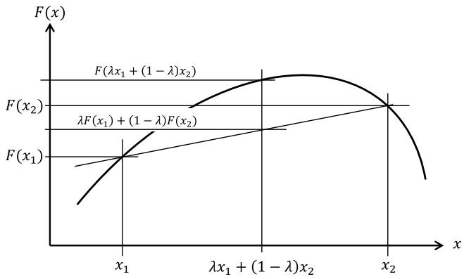  
Figure 4.1 Concave function, showing that $\lambda F ( x _ { 1 } ) + ( 1 - \lambda ) F ( x _ { 2 } ) \leq F ( \lambda x _ { 1 } + ( 1 - \lambda ) x _ { 2 } )$ .

a) To begin, fix the random variable ??, and show that $F ( x , W )$ is concave (this should be apparent just by plotting the graph of $F ( x , W )$ for a fixed ??).   
b) Now assume that ?? can only take on a fixed set of values $w ^ { 1 } , \ldots , w ^ { N }$ , where each occurs with probability $p ^ { n } = P r o b [ W = w ^ { n } ]$ . Let $F ( x ) =$

$\begin{array} { r } { \sum _ { n = 1 } ^ { N } p ^ { n } F ( x , w ^ { n } ) } \end{array}$ . Substitute this into equation (4.41) to show that the

c) Finally argue that (b) implies that the newsvendor problem is concave in $x$ .

# Diary problem

The diary problem is a single problem you chose (see chapter 1 for guidelines). Answer the following for your diary problem.

# 4.14 For your diary problem:

a) Do you think you could reduce your problem to a deterministic problem as described in section 4.2? If not, could you approximate it using the sampled methods described in section 4.3? For each of these two approaches, explain why or why not. Assuming neither of these work, can you sketch how an adaptive search algorithm might work?   
b) Identify whether you would formulate your decision problem using a final reward or cumulative reward objective?

# Bibliography

Dupacova, J., GroweKuska, N., and Romisch, W. (2003). Scenario reduction in stochastic programming: An approach using probability metrics. Mathematical Programming, Sereis A 95: 493–511.   
Fu, M.C. (2014). Handbook of Simulation Optimization. New York: Springer.   
Heitsch, H. and Romisch, W. (2009). Scenario tree modeling for multistage stochastic programs. Mathematical Programming 118: 371–406.   
Kirk, D.E. (2012). Optimal Control Theory: An introduction. New York: Dover.   
Lewis, F.L. and Vrabie, D. (2012). Design Optimal Adaptive Controllers, 3e. Hoboken, NJ: JohnWiley & Sons.   
Mulvey, J.M., Vanderbei, R.J., and Zenios, S.A. (1995). Robust optimization of large-scale systems. Operations Research 43 (2): 264–281.   
Porteus, E.L. (2002). Foundations of Stochastic Inventory Theory. Stanford: Stanford University Press.   
Powell, W.B. (2011). Approximate Dynamic Programming: Solving the Curses of Dimensionality, 2e. John Wiley & Sons.   
Powell, W.B. (2014). Clearing the jungle of stochastic optimization. Informs TutORials in Operations Research 2014.   
Powell, W.B. (2016). A unified framework for optimization under uncertainty. In: Informs TutORials in Operations Research. 45–83.

Powell, W.B. (2019). A unified framework for stochastic optimization. European Journal of Operational Research 275 (3): 795–821.   
Powell, W.B. (2021). From reinforcement learning to optimal control: A unified framework for sequential decisions. In: Handbook on Reinforcement Learning and Optimal Control, Studies in Systems, Decision and Control , 29–74.   
Rockafellar, R.T. and Wets, R.J.-B. (1991). Scenarios and policy aggregation in optimization under uncertainty. Mathematics of Operations Research 16 (1): 119–147.   
Sethi, S.P. (2019). Optimal Control Theory: Applications to Management Science and Economics, 3e. Boston: SpringerVerlag.   
Shapiro, A. and Homem-de Mello, T. (2000). On the rate of convergence of optimal solutions of Monte Carlo approximations of stochastic programs. SIAM Journal on Optimization 11: 70–86.   
Shapiro, A. and Wardi, Y. (1996). Convergence analysis of stochastic algorithms. Mathematics of Operations Research 21: 615–628.   
Shapiro, A., Dentcheva, D., and Ruszczyński, A. (2014). Lectures on Stochastic Programming: Modeling and theory, 2e. Philadelphia: SIAM.   
Sontag, E. (1998). Mathematical Control Theory, 2e., 1–544. Springer.   
Stengel, R.F. (1986). Stochastic optimal control: theory and application. Hoboken, NJ: John Wiley & Sons.

# Part II – Stochastic Search

Stochastic search covers a broad class of problems that are typically grouped under names such as stochastic approximation methods (derivative-based stochastic search), ranking and selection (derivative-free stochastic search), simulation-optimization, and multiarmed bandit problems. We include in this part problems that are often solved using iterative algorithms, where the only information carried from one iteration to the next is what we have learned about the function. This is the defining characteristic of a learning problem.

Chapter 5 begins with derivative-based algorithms, where we describe the difference between asymptotic and finite-time analysis. This chapter identifies the importance of stepsizes, which are actually “decisions” in derivative-based methods. Chapter 6 provides an in-depth discussion of stepsize policies.

We then transition to derivative-free problems in chapter 7, where there is a much richer tradition of designing policies compared to derivative-based methods. This will be the first time we fully explore our canonical framework and the four classes of policies. Derivative-free stochastic search is a sequential decision problem characterized by a pure belief state which captures our approximation of the underlying problem. This allows us to build a bridge to the multiarmed bandit community. We also introduce the idea of active learning, where we make decisions specifically to improve our knowledge of the function we are optimizing.

By the end of Part II, we will have laid the foundation for the much richer class of sequential decision problems that involve controllable physical states that link decisions and dynamics from one time period to the next. However, we will use the tools of these three chapters throughout the rest of the book, especially in the context of tuning parameters for policies.

#

# Derivative-Based Stochastic Search

We begin our discussion of adaptive learning methods in stochastic optimization by addressing problems where we have access to derivatives (or gradients, if $x$ is a vector) of our function $F ( x , W )$ . It is common to start with the asymptotic form of our basic stochastic optimization problem

$$
\max  _ {x \in \mathcal {X}} \mathbb {E} \{F (x, W) | S ^ {0} \}, \tag {5.1}
$$

but soon we are going to shift attention to finding the best algorithm (or policy) for finding the best solution within a finite budget. We are going to show that with any adaptive learning algorithm, we can define a state $S ^ { n }$ that captures what we know after $n$ iterations. We can represent any algorithm as a “policy” $X ^ { \pi } ( S ^ { n } )$ which tells us the next point $x ^ { n } = X ^ { \pi } ( S ^ { n } )$ given what we know, $S ^ { n }$ , after ?? iterations. Eventually we complete our budget of $N$ iterations, and produce a solution that we call $x ^ { \pi , N }$ to indicate that the solution was found with policy (algorithm) $\pi$ after $N$ iterations.

After we choose $x ^ { n }$ , we observe a random variable $W ^ { n + 1 }$ that is not known when we chose $x ^ { n }$ . We then evaluate the performance through a function $F ( x ^ { n } , W ^ { n + 1 } )$ which can serve as a placeholder for a number of settings, including the results of a computer simulation, how a product works in the market, the response of a patient to medication, or the strength of a material produced in a lab. The initial state $S ^ { 0 }$ might contain fixed parameters (say the boiling point of a material), the attributes of a patient, the starting point of an algorithm, and beliefs about any uncertain parameters.

When we focus on this finite-budget setting, the problem in (5.1) becomes

$$
\max  _ {\pi} \mathbb {E} \left\{F \left(x ^ {\pi , N}, W\right) \mid S ^ {0} \right\}, \tag {5.2}
$$

but this way of writing the problem hides what is actually happening. Starting with what we know in $S ^ { 0 }$ , we are going to apply our policy $X ^ { \pi } ( S ^ { n } )$ while we generate the sequence

$$
(S ^ {0}, x ^ {0}, W ^ {1}, S ^ {1}, \dots , S ^ {n}, x ^ {n}, W ^ {n + 1}, \dots , S ^ {N})
$$

where the observations $W ^ { 1 } , \ldots , W ^ { N }$ might be called training data to produce the solution $x ^ { \pi , N }$ . Once we have $x ^ { \pi , N }$ , we evaluate it using a new random variable that we denote by $\widehat W$ which is what we use for testing. We then use $\widehat W$ to evaluate the performance of $x ^ { \pi , N }$ which is computed using

$$
\bar {F} ^ {\pi , N} = \mathbb {E} _ {\widehat {W}} F (x ^ {\pi , N}, \widehat {W}). \tag {5.3}
$$

We are almost there. The problem with $\bar { F } ^ { \pi , N }$ is that it is a random variable that depends on the specific sequence $W ^ { 1 } , \ldots , W ^ { N }$ , as well as any distributional information in $S ^ { 0 }$ (we return to this issue later). We have potentially three sources of uncertainty:

The initial state $S ^ { 0 }$ – The initial state $S ^ { 0 }$ might include a probability distribution describing our belief (say) of the mean of a random variable.

The training sequence $W ^ { 1 } , \ldots , W ^ { N }$ – These are our observations while we are computing ????,??. $x ^ { \pi , N }$

The testing process – Finally, we are going to repeatedly sample from ??, using a random variable we call $\widehat { W }$ to make the distinction with the random variable ?? that we use for training $x ^ { \pi , N }$ .

The value $F ^ { \pi }$ of our policy (algorithm) $X ^ { \pi } ( S )$ can now be written as (using our expanded form of the expectation)

$$
F ^ {\pi} = \mathbb {E} _ {S ^ {0}} \mathbb {E} _ {W ^ {1}, \dots , \widehat {W} ^ {N} | S ^ {0}} \mathbb {E} _ {\widehat {W} | S ^ {0}} \{F (x ^ {\pi , N}, \widehat {W}) | S ^ {0} \}. \tag {5.4}
$$

These expectations can be a little frightening. In practice we are going to simulate them, but we defer this to later in the chapter.

The objective in (5.2) would be the natural finite-budget version of (5.1) (which we also call the final reward objective), but we should keep an open mind and recognize that we may also be interested in the cumulative reward formulation given by

$$
\max  _ {\pi} \mathbb {E} _ {S ^ {0}} \mathbb {E} _ {W ^ {1}, \dots , W ^ {N} | S ^ {0}} \left\{\sum_ {n = 0} ^ {N - 1} F \left(x ^ {n}, W ^ {n + 1}\right) | S ^ {0} \right\} \tag {5.5}
$$

where $x ^ { n } = X ^ { \pi } ( S ^ { n } )$ is our search policy (typically known as an “algorithm”). Note that when we maximize cumulative reward, we add up our performance as we go, so we do not have that final training step with $\widehat { W }$ that we did above with our final reward objective.

The transition from searching for a solution $x$ to finding a function $\pi$ is one of the central differences between deterministic and stochastic optimization

problems. We are moving from looking for the best solution $x$ to finding the best algorithm (or policy) $\pi$ .

In this chapter, we assume that we can compute the gradient $\nabla F ( x , W )$ once the random information ?? becomes known. This is most easily illustrated using the newsvendor problem. Let $x$ be the number of newspapers placed in a bin, with unit cost ??. Let ?? be the random demand for newspapers (which we learn after choosing $x$ ), which are sold at price $p$ . We wish to find $x$ that solves

$$
\max  _ {x} F (x) = \mathbb {E} F (x, W) = \mathbb {E} \left(p \min  \{x, W \} - c x\right). \tag {5.6}
$$

We can use the fact that we can compute stochastic gradients, which are gradients that we compute only after we observe the demand ??, given by

$$
\nabla_ {x} F (x, W) = \left\{ \begin{array}{c l} p - c & \text {i f} x \leq W, \\ - c & \text {i f} x > W. \end{array} \right. \tag {5.7}
$$

The gradient $\nabla _ { x } F ( x , W )$ is known as a stochastic gradient because it depends on the random demand $W$ , which is to say that we calculate it after we have observed ??.

We are going to show how to design simple algorithms that exploit our ability to compute gradients after the random information becomes known. Even when we do not have direct access to gradients, we may be able to estimate them using finite differences. We are also going to see that the core ideas of stochastic gradient methods pervade a wide range of adaptive learning algorithms.

We start by summarizing a variety of applications.

# 5.1 Some Sample Applications

Derivative-based problems exploit our ability to use the derivative after the random information has been observed (but remember that our decision $x$ must be made before we have observed this information). These derivatives, known as stochastic gradients, require that we understand the underlying dynamics of the problem. When this is available, we have access to some powerful algorithmic strategies that have been developed since these ideas were first invented in 1951 by Robbins and Monro.

Some examples of problems where derivatives can be computed directly are:

● Cost-minimizing newsvendor problem – A different way of expressing the newsvendor problem is one of minimizing overage and underage costs. Using

the same notation as above, our objective function would be written

$$
\min  _ {x} \mathbb {E} F (x, W) = \mathbb {E} \left[ c ^ {o} \max  \{0, x - W \} + c ^ {u} \max  \{0, W - x \} \right]. \tag {5.8}
$$

We can compute the derivative of $F ( x , \hat { D } )$ with respect to $x$ after ?? becomes known using

$$
\nabla_ {x} F (x, W) = \left\{ \begin{array}{l l} c ^ {0} & \text {i f} x > W, \\ - c ^ {u} & \text {i f} x \leq W. \end{array} \right.
$$

● Nested newsvendor – This hints at a multidimensional problem which would be hard to solve even if we knew the demand distribution. Here there is a single random demand $D$ that we can satisfy with products $1 , \ldots , K$ where we use the supply of products $1 , \ldots , k - 1$ before using product $k$ . The profitmaximizing version is given by

$$
\max  _ {x _ {1}, \dots , x _ {K}} = \sum_ {k = 1} ^ {K} p _ {k} \mathbb {E} \min  \left\{x _ {k}, \left(D - \sum_ {j = 1} ^ {k - 1} x _ {j}\right) ^ {+} \right\} - \sum_ {k = 1} ^ {K} c _ {k} x _ {k}. \tag {5.9}
$$

Although more complicated than the scalar newsvendor, it is still fairly straightforward to find the gradient with respect to the vector $x$ once the demand becomes known.

● Statistical learning – Let $f ( x | \theta )$ be a statistical model which might be of the form

$$
f (x \mid \theta) = \theta_ {0} + \theta_ {1} \phi_ {1} (x) + \theta_ {2} \phi_ {2} (x) + \dots .
$$

Imagine we have a dataset of input variables $x ^ { 1 } , \ldots , x ^ { N }$ and corresponding response variables $y ^ { 1 } , \ldots , y ^ { N }$ . We would like to find $\boldsymbol { \theta }$ to solve

$$
\min  _ {\theta} \frac {1}{N} \sum_ {n = 1} ^ {N} (y ^ {n} - f (x ^ {n} | \theta)) ^ {2}.
$$

● Finding the best inventory policy – Let $R _ { t }$ be the inventory at time ??. Assume we place an order $x _ { t }$ according to the rule

$$
X ^ {\pi} (R _ {t} | \theta) = \left\{ \begin{array}{c l} \theta^ {m a x} - R _ {t} & \text {I f} R _ {t} <   \theta^ {m i n} \\ 0 & \text {O t h e r w i s e .} \end{array} \right.
$$

Our inventory evolves according to

$$
R _ {t + 1} = \max  \{0, R _ {t} + x _ {t} - D _ {t + 1} \}.
$$

Assume that we earn a contribution $C ( R _ { t } , x _ { t } , D _ { t + 1 } )$

$$
C \left(R _ {t}, x _ {t}, D _ {t + 1}\right) = p \min  \left\{R _ {t} + x _ {t}, D _ {t + 1} \right\} - c x _ {t}.
$$

We then want to choose $\boldsymbol { \theta }$ to maximize

$$
\max  _ {\theta} \mathbb {E} \sum_ {t = 0} ^ {T} C \left(R _ {t}, X ^ {\pi} \left(R _ {t} \mid \theta\right), D _ {t + 1}\right).
$$

If we let $\begin{array} { r } { F ( x , W ) = \sum _ { t = 0 } ^ { T - 1 } C ( R _ { t } , X ^ { \pi } ( R _ { t } | \theta ) , D _ { t + 1 } ) } \end{array}$ ??=0 where $x = ( \theta ^ { m i n } , \theta ^ { m a x } )$ and $W = D _ { 1 } , D _ { 2 } , \dots , D _ { T }$ , then we have the same problem as our newsvendor problem in equation (5.6). In this setting, we simulate our policy, and then look back and determine how the results would have changed if $\boldsymbol { \theta }$ is perturbed for the same sample path. It is sometimes possible to compute the derivative analytically, but if not, we can also do a numerical derivative (but using the same sequence of demands).

● Maximizing e-commerce revenue – Assume that demand for a product is given by

$$
D (p | \theta) = \theta_ {0} - \theta_ {1} p + \theta_ {2} p ^ {2}.
$$

Now, find the price $p$ to maximize the revenue $R ( p ) = p D ( p | \theta )$ where $\boldsymbol { \theta }$ is unknown.

● Optimizing engineering design – An engineering team has to tune the timing of a combustion engine to maximize fuel efficiency while minimizing emissions. Assume the design parameters $x$ include the pressure used to inject fuel, the timing of the beginning of the injection, and the length of the injection. From this the engineers observe the gas consumption $G ( x )$ for a particular engine speed, and the emissions $E ( x )$ , which are combined into a utility function $U ( x ) ~ = ~ U ( E ( x ) , G ( x ) )$ which combines emissions and mileage into a single metric. $U ( x )$ is unknown, so the goal is to find an estimate ${ \bar { U } } ( x )$ that approximates $U ( x )$ , and then maximize it.

● Derivatives of simulations – In the previous section we illustrated a stochastic gradient algorithm in the context of a simple newsvendor problem. Now imagine that we have a multiperiod simulation, such as we might encounter when simulating flows of jobs around a manufacturing center. Perhaps we use a simple rule to govern how jobs are assigned to machines once they have finished a particular step (such as being drilled or painted). However, these rules have to reflect physical constraints such as the size of buffers for holding jobs before a machine can start working on them. If the buffer for a downstream machine is full, the rule might specify that a job be routed to a different machine or to a special holding queue.

This is an example of a policy that is governed by static variables such as the size of the buffer. We would let $x$ be the vector of buffer sizes. It would be helpful, then, if we could do more than simply run a simulation for a

fixed vector $x$ . What if we could compute the derivative with respect to each element of $x$ , so that after running a simulation, we obtain all the derivatives?

Computing these derivatives from simulations is the focus of an entire branch of the simulation community. A class of algorithms called infinitesimal perturbation analysis was developed specifically for this purpose. It is beyond the scope of our presentation to describe these methods in any detail, but it is important for readers to be aware that the field exists.

# 5.2 Modeling Uncertainty

Before we progress too far, we need to pause and say a few words about how we are modeling uncertainty, and the meaning of what is perhaps the most dangerous piece of notation in stochastic optimization, the expectation operator ??.

We are going to talk about uncertainty from three perspectives. The first is the random variable ?? that arises when we evaluate a solution, which we refer to as training uncertainty. The second is the initial state $S ^ { 0 }$ , where we express model uncertainty, typically in the form of uncertainty about parameters (but sometimes in the structure of the model itself). The third addresses testing uncertainty. In final-reward problems, we use the random variable $\widehat { W }$ for testing. In cumulative-reward settings, we test as we proceed.

# 5.2.1 Training Uncertainty $W ^ { 1 } , \ldots , W ^ { N }$

Consider an adaptive algorithm (which we first introduced in chapter 4) that proceeds by guessing $x ^ { n }$ and then observing $W ^ { n + 1 }$ which leads to $x ^ { n + 1 }$ and so on (we give examples of these procedures in this chapter). If we limit the algorithm to $N$ iterations, our sequence will look like

$$
(x ^ {0}, W ^ {1}, x ^ {1}, W ^ {2}, x ^ {2}, \dots , x ^ {n}, W ^ {n + 1}, \dots , x ^ {N}).
$$

Table 5.1 illustrates six sample paths for the sequence $W ^ { 1 } , \ldots , W ^ { 1 0 }$ . We often let $\omega$ to represent an outcome of a random variable, or an entire sample path (as we would here). We might let $\Omega$ be the set of all the sample paths, which for this problem we would write as

$$
\Omega = (\omega_ {1}, \omega_ {2}, \omega_ {3}, \omega_ {4}, \omega_ {5}, \omega_ {6}).
$$

We could then let $W _ { t } ( \omega )$ be the outcome of the random variable $W _ { t }$ at time $t$ for sample path $\omega$ . Thus, $W _ { 5 } ( \omega _ { 2 } ) = 7 $ . If we are following sample path $\omega$ using policy $\pi$ , we obtain the final design $x ^ { \pi , N } ( \omega )$ . By running policy $\pi$ for each

Table 5.1 Illustration of six sample paths for the random variable ??.   

<table><tr><td>ω</td><td>W1</td><td>W2</td><td>W3</td><td>W4</td><td>W5</td><td>W6</td><td>W7</td><td>W8</td><td>W9</td><td>W10</td></tr><tr><td>1</td><td>0</td><td>1</td><td>6</td><td>3</td><td>6</td><td>1</td><td>6</td><td>0</td><td>2</td><td>4</td></tr><tr><td>2</td><td>3</td><td>2</td><td>2</td><td>1</td><td>7</td><td>5</td><td>4</td><td>6</td><td>5</td><td>4</td></tr><tr><td>3</td><td>5</td><td>2</td><td>3</td><td>2</td><td>3</td><td>4</td><td>2</td><td>7</td><td>7</td><td>5</td></tr><tr><td>4</td><td>6</td><td>3</td><td>7</td><td>3</td><td>2</td><td>3</td><td>4</td><td>7</td><td>3</td><td>4</td></tr><tr><td>5</td><td>3</td><td>1</td><td>4</td><td>5</td><td>2</td><td>4</td><td>3</td><td>4</td><td>3</td><td>1</td></tr><tr><td>6</td><td>3</td><td>4</td><td>4</td><td>3</td><td>3</td><td>3</td><td>2</td><td>2</td><td>6</td><td>1</td></tr></table>

outcome $\omega \in \Omega$ , we would generate a population of designs $x ^ { \pi , N }$ which provide a nice way to represent $x ^ { \pi , N }$ as a random variable.

# 5.2.2 Model Uncertainty $S ^ { 0 }$

We illustrate model uncertainty using our newsvendor problem, where we make a decision $x$ , then observe a random demand $W = { \hat { D } }$ , after which we calculate our profit using equation (5.6). Imagine that our demand follows a Poisson distribution given by

$$
\mathbb {P} [ W = w ] = \frac {\mu^ {w} e ^ {- \mu}}{w !},
$$

where $w = 0 , 1 , 2 , \ldots$ In this setting, our expectation would be over the possible outcomes of $W$ , so we could write the optimization problem in equation (5.6) as

$$
F (x | \mu) = \sum_ {w = 0} ^ {\infty} \frac {\mu^ {w} e ^ {- \mu}}{w !} \big (p \min \{x, w \} - c x \big).
$$

This does not look too hard, but what happens if we do not know $\mu ?$ This parameter would be carried by our initial state $S ^ { 0 }$ . If we are uncertain about $\mu$ , we may feel that we can describe it using an exponential distribution given by

$$
\mu \sim \lambda e ^ {- \lambda u},
$$

where the parameter $\lambda$ is known as a hyperparameter, which is to say it is a parameter that determines a distribution that describes the uncertainty of a problem parameter. The assumption is that even if we do not know ?? precisely, it still does a good job of describing the uncertainty in the mean demand $\mu$ . In this case, $S ^ { 0 }$ would include both ?? and the assumption that $\mu$ is described by an exponential distribution.

We would now write our expectation of $F ( x , W )$ as

$$
\begin{array}{l} F (x) = \mathbb {E} \{F (x, W) | S ^ {0} \}, \\ = \mathbb {E} _ {S ^ {0}} \mathbb {E} _ {W | S ^ {0}} \{F (x, W) | S ^ {0} \}. \\ \end{array}
$$

For our example, this would be translated as

$$
F (x | \lambda) = \mathbb {E} _ {\mu | \lambda} \mathbb {E} _ {W | \mu} \{F (x, W) | \mu \}.
$$

The notation $\mathbb { E } _ { W \mid \mu }$ means the conditional expectation of ?? given $\mu$ . Using our distributions where the random demand ?? follows a Poisson distribution with mean $\mu$ which is itself random with an exponential distribution with mean $\lambda$ , we would write the expectation as

$$
F (x | \lambda) = \int_ {u = 0} ^ {\infty} \lambda e ^ {- \lambda u} \sum_ {w = 0} ^ {\infty} \frac {u ^ {w} e ^ {- u}}{w !} \big (p \min (x, w) - c x \big) d u.
$$

In practice, we are rarely using explicit probability distributions. One reason is that we may not know the distribution, but we may have an exogenous source for generating random outcomes. The other is that we may have a distribution, but it might be multidimensional and impossible to compute.

# 5.2.3 Testing Uncertainty

When we finally obtain our solution $x ^ { \pi , N }$ , we then have to evaluate the quality of the solution. For the moment, let’s fix $x ^ { \pi , N }$ . We let $\widehat { W }$ denote the random observations we use when testing the performance of our final solution $x ^ { \pi , N }$ . We use $\widehat W$ to represent the random observations while testing to avoid confusion with the random observations ?? we use while training.

We write the value of the solution $x ^ { \pi , N }$ using

$$
F \left(x ^ {\pi , N}\right) = \mathbb {E} _ {\widehat {W}} \{F \left(x ^ {\pi , N}, \widehat {W}\right) \mid S ^ {0} \}. \tag {5.10}
$$

In practice we will typically evaluate the expectation using Monte Carlo simulation. Assume that we have a set of outcomes of $\widehat { W }$ that we call $\hat { \Omega }$ , where $\omega \in \hat { \Omega }$ is one outcome of $\widehat W$ which we represent using $\widehat W ( \omega )$ . Once again assume that we have taken a random sample to create $\hat { \Omega }$ where every outcome is equally likely. Then we could evaluate our solution $x ^ { \pi , N }$ using

$$
\bar {F} (x ^ {\pi , N}) = \frac {1}{| \hat {\Omega} |} \sum_ {\omega \in \hat {\Omega}} F (x ^ {\pi , N}, \widehat {W} (\omega)).
$$

The estimate $\bar { F } ( x ^ { \pi , N } )$ evaluates a single decision $x ^ { \pi , N }$ , which hints to the performance of the learning policy $\pi$ .

# 5.2.4 Policy Evaluation

If we wish to evaluate a policy $X ^ { \pi } ( S ^ { n } )$ , we have to combine all three types of uncertainty. This is done by computing

$$
{F ^ {\pi}} = {\mathbb {E} _ {S ^ {0}} E _ {W ^ {1}, \dots , W ^ {N} | S ^ {0}} E _ {\widehat {W} | S ^ {0}} F (x ^ {\pi , N}, \widehat {W}).}
$$

In practice, we can replace each expectation by a sample over whatever is random. Furthermore, these samples can be (a) sampled from a probability distribution, (b) represented by a large, batch dataset, or (c) observed from an exogenous process (which involves online learning).

# 5.2.5 Closing Notes

This section is hardly a comprehensive treatment of modeling uncertainty. Given the richness of this topic, chapter 10 is dedicated to describing the process of modeling uncertainty. The discussion here was to bring out the basic forms of uncertainty when evaluating algorithms for stochastic search.

We mention only in passing the growing interest in replacing the expectation ?? with some form of risk measure that recognizes that the possibility of extreme outcomes is more important that is represented by their likelihood (which may be low). Expectations average over all outcomes, so if extreme events occur with low probability, they do not have much effect on the solution. Also, expectations may have the effect of letting high outcomes cancel low outcomes, when in fact one tail is much more important than the other. We discuss risk in more detail in section 9.8.5. Replacing the expectation operator with some form of risk measure does not change the core steps when evaluating a policy.

# 5.3 Stochastic Gradient Methods

One of the oldest and earliest methods for solving our basic stochastic optimization problem

$$
\max  _ {x} \mathbb {E} F (x, W), \tag {5.11}
$$

uses the fact that we can often compute the gradient of $F ( x , W )$ with respect to $x$ after the random variable ?? becomes known. For example, assume that we are trying to solve a newsvendor problem, where we wish to allocate a quantity $x$ of resources (“newspapers”) before we know the demand ??. The optimization problem is given by

$$
\max  _ {x} F (x) = \mathbb {E} p \min  \{x, W \} - c x. \tag {5.12}
$$

If we could compute $F ( x )$ exactly (that is, analytically), and its derivative, then we could find $x ^ { * }$ by taking its derivative and setting it equal to zero as we did in section 4.2.2. If this is not possible, we could still use a classical steepest ascent algorithm

$$
x ^ {n + 1} = x ^ {n} + \alpha_ {n} \nabla_ {x} F (x ^ {n}), \tag {5.13}
$$

where $\alpha _ { n }$ is a stepsize. For deterministic problems, we typically choose the best stepsize by solving the one-dimensional optimization problem

$$
\alpha^ {n} = \arg \max  _ {\alpha \geq 0} F (x ^ {n} + \alpha \nabla F (x ^ {n})). \tag {5.14}
$$

For stochastic problems, we would have to be able to compute $F ( x ) = \mathbb { E } F ( x , W )$ in (5.14), which is computationally intractable (otherwise we return to the techniques in chapter 4). This means that we cannot solve the one-dimensional search for the best stepsize in equation (5.14).

Instead, we resort to an algorithmic strategy known as stochastic gradients, where we use the gradient $\nabla _ { x } F ( x ^ { n } , W ^ { n + 1 } )$ , which means we wait until we observe $W ^ { n + 1 }$ and then take the gradient of the function. This is not possible for all problems (hence the reason for chapter 7), but for problems where we can find the gradient, this overcomes the issues associated with computing the derivative of an expectation. The idea that we are allowed to wait until after we observe $W ^ { n + 1 }$ before computing the gradient is the magic of stochastic gradient algorithms.

# 5.3.1 A Stochastic Gradient Algorithm

For our stochastic problem, we assume that we either cannot compute $F ( x )$ , or we cannot compute the gradient exactly. However, there are many problems where, if we fix $W = W ( \omega )$ , we can find the derivative of $F ( x , W ( \omega ) )$ with respect to $x$ . Then, instead of using the deterministic updating formula in (5.13), we would instead use

$$
x ^ {n + 1} = x ^ {n} + \alpha_ {n} \nabla_ {x} F \left(x ^ {n}, W ^ {n + 1}\right). \tag {5.15}
$$

Here, $\nabla _ { x } F ( x ^ { n } , W ^ { n + 1 } )$ is called a stochastic gradient because it depends on a sample realization of ????+1. $W ^ { n + 1 }$

It is important to note our indexing. A variable such as $x ^ { n }$ or $\alpha _ { n }$ that is indexed by $n$ is assumed to be a function of the observations $W ^ { 1 } , W ^ { 2 } , \dots , W ^ { n }$ , but not $W ^ { n + 1 }$ . Thus, our stochastic gradient $\nabla _ { x } F ( x ^ { n } , W ^ { n + 1 } )$ depends on our current solution $x ^ { n }$ and the next observation $W ^ { n + 1 }$ .

To illustrate, consider the simple newsvendor problem with the profit maximizing objective

$$
F (x, W) = p \min  \{x, W \} - c x.
$$

In this problem, we order a quantity $x = x ^ { n }$ (determined at the end of day ??), and then observe a random demand $W ^ { n + 1 }$ that was observed the next day $n + 1$ . We earn a revenue given by $p \operatorname* { m i n } \{ x ^ { n } , W ^ { n + 1 } \}$ (we cannot sell more than we bought, or more than the demand), but we had to pay for our order, producing a negative cost $- c x$ . Let $\nabla F ( x ^ { n } , W ^ { n + 1 } )$ be the sample gradient, taken when $W = W ^ { n + 1 }$ . In our example, this is given by

$$
\frac {\partial F \left(x ^ {n} , W ^ {n + 1}\right)}{\partial x} = \left\{ \begin{array}{l l} p - c & \text {I f} x ^ {n} <   W ^ {n + 1}, \\ - c & \text {I f} x ^ {n} > W ^ {n + 1}. \end{array} \right. \tag {5.16}
$$

The quantity $x ^ { n }$ is the estimate of $x$ computed from the previous iteration (using the sample realization $\omega ^ { n }$ ), while $W ^ { n + 1 }$ is the sample realization in iteration $n + 1$ (the indexing tells us that $x ^ { n }$ was computed without knowing $W ^ { n + 1 }$ ). When the function is deterministic, we would choose the stepsize by solving the one-dimensional optimization problem determined by (5.14).

# 5.3.2 Introduction to Stepsizes

Now we face the problem of finding the stepsize $\alpha _ { n }$ when we have to work with the stochastic gradient $\nabla F ( x ^ { n } , W ^ { n + 1 } )$ . Unlike our deterministic algorithm, we cannot solve a one-dimensional search (as we did in (5.14)) to find the best stepsize after seeing $W ^ { n + 1 }$ , simply because we cannot compute the expectation.

We overcome our inability to compute the expectation by working with stochastic gradients. While the computational advantages are tremendous, it means that the gradient is now a random variable. This means that the stochastic gradient can even point away from the optimal solution such that any positive stepsize actually makes the solution worse. Figure 5.1 compares the behavior of a deterministic search algorithm, where the solution improves at each iteration, and a stochastic gradient algorithm.

This behavior is easily illustrated using our newsvendor problem. It might be that the optimal order quantity is 15. However, even if we order $x = 2 0$ , it is possible that the demand is 24 on a particular day, pushing us to move our order quantity to a number larger than 20, which is even further from the optimum.

The major challenge when using stochastic gradients is the stepsize; we can no longer use the one-dimensional search as we did with our deterministic application in equation (5.14). Interestingly, when we are working on stochastic

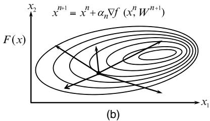  
Figure 5.1 Illustration of gradient ascent for a deterministic problem (a), and stochastic gradients (b).

problems, we overcome our inability to solve the one-dimensional search problem by using relatively simple stepsize rules that we are going to call stepsize policies. For example, a classic formula is nothing more than

$$
\alpha_ {n} = \frac {1}{n + 1} \tag {5.17}
$$

for $n = 0 , 1 , \ldots .$ With this formula, we can show that

$$
\lim  _ {n \rightarrow \infty} x ^ {n} \rightarrow x ^ {*}, \tag {5.18}
$$

where $x ^ { * }$ is the optimal solution of our original optimization problem (5.1). But note – we did not promise that convergence was fast, only that it would converge (eventually). (See section 5.10 for proofs of this convergence.) There is a very large literature that proves asymptotic convergence, but then runs the algorithm for a finite number of iterations and just assumes the resulting solution is good.

There are many applications where the units of the gradient, and the units of the decision variable, are different. This happens with our newsvendor example, where the gradient is in units of dollars, while the decision variable $x$ is in units of newspapers. This is a significant problem that causes headaches in practice.

A problem where we avoid this issue arises if we are trying to learn the mean of a random variable ??. We can formulate this task as a stochastic optimization problem using

$$
\min  _ {x} \mathbb {E} \frac {1}{2} (x - W) ^ {2}. \tag {5.19}
$$

Here, our function $F ( x , W ) = \textstyle { \frac { 1 } { 2 } } ( x - W ) ^ { 2 } \nonumber$ , and it is not hard to see that the value of $x$ that minimizes this function is $x = \mathbb { E } W$ . Now assume that we want to produce a sequence of estimates of $\mathbb { E } W$ by solving this problem using a sequential

(online) stochastic gradient algorithm, which looks like

$$
\begin{array}{l} x ^ {n + 1} = x ^ {n} - \alpha_ {n} \nabla F _ {x} \left(x ^ {n}, W ^ {n + 1}\right), (5.20) \\ = x ^ {n} - \alpha_ {n} (x ^ {n} - W ^ {n + 1}), \\ = \left(1 - \alpha_ {n}\right) x ^ {n} + \alpha_ {n} W ^ {n + 1}. (5.21) \\ \end{array}
$$

Equation (5.20) illustrates $\alpha _ { n }$ as the stepsize in a stochastic gradient algorithm, while equation (5.21) is exponential smoothing (see section 3.2). In this context, $\alpha _ { n }$ is widely known as a smoothing factor or “learning rate.”

There are going to be problems where our “one over $n ^ { \prime \prime }$ stepsize formula (5.17) is very slow. However, for the problem of estimating the mean of a random variable, we are going to show in chapter 6 that “one over $n ^ { \prime \prime }$ is actually the optimal stepsize formula!! That is, no other stepsize formula will give faster convergence. This is just a hint of the richness we are going to encounter with stepsize rules.

There are problems where we may start with a prior estimate of ???? which we can express as $x ^ { 0 }$ . In this case, we would want to use an initial stepsize $\alpha ^ { 0 } < 1$ . However, we often start with no information, in which case an initial stepsize $\alpha ^ { 0 } = 1$ gives us

$$
\begin{array}{l} x ^ {1} = (1 - \alpha_ {0}) x ^ {0} + \alpha_ {0} W ^ {1} \\ = W ^ {1}, \\ \end{array}
$$

which means we do not need the initial estimate for $x ^ { 0 }$ . Smaller initial stepsizes would only make sense if we had access to a reliable initial guess, and in this case, the stepsize should reflect the confidence in our original estimate (for example, we might be warm starting an algorithm from a previous iteration).

This section is just a peek into stepsizes. We cover this rich topic in considerably more detail in chapter 6.

# 5.3.3 Evaluating a Stochastic Gradient Algorithm

In section 5.10 we are going to provide two proofs of asymptotic optimality. The problem is that we never run these algorithms to the limit, which means we are only interested in our finite time performance. If we are only interested in the quality of our final solution $x ^ { \pi , N }$ , then we want to use the final reward objective given by (5.4), but this raises the issue: How do we compute this? The answer is that we have to simulate it.

Let $\omega ^ { \ell }$ be a sample realization of our random variables $W ^ { 1 } ( \omega ^ { \ell } ) , \dots , W ^ { N } ( \omega ^ { \ell } )$ that we use for training (estimating) $x ^ { \pi , N } ( \omega ^ { \ell } )$ for $\ell = 1 , 2 , \ldots , L$ . Then let $\psi ^ { k }$ be a sample realization of our testing information $\widehat { W } ( \psi ^ { k } )$ , for $k = 1 , 2 , \dots , K$ .

Assume that there is no probabilistic information in $S ^ { 0 }$ . We can estimate the performance of our algorithm $\pi$ using

$$
\bar {F} ^ {\pi} = \frac {1}{L} \sum_ {\ell = 1} ^ {L} \left(\frac {1}{K} \sum_ {k = 1} ^ {K} F \left(x ^ {\pi , N} \left(\omega^ {\ell}\right), \widehat {W} \left(\psi^ {k}\right)\right)\right), \tag {5.22}
$$

where $x ^ { n } ( \omega ^ { \ell } ) ~ = ~ X ^ { \pi } ( S ^ { n } ( \omega ^ { \ell } ) )$ is determined by our stochastic gradient formula (5.20) and $\alpha _ { n }$ comes from our stepsize formula (say, equation (5.17)). For this problem our state variable $S ^ { n } = x ^ { n }$ , which means that our state transition equation $S ^ { n + 1 } ( \omega ^ { \ell } ) = S ^ { M } ( S ^ { n } ( \omega ^ { \ell } ) , x ^ { n } ( \omega ^ { \ell } ) , W ^ { n + 1 } ( \omega ^ { \ell } ) )$ is just the stochastic gradient (5.20). We then let $x ^ { \pi , N } = x ^ { N }$ be the ending point.

The final reward objective in (5.22) is easily the most classical way of evaluating a stochastic search algorithm, but there are several arguments to be made for using the cumulative reward, which we would simulate using

$$
\bar {F} ^ {\pi} = \frac {1}{L} \sum_ {\ell = 1} ^ {L} \left(\sum_ {n = 0} ^ {N - 1} F \left(x ^ {n} \left(\omega^ {\ell}\right), W ^ {n + 1} \left(\omega^ {\ell}\right)\right)\right). \tag {5.23}
$$

It is possible that we have to apply this algorithm in a field situation such as a real newsvendor problem, where we have to live with the results of each solution $x ^ { n }$ . However, we may simply be interested in the overall rate of convergence, which would be better captured by (5.23).

# 5.3.4 A Note on Notation

Throughout this book, we index variables (whether we are indexing by iterations or time) to clearly identify the information content of each variable. Thus, $x ^ { n }$ is the decision made after $W ^ { n }$ becomes known. When we compute our stochastic gradient $\nabla _ { x } F ( x ^ { n } , W ^ { n + 1 } )$ , we use $x ^ { n }$ which was determined after observing $W ^ { n }$ . If the iteration counter refers to an experiment, then it means that $x ^ { n }$ is determined after we finish the $n ^ { t h }$ experiment. If we are solving a newsvendor problem where ?? indexes days, then it is like determining the amount of newspapers to order for day $n { + 1 }$ after observing the sales for day ??. If we are performing a laboratory experiment, we use the information up through the first ?? experiments to choose $x ^ { n }$ , which specifies the design settings for the $n + 1 ^ { \mathrm { s t } }$ experiment. This indexing makes sense when you realize that the index ?? reflects the information content, not when it is being implemented.

In chapter 6, we are going to present a number of formulas to determine stepsizes. Some of these are deterministic, such as $\alpha _ { n } \ = \ 1 / n$ , and some are

stochastic, adapting to information as it arrives. Our stochastic gradient formula in equation (5.15) communicates the property that the stepsize $\alpha _ { n }$ that is multiplied times the gradient $\nabla _ { x } F ( x ^ { n } , W ^ { n + 1 } )$ is allowed to see $W ^ { n }$ and $x ^ { n }$ , but not ????+1. $W ^ { n + 1 }$

We return to this issue in chapter 9, but we urge readers to adopt this notational system.

# 5.4 Styles of Gradients

There are a few variants of the basic stochastic gradient method. Below we introduce the idea of gradient smoothing and describe a method for approximating a second-order algorithm.

# 5.4.1 Gradient Smoothing

In practice, stochastic gradients can be highly stochastic, which is the reason why we have to use stepsizes. However, it is possible to mitigate some of the variability by smoothing the gradient itself. If $\nabla F ( x ^ { n } , W ^ { n + 1 } )$ is our stochastic gradient, computed after the $n + 1 ^ { \mathrm { s t } }$ experiment, we could then smooth this using

$$
g ^ {n + 1} = (1 - \eta) g ^ {n} + \eta \nabla F (x ^ {n}, W ^ {n + 1}),
$$

where $\eta$ is a smoothing factor where $0 < \eta \leq 1$ . We could replace this with a declining sequence $\eta _ { n }$ , although common practice is to keep this process as simple as possible. Regardless of the strategy, gradient smoothing has the effect of introducing at least one more tunable parameter. The open empirical question is whether gradient smoothing adds anything beyond the smoothing produced by the stepsize policy used for updating $x ^ { n }$ .

# 5.4.2 Second-Order Methods

Second-order methods for deterministic optimization have proven to be particularly attractive. For smooth, differentiable functions, the basic update step looks like

$$
x ^ {n + 1} = x ^ {n} + \left(H ^ {n}\right) ^ {- 1} \nabla_ {x} f (x ^ {n}), \tag {5.24}
$$

where $H ^ { n }$ is the Hessian, which is the matrix of second derivatives. That is,

$$
H _ {x x ^ {\prime}} ^ {n} = \left. \frac {\partial^ {2} f (x)}{\partial x \partial x ^ {\prime}} \right| _ {x = x ^ {n}}.
$$

The attraction of the update in equation (5.24) is that there is no stepsize. The reason (and this requires that $f ( x )$ be smooth with continuous first derivatives) is that the inverse Hessian solves the problem of scaling. In fact, if $f ( x )$ is quadratic, then equation (5.24) takes us to the optimal solution in one step!

Since functions are not always as nice as we would like, it is sometimes useful to introduce a constant “stepsize” $\alpha$ , giving us

$$
x ^ {n + 1} = x ^ {n} + \alpha (H ^ {n}) ^ {- 1} \nabla_ {x} f (x ^ {n}),
$$

where $0 < \alpha \leq 1$ . Note that this smoothing factor does not have to solve any scaling problems (again, this is solved by the Hessian).

If we have access to second derivatives (which is not always the case), then our only challenge is inverting the Hessian. This is not a problem with a few dozen or even a few hundred variables, but there are problems with thousands to tens of thousands of variables. For large problems, we can strike a compromise and just use the diagonal of the Hessian. This is both much easier to compute, as well as being easy to invert. Of course, we lose some of the fast convergence (and scaling).

There are many problems (including all stochastic optimization problems) where we do not have access to Hessians. One strategy to overcome this is to construct an approximation of the Hessian using what are known as rank-one updates. Let ${ \bar { H } } ^ { n }$ be our approximate Hessian which is computed using

$$
\bar {H} ^ {n + 1} = \bar {H} ^ {n} + \nabla f (x ^ {n}) (\nabla f (x ^ {n})) ^ {T}. \tag {5.25}
$$

Recall that $\nabla f ( x ^ { n } )$ is a column vector, so $\nabla f ( x ^ { n } ) ( \nabla f ( x ^ { n } ) ) ^ { T }$ is a matrix with the dimensionality of $x$ . Since it is made up of an outer product of two vectors, this matrix has rank 1.

This methodology could be applied to a stochastic problem. As of this writing, we are not aware of any empirical study showing that these methods work, although there has been recent interest in second-order methods for online machine learning.

# 5.4.3 Finite Differences

It is often the case that we do not have direct access to a derivative. Instead, we can approximate gradients using finite differences which requires running the simulation multiple times with perturbed inputs.

Assume that $x$ is a $P$ -dimensional vector, and let $e _ { p }$ be a $P$ -dimensional column vector of zeroes with a 1 in the $p ^ { t h }$ position. Let $W _ { p } ^ { n + 1 , + }$ and $\boldsymbol { W } _ { p } ^ { n + 1 , - }$ be sequences of random variables that are generated when we run each simulation, which would be run in the $n + 1 ^ { \mathrm { s t } }$ iteration. The subscript $p$ only indicates that these are the random variables for the $p ^ { t h }$ run.

Now assume that we can run two simulations for each dimension, $F ( x ^ { n } +$ $\delta x ^ { n } e _ { p } , W _ { p } ^ { n + 1 , + } )$ and $F ( x ^ { n } - \delta x ^ { n } e _ { p } , W _ { p } ^ { n + 1 , - } )$ where $\delta x ^ { n } e _ { p }$ is the change in $x ^ { n }$ , multiplied by $e _ { p }$ so that we are only changing the $p ^ { t h }$ dimension. Think of $F ( x ^ { n } + \delta x ^ { n } e _ { p } , W _ { p } ^ { n + 1 , + } )$ and $F ( x ^ { n } - \delta x ^ { n } e _ { p } , W _ { p } ^ { n + 1 , - } )$ ?? as calls to a black-box simulator where we start with a set of parameters $x ^ { n }$ , and then perturb it to ${ x ^ { n } } + \delta { x ^ { n } } { e _ { p } }$ and ${ x ^ { n } } - \delta { x ^ { n } } { e _ { p } }$ and run two separate, independent simulations. We then have to do this for each dimension $p$ , allowing us to compute

$$
g _ {p} ^ {n} \left(x ^ {n}, W ^ {n + 1, +}, W ^ {n + 1, -}\right) = \frac {F \left(x ^ {n} + \delta x ^ {n} e _ {p} , W _ {p} ^ {n + 1 , +}\right) - F \left(x ^ {n} - \delta x ^ {n} e _ {p} , W _ {p} ^ {n + 1 , -}\right)}{2 \delta x _ {p} ^ {n}}, \tag {5.26}
$$

where we divide the difference by the width of the change, given by $2 \delta x _ { p } ^ { n }$ , to get the slope.

The calculation of the derivative (for one dimension) is illustrated in Figure 5.2. We see from Figure 5.2 that shrinking $\delta x$ can introduce a lot of noise in the estimate of the gradient. At the same time, as we increase $\delta x$ , we introduce bias, which we see in the difference between the dashed line showing $\mathbb { E } g ^ { n } ( x ^ { n } , W ^ { n + 1 , + } , W ^ { n + 1 , - } )$ , and the dotted line that depicts $\partial \mathbb { E } F ( x ^ { n } , W ^ { n + 1 } ) / \partial x ^ { n }$ . If we want an algorithm that converges asymptotically in the limit, we need $\delta x ^ { n }$ decreasing, but in practice it is often set to a constant $\delta x$ , which is then handled as a tunable parameter.

  
Figure 5.2 Different estimates of the gradient of $F ( x , W )$ with the stochastic gradient $g ^ { n } ( x ^ { n } , W ^ { n + 1 , + } , W ^ { n + 1 , - } )$ (solid line), the expected finite difference $\mathbb { E } g ^ { n } ( x ^ { n } , W ^ { n + 1 , + } , W ^ { n + 1 , - } )$ (dashed line), and the exact slope at $x ^ { n }$ , $\partial \mathbb { E } F ( x ^ { n } , W ^ { n + 1 } ) / \partial x ^ { n }$ .

Finite differences can be expensive. Running a function evaluation can require seconds to minutes, but there are computer models that can take hours or days (or more) to run. Equation (5.26) requires $2 P$ function evaluations, which can be especially problematic when $F ( x , W )$ is an expensive simulation, as well as when the number of dimensions $P$ is large. Fortunately, these simulations can often be run in parallel. In the next section we introduce a strategy for handling multidimensional parameter vectors.

# 5.4.4 SPSA

A powerful method for handling higher-dimensional parameter vectors is simultaneous perturbation stochastic approximation (or SPSA). SPSA computes gradients in the following way. Let $Z _ { p } , p = 1 , \dotsc , P$ be a vector of zero-mean random variables, and let $Z ^ { n }$ be a sample of this vector at iteration ??. We approximate the gradient by perturbing $x ^ { n }$ by the vector $Z$ using $x ^ { n } + \eta ^ { n } Z ^ { n }$ and $x ^ { n } - \eta ^ { n } Z ^ { n }$ , where $\eta ^ { n }$ is a scaling parameter that may be a constant over iterations, or may vary (typically it will decline). Now let $W ^ { n + 1 , + }$ and $W ^ { n + 1 , - }$ represent two different samples of the random variables driving the simulation (these can be generated in advance or on the fly). We then run our simulation twice: once to find $F ( x ^ { n } + \eta ^ { n } Z ^ { n } , W ^ { n + 1 , + } )$ , and once to find $F ( x ^ { n } - \eta ^ { n } Z ^ { n } , W ^ { n + 1 , - } )$ . The estimate of the gradient is then given by

$$
g ^ {n} (x ^ {n}, W ^ {n + 1, +}, W ^ {n + 1, -}) = \left[ \begin{array}{c} \frac {F (x ^ {n} + \eta^ {n} Z ^ {n} , W ^ {n + 1 , +}) - F (x ^ {n} - \eta^ {n} Z ^ {n} , W ^ {n + 1 , -})}{2 \eta^ {n} Z _ {1} ^ {n}} \\ \frac {F (x ^ {n} + \eta^ {n} Z ^ {n} , W ^ {n + 1 , +}) - F (x ^ {n} - \eta^ {n} Z ^ {n} , W ^ {n + 1 , -})}{2 \eta^ {n} Z _ {2} ^ {n}} \\ \vdots \\ \frac {F (x ^ {n} + \eta^ {n} Z ^ {n} , W ^ {n + 1 , +}) - F (x ^ {n} - \eta^ {n} Z ^ {n} , W ^ {n + 1 , -})}{2 \eta^ {n} Z _ {P} ^ {n}} \end{array} \right]. \quad (5. 2 7)
$$

Note that the numerator of each element of $g ^ { n }$ in equation (5.27) is the same, which means we only need two function evaluations: $F ( x ^ { n } + \eta ^ { n } Z ^ { n } , W ^ { n + 1 , + } )$ and $F ( x ^ { n } - \eta ^ { n } Z ^ { n } , W ^ { n + 1 , - } )$ . The only difference is the $Z _ { p } ^ { n }$ in the denominator for each dimension $p$ .

The real power of SPSA arises in applications where simulations are noisy, and these can be very noisy in many settings. A way to overcome this is with the use of “mini-batches” where the simulations to compute $F ( x ^ { n } + \eta ^ { n } Z ^ { n } , W ^ { n + 1 , + } )$ and $F ( x ^ { n } - \eta ^ { n } Z ^ { n } , W ^ { n + 1 , - } )$ are run, say, $M$ times and averaged. Keep in mind that these can be done in parallel; this does not mean they are free, but if you have access to parallel processing capability (which is quite common), it means that repeated simulations may not add to the completion time for your algorithm.

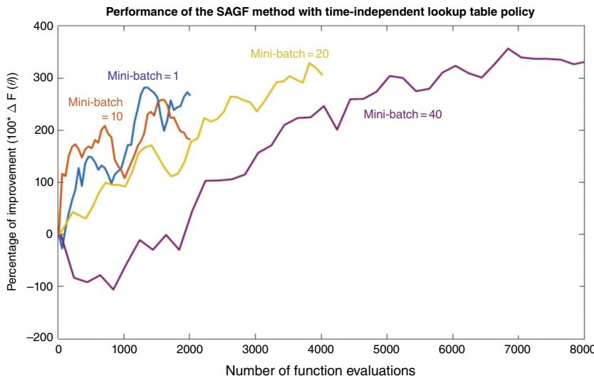  
Figure 5.3 Convergence of SPSA for different mini-batch sizes, showing the slower convergence to a better solution with larger mini-batches.

Figure 5.3 illustrates the effect of mini-batches; larger mini-batches produce slower initial performance, but better performance over more iterations. Note that figure shows performance in terms of function evaluations, not CPU time, so the benefits of parallel computing are ignored. This graphic suggests a strategy of using increasing mini-batch sizes. Smaller mini-batches work well in the beginning, while larger mini-batches help as the algorithm progresses.

SPSA seems like magic: we are getting a $P$ -dimensional gradient from just two function evaluations, regardless of the value of $P$ . The open question is the rate of convergence, which will depend very much on the characteristics of the problem at hand. A reader will naturally ask: “Does it work?” The unqualified answer is: “It can work,” but you will need to spend time understanding the characteristics of your problem, and tuning the algorithmic choices of SPSA, notably:

● Choice of stepsize formula, and tuning of any stepsize parameters (there is always at least one). Be careful with tuning, as it may depend on the starting point of your algorithm $x ^ { 0 }$ , as well as other problem characteristics.   
● The choice of mini-batch size. SPSA is trying to get a lot of information from just two function evaluations, so there is going to be a price to be paid in terms of convergence rates. A key issue here is whether you have access to parallel computing resources.

● You may also experiment with gradient smoothing, which is another way to stabilize the algorithm but without the price of repeated simulations required by mini-batches. This introduces the additional dimension of tuning the smoothing factor for gradient smoothing.

● Don’t forget that all gradient-based methods are designed for maximizing concave functions (minimizing convex functions), but your function may not be concave. For complex problems, it is not necessarily easy (or even possible) to verify the behavior of the function, especially for higher dimensional problems (three or more).

# 5.4.5 Constrained Problems

There are problems where $x$ has to stay in a feasible region $\mathcal { X }$ , which might be described by a system of linear equations such as

$$
\mathcal {X} = \{x \mid A x = b, x \geq 0 \}.
$$

When we have constraints, we would first compute

$$
{y ^ {n + 1}} = {x ^ {n} + \alpha_ {n} \nabla_ {x} F (x ^ {n}, W ^ {n + 1}),}
$$

which might produce a solution $y ^ { n + 1 }$ which does not satisfy the constraints. To handle this we project $y ^ { n + 1 }$ using a projection step that we write using

$$
x ^ {n + 1} \leftarrow \Pi_ {x} [ y ^ {n + 1} ].
$$

The definition of the projection operator $\Pi _ { \mathcal { X } } [ \cdot ]$ is given by

$$
\Pi_ {\mathcal {X}} [ y ] = \underset {x \in \mathcal {X}} {\arg \min } \| x - y \| _ {2}, \tag {5.28}
$$

where $\| x - y \| _ { 2 }$ is the $\cdot _ { L _ { 2 } }$ norm” defined by

$$
\left\| x - y \right\| _ {2} = \sum_ {i} \left(x _ {i} - y _ {i}\right) ^ {2}.
$$

The projection operator $\Pi _ { \mathcal { X } } [ \cdot ]$ can often be solved easily by taking advantage of the structure of a problem. For example, we may have box constraints of the form $0 \leq x _ { i } \leq u _ { i }$ . In this case, any element $x _ { i }$ falling outside of this range is just mapped back to the nearest boundary (0 or $u _ { i }$ ).

# 5.5 Parameter Optimization for Neural Networks*

In section 3.9.3 we descibed how to produce an estimate from a neural network given the set of parameters. Now we are going to show how to estimate

these parameters using the stochastic gradient concepts that we presented in this chapter.

We are going to show how to derive the gradient for the three-layer network in Figure 5.4. We will use the following relationships that we first derived in section 3.9.3 from the forward pass:

$$
\bar {f} \left(x ^ {n} \mid \theta\right) = \sum_ {i \in \mathcal {I} ^ {(1)}} \sum_ {j \in \mathcal {J} ^ {(2)}} \theta_ {i j} ^ {(1)} x _ {i} ^ {(1, n)}, \tag {5.29}
$$

$$
y _ {j} ^ {(2, n)} = \sum_ {i \in \mathcal {I} ^ {(1)}} \theta_ {i j} ^ {(1)} x _ {i} ^ {(1, n)}, \quad j \in \mathcal {I} ^ {(2)}, \tag {5.30}
$$

$$
x _ {i} ^ {(2, n)} = \sigma \left(y _ {i} ^ {(2, n)}\right), i \in \mathcal {I} ^ {(2)}, \tag {5.31}
$$

$$
y _ {j} ^ {(3, n)} = \sum_ {i \in \mathcal {I} ^ {(2)}} \theta_ {i j} ^ {(2)} x _ {i} ^ {(2, n)}, \quad j \in \mathcal {I} ^ {(3)}, \tag {5.32}
$$

$$
x _ {i} ^ {(3, n)} = \sigma \left(y _ {i} ^ {(3, n)}\right), i \in \mathcal {I} ^ {(3)}. \tag {5.33}
$$

Recall that $\sigma ( y )$ is the sigmoid function

$$
\sigma (y) = \frac {1}{1 + e ^ {- \beta y}}, \tag {5.34}
$$

and that $\begin{array} { r } { \sigma { ' } ( y ) = \frac { \partial \sigma ( y ) } { \partial y } } \end{array}$ ???? .

We are going to start by showing how to compute the gradient. Then, we will present the stochastic gradient algorithm and discuss some issues that arise in the context of neural networks.

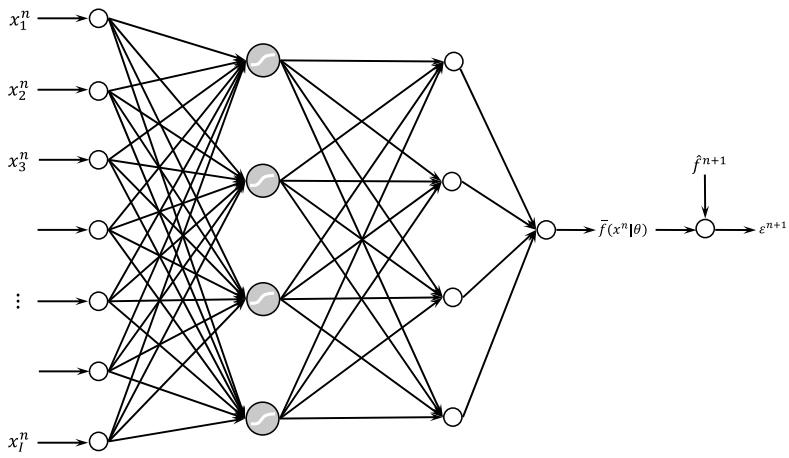  
Figure 5.4 A three-layer neural network.

# 5.5.1 Computing the Gradient

We compute the stochastic gradient $\nabla _ { \boldsymbol { \theta } } F ( { \boldsymbol { \theta } } )$ for a given input $x ^ { n }$ and observed response ${ \hat { f } } ^ { n + 1 } . { \hat { f } } ^ { n + 1 }$ plays the role of $W ^ { n + 1 }$ in our original derivation.

Assume that we are given an input $x ^ { n }$ . If we follow the forward instructions above, our final estimate is produced by

$$
\bar {f} \left(x ^ {n} \mid \theta\right) = \sum_ {i \in \mathcal {I} ^ {(3)}} \theta_ {i} ^ {(3)} x _ {i} ^ {(3, n)}. \tag {5.35}
$$

The goal is to find $\boldsymbol { \theta }$ that solves

$$
\min  _ {\theta} F (\theta) = \mathbb {E} \frac {1}{2} \sum_ {n = 1} ^ {N - 1} \left(\bar {f} \left(x ^ {n} \mid \theta\right) - \hat {f} ^ {n + 1}\right) ^ {2}. \tag {5.36}
$$

We want to understand the effect of a change in $\boldsymbol { \theta }$ given an input $x ^ { n }$ and response ${ \hat { f } } ^ { n + 1 }$ . Specifically, we want the gradient $\nabla _ { \boldsymbol { \theta } } F ( \boldsymbol { \theta } )$ . First, since we cannot compute the expectation, we are going to compute a stochastic gradient which means we are going to replace $F ( \theta )$ with the function evaluated for a particular $x ^ { n }$ , given the response ${ \hat { f } } ^ { n + 1 }$ which we write as

$$
F (x ^ {n}, \hat {f} ^ {n + 1} | \theta) = \frac {1}{2} (\bar {f} (x ^ {n} | \theta) - \hat {f} ^ {n + 1}) ^ {2}.
$$

Computing $\nabla _ { \theta } F ( x ^ { n } , \hat { f } ^ { n + 1 } | \theta )$ will prove to be a nice exercise in applying the chain rule. We are going to compute the gradient by stepping backward through the neural network in Figure 5.4. Our hope is that by illustrating how to do it for this network, the process of extending this to other neural networks will be apparent.

We start with the derivative with respect to $\theta ^ { ( 3 ) }$ :

$$
\begin{array}{l} \frac {\partial F (\theta \mid x ^ {n} , \hat {f} ^ {n + 1})}{\partial \theta_ {i} ^ {(3)}} = (\bar {f} (x ^ {n} \mid \theta) - \hat {f} ^ {n + 1}) \frac {\partial \bar {f} (x ^ {n} \mid \theta)}{\partial \theta_ {i} ^ {(3)}}, (5.37) \\ = (\bar {f} (x ^ {n} | \theta) - \hat {f} ^ {n + 1}) x _ {i} ^ {(3, n)}, (5.38) \\ \end{array}
$$

where (5.38) comes from differentiating (5.29). The derivation of the gradient with respect to $\boldsymbol { \theta } ^ { ( 2 ) }$ is given by

$$
\begin{array}{l} \frac {\partial F \left(\theta \mid x ^ {n} , \hat {f} ^ {n + 1}\right)}{\partial \theta_ {i j} ^ {(2)}} = (\bar {f} \left(x ^ {n} \mid \theta\right) - \hat {f} ^ {n + 1}) \frac {\partial \bar {f} \left(x ^ {n} \mid \theta\right)}{\partial \theta_ {i j} ^ {(2)}}, (5.39) \\ \frac {\partial \bar {f} \left(x ^ {n} \mid \theta\right)}{\partial \theta_ {i j} ^ {(2)}} = \frac {\partial \bar {f} \left(x ^ {n} \mid \theta\right)}{\partial x _ {j} ^ {(3 , n)}} \frac {\partial x _ {j} ^ {(3 , n)}}{\partial y _ {j} ^ {(3)}} \frac {\partial y _ {j} ^ {(3 , n)}}{\partial \theta_ {i j} ^ {(2)}}, (5.40) \\ = \theta_ {j} ^ {(3)} \sigma^ {\prime} \left(y _ {j} ^ {(3, n)}\right) x _ {i} ^ {(2, n)}. (5.41) \\ \end{array}
$$

Remember that $\sigma ^ { \prime } ( y )$ is the derivative of our sigmoid function (equation (3.58)) with respect to $y$ .

Finally, the gradient with respect to ${ \theta } ^ { \left( 1 \right) }$ is found using

$$
\begin{array}{l} \frac {\partial F (\theta \mid x ^ {n} , \hat {f} ^ {n + 1})}{\partial \theta_ {i j} ^ {(1)}} = (\bar {f} (x ^ {n} \mid \theta) - \hat {f} ^ {n + 1}) \frac {\partial \bar {f} (x ^ {n} \mid \theta)}{\partial \theta_ {i j} ^ {(1)}}, (5.42) \\ \frac {\partial \bar {f} \left(x ^ {n} \mid \theta\right)}{\partial \theta_ {i j} ^ {(1)}} = \sum_ {k} \frac {\partial \bar {f} \left(x ^ {n} \mid \theta\right)}{\partial x _ {k} ^ {(3)}} \frac {\partial x _ {k} ^ {(3 , n)}}{\partial y _ {k} ^ {(3)}} \frac {\partial y _ {k} ^ {(3)}}{\partial \theta_ {i j} ^ {(1)}}, (5.43) \\ = \sum_ {k} \theta_ {k} ^ {(3)} \sigma^ {\prime} \left(y _ {k} ^ {(3)}\right) \frac {\partial y _ {k} ^ {(3)}}{\partial \theta_ {i j} ^ {(1)}}, (5.44) \\ \frac {\partial y _ {k} ^ {(3)}}{\partial \theta_ {i j} ^ {(1)}} = \frac {\partial y _ {k} ^ {(3)}}{\partial x _ {j} ^ {(2)}} \frac {\partial x _ {j} ^ {(2)}}{\partial \theta_ {i j} ^ {(1)}}, (5.45) \\ = \frac {\partial y _ {k} ^ {(3)}}{\partial x _ {j} ^ {(2)}} \frac {\partial x _ {j} ^ {(2)}}{\partial y _ {j} ^ {(2)}} \frac {\partial y _ {j} ^ {(2)}}{\partial \theta_ {i j} ^ {(1)}}, (5.46) \\ = \theta_ {j k} ^ {(2)} \sigma^ {\prime} \left(y _ {j} ^ {(2)}\right) x _ {i} ^ {(1)}. (5.47) \\ \end{array}
$$

Combining the above gives us

$$
\begin{array}{l} \frac {\partial F (\theta | x ^ {n} , \hat {f} ^ {n + 1})}{\partial \theta_ {i} ^ {(1)}} = (\bar {f} (x ^ {n} | \theta) - \hat {f} ^ {n + 1}) \left(\sum_ {k} \theta_ {k} ^ {(3)} \sigma^ {\prime} (y _ {k} ^ {(3)}) \theta_ {j k} ^ {(2)}\right) \sigma^ {\prime} (y _ {j} ^ {(2)}) x _ {i} ^ {(1)}, \\ \frac {\partial F (\theta | x ^ {n} , \hat {f} ^ {n + 1})}{\partial \theta_ {i} ^ {(2)}} = (\bar {f} (x ^ {n} | \theta) - \hat {f} ^ {n + 1}) \theta_ {j} ^ {(3)} \sigma^ {\prime} (y _ {j} ^ {(3, n)}) x _ {i} ^ {(2, n)}, \\ \frac {\partial F (\theta | x ^ {n} , \hat {f} ^ {n + 1})}{\partial \theta_ {i} ^ {(3)}} = (\bar {f} (x ^ {n} | \theta) - \hat {f} ^ {n + 1}) x _ {i} ^ {(3, n)}. \\ \end{array}
$$

The complete stochastic gradient is then given by

$$
\nabla_ {\theta} F (\theta | x ^ {n}, \hat {f} ^ {n + 1} | \theta) = \left( \begin{array}{l} \nabla_ {\theta^ {(1)}} F (x ^ {n}, \hat {f} ^ {n + 1} | \theta) \\ \nabla_ {\theta^ {(2)}} F (x ^ {n}, \hat {f} ^ {n + 1} | \theta) \\ \nabla_ {\theta^ {(3)}} F (x ^ {n}, \hat {f} ^ {n + 1} | \theta) \end{array} \right).
$$

We are now ready to execute our parameter search using a stochastic gradient algorithm.

# 5.5.2 The Stochastic Gradient Algorithm

The search for $\boldsymbol { \theta }$ is done using a basic stochastic gradient algorithm given by

$$
\theta^ {n + 1} = \theta^ {n} - \alpha_ {n} \nabla_ {\theta} F (\theta^ {n}, \hat {f} ^ {n + 1}). \tag {5.48}
$$

We return to this method in considerably more detail in chapter 5. In particular, we have an entire chapter devoted to the design of the stepsize $\alpha _ { n }$ , although for now we note that we could use a formula as simple as

$$
\alpha_ {n} = \frac {\theta^ {s t e p}}{\theta^ {s t e p} + n - 1}.
$$

For now, we are going to focus on the properties of the function $F ( \theta )$ in equation (5.36). In particular, readers need to be aware that the function $F ( \theta )$ is highly nonconvex, as illustrated in Figure 5.5(a) for a two-dimensional problem. Figure 5.5(b) shows that when we start from two different starting points, we can end up at two different local minima. This behavior is typical of nonlinear models, but is especially true of neural networks.

The lack of convexity in the objective function $F ( \theta )$ is well known to the neural network community. One strategy is to try a number of different starting points, and then use the best of the optimized values of ??. The real issue, of course, is not which ?? produces the lowest error for a particular dataset, but which $\boldsymbol { \theta }$ produces the best performance with new data.

This behavior also complicates using neural networks in an online setting. If we have fitted a neural network and then add one more data point, there is not a natural process for incrementally updating the estimate of ??. Simply doing one iteration of the gradient update in (5.48) accomplishes very little, since we are never truly at the optimum.

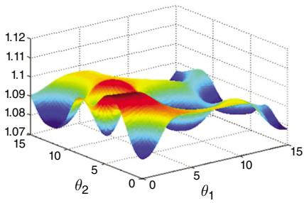  
(a)

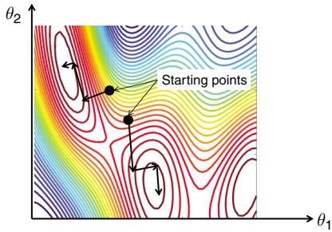  
(b)   
Figure 5.5 (a) Illustration of nonconvex behavior of the response surface for $F ( \theta )$ ; (b) the path to local minima from two different starting points.

# 5.6 Stochastic Gradient Algorithm as a Sequential Decision Problem

We think of stochastic gradient algorithms as methods for solving a problem such as our basic optimization problem in (5.1). However, designing a stochastic gradient algorithm can itself be formulated as a sequential decision problem and modeled using the canonical framework we presented in section 2.2.

We start by restating our stochastic gradient algorithm

$$
{x ^ {n + 1}} = {x ^ {n} + \alpha_ {n} \nabla_ {x} F (x ^ {n}).}
$$

In practice we have to tune the stepsize formula. While there are many rules we could use, we will illustrate the key idea using a simple adaptive stepsize policy known as Kesten’s rule given by

$$
\alpha_ {n} \left(\theta^ {\text {k e s t}}\right) = \frac {\theta^ {\text {k e s t}}}{\theta^ {\text {k e s t}} + N ^ {n}}, \tag {5.49}
$$

where $\theta ^ { k e s t }$ is a tunable parameter and $N ^ { n }$ counts the number of times that the gradient $\nabla _ { x } F ( x ^ { n } )$ has changed sign, which means that

$$
(\nabla_ {x} F (x ^ {n - 1})) ^ {T} \nabla_ {x} F (x ^ {n}) <   0.
$$

When this inner product is negative, it means that the algorithm is starting to criss-cross which is an indication that it is in the vicinity of the optimum.

The stochastic gradient algorithm is stated as a sequential decision problem in Figure 5.6. Formulating the stochastic gradient algorithm as a sequential decision problem produces an optimization problem that looks for the best algorithm. Here, we have limited ourselves to (a) the use of a stochastic gradient algorithm, and (b) the use of Kesten’s stepsize policy. This means that we are just optimizing over the tunable parameter $\theta ^ { k e s t }$ which implies that we are optimizing within a class of algorithms, which is quite common.

There is a substantial literature on stochastic optimization algorithms which prove asymptotic convergence, and then examine the rate of convergence empirically. The goal stated in (5.50) of finding an optimal algorithm is aspirational, but formalizes what people are trying to achieve in practice. In chapter 6, we are going to review a variety of stepsize policies. We could search over all of these, although this is never done.

Even if we limit ourselves to a single class of stepsize policy, it is easy to overlook that tuning $\theta ^ { k e s t }$ depends on problem parameters such as the starting point $x ^ { 0 }$ . It is easy to overlook the dependence of tuned parameters on problem data. This issue has been largely overlooked by the research community.

In section 1.4, we introduced four classes of policies that will describe any search over policies. Virtually all stochastic gradient algorithms, however, use

State variables $S ^ { n } = ( x ^ { n } , N ^ { n } )$

Decision variables The stepsize $\alpha _ { n }$ . This is determined by Kesten’s stepsize policy in equation (5.49) which is parameterized by $\boldsymbol { \theta }$ .

Exogenous information $W ^ { n + 1 }$ , which depends on the motivating problem. This could involve observing the demand in a newsvendor problem, or it may involve running a simulator and observing $\hat { F } ^ { n + 1 } = F ( x ^ { n } , W ^ { n + 1 } )$ .

Transition function These consist of equations for each state variable:

$$
\begin{array}{l} x ^ {n + 1} = x ^ {n} + \alpha_ {n} \nabla_ {x} F (x ^ {n}), \\ N ^ {n + 1} = \left\{ \begin{array}{c l} N ^ {n} + 1 & \text {i f} (\nabla_ {x} F (x ^ {n - 1})) ^ {T} \nabla_ {x} F (x ^ {n}) <   0, \\ N ^ {n} & \text {o t h e r w i s e}. \end{array} \right. \\ \end{array}
$$

Note that $\nabla _ { x } F ( x ^ { n } )$ may be approximated using numerical derivatives such as SPSA.

Objective function We wish to maximize the performance of the final solution that we call $x ^ { \pi , N }$ , which means we wish to optimize:

$$
\max  _ {\pi} \mathbb {E} _ {S ^ {0}} \mathbb {E} _ {W ^ {1}, \dots , W ^ {N} | S ^ {0}} \mathbb {E} _ {\widehat {W} | S ^ {0}} F \left(x ^ {\pi , N}, \widehat {W}\right). \tag {5.50}
$$

If we limit ourselves to Kesten’s rule, then we can write the objective in terms of optimizing over $\theta ^ { k e s t }$ . More generally, we might want to search over different classes of stepsize rules, each of which is likely to have its own tunable parameter.

Figure 5.6 A stochastic gradient algorithm as a sequential decision problem.

policies from the first class, policy function approximations. This raises the question whether any of the other three classes might work well. As of this writing, we are not aware of any work to explore these options.

# 5.7 Empirical Issues

Invariably, the process of actually implementing these algorithms raises issues that are often ignored when describing the algorithms. To help mitigate this transition, below are some of the challenges an experimentalist is likely to encounter.

Tunable parameters – Arguably one of the most frustrating aspects of any algorithm is the need to tune parameters. For gradient-based algorithms, this typically refers to the tunable parameters in the stepsize policy, but could include a smoothing factor for gradient smoothing. These tunable

parameters are a direct result of the use of first-order algorithms, which are easy to compute but which exploit very little information about the underlying function. Particularly frustrating is that this tuning really matters. A poorly tuned stepsize algorithm may decrease too quickly, creating apparent convergence. It is completely possible that a poorly tuned stepsize policy can result in a conclusion that an algorithm is not working. Stepsizes that are too large can introduce too much noise.

Scaling – In most (but not all) applications, the units of the gradient $\nabla F ( x , W )$ are different than the units of ??. A rough rule is that the initial stepsize should be chosen so that the initial change in $x$ is on the order of $3 0 \%$ to $5 0 \%$ of the starting value.

Benchmarking – Whenever possible, it helps to run an algorithm on a simpler problem where the optimal solution can be found using other means, either analytically or numerically. For example, it might be possible to apply the stochastic gradient algorithm on a deterministic sequence that can be solved using deterministic algorithms.

Robustness – A desirable property of any algorithm is that it work reliably, on any problem instance (that is, within a problem class). For example, tuning parameters in the stepsize policy is annoying, but bearable if it only has to be done once.

# 5.8 Transient Problems*

There are many applications where we are trying to solve our basic stochastic optimization problem in an online setting, where the random variable ?? comes from field observations. In these settings, it is not unusual to find that the underlying distribution describing ?? is changing over time. For example, the demands in our newsvendor application may be changing as the purchasing patterns of the market change.

We tend to design algorithms so they exhibit asymptotic convergence. For example, we would insist that the stepsize $\alpha _ { n }$ decline to zero as the algorithm progresses. In a transient setting, this is problematic because it means we are putting decreasing emphasis on the latest information, which is more important than older information. Over time, as $\alpha _ { n }$ approaches zero, the algorithm will stop responding to new information. If we use a stepsize such as $\alpha _ { n } = 1 / n$ , it is possibly to show that the algorithm will eventually adapt to new information, but the rate of adaptation is so slow that the results are not useful.

Practitioners avoid this problem by either choosing a constant stepsize, or one that starts large but converges to a constant greater than zero. If we do this, the algorithm will start bouncing around the optimum. While this

behavior may seem undesirable, in practice this is preferable, partly because the optimum of stochastic optimization problems tend to be smooth, but mostly because it means the algorithm is still adapting to new information, which makes it responsive to a changing signal.

# 5.9 Theoretical Performance*

In practice, finding and tuning search algorithms tends to be ad hoc. Formal analysis of search algorithms tends to fall in one of three categories:

Asymptotic convergence – Probably the most standard result for an algorithm is a proof that the solution will asymptotically approach the optimal solution (that is, as the number of iterations $N \ \to \ \infty$ ). The criticism of asymptotic convergence is that it says nothing about rate of convergence, which means it is not telling us anything about the quality of the solution after $N$ iterations. See sections 5.10.2 and 5.10.3 in the appendix for samples of asymptotic convergence proofs.

Finite-time bounds – These are results that suggest that the quality of the solution after $N$ iterations is within some limit. These bounds tend to be quite weak, and almost always feature unknown coefficients.

Asymptotic rate of convergence – It is often possible to provide high-quality estimates of the rate of convergence, but only when the solution is in the vicinity of the optimal.

The holy grail of theoretical analysis of algorithms is tight bounds for the performance after $n$ iterations. These are rare, and are limited to very simple problems. For this reason, empirical analysis of algorithms remains an important part of the design and analysis of search algorithms. Frustratingly, the performance of a search algorithm on one dataset may not guarantee good performance on a different dataset, even for the same problem class. We anticipate that this is typically due to a failure to properly tune the algorithm.

# 5.10 Why Does it Work?

Stochastic approximation methods have a rich history starting with the seminal paper Robbins and Monro (1951) and followed by Blum (1954b) and Dvoretzky (1956). The serious reader should see Kushner and Yin (1997) for a modern treatment of the subject. Wasan (1969) is also a useful reference

for fundamental results on stochastic convergence theory. A separate line of investigation was undertaken by researchers in eastern European community focusing on constrained stochastic optimization problems (Gaivoronski (1988), Ermoliev (1988), Ruszczyński (1980), Ruszczyński (1987)). This work is critical to our fundamental understanding of Monte Carlo-based stochastic learning methods.

The theory behind these proofs is fairly deep and requires some mathematical maturity. For pedagogical reasons, we start in section 5.10.1 with some probabilistic preliminaries, after which section 5.10.2 presents one of the original proofs, which is relatively more accessible and which provides the basis for the universal requirements that stepsizes must satisfy for theoretical proofs. Section 5.10.3 provides a more modern proof based on the theory of martingales.

# 5.10.1 Some Probabilistic Preliminaries

The goal in this section is to prove that these algorithms work. But what does this mean? The solution ${ \bar { x } } ^ { n }$ at iteration $n$ is a random variable. Its value depends on the sequence of sample realizations of the random variables over iterations 1 to ??. If $\omega = ( W ^ { 1 } , W ^ { 2 } , \ldots , W ^ { n } , \ldots )$ represents the sample path that we are following, we can ask what is happening to the limit $\scriptstyle \operatorname* { l i m } _ { n \to \infty } { \bar { x } } ^ { n } ( \omega )$ . If the limit is $x ^ { * }$ , does $x ^ { * }$ depend on the sample path ???

In the proofs below, we show that the algorithms converge almost surely. What this means is that

$$
\lim  _ {n \to \infty} \bar {x} ^ {n} (\omega) = x ^ {*}
$$

for all $\omega \in \Omega$ that can occur with positive measure. This is the same as saying that we reach $x ^ { * }$ with probability 1. Here, $x ^ { * }$ is a deterministic quantity that does not depend on the sample path. Because of the restriction $p ( \omega ) > 0$ , we accept that in theory, there could exist a sample outcome that can never occur that would produce a path that converges to some other point. As a result, we say that the convergence is “almost sure,” which is universally abbreviated as “a.s.” Almost sure convergence establishes the core theoretical property that the algorithm will eventually settle in on a single point. This is an important property for an algorithm, but it says nothing about the rate of convergence (an important issue in approximate dynamic programming).

Let $x \in \Re ^ { n }$ . At each iteration ??, we sample some random variables to compute the function (and its gradient). The sample realizations are denoted by $W ^ { n }$ . We let $\omega = ( W ^ { 1 } , W ^ { 2 } , \dots , )$ be a realization of all the random variables over

all iterations. Let $\Omega$ be the set of all possible realizations of $\omega$ , and let $\mathfrak { F }$ be the $\sigma$ -algebra on $\Omega$ (that is to say, the set of all possible events that can be defined using $\Omega$ ). We need the concept of the history up through iteration ??. Let

$$
H ^ {n} = \text {a r a n d o m v a r i a b l e g i v i n g t h e h i s t o r y o f a l l r a n d o m v a r i a b l e s u p}
$$

A sample realization of $H ^ { n }$ would be

$$
\begin{array}{l} h ^ {n} = H ^ {n} (\omega) \\ = (W ^ {1}, W ^ {2}, \dots , W ^ {n}). \\ \end{array}
$$

We could then let $W ^ { n }$ be the set of all outcomes of the history (that is, $h ^ { n } \in H ^ { n }$ ) and let ${ \mathcal { H } } ^ { n }$ be the $\sigma$ -algebra on $W ^ { n }$ (which is the set of all events, including their complements and unions, defined using the outcomes in $W ^ { n }$ ). Although we could do this, this is not the convention followed in the probability community. Instead, we define a sequence of $\sigma$ -algebras $\mathfrak { F } ^ { 1 } , \mathfrak { F } ^ { 2 } , \dots , \mathfrak { F } ^ { n }$ as the sequence of $\sigma$ -algebras on $\Omega$ that can be generated as we have access to the information through the first $1 , 2 , \ldots , n$ iterations, respectively. What does this mean? Consider two outcomes $\omega \neq \omega ^ { \prime }$ for which $H ^ { n } ( \omega ) = H ^ { n } ( \omega ^ { \prime } )$ . If this is the case, then any event in ${ \mathfrak { F } } ^ { n }$ that includes $\omega$ must also include $\omega ^ { \prime }$ . If we say that a function is ${ \mathfrak { F } } ^ { n }$ -measurable, then this means that it must be defined in terms of the events in ${ \mathfrak { F } } ^ { n }$ , which is in turn equivalent to saying that we cannot be using any information from iterations $n + 1 , n + 2 , \ldots$ .

We would say, then, that we have a standard probability space $( \Omega , \Im , \mathcal { P } )$ where $\omega \in \Omega$ represents an elementary outcome, $\mathfrak { F }$ is the $\sigma$ -algebra on $\mathfrak { F }$ , and $\mathcal { P }$ is a probability measure on $\Omega$ . Since our information is revealed iteration by iteration, we would also then say that we have an increasing set of $\sigma$ -algebras $\mathfrak { F } ^ { 1 } \subseteq \mathfrak { F } ^ { 2 } \subseteq \ldots \subseteq \mathfrak { F } ^ { n }$ (which is the same as saying that ${ \mathcal { F } } ^ { n }$ is a filtration).

# 5.10.2 An Older Proof*

Enough with probabilistic preliminaries. We wish to solve the unconstrained problem

$$
\max  _ {x} \mathbb {E} F (x, \omega) \tag {5.51}
$$

with $x ^ { * }$ being the optimal solution. Let $g ( x , \omega )$ be a stochastic ascent vector that satisfies

$$
g (x, \omega) ^ {T} \nabla F (x, \omega) \geq 0. \tag {5.52}
$$

For many problems, the most natural ascent vector is the gradient itself

$$
g (x, \omega) = \nabla F (x, \omega) \tag {5.53}
$$

which clearly satisfies (5.52).

We assume that $F ( x ) = \mathbb { E } F ( x , \omega )$ is continuously differentiable and concave, with bounded first and second derivatives so that for finite ??

$$
- M \leq g (x, \omega) ^ {T} \nabla^ {2} F (x) g (x, \omega) \leq M. \tag {5.54}
$$

A stochastic gradient algorithm (sometimes called a stochastic approximation method) is given by

$$
\bar {x} ^ {n} = \bar {x} ^ {n - 1} + \alpha_ {n - 1} g (\bar {x} ^ {n - 1}, \omega). \tag {5.55}
$$

We first prove our result using the proof technique of Blum (1954b) that generalized the original stochastic approximation procedure proposed by Robbins and Monro (1951) to multidimensional problems. This approach does not depend on more advanced concepts such as martingales and, as a result, is accessible to a broader audience. This proof helps the reader understand the basis for the conditions $\textstyle \sum _ { n = 0 } ^ { \infty } \alpha _ { n } = \infty$ ∑∞ and $\textstyle \sum _ { n = 0 } ^ { \infty } ( \alpha _ { n } ) ^ { 2 } < \infty$ that are required of all stochastic approximation algorithms.

We make the following (standard) assumptions on stepsizes

$$
\alpha_ {n} > 0 \text {f o r a l l} n \geq 0, \tag {5.56}
$$

$$
\sum_ {n = 0} ^ {\infty} \alpha_ {n} = \infty , \tag {5.57}
$$

$$
\sum_ {n = 0} ^ {\infty} \left(\alpha_ {n}\right) ^ {2} <   \infty . \tag {5.58}
$$

We want to show that under suitable assumptions, the sequence generated by (5.55) converges to an optimal solution. That is, we want to show that

$$
\lim  _ {n \rightarrow \infty} x ^ {n} = x ^ {*} a. s. \tag {5.59}
$$

We now use Taylor’s theorem (remember Taylor’s theorem from freshman calculus?), which says that for any continuously differentiable convex function $F ( x )$ , there exists a parameter $0 \leq \eta \leq 1$ that satisfies for a given $x$ and $x ^ { 0 }$

$$
F (x) = F \left(x ^ {0}\right) + \nabla F \left(x ^ {0} + \eta \left(x - x ^ {0}\right)\right) \left(x - x ^ {0}\right). \tag {5.60}
$$

This is the first-order version of Taylor’s theorem. The second-order version takes the form

$$
F (x) = F \left(x ^ {0}\right) + \nabla F \left(x ^ {0}\right) \left(x - x ^ {0}\right) + \frac {1}{2} \left(x - x ^ {0}\right) ^ {T} \nabla^ {2} F \left(x ^ {0} + \eta \left(x - x ^ {0}\right)\right) \left(x - x ^ {0}\right) \tag {5.61}
$$

for some $0 \leq \eta \leq 1$ . We use the second-order version. In addition, since our problem is stochastic, we will replace $F ( x )$ with $F ( x , \omega )$ where $\omega$ tells us what sample path we are on, which in turn tells us the value of $W$ .

To simplify our notation, we are going to replace $x ^ { 0 }$ with $x ^ { n - 1 }$ , $x$ with $x ^ { n }$ , and finally we will use

$$
g ^ {n} = g \left(x ^ {n - 1}, \omega\right). \tag {5.62}
$$

This means that, by definition of our algorithm,

$$
\begin{array}{l} x - x ^ {0} = x ^ {n} - x ^ {n - 1} \\ = \left(x ^ {n - 1} + \alpha_ {n - 1} g ^ {n}\right) - x ^ {n - 1} \\ { = } { \alpha _ { n - 1 } g ^ { n } . } \\ \end{array}
$$

From our stochastic gradient algorithm (5.55), we may write

$$
\begin{array}{l} F (x ^ {n}, \omega) = F (x ^ {n - 1} + \alpha_ {n - 1} g ^ {n}, \omega) \\ = F (x ^ {n - 1}, \omega) + \nabla F (x ^ {n - 1}, \omega) (\alpha_ {n - 1} g ^ {n}) \\ + \frac {1}{2} \left(\alpha_ {n - 1} g ^ {n}\right) ^ {T} \nabla^ {2} F \left(x ^ {n - 1} + \eta \alpha_ {n - 1} g ^ {n}, \omega\right) \left(\alpha_ {n - 1} g ^ {n}\right). \tag {5.63} \\ \end{array}
$$

It is now time to use a standard mathematician’s trick. We sum both sides of (5.63) to get

$$
\begin{array}{l} \sum_ {n = 1} ^ {N} F (x ^ {n}, \omega) = \sum_ {n = 1} ^ {N} F (x ^ {n - 1}, \omega) + \sum_ {n = 1} ^ {N} \nabla F (x ^ {n - 1}, \omega) (\alpha_ {n - 1} g ^ {n}) + \\ \frac {1}{2} \sum_ {n = 1} ^ {N} \left(\alpha_ {n - 1} g ^ {n}\right) ^ {T} \nabla^ {2} F \left(x ^ {n - 1} + \eta \alpha_ {n - 1} g ^ {n}, \omega\right) \left(\alpha_ {n - 1} g ^ {n}\right). \tag {5.64} \\ \end{array}
$$

Note that the terms $F ( x ^ { n } ) , n \ = \ 2 , 3 , \ldots , N$ appear on both sides of (5.64). We can cancel these. We then use our lower bound on the quadratic term (5.54) to write

$$
F (x ^ {N}, \omega) \geq F (x ^ {0}, \omega) + \sum_ {n = 1} ^ {N} \nabla F (x ^ {n - 1}, \omega) (\alpha_ {n - 1} g ^ {n}) + \frac {1}{2} \sum_ {n = 1} ^ {N} (\alpha_ {n - 1}) ^ {2} (- M) (5. 6 5)
$$

We now want to take the limit of both sides of (5.65) as $N  \infty$ . In doing so, we want to show that everything must be bounded. We know that $F ( x ^ { N } )$ is bounded (almost surely) because we assumed that the original function was bounded. We next use the assumption (5.58) that the infinite sum of the squares of the stepsizes is also bounded to conclude that the rightmost term in (5.65) is bounded. Finally, we use (5.52) to claim that all the terms in the remaining summation (∑????=1 $\begin{array} { r l } {  { ( \sum _ { n = 1 } ^ { N } \mathbf { \dot { V } } F ( x ^ { n - 1 } ) ( \alpha _ { n - 1 } g ^ { n } ) ) } } \end{array}$ are positive. That means that this term is also bounded (from both above and below).

What do we get with all this boundedness? Well, if

$$
\sum_ {n = 1} ^ {\infty} \alpha_ {n - 1} \nabla F \left(x ^ {n}, \omega\right) \mathrm {g} ^ {n} <   \infty \text {f o r a l l} \omega \tag {5.66}
$$

and (from (5.57))

$$
\sum_ {n = 1} ^ {\infty} \alpha_ {n - 1} = \infty . \tag {5.67}
$$

We can conclude that

$$
\sum_ {n = 1} ^ {\infty} \nabla F \left(x ^ {n - 1}, \omega\right) g ^ {n} <   \infty . \tag {5.68}
$$

Since all the terms in (5.68) are positive, they must go to zero. (Remember, everything here is true almost surely; after a while, it gets a little boring to keep saying almost surely every time. It is a little like reading Chinese fortune cookies and adding the automatic phrase “under the sheets” at the end of every fortune.)

We are basically done except for some relatively difficult (albeit important if you are ever going to do your own proofs) technical points to really prove convergence. At this point, we would use technical conditions on the properties of our ascent vector $g ^ { n }$ to argue that if $\nabla F ( x ^ { n } , \omega ) g ^ { n } \to 0$ then $\nabla F ( x ^ { n } , \omega )  0$ , (it is okay if $g ^ { n }$ goes to zero as $F ( x ^ { n } , \omega )$ goes to zero, but it cannot go to zero too quickly).

This proof was first proposed in the early 1950s by Robbins and Monro and became the basis of a large area of investigation under the heading of stochastic approximation methods. A separate community, growing out of the Soviet literature in the 1960s, addressed these problems under the name of stochastic gradient (or stochastic quasi-gradient) methods. More modern proofs are based on the use of martingale processes, which do not start with Taylor’s formula and do not (always) need the continuity conditions that this approach needs.

Our presentation does, however, help to present several key ideas that are present in most proofs of this type. First, concepts of almost sure convergence are virtually standard. Second, it is common to set up equations such as (5.63) and then take a finite sum as in (5.64) using the alternating terms in the sum to cancel all but the first and last elements of the sequence of some function (in our case, $F ( x ^ { n - 1 } , \omega ) ;$ . We then establish the boundedness of this expression as $N  \infty$ , which will require the assumption that $\textstyle \sum _ { n = 1 } ^ { \infty } ( \alpha _ { n - 1 } ) ^ { 2 } < \infty$ . Then, the assumption $\textstyle \sum _ { n = 1 } ^ { \infty } \alpha _ { n - 1 } = \infty$ is used to show that if the remaining sum is bounded, then its terms must go to zero.

More modern proofs will use functions other than $F ( x )$ . Popular is the introduction of so-called Lyapunov functions, which are artificial functions that provide a measure of optimality. These functions are constructed for the purpose of the proof and play no role in the algorithm itself. For example, we might let $T ^ { n } = | | x ^ { n } - x ^ { * } | |$ be the distance between our current solution $x ^ { n }$ and the optimal solution. We will then try to show that $T ^ { n }$ is suitably reduced to prove convergence. Since we do not know $x ^ { * }$ , this is not a function we can actually measure, but it can be a useful device for proving that the algorithm actually converges.

It is important to realize that stochastic gradient algorithms of all forms do not guarantee an improvement in the objective function from one iteration to the next. First, a sample gradient $g ^ { n }$ may represent an appropriate ascent vector for a sample of the function $F ( x ^ { n } , \omega )$ but not for its expectation. In other words, randomness means that we may go in the wrong direction at any point in time. Second, our use of a nonoptimizing stepsize, such as $\alpha _ { n - 1 } = 1 / n$ , means that even with a good ascent vector, we may step too far and actually end up with a lower value.

# 5.10.3 A More Modern Proof**

Since the original work by Robbins and Monro, more powerful proof techniques have evolved. Below we illustrate a basic martingale proof of convergence. The concepts are somewhat more advanced, but the proof is more elegant and requires milder conditions. A significant generalization is that we no longer require that our function be differentiable (which our first proof required). For large classes of resource allocation problems, this is a significant improvement.

First, just what is a martingale? Let $\omega _ { 1 } , \omega _ { 2 } , \ldots , \omega _ { t }$ be a set of exogenous random outcomes, and let $\boldsymbol { h } _ { t } = \boldsymbol { H } _ { t } ( \omega ) = ( \omega _ { 1 } , \omega _ { 2 } , \dots , \omega _ { t } )$ represent the history of the process up to time ??. We also let $\mathfrak { F } _ { t }$ be the $\sigma$ -algebra on $\Omega$ generated by $H _ { t }$ . Further, let $U _ { t }$ be a function that depends on $h _ { t }$ (we would say that $U _ { t }$ is a $\mathfrak { F } _ { t }$ - measurable function), and bounded $( \mathbb { E } | U _ { t } | < \infty$ , $\forall t \geq 0$ ). This means that if we know $h _ { t }$ , then we know $U _ { t }$ deterministically (needless to say, if we only know $h _ { t }$ , then $U _ { t + 1 }$ is still a random variable). We further assume that our function satisfies

$$
\mathbb {E} \left[ U _ {t + 1} \mid \mathfrak {F} _ {t} \right] = U _ {t}.
$$

If this is the case, then we say that $U _ { t }$ is a martingale. Alternatively, if

$$
\mathbb {E} \left[ U _ {t + 1} \mid \mathfrak {F} _ {t} \right] \leq U _ {t} \tag {5.69}
$$

then we say that $U _ { t }$ is a supermartingale. If $U _ { t }$ is a supermartingale, then it has the property that it drifts downward, usually to some limit point $U ^ { * }$ . What is important is that it only drifts downward in expectation. That is, it could easily be the case that $U _ { t + 1 } > U _ { t }$ for specific outcomes. This captures the behavior of stochastic approximation algorithms. Properly designed, they provide solutions that improve on average, but where from one iteration to another the results can actually get worse.

Finally, assume that $U _ { t } \geq 0$ . If this is the case, we have a sequence $U _ { t }$ that drifts downward but which cannot go below zero. Not surprisingly, we obtain the following key result:

Theorem 5.10.1. Let $U _ { t }$ be a positive supermartingale. Then, $U _ { t }$ converges to a finite random variable $U ^ { * }$ almost surely.

Note that “almost surely” (which is typically abbreviated “a.s.”) means “for all (or every) $\omega$ .” Mathematicians like to recognize every possibility, so they will add “every $\omega$ that might happen with some probability,” which means that we are allowing for the possibility that $U _ { t }$ might not converge for some sample realization $\omega$ that would never actually happen (that is, where $p ( \omega ) > 0 _ { , } ^ { \backslash }$ ). This also means that it converges with probability one.

So what does this mean for us? We assume that we are still solving a problem of the form

$$
\max  _ {x} \mathbb {E} F (x, \omega), \tag {5.70}
$$

where we assume that $F ( x , \omega )$ is continuous and concave (but we do not require differentiability). Let ${ \bar { x } } ^ { n }$ be our estimate of $x$ at iteration $n$ (remember that ${ \bar { x } } ^ { n }$ is a random variable). Instead of watching the evolution of a process of time, we are studying the behavior of an algorithm over iterations. Let $F ^ { n } = \mathbb { E } F ( { \bar { x } } ^ { n } )$ be our objective function at iteration $n$ and let $F ^ { * }$ be the optimal value of the objective function. If we are maximizing, we know that $F ^ { n } \leq F ^ { * }$ . If we let $U ^ { n } =$ $F ^ { * } - F ^ { n }$ , then we know that $U ^ { n } \geq 0$ (this assumes that we can find the true expectation, rather than some approximation of it). A stochastic algorithm will not guarantee that $F ^ { n } \geq F ^ { n - 1 }$ , but if we have a good algorithm, then we may be able to show that $U ^ { n }$ is a supermartingale, which at least tells us that in the limit, $U ^ { n }$ will approach some limit $\bar { U }$ . With additional work, we might be able to show that $\bar { U } = 0$ , which means that we have found the optimal solution.

A common strategy is to define $U ^ { n }$ as the distance between ${ \bar { x } } ^ { n }$ and the optimal solution, which is to say

$$
U ^ {n} = \left(\bar {x} ^ {n} - x ^ {*}\right) ^ {2}. \tag {5.71}
$$

Of course, we do not know $x ^ { * }$ , so we cannot actually compute $U ^ { n }$ , but that is not really a problem for us (we are just trying to prove convergence). Note that we immediately get $U ^ { n } \geq 0$ (without an expectation). If we can show that $U ^ { n }$ is a supermartingale, then we get the result that $U ^ { n }$ converges to a random variable $U ^ { * }$ (which means the algorithm converges). Showing that $U ^ { * } = 0$ means that our algorithm will (eventually) produce the optimal solution. We are going to study the convergence of our algorithm for maximizing $\mathbb { E } F ( x , W )$ by studying the behavior of $U ^ { n }$ .

We are solving this problem using a stochastic gradient algorithm

$$
\bar {x} ^ {n} = \bar {x} ^ {n - 1} + \alpha_ {n - 1} g ^ {n}, \tag {5.72}
$$

where $g ^ { n }$ is our stochastic gradient. If $F$ is differentiable, we would write

$$
{g ^ {n}} = {\nabla_ {x} F (\bar {x} ^ {n - 1}, W ^ {n}).}
$$

But in general, $F$ may be nondifferentiable, in which case we may have multiple gradients at a point $\bar { x } ^ { n - 1 }$ (for a single sample realization). In this case, we write

$$
g ^ {n} \in \partial_ {x} F (\bar {x} ^ {n - 1}, W ^ {n}),
$$

where $\partial _ { x } { \cal F } ( \bar { x } ^ { n - 1 } , W ^ { n } )$ refers to the set of subgradients at $\bar { x } ^ { n - 1 }$ . We assume our problem is unconstrained, so $\nabla _ { x } F ( \bar { x } ^ { * } , W ^ { n } ) = 0$ if $F$ is differentiable. If it is nondifferentiable, we would assume that $0 \in \partial _ { x } F ( \bar { x } ^ { * } , W ^ { n } )$ .

Throughout our presentation, we assume that $x$ (and hence $g ^ { n }$ ) is a scalar (exercise 6.17 provides an opportunity to redo this section using vector notation). In contrast with the previous section, we are now going to allow our stepsizes to be stochastic. For this reason, we need to slightly revise our original assumptions about stepsizes (equations (5.56) to (5.58)) by assuming

$$
\alpha_ {n} > 0 \text {a . s .}, \tag {5.73}
$$

$$
\sum_ {n = 0} ^ {\infty} \alpha_ {n} = \infty a. s., \tag {5.74}
$$

$$
\mathbb {E} \left[ \sum_ {n = 0} ^ {\infty} \left(\alpha_ {n}\right) ^ {2} \right] <   \infty . \tag {5.75}
$$

The requirement that $\alpha _ { n }$ be nonnegative “almost surely” (a.s.) recognizes that $\alpha _ { n }$ is a random variable. We can write $\alpha _ { n } ( \omega )$ as a sample realization of the stepsize (that is, this is the stepsize at iteration $n$ if we are following sample path ??). When we require that $\alpha _ { n } ~ \geq ~ 0$ “almost surely” we mean that $\alpha _ { n } ( \omega ) \geq 0$ for all $\omega$ where the probability (more precisely, probability measure) of $\omega$ , $p ( \omega )$ , is greater than zero (said differently, this means that the probability that

$\mathbb { P } [ \alpha _ { n } \geq 0 ] = 1 _ { . }$ ). The same reasoning applies to the sum of the stepsizes given in equation (5.74). As the proof unfolds, we will see the reason for needing the conditions (and why they are stated as they are).

We next need to assume some properties of the stochastic gradient $g ^ { n }$ . Specifically, we need to assume the following:

Assumption $\begin{array} { r } { \mathbf { 1 } - \mathbb { E } [ g ^ { n + 1 } ( \bar { x } ^ { n } - x ^ { * } ) | \mathfrak { F } ^ { n } ] \ge 0 , } \end{array}$ ,

Assumption $2 - | g ^ { n } | \le B _ { \mathrm { g } }$

Assumption 3 – For any $x$ where $| x - x ^ { * } | > \delta , \delta > 0$ , there exists $\epsilon > 0$ such that $\mathbb { E } [ g ^ { n + 1 } | \mathfrak { F } ^ { n } ] > \epsilon$ .

Assumption 1 assumes that on average, the gradient $g ^ { n }$ points toward the optimal solution $x ^ { * }$ . This is easy to prove for deterministic, differentiable functions. While this may be harder to establish for stochastic problems or problems where $F ( x )$ is nondifferentiable, we do not have to assume that $F ( x )$ is differentiable. Nor do we assume that a particular gradient $g ^ { n + 1 }$ moves toward the optimal solution (for a particular sample realization, it is entirely possible that we are going to move away from the optimal solution). Assumption 2 assumes that the gradient is bounded. Assumption 3 requires that the expected gradient cannot vanish at a nonoptimal value of $x$ . This assumption will be satisfied for any concave function.

To show that $U ^ { n }$ is a supermartingale, we start with

$$
\begin{array}{l} U ^ {n + 1} - U ^ {n} = (\bar {x} ^ {n + 1} - x ^ {*}) ^ {2} - (\bar {x} ^ {n} - x ^ {*}) ^ {2} \\ = \left(\left(\bar {x} ^ {n} - \alpha_ {n} g ^ {n + 1}\right) - x ^ {*}\right) ^ {2} - \left(\bar {x} ^ {n} - x ^ {*}\right) ^ {2} \\ = \left((\bar {x} ^ {n} - x ^ {*}) ^ {2} - 2 \alpha_ {n} g ^ {n + 1} (\bar {x} ^ {n} - x ^ {*}) + (\alpha_ {n} g ^ {n + 1}) ^ {2}\right) - (\bar {x} ^ {n} - x ^ {*}) ^ {2} \\ = \left(\alpha_ {n} g ^ {n + 1}\right) ^ {2} - 2 \alpha_ {n} g ^ {n + 1} \left(\bar {x} ^ {n} - x ^ {*}\right). \tag {5.76} \\ \end{array}
$$

Taking conditional expectations on both sides gives

$$
\mathbb {E} \left[ U ^ {n + 1} \mid \mathfrak {F} ^ {n} \right] - \mathbb {E} \left[ U ^ {n} \mid \mathfrak {F} ^ {n} \right] = \mathbb {E} \left[ \left(\alpha_ {n} g ^ {n + 1}\right) ^ {2} \mid \mathfrak {F} ^ {n} \right] - 2 \mathbb {E} \left[ \alpha_ {n} g ^ {n + 1} (\bar {x} ^ {n} - x ^ {*}) \mid \mathfrak {F} ^ {n} \right]. \tag {5.77}
$$

We note that

$$
\begin{array}{l} \mathbb {E} \left[ \alpha_ {n} g ^ {n + 1} \left(\bar {x} ^ {n} - x ^ {*}\right) | \mathfrak {F} ^ {n} \right] = \alpha_ {n} \mathbb {E} \left[ g ^ {n + 1} \left(\bar {x} ^ {n} - x ^ {*}\right) | \mathfrak {F} ^ {n} \right] (5.78) \\ \geq 0. (5.79) \\ \end{array}
$$

Equation (5.78) is subtle but important, as it explains a critical piece of notation in this book. Keep in mind that we may be using a stochastic stepsize formula, which means that $\alpha _ { n }$ is a random variable. We assume that $\alpha _ { n }$ is ${ \mathfrak { F } } ^ { n }$ - measurable, which means that we are not allowed to use information from

iteration $n + 1$ to compute it. This is why we use $\alpha _ { n - 1 }$ in updating equations such as equation (5.13) instead of $\alpha _ { n }$ . When we condition on ${ \mathfrak { F } } ^ { n }$ in equation (5.78), $\alpha _ { n }$ is deterministic, allowing us to take it outside the expectation. This allows us to write the conditional expectation of the product of $\alpha _ { n }$ and $g ^ { n + 1 }$ as the product of the expectations. Equation (5.79) comes from Assumption 1 and the nonnegativity of the stepsizes.

Recognizing that $\mathbb { E } [ U ^ { n } | \mathfrak { F } ^ { n } ] = U ^ { n }$ (given ${ \mathfrak { F } } ^ { n }$ ), we may rewrite (5.77) as

$$
\begin{array}{l} \mathbb {E} \left[ U ^ {n + 1} \mid \mathfrak {F} ^ {n} \right] = U ^ {n} + \mathbb {E} \left[ \left(\alpha_ {n} g ^ {n + 1}\right) ^ {2} \mid \mathfrak {F} ^ {n} \right] - 2 \mathbb {E} \left[ \alpha_ {n} g ^ {n + 1} \left(\bar {x} ^ {n} - x ^ {*}\right) \mid \mathfrak {F} ^ {n} \right] \\ \leq U ^ {n} + \mathbb {E} \left[ \left(\alpha_ {n} g ^ {n + 1}\right) ^ {2} \mid \mathfrak {F} ^ {n} \right]. \tag {5.80} \\ \end{array}
$$

Because of the positive term on the right-hand side of (5.80), we cannot directly get the result that $U ^ { n }$ is a supermartingale. But hope is not lost. We appeal to a neat little trick that works as follows. Let

$$
W ^ {n} = \mathbb {E} \left[ U ^ {n} + \sum_ {m = n} ^ {\infty} \left(\alpha_ {m} g ^ {m + 1}\right) ^ {2} \mid \mathfrak {F} ^ {n} \right]. \tag {5.81}
$$

We are going to show that $W ^ { n }$ is a supermartingale. From its definition, we obtain

$$
\begin{array}{l} W ^ {n} = \mathbb {E} \left[ W ^ {n + 1} + U ^ {n} - U ^ {n + 1} + \left(\alpha_ {n} g ^ {n + 1}\right) ^ {2} | \mathfrak {F} ^ {n} \right], \\ = \mathbb {E} \left[ W ^ {n + 1} | \mathfrak {F} ^ {n} \right] + U ^ {n} - \mathbb {E} \left[ U ^ {n + 1} | \mathfrak {F} ^ {n} \right] + \mathbb {E} \left[ \left(\alpha_ {n} g ^ {n + 1}\right) ^ {2} | \mathfrak {F} ^ {n} \right] \\ \end{array}
$$

which is the same as

$$
\mathbb {E} [ W ^ {n + 1} | \mathfrak {F} ^ {n} ] = W ^ {n} - \underbrace {\left(U ^ {n} + \mathbb {E} \left[ (\alpha_ {n} g ^ {n + 1}) ^ {2} | \mathfrak {F} ^ {n} \right] - \mathbb {E} [ U ^ {n + 1} | \mathfrak {F} ^ {n} ]\right)} _ {I}.
$$

We see from equation (5.80) that $I ~ \geq ~ 0$ . Removing this term gives us the inequality

$$
\mathbb {E} \left[ W ^ {n + 1} \mid \mathfrak {F} ^ {n} \right] \leq W ^ {n}. \tag {5.82}
$$

This means that $W ^ { n }$ is a supermartingale. It turns out that this is all we really need because $\begin{array} { r } { \operatorname* { l i m } _ { n \to \infty } W ^ { n } = \operatorname* { l i m } _ { n \to \infty } U ^ { n } } \end{array}$ . This means that

$$
\lim  _ {n \rightarrow \infty} U ^ {n} \rightarrow U ^ {*} \quad a. s. \tag {5.83}
$$

Now that we have the basic convergence of our algorithm, we have to ask: but what is it converging to? For this result, we return to equation (5.76) and sum

it over the values $n = 0$ up to some number $N$ , giving us

$$
\sum_ {n = 0} ^ {N} \left(U ^ {n + 1} - U ^ {n}\right) = \sum_ {n = 0} ^ {N} \left(\alpha_ {n} g ^ {n + 1}\right) ^ {2} - 2 \sum_ {n = 0} ^ {N} \alpha_ {n} g ^ {n + 1} \left(\bar {x} ^ {n} - x ^ {*}\right). \tag {5.84}
$$

The left-hand side of (5.84) is an alternating sum (sometimes referred to as a telescoping sum), which means that every element cancels out except the first and the last, giving us

$$
{U ^ {N + 1} - U ^ {0}} = {\sum_ {n = 0} ^ {N} (\alpha_ {n} g ^ {n + 1}) ^ {2} - 2 \sum_ {n = 0} ^ {N} \alpha_ {n} g ^ {n + 1} (\bar {x} ^ {n} - x ^ {*}).}
$$

Taking expectations of both sides gives

$$
\mathbb {E} \left[ U ^ {N + 1} - U ^ {0} \right] = \mathbb {E} \left[ \sum_ {n = 0} ^ {N} \left(\alpha_ {n} g ^ {n + 1}\right) ^ {2} \right] - 2 \mathbb {E} \left[ \sum_ {n = 0} ^ {N} \alpha_ {n} g ^ {n + 1} \left(\bar {x} ^ {n} - x ^ {*}\right) \right]. \tag {5.85}
$$

We want to take the limit of both sides as $N$ goes to infinity. To do this, we have to appeal to the Dominated Convergence Theorem (DCT), which tells us that

$$
\lim  _ {N \rightarrow \infty} \int_ {x} f ^ {n} (x) d x = \int_ {x} \left(\lim  _ {N \rightarrow \infty} f ^ {n} (x)\right) d x
$$

if $| f ^ { n } ( x ) | \leq g ( x )$ for some function $g ( x )$ where

$$
\int_ {x} \mathrm {g} (x) d x <   \infty .
$$

For our application, the integral represents the expectation (we would use a summation instead of the integral if $x$ were discrete), which means that the DCT gives us the conditions needed to exchange the limit and the expectation. Above, we showed that $\mathbb { E } [ U ^ { n + 1 } | { \mathfrak { F } } ^ { n } ]$ is bounded (from (5.80) and the boundedness of $U ^ { 0 }$ and the gradient). This means that the right-hand side of (5.85) is also bounded for all ??. The DCT then allows us to take the limit as $N$ goes to infinity inside the expectations, giving us

$$
{U ^ {*} - U ^ {0}} = {\mathbb {E} \left[ \sum_ {n = 0} ^ {\infty} (\alpha_ {n} g ^ {n + 1}) ^ {2} \right] - 2 \mathbb {E} \left[ \sum_ {n = 0} ^ {\infty} \alpha_ {n} g ^ {n + 1} (\bar {x} ^ {n} - x ^ {*}) \right].}
$$

We can rewrite the first term on the right-hand side as

$$
\begin{array}{l} \mathbb {E} \left[ \sum_ {n = 0} ^ {\infty} \left(\alpha_ {n} g ^ {n + 1}\right) ^ {2} \right] \leq \mathbb {E} \left[ \sum_ {n = 0} ^ {\infty} \left(\alpha_ {n}\right) ^ {2} (B) ^ {2} \right] (5.86) \\ = B ^ {2} \mathbb {E} \left[ \sum_ {n = 0} ^ {\infty} \left(\alpha_ {n}\right) ^ {2} \right] (5.87) \\ <   \infty . (5.88) \\ \end{array}
$$

Equation (5.86) comes from Assumption 2 which requires that $| g ^ { n } |$ be bounded by $B$ , which immediately gives us Equation (5.87). The requirement that ?? ∑∞ $\textstyle \sum _ { n = 0 } ^ { \infty } ( \alpha _ { n } ) ^ { 2 } < \infty$ (equation (5.58)) gives us (5.88), which means that the first summation on the right-hand side of (5.85) is bounded. Since the lefthand side of (5.85) is bounded, we can conclude that the second term on the right-hand side of (5.85) is also bounded.

Now let

$$
\begin{array}{l} \beta^ {n} \quad = \quad \mathbb {E} \left[ g ^ {n + 1} \left(\bar {x} ^ {n} - x ^ {*}\right) \right] \\ = \mathbb {E} \left[ \mathbb {E} \left[ g ^ {n + 1} (\bar {x} ^ {n} - x ^ {*}) | \mathfrak {F} ^ {n} \right] \right] \\ \geq 0, \\ \end{array}
$$

since $\mathbb { E } [ g ^ { n + 1 } ( { \bar { x } } ^ { n } - x ^ { * } ) | { \mathfrak { F } } ^ { n } ] \geq 0$ from Assumption 1. This means that

$$
\sum_ {n = 0} ^ {\infty} \alpha_ {n} \beta^ {n} <   \infty \text {a . s .} \tag {5.89}
$$

But, we have required that $\textstyle \sum _ { n = 0 } ^ { \infty } \alpha _ { n } = \infty$ a.s. (equation (5.74)). Since $\alpha _ { n } > 0$ and $\beta ^ { n } \geq 0$ (a.s.), we conclude that

$$
\lim  _ {n \rightarrow \infty} \beta^ {n} \quad \rightarrow \quad 0 \text {a . s .} \tag {5.90}
$$

If $\beta ^ { n }  0$ , then $\mathbb { E } [ g ^ { n + 1 } ( { \bar { x } } ^ { n } - x ^ { * } ) ] ~ \to ~ 0$ , which allows us to conclude that $\mathbb { E } [ g ^ { n + 1 } ( \bar { x } ^ { n } - x ^ { * } ) | \mathfrak { F } ^ { n } ] \to 0$ (the expectation of a nonnegative random variable cannot be zero unless the random variable is always zero). But what does this tell us about the behavior of $\bar { x } ^ { n } ?$ Knowing that $\beta ^ { n }  0$ does not necessarily imply that $g ^ { n + 1 } \to 0$ or $\bar { x } ^ { n } \to x ^ { * }$ . There are three scenarios:

1) $\bar { x } ^ { n } \to x ^ { * }$ for all $n$ , and of course all sample paths $\omega$ . If this were the case, we are done.   
2) $\bar { x } ^ { n _ { k } } \to x ^ { * }$ for a subsequence $n _ { 1 } , n _ { 2 } , \ldots , n _ { k }$ , …. For example, it might be that the sequence $\bar { x } ^ { 1 } , \bar { x } ^ { 3 } , \bar { x } ^ { 5 } , \dots \to x ^ { * }$ , while $\mathbb { E } [ g ^ { 2 } | \mathfrak { F } ^ { 1 } ] , \mathbb { E } [ g ^ { 4 } | \mathfrak { F } ^ { 3 } ] , \dots , \to 0$ . This would mean that for the subsequence $n _ { k }$ , $U ^ { n _ { k } } \to 0$ . But we already know that $U ^ { n } $

$U ^ { * }$ where $U ^ { * }$ is the unique limit point, which means that $U ^ { * } = 0$ . But if this is the case, then this is the limit point for every sequence of ${ \bar { x } } ^ { n }$ .

3) There is no subsequence $\bar { x } ^ { n _ { k } }$ which has ${ \bar { x } } ^ { * }$ as its limit point. This means that $\mathbb { E } [ g ^ { n + 1 } | \mathfrak { F } ^ { n } ] \to 0$ . However, assumption 3 tells us that the expected gradient cannot vanish at a nonoptimal value of $x$ . This means that this case cannot happen.

This completes the proof.

# 5.11 Bibliographic Notes

Section 5.3 – The theoretical foundation for estimating value functions from Monte Carlo estimates has its roots in stochastic approximation theory, originated by Robbins and Monro (1951), with important early contributions made by Kiefer and Wolfowitz (1952), Blum (1954a) and Dvoretzky (1956). For thorough theoretical treatments of stochastic approximation theory, see Wasan (1969), Kushner and Clark (1978), and Kushner and Yin (1997). Very readable treatments of stochastic optimization can be found in Pflug (1996) and Spall (2003) (Spall’s book is a modern classic on stochastic approximation methods). More modern treatments of stochastic gradient methods are given in Fu (2014) and Shapiro et al. (2014).

Section 5.4 – There are a number of ways to compute gradients, including numerical derivatives (when exact gradients are not available), gradient smoothing, mini-batches (averages of sampled gradients). Excellent modern treatments can be found in Michael Fu’s edited volume Fu (2014), including Fu’s chapter on stochastic gradient estimation [Chapter 5], and Chau and Fu’s chapter on stochastic approximation methods and finite-difference methods [Chapter 6].

Section 5.4.4 – The simultaneous perturbation stochastic approximation (SPSA) method, which provides a practical strategy for estimating numerical gradients for higher-dimensional problems, is due to Spall (see Spall (2003)). Figure 5.3 was prepared by Saeed Ghadimi.

Section 5.6 – The formulation of a stochastic gradient algorithm as a sequential decision problem was first described in Powell (2019). However, mention should be made of the work of Harold Kushner (see Kushner and Yin (2003) for a summary) which viewed algorithms as dynamical systems. Our work viewing algorithms as controlled dynamical systems appears to be new, although this is hard to verify.

Section 5.10.2 – This proof is based on Blum (1954b), which generalized the original paper by Robbins and Monro (1951).

Section 5.10.3 – The proof in section 5.10.3 uses standard techniques drawn from several sources, notably Wasan (1969), Chong (1991), Kushner and Yin (1997), and, for this author, Powell and Cheung (2000).

# Exercises

# Review questions

5.1 Write out a basic stochastic gradient algorithm for iteration $n$ , and explain why $W ^ { n + 1 }$ is indexed by $n + 1$ instead of $n$ . Write out the stochastic gradient for the newsvendor problem.   
5.2 There are potentially three forms of uncertainty that arise in the use of stochastic gradient algorithms. Give the notation for each and explain with an example (you may use an example from the chapter).   
5.3 A gradient for a continuous, deterministic function points in the direction of steepest ascent. Is this true for stochastic gradients? Illustrate this for the problem of estimating the mean of a random variable.   
5.4 Consider the newsvendor problem

$$
F (x, W) = 1 0 \max  \{x, W \} - 8 x.
$$

For $x \ = \ 9$ and $W = 1 0$ compute the numerical derivative $\nabla _ { x } F ( x , W )$ using the increment $\delta = 1$ . What if you use $\delta = 4 2$

# Modeling questions

5.5 Consider a function $F ( x , W )$ that depends on a decision $x \ = \ x ^ { n }$ after which we observe a random outcome $W ^ { n + 1 }$ . Assume that we can compute the gradient $\nabla _ { x } F ( x ^ { n } , W ^ { n + 1 } )$ . We would like to optimize this problem using a standard stochastic gradient algorithm:

$$
x ^ {n + 1} = x ^ {n} + \alpha_ {n} \nabla_ {x} F (x ^ {n}, W ^ {n + 1}).
$$

Our goal is to find the best answer we can after $N$ iterations.

a) Assume that we are using a stepsize policy of

$$
\alpha_ {n} = \frac {\theta}{\theta + n - 1}.
$$

Model the problem of finding the best stepsize policy as a stochastic optimization problem. Give the state variable(s), the decision variable,

the exogenous information, the transition function, and the objective function. Please use precise notation.

b) How does your model change if you switch to Kesten’s stepsize rule which uses

$$
\alpha_ {n} = \frac {\theta}{\theta + N ^ {n} - 1},
$$

where $N ^ { n }$ is the number of times that the gradient has changed signs, which is computed using

$$
N ^ {n + 1} = \left\{ \begin{array}{c l} N ^ {n} + 1 & \text {i f} \nabla_ {x} F (x ^ {n - 1}, W ^ {n}) \nabla_ {x} F (x ^ {n}, W ^ {n + 1}) <   0 \\ N ^ {n} & \text {o t h e r w i s e .} \end{array} \right.
$$

5.6 A customer is required by her phone company to pay for a minimum number of minutes per month for her cell phone. She pays 12 cents per minute of guaranteed minutes, and 30 cents per minute that she goes over her minimum. Let $x$ be the number of minutes she commits to each month, and let $M$ be the random variable representing the number of minutes she uses each month, where $M$ is normally distributed with mean 300 minutes and a standard deviation of 60 minutes.

(a) Write down the objective function in the form $\operatorname* { m i n } _ { x } \mathbb { E } f ( x , M )$   
(b) Derive the stochastic gradient for this function.   
(c) Let $x ^ { 0 } = 0$ and choose as a stepsize $\alpha _ { n - 1 } = 1 0 / n$ . Use 100 iterations to determine the optimum number of minutes the customer should commit to each month.

5.7 An oil company covers the annual demand for oil using a combination of futures and oil purchased on the spot market. Orders are placed at the end of year $t - 1$ for futures that can be exercised to cover demands in year ??. If too little oil is purchased this way, the company can cover the remaining demand using the spot market. If too much oil is purchased with futures, then the excess is sold at $7 0 \%$ of the spot market price (it is not held to the following year – oil is too valuable and too expensive to store).

To write down the problem, model the exogenous information using

$$
\hat {D} _ {t} = \text {d e m a n d f o r o i l d u n i n g y e a r} t,
$$

$$
\hat {p} _ {t} ^ {s} = \text {s p o t p r i c e p a i d f o r o l l p u s h a c e d i n y e a r} t,
$$

$$
\hat {p} _ {t, t + 1} ^ {f} = \text {f u t e r s p r i c e p a i d i n y e a r} t \text {f o r o i l o b e u s e d i n y e a r} t + 1.
$$

The demand (in millions of barrels) is normally distributed with mean 600 and standard deviation of 50. The decision variables are given by

$\begin{array} { r l } { \bar { \theta } _ { t , t + 1 } ^ { f } } & { { } = } \end{array}$ ̄????,?? number of futures to be purchased at the end of year $t$ to be used in year $t + 1$ ,

$\begin{array} { r l } { \bar { \theta } _ { t } ^ { s } } & { { } = } \end{array}$ spot purchases made in year ??.

(a) Set up the objective function to minimize the expected total amount paid for oil to cover demand in a year $t + 1$ as a function of $\bar { \theta } _ { t } ^ { f }$ . List the variables in your expression that are not known when you have to make a decision at time ??.   
(b) Give an expression for the stochastic gradient of your objective function. That is, what is the derivative of your function for a particular sample realization of demands and prices (in year $t + 1$ )?   
(c) Generate 100 years of random spot and futures prices as follows:

$$
\begin{array}{l} \hat {p} _ {t} ^ {f} = 0. 8 0 + 0. 1 0 U _ {t} ^ {f}, \\ \hat {p} _ {t, t + 1} ^ {s} = \hat {p} _ {t} ^ {f} + 0. 2 0 + 0. 1 0 U _ {t} ^ {s}, \\ \end{array}
$$

where $\boldsymbol { U } _ { t } ^ { f }$ and $U _ { t } ^ { s }$ are random variables uniformly distributed between 0 and 1. Run 100 iterations of a stochastic gradient algorithm to determine the number of futures to be purchased at the end of each year. Use $\bar { \theta } _ { 0 } ^ { f } = 3 0$ as your initial order quantity, and use as your stepsize $\alpha _ { t } = 2 0 / t$ . Compare your solution after 100 years to your solution after 10 years. Do you think you have a good solution after 10 years of iterating?

# Computational exercises

5.8 We want to compute a numerical derivative of the newsvendor problem

$$
F (x, W) = 1 0 \min  \{x, W \} - 8 x.
$$

Assume that we have generated a random sample of $W ~ = ~ 1 2$ , and that we want to generate a numerical derivative to estimate the gradient $\nabla _ { x } F ( x , W )$ for $x = 8$ and $W = 1 2$ .

a) Compute a right-biased numerical derivative using $\delta = 1 . 0 $ . Show how to perform the computation and given the resulting estimate.   
b) Compute a balanced numerical derivative centered on $x \ = \ 8$ , but using estimates perturbed by $+ \delta$ and $- \delta$ .

c) Write the software using any environment to optimize $F ( x , W )$ using numerical derivatives, assuming ?? ∈ ??????????????[5, 20]. Carefully specify any assumptions you make. Run your algorithm for 20 iterations.

5.9 Below is a form of two-dimensional newsvendor problem, where we allocate two types of resource, $x _ { 1 }$ and $x _ { 2 }$ , to meet a common demand ??:

$$
\begin{array}{l} F \left(x _ {1}, x _ {2}, W\right) = 1 0 \min  \left\{x _ {1}, W \right\} + 1 4 \min  \left\{x _ {2}, \left(\max  \left\{0, W - x _ {1} \right\}\right) \right\} \\ - \quad 8 x _ {1} - 1 0 x _ {2}. \\ \end{array}
$$

We are going to pretend that our vector $x$ might have a dozen or more dimensions, but use this two-dimensional version to perform a detailed numerical example of the SPSA method for estimating gradients.

a) Use the SPSA algorithm to compute an estimate of the gradient $\nabla _ { x } F ( x _ { 1 } , x _ { 2 } , W )$ using two-function evaluations around the point $x _ { 1 } =$ 8, $x _ { 2 } ~ = ~ 1 0$ . Show all the detailed calculations and the resulting gradient. Show how you handled the sampling of ??.   
b) Write the software using any environment to optimize $F ( x _ { 1 } , x _ { 2 } , W )$ using the SPSA algorithm, assuming $W \in$ ??????????????[5, 20]. Carefully specify any assumptions you make. Run your algorithm for 20 iterations.

# Theory questions

5.10 The proof in section 5.10.3 was performed assuming that $x$ is a scalar. Repeat the proof assuming that $x$ is a vector. You will need to make adjustments such as replacing Assumption 2 with $\| g ^ { n } \| ~ < ~ B$ . You will also need to use the triangle inequality which states that $\| a + b \| \leq \| a \| + \| b \|$ .

# Problem solving questions

5.11 Write out the stochastic gradient for the nested newsvendor problem given in equation (5.9).   
5.12 In a flexible spending account (FSA), a family is allowed to allocate $x$ pretax dollars to an escrow account maintained by the employer. These funds can be used for medical expenses in the following year. Funds remaining in the account at the end of the following year revert back to the employer. Assume that you are in a $4 0 \%$ tax bracket (sounds nice, and the arithmetic is a bit easier). Let $M$ be the random variable

representing total medical expenses in the upcoming year, and let $F ( x ) = P r o b [ M \leq x ]$ be the cumulative distribution function of the random variable $M$ .

a) Write out the objective function that we would want to solve to find $x$ to minimize the total cost (in pretax dollars) of covering your medical expenses next year.   
b) If $x ^ { * }$ is the optimal solution and $g ( x )$ is the gradient of your objective function if you allocate $x$ to the FSA, use the property that $g ( x ^ { * } ) = 0$ to derive (you must show the derivation) the critical ratio that gives the relationship between $x ^ { * }$ and the cumulative distribution function $F ( x )$ .   
c) If you are in a $3 5 \%$ tax bracket, what percentage of the time should you have funds left over at the end of the year?

5.13 We are going to solve a classic stochastic optimization problem using the newsvendor problem. Assume we have to order $x$ assets after which we try to satisfy a random demand $D$ for these assets, where $D$ is randomly distributed between 100 and 200. If $x > D$ , we have ordered too much and we pay $5 ( x - D )$ . If $x < D$ , we have an underage, and we have to pay $2 0 ( D - x )$ .

(a) Write down the objective function in the form $\operatorname* { m i n } _ { x } \mathbb { E } f ( x , D )$   
(b) Derive the stochastic gradient for this function.   
(c) Find the optimal solution analytically [Hint: take the expectation of the stochastic gradient, set it equal to zero and solve for the quantity $\mathbb { P } ( D \leq x ^ { * } )$ . From this, find $x ^ { * }$ .]   
(d) Since the gradient is in units of dollars while $x$ is in units of the quantity of the asset being ordered, we encounter a scaling problem. Choose as a stepsize $\alpha _ { n - 1 } = \alpha _ { 0 } / n$ where $\alpha _ { 0 }$ is a parameter that has to be chosen. Use $x ^ { 0 } = 1 0 0$ as an initial solution. Plot $x ^ { n }$ for 1000 iterations for $\alpha _ { 0 } = 1 , 5 , 1 0 , 2 0$ . Which value of $\alpha _ { 0 }$ seems to produce the best behavior?   
(e) Repeat the algorithm (1000 iterations) 10 times. Let ${ \boldsymbol \omega } = ( 1 , \dots , 1 0 )$ represent the 10 sample paths for the algorithm, and let $x ^ { n } ( \omega )$ be the solution at iteration ?? for sample path ??. Let $V a r ( x ^ { n } )$ be the variance of the random variable $x ^ { n }$ where

$$
\overline {{V}} (x ^ {n}) = \frac {1}{1 0} \sum_ {\omega = 1} ^ {1 0} (x ^ {n} (\omega) - x ^ {*}) ^ {2}.
$$

Plot the standard deviation as a function of $n$ for $1 \leq n \leq 1 0 0 0$ .

  
Figure 5.7 A four-layer neural network for exercise 5.14.

5.14 Following the methods of section 5.5.1, compute the gradient $\nabla _ { \theta } F ( x ^ { n } , \hat { f } ^ { n + 1 } | \theta )$ for the network depicted in Figure 5.7.

# Sequential decision analytics and modeling

These exercises are drawn from the online book Sequential Decision Analytics and Modeling available at http://tinyurl.com/ sdaexamplesprint.

5.15 Read chapter 3, sections 3.1-3.4 on the adaptive market planning problem. The presentation provides a classical derivation of the optimal order quantity for a newsvendor problem, but then presents a version of the problem where the objective is the cumulative reward.

a) When we are optimizing a single-period newsvendor problem, we are looking for the best $x$ . What are we searching for when we are optimizing a multiperiod newsvendor problem where we are maximizing cumulative rewards (as is done in the book)?   
b) Compute the gradient of the cumulative reward objective function with respect to the stepsize parameter $\theta ^ { s t e p }$ in the stepsize rule.   
c) Describe a stochastic gradient algorithm for optimizing $\theta ^ { s t e p }$ when using a cumulative reward objective.

# Diary problem

The diary problem is a single problem you chose (see chapter 1 for guidelines). Answer the following for your diary problem.

5.16 Your diary problem may have a decision $x$ which is continuous (a quantity, a temperature, a price, a dosage). If not, you may wish to use a parameterized procedure $X ^ { \pi } ( S _ { t } | \theta )$ for determining $x _ { t }$ when you are in state $S _ { t }$ , where you are going to face the need to tune ??. At this point in the book, you have not developed the background to model and solve your problem, but discuss any continuous decisions (or tunable parameters) that you think might arise when modeling and solving your problem. Then, describe any new information that you might learn after you fix your continuous variable (this would play the role of ?? in the canonical problem for this chapter).

# Bibliography

Blum, J. (1954a). Multidimensional stochastic approximation methods. Annals of Mathematical Statistics 25: 737–74462.   
Blum, J.R. (1954b). Approximation methods which converge with probability one. Annals of Mathematical Statistics 25: 382–386.   
Chong, E.K.P. (1991). On-Line Stochastic Optimization of Queueing Systems.   
Dvoretzky, A. (1956). On stochastic approximation. In: Proceedings 3rd Berkeley Symposium on Mathematical Statistics and Probability (ed. J. Neyman), 39–55. University of California Press.   
Ermoliev, Y. (1988). Stochastic quasigradient methods. In: Numerical Techniques for Stochastic Optimization (eds. Y. Ermoliev and R. Wets). Berlin: SpringerVerlag.   
Fu, M.C. (2014). Handbook of Simulation Optimization. New York: Springer.   
Gaivoronski, A. (1988). Stochastic quasigradient methods and their implementation. In: Numerical Techniques for Stochastic Optimization (eds. Y. Ermoliev and R. Wets). Berlin: SpringerVerlag.   
Kiefer, J. and Wolfowitz, J. (1952). Stochastic estimation of the maximum of a regression function Annals of Mathematical Statistics 23: 462–466.   
Kushner, H.J. and Clark, S. (1978). Stochastic Approximation Methods for Constrained and Unconstrained Systems. New York: SpringerVerlag.   
Kushner, H.J. and Yin, G.G. (1997). Stochastic Approximation Algorithms and Applications. New York: SpringerVerlag.   
Kushner, H.J. and Yin, G.G. (2003). Stochastic Approximation and Recursive Algorithms and Applications. New York: Springer.   
Pflug, G. (1996). Optimization of Stochastic Models: The Interface Between Simulation and Optimization, Kluwer International Series in Engineering and Computer Science: Discrete Event Dynamic Systems. Boston: Kluwer Academic Publishers.

Powell, W.B. (2019). A unified framework for stochastic optimization. European Journal of Operational Research 275 (3): 795–821.   
Powell, W.B. and Cheung, R.K.M. (2000). SHAPE: A Stochastic Hybrid Approximation Procedure for TwoStage Stochastic Programs. Operations Research 48: 73–79.   
Robbins, H. and Monro, S. (1951). A stochastic approximation method. The Annals of Mathematical Statistics 22 (3): 400–407.   
Ruszczyński, A. (1980). Feasible direction methods for stochastic programming problems. Mathematical Programming 19: 220–229.   
Ruszczyński, A. (1987). A linearization method for nonsmooth stochastic programming problems. Mathematics of Operations Research 12: 32–49.   
Shapiro, A., Dentcheva, D., and Ruszczyński, A. (2014), Lectures on Stochastic Programming: Modeling and Theory, 2e. Philadelphia: SIAM.   
Spall, J.C. (2003). Introduction to Stochastic Search and Optimization: Estimation, simulation and control. Hoboken, NJ: John Wiley & Sons.   
Wasan, M.T. (1969). Stochastic approximation. Cambridge: Cambridge University Press.

# 6

# Stepsize Policies

There is a wide range of adaptive learning problems that depend on an iteration of the form we first saw in chapter 5 that looks like

$$
x ^ {n + 1} = x ^ {n} + \alpha_ {n} \nabla_ {x} F \left(x ^ {n}, W ^ {n + 1}\right). \tag {6.1}
$$

The stochastic gradient $\nabla _ { x } F ( x ^ { n } , W ^ { n + 1 } )$ tells us what direction to go in, but we need the stepsize $\alpha _ { n }$ to tell us how far we should move.

There are two important settings where this formula is used. The first is where we are maximizing some metric such as contributions, utility, or performance. In these settings, the units of $\nabla _ { x } F ( x ^ { n } , W ^ { n + 1 } )$ and the decision variable $x$ are different, so the stepsize has to perform the scaling so that the size of $\alpha _ { n } \nabla _ { \boldsymbol { x } } F ( \boldsymbol { x } ^ { n } , W ^ { n + 1 } )$ is not too large or too small relative to $x ^ { n }$ .

A second and very important setting arises in what is known as supervised learning. In this context, we are trying to estimate some function $f ( x | \theta )$ using observations $y = f ( x | \theta ) + \varepsilon .$ In this context, $f ( x | \theta )$ and $y$ have the same scale. We encounter these problems in three settings:

● Approximating the function $\mathbb { E } F ( x , W )$ to create an estimate ${ \bar { F } } ( x )$ that can be optimized.   
● Approximating the value $V _ { t } ( S _ { t } )$ of being in a state $S _ { t }$ and then following some policy (we encounter this problem starting in chapters 16 and 17 when we introduce approximate dynamic programming).   
● Creating a parameterized policy $X ^ { \pi } ( S | \theta )$ to fit observed decisions. Here, we assume we have access to some method of creating a decision $x$ and then we use this to create a parameterized policy $X ^ { \pi } ( S | \theta )$ . One source of decisions $x$ is watching human behavior (for example, the choices made by a physician), but we could use any of our four classes of policies.

In chapter 3, we saw a range of methods for approximating functions. Imagine that we face the simplest problem of estimating the mean of a random variable ??, which we can show (see exercise 6.21) solves the following stochastic optimization problem

$$
\min  _ {x} \mathbb {E} \frac {1}{2} (x - W) ^ {2}. \tag {6.2}
$$

Let $\begin{array} { r } { F ( x , W ) = \frac { 1 } { 2 } ( x - W ) ^ { 2 } } \end{array}$ . The stochastic gradient of $F ( x , W )$ with respect to $x$ is

$$
\nabla_ {x} F (x, W) = (x - W).
$$

We can optimize (6.2) using a stochastic gradient algorithm which we would write (remember that we are minimizing):

$$
\begin{array}{l} x ^ {n + 1} = x ^ {n} - \alpha_ {n} \nabla F \left(x ^ {n}, W ^ {n + 1}\right) (6.3) \\ = x ^ {n} - \alpha_ {n} \left(x ^ {n} - W ^ {n + 1}\right) (6.4) \\ = \left(1 - \alpha_ {n}\right) x ^ {n} + \alpha_ {n} W ^ {n + 1}. (6.5) \\ \end{array}
$$

Equation (6.5) will be familiar to many readers as exponential smoothing (also known as a linear filter in signal processing). The important observation is that in this setting, the stepsize $\alpha _ { n }$ needs to be between 0 and 1 since $x$ and $W$ are the same scale.

One of the challenges in Monte Carlo methods is finding the stepsize $\alpha _ { n }$ . We refer to a method for choosing a stepsize as a stepsize policy, although popular terms include stepsize rule or learning rate schedules. To illustrate, we begin by rewriting the optimization problem (6.2) in terms of finding the estimate $\bar { \mu }$ of $\mu$ which is the true mean of the random variable ?? which we write as

$$
\min  _ {\hat {\mu}} \mathbb {E} \frac {1}{2} (\bar {\mu} - W) ^ {2}. \tag {6.6}
$$

This switch in notation will allow us to later make decisions about how to estimate $\mu _ { x } = \mathbb { E } _ { W } F ( x , W )$ where we observe $\hat { F } = F ( x , W )$ . For now, we just want to focus on a simple estimation problem.

Our stochastic gradient updating equation (6.4) becomes

$$
\bar {\mu} ^ {n + 1} = \bar {\mu} ^ {n} - \alpha_ {n} (\bar {\mu} ^ {n} - W ^ {n + 1}). \tag {6.7}
$$

With a properly designed stepsize rule (such as $\alpha _ { n } = 1 / n$ ), we can guarantee that

$$
\lim  _ {n \to \infty} \bar {\mu} ^ {n} \to \mu ,
$$

but our interest is doing the best we can within a budget of $N$ iterations which means we are trying to solve

$$
\max  _ {\pi} \mathbb {E} _ {S ^ {0}} \mathbb {E} _ {W ^ {1}, \dots , W ^ {N} | S ^ {0}} \mathbb {E} _ {\widehat {W} | S ^ {0}} F (x ^ {\pi , N}, \widehat {W}), \tag {6.8}
$$

where $\pi$ refers to our stepsize rule, covering both the type of rule and any tunable parameters. We note that in this chapter, we do not care if we are solving the final-reward objective (6.8), or the cumulative-reward objective given by

$$
\max  _ {\pi} \mathbb {E} _ {S ^ {0}} \mathbb {E} _ {W ^ {1}, \dots , W ^ {N} | S ^ {0}} \sum_ {n = 0} ^ {N} F \left(x ^ {n}, W ^ {n + 1}\right), \tag {6.9}
$$

where $x ^ { n } = X ^ { \pi } ( S ^ { n } )$ . Our goal is to search for the best stepsize formula (and the best within a class) regardless of the objective.

There are two issues when designing a good stepsize rule. The first is the question of whether the stepsize produces some theoretical guarantee, such as asymptotic convergence or a finite time bound. While this is primarily of theoretical interest, these conditions do provide important guidelines to follow to produce good behavior. The second issue is whether the rule produces good empirical performance.

We divide our presentation of stepsize rules into three classes:

Deterministic policies – These are stepsize policies that are deterministic functions of the iteration counter ??. This means that we know before we even start running our algorithm what the stepsize $\alpha _ { n }$ will be.

Adaptive policies – These are policies where the stepsize at iteration ?? depends on the statistics computed from the trajectory of the algorithm. These are also known as stochastic stepsize rules.

Optimal policies – Our deterministic and adaptive stepsize policies may have provable guarantees of asymptotic convergence, but were not derived using a formal optimization model. A byproduct of this heritage is that they require tuning one or more parameters. Optimal policies are derived from a formal model which is typically a simplified problem. These policies tend to be more complex, but eliminate or at least minimize the need for parameter tuning.

The deterministic and stochastic rules presented in section 6.1 and section 6.2 are, for the most part, designed to achieve good rates of convergence, but are not supported by any theory that they will produce the best rate of convergence. Some of these stepsize rules are, however, supported by asymptotic proofs of convergence and/or regret bounds.

In section 6.3 we provide a theory for choosing stepsizes that produce the fastest possible rate of convergence when estimating value functions based on policy evaluation. Finally, section 6.4 presents an optimal stepsize rule designed specifically for approximate value iteration.

# 6.1 Deterministic Stepsize Policies

Deterministic stepsize policies are the simplest to implement. Properly tuned, they can provide very good results. We begin by presenting some basic properties that a stepsize rule has to satisfy to ensure asymptotic convergence. While we are going to be exclusively interested in performance in finite time, these rules provide guidelines that are useful regardless of the experimental budget. After this, we present a variety of recipes for deterministic stepsize policies.

# 6.1.1 Properties for Convergence

The theory for proving convergence of stochastic gradient algorithms was first developed in the early 1950s and has matured considerably since then (see section 5.10). However, all the proofs require three basic conditions:

$$
\alpha_ {n} > 0, n = 0, 1, \dots , \tag {6.10}
$$

$$
\sum_ {n = 0} ^ {\infty} \alpha_ {n} = \infty , \tag {6.11}
$$

$$
\sum_ {n = 0} ^ {\infty} \left(\alpha_ {n}\right) ^ {2} <   \infty . \tag {6.12}
$$

Equation (6.10) requires that the stepsizes be strictly positive (we cannot allow stepsizes equal to zero). The most important requirement is (6.11), which states that the infinite sum of stepsizes must be infinite. If this condition did not hold, the algorithm might stall prematurely. Finally, condition (6.12) requires that the infinite sum of the squares of the stepsizes be finite. This condition, in effect, requires that the stepsize sequence converge “reasonably quickly.”

An intuitive justification for condition (6.12) is that it guarantees that the variance of our estimate of the optimal solution goes to zero in the limit. Sections 5.10.2 and 5.10.3 illustrate two proof techniques that both lead to these requirements on the stepsize. However, it is possible under certain conditions to replace equation (6.12) with the weaker requirement that $\scriptstyle \operatorname* { l i m } _ { n \to \infty } \alpha _ { n } = 0$ .

Condition (6.11) effectively requires that the stepsizes decline according to an arithmetic sequence such as

$$
\alpha_ {n - 1} = \frac {1}{n}. \tag {6.13}
$$

This rule has an interesting property. Exercise 6.21 asks you to show that a stepsize of $1 / n$ produces an estimate ${ \bar { \mu } } ^ { n }$ that is simply an average of all previous observations, which is to say

$$
\bar {\mu} ^ {n} = \frac {1}{n} \sum_ {m = 1} ^ {n} W ^ {m}. \tag {6.14}
$$

Of course, we have a nice name for equation (6.14): it is called a sample average. And we are all aware that in general (some modest technical conditions are required) as $n  \infty$ , ${ \bar { \mu } } ^ { n }$ will converge (in some sense) to the mean of our random variable ??.

The issue of the rate at which the stepsizes decrease is of considerable practical importance. Consider, for example, the stepsize sequence

$$
\alpha_ {n} = . 5 \alpha_ {n - 1},
$$

which is a geometrically decreasing progression. This stepsize formula violates condition (6.11). More intuitively, the problem is that the stepsizes would decrease so quickly that the algorithm would stall prematurely. Even if the gradient pointed in the right direction at each iteration, we likely would never reach the optimum.

There are settings where the $^ { * } 1 / n ^ { * }$ stepsize formula is the best that we can do (as in finding the mean of a random variable), while in other situations it can perform extremely poorly because it can decline to zero too quickly. One situation where it works poorly arises when we are estimating a function that is changing over time (or iterations). For example, the algorithmic strategy called ??-learning (which we first saw in section 2.1.6) involves two steps:

$$
\begin{array}{l} \hat {q} ^ {n} (s ^ {n}, a ^ {n}) = r (s ^ {n}, a ^ {n}) + \gamma \max _ {a ^ {\prime}} \bar {Q} ^ {n - 1} (s ^ {\prime}, a ^ {\prime}), \\ \bar {Q} ^ {n} (s ^ {n}, a ^ {n}) = (1 - \alpha_ {n - 1}) \bar {Q} ^ {n - 1} (s ^ {n}, a ^ {n}) + \alpha_ {n - 1} \hat {q} ^ {n} (s ^ {n}, a ^ {n}). \\ \end{array}
$$

Here, we create a sampled observation ${ \hat { q } } ^ { n } ( s ^ { n } , a ^ { n } )$ of being in a state $s ^ { n }$ and taking an action $a ^ { n }$ , which we compute using the one period reward $r ( s ^ { n } , a ^ { n } )$ plus an estimate of the downstream value, computed by sampling a downstream state $s ^ { \prime }$ given the current state $s ^ { n }$ and action $a ^ { n }$ , and then choosing the best action $a ^ { \prime }$ based on our current estimate of the value of different state-action pairs $\bar { Q } ^ { n - 1 } ( s ^ { \prime } , a ^ { \prime } )$ . We then smooth $\hat { q } ^ { n } ( s ^ { n } , a ^ { n } )$ using our stepsize $\alpha _ { n - 1 }$ to obtain updated estimates ${ \bar { Q } } ^ { n } ( s ^ { n } , a ^ { n } )$ of the value of the state-action pair $s ^ { n }$ and $a ^ { n }$ .

Figure 6.1 illustrates the behavior of using $1 / n$ in this setting, which shows that we are significantly underestimating the values. Below, we fix this by generalizing $1 / n$ using a tunable parameter. Later, we are going to present stepsize formulas that help to mitigate this behavior.

  
Figure 6.1 Illustration of poor convergence of the $1 / n$ stepsize rule in the presence of transient data.

# 6.1.2 A Collection of Deterministic Policies

The remainder of this section presents a series of deterministic stepsize formulas designed to overcome this problem. These rules are the simplest to implement and are typically a good starting point when implementing adaptive learning algorithms.

# 6.1.2.1 Constant Stepsizes

A constant stepsize rule is simply

$$
\alpha_ {n - 1} = \left\{ \begin{array}{l l} 1 & \text {i f} n = 1, \\ \bar {\alpha} & \text {o t h e r w i s e}, \end{array} \right.
$$

where $\bar { \alpha }$ is a stepsize that we have chosen. It is common to start with a stepsize of 1 so that we do not need an initial value ${ \bar { \mu } } ^ { 0 }$ for our statistic.

Constant stepsizes are popular when we are estimating not one but many parameters (for large-scale applications, these can easily number in the thousands or millions). In these cases, no single rule is going to be right for all of the parameters and there is enough noise that any reasonable stepsize rule will work well.

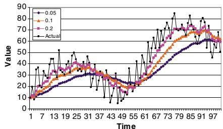  
(a): Low-noise

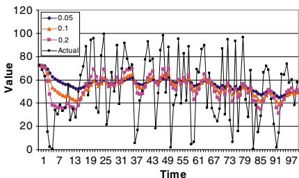  
(b): High-noise   
Figure 6.2 Illustration of the effects of smoothing using constant stepsizes. Case (a) represents a low-noise dataset, with an underlying nonstationary structure; case (b) is a high-noise dataset from a stationary process.

Constant stepsizes are easy to code (no memory requirements) and, in particular, easy to tune (there is only one parameter). Perhaps the biggest point in their favor is that we simply may not know the rate of convergence, which means that we run the risk with a declining stepsize rule of allowing the stepsize to decline too quickly, producing a behavior we refer to as “apparent convergence.”

In dynamic programming, we are typically trying to estimate the value of being in a state using observations that are not only random, but which are also changing systematically as we try to find the best policy. As a general rule, as the noise in the observations of the values increases, the best stepsize decreases. But if the values are increasing rapidly, we want a larger stepsize.

Choosing the best stepsize requires striking a balance between stabilizing the noise and responding to the changing mean. Figure 6.2 illustrates observations that are coming from a process with relatively low noise but where the mean is changing quickly (6.2a), and observations that are very noisy but where the mean is not changing at all (6.2b). For the first, the ideal stepsize is relatively large, while for the second, the best stepsize is quite small.

# 6.1.2.2 Generalized Harmonic Stepsizes

A generalization of the $1 / n$ rule is the generalized harmonic sequence given by

$$
\alpha_ {n - 1} = \frac {\theta}{\theta + n - 1}. \tag {6.15}
$$

This rule satisfies the conditions for convergence, but produces larger stepsizes for $\theta > 1$ than the $1 / n$ rule. Increasing $\boldsymbol { \theta }$ slows the rate at which the stepsize drops to zero, as illustrated in Figure 6.3. In practice, it seems that despite theoretical convergence proofs to the contrary, the stepsize $1 / n$ can decrease to zero far too quickly, resulting in “apparent convergence” when in fact the solution is far from the best that can be obtained.

  
Figure 6.3 Stepsizes for $a / ( a + n )$ while varying ??.

# 6.1.2.3 Polynomial Learning Rates

An extension of the basic harmonic sequence is the stepsize

$$
\alpha_ {n - 1} = \frac {1}{(n) ^ {\beta}}, \tag {6.16}
$$

where $\beta \in ( \frac { 1 } { 2 } , 1 ]$ . Smaller values of $\beta$ slow the rate at which the stepsizes decline, which improves the responsiveness in the presence of initial transient conditions. The best value of $\beta$ depends on the degree to which the initial data is transient, and as such is a parameter that needs to be tuned.

# 6.1.2.4 McClain’s Formula

McClain’s formula is an elegant way of obtaining $1 / n$ behavior initially but approaching a specified constant in the limit. The formula is given by

$$
\alpha_ {n} = \frac {\alpha_ {n - 1}}{1 + \alpha_ {n - 1} - \bar {\alpha}}, \tag {6.17}
$$

where $\bar { \alpha }$ is a specified parameter. Note that steps generated by this model satisfy the following properties

$$
\alpha_ {n} > \alpha_ {n + 1} > \bar {\alpha} \quad \mathrm {i f} \quad \alpha > \bar {\alpha},
$$

$$
\alpha_ {n} <   \alpha_ {n + 1} <   \bar {\alpha} \quad \text {i f} \quad \alpha <   \bar {\alpha}.
$$

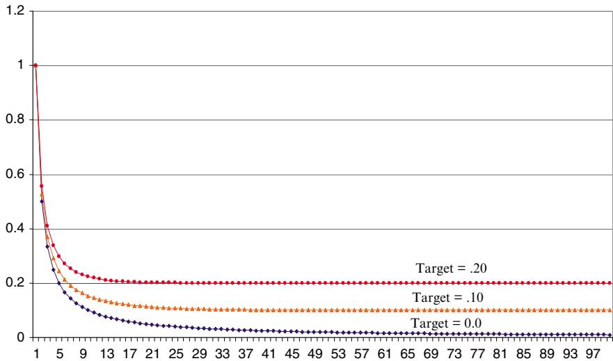  
Figure 6.4 The McClain stepsize rule with varying targets.

McClain’s rule, illustrated in Figure 6.4, combines the features of the $^ { * } 1 / n ^ { * }$ rule which is ideal for stationary data, and constant stepsizes for nonstationary data. If we set $\bar { \alpha } \ = \ 0$ , then it is easy to verify that McClain’s rule produces $\alpha _ { n - 1 } = 1 / n$ . In the limit, $\alpha _ { n } \to \bar { \alpha }$ . The value of the rule is that the $1 / n$ averaging generally works quite well in the very first iterations (this is a major weakness of constant stepsize rules), but avoids going to zero. The rule can be effective when you are not sure how many iterations are required to start converging, and it can also work well in nonstationary environments.

# 6.1.2.5 Search-then-Converge Learning Policy

The search-then-converge (STC) stepsize rule is a variation on the harmonic stepsize rule that produces delayed learning. The rule can be written as

$$
\alpha_ {n - 1} = \alpha_ {0} \frac {\left(\frac {b}{n} + a\right)}{\left(\frac {b}{n} + a + n ^ {\beta}\right)}. \tag {6.18}
$$

If $\beta = 1$ , then this formula is similar to the STC policy. In addition, if $b = 0$ , then it is the same as the harmonic stepsize policy $\theta / ( \theta + n )$ . The addition of the term $b / n$ to the numerator and the denominator can be viewed as a kind of harmonic stepsize policy where $a$ is very large but declines with ??. The effect of the $b / n$ term, then, is to keep the stepsize larger for a longer period of time, as illustrated in Figure 6.5(a). This can help algorithms that have to go through an

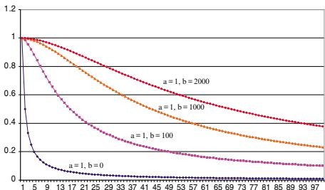  
(a)

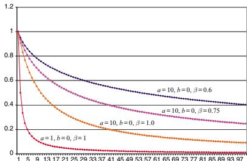  
  
Figure 6.5 The search-then-converge rule while (a) varying $b$ , and (b) varying $\beta$ .

extended learning phase when the values being estimated are relatively unstable. The relative magnitude of $b$ depends on the number of iterations which are expected to be run, which can range from several dozen to several million.

This class of stepsize rules is termed “search-then-converge” because they provide for a period of high stepsizes (while searching is taking place) after which the stepsize declines (to achieve convergence). The degree of delayed learning is controlled by the parameter $b$ , which can be viewed as playing the same role as the parameter $a$ but which declines as the algorithm progresses. The rule is designed for approximate dynamic programming methods applied to the setting of playing games with a delayed reward (there is no reward until you win or lose the game).

The exponent $\beta$ in the denominator has the effect of increasing the stepsize in later iterations (see Figure 6.5(b)). With this parameter, it is possible to accelerate the reduction of the stepsize in the early iterations (by using a smaller $a$ ) but then slow the descent in later iterations (to sustain the learning process). This may be useful for problems where there is an extended transient phase requiring a larger stepsize for a larger number of iterations.

# 6.2 Adaptive Stepsize Policies

There is considerable appeal to the idea that the stepsize should depend on the actual trajectory of the algorithm. For example, if we are consistently observing that our estimate $\bar { \mu } ^ { n - 1 }$ is smaller (or larger) than the observations $W ^ { n }$ , then it suggests that we are trending upward (or downward). When this happens, we typically would like to use a larger stepsize to increase the speed at which we reach a good estimate. When the stepsizes depend on the observations $W ^ { n }$ , then we say that we are using a adaptive stepsize. This means, however, that we have to recognize that it is a random variable (some refer to these as stochastic stepsize rules).

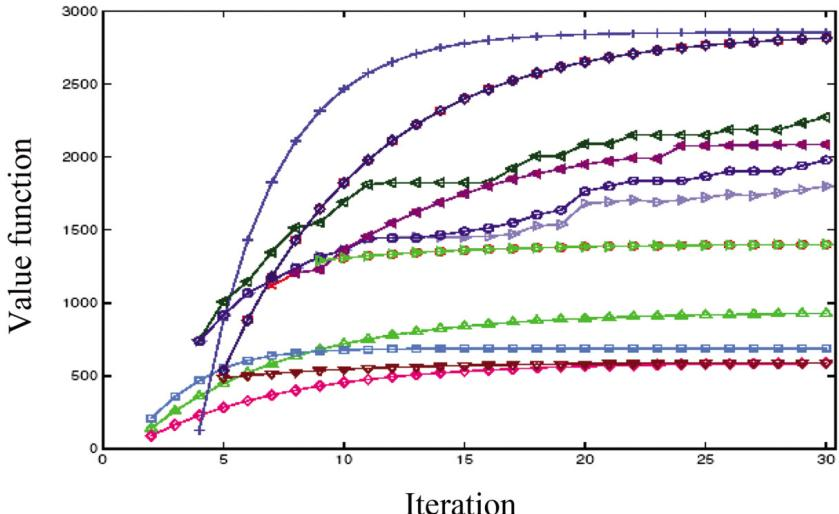  
Figure 6.6 Different parameters can undergo significantly different initial rates.

In this section, we first review the case for adaptive stepsizes, then present the revised theoretical conditions for convergence, and finally outline a series of heuristic recipes that have been suggested in the literature. After this, we present some stepsize rules that are optimal until special conditions.

# 6.2.1 The Case for Adaptive Stepsizes

Assume that our estimates are consistently under or consistently over the actual observations. This can easily happen during early iterations due to either a poor initial starting point or the use of biased estimates (which is common in dynamic programming) during the early iterations. For large problems, it is possible that we have to estimate thousands of parameters. It seems unlikely that all the parameters will approach their true value at the same rate. Figure 6.6 shows the change in estimates of the value of being in different states, illustrating the wide variation in learning rates that can occur within the same dynamic program.

Adaptive stepsizes try to adjust to the data in a way that keeps the stepsize larger while the parameter being estimated is still changing quickly. Balancing noise against the change in the underlying signal, particularly when both of these are unknown, is a difficult challenge.

# 6.2.2 Convergence Conditions

When the stepsize depends on the history of the process, the stepsize itself becomes a random variable, which means we could replace the stepsize $\alpha _ { n }$ with

$\alpha _ { n } ( \omega )$ to express its dependence on the sample path $\omega$ that we are following. This change requires some subtle modifications to our requirements for convergence (equations (6.11) and (6.12)). For technical reasons, our convergence criteria change to

$$
\alpha_ {n} > 0, \text {a l m o s t s u r e l y}, \tag {6.19}
$$

$$
\sum_ {n = 0} ^ {\infty} \alpha_ {n} = \infty , \text {a l m o s t s u r e l y}, \tag {6.20}
$$

$$
\mathbb {E} \left\{\sum_ {n = 0} ^ {\infty} \left(\alpha_ {n}\right) ^ {2} \right\} <   \infty . \tag {6.21}
$$

The condition “almost surely” (universally abbreviated “a.s.”) means that equations (6.19)–(6.20) holds for every sample path $\omega$ , and not just on average. For example we could replace equation (6.20) with

$$
\sum_ {n = 0} ^ {\infty} \alpha_ {n} (\omega) = \infty , \text {f o r a l l} \omega , p (\omega) > 0. \tag {6.22}
$$

More precisely, we mean every sample path ?? that might actually happen, which is why we introduced the condition $p ( \omega ) > 0$ . We exclude sample paths where the probability that the sample path would happen is zero, which is something that mathematicians stress over. Note that almost surely is not the same as requiring

$$
\mathbb {E} \left\{\sum_ {n = 0} ^ {\infty} \alpha_ {n} \right\} = \infty , \tag {6.23}
$$

which requires that this condition be satisfied on average but would allow it to fail for specific sample paths. This is a much weaker condition, and would not guarantee convergence every time we run the algorithm. Note that the condition (6.21) does, in fact, use an expectation, which hints that this is a weaker condition.

For the reasons behind these conditions, go to our “Why does it work” section (5.10). Note that while the theoretical conditions provide broad guidance, there are significant empirical differences between policies that satisfy the conditions for asymptotic optimality.

# 6.2.3 A Collection of Stochastic Policies

The desire to find stepsize policies that adapt to the data has become a cottage industry which has produced a variety of formulas with varying degrees of

sophistication and convergence guarantees. This section provides a brief sample of some popular policies, some (such as AdaGrad) with strong performance guarantees. Later, we present some optimal policies for specialized problems.

To present our adaptive stepsize formulas, we need to define a few quantities. Recall that our basic updating expression is given by

$$
\bar {\mu} ^ {n} = (1 - \alpha_ {n - 1}) \bar {\mu} ^ {n - 1} + \alpha_ {n - 1} W ^ {n}.
$$

$\bar { \mu } ^ { n - 1 }$ is an estimate of whatever value we are estimating. Note that we may be estimating a function $\mu ( x ) = E F ( x , W )$ (for discrete $x$ ), or we may be estimating a continuous function where smoothing is required. We can compute an error by comparing the difference between our current estimate $\bar { \mu } ^ { n - 1 }$ and our latest observation $W ^ { n }$ which we write as

$$
\varepsilon^ {n} = \bar {\mu} ^ {n - 1} - W ^ {n}.
$$

Some formulas depend on tracking changes in the sign of the error. This can be done using the indicator function

$$
\mathbb {1} _ {\{X \}} = \left\{ \begin{array}{l l} 1 & \text {i f t h e l o g i c a l c o n d i t i o n X i s t r u e ,} \\ 0 & \text {o t h e r w i s e .} \end{array} \right.
$$

Thus, $\mathbb { 1 } _ { \varepsilon ^ { n } \varepsilon ^ { n - 1 } < 0 }$ indicates if the sign of the error has changed in the last iteration.

Below, we first summarize three classic rules. Kesten’s rule is the oldest and is perhaps the simplest illustration of an adaptive stepsize rule. Trigg’s formula is a simple rule widely used in the demand-forecasting community. The stochastic gradient adaptive stepsize rule enjoys a theoretical convergence proof, but is controlled by several tunable parameters that complicate its use in practice. Then, we present three more modern rules: ADAM, AdaGrad, and RMSProp are rules that were developed by the machine learning community for fitting neural networks to data.

# 6.2.3.1 Kesten’s Rule

Kesten’s rule was one of the earliest stepsize rules which took advantage of a simple principle. If we are far from the optimal, the gradients $\nabla _ { x } F ( x ^ { n } , W ^ { n + 1 } )$ tend to point in the same direction. As we get closer to the optimum, the gradients start to switch directions. Exploiting this simple observation, Kesten proposed the simple rule

$$
\alpha_ {n - 1} = \frac {\theta}{\theta + K ^ {n} - 1}, \tag {6.24}
$$

where $\boldsymbol { \theta }$ is a parameter to be calibrated. $K ^ { n }$ counts the number of times that the sign of the error has changed, where we use

$$
K ^ {n} = \left\{ \begin{array}{l l} n & \text {i f} n = 1, 2, \\ K ^ {n - 1} + \mathbb {1} _ {\left\{\left(\nabla_ {x} F \left(x ^ {n - 1}, W ^ {n}\right)\right) ^ {T} \nabla_ {x} F \left(x ^ {n}, W ^ {n + 1}\right) <   0 \right\}} & \text {i f} n > 2. \end{array} \right. \tag {6.25}
$$

Kesten’s rule is particularly well suited to initialization problems. It slows the reduction in the stepsize as long as successive gradients generally point in the same direction. They decline when the gradients begin to alternate sign, indicating that we are moving around the optimum.

# 6.2.3.2 Trigg’s Formula

Let $S ( \cdot )$ be the smoothed estimate of errors calculated using

$$
S (\varepsilon^ {n}) = (1 - \beta) S (\varepsilon^ {n - 1}) + \beta \varepsilon^ {n}.
$$

Trigg’s formula is given by

$$
\alpha_ {n} = \frac {\left| S \left(\varepsilon^ {n}\right) \right|}{S \left(\left| \varepsilon^ {n} \right|\right)}. \tag {6.26}
$$

The formula takes advantage of the simple property that smoothing on the absolute value of the errors is greater than or equal to the absolute value of the smoothed errors. If there is a series of errors with the same sign, that can be taken as an indication that there is a significant difference between the true mean and our estimate of the mean, which means we would like larger stepsizes.

# 6.2.3.3 Stochastic Gradient Adaptive Stepsize Rule

This class of rules uses stochastic gradient logic to update the stepsize. We first compute

$$
\psi^ {n} = \left(1 - \alpha_ {n - 1}\right) \psi^ {n - 1} + \varepsilon^ {n}. \tag {6.27}
$$

The stepsize is then given by

$$
\alpha_ {n} = \left[ \alpha_ {n - 1} + \nu \psi^ {n - 1} \varepsilon^ {n} \right] _ {\alpha_ {-}} ^ {\alpha_ {+}}, \tag {6.28}
$$

where $\alpha _ { + }$ and $\alpha _ { - }$ are, respectively, upper and lower limits on the stepsize. $[ \cdot ] _ { \alpha _ { - } } ^ { \alpha _ { + } }$ represents a projection back into the interval $[ \alpha _ { - } , \alpha _ { + } ]$ , and $\nu$ is a scaling factor.

$\psi ^ { n - 1 } \varepsilon ^ { n }$ is a stochastic gradient that indicates how we should change the stepsize to improve the error. Since the stochastic gradient has units that are the square of the units of the error, while the stepsize is unitless, ?? has to perform an important scaling function. The equation $\alpha _ { n - 1 } + \nu \psi ^ { n - 1 } \varepsilon ^ { n }$ can easily produce stepsizes that are larger than 1 or smaller than 0, so it is customary to specify an allowable interval (which is generally smaller than (0,1)). This rule has provable convergence, but in practice, $\nu , \alpha _ { + }$ and $\alpha _ { - }$ all have to be tuned.

# 6.2.3.4 ADAM

ADAM (Adaptive Moment Estimation) is another stepsize policy that has attracted attention in recent years. As above, let $g ^ { n } = \nabla _ { x } F ( x ^ { n - 1 } , W ^ { n } )$ be our gradient, and let $g _ { i } ^ { n }$ be the $i ^ { t h }$ element. ADAM proceeds by adaptively computing means and variances according to

$$
m _ {i} ^ {n} = \beta_ {1} m _ {i} ^ {n - 1} + \left(1 - \beta_ {1}\right) g _ {i} ^ {n}, \tag {6.29}
$$

$$
v _ {i} ^ {n} = \beta_ {2} v _ {i} ^ {n - 1} + (1 - \beta_ {2}) \left(g _ {i} ^ {n}\right) ^ {2}. \tag {6.30}
$$

These updating equations introduce biases when the data is nonstationary, which is typically the case in stochastic optimization. ADAM compensates for these biases using

$$
\bar {m} _ {i} ^ {n} = \frac {m _ {i} ^ {n}}{1 - \beta_ {1}},
$$

$$
\bar {v} _ {i} ^ {n} = \frac {v _ {i} ^ {n}}{1 - \beta_ {2}}.
$$

The stochastic gradient equation for ADAM is then given by

$$
x _ {i} ^ {n + 1} = x _ {i} ^ {n} + \frac {\eta}{\sqrt {\bar {v} _ {i} ^ {n}} + \epsilon} \bar {m} _ {i} ^ {n}. \tag {6.31}
$$

# 6.2.3.5 AdaGrad

AdaGrad (“adaptive gradient”) is a relatively recent stepsize policy that has attracted considerable attention in the machine learning literature which not only enjoys nice theoretical performance guarantees, but has also become quite popular because it seems to work quite well in practice.

Assume that we are trying to solve our standard problem

$$
\max  _ {x} \mathbb {E} _ {W} F (x, W),
$$

where we make the assumption that not only is $x$ a vector, but also that the scaling for each dimension might be different (an issue we have ignored so far). To simplify the notation a bit, let the stochastic gradient with respect to $x _ { i }$ , $i =$ $1 , \ldots , I$ be given by

$$
g _ {i} ^ {n} = \nabla_ {x _ {i}} F (x ^ {n - 1}, W ^ {n}).
$$

Now create a $I \times I$ diagonal matrix $G ^ { n }$ where the $( i , i ) ^ { t h }$ element $G _ { i i } ^ { n }$ is given by

$$
G _ {i i} ^ {n} = \sum_ {m = 1} ^ {n} (g _ {i} ^ {n}) ^ {2}.
$$

We then set a stepsize for the $i ^ { t h }$ dimension using

$$
\alpha_ {n i} = \frac {\eta}{\left(G _ {i i} ^ {n}\right) ^ {2} + \varepsilon}, \tag {6.32}
$$

where $\epsilon$ is a small number (e.g. $1 0 ^ { - 8 }$ ) to avoid the possibility of dividing by zero. This can be written in matrix form using

$$
\alpha_ {n} = \frac {\eta}{\sqrt {G ^ {n} + \epsilon}} \otimes g _ {t}, \tag {6.33}
$$

where $\alpha _ { n }$ is an $I$ -dimensional matrix.

AdaGrad does an unusually good job of adapting to the behavior of a function. It also adapts to potentially different behaviors of each dimension. For example, we might be solving a machine learning problem to learn a parameter vector $\boldsymbol { \theta }$ (this would be the decision variable instead of $x$ ) for a linear model of the form

$$
y = \theta_ {0} + \theta_ {1} X _ {1} + \theta_ {2} X _ {2} + \dots .
$$

The explanatory variables $X _ { 1 } , X _ { 2 } , \dots$ can take on values in completely different ranges. In a medical setting, $X _ { 1 }$ might be blood sugar with values between 5 and 8, while $X _ { 2 }$ might be the weight of a patient that could range between 100 and 300 pounds. The coefficients $\theta _ { 1 }$ and $\theta _ { 2 }$ would be scaled according to the inverse of the scales of the explanatory variables.

# 6.2.3.6 RMSProp

RMSProp (Root Mean Squared Propagation) was designed to address the empirical observation that AdaGrad declines too quickly. We continue to let

$g ^ { n } = \nabla _ { x } F ( x ^ { n } , W ^ { n + 1 } )$ be our stochastic gradient. Let ${ \bar { g } } ^ { n }$ be a smoothed version of the inner product $( g ^ { n } ) ^ { T } g ^ { n }$ given by

$$
\bar {g} ^ {n} = (1 - \beta) \bar {g} ^ {n} + \beta \| g ^ {n} \| ^ {2}. \tag {6.34}
$$

We then compute our stepsize using

$$
\alpha_ {n} = \frac {\eta}{\sqrt {\bar {g} ^ {n}}}. \tag {6.35}
$$

Suggested parameter values are $\beta = 0 . 1$ and $\eta = 0 . 0 0 1$ , but we always suggest performing some exploration with tunable parameters.

# 6.2.4 Experimental Notes

A word of caution is offered when testing out stepsize rules. It is quite easy to test out these ideas in a controlled way in a simple spreadsheet on randomly generated data, but there is a big gap between showing a stepsize that works well in a spreadsheet and one that works well in specific applications. Adaptive stepsize rules work best in the presence of transient data where the degree of noise is not too large compared to the change in the signal (the mean). As the variance of the data increases, adaptive stepsize rules begin to suffer and simpler deterministic rules tend to work better.

# 6.3 Optimal Stepsize Policies*

Given the variety of stepsize formulas we can choose from, it seems natural to ask whether there is an optimal stepsize rule. Before we can answer such a question, we have to define exactly what we mean by it. Assume that we are trying to estimate a parameter that we denote by $\mu$ that may be static, or evolving over time (perhaps as a result of learning behavior), in which case we will write it as $\mu ^ { n }$ .

At iteration ??, assume we are trying to track a time-varying process $\mu ^ { n }$ . For example, when we are estimating approximate value functions $\overline { { V } } ^ { n } ( s )$ , we will use algorithms where the estimate $\overline { { V } } ^ { n } ( s )$ tends to rise (or perhaps fall) with the iteration ??. We will use a learning policy $\pi$ , so we are going to designate our estimate $\bar { \mu } ^ { \pi , n }$ to make the dependence on the learning policy explicit. At time $n$ , we would like to choose a stepsize policy to minimize

$$
\min  _ {\pi} \mathbb {E} \left(\bar {\mu} ^ {\pi , n} - \mu^ {n}\right) ^ {2}. \tag {6.36}
$$

Here, the expectation is over the entire history of the algorithm (note that it is not conditioned on anything, although the conditioning on $S ^ { 0 }$ is implicit) and requires (in principle) knowing the true value of the parameter being estimated.

The best way to think of this is to first imagine that we have a stepsize policy such as the harmonic stepsize rule

$$
\alpha_ {n} (\theta) = \frac {\theta}{\theta + n - 1},
$$

which means that optimizing over $\pi$ is the same (for this stepsize policy) as optimizing over ??. Assume that we observe our process with error ??, which is to say

$$
W ^ {n + 1} = \mu^ {n} + \varepsilon^ {n + 1}.
$$

Our estimate of $\bar { \mu } ^ { \pi , n }$ is given by

$$
\bar {\mu} ^ {\pi , n + 1} = (1 - \alpha_ {n} (\theta)) \bar {\mu} ^ {\pi , n} + \alpha_ {n} (\theta) W ^ {n + 1}.
$$

Now imagine that we create a series of sample paths $\omega$ of observations $( \varepsilon ^ { n } ( \omega ) ) _ { n = 1 } ^ { N }$ $( \varepsilon ^ { n } ) _ { n = 1 } ^ { N }$ If we follow a particular sa, then this gives us a sequenceuce, for a given stepsize policy ple realizatiof observations, a sequence o $( W ^ { n } ( \omega ) ) _ { n = 1 } ^ { N }$ $\pi$ $( \bar { \mu } ^ { \pi , n } ( \omega ) ) _ { n = 1 } ^ { N }$ We can now write our optimization problem as

$$
\min  _ {\theta} \frac {1}{N} \sum_ {n = 1} ^ {N} \left(\bar {\mu} ^ {\pi , n} \left(\omega^ {n}\right) - \mu^ {n}\right) ^ {2}. \tag {6.37}
$$

The optimization problem in (6.37) illustrates how we might go through the steps of optimizing stepsize policies. Of course, we will want to do more than just tune the parameter of a particular policy. We are going to want to compare different stepsize policies, such as those listed in section 6.2.

We begin our discussion of optimal stepsizes in section 6.3.1 by addressing the case of estimating a constant parameter which we observe with noise. Section 6.3.2 considers the case where we are estimating a parameter that is changing over time, but where the changes have mean zero. Finally, section 6.3.3 addresses the case where the mean may be drifting up or down with nonzero mean, a situation that we typically face when approximating a value function.

# 6.3.1 Optimal Stepsizes for Stationary Data

Assume that we observe $W ^ { n }$ at iteration ?? and that the observations $W ^ { n }$ can be described by

$$
W ^ {n} = \mu + \varepsilon^ {n}
$$

where $\mu$ is an unknown constant and $\varepsilon ^ { n }$ is a stationary sequence of independent and identically distributed random deviations with mean 0 and variance $\sigma _ { \varepsilon } ^ { 2 }$ . We can approach the problem of estimating $\mu$ from two perspectives: choosing the best stepsize and choosing the best linear combination of the estimates. That is, we may choose to write our estimate ${ \bar { \mu } } ^ { n }$ after ?? observations in the form

$$
\bar {\mu} ^ {n} = \sum_ {m = 1} ^ {n} a _ {m} ^ {n} W ^ {m}.
$$

For our discussion, we will fix ?? and work to determine the coefficients of the vector $a _ { 1 } , \ldots , a _ { n }$ (where we suppress the iteration counter ?? to simplify notation). We would like our statistic to have two properties: It should be unbiased, and it should have minimum variance (that is, it should solve (6.36)). To be unbiased, it should satisfy

$$
\begin{array}{l} \mathbb {E} \left[ \sum_ {m = 1} ^ {n} a _ {m} W ^ {m} \right] = \sum_ {m = 1} ^ {n} a _ {m} \mathbb {E} W ^ {m} \\ = \sum_ {m = 1} ^ {n} a _ {m} \mu \\ = \mu , \\ \end{array}
$$

which implies that we must satisfy

$$
\sum_ {m = 1} ^ {n} a _ {m} = 1.
$$

The variance of our estimator is given by

$$
V a r \left(\bar {\mu} ^ {n}\right) = V a r \left[ \sum_ {m = 1} ^ {n} a _ {m} W ^ {m} \right].
$$

We use our assumption that the random deviations are independent, which allows us to write

$$
\begin{array}{l} V a r \left(\bar {\mu} ^ {n}\right) = \sum_ {m = 1} ^ {n} V a r \left[ a _ {m} W ^ {m} \right] \\ = \sum_ {m = 1} ^ {n} a _ {m} ^ {2} \operatorname {V a r} \left[ W ^ {m} \right] \\ = \sigma_ {\varepsilon} ^ {2} \sum_ {m = 1} ^ {n} a _ {m} ^ {2}. \tag {6.38} \\ \end{array}
$$

Now we face the problem of finding $a _ { 1 } , \ldots , a _ { n }$ to minimize (6.38) subject to the requirement that $\textstyle \sum _ { m } a _ { m } = 1$ . This problem is easily solved using the Lagrange multiplier method. We start with the nonlinear programming problem

$$
\min_{\{a_{1},\ldots ,a_{n}\}}\sum_{m = 1}^{n}a_{m}^{2},
$$

subject to

$$
\sum_ {m = 1} ^ {n} a _ {m} = 1, \tag {6.39}
$$

$$
a _ {m} \geq 0. \tag {6.40}
$$

We relax constraint (6.39) and add it to the objective function

$$
\min _ {\{a _ {m} \}} L (a, \lambda) = \sum_ {m = 1} ^ {n} a _ {m} ^ {2} - \lambda \left(\sum_ {m = 1} ^ {n} a _ {m} - 1\right),
$$

subject to (6.40). We are now going to try to solve $L ( a , \lambda )$ (known as the “Lagrangian”) and hope that the coefficients $a$ are all nonnegative. If this is true, we can take derivatives and set them equal to zero

$$
\frac {\partial L (a , \lambda)}{\partial a _ {m}} = 2 a _ {m} - \lambda . \tag {6.41}
$$

The optimal solution $( a ^ { * } , \lambda ^ { * } )$ would then satisfy

$$
\frac {\partial L (a , \lambda)}{\partial a _ {m}} = 0.
$$

This means that at optimality

$$
a _ {m} = \lambda / 2,
$$

which tells us that the coefficients $a _ { m }$ are all equal. Combining this result with the requirement that they sum to one gives the expected result:

$$
a _ {m} = \frac {1}{n}.
$$

In other words, our best estimate is a sample average. From this (somewhat obvious) result, we can obtain the optimal stepsize, since we already know that $\alpha _ { n - 1 } = 1 / n$ is the same as using a sample average.

This result tells us that if the underlying data is stationary, and we have no prior information about the sample mean, then the best stepsize rule is the basic $1 / n$ rule. Using any other rule requires that there be some violation in our basic assumptions. In practice, the most common violation is that the observations are not stationary because they are derived from a process where we are searching for the best solution.

# 6.3.2 Optimal Stepsizes for Nonstationary Data – I

Assume now that our parameter evolves over time (iterations) according to the process

$$
\mu^ {n} = \mu^ {n - 1} + \xi^ {n}, \tag {6.42}
$$

where $\mathbb { E } \xi ^ { n } \ = \ 0$ is a zero mean drift term with variance $\sigma _ { \xi } ^ { 2 }$ . As before, we measure $\mu ^ { n }$ with an error according to

$$
W ^ {n + 1} = \mu^ {n} + \varepsilon^ {n + 1}.
$$

We want to choose a stepsize so that we minimize the mean squared error. This problem can be solved using a method known as the Kalman filter. The Kalman filter is a powerful recursive regression technique, but we adapt it here for the problem of estimating a single parameter. Typical applications of the Kalman filter assume that the variance of $\xi ^ { n }$ , given by $\sigma _ { \xi } ^ { 2 }$ , and the variance of the measurement error, $\varepsilon ^ { n }$ , given by $\sigma _ { \varepsilon } ^ { 2 }$ , are known. In this case, the Kalman filter would compute a stepsize (generally referred to as the gain) using

$$
\alpha_ {n} = \frac {\sigma_ {\xi} ^ {2}}{\nu^ {n} + \sigma_ {\varepsilon} ^ {2}}, \tag {6.43}
$$

where $\nu ^ { n }$ is computed recursively using

$$
v ^ {n} = (1 - \alpha_ {n - 1}) v ^ {n - 1} + \sigma_ {\xi} ^ {2}. \tag {6.44}
$$

Remember that $\alpha _ { 0 } = 1$ , so we do not need a value of $\nu ^ { 0 }$ . For our application, we do not know the variances so these have to be estimated from data. We first

estimate the bias using

$$
\bar {\beta} ^ {n} = \left(1 - \eta_ {n - 1}\right) \bar {\beta} ^ {n - 1} + \eta_ {n - 1} \left(\bar {\mu} ^ {n - 1} - W ^ {n}\right), \tag {6.45}
$$

where $\eta _ { n - 1 }$ is a simple stepsize rule such as the harmonic stepsize rule or McClain’s formula. We then estimate the total error sum of squares using

$$
\bar {\nu} ^ {n} = (1 - \eta_ {n - 1}) \bar {\nu} ^ {n - 1} + \eta_ {n - 1} (\bar {\mu} ^ {n - 1} - W ^ {n}) ^ {2}. \tag {6.46}
$$

Finally, we estimate the variance of the error using

$$
\left(\bar {\sigma} _ {\varepsilon} ^ {2, n}\right) = \frac {\bar {v} ^ {n} - \left(\bar {\beta} ^ {n}\right) ^ {2}}{1 + \bar {\lambda} ^ {n - 1}}, \tag {6.47}
$$

where $\bar { \lambda } ^ { n - 1 }$ is computed using

$$
\lambda^ {n} = \left\{ \begin{array}{l l} (\alpha_ {n - 1}) ^ {2}, & n = 1, \\ (1 - \alpha_ {n - 1}) ^ {2} \lambda^ {n - 1} + (\alpha_ {n - 1}) ^ {2}, & n > 1. \end{array} \right.
$$

We use $( \bar { \sigma } _ { \varepsilon } ^ { 2 , n } )$ as our estimate of $\sigma _ { \varepsilon } ^ { 2 }$ . We then propose to use $\left( \hat { \beta } ^ { n } \right) ^ { 2 }$ as our estimate of $\sigma _ { \xi } ^ { 2 }$ . This is purely an approximation, but experimental work suggests that it performs quite well, and it is relatively easy to implement.

# 6.3.3 Optimal Stepsizes for Nonstationary Data – II

In dynamic programming, we are trying to estimate the value of being in a state (call it ??) by $\bar { v }$ which is estimated from a sequence of random observations $\hat { v }$ . The problem we encounter is that $\hat { v }$ might depend on a value function approximation which is steadily increasing (or decreasing), which means that the observations $\hat { v }$ are nonstationary. Furthermore, unlike the assumption made by the Kalman filter that the mean of $\hat { v }$ is varying in a zero-mean way, our observations of $\hat { v }$ might be steadily increasing. This would be the same as assuming that $\mathbb { E } \xi = \mu > 0$ in the section above. In this section, we derive the Kalman filter learning rate for biased estimates.

Our challenge is to devise a stepsize that strikes a balance between minimizing error (which prefers a smaller stepsize) and responding to the nonstationary data (which works better with a large stepsize). We return to our basic model

$$
W ^ {n + 1} = \mu^ {n} + \varepsilon^ {n + 1},
$$

where $\mu ^ { n }$ varies over time, but it might be steadily increasing or decreasing. This would be similar to the model in the previous section (equation (6.42)) but where $\xi ^ { n }$ has a nonzero mean. As before we assume that $\{ \varepsilon ^ { n } \} _ { n = 1 , 2 , \dots }$ are independent and identically distributed with mean value of zero and variance, $\sigma ^ { 2 }$ .

We perform the usual stochastic gradient update to obtain our estimates of the mean

$$
\bar {\mu} ^ {n} \left(\alpha_ {n - 1}\right) = (1 - \alpha_ {n - 1}) \bar {\mu} ^ {n - 1} \left(\alpha_ {n - 1}\right) + \alpha_ {n - 1} W ^ {n}. \tag {6.48}
$$

We wish to find $\alpha _ { n - 1 }$ that solves

$$
\min  _ {\alpha_ {n - 1}} F \left(\alpha_ {n - 1}\right) = \mathbb {E} \left[ \left(\bar {\mu} ^ {n} \left(\alpha_ {n - 1}\right) - \mu^ {n}\right) ^ {2} \right]. \tag {6.49}
$$

It is important to realize that we are trying to choose $\alpha _ { n - 1 }$ to minimize the unconditional expectation of the error between ${ \bar { \mu } } ^ { n }$ and the true value $\mu ^ { n }$ . For this reason, our stepsize rule will be deterministic, since we are not allowing it to depend on the information obtained up through iteration ??.

We assume that the observation at iteration $n$ is unbiased, which is to say

$$
\mathbb {E} \left[ W ^ {n + 1} \right] = \mu^ {n}. \tag {6.50}
$$

But the smoothed estimate is biased because we are using simple smoothing on nonstationary data. We denote this bias as

$$
\begin{array}{l} \beta^ {n - 1} = \mathbb {E} \left[ \bar {\mu} ^ {n - 1} - \mu^ {n} \right] \\ = \mathbb {E} \left[ \bar {\mu} ^ {n - 1} \right] - \mu^ {n}. \tag {6.51} \\ \end{array}
$$

We note that $\beta ^ { n - 1 }$ is the bias computed after iteration $n - 1$ (that is, after we have computed $\bar { \mu } ^ { n - 1 }$ ). $\beta ^ { n - 1 }$ is the bias when we use $\bar { \mu } ^ { n - 1 }$ as an estimate of $\mu ^ { n }$ .

The variance of the observation $W ^ { n }$ is computed as follows:

$$
\begin{array}{l} V a r \left[ W ^ {n} \right] = \mathbb {E} \left[ \left(W ^ {n} - \mu^ {n}\right) ^ {2} \right] \\ = \mathbb {E} \left[ (\varepsilon^ {n}) ^ {2} \right] \\ = \sigma_ {\varepsilon} ^ {2}. \tag {6.52} \\ \end{array}
$$

It can be shown (see section 6.7.1) that the optimal stepsize is given by

$$
\alpha_ {n - 1} = 1 - \frac {\sigma_ {\varepsilon} ^ {2}}{\left(1 + \lambda^ {n - 1}\right) \sigma_ {\varepsilon} ^ {2} + (\beta^ {n - 1}) ^ {2}}, \tag {6.53}
$$

where $\lambda$ is computed recursively using

$$
\lambda^ {n} = \left\{ \begin{array}{l l} (\alpha_ {n - 1}) ^ {2}, & n = 1, \\ (1 - \alpha_ {n - 1}) ^ {2} \lambda^ {n - 1} + (\alpha_ {n - 1}) ^ {2}, & n > 1. \end{array} \right. \tag {6.54}
$$

We refer to the stepsize rule in equation (6.53) as the bias adjusted Kalman filter, or BAKF. The BAKF stepsize formula enjoys several nice properties:

Stationary data For a sequence with a static mean, the optimal stepsizes are given by

$$
\alpha_ {n - 1} = \frac {1}{n} \quad \forall n = 1, 2, \dots . \tag {6.55}
$$

This is the optimal stepsize for stationary data.

No noise For the case where there is no noise $\sigma ^ { 2 } = 0 \mathrm { \ i }$ ), we have the following:

$$
\alpha_ {n - 1} = 1 \quad \forall n = 1, 2, \dots . \tag {6.56}
$$

This is ideal for nonstationary data with no noise.

Bounded by $1 / n$ At all times, the stepsize obeys

$$
\alpha_ {n - 1} \geq \frac {1}{n} \quad \forall n = 1, 2, \dots .
$$

This is important since it guarantees asymptotic convergence.

These are particularly nice properties since we typically have to do parameter tuning to get this behavior. The properties are particularly when estimating value functions, since sampled estimates of the value of being in a state tends to be transient.

The problem with using the stepsize formula in equation (6.53) is that it assumes that the variance $\sigma ^ { 2 }$ and the bias $( \beta ^ { n } ) ^ { 2 }$ are known. This can be problematic in real instances, especially the assumption of knowing the bias, since computing this basically requires knowing the real function. If we have this information, we do not need this algorithm.

As an alternative, we can try to estimate these quantities from data. Let

$n$

??̄?? = estimate of the bias after iteration ??,

??̄?? = estimate of the variance of the bias after iteration ??.

To make these estimates, we need to smooth new observations with our current best estimate, something that requires the use of a stepsize formula. We could attempt to find an optimal stepsize for this purpose, but it is likely that a reasonably chosen deterministic formula will work fine. One possibility is McClain’s formula (equation (6.17)):

$$
\eta_ {n} = \frac {\eta_ {n - 1}}{1 + \eta_ {n - 1} - \bar {\eta}}.
$$

A limit point such as $\bar { \eta } \in ( 0 . 0 5 , 0 . 1 0 )$ appears to work well across a broad range of functional behaviors. The property of this stepsize that $\eta _ { n } ~ \to ~ \bar { \eta }$ can be a strength, but it does mean that the algorithm will not tend to converge in the

limit, which requires a stepsize that goes to zero. If this is needed, we suggest a harmonic stepsize rule:

$$
\eta_ {n - 1} = \frac {a}{a + n - 1},
$$

where $a$ in the range between 5 and 10 seems to work quite well for many dynamic programming applications.

Care needs to be used in the early iterations. For example, if we let $\alpha _ { 0 } = 1$ , then we do not need an initial estimate for $\bar { \mu } ^ { 0 }$ (a trick we have used throughout). However, since the formulas depend on an estimate of the variance, we still have problems in the second iteration. For this reason, we recommend forcing $\eta _ { 1 }$ to equal 1 (in addition to using $\eta _ { 0 } = 1 \mathrm { { . } }$ ). We also recommend using $\alpha _ { n } =$ $1 / ( n + 1 )$ for the first few iterations, since the estimates of $( \bar { \sigma } ^ { 2 } ) ^ { n } , \bar { \beta } ^ { n }$ and ${ \bar { \nu } } ^ { n }$ are likely to be very unreliable in the very beginning.

Figure 6.7 summarizes the entire algorithm. Note that the estimates have been constructed so that $\alpha _ { n }$ is a function of information available up through iteration ??.

Figure 6.8 illustrates the behavior of the bias-adjusted Kalman filter stepsize rule for two signals: very low noise (Figure 6.8a) and with higher noise (Figure 6.8b). For both cases, the signal starts small and rises toward an upper limit of 1.0 (on average). In both figures, we also show the stepsize $1 / n$ . For the lownoise case, the stepsize stays quite large. For the high-noise case, the stepsize roughly tracks $1 / n$ (note that it never goes below $1 / n$ ).

# 6.4 Optimal Stepsizes for Approximate Value Iteration*

All the stepsize rules that we have presented so far are designed to estimate the mean of a nonstationary series. In this section, we develop a stepsize rule that is specifically designed for approximate value iteration, which is an algorithm we are going to see in chapters 16 and 17. Another application is ??-learning, which we first saw in section 2.1.6.

We use as our foundation a dynamic program with a single state and single action. We use the same theoretical foundation that we used in section 6.3. However, given the complexity of the derivation, we simply provide the expression for the optimal stepsize, which generalizes the BAKF stepsize rule given in equation (6.53).

We start with the basic relationship for our single state problem

$$
v ^ {n} \left(\alpha_ {n - 1}\right) = (1 - (1 - \gamma) \alpha_ {n - 1}) v ^ {n - 1} + \alpha_ {n - 1} \hat {C} ^ {n}. \tag {6.57}
$$

Let $c = { \hat { C } }$ be the expected one-period contribution for our problem, and let $V a r ( \hat { C } ) = \sigma ^ { 2 }$ . For the moment, we assume $c$ and $\sigma ^ { 2 }$ are known. We next define

the iterative formulas for two series, $\lambda ^ { n }$ and $\delta ^ { n }$ , as follows:

$$
\begin{array}{l} \lambda^ {n} = \left\{ \begin{array}{l l} \alpha_ {0} ^ {2} & n = 1 \\ \alpha_ {n - 1} ^ {2} + (1 - (1 - \gamma) \alpha_ {n - 1}) ^ {2} \lambda^ {n - 1} & n > 1. \end{array} \right. \\ \begin{array}{r l r} {\delta^ {n}} & = & {\left\{ \begin{array}{l l} \alpha_ {0} & n = 1 \\ \alpha_ {n - 1} + (1 - (1 - \gamma) \alpha_ {n - 1}) \delta^ {n - 1} & n > 1. \end{array} \right.} \end{array} \\ \end{array}
$$

Step 0. Initialization:

Step 0a. Set the baseline to its initial value, $\bar { \mu } _ { 0 }$ .   
Step 0b. Initialize the parameters – $\bar { \beta } _ { 0 }$ , $\bar { \nu } _ { 0 }$ and $\bar { \lambda } _ { 0 }$   
Step 0c. Set initial stepsizes $\alpha _ { 0 } = \eta _ { 0 } = 1$ , and specify the stepsize rule for $\eta$   
Step 0d. Set the iteration counter, $n = 1$

Step 1. Obtain the new observation, $W ^ { n }$ .

Step 2. Smooth the baseline estimate.

$$
\bar {\mu} ^ {n} = (1 - \alpha_ {n - 1}) \bar {\mu} ^ {n - 1} + \alpha_ {n - 1} W ^ {n}.
$$

Step 3. Update the following parameters:

$$
{\varepsilon^ {n}} = {\bar {\mu} ^ {n - 1} - W ^ {n},}
$$

$$
\bar {\beta} ^ {n} = (1 - \eta_ {n - 1}) \bar {\beta} ^ {n - 1} + \eta_ {n - 1} \varepsilon^ {n},
$$

$$
{\bar {\nu} ^ {n}} = {(1 - \eta_ {n - 1}) \bar {\nu} ^ {n - 1} + \eta_ {n - 1} (\varepsilon^ {n}) ^ {2},}
$$

$$
(\bar {\sigma} ^ {2}) ^ {n} \quad = \quad \frac {\bar {v} ^ {n} - (\bar {\beta} ^ {n}) ^ {2}}{1 + \lambda^ {n - 1}}.
$$

Step 4. Evaluate the stepsizes for the next iteration.

$$
\alpha_ {n} = \left\{ \begin{array}{l l} 1 / (n + 1) & n = 1, 2, \\ 1 - \frac {(\bar {\sigma} ^ {2}) ^ {n}}{\bar {v} ^ {n}}, & n > 2, \end{array} \right.
$$

$$
\eta_ {n} = \frac {a}{a + n - 1}. \text {N o t e t h a t t h i s g i v e s u s} \eta_ {1} = 1.
$$

Step 5. Compute the coefficient for the variance of the smoothed estimate of the baseline.

$$
\bar {\lambda} ^ {n} = (1 - \alpha_ {n - 1}) ^ {2} \bar {\lambda} ^ {n - 1} + (\alpha_ {n - 1}) ^ {2}.
$$

Step 6. If $n < N$ , then $n = n + 1$ and go to Step 1, else stop.

Figure 6.7 The bias-adjusted Kalman filter stepsize rule.

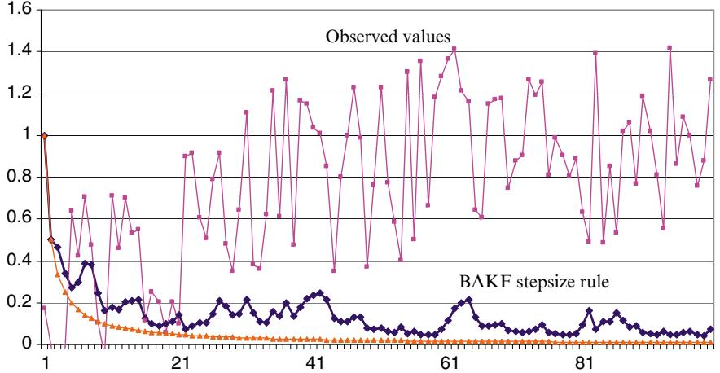  
(a) Biasadjusted Kalman filter for a signal with low noise.   
(b) Biasadjusted Kalman filter for a signal with higher noise.   
Figure 6.8 The BAKF stepsize rule for low-noise (a) and high-noise (b). Each figure shows the signal, the BAKF stepsizes, and the stepsizes produced by the $1 / n$ stepsize rule.

It is possible to then show that

$$
\mathbb {E} (v ^ {n}) = \delta^ {n} c,
$$

$$
V a r (v ^ {n}) = \lambda^ {n} \sigma^ {2}.
$$

Let $v ^ { n } ( \alpha _ { n - 1 } )$ be defined as in equation (6.57). Our goal is to solve the optimization problem

$$
\min  _ {\alpha_ {n - 1}} \mathbb {E} \left[ \left(v ^ {n} \left(\alpha_ {n - 1}\right) - \mathbb {E} v ^ {n}\right) ^ {2} \right]. \tag {6.58}
$$

The optimal solution can be shown to be given by

$$
\alpha_ {n - 1} = \frac {(1 - \gamma) \lambda^ {n - 1} \sigma^ {2} + (1 - (1 - \gamma) \delta^ {n - 1}) ^ {2} c ^ {2}}{(1 - \gamma) ^ {2} \lambda^ {n - 1} \sigma^ {2} + (1 - (1 - \gamma) \delta^ {n - 1}) ^ {2} c ^ {2} + \sigma^ {2}}. \tag {6.59}
$$

We refer to equation (6.59) as the optimal stepsize for approximate value iteration (OSAVI). Of course, it is only optimal for our single state problem, and it assumes that we know the expected contribution per time period $c$ , and the variance in the contribution $\hat { C }$ , $\sigma ^ { 2 }$ .

OSAVI has some desirable properties. If $\sigma ^ { 2 } = 0$ , then $\alpha _ { n - 1 } = 1$ . Also, if $\gamma = 0$ , then $\alpha _ { n - 1 } = 1 / n$ . It is also possible to show that $\alpha _ { n - 1 } \geq ( 1 - \gamma ) / n$ for any sample path.

All that remains is adapting the formula to more general dynamic programs with multiple states and where we are searching for optimal policies. We suggest the following adaptation. We propose to estimate a single constant $\bar { c }$ representing the average contribution per period, averaged over all states. If ${ \hat { C } } ^ { n }$ is the contribution earned in period ??, let

$$
{\bar {c} ^ {n}} = {(1 - \nu_ {n - 1}) \bar {c} ^ {n - 1} + \nu_ {n - 1} \hat {C} ^ {n},}
$$

$$
{(\bar {\sigma} ^ {n}) ^ {2}} = {(1 - \nu_ {n - 1}) (\bar {\sigma} ^ {n - 1}) ^ {2} + \nu_ {n - 1} (\bar {c} ^ {n} - \hat {C} ^ {n}) ^ {2}.}
$$

Here, $\nu _ { n - 1 }$ is a separate stepsize rule. Our experimental work suggests that a constant stepsize works well, and that the results are quite robust with respect to the value of $\nu _ { n - 1 }$ . We suggest a value of $\nu _ { n - 1 } = 0 . 2$ . Now let $\bar { c } ^ { n }$ be our estimate of $c$ , and let $( \bar { \sigma } ^ { n } ) ^ { 2 }$ be our estimate of $\sigma ^ { 2 }$ .

We could also consider estimating $\bar { c } ^ { n } ( s )$ and $( \bar { \sigma } ^ { n } ) ^ { 2 } ( s )$ for each state, so that we can estimate a state-dependent stepsize $\alpha _ { n - 1 } ( s )$ . There is not enough experimental work to support the value of this strategy, and lacking this we favor simplicity over complexity.

# 6.5 Convergence

A practical issue that arises with all stochastic approximation algorithms is that we simply do not have reliable, implementable stopping rules. Proofs of convergence in the limit are an important theoretical property, but they provide no guidelines or guarantees in practice.

A good illustration of the issue is given in Figure 6.9. Figure 6.9a shows the objective function for a dynamic program over 100 iterations (in this application, a single iteration required approximately 20 minutes of CPU time). The figure shows the objective function for an ADP algorithm which was run 100 iterations, at which point it appeared to be flattening out (evidence of convergence). Figure 6.9b is the objective function for the same algorithm run

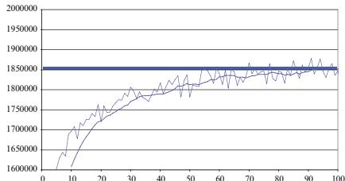  
(a) Objective function over 100 iterations.

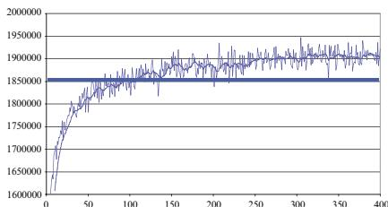  
(b) Objective function over 400 iterations.   
Figure 6.9 The objective function, plotted over 100 iterations (a) displays “apparent convergence.” The same algorithm, continued over 400 iterations (b) shows significant improvement.

for 400 iterations, which shows that there remained considerable room for improvement after 100 iterations.

We refer to this behavior as “apparent convergence,” and it is particularly problematic on large-scale problems where run times are long. Typically, the number of iterations needed before the algorithm “converges” requires a level of subjective judgment. When the run times are long, wishful thinking can interfere with this process.

Complicating the analysis of convergence in stochastic search is the behavior in some problems to go through periods of stability which are simply a precursor to breaking through to new plateaus. During periods of exploration, a stochastic gradient algorithm might discover a strategy that opens up new opportunities, moving the performance of the algorithm to an entirely new level.

Special care has to be made in the choice of stepsize rule. In any algorithm using a declining stepsize, it is possible to show a stabilizing objective function simply because the stepsize is decreasing. This problem is exacerbated when using algorithms based on value iteration, where updates to the value of being in a state depend on estimates of the values of future states, which can be biased. We recommend that initial testing of a stochastic gradient algorithm start with inflated stepsizes. After getting a sense for the number of iterations needed for the algorithm to stabilize, decrease the stepsize (keeping in mind that the number of iterations required to convergence may increase) to find the right tradeoff between noise and rate of convergence.

# 6.6 Guidelines for Choosing Stepsize Policies

Given the plethora of strategies for computing stepsizes, it is perhaps not surprising that there is a need for general guidance when choosing a stepsize

  
(b)   
Figure 6.10 Performance of stochastic gradient algorithm using starting point $x ^ { 0 } = 1$ , $x ^ { 0 } \in [ 0 , 1 ]$ , $x ^ { 0 } \in [ 0 . 5 , 1 . 5 ]$ , and $x ^ { 0 } \in \left[ 1 . 0 , 2 . 0 \right]$ using two different tuned values of the stepsize parameter $\boldsymbol { \theta }$ .

formula. Strategies for stepsizes are problem-dependent, and as a result any advice reflects the experience of the individual giving the advice.

An issue that is often overlooked is the role of tuning the stepsize policy. If a stepsize is not performing well, is it because you are not using an effective stepsize policy? Or is it because you have not properly tuned the one that you are using? Even more problematic is when you feel that you have tuned your stepsize policy as well as it can be tuned, but then you change something in your problem. For example, the distance from starting point to optimal solution matters. Changing your starting point, or modifying problem parameters so that the optimal solution moves, can change the optimal tuning of your stepsize policy.

This helps to emphasize the importance of our formulation which poses stochastic search algorithms as optimization problems searching for the best algorithm. Since parameter tuning for stepsizes is a manual process, people tend to overlook it, or minimize it. Figure 6.10 illustrates the risk of failing to recognize the point of tuning.

Figure 6.10(a) shows the performance of a stochastic gradient algorithm using a “tuned” stepsize, for four sets of starting points for $x ^ { 0 } \colon x ^ { 0 } = 1$ , $x ^ { 0 } \in$ [0, 1.0], $x ^ { 0 } \in [ 0 . 5 , 1 . 5 ]$ , and $x ^ { 0 } \in \left[ 1 . 0 , 2 . 0 \right]$ . Note the poor performance when the starting point was chosen in the range $x ^ { 0 } \in \left[ 1 . 0 , 2 . 0 \right]$ ]. Figure 6.10(b) shows the same algorithm after the stepsize was re-tuned for the range $x ^ { 0 } \in \left[ 1 . 0 , 2 . 0 \right]$ (the same stepsize was used for all four ranges).

With this in mind, we offer the following general strategies for choosing stepsizes:

Step 1 Start with a constant stepsize $\alpha$ and test out different values. Problems with a relatively high amount of noise will require smaller stepsizes.

Periodically stop the search and test the quality of your solution (this will require running multiple simulations of $F ( x , \widehat W )$ and averaging). Plot the results to see roughly how many iterations are needed before your results stop improving.

Step 2 Now try the harmonic stepsize $\theta / ( \theta + n - 1 )$ . $\theta = 1$ produces the $1 / n$ stepsize rule that is provably convergent, but is likely to decline too quickly. To choose $\boldsymbol { \theta }$ , look at how many iterations seemed to be needed when using a constant stepsize. If 100 iterations appears to be enough for a stepsize of 0.1, then try $\theta \approx 1 0$ , as it produces a stepsize of roughly .1 after 100 iterations. If you need 10,000 iterations, choose $\theta \approx 1 0 0 0$ . But you will need to tune ??. An alternative rule is the polynomial stepsize rule $\alpha _ { n } = 1 / n ^ { \beta }$ with $\beta \in ( 0 . 5 , 1 ]$ (we suggest 0.7 as a good starting point).

Step 3 Now start experimenting with the adaptive stepsize policies. RMSProp has become popular as of this writing for stationary stochastic search. For nonstationary settings, we suggest the BAKF stepsize rule (section 6.3.3). We will encounter an important class of nonstationary applications when we are estimating value function approximations in chapters 16 and 17.

There is always the temptation to do something simple. A constant stepsize, or a harmonic rule, are both extremely simple to implement. Keep in mind that both have a tunable parameter, and that the constant stepsize rule will not converge to anything (although the final solution may be quite acceptable). A major issue is that the best tuning of a stepsize not only depends on a problem, but also on the parameters of a problem such as the discount factor.

BAKF and OSAVI are more difficult to implement, but are more robust to the setting of the single, tunable parameter. Tunable parameters can be a major headache in the design of algorithms, and it is good strategy to absolutely minimize the number of tunable parameters your algorithm needs. Stepsize rules should be something you code once and forget about, but keep in mind the lesson of Figure 6.10.

# 6.7 Why Does it Work*

# 6.7.1 Proof of BAKF Stepsize

We now have what we need to derive an optimal stepsize for nonstationary data with a mean that is steadily increasing (or decreasing). We refer to this as the bias-adjusted Kalman filter stepsize rule (or BAKF), in recognition of its close relationship to the Kalman filter learning rate. We state the formula in the following theorem:

Theorem 6.7.1. The optimal stepsizes $( \alpha _ { m } ) _ { m = 0 } ^ { n }$ that minimize the objective function in equation (6.49) can be computed using the expression

$$
\alpha_ {n - 1} = 1 - \frac {\sigma^ {2}}{(1 + \lambda^ {n - 1}) \sigma^ {2} + (\beta^ {n - 1}) ^ {2}}, \tag {6.60}
$$

where ?? is computed recursively using

$$
\lambda^ {n} = \left\{ \begin{array}{l l} (\alpha_ {n - 1}) ^ {2}, & n = 1 \\ (1 - \alpha_ {n - 1}) ^ {2} \lambda^ {n - 1} + (\alpha_ {n - 1}) ^ {2}, & n > 1. \end{array} \right. \tag {6.61}
$$

Proof: We present the proof of this result because it brings out some properties of the solution that we exploit later when we handle the case where the variance and bias are unknown. Let $F ( \alpha _ { n - 1 } )$ denote the objective function from the problem stated in (6.49).

$$
\begin{array}{l} F \left(\alpha_ {n - 1}\right) = \mathbb {E} \left[ \left(\bar {\mu} ^ {n} \left(\alpha_ {n - 1}\right) - \mu^ {n}\right) ^ {2} \right] (6.62) \\ = \mathbb {E} \left[ \left((1 - \alpha_ {n - 1}) \bar {\mu} ^ {n - 1} + \alpha_ {n - 1} W ^ {n} - \mu^ {n}\right) ^ {2} \right] (6.63) \\ { = } { \mathbb { E } \left[ \left( ( 1 - \alpha _ { n - 1 } ) \left( \bar { \mu } ^ { n - 1 } - \mu ^ { n } \right) + \alpha _ { n - 1 } \left( W ^ { n } - \mu ^ { n } \right) \right) ^ { 2 } \right] } { ( 6 . 6 4 ) } \\ = \left(1 - \alpha_ {n - 1}\right) ^ {2} \mathbb {E} \left[ \left(\bar {\mu} ^ {n - 1} - \mu^ {n}\right) ^ {2} \right] + \left(\alpha_ {n - 1}\right) ^ {2} \mathbb {E} \left[ \left(W ^ {n} - \mu^ {n}\right) ^ {2} \right] \\ + 2 \alpha_ {n - 1} \left(1 - \alpha_ {n - 1}\right) \underbrace {\mathbb {E} \left[ \left(\bar {\mu} ^ {n - 1} - \mu^ {n}\right) \left(W ^ {n} - \mu^ {n}\right) \right]} _ {I}. (6.65) \\ \end{array}
$$

Equation (6.62) is true by definition, while (6.63) is true by definition of the updating equation for ${ \bar { \mu } } ^ { n }$ . We obtain (6.64) by adding and subtracting $\alpha _ { n - 1 } \mu ^ { n }$ . To obtain (6.65), we expand the quadratic term and then use the fact that the stepsize rule, $\alpha _ { n - 1 }$ , is deterministic, which allows us to pull it outside the expectations. Then, the expected value of the cross-product term, I, vanishes under the assumption of independence of the observations and the objective function reduces to the following form

$$
F (\alpha_ {n - 1}) = (1 - \alpha_ {n - 1}) ^ {2} \mathbb {E} \left[ \left(\bar {\mu} ^ {n - 1} - \mu^ {n}\right) ^ {2} \right] + (\alpha_ {n - 1}) ^ {2} \mathbb {E} \left[ \left(W ^ {n} - \mu^ {n}\right) ^ {2} \right] 6. 6 6)
$$

In order to find the optimal stepsize, $\alpha _ { n - 1 } ^ { * }$ , that minimizes this function, we obtain the first-order optimality condition by setting $\begin{array} { r } { \frac { \partial F ( \alpha _ { n - 1 } ) } { \partial \alpha _ { n - 1 } } = 0 } \end{array}$ ??????−1 , which gives us

$$
- 2 \left(1 - \alpha_ {n - 1} ^ {*}\right) \mathbb {E} \left[ \left(\bar {\mu} ^ {n - 1} - \mu^ {n}\right) ^ {2} \right] + 2 \alpha_ {n - 1} ^ {*} \mathbb {E} \left[ \left(W ^ {n} - \mu^ {n}\right) ^ {2} \right] = 0. \tag {6.67}
$$

Solving this for $\alpha _ { n - 1 } ^ { * }$ gives us the following result

$$
\alpha_ {n - 1} ^ {*} = \frac {\mathbb {E} \left[ \left(\bar {\mu} ^ {n - 1} - \mu^ {n}\right) ^ {2} \right]}{\mathbb {E} \left[ \left(\bar {\mu} ^ {n - 1} - \mu^ {n}\right) ^ {2} \right] + \mathbb {E} \left[ \left(W ^ {n} - \mu^ {n}\right) ^ {2} \right]}. \tag {6.68}
$$

Recall that we can write $( \bar { \mu } ^ { n - 1 } - \mu ^ { n } ) ^ { 2 }$ as the sum of the variance plus the bias squared using

$$
\mathbb {E} \left[ \left(\bar {\mu} ^ {n - 1} - \mu^ {n}\right) ^ {2} \right] = \lambda^ {n - 1} \sigma^ {2} + \left(\beta^ {n - 1}\right) ^ {2}. \tag {6.69}
$$

Using (6.69) and $\mathbb { E } \left[ \left( W ^ { n } - \mu ^ { n } \right) ^ { 2 } \right] = \sigma ^ { 2 }$ in (6.68) gives us

$$
\begin{array}{l} \alpha_ {n - 1} = \frac {\lambda^ {n - 1} \sigma^ {2} + (\beta^ {n - 1}) ^ {2}}{\lambda^ {n - 1} \sigma^ {2} + (\beta^ {n - 1}) ^ {2} + \sigma^ {2}} \\ = 1 - \frac {\sigma^ {2}}{(1 + \lambda^ {n - 1}) \sigma^ {2} + (\beta^ {n - 1}) ^ {2}}, \\ \end{array}
$$

which is our desired result (equation (6.60)).

From this result, we can next establish several properties through the following corollaries.

Corollary 6.7.1. For a sequence with a static mean, the optimal stepsizes are given by

$$
\alpha_ {n - 1} = \frac {1}{n} \quad \forall n = 1, 2, \dots . \tag {6.70}
$$

Proof: In this case, the mean $\mu ^ { n } = \mu$ is a constant. Therefore, the estimates of the mean are unbiased, which means $\beta ^ { n } = 0$ $\forall t = 2 , \ldots , .$ This allows us to write the optimal stepsize as

$$
\alpha_ {n - 1} = \frac {\lambda^ {n - 1}}{1 + \lambda^ {n - 1}}. \tag {6.71}
$$

Substituting (6.71) into (6.54) gives us

$$
\alpha_ {n} = \frac {\alpha_ {n - 1}}{1 + \alpha_ {n - 1}}. \tag {6.72}
$$

If $\alpha _ { 0 } = 1$ , it is easy to verify (6.70).

For the case where there is no noise $\sigma ^ { 2 } = 0 \mathrm { \ i }$ ), we have the following:

Corollary 6.7.2. For a sequence with zero noise, the optimal stepsizes are given by

$$
\alpha_ {n - 1} = 1 \quad \forall n = 1, 2, \dots . \tag {6.73}
$$

The corollary is proved by simply setting $\sigma ^ { 2 } = 0$ in equation (6.53).

As a final result, we obtain

Corollary 6.7.3. In general,

$$
\alpha_ {n - 1} \geq \frac {1}{n} \quad \forall n = 1, 2, \dots .
$$

Proof: We leave this more interesting proof as an exercise to the reader (see exercise 6.17).

Corollary 6.7.3 is significant since it establishes one of the conditions needed for convergence of a stochastic approximation method, namely that $\textstyle \sum _ { n = 1 } ^ { \infty } \alpha _ { n } =$ ∞. An open theoretical question, as of this writing, is whether the BAKF stepsize rule also satisfies the requirement that $\textstyle \sum _ { n = 1 } ^ { \infty } ( \alpha _ { n } ) ^ { 2 } < \infty$ .

# 6.8 Bibliographic Notes

Sections 6.1–6.2 A number of different communities have studied the problem of “stepsizes,” including the business forecasting community (Brown (1959) 1963), Gardner (1983), Giffin (1971), Holt et al. (1960), Trigg (1964), artificial intelligence Darken and Moody (1991), Darken et al. (1992), Jaakkola et al. (1994), Sutton and Singh (1994), stochastic programming Kesten (1958), Mirozahmedov and Uryasev (1983), Pflug (1988), Ruszczyński and Syski (1986) and signal processing (Douglas and Mathews (1995)), Goodwin and Sin (1984). The neural network community refers to “learning rate schedules”; see Haykin (1999). Even-dar and Mansour (2003) provides a thorough analysis of convergence rates for certain types of stepsize formulas, including $1 / n$ and the polynomial learning rate $1 / n ^ { \beta }$ , for ??-learning problems. These sections are based on the presentation in Powell and George (2006) Broadie et al. (2011) revisits the stepsize conditions (6.19)–(6.19).

Section 6.3.1 – The optimality of averaging for stationary data is well known. Our presentation was based on Kushner and Yin (2003)[pp. 1892–185].

Section 6.3.2 – This result for nonstationary data is a classic result from Kalman filter theory (see, for example, Meinhold and Singpurwalla (2007)).

Section 6.3.3 – The BAKF stepsize formula was developed by Powell and George (2006), where it was initially called the “optimal stepsize algorithm” (or OSA).

Section 6.4 – The OSAVI stepsize formula for approximate value iteration was developed in Ryzhov et al. (2015).

Section 6.6 – Figure 6.10 was prepared by Saeed Ghadimi.

# Exercises

# Review questions

6.1 What is a harmonic stepsize policy? Show that a stepsize $\alpha _ { n } = 1 / n$ is the same as simple averaging.   
6.2 What three conditions have to be satisfied for convergence of a deterministic stepsize policy.   
6.3 Describe Kesten’s rule and provide an intuitive explanation for the design of this policy.   
6.4 Assume that the stepsize $\alpha _ { n }$ is an adaptive (that is, stochastic) stepsize policy. What do we mean when we require

$$
\sum_ {n = 0} ^ {\infty} \alpha_ {n} = \infty
$$

to be true almost surely. Why is this not equivalent to requiring

$$
\mathbb {E} \left\{\sum_ {n = 0} ^ {\infty} \alpha_ {n} \right\} = \infty ?
$$

What is the practical implication of requiring the condition to be true “almost surely.”

6.5 Explain why $1 / n$ is the optimal stepsize policy when estimating the mean of a random variable from observations that are stationary over the iterations.   
6.6 Give the underlying stochastic model assumed by the Kalman filter. What is the optimal policy for this model?

# Computational exercises

6.7 Let $U$ be a uniform [0, 1] random variable, and let

$$
\mu^ {n} = 1 - \exp (- \theta_ {1} n).
$$

Now let $\hat { R } ^ { n } = \mu ^ { n } + \theta _ { 2 } ( U ^ { n } - . 5 )$ . We wish to try to estimate $\mu ^ { n }$ using

$$
\bar {R} ^ {n} = (1 - \alpha_ {n - 1}) \bar {R} ^ {n - 1} + \alpha_ {n - 1} \hat {R} ^ {n}.
$$

In the exercises below, estimate the mean (using ${ \bar { R } } ^ { n }$ ) and compute the standard deviation of ${ \bar { R } } ^ { n }$ for $n = 1 , 2 , \ldots , 1 0 0$ , for each of the following stepsize rules:

● $\alpha _ { n - 1 } = 0 . 1 0$   
● $\alpha _ { n - 1 } = a / ( a + n - 1 )$ for $a = 1 , 1 0$   
● Kesten’s rule.   
● The bias-adjusted Kalman filter stepsize rule.

For each of the parameter settings below, compare the rules based on the average error (1) over all 100 iterations and (2) in terms of the standard deviation of $\bar { R } ^ { 1 0 0 }$ .

(a) $\theta _ { 1 } = 0 , \theta _ { 2 } = 1 0 .$   
(b) $\theta _ { 1 } = 0 . 0 5 , \theta _ { 2 } = 0 .$   
(c) $\theta _ { 1 } = 0 . 0 5 , \theta _ { 2 } = 0 . 2$   
(d) $\theta _ { 1 } = 0 . 0 5 , \theta _ { 2 } = 0 . 5$   
(e) Now pick the single stepsize that works the best on all four of the above exercises.

6.8 Consider a random variable given by $R \ = \ 1 0 U$ (which would be uniformly distributed between 0 and 10). We wish to use a stochastic gradient algorithm to estimate the mean of $R$ using the iteration $\bar { \theta } ^ { n } \ = \ \bar { \theta } ^ { n - 1 } \ -$ $\alpha _ { n - 1 } ( R ^ { n } - \bar { \theta } ^ { n - 1 } )$ , where $R ^ { n }$ is a Monte Carlo sample of $R$ in the $n ^ { t h }$ iteration. For each of the stepsize rules below, use the mean squared error

$$
M S E = \sqrt {\frac {1}{N} \sum_ {n = 1} ^ {N} (R ^ {n} - \bar {\theta} ^ {n - 1}) ^ {2}} \tag {6.74}
$$

to measure the performance of the stepsize rule to determine which works best, and compute an estimate of the bias and variance at each iteration. If the stepsize rule requires choosing a parameter, justify the choice you make (you may have to perform some test runs).

(a) $\alpha _ { n - 1 } = 1 / n$ .   
(b) Fixed stepsizes of $\alpha _ { n } = . 0 5 , . 1 0$ and .20.   
(c) The stochastic gradient adaptive stepsize rule (equations 6.27)– (6.28)).   
(d) The Kalman filter (equations (6.43)–(6.47)).   
(e) The optimal stepsize rule (algorithm 6.7).

6.9 Repeat exercise 6.8 using

$$
R ^ {n} = 1 0 (1 - e ^ {- 0. 1 n}) + 6 (U - 0. 5).
$$

6.10 Repeat exercise 6.8 using

$$
R ^ {n} = \left(1 0 / (1 + e ^ {- 0. 1 (5 0 - n)})\right) + 6 (U - 0. 5).
$$

6.11 Use a stochastic gradient algorithm to solve the problem

$$
\min _ {x} \frac {1}{2} (X - x) ^ {2},
$$

where $X$ is a random variable. Use a harmonic stepsize rule (equation (6.15)) with parameter $\theta = 5$ . Perform 1000 iterations assuming that you observe $X ^ { 1 } = 6 , X ^ { 2 } = 2 , X ^ { 3 } = 5$ (this can be done in a spreadsheet). Use a starting initial value of $x ^ { 0 } = 1 0$ . What is the best possible value for $\boldsymbol { \theta }$ for this problem?

6.12 Consider a random variable given by $\begin{array} { l l l } { R } & { = } & { 1 0 U } \end{array}$ (which would be uniformly distributed between 0 and 10). We wish to use a stochastic gradient algorithm to estimate the mean of $R$ using the iteration $\bar { \mu } ^ { n } = \bar { \mu } ^ { n - 1 } - \alpha _ { n - 1 } ( R ^ { n } - \bar { \mu } ^ { n - 1 } )$ , where $R ^ { n }$ is a Monte Carlo sample of $R$ in the $n ^ { \mathrm { t h } }$ iteration. For each of the stepsize rules below, use equation (6.74) (see exercise 6.8) to measure the performance of the stepsize rule to determine which works best, and compute an estimate of the bias and variance at each iteration. If the stepsize rule requires choosing a parameter, justify the choice you make (you may have to perform some test runs).

(a) $\alpha _ { n - 1 } = 1 / n$ .   
(b) Fixed stepsizes of $\alpha _ { n } = . 0 5 , . 1 0$ and .20.   
(c) The stochastic gradient adaptive stepsize rule (equations (6.27)– (6.28)).   
(d) The Kalman filter (equations (6.43)–(6.47)).   
(e) The optimal stepsize rule (algorithm 6.7).

6.13 Repeat exercise 6.8 using

$$
R ^ {n} = 1 0 (1 - e ^ {- 0. 1 n}) + 6 (U - 0. 5).
$$

6.14 Repeat exercise 6.8 using

$$
R ^ {n} = \left(1 0 / (1 + e ^ {- 0. 1 (5 0 - n)})\right) + 6 (U - 0. 5).
$$

6.15 Let $U$ be a uniform [0, 1] random variable, and let

$$
\mu^ {n} = 1 - \exp (- \theta_ {1} n).
$$

Now let $\hat { R } ^ { n } = \mu ^ { n } + \theta _ { 2 } ( U ^ { n } - . 5 )$ . We wish to try to estimate $\mu ^ { n }$ using

$$
\bar {R} ^ {n} = (1 - \alpha_ {n - 1}) \bar {R} ^ {n - 1} + \alpha_ {n - 1} \hat {R} ^ {n}.
$$

In the exercises below, estimate the mean (using ${ \bar { R } } ^ { n }$ ) and compute the standard deviation of ${ \bar { R } } ^ { n }$ for $n = 1 , 2 , \ldots , 1 0 0$ , for each of the following stepsize rules:

● $\alpha _ { n - 1 } = 0 . 1 0$ .   
● $\alpha _ { n - 1 } = \theta / ( \theta + n - 1 )$ for $a = 1 , 1 0$   
● Kesten’s rule.   
● The bias-adjusted Kalman filter stepsize rule.

For each of the parameter settings below, compare the rules based on the average error (1) over all 100 iterations and (2) in terms of the standard deviation of $\bar { R } ^ { 1 0 0 }$ .

(a) $\theta _ { 1 } = 0 , \theta _ { 2 } = 1 0 .$ .   
(b) $\theta _ { 1 } = 0 . 0 5 , \theta _ { 2 } = 0$   
(c) $\theta _ { 1 } = 0 . 0 5 , \theta _ { 2 } = 0 . 2$   
(d) $\theta _ { 1 } = 0 . 0 5 , \theta _ { 2 } = 0 . 5$   
(e) Now pick the single stepsize that works the best on all four of the above exercises.

# Theory questions

6.16 Show that if we use a stepsize rule $\alpha _ { n - 1 } \ = \ 1 / n$ , then ${ \bar { \mu } } ^ { n }$ is a simple average of $W ^ { 1 } , W ^ { 2 } , \dots , W ^ { n }$ (thus proving equation 6.14). Use this result to argue that any solution of equation (6.7) produces the mean of $W$ .   
6.17 Prove corollary 6.7.3.   
6.18 The bias adjusted Kalman filter (BAKF) stepsize rule (equation (6.53)), is given by

$$
\alpha_ {n - 1} = 1 - \frac {\sigma_ {\varepsilon} ^ {2}}{(1 + \lambda^ {n - 1}) \sigma_ {\varepsilon} ^ {2} + (\beta^ {n - 1}) ^ {2}},
$$

where $\lambda$ is computed recursively using

$$
\lambda^ {n} = \left\{ \begin{array}{l l} (\alpha_ {n - 1}) ^ {2}, & n = 1 \\ (1 - \alpha_ {n - 1}) ^ {2} \lambda^ {n - 1} + (\alpha_ {n - 1}) ^ {2}, & n > 1. \end{array} \right.
$$

Show that for a stationary data series, where the bias $\beta ^ { n } \ = \ 0$ , produces stepsizes that satisfy

$$
\alpha_ {n - 1} = \frac {1}{n} \forall n = 1, 2, \ldots .
$$

6.19 An important property of the BAKF stepsize policy (equation (6.53)) satisfies the property that $\alpha _ { n } \geq 1 / n$ .

(a) Why is this important?   
(b) Prove that this result holds.

# Problem-solving questions

6.20 Assume we have to order $x$ assets after which we try to satisfy a random demand $D$ for these assets, where $D$ is randomly distributed between 100 and 200. If $x > D$ , we have ordered too much and we pay $5 ( x - D )$ . If $x < D$ , we have an underage, and we have to pay $2 0 ( D - x )$ .

(a) Write down the objective function in the form $\operatorname* { m i n } _ { x } \mathbb { E } f ( x , D )$   
(b) Derive the stochastic gradient for this function.   
(c) Find the optimal solution analytically [Hint: take the expectation of the stochastic gradient, set it equal to zero and solve for the quantity $\mathbb { P } ( D \leq x ^ { * } )$ . From this, find $x ^ { * }$ .]   
(d) Since the gradient is in units of dollars while $x$ is in units of the quantity of the asset being ordered, we encounter a scaling problem. Choose as a stepsize $\alpha _ { n - 1 } = \alpha _ { 0 } / n$ where $\alpha _ { 0 }$ is a parameter that has to be chosen. Use $x ^ { 0 } = 1 0 0$ as an initial solution. Plot $x ^ { n }$ for 1000 iterations for $\alpha _ { 0 } = 1 , 5 , 1 0 , 2 0$ . Which value of $\alpha _ { 0 }$ seems to produce the best behavior?   
(e) Repeat the algorithm (1000 iterations) 10 times. Let ${ \boldsymbol \omega } = ( 1 , \dots , 1 0 )$ represent the 10 sample paths for the algorithm, and let $x ^ { n } ( \omega )$ be the solution at iteration ?? for sample path $\omega$ . Let $V a r ( x ^ { n } )$ be the variance of the random variable $x ^ { n }$ where

$$
\overline {{V}} (x ^ {n}) = \frac {1}{1 0} \sum_ {\omega = 1} ^ {1 0} (x ^ {n} (\omega) - x ^ {*}) ^ {2}.
$$

Plot the standard deviation as a function of $n$ for $1 \leq n \leq 1 0 0 0$ .

6.21 Show that if we use a stepsize rule $\alpha _ { n - 1 } = 1 / n$ , then ${ \bar { \mu } } ^ { n }$ is a simple average of $W ^ { 1 } , W ^ { 2 } , \dots , W ^ { n }$ (thus proving equation 6.14).

6.22 A customer is required by her phone company to pay for a minimum number of minutes per month for her cell phone. She pays 12 cents per minute of guaranteed minutes, and 30 cents per minute that she goes over her minimum. Let $x$ be the number of minutes she commits to each month, and let $M$ be the random variable representing the number of minutes she uses each month, where $M$ is normally distributed with mean 300 minutes and a standard deviation of 60 minutes.

(a) Write down the objective function in the form $\operatorname* { m i n } _ { x } \mathbb { E } f ( x , M )$ $\mathrm { m i n } _ { x }$   
(b) Derive the stochastic gradient for this function.   
(c) Let $x ^ { 0 } = 0$ and choose as a stepsize $\alpha _ { n - 1 } = 1 0 / n$ . Use 100 iterations to determine the optimum number of minutes the customer should commit to each month.

6.23 An oil company covers the annual demand for oil using a combination of futures and oil purchased on the spot market. Orders are placed at the end of year $t - 1$ for futures that can be exercised to cover demands in year ??. If too little oil is purchased this way, the company can cover the remaining demand using the spot market. If too much oil is purchased with futures, then the excess is sold at $7 0 \%$ of the spot market price (it is not held to the following year – oil is too valuable and too expensive to store).

To write down the problem, model the exogenous information using

$$
\hat {D} _ {t} = \text {D e m a n d f o r o i l d u n i n g y e a r} t,
$$

$$
\hat {p} _ {t} ^ {s} = \text {S p o t p r i c e p a i d f o r o i l p u r c h a s e d i n y e a r} t,
$$

$$
\hat {p} _ {t, t + 1} ^ {f} = \text {F u t u r e s p r i c e p a i d i n y e a r} t \text {f o r o i l t o b e u s e d i n y e a r} t + 1.
$$

The demand (in millions of barrels) is normally distributed with mean 600 and standard deviation of 50. The decision variables are given by

$$
\begin{array}{r c l} \bar {\mu} _ {t, t + 1} ^ {f} & = & \text {N u m b e r o f f u t u r e s t o b e p u r c h a s e d a t t h e e n d o f y e a r} \\ & & t \text {t o b e u s e d i n y e a r} t + 1. \end{array}
$$

$$
\bar {\mu} _ {t} ^ {s} = \text {S p o t p u r c h a s e s m a d e i n y e a r} t.
$$

(a) Set up the objective function to minimize the expected total amount paid for oil to cover demand in a year $t + 1$ as a function of $\bar { \mu } _ { t } ^ { f }$ . List

the variables in your expression that are not known when you have to make a decision at time ??.

(b) Give an expression for the stochastic gradient of your objective function. That is, what is the derivative of your function for a particular sample realization of demands and prices (in year $t + 1$ )?   
(c) Generate 100 years of random spot and futures prices as follows:

$$
\begin{array}{l} {\hat {p} _ {t} ^ {f}} = {0. 8 0 + 0. 1 0 U _ {t} ^ {f},} \\ {\hat {p} _ {t, t + 1} ^ {s}} = {\hat {p} _ {t} ^ {f} + 0. 2 0 + 0. 1 0 U _ {t} ^ {s},} \\ \end{array}
$$

where $\boldsymbol { U } _ { t } ^ { f }$ and $U _ { t } ^ { s }$ are random variables uniformly distributed between 0 and 1. Run 100 iterations of a stochastic gradient algorithm to determine the number of futures to be purchased at the end of each year. Use $\bar { \mu } _ { 0 } ^ { f } = 3 0$ as your initial order quantity, and use as your stepsize $\alpha _ { t } = 2 0 / t$ . Compare your solution after 100 years to your solution after 10 years. Do you think you have a good solution after 10 years of iterating?

# Sequential decision analytics and modeling

These exercises are drawn from the online book Sequential Decision Analytics and Modeling available at http://tinyurl.com/sdaexamplesprint.

6.24 Read sections 5.1–5.6 on the static shortest path problem. We are going to focus on the extension in section 5.6, where the traveler gets to see the actual link cost $\hat { c } _ { i j }$ before traversing the link.

(a) Write out the five elements of this dynamic model. Use our style of representing the policy as $X ^ { \pi } ( S _ { t } )$ without specifying the policy.   
(b) We are going to use a VFA-based policy which requires estimating the function:

$$
\overline {{V}} _ {t} ^ {x, n} (i) = (1 - \alpha_ {n}) \overline {{V}} _ {t} ^ {x, n - 1} (i) + \alpha_ {n} v _ {t} ^ {n} (i).
$$

We cover value function approximations in much greater depth later, but at the moment, we are interested in the stepsize $\alpha _ { n }$ which has a major impact on the performance of the system. The ADP algorithm has been implemented in Python, which can be downloaded from http://tinyurl.com/sdagithub using the module “StochasticShortestPath_Static.” The code currently uses the harmonic stepsize rule

$$
\alpha_ {n} = \frac {\theta^ {\alpha}}{\theta^ {\alpha} + n - 1},
$$

where $\theta ^ { \alpha }$ is a tunable parameter. Run the code for 50 iterations using $\theta ^ { \alpha } = 1 , 2 , 5 , 1 0 , 2 0 , 5 0$ and report on the performance.

(c) Implement the stepsize rule RMSProp (described in section 6.2.3) (which has its own tunable parameter), and compare your best implementation of RMSProp with your best version of the harmonic stepsize.

# Diary problem

The diary problem is a single problem you chose (see chapter 1 for guidelines). Answer the following for your diary problem.

6.25 Try to identify at least one, but more if possible, parameters (or functions) that you would have to adaptively estimate in an online fashion, either from a flow of real data, or from an iterative search algorithm. For each case, answer the following:

(a) Describe the characteristics of the observations in terms of the degree of stationary or nonstationary behavior, the amount of noise, and whether the series might undergo sudden shifts (this would only be the case for data coming from live observations).

(b) Suggest one deterministic stepsize policy, and one adaptive stepsize policy, for each data series, and explain your choice. Then compare these to the BAKF policy and discuss strengths and weaknesses.

# Bibliography

Broadie, M., Cicek, D., and Zeevi, A. (2011). General bounds and finite-time improvement for the Kiefer-Wolfowitz stochastic approximation algorithm. Operations Research 59 (5): 1211–1224.   
Brown, R.G. (1959). Statistical Forecasting for Inventory Control. New York: McGrawHill.   
Brown, R.G. (1963). Smoothing, Forecasting and Prediction of Discrete Time Series. Englewood Cliffs, N.J: PrenticeHall.   
Darken, C. and Moody, J. (1991). Note on learning rate schedules for stochastic optimization. In: Advances in Neural Information Processing Systems 3 (eds. R.P. Lippmann, J. Moody and D.S. Touretzky), 1009–1016.

Darken, C., Chang, J., and Moody, J. (1992). Learning rate schedules for faster stochastic gradient search. In: Neural Networks for Signal Processing 2 Proceedings of the 1992 IEEE Workshop.   
Douglas, S.C. and Mathews, V.J. (1995). Stochastic gradient adaptive step size algorithms for adaptive filtering. Proc. International Conference on Digital Signal Processing, Limassol, Cyprus 1: 142–147.   
Evendar, E. and Mansour, Y. (2003). Learning rates for Q-learning. Journal of Machine Learning Research 5: 1–25.   
Gardner, E.S. (1983). Automatic monitoring of forecast errors. Journal of Forecasting 2: 1–21.   
Giffin, W.C. (1971). Introduction to Operations Engineering. Homewood, IL: R. D. Irwin, Inc.   
Goodwin, G.C. and Sin, K.S. (1984). Adaptive Filtering and Control. Englewood Cliffs, NJ: PrenticeHall.   
Haykin, S. (1999). Neural Networks: A comprehensive foundation. Englewood Cliffs, N.J: Prentice Hall.   
Holt, C.C., Modigliani, F., Muth, J., and Simon, H. (1960). Planning, Production, Inventories and Work Force. Englewood Cliffs, NJ: PrenticeHall.   
Jaakkola, T., Singh, S.P., and Jordan, M.I. (1994). Reinforcement learning algorithm for partially observable Markov decision problems. Advances in Neural Information Processing Systems 7: 345.   
Kesten, H. (1958). Accelerated stochastic approximation. The Annals of Mathematical Statistics 29: 41–59.   
Kushner, H.J. and Yin, G.G. (2003). Stochastic Approximation and Recursive Algorithms and Applications, New York: Springer.   
Meinhold, R.J. and Singpurwalla, N.D. (2007). Understanding the Kalman Filter. The American Statistician 37 (2): 123–127.   
Mirozahmedov, F. and Uryasev, S. (1983). Adaptive Stepsize regulation for stochastic optimization algorithm. Zurnal vicisl. mat. i. mat. fiz. 23 (6): 1314–1325.   
Pflug, G. (1988). Stepsize rules, stopping times and their implementation in stochastic quasigradient algorithms. In: Numerical Techniques for Stochastic Optimization, 353–372. New York: SpringerVerlag.   
Powell, W.B. and George, A.P. (2006). Adaptive stepsizes for recursive estimation with applications in approximate dynamic programming. Journal of Machine Learning 65 (1): 167–198.   
Ruszczyński, A. and Syski, W. (1986). A method of aggregate stochastic subgradients with online stepsize rules for convex stochastic programming problems. Mathematical Programming Study 28: 113–131.

Ryzhov, I.O., Frazier, P.I. and Powell, W.B. (2015). A newoptimal stepsize for approximate dynamic programming. IEEE Transactions on Automatic Control 60 (3): 743–758.   
Sutton, R.S. and Singh, S.P. (1994). On step-size and bias in temporal-difference learning. In: Eight Yale Workshop on Adaptive and Learning Systems (ed. C. for System Science), 91–96.   
Yale University. Trigg, D.W. (1964). Monitoring a forecasting system. Operations Research Quarterly 15: 271–274.

# 7

# Derivative-Free Stochastic Search

There are many settings where we wish to solve

$$
\max  _ {x \in \mathcal {X}} \mathbb {E} \{F (x, W) | S ^ {0} \}, \tag {7.1}
$$

which is the same problem that we introduced in the beginning of chapter 5. When we are using derivative-free stochastic search, we assume that we can choose a point $x ^ { n }$ according to some policy that uses a belief about the function that we can represent by $\bar { F } ^ { n } ( x ) \approx \mathbb { E } F ( x , W )$ (as we show below, there is more to the belief than a simple estimate of the function). Then, we observe the performance $\hat { F } ^ { n + 1 } = F ( x ^ { n } , W ^ { n + 1 } )$ . Random outcomes can be the response of a patient to a drug, the number of ad-clicks from displaying a particular ad, the strength of a material from a mixture of inputs and how the material is prepared, or the time required to complete a path over a network. After we run our experiment, we use the observed performance ${ \hat { F } } ^ { n + 1 }$ to obtain an updated belief about the function, ${ \bar { F } } ^ { n + 1 } ( x )$ .

We may use derivative-free stochastic search because we do not have access to the derivative (or gradient) $\nabla F ( x , W )$ , or even a numerical approximation of the derivative. The most obvious examples arise when $x$ is a member of a discrete set $\mathcal { X } = \{ x _ { 1 } , \ldots , x _ { M } \}$ , such as a set of drugs or materials, or perhaps different choices of websites. In addition, $x$ may be continuous, and yet we cannot even approximate a derivative. For example, we may want to test a drug dosage on a patient, but we can only do this by trying different dosages and observing the patient for a month.

There may also be problems which can be solved using a stochastic gradient algorithm (possibly using numerical derivatives). It is not clear that a gradient-based solution is necessarily better. We suspect that if stochastic gradients can be calculated directly (without using numerical derivatives), that this is likely going to be the best approach for high-dimensional problems

(fitting neural networks are a good example). But there are going to be problems where both methods may apply, and it simply will not be obvious which is the best approach.

We are going to approach our problem by designing a policy (or algorithm) $X ^ { \pi } ( S ^ { n } )$ that chooses $x ^ { n } = X ^ { \pi } ( S ^ { n } )$ given what we know about ${ \mathbb E } \{ F ( x , W ) | S ^ { 0 } \}$ as captured by our approximation

$$
\bar {F} ^ {n} \approx \mathbb {E} \{F (x, W) | S ^ {0} \}.
$$

For example, if we are using a Bayesian belief for discrete $x \in \mathcal { X } = \{ x _ { 1 } , \ldots , x _ { M } \}$ , our belief $B ^ { n }$ would consist of a set of estimates ${ \bar { \mu } } _ { x } ^ { n }$ and precisions $\beta _ { x } ^ { n }$ for each $x \in \mathcal X$ . Our belief state is then $B ^ { n } = ( \bar { \mu } _ { x } ^ { n } , \beta _ { x } ^ { n } ) _ { x \in \mathcal { X } }$ which is updated using, for $x = x ^ { n }$ ,

$$
\bar {\mu} _ {x} ^ {n + 1} = \frac {\beta_ {x} ^ {n} \bar {\mu} _ {x} ^ {n} + \beta^ {W} W ^ {n + 1}}{\beta_ {x} ^ {n} + \beta^ {W}},
$$

$$
\beta_ {x} ^ {n + 1} = \beta_ {x} ^ {n} + \beta^ {W}.
$$

We first saw these equations in chapter 3. Alternatively, we might use a linear model $f ( x | \theta )$ which we would write

$$
f (x | \bar {\theta} ^ {n}) = \bar {\theta} _ {0} ^ {n} + \bar {\theta} _ {1} ^ {n} \phi_ {1} (x) + \bar {\theta} _ {2} ^ {n} \phi_ {2} (x) + \bar {\theta} _ {2} ^ {n} \phi_ {2} (x) + \dots ,
$$

where $\phi _ { f } ( x )$ is a feature drawn from the input $x$ , which could include data from a website, a movie, or a patient (or patient type). The coefficient vector ${ \bar { \theta } } ^ { n }$ would be updated using the equations for recursive least squares (see section 3.8) where the belief state $B ^ { n }$ consists of the estimates of the coefficients ${ \bar { \theta } } ^ { n }$ and a matrix $M ^ { n }$ .

After choosing $x ^ { n } = X ^ { \pi } ( S ^ { n } )$ , then observing a response $\hat { F } ^ { n + 1 } = F ( x ^ { n } , W ^ { n + 1 } )$ , we update our approximation to obtain $\bar { F } ^ { n + 1 }$ which we capture in our belief state $S ^ { n + 1 }$ using the methods we presented in chapter 3. We represent the updating of beliefs using

$$
S ^ {n + 1} = S ^ {M} (S ^ {n}, x ^ {n}, W ^ {n + 1}).
$$

This could be done using any of the updating methods described in chapter 3. This process produces a sequence of states, decisions, and information that we will typically write as

$$
(S ^ {0}, x ^ {0} = X ^ {\pi} (S ^ {0}), W ^ {1}, S ^ {1}, x ^ {1} = X ^ {\pi} (S ^ {1}), W ^ {2}, \dots , S ^ {n}, x ^ {n} = X ^ {\pi} (S ^ {n}), W ^ {n + 1}, \dots).
$$

In real applications, we have to stop at some finite ??. This changes our optimization problem from the asymptotic formulation in (7.1) to the problem (which we now state using the expanded form):

$$
\max  _ {\pi} \mathbb {E} _ {S ^ {0}} \mathbb {E} _ {W ^ {1}, \dots , W ^ {N} | S ^ {0}} \mathbb {E} _ {\widehat {W} | S ^ {0}} \{F (x ^ {\pi , N}, \widehat {W}) | S ^ {0} \} \tag {7.2}
$$

where $x ^ { \pi , N }$ depends on the sequence $W ^ { 1 } , \ldots , W ^ { N }$ .

This is the final-reward formulation that we discussed in chapter 4. We can also consider a cumulative reward objective given by

$$
\max  _ {\pi} \mathbb {E} _ {S ^ {0}} \mathbb {E} _ {W ^ {1}, \dots , W ^ {N} | S ^ {0}} \left\{\sum_ {n = 0} ^ {N - 1} F \left(X ^ {\pi} \left(S ^ {n}\right), W ^ {n + 1}\right) | S ^ {0} \right\}. \tag {7.3}
$$

For example, we might use (7.2) when we are running laboratory experiments to design a new solar panel, or running computer simulations of a manufacturing process that produces the strongest material. By contrast, we would use (7.3) if we want to find the price that maximizes the revenue from selling a product on the internet, since we have to maximize revenues over time while we are experimenting. We note here the importance of using the expanded form for expectations when comparing (7.2) and (7.3).

An entire book could be written on derivative-free stochastic search. In fact, entire books and monographs have been written on specific versions of the problem, as well as specific classes of solution strategies. This chapter is going to be a brief tour of this rich field.

Our goal will be to provide a unified view that covers not only a range of different formulations (such as final reward and cumulative reward), but also the different classes of policies that we can use. This will be the first chapter where we do a full pass over all four classes of policies that we first introduced in chapter 1. We will now see them all put to work in the context of pure learning problems. We note that in the research literature, each of the four classes of policies are drawn from completely different fields. This is the first time that all four are illustrated at the same time.

# 7.1 Overview of Derivative-free Stochastic Search

There are a number of dimensions to the rich problem class known as derivative-free stochastic search. This section is designed as an introduction to this challenging field.

# 7.1.1 Applications and Time Scales

Examples of applications that arise frequently include:

● Computer simulations – We may have a simulator of a manufacturing system or logistics network that models inventories for a global supply chain. The

simulation may take anywhere from several seconds to several days to run. In fact, we can put in this category any setting that involves the computer to evaluate a complex function.

● Internet applications – We might want to find the ad that produces the most ad-clicks, or the features of a website that produce the best response.   
● Transportation – Choosing the best path over a network – After taking a new position and renting a new apartment, you use the internet to identify a set of $K$ paths – many overlapping, but covering modes such as walking, transit, cycling, Uber, and mixtures of these. Each day you get to try a different path $x$ to try to learn the time required $\mu _ { x }$ to traverse path $x$ .   
● Sports – Identifying the best team of basketball players – A coach has 15 players on a basketball team, and has to choose a subset of five for his starting lineup. The players vary in terms of shooting, rebounding and defensive skills.   
● Laboratory experiments – We may be trying to find the catalyst that produces a material of the highest strength. This may also depend on other experimental choices such as the temperature at which a material is baked, or the amount of time it is exposed to the catalyst in a bath.   
● Medical decision making – A physician may wish to try different diabetes medications on a patient, where it may take several weeks to know how a patient is responding to a drug.   
● Field experiments – We may test different products in a market, which can take a month or more to evaluate the product. Alternatively, we may experiment with different prices for the product, where we may wait several weeks to assess the market response. Finally, a university may admit students from a high-school to learn how many accept the offer of admission; the university cannot use this information until the next year.   
● Policy search – We have to decide when to store energy from a solar array, when to buy from or sell to the grid, and how to manage storage to meet the time varying loads of a building. The rules may depend on the price of energy from the grid, the availability of energy from the solar array, and the demand for energy in the building. Policy search is typically performed in a simulator, but may also be done in the field.

These examples bring out the range of time scales that can arise in derivativefree learning:

● Fractions of a second to seconds – Running simple computer simulations, or assessing the response to posting a popular news article.   
● Minutes – Running more expensive computer simulations, testing the effect of temperature on the toxicity of a drug.   
● Hour – Assessing the effect of bids for internet ads.

● Hours to days – Running expensive computer simulations, assessing the effect of a drug on reducing fevers, evaluating the effect of a catalyst on materials strength.   
● Weeks – Test marketing new products and testing prices.   
● Year – Evaluating the performance of people hired from a particular university, observing matriculation of seniors from a high school.

# 7.1.2 The Communities of Derivative-free Stochastic Search

Derivative-free search arises in so many settings that the literature has evolved in a number of communities. It helps to understand the diversity of perspectives.

Statistics The earliest paper on derivative-free stochastic search appeared in 1951, which interestingly appeared in the same year as the original paper for derivative-based stochastic search.

Applied probability The 1950s saw the first papers on “one-armed” and “twoarmed” bandits laying the foundation for the multiarmed bandit literature that has emerged as one of the most visible communities in this field (see below).

Simulation In the 1970s the simulation community was challenged with the problem of designing manufacturing systems. Simulation models were slow, and the challenge was finding the best configuration given limited computing resources. This work became known as “simulation optimization.”

Geosciences Out in the field, geoscientists were searching for oil and faced the problem of deciding where to dig test wells, introducing the dimension of evaluating surfaces that were continuous but otherwise poorly structured.

Operations research Early work in operations research on derivative-free search focused more on optimizing complex deterministic functions. The OR community provided a home for the simulation community and their work on ranking and selection.

Computer science The computer science community stumbled into the multiarmed bandit problem in the 1980s, and developed methods that were much simpler than those developed by the applied probability community. This has produced an extensive literature on upper confidence bounding.

# 7.1.3 The Multiarmed Bandit Story

We would not be doing justice to the learning literature if we did not acknowledge the contribution of a substantial body of research that addresses what is known as the multiarmed bandit problem. The term comes from the common

  
Figure 7.1 A set of slot machines.

description (in the United States) that a slot machine (in American English), which is sometimes known as a “fruit machine” (in British English), is a “onearmed bandit” since each time you pull the arm on the slot machine you are likely to lose money (see Figure 7.1).

Now imagine that you have to choose which out of a group of slot machines to play (a surprising fiction since winning probabilities on slot machines are carefully calibrated). Imagine (and this is a stretch) that each slot machine has a different winning probability, and that the only way to learn about the winning probability is to play the machine and observe the winnings. This may mean playing a machine where your estimate of winnings is low, but you acknowledge that your estimate may be wrong, and that you have to try playing the machine to improve your knowledge.

This classic problem has several notable characteristics. The first and most important is the tradeoff between exploration (trying an arm that does not seem to be the best in order to learn more about it) and exploitation (trying arms with higher estimated winnings in order to maximize winnings over time), where winnings are accumulated over time. Other distinguishing characteristics of the basic bandit problem include: discrete choices (that is, slot machines, generally known as “arms”), lookup table belief models (there is a belief about each individual machine), and an underlying process that is stationary (the distribution of winnings does not change over time). Over time, the bandit community has steadily generalized the basic problem.

Multiarmed bandit problems first attracted the attention of the applied probability community in the 1950s, initially in the context of the simpler

two-armed problem. It was first formulated in 1970 as a dynamic program that characterized the optimal policy, but it could not be computed. The multiarmed problem resisted computational solution until the development in 1974 by J.C. Gittins who identified a novel decomposition that led to what are known as index policies which involves computing a value (“index”) for each arm, and then choosing the arm with the greatest index. While “Gittins indices” (as they came to be known) remain computationally difficult to compute, the elegant simplicity of index policies has guided research into an array of policies that are quite practical.

In 1985, a second breakthrough came from the computer science community, when it was found that a very simple class of policies known as upper confidence bound (or UCB) policies (also described below) enjoyed nice theoretical properties in the form of bounds on the number of times that the wrong arm would be visited. The ease with which these policies can be computed (they are a form of index policy) has made them particularly popular in high-speed settings such as the internet where there are many situations where it is necessary to make good choices, such as which ad to post to maximize the value of an array of services.

Today, the literature on “bandit problems” has expanded far from its original roots to include any sequential learning problem (which means the state $S ^ { n }$ includes a belief state about the function $\mathbb { E } F ( x , W ) )$ where we control the decisions of where to evaluate $F ( x , W )$ . However, bandit problems now include many problem variations, such as

● Maximizing the final reward rather than just cumulative rewards.   
● “Arms” no longer have to be discrete; $x$ may be continuous and vector-valued.   
● Instead of one belief about each arm, a belief might be in the form of a linear model that depends on features drawn from $x$ .   
● The set of available “arms” to play may change from one round to the next.

The bandit community has fostered a culture of creating problem variations, and then deriving index policies and proving properties (such as regret bounds) that characterize the performance of the policy. While the actual performance of the UCB policies requires careful experimentation and tuning, the culture of creating problem variations is a distinguishing feature of this community. Table 7.1 lists a sampling of these bandit problems, with the original multiarmed bandit problem at the top.

# 7.1.4 From Passive Learning to Active Learning to Bandit Problems

Chapter 3 describes recursive (or adaptive) learning methods that can be described as a sequence of inputs $x ^ { n }$ followed by an observed response $y ^ { n + 1 }$ .

Table 7.1 A sample of the growing population of “bandit” problems.   

<table><tr><td>Bandit problem</td><td>Description</td></tr><tr><td>Multiarmed bandits</td><td>Basic problem with discrete alternatives, online (cumulative regret) learning, lookup table belief model with independent beliefs</td></tr><tr><td>Best-arm bandits</td><td>Identify the optimal arm with the largest confidence given a fixed budget</td></tr><tr><td>Restless bandits</td><td>Truth evolves exogenously over time</td></tr><tr><td>Adversarial bandits</td><td>Distributions from which rewards are being sampled can be set arbitrarily by an adversary</td></tr><tr><td>Continuum-armed bandits</td><td>Arms are continuous</td></tr><tr><td>X-armed bandits</td><td>Arms are a general topological space</td></tr><tr><td>Contextual bandits</td><td>Exogenous state is revealed which affects the distribution of rewards</td></tr><tr><td>Dueling bandits</td><td>The agent gets a relative feedback of the arms as opposed to absolute feedback</td></tr><tr><td>Arm-acquiring bandits</td><td>New machines arrive over time</td></tr><tr><td>Intermittent bandits</td><td>Arms are not always available</td></tr><tr><td>Response surface bandits</td><td>Belief model is a response surface (typically a linear model)</td></tr><tr><td>Linear bandits</td><td>Belief is a linear model</td></tr><tr><td>Dependent bandits</td><td>A form of correlated beliefs</td></tr><tr><td>Finite horizon bandits</td><td>Finite-horizon form of the classical infinite horizon multiarmed bandit problem</td></tr><tr><td>Parametric bandits</td><td>Beliefs about arms are described by a parametric belief model</td></tr><tr><td>Nonparametric bandits</td><td>Bandits with nonparametric belief models</td></tr><tr><td>Graph-structured bandits</td><td>Feedback from neighbors on graph instead of single arm</td></tr><tr><td>Extreme bandits</td><td>Optimize the maximum of recieved rewards</td></tr><tr><td>Quantile-based bandits</td><td>The arms are evaluated in terms of a specified quantile</td></tr><tr><td>Preference-based bandits</td><td>Find the correct ordering of arms</td></tr></table>

If we have no control over the inputs $x ^ { n }$ , then we would describe this as passive learning.

In this chapter, the inputs $x ^ { n }$ are the results of decisions that we make, where it is convenient that the standard notation for the inputs to a statistical model, and decisions for an optimization model, both use $x$ . When we directly control the inputs (that is, we choose $x ^ { n }$ ), or when decisions influence the inputs, then

we would refer to this as active learning. Derivative-free stochastic search can always be described as a form of active learning, since we control (directly or indirectly) the inputs which updates a belief model.

At this point you should be asking: what is the difference between derivativefree stochastic search (or as we now know it, active learning) and multiarmed bandit problems? At this stage, we think it is safe to say that the following problem classes are equivalent:

(a) Sequential decision problems with (a) a dynamic belief state and (b) where decisions influence the observations used to update beliefs.   
(b) Derivative-free stochastic search problems.   
(c) Active learning problems.   
(d) Multiarmed bandit problems.

Our position is that problem class (a) is the clearest description of these problems. We note that we are not excluding derivative-based stochastic search in principle. Our presentation of derivative-based stochastic search in chapter 5 did not include any algorithms with a belief state, but we suspect that this will happen in the near future.

A working definition of a bandit problem could be any active learning problem that has been given a label “[adjective]-bandit problem.” We claim that any sequential decision problem with a dynamic belief state, and where decisions influence the evolution of the belief state, is either a form of bandit problem, or waiting to be labeled as such.

# 7.2 Modeling Derivative-free Stochastic Search

As with all sequential decision problems, derivative-free stochastic search can be modeled using the five core elements: state variables, decision variables, exogenous information, transition function, and objective function. We first describe each of these five elements in a bit more detail, and then illustrate the model using the context of a problem that involves designing a manufacturing process.

# 7.2.1 The Universal Model

Our universal model of any sequential decision problem consists of five elements: state variables, decision variables, exogenous information, the transition function, and the objective function. Below we describe these elements in slightly more detail for the specific context of derivative-free stochastic optimization.

State variables – For derivative-free stochastic optimization, our state variable $S ^ { n }$ after $n$ experiments consists purely of the belief state $B ^ { n }$ about the function $\mathbb { E } F ( x , W )$ . In chapter 8 we will introduce problems where we have a physical state $R ^ { n }$ such as our budget for making experiments, or the location of a drone collecting information, in which case our state would be $S ^ { n } = \left( R ^ { n } , B ^ { n } \right)$ . We might have the attributes of a patient in addition to the belief how the patient will respond to a treatment, which gives us a state $S ^ { n } = \left( I ^ { n } , B ^ { n } \right)$ (these are often called “contextual problems”), in addition to all three classes of state variables, giving us $S ^ { n } = \left( R ^ { n } , I ^ { n } , B ^ { n } \right)$ . However, this chapter will focus almost exclusively on problems where $S ^ { n } = B ^ { n }$ .

The belief $B ^ { 0 }$ will contain initial estimates of unknown parameters of our belief models. Often, we will have a prior distribution of belief about parameters, in which case $B ^ { 0 }$ will contain the parameters describing this distribution.

If we do not have any prior information, we will likely have to do some initial exploration, which tends to be guided by some understanding of the problem (especially scaling).

Decision variables – The decision $x ^ { n }$ , made after ?? experiments (which means using the information from $S ^ { n }$ ), may be binary (do we accept web site A or B), discrete (one of a finite set of choices), continuous (scalar or vector), integer (scalar or vector), and categorical (e.g. the choice of patient type characterized by age, gender, weight, smoker, and medical history).

Decisions are typically made subject to a constraint $x ^ { n } \in \mathcal X ^ { n }$ , using a policy that we denote $X ^ { \pi } ( S ^ { n } )$ . Here, $" \pi '$ carries information about the type of function and any tunable parameters. If we run $N$ experiments using policy $X ^ { \pi } ( S ^ { n } )$ , we let $x ^ { \pi , N }$ be the final design. In some cases the policy will be time dependent, in which case we would write it as $X ^ { \pi , n } ( S ^ { n } )$ .

Most of the time we are going to assume that our decision is to run a single, discrete experiment that returns an observation $W _ { { x } ^ { n } } ^ { n + 1 }$ or ${ \hat { F } } ^ { n + 1 } =$ $F ( x ^ { n } , W ^ { n + 1 } )$ , but there will be times where $x _ { a } ^ { n }$ represents the number of times we run an experiment on “arm” $a$ .

Exogenous information – We let $W ^ { n + 1 }$ be the new information that arrives after we choose to run experiment $x ^ { n }$ . Often, $W ^ { n + 1 }$ is the performance of an experiment, which we would write $W _ { { x } ^ { n } } ^ { n + 1 }$ . More generally, we will write our response function as $F ( x ^ { n } , W ^ { n + 1 } )$ , in which case $W ^ { n + 1 }$ represents observations made that allow us to compute $F ( x , W )$ given the decision $x$ . In some cases we may use $F ( x ^ { n } , W ^ { n + 1 } )$ to represent the process of running an experiment, where we observe a response $\hat { F } ^ { n + 1 } = F ( x ^ { n } , W ^ { n + 1 } )$ .

Transition function – We denote the transition function by

$$
S ^ {n + 1} = S ^ {M} \left(S ^ {n}, x ^ {n}, W ^ {n + 1}\right). \tag {7.4}
$$

In derivative-free search where $S ^ { n }$ is typically the belief about the unknown function $\mathbb { E } F ( x , W )$ , the transition function represents the recursive updating of statistical model using the methods described in chapter 3. The nature of the updating equations will depend on the nature of the belief model (e.g. lookup table, parametric, neural networks) and whether we are using frequentist or Bayesian belief models.

Objective functions – There are a number of ways to write objective functions in sequential decision problems. Our default notation for derivative-free stochastic search is to let

$$
F (x, W) = \text {t h e r e s p o n s e (c o u p l e d b e a c o n t r i b u t i o n o r c o s t , o r a n y} x ^ {n} (\text {s a i d} x ^ {n}).
$$

Note that $F ( x , W )$ is not a function of $S _ { t }$ ; we deal with those problems starting in chapter 8.

If we are running a series of experiments in a computer or laboratory setting, we are typically interested in the final design $x ^ { \pi , N }$ , which is a random variable that depends on the initial state $S ^ { 0 }$ (that may contain a prior distribution of belief $B ^ { 0 }$ ) and the experiments $W _ { x ^ { 0 } } ^ { 1 } , W _ { x ^ { 1 } } ^ { 2 } , \dots , W _ { x ^ { N - 1 } } ^ { N }$ ??0 ?? 1 , … , ????????−1 . This means that $x ^ { \pi , N } = X ^ { \pi } ( S ^ { N } )$ is a random variable. We can evaluate this random variable by running it through a series of tests that we capture with the random variable $\widehat W$ , which gives us the final-reward objective function

$$
\max  _ {\pi} \mathbb {E} \left\{F \left(x ^ {\pi , N}, W\right) \mid S ^ {0} \right\} = \mathbb {E} _ {S ^ {0}} \mathbb {E} _ {W ^ {1}, \dots , W ^ {N} \mid S ^ {0}} \mathbb {E} _ {\widehat {W} \mid S ^ {0}} F \left(x ^ {\pi , N}, \widehat {W}\right) \tag {7.5}
$$

where $S ^ { 0 } = B ^ { 0 }$ which is our initial belief about the function.

There are settings where we are running the experiments in the field, and we care about the performance of each of the experiments. In this case, our objective would be the cumulative reward given by

$$
\max  _ {\pi} \mathbb {E} _ {S ^ {0}} \mathbb {E} _ {W ^ {1}, \dots , W ^ {N} | S ^ {0}} \left\{\sum_ {n = 0} ^ {N - 1} F \left(x ^ {n}, W ^ {n + 1}\right) | S ^ {0} \right\} \tag {7.6}
$$

where $x ^ { n } \ = \ X ^ { \pi } ( S ^ { n } )$ and where $S ^ { 0 }$ includes in $B ^ { 0 }$ anything we know (or believe) about the function before we start.

There are many flavors of performance metrics. We list a few more in section 7.11.1.

We encourage readers to write out all five elements any time you need to represent a sequential decision problem. We refer to this problem as the

base model. We need this term because later we are going to introduce the idea of a lookahead model where approximations are introduced to simplify calculations.

Our challenge, then, is to design effective policies that work well in our base model. We first illustrate this in the context of a classical problem of optimizing a simulation of a manufacturing system.

# 7.2.2 Illustration: Optimizing a Manufacturing Process

Assume that $x \in \mathcal { X } = \{ x _ { 1 } , \ldots , x _ { M } \}$ represents different configurations for manufacturing a new model of electric vehicle which we are going to evaluate using a simulator. Let $\mu _ { x } = \mathbb { E } _ { W } F ( x , W )$ be the expected performance if we could run an infinitely long simulation. We assume that a single simulation (of reasonable duration) produces the performance

$$
\hat {F} _ {x} = \mu_ {x} + \varepsilon ,
$$

where $\varepsilon \sim N ( 0 , \sigma _ { w } ^ { 2 } )$ is the noise from running a single simulation.

Assume we use a Bayesian model (we could do the entire exercise with a frequentist model), where our prior on the truth $\mu _ { x }$ is given by $\mu _ { x } \sim N ( \bar { \mu } _ { x } ^ { 0 } , \bar { \sigma } _ { x } ^ { 2 , 0 } )$ . Assume that we have performed $n$ simulations, and that $\mu _ { x } \sim N ( \bar { \mu } _ { x } ^ { n } , \bar { \sigma } _ { x } ^ { 2 , n } )$ . Our belief $B ^ { n }$ about $\mu _ { x }$ after $n$ simulations is then given by

$$
B ^ {n} = \left(\bar {\mu} _ {x} ^ {n}, \bar {\sigma} _ {x} ^ {2, n}\right) _ {x \in \mathcal {X}}. \tag {7.7}
$$

For convenience, we are going to define the precision of an experiment as $\beta ^ { W } =$ $1 / \sigma _ { W } ^ { 2 }$ , and the precision of our belief about the performance of configuration $x$ as $\beta _ { x } ^ { n } = 1 / \bar { \sigma } _ { x } ^ { 2 , n }$ .

If we choose to try configuration $x ^ { n }$ and then run the $n + 1 ^ { s t }$ simulation and observe $\hat { F } ^ { n + 1 } = F ( x ^ { n } , W ^ { n + 1 } )$ , we update our beliefs using

$$
\bar {\mu} _ {x} ^ {n + 1} = \frac {\beta_ {x} ^ {n} \bar {\mu} _ {x} ^ {n} + \beta^ {W} \hat {F} _ {x} ^ {n + 1}}{\beta_ {x} ^ {n} + \beta^ {W}}, \tag {7.8}
$$

$$
\beta_ {x} ^ {n + 1} = \beta_ {x} ^ {n} + \beta^ {W}, \tag {7.9}
$$

if $x \ = \ x ^ { n }$ ; otherwise, $\bar { \mu } _ { x } ^ { n + 1 } = \bar { \mu } _ { x } ^ { n }$ and $\beta _ { x } ^ { n + 1 } = \beta _ { x } ^ { n }$ . These updating equations assume that beliefs are independent; it is a minor extension to allow for correlated beliefs.

We are now ready to state our model using the canonical framework:

State variables The state variable is the belief $S ^ { n } = B ^ { n }$ given by equation (7.7). Decision variables The decision variable is the configuration $x \in \mathcal X$ that we wish to test next, which will be determined by a policy $X ^ { \pi } ( S ^ { n } )$ .

Exogenous information This is the simulated performance given by $\hat { F } ^ { n + 1 } ( x ^ { n } ) = F ( x ^ { n } , W ^ { n + 1 } )$ .

Transition function These are given by equations (7.8)–(7.9) for updating the beliefs.

Objective function We have a budget to run $N$ simulations of different configurations. When the budget is exhausted, we choose the best design according to

$$
x ^ {\pi , N} = \arg \max _ {x \in \mathcal {X}} \bar {\mu} _ {x} ^ {N},
$$

where we introduce the policy $\pi$ because $\bar { \mu } _ { x } ^ { N }$ has been estimated by running experiments using experimentation policy $X ^ { \pi } ( S ^ { n } )$ . The performance of a policy $X ^ { \pi } ( S ^ { n } )$ is given by

$$
F ^ {\pi} \left(S ^ {0}\right) = \mathbb {E} _ {S ^ {0}} \mathbb {E} _ {W ^ {1},..., W ^ {N} | S ^ {0}} \mathbb {E} _ {\widehat {W} | S ^ {0}} F \left(x ^ {\pi , N}, \widehat {W}\right).
$$

Our goal is to then solve

$$
\max  _ {\pi} F ^ {\pi} (S ^ {0}).
$$

This problem called for an objective that optimized the performance of the final design $x ^ { \pi , N }$ , which we call the final reward objective. However, we could change the story to one that involved learning in the field, where we want to optimize as we learn, in which case we would want to optimize the cumulative reward. The choice of objective does not change the analysis approach, but it will change the choice of policy that works best.

# 7.2.3 Major Problem Classes

There is a wide range of applications that fall under the umbrella of derivativefree stochastic search. Some of the most important features from the perspective of design policies (which we address next) are:

● Characteristics of the design ?? – The design variable $x$ may be binary, finite, continuous scalar, vector (discrete or continuous), and multiattribute.   
● Noise level – This captures the variability in the outcomes from one experiment to the next. Experiments may exhibit little to no noise, up to tremendously high noise levels, where the noise greatly exceeds the variations among $\mu _ { x }$ .   
● Time required for an experiment – Experiments can take fractions of a second, seconds, minutes up to hours, weeks, and months.   
● Learning budget – Closely related to the time required for an experiment is the budget we have for completing a series of experiments and choosing

a design. There are problems where we have a budget of 5,000 observations of ad-clicks to learn the best of 1,000 ads, or a budget of 30 laboratory experiments to learn the best compound out of 30,000.

● Belief model – It helps when we can exploit underlying structural properties when developing belief models. Beliefs may be correlated, continuous (for continuous $x$ ), concave (or convex) in $x$ , monotone (outcomes increase or decrease with $x$ ). Beliefs may also be Bayesian or frequentist.   
● Steady state or transient – It is standard to assume we are observing a process that is not changing over time, but this is not always true.   
● Hidden variables – There are many settings where the response depends on variables that we either cannot observe, or simply are not aware of (this may be revealed as a transient process).

The range of problems motivates our need to take a general approach toward designing policies.

# 7.3 Designing Policies

We now turn to the problem of designing policies for either the final reward objective (7.2) or the cumulative reward (7.3). There are two strategies for designing policies, each of which can be further divided into two classes, producing four classes of policies. We provide a brief sketch of these here, and then use the rest of the chapter to give more in-depth examples. It will not be apparent at first, but all four classes of policies will be useful for particular instances of derivative-free stochastic search problems.

Most of the time through this book we use $t$ as our time index, as in $x _ { t }$ and $S _ { t }$ . With derivative-free stochastic search, the most natural indexing is the counter ??, as in the $n ^ { \mathrm { t h } }$ experiment, observation or iteration. We index the counter $n$ in the superscript (as we first described in chapter 1), which means we have the decision $x ^ { n }$ (this is our decision after we run our $n ^ { \mathrm { t h } }$ experiment), and $S ^ { n }$ , which is the information we use to make the decision $x ^ { n }$ .

The four classes of polices are given by:

Policy search – Here we use any of the objective functions such as (7.5) or (7.6) to search within a family of functions to find the policy that works best. Policies in the policy-search class can be further divided into two classes:

Policy function approximations (PFAs) – PFAs are analytical functions that map states to actions. They can be lookup tables, or linear models which might be of the form

$$
X ^ {P F A} (S ^ {n} | \theta) = \sum_ {f \in \mathcal {F}} \theta_ {f} \phi_ {f} (S ^ {n}).
$$

PFAs can also be nonlinear models such as a neural network, although these can require an extremely large number of training iterations.

Cost function approximations (CFAs) – CFAs are parameterized optimization models. A simple one that is widely used in pure learning problems, called interval estimation, is given by

$$
X ^ {C F A - I E} \left(S ^ {n} \mid \theta^ {I E}\right) = \arg \max  _ {x \in \mathcal {X}} \left(\bar {\mu} _ {x} ^ {n} + \theta^ {I E} \bar {\sigma} _ {x} ^ {n}\right) \tag {7.10}
$$

where $\bar { \sigma } _ { x } ^ { n }$ is the standard deviation of ${ \bar { \mu } } _ { x } ^ { n }$ which declines as the number of times we observe alternative $x$ grows.

A CFA could be a simple sort, as arises with the interval estimation policy in (7.10), but it could also be a linear, nonlinear, or integer program, which makes it possible for $x$ to be a large vector instead of one of a discrete set. We can state this generally as

$$
X ^ {C F A} (S ^ {n} | \theta) = \arg \max  _ {x \in \mathcal {X} ^ {\pi} (\theta)} \bar {C} ^ {\pi} (S ^ {n}, x | \theta),
$$

where $\bar { C } ^ { \pi } ( S ^ { n } , x | \theta )$ might be a parametrically modified objective function (e.g. with penalties), while ${ \mathcal { X } } ^ { \pi } ( \theta )$ might be parametrically modified constraints.

Lookahead approximations – An optimal policy can be written as

$$
\begin{array}{l} X ^ {*}, n \left(S ^ {n}\right) = \arg \max  _ {x ^ {n}} \left(C \left(S ^ {n}, x ^ {n}\right) + \right. \\ \left. \mathbb {E} \left\{\max  _ {\pi} \mathbb {E} \left\{\sum_ {m = n + 1} ^ {N} C \left(S ^ {m}, X ^ {\pi , m} \left(S ^ {m}\right)\right) \mid S ^ {n + 1} \right\} \middle | S ^ {n}, x ^ {n} \right\}\right) \tag {7.11} \\ \end{array}
$$

Remember that $S ^ { n + 1 } = S ^ { M } ( S ^ { n } , x ^ { n } , W ^ { n + 1 } )$ , where there are two potential sources of uncertainty: the exogenous information $W ^ { n + 1 }$ , as well as uncertainty about parameters that would be captured in $S ^ { n }$ . Remember that for derivative-free stochastic search, the state $S ^ { n }$ is our belief state after ?? observations, which typically consists of continuous parameters (in some cases, vectors of continuous parameters, such as the presence of diseases across countries).

In practice, equation (7.11) cannot be computed, so we have to use approximations. There are two approaches for creating these approximations:

Value function approximations (VFAs) – The ideal VFA policy involves solving Bellman’s equation

$$
V ^ {n} \left(S ^ {n}\right) = \max  _ {x} \left(C \left(S ^ {n}, x\right) + \mathbb {E} \left\{V ^ {n + 1} \left(S ^ {n + 1}\right) \mid S ^ {n}, x \right\}\right), \tag {7.12}
$$

where

$$
V ^ {n + 1} (S ^ {n + 1}) = \max _ {\pi} \mathbb {E} \left\{\sum_ {m = n + 1} ^ {N} C (S ^ {m}, X ^ {\pi , m} (S ^ {m})) \Bigg | S ^ {n + 1} \right\}.
$$

If we could compute this, our optimal policy would be given by

$$
X ^ {*, n} \left(S ^ {n}\right) = \arg \max  _ {x \in \mathcal {X} ^ {n}} \left(C \left(S ^ {n}, x\right) + \mathbb {E} \left\{V ^ {n + 1} \left(S ^ {n + 1}\right) \mid S ^ {n}, x \right\}\right). \tag {7.13}
$$

Typically we cannot compute $V ^ { n + 1 } ( S ^ { n + 1 } )$ exactly. A popular strategy known as “approximate dynamic programming” involves replacing the value function with an approximation $\overline { { V } } ^ { n + 1 } ( S ^ { n + 1 } )$ which gives us

$$
X ^ {V F A, n} (S ^ {n}) = \arg \max  _ {x \in \mathcal {X} ^ {n}} \left(C \left(S ^ {n}, x\right) + \mathbb {E} \left\{\overline {{V}} ^ {n + 1} \left(S ^ {n + 1} | \theta\right) \mid S ^ {n}, x \right\}\right). \tag {7.14}
$$

Since expectations can be impossible to compute (and approximations are computationally expensive), we often use a value function approximation around the post-decision state, which eliminates the expectation:

$$
X ^ {V F A, n} (S ^ {n}) = \arg \max  _ {x \in \mathcal {X} ^ {n}} \left(C (S ^ {n}, x) + \bar {V} ^ {x, n} \left(S ^ {x, n} | \theta\right)\right). \tag {7.15}
$$

Direct lookaheads (DLAs) – The second approach is to create an approximate lookahead model. If we are making a decision at time ??, we represent our lookahead model using the same notation as the base model, but replace the state $S ^ { n }$ with $\tilde { S } ^ { n , m }$ , the decision $x ^ { n }$ with $\tilde { x } ^ { n , m }$ which is determined with policy $\tilde { X } ^ { \tilde { \pi } } ( \tilde { S } ^ { n , m } )$ , and the exogenous information $W ^ { n }$ with $\tilde { W } ^ { n , m }$ . This creates a lookahead model that can be written

$$
(S ^ {n}, x ^ {n}, \tilde {W} ^ {n, n + 1}, \tilde {S} ^ {n, n + 1}, \tilde {x} ^ {n, n + 1}, \tilde {W} ^ {n, n + 2}, \ldots , \tilde {S} ^ {n, m}, \tilde {x} ^ {n, m}, \tilde {W} ^ {n, m + 1}, \ldots).
$$

We are allowed to introduce any approximations that we think are appropriate for a lookahead model. For example, we may change the belief model, or we may simplify the different types of uncertainty. This gives us an approximate lookahead policy

$$
\begin{array}{l} X ^ {D L A, n} (S ^ {n}) = \arg \max  _ {x} \left(C (S ^ {n}, x) + \right. \\ \tilde {E} \left\{\max  _ {\tilde {\pi}} \tilde {E} \left\{\sum_ {m = n + 1} ^ {N} C \left(\tilde {S} ^ {n, m}, \tilde {X} ^ {\tilde {\pi}} \left(\tilde {S} ^ {n, m}\right)\right) \mid \tilde {S} ^ {n, n + 1} \right\} \mid S ^ {n}, x \right\}\left. \right). \tag {7.16} \\ \end{array}
$$

We emphasize that the lookahead model may be deterministic, but in learning problems the lookahead model has to capture uncertainty. These

can be hard to solve, which is why we create a lookahead model that is distinct from the base model which is used to evaluate the policy. We return to lookahead models below.

There are communities in derivative-free stochastic search that focus on each of these four classes of policies, so we urge caution before jumping to any conclusions about which class seems best. We emphasize that these are four meta-classes. There are numerous variations within each of the four classes.

We make the claim (backed up by considerable empirical work) that it is important to understand all four classes of policies, given the tremendous variety of problems that we highlighted in section 7.2.3. Finding the best compound out of 3,000 possible choices, with experiments that take 2-4 days to complete, with a budget of 60 days (this is a real problem), is very different than finding the best ads to display to maximize ad-clicks, when we might test 2,000 different ads each day, with millions of views from users. It is inconceivable that we could solve both settings with the same policy.

The next four sections cover each of the four classes of policies:

● Section 7.4 – Policy function approximations   
● Section 7.5 – Cost function approximations   
● Section 7.6 – Policies based on value function approximations   
● Section 7.7 – Policies based on direct lookahead models

After these, sections 7.8, 7.9 and 7.10 provide additional background into two important classes of policies. Section 7.11 discusses evaluating policies, followed by section 7.12 provides some guidance in choosing a policy. We close with a discussion of a series of extensions to our basic model.

# 7.4 Policy Function Approximations

A PFA is any function that maps directly from a state to an action without solving an imbedded optimization problem. PFAs may be any of the function classes we covered in chapter 3, but for pure learning problems, they are more likely to be a parametric function. Some examples include

● An excitation policy – Imagine that demand as a function of price is given by

$$
D (p) = \theta_ {0} - \theta_ {1} p.
$$

We might want to maximize revenue $R ( p ) = p D ( p ) = \theta _ { 0 } p - \theta _ { 1 } p ^ { 2 }$ , where we do not know $\theta _ { 0 }$ and $\theta _ { 1 }$ . Imagine that we have estimates $\bar { \theta } ^ { n } = ( \bar { \theta } _ { 0 } ^ { n } , \bar { \theta } _ { 1 } ^ { n } )$ after $n$ experiments. Given ${ \bar { \theta } } ^ { n }$ , the price that optimizes revenue is

$$
p ^ {n} = \frac {\bar {\theta} _ {0} ^ {n}}{2 \bar {\theta} _ {1} ^ {n}}.
$$

After we post price $p ^ { n }$ , we observe demand ${ \hat { D } } ^ { n + 1 }$ , and then use this to update our estimate ${ \bar { \theta } } ^ { n }$ using recursive least squares (see section 3.8).

We can learn more effectively if we introduce some noise, which we can do using

$$
p ^ {n} = \frac {\bar {\theta} _ {0} ^ {n}}{2 \bar {\theta} _ {1} ^ {n}} + \varepsilon^ {n + 1} \tag {7.17}
$$

where $\varepsilon \ \sim \ N ( 0 , \sigma _ { \varepsilon } ^ { 2 } )$ , and where the exploration variance $\sigma _ { \varepsilon } ^ { 2 }$ is a tunable parameter. Let $P ^ { e x c } ( S ^ { n } | \sigma _ { \varepsilon } )$ represent the excitation policy that determines the price $p ^ { n }$ in equation (7.17), parameterized by $\sigma _ { \varepsilon }$ . Also let

$$
\begin{array}{r c l} \hat {R} (p ^ {n}, \hat {D} ^ {n + 1}) & = & \text {t h e r e v e n u e w e a r n w h e n w e c h a r g e p r i c e} p ^ {n} \\ & & \text {a n d t h e n o b s e r v e d e m a n d} \hat {D} _ {t + 1}. \end{array}
$$

We tune $\sigma _ { \varepsilon }$ by solving

$$
\max  _ {\sigma_ {\varepsilon}} F \left(\sigma_ {\varepsilon}\right) = \mathbb {E} \sum_ {n = 0} ^ {N - 1} \hat {R} \left(P ^ {e x c} \left(S ^ {n} \mid \sigma_ {\varepsilon}\right), \hat {D} ^ {n + 1}\right).
$$

Excitation policies are quite popular in engineering for learning parametric models. They are ideally suited for online learning, because they favor trying points near the optimum.

● For our pricing problem we derived an optimal price given the belief about demand response, but we could simply pose a linear function of the form

$$
X ^ {\pi} \left(S ^ {n} \mid \theta\right) = \sum_ {f \in \mathcal {F}} \theta_ {f} \phi_ {f} \left(S ^ {n}\right). \tag {7.18}
$$

Recall that the recursive formulas provided in section 3.8 imply a state variable given by $S ^ { n } = B ^ { n } = ( \bar { \theta } ^ { n } , M ^ { n } )$ . We now determine ?? by solving

$$
\max  _ {\theta} F (\theta) = \mathbb {E} \sum_ {n = 0} ^ {N - 1} F \left(X ^ {\pi} \left(S ^ {n} \mid \theta\right), W ^ {n + 1}\right). \tag {7.19}
$$

We note that $F ( \theta )$ is typically highly nonconcave in ??. Algorithms for solving (7.19) remain an active area of research. We revisit this in chapter 12 when we consider policy function approximations for state-dependent problems.

● Neural networks – While neural networks are growing in popularity as policies, as of this writing we are not aware of their use in pure learning problems

as a policy, but this might be an area of research. For example, it is not obvious how to design features $\phi _ { f } ( S )$ when the state variables are given by $S ^ { n } = ( \bar { \theta } ^ { n } , M ^ { n } )$ . A neural network would be able to handle this type of nonlinear response.

If $X ^ { \pi } ( S ^ { n } | \theta )$ is the neural network and $\boldsymbol { \theta }$ is the weight vector (note that $\boldsymbol { \theta }$ might have thousands of dimensions), the challenge would be to optimize the weights using equation (7.19). Note that the price of this generality is that it would require many iterations to find a good weight vector.

We note in passing that if there is an imbedded optimization problem (which is usually the case) then the policy is technically a form of cost function approximation.

# 7.5 Cost Function Approximations

Cost function approximations represent what is today one of the most visible and popular classes of learning policies. CFAs describe policies where we have to maximize (or minimize) something to find the alternative to try next, and where we do not make any effort at approximating the impact of a decision now on the future. CFAs cover a wide range of practical, and surprisingly powerful, policies.

Simple greedy policies – We use the term “simple greedy policy” to refer to a policy which chooses an action which maximizes the expected reward given current beliefs, which would be given by

$$
X ^ {S G} (S ^ {n}) = \arg \max _ {x} \bar {\mu} _ {x} ^ {n}.
$$

Now imagine that we have a nonlinear function $F ( x , \theta )$ where $\boldsymbol { \theta }$ is an unknown parameter where, after $n$ experiments, might be normally distributed with distribution $N ( \theta ^ { n } , \sigma ^ { 2 , n } )$ . Our simple greedy policy would solve

$$
\begin{array}{l} X ^ {S G} (S ^ {n}) = \arg \max  _ {x} F (x, \theta^ {n}), \\ = \arg \max  _ {x} F (x, \mathbb {E} (\theta | S ^ {n})). \\ \end{array}
$$

This describes a classical approach known under the umbrella as response surface methods where we pick the best action based on our latest statistical approximation of a function. We can then add a noise term as we did in our excitation policy in equation (7.17), which introduces a tunable parameter $\sigma _ { \varepsilon }$ .

Bayes greedy – Bayes greedy is just a greedy policy where the expectation is kept on the outside of the function (where it belongs), which would be written

$$
X ^ {B G} (S ^ {n}) = \arg \max  _ {x} \mathbb {E} _ {\theta} \{F (x, \theta) | S ^ {n} \}.
$$

When the function $F ( x , \theta )$ is nonlinear in $\boldsymbol { \theta }$ , this expectation can be tricky to compute. One strategy is to use a sampled belief model and assume that $\theta \in \{ \theta _ { 1 } , \ldots , \theta _ { K } \}$ , and let $p _ { k } ^ { n } = P r o b [ \theta = \theta _ { k } ]$ after $n$ iterations. We would then write our policy as

$$
X ^ {B G} (S ^ {n}) = \arg \max _ {x} \sum_ {k = 1} ^ {K} p _ {k} ^ {n} F (x, \theta_ {k}).
$$

Finally, we can add a noise term $\varepsilon \sim N ( 0 , \sigma _ { \varepsilon } ^ { 2 } )$ , which would then have to be tuned.

Upper confidence bounding – UCB policies, which are very popular in computer science, come in many flavors, but they all share a form that follows one of the earliest UCB policies given by

$$
v _ {x} ^ {U C B, n} = \bar {\mu} _ {x} ^ {n} + 4 \sigma^ {W} \sqrt {\frac {\log n}{N _ {x} ^ {n}}}, \tag {7.20}
$$

where $\bar { \mu } _ { x } ^ { n }$ is our estimate of the value of alternative $x$ , and $N _ { x } ^ { n }$ is the number of times we evaluate alternative $x$ within the first $n$ iterations. The coefficient $4 \sigma ^ { W }$ has a theoretical basis, but is typically replaced with a tunable parameter $\theta ^ { U C B }$ which we might write as

$$
v _ {x} ^ {U C B, n} \left(\theta^ {U C B}\right) = \bar {\mu} _ {x} ^ {n} + \theta^ {U C B} \sqrt {\frac {\log n}{N _ {x} ^ {n}}}. \tag {7.21}
$$

The UCB policy, then, would be

$$
X ^ {U C B} \left(S ^ {n} \mid \theta^ {U C B}\right) = \arg \max  _ {x} \nu_ {x} ^ {U C B, n} \left(\theta^ {U C B}\right), \tag {7.22}
$$

where $\theta ^ { U C B }$ would be tuned using an optimization formulation such as that given in (7.19).

UCB policies all use an index composed of a current estimate of the value of alternative (“arm” in the language of the bandit-oriented UCB community), given by ${ \bar { \mu } } _ { x } ^ { n }$ , plus a term that encourages exploration, sometimes called an “uncertainty bonus.” As the number of observations grows, log ?? also grows (but logarithmically), while $N _ { x } ^ { n }$ counts how many times we have sampled alternative ??. Note that since initially $N _ { x } ^ { 0 } = 0$ , the UCB policy assumes that we have a budget to try every alternative at least once. When the number

of alternatives exceeds the budget, we either need a prior, or to move away from a lookup table belief model.

Interval estimation – Interval estimation is a class of UCB policy, with the difference that the uncertainty bonus is given by the standard deviation $\bar { \sigma } _ { x } ^ { n }$ of the estimate ${ \bar { \mu } } _ { x } ^ { n }$ of the value of alternative $x$ . The interval estimation policy is then given by

$$
X ^ {I E} \left(S ^ {n} \mid \theta^ {I E}\right) = \arg \max  _ {x} \left(\bar {\mu} _ {x} ^ {n} + \theta^ {I E} \bar {\sigma} _ {x} ^ {n}\right). \tag {7.23}
$$

Here, $\bar { \sigma } _ { x } ^ { n }$ is our estimate of the standard deviation of ${ \bar { \mu } } _ { x } ^ { n }$ . As the number of times we observe action $x$ goes to infinity, $\bar { \sigma } _ { x } ^ { n }$ goes to zero. The parameter $\theta ^ { I E }$ is a tunable parameter, which we would tune using equation (7.19).

Thompson sampling – Thompson sampling works by sampling from the current belief about $\mu _ { x } \sim N ( \bar { \mu } _ { x } ^ { n } , \bar { \sigma } _ { x } ^ { n , 2 } )$ , which can be viewed as the prior distribution for experiment $n { \ + 1 }$ . Now choose a sample ${ \hat { \mu } } _ { x } ^ { n }$ from the distribution $N ( \bar { \mu } _ { x } ^ { n } , \bar { \sigma } _ { x } ^ { n , 2 } )$ . The Thompson sampling policy is then given by

$$
X ^ {T S} (S ^ {n}) = \arg \max _ {x} \hat {\mu} _ {x} ^ {n}.
$$

Thompson sampling is more likely to choose the alternative $x$ with the largest ${ \bar { \mu } } _ { x } ^ { n }$ , but because we sample from the distribution, we may also choose other alternatives, but are unlikely to choose alternatives where the estimate ${ \bar { \mu } } _ { x } ^ { n }$ is low relative to the others.

Note that we can create a tunable version of Thompson sampling by choosing $\hat { \mu } _ { x } ^ { n } ~ \sim ~ N ( \bar { \mu } _ { x } ^ { n } , ( \theta ^ { T S } \bar { \sigma } _ { x } ^ { n } ) ^ { 2 } )$ , in which case we would write our policy as $X ^ { T S } ( S ^ { n } | \theta ^ { T S } )$ . Now we just have to tune $\theta ^ { T S }$ .

Boltzmann exploration – A different form of maximizing over actions involves computing a probability that we pick an action $x$ , given an estimate $\bar { \mu } _ { x } ^ { n }$ of the reward from this action. This is typically computed using

$$
p ^ {n} (x \mid \theta) = \frac {e ^ {\theta \bar {\mu} _ {x} ^ {n}}}{\sum_ {x ^ {\prime}} e ^ {\theta \bar {\mu} _ {x ^ {\prime}} ^ {n}}}. \tag {7.24}
$$

Now pick $x ^ { n }$ at random according to the distribution $p ^ { n } ( x | \theta )$ . Boltzmann exploration is sometimes referred to as “soft max” since it is performing a maximization in a probabilistic sense.

Both PFAs and CFAs require tuning a parameter $\boldsymbol { \theta }$ (which is often a scalar but may be a vector), where the tuning can be used to maximize either a final reward or cumulative reward objective function. We note that searching for $\boldsymbol { \theta }$ is its own sequential decision problem, which requires a policy that we would call a learning policy (finding ??) that then produces a good implementation policy $X ^ { \pi } ( S ^ { n } | \theta )$ .

# 7.6 VFA-based Policies

A powerful algorithmic strategy for some problem classes is based on Bellman’s equation, which we introduced briefly in section 2.1.3. This approach has received less attention in the context of learning problems, with the notable exception of one community that is centered on the idea known as “Gittins indices” which we review below. Gittins indices, popular in the applied probability community, are virtually unheard of in computer science which focuses on upper confidence bounding. Gittins indices are much harder to compute (as we show below), but it was Gittins indices that introduced the idea of using an index policy that was the original inspiration for UCB policies (this connection occurred in 1984, 10 years after the first paper on Gittins indices).

In this section, we are going to begin in section 7.6.1 by introducing the general idea of using Bellman’s equation for pure learning problems. Section 7.6.2 will illustrate the ideas in the context of a simple problem where we are testing a new drug, where observations are all 0 or 1. Then, section 7.6.3 will introduce a powerful approximation strategy based on the idea of approximating value functions. We close in section 7.6.4 by covering the rich history and theory behind Gittins indices, which laid the foundation for modern research in pure learning problems.

# 7.6.1 An Optimal Policy

Consider the graph in Figure 7.2(a). Imagine that our state (that is, the node where we are located) is $S ^ { n } = 2$ , and we are considering a decision $x _ { s } = 5$ that puts us in state $S ^ { n + 1 } = 5$ . Let ${ \mathcal { X } } ^ { n }$ be the states (nodes) we can reach from state (node) $S ^ { n }$ , and assume that we have a value $V ^ { n + 1 } ( s ^ { \prime } )$ for each $s \in \mathcal X ^ { n }$ . Then we can write the value of being in state $S ^ { n }$ using Bellman’s equation, which gives us

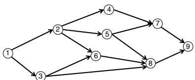  
(a)

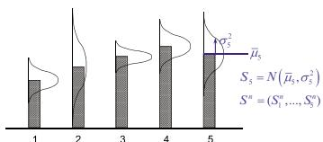  
(b)   
Figure 7.2 (a) Optimizing over a graph, where we are considering the transition from node (state) 2 to node (state) 5. (b) Optimizing a learning problem, where we are considering evaluating alternative 5, which would change our belief (state) $S _ { 5 } ^ { n } = ( \bar { \mu } _ { x } ^ { n } , \bar { \sigma } _ { 5 } ^ { 2 , n } )$ to belief (state) $S _ { 5 } ^ { n + 1 } = ( \bar { \mu } _ { x } ^ { n + 1 } , \sigma _ { 5 } ^ { 2 , n + 1 } )$ 5 , ??2,??+1).

$$
V ^ {n} \left(S ^ {n}\right) = \max  _ {s ^ {\prime} \in \mathcal {X} ^ {n}} \left(C \left(S ^ {n}, s ^ {\prime}\right) + V ^ {n + 1} \left(s ^ {\prime}\right)\right). \tag {7.25}
$$

Bellman’s equation, as given in equation (7.25), is fairly intuitive. In fact, this is the foundation of every shortest path algorithm that is used in modern navigation systems.

Now consider the learning problem in Figure 7.2(b). Our state is our belief about the true performance of each of the five alternatives. Recall that the precision $\beta _ { x } ^ { n } \ = \ 1 / \sigma _ { x } ^ { 2 , n }$ . We can express our state as $S ^ { n } ~ = ~ ( \bar { \mu } _ { x } ^ { n } , \beta _ { x } ^ { n } ) _ { x \in \mathcal { X } }$ . Now imagine we decide to experiment with the $5 ^ { \mathrm { t h } }$ alternative, which will give us an observation $W _ { 5 } ^ { n + 1 }$ . The effect of our observation $W _ { 5 } ^ { n + 1 }$ will take us to state

$$
\bar {\mu} _ {5} ^ {n + 1} = \frac {\beta_ {5} ^ {n} \bar {\mu} _ {5} ^ {n} + \beta^ {W} W _ {5} ^ {n + 1}}{\beta_ {5} ^ {n} + \beta^ {W}}, \tag {7.26}
$$

$$
\beta_ {5} ^ {n + 1} = \beta_ {5} ^ {n} + \beta^ {W}. \tag {7.27}
$$

The values for ${ \bar { \mu } } _ { x } ^ { n }$ and $\beta _ { x } ^ { n }$ for $x$ other than 5 are unchanged.

The only differences between our graph problem and our learning problem are:

(a) The decision to move from state (node) 2 to state 5 in the graph problem is a deterministic transition.   
(b) The states in our graph problem are discrete, while the state variables in the learning problem are continuous and vector valued.

In our learning problem, we make a decision $x ^ { n } = 5$ to test alternative 5, but the outcome $W _ { 5 } ^ { n + 1 }$ is random, so we do not know what state the experiment will take us to. However, we can fix this by inserting an expectation in Bellman’s equation, giving us

$$
V ^ {n} \left(S ^ {n}\right) = \max  _ {x \in \mathcal {X}} \left(C \left(S ^ {n}, x\right) + \mathbb {E} _ {S ^ {n}} \mathbb {E} _ {W \mid S ^ {n}} \left\{V ^ {n + 1} \left(S ^ {n + 1}\right) \mid S ^ {n}, x \right\}\right), \tag {7.28}
$$

where the first expectation $\mathbb { E } _ { S ^ { n } }$ handles the uncertainty in the true value $\mu _ { x }$ given the belief in $S ^ { n }$ , while the second expectation $\mathbb { E } _ { W \mid S ^ { n } }$ handles the noise in the observation $W _ { x } ^ { n + 1 } = \mu _ { x } + \varepsilon ^ { n + 1 }$ of our unknown truth $\mu _ { x }$ . Note that if we are using a frequentist belief model, we would just use $\mathbb { E } _ { W }$ .

Other than the expectation in equation (7.28), equations (7.25) and (7.28) are basically the same. The point is that we can use Bellman’s equation regardless of whether the state is a node in a network, or the belief about the performance of a set of alternatives. State variables are state variables, regardless of their interpretation.

If we could solve equation (7.28), we would have an optimal policy given by

$$
X ^ {*} (S ^ {n}) = \underset {x \in \mathcal {X}} {\arg \max } \left(C (S ^ {n}, x) + \mathbb {E} _ {S ^ {n}} \mathbb {E} _ {W | S ^ {n}} \{V ^ {n + 1} (S ^ {n + 1}) | S ^ {n}, x \}\right). \tag {7.29}
$$

Equation (7.28) is set up for problems which maximize undiscounted cumulative rewards. If we want to solve a final reward problem, we just have to ignore contributions until the final evaluation, which means we write Bellman’s equation as

$$
V ^ {n} \left(S ^ {n}\right) = \max  _ {x \in \mathcal {X}} \left\{ \begin{array}{c c} \left(0 + \mathbb {E} _ {S ^ {n}} \mathbb {E} _ {W | S ^ {n}} \left\{V ^ {n + 1} \left(S ^ {n + 1}\right) \mid S ^ {n}, x \right\}\right) & n <   N, \\ C \left(S ^ {N}, x\right) & n = N. \end{array} \right. \tag {7.30}
$$

We could also change our objective to a discounted, infinite horizon model by simply adding a discount factor $\gamma < 1$ , which changes equation (7.28) to

$$
V ^ {n} \left(S ^ {n}\right) = \max  _ {x \in \mathcal {X}} \left(C \left(S ^ {n}, x\right) + \gamma \mathbb {E} _ {W} \left\{V ^ {n + 1} \left(S ^ {n + 1}\right) \mid S ^ {n}, x \right\}\right). \tag {7.31}
$$

The problem with Bellman’s equation is that while it is not hard finding the value of being at each node in a graph (even if there are 100,000 nodes), handling a belief state is much harder. If we have a problem with just 20 alternatives, the state $S ^ { n } = ( \bar { \mu } _ { x } ^ { n } , \beta _ { x } ^ { n } ) _ { x \in \mathcal { X } }$ would have 40 continuous dimensions, which is an extremely difficult estimation problem given noisy measurements and reasonable computing budgets. There are real applications with thousands of alternatives (or more), as would occur when finding the best out of thousands of compounds to fight a disease, or the best news article to display on the website of a news organization.

# 7.6.2 Beta-Bernoulli Belief Model

There is an important class of learning problem that can be solved exactly. Imagine that we are trying to learn whether a new drug is successful. We are testing patients, where each test yields the outcome of success $( W ^ { n } = 1 )$ ) or failure $W ^ { n } = 0$ ). Our only decision is the set

$$
\mathcal {X} = \{\text {c o n t i n u e}, p a t e n t, c a n c e l \}.
$$

The decision to “patent” means to stop the trial and file for a patent on the drug as the step before going to market. The decision to “cancel” means to stop the trial and cancel the drug. We maintain a state variable $R ^ { n }$ where

$$
R ^ {n} = \left\{ \begin{array}{l l} 1 & \text {i f w e a r e s t i l l t e s t i n g ,} \\ 0 & \text {i f w e h a v e s t o p p e d t e s t i n g .} \end{array} \right.
$$

The evolution of $R ^ { n }$ is given by

$$
R ^ {n + 1} = \left\{ \begin{array}{l l} 1 & R ^ {n} = 1 \text {a n d} x ^ {n} = \text {" c o n t i n u e "} \\ 0 & \text {o t h e r w i s e .} \end{array} \right.
$$

As the experiments progress, we are going to keep track of successes $\alpha ^ { n }$ and failures $\beta ^ { n }$ using

$$
\alpha^ {n + 1} = \alpha^ {n} + W ^ {n + 1},
$$

$$
\beta^ {n + 1} = \beta^ {n} + (1 - W ^ {n + 1}).
$$

We can then estimate the probability of success of the drug using

$$
\rho^ {n} = \frac {\alpha^ {n}}{\alpha^ {n} + \beta^ {n}}.
$$

The state variable is

$$
S ^ {n} = \left(R ^ {n}, \alpha^ {n}, \beta^ {n}\right).
$$

We can create a belief about the true probability of success, $\rho$ , by assuming that it is given by a beta distribution with parameters $( \alpha ^ { n } , \beta ^ { n } )$ which is given by

$$
f (\rho | \alpha , \beta) = \frac {\Gamma (\alpha)}{\Gamma (\alpha) + \Gamma (\beta)} \rho^ {\alpha - 1} (1 - \rho) ^ {\beta - 1}
$$

where $\Gamma ( k ) = k ! .$ . The beta distribution is illustrated in Figure 7.3. Given we are in state $S ^ { n }$ , we then assume that $\rho ^ { n + 1 } \sim b e t a ( \alpha ^ { n } , \beta ^ { n } )$ .

This is a model that allows us to compute Bellman’s equation in (7.28) exactly (for finite horizon problems) since $R ^ { n }$ , $\alpha ^ { n }$ , and $\beta ^ { n }$ are all discrete. We have to specify the negative cost of continuing (that is, the cost of running the study), along with the contribution of stopping to patent, versus canceling the drug.

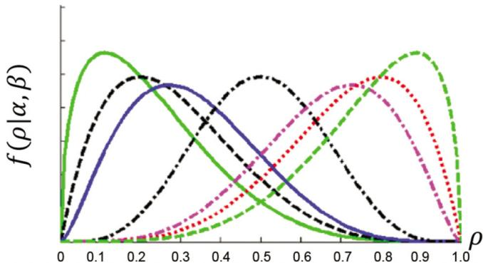  
Figure 7.3 A family of densities from a beta distribution.

# 7.6.3 Backward Approximate Dynamic Programming

Relatively little attention has been directed to learning problems from the communities that use the concepts of approximate dynamic programming. Readers will not see these ideas in this book until chapters 15, 16, and 17. To avoid duplication we are just going to sketch how we might use what is becoming known as backward approximate dynamic programming, which we introduce in greater depth in chapter 15.

Assume for the moment that we have a standard discrete learning model where we are trying to learn the true values $\mu _ { x }$ for each $x \in \mathcal { X } = \{ x _ { 1 } , \ldots , x _ { M } \}$ . Assume our beliefs are normally distributed, which means that after $n$ experiments,

$$
\mu_ {x} \sim N (\bar {\mu} _ {x} ^ {n}, \bar {\sigma} _ {x} ^ {2, n}).
$$

Our belief state, then, would be

$$
S ^ {n} = (\bar {\mu} _ {x} ^ {n}, \bar {\sigma} _ {x} ^ {n}) _ {x \in \mathcal {X}}.
$$

What we are going to do is to replace our value function $V ^ { n } ( S ^ { n } )$ with a linear model of the form

$$
V ^ {n} \left(S ^ {n} \mid \theta^ {n}\right) \approx \overline {{V}} ^ {n} \left(S ^ {n}\right) = \sum_ {f \in \mathcal {F}} \theta_ {f} ^ {n} \phi_ {f} \left(S ^ {n}\right). \tag {7.32}
$$

Note that we are making a point of modeling our problem as a finite horizon problem, which means that our value function approximation $\overline { { V } } ^ { n } ( S ^ { n } )$ depends on the index ??, which is why we had to index the vector $\theta ^ { n } = ( \theta _ { f } ^ { n } ) _ { f \in \mathcal { F } }$ .

The features $( \phi _ { f } ) _ { f \in \mathcal { F } }$ (which do not depend on $n$ ) are features that we have designed from our state variable $S ^ { n }$ . For example, imagine for our features that we sort the alternatives based on the basis of the index $\nu _ { x } ^ { n }$ given by

$$
\mathcal {V} _ {x} ^ {n} = \bar {\mu} _ {x} ^ {n} + 2 \bar {\sigma} _ {x} ^ {n}.
$$

Now assume the alternatives are sorted so that $\nu _ { x _ { 1 } } ^ { n } \geq \nu _ { x _ { 2 } } ^ { n } \geq \ldots \geq \nu _ { x _ { F } } ^ { n }$ , where $F$ might be the top 20 alternatives (this sorting is very important – the sorting has to be done at every iteration). Next create features such as

$$
\phi_ {x, 1} = \bar {\mu} _ {x} ^ {n},
$$

$$
\phi_ {x, 2} = (\bar {\mu} _ {x} ^ {n}) ^ {2},
$$

$$
\begin{array}{r l r} \phi_ {x, 3} & = & \bar {\sigma} _ {x} ^ {n}, \end{array}
$$

$$
\phi_ {x, 4} = \bar {\mu} _ {x} ^ {n} \bar {\sigma} _ {x} ^ {n},
$$

$$
\phi_ {x, 5} = \bar {\mu} _ {x} ^ {n} + 2 \bar {\sigma} _ {x} ^ {n}.
$$

Now we have five features per alternative, times 20 alternatives which gives us a model with 100 features (and 101 parameters, when we include a constant term).

Backward approximate dynamic programming works roughly as follows:

Step 0 Set $\theta ^ { N + 1 } = 0$ , giving us $\overline { { V } } ^ { N + 1 } ( S ^ { N + 1 } ) = 0$ . Set $n = N$

Step 1 Sample $K$ states from the set of possible values of the state ??. For each sampled state $\hat { s } _ { k } ^ { n }$ , compute an estimated value $\hat { v } _ { k } ^ { n }$ from

$$
\hat {v} _ {k} ^ {n} = \max  _ {x} \left(C \left(\hat {s} _ {k} ^ {n}, x\right) + \mathbb {E} \left\{\overline {{V}} ^ {n + 1} \left(S ^ {n + 1} \mid \theta^ {n + 1}\right) \mid \hat {s} _ {k} ^ {n}, x \right\}\right), \tag {7.33}
$$

where $S ^ { n + 1 }$ is computed by sampling what we might observe $W _ { x } ^ { n + 1 }$ from choosing to test alternative $x$ , and where $\overline { { V } } ^ { n + 1 } ( S ^ { n + 1 } | \theta ^ { n + 1 } )$ is given by our approximation in equation (7.32). The expectation has to average over these outcomes.

Step 2 Take the set of values $( \hat { s } _ { k } ^ { n } , \hat { v } _ { k } ^ { n } ) _ { k = 1 } ^ { K }$ and fit a new linear model $\overline { { V } } ^ { n } ( s | \theta ^ { n } )$ using batch linear regression (see section 3.7.1).

Step 3 Set $n \gets n - 1$ . If $n \geq 0$ , return to Step 1.

This approach is relatively immune to the dimensionality of the state variable or exogenous information variable. In fact, we can even use these ideas if the belief is expressed using a parametric model, although we would have to design a new set of features. Finally, the logic does not even require that the alternatives $x$ be discrete, since we can think of solving equation (7.33) as a nonlinear programming problem. However, this idea has seen only minimal experimentation.

We suspect that a VFA-based policy is best suited for problems with small learning budgets. Note that the resulting policy is nonstationary (it depends on ??), in contrast with the CFA-based policies that are so popular in some communities for their simplicity.

We emphasize the idea of using value function approximations for learning models is quite young, and at this stage we offer no guarantees on the performance of this particular approximation strategy. We present this logic to illustrate the idea that we may be able to solve the so-called “curse of dimensionality” of dynamic programming using statistical models.

# 7.6.4 Gittins Indices for Learning in Steady State*

We are going to finally turn to what was viewed as a breakthrough result in the 1970s. “Bandit problems” were initially proposed in the 1950s, with some theoretical interest in the 1970s. The idea of characterizing an optimal policy

using Bellman’s equation (as in equation (7.28)) first emerged during this time. The idea of using the belief as a state variable was a central insight. However, solving Bellman’s equation looked completely intractable.

# Basic Idea

In 1974, John Gittins introduced the idea of decomposing bandit problems using what is known as “Lagrangian relaxation.” In a nutshell, the bandit problem requires that we observe one, and only one, alternative at a time. If we write our decision as $x _ { i } ^ { n } = 1$ if we choose to test alternative ??, then we would introduce a constraint

$$
\sum_ {i = 1} ^ {M} x _ {i} ^ {n} = 1. \tag {7.34}
$$

Now imagine solving our optimization problem where we relax the constraint (7.34). Once we do this, the problem decomposes into $M$ dynamic programs (one for each arm). However, we put a price, call it $\nu ^ { n }$ , on the constraint (7.34), which means we would write our optimization problem as

$$
\left. \right. \min  _ {(\nu^ {n}) _ {n = 1} ^ {N}} \max  _ {(\pi^ {n}) _ {n = 1} ^ {N}} \mathbb {E} \left\{\sum_ {n = 0} ^ {N} \left(W _ {x ^ {n}} ^ {n + 1} + \nu^ {n} \left(\sum_ {i = 1} ^ {M} x _ {i} ^ {n} - 1\right)\right) | S ^ {0} \right\}, \tag {7.35}
$$

where $x ^ { n } = X ^ { \pi ^ { n } } ( S ^ { n } )$ is the policy at iteration ??.

This problem looks complicated, because we have to find a policy $X ^ { \pi ^ { n } } ( S ^ { n } )$ for each iteration $n$ , and we also have to optimize the penalty (also known as a dual variable or shadow price) $\nu ^ { n }$ for each ??. But what if we solve the steady state version of the problem, given by

$$
\min  _ {\nu} \max  _ {\pi} \mathbb {E} \left\{\sum_ {n = 0} ^ {\infty} \gamma^ {n} \left(W _ {x ^ {n}} ^ {n + 1} + \nu \left(\sum_ {i = 1} ^ {M} x _ {i} ^ {n} - 1\right)\right) | S ^ {0} \right\} \tag {7.36}
$$

where $x ^ { n } = X ^ { \pi } ( S ^ { n } )$ is our now stationary policy, and there is a single penalty $\nu$ . For the infinite horizon problem we have to introduce a discount factor ?? (we could do this for the finite horizon version, but this is generally not necessary).

Now the problem decomposes by alternative. For these problems, we now choose between continuing to test, or stopping. When we continue testing alternative $x$ , we not only receive $W _ { x } ^ { n + 1 }$ , we also pay a “penalty” ??. A more natural way to formulate the problem is to assume that if you continue to play, you receive the reward $W _ { x } ^ { n + 1 }$ , whereas if you stop you receive a reward $r = - \nu$ .

We now have the following dynamic program for each arm where the decision is only whether to “Stop” or “Continue,” which gives us

$$
V _ {x} (S | r) = \max  \underbrace {\{r + \gamma V _ {x} (S | r)} _ {\text {S t o p}}, \underbrace {\mathbb {E} _ {W} \left\{W _ {x} + \gamma V _ {x} \left(S ^ {\prime} | r\right) \mid S ^ {n} \right\}} _ {\text {C o n t i n u e}}, \tag {7.37}
$$

where $S ^ { \prime }$ is the updated state given the random observation ?? whose distribution is given by the belief in $S ^ { n }$ . For example, if we have binomial $\left( 0 / 1 \right)$ outcomes, $S ^ { n }$ would be the probability $\rho ^ { n }$ that $W = 1$ (as we did in section 7.6.2). For normally distributed rewards, we would have $\mathbb { E } _ { W | S ^ { n } } = \bar { \mu } ^ { n }$ . If we stop, we do not learn anything so the state $S$ stays the same.

It can be shown that if we choose to stop sampling in iteration ?? and accept the fixed payment $\rho$ , then that is the optimal strategy for all future rounds. This means that starting at iteration $n$ , our optimal future payoff (once we have decided to accept the fixed payment) is

$$
\begin{array}{l} V (S | r) = r + \gamma r + \gamma^ {2} r + \dots \\ = \frac {r}{1 - \gamma}, \\ \end{array}
$$

which means that we can write our optimality recursion in the form

$$
V \left(S ^ {n} | r\right) = \max  \left[ \frac {r}{1 - \gamma}, \bar {\mu} ^ {n} + \gamma \mathbb {E} \left\{V \left(S ^ {n + 1} | r\right) \mid S ^ {n} \right\} \right]. \tag {7.38}
$$

Now for the magic of Gittins indices. Let Γ be the value of ?? which makes the two terms in the brackets in (7.38) equal (the choice of Γ is in honor of Gittins). That is,

$$
\frac {\Gamma}{1 - \gamma} = \mu + \gamma \mathbb {E} \left\{V (S | \Gamma) | S \right\}. \tag {7.39}
$$

The hard part of Gittins indices is that we have to iteratively solve Bellman’s equation for different values of Γ until we find one where equation (7.39) is true. The reader should conclude from this that Gittins indices are computable (this is the breakthrough), but computing them is not easy.

We assume that ?? is random with a known variance $\sigma _ { W } ^ { 2 }$ . Let $\Gamma ^ { G i t t } ( \mu , \sigma , \sigma _ { w } , \gamma )$ be the solution of (7.39). The optimal solution depends on the current estimate of the mean, $\mu$ , its variance $\sigma ^ { 2 }$ , the variance of our measurements $\sigma _ { W } ^ { 2 }$ , and the discount factor ??. For notational simplicity, we are assuming that the experimental noise $\sigma _ { W } ^ { 2 }$ is independent of the action $x$ , but this assumption is easily relaxed.

Next assume that we have a set of alternatives $\mathcal { X }$ , and let $\Gamma _ { x } ^ { G i t t , n } ( \bar { \mu } _ { x } ^ { n } , \bar { \sigma } _ { x } ^ { n } , \sigma _ { W } , \gamma )$ be the value of $\Gamma$ that we compute for each alternative $x \in \mathcal X$ given state $S ^ { n } =$ $( \bar { \mu } _ { x } ^ { n } , \bar { \sigma } _ { x } ^ { n } ) _ { x \in \mathcal { X } }$ . An optimal policy for selecting the alternative $x$ is to choose the

one with the highest value for $\Gamma _ { x } ^ { G i t t , n } ( \bar { \mu } _ { x } ^ { n } , \bar { \sigma } _ { x } ^ { n } , \sigma _ { W } , \gamma )$ . That is, we would make our choice using

$$
\max  _ {x} \Gamma_ {x} ^ {G i t t, n} (\bar {\mu} _ {x} ^ {n}, \bar {\sigma} _ {x} ^ {n}, \sigma_ {W}, \gamma).
$$

Such policies are known as index policies, which refer to the property that the parameter $\Gamma _ { x } ^ { G i t t , n } ( \bar { \mu } _ { x } ^ { n } , \bar { \sigma } _ { x } ^ { n } , \sigma _ { W } , \gamma )$ for alternative $x$ depends only on the characteristics of alternative $x$ . For this problem, the parameters $\Gamma _ { x } ^ { G i t t , n } ( \bar { \mu } _ { x } ^ { n } , \bar { \sigma } _ { x } ^ { n } , \sigma _ { W } , \gamma )$ Γ????????,???? (??̄ ???? , ??̄ ???? , ???? , ??) are called Gittins indices. While Gittins indices have attracted little attention outside the probability community (given the computational complexity), the concept of index policies captured the attention of the research community in 1984 in the first paper that introduced upper confidence bounding (in our CFA class). So, the real contribution of Gittins index policies is the simple idea of an index policy.

We next provide some specialized results when our belief is normally distributed.

# Gittins Indices for Normally Distributed Rewards

Students learn in their first statistics course that normally distributed random variables enjoy a nice property. If $Z$ is normally distributed with mean 0 and variance 1 and if

$$
X = \mu + \sigma Z
$$

then $X$ is normally distributed with mean $\mu$ and variance $\sigma ^ { 2 }$ . This property simplifies what are otherwise difficult calculations about probabilities of events.

The same property applies to Gittins indices. Although the proof requires some development, it is possible to show that

$$
\Gamma^ {G i t t, n} (\bar {\mu} ^ {n}, \bar {\sigma} ^ {n}, \sigma_ {W}, \gamma) = \mu + \Gamma (\frac {\bar {\sigma} ^ {n}}{\sigma_ {W}}, \gamma) \sigma_ {W},
$$

where

$$
\Gamma (\frac {\bar {\sigma} ^ {n}}{\sigma_ {W}}, \gamma) = \Gamma^ {G i t t, n} (0, \sigma , 1, \gamma)
$$

is a “standard normal Gittins index” for problems with mean 0 and variance 1. Note that $\bar { \sigma } ^ { n } / \sigma _ { W }$ decreases with $n$ , and that $\Gamma ( \frac { \bar { \sigma } ^ { n } } { \sigma _ { W } } , \gamma )$ decreases toward zero as ???? $\bar { \sigma } ^ { n } / \sigma _ { W }$ decreases. As $n  \infty$ , $\Gamma ^ { G i t t , n } ( \bar { \mu } ^ { n } , \bar { \sigma } ^ { n } , \sigma _ { W } , \gamma )  \bar { \mu } ^ { n }$ .

Unfortunately, as of this writing, there do not exist easy-to-use software utilities for computing standard Gittins indices. Table 7.2 is exactly such a table for Gittins indices. The table gives indices for both the variance-known and

Table 7.2 Gittins indices $\Gamma ( \frac { \sigma ^ { n } } { \sigma _ { W } } , \gamma )$ ???? for the case of observations that are normally distributed with mean 0, variance 1, and where $\begin{array} { r } { \frac { \sigma ^ { n } } { \sigma _ { W } } = \frac { 1 } { n } } \end{array}$ Adapted from Gittins (1989), ‘Multiarmed Bandit Allocation Indices’, Wiley and Sons: New York.   

<table><tr><td rowspan="3">Observations</td><td colspan="4">Discount factor</td></tr><tr><td colspan="2">Known variance</td><td colspan="2">Unknown variance</td></tr><tr><td>0.95</td><td>0.99</td><td>0.95</td><td>0.99</td></tr><tr><td>1</td><td>0.9956</td><td>1.5758</td><td>-</td><td>-</td></tr><tr><td>2</td><td>0.6343</td><td>1.0415</td><td>10.1410</td><td>39.3343</td></tr><tr><td>3</td><td>0.4781</td><td>0.8061</td><td>1.1656</td><td>3.1020</td></tr><tr><td>4</td><td>0.3878</td><td>0.6677</td><td>0.6193</td><td>1.3428</td></tr><tr><td>5</td><td>0.3281</td><td>0.5747</td><td>0.4478</td><td>0.9052</td></tr><tr><td>6</td><td>0.2853</td><td>0.5072</td><td>0.3590</td><td>0.7054</td></tr><tr><td>7</td><td>0.2528</td><td>0.4554</td><td>0.3035</td><td>0.5901</td></tr><tr><td>8</td><td>0.2274</td><td>0.4144</td><td>0.2645</td><td>0.5123</td></tr><tr><td>9</td><td>0.2069</td><td>0.3808</td><td>0.2353</td><td>0.4556</td></tr><tr><td>10</td><td>0.1899</td><td>0.3528</td><td>0.2123</td><td>0.4119</td></tr><tr><td>20</td><td>0.1058</td><td>0.2094</td><td>0.1109</td><td>0.2230</td></tr><tr><td>30</td><td>0.0739</td><td>0.1520</td><td>0.0761</td><td>0.1579</td></tr><tr><td>40</td><td>0.0570</td><td>0.1202</td><td>0.0582</td><td>0.1235</td></tr><tr><td>50</td><td>0.0464</td><td>0.0998</td><td>0.0472</td><td>0.1019</td></tr><tr><td>60</td><td>0.0392</td><td>0.0855</td><td>0.0397</td><td>0.0870</td></tr><tr><td>70</td><td>0.0339</td><td>0.0749</td><td>0.0343</td><td>0.0760</td></tr><tr><td>80</td><td>0.0299</td><td>0.0667</td><td>0.0302</td><td>0.0675</td></tr><tr><td>90</td><td>0.0267</td><td>0.0602</td><td>0.0269</td><td>0.0608</td></tr><tr><td>100</td><td>0.0242</td><td>0.0549</td><td>0.0244</td><td>0.0554</td></tr></table>

variance-unknown cases, but only for the case where $\begin{array} { r } { \frac { \sigma ^ { n } } { \sigma _ { W } } = \frac { 1 } { n } } \end{array}$ 1 . In the variance-???? known case, we assume that $\sigma ^ { 2 }$ is given, which allows us to calculate the variance of the estimate for a particular slot machine just by dividing by the number of observations.

Lacking standard software libraries for computing Gittins indices, researchers have developed simple approximations. As of this writing, the most recent of these works as follows. First, it is possible to show that

$$
\Gamma (s, \gamma) = \sqrt {- \log \gamma} \cdot b \left(- \frac {s ^ {2}}{\log \gamma}\right). \tag {7.40}
$$

A good approximation of $b ( s )$ , which we denote by $\tilde { b } ( s )$ , is given by

$$
\tilde {b} (s) = \left\{ \begin{array}{l l} \frac {s}{\sqrt {2}} & s \leq \frac {1}{7}, \\ e ^ {- 0. 0 2 6 4 5 (\log s) ^ {2} + 0. 8 9 1 0 6 \log s - 0. 4 8 7 3} & \frac {1}{7} <   s \leq 1 0 0, \\ \sqrt {s} \left(2 \log s - \log \log s - \log 1 6 \pi\right) ^ {\frac {1}{2}} & s > 1 0 0. \end{array} \right.
$$

Thus, the approximate version of (7.40) is

$$
\Gamma^ {G i t t, n} (\mu , \sigma , \sigma_ {W}, \gamma) \approx \bar {\mu} ^ {n} + \sigma_ {W} \sqrt {- \log \gamma} \cdot \tilde {b} \left(- \frac {\bar {\sigma} ^ {2 , n}}{\sigma_ {W} ^ {2} \log \gamma}\right). \tag {7.41}
$$

# Comments

While Gittins indices were considered a major breakthrough, it has largely remained an area of theoretical interest in the applied probability community. Some issues that need to be kept in mind when using Gittins indices are:

● While Gittins indices were viewed as a computational breakthrough, they are not, themselves, easy to compute.   
● Gittins index theory only works for infinite horizon, discounted, cumulative reward problems. Gittins indices are not optimal for finite horizon problems which is what we always encounter in practice, but Gittins indices may still be a useful approximation.   
● Gittins theory is limited to lookup table belief models (that is, discrete arms/alternatives) with independent beliefs. This is a major restriction in real applications.

We note that Gittins indices are not widely used in practice, but it was the development of Gittins indices that established the idea of using index policies, which laid the foundation for all the work on upper confidence bounding, first developed in 1984, but which has seen explosive growth post 2000, largely driven by search algorithms on the internet.

# 7.7 Direct Lookahead Policies

There are certain classes of learning problems that require that we actually plan into the future, just as a navigation package will plan a path to the destination. The difference is that while navigation systems can get away with solving a deterministic approximation, recognizing and modeling uncertainty is central to learning problems.

We are going to begin in section 7.7.1 with a discussion of the types of learning problems where a lookahead policy is likely to add value. Then, we are going

to describe a series of lookahead strategies that progress in stages before going to a full stochastic lookahead. These will be presented as follows:

● Section 7.7.2 discusses the powerful idea of using one-step lookaheads, which is very useful for certain problem classes where experiments are expensive.   
● When one-step lookaheads do not work, a useful strategy is to do a restricted, multistep lookahead, which we describe in section 7.7.3.   
● Section 7.7.4 proposes a full multiperiod, deterministic lookahead.   
● Section 7.7.5 illustrates a full, multiperiod stochastic lookaheads, although a proper discussion is given in chapter 19.   
● Section 7.7.6 describes a class of hybrid policies.

# 7.7.1 When do we Need Lookahead Policies?

Lookahead policies are very important when we are managing a physical resource. That is why navigation systems have to plan a path to the destination in order to figure out what to do now. By contrast, the most popular policies for pure learning problems are in the CFA class such as upper confidence bounding, Thompson sampling, and interval estimation.

However, there are pure learning problems where different classes of lookahead policies are particularly useful. As we progress through our direct lookahead policies, the following problem characteristics will prove to be important:

● Complex belief models – Imagine testing the market response to charging a price $p = \$ 100$ for a book, and we find that sales are higher than expected. Then we would expect that prices $p \ = \ \$ 95$ and $p \ = \ \$ 105$ would also be higher than expected. This reflects correlated beliefs. Direct lookahead models can capture these interactions, while pure index policies such as upper confidence bounding and Thompson sampling cannot (although they pick up these effects indirectly through the tuning process).   
● Expensive experiments/small budgets – There are many settings where experiments are expensive, which means that we will have budgets (typically for both time and money) that limit how many we can do. With a limited budget, we will be more interested in exploring in the early experiments than toward the end. This is particularly pronounced with cumulative rewards, but it is also true with final rewards.   
● Noisy experiments/S-curve value of information – There are problems that enjoy the intuitive behavior where the value of repeating the same experiment multiple times provides increasing value, but with decreasing marginal returns, as illustrated in Figure 7.4(a). When the noise from running an experiment is high enough, the marginal value of running an experiment can actually grow, as illustrated in Figure 7.4(b).

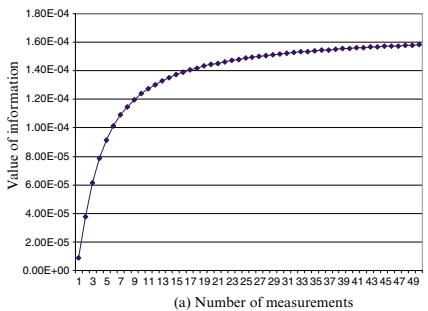

  
Figure 7.4 Value of making ?? observations. In (a), the value of information is concave, while in (b) the value of information follows an S-curve.

The $S$ -curve behavior in Figure 7.4(b) arises when experiments are noisy, which means that a single experiment contributes little information. This behavior is actually quite common, especially when the outcome of an experiment is a success or failure (perhaps indicated by 1 or 0).

When we have an S-curve value of information, this means we have to think about how many times we can evaluate an alternative ??. It may take 10 repetitions before we are learning anything. If we have 100 alternatives and a budget of 50, we are simply not going to be able to evaluate each alternative 10 times, which means we are going to have to completely ignore a number of alternatives. However, making this decision requires planning into the future given the experimental budget.

● Large number of alternatives relative to the budget – There are problems where the number of alternatives to test is much larger than our budget. This means that we are simply not going to be able to do a good job evaluating alternatives. We would need to plan into the future to know if it is worth trying even one experiment. This is most pronounced when the value of information follows an S-curve, but arises even when the value of information is concave.

# 7.7.2 Single Period Lookahead Policies

A single period lookahead would never work well if we had to deal with a physical state (imagine solving a shortest path problem over a graph with a single period lookahead). However, they often work exceptionally well in the setting of learning problems. Some approaches for performing single-period lookaheads are given below:

Knowledge gradient for final reward – The most common form of singleperiod lookahead policy are value-of-information policies, which maximize the value of information from a single experiment. Let $S ^ { n } = ( \bar { \mu } _ { x } ^ { n } , \beta _ { x } ^ { n } ) _ { x \in \mathcal { X } }$ be our belief state now where ${ \bar { \mu } } _ { x } ^ { n }$ is our estimate of the performance of design $x$ , and $\beta _ { x } ^ { n }$ is the precision (one over the variance).

Imagine that we are trying to find the design $x$ that maximizes $\mu _ { x }$ , where $\mu _ { x }$ is unknown. Let ${ \bar { \mu } } _ { x } ^ { n }$ be our best estimate of $\mu$ given our state of knowledge (captured by $S ^ { n } = B ^ { n }$ ). If we stopped now, we would choose our design $x ^ { n }$ by solving

$$
x^{n} = \operatorname *{arg  max}_{x^{\prime}}\bar{\mu}_{x^{\prime}}^{n}.
$$

Now imagine running experiment $x \ = \ x ^ { n }$ , where we will make a noisy observation

$$
W _ {x ^ {n}} ^ {n + 1} = \mu_ {x ^ {n}} + \varepsilon^ {n + 1},
$$

where $\varepsilon ^ { n + 1 } \sim N ( 0 , \sigma _ { _ W } ^ { 2 } )$ . This will produce an updated estimate $\bar { \mu } _ { x ^ { \prime } } ^ { n + 1 } ( x ^ { n } )$ for $x ^ { \prime } = x ^ { n }$ which we compute using

$$
\bar {\mu} _ {x ^ {n}} ^ {n + 1} = \frac {\beta_ {x ^ {n}} ^ {n} \bar {\mu} _ {x ^ {n}} ^ {n} + \beta^ {W} W _ {x ^ {n}} ^ {n + 1}}{\beta_ {x ^ {n}} ^ {n} + \beta^ {W}}, \tag {7.42}
$$

$$
\beta_ {x ^ {n}} ^ {n + 1} = \beta_ {x ^ {n}} ^ {n} + \beta^ {W}. \tag {7.43}
$$

For $x ^ { \prime } \neq x ^ { n }$ , $\bar { \mu } _ { x ^ { \prime } } ^ { n + 1 }$ and $\beta _ { x ^ { \prime } } ^ { n + 1 }$ are unchanged. This gives us an updated state $S ^ { n + 1 } ( x ) = ( \bar { \mu } _ { x ^ { \prime } } ^ { n + 1 } , \beta _ { x ^ { \prime } } ^ { n + 1 } ) _ { x ^ { \prime } \in \mathcal { X } }$ which is random because we have not yet observed $W _ { x } ^ { n + 1 }$ (we are still trying to decide if we should run experiment $x$ ). The value of our solution after this experiment (given what we know at time ??) is given by

$$
\mathbb{E}_{S^{n}}\mathbb{E}_{W|S^{n}}\{\max_{x^{\prime}}\bar{\mu}^{n + 1}(x))|S^{n}\} .
$$

We can expect that our experiment using parameters (or design) $x$ would improve our solution, so we can evaluate this improvement using

$$
v ^ {K G} (x) = \mathbb {E} _ {S ^ {n}} \mathbb {E} _ {W | S ^ {n}} \left\{\max  _ {x ^ {\prime}} \bar {\mu} ^ {n + 1} (x)) \mid S ^ {n} \right\} - \max  _ {x ^ {\prime}} \bar {\mu} _ {x ^ {\prime}} ^ {n}. \tag {7.44}
$$

The quantity $\nu ^ { K G } ( x )$ is known as the knowledge gradient, and it gives the expected value of the information from experiment $x$ . This calculation is made by looking one experiment into the future. We cover knowledge gradient policies in considerably greater depth in section 7.8.

Expected improvement – Known as EI in the literature, expected improvement is a close relative of the knowledge gradient, given by the formula

$$
\nu_ {x} ^ {E I, n} = \mathbb {E} \left[ \max  \left\{0, \mu_ {x} - \max  _ {x ^ {\prime}} \bar {\mu} _ {x ^ {\prime}} ^ {n} \right\} \mid S ^ {n}, x = x ^ {n} \right]. \tag {7.45}
$$

Unlike the knowledge gradient, EI does not explicitly capture the value of an experiment, which requires evaluating the ability of an experiment to change the final design decision. Rather, it measures the degree to which an alternative $x$ might be better. It does this by capturing the degree to which the random truth $\mu _ { x }$ might be greater than the current best estimate $\mathrm { m a x } _ { x ^ { \prime } } \bar { \mu } _ { x ^ { \prime } } ^ { n }$ .

Sequential kriging – This is a methodology developed in the geosciences to guide the investigation of geological conditions, which are inherently continuous and two- or three-dimensional. Kriging evolved in the setting of geo-spatial problems where $x$ is continuous (representing a spatial location, or even a location underground in three dimensions). For this reason, we let the truth be the function $\mu ( x )$ , rather than $\mu _ { x }$ (the notation we used when $x$ was discrete).

Kriging uses a form of meta-modeling where the surface is assumed to be represented by a linear model, a bias model and a noise term which can be written as

$$
\mu (x) = \sum_ {f \in \mathcal {F}} \theta_ {f} \phi_ {f} (x) + Z (x) + \varepsilon ,
$$

where $Z ( x )$ is the bias function and $( \phi _ { f } ( x ) ) _ { f \in \mathcal { F } }$ are a set of features extracted from data associated with $x$ . Given the (assumed) continuity of the surface, it is natural to assume that $Z ( x )$ and $Z ( x ^ { \prime } )$ are correlated with covariance

$$
C o v (Z (x), Z (x ^ {\prime})) = \beta \exp \left[ - \sum_ {i = 1} ^ {d} \alpha_ {i} (x _ {i} - x _ {i} ^ {\prime}) ^ {2} \right],
$$

where $\beta$ is the variance of $Z ( x )$ while the parameters $\alpha _ { i }$ perform scaling for each dimension.

The best linear model, which we denote ${ \bar { Y } } ^ { n } ( x )$ , of our surface $\mu ( x )$ , is given by

$$
\begin{array}{l} {\vec {Y} ^ {n} (x)} {= \sum_ {f \in \mathcal {F}} \theta_ {f} ^ {n} \phi_ {f} (x) +} \\ \sum_ {i = 1} ^ {n} C o v (Z (x _ {i}), Z (x)) \sum_ {j = 1} ^ {n} C o v (Z (x _ {j}), Z (x)) (\hat {y} _ {i} - \sum_ {f \in \mathcal {F}} \theta_ {f} ^ {n} \phi_ {f} (x)), \\ \end{array}
$$

where $\theta ^ { n }$ is the least squares estimator of the regression parameters, given the ?? observations $\hat { y } ^ { 1 } , \ldots , \hat { y } ^ { n }$ .

Kriging starts with the expected improvement in equation (7.45), with a heuristic modification to handle the uncertainty in an experiment (ignored in (7.45)). This gives an adjusted EI of

$$
\mathbb {E} ^ {n} I (x) = \mathbb {E} ^ {n} \left[ \max  \left(\bar {Y} ^ {n} \left(x ^ {* *}\right) - \mu (x), 0\right) \right] \left(1 - \frac {\sigma_ {\varepsilon}}{\sqrt {\sigma^ {2 , n} (x) + \sigma_ {\varepsilon} ^ {2}}}\right), \tag {7.46}
$$

where $x ^ { * * }$ is a point chosen to maximize a utility that might be given by

$$
u ^ {n} (x) = - (\bar {Y} ^ {n} (x) + \sigma^ {n} (x)).
$$

Since $x$ is continuous, maximizing $u ^ { n } ( x )$ over $x$ can be hard, so we typically limit our search to previously observed points

$$
x^{**} = \arg \max_{x\in \{x^{1},\ldots ,x^{n}\}}u^{n}(x).
$$

The expectation in (7.46) can be calculated analytically using

$$
\begin{array}{l} \mathbb {E} ^ {n} \left[ \max  \left(\bar {Y} ^ {n} \left(x ^ {* *}\right) - \mu (x), 0\right) \right] = (\bar {Y} ^ {n} \left(x ^ {* *}\right) - \bar {Y} ^ {n} (x)) \Phi \left(\frac {\bar {Y} ^ {n} \left(x ^ {* *}\right) - \bar {Y} ^ {n} (x)}{\sigma^ {n} (x)}\right) \\ + \sigma^ {n} (x) \phi \left(\frac {\bar {Y} ^ {n} (x ^ {* *}) - \bar {Y} ^ {n} (x)}{\sigma^ {n} (x)}\right), \\ \end{array}
$$

where $\phi ( z )$ is the standard normal density, and $\Phi ( z )$ is the cumulative density function for the normal distribution.

Value of information policies are well-suited to problems where information is expensive, since they focus on running the experiments with the highest value of information. These policies are particularly effective when the value of information is concave, which means that the marginal value of each additional experiment is lower than the previous one. This property is not always true, especially when experiments are noisy, as we discussed above.

A lookahead policy such as the knowledge gradient is able to take advantage of more complex belief models than simple lookup table beliefs. As we show below, beliefs may be correlated, or may even be parametric models. This is because the knowledge gradient for, say, alternative $x$ has to consider the beliefs for all $x ^ { \prime } \in \mathcal { X }$ . This is in contrast with the other index policies (such as upper confidence bounding) where the value associated with alternative $x$ has nothing to do with the beliefs for the other alternatives.

# 7.7.3 Restricted Multiperiod Lookahead

The knowledge gradient, which only looks one step ahead, has been found to be particularly effective when the value of information is concave, as we previously depicted in Figure 7.4(a). However, when the value of information follows an S-curve, as in Figure 7.4(b), the value of doing a single experiment can be

almost zero, and provides no guidance toward identifying the best experiments to run.

A common problem with one-step lookahead policies such as the knowledge gradient arises when experiments are very noisy, which means the value of information from a single experiment is quite low. This problem almost always arises when outcomes are $0 / 1$ , such as happens when you advertise a product and wait to see if a customer clicks on the ad. Needless to say, no-one would ever make a choice about which alternative is best based on $0 / 1$ outcomes; we would perform multiple experiments and take an average. This is what we call a restricted lookahead, since we restrict our evaluation of the future to using one alternative at a time.

We can formalize this notion of performing repeated experiments. Imagine that instead of doing a single experiment, that we can repeat our evaluation of alternative $x n _ { x }$ times. If we are using a lookup table belief model, this means the updated precision is

$$
\beta_ {x} ^ {n + 1} \left(n _ {x}\right) = \beta_ {x} ^ {n} + n _ {x} \beta^ {W},
$$

where as before, $\beta ^ { W }$ is the precision of a single experiment. Then, we compute the knowledge gradient as given in equation (7.44) (the details are given in section 7.8), but using a precision of $n _ { x } \beta ^ { W }$ rather than just $\beta ^ { W }$ .

This leaves the question of deciding how to choose $n _ { x }$ . One way is to use the $\operatorname { K G } ( ^ { * } )$ algorithm, where we find the value of $n _ { x }$ that produces the highest average value of information. We first compute $n _ { x } ^ { * }$ from

$$
n _ {x} ^ {*} = \arg \max  _ {n _ {x} > 0} \frac {\nu_ {x} \left(n _ {x}\right)}{n _ {x}}. \tag {7.47}
$$

This is illustrated in Figure 7.5. We do this for each $x$ , and then run the experiment with the highest value of $\frac { v _ { x } ( n _ { x } ) } { n _ { x } }$ . Note that we are not requiring that each experiment be repeated $n _ { x } ^ { * }$ times; we only use this to produce a new index (the maximum average value of information), which we use to identify the next single experiment. This is why we call this strategy a restricted lookahead policy; we are looking ahead $n _ { x }$ steps, but only considering doing the same experiment $x$ multiple times.

A more general policy uses the concept of posterior reshaping. The idea is quite simple. Introduce a repetition parameter $\theta ^ { K G L A }$ where we let the precision of an experiment be given by

$$
\beta_ {x} ^ {n + 1} (\theta^ {K G L A}) = \beta_ {x} ^ {n} + \theta^ {K G L A} \beta^ {W}.
$$

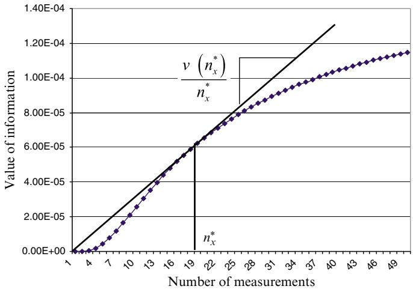  
Figure 7.5 The $\mathsf { K G } ( ^ { * } )$ policy, which maximizes the average value of a series of experiments testing a single alternative.

Now let $\nu _ { x } ^ { K G , n } ( \theta ^ { K G L A } )$ be the knowledge gradient when we use repetition factor $\theta ^ { K G L A }$ . Our knowledge gradient policy would be still given by

$$
X ^ {K G} (S ^ {n} | \theta^ {K G L A}) = \arg \max  _ {x} \nu_ {x} ^ {K G, n} (\theta^ {K G L A}).
$$

We now have a tunable parameter, but this is the price of managing this complexity. The value of using a tunable parameter is that the tuning process implicitly captures the effect of the experimental budget $N$ .

# 7.7.4 Multiperiod Deterministic Lookahead

Assume we have a setting where experiments are noisy, which means we are likely to face an S-shaped value-of-information curve as depicted in Figure 7.4(b). Instead of using $\theta ^ { K G L A }$ as the repeat factor for the knowledge gradient, let $y _ { x }$ be the number of times we plan on repeating the experiment for alter-$x$ given our prior distribution of belief about  be the value-of-information curve for alterbelief, if we plan on running the experiment times. rnative. Then let, using our priors. $\nu _ { x } ^ { K G , 0 } ( y _ { x } )$ $x$ $y _ { x }$

Assume we start with a budget of $R ^ { 0 }$ experiments. Previously, we assumed we had a budget of $N$ experiments, but this notation will give us a bit more flexibility.

We can determine the vector $y ~ = ~ ( y _ { x } ) _ { x \in \mathcal { X } }$ by solving the optimization problem

$$
\max  _ {y} \sum_ {x \in \mathcal {X}} v _ {x} ^ {K G, 0} \left(y _ {x}\right), \tag {7.48}
$$

subject to the constraints:

$$
\sum_ {x \in \mathcal {X}} y _ {x} \leq R ^ {0}, \tag {7.49}
$$

$$
y _ {x} \geq 0, x \in \mathcal {X}. \tag {7.50}
$$

The optimization problem described by equations (7.48)-(7.50) is a nonconcave integer programming problem. The good news is that it is very easy to solve optimally using a simple dynamic programming recursion.

Assume that $\mathcal { X } = \left\{ 1 , 2 , . . . , M \right\}$ , so that $x$ is an integer between 1 and $M$ . We are going to solve a dynamic program over the alternatives, starting with $x = M$ . Let $R _ { x } ^ { 0 }$ be the number of experiments that we have remaining to allocate over alternatives $x , x + 1 , \ldots , M$ . We start with the last alternative where we need to solve

$$
\max  _ {y _ {M} \leq R _ {M} ^ {0}} v _ {M} ^ {K G, 0} \left(y _ {M}\right). \tag {7.51}
$$

Since $\nu _ { M } ^ { K G , 0 } ( y _ { M } )$ is strictly increasing, the optimal solution would be $y _ { M } = R _ { M } ^ { 0 }$

$$
V _ {M} (R _ {M}) = \nu_ {M} ^ {K G, 0} (R _ {M}),
$$

which you obtain for $R _ { M } = 0 , 1 , \ldots , R ^ { 0 }$ by solving equation (7.51) for each value of $R _ { M } ^ { 0 }$ (note that you do not have to really “solve” (7.51) at this point, since the solution is just $\nu _ { M } ^ { K G , 0 } ( y _ { M } ) ,$ ??????,0?? (????)).

Now that we have $V _ { M } ( R _ { M } )$ , we step backward through the alternatives using Bellman’s recursion (see chapter 14 for more details):

$$
\begin{array}{l} V _ {x} \left(R _ {x} ^ {0}\right) = \max  _ {y _ {x} \leq R _ {x} ^ {0}} \left(v _ {x} ^ {K G, 0} \left(y _ {x}\right) + V _ {x + 1} \left(R _ {x + 1} ^ {0}\right)\right) \\ = \max  _ {y _ {x} \leq R _ {x} ^ {0}} \left(v _ {x} ^ {K G, 0} \left(y _ {x}\right) + V _ {x + 1} \left(R _ {x} ^ {0} - y _ {x}\right)\right), \tag {7.52} \\ \end{array}
$$

where equation (7.53) has to be solved for $R _ { x } ^ { 0 } = 0 , 1 , \ldots , R ^ { 0 }$ . This equation is solved for $x = M - 1 , M - 2 , \ldots , 1$ .

After we obtain $V _ { x } ( R _ { x } ^ { 0 } )$ for each $x \in \mathcal X$ and all $0 \leq R _ { x } ^ { 0 } \leq R ^ { 0 }$ , we can then find an optimal allocation $y ^ { 0 }$ from

$$
y _ {x} ^ {0} = \arg \max  _ {y _ {x} \leq R _ {x} ^ {0}} \left(\nu_ {x} ^ {K G, 0} \left(y _ {x}\right) + V _ {x + 1} \left(R _ {x} ^ {0} - y _ {x}\right)\right). \tag {7.53}
$$

Given the allocation vector $y ^ { 0 } = ( y _ { x } ^ { 0 } ) _ { x \in \mathcal { X } }$ , we now have to decide how to implement this solution. If we can only do one experiment at a time, a reasonable strategy might be to choose the experiment $x$ for which $y _ { x }$ is largest. This would give us a policy that we can write as

$$
X ^ {D L A, n} (S ^ {n}) = \arg \max  _ {x \in \mathcal {X}} y _ {x} ^ {n}, \tag {7.54}
$$

where we replace $y ^ { 0 }$ with $y ^ { n }$ for iteration $n$ in the calculations above. At iteration $n$ , we would replace $R ^ { 0 }$ with $R ^ { n }$ . After implementing the decision to perform experiment $x ^ { n } = X ^ { D L A , n } ( S ^ { n } )$ , we update $R ^ { n + 1 } = R ^ { n } - 1$ (assuming we are only performing one experiment at a time). We then observe $W ^ { n + 1 }$ , and update the beliefs using our transition function $S ^ { n + 1 } = S ^ { M } ( S ^ { n } , x ^ { n } , W ^ { n + 1 } )$ using equations (7.42)–(7.43).

# 7.7.5 Multiperiod Stochastic Lookahead Policies

A full multiperiod lookahead policy considers making different decisions as we step into the future. We illustrate a full multiperiod lookahead policy for learning using the setting of trying to identify the best hitter on a baseball team. The only way to collect information is to put the hitter into the lineup and observe what happens. We have an estimate of the probability that the player will get a hit, but we are going to update this estimate as we make observations (this is the essence of learning).

Assume that we have three candidates for the position. The information we have on each hitter from previous games is given in Table 7.3. If we choose player A, we have to balance the likelihood of getting a hit, and the value of the information we gain about his true hitting ability, since we will use the event of whether or not he gets a hit to update our assessment of his probability of

Table 7.3 History of hitting performance for three candidates.   

<table><tr><td>Player</td><td>No. hits</td><td>No. at-bats</td><td>Average</td></tr><tr><td>A</td><td>36</td><td>100</td><td>0.360</td></tr><tr><td>B</td><td>1</td><td>3</td><td>0.333</td></tr><tr><td>C</td><td>7</td><td>22</td><td>0.318</td></tr></table>

getting a hit. We are going to again use Bayes’ theorem to update our belief about the probability of getting a hit. Fortunately, this model produces some very intuitive updating equations. Let $H ^ { n }$ be the number of hits a player has made in $n$ at-bats. Let $\hat { H } ^ { n + 1 } = 1$ if a hitter gets a hit in his $( n + 1 ) { \mathrm { s } } 1$ t at-bat. Our prior probability of getting a hit after ?? at-bats is

$$
\mathbb {P} [ \hat {H} ^ {n + 1} = 1 | H ^ {n}, n ] = \frac {H ^ {n}}{n}.
$$

Once we observe $\hat { H } ^ { n + 1 }$ , it is possible to show that the posterior probability is

$$
\mathbb {P} [ \hat {H} ^ {n + 2} = 1 | H ^ {n}, n, \hat {H} ^ {n + 1} ] = \frac {H ^ {n} + \hat {H} ^ {n + 1}}{n + 1}.
$$

In other words, all we are doing is computing the batting average (hits over at-bats).

Our challenge is to determine whether we should try player A, B, or C right now. At the moment, A has the best batting average of 0.360, based on a history of 36 hits out of 100 at-bats. Why would we try player B, whose average is only 0.333? We easily see that this statistic is based on only three at-bats, which would suggest that we have a lot of uncertainty in this average.

We can study this formally by setting up the decision tree shown in Figure 7.6. For practical reasons, we can only study a problem that spans two at-bats. We show the current prior probability of a hit, or no hit, in the first at-bat. For the second at-bat, we show only the probability of getting a hit, to keep the figure from becoming too cluttered.

Figure 7.7 shows the calculations as we roll back the tree. Figure 7.7(c) shows the expected value of playing each hitter for exactly one more at-bat using the information obtained from our first decision. It is important to emphasize that after the first decision, only one hitter has had an at-bat, so the batting averages only change for that hitter. Figure 7.7(b) reflects our ability to choose what we think is the best hitter, and Figure 7.7(a) shows the expected value of each hitter before any at-bats have occurred. We use as our reward function the expected number of total hits over the two at-bats. Let $R _ { x }$ be our reward if batter $x$ is allowed to hit, and let $H _ { 1 x }$ and $H _ { 2 x }$ be the number of hits that batter $x$ gets over his two at-bats. Then

$$
R _ {x} = H _ {1 x} + H _ {2 x}.
$$

Taking expectations gives us

$$
\mathbb {E} R _ {x} = \mathbb {E} H _ {1 x} + \mathbb {E} H _ {2 x}.
$$

  
Figure 7.6 The decision tree for finding the best hitter.

So, if we choose batter A, the expected number of hits is

$$
\begin{array}{l} \mathbb {E} R _ {A} = . 3 6 0 (1 +. 3 6 6) +. 6 4 0 (0 +. 3 5 6) \\ = \quad . 7 2 0 \\ \end{array}
$$

where 0.360 is our prior belief about his probability of getting a hit; .366 is the expected number of hits in his second at-bat (the same as the probability of getting a hit) given that he got a hit in his first at-bat. If player A did not get a hit in his first at-bat, his updated probability of getting a hit, 0.356, is still higher than any other player. This means that if we have only one more at-bat, we would still pick player A even if he did not get a hit in his first at-bat.

Although player A initially has the highest batting average, our analysis says that we should try player B for the first at-bat. Why is this? On further examination, we realize that it has a lot to do with the fact that player B has had only three at-bats. If this player gets a hit, our estimate of his probability of getting a

  
(a)

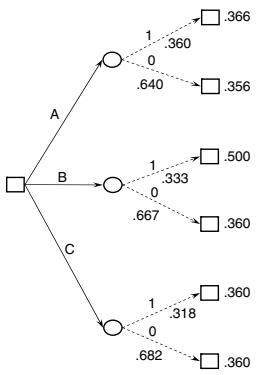  
(b)

  
(c)   
Figure 7.7 (a) Expected value of a hit in the second at-bat; (b) Value of best hitter after one at-bat; (c) Expected value of each hitter before first at-bat.

hit jumps to 0.500, although it drops to 0.250 if he does not get a hit. If player A gets a hit, his batting average moves from 0.360 to 0.366, reflecting the weight of his much longer record. This is our first hint that it can be useful to collect information about choices where there is the greatest uncertainty.

This example illustrates a setting where observations change our beliefs, which we build into the tree. We could have built our tree where all probabilities remain static, which is typical in decision trees. Imbedding the process of updating probabilities within the decision tree is what distinguishes classical decision trees from the use of decision trees in a learning setting.

Decision trees are actually a powerful strategy for learning, although they have not attracted much attention in the learning literature. One reason is simply that they are computationally more difficult, and for most applications, they do not actually work better. Another is that they are harder to analyze, which makes them less interesting in the research communities that analyze algorithms.

# 7.7.6 Hybrid Direct Lookahead

When we first introduced direct lookahead policies, we described a strategy of doing a full lookahead using an approximate model. That is, if

$$
S ^ {0}, x ^ {0}, W ^ {1}, \dots , S ^ {n}, x ^ {n}, W ^ {n + 1}, \dots
$$

represents our base model, the lookahead model might use approximate states $\tilde { S } ^ { n , m }$ , simplified decisions $\tilde { x } ^ { n , m }$ and/or a sampled information process $\tilde { W } ^ { n , m }$ .

In addition, we might use a simplified policy $\tilde { X } ^ { \tilde { \pi } } ( \tilde { S } ^ { n , m } )$ , as illustrated in the lookahead policy which we first presented in equation (11.24), but which we replicate here:

$$
\begin{array}{l} X ^ {D L A, n} (S ^ {n}) = \arg \max  _ {x ^ {n}} \left(C (S ^ {n}, x ^ {n}) + \right. \\ \left. \tilde {E} \left\{\max  _ {\tilde {\pi}} \tilde {E} \left\{\sum_ {m = n + 1} ^ {N} C \left(\tilde {S} ^ {n, m}, \tilde {X} ^ {\tilde {\pi}} \left(\tilde {S} ^ {n, m}\right)\right) \mid \tilde {S} ^ {n, n + 1} \right\} \mid S ^ {n}, x ^ {n} \right\}\right). \tag {7.55} \\ \end{array}
$$

To illustrate a type of hybrid policy, we are not going to approximate the model in any way (the state variables, decisions, and observations will all be just as they are in the base model). But we are going to suggest using a simple UCB or interval estimation policy for $\tilde { X } ^ { \tilde { \pi } } ( \tilde { S } ^ { n , m } )$ . For example, we might use

$$
\tilde {X} ^ {\tilde {\pi}} (\tilde {S} ^ {n, m} | \tilde {\theta} ^ {I E}) = \arg \max  _ {x \in \mathcal {X}} \left(\tilde {\mu} ^ {n, m} + \tilde {\theta} ^ {I E} \tilde {\sigma} ^ {n, m}\right).
$$

Let’s see how this works. First, the imbedded optimization over policies in equation (20.24) is replaced with a search over $\widetilde { \theta } ^ { I E }$ , which we write as

$$
\begin{array}{l} X ^ {D L A, n} (S ^ {n}) = \arg \max  _ {x ^ {n}} \left(C (S ^ {n}, x ^ {n}) + \right. \\ \left. \tilde {E} \left\{\max  _ {\tilde {\theta} ^ {I E}} \tilde {E} \left\{\sum_ {m = n + 1} ^ {N} C \left(\tilde {S} ^ {n, m}, \tilde {X} ^ {\pi} \left(\tilde {S} ^ {n, m} \mid \tilde {\theta} ^ {I E}\right)\right) \mid \tilde {S} ^ {n, n + 1} \right\} \mid S ^ {n}, x ^ {n} \right\}\right). \tag {7.56} \\ \end{array}
$$

This seems easier, but we have to understand what is meant by that max operator imbedded in the policy. What is happening is that as we make a decision $x ^ { n }$ for observation ??, we then sample an outcome $W ^ { n + 1 }$ given $x ^ { n }$ which brings us to a (stochastic) state $\tilde { S } ^ { n , n + 1 }$ . It is only then that we are supposed to optimize over $\tilde { \theta } ^ { I E }$ , which means we are actually trying to find a function $\tilde { \theta } ^ { I E } ( \tilde { S } _ { n , n + 1 } )$ . Wow!

Clearly, no-one is going to do this, so we are just going to fix a single parameter $\theta ^ { I E }$ . Note that we no longer have a tilde over it, because it is now a part of the base policy, not the lookahead policy. This means that it is tuned as part of the base policy, so the lookahead is now written

$$
\begin{array}{l} X ^ {D L A, n} (S ^ {n} | \theta^ {I E}) = \arg \max  _ {x ^ {n}} \left(C (S ^ {n}, x ^ {n}) + \right. \\ \left. \tilde {E} \left\{\tilde {E} \left\{\sum_ {m = n + 1} ^ {N} C \left(\tilde {S} ^ {n, m}, \tilde {X} ^ {\pi} \left(\tilde {S} ^ {n, m} \mid \tilde {\theta} ^ {I E}\right)\right) \mid \tilde {S} ^ {n, n + 1} \right\} \mid S ^ {n}, x ^ {n} \right\}\right). \tag {7.57} \\ \end{array}
$$

Now we have gotten rid of the imbedded max operator entirely. We now have a parameterized policy $X ^ { D L A , n } ( S ^ { n } | \theta ^ { I E } )$ where $\theta ^ { I E }$ has to be tuned. However, this seems much more manageable.

So, how does our policy $X ^ { D L A , n } ( S ^ { n } | \theta ^ { I E } )$ actually work? Assume that our decision $x ^ { n }$ is a scalar that we can enumerate. What we can do is for each value of $x ^ { n }$ , we can simulate our interval estimation lookahead policy some number of times, and take an average.

We mention this idea primarily to illustrate how we can use a simpler policy inside a lookahead model. Of course, there has to be a reason why we are using a lookahead policy in the first place, so why would we expect a simple IE policy to work? Part of the reason is that approximations within a lookahead policy do not introduce the same errors as if we tried to use this policy instead of the lookahead policy.

# 7.8 The Knowledge Gradient (Continued)*

The knowledge gradient belongs to the class of value-of-information policies which choose alternatives based on the improvement in the quality of the objective from better decisions that arise from a better understanding of the problem. The knowledge gradient works from a Bayesian belief model where our belief about the truth is represented by a probability distribution of possible truths. The basic knowledge gradient calculates the value of a single experiment, but this can be used as a foundation for variations that allow for repeated experiments.

The knowledge gradient was originally developed for offline (final reward) settings, so we begin with this problem class. Our experience is that the knowledge gradient is particularly well suited for settings where experiments (or observations) are expensive. For example:

● An airline wants to know the effect of allowing additional schedule slack, which can only be evaluated by running dozens of simulations to capture the variability due to weather. Each simulation may take several hours to run.   
● A scientist needs to evaluate the effect of increasing the temperature of a chemical reaction or the strength of a material. A single experiment may take several hours, and needs to be repeated to reduce the effect of the noise in each experiment.   
● A drug company is running clinical trials on a new drug, where it is necessary to test the drug at different dosages for toxicity. It takes several days to assess the effect of the drug at a particular dosage.

After developing the knowledge gradient for offline (final reward) settings, we show how to compute the knowledge gradient for online (cumulative reward) problems. We begin by discussing belief models, but devote the rest of this section to handling the special case of independent beliefs. Section 7.8.4 extends the knowledge gradient to a general class of nonlinear parametric belief models.

# 7.8.1 The Belief Model

The knowledge gradient uses a Bayesian belief model where we begin with a prior on $\mu _ { x } = \mathbb { E } F ( x , W )$ for $x \in \{ x _ { 1 } , \ldots , x _ { M } \}$ . We are going to illustrate the key ideas using a lookup table belief model (which is to say, we have an estimate for each value of $x$ ), where we initially assume the beliefs are independent. This means that anything we learn about some alternative $x$ does not teach us anything about an alternative $x ^ { \prime }$ .

We assume that we believe that the true value of $\mu _ { x }$ is described by a normal distribution $N ( \bar { \mu } _ { x } ^ { 0 } , \bar { \sigma } _ { x } ^ { 2 , 0 } )$ , known as the prior. This may be based on prior experience (such as past experience with the revenue from charging a price $x$ for a new book), some initial data, or from an understanding of the physics of a problem (such as the effect of temperature on the conductivity of a metal).

It is possible to extend the knowledge gradient to a variety of belief models. A brief overview of these is:

Correlated beliefs Alternatives $x$ may be related, perhaps because they are discretizations of a continuous parameter (such as temperature or price), so that $\mu _ { x }$ and $\mu _ { x + 1 }$ are close to each other. Trying $x$ then teaches us something about $\mu _ { x + 1 }$ . Alternatively, $x$ and $x ^ { \prime }$ may be two drugs in the same class, or a product with slightly different features. We capture these relationships with a covariance matrix $\Sigma ^ { 0 }$ where $\Sigma _ { x x ^ { \prime } } ^ { 0 } = C o v ( \mu _ { x } , \mu _ { x ^ { \prime } } )$ . We show how to handle correlated beliefs below.

Parametric linear models We may derive a series of features $\phi _ { f } ( x )$ , for $f \in$ $\mathcal { F }$ . Assume that we represent our belief using

$$
f (x | \theta) = \sum_ {f \in \mathcal {F}} \theta_ {f} \phi_ {f} (x),
$$

where $f ( x | \theta ) \approx \mathbb { E } F ( x , W )$ is our estimate of $\mathbb { E } F ( x , W )$ . We now treat $\boldsymbol { \theta }$ as the unknown parameter, where we might assume that the vector $\boldsymbol { \theta }$ is described by a multivariate normal distribution $N ( \theta ^ { 0 } , \Sigma ^ { \theta , 0 } )$ , although coming up with these priors (in the parameter space) can be tricky.

Parametric nonlinear models Our belief model might be nonlinear in ??. For example, we might use a logistic regression

$$
f (x \mid \theta) = \frac {e ^ {U (x \mid \theta)}}{1 + e ^ {U (x \mid \theta)}}, \tag {7.58}
$$

where $U ( x | \theta )$ is a linear model given by

$$
U (x | \theta) = \theta_ {0} + \theta_ {1} x _ {1} + \theta_ {2} x _ {2} + \ldots + \theta_ {K} x _ {K}
$$

where $( x _ { 1 } , \dots , x _ { K } )$ are the features of a decision $x$ .

Belief models that are nonlinear in the parameters can cause some difficulty, but we can circumvent this by using a sampled belief model, where we assume the uncertain $\boldsymbol { \theta }$ is one of the set $\{ \theta _ { 1 } , \ldots , \theta _ { K } \}$ . Let $p _ { k } ^ { n }$ be the probability that $\theta = \theta _ { k }$ , which means that $p ^ { n } = ( p _ { k } ^ { n } )$ , $k = 1 , \dots , K$ is our belief at time ??. See section 3.9.2 for more information.

Nonparametric models Simpler nonparametric models are primarily local approximations, so we could use constant, linear, or nonlinear models defined over local regions. More advanced models include neural networks (the kind known as “deep learners”) or support vector machines, both of which were introduced in chapter 3.

Below we show how to calculate the knowledge gradient for each of these belief models, with the exception of the nonparametric models (listed for completeness).

# 7.8.2 The Knowledge Gradient for Maximizing Final Reward

The knowledge gradient seeks to learn about the value of different actions by maximizing the value of information from a single observation. Let $S ^ { n }$ be our belief state about the value of each action $x$ . The knowledge gradient uses a Bayesian model, so

$$
S ^ {n} = (\bar {\mu} _ {x} ^ {n}, \sigma_ {x} ^ {2, n}) _ {x \in \mathcal {X}},
$$

captures the mean and variance of our belief about the true value $\mu _ { x } \quad =$ $\mathbb { E } F ( x , W )$ , where we also assume that $\mu _ { x } \sim N ( \bar { \mu } _ { x } ^ { n } , \sigma _ { x } ^ { 2 , n } )$ .

The value of being in belief state $S ^ { n }$ is given by

$$
V ^ {n} (S ^ {n}) = \mu_ {x ^ {n}},
$$

where $x ^ { n }$ is the choice that appears to be best given what we know after ?? experiments, calculated using

$$
x ^ {n} = \arg \max  _ {x ^ {\prime} \in \mathcal {X}} \bar {\mu} _ {x ^ {\prime}} ^ {n}.
$$

If we choose action $x ^ { n }$ , we then observe $W _ { { x ^ { n } } } ^ { n + 1 }$ ?? which we then use to update our estimate of our belief about $\mu _ { x }$ using our Bayesian updating equations (7.42)– (7.43).

The value of state $S ^ { n + 1 } ( x )$ when we try action $x$ is given by

$$
V ^ {n + 1} (S ^ {n + 1} (x)) = \max _ {x ^ {\prime} \in \mathcal {X}} \bar {\mu} _ {x ^ {\prime}} ^ {n + 1} (x)
$$

where $\bar { \mu } _ { x ^ { \prime } } ^ { n + 1 } ( x )$ is the updated estimate of $\mathbb { E } \mu$ given $S ^ { n }$ (that is, our estimate of the distribution of $\mu$ after $n$ experiments), and the result of implementing $x$

and observing $W _ { x } ^ { n + 1 }$ . We have to decide which experiment to run after the $n ^ { \mathrm { t h } }$ observation, so we have to work with the expected value of running experiment $x$ , given by

$$
\mathbb {E} \{V ^ {n + 1} (S ^ {n + 1} (x)) | S ^ {n} \} = \mathbb {E} \{\max  _ {x ^ {\prime} \in \mathcal {X}} \bar {\mu} _ {x ^ {\prime}} ^ {n + 1} (x) | S ^ {n} \}.
$$

The knowledge gradient is then given by

$$
\mathcal {v} _ {x} ^ {K G, n} = \mathbb {E} \{V ^ {n + 1} (S ^ {M} (S ^ {n}, x, W ^ {n + 1})) | S ^ {n}, x \} - V ^ {n} (S ^ {n}),
$$

which is equivalent to

$$
\nu^ {K G} (x) = \mathbb {E} \left\{\max  _ {x ^ {\prime}} \bar {\mu} _ {x ^ {\prime}} ^ {n + 1} (x) \mid S ^ {n} \right\} - \max  _ {x ^ {\prime}} \bar {\mu} _ {x ^ {\prime}} ^ {n}. \tag {7.59}
$$

Here, $\bar { \mu } ^ { n + 1 } ( x )$ is the updated value of ${ \bar { \mu } } ^ { n }$ after running an experiment with setting $x = x ^ { n }$ , after which we observe $W _ { x } ^ { n + 1 }$ . Since we have not yet run the experiment, $W _ { x } ^ { n + 1 }$ is a random variable, which means that $\bar { \mu } ^ { n + 1 } ( x )$ is random. In fact, $\bar { \mu } ^ { n + 1 } ( x )$ is random for two reasons. To see this, we note that when we run experiment $x$ , we observe an updated value from

$$
W _ {x} ^ {n + 1} = \mu_ {x} + \varepsilon_ {x} ^ {n + 1},
$$

where $\mu _ { x } = \mathbb { E } F ( x , W )$ is the true value, while $\varepsilon _ { x } ^ { n + 1 }$ is the noise in the observation. This introduces two forms of uncertainty: the unknown truth $\mu _ { x }$ , and the noise $\varepsilon _ { x } ^ { n + 1 }$ . Thus, it would be more accurate to write equation (7.59) as

$$
\nu^ {K G} (x) = \mathbb {E} _ {\mu} \left\{\mathbb {E} _ {W | \mu} \max  _ {x ^ {\prime}} \bar {\mu} _ {x ^ {\prime}} ^ {n + 1} (x) \mid S ^ {n} \right\} - \max  _ {x ^ {\prime}} \bar {\mu} _ {x ^ {\prime}} ^ {n} \tag {7.60}
$$

where the first expectation $\mathbb { E } _ { \mu }$ is conditioned on our belief state $S ^ { n }$ , while the second expectation $\mathbb { E } _ { W \mid \mu }$ is over the experimental noise $W$ given our distribution of belief about the truth $\mu$ .

To illustrate how equation (7.60) is calculated, imagine that $\mu$ takes on values $\{ \mu _ { 1 } , \ldots , \mu _ { K } \}$ , and that $p _ { k } ^ { \mu }$ is the probability that $\mu = \mu _ { k }$ . Assume that $\mu$ is the mean of a Poisson distribution describing the number of customers ?? that click on a website and assume that

$$
P ^ {W} [ W = \ell | \mu = \mu_ {k} ] = \frac {\mu_ {k} ^ {\ell} e ^ {- \mu_ {k}}}{\ell !}.
$$

We would then compute the expectation in equation (7.60) using

$$
\mathcal {V} ^ {K G} (x) = \sum_ {k = 1} ^ {K} \left(\sum_ {\ell = 0} ^ {\infty} \left(\max _ {x ^ {\prime}} \bar {\mu} _ {x ^ {\prime}} ^ {n + 1} (x | W = \ell)\right) P ^ {W} [ W = \ell | \mu = \mu_ {k} ]\right) p _ {k} ^ {\mu} - \max _ {x ^ {\prime}} \bar {\mu} _ {x ^ {\prime}} ^ {n + 1} (x | W = \ell),
$$

where $\bar { \mu } _ { x ^ { \prime } } ^ { n + 1 } ( x | W = \ell )$ is the updated estimate of ${ \bar { \mu } } _ { x ^ { \prime } } ^ { n }$ if we run experiment $x$ (which might be a price or design of a website) and we then observe $W = \ell$ . The updating would be done using any of the recursive updating equations described in chapter 3.

We now want to capture how well we can solve our optimization problem, which means solving $\mathrm { m a x } _ { x ^ { \prime } } \bar { \mu } _ { x ^ { \prime } } ^ { n + 1 } ( x )$ . Since $\bar { \mu } _ { x ^ { \prime } } ^ { n + 1 } ( x )$ is random (since we have to pick $x$ before we know $W ^ { n + 1 }$ ), then $\mathrm { m a x } _ { x ^ { \prime } } \bar { \mu } _ { x ^ { \prime } } ^ { n + 1 } ( x )$ is random. This is why we have to take the expectation, which is conditioned on $S ^ { n }$ which captures what we know now.

Computing a knowledge gradient policy for independent beliefs is extremely easy. We assume that all rewards are normally distributed, and that we start with an initial estimate of the mean and variance of the value of decision $x$ , given by

$$
\bar {\mu} _ {x} ^ {0} = \text {t h e i n i t i a l e s t i m a t e o f t h e e x p e c t e d r e w a r d f r o m m a k i n g d e c i s i o n} x,
$$

$$
\bar {\sigma} _ {x} ^ {0} = \text {t h e i n i t i a l e s t a t e m e t o f t h e s t a n d a r d d e v i a t i o n o f o u r b e l i e f a b o u t} \mu .
$$

Each time we make a decision we receive a reward given by

$$
W _ {x} ^ {n + 1} = \mu_ {x} + \varepsilon^ {n + 1},
$$

where $\mu _ { x }$ is the true expected reward from action $x$ (which is unknown) and ?? is the experimental error with standard deviation $\sigma _ { W }$ (which we assume is known).

The estimates $( \bar { \mu } _ { x } ^ { n } , \bar { \sigma } _ { x } ^ { 2 , n } )$ are the mean and variance of our belief about $\mu _ { x }$ after ?? observations. We are going to find that it is more convenient to use the idea of precision (as we did in chapter 3) which is the inverse of the variance. So, we define the precision of our belief and the precision of the experimental noise as

$$
\beta_ {x} ^ {n} = 1 / \bar {\sigma} _ {x} ^ {2, n},
$$

$$
\beta^ {W} = 1 / \sigma_ {W} ^ {2}.
$$

If we take action $x$ and observe a reward $W _ { x } ^ { n + 1 }$ , we can use Bayesian updating to obtain new estimates of the mean and variance for action $x$ , following the steps we first introduced in section 3.4. To illustrate, imagine that we try an action $x$ where $\beta _ { x } ^ { n } = 1 / ( 2 0 ^ { 2 } ) = 0 . 0 0 2 5$ , and $\beta ^ { W } = 1 / ( 4 0 ^ { 2 } ) = . 0 0 0 6 2 5 .$ Assume $\bar { \mu } _ { x } ^ { n } = 2 0 0$ and that we observe $W _ { x } ^ { n + 1 } = 2 5 0$ . The updated mean and precision are given by

$$
\begin{array}{l} \bar {\mu} _ {x} ^ {n + 1} = \frac {\beta_ {x} ^ {n} \bar {\mu} _ {x} ^ {n} + \beta^ {W} W _ {x} ^ {n + 1}}{\beta_ {x} ^ {n} + \beta^ {W}} \\ = \frac {(. 0 0 2 5) (2 0 0) + (. 0 0 0 6 2 5) (2 5 0)}{. 0 0 2 5 + . 0 0 0 6 2 5} \\ \begin{array}{r l} {=} & {2 1 0.} \end{array} \\ \end{array}
$$