$$
\begin{array}{l} \beta_ {x} ^ {n + 1} = \beta_ {x} ^ {n} + \beta^ {W} \\ = . 0 0 2 5 +. 0 0 0 6 2 5 \\ = \quad . 0 0 3 1 2 5. \\ \end{array}
$$

We next find the variance of the change in our estimate of $\mu _ { x }$ assuming we choose to sample action $x$ in iteration ??. For this we define

$$
\begin{array}{l} \hat {\sigma} _ {x} ^ {2, n} = \operatorname {V a r} \left[ \bar {\mu} _ {x} ^ {n + 1} - \bar {\mu} _ {x} ^ {n} \mid S ^ {n} \right] (7.61) \\ = \operatorname {V a r} \left[ \bar {\mu} _ {x} ^ {n + 1} \mid S ^ {n} \right]. (7.62) \\ \end{array}
$$

We use the form of equation (7.61) to highlight the definition of $\tilde { \sigma } _ { x } ^ { 2 , n }$ as the change in the variance given what we know at time $n$ , but when we condition on what we know (captured by $S ^ { n }$ ) it means that $V a r [ \bar { \mu } _ { x } ^ { n } | S ^ { n } ] = 0$ since ${ \bar { \mu } } _ { x } ^ { n }$ is just a number at time ??.

With a little work, we can write $\tilde { \sigma } _ { x } ^ { 2 , n }$ in different ways, including

$$
\begin{array}{l} \bar {\sigma} _ {x} ^ {2, n} = \bar {\sigma} _ {x} ^ {2, n} - \bar {\sigma} _ {x} ^ {2, n + 1}, (7.63) \\ = \frac {\left(\bar {\sigma} _ {x} ^ {2 , n}\right)}{1 + \sigma_ {W} ^ {2} / \bar {\sigma} _ {x} ^ {2 , n}}. (7.64) \\ \end{array}
$$

Equation (7.63) expresses the (perhaps unexpected) result that $\tilde { \sigma } _ { x } ^ { 2 , n }$ measures the change in the estimate of the standard deviation of the reward from decision $x$ from iteration $n - 1$ to ??. Using our numerical example, equations (7.63) and (7.64) both produce the result

$$
\begin{array}{l} \tilde {\sigma} _ {x} ^ {2, n} = 4 0 0 - 3 2 0 = 8 0 \\ = \frac {4 0 ^ {2}}{1 + \frac {1 0 ^ {2}}{4 0 ^ {2}}} = 8 0. \\ \end{array}
$$

Finally, we compute

$$
\zeta_ {x} ^ {n} = - \left| \frac {\bar {\mu} _ {x} ^ {n} - \max _ {x ^ {\prime} \neq x} \bar {\mu} _ {x ^ {\prime}} ^ {n}}{\tilde {\sigma} _ {x} ^ {n}} \right|.
$$

$\zeta _ { x } ^ { n }$ is called the normalized influence of decision $x$ . It gives the number of standard deviations from the current estimate of the value of decision $x$ , given by $\bar { \mu } _ { x } ^ { n }$ , and the best alternative other than decision $x$ . We then find

$$
f (\zeta) = \zeta \Phi (\zeta) + \phi (\zeta),
$$

where $\Phi ( \zeta )$ and $\phi ( \zeta )$ are, respectively, the cumulative standard normal distribution and the standard normal density. Thus, if $Z$ is normally distributed with mean 0, variance 1, $\Phi ( \zeta ) = \mathbb { P } [ Z \leq \zeta ]$ while

Table 7.4 The calculations behind the knowledge gradient algorithm.   

<table><tr><td>Decision</td><td>μ̅</td><td>σ̅</td><td>σ̅</td><td>ζ</td><td>f(z)</td><td>KG index</td></tr><tr><td>1</td><td>1.0</td><td>2.5</td><td>1.569</td><td>-1.275</td><td>0.048</td><td>0.075</td></tr><tr><td>2</td><td>1.5</td><td>2.5</td><td>1.569</td><td>-0.956</td><td>0.090</td><td>0.142</td></tr><tr><td>3</td><td>2.0</td><td>2.5</td><td>1.569</td><td>-0.637</td><td>0.159</td><td>0.249</td></tr><tr><td>4</td><td>2.0</td><td>2.0</td><td>1.400</td><td>-0.714</td><td>0.139</td><td>0.195</td></tr><tr><td>5</td><td>3.0</td><td>1.0</td><td>0.981</td><td>-1.020</td><td>0.080</td><td>0.079</td></tr></table>

$$
\phi (\zeta) = \frac {1}{\sqrt {2 \pi}} \exp \left(- \frac {\zeta^ {2}}{2}\right).
$$

The knowledge gradient algorithm chooses the decision $x$ with the largest value of $\nu _ { x } ^ { K G , n }$ g iven by

$$
\mathcal {V} _ {x} ^ {K G, n} = \tilde {\sigma} _ {x} ^ {n} f (\zeta_ {x} ^ {n}).
$$

The knowledge gradient algorithm is quite simple to implement. Table 7.4 illustrates a set of calculations for a problem with five options. $\bar { \mu }$ represents the current estimate of the value of each action, while $\bar { \sigma }$ is the current standard deviation of $\mu$ . Options 1, 2 and 3 have the same value for $\bar { \sigma }$ , but with increasing values of $\bar { \mu }$ .

The table illustrates that when the variance is the same, the knowledge gradient prefers the decisions that appear to be the best. Decisions 3 and 4 have the same value of $\bar { \mu }$ , but decreasing values of $\bar { \sigma }$ , illustrating that the knowledge gradient prefers decisions with the highest variance. Finally, decision 5 appears to be the best of all the decisions, but has the lowest variance (meaning that we have the highest confidence in this decision). The knowledge gradient is the smallest for this decision out of all of them.

The knowledge gradient trades off how well an alternative is expected to perform, and how uncertain we are about this estimate. Figure 7.8 illustrates this tradeoff. Figure 7.8(a) shows five alternatives, where the estimates are the same across all three alternatives, but with increasing standard deviations. Holding the mean constant, the knowledge gradient increases with standard deviation of the estimate of the mean. Figure 7.8(b) repeats this exercise, but now holding the standard deviation the same, with increasing means, showing that the knowledge gradient increases with the estimate of the mean. Finally, Figure 7.8(c) varies the estimates of the mean and standard deviation so that the knowledge gradient stays constant, illustrating the tradeoff between the estimated mean and its uncertainty.

  
(a)

  
(b)

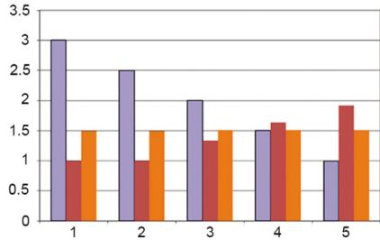  
(c）  
Figure 7.8 The knowledge gradient for lookup table with independent beliefs with equal means (a), equal variances (b), and adjusting means and variances so that the KG is equal (c).

This tradeoff between the expected performance of a design, and the uncertainty about its performance, is a feature that runs through well designed policies. However, all the other policies with this property (interval estimation, upper confidence bounding, Gittins indices), achieve this with indices that consist of the sum of the expected performance and a term that reflects the uncertainty of an alternative.

The knowledge gradient, however, achieves this behavior without the structure of the expected reward plus an uncertainty term with a tunable parameter. In fact, this brings out a major feature of the knowledge gradient, which is that it does not have a tunable parameter.

# 7.8.3 The Knowledge Gradient for Maximizing Cumulative Reward

There are many online applications of dynamic programming where there is an operational system which we would like to optimize in the field. In these settings, we have to live with the rewards from each experiment. As a result, we have to strike a balance between the value of an action and the information we gain that may improve our choice of actions in the future. This is precisely the tradeoff that is made by Gittins indices for the multiarmed bandit problem.

It turns out that the knowledge gradient is easily adapted for online problems. As before, let $\nu _ { x } ^ { K G , n }$ be the offline knowledge gradient, giving the value of observing action $x$ , measured in terms of the improvement in a single decision. Now imagine that we have a budget of $N$ decisions. After having made ?? decisions (which means, ?? observations of the value of different actions), if we observe $x = x ^ { n }$ which allows us to observe $W _ { x } ^ { n + 1 }$ , we received an expected reward of tion from ????????+1?? $\mathbb { E } ^ { n } W _ { x } ^ { n + 1 } = \bar { \mu } _ { x } ^ { n }$ , andn by in information that. However, we have oves the contribu-more decisions to $\nu _ { x } ^ { K G , n }$ ??????,???? ?? − ?? $N - n$ make. Assume that we learn from the observation of $W _ { x } ^ { n + 1 }$ by choosing $x ^ { n } = x$ but we do not allow ourselves to learn anything from future decisions. This means that the remaining $N - n$ decisions have access to the same information.

From this analysis, the knowledge gradient for online applications consists of the expected value of the single-period contribution of the experiment, plus the improvement in all the remaining decisions in our horizon. This implies

$$
v _ {x} ^ {O L K G, n} = \bar {\mu} _ {x} ^ {n} + (N - n) v _ {x} ^ {K G, n}. \tag {7.65}
$$

This is a general formula that extends any calculation of the offline knowledge gradient to online (cumulative reward) learning problems. Note that we now obtain the same structure we previously saw in UCB and IE policies (as well as Gittins indices) where the index is a sum of a one-period reward, plus a bonus term for learning.

It is also important to recognize that the online policy is time-dependent, because of the presence of the $( N - n )$ coefficient. When ?? is small, $( N - n )$ is large, and the policy will emphasize exploration. As we progress, $( N - n )$ shrinks and we place more emphasis on maximizing the immediate reward.

# 7.8.4 The Knowledge Gradient for Sampled Belief Model*

There are many settings where our belief model is nonlinear in the parameters. For example, imagine that we are modeling the probability that a customer will click on an ad when we bid $x$ , where higher bids improve our ability of getting attractive placements that increase the number of clicks. Assume that the response is a logistic regression given by

$$
P ^ {\text {p u r c h a s e}} (x | \theta) = \frac {e ^ {U (x | \theta)}}{1 + e ^ {U (x | \theta)}} \tag {7.66}
$$

where $U ( x | \theta ) = \theta _ { 0 } + \theta _ { 1 } x .$ We do not know ??, so we are going to represent it as a random variable with some distribution. We might represent it as a multivariate normal distribution, but this makes computing the knowledge gradient very complicated.

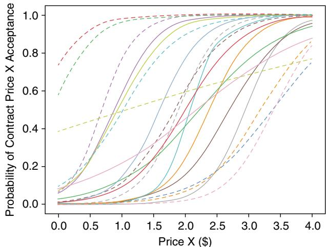  
Figure 7.9 Sampled set of bid response curves.

A very practical strategy is to use a sampled belief model which we first introduced in section 3.9.2. Using this approach we assume that $\boldsymbol { \theta }$ takes an outcome in the set $\{ \theta _ { 1 } , \ldots , \theta _ { K } \}$ . Let $p _ { k } ^ { n } = P r o b [ \theta = \theta _ { k } ]$ after we have run $n$ experiments. Note that these probabilities represent our belief state, which means that

$$
S ^ {n} = \left(p _ {k} ^ {n}\right) _ {k = 1} ^ {K}.
$$

We might use an initial distribution $p _ { k } ^ { 0 } = 1 / K$ . A sampled belief for a logistic curve is illustrated in Figure 7.9.

Let $W _ { x } ^ { n + 1 }$ be the observation when we run experiment $x ^ { n } ~ = ~ x$ , and let $\theta ^ { n + 1 }$ be the random variable representing $\boldsymbol { \theta }$ after we have run experiment $x$ and observed $W _ { x } ^ { n + 1 }$ . When we used a lookup table belief model, we wrote the knowledge gradient as (see (7.59))

$$
v ^ {K G, n} (x) = \mathbb {E} \left\{\max  _ {x ^ {\prime}} \bar {\mu} _ {x ^ {\prime}} ^ {n + 1} (x) \mid S ^ {n}, x ^ {n} = x \right\} - \max  _ {x ^ {\prime}} \bar {\mu} _ {x ^ {\prime}} ^ {n}. \tag {7.67}
$$

For our nonlinear model, we let $\mu _ { x } = f ( x | \theta )$ where we assume we know the function $f ( x | \theta )$ but we do not know ??. The knowledge gradient would then be written

$$
\begin{array}{l} \mathfrak {v} ^ {K G, n} (x) = \mathbb {E} \{\max  _ {x ^ {\prime}} \mathbb {E} \{f (x ^ {\prime}, \theta^ {n + 1} (x)) | S ^ {n + 1} \} | S ^ {n}, x ^ {n} = x \} \\ - \max  _ {x ^ {\prime}} \mathbb {E} _ {\theta} \{f \left(x ^ {\prime}, \theta\right) \mid S ^ {n} \}. \tag {7.68} \\ \end{array}
$$

We are going to step through this expression more carefully since we are going to have to compute it directly. Readers just interested in computing the knowledge gradient can jump right to equation (7.76) which can be directly

implemented. The derivation that we provide next will provide insights into the principles of the knowledge gradient as a concept.

First, we need to realize that $\bar { \mu } _ { x } ^ { n } = \mathbb E \{ \mu _ { x } | S ^ { n } \}$ is the expectation of $\mu _ { x }$ given what we know after ?? iterations, which is captured in $S ^ { n }$ . For our nonlinear model, this would be written

$$
\begin{array}{l} \mathbb {E} _ {\theta} \{f (x ^ {\prime}, \theta) | S ^ {n} \} = \sum_ {k = 1} ^ {K} p _ {k} ^ {n} f (x ^ {\prime}, \theta_ {k}) \\ = \bar {f} ^ {n} (x ^ {\prime}). \\ \end{array}
$$

Next, $\bar { \mu } _ { x ^ { \prime } } ^ { n + 1 } ( x )$ in equation (7.67) is our estimate of $\mu _ { x }$ after running experiment $x ^ { n } = x$ and observing $W _ { x } ^ { n + 1 }$ . For the lookup table model, we would write this as

$$
\bar {\mu} _ {x ^ {\prime}} ^ {n + 1} (x) = \mathbb {E} _ {\mu} \left\{\mu_ {x ^ {\prime}} \mid S ^ {n + 1} \right\} \tag {7.69}
$$

where $S ^ { n + 1 } = S ^ { M } ( S ^ { n } , x ^ { n } , W ^ { n + 1 } )$ . This means that (7.69) can also be written

$$
\bar {\mu} _ {x ^ {\prime}} ^ {n + 1} (x) = \mathbb {E} _ {\mu} \left\{\mu_ {x ^ {\prime}} \mid S ^ {n}, x ^ {n}, W ^ {n + 1} \right\}. \tag {7.70}
$$

For our sampled belief model, we use $p _ { k } ^ { n }$ instead of ${ \bar { \mu } } ^ { n }$ , and we use the updated probabilities $p _ { k } ^ { n + 1 } ( S ^ { n } , x ^ { n } = s , W _ { x } ^ { n + 1 } \overset { \cdot } { = } W$ ) instead of $\bar { \mu } ^ { n + 1 } ( x )$ where

$$
p _ {k} ^ {n + 1} (S ^ {n}, x ^ {n} = x, W _ {x} ^ {n + 1} = W) = P r o b [ \theta = \theta_ {k} | S ^ {n}, x ^ {n} = x, W _ {x} ^ {n + 1} = W ].
$$

We express the dependence of $p _ { k } ^ { n + 1 } ( S ^ { n } , x ^ { n } \ = \ s , W _ { x } ^ { n + 1 } \ = \ W )$ on the prior state $S ^ { n }$ , decision $x ^ { n }$ and experimental outcome $W ^ { n + 1 }$ explicitly to make these dependencies clear. The random variable $W = W _ { x } ^ { n + 1 }$ depends on $\boldsymbol { \theta }$ since

$$
W _ {x} ^ {n + 1} = f (x | \theta) + \varepsilon^ {n + 1}.
$$

Our belief about $\boldsymbol { \theta }$ depends on when we are taking the expectation, which is captured by conditioning on $S ^ { n }$ (or later, $\mathbb { E } ^ { n } . . . \ = \ \mathbb { E } . . . | S ^ { n } )$ . To emphasize the dependence on $S ^ { n }$ , we are going to write $\mathbb { E } ^ { n } \{ \cdot | S ^ { n } \}$ to emphasize when we are conditioning on $S ^ { n }$ . This will help when we have to use nested expectations, conditioning on both $S ^ { n }$ and $S ^ { n + 1 }$ in the same equation.

The expectation inside the max operator is

$$
\begin{array}{l} \mathbb {E} _ {\theta} ^ {n + 1} \{f (x ^ {\prime}, \theta^ {n + 1} (x)) | S ^ {n + 1} \} = \mathbb {E} _ {\theta} ^ {n + 1} \{f (x ^ {\prime}, \theta^ {n + 1} (x)) | S ^ {n}, x ^ {n} = x, W _ {x} ^ {n + 1} = W \} \\ = \sum_ {k = 1} ^ {K} f \left(x ^ {\prime}, \theta_ {k}\right) p _ {k} ^ {n + 1} \left(S ^ {n}, x ^ {n} = x, W _ {x} ^ {n + 1} = W\right). \\ \end{array}
$$

Note that we are only taking the expectation over $\boldsymbol { \theta }$ , since $W ^ { n + 1 }$ is known at this point. We take the expectation over $\boldsymbol { \theta }$ given the posterior $p _ { k } ^ { n + 1 }$ because even

after we complete the $n + 1 ^ { s t }$ experiment, we still have to make a decision (that is, choosing $x ^ { \prime }$ ) without knowing the true value of $\boldsymbol { \theta }$ .

We now have to compute $p _ { k } ^ { n + 1 } ( S ^ { n } , x ^ { n } = x , W _ { x } ^ { n + 1 } = W )$ ). We first assume that we know the distribution of $W _ { x } ^ { n + 1 }$ given $\boldsymbol { \theta }$ (that is, we know the distribution of $W _ { x } ^ { n + 1 }$ if we know ??). For our ad-click problem, this would just have outcomes 0 or 1 where $P r o b [ W = 1 ]$ is given by our logistic curve in equation (7.66). For more general problems, we are going to assume we have the distribution.

$$
{f ^ {W} (w | x, \theta_ {k})} = {\mathbb {P} [ W ^ {n + 1} = w | x, \theta = \theta_ {k} ].}
$$

We compute $p _ { k } ^ { n + 1 } ( S ^ { n } , x ^ { n } = x , W _ { x } ^ { n + 1 } = W ,$ ) using Bayes theorem by first writing

$$
\begin{array}{l} p _ {k} ^ {n + 1} (S ^ {n}, x ^ {n} = x, W _ {x} ^ {n + 1} = w) = P r o b [ \theta = \theta_ {k} | S ^ {n}, x ^ {n} = x, W _ {x} ^ {n + 1} = w ] \\ = \frac {\operatorname {P r o b} \left[ W _ {x} ^ {n + 1} = w \mid \theta = \theta_ {k} , S ^ {n} , x ^ {n} = x \right] \operatorname {P r o b} \left[ \theta = \theta_ {k} \mid S ^ {n} , x ^ {n} = x \right]}{\operatorname {P r o b} \left[ W _ {x} ^ {n + 1} = w \mid S ^ {n} , x ^ {n} = x \right]} \\ = \frac {f ^ {W} \left(W ^ {n + 1} = w \mid x ^ {n} , \theta_ {k}\right) p _ {k} ^ {n}}{C (w)}, \tag {7.71} \\ \end{array}
$$

where $C ( w )$ is the normalizing constant given $W ^ { n + 1 } = w$ , which is calculated using

$$
C (w) = \sum_ {k = 1} ^ {K} f ^ {W} (W ^ {n + 1} = w | x ^ {n}, \theta_ {k}) p _ {k} ^ {n}.
$$

Below, we are going to treat $C ( W )$ (with capital $W$ ) as a random variable with realization $C ( w )$ . Note that we condition $p _ { k } ^ { n + 1 } ( S ^ { n } , x ^ { n } = x , W _ { x } ^ { n + 1 } = w )$ on $S ^ { n }$ since this gives us the prior $p _ { k } ^ { n }$ which we use in Bayes theorem. However, once we have computed $p _ { k } ^ { n + 1 } ( S ^ { n } , \ddot { x ^ { n } } = x , W _ { x } ^ { n + 1 } = w )$ we write the posterior probability as $p _ { k } ^ { n + 1 } ) ( w )$ since we no longer need to remember $x ^ { n } = x$ or the prior ??distribution $S ^ { n } = ( p _ { k } ^ { n } ) _ { k = 1 } ^ { K }$ , but we do need to express the dependence on the outcome $W ^ { n + 1 } = w$ . We will write the posterior distribution as $p ^ { n } ( W )$ when we want to express the outcome as a random variable.

We are now ready to compute the knowledge gradient in equation (7.68). We begin by writing it with expanded expectations as

$$
\begin{array}{l} \mathfrak {v} ^ {K G, n} (x) = \mathbb {E} _ {\theta} ^ {n} \mathbb {E} _ {W ^ {n + 1} | \theta} \{\max  _ {x ^ {\prime}} \mathbb {E} _ {\theta} ^ {n + 1} \{f (x ^ {\prime}, \theta^ {n + 1}) | S ^ {n + 1} \} | S ^ {n}, x ^ {n} = x \} \\ - \max  _ {x ^ {\prime}} \mathbb {E} _ {\theta} ^ {n} \{f \left(x ^ {\prime}, \theta\right) | S ^ {n} \}. \tag {7.72} \\ \end{array}
$$

We have to take the expectations $\mathbb { E } _ { \theta } ^ { n } \mathbb { E } _ { W ^ { n + 1 } | \theta }$ because when we are trying to decide which experiment $x$ to run, we do not know the outcome $W ^ { n + 1 }$ , and we do not know the true value of $\boldsymbol { \theta }$ on which $W ^ { n + 1 }$ depends.

The posterior distribution of belief allows us to write $\mathbb { E } _ { \theta } ^ { n + 1 } f ( x ^ { \prime } , \theta ^ { n + 1 } ) | S ^ { n + 1 } \}$ using

$$
\mathbb {E} _ {\theta} ^ {n + 1} \{f (x ^ {\prime}, \theta^ {n + 1}) | S ^ {n + 1} \} = \sum_ {k = 1} ^ {K} f (x ^ {\prime}, \theta_ {k}) p _ {k} ^ {n + 1} (W ^ {n + 1}).
$$

Substituting this into equation (7.72) gives us

$$
\begin{array}{l} \nu^ {K G, n} (x) = \mathbb {E} _ {\theta} ^ {n} \mathbb {E} _ {W ^ {n + 1} | \theta} \left\{\max _ {x ^ {\prime}} \sum_ {k = 1} ^ {K} f (x ^ {\prime}, \theta_ {k}) p _ {k} ^ {n + 1} (W ^ {n + 1}) \Bigg | S ^ {n}, x ^ {n} = x \right\} \\ - \max  _ {x ^ {\prime}} \bar {f} ^ {n} \left(x ^ {\prime}\right). \tag {7.73} \\ \end{array}
$$

We now focus on computing the first term of the knowledge gradient. Substituting $p _ { k } ^ { n + 1 } ( W ^ { n + 1 } )$ from equation (7.71) into (7.73) gives us

$$
\begin{array}{l} \mathbb {E} _ {\theta} ^ {n} \mathbb {E} _ {W ^ {n + 1} | \theta} \left\{\max  _ {x ^ {\prime}} \sum_ {k = 1} ^ {K} f (x ^ {\prime}, \theta_ {k}) p _ {k} ^ {n + 1} (W ^ {n + 1}) \Bigg | S ^ {n} \right\} \\ = \mathbb {E} _ {\theta} ^ {n} \mathbb {E} _ {W ^ {n + 1} | \theta} \left\{\max _ {x ^ {\prime}} \sum_ {k = 1} ^ {K} f (x ^ {\prime}, \theta_ {k}) \left(\frac {f ^ {W} (W ^ {n + 1} | x ^ {n} , \theta_ {k}) p _ {k} ^ {n}}{C (W ^ {n + 1})}\right) | S ^ {n}, x = x ^ {n} \right\}. \\ \end{array}
$$

Keeping in mind that the entire expression is a function of $x$ , the expectation can be written

$$
\begin{array}{l} \mathbb {E} _ {\theta} ^ {n} \mathbb {E} _ {W ^ {n + 1} | \theta} \left\{\max  _ {x ^ {\prime}} \frac {1}{C (W)} \sum_ {k = 1} ^ {K} f (x ^ {\prime}, \theta) \big (f ^ {W} (W ^ {n + 1} | x ^ {n}, \theta_ {k}) p _ {k} ^ {n} \big) | S ^ {n}, x = x ^ {n} \right\} \\ { = } { \mathbb { E } _ { \theta } ^ { n } \mathbb { E } _ { W | \theta } \frac { 1 } { C ( W ) } \left\{ \operatorname* { m a x } _ { x ^ { \prime } } \sum _ { k = 1 } ^ { K } f ( x ^ { \prime } , \theta ) \big ( f ^ { W } ( W ^ { n + 1 } | x ^ { n } , \theta _ { k } ) p _ { k } ^ { n } \big ) | S ^ { n } , x = x ^ { n } \right\} } \\ = \sum_ {j = 1} ^ {K} \left(\sum_ {\ell = 1} ^ {L} \frac {1}{C \left(w _ {\ell}\right)} \left\{A _ {\ell} \right\} f ^ {W} \left(W ^ {n + 1} = w _ {\ell} \mid x, \theta_ {j}\right)\right) p _ {j} ^ {n}, \tag {7.74} \\ \end{array}
$$

where

$$
A _ {\ell} = \max _ {x ^ {\prime}} \sum_ {k = 1} ^ {K} f (x ^ {\prime}, \theta_ {k}) \big (f ^ {W} (W ^ {n + 1} = w _ {\ell} | x ^ {n}, \theta_ {k}) p _ {k} ^ {n} \big).
$$

We pause to note that the density $f ^ { W } ( w , x , \theta )$ appears twice in equation (7.74): once as $f ^ { W } ( W ^ { n + 1 } = w _ { \ell } | x ^ { n } , \theta _ { k } )$ , and once as $f ^ { W } ( W ^ { n + 1 } = w _ { \ell } | x , \theta _ { j } )$ .

The first one entered the equation as part of the use of Bayes’ theorem to find $p _ { x } ^ { n + 1 } ( W )$ . This calculation is done inside the max operator after $W ^ { n + 1 }$ has been observed. The second one arises because when we are deciding the experiment $x ^ { n }$ , we do not yet know $W ^ { n + 1 }$ and we have to take the expectation over all possible outcomes. Note that if we have binary outcomes (1 if the customer clicks on the ad, 0 otherwise), then the summation over $w _ { \ell }$ is only over those two values.

We can further simplify this expression by noticing that the terms $f ^ { W } ( W =$ $w _ { \ell } | x , \theta _ { j } )$ and $p _ { j } ^ { n }$ are not a function of $x ^ { \prime }$ or $k$ , which means we can take them outside of the max operator. We can then reverse the order of the other sums over $k$ and $w _ { \ell }$ , giving us

$$
\begin{array}{l} \mathbb {E} _ {\theta} \mathbb {E} _ {W | \theta} \left\{\max  _ {x ^ {\prime}} \frac {1}{C (W)} \sum_ {k = 1} ^ {K} f \left(x ^ {\prime}, \theta_ {k} f ^ {W} \left(W \mid x ^ {n}, \theta_ {k}\right)\right) p _ {k} ^ {n} \mid S ^ {n}, x = x ^ {n} \right\} \\ = \sum_ {\ell = 1} ^ {L} \sum_ {j = 1} ^ {K} \left(\frac {f ^ {W} (W = w _ {\ell} | x , \theta_ {j}) p _ {j} ^ {n}}{C \left(w _ {\ell}\right)}\right) \left\{\max  _ {x ^ {\prime}} \sum_ {k = 1} ^ {K} f \left(x ^ {\prime}, \theta_ {k}\right) f ^ {W} \left(W = w _ {\ell} | x ^ {n}, \theta_ {k}\right) p _ {k} ^ {n} \mid S ^ {n}, x = x ^ {n} \right\}. \tag {7.75} \\ \end{array}
$$

Using the definition of the normalizing constant $C ( w )$ we can write

$$
\begin{array}{l} \sum_ {j = 1} ^ {K} \left(\frac {f ^ {W} (W = w _ {\ell} | x , \theta_ {j}) p _ {j} ^ {n}}{C (w _ {\ell})}\right) = \left(\frac {\sum_ {j = 1} ^ {K} f ^ {W} (W = w _ {\ell} | x , \theta_ {j}) p _ {j} ^ {n}}{C (w _ {\ell})}\right) \\ = \left( \begin{array}{c} \sum_ {j = 1} ^ {K} f ^ {W} (W = w _ {\ell} | x, \theta_ {j}) p _ {j} ^ {n} \\ \hline \sum_ {k = 1} ^ {K} f ^ {W} (W = w _ {\ell} | x, \theta_ {k}) p _ {k} ^ {n} \end{array} \right) \\ = 1. \\ \end{array}
$$

We just simplified the problem by cancelling two summations over the $K$ values of ??. This is a significant simplification, since these sums were nested. This allows us to write (7.75) as

$$
\begin{array}{l} \mathbb {E} _ {\theta} \mathbb {E} _ {W | \theta} \left\{\max  _ {x ^ {\prime}} \frac {1}{C (W)} \sum_ {k = 1} ^ {K} p _ {k} ^ {n} f ^ {W} (W | x ^ {n}, \theta_ {k}) f (x ^ {\prime}, \theta_ {k}) | S ^ {n}, x = x ^ {n} \right\} \\ = \sum_ {\ell = 1} ^ {L} \left\{\max  _ {x ^ {\prime}} \sum_ {k = 1} ^ {K} p _ {k} ^ {n} f ^ {W} \left(W = w _ {\ell} \mid x ^ {n}, \theta_ {k}\right) f \left(x ^ {\prime}, \theta_ {k}\right) \mid S ^ {n}, x = x ^ {n} \right\}. \tag {7.76} \\ \end{array}
$$

This is surprisingly powerful logic, since it works with any nonlinear belief model.

# 7.8.5 Knowledge Gradient for Correlated Beliefs

A particularly important feature of the knowledge gradient is that it can be adapted to handle the important problem of correlated beliefs. In fact, the vast majority of real applications exhibit some form of correlated beliefs. Some examples are given below.

# EXAMPLE 7.1

Correlated beliefs can arise when we are maximizing a continuous surface (nearby points will be correlated) or choosing subsets (such as the location of a set of facilities) which produce correlations when subsets share common elements. If we are trying to estimate a continuous function, we might assume that the covariance matrix satisfies

$$
C o v (x, x ^ {\prime}) \propto e ^ {- \rho \| x - x ^ {\prime} \|},
$$

where $\rho$ captures the relationship between neighboring points. If $x$ is a vector of $\mathbf { \nabla } ^ { \cdot } \mathbf { 0 } ^ { \prime } s$ and $1 ^ { \prime } s$ indicating elements in a subset, the covariance might be proportional to the number of 1’s that are in common between two choices.

# EXAMPLE 7.2

There are about two dozen drugs for reducing blood sugar, divided among four major classes. Trying a drug in one class can provide an indication of how a patient will respond to other drugs in that class.

# EXAMPLE 7.3

A materials scientist is testing different catalysts in a process to design a material with maximum conductivity. Prior to running any experiment, the scientist is able to estimate the likely relationship in the performance of different catalysts, shown in Table 7.5. The catalysts that share an Fe (iron) or Ni (nickel) molecule show higher correlations.

Constructing the covariance matrix involves incorporating the structure of the problem. This may be relatively easy, as with the covariance between discretized choices of a continuous surface.

There is a more compact way of updating our estimate of ${ \bar { \mu } } ^ { n }$ in the presence of correlated beliefs. Let $\lambda ^ { W } = \sigma _ { \scriptscriptstyle W } ^ { 2 } = 1 / \beta ^ { W }$ (this is basically a trick to get rid of that nasty square). Let $\Sigma ^ { n + 1 } ( x )$ be the updated covariance matrix given that we have chosen to evaluate alternative $x$ , and let ${ \tilde { \Sigma } } ^ { n } ( x )$ be the change in the covariance matrix due to evaluating $x$ , which is given by

$$
\begin{array}{l} \tilde {\Sigma} ^ {n} (x) = \Sigma^ {n} - \Sigma^ {n + 1}, \\ { = } { \frac { \Sigma ^ { n } e _ { x } ( e _ { x } ) ^ { T } \Sigma ^ { n } } { \Sigma _ { x x } ^ { n } + \lambda ^ { W } } , } \\ \end{array}
$$

Table 7.5 Correlation matrix describing the relationship between estimated performance of different catalysts, as estimated by an expert.   

<table><tr><td></td><td>1.4nmFe</td><td>1nmFe</td><td>2nmFe</td><td>10nm-Fe</td><td>2nmNi</td><td>Ni0.6nm</td><td>10nm-Ni</td></tr><tr><td>1.4nmFe</td><td>1.0</td><td>0.7</td><td>0.7</td><td>0.6</td><td>0.4</td><td>0.4</td><td>0.2</td></tr><tr><td>1nmFe</td><td>0.7</td><td>1.0</td><td>0.7</td><td>0.6</td><td>0.4</td><td>0.4</td><td>0.2</td></tr><tr><td>2nmFe</td><td>0.7</td><td>0.7</td><td>1.0</td><td>0.6</td><td>0.4</td><td>0.4</td><td>0.2</td></tr><tr><td>10nmFe</td><td>0.6</td><td>0.6</td><td>0.6</td><td>1.0</td><td>0.4</td><td>0.3</td><td>0.0</td></tr><tr><td>2nmNi</td><td>0.4</td><td>0.4</td><td>0.4</td><td>0.4</td><td>1.0</td><td>0.7</td><td>0.6</td></tr><tr><td>Ni0.6nm</td><td>0.4</td><td>0.4</td><td>0.4</td><td>0.3</td><td>0.7</td><td>1.0</td><td>0.6</td></tr><tr><td>10nmNi</td><td>0.2</td><td>0.2</td><td>0.2</td><td>0.0</td><td>0.6</td><td>0.6</td><td>1.0</td></tr></table>

where $e _ { x }$ is a vector of 0s with a 1 in the position corresponding to alternative ??. Now define the vector $\widetilde { \sigma } ^ { n } ( x )$ , which gives the square root of the change in the variance due to measuring $x$ , which is given by

$$
\tilde {\sigma} ^ {n} (x) = \frac {\Sigma^ {n} e _ {x}}{\sqrt {\Sigma_ {x x} ^ {n} + \lambda^ {W}}}. \tag {7.77}
$$

Let $\tilde { \sigma } _ { i } ( \Sigma , x )$ be the component $( e _ { i } ) ^ { T } \tilde { \sigma } ( x )$ of the vector $\tilde { \sigma } ( x )$ , and let $V a r ^ { n } ( \cdot )$ be the variance given what we know after $n$ experiments. We note that if we evaluate alternative $x ^ { n }$ , then

$$
\begin{array}{l} V a r ^ {n} \left[ W ^ {n + 1} - \bar {\mu} _ {x ^ {n}} ^ {n} \right] = V a r ^ {n} \left[ \mu_ {x ^ {n}} + \varepsilon^ {n + 1} \right] \\ = \Sigma_ {x ^ {n} x ^ {n}} ^ {n} + \lambda^ {W}. \tag {7.78} \\ \end{array}
$$

Next define the random variable

$$
Z ^ {n + 1} = (W ^ {n + 1} - \bar {\mu} _ {x ^ {n}} ^ {n}) / \sqrt {V a r ^ {n} \left[ W ^ {n + 1} - \bar {\mu} _ {x ^ {n}} ^ {n} \right]}.
$$

We can now rewrite our expression which we first saw in chapter 3, equation (7.26) for updating our beliefs about the mean as

$$
\bar {\mu} ^ {n + 1} = \bar {\mu} ^ {n} + \tilde {\sigma} (x ^ {n}) Z ^ {n + 1}. \tag {7.79}
$$

Note that $\bar { \mu } ^ { n + 1 }$ and ${ \bar { \mu } } ^ { n }$ are vectors giving beliefs for all alternatives, not just the alternative $x ^ { n }$ that we tested. The knowledge gradient policy for correlated beliefs is computed using

$$
\begin{array}{l} X ^ {K G} (s) = \arg \max  _ {x} \mathbb {E} \left[ \max  _ {i} \mu_ {i} ^ {n + 1} \mid S ^ {n} = s \right] \tag {7.80} \\ = \arg \max _ {x} \mathbb {E} \left[ \max _ {i} \left(\tilde {\mu} _ {i} ^ {n} + \tilde {\sigma} _ {i} (x ^ {n}) Z ^ {n + 1}\right) \mid S ^ {n}, x \right] \\ \end{array}
$$

where $Z$ is a scalar, standard normal random variable. The problem with this expression is that the expectation is harder to compute, but a simple algorithm can be used to compute the expectation exactly. We start by defining

$$
h \left(\bar {\mu} ^ {n}, \tilde {\sigma} (x)\right) = \mathbb {E} \left[ \max  _ {i} \left(\bar {\mu} _ {i} ^ {n} + \tilde {\sigma} _ {i} \left(x ^ {n}\right) Z ^ {n + 1}\right) \mid S ^ {n}, x = x ^ {n} \right]. \tag {7.81}
$$

Substituting (7.81) into (7.80) gives us

$$
X ^ {K G} (s) = \arg \max  _ {x} h \left(\bar {\mu} ^ {n}, \tilde {\sigma} (x)\right). \tag {7.82}
$$

Let $a _ { i } = \bar { \mu } _ { i } ^ { n }$ , $b _ { i } = \tilde { \sigma } _ { i } ( \Sigma ^ { n } , x ^ { n } )$ , and let $Z$ be our standard normal deviate. Now define the function $h ( a , b )$ as

$$
h (a, b) = \mathbb {E} \max  _ {i} \left(a _ {i} + b _ {i} Z\right). \tag {7.83}
$$

Both $a$ and $b$ are $M$ -dimensional vectors. Sort the elements $b _ { i }$ so that $b _ { 1 } \leq b _ { 2 } \leq$ … so that we get a sequence of lines with increasing slopes, as depicted in Figure 7.10. There are ranges for $_ z$ over a particular line may dominate the other lines, and some lines may be dominated all the time (such as alternative 3).

We need to identify and eliminate the dominated alternatives. To do this we start by finding the points where the lines intersect. The lines $a _ { i } + b _ { i } z$ and $a _ { i + 1 } +$ $b _ { i + 1 } z$ intersect at

$$
z = c _ {i} = \frac {a _ {i} - a _ {i + 1}}{b _ {i + 1} - b _ {i}}.
$$

For the moment, we are going to assume that $b _ { i + 1 } > b _ { i }$ . If $c _ { i - 1 } < c _ { i } < c _ { i + 1 }$ , then we can find a range for $z$ over which a particular choice dominates, as depicted in Figure 7.10. A line is dominated when $c _ { i + 1 } ~ < ~ c _ { i }$ , at which point they are dropped from the set. Once the sequence $c _ { i }$ has been found, we can compute (7.80) using

$$
h (a, b) = \sum_ {i = 1} ^ {M} \left(b _ {i + 1} - b _ {i}\right) f (- | c _ {i} |),
$$

where as before, $f ( z ) = z \Phi ( z ) + \phi ( z )$ . Of course, the summation has to be adjusted to skip any choices ?? that were found to be dominated.

It is important to recognize that there is more to incorporating correlated beliefs than simply using the covariances when we update our beliefs after an experiment. With this procedure, we anticipate the updating before we even perform an experiment.

The ability to handle correlated beliefs in the choice of what experiment to perform is an important feature that has been overlooked in other procedures. It makes it possible to make sensible choices when our experimental budget is much smaller than the number of potential choices we have to evaluate. There

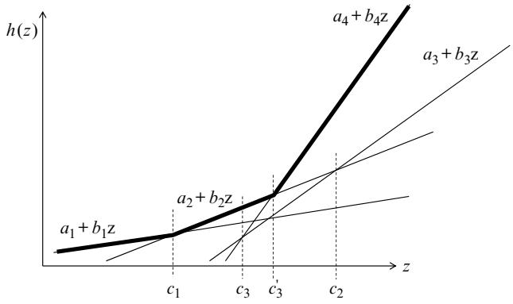  
Figure 7.10 Regions of $_ z$ over which different choices dominate. Choice 3 is always dominated.

are, of course, computational implications. It is relatively easy to handle dozens or hundreds of alternatives, but as a result of the matrix calculations, it becomes expensive to handle problems where the number of potential choices is in the thousands. If this is the case, it is likely the problem has special structure. For example, we might be discretizing a $p$ -dimensional parameter surface, which suggests using a parametric model for the belief model.

A reasonable question to ask is: given that the correlated KG is considerably more complex than the knowledge gradient policy with independent beliefs, what is the value of using correlated KG? Figure 7.11(a) shows the sampling pattern when learning a quadratic function, starting with a uniform prior, when using the knowledge gradient with independent beliefs for the learning policy, but using correlated beliefs to update beliefs after an experiment has been run.

  
(a)

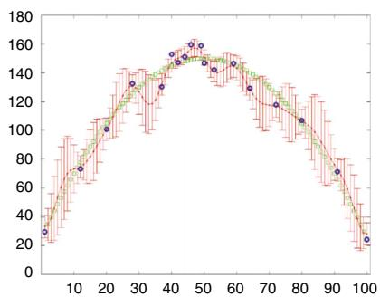  
(b)   
Figure 7.11 (a) Sampling pattern from knowledge gradient using independent beliefs; (b) sampling pattern from knowledge gradient using correlated beliefs.

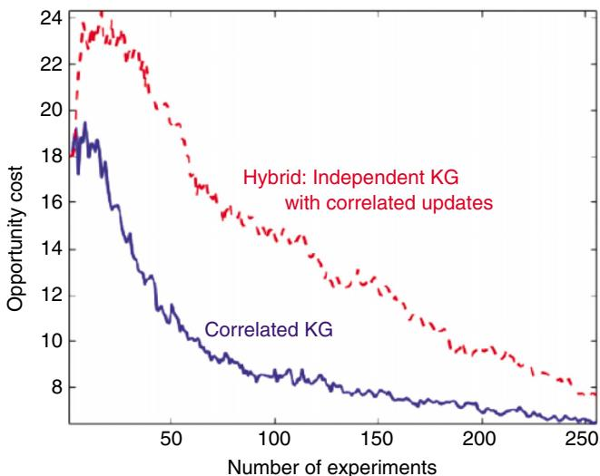  
Figure 7.12 Comparison of correlated KG policy against a KG policy with independent beliefs, but using correlated updates, showing the improvement when using the correlated KG policy.

This policy tends to produce sampling that is more clustered in the region near the optimum. Figure 7.11(b) shows the sampling pattern for the knowledge gradient policy with correlated beliefs, showing a more uniform pattern that shows a better spread of experiments.

So, the correlated KG logic seems to do a better job of exploring, but how well does it work? Figure 7.12 shows the opportunity cost for each policy, where smaller is better. For this example, the correlated KG works quite a bit better, probably due to the tendency of the correlated KG policy to do explore more efficiently.

While these experiments suggest strong support for the correlated KG policy when we have correlated beliefs, we need to also note that tunable CFA-based policies such as interval estimation or the UCB policies can also be tuned in the context of problems with correlated beliefs. The tradeoff is that the correlated KG policy does not require tuning, but is more difficult to implement. A tuned CFA policy requires tuning (which can be a challenge) but is otherwise trivial to implement. This is the classic tradeoff between a CFA policy (in the policy search class) and a DLA policy (in the lookahead class).

# 7.9 Learning in Batches

There are many settings where it is possible to do simultaneous observations, effectively learning in batch. Some examples are:

● If learning is being done via computer simulation, different runs can be run in parallel.   
● An automotive manufacturer looking to tune its robots can try out different ideas at different plants.   
● A company can perform local test marketing in different cities, or by using ads targeted for different types of people shopping online.   
● A materials scientist looking for new materials can divide a plate into 25 squares and perform 25 experiments in batch.

When parallel testing is possible, the natural question is then: how do we determine the set of tests before we know the outcomes of the other tests? We cannot simply apply a policy repeatedly, as it might just end up choosing the same point (unless there is some form of forced randomization).

A simple strategy is to simulate a sequential learning process. That is, use some policy to determine the first test, and then either use the expected outcome, or a simulated outcome, to update the beliefs from running the test, and then repeat the process. The key is to update the beliefs after each simulated outcome. If you can perform $K$ experiments in parallel, repeat this process $K$ times.

Figure 7.13 shows the effect of running an experiment when using correlated beliefs when using the knowledge gradient, although the principle applies to a number of learning policies. On the left is the knowledge gradient before running the indicated experiment, and the right shows the knowledge gradient after running the experiment. As a result of using correlated beliefs, the knowledge gradient drops in the region around the first experiment, discouraging the choice of another experiment nearby. Note that what is important is where you

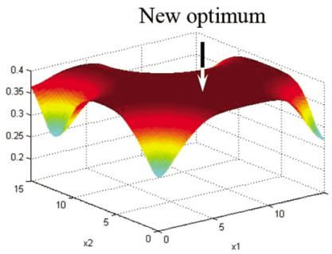

  
Figure 7.13 The knowledge gradient with correlated beliefs before running an experiment (left) and after (right), showing the drop in the knowledge gradient both at the point of the test, and the neighboring region, after running the experiment.

are planning on doing the first experiment, not the outcome. This is particularly true of the knowledge gradient.

# 7.10 Simulation Optimization*

A subcommunity within the larger stochastic search community goes by the name simulation optimization. This community also works on problems that can be described in the form of max?? $\mathbb { E } F ( x , W )$ , but the context typically arises when $x$ represents the design of a physical system, which is then evaluated (noisily) using discrete-event simulation. The number of potential designs $\mathcal { X }$ is typically in the range of 5 to perhaps 100. The standard approach in simulation optimization is to use a frequentist belief model, where it is generally assumed that our experimental budget is large enough for us to run some initial testing of each of the alternatives to build an initial belief.

The field of simulation-optimization has its roots in the analysis of designs, such as the layout of a manufacturing system, where we can get better results if we run a discrete event simulation model for a longer time. We can evaluate a design $x$ more accurately by increasing the run length $n _ { x }$ of the simulation, where $n _ { x }$ might be the number of time periods, the CPU time, or the number of discrete events (e.g. customer arrivals). We assume that we have a global budget $N$ , and we need to find $n _ { x }$ for each $x$ so that

$$
\sum_ {x \in \mathcal {X}} n _ {x} = N.
$$

For our purposes, there is no difference between a potential design of a physical system and a policy. Searching for the best design and searching for the best policy is, algorithmically speaking, identical as long as the set of policies is not too large.

We can tackle this problem using the strategies described above (such as the knowledge gradient) if we break up the problem into a series of short simulations (say, 1 time step or 1 unit of CPU time). Then, at each iteration we have to decide which design $x$ to evaluate, contributing to our estimate $\theta _ { x } ^ { n }$ for design $x$ . The problem with this strategy is that it ignores the startup time for a simulation. It is much easier to set a run length $n _ { x }$ for each design $x$ , and then run the entire simulation to obtain an estimate of $\theta _ { x }$ .

The simulation-optimization problem is traditionally formulated in a frequentist framework, reflecting the lack of prior information about the alternatives. A standard strategy is to run the experiments in two stages. In the first stage, a sample $n ^ { 0 }$ is collected for each design. The information from this first stage is used to develop an estimate of the value of each design. We might learn,

for example, that certain designs seem to lack any promise at all, while other designs may seem more interesting. Rather than spreading our budget across all the designs, we can use this information to focus our computing budget across the designs that offer the greatest potential.

# 7.10.1 An Indifference Zone Algorithm

There are a number of algorithms that have been suggested to search for the best design using the indifference zone criterion, which is one of the most popular in the simulation-optimization community. The algorithm in Figure 7.14 summarizes a method which successively reduces a set of candidates at each iteration, focusing the evaluation effort on a smaller and smaller set of alternatives. The method (under some assumptions) using a user-specified indifference zone of ??. Of course, as $\delta$ is decreased, the computational requirements increase.

# 7.10.2 Optimal Computing Budget Allocation

The value of the indifference zone strategy is that it focuses on achieving a specific level of solution quality, being constrained by a specific budget. However, it is often the case that we are trying to do the best we can within a specific computing budget. For this purpose, a line of research has evolved under the name optimal computing budget allocation, or OCBA.

Figure 7.15 illustrates a typical version of an OCBA algorithm. The algorithm proceeds by taking an initial sample $N _ { x } ^ { 0 } = n _ { 0 }$ of each alternative $x \in \mathcal X$ , which means we use $B ^ { 0 } = M n _ { 0 }$ experiments from our budget $B$ . Letting $M = | \mathcal { X } |$ , we divide the remaining budget of experiments $B - B ^ { 0 }$ into equal increments of size $\Delta$ , so that we do $N = ( B - M n _ { 0 } ) \Delta$ iterations.

After $n$ iterations, assume that we have tested alternative $x N _ { x } ^ { n }$ times, and let $W _ { x } ^ { m }$ be the $m ^ { \mathrm { t h } }$ observation of $x$ , for $m = 1 , \dots , N _ { x } ^ { n }$ . The updated estimate of the value of each alternative $x$ is given by

$$
\theta_ {x} ^ {n} = \frac {1}{N _ {x} ^ {n}} \sum_ {m = 1} ^ {N _ {x} ^ {n}} W _ {x} ^ {m}.
$$

Let $x ^ { n } =$ arg max $\theta _ { x } ^ { n }$ be the current best option.

After using $M n _ { 0 }$ observations from our budget, at each iteration we increase our allowed budget by $B ^ { n } \ = \ B ^ { n - 1 } + \Delta$ until we reach $B ^ { N } \ = \ B$ . After each increment, the allocation $N _ { x } ^ { n }$ , $x \in \mathcal X$ is recomputed using

$$
\frac {N _ {x} ^ {n + 1}}{N _ {x ^ {\prime}} ^ {n + 1}} = \frac {\hat {\sigma} _ {x} ^ {2 , n} / \left(\theta_ {x ^ {n}} ^ {n} - \theta_ {x ^ {\prime}} ^ {n}\right) ^ {2}}{\hat {\sigma} _ {x ^ {\prime}} ^ {2 , n} / \left(\theta_ {x ^ {n}} ^ {n} - \theta_ {x ^ {\prime}} ^ {n}\right) ^ {2}} x \neq x ^ {\prime} \neq x ^ {n}, \tag {7.84}
$$

Step 0. Initialization:

Step 0a. Select the probability of correct selection $_ { 1 - \alpha }$ , indifference zone parameter $\delta$ and initial sample size $n _ { 0 } \geq 2$ .

Step 0b. Compute

$$
\eta = \frac {1}{2} \left[ \left(\frac {2 \alpha}{k - 1}\right) ^ {- 2 / (n _ {0} - 1)} - 1 \right].
$$

Step 0c. Set $h ^ { 2 } = 2 \eta ( n _ { 0 } - 1 )$

Step 0d. Set $\mathcal { X } ^ { 0 } = \mathcal { X }$ as the set of systems in contention.

Step 0e. Obtain samples $\boldsymbol { W } _ { \boldsymbol { x } } ^ { m }$ , $m = 1 , \ldots , n _ { 0 }$ of each $x \in \mathcal { X } ^ { 0 }$ and let $\theta _ { x } ^ { 0 }$ be the resulting sample means for each alternative computing using

$$
\theta_ {x} ^ {0} = \frac {1}{n _ {0}} \sum_ {m = 1} ^ {n _ {0}} W _ {x} ^ {m}.
$$

Compute the sample variances for each pair using

$$
\hat {\sigma} _ {x x ^ {\prime}} ^ {2} = \frac {1}{n _ {0} - 1} \sum_ {m = 1} ^ {n _ {0}} \left[ W _ {x} ^ {m} - W _ {x ^ {\prime}} ^ {m} - \left(\theta_ {x} ^ {0} - \theta_ {x ^ {\prime}} ^ {0}\right) \right] ^ {2}.
$$

Set $r = n _ { 0 }$

Step 0f. Set $n = 1$ .

Step 1. Compute

$$
W _ {x x ^ {\prime}} (r) = \max  \left\{0, \frac {\delta}{2 r} \left(\frac {h ^ {2} \hat {\sigma} _ {x x ^ {\prime}} ^ {2}}{\delta^ {2}} - r\right) \right\}.
$$

Step 2. Refine the eligible set using

$$
\mathcal {X} ^ {n} = \left\{x: x \in \mathcal {X} ^ {n - 1} \text {a n d} \theta_ {x} ^ {n} \geq \theta_ {x ^ {\prime}} ^ {n} - W _ {x x ^ {\prime}} (r), x ^ {\prime} \neq x \right\}.
$$

Step 3. If $\vert \mathcal { X } ^ { n } \vert ~ = ~ 1$ , stop and select the element in ${ \mathcal { X } } ^ { n }$ . Otherwise, perform an additional sample $W _ { x } ^ { n + 1 }$ of each $x \in \mathcal { X } ^ { n }$ , set $r = r + 1$ and return to step 1.

Figure 7.14 Policy search algorithm using the indifference zone criterion. Adapted from Nelson and Kim (2001), ‘A fully sequential procedure for indifference zone selection in simulation’, ACM Trans. Model. Comput. Simul. 11(3), 251–273.

$$
N _ {x ^ {n}} ^ {n + 1} = \hat {\sigma} _ {x ^ {n}} ^ {n} \sqrt {\sum_ {i = 1 , i \neq x ^ {n}} ^ {M} \left(\frac {N _ {x} ^ {n + 1}}{\hat {\sigma} _ {i} ^ {n}}\right) ^ {2}}. \tag {7.85}
$$

We use equations (7.84)–(7.85) to produce an allocation $N _ { x } ^ { n }$ such that $\textstyle \sum _ { x } N _ { x } ^ { n } =$ $B ^ { n }$ . Note that after increasing the budget, it is not guaranteed that $N _ { x } ^ { n } \geq N _ { x } ^ { n - 1 }$

Step 0. Initialization:

Step 0a. Given a computing budget $B$ , let $n ^ { 0 }$ be the initial sample size for each of the $M = | \mathcal X |$ alternatives.

Divide the remaining budget $T - M n _ { 0 }$ into increments so that $N = ( T - M n _ { 0 } ) / \delta$ is an integer.

Step 0b. Obtain samples $W _ { x } ^ { m }$ , $m = 1 , \ldots , n _ { 0 }$ samples of each $x \in \mathcal X$

Step 0c. Initialize $N _ { x } ^ { 1 } = n _ { 0 }$ for all $x \in \mathcal X$ .

Step 0d. Initialize $n = 1$

Step 1. Compute

$$
\theta_ {x} ^ {n} = \frac {1}{N _ {x} ^ {n}} \sum_ {m = 1} ^ {N _ {x} ^ {n}} W _ {x} ^ {m}.
$$

Compute the sample variances for each pair using

$$
\hat {\sigma} _ {x} ^ {2, n} = \frac {1}{N _ {x} ^ {n} - 1} \sum_ {m = 1} ^ {N _ {x} ^ {2}} (W _ {x} ^ {m} - \mathcal {O} _ {x} ^ {n}) ^ {2}.
$$

Step 2. Let $x ^ { n } = \arg \operatorname* { m a x } _ { x \in \mathcal { X } } \theta _ { x } ^ { n }$ .

Step 3. Increase the computing budget by $\Delta$ and calculate the new allocation $N _ { 1 } ^ { n + 1 } , \dots , N _ { M } ^ { n + 1 }$ so that

$$
\frac {N _ {x} ^ {n + 1}}{N _ {x ^ {\prime}} ^ {n + 1}} = \frac {\hat {\sigma} _ {x} ^ {2 , n} / (\theta_ {x ^ {n}} ^ {n} - \theta_ {x ^ {\prime}} ^ {n}) ^ {2}}{\hat {\sigma} _ {x ^ {\prime}} ^ {2 , n} / (\theta_ {x ^ {n}} ^ {n} - \theta_ {x ^ {\prime}} ^ {n}) ^ {2}} x \neq x ^ {\prime} \neq x ^ {n},
$$

$$
{N _ {x ^ {n}} ^ {n + 1}} = {\hat {\sigma} _ {x ^ {n}} ^ {n} \sqrt {\sum_ {i = 1 , i \neq x ^ {n}} ^ {M} \left(\frac {N _ {x} ^ {n + 1}}{\hat {\sigma} _ {i} ^ {n}}\right) ^ {2}}.}
$$

Step 4. Perform $\operatorname* { m a x } { \left( N _ { x } ^ { n + 1 } - N _ { x } ^ { n } , 0 \right) }$ additional simulations for each alternative ??.

Step 5. Set $n = n + 1$ . If $\textstyle \sum _ { x \in { \mathcal { X } } } N _ { x } ^ { n } < B$ , go to step 1.

Step 6. Return $x ^ { n } \mathrm { a r g } \operatorname* { m a x } _ { x \in \mathcal { X } } \theta _ { x } ^ { n }$

# Figure 7.15 Optimal computing budget allocation procedure.

for some $x$ . If this is the case, we would not evaluate these alternatives at all in the next iteration. We can solve these equations by writing each $N _ { x } ^ { n }$ in terms of some fixed alternative (other than $x ^ { n }$ ), such as $N _ { 1 } ^ { n }$ (assuming $x ^ { n } \neq 1$ ). After writing $N _ { x } ^ { n }$ as a function of $N _ { 1 } ^ { n }$ for all $x$ , we then determine $N _ { 1 } ^ { n }$ so that $\textstyle \sum N _ { x } ^ { n } \approx$ $B ^ { n }$ (within rounding).

The complete algorithm is summarized in Figure 7.15.

# 7.11 Evaluating Policies*

There are a number of ways to approach evaluating policies in the context of derivative-free stochastic search. We start by presenting alternative performance metrics and close with a discussion of alternative perspectives of optimality.

# 7.11.1 Alternative Performance Metrics*

Up to now we have evaluated the performance of a policy based on the expected value of the final or cumulative reward. However, there are many ways to evaluate a policy. Below is a list of metrics that have been drawn from different communities.

# Empirical Performance

We might simulate a policy $K$ times, where each repetition involves making $N$ observations of ??. We let $\omega ^ { k }$ represent a full sample realization of these $N$ observations, which we would denote by $W ^ { 1 } ( \omega ^ { k } ) , \dots , W ^ { N } ( \omega ^ { k } )$ . Each sequence $\omega ^ { k }$ creates a design decision $x ^ { \pi , N } ( \omega ^ { k } )$ .

It is useful to separate the random variable ?? that we observe while learning from the random variable we use to evaluate a design, so we are going to let ?? be the random variable we observe while learning, and we are going to let $\widehat { W }$ be the random variable we use for evaluating a design. Most of the time these are the same random variable with the same distribution, but it opens the door to allowing them to be different.

Once we obtain a design $x ^ { \pi , N } ( \omega ^ { k } )$ , we then have to evaluate it by taking, say, $L$ observations of $\widehat W$ , which we designate by $\widehat { W } ^ { 1 } , \ldots , \widehat { W } ^ { \ell } , \ldots , \widehat { W } ^ { L }$ . Using this notation, we would approximate the performance of a design $x ^ { \pi , N } ( \omega ^ { k } )$ using

$$
\bar {F} ^ {\pi} (\omega^ {k}) = \frac {1}{L} \sum_ {\ell = 1} ^ {L} F (x ^ {\pi , N} (\omega^ {k}), \widehat {W} ^ {\ell}).
$$

We then average over all $\omega ^ { k }$ using

$$
\bar {F} ^ {\pi} = \frac {1}{K} \sum_ {k = 1} ^ {K} \bar {F} ^ {\pi} (\omega^ {k}).
$$

# Quantiles

Instead of evaluating the average performance, we may wish to evaluate a policy based on some quantile. For example, if we are maximizing performance, we might be interested in the $1 0 ^ { \mathrm { t h } }$ percentile, since a policy that produces good average performance may work very poorly some of the time.

Let $Q _ { \alpha } ( R )$ be the $\alpha$ quantile of a random variable $R$ . Let $F ^ { \pi } = F ( x ^ { \pi , N } , W )$ be the random variable describing the performance of policy $\pi$ , recognizing that we may have uncertainty about the model (captured by $S ^ { 0 }$ ), uncertainty in the experiments $W ^ { 1 } , \ldots , W ^ { N }$ that go into the final design $x ^ { \pi , N }$ , and then uncertainty in how well we do when we implement $x ^ { \pi , N }$ due to $\widehat W$ . Now, instead of taking an expectation of $F ^ { \pi }$ as we did before, we let

$$
V _ {\alpha} ^ {\pi} = Q _ {\alpha} F (x ^ {\pi , N}, \widehat {W}).
$$

We anticipate that there are many settings where the $\alpha$ quantile is more interesting than an expectation. However, we have to caution that optimizing the $\alpha$ quantile is much harder than optimizing an expectation.

# Static Regret – Deterministic Setting

We illustrate static regret for deterministic problems using the context of machine learning where our decision is to choose a parameter $\boldsymbol { \theta }$ that fits a model $f ( x | \theta )$ to observations ??. Here, “??” plays the role of data rather than a decision, although later we will get to “decide” what data to collect (confused yet?).

The machine learning community likes to evaluate the performance of a machine learning algorithm (known as a “learner”) which is searching for the best parameters $\boldsymbol { \theta }$ to fit some model $f ( x | \theta )$ to predict a response ??. Imagine a dataset $x ^ { 1 } , \ldots , x ^ { n } , \ldots , x ^ { N }$ and let $L ^ { n } ( \theta )$ be the loss function that captures how well our function $f ( x ^ { n } | \theta ^ { n } )$ predicts the response $y ^ { n + 1 }$ , where $\theta ^ { n }$ is our estimate of $\boldsymbol { \theta }$ based on the first $n$ observations. Our loss function might be

$$
L ^ {n + 1} (x ^ {n}, y ^ {n + 1} | \vartheta^ {n}) = (y ^ {n + 1} - f (x ^ {n} | \vartheta^ {n})) ^ {2}.
$$

Assume now that we have an algorithm (or policy) for updating our estimate of $\boldsymbol { \theta }$ that we designate $\Theta ^ { \pi } ( S ^ { n } )$ , where $S ^ { n }$ captures whatever the algorithm (or policy) needs to update $\theta ^ { n - 1 }$ to $\theta ^ { n }$ . One example of a policy is to optimize over the first ?? data points, so we would write

$$
\Theta^ {\pi} (S ^ {n}) = \arg \min  _ {\theta} \sum_ {m = 0} ^ {n - 1} L ^ {m + 1} \left(x ^ {m}, y ^ {m + 1} | \theta\right).
$$

Alternatively, we could use one of the gradient-based algorithms presented in chapter 5. If we fix this policy, our total loss would be

$$
L ^ {\pi} = \sum_ {n = 0} ^ {N - 1} L ^ {n + 1} (x ^ {n}, y ^ {n + 1} | \Theta^ {\pi} (S ^ {n})).
$$

Now imagine that we pick the best value of $\boldsymbol { \theta }$ , which we call $\theta ^ { * }$ , based on all the data. This requires solving

$$
L ^ {\text {s t a t i c ,} *} = \min  _ {\theta} \sum_ {n = 0} ^ {N - 1} L ^ {n + 1} (x ^ {n}, y ^ {n + 1} | \theta).
$$

We now compare the performance of our policy, $L ^ { \pi }$ , to our static bound, $L ^ { s t a t i c , * }$ . The difference is known as the static regret in the machine learning community, or the opportunity cost in other fields. The regret (or opportunity cost) is given by

$$
R ^ {\text {s t a t i c}, \pi} = L ^ {\pi} - L ^ {\text {s t a t i c}, *}. \tag {7.86}
$$

# Static Regret – Stochastic Setting

Returning to the setting where we have to decide which alternative $x$ to try, we now illustrate static regret in a stochastic setting, where we seek to maximize rewards (“winnings”) $\boldsymbol { W } _ { \boldsymbol { x } } ^ { n }$ by trying alternative $x$ in the $n ^ { \mathrm { t h } }$ trial. Let $X ^ { \pi } ( S ^ { n } )$ be a policy that determines the alternative $x ^ { n }$ to evaluate given what we know after ?? experiments (captured by our state variable $S ^ { n }$ ). Imagine that we can generate the entire sequence of winnings $\boldsymbol { W } _ { \boldsymbol { x } } ^ { n }$ for all alternatives $x$ , and all iterations $n$ . If we evaluate our policy on a single dataset (as we did in the machine learning setting), we would evaluate our regret (also known as static regret) as

$$
R ^ {\pi , n} = \max  _ {x} \sum_ {m = 1} ^ {n} W _ {x} ^ {m} - \sum_ {m = 1} ^ {n} W _ {X ^ {\pi} \left(S ^ {m}\right)} ^ {m}. \tag {7.87}
$$

Alternatively, we could write our optimal solution at time $n$ a s

$$
x ^ {n} = \arg \max  _ {x} \sum_ {m = 1} ^ {n} W _ {x} ^ {m},
$$

and then write the regret as

$$
R ^ {\pi , n} = \sum_ {m = 1} ^ {n} W _ {x ^ {n}} ^ {m} - \sum_ {m = 1} ^ {n} W _ {X ^ {\pi} (S ^ {m})} ^ {m}.
$$

The regret (for a deterministic problems) $R ^ { \pi , n }$ is comparing the best decision at time ?? assuming we know all the values $W _ { x } ^ { m }$ , $x \in \mathcal X$ for $m = 1 , \ldots , n$ , against what our policy $X ^ { \pi } ( S ^ { m } )$ would have chosen given just what we know at time ?? (please pay special attention to the indexing). This is an instance of static regret for a deterministic problem.

In practice, $W _ { x } ^ { m }$ is a random variable. Let $W _ { x } ^ { m } ( \omega )$ be one sample realization for a sample path $\omega \in \Omega$ (we can think of regret for a deterministic problem as the regret for a single sample path). Here, ?? represents a set of all possible realizations of ?? over all alternatives $x$ , and all iterations ??. Think of specifying $\omega$ as pre-generating all the observations of ?? that we might experience over all experiments. However, when we make a decision $X ^ { \pi } ( S ^ { m } )$ at time ??, we are not allowed to see any of the information that might arrive at times after ??.

When we introduce uncertainty, there are now two ways of evaluating regret. The first is to assume that we are going to first observe the outcomes $W _ { x } ^ { m } ( \omega )$ for all the alternatives and the entire history $m = 1 , \ldots , n$ , and compare this to what our policy $X ^ { \pi } ( S ^ { m } )$ would have done at each time ?? knowing only what has happened up to time ??. The result is the regret for a single sample path $\omega$

$$
R ^ {\pi , n} (\omega) = \max  _ {x (\omega)} \sum_ {m = 1} ^ {n} W _ {x (\omega)} ^ {m} (\omega) - \sum_ {m = 1} ^ {n} W _ {X ^ {\pi} \left(S ^ {m}\right)} ^ {m} (\omega). \tag {7.88}
$$

As we did above, we can also write our optimal decision for the stochastic case as

$$
x ^ {n} (\omega) = \arg \max  _ {x \in \mathcal {X}} \sum_ {m = 1} ^ {n} W _ {x} ^ {m} (\omega).
$$

We would then write our regret for sample path ?? as

$$
R ^ {\pi , n} (\omega) = \sum_ {m = 1} ^ {n} W _ {x ^ {n} (\omega)} ^ {m} (\omega) - \sum_ {m = 1} ^ {n} W _ {X ^ {\pi} (S ^ {m})} ^ {m} (\omega).
$$

Think of $x ^ { n } ( \omega )$ as the best answer if we actually did know $W _ { x } ^ { m } ( \omega )$ for $m \ =$ $1 , \ldots , n$ , which in practice would never be true.

If we use our machine learning setting, the sample ?? would be a single dataset used to fit our model. In machine learning, we typically have a single dataset, which is like working with a single ??. This is typically what is meant by a deterministic problem (think about it). Here, we are trying to design policies that will work well across many datasets.

In the language of probability, we would say that $R ^ { \pi , n }$ is a random variable (since we would get a different answer each time we run the simulation), while $R ^ { \pi , n } ( \omega )$ is a sample realization. It helps when we write the argument $\mathbf { \Pi } ( \omega )$ because it tells us what is random, but $R ^ { \pi , n } ( \omega )$ and $x ^ { n } ( \omega )$ are sample realizations, while $R ^ { \pi , n }$ and $x ^ { n }$ are considered random variables (the notation does not tell you that they are random – you just have to know it). We can “average” over all the outcomes by taking an expectation, which would be written

$$
\mathbb {E} R ^ {\pi , n} = \mathbb {E} \left\{W _ {x ^ {n}} ^ {n} - \sum_ {m = 1} ^ {n} W _ {X ^ {\pi} (S ^ {m})} ^ {m} \right\}.
$$

Expectations are mathematically pretty, but we can rarely actually compute them, so we run simulations and take an average. Assume we have a set of sample realizations $\omega \in \hat { \Omega } = \{ \omega ^ { 1 } , \dots , \omega ^ { \ell } , \dots , \omega ^ { L } \}$ . We can compute an average regret (approximating expected regret) using

$$
\mathbb {E} R ^ {\pi , n} \approx \frac {1}{L} \sum_ {\ell = 1} ^ {L} R ^ {\pi , n} (\omega^ {\ell}).
$$

Classical static regret assumes that we are allowed to find a solution $x ^ { n } ( \omega )$ for each sample path. There are many settings where we have to find solutions before we see any data, that works well, on average, over all sample paths. This produces a different form of regret known in the computer science community

as pseudo-regret which compares a policy $X ^ { \pi } ( S ^ { n } )$ to the solution $x ^ { * }$ that works best on average over all possible sample paths. This is written

$$
\bar {R} ^ {\pi , n} = \max  _ {x} \mathbb {E} \left\{\sum_ {m = 1} ^ {n} W _ {x} ^ {n} \right\} - \mathbb {E} \left\{\sum_ {m = 1} ^ {n} W _ {X ^ {\pi} \left(S ^ {n}\right)} ^ {n} (\omega) \right\}. \tag {7.89}
$$

Again, we will typically need to approximate the expectation using a set of sample paths $\hat { \Omega }$ .

# Dynamic Regret

A criticism of static regret is that we are comparing our policy to the best decision $x ^ { * }$ (or best parameter $\theta ^ { * }$ in a learning problem) for an entire dataset, but made after the fact with perfect information. In online settings, it is necessary to make decisions $x ^ { n }$ (or update our parameter $\theta ^ { n }$ ) using only the information available up through iteration ??.

Dynamic regret raises the bar by choosing the best value $\theta ^ { n }$ that minimizes $L ^ { n } ( x ^ { n - 1 } , y ^ { n } | \theta )$ , which is to say

$$
\begin{array}{l} \theta^ {*}, n = \arg \min  _ {\theta} L ^ {n} \left(x ^ {n - 1}, y ^ {n} \mid \theta\right), (7.90) \\ = \arg \min  _ {\theta} \left(y ^ {n} - f \left(x ^ {n - 1} \mid \theta\right)\right) ^ {2}. (7.91) \\ \end{array}
$$

The dynamic loss function is then

$$
L ^ {d y n a m i c, *} = \sum_ {n = 0} ^ {N - 1} L ^ {n + 1} \left(x ^ {n}, y ^ {n + 1} \mid \theta^ {*, n}\right).
$$

More generally, we could create a policy $\Theta ^ { \pi }$ for adaptively evolving $\boldsymbol { \theta }$ (equation (7.91) is an example of one such policy). In this case we would compute $\boldsymbol { \theta }$ using $\theta ^ { n } = \Theta ^ { \pi } ( S ^ { n } )$ , where $S ^ { n }$ is our belief state at time ?? (this could be current estimates, or the entire history of data). We might then write our dynamic loss problem in terms of finding the best policy $\Theta ^ { \pi }$ for adaptively searching for $\boldsymbol { \theta }$ as

$$
L ^ {\text {d y n a m i c}, *} = \min  _ {\Theta^ {\pi}} \sum_ {n = 0} ^ {N - 1} L ^ {n + 1} \left(x ^ {n}, y ^ {n + 1} \mid \Theta^ {\pi} \left(S ^ {n}\right)\right).
$$

We then define dynamic regret using

$$
R ^ {d y n a m i c, \pi} = L ^ {\pi} - L ^ {d y n a m i c, *}.
$$

Dynamic regret is simply a performance metric using a more aggressive benchmark. It has attracted recent attention in the machine learning community as a way of developing theoretical benchmarks for evaluating learning policies.

# Opportunity Cost (Stochastic)

Opportunity cost is a term used in the learning community that is the same as regret, but often used to evaluate policies in a stochastic setting. Let $\mu _ { x } =$ $\mathbb { E } F ( x , \theta )$ be the true value of design $x$ , let

$$
x ^ {*} = \arg \max  _ {x} \mu_ {x},
$$

$$
x ^ {\pi} = \arg \max  _ {x} \mu_ {x ^ {\pi , N}}.
$$

So, $x ^ { * }$ is the best design if we knew the truth, while $x ^ { \pi , N }$ is the design we obtained using learning policy $\pi$ after exhausting our budget of $N$ experiments. In this setting, $\mu _ { x }$ is treated deterministically (think of this as a known truth), but $x ^ { \pi , N }$ is random because it depends on a noisy experimentation process. The expected regret, or opportunity cost, of policy $\pi$ is given by

$$
R ^ {\pi} = \mu_ {x ^ {*}} - \mathbb {E} \mu_ {x ^ {\pi , N}}. \tag {7.92}
$$

# Competitive Analysis

A strategy that is popular in the field known as online computation (which has nothing to do with “online learning”) likes to compare the performance of a policy to the best that could have been achieved. There are two ways to measure “best.” The most common is to assume we know the future. Assume we are making decisions $x ^ { 0 } , x ^ { 1 } , \ldots , x ^ { T }$ over our horizon $0 , \ldots , T$ . Let $\omega$ represent a sample path $W ^ { 1 } ( \omega ) , \ldots , W ^ { N } ( \omega )$ , and let $x ^ { * , t } ( \omega )$ be the best decision given that we know that all random outcomes (over the entire horizon) are known (and specified by $\omega$ ). Finally, let $F ( x ^ { n } , W ^ { n + 1 } ( \omega ) )$ be the performance that we observe at time $t + 1$ . We can then create a perfect foresight (PF) policy using

$$
X ^ {P F, n} (\omega) = \arg \max _ {x ^ {n} (\omega)} \left(c ^ {n} x ^ {n} (\omega) + \max _ {x ^ {n + 1} (\omega), \dots , x ^ {N} (\omega)} \sum_ {m = n + 1} ^ {N} c ^ {m} x ^ {m} (\omega)\right).
$$

Unlike every other policy that we consider in this volume, this policy is allowed to see into the future, producing decisions that are better than anything we could achieve without this ability. Now consider some $X ^ { \pi } ( S ^ { n } )$ policy that is only allowed to see the state at time $S ^ { n }$ . We can compare policy $X ^ { \pi } ( S )$ to our perfect foresight using the competitive ratio given by

$$
\rho^ {\pi} = \mathbb {E} \frac {\sum_ {n = 0} ^ {N - 1} F (X ^ {\pi , n} (\omega) , W ^ {n + 1} (\omega))}{\sum_ {n = 0} ^ {N - 1} F (X ^ {P F , n} (\omega) , W ^ {n + 1} (\omega))}
$$

where the expectation is over all sample paths $\omega$ (competitive analysis is often performed for a single sample path). Researchers like to prove bounds on the competitive ratio, although these bounds are never tight.

# Indifference Zone Selection

A variant of the goal of choosing the best alternative $x ^ { * } = \arg \operatorname* { m a x } _ { x } \mu _ { x }$ is to maximize the likelihood that we make a choice $x ^ { \pi , N }$ that is almost as good as $x ^ { * }$ . Assume we are equally happy with any outcome within $\delta$ of the best, by which we mean

$$
\mu_ {x ^ {*}} - \mu_ {x ^ {\pi , N}} \leq \delta .
$$

The region $( \mu _ { x ^ { * } } - \delta , \mu _ { x ^ { * } } )$ is referred to as the indifference zone. Let $V ^ { n , \pi }$ be the value of our solution after ?? experiments. We require $\mathbb { P } ^ { \pi } \{ \mu _ { d ^ { * } } = \bar { \mu } ^ { * } | \mu \} > 1 - \alpha$ for all $\mu$ where $\mu _ { [ 1 ] } - \mu _ { [ 2 ] } > \delta$ , and where $\mu _ { [ 1 ] }$ and $\mu _ { [ 2 ] }$ represent, respectively, the best and second best choices.

We might like to maximize the likelihood that we fall within the indifference zone, which we can express using

$$
P ^ {I Z, \pi} = \mathbb {P} ^ {\pi} \left(V ^ {\pi , n} > \mu^ {*} - \delta\right).
$$

As before, the probability has to be computed with the appropriate Bayesian or frequentist distribution.

# 7.11.2 Perspectives of Optimality*

In this section we review different perspectives of optimality in sequential search procedures.

# Asymptotic Convergence for Final Reward

While in practice we need to evaluate how an algorithm does in a finite budget, there is a long tradition in the analysis of algorithms to study the asymptotic performance of algorithms when using a final-reward criterion. In particular, if $x ^ { * }$ is the solution to our asymptotic formulation in equation (7.1), we would like to know if our policy that produces a solution $x ^ { \pi , N }$ after $N$ evaluations would eventually converge to $x ^ { * }$ . That is, we would like to know if

$$
\lim  _ {N \to \infty} x ^ {\pi , N} \to x ^ {*}.
$$

Researchers will often begin by proving that an algorithm is asymptotically convergent (as we did in chapter 5), and then evaluate the performance in a finite budget $N$ empirically. Asymptotic analysis generally only makes sense when using a final-reward objective.

# Finite Time Bounds on Choosing the Wrong Alternative

There is a body of research that seeks to bound the number of times a policy chooses a suboptimal alternative (where alternatives are often referred to as

“arms” for a multiarmed bandit problem). Let $\mu _ { x }$ be the (unknown) expected reward for alternative $x$ , and let $W _ { x } ^ { n } = \mu _ { x } + \epsilon _ { x } ^ { n }$ be the observed random reward from trying $x$ . Let $x ^ { * }$ be the optimal alternative, where

$$
x ^ {*} = \operatorname * {a r g   m a x} _ {x} \mu_ {x}.
$$

For these problems, we would define our loss function as

$$
L ^ {n} (x ^ {n}) = \left\{ \begin{array}{l l} 1 & \text {i f} x ^ {n} \neq x ^ {*}, \\ 0 & \text {o t h e r w i s e .} \end{array} \right.
$$

Imagine that we are trying to minimize the cumulative reward, which means the total number of times that we do not choose the best alternative. We can compare a policy that chooses $x ^ { n } = X ^ { \pi } ( S ^ { n } )$ against a perfect policy that chooses $x ^ { * }$ each time. The regret for this setting is then simply

$$
R ^ {\pi , n} = \sum_ {m = 1} ^ {n} L ^ {n} \left(X ^ {\pi} \left(S ^ {n}\right)\right).
$$

Not surprisingly, $R ^ { \pi }$ grows monotonically in ??, since good policies have to be constantly experimenting with different alternatives. An important research goal is to design bounds on $R ^ { \pi , n }$ , which is called a finite-time bound, since it applies to $R ^ { \pi , n }$ for finite $n$ .

# Probability of Correct Selection

A different perspective is to focus on the probability that we have selected the best out of a set $\mathcal { X }$ alternatives. In this setting, it is typically the case that the number of alternatives is not too large, say 10 to 100, and certainly not 100,000. Assume that

$$
x^{*} = \arg \max_{x\in \mathcal{X}}\mu_{x}
$$

is the best decision (for simplicity, we are going to ignore the presence of ties). After ?? samples, we would make the choice

$$
x^{n} = \operatorname *{arg  max}_{x\in \mathcal{X}}\bar{\mu}_{x}^{n}.
$$

This is true regardless of whether we are using a frequentist or Bayesian estimate.

We have made the correct selection if $x ^ { n } = x ^ { * }$ , but even the best policy cannot guarantee that we will make the best selection every time. Let $\mathbb { 1 } _ { \{ \varepsilon \} } = 1$ if the event ℰ is true, 0 otherwise. We write the probability of correct selection as

$\begin{array} { r l } { P ^ { C S , \pi } } & { { } = } \end{array}$ probability we choose the best alternative

$$
= \mathbb {E} \mathbb {1} _ {\{x ^ {n} = x ^ {*} \}},
$$

where the underlying probability distribution depends on our experimental policy $\pi$ . The probability is computed using the appropriate distribution, depending on whether we are using Bayesian or frequentist perspectives. This may be written in the language of loss functions. We would define the loss function as

$$
L ^ {C S, \pi} = \mathbb {1} _ {\{x ^ {n} \neq x ^ {*} \}}.
$$

Although we use $L ^ { C S , \pi }$ to be consistent with our other notation, this is more commonly represented as $L _ { 0 - 1 }$ for “0-1 loss.”

Note that we write this in terms of the negative outcome so that we wish to minimize the loss, which means that we have not found the best selection. In this case, we would write the probability of correct selection as

$$
P ^ {C S, \pi} = 1 - \mathbb {E} L ^ {C S, \pi}.
$$

# Subset Selection –

Ultimately our goal is to pick the best design. Imagine that we are willing to choose a subset of designs ??, and we would like to ensure that $P ( x ^ { \ast } \in S ) \geq 1 - \alpha$ , where $1 / | \mathcal { X } | < 1 - \alpha < 1$ . Of course, it would be idea if $| \mathcal { S } | = 1$ or, failing this, as small as possible. Let ${ \bar { \mu } } _ { x } ^ { n }$ be our estimate of the value of $x$ after $n$ experiments, and assume that all experiments have a constant and known variance $\sigma$ . We include $x$ in the subset if

$$
\bar {\mu} _ {x} ^ {n} \geq \max _ {x ^ {\prime} \neq x} \bar {\mu} _ {x ^ {\prime}} ^ {n} - h \sigma \sqrt {\frac {2}{n}}.
$$

The parameter $h$ is the $_ { 1 - \alpha }$ quantile of the random variable max?? $Z _ { i } ^ { n }$ where $Z _ { i } ^ { n }$ is given by

$$
Z _ {i} ^ {n} = \frac {(\bar {\mu} _ {i} ^ {n} - \bar {\mu} _ {x} ^ {n}) - (\mu_ {i} - \mu_ {x})}{\sigma \sqrt {2 / n}}.
$$

# 7.12 Designing Policies

By now we have reviewed a number of solution approaches organized by our four classes of policies:

PFAs – Policy function approximations, which are analytical functions such as a linear decision rule (that has to be tuned), or the setting of the optimal price to which we add noise (the excitation policy).

CFAs – Cost function approximations, which are probably the most popular class of policy for these problems. A good example is the family of upper confidence bounding policies, such as

$$
X ^ {U C B} (S ^ {n} | \theta) = \arg \max  _ {x ^ {n} \in \mathcal {X}} \left(\bar {\mu} _ {x} ^ {n} + \theta \bar {\sigma} _ {x} ^ {n}\right).
$$

VFAs – Policies based on value function approximation, such as using Gittins indices or backward ADP to estimate the value of information.

DLAs – Policies based on direct lookaheads such as the knowledge gradient (a one-step lookahead) or kriging.

It is easy to assume that the policy we want is the policy that performs the best. This is simply not the case. A representative from a large tech company that used active learning policies extensively stated their criteria very simply:

We will use the best policy that can be computed in under 50 milliseconds.

This hints that there is more to using a policy than just its performance. We begin our discussion with a list of characteristics of good learning policies. We then raise the issue of scaling for tunable parameters, and close with a discussion of the whole process of tuning.

# 7.12.1 Characteristics of a Policy

Our standard approach to evaluating policies is to look for the policy that performs the best (on average) according to some performance metric. In practice, the choice of policy tends to consider the following characteristics:

Performance This is our objective function which is typically written as

$$
\max  _ {\pi} \mathbb {E} _ {S ^ {0}} \mathbb {E} _ {W ^ {1},..., W ^ {N} | S ^ {0}} \mathbb {E} _ {\widehat {W} | S ^ {0}} \{F (x ^ {\pi , N}, \widehat {W}) | S ^ {0} \},
$$

or

$$
\max  _ {\pi} \mathbb {E} _ {S ^ {0}} \mathbb {E} _ {W ^ {1},..., W ^ {N} | S ^ {0}} \sum_ {n = 0} ^ {N - 1} F (X ^ {\pi} (S ^ {n}), W ^ {n + 1}).
$$

Computational complexity CPU times matter. The tech company above required that we be able to compute a policy in 50 milliseconds, while an energy company faced a limit of 4 hours.

Robustness Is the policy reliable? Does it produce consistently reliable solutions under a wide range of data inputs? This might be important in the setting of recommending prices for hotel rooms, where the policy involves learning in the field. A hotel would not want a system that recommends unrealistic prices.

Tuning The less tuning that is required, the better.

Transparency A bank might need a system that recommends whether a loan should be approved. There are consumer protection laws that protect against bias that require a level of transparency in the reasons that a loan is turned down.

Implementation complexity How hard is it to code? How likely is it that a coding error will affect the results?

The tradeoff between simplicity and complexity is particularly important. As of this writing, CFA-based policies such as upper confidence bounding are receiving tremendous attention in the tech sector due in large part to their simplicity, as well as their effectiveness, but always at the price of introducing tunable parameters.

The problem of tuning is almost uniformly overlooked by the theory community that focuses on theoretical performance metrics such as regret bounds. Practitioners, on the other hand, are aware of the importance of tuning, but tuning has historically been an ad hoc activity, and far too often it is simply overlooked! Tuning is best done in a simulator, but simulators are only approximations of the real world, and they can be expensive to build. We need more research into online tuning.

Lookahead policies may have no tuning, such as the knowledge gradient in the presence of concave value of information or the deterministic direct lookahead, or some tuning such as the parameter $\theta ^ { K G L A }$ in section 7.7.3. Either way, a lookahead policy requires a lookahead model, which introduces its own approximations. So, there is no free lunch.

# 7.12.2 The Effect of Scaling

Consider the case of two policies. The first is interval estimation, given by

$$
X ^ {I E} (S ^ {n} | \theta^ {I E}) = \arg \max _ {x} \left(\bar {\mu} _ {x} ^ {n} + \theta^ {I E} \sigma_ {x} ^ {n}\right),
$$

which exhibits a unitless tunable parameter $\theta ^ { I E }$ . The second policy is a type of upper confidence bounding policy known in the literature as UCB-E, given by

Table 7.6 Optimal tuned parameters for interval estimation IE, and UCBE. Adapted from Wang, Y., Wang, C., Powell, W. B. and Edu, P. P. (2016), The Knowledge Gradient for Sequential Decision Making with Stochastic Binary Feedbacks, in ‘ICML2016’, Vol. 48.   

<table><tr><td>Problem</td><td>IE</td><td>UCBE</td></tr><tr><td>Goldstein</td><td>0.0099</td><td>2571</td></tr><tr><td>AUF_HNoise</td><td>0.0150</td><td>0.319</td></tr><tr><td>AUF_MNoise</td><td>0.0187</td><td>1.591</td></tr><tr><td>AUF_LNoise</td><td>0.0109</td><td>6.835</td></tr><tr><td>Branin</td><td>0.2694</td><td>.000366</td></tr><tr><td>Ackley</td><td>1.1970</td><td>1.329</td></tr><tr><td>HyperEllipsoid</td><td>0.8991</td><td>21.21</td></tr><tr><td>Pinter</td><td>0.9989</td><td>0.000164</td></tr><tr><td>Rastrigin</td><td>0.2086</td><td>0.001476</td></tr></table>

$$
X ^ {U C B - E, n} (S ^ {n} | \theta^ {U C B - E}) = \arg \max _ {x} \left(\bar {\mu} _ {x} ^ {n} + \sqrt {\frac {\theta^ {U C B - E}}{N _ {x} ^ {n}}}\right),
$$

where $N _ { x } ^ { n }$ is the number of times that we have evaluated alternative $x$ . We note that unlike the interval estimation policy, the tunable parameter $\theta ^ { U C B - E }$ has units, which means that we have to search over a much wider range than we would when optimizing $\theta ^ { I E }$ .

Each of these parameters were tuned on a series of benchmark learning problems using the testing system called MOLTE, with the results reported in Table 7.6. We see that the optimal value of $\theta ^ { I E }$ ranges from around 0.01 to 1.2. By contrast, $\theta ^ { U C B - E }$ ranges from 0.0001 to 2500.

These results illustrate the effect of units on tunable parameters. The UCB-E policy enjoys finite time bounds on its regret, but would never produce reasonable results without tuning. By contrast, the optimal values of $\theta ^ { I E }$ for interval estimation vary over a narrower range, although conventional wisdom for this parameter is that it should range between around 1 and 3. If $\theta ^ { I E }$ is small, then the IE policy is basically a pure exploitation policy.

Parameter tuning can be difficult in practice. Imagine, for example, an actual setting where an experiment is expensive. How would tuning be done? This issue is typically ignored in the research literature where standard practice is to focus on provable qualities. We argue that despite the presence of provable properties, the need for parameter tuning is the hallmark of a heuristic.

If tuning cannot be done, the actual empirical performance of a policy may be quite poor.

Bayesian policies such as the knowledge gradient do not have tunable parameters, but do require the use of priors. Just as we do not have any real theory to characterize the behavior of algorithms that have (or have not) been tuned, we do not have any theory to describe the effect of incorrect priors.

# 7.12.3 Tuning

An issue that will keep coming back in the design of algorithms is tuning. We will keep repeating the mantra:

The price of simplicity is tunable parameters... and tuning is hard!

We are designing policies to solve any of a wide range of stochastic search problems, but when our policy involves tunable parameters, we are creating a stochastic search problem (tuning the parameters) to solve our stochastic search problem. The hope, of course, is that the problem of tuning the parameters of our policy is easier than the search problem that our problem is solving.

What readers need to be aware of is that the performance of their stochastic search policy can be very dependent on the tuning of the parameters of the policy. In addition, the best value of these tunable parameters can depend on anything from the characteristics of a problem to the starting point of the algorithm. This is easily the most frustrating aspect of tuning of policy parameters, since you have to know when to stop and revisit the settings of your parameters.

# 7.13 Extensions*

This section covers a series of extensions to our basic learning problem:

● Learning in nonstationary settings   
● Strategies for designing policies   
● A transient learning model   
● The knowledge gradient for transient problems   
● Learning with large or continuous choice sets   
● Learning with exogenous state information   
● State-dependent vs. state-independent problems

# 7.13.1 Learning in Nonstationary Settings

Our classic “bandit” problem involves learning the value of $\mu _ { x }$ for $x \in \mathcal { X } =$ $\{ x _ { 1 } , \dotsc , x _ { M } \}$ using observations where we choose the alternative to evaluate $x ^ { n } =$ $X ^ { \pi } ( S ^ { n } )$ from which we observe

$$
W ^ {n + 1} = \mu_ {x ^ {n}} + \varepsilon^ {n + 1}.
$$

In this setting, we are trying to learn a static set of parameters $\mu _ { x }$ , $x \in \mathcal X$ , using a stationary policy $X ^ { \pi } ( S _ { t } )$ . An example of a stationary policy for learning is upper confidence bounding, given by

$$
X ^ {U C B} \left(S ^ {n} \mid \theta^ {U C B}\right) = \arg \max  _ {x} \left(\bar {\mu} _ {x} ^ {n} + \theta^ {U C B} \sqrt {\frac {\log n}{N _ {x} ^ {n}}}\right), \tag {7.93}
$$

where $N _ { x } ^ { n }$ is the number of times we have tried alternative $x$ over the first ?? experiments.

It is natural to search for a stationary policy $X ^ { \pi } ( S ^ { n } )$ (that is, a policy where the function does not depend on time ??) by optimizing an infinite horizon, discounted objective such as

$$
\max  _ {\pi} \mathbb {E} \sum_ {n = 0} ^ {\infty} \gamma^ {n} F \left(X ^ {\pi} \left(S ^ {n}\right), W ^ {n + 1}\right). \tag {7.94}
$$

In practice, truly stationary problems are rare. Nonstationarity can arise in a number of ways:

Finite-horizon problems – Here we are trying to optimize performance over a finite horizon $( 0 , N )$ for a problem where the exogenous information $W _ { t }$ comes from a stationary process. The objective would be given by

$$
\max  _ {\pi} \mathbb {E} \sum_ {n = 0} ^ {N} F \left(X ^ {\pi} \left(S ^ {n}\right), W ^ {n + 1}\right).
$$

Note that we may use a stationary policy such as upper confidence bounding to solve this problem, but it would not be optimal. The knowledge gradient policy for cumulative rewards (equation (7.65)).

Learning processes – ?? might be an athlete who gets better as she plays, or a company might get better at making a complex component.

Exogenous nonstationarities – Field experiments might be affected by weather which is continually changing.

Adversarial response – $x$ might be a choice of an ad to display, but the market response depends on the behavior of other players who are changing their

strategies. This problem class is known as “restless bandits” in the bandit community.

Availability of choices – We may wish to try different people for a job, but they may not be available on any given day. This problem is known as “intermittent bandits.”

# 7.13.2 Strategies for Designing Time-dependent Policies

There are two strategies for handling time-dependencies:

Time-dependent policies A time-dependent policy is simply a policy that depends on time. We already saw one instance of a nonstationary policy when we derived the knowledge gradient for cumulative rewards, which produced the policy

$$
X ^ {O L K G, n} \left(S ^ {n}\right) = \arg \max  _ {x \in \mathcal {X}} \left(\bar {\mu} _ {x} ^ {n} + (N - n) \bar {\sigma} _ {x} ^ {n}\right). \tag {7.95}
$$

Here we see that not only is the state $S ^ { n } = ( \bar { \mu } ^ { n } , \bar { \sigma } ^ { n } )$ time-dependent, the policy itself is time-dependent because of the coefficient $( N - n )$ . The same would be true if we used a UCB policy with coefficient $\theta ^ { U C B , n }$ , but this means that instead of learning one parameter $\theta ^ { U C B }$ , we have to learn (????????0 , ????????1 , $( \theta _ { 0 } ^ { U C B } , \theta _ { 1 } ^ { U C B } , \dots , \theta _ { N } ^ { U C B } )$ .

Note that a time-dependent policy is designed in advance, before any observations have been made. This can be expressed mathematically as solving the optimization problem

$$
\max  _ {\pi^ {0}, \dots , \pi^ {N}} \mathbb {E} \sum_ {n = 0} ^ {N} F \left(X ^ {\pi^ {n}} \left(S ^ {n}\right), W ^ {n + 1}\right). \tag {7.96}
$$

Adaptive policies These are policies which adapt to the data, which means the function itself is changing over time. This is easiest to understand if we assume we have a parameterized policy $X ^ { \pi } ( S _ { t } | \theta )$ (such as interval estimation – see equation (12.46)). Now imagine that the market has shifted which means we would like to increase how much exploration we are doing.

We can do this by allowing the parameter $\boldsymbol { \theta }$ to vary over time, which means we would write our decision policy as $X ^ { \pi } ( S ^ { n } | \theta ^ { n } )$ . We need logic to adjust $\theta ^ { n }$ which we depict using $\theta ^ { n + 1 } = \Theta ^ { \pi ^ { \theta } } ( S ^ { n } )$ . The function $\Theta ^ { \pi ^ { \theta } } ( S ^ { n } )$ can be viewed as a policy (some would call it an algorithm) to adjust $\theta ^ { n }$ . Think of this as a “policy to tune a policy.”

For a given policy $X ^ { \pi } ( S _ { t } | \theta ^ { n } )$ , the problem of tuning the $\pi ^ { \theta }$ -policy would be written as

$$
\max  _ {\pi^ {\vartheta}} \mathbb {E} \sum_ {n = 0} ^ {N} F (X ^ {\pi} (S ^ {n} | \Theta^ {\pi} (S ^ {n})), W ^ {n + 1}).
$$

We still have to choose the best implementation policy $X ^ { \pi } ( S ^ { n } | \theta ^ { n } )$ . We could write the combined problem as

$$
\max  _ {\pi^ {\theta}} \max  _ {\pi} \mathbb {E} \sum_ {n = 0} ^ {N} F (X ^ {\pi} (S ^ {n} | \Theta^ {\pi} (S ^ {n})), W ^ {n + 1}).
$$

Both policies $\pi ^ { \theta }$ , which determines $\Theta ^ { \pi ^ { \theta } } ( S ^ { n } )$ , and $\pi$ , which determines $X ^ { \pi } ( S ^ { n } | \theta ^ { n } )$ have to be determined offline, but the decision policy is being tuned adaptively while in the field (that is, “online”).

# 7.13.3 A Transient Learning Model

We first introduced this model in section 3.11 where the true mean varies over time. It is most natural to talk about nonstationary problems in terms of varying over time ??, but we will stay with our counter index ?? for consistency.

When we have a transient process, we update our beliefs according to the model

$$
\mu^ {n + 1} = M ^ {n} \mu^ {n} + \varepsilon^ {\mu , n + 1},
$$

where $\varepsilon ^ { \mu , n + 1 }$ is a random variable with distribution $N ( 0 , \sigma _ { \mu } ^ { 2 } )$ , which means that ${ \mathbb E } \{ \mu ^ { n + 1 } | \mu ^ { n } \} = M ^ { n } \mu ^ { n }$ . The matrix $M ^ { n }$ is a diagonal matrix that captures predictable changes (e.g. where the means are increasing or decreasing predictably). If we let $M ^ { n }$ be the identity matrix, then we have the simpler problem where the changes in the means have mean 0 which means that we expect $\mu ^ { n + 1 } = \mu ^ { n }$ . However, there are problems where there can be a predictable drift, such as estimating the level of a reservoir changing due to stochastic rainfall and predictable evaporation. We then make noisy observations of $\mu ^ { n }$ using

$$
W ^ {n} = M ^ {n} \mu^ {n} + \varepsilon^ {n}.
$$

It used to be that if we did not observe an alternative $x ^ { \prime }$ that our belief ${ \bar { \mu } } _ { x ^ { \prime } } ^ { n }$ did not change (and of course, nor did the truth). Now, the truth may be changing, and to the extent that there is predictable variation (that is, $M ^ { n }$ is not the identity matrix), then even our beliefs may change.

The updating equation for the mean vector is given by

$$
\bar {\mu} _ {x} ^ {n + 1} = \left\{ \begin{array}{l l} M _ {x} ^ {n} \bar {\mu} _ {x} ^ {n} + \frac {W ^ {n + 1} - M _ {x} ^ {n} \bar {\mu} _ {x} ^ {n}}{\sigma_ {\varepsilon} ^ {2} + \Sigma_ {x x} ^ {n}} \Sigma_ {x x} ^ {n} & \text {i f} x ^ {n} = x, \\ M _ {x} ^ {n} \bar {\mu} _ {x} ^ {n} & \text {o t h e r w i s e .} \end{array} \right. \tag {7.97}
$$

To describe the updating of $\Sigma ^ { n }$ , let $\Sigma _ { x } ^ { n }$ be the column associated with alternative $x$ , and let $e _ { x }$ be a vector of 0’s with a 1 in the position corresponding to alternative $x$ . The updating equation for $\Sigma ^ { n }$ can then be written

$$
\Sigma_ {x} ^ {n + 1} = \left\{ \begin{array}{l l} \Sigma_ {x} ^ {n} - \frac {\left(\Sigma_ {x} ^ {n}\right) ^ {T} \Sigma_ {x} ^ {n}}{\sigma_ {\varepsilon} ^ {2} + \Sigma_ {x x} ^ {n}} e _ {x} & \text {i f} x ^ {n} = x, \\ \Sigma_ {x} ^ {n} & \text {o t h e r w i s e .} \end{array} \right. \tag {7.98}
$$

These updating equations can play two roles in the design of learning policies. First, they can be used in a lookahead policy, as we illustrate next with the knowledge gradient (a one-step lookahead policy). Alternatively, they can be used in a simulator for the purpose of doing policy search for the best PFA or CFA.

# 7.13.4 The Knowledge Gradient for Transient Problems

To compute the knowledge gradient, we first compute

$$
\begin{array}{l} = \operatorname {V a r} \left(\bar {\mu} _ {x} ^ {n + 1} \mid \bar {\mu} ^ {n}\right) - \operatorname {V a r} \left(\bar {\mu} ^ {n}\right), \\ = \operatorname {V a r} \left(\bar {\mu} _ {x} ^ {n + 1} | \bar {\mu} ^ {n}\right), \\ { = } { \tilde { \Sigma } _ { x x } ^ { n } . } \\ \end{array}
$$

We can use $\tilde { \sigma } _ { x } ^ { n }$ to write the updating equation for ${ \bar { \mu } } ^ { n }$ using

$$
\bar {\mu} ^ {n + 1} = M ^ {n} \bar {\mu} ^ {n} + \tilde {\sigma} _ {x} ^ {n} Z ^ {n + 1} e _ {p},
$$

where $Z ^ { n + 1 } \sim N ( 0 , 1 )$ is a scalar, standard normal random variable.

We now present some calculations that parallel the original knowledge gradient calculations. First, we define $\zeta _ { t x }$ as we did before

$$
\zeta_ {x} ^ {n} = - \left| \frac {\bar {\mu} _ {x} ^ {n} - \max _ {x ^ {\prime} \neq x} \bar {\mu} _ {x ^ {\prime}} ^ {n}}{\tilde {\sigma} _ {x} ^ {n}} \right|.
$$

This is defined for our stationary problem. We now define a modified version that we call $\zeta _ { x } ^ { M }$ that is given by

$$
\zeta_ {x} ^ {M, n} = M ^ {n} \zeta_ {x} ^ {n}.
$$

We can now compute the knowledge gradient for nonstationary truths using a form that closely parallels the original knowledge gradient,

$$
\begin{array}{l} v _ {x} ^ {K G - N S, n} = \tilde {\sigma} _ {x} ^ {n} \left(\zeta_ {x} ^ {M, n} \Phi \left(\zeta_ {x} ^ {M, n}\right) + \phi \left(\zeta_ {x} ^ {M, n}\right)\right) (7.99) \\ = \bar {\sigma} _ {x} ^ {n} \left(M ^ {n} \zeta_ {x} ^ {n} \Phi \left(M ^ {n} \zeta_ {x} ^ {n}\right) + \phi \left(M ^ {n} \zeta_ {x} ^ {n}\right)\right). (7.100) \\ \end{array}
$$

It is useful to compare this version of the knowledge gradient to the knowledge gradient for our original problem with static truths. If $M ^ { n }$ is the identity matrix, then this means that the truths $\mu ^ { n }$ are not changing in a predictable way; they might increase or decrease, but on average $\mu ^ { n + 1 }$ is the same as $\mu ^ { n }$ . When this happens, the knowledge gradient for the transient problem is the same as the knowledge gradient when the truths are not changing at all.

So, does this mean that the problem where the truths are changing is the same as the one where they remain constant? Not at all. The difference arises in the updating equations, where the precision of alternatives $x ^ { \prime }$ that are not tested decrease, which will make them more attractive from the perspective of information collection.

# 7.13.5 Learning with Large or Continuous Choice Sets

There are many problems where our choice set $\mathcal { X }$ is either extremely large or continuous (which means the number of possible values is infinite). For example:

# EXAMPLE 7.4

A website advertising movies has the space to show 10 suggestions out of hundreds of movies within a particular genre. The website has to choose from all possible combinations of 10 movies out of the population.

# EXAMPLE 7.5

A scientist is trying to choose the best from a set of over 1000 different materials, but has a budget to only test 20.

# EXAMPLE 7.6

A bakery chef for a food producer has to find the best proportions of flour, milk, yeast, and salt.

# EXAMPLE 7.7

A basketball coach has to choose the best five starting players from a team of 12. It takes approximately half a game to draw conclusions about the performance of how well five players work together.

Each of these examples exhibit large choice sets, particularly when evaluated relative to the budget for running experiments. Such situations are surprisingly common. We can handle these situations using a combination of strategies:

Generalized learning The first step in handling large choice sets is using a belief model that provides for a high level of generalization. This can be done using correlated beliefs for lookup table models, and parametric models, where we only have to learn a relatively small number of parameters (which we hope is smaller than our learning budget).

Sampled actions Whether we have continuous actions or large (often multidimensional) actions, we can create smaller problems by just using a sampled set of actions, just as we earlier used sampled beliefs about a parameter vector $\boldsymbol { \theta }$ .

Action sampling is simply another use of Monte Carlo simulation to reduce a large set to a small one, just as we have been doing when we use Monte Carlo sampling to reduce large (often infinite) sets of outcomes of random variables to smaller, discrete sets. Thus, we might start with the optimization problem

$$
F ^ {*} = \max _ {x \in \mathcal {X}} \mathbb {E} _ {W} F (x, W).
$$

Often the expectation cannot be computed, so we replace the typically large set of outcomes of ??, represented by some set $\Omega$ , with a sampled set of outcomes $\hat { \Omega } = \{ w _ { 1 } , w _ { 2 } , \dots , w _ { K } \}$ , giving us

$$
\bar {F} ^ {K} = \max  _ {x \in \mathcal {X}} \frac {1}{K} \sum_ {k = 1} ^ {K} F (x, w _ {k}).
$$

When $\mathcal { X }$ is too large, we can play the same game and replace it with a random sample $\hat { \mathcal X } = \{ x _ { 1 } , \ldots , x _ { L } \}$ , giving us the problem

$$
W ^ {K, L} = \max  _ {x \in \mathcal {X}} \frac {1}{K} \sum_ {k = 1} ^ {K} F (x, w _ {k}). \tag {7.101}
$$

Section 4.3.2 provides results that demonstrate that the approximation $\bar { F } ^ { K }$ converges quite quickly to $F ^ { * }$ as $K$ increases. We might expect a similar result from

$W ^ { K , L }$ as $L$ increases, although there are problems where it is not possible to grow $L$ past a certain amount. For example, see equation (7.76) for our sampled belief model, which becomes computationally challenging if the number of sampled values of $\boldsymbol { \theta }$ is too large.

A strategy for overcoming this limitation is to periodically drop, say, $L / 2$ elements of $\mathcal { X }$ (based on the probabilities $p _ { k } ^ { n }$ ), and then go through a process of randomly generating new values and adding them to the set until we again have $L$ elements. We may even be able to obtain an estimate of the value of each of the new alternatives before running any new experiments. This can be done using the following:

● If we have a parametric belicurrent estimate of ??. This , we can estimate a value of  point estimate, or distribu $x$ $( p _ { k } ^ { n } ) _ { k = 1 } ^ { K }$ $\theta _ { 1 } , \dots , \theta _ { K }$   
● If we are using lookup tables with correlated beliefs, and assuming we have access to a correlation function that gives us $C o v ( F ( x ) , F ( x ^ { \prime } ) )$ for any pair $x$ and $x ^ { \prime }$ , we can construct a belief from experiments we have run up to now. We just have to rerun the correlated belief model from chapter 3 including the new alternative, but without running any new experiments.   
● We can always use nonparametric methods (such as kernel regression) to estimate the value of any $x$ from the observations we have made so far, simply by smoothing over the new point. Nonparametric methods can be quite powerful (hierarchical aggregation is an example, even though we present it alongside lookup table models in chapter 3), but they assume no structure and as a result need more observations.

Using these estimates, we might require that any newly generated alternative $x$ be at least as good as any of the estimates of values in the current set. This process might stop if we cannot add any new alternatives after testing some number ??.

# 7.13.6 Learning with Exogenous State Information – the Contextual Bandit Problem

The original statement of our basic stochastic optimization problem (in its asymptotic form),

$$
\max  _ {x} \mathbb {E} F (x, W)
$$

is looking for a solution in the form of a deterministic decision $x ^ { * }$ . We then proposed that a better form was

$$
\max  _ {x} \mathbb {E} \{F (x, W) | S ^ {0} \}. \tag {7.102}
$$

Again, we assume that we are looking for a single decision $x ^ { * }$ , although now we have to recognize that technically, this decision is a function of the initial state $S ^ { 0 }$ .

Now consider an adaptive learning process where a new initial state $S ^ { 0 }$ is revealed each time we try to evaluate $F ( x , W )$ . This changes the learning process, since each time we observe $F ( x , W )$ for some $x$ and a sampled $W$ , what we learn has to reflect that it is in the context of the initial state $S ^ { 0 }$ . Some illustrations of this setting are:

# EXAMPLE 7.8

Consider a newsvendor problem where $S ^ { 0 }$ is the weather forecast for tomorrow. We know that if it is raining or very cold, that sales will be lower. We need to find an optimal order decision that reflects the weather forecast. Given the forecast, we make a decision of how many newspapers to stock, and then observe the sales.

# EXAMPLE 7.9

A patient arrives to a hospital with a complaint, and a doctor has to make treatment decisions. The attributes of the patient represent initial information that the patient provides in the form of a medical history, then a decision is made, followed by a random outcome (the success of the treatment).

In both of these examples, we have to make our decision given advance information (the weather, or the attributes of the patient). Instead of finding a single optimal solution $x ^ { * }$ , we need to find a function $x ^ { * } ( S ^ { 0 } )$ . This function is a form of policy (since it is a mapping of state to action).

This problem was first studied as a type of multiarmed bandit problems, which we first introduced in chapter 2. In this community, these are known as contextual bandit problems, but as we show here, when properly modeled this problem is simply an instance of a state dependent sequential decision problem.

We propose the following model of contextual problems. First, we let $B _ { t }$ be our belief state at time $t$ that captures our belief about the function $F ( x ) =$ $\mathbb { E } F ( x , W )$ (keep in mind that this is distributional information). We then model two types of exogenous information:

Exogenous information – $\mathbf { \ * { } } W _ { t } ^ { e }$ This is information that arrives before we make a decision (this would be the weather in our newsvendor problem, or the attributes of the patient before making the medical decision).

Outcome $\mathbf { } W _ { t } ^ { o }$ This is the information that arrives as a result of a decision, such as how the patient responds to a drug.

Using this notation, the sequencing of information, belief states and decisions is

$$
(B ^ {0}, W ^ {e, 0}, x ^ {0}, W ^ {o, 1}, B ^ {1}, W ^ {e, 1}, x ^ {1}, W ^ {o, 2}, B ^ {2}, \dots).
$$

We have written the sequence $( W ^ { o , n } , B ^ { n } , W ^ { e , n } )$ to reflect the logical progression where we first learn the outcome of a decision $W ^ { o , n }$ , then update our belief state producing $B ^ { n }$ , and then observe the new exogenous information $W ^ { e , n }$ before making decision $x ^ { n }$ . However, we can write $W ^ { n } = ( W ^ { o , n } , W ^ { e , n } )$ as the exogenous information, which leads to a new state $S ^ { n } = \left( B ^ { n } , W ^ { e , n } \right)$ .

This change of variables, along with defining $S ^ { 0 } = ( B ^ { 0 } , W ^ { e , 0 } )$ , gives us our usual sequence of states, actions, and new information that we can write as

$$
\begin{array}{l} (S ^ {0} = (B ^ {0}, W ^ {e, 0}), x ^ {0}, W ^ {o, 1}, B ^ {1} = B ^ {M} (B ^ {0}, x ^ {0}, W ^ {1} = (W ^ {e, 1}, W ^ {o, 1})), S ^ {1} = (B ^ {1}, W ^ {e, 1}), x ^ {1}, \\ W ^ {o, 2}, B ^ {2} = B ^ {M} \left(B ^ {1}, x ^ {1}, W ^ {2} = \left(W ^ {e, 2}, W ^ {o, 2}\right), \dots\right). \\ \end{array}
$$

This, then, is the same as our basic sequence

$$
(S ^ {0}, x ^ {0}, W ^ {1}, S ^ {1}, x ^ {1}, S ^ {2}, \dots , S ^ {n}, x ^ {n}, W ^ {n + 1}, \dots).
$$

Our policy $X ^ { \pi , n } ( S ^ { n } )$ will now depend on both our belief state $B ^ { n }$ about $\mathbb { E } F ( x , W )$ , as well as the new exogenous information $W ^ { e , n }$ .

So why is this an issue? Simply put, pure learning problems are easier than state-dependent problems. In particular, consider one of the popular CFA policies such as upper confidence bounding or interval estimation. Instead of learning ${ \bar { \mu } } _ { x } ^ { n }$ , we have to learn $\bar { \mu } _ { x } ^ { n } ( W ^ { e } )$ . For example, if ${ \bar { \mu } } _ { x } ^ { n }$ describes the reduction in blood sugar from using drug $x$ , we now have to learn the reduction in blood sugar for drug $x$ for a patient with attributes $W ^ { e , n }$ .

In other words, exogenous state information makes the learning more complex. If we are solving a problem where the exogenous information is weather, we might be able to describe weather using a handful of states (cold/hot, dry/rainy). However, if the exogenous information is the attributes of a patient, then it could have many dimensions. This is problematic if we are using a lookup table representation (as we might with weather), but perhaps we are just using a parametric model.

As an illustration, assume that we are deciding on the bid for an ad. The probability that a customer clicks on the ad depends on our bid $b$ , and is given by the logistics curve:

$$
p (b | \theta) = \frac {e ^ {U (b | \theta)}}{1 + e ^ {U (b | \theta)}}, \tag {7.103}
$$

where $U ( b | \theta )$ is a linear model given by

$$
U (b | \vartheta) = \vartheta_ {0} + \vartheta_ {1} b.
$$

Now assume we are given additional information that arrives in $\mathbf { \ * { } } W _ { t } ^ { e }$ that provides attributes of the consumer as well as attributes of the ad. Let $a _ { t }$ capture this vector of attributes (this means that $W _ { t } ^ { e } = a _ { t }$ ). Then this has the effect of changing our utility function to

$$
U (b | a, \theta) = \theta_ {0} + \theta_ {1} b + \theta_ {2} a _ {1} + \theta_ {3} a _ {2} + \dots .
$$

As we can see, if we are using a parametric model, the additional attributes expands the number of features in $U ( b | a , \theta )$ , which would increase the number of observations required to estimate the vector of coefficients ??. The number of observations needed depends on the number of parameters, and the level of noise in the data.

# 7.13.7 State-dependent vs. State-independent Problems

We are going to spend the rest of this book on what we call “state-dependent problems,” which refers to settings where the problem depends on the state variable. To illustrate, consider a simple newsvendor problem

$$
\max  _ {x} F (x) = \mathbb {E} _ {W} \left(p \min  \{x, W \} - c x\right). \tag {7.104}
$$

Assume we do not know the distribution of $W$ , but we can collect information by choosing $x ^ { n }$ , then observing

$$
\hat {F} ^ {n + 1} = p \min  \{x ^ {n}, W ^ {n + 1} \} - c x ^ {n}.
$$

We can then use the observation ${ \hat { F } } ^ { n + 1 }$ to produce an updated estimate ${ \bar { F } } ^ { n + 1 } ( x )$ . The parameters describing the approximation ${ \bar { F } } ^ { n } ( x )$ make up our belief state $B ^ { n }$ , which for this problem represents the only state variables. The goal is to explore different values of $x$ to develop a good approximation ${ \bar { F } } ^ { n } ( x )$ to help choose the best value of $x$ .

Now assume that the prices change each period, and that we are given the price $p ^ { n }$ just before we make our choice $x ^ { n }$ . The price $p ^ { n }$ is a form of exogenous information, which means that instead of trying to find the best $x$ , we are trying to find the best function $x ( p )$ . Now we have to decide what type of function we want to use to represent $x ( p )$ (lookup table? a parametric function of $p ?$ ).

Finally, assume that we have to choose product from inventory to satisfy the demand ??, where $R ^ { n }$ is our inventory. Assume that we have to observe $x ^ { n } \leq R ^ { n }$ , and that the inventory is updated according to

$$
R ^ {n + 1} = R ^ {n} - \min  \{x ^ {n}, W ^ {n + 1} \} + \max  \{0, x ^ {n} - W ^ {n + 1} \}.
$$

Now our decision $x ^ { n }$ at time $n$ affects our state $R ^ { n + 1 }$ . For this problem, our state variable is given by

$$
S ^ {n} = (R ^ {n}, p ^ {n}, B ^ {n}).
$$

A special case of a state-dependent problem was the learning problem we saw in section 7.13.6, since the problem depends on the exogenous information $W ^ { e , n }$ . This is a type of state-dependent problem, but decisions only affect the belief; the exogenous information $W ^ { e , n + 1 }$ is not affected by the decisions $x ^ { n }$ . This quality means that this is closer to a learning problem than the broader class of state-dependent problems.

State-dependent problems may or may not involve a belief state, but will involve information other than a belief (which is what makes them statedependent problems). A major problem class includes problems that involve the management of resources. A simple example involves managing a vehicle moving over a graph, where the decision changes the location of the vehicle.

We will show in the remainder of the book that we can approach these more complex problems with the same five-element modeling framework that we first introduced in chapter 2, and again in this chapter. Also, we will design policies using the same four classes of policies that were covered here. What changes is the choice of which policies work best.

# 7.14 Bibliographic Notes

Section 7.1 – The earliest paper on derivative-free stochastic search is the seminal paper (Box and Wilson, 1951), which interestingly appeared in the same year as the original paper for derivative-based stochastic search (Robbins and Monro, 1951).

Section 7.2.1 – Our formulation of derivative-free stochastic search was first suggested in Powell (2019). Of particular value is writing out the objective function for evauating policies in an explicit way; perhaps surprisingly, this is often (although not always) overlooked. We are not aware of another reference formulating stochastic search problems as formal optimization problems searching for optimal policies.

Section 7.1.4 – This is the first time in writing that the equivalence of these four classes of problems have been observed.

Section 7.3 – The idea of using all four classes of policies for pure learning problems was first suggested in Powell (2019), but this book is the first to illustrate this idea in a comprehensive way.

Section 7.5 – There is by now an extensive literature in the reinforcement learning community using what are generally referred to as “upper confidence bounding” policies, which we classify under the heading of parametric cost function approximations. A nice introduction to these learning strategies is contained in Kaelbling (1993) and Sutton and Barto (2018). Thrun (1992) contains a good discussion of exploration in the learning process, which is achieved by the “uncertainty bonus” in UCB policies. The discussion of Boltzmann exploration and epsilon-greedy exploration is based on Singh et al. (2000). The upper confidence bound is due to Lai and Robbins (1985). We use the version of the UCB rule given in Lai (1987). The UCB1 policy is given in Auer et al. (2002). Analysis of UCB policies are given in Lai and Robbins (1985), as well as Chang et al. (2007).

For a nice review of Bayesian optimization, see Frazier (2018).

Interval estimation is due to Kaelbling (1993) (interval estimation today is viewed (correctly) as just another form of upper confidence bounding).

See Russo et al. (2017) for a nice tutorial on Thompson sampling, which was first introduced in 1933 (Thompson (1933)).

Section 7.6 – DeGroot (1970) was the first to express pure learning problems (known at the time as multiarmed bandit problems) using Bellman’s optimality equation, although it was computationally intractable. Gittins and Jones (1974) was the first to propose a decomposition of discounted infinite horizon learning problems into dynamic programs for each arm (hence of much lower dimensionality). This result produced an explosion of research into what became known as “Gittins indices” (or simply “index policies”). See Gittins (1979), Gittins (1981), and Gittins (1989). Whittle (1983) and Ross (1983) provide very clear tutorials on Gittins indices, helping to launch an extensive literature on the topic (see, for example, Lai and Robbins (1985), Berry and Fristedt (1985), and Weber (1992)). The work on approximating Gittins indices is due to Brezzi and Lai (2002), Yao (2006), and Chick and Gans (2009). In 2011 Gittins’ former student, Kevin Glazebrook, came out with a “second edition” of Gittins’ original book (Gittins et al. (2011)). The book is actually entirely new.

Index policies are limited to discounted, infinite horizon problems since the “index,” which is related to the Lagrange multiplier on the coupling constraint requiring that we try at most one arm, needs to be independent of time. It is possible, however, to use the tools of approximate dynamic programming (in particular backward dynamic programming, described in chapter 15) to approximate the value functions around the belief state. This idea was developed by a former student (Weidong Han), but never published.

Section 7.7.2 – There are a variety of strategies based on the idea of approximating the value of one or more experiments. There is by now an extensive

line of research based on the principle of the knowledge gradient, which we review in section 7.8 (see the bibliographic notes below). Sequential kriging optimization was proposed by Huang et al. (2006). Stein (1999) provides a thorough introduction to the field of kriging, which evolved from the field of spatial statistics.

An example of a restricted lookahead policy is the $\operatorname { K G } ( { } ^ { * } )$ policy proposed in Frazier and Powell (2010) to overcome the potential nonconcavity in the value of information.

The deterministic multiperiod lookahead was work performed jointly with graduate student Ahmet Duzgun, but was never published. It is presented here just to illustrate the range of different policies that can be tried.

The idea of using a decision tree to evaluate the value of information is standard material in the decision sciences (see, for example, Skinner (1999).

Section 7.7.5 – The hitting example in section was taken from Powell and Ryzhov (2012).

Section 7.8 – The knowledge gradient policy for normally distributed rewards and independent beliefs was introduced by Gupta and Miescke (1996), and subsequently analyzed in greater depth by Frazier et al. (2008). The knowledge gradient for correlated beliefs was introduced by Frazier et al. (2009). The adaptation of the knowledge gradient for online problems is due to Ryzhov and Powell (2009). A fairly thorough introduction to the knowledge gradient policy is given in Powell and Ryzhov (2012) (as of this writing, a partially finished second edition is available for download from https: //tinyurl.com/optimallearningcourse). Portions of this section are adapted from material in Powell and Ryzhov (2012).

Section 7.10 – There is an advanced field of research within the simulation community that has addressed the problem of using simulation (in particular, discrete event simulation) to find the best setting of a set of parameters that controls the behavior of the simulation. An early survey is given by Bechhofer et al. (1995); a more recent survey can be found in Fu et al. (2007). Kim et al. (2005) provides a nice tutorial overview of methods based on ordinal optimization. Other important contributions in this line include Hong and Nelson (2006) and Hong and Nelson (2007). Most of this literature considers problems where the number of potential alternatives is not too large. Nelson et al. (2001) considers the case when the number of designs is large. Ankenman et al. (2009) discusses the use of a technique called kriging, which is useful when the parameter vector $x$ is continuous. The literature on optimal computing budget allocation is based on a series of articles originating with Chen (1995), and including Chen et al. (1997, 1998), and Chen et al. (2000). Chick et al. (2001) introduces the $L L ( B )$ strategy which maximizes the linear loss with measurement budget ??. He et al. (2007) introduce an

OCBA procedure for optimizing the expected value of a chosen design, using the Bonferroni inequality to approximate the objective function for a single stage. A common strategy in simulation is to test different parameters using the same set of random numbers to reduce the variance of the comparisons. Fu et al. (2007) apply the OCBA concept to measurements using common random numbers. The field of simulation-optimization continues to evolve. For a more modern overview of the scope of activities, see Fu (2014).

Section 7.11.1 – The list of different objective functions is taken from Powell and Ryzhov (2012)[Chapter 6].

# Exercises

# Review questions

7.1 Explain in words each of the three nested expectations in equation (7.2).   
7.2 Why do we go from maximizing over $x$ in our original stochastic search problem in equation (7.1) to maximizing over policies $\pi$ in equation (7.2)?   
7.3 What is the meaning of “bandit” and “arms” in multi-armed bandit problems?   
7.4 What is meant by passive learning and active learning? Why is derivativefree stochastic search an active learning problem?   
7.5 State in words the information that would be needed in the state variable when describing a search algorithm for derivative-free stochastic search.   
7.6 Which of the four classes of policies are used in the derivative-based stochastic search algorithms that we described in chapter 5? Which of the four classes of policies are described in this chapter for derivative-free stochastic search? Can you explain why there is the difference between derivative-based and derivative-free settings?   
7.7 Give an example of a PFA-based policy for derivative-free stochastic search.   
7.8 Give an example of a CFA-based policy for stochastic search.   
7.9 State mathematically the definition of the knowledge gradient, and state in words what it is doing.   
7.10 The knowledge gradient policy is a one-step lookahead that finds the value of one more experiment. Under what conditions does this approach fail?

7.11 What is meant by a restricted multi-step lookahead?   
7.12 Give both the final-reward and cumulative reward objectives for learning problems.   
7.13 Define the objective function that minimizes expected static regret.   
7.14 What is meant by the indifference zone?

# Modeling questions

7.15 Consider the problem of finding the best in a set of discrete choices $\mathcal { X } \ = \ \{ x _ { 1 } , \ldots , x _ { M } \}$ . Assume that for each alternative you maintain a lookup table belief model, where ${ \bar { \mu } } _ { x } ^ { n }$ is your estimate of the true mean $\mu _ { x }$ , with precision $\beta _ { x } ^ { n }$ . Assume that your belief about $\mu _ { x }$ is Gaussian, and let $X ^ { \pi } ( S ^ { n } )$ be a policy that specifies the experiment $x ^ { n } = X ^ { \pi } ( S ^ { n } )$ that you will run next, where you will learn $W _ { { x ^ { n } } } ^ { n + 1 }$ ???? which you will use to update your beliefs.

(a) Formulate this learning problem as a stochastic optimization problem. Define your state variable, decision variable, exogenous information, transition function, and objective function.   
(b) Specify three possible policies, with no two from the same policy class (PFA, CFA, VFA, and DLA).

7.16 Section 7.3 introduces four classes of policies for derivative-free stochastic search, a concept that was not discussed when we introduced derivative-based stochastic search in chapter 5. In which of the four classes of policies would you classify a stochastic gradient algorithm? Explain and describe a key step in the design of stochastic gradient algorithms that is explained by your choice of policy class.   
7.17 A newsvendor problem where the demand distribution ?? is known is a static problem. When we use learning, it is a fully sequential problem. Assume we are using a derivative-based stochastic gradient algorithm from chapter 5 with a deterministic, harmonic stepsize rule. Model this system as a fully sequential problem assuming you are limited to $N$ iterations.   
7.18 Assume we are using a quadratic approximation to approximate the expected profit of a newsvendor problem:

$$
F \left(x _ {t}\right) = \mathbb {E} \left\{p \min  \left\{x _ {t}, W _ {t + 1} \right\} - c x _ {t} \right\}.
$$

Table 7.7 Priors for exercise 7.19   

<table><tr><td>Choice</td><td>μn</td><td>σn</td></tr><tr><td>1</td><td>3.0</td><td>8.0</td></tr><tr><td>2</td><td>4.0</td><td>8.0</td></tr><tr><td>3</td><td>5.0</td><td>8.0</td></tr><tr><td>4</td><td>5.0</td><td>9.0</td></tr><tr><td>5</td><td>5.0</td><td>10.0</td></tr></table>

Assume you are going to be using recursive least squares to update your quadratic belief model

$$
\bar {F} _ {t} (x | \bar {\theta} _ {t}) = \bar {\theta} _ {t 0} + \bar {\theta} _ {t 1} x + \bar {\theta} _ {t 2} x _ {t} ^ {2}.
$$

Further assume that you are going to choose your decision using an excitation policy of the form

$$
X ^ {\pi} (S _ {t} | \bar {\theta} _ {t}) = \arg \max  _ {x _ {t}} \bar {F} _ {t} (x | \bar {\theta} _ {t}) + \varepsilon_ {t + 1},
$$

where $\varepsilon _ { t + 1 } ~ \sim ~ N ( 0 , \sigma _ { \varepsilon } ^ { 2 } )$ . Model this learning problem as a sequential decision problem. What class of policy are you using? What are the tunable parameters?

# Computational exercises

7.19 Table 7.7 shows the priors $\bar { \mu } ^ { n }$ and the standard deviations $\sigma ^ { n }$ for five alternatives.

(a) Three of the alternatives have the same standard deviation, but with increasing priors. Three have the same prior, but with increasing standard deviations. Using only this information, state any relationships that you can between the knowledge gradients for each alternative. Note that you will not be able to completely rank all the alternatives.   
(b) Compute the knowledge gradient for each alternative assuming that $\sigma ^ { W } = 4$ .

7.20 You have to find the best of five alternatives. After ?? experiments, you have the data given in the table below. Assume that the precision of the experiment is $\beta ^ { W } = 0 . 6$ .

<table><tr><td>Choice</td><td>θn</td><td>βn</td><td>βn+1</td><td>σ</td><td>maxx&#x27;≠x θnx&#x27;</td><td>ζ</td><td>f(ζ)</td><td>νxKG</td></tr><tr><td>1</td><td>3.0</td><td>0.444</td><td>1.044</td><td>1.248</td><td>6</td><td>-2.404</td><td>0.003</td><td>0.003</td></tr><tr><td>2</td><td>5.0</td><td>0.160</td><td>0.760</td><td>2.321</td><td>6</td><td>-0.431</td><td>0.220</td><td>0.511</td></tr><tr><td>3</td><td>6.0</td><td>0.207</td><td>0.807</td><td>2.003</td><td>5</td><td>-0.499</td><td>0.198</td><td>0.397</td></tr><tr><td>4</td><td>4.0</td><td>0.077</td><td>?</td><td>?</td><td>?</td><td>?</td><td>?</td><td>?</td></tr><tr><td>5</td><td>2.0</td><td>0.052</td><td>0.652</td><td>4.291</td><td>6</td><td>-0.932</td><td>0.095</td><td>0.406</td></tr></table>

(a) Give the definition of the knowledge gradient, first in plain English and second using mathematics.   
(b) Fill in the missing entries for alternative 4 in the Table above. Be sure to clearly write out each expression and then perform the calculation. For the knowledge gradient $\nu _ { x } ^ { K G }$ , you will need to use a spreadsheet (or MATLAB) to compute the normal distribution.   
(c) Now assume that we have an online learning problem. We have a budget of 20 experiments, and the data in the table above shows what we have learned after three experiments. Assuming no discounting, what is the online knowledge gradient for alternative 2? Give both the formula and the number.

7.21 You have to find the best of five alternatives. After ?? experiments, you have the data given in the Table below. Assume that the precision of the experiment is $\beta ^ { W } = 0 . 6$ .   

<table><tr><td>Alternative</td><td>μn</td><td>σn</td><td>σ</td><td>ζ</td><td>f(ξ)</td><td>KG index</td></tr><tr><td>1</td><td>4.0</td><td>2.5</td><td>2.321</td><td>-0.215</td><td>0.300</td><td>0.696</td></tr><tr><td>2</td><td>4.5</td><td>3.0</td><td>?</td><td>?</td><td>?</td><td>?</td></tr><tr><td>3</td><td>4.0</td><td>3.5</td><td>3.365</td><td>-0.149</td><td>0.329</td><td>1.107</td></tr><tr><td>4</td><td>4.2</td><td>4.0</td><td>3.881</td><td>-0.077</td><td>0.361</td><td>1.401</td></tr><tr><td>5</td><td>3.7</td><td>3.0</td><td>2.846</td><td>-0.281</td><td>0.274</td><td>0.780</td></tr></table>

(a) Give the definition of the knowledge gradient, first in plain English and second using mathematics.   
(b) Fill in the missing entries for alternative 2 in the table above. Be sure to clearly write out each expression and then perform the calculation. For the knowledge gradient $\nu _ { x } ^ { K G }$ , you will need to use a spreadsheet (or programming environment) to compute the normal distribution.   
(c) Now assume that we have an online learning problem. We have a budget of 20 experiments, and the data in the table above

Table 7.8 Three observations, for three alternatives, given a normally distributed belief, and assuming normally distributed observations.   

<table><tr><td>Iteration</td><td>A</td><td>B</td><td>C</td></tr><tr><td>Prior (μx0,βx0)</td><td>(32,0.2)</td><td>(24,0.2)</td><td>(27,0.2)</td></tr><tr><td>1</td><td>36</td><td>-</td><td>-</td></tr><tr><td>2</td><td>-</td><td>-</td><td>23</td></tr><tr><td>3</td><td>-</td><td>22</td><td></td></tr></table>

shows what we have learned after three experiments. Assuming no discounting, what is the online knowledge gradient for alternative 2? Give both the formula and the number.

7.22 You have three alternatives, with priors (mean and precision) as given in the first line of Table 7.8. You then observe each of the alternatives in three successive experiments, with outcomes shown in the table. All observations are made with precision $\beta ^ { W } = 0 . 2$ . Assume that beliefs are independent.

(a) Give the objective function (algebraically) for offline learning (maximizing final reward) if you have a budget of three experiments, and where you evaluate the policy using the truth (as you would do in a simulator).   
(b) Give the numerical value of the policy that was used to generate the choices that created Table 7.8, using our ability to use the simulated truth (as you have done in your homeworks). This requires minimal calculations (which can be done without a calculator).   
(c) Now assume that you need to run experiments in an online (cumulative reward) setting. Give the objective function (algebraically) to find the optimal policy for online learning (maximizing cumulative reward) if you have three experiments. Using the numbers in the table, give the performance of the policy that generated the choices that were made. (This again requires minimal calculations.)

7.23 There are four paths you can take to get to your new job. On the map, they all seem reasonable, and as far as you can tell, they all take 20 minutes, but the actual times vary quite a bit. The value of taking a path is your current estimate of the travel time on that path. In the table below, we show the travel time on each path if you had travelled that path. Start

with an initial estimate of each value function of 20 minutes with your tie-breaking rule to use the lowest numbered path. At each iteration, take the path with the best estimated value, and update your estimate of the value of the path based on your experience. After 10 iterations, compare your estimates of each path to the estimate you obtain by averaging the “observations” for each path over all 10 days. Use a constant stepsize of 0.20. How well did you do?

<table><tr><td rowspan="2">Day</td><td colspan="4">Paths</td></tr><tr><td>1</td><td>2</td><td>3</td><td>4</td></tr><tr><td>1</td><td>37</td><td>29</td><td>17</td><td>23</td></tr><tr><td>2</td><td>32</td><td>32</td><td>23</td><td>17</td></tr><tr><td>3</td><td>35</td><td>26</td><td>28</td><td>17</td></tr><tr><td>4</td><td>30</td><td>35</td><td>19</td><td>32</td></tr><tr><td>5</td><td>28</td><td>25</td><td>21</td><td>26</td></tr><tr><td>6</td><td>24</td><td>19</td><td>25</td><td>31</td></tr><tr><td>7</td><td>26</td><td>37</td><td>33</td><td>30</td></tr><tr><td>8</td><td>28</td><td>22</td><td>28</td><td>27</td></tr><tr><td>9</td><td>24</td><td>28</td><td>31</td><td>30</td></tr><tr><td>10</td><td>33</td><td>29</td><td>17</td><td>29</td></tr></table>

7.24 Assume you are considering five options. The actual value $\mu _ { d }$ , the initial estimate $\bar { \mu } _ { d } ^ { 0 }$ , and the initial standard deviation $\bar { \sigma } _ { d } ^ { 0 }$ of each $\bar { \mu } _ { d } ^ { 0 }$ are given in Table 7.9. Perform 20 iterations of each of the following algorithms:

(a) Interval estimation using $\theta ^ { I E } = 2$   
(b) The upper confidence bound algorithm using $\theta ^ { U C B } = 6$   
(c) The knowledge gradient algorithm.   
(d) A pure exploitation policy.   
(e) A pure exploration policy.

Each time you sample a decision, randomly generate an observation $W _ { d } = \mu _ { d } + \sigma ^ { \varepsilon } Z$ where $\sigma ^ { \varepsilon } = 1$ and $Z$ is normally distributed with mean 0 and variance 1. [Hint: You can generate random observations of $Z$ in Excel by using =NORM.INV(RAND()).]

7.25 Repeat exercise 7.24 using the data in Table 7.10, with $\sigma ^ { \varepsilon } = 1 0 $ .   
7.26 Repeat exercise 7.24 using the data in Table 7.11, with $\sigma ^ { \varepsilon } = 2 0 $

Table 7.9 Data for exercise 7.24.   

<table><tr><td>Decision</td><td>μ</td><td>θ0</td><td>σ0</td></tr><tr><td>1</td><td>1.4</td><td>1.0</td><td>2.5</td></tr><tr><td>2</td><td>1.2</td><td>1.2</td><td>2.5</td></tr><tr><td>3</td><td>1.0</td><td>1.4</td><td>2.5</td></tr><tr><td>4</td><td>1.5</td><td>1.0</td><td>1.5</td></tr><tr><td>5</td><td>1.5</td><td>1.0</td><td>1.0</td></tr></table>

Table 7.10 Data for exercise 7.25.   

<table><tr><td>Decision</td><td>μ</td><td>θ0</td><td>σ0</td></tr><tr><td>1</td><td>100</td><td>100</td><td>20</td></tr><tr><td>2</td><td>80</td><td>100</td><td>20</td></tr><tr><td>3</td><td>120</td><td>100</td><td>20</td></tr><tr><td>4</td><td>110</td><td>100</td><td>10</td></tr><tr><td>5</td><td>60</td><td>100</td><td>30</td></tr></table>

Table 7.11 Data for exercise 7.26.   

<table><tr><td>Decision</td><td>μ</td><td>θ0</td><td>σ0</td></tr><tr><td>1</td><td>120</td><td>100</td><td>30</td></tr><tr><td>2</td><td>110</td><td>105</td><td>30</td></tr><tr><td>3</td><td>100</td><td>110</td><td>30</td></tr><tr><td>4</td><td>90</td><td>115</td><td>30</td></tr><tr><td>5</td><td>80</td><td>120</td><td>30</td></tr></table>

# Theory questions

7.27 Assume that we have a standard normal prior about a true parameter $\mu$ which we assume is normally distributed with mean $\bar { \mu } ^ { 0 }$ and variance $( \sigma ^ { 0 } ) ^ { 2 }$ .

(a) Given the observations $W ^ { 1 } , \ldots , W ^ { n }$ , is ${ \bar { \mu } } ^ { n }$ deterministic or random?   
(b) Given the observations $W ^ { 1 } , \dots , W ^ { n }$ , what is $\mathbb { E } ( \mu | W ^ { 1 } , \dots , W ^ { n } )$ (where $\mu$ is our truth)? Why is $\mu$ random given the first $n$ experiments?

Table 7.12 Priors.   

<table><tr><td>Choice</td><td>μn</td><td>σn</td></tr><tr><td>1</td><td>5.0</td><td>9.0</td></tr><tr><td>2</td><td>3.0</td><td>8.0</td></tr><tr><td>3</td><td>5.0</td><td>10.0</td></tr><tr><td>4</td><td>4.5</td><td>12.0</td></tr><tr><td>5</td><td>5.0</td><td>8.0</td></tr><tr><td>6</td><td>5.5</td><td>6.0</td></tr><tr><td>7</td><td>4.0</td><td>8.0</td></tr></table>

(c) Given the observations $W ^ { 1 } , \ldots , W ^ { n }$ , what is the mean and variance of $\bar { \mu } ^ { n + 1 } ?$ Why is $\bar { \mu } ^ { n + 1 }$ random?

7.28 What is the relationship between the deterministic regret $R ^ { s t a t i c , \pi }$ (recall that this was done for a machine learning problem where the “decision” is to choose a parameter $\boldsymbol { \theta }$ ) in equation (7.86) and the regret $R ^ { \pi , n } ( \omega )$ for a single sample path $\omega$ in equation (7.88)? Write the regret $R ^ { \pi , n } ( \omega )$ in equation (7.88) in the context of a learning problem and explain what is meant by a sample $\omega$ .   
7.29 What is the relationship between the expected regret $\mathbb { E } R ^ { \pi , n }$ in equation (7.89) and the pseudo-regret $\bar { R } ^ { \pi , n }$ in equation (7.89)? Is one always at least as large as the other? Describe a setting under which each would be appropriate.

# Problem-solving questions

7.30 There are seven alternatives with normally distributed priors on $\mu _ { x }$ for $x \in \{ 1 , 2 , 3 , 4 , 5 , 6 , 7 \}$ given in table 7.12.

Without doing any calculations, state any relationships between the alternatives based on the knowledge gradient. For example, $1 < 2 < 3$ means 3 has a higher knowledge gradient than 2 which is better than 1 (if this was the case, you do not have to separately say that ${ 1 < 3 }$ ).

7.31 Figure 7.16 shows the belief about an unknown function as three possible curves, where one of the three curves is the true function. Our goal is to find the point $x ^ { * }$ that maximizes the function. Without doing any computation (or math), create a graph and draw the general shape of the knowledge gradient for each possible experiment $x$ . [Hint: the

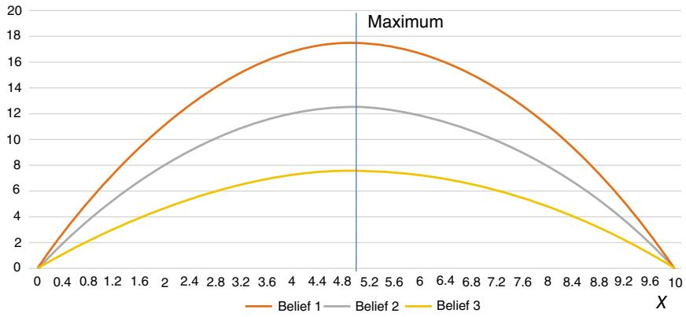  
Figure 7.16 Use to plot the shape of the knowledge gradient for all ??.

knowledge gradient captures your ability to make a better decision using more information.]

7.32 Assume you are trying to find the best of five alternatives. The actual value $\mu _ { x }$ , the initial estimate ${ \bar { \mu } _ { x } } ^ { 0 }$ and the initial standard deviation $\bar { \sigma } _ { x } ^ { 0 }$ of each $\bar { \mu } _ { d } ^ { 0 }$ are given in Table 7.13. [This exercise does not require any numerical work.]

(a) Consider the following learning policies:

(1) Pure exploitation.   
(2) Interval estimation.   
(3) The upper confidence bounding (pick any variant).   
(4) Thompson sampling.   
(5) The knowledge gradient.

Write out each policy and identify any tunable parameters. How would you go about tuning the parameters?

(b) Classify each of the policies above as a (i) Policy function approximation (PFA), (ii) Cost function approximation (CFA), (iii) Policy based on a value function approximation (VFA), or (iv) Direct lookahead approximation (DLA).   
(c) Set up the optimization formulation that can serve as a basis for evaluating these policies in an online (cumulative reward) setting (just one general formulation is needed – not one for each policy).

7.33 Joe Torre, former manager of the great Yankees, had to struggle with the constant game of guessing who his best hitters are. The problem is that he can only observe a hitter if he puts him in the order. He has four batters that he is looking at. The table below shows their actual

Table 7.13 Prior beliefs for learning exercise.   

<table><tr><td>Alternative</td><td>μ</td><td>μ0</td><td>σ0</td></tr><tr><td>1</td><td>1.4</td><td>1.0</td><td>2.5</td></tr><tr><td>2</td><td>1.2</td><td>1.2</td><td>2.5</td></tr><tr><td>3</td><td>1.0</td><td>1.4</td><td>2.5</td></tr><tr><td>4</td><td>1.5</td><td>1.0</td><td>1.5</td></tr><tr><td>5</td><td>1.5</td><td>1.0</td><td>1.0</td></tr></table>

batting averages (that is to say, batter 1 will produce hits $3 0 \%$ of the time, batter 2 will get hits $3 2 \%$ of the time, and so on). Unfortunately, Joe does not know these numbers. As far as he is concerned, these are all .300 hitters.

For each at-bat, Joe has to pick one of these hitters to hit. Table 7.14 below shows what would have happened if each batter were given a chance to hit ${ \mathrm { ( } } 1 = { \mathrm { h i t } }$ , $0 =$ out). Again, Joe does not get to see all these numbers. He only gets to observe the outcome of the hitter who gets to hit.

Assume that Joe always lets the batter hit with the best batting average. Assume that he uses an initial batting average of .300 for each hitter (in case of a tie, use batter 1 over batter 2 over batter 3 over batter 4). Whenever a batter gets to hit, calculate a new batting average by putting an $8 0 \%$ weight on your previous estimate of his average plus a $2 0 \%$ weight on how he did for his at-bat. So, according to this logic, you would choose batter 1 first. Since he does not get a hit, his updated average would be $0 . 8 0 ( . 2 0 0 ) + . 2 0 ( 0 ) = . 2 4 0$ . For the next at-bat, you would choose batter 2 because your estimate of his average is still .300, while your estimate for batter 1 is now .240.

After 10 at-bats, who would you conclude is your best batter? Comment on the limitations of this way of choosing the best batter. Do you have a better idea? (It would be nice if it were practical.)

7.34 In section 7.13.3, we showed for the transient learning problem that if $M _ { t }$ is the identity matrix, that the knowledge gradient for a transient truth was the same as the knowledge gradient for a stationary environment. Does this mean that the knowledge gradient produces the same behavior in both environments?   
7.35 Describe the state variable $S ^ { n }$ for a problem where $\mathcal { X } \ = \ \{ x _ { 1 } , \ldots , x _ { M } \}$ is a set of discrete actions (also known as “arms”) using a Bayesian belief model where ${ \bar { \mu } } _ { x } ^ { n }$ is the belief about alternative $x$ and $\beta _ { x } ^ { n }$ is the

Table 7.14 Data for problem 7.33.   

<table><tr><td rowspan="3">Day</td><td colspan="4">Actual batting average</td></tr><tr><td>0.300</td><td>0.320</td><td>0.280</td><td>0.260</td></tr><tr><td>Batter</td><td></td><td></td><td></td></tr><tr><td rowspan="2">1</td><td>A</td><td>B</td><td>C</td><td>D</td></tr><tr><td>0</td><td>1</td><td>1</td><td>1</td></tr><tr><td>2</td><td>1</td><td>0</td><td>0</td><td>0</td></tr><tr><td>3</td><td>0</td><td>0</td><td>0</td><td>0</td></tr><tr><td>4</td><td>1</td><td>1</td><td>1</td><td>1</td></tr><tr><td>5</td><td>1</td><td>1</td><td>0</td><td>0</td></tr><tr><td>6</td><td>0</td><td>0</td><td>0</td><td>0</td></tr><tr><td>7</td><td>0</td><td>0</td><td>1</td><td>0</td></tr><tr><td>8</td><td>1</td><td>0</td><td>0</td><td>0</td></tr><tr><td>9</td><td>0</td><td>1</td><td>0</td><td>0</td></tr><tr><td>10</td><td>0</td><td>1</td><td>0</td><td>1</td></tr></table>

precision. Now set up Bellman’s equation and characterize an optimal policy (assume we have a budget of $N$ experiments) and answer the following:

(a) What makes this equation so hard to solve?   
(b) What is different about the approach used for Gittins indices that makes this approach tractable? This approach requires a certain decomposition; how is the problem decomposed?

# Sequential decision analytics and modeling

These exercises are drawn from the online book Sequential Decision Analytics and Modeling available at http://tinyurl.com/sdaexamplesprint.

7.36 Read chapter 4, sections 4.1–4.4, on learning the best diabetes medication.

(a) This is a sequential decision problem. What is the state variable?   
(b) Which of the four classes of policies are presented as a solution for this problem?   
(c) The problem of learning how a patient responds to different medications has to be resolved through field testing. What is the appropriate objective function for these problems?

(d) The policy has a tunable parameter. Formulate the problem of tuning the parameter as a sequential decision problem. Assume that this is being done off-line in a simulator. Take care when formulating the objective function for optimizing the policy.

7.37 Read chapter 12, sections 12.1–12.4 (but only section 12.4.2), on ad-click optimization.

(a) Section 12.4.2 presents an excitation policy. Which of the four classes of policies does this fall in?   
(b) The excitation policy has a tunable parameter $\rho$ . One way to search for the best $\rho$ is to discretize it to create a set of possible values $\{ \rho _ { 1 } , \rho _ { 2 } , \dots , \rho _ { K } \}$ . Describe belief models using:

(i) Independent beliefs.   
(ii) Correlated beliefs.

Describe a CFA policy for finding the best value of $\rho$ within this set using either belief model.

7.38 Read chapter 12, sections 12.1–12.4 on ad-click optimization. We are going to focus on section 12.4.3 which proposes a knowledge gradient policy.

(a) Describe in detail how to implement a knowledge gradient policy for this problem.   
(b) When observations are binary (the customer did or did not click on the ad), the noise in a single observation $W _ { t + 1 , x }$ of ad $x$ can be very noisy, which means the value of information from a single experiment can be quite low. A way to handle this is to use a lookahead model that looks forward $\tau$ time periods. Describe how to calculate the knowledge gradient when looking forward $\tau$ time periods (instead of just one time period).   
(c) How would you go about selecting ???   
(d) There are versions of the knowledge gradient for offline learning (maximizing final reward) and online learning (maximizing cumulative reward). Give the expressions for the knowledge gradient for both offline and online learning.

7.39 Continuing the exercise for chapter 4, assume that we have to tune the policy in the field rather than in the simulator. Model this problem as a sequential decision problem. Note that you will need a “policy” (some would call this an algorithm) for updating the tunable parameter $\boldsymbol { \theta }$ that is separate from the policy for choosing the medication.

# Diary problem

The diary problem is a single problem you chose (see chapter 1 for guidelines). Answer the following for your diary problem.

7.40 Pick one of the learning problems that arises in your diary problem, where you would need to respond adaptively to new information. Is the information process stationary or nonstationary? What discuss the pros and cons of:

(a) A deterministic stepsize policy (identify which one you are considering).   
(b) A stochastic stepsize policy (identify which one you are considering).   
(c) An optimal stepsize policy (identify which one you are considering).

# Bibliography

Ankenman, B., Nelson, B.L., and Staum, J. (2009). Stochastic Kriging for simulation metamodeling. Operations Research 58 (2): 371–382.   
Auer, P., Cesabianchi, N., and Fischer, P. (2002). Finitetime analysis of the multiarmed bandit problem. Machine Learning 47 (2): 235–256.   
Bechhofer, R.E., Santner, T.J., and Goldsman, D.M. (1995). Design and Analysis of Experiments for Statistical Selection, Screening, and Multiple Comparisons. New York: John Wiley & Sons.   
Berry, D.A. and Fristedt, B. (1985). Bandit Problems. London: Chapman and Hall.   
Box, G.E.P. and Wilson, K.B. (1951). On the experimental attainment of optimum conditions. Journal of the Royal Statistical Society Series B 13 (1): 1–45.   
Brezzi, M. and Lai, T.L. (2002). Optimal learning and experimentation in bandit problems. Journal of Economic Dynamics and Control 27: 87–108.   
Chang, H.S.: Fu, M.C.: Hu, J., and Marcus, S.I. (2007., Simulationbased Algorithms for Markov Decision Processes. Berlin: Springer.   
Chen, C.H. (1995). An effective approach to smartly allocate computing budget for discrete event simulation. In 34th IEEE Conference on Decision and Control, Vol. 34, 2598–2603, New Orleans, LA.   
Chen, C.H., Yuan, Y., Chen, H.C., Yücesan, E., and Dai, L. (1998). Computing budget allocation for simulation experiments with different system structure. In: Proceedings of the 30th conference on Winter simulation, 735–742.   
Chen, H.C., Chen, C.H., Dai, L., and Yucesan, E. (1997). A gradient approach for smartly allocating computing budget for discrete event simulation. In: Proceedings of the 1996 Winter Simulation Conference (eds. J. Charnes, D. Morrice, D. Brunner and J. Swain), 398–405. Piscataway, NJ, USA: IEEE Press.

Chen, H.C., Chen, C.H., Yucesan, E., and Yücesan, E. (2000). Computing efforts allocation for ordinal optimization and discrete event simulation. IEEE Transactions on Automatic Control 45 (5): 960–964.   
Chick, S.E. and Gans, N. (2009). Economic analysis of simulation selection problems. Management Science 55 (3): 421–437.   
Chick, S.E. and Inoue, K. (2001). New two-stage and sequential procedures for selecting the best simulated system. Operations Research 49 (5): 732—743.   
DeGroot, M.H. (1970). Optimal Statistical Decisions. John Wiley and Sons.   
Frazier, P.I. (2018). A Tutorial on Bayesian Optimization, Technical report, Cornell University, Ithaca NY.   
Frazier, P.I. and Powell, W.B. (2010). Paradoxes in learning and the marginal value of information. Decision Analysis 7 (4): 378–403.   
Frazier, P.I., Powell, W.B., and Dayanik, S. (2009). The knowledge-gradient policy for correlated normal beliefs. INFORMS Journal on Computing 21 (4): 599–613.   
Frazier, P.I., Powell, W.B., and Dayanik, S.E. (2008). A knowledge-gradient policy for sequential information collection. SIAM Journal on Control and Optimization 47 (5): 2410–2439.   
Fu, M.C. (2014). Handbook of Simulation Optimization. New York: Springer.   
Fu, M.C., Hu, J.Q., Chen, C.H., and Xiong, X. (2007). Simulation allocation for determining the best design in the presence of correlated sampling. INFORMS Journal on Computing 19: 101–111.   
Gittins, J. (1979). Bandit processes and dynamic allocation indices. Journal of the Royal Statistical Society. Series B (Methodological) 41 (2): 148–177.   
Gittins, J. (1981). Multiserver scheduling of jobs with increasing completion times. Journal of Applied Probability 16: 321–324.   
Gittins, J. (1989). Multiarmed Bandit Allocation Indices. New York: Wiley and Sons.   
Gittins, J. and Jones, D. (1974). A dynamic allocation index for the sequential design of experiments. In: Progress in statistics (ed. J. Gani), 241—266. North Holland, Amsterdam.   
Gittins, J., Glazebrook, K.D., and Weber, R.R. (2011). Multi-Armed Bandit Allocation Indices. New York: John Wiley & Sons.   
Gupta, S.S. and Miescke, K.J. (1996). Bayesian look ahead one-stage sampling allocations for selection of the best population. Journal of statistical planning and inference 54 (2): 229—244.   
He, D., Chick, S.E., and Chen, C.-H. (2007). Opportunity cost and OCBA selection procedures in ordinal optimization for a fixed number of alternative systems. IEEE Transactions on Systems Man and Cybernetics Part CApplications and Reviews 37 (5): 951–961.   
Hong, J. and Nelson, B.L. (2006). Discrete optimization via simulation using COMPASS. Operations Research 54 (1): 115–129.

Hong, L. and Nelson, B. L. (2007). A framework for locally convergent randomsearch algorithms for discrete optimization via simulation. ACM Transactions on Modeling and Computer Simulation 17 (4): 1–22.   
Huang, D., Allen, T.T., Notz, W.I., and Zeng, N. (2006). Global optimization of stochastic black-box systems via sequential Kriging meta-models. Journal of Global Optimization 34 (3): 441–466.   
Kaelbling, L.P. (1993). Learning in embedded systems, Cambridge, MA: MIT Press.   
Kim, S.-H., Nelson, B. L., and Sciences, M. (2005). On the asymptotic validity of fully sequential selection procedures for steady-state simulation. Industrial Engineering, 1–37.   
Lai, T.L. (1987). Adaptive treatment allocation and the multi-armed bandit problem. Annals of Statistics 15 (3): 1091–1114.   
Lai, T.L. and Robbins, H. (1985). Asymptotically efficient adaptive allocation rules. Advances in Applied Mathematics 6: 4–22.   
Nelson, B.L. and Kim, S.H. (2001). A fully sequential procedure for indifferencezone selection in simulation. ACM Transactions on Modeling and Computer Simulation 11 (3): 251–273.   
Nelson, B.L., Swann, J., Goldsman, D., and Song, W. (2001). Simple procedures for selecting the best simulated system when the number of alternatives is large. Operations Research 49: 950–963.   
Powell, W.B. (2019). A unified framework for stochastic optimization. European Journal of Operational Research 275 (3): 795–821.   
Powell, W.B. and Ryzhov, I.O. (2012). Optimal Learning. Hoboken, NJ: John Wiley & Sons.   
Robbins, H. and Monro, S. (1951). A stochastic approximation method. The Annals of Mathematical Statistics 22 (3): 400–407.   
Ross, S.M. (1983). Introduction to Stochastic Dynamic Programming. New York: Academic Press.   
Russo, D., Van Roy, B., Kazerouni, A., Osband, I., and Wen, Z. (2017). A tutorial on thompson sampling. 11 (1): 1–96.   
Ryzhov, I.O. and Powell, W.B. (2009). A monte Carlo knowledge gradient method for learning abatement potential of emissions reduction technologies. In: Proceedings of the 2009 Winter Simulation Conference (eds. M. D. Rossetti, R. R. Hill, B. Johansson, A. Dunkin and R. G. Ingalls), 1492–1502.   
Winter Simulation Conference’, pp. 1492–1502. Singh, S., Jaakkola, T., Littman, M., and Szepesvari, C. (2000). Convergence results for single-step on-policy reinforcement-learning algorithms. Machine Learning 38 (3): 287—308.   
Skinner, D.C. (1999). Introduction to Decision Analysis. Gainesville, Fl: Probabilistic Publishing.   
Stein, M.L. (1999). Interpolation of spatial data: Some theory for kriging. New York: Springer Verlag.

Sutton, R.S. and Barto, A.G. (2018). Reinforcement Learning: An Introduction, 2e. Cambridge, MA: MIT Press.   
Thompson, W.R. (1933). On the likelihood that one unknown probability exceeds another in view of the evidence of two samples. Biometrika 25 (3/4): 285–294.   
Thrun, S.B. (1992). The role of exploration in learning control. In White, D.A., and Sofge, D.A.   
Wang, Y., Wang, C., Powell, W.B., and Edu, P.P. (2016), The knowledge gradient for sequential decision making with stochastic binary feedbacks. In: ICML2016, Vol. 48. New York.   
Weber, R.R. (1992) On the gittins index for multiarmed bandits. The Annals of Applied Probability 2 (4): 1024–1033.   
Whittle, P. (1983). Optimization Over Time: Dynamic Programming and Stochastic Control Volumes I and II, Wiley Series in Probability and Statistics: Probability and Statistics. New York: John Wiley & Sons.   
Yao, Y. (2006). Some results on the Gittins index for a normal reward process. In: Time Series and Related Topics: In Memory of Ching-Zong-Wei (eds H. Ho, C. Ing and T. Lai), 284–294. Beachwood, OH, USA: Institute of Mathematical Statistics.

# Part III – State-dependent Problems

We now transition to a much richer class of dynamic problems where some aspect of the problem depends on dynamic information. This might arise in three ways:

● The objective function depends on dynamic information, such as a cost or price.   
● The constraints may depend on the availability of resources (that are being controlled dynamically), or other information in constraints such as the travel time in a graph or the rate at which water is evaporating.   
● The distribution of a random variable such as weather, or the distribution of demand, may be varying over time, which means the parameters of the distribution are in the state variable.

When we worked on state-independent problems, we often wrote the function being maximized as $F ( x , W )$ to express the dependence on the decision $x$ or random information ??, but not on any information in our state $S _ { t }$ (or $S ^ { n }$ ). As we move to our state-dependent world, we are going to write our cost or contribution function as $C ( S _ { t } , x _ { t } )$ or, in some cases, $C ( S _ { t } , x _ { t } , W _ { t + 1 } )$ , to capture the possible dependence of the objective function on dynamic information in $S _ { t }$ . In addition, our decision $x _ { t }$ might be constrained by $x _ { t } \in \mathcal X _ { t }$ , where the constraints $\mathcal { X } _ { t }$ may depend on dynamic data such as inventories, travel times, or conversion rates.

Finally, our random information ?? may itself depend on known information in the state variable $S _ { t }$ , or possibly on hidden information that we cannot observe, but have beliefs about (these beliefs would also be captured in the state variable). For example, ?? might be the number of clicks on an ad which is described by some probability distribution whose parameters (e.g. the mean) is also uncertain. Thus, at time $t$ (or time $n$ ), we may find ourselves solving a problem that looks like

$$
\max  _ {x _ {t} \in \mathcal {X} _ {t}} \mathbb {E} _ {S _ {t}} \mathbb {E} _ {W | S _ {t}} \left\{C \left(S _ {t}, x _ {t}, W _ {t + 1}\right) | S _ {t} \right\}.
$$

If the cost/contribution function $C ( S _ { t } , x _ { t } , W _ { t + 1 } )$ , and/or the constraints $\mathcal { X } _ { t }$ , and/or the expectation depends on time-dependent data, then we have an instance of a state-dependent problem.

We are not trying to say that all state-dependent problems are the same, but we do claim that state-dependent problems represent an important transition from state-independent problems, where the only state is the belief $B _ { t }$ about our function. This is why we also refer to state-independent problems as learning problems.

We lay the foundation for state-dependent problems with the following chapters:

● State-dependent applications (chapter 8) – We begin our presentation with a series of applications of problems where the function is state dependent. State variables can arise in the objective function (e.g. prices), but in most of the applications the state arises in the constraints, which is typical of problems that involve the management of physical resources.   
● Modeling general sequential decision problems (chapter 9) – This chapter provides a comprehensive summary of how to model general (statedependent) sequential decision problems in all of their glory.   
● Modeling uncertainty (chapter 10) – To find good policies (to make good decisions), you need a good model, and this means an accurate model of uncertainty. In this chapter we identify different sources of uncertainty and discuss how to model them.   
● Designing policies (chapter 11) – Here we provide a much more comprehensive overview of the different strategies for creating policies, leading to the four classes of policies that we first introduce in part I for learning problems. If you have a particular problem you are trying to solve (rather than just building your toolbox), this chapter should guide you to the policies that seem most relevant to your problem.

After these chapters, the remainder of the book is a tour through the four classes of policies which we illustrated in chapter 7 in the context of derivative-free stochastic optimization.

# 8

# State-dependent Problems

In chapters 5 and 7, we introduced sequential decision problems in which the state variable consisted only of the state of the algorithm (chapter 5) or the state of our belief about an unknown function ${ \mathbb E } \{ F ( x , W ) | S _ { 0 } \}$ (chapter 7). These problems cover a very important class of applications that involve maximizing or minimizing functions that can represent anything from complex analytical functions and black-box simulators to laboratory and field experiments.

The distinguishing feature of state-dependent problems is that the problem being optimized now depends on our state variable, where the “problem” might be the function $F ( x , W )$ , the expectation (e.g. the distribution of ??), or the feasible region $\mathcal { X }$ . The state variable may be changing purely exogenously (where decisions do not impact the state of the system), purely endogenously (the state variable only changes as a result of decisions), or both (which is more typical).

There is a genuinely vast range of problems where the performance metric (costs or contributions), the distributions of random variables ??, and/or the constraints, depend on information that is changing over time, either exogenously or as a result of decisions (or both). When information changes over time, it is captured in the state variable $S _ { t }$ (or $S ^ { n }$ if we are counting events with ??).

Examples of state variables that affect the problem itself include:

● Physical state variables, which might include inventories, the location of a vehicle on a graph, the medical condition of a patient, the speed and location of a robot, and the condition of an aircraft engine. Physical state variables are typically expressed through the constraints.   
● Informational state variables, such as prices, a patient’s medical history, the humidity in a lab, or attributes of someone logging into the internet. These variables might affect the objective function (costs and contributions), or the constraints. This information may evolve exogenously (e.g. the weather), or

might be directly controlled (e.g. setting the price of a product), or influenced by decisions (selling energy into the grid may lower electricity prices).

● Distributional information capturing beliefs about unknown parameters or quantities, such as information about the how a patient might respond to a drug, or the state of the materials in a jet engine, or how the market might respond to the price of a product.

While physical resource management problems are perhaps the easiest to envision, state-dependent problems can include any problem where the function being minimized depends on dynamic information, either in the objective function itself, or the constraints, or the equations that govern how the system evolves over time (the transition function).

For our state-independent problems, we wrote the objective function as $F ( x , W )$ , since the function itself did not depend on the state variable. For statedependent problems, we will usually write our single-period contribution (or cost) function as $C ( S _ { t } , x _ { t } )$ , although there are settings where it is more natural to write it as $C ( S _ { t } , x _ { t } , W _ { t + 1 } )$ or, in some settings, $C ( S _ { t } , x _ { t } , S _ { t + 1 } )$ .

We will communicate the dependence of expectations on the state variables through conditioning, by writing $\mathbb { E } \{ F ( \cdot ) | S _ { t } \}$ (or ??{??(⋅)|????}). We will express the dependence of constraints on dynamic state information by writing $x \in \mathcal X _ { t }$ Note that writing $C ( S _ { t } , x _ { t } )$ means that the contribution function depends on dynamic information such as

$$
C \left(S _ {t}, x _ {t}\right) = p _ {t} x _ {t},
$$

where the price $p _ { t }$ evolves randomly over time.

At this point, it is useful to highlight what is probably the biggest class of state-dependent problems, which is those that involve the management of physical resources. Generally known as dynamic resource allocation problems, these problems are the basis of the largest and most difficult problems that we will encounter. These problems are typically high-dimensional, often with complex dynamics and types of uncertainty.

In this chapter we present four classes of examples:

● Graph problems – These are problems where we are modeling a single resource that is controlled using a discrete set of actions moving over a discrete set of states.   
● Inventory problems – This is a classical problem in dynamic programming which comes in a virtually unlimited set of variations.   
● Information acquisition problems – These are state-dependent active learning problems that we touched on at the end of chapter 7, but now we imbed them in more complex settings.

● Complex resource allocation problems – Here we put our toe in the water and describe some high-dimensional applications.

These illustrations are designed to teach by example. The careful reader will pick up subtle modeling choices, in particular the indexing with respect to time. We suggest that readers skim these problems, selecting examples that are of interest. In chapter 9, we are going to present a very general modeling framework, and it helps to have a sense of the complexity of applications that may arise.

Finally, we forewarn the reader that this chapter just presents models, not solutions. This fits with our “model first, then solve” approach. We do not even use our universal modeling framework. The idea is to introduce applications with notation. We present our universal modeling framework in detail for these more complex problems in chapter 9. Then, after introducing the rich challenges of modeling uncertainty in chapter 10, we turn to the problem of designing policies in chapter 11. All we can say at this point is: There are four classes of policies, and any approach we may choose will come from one of these four classes (or a hybrid). What we will not do is assume that we can solve it with a particular strategy, such as approximate dynamic programming.

# 8.1 Graph Problems

A popular class of stochastic optimization problems involve managing a single physical asset moving over a graph, where the nodes of the graph capture the physical state.

# 8.1.1 A Stochastic Shortest Path Problem

We are often interested in shortest path problems where there is uncertainty in the cost of traversing a link. For our transportation example, it is natural to view the travel time on a link as random, reflecting the variability in traffic conditions on each link. There are two ways we can handle this uncertainty. The simplest is to assume that our driver has to make a decision before seeing the travel time over the link. In this case, our updating equation would look like

$$
v _ {i} ^ {n} = \min _ {j \in \mathcal {I} _ {i} ^ {+}} \mathbb {E} \{\hat {c} _ {i j} + v _ {j} ^ {n - 1} \},
$$

where $\hat { c } _ { i j }$ is a random variable describing the cost of traversing $i$ to $j$ . If $\bar { c } _ { i j } =$ $\mathbb E \hat { c } _ { i j }$ , then our problem reduces to

$$
v _ {i} ^ {n} = \min  _ {j \in \mathcal {J} _ {i} ^ {+}} \left(\bar {c} _ {i j} + v _ {j} ^ {n - 1}\right),
$$

which is a simple deterministic problem.

An alternative model is to assume that we know the cost on a link from ?? to $j$ as soon as we arrive at node ??. In this case, we would have to solve

$$
v _ {i} ^ {n} = \mathbb {E} \left\{\min  _ {j \in \mathcal {I} _ {i} ^ {+}} \left(\hat {c} _ {i j} + v _ {j} ^ {n - 1}\right) \right\}.
$$

Here, the expectation is outside of the min operator that chooses the best decision, capturing the fact that now the decision itself is random.

Note that our notation is ambiguous, in that with the same notation, we have two very different models. In chapter 9, we are going to refine our notation so that it will be immediately apparent when a decision “sees” the random information and when the decision has to be made before the information becomes available.

# 8.1.2 The Nomadic Trucker

A nice illustration of sequential decisions is a problem we are going to call the nomadic trucker, depicted in Figure 8.1. In this problem, our trucker has to move loads of freight (which fill his truck) from one city to the next. When he arrives in a city ?? (“Texas” in Figure 8.1), he is offered a set of loads to different destinations, and has to choose one. Once he makes his choice (in the figure, he chooses the load to New Jersey), he moves the load to its destination, delivers the freight, and then the problem repeats itself. The other loads are offered to other drivers, so if he returns to node ?? at a later time, he is offered an entirely new set of loads (that are entirely random).

We model the state of our nomadic trucker by letting $R _ { t }$ be his location. From a location, our trucker is able to choose from a set of demands $\hat { D } _ { t }$ . Thus, our state variable is $\boldsymbol { S } = ( R _ { t } , \hat { D } _ { t } )$ , where $R _ { t }$ is a scalar (the location) while $\hat { D } _ { t }$ is a vector giving the number of loads from $R _ { t }$ to each possible destination. A decision $\boldsymbol { x } _ { t } \in \mathcal { X } _ { t }$ represents the decision to accept a load in $\hat { D } _ { t }$ and go to the destination of that load.

Let $C ( S _ { t } , x _ { t } )$ be the contribution earned from being in location $R _ { t }$ (this is contained in $S _ { t }$ ) and taking decision $x _ { t }$ . Any demands not covered in $\hat { D } _ { t }$ at time $t$ are lost. After implementing decision $x _ { t }$ , the driver either stays in his current location (if he does nothing), or moves to a location that corresponds to the destination of the load the driver selected in the set $\hat { D } _ { t }$ .

Let $R _ { t } ^ { x }$ be the location that decision $x _ { t }$ sends the driver to. We will later call this the post-decision state, which is the state after we have made a decision but before any new information has arrived. The post-decision state variable $S _ { t } ^ { x } = R _ { t } ^ { x }$ is the location the truck will move to, but before any demands have

  
Figure 8.1 Illustration of a nomadic trucker in location “Texas” with the choice of four loads to move.

been revealed. We assume that the decision $x _ { t }$ determines the downstream destination, so $R _ { t + 1 } = R _ { t } ^ { x }$ .

The driver makes his decision by solving

$$
\hat {v} _ {t} = \max _ {x \in \hat {D} _ {t}} \left(C (S _ {t}, x) + \overline {{V}} _ {t} ^ {x} (R _ {t} ^ {x})\right),
$$

where $R _ { t } ^ { x }$ is the downstream location (the “post-decision state”), and $\overline { { V } } _ { t } ^ { x } ( R _ { t } ^ { x } )$ is our current estimate (as of time ??) of the value of the truck being in the destination $R _ { t } ^ { x }$ . Let $x _ { t }$ be the best decision given the downstream values $\overline { { V } } _ { t } ^ { x } ( R _ { t } ^ { x } )$ . Noting that $R _ { t }$ is the current location of the truck, we update the value of our previous, post-decision state using

$$
\overline {{V}} _ {t - 1} ^ {x} (R _ {t - 1} ^ {x}) \gets (1 - \alpha) \overline {{V}} _ {t - 1} ^ {x} (R _ {t - 1} ^ {x}) + \alpha \hat {v} _ {t}.
$$

Note that we are smoothing $\hat { v } _ { t }$ , which is the value of being in the pre-decision state $S _ { t }$ , with the current estimate $\overline { { V } } _ { t - 1 } ^ { x } ( R _ { t - 1 } ^ { x } )$ of the previous post-decision state.

# 8.1.3 The Transformer Replacement Problem

The electric power industry uses equipment known as transformers to convert the high-voltage electricity that comes out of power generating plants into currents with successively lower voltage, finally delivering the current we can use in our homes and businesses. The largest of these transformers can weigh 200 tons, might cost millions of dollars to replace and may require a year or more to build and deliver. Failure rates are difficult to estimate (the most powerful transformers were first installed in the 1960s and have yet to reach the end of their natural lifetimes). Actual failures can be very difficult to predict, as they often depend on heat, power surges, and the level of use.

We are going to build an aggregate replacement model where we only capture the age of the transformers. Let

$$
a = \text {t h e a g e o f a t r a n s f o r m e r (i n u n i t s o f t i m e p e r i o d s) a t t i m e} t,
$$

$$
R _ {t a} = \text {t h e n u m b e r o f a c t i v e t r a n s f o r m e r s o f a g e a a t t i m e} t.
$$

Here and elsewhere, we need to model the attributes of a resource (in this case, the age).

For our model, we assume that age is the best predictor of the probability that a transformer will fail. Let

$$
\begin{array}{r c l} \hat {R} _ {t + 1, a} ^ {f a i l} & = & \text {t h e n u m b e r o f t r a n s f o r m e r s o f a g e a t h a t f a i l b e t w e e n} \\ & & t \text {a n d} t + 1, \end{array}
$$

$$
\begin{array}{r c l} p _ {a} & = & \text {t h e p r o b a b i l i t y a t r a n s f o r m e r o f a g e a w i l l f a i l b e t w e e n} \\ & & t \text {a n d} t + 1. \end{array}
$$

Of course, $\hat { R } _ { t + 1 , a } ^ { f a i l }$ depends on $R _ { t a }$ since transformers can only fail if we own them.

It can take a year or two to acquire a new transformer. Assume that we are measuring time in quarters (three-month periods). Normally it can take about six quarters from the time of purchase before a transformer is installed in the network. However, we may pay extra and get a new transformer in as little as three quarters. If we purchase a transformer that arrives in six time periods, then we might say that we have acquired a transformer that is $a ~ = ~ - 6$ time periods old. Paying extra gets us a transformer that is $a = - 3$ time periods old. Of course, the transformer is not productive until it is at least $a = 0$ time periods old. Let

$$
x _ {t a} = \text {t h e n u m b e r o f t r a n s f o r m e r s o f a g e} a \text {t h a t w e p u c h a s e a t t i m e} t.
$$

The transition function is given by

$$
{R _ {t + 1, a}} = {R _ {t, a - 1} + x _ {t, a - 1} - \hat {R} _ {t + 1, a} ^ {f a i l}.}
$$

If we have too few transformers, then we incur what are known as “congestion costs,” which represent the cost of purchasing power from more expensive utilities because of bottlenecks in the network. To capture this, let

$$
\bar {R} = \text {t a r g e t n u m b e r o f t r a n s f o r m e r s t h a t w e s h o u d h a v e a v a l i b l e},
$$

$$
R _ {t} ^ {A} = \text {a c t u a l n u m b e r o f t r a n s f o r m e r s t h a t a r e a v a i l a b l e a t t i m e} t,
$$

$$
= \sum_ {a \geq 0} R _ {t a},
$$

$\begin{array} { r l } { c _ { a } } & { { } = } \end{array}$ the cost of purchasing a transformer of age $a$

$C _ { t } ( R _ { t } ^ { A } , \bar { R } ) \ =$ expected congestion costs if $R _ { t } ^ { A }$ transformers are available,

$$
= c _ {0} \left(\frac {\bar {R}}{R _ {t} ^ {A}}\right) ^ {\beta}.
$$

The function $C _ { t } ( R _ { t } ^ { A } , \bar { R } )$ captures the behavior that as $R _ { t } ^ { A }$ falls below $\bar { R }$ , the congestion costs rise quickly.

The total cost function is then given by

$$
C \left(S _ {t}, x _ {t}\right) = C _ {t} \left(R _ {t} ^ {A}, \bar {R}\right) + c _ {a} x _ {t}.
$$

For this application, our state variable $R _ { t }$ might have as many as 100 dimensions. If we have, say, 200 transformers, each of which might be as many as 100 years old, then the number of possible values of $R _ { t }$ could be $1 0 0 ^ { 2 0 0 }$ . It is not unusual for modelers to count the size of the state space, although this is an issue only for particular solution methods that depend on lookup table representations of the value of being in a state, or the action we should take given that we are in a state.

# 8.1.4 Asset Valuation

Imagine you are holding an asset that you can sell at a price that fluctuates randomly. In this problem we want to determine the best time to sell the asset, and from this, infer the value of the asset. For this reason, this type of problem arises frequently in the context of asset valuation and pricing.

Let $p _ { t }$ be the price at which we can sell our asset at time ??, at which point you have to make a decision

$$
x _ {t} = \left\{ \begin{array}{l l} 1 & \text {s e l l}, \\ 0 & \text {h o l d}. \end{array} \right.
$$

For our simple model, we assume that $p _ { t }$ is independent of prior prices (a more typical model would assume that the change in price is independent of prior history). With this assumption, our system has two physical states that we denote by $R _ { t }$ , where

$$
R _ {t} = \left\{ \begin{array}{l l} 1 & \text {w e a r e h o l d i n g t h e a s s e t}, \\ 0 & \text {w e h a v e s o l d t h e a s s e t}. \end{array} \right.
$$

Our state variable is then given by

$$
S _ {t} = (R _ {t}, p _ {t}).
$$

Let

$\tau =$ the time at which we sell our asset.

$\tau$ is known as a stopping time (recall the discussion in section 2.1.7), which means it can only depend on information that has arrived on or before time $t$ . By definition, $x _ { \tau } = 1$ indicates the decision to sell at time $t = \tau$ . It is common to think of $\tau$ as the decision variable, where we wish to solve

$$
\max  _ {\tau} \mathbb {E} p _ {\tau}. \tag {8.1}
$$

Equation (8.1) is a little tricky to interpret. Clearly, the choice of when to stop is a random variable since it depends on the price $p _ { t }$ . We cannot optimally choose a random variable, so what is meant by (8.1) is that we wish to choose a function (or policy) that determines when we are going to sell. For example, we would expect that we might use a rule that says

$$
X _ {t} ^ {P F A} \left(S _ {t} \mid \theta^ {\text {s e l l}}\right) = \left\{ \begin{array}{l l} 1 & \text {i f} p _ {t} \geq \theta^ {\text {s e l l}} \text {a n d} S _ {t} = 1, \\ 0 & \text {o t h e r w i s e .} \end{array} \right. \tag {8.2}
$$

In this case, we have a function parameterized by $\theta ^ { \mathrm { s e l l } }$ which allows us to write our problem in the form

$$
\max  _ {\theta^ {\text {s e l l}}} \mathbb {E} \left\{\sum_ {t = 0} ^ {\infty} \gamma^ {t} p _ {t} X _ {t} ^ {P F A} \left(S _ {t} \mid \theta^ {\text {s e l l}}\right) \right\}, \tag {8.3}
$$

where $\gamma < 1$ is a discount factor. This formulation raises two questions. First, while it seems very intuitive that our policy would take the form given in equation (8.2), there is the theoretical question of whether this in fact is the structure of an optimal policy.

The second question is how to find the best policy within this class. For this problem, that means finding the parameter $\theta ^ { \mathrm { s e l l } }$ . This is precisely the type of problem that we addressed in our stochastic search chapters 5 and 7. However, this is not the only policy we might use. Another is to define the function

$$
V _ {t} (S _ {t}) = \text {t h e v a l u e o f b e i n g i n s t a t e S _ {t} a t t i m e t a n d t h e n m a k i n g} \text {o p t i m a l d e c i s i o n s f r o m t i m e t o n w a r d .}
$$

More practically, let $V ^ { \pi } ( S _ { t } )$ be the value of being in state $S _ { t }$ and then following policy $\pi$ from time $t$ onward. This is given by

$$
V _ {t} ^ {\pi} (S _ {t}) = \mathbb {E} \left\{\sum_ {t ^ {\prime} = t} ^ {\infty} \gamma^ {t ^ {\prime} - t} p _ {t ^ {\prime}} X _ {t ^ {\prime}} ^ {\pi} (S _ {t ^ {\prime}} | \theta^ {\mathrm {s e l l}}) \right\}.
$$

Of course, it would be nice if we could find an optimal policy since this would maximize $V _ { t } ^ { \pi } ( S _ { t } )$ . More often, we need to use some approximation that we call $\overline { { V } } _ { t } ( S _ { t } )$ . In this case, we might define a policy

$$
X ^ {V F A} \left(S _ {t}\right) = \arg \max  _ {x _ {t}} \left(p _ {t} x _ {t} + \gamma \mathbb {E} \{\bar {V} _ {t + 1} \left(S _ {t + 1}\right) \mid S _ {t}, x _ {t} \}\right). \tag {8.4}
$$

We have just illustrated two styles of policies: $X ^ { P F A }$ and $X ^ { V F A }$ . These are two of the four classes we first visited in chapter 7, called policy function approximation and value function approximation. We will again review all four classes of policies in chapter 11, which we will discuss in depth in chapters 12–19.

# 8.2 Inventory Problems

Another popular class of problems involving managing a quantity of resources that are held in some sort of inventory. The inventory can be money, products, blood, people, water in a reservoir or energy in a battery. The decisions govern the quantity of resource moving into and out of the inventory.

# 8.2.1 A Basic Inventory Problem

A basic inventory problem arises in applications where we purchase product at time $t$ to be used during time interval $t + 1$ . We are going to encounter this problem again, sometimes as discrete problems, but often as continuous problems, and sometimes as vector valued problems (when we have to acquire different types of assets).

We can model the problem using

???? = the inventory on hand at time $t$ before we make a new ordering decision, and before we have satisfied any demands arising in time interval ??,

???? = the amount of product purchased at time $t$ which we assume arrives immediately,

$\begin{array} { r l } { D _ { t } } & { { } = } \end{array}$ the demand known at time ?? that we have to satisfy.

We have chosen to model $R _ { t }$ as the resources on hand in period $t$ before demands have been satisfied. Our definition here makes it easier to introduce (in the next section) the decision of how much demand we should satisfy. In our most basic problem, the state variable $S _ { t }$ is given by

$$
S _ {t} = (R _ {t}, D _ {t}).
$$

Our inventory $R _ { t }$ is described using the equation

$$
R _ {t + 1} = R _ {t} - \min  \left\{R _ {t}, D _ {t} \right\} + x _ {t}.
$$

Let

$$
\begin{array}{r c l} \hat {D} _ {t + 1} & = & \text {n e w d e m a n d s t h a t w e l e a r n a b o u t d u r i n g t i m e} \\ & & \text {i n t e r v a l} (t, t + 1). \end{array}
$$

We assume that any unsatisfied demands are lost. This means that $D _ { t }$ evolves according to

$$
D _ {t + 1} = \hat {D} _ {t + 1}.
$$

Here we are assuming that $D _ { t + 1 }$ is revealed to us through the new information $\hat { D } _ { t + 1 }$ . Below we are going to introduce the ability to backlog unsatisfied demands.

We assume we purchase new assets at a fixed price $p ^ { \mathrm { b u y } }$ and sell them at a fixed price $p ^ { \mathrm { s e l l } }$ . The amount we earn between $t - 1$ and $t$ (satisfying the demand $D _ { t }$ that becomes known by time ??), including the decision we make at time $t$ , is given by

$$
C \left(S _ {t}, x _ {t}\right) = p ^ {\text {s e l l}} \min  \left\{R _ {t}, D _ {t} \right\} - p ^ {\text {b u y}} x _ {t}.
$$

An alternative formulation of this problem is to write the contribution based on what we will receive between $t$ and $t + 1$ . In this case, we would write the contribution as

$$
C \left(S _ {t}, x _ {t}, \hat {D} _ {t + 1}\right) = p ^ {\text {s e l l}} \min  \left\{\left(R _ {t} - \min  \left\{R _ {t}, D _ {t} \right\} + x _ {t}\right), \hat {D} _ {t + 1} \right\} - p ^ {\text {b u y}} x _ {t}. \tag {8.5}
$$

It is because of problems like this that we sometimes write our contribution function as $C ( S _ { t } , x _ { t } , W _ { t + 1 } )$ .

# 8.2.2 The Inventory Problem – II

Many inventory problems introduce additional sources of uncertainty. The inventory we are managing could be stocks, planes, energy commodities such as oil, consumer goods, and blood. In addition to the need to satisfy random demands (the only source of uncertainty we considered in our basic inventory problem), we may also have randomness in the prices at which we buy and sell

assets. We may also include exogenous changes to the inventory on hand due to additions (cash deposits, blood donations, energy discoveries) and subtractions (cash withdrawals, equipment failures, theft of product).

We can model the problem using

$$
\begin{array}{r c l} x _ {t} ^ {\text {b u y}} & = & \text {i n v e n t o r y p u r c h a s e d a t t i m e t t o b e u s e d d u r i n g t i m e} \\ & & \text {i n t e r v a l t + 1}, \end{array}
$$

$$
\begin{array}{r c l} x _ {t} ^ {\mathrm {s e l l}} & = & \text {a m o u n t o f i n v e n t o r y s o l d t o s a t i s f y d e m a n d s d u r i n g t i m e} \\ & & \text {i n t e r v a l t ,} \end{array}
$$

$$
x _ {t} = \left(x _ {t} ^ {\text {b u y}}, x _ {t} ^ {\text {s e l l}}\right),
$$

$$
R _ {t} = \text {i n v e n t o r y l e v e l a t a t i m e} t \text {b e f o r e a n y d e c i s i o n s a r e m a d ,}
$$

$$
D _ {t} = \text {d e m a n d s w a i t i n g t o b e s e r v e d a t t i m e} t.
$$

Of course, we are going to require that $\boldsymbol { x } _ { t } ^ { \mathrm { s e l l } } \le \operatorname* { m i n } \{ \boldsymbol { R } _ { t } , \boldsymbol { D } _ { t } \}$ , since we cannot sell what we do not have, and we cannot sell more than the market demand. We are also going to assume that we buy and sell our inventory at market prices that fluctuate over time. These are described using

$$
p _ {t} ^ {\text {b u y}} = \text {m a r k e t p r i c e f o r p u r c h a s i n g i n v e n t o r y a t t i m e} t,
$$

$$
p _ {t} ^ {\mathrm {s e l l}} = \text {m a r k e t p r i c e f o r s e l l i n g i n v e n t o r y a t t i m e} t,
$$

$$
{p _ {t}} = {(p _ {t + 1} ^ {\mathrm {s e l l}}, p _ {t + 1} ^ {\mathrm {b u y}}).}
$$

Our system evolves according to several types of exogenous information processes that include random changes to the supplies (inventory on hand), demands, and prices. We model these using

$$
\begin{array}{r c l} \hat {R} _ {t + 1} & = & \text {e x o g e n o u s c h a n g e s t o t h e i n v e n t o r y o n h a n d t h a t o c o u r d u r i n g t i m e i n t e r v a l (t , t + 1) (e . g . r a i n f a l l a d d i n g w a t e r t o a r e s e r v o i r , d e p o s i t s / w i t d r a w a l s o f c a s h t o a m u t u a l f u n d , o r b l o o d d o n a t i o n s)}, \end{array}
$$

$$
\begin{array}{r c l} \hat {D} _ {t + 1} & = & \text {n e w d e m a n d s f o r i n v e n t o r y t h a t a r i s e s d u r i n g t i m e} \\ & & \text {i n t e r v a l} (t, t + 1), \end{array}
$$

$$
\begin{array}{r c l} \hat {p} _ {t + 1} ^ {\text {b u y}} & = & \text {c h a n g e i n t h e p u r c h a s e p r i c e t h a t o c c u r s d u r i n g t i m e} \\ & & \text {i n t e r v a l} (t, t + 1), \end{array}
$$

$$
\begin{array}{r c l} \hat {P} _ {t + 1} ^ {\text {s e l l}} & = & \text {c h a n g e i n t h e s e l l i n g p r i c e t h a t o c c u r s d u r i n g t i m e} \\ & & \text {i n t e r v a l (t , t + 1) ,} \end{array}
$$

$$
\hat {p} _ {t + 1} = \left(\hat {p} _ {t + 1} ^ {\text {b u y}}, \hat {p} _ {t + 1} ^ {\text {s e l l}}\right).
$$

We assume that the exogenous changes to inventory, $\hat { R } _ { t }$ , occur before we satisfy demands at time $t$ .

For more complex problems such as this, it is convenient to have a generic variable for exogenous information. We use the notation $W _ { t + 1 }$ to represent all the information that first arrives between $t$ and $t + 1$ , where for this problem, we would have

$$
W _ {t + 1} = (\hat {R} _ {t + 1}, \hat {D} _ {t + 1}, \hat {p} _ {t + 1}).
$$

The state of our system is described by

$$
S _ {t} = \left(R _ {t}, D _ {t}, p _ {t}\right).
$$

The state variables evolve according to

$$
R _ {t + 1} = R _ {t} - x _ {t} ^ {\text {s e l l}} + x _ {t} ^ {\text {b u y}} + \hat {R} _ {t + 1},
$$

$$
{D _ {t + 1}} = {D _ {t} - x _ {t} ^ {\mathrm {s e l l}} + \hat {D} _ {t + 1},}
$$

$$
p _ {t + 1} ^ {\text {b u y}} = p _ {t} ^ {\text {b u y}} + \hat {p} _ {t + 1} ^ {\text {b u y}},
$$

$$
p _ {t + 1} ^ {\text {s e l l}} = p _ {t} ^ {\text {s e l l}} + \hat {p} _ {t + 1} ^ {\text {s e l l}}.
$$

We can add an additional twist if we assume the market price, for instance, follows a time-series model

$$
p _ {t + 1} ^ {\text {s e l l}} = \theta_ {0} p _ {t} ^ {\text {s e l l}} + \theta_ {1} p _ {t - 1} ^ {\text {s e l l}} + \theta_ {2} p _ {t - 2} ^ {\text {s e l l}} + \varepsilon_ {t + 1},
$$

where $\varepsilon _ { t + 1 } \sim N ( 0 , \sigma _ { \varepsilon } ^ { 2 } )$ . In this case, the state of our price process is captured by $( p _ { t } ^ { \mathrm { s e l l } } , p _ { t - 1 } ^ { \mathrm { s e l l } } , p _ { t - 2 } ^ { \mathrm { s e l l } } )$ which means our state variable would be given by

$$
S _ {t} = \left(R _ {t}, D _ {t}, \left(p _ {t}, p _ {t - 1}, p _ {t - 2}\right)\right).
$$

Note that if we did not allow backlogging, then we would update demands with just

$$
D _ {t + 1} = \hat {D} _ {t + 1}. \tag {8.6}
$$

Contrast this with our updating of the prices $p _ { t + 1 }$ which depends on either $p _ { t }$ or even $p _ { t - 1 }$ and $p _ { t - 2 }$ . To model the evolution of prices, we have an explicit mathematical model, including an assumed error such as $\varepsilon _ { t + 1 }$ where we assumed $\varepsilon _ { t + 1 } \sim N ( 0 , \sigma _ { \varepsilon } ^ { 2 } )$ . When we simply observe the updated value of demand (as we are doing in (8.6)), then we describe the process as “data driven.” We would need a source of data from which to draw the observations $\hat { D } _ { 1 } , \hat { D } _ { 2 } , \dots , \hat { D } _ { t } , \dots \mathrm { W e }$ revisit this concept in more depth in chapter 10.

The one-period contribution function is

$$
C _ {t} \left(S _ {t}, x _ {t}\right) = p _ {t} ^ {\text {s e l l}} x _ {t} ^ {\text {s e l l}} - p _ {t} ^ {\text {b u y}} x _ {t}.
$$

# 8.2.3 The Lagged Asset Acquisition Problem

A variation of the basic asset acquisition problem we introduced in section 8.2.1 arises when we can purchase assets now to be used in the future. For example, a hotel might book rooms at time $t$ for a date $t ^ { \prime }$ in the future. A travel agent might purchase space on a flight or a cruise line at various points in time before the trip actually happens. An airline might purchase contracts to buy fuel in the future. In all of these cases, it will generally be the case that assets purchased farther in advance are cheaper, although prices may fluctuate.

For this problem, we are going to assume that selling prices are

$$
\begin{array}{r c l} x _ {t t ^ {\prime}} & = & \text {r e s o u r c e s p u r c h a s e d a t t i m e t t o b e u s e d t o s a t s y f y d e m a n d s} \\ & & \text {t h a t b e c o m e k n o w n d u r i n g t i m e i n t e r v a l b e t w e e n t} t ^ {\prime} - 1 \\ & & \text {a n d} t ^ {\prime}, \end{array}
$$

$$
\begin{array}{l} x _ {t} = (x _ {t, t + 1}, x _ {t, t + 2}, \dots), \\ = (x _ {t t ^ {\prime}}) _ {t ^ {\prime} > t}, \\ \end{array}
$$

$$
D _ {t t ^ {\prime}} = \text {t o t a l d e m a n d k n o w n a t i m e} t \text {t o b e s e r v e d a t i m e} t ^ {\prime},
$$

$$
{D _ {t}} = {(D _ {t t ^ {\prime}}) _ {t ^ {\prime} \geq t},}
$$

$$
\begin{array}{r c l} R _ {t t ^ {\prime}} & = & \text {i n v e n t o r y a c q u i r e d o n o r b e f o r e t i m e t h a t m a y b e u s e d t o} \\ & & \text {s a t i s f y d e m a n d s t h a t b e c o m e k n o w n b e t w e e n t} t ^ {\prime} - 1 \text {a n d} t ^ {\prime}, \end{array}
$$

$$
{R _ {t}} = {(R _ {t t ^ {\prime}}) _ {t ^ {\prime} \geq t}.}
$$

Now, $R _ { t t }$ is the resources on hand in period $t$ that can be used to satisfy demands $D _ { t }$ that become known during time interval ??. In this formulation, we do not allow $x _ { t t }$ , which would represent purchases on the spot market. If this were allowed, purchases at time $t$ could be used to satisfy unsatisfied demands arising during time interval between $t - 1$ and ??.

After we make our decisions $x _ { t }$ , we observe new demands

$$
\begin{array}{r c l} \hat {D} _ {t + 1, t ^ {\prime}} & = & \text {n e w d e m a n d s f o r t h e r e s o u r c e s t h a t b e c o m e k n o w n} \\ & & \text {d u r i n g t i m e i n t e r v a l (t , t + 1) t o b e s e r v a d a t t i m e t ^ {\prime} .} \end{array}
$$

The state variable for this problem would be

$$
S _ {t} = (R _ {t}, D _ {t}),
$$

where $R _ { t }$ is the vector capturing inventory that will arrive in the future.

The transition equation for $R _ { t }$ is given by

$$
R _ {t + 1, t ^ {\prime}} = \left\{ \begin{array}{l l} \big (R _ {t, t} - \min  (R _ {t t}, D _ {t t}) \big) + x _ {t, t + 1} + R _ {t, t + 1}, & t ^ {\prime} = t + 1, \\ R _ {t t ^ {\prime}} + x _ {t t ^ {\prime}}, & t ^ {\prime} > t + 1. \end{array} \right.
$$

The transition equation for $D _ { t }$ is given by

$$
\begin{array}{r l r} {D _ {t + 1, t ^ {\prime}}} & = & {\left\{ \begin{array}{l l} (D _ {t t} - \min (R _ {t t}, D _ {t t})) + \hat {D} _ {t, t + 1} + D _ {t, t + 1}, & t ^ {\prime} = t + 1, \\ D _ {t t ^ {\prime}} + \hat {D} _ {t + 1, t ^ {\prime}}, & t ^ {\prime} > t + 1. \end{array} \right.} \end{array}
$$

To compute profits, let

$$
\begin{array}{r c l} p _ {t} ^ {\text {s e l l}} & = & \text {t h e s a l e s p r i c e , w h i c h v a r i e s s t o c h a s t i c a l l y o v e r t i m e a s i t} \\ & & \text {d i d e a l i e r ,} \end{array}
$$

$$
\begin{array}{r c l} p _ {t, t ^ {\prime} - t} ^ {\text {b u y}} & = & \text {t h e p u r c a s e p r i c e , w h i c h d e p e n d s o n b o t h t i m e t a s w e l l} \\ & & \text {a s h o w f a r i n t o t h e f u t u r e w e a r p u c h a s i n g .} \end{array}
$$

The one-period contribution function (measuring forward in time) is

$$
C _ {t} \left(S _ {t}, x _ {t}\right) = p _ {t} ^ {\text {s e l l}} \min  \left(R _ {t t}, D _ {t t}\right) - \sum_ {t ^ {\prime} > t} p _ {t, t ^ {\prime} - t} ^ {\text {b u y}} x _ {t t ^ {\prime}}.
$$

Note that we index the contribution function $C _ { t } ( S _ { t } , x _ { t } )$ by time ??. This is not because the prices $p _ { t } ^ { \mathrm { s e l l } }$ and $p _ { t , \tau } ^ { \mathrm { b u y } }$ depend on time. This information is captured∑ in the state variable $S _ { t }$ . Rather, it is because of the sum $\sum _ { t ^ { \prime } > t }$ which depends on ??.

# 8.2.4 The Batch Replenishment Problem

One of the classical problems in operations research is one that we refer to here as the batch replenishment problem. To illustrate the basic problem, assume that we have a single type of resource that is consumed over time. As the reserves of the resource run low, it is necessary to replenish the resources. In many problems, there are economies of scale in this process. It is more economical to increase the level of resources in one jump (see examples).

# EXAMPLE 8.1

An oil company maintains an aggregate level of oil reserves. As these are depleted, it will undertake exploration expeditions to identify new oil fields, which will produce jumps in the total reserves under the company’s control.

# EXAMPLE 8.2

A startup company has to maintain adequate reserves of operating capital to fund product development and marketing. As the cash is depleted, the

finance officer has to go to the markets to raise additional capital. There are fixed costs of raising capital, so this tends to be done in batches.

# EXAMPLE 8.3

A delivery vehicle for an e-commerce food delivery company would like to do several deliveries at the same time. As orders come in, it has to decide whether to continue waiting or to leave with the orders that it has already accumulated.

To introduce the core elements, let

$$
\begin{array}{l} D _ {t} = \text {d e m a n d w a i t i n g t o b e s e r v e d a t t i m e} t, \\ R _ {t} = \text {r e s o u r c e l e v e l a t t i m e} t, \\ \begin{array}{r c l} x _ {t} & = & \text {a d d i t i o n a l r e s o u r c e s a c q u i r e d a t t i m e t t o b e u s e d d i n g} \\ & & \text {t i m e i n t e r v a l t t + 1 .} \end{array} \\ \end{array}
$$

Our state variable is

$$
S _ {t} = (R _ {t}, D _ {t}).
$$

After we make our decision $x _ { t }$ of how much new product to order, we observe new demands

$$
\hat {D} _ {t + 1} = \text {n e w d e m a n d s t h a t a r r i v e d u r i n g t h e i n t e r v a l} (t, t + 1).
$$

The transition function is given by

$$
\begin{array}{l} R _ {t + 1} = \max  \{0, (R _ {t} + x _ {t} - D _ {t}) \}, \\ D _ {t + 1} = D _ {t} - \min  \left\{R _ {t} + x _ {t}, D _ {t} \right\} + \hat {D} _ {t + 1}. \\ \end{array}
$$

Our one-period cost function (which we wish to minimize) is given by

$$
\begin{array}{l} C \left(S _ {t}, x _ {t}, \hat {D} _ {t + 1}\right) = \text {t o t a l c o s t} x _ {t} \\ { = } { c ^ { f } I _ { \{ x _ { t } > 0 \} } + c ^ { p } x _ { t } + c ^ { h } R _ { t + 1 } ^ { M } ( R _ { t } , x _ { t } , \hat { D } _ { t + 1 } ) , } \\ \end{array}
$$

where

$$
\begin{array}{l} c ^ {f} = \text {t h e f i x e d c o s t o f p l a c i n g a n o r d e r}, \\ c ^ {p} = \text {t h e u n i t p u r c h a s e c o s t}, \\ c ^ {h} = \text {t h e u n i t h o l d i n g c o s t}. \\ \end{array}
$$

For our purposes, $C ( S _ { t } , x _ { t } , \hat { D } _ { t + 1 } )$ could be any nonconvex function; this is a simple example of one. Since the cost function is nonconvex, it helps to order larger quantities at the same time.

Assume that we have a family of decision functions $X ^ { \pi } ( R _ { t } )$ , $\pi \in \Pi$ , for determining $x _ { t }$ . For example, we might use a decision rule such as

$$
X ^ {\pi} (R _ {t} | \theta) = \left\{ \begin{array}{l l} \theta^ {m a x} - R _ {t} & \text {i f} R _ {t} <   \theta^ {m i n}, \\ 0 & \text {i f} R _ {t} \geq \theta^ {m i n} \end{array} \right.
$$

where $\theta = ( \theta ^ { m i n } , \theta ^ { m a x } )$ are specified parameters. In the language of sequential decision problems, a decision rule such as $X ^ { \pi } ( S _ { t } )$ is known as a policy (literally, a rule for making decisions). We index policies by $\pi$ , and denote the set of policies by Π. In this example, a combination $( \theta ^ { m i n } , \theta ^ { m a x } )$ represents an instance of our order-up-to policy, and Θ would represent all the possible values of $\theta ^ { m i n }$ and $\theta ^ { m a x }$ (this would be the set of policies in this class).

Our goal is to solve

$$
\min  _ {\theta \in \Theta} \mathbb {E} \left\{\sum_ {t = 0} ^ {T} \gamma^ {t} C \left(S _ {t}, X ^ {\pi} \left(R _ {t} \mid \theta\right), \hat {D} _ {t + 1}\right) \right\}.
$$

This means that we want to search over all possible values of $\theta ^ { m i n }$ and $\theta ^ { m a x }$ to find the best performance (on average).

The basic batch replenishment problem, where $R _ { t }$ and $x _ { t }$ are scalars, is quite easy (if we know things like the distribution of demand). But there are many real problems where these are vectors because there are different types of resources. The vectors may be small (different types of fuel or blood) or extremely large (hiring different types of people for a consulting firm or the military; maintaining spare parts inventories).

# 8.3 Complex Resource Allocation Problems

Problems involving the management of physical resources can become quite complex. Below we illustrate a dynamic assignment problem that arises in the context of assigning fleets of drivers (and cars) to riders requesting trips over time, and a problem involving the modeling inventories of different types of blood.

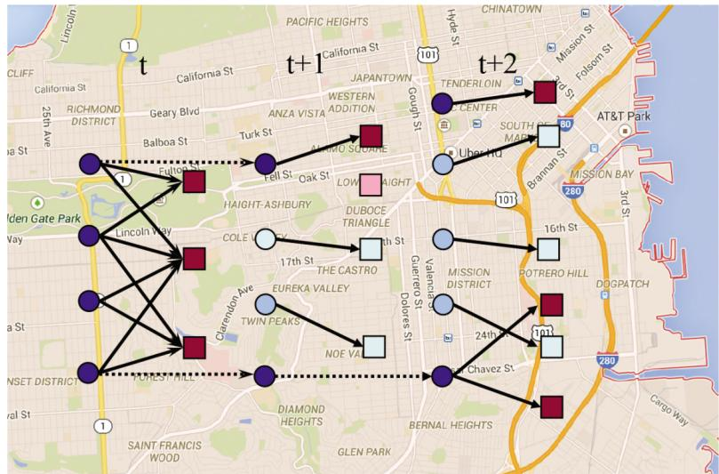  
Figure 8.2 Illustration of the dynamic assignment of drivers (circles) to riders (squares).

# 8.3.1 The Dynamic Assignment Problem

Consider the challenge of matching drivers (or perhaps driverless electric vehicles) to customers calling in dynamically over time, illustrated in Figure 8.2. We have to think about which driver to assign to which rider based on the characteristics of the driver (or car), such as where the driver lives (or how much energy is in the car’s battery), along with the characteristics of the trip (origin, destination, length).

We describe drivers (and cars) using

$$
a _ {t} = \left( \begin{array}{c} a _ {1} \\ a _ {2} \\ a _ {3} \end{array} \right) = \left( \begin{array}{c} \text {T h e l o c a t i o n o f t h e c a r} \\ \text {T h e t y p e o f c a r} \\ \text {H o u r s t h e d r i v e r h a s b e e n o n d u t y} \end{array} \right).
$$

We can model our fleet of drivers and cars using

?? = the set of all possible attribute vectors,

$\begin{array} { r l } { R _ { t a } } & { { } = } \end{array}$ the number of cars with attribute $a \in { \mathcal { A } }$ at time $t$ ,

$$
R _ {t} = \left(R _ {t a}\right) _ {a \in \mathcal {A}}.
$$

We note that $R _ { t }$ can be very high dimensional, since the attribute $a$ is a vector. In practice, we never generate the vector $R _ { t }$ , since it is more practical to just create a list of drivers and cars. The notation $R _ { t }$ is used just for modeling purposes.

Demands for trips arise over time, which we can model using

$\begin{array} { r l } { b } & { { } = } \end{array}$ the characteristics of a trip (origin, destination, car type requested),

ℬ = the set of all possible values of the vector $b$

$\begin{array} { r l } { \hat { D } _ { t b } } & { { } = } \end{array}$ the number of new customer requests with attribute $b$ that were first learned at time $t$ ,

$$
\hat {D} _ {t} \quad = \quad (\hat {D} _ {t b}) _ {b \in \mathcal {B}},
$$

$\begin{array} { r l } { D _ { t b } } & { { } = } \end{array}$ the total number of unserved trips with attribute $b$ waiting at time $t$ ,

$$
D _ {t} = \left(D _ {t b}\right) _ {b \in \mathcal {B}}.
$$

We next have to model the decisions that we have to make. Assume that at any point in time, we can either assign a driver to handle a customer, or send her home. Let

???? = the set of decisions representing sending a driver to her home location,

$\begin{array} { r l } { \mathcal { D } ^ { D } } & { { } = } \end{array}$ the set of decisions to assign a driver to a rider, where $d \in \mathcal { D } ^ { D }$ represents a decision to serve a demand of type $b _ { d }$

$\begin{array} { r l } { d ^ { \phi } } & { { } = } \end{array}$ the decision to “do nothing,”

$$
\mathcal {D} = \mathcal {D} ^ {H} \cup \mathcal {D} ^ {D} \cup d ^ {\phi}.
$$

A decision has the effect of changing the attributes of a driver, as well as possibly satisfying a demand. The impact on the resource attribute vector of a driver is captured using the attribute transition function, represented using

$$
a _ {t + 1} = a ^ {M} \left(a _ {t}, d\right).
$$

For algebraic purposes, it is useful to define the indicator function

$$
\delta_ {a ^ {\prime}} (a _ {t}, d) = \left\{ \begin{array}{l l} 1 & \text {f o r} a ^ {M} (a _ {t}, d) = a ^ {\prime}, \\ 0 & \text {o t h e r w i s e}. \end{array} \right.
$$

A decision $d \in \mathcal { D } ^ { D }$ means that we are serving a customer described by an attribute vector $b _ { d }$ . This is only possible, of course, if $D _ { t b } > 0$ . Typically, $D _ { t b }$ will be 0 or 1, although our model allows for multiple trips with the same attributes.

We indicate which decisions we have made using

$\begin{array} { r l } { x _ { t a d } } & { { } = } \end{array}$ the number of times we apply a decision of type $d$ to trip with attribute $a$ ,

$$
x _ {t} = (x _ {t a d}) _ {a \in \mathcal {A}, d \in \mathcal {D}}.
$$

Similarly, we define the cost of a decision to be

$\begin{array} { r l } { c _ { t a d } } & { { } = } \end{array}$ the cost of applying a decision of type $d$ to driver with attribute $a$ ,

$$
{c _ {t}} = {(c _ {t a d}) _ {a \in \mathcal {A}, d \in \mathcal {D}}.}
$$

We could solve this problem myopically by making what appears to be the best decisions now, ignoring their impact on the future. We would do this by solving

$$
\min  _ {x _ {t}} \sum_ {a \in \mathcal {A}} \sum_ {d \in \mathcal {D}} c _ {t a d} x _ {t a d}, \tag {8.7}
$$

subject to

$$
\sum_ {d \in \mathcal {D}} x _ {t a d} = R _ {t a}, \tag {8.8}
$$

$$
\sum_ {a \in \mathcal {A}} x _ {t a d} \leq D _ {t b _ {d}}, d \in \mathcal {D} ^ {D}, \tag {8.9}
$$

$$
x _ {t a d} \geq 0. \tag {8.10}
$$

Equation (8.8) says that we either have to send a driver home, or assign her to serve a customer. Equation (8.9) says that we can only assign the driver to a job of type $b _ { d }$ if there is in fact a job of type $b _ { d }$ . Said differently, we cannot assign more than one driver per passenger. However, we do not have to cover every trip.

The problem posed by equations (8.7)–(8.10) is a linear program. Real problems may involve managing hundreds or even thousands of individual entities. The decision vector $\boldsymbol { x } _ { t } = ( \boldsymbol { x } _ { t a d } ) _ { a \in \mathcal { A } , d \in \mathcal { D } }$ may have over ten thousand dimensions (variables in the language of linear programming). However, commercial linear programming packages handle problems of this size quite easily.

If we make decisions by solving (8.7)–(8.10), we say that we are using a myopic policy since we are using only what we know now, and we are ignoring the impact of decisions now on the future. For example, we may decide to send a driver home rather than have her sit in a hotel room waiting for a job, but this ignores the likelihood that another job may suddenly arise close to the driver’s current location.

Given a decision vector, the dynamics of our system can be described using

$$
R _ {t + 1, a} = \sum_ {a ^ {\prime} \in \mathcal {A}} \sum_ {d \in \mathcal {D}} x _ {t a ^ {\prime} d} \delta_ {a} \left(a ^ {\prime}, d\right), \tag {8.11}
$$

$$
D _ {t + 1, b _ {d}} = D _ {t, b _ {d}} - \sum_ {a \in \mathcal {A}} x _ {t a d} + \hat {D} _ {t + 1, b _ {d}}, \quad d \in \mathcal {D} ^ {D}. \tag {8.12}
$$

Equation (8.11) captures the effect of all decisions (including serving demands) on the attributes of the drivers. This is easiest to visualize if we assume that all tasks are completed within one time period. If this is not the case, then we simply have to augment the state vector to capture the attribute that we have partially completed a task. Equation (8.12) subtracts from the list of available demands any of type $b _ { d }$ that are served by a decision $\boldsymbol { d } \in \mathcal { D } ^ { D }$ (recall that each element of $\mathcal { D } ^ { D }$ corresponds to a type of trip, which we denote $b _ { d }$ ).

The state of our system is given by

$$
S _ {t} = (R _ {t}, D _ {t}).
$$

The evolution of our state variable over time is determined by equations (8.11) and (8.12). We can now set up an optimality recursion to determine the decisions that minimize costs over time using

$$
V _ {t} (S _ {t}) = \min _ {x _ {t} \in \mathcal {X} _ {t}} \left(C _ {t} (S _ {t}, x _ {t}) + \gamma \mathbb {E} V _ {t + 1} (S _ {t + 1})\right),
$$

where $S _ { t + 1 }$ is the state at time $t + 1$ given that we are in state $S _ { t }$ and action $x _ { t }$ $S _ { t + 1 }$ is random because at time $t$ , we do not know $\hat { D } _ { t + 1 }$ . The feasible region $\mathcal { X } _ { t }$ is defined by equations (8.8)–(8.10).

Needless to say, the state variable for this problem is quite large. The dimensionality of $\cdot { } R _ { t }$ is determined by the number of attributes of our driver, while the dimensionality of $D _ { t }$ is determined by the relevant attributes of a demand. In real applications, these attributes can become fairly detailed. Fortunately, this problem has a lot of structure which we exploit in chapter 18.

# 8.3.2 The Blood Management Problem

The problem of managing blood inventories serves as a particularly elegant illustration of a resource allocation problem. We are going to start by assuming that we are managing inventories at a single hospital, where each week we have to decide which of our blood inventories should be used for the demands that need to be served in the upcoming week.

We have to start with a bit of background about blood. For the purposes of managing blood inventories, we care primarily about blood type and age. Although there is a vast range of differences in the blood of two individuals,

Table 8.1 Allowable blood substitutions for most operations, ‘X’ means a substitution is allowed. Adapted from Cant, L. (2006), ‘Life Saving Decisions: A Model for Optimal Blood Inventory Management’.   

<table><tr><td rowspan="2">Donor</td><td colspan="8">Recipient</td></tr><tr><td>\(AB+\)</td><td>\(AB-\)</td><td>\(A+\)</td><td>\(A-\)</td><td>\(B+\)</td><td>\(B-\)</td><td>\(O+\)</td><td>\(O-\)</td></tr><tr><td>\(AB+\)</td><td>X</td><td></td><td></td><td></td><td></td><td></td><td></td><td></td></tr><tr><td>\(AB-\)</td><td>X</td><td>X</td><td></td><td></td><td></td><td></td><td></td><td></td></tr><tr><td>\(A+\)</td><td>X</td><td></td><td>X</td><td></td><td></td><td></td><td></td><td></td></tr><tr><td>\(A-\)</td><td>X</td><td>X</td><td>X</td><td>X</td><td></td><td></td><td></td><td></td></tr><tr><td>\(B+\)</td><td>X</td><td></td><td></td><td></td><td>X</td><td></td><td></td><td></td></tr><tr><td>\(B-\)</td><td>X</td><td>X</td><td></td><td></td><td>X</td><td>X</td><td></td><td></td></tr><tr><td>\(O+\)</td><td>X</td><td></td><td>X</td><td></td><td>X</td><td></td><td>X</td><td></td></tr><tr><td>\(O-\)</td><td>X</td><td>X</td><td>X</td><td>X</td><td>X</td><td>X</td><td>X</td><td>X</td></tr></table>

for most purposes doctors focus on the eight major blood types: $A +$ (“ A positive”), $A -$ (“A negative”), ??+, ??−, $A B +$ , ????−, $^ { O + }$ , and $O -$ . While the ability to substitute different blood types can depend on the nature of the operation, for most purposes blood can be substituted according to Table 8.1.

A second important characteristic of blood is its age. The storage of blood is limited to six weeks, after which it has to be discarded. Hospitals need to anticipate if they think they can use blood before it hits this limit, as it can be transferred to blood centers which monitor inventories at different hospitals within a region. It helps if a hospital can identify blood it will not need as soon as possible so that the blood can be transferred to locations that are running short.

One mechanism for extending the shelf-life of blood is to freeze it. Frozen blood can be stored up to 10 years, but it takes at least an hour to thaw, limiting its use in emergency situations or operations where the amount of blood needed is highly uncertain. In addition, once frozen blood is thawed it must be used within 24 hours.

We can model the blood problem as a heterogeneous resource allocation problem. We are going to start with a fairly basic model which can be easily extended with almost no notational changes. We begin by describing the attributes of a unit of stored blood using

$$
a = \left( \begin{array}{c} a _ {1} \\ a _ {2} \end{array} \right) = \left( \begin{array}{c} \text {B l o o d t y p e} (A +, A -, \ldots) \\ \text {A g e (i n w e e k s)} \end{array} \right),
$$

$$
\begin{array}{r c l} \mathcal {B} & = & \text {S e t o f a l l a t t r i b u t e t y p e s .} \end{array}
$$

We will limit the age to the range $0 \leq a _ { 2 } \leq 6$ . Blood with ${ a _ { 2 } } = 6$ (which means blood that is already six weeks old) is no longer usable. We assume that decision epochs are made in one-week increments.

Blood inventories, and blood donations, are represented using

$$
\begin{array}{l} \begin{array}{r c l} R _ {t a} & = & \text {u n i t s o f b l o o d o f t y p e a a v a i l a b l e t o b e a s s i g n e d o r h e l d} \\ & & \text {a t t i m e t ,} \end{array} \\ R _ {t} = \left(R _ {t a}\right) _ {a \in \mathcal {A}}, \\ \end{array}
$$

$$
\begin{array}{r c l} \hat {R} _ {t a} & = & \text {n u m b e r o f n e w u n i t s o f b l o o d o f t y p e a d o n a t e d b e t w e e n} \\ & & t - 1 \text {a n d} t, \end{array}
$$

$$
\hat {R} _ {t} = (\hat {R} _ {t a}) _ {a \in \mathcal {A}}.
$$

The attributes of demand for blood are given by

$$
d = \left( \begin{array}{c} d _ {1} \\ d _ {2} \\ d _ {3} \end{array} \right) = \left( \begin{array}{c} \text {B l o o d t y p e o f p a t i e n t} \\ \text {S u r g e r y t y p e : u r g e n t o r e l e c t i v e} \\ \text {I s s u b s t i t u t i o n a l l o w e d ?} \end{array} \right),
$$

$$
d ^ {\phi} = \text {d e c i s i o n t o h o l d b l o o d i n i n v e n t o r y (}" d o n o t h i n g) ",
$$

$$
\mathcal {D} = \text {s e t o f a l l d e m a n d t y p e s} d \text {p l u s} d ^ {\phi}.
$$

The attribute $d _ { 3 }$ captures the fact that there are some operations where a doctor will not allow any substitution. One example is childbirth, since infants may not be able to handle a different blood type, even if it is an allowable substitute. For our basic model, we do not allow unserved demand in one week to be held to a later week. As a result, we need only model new demands, which we accomplish with

$$
\hat {D} _ {t d} = \text {u n i t s o f d e m a n d w i t h a t t r i b u t e} d \text {t h a t a r o s e b e t w e e n} t - 1 \text {a n d} t,
$$

$$
\hat {D} _ {t} = (\hat {D} _ {t d}) _ {d \in \mathcal {D}}.
$$

We act on blood resources with decisions given by

$$
\begin{array}{r c l} x _ {t a d} & = & \text {n u m b e r o f u n i t s o f b l o o d w i t h a t t r i b u t e a t h a t w e a s s i g n} \\ & & \text {t o a d e m a n d o f t y p e d ,} \end{array}
$$

$$
x _ {t} = (x _ {t a d}) _ {a \in \mathcal {A}, d \in \mathcal {D}}.
$$

The feasible region $\mathcal { X } _ { t }$ is defined by the following constraints:

$$
\sum_ {d \in \mathcal {D}} x _ {t a d} = R _ {t a}, \tag {8.13}
$$

$$
\sum_ {a \in \mathcal {A}} x _ {t a d} \leq \hat {D} _ {t d}, \quad d \in \mathcal {D}, \tag {8.14}
$$

$$
x _ {t a d} \geq 0. \tag {8.15}
$$

Blood that is held simply ages one week, but we limit the age to six weeks. Blood that is assigned to satisfy a demand can be modeled as being moved to a blood-type sink, denoted, perhaps, using $a _ { t , 1 } = \phi$ (the null blood type). The blood attribute transition function $a ^ { M } ( a _ { t } , d _ { t } )$ is given by

$$
\begin{array}{r l r} {a _ {t + 1}} & = & {\left( \begin{array}{c} a _ {t + 1, 1} \\ a _ {t + 1, 2} \end{array} \right) = \left\{\left( \begin{array}{c} a _ {t, 1} \\ \min \{6, a _ {t, 2} + 1 \} \\ \phi \\ - \end{array} \right), \begin{array}{l} d _ {t} = d ^ {\phi}, \\ d _ {t} \in \mathcal {D}. \end{array} \right.} \end{array}
$$

To represent the transition function, it is useful to define

$$
\delta_ {a ^ {\prime}} (a, d) = \left\{ \begin{array}{l l} 1 & a _ {t} ^ {x} = a ^ {\prime} = a ^ {M} (a _ {t}, d _ {t}), \\ 0 & \text {o t h e r w i s e}, \end{array} \right.
$$

$$
\Delta = \text {m a t r i x w i t h} \delta_ {a ^ {\prime}} (a, d) \text {i n r o w} a ^ {\prime} \text {a n d c o l u m n} (a, d).
$$

We note that the attribute transition function is deterministic. A random element would arise, for example, if inspections of the blood resulted in blood that was less than six weeks old being judged to have expired. The resource transition function can now be written

$$
R _ {t a ^ {\prime}} ^ {x} = \sum_ {a \in \mathcal {A}} \sum_ {d \in \mathcal {D}} \delta_ {a ^ {\prime}} (a, d) x _ {t a d},
$$

$$
{R _ {t + 1, a ^ {\prime}}} = {R _ {t a ^ {\prime}} ^ {x} + \hat {R} _ {t + 1, a ^ {\prime}}.}
$$

In matrix form, these would be written

$$
R _ {t} ^ {x} = \Delta x _ {t}, \tag {8.16}
$$

$$
R _ {t + 1} = R _ {t} ^ {x} + \hat {R} _ {t + 1}. \tag {8.17}
$$

Figure 8.3 illustrates the transitions that are occurring in week ??. We either have to decide which type of blood to use to satisfy a demand (Figure 8.3a), or to hold the blood until the following week. If we use blood to satisfy a demand, it is assumed lost from the system. If we hold the blood until the following week,

Table 8.2 Contributions for different types of blood and decisions   

<table><tr><td>Condition</td><td>Description</td><td>Value</td></tr><tr><td>if d = dφ</td><td>Holding</td><td>0</td></tr><tr><td>if a1 = a1 when d ∈ D</td><td>No substitution</td><td>0</td></tr><tr><td>if a1 ≠ a1 when d ∈ D</td><td>Substitution</td><td>-10</td></tr><tr><td>if a1 = O- when d ∈ D</td><td>O- substitution</td><td>5</td></tr><tr><td>if d2 = Urgent</td><td>Filling urgent demand</td><td>40</td></tr><tr><td>if d2 = Elective</td><td>Filling elective demand</td><td>20</td></tr></table>

it is transformed into blood that is one week older. Blood that is six weeks old may not be used to satisfy any demands, so we can view the bucket of blood that is six weeks old as a sink for unusable blood (the value of this blood would be zero). Note that blood donations are assumed to arrive with an age of 0. The pre- and post-decision state variables are given by

$$
S _ {t} = (R _ {t}, \hat {D} _ {t}),
$$

$$
{S _ {t} ^ {x}} = {(R _ {t} ^ {x}).}
$$

There is no real “cost” to assigning blood of one type to demand of another type (we are not considering steps such as spending money to encourage additional donations, or transporting inventories from one hospital to another). Instead, we use the contribution function to capture the preferences of the doctor. We would like to capture the natural preference that it is generally better not to substitute, and that satisfying an urgent demand is more important than an elective demand. For example, we might use the contributions described in Table 8.2. Thus, if we use $O -$ blood to satisfy the needs for an elective patient with $A +$ blood, we would pick up a $- \$ 10$ contribution (penalty since it is negative) for substituting blood, a $+ \$ 5$ for using $O -$ blood (something the hospitals like to encourage), and a $+ \$ 20$ contribution for serving an elective demand, for a total contribution of $+ \$ 15$ .

The total contribution (at time $t$ ) is finally given by

$$
C _ {t} (S _ {t}, x _ {t}) = \sum_ {a \in \mathcal {A}} \sum_ {d \in \mathcal {D}} c _ {t a d} x _ {t a d}.
$$

As before, let $X _ { t } ^ { \pi } ( S _ { t } )$ be a policy (some sort of decision rule) that determines $\boldsymbol { x } _ { t } \in \mathcal { X } _ { t }$ given $S _ { t }$ . We wish to find the best policy by solving

$$
\max  _ {\pi \in \Pi} \mathbb {E} \sum_ {t = 0} ^ {T} C \left(S _ {t}, X ^ {\pi} \left(S _ {t}\right)\right). \tag {8.18}
$$

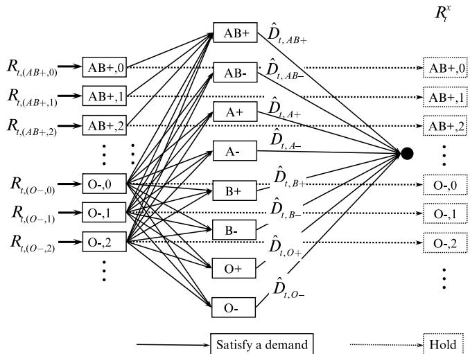  
(a) - Assigning blood supplies to demands in week $t$ .Solid lines represent assigning blood to a demand, dotted lines represent holding blood.

  
(b) - Holding blood supplies until week $t + 1$   
Figure 8.3 (a) The assignment of different blood types (and ages) to known demands in week ??, and (b) holding blood until the following week.

The most obvious way to solve this problem is with a simple myopic policy, where we maximize the contribution at each point in time without regard to the effect of our decisions on the future. We can obtain a family of myopic policies by adjusting the one-period contributions. For example, our bonus of $\$ 5$ for

using $O -$ blood (in Table 8.2), is actually a type of myopic policy. We encourage using $O -$ blood since it is generally more available than other blood types. By changing this bonus, we obtain different types of myopic policies that we can represent by the set $\Pi ^ { M }$ , where for $\pi \in \Pi ^ { M }$ our decision function would be given by

$$
X _ {t} ^ {\pi} \left(S _ {t}\right) = \arg \max  _ {x _ {t} \in \mathcal {X} _ {t}} \sum_ {a \in \mathcal {A}} \sum_ {d \in \mathcal {D}} c _ {t a d} x _ {t a d}. \tag {8.19}
$$

The optimization problem in (8.19) is a simple linear program (known as a “transportation problem”). Solving the optimization problem given by equation (8.18) for the set $\pi \in \Pi ^ { M }$ means searching over different values of the bonus for using $O -$ blood.

In chapter 13 we will introduce a way of improving this policy through simple parameterizations, using a class of policy we call a cost function approximation. We then revisit the same problem in chapter 18 when we develop a powerful strategy based on approximate dynamic programming, where we exploit the natural concavity of the value function. Finally, we touch on this problem one last time in chapter 20 when we show how to optimize the management of blood over many hospitals using a multiagent formulation.

# 8.4 State-dependent Learning Problems

Information acquisition is an important problem in many applications where we face uncertainty about the value of an action, but the only way to obtain better estimates of the value is to take the action. For example, a baseball manager may not know how well a particular player will perform at the plate. The only way to find out is to put him in the lineup and let him hit. The only way a mutual fund can learn how well a manager will perform may be to let her manage a portion of the portfolio. A pharmaceutical company does not know how the market will respond to a particular pricing strategy. The only way to learn is to offer the drug at different prices in test markets.

We have already seen information acquisition problems in chapter 7 where we called them active learning problems. Here we are going to pick up this thread but in the context of more complex problems that combine a hybrid of physical and informational states, in addition to belief states (which is what makes them learning problems).

Information acquisition plays a particularly important role in sequential decison problems, but the presence of physical states can complicate the learning process. Imagine that we are managing a medical team that is currently in zone ?? testing for the presence of a communicable disease. We are thinking

about moving the team to zone $j$ to do more testing there. We already have estimates of the presence of the disease in different zones, but visiting zone $j$ not only improves our estimate for zone $j$ , but also other zones through correlated beliefs.

Information acquisition problems are examples of dynamic optimization problems with belief states. These have not received much attention in the research literature, but we suspect that they arise in many practical applications that combine decisions under uncertainty with field observations.

# 8.4.1 Medical Decision Making

Patients arrive at a doctor’s office for treatment. They begin by providing a medical history, which we capture as a set of attributes $a _ { 1 } , a _ { 2 } , \dots$ which includes patient characteristics (gender, age, weight), habits (smoking, diet, exercise patterns), results from a blood test, and medical history (e.g. prior diseases). Finally, the patient may have some health issue (fever, knee pain, elevated blood sugar, ...) that is the reason for the visit. This attribute vector can have hundreds of elements.

Assume that our patient is dealing with elevated blood sugar. The doctor might prescribe lifestyle changes (diet and exercise), or a form of medication (along with the dosage), where we can represent the choice as $d \in { \mathcal { D } }$ . Let $t$ index visits to the doctor, and let

$$
x _ {t d} = \left\{ \begin{array}{l l} 1 & \text {i f t h e p h y s i c i a n c h o o s e s m e d i c a t i o n} d \in \mathcal {D}, \\ 0 & \text {o t h e r w i s e}. \end{array} \right.
$$

After the physician makes a decision $x _ { t }$ , we observe the change in blood sugar levels by $\hat { y } _ { t + 1 }$ which we assume is learned at the next visit.

Let $U ( a , x | \theta )$ be a linear model of patient attributes and medical decisions which we write using

$$
U (a, x | \theta) = \sum_ {f \in \mathcal {F}} \theta_ {f} \phi_ {f} (a, x),
$$

where $\phi _ { f } ( a , x )$ for $f \in \mathcal F$ represents features that we design from a combination of the patient attributes $a$ (which are given) and the medical decision ??. We believe that we can predict the patient response $\hat { y }$ using the logistic function

$$
\hat {y} | \theta \sim \frac {e ^ {U (a , x | \theta)}}{1 + e ^ {U (a , x | \theta)}}. \tag {8.20}
$$

Of course, we do not know what $\boldsymbol { \theta }$ is. We can use data across a wide range of patients to get a population estimate $\bar { \theta } _ { t } ^ { p o p }$ that is updated every time we treat

a patient and then observe an outcome. A challenge with medical decisionmaking is that every patient responds to treatments differently. Ideally, we would like to estimate $\bar { \theta } _ { t a }$ that depends on the attribute $a$ of an individual patient.

This is a classical learning problem similar to the derivative-free problems we saw in chapter 7, with one difference: we are given the attribute $a$ of a patient, after which we make a decision. Our state, then, consists of our estimate of $\bar { \theta } _ { t } ^ { p o p }$ (or $\begin{array} { r } { \bar { \theta } _ { t a } . } \end{array}$ ), which goes into our belief state, along with the patient attribute $a _ { t }$ , which affects the response function itself. The attributes $a _ { t }$ represents the dynamic information for the problem.

# 8.4.2 Laboratory Experimentation

We may be trying to design a new material. For the $n ^ { t h }$ experiment we have to choose

$$
x _ {1} ^ {n} = \text {t h e t e m p e r a t u r e a t w h i c h t h e e x p i r i n g w i l l b e r u n},
$$

$$
x _ {2} ^ {n} = \text {t h e l e n g t h o f t i m e t h a t t h e m a t e r i a l w i l l b e h e a t e d},
$$

$$
x _ {3} ^ {n} = \text {t h e c o n c e n t r a t i o n o f o y g e n i n t h e c h a m b e r},
$$

$$
x _ {4} ^ {n} = \text {t h e w a t e r c o n c e n t r a t i o n}.
$$

When the experiment is complete, we then test the strength of the resulting material, which we model as

$$
W ^ {n + 1} = \text {t h e s t r e n g t h o f t h e m a t e r i a l p r o d u c e d b y t h e e x p e r i m e n t}.
$$

We use this observation to update our estimate of the relationship between the inputs $x ^ { n }$ and the resulting strength $W ^ { n + 1 }$ which we represent using

$$
\begin{array}{r c l} f (x | \bar {\theta} ^ {n}) & = & \text {s t a t i s t i c a l e s t i m a t e o f t h e s t r e n g t h o f t h e m a t e r i a l} \\ & & \text {p r o d u c e d b y i n p u t s} x ^ {n}. \end{array}
$$

Our belief state $B ^ { n }$ would consist of the estimate ${ \bar { \theta } } ^ { n }$ as well as any other information needed to perform recursive updating (you have to pick your favorite method from chapter 3). The transition function for $B ^ { n }$ would be the recursive updating equations for ${ \bar { \theta } } ^ { n }$ from the method you chose from chapter 3.

For our laboratory experiment, we often have physical state variables $R ^ { n }$ that might capture inventories of the materials needed for an experiment, and we might capture in our information state $I ^ { n }$ information such as the temperature and humidity of the room where the experiment is being run. This gives us a state variable that consists of our physical state $R ^ { n }$ , additional information $I ^ { n }$ , and our belief $B ^ { n }$ .

# 8.4.3 Bidding for Ad-clicks

Companies looking to advertise their product on the internet need to first choose a series of keywords, such as “hotels in New York,” “pet-friendly hotel,” “luxury hotel in New York,” that will attract the people who they feel will find their offering most attractive. Then, they have to decide what to bid to have their ad featured on sites such as Google and Facebook. Assume that the probability that we win one of the limited “sponsored” slots on either platform, when we bid $p$ , is given by

$$
P ^ {\text {c l i c k}} (p \mid \theta) = \frac {e ^ {\theta_ {0} + \theta_ {1} p}}{1 + e ^ {\theta_ {0} + \theta_ {1} p}}. \tag {8.21}
$$

Our problem is that we do not know $\theta = ( \theta _ { 0 } , \theta _ { 1 } )$ , but we think it is one of the family $\Theta = \{ \theta _ { 1 } , \ldots , \theta _ { K } \}$ .

Assume that after $n$ trials, we have a belief $p _ { k } ^ { n } = P r o b [ \theta = \theta _ { k } ]$ that $\theta _ { k }$ is the true value of ??. Now, we have a budget $R ^ { n }$ that starts at $R ^ { 0 }$ at the beginning of each week. We have to learn how to place our bids, given our budget constraint, so that we learn how to maximize ad-clicks. Our state variable consists of our remaining budget $R ^ { n }$ and our belief vector $p ^ { n } = ( p _ { 1 } ^ { n } , \ldots , p _ { K } ^ { n } )$ .

# 8.4.4 An Information-collecting Shortest Path Problem

Assume that we have to choose a path through a network, but we do not know the actual travel time on any of the links of the network. In fact, we do not even know the mean or variance (we might be willing to assume that the probability distribution is normal).

To get a sense of some of the complexity when learning while moving around a graph, imagine that you have to find the best path from your apartment in New York City to your new job. You start by having to decide whether to walk to a subway station, take the subway to a station close to your workplace, and then walk. Or you can walk to a major thoroughfare and wait for a taxi, or you can make the decision to call Uber or Lyft if the wait seems long. Finally, you can call an Uber or Lyft from your apartment, which involves waiting for the car at your apartment and takes you right to your office.

Each decision involves collecting information by making a decision and observing the time required for each leg of the trip. Collecting information requires participating in the process, and changes your location. Also, observing the wait for an Uber or Lyft at your apartment hints at how long you might have to wait if you call one while waiting for a taxi. Your location on the graph (along with other information that might be available, such as weather) represents the dynamic information. In contrast to the medical decision-making example where we have no control over the patient attributes $a _ { t }$ , in our dynamic

shortest path problem, our current location is directly a result of decisions we have made in the past.

Information-collecting shortest path problems arise in any information collection problem where the decision now affects not only the information you collect, but also the decisions you can make in the future. While we can solve basic bandit problems optimally, this broader problem class remains unsolved.

# 8.5 A Sequence of Problem Classes

Eventually, we are going to show that most stochastic optimization problems can be formulated using a common framework. However, this seems to suggest that all stochastic optimization problems are the same, which is hardly the case. It helps to identify major problem classes.

● Deterministically solvable problems – These are optimization problems where the uncertainty has enough structure that we can solve the problem exactly using deterministic methods. This covers an important class of problems, but we are going to group these together for now. All remaining problem classes require some form of adaptive learning.

● Pure learning problems – We make a decision $x ^ { n }$ (or $x _ { t . }$ ), then observe new information $W ^ { n + 1 }$ (or $W _ { t + 1 }$ ), after which we update our knowledge to make a new decision. In pure learning problems, the only information passed from iteration ?? to $n + 1$ (or from time ?? to time $t + 1$ ) is updated knowledge, while in other problems, there may be a physical state (such as inventory) linking decisions.

● Stochastic problems with a physical state – Here we are managing resources, which arise in a vast range of problems where the resource might be people, equipment, or inventory of different products. Resources might also be money or different types of financial assets. There are a wide range of physical state problems depending on the nature of the setting. Some major problem classes include

Stopping problems – The state is 1 (process continues) or 0 (process has been stopped). This arises in asset selling, where 1 means we are still holding the asset, and 0 means it has been sold.

Inventory problems – We hold a quantity of resource to meet demands, where leftover inventory is held to the next period. Two important subclasses include:

Inventory problems with static attributes – A static attribute might reflect the type of equipment or resource which does not change.

Inventory problems with dynamic attributes – A dynamic attribute might be spatial location, age, or deterioration.

Multiattribute resource allocation – Resources might have static and dynamic attributes, and may be re-used over time (such as people or equipment).

Discrete resource allocation – This includes dynamic transportation problems, vehicle routing problems, and dynamic assignment problems.

● Physical state problems with an exogenous information state – While managing resources, we may also have access to exogenous information such as prices, weather, past history, or information about the climate or economy. Information states come in three flavors:

– Memoryless – The information $I _ { t }$ at time ?? does not depend on past history, and is “forgotten” after a decision is made.   
– First-order exogenous process – $I _ { t }$ depends on $I _ { t - 1 }$ , but not on previous decisions.   
– State-dependent exogenous process – ???? depends on $S _ { t - 1 }$ and possibly $x _ { t - 1 }$

● Physical state with a belief state – Here, we are both managing resources while learning at the same time.

This list provides a sequence of problems of increasing complexity. However, each problem class can be approached with any of the four classes of policies.

# 8.6 Bibliographic Notes

All of the problems in this chapter are popular topics in the operations research literature. Most of the work in this chapter is based on work with former students.

Section 8.1.1 – The stochastic shortest path problem is a classic problem in operations research (see, for example, Bertsekas et al. (1991)). We use it to illustrate modeling strategy when we make different assumptions about what a traveler sees while traversing the network.

Section 8.1.2 – The “nomadic trucker” problem was first introduced in Powell (2011).

Section 8.1.3 – Equipment replacement problems are a popular topic. This section was based on the work of Johannes Enders (Enders et al. (2010).

Section 8.2.4 – Batch replenishment problems are a popular topic in operations research, often arising in the context of bulk service queues. This section was based on the work of Katerina Padaki (Powell and Papadaki (2002)), but see also Puterman (2005).

Section 8.3.1 – The material on the dynamic assignment problem is based on the work of Michael Spivey (Spivey and Powell (2004)).

Section 8.3.2 – This model of the blood management problem is based on the undergraduate senior thesis research of Lindsey Cant (Cant (2006)).

Section 8.4.4 – The work on the information collecting shortest path problem is based on (Ryzhov and Powell (2011)).

Section 8.4.3 – This section is based on (Han and Powell (2020)).

# Exercises

# Review questions

8.1 What is meant by a “state-dependent” problem? Give three examples.   
8.2 You are moving over a static graph. At each time period, you arrive at another node. Why is this a “state-dependent problem”?   
8.3 What are the essential differences between a shortest path problem with random costs, and an inventory problem with random demands (and deterministic prices and costs)?   
8.4 Consider a discrete inventory problem where you can order at most 10 items at a point in time, but where you can order them to arrive in 1 day, 2 days, ... 5 days. Give the state variable, and compute how many states we may have for this (very simple) problem.   
8.5 For the dynamic assignment problem in section 8.3.1, assume that space has been divided into 200 zones, there are three types of cars, and drivers may be on duty up to 10 hours (treat hours as an integer starting at 1). To understand the complexity of the problem, answer the following:

(a) What is the dimensionality of the state variable?   
(b) What is the dimensionality of the decision vector?   
(c) What is the dimensionality of the exogenous information vector?

8.6 For the blood management problem in section 8.3.2, answer the following:

(a) What is the dimensionality of the state variable?   
(b) What is the dimensionality of the decision vector?   
(c) What is the dimensionality of the exogenous information vector?

# Modeling questions

8.7 Consider a discrete inventory problem with deterministic demands, but (possibly) random costs. Starting with an inventory of 0, sketch a few time periods of this problem assuming you cannot order more than 2 items per time period, and show that this can be modeled as a dynamic shortest path problem.   
8.8 What is the distinguishing characteristic of a state-dependent problem, as opposed to the state-independent problems we considered in chapters 5 and 7? Contrast what we mean by a solution to a stochastic optimization problem with a state-independent function, versus what we mean by a solution to a stochastic optimization problem with a state-dependent function?   
8.9 Repeat the gambling problem assuming that the value of ending up with $S ^ { N }$ dollars is $\sqrt { S ^ { N } }$ .   
8.10 Section 8.2.1 describes an inventory problem that uses a contribution function $C ( S _ { t } , x _ { t } , W _ { t + 1 } )$ , and shows that it can also be modeled so the single-period contribution is written $C ( S _ { t } , x _ { t } )$ . Show how to convert any problem where you are given the contribution function in the form of $C ( S _ { t } , x _ { t } , W _ { t + 1 } )$ into a problem where the single period contribution is given by $C ( S _ { t } , x _ { t } )$ without changing sum of the contributions over time. This result allows us to write $C ( S _ { t } , x _ { t } )$ without loss of generality, but there will be problems (such as the inventory problem in section 8.2.1), where it will be more natural to write $C ( S _ { t } , x _ { t } , W _ { t + 1 } )$ . The choice is up to the modeler.   
8.11 Rewrite the transition function for the asset acquisition problem II (section 8.2.2) assuming that $R _ { t }$ is the resources on hand after we satisfy the demands.   
8.12 Write out the transition equations for the lagged asset acquisition problem in section 8.2.3 when we allow spot purchases, which means that we may have $x _ { t t } \ > \ 0$ . ?????? refers to purchases that are made at time ?? which can be used to serve unsatisfied demands $D _ { t }$ that occur during time interval ??.   
8.13 Model the sequence of states, decisions, and information for the medical decision making problem in section 8.4.1 using the notation described in section 7.13.6.

# Theory questions

8.14 Consider three variations of a shortest path problem:

Case I – All costs are known in advance. Here, we assume that we have a real-time network tracking system that allows us to see the cost on each link of the network before we start our trip. We also assume that the costs do not change during the time from which we start the trip to when we arrive at the link.

Case II – Costs are learned as the trip progresses. In this case, we assume that we see the actual link costs for links out of node ?? when we arrive at node ??.

Case III – Costs are learned after the fact. In this setting, we only learn the cost on each link after the trip is finished.

Let $\boldsymbol { v } _ { i } ^ { I }$ be the expected cost to get from node ?? to the destination for Case I. Similarly, let $v _ { i } ^ { I I }$ and $v _ { i } ^ { I I I }$ be the expected costs for cases II and III. Show that $v _ { i } ^ { I } \leq v _ { i } ^ { I I } \leq v _ { i } ^ { I I I }$ .

# Problem-solving questions

8.15 We are now going to do a budgeting problem where the reward function does not have any particular properties. It may have jumps, as well as being a mixture of convex and concave functions. But this time we will assume that $R ~ = ~ 3 0$ dollars and that the allocations $x _ { t }$ must be in integers between 0 and 30. Assume that we have $T = 5$ products, with a contribution function $C _ { t } ( x _ { t } ) = c f ( x _ { t } )$ where ${ \mathfrak { c } } = ( c _ { 1 } , \ldots , c _ { 5 } ) =$ (3, 1, 4, 2, 5) and where $f ( x )$ is given by

$$
f (x) = \left\{ \begin{array}{l l} 0, & x \leq 5, \\ 5, & x = 6, \\ 7, & x = 7, \\ 1 0, & x = 8, \\ 1 2, & x \geq 9. \end{array} \right.
$$

Find the optimal allocation of resources over the five products.

8.16 You suddenly realize toward the end of the semester that you have three courses that have assigned a term project instead of a final exam. You quickly estimate how much each one will take to get 100 points (equivalent to an $\mathbf { A } +$ ) on the project. You then guess that if you invest ?? hours

in a project, which you estimated would need $T$ hours to get 100 points, then for $t < T$ your score will be

$$
R = 1 0 0 \sqrt {t / T}.
$$

That is, there are declining marginal returns to putting more work into a project. So, if a project is projected to take 40 hours and you only invest 10, you estimate that your score will be 50 points (100 times the square root of 10 over 40). You decide that you cannot spend more than a total of 30 hours on the projects, and you want to choose a value of ?? for each project that is a multiple of 5 hours. You also feel that you need to spend at least 5 hours on each project (that is, you cannot completely ignore a project). The time you estimate to get full score on each of the three projects is given by

<table><tr><td>Project</td><td>Completion time T</td></tr><tr><td>1</td><td>20</td></tr><tr><td>2</td><td>15</td></tr><tr><td>3</td><td>10</td></tr></table>

Show how to solve this problem as a decision tree. Assume you have to decide how many hours to allocate to each project, in increments of 5 hours. Set up your tree so you enumerate the decisions for project 1 (5, 10, 15, 20), then project 2, then project 3. There are 12 possible decisions over the first two projects (not all of them feasible). For each combination, look at the time remaining for the third project and find the optimal time allocation for the third project. Work backward to find the optimal allocation over all three projects.

# Diary problem

The diary problem is a single problem you chose (see chapter 1 for guidelines). Answer the following for your diary problem.

8.17 It is quite likely that your diary problem falls in the “state-dependent problem” class. Describe some of the key state variables that characterize your problem, using the dimensions of physical states, other information, and belief states. Indicate in each case whether the state variables evolve from decisions, exogenous sources, or both.

# Bibliography

Bertsekas, D.P., Tsitsiklis, J.N., and An. (1991). Analysis of stochastic shortest path problems. Mathematics of Operations Research 16 (3): 580–595.   
Cant, L. (2006). Life saving decisions: A model for optimal blood inventory management.   
Enders, J., Powell,W.B., and Egan, D. (2010). A dynamic model for the failure replacement of aging high-voltage transformers. Energy Systems.   
Han, W. and Powell, W. B. (2020). Optimal online learning for nonlinear belief models using discrete priors. Operations Research.   
Powell, W.B. (2011). Approximate Dynamic Programming: Solving the Curses of Dimensionality, 2e. John Wiley & Sons.   
Powell, W.B. and Papadaki, K.P. (2002). Exploiting structure in adaptive dynamic programming algorithms for a stochastic batch service problem. European Journal Of Operational Research 142: 108–127.   
Puterman, M.L. (2005). Markov Decision Processes, 2e. Hoboken, NJ: John Wiley and Sons.   
Ryzhov, I.O. and Powell, W.B. (2011). Information collection on a graph. Operations Research 59 (1): 188–201.   
Spivey, M.Z. and Powell, W.B. (2004). The dynamic assignment problem. Transportation Science 38 (4): 399–419.

# 9

# Modeling Sequential Decision Problems

Perhaps one of the most important skills to develop when solving sequential decision problems is the ability to write down a mathematical model of the problem. As illustrated in Figure 9.1, the path from a real application to doing computational work on the computer has to pass through the process of mathematical modeling. Unlike fields such as deterministic optimization and machine learning, there is not a standard modeling framework for decisions under uncertainty. This chapter will develop, in much greater detail, our universal modeling framework for any sequential decision problem. Although we have introduced this framework in earlier chapters, this chapter is dedicated to modeling, bringing out the incredible richness of sequential decision problems. This chapter is written to stand alone, so there is some repetition of elements of our universal model.

While the problem domain of sequential decision problems is astonishingly rich, we can write any sequential decision problem as the sequence:

(????????????????, ??????????????????????, ????????????????, ??????????????????????, …).

Let $x _ { t }$ be the decision we make at time ??, and let $W _ { t + 1 }$ be the new information that arrives between ?? (that is, after the decision has been made), and $t { + } 1$ (when we have to make the next decision). We will find it convenient to represent what we know when we make a decision. We refer to this information as the “state” variable $S _ { t }$ (think of this as our “state of knowledge”). Using this bit of notation, we can write our sequential decision problem as

$$
\left(S _ {0}, x _ {0}, W _ {1}, S _ {1}, \dots , S _ {t}, x _ {t}, W _ {t + 1}, S _ {t + 1}, \dots , S _ {T}\right). \tag {9.1}
$$

There are many applications where it is more natural to use a counter $n$ , which might be the $n ^ { t h }$ arrival of a customer, the $n ^ { t h }$ experiment, or the $n ^ { t h }$ iteration of an algorithm, in which case we would write our sequence as

  
Figure 9.1 The path from applications to computation passes through the need for a mathematical model.

$$
\left(S ^ {0}, x ^ {0}, W ^ {1}, S ^ {1}, \dots , S ^ {n}, x ^ {n}, W ^ {n + 1}, S ^ {n + 1}, \dots , S ^ {N}, x ^ {N}\right). \tag {9.2}
$$

Note that the $n ^ { t h }$ arrival might occur in continuous time, where we might let $\tau ^ { n }$ be the time at which the $n ^ { t h }$ event occurs. This notation allows us to model systems in continuous time (we can let $t ^ { n }$ be the time of the $n ^ { t h }$ decision event).

There are problems where we might repeatedly simulate over time, in which case we would let write our sequence as

$$
(S _ {0} ^ {1}, x _ {0} ^ {1}, W _ {1} ^ {1}, \dots , S _ {t} ^ {1}, x _ {t} ^ {1}, W _ {t + 1} ^ {1}, \dots , S _ {0} ^ {n}, x _ {0} ^ {n}, W _ {1} ^ {n}, \dots , S _ {t} ^ {n}, x _ {t} ^ {n}, W _ {t + 1} ^ {n}, \dots),
$$

where we assume that our first pass is viewed as iteration $n = 1$ . For the remainder of this chapter, we will assume our underlying physical process evolves over time, but any search for better policies (or parameters) will use iteration ??.

After each decision, we evaluate our performance using a metric such as a contribution (there are many terms we might use) that we typically will write as $C ( S _ { t } , x _ { t } )$ or, in some situations, $C ( S _ { t } , x _ { t } , W _ { t + 1 } )$ (again, there are other styles that we discuss shortly). Decisions $x _ { t }$ are determined using a function we call a policy and denote by $X ^ { \pi } ( S _ { t } )$ . Our ultimate goal is finding the best policy that optimizes the contribution function in some way.

The sequence in (9.1) (or (9.2) if we are using counts) can be used to describe virtually any sequential decision problem, but it requires that the problem be modeled correctly, and this means properly using one of the most misunderstood concepts in sequential decision problems: the state variable. The remainder of this chapter develops this basic model in considerably more depth.

Up to now, we have avoided discussing some important subtleties that arise in the modeling of sequential decision systems. We intentionally overlooked trying to define a state variable, which we have viewed as simply $S _ { t }$ . We have avoided discussions of how to properly model time or more complex information processes. We have also ignored the richness of modeling all the different

sources of uncertainty for which we have a dedicated chapter (chapter 10). This style has facilitated introducing some basic ideas in dynamic programming, but would severely limit our ability to apply these methods to real problems.

There are five elements to any sequential decision problem, consisting of the following:

State variables – The state variables describe what we need to know (from history) to model the system forward in time. The initial state $S _ { 0 }$ is also where we specify fixed parameters, the initial values of parameters (or quantities) that vary over time, as well as our distribution of belief about parameters we do not know perfectly.

Decision/action/control variables – These are the variables we control. Choosing these variables (“making decisions”) represents the central challenge in sequential decision problems. This is where we describe constraints that limit what decisions we can make. Here is where we introduce the concept of a policy, but do not describe how to design the policy.

Exogenous information variables – These variables describe information that arrives to us exogenously, representing what we learn after we make each decision. Modeling exogenous information processes can be a significant challenge for many applications.

Transition function – This is the function that describes how each state variable evolves from one point in time to another. We may have explicit equations relating the next state to the current state, decision, and the exogenous information we learn after making the decision, for some, all, or none of the state variables.

Objective function – We assume we are trying to maximize or minimize some metric that is specified. This function describes how well we are doing at a point in time, and represents the foundation for evaluating policies.

An important point to make about the modeling framework is that there will at all times be a direct relationship to the software implementation. The mathematical model can be translated directly into software, and it will be possible to translate changes in the software back to the mathematical model.

We are going to start by illustrating these elements in the context of a simple energy storage problem in section 9.1. This is a nice starter problem because the state variable is fairly obvious. However, in section 9.9, we demonstrate how simple problems become complicated quickly using extensions of the initial energy storage application in section 9.1. The variations in section 9.9 introduces modeling issues that have never been addressed in the academic literature.

A reader can actually skip the entire rest of the chapter after this illustration if they are new to the field and just getting started. The remainder of the chapter will lay the foundation for modeling (and then solving) an exceptionally wide range of problems, including all the application areas covered by the fields presented in chapter 2, and all the applications sketched in chapter 8. We demonstrate these concepts when we show how to model the energy storage variations in section 9.9.

Even for more determined readers who are willing to read past section 9.1, we have still marked a number of sections with * that can be skipped on a first read.

This entire chapter is predicated on our “model first, then solve” style because we are going to present the model without addressing how we might solve it (hint: we will use one or more of our four classes of policies). This contrasts with the standard style used in the literature on sequential decision problems which is to present a method (see, for example, the introduction to reinforcement learning in section 2.1.6), but we also include so-called models where it is clear that the next step is to use Bellman’s equation.

The rest of this chapter is organized as follows. We begin by describing the principles of good notation in section 9.2, followed by section 9.3 which addresses the subtleties of modeling time. These two sections lay the critical foundation for notation that is used throughout the book. Notation is not as critical for simple problems, as long as it is precise and consistent. But what seems like benign notational decisions for a simple problem can cause unnecessary difficulties, possibly producing a model that simply does not capture the real problem, or making the model completely intractable.

The five elements of a dynamic model are covered in the following sections:

● State variables – section 9.4.   
● Decision variables – section 9.5   
● Exogenous information variables – section 9.6   
● Transition function – section 9.7   
● Objective function – section 9.8

We then present a more complex energy storage problem in section 9.9.

Having laid this foundation, we transition to a series of topics that can be skipped on a first pass, but which help to expand the readers’ appreciation of modeling of dynamic systems. These include:

Base models vs. lookahead models – Section 9.10 introduces the concept of base models (which is what we describe in this chapter) and lookahead models, which represent one of our classes of policies (described in much greater detail in chapter 19).

Problem classification – Section 9.11 describes four fundamental problem classes differentiated based on whether we have state-independent or state-dependent problems, and whether we are working in an offline setting (maximizing the final reward) or an online setting (maximizing cumulative reward).

Policy evaluation – Section 9.12 describes how to evaluate a policy using Monte Carlo simulation. This can actually be somewhat subtle. We have found that a good test of whether you understand an expectation is that you know how to estimate it using Monte Carlo simulation.

Advanced probabilistic modeling concepts – For readers who enjoy bridging to more advanced concepts in probability theory, section 9.13 provides an introduction to the vocabulary of measure-theoretic concepts and probability modeling. This discussion is designed for readers who do not have any formal training in this area, but would like to understand some of the language (and concepts) that measure-theoretic probability brings to this area.

Once we have laid out the five core elements of the model, we still have two components that we deal in much greater depth in subsequent chapters:

Uncertainty modeling – Chapter 10 deals with the exceptionally rich area of modeling uncertainty, which enters our model through the initial state $S _ { 0 }$ , which can capture uncertainties about parameters and quantities, and the exogenous information process $W _ { 1 } , \dots , W _ { T }$ . We recommend that when providing the basic model of our problem, the discussion of “exogenous information” should be limited to just listing the variables, without delving into how we model the uncertainties.

Designing policies – Chapter 11 describes in more detail the four classes of policies, which are the topic of chapters 12-19. We believe strongly that the design of policies can only occur after we have developed our model.

This chapter describes modeling in considerable depth, and as a result it is quite long. Sections marked with a ‘*’ can be skipped on a first read. The section on more advanced probabilistic modeling is marked with a ‘**’ to indicate that this is more difficult material.

# 9.1 A Simple Modeling Illustration

We are going to first describe a simple energy storage problem in an unstructured way, then we are going to pull the problem together into the five dimensions of a sequential decision problem. We do this by beginning with a plain English narrative (which we recommend for any problem).

Narrative: We have a single battery connected to the grid, where we can either buy energy from the grid or sell it back to the grid. Electricity prices are highly volatile, and may jump from an average of around $\$ 20$ per megawatthour (MWh) to over $\$ 1000$ per MWh (in some areas of the country, prices can exceed $\$ 10,000$ per MWh for brief periods). Prices change every 5 minutes, and we will make the assumption that we can observe the price and then decide if we want to buy or sell. We can only buy or sell for an entire 5-minute interval at a maximum rate of 10 kilowatts (0.01 megawatts). The capacity of our battery storage is 100 kilowatts, which means it may take 10 hours of continuous charging to charge an empty battery.

To model our problem, we introduce the following notation:

???? = The rate at which we buy from the grid to charge the battery $\left( x _ { t } > 0 \right)$ or sell back to the grid to discharge the battery $( x _ { t } < 0 )$ ).

?? = The maximum charge or discharge rate for the battery (the power rating, which is 10 kwh).

???? = The price of electricity on the grid at time ??.

???? = The charge level of the battery.

???????? = The capacity of the battery.

Assume for the purposes of this simple model that the prices $p _ { t }$ are random and independent over time.

If the prices were known in advance (which makes this a deterministic problem), we might formulate the problem as a linear program using

$$
\max  _ {x _ {0}, \dots , x _ {T}} \sum_ {t = 0} ^ {T} - p _ {t} x _ {t} \tag {9.3}
$$

subject to:

$$
{R _ {t + 1}} = {R _ {t} + x _ {t},}
$$

$$
x _ {t} \leq u,
$$

$$
x _ {t} \leq R ^ {m a x} - R _ {t},
$$

$$
x _ {t} \geq 0.
$$

Now let’s introduce the assumption that prices $p _ { t }$ are random, and independent across time. Our first step is to replace the deterministic decision $x _ { t }$ with a policy $X ^ { \pi } ( S _ { t } )$ that depends on the state (that is, what we know), which we need to define (we will do this in a minute).

Next, imagine that we are going to run a simulation. Assume that we have compiled from history a series of sample paths that we are going to index by the Greek letter ??. If we have 20 sample paths, think of having 20 values of $\omega$ where each ?? implies a sequence of prices $\scriptstyle p _ { 0 } ( \omega ) , p _ { 1 } ( \omega ) , \ldots , p _ { T } ( \omega )$ . Let $\Omega$ be the entire set of sample paths (you can think of this as the numbers $1 , 2 , \ldots , 2 0$ if we have 20 sample paths of prices). We assume each sample path occurs with equal likelihood.

We haven’t yet described how we are going to design our policy (that is for later), but let’s say we have a policy. We can simulate the policy for sample path $\omega$ and get the sample value of the policy using

$$
F ^ {\pi} (\omega) = \sum_ {t = 0} ^ {T} - p _ {t} (\omega) X ^ {\pi} (S _ {t} (\omega)),
$$

where the notation $S _ { t } ( \omega )$ for our as-yet undefined state variable indicates that, as we would expect, depends on the sample path $\omega$ (technically, it also depends on the policy $\pi$ that we have been following). Next, we want to average over all the sample paths, so we compute an average

$$
\bar {F} ^ {\pi} = \frac {1}{| \Omega |} \sum_ {\omega \in \Omega} F ^ {\pi} (\omega).
$$

This averaging is an approximation of an expectation. If we could enumerate every sample path, we could write

$$
F ^ {\pi} = \mathbb {E} \sum_ {t = 0} ^ {T} - p _ {t} X ^ {\pi} \left(S _ {t}\right). \tag {9.4}
$$

Here, we drop the dependence on $\omega$ , but need to remember that prices $p _ { t }$ , as well as the state variables $S _ { t }$ , are random variables because they do depend on the sample path. There will be many times that we will write the objective function using the expectation as in equation (9.4). Whenever you see this, keep in mind that we are virtually always assuming that we will approximate the expectation using an average as in equation (9.4).

Our final step is to find the best policy. We would write this objective using

$$
\max  _ {\pi} \mathbb {E} \sum_ {t = 0} ^ {T} - p _ {t} X ^ {\pi} \left(S _ {t}\right). \tag {9.5}
$$

So, we now have our objective function (equation (9.5)), which is frustratingly stated in terms of optimizing over policies, but we have yet to provide any indication how we do this! This is what we call “model first, then solve.” In this chapter, we will only get as far as the objective function. This parallels what is done in every single paper on deterministic optimization or optimal control,

as well as any paper on machine learning. They all present a model (which includes an objective function) and only then do they set about solving it (which in our setting means coming up with a policy).

At this point, we have two tasks remaining:

(1) Uncertainty quantification. We need to develop a model of any sources of uncertainty such as our price process. In a real problem, we would not be able to assume that the prices are independent. In fact, this is a fairly difficult problem.   
(2) Designing policies. We need to design effective policies for buying and selling that depend only on the information in the state variable $S _ { t }$ .

Now that we have described the problem, presented our notation, and described the two remaining tasks, we are going to step back and describe the problem in terms of the five elements described earlier:

State variables – This has to capture all the information we need at time ??. We can see that we need to know how much is stored in the battery $R _ { t }$ , and the grid price $p _ { t }$ , so

$$
S _ {t} = \left(R _ {t}, p _ {t}\right).
$$

Decision variables – Clearly this is $x _ { t }$ . We then need to express the constraints on $x _ { t }$ which are given by

$$
\begin{array}{l} x _ {t} \leq u, \\ x _ {t} \leq R ^ {m a x} - R _ {t}, \\ x _ {t} \geq 0. \\ \end{array}
$$

Finally, when we define the decision variables we also introduce the policy $X ^ { \pi } ( S _ { t } )$ to be designed later. We introduce it now because we need it to present the objective function. Note that we have defined the state variable $S _ { t }$ , so this is given.

Exogenous information variables – This is where we model any information that becomes available after we make the decision $x _ { t }$ . For our simple problem, this would be the updated price, so

$$
W _ {t + 1} = p _ {t + 1}.
$$

Transition function – These are the equations that govern how the state variables evolve over time. We have two variables in the state variables. $R _ { t }$ evolves according to

$$
R _ {t + 1} = R _ {t} + x _ {t}.
$$

The price process evolves according to

$$
p _ {t + 1} = W _ {t + 1}.
$$

In other words, we just observe the next price rather than derive it from an equation. This is an example of “model free dynamic programming.” There are many problems where we observe $S _ { t + 1 }$ rather than compute it; here we have an instance where we compute $R _ { t + 1 }$ but observe $p _ { t + 1 }$ . As an alternative model, we might assume that we model the change in the price using

$$
\hat {p} _ {t + 1} = \text {t h e c h a n g e i n t h e p r i c e f r o m} t \text {t o} t + 1,
$$

which means that $W _ { t + 1 } = \widehat { p } _ { t + 1 }$ and our transition function becomes

$$
p _ {t + 1} = p _ {t} + \hat {p} _ {t + 1}.
$$

Objective function – Our contribution function at time $t$ is given by

$$
C (S _ {t}, x _ {t}) = - p _ {t} x _ {t},
$$

where $p _ { t }$ is pulled from the state variable $S _ { t }$ . We would then write our objective function as

$$
\max  _ {\pi} \mathbb {E} \sum_ {t = 0} ^ {T} C \left(S _ {t}, X ^ {\pi} \left(S _ {t}\right)\right). \tag {9.6}
$$

Now we have modeled our problem using the five dimensions outlined earlier. This follows the same style used for deterministic optimization, but adapted for sequential decision problems. As problems become more complicated, the state variable will become more complex, as will the transition function (which requires an equation for each state variable). It would be nice if we could write a model from top to bottom, starting with state variables, but that is not how it works in practice. Modeling is iterative.

We repeat: this is a good stopping point for readers new to the field. Sections 9.2 on notational style and 9.3 on modeling time are useful to develop notational skills. The remainder of the chapter is primarily useful if you want a solid foundation for more complex problems (we give a hint of this in the expanded energy storage problem in section 9.9). In particular, section 9.4 is an in-depth introduction to the notion of state variables, which get complicated very quickly, even with relatively modest extensions of a simple problem. We demonstrate precisely this process in section 9.9 which presents a series of seemingly modest extensions of this energy problem, focusing on how to model the state variable as we add details to the problem.

# 9.2 Notational Style

Good modeling begins with good notation. The choice of notation has to balance traditional style with the needs of a particular problem class. Notation is easier to learn if it is mnemonic (the letters look like what they mean) and compact (avoiding a profusion of symbols). Notation also helps to bridge communities. Notation is a language: the simpler the language, the easier it is to understand the problem.

As a start, it is useful to adopt notational conventions to simplify the style of our presentation. For this reason, we adopt the following notational conventions:

Variables – Variables are always a single letter. We would never use, for example, ???? for “cost of holding inventory.”

Modeling time – We always use $t$ to represent a point in time, while we use $\tau$ to represent an interval over time. When we need to represent different points in time, we might use $t , t ^ { \prime } , \bar { t } , t ^ { m a x }$ , and so on. Time is always represented as a subscript such as $S _ { t }$ .

Indexing time – If we are modeling activities in discrete time, then $t$ is an index and should be put in the subscript. So $x _ { t }$ would be an activity at time $t$ , with the vector $\boldsymbol { x } ~ = ~ ( x _ { 0 } , x _ { 1 } , \dots , x _ { t } , \dots , x _ { T } )$ giving us all the activities over time. When modeling problems in continuous time, it is more common to write $t$ as an argument, as in $x ( t ) . x _ { t }$ is notationally more compact (try writing a complex equation full of variables written as $x ( t )$ instead of $x _ { t }$ ).

Indexing vectors – Vectors are almost always indexed in the subscript, as in $x _ { i j }$ . Since we use discrete time models throughout, an activity at time ?? can be viewed as an element of a vector. When there are multiple indices, they should be ordered from outside in the general order over which they might be summed (think of the outermost index as the most detailed information). So, if $x _ { t i j }$ is the flow from $i$ to $j$ at time $t$ with cost $c _ { t i j }$ , we might sum up the total cost using $\begin{array} { r } { \sum _ { t } \sum _ { i } \sum _ { j } c _ { t i j } x _ { t i j } } \end{array}$ . Dropping one or more indices creates a vector over the elements of the missing indices to the right. So, $\boldsymbol { x } _ { t } = ( x _ { t i j } ) _ { \forall i , \forall j }$ is the vector of all flows occurring at time ??. Time, when present, is always the innermost index.

Temporal indexing of functions – A common notational error is to index a function by time ?? when in fact the function itself does not depend on time, but depends on inputs that do depend on time. For example, imagine that we have a stochastic price process where the state $S _ { t } = p _ { t }$ which is the price of the asset, and $x _ { t }$ is how much we sell $x _ { t } > 0$ or buy $x _ { t } < 0$ . We might want to write our contribution as

$$
C _ {t} \left(S _ {t}, x\right) = p _ {t} x _ {t}.
$$

However, in this case the function does not depend on time ??; it only depends on data $S _ { t } = p _ { t }$ that depends on time. So the proper way to write this would be

$$
C (S _ {t}, x) = p _ {t} x _ {t}.
$$

Now imagine that our contribution function is given by

$$
C _ {t} \left(S _ {t}, x _ {t}\right) = \sum_ {t ^ {\prime} = t} ^ {t + H} p _ {t t ^ {\prime}} x _ {t t ^ {\prime}}.
$$

Here, the function depends on time because the summation runs from $t$ to $t + H$ .

Flavors of variables – It is often the case that we need to indicate different flavors of variables, such as holding costs and order costs. These are always indicated as superscripts, where we might write $c ^ { h }$ or $c ^ { h o l d }$ as the holding cost. Note that while variables must be a single letter, superscripts may be words (although this should be used sparingly). We think of a variable like $\mathbf { \partial } ^ { : \epsilon } c ^ { h ^ { , , } }$ as a single piece of notation. It is better to write $c ^ { h }$ as the holding cost and $c ^ { p }$ as the purchasing cost than to use $h$ as the holding cost and $p$ as the purchasing cost (the first approach uses a single letter ?? for cost, while the second approach uses up two letters – the roman alphabet is a scarce resource). Other ways of indicating flavors is hats $( \hat { x } )$ , bars $( { \bar { x } } )$ , tildes $( \tilde { x } )$ , and primes $( x ^ { \prime } )$ .

Iteration counters – There are problems where it is more natural to count events such as customer arrivals, experiments, observations, or iterations of an algorithm, rather than representing the actual time at which a decision is being made.

We place iteration counters in the superscript, since we view it as indicating the value of a single variable at iteration ??, as opposed to the $n ^ { t h }$ element of a vector. So, $x ^ { n }$ is our activity at iteration ??, while $x ^ { n + 1 }$ is the value of $x$ at iteration $n + 1$ . If we are using a descriptive superscript, we might write $x ^ { h , n }$ to represent $x ^ { h }$ at iteration ??. Sometimes algorithms require inner and outer iterations. In this case, we use ?? to index the outer iteration and $m$ for the inner iteration.

While this will prove to be the most natural way to index iterations, there is potential for confusion where it may not be clear if the superscript $n$ is an index (as we view it) or raising a variable to the $n ^ { t h }$ power. One notable exception to this convention is indexing stepsizes which we first saw in chapter 5. If we write $\alpha ^ { n }$ , it looks like we are raising $\alpha$ to the $n ^ { t h }$ power, so we use $\alpha _ { n }$ .

Sets are represented using capital letters in a calligraphic font, such as ${ \mathcal { X } } , { \mathcal { F } }$ , or ℐ. We generally use the lowercase roman letter as an element of a set, as in $x \in \mathcal X$ or $i \in \mathcal I$ .

Exogenous information – Information that first becomes available (from outside the system) at time $t$ is denoted using hats, for example, $\hat { D } _ { t }$ or $\hat { p } _ { t }$ . Our only exception to this rule is $W _ { t }$ which is our generic notation for exogenous information (since $W _ { t }$ always refers to exogenous information, we do not use a hat).

Statistics – Statistics computed using exogenous information are generally indicated using bars, for example ${ \bar { x } } _ { t }$ or $\overline { { V } } _ { t }$ . Since these are functions of random variables, they are also random. We do not use hats, because we have reserved “hat” variables for exogenous information.

Index variables – Throughout, $i , j , k , l , m$ and $n$ are always scalar indices.

Superscripts/subscripts on superscripts/subscripts – As a general rule, avoid superscripts on superscripts (and so forth). For example, it is tempting to think of $x _ { b _ { t } }$ as saying that $x$ is a function of time $t$ , when in fact this means it is a function of $b$ which itself depends on time.

For example, $x$ might be the number of clicks when the bid at time $t$ is $b _ { t }$ , but what this notation is saying is that the number of clicks just depends on the bid, and not on time. If we want to capture the effect of both the bid and time, we have to write $x _ { b , t }$ .

Similarly, the notation $F _ { T ^ { D } }$ cannot be used as the forecast of the demand $D$ at time ??. To do this, you should write $F _ { T } ^ { D }$ . The notation $F _ { T ^ { D } }$ is just a forecast at a time $t = T ^ { D }$ that might correspond to the time, say, at which a demand occurs. But if you also write $F _ { T ^ { p } }$ where it just happens that $T ^ { D } = T ^ { p }$ , you cannot refer to these as different forecasts because one is indexed by $T ^ { D }$ while the other is indexed by $T ^ { p }$ .

Of course, there are exceptions to every rule, and you have to keep an eye on standard notational conventions within pocket research communities.

# 9.3 Modeling Time

There are two strategies for modeling “time” in a sequential decision problem:

● Counters – There are many settings where we make decisions corresponding to discrete events, such as running an experiment, the arrival of a customer, or iterations of an algorithm. We generally let ?? the variable we use for counting, and we place it in the superscript, as in $X ^ { n }$ or ${ \bar { f } } ^ { n } ( x )$ . $n = 1$ corresponds to the first event, while $n = 0$ means no events have happened. However, our first

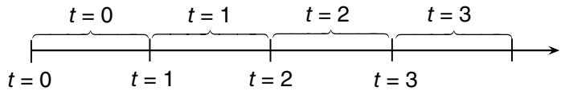  
9.2a: Information processes   
9.2b: Physical processes   
Figure 9.2 Relationship between discrete and continuous time for information processes (9.2a) and physical processes (9.2b).

decision occurs at $n = 0$ since we generally have to make a decision before anything has happened.

● Time – We may wish to directly model time. If time is continuous, we would write a function as $f ( t )$ , but all of the problems in this book are modeled in discrete time $t = 0 , 1 , 2 , \ldots$ If we wish to model the time of the arrival of the $n ^ { t h }$ customer, we would write $t ^ { n }$ . However, we would write $X ^ { n }$ for a variable that depends on the $n ^ { t h }$ arrival rather than $X _ { t ^ { n } }$ .

Our style of indexing counters in the superscripts and time in subscripts helps when we are modeling simulations where we have to run a simulation multiple times. Thus, we might write $X _ { t } ^ { n }$ as information at time $t$ in the $n ^ { t h }$ iteration of our simulation.

The confusion over modeling time arises in part because there are two processes that we have to capture: the flow of information, and the flow of physical and financial resources. For example, a buyer may purchase an option now (an information event) to buy a commodity in the future (the physical event). Customers may call an airline (the information event) to fly on a future flight (the physical event). An electric power company has to purchase equipment now to be used one or two years in the future. All of these problems represent examples of lagged information processes and force us to explicitly model the informational and physical events.

Notation can easily become confused when an author starts by writing down a deterministic model of a physical process, and then adds uncertainty. The problem arises because the proper convention for modeling time for information processes is different than what should be used for physical processes.

We begin by establishing the relationship between discrete and continuous time. All of the models in this book assume that decisions are made in discrete time (sometimes referred to as decision epochs). However, the flow of information is best viewed in continuous time.

The relationship of our discrete time approximation to the real flow of information and physical resources is depicted in Figure 9.2. Above the line, “??” refers to a time interval while below the line, $^ { 6 6 } t ^ { 5 5 }$ refers to a point in time. When we are modeling information, time $t = 0$ is special; it represents “here and now” with the information that is available at the moment. The discrete time ?? refers to the time interval from $t - 1$ to $t$ (illustrated in Figure 9.2a). This means that the first new information arrives during time interval 1.

This notational style means that any variable indexed by $t$ , say $S _ { t }$ or $x _ { t }$ , is assumed to have access to the information that arrived up to time $t$ , which means up through time interval ??. This property will dramatically simplify our notation in the future. For example, assume that $f _ { t }$ is our forecast of the demand for electricity. If $\hat { D } _ { t }$ is the observed demand during time interval $t$ , we would write our updating equation for the forecast using

$$
f _ {t + 1} = (1 - \alpha) f _ {t} + \alpha \hat {D} _ {t + 1}. \tag {9.7}
$$

We refer to this form as the informational representation. Note that the forecast $f _ { t + 1 }$ is written as a function of the information that became available during time interval $( t , t + 1 )$ , given by the demand $\hat { D } _ { t + 1 }$ .

When we are modeling a physical process, it is more natural to adopt a different convention (illustrated in Figure 9.2b): discrete time ?? refers to the time interval between ?? and $t + 1$ . This convention arises because it is most natural in deterministic models to use time to represent when something is happening or when a resource can be used. For example, let $R _ { t }$ be our cash on hand that we can use during day ?? (implicitly, this means that we are measuring it at the beginning of the day). Let $\hat { D } _ { t }$ be the demand for cash during the day, and let $x _ { t }$ represent additional cash that we have decided to add to our balance (to be used during day $t$ ). We can model our cash on hand using

$$
R _ {t + 1} = R _ {t} + x _ {t} - \hat {D} _ {t}. \tag {9.8}
$$

We refer to this form as the physical representation. Note that the left-hand side is indexed by $t + 1$ , while all the quantities on the right-hand side are indexed by ??.

Throughout this book, we are going to use the informational representation as indicated in equation (9.7). We first saw this in our presentation of stochastic gradients in chapter 5, when we wrote the updates from a stochastic gradient using

$$
x ^ {n + 1} = x ^ {n} + \alpha_ {n} \nabla_ {x} F (x ^ {n}, W ^ {n + 1}),
$$

where here we are using iteration ?? instead of time ??.

# 9.4 The States of Our System

The most important quantity in any sequential decision process is the state variable. This is the set of variables that captures everything that we know, and need to know, to model our system. Without question this is the most subtle, and poorly understood, dimension of modeling sequential decision problems.

# 9.4.1 Defining the State Variable

Surprisingly, other presentations of dynamic programming spend little time defining a state variable. Bellman’s seminal text [Bellman (1957), p. 81] says “... we have a physical system characterized at any stage by a small set of parameters, the state variables.” In a much more modern treatment, Puterman first introduces a state variable by saying [Puterman (2005), p. 18] “At each decision epoch, the system occupies a state.” In both cases, the italics are in the original manuscript, indicating that the term “state” is being introduced. In effect, both authors are saying that given a system, the state variable will be apparent from the context.

Interestingly, different communities appear to interpret state variables in slightly different ways. We adopt an interpretation that is fairly common in the control theory community, which effectively models the state variable $S _ { t }$ as all the information needed to model the system from time ?? onward. We agree with this definition, but it does not provide much guidance in terms of actually translating real applications into a formal model. We suggest the following definitions:

# Definition 9.4.1. A state variable is:

(a) Policy-dependent version A function of history that, combined with the exogenous information (and a policy), is necessary and sufficient to compute the cost/contribution function, the decision function (the policy), and any information required by the transition function to model the information needed for the cost/contribution and decision functions.   
(b) Optimization version A function of history that is necessary and sufficient to compute the cost/contribution function, the constraints, and any information required by the transition function to model the information needed for the cost/contribution function and the constraints.

Some remarks are in order:

(i) The policy-dependent definition defines the state variable in terms of the information needed to compute the core model information (cost/contribution function, and the policy (or decision function)), and any

other information needed to model the evolution of the core information over time (that is, the transition function). Note that constraints (at a point in time ??) are assumed to be captured by the policy. Since the policy can be any function, it could potentially be a function that includes information that does not seem relevant to the problem, and which would never be used in an optimal policy. For example, a policy that says “turn left if the sun is shining” with an objective to minimize travel time would put whether or not the sun is shining in the state variable, although this does not contribute to minimizing travel times.

(ii) The optimization version defines a state variable in terms of the information needed to compute the core model information (costs/contributions and constraints), and any other information needed to model the evolution of the core information over time (their transition function). This definition limits the state variable to information needed by the optimization problem, and cannot include information that is irrelevant to the core model.   
(iii) Both definitions include any information that might be needed to compute the evolution of core model information, as well as information needed to model the evolution of this information over time. This includes information needed to represent the stochastic behavior, which includes distributional information needed to compute or approximate expectations. In section 9.9.4, we present an example of how rolling forecasts enter the state variable because they are needed in the transition function.   
(iv) Both definitions imply that the state variable includes the information needed to compute the transition function for core model information. For example, if we model a price process using

$$
p _ {t + 1} = \theta_ {0} p _ {t} + \theta_ {1} p _ {t - 1} + \theta_ {2} p _ {t - 2} + \varepsilon_ {t + 1} ^ {p}, \tag {9.9}
$$

then the state variable for this price process would be $S _ { t } = ( p _ { t } , p _ { t - 1 } , p _ { t - 2 } )$ . At time $t$ , the prices $p _ { t - 1 }$ and $p _ { t - 2 }$ are not needed to compute the cost/- contribution function or constraints, but they are needed to model the evolution of $p _ { t }$ , which is part of the cost/contribution function.

(v) The qualifier “necessary and sufficient” is intended to eliminate irrelevant information. For example, with our lagged price model shown earlier, we need $p _ { t } , p _ { t - 1 }$ and $p _ { t - 2 }$ but not $p _ { t - 3 } , p _ { t - 4 }$ . A similar term used in the statistics literature is “sufficient statistic,” which means it contains all the information needed for any future calculations.

(vi) A byproduct of our definitions is the observation that all properly modeled dynamic systems are Markovian, by construction. It is surprisingly common for people to make a distinction between “Markovian” and “historydependent” processes. For example, if our price process evolves according

to equation (9.9), many would call this a history-dependent process, but consider what happens when we define

$$
\bar {p} _ {t} = \left( \begin{array}{c} p _ {t} \\ p _ {t - 1} \\ p _ {t - 2} \end{array} \right)
$$

and let

$$
\bar {\theta} _ {t} = \left( \begin{array}{c} \theta_ {0} \\ \theta_ {1} \\ \theta_ {2} \end{array} \right)
$$

which means we can write

$$
p _ {t + 1} = \bar {\theta} ^ {T} \bar {p} _ {t} + \varepsilon_ {t + 1}. \tag {9.10}
$$

Here we see that $\bar { p } _ { t }$ is a vector known at time $t$ (who cares when the information first became known?). We would say that equation (9.10) describes a Markov process with state $S _ { t } = ( p _ { t } , p _ { t - 1 } , p _ { t - 2 } )$ .

(vii) There is an issue of missing information and/or incorrect models. For example, we may assume that our price process evolves according to the model in equation (9.9), but this is really just an approximation of a much more complex process that is not known to us. As a simple illustration, assume that the true model is given by

$$
\begin{array}{l} {p _ {t + 1}} = {\theta_ {0} p _ {t} + \theta_ {1} p _ {t - 1} + \theta_ {2} p _ {t - 1} ^ {2} + \theta_ {3} p _ {t - 2} + \theta_ {4} p _ {t - 2} ^ {2}} \\ + \theta_ {5} p _ {t - 1} p _ {t - 2} + \varepsilon_ {t + 1} ^ {p}. \tag {9.11} \\ \end{array}
$$

We use equation (9.9) because it is simpler. Even if we tried equation (9.11), the noise in the data may lead us to conclude that $\theta _ { 2 }$ , $\theta _ { 4 }$ and $\theta _ { 5 }$ are statistically indistinguishable from zero. If we had enough data, we might realize that the model (9.9) violates the assumptions that the error term $\varepsilon _ { t }$ is independent across time with the same distribution. If we knew that (9.11) was the true model (perhaps because we coded it into a simulator we are trying to optimize), we might say that the model in equation (9.9) is non-Markovian. For this issue, we turn to the famous quote by G.E.P. Box who noted: “All models are wrong, and some are useful,” which is a way of saying there are errors in all models. The model in equation (9.9) is Markovian because we assume it to be Markovian.

There will be problems where we know that we do not know a parameter or quantity, but in these cases, the solution is to introduce a belief about these values. This belief is added to the state variable, which then produces a Markov model. If someone claims that a model is non-Markovian, then

either it is missing known information that should be added, or we should add beliefs about unknown parameters and quantities.

These definitions provide a very quick test of the validity of a state variable. If there is a piece of data in either the decision function (policy), the transition function, or the contribution function which is not in the state variable, then we do not have a complete state variable. Similarly, if there is information in the state variable that is never needed in any of these three functions, then we can drop it and still have a valid state variable.

We use the term “necessary and sufficient” so that our state variable is as compact as possible. For example, we could argue that we need the entire history of events up to time $t$ to model future dynamics, but in practice, this is rarely the case. As we start doing computational work, we are going to want $S _ { t }$ to be as compact as possible. Furthermore, there are many problems where we simply do not need to know the entire history. It might be enough to know the status of all our resources at time $t$ (the resource variable $R _ { t }$ ). But there are examples where this is not enough.

Assume, for example, that we need to use our history to forecast the price of a stock. Our history of prices is given by $( \hat { p } _ { 1 } , \hat { p } _ { 2 } , \dots , \hat { p } _ { t } )$ . If we use a simple exponential smoothing model, our estimate of the mean price $\bar { p } _ { t }$ can be computed using

$$
\bar {p} _ {t} = (1 - \alpha) \bar {p} _ {t - 1} + \alpha \hat {p} _ {t},
$$

where $\alpha$ is a stepsize satisfying $0 \leq \alpha \leq 1$ . With this forecasting mechanism, we do not need to retain the history of prices, but rather only the latest estimate $\bar { p } _ { t }$ . As a result, $\bar { p } _ { t }$ is called a sufficient statistic, which is a statistic that captures all relevant information needed to compute any additional statistics from new information. A state variable, according to our definition, is always a sufficient statistic.

Consider what happens when we switch from exponential smoothing to an $N$ -period moving average. Our forecast of future prices is now given by

$$
\bar {p} _ {t} = \frac {1}{N} \sum_ {\tau = 0} ^ {N - 1} \hat {p} _ {t - \tau}.
$$

Now, we have to retain the $N$ -period rolling set of prices $( \hat { p } _ { t } , \hat { p } _ { t - 1 } , \dots , \hat { p } _ { t - N + 1 } )$ in order to compute the price estimate in the next time period. With exponential smoothing, we could write

$$
S _ {t} = \bar {p} _ {t}.
$$

If we use the moving average, our state variable would be

$$
S _ {t} = \left(\hat {p} _ {t}, \hat {p} _ {t - 1}, \dots , \hat {p} _ {t - N + 1}\right). \tag {9.12}
$$

We discuss latent variables (state variables that we choose to approximate as deterministic, but which really are changing stochastically over time), and unobservable state variables (which are also changing stochastically, but which we cannot observe).

# 9.4.2 The Three States of Our System

To set up our discussion, assume that we are interested in solving a relatively complex resource management problem, one that involves multiple (possibly many) different types of resources which can be modified in various ways (changing their attributes). For such a problem, it is necessary to work with three types of state variables:

The physical state $R _ { t }$ – This is a snapshot of the status of the physical resources we are managing and their attributes. This might include the amount of water in a reservoir, the price of a stock or the location of a sensor on a network. It could also refer to the location and speed of a robot.

The information state $I _ { t }$ – This encompasses any other information we need to make a decision, compute the transition or compute the objective function. We can think of $I _ { t }$ as information about quantities and parameters that we know perfectly, but which do not seem to belong in the physical state $R _ { t }$ which typically captures resources we are managing.

The belief (or knowledge) state $B _ { t }$ – The belief state is information specifying a probability distribution describing an unknown quantity or parameter. The type of distribution (e.g. binomial, normal, or exponential) is typically specified in the initial state $S _ { 0 }$ , although there are exceptions to this. The belief state $B _ { t }$ is information just like $R _ { t }$ and $I _ { t }$ , except that it is information specifying a probability distribution (such as the mean and variance of a normal distribution), or the statistics characterizing a frequentist model (see sections 3.3 and 3.4).

We then pull these together to create our state variable

$$
S _ {t} = (R _ {t}, I _ {t}, B _ {t}).
$$

Mathematically, the information state $I _ { t }$ should include information about resources $R _ { t }$ , since $R _ { t }$ is, after all, a form of information. The distinction between $I _ { t }$ (such as wind speed, temperature or the stock market), and $R _ { t }$ (how much energy is in the battery, water in a reservoir or money invested in the

# The state variable

  
Figure 9.3 Illustration of the growing sets of state variables, where information state includes physical state variables, while the belief state includes everything.

stock market) is not important. We separate the variables simply because there are so many problems that involve managing physical or financial resources, and it is often the case that decisions impact only the physical resources. At the same time, $B _ { t }$ includes probabilistic information about parameters that we do not know perfectly. Knowing a parameter perfectly, as is the case with $R _ { t }$ and $I _ { t }$ , is just a special case of a probability distribution.

A proper representation of the relationship between $B _ { t } , I _ { t }$ and $R _ { t }$ is illustrated in Figure 9.3. However, we find it more useful to make a distinction (even if it is subjective) of what constitutes a variable that describes part of the physical state $R _ { t }$ , and then let $I _ { t }$ be all remaining variables that describe quantities that are known perfectly. Then, we let $B _ { t }$ consist entirely of probability distributions that describe parameters that we do not know perfectly.

State variables take on different flavors depending on the mixture of physical, informational and knowledge states, as well as the relationship between the state of the system now, and the states in the past.

● Physical state – There are three important variations that involve a physical state:

– Pure physical state – There are many problems which involve only a physical state which is typically some sort of resource being managed. There are problems where $R _ { t }$ is a vector, a low-dimensional vector (as in $R _ { t } = ( R _ { t i } ) _ { i \in \mathcal { I } }$ where ?? might be a blood type, or a type of piece of equipment), or a high-dimensional vector (as in $R _ { t } ~ = ~ ( R _ { t a } ) _ { a \in \mathcal { A } }$ where $a$ is a multidimensional attribute vector).   
– Physical state with information – We may be managing the water in a reservoir (captured by $R _ { t }$ ) given temperature and wind speed (which affects evaporation) captured by $I _ { t }$ .

– Physical state, information state, and belief state – We need the cash on hand in a mutual fund, $R _ { t }$ , information $I _ { t }$ about interest rates, and a probability model $B _ { t }$ describing, say, our belief about whether the stock market is going up or down.

● Information state – In most applications information evolves exogenously, although there are exceptions. The evolution of information comes in several flavors:

– Memoryless – The information $I _ { t + 1 }$ does not depend on $I _ { t }$ . For example, we may feel that the characteristics of a patient arriving at time $t + 1$ to a doctor’s office is independent of the patient arriving at time ??. We may also believe that rainfall in month $t + 1$ is independent of the rainfall in month ??.   
– First-order Markov – Here we assume that $I _ { t + 1 }$ depends on $I _ { t }$ . For example, we may feel that the spot market price of oil, the wind speed, or temperature and humidity at $t { + } 1$ depend on the value at time ??. We might also insist that a decision $x _ { t + 1 }$ not deviate more than a certain amount from the decision $x _ { t }$ at time ??.   
– Higher-order Markov – We may feel that the price of a stock $p _ { t + 1 }$ depends on $p _ { t } , p _ { t - 1 }$ , and $p _ { t - 2 }$ . However, we can create a variable $\bar { p } _ { t } = ( p _ { t } , p _ { t - 1 } , p _ { t - 2 } )$ and convert such a system to a first-order Markov system, so we really only have to deal with memoryless and first-order Markov systems.   
– Full history dependent – This arises when the evolution of the information $I _ { t + 1 }$ depends on the full history, as might happen when modeling the progress of currency prices or the progression of a disease. This type of model is typically used when we are not comfortable with a compact state variable (and there are methods designed to handle these problems – see section 19.9).

● Belief state – Belief states capture beliefs we have about uncertain quantities or parameters that are (typically) evolving over time, often as a direct or indirect results of a decision. Uncertainty in the belief state can arise in three ways:

– Uncertainty about a static parameter – For example, we may not know the impact of price on demand, or the sales of a laptop with specific features. The nature of the unknown parameter depends on the type of belief model: the features of the laptop correspond to a lookup table, while the demand-price tradeoff represents the parameter of a parametric model. These problems are broadly known under the umbrella of optimal learning, but are often associated with the literature on multiarmed bandit problems.   
– Uncertainty about a dynamic (uncontrollable) parameter – The sales of a laptop with a specific set of features may change over time. This may occur because of unobservable variables. For example, the demand elasticity of

a product (such as housing) may depend on other market characteristics (such as the growth of industry in the area).

– Uncertainty about a dynamic, controllable parameter – Imagine that we control the inventory of a product that we cannot observe perfectly. We may control purchases that replenish inventory which is then used to complete sales, but our ability to track sales is imperfect, giving us an imprecise estimate of the inventory. These problems are typically referred to as partially observable Markov decision processes (POMDPs).

There has been a tendency in the literature to treat the belief state as if it were somehow different than “the” state variable. It is not. The state variable is all the information that describes the system at time ??, whether that information is the amount of inventory, the location of a vehicle, the current weather or interest rates, or the parameters of a distribution describing some unknown quantity. If the decision maker only has a belief about an uncertain parameter, then for that decision problem, the belief is very much a part of the state variable.

We believe we resolve this unique point of confusion in chapter 20 (Multiagent modeling and learning) by offering a two-agent model (the environment and the controlling agent), which means there are two state variables: one for the environment, and one for the controlling agent. When making a decision, the controlling agent only has access to what is in their state variable, and if this is a belief about an uncertain quantity, then we work with this, just as we did in chapter 7 (think of the interval estimation policy).

We can use $S _ { t }$ to be the state of a single resource (if this is all we are managing), or let $S _ { t } = R _ { t }$ be the state of all the resources we are managing. There are many problems where the state of the system consists only of $R _ { t }$ . We suggest using $S _ { t }$ as a generic state variable when it is not important to be specific, but it must be used when we may wish to include other forms of information. For example, we might be managing resources (consumer products, equipment, people) to serve customer demands $\hat { D } _ { t }$ that become known at time ??. If $R _ { t }$ describes the state of the resources we are managing, our state variable would consist of $S _ { t } = ( R _ { t } , \hat { D } _ { t } )$ , where $\hat { D } _ { t }$ represents additional information we need to solve the problem.

# 9.4.3 Initial State $S _ { 0 }$ vs. Subsequent States $S _ { t }$ , ?? > 0

It is important to distinguish between the initial state $S _ { 0 }$ and subsequent states $S _ { t }$ , $t > 0$ , as we explain:

# The Initial State $S _ { 0 }$

The initial state plays a special role in the modeling of a sequential decision problem. It stores any data that is an input to the system, which may include:

● Any deterministic parameters – This might include the deterministic data describing a graph (for example), or any problem parameters that never change.   
● Initial values of parameters that evolve over time – For example, this could be the initial inventory, the starting location of a robot, or the initial speed of wind at a wind farm.   
● The distribution of belief about uncertain parameters – This is known as the prior distribution of belief about anything that is not known perfectly. We emphasize that this prior can be a Bayesian prior, or the initial statistics of a frequentist model.

# The Subsequent States $S _ { t }$ , $t > 0$

By convention, the dynamic state $S _ { t }$ (for $t > 0$ ) only contains the information that changes over time. Thus, if we were solving a shortest path problem over a deterministic graph, $S _ { t }$ would tell us the node which we currently occupy, but would not include, for example, the deterministic data describing the graph which is not changing (by assumption) as we move over the graph. Similarly, it would not include any deterministic parameters such as the maximum speed of our vehicle.

As our system evolves, we drop any deterministic parameters that do not change. These become latent (or hidden) variables, since our problem depends on them, but we drop them from $S _ { t }$ for $t > 0$ . However, it is important to recognize that these values may change each time we solve an instance of the problem. Examples of these random starting states include:

# EXAMPLE 9.1

We wish to optimize the management of a fleet of trucks. We fix the number of trucks in our fleet, but this is a parameter that we specify, and we may change the fleet size from one instance of the problem to another.

# EXAMPLE 9.2

We wish to optimize the amount of energy to store in a battery given a forecast of clouds over a 24-hour planning horizon. Let $f _ { 0 t ^ { \prime } }$ is the forecast of energy at time $t ^ { \prime }$ which is given to us at time 0, the vector of forecasts $f _ { 0 } = ( f _ { 0 t ^ { \prime } } ) _ { t ^ { \prime } = 0 } ^ { 2 4 }$ (which does not evolve over time) is part of the initial state. However, each time we optimize our problem, we are given a new forecast.

# EXAMPLE 9.3

We are designing an optimal policy for finding the best medication for type II diabetes, but the policy depends on the attributes of the patient (age, weight, gender, ethnicity, and medical history), which do not change over the course of the treatment.

# 9.4.4 Lagged State Variables*

There are a number of settings where our state variable is actually telling us information about the future. The simplest example arises in resource allocation problems, where resources (trucks/trains/planes enroute to a destination, inbound inventory, people undergoing training) are known now, but will not be available to be used until some point in the future. We would capture this using

?? ′ = The resources on hand at time ?? that cannot be used until time $t ^ { \prime }$ ,

$$
R _ {t} = (R _ {t t ^ {\prime}}) _ {t ^ {\prime} \geq t}.
$$

Another example would be customer orders being made at time $t$ to be served in the future. For example, we might have

??????′ = The number of reservations to fly on an airplane at time $t ^ { \prime }$ that we know about at time $t$ ,

$$
D _ {t} = (D _ {t t ^ {\prime}}) _ {t ^ {\prime} \geq t}.
$$

Both $R _ { t }$ and $D _ { t }$ would be considered part of our state $S _ { t }$

# 9.4.5 The Post-decision State Variable*

Our standard strategy is to model the state variable $S _ { t }$ as all the information we need to make a decision (as well as computing costs, constraints and the transition function). This allows us to write the sequence of state, decision, information as

$$
\left(S _ {0}, x _ {0}, W _ {1}, S _ {1}, x _ {1}, W _ {2}, S _ {2}, x _ {2}, \dots , x _ {t - 1}, W _ {t}, S _ {t}\right). \tag {9.13}
$$

Since the state $S _ { t }$ is what we know just before we make a decision, we might also refer to it as the pre-decision state. There are settings where we will find it useful to model the state immediately after we make a decision. We model this

as $S _ { t } ^ { x }$ to indicate that it is still being observed at time $t$ , but immediately after we make the decision $x$ (hence the superscript). We refer to $S _ { t } ^ { x }$ as the post-decision state. Our information sequence (9.13) becomes

$$
\left(S _ {0}, x _ {0}, S _ {0} ^ {x}, W _ {1}, S _ {1}, x _ {1}, S _ {1} ^ {x}, W _ {2}, S _ {2}, x _ {2}, S _ {2} ^ {x}, \dots , x _ {t - 1}, S _ {t - 1} ^ {x}, W _ {t}, S _ {t}\right). \tag {9.14}
$$

Since there is no new exogenous information between making the decision $x _ { t }$ and the observation of the post-decision state $S _ { t } ^ { x }$ , the post-decision state is a deterministic function of the pre-decision state $S _ { t }$ and $x _ { t }$ .

The examples given provide some illustrations of pre- and post-decision states.

# EXAMPLE 9.4

A traveler is driving through a network, where the travel time on each link of the network is random. As she arrives at node $i$ , she is allowed to see the travel times on each of the links out of node ??, which we represent by $\hat { \tau } _ { i } = ( \hat { \tau } _ { i j } ) _ { j }$ . As she arrives at node $i$ , her pre-decision state is $S _ { t } = ( i , \hat { \tau } _ { i } )$ . Assume she decides to move from ?? to $k$ . Her post-decision state is $S _ { t } ^ { x } =$ $( k )$ . Note that she is still at node $i$ ; the post-decision state captures the fact that she will next be at node $k$ , and we no longer have to include the travel times on the links out of node ??.

# EXAMPLE 9.5

The nomadic trucker revisited. Let $R _ { t a } = 1$ if the trucker has attribute vector $a$ at time $t$ and 0 otherwise. Now let $D _ { t b }$ be the number of customer demands (loads of freight) of type $b$ available to be moved at time ??. The pre-decision state variable for the trucker is $S _ { t } = ( R _ { t } , D _ { t } )$ , which tells us the state of the trucker and the demands available to be moved. Assume that once the trucker makes a decision, all the unserved demands in $D _ { t }$ are lost, and new demands become available at time $t + 1$ . The postdecision state variable is given by $S _ { t } ^ { x } = R _ { t } ^ { x }$ where $R _ { t a } ^ { x } = 1$ if the trucker has attribute vector $r$ after a decision has been made.

# EXAMPLE 9.6

Imagine playing backgammon where $R _ { t i }$ is the number of your pieces on the $i ^ { t h }$ “point” on the backgammon board (there are 24 points on a board). The transition from $S _ { t }$ to $S _ { t + 1 }$ depends on the player’s decision $x _ { t }$ , the play of the opposing player, and the next roll of the dice. The post-decision

state variable is simply the state of the board after a player moves but before his opponent has moved.

The post-decision state can be particularly valuable in the context of dynamic programming, which we are going to address in depth in chapters 16 and 17.

There are three ways of finding a post-decision state variable:

# Decomposing Decisions and Information

There are many problems where we can create functions $S ^ { M , x } ( \cdot )$ and $S ^ { M , W } ( \cdot )$ from which we can compute

$$
S _ {t} ^ {x} = S ^ {M, x} \left(S _ {t}, x _ {t}\right), \tag {9.15}
$$

$$
S _ {t + 1} = S ^ {M, W} \left(S _ {t} ^ {x}, W _ {t + 1}\right). \tag {9.16}
$$

The structure of these functions is highly problem-dependent. However, there are sometimes significant computational benefits, primarily when we face the problem of making a decision when we are in state $S _ { t }$ , and would like to know the value of the state the decision takes us to. The post-decision state is a deterministic function of the pre-decision state $S _ { t }$ and the decision $x _ { t }$ , which can be computationally very convenient (see chapters 15 and 16).

# State-decision Pairs

A very generic way of representing a post-decision state is to simply write

$$
S _ {t} ^ {x} = (S _ {t}, x _ {t}).
$$

Figure 9.4 provides a nice illustration using our tic-tac-toe example. Figure 9.4a shows a tic-tac-toe board just before player O makes his move. Figure 9.4b shows the augmented state-decision pair, where the decision (O decides to place his move in the upper right hand corner) is distinct from the state. Finally, Figure 9.4c shows the post-decision state. For this example, the pre- and postdecision state spaces are the same, while the augmented state-decision pair is nine times larger.

The augmented state $( S _ { t } , x _ { t } )$ is closely related to the post-decision state $S _ { t } ^ { x }$ (not surprising, since we can compute $S _ { t } ^ { x }$ deterministically from $S _ { t }$ and $x _ { t }$ ). But computationally, the difference is significant. If $\mathcal { S }$ is the set of possible values of $S _ { t }$ , and $\mathcal { X }$ is the set of possible values of $x _ { t }$ , then our augmented state space has size $| \mathcal { S } | \times | \mathcal { X } |$ , which is obviously much larger (especially if $x$ is a vector!).

The augmented state variable is used in a popular class of algorithms known as ??-learning (which we first introduced in chapter 2), where the challenge is to statistically estimate $Q$ -factors which give the value of being in state $S _ { t }$ and

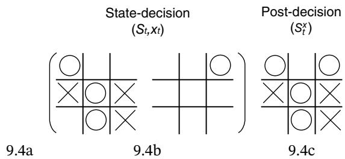  
Figure 9.4 Pre-decision state, augmented state-decision, and post-decision state for tic-tac-toe.

taking decision $x _ { t }$ . The $Q$ -factors are written $Q ( S _ { t } , x _ { t } )$ , in contrast with value functions $V _ { t } ( S _ { t } )$ which provide the value of being in a state. This allows us to directly find the best decision by solving $\mathrm { m i n } _ { x } Q ( S _ { t } , x _ { t } )$ . This is the essence of ??-learning, but the price of this algorithmic step is that we have to estimate $Q ( S _ { t } , x _ { t } )$ for each $S _ { t }$ and $x _ { t }$ . It is not possible to determine $x _ { t }$ by optimizing a function of $S _ { t } ^ { x }$ alone, since we generally cannot determine which decision $x _ { t }$ brought us to $S _ { t } ^ { x }$ .

# The Post-decision as a Point Estimate

Assume that we have a problem where we can compute a point estimate of future information. Let $\overline { { W } } _ { t , t + 1 }$ be a point estimate, computed at time $t$ , of the outcome of $W _ { t + 1 }$ . If $W _ { t + 1 }$ is a numerical quantity, we might use $\overline { { W } } _ { t , t + 1 } =$ $\mathbb { E } ( W _ { t + 1 } | S _ { t } )$ or $\overline { { W } } _ { t , t + 1 } = 0$ .

If we can create a reasonable estimate $\overline { { W } } _ { t , t + 1 }$ , we can compute post- and predecision state variables using

$$
S _ {t} ^ {x} = S ^ {M} \left(S _ {t}, x _ {t}, \bar {W} _ {t, t + 1}\right),
$$

$$
{S _ {t + 1}} = {S ^ {M} (S _ {t}, x _ {t}, W _ {t + 1}).}
$$

Measured this way, we can think of $S _ { t } ^ { x }$ as a point estimate of $S _ { t + 1 }$ , but this does not mean that $S _ { t } ^ { x }$ is necessarily an approximation of the expected value of $S _ { t + 1 }$ .

# 9.4.6 A Shortest Path Illustration

We are going to use a simple shortest-path problem to illustrate the process of defining a state variable. We start with a deterministic graph shown in Figure 9.5, where we are interested in finding the best path from node 1 to node 11. Let ?? be the number of links we have traversed, and let $N _ { t }$ be the node number were we are located after $t = 2$ transitions. What state are we in?

Most people answer this with

$$
S _ {t} = N _ {t} = 6.
$$

This answer hints at two conventions that we use when defining a state variable. First, we exclude any information that is not changing, which in this case is any information about our deterministic graph. It also excludes the prior nodes in our path (1 and 3) since these are not needed for any future decisions.

Now assume that the travel times are random, but where we know the probability distribution of travel times over each link (and these distributions are not changing over time). This graph is depicted in Figure 9.6. We are going to assume, however, that when a traveler arrives at node ??, she is able to see the actual cost $\hat { c } _ { i j }$ for the link $( i , j )$ out of node ?? (if this is the link that is chosen now). Now, what is our state variable?

Obviously, we still need to know our current node $N _ { t } ~ = ~ 6$ . However, the revealed link costs also matter. If the cost of moving from node 6 to node 9 changes from 9.7 to 2.3 or 18.4, our decision may change. This means that these costs are very much a part of our state of information. Thus, we would write our state as

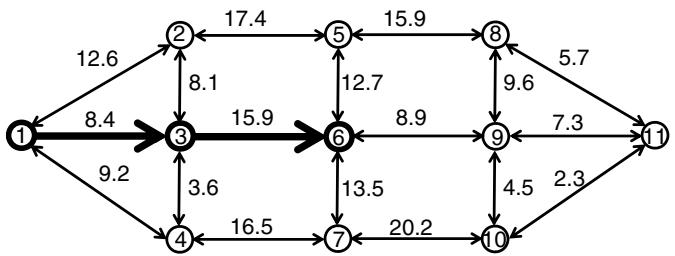  
Figure 9.5 A deterministic network for a traveler moving from node 1 to node 11 with known arc costs.

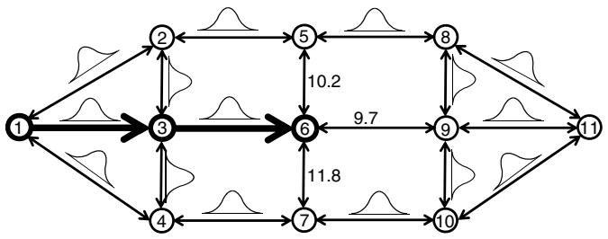  
Figure 9.6 A stochastic network, where arc costs are revealed as the traveler arrives to a node.

$$
S _ {t} = (\underbrace {N _ {t}} _ {R _ {t}}, \underbrace {(\hat {c} _ {N _ {t} , .})} _ {I _ {t}}) = (\underbrace {6} _ {R _ {t}}, \underbrace {(1 0 . 2 , 9 . 7 , 1 1 . 8)} _ {I _ {t}}),
$$

where $( \hat { c } _ { N _ { t } , \cdot } )$ represents the costs on all the links out of node $N _ { t }$ . Thus, we see an illustration of both a physical state $R _ { t } ~ = ~ N _ { t }$ , and information $I _ { t } \ =$ (10.2, 9.7, 11.8).

For our last example, we introduce the problem of left-hand turn penalties. If our turn from node 6 to node 5 is a left hand turn, we are going to add a penalty of .7 minutes. Now what is our state variable?

The left-hand turn penalty requires that we know if the move from 6 to 5 is a left hand turn. This calculation requires knowing where we are coming from. Thus, we now need to include our previous node, $N _ { t - 1 }$ in our state variable, giving us

$$
S _ {t} = (\underbrace {N _ {t}} _ {R _ {t}}, \underbrace {(\hat {c} _ {N _ {t} , .}) , N _ {t - 1}} _ {I _ {t}}) = (\underbrace {6} _ {R _ {t}}, \underbrace {(1 0 . 2 , 9 . 7 , 1 1 . 8) , 3)} _ {I _ {t}}).
$$

Now, $N _ { t }$ is our physical state, but $N _ { t - 1 }$ is a piece of information required to compute the cost function.

# 9.4.7 Belief States*

There are many applications where we are not able to observe (or measure) the state of the system precisely. Instead, we will maintain a probabilistic belief about the unknown parameter or quantity. Some examples include:

# EXAMPLE 9.7

A patient may have cancer in the colon which might be indicated by the presence of polyps (small growths in the colon). The number of polyps is not directly observable. There are different methods for testing for the presence of polyps that allow us to infer how many there may be, but these are imperfect.

# EXAMPLE 9.8

The military has to make decisions about sending out aircraft to remove important military targets that may have been damaged in previous raids. These decisions typically have to be made without knowing the precise state of the targets.

# EXAMPLE 9.9

Policy makers have to decide how much to reduce $\mathrm { C O } _ { 2 }$ emissions, and would like to plan a policy over 200 years that strikes a balance between costs and the rise in global temperatures. Scientists cannot measure temperatures perfectly (in large part because of natural variations), and the impact of $\mathrm { C O } _ { 2 }$ on temperature is unknown and not directly observable.

For each of these examples, we have a system with quantities or parameters that cannot be observed, along with variables that can be observed. When this happens, we handle these values using our belief state $B _ { t }$ .

There is an extensive literature on what are known as “partially observable Markov decision processes” (or “POMDPs”) which are sequential decision problems with quantities or parameters that are not known perfectly. The POMDP literature is both mathematically sophisticated as well as computationally challenging. In other words, once you figure out the math, you do not end up with tools that can solve real problems.

Our belief is that the POMDP literature is not modeling these problems correctly. We believe they should be modeled as multiagent systems where there is an “environment agent” and a “controlling agent” that cannot observe the environment perfectly. When models of each agent are formulated with our modeling framework, problems with belief states become much more practical. We defer this discussion to our chapter on multiagent problems in chapter 20.

# 9.4.8 Latent Variables*

One of the more subtle dimensions of any dynamic model is the presence of information that is not explicitly captured in the state variable $S _ { t }$ . Remember that we do not model in the dynamic state $S _ { t }$ any information in $S _ { 0 }$ that does not change over time. We may have many static parameters in $S _ { 0 }$ . While these are used in the model, they are not in $S _ { t }$ . An optimal policy will depend on this information, but the dependence is not explicit.

Here are some examples of observable latent variables:

# EXAMPLE 9.10

We are solving a shortest path from origin node $r$ to destination node ??, and let $i , j \in \mathcal { I }$ be intermediate nodes. If we are currently at node ??, we would model our “state” as being at node ??. We use a shortest path

algorithm to find the best path from each $i \in \mathcal I$ , which would give us the “value” $V ( i )$ (really the cost) of being at each node ?? and following the optimal path to node ??. The destination $s$ is actually a latent variable, since it is not captured in our state. If we included ?? in our state variable, we would have to compute the optimal value $V ( i , s )$ for every combination of $i$ and ??, which is much harder.

# EXAMPLE 9.11

A company is optimizing inventories at different distribution centers. Each DC optimizes its own inventory given the demands that it sees. However, since orders can be satisfied from any DC (not always the closest), the optimal inventory at any single DC depends on the inventories at the other DCs, which become latent variables in the planning of each DC.

# EXAMPLE 9.12

A drug company is determining the optimal dosage given the weight of a patient. The right dosage also depends on age, as well as medical conditions such as diabetes. A dosage table that depends on weight, age, and blood sugar would be too complicated, but a patient’s physician would need to consider these variables. This means that the physician needs to optimize the dosage for each patient, starting with the dosage table from the drug company which ignores variables other than weight.

When deciding whether to model a variable explicitly (which means modeling how it evolves over time) or as a latent variable (which means holding it constant) introduces an important tradeoff: including a dynamically varying parameter in the state variable produces a more complex, higher dimensional state variable, but one which does not have to be reoptimized when the parameter changes. By contrast, treating a parameter as a latent variable simplifies the model, but requires that the model be reoptimized when the parameter changes.

# 9.4.9 Rolling Forecasts*

An important dimension of any dynamic model is the probability distribution of random activities that will happen in the future. For example, imagine that we are planning the commitment of energy resources given a forecast $f _ { t t ^ { \prime } } ^ { W }$ made at time $t$ of the energy $\mathbf { } W _ { t ^ { \prime } }$ that will be generated from wind at some time $t ^ { \prime }$ in the future. We might now assume that the wind in the future is given by

$$
W _ {t ^ {\prime}} = f _ {t t ^ {\prime}} ^ {W} + \varepsilon_ {t t ^ {\prime}},
$$

where $\varepsilon _ { t t ^ { \prime } } \sim N ( 0 , ( t ^ { \prime } - t ) \sigma ^ { 2 } )$ .

For this simple model, where the variance of the error depends only on how far into the future we are projecting, the forecast determines the probability distribution of the energy from wind. In the vast majority of models, we treat the forecast $( f _ { t t ^ { \prime } } ^ { W } ) _ { t ^ { \prime } = t } ^ { t + H }$ as fixed. This means that our forecast is a form of latent variable. In practice, the forecast evolves over time as new information arrives. We might model this evolution using

$$
f _ {t + 1, t ^ {\prime}} ^ {W} = f _ {t t ^ {\prime}} ^ {W} + \hat {f} _ {t + 1, t ^ {\prime}} ^ {W}, \tag {9.17}
$$

where $\hat { f } _ { t + 1 , t ^ { \prime } } ^ { W } \sim N ( 0 , \sigma _ { W } ^ { 2 } )$ represents the exogenous change in the forecast for time $t ^ { \prime }$ . Equation (9.17) is known as a martingale model of forecast evolution, or MMFE, in the inventory literature, which means that the expected value of the forecast in the future, $f _ { t ^ { \prime \prime } , t ^ { \prime } } ^ { W }$ , is equal to the forecast $f _ { t , t ^ { \prime } } ^ { W }$ now. [A “martingale” is a stochastic process that might evolve up or down from one time period to the next, but on average stays the same.] This means that if we are given $f _ { t t ^ { \prime } } ^ { W } , t ^ { \prime } =$ $t , \dots , T$ , then this vector of forecasts is a part of the state variable, since all of this information is needed to model the evolution of $W _ { t }$ .

For many problems, however, forecasts are not modeled as a dynamically evolving stochastic process; instead, they are viewed as static, which means that they are not part of the state variable. In this case they would be latent variables, and are not explicitly being modeled. As we see in chapter 19 on direct lookahead models, holding forecasts constant is a common approximation in direct lookahead models. This is what navigation systems are doing when planning a path over the network. At a point in time, the system fixes the estimate of the travel time over each link and plans a path. A few minutes later, the times are updated and the path is recalculated, but the logic for finding the path does not explicitly model the possible changes in the estimates of link times.

Classical dynamic programming models seem to almost universally ignore the role of forecasts in the modeling of a dynamic optimization problem, which means that they are being treated as latent variables. This in turn means that the problem has to be re-optimized from scratch when the forecasts are updated. By contrast, forecasts are easily handled in lookahead policies, as we see later. We describe methods for handling forecasts in chapter 19; for now, we just want to show how the presence of rolling forecasts can affect the state variable.

# 9.4.10 Flat vs. Factored State Representations*

It is very common in the dynamic programming literature to define a discrete set of states $\mathcal { S } = ( 1 , 2 , \dots , | \mathcal { S } | )$ , where $s \in \mathcal { S }$ indexes a particular state. For example, consider an inventory problem where $S _ { t }$ is the number of items we

have in inventory (where $S _ { t }$ is a scalar). Here, our state space $\mathcal { S }$ is the set of integers, and $s \in \mathcal { S }$ tells us how many products are in inventory.

Now assume that we are managing a set of $K$ product types. The state of our system might be given by $S _ { t } = ( S _ { t 1 } , S _ { t 2 } , \ldots , S _ { t k } , \ldots )$ where $S _ { t k }$ is the number of items of type $k$ in inventory at time $t$ . Assume that $S _ { t k } \leq M$ . Our state space $\mathcal { S }$ would consist of all possible values of $s \in \mathcal { S }$ ??corresponds to a particular vector of quantities $\dot { \boldsymbol { S } } _ { t }$ , which could be as large as $( S _ { t k } ) _ { k = 1 } ^ { K }$ . $K ^ { M }$ . A state

Modeling each state with a single scalar index is known as a flat or unstructured representation. Such a representation is simple and elegant, and produces mathematically compact models that have been popular in communities like operations research and computer science. We first saw this used in section 2.1.3, and we will return to this in chapter 14 in much more depth. However, the use of a single index completely disguises the structure of the state variable, and often produces intractably large state spaces.

In the design of algorithms, it is often essential that we exploit the structure of a state variable. For this reason, we generally find it necessary to use what is known as a factored representation, where each factor represents a feature of the state variable. For example, in our inventory example we have $K$ factors (or features). It is possible to build approximations that exploit the structure that each dimension of the state variable is a particular quantity.

In section 8.3.1, we solved a problem of managing resources (people, equipment) which were described by an attribute vector $a \in { \mathcal { A } }$ , where we assumed that the attribute space $\mathcal { A }$ was discrete. This is an example of a flat representation. Each element $a _ { i }$ of an attribute vector represents a particular feature of the entity. This representation allowed us to model the resource vector as $R _ { t } = ( R _ { t a } ) _ { a \in \mathcal { A } }$ , where $R _ { t }$ is now a vector with element $a \in { \mathcal { A } }$ .

# 9.4.11 A Programmer’s Perspective of State Variables

State variables are easily one of the least understood concepts in dynamic modeling, as evidenced by the large number of books on dynamic programs that do not even define a state variable (at least not properly). For a different perspective, imagine that you are programming a simulator of a dynamic system where decisions are made over time. You are going to create a set of variables to model your system (for many problems, this can be a lot of variables). We can divide the variables into four broad categories:

Category 1 – These are all the variables that are set initially (either hard coded into the program, or read in from an external data source). We can divide these into several subcategories:

(1a) – Fixed parameters (such as the boiling point of water, or the maximum speed of a vehicle) that never change.

(1b) – Initial values of variables that evolve over time (whether due to decisions and/or exogenous inputs).   
(1c) – Initial beliefs about parameters and quantities that are not known perfectly. These beliefs may or may not evolve over the course of the simulation.

Category 2 – Variables that change over the course of the simulation, either due to decisions or exogenous inputs (and we exclude decisions and exogenous information which we put in categories 3 and 4). These can include:

(2a) – Variables that describe quantities and parameters that are known perfectly.   
(2b) – Variables that describe probability distributions that evolve over time. These variables might describe the parameters of parametric distributions, probabilities, or sufficient statistics.

Category 3 – Variables that represent decisions that are determined by some policy.

Category 4 – Information that enters our system exogenously. This information may be used to make a decision and discarded, or may become included in a category 2 variable.

All the variables that fall in Category 1 are what we put in our initial state variable $S _ { 0 }$ . All the variables that fall in Category 2 are what we put in our initial state variable $S _ { t }$ for $t > 0$ . Category 3 refers to variables that we control, known as control variables, actions or, in this book, decisions that we call $x _ { t }$ (see section 9.5). Finally, Category 4 refers to new information that arrives from outside our system, which we have modeled as $W _ { t + 1 }$ . We may use this to make a decision and then discard it. However, it may be blended into one of the variables in Category 2.

From this discussion, we see that “state variables” are what a programmer would call a “variable,” although we exclude decision variables and exogenous information variables, unless these are retained for future use (in which case they become included in Category 2). Also, a programmer may retain a lot of information in “variables” for reporting purposes, whereas we restrict our definition of state variables to information that we actually need to model our system.

# 9.5 Modeling Decisions

There are a number of words in English that can mean “decision,” as illustrated in Table 9.1. The optimization literature assumes that the types of decisions are

known in advance, overlooking what can be one of the most subtle dimensions of modeling. Arguably one of the most challenging dimensions of optimization is recognizing exactly what decisions need to be optimized!

It should not be surprising that even the optimization communities use different words (and notation) to mean decision. The classical literature on Markov decision process talks about choosing an action $a \in { \mathcal { A } }$ (or $a \in \mathcal A _ { s }$ , where $\mathcal { A } _ { s }$ is the set of actions available when we are in state $s$ ). The optimal control community chooses a control $u \in \mathcal { U } _ { x }$ when the system is in state $x$ . The math programming community wants to choose a decision represented by the vector $x$ . We have also noticed that the bandit community in computer science has also adopted $\ " _ { x } \ "$ as its notation for a decision which is typically discrete. In this book, we use $\cdot _ { x } \mathbf { \vec { \Sigma } }$ as our default notation, although we occasionally slip back to using action $a$ (in particular, see chapter 14) when we are using methods where the action must be discrete.

When we model decisions in a sequential decision problem, we recommend introducing the following elements:

● The types of decisions, and notation for whether a decision is made (and if appropriate, how much).   
● Constraints on decisions made at time ??.

Table 9.1 Sample of words in English that represent a decision. The second column describes decisions in the context of collecting information, as in choice of experiment to run, or what to listen to or observe.   

<table><tr><td>General terms</td><td>Collecting information</td></tr><tr><td>Action</td><td>Examine</td></tr><tr><td>Acquire/buy/purchase</td><td>Experiment</td></tr><tr><td>Choice</td><td>Listen</td></tr><tr><td>Control</td><td>Observe</td></tr><tr><td>Decision</td><td>Probe</td></tr><tr><td>Design</td><td>Research</td></tr><tr><td>Intervention (medical)</td><td>Sample</td></tr><tr><td>Option</td><td>Sense</td></tr><tr><td>Move</td><td>Test</td></tr><tr><td>Response</td><td>View</td></tr><tr><td>Task</td><td>Scan</td></tr><tr><td>Trade (finance)</td><td></td></tr></table>

● The notation for a policy (or method) for making decisions, but without specifying the policy.

# 9.5.1 Types of Decisions

Decisions come in many forms. We illustrate this using our notation $x$ which tends to be the notation of choice for more complex problems. Examples of different types of decisions are

● Binary, where $x$ can be 0 or 1.   
● Discrete set, where $x \in \{ x _ { 1 } , \ldots , x _ { M } \}$   
● Continuous scalar, where $x \in [ a , b ]$   
● Continuous vector, where $x \in \Re ^ { n }$   
● Integer vector, where $x \in \mathbb { Z } ^ { n }$ .   
● Subset selection, where $x$ is a vector of 0’s and 1’s, indicating which members are in the set.   
● Multidimensional categorical, where $x _ { a } = 1$ if we make a choice described by an attribute $a = ( a _ { 1 } , \dots , a _ { K } )$ . For example, ?? could be the attributes of a drug or patient, or the features of a movie.

There are many applications where a decision is either continuous or vectorvalued. For example, in chapter 8 we describe applications where a decision at time $t$ involves the assignment of resources to tasks. Let $\boldsymbol { x } ~ = ~ ( \boldsymbol { x } _ { d } ) _ { d \in \mathcal { D } }$ be the vector of decisions, where $d \in \mathcal { D }$ is a type of decision, such as assigning resource ?? to task $j$ , or purchasing a particular type of equipment. It is not hard to create problems with hundreds, thousands, and even tens of thousands of dimensions. These high-dimensional decision vectors arise frequently in the types of resource allocation problems addressed in operations research.

This discussion makes it clear that the complexity of the space of decisions (or actions or controls) can vary considerably across applications. There are entire communities dedicated to problems with a specific class of decisions. For example, optimal stopping problems feature binary actions (hold or sell). The entire field of Markov decision processes, as well as all the problems described in chapter 7 for derivative-free stochastic optimization, assume discrete sets. Derivative-based stochastic optimization, as well as the field of stochastic programming, assumes that $x$ is a vector, usually continuous.

# 9.5.2 Initial Decision $\pmb { x } _ { \pmb { 0 } }$ vs. Subsequent Decisions xt, t > 0

Just as we distinguished between the initial state $S _ { 0 }$ and subsequent states $S _ { t }$ , $t \geq 0$ , it is useful to distinguish between the first decision $x _ { 0 }$ and ongoing decisions $x _ { t }$ , $t > 0$ :

# Initial Decision $\pmb { x } _ { 0 }$

The first decision $x _ { 0 }$ is a mixture of initial design decisions that are only made once, and the first instances of ongoing control decisions. Examples of initial design decisions include:

● Location and capacity of fixed facilities.   
● The configuration of a manufacturing system or network.   
● The design of a robot or other machines.   
● The people who are hired to staff the system.   
● The initial location and quantities of resources (robots, trucks, nurses) that will be managed over the course of a simulation.   
● The parameters that govern the behavior of policies.

All of these are parameters that can be viewed as design variables to be optimized. Particularly important is recognizing that the design of the policy is no different than any of the other decisions that affect the design of a system.

# Subsequent Decisions $\pmb { x } _ { t }$ , $\pmb { t } > \pmb { 0 }$

The decisions $x _ { t }$ represents the decisions that are controlling the system that are made on an ongoing basis. The array of controlling decisions is much too long to list, but we can characterize them in broad categories:

● Decisions which manage physical resources: people, robots, machinery, inventories (of any product), water, energy.   
● Decisions which manage financial resources: investments, contracts.   
● Decisions that affect the performance of a process: prices, speeds, temperatures.   
● Information collection decisions from computer simulations, laboratory experiments, field experiments.   
● Decisions to communicate or share information: ads, marketing, promotions.

Feel free to jump back to Table 1.1 in chapter 1 for a hint at the diversity of control decisions.

# 9.5.3 Strategic, Tactical, and Execution Decisions

It is important to recognize that there are often lags between when a decision is made (which determines its information content) and when it is implemented (which is the point at which it impacts our system). To handle lagged decision processes we define

$$
x _ {t t ^ {\prime}} = \text {a d e c i s i o n m a d e a t t i m e} t \text {t o b e i m p l e m e n t e d a t t i m e} t ^ {\prime} \geq t.
$$

We now describe three classes of decisions based on the lag:

● Strategic planning – $x _ { 0 }$ refers to all decisions made at time $t = 0$ . These are our design decisions discussed earlier.   
● Tactical planning – $x _ { t t ^ { \prime } }$ where $t ^ { \prime } > t$ – These are decisions now that impact the future, which means we have to model exogenous information $W _ { t + 1 } , \dots , W _ { t ^ { \prime } }$ as well as the decisions $x _ { t + 1 } , \ldots , x _ { t ^ { \prime } }$ that we make between $t$ and $t ^ { \prime }$ .   
● Execution – $x _ { t t }$ – These are decisions that we implement at time $t$

Each of these decisions require simulating other decisions. For example

● Strategic planning – We will need to simulate decisions $x _ { 1 } , x _ { 2 } , \dots , x _ { T }$ in order to evaluate the performance of the design decisions $x _ { 0 }$ .   
● Tactical planning – Here we are making a decision $x _ { t t ^ { \prime } }$ at time $t$ to implement at time $t ^ { \prime }$ , which means we need to simulate the decisions $x _ { t } , x _ { t + 1 } , \ldots , x _ { t ^ { \prime } - 1 }$ to anticipate the state that we will be in at time $t ^ { \prime }$ when we make a decision at time ??.   
● Execution – To help us make the decision $x _ { t t }$ that we are going to implement now (at time $t$ ), we will often need to simulate the downstream impact of this decision, which means simulating the decisions $x _ { t + 1 } , x _ { t + 2 } , \ldots , x _ { T }$ .

# 9.5.4 Constraints

When we make decisions at time ??, we often have to specify constraints on the decisions. The simplest type of “constraint” is to specify a set of possible (discrete) decisions $\mathcal { D } _ { s }$ given that we are in state ??. Often the set of possible types of decisions $\mathcal { D }$ is static, but if it depends on the state (which can vary over time), we would write

$$
\begin{array}{r c l} \mathcal {D} _ {t} & = & \text {t h e s e t o f t y p e s o f d e c i s i o n s g i v e n t h a t w e a r e i n s t a t e S _ {t} a t} \\ & & \text {t i m e t . T h e d e p e n d e n c e o n t h e s t a t e S _ {t} i s i m p l i c i t t h r o u g h} \\ & & \text {o u r i n d e x i n g t h e s e t b y t i m e ,} \end{array}
$$

$$
x _ {t d} = \text {t h e n u m b e r o f t i m e s w e e x e c u t e d e c i s i o n} d \in \mathcal {D} _ {t} \text {a t t i m e} t.
$$

An example can be assigning drivers to loads at time $t$ , where $\mathcal { D } _ { t }$ is the set of loads available at time $t$ .

If we have a vector of decisions $x _ { t d }$ for $d \in \mathcal { D }$ , we may easily have constraints on the vector $x _ { t }$ . For example, $x _ { t d }$ might be the amount we invest in stock $d$ , but we have to limit our investments to the amount of cash $R _ { t }$ we have on hand, so we would write:

$$
\begin{array}{l} \sum_ {d \in \mathcal {D}} x _ {t d} \leq R _ {t}, \\ x _ {t d} \geq 0. \\ \end{array}
$$

We can write constraints like this in the general format

$$
\begin{array}{l} A _ {t} x _ {t} = R _ {t}, \\ \begin{array}{c c c} x _ {t} & \geq & 0. \end{array} \\ \end{array}
$$

Even more general is to write

$$
x _ {t} \in \mathcal {X} _ {t},
$$

where $\mathcal { X } _ { t }$ may be a discrete set such as $\{ x _ { 1 } , \ldots , x _ { M } \}$ , or the solution to our system of linear equations. When we index a set (or variable) by $t$ as in $\mathcal { X } _ { t }$ , this means it depends on information in the state $S _ { t }$ . We do not write it as $\mathcal { X } ( S _ { t } )$ just to keep the notation compact.

# 9.5.5 Introducing Policies

The challenge of any optimization problem (including stochastic optimization) is making decisions. In a sequential (stochastic) decision problem, the decision $x _ { t }$ depends on the information available at time $t$ , which is captured by $S _ { t }$ . This means we need a decision $x _ { t }$ for each $S _ { t }$ , which means we need a function $x _ { t } ( S _ { t } )$ . This function is known as a policy, often designated by $\pi$ . While many authors use $\pi ( S _ { t } )$ to represent the policy, we use $\pi$ to carry the information that describes the function, and designate the function as $X ^ { \pi } ( S _ { t } )$ . If we are using action $a _ { t }$ , we would designate our policy as $A ^ { \pi } ( S _ { t } )$ , or ${ U ^ { \pi } } ( S _ { t } )$ if we are finding control $u _ { t }$ . Policies may be stationary (as we have written them), or time-dependent, in which case we would write $X _ { t } ^ { \pi } ( S _ { t } )$ .

We introduce the notation for the policy, such as $X ^ { \pi } ( S _ { t } )$ when we introduce decisions in our model, but we do not make any effort at choosing the policy. This is at the heart of our philosophy:

Model first, then solve.

The choice of policy depends not only on the structure of the problem, but it may even depend on the nature of the data for a particular problem. In chapter 11, we are going to describe an energy storage problem (which we model in section 9.9 below) where we show that each of four classes of policies (plus a fifth hybrid) can work best depending on the specific characteristics of a dataset.

Starting in chapter 11, we are going to spend the rest of the book identifying different classes of policies that are suited to problems with different characteristics. Note that it is not an accident that we address the design of policies after we discuss modeling uncertainty in chapter 10, which we “model first, then solve.”

# 9.6 The Exogenous Information Process

An important dimension of many of the problems that we address is the arrival of exogenous information, which changes the state of our system. Modeling the flow of exogenous information represents, along with states, the most subtle dimension of modeling a stochastic optimization problem. We sketch the basic notation for modeling exogenous information here, and defer to chapter 10 a more complete discussion of uncertainty.

We begin by noting that this section only addresses the exogenous information that arrives at times $t > 0$ . This ignores the initial state $S _ { 0 }$ which is an entirely different source of information (which technically is exogenous).

# 9.6.1 Basic Notation for Information Processes

Consider a problem of tracking the value of an asset. Assume the price evolves according to

$$
p _ {t + 1} = p _ {t} + \hat {p} _ {t + 1}.
$$

Here, $\hat { p } _ { t + 1 }$ is an exogenous random variable representing the change in the price during time interval $t + 1$ . At time ??, $p _ { t }$ is a number, while (at time ??) $p _ { t + 1 }$ is random.

We might assume that $\hat { p } _ { t + 1 }$ comes from some probability distribution such as a normal distribution with mean 0 and variance $\sigma ^ { 2 }$ . However, rather than work with a random variable described by some probability distribution, we are going to primarily work with sample realizations. Table 9.2 shows 10 sample realizations of a price process that starts with $p _ { 0 } = 2 9 . 8 0$ but then evolves according to the sample realization. These samples might come from a mathematical model, or observations from history.

Following standard convention, we index each path by the Greek letter $\omega$ (in the example, ?? runs from 1 to 10). At time $t \ : = \ : 0$ , $p _ { t }$ and $\hat { p } _ { t }$ is a random variable (for $t \geq 1$ ), while $p _ { t } ( \omega )$ and $\hat { p } _ { t } ( \omega )$ are sample realizations. We refer to the sequence

$$
p _ {1} (\omega), p _ {2} (\omega), p _ {3} (\omega), \dots , p _ {T} (\omega)
$$

as a sample path for the prices $p _ { t }$ .

We are going to use $" \omega "$ notation throughout this volume, so it is important to understand what it means. As a rule, we will primarily index exogenous random variables such as $\hat { p } _ { t }$ using $\omega$ , as in $\hat { p } _ { t } ( \omega ) . \hat { p } _ { t ^ { \prime } }$ is a random variable if we are sitting at a point in time $t < t ^ { \prime }$ . $\hat { p } _ { t } ( \omega )$ is not a random variable; it is a sample realization. For example, if $\omega = 5$ and $t = 2$ , then $\hat { p } _ { t } ( \omega ) = - 0 . 7 3 .$ . We are going to create randomness by choosing $\omega$ at random. To make this more specific, we need to define

$$
\Omega = \text {t h e s e t o f a l l p o s s i b l e s a m p l e r e a l i z a t i o n s (w i t h} \omega \in \Omega),
$$

$$
p (\omega) = \text {t h e p r o b a b i l i t y} \omega \text {w i l l o c c u r .}
$$

A word of caution is needed here. We will often work with continuous random variables, in which case we have to think of $\omega$ as being continuous. In this case, we cannot say $p ( \omega )$ is the “probability of outcome $\omega$ .” However, in all of our work, we will use discrete samples. For this purpose, we can define

$$
\hat {\Omega} = \text {a s e t o f d i s c r e t e s a m p l e o b s e r v a t i o n s o f} \omega \in \Omega .
$$

Table 9.2 A set of sample realizations of prices $( p _ { t } )$ and the changes in prices $\left( \hat { p } _ { t } \right)$ .   

<table><tr><td>Sample path</td><td>t = 0</td><td colspan="2">t = 1</td><td colspan="2">t = 2</td><td colspan="2">t = 3</td></tr><tr><td>ω</td><td>p0</td><td>ˆp1</td><td>p1</td><td>ˆp2</td><td>p2</td><td>ˆp3</td><td>p3</td></tr><tr><td>1</td><td>29.80</td><td>2.44</td><td>32.24</td><td>1.71</td><td>33.95</td><td>-1.65</td><td>32.30</td></tr><tr><td>2</td><td>29.80</td><td>-1.96</td><td>27.84</td><td>0.47</td><td>28.30</td><td>1.88</td><td>30.18</td></tr><tr><td>3</td><td>29.80</td><td>-1.05</td><td>28.75</td><td>-0.77</td><td>27.98</td><td>1.64</td><td>29.61</td></tr><tr><td>4</td><td>29.80</td><td>2.35</td><td>32.15</td><td>1.43</td><td>33.58</td><td>-0.71</td><td>32.87</td></tr><tr><td>5</td><td>29.80</td><td>0.50</td><td>30.30</td><td>-0.56</td><td>29.74</td><td>-0.73</td><td>29.01</td></tr><tr><td>6</td><td>29.80</td><td>-1.82</td><td>27.98</td><td>-0.78</td><td>27.20</td><td>0.29</td><td>27.48</td></tr><tr><td>7</td><td>29.80</td><td>-1.63</td><td>28.17</td><td>0.00</td><td>28.17</td><td>-1.99</td><td>26.18</td></tr><tr><td>8</td><td>29.80</td><td>-0.47</td><td>29.33</td><td>-1.02</td><td>28.31</td><td>-1.44</td><td>26.87</td></tr><tr><td>9</td><td>29.80</td><td>-0.24</td><td>29.56</td><td>2.25</td><td>31.81</td><td>1.48</td><td>33.29</td></tr><tr><td>10</td><td>29.80</td><td>-2.45</td><td>27.35</td><td>2.06</td><td>29.41</td><td>-0.62</td><td>28.80</td></tr></table>

In this case, we can talk about $p ( \omega )$ being the probability that we sample $\omega$ from within the set $\hat { \Omega }$ . Often, we will assume that each element of $\hat { \Omega }$ occurs with equal probability:

$$
p (\omega) = \frac {1}{| \hat {\Omega} |}.
$$

For more complex problems, we may have an entire family of random variables. In such cases, it is useful to have a generic “information variable” that represents all the information that arrives during time interval ??. For this purpose, we define

$$
\begin{array}{l} W _ {t + 1} = \text {t h e e x o g e n o u s i n f o r m a t i o n b e c o m i n g a v a i l a b l e d u r i n g t i m e} \\ \hskip 2 8. 4 5 2 7 5 6 p t \text {i n t e r v a l} (t, t + 1). \end{array}
$$

We might also say that $W _ { t + 1 }$ is the information that first becomes known by time $t + 1$ , which means it is not known when we make the decision $x _ { t }$ .

$W _ { t }$ may be a single variable, or a collection of variables (travel times, equipment failures, customer demands). We note that while we use the convention of putting hats on variables representing exogenous information $( \hat { D } _ { t } , \hat { p } _ { t } )$ , we do not use a hat for $W _ { t }$ since this is our only use for this variable, whereas $D _ { t }$ and $p _ { t }$ have other meanings. We always think of information as arriving in continuous time, hence $W _ { t }$ is the information arriving during time interval $t$ , rather than at time ??. This eliminates the ambiguity over the information available when we make a decision at time $t$ .

We sometimes need to refer to the history of our process, for which we define

ℎ?? = the history of the process, consisting of all the information known through time ??,

$$
= \left(W _ {1}, W _ {2}, \dots , W _ {t}\right),
$$

ℋ?? = the set of all possible histories through time ??,

$$
= \{h _ {t} (\omega) | \omega \in \Omega \},
$$

$\begin{array} { r l } { \Omega _ { t } ( h _ { t } ) } & { { } = } \end{array}$ the set of all sample paths that correspond to history $h _ { t }$

$$
= \{\omega \in \Omega | h _ {t} (\omega) = h _ {t} \}.
$$

In some applications, we might refer to $h _ { t }$ as the state of our system, but this is usually a very clumsy representation. However, we will use the history of the process for a specific modeling and algorithmic strategy.

# 9.6.2 Outcomes and Scenarios

Some communities prefer to use the term scenario to refer to a sample realization of random information. For most purposes, “outcome,” “sample path,” and “scenario” can be used interchangeably (although sample path refers to a sequence of outcomes over time). There are many, however, who use the term “scenario” to represent a major event. For example, a company may launch a new product that may receive a market response that can be described as strong, medium or weak. For each of these scenarios, there are still going to be daily fluctuations in sales. We prefer to use “scenario” to refer to the market response (that is, the major event), and “outcome” to capture the variations around the market response.

We recommend denoting the set of scenarios by $\Psi$ , with $\psi \in \Psi$ representing an individual scenario. Then, for a particular scenario $\psi$ , we might have a set of outcomes $\omega \in \Omega$ (or $\Omega ( \psi ) _ { , }$ ) representing various minor events (daily sales volume).

Two examples illustrate this notation:

# EXAMPLE 9.13

Planning spare transformers – In the electric power sector, a certain type of transformer was invented in the 1960’s. As of this writing, the industry does not really know the failure rate curve for these units (is their lifetime roughly 50 years? 60 years?). Let $\psi$ be the scenario that the failure curve has a particular shape (for example, where failures begin happening at a higher rate around 50 years). For a given scenario $\psi$ (the failure rate curve), ?? represents a sample outcome of failures (transformers can fail at any time, although the likelihood they will fail depends on $\psi$ ).

# EXAMPLE 9.14

Long term contracts for electricity – The price of electricity today depends largely on the price of natural gas. Electricity prices on an hourly basis can be highly volatile, but they average a price that reflects the price of natural gas. This relationship may depend on (a) the aggregate production of natural gas (which can depend on government policy) and (b) the availability of renewables. We can describe the relative supplies of energy from natural gas and renewables as a scenario $\psi$ , and then model hourly variations as a sample path $\omega$ .

# 9.6.3 Lagged Information Processes*

There are many settings where the information about a new arrival comes before the new arrival itself, as we saw earlier in state variables. These also happen in exogenous information processes, as illustrated in the following examples:

# EXAMPLE 9.15

A customer may make a reservation at time ?? to be served at time $t ^ { \prime }$

# EXAMPLE 9.16

An orange juice products company may purchase futures for frozen concentrated orange juice at time $t$ that can be exercised at time $t ^ { \prime }$ .

# EXAMPLE 9.17

A programmer may start working on a piece of coding at time ?? with the expectation that it will be finished at time $t ^ { \prime }$ .

We handle these problems using two time indices, a form that we refer to as the $^ { 6 6 } ( t , t ^ { \prime } ) ^ { 5 }$ notation.

Lagged information processes are surprisingly common. Let $\hat { D } _ { t t ^ { \prime } }$ be the number of customers calling in at time $t$ to book a hotel room at time $t ^ { \prime }$ . We can write our set of orders arriving on day ?? as

$$
\begin{array}{r c l} \hat {D} _ {t t ^ {\prime}} & = & \text {t h e d e m a n d s t h a t f i r s t b e c o m e k n o w n d u r i n g t i m e} \\ & & \text {i n t e r v a l t o b e s e r v e d d u r i n g t i m e i n t e r v a l t} t ^ {\prime}, \end{array}
$$

$$
\hat {D} _ {t} \quad = \quad (\hat {D} _ {t t ^ {\prime}}) _ {t ^ {\prime} \geq t}.
$$

Then, $\hat { D } _ { 1 } , \hat { D } _ { 2 } , \dots , \hat { D } _ { t } , \dots$ is the sequence of orders, where each $\hat { D } _ { t }$ can be orders being called in for different times into the future.

An important class of lagged processes are forecasts. Let

$$
f _ {t t ^ {\prime}} ^ {D} = \text {t h e f o r c a s t o f t h e d e m a n d} \hat {D} _ {t ^ {\prime}} \text {d u n i n g t i m e i n t e r v a l} t ^ {\prime} \text {m a d e}
$$

$$
f _ {t t ^ {\prime}} ^ {D} = \text {u s i n g t h e i n f o r m a t i o n a v a i l a b l e u p t h r o u g h t i m e} t,
$$

$$
f _ {t} ^ {D} = \left(f _ {t t ^ {\prime}} ^ {D}\right) _ {t ^ {\prime} \geq t}.
$$

An important special case of each of these variables is when $t ^ { \prime } = t$ . We would describe this version of each of the variables as follows:

??̂ ???? = The actual demand during time $t$ ,

???????? = this is another way of writing $\hat { D } _ { t t }$ ,

$R _ { t t }$ = the resources we know about at time $t$ that we can use at time ??.

Note that these variables are now written in terms of the information content. For example, $\hat { D } _ { t t ^ { \prime } }$ are the demands we know about at time $t$ that will need to be served at time $t ^ { \prime }$ . The first time index specifies when the information becomes known.

# 9.6.4 Models of Information Processes*

Information processes come in varying degrees of complexity. Needless to say, the structure of the information process plays a major role in the models and algorithms used to solve the problem. We describe information processes in increasing levels of complexity.

# State-independent Processes

Information might be generated by independent, unintelligent, exogenous processes such as weather, markets, biological processes, chemical reactions, and complex simulators, where the information is independent of the state $S _ { t }$ or decision $x _ { t }$ .

# EXAMPLE 9.18

A publicly traded index fund has a price process that can be described (in discrete time) as $p _ { t + 1 } = p _ { t } + \sigma \delta$ , where $\delta$ is normally distributed with mean $\mu$ , variance 1, and $\sigma$ is the standard deviation of the change over the length of the time interval.

# EXAMPLE 9.19

Requests for credit card confirmations arrive according to a Poisson process with rate ??. This means that the number of arrivals during a period of length $\Delta t$ is given by a Poisson distribution with mean $\lambda \Delta t$ , which is independent of the history of the system.

The practical challenge we typically face in these applications is that we do not know the parameters of the system. In our price process, the price may be trending upward or downward, as determined by the parameter $\mu$ . In our customer arrival process, we need to know the rate ?? (which can also be a function of time).

State-independent information processes are attractive because they can be generated and stored in advance, simplifying the process of testing policies. In chapter 19, we will describe an algorithmic strategy based on the use of scenario trees which have to be created in advance.

# State/action-dependent Information Processes

There are many problems where the exogenous information $W _ { t + 1 }$ depends on the state $S _ { t }$ and/or the decision $x _ { t }$ . Some illustrations include:

# EXAMPLE 9.20

The change in the speed of wind at a wind farm depends on the current speed. If the current speed is low, the change is likely to be an increase. If it is high, the change is likely to be a decrease.

# EXAMPLE 9.21

A market with limited information may respond to price changes. If the price drops over the course of a day, the market may interpret the change as a downward movement, increasing sales, and putting further downward pressure on the price. The market may also respond to decisions by mutual funds to sell large amounts of stock.

# EXAMPLE 9.22

Customers arriving to a bank are served by a group of tellers, where the number of tellers on duty are controlled by a bank manager. The arrival rate of customers depend on the length of the queue (which is the state of our system), which depends on the decisions (made hourly) of how many people to have on duty.

State/action-dependent information processes make it impossible to pregenerate sample outcomes when testing policies. While not a major issue, it complicates comparing policies since we cannot fix the sample outcomes.

State-dependent information processes introduce a subtle notational complication. Following standard convention, the notation $\omega$ almost universally refers to a sample path. Thus, $W _ { t } ( \omega )$ represents the exogenous information arriving between $t - 1$ and $t$ when we are following sample path ??. If we write $S _ { t } ( \omega )$ , we mean the state we are in at time $t$ when we are following sample path $\omega$ , but now we have to make it clear what policy we are following to get there. For example, we mightwe are using policy $\pi$ rite to $S _ { t + 1 } ^ { \pi } = S ^ { M } ( S _ { t } ^ { \pi } , X _ { t } ^ { \pi } ( S _ { t } ) , W _ { t + 1 } ^ { \pi } ( \omega ) )$ $S _ { t } ^ { \pi }$ $S _ { t + 1 } ^ { \pi }$ , where it is clear that

# Multiagent Sytems

The exogenous information may come from the decisions made by another agent. We can make the argument that $W _ { t + 1 }$ , which is really the decisions of another agent, would be a random variable that depends on some observable system state variables (such as the state of a game board), and the decision $x _ { t }$ made by the first agent. However, with enough training, the behavior of each agent tends to become predictable (this is typical of experts playing against each other), which means deterministic (although one strategy in an adversarial game is to introduce noise to keep the opponent from learning your strategies).

We cover the topic of multiagent systems in chapter 20.

# More Complex Information Processes

Now consider the problem of modeling currency exchange rates. The change in the exchange rate between one pair of currencies is usually followed quickly by changes in others. If the Japanese yen rises relative to the US dollar, it is likely that the Euro will also rise relative to it, although not necessarily proportionally. As a result, we have a vector of information processes that are correlated.

In addition to correlations between information processes, we can also have correlations over time. An upward push in the exchange rate between two currencies in one day is likely to be followed by similar changes for several days while the market responds to new information. Sometimes the changes reflect long-term problems iin the economy of a country. Such processes may be modeled using advanced statistical models which capture correlations between processes as well as over time.

An information model is a mathematical model of the underlying information process. This falls under the broad umbrella of uncertainty modeling or uncertainty quantification, which we cover in chapter 10. In some cases with complex information models, it is possible to proceed without any model at all. Instead, we can use realizations drawn from history. For example, we may take samples of changes in exchange rates from different periods in history and assume that these are representative of changes that may happen in the future. The value of using samples from history is that they capture all of the properties

of the real system. This is an example of planning a system without a model of an information process.

# Deterministic Models

While listing different types of exogenous information processes, we cannot ignore the possibility that we do not have an exogenous information process, as would be the case with any deterministic system. We note that a large majority of the work in optimal control performed (primarily) in engineering applications is deterministic.

# 9.6.5 Supervisory Processes*

We are sometimes trying to control systems where we have access to a set of decisions from an exogenous source. These may be decisions from history, or they may come from a knowledgeable expert. Either way, this produces a dataset of states $( S ^ { m } ) _ { m = 1 } ^ { n }$ and decisions $( x ^ { m } ) _ { m = 1 } ^ { n }$ . In some cases, we can use this information to fit a statistical model which we use to try to predict the decision that would have been made given a state.

The nature of such a statistical model depends very much on the context, as illustrated in the examples:

# EXAMPLE 9.23

We can capture data on patient histories and complaints, along with the treatment decisions by physicians. We can use this history to train a neural network to recommend a treatment given the characteristics of a patient.

# EXAMPLE 9.24

We can use the history of decisions when playing games (notably video games, but also games such as chess and computer Go), to train a statistical model what decision to make given the state of the game.

We can use supervisory processes to statistically estimate a decision function that forms an initial policy. We can then use this policy in the context of methods to create even better policies using the principles of policy search. The supervisory process helps provide an initial policy that may not be perfect, but at least is reasonable.

# 9.7 The Transition Function

The next step in modeling a dynamic system is the specification of the transition function which is a concept that is widely used in the optimal control community. This function describes how the system evolves from one state to another as a result of decisions and information. If you have ever written a simulator of a dynamic system, you have written a transition function, since this is nothing more than the equations that describe how variables evolve over time.

We begin our discussion of system dynamics by introducing some general mathematical notation. While useful, this generic notation does not provide much guidance into how specific problems should be modeled. We then describe how to model the dynamics of some simple problems, followed by a more general model for complex resources.

# 9.7.1 A General Model

The dynamics of our system are represented by a function that describes how the state evolves as new information arrives and decisions are made. The optimal control community will usually write the transition function (using controls notation) as

$$
x _ {t + 1} = f (x _ {t}, u _ {t}, w _ {t})
$$

where $x _ { t }$ is their notation for state, $u _ { t }$ is the decision or control, and $w _ { t }$ is the exogenous information which is random at time $t$ (there is a long history behind this). The function $f ( \cdot )$ goes by different names such as “plant model” (literally, the model of a physical production plant), “plant equation,” “law of motion,” “transfer function,” “system dynamics,” “system model,” “state equations,” “transition law,” as well as “transition function.”

When modeling complex problems, the letters $f , g$ , and $h$ are widely used for “functions,” where $f$ in particular is popular for being used in many ways. To avoid taking this valuable piece of real estate in the alphabet, we use the notation

$$
S _ {t + 1} = S ^ {M} \left(S _ {t}, x _ {t}, W _ {t + 1}\right). \tag {9.18}
$$

We use the notation $S ^ { M } ( \cdot )$ since it hints at “state model” or “state transition model.” This style avoids using another letter from the alphabet.

For real-world problems, the transition function often hides tremendous complexity in the modeling of the dynamics of a system. A transition function can easily consist of hundreds or thousands of lines of code. Of course, we started with a simple example in section 9.1 that required only two equations.

This is a very general way of representing the dynamics of a system. Assuming we have a proper state variable $S _ { t }$ that captures all the information we need to model the system from time $t$ onward, the information $W _ { t + 1 }$ arriving during time interval $( t , t + 1 )$ depends on the state $S _ { t }$ at the end of time interval $t$ (and possibly the decision $x _ { t }$ ). In this case, we can store the system dynamics in the form of a one-step transition matrix using

$$
P \left(s ^ {\prime} \mid s, x\right) = \text {t h e p r o b a b i l i t y} S _ {t + 1} = s ^ {\prime} \text {g i v e n} S _ {t} = s \text {a n d} X ^ {\pi} \left(S _ {t}\right) = x.
$$

The one-step transition matrix is the foundation of a field known as discrete Markov decision processes, which we cover in chapter 14. There is a simple relationship between the transition function and the one-step transition matrix. Define the indicator function

$$
\mathbb {1} _ {X} = \left\{ \begin{array}{l l} 1 & \text {i f X i s t r u e ,} \\ 0 & \text {o t h e r w i s e .} \end{array} \right.
$$

Assuming that the set of outcomes of $W _ { t + 1 } = w \in \Omega ^ { W }$ is discrete, the one-step transition matrix can be computed using

$$
\begin{array}{l} P \left(s ^ {\prime} \mid s, x\right) = \mathbb {E} _ {W _ {t + 1}} \left\{\mathbb {1} _ {\left\{s ^ {\prime} = S ^ {M} \left(S _ {t} = s, x _ {t} = x, W _ {t + 1}\right) \right\}} \mid S _ {t} = s, x _ {t} = x \right\} \\ = \sum_ {w \in \Omega^ {w}} P \left(W _ {t + 1} = w \mid S _ {t} = s, x _ {t} = x\right) \mathbb {I} _ {\left\{s ^ {\prime} = S ^ {M} \left(S _ {t} = s, x _ {t} = x, w\right) \right\}}. \tag {9.19} \\ \end{array}
$$

We now have two ways of representing the dynamics of our system: the transition function $S ^ { M } ( S _ { t } , x _ { t } , W _ { t + 1 } )$ , and the one-step transition matrix $P ( s ^ { \prime } | s , x )$ . The controls community (which is substantial) uses the transition function, while the community that works with Markov decision processes (which was adopted by the reinforcement learning community within computer science) uses the one-step transition matrix $P ( s ^ { \prime } | s , x )$ . Given the derivation in equation (9.19), it seems clear that you need the one-step transition function in order to compute the one-step transition matrix. Yet, the MDP community will often treat the one-step transition matrix as input data.

In this book we exclusively use the one-step transition function, since this is trivially computable, even when the state variable $S _ { t }$ is high-dimensional (and even continuous). It is literally the equations you would use to simulate the system. By contrast, the one-step transition matrix is a powerful theoretical device, but it is utterly incomputable for all but the most trivial problems.

# 9.7.2 Model-free Dynamic Programming

There are many complex operational problems where we simply do not have a transition function. Some examples include

# EXAMPLE 9.25

We are trying to find an effective policy to tax carbon to reduce $\mathrm { C O } _ { 2 }$ emissions. We may try increasing the carbon tax, but the dynamics of climate change are so complex that the best we can do is wait a year and then repeat our measurements.

# EXAMPLE 9.26

A ride hailing service encourages drivers to go on duty by raising prices (surge pricing). Since it is impossible to predict how drivers will behave, it is necessary to simply raise the price and observe how many drivers come on duty (or go off duty).

# EXAMPLE 9.27

A utility managing a water reservoir can observe the level of the reservoir and control the release of water, but the level is also affected by rainfall, river inflows, and exchanges with ground water, which are unobservable.

These examples illustrate problems where we do not know the dynamics, where the system reflects the unknown utility function of Uber drivers, and unobservable exogenous information. As a result, we either do not know the transition function itself, or there are decisions that we cannot model, or exogenous information we cannot simulate. In all three cases, we cannot compute the transition $S _ { t + 1 } = S ^ { M } ( S _ { t } , x _ { t } , W _ { t + 1 } )$ .

In such settings (which are surprisingly common), we assume that given the state $S _ { t }$ , we take an action $x _ { t }$ and then simply observe the next state $S _ { t + 1 }$ . We can put this in the format of our original model by letting $W _ { t + 1 }$ be the new state, and writing our transition function as

$$
S _ {t + 1} = W _ {t + 1}.
$$

However, it is more natural (and compact) to simply assume that our system evolves according to

$$
S _ {0} \to x _ {0} \to S _ {1} \to x _ {1} \to S _ {2} \to \dots .
$$

We note that in many systems, there may be state variables where we do know the transition equation(s) (such as in an inventory problem), while there are other state variables where we do not know the transition, such as demands and prices.

# 9.7.3 Exogenous Transitions

There are many problems where some of the state variables evolve exogenously over time: rainfall, a stock price (assuming we cannot influence the price), the travel time on a congested road network, and equipment failures. There are two ways of modeling these processes.

The first models the change in the variable. If our state variable is a price $p _ { t }$ , we might let $\hat { p } _ { t + 1 }$ be the change in the price between ?? and $t + 1$ , giving us the transition function

$$
p _ {t + 1} = p _ {t} + \hat {p} _ {t + 1}.
$$

This has the advantage of giving us a clean transition function that describes how the price evolves over time. With this notation, we would write $W _ { t + 1 } =$ $( \hat { p } _ { t + 1 } )$ , so that the exogenous information is distinct from the state variable.

Alternatively, we could simply assume that the new state $p _ { t + 1 }$ is the exogenous information, which means we would write $W _ { t + 1 } = p _ { t + 1 }$ . This requires that we have a process we are observing that gives us $p _ { t + 1 }$ without telling us how we transitioned from $p _ { t }$ to $p _ { t + 1 }$ .

# 9.8 The Objective Function

The final dimension of our model is the objective function. We divide our discussion between creating performance metrics for evaluating a decision $x _ { t }$ , and evaluating the policy $X ^ { \pi } ( S _ { t } )$ .

# 9.8.1 The Performance Metric

Performance metrics are described using a variety of terms such as

1. Rewards, profits, revenues, costs (business)   
2. Gains, losses (engineering)   
3. Strength, conductivity, diffusivity (materials science)   
4. Tolerance, toxicity, effectiveness (health)   
5. Stability, reliability (engineering)   
6. Risk, volatility (finance)   
7. Utility (economics)   
8. Errors (machine learning)   
9. Time (to complete a task)

These differ primarily in terms of units and whether we are minimizing or maximizing. These are modeled using a variety of notation systems such as ?? for

cost, $r$ for revenue or reward, $g$ for gain, $L$ or $\ell$ for loss, $U$ for utility, and $\rho ( X )$ as a risk measure for a random variable $X$ .

There are many problems where there are multiple metrics. There are three strategies we can use to handle these:

(1) Utility functions – We can combine different metrics into a single utility, which requires specifying weights on each metric.   
(2) We maximize one metric subject to constraints on the other metrics.   
(3) Multiobjective programming – Here we capture different objectives at the same time (such as expected profit and risk), and then let a decision-maker make an appropriate tradeoff.

Both methods (1) and (2) produce a single performance metric. These are the approaches we use in this book, since they make it possible for a computer to identify a single best decision.

# 9.8.2 Optimizing the Policy

We close our first pass through modeling by giving the objective function for finding the best policy. Our default objective function for state-dependent problems (that is, where the contribution function and/or constraints depend on the state $S _ { t }$ ) can be written

$$
\max  _ {\pi \in \Pi} \mathbb {E} _ {S _ {0}} \mathbb {E} _ {W _ {1}, \dots , W _ {T} | S _ {0}} \left\{\sum_ {t = 0} ^ {T} C _ {t} \left(S _ {t}, X _ {t} ^ {\pi} \left(S _ {t}\right)\right) | S _ {0} \right\}. \tag {9.20}
$$

Once we get used to what we have to take the expectation over, we may just use the compact form of the expectation

$$
\max  _ {\pi \in \Pi} \mathbb {E} \left\{\sum_ {t = 0} ^ {T} C _ {t} \left(S _ {t}, X _ {t} ^ {\pi} \left(S _ {t}\right)\right) \mid S _ {0} \right\}. \tag {9.21}
$$

As we did in chapter 7, we write our expectation in nested form to express the possible presence of a probabilistic initial state $S _ { 0 }$ (where we might have a distribution of belief about some information), and the observations $W _ { 1 } , \dots , W _ { T }$ . We explicitly express the dependence on $S _ { 0 }$ , even if it does not contain any probabilistic beliefs, to communicate the dependence on any static data (which could include latent variables).

The objective (9.21) is written using cumulative rewards, but there will be settings where we should use a final-reward objective. We return to this issue shortly.

# 9.8.3 Dependence of Optimal Policy on $s _ { o }$

Our notation for the objective function (9.20) captures the dependence of the optimal policy on $S _ { 0 }$ which is always present, but generally overlooked in the optimization literature. Specifically, if we find an optimal policy $X ^ { * } ( S _ { t } )$ , it really should be written $X ^ { * } ( S _ { t } | S _ { 0 } )$ . Yes, this means that if we change the initial state, we may change the optimal policy, possibly significantly.

We already saw this in section 6.6 when we discussed tuning the stepsize policy, and then demonstrated how poorly it could work when we changed the starting point of the algorithm (this would be captured by $S ^ { 0 }$ ) if we did not retune the stepsize. The problem is vividly demonstrated in Figure 6.10(a) when we picked a starting point in the region [1, 2]. In practice, reoptimizing the policy when we change $S _ { 0 }$ can quickly become impractical. We simply make the point: reoptimizing the policy each time we change $S _ { 0 }$ is impractical, but this does not mean we can pretend it is not an issue. The dependence is higly problem-dependent, but something that any algorithmic reseacher needs to be aware of.

We are going to see this issue again when designing policies in the context of stochastic lookahead models. Section 19.7.1 proposes (ahem!) that we ignore the dependence of tunable parameters on the starting state, but makes the argument that we can tolerate approximations such as this when the policy is just be used to simulate the downstream impact of a decision. Needless to say, there are a lot of unanswered questions here.

# 9.8.4 State-dependent Variations

Depending on the setting, we might use any of the following ways of expressing our contribution function:

$$
\begin{array}{r l} F (x, W) = & \text {A g e n e r a l p e r f o r m a n c e m e t r i c (t o b e m i n i m i z e d} \\ & \text {o r m a x i m i z e d) t h a t d e p e n d s o n l y o n t h e d e c i s i o n x} \\ & \text {a n d i n f o r m a t i o n W t h a t i s r e v e a l e d a f t e r w e c h o o s e x .} \end{array}
$$

$$
C \left(S _ {t}, x _ {t}\right) = A \text {c o s t / c o n t r i b u t i o n}
$$

$$
C \left(S _ {t}, x _ {t}\right) = \text {t h e s t a t e} S _ {t} \text {a n d d e c i s i o n} x _ {t}.
$$

$$
C (S _ {t}, x _ {t}, W _ {t + 1}) = \begin{array}{l} A \text {c o s t / c o n t r i b u t i o n f u n c t i o n t h a t d e p e n d s o n} \\ \text {t h e s t a t e S _ {t} a n d t h e d e c i s i o n x _ {t} , a n d t h e} \\ \text {i n f o r m a t i o n W _ {t + 1} t h a t i s r e v e a l e d a f t e r x _ {t} i s} \\ \text {d e t e r m i n e d .} \end{array}
$$

$$
C (S _ {t}, x _ {t}, S _ {t + 1}) = \text {A c o s t / c o n t r i b u t i o n f u n c t i o n t h a t d e p e n d s o n} \text {t h e s t a t e S _ {t} a n d t h e d e c i s i o n x _ {t} , a f t e r w h i c h} \text {w e o b s e r v e t h e s u b s e q u e n t s t a t e S _ {t + 1} . T h i s f a m a t i s} \text {i s u s e d i n m o d e l - f r e e s e t i n g s w h e r e w e d o n} \text {k n o w t h e t r a n s i t i o n f u n c t i o n .}
$$

$$
C _ {t} (S _ {t}, x _ {t}) = \begin{array}{l} \text {T h e c o s t / c o n t r i b u t i o n f u n c t i o n w h e n t h e f u n c t i o n} \\ \text {i t s e l f d e p e n d s o n t i m e t .} \end{array}
$$

We have used the notation $F ( x , W )$ (as we did in chapters 5 and 7) when our problem does not depend on the state. However, as we transition to statedependent problems, we use $C ( S _ { t } , x _ { t } )$ (or $C ( S _ { t } , x _ { t } , W _ { t + 1 } )$ or $C ( S _ { t } , x _ { t } , S _ { t + 1 } ) )$ to communicate that the objective function (or constraints or expectation) depend on the state. Readers may choose to use any notation such as $r ( \cdot )$ for reward, $g ( \cdot )$ for gain, $L ( \cdot )$ for loss, or $U ( \cdot )$ for utility.

The state-dependent representations all depend on the state $S _ { t }$ (or $S ^ { n }$ if we wish), but it is useful to say what this means. When we make a decision, we need to work with a cost function and possibly constraints where we express the dependence on $S _ { t }$ by writing the feasible region $\mathcal { X } _ { t }$ as depending on ?? (the notation $\mathcal { X } ( S _ { t } )$ seems clumsy). For example, we might move money in a mutual fund to or from cash, buying or selling an index that is at price $p _ { t }$ . Let $R _ { t }$ be the amount of available cash, which evolves as people make deposits or withdrawals. The amount of cash could be defined by

$$
R _ {t + 1} ^ {\text {c a s h}} = R _ {t} ^ {\text {c a s h}} + x _ {t} + \hat {R} _ {t + 1}, \tag {9.22}
$$

$$
R _ {t + 1} ^ {\text {i n d e x}} = R _ {t} ^ {\text {i n d e x}} - x _ {t}. \tag {9.23}
$$

where $x _ { t } ~ > ~ 0$ is the amount of money moved into cash by selling the index fund, while $x _ { t } < 0$ represents money from from cash into the index fund. We have to observe the constraints

$$
x _ {t} \leq R _ {t} ^ {\text {i n d e x}},
$$

$$
- x _ {t} \leq R _ {t} ^ {\text {c a s h}}.
$$

The money we make is based on what we receive from buying or selling the index fund, which we would write as

$$
C (S _ {t}, x _ {t}) = p _ {t} x _ {t},
$$

where the price evolves according to the model

$$
p _ {t + 1} = \theta_ {0} p _ {t} + \theta_ {1} p _ {t - 1} + \varepsilon_ {t + 1}.
$$

For this problem, our state variable would be ${ \boldsymbol { S } } _ { t } ~ = ~ ( R _ { t } , p _ { t } , p _ { t - 1 } )$ . For this example, the contribution function itself depends on the state through the prices, while the constraints $( R _ { t } ^ { i n d e x }$ and $R _ { t } ^ { c a s h }$ ) also vary dynamically and are part of the state.

Now imagine that we have to make the decision to buy or sell shares of our index fund, but the price we get is based on the closing price, which is

not known when we make our decision. In this case, we would write our contribution function as

$$
C \left(S _ {t}, x _ {t}, W _ {t + 1}\right) = p _ {t + 1} x _ {t},
$$

where $W _ { t + 1 } = \hat { p } _ { t + 1 } = p _ { t + 1 } - p _ { t }$ . We note that our policy $X ^ { \pi } ( S _ { t } )$ for making the decision $x _ { t }$ is not allowed to use $W _ { t + 1 }$ ; rather, we have to wait until time $t + 1$ before evaluating the quality of the decision.

Finally, consider a model of a hydroelectric reservoir where we have to manage the inventory in the reservoir, but where the dynamics describing its evolution is much more complicated than equations such as (9.22) and (9.23). In this setting, we can observe the reservoir level $R _ { t }$ , then make a decision of how much water to release out of the reservoir $x _ { t }$ , after which we observe the updated reservoir level $R _ { t + 1 }$ . This is similar to observing an updated price $p _ { t + 1 }$ . For these problems, we might let $W _ { t + 1 }$ be the new state, in which case our “transition equations” are just

$$
S _ {t + 1} = W _ {t + 1}.
$$

Alternatively, we may find it more natural to write the contribution function $C ( S _ { t } , x _ { t } , S _ { t + 1 } )$ , which is fairly common, but there are settings where we have transition equations for some variables but not others.

We use $C ( S _ { t } , x _ { t } )$ as our standard notation (in some settings we will index the contribution function by time, as in $C _ { t } ( S _ { t } , x _ { t } ) )$ . If we find ourselves writing the contribution in a form that needs $C ( S _ { t } , x _ { t } , W _ { t + 1 } )$ as we illustrated, we can always break the contribution into the parts that can be computed at time ??, and the parts that cannot be computed until time $t + 1$ . We can easily write this as

$$
C _ {t} (S _ {t}, x _ {t}, W _ {t + 1}) = C _ {t} ^ {1} (S _ {t}, x _ {t}) + C _ {t + 1} ^ {2} (S _ {t}, x _ {t}, W _ {t + 1}).
$$

where $C _ { t } ^ { 1 } ( S _ { t } , x _ { t } ) = - c x _ { t }$ captures the components of the contribution function that can be computed at time $t$ , and $C _ { t + 1 } ^ { 2 } ( S _ { t } , x _ { t } , W _ { t + 1 } ) = p \operatorname* { m i n } \{ S _ { t } + x _ { t } , W _ { t + 1 } \}$ captures the components that cannot be computed until time $t + 1$ .

Next create the contribution function

$$
\tilde {C} _ {t} \left(S _ {t}, x _ {t}\right) = C _ {t} ^ {2} \left(S _ {t - 1}, x _ {t - 1}, W _ {t}\right) + C _ {t} ^ {1} \left(S _ {t}, x _ {t}\right).
$$

Now optimize the sum of contribution functions $\tilde { C } _ { t } ( S _ { t } , x _ { t } )$ over the horizon. This strategy may seem unintuitive (or unappealing) since $C _ { t - 1 } ^ { 2 } ( S _ { t - 1 } , x _ { t - 1 } , W _ { t } )$ does not depend on $x _ { t }$ , and we are not capturing the impact of $x _ { t }$ on revenue. However, these are simply cosmetic issues. Simply moving the contributions that depend on $W _ { t + 1 }$ to the next time period will not change the overall performance of any optimizing policy that we propose in chapter 11 (or develop in the rest of the book).

# 9.8.5 Uncertainty Operators

An important issue when optimizing under uncertainty is that we have to decide how to evaluate the distribution of the objective function for a policy. Some choices we can use are:

● The expectation operator $E \{ \cdot | S _ { 0 } \} - \mathrm { W e }$ use this as our default operator, since it is easily the one that is most commonly used.   
● The risk operator $\rho ( \cdot )$ – This is actually a family of operators that are designed to capture the tails or spread of the distribution of outcomes. Some examples are:

– Value at risk $F _ { \alpha } ^ { \pi } = V a R _ { \alpha } ( F ^ { \pi } )$ – This is the value $F _ { \alpha } ^ { \pi }$ of the $\alpha$ -quantile of a random variable $F ^ { \pi }$ giving the performance of the policy $X ^ { \pi } ( S )$ . If we are maximizing, we might use the $1 0 ^ { t h }$ percentile to protect ourselves from doing poorly.   
– Conditional value at risk $C V a R _ { \alpha } ( Z )$ – Also known as the average value at risk or expected shortfall, this is the expectation of $Z = \operatorname* { m a x } \{ 0 , F _ { \alpha } - F ^ { \pi } \}$ (if we are maximizing).   
– There is a host of potential other measures, such as the worst performance over the horizon, the $\alpha$ -percentile over all the time periods, and so on.

● Robust optimization, where we would use the worst possible outcome which we can write

$$
\min  _ {\omega \in \Omega} F ^ {\pi} (\omega),
$$

where $F ^ { \pi } ( \omega )$ is the performance of the policy for sample path ??. This means that our optimization problem is

$$
\max  _ {\pi} \min  _ {\omega \in \Omega} F ^ {\pi} (\omega).
$$

Our default operator is the expectation, which is often used even when a risk measure is used in a stochastic lookahead model. For example, there is a substantial community called “robust optimization” (see section 2.1.14) which might use a stochastic lookahead policy with a robust objective, but which then evaluates the “robust” policy by simulating it many times and taking an average (which means using an expectation to evaluate the policy). We revisit this in chapter 19.

# 9.9 Illustration: An Energy Storage Model

In section 9.1 we presented a very simple energy storage problem where we have to determine when to buy energy from the grid, or sell it back to the grid.

We are going to expand on this model, first by introducing the ability to draw energy from the grid or a wind farm which is stored in a battery, from which we draw energy to meet a demand $D _ { t }$ . Then, we are going to make the price process into a simple first-order process.

The decision variables are given by

$$
\begin{array}{r c l} x _ {t} ^ {G} & = & \text {t h e e n e r g y w e p u r c a s e f r o m t h e g r i d (x _ {t} ^ {G} > 0) o r s e l l b a c k} \\ & & \text {t o t h e g r i d (x _ {t} ^ {G} <   0) w h i c h m o v e s t o o r f r o m t h e b a t t e r y ,} \end{array}
$$

$$
x _ {t} ^ {E} = \text {t h e e n e r g y g e n e r a t e d f r o m a w i n d f a r m a t t i m e t o t h e b a t t e r y},
$$

$$
x _ {t} ^ {D} = \text {t h e e n e r g y m o v e d f r o m t h e b a t t e r y t o m e e t t h e d e m a n d D _ {t}}.
$$

We then define the exogenous inputs

$$
E _ {t} = \text {t h e e n e r g y a v a i l a b l e f r o m t h e w i n d f a r m a t t i m e} t,
$$

$$
D _ {t} = \text {t h e d e m a n d f o r e n e r g y a t t i m e} t.
$$

The flows have to satisfy the constraints

$$
x _ {t} ^ {E} \leq E _ {t}, \tag {9.24}
$$

$$
x _ {t} ^ {G} + x _ {t} ^ {E} \leq R ^ {\max } - R _ {t}, \tag {9.25}
$$

$$
x _ {t} ^ {D} \leq R _ {t}, \tag {9.26}
$$

$$
x _ {t} ^ {D} \leq D _ {t}, \tag {9.27}
$$

$$
- x _ {t} ^ {G} \leq R _ {t}. \tag {9.28}
$$

Equation (9.24) limits the energy we store in the battery from the wind farm to the available wind in the wind farm. Equation (9.25) limits the total energy from the grid and the wind farm to the available capacity in the battery. Equation (9.26) limits the amount we use from the battery to serve the demand to the amount in the battery, while equation (9.27) limits the energy sent to meet the demand to the demand itself. Equation (9.28) limits the amount of energy sent back to the grid (this is where $x _ { t } ^ { G } < 0 .$ ) to the amount in the battery.

The transition equations are given by

$$
R _ {t + 1} = R _ {t} + x _ {t},
$$

$$
p _ {t + 1} = p _ {t} + \varepsilon_ {t + 1},
$$

where $\varepsilon _ { t + 1 } \sim N ( 0 , \sigma ^ { 2 } )$ (before we had assumed that we just observed $p _ { t + 1 }$ ). We assume that the changes in prices $\hat { p } _ { t }$ are independent across time. We assume that the energy $E _ { t }$ from the wind farm and the demand $D _ { t }$ is observed without models of their evolution. We address some modeling issues related to forecasting $E _ { t }$ .

For this basic system, the state variable would be

$$
S _ {t} = \left(\left(R _ {t}, E _ {t}, D _ {t}\right), p _ {t}\right).
$$

We are now going to step through a series of variations where we modify the price process, and then describe the effect of the change on the state variable.

# 9.9.1 With a Time-series Price Model

We begin by replacing our simple price process in equation (9.29) with a time series model given by

$$
p _ {t + 1} = \theta_ {0} p _ {t} + \theta_ {1} p _ {t - 1} + \theta_ {2} p _ {t - 2} + \varepsilon_ {t + 1}. \tag {9.29}
$$

It is surprisingly common for people to say that $p _ { t }$ is the “state” of the price process, and then insist that it is no longer Markovian (it would be called “history dependent”), but “it can be made Markovian by expanding the state variable,” which would be done by including $p _ { t - 1 }$ and $p _ { t - 2 }$ . Using our definition, the state is all the information needed to model the process from time $t$ onward, which means that the state of our price process is $( p _ { t } , p _ { t - 1 } , p _ { t - 2 } )$ . This means our system state variable is now

$$
S _ {t} = \big ((R _ {t}, E _ {t}, D _ {t}), (p _ {t}, p _ {t - 1}, p _ {t - 2}) \big).
$$

We then have to modify our transition function so that the “price state variable” at time $t + 1$ becomes $( p _ { t + 1 } , p _ { t } , p _ { t - 1 } )$ .

# 9.9.2 With Passive Learning

The price model in equation (9.29) assumed the coefficients $\theta = ( \theta _ { 0 } , \theta _ { 1 } , \theta _ { 2 } )$ were known. Now assume that the coefficients are unknown and have to be learned along the way, as in

$$
p _ {t + 1} = \bar {\theta} _ {t 0} p _ {t} + \bar {\theta} _ {t 1} p _ {t - 1} + \bar {\theta} _ {t 2} p _ {t - 2} + \varepsilon_ {t + 1}. \tag {9.30}
$$

Here, we have to recursively update our estimate ${ { \bar { \theta } } _ { t } }$ which we can do using recursive least squares which we introduced in section 3.8. To do this, let

$$
\begin{array}{l} \bar {p} _ {t} = (p _ {t}, p _ {t - 2}, p _ {t - 2}) ^ {T}, \\ {\bar {F} _ {t} (\bar {p} _ {t} | \bar {\theta} _ {t})} = {(\bar {p} _ {t}) ^ {T} \bar {\theta} _ {t}.} \\ \end{array}
$$

The updating equations for ${ { \bar { \theta } } _ { t } }$ are given by

$$
\bar {\theta} _ {t + 1} = \bar {\theta} _ {t} + \frac {1}{\gamma_ {t}} M _ {t} \bar {p} _ {t} \varepsilon_ {t + 1}, \tag {9.31}
$$

$$
\varepsilon_ {t + 1} = \bar {F} _ {t} \left(\bar {p} _ {t} \mid \bar {\theta} _ {t}\right) - p _ {t + 1}, \tag {9.32}
$$

$$
M _ {t + 1} = M _ {t} - \frac {1}{\gamma_ {t}} M _ {t} \left(\bar {p} _ {t}\right) \left(\bar {p} _ {t}\right) ^ {T} M _ {t}, \tag {9.33}
$$

$$
\gamma_ {t} = 1 - \left(\bar {p} _ {t}\right) ^ {T} M _ {t} \bar {p} _ {t}. \tag {9.34}
$$

To compute these equations, we need the three-element vector ${ \bar { \theta } } _ { t }$ and the $3 \times 3$ matrix $M _ { t }$ . These then need to be added to our state variable, giving us

$$
S _ {t} = \bigl ((R _ {t}, E _ {t}, D _ {t}), (p _ {t}, p _ {t - 1}, p _ {t - 2}), (\bar {\theta} _ {t}, M _ {t}) \bigr),
$$

which has 18 continuous dimensions. We then have to include equations (9.31)–(9.34) in our transition function.

# 9.9.3 With Active Learning

There are many settings where the decisions we make either directly affect or at least influence what we observe. We are going to assume that our decision $x _ { t } ^ { G B }$ to buy or sell energy from or to the grid can have an impact on prices. We might propose a modified price model given by

$$
p _ {t + 1} = \bar {\theta} _ {t 0} p _ {t} + \bar {\theta} _ {t 1} p _ {t - 1} + \bar {\theta} _ {t 2} p _ {t - 2} + \bar {\theta} _ {t 3} x _ {t} ^ {G B} + \varepsilon_ {t + 1}. \tag {9.35}
$$

Now, buying or selling large quantities from or to the grid can push prices higher or lower, allowing us to explore different regions of the model. This is known as active learning, a topic we introduced in chapter 7 for both offline and online settings.

This change in our price model does not affect the state variable from the previous model, aside from adding one more element to $\bar { \theta } _ { t }$ , with the required changes to the matrix $M _ { t }$ . The change will, however, have an impact on the policy. It is easier to learn $\theta _ { t 3 }$ by varying $x _ { t } ^ { G B }$ over a wide range, which means trying values of $x _ { t } ^ { G B }$ that do not appear to be optimal given our current estimate of the vector $\bar { \theta } _ { t }$ . Making decisions partly just to learn (to make better decisions in the future) is the essence of active learning, best known in the field of multiarmed bandit problems.

# 9.9.4 With Rolling Forecasts

Forecasting is such a routine activity in operational problems, it may come as a surprise that we have been modelling these problems incorrectly.

Assume we have a forecast $f _ { t , t + 1 } ^ { E }$ of the energy $E _ { t + 1 }$ from the wind farm, which means

$$
E _ {t + 1} = f _ {t, t + 1} ^ {E} + \varepsilon_ {t + 1, 1}, \tag {9.36}
$$

where $\varepsilon _ { t + 1 , 1 } \sim N ( 0 , \sigma _ { \varepsilon } ^ { 2 } )$ is the random variable capturing the one-period-ahead error in the forecast.

Equation (9.36) introduces a new variable, the forecast ??????,??+1, which must $f _ { t , t + 1 } ^ { E }$ now be added to the state variable. This means we now need a transition period-ahead forecast, equation to describe hperiod-ahead forecast, $f _ { t , t + 2 } ^ { E }$ $f _ { t , t + 1 } ^ { E }$ , evolves over time. We do thishich is basically a forecast of $f _ { t + 1 , t + 2 } ^ { E }$ ng a two-, plus an error, giving us

$$
f _ {t + 1, t + 2} ^ {E} = f _ {t, t + 2} ^ {E} + \varepsilon_ {t + 1, 2}, \tag {9.37}
$$

where $\varepsilon _ { t + 1 , 2 } \sim N ( 0 , \sigma _ { \varepsilon } ^ { 2 } )$ is the two-period-ahead error (we are assuming that the variance in a forecast increases linearly with time). Now we have to put ??????,??+2 $f _ { t , t + 2 } ^ { E }$ in the state variable, which generates a new transition equation. This generalizes to

$$
f _ {t + 1, t ^ {\prime}} ^ {E} = f _ {t, t ^ {\prime}} ^ {E} + \varepsilon_ {t + 1, t ^ {\prime} - t}, \tag {9.38}
$$

where $\varepsilon _ { t + 1 , t ^ { \prime } - t } \sim N ( 0 , \sigma _ { \varepsilon } ^ { 2 } )$ .

This stops, of course, when we hit the planning horizon $H$ . This means that we now have to add

$$
f _ {t} ^ {E} = (f _ {t t} ^ {E}) _ {t ^ {\prime} = t + 1} ^ {t + H}
$$

to the state variable, with the transition equations (9.38) for $t ^ { \prime } = t + 1 , \ldots , t + H$ . Combined with the learning statistics, our state variable is now

$$
S _ {t} = \left((R _ {t}, E _ {t}, D _ {t}), (p _ {t}, p _ {t - 1}, p _ {t - 2}), (\bar {\theta} _ {t}, M _ {t}), f _ {t} ^ {E}\right).
$$

It is useful to note that we have a nice illustration of the three elements of our state variable:

$$
(R _ {t}, E _ {t}, D _ {t}) = \text {t h e p h y s i c a l s t a t e v a r i a b l e s (e n e r g y i n t h e b a t t e r y ,} \quad \text {e n e r g y a v a i l a b l e f r o m t h e w i n d f a r m , c u r r e n t} \quad \text {d e m a n d f o r e n e r g y) ,}
$$

$$
(p _ {t}, p _ {t - 1}, p _ {t - 2}) = \text {o t h e r i n f o r m a t i o n (r e c e n t p r i c e s)},
$$

$$
\begin{array}{r c l} ((\bar {\theta} _ {t}, M _ {t}), f _ {t} ^ {E}) & = & \text {t h e b e l i e f s t a t e , s i n c e t h e s e p a r a m e t e r s d e t e r m i n e} \\ & & \text {t h e d i s t r i b u t i o n o f b e l i e f a b o u t v a r i a b l e s t h a t} \\ & & \text {a r e n o t k n o w n p e r f e c t l y .} \end{array}
$$

This state variable has 42 dimensions: three for the physical states, three for prices, 12 for the endogenous forecasts, and 24 for the rolling forecasts.

# 9.10 Base Models and Lookahead Models

There is a subtle but critical distinction between a “model” of a real problem, and what we will come to know as a “lookahead model,” which is an approximation that is used to peek into the future (typically with various convenient approximations) for the purpose of making a decision now. We are going to describe lookahead models in far greater depth in chapter 19, but we feel that it is useful to make the distinction now.

Using the framework presented in this chapter, we can write almost any sequential decision process in the compact form

$$
\left. \max  _ {\pi \in \Pi} \mathbb {E} \left\{\sum_ {t = 0} ^ {T} C _ {t} \left(S _ {t}, X _ {t} ^ {\pi} \left(S _ {t}\right)\right) \mid S _ {0} \right\}, \right. \tag {9.39}
$$

where $S _ { t + 1 } = S ^ { M } ( S _ { t } , X _ { t } ^ { \pi } ( S _ { t } ) , W _ { t + 1 } )$ . Of course, we have to specify our model for $( W _ { t } ) _ { t = 0 } ^ { T + 1 }$ ??  in addition to defining the state variable (later we will address the issue of identify our class of policies).

For the moment, we view (9.39) (along with the transition function) as “the problem” that we are trying to solve. If we find an effective policy, we assume we have solved “the problem.” However, we are going to learn that in dynamic systems, we are often solving a problem at some time ?? over a horizon $( t , \ldots , t + H )$ , where we simply set $t = 0$ and number time periods accordingly. The question is: are we interested in the solution over the entire planning horizon, or just the decision in the first time period?

Given the widespread use of lookahead models, we need a term to identify when we are presenting a model of a problem we wish to solve. We might use the term “real model” to communicate that this is our model of the real world. Statisticians use the term “true model,” but this seems to assume that we have somehow perfectly modeled a real problem, which is never the case. Some authors use the term “nominal model,” but we feel that this is not sufficiently descriptive.

In this book, we use the term base model since we feel that this communicates the idea that this is the model we wish to solve. We take the position that regardless of any modeling approximations that have been introduced (either for reasons of tractability or availability of data), this is “the” model we are trying to solve.

Later, we are going to introduce approximations of our base model, which may still be quite difficult to solve. Most important will be the use of lookahead models, which we discuss in depth in chapter 19.

# 9.11 A Classification of Problems*

It is useful to contrast problems based on two key dimensions: First, whether the objective function is final-reward or cumulative-reward, and second, whether the objective function is state-independent (learning problems, which we covered in chapters 5 and 7) or state-dependent (traditional dynamic programs), which we began treating in chapter 8, and which will be the focus of the remaining chapters.

This produces four problem classes which are depicted in Table 9.3. We have numbered the classes in increasing order of complexity, with the warning that class 4 is particularly difficult to parse. In this section, we are going to write out the objectives in expectation form, but in the section that follows, we are going to show how to simulate the expectations, which we feel will make the expectations easier to understand. It may help to flip forward to section 9.12 to peek at the simulated version of each expression.

(Class 1) State-independent, final reward – This describes classical search problems where we are trying to find the best algorithm (which we call a policy $\pi$ ) for finding the best solution $x ^ { \pi , N }$ within our budget ??. After ?? experiments the state $S ^ { n }$ captures only our belief state about the function $\mathbb { E } F ( x , W )$ , and our decisions are made with a policy (or algorithm) $x ^ { n } = X ^ { \pi } ( S ^ { n } )$ . We can write this problem as

$$
\max  _ {\pi} \mathbb {E} \left\{F \left(x ^ {\pi , N}, \widehat {W}\right) \mid S ^ {0} \right\} = \mathbb {E} _ {S ^ {0}} \mathbb {E} _ {W ^ {1}, \dots , W ^ {N} \mid S ^ {0}} \mathbb {E} _ {\widehat {W} \mid S ^ {0}} F \left(x ^ {\pi , N}, \widehat {W}\right), \tag {9.40}
$$

where $W ^ { 1 } , \ldots , W ^ { N }$ are the observations of ?? while learning the function $\mathbb { E } F ( x , W )$ , and $\widehat { W }$ is the random variable used for testing the final design $x ^ { \pi , N }$ . The distinguishing characteristics of this problem are (a) that the function $F ( x , W )$ depends only on $x$ and $W$ , and not on the state $S ^ { n }$ , and (b) that we evaluate our policy $X ^ { \pi } ( S )$ only after we have exhausted our budget of $N$ experiments. We do allow the function $F ( x , W )$ , the observations $W ^ { 1 } , \ldots , W ^ { N }$

Table 9.3 Comparison of formulations for state-independent (learning) vs. state-dependent problems, and offline (final reward) and online (cumulative reward).   

<table><tr><td></td><td>Offline Final reward</td><td>Online Cumulative reward</td></tr><tr><td rowspan="2">State-independent problems</td><td>maxπ∈{F(xπ,N,W)|S0}</td><td>maxπ∈{∑n=0N-1F(Xπ(Sn),Wn+1)|S0}</td></tr><tr><td>(1) Stochastic search</td><td>(2) Multiarmed bandit problem</td></tr><tr><td rowspan="2">State-dependent problems</td><td>maxπirn∈{C(S,Xπimp(S|θimp),W)|S0}</td><td>maxπ∈{∑t=0T C(St,Xπ(St),Wt+1)|S0}</td></tr><tr><td>(4) Offline dynamic programming</td><td>(3) Online dynamic programming</td></tr></table>

and the random variable $\widehat W$ to depend on the initial state $S _ { 0 }$ , which includes any deterministic parameters, as well as probabilistic information (such as a Bayesian prior) that describes any unknown parameters (such as how the market responds to price).

(Class 2) State-independent, cumulative reward – Here we are looking for the best policy that learns while it optimizes. This means that we are trying to maximize the sum of the rewards received within our budget. This is the classic multiarmed bandit problem that we first saw in chapter 7 if the decisions $x$ were discrete and we did not have access to derivatives (but we are not insisting on these limitations). We can write the problem as

$$
\max  _ {\pi} \mathbb {E} \left\{\sum_ {n = 0} ^ {N - 1} F \left(X ^ {\pi} \left(S ^ {n}\right), W ^ {n + 1}\right) \mid S ^ {0} \right\} = \mathbb {E} _ {S ^ {0}} \mathbb {E} _ {W ^ {1}, \dots , W ^ {N} \mid S ^ {0}} \sum_ {n = 0} ^ {N - 1} F \left(X ^ {\pi} \left(S ^ {n}\right), W ^ {n + 1}\right). \tag {9.41}
$$

(Class 3) State-dependent, cumulative reward – We now transition to problems where we are maximizing contributions that depend on the state variable, the decision, and possibly (but not always) random information that arrives after we make a decision (if it arrived before, it would be included in the state variable). For this reason, we are going to switch from our notation $F ( x , W )$ to our notation $C ( S , x , W )$ (or, in a time-indexed environment, $C ( S _ { t } , x _ { t } , W _ { t + 1 } ) )$ ). As with the multiarmed bandit problem (or more generally, Class (2) problems), we want to find a policy that learns while implementing. These problems can be written as

$$
\max  _ {\pi} \mathbb {E} \left\{\sum_ {t = 0} ^ {T} C \left(S _ {t}, X ^ {\pi} \left(S _ {t}\right), W _ {t + 1}\right) \mid S _ {0} \right\} = \mathbb {E} _ {S _ {0}} \mathbb {E} _ {W _ {1}, \dots , W _ {T}} \mid S _ {0} \left\{\sum_ {t = 0} ^ {T} C \left(S _ {t}, X ^ {\pi} \left(S _ {t}\right), W _ {t + 1}\right) \mid S _ {0} \right\}. \tag {9.42}
$$

State variables in this problem class may include any of the following:

● Variables that are controlled (or influenced) by decisions (such as inventory or the location of a sensor on a graph). These variables directly affect the contribution function (such as price) or the constraints (such as the inventory).   
● Variables that evolve exogenously (such as the wind speed or price of an asset).   
● Variables that capture our belief about a parameter that are only used by the policy.

When we consider that our state $S _ { t }$ may include a controllable physical state $R _ { t }$ , exogenous information $I _ { t }$ and/or a belief state $B _ { t }$ , we see that this covers a very broad range of problems. The key feature here is that our policy has

to maximize cumulative contributions as we progress, which may include learning (if there is a belief state).

(Class 4) State-dependent, final reward – For our state-independent function $F ( x , W )$ we were looking for the best policy to learn the decision $x ^ { \pi , N }$ to be implemented. In this setting, we can think of the policy as a learning policy, while $x ^ { \pi , N }$ is the implementation decision. In the state-dependent case, the implementation decision becomes one that depends on the state (at least, part of the state), which is a function we call the implementation policy. We designate the implementation policy by $X ^ { \pi ^ { i m p } } ( S | \theta ^ { i m p } )$ , which we write as depending on a set of parameters $\theta ^ { i m p }$ which have to be learned. We designate the learning policy for learning $\theta ^ { i m p }$ by $\Theta ^ { \pi ^ { l r n } } ( S | \theta ^ { l r n } )$ which proceeds by giving us parameters $\theta ^ { i m p , n } = \Theta ^ { \pi ^ { l r n } } ( S ^ { n } | \theta ^ { l r n } )$ . The problem can be written as

$$
\begin{array}{l} \max _ {\pi^ {l r n}} \mathbb {E} \{C (S, X ^ {\pi^ {i m p}} (S | \theta^ {i m p}), \widehat {W}) | S ^ {0} \} = \\ \mathbb {E} _ {S ^ {0}} \mathbb {E} _ {W ^ {1}, \dots , W ^ {N} | S ^ {0}} ^ {\pi^ {l r n}} \mathbb {E} _ {S | S ^ {0}} ^ {\pi^ {i m p}} \mathbb {E} _ {\widehat {W} | S ^ {0}} C (S, X ^ {\pi^ {i m p}} (S | \theta^ {i m p}), \widehat {W}). \tag {9.43} \\ \end{array}
$$

where $W ^ { 1 } , \ldots , W ^ { N }$ represents the observations made while using our budget of $N$ experiments to learn a policy, and $\widehat W$ is the random variable observed when evaluating the policy at the end. We use the expectation operator $\mathbb { E } ^ { \pi ^ { l r n } }$ indexed by the learning policy when the expectation is over a random variable whose distribution is affected by the learning policy.

The learning policy could be a stochastic gradient algorithm to learn the parameters $\theta ^ { i m p }$ , or it could be one of our derivative-free methods such as interval estimation or upper confidence bounding. The learning policy could be algorithms for learning value functions such as $Q$ -learning (see equations (2.19)–(2.21) in chapter 2), or the parameters of any of the derivative-free search algorithms in chapter 7.

We typically cannot compute the expectation ?????????? $\mathbb { E } _ { S } ^ { \pi ^ { i m p } }$ since it depends on the implementation policy which in turn depends on the learning policy. As an alternative, we can run a simulation over a horizon $t = 0 , \dots , T$ and then divide by $T$ to get an average contribution per unit time. This simulation is performed using our testing random variable $\widehat { W } _ { t }$ , since we are evaluating the policy after we have learned the implementation policy. Let $\widehat { W } ^ { n } = ( \widehat { W } _ { 1 } ^ { n } , \ldots , \widehat { W } _ { T } ^ { n } )$ be a simulation over our horizon. This allows us to write our learning problem as

$$
\max  _ {\pi^ {t r n}} \mathbb {E} _ {S ^ {0}} \mathbb {E} _ {\left(\left(W _ {t} ^ {n}\right) _ {t = 0} ^ {T}\right) _ {n = 0} ^ {N} | S ^ {0}} ^ {\pi^ {i m p}} \left(\mathbb {E} _ {\left(\widehat {W} _ {t}\right) _ {t = 0} ^ {T} | S ^ {0}} ^ {\pi^ {i m p}} \frac {1}{T} \sum_ {t = 0} ^ {T - 1} C \left(S _ {t}, X ^ {\pi^ {i m p}} \left(S _ {t} \mid \theta^ {i m p}\right), \widehat {W} _ {t + 1}\right)\right). \tag {9.44}
$$

This parallels class (1) problems. We are searching over learning policies that determine the implementation policy through $\Theta ^ { i m p } = \Theta ^ { \pi ^ { l r n } } ( S | \theta ^ { l r n } )$ ,

where the simulation over time replaces $F ( x , W )$ in the state-independent formulation. The sequence $( W _ { t } ^ { n } ) _ { t = 0 } ^ { T } , n ~ = ~ 1 , \dots , N$ replaces the sequence $W ^ { 1 } , \ldots , W ^ { N }$ for the state-independent case, where we start at state $S _ { 0 } = S ^ { 0 }$ . We then do our final evaluation by taking an expectation over $( \widehat { W } _ { t } ) _ { t = 0 } ^ { T }$ , where we again assume we start our simulations at $S ^ { 0 } = S _ { 0 }$ .

# 9.12 Policy Evaluation*

While it is certainly useful to characterize these four problem classes, it is an entirely different matter to compute the expectations in equations (9.40)–(9.44). The best way to approach this task (in fact, the best way to actually understand the expectations) is to simulate them. In this section we describe how to approximate each expectation using simulation.

We begin by fixing a policy $X ^ { \pi } ( S _ { t } | \theta )$ parameterized by some vector $\boldsymbol { \theta }$ , which can be anything including a learning policy such as Thompson sampling, a stochastic gradient algorithm with a particular stepsize policy, or a direct lookahead policy. In problem class (1), $X ^ { \pi } ( S _ { t } | \theta )$ is a pure learning policy which learns an implementation decision $x ^ { \pi , N } ( { \theta } )$ . In classes (2) and (3), it is a policy where we learn as we implement. In class (4), we use a learning policy $\Theta ^ { \pi ^ { l r n } } ( S _ { t } | \theta ^ { l r n } )$ to learn the parameter $\theta ^ { i m p }$ of an implementation policy $X ^ { \pi ^ { i m p } } ( S _ { t } | \theta ^ { i m p } )$ where $\theta ^ { i m p } = \Theta ^ { \overline { { { t r n } } } } \bar { ( \theta ^ { l r n } ) }$ depends on the learning policy.

Throughout, we are going to use $\boldsymbol { \theta }$ (or $\theta ^ { l r n }$ ) as a (possibly vector-valued) parameter that controls our learning policy (for classes (1) and (4)) or the implementation policy (possibly with learning) for classes (2) and (3). The vector $\boldsymbol { \theta }$ (or $\theta ^ { l r n }$ ) might be the parameters governing the behavior of any adaptive learning algorithm.

We now need to evaluate how well this policy works. We start with state $S ^ { 0 }$ if we are in problem classes (1) or (4), or $S _ { 0 }$ if we are in problem class (3), and $S ^ { 0 }$ or $S _ { 0 }$ if we are in problem class (2). From the initial state, we pick initial values of any parameters, either because they are fixed, or by drawing them from an assumed distribution (that is, a Bayesian prior).

We next address the process of simulating a policy for each of the four problem classes.

(Class 1) State-independent, final reward – From an initial state $S ^ { 0 }$ , we use our (learning) policy to make decision $x ^ { 0 } = X ^ { \pi } ( S ^ { 0 } | \theta )$ , and then observe outcome $W ^ { 1 }$ , producing an updated state $S ^ { 1 }$ (in this problem, $S ^ { n }$ is a pure knowledge state). The parameter $\boldsymbol { \theta }$ controls the behavior of our learning policy. We repeat this until our budget is depleted, during which we observe the sequence $W ^ { 1 } ( \omega ) , \ldots , W ^ { N } ( \omega )$ , where we let $\omega$ represent a particular sample path. At the end we learn state $S ^ { N }$ , from which we find our best solution (the

final design) $x ^ { \pi , N }$ , which we write as $x ^ { \pi , N } ( \theta | \omega )$ to express its dependence on the learning policy $\pi$ (parameterized by $\boldsymbol { \theta }$ ) and the sample path $\omega$ .

We then evaluate $x ^ { \pi , N } ( \theta | \omega )$ by simulating $\mathbb { E } _ { \widehat { W } } F ( x ^ { \pi , N } ( \theta | \omega ) , \widehat { W } )$ by repeatedly sampling from $\widehat { W }$ to get sampled estimates of $\mathbb { E } _ { \widehat { W } } F ( x ^ { \pi , N } ( \theta | \omega ) , \widehat { W } )$ . Let $\widehat { W } ( \boldsymbol \psi )$ be a particular realization of $\widehat W$ . A sampled estimate of the policy $\pi$ (which we assume is parameterized by $\boldsymbol { \theta }$ ) is given by

$$
F ^ {\pi} (\theta | \omega , \psi) = F \left(x ^ {\pi , N} (\theta | \omega), \widehat {W} (\psi)\right). \tag {9.45}
$$

We now average over a set of $K$ samples of $\omega$ , and $L$ samples of $\psi$ , giving us

$$
\bar {F} ^ {\pi} (\theta) = \frac {1}{K} \frac {1}{L} \sum_ {k = 1} ^ {K} \sum_ {\ell = 1} ^ {L} F ^ {\pi} \left(\theta \mid \omega^ {k}, \psi^ {\ell}\right). \tag {9.46}
$$

(Class 2) State-independent, cumulative reward – This problem can be interpreted in two ways. As the cumulative reward version of problem class (1), we simulate our policy for $N$ iterations, giving us the sequence $( S ^ { 0 } , x ^ { 0 } , W ^ { 1 } , \ldots , x ^ { N - 1 } , W ^ { N } , S ^ { N } )$ . Here, we accumulate our rewards, producing a sampled estimate

$$
F ^ {\pi} (\theta | \omega) = \sum_ {n = 0} ^ {N - 1} F \left(X ^ {\pi} \left(S ^ {n} \mid \theta\right), W ^ {n + 1} (\omega)\right). \tag {9.47}
$$

Unlike class (1), we evaluate our policy as we go, avoiding the need for the final step at the end. We would then compute an average using

$$
\bar {F} ^ {\pi} (\theta) = \frac {1}{K} \sum_ {k = 1} ^ {K} F ^ {\pi} \left(\theta \mid \omega^ {k}\right), \tag {9.48}
$$

over a sample of $K$ observations.

We can also recast this problem as simulating over time, where we just replace $W ^ { n }$ with $W _ { t }$ and $S ^ { n }$ with $S _ { t }$ .

(Class 3) State-dependent, cumulative reward – This is the state-dependent version of problem class (2), which we model as evolving over time. Starting in state $S _ { 0 }$ , we simulate the policy much as we did in equation (9.47) which is given by

$$
F ^ {\pi} (\theta | \omega) = \sum_ {t = 0} ^ {T - 1} C \left(S _ {t} (\omega), X ^ {\pi} \left(S _ {t} (\omega) \mid \theta\right), W _ {t + 1} (\omega)\right). \tag {9.49}
$$

We then average over sample paths to obtain

$$
\bar {F} ^ {\pi} (\theta) = \frac {1}{K} \sum_ {k = 1} ^ {K} F ^ {\pi} \left(\theta \mid \omega^ {k}\right). \tag {9.50}
$$

(Class 4) State-dependent, final reward – We now have a hybrid of problem classes (1) and (3), where we use a learning policy $\Theta ^ { \pi ^ { l r n } } ( S | \theta ^ { l r n } )$ to learn the parameters of an implementation policy $X ^ { \pi ^ { i m p } } ( S _ { t } | \theta ^ { i m p } )$ , where the parameter $\theta ^ { i m p } = \Theta ^ { \pi ^ { l r n } } ( \theta ^ { l r n } )$ that determines the behavior of the implementation policy depends on the learning policy $\pi ^ { l r n }$ and its tunable parameters $\theta ^ { l r n }$ . We then have to evaluate the implementation policy, just as we evaluated the final design $x ^ { \pi , N } ( \theta )$ in class (1), where $x ^ { \pi , N } ( \theta )$ is the implementation decision that depends on the learning policy $\pi$ and its parameters $\boldsymbol { \theta }$ .

In class (1), we evaluated the implementation decision $x ^ { \pi , N } ( { \theta } )$ by simulating $\widehat { W }$ to obtain estimates of $F ( x ^ { \pi , N } , \widehat { W } )$ . Now we have to take an expectation over the state $S$ which we do by simulating our implementation policy $X ^ { \pi ^ { i m p } } ( S _ { t } | \theta ^ { i m p } )$ starting in state $S _ { 0 }$ until the end of our horizon $S _ { T }$ . One simulation from 0 to $T$ is comparable to an evaluation of $F ( x , W )$ . This means that a sample path $\omega$ , which in (1) was one observation of $W _ { 1 } , \dots , W _ { T }$ , is an observation of $( W _ { t } ^ { n } , t \ = \ 1 , \ldots , T ) , n \ = \ 0 , \ldots , N$ . This observation then produces the implementation policy $X ^ { \pi ^ { i m p } } ( S _ { t } | \theta ^ { i m p } )$ (whereas in class (1) problems it produced the implementation decision $x ^ { \pi , N } ( \theta | \omega ) _ { \cdot } ^ { \cdot }$ ).

To simulate the value of the policy, we simulate one last set of observations $\widehat { W } _ { 1 } ( \psi ) , \ldots , \widehat { W } _ { T } ( \psi )$ which, combined with our implementation policy which we write as $X ^ { \pi ^ { i m p } , N } ( S _ { t } | \theta ^ { i m p } , \omega )$ produces a sequence of states $S _ { t } ( \psi )$ , giving us the estimate

$$
F ^ {\pi} \left(\theta^ {l r n} | \omega , \psi\right) = \frac {1}{T} \sum_ {t = 0} ^ {T} C \left(S _ {t} (\psi), X ^ {\pi^ {i m p}} \left(S _ {t} (\psi) \mid \theta^ {i m p}, \omega\right), \widehat {W} _ {t + 1} (\psi)\right), \tag {9.51}
$$

where we need to remember that $\theta ^ { i m p } = \Theta ^ { \pi ^ { l r n } } ( \theta ^ { l r n } )$ . We finally average over a set of $K$ samples of $\omega$ , and $L$ samples of $\psi$ , giving us

$$
\bar {F} ^ {\pi} \left(\theta^ {l r n}\right) = \frac {1}{K} \frac {1}{L} \sum_ {k = 1} ^ {K} \sum_ {\ell = 1} ^ {L} F ^ {\pi} \left(\theta^ {l r n} \mid \omega^ {k}, \psi^ {\ell}\right), \tag {9.52}
$$

We now have a way of computing the performance of a policy $\bar { F } ^ { \pi } ( \theta )$ , which may be a learning policy for classes (1) and (4), or an implementation (and learning) policy for classes (2) and (3).

# 9.13 Advanced Probabilistic Modeling Concepts**

Sequential decision problems introduce some very subtle issues when bridging with classical probability theory. This material is not important for readers who just want to focus on models and algorithms. However, understanding

how the probability community thinks of stochastic dynamic programs provides a fresh perspective that brings a deep pool of theory from the probability community.

Section 9.13.1 provides a beginners introduction to what is known as a measure-theoretic view of information, which provides some basic concepts that are used throughout advanced research papers in stochastic optimization. Then, section 9.13.2 provides a short primer of terms that are widely used throughout stochastic optimization papers which represent what is arguably the most common uses of the measure-theoretic terminology presented in section 9.13.1. We emphasize that while these concepts are widely used in the mathematical research literature, they are not necessary for modeling and solving real problems.

# 9.13.1 A Measure-theoretic View of Information**

For readers interested in proving theorems or reading theoretical research articles, it is useful to have a more fundamental understanding of information.

When we work with random information processes and uncertainty, it is standard in the probability community to define a probability space, which consists of three elements. The first is the set of outcomes $\Omega$ , which is generally assumed to represent all possible outcomes of the information process (actually, $\Omega$ can include outcomes that can never happen). If these outcomes are discrete, then all we would need is the probability of each outcome $p ( \omega )$ .

It is nice to have a terminology that allows for continuous quantities. We want to define the probabilities of our events, but if $\omega$ is continuous, we cannot talk about the probability of an outcome ??. However we can talk about a set of outcomes ℰ that represent some specific event (if our information is a price, the event ℰ could be all the prices that constitute the event that the price is greater than some number). In this case, we can define the probability of an outcome ℰ by integrating the density function $p ( \omega )$ over all $\omega$ in the event ℰ.

Probabilists handle continuous outcomes by defining a set of events ??, which is literally a “set of sets” because each element in $\mathfrak { F }$ is itself a set of outcomes in $\Omega$ . This is the reason we resort to the script font $\mathfrak { F }$ as opposed to our calligraphic font for sets; it is easy to read ℰ as “calligraphic $\mathbf { E } ^ { \prime \prime }$ and $\mathfrak { F }$ as “script F.” The set ?? has the property that if an event $\mathcal { E }$ is in $\mathfrak { F }$ , then its complement $\Omega \setminus { \mathcal E }$ is in $\mathfrak { F }$ and the union of any two events $\mathcal { E } _ { X } \cup \mathcal { E } _ { Y }$ in $\mathfrak { F }$ is also in ??.

?? is called a “sigma-algebra” (which may be written “ $\dot { } \sigma$ -algebra”), and is a countable union of events in Ω. An understanding of sigma-algebras is not important for computational work, but can be useful in certain types of proofs (the proof in section 5.10.3 is a good example). Sigma-algebras are without question one of the more arcane devices used by the probability community,

but once they are mastered, they are a powerful theoretical tool (but useless for modeling or computation, which is the reason why we do not use them elsewhere).

Finally, it is required that we specify a probability measure denoted $\mathcal { P }$ , which gives the probability (or density) of an outcome $\omega$ , which can then be used to compute the probability of an event in ??.

We can now define a formal probability space for our exogenous information process as $( \Omega , \Im , \mathcal { P } )$ , sometimes known as the “holy trinity” in probability. If we wish to take an expectation of some quantity that depends on the information, say $E f ( W )$ , then we would sum (or integrate) over the set $\mathcal { E } \in \mathfrak { F }$ multiplied by the probability (or density) $\mathcal { P }$ .

This notation is especially powerful for “static” problems where there are two points in time: before we see the random variable ??, and after. This creates a challenge when we have sequential problems where information evolves over time. Probabilists have adapted the original concept of probability spaces $( \Omega , \Im , \mathcal { P } )$ by manipulating the set of events $\mathfrak { F }$ , as we show next.

It is important to emphasize that $\omega$ represents all the information that will become available, over all time periods. As a rule, we are solving a problem at time ??, which means we do not have the information that will become available after time ??. To handle this, we let $\mathfrak { F } _ { t }$ be the sigma-algebra representing events that can be created using only the information up to time ??. To illustrate, consider an information process $W _ { t }$ consisting of a single 0 or 1 in each time period. $W _ { t }$ may be the information that a customer purchases a jet aircraft, or the event that an expensive component in an electrical network fails. If we look over three time periods, there are eight possible outcomes, as shown in Table 9.4.

Let ${ \mathcal { E } } _ { \{ W _ { 1 } \} }$ be the set of outcomes $\omega$ that satisfy some logical condition on $W _ { 1 }$ If we are at time $t = 1$ , we only see $W _ { 1 }$ . The event $W _ { 1 } = 0$ would be written

$$
\mathcal {E} _ {\{W _ {1} = 0 \}} = \{\omega | W _ {1} = 0 \} = \{1, 2, 3, 4 \}.
$$

The sigma-algebra $\mathfrak { F } _ { 1 }$ would consist of the events

$$
\{\mathcal {E} _ {\{W _ {1} = 0 \}}, \mathcal {E} _ {\{W _ {1} = 1 \}}, \mathcal {E} _ {\{W _ {1} \in \{0, 1 \} \}}, \mathcal {E} _ {\{W _ {1} \notin \{0, 1 \} \}} \}.
$$

Now assume that we are at time $t = 2$ and have access to $W _ { 1 }$ and $W _ { 2 }$ . With this information, we are able to divide our outcomes $\Omega$ into finer subsets. Our history $H _ { 2 }$ consists of the elementary events $\mathcal { H } _ { 2 } = \{ ( 0 , 0 ) , ( 0 , 1 ) , ( 1 , 0 ) , ( 1 , 1 ) \}$ Let $h _ { 2 } = ( 0 , 1 )$ be an element of $H _ { 2 }$ . The event $\mathcal { E } _ { \{ h _ { 2 } = ( 0 , 1 ) \} } = \{ 3 , 4 \}$ . At time $t = 1$ we could not tell the difference between outcomes 1, 2, 3, and 4; now that we are at time 2, we can differentiate between $\omega \in \{ 1 , 2 \}$ and $\omega \in \{ 3 , 4 \}$ . The sigmaalgebra $\mathfrak { F } _ { 2 }$ consists of all the events $\mathcal { E } _ { h _ { 2 } }$ ${ \bf \Phi } _ { \imath _ { 2 } } , h _ { 2 } \in \mathcal { H } _ { 2 }$ , along with all possible unions and complements.

Table 9.4 Set of demand outcomes.   

<table><tr><td>Outcome</td><td colspan="3">Time period</td></tr><tr><td>ω</td><td>1</td><td>2</td><td>3</td></tr><tr><td>1</td><td>0</td><td>0</td><td>0</td></tr><tr><td>2</td><td>0</td><td>0</td><td>1</td></tr><tr><td>3</td><td>0</td><td>1</td><td>0</td></tr><tr><td>4</td><td>0</td><td>1</td><td>1</td></tr><tr><td>5</td><td>1</td><td>0</td><td>0</td></tr><tr><td>6</td><td>1</td><td>0</td><td>1</td></tr><tr><td>7</td><td>1</td><td>1</td><td>0</td></tr><tr><td>8</td><td>1</td><td>1</td><td>1</td></tr></table>

Another event in $\mathfrak { F } _ { 2 }$ is $\{ \omega | ( W _ { 1 } , W _ { 2 } ) = ( 0 , 0 ) \} = \{ 1 , 2 \}$ . A third event in $\mathfrak { F } _ { 2 }$ is the union of these two events, which consists of $\omega = \{ 1 , 2 , 3 , 4 \}$ which, of course, is one of the events in $\mathfrak { F } _ { 1 }$ . In fact, every event in $\mathfrak { F } _ { 1 }$ is an event in $\mathfrak { F } _ { 2 }$ , but not the other way around. The reason is that the additional information from the second time period allows us to divide $\mathfrak { F }$ into finer set of subsets. Since $\mathfrak { F } _ { 2 }$ consists of all unions (and complements), we can always take the union of events, which is the same as ignoring a piece of information.

By contrast, we cannot divide $\mathfrak { F } _ { 1 }$ into a finer subsets. The extra information in $\mathfrak { F } _ { 2 }$ allows us to filter $\Omega$ into a finer set of subsets than was possible when we only had the information through the first time period. If we are in time period ${ } 3 , \Im$ will consist of each of the individual elements in $\Omega$ as well as all the unions needed to create the same events in $\mathfrak { F } _ { 2 }$ and $\mathfrak { F } _ { 1 }$ .

From this example, we see that more information (that is, the ability to see more elements of $W _ { 1 } , W _ { 2 } , \ldots )$ allows us to divide $\Omega$ into finer-grained subsets. For this reason, we can always write $\mathfrak { F } _ { t - 1 } \subseteq \mathfrak { F } _ { t } . \mathfrak { F } _ { t }$ always consists of every event in $\mathfrak { F } _ { t - 1 }$ in addition to other finer events. As a result of this property, $\mathfrak { F } _ { t }$ is termed a filtration. It is because of this interpretation that the sigma-algebras are typically represented using the script letter $F$ (which literally stands for filtration) rather the more natural letter $H$ (which stands for history). The fancy font used to denote a sigma-algebra is used to designate that it is a set of sets (rather than just a set).

It is always assumed that information processes satisfy $\mathfrak { F } _ { t - 1 } \ \subseteq \mathfrak { F } _ { t }$ . Interestingly, this is not always the case in practice. The property that information forms a filtration requires that we never “forget” anything. In real applications, this is not always true. Assume, for example, that we are doing forecasting

using a moving average. This means that our forecast $\begin{array} { r } { f _ { t } = ( 1 / T ) \sum _ { t ^ { \prime } = 1 } ^ { T ^ {  } } \hat { D } _ { t - t ^ { \prime } } } \end{array}$ ?? . Such a forecasting process “forgets” information that is $f _ { t }$ might be written as older than $T$ time periods.

By far the most widespread use of the notation $\mathfrak { F } _ { t }$ is to represent the information we knowwill learn at time me ??. For example, let . If we are sitting at tim $W _ { t + 1 }$ be the information the might use a forecast $t + 1$ $t$ $f _ { t , t + 1 } ^ { W }$

$$
f _ {t, t + 1} ^ {W} = \mathbb {E} \left\{W _ {t + 1} \mid \mathfrak {F} _ {t} \right\}. \tag {9.53}
$$

Conditioning on $\mathfrak { F } _ { t }$ means conditioning on what we know at time ?? which some authors will write as

$$
f _ {t, t + 1} ^ {W} = \mathbb {E} _ {t} W _ {t + 1}. \tag {9.54}
$$

Equations (9.53) and (9.54) are equivalent, and both would be read “the conditional expectation of $W _ { t + 1 }$ given what we know at time ??.”

If we do not include this conditioning, then this is the same as an expectation we would make at time 0, which we could write

$$
\begin{array}{l} f _ {0, t + 1} ^ {W} = \mathbb {E} W _ {t + 1} \\ = \mathbb {E} \left\{W _ {t + 1} \mid \mathfrak {F} _ {0} \right\}. \\ \end{array}
$$

There are numerous textbooks on measure theory. For a nice introduction to measure-theoretic thinking (and in particular the value of measure-theoretic thinking), see Pollard (2002) for an introduction to measure-theoretic probability, or the advanced text Cinlar (2011). For an illustration of mathematics using this notation, see the “More modern proof” of convergence for stochastic gradient algorithms in section 5.10.3.

# 9.13.2 Policies and Measurability

An immediate use of our new measure-theory vocabulary is to communicate the relatively simple concept that decisions have to be made without using information from the future. What this section will do is to allow you to talk like a trained stochastic optimizer, but you will also learn a simpler, and perhaps more accurate, way of communicating this simple idea.

As before, let $x _ { t }$ be a decision at time ??. The decision $x _ { t }$ , made at time $t$ , depends on the information that has arrived up to time ??. The standard mathematical style is to express this dependence by writing the decision as $x _ { t } ( \omega )$ , where ?? represents the sample path as described in section 9.6 and illustrated in Table 9.2. It is important to remember that when we use $\omega$ , we are specifying

the entire sample path over the horizon $0 , \ldots , T$ . This means that we are allowing $x _ { t }$ to “see” not only the entire history, but the entire future!

The probability community has learned how to fix this problem. The following statements all mean the decision $x _ { t }$ depends only on information available up to and including time $t$ :

● $\cdot _ { x _ { t } }$ is $\mathcal { F } _ { t }$ measurable.” – The fast translation of this statement is that $\cdot _ { x _ { t } }$ only uses information that is known at time $t$ .” Given our tutorial in the previous subsection, we can provide a little more background. Recall (from earlier) that $\mathfrak { F } _ { t }$ is a set of sets, where one of the sets in $\mathfrak { F } _ { t }$ will consist of all the sample paths $\omega$ that have the same history $\boldsymbol { h } _ { t } ( \omega ) = ( W _ { 1 } , \dots , W _ { t } )$ but without regard to the outcomes of $W _ { t + 1 } , \dots , W _ { T }$ . Let $\mathcal { E } _ { t } ( h _ { t } )$ be the elementary event that includes all $\omega$ where $h _ { t } ( \omega ) = h _ { t }$ (remember that $\mathfrak { F } _ { t }$ consists of all unions and complements, which means that $\mathfrak { F } _ { t }$ will include events of all $\omega$ where $h _ { t - 1 } ( \omega ) = h _ { t - 1 } )$ ).

Now, any sample path belonging to $\mathcal { E } _ { t } ( h _ { t } )$ should produce the same decision $x _ { t }$ . So, for each elementary event $\mathcal { E } _ { t } ( h _ { t } )$ (remember that there is one $h _ { t }$ for each $\omega$ ) there is a decision, which means we can create a set of decisions that we will call $\pmb { \mathscr { X } } _ { t }$ , where there is a one-to-one correspondence between sets in $\mathfrak { F } _ { t }$ and sets in $\pmb { \mathscr { X } } _ { t }$ .

Assuming that the sample paths $\omega$ are discrete (this would be the case whenever we use a sampled set of ??’s), we assume that we have a probability $p ( \omega )$ for each $\omega$ (probabilists refer to $p ^ { W } ( \omega )$ as a measure). We can find the probability that each set of decisions in $\pmb { \mathscr { X } } _ { t }$ occur by finding the corresponding set of $\omega ^ { \prime } s$ in $\mathfrak { F } _ { t }$ . So if ${ \mathcal { E } } _ { t }$ is an elementary set in $\mathfrak { F } _ { t }$ , we can compute its probability using

$$
P (\mathcal {E} _ {t}) = \sum_ {\omega \in \mathcal {E} _ {t}} p ^ {W} (\omega).
$$

Then, for each elementary event ${ \mathcal { E } } _ { t }$ there is a single decision $x _ { t } ( \mathcal { E } _ { t } )$ which occurs with probability $P ( \mathcal { E } _ { t } )$ . From this thinking, we can compute the probability of each event in $\pmb { \mathscr { X } } _ { t }$ . So the measure on the sets in $\pmb { \mathscr { X } } _ { t }$ are computed from the probabilities we already computed from the probabilities in $\mathfrak { F } _ { t }$ .

This is what is meant by saying that a decision $x _ { t }$ is $\mathfrak { F } _ { t }$ -measurable.

● ${ ^ { * } x } _ { t }$ is nonanticipative” – We first encountered “nonanticipativity” in chapter 2 where we introduced “nonanticipativity constraints” in section 2.1.8 when we introduced two-stage stochastic programs (see in particular equation (2.25)). This is really just another way of saying that $x _ { t }$ cannot depend on the actual outcome of $\boldsymbol { W } _ { t ^ { \prime } }$ for any $t ^ { \prime } > t$ .

● ${ } ^ { * } x _ { t }$ is an adapted policy.” – This is nothing more than another way of saying that $x _ { t }$ can only depend on what we know up to time $t$ (or that $x _ { t }$ is $\mathfrak { F } _ { t }$ -measurable), which in turn means that $x _ { t }$ “adapts” to new information. As we move forward in time, the decision “adapts” to the new information.

● $^ { 6 6 } \tau$ is a stopping time,” – For optimal stopping problems, where we are looking to sell an asset at time $\tau$ that depends on the price process, we say that $^ { 6 6 } \tau$ is a stopping time,” which means that the decision to sell at time $\tau = t$ must be $\mathcal { F } _ { t }$ measurable.

All of these statements require some mathematical sophistication to understand, and they all mean:

$$
x _ {t} = X ^ {\pi} \left(S _ {t}\right) \text {i s a f u n c t i o n o f t h e s t a t e} S _ {t}.
$$

By constructing our policy as depending on the state $S _ { t }$ , we guarantee that the decision does not have access to any information from the future. This follows immediately from our transition function

$$
S _ {t} = S ^ {M} (S _ {t - 1}, x _ {t - 1}, W _ {t})
$$

which tells us that $S _ { t }$ is only a function of $W _ { t }$ , as well as $S _ { t - 1 }$ and $x _ { t - 1 }$ . By repeating this, we see that $S _ { t }$ is only a function of $S _ { 0 } , W _ { 1 } , \ldots , W _ { t }$ .

This (much simpler) discussion also brings out that we are not actually interested in the entire history $h _ { t } = ( S _ { 0 } , W _ { 1 } , \ldots , W _ { t } )$ . We really only need the state $S _ { t }$ . For example, in an inventory problem, we only care about how much inventory we have at time $t$ , but if we want to compute the probability of a decision $x _ { t }$ , we need the probability of being in the state $S _ { t }$ , which means we need to know the set of outcomes $\omega$ that led us to state $S _ { t }$ . Not surprisingly, this also depends on the prior decisions $x _ { 0 } , \ldots , x _ { t - 1 }$ , which depends on the policy that produced these decisions. Sounds complicated, but we will never actually need to compute the probability of a decision. What we do need is the expected performance of the policy, which we estimate using simulation.

We can conclude from this discussion that you do not need to understand $\dot { \boldsymbol { x } } _ { t }$ is $\mathfrak { F } _ { t }$ -measurable,” beyond understanding that it just means that $x _ { t }$ only has access to information that has arrived on or before time ??. All you really need to understand is that $x _ { t }$ depends only on the state $S _ { t }$ , but this means you need to understand what a state variable is. Every theoretician working in stochastic optimization understands ${ \mathfrak { s } } _ { \mathfrak { F } _ { t } }$ -measurable,” but there are many who do not know what a state variable is.

# 9.14 Looking Forward

We are not quite done with modeling. Chapter 10 addresses the rich area of modeling uncertainty which comes in a number of forms. For some

applications, it can easily be argued that modeling uncertainty is more important than pursuing optimal policies. However, even books have to limit what they can cover.

After we provide a basic introduction to uncertainty modeling, the rest of the book focuses on designing policies. This material is organized as follows:

Designing policies (chapter 11) – This chapter describes four fundamental (meta) classes of policies, called policy function approximations (PFAs), cost function approximations (CFAs), policies based on value function approximations (VFAs), and direct lookahead policies (DLAs).

Policy function approximations (chapter 12) – The simplest class of policies are policy function approximations, which is where we describe a policy as some sort of analytical function (lookup tables, parametric or nonparametric functions)

Cost function approximations (chapter 13) – Here we find approximations of cost functions which we then minimize (possibly subject to a set of constraints, which we might also modify).

Value function approximations (chapters 14–18) – These chapters develop policies based on value functions. Given the richness of this general approach, we present this material in a series of chapters as follows:

Exact dynamic programming (chapter 14) – This is the classical material on dynamic programs with discrete states, discrete actions, and randomness that is simple enough that we can take expectations.

Backward approximate dynamic programming (chapter 15) – This is the first of a series of chapters that present iterative methods for learning approximations of value functions. In this chapter, we introduce a technique we call backward approximate dynamic programming since it builds on classical “backward” methods of Markov decision processes presented in chapter 14. The rest of the material on approximate value functions focuses on “forward” methods.

Forward approximate dynamic programming I (chapter 16) – We begin with a presentation of methods for approximating value functions using forward methods. In this chapter, the policy is fixed.

Forward approximate dynamic programming II (chapter 17) – We build on the tools in chapter 16 but now we use our approximate value functions to define our policy.

Forward approximate dynamic programming III (chapter 18) – This chapter focuses on the important special case where the value function is convex in the state variable. This arises in a applications that involve the allocation of resources.

Direct lookahead approximations (chapter 19) – The last class of policies optimizes an approximate lookahead model. We deal with two important problem classes: where decisions are discrete (or discretized), and it is possible to enumerate all actions, and where the decision $x$ is a vector, making it impossible to enumerate all actions.

Multiagent modeling and learning (chapter 20) – We close by addressing the important topic of multiagent modeling, which arises in a wide array of applications, from controlling a fleet of drones or robots, modeling teams of medical technicians or soldiers, or modeling a global supply chain. Multiagent modeling introduces the need for modeling communication, an issue that does not arise in this chapter. We start by modeling basic learning problems as a two-agent system.

# 9.15 Bibliographic Notes

This chapter is a revised version of Chapter 5 from Powell (2011). To our knowledge, this book (and its predecessor in Powell (2011)) are the only books to clearly articulate the five elements of sequential decision problems in this way. However, as we review in Powell (2021) (available on arXiv), our framework closely follows the general style used throughout the optimal control community, with a few minor tweaks, and some major ones. We view the minor tweaks as consisting of:

● We switch from the standard notation of the controls community that uses state $x _ { t }$ and “control” $u _ { t }$ to reflect the substantial community in math programming that uses $x$ for decisions, and we adopt the standard (and more mnemonic) $S _ { t }$ for state (we use a capital letter following the standard style of the applied probability community).   
● We use $S ^ { M } ( s , x , w )$ for the transition function rather than $f ( s , x , w )$ for the simple reason that $^ { * } f ( \cdot ) ^ { * }$ is too popular for modeling a wide range of functions. $S ^ { M } ( \cdot )$ has the mnemonic “state model” or “system model.”   
● The controls community often writes

$$
x _ {t + 1} = f \left(x _ {t}, u _ {t}, w _ {t}\right)
$$

where $w _ { t }$ is random at time ?? (see, for example, Bertsekas (2017). This notation is inherited from continuous time models. We use

$$
S _ {t + 1} = S ^ {M} (S _ {t}, x _ {t}, W _ {t + 1})
$$

where $W _ { t + 1 }$ is random at time $t$ , but known at $t + 1$ . This notation allows us to keep to the convention that any variable indexed by ?? is known at time ??.

It is surprisingly common in the controls literature to see people writing the objective function (for stochastic problems) as

$$
\min  _ {u _ {0}, \dots , u _ {T}} \mathbb {E} \sum_ {t = 0} ^ {T} p _ {t} u _ {t},
$$

where (for this example) the prices $p _ { t }$ vary randomly over time (there may be other random elements in the constraints). The problem is that writing min??0,…,???? $\mathrm { m i n } _ { u _ { 0 } , \dots , u _ { T } }$ does not recognize that $u _ { t }$ is a random variable. Mathematically sophisticated authors understand that $u _ { t }$ is random, and can be written $u _ { t } ( \omega )$ where $\omega$ is a sample path of any random information. It is important to require that ${ ^ { * } u } _ { t }$ be $\mathcal { F } _ { t }$ -measurable,” which recognizes that $u _ { t }$ is a function, but it does not provide any indication of how to construct the policy. Often, authors are simply assuming that we will find an optimal policy by solving the Hamilton-Jacobi-Bellman equations, without recognizing that this is often not possible (even approximately).

Our modeling style would write the objective function as

$$
\max  _ {\pi} \mathbb {E} \left\{\sum_ {t = 0} ^ {T} C \left(S _ {t}, X ^ {\pi} \left(S _ {t}\right)\right) \mid S _ {0} \right\}
$$

where we explicitly search over policies (the switch from min to max is simple preference). Then, we identify four specific classes of policies, which brings transparency to all the approaches that might be used.

Our modeling approach, then, clearly separates the model (which requires searching over policies) from how we solve the model, which we do by designing policies from the four classes.

Section 9.3 – Figure 9.2 which describes the mapping from continuous to discrete time was outlined for me by Erhan Cinlar.

Section 9.4 – The definition of states is amazingly confused in the literature on sequential decision problems. The first recognition of the difference between the physical state and the belief state appears to be in Bellman and Kalaba (1959) which used the term “hyperstate” to refer to the belief state, making the distinction from “physical states” which, even today, are equated by many authors with “state variable.”

The control literature has long used state to represent a sufficient statistic (see, for example, Kirk (2012)), representing the information needed to model the system forward in time. For an introduction to partially observable Markov decision processes, see White (1991). An excellent description of the modeling of Markov decision processes from an AI perspective is given

in Boutilier et al. (1999), including a very nice discussion of factored representations of state variables. See also Guestrin et al. (2003) for an application of the concept of factored state spaces to a Markov decision process.

The definition of a state variable here refines the definition introduced in Powell (2011).

Section 9.5 – Our notation for decisions represents an effort to bring together the fields of dynamic programming and math programming. We believe this notation was first used in Powell et al. (2001). For a classical treatment of decisions from the perspective of Markov decision processes, see Puterman (2005). For examples of decisions from the perspective of the optimal control community, see Kirk (2012) and Lewis and Vrabie (2012). For examples of treatments of dynamic programming in economics, see Stokey and R. E. Lucas (1989) and Chow (1997).

Section 9.6 – Our representation of information follows classical styles in the probability literature (see, for example, Chung (1974)). Considerable attention has been given to the topic of supervisory control (see, for example, Werbos (1992)).

Section 9.7 – The concept of a “transition function” (which has been given a number of different names) is absolutely standard in the controls community, and yet surprisingly absent throughout the other communities (and in particular Markov decision processes, which seems to insist on using onestep transition matrices). See any of the books on optimal control (Kirk (2012), Stengel (1986), Sontag (1998), Sethi (2019), and Lewis and Vrabie (2012)). Bertsekas (2017) opens his book by stating the transition function, but then switches to using transition matrices (or kernels for continuous states), which require taking the expectation of the transition function.

Section 9.11 – Our identification of the four classes of objectives (final reward and cumulative reward, state-independent problems and state-dependent problems) was first presented in Powell (2019), although the material in section 9.12 is new.

Section 9.9 – The energy storage example is taken from Powell (2021) (also available on arXiv).

# Exercises

# Review questions

9.1 What is the difference between the history of a process, and the state of a process?

9.2 What is meant by a “martingale model of forecast evolution?”   
9.3 What are the five components of a sequential decision problem?   
9.4 What are the three types of state variables? Give an example of each.   
9.5 What may the exogenous information $W _ { t + 1 }$ depend on?   
9.6 Assuming the state $S _ { t }$ is discrete, how do you compute the one-step probability transition matrix from the transition function, assuming you know the probability distribution of $W _ { t + 1 }$ ?   
9.7 Write out, and explain, the objective functions for the following four cases:

(1) State-independent problems, final reward.   
(2) State-independent problems, cumulative reward.   
(3) State-dependent problems, cumulative reward.   
(4) State-dependent problems, final reward.

# Modeling questions

9.8 A traveler needs to traverse the graph shown in Figure 9.7 from node 1 to node 11 where the goal is to find the path that minimizes the sum of the costs over the path. To solve this problem we are going to use the deterministic version of Bellman’s optimality equation that states

$$
V (s) = \min  _ {a \in \mathcal {A} _ {s}} \left(c (s, a) + V \left(s ^ {\prime} (s, a)\right)\right) \tag {9.55}
$$

where $s ^ { \prime } ( s , a )$ is the state we transition to when we are in state ?? and take action $a \in \mathcal { A } _ { s }$ . The set $\mathcal { A } _ { s }$ is the set of actions (in this case, traversing over a link) available when we are in state ??.

To solve this problem, answer the following questions:

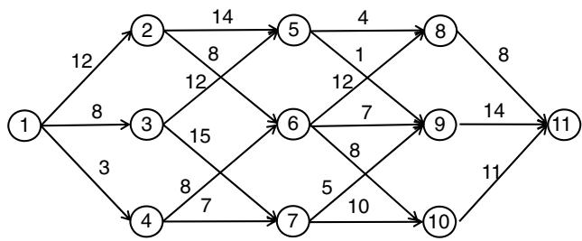  
Figure 9.7 Deterministic shortest path problem.

(a) Describe an appropriate state variable for this problem (with notation).   
(b) If the traveler is at node 6 by following the path 1-2-6, what is her state?   
(c) Find the path that minimizes the sum of the costs on the links traversed by the traveler. Using Bellman’s equation (14.2), work backward from node 11 and find the best path from each node to node 11, ultimately finding the best path from node 1 to node 11. Show your solution by drawing the graph with the links that fall on an optimal path from some node to node 11 drawn in bold.

9.9 A traveler needs to traverse the graph shown in Figure 9.8 from node 1 to node 11, where the goal is to find the path that minimizes the largest cost of all the links on the path. To solve this problem, answer the following questions:

  
Figure 9.8 A path problem minimizing the largest cost of all the links on a path.

(a) Describe an appropriate state variable for this problem (with notation).   
(b) If the traveler is at node 6 by following the path 1-2-6, what is her state?   
(c) Using Bellman’s equation (14.2), find the path (or paths) that minimizes the largest costs on the links traversed by the traveler. For each decision point (the nodes in the graph), give the value of the state variable corresponding to the optimal path to that decision point, and the value of being in that state (that is, the cost if we start in that state and then follow the optimal solution).

9.10 Repeat exercise 9.9, but this time minimize the second largest arc cost on a path.

9.11 A traveler needs to traverse the graph shown in Figure 9.9 from node 1 to node 11, where the goal is to find the path that minimizes the second largest link cost along the path. To solve this problem, answer the following questions:

  
Figure 9.9 A path problem minimizing the product of the costs.

(a) Describe an appropriate state variable for this problem (with notation).   
(b) If the traveler is at node 6 by following the path 1-2-6, what is her state?   
(c) If the traveler is at node 10 by following the path 1-2-6-10, what is her state?   
(d) Using Bellman’s equation (14.2), find the path (or paths) that minimizes the product of the costs on the links traversed by the traveler. For each decision point (the nodes in the graph), give the value of the state variable corresponding to the optimal path to that decision point, and the value of being in that state (that is, the cost if we start in that state and then follow the optimal solution).

9.12 Consider our basic newsvendor problem

$$
\max  _ {x} \mathbb {E} _ {D} F (x, D) = \mathbb {E} _ {D} \left(p \min  \{x, D \} - c x\right). \tag {9.56}
$$

Show how the following variations of this problem can be modeled using the universal modeling framework:

(a) The final reward formulation of the basic newsvendor problem.   
(b) The cumulative reward formulation of the basic newsvendor problem.   
(c) The asymptotic formulation of the newsvendor problem. What are the differences between the asymptotic formulation and the final reward formulation?

9.13 Now consider a dynamic version of our newsvendor problem where a decision $x _ { t }$ is made at time $t$ by solving

$$
\max  _ {x} \mathbb {E} _ {D} F (x, D) = \mathbb {E} _ {D} \left(p _ {t} \min  \{x, D _ {t + 1} \} - c x\right). \tag {9.57}
$$

Assume that the price $p _ { t }$ is independent of prior history.

(a) Model the cumulative reward version of the newsvendor problem in (9.57).   
(b) How does your model change if we are instead solving

$$
\max  _ {x} \mathbb {E} _ {D} F (x, D) = \mathbb {E} _ {D} \left(p _ {t + 1} \min  \{x, D _ {t + 1} \} - c x\right). \tag {9.58}
$$

where we continue to assume that the price, which is now $p _ { t + 1 }$ , is independent of prior history.

(c) How does your model of (9.58) change if

$$
p _ {t + 1} = \theta_ {0} p _ {t} + \theta_ {1} p _ {t - 1} + \varepsilon_ {t + 1}, \tag {9.59}
$$

where $\varepsilon _ { t + 1 }$ is a zero-mean noise term, independent of the state of the system.

9.14 We continue the newsvendor problem in exercise 9.13, but now assume that $( \theta _ { 0 } , \theta _ { 1 } )$ in equation (9.59) are unknown. At time $t$ , we have estimates $\bar { \theta } _ { t } = ( \bar { \theta } _ { t 0 } , \bar { \theta } _ { t 1 }$ . Assume the true $\boldsymbol { \theta }$ is now a random variable that follows a multivariate normal distribution with mean $\mathbb { E } _ { t } \boldsymbol { \theta } = \bar { \boldsymbol { \theta } } _ { t }$ which we initialize to

$$
\bar {\theta} _ {0} = \left( \begin{array}{c} 2 0 \\ 4 0 \end{array} \right),
$$

and covariance matrix $\Sigma _ { t } ^ { \theta }$ which we initialize to

$$
\begin{array}{l} \begin{array}{r l r} {\Sigma_ {0} ^ {\theta}} & = & {\left( \begin{array}{c c} \sigma_ {0 0} ^ {2} & \sigma_ {0 1} ^ {2} \\ \sigma_ {1 0} ^ {2} & \sigma_ {1 1} ^ {2} \end{array} \right).} \end{array} \\ = \left( \begin{array}{c c} 3 6 & 1 6 \\ 1 6 & 2 5 \end{array} \right). \\ \end{array}
$$

Drawing on the updating equations in section 3.4.2, give a full model of this problem using a cumulative reward objective function (that is, give the state, decision and exogenous information variables, transition function and objective unction).

9.15 See the series of variants of our familiar newsvendor (or inventory) problem. In each, describe the pre- and post-decision states, decision and exogenous information in the form:

$$
(S _ {0}, x _ {0}, S _ {0} ^ {x}, W _ {1}, S _ {1}, x _ {1}, S _ {1} ^ {x}, W _ {2}, \dots)
$$

Specify $S _ { t }$ , $S _ { t } ^ { x }$ , $x _ { t }$ and $W _ { t }$ in terms of the variables of the problem.

(a) The basic newsvendor problem where we wish to find $x$ that solves

$$
\max  _ {x} \mathbb {E} \left\{p \min  (x, \hat {D}) - c x \right\} \tag {9.60}
$$

where the distribution of $\hat { D }$ is unknown.

(b) The same as (a), but now we are given a price $p _ { t }$ at time $t$ and asked to solve (9.60) using this information. Note that $p _ { t }$ is unrelated to any prior history or decisions.   
(c) Repeat (b), but now $p _ { t + 1 } = p _ { t } + \hat { p } _ { t + 1 }$   
(d) Repeat (c), but now leftover inventory is held to the next time period.   
(e) Of the problems mentioned, which (if any) are not dynamic programs? Explain.   
(f) Of the problems mentioned, which would be classified as solving state-dependent vs. state-independent functions.

9.16 In this exercise you are going to model an energy storage problem, which is a problem class that arises in many settings (how much cash to keep on hand, how much inventory on a store shelf, how many units of blood to hold, how many milligrams of a drug to keep in a pharmacy, …). We will begin by describing the problem in English with a smattering of notation. Your job will be to develop it into a formal dynamic model. Our problem is to decide how much energy to purchase from the electric power grid at a price $p _ { t }$ . Let $x _ { t } ^ { g s }$ be the amount of power we buy (if $x ^ { g s } >$ 0) or sell (if $x ^ { g s } < 0 .$ ). We then have to decide how much energy to move from storage to meet the demand $D _ { t }$ in a commercial building, where $x _ { t } ^ { s b } \geq 0$ is the amount we move to the building to meet the demand $D _ { t }$ . Unsatisfied demand is penalized at a price $c$ per unit of energy.

Assume that prices evolve according to a time-series model given by

$$
p _ {t + 1} = \theta_ {0} p _ {t} + \theta_ {1} p _ {t - 1} + \theta_ {2} p _ {t - 2} + \varepsilon_ {t + 1}, \tag {9.61}
$$

where $\varepsilon _ { t + 1 }$ is a random variable with mean 0 that is independent of the price process. We do not know the coefficients $\theta _ { i }$ for $i = 0 , 1 , 2$ , so instead we use estimates $\bar { \theta } _ { t i }$ . As we observe $p _ { t + 1 }$ , we can update the vector ${ { \bar { \theta } } _ { t } }$ using the recursive formulas for updating linear models as described in chapter 3, section 3.8 (you will need to review this section to answer parts of this question).

Every time period we are given a forecast $f _ { t t ^ { \prime } } ^ { D }$ of the demand $D _ { t ^ { \prime } }$ at time $t ^ { \prime }$ in the future, where $t ^ { \prime } = t , t + 1 , t + H$ . We can think of $f _ { t t } ^ { D } = D _ { t }$ as the actual demand. We can also think of the forecasts $f _ { t + 1 , t ^ { \prime } } ^ { D }$ as the “new

information” or define a “change in the forecast” $\hat { f } _ { t + 1 , t ^ { \prime } } ^ { D }$ in which case we would write

$$
f _ {t + 1, t ^ {\prime}} ^ {D} = f _ {t t ^ {\prime}} ^ {D} + \hat {f} _ {t + 1, t ^ {\prime}} ^ {D}.
$$

(a) What are the elements of the state variable $S _ { t }$ (we suggest filling in the other elements of the model to help identify the information needed in $S _ { t }$ ). Define both the pre- and post-decision states.   
(b) What are the elements of the decision variable $\boldsymbol { x } _ { t } \boldsymbol { ? }$ What are the constraints (these are the equations that describe the limits on the decisions). Finally introduce a function $X ^ { \pi } ( S _ { t } )$ which will be our policy for making decisions to be designed later (but we need it in the objective function that will be explained subsequently).   
(c) What are the elements of the exogenous information variable $W _ { t + 1 }$ that become known at time $t { + } 1$ but which were not known at time $t$   
(d) Write out the transition function $S _ { t + 1 } = S ^ { M } ( S _ { t } , x _ { t } , W _ { t + 1 } )$ , which are the equations that describe how each element of the state variable $S _ { t }$ evolves over time. There needs to be one equation for each state variable.   
(e) Write out the objective function by writing:

The contribution function $C ( S _ { t } , x _ { t } )$

The objective function where you maximize expected profits over some general set of policies (to be defined later – not in this exercise).

9.17 Patients arrive at a doctor’s office, each of whom are described by a vector of attribute $a = ( a _ { 1 } , a _ { 2 } , \dots , a _ { K } )$ where $a$ might describe age, gender, height, weight, whether the patient smokes, and so on. Let $a ^ { n }$ be the attribute vector describing the $n ^ { t h }$ patient. For each patient, the doctor makes a decision $x ^ { n }$ (surgery, drug regimens, rehabilitation), and then observes an outcome $y ^ { n }$ for patient ??. From $y ^ { n }$ , we obtain an updated estimate $\theta ^ { n }$ for the parameters of a nonlinear model $f ( x | \theta )$ that helps us to predict $y$ for other patients.

(a) Give the five elements of this decision problem. Be sure to model the state after a patient arrives (this would be the pre-decision state), $S ^ { n }$ , after a decision is made (this would be the post-decision state), $S ^ { x , n }$ and after the outcome of a decision becomes known, $S ^ { y , n }$ .   
(b) The value of being in a state $S ^ { n }$ can be computed using Bellman’s equation

$$
V ^ {n} \left(S ^ {n}\right) = \max  _ {x \in \mathcal {X}} \left(\left(C \left(S ^ {n}, x\right) + E _ {W} \left\{V ^ {n + 1} \left(S ^ {n + 1}\right) \mid S ^ {n}, x \right\}\right). \right. \tag {9.62}
$$

Define the value of being in the state (i) after a patient arrives, (ii) after a decision is made, and (iii) before a patient arrives. Call these $V ( S ) , V ^ { x } ( S ^ { x } )$ , and $V ^ { y } ( S ^ { y } )$ . Write $V ( S ^ { n } )$ as a function of $V ^ { x } ( S ^ { x , n } )$ and write $V ^ { x } ( S ^ { x , n } )$ as a function of $V ^ { y } ( S ^ { y , n } )$ .

9.18 Consider the problem of controlling the amount of cash a mutual fund keeps on hand. Let $R _ { t }$ be the cash on hand at time ??. Let $\hat { R } _ { t + 1 }$ be the net deposits (if $\hat { R } _ { t + 1 } > 0 \mathrm { . }$ ) or withdrawals (if $\hat { R } _ { t + 1 } < 0 \mathrm { ~ , ~ }$ ), where we assume that $\hat { R } _ { t + 1 }$ is independent of $\hat { R } _ { t }$ . Let $M _ { t }$ be the stock market index at time $t$ , where the evolution of the stock market is given by $\boldsymbol { M } _ { t + 1 } = \boldsymbol { M } _ { t } + \boldsymbol { \hat { M } } _ { t + 1 }$ where $\hat { M } _ { t + 1 }$ is independent of ${ \bf \dot { \boldsymbol { M } } } _ { t }$ . Let $x _ { t }$ be the amount of money moved from the stock market into cash $\left( x _ { t } \ > \ 0 \right)$ or from cash into the stock market $( x _ { t } < 0 )$ .

(a) Give a complete model of the problem, including both pre-decision and post-decision state variables.   
(b) Suggest a simple parametric policy function approximation, and give the objective function as an online learning problem.

9.19 A college student must plan what courses she takes over each of eight semesters. To graduate, she needs 34 total courses, while taking no more than five and no less than three courses in any semester. She also needs two language courses, one science course, eight departmental courses in her major and two math courses.

(a) Formulate the state variable for this problem in the most compact way possible.   
(b) Give the transition function for our college student assuming that she successfully passes any course she takes. You will need to introduce variables representing her decisions.   
(c) Give the transition function for our college student, but now allow for the random outcome that she may not pass every course.

9.20 A broker is working in thinly traded stocks. He must make sure that he does not buy or sell in quantities that would move the price and he feels that if he works in quantities that are no more than 10 percent of the average sales volume, he should be safe. He tracks the average sales volume of a particular stock over time. Let $\hat { v _ { t } }$ be the sales volume on day ??, and assume that he estimates the average demand $f _ { t }$ using $f _ { t } = ( 1 - \alpha ) f _ { t - 1 } + \alpha \hat { v _ { t } }$ . He then uses $f _ { t }$ as his estimate of the sales volume for the next day. Assuming he started tracking demands on day $t = 1$ , what information would constitute his state variable?

9.21 How would your previous answer change if our broker used a 10-day moving average to estimate his demand? That is, he would use $f _ { t } \ =$ $\begin{array} { r } { 0 . 1 0 \sum _ { i = 1 } ^ { \overline { { 1 0 } } } \hat { v } _ { t - i + 1 } = 1 } \end{array}$ 10 as his estimate of the demand.

9.22 The pharmaceutical industry spends millions managing a sales force to push the industry’s latest and greatest drugs. Assume one of these salesmen must move between a set ℐ of customers in his district. He decides which customer to visit next only after he completes a visit. For this exercise, assume that his decision does not depend on his prior history of visits (that is, he may return to a customer he has visited previously). Let $S _ { n }$ be his state immediately after completing his $n ^ { t h }$ visit that day.

(a) Assume that it takes exactly one time period to get from any customer to any other customer. Write out the definition of a state variable, and argue that his state is only his current location.   
(b) Now assume that $\tau _ { i j }$ is the (deterministic and integer) time required to move from location $i$ to location $j$ . What is the state of our salesman at any time ??? Be sure to consider both the possibility that he is at a location (having just finished with a customer) or between locations.   
(c) Finally assume that the travel time $\tau _ { i j }$ follows a discrete uniform distribution between $a _ { i j }$ and $b _ { i j }$ (where $a _ { i j }$ and $b _ { i j }$ are integers)?

9.23 Consider a simple asset acquisition problem where $x _ { t }$ is the quantity purchased at the end of time period $t$ to be used during time interval $t + 1$ . Let $D _ { t }$ be the demand for the assets during time interval ??. Let $R _ { t }$ be the pre-decision state variable (the amount on hand before you have ordered $x _ { t }$ ) and $R _ { t } ^ { x }$ be the post-decision state variable.

(a) Write the transition function so that $R _ { t + 1 }$ is a function of $R _ { t } , x _ { t }$ , and $D _ { t + 1 }$ .   
(b) Write the transition function so that $R _ { t } ^ { x }$ is a function of $R _ { t - 1 } ^ { x } , D _ { t }$ , a nd $x _ { t }$ .   
(c) Write $R _ { t } ^ { x }$ as a function of $R _ { t }$ , and write $R _ { t + 1 }$ as a function of $R _ { t } ^ { x }$

9.24 As a buyer for an orange juice products company, you are responsible for buying futures for frozen concentrate. Let $x _ { t t ^ { \prime } }$ be the number of futures you purchase in year ?? that can be exercised during year $t ^ { \prime }$ .

(a) What is your state variable in year ???   
(b) Write out the transition function.

9.25 A classical inventory problem works as follows. Assume that our state variable $R _ { t }$ is the amount of product on hand at the end of time period ?? and that $D _ { t }$ is a random variable giving the demand during time interval $( t - 1 , t )$ with distribution $p _ { d } = P ( D _ { t } = d )$ . The demand in time interval $t$ must be satisfied with the product on hand at the beginning of the period. We can then order a quantity $x _ { t }$ at the end of period $t$ that can be used to replenish the inventory in period $t + 1$ . Give the transition function that relates $R _ { t + 1 }$ to $R _ { t }$ .

9.26 Many problems involve the movement of resources over networks. The definition of the state of a single resource, however, can be complicated by different assumptions for the probability distribution for the time required to traverse a link. For each example, give the state of the resource:

(a) You have a deterministic, static network, and you want to find the shortest path from an origin node $q$ to a destination node $r$ . There is a known cost $c _ { i j }$ for traversing each link $( i , j )$ .   
(b) Next assume that the cost $c _ { i j }$ is a random variable with an unknown distribution. Each time you traverse a link $( i , j )$ , you observe the cost $\hat { c } _ { i j }$ , which allows you to update your estimate $\bar { c } _ { i j }$ of the mean of $c _ { i j }$ .   
(c) Finally assume that when the traveler arrives at node $i$ he sees $\hat { c } _ { i j }$ for each link $( i , j )$ out of node ??.   
(d) A taxicab is moving people in a set of cities ??. After dropping a passenger off at city ??, the dispatcher may have to decide to reposition the cab from ?? to $j , ( i , j ) \in \mathcal { C }$ . The travel time from $i$ to $j$ is $\tau _ { i j }$ , which is a random variable with a discrete uniform distribution (that is, the probability that $\tau _ { i j } = t$ is $1 / T$ , for $t = 1 , 2 , \dots , T )$ . Assume that the travel time is known before the trip starts.   
(e) Same as (d), but now the travel times are random with a geometric distribution (that is, the probability that $\tau _ { i j } = t$ is $( 1 - \theta ) \theta ^ { t - 1 }$ , for $t = 1 , 2 , 3 , \ldots )$ .

9.27 As the purchasing manager for a major citrus juice company, you have the responsibility of maintaining sufficient reserves of oranges for sale or conversion to orange juice products. Let $x _ { t i }$ be the amount of oranges that you decide to purchase from supplier $i$ in week $t$ to be used in week $t { + } 1$ . Each week, you can purchase up to $\hat { q } _ { t i }$ oranges (that is, $x _ { t i } \leq \hat { q } _ { t i . }$ ) at a price $\hat { p } _ { t i }$ from supplier $i \in \mathcal I$ , where the price/quantity pairs $( \hat { p } _ { t i } , \hat { q } _ { t i } ) _ { i \in \mathcal { I } }$ fluctuate from week to week. Let $s _ { 0 }$ be your total initial inventory of oranges, and let $D _ { t }$ be the number of oranges that the company needs for production during week $t$ (this is our demand). If we are unable to

meet demand, the company must purchase additional oranges on the spot market at a spot price $\hat { p } _ { t i } ^ { s p o t }$ .

(a) What is the exogenous stochastic process for this system?   
(b) What are the decisions you can make to influence the system?   
(c) What would be the state variable for your problem?   
(d) Write out the transition equations.   
(e) What is the one-period contribution function?   
(f) Propose a reasonable structure for a decision rule for this problem, and call it $X ^ { \pi }$ . Your decision rule should be in the form of a function that determines how much to purchase in period $t$ .   
(g) Carefully and precisely, write out the objective function for this problem in terms of the exogenous stochastic process. Clearly identify what you are optimizing over.   
(h) For your decision rule, what do we mean by the space of policies?

9.28 Customers call in to a service center according to a (nonstationary) Poisson process. Let ℰ be the set of events representing phone calls, where $t _ { e } , e \in \mathcal { E }$ is the time that the call is made. Each customer makes a request that will require time $\tau _ { e }$ to complete and will pay a reward $r _ { e }$ to the service center. The calls are initially handled by a receptionist who determines $\tau _ { e }$ and $r _ { e }$ . The service center does not have to handle all calls and obviously favors calls with a high ratio of reward per time unit required $( r _ { e } / \tau _ { e } )$ . For this reason, the company adopts a policy that the call will be refused if $( r _ { e } / \tau _ { e } ) < \gamma$ . If the call is accepted, it is placed in a queue to wait for one of the available service representatives. Assume that the probability law driving the process is known, where we would like to find the right value of ??.

(a) This process is driven by an underlying exogenous stochastic process with element $\omega \in \Omega$ . What is an instance of ???   
(b) What are the decision epochs?   
(c) What is the state variable for this system? What is the transition function?   
(d) What is the action space for this system?   
(e) Give the one-period reward function.   
(f) Give a full statement of the objective function that defines the Markov decision process. Clearly define the probability space over which the expectation is defined, and what you are optimizing over.

9.29 A major oil company is looking to build up its storage tank reserves, anticipating a surge in prices. It can acquire 20 million barrels of oil, and

it would like to purchase this quantity over the next 10 weeks (starting in week 1). At the beginning of the week, the company contacts its usual sources, and each source $j \in \mathcal { J }$ is willing to provide $\hat { q } _ { t j }$ million barrels at a price $\hat { p } _ { t j }$ . The price/quantity pairs $( \hat { p } _ { t j } , \hat { q } _ { t j } )$ fluctuate from week to week. The company would like to purchase (in discrete units of millions of barrels) $x _ { t j }$ million barrels (where $x _ { t j }$ is discrete) from source $j$ in week $t \in \{ 1 , 2 , \dots , 1 0 \}$ . Your goal is to acquire 20 million barrels while spending the least amount possible.

(a) What is the exogenous stochastic process for this system?   
(b) What would be the state variable for your problem? Give an equation(s) for the system dynamics.   
(c) Propose a structure for a decision rule for this problem and call it $X ^ { \pi }$ .   
(d) For your decision rule, what do we mean by the space of policies? Give examples of two different decision rules.   
(e) Write out the objective function for this problem using an expectation over the exogenous stochastic process.   
(f) You are given a budget of $\$ 300$ million to purchase the oil, but you absolutely must end up with 20 million barrels at the end of the 10 weeks. If you exceed the initial budget of $\$ 300$ million, you may get additional funds, but each additional $\$ 1$ million will cost you $\$ 1.5$ million. How does this affect your formulation of the problem?

9.30 You own a mutual fund where at the end of each week $t$ you must decide whether to sell the asset or hold it for an additional week. Let $\hat { r } _ { t }$ be the one-week return (e.g. $\hat { r } _ { t } = 1 . 0 5$ means the asset gained five percent in the previous week), and let $p _ { t }$ be the price of the asset if you were to sell it in week $t$ (so $p _ { t + 1 } = p _ { t } \hat { r } _ { t + 1 } )$ . We assume that the returns $\hat { r } _ { t }$ are independent and identically distributed. You are investing this asset for eventual use in your college education, which will occur in 100 periods. If you sell the asset at the end of time period ??, then it will earn a money market rate $q$ for each time period until time period 100, at which point you need the cash to pay for college.

(a) What is the state space for our problem?   
(b) What is the action space?   
(c) What is the exogenous stochastic process that drives this system? Give a five time period example. What is the history of this process at time t?

(d) You adopt a policy that you will sell if the asset falls below a price $\bar { p }$ (which we are requiring to be independent of time). Given this policy, write out the objective function for the problem. Clearly identify exactly what you are optimizing over.

# Theory questions

9.31 Assume that we have $N$ discrete resources to manage, where $R _ { a }$ is the number of resources of type $a \in { \mathcal { A } }$ and $\textstyle N = \sum _ { a \in { \mathcal { A } } } R _ { a }$ . Let $\mathcal { R }$ be the set of possible values of the vector $R$ . Show that

$$
| \mathcal {R} | = \left(N + | \mathcal {A} | - 1 | \mathcal {A} | - 1\right),
$$

where

$$
\left( \begin{array}{c} X \\ Y \end{array} \right) = \frac {X !}{Y ! (X - Y) !}
$$

is the number of combinations of $X$ items taken ?? at a time.

# Diary problem

The diary problem is a single problem you chose (see chapter 1 for guidelines). Answer the following for your diary problem.

9.32 Now you are finally going to model your diary problem, in its full detail (but you will not attempt to design a policy).

(a) Define each of the elements of the state variable. Note that this is an iterative process; you generally need to define the state variable as you identify the information you need at time ?? to model the system from time ?? onward. Do you have a belief state? If not, try to introduce one. All you need is some parameter that you can model as being unknown, but which you can estimate as data arrives to the system. The most interesting problems are where your decisions influence what you observe.

(b) What are the decisions? Describe in words, and then introduce notation for each decision. Now describe the constraints or the set of allowable decisions at time ??. Add any information that you need at time ?? (that may change as we step forward in time) to the state variable. Introduce notation for the policy, although we will design the

policy after we complete the model. The policy may introduce additional information that will have to be added to the state variable, but we will handle this after we start to design the policy.

(c) What is the exogenous information that arrives after you make the decision? (Note that you may have a deterministic problem, which means you do not have any exogenous information.) If your exogenous information depends on what you know at time ??, then this information must be in the state variable.

(d) Define the transition function, which describes how each state variable evolves over time (not that we may not be done with the state variable). The level of detail here will depend on the complexity of your problem. Feel free to use both model-based transitions (where the equation governing the transition is known) and model-free transitions (where you simply observe the updated value of the variable).

(e) Write out the one-period contribution function, which may introduce additional information that you will need to add to the state variable (with corresponding additions to the transition function). Now write out the value of a policy, and write the objective of maximizing over policies (or classes of policies).

# Bibliography

Bellman, R.E. (1957). Dynamic Programming. Princeton, N.J.: Princeton University Press.   
Bellman, R.E. and Kalaba, R. (1959). On adaptive control processes. IRE Transactions on Automatic Control 4: 1–9.   
Bertsekas, D.P. (2017). Dynamic Programming and Optimal Control: Approximate Dynamic Programming, 4e. Belmont, MA: Athena Scientific.   
Boutilier, C., Dean, T., and Hanks, S. (1999). Decision-theoretic planning: Structural assumptions and computational leverage. Journal of Artificial Intelligence Research, 11: 1–94.   
Chow, G. (1997). Dynamic Economics. New York: Oxford University Press.   
Chung, K.L. (1974). A Course in Probability Theory. New York: Academic Press.   
Cinlar, E. (2011). Probability and Stochastics. New York: Springer.   
Guestrin, C., Koller, D., and Parr, R. (2003). Efficient solution algorithms for factored MDPs. Journal of Artificial Intelligence Research 19: 399–468.   
Kirk, D.E. (2012). Optimal Control Theory: An introduction. New York: Dover.   
Lewis, F.L. and Vrabie, D. (2012). Design Optimal Adaptive Controllers, 3e., Hoboken, NJ: JohnWiley & Sons.

Pollard, D. (2002). A User’s Guide to Measure Theoretic Probability. Cambridge: Cambridge University Press.   
Powell,W.B. (2011). Approximate Dynamic Programming: Solving the Curses of Dimensionality, 2e. John Wiley & Sons.   
Powell, W.B. (2019). A unified framework for stochastic optimization. European Journal of Operational Research 275 (3): 795–821.   
Powell, W.B. (2021). From reinforcement learning to optimal control: A unified framework for sequential decisions. Handbook on Reinforcement Learning and Optimal Control, Studies in Systems, Decision and Control. 29–74.   
Powell, W.B., Simao, H.P., and Shapiro, J.A. (2001). A representational paradigm for dynamic resource transformation problems. In: Annals of Operations Research (eds. F.C. Coullard and J.H. Owens), 231–279. J.C. Baltzer AG.   
Puterman, M.L. (2005). Markov Decision Processes, 2e. Hoboken, NJ: John Wiley and Sons.   
Sethi, S.P. (2019). Optimal Control Theory: Applications to Management Science and Economics, 3e. Boston: Springer-Verlag.   
Sontag, E. (1998). Mathematical Control Theory, 2e., 1–544. Springer.   
Stengel, R.F. (1986). Stochastic optimal control: theory and application. Hoboken, NJ: John Wiley & Sons.   
Stokey, N.L. and Lucas, R.E. (1989). Recursive Methods in Dynamic Economics. Cambridge, MA: Harvard University Press.   
Werbos, P.J. (1992). Neurocontrol and supervised learning: An overview and evaluation. In: Handbook of Intelligent Control (eds. D.A. White and D.A. Sofge), 65–86. New York: Von Nostrand Reinhold.   
White, C.C. (1991). A survey of solution techniques for the partially observable Markov decision process. Annals of operations research 32: 215–230.

#

# Uncertainty Modeling

We cannot find an effective policy unless we are modeling the problem properly. In the realm of sequential decision problems, this means accurately modeling uncertainty. The importance of modeling uncertainty has been underrepresented in the stochastic optimization literature, although practitioners working on real problems have long been aware of both the importance and the challenges of modeling uncertainty.

Fortunately, there is a substantial body of research focused on the modeling of uncertainty and stochastic processes that has evolved in the communities working on Monte Carlo simulation and uncertainty quantification. We use uncertainty modeling as the broader term that describes the process of identifying and modeling uncertainty, while simulation refers to the vast array of tools that break down complex stochastic processes using the computational tools of Monte Carlo simulation.

It helps to remind ourselves of the two information processes that drive any sequential stochastic optimization problem: decisions, and exogenous information. Assume that we can pick some policy $X _ { t } ^ { \pi } ( S _ { t } )$ . We need to be able to simulate a sample realization of the policy, which will look like

$$
S _ {0} \rightarrow x _ {0} = X _ {0} ^ {\pi} (S _ {0}) \rightarrow W _ {1} \rightarrow S _ {1} \rightarrow x _ {1} = X _ {1} ^ {\pi} (S _ {1}) \rightarrow W _ {2} \rightarrow S _ {3} \rightarrow
$$

Given our policy, this simulation assumes that we have access to a transition function

$$
S _ {t + 1} = S ^ {M} \left(S _ {t}, X _ {t} ^ {\pi} \left(S _ {t}\right), W _ {t + 1}\right). \tag {10.1}
$$

We can execute equation (10.1) if we are given a policy $X _ { t } ^ { \pi } ( S _ { t } )$ and if we have access to the following:

??0 = The initial state – This is where we place information about initial estimates (or priors) of parameters, as well as assumptions about probability distributions and functions.

???? = Exogenous information that enters our system for the first time between $t - 1$ and $t$ for $t = 1 , 2 , \dots , T$ .

In this chapter, we focus on the often challenging problem of simulating the exogenous sequence $( W _ { t } ) _ { t = 0 } ^ { T }$ . We assume that the initial state $S _ { 0 }$ is given, but recognize that it may include a probabilistic belief about unknown and unobservable parameters. The process of converting the characteristics of a stochastic process into a mathematical model is broadly known as uncertainty quantification. Since it is easy to overlook sources of uncertainty when building a model, we place considerable attention on identifying the different sources of uncertainty that we have encountered in our applied work, keeping in mind that $S _ { 0 }$ and $W _ { t }$ are the only variables our modeling framework provides for representing uncertainty.

After reviewing different sources of uncertainty, we then provide a basic introduction to a powerful set of techniques known as Monte Carlo simulation, which allows us to replicate stochastic processes on the computer. Given the rich array of different types of stochastic processes, our discussion here provides little more than a taste of the tools that are available to replicate stochastic processes.

# 10.1 Sources of Uncertainty

Uncertainty arises in different forms. Some of the major forms that we have encountered are

● Observational errors – This arises from uncertainty in observing or measuring the state of the system. Observational errors arise when we have unknown state variables that cannot be observed directly (and accurately).   
● Exogenous uncertainty – This describes the exogenous arrival of information to the system, which might be weather, demands, prices, the response of a patient to medication or the reaction of the market to a product.   
● Prognostic uncertainty – We often have access to a forecast $f _ { t t ^ { \prime } } ^ { W }$ of the information $\boldsymbol { W } _ { t ^ { \prime } }$ . Prognostic uncertainty captures the deviation of the actual $W _ { t ^ { \prime } }$ from the forecast $f _ { t t ^ { \prime } } ^ { W }$ . If we think of $W _ { t } = f _ { t t } ^ { W }$ as the actual value of $W _ { t }$ , then we can think of the realization of $W _ { t }$ (the exogenous information described above) as just an update to a forecast.

● Inferential (or diagnostic) uncertainty – Inferential uncertainty arises when we use observations (from field or physical measurements, or computer simulations) to draw inferences about another set of parameters. It arises from our lack of understanding of the precise properties or behavior of a system, which introduces errors in our ability to estimate parameters, partly from noise in the observations, and partly from errors in our modeling of the underlying system.   
● Experimental variability – Sometimes equated with observational uncertainty, experimental variability refers to differences between the results of experiments run under similar conditions. An experiment might be a computer simulation, a laboratory experiment, or a field implementation. Even if we can perfectly measure the results of an experiment, there is variation from one experiment to the next.   
● Model uncertainty – We may not know the structure of the transition function $S _ { t + 1 } ~ = ~ S ^ { M } ( S _ { t } , x _ { t } , W _ { t + 1 } )$ , or the parameters that are imbedded in the function. Model uncertainty is often attributed to the transition function, but it may also apply to the model of the stochastic process $W _ { t }$ since we often do not know the precise structure.   
● Transitional uncertainty – This arises when we have a perfect model of how a system should evolve, but exogenous shocks (wind buffeting an aircraft, rainfall affecting reservoir levels) can introduce uncertainty in how an otherwise deterministic system will evolve. Transitional uncertainty is often represented as

$$
S _ {t + 1} = S ^ {M} (S _ {t}, x _ {t}) + \varepsilon_ {t + 1}.
$$

● Control/implementation uncertainty – This is where we choose a control $u _ { t }$ (such as a temperature or speed), but what happens is $\hat { u } _ { t } = u _ { t } + \delta u _ { t }$ where $\delta u _ { t }$ is a random perturbation.   
● Communication errors and biases – Communication from an agent $q$ about his state $S _ { q t }$ to an agent $q ^ { \prime }$ where errors may introduced, either accidentally or purposely.   
● Algorithmic instability – Very minor changes in the input data for a problem, or small adjustments in parameters guiding an algorithm (which exist in virtually all algorithms), can completely change the path of the algorithm, introducing variability in the results.   
● Goal uncertainty – Uncertainty in the desired goal of a solution, as might arise when a single model has to produce results acceptable to different people or users.   
● Political/regulatory uncertainty – Uncertainty about taxes, rules, and requirements that affect costs and constraints (for example, tax energy credits, automotive mileage standards). These can be viewed as a form of

systematic uncertainty, but this is a particularly important source of uncertainty with its own behaviors.

Below we provide more detailed discussions of each type of uncertainty. One challenge is modeling each source of uncertainty, since we have only two mechanisms for introducing exogenous information into our model: the initial state $S _ { 0 }$ , and the exogenous information process $W _ { 1 } , W _ { 2 } , \dots$ Thus, the different types of uncertainty may look similar mathematically, but it is important to characterize the mechanisms by which uncertainty enters our model.

# 10.1.1 Observational Errors

Observational (or measurement) uncertainty reflects errors in our ability to observe (or measure) the state of the system directly. Some examples include:

# EXAMPLE 10.1

Different people may measure the gases in the oil of a high-voltage transformer, producing different measurements (possibly due to variations in equipment, the temperature at which the transformer was observed, or variations in the oil surrounding the coils).

# EXAMPLE 10.2

The Center for Disease Control and Prevention estimates the number of mosquitoes carrying a disease by setting traps and counting how many mosquitoes are caught that are found with the disease. From day to day the number of infected mosquitoes that are caught can vary considerably.

# EXAMPLE 10.3

A company may be selling a product at a price $p _ { t }$ which is being varied to find the best price. However, the sales (at a fixed price) will be random from one time period to the next.

# EXAMPLE 10.4

Different doctors, seeing the same patient for the first time, may elicit different information about the characteristics of the patient.

Partially observable systems arise in any application where we cannot directly observe parameters. A simple example arises in pricing, where we may feel that demand varies linearly with price according to

$$
D (p) = \theta_ {0} - \theta_ {1} p.
$$

At time ??, our best estimate of the demand function is given by

$$
D (p) = \bar {\theta} _ {0} - \bar {\theta} _ {1} p.
$$

We observe sales, which would be given by

$$
\hat {D} _ {t + 1} = \theta_ {0} - \theta_ {1} p _ {t} + \varepsilon_ {t + 1}.
$$

We do not know $( \theta _ { 0 } , \theta _ { 1 } )$ , but we can use observations to create updated estimates. If $( \bar { \theta } _ { t 0 } , \bar { \theta } _ { t 1 } )$ is our estimate as of time $t$ , we can use our observation $\hat { D } _ { t + 1 }$ of sales between $t$ and $t + 1$ to obtain updated estimates $( \bar { \theta } _ { t + 1 , 0 } , \bar { \theta } _ { t + 1 , 1 } )$ . In this model, we would view $\bar { \theta } _ { t } = ( \bar { \theta } _ { t 0 } , \bar { \theta } _ { t 1 } )$ as our state variable, which is our estimate of the static parameter ??. Since $\boldsymbol { \theta }$ is a fixed parameter, we do not include it in the state variable, but rather treat it as a latent variable.

The presence of states that cannot be perfectly observable gives rise to what are widely known as partially observable Markov decision processes, or POMDP’s. To model this, let ${ \check { S } } _ { t }$ be the true (but possibly unobservable) state of the system at time $t$ , while $S _ { t }$ is the observable state. One way of writing our dynamics might be

$$
S _ {t + 1} = \check {S} ^ {M} (\check {S} _ {t}, x _ {t}) + \varepsilon_ {t + 1},
$$

which captures our inability to directly observe ${ \check { S } } _ { t }$ . These systems are most often motivated by problems such as those in engineering where we cannot directly observe the state of charge of a battery, the location and velocity of an aircraft, or the number of truck trailers sitting at a terminal (terminal managers tend to hide trailers to keep up their inventories).

We can represent our unobservable state as a probability distribution. This might be a continuous distribution (perhaps the normal or multivariate normal distribution), or perhaps more simply as a discrete distribution where $q _ { t i } ^ { k }$ is the probability that the state variable $S _ { t i }$ takes on outcome $k$ (or perhaps a parameter $\theta ^ { k }$ ) at time ??. Then, the vector $q _ { t i } = ( q _ { t i } ^ { k } ) , k = 1 , \ldots , K$ is the distribution capturing our belief about the unobservable state. We then include $q _ { t }$ (for each uncertain state dimension) as part of our state variable (this is where our belief state comes in).

# 10.1.2 Exogenous Uncertainty

Exogenous uncertainty represents the information that we typically model through the process $W _ { t }$ represent new information about supplies and demands, costs and prices, and physical parameters that can appear in either the objective function or constraints. Exogenous uncertainty can arise in different styles, including:

● Fine-grained time-scale uncertainty – Sometimes referred to as aleatoric uncertainty, fine time-scale uncertainty refers to uncertainty that varies from time-step to time-step which is assumed to reflect the dynamics of the problem. Whether a time step is minutes, hours, days or weeks, fine time-scale uncertainty means that information from one time-step to the next is either uncorrelated, or where correlations drop off fairly quickly.   
● Coarse-grained time-scale uncertainty – Referred to in different settings as systematic uncertainty or epistemic uncertainty (popular in the medical community), coarse time-scale uncertainty reflects uncertainty in an environment which occurs over long time scales. This might reflects new technology, changes in market patterns, the introduction of a new disease, or an unobserved fault in machinery for a process.   
● Distributional uncertainty – If we represent the exogenous information $W _ { t }$ or the initial state $S _ { 0 }$ , as a probability distribution, there may be uncertainty in either the type of distribution or the parameters of a distribution.   
● Adversarial uncertainty – The exogenous information process $W _ { 1 } , \dots , W _ { T }$ may come from another agent who is choosing $W _ { t }$ in a way to make us perform poorly. We cannot be sure how the adversary may behave.

# 10.1.3 Prognostic Uncertainty

Prognostic uncertainty reflects errors in our ability to forecast activities in the future. Typically these are written as $f _ { t t ^ { \prime } }$ to represent the forecast of some quantity at time $t ^ { \prime }$ , given what we know at time $t$ (represented by our state variable $S _ { t }$ ). Examples include:

# EXAMPLE 10.5

A company may create a forecast of demand $D _ { t }$ for its product. If $f _ { t t ^ { \prime } } ^ { D }$ is the forecast of the demand $D _ { t ^ { \prime } }$ given what we know at time $t$ , then the difference between $f _ { t t ^ { \prime } } ^ { D }$ and $D _ { t ^ { \prime } }$ is the uncertainty in our forecast.

# EXAMPLE 10.6

A utility is interested in forecasting the price of electricity 10 years from now. Electricity prices are well approximated by the intersection of the load (the amount of electricity needed at a point in time) and the “supply stack” which is the cost of energy as a function of the total supply (typically an increasing function). The supply stack reflects the cost of different fuels (nuclear, coal, natural gas) and generators (different technologies, and different ages, affect operating costs). We have to forecast the prices of these different sources (one form of uncertainty) along with the load (a different form of uncertainty).

# EXAMPLE 10.7

We might be interested in forecasting energy from wind $E _ { t ^ { \prime } } ^ { W }$ at time $t$ . This might require that we first generate a meteorological forecast of weather systems (high and low pressure systems), as well as capturing the movement of the atmosphere (wind speed and direction).

If $\boldsymbol { W } _ { t ^ { \prime } }$ is some form of random information in the future, we might be able to create a forecast $f _ { t t ^ { \prime } } ^ { W }$ using what we know at time ??. We typically assume that our forecasts are unbiased, which means we can write

$$
f _ {t t ^ {\prime}} ^ {W} = \mathbb {E} \{W _ {t ^ {\prime}} | S _ {t} \}.
$$

Forecasts can come from two sources. An endogenous forecast is obtained from a model that is created endogenously from data. For example, we might be forecasting demand using the model

$$
f _ {t t ^ {\prime}} ^ {D} = \theta_ {t 0} + \theta_ {t 1} (t ^ {\prime} - t).
$$

Now assume we observe the demand $D _ { t + 1 }$ . We might use any of a range of algorithms to update our parameter estimates to obtain

$$
f _ {t + 1, t ^ {\prime}} ^ {D} = \theta_ {t + 1, 0} + \theta_ {t + 1, 1} (t ^ {\prime} - (t + 1)).
$$

The parameter vector $\theta _ { t }$ can be updated recursively from observations $W _ { t + 1 }$ . If $\theta _ { t }$ is our current estimate of $( \theta _ { t 0 } , \theta _ { t 1 } )$ , let $\Sigma _ { t }$ be our estimate of the covariance between the random variables $\theta _ { 0 }$ and $\theta _ { 1 }$ (these are the true values of the parameters). Let $\beta ^ { W } = 1 / ( \sigma _ { W } ^ { 2 } )$ be the precision of an observation $W _ { t + 1 }$ (the precision is the inverse of the variance), and assume we can form the precision matrix given by $M _ { t } = [ ( X _ { t } ) ^ { T } X _ { t } ] ^ { - 1 }$ , where $X _ { t }$ is a matrix where each row consists of the vector of independent variables. In the case of our demand example, the design

variables for time $t$ would be $x _ { t } = ( 1 p _ { t } ) ^ { T }$ . We can update $\theta _ { t }$ and $\Sigma _ { t }$ (or $M _ { t }$ ) recursively using

$$
\theta_ {t + 1} = \theta_ {t} - \frac {1}{\gamma_ {t + 1}} M _ {t} x _ {t + 1} \varepsilon_ {t + 1}, \tag {10.2}
$$

where $\varepsilon _ { t + 1 }$ is the error given by

$$
\varepsilon_ {t + 1} = W _ {t + 1} - \theta_ {t} x _ {t}. \tag {10.3}
$$

The matrix $M _ { t + 1 } = [ ( X _ { t + 1 } ) ^ { T } X _ { t + 1 } ] ^ { - 1 }$ . This can be updated recursively without computing an explicit inverse using

$$
M _ {t + 1} = M _ {t} - \frac {1}{\gamma_ {t + 1}} \left(M _ {t} x _ {t + 1} \left(x _ {t + 1}\right) ^ {T} M _ {t}\right). \tag {10.4}
$$

The parameter $\gamma _ { t + 1 }$ is a scalar computed using

$$
\gamma_ {t + 1} = 1 + \left(x _ {t + 1}\right) ^ {T} M _ {t} x _ {t + 1}. \tag {10.5}
$$

Note that if we multiply (10.4) through by $\sigma _ { \epsilon } ^ { 2 }$ we obtain

$$
\Sigma_ {t + 1} ^ {\theta} = \Sigma_ {t} ^ {\theta} - \frac {1}{\gamma_ {t + 1}} \left(\Sigma_ {t} ^ {\theta} x _ {t + 1} \left(x _ {t + 1}\right) ^ {T} \Sigma_ {t} ^ {\theta}\right), \tag {10.6}
$$

where we scale $\gamma _ { t + 1 }$ by $\sigma _ { \epsilon } ^ { 2 }$ , giving us

$$
\gamma_ {t + 1} = \sigma_ {\varepsilon} ^ {2} + \left(x _ {t + 1}\right) ^ {T} \Sigma_ {t} ^ {\theta} x _ {t + 1}. \tag {10.7}
$$

Equations (10.2)–(10.7) represent the transition function for updating $\theta _ { t }$

The second source of a forecast is exogenous, where the forecast might be supplied by a vendor. In this case, we might view the updated set of forecasts $( f _ { t t ^ { \prime } } ) _ { t ^ { \prime } \geq t }$ as exogenous information. Alternatively, we could think of the change in forecasts as the exogenous information. If we let $\hat { f } _ { t + 1 , t ^ { \prime } }$ be the change between $t$ and $t + 1$ in the forecast for activities at time $t ^ { \prime }$ , we would then write

$$
f _ {t + 1, t ^ {\prime}} = f _ {t t ^ {\prime}} + \hat {f} _ {t + 1, t ^ {\prime}}.
$$

From a modeling perspective, these forecasts differ in terms of how they are represented in the state variable. In the case of our endogenous forecast, the state variable would be captured by $\left( \widehat { \theta } _ { t } , \Sigma _ { t } \right)$ , with the corresponding transition equations given by (10.2)–(10.7). With our exogenous forecast, the state variable would be simply $\left( { { f _ { t t ^ { \prime } } } } \right) _ { t ^ { \prime } = t } ^ { T }$ .

Regardless of whether the forecast is exogenous or endogenous, the new information (the exogenous observation or the updated forecast) would be modeled as a part of the exogenous information process $W _ { t }$ .