# 10.1.4 Inferential (or Diagnostic) Uncertainty

It is often the case that we cannot directly observe a parameter. Instead, we have to use (possibly imperfect) observations of one or more parameters to infer variables or parameters that we cannot directly observe. Some examples include:

# EXAMPLE 10.8

We might not be able to directly observe the presence of heart disease, but we may use blood pressure as an indicator. Measuring blood pressure introduces observational error, but there is also error in making the inference that a patient suffers from heart disease from blood pressure alone.

# EXAMPLE 10.9

We observe (possibly imperfectly) the sales of a product. From these sales we wish to estimate the elasticity of demand with respect to price.

# EXAMPLE 10.10

Power companies generally do not know the precise location of a tree falling that creates a power outage. Rather, a falling tree can create a short circuit that will trip a circuit breaker higher in the tree (rooted at a substation), producing many outages, including to customers who may be far from the fallen tree. Diagnostic uncertainty refers to errors in our ability to precisely describe where a tree might have fallen purely from phone calls.

# EXAMPLE 10.11

Sensors may detect an increase in carbon monoxide in the exhaust of a car. This information may indicate several possible causes, such as an aging catalytic converter, the improper timing of the cylinders, or an incorrect air-fuel mixture (which might hint at a problem in a different sensor).

Inferential uncertainty can be described as uncertainty in the parameters of a model. In our example involving the detection of carbon monoxide, we might use this information to update the probability that the real cause is due

to each of three or four different mechanical problems. This would represent an instance of using a (possibly noisy) observation to update a lookup table model of where failures are located. By contrast, when we use sales data to update our demand elasticity, that would be an example of using noisy observational data to update a parametric model.

In some settings the term diagnostic uncertainty is used instead of inferential uncertainty. We feel that this term reflects the context of identifying a problem (a failed component, presence of a disease) that we are not able to observe directly. However, both inferential uncertainty and diagnostic uncertainty reflect uncertainty in parameters that have been estimated (inferred) from indirect observations.

Inferential uncertainty is a form of derived uncertainty that arises when we estimate a parameter $\bar { \theta }$ from data (simulated or observed). The raw uncertainty is contained in the sequence $W _ { t }$ (or ????). We then have to derive the distribution of our estimate $\bar { \theta }$ resulting from the exogenous noise, which we contain in our belief state $B _ { t }$ .

# 10.1.5 Experimental Variability

Experimental variability reflects changes in the results of experiments run under the same conditions. Experimental settings include

Laboratory experiments – We include here physical experiments run in a laboratory setting, encompassing chemical, biological, mechanical, and even human testing.

Numerical simulations – Large simulators describing complex physical systems, ranging from models of businesses to models of physical processes, can exhibit variability from one run to the next, often reflecting minor variations in input data and parameters.

Field testing – This can range from observing sales of a product to testing of new drugs.

Experimental uncertainty arises from possibly minor variations in the dynamics of a system (simulated or physical) which introduce variability when running experiments. Experimental uncertainty typically reflects our inability to perfectly estimate parameters that drive the system, or errors in our ability to understand (or model) the system.

Some sources equate observational and experimental uncertainty, and often they are handled in the same way. However, we feel it is useful to distinguish between pure measurement (observational) errors, which might be reduced with better technology, and experimental errors, which have more to

do with the process and which are not reduced through better measurement technologies.

Experimental noise might be attributed as a byproduct of the exogenous information process $W _ { t }$ . For example, for a given policy $X ^ { \pi } ( S _ { t } )$ , an experiment might consist of evaluating

$$
\hat {F} ^ {\pi} = F ^ {\pi} (\omega) = \sum_ {t = 0} ^ {T} C (S _ {t} (\omega), X ^ {\pi} (S _ {t} (\omega))).
$$

Here, the noise is due to the variation in $W _ { t }$ . However, imagine that we are running a series of experiments. Let ${ \hat { F } } ^ { n } ( \theta ^ { n } )$ be the observation of the outcome of an experiment run with parameters $\boldsymbol { \theta } = \boldsymbol { \theta } ^ { n }$ . Let $f ( \theta ) = \mathbb { E } \hat { F } ^ { n } ( \theta )$ be the exact (but unobservable) value of running the experiment with parameter setting $\boldsymbol { \theta }$ . We can write

$$
\hat {F} ^ {n} (\vartheta^ {n}) = f (\vartheta^ {n}) + \varepsilon^ {n}.
$$

In this case, the sequence $\varepsilon ^ { n }$ would be the exogenous information $W ^ { n }$ .

# 10.1.6 Model Uncertainty

“Model uncertainty” is a bit of a catch-all phrase that often refers to the transition function, but not always. Model uncertainty comes in two forms. The first is errors in estimates of parameters of a parametric model. If we are estimating these parameters over time from observations, we would refer to this as inferential uncertainty. Now imagine that we characterize our model using a set of fixed parameters that are not being updated. We are not estimating these parameters over time, but rather we are just using assumed values which are uncertain.

The second is errors in the structure of the model itself (economists refer to this as specification errors). Some examples include:

# EXAMPLE 10.12

We may approximate demand as a function of price as a linear function, a logistics curve, or a quadratic function. We will use observational data to estimate the parameters of each function, but we may not directly address the errors introduced by assuming a particular type of function.

# EXAMPLE 10.13

We may describe the diffusion of chemicals in a liquid using a first-order set of differential equations, which we fit to observational data. However,

the real process may be better described by a second- (or higher) order set of differential equations. Our first-order model may be at best a good local approximation.

# EXAMPLE 10.14

Grid operators often model the supply curve of a power generator using a convex function, which is easier to solve. However, a more detailed model might capture complex relationships that reflect the fact that costs may rise in steps as different components of the generator come on (e.g. heat recovery).

Model uncertainty for dynamic problems can be found in four different parts of the model:

● Costs or rewards – Measuring the cost of a grid outage on the community may require estimating the impact of a loss of power on homes and businesses.   
● Constraints – Constraints can often be written in the form $A _ { t } x _ { t } = R _ { t }$ . There are many applications where dynamic uncertainty enters through the righthand side $R _ { t }$ ; this is how we would model the supply or demand of blood which would be a more typical form of dynamic uncertainty. Model uncertainty often arises in the matrix $A _ { t }$ , which is where we might capture the assumed speed of an aircraft, or the efficiency of a manufacturing process.   
● Stochastic modeling – If we are using a model of the exogenous information $W _ { t }$ , then there may be errors in this model.   
● Dynamics – This is where we are uncertain about the function $S ^ { M } ( S _ { t } , x _ { t } , W _ { t + 1 } )$ which describes how the system evolves over time.

The transition function $S ^ { M } ( \cdot )$ captures all the physics of a problem, and there are many problems where we simply do not understand the physics. For example, we might be trying to explain how a person or market might respond to a price, or how global warming might respond to a change in $\mathrm { C O } _ { 2 }$ concentrations.

Some policies make decisions using nothing more than the current state, allowing them to be used in settings where the underlying dynamics have not been modeled. By contrast, an entire class of policies based on lookahead models (which we cover in chapter 19) depend on at least an approximate model of the problem. See 9.7.2 for a discussion of model-free dynamic programming.

Whether we are dealing with costs, constraints, or the dynamics, our model can be described in terms of the choice of the model structure, and any parameters that characterize the model. Let $m \in \mathcal { M }$ represent the structure of the

model, and let $\theta \in \Theta ^ { m }$ be the parameters that characterize a model with structure ??. As a general rule, the model structure ?? is fixed in advance (for example, we might assume that a particular relationship is linear) but with uncertain parameters.

An alternative approach is to associate a prior $q _ { 0 } ^ { m }$ that gives the probability that we believe that model ?? is correct. Similarly, we might start with an initial estimate $\theta _ { 0 } ^ { m }$ for the parameter vector $\theta ^ { m }$ . We might even assume that we start by assuming that $\theta ^ { m }$ is described by a multivariate normal distribution with mean $\theta _ { 0 } ^ { m }$ and covariance matrix $\Sigma _ { 0 } ^ { m }$ .

As we might expect, prior information about the model (whether it is the probability $q _ { 0 }$ that a type of model is correct, or the prior distribution on $\theta ^ { m }$ ) is communicated through the initial state $S _ { 0 }$ . If this belief is updated over time, then this would also be part of the dynamic state $S _ { t }$ .

# 10.1.7 Transitional Uncertainty

There are many problems where the dynamics of the system are modeled deterministically. This is often the case in engineering applications where we apply a control $u _ { t }$ (such as a force) to a dynamic system. Simple physics might describe how the control affects our system, which we would then write

$$
S _ {t + 1} = S ^ {M} (S _ {t}, u _ {t}).
$$

However, exogenous noise might interfere with these dynamics. For example, we might be predicting the speed and location of an aircraft after applying forces $u _ { t }$ . Variations in the atmosphere might interfere with our equations, so we introduce a noise term $\varepsilon _ { t + 1 }$ , giving us

$$
S _ {t + 1} = S ^ {M} (S _ {t}, u _ {t}) + \varepsilon_ {t + 1}.
$$

We note that despite the noise, we assume that we can observe (measure) the state perfectly.

# 10.1.8 Control/implementation Uncertainty

There are many problems where we cannot precisely control a process. Some examples include:

# EXAMPLE 10.15

An experimentalist has requested that a rat be fed a diet with $x _ { t }$ grams of fat. However, variability in the preparation of the meals, and the choice

the rat makes of what to eat, introduces variability in the amount of fat that is consumed.

# EXAMPLE 10.16

A publisher chooses to sell a book at a wholesale price $p _ { t } ^ { W }$ at time $t$ and then observes sales. However, the publisher has no control over the retail price offered to the purchasing public.

# EXAMPLE 10.17

The operator of a power grid may request that a generator come online and generate $x _ { t }$ megawatts of power. However, this may not happen either because of a technical malfunction or human implementation errors.

Control uncertainty is widely overlooked in the dynamic programming literature, but is well known in the econometrics community as the “errors in variable” model.

We might model errors in the implementation of a decision using a simple additive model

$$
\hat {x} _ {t} = x _ {t} + \varepsilon_ {t} ^ {x},
$$

where $\hat { x } _ { t }$ is the decision that is actually implemented, and $\boldsymbol { \varepsilon } _ { t } ^ { x }$ captures the difference between what was requested, $x _ { t }$ , versus what was implemented, $\hat { x } _ { t }$ . We note that $\varepsilon _ { t } ^ { x }$ would be modeled as an element of $W _ { t }$ , although in practice it is not always observable.

It is important to distinguish between uncertainty in how a decision (or control) is implemented from other sources of uncertainty because of potential nonlinearities in how the decision affects the results.

# 10.1.9 Communication Errors and Biases

In a multiagent system, one agent might communicate location or status to another agent, but this information can contain errors (a drone might not know its exact location) or biases (a fleet driver might report being on the road for fewer hours in order to be allowed to drive longer). In supply chain management, an engine manufacturer may send inflated production targets to suppliers to encourage suppliers to have enough inventory to handle problems, say, in the quality of parts that require more returns.

# 10.1.10 Algorithmic Instability

A more subtle form of uncertainty is one that we refer to as algorithmic uncertainty. We use this category to describe uncertainty that is introduced by the algorithm used to solve a problem, which may also be partly attributable to the model itself. Three examples of how algorithmic uncertainty arises are:

● Algorithms that depend on Monte Carlo sampling.   
● Algorithms that exhibit sensitivity to small changes in the input data.   
● Algorithms that produce different results even when run on exactly the same data, possibly due to variations in run times for a parallel implementation of an algorithm.   
● Optimization algorithms for nonconvex problems where the optimal solution is highly dependent on the starting point(s), which may be randomly generated.

The stochastic gradient algorithm introduced in chapter 5, which we write using

$$
x ^ {n + 1} = x ^ {n} + \alpha_ {n} \nabla_ {x} F (x ^ {n}, W ^ {n + 1}),
$$

is a nice example of an algorithm that depends on Monte Carlo sampling, which is how we generated the observation $W ^ { n + 1 }$ . These algorithms depend on carefully tuned stepsize policies for $\alpha _ { n }$ to mitigate the effects of the noise.

The second type of algorithmic uncertainty arises due to the sensitivity that many deterministic optimization algorithms exhibit (in particular integer programs and nonlinear programs). Small changes in the input data can produce wide swings in the solution, although often there may be little or no change in the objective function. Thus, we may solve an optimization problem (perhaps this might be a linear program) that depends on a parameter ??. Let $F ( \theta )$ be the optimal objective function and let $x ( \theta )$ be the optimal solution. Small changes in $\boldsymbol { \theta }$ can produce large (and unpredictable) changes in $x ( \theta )$ , which introduces a very real form of uncertainty.

The third type of uncertainty arises primarily with complex problems such as large integer programs that might take advantage of parallel processing. The behavior of these algorithms depends on the performance of the parallel processors, which can be affected by the presence of other jobs on the system. As a result, we can observe variability in the results, even when applied to exactly the same problem with the same data.

Algorithmic uncertainty is in the same class as experimental uncertainty, thus we defer to the discussion there for a description of how to model it.

# 10.1.11 Goal Uncertainty

Many problems involve balancing multiple, competing objectives, such as putting different priorities on cost versus service, profits versus risk. One way to model this is to assume a linear utility function of the form

$$
U (S, x) = \sum_ {\ell \in \mathcal {L}} \theta_ {\ell} \phi_ {\ell} (S, x),
$$

where $S$ is our state variable, $x$ is a decision, and $( \phi _ { \ell } ( S , x ) ) _ { \ell \in \mathcal { L } }$ is a set of features that capture the different metrics we use to evaluate a system such as cost, service, productivity, and total profits. The vector $( \theta _ { \ell } ) _ { \ell \in \mathcal { L } }$ captures the weight we put on each feature. One way to model goal uncertainty is to represent $\boldsymbol { \theta }$ as being uncertain (it may even vary from one decision-maker to another).

Another form of uncertainty might arise when we do not know all the features $\phi ( S , x )$ . For example, we may not even be aware that a reason to assign a particular driver to move a customer is that the customer is going to a location near the home of the driver. A human dispatcher might know this through personal interactions with the driver, but a computer might not. The result could then be a disagreement between a computer recommendation and what a human wants to do.

# 10.1.12 Political/regulatory Uncertainty

For problems that involve long-term planning, changes in laws and regulations can introduce a significant source of uncertainty. Supply chain relationships with China, for example, can introduce the dimension of changes in tariffs. Planning energy investments bring in the dimension of the potential of a carbon tax. Manpower planning in many countries can depend on immigration policies, in industries ranging from agriculture to software to manufacturing.

# 10.1.13 Discussion

Careful readers will notice some overlap between these different types of uncertainty. Observational uncertainty, which refers specifically to errors in the direct observation of a parameter, and inferential uncertainty, which refers to errors in our ability to make inferences about models and parameters indirectly from data, represents one example, but we feel that it is useful to highlight the distinction. Model uncertainty is a term that resonates with many people, but it is an umbrella for several types of uncertainty.

What matters is if this list helps people identify as many sources of uncertainty as possible. We test this idea in a brief case study next.

# 10.2 A Modeling Case Study: The COVID Pandemic

A particularly rich application for modeling uncertainty arises when planning the vaccination response to the COVID pandemic, which was unfolding as this book was being written. Table 10.1 lists each of the different sources of uncertainty, and provides a few examples of each.

For a problem as complex as planning the vaccination process for COVID, there are many sources of uncertainty. Working from our list of different types of uncertainty helps to highlight forms of uncertainty that might be overlooked. Keep in mind that any model of a complex problem requires simplifications, but it helps to list as many sources of uncertainty as possible so that any simplifications are conscious ones, as opposed to simply overlooking a source of uncertainty.

# 10.3 Stochastic Modeling

Once we have identified sources of uncertainty, the next step is generating sequences of random outcomes that represent samples of observations of exogenous information. This exercise can be relatively straightforward, or not. There are many problems where the stochastic modeling of the different sources of uncertainty is much harder, and much more important, than designing a policy.

# 10.3.1 Sampling Exogenous Information

Somewhere in stochastic modeling we usually end up needing to compute an expectation, as we found in chapter 9 when we formulated our objective function as

$$
\min  _ {\pi} \mathbb {E} \sum_ {t = 0} ^ {T} C \left(S _ {t}, X _ {t} ^ {\pi} \left(S _ {t}\right)\right).
$$

With rare exceptions, we will not be able to compute the expectation, and instead we have to resort to sampling, which can be accomplished in one of several ways:

● Mathematical models – Here we develop probability distributions to describe the frequency of different outcomes. We then use the methods of Monte Carlo simulation (described below) to sample from these distributions. This approach requires the highest mathematical sophistication to generate samples that mimic actual behavior.

Table 10.1 Illustration of different types of uncertainty arising in the vaccination response to the COVID pandemic.   

<table><tr><td>Type of uncertainty</td><td>Description</td></tr><tr><td rowspan="2">Observational errors</td><td>Sample error observing people with symptoms</td></tr><tr><td>Errors classifying people with symptoms as having COVID</td></tr><tr><td>Exogenous</td><td>Reports of new cases, deaths</td></tr><tr><td rowspan="2">uncertainty</td><td>Availability of ICUs, personal protective equipment</td></tr><tr><td>Actual production of vaccines</td></tr><tr><td>Prognostic</td><td>Projection of cases, hospital admissions</td></tr><tr><td rowspan="3">uncertainty</td><td>Estimates of future performance of vaccines</td></tr><tr><td>Projections of population response to vaccines</td></tr><tr><td>Projections of vaccine production</td></tr><tr><td>Inferential</td><td>Estimates of infection rates</td></tr><tr><td>uncertainty</td><td>Estimates of effectiveness of vaccines</td></tr><tr><td>Experimental</td><td>Uncertainty in how a drug will perform in a clinical trial</td></tr><tr><td>uncertainty</td><td>Uncertainty in how many people will agree to be vaccinated</td></tr><tr><td rowspan="2">Model uncertainty</td><td>Uncertainty in the structure of the transmission model used for forecasting</td></tr><tr><td>Uncertainty in the geographical spread of infections</td></tr><tr><td>Transitional uncertainty</td><td>Additions/withdrawals to/from vaccine inventories, with noise from refrigeration failures</td></tr><tr><td rowspan="2">Control uncertainty</td><td>Which population groups were vaccinated given the planned prioritization</td></tr><tr><td>How vaccines were allocated relative to the plan</td></tr><tr><td>Implementation uncertainty</td><td>Deviations when vaccines are not given to the correct people</td></tr><tr><td rowspan="2">Communication errors</td><td>Reporting errors from the field</td></tr><tr><td>Failure to notify people when they should be vaccinated</td></tr><tr><td>Goal uncertainty</td><td>Disagreements in prioritizing who should be vaccinated first</td></tr><tr><td rowspan="2">Political/regulatory uncertainty</td><td>If/when a vaccine will be approved</td></tr><tr><td>Allocation of vaccines to different states, countries</td></tr></table>

● Historical data – A common strategy is to simply run a process over historical data. This is widely used to test trading strategies in finance, for example, where this is known as “back testing.”   
● Observational sampling – This is where we use observations from an exogenous process, most commonly referred to as the “real world,” to generate sample realizations.   
● Numerical simulations – We may have a (typically large) computer model of a complex process. The simulation may be of a physical system such as a supply chain or an asset allocation model. Some simulation models can require extensive calculations (a single sample realization could take hours or days on a computer). We can use such simulations as a source of observations similar to observations from real-world environments.   
● Contingencies – We use the term “contingency” to refer to outcomes that may happen, and we have to plan for the possibility that they may happen, without building a probability model or estimating the frequency of these events. For example, companies managing power grids are required to plan for the event that their largest generator may fail. Some will use the term “scenario” to refer to a contingency, but “scenarios” are often used to refer to samples of a set of random variables, which are used to represent a sample of a probability distribution.

Often, we create simulated versions of the real world in order to test algorithms, with the understanding that the simulated source of observations will be replaced with exogenous observations. It is important to understand whether this is the eventual plan, since some policies depend on having access to an underlying model.

# 10.3.2 Types of Distributions

While it is easy to represent random information as a single variable such as $W _ { t }$ , it is important to realize that random variables can exhibit very different behaviors. The major classes of distributions that we have encountered in our work include:

● Exponential (or geometric) families of random variables – These include the continuous distributions such as normal (or Gaussian) distributions, log normal, exponential and gamma distributions, and discrete distributions such as the Poisson distribution, geometric distribution, and the negative binomial distribution. We also include in this class the uniform distribution (continuous or discrete).   
● Heavy-tailed distributions – Price processes are a good example of variability that tends to exhibit very high standard deviations. An extreme example is

the Cauchy distribution which has infinite variance, but there can be less extreme distributions with heavy tails.

● Spikes – These are infrequent but extreme observations. For example, electricity prices periodically spike from typical prices in the range of 20 to 50 dollars per megawatt, to prices of 300 to as much as 10,000 dollars per megawatt for very short intervals (perhaps 5 to 10 minutes).   
● Bursts – Bursts describe processes such as snow or rain, power outages due to extreme weather, or sales of a product where a new product, advertising or price reduction can produce a rise in sales over a period of time. Bursts are characterized by a sequence of observations over a short period of time.   
● Rare events – Rare events are similar to spikes, but are characterized not by extreme values but rather by events that may happen, but happen rarely. For example, failures of jet engines are quite rare, but they happen, requiring that the manufacturer hold spares.   
● Regime shifting – A data series may move from one regime to another as the world changes. For example, the discovery of fracking created a new supply of natural gas which resulted in electricity prices dropping from around $\$ 50$ per megawatt-hour to around $\$ 20$ per megawatt-hour.   
● Hybrid/compound distributions – There are problems where a random variable is drawn from a distribution with a mean which is itself a random variable. The mean of a Poisson distribution, perhaps representing people clicking on an ad, might have a mean which itself is a random variable reflecting the behavior of competing ads.

# 10.3.3 Modeling Sample Paths

In chapter 9, section 9.8.2, we showed that we could write the value of a policy as

$$
F ^ {\pi} = \mathbb {E} \sum_ {t = 0} ^ {T} C \left(S _ {t}, X _ {t} ^ {\pi} \left(S _ {t}\right)\right). \tag {10.8}
$$

We then wrote this as a simulation using

$$
F ^ {\pi} (\omega) = \sum_ {t = 0} ^ {T} C \left(S _ {t} (\omega), X _ {t} ^ {\pi} \left(S _ {t} (\omega)\right)\right), \tag {10.9}
$$

where the states are generated according to $S _ { t + 1 } ( \omega ) = S ^ { M } ( S _ { t } ( \omega ) , X _ { t } ^ { \pi } ( S _ { t } ( \omega ) )$ $W _ { t + 1 } ( \omega ) )$ . In this section, we illustrate our notation for representing sample paths more carefully.

We start by assuming that we have constructed 10 potential realizations of price paths $p _ { t }$ , $t = 1 , 2 , \ldots , 8$ , which we have shown in Table 10.2. Each sample

Table 10.2 Illustration of a set of sample paths for prices all starting at $\$ 45.00$ .   

<table><tr><td rowspan="2">ωn</td><td>t = 1</td><td>t = 2</td><td>t = 3</td><td>t = 4</td><td>t = 5</td><td>t = 6</td><td>t = 7</td><td>t = 8</td></tr><tr><td>p1</td><td>p2</td><td>p3</td><td>p4</td><td>p5</td><td>p6</td><td>p7</td><td>p8</td></tr><tr><td>ω1</td><td>45.00</td><td>45.53</td><td>47.07</td><td>47.56</td><td>47.80</td><td>48.43</td><td>46.93</td><td>46.57</td></tr><tr><td>ω2</td><td>45.00</td><td>43.15</td><td>42.51</td><td>40.51</td><td>41.50</td><td>41.00</td><td>39.16</td><td>41.11</td></tr><tr><td>ω3</td><td>45.00</td><td>45.16</td><td>45.37</td><td>44.30</td><td>45.35</td><td>47.23</td><td>47.35</td><td>46.30</td></tr><tr><td>ω4</td><td>45.00</td><td>45.67</td><td>46.18</td><td>46.22</td><td>45.69</td><td>44.24</td><td>43.77</td><td>43.57</td></tr><tr><td>ω5</td><td>45.00</td><td>46.32</td><td>46.14</td><td>46.53</td><td>44.84</td><td>45.17</td><td>44.92</td><td>46.09</td></tr><tr><td>ω6</td><td>45.00</td><td>44.70</td><td>43.05</td><td>43.77</td><td>42.61</td><td>44.32</td><td>44.16</td><td>45.29</td></tr><tr><td>ω7</td><td>45.00</td><td>43.67</td><td>43.14</td><td>44.78</td><td>43.12</td><td>42.36</td><td>41.60</td><td>40.83</td></tr><tr><td>ω8</td><td>45.00</td><td>44.98</td><td>44.53</td><td>45.42</td><td>46.43</td><td>47.67</td><td>47.68</td><td>49.03</td></tr><tr><td>ω9</td><td>45.00</td><td>44.57</td><td>45.99</td><td>47.38</td><td>45.51</td><td>46.27</td><td>46.02</td><td>45.09</td></tr><tr><td>ω10</td><td>45.00</td><td>45.01</td><td>46.73</td><td>46.08</td><td>47.40</td><td>49.14</td><td>49.03</td><td>48.74</td></tr></table>

path is a particular set of outcomes of the $p _ { t }$ for all time periods. We index each potential set of outcomes by $\omega$ , and let $\Omega$ be the set of all sample paths where, for our example, $\Omega = \{ 1 , 2 , \dots , 1 0 \}$ . Thus, $p _ { t } ( \omega ^ { n } )$ would be the price for sample path $\omega ^ { n }$ at time ??. For example, referring to the table we see that $p _ { 2 } ( \omega ^ { 4 } ) = 4 5 . 6 7$ .

One reason that we may generate information on the fly is that it is easier to implement in software. For example, it avoids generating and storing an entire sample path of observations. However, another reason is that random information may depend on the current state, a setting we address next.

# 10.3.4 State-action-dependent Processes

Imagine that we are looking to optimize an energy system in the presence of increasing contributions from wind and solar energy. It is reasonable to assume that the available energy from wind or solar, which we represent generically as $W _ { t }$ , is not affected by any decision we make. We could create a series of sample paths of wind, which we could denote by $\boldsymbol { \hat { \omega } } \in { \hat { \Omega } }$ , where each sequence $\hat { \omega }$ is a set of outcomes of $W _ { 1 } ( \hat { \omega } ) , \dots , W _ { T } ( \hat { \omega } )$ . These sample paths could be stored in a dataset and used over and over.

There are a number of examples where exogenous information depends on the state of the system. Some examples include:

# EXAMPLE 10.18

A drone is monitoring a forest for evidence of fires. What the drone observes (the exogenous information) depends on its location (its state).

# EXAMPLE 10.19

Imagine the setting where a patient is being given a cholesterol-lowering drug. We have to decide the dosage (10mg, 20mg, . . . ), and then we observe blood pressure and whether the patient experiences any heart irregularities. The observations represent the random information, but these observations are influenced by the prior dosage decisions.

# EXAMPLE 10.20

The price of oil reflects oil inventories. As inventories rise, the market recognizes the presence of surplus inventories which depresses prices. Decisions about how much oil to store affects the exogenous changes in market prices.

In some cases, the random information depends on the decision being made at time ??. For example, imagine that we are a large investment bank buying and selling stock. Large buy and sell orders will influence the price. Imagine that we place a (large) order to sell $x _ { t }$ shares of stock, which will clear the market at a random price

$$
p _ {t + 1} (x _ {t}) = p _ {t} - \theta x _ {t} + \varepsilon_ {t + 1},
$$

where $\boldsymbol { \theta }$ captures the impact of the order on the market price. We are not able to directly observe this effect, so we create a single random variable $\hat { p } _ { t + 1 }$ that captures the entire change in price, given by

$$
\hat {p} _ {t + 1} = - \theta x _ {t} + \varepsilon_ {t + 1}.
$$

Thus, our random variable $\hat { p } _ { t + 1 }$ depends on the decision $x _ { t }$ .

We can model problems where the exogenous information $W _ { t + 1 }$ depends on the action $x _ { t }$ as if it were depending on the post-decision state $S _ { t } ^ { x } = ( S _ { t } , x _ { t } )$ . However, since it is the sales $x _ { t }$ itself that influences the change in price, it is important that $x _ { t }$ be captured explicitly in the post-decision state.

Whether the exogenous information depends on the state or the action, it depends on the policy, since the state at time ?? reflects prior decisions.

# 10.3.5 Modeling Correlations

One of the most difficult problems in stochastic modeling is capturing correlations. Some examples of types of correlations include:

● Correlations over time – Activities from one time period to the next can be positively correlated (increased demand suggests that the demand in the next time period may be even higher) or negatively correlated (above average observations will be followed by below average observations).   
● Correlation over space – There are many problems that exhibit strong spatial correlations. Some examples include:

● Weather – Temperature, wind speed, and rainfall will tend to show strong positive correlations with distance.   
● Presence of disease – Since diseases spread from one person (or animal) to another, the result is spatial pockets of disease that tend to grow.   
● Purchasing behavior – Word of mouth about a product may produce spatial pockets of similar buying behavior.

● Correlation based on characteristics or features – We might see similarities in how people respond to a type of medication based on gender, genetic markets, or smoking history. We might be modeling market demands for similar products.

One of the challenges when generating random samples when there are correlations is that we may have to capture these correlations at different levels of aggregation. We note that the hierarchical aggregation methodology presented in section 3.6.1 accomplishes this automatically.

# 10.4 Monte Carlo Simulation

We now address the problem of generating random variables from known probability distributions using a process known as Monte Carlo simulation. Although most software tools come with functions to generate observations from major distributions, it is often necessary to customize tools to handle more general distributions.

There is an entire field that focuses on developing and using tools based on the idea of Monte Carlo simulation, and our discussion should be viewed as little more than a brief introduction.

# 10.4.1 Generating Uniform [0, 1] Random Variables

Arguably the most powerful tool in the Monte Carlo toolbox is the ability to use the computer to generate random numbers that are uniformly distributed between 0 and 1. This is so important that most computer languages and computing environments have a built-in tool for generating uniform [0, 1] random variables, as well as random variables from other distributions. While we strongly recommend using these tools, it is useful to understand how they work. It starts with a simple recursion that looks like

$$
R ^ {n + 1} \leftarrow (a + b R ^ {n}) \bmod (m),
$$

where $a$ and $b$ are very large numbers, while ?? might be a number such as $2 ^ { 6 4 } - 1$ (for a 64 bit computer), or perhaps $m = 9 9 9$ , 999, 999. For example, we might use

$$
R ^ {n + 1} \leftarrow (5 9 3 8 4 5 3 9 5 + 2 8 1 7 5 9 3 R ^ {n}) \mod (9 9 9 9 9 9 9 9 9).
$$

This process simulates randomness because the arithmetic operation $( a + b R )$ creates a number much larger than ??, which means we are taking the low order digits, which move in a very random way.

We have to initialize this with some starting variable $R ^ { 0 }$ called the random number seed. If we fix $R ^ { 0 }$ to some number (say, 123456), then every sequence $R ^ { 1 } , R ^ { 2 }$ , … will be exactly the same (some computers use an internal clock to keep this from happening, but sometimes this is a desirable feature). If $a$ and $b$ are chosen carefully, $R ^ { n }$ and $R ^ { n + 1 }$ will appear (even under careful statistical testing) to be independent.

Due to the mod function, all the values of $R ^ { n }$ will be between 0 and 999999999. This is convenient because it means if we divide each of them by 999999999, we get a sequence of numbers between 0 and 1. Thus, let

$$
U ^ {n} = \frac {R ^ {n}}{m}.
$$

While this process looks easy, we caution readers to use built-in functions for generating random variables, because they will have been carefully designed to produce the required independence properties. Every programming language comes with this function built in. For example, in Excel, the function Rand() will generate a random number between 0 and 1 which is both uniformly distributed over this interval, as well as being independent (a critical feature).

Below, we are going to exploit our ability to generate a sequence of uniform [0, 1] random variables to generate a variety of random variables which we denote $W ^ { 1 } , \ldots , W ^ { n } , \ldots$ . We refer to the sequence $W ^ { n }$ as a Monte Carlo sample, while modeling using this sample is referred to as Monte Carlo simulation.

There is a wide range of probability distributions that we may draw on to simulate different types of random phenomena, so we are not even going to attempt to provide a comprehensive list of probability distributions. However, we are going to give a summary of some major classes of distributions, primarily as a way to illustrate different methods for generating random observations.

# 10.4.2 Uniform and Normal Random Variable

Now that we can generate random numbers between 0 and 1, we can quickly generate random numbers that are uniform between $a$ and $b$ using

$$
X = a + (b - a) U.
$$

Below we are going to show how we can use our ability to generate (0,1) random variables to generate random variables from many other distributions. However, one important exception is that we cannot easily use this capability to generate random variables that are normally distributed.

For this reason, programming languages also come with the ability to generate random variables $Z$ that are normally distributed with mean 0 and variance 1. With this capability, we can generate random variables that are normally distributed with mean $\mu$ and variance $\sigma ^ { 2 }$ using the sample transformation

$$
X = \mu + \sigma Z.
$$

We can take one more step. While we will derive tremendous value from our ability to generate a sequence of independent random variables that are uniformly distributed on [0, 1], we often have a need to generate a sequence of correlated random variables that are normally distributed. Imagine that we need a vector $X$

$$
X = \left( \begin{array}{c} X _ {1} \\ X _ {2} \\ \vdots \\ X _ {N} \end{array} \right).
$$

Now assume that we are given a covariance matrix $\Sigma$ where $\Sigma _ { i j } = C o v ( X _ { i } , X _ { j } )$ . Just as we use $\sigma$ above (the square root of the variance $\sigma ^ { 2 }$ ), we are going to take the “square root” of $\Sigma$ by taking its Cholesky decomposition, which produces an upper right-triangular matrix. In Python (using the numpy package), this can be done using

$$
C = \text {n u m p y . l i n a l g . c h o l e s k y} (\Sigma).
$$

The matrix $C$ satisfies

$$
\Sigma = C C ^ {T},
$$

which is why it is sometimes viewed as the square root of $\Sigma$

Now assume that we generate a column vector $Z$ of $_ N$ independent, normally distributed random variables with mean 0 and variance 1. Let $\mu$ be a column vector of $ { \boldsymbol Ḋ \mu Ḍ } _ { 1 } , \dots ,  { \boldsymbol Ḋ \mu Ḍ } _ { N }$ which are the means of our vector of random variables. We can generate a vector of $N$ random variables $X$ with mean $\mu$ and covariance matrix $\Sigma$ using

$$
\left( \begin{array}{c} X _ {1} \\ X _ {2} \\ \vdots \\ X _ {N} \end{array} \right) = \left( \begin{array}{c} \mu_ {1} \\ \mu_ {2} \\ \vdots \\ \mu_ {N} \end{array} \right) + C \left( \begin{array}{c} Z _ {1} \\ Z _ {2} \\ \vdots \\ Z _ {N} \end{array} \right).
$$

To illustrate, assume our vector of means is given by

$$
\mu = \left[ \begin{array}{c} 1 0 \\ 3 \\ 7 \end{array} \right].
$$

Assume our covariance matrix is given by

$$
\Sigma = \left[ \begin{array}{c c c} 9 & 3. 3 1 & 0. 1 6 4 8 \\ 3. 3 1 & 9 & 3. 3 1 0 9 \\ 0. 1 6 4 8 & 3. 3 1 0 9 & 9 \end{array} \right].
$$

The Cholesky decomposition computed in Python using ?? = numpy.linalg.cholesky $( \Sigma )$ is

$$
C = \left[ \begin{array}{c c c} 3 & 1. 1 0 3 3 & 0. 0 5 4 9 \\ 0 & 3 & 1. 1 6 5 1 \\ 0 & 0 & 3 \end{array} \right].
$$

Imagine that we generate a vector $Z$ of independent standard normal deviates

$$
Z = \left[ \begin{array}{c} 1. 1 \\ - 0. 5 7 \\ 0. 9 8 \end{array} \right].
$$

Using this set of sample realizations of $Z$ , a sample realization $u$ would be

$$
u = \left[ \begin{array}{c} 1 0. 7 2 4 9 \\ 2. 4 3 1 8 \\ 9. 9 4 0 0 \end{array} \right].
$$

# 10.4.3 Generating Random Variables from Inverse Cumulative Distributions

Assume we have a distribution with density $f _ { X } ( x )$ and cumulative distribution $F _ { X } ( x )$ , and let $F _ { X } ^ { - 1 } ( u )$ be the inverse, which means that $x = F _ { X } ^ { - 1 } ( u )$ is the value of $x$ such that the probability that $X ~ \leq ~ x$ is equal to $u$ (it helps if $0 \leq u \leq 1$ ). There are some distributions where $F _ { X } ^ { - 1 } ( u )$ can be found analytically, but computing this numerically can also be quite practical. We now use the following trick from probability. Let $U$ be a random variable that is uniform over the interval [0, 1]. Then $X = F _ { X } ^ { - 1 } ( U )$ is a random variable that has the distribution $X \sim f _ { X } ( x )$ .

A simple example of this result is the case of an exponential density function $\lambda e ^ { - \lambda x }$ with cumulative distribution function $1 - e ^ { - \lambda x }$ . Setting $U = 1 - e ^ { - \lambda x }$ and solving for $x$ gives

$$
X = - \frac {1}{\lambda} \ln (1 - U).
$$

Since $1 - U$ is also uniformly distributed between 0 and 1, we can use

$$
X = - \frac {1}{\lambda} \ln (U).
$$

We can generate outputs from a gamma distribution given by

$$
f (x | k, \theta) = \frac {x ^ {k - 1} e ^ {- \frac {x}{\theta}}}{\theta^ {k} \Gamma (k)}.
$$

$\Gamma ( k )$ is the gamma function, with $\Gamma ( k ) = ( k - 1 ) !$ if $k$ is integer. The gamma distribution is created by summing $k$ exponential distributions, each with mean $( k \lambda ) ^ { - 1 }$ . This can be simulated by simply generating $k$ random variables with an exponential distribution and adding them together.

A special case of this result allows us to generate binomial random variables. First sample $U$ which is uniform on [0,1], and compute

$$
R = \left\{ \begin{array}{l l} 1 & \text {i f} U <   p \\ 0 & \text {o t h e r w i s e .} \end{array} \right.,
$$

$R$ will have a binomial distribution with probability $p$ . The same idea can be used to generate a geometric distribution, which is given by (for $x = 0 , 1 , \ldots )$

$$
\mathbb {P} (X \leq x) = 1 - (1 - p) ^ {k + 1}.
$$

Now generate $U$ and find the largest $k$ such that $1 - ( 1 - p ) ^ { k + 1 } \leq U$ .

Figure 10.1 illustrates using the inverse cumulative-distribution method to generate both uniformly distributed and exponentially distributed random

  
Figure 10.1 Generating uniformly and exponentially distributed random variables using the inverse cumulative distribution method.

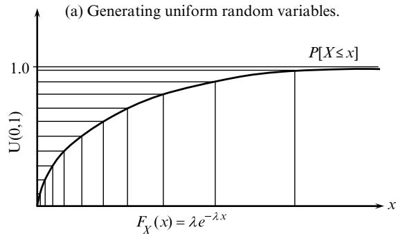  
(b) Generating exponentially-distributed random variables.

numbers. After generating a uniformly distributed random number in the interval [0,1] (denoted $U ( 0 , 1 )$ in the figure), we then map this number from the vertical axis to the horizontal axis. If we want to find a random number that is uniformly distributed between $a$ and $b$ , the cumulative distribution simply stretches (or compresses) the uniform (0,1) distribution over the range $( a , b )$ .

# 10.4.4 Inverse Cumulative From Quantile Distributions

This same idea can be used with a quantile distribution (which is a form of nonparametric distribution). Imagine that we compile our cumulative distribution from data. For example, we might be interested in a distribution of wind speeds. Imagine that we collect a large sample of observations $X _ { 1 } , \dots , X _ { n } , \dots , X _ { N }$ , and further assume that they are sorted so that $X _ { n } \leq X _ { n + 1 }$ . We would then let $F _ { X } ( x )$ be the percentage of observations that are less than or equal to $x$ . The inverse cumulative is computed by simply associating $f _ { n } = F _ { X } ( x _ { n } )$ with each observation $x _ { n }$ . Now, if we choose a uniform random number $U$ , we simply find the smallest value of $n$ such that $f _ { n } \leq U$ , and then output $X _ { n }$ as our generated random variable.

# 10.4.5 Distributions with Uncertain Parameters

Imagine that we have the problem of optimizing the price charged for an airline or hotel given the random requests from the market. It is reasonable to assume that the arrival process is described by a Poisson arrival process with rate ?? customers per day. However, in most settings we do not know ??.

One approach is to assume that ?? is described by yet another probability distribution. For example, we might assume that ?? follows a gamma-distribution, which is parameterized by $( k , \theta )$ . Now, instead of having to know ??, we just need to choose $( k , \theta )$ , which are referred to as hyperparameters. Introducing a belief on unknown parameters introduces more parameters for fitting a distribution. For example, if $\lambda$ is the expected number of arrivals per day, then the variance of the number of arrivals is also $\lambda$ , but it is quite likely that the variance is much higher. We can tune the hyperparameters $( k , \theta )$ so that we still match the mean but produce a variance closer to what we actually observe.

Consider, for example, the problem of sampling Poisson arrivals describing the process of booking rooms for a hotel for a particular date. For simplicity, we are going to assume that the booking rate is a constant $\lambda$ over the interval $[ 0 , T ]$ where $T$ is the date where people would actually stay in the room (in reality, this rate would vary over time). If $N _ { t }$ is the number of customers booking rooms on day $t$ , the probability distribution of $N _ { t }$ would be given by

$$
\mathbb {P} [ N _ {t} = i ] = \frac {\lambda^ {i} e ^ {- \lambda}}{i !}.
$$

We can generate random samples from this distribution using the methods presented earlier.

Now assume that we are uncertain about ??. We might assume that it has a beta distribution which is given by

$$
f (x: \alpha , \beta) = \frac {\Gamma (\alpha + \beta)}{\Gamma (\alpha) \Gamma (\beta)} x ^ {\alpha - 1} (1 - x) ^ {\beta - 1},
$$

where $\Gamma ( k ) = ( k - 1 ) !$ ! (if $k$ is integer). The beta distribution takes on a variety of shapes over the domain $0 \leq x \leq 1$ (check out the shapes on Wikipedia). Assume that when we observe bookings, we find that $N _ { t }$ has a mean $\mu$ and variance $\sigma ^ { 2 }$ . If the arrival rate $\lambda$ were known, we would have $\mu = \sigma ^ { 2 } = \lambda$ . However, in practice we often find that $\sigma ^ { 2 } > \mu$ , in which case we can view $\lambda$ as a random variable.

To find the mean and variance of $\lambda$ , we start by observing that

$$
\mathbb {E} N _ {t} = \mathbb {E} \{\mathbb {E} \{N _ {t} | \lambda \} \} = \mathbb {E} \lambda = \mu .
$$

Finding the variance of $\lambda$ is a bit harder. We start with the identity

$$
\begin{array}{l} \begin{array}{r c l} V a r N _ {t} & = & \sigma^ {2} \end{array} \\ = \mathbb {E} N _ {t} ^ {2} - (\mathbb {E} N _ {t}) ^ {2}. \tag {10.10} \\ \end{array}
$$

This allows us to write

$$
\begin{array}{l} \mathbb {E} N _ {t} ^ {2} = \operatorname {V a r} N _ {t} + (\mathbb {E} N _ {t}) ^ {2} \\ = \sigma^ {2} + \mu^ {2}. \\ \end{array}
$$

We then use

$$
\begin{array}{l} \mathbb {E} N _ {t} = \mathbb {E} \{\mathbb {E} \{N _ {t} | \lambda \} \} \\ = \mathbb {E} \lambda , \\ = \mu . \\ \end{array}
$$

$$
\begin{array}{l} \mathbb {E} N _ {t} ^ {2} = \mathbb {E} \{\mathbb {E} \{N _ {t} ^ {2} | \lambda \} \} \\ = \mathbb {E} \{\lambda + \lambda^ {2} \} \\ = \mu + (V a r \lambda + \mu^ {2}). \\ \end{array}
$$

We can now write

$$
\sigma^ {2} + \mu^ {2} = \mu + (V a r \lambda + \mu^ {2}),
$$

$$
\begin{array}{r l r} {V a r \lambda} & = & {\sigma^ {2} - \mu .} \end{array}
$$

So, given the mean $\mu$ and variance $\sigma ^ { 2 }$ of $N _ { t }$ , we can find the mean and variance of $\lambda$ .

The next challenge is to find the parameters $\alpha$ and $\beta$ of our beta distribution, which has mean and variance

$$
\mathbb {E} X = \frac {\alpha}{\alpha + \beta},
$$

$$
{ V a r X } { = } \frac { \alpha \beta } { ( \alpha + \beta ) ^ { 2 } ( \alpha + \beta + 1 ) } .
$$

We are going to leave as an exercise to the reader to decide how to pick $\alpha$ and $\beta$ so that the moments of our beta-distributed random variable $X$ match the moments of $\lambda$ .

The parameters $\alpha$ and $\beta$ are called hyperparameters as they are distributional parameters that describe the uncertainty in the arrival rate parameter ??. ?? and $\beta$ should be chosen so that the mean of the beta distribution closely matches the observed mean $\mu$ (which would be the mean of $\lambda$ ). Less critical is matching the variance, but it is important to reasonably replicate the variance $\sigma ^ { 2 }$ of $N _ { t }$ .

Once we have fit the beta distribution, we can run simulations by first simulating a value of ?? from the beta distribution. Then, given our sampled value of ?? (call it $\hat { \lambda }$ ), we would sample from our Poisson distribution using arrival rate $\hat { \lambda }$ .

# 10.5 Case Study: Modeling Electricity Prices

With the emphasis on renewables, there has been considerable interest in modeling the stochastic processes that arise in this setting. In this section, we will look at challenges that arise when modeling the price of electricity purchased from the grid, and the energy from a wind farm.

We begin with the problem of modeling real-time electricity prices, shown in Figure 10.2. These prices, taken from the grid operated by PJM Interconnections, which operates the grid serving the mid-Atlantic states in the United States. The prices are from February, 2015, and illustrate the well-known heavy-tailed behavior of electricity prices.

The most elementary model for prices is a basic random walk, given by

$$
p _ {t + 1} = p _ {t} + \varepsilon_ {t + 1}, \tag {10.11}
$$

where we typically assume that $\varepsilon _ { t + 1 } \sim N ( 0 , \sigma _ { \varepsilon } ^ { 2 } )$ , which is estimated from the sequence of observations of $p _ { t + 1 } - p _ { t }$ .

  
Figure 10.2 Electricity spot prices at 5-minute intervals in February 2015 for PJM Interconnections.

There are a number of problems with this model for applications such as electricity prices. The remainder of this section will suggest methods to improve the performance of this basic model.

# 10.5.1 Mean Reversion

The most popular stochastic model for prices is known most simply as a mean-reversion model, or, if you enjoy using jargon, the Ornstein-Uhlenbeck process. We start by tracking the mean of the process using a simple exponential smoothing model

$$
\bar {\mu} _ {t} = (1 - \eta) \bar {\mu} _ {t - 1} + \eta p _ {t},
$$

where $\eta$ is a stepsize (or smoothing factor, or learning rate) that smooths the price signal, which is typically a number in the range [.01, 0.10].

Given this estimate of the mean, the mean-reversion model is given by

$$
p _ {t + 1} = p _ {t} + \kappa \left(\bar {\mu} _ {t} - p _ {t}\right) + \varepsilon_ {t + 1}, \tag {10.12}
$$

where $\kappa$ is another smoothing coefficient that has to be calibrated to produce the best fit of estimated and actual prices. If $p _ { t }$ is greater than the estimate of the mean $\bar { \mu } _ { t }$ , the next price is pushed down. The noise term $\varepsilon _ { t + 1 }$ is typically assumed to be normally distributed with distribution $N ( 0 , \sigma _ { \varepsilon } ^ { 2 } )$ , where $\sigma _ { \varepsilon } ^ { 2 }$ is calculated from the differences between the estimated price $\bar { p } _ { t }$ given by

$$
\bar {p} _ {t} = p _ {t} + \kappa (\bar {\mu} _ {t} - p _ {t}),
$$

and the actual price $p _ { t + 1 }$

# 10.5.2 Jump-diffusion Models

A limitation of a basic mean-reversion model is that the distribution of $p _ { t + 1 }$ may not be well-described by a normal distribution (given $p _ { t }$ ). A simple fix is to use a “jump-diffusion” model, which uses two noise terms that we will call $\varepsilon ^ { \mathrm { b a s e } }$ and $\varepsilon ^ { \mathrm { j u m p } }$ . We only add the jump term for a small percentage of the time periods, given by $\rho ^ { \mathrm { j u m p } }$ . We accomplish this by introducing the indicator variable

$$
I _ {t} ^ {\mathrm {j u m p}} = \left\{ \begin{array}{l l} 1 & \text {w i t h p r o b a b i l i t y} \rho^ {\mathrm {j u m p}}, \\ 0 & \text {o t h e r w i s e}. \end{array} \right.
$$

We can now write our jump diffusion model as

$$
p _ {t + 1} = p _ {t} + \kappa \left(\bar {\mu} _ {t} - p _ {t}\right) + \varepsilon_ {t + 1} ^ {\text {b a s e}} + I _ {t + 1} ^ {\text {j u m p}} \varepsilon_ {t + 1} ^ {\text {j u m p}}. \tag {10.13}
$$

We estimate $\rho ^ { \mathrm { j u m p } }$ by starting with the basic mean-reversion model in equation (10.12), fitting the model, then estimating the variance $\sigma _ { \varepsilon } ^ { 2 }$ . Then, we

pick a tolerance (say three standard deviations), and classify any price $p _ { t + 1 }$ that differs from the predicted price $\bar { p } _ { t }$ by more than three standard deviations as falling outside of the base model. The fraction of prices falling in this range then gives us an initial estimate of $\rho ^ { \mathrm { j u m p } }$ .

We then estimate the distribution of the jump noise ??jump??+1 $\boldsymbol { \varepsilon } _ { t + 1 } ^ { \mathrm { j u m p } }$ jump by just using those points that fall outside of the three-sigma range, and also re-estimate the distribution of $\varepsilon _ { t + 1 } ^ { \mathrm { b a s e } }$ using only the prices that fall within the three-sigma range. Of course, the variance of the error distribution for this subset will be smaller than before. As a result, we would normally repeat the process using the jump diffusion model (10.13). This process might be repeated several times until the estimates stabilize.

The jump diffusion model produces an error

$$
\varepsilon_ {t + 1} = \varepsilon_ {t + 1} ^ {\text {b a s e}} + I _ {t + 1} ^ {\text {j u m p}} \varepsilon_ {t + 1} ^ {\text {j u m p}}
$$

that will better approximate heavy-tailed behavior than a simple normal distribution.

# 10.5.3 Quantile Distributions

A common problem in many applications (such as electricity prices) is asymmetric distributions. The largest prices are much larger relative to the mean than the smallest prices. The same is also true with energy from wind, since gusts of wind can be much larger relative to the mean than zero, which is the smallest wind speed. In addition, choosing a parametric distribution that fits either of these processes is challenging.

An alternative approach to using parametric distributions such as the normal is to compile the cumulative distribution of errors directly from the data. A quantile distribution is shown in Figure 10.3, which illustrates its ability to capture asymmetric, heavy-tailed behavior. This is a form of nonparametric distribution (which is also a lookup table), since you have to store $F _ { X } ( x )$ for each possible value of ??. So, if prices range from 0 to $\$ 1,000$ , and we want to store the cumulative distribution in increments of 0.10, we need a table with possibly 10,000 different values (although we only have to store the cumulative distribution for prices we actually observe).

It is relatively easy to store the cumulative distribution in a more compact way. The bigger problem is when the distribution depends on other variables such as temperature and humidity. If we divide temperature into 10 ranges, and humidity into 10 ranges, then we have 100 combinations of temperature and humidity, and we would need to compute a cumulative distribution for each of these 100 combinations (this is a classic curse-of-dimensionality since we are using a lookup table for temperature and humidity). Parametric distributions

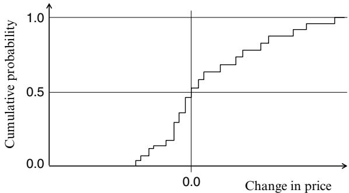  
Figure 10.3 Illustration of a quantile distribution for changes in prices.

may offer more compact strategies for incorporating additional dependent variables, but this is generally not possible when using lookup tables (that is, the quantile distributions).

All the methods above focus on getting a better representation of the distribution of errors, but ignore the correlations across time. High electricity prices tend to come in bursts, correlated with hot days where temperatures stay high for periods of time. We propose two approaches, regime shifting and crossing times, that address this issue.

# 10.5.4 Regime Shifting

A powerful strategy is to identify “regimes” that describe different ranges of our random variable (such as price). For example, we may divide prices into five ranges, or regimes. Each regime might be associated with combinations of temperature and humidity (or any other exogenous variable), or it can be ranges of prices.

First, we compute the distributions we are interested in (such as the change of price) indexed by regime. So, rather than enumerating 100 combinations of temperature and humidity, we could group these into 5 or 10 buckets that we think best explain prices. Number the regimes $s _ { 1 } , \ldots , s _ { K }$ and let $\operatorname { \mathcal { S } } ^ { \mathrm { r e g i m e } }$ be the set of regimes. Then, we have two tasks:

● Compute error distributions (and any other quantities) using any methodology indexed by the regime you are in. These distributions may be parametric or nonparametric (e.g. quantiles), using any of the modeling strategies described above.   
● Add up the number of times $f _ { s _ { k } , s _ { \ell } }$ that you transition from regime $s _ { k }$ to regime $s _ { \ell }$ , and then normalize these to obtain the transition probabilities

$$
P _ {s _ {k}, s _ {\ell}} ^ {\text {r e g i m e}} = \operatorname {P r o b} \left[ S _ {t + 1} ^ {\text {r e g i m e}} = s _ {\ell} \mid S _ {t} ^ {\text {r e g i m e}} = s _ {k} \right]. \tag {10.14}
$$

Both of these sets of calculations are performed while stepping forward in time through historical data. If your regimes depend on other variables (such as humidity and temperature), then you will need this historical data as well.

Regime shifting is a form of indexed modeling, which can be thought of as a nonparametric modeling strategy. It depends on being able to identify a reasonably small number of regimes, and simplifies modeling by allowing us to fit models that work for individual regimes, rather than globally over the entire dataset.

Regime shifting also gives us another critical feature. Our jump diffusion model, for example, assumed that the jump indicator variable $I _ { t } ^ { \mathrm { i u m p } }$ was independent across time periods. However, looking at the price plot in Figure 10.2, we see that there are bursts of higher prices. We can capture these bursts, to a degree, since ??regime?? ,?? $P _ { s _ { k } , s _ { k } } ^ { \mathrm { r e g i m e } }$ will be the probability that we stay in regime $s _ { k }$ , allowing us to capture a certain level of persistence.

# 10.5.5 Crossing Times

An important characteristic when modeling stochastic processes is not just capturing whether the forecast is above or below the actual, but how long it stays above or below. This is important in many settings. For example, if the price of electricity stays high for a period of time, then a utility that has to pay this price may run out of cash reserves.

We are going to use the context of simulating energy from wind. Figure 10.4 shows a sample path of actual energy from wind, along side the forecast (made, say, at noon the day before). The figure shows two time intervals: the first where the actual is below the forecast, called a “down-crossing time,” and the second where the forecast is above the forecast, called the “up-crossing time.” These “crossing times” are periods where the actual is continuously below or above the forecast.

We are going to build on the methods we have described above in this section to develop a more sophisticated method for replicating how long stochastic processes stay at higher or lower levels, although this time we are going to use energy from a wind farm, where we are trying to model the errors relative to a forecast of the wind energy.

Our modeling strategy uses the following ideas:

(a) As we step forward in time through the historical dataset, each time the actual crosses from above (below) the forecast to below (above) the forecast, we are going to compute the time that the actual was above or below the forecast, and classify that into a set of ranges (say three, for short (S),

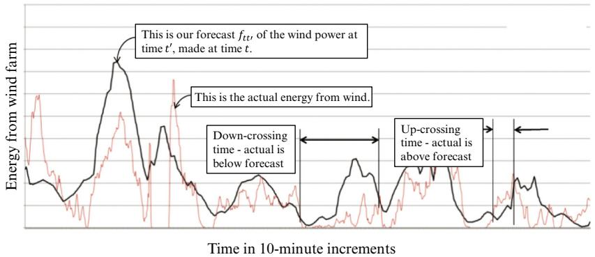  
Figure 10.4 Actual vs. predicted energy from wind, showing up- and down-crossings.

medium (M) or long (L)), that we will treat like regimes which consist of whether the actual was above or below (call this A or B), and then which of the time ranges that the length of the interval falls in (S, M, or L). If there are three time ranges, then there are six regimes, giving us $\mathcal { S } ^ { \mathrm { r e g i m e } } = \left\{ A - S , A - M , A - L , B - S , B - M , B - L \right\}$ .

(b) Each time we determine we have come to the end of a crossing time, we update (a) our frequency counter $f _ { s _ { k } , s _ { \ell } }$ for $s _ { k } , s _ { \ell } \in \mathcal { S } ^ { \mathrm { r e g i m e } }$ and (b) the frequency distribution for how long the interval lasted given the regime it was in. After normalization we obtain the regime transition matrix ??regime?? ,?? $P _ { s _ { k } , s _ { \ell } } ^ { \mathrm { r e g i m e } }$ and the distribution of the length of each crossing time given the regime $S ^ { \mathrm { r e g i m e } }$ .   
(c) For each time period where we know $S _ { t } ^ { \mathrm { r e g i m e } }$ , aggregate the energy from wind, $E _ { t }$ , into a set of ranges (say five), and call this set ℰ.   
(d) Given the aggregated energy from wind at time $t , E _ { t } ^ { g } \in \mathcal { E }$ , and the crossing state $i \in \mathcal I$ , observe the energy $E _ { t + 1 }$ (which is not aggregated) and compile a cumulative distribution of $E _ { t + 1 }$ given the crossing state ?? and aggregated wind state $E _ { t } ^ { g }$ . This distribution will look like the distribution in Figure 10.3. So, if we have six crossing states and five aggregated wind speeds, this gives us 30 states, which means we are creating 30 wind speed cumulative distributions. The result of this calculation is the distribution

$$
P _ {w} ^ {W} (e, s) = P r o b [ W _ {t + 1} | E _ {t} ^ {\mathrm {g}} = e, S _ {t} ^ {\mathrm {r e g i m e}} = s ].
$$

This logic is quite powerful. We now have the ability to explicitly model the distribution of how long the actual data stream (wind speed in this case) stays above or below a baseline (the wind speed forecast). In other applications, the baseline could be just an average.

# 10.6 Sampling vs. Sampled Models

Monte Carlo sampling is without question the most powerful tool in our toolbox for dealing with uncertainty. In this section, we illustrate three ways of performing Monte Carlo sampling: (1) iterative sampling, (2) solving a static, sampled model, and (3) sequentially solving a sampled model with adaptive learning.

# 10.6.1 Iterative Sampling: A Stochastic Gradient Algorithm

Imagine that we are interested in solving the problem

$$
\begin{array}{l} F (x) = \mathbb {E} F (x, W) (10.15) \\ = \mathbb {E} \{p \min  \{x, \hat {D} \} - c x \}, (10.16) \\ \end{array}
$$

where $W = { \hat { D } } ( \omega )$ is a sample realization of the demand $\hat { D }$ , drawn from a full set of outcomes $\Omega$ . We could search for the best $x$ using a classical stochastic gradient algorithm such as

$$
x ^ {n + 1} = x ^ {n} + \alpha_ {n} \nabla_ {x} F \left(x ^ {n}, \hat {D} \left(\omega^ {n + 1}\right)\right), \tag {10.17}
$$

where

$$
\nabla_ {x} F (x, \hat {D}) = \left\{ \begin{array}{l l} p - c & x > \hat {D}, \\ - c & x \leq \hat {D}. \end{array} \right. \tag {10.18}
$$

$\nabla _ { x } F ( x , \hat { D } )$ is called a stochastic gradient because it depends on the random variable $\hat { D }$ . Under some conditions (for example, the stepsize $\alpha _ { n }$ needs to go to zero, but not too quickly), we can prove that this algorithm will asymptotically converge to the optimal solution.

# 10.6.2 Static Sampling: Solving a Sampled Model

A sampled version of this problem, on the other hand, involves picking a sample $\hat { \Omega } = \{ \omega ^ { 1 } , \ldots , \omega ^ { N } \}$ . We then solve

$$
\bar {\theta} ^ {N} = \arg \min  _ {\theta} \frac {1}{N} \sum_ {n = 1} ^ {N} F (\theta | \omega^ {n}). \tag {10.19}
$$

This is actually a deterministic problem (known in some communities as the sample average approximation), although one that is much larger than the original stochastic problem (see section 4.3 for a more complete discussion). For many applications, equation (10.19) can be solved using a deterministic solver, although the problem may be quite large. The stochastic gradient update

(10.17) can be much easier to compute than solving the sampled problem (10.19).

The quality of the solution to (10.19) compared to the optimal solution of the original problem (10.15) depends on the application, but as we saw in section 4.3.2, the rate of convergence of $\bar { \theta } ^ { N }$ to the optimal ?? (for an infinite sample) is actually quite fast.

In practice, stochastic gradient algorithms require tuning the stepsize sequence $\alpha _ { n }$ which can be quite frustrating. On the other hand, stochastic gradient algorithms can be implemented in an online fashion (e.g. through field observations) while the objective (10.19) is a strictly offline approach. There is a rich theory showing that the optimal solution of (10.19), $x ^ { N }$ , asymptotically approaches the true optimal (that is, the solution of the original problem (10.15)) as $N$ goes to infinity, but the algorithm is always applied to a static sample $\hat { \Omega }$ . Unlike our stochastic gradient algorithm in the previous section, there is no notion of asymptotic convergence (although in practice we will typically stop our stochastic gradient algorithm after a fixed number of iterations).

# 10.6.3 Sampled Representation with Bayesian Updating

We close our discussion with an illustration of using a sampled model where we are uncertain about the parameters of the model. We then run experiments sequentially and update our belief about the probability that each sampled parameter value is correct.

Imagine, for example, that we we are solving a stochastic revenue management problem for airlines where we assume that the customers arrive according to a Poisson process with rate ??. The problem is that we are not sure of the arrival rate ??. We assume that the true arrival rate is one of a set of values $\lambda _ { t } ^ { 1 } , \ldots , \lambda _ { t } ^ { K }$ , where each is true with probability $q _ { t } ^ { k }$ . The vector $q _ { t }$ captures our belief about the true parameters, and can be updated using a simple application of Bayes theorem.

Now let $N ( \lambda )$ be a Poisson random variable with mean $\lambda$ , and let $N _ { t + 1 }$ be the observed number of arrivals between $t$ and $t + 1$ . We can update $q _ { t }$ using

$$
q _ {t + 1} ^ {k} = \frac {\mathbb {P} (N (\lambda) = N _ {t + 1} | \lambda = \lambda^ {k}) q _ {t} ^ {k}}{\sum_ {\ell = 1} ^ {K} q _ {t} ^ {\ell} \mathbb {P} (N (\lambda) = N _ {t + 1} | \lambda = \lambda^ {\ell})},
$$

where

$$
\mathbb {P} (N (\lambda) = N _ {t + 1} | \lambda = \lambda^ {\ell}) = \frac {(\lambda^ {\ell}) ^ {N _ {t + 1}} e ^ {\lambda^ {\ell}}}{N _ {t + 1} !}.
$$

The idea of using a sampled set of parameters is quite powerful, and extends to higher dimensional distributions. However, identifying an appropriate sample of parameters becomes harder as the number of parameters increases.

# 10.7 Closing Notes

We could have dedicated this entire book to methods for modeling stochastic systems without any reference to decisions or optimization. The study of stochastic systems can be found under names including Monte Carlo simulation and uncertainty quantification, with significant contributions from communities that include statistics, stochastic search, simulation optimization, and stochastic programming. This chapter is designed only to provide an indication of some of the topics that a reader will encounter when developing a sequential decision model.

There are a wide range of problems in energy, supply chain management, engineering and health where the process of designing a stochastic model of different sources of uncertainty is quite likely going to be harder than designing an effective policy (although this is not to minimize the importance of effective policies). As we now transition to chapter 11 on designing policies, we encourage the reader to think of developing a stochastic model and an associated policy as an iterative process. The four classes of policies are of increasing complexity, and you may want to get a simpler policy working for the purpose of testing your software while you are building a more sophisticated uncertainty model.

# 10.8 Bibliographic Notes

Section 10.1 – Our identification of the different sources of uncertainty from the perspective of a model is new.

Section 10.3 – Stochastic modeling is a rich and mature field of study with a long history. For example, there is a field called uncertainty quantification; see Smith (2014) and Sullivan (2015) for modern introductions. Stochastic modeling is a term that is often associated with Monte Carlo simulation (see the next section).

Section 10.4 – Monte Carlo simulation is a field with a deep and rich history, starting with the basic idea of using a computer to generate seemingly random numbers. The field has matured to address all the dimensions of modeling stochastic systems. Some examples of excellent introductions are Nelson (2013), Carsey and Harden (2014), Law (2007), and Thomopoulos (2013). For a rigorous treatment of the mathematics of simulation can be

found in Asmussen and Glynn (2007). There are a number of books describing these methods in the context of specific fields. For example, Glasserman (2004) and McLeish (2005) describe simulation methods for finance, while Carsey and Harden (2014) presents the methods in the context of the social sciences.

# Exercises

# Review Questions

10.1 Section 10.5 describes a series of models: mean reversion, jump diffusion, quantile distributions, regime shifting, and crossing times. Very briefly summarize the specific feature that each of these strategies contributes relative to the most basic random walk model

$$
p _ {t + 1} = p _ {t} + \varepsilon_ {t + 1}
$$

where $\varepsilon _ { t + 1 } \sim N ( 0 , \sigma _ { \varepsilon } ^ { 2 } )$

10.2 Section 10.5.5 models “crossing times” for a stochastic process.

(a) Describe what is meant by a “crossing time.”   
(b) The methodology is described as a form of regime shifting. What is the set of regimes introduced for the problem of modeling wind energy?

# Modeling Questions

10.3 For each of the forms of uncertainty below, list the category (or categories) from section 10.1 that best describe the form of uncertainty:

(a) The response of a patient to a new drug.   
(b) The energy that will be generated by a wind farm over the next hour, $E _ { t + 1 }$ , given the observation of wind over each of the previous six hours, $E _ { t } , E _ { t - 1 } , E _ { t - 5 }$ , and the fitted linear model:

$$
E _ {t + 1} = \theta_ {0} E _ {t} + \ldots + \theta_ {5} E _ {t - 5} + \varepsilon_ {t + 1}.
$$

(c) The number of people who say they will vote for a candidate running for office in a telephone poll of 100 people.   
(d) The estimated location of a ship calculated using a radar signal, which might incur distortions from weather.   
(e) The performance of a dispatcher for a trucking company assigning drivers to loads.

(f) The tariffs to be paid for parts imported from another country next year.   
(g) The number of units of inventory transferred from one store to another as instructed by a central manager.   
(h) The performance of each member in a team managing a portfolio of physical assets.   
(i) The change in market price when a large mutual fund decides to sell a large number of shares in a stock (enough to affect the market).

# Computational Exercises

Exercises 10.4 to 10.10 all use the electricity price data that can be downloaded from the supplementary materials website http://tinyurl. com/RLSOsupplementary, “Spreadsheet of electricity price data” (under Chapter 10). Use the tab for the February price data.

10.4 Electricity prices tend to be very random, with very large spikes. Start by assuming that electricity prices $p _ { t }$ (where ?? steps forward in 5-minute increments) are coming from an exponential distribution, which means we can write

$$
p _ {t} \sim \lambda e ^ {- \lambda y}.
$$

Assume that $p _ { t }$ is independent of $p _ { t + 1 }$ . There are 288 five-minute time periods in a day.

(a) Use the computed average price $\bar { p }$ (given in the spreadsheet) to compute $\lambda = 1 / \bar { p }$ . Then, use the cumulative distribution to compute the expected number of prices (out of the 8064 time periods in February) should be above 100, 200, . . . , 500. Compare this to the actual number of prices above each of these values (use the yellow highlighted cell to enter these values to get both the expected number of prices that are over these values, and the actual number). What pattern do you see?   
(b) Show how to perform a sample realization from an exponential distribution using the ability of a computer to generate a random variable $U$ that is uniformly distributed between 0 and 1.   
(c) Simulate 8064 observations of prices, and plot them as we have plotted the actual prices. How do the two graphs compare?

10.5 Using the spreadsheet for electricity prices, fit a random walk model (equation (10.11)), where you will have to estimate the variance of $\varepsilon _ { t + 1 }$

from the 8064 prices. Generate a sample of 8064 prices using this model, and compare to the actual historical prices. How would you characterize the similarities, and differences, between the two sets of prices?

10.6 Again using the spreadsheet for electricity prices, fit a mean reversion model, where you will have to tune $\kappa$ (do this using trial and error) to find them model that fits the best. Use $\eta \ : = \ : 0 . 1 0$ in your smoothing model for ${ { \bar { \mu } } _ { t } }$ . You will also need to use the model to estimate the variance of $\varepsilon _ { t + 1 }$ . Finally, generate another sample of 8064 prices and compare the results to the actual prices.   
10.7 Follow the instructions in section 10.5.2 to fit a jump diffusion model, and compare the results to the historical data.   
10.8 Use the basic random walk model in equation (10.11) to compute the errors, and then fit a quantile distribution using price increments of $\$ 1$ . Again, simulate the 8064 prices from this model, and compare the patterns with the historical model, as well as the prices from the random walk model (and other methods that you may have implemented above).   
10.9 Divide the range of prices into five ranges of your choosing (these may be of equal size, but you may wish to experiment with different sizes, given the wide range of prices). Compute the regime shifting probability distribution ??regime????,???? d $P _ { s _ { k } , s _ { \ell } } ^ { \mathrm { r e g i m e } }$ efined in equation (10.14). Now fit a normal distribution for the change in prices for each region. Finally, simulate the evolution of regimes, and then draw a random price for the random distribution in each regime. Compare your results to the historical prices.   
10.10 Use the steps described in section 10.5.5 to estimate the regime transition probabilities and the conditional wind distributions $P r o b [ W _ { t + 1 } | E _ { t } ^ { g } ~ = ~ e , S _ { t } ^ { \mathrm { r e g i m e } } ~ = ~ s ]$ . Finally, use these distributions to simulate electricity prices, and compare the resulting sample (over the 8064 time periods) to history.

# Theory Questions

10.11 Let $X$ be a random variable (any random variable with finite variance) and let $F _ { X } ( x )$ be the cumulative distribution, which means $F _ { X } ( x ) = P r o b [ X \leq x ]$ . Let $F ^ { - 1 } ( u )$ , where $0 \leq u \leq 1$ , be the inverse cumulative distribution, where $u \ = \ P r o b [ X \ \leq \ F ^ { - 1 } ( u ) ]$ . Show that the random variable $U$ where $U = F ^ { - 1 } ( X )$ is uniformly distributed between 0 and 1.

# Sequential Decision Analytics and Modeling

These exercises are drawn from the online book Sequential Decision Analytics and Modeling available at http://tinyurl.com/sdaexamplesprint.

10.12 Read chapter 8, sections 8.1–8.4, but our focus will be on the uncertainty modeling in section 8.3, which describes three ways of modeling uncertainty in the forecast. Describe each method in detail, and discuss the strengths and weaknesses of each method.   
10.13 Read chapter 9, sections 9.1–9.4, but our focus will be on the uncertainty modeling in section 9.3, which describes two ways of modeling uncertainty in the forecast. Describe each method in detail, and discuss the strengths and weaknesses of each method.

# Diary Problem

The diary problem is a single problem you chose (see chapter 1 for guidelines). Answer the following for your diary problem.

10.14 Create your own version of Table 10.1 by listing the different categories of uncertainty, and then list the types of uncertainty in your diary problem (if any) that belong to each category. You may feel that a type of uncertainty in your problem can be listed in more than one category.

# Bibliography

Asmussen, S. and Glynn, P.W. (2007). Stochastic Simulation: Algorithms and Analysis. Springer Science & Business Media.   
Carsey, T.M. and Harden, J.J. (2014). Monte Carlo Simulation and Resampling Methods for Social Science. Sage Publications.   
Glasserman, P. (2004). Monte Carlo Methods in Financial Engineering. New York: SpringerVerlag.   
Law, A.M. (2007). Simulation Modeling and Analysis. New York: McGraw-Hill.   
McLeish, D.L. (2005). Monte Carlo Simulation and Finance. New York: John Wiley & Sons.   
Nelson, B.L. (2013). Foundations and Methods of Stochastic Simulation: A first course. New York: Springer.   
Smith, R.C. (2014). Uncertainty Quantification: Theory, Implementation, and Applications. Philadelphia: SIAM.

Sullivan, T. (2015). Introduction to Uncertainty Quantification. New York: Springer.   
Thomopoulos, N. (2013). Essentials of Monte Carlo Simulation: Statistical methods for building simulation models. New York: Springer.

#

# Designing Policies

Now that we have learned how to model a sequential decision problem and simulate an exogenous process $W _ { 1 } , \dots , W _ { t } , \dots$ , we return to the challenge of finding a policy that solves our objective function from chapter 9

$$
\max  _ {\pi \in \Pi} \mathbb {E} \left\{\sum_ {t = 0} ^ {T} C _ {t} \left(S _ {t}, X _ {t} ^ {\pi} \left(S _ {t}\right)\right) \mid S _ {0} \right\}. \tag {11.1}
$$

This objective function has been the basis of our “model first, then solve” approach. But now it is time to solve. This leaves us with the question: How in the world do we search over some arbitrary class of policies?

This is precisely the reason that this form of the objective function is popular with mathematicians who do not care about computation, or in communities where it is already clear what type of policy is being used. However, equation (11.1) is not widely used, and we believe the reason is that there has not been a natural path to computation. In fact, entire fields have emerged which focus on particular classes of policies.

In this chapter, we address the problem of searching over policies in a general way. Our approach is quite practical in that we organize our search using classes of policies that are widely used either in practice or in the research literature. Instead of focusing on a particular hammer looking for a nail, we cover all four classes of policies, with the knowledge that when you settle on an approach, it will come from one of the four classes, or possibly a hybrid of two (or more).

We start by clarifying one area of confusion, which is the precise meaning of the term “policy” which is popular only in certain communities. A simple definition of a policy is:

Definition 11.0.1. A policy is a method that determines a decision given the information in state ????... any method.

The “any method” is included to counteract the assumption by many that “policy” refers specifically and narrowly to analytical functions, which is just one of our four classes of policies.

“Policies” arise in so many settings in human behavior that it should not be surprising that there are many words that have the same meaning. Table 11.1 provides 45 different examples from the English language.

The problem with the concept of a policy is that it refers to any method for determining a decision given a state, and as a result it covers a wide range of algorithmic strategies, each suited to different problems with different computational requirements. Chapter 7 was the first time that we actually saw all four classes of policies applied in the context of derivative-free stochastic optimization, where there are entire research fields dedicated to each of the four classes. The reason that one of these four classes has not emerged as the best reflects the diversity of problems even within this specific problem class. As we move to the much larger class of state-dependent problems, the diversity of applications becomes even broader.

In this chapter, we are going to revisit the four classes of policies (which we first saw in chapters 1, 4, and 7) in greater depth. The hope is that after finishing this chapter, a reader looking to solve a particular problem might have an idea of which one (or two) classes of policies might be best suited for a particular

Table 11.1 Words from the English language that describe methods for making decisions.   

<table><tr><td>Algorithm</td><td>Format</td><td>Prejudice</td></tr><tr><td>Behavior</td><td>Formula</td><td>Principle</td></tr><tr><td>Belief</td><td>Grammar</td><td>Procedure</td></tr><tr><td>Bias</td><td>Habit</td><td>Process</td></tr><tr><td>Canon</td><td>Laws/bylaws</td><td>Protocols</td></tr><tr><td>Code</td><td>Manner</td><td>Recipe</td></tr><tr><td>Commandment</td><td>Method</td><td>Ritual</td></tr><tr><td>Conduct</td><td>Mode</td><td>Rule</td></tr><tr><td>Control law</td><td>Mores</td><td>Style</td></tr><tr><td>Convention</td><td>Orthodoxy</td><td>Syntax</td></tr><tr><td>Culture</td><td>Patterns</td><td>Technique</td></tr><tr><td>Customs</td><td>Plans</td><td>Template</td></tr><tr><td>Duty</td><td>Policies</td><td>Tenet</td></tr><tr><td>Etiquette</td><td>Practice</td><td>Tradition</td></tr><tr><td>Fashion</td><td>Precedent</td><td>Way of life</td></tr></table>

problem. For readers looking to simply build up their toolbox of methods, this chapter will serve as an introduction to the four classes, with some guidance how to choose among them. Then we are going to spend chapters 12–19 looking into the four classes in even more detail.

We are going to start by describing a spectrum of problems ranging from (deterministic) optimization to machine learning, and then we are going to contrast our problem of searching for the best policy to the search problems that these other problem areas pose.

# 11.1 From Optimization to Machine Learning to Sequential Decision Problems

If we have a linear programming problem, anyone with training in deterministic optimization would write down a model that looks like

$$
\min  _ {x} c ^ {T} x
$$

subject to

$$
\begin{array}{l} A x = b, \\ x \geq 0. \\ \end{array}
$$

In real applications, the challenge is creating the $A$ -matrix, but this process is well understood, and there are computer packages that can take these models and solve them, even when $x$ is a vector with thousands, even hundreds of thousands, of variables (or dimensions). Formal training in linear programming is no longer a prerequisite; the users manuals for popular computer packages such as Gurobi and Cplex are sufficient to get you started.

Just as popular is the format used for deterministic optimal control, where we have to manage a system over time by choosing a set of controls $u _ { 0 } , u _ { 1 } , \ldots , u _ { T }$ (imagine the forces on a vehicle such as landing a SpaceX rocket) to minimize a loss function $L ( x _ { t } , u _ { t } )$ when the system is in “state” $x _ { t }$ (for example, the location and velocity of our rocket). The canonical control problem would be written

$$
\min  _ {u _ {0}, \dots , u _ {T}} \sum_ {t = 0} ^ {T} L \left(x _ {t}, u _ {t}\right), \tag {11.2}
$$

where the state $x _ { t }$ (this is standard notation in this community) evolves according to a transition function which is written

$$
x _ {t + 1} = f \left(x _ {t}, u _ {t}\right). \tag {11.3}
$$

The controls may be subject to constraints. Again, there are standard packages for solving versions of this problem.

A different problem that is very relevant to our work arises in machine learning, where we want to find a function (typically called a “statistical model”) $f ( x | \theta )$ , that minimizes the error between observed inputs $x ^ { n }$ and the corresponding output $y ^ { n }$ for a training dataset $( x ^ { n } , y ^ { n } ) , n = 1 , \dots , N$ . For example, a linear model would be written

$$
y = \theta_ {0} + \theta_ {1} \phi_ {1} (x) + \theta_ {2} \phi_ {2} (x) + \dots + \varepsilon , \tag {11.4}
$$

where $\phi _ { f } ( x )$ is a feature of the input data $x$ . Let $f \in \mathcal F$ be a family of functions (models), where $f$ might specify the structure (such as the linear model in (11.4)) and the features $( \phi _ { f } ( x ) )$ . Next let $\ b \in \Theta ^ { f }$ be the tunable parameters associated with model $f$ . Our optimization problem is to find the best function (model), and the best parameters $\boldsymbol { \theta }$ associated with the function, a problem we write as

$$
\min  _ {f \in \mathcal {F}, \theta \in \Theta^ {f}} \sum_ {n = 1} ^ {N} \left(y ^ {n} - f \left(x ^ {n} \mid \theta\right)\right) ^ {2}. \tag {11.5}
$$

Here we see an optimization problem written in terms of optimizing over functions, along with any parameters for that function. For machine learning applications, $\mathcal { F }$ covers lookup tables, parametric models, and nonparametric models, and all the choices within these sets (as we covered in chapter 3).

These models are very standard. Readers trained in any of these fields would recognize these models, and would have access to software libraries designed to solve them. These modeling languages are spoken around the world.

The optimization for sequential decision problems, given by equation (11.1), involves searching over policies, which parallels the search over functions in machine learning (“policies” are all examples of functions). However, policies span a much wider range of functions. For example, we are going to see that the first of our four classes of policies include every class of function that we might consider in machine learning.

# 11.2 The Classes of Policies

There are two fundamental strategies for creating policies, each of which can be further divided into two classes, creating our four classes of policies. The two strategies are given by:

Policy search – Here we are using equation (11.1) directly to search over (a) classes of functions and (b) parameters that characterize a particular class of function.

Lookahead approximations – These are policies that approximate (sometimes exactly) the downstream value of an action taken now.

Both of these can lead to optimal policies under certain circumstances, but only in special cases where we can exploit structure. Since these are relatively rare, a variety of approximation strategies have evolved.

Policy search is based on the principle of assuming that the policy $X ^ { \pi } ( S _ { t } | \theta )$ belongs to some class of functions, which are typically parametric, but may be nonparametric (that is, locally parametric). Let the set $f \in \mathcal F$ capture the structure of the function, and let $\ b \in \Theta ^ { f }$ be the tunable parameters associated with each function. The design of the set $\mathcal { F }$ and the choice of $f \in \mathcal F$ is often (not always) more art than science. We let $\pi = ( f \in { \mathcal { F } } , \theta \in \Theta ^ { f } )$ describe both the type of function and the parameters.

The policy search problem can be written generally as

$$
\max  _ {\pi = \left(f \in \mathcal {F}, \theta \in \Theta^ {f}\right)} \mathbb {E} _ {S _ {0}} \mathbb {E} _ {W _ {1}, \dots , W _ {T} \mid S _ {0}} \left\{\sum_ {t = 0} ^ {T} C \left(S _ {t}, X ^ {\pi} \left(S _ {t} \mid \theta\right)\right) \mid S _ {0} \right\}. \tag {11.6}
$$

Note that we can use any of our family of objective functions (cumulative reward, final reward) and uncertainty operators (described in section 9.8.5) such as expectation (the most common), max-min (robust optimization), or any of the risk measures that emphasize the tails of the distribution.

There are two class of policies within the policy search class:

Policy function approximations (PFAs) – These are analytical functions that map a state to a feasible action. These functions can be any of the three classes of functions we introduced in chapter 3:

Lookup tables – Also referred to as tabular functions, lookup tables mean that we have a discrete decision $X ^ { \pi } ( S )$ for each discrete state ??.

Parametric representations – These are explicit, analytical functions for $X ^ { \pi } ( S )$ which generally involve a vector of parameters that we typically represent by ??. Thus, we might write our policy as

$$
X (S | \theta) = \sum_ {f \in \mathcal {F}} \theta_ {f} \phi_ {f} (S)
$$

where $\phi _ { f } ( S )$ , $f \in \mathcal F$ is a set of features tuned for approximating the value function or the policy. Neural networks are a class of parametric

functions (see section 3.9.3) that are popular in the engineering controls community, where they may be used to approximate either the policy or the value function.

Nonparametric representations – Nonparametric representations offer a more general way of representing functions, but at a price of greater complexity.

PFAs are typically limited to discrete actions, or low-dimensional (and typically continuous) vectors. Note that PFAs include all the classes of statistical models such as those reviewed in chapter 3. PFAs are presented in chapter 12.

Cost function approximations (CFAs) – These are parameterized optimization models where we may use a parameterized modification of the objective function, subject to a (possibly parameterized) approximation of the constraints. CFAs are optimization problems which could be a simple sort (such as the UCB policies introduced in chapter 7), or it could involve solving large linear or integer programs such as scheduling an airline or planning a supply chain. CFAs have the general form

$$
X^{CFA}(S_{t}|\theta) = \arg \max_{x\in \mathcal{X}_{t}(\theta)}\bar{C}_{t}(S_{t},x|\theta),
$$

where $\bar { C } _ { t } ( S _ { t } , x | \theta )$ is a parametrically modified cost function, subject to a parametrically modified set of constraints. CFAs are covered in chapter 13.

Lookahead policies are based on trying to solve what will at first look like a rather frightening expression:

$$
X _ {t} ^ {*} \left(S _ {t}\right) = \arg \max  _ {x _ {t}} \left(C \left(S _ {t}, x _ {t}\right) + \mathbb {E} \left\{\max  _ {\pi} \mathbb {E} \left\{\sum_ {t ^ {\prime} = t + 1} ^ {T} C \left(S _ {t ^ {\prime}}, X _ {t ^ {\prime}} ^ {\pi} \left(S _ {t ^ {\prime}}\right)\right) \mid S _ {t + 1} \right\} \mid S _ {t}, x _ {t} \right\}\right). \tag {11.7}
$$

It should not come as a surprise that we cannot compute this, so we turn to approximations. There are two broad classes of approximation strategies, which are given by:

Value function approximations (VFAs) – These are policies based on an approximation of the value of being in a state. These have the general form

$$
X ^ {V F A} \left(S _ {t} | \theta\right) = \arg \max  _ {x \in \mathcal {X} _ {t}} \left(C \left(S _ {t}, x\right) + \mathbb {E} \left\{\bar {V} _ {t + 1} \left(S _ {t + 1} | \theta\right) \mid S _ {t}, x _ {t} \right\}\right) \tag {11.8}
$$

where $\overline { { V } } _ { t + 1 } ) ( S _ { t + 1 } )$ is an approximation of the value of being in state $S _ { t + 1 }$

VFAs represent a rich and challenging algorithmic strategy that we cover in chapters 14–18.

Direct lookahead policies (DLAs) – This last class of policies directly solves an approximate version of the lookahead policy in equation (11.6). There

are a variety of strategies for creating an approximate lookahead model. The most common approximation is to use a deterministic lookahead, but there are many applications where this would be too strong of an approximation. Stochastic lookaheads are such a rich problem class that there are entire fields dedicated to specific strategies for solving even approximate versions of stochastic lookaheads. Direct lookahead policies are covered in chapter 19.

Combined, these create four classes of policies (more precisely, these are metaclasses) that encompass every algorithmic strategy that has been proposed for any sequential stochastic optimization problem. We claim that these classes cover any heuristic methods already used in practice, as well as everything covered in the research literature.

Some observations:

● The first three classes of policies (PFAs, CFAs, and VFAs) introduce four different types of functions we might approximate (we first saw these in chapter 3). These include (1) approximating the function we are maximizing $\mathbb { E } F ( x , W )$ , (2) the policy $X ^ { \pi } ( S )$ , (3) the objective function or constraints, or (4) the downstream value of being in a state $V _ { t } ( S _ { t } )$ . Function approximation plays an important role in stochastic optimization, and this brings in the disciplines of statistics and machine learning.   
● The class of functions in the PFA class is precisely the set of three classes of approximating architectures from machine learning: lookup tables, parametric, and nonparametric. The only difference between machine learning and searching for the best PFA policy is the objective function. Machine learning uses a training dataset $( x ^ { n } , y ^ { n } ) , n = 1 , \dots , N$ to solve

$$
\min_{f\in \mathcal{F},\theta \in \Theta^{f}}\sum_{n = 1}^{N}(y^{n} - f(x^{n}|\theta))^{2},
$$

which requires a training dataset. Policy search requires a performance metric $C ( S , x )$ , and a model (the transition function $S ^ { M } ( s , x , W ) )$ to create the objective function in equation (11.1).

● The last three classes of policies (CFAs, VFAs, and DLAs) all use an imbedded arg max (or arg min) which means we have to solve a maximization problem as a step in computing the policy. This maximization (or minimization) problem may be fairly trivial (for example, sorting the value of a set of choices), or quite complex (some applications require solving large integer programs).   
● It is possible to get very high-quality results from relatively simple policies if we are allowed to tune them (these would fall under policy search). However, this opens the door to using relatively simple lookahead policies

(for example, using a deterministic lookahead) which has been modified by tunable parameters for helping to manage uncertainty.

These four classes of policies encompass all the disciplines that we reviewed in chapter 2. We started to hint at the full range of policies in chapter 7 when we addressed derivative-free stochastic optimization. We are going to cover these policies in considerably more depth over chapters 12–19. Our goal is to provide a foundation for designing effective policies for the full modeling framework we introduced in chapter 9.

In the remainder of this chapter, we describe these policies in somewhat more depth, but defer to later chapters for complete descriptions. Reading this chapter is the best way to get a sense of all four classes of policies. We use an energy storage application in section 11.9 to demonstrate that each of these four classes may work best on the same problem class, depending on the specific characteristics of the data.

# 11.3 Policy Function Approximations

It is often the case that we have a very good idea of how to make a decision, and we can design a function (which is to say a policy) that returns a decision which captures the structure of the problem. For example:

# EXAMPLE 11.1

A policeman would like to give tickets to maximize the revenue from the citations he writes. Stopping a car requires about 15 minutes to write up the citation, and the fines on violations within 10 miles per hour of the speed limit are fairly small. Violations of 20 miles per hour over the speed limit are significant, but relatively few drivers fall in this range. It is clear that the best policy will be to choose a speed, say $\theta ^ { \mathrm { s p e e d } }$ , above which he writes out a citation. The problem is choosing $\theta ^ { \mathrm { s p e e d } }$ .

# EXAMPLE 11.2

A utility wants to maximize the profits earned by storing energy in a battery when prices are lowest during the day, and releasing the energy when prices are highest. There is a fairly regular daily pattern to prices. The optimal policy can be found by solving a dynamic program or stochastic lookahead policy, but it is fairly apparent that the policy is to charge

the battery at one time during the day, and discharge it at another. The problem is identifying these times.

# EXAMPLE 11.3

A trader likes to invest in IPOs, wait a few days and then sell, hoping for a quick bump. She wants to use a rule of waiting $d$ days at which point she sells. The problem is to determine $d$ .

# EXAMPLE 11.4

A drone can be controlled using a series of actuators that govern the force applied in each of three directions to control acceleration, speed, and location (in that order). The logic for specifying the force in each direction can be controlled by a neural network which has to be trained to produce the best results.

# EXAMPLE 11.5

We are holding a stock, and would like to sell it when it goes over a price $\theta ^ { \mathrm { s e l l } }$ . How should we determine $\theta ^ { \mathrm { s e l l } } ?$

# EXAMPLE 11.6

In an inventory policy, we will order new product when the inventory $S _ { t }$ falls below $\theta ^ { m i n }$ . When this happens, we place an order $\begin{array} { r l } { x _ { t } } & { { } = } \end{array}$ $\theta ^ { m a x } - S _ { t }$ , which means we “order up to” $\theta ^ { m a x }$ . We need to determine $\theta = ( \theta ^ { m i n } , \theta ^ { m a x } )$ .

# EXAMPLE 11.7

We might choose to set the output $x _ { t }$ from a water reservoir, as a function of the state (the level of the water) $S _ { t }$ of the reservoir, using a linear function of the form $x _ { t } = \theta _ { 0 } + \theta _ { 1 } S _ { t }$ . Or we might desire a nonlinear relationship with the water level, and use a basis function $\phi ( S _ { t } )$ to produce a policy $x _ { t } = \theta _ { 0 } + \theta _ { 1 } \phi ( S _ { t } )$ .

The most common type of policy function approximation is some sort of parametric model. Imagine a policy that is linear in a set of basis functions $\phi _ { f } ( S _ { t } )$ , $f \in \mathcal F$ . For example, if $S _ { t }$ is a scalar, we might use $\phi _ { 1 } ( S _ { t } ) = S _ { t }$ and

$\phi _ { 2 } ( S _ { t } ) = S _ { t } ^ { 2 }$ . We might also create a constant basis function $\phi _ { 0 } ( S _ { t } ) = 1$ . Let $\mathcal { F } = \{ 0 , 1 , 2 \}$ be the set of three basis functions. Assume that we feel that we can write our policy in the form

$$
X ^ {\pi} \left(S _ {t} \mid \theta\right) = \theta_ {0} \phi_ {0} \left(S _ {t}\right) + \theta_ {1} \phi_ {1} \left(S _ {t}\right) + \theta_ {2} \phi_ {2} \left(S _ {t}\right). \tag {11.9}
$$

Here, the index “??” carries the information that the function is linear in a set of basis functions, the set of basis functions, and the parameter vector ??. Policies with this structure are known as linear decision rules or, if you want to sound fancy, affine policies, because they are linear in the parameter vector ??.

The art is coming up with the structure of the policy. The science is in choosing ??, which we do by solving the stochastic optimization problem

$$
\max  _ {\theta} F ^ {\pi} (\theta) = \mathbb {E} \sum_ {t = 0} ^ {T} C \left(S _ {t}, X ^ {\pi} \left(S _ {t} \mid \theta\right)\right). \tag {11.10}
$$

Here, we write $\operatorname* { m a x } _ { \theta }$ because we have fixed the class of policies (that is, the search $f ~ \in ~ \mathcal { F } )$ , and we are now searching within a well-defined space. If we were to write $\operatorname { m a x } _ { \pi }$ …, a proper interpretation would be that we would be searching over different functions (e.g. different sets of basis functions), or perhaps even different classes, in addition to searching for whatever parameters $\boldsymbol { \theta }$ are associated with that class. Note that we will let $\pi$ be both the class of policy as well as its parameter vector $\boldsymbol { \theta }$ , but we still write $F ^ { \pi } ( \theta )$ explicitly as a function of $\boldsymbol { \theta }$ .

The major challenge we face is that we cannot compute $F ^ { \pi } ( \theta )$ in any compact form, primarily because we cannot compute the expectation. Instead, we have to depend on Monte Carlo samples. Fortunately, we draw on the field of stochastic search to help us with this process. We describe these algorithms in more detail in chapter 12, but the work all draws on derivative-based stochastic optimization (chapter 5) and derivative-free stochastic search (chapter 7).

Parametric policies are popular because of their compact form, but are largely restricted to stationary problems where the policy is not a function of time. Imagine, for example, a situation where the parameter vector in our policy (11.9) is time dependent, giving us a policy of the form

$$
X _ {t} ^ {\pi} \left(S _ {t} \mid \theta\right) = \sum_ {f \in \mathcal {F}} \theta_ {t f} \phi_ {f} \left(S _ {t}\right). \tag {11.11}
$$

Now, our parameter vector is $\boldsymbol { \theta } = ( \boldsymbol { \theta } _ { t } ) _ { t = 0 } ^ { T }$ , which is generally dramatically larger than the stationary problem. Solving equation (11.10) for such a large parameter vector (which would easily have hundreds or thousands of dimensions) becomes intractable unless we can compute derivatives of $F ^ { \pi } ( \theta )$ with respect to $\boldsymbol { \theta }$ .

We cover policy function approximations, and how to optimize them, in much greater depth in chapter 12.

# 11.4 Cost Function Approximations

Cost function approximations represent a class of policy that has been largely overlooked in the academic literature, yet it is widely used in industry (but in an ad-hoc way). In a nutshell, CFAs involve solving a deterministic optimization problem that has been modified so that it works well over time, under uncertainty.

To illustrate, we might start with a myopic policy of the form

$$
X _ {t} ^ {\text {M y o p i c}} (S _ {t}) = \arg \max  _ {x \in \mathcal {X} _ {t}} C (S _ {t}, x), \tag {11.12}
$$

where $\mathcal { X } _ { t }$ captures the set of constraints. We emphasize that $x$ may be highdimensional, with a linear cost function such as $C ( S _ { t } , x ) = c _ { t } x$ , subject to a set of linear constraints:

$$
\begin{array}{l} A _ {t} x _ {t} = b _ {t}, \\ \begin{array}{r c l} x _ {t} & \leq & u _ {t}, \end{array} \\ x _ {t} \geq 0. \\ \end{array}
$$

This hints at the difference in the type of problems we can consider with CFAs. A sample application might involve assigning resources (people, machines) to jobs (tasks, orders) over time. Let $c _ { t r j }$ be the cost (or contribution) of assigning resource $r$ to job $j$ at time $t$ , where $c _ { t }$ is the vector of all assignment costs. Also let $x _ { t r j } = 1$ if we assign resource $r$ to job $j$ at time ??, 0 otherwise. Our myopic policy, which assigns resources to jobs to minimize costs now, may perform reasonably well. Now assume that we would like to see if we could make it work a little better.

We can sometimes improve on a myopic policy by solving a problem with a modified objective function.

$$
X _ {t} ^ {C F A} \left(S _ {t} \mid \theta\right) = \arg \max  _ {x \in \mathcal {X} _ {t}} \left(C \left(S _ {t}, x\right) + \underbrace {\sum_ {f \in \mathcal {F}} \theta_ {f} \phi_ {f} \left(S _ {t} , x\right)}\right). \tag {11.13}
$$

Cost function correction term

The new term in the objective is called a “cost function correction term.” We note that the cost function correction term is not a value function approximation, even if it is in the same place, and might even have the same analytic form. The difference is how the coefficient vector $\boldsymbol { \theta }$ is computed.

More often (in our experience) we work by modifying the constraints. We might use

$$
\begin{array}{l} {A _ {t} x _ {t}} = {\theta^ {1} \otimes b _ {t} + \theta^ {2},} \\ x _ {t} \leq u _ {t} - \theta^ {3}, \\ x _ {t} \geq \theta^ {4}. \\ \end{array}
$$

Here, the operator $\otimes$ means that we multiply the $i ^ { t h }$ element of $\theta ^ { 1 }$ times the $i ^ { t h }$ element of $b _ { t }$ . $\theta ^ { 1 }$ and $\theta ^ { 2 }$ are assumed to be the same dimension as the vector $b _ { t }$ , while $\theta ^ { 3 }$ and $\theta ^ { 4 }$ are each assumed to be the same dimension as $x _ { t }$ . The parameter $\theta ^ { 3 }$ can be used to shrink the capacity of storage batteries so we have spare capacity to store a burst of energy from wind, while $\theta ^ { 4 }$ might be used to ensure safety stocks in a supply chain problem.

There will be times when we might scale the matrix $A _ { t }$ . For example, airlines have to insert schedule slack to handle possible weather delays. Instead of using the average flight time between two cities, an airline may use the $8 0 ^ { t h }$ percentile, which of course is a tunable parameter.

In chapter 13, we discuss a wider range of approximation strategies, including modified constraints and hybrid lookahead policies.

# 11.5 Value Function Approximations

The next class of policy is based on approximating the value of being in a state resulting from an action we take now. The core idea starts with Bellman’s optimality equation (that we first saw in chapter 2 but study in much greater depth in chapter 14), which is written

$$
V _ {t} \left(S _ {t}\right) = \max  _ {x \in \mathcal {X} _ {t}} \left(C \left(S _ {t}, x\right) + \gamma \mathbb {E} \left\{V _ {t + 1} \left(S _ {t + 1}\right) \mid S _ {t} \right\}\right) \tag {11.14}
$$

where $S _ { t + 1 } = S ^ { M } ( S _ { t } , x , W _ { t + 1 } )$ . If we use the post-decision state variable $S _ { t } ^ { x }$

$$
V _ {t} \left(S _ {t}\right) = \max  _ {x \in \mathcal {X} _ {t}} \left(C \left(S _ {t}, x\right) + V _ {t} ^ {x} \left(S _ {t} ^ {x}\right)\right), \tag {11.15}
$$

where $V _ { t } ^ { x } ( S _ { t } ^ { x } )$ is the (optimal) value of being in post-decision state $S _ { t } ^ { x }$ at time $t$ . Chapters 15–18 introduce methods for approximating the value function when it cannot be computed exactly, producing the policy

$$
X _ {t} ^ {V F A - p r e} \left(S _ {t}\right) = \arg \max  _ {x} \left(C \left(S _ {t}, x\right) + \gamma \mathbb {E} \left\{\bar {V} _ {t + 1} \left(S _ {t + 1} | \theta\right) \mid S _ {t} \right\}\right), \tag {11.16}
$$

where $\overline { { V } } _ { t + 1 } ( S _ { t + 1 } | \theta )$ approximates the term (from the optimal policy given by equation (11.7))

$$
\overline {{V}} _ {t + 1} (S _ {t + 1} | \theta) \approx \max  _ {\pi} \mathbb {E} \left\{\left. \sum_ {t ^ {\prime} = t + 1} ^ {T} C (S _ {t ^ {\prime}}, X _ {t ^ {\prime}} ^ {\pi} (S _ {t ^ {\prime}})) \right| S _ {t + 1} \right\}.
$$

The expectation in (11.16) can be computationally problematic within the arg $\operatorname* { m a x } _ { x }$ , so a way to avoid it is to use the post-decision version of the policy (introduced in section 9.4.5), given by

$$
X ^ {V F A} \left(S _ {t} \mid \theta\right) = \arg \max  _ {x \in \mathcal {X} _ {t}} \left(C \left(S _ {t}, x\right) + \bar {V} _ {t} ^ {x} \left(S _ {t} ^ {x} \mid \theta\right)\right) \tag {11.17}
$$

where

$$
\overline {{V}} _ {t} ^ {x} (S _ {t} ^ {x}, x | \theta) \approx \mathbb {E} \left\{\max  _ {\pi} \mathbb {E} \left\{\sum_ {t ^ {\prime} = t + 1} ^ {T} C (S _ {t ^ {\prime}}, X _ {t ^ {\prime}} ^ {\pi} (S _ {t ^ {\prime}})) \Bigg | S _ {t + 1} \right\} \Bigg | S _ {t}, x _ {t} \right\}.
$$

The arg $\operatorname* { m a x } _ { x }$ in (11.17) is now a deterministic optimization problem, which is much more convenient to use, and opens the door to allowing $x$ to be a potentially high-dimensional vector.

Although dynamic programming is most often used in settings with discrete actions, we can handle vector-valued decisions $x _ { t }$ for problems where the contribution function $C ( S _ { t } , x _ { t } )$ is concave in $x _ { t }$ , which produces concave value functions. Chapter 18 shows how to create value function approximations that exploit this property, making it possible to solve very high-dimensional resource allocation problems.

A closely related policy, developed under the umbrella of reinforcement learning within computer science, is to use $Q$ -factors which approximate the value of being in a state $S _ { t }$ and taking discrete action $a _ { t }$ (the strategy only works for discrete actions). Let ${ \bar { Q } } ^ { n } ( s , a )$ be our approximate value of being in state ?? and taking action $a$ after $n$ iterations. $Q$ -learning uses some rule to choose a state $s ^ { n }$ and action $a ^ { n }$ , and then uses some process to simulate a subsequent downstream state $s ^ { \prime }$ (which might be observed from a physical system). It then proceeds by computing

$$
\hat {q} ^ {n} \left(s ^ {n}, a ^ {n}\right) = C \left(s ^ {n}, a ^ {n}\right) + \max  _ {a ^ {\prime}} \bar {Q} ^ {n - 1} \left(s ^ {\prime}, a ^ {\prime}\right), \tag {11.18}
$$

$$
\bar {Q} ^ {n} \left(s ^ {n}, a ^ {n}\right) = (1 - \alpha) \bar {Q} ^ {n - 1} \left(s ^ {n}, a ^ {n}\right) + \alpha \hat {q} ^ {n} \left(s ^ {n}, a ^ {n}\right). \tag {11.19}
$$

Given a set of $Q$ -factors ${ \bar { Q } } ^ { n } ( s , a )$ , the policy is given by

$$
A ^ {\pi} \left(S _ {t}\right) = \arg \max  _ {a} \bar {Q} ^ {n} \left(S _ {t}, a\right). \tag {11.20}
$$

$Q$ -learning became quite popular largely because of its simplicity, but there is a big gap between coding the basic updates in (11.18)–(11.19), and getting it to actually work. There are a number of algorithmic choices that have to be made, such as how to choose the state $s ^ { n }$ and action $a ^ { n }$ during the learning process, and how to approximate $Q ( s , a )$ when the state space is large (which it always is).

Developing effective policies through the process of approximating value functions is a powerful solution approach, but it is no panacea, and getting it to work well can be quite challenging. It has attracted considerable attention from the academic literature, which is one reason that we need five chapters (chapters 14–18).

# 11.6 Direct Lookahead Approximations

We save direct lookahead policies for last because this is the most brute-force approach among the four classes of policies. A good description for DLA policies is that they are the class you turn to when all else fails, and all else often fails.

# 11.6.1 The Basic Idea

Imagine that we are in a state $S _ { t }$ . We would like to choose an action $x _ { t }$ that maximizes the contribution $C ( S _ { t } , x _ { t } )$ now, plus the value of the state that our action takes us to. Given $S _ { t }$ and $x _ { t }$ , we will generally experience some randomness $W _ { t + 1 }$ that then takes us to state $S _ { t + 1 }$ . The value of being in state $S _ { t + 1 }$ is given by

$$
\begin{array}{l} V _ {t + 1} ^ {*} (S _ {t + 1}) = \max _ {\pi} \mathbb {E} \left\{\sum_ {t ^ {\prime} = t + 1} ^ {T} C (S _ {t ^ {\prime}}, X _ {t ^ {\prime}} ^ {\pi} (S _ {t ^ {\prime}})) | S _ {t + 1} \right\} \\ = \mathbb {E} \left\{\sum_ {t ^ {\prime} = t + 1} ^ {T} C \left(S _ {t ^ {\prime}}, X _ {t ^ {\prime}} ^ {*} \left(S _ {t ^ {\prime}}\right)\right) \mid S _ {t + 1} \right\}. \tag {11.21} \\ \end{array}
$$

We could write our optimal policy just as we did above in equation (11.14)

$$
X ^ {*} (S _ {t}) = \arg \max _ {x _ {t}} \left(C (S _ {t}, x _ {t}) + \mathbb {E} \{V _ {t + 1} ^ {*} (S _ {t + 1}) | S _ {t}, x _ {t} \}\right),
$$

but now we are going to recognize that we generally cannot compute the optimal value function $V _ { t + 1 } ^ { * } ( S _ { t + 1 } )$ . Rather than try to approximate this function, we are going to substitute in the definition of $V _ { t + 1 } ^ { * } ( S _ { t + 1 } )$ from (11.21), which gives us

$$
\left. X _ {t} ^ {*} \left(S _ {t}\right) = \arg \max  _ {x _ {t}} \left(C \left(S _ {t}, x _ {t}\right) + \mathbb {E} \left\{\mathbb {E} \left\{\sum_ {t ^ {\prime} = t + 1} ^ {T} C \left(S _ {t ^ {\prime}}, X _ {t ^ {\prime}} ^ {*} \left(S _ {t ^ {\prime}}\right)\right) \mid S _ {t + 1} \right\} \mid S _ {t}, x _ {t} \right\}\right) \right\} \tag {11.22}
$$

Another way of writing (11.22) is to explicitly imbed the search for the optimal policy in the lookahead portion, giving us

$$
\left. \right. X _ {t} ^ {*} \left(S _ {t}\right) = \arg \max  _ {x _ {t}} \left(C \left(S _ {t}, x _ {t}\right) + \mathbb {E} \left\{\max  _ {\pi} \mathbb {E} \left\{\sum_ {t ^ {\prime} = t + 1} ^ {T} C \left(S _ {t ^ {\prime}}, X _ {t ^ {\prime}} ^ {\pi} \left(S _ {t ^ {\prime}}\right)\right) \mid S _ {t + 1} \right\} \mid S _ {t}, x _ {t} \right\}\right) \tag {11.23}
$$

Equation (11.23) can look particularly daunting, until we realize that this is exactly what we are doing when we solve a decision tree (exercise 11.10 provides a numerical example) which is illustrated in Figure 11.1. Remember that a “decision node” in a decision tree (the squares) corresponds to the state $S _ { t }$ (if we are referring to the first node), or the states $S _ { t ^ { \prime } }$ for the later nodes.

We could use some generic rule $X _ { t ^ { \prime } } ^ { \pi } ( S _ { t ^ { \prime } } )$ for making a decision, or we can solve the decision tree by stepping backward through the tree to find the optimal

  
Figure 11.1 Decision tree showing decision nodes and outcome nodes for the setting of deciding whether to schedule a baseball game.

  
Figure 11.2 (a) Decision to go (1,2) given the path 2-5-7-9. (b) Decision to go (1,3) when path out of node 2 changes.

action $x _ { t ^ { \prime } } ^ { * }$ for each discrete state $S _ { t ^ { \prime } }$ , which is a lookup table representation for the optimal policy $X _ { t ^ { \prime } } ^ { * } ( S _ { t ^ { \prime } } )$ . We just have to recognize that $X _ { t ^ { \prime } } ^ { \pi } ( S _ { t ^ { \prime } } )$ refers to some rule for choosing an action out of node $S _ { t ^ { \prime } }$ , while $X _ { t ^ { \prime } } ^ { * } ( S _ { t ^ { \prime } } )$ is the best action out of node $S _ { t ^ { \prime } }$ .

To parse equation (11.23), the first expectation, which is conditioned on state $S _ { t }$ and action $x _ { t }$ , is over the first set of random outcomes out of the circle nodes. The inner $\operatorname { m a x } _ { \pi }$ refers generally to the process of finding the best action out of each of the remaining decision nodes, before knowing the downstream random outcomes. We then evaluate this policy by taking the expectation over all outcomes.

Another way to help understand equation (11.22) (or (11.23)) is to think about a deterministic shortest path problem. Consider the networks shown in Figure 11.2. If we know that we would use the path 2-5-7-9 to get from 2 to 9, we would choose to go from 1 to 2 to take advantage of this path. But if we elect to use a different path out of node 2 (a costlier path), then our decision from node 1 might be to go to node 3. The decisions we are thinking about making downstream can affect the decision we make now.

This key insight translates to the world of uncertainty with a twist: the decision we make now depends on the policy we use to make decisions in future. While we dream about using optimal policies, in practice that is just a dream. Chapter 19 explores the idea of using simpler policies in our lookahead model to help streamline computation.

# 11.6.2 Modeling the Lookahead Problem

This hints at one of the most popular ways of approximating the future for a stochastic problem, which is simply to use a deterministic approximation of the future. We can create what we are going to call a deterministic lookahead model, where we act as if we are optimizing in the future, but only for an approximate model.

So we do not confuse the lookahead model with the model we are trying to solve, we are going to introduce two notational devices. First, we are going to use tilde’s for state, decision variables and exogenous information variables. Second, we are going to index them by $t$ and $t ^ { \prime }$ , where ?? refers to the time at which we are making a decision, and $t ^ { \prime }$ indexes time within our lookahead model. Thus, a deterministic lookahead model over a horizon $t , \ldots , t { + } H$ , would be formulated as

$$
X _ {t} ^ {D L A - D e t} (S _ {t} | \theta) = \arg \max  _ {x _ {t}, (\tilde {x} _ {t, t + 1},..., \tilde {x} _ {t, t + H})} \left(C (S _ {t}, x _ {t}) + \sum_ {t ^ {\prime} = t + 1} ^ {t + H} C (\tilde {S} _ {t t ^ {\prime}}, \tilde {x} _ {t t ^ {\prime}})\right)
$$

Here, we have replaced the model of the problem from time $t + 1$ to the end of horizon $T$ with a deterministic approximation that goes out to some truncated horizon $t + H$ .

There are special cases where we can solve a stochastic lookahead model. One is problems with small numbers of discrete actions, and relatively simple forms of uncertainty. In this case, we can represent our problem using a decision tree such as the one we illustrated in Figure 11.1. A decision tree allows us to find the best decision for each node (that is, each state), which is a form of lookup table policy. The problem is that decision trees explode in size for most problems, limiting their usefulness. In chapter 19, we describe methods for formulating and solving stochastic lookahead models using Monte Carlo methods.

While this is the simplest type of lookahead policy, it illustrates the basic idea. We cannot solve the true problem in (11.23), so we introduced a variety of approximations. Deterministic lookahead models tend to be relatively easy to solve (but not always). However, using a deterministic approximation of the future means that we may make decisions now that do not properly prepare us for random events that may happen in the future. Thus, there is considerable interest in solving a lookahead model that recognizes that the future is uncertain.

The design of lookahead models is as much art as science, but we can use some science to guide the art. We can simplify the lookahead model using strategies such as limiting the horizon, using a sample of random outcomes, discretization, ignoring the updating of selected variables, and using simplified

policies for the lookahead model. We note that there are entire books dedicated to specific ways of approximating lookahead models.

Direct lookahead policies are covered in considerably greater depth in chapter 19. For now, we are going to provide a peek inside the design of policies in the lookahead model which we sometimes call the “policy-within-a-policy.”

# 11.6.3 The Policy-Within-a-Policy

As a hint of what we mean by designing the “policy-with-a-policy,” we might choose to use a linear decision rule that we could write as

$$
\hat {X} _ {t} ^ {L i n} (\tilde {S} _ {t t ^ {\prime}} | \theta_ {t}) = \theta_ {t 0} + \theta_ {t 1} \phi_ {1} (\tilde {S} _ {t t ^ {\prime}}) + \theta_ {t 2} \phi_ {2} (\tilde {S} _ {t t ^ {\prime}}).
$$

We could then write our stochastic lookahead policy as

$$
\begin{array}{l} X _ {t} ^ {D L A - S t o c h} (S _ {t}) = \arg \max  _ {x _ {t}} \left(C \left(S _ {t}, x _ {t}\right) + \right. \\ \left. \tilde {E} \left\{\max  _ {\tilde {\theta} _ {t}} \tilde {E} \left\{\sum_ {t ^ {\prime} = t + 1} ^ {T} C \left(\tilde {S} _ {t t ^ {\prime}}, \tilde {X} _ {t} ^ {L i n} \left(\tilde {S} _ {t t ^ {\prime}} \mid \tilde {\theta} _ {t}\right)\right) \mid \tilde {S} _ {t, t + 1} \right\} \mid S _ {t}, x _ {t} \right\}\right). \tag {11.24} \\ \end{array}
$$

Keep in mind that when you see the expectation operator $\tilde { E }$ , this means taking an expectation over the approximate stochastic model. In fact, it almost always means taking an expectation over a sampled model, so just think of taking a sample of whatever random variable is involved. The first $\tilde { E }$ is taking an expectation over the first set of exogenous outcomes, $\tilde { W } _ { t , t + 1 }$ , while the second $\tilde { E }$ requires sampling the entire sequence $\tilde { W } _ { t , t + 2 } , \dots , \tilde { W } _ { t , t + H } .$ Given this sample, we now simulate our lookahead policy $\tilde { X } _ { t } ^ { L i n } ( \tilde { S } _ { t t ^ { \prime } } | \theta _ { t } )$ (often called a rollout policy) to help us estimate the downstream effects from making decision $x _ { t }$ now.

Designing the policy-within-a-policy is a true art, guided only by the four classes of policies. We need to capture the essential behavior of the problem, but with a policy that is easy to compute. Since the decisions recommended by the policy-within-a-policy are not actually being implemented, we can tolerate approximations in the policy for the purpose of streamlining computation. Needless to say, this tradeoff requires considerable insight into the behavior of the problem.

# 11.7 Hybrid Strategies

Now that we have identified the four major (meta)classes of policies, we need to recognize that we can also create hybrids by mixing the different classes.

The set of (possibly tunable) policy function approximations, parametric cost function approximations, value function approximations, and direct lookahead policies represent the core tools in the arsenal for finding effective policies for sequential decision problems. Given the richness of applications, it perhaps should not be surprising that we often turn to mixtures of these strategies.

# 11.7.1 Cost Function Approximation with Policy Function Approximations

A major strength of a deterministic lookahead policy is that we can use powerful math programming solvers to solve high-dimensional deterministic models. A challenge is handling uncertainty in this framework. Policy function approximations, on the other hand, are best suited for relatively simple decisions, and are able to handle uncertainty by capturing structural properties (when they can be clearly identified). PFAs can be integrated into high-dimensional models as nonlinear penalty terms acting on individual (scalar) variables.

As an example, consider the problem of assigning resources (imagine we are managing blood supplies) to tasks, where each resource is described by an attribute vector $a$ (the blood type and age) while each task is described by an attribute vector $b$ (the blood type of a patient, along with other attributes such as whether the patient is an infant or has immune disorders). Let $c _ { a b }$ be the contribution we assign if we assign a resource of type $a$ to a patient with blood type $b$ . Let $R _ { t a }$ be the number of units of blood type $a$ available at time ??, and let $D _ { t b }$ be the demand for blood $b$ . Finally let $x _ { t a b }$ be the number of resources of type $a$ assigned to a task of type $b$ . A myopic policy (a form of cost function approximation) would be to solve

$$
X ^ {C F A} \left(S _ {t}\right) = \arg \max  _ {x _ {t}} \sum_ {a \in \mathcal {A}} \sum_ {b \in \mathcal {B}} c _ {a b} x _ {t a b} \tag {11.25}
$$

subject to

$$
\sum_ {b \in \mathcal {B}} x _ {t a b} \leq R _ {t a}, \tag {11.26}
$$

$$
\sum_ {a \in \mathcal {A}} x _ {t a b} \leq D _ {t b}, \tag {11.27}
$$

$$
x _ {t a b} \geq 0. \tag {11.28}
$$

This policy would maximize the total contribution for all blood assignments, but might ignore issues such as a doctor’s preference to avoid using blood that is not a perfect match for infants or patients with certain immune disorders.

A doctor’s preferences might be expressed through a set of patterns $\rho _ { a b }$ which gives the fraction of demand of type $b$ to be satisfied with blood of type $a$ , where

$\begin{array} { r } { \sum _ { a } \rho _ { a b } = 1 } \end{array}$ . The vector $\rho _ { \cdot b } = ( \rho _ { a b } ) _ { a \in \mathcal { A } }$ can be viewed as a probabilistic policy describing how to satisfy a demand for a unit of blood of type $b$ (it is a form of PFA).

A natural question would be: why do we need the optimization model? Why can’t we just use the patterns $\rho _ { a b } ?$ The reason is that our patterns might specify how much demand of type $b$ should be supplied with blood with attribute $a$ (we could turn these probabilities around), but in reality we have to balance across all the blood types and demands, which is a much higher dimensionality problem.

The optimization problem described by equations (11.25)–(11.28) easily handles very high-dimensional problems. In fact, we can include blood attributes of blood type (8 types), age (6 types), whether it is frozen or not and, if we like, the location of the blood (this could number in the hundreds to many thousands). This means that our number of blood attributes could range from 100 to 1 million. Problems of this size easily fall in the scope of modern solvers.

We can combine the high-dimensional capabilities of the optimization model given by equations (11.25)–(11.28) with the low-dimensional patterns $\rho _ { a b }$ that capture the behavior of the blood management system. These can be combined in a hybrid that would be written

$$
X ^ {C F A - P F A} (S _ {t} | \theta) = \arg \max _ {x _ {t}} \sum_ {a \in \mathcal {A}} \sum_ {b \in \mathcal {B}} \left(c _ {a b} x _ {t a b} + \theta (x _ {t a b} - D _ {t b} \rho_ {a b}) ^ {2}\right),
$$

where $\boldsymbol { \theta }$ is a tunable parameter that controls the weight placed on the PFA. This can now be optimized using policy search methods.

# 11.7.2 Lookahead Policies with Value Function Approximations

Deterministic rolling horizon procedures offer the advantage that we can solve them optimally, and if we have vector-valued decisions, we can use commercial solvers. Limitations of this approach are (a) they require that we use a deterministic view of the future and (b) they can be computationally expensive to solve (pushing us to use shorter horizons). By contrast, a major limitation of value function approximations is that we may not be able to capture the complex interactions that are taking place within our optimization of the future.

An obvious strategy is to combine the two approaches. For low-dimensional action spaces, we can use tree search or a roll-out heuristics for $H$ periods, and then use a value function approximation. If we are using a rolling horizon procedure for vector-valued decisions, we might solve

$$
X ^ {\pi} (S _ {t}) = \arg \max  _ {x _ {t}, \dots , x _ {t + H}} \sum_ {t ^ {\prime} = t} ^ {t + H - 1} C \left(S _ {t ^ {\prime}}, x _ {t ^ {\prime}}\right) + \bar {V} _ {t + H} \left(S _ {t + H}\right),
$$

where $S _ { t + H }$ is determined by $X _ { t + H }$ . In this setting, $\overline { { V } } _ { t + H } ( S _ { t + H } )$ would have to be some convenient analytical form (linear, piecewise linear, nonlinear in $S _ { t + H }$ ) in order to be used in an appropriate solver.

The hybrid strategy makes it possible to capture the future in a very precise way for a few time periods, while minimizing truncation errors by terminating the tree with an approximate value function. This is a popular strategy in computerized chess games, where a decision tree captures all the complex interactions for a few moves into the future. Then, a simple point system capturing the pieces lost is used to reduce the effect of a finite horizon.

We touch on this stategy only briefly here, but it is arguably one of the most powerful new algorithmic technologies to emerge in stochastic optimization for problems that call for a lookahead policy (of which there are many). We revisit this strategy in more depth in chapter 13.

We note that recent breakthroughs in the use of computers to solve chess or the Chinese game of Go use a hybrid strategy that mixes lookahead policies (using tree search methods we describe in chapter 19), PFAs (basically rules of how to behave based on patterns derived from looking at past games), and VFAs.

# 11.7.3 Lookahead Policies with Cost Function Approximations

A rolling horizon procedure using a deterministic forecast is, of course, vulnerable to the use of a point forecast of the future. For example, we might be planning inventories for our supply chain for iPhones, but a point forecast might allow inventories to drop to zero if this still allows us to satisfy our forecasts of demand. This strategy would leave the supply chain vulnerable if demands are higher than expected, or if there are delivery delays.

This limitation will not be solved by introducing value function approximations at the end of the horizon. It is possible, however, to perturb the forecasts of demands to account for uncertainty. For example, we could inflate the forecasts of demand to encourage holding inventory. We could multiply the forecast of demand $f _ { t t ^ { \prime } } ^ { D }$ at time $t ^ { \prime }$ made at time $t$ by a factor $\theta _ { t ^ { \prime } - t } ^ { D }$ . This gives us a vector of tunable parameters $\theta _ { 1 } ^ { D } , \dots , \theta _ { H } ^ { D }$ over a planning horizon of length $H$ . Now we just need to tune this parameter vector to achieve good results over many sample paths.

We demonstrate this strategy in chapter 13 using an energy storage setting.

# 11.7.4 Tree Search with Rollout Heuristic and a Lookup Table Policy

A surprisingly powerful heuristic algorithm that has received considerable success in the context of designing computer algorithms to play games has

evolved under the name “Monte Carlo tree search.” MCTS uses a limited tree search, which is then augmented by a rollout heuristic assisted by a userdefined lookup table policy. In other words, this is a direct lookahead policy on a stochastic model that mimics solving the original problem, with the restriction that it is only for decision problems with discrete actions.

For example, a computer might evaluate all the options for a chess game for the next four moves, at which point the tree grows explosively. After four moves, the algorithm might resort to a rollout heuristic (which is a general term implying a simple policy-within-a-policy), assisted by rules derived from thousands of chess games (a form of PFA, similar to our patterns $\rho _ { a b }$ above). These rules are encapsulated in an aggregated form of lookup table policy that guides the search for a number of additional moves into the future.

# 11.7.5 Value Function Approximation with Policy Function Approximation

Assume we are given a policy $\bar { X } ( S _ { t } )$ , which might be in the form of a lookup table or a parameterized policy function approximation. This policy might reflect the experience of a domain expert, or it might be derived from a large database of past decisions. For example, we might have access to the decisions of people playing online poker, or it might be the historical patterns of a company. We can think of $\bar { X } ( S _ { t } )$ as the decision of the domain expert or the decision made in the field. If the action is continuous, we could incorporate it into our decision function using

$$
X ^ {\pi} (S _ {t} | \theta) = \arg \max  _ {x} \left(C (S _ {t}, x) + \bar {V} (S ^ {M, x} (S _ {t}, x)) - \theta (\bar {X} (S _ {t}) - x) ^ {2}\right).
$$

The term $\theta ( \bar { X } ( S _ { t } ) - x ) ^ { 2 }$ can be viewed as a penalty for choosing actions that deviate from the external domain expert. The parameter $\boldsymbol { \theta }$ controls how important this term is. We note that this penalty term can be set up to handle decisions at some level of aggregation.

# 11.7.6 Fitting Value Functions Using ADP and Policy Search

Consider any application of approximate dynamic programming to a problem where we are using a parameterized value function approximation – linear, nonlinear parametric, or a neural network. We might be playing games, pricing an option, managing energy storage, or solving a high-dimensional resource allocation problem.

We can estimate a VFA-like term in two stages. Assume we start with a pure VFA policy using a value function approximation $\overline { { V } } _ { t } ^ { x } ( S _ { t } ^ { x } | \theta ^ { V F A } )$ around the postdecision state $S _ { t } ^ { x }$ using the linear model

$$
\bar {V} _ {t} ^ {x} \left(S _ {t} ^ {x} \mid \theta^ {V F A}\right) = \sum_ {f \in \mathcal {F}} \theta_ {f} ^ {V F A} \phi_ {f} \left(S _ {t} ^ {x}\right), \tag {11.29}
$$

where $( \phi _ { f } ( S _ { t } ^ { x } ) ) _ { f \in \mathcal { F } }$ is a user-defined set of features and $\theta ^ { V F A }$ is a set of parameters chosen using approximate dynamic programming algorithms. This gives us a VFA policy that we can write as

$$
X _ {t} ^ {V F A} \left(S _ {t} \mid \theta^ {V F A}\right) = \arg \max  _ {x} \left(C \left(S _ {t}, x\right) + \bar {V} _ {t} ^ {x} \left(S _ {t} ^ {x} \mid \theta^ {V F A}\right)\right). \tag {11.30}
$$

Chapters 15–17 cover strategies for approximating value functions in much greater depth under the umbrella of approximate dynamic programming (ADP). These methods can produce good solutions, but classical ADP techniques are hardly perfect, especially when using parameterized approximations such as the linear model in equation (11.29). This is the first stage of this hybrid strategy.

For the second stage, we can take our VFA policy $X _ { t } ^ { V F A } ( S _ { t } | \theta ^ { V F A } )$ and, starting with $\theta = \theta ^ { V F A }$ , further tune $\boldsymbol { \theta }$ using policy search techniques by solving

$$
\max  _ {\theta} F (\theta) = \mathbb {E} \sum_ {t = 0} ^ {T} C \left(S _ {t}, X ^ {V F A} \left(S _ {t} \mid \theta\right)\right). \tag {11.31}
$$

This will typically require the use of one of the algorithms that we introduced in chapters 5 or 7. Let ${ \ o { \theta ^ { C F A } } }$ be the optimal solution to (11.31). When we use ${ \ o { \theta ^ { C F A } } }$ in our policy in equation (11.30), it gives us the policy

$$
{X _ {t} ^ {C F A} (S _ {t} | \vartheta^ {C F A})} = {\arg \max _ {x} \left(C (S _ {t}, x) + \sum_ {f \in \mathcal {F}} \vartheta_ {f} ^ {C F A} \phi_ {f} (S _ {t} ^ {x})\right).}
$$

The policy $X _ { t } ^ { C F A } ( S _ { t } | \theta ^ { C F A } )$ is no longer a VFA policy, since there is no reason for ∑??∈ℱ $\begin{array} { r } { \sum _ { f \in \mathcal { F } } \theta _ { f } ^ { C F A } \phi _ { f } ( S _ { t } ^ { x } ) } \end{array}$ to approximate a value function at this point. The reason is that choosing $\boldsymbol { \theta }$ to optimize (11.31) completely loses the objective to make $\begin{array} { r } { \sum _ { f \in \mathcal { F } } \theta _ { f } ^ { C F A } \phi _ { f } ( S _ { t } ^ { x } ) } \end{array}$ approximate a value function.

We note in passing that in theory, the CFA-based policy $X _ { t } ^ { C F A } ( S _ { t } | \theta ^ { C F A } )$ should always outperform the VFA-based policy $X _ { t } ^ { V F A } ( S _ { t } | \theta ^ { V F A } )$ since both have the exact same architecture, but the CFA-based policy is tuned specifically to optimize the objective function. There are two reasons why this may not be the case:

● Solving the policy search problem (11.31) introduces noise. The function $F ( \theta )$ is often nonconcave, and if the search algorithm is not properly tuned, it can actually end up with a solution that is worse than the starting point.   
● The VFA-based policy can easily handle a time-dependent problem, producing a time-dependent policy (in which case we would write $\theta _ { t } ^ { V F A }$ as dependent on time ??). The parameters in the CFA-based policy, on the other hand, are assumed to be stationary (that is, they do not depend on time). If they did depend on time, the parameter vector $\theta _ { t }$ is now much bigger than the stationary parameter vector $\boldsymbol { \theta }$ .

Despite these concerns, we believe that starting the stochastic search for the optimization problem in (11.31) using $\theta ^ { V F A }$ as a starting point is likely to produce better results than if we had to use some randomly chosen starting point.

# 11.8 Randomized Policies

There are several situations where it is useful to randomize a policy:

Exploration-exploitation – This is easily the most common use of randomized policies. Three popular examples of exploration-exploitation policies are:

Epsilon-greedy exploration – This is a popular policy for balancing exploration and exploitation, and can be used for any problem with discrete actions, where the policy has an imbedded arg $\operatorname* { m a x } _ { a }$ to choose the best discrete action within a discrete set $\mathcal { X } = \{ x _ { 1 } , \ldots , x _ { M } \}$ . Let $C ( s , x )$ be the contribution from being in state ?? and taking action $x$ , which might include a value function or a lookahead model. The epsilon-greedy policy chooses an action $x \in \mathcal X$ at random with probability $\epsilon$ , and chooses the action arg $\mathrm { m a x } _ { x \in \mathcal { X } } C ( s , x )$ with probability $1 - \epsilon$ .

Boltzmann exploration – Let ${ \bar { Q } } ^ { n } ( s , x )$ be the current estimate of the value of being in state ?? and making decision $x \ \in \ \mathcal { X } \ = \ \{ x _ { 1 } , \ldots , x _ { M } \}$ . Now compute the probability of choosing action $a$ according to the Boltzmann distribution

$$
P (x | s, \theta) = \frac {e ^ {\theta \bar {Q} ^ {n} (s , x)}}{\sum_ {x ^ {\prime} \in \mathcal {X}} e ^ {\theta \bar {Q} ^ {n} (s , x ^ {\prime})}}.
$$

The parameter $\boldsymbol { \theta }$ is a tunable parameter, where $\theta = 0$ produces a pure exploration policy, while as $\boldsymbol { \theta }$ increases, the policy becomes greedy (choosing the action that appears to be best), which is a pure exploitation policy. The Boltzmann policy chooses what appears to be the best action with the

highest probability, but any action may be chosen. This is the reason it is often called a soft max operator.

Excitation – Assume that the control $x$ is continuous (and possibly vectorvalued). Let $Z$ be a similarly-dimensioned vector of normally distributed random variables with mean 0 and variance 1. An excitation policy perturbs the policy $X ^ { \pi } ( S _ { t } )$ by adding a noise term such as

$$
x _ {t} = X ^ {\pi} (S _ {t}) + \sigma Z,
$$

where $\sigma$ is an assumed level of noise.

Thompson sampling – As we saw in chapter 7, Thompson sampling uses a prior on the value of $\mu _ { x } = \mathbb { E } F ( x , W )$ is $\mu _ { x } \sim N ( \bar { \mu } _ { x } ^ { n } , \sigma _ { x } ^ { 2 , n } )$ . Now draw ${ \hat { \mu } } _ { x } ^ { n }$ from the distribution $N ( \bar { \mu } _ { x } ^ { n } , \sigma _ { x } ^ { 2 , n } )$ for each $x$ , and then choose

$$
X ^ {T S} (S ^ {n}) = \arg \max _ {x} \hat {\mu} _ {x} ^ {n}.
$$

Modeling unpredictable behavior – We may be trying to model the behavior of a system with human input. The policy $X ^ { \pi } ( S _ { t } )$ may reflect perfectly rational behavior, but a human may behave erratically.

Disguising the state – In a multiagent system, a decision can reveal private information. Randomization can help to disguise private information.

Any of the four classes of policies can be randomized, either by perturbing the decision after it comes out of the policy, or by randomizing inputs such as costs or constraints.

It is possible to convert any randomized policy into a deterministic one by including a uniformly-distributed random variable $U _ { t }$ (or the normallydistributed variable $Z$ ) to the exogenous information process $W _ { t }$ so that it becomes a part of the state variable $S _ { t }$ . This random variable can then be used to provide the additional information to make $X ^ { \pi } ( S _ { t } )$ a deterministic function of the (now expanded) state $S _ { t }$ . However, it is standard to refer to the policies above as “random.”

# 11.9 Illustration: An Energy Storage Model Revisited

In section 9.9, we presented a model of an energy storage problem. We are going to return to this problem and create samples of all four classes of policies, along with a hybrid. We are going to further show that each of these policies may work best depending on the data. We recommend reviewing the model since we are going to use the same notation.

# 11.9.1 Policy Function Approximation

Our policy function approximation is given by

$$
X _ {t} ^ {P F A} (S _ {t} | \boldsymbol {\theta}) = \left\{ \begin{array}{r c l} x _ {t} ^ {E L} & = & \min \{L _ {t}, E _ {t} \}, \\ x _ {t} ^ {B L} & = & \left\{ \begin{array}{l l} h _ {t} & \mathrm {I f} p _ {t} > \boldsymbol {\theta} ^ {U} \\ 0 & \mathrm {I f} p _ {t} <   \boldsymbol {\theta} ^ {U} \end{array} \right. \\ x _ {t} ^ {G L} & = & L _ {t} - x _ {t} ^ {E L} - x _ {t} ^ {B L}, \\ x _ {t} ^ {E B} & = & \min \{E _ {t} - x _ {t} ^ {E L}, \rho^ {c h r g} \}, \\ x _ {t} ^ {G B} & = & \left\{ \begin{array}{l l} \rho^ {c h r g} - x _ {t} ^ {E B} & \mathrm {I f} p _ {t} <   \boldsymbol {\theta} ^ {L} \\ 0 & \mathrm {I f} p _ {t} > \boldsymbol {\theta} ^ {L} \end{array} \right. \end{array} \right.
$$

where ${ h _ { t } } ~ = ~ \operatorname* { m i n } \{ L _ { t } ~ - ~ x _ { t } ^ { E L } , \operatorname* { m i n } \{ R _ { t } , \rho ^ { c h r g } \} \}$ $\operatorname* { m i n } \{ R _ { t } , \rho ^ { c h r g } \} \}$ . This policy is parameterized by $( { \theta } ^ { L } , { \theta } ^ { U } )$ which determine the price points at which we charge or discharge.

# 11.9.2 Cost Function Approximation

The cost function approximation minimizes a one-period cost plus a tunable error correction term:

$$
X ^ {C F A - E C} \left(S _ {t} \mid \theta\right) = \arg \min  _ {x _ {t} \in \mathfrak {X} _ {t}} \left(C \left(S _ {t}, x _ {t}\right) + \theta \left(x _ {t} ^ {G B} + x _ {t} ^ {E B} + x _ {t} ^ {B L}\right)\right), \tag {11.32}
$$

where $\mathcal { X } _ { t }$ captures the constraints on the flows (equations (9.24)–(9.28) are from the model given in section 9.9). We use a linear correction term for simplicity which is parameterized by the scalar $\boldsymbol { \theta }$ .

# 11.9.3 Value Function Approximation

Our VFA policy uses an approximate value function approximation, which we write as

$$
X ^ {V F A} \left(S _ {t}\right) = \arg \min  _ {x _ {t} \in \mathcal {X} _ {t}} \left(C \left(S _ {t}, x _ {t}\right) + \bar {V} _ {t} ^ {x} \left(R _ {t} ^ {x}\right)\right), \tag {11.33}
$$

where $\overline { { V } } _ { t } ^ { x } ( R _ { t } ^ { x } )$ is a piecewise linear function approximating the marginal value of the post-decision resource state. We use methods described in chapter 18 to compute the value function approximation which exploits the natural convexity of the problem. For now, we simply note that the approximation is quite good.

# 11.9.4 Deterministic Lookahead

The next policy is a deterministic lookahead over a horizon $H$ which has access to a forecast of wind energy.

$$
X _ {t} ^ {D L A - D E T} \left(S _ {t}\right) = \arg \min  _ {\left(x _ {t}, \tilde {x} _ {t + 1, t}, \dots , \tilde {x} _ {t, t + H}\right)} \left(C \left(S _ {t}, x _ {t}\right) + \sum_ {t ^ {\prime} = t + 1} ^ {t + H} C \left(\tilde {S} _ {t t ^ {\prime}}, \tilde {x} _ {t t ^ {\prime}}\right)\right) \tag {11.34}
$$

subject to, for $t ^ { \prime } = t , \ldots , T$ :

$$
\tilde {x} _ {t t ^ {\prime}} ^ {E L} + \tilde {x} _ {t t ^ {\prime}} ^ {E B} \leq f _ {t t ^ {\prime}} ^ {E}, \tag {11.35}
$$

$$
\left(\tilde {x} _ {t t ^ {\prime}} ^ {G L} + \tilde {x} _ {t t ^ {\prime}} ^ {E L} + \tilde {x} _ {t t ^ {\prime}} ^ {B L}\right) = f _ {t t ^ {\prime}} ^ {L}, \tag {11.36}
$$

$$
\tilde {x} _ {t t ^ {\prime}} ^ {B L} \leq \tilde {R} _ {t t ^ {\prime}}, \tag {11.37}
$$

$$
\tilde {x} _ {t t ^ {\prime}} \geq 0 \tag {11.38}
$$

where $f _ { t t ^ { \prime } } ^ { E }$ is the forecast of energy from a wind farm at time $t ^ { \prime }$ , made at time $t$ , and $f _ { t t ^ { \prime } } ^ { L }$ is a forecast of load (demand) for power. We use tilde’s on variables in our lookahead model so they are not confused with the same variable in the base model. The variables are also indexed by $t$ , which is when the lookahead model is formed, and $t ^ { \prime }$ , which is the time period within the lookahead horizon.

# 11.9.5 Hybrid Lookahead-Cost Function Approximation

Our last policy, $X _ { t } ^ { D L A - C F A } ( S _ { t } | \theta ^ { L } , \theta ^ { U } )$ , is a hybrid lookahead with a form of cost function approximation in the form of two additional constraints for $t ^ { \prime } = t +$ $1 , \ldots , T$ :

$$
\tilde {R} _ {t t ^ {\prime}} \geq \theta^ {L}, \tag {11.39}
$$

$$
\tilde {R} _ {t t ^ {\prime}} \leq \theta^ {U}. \tag {11.40}
$$

These constraints provide buffers to ensure that we do not plan on the energy level getting too close to the lower or upper limits, allowing us to anticipate that there will be times when the energy from a renewable source is lower, or higher, than we planned. We note that a CFA-lookahead policy is actually a hybrid policy, combining a deterministic lookahead with a cost function approximation (where the approximation is in the modification of the constraints).

# 11.9.6 Experimental Testing

To test our policies, we created five problem variations:

(a) A stationary problem with heavy-tailed prices, relatively low noise, moderately accurate forecasts, and a reasonably fast storage device.

(b) A time-dependent problem with daily load patterns, no seasonalities in energy and price, relatively low noise, less accurate forecasts, and a very fast storage device.   
(c) A time-dependent problem with daily load, energy and price patterns, relatively high noise, less accurate forecasts using time series (errors grow with the horizon), and a reasonably fast storage device.   
(d) A time-dependent problem with daily load, energy and price patterns, relatively low noise, very accurate forecasts, and a reasonably fast storage device.   
(e) Same as (c), but the forecast errors are stationary over the planning horizon.

Each problem variation was designed specifically to take advantage of the characteristics of each of our five policies. We tested all five policies on all five problems. In each case, we evaluated the policy by solving the problem using perfect information (this is known as a posterior bound), and then evaluating the policy as a fraction of this posterior bound. The results are shown in Table 11.2, where the bold entries (in the diagonal) indicates the policy that worked best on that problem class.

The table shows that each of the five policies works best on one of the five problems. Of course, the problems were designed so that this was the case, but this illustrates that any of the policies can be best, even on a single problem class, just by modifying the data. For example, a deterministic lookahead works best when the forecast is quite good. A VFA-based strategy works best on problems that are very time-dependent, with a high degree of uncertainty (that is, the forecasts are poor). The hybrid CFA-based policy works best when the forecast is uncertain, but adds value.

Table 11.2 Performance of each class of policy on each problem, relative to the optimal posterior solution (from Powell and Meisel (2016)). Bold indicates the best performer.   

<table><tr><td>Problem:</td><td>PFA</td><td>CFA-EC</td><td>VFA</td><td>LA-DET</td><td>LA-CFA</td></tr><tr><td>A</td><td>0.959</td><td>0.839</td><td>0.936</td><td>0.887</td><td>0.887</td></tr><tr><td>B</td><td>0.714</td><td>0.752</td><td>0.712</td><td>0.746</td><td>0.746</td></tr><tr><td>C</td><td>0.865</td><td>0.590</td><td>0.914</td><td>0.886</td><td>0.886</td></tr><tr><td>D</td><td>0.962</td><td>0.749</td><td>0.971</td><td>0.997</td><td>0.997</td></tr><tr><td>E</td><td>0.865</td><td>0.590</td><td>0.914</td><td>0.922</td><td>0.934</td></tr></table>

# 11.10 Choosing the Policy Class

Given the choice of policies, the question naturally arises, how do we design a policy that is best for a particular problem? Not surprisingly, it depends on the characteristics of the problem, constraints on computation time, and the complexity of the algorithm. This is the art of policy design, but we feel that we have done as much as we can to guide the art, and make any choices wellinformed.

Below we summarize different types of problems, and provide a sample of a policy that appears to be well suited to the application, largely based on our own experiences with real applications.

# 11.10.1 The Policy Classes

We begin our discussion by reviewing the characteristics of each of our four meta-classes of policies.

# Policy function approximations

A utility would like to know the value of a battery that can store electricity when prices are low and release them when prices are high. The price process is highly volatile, with a modest daily cycle. The utility needs a simple policy that is easy to implement in software. The utility chose a policy where we fix two prices, and store when prices are below the lower level and release when prices are above the higher level. This requires optimizing these two price points. A different policy might involve storing at a certain time of day, and releasing at another time of day, to capture the daily cycle.

The PFA is a natural choice because we understand the structure of the policy. It seems clear (and supporting research proves that this is the case) that a “buy low, sell high” policy is optimal. In many cases, the structure of a PFA seems apparent, but lacks any proof of optimality, and may not be optimal, but likely works quite well.

An exception to this guidance is the use of neural networks which have attracted considerable attention for controlling robots, and for playing computer games that provide an environment for collecting large numbers of observations. Neural networks can handle complex inputs such as the characteristics of a player and the state of the game. The weaknesses of neural networks are:

● They require a lot of training iterations.   
● They do a poor job of capturing structure (e.g. realizing that you should charge a higher price for a hotel room if your competitors are charging higher prices).

● They struggle with noise, and easily run the risk of overfitting (see Figure 3.8 in section 3.9.4).

Neural networks appear to work best in low-noise environments, and where you can run large numbers of repetitions to train the typically large number of parameters that make up a neural network.

Even when the structure of the policy seems apparent, there are several problem characteristics that limit the usefulness of PFAs:

● Time dependency – It may easily be the case that the parameters of our PFA (e.g. the points at which we buy and sell electricity) are time dependent. It is relatively easy to optimize over two parameters. If there are 100 time periods, it is an entirely different matter to optimize over 200 parameters.   
● State dependency – Our policy may depend on other state variables such as weather (in our energy storage attribute). In a health application, we may be able to design a PFA to determine the dosage of a medication to lower blood sugar. For example, we may be able to design a simple linear (or piecewise linear) function relating the dosage to the level of blood sugar. But the choice of drug (there are dozens) may depend on patient attributes (of which there are hundreds), and we may need a different PFA for each set of patient attributes.   
● Decision dimensionality – PFAs are not well suited to problems where the decision $x _ { t }$ is a vector. If your decision is a vector, that is a quick hint that you are going to need one of the three classes (CFAs, VFAs, and DLAs) that have an imbedded optimization problem which allows us to draw on all the tools of mathematical programming.

# Cost function approximation

Cost function approximations may easily be the most widely used class of policy in real applications, although as a class they have been largely ignored by the research literature. CFAs are often used when there is a natural deterministic approximation that can be solved using standard methods. The idea is to introduce parameters that make the policy work better under uncertainty. Of course, this means that, just as with PFAs, there has to be enough structure that we can design an effective parameterization. However, rather than building a policy from scratch, we are starting with a deterministic approximation.

We first saw CFAs used very effectively in pure learning problems in chapter 7. For example, the interval estimation policy

$$
X ^ {I E} (S ^ {n} | \theta^ {I E}) = \arg \max _ {x} \left(\bar {\mu} _ {x} ^ {n} + \theta^ {I E} \bar {\sigma} _ {x} ^ {n}\right),
$$

which trades off exploitation (by maximizing over ${ \bar { \mu } } _ { x } ^ { n }$ which is our estimate of how well choice $x$ might work) and exploration (by maximizing over $\bar { \sigma } _ { x } ^ { n }$ which is the standard deviation of our estimate ${ \bar { \mu } } _ { x } ^ { n }$ ). The weight that we put on $\bar { \sigma } _ { x } ^ { n }$ relative to ${ \bar { \mu } } _ { x } ^ { n }$ , given by $\theta ^ { I E }$ , has to be tuned.

CFAs are useful when there is a reasonable deterministic approximation that can be optimized, and where we have an intuitive idea of how to handle uncertainty. Consider the problem of deciding on a time to leave for work for your job in a dense city. Your navigation system tells you that the trip will take 37 minutes, so you add 10 minutes to be safe. After following this strategy for a week, you arrive late one day because of an unexpected delay, so you increase your buffer to 15 minutes. This is a form of CFA which is searching for the best path, and then adding a tunable buffer to account for uncertainty, where the buffer is tuned in the field.

CFAs are also well-suited to complex, high-dimensional problems such as scheduling an airline. In this setting, we would solve a large, deterministic integer program to schedule planes and crews, but we have to deal with the uncertainty of flight times due to congestion and weather delays. The airline adds a buffer which may depend on both the origin and destination, but also the time of day. This buffer might be based on a dataset where the airline chooses a buffer so that the flight should be on-time ?? percent of the time. The airline will then monitor network-wide on-time performance and feedback from customers to help it tune $\boldsymbol { \theta }$ .

# Value function approximations

Value function approximations tend to be used for problems where we need to capture the impact of a decision now on the future, and where this value can be captured in a well-defined function. Since policies based on VFAs are much easier to use than policies based on DLAs (but notably when we need a stochastic lookahead), the first question should be for problems in this class: Why aren’t you using VFAs?

This is where you have to look at your problem and ask how complicated the value function needs to be. Note that dimensionality is not an issue. If you feel that you can reasonably approximate the future using a function that is linear or concave (if maximizing, convex if minimizing) in the state variable, these can be estimated for very high dimensions. These can often be found in large resource allocation problems.

Some examples where VFAs seem to be relatively easy to approximate are:

A blood management problem – Consider the blood management problem presented in section 8.3.2. We can use approximate dynamic programming to

solve high-dimensional, spatially distributed versions of this problem using the methods we will describe in chapter 18.

Inventory problems – There are many problems where $R _ { t }$ is a scalar describing the inventory of product for sale, blood supplies, energy in a battery, or cash in a mutual fund.

Routing on a graph – We are at a node $i$ and need to determine which link $( i , j )$ to go to, where traversing a link incurs a random cost $\hat { c } _ { i j }$ which is revealed after we move from ?? to $j$ . We need to learn the value $\bar { v _ { i } }$ of being at each node to make the best decision. Note that this representation is using a lookup table version of the value functions, which means the number of nodes cannot be too large.

We can easily tweak these problems to create examples where the value functions would be quite difficult to approximate:

Blood management with backlogging – Take our blood management problem from section 8.3.2, and add the simple twist that there are elective surgeries which do not have to be satisfied right away. If we do not cover a surgery now, we can perform it at a later time. This “backlogging” introduces interactions between the amount of blood on hand, and the backlogged surgeries, which makes the structure of the value function much more complicated.

Contextual inventory problems – Imagine that while managing our inventory $R _ { t }$ we have to consider other dynamic data. For example, if $R _ { t }$ is how much energy is in the battery, we might also have to keep track of the current and previous prices of energy, the temperature, and the demand for energy. This additional data is sometimes known as a “context,” and it complicates the problem because the value of inventory typically does not have structural properties that we can exploit.

Routing on a dynamic graph – Imagine we face the situation of planning a path through a real network with travel times that are constantly being updated. Although often overlooked, the state variable for this problem is a combination of the node where a vehicle has to make a decision, and the current estimates of the link times for every link in the network!.

There are problems where policies based on value function approximations represent an amazing breakthrough, but we imagine that they are a very small percentage of real sequential decision problems (which are ubiquitous). We note that the number of papers in the academic literature focusing on the use of value functions, as a percentage of all papers dealing with decisions under uncertainty, far exceeds the percentage of real-world problems that are actually solved using value functions.

# Direct lookahead policies

There are many problems which just naturally seem to require that we plan over a horizon to make a decision now. An easy example is a navigation system that plans a path all the way to the destination to determine whether to turn right or left at the next intersection. This problem could never be solved with a PFA or CFA. One can argue that it can be solved with a VFA because deterministic shortest path problems are, in fact, dynamic programs that are solved using value functions, but this is only after we have translated the problem to a deterministic approximation (that is, a deterministic DLA), ignoring dynamic updating of travel time estimates (which is a form of rolling forecast).

There are three important strategies in the DLA class that are quite practical for many applications:

Deterministic lookahead – Sometimes known as model predictive control (MPC) or a rolling/receding horizon procedure, a deterministic lookahead is often the first policy that many will try when faced with a problem which needs a lookahead policy. There is not a simple formula that determines this, but readers should think about their problem and ask to what extent downstream decisions might affect a decision that you need to make now. Also important when choosing between a DLA and VFA is to what extent information is treated as a latent variable in the VFA. For example, it is very common for forecasts to be modeled as latent variables when using VFAbased policies, which means the VFAs have to be recomputed each time the forecasts are updated. By contrast, deterministic DLAs have the forecast built right into the model, which is often (but not always) relatively easy to solve.

We have found that some quantities are easier to approximate deterministically than others. For example, we would never obtain an approximation of a buy-low, sell-high type of policy if we model uncertain prices with a deterministic forecast. On the other hand, we seem to be quite comfortable planning the best path over a network using point estimates of travel times.

As a general pattern, as uncertainty increases, VFAs tend to work better, since they provide a natural mechanism for smoothing over variations. Higher levels of uncertainty also tend to make value functions smoother and easier to approximate.

Deterministic lookaheads can often be good approximations even in the presence of uncertainty. For example, it works quite well in planning paths to a destination even though travel times over each leg of the network are random.

Sampled lookaheads – When we need to handle uncertainty in the future, we are going to return to our approximate, stochastic lookahead policy which we write as

$$
\begin{array}{l} X _ {t} ^ {D L A - S t o c h} (S _ {t}) = \arg \max  _ {x _ {t}} \left(C \left(S _ {t}, x _ {t}\right) + \right. \\ \tilde {E} \left\{\max  _ {\tilde {\pi}} \tilde {E} \left\{\sum_ {t ^ {\prime} = t + 1} ^ {T} C \left(\tilde {S} _ {t t ^ {\prime}}, \tilde {X} _ {t} ^ {\tilde {\pi}} \left(\tilde {S} _ {t t ^ {\prime}} \mid \tilde {\theta} _ {t}\right)\right) \mid \tilde {S} _ {t, t + 1} \right\} \mid S _ {t}, x _ {t} \right\}\left. \right). \tag {11.41} \\ \end{array}
$$

While equation (11.41) can look frightening, we are going to break it down in chapter 19. In a nutshell, each $\tilde { E }$ is approximated by simulating the underlying sequence $\tilde { W } _ { t , t + 1 }$ (for the first $\tilde { E }$ ) and then $\tilde { W } _ { t , t + 2 } , \tilde { W } _ { t , t + 3 } , \dots , \tilde { W } _ { t , t + H }$ (for the second $\tilde { E }$ ). The challenge is designing the lookahead policy $\tilde { X } ^ { \tilde { \pi } } ( \tilde { S } _ { t t ^ { \prime } } )$ . While of course we want the best possible decisions, in a lookahead model we can get away with less than the best policy, focusing more attention on computational complexity.

Parameterized lookaheads – A strategy that is widely used in practice, but largely ignored by the research community, is the idea of using a deterministic lookahead, but then introduce parameters that modify the deterministic model so that it works better under uncertainty. For example, imagine that we want to find the best path over a network with uncertain link times. Instead of using the estimate of the average link time, we might use the $8 0 ^ { t h }$ percentile. Now turn this percentile into a tunable parameter $\boldsymbol { \theta }$ and simulating use shortest paths based on these travel times. We demonstrate this idea in chapter 13.

# 11.10.2 Policy Complexity-Computational Tradeoffs

There is a simple tradeoff when choosing policies. Simply put: the more work you put into computing your policy, the less work you have to put into designing and tuning it.

For example, PFAs are the simplest functions, but they only work well for simple problems. Inventory problems are a nice example. Standard inventory policies are characterized by a lower inventory $\theta ^ { m i n }$ that triggers an inventory order, and an order-up-to amount $\theta ^ { m a x }$ , creating a tunable parameter vector $\theta = ( \theta ^ { m i n } , \theta ^ { m a x } )$ . This sounds so deceptively simple that the inventory literature has not progressed past this elementary policy in 60 years.

In fact, the beginning of chapter 1 started with an inventory problem of goods crossing the Pacific to a warehouse in the Southeastern U.S. (see Figure 1.1) which introduces a sequence of complications. We have created a sample of these complications in Table 11.3 where we have listed three types of issues that our policy would have to consider: additional state variables, future information, and future decisions.

Table 11.3 Illustration of complicating state variables, future information and future decisions for our decision problem.   

<table><tr><td>State variables</td><td>Future information</td><td>Future decisions</td></tr><tr><td>Cargo ships will arrive in 6 and 20 weeks</td><td>A ship due in 40 days may be delayed 0 to 7 days</td><td>We can send rush order via air freight</td></tr><tr><td>A storm will hit the port creating a 1-week delay</td><td>Demand for produce may shift up by 15%</td><td>We can raise prices</td></tr><tr><td>A surge in demand will occur in 2 weeks</td><td>Forecasted transportation capacity cannot meet the surge</td><td>Outside transportation capacity has to be arranged</td></tr><tr><td>A commodity price just jumped 20%</td><td>Commodity shortages may arise</td><td>We can change suppliers</td></tr></table>

The complicating state variables mean that our state is no longer our inventory $R _ { t }$ , but a host of other information such as the timing of previously ordered inventory (the ships arriving in 6 and 20 weeks), the storm about to hit the port and the change in commodity prices. We can roll all this into our state $S _ { t }$ , but how does this change our inventory policy?

Now our order-up-to parameter vector $\boldsymbol { \theta }$ becomes a function $\theta ( S _ { t } )$ , but what does this function look like? Most likely this will involve additional experimentation and more parameters that have to be tuned. The PFA may be simple, but the state-dependent parameter vector $\theta ( S _ { t } )$ represents a major complication. In addition, the challenge of nonstationary behavior typically means that $\theta ( S _ { t } )$ becomes $\theta _ { t } ( S _ { t } )$ , which means $\boldsymbol { \theta }$ itself (or the function) is now time dependent.

Additional complications arise in the information that might arrive in the future, and then the decisions we might make in response. However, the fundamental structure of an order-up-to policy is built around a fairly simple model that can not handle the richness of a hybrid decision structure that adapts to new information in different ways.

The other classes of policies are better suited at handling these complexities. VFAs are better suited at handling time dependencies and high levels of uncertainties, while DLAs (which are often parameterized), which require solving an approximate lookahead, remove much of the guesswork of how a policy should behave by building the complicating issues directly into the model. The price is additional computation (and possibly quite a bit more).

At the risk of oversimplifying this issue, Figure 11.3 depicts the tradeoff between the complexity of creating a policy and the cost of computing it. We have divided direct lookaheads between deterministic and stochastic

  
Figure 11.3 Illustration of the tradeoff between the complexity of creating a policy, and the cost of computing a policy, for each of the major policy classes.

lookaheads, since they are dramatically different. The point is to recognize that the complexities of building a policy and computing it are important issues that have to be considered when designing a policy.

# 11.10.3 Screening Questions

The following screening questions may help to assess which policy class may be appropriate. Keep in mind that the choice of policy is heavily dependent on the context of specific applications which you are working on.

(1) Does the problem have structure that suggests a simple and natural decision rule? If there is an “obvious” policy (e.g. replenish inventory when it gets too low), then more sophisticated algorithms based on value function approximations are likely to struggle. Exploiting structure always helps, but always remember: simple rules imply tunable parameters, and tuning can be hard.   
(2) Would a greedy (that is, myopic) policy work reasonably well? This would open the door to solving relatively easy optimization problems for highdimensional resource allocation problems (such as assigning resources to tasks).   
(3) Is the problem fairly stationary, or highly nonstationary? Nonstationary problems (e.g. responding to hourly demand or daily water levels) mean that you need a policy that depends on time. Rolling horizon problems

can work well if the level of uncertainty is low relative to the predictable variability. It is hard to produce policy function approximations where the parameters vary by time period.

(4) Do you have a strong sense that decisions that you might make in the future will affect what you are going to do now? An easy example is a vehicle navigation system that plans the path all the way to the destination, but planning investments to meet major obligations (college, retirement) is another example. If this is the case, we then need to ask questions about uncertainty:

(a) Do you have a well-defined goal you have to reach by a point in time?   
(b) Could a deterministic approximation of the future be a reasonable starting point? Since deterministic lookahead policies are so popular (there is an entire field of optimal control, called model predictive control, dedicated to this approach), we have to think carefully about “why not a deterministic lookahead.” However, there are many problems where deterministic lookaheads would not be effective. Some examples are:

∗ Asset selling problems with stochastic selling prices – Optimal policies depend very much on policies that recognize price variations and exploit them (e.g. sell when price goes above some point).   
$^ *$ Managing a single resource serving discrete demands (see the nomadic trucker example in section 2.3.4.1).   
$^ *$ There are actually dynamic problems where a deterministic lookahead model is too large to be solved quickly enough in a dynamic environment.   
(c) How much uncertainty is in the future? Value function approximations are especially valuable when uncertainty is high, and can make the value of being in a state easier to approximate.

(5) Does the value of the most important state variables (in particular physical states or states that are being directly controlled) appear to have natural structure that can be exploited in the design of a value function approximation?

A guiding principle when working with the four classes of policies is to start with the simplest policies and then work up.

Table 11.4 lists each of the scenarios above with a suggested starting strategy. Given the massive diversity in problem classes, it is exceptionally difficult to provide precise advice, but we emphasize: these are only intended as starting suggestions.

Unless you are pursuing an algorithm as an intellectual exercise, it is best to focus on your problem and choose the method that is best suited to the application. For more complex problems, be prepared to use a hybrid strategy.

Table 11.4 Suggested starting strategies for the different scenarios in the text.   

<table><tr><td>Scenario</td><td>Recommended strategy:</td></tr><tr><td>(1)</td><td>Clear choice for a PFA.</td></tr><tr><td>(2)</td><td>Likely choice for a CFA since this likely requires an imbedded optimization problem. Look for parameterizations to improve performance.</td></tr><tr><td>(3)</td><td>A deterministic lookahead (with imbedded forecast) can turn a nonstationary problem into a stationary one.</td></tr><tr><td>(4)</td><td>At this point you are headed down the class of direct lookahead policies; just have to figure out which one.</td></tr><tr><td>(4a)</td><td>If you can live with a deterministic lookahead, then this is your first step. If you need to reach a specific target by a specific time under uncertainty, then you are looking at a technically challenging policy.</td></tr><tr><td>(4b)</td><td>This suggests a deterministic direct lookahead is your natural starting point.</td></tr><tr><td>(4c)</td><td>If you have significant uncertainty, then deterministic lookahead starts to struggle, and a value function starts to become more attractive.</td></tr><tr><td>(5)</td><td>If the value of the state variables that are directly being controlled (even some relatively simple systems can have auxiliary variables that evolve exogenously), then try designing an architecture for a value function approximation. At this point, you need consider the updating mechanisms that are described in chapters 15–18.</td></tr></table>

For example, rolling horizon procedures may be combined with adjustments that depend on tunable parameters (a form of policy function approximation). You might use a lookahead policy using a decision tree combined with a simple value function approximation to help reduce the size of the tree.

CFAs incorporate more structure in the optimization problem, which makes tuning the coefficients easier. A pure CFA does not attempt to approximate the future, while VFA-based policies are approximating the future, inside an optimization problem (there is an imbedded arg $\operatorname* { m a x } _ { x }$ within the VFA policy), which tends to further simplify coming up with both the architecture of the VFA, as well as the tuning.

Keep in mind that any approximation can be compensated with tunable parameters. This is how PFAs and (myopic) CFAs (such as UCB policies) can be effective. However, approximate DLAs can also be compensated using welldesigned parameterizations, as we are going to demonstrate in chapter 13. Also, tuning a parameterized DLA is simplified because it already has a considerable amount of the problem structure built into policy, as we are going to demonstrate in chapter 13.

But ultimately, it depends on the characteristics of your particular application.

# 11.11 Policy Evaluation

The choice of the best policy class, and in particular any tuning within a policy class, requires that we perform policy evaluation.

We first have to decide: are we maximizing cumulative reward, as would typically happen in an online setting? In this case we would use

$$
\begin{array}{l} \max _ {\pi} F ^ {\pi} = \mathbb {E} \left\{\sum_ {t = 0} ^ {T} C (S _ {t}, X ^ {\pi} (S _ {t}), W _ {t + 1}) | S _ {0} \right\} \\ { = } { \mathbb { E } _ { S _ { 0 } } \mathbb { E } _ { W _ { 1 } , \dots , W _ { T } | S _ { 0 } } \left\{ \sum _ { t = 0 } ^ { T } C ( S _ { t } , X ^ { \pi } ( S _ { t } ) ) | S _ { 0 } \right\} . } \\ \end{array}
$$

We then simulate $F ^ { \pi }$ using

$$
F ^ {\pi} (\theta | \omega) = \sum_ {t = 0} ^ {T - 1} C \left(S _ {t} (\omega), X ^ {\pi} \left(S _ {t} (\omega) | \theta\right)\right).
$$

Finally we average over sample paths to obtain

$$
\bar {F} ^ {\pi} (\theta) = \frac {1}{K} \sum_ {k = 1} ^ {K} F ^ {\pi} (\theta | \omega^ {k}).
$$

Otherwise, we are optimizing a final design, which for state-dependent problems, means we are evaluating our policy using

$$
\begin{array}{l} \max _ {\pi^ {l r n}} F ^ {\pi^ {l r n}} = \mathbb {E} \{C (S, X ^ {\pi^ {i m p}} (S | \vartheta^ {i m p}), \widehat {W}) | S ^ {0} \} \\ = \mathbb {E} _ {S ^ {0}} \mathbb {E} _ {\left((W _ {t} ^ {n}) _ {t = 0} ^ {T}\right) _ {n = 0} ^ {N}} | S ^ {0} \left(\mathbb {E} _ {(\widehat {W} _ {t}) _ {t = 0} ^ {T}} ^ {\pi^ {i m p}} | S ^ {0} \frac {1}{T} \sum_ {t = 0} ^ {T - 1} C (S _ {t}, X ^ {\pi^ {i m p}} (S _ {t} | \vartheta^ {i m p}), \widehat {W} _ {t + 1})\right). \\ \end{array}
$$

We then simulate $F ^ { \pi }$ using

$$
F ^ {\pi} (\vartheta^ {l r n} | \omega , \psi) = \frac {1}{T} \sum_ {t = 0} ^ {T - 1} C (S _ {t} (\omega), X ^ {\pi^ {i m p}} (S _ {t} (\omega) | \vartheta^ {i m p}), \widehat {W} _ {t + 1} (\psi)).
$$

Finally we average over sample paths to obtain

$$
\bar {F} ^ {\pi} (\vartheta^ {l r n}) = \frac {1}{K} \frac {1}{L} \sum_ {k = 1} ^ {K} \sum_ {\ell = 1} ^ {L} F ^ {\pi} (\vartheta^ {l r n} | \omega^ {k}, \psi^ {\ell}).
$$

An important part of the evaluation is designing the observations of the testing samples represented by $\widehat { W }$ .

A separate choice is the handling of risk. We use an expectation operator ?? as our default metric for averaging across outcomes, but it is entirely possible that risk is an important issue. We might be interested in worst-case performance, $1 0 ^ { t h }$ -percentile, or one of the VaR or CVaR risk measures discussed in section 9.8.5 are relevant.

# 11.12 Parameter Tuning

Parameter tuning in policy search is its own stochastic optimization problem to find a policy (or algorithm) to solve a stochastic optimization problem which we can write as

$$
\max  _ {\theta} F ^ {\pi} (\theta). \tag {11.42}
$$

Since $F ^ { \pi } ( \theta )$ involves an expectation we cannot compute we typically are solving

$$
\max  _ {\theta} \bar {F} ^ {\pi} (\theta). \tag {11.43}
$$

Independent of which class of problem produces our function $F ^ { \pi } ( \theta )$ (or $\bar { F } ^ { \pi } ( \theta ) )$ , we need to find a (possibly vector-valued) parameter $\boldsymbol { \theta }$ that controls our implementation policy (or how we find our implementation policy).

There are two broad strategies for performing parameter tuning: derivativebased stochastic search (which we covered in chapter 5) and derivative-free stochastic search (covered in chapter 7). Remember that we can use numerical derivatives for problems where gradients are not directly available (which is most of the time). The SPSA algorithm (see section 5.4.4) is well suited for optimizing vector-valued parameters $\boldsymbol { \theta }$ even when derivatives are not available.

The process of parameter tuning will need to consider the following issues:

Simulators vs. field experiments – It has been our experience that the vast majority of formal parameter tuning is done using simulators, but building a well-calibrated simulator can be a major project. There are many sequential decision problems that need to be solved, but which do not justify the resources required to build a simulator. If this is the case, the only alternative is to use online learning in the field, which eliminates the possibility of

using any derivative-based algorithm. The techniques of chapter 7 using a cumulative-reward objective should be applied here.

Tunable parameters – Choosing the best policy is going to require balancing computational complexity against the simplicity of parameterized policies. The simpler policies in the PFA and CFA classes will look appealing because of their simplicity and easy of development, but as you gain experience in this area, you will start to appreciate the line:

“The price of simplicity is tunable parameters, and tuning is hard!”

The lookahead policies typically have a much lower burden of parameter tuning (and when there are parameters, they are easier to tune), but you trade off the computational cost of executing these policies in the field.

Latent variables – Further complicating the process of parameter tuning is the presence of “latent variables.” Latent variables are, by definition, hidden, which means that if they change, their effect is not being modeled explicitly. A latent variable can be as simple as the starting point of an algorithm. If you tune the parameters of a stepsize rule for a particular starting point, the resulting stepsize rule may easily fail with starting points that are much closer to or farther from the optimal solution. Latent variables can also be the noise in an experiment, or problem features that affect the shape of the response surface.

Expensive experiments – There are many settings where experiments are time consuming (and possibly expensive). Any experiments in the field face the problem that it takes a day to observe a day. However, there are problems that require expensive computer simulations spanning hours to days for a single observation. Laboratory experiments are typically much worse. As of this writing, the research on parameter tuning with small budgets is quite limited. The key in such problem settings is exploiting as much structure and domain knowledge as possible.

Throughout the parameter tuning process, remember that parameter tuning is a sequential decision problem to solve a sequential decision problem. To get a good solution to your real application, you have to do a good job with the parameter search. We recommend testing your search procedure on some benchmark application that allows you to get an accurate measure of how well the procedure is working. Of course, you want to design a benchmark that matches the general behavior of your real application.

Just as a weak algorithm for a deterministic optimization problem can produce a poor solution, a weak search algorithm (“learning policy”) can produce a poor implementation policy. In fact, the results can be quite poor. Just because

you run an algorithm many iterations does not mean that you have produced a high-quality (or even good) solution. The best way to protect yourself is to design competing solution approaches (perhaps using two or more classes of policies, but this even applies within a class) and choose the one that works best.

# 11.12.1 The Soft Issues

If the number of classes being tested is small, a reasonable strategy is to analyze each of the policy classes and choose the best one. Of course, we can do better, since this is basically a search over discrete choices.

Rather than evaluate each policy class in depth (which is impractical), we can do a partial evaluation, just as we would examine an unknown function. This introduces the issue of having to optimize over a set of parameters in order to evaluate a particular search policy/algorithm. If this is easy, then finding the best search policy/algorithm may not be as critical. However, imagine finding the best search policy for a problem where derivatives are not available, and function evaluations take several hours (or a day). Choosing the policy is not as obvious as it may seem, given our focus on finding optimal policies. Unlike deterministic optimization, where we want the best solution $x$ (lowest cost, highest profit, ...), how well the policy $X ^ { \pi } ( S _ { t } | \theta )$ performs is only one of a number of factors to be considered.

There are parallels with machine learning where we want the value of $\boldsymbol { \theta }$ so that our model $f ( x | \theta )$ produces the best fit to the data (the training dataset). However, choosing the best model $f ( x | \theta )$ , which requires searching over functions $f \in \mathcal F$ , is more complicated. The goal is to work well in the field, and while producing good estimates (or predictions) is always important, issues such as transparency and robustness are also important.

Choosing the best policy depends on the context, but a list of important issues that can and will be important in the final choice include:

● Solution quality – Of course we would like solutions that perform as well as possible, especially in higher volume transactions with clear economic consequences.   
● Computational tractability – A representative from Google once made a statement that they wanted the best policy for choosing what ads to display, but it could not take more than 50 milliseconds. A major grid operator has four hours to determine their plan for generation for tomorrow, but they are being asked to implement stochastic lookaheads (which we address in chapter 19) that require significantly more computational effort.

● Robustness – Is the procedure consistently reliable, across a wide range of conditions?   
● Methodological complexity – If the method is captured in a black box package, then we only care if the package works, and how well. But there are very few general purpose packages, which means companies (or their consultants) have to develop the logic on their own. A company (more precisely the team doing the work) has to feel confident that the method can be implemented correctly, with good results, on time, and on budget.   
● Transparency/diagnosability – We may need to understand why a decision is made. If an automated system turns down a loan application from a minority applicant, laws may require that this be documented. However, we may also wonder why a driver is moving a long empty move to pick up a load: Did the load have to be moved? Could it be moved later? Since data may not be perfect, it may be necessary to understand what data is having an impact on the decision. If we do not like a decision, can we trace the reasons behind the recommendation so that we can either understand it, or fix it?   
● Data requirements – We need to understand what data is required, and how reliable it is.

# 11.12.2 Searching Across Policy Classes

The previous section focused on tuning the parameters of a particular policy class. What about searching across policy classes? We need to remember that the four “classes” of policies are really meta-classes; picking a class such as PFA or VFA still involves a lot of work identifying the best functional approximation (for the policy or value function), and then doing all the work of tuning or fitting these approximations. It is not unusual to spend several months developing a particular policy. Doing this for each of the policy classes is generally going to be impractical.

This is where it will be necessary to think of the issues raised in this chapter. Soft issues may dominate the choice of policy class. How much time do you have to develop and test a policy? How important is computational complexity, or transparency? There is nothing wrong with letting these dimensions steer the choice of policy class. For the reader who is using this book to solve a specific problem (rather than gaining general knowledge of the field), our hope is that the discussion in this chapter might guide them to the chapter that will best fit the needs of your problem.

# 11.13 Bibliographic Notes

Section 11.2 – The identification that there are specific classes of policies was first proposed in Powell (2011)[Chapter 6], but this discussion failed to identify cost function approximations as a specific class. The four classes of policies as they are identified in this book were first formalized in Powell (2014). Powell (2016) divided the four classes into the two core strategies: “policy search policies,” and “lookahead policies.” Finally, Powell (2019) introduced the concepts of state-independent problems (pure learning problems) and state-dependent problems, along with final-reward and cumulative-reward objectives.

This chapter gives a quick overview of all four classes of policies, but this is just to lay the foundation for the rest of the book. Each of these four classes have been studied in depth, and will be covered in chapters 12–19. Please look at the bibliographic notes in these chapters for more complete summaries of references.

Section 11.9 – This work was taken from Powell and Meisel (2016).

# Exercises

# Review questions

11.1 What is a policy?

11.2 What are the two strategies for designing policies? What distinguishes them?

11.3 Each of the two strategies consists of two classes of policies. Name them, and describe the distinguishing characteristics of each of the four classes that separates them from the other three.

11.4 For each of the four classes of policies, describe the characteristic(s) that are most difficult about that class.

11.5 What is the central message of the energy storage problem described in section 11.9?

11.6 What is meant by the “policy-within-a-policy”?

11.7 Describe what is meant by a randomized policy? Give an example of a randomized policy for (a) continuous decisions and (b) discrete decisions.

# Modeling questions

11.8 What is the difference between a stationary policy, a deterministic nonstationary policy, and an adaptive policy?   
11.9 Below is a list of problems with a proposed method for making decisions. Classify each method based on the four classes of policies (you may decide that a method is a hybrid of more than one class).

(a) You use Google maps to find the best path to your destination.   
(b) You are managing a shuttle service between the mainland and a small resort island. You decide to dispatch the shuttle as soon as you reach a minimum number of people, or when the wait time of the first person to board exceeds a particular amount.   
(c) An airline optimizes its schedule over a month using schedule slack to protect against potential delays.   
(d) Upper confidence bounding policies for performing sequential learning (these were introduced in chapter 7).   
(e) A computer program for playing chess using a point system to evaluate the value of each piece that has not yet been captured. Assume it chooses the move that leaves it with the highest number of points after one move.   
(f) Imagine an improved computer program that enumerates all possible chess moves after three moves, and then applies its point system.   
(g) Thompson sampling for sequential learning (also introduced in chapter 7).

11.10 You are the owner of a racing team, and you have to decide whether to keep going with your current driver or to stop and consider a new driver. The decision after each race is to stay with your driver or stop (and switch). The only outcome you care about is whether your driver won or not.

(a) Formulate the problem as a decision tree over three races (we index these races as 0, 1, and 2).   
(b) In equation (11.23), we write our optimal policy as

$$
\left. \right. X _ {t} ^ {*} \left(S _ {t}\right) = \arg \max  _ {x _ {t}} \left(C \left(S _ {t}, x _ {t}\right) + \mathbb {E} \left\{\max  _ {\pi} \mathbb {E} \left\{\sum_ {t ^ {\prime} = t + 1} ^ {T} C \left(S _ {t ^ {\prime}}, X _ {t ^ {\prime}} ^ {\pi} \left(S _ {t ^ {\prime}}\right)\right) \mid S _ {t + 1} \right\} \mid S _ {t}, x _ {t} \right\}\right). \tag {11.44}
$$

Letting $t = 0$ where we face one of two actions (stay with current driver or replace), fully enumerate all the policies we may consider for $t = 1 , 2$ .

(c) The outer expectation ?? in (11.44) is over which random variable(s)?   
(d) The inner expectation $\mathbb { E }$ in (11.44) is over which random variable(s)?

# Problem-solving questions

11.11 Following is a list of how decisions are made in specific situations. For each, classify the decision function in terms of which of the four fundamental classes of policies are being used. If a policy function approximation or value function approximation is used, identify which functional class is being used:

(a) If the temperature is below 40 degrees F when I wake up, I put on a winter coat. If it is above 40 but less than 55, I will wear a light jacket. Above 55, I do not wear any jacket.   
(b) When I get in my car, I use the navigation system to compute the path I should use to get to my destination.   
(c) To determine which coal plants, natural gas plants and nuclear power plants to use tomorrow, a grid operator solves an integer program that plans over the next 24 hours which generators should be turned on or off, and when. This plan is then used to notify the plants who will be in operation tomorrow.   
(d) A chess player makes a move based on her prior experience of the probability of winning from a particular board position.   
(e) A stock broker is watching a stock rise from $\$ 22$ per share up to $\$ 36$ per share. After hitting $\$ 36$ , the broker decides to hold on to the stock for a few more days because of the feeling that the stock might still go up.

11.12 Repeat exercise 11.11 for the following decision situations:

(a) A utility has to plan water flows from one reservoir to the next, while ensuring that a host of legal restrictions will be satisfied. The problem can be formulated as a linear program which enforces these constraints. The utility uses a forecast of rainfalls over the next 12 months to determine what it should do right now.

(b) The utility now decides to capture uncertainties in the rainfall by modeling 20 different scenarios of what the rainfall might be on a month-by-month basis over the next year.   
(c) A mutual fund has to decide how much cash to keep on hand. The mutual fund uses the rule of keeping enough cash to cover total redemptions over the last 5 days.   
(d) A company is planning sales of TVs over the Christmas season. It produces a projection of the demand on a week-by-week basis, but does not want to end the season with zero inventories, so the company adds a function that provides positive value for up to 20 TVs.   
(e) A wind farm has to make commitments of how much energy it can provide tomorrow. The wind farm creates a forecast, including an estimate of the expected amount of wind and the standard deviation of the error. The operator then makes an energy commitment so that there is an $8 0 \%$ probability that he will be able to make the commitment.

# 11.13 Consider two policies:

$$
X ^ {\pi^ {A}} \left(S _ {t} \mid \theta\right) = \arg \max  _ {x _ {t}} \left(C \left(S _ {t}, x _ {t}\right) + \sum_ {f \in \mathcal {F}} \theta_ {f} \phi_ {f} \left(S _ {t}\right)\right), \tag {11.45}
$$

and

$$
X ^ {\pi^ {B}} \left(S _ {t} \mid \theta\right) = \arg \max  _ {x _ {t}} \left(C \left(S _ {t}, x _ {t}\right) + \sum_ {f \in \mathcal {F}} \theta_ {f} \phi_ {f} \left(S _ {t}\right)\right). \tag {11.46}
$$

In the case of the policy $\pi ^ { A }$ in equation (11.45), we search for the parameter vector $\boldsymbol { \theta }$ by solving

$$
\max  _ {\theta} \mathbb {E} \sum_ {t = 0} ^ {T} C \left(S _ {t}, X ^ {\pi^ {A}} \left(S _ {t} \mid \theta\right)\right). \tag {11.47}
$$

In the case of policy $\pi ^ { B }$ , we wish to find $\boldsymbol { \theta }$ so that

$$
\sum_ {f \in \mathcal {F}} \theta_ {f} \phi_ {f} \left(S _ {t}\right) \approx \mathbb {E} \sum_ {t ^ {\prime} = t} ^ {T} C \left(S _ {t}, X ^ {\pi^ {B}} \left(S _ {t} \mid \theta\right)\right). \tag {11.48}
$$

(a) Classify policies $\pi ^ { A }$ and $\pi ^ { B }$ among the four classes of policies.   
(b) Can we expect that the value $\theta ^ { A }$ that optimizes (11.47) would be approximately equal to the value $\theta ^ { B }$ that solves equation (11.48)?

(c) Assuming that we can solve the policy search problem in (11.47) to optimality, can we make a statement about which of the two policies might be better? Explain.

11.14 Earlier we considered the problem of assigning a resource ?? to a task $j$ . If the task is not covered at time ??, we hold it in the hopes that we can complete it in the future. We would like to give tasks that have been delayed more higher priority, so instead of just just maximizing the contribution $c _ { i j }$ , we add in a bonus that increases with how long the task has been delayed, giving us the modified contribution

$$
c _ {t i j} ^ {\pi} (\theta) = c _ {i j} + \theta_ {0} e ^ {- \theta_ {1} (\tau_ {j} - t)}.
$$

Now imagine using this contribution function, but optimizing over a time horizon $T$ using forecasts of tasks that might arrive in the future.

(a) Write out the objective function for optimizing $\boldsymbol { \theta }$ offline in a simulator.   
(b) Would solving this problem, using $c _ { t i j } ^ { \pi } ( \theta )$ as the contribution for covering task $j$ using resource $i$ at time $t$ , give you the behavior that you want?

# Sequential decision analytics and modeling

These exercises are drawn from the online book Sequential Decision Analytics and Modeling available at http://tinyurl.com/sdaexamplesprint.

11.15 Briefly summarize the policy (there may be more than one) used in the “Designing policies” section for chapters 2, 3, 4, 5, and 6. Classify each policy in terms of the four classes of policies (PFA, CFA, VFA, DLA). If it is a DLA policy, what policy was suggested for the policy-withina-policy?   
11.16 Briefly summarize the policy (there may be more than one) used in the “Designing policies” section for chapters 8 (for sections 8.4.1–8.4.5), 9 (for sections 9.4.1 and 9.4.2), and 10 (for sections 10.4.1 and 10.4.2). Classify each policy in terms of the four classes of policies (PFA, CFA, VFA, DLA). If it is a DLA policy, what policy was suggested for the policy-within-a-policy?   
11.17 Briefly summarize the policy (there may be more than one) used in the “Designing policies” section for chapters 11 (for section 11.4), 12 (for sections 12.4.1–12.4.3), and 13 (for section 13.4). Classify each policy in terms of the four classes of policies (PFA, CFA, VFA, DLA). If it is a DLA policy, what policy was suggested for the policy-within-a-policy?

# Diary problem

The diary problem is a single problem you chose (see chapter 1 for guidelines). Answer the following for your diary problem.

11.18 List all the decisions that arise in the context of your diary problem (there may be only one, but if your problem is sufficiently rich, you can probably find several). Suggest the class of policy you think is most promising for each type of decision. If possible, try to identify a second choice, and discuss why you feel that the first choice is better.   
11.19 Discuss the soft issues (section 11.12.1) that you anticipate would be relevant to at least one of the decisions in your diary problem?

# Bibliography

Powell, W.B. (2011). Approximate Dynamic Programming: Solving the Curses of Dimensionality, 2e. John Wiley & Sons.   
Powell, W.B. (2014). Clearing the Jungle of Stochastic Optimization. Informs TutORials in Operations Research 2014.   
Powell, W.B. (2016). A unified framework for optimization under uncertainty. In: Informs TutORials in Operations Research, 45–83.   
Powell, W.B. (2019). A unified framework for stochastic optimization. European Journal of Operational Research 275 (3): 795–821.   
Powell, W.B. and Meisel, S. (2016). Tutorial on stochastic optimization in energy part II: An energy storage illustration. IEEE Transactions on Power Systems.

# Part IV – Policy Search

Policy search is a strategy where we define a class of functions that determine a decision, and then search for the best function within that class. Policies in the policy search class can be divided into two subclasses:

Policy function approximations (PFAs) – PFAs are analytical functions that relate information in the state variables to decisions. PFAs come in three (overlapping) forms: lookup tables, parametric models, and nonparametric (or locally parametric) models, which are the same classes of functions used in machine learning. PFAs are typically limited to scalar actions or low-dimensional controls.

PFAs are covered in chapter 12, along with a general discussion of methods for policy search.

Cost function approximations (CFAs) – Parametric CFAs are parameterized optimization problems, where the parameterization guides the optimization problem to produce decisions that work well (a) over time and (b) under uncertainty. We first saw a parametric CFA in chapter 7 in the form of policies for multiarmed bandit problems such as an interval estimation policy

$$
X ^ {\pi} (S _ {t} | \theta) = \arg \max  _ {x \in \mathcal {X}} \left(\bar {\mu} _ {x} ^ {n} + \theta \bar {\sigma} _ {x} ^ {n}\right)
$$

where $\mathcal { X } = \{ x _ { 1 } , \ldots , x _ { M } \}$ is a discrete set of alternatives (ads, drugs) and where $\bar { \mu } _ { x } ^ { n }$ is our current estimate of the performance of alternative $x$ after $n$ experiments, and $\bar { \sigma } _ { x } ^ { n }$ is the standard deviation of ${ \bar { \mu } } _ { x } ^ { n }$ . The parameter $\boldsymbol { \theta }$ has to be tuned to optimize the policy.

The presence of the “arg max” operator opens the door to using optimization solvers which means the modified optimization problem can be a large linear, nonlinear, or integer program. Now, $x$ can be a high-dimensional vector, with thousands, even hundreds of thousands, of variables. An example is scheduling flights for an airline where we have to introduce

schedule slack for weather delays, or the scheduling of energy generators for the power grid, where schedules have to be set given the possibility of outages.

CFAs are covered in chapter 13.

Policy search applied to finding analytical policy function approximations has been widely studied in the academic literature. There are close parallels between policy search and classical machine learning: machine learning minimizes some distance metric between a model $f ( x ^ { n } | \theta )$ and the corresponding observation $y ^ { n }$ and requires a training dataset $( x ^ { n } , y ^ { n } ) , n = 1 , \dots , N$ , while policy search requires a performance metric $C ( S _ { t } , x _ { t } )$ and a model of the system given by the transition function $S _ { t + 1 } = S ^ { M } ( S _ { t } , x _ { t } , W _ { t + 1 } )$ and a model of the exogenous information process.

Parametric cost function approximations, on the other hand, represent a powerful strategy that has been widely used in practice (usually in an ad hoc manner), but almost completely ignored by the research literature, where it is viewed as a “deterministic heuristic.” Our position is that it is just as valid as any parametric model used in machine learning. This book is the first to treat this approach as a valid algorithmic strategy for certain classes of stochastic optimization problems.

The policy search class of policies are simpler than the lookahead classes, and as a result they are quite popular. The academic literature places far more attention on the lookahead classes, but the policy search class is much more widely used in practice. The problem is that the price of simplicity is tunable parameters, and tuning is hard.

#

# Policy Function Approximations and Policy Search

A policy function approximation (PFA) is any analytical function mapping a state to an action. These “analytical functions” come in three broad (and overlapping) flavors:

Lookup tables – These consist of discrete inputs, and produce a discrete output. Examples are: “If the chess board is in this state, I take this move” or “If this is a male patient, over 50, never smoked, high blood sugar, then take this medication.”

Parametric functions – These can be linear or nonlinear models, including neural networks. The user has to specify the structure of the model which is assumed to be governed by a vector of parameters ??, and then algorithms search for the best values of the parameters.

Nonparametric functions – Nonparametric functions might be locally constant approximations, locally linear defined over regions, or high-dimensional nonlinear functions such as deep neural networks.

What distinguishes policy function approximations from the other classes of policies we introduce later in the book is that each of the remaining classes has an imbedded optimization problem within the policy. As a result, PFAs are the simplest class of policies and the easiest to compute, but require a human (typically) to specify the architecture. Not surprisingly, given the wide range of decisions that we encounter throughout life, most decisions are made with simple rules that can be characterized as PFAs, so PFAs are arguably the most widely used class of policy in day-to-day decision making.

Most of our attention will be devoted to parametric functions that are characterized by a set of parameters which we denote by ??. Some examples are listed below.

# EXAMPLE 12.1

A basic inventory policy is to order product when the inventory goes below some value $\theta ^ { m i n }$ where we order up to some upper value $\theta ^ { m a x }$ . If $S _ { t }$ is the inventory level, this policy might be written

$$
X ^ {\pi} (S _ {t} | \theta) = \left\{ \begin{array}{c l} \theta^ {m a x} - S _ {t} & \text {i f S _ {t} <   \theta^ {m i n}}, \\ 0 & \text {o t h e r w i s e}. \end{array} \right.
$$

# EXAMPLE 12.2

If $S _ { t }$ is a scalar variable giving, for example, the rainfall over the last week, we might set a policy for releasing water from a reservoir using

$$
X ^ {\pi} (S _ {t} | \theta) = \theta_ {0} + \theta_ {1} S _ {t} + \theta_ {2} S _ {t} ^ {2}.
$$

# EXAMPLE 12.3

A popular strategy in the engineering community is to train a policy $U ^ { \pi } ( S _ { t } | \theta )$ for controlling a robot (or a rocket like SpaceX) using a neural network which is characterized by a set of layers and a set of weights that are captured by $\boldsymbol { \theta }$ (we provided a brief description of neural networks in section 3.9.3) which takes as input a state variable $S _ { t }$ and outputs a control $u _ { t }$ .

Each of these examples involves a policy parameterized by a parameter vector ??. In principle, we can represent a lookup table using this notation where there is a parameter $\theta _ { s }$ for each discrete state ??. However, most problems exhibit a large (potentially infinite) number of states, which translates to an equally large (and potentially infinite) number of parameters. There are techniques for optimizing over high-dimensional parameter vectors as long as we can compute gradients exactly (which we develop later in this chapter). However, most applications will be lower-dimensional, and can be optimized using the methods of chapters 5 and 7.

We begin by describing different classes of policies where we focus on policies that have attracted some attention in the literature. Afterward, we turn our attention to the much harder task of optimizing these parameters. The foundation of this process starts with one of our objective functions such as

$$
\max  _ {\theta \in \Theta^ {\pi}} \mathbb {E} \left\{\sum_ {t = 0} ^ {T} C \left(S _ {t}, X ^ {\pi} \left(S _ {t} | \theta\right)\right) \mid S _ {0} \right\}, \tag {12.1}
$$

where $S _ { t + 1 } = S ^ { M } ( S _ { t } , X ^ { \pi } ( S _ { t } | \theta ) , W _ { t + 1 } )$ , and where the expectation is over the beliefs in $S _ { 0 }$ (if applicable) and the different possible sequences $W _ { 1 } , \dots , W _ { T }$ . The search is over some space $\Theta ^ { \pi }$ that corresponds to the class of policy we have chosen. As we show, this disarmingly simple formulation can be quite hard to solve. However, we have to remember that PFAs are likely the most widely used class of policy in the vast range of sequential decision problems.

# 12.1 Policy Search as a Sequential Decision Problem

All policy search methods start from the basic idea of simulating a sample path $\omega$ giving us a performance metric such as

$$
\hat {F} ^ {\pi} (\theta , \omega) = \sum_ {t = 0} ^ {T} C \left(S _ {t} (\omega), X ^ {\pi} \left(S _ {t} (\omega) | \theta\right)\right), \tag {12.2}
$$

where $S _ { t + 1 } ( \omega ) = S ^ { M } ( S _ { t } ( \omega ) , X ^ { \pi } ( S _ { t } ( \omega ) | \theta ) , W _ { t + 1 } ( \omega ) )$ , where we follow a sample path $W _ { 1 } ( \omega ) , \dots , W _ { T } ( \omega )$ . If we let $\boldsymbol { W } ~ = ~ ( W _ { 1 } , \ldots , W _ { T } )$ represent the entire sequence of random variables (dropping the index $\omega$ ), we can write this problem using the standard form of a stochastic search problem given by

$$
\max  _ {\theta} F ^ {\pi} (\theta) = \mathbb {E} F ^ {\pi} (\theta , W). \tag {12.3}
$$

Of course, we only work with simulations of $\hat { F } ^ { \pi } ( \theta , \omega )$ , but the form in equation (12.3) is the standard way of writing stochastic search problems.

The objective function in equation (12.3) describes a sequential decision problem characterized by our five elements: (1) the state $S _ { t }$ , (2) the policy $X ^ { \pi } ( S _ { t } | \theta )$ , (3) the exogenous information process $W _ { t }$ , (4) the transition function $S _ { t + 1 } = S ^ { M } ( S _ { t } , X ^ { \pi } ( S _ { t } | \theta ) , W _ { t + 1 } )$ , and (5) the objective function (12.3), just as we outlined in chapter 9.

The problem of searching for $\boldsymbol { \theta }$ is its own sequential decision problem, which consists of the same five components:

(1) The state of the algorithm $S ^ { \theta , n }$ , which includes our belief $B ^ { n }$ about the function $F ^ { \pi } ( \theta )$ .   
(2) The decision $\theta ^ { n }$ which is determined by the $\boldsymbol { \theta }$ -policy $\theta ^ { n } = \Theta ^ { \pi } ( S ^ { \theta , n } )$ .   
(3) The exogenous information, which would be the outcome of a simulation of the policy $\hat { F } ^ { \pi } ( \theta , \omega )$ from equation (12.3).

(4) The transition function

$$
S ^ {\theta , n + 1} = S ^ {\theta , M} (S ^ {\theta , n}, \theta^ {n}, \hat {F} ^ {\pi} (\theta , \omega^ {n + 1})),
$$

which is the equation for updating the belief $B ^ { n }$ given the point $\theta ^ { n }$ at which we observed the function, and the observed performance $\hat { F } ^ { \pi } ( \theta ^ { n } , \omega ^ { n + 1 } )$ , where $\omega ^ { n + 1 }$ is the sample path used for the $n + 1 ^ { s t }$ simulation.

(5) The objective function, where we use the terminal performance of our learning policy $\pi ^ { l r n }$ for learning $\boldsymbol { \theta }$ after $N$ iterations:

$$
\max  _ {\pi^ {l r n}} \mathbb {E} _ {S ^ {\vartheta , 0}} \mathbb {E} _ {W ^ {1},..., W ^ {N} | S ^ {0}} \mathbb {E} _ {\widehat {W} | S ^ {\vartheta , 0}} \left\{F \left(\theta^ {\pi , N}, \widehat {W}\right) | S ^ {\vartheta , 0} \right\}.
$$

See equation (7.5) in chapter 7 for an in-depth discussion of this objective function.

Now we face the same issues as we do designing an implementation policy $X ^ { \pi } ( S _ { t } | \theta )$ . This is the challenge we address in this chapter by reviewing both derivative-based and derivative-free methods of performing parameter tuning for any PFA-based policy.

# 12.2 Classes of Policy Function Approximations

A policy function approximation can, quite simply, use any of the strategies used in machine learning that we reviewed in chapter 3: lookup tables, parametric functions (which includes neural networks), and nonparametric functions (including deep neural networks), as well as any hybrids. The only difference between machine learning and policy function approximations is the objective function, as well as the data requirements. The reader is encouraged to flip back to section 1.6.2 where we made this connection. The main point is that machine learning involves solving the search problem over functions $f \in \mathcal { F } , \theta \in \Theta ^ { f }$ which we write as

$$
\min _ {\theta = (f \in \mathcal {F}, \theta \in \Theta^ {f})} \frac {1}{N} \sum_ {n = 1} ^ {N} \left(y ^ {n} - f (x ^ {n} | \theta)\right) ^ {2},
$$

where we need the training dataset $( x ^ { n } , y ^ { n } )$ , $n = 1 , \ldots , N$ . By contrast, policy search involves solving

$$
\min  _ {\theta = (f \in \mathcal {F}, \theta \in \Theta^ {f})} \mathbb {E} \sum_ {t = 0} ^ {t} C \left(S _ {t}, X ^ {\pi} \left(S _ {t} \mid \theta\right)\right),
$$

where we do not need a training dataset, but we do need the system model $S _ { t + 1 } ~ = ~ S ^ { M } ( S _ { t } , X ^ { \pi } ( S _ { t } \vert \theta ) , W _ { t + 1 } )$ and the model of the exogenous information process $S _ { 0 } , W _ { 1 } , \ldots , W _ { T }$ . Otherwise, both are searching over the same classes of

functions $f \in \mathcal F$ which includes lookup tables, parametric and nonparametric functions, and any associated parameters $\ b \in \Theta ^ { f }$ .

# 12.2.1 Lookup Table Policies

A lookup table policy is a function where for a particular discrete state ?? we return a discrete action $x = X ^ { \pi } ( s )$ . This means we have one parameter (an action) for each state. We exclude from this class any policies that can be parameterized by a smaller number of parameters.

Lookup tables are relatively common in practice, since they are easy to understand. Some examples are:

● The Transportation Safety Administration (TSA) has specific rules that determine when and how a passenger should be searched.   
● Call-in centers use specific rules to govern how a call should be routed.   
● Expert chess players are able to look at a board (in the initial stages of a game) and know exactly what move to make.   
● A doctor will often take a set of symptoms and patient characteristics to determine the right treatment.

Lookup tables are easy to understand, and easy to enforce. But in practice, they can be very hard to optimize since there is a value (the action) for each state. So, if we have $\vert \mathcal { S } \vert ~ = ~ 1 0 0 0$ states, searching directly for the best policy would mean searching over a 1000-dimensional parameter space (the action to be taken in each state).

One attraction of lookup table policies is that they are very easy to compute in production; imagine a real-time setting where decisions have to be made with exceptional speed. In business, lookup table policies are widely used where they are known as business rules, although these rules may often be parameterized. In practice these rules are not optimized using formal methods; this chapter will indicate how to do this.

# 12.2.2 Boltzmann Policies for Discrete Actions

A Boltzmann policy chooses a discrete action $ { \boldsymbol { { x } } } \in  { \mathcal { X } } _ { s }$ according to the probability distribution

$$
f (x | s, \theta) = \frac {e ^ {\theta \tilde {\mathcal {C}} (s , x)}}{\sum_ {x ^ {\prime} \in \mathcal {X}} e ^ {\theta \tilde {\mathcal {C}} (s , x)}},
$$

where $\bar { C } ( s , x )$ is some sort of contribution to be maximized. This could be our estimate of a function $\mathbb { E } F ( x , W )$ as we did in chapter 7, or an estimate of the one-step contribution plus a downstream value, as in

$$
\bar {C} (S ^ {n}, x) = C (S ^ {n}, x) + \mathbb {E} \{\overline {{V}} ^ {n} (S ^ {n + 1}) | S ^ {n}, x \},
$$

where ${ \overline { { V } } } ^ { n } ( S )$ is our current estimate of the value of being in state ??.

Let $F ( x | S ^ { n } , \theta )$ be the cumulative distribution of our probabilities

$$
F (x | s, \theta) = \sum_ {x ^ {\prime} \leq x} f (x ^ {\prime} | s, \theta).
$$

Let $U \in [ 0 , 1 ]$ be a uniformly distributed random number. Our policy $X ^ { \pi } ( s | \theta )$ could be written as

$$
X ^ {\pi} (s | \theta) = \arg \max  _ {x} \{F (x | s, \theta) | F (x | s, \theta) \leq U \}.
$$

This is an example of a so-called stochastic policy, but we handle it just as we would any other policy.

Boltzmann policies are often referred to as “soft-max” because the actions with the highest estimated value are given the highest probability of being accepted. As $\boldsymbol { \theta }$ increases, the probability of choosing the decision $x$ with the highest $\bar { C } ( s , x )$ quickly approaches 1.0. The purpose of using values of $\boldsymbol { \theta }$ so that there is a reasonable probability of choosing actions with less attractive values is that we can observe how well the decision performs, and update our estimate of $\bar { C } ( s , x )$ .

# 12.2.3 Linear Decision Rules

A linear decision rules (also known as an “affine policy”) is any policy that is linear in the unknown parameters. Thus, a linear decision rule policy might be of the form

$$
X ^ {\pi} (S _ {t} | \theta) = \theta_ {0} + \theta_ {1} \phi_ {1} (S _ {t}) + \theta_ {2} \phi_ {2} (S _ {t}).
$$

A simple illustration might be a rule for setting the insulin dosage $x$ of a drug given the blood sugar $h _ { t }$ of a patient. We might propose a dosing strategy given by

$$
X ^ {\pi} (S _ {t} | \theta) = \theta_ {0} + \theta_ {1} h _ {t} + \theta_ {2} h _ {t} ^ {2} + \theta_ {3} h _ {t} ^ {3}.
$$

Now the challenge is determining the vector $\boldsymbol { \theta }$ that keeps blood sugar within a specified range.

We first saw linear decision rules in chapter 4 when we presented the linear quadratic control problem which, in our notation, is given by

$$
\min  _ {\theta} \mathbb {E} \sum_ {t = 0} ^ {T} \left(\left(S _ {t}\right) ^ {T} Q _ {t} S _ {t} + \left(X ^ {\pi} \left(S _ {t} | \theta\right)\right) ^ {T} R _ {t} X ^ {\pi} \left(S _ {t} | \theta\right)\right). \tag {12.4}
$$

After considerable algebra, it is possible to show that the optimal policy $X _ { t } ^ { * } ( S _ { t } )$ is given by

$$
X _ {t} ^ {*} (S _ {t}) = - K _ {t} S _ {t},
$$

where $K _ { t }$ is a suitably dimensioned matrix that is a function of the matrices $Q _ { t }$ and $R _ { t }$ . Of course, we assume that $S _ { t }$ and $x _ { t }$ are continuous vectors. Thus, $X ^ { * } ( S _ { t } )$ is a linear function of $S _ { t }$ with coefficients determined by the matrix $K _ { t }$ . See section 14.11 for more details.

This result requires that the objective function be quadratic (or a mixture of quadratic and linear) functions of the state $S _ { t }$ and control $x _ { t }$ . It also requires that the problem be unconstrained, which can be a reasonable starting point for many problems in robotic controls where forces $x _ { t }$ can be positive or negative, and where some constraints (such as the maximum force) would simply not be binding.

Linear decision rules have been applied to other problems, but care has to be used. Linear approximations of functions can be quite useful in a particular region of the function, but a policy $X ^ { \pi } ( S _ { t } )$ has to work well over the entire range of states $S _ { t }$ that we might actually encounter. Low-dimensional linear models (such as a quadratic approximation) can incur fitting errors, while higher-dimensional models are harder to fit, especially when experiments are expensive.

# 12.2.4 Monotone Policies

There are a number of problems where the decision increases, or decreases, with the state variable. If the state variable is multidimensional, then the decision (which we assume is scalar) increases, or decreases, with each dimension of the state variable. Policies with this structure are known as monotone policies. Some examples include the following:

● There are a number of problems with binary actions that can be modeled as $x \in \{ 0 , 1 \}$ . For example:

– We may hold a stock $( x _ { t } = 0 )$ ) or sell $( x _ { t } = 1 )$ ) if the price $p _ { t }$ falls below a smoothed estimate $\bar { p } _ { t }$ which we compute using

$$
\bar {p} _ {t} = (1 - \alpha) \bar {p} _ {t - 1} + \alpha p _ {t}.
$$

Our policy is then given by

$$
X ^ {\pi} (S _ {t} | \theta) = \left\{ \begin{array}{l l} 1 & \text {i f} p _ {t} \leq \bar {p} _ {t} - \theta , \\ 0 & \text {o t h e r w i s e .} \end{array} \right.
$$

The function $X ^ { \pi } ( S _ { t } | \theta )$ decreases monotonically in $p _ { t }$ (as $p _ { t }$ increases, $X ^ { \pi } ( S _ { t } | \theta )$ goes from 1 to 0).

– A shuttle bus waits until there are at least $R _ { t }$ customers on the bus, or it has waited $\tau _ { t }$ . The decision to dispatch goes from $x _ { t } ~ = ~ 0$ (hold the bus) to $x _ { t } = 1$ (dispatch the bus) as $R _ { t }$ exceeds a threshold $\theta ^ { R }$ or as $\tau _ { t }$ exceeds $\theta ^ { \tau }$ , which means the policy $X ^ { \pi } ( S _ { t } | \theta )$ increases monotonically in both state variables $S _ { t } = ( R _ { t } , \tau _ { t } )$ .

● A battery is being used to buy power from the grid when electricity prices $p _ { t }$ fall below a lower limit $\theta ^ { m i n }$ , or sell when the price goes above $\theta ^ { m a x }$ . The battery does nothing when $\theta ^ { m i n } < p _ { t } < \theta ^ { m a x }$ . We write the policy as

$$
X ^ {\pi} \left(S _ {t} \mid \theta\right) = \left\{ \begin{array}{l l} - 1 & \text {i f} p _ {t} \leq \theta^ {\min }, \\ 0 & \text {i f} \theta^ {\min } <   p _ {t} <   \theta^ {\max }, \\ 1 & \text {i f} p _ {t} \geq \theta^ {\max }. \end{array} \right. \tag {12.5}
$$

We see that $X ^ { \pi } ( S _ { t } | \theta )$ increases monotonically in the state $S _ { t } = p _ { t }$

● Dosages for blood sugar control increase with both the weight of the patient, and with the patient’s glycemic index. The policy is in the form of a lookup table, with different dosages for each range of weight and glycemic index.

Each of these policies is controlled by a relatively small number of parameters, although this is not always the case. For example, if we use a fine discretization of the patient’s weight and glycemic index, we could find that we need to specify hundreds of dosages. However, monotonicity can dramatically reduce the search process.

# 12.2.5 Nonlinear Policies

The term “nonlinear policy” pretty much covers any policy that has a single parametric form, which is not linear in the parameters $\boldsymbol { \theta }$ that can be tuned. This includes the following:

● There are many problems that have specific structure. Our decision might be a continuous quantity such as the amount of water to apply to a wildfire, or the dosage of a drug to be given to a patient. We might feel that the policy will have an S-curve behavior with respect to a variable such as the intensity of the wildfire, or the weight of a patient, which can be described by

$$
X ^ {\pi} (S _ {t} | \theta) = \frac {1}{1 + e ^ {\theta_ {0} + \theta_ {1} \phi_ {1} (S _ {t}) + \ldots + \theta_ {F} \theta_ {F} \phi_ {F} (S _ {t})}}.
$$

The term $\phi _ { 1 } ( S _ { t } )$ might capture the intensity of the fire or weight of the patient, while the other terms might capture other variables that shift the S-curve.

● A “buy low, sell high” policy such as the one in equation (12.5) is a kind of nonlinear policy. It is not smooth, since the function increases in steps as the price increases.   
● Neural networks – A neural network (even a small neural network) is a high-dimensional nonlinear model that can have thousands to millions of parameters. The advantage of neural networks is that they can fit virtually any functional form, which seems to suggest that we do not have to know the form. Neural networks have actually been used for decades in primarily deterministic engineering control problems where the decision might be a three-dimensional force on a device.

Neural networks have three weaknesses:

– Neural networks are very high-dimensional architectures, which means they need a lot of data. This problem is magnified when there is noise (most uses of neural networks are applied to deterministic problems such as pattern recognition or robotic control).   
– Neural networks are very flexible (they can fit virtually any function) which means they can overfit, which means that they struggle with noisy data, as can easily happen when simulating a policy.   
– It is hard to make neural networks reflect structure such as monotonicity (the higher the price, the lower the demand).

As of this writing, neural networks have attracted considerable attention from the computer science community (and they have been used for a long time in engineering control problems), but care has to be used given the issues listed here. They have attracted considerable attention in the context of optimizing games, which are low noise (you just have the behavior of your opponent) and it is possible to run millions of simulated games to train the policies.

# 12.2.6 Nonparametric/Locally Linear Policies

The problem with parametric models is that sometimes functions are simply too complex to fit with low-order parametric models. For example, imagine that our policy looks like the function shown in Figure 12.1. Simple quadratic fits will not work, and higher-order polynomials will struggle due to overfitting unless the number of observations is extremely large.

We could handle very general functions if we could use lookup tables (which may require that we discretize any continuous parameters). However, lookup

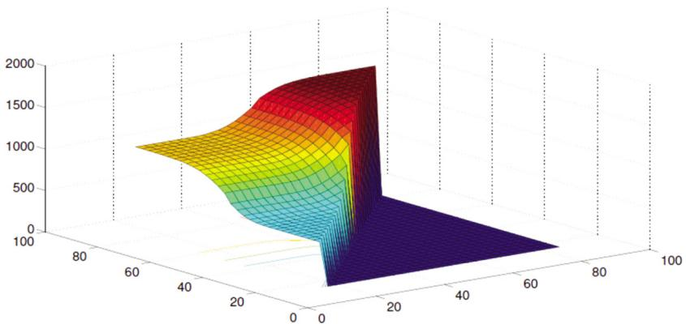  
Figure 12.1 Illustration of a complex nonlinear (monotone) function.

tables can become extremely large when we have three or more dimensions in our state variable. Even three dimensional lookup tables quickly grow to thousands to millions of elements. The problem is compounded when the search algorithm has to evaluate actions for each state many times to handle noise.

A surprisingly powerful strategy for many problems with continuous states and actions is to assume locally linear responses. For example, $S _ { t }$ may capture the level of a reservoir, or the current speed and altitude of a helicopter. The control $x _ { t }$ could be the rate at which water is released from the reservoir, or the forces applied to the helicopter. Assume that we use our understanding of the problem to create a family of regions $\mathcal { S } _ { 1 } , \ldots , \mathcal { S } _ { I }$ , which are most likely going to be a set of rectangular regions (or intervals if there is only one dimension). We might then create a family of linear (affine) policies of the form

$$
X _ {i} ^ {\pi} (S _ {t} | \theta) = \theta_ {i 0} + \theta_ {i 1} \phi_ {1} (S _ {t}) + \theta_ {i 2} \phi_ {2} (S _ {t}),
$$

for $S _ { t } \in \mathcal S _ { i }$ where $\mathcal { S } _ { i }$ is a user-defined region of the state space (there are only a few of these).

This approach has been found to be very effective in some classes of control problems. In practice, the regions $\mathcal { S } _ { i }$ are designed by someone with an understanding of the physics of the problem. Further, instead of tuning one vector $\boldsymbol { \theta }$ , we have to tune $\theta _ { 1 } , \ldots , \theta _ { I }$ . While this involves considerable testing and tuning, the approach can work quite well and offers the important feature that the resulting policy can be computed extremely quickly.

# 12.2.7 Contextual Policies

Imagine that we have designed a policy $X ^ { \pi } ( S _ { t } | \theta )$ that depends on $S _ { t }$ and is parameterized by ??. This policy is actually the solution to the problem

$$
\max  _ {\pi = \left(f \in \mathcal {F}, \theta \in \Theta^ {f}\right)} \mathbb {E} \left\{\sum_ {t = 0} ^ {T} C \left(S _ {t}, X ^ {\pi} \left(S _ {t} | \theta\right)\right) \mid S _ {0} \right\}. \tag {12.6}
$$

Recall that $f \in \mathcal F$ reflects the search over policy classes (and we may have fixed this to one class), while $\boldsymbol { \theta } \in \Theta ^ { F }$ captures the search over any tunable parameters for that class (and we always have this search). For now, let’s assume that we have also fixed the policy to some class $f \in \mathcal F$ , so that we are only optimizing over ??.

The attentive reader will note that we always write our objective function in this way, which means we express the explicit dependence on the initial state $S _ { 0 }$ , which captures deterministic parameters, initial values of dynamic parameters, and prior beliefs. This means that our optimized $\boldsymbol { \theta }$ actually should be written $\theta ( S _ { 0 } )$ . In other words, if we change our initial conditions, we may have to retune $\boldsymbol { \theta }$ .

Some communities refer to the initial state $S _ { 0 }$ as the “context” of the problem. If $S _ { 0 }$ captures stable, static parameters, then it is unlikely to change very much. However, it could happen that we re-tune our policy every quarter (as happens in financial settings), so that the policy picks up current market conditions, which can be very complex. If our sequential decision problem is a search algorithm, then $S _ { 0 }$ might be the starting point of the algorithm, while $\boldsymbol { \theta }$ governs the behavior of the stepsize policy.

# 12.3 Problem Characteristics

When designing a policy search method, it is important to understand the characteristics of how the system responds to the parameterized policy. Some important dimensions of problem characteristics include:

Computational complexity – How you approach policy search will be quite different if a single simulation of a policy is a fraction of a second, or hours, or days, or longer. Methods based on viewing the simulator as a black-box tend to require more function evaluations.

Level of noise – Policy simulations can be reasonably stable, especially for very large systems where aggregate behavior is more stable, but they can also be extremely random.

The response surface – It may be concave, smooth but only unimodular, nonconcave with local maxima, and it may feature jumps (think about buy low, sell high policies).

Parameter dimensionality – We can divide parameters into three classes:

● Scalar models – There are a number of applications with a single scalar parameter (think of our Boltzmann policy).   
● Low-dimensional continuous models – In many applications the number of tunable parameters is less than five or 10, which may mean that it is too large to do a full grid search (discretizing each dimension and searching over all values), but it may simplify computing numerical derivatives.   
● High-dimensional continuous models – It is easy to create policies with tens to hundreds of parameters, or even hundreds of thousands. A good example of a high-dimensional policy is a neural network, but it could also arise with a linear model with a high-dimensional state variable (as might arise in the management of complex resources).

Stationarity – The process we are controlling may be:

● Stationary, which means the parameters of the underlying process are not changing over time.   
● Periodic (such as time of day patterns).   
● Nonstationary, which also comes in different forms. For example, imagine we are controlling a basic inventory problem. This problem may feature:

– Smooth transitions as demand for product steadily increases or decreases, or exhibits smooth seasonal transitions.   
– Bursts, when a product suddenly gets popular for a period of time.   
– Shifts, such as a sudden increase in demand following an advertising campaign or change in price.   
– Spikes, such as a spike in electricity prices which encourages sudden selling.

# 12.4 Flavors of Policy Search

Given a parametric (or locally parametric) function parameterized by $\boldsymbol { \theta }$ (typically a vector, but not always), we now face the challenge of finding the best value of ??. There are different dimensions to the policy search problem:

Derivative-based vs. derivative-free – These include:

Derivative-based methods – Derivative-based methods are attractive when optimizing vectors of continuous parameters and where we feel comfortable that $\mathbb { E } F ^ { \pi } ( \theta , W )$ is smooth (note that the expectation often

helps considerably to smooth functions). The vast majority of derivativebased methods use the classical first-order, stochastic gradient algorithm described in chapter 5:

$$
\theta^ {n + 1} = \theta^ {n} + \alpha_ {n} \nabla_ {\theta} F ^ {\pi} \left(\theta^ {n}, W ^ {n + 1}\right). \tag {12.7}
$$

We can divide derivative-based methods into two broad categories:

● Numerical derivatives – Numerical derivatives are estimates of derivatives which use only the simulations $F ^ { \pi } ( \theta , \omega )$ , without requiring any actual derivative information of $\nabla _ { \boldsymbol { \theta } } F ^ { \pi } ( \boldsymbol { \theta } , \omega )$ . These methods have been described in chapter 5, but we will review methods based on numerical derivatives.   
● Exact derivatives – These methods exploit the underlying structure of a sequential decision problem to compute derivatives exactly, avoiding the need for expensive numerical derivatives.

Derivative-free methods – These methods all view the policy simulator as a black box, and use the methods described in chapter 7. Let $S ^ { \theta , n }$ be what we know about $\mathbb { E } F ^ { \pi } ( \theta , W )$ (not to be confused with $S _ { t }$ within our sequential decision problem), and let $\Theta ^ { \pi } ( S ^ { \theta , n } )$ be our policy for choosing the parameter vector $\theta ^ { n }$ based on what we know in $S ^ { \theta , n }$ . The update rule $\Theta ^ { \pi } ( S ^ { \theta , n } )$ can be any of the four classes of policies described in chapter 7.

Online vs. offline learning – In online learning, we are learning in an environment where updates come to us. As a rule, we have to live with the performance of our policy, which means we are maximizing the cumulative reward. Most policy search uses some form of adaptive algorithm, although this can be done in a laboratory where we use one policy, the learning policy, to find the best policy to implement, called the implementation policy. Some in the reinforcement learning community refer to the learning policy as the behavior policy while the implementation policy is the target policy. Many refer to the learning policy as an algorithm; we think the relationship to policies creates a bridge to our entire framework with the four classes of policies.

Performance-based vs. supervised learning – Most policy search uses as a goal to maximize the total reward (either the final reward or cumulative reward), but there are settings where we have an “expert” (the supervisor) who will specify what to do, allowing us to fit our policies to the choices of the supervisor. The expert decisions could come from a physician making decisions, a financial trader making traders, or a dispatcher assigning drivers to loads. This turns a policy search problem (maximizing a performance metric) into a machine learning (effectively “predicting” what the supervisor will do),

or a hybrid, where we balance a performance metric against matching the decisions of an exogenous decision-maker.

As we review the methods, there will be a clear tradeoff between efficiency and complexity. We are going to start with the simplest methods, which are those which treat $F ^ { \pi } ( \theta )$ as a black box and, as a result, do not exploit any structural properties of the underlying problem. This includes derivative-free methods, and derivative-based methods using numerical derivatives.

We then progress to derivative-based methods where we work with analytical derivatives of the gradient which exploit the structure of the underlying problem. For our presentation, these come in two flavors:

Discrete dynamic programs – These are problems where we are at a node (state) ??, choose a discrete action $a$ , and then transition to a node $s ^ { \prime }$ with probability $P ( s ^ { \prime } | s , a )$ (which we represent but generally cannot compute). An important subclass of graph problems are those where actions are chosen at random (known as a stochastic policy), but transitions are made deterministically. Here, we wish to optimize a parameterized policy $A ^ { \pi } ( s | \theta )$ , where action $a _ { t } =$ $A ^ { \pi } ( S _ { t } | \theta )$ is discrete.

Continuous control problems – In this setting we choose a continuous control $x _ { t }$ (which may be vector-valued) that impacts the state $S _ { t + 1 }$ in a continuous way through a known (and differentiable) transition function.

Both problem classes have attracted considerable attention, and illustrate different methods for computing gradients.

Our presentation will proceed from the simplest methods to the most sophisticated:

● Derivative-based policy search using numerical derivatives – section 12.5.   
● Derivative-free policy search – section 12.6.   
● Derivative-based with exact derivatives: continuous dynamic programs – section 12.7.   
● Derivative-based with exact derivatives: discrete dynamic programs – section 12.8.

The first two methods treat the policy simulator as a black box, and make virtually no assumptions about the internal structure of the problem. These methods are simplest, but the price you pay is that you will have to deal with the potentially high noise of a policy simulator. Also, while simulating a policy can be quite fast, there are many applications where this is computationally intensive, requiring several minutes to hours to days or more for numerical simulations.

In addition, there are settings where we do not have access to a simulator, and have to do our policy search in the field, where it takes a day to observe a day.

The third method derives an explicit formula for the gradient, which requires knowing specific relationships within the model. The derivatives required to compute the gradient are all computed for a specific sample path, and therefore avoid any complexities associated with expectations.

The fourth method is designed for discrete dynamic programs, and works directly from the expectation-based form of the objective function. This is a mathematically advanced presentation for readers with a strong probability background (which is the reason that it is marked with a **).

# 12.5 Policy Search with Numerical Derivatives

Any “black box” model starts with our assumption that we can perform a simulation of the policy $X ^ { \pi } ( S _ { t } | \theta )$ by simulating a sample path to get an estimate of

$$
\hat {F} (\theta , \omega) = \sum_ {t = 0} ^ {T} C \left(S _ {t} (\omega), X ^ {\pi} \left(S _ {t} (\omega) | \theta\right)\right). \tag {12.8}
$$

While there are different ways of estimating derivatives numerically, we are going to focus on the SPSA algorithm (“simultaneous perturbation stochastic approximation”) which is designed for settings where $\boldsymbol { \theta }$ is a vector, which we first presented in section 5.4.4. In theory SPSA can produce estimates of the gradient $\nabla _ { \boldsymbol { \theta } } F ( \boldsymbol { \theta } , \boldsymbol { \omega } )$ , regardless of the dimension of $\boldsymbol { \theta }$ , with just two simulations. In practice, these estimates can be quite noisy, motivating using multiple simulations and averaging.

The method works as follows:

(1) Let $Z _ { k } , k = 1 , \dots , K$ be a vector of zero-mean random variables, and let $Z ^ { n }$ be a sample of this vector at iteration ??.   
(2) Create perturbed values of $\theta ^ { n }$ using $\theta ^ { n + } = \theta ^ { n } + \eta ^ { n } Z ^ { n }$ and $\theta ^ { n - } = \theta ^ { n } - \eta ^ { n } Z ^ { n }$ where $\eta ^ { n }$ is a scaling sequence (it is typically chosen as a constant that does not vary with $n$ ).   
(3) Let $W ^ { n + 1 , + }$ and $W ^ { n + 1 , - }$ represent two different samples of the random variables driving the simulation (these can be generated in advance or on the fly). There is no meaning to the $^ +$ and − in the superscript other than to indicate that these are the samples that are run to evaluate $\theta ^ { n + }$ and $\theta ^ { n - }$ .   
(4) Run the simulation twice, once to find $\hat { F } ^ { n + } = F ( \theta ^ { n + } , W ^ { n + 1 , + } )$ , and once to find $\hat { F } ^ { n - } = F ( \theta ^ { n - } , W ^ { n + 1 , - } )$ .

(5) It is common that we have to run multiple simulations and take an average. Let $W _ { m } ^ { n + 1 , + }$ be $m ^ { t h }$ sample of the random information series and let

$$
\hat {F} _ {m} ^ {n + 1, +} \left(\theta^ {n + 1, +}\right) = F \left(\theta^ {n + 1, +}, W _ {m} ^ {n + 1, +}\right),
$$

represent the performance of the $m ^ { t h }$ simulation which we run ??????????ℎ times (this is called a “mini-batch”). Let $\hat { F } _ { m } ^ { n + 1 , - } ( \theta ^ { n + 1 , - } )$ be parallel sets of runs. We then take an average

$$
\bar {F} ^ {n + 1, +} (\theta^ {n + 1, +}) = \frac {1}{m ^ {b a t c h}} \sum_ {m = 1} ^ {m ^ {b a t c h}} \hat {F} _ {m} ^ {n + 1, +} (\theta^ {n + 1, +}).
$$

$\bar { F } ^ { n + 1 , - } ( \theta ^ { n + 1 , - } )$ is computed similarly.

(6) Compute the estimate of the gradient using

$$
g ^ {n + 1} \left(\theta^ {n}\right) = \left[ \begin{array}{c} \frac {\bar {F} ^ {n + 1 , +} \left(\theta^ {n + 1 , +}\right) - \bar {F} ^ {n + 1 , -} \left(\theta^ {n + 1 , -}\right)}{2 \eta^ {n} Z _ {1} ^ {n}} \\ \frac {\bar {F} ^ {n + 1 , +} \left(\theta^ {n + 1 , +}\right) - \bar {F} ^ {n + 1 , -} \left(\theta^ {n + 1 , -}\right)}{2 \eta^ {n} Z _ {2} ^ {n}} \\ \vdots \\ \frac {\bar {F} ^ {n + 1 , +} \left(\theta^ {n + 1 , +}\right) - \bar {F} ^ {n + 1 , -} \left(\theta^ {n + 1 , -}\right)}{2 \eta^ {n} Z _ {P} ^ {n}} \end{array} \right]. \tag {12.9}
$$

We then use this in our stochastic gradient algorithm

$$
\theta^ {n + 1} = \theta^ {n} + \alpha_ {n} g ^ {n + 1} (\theta^ {n}). \tag {12.10}
$$

While the basic gradient updating formula (12.10) is disarmingly simple (hence the reason we presented it first), it hides the need to experiment with stepsize formulas (covered in chapter 6), tuning parameters required by the stepsize formula, and tuning the size of the mini-batch (which may need to vary by iteration).

Stochastic gradients can be effective and easy to implement, but be prepared to spend some time tuning the algorithm to get good results.

# 12.6 Derivative-Free Methods for Policy Search

In this section we provide a tour through chapter 7 on methods that only require that we be able to perform simulations of a policy. We remind the reader of the four classes of policies that can be used to perform derivative-free stochastic search:

Policy function approximation (PFA) – section 7.4 – These are simple rules, and below we suggest one that accelerates a simple statistical learning method. Of course, the price of simplicity is (yet another) tunable parameter.

Cost function approximation (CFA) – section 7.5 – Simple CFAs include upper confidence bounding and interval estimation for problems with discrete alternatives. Below we suggest a strategy for applying these ideas to policy search.

Value function approximation (VFA) – section 7.6 – VFA-based policies are relatively complex and have not yet been demonstrated to significantly outperform simpler methods. For this reason, we do not cover these methods here.

Direct lookahead (DLA) – section 7.7 – The knowledge gradient is a one-step lookahead (easily modified to be a restricted multistep lookahead) which has proven useful in the context of expensive function evaluations requiring smaller budgets.

# 12.6.1 Belief Models

We can draw on a number of the different belief structures presented in chapter 3. Some that are likely to be useful in the representation of continuous vectors for the parameter vector $\boldsymbol { \theta }$ include:

● Lookup table with correlated beliefs – Also known as Gaussian process regression (technically this is one form of GPR), this could work well for vectors $\boldsymbol { \theta }$ with one to three dimensions. GPR does not impose any structural assumptions other than smoothness, but this also means that it is not able to produce functions that are known to be concave, convex or unimodular.   
● Low-dimensional linear models (e.g. quadratic) – Low dimensional linear models can be used in a number of settings, spanning anywhere from one to dozens of variables. Particularly useful are methods that work to fit a lowdimensional model in the vicinity of the optimum (which, of course, we are trying to find).   
● Sparse linear models – These models extend the linear models to the domain of high-dimensional vectors, but where we think that many of the elements of $\boldsymbol { \theta }$ may be zero.   
● Sampled belief models – There are problems with special structure that suggest a particular type of nonlinear model, such as logistic regression for a pricing or recommendation system. If the nonlinear function $f ( x | \theta )$ is parameterized by an unknown vector $\boldsymbol { \theta }$ , we might represent the uncertainty in our belief by a family of possible values $\theta \in \{ \theta ^ { 1 } , \dots , \theta ^ { K } \}$ .   
● Neural networks – We have described gradient-based search models using neural network policies (which can be very high dimensional), but the biggest strength of neural networks, which is their flexibility to replicate any

functions, is also their biggest weakness, since this flexibility requires very large datasets. Their flexibility also means that they can overfit noisy data.

It is helpful, even important, to represent not only our best estimate of the belief, but also the uncertainty in the belief. We can do this for lookup tables (including with correlated beliefs) and linear models. We can do this for nonlinear models using the technique of using a sampled belief model, where we maintain a population of possible values of the unknown parameter vector ?? and the probability that each is the true value. However, we are not able to do this with neural networks.

We encourage the reader to review the different policies in chapter 7, but we provide some simple illustrations that have proven useful.

# 12.6.2 Learning Through Perturbed PFAs

One of the most popular heuristics for optimizing an unknown function is to use the first $n$ observations, $( x ^ { 0 } , y ^ { 1 } ) , ( x ^ { 1 } , y ^ { 2 } ) , \dots , ( x ^ { n - 1 } , y ^ { n } )$ to create a belief $\bar { f } ^ { n } ( x | \bar { \theta } ^ { n } )$ using any of the methods in chapter 7. Then, we could compute

$$
x ^ {n} = \arg \max  _ {x} \bar {f} ^ {n} (x | \bar {\theta} ^ {n}), \tag {12.11}
$$

which we then use to run a simulation to obtain the updated sample

$$
y ^ {n + 1} = F (x ^ {n}, W ^ {n + 1}).
$$

It turns out that this simple idea is surprisingly ineffective, as illustrated in Figure 12.2 for the setting of learning how sales responds to price, where we need to learn the relationship between sales and price, while maximizing revenue. Figure 12.2(a) shows three different possible sales response curves, where we are making the simplistic assumption that this relationship is linear in price (remember that any parametric model is at best going to be locally accurate).

Now assume that we use our best estimate of the sales response to create a best estimate of revenue as a function of price, and then set the price to maximize the revenue (as we would if we used equation (12.11) to determine the next point to observe). The problem with this is that we end up testing prices near the apparent optimum, as illustrated in Figure 12.2(b). The problem with these observations is that it requires that we learn the sales response from a series of noisy observations that are clustered together, which makes it virtually impossible to get a reliable estimate of the sales curve.

The best way to learn the sales curve is to make observations that are as far from the center as possible, as shown in Figure 12.2(c). There are two problems with this strategy. First, our sales response model is only an approximation; in this example we assume it is linear in price, which is clearly accurate only near

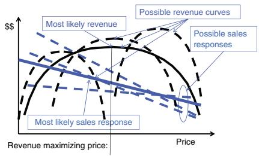  
(a)

  
(b)

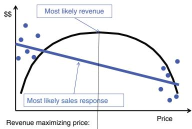

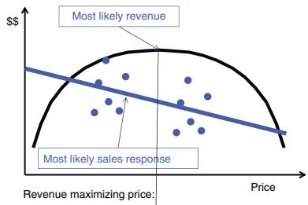  
  
Figure 12.2 Actively learning a demand response function: (a) Three possible sales response lines and corresponding revenue curves, (b) Observed price-sales combinations if we use prices that appear to maximize revenue, (c) Observing extreme prices (high and low) to improve learning of sales response, and (d) Balancing learning (observing away from the middle) and earning (observing prices near the middle).

the middle. The second problem is that if we are learning in the field, these would be points where we perform poorly (that is, we would expect to receive very low revenue).

The most effective strategy is illustrated in Figure 12.2(d), showing observations that are not too close to the optimum, but not too far. This is known as “sampling the shoulders” of the function.

The idea of sampling a function in a region around the optimum, rather than the optimum itself, is supported by an analysis of the value of information from sampling each point. Figure 12.3 shows the value of information for a scalar function, ${ \bar { f } } ^ { n } ( x | { \bar { \theta } } ^ { n } )$ computed using the knowledge gradient (see sections 7.7.2 and 7.8), which shows that there are peaks to the value of information that is some distance from the optimum.

This raises the question: how to find this peak? The calculations used to compute the knowledge gradient are more complex, and still require knowing something about the behavior of the true function, which would never be true in practice. For this reason, an interesting strategy is to take this insight

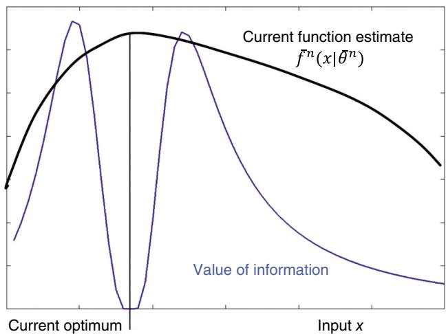  
Figure 12.3 Plot of the value of information from sampling $x$ over a range, showing the highest value of information that is some distance from the current apparent optimum.

and design a simple policy (which falls in the PFA class). In fact, we suggest two policies:

An optimum-deviation policy – The idea here is to pick a point $x ^ { n }$ that is a distance $\rho$ from the optimum $\bar { x } ^ { n } = \arg \operatorname* { m a x } _ { x } \bar { f } ^ { n } ( x | \bar { \theta } ^ { n } )$ . If $x$ is a $k$ −dimensional vector, this deviation can be created by sampling $k$ normally distributed random variables $Z _ { 1 } , \dots , Z _ { K }$ , each with mean 0 and variance 1, and then normalizing them so that

$$
\sqrt {\sum_ {k = 1} ^ {K} Z _ {k} ^ {2}} = \rho .
$$

Let ${ \bar { Z } } ^ { n }$ be the resulting $k$ −dimensional vector. Now compute the sampling point using

$$
x _ {k} ^ {n} = \bar {x} _ {k} ^ {n} + \bar {Z} _ {k} ^ {n}.
$$

Note that in one dimension, we would have $\bar { Z } ^ { n } = \pm \rho$

An excitation policy – Here we again generate a $k$ −dimensional perturbation vector $Z ^ { n }$ , where each element has mean 0 and variance 1, and then set

$$
x _ {k} ^ {n} = \bar {X} _ {k} ^ {n} + \rho Z _ {k} ^ {n}.
$$

While the optimum-deviation policy forces $x ^ { n }$ to be a distance $\rho$ from the optimum ${ \bar { x } } ^ { n }$ , an excitation policy simply introduces a random perturbation with mean 0, which means the most likely point to sample is the optimum of $\bar { f } ^ { n } ( x | \bar { \theta } ^ { n } )$ .

The excitation policy is more natural in a setting where we are learning in the field using a cumulative reward objective, providing an additional incentive to sample in the vicinity of the apparent optimum, while still forcing some exploration. The optimum-deviation policy will produce faster learning, but at a price to how well we do while we are learning, which is best if we are using a final-reward objective.

We have to remind ourselves that these policies are designed for tuning the parameter vector $\boldsymbol { \theta }$ of an implementation policy, but we now have a new tunable parameter, $\rho$ . Fortunately, we may be able to pick a reasonable value of $\rho$ a-priori. We first note that virtually any search algorithm benefits from an assumption that the data $x$ can be scaled. For example, we may assume that we can scale each dimension of $x$ to be between 0 and 1, or normally distributed with mean 0 and variance 1. When we do this, we might feel that $\rho$ will likely be between 0.1 and 0.5.

# 12.6.3 Learning CFAs

Section 7.5 describes a number of CFA policies for derivative-free stochastic search that can all be used for parameter search. We illustrate two policies that work through the same mechanism which highlights an important characteristic of active learning policies (which describes any policy where decisions affect a belief about unknown parameters).

Interval estimation – Start by assuming that we can represent the feasible region for $x$ by a finite (or sampled) set $\mathcal { X } = \{ x ^ { 1 } , \ldots , x ^ { K } \}$ . Let ${ \bar { \mu } } _ { x } ^ { n }$ be our estimate of $f ( x ) = \mathbb { E } F ( x , W )$ for $x \in \mathcal X$ after $n$ experiments. Since $f ( x )$ is a continuous surface, it makes sense to use correlated beliefs (also known as Gaussian process regression) which we introduced in section 3.4.2. Recall that we would maintain a covariance matrix $\Sigma ^ { n }$ .

A basic interval estimation policy is given by

$$
X ^ {I E} \left(S ^ {n} \mid \theta^ {I E}\right) = \arg \max  _ {x \in \mathcal {X}} \left(\bar {\mu} _ {x} ^ {n} + \theta^ {I E} \bar {\sigma} _ {x} ^ {n}\right), \tag {12.12}
$$

where $\bar { \sigma } _ { x } ^ { n } = \sqrt { \Sigma _ { x x } ^ { n } }$ . Note that our state $S ^ { n }$ is our belief $B ^ { n } = ( \bar { \mu } ^ { n } , \Sigma ^ { n } )$ . Sampled $\boldsymbol { \theta }$ -percentile – A policy closely related to interval estimation is to explicitly capture the $\boldsymbol { \theta }$ -percentile. Figure 12.4 shows a sampled belief model

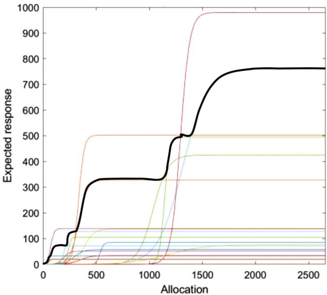  
Figure 12.4 Sampled belief model, with 95th percentile highlighted (second highest belief).

with 20 possible beliefs. If we set $\theta = 0 . 9 5$ , this means taking the secondhighest belief, which is shown as the solid black line. As above, we still have to tune $\boldsymbol { \theta }$ .

Both the interval estimation policy and the sampled $\boldsymbol { \theta }$ -percentile policies make recommendations based on an optimistic estimate of the estimated function. With interval estimation, the random variable ${ \bar { \mu } } _ { x } ^ { n }$ will be normally distributed (from the central limit theorem), so if we pick $\theta ^ { I E } = 2$ , for example, we will be making our choices based on the 95th percentile of the function.

Similarly, if we use $K = 2 0$ samples in our sampled belief model, we could use the 19th highest sample (as we did in Figure 12.4) and again obtain a 95th percentile estimate. Of course, the percentile we use is a tunable parameter that depends on the size of our experimental budget, and whether we are doing offline (final reward) or online (cumulative reward) learning. For expensive functions (and small learning budgets), the best value of $\boldsymbol { \theta }$ will likely be a declining function of the number of experiments that have been completed.

There is a substantial literature that analyzes policies based on the principle of using optimistic estimates using the broad term of upper confidence bounding. The idea is that learning improves when using optimistic estimates of the

function, since the current estimate may, as a result of experimental noise, underestimate the true function.

# 12.6.4 DLA Using the Knowledge Gradient

A form of direct lookahead is the knowledge gradient which we first introduced in section 7.7.2 (see also section 7.8) which is a one-step lookahead. The knowledge gradient has been found to be particularly useful for functions that are relatively expensive to evaluate, which limits the size of our experimental budget.

Figure 12.5 illustrates the knowledge gradient on a two-dimensional surface which is estimated using correlated beliefs (see section 7.8.5 for a summary of how to compute the knowledge gradient with correlated beliefs, and section 3.4.2 for the updating equations for correlated beliefs). Note that the knowledge gradient (on the right) is highest in regions of the function farthest from prior measurements, while the knowledge gradient is smallest at points that have just been evaluated (which minimizes uncertainty).

# 12.6.5 Comments

There is a general theme that runs through these policies (and throughout the literature on active learning problems), which is that you want to perform function evaluations that strike a balance between maximizing uncertainty, while simultaneously maximizing the possibility that the point in the function may prove to be best. This means that it is not enough to maintain a belief about the function ${ \bar { f } } ^ { n } ( x | { \bar { \theta } } ^ { n } )$ ; we also have to maintain a belief about our uncertainty in the function at each point. This section highlights the methods that we have found to be most effective in our own work.

# 12.7 Exact Derivatives for Continuous Sequential Problems*

We are now going to derive an exact gradient (technically, a stochastic gradient in the style of chapter 5) of the performance of a policy with respect to the parameters $\boldsymbol { \theta }$ that govern the performance of the policy. This section will focus on problems where the state $S _ { t + 1 }$ is a differentiable function with respect to the state $S _ { t }$ and decision $x _ { t }$ , as might arise when we are managing resources (water, blood, money).

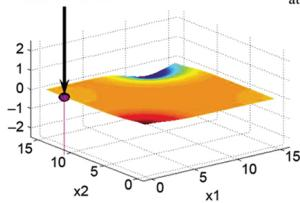  
Estimated surface   
Measurement

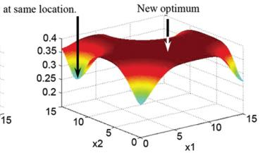  
Knowledge gradient   
Value of another measurement   
After four samples

  
Estimated surface

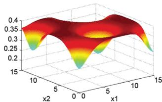  
Knowledge gradient   
After five samples

  
Estimated surface

  
Knowledge gradient   
After seven samples

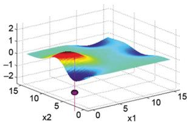  
Estimated surface

  
Knowledge gradient   
After nine samples   
Figure 12.5 The knowledge gradient with correlated beliefs being applied to a two-dimensional surface. The plots on the left are the beliefs after ?? samples, while the plots on the right plot the knowledge gradient at each point.

We return again to our basic sequential optimization problem

$$
F ^ {\pi} (\theta) = \mathbb {E} \left\{\sum_ {t = 0} ^ {T} C \left(S _ {t}, X _ {t} ^ {\pi} \left(S _ {t} \mid \theta\right)\right) \mid S _ {0} \right\}, \tag {12.13}
$$

where our dynamics evolve (as before) according to

$$
S _ {t + 1} = S ^ {M} (S _ {t}, x _ {t}, W _ {t + 1}),
$$

where we are given an initial state $S _ { 0 }$ and access to observations of the sequence $\textit { W } = \left( W _ { 1 } , \ldots , W _ { T } \right)$ . Our goal in this section is to find the gradient $\nabla _ { \boldsymbol { \theta } } F ^ { \pi } ( \boldsymbol { \theta } , \omega )$ exactly for a particular sample path $\omega$ (rather than using a numerical derivative).

We have written our policy $X _ { t } ^ { \pi } ( S _ { t } )$ in a time-dependent form for generality, but this means estimating time-dependent parameters $\theta _ { t }$ that characterize the policy. In most applications we would use the stationary version $X ^ { \pi } ( S _ { t } )$ , with a single set of parameters ??. However, when we can compute the gradient exactly, we can handle high-dimensional parameters much more efficiently than methods based on numerical derivatives can (SPSA may seem like magic, but it isn’t!).

Continuous sequential problems are distinguished from discrete dynamic programs specifically because we assume we can compute $\partial S _ { t + 1 } / \partial x _ { t }$ . With discrete dynamic programs, we assumed the actions $a$ were categorical (e.g. left-/right or red/green/blue). In that setting, we had to consider the downstream impact of a decision made now by capturing the effect of changing the policy parameter ?? on the probability of which state we would visit. Now we can capture this impact directly.

There are two approaches for minimizing $F ^ { \pi } ( \theta )$ over the parameter vector $\boldsymbol { \theta }$

Batch learning – Here we replace (12.13) with an average over $N$ samples, giving us

$$
\bar {F} ^ {\pi} (\theta) = \frac {1}{N} \sum_ {n = 1} ^ {N} \sum_ {t = 0} ^ {T} C \left(S _ {t} \left(\omega^ {n}\right), X _ {t} ^ {\pi} \left(S _ {t} \left(\omega^ {n}\right) | \theta\right)\right), \tag {12.14}
$$

where $S _ { t + 1 } ( \omega ^ { n } ) = S ^ { M } ( S _ { t } ( \omega ^ { n } ) , X ^ { \pi } ( S _ { t } ( \omega ^ { n } ) ) , W _ { t + 1 } ( \omega ^ { n } ) )$ is the sequence of states generated following sample path $\omega ^ { n }$ . This is a classical statistical estimation problem.

Adaptive learning – Rather than solving a single (possibly very large) batch problem, we can use our standard stochastic gradient updating logic (from chapter 7)

$$
\theta^ {n + 1} = \theta^ {n} + \alpha_ {n} \nabla_ {\theta} F ^ {\pi} (\theta^ {n}, W ^ {n + 1}).
$$

This update is executed following each forward pass through the simulation.

Both approaches depend on computing the gradient $\nabla _ { \boldsymbol { \theta } } F ^ { \pi } ( \boldsymbol { \theta } , \omega )$ for a given simple path $\omega$ from which we generate a sequence of state $\begin{array} { r l } { S _ { t + 1 } } & { { } = } \end{array}$ $S ^ { M } ( S _ { t } , x _ { t } , W _ { t + 1 } ( \omega ) )$ where $x _ { t } = X ^ { \pi } ( S _ { t } )$ . Normally we would write $S _ { t } ( \omega )$ or $x _ { t } ( \omega )$ to indicate the dependence on sample path $\omega$ , but we suppress this here for notational compactness.

We find the gradient by differentiating (12.13) with respect to $\boldsymbol { \theta }$ , which requires a meticulous application of the chain rule, recognizing that the contribution $C ( S _ { t } , x _ { t } )$ is a function of both $S _ { t }$ and $x _ { t }$ , the policy $X ^ { \pi } ( S _ { t } | \theta )$ is a function of both the state $S _ { t }$ and the parameter $\boldsymbol { \theta }$ , and the state $S _ { t }$ is a function of the previous state $S _ { t - 1 }$ , the previous control $x _ { t - 1 }$ , and the most recent exogenous information $W _ { t }$ , which is assumed to be independent of the control, although this could be handled. This gives us

$$
\begin{array}{l} \nabla_ {\theta} F ^ {\pi} (\theta , \omega) = \left(\frac {\partial C _ {0} (S _ {0} , x _ {0})}{\partial x _ {0}}\right) \left(\frac {\partial X _ {0} ^ {\pi} (S _ {0} | \theta)}{\partial \theta}\right) + \sum_ {t ^ {\prime} = 1} ^ {T} \left[ \left(\frac {\partial C _ {t ^ {\prime}} (S _ {t ^ {\prime}} , X _ {t ^ {\prime}} ^ {\pi} (S _ {t ^ {\prime}} | \theta))}{\partial S _ {t ^ {\prime}}} \frac {\partial S _ {t ^ {\prime}}}{\partial \theta}\right) \right. \\ \left. + \frac {\partial C _ {t ^ {\prime}} \left(S _ {t ^ {\prime}} , x _ {t ^ {\prime}}\right)}{\partial x _ {t ^ {\prime}}} \left(\frac {\partial X _ {t ^ {\prime}} ^ {\pi} \left(S _ {t ^ {\prime}} \mid \theta\right)}{\partial S _ {t ^ {\prime}}} \frac {\partial S _ {t ^ {\prime}}}{\partial \theta} + \frac {\partial X _ {t ^ {\prime}} ^ {\pi} \left(S _ {t ^ {\prime}} \mid \theta\right)}{\partial \theta}\right) \right], \tag {12.15} \\ \end{array}
$$

where

$$
\frac {\partial S _ {t ^ {\prime}}}{\partial \theta} = \frac {\partial S _ {t ^ {\prime}}}{\partial S _ {t ^ {\prime} - 1}} \frac {\partial S _ {t ^ {\prime} - 1}}{\partial \theta} + \frac {\partial S _ {t ^ {\prime}}}{\partial x _ {t ^ {\prime} - 1}} \left[ \frac {\partial X _ {t ^ {\prime} - 1} ^ {\pi} \left(S _ {t ^ {\prime} - 1} | \theta\right)}{\partial S _ {t ^ {\prime} - 1}} \frac {\partial S _ {t ^ {\prime} - 1}}{\partial \theta} + \frac {\partial X _ {t ^ {\prime} - 1} ^ {\pi} \left(S _ {t ^ {\prime} - 1} | \theta\right)}{\partial \theta} \right]. \tag {12.16}
$$

The derivatives $\partial S _ { t ^ { \prime } } / \partial \theta$ are computed using (12.16) by starting at $t ^ { \prime } = 0$ where

$$
\frac {\partial S _ {0}}{\partial \theta} = 0,
$$

and stepping forward in time.

Equations (12.15) and (12.16) require that we be able to take derivatives of the cost function, the policy, and the transition function. We assume this is possible, although the complexity of these derivatives is highly problem dependent.

# 12.8 Exact Derivatives for Discrete Dynamic Programs* **

This section is going to take a significant step up in complexity in its derivation of analytical derivatives for policy parameters in the context of discrete

dynamic programs. These are problems where decisions are categorical: leftright, color, or a product recommendation. For the advanced (and determined) reader, this presentation provides a different perspective into the mathematics of sequential decision problems that works directly with expectations rather than the simulation-based strategy used in section 12.7.

To emphasize the use of discrete actions, we are going to switch notation to action $a$ rather than our usual decision $x$ . We assume that we are going to maximize the single-period expected reward in steady state. We use the following notation:

$$
r (s, a) = \text {R e w a r d i f w e a r e i n s t a t e} s \in \mathcal {S} \text {a n d t a k e a c t i o n} a \in \mathcal {A} _ {s}.
$$

$$
A ^ {\pi} (s | \theta) = \text {P o l i c y t h a t d e t e r m i n e s t h e a c t i o n} a \text {g i v e n t h a t w e a r e i n}
$$

$$
\begin{array}{r c l} P _ {t} (s ^ {\prime} | s, a) & = & \text {P r o b a b i l i t y o f t r a n s i t i o n i n g t o s t a t e s ^ {\prime} g i v e n t h a t w e} \\ & & \text {a r e i n s t a t e s a n d t a k e a c t i o n a a t t i m e t} \\ & & P (s ^ {\prime} | s, a) \text {i f t h e u n d e r l y i n g d y n a m i c s a r e s t a t i o n a r y)}. \end{array}
$$

$$
\begin{array}{r c l} d _ {t} ^ {\pi} (s | \theta) & = & \text {P r o b a b i l i t y o f b e i n g i n s t a t e s a t t i m e t w h i l e} \\ & & \text {f o l l o w i n g p o l i c y \pi}. \end{array}
$$

This notation reflects the classical notation of the reinforcement learning community, which has adopted the notation from Markov decision processes (we will see this in much more detail in chapter 14). Normally we would use a transition function, but here we are using the one-step transition matrix (we showed how to calculate the one-step transition matrix from the transition function in section 9.7). Also, we are using for the first time the probability of being in a state while following policy $\pi$ , given by $d _ { t } ^ { \pi } ( s | \theta )$ , although we previously used the idea of computing the expectation over the states in section 9.11 (look at the objective function for class 4).

We first introduce a parameterized stochastic policy which is typically required for problems where decisions are discrete with no particular structure (e.g. red-green-blue). We note that the parameters that we are optimizing are primarily controlling the balance of exploration and exploitation. We then present the objective function (there is more than one way to write this, as we show later). Finally, we describe a computable method for taking the gradient of this objective function.

# 12.8.1 A Stochastic Policy

We follow the standard practice in the literature of using what is called a stochastic policy, where an action $a$ is chosen probabilistically. We represent our policy using

$$
p _ {t} ^ {\pi} (a | s, \theta) = \text {t h e p r o b a b i l i t y o f c h o o s i n g a c t i o n a a t t i m e t , g i v e n} \text {t h a t w e a r e i n s t a t e s , w h e r e \theta i s a t u n a b l e p a r a m e t e r} (\text {p o s s i b l y a v e c t o r}).
$$

Most of the time we will use a stationary policy that we denote $\bar { p } ^ { \pi } ( a | s , \theta )$ which can be viewed as a time-averaged version of our policy $p _ { t } ^ { \pi } ( a | s , \theta )$ which we might compute using

$$
\bar {p} ^ {\pi} (a | s, \theta) = \lim _ {T \to \infty} \frac {1}{T} \sum_ {t = 1} ^ {T} p _ {t} ^ {\pi} (a | s, \theta).
$$

A particularly popular policy (especially in computer science) assumes that actions are chosen at random according to a Boltzmann distribution (also known as Gibbs sampling). Assume at time ?? that we have

$$
\begin{array}{r c l} \bar {Q} _ {t} (s, a) & = & \text {e s t i m a t e d v a l u e a t t i m e t o f b e i n i n s t a t e s a n d} \\ & & \text {t a k i n g a c t i o n a .} \end{array}
$$

Next define the probabilities (using our familiar Boltzmann distribution)

$$
p _ {t} ^ {\pi} (a | s, \theta) = \frac {e ^ {\theta \bar {Q} _ {t} (s , a)}}{\sum_ {a ^ {\prime} \in \mathcal {A} _ {s}} e ^ {\theta \bar {Q} _ {t} (s , a ^ {\prime})}}. \tag {12.17}
$$

We can compute the values $\bar { Q } _ { t } ( s , a )$ using $\bar { Q } _ { t } ( s , a ) ~ = ~ r ( s , a )$ , although this means choosing actions based on immediate rewards. Alternatively, we might use

$$
\bar {Q} _ {t} (s, a) = r (s, a) + \max _ {a ^ {\prime}} \bar {Q} _ {t + 1} (s ^ {\prime}, a ^ {\prime}),
$$

where $s ^ { \prime }$ is chosen randomly from simulating the next step (or sampling from the transition matrix $P _ { t } ( s ^ { \prime } | s , a )$ if this is available). We first saw methods for computing ??-values under the umbrella of reinforcement learning in section 2.1.6.

If we are modeling a stationary problem, it is natural to transition to a stationary policy. Let $\bar { p } ^ { \pi } ( a | s , \theta )$ be our stationary action probabilities where we replace the time-dependent values $\bar { Q } _ { t } ( s , a )$ with stationary values ${ \bar { Q } } ( s , a )$ computed using

$$
\bar {Q} ^ {\pi} (s, a | \theta) = r (s, a) + \mathbb {E} \left\{\sum_ {t ^ {\prime} = 1} ^ {T} r \left(S _ {t ^ {\prime}}, A ^ {\pi} \left(S _ {t ^ {\prime}} \mid \theta\right)\right) \mid S _ {0} = s, a _ {0} = a \right\}. \tag {12.18}
$$

This is the total reward over the horizon from starting in state ?? and taking action $a$ (note that we could use average or discounted rewards, over finite or infinite horizons). We remind the reader we are never going to actually

compute these expectations. Using these values, we can create a stationary distribution for choosing actions using

$$
\bar {p} ^ {\pi} (a | s, \theta) = \frac {e ^ {\theta \bar {Q} ^ {\pi} (s , a | \theta)}}{\sum_ {a ^ {\prime} \in \mathcal {A} _ {s}} e ^ {\theta \bar {Q} ^ {\pi} (s , a ^ {\prime} | \theta)}}. \tag {12.19}
$$

Finally, our policy $A ^ { \pi } ( s | \theta )$ is to choose action ?? with probability given by $p _ { t } ^ { \pi } ( a | s , \theta )$ . The development shown in section 12.8.2 does not require that we use the Boltzmann policy, but it helps to have an example in mind.

# 12.8.2 The Objective Function

To develop the gradient, we have to start by writing out our objective function which is to maximize the average reward over time, given by

$$
F ^ {\pi} (\theta) = \lim  _ {T \rightarrow \infty} \frac {1}{T} \left\{\sum_ {t = 0} ^ {T} \sum_ {s \in \mathcal {S}} \left(d _ {t} ^ {\pi} (s | \theta) \sum_ {a \in \mathcal {A} _ {s}} r (s, a) p _ {t} ^ {\pi} (a | s, \theta)\right)\right\}. \tag {12.20}
$$

A more compact form involves replacing the time-dependent state probabilities with their time averages (since we are taking the limit). Let

$$
\bar {d} ^ {\pi} (s | \theta) = \lim _ {T \to \infty} \frac {1}{T} \sum_ {t = 0} ^ {T} d _ {t} ^ {\pi} (s | \theta).
$$

We can then write our average reward per time period as

$$
F ^ {\pi} (\theta) = \sum_ {s \in \mathcal {S}} \bar {d} ^ {\pi} (s | \theta) \sum_ {a \in \mathcal {A} _ {s}} r (s, a) \bar {p} ^ {\pi} (a | s, \theta). \tag {12.21}
$$

# 12.8.3 The Policy Gradient Theorem

We are now ready to take derivatives. Differentiating both sides of (12.21) and applying the chain rule gives us

$$
\begin{array}{l} \nabla_ {\theta} F ^ {\pi} (\theta) \\ = \sum_ {s \in \mathcal {S}} \left(\nabla_ {\theta} \bar {d} ^ {\pi} (s | \theta) \sum_ {a \in \mathcal {A} _ {s}} r (s, a) \bar {p} ^ {\pi} (a | s, \theta) + \bar {d} ^ {\pi} (s | \theta) \sum_ {a \in \mathcal {A} _ {s}} r (s, a) \nabla_ {\theta} \bar {p} ^ {\pi} (a | s, \theta)\right). \tag {12.22} \\ \end{array}
$$

While we cannot compute probabilities such as $d ^ { \pi } ( s )$ , we can simulate them (we show this in the next few lines). We also assume we can compute $\nabla _ { \theta } \bar { p } ^ { \pi } ( a | s , \theta )$ by differentiating our probability distribution in equation (12.19). Derivatives of probabilities such as $\nabla _ { \theta } \bar { d } ^ { \pi } ( s | \theta )$ , however, are another matter.

This is where the development known as the policy gradient theorem helps us. This theorem tells us that we can calculate the gradient of $F ^ { \pi } ( \theta )$ with respect to $\boldsymbol { \theta }$ using

$$
\frac {\partial F ^ {\pi} (\theta)}{\partial \theta} = \sum_ {s} d ^ {\pi} (s | \theta) \sum_ {a} \frac {\partial \bar {p} ^ {\pi} (a | s , \theta)}{\partial \theta} Q ^ {\pi} (s, a), \tag {12.23}
$$

where $Q ^ { \pi } ( s , a )$ is given by

$$
{Q ^ {\pi} (s, a | \theta)} = {\sum_ {t = 1} ^ {\infty} \mathbb {E} \{r (s _ {t}, a _ {t}) - F ^ {\pi} (\theta) | s _ {0} = s, a _ {0} = a \}.}
$$

This is the expected difference between rewards earned each time period from a starting state, and the expected reward (given by $F ^ { \pi } ( \theta ) )$ earned each period when we are in steady state. We will not be able to compute this derivative exactly, but we show below that we can produce an unbiased estimate without too much difficulty. What is most important is that, unlike equation (12.22), we do not have to compute (or even approximate) $\nabla _ { \theta } \bar { d } ^ { \pi } ( s | \theta )$ . We pick this derivation up in the appendix in section 12.10.1. If you are willing to trust that equation (12.23) is true, read on!

# 12.8.4 Computing the Policy Gradient

As is always the case in stochastic optimization, the challenge boils down to computation. To help the discussion, we repeat the policy gradient result:

$$
\frac {\partial F ^ {\pi} (\theta)}{\partial \theta} = \sum_ {s} d ^ {\pi} (s | \theta) \sum_ {a} \frac {\partial \bar {p} ^ {\pi} (a | s , \theta)}{\partial \theta} Q ^ {\pi} (s, a). \tag {12.24}
$$

We start by assuming that we have some analytical form for the policy which allows us to compute $\partial \bar { p } ^ { \pi } ( a | s , \theta ) / \partial \theta$ (which is the case when we use our Boltzmann distribution). This leaves the stationary probability distribution $d ^ { \pi } ( s | \theta )$ and the marginal rewards $Q ^ { \pi } ( s , a )$ .

Instead of computing $d ^ { \pi } ( s | \theta )$ directly, we instead simply simulate the policy, depending on the fact that over a long simulation, we will visit each state with probability $d ^ { \pi } ( s | \theta )$ . Thus, for large enough $T$ , we can compute

$$
\nabla_ {\theta} F ^ {\pi} (\theta) \approx \frac {1}{T} \sum_ {t = 1} ^ {T} \sum_ {a} \frac {\partial \bar {p} ^ {\pi} (a | s _ {t} , \theta)}{\partial \theta} Q ^ {\pi} \left(s _ {t}, a\right), \tag {12.25}
$$

where we simulate according to a known transition function $\begin{array} { r l } { s _ { t + 1 } } & { { } = } \end{array}$ $S ^ { M } ( s _ { t } , a , W _ { t + 1 } )$ . We may simulate the process from a known transition function and a model of the exogenous information process $W _ { t }$ (if this is present), or we may simply observe the policy in action over a period of time.

This then leaves us with $Q ^ { \pi } ( s _ { t } , a )$ . We are going to approximate this with estimates that we call $\bar { Q } _ { t } ^ { \pi } ( S _ { t } | \theta )$ , which we will compute by running a simulation starting at time $t$ until $T$ (or some horizon $t + H$ ). This requires running a different simulation that can be called a roll-out simulation, or a lookahead

simulation. To avoid confusion, we are going to let $\tilde { S } _ { t t ^ { \prime } }$ be the state variable at time $t ^ { \prime }$ in a roll-out simulation that is initiated at time ??. We let $\tilde { W } _ { t t ^ { \prime } }$ be the simulated random information between $t ^ { \prime } { - } 1$ and $t ^ { \prime }$ for a simulation that is initiated at time ??. Recognizing that $\tilde { S } _ { t t } = S _ { t }$ , we can write

$$
\bar {Q} _ {t} ^ {\pi} (S _ {t} | \theta) = \mathbb {E} _ {W} \frac {1}{T - t} \sum_ {t ^ {\prime} = t} ^ {T - 1} r (\tilde {S} _ {t t ^ {\prime}}, A ^ {\pi} (\tilde {S} _ {t t ^ {\prime}} | \theta)),
$$

where $\tilde { S } _ { t , t ^ { \prime } + 1 } ~ = ~ S ^ { M } ( \tilde { S } _ { t t ^ { \prime } } , A ^ { \pi } ( \tilde { S } _ { t t ^ { \prime } } | \theta ) , \tilde { W } _ { t , t ^ { \prime } + 1 } )$ represents the transitions in our lookahead simulation. Of course, we cannot compute the expectation, so instead we use the simulated estimate

$$
\bar {Q} _ {t} ^ {\pi} \left(S _ {t} | \theta\right) \approx \frac {1}{T - t} \sum_ {t ^ {\prime} = t} ^ {T - 1} r \left(\tilde {S} _ {t t ^ {\prime}}, A ^ {\pi} \left(\tilde {S} _ {t t ^ {\prime}} | \theta\right)\right). \tag {12.26}
$$

We note that while we write this lookahead simulation as spanning the period from $t$ to $T$ , this is not necessary. We might run these lookahead simulations over a fixed interval $( t , t + H )$ , and adjust the averaging accordingly.

We now have a computable estimate of $F ^ { \pi } ( \theta )$ which we obtain from (12.26) by replacing $Q _ { t } ^ { \pi } ( S _ { t } | \theta )$ with $\bar { Q } _ { t } ^ { \pi } ( S _ { t } | \theta )$ , giving us a sampled estimate of policy $\pi$ using

$$
{F ^ {\pi} (\theta)} \approx {\sum_ {t = 0} ^ {T - 1} \hat {Q} _ {t} ^ {\pi} (S _ {t} | \theta).}
$$

The final step is actually computing the derivative $\nabla _ { \boldsymbol { \theta } } F ^ { \pi } ( \boldsymbol { \theta } )$ . For this, we are going to turn to numerical derivatives. Assume the lookahead simulations are fairly easy to compute. We can then obtain estimates of $\nabla _ { \boldsymbol { \theta } } \hat { Q } _ { t } ^ { \pi } ( S _ { t } | \boldsymbol { \theta } )$ using the finite difference. We can do this by perturbing each element of $\boldsymbol { \theta }$ . If $\boldsymbol { \theta }$ is a scalar, we might use

$$
\nabla_ {\theta} \hat {Q} _ {t} ^ {\pi} (S _ {t} | \theta) = \frac {\hat {Q} _ {t} ^ {\pi} (S _ {t} | \theta + \delta) - \hat {Q} _ {t} ^ {\pi} (S _ {t} | \theta - \delta)}{2 \delta}. \tag {12.27}
$$

If $\boldsymbol { \theta }$ is a vector, we might do finite differences for each dimension, or turn to simultaneous perturbation stochastic approximation (SPSA) (see section 5.4.3 for more details).

This strategy was first introduced under the name of the REINFORCE algorithm. It has the nice advantage of capturing the downstream impact of changing $\boldsymbol { \theta }$ on later states, but in a very brute force manner. This is actually a form of direct lookahead policy which we cover in depth in chapter 19.

Phew! Now you see why we marked this section with a **!

# 12.9 Supervised Learning

An entirely different approach to developing PFAs is to take advantage of the presence (if available) of an external source of decisions which we call “the supervisor.” This might be a domain expert (such as a doctor making medical decisions, radiologists interpreting X-rays, or drivers operating a car), or perhaps simply a different optimization-based policy such as a deterministic lookahead. Supervised learning for decision problems is exactly analogous to supervised learning for machine learning.

Imagine that we have a set of decisions $x ^ { n }$ from an external source (human or computer). Let $S ^ { n }$ be our state variable, representing information available when the $n ^ { t h }$ decision was made. For the moment, assume that we have access to a dataset $( S ^ { n } , x ^ { n } ) _ { n = 1 } ^ { N }$ from past history. Now we face a classical machine learning problem of fitting a function (policy) to this data. Start by assuming that we are going to use a simple linear model of the form

$$
X ^ {\pi} (S | \theta) = \sum_ {f \in \mathcal {F}} \theta_ {f} \phi_ {f} (S),
$$

where $( \phi _ { f } ( S ) ) _ { f \in \mathcal { F } }$ is a set of features designed by a human (there is a vast machinery of statistical learning tools we can bring to bear on this problem). We can use our batch dataset to estimate $X ^ { \pi } ( S | \theta )$ , although more often we can use the tools in chapter 3 to adapt to new data in an online fashion.

Several issues arise when pursuing this approach:

● Our policy is never better than our supervisor, although in many cases a policy that is as good as an experienced supervisor might be quite good.   
● In a recursive setting, we need to design algorithms that allow the policy to adapt as more data becomes available. Using a neural network, for example, can result in significant overfitting, producing unexpected results as the function adapts to noisy data.   
● If our supervisor is a human, we are going to be limited in the number of times we can query our domain expert, raising the problem of efficiently designing questions.

Supervised learning can be a powerful strategy for finding an initial policy, and then using policy search methods (derivative-based or derivative-free) to further improve the policy. However, we face the issue of collecting data from our supervisor. If we have an extensive database of decisions and the corresponding state variables that capture the information we would use to make a decision, then we simply have a nice statistical challenge (albeit, not necessarily

an easy one). However, it is often the case that we have to work with data arriving sequentially in an online manner. We can approach our policy estimation in two ways:

Active policy search – Here we are actively involved in the operation of the process to design better policies. We can do this in two ways:

Active policy adjustment – This involves adjusting the parameters controlling the policy, as we described above with policy search.

Active state selection – We may choose the state that then determines the decision. This might be in the form of choosing hypothetical situations (e.g. patient characteristics) and then asking the expert for his/her decision.

Passive policy search – In this setting, we are following some policy, and then selectively using the results to update our policy.

Active state selection is similar to derivative-free stochastic search (chapter 7). Instead of choosing $x$ to obtain a noisy observation of $F ( x ) = \mathbb { E } F ( x , W )$ , we are choosing a state ?? to get a (possibly noisy) observation of an action $x$ from some source. Active state selection can only be done in an offline setting (we cannot choose the characteristics of a patient walking into the hospital, but we can pose the characteristics of a hypothetical patient), but we are limited in terms of how many questions we can pose to our supervisor, especially if it is human (but also if it is a time consuming optimization model).

Passive policy search is an approach where we use our policy $X ^ { \pi } ( S _ { t } )$ to make decisions $x _ { t }$ that are then used to update the policy. Of course, if all we did was feed our own decisions back into the same function that produced the decisions, then we would not learn anything. However, it is possible to perform a weighted statistical fit, where we put a higher weight on decisions that perform better.

# 12.10 Why Does it Work?

# 12.10.1 Derivation of the Policy Gradient Theorem

We are going to provide the detailed derivation of

$$
\frac {\partial F ^ {\pi} (\theta)}{\partial \theta} = \sum_ {s} d ^ {\pi} (s | \theta) \sum_ {a} \frac {\partial \bar {p} ^ {\pi} (a | s , \theta)}{\partial \theta} Q ^ {\pi} (s, a). \tag {12.28}
$$

that we started in section 12.8.3.

We begin by defining two important quantities:

$$
\begin{array}{l} {Q ^ {\pi} (s, a | \theta)} = {\sum_ {t = 1} ^ {\infty} \mathbb {E} \{r (s _ {t}, a _ {t}) - F ^ {\pi} (\theta) | s _ {0} = s, a _ {0} = a \},} \\ V ^ {\pi} (s | \theta) = \sum_ {t = 1} ^ {\infty} \mathbb {E} \{r (s _ {t}, a _ {t}) - F ^ {\pi} (\theta) | s _ {0} = s \}, \\ = \sum_ {a \in \mathcal {A}} \bar {p} ^ {\pi} (a _ {0} = a | s, \theta) \sum_ {t = 1} ^ {\infty} \mathbb {E} \{r (s _ {t}, a _ {t}) - F ^ {\pi} (\theta) | s _ {0} = s, a _ {0} = a \}, \\ = \sum_ {a} \bar {p} ^ {\pi} (a | s, \theta) Q ^ {\pi} (s, a). \tag {12.29} \\ \end{array}
$$

Note that $Q ^ { \pi } ( s , a | \theta )$ is quite different from the quantities $\bar { Q } ^ { \pi } ( s , a | \theta )$ used above for the Boltzmann policy (which is consistent with ??-learning, which we first saw in section 2.1.6). $Q ^ { \pi } ( s , a | \theta )$ sums the difference between the reward each period and the steady state reward per period (a difference that goes to zero on average), given that we start in state ?? and initially take action ??. $V ^ { \pi } ( s | \theta )$ is simply the expectation over all initial actions actions ?? as specified by our probabilistic policy.

We next rewrite $Q ^ { \pi } ( s , a )$ as the first term in the summation, plus the expected value of the remainder of the infinite sum using

$$
\begin{array}{l} Q ^ {\pi} (s, a) = \sum_ {t = 1} ^ {\infty} \mathbb {E} \{r _ {t} - F ^ {\pi} (\theta) | s _ {0} = s, a _ {0} = a \}, \\ = r (s, a) - F ^ {\pi} (\theta) + \sum_ {s ^ {\prime}} P \left(s ^ {\prime} \mid s, a\right) V ^ {\pi} \left(s ^ {\prime}\right), \quad \forall s, a, \tag {12.30} \\ \end{array}
$$

where $P ( s ^ { \prime } | s , a )$ is the one-step transition matrix (recall that this does not depend on $\boldsymbol { \theta }$ ). Solving for $F ^ { \pi } ( \theta )$ gives

$$
F ^ {\pi} (\theta) = r (s, a) + \sum_ {s ^ {\prime}} P \left(s ^ {\prime} \mid s, a\right) V ^ {\pi} \left(s ^ {\prime}\right) - Q ^ {\pi} (s, a). \tag {12.31}
$$

Now, note that $F ^ { \pi } ( \theta )$ is not a function of either ?? or ??, even though they both appear in the right hand side of (12.31). Noting that since our policy must pick some action, $\begin{array} { r } { \sum _ { a \in \mathcal { A } } \bar { p } ^ { \pi } ( a | s , \theta ) = 1 } \end{array}$ , which means

$$
\sum_ {a \in \mathcal {A}} \bar {p} ^ {\pi} (a | s, \theta) F ^ {\pi} (\theta) = F ^ {\pi} (\theta), \quad \forall a.
$$

This means we can take the expectation of (12.31) over all actions, giving us

$$
F ^ {\pi} (\theta) = \sum_ {a} \bar {p} ^ {\pi} (a | s, \theta) \left(r (s, a) + \sum_ {s ^ {\prime}} P \left(s ^ {\prime} \mid s, a\right) V ^ {\pi} \left(s ^ {\prime}\right) - Q ^ {\pi} (s, a)\right), \tag {12.32}
$$

for all states ??. Taking a deep breath, we can now take derivatives using the following steps (explanations follow the equations):

$$
\begin{array}{l} \frac {\partial F ^ {\pi} (\theta)}{\partial \theta} = \frac {\partial}{\partial \theta} \left(\sum_ {a} \bar {p} ^ {\pi} (a | s, \theta) \left(r (s, a) + \sum_ {s ^ {\prime}} P \left(s ^ {\prime} \mid s, a\right) V ^ {\pi} \left(s ^ {\prime}\right) - Q ^ {\pi} (s, a)\right)\right) (12.33) \\ = \sum_ {a} \frac {\partial \bar {p} ^ {\pi} (a | s , \theta)}{\partial \theta} r (s, a) + \sum_ {a} \frac {\partial \bar {p} ^ {\pi} (a | s , \theta)}{\partial \theta} \sum_ {s ^ {\prime}} P (s ^ {\prime} | s, a) V ^ {\pi} (s ^ {\prime}) \\ + \sum_ {a} \bar {p} ^ {\pi} (a | s, \theta) \sum_ {s ^ {\prime}} P \left(s ^ {\prime} \mid s, a\right) \frac {\partial V ^ {\pi} \left(s ^ {\prime}\right)}{\partial \theta} - \frac {\partial}{\partial \theta} \left(\sum_ {a} \bar {p} ^ {\pi} (a | s, \theta) Q ^ {\pi} (s, a)\right) (12.34) \\ = \sum_ {a} \frac {\partial \bar {p} ^ {\pi} (a | s , \theta)}{\partial \theta} \left(r (s, a) + \sum_ {s ^ {\prime}} P \left(s ^ {\prime} \mid s, a\right) V ^ {\pi} \left(s ^ {\prime}\right)\right) \\ + \sum_ {a} \bar {p} ^ {\pi} (a | s, \theta) \sum_ {s ^ {\prime}} P \left(s ^ {\prime} \mid s, a\right) \frac {\partial V ^ {\pi} \left(s ^ {\prime}\right)}{\partial \theta} - \frac {\partial V ^ {\pi} (s)}{\partial \theta} (12.35) \\ = \sum_ {a} \frac {\partial \bar {p} ^ {\pi} (a | s , \theta)}{\partial \theta} \left(Q ^ {\pi} (s, a) + F ^ {\pi} (\theta)\right) \\ + \sum_ {a} \bar {p} ^ {\pi} (a | s, \theta) \sum_ {s ^ {\prime}} P \left(s ^ {\prime} \mid s, a\right) \frac {\partial V ^ {\pi} \left(s ^ {\prime}\right)}{\partial \theta} - \frac {\partial V ^ {\pi} (s)}{\partial \theta} (12.36) \\ = \sum_ {a} \frac {\partial \bar {p} ^ {\pi} (a | s , \theta)}{\partial \theta} Q ^ {\pi} (s, a) + \sum_ {a} \bar {p} ^ {\pi} (a | s, \theta) \sum_ {s ^ {\prime}} P \left(s ^ {\prime} \mid s, a\right) \frac {\partial V ^ {\pi} \left(s ^ {\prime}\right)}{\partial \theta} - \frac {\partial V ^ {\pi} (s)}{\partial \theta}. (12.37) \\ \end{array}
$$

Equation (12.33) is from (12.32); (12.34) is the direct expansion of (12.33), where two terms vanish because $r ( s , a )$ and $P ( s ^ { \prime } | s , a )$ do not depend on the policy $\bar { p } ^ { \pi } ( a | s , \theta )$ ; (12.33) uses (12.29) for the last term; (12.36) uses (12.30); (12.29) uses the fact $F ^ { \pi } ( \theta )$ is constant over states and actions, and $\begin{array} { r } { \sum _ { a } \bar { p } ^ { \pi } ( a | s , \theta ) = 1 } \end{array}$ . Finally, note that equation (12.37) is true for all states.

We proceed to write

$$
\begin{array}{l} \frac {\partial F ^ {\pi} (\theta)}{\partial \theta} = \sum_ {s} d ^ {\pi} (s | \theta) \frac {\partial F ^ {\pi} (\theta)}{\partial \theta} (12.38) \\ = \sum_ {s} d ^ {\pi} (s | \theta) \left(\sum_ {a} \frac {\partial \bar {p} ^ {\pi} (a | s , \theta)}{\partial \theta} Q ^ {\pi} (s, a) \right. \\ \left. + \sum_ {a} \bar {p} ^ {\pi} (a | s, \theta) \sum_ {s ^ {\prime}} P \left(s ^ {\prime} \mid s, a\right) \frac {\partial V ^ {\pi} \left(s ^ {\prime}\right)}{\partial \theta} - \frac {\partial V ^ {\pi} (s)}{\partial \theta}\right). (12.39) \\ \end{array}
$$

Expanding gives us

$$
\begin{array}{l} \frac {\partial F ^ {\pi} (\theta)}{\partial \theta} = \sum_ {s} d ^ {\pi} (s | \theta) \sum_ {a} \frac {\partial \bar {p} ^ {\pi} (a | s , \theta)}{\partial \theta} Q ^ {\pi} (s, a) \\ + \sum_ {s} d ^ {\pi} (s | \theta) \sum_ {a} \bar {p} ^ {\pi} (a | s, \theta) \sum_ {s ^ {\prime}} P \left(s ^ {\prime} \mid s, a\right) \frac {\partial V ^ {\pi} \left(s ^ {\prime}\right)}{\partial \theta} \\ \end{array}
$$

$$
\begin{array}{l} - \sum_ {s} d ^ {\pi} (s | \theta) \frac {\partial V ^ {\pi} (s)}{\partial \theta} (12.40) \\ = \sum_ {s} d ^ {\pi} (s | \theta) \sum_ {a} \frac {\partial \bar {p} ^ {\pi} (a | s , \theta)}{\partial \theta} Q ^ {\pi} (s, a) \\ + \sum_ {s} d ^ {\pi} (s | \theta) \frac {\partial V ^ {\pi} (s)}{\partial \theta} - \sum_ {s} d ^ {\pi} (s | \theta) \frac {\partial V ^ {\pi} (s)}{\partial \theta} (12.41) \\ = \sum_ {s} d ^ {\pi} (s | \theta) \sum_ {a} \frac {\partial \bar {p} ^ {\pi} (a | s , \theta)}{\partial \theta} Q ^ {\pi} (s, a). (12.42) \\ \end{array}
$$

Equation (12.38) uses $\begin{array} { r } { \sum _ { s } d ^ { \pi } ( s | \theta ) = 1 } \end{array}$ ; (12.39) uses the fact (12.37) holds for all ??; (12.40) simply expands (12.39); (12.41) uses the property that since $d ^ { \pi } ( s )$ is the stationary distribution, then $\begin{array} { r } { \sum _ { s } d ^ { \pi } ( s | \theta ) P ( s ^ { \prime } | s , a ) = d ^ { \pi } ( s ^ { \prime } | \theta ) } \end{array}$ (after substituting this result, then just change the index from $s ^ { \prime }$ to ??). Equation (12.42) is the policy gradient theorem we first presented in equation (12.28) (and equation (12.23) in the body of the chapter).

# 12.11 Bibliographic Notes

Section 12.1 – The idea of modeling stochastic search algorithms (whether it is derivative-based or derivative-free) was first done (to our knowledge) in Powell (2019).

Section 12.2 – The concept that the search over policy function approximations is over the same classes of functions as would take place in any machine learning exercise seems to be new.

Section 12.5–12.6 – The concept of optimizing parameterized policies, which has been described as “policy search,” has been actively studied since the 1990s. It is the reason we named this class the “policy search” class. Our presentation of policy search using numerical derivatives, or the methods of derivative-free stochastic search (both of which depend purely on simulating a policy as a black box) is well known in the reinforcement learning community (see Sigaud and Stulp (2019) for a recent and thorough review). We note that this review is specifically for continuous actions, but a parameterized policy can be used for discrete actions, and optimized using the same methods.

Section 12.7 – Both sections 12.5 and 12.6 depend purely on function approximations to perform stochastic search. There is a large class of dynamic programs where the future state $S _ { t + 1 }$ is a continuous function of $S _ { t }$ and $x _ { t }$ These include, for example, resource allocation problems for managing money, water, blood, inventory, and electric power, where inventories of resources $R _ { t }$ are being allocated through decisions $x _ { t }$ to produce updated

inventories $R _ { t + 1 }$ . The core equations ((12.15)–(12.16)) are little more than elaborate exercises in the chain rule that have long been used in control problems and neural networks (where it is referred to as backpropagation). See any standard treatment of discrete time optimal control (such as Kirk (2012), Stengel (1986), Sontag (1998), and Lewis and Vrabie (2012)). Our adaptation for parameterized policies was derived here from first principles, but the approach is straightforward.

Section 12.8 – Policy gradient methods have received considerable attention in the reinforcement learning community for problems with discrete states and actions. This section describes a method for computing policy gradients for discrete dynamic programs using a concept that has become known as the “policy gradient method,” introduced in Sutton et al. (2000), and described nicely in the second edition of their book Sutton and Barto (2018)[Chapter 13].

# Exercises

# Review questions

12.1 Policy search is a sequential decision problem. Write out the elements of a policy search algorithm using our modeling framework.   
12.2 What is an “affine policy”? Write out a general form for an affine policy. Imagine that we are managing an inventory storage problem where the state $S _ { t } = ( R _ { t } , p _ { t } )$ depends on the inventory we are holding $R _ { t }$ and the price we can sell the inventory $p _ { t }$ . Let $x _ { t }$ be the amount of our inventory to sell at time ??. If we write our policy as

$$
X ^ {\pi} (S _ {t} | \theta) = \theta_ {0} + \theta_ {1} R _ {t} + \theta_ {2} R _ {T} ^ {2} + \theta_ {3} p _ {t} + \theta_ {4} p _ {t} ^ {2} + \theta_ {5} R _ {t} p _ {t},
$$

is this an affine policy? Why?

12.3 To do policy search it is critical that you know how to write out the objective function that you use to evaluate the performance of the policy.

(a) What is the objective function if you are tuning your policy in a simulator? Carefully explain each source of uncertainty (or randomness).   
(b) What is the objective function if you are tuning your policy in the field?

# Modeling questions

12.4 Assume we are going to search for policies for a simple inventory problem where the inventory $R _ { t }$ evolves according to

$$
R _ {t + 1} = \max  \{0, R _ {t} + x _ {t - \tau} - \hat {D} _ {t + 1} \},
$$

where the random demand $\hat { D } _ { t + 1 }$ follows a discrete uniform distribution from 1 to 10 with equal probability. An order $x _ { t }$ arrives at time $t + \tau$ , which we will specify below. Assume $R _ { 0 } = 1 0$ , and use the contribution function

$$
C \left(S _ {t}, x _ {t}\right) = p _ {t} \min  \left\{R _ {t} + x _ {t - \tau}, \hat {D} _ {t + 1} \right\} - 1 5 x _ {t},
$$

where the price $p _ { t }$ is drawn from a uniform distribution between 16 and 25 with equal probability.

We are going to place our orders according to the order-up-to policy

$$
X ^ {I n v} (S _ {t} | \theta) = \left\{ \begin{array}{c l} \theta^ {m a x} & \text {i f R _ {t} <   \theta^ {m i n}}, \\ 0 & \text {o t h e r w i s e}. \end{array} \right.
$$

We want to choose $\boldsymbol { \theta }$ to solve

$$
\max  _ {\theta} F (\theta) = \mathbb {E} _ {W} \left\{\sum_ {t = 0} ^ {1 0 0} C \left(S _ {t}, x _ {t}\right) \mid S _ {0} \right\}, \tag {12.43}
$$

where $\textit { W } = \left( W _ { 1 } , \ldots , W _ { 1 0 0 } \right)$ is the vector of realizations of prices and demands.

(a) What is the state variable $S _ { t }$ at time ???   
(b) What is the decision variable at time $t ?$ Does it matter that the decision at time ?? does not have any impact on the system until $\tau$ time periods later?   
(c) What are the elements of the exogenous information variable $W _ { t }$   
(d) What is the transition function? Recall that you need an equation for each element of $S _ { t }$ .   
(e) The objective function in (12.43) maximizes the cumulative reward, but we are optimizing the policy in an offline simulator, which means we want to optimize the final reward, not the cumulative reward. Make the argument that (12.43) is still the correct objective. [Hint: look at Table 9.3 and identify which of the four classes of objective functions that equation (12.43) falls in.]

12.5 Assume you are tuning the parameters $\boldsymbol { \theta }$ of a policy $X ^ { \pi } ( S ^ { n } | \theta )$ to find $x ^ { \pi , N }$ in ?? iterations to maximize $\mathbb { E } F ( \theta , W )$ using a gradient-based search algorithm. This means you have access to the gradient $\nabla _ { \boldsymbol { \theta } } F ( { \boldsymbol { \theta } } , W )$ .

(a) Write out the five elements of a sequential decision problem (state variables, decision variables, exogenous information, transition function, and objective function).   
(b) What is the exogenous information for this problem?   
(c) Recalling the menu of stepsize policies that we can draw from (see section 6.2.3), what is meant by searching over policies?

# Computational exercises

The next two exercises will optimize the policy modeled in exercise 12.4 using derivative-based methods.

12.6 Implement the basic stochastic gradient algorithm based on finite differences (see section 5.4.3). Use the harmonic stepsize

$$
\alpha_ {n} = \frac {\theta^ {\text {s t e p}}}{\theta^ {\text {s t e p}} + n - 1}, \tag {12.44}
$$

which means we also have to tune $\theta ^ { s t e p }$ . Start by assuming $\tau = 1$

(a) Run the algorithm 100 iterations for $\theta ^ { s t e p } = 1 , 5 , 1 0 , 2 0$ (just one sample path each) and report which one works best, and the value of $\boldsymbol { \theta }$ that the algorithm returns.   
(b) Run the algorithm 100 iterations for $\theta ^ { s t e p } = 1 0 $ , and plot the objective function over the iterations for each value of $\theta ^ { s t e p }$ . Repeat this 20 times to demonstrate the range of sample paths the algorithm can take. How many samples do you think you would need to reliably estimate which value of $\theta ^ { s t e p }$ works best?   
(c) Using the best value of $\theta ^ { s t e p }$ , find the best value of $\boldsymbol { \theta }$ when $\tau =$ 1, 5, 10.

12.7 You are going to optimize the policy modeled in exercise 12.4 using the SPSA algorithm. Assume $\tau = 1$ .

(a) Implement the simultaneous perturbation stochastic approximation (SPSA) algorithm (see section 5.4.4). Use the harmonic stepsize (see equation (12.44)), which means we also have to tune the stepsize parameter $\theta ^ { s t e p }$ . Use a mini-batch of 1 for computing the gradient. Run the algorithm 100 iterations for $\theta ^ { s t e p } = 1 , 5 , 1 0 , 2 0$ where you run 20 repetitions for each value of $\theta ^ { s t e p }$ and average the results. Report which one works best.

(b) Run the algorithm using $\theta ^ { s t e p } = 1 0$ and mini-batch sizes of 1, 5, 10, and 20, and compare the performance over 100 iterations.

The next two exercises will optimize the policy modeled in exercise 12.4 using derivative-free methods. For each method, enumerate a set $\Theta$ of possible values for the two-dimensional ordering policy $\boldsymbol { \theta }$ by varying $\theta ^ { m i n }$ over the values $2 , 4 , \ldots , 1 0$ , and varying $\theta ^ { m a x }$ over the range $6 , 8 , \ldots , 2 0$ while excluding any combination where $\theta ^ { m i n } \geq \theta ^ { m a x }$ . Let $\Theta$ be the set of allowable combinations of ??. Assume $\tau = 1$ throughout.

12.8 Lookup table with correlated beliefs: After building the set $\Theta$ , do the following:

(a) Initialize your belief by running five simulations for five different values of $\theta \in \Theta$ . Average these results and set $\bar { \mu } _ { \theta } ^ { 0 }$ to this average for all $\theta \in \Theta$ . Compute the variance $\sigma ^ { 2 , 0 }$ of these five observations, and initialize the precision of the belief at $\beta _ { \theta } ^ { 0 } = 1 / \sigma ^ { 2 , 0 }$ for all $\theta \in \Theta$ . Let

$$
\bar{F}^{0} = \max_{\theta \in \Theta}\bar{\mu}_{\theta}^{0}
$$

and report ${ \bar { F } } ^ { 0 }$ (of course, $\bar { \mu } _ { \theta } ^ { 0 }$ is the same for all $\boldsymbol { \theta }$ , so you can just pick any $\boldsymbol { \theta }$ ).

(b) Assume that the estimates $\bar { \mu } _ { \theta } ^ { 0 }$ are related according to

$$
C o v (\bar {\mu} _ {\theta} ^ {0}, \bar {\mu} _ {\theta^ {\prime}} ^ {0}) = \sigma^ {0} e ^ {- \rho | \theta - \theta^ {\prime} |}.
$$

Compute $C o v ( \bar { \mu } _ { \theta } ^ { 0 } , \bar { \mu } _ { \theta } ^ { 0 } , )$ by running 10 simulations for each combination of $\theta \ = \ ( 4 , 6 ) , ( 4 , 8 ) , ( 4 , 1 0 ) , ( 4 , 1 2 ) , ( 4 , 1 4$ ). Now find the value of $\rho$ that produces the best fit of $C o v ( \bar { \mu } _ { \theta } ^ { 0 } , \bar { \mu } _ { \theta ^ { \prime } } ^ { 0 } )$ using these five datapoints. Now, fill out the matrix $\Sigma ^ { 0 }$ where

$$
\Sigma_ {\theta , \theta^ {\prime}} ^ {0} = \sigma^ {0} e ^ {- \rho | \theta - \theta^ {\prime} |}
$$

for all $\theta , \theta ^ { \prime } \in \Theta$ , and using the value of $\rho$ that you determined above.

(c) Write out the equations for updating $\bar { \mu } _ { \theta } ^ { n }$ using correlated beliefs (see section 3.4.2).   
(d) Now use the interval estimation policy

$$
\Theta^ {\pi} (S ^ {n} | \theta^ {I E}) = \arg \max  _ {\theta \in \Theta} \left(\bar {\mu} _ {\theta} ^ {n} + \theta^ {I E} \bar {\sigma} _ {\theta} ^ {n}\right)
$$

where $\bar { \sigma } _ { \theta } ^ { n } = \Sigma _ { \theta , \theta } ^ { n }$ . Of course, we have now introduced another tunable parameter $\theta ^ { I E }$ in our policy to tune the parameters in our ordering policy $X ^ { \pi } ( S _ { t } | \theta )$ . Get used to it - this happens a lot. Using $\theta ^ { I E } = 2$ , execute the policy $\Theta ^ { \pi } ( S ^ { n } | \theta ^ { I E } )$ for 100 iterations, and report

the simulated performance of the objective (12.43) as you progress. On a two-dimensional graph showing all the combinations of $\Theta$ , report how many times you sample each of the combinations.

(e) Repeat your search for $\begin{array} { r } { \theta ^ { I E } = 0 , . 5 , 1 , 2 , 3 . } \end{array}$ $\theta ^ { I E } = 0$ Prepare a graph showing the performance of each value of $\theta ^ { I E }$ .

12.9 Response surface methods: In this exercise we are going to optimize $\boldsymbol { \theta }$ by creating a statistical model of the function $F ( \theta )$ . After building the set Θ, do the following:

(a) Randomly pick 10 elements of Θ, simulate the policy 20 times, and then use the simulated performance of the policy to fit the linear model

$$
\bar {F} ^ {0} (\theta) = \rho_ {0} ^ {0} + \rho_ {1} ^ {0} \theta^ {m i n} + \rho_ {2} ^ {0} (\theta^ {m i n}) ^ {2} + \rho_ {3} ^ {0} \theta^ {m a x} + \rho_ {4} ^ {0} (\theta^ {m a x}) ^ {2} + \rho_ {5} ^ {0} \theta^ {m i n} \theta^ {m a x}.
$$

Use the methods in section 3.7 to fit this model.

(b) At iteration $n$ , find

$$
\theta^{n} = \arg \max_{\theta}\bar{F}^{n}(\theta).
$$

We then run the policy using $\theta \ = \ \theta ^ { n }$ to obtain ${ \hat { F } } ^ { n + 1 } ( \theta ^ { n } )$ . Add $( \theta ^ { n } , \hat { F } ^ { n + 1 } )$ to the data used to fit the approximation to obtain the updated approximation $\bar { F } ^ { n + 1 } ( \theta )$ , and repeat. Run this for 20 iterations, and repeat 10 times. Report the average and the spread.

(c) Repeat the algorithm, but this time replace the policy for computing $\theta ^ { n }$ with

$$
\hat {\theta} ^ {n} = \arg \max  _ {\theta} \bar {F} ^ {n} (\theta),
$$

$$
\theta^ {n} = \hat {\theta} ^ {n} + \delta^ {n},
$$

where

$$
\theta^ {n} = \left( \begin{array}{c} \theta_ {1} ^ {n} \\ \theta_ {2} ^ {n} \end{array} \right)
$$

and

$$
\delta^ {n} = \left( \begin{array}{c} \delta_ {1} ^ {n} \\ \delta_ {2} ^ {n} \end{array} \right).
$$

The vector $\delta$ is a perturbation of magnitude $r$ where

$$
\delta_ {1} ^ {n} + \delta_ {2} ^ {n} = 0,
$$

$$
\sqrt {(\delta_ {1} ^ {n}) ^ {2} + (\delta_ {2} ^ {n}) ^ {2}} = r.
$$

These equations imply that

$$
\delta_ {1} ^ {n} = - \delta_ {2} ^ {n} = r / \sqrt {2},
$$

or

$$
\delta_ {2} ^ {n} = - \delta_ {1} ^ {n} = r / \sqrt {2}.
$$

This algorithm exploits the property that it is better to sample points that are displaced from the optimum. As is often the case, this simple policy involves another tunable parameter, the perturbation radius ??. Start with $r \ = \ 4$ . Run this algorithm for 20 iterations, and then do a final evaluation with $\delta ^ { n } \ = \ 0$ to see the performance based on the value of $\boldsymbol { \theta }$ that is best given our approximate function. Repeat for $r = 0 , 2 , 6 , 8$ and report which performs the best.

# Problem solving questions

12.10 Imagine we have an asset selling problem where the policy is given by

$$
X ^ {\pi} \left(S _ {t} \mid \theta\right) = \left\{ \begin{array}{l l} 1 = \text {" s e l l " } & \text {i f} p _ {t} \geq \theta , \\ 0 = \text {" h o l d " } & \text {i f} p _ {t} <   \theta . \end{array} \right. \tag {12.45}
$$

(a) Is this an affine policy? Why or why not?   
(b) Now imagine that we do not know that this might be the right structure of the policy, and you want to design an affine policy. What might this look like? Do you think your affine policy might work well?   
(c) What is meant by a monotone policy? Is the policy in (12.45) monotone?   
(d) Imagine that you believe that your policy is monotone in price, but other than this, you do not know the shape of the function. Suggest an approximation strategy you might propose that allows you to require that the function be monotone in $p _ { t }$ , and sketch a method for estimating this function.

# Sequential decision analytics and modeling

These exercises are drawn from the online book Sequential Decision Analytics and Modeling available at http://tinyurl.com/sdaexamplesprint.

12.11 Review the asset selling problem in chapter 2 up through 2.4. Three policies are suggested, but in this exercise we are going to focus on the tracking policy, which involves tuning a single parameter. We

will be using the Python module “AssetSelling" at http://tinyurl.com/ sdagithub, which contains the code to simulate the tracking policy. This exercise will focus on derivative-free methods for performing the parameter search.

(a) Run 20 simulations of the pricing model and determine from these runs the largest and smallest prices. Divide this range into 20 segments. Now implement an interval estimation policy

$$
X ^ {I E} \left(S ^ {n} \mid \theta^ {I E}\right) = \arg \max  _ {x \in \mathcal {X}} \left(\bar {\mu} _ {x} ^ {n} + \theta^ {I E} \bar {\sigma} _ {x} ^ {n}\right). \tag {12.46}
$$

where $\mathcal { X }$ is the 20 possible values of the tracking parameter, ${ \bar { \mu } } _ { x } ^ { n }$ is our estimate of the performance of the tracking parameter when it takes value $x \in \mathcal X$ . For this exercise, set $\theta ^ { I E } = 2$ (although this is a parameter that would also need tuning). Show your estimates $\bar { \mu } _ { x } ^ { N }$ for each value of $x$ when your experimentation budget is $N = 2 0$ , and then when $N = 1 0 0$ .

(b) This time, we are going to create a quadratic belief model where

$$
\bar {F} ^ {n} (x) = \bar {\theta} _ {0} ^ {n} + \bar {\theta} _ {1} ^ {n} x + \bar {\theta} _ {2} ^ {n} x ^ {2},
$$

where $x$ is still the value of the tracking parameter. Test three policies for choosing $x ^ { n }$ (these are all presented in chapter 7):

(i) A greedy policy where $x ^ { n } = \arg \operatorname* { m a x } _ { x } \bar { F } ^ { n } ( x )$   
(ii) An excitation policy $x ^ { n } = \arg \operatorname* { m a x } _ { x } \bar { F } ^ { n } ( x ) + \varepsilon ^ { n + 1 }$ where $\varepsilon ^ { n + 1 } \sim$ $N ( 0 , \sigma ^ { 2 } )$ , where $\sigma ^ { 2 }$ is the noise in the exploration process, which is a parameter that has to be tuned.   
(iii) A parameterized knowledge gradient policy where $\boldsymbol { x } ^ { n } \quad =$ arg $\operatorname* { m a x } _ { x } { \bar { F } } ^ { n } ( x ) + Z$ where $Z = \pm r$ , where $r$ is a parameter that needs to be tuned.

Simulate each policy for 100 iterations, and compare the performance of each policy.

12.12 Review the asset selling problem in chapter 2 up through 2.4. Three policies are suggested, but in this exercise we are going to focus on the tracking policy, which involves tuning a single parameter. We will be using the Python module “AssetSelling” at http://tinyurl.com/ sdagithub, which contains the code to simulate the tracking policy. This exercise will focus on derivative-based methods for performing the parameter search.

(a) Produce an estimate of a stochastic gradient by running a simulation where the tracking parameter is set at $x$ , and then again at $x { + \delta }$ where $\delta = 1$ . Use a harmonic stepsize

$$
\alpha_ {n} = \frac {\theta^ {s t e p}}{\theta^ {s t e p} + n - 1},
$$

where we leave the tuning of $\theta ^ { s t e p }$ to you. Run this algorithm for 100 iterations, and find $\theta ^ { s t e p }$ to produce the best solution $x ^ { \pi , N }$ .

(b) Repeat (a), but this time repeat the simulation using a mini-batch ?? for $m = 1 , 5 , 1 0 , 2 0$ . Note that the best value of $\theta ^ { s t e p }$ is likely to depend on ??. Run the stochastic gradient algorithm for each value of $m$ for $N = 1 0 0$ iterations, and compare the results.

# Diary problem

The diary problem is a single problem you chose (see chapter 1 for guidelines). Answer the following for your diary problem.

12.13 Pick a particular decision in your diary problem (if there is more than one) and try to design a policy function approximation to make the decision. This will typically involve a tunable parameter (if you state a PFA without a tunable parameter, try to introduce one). Then, show how to tune the policy in the following settings:

(a) Offline, in a simulator. Remember that you will have both the tuning of the parameter(s), followed by testing. Write out the objective function using final reward formulation (if you do not remember this by now, flip back to equation (7.2)). Explicitly describe any uncertainties in your initial state $S ^ { 0 }$ , along with the exogenous information $W _ { t }$ and the testing random variable $\widehat { W } _ { t }$ .

(b) Online, in the field. This means optimizing using the cumulative reward formulation (see equation (7.3)). Again – clearly define all the random variables.

# Bibliography

Kirk, D.E. (2012). Optimal Control Theory: An introduction. New York: Dover.   
Lewis, F.L. and Vrabie, D. (2012). Design Optimal Adaptive Controllers, 3e. Hoboken, NJ: JohnWiley & Sons.   
Powell, W.B. (2019). A unified framework for stochastic optimization. European Journal of Operational Research 275: (3): 795–821.   
Sigaud, O. and Stulp, F. (2019). Policy search in continuous action domains: An overview. Neural Networks 113: 28–40.   
Sontag, E. (1998). Mathematical Control Theory, 2e., 1–544. Springer.   
Stengel, R.F. (1986). Stochastic optimal control: theory and application. Hoboken, NJ: John Wiley & Sons.

Sutton, R.S. and Barto, A.G. (2018). Reinforcement Learning: An Introduction, 2e. Cambridge, MA: MIT Press.   
Sutton, R.S., McAllester, D., Singh, S.P., and Mansour, Y. (2000). Policy gradient methods for reinforcement learning with function approximation. Advances in neural information processing systems 12 (22): 1057–1063.

#

# Cost Function Approximations

Parametric function approximations (chapter 12) can be a particularly powerful strategy for problems where there is a clear structure to the policy. For example, buying when the price is below $\theta ^ { m i n }$ and selling when it is above $\theta ^ { m a x }$ is an obvious structure for many buy/sell problems. But PFAs do not scale to larger, more complex problems such as, say, scheduling an airline or managing an international supply chain. PFAs cannot even help you plan the path you will take with your car.

The problem with PFAs is that you either have to be able to identify a simple structural form (which means some form of linear or nonlinear model), or you can specify a high-dimensional architecture (locally constant or linear, full nonparametric, or a deep neural network) which will require a substantial number of training iterations (possibly in millions or tens of millions). There are many problems, however, where the decisions are high-dimensional, which means that lots of variables interact, such as the location of pieces on a chessboard, or the effect of surplus blood inventories in one region on the allocation of blood around the country. Learning these interactions in the presence of noise is especially difficult.

CFAs are a form of parameterized optimization models. Imagine that you have a problem that suggests a natural approximation as a deterministic optimization problem. These may be myopic (assigning available drivers in a ride-sharing fleet to waiting customers), or they may involve optimizing a deterministic approximation of the future (technically a form of direct lookahead approximation, but a simple one). An example is the use of deterministic shortest path problems in navigation systems, or optimizing inventory decisions over a planning horizon given a point forecast of demands.

The optimization problem may be as complicated as scheduling an airline, or as simple as trying to pick a medical treatment $x \in \mathcal { X } = \{ x _ { 1 } , \ldots , x _ { M } \}$ that will treat a patient’s high blood sugar. Let ${ \bar { \mu } } _ { x } ^ { n }$ be the estimated reduction in blood

sugar from treatment $x _ { m }$ after we have run ?? different tests, and let $\bar { \sigma } _ { x } ^ { n }$ be the standard deviation of our estimate ${ \bar { \mu } } _ { x } ^ { n }$ . Assuming our beliefs are independent of each other, our current state (belief state) is given by $S ^ { n } = B ^ { n } = ( \bar { \mu } _ { x } ^ { n } , \bar { \sigma } _ { x } ^ { n } ) , x \in \mathcal { X }$ . A greedy (“pure exploitation”) policy would use the policy

$$
X ^ {E x p l t} (S ^ {n}) = \arg \max _ {x} \bar {\mu} _ {x} ^ {n}.
$$

Such a policy uses the treatment that appears to be best, but fails to recognize that after choosing $x ^ { n }$ and observing $\hat { F } ^ { n + 1 } = F ( x ^ { n } , W ^ { n + 1 } )$ we can use this information to update our belief state (captured by $S ^ { n }$ ). The problem is that we may have an estimate ${ \bar { \mu } } _ { x } ^ { n }$ that is too low that would discourage us from trying it again. One way to fix this (which we introduced in chapter 7 as interval estimation) is by using the modified policy

$$
X ^ {I E} \left(S _ {t} \mid \theta\right) = \arg \max  _ {x \in \mathcal {X}} \left(\bar {\mu} _ {x} ^ {n} + \theta \bar {\sigma} _ {x} ^ {n}\right), \tag {13.1}
$$

where $\boldsymbol { \theta }$ is a parameter that has to be tuned through our usual objective function

$$
\max  _ {\theta} F (\theta) = \mathbb {E} \sum_ {t = 0} ^ {T} C \left(S _ {t}, X ^ {\pi} \left(S _ {t} \mid \theta\right)\right). \tag {13.2}
$$

We have tweaked the pure exploitation policy by adding an “uncertainty bonus” in (13.1) which encourages trying alternatives where $\bar { \mu } _ { x }$ might be lower, but where there is sufficient uncertainty that it might actually be higher. This is a purely heuristic way of enforcing a tradeoff between exploration and exploitation (but a heuristic that enjoys some nice theoretical properties).

While our interval estimation policy is limited to discrete action spaces, parametric CFAs can actually be extended to very large-scale problems. Once you introduce an “arg max??” into the policy, you open the door to using solvers for large linear, integer, nonlinear, and even nonlinear-integer programs as we illustrate later in this chapter. Suddenly we can now allow $x _ { t }$ to be vectors with hundreds of thousands of variables (dimensions).

The idea of using a parameterized optimization model is a widely used engineering heuristic, but has been completely overlooked as a valid way of building a policy for solving stochastic sequential decision problems. The point of departure between an ad-hoc heuristic and a formal optimization model is equation (13.2). Normally we do our parameter tuning in a simulator (presumably with a final reward objective), or online in the field (presumably with a cumulative reward objective). Either way, we need to explicitly formulate the parameter tuning process as an explicit optimization problem (such as (13.2)); if this is not done, then what you are doing is, in fact, just an engineering heuristic.

While using a parameterized optimization model is quite common in practice, using equation (13.2) to tune the parameters is not. As with PFAs, there are three dimensions in the use of parametric CFAs:

(1) Designing the parameterization – This is the art of any parametric model (including statistical models). CFAs begin as some form of deterministic optimization model, where the parameterization should be chosen to improve what can be achieved with the original deterministic approximation.   
(2) Evaluating a parametric CFA – The most common way to evaluate a policy is a simulator, but there are many settings where simulators are either too time consuming or expensive to develop, or because we simply cannot create a mathematical model of the problem, requiring evaluation to be done in the field.   
(3) Tuning the parameters – As we have seen in the chapters on stochastic search (chapters 5 and 7) and policy search (chapter 12), tuning the parameters $\boldsymbol { \theta }$ using the objective function (13.2) is not easy. For this reason, it is quite common in the industry for someone to use intuition to simply pick values for ??. While the performance of the resulting policy may be reasonable, this is not optimization.

The research community has largely dismissed parameterized deterministic models as an “industrial heuristic.” We claim that a parameterized optimization model is a powerful strategy for solving certain classes of stochastic optimization problems, and is just as valid as using any PFA, or any of the strategies that we are going to present later in this book. It all boils down to exploiting problem structure and insights into how uncertainty affects the solution.

We need to pause and make an important observation: PFAs and CFAs both look like parameterized policies, but they tend to be different in a critical way, especially when the PFA uses a generic architecture such as a linear model or neural network. PFAs using a generic architecture will provide no guidance in terms of the scaling of the vector ??. By contrast, if we start with a deterministic approximation, it introduces a tremendous amount of structure, which has the effect of scaling the problem. This dramatically simplifies the parameter search process.

The remainder of this chapter will focus on illustrating different ways to create parametric CFAs. Section 13.1 sets up some general notation. Then, section 13.2 presents examples of parameterizing the objective function, followed by section 13.3 which presents examples of parameterized constraints.

# 13.1 General Formulation for Parametric CFA

There are two ways to parameterize an optimization problem: through the objective function, and through the constraints. To capture these changes we define

$$
\bar {C} ^ {\pi} (S _ {t}, x _ {t} | \theta) = \begin{array}{l l} \text {t h e m o d i f i e d o b j e c t i v e f u n c t i o n a s d e t e r m i n e d b y} \\ \text {t h e p o l i c y} \pi , \text {w h e r e} \theta \text {r e p r e s e n t s t h e t u n a b l e} \\ \text {p a r a m e t e r s ,} \end{array}
$$

$$
\begin{array}{r c l} \mathcal {X} _ {t} ^ {\pi} (\theta) & = & \text {t h e m o d i f i e d s e t o f c o n s t r a i n t s (t h a t i s , t h e f e a s i b l e} \\ & & \text {r e g i o n) d e t e r m i n e d b y p o l i c y \pi , w i t h t u n a b l e} \\ & & \text {p a r a m e t e r s \theta .} \end{array}
$$

A parametric CFA can be written in its most general form as

$$
X ^ {C F A} \left(S _ {t} \mid \theta\right) = \arg \max  _ {x _ {t} \in \mathcal {X} _ {t} ^ {\pi} (\theta)} \bar {C} ^ {\pi} \left(S _ {t}, x _ {t} \mid \theta\right), \tag {13.3}
$$

where $\bar { C } ^ { \pi } ( S _ { t } , x _ { t } | \theta )$ is a parametrically modified cost function, subject to a (possibly modified) set of constraints ${ \mathcal { X } } ^ { \pi } ( \theta )$ , where $\boldsymbol { \theta }$ is the vector of tunable parameters.

We now have a tunable policy $X ^ { C F A } ( S _ { t } | \theta )$ where we face the same challenge of finding $\boldsymbol { \theta }$ as we did with PFAs in chapter 12. Note that $\boldsymbol { \theta }$ might be a scalar, or may have dozens, even hundreds or thousands, of dimensions. We anticipate that the most common search procedures will be those based on either derivative-based stochastic search using numerical derivatives such as the SPSA algorithm described in section 12.5 (or section 5.4.4) or derivativefree stochastic optimization such as the methods outlined in section 12.6. It is possible that we might apply the exact gradient described in section 12.7, but taking the derivative of the policy when the policy is an optimization problem is likely going to be daunting.

# 13.2 Objective-Modified CFAs

We begin by considering problems where we modify the problem through the objective function to achieve desired behaviors. Including bonuses and penalties is a widely used heuristic approach to getting cost-based optimization models to produce desired behaviors, such as balancing real costs against penalties for poor service. Not surprisingly, we can use this approach to also produce robust behaviors in the presence of uncertainty.

We begin by presenting a general way of including linear cost correction models in the objective function. We then present three application settings: a dynamic assignment problem for assigning drivers to loads, a stochastic, dynamic shortest path problem, and a financial trading problem.

# 13.2.1 Linear Cost Function Correction

Although we favor parameterizations that are guided by the structure of the problem, a general approach to improving the performance of an optimizationbased policy is to add a linear term to the objective, which gives us

$$
X ^ {C F A - c o s t} \left(S _ {t} | \theta\right) = \arg \max  _ {x _ {t} \in \mathcal {X} _ {t}} \left(C \left(S _ {t}, x _ {t}\right) + \sum_ {f \in \mathcal {F}} \theta_ {f} \phi_ {f} \left(S _ {t}, x _ {t}\right)\right). \tag {13.4}
$$

where $( \phi _ { f } ( S , x ) ) _ { f \in \mathcal { F } }$ is a set of features that depend first and foremost on $x$ , and possibly on the state ??. If a feature does not depend on the decision, then it would not affect the choice of optimal solution.

Designing the features for equation (13.4) is no different than designing the features for a linear policy function approximation (or, for that matter, any linear statistical model which we introduced in chapter 3). It is always possible to simply construct a polynomial comprised of different combinations of elements of $x _ { t }$ and $S _ { t }$ with different transformations (linear, square, ...), but many problems have very specific structure.

# 13.2.2 CFAs for Dynamic Assignment Problems

The truckload trucking industry requires matching drivers to loads, just as ride-sharing companies match drivers to riders. The difference with truckload trucking is that the customer is a load of freight, and sometimes the load has to wait a while (possibly several hours) before being picked up.

To model our problem we begin with defining the sets of resources and tasks which make up the state variables

???? = the set of all drivers (with tractors) available at time ??,

$\begin{array} { r l } { \mathcal { L } _ { t } } & { { } = } \end{array}$ the set of all loads waiting to be moved at time $t$

???? = (????, ℒ??) = the state of our system at time $t$ .

Our decision variables and costs are given by

$\begin{array} { r l r } { x _ { t d \ell } } & { { } = } & { 1 } \end{array}$ if we assign driver $d$ to load $\ell$ at time ??, 0 otherwise,

$\begin{array} { r l } { c _ { t d \ell } } & { { } = } \end{array}$ the contribution of assigning driver $d \in { \mathcal { D } } _ { t }$ to load $\ell \in \mathcal { L } _ { t }$ at time $t$ , including the revenue generated by the load, the cost of moving empty to the load, as well as penalties for late pickup or delivery.

Finally, we have the post-decision sets of loads and drivers which we represent using

$$
\begin{array}{r c l} \mathcal {L} _ {t} ^ {x} & = & \text {s e t o f l o a d s t h a t w e r e s e r v e d a t t i m e t , w h i c h i s t o s a y a l l} \\ & & \ell \text {w h e r e \sum d \in \mathcal {D} _ {t} x _ {t d \ell} = 1}, \end{array}
$$

$$
\begin{array}{r c l} \mathcal {D} _ {t} ^ {x} & = & \text {s e t o f d r i v e r s t h a t w e r e d i s p a t c h e d a t t i m e t , w h i c h i s t o s a y} \\ & & \text {a l l d w h e r e \sum \ell \in \mathcal {L} _ {t} x _ {t d \ell} = 1 .} \end{array}
$$

A myopic policy for assigning drivers to loads would be formulated as

$$
X ^ {\text {A s s i g n}} \left(S _ {t}\right) = \arg \max  _ {x _ {t}} \sum_ {d \in \mathcal {D} _ {t}} \sum_ {\ell \in \mathcal {L} _ {t}} c _ {t d \ell} x _ {t d \ell}. \tag {13.5}
$$

Once we dispatch a driver (that is, $x _ { t d \ell } ~ = ~ 1$ for some $\ell \in \mathcal { L } _ { t } .$ ), we assume the driver vanishes (this is purely for modeling simplification). We then model drivers becoming available as an exogenous stochastic process along with the new loads. This is modeled using

$$
\begin{array}{r c l} \hat {L} _ {t + 1} & = & \text {e x o g e n o u s p r o c e s s d e s c r i b i n g r a n d o m l o a d s (c o m p l e t e} \\ & & \text {w i t h o r i g i n s a n d d e s t i n a t i o n s) t h a t w e r e c a l l e d i n} \\ & & \text {b e t w e e n t a n d t + 1 ,} \end{array}
$$

$$
\begin{array}{r c l} \hat {D} _ {t + 1} & = & \text {e x o g e n o u s p r o c e s s d e s c r i b i n g d r i v e r s c a l l i n g i n b e t w e e n} \\ & & t \text {a n d} t + 1 \text {t o s a y t h e y a r e a v a i l a b l e (a l o n g w i t h l o c a t i o n) .} \end{array}
$$

In practice $\hat { D } _ { t }$ will depend on prior decisions, but this simplified model will help us make the point. The transition function would be given by

$$
\mathcal {L} _ {t + 1} = \mathcal {L} _ {t} \backslash \mathcal {L} _ {t} ^ {x} \cup \hat {L} _ {t + 1}, \tag {13.6}
$$

$$
\mathcal {D} _ {t + 1} = \mathcal {D} _ {t} \backslash \mathcal {D} _ {t} ^ {x} \cup \hat {D} _ {t + 1}, \tag {13.7}
$$

where $\mathcal { A } \backslash \mathcal { B }$ means we subtract set $\mathcal { B }$ from set ??. In real settings, however, loads that have been waiting too long may drop out and look for another carrier, which means we lose the load (and the revenue). Our myopic policy simply is not taking the value of what might happen in future time periods into account.

One way to handle this is to put a positive bonus for moving loads that have been delayed. Let

$$
\tau_ {t \ell} = \text {t h e t i m e t h a t l o a d} \ell \in \mathcal {L} _ {t} \text {h a s b e e n d e l a y e d a s o f t i m e} t.
$$

Now consider the modified policy

$$
X ^ {C F A - A s s i g n} \left(S _ {t} | \theta\right) = \arg \max  _ {x _ {t}} \sum_ {d \in \mathcal {D} _ {t}} \sum_ {\ell \in \mathcal {L} _ {t}} \left(c _ {t d \ell} + \theta \tau_ {t \ell}\right) x _ {t d \ell}. \tag {13.8}
$$

Now we have a modified cost function (we use the term “cost function” even though we are maximizing) that is parameterized by $\boldsymbol { \theta }$ which places a bonus (assuming $\theta > 0$ ) on loads that have been delayed. The next challenge is to tune ??: Too large, and we move long distances to pull loads that have been waiting; too small, and we end up losing loads that have to wait too long. Our optimization problem is given by

$$
\max  _ {\theta} \mathbb {E} \sum_ {t = 0} ^ {T} C \left(S _ {t}, X ^ {C F A - A s s i g n} \left(S _ {t} \mid \theta\right)\right), \tag {13.9}
$$

where

$$
C (S _ {t}, x _ {t}) = \sum_ {d \in \mathcal {D} _ {t}} \sum_ {\ell \in \mathcal {L} _ {t}} c _ {t d \ell} x _ {t d \ell}.
$$

We now face the problem of tuning $\boldsymbol { \theta }$ to maximize profits. We may also set a target on, say, the number of loads that have been delayed more than 4 hours.

This is a classical use of a parametric cost function approximation for finding robust policies for a very high-dimensional resource allocation problem. The delay penalty parameter $\boldsymbol { \theta }$ can be tuned in a simulator that represents the objective (13.9) along with the dynamics (13.6) and (13.7). In real applications, this tuning is often done (albeit in an ad hoc way) in an online setting based on real observations.

# 13.2.3 Dynamic Shortest Paths

Consider the problem of finding the best path through a network over time, as illustrated in Figure 13.1. Our navigation system uses best estimates of the times for each link in the network to plan a path to the destination, but as we progress along the path, new information arrives and the path is updated. This is a form of direct lookahead policy (that we consider in depth in chapter 19) using forecasts of future travel times.

The idea of planning paths into the future using a deterministic forecast is so familiar to us that we do not even challenge it, but this is a fully sequential, stochastic decision problem, with rolling forecasts. Now imagine that our shortest path takes us over a toll bridge which has to be lifted periodically to allow taller boats to traverse underneath. When this happens, traffic can be stopped for up to 20 minutes. It will take you 40 minutes to get to this bridge, and if you are delayed, you will miss your appointment.

When link times have distributions with long tails, we may wish to consider, for example, the 90th percentile of the time to traverse each link rather than the expectation. This is a form of parametric cost function approximation where we use a modified objective function.

  
Figure 13.1 Illustration of a shortest path over a time-dependent network.

A sketch of the model using our standard framework is as follows:

State variables – We represent the location of a traveler by

$\begin{array} { r l } { R _ { t } } & { { } = } \end{array}$ the next node where the traveler has to make a decision.

Estimated travel costs are represented by

$$
\tilde {c} _ {t} = (\tilde {c} _ {t, i, j}) _ {(i, j) \in \mathcal {N}},
$$

$=$ the vector of estimates of the cost to traverse link $( i , j )$ at time $t$ , given what is known at time ??.

We are also going to assume that we have a historical dataset that tells us the distribution of travel costs. Since these distributions would be compiled based on many observations, we are going to assume that these are static (we would include these distributions in our initial state $S _ { 0 }$ , not in our dynamic state $S _ { t }$ ).

The traveler’s state $S _ { t }$ at time $t$ is then

$$
S _ {t} = (R _ {t}, \tilde {c} _ {t}).
$$

A common mistake is to assume that the state of our system is the location of the traveler. In a dynamic network, you have to include the estimates of the travel times on every link of the network in the state variable, since these are being updated every time period.

Decision variables – The decision variables are given by

$$
x _ {t i j} = \left\{ \begin{array}{l l} 1 & \text {i f w e t r a v e r s e l i n k i t o j w h e n w e a r e a t i a t i m e t ,} \\ 0 & \text {o t h e r w i s e .} \end{array} \right.
$$

These are subject to constraints that ensure that from any node ??, we have to go somewhere (until we reach our destination).

As always, we let $X ^ { \pi } ( S _ { t } | \theta )$ be our policy for determining which link $( i , j )$ to traverse given that we are at node ??.

Exogenous information – There are two types of exogenous information for this problem:

$$
\hat {c} _ {t + 1, i j} = \text {T h i s i s t h e o b s e r v e d c o s t o f t r a v e r s i n g l i n k} (i, j) \text {a f t e r t h e} \quad \text {t r a v e l e r m a d e t h e d e c i s i o n a t t i m e t} t \text {a n d t r a v e r s e d t h i s l i n k}.
$$

The second type of new information is the updated estimates of the link costs. We are going to model the exogenous information as the change in the estimates:

$$
\delta \tilde {c} _ {t + 1, i j} = \tilde {c} _ {t + 1, i j} - \tilde {c} _ {t, i j},
$$

$$
\delta \tilde {c} _ {t + 1} = (\tilde {c} _ {t + 1, i j}) _ {(i, j) \in \mathcal {N}}.
$$

Our exogenous information variable, then, is given by

$$
W _ {t + 1} = (\hat {c} _ {t + 1}, \delta \tilde {c} _ {t + 1})
$$

Transition function – The transition function for the forecasts evolves according to

$$
\tilde {c} _ {t + 1, i j} = \tilde {c} _ {t, i j} + \delta \tilde {c} _ {t + 1, i j}. \tag {13.10}
$$

We update the physical state $R _ { t }$ using

$$
R _ {t + 1} = \{j \mid x _ {t, R _ {t}, j} = 1 \}. \tag {13.11}
$$

In other words, if we are at node $i = R _ { t }$ and we make the decision $x _ { t i j } = 1$ (which requires that we be at node $i$ , since otherwise $x _ { t i j } = 0$ ), then $R _ { t + 1 } = j$ .

Equations (13.10) and equation (13.11) make up our transition function:

$$
S _ {t + 1} = S ^ {M} (S _ {t}, X ^ {\pi} (S _ {t} | \vartheta), W _ {t + 1}).
$$

Objective function – We now write our objective function as

$$
\min  _ {\pi} F ^ {\pi} (\theta) = \mathbb {E} \left\{\sum_ {t = 0} ^ {T} \sum_ {(i, j) \in \mathcal {N}} \hat {c} _ {t + 1, i j} X ^ {\pi} \left(S _ {t} | \theta\right) \mid S _ {0} \right\}. \tag {13.12}
$$

Note that our policy $X ^ { \pi } ( S _ { t } | \theta )$ is an indicator variable that is 1 if it specifies that the traveler should move over link $( i , j )$ at time $t$ , incurring the cost $\hat { c } _ { t + 1 , i j }$ .

Designing policies – There will always be some academic interest in solving the stochastic shortest path problem that we just sketched, but we are not aware

  
Figure 13.2 Illustration of rolling solution of deterministic shortest path problems using costs $\tilde { c } _ { t } ^ { \pi } ( \theta )$ .

of any practical algorithms for solving, even approximately, the full dynamic shortest path problem that recognizes that the state variable captures the state of the entire graph.

For now, however, we are focusing on simple, practical solutions. The reality is that deterministic shortest path problems are exceptionally easy to solve (see our discussion in section 2.3.3). What we are going to propose is that instead of solving a deterministic shortest path problem using the estimates $\tilde { c } _ { t }$ , we are going to use the $\boldsymbol { \theta }$ -percentile of the distribution for each link. Let

$$
\tilde {c} _ {t, i j} ^ {\pi} (\theta) = \begin{array}{l} \text {t h e} \theta \text {- p e r c e n t i l e o f t h e t r a v e l t i m e f o r l i n k} (i, j) \text {g i v e n} \\ \text {o u r e s t i m a t e a t t i m e} t. \end{array}
$$

We are going to solve a deterministic shortest path problem (as before), but using these modified link costs. Let $X ^ { \pi } ( S _ { t } | \theta )$ be the policy for choosing the next link based on solving the shortest path with these modified link costs.

Figure 13.2 demonstrates the process of solving shortest paths (which we illustrated in Figure 13.1) on a rolling basis. Each time we look ahead, we solve a deterministic shortest path using the $\boldsymbol { \theta }$ -percentile costs $\tilde { c } _ { t } ^ { \pi } ( \theta )$ . The solution to the shortest path problem at time $t$ , when we are at a node $i$ , simply tells us which node $j$ to traverse to. By the time that we arrive at node $j$ , the costs $\tilde { c } _ { t } ^ { \pi } ( \theta )$ would be updated, and we repeat the process.

All that remains is choosing ??. We do this by simulating our policy as we have done in the past where we have to estimate $F ^ { \pi } ( \theta )$ in equation (13.12). Here we just have to apply our usual tools for stochastic search, recognizing that $\boldsymbol { \theta }$ is a scalar, which means we just have a one-dimensional search. This would be fairly easy without the potentially high level of noise in the policy simulations.

# 13.2.4 Dynamic Trading Policy

We are going to describe a dynamic trading policy for determining which financial instruments to purchase that uses forecasts of stochastic prices that incorporate additional industrial statistics. The policy needs to balance risk with expected asset performance.

We briefly present a model of the problem using our standard framework. Of particular interest, however, is the policy that we suggest at the end that uses a modified objective function.

State variables – We represent the assets we may purchase using

$$
\begin{array}{l} \begin{array}{r c l} \mathcal {I} & = & \text {t h e s e t o f s t o c k s w e m a y h o l d a p o s i t i o n i n , w i t h} i = 0 \\ & & \text {r e f e r r i n g t o c a s h}, \end{array} \\ \begin{array}{r c l} R _ {t i} & = & \text {o u r p o s i t i o n (i n s h a r e s) i n a p a r t i c u l a r s t o c k} i \in \mathcal {I}, \text {w h e r e} R _ {t i} \\ & & \text {c a n b e e i t h e r p o s i t i v e (f o r a l o n g p o s i t i o n) o r n e g a t i v e (f o r a s h o r t p o s i t i o n) , a n d w h e r e} R _ {t, 0} \text {i s t h e a m o u n t i n c a s h ,} \end{array} \\ {R _ {t}} = {(R _ {t i}) _ {i \in \mathcal {I}}.} \\ \end{array}
$$

Other information variables are

$$
\begin{array}{l} p _ {t i} = \text {t h e p r i c e o f s t o c k} i, \\ p _ {t} = \left(p _ {t i}\right) _ {i \in \mathcal {I}}, \\ \begin{array}{r c l} f _ {t t ^ {\prime} i} & = & \text {t h e f o r e c a s t , g e n e r a t e d a t t i m e t , o f t h e p r i c e o f s t o c k i a t} \\ & & \text {t i m e t ^ {\prime} o v e r a h o r i z o n t h e r e f o r m} \end{array} \\ f _ {t} = \left(f _ {t t ^ {\prime} i}\right) _ {i \in \mathcal {I}, t ^ {\prime} = t, \dots , t + H}. \\ \end{array}
$$

Our state variable is then

$$
S _ {t} = \left(R _ {t}, p _ {t}, f _ {t}\right).
$$

Decision variables – The decision variable is

$\begin{array} { r l } { x _ { t i } } & { { } = } \end{array}$ the number of shares that we trade for each of the stocks. We use $x _ { t i } > 0$ to represent the number of shares we buy for stock $i$ , and $x _ { t i } < 0$ to represent a selling decision.

The decision is constrained by the requirement that we have enough cash on hand to finance the purchasing decisions, given by

$$
\sum_ {i = 1} ^ {M} x _ {t i} p _ {t i} \leq R _ {t, 0}.
$$

We let $X ^ { \pi } ( S _ { t } | \theta )$ be the policy that determines $x _ { t }$ which satisfies this constraint.

Exogenous information – The exogenous information includes both the change in price and the change in forecasts given by

$$
\hat {p} _ {t + 1, i} = \text {t h e c h a n g e i n t h e p r i c e o f s t o c k} i \text {b e t w e e n} t \text {a n d} t + 1,
$$

$$
\hat {p} _ {t} = (\hat {p} _ {t + 1, i}) _ {i \in \mathcal {I}}.
$$

For the forecasts, the new information is contained in the new forecasts $f _ { t + 1 , t ^ { \prime } , i }$ We would then write our exogenous information $W _ { t + 1 }$ as

$$
W _ {t + 1} = \left(\hat {p} _ {t + 1}, f _ {t + 1}\right).
$$

To simulate our process, we need to assume a probability model for $\hat { p } _ { t + 1 , i }$ . A simple model would be to assume that $\hat { p } _ { t + 1 , i }$ is normally distributed with mean 0 and variance $\sigma _ { i } ^ { 2 }$ . Modeling these stochastic processes is important and can be quite challenging, but our interest right now is on the design of the policy.

Transition function – The transition equation for the position in a stock $R _ { t i }$ is given by

$$
R _ {t + 1, i} = R _ {t i} + x _ {t i}. \tag {13.13}
$$

The transition equation for the cash position $R _ { t , 0 }$ is given by

$$
R _ {t + 1, 0} = R _ {t 0} - \sum_ {i = 1} ^ {M} x _ {t i} p _ {t i}. \tag {13.14}
$$

The transition function for the price $p _ { t }$ would be given by

$$
p _ {t + 1, i} = p _ {t i} + \hat {p} _ {t + 1, i}. \tag {13.15}
$$

Also, since the new forecasts are contained in the exogenous information, we can combine equations (13.13), (13.14), and (13.15) as

$$
S _ {t + 1} = S ^ {M} \left(S _ {t}, X ^ {\pi} \left(S _ {t} \mid \theta\right), W _ {t + 1}\right), \tag {13.16}
$$

where $X ^ { \pi } ( S _ { t } | \theta )$ denotes a policy that maps a state to a decision.

Objective function – Our single-period contribution function is given by

$$
c ^ {t r a n s} = t h e \text {t r a n s a c t i o n}
$$

The transaction cost per period is given by

$$
C _ {t} (S _ {t}, x _ {t}) = - c ^ {t r a n s} \sum_ {i = 1} ^ {M} | x _ {t i} | p _ {t i}, \mathrm {f o r} t = 0, \dots , T - 1,
$$

where $\vert x _ { t i } \vert$ is the absolute value of $x _ { t i }$ , which gives us the quantity of the trade (it does not matter whether we are buying or selling).

At the end of the day, we evaluate our risk using the quadratic function

$$
\rho \left(R _ {T}\right) = R _ {T} ^ {\prime} \Sigma R _ {T}, \tag {13.17}
$$

where $\Sigma$ denotes the covariance matrix of the returns, which we assume we have estimated from historical data in advance. The final-period contribution function is then given by

$$
C _ {T} (S _ {T}, x _ {T}) = R _ {T 0} + \sum_ {i = 1} ^ {M} R _ {T i} p _ {T i} - \rho (R _ {T}).
$$

The objective function can now be written

$$
\max  _ {\pi} \mathbb {E} \left. \left\{\sum_ {t = 0} ^ {T} C _ {t} \left(S _ {t}, X _ {t} ^ {\pi} \left(S _ {t}\right)\right) \right| S _ {0} \right\}. \tag {13.18}
$$

In practice, the expectation is approximated by using historical prices, which avoids the need to develop an underlying stochastic model.

Designing policies – We propose the following policy

$$
X _ {t} ^ {\pi} \left(S _ {t} | \theta\right) = \arg \max  _ {x _ {t}} \left(\sum_ {i = 1} ^ {M} \left(\left(R _ {t i} + x _ {t i}\right) \left(\tilde {f} _ {t i} (\theta) - p _ {t i}\right) - c ^ {\text {t r a n s}} \mid x _ {t i} \mid p _ {t i}\right) - \rho \left(R _ {t} + x _ {t}\right)\right), \tag {13.19}
$$

where ??̃????(??) = ∑????=1 $\begin{array} { r } { \tilde { f } _ { t i } ( \theta ) = \sum _ { s = 1 } ^ { H } \theta _ { s } f _ { t , t + s , i } } \end{array}$ represents an overall prediction of the future price using all available forecasts with different horizons and a tunable parameter vector $\boldsymbol { \theta } = ( \theta _ { 1 } , \dots , \theta _ { H } )$ . This policy maximizes a utility function that balances the trade-off between return and risk. It can be seen that for the risk function (13.17), the policy can be computed efficiently by solving a convex optimization problem.

A popular approach for tuning policies in financial trading settings is to use historical prices, otherwise known as “back-testing.” It is possible to tune the policy on a single, long series of prices pulled from history. As always, the danger is that the policy adapts to the vagaries of a particular price sequence from history that may not be replicated in the future. However, using a historical set of prices avoids the modeling approximations inherent in any mathematical model.

# 13.2.5 Discussion

Care has to be used if you want to use a stochastic gradient method for optimizing cost-modified CFAs since the objective function $F ( \theta )$ (see equation 13.2) is generally not going to be differentiable with respect to ??. Small changes in $\boldsymbol { \theta }$

may produce sudden jumps, with intervals where there is no change at all. However, the expectation does help to smooth surfaces, so it all boils down to trying different methods to see which works the best.

# 13.3 Constraint-Modified CFAs

A particularly powerful approach to CFAs is to modify the constraints, since this provides the analyst with direct control over the solution. It helps if there is some intuition how uncertainty is likely to affect the final solution. While this is not always the case, it often is, and the idea of parametrically modifying constraints makes it possible to build this understanding into our solution.

The examples given here provide some illustrations:

# EXAMPLE 13.1

Airlines routinely use deterministic scheduling models to plan the movements of aircraft. Such models have to be designed to represent the travel times between cities, which can be highly uncertain. To handle this, the airline uses travel times equal to the $\boldsymbol { \theta }$ -percentile of the travel time distribution between each pair of cities (there may be different values of $\boldsymbol { \theta }$ for different types of markets).

# EXAMPLE 13.2

A retailer has to manage inventories for a long supply chain extending from the far East to North America. Uncertainties in production and shipping require that the retailer maintain buffer stocks. Let ?? be the amount of buffer stock planned in the future (inventory is allowed to go to zero at the last minute), which enters the model through the constraints.

# EXAMPLE 13.3

Independent system operators (ISOs) for the power grid have to plan how much energy to generate tomorrow based on a forecast of loads, as well as energy to be generated from wind and solar. They use a forecast factored by a vector ?? with elements for each type of forecast.

We begin our discussion by describing how a set of linear constraints can be modified. We then present a study of a realistic, time-dependent energy storage problem in the presence of rolling forecasts of energy from wind.

# 13.3.1 General Formulation of Constraint-Modified CFAs

Constraint-modified CFAs can be written in the form

$$
X ^ {C o n - C F A} \left(S _ {t} \mid \theta\right) = \arg \max  _ {x _ {t} \in \mathcal {X} _ {t} ^ {\pi} (\theta)} C \left(S _ {t}, x _ {t}\right), \tag {13.20}
$$

where we are using a modified feasible region $\mathcal { X } _ { t } ^ { \pi } ( \theta )$ defined by

$$
A _ {t} ^ {\pi} \left(\theta^ {a}\right) \tilde {x} _ {t} = \theta^ {b} \otimes b _ {t} + \theta^ {c}, \tag {13.21}
$$

$$
\tilde {x} _ {t} \leq u _ {t} - \theta^ {u}, \tag {13.22}
$$

$$
\tilde {x} _ {t} \geq 0 + \theta^ {\ell}. \tag {13.23}
$$

where $\theta ^ { b } \otimes b _ { t }$ is the element by element product of the vector $b$ with the similarly dimensioned vector of coefficients $\theta ^ { b }$ , plus a shift vector $\theta ^ { c }$ . The parameterization of the matrix $A _ { t } ^ { \pi } ( \theta ^ { a } )$ is how we would insert schedule slack for travel times, as well as any other adjustments that seem appropriate to the application. We then reduce the upper bounds $u _ { t }$ by a shift vector $\theta ^ { u }$ , and possibly raise the lower bounds by $\theta ^ { \ell }$ . Our constraints are now parameterized by the (possibly high-dimensional) vector $\theta = ( \theta ^ { a } , \theta ^ { b } , \theta ^ { c } , \theta ^ { \ell } , \theta ^ { u } )$ .

The structure of the modified set of constraints hints at how we can expect to scale the vector ??. If our deterministic model closely matches what actually happens, then we would expect that $\theta ^ { b } \approx 1$ , while $\theta ^ { c }$ , ???? , $\theta ^ { \ell } \approx 0 .$ . As uncertainty increases, we would expect $\theta ^ { b }$ to move away from 1 (but not too far), while we might expect $\theta ^ { u }$ , $\theta ^ { \ell } \le u _ { t }$ while $\theta ^ { c } \leq b _ { t }$ . When you start doing stochastic search, you will appreciate that this type of scaling information is extremely valuable.

# 13.3.2 A Blood Management Problem

In section 8.3.2 we described a blood management problem where we have to manage eight types of blood, which can be only held for five weeks (the model works in one-week increments). Figure 13.3 provides all the ways that blood types can be substituted. Note that O-negative blood can be used for any blood type (this is the universal donor), but the supplies of O-negative do not come close to covering the entire demand for blood.

Our challenge is deciding which blood type to use for each patient, given the random demands for blood in the future. A mathematical model of this problem was already provided in section 8.3.2. Here, we provide an illustration of the model in Figure 13.4 which shows two time periods of a dynamic network, where all the different demands have been aggregated purely to streamline the graph and highlight decisions to use blood (if allowed) or to hold blood, where we have to keep track of aging. If we had perfect forecasts of blood demands, this would be a simple, time-dependent linear program.

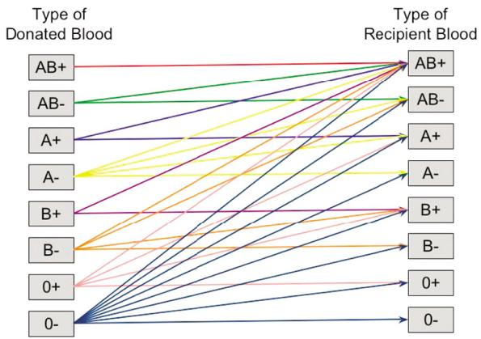  
Figure 13.3 Allowable substitutions of different blood types.

  
Figure 13.4 Multiperiod model of blood management, focusing on holding leftover blood over time.

We may assume that we will solve this problem once each week, using the forecasts for blood demands given by

$$
\begin{array}{r c l} f _ {t, t ^ {\prime} b} ^ {D} & = & \text {f o r e c a s t f o r t h e d e m a n d f o r b l o o d w i t h a t t r i b u t e v e c t o r b} \\ & & \text {m a d e a t t i m e t , t o s e r v e a d e m a n d a t t i m e t ^ {\prime}}. \end{array}
$$

If we use point forecasts (that is, assume that our forecasts $f _ { t t ^ { \prime } } ^ { D }$ are perfect), then we have a deterministic lookahead, just as we used for our dynamic shortest path problem in section 13.2.3. With the dynamic shortest path problem, we offered a solution for handling uncertainty in travel times by modifying the costs, using $\boldsymbol { \theta }$ −percentiles instead of the means, which is a form of modified objective function.

With our blood management problem, ignoring the uncertainty in the forecasts might produce a solution where we use our entire inventory of O-negative blood. Intuition would say that we want to conserve our O-negative blood because it can be used to serve any form of random demand. One way to do this would be to inflate the demand for O-negative blood, which would encourage the model to maintain reserves of O-negative. To estimate the inflation, we might aggregate all the other blood types, and then take the difference between the mean and the ??−percentile of the aggregate demand for the other blood types. This difference could then be added to the O-negative forecast.

With this modification, let $X _ { t } ^ { \pi } ( S _ { t } | \theta )$ be the solution of how to allocate blood supplies at time $t$ , given the modified demand for O-negative blood. We have to tune ??, ideally using a simulator, although it is not out of the question to experiment in the field (using, of course, a cumulative-reward objective).

# 13.3.3 An Energy Storage Example with Rolling Forecasts

Consider a general energy storage system depicted in Figure 13.5 which consists of energy from a wind farm, energy from the grid, a battery storage, and a load which could be a building, a university campus, or an entire city. The flows of energy have to be managed to meet a fairly consistent, if noisy, demand that depends on time of day (Figure 13.6(a)), which has to be planned in the presence of rolling forecasts of the energy from wind (Figure 13.6(b)). The demand follows familiar daily patterns, but the wind does not. In addition, the wind forecasts are not very accurate, and change quickly as the forecasts are updated.

We present our model in the usual five components: state variables, decision variables, exogenous information variables, transition function, and the objective function. We note that understanding the details of the model is not important. After presenting the model, we are going to present a policy that uses a deterministic lookahead which depends on forecasts of energy from the wind farm, as well as the demand for energy over the course of the day. We are going to parameterize these forecasts as a way of handling the uncertainty in the forecasts.

State variables – The planning of the system has to respond to the following information that is evolving over time:

$$
D _ {t} = \text {D e m a n d (}" l o a d") f o r p o w e r d i n g h o u r t.
$$

$$
E _ {t} = \text {E n e r g y g e n e r a t e d f r o m r e n e w a b l e s (w i n d / s o l a r) d u n i n g h o u r} t.
$$

$$
R _ {t} = \text {A m o u n t o f e n e r g y s t o r e d i n t h e b a t t e r y a t t i m e} t.
$$

  
Figure 13.5 Energy storage system, including a renewable source (wind), energy from the grid at real-time prices, battery storage, and a load.

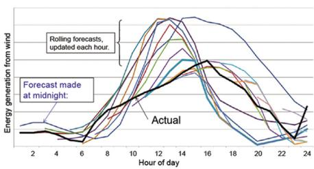  
(b)   
Figure 13.6 (a) Energy load by hour of day and (b) rolling forecast, updated hourly.

???? = Limit on how much generation can be transmitted at time ?? (this is known in advance).

???? = Price to be paid for energy drawn from the grid at time ??.

We have access to rolling forecasts of the demand $D _ { t }$ and the energy from wind $E _ { t }$ , given by:

These variables make up our state variable:

$$
S _ {t} = (R _ {t}, (f _ {t t ^ {\prime}} ^ {D}) _ {t ^ {\prime} \geq t}, (f _ {t t ^ {\prime}} ^ {E}) _ {t ^ {\prime} \geq t}).
$$

Decision variables: – These are the flows between each of the elements of our energy system:

???? = Planned generation of energy during hour ?? which consists of the following elements:

???????? = flow of energy from wind to demand,

???????? = flow of energy from wind to battery,

???????? = flow of energy from grid to demand,

???????? = flow of energy from grid to battery,

???????? = flow of energy from battery to demand.

We would normally write out the constraints that these flows have to satisfy. These consist of the flow conservation constraints, as well as upper bounds due to transmission constraints, as well as nonnegativity constraints on all the variables except $x _ { t } ^ { G B }$ since energy is allowed to flow both ways between the grid and the battery. For compactness, we are going to represent the constraints using

$$
A _ {t} x _ {t} = R _ {t},
$$

$$
\begin{array}{r c l} x _ {t} & \leq & u _ {t}, \end{array}
$$

$$
x _ {t} \geq 0.
$$

Exogenous information – For the variables with forecasts (demand and wind energy), the exogenous information is the change in the forecast, or the deviation between forecast and actual:

????+1, Change in the forecast of demand (for $\tau > 1$ periods in the future) that we first learn at time $t + 1$ , or the deviation between actual and forecast (for $\tau = 1$ ).

??????+1,?? Change in the forecast of wind energy (for $\tau > 1$ periods in the future) that we first learn at time $t + 1$ , or the deviation between actual and forecast (for $\tau = 1$ ).

We assume that prices evolve purely exogenously with deviations:

??̂??+1 = Change in grid prices between $t$ and $t + 1$ .

Our exogenous information is then

$$
W _ {t + 1} = ((\varepsilon_ {t + 1, \tau} ^ {D}, \varepsilon_ {t + 1, \tau} ^ {E}) _ {\tau \geq 1}, \hat {p} _ {t + 1}).
$$

Transition function – The variables that evolve exogenously are

$$
\begin{array}{l} f _ {t + 1, t ^ {\prime}} ^ {D} = f _ {t t ^ {\prime}} ^ {D} + \varepsilon_ {t + 1, t ^ {\prime} - t - 1} ^ {D}, t ^ {\prime} = t + 2,..., \\ {D _ {t + 1}} = {f _ {t + 1, t ^ {\prime}} ^ {D} + \varepsilon_ {t + 1, 1} ^ {D},} \\ {f _ {t + 1, t ^ {\prime}} ^ {E}} = {f _ {t t ^ {\prime}} ^ {E} + \varepsilon_ {t + 1, t ^ {\prime} - t - 1} ^ {E}, t ^ {\prime} = t + 2,...,} \\ {E _ {t + 1}} = {f _ {t + 1, t ^ {\prime}} ^ {E} + \varepsilon_ {t + 1, 1} ^ {E},} \\ p _ {t + 1} = p _ {t} + \hat {p} _ {t + 1}. \\ \end{array}
$$

The energy in storage evolves according to

$$
R _ {t + 1, t ^ {\prime}} = R _ {t t ^ {\prime}} + x _ {t t ^ {\prime}} ^ {E B} + x _ {t t ^ {\prime}} ^ {G B} - x _ {t t ^ {\prime}} ^ {B D}.
$$

The estimate $\tilde { R } _ { t + 1 , t + 1 }$ becomes the actual energy in the battery as of time $t + 1$ , while $\tilde { R } _ { t + 1 , t ^ { \prime } }$ for $t ^ { \prime } \geq t + 2$ are projections that may change. These equations make up our transition function $S _ { t + 1 } = S ^ { M } ( S _ { t } , x _ { t } , W _ { t + 1 } )$ .

Objective function – Our single-period contribution function is

$$
C \left(S _ {t}, x _ {t}\right) = p _ {t} \left(x _ {t} ^ {G B} + x _ {t} ^ {G D}\right).
$$

Our objective function, then, would be

$$
\max  _ {\pi} F ^ {\pi} (\theta) = \mathbb {E} \left\{\sum_ {t = 0} ^ {T} C \left(S _ {t}, X ^ {\pi} \left(S _ {t} \mid \theta\right)\right) \mid S _ {0} \right\}. \tag {13.24}
$$

As in the past, we can estimate this objective function by simulating our policy, which we present next.

Designing the policy – Given the complex interactions of time-dependent demands, time-varying energy from wind, and the constraints on transmission, we are going to develop a deterministic lookahead model (a form of DLA). Although we do not deal with DLAs in depth until chapter 19, a deterministic lookahead is fairly simple, and we are going to show how to parameterize the policy to handle the uncertainty in the forecasts.

We distinguish the decision we make at time ??, $x _ { t }$ , and the planned decisions we make at time ?? over our planning horizon, which we indicate by $\tilde { x } _ { t t ^ { \prime } }$ . Our planned decisions are given by

??̃????′ = planned generation of energy during hour $t ^ { \prime } > t$ , where the plan is made at time $t$ , which is comprised of the following elements:

We have to create projections of the energy in the battery over the horizon $t ^ { \prime } > t$ :

$$
\tilde {R} _ {t + 1, t ^ {\prime}} = \tilde {R} _ {t t ^ {\prime}} + \tilde {x} _ {t t ^ {\prime}} ^ {E B} + \tilde {x} _ {t t ^ {\prime}} ^ {G B} - \tilde {x} _ {t t ^ {\prime}} ^ {B D}.
$$

The estimate $\tilde { R } _ { t + 1 , t + 1 }$ becomes the actual energy in the battery as of time $t + 1$ , while $\tilde { R } _ { t + 1 , t ^ { \prime } }$ for $t ^ { \prime } \geq t + 2$ are projections that may change.

Our policy, then, is to optimize deterministically using point forecasts over a planning horizon $t , t + 1 , \dots , t + H$ :

$$
X ^ {D L A} \left(S _ {t}\right) = \arg \max  _ {x _ {t}, \left(\tilde {x} _ {t t ^ {\prime}}, t ^ {\prime} = t + 1, \dots , t + H\right)} \left(p _ {t} \left(x _ {t} ^ {G B} + x _ {t} ^ {G D}\right) + \sum_ {t ^ {\prime} = t + 1} ^ {t + H} \tilde {p} _ {t t ^ {\prime}} \left(\tilde {x} _ {t t ^ {\prime}} ^ {G B} + \tilde {x} _ {t t ^ {\prime}} ^ {G D}\right)\right) \tag {13.25}
$$

subject to the following constraints: First, for time ?? we have

$$
x _ {t} ^ {B D} - x _ {t} ^ {G B} - x _ {t} ^ {E B} \leq R _ {t}, \tag {13.26}
$$

$$
\tilde {R} _ {t, t + 1} - \left(x _ {t} ^ {G B} + x _ {t} ^ {E B} - x _ {t} ^ {B D}\right) = R _ {t}, \tag {13.27}
$$

$$
x _ {t} ^ {E D} + x _ {t} ^ {B D} + x _ {t} ^ {G D} = D _ {t}, \tag {13.28}
$$

$$
x _ {t} ^ {E B} + x _ {t} ^ {E D} \leq E _ {t}, \tag {13.29}
$$

$$
x _ {t} ^ {G D}, x _ {t} ^ {E B}, x _ {t} ^ {E D}, x _ {t} ^ {B D} \geq 0. \tag {13.30}
$$

Then, for $t ^ { \prime } = t + 1 , \dots , t + H$ we have

$$
\tilde {x} _ {t t ^ {\prime}} ^ {B D} - \tilde {x} _ {t t ^ {\prime}} ^ {G B} - \tilde {x} _ {t t ^ {\prime}} ^ {E B} \leq \tilde {R} _ {t t ^ {\prime}}, \tag {13.31}
$$

$$
\tilde {R} _ {t, t ^ {\prime} + 1} - \left(\tilde {x} _ {t t ^ {\prime}} ^ {G B} + \tilde {x} _ {t t ^ {\prime}} ^ {E B} - \tilde {x} _ {t t ^ {\prime}} ^ {B D}\right) = \tilde {R} _ {t t ^ {\prime}}, \tag {13.32}
$$

$$
\tilde {x} _ {t t ^ {\prime}} ^ {E D} + \tilde {x} _ {t t ^ {\prime}} ^ {B D} + \tilde {x} _ {t t ^ {\prime}} ^ {G D} = f _ {t t ^ {\prime}} ^ {D}, \tag {13.33}
$$

$$
\tilde {x} _ {t t ^ {\prime}} ^ {E B} + \tilde {x} _ {t t ^ {\prime}} ^ {E D} \leq f _ {t t ^ {\prime}} ^ {E}. \tag {13.34}
$$

We are now going to focus on equations (13.33) and (13.34) since both depend on forecasts which are uncertain. In chapter 19 we are going to propose a general approach for creating lookahead policies that capture uncertainty. Here,

we are going to do something simple (and very practical), which may even outperform the more complicated lookahead strategies we will describe later.

Our parameterized policy replaces equations (13.33) and (13.34) with

$$
\tilde {x} _ {t t ^ {\prime}} ^ {E D} + \tilde {x} _ {t t ^ {\prime}} ^ {B D} + \tilde {x} _ {t t ^ {\prime}} ^ {G D} = \theta_ {t ^ {\prime} - t} ^ {D} f _ {t t ^ {\prime}} ^ {D}, \tag {13.35}
$$

$$
\tilde {x} _ {t t ^ {\prime}} ^ {E B} + \tilde {x} _ {t t ^ {\prime}} ^ {E D} \leq \theta_ {t ^ {\prime} - t} ^ {E} f _ {t t ^ {\prime}} ^ {E}. \tag {13.36}
$$

Now let $X _ { t } ^ { C F A } ( S _ { t } | \theta )$ be the policy that solves the optimization problem in (13.25) subject to the constraints (13.31)–(13.32) and (13.35)–(13.36). We have introduced the parameters $\theta = ( \theta _ { \tau } ^ { E } , \theta _ { \tau } ^ { D } ) , \tau = 1 , 2 , \dots , H$ as a form of “discount factor” on the forecasts $f _ { t } ^ { D }$ and $f _ { t } ^ { E }$ .

We now face the problem of tuning $\boldsymbol { \theta }$ , which means optimizing $F ^ { \pi } ( \theta )$ in (13.24). For this we draw on our foundation of stochastic search. For this problem, we used the SPSA algorithm described in section 12.5 (see section 5.4.4 for a more detailed description) because it is well suited to handling multidimensional problems $\theta$ has two 23-dimensional vectors).

We will not repeat any of the algorithmic steps (they have already been covered), but we share the following experiences with the numerical work:

● Simulations of the policy are relatively fast, requiring solving 24 relatively small linear programs (allowing us to perform an entire simulation in just a few seconds).   
● Simulations of the policy are very noisy. It is necessary to average 1000 repetitions to get a reasonable estimate of the function (but always use whatever parallel computing capabilities you have available).   
● This does not mean that we need to use a mini-batch with 1000 simulations in the SPSA calculation, but we did need mini-batches on the order of 20 to 40, which means we needed 40 to 80 function evaluations for each gradient.   
● Do not forget the need to tune your stepsize formula (we used RMSProp from chapter 6). The tuning matters, and the tuning even depends on your choice of starting point.   
● The problem is highly time-dependent, but our parameterized lookahead policy is completely stationary. For example, $\theta _ { \tau }$ depends on how many time periods into the future we are forecasting, but does not depend on the time $t$ at which we are making the decision. This is the value of imbedding the forecast within the policy.

A nice property of the policy is that if the forecasts are perfect, then the optimal solution should be $\theta ^ { * } = 1$ . Figure 13.7(a) tests this idea for a problem with perfect forecasts by setting $\theta _ { \tau } = 1$ for all $\tau$ and then varying each $\theta _ { \tau }$ individually. The graph shows that $\theta _ { \tau } ^ { * } = 1$ for each value of $\tau$ .

  
Figure 13.7 Objective vs. $\theta _ { \tau }$ for (a) perfect forecasts and (b) stochastic forecasts.

We ran the SPSA algorithm for a problem with imperfect (in fact, highly imperfect) forecasts. We then fixed $\theta _ { \tau }$ to the values produced by the SPSA algorithm, and repeated the exercise of varying $\theta _ { \tau }$ for individual values of ??. The results are shown in Figure 13.7(b), which shows that the optimum values have now moved well away from 1.0.

When doing stochastic search with any algorithm (derivative-based or derivative-free) is that it helps to understand the behavior of the surface $\mathbb { E } F ^ { \pi } ( \theta , W )$ . While the one-dimensional plots in Figure 13.7 hint at the behavior of the surface (for example, the function appears to have a single optimum in each dimension), but seeing the function in higher dimensions contributes to our understanding.

Figure 13.8 shows four sets of two-dimensional heatmaps, where darker red reflects higher values. Each heatmap shows the two values of $\theta _ { \tau }$ between 0 and 2, so the center is $\theta _ { \tau } = 1$ , which was optimal for the deterministic problem. Note the ridges in 13.8(a) and (b), which will cause problems for a gradientbased algorithm. These ridges would also create challenges for derivative-free search methods.

Figure 13.9 shows how much the profits improved by optimizing $\boldsymbol { \theta }$ using the SPSA algorithm compared to the performance using $\theta \ : = \ : 1$ . The runs were performed for different starting points $\theta ^ { 0 }$ , drawn from four different regions:

(1) The first region started from $\theta ^ { 0 } = 1$   
(2) The second region was $\theta ^ { 0 } \in [ 0 , 1 ]$ .   
(3) The third region was $\theta ^ { 0 } \in [ . 5 , 1 . 5 ]$   
(4) The fourth region was $\theta ^ { 0 } \in \left[ 1 . 0 , 2 . 0 \right]$

We can draw several conclusions from this graph:

● The optimized CFA outperforms the basic deterministic lookahead (with $\theta = 1$ ) by 20 to 50 percent, which we consider significant.

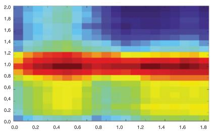  
(a)

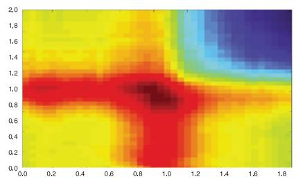  
(b)

  
(c)

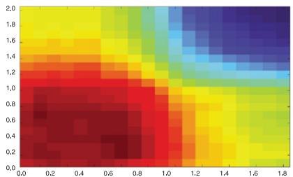

  
Figure 13.8 2-d heatmaps of the objective function for four different pairs of $( \theta _ { i } , \theta _ { j } )$ . Each dimension of each plot ranges from 0 to 2.   
Figure 13.9 Improvement in profits using optimized $\boldsymbol { \theta }$ over base results with $\theta = 1$ , using starting point $\theta ^ { 0 }$ drawn from each of four ranges: $\theta ^ { 0 } = 1$ , $\theta ^ { 0 } \in [ 0 , 1 ]$ , $\theta ^ { 0 } \in [ . 5 , 1 . 5 ]$ , and $\theta ^ { 0 } \in [ 1 , 2 ]$ .

● The performance can vary widely as we randomize the starting points. However, starting with $\theta ^ { 0 } = 1$ produced results that are comparable to or better than 12 out of 15 runs, but noticeably underperformed 3 of the runs. It is very nice to have a natural starting point, but more experiments are needed to understand the robustness of the optimized solutions.   
● Not shown is the effect of tuning the stepsize policy, which was significant. Stepsize tuned for one starting region [0, 1] but used for another starting region [1, 2] could produce optimized values of ?? that underperformed $\theta = 1$   
● The tuning process requires serious algorithmic work, but the resulting policy is no more complicated than a basic deterministic lookahead (that is, with $\theta = 1$ ).   
● This is a highly nonstationary problem, with a dynamic, rolling forecast. However, our parametric CFA policy with an imbedded forecast is stationary (none of the parameters depend on time of day), which is very valuable for a problem which has strong time-of-day behavior. By imbedding the forecast, we turn a highly nonstationary problem into a stationary one that responds immediately to evolving forecasts.

There is one particularly important point about parametric CFAs in general (and parameterized lookaheads in particular):

Many problems have complex dynamics, such as the presence of rolling forecasts for this energy problem. It is typically impossible to build these dynamics into the policies in the lookahead classes that we cover starting in chapter 14 (but especially chapter 19 on direct lookaheads), but it is quite easy to capture them in the simulation of the base model. For this reason, a carefully designed parametric CFA, tuned using the full base model which captures these dynamics, may outperform a much more complex stochastic lookahead policies that require approximations.

As with any parametric model (in optimization or statistics), there is always the question of the robustness of the model when it is implemented in new environments. These questions remain with both PFAs and CFAs. What seems to be most important is that the deterministic optimization model should capture important structural properties of the policy, which means that the tuning is just helping the policy to handle uncertainty.

# 13.4 Bibliographic Notes

Section 13.1 – The term “cost function approximation” was first proposed in Powell (2014). Powell and Meisel (2016) compared four classes of policies

for an energy storage problem, with one being a simple version of a parameterized optimization model. The first paper to the idea of a CFA formally is Ghadimi et al. (2020). We note that the concept of parameterized optimization models is a widely used industry heuristic, but without the proper statement of an objective function.

Section 13.2 – The dynamic trading policy (section 13.2.4) was described by a graduate student based on his summer internship.

Section 13.2 – The energy storage problem with rolling forecasts (section 13.3.3) was first presented in Powell (2021). The model and algorithmic work was given in Ghadimi et al. (2020).

# Exercises

# Review questions

13.1 What are the two ways of parameterizing an optimization-based policy?   
13.2 The dynamic assignment problem and the dynamic shortest path problem both parameterize the objective function, but motivated by completely different objectives. What are they?   
13.3 What is the complete state variable of a dynamic shortest path problem?

# Modeling questions

13.4 Using the model from section 8.3.2, write a model for the blood management problem in section 13.3.2 capturing the uncertainty in the forecasts for blood. Section 13.3.2 suggests a simple idea of inflating the demand for O-negative blood to have an adequate reserve in case we run short in our supply of other blood types. Of course, this ignores the ability to substitute across other blood types. You are going to develop a more general model for this problem based on a parameterized lookahead.

(a) Write out the full, multiperiod model with random demands, including all five dimensions of a dynamic model.   
(b) Now introduce reserves $\theta _ { a }$ for each blood type and write out this modified lookahead policy.   
(c) Write out the objective function for evaluating this policy.   
(d) The policy you have designed in (b) uses an additive adjustment. Now suggest a multiplicative adjustment as we used in section 13.3.3. How does this change the scaling of ???

(e) Since our tunable parameter $\boldsymbol { \theta }$ is now a vector with eight dimensions, sketch the calculations required to estimate a gradient using the SPSA algorithm.

13.5 The energy storage problem in section 13.3.3 has to manage a highly time-dependent demand (with consistent peaks and valleys), along with rolling forecasts that can exhibit highs and lows at any time of day. Given these characteristics,

(a) What does it mean to say that a “policy is stationary?”   
(b) Is the policy defined by (13.25) with constraints (13.26)–(13.32), (13.35), and (13.36) stationary? What allows you to make this determination?   
(c) Each element of the vector of parameters $\theta _ { \tau }$ was found to fall in the range [0,2]. In fact, if the forecasts were perfect then we know that $\theta _ { \tau } = 1$ . This is a very nice property. How is it that this CFA policy is so nicely scaled?

# Computational exercises

13.6 From the supplementary materials page https://castlelab.princeton. edu/rlso_supplementary/, download the Python module (under Software) for the dynamic assignment problem. This software has modeled the dynamic assignment problem with the $\boldsymbol { \theta }$ −percent costs $\tilde { c } _ { t , i , j } ^ { \pi } ( \theta )$ . Using this software, do the following:

(a) Simulate the performance of the policy using $\theta = 1$ . Repeat this 20 times and estimate the mean and standard deviation of the performance of the policy, and report the results. Normally we would use an initial experiment like this to determine how many times we need to run the simulation, but for now we evaluate a policy by averaging across 20 simulations.   
(b) Simulate the performance of the ??−percentile policies using $\theta =$ 0, .2, .4, .6, .8, .9, and report which value produces the best results.

# Theory questions

13.7 Show that the objective function for the policy defined by the optimization problem (13.25)–(13.32), along with the modified constraints (13.35)–(13.36), is concave in ??. Note: this requires a background in linear programming.

13.8 Argue why the performance of the policy $F ( \theta )$ produced by simulating the policy $X ^ { \pi } ( S _ { t } | \theta )$ given by (13.25), subject to constraints (13.26)– (13.32), is not concave in $\boldsymbol { \theta }$ .

# Problem solving questions

13.9 You would like to purchase a laptop. Price is a concern, but so is reliability, as well as service. There are some retail chains that offer service on the models they sell. You have found that that you buy laptops every two years. You do some research to develop a sense about reliability, but you will also learn from your own experience. Let

ℐ = The set of channels you can purchase the laptop from (retail outlets, websites),

$\begin{array} { r l r } { Q _ { i } } & { { } = } & { 1 } \end{array}$ if channel ?? offers repair service, 0 otherwise,

$\begin{array} { r l } { \bar { \mu } _ { t i } } & { { } = } \end{array}$ estimated probability that the laptop purchased from channel ?? will need service, given the experience as of time ??,

?????? = price of a laptop purchased from channel ?? at time $t$

$\begin{array} { r l r } { R _ { t i } } & { { } = } & { 1 } \end{array}$ if you are holding a laptop purchased from channel ?? as of time ??, 0 otherwise,

$\begin{array} { r l r } { z _ { t i } } & { { } = } & { 1 } \end{array}$ if you purchase a laptop from channel ?? at time ??, 0 otherwise,

$\begin{array} { r l } { \hat { F } _ { t i } } & { { } = } \end{array}$ if a laptop purchased from channel ?? needs a repair at time ??.

Use this notation to answer the following:

(a) Define the state variable $S _ { t }$   
(b) Identify the decision variable and exogenous information variable. Create the notation for the policy for making the decision (we will design this).   
(c) Give the equations for the transition function. Assume you are going to use exponential smoothing with parameter $\alpha$ to update your estimate of $\bar { \mu } _ { t i }$ .   
(d) You want to minimize how much you spend, and you put a weight $\rho ^ { s e r v }$ on the value of purchasing the laptop from a channel that offers service. Finally, you would like to limit the probability of needing service to less than 0.05. Use these guidelines to create an objective function for evaluating your policy.

# Diary problem

The diary problem is a single problem you chose (see chapter 1 for guidelines). Answer the following for your diary problem.

# 13.10 Do one of the following:

(a) Pick a decision in your problem that lends itself to being made by solving a deterministic approximation over some horizon. Think about how uncertainty might affect the quality of this solution, and what you think should be done differently in the presence of uncertainty. Try to suggest a parametrization that would make the deterministic lookahead work better.   
(b) Pick a decision in your problem where a myopic optimization is a reasonable starting point. Now, think about how considering the downstream impact of the decision might affect the decision you are making now. Try to introduce a parametrization that would make the myopic model work better.

# Bibliography

Ghadimi, S., Perkins, R., and Powell, W.B. (2020). Reinforcement Learning via Parametric Cost Function Approximation for Multistage Stochastic Programming. https://arxiv.org/abs/2001.00831.   
Powell, W.B. (2014). Clearing the jungle of stochastic optimization. Informs TutORials in Operations Research 2014.   
Powell, W.B. (2021). From reinforcement learning to optimal control: A unified framework for sequential decisions. Handbook on Reinforcement Learning and Optimal Control, Studies in Systems, Decision and Control, 29–74.   
Powell, W.B. and Meisel, S. (2016). Tutorial on stochastic optimization in energy Part II: An energy storage illustration. IEEE Transactions on Power Systems.

# Part V – Lookahead Policies

Lookahead policies are based on estimates of the impact of a decision on the future. There are two broad strategies for doing this:

Value function approximations If we are in a state $S _ { t }$ and take an action $x _ { t }$ then we observe new information $W _ { t + 1 }$ (which is random at time $t$ ) which takes us to a new state $S _ { t + 1 }$ , we might be able to approximate the value of being in state $S _ { t + 1 }$ . We can then use this to help us make a better decision $x _ { t }$ now if we can do a good job of approximating the value of being in state.

Direct lookahead approximations Here we explicitly plan decisions now, $x _ { t }$ , and into the future, $x _ { t + 1 } , \dots , x _ { t + H }$ , to help us make the best decision $x _ { t }$ to implement now. The problem in stochastic models is that the decisions $x _ { t t ^ { \prime } }$ for $t ^ { \prime } > t$ depend on future information, so they are random.

The choice between using value functions versus direct lookaheads boils down to a single equation which gives the optimal policy at time $t$ when we are in state $S _ { t }$ :

$$
X _ {t} ^ {\pi^ {*}} \left(S _ {t}\right) = \arg \max  _ {x _ {t} \in x _ {t}} \left(C \left(S _ {t}, x _ {t}\right) + \underbrace {\mathbb {E} \left\{\max  _ {\pi \in \Pi} \mathbb {E} \left\{\sum_ {t ^ {\prime} = t + 1} ^ {T} C \left(S _ {t ^ {\prime}} , X _ {t ^ {\prime}} ^ {\pi} \left(S _ {t ^ {\prime}}\right)\right) \mid S _ {t + 1} \right\} \mid S _ {t} , x _ {t} \right\}} _ {\text {f u t u r e c o n t r i b u t i o n s}}\right). \tag {13.37}
$$

The challenge is balancing the contributions now, given by $C ( S _ { t } , x _ { t } )$ , against future contributions. If we could compute the future contributions, this would be an optimal policy. However, computing future contributions in the presence of a (random) sequential information process is almost always computationally intractable.

There are problems where we can create reasonable approximations of the future contributions. When we do this around the post-decision state $S _ { t } ^ { x }$ (we can also write this as $( S _ { t } , x _ { t } ) )$ , this would be called the post-decision value function that we write as $\overline { { V } } _ { t } ^ { x } ( S _ { t } ^ { x } | \theta )$ , and allows us to write our policy as

$$
X _ {t} ^ {V F A} \left(S _ {t} | \theta\right) = \arg \max  _ {x _ {t} \in \mathcal {X} _ {t}} \left(C \left(S _ {t}, x _ {t}\right) + \overline {{V}} _ {t} ^ {x} \left(S _ {t} ^ {x} | \theta\right)\right). \tag {13.38}
$$

Needless to say, the VFA policy in equation (13.38) looks a lot friendlier than the full DLA policy using equation (13.37). The challenge is creating a reasonably accurate approximation $\overline { { \boldsymbol { V } } } _ { t } ^ { x } ( \boldsymbol { S } _ { t } ^ { x } | \boldsymbol { \theta } )$ where

$$
\overline {{V}} _ {t} ^ {x} (S _ {t} ^ {x} | \theta) \approx \mathbb {E} \left\{\max _ {\pi \in \Pi} \mathbb {E} \left\{\sum_ {t ^ {\prime} = t + 1} ^ {T} C (S _ {t ^ {\prime}}, X _ {t ^ {\prime}} ^ {\pi} (S _ {t ^ {\prime}})) S _ {t + 1} \right\} | S _ {t}, x _ {t} \right\}.
$$

This begs the question: Can we create a sufficiently accurate approximation $\overline { { V } } _ { t } ^ { x } ( S _ { t } ^ { x } | \bar { \theta } ) \ ?$ The answer is … sometimes. It really depends on the problem.

Policies based on value functions have attracted considerable attention over the years from the academic community. In fact, terms like “dynamic programming” and “optimal control” are basically synonymous with value functions (or cost-to-go functions, as they are known in control theory). There are very small classes of problems where these can be computed exactly, hence the interest in fields that go by names like “approximate dynamic programming,” “adaptive dynamic programming,” or “reinforcement learning,” although reinforcement learning has evolved to refer to an entire spectrum of policies that span, in the language of this book, all four classes of policies.

There is a wide range of strategies for approximating value functions which we have reviewed in chapter 3, all with their own strengths and weaknesses. The richness of these strategies explains why our coverage of VFA policies spans the following chapters:

Chapter 14: Exact dynamic programming – This chapter focus on a handful of sequential decision problems that can be solved exactly, which is to say, we can find provably optimal policies. Most of this presentation is centered on a field known as discrete Markov decision processes, which originated in the 1950s, and focuses on problems where there is a (not too large) set of discrete states, a (not too large) set of discrete actions, and random information $W _ { t + 1 }$ which allows us to take expectations. If these conditions are satisfied, these problems can be solved using a strategy that involves stepping backward through time computing the value of being in each state (this is often known as “backward dynamic programming”). The theory is very

elegant, but it is rarely computable. However, the ideas lay the foundation for a variety of approximation strategies. We also touch on a special problem in optimal control called linear quadratic regulation which is a foundational result of the very large field of optimal control, with many applications in control of robots and aircraft.

Chapter 15: Backward approximate dynamic programming – This chapter describes how to do backward dynamic programming approximately for multidimensional (and even continuous) states, multidimensional (and even continuous) decisions, and complex, multidimensional exogenous information processes.

Chapter 16: Forward ADP I: The value of a policy – This chapter describes the fundamentals of approximating value functions for a fixed policy using forward methods, where we simulate forward in time. Forward methods create a natural mechanism for sampling states (pay attention to how we sample states in chapter 15).

Chapter 17: Forward ADP II: Policy optimization – This chapter extends the previous one by showing how to simultaneously learn and optimize over policies. The interaction between learning a value function while also searching for policies introduces a significant level of complexity that explains why this field is so rich.

Chapter 18: Forward ADP III: Convex functions – This chapter adapts the forward ADP methods to the context of convex problems, specifically motivated by resource allocation problems, which represents a massive problem class. Convexity (concavity when maximizing) makes it possible for us to handle very high-dimensional problems.

By contrast, we have a single chapter, chapter 19, on direct lookahead (DLA) policies for solving equation (13.37). Our core strategy for solving equation (13.37) will be to replace the base model with an approximate lookahead model that is easier to solve, while continuing to capture the most important elements of the problem.

Our approximate lookahead model might be deterministic or stochastic. If it is deterministic, we are going to assume that algorithms are available for solving the lookahead model. If it is stochastic, then we are faced with solving a stochastic optimization within the policy for our stochastic optimization problem, albeit a simplified one. Entire fields have been dedicated to specific strategies for approximating and solving lookahead models, but these methods basically draw on all the tools of the rest of the book. For this reason, chapter 19 focuses more on strategies for creating the lookahead model, since the entire rest of the book covers the methods for solving the lookahead model.

# A brief history of approximate dynamic programming

Since the 1950s the standard approach for solving sequential decision problems (dynamic programs, optimal control problems) has been to start by stating Bellman’s equation (or equivalently, the Hamilton-Jacobi equation) which characterizes an optimal policy. However, almost invariably these cannot actually be computed, so the natural approach has been to solve these equations approximately. By now, as you can see from our presentation in chapter 11, and then the discussion of PFAs and CFAs in chapters 12 and 13, we feel a more balanced perspective is needed.

Approximate dynamic programming has a long history of re-invention by different communities. The first attempt was in 1959 by Bellman himself when he realized that his use of discrete states would explode when there were multiple state variables, a behavior that became widely known as the “curse of dimensionality.” Computational work in the core Markov decision process community largely died at that point, with subsequent work focusing more on the theory that is summarized in chapter 14.

In 1974, Paul Werbos showed how to derive estimates of value functions for control problems using a method he called “backpropagation,” which initiated a long line of research in the controls community, primarily for continuous, deterministic problems, that continues today. In fact it was this community that initiated the use of neural networks for approximating what they called “cost to go” functions (value functions in this book).

Then, in the 1980s, Rich Sutton and his adviser Andy Barto were experimenting with learning algorithms in psychology, using the setting of describing how a mouse would learn to navigate a maze. Psychology has a long history, dating to 1897 with the research by Ivan Pavlov into training dogs to associate a particular signal, or cue (in this case ringing a bell), to elicit a response (salivating) at which point the dog would receive a treat. Through repeated trials, the dog could be trained to associate the ringing of a bell with receiving a treat that would cause the dog to salivate. The repeated trials reinforced the relationship between the bell and receiving a treat (and then salivating). This became known as “cue learning” (where the ringing of the bell is the “cue”), and the process of associating the cue with the reward became known as “reinforcement learning,” terms that became popular in the 1940s and 1950s.

Sutton and Barto applied this same idea in the context of a maze, where a reward is not received until the mouse learns to find a path to a particular exit where there is a reward. As a result, an action does not immediately return a reward; instead, it just takes the mouse to a downstream state, which may eventually lead to a reward. This means the value of the action (turning left or right) depends on the state. They designed an algorithm that would, through many repetitions, learn $" Q '$ factors, where $Q ( s , a )$ is the value of taking an action ??

when the mouse is in state ??. The algorithm has two basic steps:

$$
\hat {q} ^ {n + 1} \left(s ^ {n}, a ^ {n}\right) = r \left(s ^ {n}, a ^ {n}\right) + \lambda \max  _ {a ^ {\prime}} \bar {Q} ^ {n} \left(s ^ {n + 1}, a ^ {\prime}\right), \tag {13.39}
$$

$$
\bar {Q} ^ {n + 1} \left(s ^ {n}, a ^ {n}\right) = (1 - \alpha_ {n}) \bar {Q} ^ {n} \left(s ^ {n}, a ^ {n}\right) + \alpha_ {n} \hat {q} ^ {n + 1} \left(s ^ {n}, a ^ {n}\right). \tag {13.40}
$$

The variables $s ^ { n }$ and $a ^ { n }$ are a current state and action (chosen according to rules that have to be designed). ?? plays the role of a discount factor, but this has nothing to do with the time value of money. $s ^ { n + 1 }$ is either observed from a physical system, or simulated from a known transition function given $s ^ { n }$ and $a ^ { n }$ . $\alpha _ { n }$ is known variously as a stepsize or learning rate.

Equations (13.39) and (13.40) can be rewritten

$$
\begin{array}{l} \bar {Q} ^ {n + 1} (s ^ {n}, a ^ {n}) = \bar {Q} ^ {n} (s ^ {n}, a ^ {n}) + \alpha_ {n} (r (s ^ {n}, a ^ {n}) \\ + \lambda \max  _ {a ^ {\prime}} \bar {Q} ^ {n} \left(s ^ {n + 1}, a ^ {\prime}\right) - - \bar {Q} ^ {n} \left(s ^ {n}, a ^ {n}\right). \tag {13.41} \\ \end{array}
$$

The quantity

$$
(r (s ^ {n}, a ^ {n}) + \lambda \max _ {a ^ {\prime}} \bar {Q} ^ {n} (s ^ {n + 1}, a ^ {\prime}) - - \bar {Q} ^ {n} (s ^ {n}, a ^ {n}))
$$

became known in the reinforcement learning literature as a “temporal difference” with parameter ??, and as a result the update became known as “TD(??)” (pronounced tee-dee-lambda). The parameter ?? looks like a discount factor, but it is an algorithmic discount factor which has nothing to do with the time value of money (we use ?? for this purpose).

At some point in the 1980s the connection between equations (13.39) and (13.40) and the field of discrete Markov decision processes was made, but it was not until 1992 that John Tsitsiklis bridged the updating equations (13.39) and (13.40) with the work on stochastic approximation methods (these are the stochastic gradient methods that we covered in chapter 5) that provided the basis for a convergence proof.

Equation (13.41) should look familiar: it is basically a stochastic gradient, with the difference that $\bar { Q } ^ { n } ( s ^ { n + 1 } , a ^ { \prime } )$ and ${ \bar { Q } } ^ { n } ( s ^ { n } , a ^ { n } )$ are biased estimates of the true function. Tsitsiklis extended the theory on stochastic approximation methods to handle this. This work provided the spark for the landmark book Neuro-Dynamic Programming by Bertsekas and Tsitsiklis in 1996 which laid the theoretical foundation for convergence theory in the entire field of VFA-based policies.

For a number of years, and to some extent still today, equations (13.39) and (13.40) are most closely associated with the term “reinforcement learning.” What this community has found, along with everyone doing research based on approximating value functions, is that value function approximations are effective on a fairly limited set of problems where using machine learning

to approximate the value of being in a state produces effective policies (with reasonable effort – an often overlooked issue).

Today, the second edition of Sutton and Barto’s highly popular Reinforcement Learning: An Introduction includes policies from all four classes of policies that we have introduced in this book. The “discovery” of strategies from the different classes of policies is a pattern that has been repeated across communities that work on sequential decision problems: fields including stochastic search, simulation-optimization, optimal control, and the multi-armed bandit community have all evolved the use of policies from the different classes of policies.

As you take the plunge into the rich set of strategies of approximating value functions, make sure that you have exhausted the simpler PFAs and CFAs, as well as the DLAs that we will cover in chapter 19. Keep in mind that sequential decision problems are ubiquitous, and that all decisions have to be made with some method. Now think about how many decisions are made by solving Bellman’s equation (even approximately).

#

# Exact Dynamic Programming

There are very specific classes of sequential decision problems that can be solved exactly, producing optimal policies. The most general class of problems fall under the umbrella known as discrete Markov decision processes, which are characterized by a (not too large) set of discrete states ??, and a (not too large) set of discrete actions ??. We deviate from our standard notation of using $x$ for decisions to acknowledge the long history in this field of using ?? for action, where $a$ is discrete (it could be an integer, a discretized continuous variable, or a categorical quantity such as color, medical treatment, or product recommendation). This is the notation that has been adopted by the reinforcement learning community.

It turns out that there is a wide range of applications with discrete actions, where the number of actions is “not too large,” but the requirement that the state space is “not too large” is far more restrictive in practice. However, despite this limitation (which is severe), the study of this problem class has helped to establish the theory of sequential decision problems, and has laid the foundation for different algorithmic strategies even when the assumption of small state and action spaces does not apply.

The investigation of discrete Markov decision processes attracted a mathematically sophisticated community which has largely defined the work in this field up through the 1990s. A number of the equations in this chapter, while quite elegant (and sometimes quite sophisticated), are not computable for anything other than toy problems. This style sharply contrasts with the entire rest of the book. However, the algorithms in this chapter laid the foundation for entire classes of algorithms described in chapters 15–18 which scale to much larger (and in some cases extremely large) problems. We note that the foundation for this material is laid in sections 14.1–14.3.

Although this chapter is primarily focused on discrete dynamic programs (discrete states and actions), we pause first in section 14.4 to demonstrate how

the same equations can be used to solve certain continuous problems analytically. This section should be viewed as an exercise that illustrates the key ideas of sections 14.1–14.3 using a toy problem that can be solved using the same tools and concepts, but without any need for numerical computation. We then close with section 14.11 that presents the foundation of a very large field known as optimal control, where we can find optimal solutions to an important problem class known as linear quadratic regulation which has many applications in engineering.

# 14.1 Discrete Dynamic Programming

To understand the power of the Markov decision process framework, it is useful to return to the idea of a decision tree, illustrated in Figure 14.1. We enumerate the decisions out of each decision node (squares), and the random outcomes out of each outcome node (circles). If there are 10 possible decisions and 10 possible random outcomes, our tree is 100 times bigger after one sequence of decisions and random information. If we step forward 10 steps (10 decisions followed by

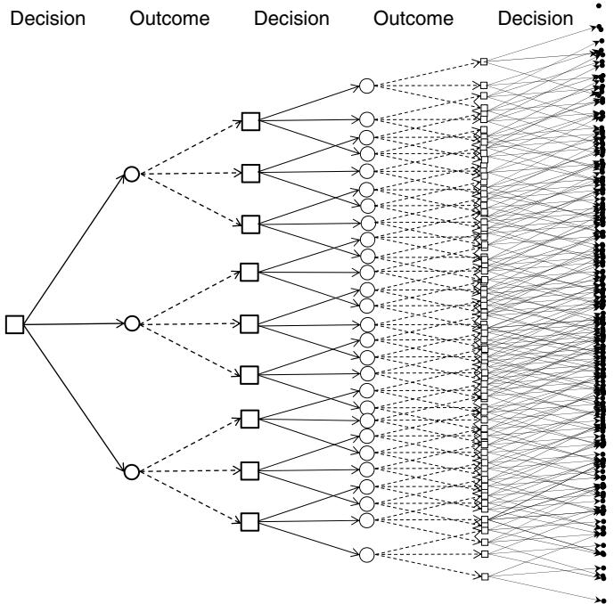  
Figure 14.1 Decision tree illustrating the sequence of decisions and new information, illustrating the explosive growth of decision trees.

random information), our tree would have $1 0 0 ^ { 1 0 }$ ending nodes. And this is not even a large problem (it is easy to find problems with far larger numbers of actions and outcomes). The explosive growth in the size of the decision trees is illustrated in Figure 14.1, where the number of decisions and outcomes is quite small.

The breakthrough of Markov decision processes (by Richard Bellman in the 1950s) was the recognition that each decision node corresponds to a state of a dynamic system. In the classical representation of a decision tree, decision nodes correspond to the entire history of the process up to that point in time. However, there are many settings where we may not need the entire history to make a decision.

Assume that the relevant information we need to make a decision can be represented by a state ?? that falls in a discrete set $\mathcal { S } = ( 1 , 2 , \ldots , | \mathcal { S } | )$ , where ?? is small enough to enumerate. For example, $S _ { t }$ might be the number of units of blood in a hospital inventory. In this case, the number of decision nodes does not grow exponentially. Furthermore, we only need to know the inventory, and not the history of how we got there.

When we can exploit this more compact structure, our decision tree collapses into the diagram shown in Figure 14.2, where the number of states in each period is fixed. Note that the number of outcome nodes is potentially quite large (possibly infinite). For example, our random information may be continuous or multidimensional; this would be the second of the three curses of dimensionality we first introduced in section 2.1.3. (For a reminder of how complicated state variables can be, flip back to the energy storage illustrations in section 9.9.)

There are many problems where states are continuous, or the state variable is a vector producing a state space that is far too large to enumerate. In addition, the one-step transition matrix $p _ { t } ( S _ { t + 1 } | S _ { t } , a _ { t } )$ can also be difficult or impossible to compute. So why cover material that is widely acknowledged to work only on small or highly specialized problems? There are (at least) four reasons:

(1) Some problems have small state and action spaces and can be solved with these techniques. In fact, it is often the case that the tools of Markov decision processes offers the only path to finding the optimal policy.   
(2) We can use optimal policies, which are limited to fairly small problems, to evaluate approximation algorithms that can be scaled to larger problems.   
(3) The theory of Markov decision processes can be used to identify structural properties that can help us identify properties of optimal policies that we can exploit in policy search algorithms.   
(4) This material provides the intellectual foundation for approximation algorithms that can be scaled to far more complex problems, such as optimizing the locomotives for a major railroad, or optimizing a network of hydroelectric reservoirs.

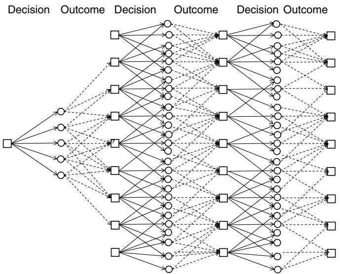  
Figure 14.2 Collapsed version of the decision tree, when states do not capture entire history.

As with most of the chapters in the book, the body of this chapter focuses on the algorithms. Some of the elegant theory that has been developed for this field is presented in the “Why does it work” section (section 14.12). The intent is to allow the presentation of results to flow more naturally, but serious students of dynamic programming are encouraged to delve into these proofs, which are quite elegant. This is partly to develop a deeper appreciation of the properties of the problem as well as to develop an understanding of the proof techniques that are used in this field.

# 14.2 The Optimality Equations

In the last chapter, we illustrated a number of stochastic optimization models that involve solving the following objective function

$$
\max  _ {\pi} \mathbb {E} \left\{\sum_ {t = 0} ^ {T} \gamma^ {t} C \left(S _ {t}, A _ {t} ^ {\pi} \left(S _ {t}\right)\right) \mid S _ {0} \right\}. \tag {14.1}
$$

The most important contribution of the material in this chapter is that it provides a path to optimal policies. In practice, optimal policies are rare,

so even with the computational limitations, at least having a framework for characterizing optimal policies is exceptionally valuable.

# 14.2.1 Bellman’s Equations

With a little thought, we realize that we do not have to solve this entire problem at once. Assume that we are solving a deterministic shortest path problem where $S _ { t }$ is the index of the node in the network where we have to make a decision. If we are in state $S _ { t } = i$ (that is, we are at node ?? in our network) and take action $a _ { t } = j$ (that is, we wish to traverse the link from $i$ to $j$ ), our transition function will tell us that we are going to land in some state $S _ { t + 1 } = S ^ { M } ( S _ { t } , a _ { t } )$ (in this case, node $j$ ).

What if we had a function $V _ { t + 1 } ( S _ { t + 1 } )$ that told us the value of being in state $S _ { t + 1 }$ (giving us the value of the path from node $j$ to the destination)? We could evaluate each possible action $a _ { t }$ and simply choose the action $a _ { t }$ that has the largest one-period contribution, $C _ { t } ( S _ { t } , a _ { t } )$ , plus the value of landing in state $S _ { t + 1 } = S ^ { M } ( S _ { t } , a _ { t } )$ which we represent using $V _ { t + 1 } ( S _ { t + 1 } )$ . Since this value represents the money we receive one time period in the future, we might discount this by a factor ??. In other words, we have to solve

$$
a _ {t} ^ {*} (S _ {t}) = \arg \max _ {a _ {t} \in \mathcal {A} _ {t}} \left(C _ {t} (S _ {t}, a _ {t}) + \gamma V _ {t + 1} (S _ {t + 1})\right),
$$

where “arg max” means that we want to choose the action $a _ { t }$ that maximizes the expression in parentheses. We also note that $S _ { t + 1 }$ is a function of $S _ { t }$ and $a _ { t }$ , meaning that we could write it as $S _ { t + 1 } ( S _ { t } , a _ { t } )$ . Both forms are fine. It is common to write $S _ { t + 1 }$ by itself, but the dependence on $S _ { t }$ and $a _ { t }$ needs to be understood.

The value of being in state $S _ { t }$ is the value of using the optimal decision $a _ { t } ^ { * } ( S _ { t } )$ . That is

$$
\begin{array}{l} {V _ {t} (S _ {t})} = {\max _ {a _ {t} \in \mathcal {A} _ {t}} \left(C _ {t} (S _ {t}, a _ {t}) + \gamma V _ {t + 1} (S _ {t + 1} (S _ {t}, a _ {t}))\right)} \\ = C _ {t} \left(S _ {t}, a _ {t} ^ {*} \left(S _ {t}\right)\right) + \gamma V _ {t + 1} \left(S _ {t + 1} \left(S _ {t}, a _ {t} ^ {*} \left(S _ {t}\right)\right)\right). \tag {14.2} \\ \end{array}
$$

Equation (14.2) is the optimality equation for deterministic problems.

When we are solving stochastic problems, we have to model the fact that new information becomes available after we make the decision $a _ { t }$ . The result can be uncertainty in both the contribution earned, and in the determination of the next state we visit, $S _ { t + 1 }$ . For example, consider the problem of managing oil inventories for a refinery. Let the state $S _ { t }$ be the inventory in thousands of barrels of oil at time $t$ (we require $S _ { t }$ to be integer). Let $a _ { t }$ be the amount of oil ordered at time $t$ that will be available for use between $t$ and $t + 1$ , and let $\hat { D } _ { t + 1 }$ be the demand for oil between $t$ and $t + 1$ . The state variable is governed by the simple inventory equation

$$
S _ {t + 1} \left(S _ {t}, a _ {t}, \hat {D} _ {t + 1}\right) = \max  \{0, S _ {t} + a _ {t} - \hat {D} _ {t + 1} \}.
$$

We have written the state $S _ { t + 1 }$ using $S _ { t + 1 } ( S _ { t } , a _ { t } , \hat { D } _ { t + 1 } )$ to express the dependence on $S _ { t }$ , $a _ { t }$ , and $\hat { D } _ { t + 1 }$ , but it is common to simply write $S _ { t + 1 }$ and let the dependence on $S _ { t }$ , $a _ { t }$ , and $\hat { D } _ { t + 1 }$ be implicit. Since $\hat { D } _ { t + 1 }$ is random at time $t$ when we have to choose $a _ { t }$ , we do not know $S _ { t + 1 }$ . But if we know the probability distribution of the demand $\hat { D } _ { t + 1 }$ , we can work out the probability that $S _ { t + 1 }$ will take on a particular value.

If $\mathbb { P } ^ { D } ( d ) = \mathbb { P } [ \hat { D } = d ]$ is our probability distribution, then we can find the probability distribution for $S _ { t + 1 }$ using

$$
P r o b (S _ {t + 1} = s ^ {\prime}) = \left\{ \begin{array}{l l} 0 & \text {i f} s ^ {\prime} > S _ {t} + a _ {t}, \\ \mathbb {P} ^ {D} (S _ {t} + a _ {t} - s ^ {\prime}) & \text {i f} 0 <   s ^ {\prime} \leq S _ {t} + a _ {t}, \\ \sum_ {d = S _ {t} + a _ {t}} ^ {\infty} \mathbb {P} ^ {D} (d) & \text {i f} s ^ {\prime} = 0. \end{array} \right.
$$

These probabilities depend on $S _ { t }$ and $a _ { t }$ , so we write the probability distribution as

$$
\mathbb {P} \left(S _ {t + 1} \mid S _ {t}, a _ {t}\right) = \text {t h e p r o b a b i l i t y o f} S _ {t + 1} \text {g i v e n} S _ {t} \text {a n d} a _ {t}.
$$

We can then modify the deterministic optimality equation in (14.2) by summing over the probability of each possible value of $S _ { t + 1 }$ (which is the same as taking an expectation), giving us

$$
V _ {t} \left(S _ {t}\right) = \max  _ {a _ {t} \in \mathcal {A} _ {t}} \left(C _ {t} \left(S _ {t}, a _ {t}\right) + \gamma \sum_ {s ^ {\prime} \in \mathcal {S}} \mathbb {P} \left(S _ {t + 1} = s ^ {\prime} \mid S _ {t}, a _ {t}\right) V _ {t + 1} \left(s ^ {\prime}\right)\right). \tag {14.3}
$$

We refer to this as the standard form of Bellman’s equations, since this is the version that is used by virtually every textbook on Markov decision processes. An equivalent form is to write

$$
V _ {t} \left(S _ {t}\right) = \max  _ {a _ {t} \in \mathcal {A} _ {t}} \left(C _ {t} \left(S _ {t}, a _ {t}\right) + \gamma \mathbb {E} \left\{V _ {t + 1} \left(S _ {t + 1} \left(S _ {t}, a _ {t}, W _ {t + 1}\right)\right) \mid S _ {t} \right\}\right), \tag {14.4}
$$

where we simply use an expectation instead of summing over probabilities. We refer to this equation as the expectation form of Bellman’s equation. This version is the standard style that we use in this book.

Equation (14.4) is generally written in the more compact form

$$
V _ {t} \left(S _ {t}\right) = \max  _ {a _ {t} \in \mathcal {A} _ {t}} \left(C _ {t} \left(S _ {t}, a _ {t}\right) + \gamma \mathbb {E} \left\{V _ {t + 1} \left(S _ {t + 1}\right) \mid S _ {t} \right\}\right), \tag {14.5}
$$

where the functional relationship $S _ { t + 1 } = S ^ { M } ( S _ { t } , a _ { t } , W _ { t + 1 } )$ is implicit. At this point, however, we have to deal with some subtleties of mathematical notation. In equation (14.4) we have captured the functional dependence of $S _ { t + 1 }$ on $S _ { t }$ and $a _ { t }$ , but the expectation is actually over the random variable $W _ { t + 1 }$ , which may be

completely independent of the state of the system, but there may be conditional dependence of $W _ { t + 1 }$ on the state $S _ { t }$ and/or the action $a _ { t }$ . For this reason, we will often write

$$
V _ {t} \left(S _ {t}\right) = \max  _ {a _ {t} \in \mathcal {A} _ {t}} \left(C _ {t} \left(S _ {t}, a _ {t}\right) + \gamma \mathbb {E} \left\{V _ {t + 1} \left(S _ {t + 1}\right) \mid S _ {t}, a _ {t} \right\}\right). \tag {14.6}
$$

The standard form of Bellman’s equation (14.3) has been popular in the research community since it lends itself to elegant algebraic manipulation when we assume we know the transition matrix. It is common to write it in a more compact form. Recall that a policy $\pi$ is a rule that specifies the action $a _ { t }$ given the state $S _ { t }$ . In this chapter, it is easiest if we always think of a policy in terms of a rule “when we are in state ?? we take action ??.” This is a form of “lookup-table” representation of a policy that is very clumsy for most real problems, but it will serve our purposes here.

The probability that we transition from state $S _ { t } = s$ to $S _ { t + 1 } = s ^ { \prime }$ can be written as

$$
p _ {s s ^ {\prime}} (a) = \mathbb {P} (S _ {t + 1} = s ^ {\prime} | S _ {t} = s, a _ {t} = a).
$$

We would say that “ ${ \dot { p } } _ { s s ^ { \prime } } ( a )$ is the probability that we end up in state $s ^ { \prime }$ if we start in state ?? at time $t$ when we are taking action $a$ .” Now assume that we have a function $A _ { t } ^ { \pi } ( s )$ that determines the action ?? we should take when in state ??. It is common to write the transition probability $p _ { s s ^ { \prime } } ( a )$ in the form

$$
p _ {s s ^ {\prime}} ^ {\pi} = \mathbb {P} (S _ {t + 1} = s ^ {\prime} | S _ {t} = s, A _ {t} ^ {\pi} (s) = a).
$$

We can now write this in matrix form

$$
P _ {t} ^ {\pi} = \text {t h e o n e - s t e p t r a n s i t i o n m a t r i x u n d e r p o l i c y} \pi ,
$$

where $p _ { s s ^ { \prime } } ^ { \pi }$ is the element in row ?? and column $s ^ { \prime }$ . There is a different matrix $P ^ { \pi }$ for each policy (decision rule) $\pi$ .

Now let $c _ { t } ^ { \pi }$ be a column vector with element $c _ { t } ^ { \pi } ( s ) = C _ { t } ( s , A _ { t } ^ { \pi } ( s ) )$ , and let $v _ { t + 1 }$ be a column vector with element $V _ { t + 1 } ( s )$ . Then (14.3) is equivalent to

$$
\left[ \begin{array}{c} \vdots \\ v _ {t} (s) \\ \vdots \end{array} \right] = \max  _ {\pi} \left(\left[ \begin{array}{c} \vdots \\ c _ {t} ^ {\pi} (s) \\ \vdots \end{array} \right] + \gamma \left[ \begin{array}{c c c} \ddots & & \\ & p _ {s s ^ {\prime}} ^ {\pi} & \\ & & \ddots \end{array} \right] \left[ \begin{array}{c} \vdots \\ v _ {t + 1} \left(s ^ {\prime}\right) \\ \vdots \end{array} \right]\right). \tag {14.7}
$$

where the maximization is performed for each element (state) in the vector. In matrix/vector form, equation (14.7) can be written

$$
v _ {t} = \max  _ {\pi} \left(c _ {t} ^ {\pi} + \gamma P _ {t} ^ {\pi} v _ {t + 1}\right). \tag {14.8}
$$

Here, we maximize over policies because we want to find the best action for each state. The vector $v _ { t }$ is known widely as the value function (the value of

being in each state). In control theory, it is known as the cost-to-go function, where it is typically denoted as $J$ .

Equation (14.8) can be solved by finding $a _ { t }$ for each state ??. The result is a decision vector $\boldsymbol { a } _ { t } ^ { * } = ( \boldsymbol { a } _ { t } ^ { * } ( \boldsymbol { s } ) ) _ { \boldsymbol { s } \in \mathcal { S } }$ , which is equivalent to determining the best policy. This is easiest to envision when $a _ { t }$ is a scalar (how much to buy, whether to sell), but in many applications $a _ { t } ( s )$ is itself a vector. For example, assume our problem is to assign individual programmers to different programming tasks, where our state $S _ { t }$ captures the availability of programmers and the different tasks that need to be completed. Of course, computing a vector $a _ { t }$ for each state $S _ { t }$ which is itself a vector is much easier to write than to implement.

It is very easy to lose sight of the relationship between Bellman’s equation and the original objective function that we stated in equation (14.1). To bring this out, we begin by writing the expected profits using policy $\pi$ from time $t$ onward

$$
F _ {t} ^ {\pi} (S _ {t}) = \mathbb {E} \left\{\sum_ {t ^ {\prime} = t} ^ {T - 1} C _ {t ^ {\prime}} (S _ {t ^ {\prime}}, A _ {t ^ {\prime}} ^ {\pi} (S _ {t ^ {\prime}})) + C _ {T} (S _ {T}) | S _ {t} \right\}.
$$

$F _ { t } ^ { \pi } ( S _ { t } )$ is the expected total contribution if we are in state $S _ { t }$ in time $t$ , and follow policy $\pi$ from time $t$ onward. If $F _ { t } ^ { \pi } ( S _ { t } )$ were easy to calculate, we would probably not need dynamic programming. Instead, it seems much more natural to calculate $\mathbf { } V _ { t } ^ { \pi }$ recursively using

$$
{V _ {t} ^ {\pi} (S _ {t})} = {C _ {t} (S _ {t}, A _ {t} ^ {\pi} (S _ {t})) + \mathbb {E} \left\{V _ {t + 1} ^ {\pi} (S _ {t + 1}) | S _ {t} \right\}.}
$$

It is not hard to show (by stepping backward in time) that

$$
F _ {t} ^ {\pi} (S _ {t}) = V _ {t} ^ {\pi} (S _ {t}).
$$

The proof, given in section 14.12.1, uses a proof by induction: assume it is true for $V _ { t + 1 } ^ { \pi }$ , and then show that it is true for $\mathbf { } V _ { t } ^ { \pi }$ (not surprisingly, inductive proofs are very popular in dynamic programming).

With this result in hand, we can then establish the following key result. Let $V _ { t } ( S _ { t } )$ be a solution to equation (14.4) (or (14.3)). Then

$$
\begin{array}{l} F _ {t} ^ {*} = \max  _ {\pi \in \Pi} F _ {t} ^ {\pi} (S _ {t}) \\ = V _ {t} \left(S _ {t}\right). \tag {14.9} \\ \end{array}
$$

Equation (14.9) establishes the equivalence between (a) the value of being in state $S _ { t }$ and following the optimal policy and (b) the optimal value function at state $S _ { t }$ . While these are indeed equivalent, the equivalence is the result of a theorem (established in section 14.12.1). However, it is not unusual to find people who lose sight of the original objective function. Later, we have to solve

these equations approximately, and we will need to use the original objective function to evaluate the quality of a solution.

# 14.2.2 Computing the Transition Matrix

It is very common in stochastic, dynamic programming (more precisely, Markov decision processes) to assume that the one-step transition matrix $P ^ { \pi }$ is given as data (remember that there is a different matrix for each policy ??). In practice, we generally can assume we know the transition function $S ^ { M } ( S _ { t } , a _ { t } , W _ { t + 1 } )$ from which we have to derive the one-step transition matrix.

Assume that the random information $W _ { t + 1 }$ that arrives between ?? and $t + 1$ is independent of all prior information. Let $\Omega$ be the set of possible outcomes of our stochastic process, and let $w _ { t + 1 } = W _ { t + 1 } ( \omega )$ be a particular realization (for simplicity, we assume that $\Omega$ is discrete, as in a set of sampled observations), where $\mathbb { P } ( W _ { t + 1 } = w _ { t + 1 } = W _ { t + 1 } ( \omega ) )$ is the probability of outcome $W _ { t + 1 } = w _ { t }$ . Also define the indicator function

$$
\mathbb {1} _ {\{X \}} = \left\{ \begin{array}{l l} 1 & \text {i f t h e s t a t e m e n t ＂ X ＂ i s t r u e .} \\ 0 & \text {o t h e r w i s e .} \end{array} \right.
$$

Here, “??” represents a logical condition (such as, “is $S _ { t } = 6 ? ^ { \prime }$ ). We now observe that the one-step transition probability $\mathbb { P } _ { t } ( S _ { t + 1 } | S _ { t } , a _ { t } )$ can be written

$$
\begin{array}{l} \mathbb {P} _ {t} \left(S _ {t + 1} \mid S _ {t}, a _ {t}\right) = \mathbb {E} \mathbb {1} _ {\left\{s ^ {\prime} = S ^ {M} \left(S _ {t}, a _ {t}, W _ {t + 1}\right) \right\}} \\ = \sum_ {\omega \in \Omega} \mathbb {P} (W _ {t + 1} = w _ {t + 1}) \mathbb {I} _ {\{s ^ {\prime} = S ^ {M} (S _ {t}, a _ {t}, w _ {t + 1}) \}}. \\ \end{array}
$$

So, finding the one-step transition matrix means that all we have to do is to sum over all possible outcomes of the information $W _ { t + 1 }$ and add up the probabilities that take us from a particular state-action pair $( S _ { t } , a _ { t } )$ to a particular state $S _ { t + 1 } = s ^ { \prime }$ . Sounds easy.

In some cases, this calculation is straightforward (consider our oil inventory example earlier in the section). But in other cases, this calculation is impossible. For example, $W _ { t + 1 }$ might be a vector of prices or demands. In this case, the set of outcomes $\Omega$ can be much too large to enumerate (this is the third curse of dimensionality), but we can work with a sampled set of outcomes, as we indicated in section 10.3.3.

While we can estimate the transition matrix statistically, our standard approach is to simulate the transition function, rather than compute (or even approximate) the one step transition matrix. We will first see this in an ADP

setting in chapter 15. For the remainder of this chapter, we assume the one-step transition matrix is available.

# 14.2.3 Random Contributions

In many applications, the one-period contribution function is a deterministic function of $S _ { t }$ and $a _ { t }$ , and hence we routinely write the contribution as the deterministic function $C _ { t } ( S _ { t } , a _ { t } )$ . However, this is not always the case. For example, a car traveling over a stochastic network may choose to traverse the link from node ?? to node $j$ , and only learn the cost of the movement after making the decision. For such cases, the contribution function is random, and we might write it as

$$
\begin{array}{r c l} \hat {C} _ {t + 1} (S _ {t}, a _ {t}, W _ {t + 1}) & = & \text {t h e c o n t r i b u t i o n r e c e i v e d i n p e r i o d t + 1 g i v e n} \\ & & \text {t h e s t a t e S _ {t} a n d d e c i s i o n a _ {t} , a s w e l l a s t h e n e w} \\ & & \text {i n f o r m a t i o n W _ {t + 1} t h a t a r r i v e s i n p e r i o d t + 1 .} \end{array}
$$

In this case, we simply bring the expectation in front, giving us

$$
V _ {t} \left(S _ {t}\right) = \max  _ {a _ {t}} \mathbb {E} \left\{\hat {C} _ {t + 1} \left(S _ {t}, a _ {t}, W _ {t + 1}\right) + \gamma V _ {t + 1} \left(S _ {t + 1}\right) \mid S _ {t} \right\}. \tag {14.10}
$$

Now let

$$
C _ {t} (S _ {t}, a _ {t}) = \mathbb {E} \{\hat {C} _ {t + 1} (S _ {t}, a _ {t}, W _ {t + 1}) | S _ {t} \}.
$$

Thus, we may view $C _ { t } ( S _ { t } , a _ { t } )$ as the expected contribution given that we are in state $S _ { t }$ and take action $a _ { t }$ .

# 14.2.4 Bellman’s Equation Using Operator Notation*

The vector form of Bellman’s equation in (14.8) can be written even more compactly using operator notation. Let $\mathcal { M }$ be the “max” (or “min”) operator in (14.8) that can be viewed as acting on the vector $v _ { t + 1 }$ to produce the vector $v _ { t }$ . If we have a given policy $\pi$ , we can write

$$
\mathcal {M} ^ {\pi} v (s) = C _ {t} (s, A ^ {\pi} (s)) + \gamma \sum_ {s ^ {\prime} \in \mathcal {S}} \mathbb {P} _ {t} (s ^ {\prime} | s, A ^ {\pi} (s)) v _ {t + 1} (s ^ {\prime}).
$$

Alternatively, we can find the best action, which we represent using

$$
\mathcal {M} v (s) = \max  _ {a} \left(C _ {t} (s, a) + \gamma \sum_ {s ^ {\prime} \in \mathcal {S}} \mathbb {P} _ {t} (s ^ {\prime} | s, a) v _ {t + 1} (s ^ {\prime})\right).
$$

Here, ℳ?? produces a vector, and $\mathcal { M } v ( s )$ refers to element ?? of this vector. In vector form, we would write

$$
\mathcal {M} v = \max _ {\pi} \left(c _ {t} ^ {\pi} + \gamma P _ {t} ^ {\pi} v _ {t + 1}\right).
$$

Now let $\mathcal { V }$ be the space of value functions. Then, $\mathcal { M }$ is a mapping

$$
\mathcal {M}: \mathcal {V} \rightarrow \mathcal {V}.
$$

We may also define the operator ${ \mathcal { M } } ^ { \pi }$ for a particular policy $\pi$ using

$$
\mathcal {M} ^ {\pi} (v) = c _ {t} ^ {\pi} + \gamma P ^ {\pi} v \tag {14.11}
$$

for some vector $\upsilon \in \mathcal { V } . \mathcal { M } ^ { \pi }$ is known as a linear operator since the operations that it performs on $v$ are additive and multiplicative. In mathematics, the function $c _ { t } ^ { \pi } + \gamma P ^ { \pi } v$ is known as an affine function. This notation is particularly useful in mathematical proofs (see some of the proofs in section 14.12), but we will not use this notation when we describe models and algorithms.

We see later in the chapter that we can exploit the properties of this operator to derive some very elegant results for Markov decision processes. These proofs provide insights into the behavior of these systems, which can guide the design of algorithms. For this reason, it is relatively immaterial that the actual computation of these equations may be intractable for many problems; the insights still apply.

# 14.3 Finite Horizon Problems

Finite horizon problems tend to arise in two settings. First, some problems have a very specific horizon. For example, we might be interested in the value of an American option where we are allowed to sell an asset at any time $t \leq T$ where $T$ is the exercise date. Another problem is to determine how many seats to sell at different prices for a particular flight departing at some point in the future. In the same class are problems that require reaching some goal (but not at a particular point in time). Examples include driving to a destination, selling a house, or winning a game.

A second class of problems is actually infinite horizon, but where the goal is to determine what to do right now given a particular state of the system. For example, a transportation company might want to know what drivers should be assigned to a particular set of loads right now. Of course, these decisions need to consider the downstream impact, so models have to extend into the future, but we simply do not need to optimize over an infinite horizon. For this reason, we might model the problem over a horizon $T$ which, when solved, yields a decision of what to do now. This is known as a direct lookahead policy which

we cover in chapter 19, but a DLA policy can involve solving a Markov decision process.

When we encounter a finite horizon problem, we assume that we are given the function $V _ { T } ( S _ { T } )$ as data. Often, we simply use $V _ { T } ( S _ { T } ) = 0$ because we are primarily interested in what to do now, given by $a _ { 0 }$ , or in projected activities over some horizon $t = 0 , 1 , \ldots , H$ , where $H$ is the length of a planning horizon. If we set $T$ sufficiently larger than $H$ , then we may be able to assume that the decisions $a _ { 0 } , a _ { 1 } , \dots , a _ { H }$ are of sufficiently high quality to be useful.

Solving a finite horizon problem, in principle, is straightforward. The optimality equations give us

$$
\begin{array}{l} V _ {t} \left(S _ {t}\right) = \max  _ {a _ {t} \in \mathcal {A}} \mathbb {E} \left\{C _ {t} \left(S _ {t}, a _ {t}\right) + \gamma V _ {t + 1} \left(S _ {t + 1}\right) \mid S _ {t} \right\} \\ = \max  _ {a _ {t} \in \mathcal {A}} \left(C _ {t} \left(S _ {t}, a _ {t}\right) + \gamma \mathbb {E} \left\{V _ {t + 1} \left(S _ {t + 1}\right) \mid S _ {t} \right\}\right) \\ = \max  _ {a _ {t} \in \mathcal {A}} \left(C _ {t} \left(S _ {t}, a _ {t}\right) + \gamma \sum_ {s ^ {\prime}} V _ {t + 1} \left(s ^ {\prime}\right) P \left(S _ {t + 1} = s ^ {\prime} \mid S _ {t}, a _ {t}\right)\right), \tag {14.12} \\ \end{array}
$$

where $P ( s ^ { \prime } \vert S _ { t } , a _ { t } )$ is the one-step transition matrix. If we could compute the one-step transition matrix (which this community typically assumes), then all we have to do is to execute equation (14.12) starting at the last time period $T$ (where we might assume $V _ { T } ( S _ { T } ) = 0$ or some other ending value), and then stepping backward in time (the reason why this is called “backward dynamic programming”).

It is important to realize that equation (14.12) was considered a major breakthrough when it was first discovered by Richard Bellman in the 1950s. Keep in mind that prior to this work, people approached these problems as decision trees as illustrated in Figure 14.1, which exploded in size extremely quickly. In effect, solving sequential stochastic optimization problems was considered completely intractable.

The implementation of backward dynamic programming is outlined in Figure 14.3. The algorithm is disarmingly simple; so simple, in fact, that it is likely that this is the reason that this field has focused primarily on steady state problems, which we will address shortly. What is overlooked, however, is that the one-step transition matrix is rarely computable, as it suffers from what is known as the three curses of dimensionality:

The state space – If the state variable $S _ { t }$ is an $L$ -vector, where each dimension can take on one of $K$ values, then the state space has $K ^ { L }$ values, which grows very quickly with $L$ .

The action space – The standard assumption in Markov decision processes is that $a _ { t }$ can take on a finite (say $M$ , where $M$ is not too large) values. While

there are many applications that fit this assumption, there are applications where our decision is a vector (which is the reason that we use $x _ { t }$ for decisions in this book), and possibly a very high-dimensional vector. Problems where $x _ { t }$ has ten thousand to hundred thousand dimensions arise frequently in resource allocation problems, which we illustrated in section 8.3.

The outcome space – The exogenous information $W _ { t }$ may also be a vector, often with continuous elements (examples of this are also found in section 8.3).

The size of the outcome space grows quickly with the dimensionality of $W _ { t }$

The one-step transition matrix as $| \mathcal { S } | \times | \mathcal { S } | \times | \mathcal { A } |$ elements, and each of these elements requires an expectation over $\Omega$ . In other words, computing $P ( s ^ { \prime } \vert S _ { t } , a _ { t } )$ is the bottleneck.

We first saw backward dynamic programming in section 2.1.2 (and then again in section 14.1) when we described a simple decision tree problem. The only difference between the backward dynamic programming algorithm in Figure 14.3 and our solution of the decision tree problem is primarily notational. Decision trees are visual and tend to be easier to understand, whereas

Step 0. Initialization:

Initialize the terminal contribution $V _ { T } ( S _ { T } )$ .

Set $t = T - 1$

Step 1a. Step backward in time $t = T , T - 1 , \dots , 0$ :

Step 2a. Loop over states $s \in \mathcal { S } = \{ 1 , \dots , | \mathcal { S } | \}$ :

Step 2b. Initialize $V _ { t } ( s ) = - M$ (where $M$ is very large).

Step 3a. Loop over each action $a \in { \mathcal { A } } ( s )$ :

Step 4a Initialize $Q ( s , a ) = 0$ .

Step 4b. Find the expected value of being in state $s$ and taking action ??:

Step 4c. Compute ????(??, ??) = ∑??∈?? ℙ(??|??, ??)????+1(??′ = $s ^ { M } ( s , a , w ) )$ .

Step 4c. If $Q _ { t } ( s , a ) > V _ { t } ( s )$ then

Step 3b. Store the best value $V _ { t } ( s ) = Q _ { t } ( s , a )$ .

Step 3c. Store the best action $A _ { t } ( s ) = a$ .

Step 1b. Return the value $V _ { t } ( s )$ and policy $A _ { t } ( s )$ for all $s \in \mathcal { S }$ and $t = 0 , \dots , T$

Figure 14.3 A backward dynamic programming algorithm.

in this section the methods are described using notation. However, decision tree problems are typically presented in the context of problems with relatively small numbers of states and actions: What job should I take? Should the United States put a blockade around Cuba? Should the shuttle launch have been canceled due to cold weather?

Another popular illustration of dynamic programming is the discrete asset acquisition problem. Assume that you order a quantity $a _ { t }$ at each time period to be used in the next time period to satisfy a demand $\hat { D } _ { t + 1 }$ . Any unused product is held over to the following time period. For this, our state variable $S _ { t }$ is the quantity of inventory left over at the end of the period after demands are satisfied. The transition equation is given by $S _ { t + 1 } = [ S _ { t } + a _ { t } - \hat { D } _ { t + 1 } ] ^ { + }$ where $[ x ] ^ { + } = \operatorname* { m a x } ( x , 0 )$ . The cost function (which we seek to minimize) is given by $\hat { C } _ { t + 1 } ( S _ { t } , a _ { t } ) = c ^ { h } S _ { t } + c ^ { o } \mathbb { 1 } _ { \{ a _ { t } > 0 \} }$ , where $\mathbb { 1 } _ { \{ X \} } = 1$ if $X$ is true and 0 otherwise. Note that the cost function is nonconvex. This does not create problems if we solve our minimization problem by searching over different (discrete) values of $a _ { t }$ . Since all of our quantities are scalar, there is no difficulty finding $C _ { t } ( S _ { t } , a _ { t } )$ .

To compute the one-step transition matrix, let $\Omega$ be the set of possible outcomes of $\hat { D } _ { t }$ , and let $\mathbb { P } ( \hat { D } _ { t } = \omega )$ ) be the probability that $\hat { D } _ { t } = \omega$ . The one-step transition matrix is computed using

$$
\mathbb {P} \left(s ^ {\prime} | s, a\right) = \sum_ {\omega \in \Omega} \mathbb {P} (\hat {D} _ {t + 1} = \omega) \mathbb {I} _ {\left\{s ^ {\prime} = [ s + a - \omega ] ^ {+} \right\}}
$$

where $\Omega$ is the set of (discrete) outcomes of the demand $\hat { D } _ { t + 1 }$

Another example is the shortest path problem with random arc costs. Assume that you are trying to get from origin node $q$ to destination node $r$ in the shortest time possible. As you reach each intermediate node ??, you are able to observe the time required to traverse each arc out of node ??. Let $V _ { j }$ be the expected shortest path time from $j$ to the destination node ??. At node $i$ , you see the link time $\hat { \tau } _ { i j }$ which represents a random observation of the travel time. Now we choose to traverse arc $( i , j ^ { * } )$ where $j ^ { * }$ solves $\mathrm { m i n } _ { j } ( \hat { \tau } _ { i j } + V _ { j } )$ . The choice of downstream node $j ^ { * }$ is random since the travel time $\hat { \tau } _ { i j }$ is random. We would then compute the value of being at node $i$ using $V _ { i } = \mathbb { E } \{ \operatorname* { m i n } _ { j } ( \hat { \tau } _ { i j } + V _ { j } ) \}$ .

# 14.4 Continuous Problems with Exact Solutions

There is a rich history in the study of Markov decision processes of specialized problems which yield exact solutions, especially in settings with continuous states and actions. In this section we illustrate two classic problems: the gambling problem, where we derive an optimal policy for determining how much to

bet, and a continuous budgeting problem. These applications nicely illustrate the core principles without hiding behind the veil of computation.

# 14.4.1 The Gambling Problem

A gambler has to determine how much of his capital he should bet on each round of a game, where he will play a total of $N$ rounds. He will win a bet with probability $p$ and lose with probability $q = 1 - p$ (assume $q < p$ ). Let $S ^ { n }$ be his total capital after $n$ plays, $n = 0 , 1 , \ldots , N$ , with $S ^ { 0 }$ being his initial capital. For this problem, $S ^ { n }$ is the state of our system (his available capital) after $n$ plays. Let $x ^ { n }$ be the (discrete) amount he bets in round $n + 1$ , where we require that $x ^ { n } \leq S ^ { n }$ . He wants to maximize $\ln S ^ { N }$ , which provides a strong penalty for ending up with a small amount of money at the end and a declining marginal value for higher amounts.

$$
W ^ {n} = \left\{ \begin{array}{l l} 1 & \text {i f t h e g a m b l e r w i n s t h e n} n ^ {t h} \text {g a m e}, \\ 0 & \text {o t h e r w i s e}. \end{array} \right.
$$

The system evolves according to

$$
S ^ {n + 1} = S ^ {n} + x ^ {n} W ^ {n + 1} - x ^ {n} (1 - W ^ {n + 1}).
$$

Let $V ^ { n } ( S ^ { n } )$ be the value of having $S ^ { n }$ dollars at the end of the $n ^ { t h }$ game. The value of being in state $S ^ { n }$ at the end of the $n ^ { t h }$ round can be written as

$$
\begin{array}{l} V ^ {n} (S ^ {n}) = \max  _ {0 \leq x ^ {n} \leq S ^ {n}} \mathbb {E} \{V ^ {n + 1} (S ^ {n + 1}) | S ^ {n} \} \\ = \max _ {0 \leq x ^ {n} \leq S ^ {n}} \mathbb {E} \{V ^ {n + 1} (S ^ {n} + x ^ {n} W ^ {n + 1} - x ^ {n} (1 - W ^ {n + 1})) | S ^ {n} \}. \\ \end{array}
$$

Here, we claim that the value of being in state $S ^ { n }$ is found by choosing the decision that maximizes the expected value of being in state $S ^ { n + 1 }$ given what we know at the end of the $n ^ { t h }$ round.

We solve this by starting at the end of the $N ^ { t h }$ trial, and assuming that we have finished with $S ^ { N }$ dollars, which means our ending value is

$$
V ^ {N} (S ^ {N}) = \ln S ^ {N}.
$$

Now step back to $n = N - 1$ , where we may write

$$
\begin{array}{l} V ^ {N - 1} (S ^ {N - 1}) = \max _ {0 \leq x ^ {N - 1} \leq S ^ {N - 1}} \mathbb {E} \{V ^ {N} (S ^ {N - 1} + x ^ {N - 1} W ^ {N} - x ^ {N - 1} (1 - W ^ {N})) | S ^ {N - 1} \} \\ = \max  _ {0 \leq x ^ {N - 1} \leq S ^ {N - 1}} \left[ p \ln \left(S ^ {N - 1} + x ^ {N - 1}\right) + (1 - p) \ln \left(S ^ {N - 1} - x ^ {N - 1}\right) \right]. \tag {14.13} \\ \end{array}
$$

Let $V ^ { N - 1 } ( S ^ { N - 1 } , x ^ { N - 1 } )$ be the value within the max operator. We can find $x ^ { N - 1 }$ by differentiating $V ^ { N - 1 } ( S ^ { N - 1 } , x ^ { N - 1 } )$ with respect to $x ^ { N - 1 }$ , giving

$$
\begin{array}{l} \frac {\partial V ^ {N - 1} \left(S ^ {N - 1} , x ^ {N - 1}\right)}{\partial x ^ {N - 1}} = \frac {p}{S ^ {N - 1} + x ^ {N - 1}} - \frac {1 - p}{S ^ {N - 1} - x ^ {N - 1}} \\ = \frac {2 S ^ {N - 1} p - S ^ {N - 1} - x ^ {N - 1}}{(S ^ {N - 1}) ^ {2} - (x ^ {N - 1}) ^ {2}}. \\ \end{array}
$$

Setting this equal to zero and solving for $x ^ { N - 1 }$ gives

$$
x ^ {N - 1} = (2 p - 1) S ^ {N - 1}.
$$

The next step is to plug this back into (14.13) to find $V ^ { N - 1 } ( s ^ { N - 1 } )$ using

$$
\begin{array}{l} V ^ {N - 1} \left(S ^ {N - 1}\right) = p \ln \left(S ^ {N - 1} + S ^ {N - 1} (2 p - 1)\right) + (1 - p) \ln \left(S ^ {N - 1} - S ^ {N - 1} (2 p - 1)\right) \\ = p \ln \left(S ^ {N - 1} 2 p\right) + (1 - p) \ln \left(S ^ {N - 1} 2 (1 - p)\right) \\ = \quad p \ln S ^ {N - 1} + (1 - p) \ln S ^ {N - 1} + \underbrace {p \ln (2 p) + (1 - p) \ln (2 (1 - p))} _ {K} \\ = \ln S ^ {N - 1} + K, \\ \end{array}
$$

where $K$ is a constant with respect to $S ^ { N - 1 }$ . Since the additive constant does not change our decision, we may ignore it and use $V ^ { N - 1 } ( S ^ { N - 1 } ) = \ln S ^ { N - 1 }$ as our value function for $N - 1$ , which is the same as our value function for $N$ . Not surprisingly, we can keep applying this same logic backward in time and obtain

$$
V ^ {n} (S ^ {n}) = \ln S ^ {n} (+ K ^ {n})
$$

for all $n$ , where again, $K ^ { n }$ is some constant that can be ignored. This means that for all $n$ , our optimal solution is

$$
x ^ {n} = (2 p - 1) S ^ {n}.
$$

The optimal strategy at each iteration is to bet a fraction $\beta = ( 2 p - 1 )$ of our current money on hand. Of course, this requires that $p > . 5$ .

There is a long tradition in the study of Markov decision processes of deriving the structure of optimal policies. In some cases, such as this gambling problem, we can find the optimal solution (or optimal policy). In others, we can find the structure of the policy, such as showing that a “buy low, sell high” policy is optimum, leaving us with just the problem of finding the buy and sell points.

# 14.4.2 The Continuous Budgeting Problem

Assume that the resources we are allocating are continuous (for example, how much money to assign to various activities), which means that $R _ { t }$ is continuous,

as is the decision of how much to budget. We are going to assume that the contribution from allocating $x _ { t }$ dollars to task $t$ is given by

$$
C _ {t} (x _ {t}) = \sqrt {x _ {t}}.
$$

This function assumes that there are diminishing returns from allocating additional resources to a task, as is common in many applications. We can solve this problem exactly using dynamic programming. We first note that if we have $R _ { T }$ dollars left for the last task, the value of being in this state is

$$
V _ {T} (R _ {T}) = \max  _ {x _ {T} \leq R _ {T}} \sqrt {x _ {T}}.
$$

Since the contribution increases monotonically with $x _ { T }$ , the optimal solution is $x _ { T } = R _ { T }$ , which means that $V _ { T } ( R _ { T } ) = \sqrt { R _ { T } }$ . Now consider the problem at time $t = T - 1$ . The value of being in state $R _ { T - 1 }$ would be

$$
V _ {T - 1} \left(R _ {T - 1}\right) = \max  _ {x _ {T - 1} \leq R _ {T - 1}} \left(\sqrt {x _ {T - 1}} + V _ {T} \left(R _ {T} \left(x _ {T - 1}\right)\right)\right) \tag {14.14}
$$

where $R _ { T } ( x _ { T - 1 } ) = R _ { T - 1 } - x _ { T - 1 }$ is the money left over from time period $T - 1$ . Since we know $V _ { T } ( R _ { T } )$ we can rewrite (14.14) as

$$
V _ {T - 1} \left(R _ {T - 1}\right) = \max  _ {x _ {T - 1} \leq R _ {T - 1}} \left(\sqrt {x _ {T - 1}} + \sqrt {R _ {T - 1} - x _ {T - 1}}\right). \tag {14.15}
$$

We solve (14.15) by differentiating with respect to $x _ { T - 1 }$ and setting the derivative equal to zero (we are taking advantage of the fact that we are maximizing a continuously differentiable, concave function). Let

$$
F _ {T - 1} (R _ {T - 1}, x _ {T - 1}) = \sqrt {x _ {T - 1}} + \sqrt {R _ {T - 1} - x _ {T - 1}}.
$$

Differentiating $F _ { T - 1 } ( R _ { T - 1 } , x _ { T - 1 } )$ and setting this equal to zero gives

$$
\begin{array}{l} \frac {\partial F _ {T - 1} (R _ {T - 1} , x _ {T - 1})}{\partial x _ {T - 1}} = \frac {1}{2} (x _ {T - 1}) ^ {- \frac {1}{2}} - \frac {1}{2} (R _ {T - 1} - x _ {T - 1}) ^ {- \frac {1}{2}} \\ = 0. \\ \end{array}
$$

This implies

$$
{x _ {T - 1}} = {R _ {T - 1} - x _ {T - 1},}
$$

which gives

$$
x _ {T - 1} ^ {*} = \frac {1}{2} R _ {T - 1}.
$$

We now have to find $V _ { T - 1 }$ . Substituting $x _ { T - 1 } ^ { * }$ back into (14.15) gives

$$
\begin{array}{l} {V _ {T - 1} (R _ {T - 1})} = {\sqrt {R _ {T - 1} / 2} + \sqrt {R _ {T - 1} / 2}} \\ { = } { 2 \sqrt { R _ { T - 1 } / 2 } . } \\ \end{array}
$$

We can continue this exercise, but there seems to be a bit of a pattern forming (this is a common trick when trying to solve dynamic programs analytically). It seems that a general formula might be

$$
V _ {T - t + 1} \left(R _ {T - t + 1}\right) = t \sqrt {R _ {T - t + 1} / t}, \tag {14.16}
$$

or, equivalently,

$$
V _ {t} \left(R _ {t}\right) = (T - t + 1) \sqrt {R _ {t} / (T - t + 1)}. \tag {14.17}
$$

How do we determine if this guess is correct? We use a technique known as proof by induction. We assume that (14.16) is true for $V _ { T - t + 1 } ( R _ { T - t + 1 } )$ and then show that we get the same structure for $V _ { T - t } ( R _ { T - t } )$ . Since we have already shown that it is true for $V _ { T }$ and $V _ { T - 1 }$ , this result would allow us to show that it is true for all $t$ .

Finally, we can determine the optimal solution using the value function in equation (14.17). The optimal value of $x _ { t }$ is found by solving

$$
\max  _ {x _ {t}} \left(\sqrt {x _ {t}} + (T - t) \sqrt {\left(R _ {t} - x _ {t}\right) / (T - t)}\right). \tag {14.18}
$$

Differentiating and setting the result equal to zero gives

$$
\frac {1}{2} (x _ {t}) ^ {- \frac {1}{2}} - \frac {1}{2} \left(\frac {R _ {t} - x _ {t}}{T - t}\right) ^ {- \frac {1}{2}} = 0.
$$

This implies that

$$
x _ {t} = (R _ {t} - x _ {t}) / (T - t).
$$

Solving for $x _ { t }$ gives

$$
x _ {t} ^ {*} = R _ {t} / (T - t + 1).
$$

This gives us the very intuitive result that we want to evenly divide the available budget among all remaining tasks. This is what we would expect since all the tasks produce the same contribution.

# 14.5 Infinite Horizon Problems*

Most of this book focuses on finite horizon problems, which tends to be most useful for practical problems. The history of research in Markov decision processes has been to focus on infinite horizon problems. We speculate that if you assume that you are given the one-step transition matrix $P ( S _ { t + 1 } = s ^ { \prime } | S _ { t } = s , a )$ , solving finite horizon problems become, well, trivial. Needless to say, this is far from the truth.

By contrast, infinite horizon problems are challenging with genuinely elegant mathematics, as we will see. We typically use infinite horizon formulations whenever we wish to study a problem where the parameters of the contribution function, transition function, and the process governing the exogenous information process do not vary over time. More importantly, infinite horizon problems provide a number of insights into the properties of problems and algorithms, drawing off an elegant theory that has evolved around this problem class. Even students who wish to solve complex, nonstationary problems will benefit from an understanding of this problem class.

We start with the finite-horizon version of Bellman’s equation, which we saw earlier but repeat here

$$
V _ {t} \left(S _ {t}\right) = \max  _ {a _ {t} \in \mathcal {A}} \mathbb {E} \left\{C _ {t} \left(S _ {t}, a _ {t}\right) + \gamma V _ {t + 1} \left(S _ {t + 1}\right) \mid S _ {t} \right\}. \tag {14.19}
$$

We can think of a steady-state problem as one without the time dimension. Letting $V ( s ) = \dim _ { t \to \infty } V _ { t } ( S _ { t } )$ (and assuming the limit exists), we obtain the steady-state optimality equations

$$
V (s) = \max  _ {a \in \mathcal {A}} \left\{C (s, a) + \gamma \sum_ {s ^ {\prime} \in \mathcal {S}} \mathbb {P} \left(s ^ {\prime} \mid s, a\right) V \left(s ^ {\prime}\right) \right\}. \tag {14.20}
$$

The functions $V ( s )$ can be shown (as we do later) to be equivalent to solving the infinite horizon problem

$$
\max  _ {\pi \in \Pi} \mathbb {E} \left\{\sum_ {t = 0} ^ {\infty} \gamma^ {t} C _ {t} \left(S _ {t}, A _ {t} ^ {\pi} \left(S _ {t}\right)\right) \right\}. \tag {14.21}
$$

Now define

$$
\begin{array}{l} \begin{array}{r c l} P ^ {\pi , t} & = & t \text {- s t e p t r a n s i t i o n m a t r i x , o v e r p e r i o d s 0 , 1 , \ldots , t - 1}, \\ & & \text {g i v e n p o l i c y} \pi \end{array} \\ = \Pi_ {t ^ {\prime} = 0} ^ {t - 1} P _ {t ^ {\prime}} ^ {\pi}. \tag {14.22} \\ \end{array}
$$

We further define $P ^ { \pi , 0 }$ to be the identity matrix. As before, let $c _ { t } ^ { \pi }$ be the column vector of the expected cost of being in each state given that we choose the action $a _ { t }$ described by policy $\pi$ , where the element for state $s$ is $c _ { t } ^ { \pi } ( s ) = C _ { t } ( s , A ^ { \pi } ( s ) )$ .

The infinite horizon, discounted value of a policy $\pi$ starting at time $t$ is given by

$$
v _ {t} ^ {\pi} = \sum_ {t ^ {\prime} = t} ^ {\infty} \gamma^ {t ^ {\prime} - t} P ^ {\pi , t ^ {\prime} - t} c _ {t ^ {\prime}} ^ {\pi}. \tag {14.23}
$$

Assume that after following policy $\pi _ { 0 }$ we follow policy $\pi _ { 1 } = \pi _ { 2 } = . . . = \pi$ . In this case, equation (14.23) can now be written as (starting at $t = 0$ )

$$
\begin{array}{l} v ^ {\pi_ {0}} = c ^ {\pi_ {0}} + \sum_ {t ^ {\prime} = 1} ^ {\infty} \gamma^ {t ^ {\prime}} P ^ {\pi , t ^ {\prime}} c _ {t ^ {\prime}} ^ {\pi} (14.24) \\ = c ^ {\pi_ {0}} + \sum_ {t ^ {\prime} = 1} ^ {\infty} \gamma^ {t ^ {\prime}} \left(\Pi_ {t ^ {\prime \prime} = 0} ^ {t ^ {\prime} - 1} P _ {t ^ {\prime \prime}} ^ {\pi}\right) c _ {t ^ {\prime}} ^ {\pi} (14.25) \\ = c ^ {\pi_ {0}} + \gamma P ^ {\pi_ {0}} \sum_ {t ^ {\prime} = 1} ^ {\infty} \gamma^ {t ^ {\prime} - 1} \left(\Pi_ {t ^ {\prime \prime} = 1} ^ {t ^ {\prime} - 1} P _ {t ^ {\prime \prime}} ^ {\pi}\right) c _ {t ^ {\prime}} ^ {\pi} (14.26) \\ = c ^ {\pi_ {0}} + \gamma P ^ {\pi_ {0}} v ^ {\pi}. (14.27) \\ \end{array}
$$

Equation (14.27) shows us that the value of a policy is the single period reward plus a discounted final reward that is the same as the value of a policy starting at time 1. If our decision rule is stationary, then $\pi _ { 0 } = \pi _ { 1 } = . . . = \pi _ { t } = \pi$ , which allows us to rewrite (14.27) as

$$
v ^ {\pi} = c ^ {\pi} + \gamma P ^ {\pi} v ^ {\pi}. \tag {14.28}
$$

This allows us to solve for the stationary reward explicitly (as long as $0 \leq \gamma < 1$ ), giving us

$$
{v ^ {\pi}} = {(I - \gamma P ^ {\pi}) ^ {- 1} c ^ {\pi}.}
$$

We can also write an infinite horizon version of the optimality equations using our operator notation. Letting $\mathcal { M }$ be the “max” (or “min”) operator (also known as the Bellman operator), the infinite horizon version of equation (14.11) would be written

$$
\mathcal {M} ^ {\pi} (v) = c ^ {\pi} + \gamma P ^ {\pi} v. \tag {14.29}
$$

There are several algorithmic strategies for solving infinite horizon problems. The first, value iteration, is the most widely used method. It involves iteratively estimating the value function. At each iteration, the estimate of the value function determines which decisions we will make and as a result, defines a policy. The second strategy is policy iteration. At every iteration, we define a policy (literally, the rule for determining decisions) and then determine the value function for that policy.

Careful examination of value and policy iteration reveals that these are closely related strategies that can be viewed as special cases of a general strategy that uses value and policy iteration. Finally, the third major algorithmic strategy exploits the observation that the value function can be viewed as the solution to a specially structured linear programming problem.

# 14.6 Value Iteration for Infinite Horizon Problems*

Value iteration is perhaps the most widely used algorithm in dynamic programming for infinite horizon problems because it is the simplest to implement and, as a result, often tends to be the most natural way of solving many problems. It is virtually identical to backward dynamic programming for finite horizon problems. In addition, most of our work in approximate dynamic programming is based on value iteration.

Value iteration comes in several flavors. The basic version of the value iteration algorithm is given in Figure 14.4. The proof of convergence (see section 14.12.2) is quite elegant for students who enjoy mathematics. The algorithm also has several nice properties that we explore shortly.

It is easy to see that the value iteration algorithm is similar to the backward dynamic programming algorithm. Rather than using a subscript $t$ , which we decrement from $T$ back to 0, we use an iteration counter ?? that starts at 0 and increases until we satisfy a convergence criterion. Here, we stop the algorithm when

$$
\left\| v ^ {n} - v ^ {n - 1} \right\| <   \epsilon (1 - \gamma) / 2 \gamma ,
$$

Step 0. Initialization:

Set $v ^ { 0 } ( s ) = 0 \ \forall s \in \mathcal { S }$

Fix a tolerance parameter $\epsilon > 0$

Set $n = 1$

Step 1. For each $s \in \mathcal { S }$ compute:

$$
v ^ {n} (s) = \max  _ {a \in \mathcal {A}} \left(C (s, a) + \gamma \sum_ {s ^ {\prime} \in \mathcal {S}} \mathbb {P} \left(s ^ {\prime} \mid s, a\right) v ^ {n - 1} \left(s ^ {\prime}\right)\right). \tag {14.30}
$$

Step 2. If $\| v ^ { n } - v ^ { n - 1 } \| < \epsilon ( 1 - \gamma ) / 2 \gamma$ , let $\pi ^ { \epsilon }$ be the resulting policy that solves (14.30), and let $v ^ { \epsilon } = v ^ { n }$ and stop; else set $n = n + 1$ and go to step 1.

Figure 14.4 The value iteration algorithm for infinite horizon optimization.

Replace Step 1 with

Step 1’. For each $s \in \mathcal { S }$ compute

$$
v ^ {n} (s) = \max  _ {a \in \mathcal {A}} \left\{C (s, a) + \gamma \left(\sum_ {s ^ {\prime} <   s} \mathbb {P} \left(s ^ {\prime} \mid s, a\right) v ^ {n} \left(s ^ {\prime}\right) + \sum_ {s ^ {\prime} \geq s} \mathbb {P} \left(s ^ {\prime} \mid s, a\right) v ^ {n - 1} \left(s ^ {\prime}\right)\right) \right\}
$$

Figure 14.5 The Gauss-Seidel variation of value iteration.

where $\left. \left. v \right. \right.$ is the max-norm defined by

$$
\| v \| = \max  _ {s} | v (s) |.
$$

Thus, $\left. v \right.$ is the largest absolute value of a vector of elements. Thus, we stop if the largest change in the value of being in any state is less than $\epsilon ( 1 - \gamma ) / 2 \gamma$ where $\epsilon$ is a specified error tolerance.

We next describe a Gauss-Seidel variant which is a useful method for accelerating value iteration, and a version known as relative value iteration.

# 14.6.1 A Gauss-Seidel Variation

A slight variant of the value iteration algorithm provides a faster rate of convergence. In this version (typically called the Gauss-Seidel variant), we take advantage of the fact that when we are computing the expectation of the value of the future, we have to loop over all the states $s ^ { \prime }$ to compute $\begin{array} { r l } { \sum _ { s ^ { \prime } } \mathbb { P } ( s ^ { \prime } | s , a ) v ^ { n } ( s ^ { \prime } ) } \end{array}$ . For a particular state ??, we would have already computed $v ^ { n + 1 } ( \hat { s } )$ for $\hat { s } = 1 , 2 , \ldots , s - 1$ . By simply replacing $v ^ { n } ( { \hat { s } } )$ with $v ^ { n + 1 } ( \hat { s } )$ for the states we have already visited, we obtain an algorithm that typically exhibits a noticeably faster rate of convergence. The algorithm requires a change to step 1 of the value iteration, as shown in Figure 14.5.

# 14.6.2 Relative Value Iteration

Another version of value iteration is called relative value iteration, which is useful in problems that do not have a discount factor or where the optimal policy converges much more quickly than the value function, which may grow steadily for many iterations. The relative value iteration algorithm is shown in Figure 14.6.

In relative value iteration, we focus on the fact that we may be more interested in the convergence of the difference $| v ( s ) - v ( s ^ { \prime } ) |$ than we are in the values of $v ( s )$ and $\boldsymbol { v } ( \boldsymbol { s } ^ { \prime } )$ . This would be the case if we are interested in the best policy rather than the value function itself (this is not always the case). What often

Step 0. Initialization:

● Choose some $v ^ { 0 } \in \mathcal { V }$   
● Choose a base state $s ^ { * }$ and a tolerance ??.   
● Let $w ^ { 0 } = v ^ { 0 } - v ^ { 0 } ( s ^ { * } ) e$ where $e$ is a vector of ones.   
● Set $n = 1$

Step 1. Set

$$
v ^ {n} = \mathcal {M} w ^ {n - 1},
$$

$$
w ^ {n} = v ^ {n} - v ^ {n} \left(s ^ {*}\right) e.
$$

Step 2. If $s p ( v ^ { n } - v ^ { n - 1 } ) < ( 1 - \gamma ) \epsilon / \gamma$ , go to step 3; otherwise, go to step 1.)

Step 3. Set $a ^ { \epsilon } = \arg \operatorname* { m a x } _ { a \in \mathcal { A } } \left( C ( a ) + \gamma P ^ { \pi } v ^ { n } \right)$

Figure 14.6 Relative value iteration.

happens is that, especially toward the limit, all the values $v ( s )$ start increasing by the same rate. For this reason, we can pick any state (denoted $s ^ { * }$ in the algorithm) and subtract its value from all the other states.

To provide a bit of formalism for our algorithm, we define the span of a vector ?? as follows:

$$
s p (v) = \max  _ {s \in \mathcal {S}} v (s) - \min  _ {s \in \mathcal {S}} v (s).
$$

Note that our use of “span” is different than the way it is normally used in linear algebra. Here and throughout this section, we define the norm of a vector as

$$
\| v \| = \max  _ {s \in \mathcal {S}} v (s).
$$

Note that the span has the following six properties:

(1)   
(2)   
(3) $s p ( k v ) = | k | s p ( v )$   
(4) $s p ( v + k e ) = s p ( v ) .$   
(5) $\begin{array} { r } { s p ( v ) = s p ( - v ) . } \end{array}$   
(6) $s p ( v ) \leq 2 \| v \|$

Property (4) implies that $s p ( v ) = 0$ does not mean that $v = 0$ and therefore it does not satisfy the properties of a norm. For this reason, it is called a seminorm.

The relative value iteration algorithm is simply subtracting a constant from the value vector at each iteration. Obviously, this does not change the optimal decision, but it does change the value itself. If we are only interested in the

optimal policy, relative value iteration often offers much faster convergence, but it may not yield accurate estimates of the value of being in each state.

# 14.6.3 Bounds and Rates of Convergence

One important property of value iteration algorithms is that if our initial estimate is too low, the algorithm will rise to the correct value from below. Similarly, if our initial estimate is too high, the algorithm will approach the correct value from above. This property is formalized in the following theorem:

Theorem 14.6.1. For a vector $v \in \mathcal V$ :

(a) If $v$ satisfies $v \geq \mathcal { M } v$ , then $v \geq v ^ { * }$ .

(b) If $v$ satisfies $v \leq \mathcal { M } v$ , then $v \leq v ^ { * }$ .

(c) If $v$ satisfies $\ v { v } \ = \ \mathcal { M } \ v { v }$ , then $v$ is the unique solution to this system of equations and $v = v ^ { * }$ .

The proof is given in section 14.12.3. It is a nice property because it provides some valuable information on the nature of the convergence path. In practice, we generally do not know the true value function, which makes it hard to know if we are starting from above or below (although some problems have natural bounds, such as nonnegativity).

The proof of the monotonicity property also provides us with a nice corollary. If $V ( s ) = \mathcal { M } V ( s )$ for all ??, then $V ( s )$ is the unique solution to this system of equations, which must also be the optimal solution.

This result raises the question: What if some of our estimates of the value of being in some states are too high, while others are too low? This means the values may cycle above and below the optimal solution, although at some point we may find that all the values have increased (decreased) from one iteration to the next. If this happens, then it means that the values are all equal to or below (above) the limiting value.

Value iteration also provides a nice bound on the quality of the solution. Recall that when we use the value iteration algorithm, we stop when

$$
\left\| v ^ {n + 1} - v ^ {n} \right\| <   \epsilon (1 - \gamma) / 2 \gamma \tag {14.31}
$$

where ?? is our discount factor and $\epsilon$ is a specified error tolerance. It is possible that we have found the optimal policy when we stop, but it is very unlikely that we have found the optimal value functions. We can, however, provide a bound on the gap between the solution $v ^ { n }$ and the optimal values $v ^ { * }$ by using the following theorem:

Theorem 14.6.2. If we apply the value iteration algorithm with stopping parameter $\epsilon$ and the algorithm terminates at iteration ?? with value function $v ^ { n + 1 }$ , then

$$
\left\| v ^ {n + 1} - v ^ {*} \right\| \leq \epsilon / 2. \tag {14.32}
$$

Let $\pi ^ { \epsilon }$ be the policy that we terminate with, and let $v ^ { \pi ^ { \epsilon } }$ be the value of this policy. Then

$$
\| v ^ {\pi^ {\epsilon}} - v ^ {*} \| \leq \epsilon .
$$

The proof is given in section 14.12.4. While it is nice that we can bound the error, the bad news is that the bound can be quite poor. More important is what the bound teaches us about the role of the discount factor.

We can provide some additional insights into the bound, as well as the rate of convergence, by considering a trivial dynamic program. In this problem, we receive a constant reward ?? at every iteration. There are no decisions, and there is no randomness. The value of this “game” is quickly seen to be

$$
\begin{array}{l} {v ^ {*}} = {\sum_ {n = 0} ^ {\infty} \gamma^ {n} c} \\ = \frac {1}{1 - \gamma} c. \tag {14.33} \\ \end{array}
$$

Consider what happens when we solve this problem using value iteration. Starting with $v ^ { 0 } = 0$ , we would use the iteration

$$
v ^ {n} = c + \gamma v ^ {n - 1}.
$$

After we have repeated this $n$ times, we have

$$
\begin{array}{l} v ^ {n} = \sum_ {m = 0} ^ {n - 1} \gamma^ {n} c \\ = \frac {1 - \gamma^ {n}}{1 - \gamma} c. \tag {14.34} \\ \end{array}
$$

Comparing equations (14.33) and (14.34), we see that

$$
v ^ {n} - v ^ {*} = - \frac {\gamma^ {n}}{1 - \gamma} c. \tag {14.35}
$$

Similarly, the change in the value from one iteration to the next is given by

$$
\begin{array}{l} {\| v ^ {n + 1} - v ^ {n} \|} = {\left| \frac {\gamma^ {n + 1}}{1 - \gamma} - \frac {\gamma^ {n}}{1 - \gamma} \right| c} \\ = \gamma^ {n} \left| \frac {\gamma}{1 - \gamma} - \frac {1}{1 - \gamma} \right| c \\ = \gamma^ {n} \left| \frac {\gamma - 1}{1 - \gamma} \right| c \\ { = } { \gamma ^ { n } c . } \\ \end{array}
$$

If we stop at iteration $n + 1$ , then it means that

$$
\gamma^ {n} c \leq \varepsilon / 2 \left(\frac {1 - \gamma}{\gamma}\right). \tag {14.36}
$$

If we choose ?? so that (14.36) holds with equality, then our error bound (from 14.32) is

$$
\begin{array}{l} {\| v ^ {n + 1} - v ^ {*} \|} \leq {\epsilon / 2} \\ = \frac {\gamma^ {n + 1}}{1 - \gamma} c. \\ \end{array}
$$

From (14.35), we know that the distance to the optimal solution is

$$
| v ^ {n + 1} - v ^ {*} | = \frac {\gamma^ {n + 1}}{1 - \gamma} c,
$$

which matches our bound.

This little exercise confirms that our bound on the error may be tight. It also shows that the error decreases geometrically at a rate determined by the discount factor. For this problem, the error arises because we are approximating an infinite sum with a finite one. For more realistic dynamic programs, we also have the effect of trying to find the optimal policy. When the values are close enough that we have, in fact, found the optimal policy, then we have only a Markov reward process (a Markov chain where we earn rewards for each transition). Once our Markov reward process has reached steady state, it will behave just like the simple problem we have just solved, where $c$ is the expected reward from each transition.

# 14.7 Policy Iteration for Infinite Horizon Problems*

In policy iteration, we choose a policy and then find the infinite horizon, discounted value of the policy. This value is then used to choose a new policy. The general algorithm is described in Figure 14.7. Policy iteration is popular for infinite horizon problems because of the ease with which we can find the value of a policy. As we showed in section 14.5, the value of following policy $\pi$ is given by

$$
v ^ {\pi} = (I - \gamma P ^ {\pi}) ^ {- 1} c ^ {\pi}. \tag {14.37}
$$

While computing the inverse can be problematic as the state space grows, it is, at a minimum, a very convenient formula.

It is useful to illustrate the policy iteration algorithm in different settings. In the first, consider a batch replenishment problem where we have to replenish

Step 0. Initialization:

Step 0a. Select a policy $\pi ^ { 0 }$ .

Step 0b. Set $n = 1$

Step 1. Given a policy $\pi ^ { n - 1 }$ :

Step 1a. Compute the one-step transition matrix $P ^ { \pi ^ { n - 1 } }$ .

Step 1b. Compute the contribution vector $c ^ { \pi ^ { n - 1 } }$ where the element for state $s$ is given by $c ^ { \pi ^ { n - 1 } } ( s ) = C ( s , A ^ { \pi ^ { n - 1 } } )$ .

Step 2. Let $v ^ { \pi , n }$ be the solution to

$$
(I - \gamma P ^ {\pi^ {n - 1}}) v = c ^ {\pi^ {n - 1}}.
$$

Step 3. Find a policy $\pi ^ { n }$ defined by

$$
a ^ {n} (s) \quad = \quad \arg \max  _ {a \in \mathcal {A}} \left(C (a) + \gamma P ^ {\pi} v ^ {n}\right).
$$

This requires that we compute an action for each state ??.

Step 4. If $a ^ { n } ( s ) = a ^ { n - 1 } ( s )$ for all states $s$ , then set $a ^ { * } = a ^ { n }$ ; otherwise, set $n = n + 1$ and go to step 1.

Figure 14.7 Policy iteration.

resources (raising capital, exploring for oil to expand known reserves, hiring people) where there are economies from ordering larger quantities. We might use a simple policy where if our level of resources $R _ { t } < q$ for some lower limit $q$ , we order a quantity $a _ { t } = Q - R _ { t }$ . This policy is parameterized by $( q , Q )$ and is written

$$
A ^ {\pi} \left(R _ {t}\right) = \left\{ \begin{array}{l l} 0, & R _ {t} \geq q, \\ Q - R _ {t}, & R _ {t} <   q. \end{array} \right. \tag {14.38}
$$

For a given set of parameters $\pi = ( q , Q )$ , we can compute a one-step transition matrix $P ^ { \pi }$ and a contribution vector $c ^ { \pi }$ .

Policies come in many forms. For the moment, we simply view a policy as a rule that tells us what decision to make when we are in a particular state. In later chapters, we introduce policies in different forms since they create different challenges for finding the best policy.

Given a transition matrix $P ^ { \pi }$ and contribution vector $c ^ { \pi }$ , we can use equation (14.37) to find $v ^ { \pi }$ , where $v ^ { \pi } ( s )$ is the discounted value of started in state $s$ and following policy $\pi$ . From this vector, we can infer a new policy by solving

$$
a ^ {n} (s) = \arg \max  _ {a \in \mathcal {A}} \left(C (a) + \gamma P ^ {\pi} v ^ {n}\right) \tag {14.39}
$$

for each state ??. For our batch replenishment example, it turns out that we can show that $a ^ { n } ( s )$ will have the same structure as that shown in (14.38). So, we can either store $a ^ { n } ( s )$ for each ??, or simply determine the parameters $( q , Q )$ that correspond to the decisions produced by (14.39). The complete policy iteration algorithm is described in Figure 14.7.

The policy iteration algorithm is simple to implement and has fast convergence when measured in terms of the number of iterations. However, solving equation (14.37) is quite hard if the number of states is large. If the state space is small, we can use $\ : v ^ { \pi } = ( I - \gamma P ^ { \pi } ) ^ { - 1 } c ^ { \pi } \ :$ , but the matrix inversion can be computationally expensive. For this reason, we may use a hybrid algorithm that combines the features of policy iteration and value iteration.

# 14.8 Hybrid Value-Policy Iteration*

Value iteration is basically an algorithm that updates the value at each iteration and then determines a new policy given the new estimate of the value function. At any iteration, the value function is not the true, steady-state value of the policy. By contrast, policy iteration picks a policy and then determines the true, steady-state value of being in each state given the policy. Given this value, a new policy is chosen.

It is perhaps not surprising that policy iteration converges faster in terms of the number of iterations because it is doing a lot more work in each iteration (determining the true, steady-state value of being in each state under a policy). Value iteration is much faster per iteration, but it is determining a policy given an approximation of a value function and then performing a very simple updating of the value function, which may be far from the true value function.

A hybrid strategy that combines features of both methods is to perform a somewhat more complete update of the value function before performing an update of the policy. Figure 14.8 outlines the procedure where the steady-state evaluation of the value function in equation (14.37) is replaced with a much easier iterative procedure (step 2 in Figure 14.8). This step is run for $M$ iterations, where $M$ is a user-controlled parameter that allows the exploration of the value of a better estimate of the value function. Not surprisingly, it will generally be the case that $M$ should decline with the number of iterations as the overall process converges.

Step 0. Initialization:

● Set $n = 1$ .   
● Select a tolerance parameter $\epsilon$ and inner iteration limit ??.   
● Select some $v ^ { 0 } \in \mathcal { V }$

Step 1. Find a decision $a ^ { n } ( s )$ for each ?? that satisfies

$$
a ^ {n} (s) = \arg \max  _ {a \in \mathcal {A}} \left\{C (s, a) + \gamma \sum_ {s ^ {\prime} \in \mathcal {S}} \mathbb {P} \left(s ^ {\prime} | s, a\right) v ^ {n - 1} \left(s ^ {\prime}\right) \right\},
$$

which we represent as policy $\pi ^ { n }$ .

Step 2. Partial policy evaluation.

(a) Set $m = 0$ and let: $u ^ { n } ( 0 ) = c ^ { \pi } + \gamma P ^ { \pi ^ { n } } v ^ { n - 1 }$ .   
(b) If $\lVert u ^ { n } ( 0 ) - v ^ { n - 1 } \rVert < \epsilon ( 1 - \gamma ) / 2 \gamma$ , go to step 3. Else:   
(c) While $m < M$ do the following:

(i) $u ^ { n } ( m + 1 ) = c ^ { \pi ^ { n } } + \gamma P ^ { \pi ^ { n } } \bar { u ^ { n } } ( m ) = \mathcal { M } ^ { \pi } u ^ { n } ( m ) .$   
(ii) Set $m = m + 1$ and repeat (??).   
(d) Set $v ^ { n } = u ^ { n } ( M )$ , $n = n + 1$ and return to step 1.

Step 3. Set $a ^ { \epsilon } = a ^ { n + 1 }$ and stop.

Figure 14.8 Hybrid value/policy iteration.

# 14.9 Average Reward Dynamic Programming*

There are settings where the natural objective function is to maximize the average contribution per unit time. Assume we start in state ??. Then, the average reward from starting in state ?? and following policy $\pi$ is given by

$$
\max  _ {\pi} F ^ {\pi} (s) = \max  _ {\pi} \lim  _ {T \rightarrow \infty} \frac {1}{T} \mathbb {E} \sum_ {t = 0} ^ {T} C \left(S _ {t}, A ^ {\pi} \left(S _ {t}\right)\right). \tag {14.40}
$$

Here, $F ^ { \pi } ( s )$ is the expected reward per time period. In matrix form, the total value of following a policy $\pi$ over a horizon $T$ can be written as

$$
V _ {T} ^ {\pi} = \sum_ {t = 0} ^ {T} (P ^ {\pi}) ^ {t} c ^ {\pi},
$$

where $V _ { T } ^ { \pi }$ is a column vector with element $V _ { T } ^ { \pi } ( s )$ giving the expected contribution over $T$ time periods when starting in state ??. We can get a sense of how $V _ { T } ^ { \pi } ( s )$ behaves by watching what happens as $T$ becomes large. Assuming that our underlying Markov chain is ergodic (which means you can eventually get from any state to any other state with positive probability), we know that $( P ^ { \pi } ) ^ { T } \to P ^ { * }$ where the rows of $P ^ { * }$ are all the same.

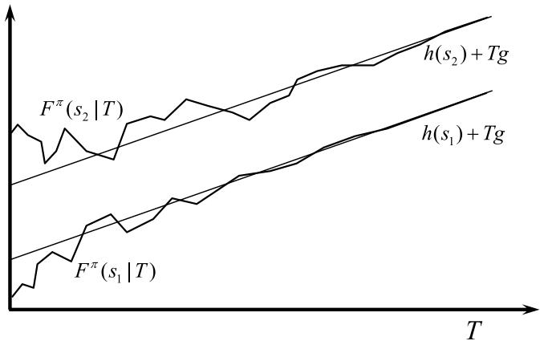  
Figure 14.9 Cumulative contribution over a horizon $T$ when starting in states $s _ { 1 }$ and $s _ { 2 }$ , showing growth approaching a rate that is independent of the starting state.

Now define a column vector ?? given by

$$
g ^ {\pi} = P ^ {*} c ^ {\pi}.
$$

Since the rows of $P ^ { * }$ are all the same, all the elements of $g ^ { \pi }$ are the same, and each element gives the average contribution per time period using the steady state probability of being in each state. For finite $T$ , each element of the column vector $V _ { T } ^ { \pi }$ is not the same, since the contributions we earn in the first few time periods depends on our starting state. But it is not hard to see that as $T$ grows large, we can write

$$
V _ {T} ^ {\pi} \rightarrow h ^ {\pi} + T g ^ {\pi},
$$

where the vector $h ^ { \pi }$ captures the state-dependent differences in the total contribution, while $g ^ { \pi }$ is the state-independent average contribution in the limit. Figure 14.9 illustrates the growth in $V _ { T } ^ { \pi }$ toward a linear function.

If we wish to find the policy that performs the best as $T \to \infty$ , then clearly the contribution of $h ^ { \pi }$ vanishes, and we want to focus on maximizing $g ^ { \pi }$ , which we can now treat as a scalar.

# 14.10 The Linear Programming Method for Dynamic Programs**

Theorem 14.6.1 showed us that if

$$
v \geq \max  _ {a} \left(C (s, a) + \gamma \sum_ {s ^ {\prime} \in \mathcal {S}} \mathbb {P} \left(s ^ {\prime} \mid s, a\right) v \left(s ^ {\prime}\right)\right),
$$