then $v$ is an upper bound (actually, a vector of upper bounds) on the value of being in each state. This means that the optimal solution, which satisfies $v ^ { * } =$ $c + \gamma P v ^ { * }$ , is the smallest value of $v$ that satisfies this inequality. We can use this insight to formulate the problem of finding the optimal values as a linear program. Let $\beta$ be a vector with elements $\beta _ { s } > 0$ , $\forall s \in { \mathcal { S } }$ . The optimal value function can be found by solving the following linear program

$$
\min  _ {v} \sum_ {s \in S} \beta_ {s} v (s) \tag {14.41}
$$

subject to

$$
v (s) \geq C (s, a) + \gamma \sum_ {s ^ {\prime} \in S} \mathbb {P} \left(s ^ {\prime} \mid s, a\right) v \left(s ^ {\prime}\right) \text {f o r a l l} s \text {a n d} a. \tag {14.42}
$$

The linear program has a $| \mathcal { S } |$ -dimensional decision vector (the value of being in each state), with $| \mathcal { S } | \times | \mathcal { A } |$ inequality constraints (equation (14.42)).

This formulation was viewed as primarily a theoretical result for many years, since it requires formulating a linear program where the number of constraints is equal to the number of states times the number of actions. While even today this limits the size of problems it can solve, modern linear programming solvers can handle problems with tens of thousands of constraints without difficulty. This size is greatly expanded with the use of specialized algorithmic strategies which are an active area of research as of this writing.

The advantage of the LP method over value iteration is that it avoids the need for iterative learning with the geometric convergence exhibited by value iteration. Given the dramatic strides in the speed of linear programming solvers over the last decade, the relative performance of value iteration over the linear programming method is an unresolved question. However, this question only arises for problems with relatively small state and action spaces. While a linear program with 50,000 constraints is considered large, dynamic programs with 50,000 states and actions tend to be relatively small problems.

# 14.11 Linear Quadratic Regulation

Easily the best known problem in optimal control is the problem known as linear quadratic regulation. This is a problem known only to the controls community, and for this reason, we are going to revert to classical controls notation, which is the only way it will ever appear in any popular presentation (except that we are still going to use time ?? in contrast with the more typical “??” used by the controls community). As you read this model, it is best to think of it in the context of a problem such as managing a robot or rocket where

???? = the state vector, giving the location (in two or three dimensions), and velocity (again, in two or three dimensions),

???? = the control vector, giving the force applied to each of the two (or three) dimensions.

The state evolves according to linear equations

$$
x _ {t + 1} = A _ {t} x _ {t} + B _ {t} u _ {t}, \tag {14.43}
$$

which captures the effect of force on location and velocity. Our goal is to find controls $u _ { 1 } , \ldots , u _ { T }$ to minimize the costs given by

$$
\begin{array}{l} {C _ {t} (x _ {t}, u _ {t})} = {\frac {1}{2} x _ {t} ^ {T} Q _ {t} x _ {t} + u _ {t} ^ {T} R _ {T} u _ {t}, t = 1, \ldots , T - 1,} \\ {C _ {T} (x _ {T})} = {\frac {1}{2} x _ {T} ^ {T} S _ {T} x _ {T},} \\ \end{array}
$$

where $Q _ { t } , R _ { t }$ and $S _ { T }$ are symmetric, positive semidefinite matrices. The objective function is then given by

$$
J = \frac {1}{2} \sum_ {t = 1} ^ {T} C _ {t} (x _ {t}, u _ {t}) + \frac {1}{2} C _ {T} (x _ {T}),
$$

subject to the system dynamics given by (14.43). Note that $x _ { t }$ and $u _ { t }$ are unconstrained. We are going to use the principle of Lagrangian relaxation and relax (14.43) and add the deviation to the objective function, giving us the Lagrangian (this is a standard optimization technique)

$$
L \left(u _ {1}, \dots , u _ {T}, \lambda\right) = \frac {1}{2} \sum_ {t = 1} ^ {T} \left(C _ {t} \left(x _ {t}, u _ {t}\right) + \lambda_ {t + 1} \left(A _ {t} x _ {t} + B _ {t} u _ {t} - x _ {t + 1}\right)\right) + \frac {1}{2} C _ {T} \left(x _ {T}\right). \tag {14.44}
$$

The controls community then defines a portion of the Lagrangian, called the Hamiltonian, which is

$$
H _ {t} = \frac {1}{2} x _ {t} ^ {T} Q _ {t} x _ {t} + u _ {t} ^ {T} R _ {t} u _ {t} + \lambda_ {t + 1} (A _ {t} x _ {t} + B _ {t} u _ {t}).
$$

Differentiating (14.44) with respect to $\lambda _ { t + 1 }$ and setting the derivative equal to zero (which would be true at optimality) returns our transition equation by setting

$$
\frac {\partial L (u _ {1} , \ldots , u _ {T} , \lambda)}{\partial \lambda_ {t + 1}} = (A _ {t} x _ {t} + B _ {t} u _ {t} - x _ {t + 1}) = 0,
$$

from which we regain (14.43) (known as the state equations). Students of linear programming will recognize that $\lambda _ { t }$ as a dual variable.

Then, we obtain the costate equations by differentiating $H _ { t }$ with respect to $x _ { t }$ giving us

$$
\lambda_ {t} = \frac {\partial H _ {t}}{\partial x _ {t}} = Q _ {t} x _ {t} + A _ {t} ^ {T} \lambda_ {t + 1}, \tag {14.45}
$$

which essentially gives us our dual variables.

This system is solved essentially using the derivatives given in section 12.7. From these, we can derive the following feedback equations that are solved backward in time starting from a given $S _ { T }$ (typically determined by where we want our device to end up):

$$
S _ {t} = A _ {t} ^ {T} \left[ S _ {t + 1} - S _ {t + 1} B _ {t} \left(B _ {t} ^ {T} S _ {t + 1} B _ {t} + R _ {t}\right) ^ {- 1} B _ {t} ^ {T} S _ {t + 1} \right] A _ {t} + Q _ {t}. \tag {14.46}
$$

We can then compute

$$
K _ {t} = \left(B _ {t} ^ {T} S _ {t + 1} B _ {t} + R _ {t}\right) ^ {- 1} B _ {t} ^ {T} S _ {t + 1} A _ {t}. \tag {14.47}
$$

Our optimal control is then given by

$$
u _ {t} ^ {*} = - K _ {t} x _ {t}. \tag {14.48}
$$

We note that these derivations have all been done in the context of a deterministic problem. One way to introduce uncertainty is with additive noise

$$
x _ {t + 1} = A _ {t} x _ {t} + B _ {t} u _ {t} + w _ {t}, \tag {14.49}
$$

where $w _ { t }$ is random at time ?? (this is the classical style of the optimal control community – we use $W _ { t + 1 }$ elsewhere in this book). Additive noise can enter, for example, when exogenous forces (such as wind) interfere with the evolution of the system over time.

Adding additive noise as we do in equation (14.49) does not change our solution. When it is added to the Hamiltonian, we take expectations and since we will assume that $\mathbb { E } w _ { t } = 0$ , the noise term just drops out.

This is again a rare case of a truly optimal policy, which is very dependent on the characteristics of this problem:

● The quadratic form of the cost function (quadratic in both the state $x _ { t }$ and control $u _ { t }$ ).   
● The fact that it is completely unconstrained.

What is especially important about the optimal control given by (14.48) is that it is linear in the controls $u _ { t }$ . This suggests a starting point for problems that do not satisfy all of these conditions. One strategy that has been successfully applied is to assume that the policy is locally linear, which is that it is linear in the controls, but with coefficients that are defined only over specific regions.

# 14.12 Why Does it Work?**

The theory of Markov decision processes is especially elegant for students who enjoy probabilistic mathematics. While not needed for computational work, an understanding of why they work will provide a deeper appreciation of the properties of these problems.

Section 14.12.1 provides a proof that the optimal value function satisfies the optimality equations. Section 14.12.2 proves convergence of the value iteration algorithm. Section 14.12.3 then proves conditions under which value iteration increases or decreases monotonically to the optimal solution. Then, section 14.12.4 proves the bound on the error when value iteration satisfies the termination criterion given in section 14.6.3. Section 14.12.5 closes with a discussion of deterministic and randomized policies, along with a proof that deterministic policies are always at least as good as a randomized policy.

# 14.12.1 The Optimality Equations

Until now, we have been presenting the optimality equations as though they were a fundamental law of some sort. To be sure, they can easily look as though they were intuitively obvious, but it is still important to establish the relationship between the original optimization problem and the optimality equations. Since these equations are the foundation of dynamic programming, it seems beholden on us to work through the steps of proving that they are actually true.

We start by remembering the original optimization problem

$$
F _ {t} ^ {\pi} \left(S _ {t}\right) = \mathbb {E} \left\{\sum_ {t ^ {\prime} = t} ^ {T - 1} C _ {t ^ {\prime}} \left(S _ {t ^ {\prime}}, A _ {t ^ {\prime}} ^ {\pi} \left(S _ {t ^ {\prime}}\right)\right) + C _ {T} \left(S _ {T}\right) \mid S _ {t} \right\}. \tag {14.50}
$$

Since (14.50) is, in general, exceptionally difficult to solve, we resort to the optimality equations

$$
V _ {t} ^ {\pi} (S _ {t}) = C _ {t} \left(S _ {t}, A _ {t} ^ {\pi} \left(S _ {t}\right)\right) + \mathbb {E} \left\{V _ {t + 1} ^ {\pi} \left(S _ {t + 1}\right) \mid S _ {t} \right\}. \tag {14.51}
$$

Our challenge is to show that these are the same. In order to establish this result, it is going to help if we first prove the following:

Lemma 14.12.1. Let $S _ { t }$ be a state variable that captures the relevant history up to time $t$ , and let $F _ { t ^ { \prime } } ( S _ { t + 1 } )$ be some function measured at time $t ^ { \prime } \geq t + 1$ conditioned on the random variable $S _ { t + 1 }$ . Then

$$
\mathbb {E} \left[ \mathbb {E} \left\{F _ {t ^ {\prime}} \mid S _ {t + 1} \right\} \mid S _ {t} \right] = \mathbb {E} \left[ F _ {t ^ {\prime}} \mid S _ {t} \right]. \tag {14.52}
$$

Proof: This lemma is variously known as the law of iterated expectations or the tower property. Assume, for simplicity, that $F _ { t ^ { \prime } }$ is a discrete, finite random variable that takes outcomes in $\mathcal { F }$ . We start by writing

$$
\mathbb {E} \left\{F _ {t ^ {\prime}} \mid S _ {t + 1} \right\} = \sum_ {f \in \mathcal {F}} f \mathbb {P} \left(F _ {t ^ {\prime}} = f \mid S _ {t + 1}\right). \tag {14.53}
$$

Recognizing that $S _ { t + 1 }$ is a random variable, we may take the expectation of both sides of (14.53), conditioned on $S _ { t }$ as follows:

$$
\mathbb {E} \left[ \mathbb {E} \left\{F _ {t ^ {\prime}} \mid S _ {t + 1} \right\} \mid S _ {t} \right] = \sum_ {S _ {t + 1} \in \mathcal {S}} \sum_ {f \in \mathcal {F}} f \mathbb {P} \left(F _ {t ^ {\prime}} = f \mid S _ {t + 1}, S _ {t}\right) \mathbb {P} \left(S _ {t + 1} = S _ {t + 1} \mid S _ {t}\right). \tag {14.54}
$$

First, we observe that we may write $\mathbb { P } ( F _ { t ^ { \prime } } = f | S _ { t + 1 } , S _ { t } ) = \mathbb { P } ( F _ { t ^ { \prime } } = f | S _ { t + 1 } )$ , because conditioning on $S _ { t + 1 }$ makes all prior history irrelevant. Next, we can reverse the summations on the right-hand side of (14.54) (some technical conditions have to be satisfied to do this, but these are satisfied if the random variables are discrete and finite). This means

$$
\begin{array}{l} \mathbb {E} \left[ \mathbb {E} \{F _ {t ^ {\prime}} | S _ {t + 1} = S _ {t + 1} \} | S _ {t} \right] = \sum_ {f \in \mathcal {F}} \sum_ {S _ {t + 1} \in \mathcal {S}} f \mathbb {P} (F _ {t ^ {\prime}} = f | S _ {t + 1}, S _ {t}) \mathbb {P} (S _ {t + 1} = S _ {t + 1} | S _ {t}) \\ = \sum_ {f \in \mathcal {F}} f \sum_ {S _ {t + 1} \in \mathcal {S}} \mathbb {P} (F _ {t ^ {\prime}} = f, S _ {t + 1} | S _ {t}) \\ = \sum_ {f \in \mathcal {F}} f \mathbb {P} \left(F _ {t ^ {\prime}} = f \mid S _ {t}\right) \\ = \mathbb {E} \left[ F _ {t ^ {\prime}} \mid S _ {t} \right], \\ \end{array}
$$

which proves our result. Note that the essential step in the proof occurs in the first step when we add $S _ { t }$ to the conditioning. □

We are now ready to show the following:

Proposition 14.12.1. $F _ { t } ^ { \pi } ( S _ { t } ) = V _ { t } ^ { \pi } ( S _ { t } )$ .

Proof: To prove that (14.50) and (14.51) are equal, we use a standard trick in dynamic programming: proof by induction. Clearly, $F _ { T } ^ { \pi } ( S _ { T } ) = V _ { T } ^ { \pi } ( S _ { T } ) =$ $C _ { T } ( S _ { T } )$ . Next, assume that it holds for $t + 1 , t + 2 , \dots , T$ . We want to show that it is true for ??. This means that we can write

$$
V _ {t} ^ {\pi} (S _ {t}) = C _ {t} (S _ {t}, A _ {t} ^ {\pi} (S _ {t})) + \mathbb {E} \left[ \underbrace {\mathbb {E} \left\{\sum_ {t ^ {\prime} = t + 1} ^ {T - 1} C _ {t ^ {\prime}} (S _ {t ^ {\prime}} , A _ {t ^ {\prime}} ^ {\pi} (S _ {t ^ {\prime}})) + C _ {t} (S _ {T} (\omega)) \Bigg | S _ {t + 1} \right\}} _ {F _ {t + 1} ^ {\pi} (S _ {t + 1})} \Bigg | S _ {t} \right].
$$

We then use lemma 14.12.1 to write ?? [?? $\{ \dots | S _ { t + 1 } \} | S _ { t }  ] = \mathbb { E } [ \dots | S _ { t } ]$ . Hence,

$$
{V _ {t} ^ {\pi} (S _ {t})} = {C _ {t} (S _ {t}, A _ {t} ^ {\pi} (S _ {t})) + \mathbb {E} \left[ \sum_ {t ^ {\prime} = t + 1} ^ {T - 1} C _ {t ^ {\prime}} (S _ {t ^ {\prime}}, A _ {t ^ {\prime}} ^ {\pi} (S _ {t ^ {\prime}})) + C _ {t} (S _ {T}) | S _ {t} \right].}
$$

When we condition on $S _ { t }$ , $A _ { t } ^ { \pi } ( S _ { t } )$ (and therefore $C _ { t } ( S _ { t } , A _ { t } ^ { \pi } ( S _ { t } ) ) \} _ { t }$ is deterministic, so we can pull the expectation out to the front giving

$$
\begin{array}{l} {V _ {t} ^ {\pi} (S _ {t})} = {\mathbb {E} \left[ \sum_ {t ^ {\prime} = t} ^ {T - 1} C _ {t ^ {\prime}} (S _ {t ^ {\prime}}, y _ {t ^ {\prime}} (S _ {t ^ {\prime}})) + C _ {t} (S _ {T}) | S _ {t} \right]} \\ { = } { F _ { t } ^ { \pi } ( S _ { t } ) , } \\ \end{array}
$$

which proves our result.

Using equation (14.51), we have a backward recursion for calculating $V _ { t } ^ { \pi } ( S _ { t } )$ for a given policy $\pi$ . Now that we can find the expected reward for a given $\pi$ , we would like to find the best $\pi$ . That is, we want to find

$$
F _ {t} ^ {*} (S _ {t}) = \max  _ {\pi \in \Pi} F _ {t} ^ {\pi} (S _ {t}).
$$

If the set $\Pi$ is infinite, we replace the “max” with “sup.” We solve this problem by solving the optimality equations. These are

$$
V _ {t} \left(S _ {t}\right) = \max  _ {a \in \mathcal {A}} \left(C _ {t} \left(S _ {t}, a\right) + \sum_ {s ^ {\prime} \in \mathcal {S}} p _ {t} \left(s ^ {\prime} \mid S _ {t}, a\right) V _ {t + 1} \left(s ^ {\prime}\right)\right). \tag {14.55}
$$

We are claiming that if we find the set of $V ^ { \prime } s$ that solves (14.55), then we have found the policy that optimizes $F _ { t } ^ { \pi }$ . We state this claim formally as:

Theorem 14.12.1. Let $V _ { t } ( S _ { t } )$ be a solution to equation (14.55). Then

$$
\begin{array}{l} F _ {t} ^ {*} = V _ {t} (S _ {t}) \\ = \max  _ {\pi \in \Pi} F _ {t} ^ {\pi} (S _ {t}). \\ \end{array}
$$

Proof: The proof is in two parts. First, we show by induction that $V _ { t } ( S _ { t } ) ~ \geq$ $F _ { t } ^ { * } ( S _ { t } )$ for all $S _ { t } ~ \in ~ \mathcal { S }$ and $t = 0 , 1 , \ldots , T - 1$ . Then, we show that the reverse inequality is true, which gives us the result.

Part 1:

We resort again to our proof by induction. Since $V _ { T } ( S _ { T } ) = C _ { t } ( S _ { T } ) = F _ { T } ^ { \pi } ( S _ { T } )$ for all $S _ { T }$ and all $\pi \in \Pi$ , we get that $V _ { T } ( S _ { T } ) = F _ { T } ^ { * } ( S _ { T } )$ .

Assume that $V _ { t ^ { \prime } } ( S _ { t ^ { \prime } } ) \geq F _ { t ^ { \prime } } ^ { * } ( S _ { t ^ { \prime } } )$ for $t ^ { \prime } = t + 1 , t + 2 , \dots , T$ , and let $\pi$ be an arbitrary policy. For $t ^ { \prime } = t$ , the optimality equation tells us

$$
{V _ {t} (S _ {t})} = {\max _ {a \in \mathcal {A}} \bigg (C _ {t} (S _ {t}, a) + \sum_ {s ^ {\prime} \in \mathcal {S}} p _ {t} (s ^ {\prime} | S _ {t}, a) V _ {t + 1} (s ^ {\prime}) \bigg).}
$$

By the induction hypothesis, $F _ { t + 1 } ^ { * } ( s ) \leq V _ { t + 1 } ( s )$ , so we get

$$
{V _ {t} (S _ {t})} \geq {\max _ {a \in \mathcal {A}} \left(C _ {t} (S _ {t}, a) + \sum_ {s ^ {\prime} \in \mathcal {S}} p _ {t} (s ^ {\prime} | S _ {t}, a) F _ {t + 1} ^ {*} (s ^ {\prime})\right).}
$$

Of course, we have that $F _ { t + 1 } ^ { * } ( s ) \geq F _ { t + 1 } ^ { \pi } ( s )$ for an arbitrary $\pi$ . Also let $A ^ { \pi } ( S _ { t } )$ be the decision that would be chosen by policy $\pi$ when in state $S _ { t }$ . Then

$$
\begin{array}{l} V _ {t} (S _ {t}) \geq \max  _ {a \in \mathcal {A}} \left(C _ {t} (S _ {t}, a) + \sum_ {s ^ {\prime} \in \mathcal {S}} p _ {t} (s ^ {\prime} | S _ {t}, a) F _ {t + 1} ^ {\pi} (s ^ {\prime})\right) \\ \geq C _ {t} (S _ {t}, A ^ {\pi} (S _ {t})) + \sum_ {s ^ {\prime} \in \mathcal {S}} p _ {t} (s ^ {\prime} | S _ {t}, A ^ {\pi} (S _ {t})) F _ {t + 1} ^ {\pi} (s ^ {\prime}) \\ { = } { F _ { t } ^ { \pi } ( S _ { t } ) . } \\ \end{array}
$$

This means

$$
V _ {t} \left(S _ {t}\right) \geq F _ {t} ^ {\pi} \left(S _ {t}\right) \quad \text {f o r a l l} \pi \in \Pi ,
$$

which proves part 1.

Part 2:

Now we are going to prove the inequality from the other side. Specifically, we want to show that for any $\epsilon > 0$ there exists a policy $\pi$ that satisfies

$$
F _ {t} ^ {\pi} \left(S _ {t}\right) + (T - t) \varepsilon \geq V _ {t} \left(S _ {t}\right). \tag {14.56}
$$

To do this, we start with the definition

$$
V _ {t} \left(S _ {t}\right) = \max  _ {a \in \mathcal {A}} \left(C _ {t} \left(S _ {t}, a\right) + \sum_ {s ^ {\prime} \in \mathcal {S}} p _ {t} \left(s ^ {\prime} \mid S _ {t}, a\right) V _ {t + 1} \left(s ^ {\prime}\right)\right). \tag {14.57}
$$

We may let $a _ { t } ( S _ { t } )$ be the decision rule that solves (14.57). This rule corresponds to the policy $\pi$ . In general, the set $\mathcal { A }$ may be infinite, whereupon we have to replace the “max” with a “sup” and handle the case where an optimal decision may not exist. For this case, we know that we can design a decision rule $a _ { t } ( S _ { t } )$ that returns a decision $a$ that satisfies

$$
V _ {t} \left(S _ {t}\right) \leq C _ {t} \left(S _ {t}, a\right) + \sum_ {s ^ {\prime} \in S} p _ {t} \left(s ^ {\prime} \mid S _ {t}, a\right) V _ {t + 1} \left(s ^ {\prime}\right) + \epsilon . \tag {14.58}
$$

We can prove (14.56) by induction. We first note that (14.56) is true for $t = T$ since $F _ { T } ^ { \pi } ( S _ { t } ) = V _ { T } ( S _ { T } ) .$ . Now assume that it is true for $t ^ { \prime } = t + 1 , t + 2 , \ldots , T .$ . We already know that

$$
{F _ {t} ^ {\pi} (S _ {t})} = {C _ {t} (S _ {t}, A ^ {\pi} (S _ {t})) + \sum_ {s ^ {\prime} \in \mathcal {S}} p _ {t} (s ^ {\prime} | S _ {t}, A ^ {\pi} (S _ {t})) F _ {t + 1} ^ {\pi} (s ^ {\prime}).}
$$

We can use our induction hypothesis which says $F _ { t + 1 } ^ { \pi } ( s ^ { \prime } ) \geq V _ { t + 1 } ( s ^ { \prime } ) - ( T - ( t +$ $1 ) \epsilon$ to get

$$
\begin{array}{l} F _ {t} ^ {\pi} (S _ {t}) \geq C _ {t} (S _ {t}, A ^ {\pi} (S _ {t})) + \sum_ {s ^ {\prime} \in \mathcal {S}} p _ {t} (s ^ {\prime} | S _ {t}, A ^ {\pi} (S _ {t})) [ V _ {t + 1} (s ^ {\prime}) - (T - (t + 1)) \varepsilon ] \\ = C _ {t} (S _ {t}, A ^ {\pi} (S _ {t})) + \sum_ {s ^ {\prime} \in \mathcal {S}} p _ {t} (s ^ {\prime} | S _ {t}, A ^ {\pi} (S _ {t})) V _ {t + 1} (s ^ {\prime}) \\ - \sum_ {s ^ {\prime} \in \mathcal {S}} p _ {t} (s ^ {\prime} | S _ {t}, A ^ {\pi} (S _ {t})) [ (T - t - 1) \epsilon ] \\ = \left\{C _ {t} \left(S _ {t}, A ^ {\pi} \left(S _ {t}\right)\right) + \sum_ {s ^ {\prime} \in \mathcal {S}} p _ {t} \left(s ^ {\prime} \mid S _ {t}, A ^ {\pi} \left(S _ {t}\right)\right) V _ {t + 1} \left(s ^ {\prime}\right) + \epsilon \right\} - (T - t) \varepsilon . \\ \end{array}
$$

Now, using equation (14.58), we replace the term in brackets with the smaller $V _ { t } ( S _ { t } )$ (equation (14.58)):

$$
F _ {t} ^ {\pi} \left(S _ {t}\right) \geq V _ {t} \left(S _ {t}\right) - (T - t) \varepsilon ,
$$

which proves the induction hypothesis. We have shown that

$$
F _ {t} ^ {*} (S _ {t}) + (T - t) \epsilon \geq F _ {t} ^ {\pi} (S _ {t}) + (T - t) \epsilon \geq V _ {t} (S _ {t}) \geq F _ {t} ^ {*} (S _ {t}).
$$

This proves the result.

Now we know that solving the optimality equations also gives us the optimal value function. This is our most powerful result because we can solve the optimality equations for many problems that cannot be solved any other way.

# 14.12.2 Convergence of Value Iteration

We now undertake the proof that the basic value function iteration converges to the optimal solution. This is not only an important result, it is also an elegant one that brings some powerful theorems into play. The proof is also quite short. However, we will need some mathematical preliminaries:

Definition 14.12.1. Let $\mathcal { V }$ be a set of (bounded, real-valued) functions and define the norm of $v$ by:

$$
\| v \| = \sup  _ {s \in \delta} v (s)
$$

where we replace the “??????” with a “??????” when the state space is finite. Since $\mathcal { V }$ is closed under addition and scalar multiplication and has a norm, it is a normed linear space.

Definition 14.12.2. $T : \mathcal { V } \to \mathcal { V }$ is a contraction mapping if there exists a ??, $0 \leq \gamma < 1$ such that:

$$
\| T v - T u \| \leq \gamma \| v - u \|.
$$

Definition 14.12.3. A sequence $v ^ { n } \in \mathcal V$ , $n = 1 , 2 , \ldots$ is said to be a Cauchy sequence if for all $\epsilon > 0$ , there exists $N$ such that for all $n , m \geq N$ ∶

$$
\left\| v ^ {n} - v ^ {m} \right\| <   \epsilon .
$$

Definition 14.12.4. A normed linear space is complete if every Cauchy sequence contains a limit point in that space.

Definition 14.12.5. A Banach space is a complete normed linear space.

Definition 14.12.6. We define the norm of a matrix ?? as

$$
{| | Q | |} = {\max _ {s \in \mathcal {S}} \sum_ {j \in \mathcal {S}} | q (j | s) |,}
$$

that is, the largest row sum of the matrix. If $Q$ is a one-step transition matrix, then $\| Q \| = 1$ .

Definition 14.12.7. The triangle inequality means that given two vectors $a , b \in \Re ^ { n }$ :

$$
\| a + b \| \leq \| a \| + \| b \|.
$$

The triangle inequality is commonly used in proofs because it helps us establish bounds between two solutions (and in particular, between a solution and the optimum).

We now state and prove one of the famous theorems in applied mathematics and then use it immediately to prove convergence of the value iteration algorithm.

Theorem 14.12.2. (Banach Fixed-Point Theorem) Let $\mathcal { V }$ be a Banach space, and let $T : \mathcal { V } \to \mathcal { V }$ be a contraction mapping. Then:

(a) There exists a unique $v ^ { * } \in \mathcal { V }$ such that $T v ^ { * } = v ^ { * }$ .   
(b) For an arbitrary $v ^ { 0 } \in \mathcal { V }$ , the sequence $v ^ { n }$ defined by: $v ^ { n + 1 } = T v ^ { n } = T ^ { n + 1 } v ^ { 0 }$ converges to $v ^ { * }$ .

Proof: We start by showing that the distance between two vectors $v ^ { n }$ and $v ^ { n + m }$ goes to zero for sufficiently large $n$ and by writing the difference $\boldsymbol { v } ^ { n + m } - \boldsymbol { v } ^ { n }$ using

$$
\begin{array}{l} v ^ {n + m} - v ^ {n} = v ^ {n + m} - v ^ {n + m - 1} + v ^ {n + m - 1} - \dots - v ^ {n + 1} + v ^ {n + 1} - v ^ {n} \\ = \sum_ {k = 0} ^ {m - 1} (v ^ {n + k + 1} - v ^ {n + k}). \\ \end{array}
$$

Taking norms of both sides and invoking the triangle inequality gives

$$
\begin{array}{l} \| v ^ {n + m} - v ^ {n} \| = \| \sum_ {k = 0} ^ {m - 1} (v ^ {n + k + 1} - v ^ {n + k}) \| \\ \leq \sum_ {k = 0} ^ {m - 1} \| \left(v ^ {n + k + 1} - v ^ {n + k}\right) \| \\ = \sum_ {k = 0} ^ {m - 1} \| \left(T ^ {n + k} v ^ {1} - T ^ {n + k} v ^ {0}\right) \| \\ \leq \sum_ {k = 0} ^ {m - 1} \gamma^ {n + k} \| v ^ {1} - v ^ {0} \| \\ = \frac {\gamma^ {n} \left(1 - \gamma^ {m}\right)}{(1 - \gamma)} \| v ^ {1} - v ^ {0} \|. \tag {14.59} \\ \end{array}
$$

Since $\gamma ~ < ~ 1$ , for sufficiently large ?? the right-hand side of (14.59) can be made arbitrarily small, which means that $v ^ { n }$ is a Cauchy sequence. Since $\mathcal { V }$ is complete, it must be that $v ^ { n }$ has a limit point $v ^ { * }$ . From this we conclude

$$
\lim  _ {n \rightarrow \infty} v ^ {n} \rightarrow v ^ {*}. \tag {14.60}
$$

We now want to show that $v ^ { * }$ is a fixed point of the mapping ??. To show this, we observe

$$
\begin{array}{l} 0 \leq \| T v ^ {*} - v ^ {*} \| (14.61) \\ = \| T v ^ {*} - v ^ {n} + v ^ {n} - v ^ {*} \| (14.62) \\ \leq \| T v ^ {*} - v ^ {n} \| + \| v ^ {n} - v ^ {*} \| (14.63) \\ = \| T v ^ {*} - T v ^ {n - 1} \| + \| v ^ {n} - v ^ {*} \| (14.64) \\ \leq \gamma \| v ^ {*} - v ^ {n - 1} \| + \| v ^ {n} - v ^ {*} \|. (14.65) \\ \end{array}
$$

Equation (14.61) comes from the properties of a norm. We play our standard trick in (14.62) of adding and subtracting a quantity (in this case, $v ^ { n }$ ), which sets up the triangle inequality in (14.63). Using $v ^ { n } = T v ^ { n - 1 }$ gives us (14.64). The inequality in (14.65) is based on the assumption of the theorem that $T$ is a contraction mapping. From (14.60), we know that

$$
\lim  _ {n \rightarrow \infty} \| v ^ {*} - v ^ {n - 1} \| = \lim  _ {n \rightarrow \infty} \| v ^ {n} - v ^ {*} \| = 0. \tag {14.66}
$$

Combining (14.61), (14.65), and (14.66) gives

$$
0 \leq \| T v ^ {*} - v ^ {*} \| \leq 0,
$$

from which we conclude

$$
\left\| T v ^ {*} - v ^ {*} \right\| = 0,
$$

which means that $T v ^ { * } = v ^ { * }$ .

We can prove uniqueness by contradiction. Assume that there are two limit points that we represent as $v ^ { * }$ and $u ^ { * }$ . The assumption that $T$ is a contraction mapping requires that

$$
\left\| T v ^ {*} - T u ^ {*} \right\| \leq \gamma \| v ^ {*} - u ^ {*} \|.
$$

But, if $v ^ { * }$ and $u ^ { * }$ are limit points, then $T v ^ { * } = v ^ { * }$ and $T u ^ { * } = u ^ { * }$ , which means

$$
\| v ^ {*} - u ^ {*} \| \leq \gamma \| v ^ {*} - u ^ {*} \|.
$$

Since $\gamma < 1$ , this is a contradiction, which means that it must be true that $v ^ { * } =$ $u ^ { * }$ . □

We can now show that the value iteration algorithm converges to the optimal solution if we can establish that $\mathcal { M }$ is a contraction mapping. So we need to show the following:

Proposition 14.12.2. If $0 \leq \gamma < 1$ , then $\mathcal { M }$ is a contraction mapping on ??.

Proof: Let $u , v \in \mathcal { V }$ and assume that $\mathcal { M } v \geq \mathcal { M } u$ where the inequality is applied elementwise. For a particular state ?? let

$$
a _ {s} ^ {*} (v) \in \arg \max  _ {a \in \mathcal {A}} \left(C (s, a) + \gamma \sum_ {s ^ {\prime} \in \mathcal {S}} \mathbb {P} \left(s ^ {\prime} | s, a\right) v \left(s ^ {\prime}\right)\right)
$$

where we assume that a solution exists. Then

$$
\begin{array}{l} 0 \leq \mathcal {M} v (s) - \mathcal {M} u (s) (14.67) \\ = C (s, a _ {s} ^ {*} (v)) + \gamma \sum_ {s ^ {\prime} \in \mathcal {S}} \mathbb {P} (s ^ {\prime} | s, a _ {s} ^ {*} (v)) v (s ^ {\prime}) \\ - \left(C \left(s, a _ {s} ^ {*} (u)\right) + \gamma \sum_ {s ^ {\prime} \in \mathcal {S}} \mathbb {P} \left(s ^ {\prime} \mid s, a _ {s} ^ {*} (u)\right) u \left(s ^ {\prime}\right)\right) (14.68) \\ \leq C (s, a _ {s} ^ {*} (v)) + \gamma \sum_ {s ^ {\prime} \in \mathcal {S}} \mathbb {P} (s ^ {\prime} | s, a _ {s} ^ {*} (v)) v (s ^ {\prime}) \\ - \left(C \left(s, a _ {s} ^ {*} (v)\right) + \gamma \sum_ {s ^ {\prime} \in \mathcal {S}} \mathbb {P} \left(s ^ {\prime} \mid s, a _ {s} ^ {*} (v)\right) u \left(s ^ {\prime}\right)\right) (14.69) \\ \end{array}
$$

$$
\begin{array}{l} = \gamma \sum_ {s ^ {\prime} \in S} \mathbb {P} \left(s ^ {\prime} \mid s, a _ {s} ^ {*} (v)\right) \left[ v \left(s ^ {\prime}\right) - u \left(s ^ {\prime}\right) \right] (14.70) \\ \leq \gamma \sum_ {s ^ {\prime} \in \mathcal {S}} \mathbb {P} \left(s ^ {\prime} \mid s, a _ {s} ^ {*} (v)\right) \| v - u \| (14.71) \\ = \gamma \| v - u \| \sum_ {s ^ {\prime} \in S} \mathbb {P} \left(s ^ {\prime} \mid s, a _ {s} ^ {*} (v)\right) (14.72) \\ = \gamma \| v - u \|. (14.73) \\ \end{array}
$$

Equation (14.67) is true by assumption, while (14.68) holds by definition. The inequality in (14.69) holds because $a _ { s } ^ { * } ( \upsilon )$ is not optimal when the value function is $u$ , giving a reduced value in the second set of parentheses. Equation (14.70) is a simple reduction of (14.69). Equation (14.71) forms an upper bound because the definition of $\lVert \boldsymbol { v } - \boldsymbol { u } \rVert$ is to replace all the elements $[ v ( s ) - u ( s ) ]$ with the largest element of this vector. Since this is now a vector of constants, we can pull it outside of the summation, giving us (14.72), which then easily reduces to (14.73) because the probabilities add up to one.

This result states that if $\mathcal { M } v ( s ) \geq \mathcal { M } u ( s )$ , then $\mathcal { M } v ( s ) - \mathcal { M } u ( s ) \leq \gamma | v ( s ) -$ $u ( s ) \vert$ . If we start by assuming that $\mathcal { M } v ( s ) \leq \mathcal { M } u ( s )$ , then the same reasoning produces $\mathcal { M } v ( s ) - \mathcal { M } u ( s ) \geq - \gamma | v ( s ) - u ( s ) |$ . This means that we have

$$
\left| \mathcal {M} v (s) - \mathcal {M} u (s) \right| \leq \gamma | v (s) - u (s) | \tag {14.74}
$$

for all states $s \in \mathcal { S }$ . From the definition of our norm, we can write

$$
\begin{array}{l} \sup  _ {s \in \mathcal {S}} | \mathcal {M} v (s) - \mathcal {M} u (s) | = \| \mathcal {M} v - \mathcal {M} u \| \\ \leq \gamma \| v - u \|. \\ \end{array}
$$

This means that $\mathcal { M }$ is a contraction mapping, which means that the sequence $v ^ { n }$ generated by $\boldsymbol { v } ^ { n + 1 } = \mathcal { M } \boldsymbol { v } ^ { n }$ converges to a unique limit point $v ^ { * }$ that satisfies the optimality equations. □

# 14.12.3 Monotonicity of Value Iteration

Infinite horizon dynamic programming provides a compact way to study the theoretical properties of these algorithms. The insights gained here are applicable to problems even when we cannot apply this model, or these algorithms, directly.

We assume throughout our discussion of infinite horizon problems that the reward function is bounded over the domain of the state space. This assumption is virtually always satisfied in practice, but notable exceptions exist. For example, the assumption is violated if we are maximizing a utility function that depends on the log of the resources we have at hand (the resources may

be bounded, but the function is unbounded if the resources are allowed to hit zero).

Our first result establishes a monotonicity property that can be exploited in the design of an algorithm.

Theorem 14.12.3. For a vector $v \in \mathcal V$ :

(a) If $v$ satisfies $v \geq \mathcal { M } v$ , then $v \geq v ^ { * }$ .   
(b) If $v$ satisfies $v \leq \mathcal { M } v$ , then $v \leq v ^ { * }$ .   
(c) If $v$ satisfies $\ v { v } ~ = ~ \mathcal { M } \ v { v }$ , then $v$ is the unique solution to this system of equations and $v = v ^ { * }$ .

Proof: Part $( a )$ requires that

$$
\begin{array}{l} v \geq \max  _ {\pi \in \Pi} \left\{c ^ {\pi} + \gamma P ^ {\pi} v \right\} (14.75) \\ \geq c ^ {\pi_ {0}} + \gamma P ^ {\pi_ {0}} v (14.76) \\ \geq c ^ {\pi_ {0}} + \gamma P ^ {\pi_ {0}} \left(c ^ {\pi_ {1}} + \gamma P ^ {\pi_ {1}} v\right) (14.77) \\ = c ^ {\pi_ {0}} + \gamma P ^ {\pi_ {0}} c ^ {\pi_ {1}} + \gamma^ {2} P ^ {\pi_ {0}} P ^ {\pi_ {1}} v. \\ \end{array}
$$

Equation (14.75) is true by assumption (part $( a )$ of the theorem) and equation (14.76) is true because $\pi _ { 0 }$ is some policy that is not necessarily optimal for the vector $v$ . Using similar reasoning, equation (14.77) is true because $\pi _ { 1 }$ is another policy which, again, is not necessarily optimal. Using $P ^ { \pi , ( t ) } = P ^ { \pi _ { 0 } } P ^ { \pi _ { 1 } } \cdots P ^ { \pi _ { t } }$ , we obtain by induction

$$
v \geq c ^ {\pi_ {0}} + \gamma P ^ {\pi_ {0}} c ^ {\pi_ {1}} + \dots + \gamma^ {t - 1} P ^ {\pi_ {0}} P ^ {\pi_ {1}} \dots P ^ {\pi_ {t - 1}} c ^ {\pi_ {t}} + \gamma^ {t} P ^ {\pi , (t)} v. \tag {14.78}
$$

Recall that

$$
v ^ {\pi} = \sum_ {t = 0} ^ {\infty} \gamma^ {t} P ^ {\pi , (t)} c ^ {\pi_ {t}}. \tag {14.79}
$$

Breaking the sum in (14.79) into two parts allows us to rewrite the expansion in (14.78) as

$$
v \geq v ^ {\pi} - \sum_ {t ^ {\prime} = t + 1} ^ {\infty} \gamma^ {t ^ {\prime}} P ^ {\pi , (t ^ {\prime})} c ^ {\pi_ {t ^ {\prime} + 1}} + \gamma^ {t} P ^ {\pi , (t)} v. \tag {14.80}
$$

Taking the limit of both sides of (14.80) as $t  \infty$ gives us

$$
\begin{array}{l} v \geq \lim  _ {t \rightarrow \infty} v ^ {\pi} - \sum_ {t ^ {\prime} = t + 1} ^ {\infty} \gamma^ {t ^ {\prime}} P ^ {\pi , (t ^ {\prime})} c ^ {\pi_ {t ^ {\prime} + 1}} + \gamma^ {t} P ^ {\pi , (t)} v (14.81) \\ \geq v ^ {\pi} \forall \pi \in \Pi . (14.82) \\ \end{array}
$$

The limit in (14.81) exists as long as the reward function $c ^ { \pi }$ is bounded and $\gamma < 1$ . Because (14.82) is true for all $\pi \in \Pi$ , it is also true for the optimal policy, which means that

$$
\begin{array}{l} v \geq v ^ {\pi *} \\ = \nu^ {*}, \\ \end{array}
$$

which proves part (a) of the theorem. Part $( b )$ can be proved in an analogous way. Parts (a) and (b) mean that $v \geq v ^ { * }$ and $v \leq v ^ { * }$ . If $v = \mathcal { M } v$ , then we satisfy the preconditions of both parts (a) and (b), which means they are both true and therefore we must have $v = v ^ { * }$ . □

This result means that if we start with a vector that is higher than the optimal vector, then we will decline monotonically to the optimal solution (almost – we have not quite proven that we actually get to the optimal). Alternatively, if we start below the optimal vector, we will rise to it. Note that it is not always easy to find a vector ?? that satisfies either condition (??) or $( b )$ of the theorem. In problems where the rewards can be positive and negative, this can be tricky.

# 14.12.4 Bounding the Error from Value Iteration

We now wish to establish a bound on our error from value iteration, which will establish our stopping rule. We propose two bounds: one on the value function estimate that we terminate with and one for the long-run value of the decision rule that we terminate with. To define the latter, let $\pi ^ { \epsilon }$ be the policy that satisfies our stopping rule, and let $v ^ { \pi ^ { \epsilon } }$ be the infinite horizon value of following policy $\pi ^ { \epsilon }$ .

Theorem 14.12.4. If we apply the value iteration algorithm with stopping parameter $\epsilon$ and the algorithm terminates at iteration ?? with value function $v ^ { n + 1 }$ , then

$$
\left\| v ^ {n + 1} - v ^ {*} \right\| \leq \epsilon / 2, \tag {14.83}
$$

and

$$
\left\| v ^ {\pi^ {\epsilon}} - v ^ {*} \right\| \leq \epsilon . \tag {14.84}
$$

Proof: We start by writing

$$
\begin{array}{l} \left\| v ^ {\pi^ {\epsilon}} - v ^ {*} \right\| = \left\| v ^ {\pi^ {\epsilon}} - v ^ {n + 1} + v ^ {n + 1} - v ^ {*} \right\| \\ \leq \| v ^ {\pi^ {\epsilon}} - v ^ {n + 1} \| + \| v ^ {n + 1} - v ^ {*} \|. \tag {14.85} \\ \end{array}
$$

Recall that $\pi ^ { \epsilon }$ is the policy that solves $\boldsymbol { \mathcal { M } } \boldsymbol { v } ^ { n + 1 }$ , which means that $\mathcal { M } ^ { \pi ^ { \varepsilon } } v ^ { n + 1 } =$ $\boldsymbol { \mathcal { M } } \boldsymbol { v } ^ { n + 1 }$ . This allows us to rewrite the first term on the right-hand side of (14.85) as

$$
\begin{array}{l} \| v ^ {\pi^ {\epsilon}} - v ^ {n + 1} \| = \| \mathcal {M} ^ {\pi^ {\epsilon}} v ^ {\pi^ {\epsilon}} - \mathcal {M} v ^ {n + 1} + \mathcal {M} v ^ {n + 1} - v ^ {n + 1} \| \\ \leq \| \mathcal {M} ^ {\pi^ {\epsilon}} v ^ {\pi^ {\epsilon}} - \mathcal {M} v ^ {n + 1} \| + \| \mathcal {M} v ^ {n + 1} - v ^ {n + 1} \| \\ = \| \mathcal {M} ^ {\pi^ {\varepsilon}} v ^ {\pi^ {\varepsilon}} - \mathcal {M} ^ {\pi^ {\varepsilon}} v ^ {n + 1} \| + \| \mathcal {M} v ^ {n + 1} - \mathcal {M} v ^ {n} \| \\ \leq \gamma \| v ^ {\pi^ {\epsilon}} - v ^ {n + 1} \| + \gamma \| v ^ {n + 1} - v ^ {n} \|. \\ \end{array}
$$

Solving for $\lVert \boldsymbol { v } ^ { \pi ^ { \varepsilon } } - \boldsymbol { v } ^ { n + 1 } \rVert$ gives

$$
\| v ^ {\pi^ {\epsilon}} - v ^ {n + 1} \| \leq \frac {\gamma}{1 - \gamma} \| v ^ {n + 1} - v ^ {n} \|.
$$

We can use similar reasoning applied to the second term in equation (14.85) to show that

$$
\left\| v ^ {n + 1} - v ^ {*} \right\| \leq \frac {\gamma}{1 - \gamma} \left\| v ^ {n + 1} - v ^ {n} \right\|. \tag {14.86}
$$

The value iteration algorithm stops when $\| v ^ { n + 1 } - v ^ { n } \| \leq \epsilon ( 1 - \gamma ) / 2 \gamma$ . Substituting this in (14.86) gives

$$
\left\| v ^ {n + 1} - v ^ {*} \right\| \leq \frac {\varepsilon}{2}. \tag {14.87}
$$

Recognizing that the same bound applies to $\lVert \boldsymbol { v } ^ { \pi ^ { \epsilon } } - \boldsymbol { v } ^ { n + 1 } \rVert$ and combining these with (14.85) gives us

$$
\left\| v ^ {\pi^ {\epsilon}} - v ^ {*} \right\| \leq \epsilon ,
$$

which completes our proof.

# 14.12.5 Randomized Policies

We have implicitly assumed that for each state, we want a single action. An alternative would be to choose a policy probabilistically from a family of policies. If a state produces a single action, we say that we are using a deterministic policy. If we are randomly choosing an action from a set of actions probabilistically, we say we are using a randomized policy.

Randomized policies may arise because of the nature of the problem. For example, you wish to purchase something at an auction, but you are unable to attend yourself. You may have a simple rule (“purchase it as long as the price is under a specific amount”) but you cannot assume that your representative will apply the same rule. You can choose a representative, and in doing so you are effectively choosing the probability distribution from which the action will be chosen.

Behaving randomly also plays a role in two-player games. If you make the same decision each time in a particular state, your opponent may be able to predict your behavior and gain an advantage. For example, as an institutional

investor you may tell a bank that you are not willing to pay any more than $\$ 14$ for a new offering of stock, while in fact you are willing to pay up to $\$ 18$ . If you always bias your initial prices by $\$ 4$ , the bank will be able to guess what you are willing to pay.

When we can only influence the likelihood of an action, then we have an instance of a randomized MDP. Let

$q _ { t } ^ { \pi } ( a | S _ { t } ) =$ The probability that decision ?? will be taken at time $t$ given state $S _ { t }$ and policy $\pi$ (more precisely, decision rule $A ^ { \pi }$ ).

In this case, our optimality equations look like

$$
V _ {t} ^ {*} (S _ {t}) = \max  _ {\pi \in \Pi^ {M R}} \sum_ {a \in \mathcal {A}} \left[ q _ {t} ^ {\pi} (a | S _ {t}) \left(C _ {t} \left(S _ {t}, a\right) + \sum_ {s ^ {\prime} \in \mathcal {S}} p _ {t} \left(s ^ {\prime} \mid S _ {t}, a\right) V _ {t + 1} ^ {*} \left(s ^ {\prime}\right)\right) \right]. \tag {14.88}
$$

Now let us consider the single best action that we could take. Calling this $a ^ { * }$ , we can find it using

$$
a ^ {*} = \arg \max _ {a \in \mathcal {A}} \left[ C _ {t} (S _ {t}, a) + \sum_ {s ^ {\prime} \in \mathcal {S}} p _ {t} (s ^ {\prime} | S _ {t}, a) V _ {t + 1} ^ {*} (s ^ {\prime}) \right].
$$

This means that

$$
C _ {t} \left(S _ {t}, a ^ {*}\right) + \sum_ {s ^ {\prime} \in \mathcal {S}} p _ {t} \left(s ^ {\prime} \mid S _ {t}, a ^ {*}\right) V _ {t + 1} ^ {*} \left(s ^ {\prime}\right) \geq C _ {t} \left(S _ {t}, a\right) + \sum_ {s ^ {\prime} \in \mathcal {S}} p _ {t} \left(s ^ {\prime} \mid S _ {t}, a\right) V _ {t + 1} ^ {*} \left(s ^ {\prime}\right) \tag {14.89}
$$

for all $a \in { \mathcal { A } }$ . Substituting (14.89) back into (14.88) gives us

$$
\begin{array}{l} V _ {t} ^ {*} (S _ {t}) = \max _ {\pi \in \Pi^ {M R}} \sum_ {a \in \mathcal {A}} \left[ q _ {t} ^ {\pi} (a | S _ {t}) \left(C _ {t} (S _ {t}, a) + \sum_ {s ^ {\prime} \in \mathcal {S}} p _ {t} (s ^ {\prime} | S _ {t}, a) V _ {t + 1} ^ {*} (s ^ {\prime})\right) \right] \\ \leq \max  _ {\pi \in \Pi^ {M R}} \sum_ {a \in \mathcal {A}} \left[ q _ {t} ^ {\pi} (a | S _ {t}) \left(C _ {t} \left(S _ {t}, a ^ {*}\right) + \sum_ {s ^ {\prime} \in \mathcal {S}} p _ {t} \left(s ^ {\prime} \mid S _ {t}, a ^ {*}\right) V _ {t + 1} ^ {*} \left(s ^ {\prime}\right)\right) \right] \\ { = } { C _ { t } ( S _ { t } , a ^ { * } ) + \sum _ { s ^ { \prime } \in \mathcal { S } } p _ { t } ( s ^ { \prime } | S _ { t } , a ^ { * } ) V _ { t + 1 } ^ { * } ( s ^ { \prime } ) . } \\ \end{array}
$$

What this means is that if you have a choice between picking exactly the action you want versus picking a probability distribution over potentially optimal and nonoptimal actions, you would always prefer to pick exactly the best action. Clearly, this is not a surprising result.

The value of randomized policies arise primarily in two-person games, where one player tries to anticipate the actions of the other player. In such situations, part of the state variable is the estimate of what the other play will do when the game is in a particular state. By randomizing his behavior, a player reduces the ability of the other player to anticipate his moves.

# 14.13 Bibliographic Notes

This chapter presents the classic view of Markov decision processes, for which the literature is extensive. Beginning with the seminal text of Bellman (Bellman (1957)), there have been numerous, significant textbooks on the subject, including Howard (1960), Nemhauser (1966), White (1969), Derman (1970), Bellman (1971), Dreyfus and Law (1977), Dynkin and Yushkevich (1979), Denardo (1982), Ross (1983), and Heyman and Sobel (1984). As of this writing, the current high-water mark for textbooks in this area is the landmark volume by Puterman (2005). Most of this chapter is based on Puterman (2005), modified to our notational style.

Section 14.10 – The linear programming method was first proposed in Manne (1960) (see subsequent discussions in Derman (1962) and Puterman (2005)). The so-called linear programming method was ignored for many years because of the large size of the linear programs that were produced, but the method has seen a resurgence of interest using approximation techniques. Recent research into algorithms for solving problems using this method are discussed in section 17.10.

Section 14.11 – This section was adapted from Lewis and Vrabie (2012), section 2.2.

# Exercises

# Review questions

14.1 Discrete Markov decision processes have been studied since the 1950’s as a way of solving stochastic, dynamic programs. Yet, in chapter 4, this is used as an example of a stochastic optimization problem that can be solved deterministically. Explain.

14.2 A classical inventory problem works as follows: Assume that our state variable $R _ { t }$ is the amount of product on hand at the end of time period $t$ and that $D _ { t }$ is a random variable giving the demand during time interval $( t - 1 , t )$ with distribution $p _ { d } = \mathbb { P } ( D _ { t } = d )$ . The demand in time interval $t$ must be satisfied with the product on hand at the beginning of the period. We can then order a quantity $x _ { t }$ at the end of period $t$ that can be used to replenish the inventory in period $t + 1$ .

(a) Give the transition function that relates $R _ { t + 1 }$ to $R _ { t }$ if the order quantity is $x _ { t }$ (where $x _ { t }$ is fixed for all $R _ { t }$ ).

(b) Give an algebraic version of the one-step transition matrix $\begin{array} { r l } { P ^ { \pi } } & { { } = } \end{array}$ $\{ p _ { i j } ^ { \pi } \}$ where $p _ { i j } ^ { \pi } = \mathbb P ( R _ { t + 1 } = j | R _ { t } = i , A ^ { \pi } = x _ { t } )$ .

14.3 Repeat the previous exercise, but now assume that we have adopted a policy $\pi$ that says we should order a quantity $x _ { t } = 0$ if $R _ { t } \geq s$ and $x _ { t } =$ $Q - R _ { t }$ if $R _ { t } ~ < ~ q$ (we assume that $R _ { t } ~ \leq ~ Q ,$ ). Your expression for the transition matrix will now depend on our policy $\pi$ (which describes both the structure of the policy and the control parameter $s$ ).

# Modeling questions

14.4 Every day, a salesman visits $N$ customers in order to sell the $R$ identical items he has in his van. Each customer is visited exactly once and each customer buys zero or one item. Upon arrival at a customer location, the salesman quotes one of the prices $0 < p _ { 1 } \le p _ { 2 } \le . . . \le p _ { m }$ . Given that the quoted price is $p _ { i }$ , a customer buys an item with probability $r _ { i }$ Naturally, $r _ { i }$ is decreasing in ??. The salesman is interested in maximizing the total expected revenue for the day. Show that if $r _ { i } p _ { i }$ is increasing in ??, then it is always optimal to quote the highest price $p _ { m }$ .

14.5 You need to decide when to replace your car. If you own a car of age $y$ years, then the cost of maintaining the car that year will be $c ( y )$ . Purchasing a new car (in constant dollars) costs $P$ dollars. If the car breaks down, which it will do with probability $b ( y )$ (the breakdown probability), it will cost you an additional $K$ dollars to repair it, after which you immediately sell the car and purchase a new one. At the same time, you express your enjoyment with owning a new car as a negative cost $- r ( y )$ where $r ( y )$ is a declining function with age. At the beginning of each year, you may choose to purchase a new car $( z = 1 )$ ) or to hold onto your old one $z = 0$ ). You anticipate that you will actively drive a car for another $T$ years.

(a) Identify all the elements of a Markov decision process for this problem.   
(b) Write out the objective function which will allow you to find an optimal decision rule.   
(c) Write out the one-step transition matrix.   
(d) Write out the optimality equations that will allow you to solve the problem.

14.6 Describe the gambling problem in section 14.4.1 as a decision tree, assuming that we can gamble only 0, 1, or 2 dollars in each round (this is just to keep the decision tree from growing too large).

14.7 You are trying to find the best parking space to use that minimizes the time needed to get to your restaurant. There are 50 parking spaces, and you see spaces $1 , 2 , \ldots , 5 0$ in order. As you approach each parking space, you see whether it is full or empty. We assume, somewhat heroically, that the probability that each space is occupied follows an independent Bernoulli process, which is to say that each space will be occupied with probability $p$ , but will be free with probability $1 - p$ , and that each outcome is independent of the other.

It takes 2 seconds to drive past each parking space and it takes 8 seconds to walk past. That is, if we park in space n, it will require $8 ( 5 0 - n )$ seconds to walk to the restaurant. Furthermore, it would have taken you 2?? seconds to get to this space. If you get to the last space without finding an opening, then you will have to drive into a special lot down the block, adding 30 seconds to your trip.

We want to find an optimal strategy for accepting or rejecting a parking space.

(a) Give the sets of state and action spaces and the set of decision epochs.   
(b) Give the expected reward function for each time period and the expected final reward function.   
(c) Give a formal statement of the objective function.   
(d) Give the optimality equations for solving this problem.   
(e) You have just looked at space 45, which was empty. There are five more spaces remaining (46 through 50). What should you do? Using $p = 0 . 6$ , find the optimal policy by solving your optimality equations for parking spaces 46 through 50.   
(f) Give the optimal value of the objective function in part (e) corresponding to your optimal solution.

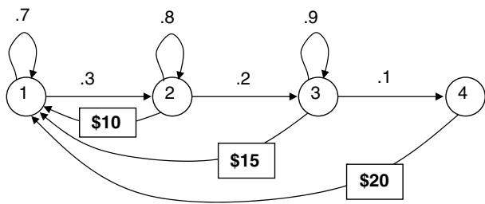

# Computational exercises

14.8 We are going to use a very simple Markov decision process to illustrate how the initial estimate of the value function can affect convergence behavior. In fact, we are going to use a Markov reward process to illustrate the behavior because our process does not have any decisions. Assume we have a two-stage Markov chain with one-step transition matrix

$$
P = \left[ \begin{array}{c c} 0. 7 & 0. 3 \\ 0. 0 5 & 0. 9 5 \end{array} \right].
$$

The contribution from each transition from state $i \in \{ 1 , 2 \}$ to state $j \in$ $\{ 1 , 2 \}$ is given by the matrix

$$
\left[ \begin{array}{c c} 1 0 & 3 0 \\ 3 0 & 5 \end{array} \right].
$$

That is, a transition from state 1 to state 2 returns a contribution of 30. Apply the value iteration algorithm for an infinite horizon problem (note that you are not choosing a decision so there is no maximization step). The calculation of the value of being in each state will depend on your previous estimate of the value of being in each state. The calculations can be easily implemented in a spreadsheet. Assume that your discount factor is .8.

(a) Plot the value of being in state 1 as a function of the number of iterations if your initial estimate of the value of being in each state is 0. Show the graph for 50 iterations of the algorithm.   
(b) Repeat this calculation using initial estimates of 100.   
(c) Repeat the calculation using an initial estimate of the value of being in state 1 of 100, and use 0 for the value of being in state 2. Contrast the behavior with the first two starting points.

14.9 Apply policy iteration to the problem given in exercise 14.8. Plot the average value function (that is, average the value of being in each state) after each iteration alongside the average value function found using value iteration after each iteration (for value iteration, initialize the value function to zero). Compare the computation time for one iteration of value iteration and one iteration of policy iteration.

14.10 Now apply the hybrid value-policy iteration algorithm to the problem given in exercise 14.8. Show the average value function after each

major iteration (update of $n$ ) with $\ M \ = \ 1 , 2 , 3 , 5 , 1 0$ . Compare the convergence rate to policy iteration and value iteration.

14.11 We have a four-state process (shown in the figure). In state 1, we will remain in the state with probability 0.7 and will make a transition to state 2 with probability 0.3. In states 2 and 3, we may choose between two policies: Remain in the state waiting for an upward transition or make the decision to return to state 1 and receive the indicated reward. In state 4, we return to state 1 immediately and receive $\$ 20$ . We wish to find an optimal long run policy using a discount factor $\gamma = . 8$ . Set up and solve the optimality equations for this problem.   
14.12 Assume that you have been applying value iteration to a four-state Markov decision process, and that you have obtained the values over iterations 8 through 12 shown in the following table (assume a discount factor of 0.90). Assume you stop after iteration 12. Give the tightest possible (valid) bounds on the optimal value of being in each state.

<table><tr><td rowspan="2">State</td><td colspan="5">Iteration</td></tr><tr><td>8</td><td>9</td><td>10</td><td>11</td><td>12</td></tr><tr><td>1</td><td>7.42</td><td>8.85</td><td>9.84</td><td>10.54</td><td>11.03</td></tr><tr><td>2</td><td>4.56</td><td>6.32</td><td>7.55</td><td>8.41</td><td>9.01</td></tr><tr><td>3</td><td>11.83</td><td>13.46</td><td>14.59</td><td>15.39</td><td>15.95</td></tr><tr><td>4</td><td>8.13</td><td>9.73</td><td>10.85</td><td>11.63</td><td>12.18</td></tr></table>

14.13 Assume that a control limit policy exists for our shuttle problem in exercise 2 that allows us to write the optimal dispatch rule as a function of $s$ , as in $z ^ { \pi } ( s )$ . We may write $r ( s , z )$ as a function of one variable, the state ??.

(a) Illustrate the shape of $r ( s , z ( s ) )$ by plotting it over the range $0 < s <$ 3?? (since we are allowing there to be more customers than can fill one vehicle, assume that we are allowed to send $z = 0 , 1 , 2 , \dots$ vehicles in a single time period).   
(b) Let $c = 1 0$ , $h = 2$ , and $M = 5$ , and assume that $A _ { t } = 1$ with probability 0.6 and is 0 with probability 0.4. Set up and solve a system of linear equations for the optimal value function for this problem in steady state.

# Theory questions

14.14 Show that $\mathbb { P } ( S _ { t + \tau } | S _ { t } )$ , given that we are following a policy $\pi$ (for stationary problems), is given by (14.22). [Hint: first show it for $\tau =$

1, 2 and then use inductive reasoning to show that it is true for general ??.]

14.15 Repeat the derivation in section 14.4.2 assuming that the reward for task $t$ is $c _ { t } \sqrt { x _ { t } }$ .   
14.16 Repeat the derivation in section 14.4.2 assuming that the reward for task $t$ is given by $\ln ( x )$ .   
14.17 Repeat the derivation in section 14.4.2 one more time, but now assume that all you know is that the reward is continuously differentiable, monotonically increasing and concave.   
14.18 What happens to the answer to the budget allocation problem in section 14.4.2 if the contribution is convex instead of concave (for example, $C _ { t } ( x _ { t } ) = x _ { t } ^ { 2 } ,$ ?   
14.19 In the proof of theorem 14.12.3 we showed that if $v \geq \mathcal { M } v$ , then $v \geq v ^ { * }$ . Go through the steps of proving the converse, that if $v \leq \mathcal { M } v$ , then $v \leq v ^ { * }$ .   
14.20 Theorem 14.12.3 states that if $v \leq \mathcal { M } v$ , then $v \leq v ^ { * }$ . Show that if $v ^ { n } \leq$ $\boldsymbol { v } ^ { n + 1 } = \mathcal { M } \boldsymbol { v } ^ { n }$ , then $v ^ { m + 1 } \geq v ^ { m }$ for all $m \geq n$ .   
14.21 Consider a finite-horizon MDP with the following properties:

$- \mathcal { S } \in \Re ^ { n }$ , the action space $\mathcal { A }$ is a compact subset of $\Re ^ { n }$ , $\mathcal { X } ( s ) = \mathcal { X }$ for all $s \in \mathcal { S }$ .   
$- \ C _ { t } ( S _ { t } , x _ { t } ) = c _ { t } S _ { t } + g _ { t } ( x _ { t } )$ , where $g _ { t } ( \cdot )$ is a known scalar function, and $C _ { T } ( S _ { T } ) = c _ { T } S _ { T }$ .   
− If decision $x _ { t }$ is chosen when the state is $S _ { t }$ at time $t$ , the next state is

$$
S _ {t + 1} = A _ {t} S _ {t} + f _ {t} \left(x _ {t}\right) + \omega_ {t + 1},
$$

where $f _ { t } ( \cdot )$ is scalar function, and $A _ { t }$ and $\omega _ { t }$ are respectively $n \times$ $n$ and $n \times 1$ -dimensional random variables whose distributions are independent of the history of the process prior to $t$ .

(a) Show that the optimal value function is linear in the state variable.   
(b) Show that there exists an optimal policy $\pi ^ { * } = ( x _ { 1 } ^ { * } , \ldots , x _ { T - 1 } ^ { * } ) \mathrm { c o m - }$ posed of constant decision functions. That is, $A _ { t } ^ { \pi ^ { * } } ( s ) = A _ { t } ^ { * }$ for all $s \in \mathcal { S }$ for some constant $A _ { t } ^ { * }$ .

14.22 Assume that you have invested $R _ { 0 }$ dollars in the stock market which evolves according to the equation

$$
R _ {t} = \gamma R _ {t - 1} + \varepsilon_ {t}
$$

where $\varepsilon _ { t }$ is a discrete, positive random variable that is independent and identically distributed and where $0 < \gamma < 1$ . If you sell the stock at the end of period ??, it will earn a riskless return $r$ until time $T$ , which means it will evolve according to

$$
R _ {t} = (1 + r) R _ {t - 1}.
$$

You have to sell the stock, all on the same day, some time before $T$ .

(a) Write a dynamic programming recursion to solve the problem.   
(b) Show that there exists a point in time $\tau$ such that it is optimal to sell for $t \geq \tau$ , and optimal to hold for $t < \tau$ .   
(c) How does your answer to (b) change if you are allowed to sell only a portion of the assets in a given period? That is, if you have $R _ { t }$ dollars in your account, you are allowed to sell $x _ { t } \leq R _ { t }$ at time $t$ .

14.23 Show that the matrix $H ^ { n }$ in the recursive updating formula from equation (3.68)

$$
\bar {\theta} ^ {n} = \bar {\theta} ^ {n - 1} - H ^ {n} x ^ {n} \hat {\varepsilon} ^ {n}
$$

reduces to $H ^ { n } = 1 / n$ for the case of a single parameter (which means we are using $Y =$ constant, with no independent variables).

14.24 A dispatcher controls a finite capacity shuttle that works as follows: In each time period, a random number $A _ { t }$ arrives. After the arrivals occur, the dispatcher must decide whether to call the shuttle to remove up to $M$ customers. The cost of dispatching the shuttle is $c$ , which is independent of the number of customers on the shuttle. Each time period that a customer waits costs $h$ . If we let $z = 1$ if the shuttle departs and 0 otherwise, then our one-period reward function is given by

$$
c _ {t} (s, z) = c z + h [ s - M z ] ^ {+},
$$

where $M$ is the capacity of the shuttle. Show that $c _ { t } ( s , a )$ is submodular where we would like to minimize ??. Note that we are representing the state of the system after the customers arrive.

14.25 Assume that a control limit policy exists for our shuttle problem in exercise 2 that allows us to write the optimal dispatch rule as a function of $s$ , as in $z ^ { \pi } ( s )$ . We may write $r ( s , z )$ as a function of one variable, the state ??.

(a) Illustrate the shape of $r ( s , z ( s ) )$ by plotting it over the range $0 < s <$ 3?? (since we are allowing there to be more customers than can fill one vehicle, assume that we are allowed to send $z = 0 , 1 , 2 , \dots$ vehicles in a single time period).   
(b) Let $c = 1 0$ , $h = 2$ , and $M = 5$ , and assume that $A _ { t } = 1$ with probability 0.6 and is 0 with probability 0.4. Set up and solve a system of linear equations for the optimal value function for this problem in steady state.

14.26 Show that the matrix $H ^ { n }$ in the recursive updating formula from equation (3.68)

$$
\bar {\theta} ^ {n} = \bar {\theta} ^ {n - 1} - H ^ {n} x ^ {n} \hat {\varepsilon} ^ {n}
$$

reduces to $H ^ { n } = 1 / n$ for the case of a single parameter (which means we are using $Y =$ constant, with no independent variables).

# Problem solving questions

14.27 You have to send a set of questionnaires to each of $N$ population segments. The size of each population segment is given by $w _ { i }$ . You have a budget of $B$ questionnaires to allocate among the population segments. If you send $x _ { i }$ questionnaires to segment ??, you will have a sampling error proportional to

$$
f (x _ {i}) = 1 / \sqrt {x _ {i}}.
$$

You want to minimize the weighted sum of sampling errors, given by

$$
F (x) = \sum_ {i = 1} ^ {N} w _ {i} f (x _ {i})
$$

You wish to find the allocation $x$ that minimizes $F ( x )$ subject to the budget constraint $\begin{array} { r } { \sum _ { i = 1 } ^ { N } x _ { i } \ \le \ B } \end{array}$ . Set up the optimality equations to solve this problem as a dynamic program (needless to say, we are only interested in integer solutions).

14.28 An oil company will order tankers to fill a group of large storage tanks. One full tanker is required to fill an entire storage tank. Orders are placed at the beginning of each four week accounting period but do not arrive until the end of the accounting period. During this period, the company may be able to sell 0, 1, or 2 tanks of oil to one of the regional chemical companies (orders are conveniently made in units

of storage tanks). The probability of a demand of 0, 1, or 2 is 0.40, 0.40, and 0.20, respectively.

A tank of oil costs $\$ 1.6$ million (M) to purchase and sells for $\$ 2 M$ . It costs $\$ 0.020\mathbf { M }$ to store a tank of oil during each period (oil ordered in period $t$ , which cannot be sold until period $t + 1$ , is not charged any holding cost in period ??). Storage is only charged on oil that is in the tank at the beginning of the period and remains unsold during the period. It is possible to order more oil than can be stored. For example, the company may have two full storage tanks, order three more, and then only sell one. This means that at the end of the period, they will have four tanks of oil. Whenever they have more than two tanks of oil, the company must sell the oil directly from the ship for a price of $\$ 0.70\mathbfM$ . There is no penalty for unsatisfied demand.

An order placed in time period ?? must be paid for in time period ?? even though the order does not arrive until $t + 1$ . The company uses an interest rate of 20 percent per accounting period (that is, a discount factor of 0.80).

(a) Give an expression for the one-period reward function $r ( s , d )$ for being in state ?? and making decision $d$ . Compute the reward function for all possible states (0, 1, 2) and all possible decisions (0, 1, 2).   
(b) Find the one-step probability transition matrix when your action is to order one or two tanks of oil. The transition matrix when you order zero is given by

<table><tr><td>From-To</td><td>0</td><td>1</td><td>2</td></tr><tr><td>0</td><td>1</td><td>0</td><td>0</td></tr><tr><td>1</td><td>0.6</td><td>0.4</td><td>0</td></tr><tr><td>2</td><td>0.2</td><td>0.4</td><td>0.4</td></tr></table>

(c) Write out the general form of the optimality equations and solve this problem in steady state.   
(d) Solve the optimality equations using the value iteration algorithm, starting with $V ( s ) = 0$ for $s = 0 , 1$ , and 2. You may use a programming environment, but the problem can be solved in a spreadsheet. Run the algorithm for 20 iterations. Plot $V ^ { n } ( s )$ for $s = 0 , 1 , 2$ , and give the optimal action for each state at each iteration.   
(e) Give a bound on the value function after each iteration.

# Sequential decision analytics and modeling

These exercises are drawn from the online book Sequential Decision Analytics and Modeling available at http://tinyurl.com/sdaexamplesprint.

14.29 We are going to perform experiments for an energy storage problem that we can solve exactly using backward dynamic programming. Download the code “EnergyStorage_I” from http://tinyurl.com/ sdagithub.

(a) Using the Python implementation of the basic model, run a grid search for the parameter vector $\theta = ( \theta ^ { b u y } , \theta ^ { s e l l } )$ by varying $\theta ^ { s e l l }$ over the range from $\$ 20$ to $\$ 60$ in increments of $\$ 1$ for prices, and varying $\theta ^ { b u y }$ over the range from $\$ 20$ to $\theta ^ { s e l l }$ , also in increments of $\$ 1$ . Assume that the price process evolves according to

$$
p _ {t + 1} = \min  \{1 0 0, \max  \{0, p _ {t} + \varepsilon_ {t + 1} \} \}
$$

where $\varepsilon _ { t + 1 }$ follows a discrete uniform distribution given by

$$
\varepsilon_ {t + 1} = \left\{ \begin{array}{l l} - 2 & \text {w i t h p r o b . 1 / 5} \\ - 1 & \text {w i t h p r o b . 1 / 5} \\ 0 & \text {w i t h p r o b . 1 / 5} \\ + 1 & \text {w i t h p r o b . 1 / 5} \\ + 2 & \text {w i t h p r o b . 1 / 5} \end{array} \right.
$$

Assume that $p _ { 0 } = \$ 50$ .

(b) Now solve for an optimal policy by using the backward dynamic programming strategy in section 14.3 of the text (the algorithm has already been implemented in the Python module).

(i) Run the algorithm where prices are discretized in increments of $\$ 1$ , then $\$ 0.50$ and finally $\$ 0.25$ . Compute the size of the state space for each of the three levels of discretization, and plot the run times against the size of the state space.

(ii) Using the optimal value function for the discretization of $\$ 1$ compare the performance against the best buy-sell policy you found in part (a).

(c) Repeat (b), but now assume that the price process evolves according to

$$
p _ {t + 1} = . 5 p _ {t} +. 5 p _ {t - 1} + \varepsilon_ {t + 1}
$$

where $\varepsilon _ { t + 1 }$ follows the distribution in part (1). You have to modify the code to handle an extra dimension of the state variable. Compare the run times using the price models assumed in part (a) and part (b) using the single discretization of $\$ 1$ .

(d) Section 8.3.1 of the sequential decision analytics notes introduces a time series model where

$$
p _ {t + 1} = \bar {\theta} _ {t 0} p _ {t} + \bar {\theta} _ {t 1} p _ {t - 1} + \bar {\theta} _ {t 2} p _ {t - 2} + \varepsilon_ {t + 1}. \tag {14.90}
$$

The section also provides the updating equations for $\bar { \theta } _ { t }$

(i) For this variation, present the full model of the problem using our canonical framework (states, decisions, exogenous information, transition function, objective function).   
(ii) How many dimensions does the state variable have? Estimate how long it might take to solve this using Bellman’s equation given your experience in parts (b) and (c).   
(iii) Now consider optimizing the buy-sell policy of part (a). What effect does the more complex price model have on the design of this policy? In particular, how does your policy reflect the value of $p _ { t - 1 }$ ?

# Diary problem

The diary problem is a single problem you chose (see chapter 1 for guidelines). Answer the following for your diary problem.

14.30 Use your sequential model to write your problem as a dynamic program, and write out Bellman’s equation for solving it. Note that you will have to write out the state variables, and then show mathematically how to compute the one-step transition matrix. It is unlikely that you would be able to solve this, so discuss the computational complexity of each of the elements that you would need to solve Bellman’s equation. Note that if you have continuous elements in your state variable, you just have to treat the transition matrix as a function that you integrate over, rather than using discrete sums.

# Bibliography

Bellman, R.E. (1957). Dynamic Programming. Princeton, N.J.: Princeton University Press.   
Bellman, R.E. (1971). Introduction to the Mathematical Theory of Control Processes, Vol. II, New York: Academic Press.   
Denardo, E.V. (1982). Dynamic Programming. Englewood Cliffs, NJ: PrenticeHall.   
Derman, C. (1962). On sequential decisions and Markov chains. Management Science 9 (1): 16–24.

Derman, C. (1970). Finite State Markovian Decision Processes. New York: Academic Press.   
Dreyfus, S. and Law, A. M. (1977). The Art and Theory of Dynamic Programming. New York: Academic Press.   
Dynkin, E.B. and Yushkevich, A.A. (1979). Controlled Markov processes. in volume Grundlehren der mathematischen Wissenschaften 235 of A Series of Comprehensive Studies in Mathematics. New York: SpringerVerlag.   
Heyman, D.P. and Sobel, M. (1984). Stochastic Models in Operations Research, Volume II: Stochastic Optimization. New York: McGraw Hill.   
Howard, R.A. (1960). Dynamic programming and Markov processes. Cambridge, MA: MIT Press.   
Lewis, F.L. and Vrabie, D. (2012). Design Optimal Adaptive Controllers, 3e. Hoboken, NJ: JohnWiley & Sons.   
Manne, A.S. (1960). Linear programming and sequential decisions. Management Science 6 (3): 259–267.   
Nemhauser, G.L. (1966). Introduction to Dynamic Programming. New York: JohnWiley & Sons.   
Puterman, M.L. (2005). Markov Decision Processes, 2e. Hoboken, NJ: John Wiley and Sons.   
Ross, S.M. (1983). Introduction to Stochastic Dynamic Programming. New York: Academic Press.   
White, D.J. (1969). Dynamic Programming. San Francisco: HoldenDay.

#

# Backward Approximate Dynamic Programming

Chapter 14 presented the most classical solution methods from discrete Markov decision processes, which are often referred to as “backward dynamic programming” since it is necessary to step backward in time, using the value $V _ { t + 1 } ( S _ { t + 1 } )$ to compute $V _ { t } ( S _ { t } )$ . While we can occasionally apply this strategy to problems with continuous states and decisions (as we did in section 14.4), most often this is used for problems with discrete states and decisions, and where the one-step transition matrix $P ( S _ { t + 1 } = s ^ { \prime } | S _ { t } = s , a )$ is known (that is, computable).

The field of discrete Markov decision processes has enjoyed a rich theoretical history, largely because of the elegance of discrete states and actions, and the assumption that we can compute expectations over $W _ { t + 1 }$ . This theory seems to have been self-perpetuating, since it is not supported by a class of wellmotivated applications. However, as we see in this and later chapters, it has provided the foundation for powerful and practical approximation strategies.

The basic backward dynamic programming strategy used for discrete dynamic programming suffers from what we have identified as the three curses of dimensionality:

(1) State variables – As the state variable grows past three or four dimensions, the number of states tends to become too large to enumerate. In particular, there are many applications where some (or all) of the dimensions of the state variable are continuous.   
(2) Decision variables – Enumerating all possible decisions tends to become intractable if there are more than three or four dimensions, unless it is possible to significantly prune the number of decision using constraints. Problems with more than three or four dimensions tend to require special structure such as convexity. For this reason, we adopted the classical notation of discrete actions ?? in chapter 14.4, but for reasons we make clear

shortly, this chapter reverts back to our standard notation $x$ for decisions, where we are going to allow $x$ to be multidimensional and continuous.

(3) Exogenous information variables – We assume that our exogenous information $\boldsymbol { W } _ { t } \in \mathcal { W } = \{ \boldsymbol { w } _ { 1 } , \dots , \boldsymbol { w } _ { L } \}$ and let

$$
p _ {t} ^ {W} (w | s, x) = \mathbb {P} [ W _ {t} = w | s, x ].
$$

As we pointed out in section 9.7 finding the one-step transition matrix requires computing the expectation

$$
\begin{array}{l} \mathbb {P} \left(s ^ {\prime} \mid S _ {t} ^ {x} = (s, x)\right) = \mathbb {E} _ {W _ {t + 1}} \{\mathbb {1} _ {\{s ^ {\prime} = S ^ {M} (s, x, W _ {t + 1}) \}} \mid S _ {t} = s, x _ {t} = x \} \\ = \sum_ {w \in W} p _ {t + 1} ^ {W} \left(W _ {t + 1} = w | s, x\right) \mathbb {1} _ {\{s ^ {\prime} = S ^ {M} (s, x, w) \}}. \tag {15.1} \\ \end{array}
$$

However, if $W _ { t + 1 }$ is a vector or continuous (instead of the discrete outcomes in $\mathcal { W }$ ), this becomes computationally intractable.

These computational issues have motivated the development of fields with names like “approximate dynamic programming,” “heuristic dynamic programming” (an older term used in engineering), “adaptive dynamic programming,” (a term adopted in engineering after 2010), “neuro-dynamic programming,” or “reinforcement learning,” (the highly popular field that evolved within computer science). All of these approaches are effectively a form of “forward approximate dynamic programming” since they are all based on the principle of stepping forward in time. Many authors (including this author) have assumed that if you cannot do “backward dynamic programming” (that is, the method descriped in section 14.3), then you need to turn to “approximate dynamic programming” (which means forward approximate dynamic programming). This chapter challenges this notion.

This chapter presents a strategy known as backward approximate dynamic programming, which has the notable feature that it can handle multidimensional (and continuous) state variables and exogenous information variables. In addition, under the right conditions, it can also handle multidimensional (and continuous) decision variables. In other words, backward approximate dynamic programming overcomes all three curses of dimensionality. However, it still struggles with the same challenge of any method based on approximating the value function: The quality of the policy depends heavily on how well we can approximate the value function, and there are many problems where high quality approximations are simply not possible. At the end of this chapter, we are going to present some strong empirical evidence supporting its effectiveness.

# 15.1 Backward Approximate Dynamic Programming for Finite Horizon Problems

We are going to start by illustrating backward approximate dynamic programming for finite horizon problems, which parallels backward dynamic programming that we introduced in chapter 14. We begin using classical lookup tables for the value functions, and then transition to continuous approximations.

While we will see that forward ADP methods can be quite powerful, we are going to first present the idea of backward approximate dynamic programming, which has received comparatively little attention in the research literature. Backward ADP can be viewed as an implementation of classical backward dynamic programming (see the algorithm in Figure 14.3) that uses sampling of states and exogenous information to avoid enumerating state spaces and information spaces. We still need to optimize over decisions, but this opens up the potential of exploiting structure such as concavity (convexity if minimizing) to use solvers for high-dimensional decisions.

In addition to scaling nicely to complex problems, we are going to close by presenting some empirical evidence supporting the use of backward ADP. However, as with any approximation method, we cannot make any broad statements about the performance of backward ADP over forward ADP methods (or any of the other classes of policies). It should be viewed as a powerful tool in the toolbox of any sequential decision scientist.

# 15.1.1 Some Preliminaries

We start by writing Bellman’s equation broken into two steps: from pre-decision state $S _ { t }$ to post-decision state $S _ { t } ^ { x }$ , and then from post-decision state $S _ { t } ^ { x }$ to the next pre-decision state $S _ { t + 1 }$ :

$$
V _ {t} \left(S _ {t}\right) = \max  _ {x _ {t}} \left(C \left(S _ {t}, x _ {t}\right) + V _ {t} ^ {x} \left(S _ {t} ^ {x}\right)\right), \tag {15.2}
$$

$$
V _ {t} ^ {x} \left(S _ {t} ^ {x}\right) = \mathbb {E} _ {W _ {t + 1}} \left\{V _ {t + 1} \left(S _ {t + 1}\right) \mid S _ {t} ^ {x} \right\}, \tag {15.3}
$$

where

$$
S _ {t} ^ {x} = S ^ {M, x} (S _ {t}, x _ {t}),
$$

$$
S _ {t + 1} = S ^ {M, W} (S _ {t} ^ {x}, W _ {t + 1}).
$$

These steps are illustrated in Figure 15.1.

The computational challenges associated with these equations include:

● Computing $V _ { t } ( S _ { t } )$ for each (presumably discrete) pre-decision state $S _ { t }$ in equation (15.2).

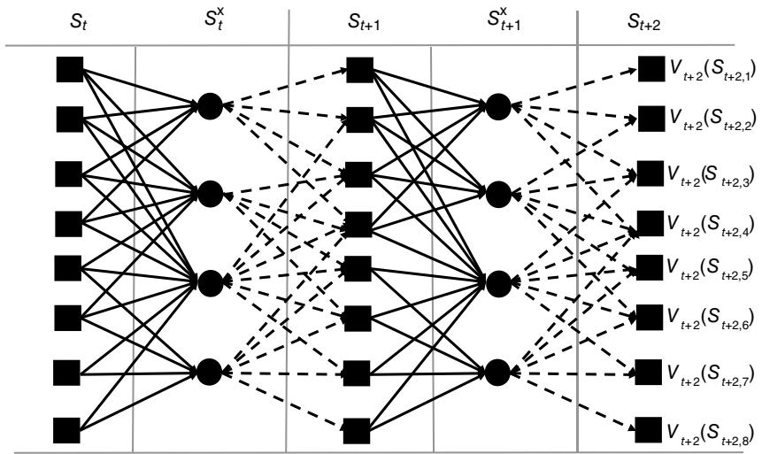  
Figure 15.1 Illustration of transitions from pre-decision $S _ { t }$ to post-decision $S _ { t } ^ { x }$ to pre-decision $S _ { t + 1 }$ and so on.

● Optimizing over $x _ { t }$ if $x _ { t }$ is a vector in equation (15.2).   
● Computing $V _ { t } ^ { x } ( S _ { t } ^ { x } )$ for each post-decision $S _ { t } ^ { x }$ in equation (15.3).   
● Computing the expectation $\mathbb E _ { W _ { t + 1 } }$ over the random variable $W _ { t + 1 }$ in equation (15.3).

We are going to break down these computational challenges one step at a time, as follows:

(1) Sampled states with lookup tables – The core idea of backward ADP is to avoid enumerating the entire state space by using a sampled set of states instead. In this first stage, we will still use a lookup table representation of the value functions, and we will also assume we can do full expectations, and maximize over all decisions (which generally means a not-too-large set of discrete decisions).   
(2) Sampled expectations – Here we are going to replace the exact expectation over $W _ { t + 1 }$ with a sampled approximation.   
(3) Parametric approximations of the value function – Here we replace the lookup table representation of the value function with a parametric (or nonparametric) approximation which helps with both the computation of value function approximations.   
(4) Decisions – There are two strategies for handling multidimensional (possibly high dimensional) decisions:

(a) We can replace the maximization over decisions with a maximization over a sampled set.   
(b) If we use a parametric approximation for $V _ { t } ^ { x } ( S _ { t } ^ { x } )$ , we may be able to solve equation (15.2) using classical optimization methods (linear, nonlinear, or integer programming).

We are going to start by describing backward ADP using lookup table models for the value function, and then we are going to transition to using continuous approximations.

# 15.1.2 Backward ADP Using Lookup Tables

The basic idea of backward approximate dynamic programming is to perform classical backward dynamic programming, using equations (15.2)–(15.3), but instead of enumerating all the states $\mathcal { S }$ , we work with a sampled set $\hat { \mathcal { S } } .$ . We begin by illustrating the strategy using lookup table approximations for the value function approximations. This closely parallels classical backward dynamic programming (see, for example, equation (14.3)).

For now we are going to make the assumption (true for some, but hardly all, applications) that the post-decision state space ${ \mathcal { S } } ^ { x }$ is “not too large.” By contrast, we are going to allow the pre-decision state space $\mathcal { S }$ to be arbitrarily large. This situation arises frequently when there is information needed to make a decision, but which is no longer needed once a decision has been made. Some examples where this arises are:

# EXAMPLE 15.1

As a car traverses from node ?? to node $j$ on a transportation network, it incurs random costs $\hat { c } _ { i j }$ which it learns when it first arrives at node ??. The (pre-decision) state when it arrives at node $i$ is then ${ \boldsymbol { S } } = ( i , ( \hat { c } _ { i j } ) _ { j } )$ After making the decision to traverse from $i$ to some node $j ^ { \prime }$ (but before moving to $j ^ { \prime }$ ), the post-decision state is $S ^ { x } = \left( j \right)$ , since we no longer need the realization of the costs $( \hat { c } _ { i j } ) _ { j } ,$ ).

# EXAMPLE 15.2

A truck driver arrives in city ?? and learns a set $\mathcal { L } _ { i }$ of loads that need to be moved to other cities. This means when it arrives at ?? that the state of our driver is ${ \boldsymbol { S } } = ( { \boldsymbol { i } } , { \mathcal { L } } _ { i } )$ . Once the driver chooses a load $\ell \in \mathcal { L } _ { i }$ , but before moving to the destination of load $\ell$ , the (post-decision) state is $S ^ { x } = ( \ell )$ (or we might use the destination of load $\ell$ ).

# EXAMPLE 15.3

A cement truck is given a set of orders to deliver set to a set of work sites. Let $R _ { t }$ be the inventory of cement, and let $\mathcal { D } _ { t }$ be the set of construction sites needing deliveries (the set includes how much cement is needed by each site). The decision that needs to be made by the cement plant is how much cement to make to replenish inventory. The pre-decision state is ${ \boldsymbol { S } } _ { t } = ( R _ { t } , \mathcal { D } _ { t } )$ , while the post-decision state is $S _ { t } ^ { x } = R _ { t } ^ { x }$ which is the amount of inventory left over after making all the deliveries.

In each of these examples, the number of pre-decision states may be extremely large. Instead of looping over all states in $\mathcal { S }$ (as we had to do in Figure 15.1), we are going to take a sample $\hat { \mathcal { S } }$ which is of manageable size. We see the power of Monte Carlo simulation in that the state variables can be both continuous and high-dimensional, since we control the number of samples in ${ \hat { \mathcal { S } } } .$ . The only caveat is that we have to pre-specify a sampling region, which means we have to know something about the range of values of each dimension of $S _ { t }$ .

In addition to enumerating the post-decision states, we also assume (for now):

● There is a discrete set of decisions $x _ { t } \in \{ x _ { 1 } , x _ { 2 } , \ldots , x _ { K } \}$ that we can search over.   
● There are discrete outcomes $W _ { t + 1 } \in \{ w _ { 1 } , \ldots , w _ { L } \}$   
● We know the probability $p _ { t } ^ { W } ( w _ { \ell } ) = \mathbb { P } ( W _ { t + 1 } = w _ { \ell } | S _ { t } ^ { x } )$

The steps of the algorithm are described in detail in Figure 15.3, but we refer to Figure 15.2 to explain the idea. The pre-decision states are depicted as squares while post-decision states are circles. We represent the states in our sampled set $\hat { \mathcal { S } }$ using the black squares. Assuming we know $\overline { { V } } _ { t + 2 } ( s )$ for states $s \in { \hat { \mathcal { S } } }$ , we compute the value $\overline { { V } } _ { t + 1 } ^ { x } ( s )$ for each post-decision state ?? in ${ \mathcal { S } } ^ { x }$ by taking the expectation over all random outcomes that take us to states in our sampled set $\hat { \mathcal { S } }$ , given by the equation

$$
V _ {t + 1} ^ {x} \left(S _ {t + 1} ^ {x}\right) = \frac {\sum_ {\ell = 1} ^ {L} p _ {t + 2} ^ {W} \left(w _ {\ell}\right) \bar {V} _ {t + 2} \left(S _ {t + 2} \left(w _ {\ell}\right)\right) \mathbb {1} _ {\left\{S _ {t + 2} \left(w _ {\ell}\right) \in \hat {s} \right\}}}{\sum_ {\ell = 1} ^ {L} p _ {t + 2} ^ {W} \left(w _ {\ell}\right) \mathbb {1} _ {\left\{S _ {t + 2} \left(w _ {\ell}\right) \in \hat {s} \right\}}}, \tag {15.4}
$$

where $S _ { t + 2 } ( w ) = S ^ { M } ( S _ { t + 1 } ^ { x } , w )$ . Note that equation (15.4) only includes transitions to values of $S _ { t + 2 }$ in the sampled set $\hat { \mathcal { S } }$ , which means that we have to normalize the probabilities so that the probabilities of the outcomes that transition to states in $\hat { \mathcal { S } }$ sum to one.

  
Figure 15.2 Calculation of the value of the post-decision state $S _ { t + 1 } ^ { x }$ using full expectation.

This quickly raises a potential problem. What if none of the random outcomes take us to states in $\hat { \mathcal { S } } ?$ When this happens, we choose a subset of random outcomes from a post-decision state, find the pre-decision states that these outcomes take us to, and then add these states to the sampled set $\hat { \mathcal { S } } _ { }$ . We then repeat the calculation.

Once we have the value of being in each post-decision state, we then step back to find the value of being in each sampled pre-decision state, which is depicted in Figure 15.4. Since we assume we have computed the value of being in each post-decision state, finding the value of being in any pre-decision state involves simply searching over all decisions and finding the decision with the highest one-period reward plus downstream value.

# 15.1.3 Backward ADP Algorithm with Continuous Approximations

Now that we have sketched the basic idea of backward ADP, we are going to outline a fully scalable algorithm that can handle multidimensional and continuous state variables (pre-decision $S _ { t }$ and post-decision $S _ { t } ^ { x }$ ), decisions $x _ { t }$ , and exogenous information $W _ { t + 1 }$ . We do this by using appropriately designed continuous approximations of the value function around the post-decision state variable.

A sketch of the algorithm is given in Figure 15.5. This algorithm has some nice features:

● Both the pre- and post-decision states $S _ { t }$ and $S _ { t } ^ { x }$ can be multidimensional and continuous.

Step 0. Initialization:

0a. Initialize the terminal contribution $V _ { T } ( S _ { T } )$ .   
0b. Create a sampled set of pre-decision states $\hat { \mathcal { S } }$ (we assume we can use this same sample each time period).   
0c. Create a full set of post-decision states ${ \mathcal { S } } ^ { x }$ (presumably a manageable size).   
0d. Set $t = T - 1$ .

Step 1a. Step backward in time $t = T , T - 1 , \dots , 0$ :

Compute the value of each post-decision state:

Step 2a. Initialize pre-decision value function approximation $\overline { { V } } _ { t } ( s ) = - M$

Step 2b. Loop over the sampled set of pre-decision states $s \in \hat { \mathcal { S } }$

Step 2c. Loop over each decision $x \in \mathcal { X } ( s )$

Step 3a. Compute $Q _ { t } ( s , x ) = C ( s , x ) + \overline { { V } } _ { t } ^ { x } ( s ^ { \prime } = S ^ { M , x } ( s , x ) ) .$   
Step 3b. If $Q _ { t } ( s , x ) > \overline { { V } } _ { t } ( s )$ then set $\overline { { V } } _ { t } ( s ) = Q _ { t } ( s , x )$

Compute the value of each sampled pre-decision state:

Step 4a. Initialize post-decision value function approximation $\overline { { V } } _ { t } ^ { x } ( s ^ { x } ) = - M$

Step 4b. Loop over the full set of post-decision states $s ^ { x } \in \mathcal { S } ^ { x }$

Step 4c. Step back in time: $t = t - 1$

Step 5a. Initialize $Q ( s , x ) = 0$

Step 5b. Initialize total probability $\rho = 0$

Step 5c. Loop over each $w \in \mathcal { W }$ :

Step 5d. If $\rho > 0$ then (we have to normalize $Q _ { t } ( s , x )$ in case $\rho < 1$ ):

Step 6a. Compute $Q _ { t } ( s , x ) = Q _ { t } ( s , x ) + \mathbb { P } ( w | s , x ) \overline { { V } } _ { t + 1 } ( s ^ { \prime } = S ^ { M } ( s , x , w ) ) .$

Step 6b. $\rho = \rho + \mathbb { P } ( w | s , x )$

Step 6c. $Q _ { t } ( s , x ) = Q _ { t } ( s , x ) / \rho$

Else: Get here if $\rho = 0$ , which means there were no random transitions to states in $\hat { \mathcal { S } }$ :

Step 6d. Choose a sample of outcomes $\hat { w }$ (at least one), find the downstream pre-decision state $\hat { s } \overset { = } { = } S ^ { M , W } ( s , \hat { w } )$ , and add each $\hat { s }$ to $\hat { \mathcal { S } }$ .

Step 6e. Return to step 4a.

Step 1b. Return the values $\overline { { V } } _ { t } ( s )$ for all $s \in \mathcal { S }$ and $t = 0 , \ldots , T$ .

Figure 15.3 A backward dynamic programming algorithm using lookup tables.

● The exogenous information $W _ { t }$ can also be multidimensional and continuous, as long as we have some mechanism for sampling the random variable. This may come from an underlying mathematical model, or it may come from historical observations.

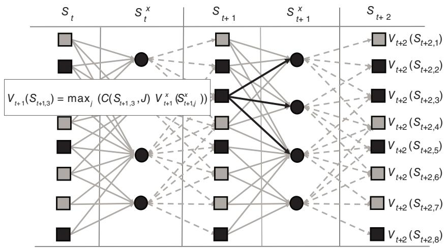  
Figure 15.5 A backward dynamic programming algorithm for multidimensional applications.

Figure 15.4 Calculation of value of pre-decision state $S _ { t + 1 }$ using full maximization.

(0) Assume we have a value function approximation $\overline { { V } } _ { T } ( s )$   
(1) Perform $N$ samples for $n = 1 , \ldots , N$

(1a) Randomly sample a post-decision state $\hat { s } _ { t } ^ { x , n }$ from the set |????????ℎ??????.   
(1b) Find a sample realization of $\hat { w } _ { t + 1 } ^ { n }$ of the random variable $\boldsymbol { W } _ { t + 1 }$ given that we are in state $\hat { s } _ { t } ^ { x }$ .   
??(1c) Simulate our way from $\hat { s } _ { t } ^ { x , n }$ to $\hat { s } _ { t + 1 } ^ { n }$ using $\hat { s } _ { t + 1 } ^ { n } = S ^ { M , W } ( \hat { s } _ { t } ^ { x , n } , \hat { w } _ { t + 1 } ^ { n } )$   
??(1d) Compute a sample estimate $\hat { v } _ { t + 1 } ^ { n }$ 1  ??+1   ?? ??+1of the value of being in pre-decision state $\hat { s } _ { t + 1 } ^ { n }$ using

$$
\hat {v} _ {t + 1} ^ {n} = \max  _ {x} \left(C \left(\hat {s} _ {t + 1} ^ {n}, x\right) + \bar {V} _ {t + 1} ^ {x} \left(\hat {s} _ {t + 1} ^ {n, x}\right)\right) \tag {15.5}
$$

where $\hat { s } _ { t + 1 } ^ { n , x } ~ = ~ S ^ { M , x } ( \hat { s } _ { t } ^ { n } , x _ { t } ^ { n } )$ , and where $\boldsymbol { x } _ { t } ^ { n }$ is the value of $x$ that optimizes equation (15.5). We are now going to associate the value $\hat { v } _ { t + 1 } ^ { n }$ with the previous post-decision state $\hat { s } _ { t } ^ { x , n }$ .

(2) From step 1, we compile a set of observations $( \hat { s } _ { t } ^ { n } , \hat { v } _ { t + 1 } ^ { n } ) , n = 1 , \dots , N$   
(3) Use the dataset $( \hat { s } _ { t } ^ { n } , \hat { v } _ { t + 1 } ^ { n } ) , n = 1 , \dots , N$ to fit a statistical model $\overline { { V } } _ { t } ^ { x } ( s )$ using any of the statistical methods in chapter 3 (but here we are doing batch learning). Some of the methods that have proven successful in this context are described in section 15.3.   
(4) Step back one time period and repeat until $t = 0$

● The decision $x _ { t }$ may be multidimensional and continuous (or discrete), but algorithms for solving multidimensional decision problems typically require concavity of $\left( C ( \hat { s } _ { t + 1 } ^ { n } , x ) + \overline { { V } } _ { t + 1 } ^ { x } ( \hat { s } _ { t + 1 } ^ { n , x } ) \right)$ (convexity if minimizing). This is where some care might have to be put into the choice of architecture for the value function approximation.

An open question is: how well does the method work? The approximation for time ?? depends on the approximation for $t + 1$ , which means the errors in the approximation for $t + 1$ propagate backward to $t$ and, in fact, accumulate. Section 15.4 reports on three sets of empirical benchmarking experiments that support the accuracy and efficiency of backward approximate dynamic programming. However, we can obtain stronger results when we apply these ideas in the context of a stationary (steady state) problem, an idea that has evolved in the literature under the name “fitted value iteration.”

# 15.2 Fitted Value Iteration for Infinite Horizon Problems

Most of this book focuses on finite horizon problems, since these represent the problems most often encountered in practice. However, the literature on Markov decision processes, as can be seen in the presentation in chapter 14, has emphasized the steady state version of Bellman’s equation which is written:

$$
{V (s)} = {\max _ {x \in \mathcal {X}} \big (C (s, x) + \gamma \mathbb {E} _ {W} \{V (S ^ {M} (s, x, W)) | s \} \big).}
$$

where $s ^ { \prime } = S ^ { M } ( s , x , W )$ is the state we land in given that we are now in state ??, make decision $x$ , and then observe ??. We write the value function explicitly as a function of the transition function $S ^ { M } ( s , x , W )$ to make the dependence on ?? explicit. Needless to say, computing this expectation is problematic, especially inside a max operator. Instead, we used a sampled estimate by choosing a random sample ${ \mathcal { W } } = \{ w _ { 1 } , w _ { 2 } , \dots , w _ { L } \}$ .

The basic idea follows the steps of backward ADP. We choose a sample of states $\hat { \mathcal { S } } = \{ \hat { s } _ { 1 } , \hdots , \hat { s } _ { m } , \hdots , \hat { s } _ { M } \}$ . Assume we have an approximate value function ${ \overline { { V } } } ^ { n - 1 } ( s )$ . Then, given ${ \overline { { V } } } ^ { n - 1 } ( s )$ , we sample $\hat { s } _ { m } \in \hat { \mathcal { S } }$ and compute

$$
\hat {v} _ {m} ^ {n} = \max  _ {x \in \mathcal {X}} \left(C (\hat {s} _ {m}, x) + \gamma \frac {1}{L} \sum_ {\ell = 1} ^ {L} \left(\bar {V} ^ {n - 1} \left(S ^ {M} (\hat {s} _ {m}, x, w _ {\ell})\right) | s\right)\right). \tag {15.6}
$$

Repeat equation (15.6) for $\textit { m } = \ 1 , \ldots , M$ until we have compiled a dataset $( \hat { s } _ { m } , \hat { v } _ { m } ^ { n } )$ for $m = 1 , \ldots , M$ . Note that we index the value function approximation $\overline { { V } } ^ { n } ( s )$ by iteration $n$ , but the sampled states $\hat { s } \in \hat { \mathcal S }$ are the same from one iteration to the next.

The next step is to use the dataset $( \hat { s } _ { m } , \hat { v } _ { m } ^ { n } ) _ { m = 1 } ^ { M }$ to create an updated value function approximation $\overline { { V } } ^ { n } ( s )$ , using any of the approximation architectures in chapter 3. Of course, solving equation (15.6) is more difficult than solving for $\hat { v } ^ { n }$ in equation (15.5) because we have chosen to illustrate fitted value iteration using value functions that depend on the pre-decision state, forcing us to use

the sampled representation of the expectation. We could use the same strategy as we did in the finite-horizon case and compute the value function around the post-decision state. Similarly, we could use the sampled representation of the expectation illustrated in this section in the finite-horizon setting. We have decided to illustrate both methods, but either can be used in either setting.

The only real difference between the finite and infinite horizon versions is that the finite horizon algorithm involves a single backward pass over the horizon. There is no notion of convergence. By contrast, we can repeat our process for updating $\overline { { V } } ^ { n } ( s )$ in the infinite horizon case for as many iterations as we like, opening the door to questions about convergence. Recall that we could obtain strict bounds on the error when we were using lookup table representations and assuming that we could compute the one-step transition matrix (see section 14.12.2).

We made the point in chapter 4 that classical discrete Markov decision processes, where we assume that the one-step transition matrix is known, is actually a deterministic problem (see section 4.2.5), as is any stochastic problem where the expectation can be computed exactly. In fact, in section 4.3 we made the point that replacing the expectation with a sampled approximation, as we are doing in equation (15.6), is simply replacing the original expectation that we could not compute, with an approximate expectation that we can compute. Once we do so, we are effectively turning our exact “deterministic” problem into an approximate “deterministic” problem. But if we continue to use a lookup table representation, we still suffer from the curse of dimensionality in the state space.

It is possible to show convergence results similar to those for the exact, discrete dynamic programming methods, but it requires an approximating architecture that is sufficiently flexible to allow arbitrarily accurate fits at the sampled states. This would not be possible if we were to use a low-dimensional parametric architecture (such as a quadratic fit). Gaussian process regression, kernel regression and neural networks are all approximation methods that can produce very accurate approximations, but any time you use these highdimensional architectures, you run the risk of overfitting to noisy observations unless you have exceptionally large samples. So, pick your poison.

# 15.3 Value Function Approximation Strategies

We illustrated the basic idea of backward approximate dynamic programming using a standard lookup table representation for the value function, but this would quickly cause problems if we have a multidimensional state (the classic curse of dimensionality). In this section, we suggest three strategies for approximating value functions that mitigate this problem to some degree.

# 15.3.1 Linear Models

Arguably the most natural strategy for approximating the value function is to fit a statistical model, where the most natural starting point is a linear model of the form

$$
\overline {{V}} _ {t} (S _ {t} | \boldsymbol {\theta} _ {t}) = \sum_ {f \in \mathcal {F}} \boldsymbol {\theta} _ {t f} \phi_ {f} (S _ {t}).
$$

Here, $\phi _ { f } ( S _ { t } )$ are a set of appropriately chosen features. For example, if $S _ { t }$ is a continuous scalar (such as price), we might use $\phi _ { 1 } ( S _ { t } ) = S _ { t }$ and $\phi _ { 2 } ( S _ { t } ) = S _ { t } ^ { 2 }$ .

The idea is very simple. For each $\hat { s }$ in our sampled set of pre-decision states $\hat { \mathcal { S } }$ , compute a sampled estimate $\hat { v } _ { t } ^ { n }$ of the value of being in a state $s ^ { n }$

$$
\hat {v} _ {t} ^ {n} = \arg \max _ {x} \left(C (\hat {s} ^ {n}, x) + \mathbb {E} \{\overline {{V}} _ {t + 1} (S _ {t + 1}) | \hat {s} ^ {n} \}\right),
$$

where $S _ { t + 1 } = S ^ { M } ( \hat { s } ^ { n } , x , W _ { t + 1 } )$

Now we have a set of data $( \hat { s } ^ { n } , \hat { v } _ { t } ^ { n } )$ for $n = 1 , \dots , | \hat { \mathcal { S } } |$ . We can use this dataset to estimate any statistical model $\overline { { V } } _ { t } ( S _ { t } | \theta _ { t } )$ which gives us an estimate of the value of being in every state, not just the sampled states. For example, assume we have a linear model (remember this means linear in the parameters)

$$
\begin{array}{l} \overline {{V}} _ {t} (S _ {t} | \bar {\theta} _ {t}) = \bar {\theta} _ {t 1} \phi_ {1} (S _ {t}) + \bar {\theta} _ {t 2} \phi_ {2} (S _ {t}) + \bar {\theta} _ {t 3} \phi_ {3} (S _ {t}) + \dots , \\ { = } { \sum _ { f \in \mathcal { F } } \theta _ { t f } \phi _ { f } ( S _ { t } ) , } \\ \end{array}
$$

where $\phi _ { f } ( S _ { t } )$ is some feature of the state. This might be the inventory $R _ { t }$ (money in the bank, units of blood), or $R _ { t } ^ { 2 }$ , or $\ln ( R _ { t } )$ . Create the (column) vector $\phi ^ { n }$ using

$$
\phi^ {n} = \left( \begin{array}{c} \phi_ {1} ^ {n} \\ \phi_ {2} ^ {n} \\ \vdots \\ \phi_ {F} ^ {n} \end{array} \right)
$$

where $\phi _ { f } ^ { n } = \phi _ { f } ( S _ { t } ^ { n } )$ .

Let $\hat { v } _ { t } ^ { n }$ be computed using (15.7), which we can think of as a sample realization of the estimate $\overline { { V } } _ { t } ^ { n - 1 } ( S _ { t } )$ . We can think of

$$
\hat {\varepsilon} _ {t} ^ {n} = \overline {{V}} _ {t} ^ {n - 1} (S _ {t}) - \hat {v} _ {t} ^ {n}
$$

as the “error” in our estimate. Using the methods we first introduced in section 3.8.1, we can update our estimates of the parameter vector ${ \bar { \theta } } _ { t } ^ { n - 1 }$ using

$$
\bar {\theta} _ {t} ^ {n} = \bar {\theta} _ {t} ^ {n - 1} - H _ {t} ^ {n} \phi_ {t} ^ {n} \hat {\varepsilon} _ {t} ^ {n}, \tag {15.7}
$$

where $H _ { t } ^ { n }$ is a matrix computed using

$$
H _ {t} ^ {n} = \frac {1}{\gamma^ {n}} M _ {t} ^ {n - 1}, \tag {15.8}
$$

where $M _ { t } ^ { n - 1 }$ is an $| \mathcal F |$ by $| \mathcal F |$ matrix which is updated recursively using

$$
M _ {t} ^ {n} = M _ {t} ^ {n - 1} - \frac {1}{\gamma_ {t} ^ {n}} \left(M _ {t} ^ {n - 1} \phi_ {t} ^ {n} \left(\phi_ {t} ^ {n}\right) ^ {T} M _ {t} ^ {n - 1}\right). \tag {15.9}
$$

$\gamma _ { t } ^ { n }$ is a scalar computed using

$$
\gamma_ {t} ^ {n} = 1 + \left(\phi_ {t} ^ {n}\right) ^ {T} M _ {t} ^ {n - 1} \phi_ {t} ^ {n}. \tag {15.10}
$$

Parametric approximations are particularly attractive because we get an estimate of the value of being in every state from a small sample. The price we pay for this generality is the errors introduced by our parametric approximation.

# 15.3.2 Monotone Functions

There are a number of sequential decision problems where the state variable has three to six or seven dimensions, which tend to be the range where the state space is too large to estimate value functions using lookup tables. There are, however, a number of applications where the value function is monotone in each dimension, which is to say that as the state variable increases in each dimension, so does the value of being in the state. Some examples include:

● Optimal replacement of parts and equipment tend to exhibit value functions which are monotone in variables describing the age and/or condition of the parts.   
● The problem of controlling the number of patients enrolled in clinical trials produces value functions that are monotone in variables such as the number of enrolled patients, the efficacy of the drug, and the rate at which patients drop out of the study.   
● Initiation of drug treatments (statins for cholesterol, metformin for lowering blood sugar) result in value functions that are monotone in health metrics such as cholesterol or blood sugar, the age of a patient, and their weight.   
● Economic models of expenditures tend to be monotone in the resources available (e.g. personal savings), and other indices such as stock market, interest rates, and unemployment.

Monotonicity can be exploited when we are using a lookup table representation of a value function. Assume that a state ?? consists of four dimensions $( s _ { t 1 } , s _ { t 2 } , s _ { t 3 } , s _ { t 4 } )$ , where each dimension takes on one of a set of discrete values,

such as $s _ { t 2 } \in \{ s _ { t 2 , 1 } , s _ { t 2 , 2 } , s _ { t 2 , 3 } , \ldots , s _ { t 2 , J _ { 2 } } \} .$ . Assume we have a sampled estimate of the value of being in state ${ \hat { s } } ^ { n }$ , which we might compute using

$$
\hat {v} _ {t} ^ {n} (\hat {s} ^ {n}) = \max _ {x} \left(C (\hat {s} ^ {n}, x) + \mathbb {E} _ {W _ {t + 1}} \{\overline {{V}} _ {t} ^ {n - 1} (S _ {t + 1}) | \hat {s} ^ {n} \}\right),
$$

where $S _ { t + 1 } = S ^ { M } ( \hat { s } ^ { n } , x , W _ { t + 1 } )$ . We might then use our sampled estimate (regardless of how it is found) to update the value function approximation at state ${ \hat { s } } ^ { n }$ using

$$
\overline {{V}} _ {t} ^ {n} (\hat {s} ^ {n}) = (1 - \alpha_ {n}) \overline {{V}} _ {t} ^ {n - 1} (\hat {s} ^ {n}) + \alpha_ {n} \hat {v} _ {t} ^ {n} (\hat {s} ^ {n}).
$$

We assume that $\overline { { V } } _ { t } ^ { n - 1 } ( s )$ is monotone in ?? before the update. Assume that $s ^ { \prime } \succ s$ means that each element $s _ { i j } ^ { \prime } \geq s _ { i j }$ . Then if $\overline { { V } } _ { t } ^ { n - 1 } ( s )$ is monotone in ??, then $s ^ { \prime } \succ s$ means that $\overline { { V } } _ { t } ^ { n - 1 } ( s ^ { \prime } ) \geq \overline { { V } } _ { t } ^ { \bar { n } - 1 } ( s )$ . However, we cannot assume that this is true of $\overline { { V } } _ { t } ^ { n } ( s )$ just after we have done an update for state $s _ { t } ^ { n }$ . We can quickly check if $\overline { { V } } _ { t } ^ { n } ( s ) \leq \overline { { V } } _ { t } ^ { n } ( s ^ { \prime } )$ for each $s ^ { \prime }$ with at least one element that is larger than the corresponding element of $s$ .

The idea is illustrated in Figure 15.6. Starting with the upper left corner, we start with an initial value function $\overline { { V } } ( s ) = 0$ , and make an observation (the blue dot) of 10 in the middle. We then use the monotone structure to make all points to the right and above of this point to equal 10. We then make an observation of 5, and use this observation to update all the points to the left and below the last observation.

Figure 15.7 shows snapshots from a video where monotonicity is being used to update a two-dimensional function. Again starting from the upper right, the first three screenshots were from the first 20 iterations, while the last one (lower right) was at the end, long after the function had stopped changing.

Monotonicity is an important structural property. When it holds, it dramatically speeds the process of learning the value functions. We have used this idea for matrices with as many as seven dimensions, although at that point a lookup representation of a seven-dimensional function becomes quite large.

There will be situations where a value function is monotone in some dimensions, but not in others. This can be handled (somewhat clumsily) but imposing monotonicity over the subset of states where monotonicity holds. For the remaining states, we have to resort to brute force lookup table methods. If $\bar { s }$ is the set of states where the value function is not monotone, while ??̃ is the states over which the value function is monotone (of course, $s = ( \tilde { s } , \bar { s } ) ,$ ), then we can think of a value function $\overline { { V } } ( \tilde { s } , \bar { s } )$ where we have a value function $\overline { { V } } ( \tilde { s } , \bar { s } )$ that is monotone in $\tilde { s }$ for each state $\bar { s }$ (we hope there are not too many of these).

  
$\bigcirc \bigcirc =$ observations   
Figure 15.6 Illustration of the use of monotonicity. Starting from upper left: (1) Initial value function all 0, with observation (blue dot) of 10; (2) using observation to update all points to the right and above to 10; (3) new observation (pink dot) of 5; (4) updating all points to the left and below to 5. Modified from Jiang and Powell (2015)

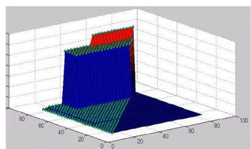

  
Figure 15.7 Video snapshot of use of monotonicity for a two-dimensional function for three updates; fourth snapshot (lower right) is a value function where monotonicity was not used.

# 15.3.3 Other Approximation Models

We encourage readers to experiment with other methods from chapter 3 (or your favorite book in statistics or machine learning). We note that approximation errors will accumulate with backward ADP, so you should not have much confidence that $\overline { { V } } _ { t } ( S _ { t } )$ is actually a good approximation of the value of being in state $S _ { t }$ . However, we have found that even when there is a significant difference between $\overline { { V } } _ { t } ( S _ { t } )$ and the true value function $V _ { t } ( S _ { t } )$ (when we can find this), the approximation $\overline { { V } } _ { t } ( S _ { t } )$ may still provide a high quality policy, but there are no guarantees.

# 15.4 Computational Observations

As of the writing of this book, backward approximate dynamic programming is a relatively new algorithmic strategy, which is surprising given that it is the approximate analog of classical backward dynamic programming (from chapter 14). The first reference in the literature appears to be 2013. For this reason, we begin with a presentation of several projects we have been directly involved with which produced some form of benchmarking of the solutions produced by backward approximate dynamic programming. We then share some notes on the methodology.

# 15.4.1 Experimental Benchmarking of Backward ADP

In this section we report on the empirical benchmarking of backward ADP in three very different settings. The first uses comparisons against the exact, optimal solution computed using the techniques of chapter 14. The second two examples are more complex, making exact solutions impossible. Instead, we compare backward ADP against policies that are already being used, one for the optimization of a battery storage system and the second for the allocation of resources in Africa by the International Monetary Fund.

# Optimization of clinical trials

The problem faced by companies running clinical trials is to make the following decision at each point in time: the drug works (go to market, typically by selling the patent), the drug does not work (cancel the clinical trial), or continue testing. The state variable has three dimensions:

● The number of patients we have tested.   
● A two-dimensional belief state, capturing the mean and variance of our estimate of the probability that the drug works.

This means our state variable has a single discrete dimension and two continuous dimensions. If we are willing to live with a discretized version of the continuous dimensions, this is a problem that can be solved optimally using the backward dynamic programming methods we presented in chapter 14. Optimal benchmarks for real problems are quite rare.

The results can be stated very simply:

● The optimal solution required 268 hours on a modern laptop.   
● Backward approximate dynamic programming required 20 minutes, and the solution was within 1.2 percent of the performance of the policy produced by the optimal solution.

# Optimizing a complex energy storage problem

We were given the problem of optimizing an energy storage device where we had to balance two revenue streams:

● We can use the battery to buy and sell energy from/to the grid. Electricity prices (known as LMPs, or “locational marginal prices”) are updated every five minutes and can vary dramatically. Prices that might average $\$ 20$ /megawatt-hour can spike to $\$ 1000$ or even $\$ 10,000$ .   
● Grid operators will pay battery operators to help them with a process called “frequency regulation.” Power over the grid fluctuates as a result of the random variations of loads placed on the grid. A grid operator might pay $\$ 30$ per megawatt of power (each battery has a rated power rating, which gives how fast power moves into and out of the battery), but these prices also vary, and can increase to $\$ 500$ per megawatt per hour or more.

When the grid operator is paying a battery to perform frequency regulation, the grid will send a signal every two seconds whether it wants the battery to charge or discharge (at some percentage of the battery’s power rating), or do nothing. The grid never asks the battery to charge (or discharge) for extended periods, so these batteries do not have to be very large. Frequency regulation is purely for short-term smoothing of power variations.

When a battery operator is being paid to perform frequency regulation, then the expectation is that it will comply with the signals from the grid operator (these are known as “RegD” signals in the US). In practice, limitations of the device (it is not just batteries that perform this function – any generator, from natural gas turbines to coal plants may perform frequency regulation) mean that the device providing frequency regulation may not have perfect compliance with the RegD signal. For this reason, there are penalties for noncompliance. Figure 15.8 shows a plot of LMP and RegD prices over a period of

  
Figure 15.8 Real-time energy prices (blue), and regulation prices (red), January–March, 2015, revealing the high correlation between the two.

several months. It indicates the degree of volatility, along with the correlations between the two prices. This is an example of a problem where the modeling of the exogenous information processes is particularly important.

This raised the question: What if a battery operator (batteries typically have perfect compliance) occasionally disobeyed the RegD signal? In particular, what if the grid operator is asking the battery to buy electricity at a time when electricity prices are very high? The battery operator might wish to go against the RegD signal, sell into a high-priced market (this may last for just five minutes), but paying the penalty for noncompliance.

The challenge here is that following a RegD signal is trivial; the battery operator simply follows the RegD signal from the grid operator which specifies when to charge, discharge or do nothing. However, choosing between simply doing what the RegD signal tells us to do, or running against the signal to take advantage of price spikes on the grid, requires optimization-based logic. For example, the grid price may rise, but has it risen enough to suffer the consequences of noncompliance with the RegD signal?

The distinguishing characteristic of this problem is the number of time periods. Decisions are made every 2 seconds, which means there are 43,200 time periods in a day. Standard backward dynamic programming was prohibitive because of the size of the state space as well as the number of time periods. Forward ADP methods, which we will introduce in chapters 16–18 (stay tuned for these presentations) require iterative learning which would simply be too slow. In fact, this was the problem that motivated our first use of backward ADP.

Table 15.1 Comparison of revenues generated from backward ADP, combining revenues from frequency regulation and power purchase, to revenues from a pure frequency regulation policy.   

<table><tr><td>Month</td><td>Backward ADP revenue</td><td>Pure RegD policy</td><td>Pct. improvement</td></tr><tr><td>January</td><td>22052</td><td>19131</td><td>10.27</td></tr><tr><td>February</td><td>51282</td><td>46331</td><td>10.68</td></tr><tr><td>March</td><td>36518</td><td>32329</td><td>12.95</td></tr><tr><td>April</td><td>24121</td><td>22272</td><td>8.3</td></tr><tr><td>May</td><td>31861</td><td>30232</td><td>5.39</td></tr><tr><td>June</td><td>18975</td><td>17999</td><td>5.42</td></tr><tr><td>July</td><td>18463</td><td>17152</td><td>7.64</td></tr><tr><td>August</td><td>15988</td><td>14750</td><td>8.39</td></tr><tr><td>September</td><td>22336</td><td>20462</td><td>9.16</td></tr><tr><td>October</td><td>17714</td><td>16553</td><td>7.01</td></tr><tr><td>November</td><td>15930</td><td>15033</td><td>5.97</td></tr><tr><td>December</td><td>15079</td><td>13901</td><td>8.47</td></tr><tr><td>Annual</td><td>290323</td><td>266151</td><td>9.08</td></tr></table>

This problem is too hard to compute optimal benchmarks, as we did in the clinical trials problem. However, we have a different benchmark which is extremely demanding: instead of optimizing over the two signals, we can just follow the RegD signal. This is very difficult competition, since we anticipate that the benefits of optimizing across both revenue streams will be modest. This means that we are not in a position to tolerate suboptimal performance since this would threaten the larger revenue stream from just following the RegD signal.

The results are shown in Table 15.1. These results show consistent, if modest, improvements from the combined signal produced using backward approximate dynamic programming. Again, we emphasize the challenge of competing against a pure frequency regulation policy which produces over 90 percent of the revenue using a very simple rule that is easy to follow.

# Resource allocation in Africa

Our last demonstration involves a complex resource allocation problem faced by the International Monetary Fund (IMF) among projects within Africa. The widely used approach for solving this problem is a single-period linear program

  
Figure 15.9 Performance of the policy produced by backward ADP using (a) low uncertainty and (b) high uncertainty in future forecasts.

that optimized a complex utility function for capturing the state of a country over the course of a year. The utility function would capture metrics about the economy, social metrics such as poverty, investments in infrastructure, and measures of instability (such as assassinations). The decisions were how much to invest in different projects, such as roads, education, health, and power generators. Given that these decisions cover resources being allocated across all countries in Africa, and all projects, it is a high-dimensional decision, with a very high-dimensional (and largely continuous) state vector.

The state of the art for this problem is the use of a linear program that optimizes the benefits within a single year, although it was clear that some investments had multiyear horizons. This was also a problem with tremendous uncertainties. In any given year insurgencies could arise and challenge the stability of a country. The emergence of diseases, or discoveries of natural resources, were frequent examples of high-impact sources of uncertainty.

This problem was solved using backward approximate dynamic programming, and compared to a myopic policy that is widely used in practice. The results are shown in Figure 15.9, which reports on two sets of simulations. Figure 15.9(a) shows the results of backward ADP for a simulation with relatively low noise, while Figure 15.9(b) shows the results for a setting with significant sources of uncertainty. Backward ADP outperformed the standard myopic policy for both the low noise and high noise situations. It did particularly well in the high noise environment, which is precisely the conditions where someone might say “we have so much uncertainty about the future, why plan for it?”

This application is a nice demonstration of backward ADP in a complex, high-dimensional resource allocation problem. In fact, it is a problem which clearly needs a policy in the lookahead class, but where direct lookahead policies (which we introduced in chapter 11, and cover in much more detail in chapter 19) are not an obvious approach.

# 15.4.2 Computational Notes

Some thoughts to keep in mind while designing and testing algorithms using backward approximate dynamic programming:

Approximation architectures – It is possible to use any of the statistical learning methods described in chapter 3 (or your favorite book on statistics/ machine learning). We note that most of the methods in this book involve adaptive learning (this is the focus of chapter 3), but with backward ADP, we actually return to the more familiar setting (in the statistical learning community) of batch learning. Following standard advice in the specification of any statistical model, make sure that the dimensionality of the model (measured by the number of parameters) is much smaller than the number of observations to avoid overfitting.

Tuning – Virtually all adaptive learning algorithms have tunable parameters, and this is the Achilles heel of this entire approach to solving stochastic optimization problem. In chapter 9, section 9.11 summarizes four problem classes (see Table 9.3), where classes (1) and (4) are posed as finding the best learning policy. These “learning policies” represent the process of finding the best search algorithm, which includes tuning the parameters that govern a particular class of algorithm. In practice, this search for the best learning policy (or equivalently, the search for the best search algorithm) is typically done in an ad hoc way. There are thousands of papers which will prove asymptotic convergence, but the actual design of an algorithm depends on ad hoc testing.

Validating – A major challenge with any approximation strategy, backward ADP included, is validation. Backward ADP can work extremely well on problems where the value function is a fairly good approximation of the true value function, but there are no guarantees. It helps to have a good benchmark (in this case, the widely accepted myopic policy served this role) for comparison.

Performance – We have obtained exceptionally good performance on some problem classes, including energy storage problems with thousands of time periods. In comparisons against optimal policies (obtained using the methods from chapter 14 for low-dimensional problem instances), we have obtained solutions that were over 95 percent of optimality, but on occasions the performance was as low as 70 percent when we did a poor job with the approximations.

# 15.5 Bibliographic Notes

Section 15.1 – The first use of the term “backward approximate dynamic programming” in the published literature is in Senn et al. (2014), which is based on Senn’s Ph.D. dissertation (in German), which appeared in 2013. This work was for a finite-horizon deterministic control problem. Cheng et al. (2018a) used backward ADP for a stochastic energy storage problem using the idea of a low-rank approximation for the value function. Cheng et al. (2018b) used a simpler linear architecture for an energy storage problem and showed that it was quite effective.

Section 15.2 – Fitted value iteration is basically backward approximate dynamic programming for infinite horizon problems. Szepesvári and Munos (2005) and Munos and Szepesv (2008) were the earliest papers that use the term “fitted value iteration.” Fitted value iteration is a form of approximate value iteration which we consider in depth in chapter 17, which focuses on forward algorithms.

Section 15.4.1 – The work on backward ADP for clinical trials is taken from Tian et al. (2021). The experimental work for energy storage is taken from Cheng et al. (2018b). The work on allocating aid in Africa is taken from Aboagye and Powell (2018), which extended the seminal paper by Collier and Dollar (2002) which proposed the myopic policy for the same problem.

# Exercises

# Review questions

15.1 Contrast backward approximate dynamic programming for finite horizon problems versus infinite horizon problems in terms of the concept of “convergence” for each one.

# Computational exercises

15.2 We are going to solve the continuous budgeting problem presented in section 14.4.2 using backward approximate dynamic programming. The problem starts with $R _ { 0 }$ resources which are then allocated over periods 0 to $T$ . Let $x _ { t }$ be the amount allocated in period ?? with contribution

$$
C _ {t} (x _ {t}) = \sqrt {x _ {t}}.
$$

Assume that $T = 2 0$ time periods.

(a) Use the results of section 14.4.2 to solve this problem optimally. Evaluate your simulation by simulating your optimal policy 1000 times.

(b) Use the backward ADP algorithm described in Figure 15.5 to obtain the value function approximations using

$$
\overline {{V}} _ {t} (R _ {t}) = \theta_ {t 0} + \theta_ {t 1} \sqrt {x _ {t}}.
$$

Use linear regression (either the methods in section 3.7.1, or a package) to fit $\overline { { V } } _ { t } ( R _ { t } )$ . Then, simulate this policy 1000 times (ideally using the same sample paths as you used for part (a)). How do you think $\boldsymbol { \theta } _ { t 0 }$ and $\theta _ { t 1 }$ should behave?

(c) Use the backward ADP algorithm described in Figure 15.5 to obtain the value function approximations using

$$
\overline {{V}} _ {t} (R _ {t}) = \theta_ {t 0} + \theta_ {t 1} R _ {t} ^ {x} + \theta_ {t 2} (R _ {t} ^ {x}) ^ {2},
$$

where $R _ { t } ^ { x }$ is the post-decision resource state $R _ { t } ^ { x } = R _ { t } - x _ { t }$ (which is the same as $R _ { t + 1 }$ since transitions are deterministic).

Use linear regression (either the methods in section 3.7.1, or a package) to fit $\overline { { V } } _ { t } ( R _ { t } )$ . Then, simulate this policy 1000 times (ideally using the same sample paths as you used for part (a)).

15.3 Repeat exercise 15.2, but this time use

$$
C \left(x _ {t}\right) = \ln \left(x _ {t}\right).
$$

For part (b), use

$$
\bar {V} _ {t} \left(R _ {t}\right) = \theta_ {t 0} + \theta_ {t 1} \ln \left(x _ {t}\right).
$$

15.4 In this exercise you are going to solve a simple inventory problem using Bellman’s equations, to obtain an optimal policy. Then, the exercises that follow will have you implement various backward ADP policies that you can compare against the optimal policy you obtain in this exercise. Your inventory problem will span $T$ time periods, with an inventory equation governed by

$$
R _ {t + 1} = \max  \{0, R _ {t} - \hat {D} _ {t + 1} \} + x _ {t}.
$$

Here we are assuming that product ordered at time ??, $x _ { t }$ , arrive at $t + 1$ . Assume that $\hat { D } _ { t + 1 }$ is described by a discrete uniform distribution between 1 and 20.

Next assume that our contribution function is given by

$$
C (S _ {t}, x _ {t}) = 5 0 \min \{R _ {t}, \hat {D} _ {t + 1} \} - 1 0 x _ {t}.
$$

(a) Find an optimal policy by solving this dynamic program exactly using classical backward dynamic programming methods from chapter 14 (specifically equation (14.3)). Note that your biggest challenge will be computing the one-step transition matrix. Simulate the optimal policy 1,000 times starting with $R _ { 0 } = 0$ and report the performance.   
(b) Now solve the problem using backward ADP using a simple quadratic approximation for the value function approximation:

$$
\overline {{V}} _ {t} ^ {x} (R _ {t} ^ {x}) = \theta_ {t 0} + \theta_ {t 1} R _ {t} ^ {x} + \theta_ {t 2} (R _ {t} ^ {x}) ^ {2}.
$$

where $R _ { t } ^ { x }$ is the post-decision resource state which we might represent using

$$
R _ {t} ^ {x} = \max \{0, R _ {t} - \mathbb {E} \{\hat {D} _ {t + 1} \} \} + x _ {t}.
$$

Having found $\overline { { V } } _ { t } ^ { x } ( R _ { t } ^ { x } )$ , simulate the resulting policy 1,000 times, and compare your results to your optimal policy.

# Sequential decision analytics and modeling

These exercises are drawn from the online book Sequential Decision Analytics and Modeling available at http://tinyurl.com/sdaexamplesprint.

15.5 We are going to perform experiments for an energy storage problem that we can solve exactly using backward approximate dynamic programming. Download the code “EnergyStorage_I” from http:// tinyurl.com/sdagithub. This code is set up to solve the problem exactly using backward dynamic programming, where we have to enumerate the state space. Here, you will be asked to create a version of the code that uses backward approximate dynamic programming.

Assume that the price process evolves according to

$$
p _ {t + 1} = \min  \{1 0 0, \max  \{0, p _ {t} + \varepsilon_ {t + 1} \} \}
$$

where $\varepsilon _ { t + 1 }$ follows a discrete uniform distribution given by

$$
\varepsilon_ {t + 1} = \left\{ \begin{array}{l l} - 2 & \text {w i t h p r o b . 1 / 5} \\ - 1 & \text {w i t h p r o b . 1 / 5} \\ 0 & \text {w i t h p r o b . 1 / 5} \\ + 1 & \text {w i t h p r o b . 1 / 5} \\ + 2 & \text {w i t h p r o b . 1 / 5} \end{array} \right.
$$

Assume that $p _ { 0 } = \$ 50$ .

(a) Solve for an optimal policy by using the backward dynamic programming strategy in section 14.3 of the text (the algorithm has already been implemented in the Python module).

(i) Run the algorithm where prices are discretized in increments of $\$ 1$ , then $\$ 0.50$ and finally $\$ 0.25$ . Compute the size of the state space for each of the three levels of discretization, and plot the run times against the size of the state space.

(ii) Using the optimal value function for the discretization of $\$ 1$ simulate the policy for each level of discretization of the prices using 100 forward simulations, and report the estimated objective functions.

(b) Modify the code to solve the problem using the approximate dynamic programming with lookup tables given in Figure 15.3. Simulate the resulting policy (for each of the three levels of price discretization) and report the results.

(c) Modify the code to solve the problem using the approximate dynamic programming using a continuous approximation given in Figure 15.5. Simulate the resulting policy (for each of the three levels of price discretization) and report the results. Use the linear model of the post-decision value function

$$
\overline {{V}} _ {t} ^ {x} (S _ {t} ^ {x}) = \sum_ {f \in \mathcal {F}} \theta_ {f} \phi_ {f} (S _ {t} ^ {x})
$$

with features

$$
\phi_ {0} \left(S _ {t} ^ {x}\right) = 1,
$$

$$
\phi_ {1} (S _ {t} ^ {x}) = R _ {t} ^ {x},
$$

$$
\phi_ {2} (S _ {t} ^ {x}) = (R _ {t} ^ {x}) ^ {2},
$$

$$
\begin{array}{r c l} \phi_ {3} (S _ {t} ^ {x}) & = & p _ {t}, \end{array}
$$

$$
\phi_ {4} (S _ {t} ^ {x}) = p _ {t} ^ {2},
$$

$$
\phi_ {5} (S _ {t} ^ {x}) = R _ {t} ^ {x} p _ {t}.
$$

Simulate the policy you obtain with your approximate value function (using 100 simulations) and compare the results to the optimal policy.

(d) Repeat (c), but now assume that the price process evolves according to

$$
p _ {t + 1} = . 5 p _ {t} +. 5 p _ {t - 1} + \varepsilon_ {t + 1}
$$

where $\varepsilon _ { t + 1 }$ follows the distribution as shown. Remember that you now have to include $p _ { t - 1 }$ in your state variable. Just use the single price discretization of $\$ 1$ . Please do the following:

(i) First compute the optimal policy following your approach in part (a). You have to modify the code to handle an extra dimension of the state variable. Compare the run times using the price models assumed in part (a) and part (b). How did the more complex state variable affect the solution time for the optimal algorithm and the backward approximate dynamic programming algorithm?

(ii) Compare the performance of the optimal solution to the solution obtained using backward approximate dynamic programming.

# Diary problem

The diary problem is a single problem you chose (see chapter 1 for guidelines). Answer the following for your diary problem.

15.6 Take your formulation of your diary problem that you developed for the diary problem exercise in chapter 14, and sketch a backward ADP algorithm for the problem. Specify a value function approximation that you think might work.

# Bibliography

Aboagye, N.K. and Powell, W.B. (2018). Stochastic optimization of official development assistance allocation.   
Cheng, B., Asamov, T., and Powell, W.B. (2018a). Low-rank value function approximation for co-optimization of battery storage. IEEE Transactions on Smart Grid 9 (6): 6590–6598.   
Cheng, B., Member, S., and Powell, W.B. (2018b). Transactions on smart grid co-optimizing battery storage for the frequency regulation and energy arbitrage using multi-scale dynamic programming. IEEE Transactions on the Smart Grid 9 (3): 1997–2005.   
Collier, P. and Dollar, D. (2002). Aid allocation and poverty reduction. European Economic Review 46 (8): 1475–1500.   
Jiang, D. R., and Powell, W. B. (2015). An Approximate Dynamic Programming Algorithm for Monotone Value Functions. Operations Research, 63 (6), 1489–1511. doi:10.1287/opre.2015.1425.   
Munos, R. and Szepesv, C. (2008). Finite-time bounds for fitted value iteration. Journal of Machine Learning Research 1: 815–857.   
Senn, M., Link, N., Pollak, J., and Lee, J.H. (2014). Reducing the computational effort of optimal process controllers for continuous state spaces by using incremental learning and post-decision state formulations. Journal of Process Control 24: 133–143.   
Szepesvári, C. and Munos, R. (2005). Finite time bounds for sampling based fitted value iteration. Proceedings of the 22nd International Conference on Machine Learning ICML ’05 . 880–887.   
Tian, Z., Han, W. and Powell, W.B. (2021). Adaptive learning of drug quality and optimization of patient recruitment for clinical trials with dropouts. Manufacturing & Service Operations Management.

#

# Forward ADP I: The Value of a Policy

Chapter 14 laid the foundation for finding optimal policies for problems with discrete states, assuming that states and decisions can be enumerated, and the one-step transition matrix can be calculated. The chapter presented classical backward dynamic programming for finite horizon problems, but most of the chapter focused on infinite horizon problems, where we introduced several methods for computing the value function $V ( s )$ . Of these, the most important is value iteration, since this is relatively easy to compute, and it is the foundation for a number of approximation strategies.

In chapter 15, we introduced the idea of backward approximate dynamic programming (for finite horizon problems), also known as fitted value iteration for infinite horizon problems. Backward approximate dynamic programming is, surprisingly, a relatively recent invention, and while fitted value iteration is somewhat older, the attention it has received is a small fraction compared to the methods that we are going to present in this chapter, and chapters 17 and 18, which are all based on the principle of forward approximate dynamic programming.

We suspect the reason for the relative popularity of forward approximate dynamic programming is that it captures the dynamics of an actual physical system, which moves forward in time. It has the immediate benefit of avoiding any semblance of enumerating states, which avoids “the” curse of dimensionality (which is most often associated with vector-valued states). It even avoids the need to determine how to sample the state space, as is required in backward dynamic programming.

It also avoids any need to compute the one-step transition matrix, since we are either simulating the exogenous information $W _ { t + 1 }$ , or we are simply observing transitions from $S _ { t }$ to $S _ { t + 1 }$ from a physical system. When we step forward in time, it seems as if there is a natural sampling mechanism, and while this is true to a degree, we will have to pay attention to how we choose the decisions

that determine (up to a point) the next state we visit. By contrast, backward ADP requires pure, random sampling, which means our choice of states is not guided at all by the physics of the problem beyond assumptions about the range of states.

Most of the work in this area still assumes discrete decisions, which enjoys a very wide set of applications. We cover vector-valued decisions, but not until chapter 18 where we limit our focus to problems with concave (convex if minimizing) contribution functions (which translates to concavity in the value function).

In this chapter, we focus primarily on the different ways of calculating $\hat { v } ^ { n }$ , and then using this information to estimate a value function approximation, for a fixed policy. The reason we do this is to resolve the subtleties of estimating the value of a policy before we allow the policy to evolve with the iterations, which introduces a significant complication. To emphasize that we are computing values for a fixed policy, we index parameters such as the value function $V ^ { \pi }$ by the policy $\pi$ . After we establish the fundamentals for estimating the value of a policy, chapter 17 addresses the process of searching for good policies.

# 16.1 Sampling the Value of a Policy

At first glance, the problem of statistically estimating the value of a fixed policy should not be any different than estimating a function from noisy observations. In fact, this can be true, but it depends on how $\hat { v } ^ { n }$ is being calculated. In time (especially in chapter 17 when we are optimizing over policies), we will have to learn to live with the reality that $\hat { v } ^ { n }$ is almost always a biased sampled estimate of the value of being in a state.

Our normal style has been to model finite horizon problems without a discount factor. Of course, discounting is essential in infinite horizon problems, as we saw in chapter 14. In the text that follows, we are going to sometimes switch between finite and infinite horizon, so we retain a discount factor ?? even for the finite horizon case.

# 16.1.1 Direct Policy Evaluation for Finite Horizon Problems

Imagine that we have a fixed policy $X ^ { \pi } ( s )$ which may take any of the forms described in chapter 11. For iteration $n$ , if we are in state $S _ { t } ^ { n }$ at time $t$ , we then choose decision $x _ { t } ^ { n } = X ^ { \pi } ( S _ { t } ^ { n } )$ , after which we sample the exogenous information $\boldsymbol { W } _ { t + 1 } ^ { n }$ . We sometimes say that we are following sample path $\omega ^ { n }$ from which we observe $W _ { t + 1 } ^ { n } = W _ { t + 1 } ( \omega ^ { n } )$ . The exogenous information $\boldsymbol { W } _ { t + 1 } ^ { n }$ may depend on both $S _ { t } ^ { n }$ and the decision $\boldsymbol { x } _ { t } ^ { n }$ . From this, we may compute our contribution from

Step 0. Initialization:

Step 0a. Initialize $\overline { { V } } ^ { 0 }$ .

Step 0b. Initialize $S ^ { 1 }$ .

Step 0c. Set $n = 1$

Step 1. Choose a sample path $\omega ^ { n }$ .

Step 2. Choose a starting state $S _ { 0 } ^ { n }$

Step 3. Do for $t = 0 , 1 , \ldots , T$

Step 3a. $x _ { t } ^ { n } = X ^ { \pi } ( S _ { t } ^ { n } )$

Step 3b. $\hat { C } _ { t } ^ { n } = C ( S _ { t } ^ { n } , x _ { t } ^ { n } )$

Step 3c. $W _ { t + 1 } ^ { n } = W _ { t + 1 } ( \omega ^ { n } )$

Step 3d. $S _ { t + 1 } ^ { n } = S ^ { M } ( S _ { t } ^ { n } , x _ { t } ^ { n } , W _ { t + 1 } ^ { n } )$

Step 4. Compute $\begin{array} { r } { \hat { v } _ { 0 } ^ { n } = \sum _ { t = 0 } ^ { T } \gamma ^ { t } \hat { C } _ { t } ^ { n } } \end{array}$ .

Step 5. Increment ??. If $n \leq N$ go to Step 1.

Step 6. Use the sequence of state-value pairs $( S ^ { i } , \hat { v } ^ { i } ) _ { i = 1 } ^ { N }$ to fit a value function approximation $\overline { { V } } ^ { \pi } ( s )$ .

Figure 16.1 Basic policy evaluation procedure.

$$
\hat {C} _ {t} ^ {n} = C \left(S _ {t} ^ {n}, x _ {t} ^ {n}\right).
$$

Finally, we compute our next state from our transition function

$$
S _ {t + 1} ^ {n} = S ^ {M} (S _ {t} ^ {n}, x _ {t} ^ {n}, W _ {t + 1} ^ {n}).
$$

This process continues until we reach the end of our horizon ??. The basic algorithm is described in Figure 16.1. In step 6, we use a batch routine to fit a statistical model. It is often more natural to use some sort of recursive procedure and imbed the updating of the value function within the iterative loop. The type of recursive procedure depends on the nature of the value function approximation. Later in this chapter, we describe several recursive procedures if we are using linear regression.

Finite horizon problems are sometimes referred to as episodic, where an episode refers to a simulation of a policy until the end of the horizon (also known as trials). However, the term episodic can also be interpreted more broadly. For example, an emergency vehicle may repeatedly return to base where the system then restarts. Each cycle of starting from a home base and then returning to the home base can be viewed as an episode. As a result, if we are working with a finite horizon problem, we prefer to refer to these specifically as such.

Evaluating a fixed policy is mathematically equivalent to making unbiased observations of a noisy function. Fitting a functional approximation is precisely what the entire field of statistical learning has been trying to do for decades. If we are fitting a linear model, then there are some powerful recursive procedures that can be used. These are discussed in section 16.1.2.

# 16.1.2 Policy Evaluation for Infinite Horizon Problems

Not surprisingly, infinite horizon problems introduce a special complication, since we cannot obtain an unbiased observation in a finite number of measurements. We present some methods that have been used for infinite horizon applications.

# Recurrent Visits

There are many problems which are infinite horizon, but where the system resets itself periodically. A simple example of this is a finite horizon problem, where hitting the end of the horizon and starting over (as would occur in a game) can be viewed as an episode. A different example is a queueing system, where perhaps we are trying to manage the admission of patients to an emergency room. From time to time the queue may become empty, at which point the system resets and starts over. For such systems, it makes sense to estimate the value of following a policy $\pi$ when starting from this base state.

Even if we do not have such a renewal system, imagine that we find ourselves in a state ??. Now follow a policy $\pi$ until we re-enter state ?? again. Let $R ^ { n } ( s )$ be the reward earned, and let $\tau ^ { n } ( s )$ be the number of time periods required before re-entering state ??. Here, $n$ is counting the number of times we visit state ??. An observation of the average reward earned when in state ?? and following policy $\pi$ would be given by

$$
\hat {v} ^ {n} (s) = \frac {R ^ {n} (s)}{\tau^ {n} (s)}.
$$

${ \hat { v } } ^ { n } ( s )$ would be computed when we return to state ??. We might then update the average value of being in state ?? using

$$
\bar {v} ^ {n} (s) = (1 - \alpha_ {n - 1}) \bar {v} ^ {n - 1} (s) + \alpha_ {n - 1} \hat {v} ^ {n} (s).
$$

Note that as we make each transition from some state $s ^ { \prime }$ to some state $s ^ { \prime \prime }$ , we are accumulating rewards in $R ( s )$ for every state $s$ that we have visited prior to reaching state $s ^ { \prime }$ . Each time we arrive at some state $s ^ { \prime \prime }$ , we stop accumulating

rewards for $s ^ { \prime \prime }$ , and compute $\hat { v } ^ { n } ( s ^ { \prime \prime } )$ , and then smooth this into the current estimate of $\bar { v } ( s ^ { \prime \prime } )$ . Note that we have presented this only for the case of computing the average reward per time period.

# Partial Simulations

While we may not be able to simulate an infinite trajectory, we may simulate a long trajectory $T$ , long enough to ensure that we are producing an estimate that is “good enough.” When we are using discounting, we realize that eventually $\gamma ^ { t }$ becomes small enough that a longer simulation does not really matter. This idea can be implemented in a relatively simple way.

Consider the algorithm in Figure 16.1, and insert the calculation in step 3:

$$
\bar {c} _ {t} = \frac {t - 1}{t} \bar {c} _ {t - 1} + \frac {1}{t} \hat {C} _ {t} ^ {n}.
$$

$\bar { c } _ { t }$ is an average over the time periods of the contribution per time period. As we follow our policy over progressively more time periods, $\bar { c } _ { t }$ approaches an average contribution per time period. Over an infinite horizon, we would expect to find

$$
\hat {v} _ {0} ^ {n} = \lim _ {t \to \infty} \sum_ {t = 0} ^ {\infty} \gamma^ {t} \hat {C} _ {t} ^ {n} = \frac {1}{1 - \gamma} \bar {c} _ {\infty}.
$$

Now assume that we only progress $T$ time periods, and let $\bar { c } _ { T }$ be our estimate of $\bar { c } _ { \infty }$ at this point. We would expect that

$$
\begin{array}{l} {\hat {v} _ {0} ^ {n} (T)} = {\sum_ {t = 0} ^ {T} \gamma^ {t} \hat {C} _ {t} ^ {n}} \\ \approx \frac {1 - \gamma^ {T + 1}}{1 - \gamma} \bar {c} _ {T}. \tag {16.1} \\ \end{array}
$$

The error between our $T$ -period estimate $\hat { v } _ { 0 } ^ { n } ( T )$ and the infinite horizon estimate $\hat { v } _ { 0 } ^ { n }$ is given by

$$
\begin{array}{l} \delta_ {T} ^ {n} = \frac {1}{1 - \gamma} \bar {c} _ {\infty} - \frac {1 - \gamma^ {T + 1}}{1 - \gamma} \bar {c} _ {T} \\ \approx \frac {1}{1 - \gamma} \bar {c} _ {T} - \frac {1 - \gamma^ {T + 1}}{1 - \gamma} \bar {c} _ {T} \\ { = } { \frac { \gamma ^ { T + 1 } } { 1 - \gamma } \bar { c } _ { T } . } \\ \end{array}
$$

Thus, we just have to find $T$ to make $\delta _ { T }$ small enough. This strategy is imbedded in some optimal algorithms, which only require that $\delta _ { T } ^ { n } \to 0$ as $n  \infty$ (meaning that we have to steadily allow $T$ to grow).

# Infinite Horizon Projection

We can easily see from (16.1) that if we stop after $T$ time periods, we will underestimate the infinite horizon contribution by a factor $1 - \gamma ^ { T + 1 }$ . Assuming that $T$ is reasonably large (say, $\gamma ^ { T + 1 } < 0 . 1 \rangle$ , we might introduce the correction

$$
\hat {v} _ {0} ^ {n} = \frac {1}{1 - \gamma^ {T + 1}} \hat {v} _ {0} ^ {n} (T).
$$

In essence we are taking a sample estimate of a $T$ -period path, and projecting it out over an infinite horizon.

# 16.1.3 Temporal Difference Updates

Assume that we are in state after which we observe the i $S _ { t } ^ { n }$ and wermation e decision which pu $\ v { x } _ { t } ^ { n }$ (using pous in state $\pi$ $W _ { t + 1 }$ $S _ { t + 1 } ^ { n } ~ =$ $S ^ { M } ( S _ { t } ^ { n } , x _ { t } ^ { n } , W _ { t + 1 } ^ { n } )$ . The contribution from this transition is given by $C ( S _ { t } ^ { n } , x _ { t } ^ { n } )$ . Imagine now that we continue this until the end of our horizon ??. For simplicity, we are going to drop discounting. In this case, the contribution along this path would be

$$
\hat {v} _ {t} ^ {n} = C \left(S _ {t} ^ {n}, x _ {t} ^ {n}\right) + C \left(S _ {t + 1} ^ {n}, x _ {t + 1} ^ {n}\right) + \dots + C \left(S _ {T} ^ {n}, x _ {T} ^ {n}\right). \tag {16.2}
$$

This is the contribution from following the path produced by a combination of the information from outcome $\omega ^ { n }$ (this determines $W _ { t + 1 } ^ { n } , W _ { t + 2 } ^ { n } , \dots , W _ { T } ^ { n } )$ ??????+2, … , ??????) and policy ??. $\hat { v } _ { t } ^ { n }$ is an unbiased sample estimate of the value of being in state $S _ { t }$ and following policy $\pi$ over sample path $\omega ^ { n }$ . We can use a stochastic gradient algorithm to estimate the value of being in state $S _ { t }$ using

$$
\vec {V} _ {t} ^ {n} \left(S _ {t} ^ {n}\right) = \vec {V} _ {t} ^ {n - 1} \left(S _ {t} ^ {n}\right) - \alpha_ {n} \left(\vec {V} _ {t} ^ {n - 1} \left(S _ {t} ^ {n}\right) - \vec {v} _ {t} ^ {n}\right). \tag {16.3}
$$

We can obtain a richer class of algorithms by breaking down our path cost in (16.2) by using

$$
\begin{array}{l} \hat {v} _ {t} ^ {n} = \sum_ {\tau = t} ^ {T} C (S _ {\tau} ^ {n}, x _ {\tau} ^ {n}) \\ - \underbrace {\left\{\sum_ {\tau = t} ^ {T} \big (\bar {V} _ {\tau} ^ {n - 1} (S _ {\tau}) - \bar {V} _ {\tau + 1} ^ {n - 1} (S _ {\tau + 1}) \big) \right\}} _ {= 0} + (\bar {V} _ {t} ^ {n - 1} (S _ {t}) - \bar {V} _ {T + 1} ^ {n - 1} (S _ {T + 1})). \\ \end{array}
$$

We now use the fact that $\bar { V } _ { T + 1 } ^ { n - 1 } ( S _ { T + 1 } ) = 0$ (this is where our finite horizon model is useful). Rearranging gives

$$
\hat {v} _ {t} ^ {n} = \bar {V} _ {t} ^ {n - 1} (S _ {t}) + \sum_ {\tau = t} ^ {T} \big (C (S _ {\tau} ^ {n}, x _ {\tau} ^ {n}) + \bar {V} _ {\tau + 1} ^ {n - 1} (S _ {\tau + 1}) - \bar {V} _ {\tau} ^ {n - 1} (S _ {\tau}) \big).
$$

Let

$$
\delta_ {\tau} = C \left(S _ {\tau} ^ {n}, x _ {\tau} ^ {n}\right) + \bar {V} _ {\tau + 1} ^ {n - 1} \left(S _ {\tau + 1} ^ {n}\right) - \bar {V} _ {\tau} ^ {n - 1} \left(S _ {\tau} ^ {n}\right). \tag {16.4}
$$

The terms $\delta _ { \tau }$ are called temporal differences. If we were using a standard single-?? pass algorithm, then at time ??, $\hat { v } _ { t } ^ { n } = C ( S _ { t } ^ { n } , x _ { t } ^ { n } ) + \bar { V } _ { t + 1 } ^ { n - 1 } ( S _ { t + 1 } ^ { n } )$ would be our sample observation of being in state $S _ { t }$ , while $\bar { V } _ { t } ^ { n - 1 } ( S _ { t } )$ is our current estimate of the value of being in state $S _ { t }$ . This means that the temporal difference at time $t$ , $\delta _ { t } = \hat { v } _ { t } ^ { n } - \bar { V } _ { t } ^ { n - 1 } ( S _ { t } )$ , is the difference in our estimate of the value of being in state $S _ { t }$ between our current estimate and the updated estimate. The temporal difference is also known as the Bellman error.

Using (16.4), we can write $\hat { v } _ { t } ^ { n }$ in the more compact form

$$
\hat {v} _ {t} ^ {n} = \bar {V} _ {t} ^ {n - 1} \left(S _ {t}\right) + \sum_ {\tau = t} ^ {T} \delta_ {\tau}. \tag {16.5}
$$

Substituting (16.5) into (16.3) gives

$$
\begin{array}{l} \bar {V} _ {t} ^ {n} (S _ {t}) = \bar {V} _ {t} ^ {n - 1} (S _ {t}) - \alpha_ {n - 1} \left[ \bar {V} _ {t} ^ {n - 1} (S _ {t}) - \left(\bar {V} _ {t} ^ {n - 1} (S _ {t}) + \sum_ {\tau = t} ^ {T} \delta_ {\tau}\right) \right] \\ = \bar {V} _ {t} ^ {n - 1} \left(S _ {t}\right) + \alpha_ {n - 1} \sum_ {\tau = t} ^ {T - 1} \delta_ {\tau}. \tag {16.6} \\ \end{array}
$$

We next use this bit of algebra to build an important class of updating mechanisms for estimating value functions.

# 16.1.4 TD(??)

The temporal differences $\delta _ { \tau }$ are the errors in our estimates of the value of being in state $S _ { \tau }$ . We can think of each term in (16.6) as a correction to the estimate of the value function. It makes sense that updates farther along the path should not be given as much weight as those earlier in the path. As a result, it is common to introduce an artificial discount factor ??, producing updates of the form

$$
\bar {V} _ {t} ^ {n} \left(S _ {t}\right) = \bar {V} _ {t} ^ {n - 1} \left(S _ {t}\right) + \alpha_ {n - 1} \sum_ {\tau = t} ^ {T} \lambda^ {\tau - t} \delta_ {\tau}. \tag {16.7}
$$

We derived this formula without a time discount factor. We leave as an exercise to the reader to show that if we have a time discount factor ??, then the temporaldifference update becomes

$$
\bar {V} _ {t} ^ {n} \left(S _ {t}\right) = \bar {V} _ {t} ^ {n - 1} \left(S _ {t}\right) + \alpha_ {n - 1} \sum_ {\tau = t} ^ {T} (\gamma \lambda) ^ {\tau - t} \delta_ {\tau}. \tag {16.8}
$$

Equation (16.8) shows that the discount factor ??, which is typically viewed as capturing the time value of money, and the algorithmic discount ??, which is a purely algorithmic device, have exactly the same effect. Not surprisingly, modelers in operations research have often used a discount factor ?? set to a much smaller number than would be required to capture the time-value of money. Artificial discounting allows us to look into the future, but then discount the results when we feel that the results are not perfectly accurate.

Updates of the form given in equation (16.7) produce an updating procedure that is known as TD(??) (or, temporal difference learning with discount ??). Here, ?? is introduced as a form of algorithmic discounting, since it has nothing to do with the traditional use of discounting to reflect the value of money. Algorithmic discounting is a heuristic way of limiting the effect of decisions we plan on making in the future, given that our model of the future is imperfect.

The updating formula in equation (16.7) requires that we step all the way to the end of the horizon before updating our estimates of the value. There is, however, another way of implementing the updates. The temporal differences $\delta _ { \tau }$ are computed as the algorithm steps forward in time. As a result, our updating formula can be implemented recursively. Assume we are at time $t ^ { \prime }$ in our simulation. We would simply execute

$$
\vec {V} _ {t} ^ {n} \left(S _ {t} ^ {n}\right) := \vec {V} _ {t} ^ {n} \left(S _ {t}\right) + \alpha_ {n - 1} \lambda^ {t ^ {\prime} - t} \delta_ {t ^ {\prime}} \text {f o r a l l} t \leq t ^ {\prime}. \tag {16.9}
$$

Here, our notation “∶ $= ^ { \mathfrak { w } }$ means that we take the current value of $\bar { V } _ { t } ^ { n } ( S _ { t } )$ , add $\alpha _ { n - 1 } \lambda ^ { t ^ { \prime } - t } \delta _ { t ^ { \prime } }$ to it to obtain an updated value of $\bar { V } _ { t } ^ { n } ( S _ { t } )$ . When we reach time $t ^ { \prime } = T$ , our value functions would have undergone a complete update. We note that at time $t ^ { \prime }$ , we need to update the value function for every $t \leq t ^ { \prime }$ .

# 16.1.5 TD(0) and Approximate Value Iteration

An important special case of TD(??) occurs when we use $\lambda = 0$ . In this case,

$$
\bar {V} _ {t} ^ {n} \left(S _ {t} ^ {n}\right) = \bar {V} _ {t} ^ {n - 1} \left(S _ {t} ^ {n}\right) + \alpha_ {n - 1} \left(C \left(S _ {t} ^ {n}, x _ {t} ^ {n}\right) + \gamma \bar {V} _ {t + 1} ^ {n - 1} \left(S ^ {M} \left(S _ {t} ^ {n}, x _ {t} ^ {n}, W _ {t + 1} ^ {n}\right)\right) - \bar {V} _ {t} ^ {n - 1} \left(S _ {t} ^ {n}\right)\right). \tag {16.10}
$$

Now consider value iteration. In chapter 14, when we did not have to deal with Monte Carlo samples and statistical noise, value iteration (for a fixed policy) looked like

$$
V _ {t} ^ {n} (s) = C (s, X ^ {\pi} (s)) + \gamma \sum_ {s ^ {\prime} \in \mathcal {S}} p ^ {\pi} (s ^ {\prime} | s) V _ {t + 1} ^ {n} (s ^ {\prime}).
$$

In steady state, we would write it as

$$
V ^ {n} (s) = C (s, X ^ {\pi} (s)) + \gamma \sum_ {s ^ {\prime} \in \mathcal {S}} p ^ {\pi} (s ^ {\prime} | s) V ^ {n - 1} (s ^ {\prime}).
$$

When we use approximate dynamic programming, we are following a sample path that puts us in state $S _ { t } ^ { n }$ , where we observe a sample realization of a contribution $\hat { C } _ { t } ^ { n }$ , after which we observe a sample realization of the next downstream state $S _ { t + 1 } ^ { n }$ (the decision is determined by our fixed policy). A sample observation of the value of being in state $S _ { t } ^ { n }$ would be computed using

$$
\vec {v} _ {t} ^ {n} = C (S _ {t} ^ {n}, x _ {t} ^ {n}) + \gamma \vec {V} _ {t + 1} ^ {n - 1} (S _ {t + 1} ^ {n}).
$$

We can then use this to update our estimate of the value of being in state $S _ { t } ^ { n }$ using

$$
\begin{array}{l} \bar {V} _ {t} ^ {n} (S _ {t} ^ {n}) = (1 - \alpha_ {n - 1}) \bar {V} _ {t} ^ {n - 1} (S _ {t} ^ {n}) + \alpha_ {n - 1} \hat {v} _ {t} ^ {n} \\ = (1 - \alpha_ {n - 1}) \bar {V} _ {t} ^ {n - 1} \left(S _ {t} ^ {n}\right) + \\ \alpha_ {n - 1} \left(C \left(S _ {t} ^ {n}, x _ {t} ^ {n}\right) + \gamma \bar {V} ^ {n - 1} \left(S ^ {M} \left(S _ {t} ^ {n}, x _ {t} ^ {n}, W _ {t + 1} ^ {n}\right)\right)\right). \tag {16.11} \\ \end{array}
$$

It is not hard to see that (16.10) and (16.11) are the same. The idea is popular because it is particularly easy to implement. It is also well suited to high-dimensional decision vectors $x$ , as we illustrate in chapter 18.

Temporal difference learning derives its name because ${ \bar { V } } ^ { n - 1 } ( S )$ is viewed as the “current” value of being in state ??, while $C ( S , x ) + \bar { V } ^ { n - 1 } ( S ^ { M } ( S , x , W ) )$ is viewed as the updated value of being in state ??. The difference ${ \bar { V } } ^ { n - 1 } ( S ) -$ $( C ( S , x ) + \bar { V } ^ { n - 1 } ( S ^ { M } ( S , x , W ) ) )$ is the difference in these estimates across iterations (or time), hence the name. TD(0) is a form of statistical bootstrapping, because rather than simulate the full trajectory, it depends on the current estimate of the value $\bar { V } ^ { n - 1 } ( S ^ { M } ( S , x , W ) )$ of being in the downstream state $S ^ { M } ( S , x , W )$ .

While TD(0) can be very easy to implement, it can also produce very slow convergence. The effect is illustrated using the simple five-state Markov chain shown in Figure 16.2, where the contribution of the transitions out of states 0 through 4, denoted by $\hat { c }$ , is always 0, and then we receive 1 when we make the final transition out of state 5. When we apply TD(0) updating to estimate the value of each state, we produce the set of numbers shown in Table 16.1. In this

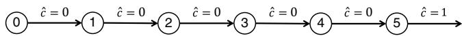  
Figure 16.2 Five-state Markov chain for illustrating backward learning.

Table 16.1 Effect of stepsize on backward learning.   

<table><tr><td>Iteration</td><td>\( {\bar{V}}_{0} \)</td><td>\( {\widehat{v}}_{1} \)</td><td>\( {\bar{V}}_{1} \)</td><td>\( {\widehat{v}}_{2} \)</td><td>\( {\bar{V}}_{2} \)</td><td>\( {\widehat{v}}_{3} \)</td><td>\( {\bar{V}}_{3} \)</td><td>\( {\widehat{v}}_{4} \)</td><td>\( {\bar{V}}_{4} \)</td><td>\( {\widehat{v}}_{5} \)</td></tr><tr><td>0</td><td>0.000</td><td></td><td>0.000</td><td></td><td>0.000</td><td></td><td>0.000</td><td></td><td>0.000</td><td>1</td></tr><tr><td>1</td><td>0.000</td><td>0.000</td><td>0.000</td><td>0.000</td><td>0.000</td><td>0.000</td><td>0.000</td><td>0.000</td><td>1.000</td><td>1</td></tr><tr><td>2</td><td>0.000</td><td>0.000</td><td>0.000</td><td>0.000</td><td>0.000</td><td>0.000</td><td>0.500</td><td>1.000</td><td>1.000</td><td>1</td></tr><tr><td>3</td><td>0.000</td><td>0.000</td><td>0.000</td><td>0.000</td><td>0.167</td><td>0.500</td><td>0.667</td><td>1.000</td><td>1.000</td><td>1</td></tr><tr><td>4</td><td>0.000</td><td>0.000</td><td>0.042</td><td>0.167</td><td>0.292</td><td>0.667</td><td>0.750</td><td>1.000</td><td>1.000</td><td>1</td></tr><tr><td>5</td><td>0.008</td><td>0.042</td><td>0.092</td><td>0.292</td><td>0.383</td><td>0.750</td><td>0.800</td><td>1.000</td><td>1.000</td><td>1</td></tr><tr><td>6</td><td>0.022</td><td>0.092</td><td>0.140</td><td>0.383</td><td>0.453</td><td>0.800</td><td>0.833</td><td>1.000</td><td>1.000</td><td>1</td></tr><tr><td>7</td><td>0.039</td><td>0.140</td><td>0.185</td><td>0.453</td><td>0.507</td><td>0.833</td><td>0.857</td><td>1.000</td><td>1.000</td><td>1</td></tr><tr><td>8</td><td>0.057</td><td>0.185</td><td>0.225</td><td>0.507</td><td>0.551</td><td>0.857</td><td>0.875</td><td>1.000</td><td>1.000</td><td>1</td></tr><tr><td>9</td><td>0.076</td><td>0.225</td><td>0.261</td><td>0.551</td><td>0.587</td><td>0.875</td><td>0.889</td><td>1.000</td><td>1.000</td><td>1</td></tr><tr><td>10</td><td>0.095</td><td>0.261</td><td>0.294</td><td>0.587</td><td>0.617</td><td>0.889</td><td>0.900</td><td>1.000</td><td>1.000</td><td>1</td></tr></table>

illustration, there are no decisions and the contribution is zero for every other time period. A stepsize of $1 / n$ was used throughout.

Table 16.1 illustrates that the rate of convergence for $\bar { V } _ { 0 }$ is dramatically slower than for $\bar { V } _ { 4 }$ . The reason is that as we smooth $\hat { v _ { t } }$ into $\bar { V } _ { t - 1 }$ , the stepsize has a discounting effect. The problem is most pronounced when the value of being in a state at time ?? depends on contributions that are a number of steps into the future (imagine the challenge of training a value function to play the game of chess). For problems with long horizons, and in particular those where it takes many steps before receiving a reward, this bias can be so serious that it can appear that temporal differencing (and algorithms that use it) simply does not work. We can partially overcome the slow convergence by carefully choosing a stepsize rule. Stepsizes are discussed in depth in chapter 6. See in particular the OSAVI stepsize policy (section 6.4) which is designed specifically for estimating value functions.

# 16.1.6 TD Learning for Infinite Horizon Problems

We can perform updates using a general TD(??) strategy as we did for finite horizon problems. However, there are some subtle differences. With finite horizon

problems, it is common to assume that we are estimating a different function $\bar { V } _ { t }$ for each time period ??. As we step through time, we obtain information that can be used for a value function at a specific point in time. With stationary problems, each transition produces information that can be used to update the value function, which is then used in all future updates. By contrast, if we update $\bar { V } _ { t }$ for a finite horizon problem, then this update is not used until the next forward pass through the states.

When we move to infinite horizon problems, we drop the indexing by ??. Instead of stepping forward in time, we step through iterations, where at each iteration we generate a temporal difference

$$
{\delta^ {n}} = {C (s ^ {n}, x ^ {n}) + \gamma \bar {V} ^ {n - 1} (S ^ {M, x} (s ^ {n}, x ^ {n})) - \bar {V} ^ {n - 1} (s ^ {n}).}
$$

To do a proper update of the value function at each state, we would have to use an infinite series of the form

$$
\bar {V} ^ {n} (s) = \bar {V} ^ {n - 1} (s) + \alpha_ {n} \sum_ {m = 0} ^ {\infty} (\gamma \lambda) ^ {m} \delta^ {n + m}, \tag {16.12}
$$

where we can use any initial starting state $s ^ { 0 } = s$ . Of course, we would use the same update for each state $s ^ { m }$ that we visit, so we might write

$$
\bar {V} ^ {n} \left(s ^ {m}\right) = \bar {V} ^ {n - 1} \left(s ^ {m}\right) + \alpha_ {n} \sum_ {n = m} ^ {\infty} (\gamma \lambda) ^ {(n - m)} \delta^ {n}. \tag {16.13}
$$

Equations (16.12) and (16.13) both imply stepping forward in time (presumably a “large” number of iterations) and computing temporal differences before performing an update. A more natural way to run the algorithm is to do the updates incrementally. After we compute $\delta ^ { n }$ , we can update the value function at each of the previous states we visited. So, at iteration ??, we would execute

$$
\bar {V} ^ {n} \left(s ^ {m}\right) := \bar {V} ^ {n} \left(s ^ {m}\right) + \alpha_ {n} (\gamma \lambda) ^ {n - m} \delta^ {m}, \quad m = n, n - 1, \dots , 1. \tag {16.14}
$$

We can now use the temporal difference $\delta ^ { n }$ to update the estimate of the value function for every state we have visited up to iteration $n$ .

Figure 16.3 outlines the basic structure of a $\mathrm { T D } ( \lambda )$ algorithm for an infinite horizon problem. Step 1 begins by computing the first post-decision state, after which step 2 makes a single step forward. After computing the temporaldifference in step 3, we traverse previous states we have visited in step 4 to update their value functions.

Step 0. Initialization:

Step 0a. Initialize $\overline { { V } } ^ { 0 } ( S )$ for all $s$

Step 0b. Initialize the state $S ^ { 0 }$

Step 0c. Set $n = 1$

Step 1. Choose $\omega ^ { n }$

Step 2. Solve

$$
x ^ {n} = \arg \max  _ {x \in \mathcal {X} ^ {n}} \left(C \left(S ^ {n}, x\right) + \gamma \bar {V} ^ {n - 1} \left(S ^ {M, x} \left(S ^ {n}, x\right)\right)\right). \tag {16.15}
$$

Step 3. Compute the temporal difference for this step:

$$
\delta^ {n} = C \left(S ^ {n}, x ^ {n}\right) + \gamma \left(\overline {{V}} ^ {n - 1} \left(S ^ {M, x} \left(S ^ {n}, x ^ {n}\right)\right) - \overline {{V}} ^ {n - 1} \left(S ^ {n}\right)\right).
$$

Step 4. Update $\overline { { V } }$ for $m = n , n - 1 , \ldots , 1$ :

$$
\bar {V} ^ {n} \left(S ^ {m}\right) = \bar {V} ^ {n - 1} \left(S ^ {m}\right) + (\gamma \lambda) ^ {n - m} \delta^ {n}. \tag {16.16}
$$

Step 5. Compute $S ^ { n + 1 } = S ^ { M } ( S ^ { n } , x ^ { n } , W ( \omega ^ { n } ) )$

Step 6. Let $n = n + 1$ . If $n < N$ , go to step 1.

# Figure 16.3 A TD(??) algorithm for infinite horizon problems.

In step 3, we update all the states $( S ^ { m } ) _ { m = 1 } ^ { n }$ that we have visited up to then. Thus, at iteration ??, we would have simulated the partial update

$$
\bar {V} ^ {n} \left(S ^ {0}\right) = \bar {V} ^ {n - 1} \left(S ^ {0}\right) + \alpha_ {n - 1} \sum_ {m = 0} ^ {n} (\gamma \lambda) ^ {m} \delta^ {m}. \tag {16.17}
$$

This means that at any iteration ??, we have updated our values using biased sample observations (as is generally the case in value iteration). We avoided this problem for finite horizon problems by extending out to the end of the horizon. We can obtain unbiased updates for infinite horizon problems by assuming that all policies eventually put the system into an “absorbing state.” For example, if we are modeling the process of holding or selling an asset, we might be able to guarantee that we eventually sell the asset.

One subtle difference between temporal difference learning for finite horizon and infinite horizon problems is that in the infinite horizon case, we may be visiting the same state two or more times on the same sample path. For the finite horizon case, the states and value functions are all indexed by the time that we visit them. Since we step forward through time, we can never visit the same state at the same point in time twice in the same sample path. By contrast,

it is quite easy in a steady-state problem to revisit the same state over and over again. For example, we could trace the path of our nomadic trucker (introduced in section 2.3.4.1), who might go back and forth between the same pair of locations in the same sample path. As a result, we are using the value function to determine what state to visit, but at the same time we are updating the value of being in these states.

# 16.2 Stochastic Approximation Methods

A central idea in recursive estimation is the use of stochastic approximation methods and stochastic gradients. We have already seen this in one setting in the chapter on derivative-based stochastic optimization in section 5.3.1. We review the idea again here, but in a different context. We begin with the same stochastic optimization problem, which we originally introduced as the problem

$$
\min  _ {x} \mathbb {E} F (x, W).
$$

Now assume that we are choosing a scalar value $v$ to solve the problem

$$
\min  _ {v} \mathbb {E} F (v, \hat {V}), \tag {16.18}
$$

where

$$
F (v, \hat {V}) = \frac {1}{2} (v - \hat {V}) ^ {2},
$$

and where $\hat { V }$ is a random variable with unknown mean. We would like to use a series of sample realizations $\hat { v } ^ { n }$ to guide an algorithm that generates a sequence $v ^ { n }$ that converges to the optimal solution $v ^ { * }$ that solves (16.18). We use the same basic strategy as we introduced in section 5.3.1 where we update $v ^ { n }$ using

$$
\begin{array}{l} v ^ {n} = v ^ {n - 1} - \alpha_ {n - 1} \nabla F \left(v ^ {n - 1}, \hat {v} ^ {n}\right) \tag {16.19} \\ { = } { v ^ { n - 1 } - \alpha _ { n - 1 } ( v ^ { n - 1 } - \hat { v } ^ { n } ) . } \\ \end{array}
$$

Now if we make the transition that instead of updating a scalar $v ^ { n }$ , we are updating $\hat { V } _ { t } ^ { n } ( S _ { t } ^ { n } )$ . This produces the updating equation

$$
\vec {V} _ {t} ^ {n} \left(S _ {t} ^ {n}\right) = \vec {V} _ {t} ^ {n - 1} \left(S _ {t} ^ {n}\right) - \alpha_ {n - 1} \left(\vec {V} _ {t} ^ {n - 1} \left(S _ {t} ^ {n}\right) - \hat {v} ^ {n}\right). \tag {16.20}
$$

If we use $\hat { v } ^ { n } \ = \ C ( S _ { t } ^ { n } , x _ { t } ^ { n } ) + \gamma \bar { V } ^ { n - 1 } ( S _ { t + 1 } ^ { n } )$ , we quickly see that the updating equation produced using our stochastic gradient algorithm (16.20) gives us the same update that we obtained using temporal difference learning (equation (16.10)) and approximate value iteration (equation (16.11)). In equation (16.19), $\alpha _ { n }$ is called a stepsize, because it controls how far we go in the direction of

$\nabla F ( v ^ { n - 1 } , \hat { v } ^ { n } )$ , and for this reason this is the term that we adopt for $\alpha _ { n }$ throughout this book. In contrast to our first use of this idea in section 5.3, where the stepsize had to serve a scaling function, in this setting the units of the variable being optimized, $v ^ { n }$ , and the units of the gradient are the same. Indeed, we can expect that $0 < \alpha _ { n } \leq 1$ , which is a major simplification.

Now consider what happens when we replace the lookup table representation $\bar { V } ( s )$ that we used earlier, with a linear regression $\bar { V } ( s | \theta ) = \theta ^ { T } \phi$ . Now we want to find the best value of $\boldsymbol { \theta }$ , which we can do by solving

$$
\min _ {\theta} \mathbb {E} \frac {1}{2} (\bar {V} (s | \theta) - \hat {v}) ^ {2}.
$$

Applying a stochastic gradient algorithm, we obtain the updating step

$$
\theta^ {n} = \theta^ {n - 1} - \alpha_ {n - 1} (\bar {V} (s | \theta^ {n - 1}) - \hat {v} ^ {n}) \nabla_ {\theta} \bar {V} (s | \theta^ {n}). \tag {16.21}
$$

Since $\begin{array} { r } { \bar { V } ( s | \theta ^ { n } ) = \sum _ { f \in \mathcal { F } } \theta _ { f } ^ { n } \phi _ { f } ( s ) = ( \theta ^ { n } ) ^ { T } \phi ( s ) } \end{array}$ , the gradient with respect to $\boldsymbol { \theta }$ is given by

$$
\nabla_ {\theta} \bar {V} (s | \theta^ {n}) = \left( \begin{array}{c} \frac {\partial \bar {V} (s | \theta^ {n})}{\partial \theta_ {1}} \\ \frac {\partial \bar {V} (s | \theta^ {n})}{\partial \theta_ {2}} \\ \vdots \\ \frac {\partial \bar {V} (s | \theta^ {n})}{\partial \theta_ {F}} \end{array} \right) = \left( \begin{array}{c} \phi_ {1} (s ^ {n}) \\ \phi_ {2} (s ^ {n}) \\ \vdots \\ \phi_ {F} (s ^ {n}) \end{array} \right) = \phi (s ^ {n}).
$$

Thus, the updating equation (16.21) is given by

$$
\begin{array}{l} \theta^ {n} = \theta^ {n - 1} - \alpha_ {n - 1} (\bar {V} (s | \theta^ {n - 1}) - \hat {v} ^ {n}) \phi (s ^ {n}) \\ = \theta^ {n - 1} - \alpha_ {n - 1} (\bar {V} (s | \theta^ {n - 1}) - \hat {v} ^ {n}) \left( \begin{array}{c} \phi_ {1} \left(s ^ {n}\right) \\ \phi_ {2} \left(s ^ {n}\right) \\ \vdots \\ \phi_ {F} \left(s ^ {n}\right) \end{array} \right). \tag {16.22} \\ \end{array}
$$

Using a stochastic gradient algorithm requires that we have some starting estimate $\theta ^ { 0 }$ for the parameter vector, although $\theta ^ { 0 } = 0$ is a common choice.

While this is a simple and elegant algorithm, we have reintroduced the problem of scaling. Just as we encountered in section 5.3, the units of $\theta ^ { n - 1 }$ and the units of $( \bar { V } ( s | \theta ^ { n - 1 } ) - \hat { v } ^ { n } ) \phi ( s ^ { n } )$ may be completely different. What we have learned about stepsizes still applies, except that we may need an initial stepsize that is quite different than 1.0 (our common starting point).

Our experimental work has suggested that the following policy works well: When you choose a stepsize formula, scale the first value of the stepsize so that the change in $\theta ^ { n }$ in the early iterations of the algorithm is approximately 20 to 50 percent (you will typically need to observe several iterations). You want to see

individual elements of $\theta ^ { n }$ moving consistently in the same direction during the early iterations. If the stepsize is too large, the values can swing wildly, and the algorithm may not converge at all. If the changes are too small, the algorithm may simply stall out. It is very tempting to run the algorithm for a period of time and then conclude that it appears to have converged (presumably to a good solution). While it is important to see the individual elements moving in the same direction (consistently increasing or decreasing) in the early iterations, it is also important to see oscillatory behavior toward the end.

# 16.3 Bellman’s Equation Using a Linear Model*

It is possible to solve Bellman’s equation for infinite horizon problems by starting with the assumption that the value function is given by a linear model $V ( s ) = \theta ^ { T } \phi ( s )$ where $\Phi ( s )$ is a column vector of basis functions for a particular state ??. Of course, we are still working with a single policy, so we are using Bellman’s equation only as a method for finding the best linear approximation for the infinite horizon value of a fixed policy $\pi$ .

We begin with a derivation based on matrix linear algebra, which is more advanced and which does not produce expressions that can be implemented in practice. We follow this discussion with a simulation-based algorithm which can be implemented fairly easily.

# 16.3.1 A Matrix-based Derivation**

In section 16.5.2, we provided a geometric view of basis functions, drawing on the elegance and obscurity of matrix linear algebra. We are going to continue this presentation and present a version of Bellman’s equation assuming linear models. However, we are not yet ready to introduce the dimension of optimizing over policies, so we are still simply trying to approximate the value of being in a state. Also, we are only considering infinite horizon models, since we have already handled the finite horizon case. This presentation can be viewed as another method for handling infinite horizon models, while using a linear architecture to approximate the value function.

First recall that Bellman’s equation (for a fixed policy) is written

$$
V ^ {\pi} (s) = C (s, X ^ {\pi} (s)) + \gamma \sum_ {s ^ {\prime} \in \mathcal {S}} p (s ^ {\prime} | s, X ^ {\pi} (s)) V ^ {\pi} (s ^ {\prime}).
$$

In vector-matrix form, we let $V ^ { \pi }$ be a vector with element $V ^ { \pi } ( s )$ , we let $c ^ { \pi }$ be a vector with element $C ( s , X ^ { \pi } ( s ) )$ and finally we let $P ^ { \pi }$ be the one-step transition matrix with element $p ( s ^ { \prime } | s , X ^ { \pi } ( s ) )$ at row ??, column $s ^ { \prime }$ . Using this notation, Bellman’s equation becomes

$$
V ^ {\pi} = c ^ {\pi} + \gamma P ^ {\pi} V ^ {\pi},
$$

allowing us to solve for $V ^ { \pi }$ using

$$
V ^ {\pi} = (I - \gamma P ^ {\pi}) ^ {- 1} c ^ {\pi}.
$$

This works with a lookup-table representation (a value for each state). Now assume that we replace $V ^ { \pi }$ with an approximation $\bar { V } ^ { \pi } ~ = ~ \Phi \theta$ where, $\Phi$ is a $| \mathcal { S } | \times | \mathcal { F } |$ matrix with element $\Phi _ { s , f } = \phi _ { f } ( s )$ . Also let

?????? = the steady state probability of being in state ?? while following policy $\pi$ ,

???? = a $| \mathcal { S } | \times | \mathcal { S } |$ diagonal matrix where the state probabilities $( d _ { 1 } ^ { \pi } , \ldots , d _ { | \mathcal { S } | } ^ { \pi } )$ make up the diagonal.

We would like to choose $\boldsymbol { \theta }$ to minimize the weighted sum of errors squared, where the error for state $s$ is given by

$$
\epsilon^ {n} (s) = \sum_ {f} \theta_ {f} \phi_ {f} (s) - \left(c ^ {\pi} (s) + \gamma \sum_ {s ^ {\prime} \in S} p ^ {\pi} \left(s ^ {\prime} \mid s, X ^ {\pi}\right) \sum_ {f} \theta_ {f} ^ {n} \phi_ {f} \left(s ^ {\prime}\right)\right) \tag {16.23}
$$

The first term on the right hand side of (16.23) is the predicted value of being in each state given ??, while the second term on the right hand side is the “predicted” value computed using the one-period contribution plus the expected value of the future which is computed using $\theta ^ { n }$ . The expected sum of errors squared is then given by

$$
\left. \min  _ {\theta} \sum_ {s \in \mathcal {S}} d _ {s} ^ {\pi} \left(\sum_ {f} \theta_ {f} \phi_ {f} (s) - \left(c ^ {\pi} (s) + \gamma \sum_ {s ^ {\prime} \in \mathcal {S}} p ^ {\pi} \left(s ^ {\prime} \mid s, X ^ {\pi}\right) \sum_ {f} \theta_ {f} ^ {n} \phi_ {f} \left(s ^ {\prime}\right)\right)\right) ^ {2}. \right.
$$

In matrix form, this can be written as

$$
\min  _ {\theta} \left(\Phi \theta - \left(c ^ {\pi} + \gamma P ^ {\pi} \Phi \theta^ {n}\right)\right) ^ {T} D ^ {\pi} \left(\Phi \theta - \left(c ^ {\pi} + \gamma P ^ {\pi} \Phi \theta^ {n}\right)\right) \tag {16.24}
$$

where $D ^ { \pi }$ is a $| { \mathcal { S } } | \times | { \mathcal { S } } |$ diagonal matrix with elements $d _ { s } ^ { \pi }$ which serves a scaling role (we want to focus our attention on states we visit the most). We can find the optimal value of $\boldsymbol { \theta }$ (given $\theta ^ { n }$ ) by taking the derivative of the function being optimized in (16.24) with respect to $\boldsymbol { \theta }$ and setting it equal to zero. Let $\theta ^ { n + 1 }$ be the optimal solution, which means we can write

$$
\Phi^ {T} D ^ {\pi} \left(\Phi \theta^ {n + 1} - \left(c ^ {\pi} + \gamma P ^ {\pi} \Phi \theta^ {n}\right)\right) = 0, \tag {16.25}
$$

We can find a fixed point $\begin{array} { r } { \operatorname* { l i m } _ { n \to \infty } \theta ^ { n } = \operatorname* { l i m } _ { n \to \infty } \theta ^ { n + 1 } = \theta ^ { * } } \end{array}$ , which allows us to write equation (16.25) in the form

$$
A \theta^ {*} = b, \tag {16.26}
$$

where $A = \Phi ^ { T } D ^ { \pi } ( I - \gamma P ^ { \pi } ) \Phi$ and $b = \Phi ^ { T } D ^ { \pi } c ^ { \pi }$ . This allows us, in theory at least, to solve for $\theta ^ { * }$ using

$$
\theta^ {*} = A ^ {- 1} b, \tag {16.27}
$$

which can be viewed as a scaled version of the normal equations (equation 3.40). Equation (16.27) is very similar to our calculation of the steady state value of being in each state introduced in chapter 14, given by

$$
V ^ {\pi} = (I - \gamma P ^ {\pi}) ^ {- 1} c ^ {\pi}.
$$

Equation (16.27) differs only in the scaling by the probability of being in each state $( D ^ { \pi } )$ and then the transformation to the feature space by $\Phi$ .

We note that equation (16.25) can also be written in the form

$$
A \theta - b = \Phi^ {T} D ^ {\pi} (\Phi \theta - (c ^ {\pi} + \gamma P ^ {\pi} \Phi \theta)). \tag {16.28}
$$

The term $\Phi \theta$ can be viewed as the approximate value of each state. The term $( c ^ { \pi } + \gamma P ^ { \pi } \Phi \theta )$ can be viewed as the one-period contribution plus the expected value of the state that you transition to under policy $\pi$ , again computed for each state. Let $\delta ^ { \pi }$ be a column vector containing the temporal difference for each state when we choose a decision according to policy $\pi$ . By tradition, the temporal difference has always been written in the form $C ( S _ { t } , x ) + \bar { V } ( S _ { t + 1 } ) -$ $\bar { V } ( { \cal { S } } _ { t } )$ , which can be thought of as “estimated minus predicted.” If we continue to let $\delta ^ { \pi }$ be the traditional definition of the temporal difference, it would be written

$$
\delta^ {\pi} = - \left(\Phi \theta - \left(c ^ {\pi} + \gamma P ^ {\pi} \Phi \theta\right)\right). \tag {16.29}
$$

The pre-multiplication of $\delta ^ { \pi }$ by $D ^ { \pi }$ in (16.28) has the effect of factoring each temporal difference by the probability that we are in each state. Then premultiplying $D ^ { \pi } \delta ^ { \pi }$ by $\Phi ^ { T }$ has the effect of transforming this scaled temporal difference for each state into the feature space.

The goal is to find the value $\boldsymbol { \theta }$ that produces $A \theta - b = 0$ , which means we are trying to find the value $\boldsymbol { \theta }$ that produces a scaled version of $\begin{array} { r l } { \Phi \theta - ( c ^ { \pi } + \gamma P ^ { \pi } \Phi \theta ) = } & { { } } \end{array}$ 0, but transformed to the feature space.

Linear algebra offers a compact elegance, but at the same time can be hard to parse, and for this reason we encourage the reader to stop and think about the relationships. One useful exercise is to think of a set of basis functions where we have a “feature” for each state, with $\phi _ { f } ( s ) = 1$ if feature $f$ corresponds to state ??. In this case, $\Phi$ is the identity matrix. $D ^ { \pi }$ , the diagonal matrix with diagonal elements $d _ { s } ^ { \pi }$ giving the probability of being in state ??, can be viewed as scaling quantities for each state by the probability of being in a state. If $\Phi$ is the identity matrix, then $A = D ^ { \pi } - \gamma D ^ { \pi } P ^ { \pi }$ where $D ^ { \pi } P ^ { \pi }$ is the matrix of joint probabilities of being in state ?? and then transitioning to state $s ^ { \prime }$ . The vector $b$ becomes the

vector of the cost of being in each state (and then taking the a corresponding to policy $\pi$ ) times the probability of being in the state.

When we have a smaller set of basis functions, then multiplying $c ^ { \pi }$ or $D ^ { \pi } ( I -$ $\gamma P ^ { \pi } { } _ { , }$ ) times $\Phi$ has the effect of scaling quantities that are indexed by the state into the feature space, which also transforms an $| \mathcal { S } |$ -dimensional space into an $| \mathcal F |$ -dimensional space.

# 16.3.2 A Simulation-based Implementation

No one actually computes expressions such as those given in section 16.3.1. In practice, we simulate everything.

We start by simulating a trajectory of states, decisions, and information,

$$
(S ^ {0}, x ^ {0}, W ^ {1}, S ^ {1}, x ^ {1}, W ^ {2}, \dots , S ^ {n}, x ^ {n}, W ^ {n + 1}).
$$

Recall that $\phi ( s )$ is a column vector with an element $\phi _ { f } ( s )$ for each feature $f \in$ $\mathcal { F }$ . Using our simulation shown earlier, we also obtain a sequence of column vectors $\phi ( s ^ { i } )$ and contributions $C ( S ^ { i } , x ^ { i } )$ . We can create a sample estimate of the $| \mathcal F |$ by $| \mathcal F |$ matrix $A$ in section 16.3.1 using

$$
A ^ {n} = \frac {1}{n} \sum_ {i = 0} ^ {n - 1} \phi \left(S ^ {i}\right) \left(\phi \left(S ^ {i}\right) - \gamma \phi \left(S ^ {i + 1}\right)\right) ^ {T}. \tag {16.30}
$$

We can also create a sample estimate of the vector $b$ using

$$
b ^ {n} = \frac {1}{n} \sum_ {i = 0} ^ {n - 1} \phi \left(S ^ {i}\right) C \left(S ^ {i}, x ^ {i}\right). \tag {16.31}
$$

To gain some intuition, again stop and assume that there is a feature for every state, which means that $\phi ( S ^ { i } )$ is a vector of 0’s with a 1 corresponding to the element for state $S ^ { i }$ , which means it is a kind of indicator variable telling us what state we are in. The term $( \phi ( S ^ { i } ) - \gamma \phi ( S ^ { i + 1 } ) )$ is then a simulated version of $D ^ { \pi } ( I - \gamma P ^ { \pi } )$ , weighted by the probability that we are in a particular state, where we replace the probability of being in a state with a sampled realization of actually being in a particular state.

We are going to use this foundation to introduce two important algorithms for infinite horizon problems when using linear models to approximate value function approximations. These are known as least squares temporal difference learning (LSTD), and least squares policy evaluation (LSPE).

# 16.3.3 Least Squares Temporal Difference Learning (LSTD)

As long as $A ^ { n }$ is invertible (which is not guaranteed), we can compute a sample estimate of $\boldsymbol { \theta }$ using

$$
\theta^ {n} = \left(A ^ {n}\right) ^ {- 1} b ^ {n}. \tag {16.32}
$$

This algorithm is known in the literature as least squares temporal difference learning. As long as the number of features is not too large (as is typically the case), the inverse is not too hard to compute. LSTD can be viewed as a batch algorithm which operates by collecting a sample of temporal differences, and then using least squares regression to find the best linear fit.

We can see the role of temporal differences more clearly by doing a little algebra. We use equations (16.30) and (16.31) to write

$$
\begin{array}{l} A ^ {n} \theta^ {n} - b ^ {n} = \frac {1}{n} \sum_ {i = 0} ^ {n - 1} \left(\phi (S ^ {i}) (\phi (S ^ {i}) - \gamma \phi (S ^ {i + 1})) ^ {T} \theta^ {n} - \phi (S ^ {i}) C (S ^ {i}, x ^ {i})\right) \\ = \frac {1}{n} \sum_ {i = 0} ^ {n - 1} \phi (S ^ {i}) \left(\phi (S ^ {i}) ^ {T} \theta^ {n} - \left(c ^ {\pi} + \alpha \phi (S ^ {i + 1}) ^ {T} \theta^ {n}\right)\right) \\ = \frac {1}{n} \sum_ {i = 0} ^ {n - 1} \phi (S ^ {i}) \delta^ {i} (\theta^ {n}), \\ \end{array}
$$

where $\delta ^ { i } ( \theta ^ { n } ) = \phi ( S ^ { i } ) ^ { T } \theta ^ { n } - ( c ^ { \pi } + \alpha \phi ( S ^ { i + 1 } ) ^ { T } \theta ^ { n } )$ is the $i ^ { t h }$ temporal difference given the parameter vector $\theta ^ { n }$ . Thus, we are doing a least squares regression so that the sum of the temporal differences over the simulation (which approximations the expectation) is equal to zero. We would, of course, like it if $\boldsymbol { \theta }$ could be chosen so that $\delta ^ { i } ( \theta ) = 0$ for all ??. However, when working with sample realizations the best we can expect is that the average across the observations of $\delta ^ { i } ( \theta )$ tends to zero.

# 16.3.4 Least Squares Policy Evaluation

LSTD is basically a batch algorithm, which requires collecting a sample of ?? observations and then using regression to fit a model. An alternative strategy, known as least squares policy evaluation (or LSPE), uses a stochastic gradient algorithm which successively updates estimates of ??. The basic updating equation is

$$
\theta^ {n} = \theta^ {n - 1} - \frac {\alpha}{n} G ^ {n} \sum_ {i = 0} ^ {n - 1} \phi \left(S ^ {i}\right) \delta^ {i} (n), \tag {16.33}
$$

where $G ^ { n }$ is a scaling matrix. Although there are different strategies for computing $G ^ { n }$ , the most natural is a simulation-based estimate of $( \Phi ^ { T } D ^ { \pi } \Phi ) ^ { - 1 }$ which can be computed using

$$
G ^ {n} = \left(\frac {1}{n + 1} \sum_ {i = 0} ^ {n} \phi (S ^ {i}) \phi (S ^ {i}) ^ {T}\right) ^ {- 1}.
$$

To visualize $G ^ { n }$ , return again to the assumption that there is a feature for every state. In this case, $\phi ( S ^ { i } ) \phi ( S ^ { i } ) ^ { T }$ is an $| \mathcal { S } |$ by $| \mathcal { S } |$ matrix with a 1 on the diagonal for row $S ^ { i }$ and column $S ^ { i }$ . As $n$ approaches infinity, the matrix

$$
\left(\frac {1}{n + 1} \sum_ {i = 0} ^ {n} \phi (S ^ {i}) \phi (S ^ {i}) ^ {T}\right)
$$

approaches the matrix $D ^ { \pi }$ of the probability of visiting each state, stored in elements along the diagonal.

# 16.4 Analysis of TD(0), LSTD, and LSPE Using a Single State*

A useful exercise to understand the behavior of recursive least squares, LSTD and LSPE is to consider what happens when they are applied to a trivial dynamic program with a single state and a single decision. Obviously, we are interested in the policy that chooses the single decision. This dynamic program is equivalent to computing the sum

$$
F = \mathbb {E} \sum_ {i = 0} ^ {\infty} \gamma^ {i} \hat {C} ^ {i}, \tag {16.34}
$$

where ${ \hat { C } } ^ { i }$ is a random variable giving the $i ^ { t h }$ contribution. If we let $\bar { c } = \mathbb { E } \hat { C } ^ { i }$ , then clearly $\begin{array} { r } { F = \frac { 1 } { 1 - \gamma } \bar { c } } \end{array}$ . But let’s pretend that we do not know this, and we are using these various algorithms to compute the expectation.

# 16.4.1 Recursive Least Squares and TD(0)

Let $\hat { v } ^ { n }$ be an estimate of the value of being in state $S ^ { n }$ . We continue to assume that the value function is approximated using

$$
\bar {V} (s) = \sum_ {f \in \mathcal {F}} \theta_ {f} \phi_ {f} (s).
$$

We wish to choose $\boldsymbol { \theta }$ by solving

$$
\min _ {\theta} \sum_ {i = 1} ^ {n} \left(\hat {v} ^ {i} - \left(\sum_ {f \in \mathcal {F}} \theta_ {f} \phi_ {f} (S ^ {i})\right)\right) ^ {2}.
$$

Let $\theta ^ { n }$ be the optimal solution. We can determine this recursively using the techniques presented earlier in this chapter which gives us the updating equation

$$
\theta^ {n} = \theta^ {n - 1} - \frac {1}{1 + (x ^ {n}) ^ {T} M ^ {n - 1} x ^ {n}} M ^ {n - 1} x ^ {n} \left(\bar {V} ^ {n - 1} \left(S ^ {n}\right) - v ^ {n}\right) \tag {16.35}
$$

where $x ^ { n } = ( \phi _ { 1 } ( S ^ { n } ) , \ldots , \phi _ { f } ( S ^ { n } ) , \ldots , \phi _ { F } ( S ^ { n } ) )$ , and the matrix $M ^ { n }$ is computed using

$$
M ^ {n} = M ^ {n - 1} - \frac {1}{1 + (x ^ {n}) ^ {T} M ^ {n - 1} x ^ {n}} \left(M ^ {n - 1} x ^ {n} (x ^ {n}) ^ {T} M ^ {n - 1}\right).
$$

If we have only one state and one decision, we only have one basis function $\phi ( s ) = 1$ and one parameter $\theta ^ { n } = \bar { V } ^ { n } ( s )$ . Now the matrix $M ^ { n }$ is a scalar and equation (16.35) reduces to

$$
\begin{array}{l} v ^ {n} = v ^ {n - 1} - \frac {M ^ {n - 1}}{1 + M ^ {n - 1}} (v ^ {n - 1} - \hat {v} ^ {n}) \\ = \left(1 - \frac {M ^ {n - 1}}{1 + M ^ {n - 1}}\right) v ^ {n - 1} + \frac {M ^ {n - 1}}{1 + M ^ {n - 1}}. \\ \end{array}
$$

If $M ^ { 0 } = 1$ , then $M ^ { n - 1 } = 1 / n$ , giving us

$$
v ^ {n} = \frac {n - 1}{n} v ^ {n - 1} + \frac {1}{n} \hat {v} ^ {n}.
$$

Imagine now that we are using TD(0) where $\hat { v } ^ { n } = \hat { C } ^ { n } + \gamma v ^ { n - 1 }$ . In this case, we obtain

$$
v ^ {n} = \left(1 - (1 - \gamma) \frac {1}{n}\right) v ^ {n - 1} + \frac {1}{n} \hat {C} ^ {n}. \tag {16.36}
$$

Equation (16.36) can be viewed as an algorithm for finding

$$
v = \sum_ {n = 0} ^ {\infty} \gamma^ {n} \hat {C} ^ {n},
$$

where the solution is $\begin{array} { r } { v ^ { * } = \frac { 1 } { 1 - \gamma } \mathbb { E } \hat { C } } \end{array}$ 1−??

Equation (16.36) shows us that recursive least squares, when $\hat { v } ^ { n }$ is computed using temporal difference learning, has the effect of successively adding sample realizations of costs, with a “discount factor” of $1 / n$ . The factor $1 / n$ arises directly as a result of the need to smooth out the noise in ${ \hat { C } } ^ { n }$ . For example, if $\hat { C } = c$ is a known constant, we could use standard value iteration, which would give us

$$
v ^ {n} = c + \gamma v ^ {n - 1}. \tag {16.37}
$$

It is easy to see that $v ^ { n }$ in (16.37) will rise much more quickly toward $v ^ { * }$ than the algorithm in equation (16.36). We return to this topic in some depth in chapter 6.

# 16.4.2 Least Squares Policy Evaluation

LSPE requires that we first generate a sequence of states $S ^ { i }$ and contributions ${ \hat { C } } ^ { i }$ for $i = 1 , \ldots , n$ . We then compute $\boldsymbol { \theta }$ by solving the regression problem

$$
\theta^ {n} = \arg \min _ {\theta} \sum_ {i = 1} ^ {n} \left(\sum_ {f} \theta_ {f} \phi_ {f} (S ^ {i}) - \big (\hat {C} ^ {i} + \gamma \bar {V} ^ {n - 1} (S ^ {i + 1}) \big)\right) ^ {2}.
$$

For a problem with one state where $\theta ^ { n } = v ^ { n }$ , this reduces to

$$
v ^ {n} = \arg \min  _ {\theta} \sum_ {i = 1} ^ {n} \left(\theta - \left(\hat {C} ^ {i} + \gamma v ^ {n - 1}\right)\right) ^ {2}.
$$

This problem can be solved in closed form, giving us

$$
v ^ {n} = \left(\frac {1}{n} \sum_ {i = 1} ^ {n} \hat {C} ^ {i}\right) + \gamma v ^ {n - 1}.
$$

# 16.4.3 Least Squares Temporal Difference Learning

Finally, we showed that the LSTD procedure finds $\boldsymbol { \theta }$ by solving the system of equations

$$
\sum_ {i = 1} ^ {n} \phi_ {f} (S ^ {i}) (\phi_ {f} (S ^ {i}) - \gamma \phi_ {f} (S ^ {i + 1})) ^ {T} \theta^ {n} = \sum_ {i = 1} ^ {n} \phi_ {f} (S ^ {i}) \hat {C} ^ {i},
$$

for each $f \in \mathcal F$ . Again, since we have only one basis function $\phi ( s ) = 1$ for our single state problem, this reduces to finding the scalar $\theta ^ { n } = v ^ { n }$ using

$$
v ^ {n} = \frac {1}{1 - \gamma} \left(\frac {1}{n} \sum_ {i = 1} ^ {n} \hat {C} ^ {n}\right).
$$

# 16.4.4 Discussion

This presentation illustrates three different styles for estimating an infinite horizon sum. In recursive least squares, equation (16.35) demonstrates the successive smoothing of the previous estimate $v ^ { n }$ and the latest estimate $\hat { v } ^ { n }$ .

We are, at the same time, adding contributions over time while also trying to smooth out the noise.

LSPE, by contrast, separates the estimation of the mean of the single period contribution, and the process of summing contributions over time. At each iteration, we improve our estimate of $\mathbb { E } \hat { C }$ , and then accumulate our latest estimate in a telescoping sum.

LSTD, finally, updates its estimate of $\mathbb { E } \hat { C }$ , and then projects this over the infinite horizon by factoring the result by $1 / ( 1 - \gamma )$ .

# 16.5 Gradient-based Methods for Approximate Value Iteration*

There has been a strong desire for approximation algorithms with the following features:

(1) Off-policy learning.   
(2) Temporal-difference learning.   
(3) Linear models for value function approximation.   
(4) Complexity (in memory and computation) that is linear in the number of features.

The last requirement is primarily of interest in specialized applications which require thousands or even millions of features. Off-policy learning is desirable because it provides an important degree of control over exploration. Temporaldifference learning is useful because it is so simple, as are the use of linear models, which make it possible to provide an estimate of the entire value function with a small number of measurements.

Off-policy, temporal-difference learning was first introduced in the form of ??-learning using a lookup table representation, where it is known to converge. But we lose this property if we introduce value function approximations that are linear in the parameters. In fact, ??-learning can be shown to diverge for any positive stepsize. The reason is that there is no guarantee that our linear model is accurate, which can introduce significant instabilities in the learning process.

We begin by describing how to estimate linear value functions using approximate value iteration. Then section 16.5.2 provides a geometric view of linear models.

# 16.5.1 Approximate Value Iteration with Linear Models**

??-learning and temporal difference learning can be viewed as forms of stochastic gradient algorithms, but the problem with earlier algorithms when we use

linear value function approximations can be traced to the choice of objective function. For example, if we wish to find the best linear approximation ${ \bar { V } } ( s | \theta )$ , a hypothetical objective function would be to minimize the expected mean squared difference between $\bar { V } ( s | \theta )$ and the true value function $V ( s )$ . If $d _ { s } ^ { \pi }$ is the probability of being in state ??, this objective would be written

$$
M S E (\theta) = \frac {1}{2} \sum_ {s} d _ {s} ^ {\pi} (\bar {V} (s | \theta) - V (s)) ^ {2}.
$$

If we are using approximate value iteration, a more natural objective function is to minimize the mean-squared Bellman error. We use the Bellman operator ${ \mathcal { M } } ^ { \pi }$ (as we did in chapter 14) for policy $\pi$ to represent

$$
\mathcal {M} ^ {\pi} v = c ^ {\pi} + \gamma P ^ {\pi} v,
$$

where $v$ is a column vector giving the value of being in state ??, and $c ^ { \pi }$ is the column vector of contributions $C ( s , X ^ { \pi } ( s ) )$ if we are in state ?? and choose a decision $x$ according to policy $\pi$ . This allows us to define

$$
\begin{array}{l} {M S B E (\theta)} = {\frac {1}{2} \sum_ {s} d _ {s} ^ {\pi} \left(\bar {V} (s | \theta) - (c ^ {\pi} (s) + \gamma \sum_ {s ^ {\prime}} p ^ {\pi} (s ^ {\prime} | s) \bar {V} (s ^ {\prime} | \theta))\right) ^ {2}} \\ = \| \tilde {V} (\theta) - \mathcal {M} \tilde {V} (\theta) \| _ {D} ^ {2}. \\ \end{array}
$$

We can minimize MSBE(??) by generating a sequence of states $( S ^ { 1 } , \ldots , S ^ { i } , S ^ { i + 1 } , \ldots )$ and then computing a stochastic gradient

$$
\nabla_ {\theta} \operatorname {M S B E} (\theta) = \delta^ {\pi , i} \left(\phi (S ^ {i}) - \gamma \phi (S ^ {i + 1})\right),
$$

where $\phi ( S ^ { i } )$ is a column vector of basis functions evaluated at state $S ^ { i }$ . The scalar $\delta ^ { \pi , i }$ is the temporal difference given by

$$
\delta^ {\pi , i} = \bar {V} (S ^ {i} | \theta) - (c ^ {\pi} (S ^ {i}) + \gamma \bar {V} (S ^ {i + 1} | \theta)).
$$

We note that $\delta ^ { \pi , i }$ depends on the policy $\pi$ which affects both the single period contribution and the likelihood of transitioning to state $S ^ { i + 1 }$ . To emphasize that we are working with a fixed policy, we carry the superscript $\pi$ throughout.

For this section, we are defining the temporal difference as

$$
\delta^ {\pi , i} = \bar {V} (S ^ {i} | \theta) - (c ^ {\pi} (S ^ {i}) + \gamma \bar {V} (S ^ {i + 1} | \theta))
$$

because it is a natural byproduct when deriving algorithms based on stochastic gradient methods. Earlier in this chapter, we defined the temporal difference as $\delta _ { \tau } = C ( S _ { \tau } ^ { n } , x _ { \tau } ^ { n } ) + \bar { V } _ { \tau + 1 } ^ { n - 1 } ( S _ { \tau + 1 } ^ { n } ) - \bar { V } _ { \tau } ^ { n - 1 } ( S _ { \tau } ^ { n } )$ (see equation (16.4)), which is more natural when used to represent telescoping sums (for example, see equation

(16.5)). A stochastic gradient algorithm, then, would seek to optimize $\boldsymbol { \theta }$ using

$$
\begin{array}{l} \theta^ {n + 1} = \theta^ {n} - \alpha_ {n} \nabla_ {\theta} \mathrm {M S B E} (\theta) (16.38) \\ = \theta^ {n} - \alpha_ {n} \delta^ {\pi , n} \left(\phi \left(S ^ {n}\right) - \gamma \phi \left(S ^ {n + 1}\right)\right). (16.39) \\ \end{array}
$$

Were we to use the more traditional definition of a temporal difference, our equation would be written

$$
\theta^ {n + 1} = \theta^ {n} + \alpha_ {n} \delta^ {\pi , n} (\phi (S ^ {n}) - \gamma \phi (S ^ {n + 1})),
$$

which runs counter to the classical statement of a stochastic gradient algorithm (given in equation (16.38)) for minimization problems.

A variant of this basic algorithm, called the generalized TD(0) (or, GTD(0)) algorithm, is given by

$$
\theta^ {n + 1} = \theta^ {n} - \alpha_ {n} \left(\phi \left(S ^ {n}\right) - \gamma \phi \left(S ^ {n + 1}\right)\right) \phi \left(S ^ {n}\right) ^ {T} u ^ {n}, \tag {16.40}
$$

where

$$
u ^ {n + 1} = u ^ {n} - \beta_ {n} \left(u ^ {n} - \delta^ {\pi , n} \phi \left(S ^ {n}\right)\right). \tag {16.41}
$$

$\alpha _ { n }$ and $\beta _ { n }$ are both stepsizes. $u ^ { n }$ is a smoothed estimate of the product $\delta ^ { \pi , n } \phi ( S ^ { n } )$ .

Gradient descent methods based on temporal differences will not minimize MSBE(??) because there does not exist a value of $\boldsymbol { \theta }$ that would allow ${ \hat { v } } ( s ) =$ $c ^ { \pi } ( s ) + \gamma { \bar { V } } ( s | \theta )$ to be represented as $\bar { V } ( s | \theta )$ . We can fix this using the mean squared projected Bellman error (MSPBE(??)) which we compute as follows. It is more compact to do this development using matrix-vector notation. We first recall the projection operator Π given by

$$
\Pi = \Phi (\Phi^ {T} D ^ {\pi} \Phi) ^ {- 1} \Phi^ {T} D ^ {\pi}.
$$

(See section 16.5.2 for a derivation of this operator.) If $V$ is a vector giving the value of being in each state, Π?? is the nearest projection of $V$ on the space generated by $\theta \phi ( s )$ . We are trying to find $\bar { V } ( \boldsymbol { \theta } )$ that will match the one-step lookahead given by $\mathcal { M } ^ { \pi } \bar { V } ( \theta )$ , but this produces a column vector that cannot be represented directly as $\Phi \theta$ , where $\Phi$ is the $| \mathcal { S } | \times | \mathcal { F } |$ matrix of feature vectors $\phi$ . We accomplish this by pre-multiplying ${ \mathcal { M } } ^ { \pi } V ( { \boldsymbol { \theta } } )$ by the projection operator $\Pi$ . This allows us to form the mean squared projected Bellman error using

$$
\begin{array}{l} M S P B E (\theta) = \frac {1}{2} \| \bar {V} (\theta) - \Pi \mathcal {M} ^ {\pi} \bar {V} (\theta) \| _ {D} ^ {2} (16.42) \\ = \frac {1}{2} (\bar {V} (\theta) - \Pi \mathcal {M} ^ {\pi} \bar {V} (\theta)) ^ {T} D (\bar {V} (\theta) - \Pi \mathcal {M} ^ {\pi} \bar {V} (\theta)). (16.43) \\ \end{array}
$$

We can now use this new objective function as the basis of an optimization algorithm to find ??. Recall that $D ^ { \pi }$ is a $| \mathcal { S } | \times | \mathcal { S } |$ diagonal matrix with elements $d _ { s } ^ { \pi }$ , giving us the probability that we are in state ?? while following policy $\pi$ . We

use $D ^ { \pi }$ as a scaling matrix to give us the probability that we are in state ??. We start by noting the identities

$$
\begin{array}{l} \mathbb {E} [ \phi \phi^ {T} ] = \sum_ {s \in \mathcal {S}} d _ {s} ^ {\pi} \phi_ {s} \phi_ {s} ^ {T} \\ = \Phi^ {T} D ^ {\pi} \Phi . \\ \end{array}
$$

$$
\begin{array}{l} \mathbb {E} \left[ \delta^ {\pi} \phi \right] = \sum_ {s \in \mathcal {S}} d _ {s} ^ {\pi} \phi_ {s} \left(c ^ {\pi} (s) + \gamma \sum_ {s ^ {\prime} \in \mathcal {S}} p ^ {\pi} \left(s ^ {\prime} | s\right) \bar {V} \left(s ^ {\prime} | \theta\right) - \bar {V} (s | \theta)\right) \\ = \Phi^ {T} D ^ {\pi} (\mathcal {M} ^ {\pi} \bar {V} (\theta) - \bar {V} (\theta)). \\ \end{array}
$$

The derivations here and in the following lines make extensive use of matrices, which can be difficult to parse. A useful exercise is to write out the matrices assuming that there is a feature $\phi _ { f } ( s )$ for each state ??, so that $\phi _ { f } ( s ) = 1$ if feature $f$ corresponds to state ??. See exercise 16.12.

We see that the role of the scaling matrix $D ^ { \pi }$ is to enable us to take the expectation of the quantities $\phi \phi ^ { T }$ and $\delta ^ { \pi } \phi$ . We are going to simulate these quantities, where a state will occur with probability $d _ { s } ^ { \pi }$ . We also use

$$
\begin{array}{l} \Pi^ {T} D ^ {\pi} \Pi = (\Phi (\Phi^ {T} D ^ {\pi} \Phi) ^ {- 1} \Phi^ {T} D ^ {\pi}) ^ {T} D ^ {\pi} (\Phi (\Phi^ {T} D ^ {\pi} \Phi) ^ {- 1} \Phi^ {T} D ^ {\pi}) \\ = (D ^ {\pi}) ^ {T} \Phi (\Phi^ {T} D ^ {\pi} \Phi) ^ {- 1} \Phi^ {T} D ^ {\pi} \Phi (\Phi^ {T} D ^ {\pi} \Phi) ^ {- 1} \Phi^ {T} D ^ {\pi} \\ = (D ^ {\pi}) ^ {T} \Phi (\Phi^ {T} D ^ {\pi} \Phi) ^ {- 1} \Phi^ {T} D ^ {\pi}. \\ \end{array}
$$

We have one last painful piece of linear algebra that gives us a more compact form for MSPBE $\theta )$ . Pulling the $1 / 2$ to the left hand side (this will later vanish when we take the derivative), we can write

$$
\begin{array}{l} 2 M S P B E (\theta) = \| \tilde {V} (\theta) - \Pi \mathcal {M} ^ {\pi} \tilde {V} (\theta) \| _ {D} ^ {2} \\ = \| \Pi (\tilde {V} (\theta) - \mathcal {M} ^ {\tau} \tilde {V} (\theta)) \| _ {D} ^ {2} \\ = \left(\Pi (\bar {V} (\theta) - \mathcal {M} ^ {\pi} \bar {V} (\theta))\right) ^ {T} D ^ {\pi} \left(\Pi (\bar {V} (\theta) - \mathcal {M} ^ {\pi} \bar {V} (\theta))\right) \\ = \left(\bar {V} (\theta) - \mathcal {M} ^ {\pi} \bar {V} (\theta)\right) ^ {T} \Pi^ {T} D ^ {\pi} \Pi (\bar {V} (\theta) - \mathcal {M} ^ {\pi} \bar {V} (\theta)) \\ = (\bar {V} (\theta) - \mathcal {M} ^ {\pi} \bar {V} (\theta)) ^ {T} (D ^ {\pi}) ^ {T} \Phi (\Phi^ {T} (D ^ {\pi}) \Phi) ^ {- 1} \Phi^ {T} D ^ {\pi} (\bar {V} (\theta) - \mathcal {M} ^ {\pi} \bar {V} (\theta)) \\ = \left(\Phi^ {T} D ^ {\pi} \left(\mathcal {M} ^ {\pi} \bar {V} (\theta) - \bar {V} (\theta)\right)\right) ^ {T} \left(\Phi^ {T} D ^ {\pi} \Phi\right) ^ {- 1} \Phi^ {T} D ^ {\pi} \left(\mathcal {M} \bar {V} (\theta) - \bar {V} (\theta)\right) \\ = \mathbb {E} [ \delta^ {\pi} \phi ] ^ {T} \mathbb {E} [ \phi \phi^ {T} ] ^ {- 1} \mathbb {E} [ \delta^ {\pi} \phi ]. \tag {16.44} \\ \end{array}
$$

We next need to estimate the gradient of this error $\nabla _ { \theta } M S P B E ( \theta )$ . Keep in mind that $\delta ^ { \pi } = c ^ { \pi } + \gamma P ^ { \pi } \Phi \theta - \Phi \theta$ . If $\phi$ is the column vector with element $\phi ( s )$ , assume that $s ^ { \prime }$ occurs with probability $p ^ { \pi } ( s ^ { \prime } | s )$ under policy $\pi$ , and let $\phi ^ { \prime }$ be the corresponding column vector. Differentiating (16.44) gives

$$
\begin{array}{l} \nabla_ {\theta} M S P B E (\theta) = \mathbb {E} [ (\gamma \phi^ {\prime} - \phi) \phi^ {T} ] \mathbb {E} [ \phi \phi^ {T} ] ^ {- 1} \mathbb {E} [ \delta^ {\pi} \phi ] \\ = - \mathbb {E} [ (\phi - \gamma \phi^ {\prime}) \phi^ {T} ] \mathbb {E} [ \phi \phi^ {T} ] ^ {- 1} \mathbb {E} [ \delta^ {\pi} \phi ]. \\ \end{array}
$$

We are going to use a standard stochastic gradient updating algorithm for minimizing the error given by ??????????(??), which is given by

$$
\begin{array}{l} \theta^ {n + 1} = \theta^ {n} - \alpha_ {n} \nabla_ {\theta} M S P B E (\theta) (16.45) \\ = \theta^ {n} + \alpha_ {n} \mathbb {E} [ (\phi - \gamma \phi^ {\prime}) \phi^ {T} ] \mathbb {E} [ \phi \phi^ {T} ] ^ {- 1} \mathbb {E} [ \delta^ {\pi} \phi ]. (16.46) \\ \end{array}
$$

We can create a linear predictor which approximates

$$
w \approx \mathbb {E} [ \phi \phi^ {T} ] ^ {- 1} \mathbb {E} [ \delta^ {\pi} \phi ].
$$

where $w$ is approximated using

$$
w ^ {n + 1} = w ^ {n} + \beta_ {n} (\delta^ {\pi , n} - (\phi^ {n}) ^ {T} w ^ {n}) \phi^ {n}.
$$

This allows us to write the gradient

$$
\begin{array}{l} \nabla_ {\theta} M S P B E (\theta) = - \mathbb {E} [ (\phi - \gamma \phi^ {\prime}) \phi^ {T} ] \mathbb {E} [ \phi \phi^ {T} ] ^ {- 1} \mathbb {E} [ \delta^ {\pi} \phi ] \\ \approx - \mathbb {E} [ (\phi - \gamma \phi^ {\prime}) \phi^ {T} ] w. \\ \end{array}
$$

We have now created the basis for two algorithms. The first is called generalized temporal difference 2 (GTD2), given by

$$
\theta^ {n + 1} = \theta^ {n} + \alpha_ {n} \left(\phi^ {n} - \gamma \phi^ {n + 1}\right) \left(\left(\phi^ {n}\right) ^ {T} w ^ {n}\right). \tag {16.47}
$$

Here, $\phi ^ { n }$ is the column vector of basis functions when we are in state $S ^ { n }$ , while $\phi ^ { n + 1 }$ is the column vector of basis functions for the next state $S ^ { n + 1 }$ . Note that if equation (16.47) is executed right to left, all calculations are linear in the number of features $F$ .

An important feature of the algorithm, especially for applications with large number of features, is that the algorithm is linear in the number of features.

A variant, called TDC (temporal difference with gradient corrector) is derived by using a slightly modified calculation of the gradient

$$
\begin{array}{l} \nabla_ {\theta} M S P B E (\theta) = - \mathbb {E} [ (\phi - \gamma \phi^ {\prime}) \phi^ {T} ] \mathbb {E} [ \phi \phi^ {T} ] ^ {- 1} \mathbb {E} [ \delta^ {\pi} \phi ] \\ = - \left(\mathbb {E} [ \phi \phi^ {T} ] - \gamma \mathbb {E} [ \phi^ {\prime} \phi^ {T} ]\right) \mathbb {E} [ \phi \phi^ {T} ] ^ {- 1} \mathbb {E} [ \delta^ {\pi} \phi ] \\ = - \left(\mathbb {E} [ \delta^ {\pi} \phi ] - \gamma \mathbb {E} [ \phi^ {\prime} \phi^ {T} ] \mathbb {E} [ \phi \phi^ {T} ] ^ {- 1} \mathbb {E} [ \delta^ {\pi} \phi ]\right) \\ \approx - \left(\mathbb {E} \left[ \delta^ {\pi} \phi \right] - \gamma \mathbb {E} \left[ \phi^ {\prime} \phi^ {T} \right] w\right). \\ \end{array}
$$

This gives us the TDC algorithm

$$
\theta^ {n + 1} = \theta^ {n} + \alpha_ {n} \left(\delta^ {\pi , n} \phi^ {n} - \gamma \phi^ {n ^ {\prime}} \left((\phi^ {n}) ^ {T} w ^ {n}\right)\right). \tag {16.48}
$$

GTD2 and TDC are both proven to converge to the optimal value of $\boldsymbol { \theta }$ for a fixed implementation policy $X ^ { \pi } ( s )$ which may be different than the learning (behavior) policy. That is, after updating $\theta ^ { n }$ where the temporal difference $\delta ^ { \pi , n }$ is computed assuming we are in state $S ^ { n }$ and follow policy $\pi$ , we are allowed to

follow the learning policy to determine $S ^ { n + 1 }$ . This allows us to directly control the states that we visit, rather than depending on the decisions made by the implementation policy.

# 16.5.2 A Geometric View of Linear Models*

For readers comfortable with linear algebra, we can obtain an elegant perspective on the geometry of basis functions. In section 3.7.1, we found the parameter vector $\boldsymbol { \theta }$ for a regression model by minimizing the expected square of the errors between our model and a set of observations. Assume now that we have a “true” value function $V ( s )$ which gives the value of being in state ??, and let $p ( s )$ be the probability of visiting state ??. We wish to find the approximate value function that best fits $V ( s )$ using a given set of basis functions $\big ( \phi _ { f } ( s ) \big ) _ { f \in \mathcal { F } } .$ . If we minimize the expected square of the errors between our approximate model and the true value function, we would want to solve

$$
\min  _ {\theta} F (\theta) = \sum_ {s \in \mathcal {S}} p (s) \left(V (s) - \sum_ {f \in \mathcal {F}} \theta_ {f} \phi_ {f} (s)\right) ^ {2}, \tag {16.49}
$$

where we have weighted the error for state ?? by the probability of actually being in state ??. Our parameter vector $\boldsymbol { \theta }$ is unconstrained, so we can find the optimal value by taking the derivative and setting this equal to zero. Differentiating with respect to $\theta _ { f ^ { \prime } }$ gives

$$
\frac {\partial F (\theta)}{\partial \theta_ {f ^ {\prime}}} = - 2 \sum_ {s \in \mathcal {S}} p (s) \left(V (s) - \sum_ {f \in \mathcal {F}} \theta_ {f} \phi_ {f} (s)\right) \phi_ {f ^ {\prime}} (s).
$$

Setting the derivative equal to zero and rearranging gives

$$
\sum_ {s \in \mathcal {S}} p (s) V (s) \phi_ {f ^ {\prime}} (s) = \sum_ {s \in \mathcal {S}} p (s) \sum_ {f \in \mathcal {F}} \theta_ {f} \phi_ {f} (s) \phi_ {f ^ {\prime}} (s). \tag {16.50}
$$

At this point, it is much more elegant to revert to matrix notation. Define an $| \mathcal { S } | \times | \mathcal { S } |$ diagonal matrix $D$ where the diagonal elements are the state probabilities $p ( s )$ , as follows

$$
D = \left( \begin{array}{c c c c} {p (1)} & 0 & 0 \\ {0} & {p (2)} & 0 \\ {\vdots} & 0 & \dots & \vdots \\ {0} & \vdots & {p (| \mathcal {S} |)} \end{array} \right).
$$

Let $V$ be the column vector giving the value of being in each state

$$
V = \left( \begin{array}{c} V (1) \\ V (2) \\ \vdots \\ V (| \mathcal {S} |) \end{array} \right).
$$

Finally, let $\Phi$ be an $| \mathcal { S } | \times | \mathcal { F } |$ matrix of the basis functions given by

$$
\Phi = \left( \begin{array}{c c c c} {\phi_ {1} (1)} & {\phi_ {2} (1)} & {\phi_ {| \mathcal {F} |} (1)} \\ {\phi_ {1} (2)} & {\phi_ {2} (2)} & {\phi_ {| \mathcal {F} |} (2)} \\ {\vdots} & \vdots & \vdots \\ {\phi_ {1} (| \mathcal {S} |)} & {\phi_ {2} (| \mathcal {S} |)} & {\phi_ {| \mathcal {F} |} (| \mathcal {S} |)} \end{array} \right).
$$

Recognizing that equation (16.50) is for a particular feature $f ^ { \prime }$ , with some care it is possible to see that equation (16.50) for all features is given by the matrix equation

$$
\Phi^ {T} D V = \Phi^ {T} D \Phi \theta . \tag {16.51}
$$

It helps to keep in mind that $\Phi$ is an $| \mathcal { S } | \times | \mathcal { F } |$ matrix, $D$ is an $| \mathcal { S } | \times | \mathcal { S } |$ diagonal matrix, $V$ is an $| \mathcal { S } | \times 1$ column vector, and $\boldsymbol { \theta }$ is an $| \mathcal { F } | \times 1$ column vector. The reader should carefully verify that (16.51) is the same as (16.50).

Now, pre-multiply both sides of (16.51) by $( \Phi ^ { T } D \Phi ) ^ { - 1 }$ . This gives us the optimal value of $\boldsymbol { \theta }$ as

$$
\theta = \left(\Phi^ {T} D \Phi\right) ^ {- 1} \Phi^ {T} D V. \tag {16.52}
$$

This equation is closely analogous to the normal equations of linear regression, given by equation (3.37), with the only difference being the introduction of the scaling matrix $D$ which captures the probability that we are going to visit a state.

Now, pre-multiply both sides of (16.52) by $\Phi$ , which gives

$$
\Phi \theta = \bar {V} = \Phi (\Phi^ {T} D \Phi) ^ {- 1} \Phi^ {T} D V.
$$

$\Phi \theta$ is, of course, our approximation of the value function, which we have denoted by $\bar { V }$ . This, however, is the best possible value function given the set of functions $\phi = ( \phi _ { f } ) _ { f \in \mathcal F }$ . If the vector $\phi$ formed a complete basis over the space formed by the value function $V ( s )$ and the state space ??, then we would obtain $\Phi \bar { \theta } = \bar { V } = V$ . Since this is generally not the case, we can view $\bar { V }$ as the nearest point projection (where “nearest” is defined as a weighted measure using the state probabilities $p ( s ) ,$ onto the space formed by the basis functions. In fact, we can form a projection operator Π defined by

$$
\Pi = \Phi (\Phi^ {T} D \Phi) ^ {- 1} \Phi^ {T} D
$$

so that $\bar { V } = \Pi V$ is the value function closest to $V$ that can be produced by the set of basis functions.

This discussion brings out the geometric view of basis functions (and at the same time, the reason why we use the term “basis function”). There is an extensive literature on basis functions that has evolved in the approximation literature.

# 16.6 Value Function Approximations Based on Bayesian Learning*

A different strategy for updating value functions is one based on Bayesian learning. Assume that we start with a prior $V ^ { 0 } ( s )$ of the value of being in state ??, and we assume that we have a known covariance function $C o v ( s , s ^ { \prime } )$ that captures the relationship in our belief about $V ( s )$ and $V ( s ^ { \prime } )$ . A good example where this function would be known might be a function where ?? is continuous (or a discretization of a continuous surface), where we might use

$$
C o v (s, s ^ {\prime}) \propto e ^ {- \frac {\| s - s ^ {\prime} \| ^ {2}}{b}} \tag {16.53}
$$

where $b$ is a bandwidth. This function captures the intuitive behavior that if two states are close to each other, their covariance is higher. So, if we make an observation that raises our belief about $V ( s )$ , then our belief about $V ( s ^ { \prime } )$ will increase also, and will increase more if $s$ and $s ^ { \prime }$ are close to each other. We also assume that we have a variance function $\lambda ( s )$ that captures the noise in a measurement $\hat { v } ( s )$ of the function at state ??.

Our Bayesian updating model is designed for applications where we have access to observations $\hat { v } ^ { n }$ of our true function $V ( s )$ which we can view as coming from our prior distribution of belief. This assumption effectively precludes using updating algorithms based on approximate value iteration, ??-learning, and least squares policy evaluation. We cannot eliminate the bias, but we describe how to minimize it. We then describe Bayesian updating using lookup tables and parametric models.

# 16.6.1 Minimizing Bias for Infinite Horizon Problems

We would very much like to have observations ${ \hat { v } } ^ { n } ( s )$ which we can view as an unbiased observation of $V ( s )$ . One way to do this is to build on the methods described in section 16.1.

To illustrate, assume that we have a policy $\pi$ that determines the decision $x _ { t }$ we take when in state $S _ { t }$ , generating a contribution $\hat { C } _ { t } ^ { n }$ . Assume we simulate this policy for $T$ time periods using

$$
\hat {v} ^ {n} (T) = \sum_ {t = 0} ^ {T} \gamma^ {t} \hat {C _ {t}}.
$$

If we have a finite horizon problem and $T$ is the end of our horizon, then we are done. If our problem has an infinite horizon, we can project the infinite horizon value of our policy by first approximating the one-period contribution using

$$
\bar {c} _ {T} ^ {n} = \frac {1}{T} \sum_ {t = 0} ^ {T} \hat {C} _ {t} ^ {n}.
$$

Now assume this estimates the average contribution per period starting at time $T + 1$ . Our infinite-horizon estimate would be

$$
\hat {v} ^ {n} = \hat {v} _ {0} (T) + \gamma^ {T + 1} \frac {1}{1 - \gamma} \bar {c} _ {T} ^ {n}.
$$

Finally, we use $\hat { v } ^ { n }$ to update our value function approximation $\bar { V } ^ { n - 1 }$ to obtain ${ \bar { V } } ^ { n }$ .

We next illustrate the Bayesian updating formulas for lookup tables and parametric models.

# 16.6.2 Lookup Tables with Correlated Beliefs

Up until now when we used a lookup table model for ${ \bar { V } } ^ { n } ( s )$ , updating ${ \bar { V } } ^ { n } ( s )$ for some state ?? would not affect the estimates $\bar { V } ^ { n } ( s ^ { \prime } )$ for other states $s ^ { \prime } \neq s$ . With our Bayesian model, we can do much more if we have access to a covariance function such as the one we illustrated in equation (16.53).

Assume that we have discrete states, and assume that we have a covariance function $C o v ( s , s ^ { \prime } )$ in the form of a covariance matrix $\Sigma$ where $C o v ( s , s ^ { \prime } ) \ =$ $\Sigma ( s , s ^ { \prime } )$ . Let $V ^ { n }$ be our vector of beliefs about the value $V ( s )$ of being in each state (we use $V ^ { n }$ to represent our Bayesian beliefs, so that ${ \bar { V } } ^ { n }$ can represent our frequentist estimates). Also let $\Sigma ^ { n }$ be the covariance matrix of our belief about the vector $V$ . If $\hat { v } ^ { n } ( S ^ { n } )$ is an (approximately) unbiased sample observation of $V ( s )$ , the Bayesian formula for updating $V ^ { n }$ is given by

$$
\bar {V} ^ {n + 1} (s) = V ^ {n} (s) + \frac {\hat {v} ^ {n} (S ^ {n}) - V ^ {n} (s)}{\lambda (S ^ {n}) + \Sigma^ {n} (S ^ {n} , S ^ {n})} \Sigma^ {n} (s, S ^ {n}).
$$

This has to be computed for each ?? (or at least each ?? where $\Sigma ^ { n } ( s , S ^ { n } ) > 0$ ). We update the covariance matrix using

$$
\Sigma^ {n + 1} (s, s ^ {\prime}) = \Sigma^ {n} (s, s ^ {\prime}) - \frac {\Sigma^ {n} (s , S ^ {n}) \Sigma^ {n} (S ^ {n} , s ^ {\prime})}{\lambda (S ^ {n}) + \Sigma^ {n} (S ^ {n} , S ^ {n})}.
$$

# 16.6.3 Parametric Models

For most applications, a parametric model (specifically, a linear model) is going to be much more practical. Our frequentist updating equations for our regression vector $\theta ^ { n }$ were given as

$$
\theta^ {n} = \theta^ {n - 1} - \frac {1}{\gamma^ {n}} M ^ {n - 1} \phi^ {n} \dot {\varepsilon} ^ {n}, \tag {16.54}
$$

$$
M ^ {n} = M ^ {n - 1} - \frac {1}{\gamma^ {n}} \left(M ^ {n - 1} \phi^ {n} \left(\phi^ {n}\right) ^ {T} M ^ {n - 1}\right), \tag {16.55}
$$

$$
\gamma^ {n} = 1 + \left(\phi^ {n}\right) ^ {T} M ^ {n - 1} \phi^ {n}, \tag {16.56}
$$

where $\hat { \varepsilon } ^ { n } = \bar { V } ( \theta ^ { n - 1 } ) ( S ^ { n } ) - \hat { v } ^ { n }$ is the difference between our current estimate ${ \bar { V } } ( \theta ^ { n - 1 } ) ( S ^ { n } )$ of the value function at our observed state $S ^ { n }$ and our most recent observation $\hat { v } ^ { n }$ . The adaptation for a Bayesian model is quite minor. The matrix $M ^ { n }$ represents

$$
M ^ {n} = [ (X ^ {n}) ^ {T} X ^ {n} ] ^ {- 1}.
$$

It is possible to show that the covariance matrix $\Sigma ^ { \theta }$ (which is dimensioned by the number of basis functions) is given by

$$
\Sigma^ {\theta} = M ^ {n} \lambda .
$$

In our Bayesian model, ?? is the variance of the difference between our observation $\hat { v } ^ { n }$ and the true value function $v ( S ^ { n } )$ , where we assume ?? is known. This variance may depend on the state that we have observed, in which case we would write it as $\lambda ( s )$ , but in practice, since we do not know the function $V ( s )$ , it is hard to believe that we would be able to specify $\lambda ( s )$ . We replace $M ^ { n }$ with $\Sigma ^ { \theta , n }$ and rescale $\gamma ^ { n }$ to create the following set of updating equations

$$
\theta^ {n} = \theta^ {n - 1} - \frac {1}{\gamma^ {n}} \Sigma^ {\theta , n - 1} \phi^ {n} \hat {\varepsilon} ^ {n}, \tag {16.57}
$$

$$
\Sigma^ {\theta , n} = \Sigma^ {\theta , n - 1} - \frac {1}{\gamma^ {n}} \left(\Sigma^ {\theta , n - 1} \phi^ {n} \left(\phi^ {n}\right) ^ {T} \Sigma^ {\theta , n - 1}\right), \tag {16.58}
$$

$$
\gamma^ {n} = \lambda + \left(\phi^ {n}\right) ^ {T} \Sigma^ {\theta , n - 1} \phi^ {n}. \tag {16.59}
$$

# 16.6.4 Creating the Prior

Approximate dynamic programming has been approached from a Bayesian perspective in the research literature, but otherwise has apparently received very little attention. We suspect that while there exist many applications in stochastic search where it is valuable to use a prior distribution of belief, it is much harder to build a prior on a value function.

Lacking any specific structural knowledge of the value function, we anticipate that the easiest strategy will be to start with $V ^ { 0 } ( s ) ~ = ~ v ^ { 0 }$ , which is a constant across all states. There are several strategies we might use to estimate $v ^ { 0 }$ . We might sample a state $S ^ { i }$ at random, and find the best contribution $\hat { C } ^ { i } = \operatorname* { m a x } _ { a } C ( S ^ { i } , a )$ . Repeat this $n$ times and compute

$$
\bar {c} = \frac {1}{n} \sum_ {i = 1} ^ {n} \hat {C} ^ {i}.
$$

Finally, let $\begin{array} { r } { v ^ { 0 } = \frac { 1 } { 1 - \gamma } \bar { c } } \end{array}$ if we have an infinite horizon problem. The hard part is that the variance $\lambda$ has to capture the variance of the difference between $v ^ { 0 }$ and the true $V ( s )$ . This requires having some sense of the degree to which $v ^ { 0 }$ differs from $V ( s )$ . We recommend being very conservative, which is to say choose a variance $\lambda$ such that $v ^ { 0 } + 2 { \sqrt { \lambda } }$ easily covers what $V ( s )$ might be. Of course, this also requires some judgment about the likelihood of visiting different states.

# 16.7 Learning Algorithms and Atepsizes

A useful exercise to understand the behavior of recursive least squares, LSTD and LSPE is to consider what happens when they are applied to a trivial dynamic program with a single state and a single decision. Obviously, we are interested in the policy that chooses the single decision. This dynamic program is equivalent to computing the sum

$$
F = \mathbb {E} \sum_ {i = 0} ^ {\infty} \gamma^ {i} \hat {C} ^ {i}, \tag {16.60}
$$

where ${ \hat { C } } ^ { i }$ is a random variable giving the $i ^ { t h }$ contribution. If we let $\bar { c } = \mathbb { E } \hat { C } ^ { i }$ , then clearly $\begin{array} { r } { F = \frac { 1 } { 1 - \gamma } \bar { c } } \end{array}$ . But let’s pretend that we do not know this, and we are using these various algorithms to compute the expectation.

We first used the single-state problem in section 16.4, but did not focus on the implications for stepsizes. Here, we use our ability to derive analytical solutions for the optimal value function for least squares temporal differences (LSTD),

least squares policy evaluation (LSPE), and recursive least squares and temporal differences. These expressions allow us to understand the types of behaviors we would like to see in a stepsize formula.

In the remainder of this section, we start by assuming that the value function is approximated using a linear model

$$
\bar {V} (s) = \sum_ {f \in \mathcal {F}} \theta_ {f} \phi_ {f} (s).
$$

However, we are going to then transition to a problem with a single state, and a single basis function $\phi ( s ) = 1$ . We assume that $\hat { v }$ is a sampled estimate of the value of being in the single state.

# 16.7.1 Least Squares Temporal Differences

In section 16.3 we showed that the LSTD method, when using a linear architecture, applied to infinite horizon problems required solving

$$
\sum_ {i = 1} ^ {n} \phi_ {f} (S ^ {i}) (\phi_ {f} (S ^ {i}) - \gamma \phi_ {f} (S ^ {i + 1})) ^ {T} \theta = \sum_ {i = 1} ^ {n} \phi_ {f} (S ^ {i}) \hat {C} ^ {i},
$$

for each $f \in \mathcal F$ . Let $\theta ^ { n }$ be the optimal solution. Again, since we have only one basis function $\phi ( s ) = 1$ for our single state problem, this reduces to finding $v ^ { n } = \theta ^ { n }$

$$
v ^ {n} = \frac {1}{1 - \gamma} \left(\frac {1}{n} \sum_ {i = 1} ^ {n} \hat {C} ^ {n}\right). \tag {16.61}
$$

Equation (16.61) shows that we are trying to estimate $\mathbb { E } \hat { C }$ using a simple average. If we let ${ \bar { C } } ^ { n }$ be the average over ?? observations, we can write this recursively using

$$
\bar {C} ^ {n} = \left(1 - \frac {1}{n}\right) \bar {C} ^ {n - 1} + \frac {1}{n} \hat {C} ^ {n}.
$$

For the single state (and single decision) problem, the sequence ${ \hat { C } } ^ { n }$ comes from a stationary sequence. In this case a simple average is the best possible estimator. In a dynamic programming setting with multiple states, and where we are trying to optimize over policies, $v ^ { n }$ would depend on the state. Also, because the policy that determines the decision we take when we are in a state is changing over the iterations, the observations ${ \hat { C } } ^ { n }$ , even when we fix a state, would be nonstationary. In this setting, simple averaging is no longer the best. Instead, it is better to use

$$
\bar {C} ^ {n} = \left(1 - \alpha_ {n - 1}\right) \bar {C} ^ {n - 1} + \alpha_ {n - 1} \hat {C} ^ {n}, \tag {16.62}
$$

and use one of the stepsizes described in section 6.1, 6.2, or 6.3. As a general rule, these stepsize rules do not decline as quickly as $1 / n$ .

# 16.7.2 Least Squares Policy Evaluation

Least squares policy evaluation, which is developed using basis functions for infinite horizon applications, finds the regression vector $\boldsymbol { \theta }$ by solving

$$
\theta^ {n} = \arg \min _ {\theta} \sum_ {i = 1} ^ {n} \left(\sum_ {f} \theta_ {f} \phi_ {f} (S ^ {i}) - \big (\hat {C} ^ {i} + \gamma \bar {V} ^ {n - 1} (S ^ {i + 1}) \big)\right) ^ {2}.
$$

When we have one state, the value of being in the single state is given by $v ^ { n } = \theta ^ { n }$ which we can write as

$$
v ^ {n} = \arg \min _ {\theta} \sum_ {i = 1} ^ {n} \left(\theta - \left(\hat {C} ^ {i} + \gamma v ^ {n - 1}\right)\right) ^ {2}.
$$

This problem can be solved in closed form, giving us

$$
v ^ {n} = \left(\frac {1}{n} \sum_ {i = 1} ^ {n} \hat {C} ^ {i}\right) + \gamma v ^ {n - 1}.
$$

Similar to LSTD, LSPE works to estimate $\mathbb { E } \hat { C }$ . For a problem with a single state and decision (and therefore only one policy), the best estimate of $\mathbb { E } \hat { C }$ is a simple average. However, as we already argued with LSTD, if we have multiple states and are searching for the best policy, the observation $\hat { C }$ for a particular state will come from a nonstationary series. For such problems, we should again adopt the updating formula in (16.62) and use one of the stepsize rules described section 6.1, 6.2, or 6.3.

# 16.7.3 Recursive Least Squares

Using our linear model, we start by using the following standard least squares model to fit our approximation

$$
\min _ {\theta} \sum_ {i = 1} ^ {n} \left(\hat {v} ^ {i} - \left(\sum_ {f \in \mathcal {F}} \theta_ {f} \phi_ {f} (S ^ {i})\right)\right) ^ {2}.
$$

As we have already discussed in chapter 3, we can fit the parameter vector ?? using least squares, which can be computed recursively using

$$
\theta^ {n} = \theta^ {n - 1} - \frac {1}{1 + (x ^ {n}) ^ {T} B ^ {n - 1} x ^ {n}} B ^ {n - 1} x ^ {n} (\bar {V} ^ {n - 1} (S ^ {n}) - \hat {v} ^ {n})
$$

where $x ^ { n } \ = \ ( \phi _ { 1 } ( S ^ { n } ) , \ldots , \phi _ { f } ( S ^ { n } ) , \ldots , \phi _ { F } ( S ^ { n } ) )$ , and the matrix $B ^ { n }$ is computed using

$$
B ^ {n} = B ^ {n - 1} - \frac {1}{1 + (x ^ {n}) ^ {T} B ^ {n - 1} x ^ {n}} \left(B ^ {n - 1} x ^ {n} (x ^ {n}) ^ {T} B ^ {n - 1}\right).
$$

For the special case of a single state, we use the fact that we have only one basis function $\phi ( s ) = 1$ and one parameter $\theta ^ { n } = { \bar { V } } ^ { n } ( s ) = v ^ { n }$ . In this case, the matrix $B ^ { n }$ is a scalar, and the updating equation for $\theta ^ { n }$ (now $v ^ { n }$ ), becomes

$$
\begin{array}{l} {v ^ {n}} = {v ^ {n - 1} - \frac {B ^ {n - 1}}{1 + B ^ {n - 1}} (v ^ {n - 1} - \hat {v} ^ {n})} \\ { = } { \left( 1 - \frac { B ^ { n - 1 } } { 1 + B ^ { n - 1 } } \right) v ^ { n - 1 } + \frac { B ^ { n - 1 } } { 1 + B ^ { n - 1 } } \hat { v } ^ { n } . } \\ \end{array}
$$

If $B ^ { 0 } = 1 , B ^ { n - 1 } = 1 / n$ , giving us

$$
v ^ {n} = \left(1 - \frac {1}{n}\right) v ^ {n - 1} + \frac {1}{n} v ^ {n}. \tag {16.63}
$$

Now imagine we are using approximate value iteration. In this case, $\hat { v } ^ { n } =$ $\hat { C } ^ { n } + \gamma v ^ { n }$ . Substituting this into equation (16.63) gives us

$$
\begin{array}{l} {v ^ {n}} = {\left(1 - \frac {1}{n}\right) v ^ {n - 1} + \frac {1}{n} (\hat {C} ^ {n} + \gamma \hat {v} ^ {n})} \\ = \left(1 - \frac {1}{n} (1 - \gamma)\right) v ^ {n - 1} + \frac {1}{n} \hat {C} ^ {n}. \tag {16.64} \\ \end{array}
$$

Recursive least squares has the behavior of averaging the observations of $\hat { v }$ . The problem is that $\hat { v } ^ { n } = \hat { C } ^ { n } + \gamma v ^ { n }$ , since $\hat { v } ^ { n }$ is also trying to be a discounted accumulation of the costs. Assume that the contribution was deterministic, where $\hat { C } = c$ . If we were doing classical approximate value iteration, we would write

$$
v ^ {n} = c + \gamma v ^ {n - 1}. \tag {16.65}
$$

Comparing (16.64) and (16.65), we see that the one-period contribution carries a coefficient of $1 / n$ in (16.64) and a coefficient of 1 in (16.64). We can view equation (16.64) as a steepest ascent update with a stepsize of $1 / n$ . If we change the stepsize to 1, we obtain (16.65).

  
Figure 16.4 $\bar { v } ^ { n }$ plotted against $\log _ { 1 0 } ( n )$ when we use a $1 / n$ stepsize rule for updating.

# 16.7.4 Bounding $1 / n$ Convergence for Approximate value Iteration

It is well known that a $1 / n$ stepsize will produce a provably convergent algorithm when used with approximate value iteration. Experimentalists know that the rate of convergence can be quite slow, but people new to the field can sometimes be found using this stepsize rule. In this section, we hope to present evidence that the $1 / n$ stepsize should never be used with approximate value iteration or its variants.

Figure 16.4 is a plot of $v ^ { n }$ computed using equation (16.64) as a function of $\log _ { 1 0 } ( n )$ for $\gamma = 0 . 7 , 0 . 8 , 0 . 9$ , and 0.95, where we have set $\hat { C } = 1$ . For $\gamma = 0 . 9 0$ , we need $1 0 ^ { 1 0 }$ iterations to get $\bar { v } ^ { n } = 9$ , which means we are still 10 percent from the optimal. For $\gamma = 0 . 9 5$ , we are not even close to converging after 100 billion iterations.

It is possible to derive compact bounds, $\nu ^ { L } ( n )$ and $\nu ^ { U } ( n )$ for $\bar { v } ^ { n }$ where

$$
v ^ {L} (n) <   v ^ {n} <   v ^ {U} (n).
$$

These are given by

$$
v ^ {L} (n) = \frac {c}{1 - \gamma} \left(1 - \left(\frac {1}{1 + n}\right) ^ {1 - \gamma}\right), \tag {16.66}
$$

$$
v ^ {U} (n) = \frac {c}{1 - \gamma} \left(1 - \frac {1 - \gamma}{\gamma n} - \frac {1}{\gamma n ^ {1 - \gamma}} (\gamma^ {2} + \gamma - 1)\right). \tag {16.67}
$$

Using the formula for the lower bound (which is fairly tight when $n$ is large enough that $v ^ { n }$ is close to $v ^ { * }$ ), we can derive the number of iterations to achieve a particular degree of accuracy. Let $\hat { C } = 1$ , which means that $v ^ { * } = 1 / ( 1 - \gamma )$ For a value of $v < 1 / ( 1 - \gamma )$ , we would need at least $n ( v )$ to achieve $\boldsymbol { \bar { v } ^ { * } } = \boldsymbol { v }$ where $n ( v )$ is found (from (16.66)) to be

$$
n (v) \geq [ 1 - (1 - \gamma) v ] ^ {- 1 / (1 - \gamma)}. \tag {16.68}
$$

If $\gamma = 0 . 9$ , we would need $n ( v ) = 1 0 ^ { 2 0 }$ iterations to reach a value of $v = 9 . 9$ which gives us a one percent error. On a 3-GHz chip, assuming we can perform one iteration per clock cycle (that is, $3 \times 1 0 ^ { 9 }$ iterations per second), it would take 1,000 years to achieve this result.

# 16.7.5 Discussion

We can now see the challenge of choosing stepsizes for approximate value iteration, temporal-difference learning and $Q$ -learning, compared to algorithms such as LSPE, LSTD, and approximate policy iteration (the finite horizon version of LSPE). If we observe $\hat { C }$ with noise, and if the discount factor $\gamma \ : = \ : 0$ (which means we are not trying to accumulate contributions over time), then a stepsize of $1 / n$ is ideal. We are just averaging contributions to find the average value. As the noise in $\hat { C }$ diminishes, and as ?? increases, we would like a stepsize that approaches 1. In general, we have to strike a balance between accumulating contributions over time (which is more important as ?? increases) and averaging the observations of contributions (for which a stepsize of $1 / n$ is ideal).

By contrast, LSPE, LSTD, and approximate policy iteration are all trying to estimate the average contribution per period for each state. The values $\hat { C } ( s , x )$ are nonstationary because the policy that chooses the decision is changing, making the sequence ${ \hat { C } } ( s ^ { n } , x ^ { n } )$ nonstationary. But these algorithms are not trying to simultaneously accumulate contributions over time.

# 16.8 Bibliographic Notes

Section 16.1 – This section reviews a number of classical methods for estimating the value of a policy drawn from the reinforcement learning community. The best overall reference for this is Sutton and Barto (2018). Least-squares temporal differencing is due to Bradtke and Barto (1996).

Section 16.2 – Tsitsiklis (1994) and Jaakkola et al. (1994) were the first to make the connection between emerging algorithms in approximate dynamic programming (??-learning, temporal difference learning) and the field of

stochastic approximation theory (Robbins and Monro (1951), Blum (1954), Kushner and Yin (2003)).

Section 16.3 – The development of Bellman’s equation using linear models is based on Tsitsiklis and Van Roy (1997), Lagoudakis and Parr (2003) and Bertsekas (2017). Tsitsiklis and Van Roy (1997) highlights the central role of the $D$ -norm used in this section, which also plays a central role in the design of a simulation-based version of the algorithm. Ljung and Soderstrom (1983) and Young (1984) provide nice treatments of recursive statistics. Precup et al. (2001) gives the first convergent algorithm for off-policy temporal-difference learning using basis functions by using an adjustment which based on the relative probabilities of choosing an action from the target and behavioral policies. Lagoudakis et al. (2002) and Bradtke and Barto (1996) present least squares methods in the context of reinforcement learning. Van Roy and Choi (2006) uses the Kalman filter to perform scaling for stochastic gradient updates, avoiding the scaling problems inherent in stochastic gradient updates such as equation (16.22). Nedic and Bertsekas (2003) describes the use of least squares equation with a linear (in the parameters) value function approximation using policy iteration and proves convergence for TD(??) with general ??. Bertsekas et al. (2004) presents a scaled method for estimating linear value function approximations within a temporal differencing algorithm.

Section 16.4 – The analysis of dynamic programs with a single state is based on Ryzhov et al. (2015).

Section 16.5 – Baird (1995) provides a nice example showing that approximate value iteration may diverge when using a linear architecture, even when the linear model may fit the true value function perfectly. Tsitsiklis and Van Roy (1997) establishes the importance of using Bellman errors weighted by the probability of being in a state. de Farias and Van Roy (2000) shows that there does not necessarily exist a fixed point to the projected form of Bellman’s equation $\Phi \theta = \Pi \mathcal { M } \Phi \theta$ where $\mathcal { M }$ is the max operator. This paper also shows that a fixed point does exist for a projection operator $\Pi _ { D }$ defined with respect to the norm $\| \cdot \| _ { D }$ which weights a state ?? with the probability $d _ { s }$ of being in this state. This result is first shown for a fixed policy, and then for a class of randomized policies. GTD2 and TDC are due to Sutton et al. (2009), with material from Sutton et al. (2008).

Section 16.6 – Dearden et al. (1998b) introduces the idea of using Bayesian updating for $Q$ -learning. Dearden et al. (2013) then considers model-based Bayesian learning. Our presentation is based on Ryzhov and Powell (2010) which introduces the idea of correlated beliefs.

# Exercises

# Review questions

16.1 Describe in words (no mathematics) the difference between implementing TD(0) and TD(1).   
16.2 Describe in words, with only necessary mathematics, the essential differences between LSTD and LSPE.   
16.3 Show that updating the value of being in a state using, for example, temporal difference updates (section 16.1.3) are basically stochastic gradient updates (see section 16.2). This means that temporal difference updates are solving a particular optimization problem. What is the optimization problem?

# Computational exercises

16.4 We are going to again try to use approximate dynamic programming to estimate a discounted sum of random variables:

$$
F ^ {T} = \mathbb {E} \sum_ {t = 0} ^ {T} \gamma^ {t} R _ {t},
$$

where $R _ { t }$ is a random variable that is uniformly distributed between 0 and 100 (you can use this information to randomly generate outcomes, but otherwise you cannot use this information). This time we are going to use a discount factor of $\gamma = . 9 5$ . We assume that $R _ { t }$ is independent of prior history. We can think of this as a single state Markov decision process with no decisions.

(a) Using the fact that $\mathbb { E } R _ { t } = 5 0$ , give the exact value for $F ^ { 1 0 0 }$   
(b) Propose an approximate dynamic programming algorithm to estimate $F ^ { T }$ . Give the value function updating equation, using a stepsize $\alpha _ { t } = 1 / t$ .   
(c) Perform 100 iterations of the approximate dynamic programming algorithm to produce an estimate of $F ^ { 1 0 0 }$ . How does this compare to the true value?   
(d) Compare the performance of the following stepsize rules: Kesten’s rule, the stochastic gradient adaptive stepsize rule (use $\nu = . 0 0 1$ $1 / n ^ { \beta }$ with $\beta = . 8 5$ , the Kalman filter rule, and the optimal stepsize rule. For each one, find both the estimate of the sum and the variance of the estimate.

16.5 Figure 16.2 shows a five-state Markov chain where we transition from state 0 to 1 to 2 until transition out of state 5, earning contributions of 0 from each transition until we earn 1 when we transition from state 5, at which point we terminate. Table 16.1 shows the value of being in each state after each iteration of a TD(0) learning algorithm (otherwise known as approximate value iteration). Repeat the calculations in Table 16.1 using a fixed stepsizes of

(a) $\alpha = 1 . 0$ .   
(b) $\alpha = 0 . 5$   
(c) $\alpha = 0 . 1$   
(d) $\alpha = 0 . 0 5$   
(e) Compare the rates of convergence. Why wouldn’t we always use $\alpha = 1 . 0 ?$

16.6 Consider a Markov decision process with a single state and single action. Assume that we do not know the expected value of the contribution $\hat { C }$ , but each time it is sampled, draw a sample realization from the uniform distribution between 0 and 20. Also assume a discount factor of $\gamma = 0 . 9 0$ . Let $\textstyle V = \sum _ { t = 0 } ^ { \infty } \gamma ^ { t } \hat { C } _ { t }$ . The exercises that follow can be formed in a spreadsheet. Estimate $V$ using LSTD using 100 iterations.   
16.7 Repeat exercise 16.6, estimating $V$ with LSPE using 100 iterations.   
16.8 Repeat exercise 16.6, estimating $V$ using recursive least squares, executing the algorithm for 100 iterations.   
16.9 Repeat exercise 16.6, estimating $V$ using temporal differencing (approximate value iteration) and a stepsize of $1 / n ^ { . 7 }$ .   
16.10 Repeat exercise 16.6, estimating $V$ using temporal differencing (approximate value iteration) and a stepsize of $5 / ( 5 + n - 1 )$ .   
16.11 Repeat exercise 16.10 using a discount factor of 0.95.

# Theory questions

16.12 We are going to walk through the derivation of the equations in section 16.5 assuming that there is a feature for each state, where $\phi _ { f } ( s ) = 1$ if feature $f$ corresponds to state ??, and 0 otherwise. When asked for a sample of a vector or matrix, assume there are three states and three features. As we did in section 16.5, let $d _ { s } ^ { \pi }$ be the probability of being in state ?? under policy $\pi$ , and let $D ^ { \pi }$ be the diagonal matrix consisting of the elements $d _ { s } ^ { \pi }$ .

(a) What is the column vector $\phi$ if $s = 1 2$ What does $\phi \phi ^ { T }$ look like?   
(b) If $d _ { s } ^ { \pi }$ is the probability of being in state ?? under policy $\pi$ , write out $\mathbb { E } [ \phi \phi ^ { T } ]$ .   
(c) Write out the matrix $\Phi$   
(d) What is the projection matrix Π?   
(e) Write out equation (16.44) for ??????????(??).

16.13 Write out all the equations in section 16.5 for a problem where the state ?? is an integer quantity $\{ 0 , 1 , 2 , \ldots , S \}$ , and where

$$
\bar {V} (s | \theta) = \theta_ {0} + \theta_ {1} s.
$$

16.14 Write out all the equations in section 16.5 for a problem where there is a feature $\phi _ { f } ( s )$ for each state, where $\phi _ { f } ( s ) = 1$ if $f = s$ .

# Diary problem

The diary problem is a single problem you chose (see chapter 1 for guidelines). Answer the following for your diary problem.

16.15 Using the policy that you designed in exercise 12.13, sketch the steps for estimating the value of the policy using the following methods:

(a) TD(0) – Temporal differencing with $\lambda = 0$   
(b) TD(1) – Temporal differencing with $\lambda = 1$ .   
(c) For your diary problem, discuss what appear to be the strengths and weaknesses of TD(0) and TD(1).

# Bibliography

Baird, L.C. (1995). Residual algorithms: Reinforcement learning with function approximation. In Proceedings of the Twelfth International Conference on Machine Learning, 30–37.

Bertsekas, D., Borkar, V.S., and Nedic, A. (2004). Improved temporal difference methods with linear function approximation. In: Handbook of Learning and Approximate Dynamic Programming (eds. J. Si, A. G. Barto, W. B. Powell and D. Wunsch), 233–257. New York: IEEE Press.

Bertsekas, D.P. (2017). Dynamic Programming and Optimal Control: Approximate Dynamic Programming, 4e. Belmont, MA: Athena Scientific.

Blum, J. (1954). Multidimensional stochastic approximation methods. Annals of Mathematical Statistics 25: 737–744.

Bradtke, S.J. and Barto, A.G. (1996). Linear least-squares algorithms for temporal difference learning. Machine Learning 22 (1): 33–57.   
de Farias, D. P. and Van Roy, B. (2000). On the existence of fixed points for approximate value iteration and temporal-difference learning. Journal of Optimization Theory and Applications 105 (3): 589–608.   
Dearden, R., Friedman, N., and Andre, D. (2013). Model-based Bayesian exploration. arXiv, https://arxiv.org/abs/1301.6690.   
Dearden, R., Friedman, N., and Russell, S. (1998b). Bayesian Q-Learning. Proceedings of the National Conference on Artificial Intelligence. 761–768.   
Jaakkola, T., Jordan, M.I., and Singh, S.P. (1994). On the convergence of stochastic iterative dynamic programming algorithms. Neural Computation 6 (6): 1185–1201.   
Kushner, H.J. and Yin, G.G. (2003). Stochastic Approximation and Recursive Algorithms and Applications. New York: Springer.   
Ljung, L. and Soderstrom, T. (1983). Theory and Practice of Recursive Identification. Cambridge, MA: MIT Press.   
Lagoudakis, M. and Parr, R. (2003). Least-squares policy iteration. Journal of Machine Learning Research 4: 1107–1149.   
Lagoudakis, M., Parr, R., and Littman, M. (2002). Least squares methods in reinforcement learning for control. Methods and Applications of Artificial Intelligence, 752–752.   
Nedic, A., Bertsekas, D.P. (2003). Least squares policy evaluation algorithms with linear function approximation. Discrete Event Dynamic Systems 13 (1): 79–110.   
Precup, D., Sutton, R.S., and Dasgupta, S. (2001). Off-policy temporal-difference learning with function approximation. In: 19th International Conference on Machine Learning, 417–424.   
Robbins, H. and Monro, S. (1951). A stochastic approximation method. The Annals of Mathematical Statistics 22 (3): 400–407.   
Ryzhov, I.O. and Powell, W.B. (2010). Approximate dynamic programming with correlated bayesian beliefs. In: Forty-Eighth Annual Allerton Conference on Communication, Control, and Computing. Monticello, IL.   
Ryzhov, I.O., Frazier, P.I., and Powell, W.B. (2015). A new optimal stepsize for approximate dynamic programming. IEEE Transactions on Automatic Control 60 (3): 743–758.   
Sutton, R.S. and Barto, A.G. (2018). Reinforcement Learning: An Introduction, 2e. Cambridge, MA: MIT Press.   
Sutton, R.S., Maei, H.R., Precup, D., Bhatnagar, S., Silver, D., Szepesvári, C., and Wiewiora, E. (2009). Fast gradient-descent methods for temporal-difference learning with linear function approximation. Proceedings of the 26th Annual International Conference on Machine Learning ICML ’09. 1–8.

Sutton, R.S., Szepesvari, C., and Maei, H.R. (2008). A convergent O (n) algorithm for off-policy temporal-difference learning with linear function approximation. In: Proceedings of the Neuro Information Processing Society. Vancouver, 1–8.   
Tsitsiklis, J.N. (1994). Asynchronous stochastic approximation and q-learning. Machine Learning 16: 185–202.   
Tsitsiklis, J.N. and Van Roy, B. (1997). An analysis of temporal-difference learning with function approximation. IEEE Transactions on Automatic Control 42 (5): 674–690.   
Van Roy, B. and Choi, D.P. (2006). A generalized Kalman filter for fixed point approximation and efficient temporal-difference learning. Discrete Event Dynamic Systems 16: 207–239.   
Young, P. (1984). Recursive Estimation and TimeSeries Analysis. Berlin, Heidelberg: SpringerVerlag.

#

# Forward ADP II: Policy Optimization

We are now ready to tackle the problem of searching for good policies while simultaneously trying to produce good value function approximations. The guiding principle in this chapter is that we can find good policies if we can find good value function approximations. The problem is that finding good value function approximations requires that we be simulating “good” policies (using the methods of chapter 16). It is the interaction between the two that creates all the complications.

The algorithmic strategies presented in this chapter are all based on algorithms we first presented in chapter 14, with two notable exceptions:

● We never take expectations – Random variables are always handled through either Monte Carlo simulation, historical trajectories, or direct field observations.   
● We use machine learning to approximate functions – This means we have to deal with estimation errors due to noise, errors due to biased observations, and structural errors from the chosen approximating architecture.

The statistical tools presented in chapter 3 focused on finding the best statistical fit of a function that we can only observe with noise, but where we assumed that the observations are unbiased. In chapter 16, we saw that the sampled estimate $\hat { v } _ { t } ^ { n }$ of the value of being in state $S _ { t } ^ { n }$ could be biased for several reasons:

● If we are using approximate value iteration, the value functions have to steadily accumulate downstream values (recall the slow convergence illustrated in Table 16.1).   
● The sampled $\hat { v } _ { t } ^ { n }$ might depend on downstream value function approximations, which might produce structural biases (e.g. if we use a linear approximation of a nonlinear function).

● $\hat { v } _ { t } ^ { n }$ depends on the policies that are being used to make decisions in the future which in turn depend on value function approximations which are (a) incorrect and (b) changing over the iterations.

In all three cases, our observations of $\hat { v } _ { t } ^ { n }$ are biased, but in a way that is also changing over iterations as we search for better policies.

When we write our generic optimization problem

$$
\max  _ {\pi} \mathbb {E} \left\{\sum_ {t = 0} ^ {T} \gamma^ {t} C \left(S _ {t}, X _ {t} ^ {\pi} \left(S _ {t}\right)\right) \mid S _ {0} \right\}, \tag {17.1}
$$

the maximization over policies can mean choosing one of the approximation strategies for $\overline { { V } } _ { t } ( S _ { t } )$ from chapter 3, and choosing the parameters that control the approximation. A useful way to express this search is to let $f \in \mathcal F$ be the set of architectures (functions), and let $\theta \in \Theta ^ { f }$ be any tunable parameters for functions in class $f$ , which means our policy $\pi$ is an element of $( f \in { \mathcal { F } } , \theta \in$ $\Theta ^ { f }$ ). Our search over policies is then the same as

$$
\max  _ {\pi = (f \in \mathcal {F}, \theta \in \Theta^ {f})} \mathbb {E} \left\{\sum_ {t = 0} ^ {T} \gamma^ {t} C \left(S _ {t}, X _ {t} ^ {\pi} \left(S _ {t}\right)\right) | S _ {0} \right\}.
$$

For example, we might be choosing between a myopic policy, or perhaps a simple linear architecture with one basis function

$$
\bar {V} _ {t} \left(S _ {t}\right) = \theta_ {0} + \theta_ {1} S _ {t}, \tag {17.2}
$$

or perhaps a linear architecture with two basis functions,

$$
\bar {V} _ {t} \left(S _ {t}\right) = \theta_ {0} + \theta_ {1} S _ {t} + \theta_ {t} S ^ {2}. \tag {17.3}
$$

We might even use a nonlinear architecture such as

$$
\bar {V} _ {t} \left(S _ {t}\right) = \frac {e ^ {\theta_ {0} + \theta_ {1} S}}{1 + e ^ {\theta_ {0} + \theta_ {1} S}}.
$$

We can try estimating value functions with each of these architectures (which still requires searching for ?? for each function class), and then compare the performance of the resulting policies using the objective function in (17.1), which is how we would actually perform the search over function classes (admittedly this is ad hoc).

We begin our presentation with an overview of the basic algorithmic strategies that we cover in this chapter.

# 17.1 Overview of Algorithmic Strategies

The algorithmic strategies that we examine in this chapter are based on the principles of value iteration and policy iteration, first introduced in chapter 14. We continue to adapt our algorithms to finite and infinite horizons.

Basic value iteration for finite horizon problems work by solving

$$
V _ {t} \left(S _ {t}\right) = \max  _ {x _ {t}} \left(C \left(S _ {t}, x _ {t}\right) + \gamma \mathbb {E} \left\{V _ {t + 1} \left(S _ {t + 1}\right) \mid S _ {t}, x _ {t} \right\}\right). \tag {17.4}
$$

Equation (17.4) works by stepping backward in time, where $V _ { t } ( S _ { t } )$ is computed for each (presumably discrete) state $S _ { t }$ . This is classical “backward” dynamic programming which suffers from the well-known curse of dimensionality, because we typically are unable to “loop over all the states.”

Approximate dynamic programming approaches finite horizon problems by solving problems of the form

$$
\hat {v} _ {t} ^ {n} = \max  _ {x _ {t}} \left(C \left(S _ {t} ^ {n}, x _ {t}\right) + \gamma \bar {V} _ {t + 1} ^ {x, n - 1} \left(S ^ {M, x} \left(S _ {t} ^ {n}, x _ {t}\right)\right)\right). \tag {17.5}
$$

Here, we have formed the value function approximation around the postdecision state. We execute the equations by stepping forward in time which creates a natural state sampling procedure known in the reinforcement literature as trajectory following. If $\boldsymbol { x } _ { t } ^ { n }$ is the decision that optimizes (17.5), then we compute our next state using $S _ { t + 1 } ^ { n } = S ^ { M } ( S _ { t } ^ { n } , x _ { t } ^ { n } , W _ { t + 1 } ^ { n } )$ where $\boldsymbol { W } _ { t + 1 } ^ { n }$ is sampled from some distribution. The process runs until we reach the end of our horizon, at which point we return to the beginning of the horizon and repeat the process.

Classical value iteration for infinite horizon problems is centered on the basic iteration

$$
V ^ {n} (S) = \max  _ {x} \left(C (S, x) + \gamma \mathbb {E} \{V ^ {n - 1} \left(S ^ {\prime}\right) | S \}\right). \tag {17.6}
$$

Again, equation (17.6) has to be executed for each state ??. After each iteration, the new estimate $V ^ { n }$ replaces the old estimate $V ^ { n - 1 }$ on the right, after which ?? is incremented.

When we use approximate methods, we might observe an estimate of the value of being in a state using

$$
\hat {v} ^ {n} = \max  _ {x} \left(C \left(S ^ {n}, x\right) + \gamma \bar {V} ^ {x, n - 1} \left(S ^ {M, x} \left(S ^ {n}, x ^ {n}\right)\right)\right). \tag {17.7}
$$

We then use the observed state-value pair $( S ^ { n } , \hat { v } ^ { n } )$ to update the value function approximation using whatever architecture we have chosen.

Using $\hat { v } ^ { n }$ to update the value function approximation can introduce a significant level of noise, that is then translated to the behavior of the policy

producing unpredictable effects (this is well known to experimentalists in the ADP community). One strategy for mitigating this noise is to imbed a policy approximation loop within an outer loop where policies are updated. Assume we fix our policy using

$$
X ^ {\pi , n} (S) = \arg \max  _ {x \in \mathcal {X}} \left(C (S, x) + \gamma \overline {{V}} ^ {x, n - 1} \left(S ^ {M, x} (S, x)\right)\right). \tag {17.8}
$$

Now perform the loop over $m = 1 , \ldots , M$ ,

$$
\hat {v} ^ {n, m} = \max  _ {x \in \mathcal {X}} \left(C (S ^ {n, m}, x) + \gamma \overline {{V}} ^ {x, n - 1} (S ^ {M, x} (S ^ {n, m}, x))\right)
$$

where $S ^ { n + 1 , m } = S ^ { M } ( S ^ { n , m } , x ^ { n , m } , W ^ { n + 1 , m } )$ . Note that the value function ${ \overline { { V } } } ^ { x , n - 1 } ( s )$ remains constant within this inner loop. After executing this loop, we take the series of observations $\hat { v } ^ { n , 1 } , \ldots , \hat { v } ^ { n , M }$ and use them to update ${ \overline { { V } } } ^ { x , n - 1 } ( s )$ to obtain ????,??(??). $\overline { { V } } ^ { x , n } ( s )$

Typically, $\overline { { V } } ^ { x , n } ( s )$ does not depend on ${ \overline { { V } } } ^ { x , n - 1 } ( s )$ , other than to influence the calculation of $\hat { v } ^ { n , m }$ . If $M$ is large enough, $\overline { { V } } ^ { x , n } ( s )$ will represent an accurate approximation of the value of being in state ?? while following the policy in equation (17.8). In fact, it is specifically because of this ability to approximate a policy that approximate policy iteration is emerging as a powerful algorithmic strategy for approximate dynamic programming. However, the cost of using the inner policy evaluation loop can be significant, and for this reason approximate value iteration and its variants remain popular.

Repeated evaluations of a policy helps reduce the noise, but does not eliminate the errors in the approximation itself, possibly due to the choice of architecture, or possibly due to the reality that our observations $\hat { v } ^ { n }$ are based on approximations which means that our policy is suboptimal, biasing the estimates $\hat { v } ^ { n }$ . In other words, there is a lot going on that distorts the trajectory of the algorithm.

The remainder of the chapter is organized around covering the following strategies:

Approximate value iteration – These are policies that iteratively update the value function approximation, and then immediately update the policy (by using the updated value function approximation). We strive to find a value function approximation that estimates the value of being in each state while following a (near) optimal policy, but only in the limit. We intermingle the treatment of finite and infinite horizon problems. Variations include:

● Lookup table representations – Here we introduce three major strategies that reflect the use of the pre-decision state, state-decision pairs, and the post-decision state:

● AVI for pre-decision state – Approximate value iteration using the classical pre-decision state variable.   
● ??-learning – Estimating the value of state-decision pairs.   
● AVI for the post-decision state – Approximate value iteration where value function approximations are approximated around the postdecision state.   
● Parametric architectures – We summarize some of the extensive literature which depends on linear models (basis functions), and touch on nonlinear models.

Approximate policy iteration – These are policies that attempt to explicitly approximate the value of a policy to some level of accuracy within an inner loop, within which the policy is held fixed.

● API using lookup tables – We use this setting to present the basic idea.   
● API using linear models – This strategy continues to attract attention because of its simplicity.   
● API using nonparametric models – Nonparametric models offer significantly greater flexibility, but the price is that they are less stable (they can respond much more quickly to random variations) and require considerably more observations.

The linear programming method – The linear programming method, first introduced in chapter 14, can be adapted to exploit value function approximations.

# 17.2 Approximate Value Iteration and $\pmb { \varrho }$ -Learning Using Lookup Tables

Arguably the most natural and elementary approach for approximate dynamic programming uses approximate value iteration. In this section we explore the following topics related to this important algorithmic strategy:

● Value iteration using a pre-decision state variable.   
● ??-learning.   
● Value iteration using a post-decision state variable.   
● Value iteration using a backward pass.

# 17.2.1 Value Iteration Using a Pre-Decision State Variable

Classical value iteration (for a finite-horizon problem) estimates the value of being in a specific state $S _ { t } ^ { n }$

$$
\hat {v} _ {t} ^ {n} = \max  _ {x _ {t}} \left(C \left(S _ {t} ^ {n}, x _ {t}\right) + \gamma \mathbb {E} \left\{V _ {t + 1} \left(S _ {t + 1}\right) \mid S _ {t} ^ {n} \right\}\right), \tag {17.9}
$$

where $S _ { t + 1 } = S ^ { M } ( S _ { t } ^ { n } , x _ { t } , W _ { t + 1 } ^ { n } )$ , and $S _ { t } ^ { n }$ is the state that we are in at time $t$ , iteration ??. We assume that we are following a sample path $\omega ^ { n }$ , where we compute $W _ { t + 1 } ^ { n } = W _ { t + 1 } ( \omega ^ { n } )$ . After computing $\hat { v } _ { t } ^ { n }$ , we update the value function using the standard equation

$$
\overline {{V}} _ {t} ^ {n} \left(S _ {t} ^ {n}\right) = \left(1 - \alpha_ {n - 1}\right) \overline {{V}} _ {t} ^ {n - 1} \left(S _ {t} ^ {n}\right) + \alpha_ {n - 1} \hat {v} _ {t} ^ {n}. \tag {17.10}
$$

If we sample states at random (rather than following the trajectory) and repeat equations (17.9) and (17.10), we will eventually converge to the correct value of being in each state. Note that we are assuming a finite-horizon model, and that we can compute the expectation exactly. When we can compute the expectation exactly, this is very close to classical value iteration, with the only exception that we are not looping over all the states at every iteration.

One reason to use the pre-decision state variable is that for some problems, computing the expectation is easy. For example, $W _ { t + 1 }$ might be a binomial random variable (did a customer arrive, did a component fail) which makes the expectation especially easy. If this is not the case, then we have to approximate the expectation. For example, we might use

$$
\hat {v} _ {t} ^ {n} = \max  _ {x _ {t}} \left(C \left(S _ {t} ^ {n}, x _ {t}\right) + \gamma \sum_ {\hat {\omega} \in \hat {\Omega} ^ {n}} p ^ {n} (\hat {\omega}) \overline {{V}} _ {t + 1} ^ {n - 1} \left(S ^ {M} \left(S _ {t} ^ {n}, x _ {t}, W _ {t + 1} (\hat {\omega})\right)\right)\right). \tag {17.11}
$$

Either way, using a lookup table representation we can update the value of being in state $S _ { t } ^ { n }$ using

$$
\overline {{V}} _ {t} ^ {n} (S _ {t} ^ {n}) = (1 - \alpha_ {n - 1}) \overline {{V}} _ {t} ^ {n - 1} (S _ {t} ^ {n}) + \alpha_ {n - 1} \hat {v} _ {t} ^ {n}.
$$

Keep in mind that if we can compute an expectation (or if we approximate it using a large sample $\hat { \Omega }$ ), then the stepsize should be much larger than when we are using a single sample realization (as we did with the post-decision formulation). An outline of the overall algorithm is given in Figure 17.1.

At this point a reasonable question to ask is: Does this algorithm work? The answer is ... possibly, but not in general. Before we get an algorithm that will work (at least in theory), we need to deal with what is known as the explorationexploitation problem, which we address in section 17.5.

Step 0. Initialization:

Step 0a. Initialize ??0?? , ?? ∈ ??.

Step 0b. Set $n = 1$ .

Step 0c. Initialize $S ^ { 0 }$ .

Step 1. Sample $\omega ^ { n }$

Step 2. Do for $t = 0 , 1 , \ldots , T$ :

Step 2a. Choose $\hat { \Omega } ^ { n } \subseteq \Omega$ and solve:

$$
\hat {v} _ {t} ^ {n} = \max _ {\alpha_ {t}} \left(C _ {t} (S _ {t} ^ {n - 1}, x _ {t}) + \gamma \sum_ {\hat {\omega} \in \hat {\Omega} ^ {n}} p ^ {n} (\hat {\omega}) \overline {{V}} _ {t + 1} ^ {n - 1} (S ^ {M} (S _ {t} ^ {n - 1}, x _ {t}, W _ {t + 1} (\hat {\omega})))\right)
$$

and let $\boldsymbol { x } _ { t } ^ { n }$ be the value of $x _ { t }$ that solves the maximization problem.

Step 2b. Compute:

$$
S _ {t + 1} ^ {n} = S ^ {M} (S _ {t} ^ {n}, x _ {t} ^ {n}, W _ {t + 1} (\omega^ {n})).
$$

Step 2c. Update the value function:

$$
\overline {{V _ {t} ^ {n}}} \leftarrow U ^ {V} \left(\overline {{V _ {t} ^ {n - 1}}}, S _ {t} ^ {n}, v _ {t} ^ {n}\right)
$$

Step 3. Increment ??. If $n \leq N$ , go to Step 1.   
Step 4. Return the value functions $( \overline { { V } } _ { t } ^ { n } ) _ { t = 1 } ^ { T }$ .

Figure 17.1 Approximate dynamic programming using a pre-decision state variable.

# 17.2.2 Q-Learning

One of the earliest and most widely studied algorithms in the reinforcement learning literature is known as $Q$ -learning. The name is derived simply from the notation used in the algorithm, and appears to have initiated the tradition of naming algorithms after the notation.

To motivate ??-learning, return for the moment to the classical way of making decisions using dynamic programming. Normally we would want to solve

$$
x _ {t} ^ {n} = \arg \max  _ {x _ {t} \in x _ {t} ^ {n}} \left(C _ {t} \left(S _ {t} ^ {n}, x _ {t}\right) + \gamma \mathbb {E} \left\{\overline {{V}} _ {t + 1} ^ {n - 1} \left(S _ {t + 1} \left(S _ {t} ^ {n}, x _ {t}, W _ {t + 1}\right)\right) \mid S _ {t} ^ {n}, x _ {t} \right\}\right). \tag {17.12}
$$

Solving equation (17.12) can be problematic for two different reasons. The first is that we may not be able to compute the expectation because it is computationally too complex (the second curse of dimensionality). The second is that we may simply not have the information we need to compute the expectation. This might happen if (a) we do not know the probability distribution of the

random information or (b) we may not know the transition function. In either of these cases, we say that we do not “know the model” and we need to use a “model-free” formulation.

When we can compute the expectation, which means we have the transition function and we know the probability distribution, then we are using what is known as a “model-based” formulation. Many authors equate “model-based” with knowing the one-step transition matrix, but this ignores the many problems where we know the transition function, we know the probability law for the exogenous information, but we simply cannot compute the transition function either because the state space is too large (or continuous), or the exogenous information is multidimensional.

Earlier, we circumvented this problem by approximating the expectation by using a subset of outcomes (see equation (17.11)), but this can be computationally clumsy for many problems. One thought is to solve the problem for a single sample realization

$$
x _ {t} ^ {n} = \arg \max  _ {x _ {t} \in \mathcal {X} _ {t} ^ {n}} \left(C _ {t} \left(S _ {t} ^ {n}, x _ {t}\right) + \gamma \overline {{V}} _ {t + 1} ^ {n - 1} \left(S _ {t + 1} \left(S _ {t} ^ {n}, x _ {t}, W _ {t + 1} \left(\omega^ {n}\right)\right)\right)\right). \tag {17.13}
$$

The problem is that this means we are choosing $x _ { t }$ for a particular realization of the future information $W _ { t + 1 } ( \omega ^ { n } )$ . If we use the same sample realization of $W _ { t + 1 } ( \omega ^ { n } )$ to make the decision that will actually happen (when we step forward in time), then this is what is known as cheating (peeking into the future), which can seriously distort the behavior of the system. If we use a single sample realization for $W _ { t + 1 } ( \omega )$ that is different than the one we use when we simulate forward, then this is simply unlikely to produce good results (imagine computing averages based on a single observation).

What if we instead choose the decision $\ v { x } _ { t } ^ { n }$ first, then observe $\boldsymbol { W } _ { t + 1 } ^ { n }$ (so we are not using this information when we choose our decision) and then compute the cost? Let the resulting cost be computed using

$$
\hat {q} _ {t} ^ {n} \left(S _ {t}, x _ {t}\right) = C \left(S _ {t}, x _ {t}\right) + \gamma \overline {{V}} _ {t + 1} ^ {n - 1} \left(S ^ {M} \left(S _ {t} ^ {n}, x _ {t}, W _ {t + 1} \left(\omega^ {n}\right)\right)\right). \tag {17.14}
$$

We could now smooth these values to obtain

$$
\bar {Q} _ {t} ^ {n} (S _ {t}, x _ {t}) = (1 - \alpha_ {n - 1}) \bar {Q} _ {t} ^ {n - 1} (S _ {t} ^ {n}, x _ {t} ^ {n}) + \alpha_ {n - 1} \hat {q} _ {t} ^ {n} (S _ {t}, x _ {t}).
$$

Not surprisingly, we can compute the value of being in a state from the ??-factors using

$$
\bar {V} _ {t} ^ {n} \left(S _ {t}\right) = \max  _ {x} \bar {Q} _ {t} ^ {n} \left(S _ {t}, x\right). \tag {17.15}
$$

If we combine (17.15) and (17.14), we obtain

$$
\hat {q} _ {t} ^ {n} = C (S _ {t}, x _ {t}) + \gamma \max _ {x _ {t + 1}} \bar {Q} ^ {n - 1} (S _ {t + 1}, x _ {t + 1}),
$$

where $S _ { t + 1 } = S ^ { M } ( S _ { t } ^ { n } , x _ { t } , W _ { t + 1 } ( \omega ^ { n } ) )$ is the next state resulting from the decision $x _ { t }$ and the sampled information $W _ { t + 1 } ( \omega ^ { n } )$ .

The functions $Q _ { t } ( S _ { t } , x _ { t } )$ are known as $Q$ -factors and they capture the value of being in a state and taking a particular decision. Recall from section 9.4.5 that a state-decision pair $( S _ { t } , x _ { t } )$ is a form of post-decision state, although it is typically the least-compact form for representing a post-decision state.

We can now choose a decision by solving

$$
x _ {t} ^ {n} = \arg \max  _ {x _ {t} \in \mathcal {X} _ {t} ^ {n}} \bar {Q} _ {t} ^ {n - 1} \left(S _ {t} ^ {n}, x _ {t}\right). \tag {17.16}
$$

Note that once we know the $Q$ -factors, we can choose a decision without knowing anything else, which is one reason why ??-learning is often described as a method for problems where we can observe a process (such as doctors making decisions) and learn decisions without having a transition function or a model for rewards or uncertainties (also known as model-free dynamic programming).

The complete algorithm is summarized in Figure 17.2.

A variation of ??-learning is known as “Sarsa” which stands for “state, action, reward, state, action” (the computer science community has a culture of naming its algorithms around its notation). Imagine that we start in a state ?? and make decision ??. After this, we observe a reward $r$ and the next state $s ^ { \prime }$ . Finally, use some policy to choose the next decision $x ^ { \prime }$ .

# 17.2.3 Value Iteration Using a Post-Decision State Variable

For the many applications that lend themselves to a compact post-decision state variable, it is possible to adapt approximate value iteration to value functions estimated around the post-decision state variable. At the heart of the algorithm we choose decisions (and estimate the value of being in state $S _ { t } ^ { n }$ ) using

$$
\hat {v} _ {t} ^ {n} = \arg \max _ {x _ {t} \in \mathcal {X} _ {t}} \big (C (S _ {t} ^ {n}, x _ {t}) + \gamma \overline {{V}} _ {t} ^ {n - 1} (S ^ {M, x} (S _ {t} ^ {n}, x _ {t})) \big).
$$

The distinguishing feature when we use the post-decision state variable is that the maximization problem is now deterministic. The key step is how we update the value function approximation. Instead of using $\hat { v } _ { t } ^ { n }$ to update a pre-decision value function approximation $\overline { { V } } ^ { n - 1 } ( S _ { t } ^ { n } )$ , we use $\hat { v } _ { t } ^ { n }$ to update a post-decision value function approximation around the previous post-decision state $S _ { t - 1 } ^ { x , n }$ . This is done using

Step 0. Initialization:

Step 0a. Initialize an approximation for the value function $\bar { Q } _ { t } ^ { 0 } ( S _ { t } , x _ { t } )$ for all states $S _ { t }$ and decisions $\boldsymbol { x } _ { t } \in \mathcal { X } _ { t }$ , $t = \left\{ 0 , 1 , \ldots , T \right\}$ .

Step 0b. Set $n = 1$

Step 0c. Initialize $S _ { 0 } ^ { 1 }$ .

Step 1. Choose a sample path $\omega ^ { n }$ .

Step 2. Do for $t = 0 , 1 , \ldots , T$ :

Step 2a: Determine the decision using $\epsilon$ -greedy. With probability $\epsilon$ , choose a decision $x ^ { n }$ at random from $\mathcal { X }$ . With probability $1 - \epsilon$ , choose $a ^ { n }$ using

$$
x _ {t} ^ {n} = \arg \max  _ {x _ {t} \in x _ {t}} \bar {Q} _ {t} ^ {n - 1} \left(S _ {t} ^ {n}, x _ {t}\right).
$$

Step 2b. Sample $W _ { t + 1 } ^ { n } = W _ { t + 1 } ( \omega ^ { n } )$ and compute the next state $S _ { t + 1 } ^ { n } = S ^ { M } ( S _ { t } ^ { n } , x _ { t } ^ { n } , W _ { t + 1 } ^ { n } )$

Step 2c. Compute

$$
{\hat {q} _ {t} ^ {n}} = {C (S _ {t} ^ {n}, x _ {t} ^ {n}) + \gamma \max _ {x _ {t + 1} \in \mathcal {X} _ {t + 1}} \bar {Q} _ {t + 1} ^ {n - 1} (S _ {t + 1} ^ {n}, x _ {t + 1}).}
$$

Step 2d. Update $\bar { Q } _ { t } ^ { n - 1 }$ and $\overline { { V } } _ { t } ^ { n - 1 }$ using.

$$
\bar {Q} _ {t} ^ {n} (S _ {t} ^ {n}, x _ {t} ^ {n}) = (1 - \alpha_ {n - 1}) \hat {Q} _ {t} ^ {n - 1} (S _ {t} ^ {n}, x _ {t} ^ {n}) + \alpha_ {n - 1} \hat {q} _ {t} ^ {n}
$$

Step 3. Increment ??. If $n \leq N$ go to Step 1.

Step 4. Return the Q-factors $( \bar { Q } _ { t } ^ { n } ) _ { t = 1 } ^ { T }$ .

Figure 17.2 A ??-learning algorithm.

$$
\overline {{V}} _ {t - 1} ^ {n} (S _ {t - 1} ^ {x, n}) = (1 - \alpha_ {n - 1}) \overline {{V}} _ {t - 1} ^ {n - 1} (S _ {t - 1} ^ {x, n}) + \alpha_ {n - 1} \hat {v} _ {t} ^ {n}.
$$

The post-decision state not only allows us to solve deterministic optimization problems, there are many applications where the post-decision state has either the same dimensionality as the pre-decision state, or, for some applications, a much lower dimensionality.

A complete summary of the algorithm is given in Figure 17.3.

??-learning shares certain similarities with dynamic programming using a post-decision value function. In particular, both require the solution of a deterministic optimization problem to make a decision. However, ??-learning accomplishes this goal by creating a post-decision state given by the state/decision pair $( S , x )$ (we first introduced this form of post-decision state in section 9.4.5). We then have to learn the value of being in $( S , x )$ , rather than the value of being in state ?? alone (which is already very hard for most problems).

Step 0. Initialization:

Step 0a. Initialize an approximation for the value function $\overline { { V } } _ { t } ^ { 0 } ( S _ { t } ^ { x } )$ for all post-decision states $S _ { t } ^ { x }$ , $t = \left\{ 0 , 1 , \ldots , T \right\}$ .

Step 0b. Set $n = 1$ .

Step 0c. Initialize $S _ { 0 } ^ { x , 1 }$

Step 1. Choose a sample path $\omega ^ { n }$ .

Step 2. Do for $t = 0 , 1 , \ldots , T$ :

Step 2a: Determine the decision using $\epsilon$ -greedy. With probability $\epsilon$ , choose a decision $x ^ { n }$ at random from $\mathcal { X }$ . With probability $1 - \epsilon$ , choose $a ^ { n }$ using

$$
\hat {v} _ {t} ^ {n} = \arg \max  _ {x _ {t} \in \mathcal {X} _ {t}} \left(C (S _ {t} ^ {n}, x _ {t}) + \gamma \overline {{V}} _ {t} ^ {n - 1} (S ^ {M, x} (S _ {t} ^ {n}, x _ {t}))\right).
$$

Let $\boldsymbol { x } _ { t } ^ { n }$ be the decision that solves the maximization problem.

Step 2b. Update $\overline { { V } } _ { t - 1 } ^ { n - 1 }$ using:

$$
\overline {{V}} _ {t - 1} ^ {n} (S _ {t - 1} ^ {x, n}) = (1 - \alpha_ {n - 1}) \overline {{V}} _ {t - 1} ^ {n - 1} (S _ {t - 1} ^ {x, n}) + \alpha_ {n - 1} \hat {\upsilon} ^ {n _ {t}}.
$$

Step 2c. Sample $W _ { t + 1 } ^ { n } = W _ { t + 1 } ( \omega ^ { n } )$ and compute the next state $S _ { t + 1 } ^ { n } = S ^ { M } ( S _ { t } ^ { n } , x _ { t } ^ { n } , W _ { t + 1 } ^ { n } )$

Step 3. Increment $n$ . If $n \leq N$ go to Step 1.   
Step 4. Return the value functions $( \overline { { V } } _ { t } ^ { n } ) _ { t = 1 } ^ { T }$

Figure 17.3 Approximate value iteration for finite horizon problems using the post-decision state variable.

If we compute the value function approximation ${ \overline { { V } } } ^ { n } ( S ^ { x } )$ around the postdecision state $\boldsymbol { S ^ { x } } \ = \ \boldsymbol { S ^ { M , x } } ( \boldsymbol { S } , \boldsymbol { x } )$ , we can create $Q$ -factors directly from the contribution function and the post-decision value function using

$$
\bar {Q} ^ {n} (S, x) = C (S, x) + \gamma \overline {{V}} _ {t} ^ {n} (S ^ {M, x} (S, x)).
$$

Viewed this way, approximate value iteration using value functions estimated around a post-decision state variable is equivalent to $Q$ -learning. However, if the post-decision state is compact, then estimating ${ \overline { { V } } } ( S ^ { x } )$ is much easier than estimating ${ \bar { Q } } ( S , x )$ .

# 17.2.4 Value Iteration Using a Backward Pass

Classical approximate value iteration, which is equivalent to temporal difference learning with $\lambda = 0$ (also known as TD(0)), can be implemented using

a pure forward pass, which enhances its simplicity. However, there are problems where it is useful to simulate decisions moving forward in time, and then updating value functions moving backward in time. This is also known as temporal difference learning with $\lambda = 1$ , but we find “backward pass” to be more descriptive. The algorithm is depicted in Figure 17.4.

In this algorithm, we step forward through time creating a trajectory of states, decisions, and outcomes. We then step backward through time, updating the

Step 0. Initialization:

Step 0a. Initialize $\overline { { V } } _ { t } ^ { 0 }$ , ?? ∈ ??.

Step 0b. Initialize $S _ { 0 } ^ { 1 }$

Step 0c. Choose an initial policy $X ^ { \pi , 0 }$ .

Step 0d. Set $n = 1$

Step 1. Choose a sample path $\omega ^ { n }$ .

Step 2: Do for $t = 0 , 1 , 2 , \ldots , T$ :

Step 2a: Find

$$
x _ {t} ^ {n} = X _ {t} ^ {\pi , n - 1} (S _ {t} ^ {n})
$$

Step 2b: Update the state variable

$$
{S _ {t + 1} ^ {n}} = {S ^ {M} (S _ {t} ^ {n}, x _ {t} ^ {n}, W _ {t + 1} (\omega^ {n})).}
$$

Step 3: Set $\hat { v } _ { T + 1 } ^ { n } = 0$ and do for $t = T , T - 1 , \dots , 1$ :

Step 3a: Update $\hat { v } _ { t } ^ { n }$ using

$$
\dot {v} _ {t} ^ {n} \quad = \quad C (S _ {t} ^ {n}, x _ {t} ^ {n}) + \gamma \dot {v} _ {t + 1} ^ {n}.
$$

Step 3b: Update the value function approximation $\overline { { V } } _ { t } ^ { n }$ using

$$
\overline {{V}} _ {t} ^ {n} \gets U ^ {\nu} (\overline {{V}} _ {t} ^ {n - 1}, S _ {t} ^ {x, n}, \hat {v} _ {t} ^ {n}).
$$

Step 3c. Update the policy

$$
X _ {t} ^ {\pi , n} (S) = \arg \max  _ {x \in \mathcal {X}} \left(C \left(S _ {t} ^ {n}, x\right) + \gamma \overline {{V}} _ {t} ^ {n} \left(S ^ {M, x} \left(S _ {t} ^ {n}, x\right)\right)\right).
$$

Step 4. Increment ??. If $n \leq N$ go to Step 1.

Step 5. Return the value functions $( \overline { { V } } _ { t } ^ { N } ) _ { t = 1 } ^ { T }$ .

Figure 17.4 Double-pass version of the approximate dynamic programming algorithm for a finite horizon problem.

value of being in a state using information from the same trajectory in the future. We are going to use this algorithm to also illustrate ADP for a timedependent, finite horizon problem. In addition, we are going to illustrate a form of policy evaluation. Pay careful attention to how variables are indexed.

The idea of stepping backward through time to produce an estimate of the value of being in a state was first introduced in the control theory community under the name of backpropagation through time (BTT). The result of our backward pass is $\hat { v } _ { t } ^ { n }$ , which is the contribution from the sample path $\omega ^ { n }$ and a particular policy. Our policy is, quite literally, the set of decisions produced by the value function approximation ?? . Unlike our forward-pass algorithm $\overline { { V } } ^ { n - 1 }$ (where $\hat { v } _ { t } ^ { n }$ depends on the approximation $\overline { { V } } _ { t } ^ { n - 1 } ( S _ { t } ^ { x } ) \big )$ ), $\hat { v } _ { t } ^ { n }$ is a valid, unbiased estimate of the value of being in state $S _ { t } ^ { n }$ at time $t$ and following the policy produced by ?? $\overline { { V } } ^ { n - 1 }$

We introduce an inner loop so that rather than updating the value function approximation with a single $\hat { v } _ { 0 } ^ { n }$ , we average across a set of samples to create a more stable estimate, $\bar { v } _ { 0 } ^ { n }$ .

These two strategies are easily illustrated using our simple asset selling problem. For this illustration, we are going to slightly simplify the model we provided earlier, where we assumed that the change in price, $\hat { p } _ { t }$ , was the exogenous information. If we use this model, we have to retain the price $p _ { t }$ in our state variable (even the post-decision state variable). For our illustration, we are going to assume that the exogenous information is the price itself, so that $p _ { t } = \hat { p } _ { t }$ . We further assume that $\hat { p } _ { t }$ is independent of all previous prices (a pretty strong assumption). For this model, the pre-decision state is $S _ { t } = ( R _ { t } , p _ { t } )$ while the post-decision state variable is simply $S _ { t } ^ { x } = R _ { t } ^ { x } = R _ { t } - x _ { t }$ which indicates whether we are holding the asset or not. Further, $S _ { t + 1 } = S _ { t } ^ { x }$ since the resource transition function is deterministic.

With this model, a single-pass algorithm (approximate value iteration) is performed by stepping forward through time, $t = 1 , 2 , \dots , T$ . At time $t$ , we first sample $\hat { p } _ { t }$ and we find

$$
\hat {v} _ {t} ^ {n} = \max  _ {x _ {t} \in \{0, 1 \}} \left(\hat {p} _ {t} ^ {n} x _ {t} + (1 - x _ {t}) \left(- c _ {t} + \bar {v} _ {t} ^ {n - 1}\right)\right). \tag {17.17}
$$

Assume that the holding cost $c _ { t } = 2$ for all time periods.

Table 17.1 illustrates three iterations of a single-pass algorithm for a threeperiod problem. We initialize $\bar { v } _ { t } ^ { 0 } = 0$ for $t = 0 , 1 , 2 , 3$ . Our first decision is $x _ { 1 }$ after we see $\hat { p } _ { 1 }$ . The first column shows the iteration counter, while the second shows the stepsize $\alpha _ { n - 1 } = 1 / n$ . For the first iteration, we always choose to sell because $\bar { v } _ { t } ^ { 0 } = 0$ , which means that $\hat { v } _ { t } ^ { 1 } = \hat { p } _ { t } ^ { 1 }$ . Since our stepsize is 1.0, this produces $\bar { v } _ { t - 1 } ^ { 1 } = \hat { p } _ { t } ^ { 1 }$ for each time period.

Table 17.1 Illustration of a single-pass algorithm.   

<table><tr><td rowspan="2">Iteration</td><td rowspan="2">αn-1</td><td colspan="2">t=0</td><td colspan="3">t=1</td><td colspan="3">t=2</td><td colspan="3">t=3</td><td></td></tr><tr><td>v0</td><td>v1</td><td>p1</td><td>x1</td><td>v1</td><td>v2</td><td>p2</td><td>x2</td><td>v2</td><td>v3</td><td>p3</td><td>x3</td></tr><tr><td>0</td><td></td><td>0</td><td></td><td></td><td></td><td>0</td><td></td><td></td><td></td><td>0</td><td></td><td></td><td>0</td></tr><tr><td>1</td><td>1</td><td>30</td><td>30</td><td>30</td><td>1</td><td>34</td><td>34</td><td>34</td><td>1</td><td>31</td><td>31</td><td>31</td><td>1</td></tr><tr><td>2</td><td>0.50</td><td>31</td><td>32</td><td>24</td><td>0</td><td>31.5</td><td>29</td><td>21</td><td>0</td><td>29.5</td><td>30</td><td>30</td><td>1</td></tr><tr><td>3</td><td>0.3</td><td>32.3</td><td>35</td><td>35</td><td>1</td><td>30.2</td><td>27.5</td><td>24</td><td>0</td><td>30.7</td><td>33</td><td>33</td><td>1</td></tr></table>

In the second iteration, our first decision problem is

$$
\begin{array}{l} {\hat {v} _ {1} ^ {2}} = {\max \{\hat {p} _ {1} ^ {2}, - c _ {1} + \bar {v} _ {1} ^ {1} \}} \\ = \max  \{2 4, - 2 + 3 4 \} \\ = 3 2, \\ \end{array}
$$

which means $x _ { 1 } ^ { 2 } = 0$ (since we are holding). We then use $\hat { v } _ { 1 } ^ { 2 }$ to update $\hat { v } _ { 0 } ^ { 2 }$ using

$$
\begin{array}{l} {\bar {v _ {0} ^ {2}}} = {(1 - \alpha_ {1}) \bar {v _ {0} ^ {1}} + \alpha_ {1} \bar {v _ {1} ^ {1}}} \\ = (0. 5) 3 0. 0 + (0. 5) 3 2. 0 \\ = 3 1. 0. \\ \end{array}
$$

Repeating this logic, we hold again for $t = 2$ but we always sell at $t = 3$ since this is the last time period. In the third pass, we again sell in the first time period, but hold for the second time period.

It is important to realize that this problem is quite simple, and we do not have to deal with exploration issues. If we sell, we are no longer holding the asset and the forward pass should stop (more precisely, we should continue to simulate the process given that we have sold the asset). Instead, even if we sell the asset, we step forward in time and continue to evaluate the state that we are holding the asset (the value of the state where we are not holding the asset is, of course, zero). Normally, we evaluate only the states that we transition to (see Step 2b), but for this problem, we are actually visiting all the states (since there is, in fact, only one state that we really need to evaluate).

Now consider a double-pass algorithm. Table 17.2 illustrates the forward pass, followed by the backward pass, where for simplicity we are going to use only a single inner iteration $M = 1 { \dot { } }$ ). Each line of the table only shows the numbers determined during the forward or backward pass. In the first pass, we always sell (since the value of the future is zero), which means that at each time period the value of holding the asset is the price in that period.

Table 17.2 Illustration of a double-pass algorithm.   

<table><tr><td rowspan="2">Iteration</td><td rowspan="2">Pass</td><td colspan="2">t=0</td><td colspan="3">t=1</td><td colspan="4">t=2</td><td colspan="3">t=3</td><td></td></tr><tr><td>\(\bar{v}_{0}\)</td><td>\(\hat{v}_{1}\)</td><td>\(\hat{p}_{1}\)</td><td>\(x_{1}\)</td><td>\(\bar{v}_{1}\)</td><td>\(\bar{v}_{2}\)</td><td>\(\hat{p}_{2}\)</td><td>\(x_{2}\)</td><td>\(\bar{v}_{2}\)</td><td>\(\bar{v}_{3}\)</td><td>\(\hat{p}_{3}\)</td><td>\(x_{3}\)</td><td>\(\bar{v}_{3}\)</td></tr><tr><td>0</td><td></td><td>0</td><td></td><td></td><td></td><td>0</td><td></td><td></td><td></td><td>0</td><td></td><td></td><td></td><td>0</td></tr><tr><td>1</td><td>Forward</td><td>→</td><td>→</td><td>30</td><td>1</td><td>→</td><td>→</td><td>34</td><td>1</td><td>→</td><td>→</td><td>31</td><td>1</td><td></td></tr><tr><td>1</td><td>Back</td><td>30</td><td>30</td><td>←</td><td>←</td><td>34</td><td>34</td><td>←</td><td>←</td><td>31</td><td>31</td><td>←</td><td>←</td><td>0</td></tr><tr><td>2</td><td>Forward</td><td>→</td><td>→</td><td>24</td><td>0</td><td>→</td><td>→</td><td>21</td><td>0</td><td>→</td><td>→</td><td>27</td><td>1</td><td></td></tr><tr><td>2</td><td>Back</td><td>26.5</td><td>23</td><td>←</td><td>←</td><td>29.5</td><td>25</td><td>←</td><td>←</td><td>29</td><td>27</td><td>←</td><td>←</td><td>0</td></tr></table>

In the second pass, it is optimal to hold for two periods until we sell in the last period. The value $\hat { v } _ { t } ^ { 2 }$ for each time period is the contribution of the rest of the trajectory which, in this case, is the price we receive in the last time period. So, since $a _ { 1 } = a _ { 2 } = 0$ followed by ${ a _ { 3 } = 1 }$ , the value of holding the asset at time 3 is the $\$ 27$ price we receive for selling in that time period. The value of holding the asset at time $t = 2$ is the holding cost of -2 plus $\hat { v } _ { 3 } ^ { 2 }$ , giving $\hat { v } _ { 2 } ^ { 2 } = - 2 + \hat { v } _ { 3 } ^ { 2 } =$ $- 2 + 2 7 = 2 5 .$ . Similarly, holding the asset at time 1 means $\hat { v } _ { 1 } ^ { 2 } = - 2 + \hat { v } _ { 2 } ^ { 2 } =$ $- 2 + 2 5 = 2 3$ . The smoothing of $\hat { v } _ { t } ^ { n }$ with $\bar { v } _ { t - 1 } ^ { n - 1 }$ to produce $\bar { v } _ { t - 1 } ^ { n }$ is the same as for the single pass algorithm.

The value of implementing the double-pass algorithm depends on the problem. For example, imagine that our asset is an expensive piece of replacement equipment for a jet aircraft. We hold the part in inventory until it is needed, which could literally be years for certain parts. This means there could be hundreds of time periods (if each time period is a day) where we are holding the part. Estimating the value of the part now (which would determine whether we order the part to hold in inventory) using a single-pass algorithm could produce extremely slow convergence. A double-pass algorithm would work dramatically better. But if the part is used frequently, staying in inventory for only a few days, then the single-pass algorithm will work fine.

# 17.3 Styles of Learning

At this point it is useful to pause and discuss the different styles in which we can use the ideas from section 17.2 and chapter 16. In this section, we contrast three settings in which we might apply these ideas:

● The basic offline learning problem that we have been solving up to now using a simulator to train value functions.

● An online learning problem that would arise if we were optimizing a system while it operates in the field.   
● An approximate lookahead policy where we apply these methods purely to make a decision $x _ { t }$ at time ??.

# 17.3.1 Offline Learning

The algorithms presented in chapter 16 and section 17.2 are written in the context of running a simulator to approximate the expectation

$$
F ^ {\pi} = \mathbb {E} \sum_ {t = 0} ^ {T} C \left(S _ {t}, X ^ {\pi} \left(S _ {t}\right)\right), \tag {17.18}
$$

where, if we are simulating a sample path $\omega ^ { n }$ , we would write the results of a single simulation as

$$
\hat {F} ^ {\pi} (\omega^ {n}) = \sum_ {t = 0} ^ {T} C (S _ {t} (\omega^ {n}), X _ {t} ^ {\pi} (S _ {t} (\omega^ {n}))),
$$

where our transitions evolve according to

$$
S _ {t + 1} (\omega^ {n}) = S ^ {M} (S _ {t} (\omega^ {n}), X _ {t} ^ {\pi} (S _ {t} (\omega^ {n})), W _ {t + 1} (\omega^ {n}))
$$

for a sequence of exogenous inputs $( W _ { 1 } ( \omega ^ { n } ) , \dots , W _ { T } ( \omega ) )$ . We have been using this base model (where we use “base model” as it was introduced in chapter 9) with a policy

$$
X _ {t} ^ {\pi} \left(S _ {t}\right) = \arg \max  _ {x} \left(C \left(S _ {t}, x\right) + \bar {V} _ {t} ^ {x, n - 1} \left(S _ {t} ^ {x}\right)\right), \tag {17.19}
$$

where $S _ { t } ^ { x }$ is our post-decision state, and $\overline { { V } } _ { t } ^ { x , n - 1 } ( S _ { t } ^ { x } )$ is our post-decision value function approximation learned after $n \mathrm { ~ - ~ } 1$ updates. We may use TD(0), TD(1), or the general TD(??) updates for using a sampled estimate $\hat { v } _ { t } ^ { n }$ to udpate $\overline { { V } } ^ { x , n - 1 } ( S _ { t } )$ to obtain $\overline { { V } } _ { t } ^ { x , n } ( S _ { t } )$ using any approximation architecture. The ultimate goal is to solve the problem

$$
\max  _ {\pi} F ^ {\pi}
$$

using specific classes of value function approximations (assume we are restricting ourselves to VFA-based policies).

This whole approach assumes we are doing offline learning in a simulator, where we assume we have access to the transition function $\begin{array} { r l } { S _ { t + 1 } } & { { } = } \end{array}$ $S ^ { M } ( S _ { t } , x _ { t } , W _ { t + 1 } )$ and a way of sampling $( W _ { 1 } , \dots , W _ { T } )$ . We use this setting to do repeated training iterations, and it is particularly important when we use TD(??)

for $\lambda > 0$ since this requires the backward communication of updates described in section 16.1.4 (see in particular equation (16.13)).

We remind the reader not to confuse offline learning with off policy learning. Offline learning means we are (typically) learning in a simulator where we do not care how well we are doing, while we are learning the value functions. We just care how well our final policy works after we have estimated our value functions.

# 17.3.2 From Offline to Online

Now imagine that we are trying to design our VFA-based policy without a simulator. Instead, we have an actual physical system we are trying to learn from and control. In this setting, we are no longer going to depend on knowing the transition function or observing the exogenous information $W _ { t }$ ; instead we are simply going to make a decision $x _ { t }$ and then observe the next state $S _ { t + 1 }$ (classic model-free dynamic programming). Although not critical for this discussion, we can assume that decisions are being made with our VFA-based policy that is being updated as we go, but how are these updates happening?

First, it does not make sense to be learning a time-dependent policy $X _ { t } ^ { \pi } ( S _ { t } )$ since once we pass time $t$ , we are no longer interested in $X _ { t } ^ { \pi } ( S _ { t } )$ . So let’s start by assuming that we are going to estimate a stationary policy $X ^ { \pi } ( S _ { t } )$ and a stationary value function approximation $\overline { { V } } ^ { x , n } ( S _ { t } )$ . Remember that in our offline setting, ?? counted how many times we had simulated our process $W _ { 1 } , \dots , W _ { T }$ . We see that in our online setting, $n = t$ because we update our value function approximation (which we label with $n$ ) once per time period (indexed by ??).

Next, we can certainly apply classical $T D ( 0 )$ updates as we step forward, and this can work perfectly well for some problem classes. If this is the case, then we can step forward from state $S _ { t }$ , execute action $x _ { t } ~ = ~ X ^ { \pi } ( S _ { t } )$ using $\overline { { V } } ^ { x , n - 1 }$ We then get our updated estimate of the value of being in state $S _ { t }$ given by $\hat { v } _ { t } ^ { n }$ which we use to update our value function approximation to obtain $\overline { { V } } ^ { x , n - 1 }$

While TD(0) works very well in some problem classes, there are many problems where TD(??), possibly using $\lambda = 1$ , can work much better. If you need any convincing, flip back to Table 16.1 and the discussion around those calculations to remind yourself how slow TD(0) can be. So we have to ask, if we transition to online learning, have we lost this powerful algorithmic strategy?

Fortunately, the answer is no, but we have to do some extra work. As we progress forward in time, we need to retain at least some history of states $S _ { t ^ { \prime } }$ , decisions $x _ { t ^ { \prime } }$ , states $S _ { t ^ { \prime } }$ (or, for our illustration, post-decision states $S _ { t ^ { \prime } } ^ { x }$ ), and contributions $c _ { t ^ { \prime } } = C ( S _ { t ^ { \prime } } , x _ { t ^ { \prime } } )$ for $t ^ { \prime } = t - 1 , t - 2 , \dots , t - H$ . For convenience we compile this sequence into a history that allows us to trace backward in time.

Now recall how we did our TD(??) updates for our discounted infinite-horizon problem in equation (16.12), but now we are going to first adapt it to an undiscounted, finite-horizon setting using

$$
\overline {{V}} ^ {n} (s) = \overline {{V}} ^ {n - 1} (s) + \alpha_ {n} \sum_ {m = 0} ^ {H} (\lambda) ^ {m} \delta^ {n + m}, \tag {17.20}
$$

where $\delta ^ { n }$ is our usual temporal-difference update

$$
\delta^ {n} = C (s ^ {n}, x ^ {n}) + \overline {{V}} ^ {n - 1} (S ^ {M, x} (s ^ {n}, x ^ {n})) - \overline {{V}} ^ {n - 1} (s ^ {n}).
$$

We are going to execute equation (17.20) adaptively, going backward in time. To make the logic as clear as possible, we are going to assume a lookup table value function, and we are going to start by indexing the value function by the time $t ^ { \prime }$ when we visit state $S _ { t ^ { \prime } }$ just so we can keep track of the incremental updating. For this reason, we begin by defining

$$
\begin{array}{r c l} \overline {{V}} _ {t ^ {\prime}, t ^ {\prime}} ^ {x} (S _ {t ^ {\prime}}) & = & \overline {{V}} _ {t ^ {\prime}} ^ {x} (s) = \text {t h e s t a r t i n g v a l u e o f t h e e s t i m a t e o f} \overline {{V}} _ {t ^ {\prime}} (S _ {t ^ {\prime}}) \\ & & \text {a s o f t i m e} t ^ {\prime}, \end{array}
$$

$$
\begin{array}{r c l} \overline {{V}} _ {t ^ {\prime}, t} ^ {x} (s) & = & \text {t h e p a r t i a l u p d a t e o f} \overline {{V}} _ {t ^ {\prime}} ^ {x} (s) \text {t h a t h a s o c c u r r e d b y} \\ & & \text {t i m e} t \geq t ^ {\prime}. \end{array}
$$

Assume that $\overline { { V } } _ { t ^ { \prime } } ^ { x } ( S _ { t ^ { \prime } } )$ is the approximate value of being in state $S _ { t ^ { \prime } }$ when we visited it at time $t ^ { \prime }$ . By time $t > t ^ { \prime }$ , we would have a partially updated estimate $\overline { { V } } _ { t ^ { \prime } , t } ^ { x } ( S _ { t ^ { \prime } } )$ of the value of being in state $S _ { t ^ { \prime } }$ given by

$$
\overline {{V}} _ {t ^ {\prime}, t} ^ {x} \left(S _ {t ^ {\prime}}\right) = \overline {{V}} _ {t ^ {\prime}} ^ {x} \left(S _ {t ^ {\prime}}\right) + \alpha_ {t ^ {\prime}} \sum_ {\tau = t ^ {\prime}} ^ {t} \lambda^ {\tau - t ^ {\prime}} \delta_ {\tau}. \tag {17.21}
$$

This means that our update by time $t + 1$ would be

$$
\begin{array}{l} \overline {{V}} _ {t ^ {\prime}, t + 1} ^ {x} (S _ {t ^ {\prime}}) = \overline {{V}} _ {t ^ {\prime}} ^ {x} (S _ {t ^ {\prime}}) + \alpha_ {t ^ {\prime}} \sum_ {\tau = t ^ {\prime}} ^ {t + 1} \lambda^ {\tau - t ^ {\prime}} \delta_ {\tau}, \\ = \overline {{V}} _ {t ^ {\prime}, t} ^ {x} \left(S _ {t ^ {\prime}}\right) + \lambda^ {t + 1 - t ^ {\prime}} \delta_ {t + 1}. \tag {17.22} \\ \end{array}
$$

This means that as we step forward to time $t + 1$ , we have to run backward through history adding $\lambda ^ { t + 1 - t ^ { \prime } } \delta _ { t + 1 }$ to each $\overline { { V } } _ { t ^ { \prime } } ( S _ { t ^ { \prime } } )$ for $t ^ { \prime } = t , t - 1 , t - 2 , . . . ,$ , until $\lambda ^ { t + 1 - t ^ { \prime } }$ is small enough that we can stop.

As a final step, we drop the time index because we are updating a stationary policy.

# 17.3.3 Evaluating Offline and Online Learning Policies

Almost completely overlooked in the research literature is the recognition that if you are learning online, you need to use a cumulative reward objective. Offline (which is how most algorithms are tested), you should be using a final reward objective, which means the class 4 objective in Table 9.3 in section 9.11, given by

$$
\begin{array}{l} \max  _ {\pi^ {l r n}} \mathbb {E} \left\{C (S, X ^ {\pi^ {i m p}} (S | \theta^ {i m p}), \widehat {W}) | S ^ {0} \right\} = \\ \mathbb {E} _ {S ^ {0}} \mathbb {E} _ {W ^ {1}, \dots , W ^ {N} | S ^ {0}} ^ {\pi^ {l r n}} \mathbb {E} _ {S | S ^ {0}} ^ {\pi^ {i m p}} \mathbb {E} _ {\widehat {W} | S ^ {0}} C (S, X ^ {\pi^ {i m p}} (S | \theta^ {i m p}), \widehat {W}). \tag {17.23} \\ \end{array}
$$

Note that we are evaluating the learning policy $\pi ^ { l r n }$ , but this may be the same as (or closely related to) the implementation policy. If we are using a perturbed implementation policy (for example, adding in a noise term as is done in an excitation policy), then the $\operatorname* { m a x } _ { \pi ^ { l r n } }$ really means maximizing over the noise in the excitation policy.

In section 9.12 we show that you can simulate this (otherwise intimidating) expression. Let $\omega$ be a single sample path of the training observations $W _ { 1 } ( \omega ) , \dots , W _ { T } ( \omega )$ , and let $\psi$ be a single observation of the testing random variable $\widehat { W } ( \boldsymbol \psi )$ . An estimate of the value of the learning policy $\pi ^ { l r n }$ is then

$$
F ^ {\pi} (\theta^ {l r n} | \omega , \psi) = \frac {1}{T} \sum_ {t = 0} ^ {T} C (S _ {t} (\psi), X ^ {\pi^ {i m p}} (S _ {t} (\psi) | \theta^ {i m p}, \omega), \widehat {W} _ {t + 1} (\psi)). \qquad (1 7. 2 4)
$$

We finally average over a set of $K$ samples of $\omega$ , and $L$ samples of $\psi$ , giving us

$$
\bar {F} ^ {\pi} \left(\theta^ {l r n}\right) = \frac {1}{K} \frac {1}{L} \sum_ {k = 1} ^ {K} \sum_ {\ell = 1} ^ {L} F ^ {\pi} \left(\theta^ {l r n} \mid \omega^ {k}, \psi^ {\ell}\right). \tag {17.25}
$$

In plain English, this means training $\overline { { V } } _ { t } ( S _ { t } )$ , then fixing $\overline { { V } } _ { t } ( S _ { t } )$ , and running simulations to see how it performs. It is when we are simulating the policy (holding $\overline { { V } } _ { t } ( S _ { t } )$ fixed) that we are approximating the expectation $\mathbb { E } _ { S | S ^ { 0 } } ^ { \pi ^ { i m p } }$ in equation (17.23).

# 17.3.4 Lookahead Policies

Another perspective of approximate dynamic programming is in the context of a lookahead policy. This is an idea that we are going to revisit in more depth in chapter 19 which focuses on lookahead policies, but for completeness we are going to hint at what we would do right now for comparison.

Imagine that we feel that to make a good decision now, we have to plan into the future using our best estimates, say, of forecasts of various activities. We may have a situation such as planning inventories for a complex supply chain where

a stationary policy would not work. Also, as we discuss in chapter 19, lookahead policies have the feature of imbedding a lot of information in the form of latent variables, which is information that affects the modeling as we project into the future, but without adding to the complexity of the state variable as we project into the future.

This idea requires that we set up an approximate model that is then solved with approximate dynamic programming, using any of the algorithms discussed so far. We end up solving a problem at some time ?? with the same structure as the one behind (17.18), but it starts at time ??. Also, because it is in a lookahead model, it can be simpler, so we use modified states, decisions, and exogenous information which we introduce in more detail in section 19.2:

$$
X _ {t} ^ {\pi} \left(S _ {t}\right) = \arg \max  _ {x _ {t}} \tilde {E} \left\{\sum_ {t ^ {\prime} = t} ^ {t + H} C \left(\tilde {S} _ {t t ^ {\prime}}, \tilde {X} _ {t ^ {\prime}} ^ {\pi} \left(\tilde {S} _ {t t ^ {\prime}}\right)\right) \right\}. \tag {17.26}
$$

In other words, our policy will be to solve an approximate lookahead model, and use the decision $x _ { t } ~ = ~ \tilde { X } _ { t } ^ { \pi } ( \tilde { S } _ { t t } )$ that looks best right now. We note that this has to be re-optimized (possibly from scratch, but not necessarily) each time period. Also, while this idea is computing value functions to obtain good policies, the primary interest is in the decision of what to do at time $t$ .

# 17.4 Approximate Value Iteration Using Linear Models

Approximate value iteration, $Q$ -learning, and temporal difference learning (with $\lambda = 0$ ) are clearly the simplest methods for updating an estimate of the value of being in a state. Linear models are the simplest methods for approximating a value function. Not surprisingly, then, there has been considerable interest in putting these two strategies together.

Figure 17.5 depicts a basic adaptation of linear models updated using recursive least squares in an approximate value iteration. However, not only are there no convergence proofs for this algorithm, there are examples that show that it may not converge, even for problems where the linear approximation has the potential for identifying the correct value function. This said, the method is popular because of its relative simplicity, and because it seems to work for many applications (recall that we used linear architectures for the benchmarking studies for backward approximate dynamic programming in section 15.4.1 with very good results).

The most important step whenever a linear model is used, regardless of the setting, is to choose the basis functions carefully so that the linear model has a chance of representing the true value function over the widest range of states.

The biggest strength of a linear model is also its biggest weakness. A large error can distort the update of $\theta ^ { n }$ which then impacts the accuracy of the entire approximation. Since the value function approximation determines the policy (see Step 1), a poor approximation leads to poor policies, which then distorts the observations $\hat { v } ^ { n }$ . This can be a vicious circle from which the algorithm may never recover.

A second step is in the specific choice of recursive least squares updating. Figure 17.5 refers to the classic recursive least squares updating formulas in equations (3.41)–(3.45) in chapter 3. However, buried in these formulas is the implicit use of a stepsize rule of $1 / n$ . We show in chapter 6 that a stepsize $1 / n$ is particularly bad for approximate value iteration (as well as ??-learning and TD(0) learning). While this stepsize can work well (indeed, it is optimal) for stationary data, it is very poorly suited for the backward learning that arises in approximate value iteration. Fortunately, the problem is easily fixed if we replace the updating equations for $M ^ { n }$ and ??, which are given as

$$
{M ^ {n}} = {M ^ {n - 1} - \frac {1}{\gamma^ {n}} (M ^ {n - 1} \phi^ {n} (\phi^ {n}) ^ {T} M ^ {n - 1}),}
$$

$$
{\gamma^ {n}} = {1 + (\phi^ {n}) ^ {T} M ^ {n - 1} \phi^ {n},}
$$

# Step 0. Initialization:

Step 0a. Initialize $\overline { { V } } ^ { 0 }$

Step 0b. Initialize $S ^ { 1 }$

Step 0c. Set $n = 1$ .

# Step 1. Solve

$$
\hat {v} ^ {n} = \max  _ {x \in \mathcal {X} ^ {n}} \left(C \left(S ^ {n}, x\right) + \gamma \sum_ {f} \theta_ {f} ^ {n - 1} \phi_ {f} \left(S ^ {M, x} \left(S ^ {n}, x\right)\right)\right) \tag {17.27}
$$

and let $x ^ { n }$ be the value of $x$ that solves (17.27).

Step 2. Update the value function recursively using equations (3.41)–(3.45) from chapter 3 to obtain $\theta ^ { n }$ .

Step 3. Choose a sample $W ^ { n + 1 } = W ( \omega ^ { n + 1 } )$ and determine the next state using some policy such as

$$
{S ^ {n}} = {S ^ {M} (S ^ {n}, x ^ {n}, W ^ {n + 1}).}
$$

Step 4. Increment ??. If $n \leq N$ go to Step 1.

Step 5. Return the value functions $\overline { V } ^ { N }$ .

Figure 17.5 Approximate value iteration using a linear model.

in equations (3.44) and (3.45) with

$$
{M ^ {n}} = {\frac {1}{\lambda} \left(M ^ {n - 1} - \frac {1}{\gamma^ {n}} (M ^ {n - 1} \phi^ {n} (\phi^ {n}) ^ {T} M ^ {n - 1})\right),}
$$

$$
{\gamma^ {n}} = {\lambda + (\phi^ {n}) ^ {T} M ^ {n - 1} \phi^ {n},}
$$

in equations (3.47) and (3.48). Here, ?? discounts older errors. $\lambda = 1$ produces the original recursive formulas. When used with approximate value iteration, it is important to use $\lambda < 1$ . In section 3.8.2, we argue that if you choose a stepsize rule for $\alpha _ { n }$ such as $\alpha _ { n } = \theta ^ { \mathrm { s t e p } } / ( \theta ^ { \mathrm { s t e p } } + n - 1 )$ , you should set $\lambda _ { n }$ at iteration $n$ using

$$
\lambda_ {n} = \alpha_ {n - 1} \left(\frac {1 - \alpha_ {n}}{\alpha_ {n}}\right).
$$

Approximate value iteration using a linear architecture has to be used with care. Provable convergence results are rare, and there are examples of divergence. As with all policies (whether they use value function approximations or not), the performance of any particular policy is very problem dependent. It is particularly valuable to design some sort of benchmark. If you are using value functions, then your problem likely falls in a class that requires a policy that estimates the downstream impact of a decision made now. This means that some form of direct lookahead approximation (described in chapter 19) might be a natural benchmark.

# 17.5 On-policy vs. off-policy learning and the exploration–exploitation problem

One of the most difficult challenges in approximate dynamic programming is managing the exploration of the state space to ensure that we get a good approximation of $V _ { t } ( S _ { t } )$ over the set of states $S _ { t }$ that we are likely to visit. We have to deal with the following problems:

● We do not know in advance the set of states that we are most likely to visit. At iteration ??, we have an approximation ${ \overline { { V } } } ^ { n } ( S )$ . If we stopped now, our policy would be given by

$$
x _ {t} ^ {n} = \arg \max  _ {x _ {t} \in x _ {t}} \left(C \left(S _ {t} ^ {n}, x _ {t}\right) + \mathbb {E} \left\{\overline {{V}} _ {t + 1} ^ {n} \left(S _ {t + 1}\right) \mid S _ {t} ^ {n}, x _ {t} \right\}\right). \tag {17.28}
$$

This would then lead us to state $S _ { t + 1 } ^ { n } = S ^ { M } ( S _ { t } ^ { n } , x _ { t } ^ { n } , W _ { t + 1 } ^ { n } )$ . Moving to state $S _ { t + 1 } ^ { n }$ means we are using trajectory following, and it suggests that $S _ { t + 1 } ^ { n }$ is a reasonable state to visit. However, it depends on our current value function approximation $\overline { { V } } _ { t + 1 } ^ { n } ( S _ { t + 1 } )$ which might be quite poor.

● For a stochastic problem where $W _ { t + 1 }$ is chosen from a probability distribution, the sampled value $\hat { v } _ { t } ^ { n }$ of being in a state, calculated using

$$
\hat {v} _ {t} ^ {n} = \max _ {x _ {t} \in x _ {t}} \big (C (S _ {t} ^ {n}, x _ {t}) + \mathbb {E} \{\overline {{V}} _ {t + 1} ^ {n} (S _ {t + 1}) | S _ {t} ^ {n}, x _ {t} \} \big).
$$

is a random variable (and this can be a very noisy random variable), which means that our value function approximations $\overline { { V } } _ { t } ^ { n } ( S _ { t } )$ are themselves random variables. If $\overline { { V } } _ { t } ^ { n } ( S _ { t } )$ overestimates the value of being in a state, our system will be attracted to that state and visit it more often than it should. Similarly, if we have underestimated $\overline { { V } } _ { t } ^ { n } ( S _ { t } )$ , the system will avoid decisions that take us to $S _ { t }$ , limited our ability to fix the error.

● The estimate $\hat { v } _ { t } ^ { n }$ depends on $\overline { { V } } _ { t + 1 } ^ { n } ( S _ { t + 1 } )$ which means that $\hat { v } _ { t } ^ { n }$ is biased.   
● While the noise in $\hat { v } _ { t } ^ { n }$ due to $W _ { t + 1 }$ can create errors in our estimate of $\overline { { V } } _ { t } ^ { n } ( S _ { t } )$ , we may also introduce structural errors if we use any form of parametric or locally parametric belief model.

We start our discussion with some terminology. We then transition to discussing the issues associated with lookup table representations, and then to the use of generalized learning methods.

# 17.5.1 Terminology

We begin our discussion by establishing a few terms:

The implementation policy $X ^ { \pi ^ { i m p } } ( S _ { t } )$ – If $\overline { { V } } ^ { n } ( S _ { t } )$ is our value function approximation after $n$ training iterations for time $t$ , then the implementation policy is the policy we obtain from using these value function approximations, which means

$$
X ^ {\pi^ {i m p}, n} \left(S _ {t}\right) = \arg \max  _ {x _ {t} \in \mathcal {X} _ {t}} \left(C \left(S _ {t}, x _ {t}\right) + \mathbb {E} \left\{\overline {{V}} _ {t + 1} ^ {n} \left(S _ {t + 1}\right) \mid S _ {t}, x _ {t} \right\}\right). \tag {17.29}
$$

The implementation policy would be $X ^ { V F A , N } ( S _ { t } )$ after we have exhausted our training iterations. The implementation policy is referred to as the target policy in computer science.

The learning policy $X ^ { \pi ^ { l r n } } ( S _ { t } )$ – This is the policy we use while we are learning the value function approximations. We may choose to use our implementation policy, which is to say we are using equation (17.28) to determine the decision $\ v { x } _ { t } ^ { n }$ we make now to determine the state $S _ { t + 1 } ^ { n } = S ^ { M } ( S _ { t } ^ { n } , x _ { t } ^ { n } , W _ { t + 1 } ^ { n } )$ we visit next (during iteration $n$ ). The learning policy is known as the behavior policy in computer science. Other learning policies might include:

● Random – Choose $\boldsymbol { x } _ { t } ^ { n }$ randomly from the set (or region) $\mathcal { X } _ { t }$

● Epsilon-greedy – Choose $\ v { x } _ { t } ^ { n }$ at random from $\mathcal { X } _ { t }$ with probability $\epsilon$ , and use the implementation policy $x _ { t } ^ { n } = X ^ { V F A , n } ( S _ { t } )$ with probability $1 - \epsilon$ .   
● Interval estimation – Choose $\boldsymbol { x } _ { t } ^ { n }$ from

$$
X ^ {I E} \left(S _ {t} \mid \theta^ {I E}\right) = \arg \max  _ {x _ {t} \in X _ {t}} \left(\left(C \left(S _ {t}, x _ {t}\right) + \mathbb {E} \{\bar {V} _ {t + 1} ^ {n} \left(S _ {t + 1}\right) \mid S _ {t}, x _ {t} \}\right) + \theta^ {I E} \bar {\sigma} _ {t} ^ {n} \left(S _ {t}\right)\right)
$$

where $\bar { \sigma } _ { t } ^ { n } ( S _ { t } )$ is the standard deviation of our estimate $\overline { { V } } _ { t + 1 } ^ { n } ( S _ { t + 1 } )$ .

● Perturbed implementation policy (for continuous decisions):

$$
X ^ {\pi^ {l r n}} \left(S _ {t}\right) = X ^ {\pi^ {i m p}} \left(S _ {t}\right) + \varepsilon_ {t + 1}, \tag {17.30}
$$

where $\varepsilon _ { t + 1 } \sim N ( 0 , \sigma _ { \varepsilon } ^ { 2 } )$ .

We could tap any of the learning policies from chapter 7, but there is a strong bias toward policies that are simple and easy to compute.

As a general rule, we only use the learning policy to determine a state to visit. If we use our learning policy to choose $\boldsymbol { x } _ { t } ^ { n }$ , we would not use $\hat { v } _ { t } ^ { n } \ =$ $C ( S _ { t } ^ { n } , \boldsymbol { x } _ { t } ^ { n } ) + \mathbb { E } \{ \overline { { V } } _ { t + 1 } ^ { n } ( S _ { t + 1 } ) | S _ { t } ^ { n } , \boldsymbol { x } _ { t } ^ { n } \}$ to update the estimate of our value function.

On policy learning – This is when we use our implementation policy $X ^ { \pi ^ { i m p } } ( S _ { t } )$ to guide the choice of decision from which we do our learning.

Off policy learning – This is when we use our learning policy $X ^ { \pi ^ { l r n } } ( S _ { t } )$ to guide the choice of the next state.

Policies like the perturbed implementation policy in (17.30) are attractive (where applicable) because they are well suited to serve as an implementation policy that pays a small price to continue learning.

# 17.5.2 Learning with Lookup Tables

A considerable amount of work in approximate dynamic programming started in computer science and operations research using lookup table representations of value functions. Lookup tables offer the attraction that in the limit, they can provide a perfect fit. The downside is that straightforward implementations mean that visit state ?? teaches us nothing about state $s ^ { \prime }$ . Most of the literature on the exploration-exploitation problem is focused on lookup table representations.

Consider the two-state dynamic program illustrated in Figure 17.6. Assume we start in state 1, and further assume that we initialize the value of being in each of the two states to $\overline { { { V } } } ^ { 0 } ( 1 ) = \overline { { { V } } } ^ { 0 } ( 2 ) = 0$ . We see a negative contribution of - $\$ 5$ to move from state 1 to 2, but a contribution of $\$ 0$ to stay in state 1. We do not see the contribution of $\$ 20$ to move from state 2 back to state 1, to it appears to be best to stay in state 1. This is where we need a learning policy to perform forced exploration.

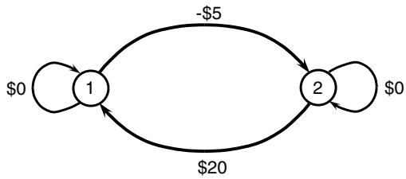  
Figure 17.6 Two-state dynamic program, with transition contributions.

A more realistic version of this issue can be illustrated with our nomadic trucker problem that we introduced in section 2.3.4.1. Assume we dispatcher our truck driver using the tractory-following implementation policy. We would obtain the results shown in Figure 17.7a, where the circles are proportional to the value function approximations. We see from the figure that the trucker ended up visiting just seven cities after 500 dispatches.

An alternative strategy is to start with optimistic estimates of the value of being in each city to encourage exploration, while still using just the implementation policy. This produces the value functions depicted in Figure 17.7b, which shows that the trucker is visiting far more cities. Note that this is not an ideal solution, as it is effectively suggesting that the trucker should visit any city he has not yet visited. Of course, we can tune our optimistic estimate (presumably in a simulator) so that we pick a “high enough” initial estimate.

# 17.5.3 Learning with Generalized Belief Models

Exploration policies depend heavily on how we are approximating the value function. With lookup tables, visiting a state ?? teaches us nothing about other states, which makes exploration exceptionally important. The argument that we would make is that the vast majority of real problems have exceptionally large (frequently infinite) state spaces, which limits the value of lookup table representations. Just skim the state variables in the simple inventory problems we reviewed in section 9.9 (which grew to 42 dimensions) to remind yourself how quickly state spaces can grow even on simple problems.

Chapter 3 offers a variety of strategies for some form of generalized learning, where visiting a state ?? teaches us about the value of many other states. Examples include:

Lookup tables with correlated beliefs – We can often express a relationship between pairs of states through a covariance matrix $\Sigma$ . Using the tools of section 3.4.2, we can visit one state and then update many other states through the relationship captured in $\Sigma$ . It may be the only property we have is smoothness, but this can still be a powerful property.

  
(a) Low initial estimate of the value function.

  
(b) High initial estimate of the value function.   
Figure 17.7 The effect of value function initialization on search process. Case (a) uses a low initial estimate and produces limited exploration; case (b) uses a high initial estimate, which forces exploration of the entire state space.

Monotonicity – If the value of $V ( s )$ increases (or decreases) in each dimension (or a subset of dimensions), we can use this property to update many states from a single observation.

Linear models – The simplest belief model, and as a result the one that has attracted the most attention, is a linear model (remember this means linear in the parameters) with the general form

$$
\overline {{V}} _ {t} (S _ {t} | \theta_ {t}) = \sum_ {f \in \mathcal {F}} \theta_ {t f} \phi_ {f} (S _ {t}).
$$

Note that we have used our standard time-indexed form (this is not standard in communities such as computer science), but it is relatively easy to estimate time-dependent VFAs.

Linear models are widely used, but this does not mean they work well, and we revisit this in our presentation below. Linear models are used because they are simple and provide an answer, but often users have no idea how good the answer is. It is unlikely, for example, that a single linear model would accurately represent a value function over the entire range of states that we actually visit.

Nonlinear models – Nonlinear parametric models offer the same generalized learning that linear models do, although it introduces other issues that we discuss later in the chapter.

Convex approximations – In chapter 18, we are going to see that convexity is a powerful property that allows us to estimate accurate value function approximations without the need for any explicit exploration logic.

Locally linear approximations – Here we are creating linear models for a set of regions that we can represent as a series of state spaces $( \mathcal { S } _ { 1 } , \ldots , \mathcal { S } _ { I } )$ . Note that once we introduce the idea of local approximations, we re-introduce the need to visit states within the different regions $\mathcal { S } _ { i }$ . Presumably the number of regions will be dramatically smaller than the number of states, so this is an improvement.

Neural networks – Neural networks are such highly flexible architectures that we almost return to the same situation we were with lookup tables, but without the intuition of learning locally.

Linear models are easily the most popular form of value function approximation, and as with all parametric models, offer the power of generalized learning where a model with $K$ parameters (where $K$ is typically on the order of 10 to 100 parameters, but may be in the 1000s). This means that with relatively few training iterations, we will at least get an estimate of the value of being in every state.

We still have the same issues with bias (in the values of $\hat { v } _ { t } ^ { n }$ ) and noise, but we also have to deal with structural error, since we cannot expect a linear model to be globally accurate. Adding more features (which increases $K$ ) is not a cure-all, since it can introduce unwanted variability. For example, we may be fitting a smooth, concave function (envision a nice grassy hilltop) where a quadratic will do a good, if not perfect, job of capturing the general shape. Higher-order functions could introduce unwanted undulations.

Exploration with a parametric model has a completely different behavior than using a lookup table (potentially even nonparametric models). The classical intuition about exploration-exploitation is entirely different with parametric

models. A good example is the problem of learning a linear demand curve that we showed in Figure 12.2 in section 12.6.2. While this is not a value function, it nicely illustrates how learning a linear function requires observations that are removed from the center of mass of other observations. Learning a linear function (in any setting) is best done by observing extreme points. The problem (which arose in Figure 12.2) is that visiting extreme points may be expensive if you are learning in an offline setting.

When using parametric value function approximations, it has been our experience that the most popular strategy used in practice is to use a learning policy that consists of a perturbed implementation policy of the sort introduced in section 12.6.2. These are most naturally implemented using continuous decisions and states, but it is possible to use a soft-max (Boltzmann) policy to choose among categorical alternatives.

# 17.6 Applications

There are many problems where we can exploit structure in the state variable, allowing us to propose functions characterized by a small number of parameters which have to be estimated statistically. Section 3.6.3 represented one version where we had a parameter for each (possibly aggregated) state. The only structure we assumed was implicit in the ability to specify a series of one or more aggregation functions.

The remainder of this section illustrates the use of regression models in specific applications which include pricing an American option and playing lose tic-tac-toe, followed by a brief discussion of deterministic problems that arise in engineering control problems and games.

# 17.6.1 Pricing an American Option

Consider the problem of determining the value of an American-style put option which gives us the right to sell an asset (or contract) at a specified price at any of a set of discrete time periods. For example, we might be able to exercise the option on the last day of the month over the next 12 months.

Assume we have an option that allows us to sell an asset at $\$ 1.20$ at any of four time periods. We assume a discount factor of 0.95 to capture the time value of money. If we wait until time period 4, we must exercise the option, receiving zero if the price is over $\$ 1.20$ . At intermediate periods, however, we may choose to hold the option even if the price is below $\$ 120$ (of course, exercising it if the price is above $\$ 1.20$ does not make sense). Our problem is to determine whether to hold or exercise the option at the intermediate points.

Table 17.3 Ten sample realizations of prices over four time periods.   

<table><tr><td colspan="5">Stock prices</td></tr><tr><td rowspan="2">Outcome</td><td colspan="4">Time period</td></tr><tr><td>1</td><td>2</td><td>3</td><td>4</td></tr><tr><td>1</td><td>1.21</td><td>1.08</td><td>1.17</td><td>1.15</td></tr><tr><td>2</td><td>1.09</td><td>1.12</td><td>1.17</td><td>1.13</td></tr><tr><td>3</td><td>1.15</td><td>1.08</td><td>1.22</td><td>1.35</td></tr><tr><td>4</td><td>1.17</td><td>1.12</td><td>1.18</td><td>1.15</td></tr><tr><td>5</td><td>1.08</td><td>1.15</td><td>1.10</td><td>1.27</td></tr><tr><td>6</td><td>1.12</td><td>1.22</td><td>1.23</td><td>1.17</td></tr><tr><td>7</td><td>1.16</td><td>1.14</td><td>1.13</td><td>1.19</td></tr><tr><td>8</td><td>1.22</td><td>1.18</td><td>1.21</td><td>1.28</td></tr><tr><td>9</td><td>1.08</td><td>1.11</td><td>1.09</td><td>1.10</td></tr><tr><td>10</td><td>1.15</td><td>1.14</td><td>1.18</td><td>1.22</td></tr></table>

From history, we have found 10 samples of price trajectories which are shown in Table 17.3.

If we wait until time period 4, our payoff is shown in Table 17.4, which is zero if the price is above 1.20, and $1 . 2 0 - p _ { 4 }$ for prices below $\$ 1.20$ .

At time $t = 3$ , we have access to the price history $( p _ { 1 } , p _ { 2 } , p _ { 3 } )$ . Since we may not be able to assume that the prices are independent or even Markovian (where $p _ { 3 }$ depends only on $p _ { 2 }$ ), the entire price history represents our state variable, along with an indicator that tells us if we are still holding the asset. We wish to predict the value of holding the option at time $t = 4$ . Let $V _ { 4 } ( S _ { 4 } )$ be the value of the option if we are holding it at time 4, given the state (which includes the price $p _ { 4 }$ ) at time 4. Now let the conditional expectation at time 3 be

$$
\overline {{V}} _ {3} (S _ {3}) = \mathbb {E} \{V _ {4} (S _ {4}) | S _ {3} \}.
$$

Our goal is to approximate $\overline { { V } } _ { 3 } ( S _ { 3 } )$ using information we know at time 3. We propose a linear regression of the form

$$
Y = \theta_ {0} + \theta_ {1} X _ {1} + \theta_ {2} X _ {2} + \theta_ {3} X _ {3},
$$

where

$$
Y = V _ {4},
$$

$$
X _ {1} = p _ {2},
$$

Table 17.4 The payout at time 4 if we are still holding the option.   

<table><tr><td colspan="5">Option value at t = 4</td></tr><tr><td rowspan="2">Outcome</td><td colspan="4">Time period</td></tr><tr><td>1</td><td>2</td><td>3</td><td>4</td></tr><tr><td>1</td><td>-</td><td>-</td><td>-</td><td>0.05</td></tr><tr><td>2</td><td>-</td><td>-</td><td>-</td><td>0.07</td></tr><tr><td>3</td><td>-</td><td>-</td><td>-</td><td>0.00</td></tr><tr><td>4</td><td>-</td><td>-</td><td>-</td><td>0.05</td></tr><tr><td>5</td><td>-</td><td>-</td><td>-</td><td>0.00</td></tr><tr><td>6</td><td>-</td><td>-</td><td>-</td><td>0.03</td></tr><tr><td>7</td><td>-</td><td>-</td><td>-</td><td>0.01</td></tr><tr><td>8</td><td>-</td><td>-</td><td>-</td><td>0.00</td></tr><tr><td>9</td><td>-</td><td>-</td><td>-</td><td>0.10</td></tr><tr><td>10</td><td>-</td><td>-</td><td>-</td><td>0.00</td></tr></table>

$$
X _ {2} = p _ {3},
$$

$$
X _ {3} = (p _ {3}) ^ {2}.
$$

The variables $X _ { 1 } , X _ { 2 }$ , and $X _ { 3 }$ are our basis functions. Keep in mind that it is important that our explanatory variables $X _ { i }$ must be a function of information we have at time $t = 3$ , whereas we are trying to predict what will happen at time $t = 4$ (the payoff). We would then set up the data matrix given in Table 17.5.

We may now run a regression on this data to determine the parameters $\left( \widehat { \theta } _ { i } \right) _ { i = 0 } ^ { 3 }$ . It makes sense to consider only the paths which produce a positive value in the fourth time period, since these represent the sample paths where we are most likely to still be holding the asset at the end. The linear regression is only an approximation, and it is best to fit the approximation in the region of prices which are the most interesting (we could use the same reasoning to include some “near misses”). We only use the value function to estimate the value of holding the asset, so it is this part of the function we wish to estimate. For our illustration, however, we use all 10 observations, which produces the equation

$$
\overline {{V}} _ {3} \approx 0. 0 0 5 6 - 0. 1 2 3 4 p _ {2} + 0. 6 0 1 1 p _ {3} - 0. 3 9 0 3 (p _ {3}) ^ {2}.
$$

$\overline { { V } } _ { 3 }$ is an approximation of the expected value of the price we would receive if we hold the option until time period 4. We can now use this approximation to help us decide what to do at time $t = 3$ . Table 17.6 compares the value of

Table 17.5 The data table for our regression at time 3.   

<table><tr><td colspan="5">Regression data</td></tr><tr><td rowspan="2">Outcome</td><td colspan="3">Independent variables</td><td>Dependent variable</td></tr><tr><td>X1</td><td>X2</td><td>X3</td><td>Y</td></tr><tr><td>1</td><td>1.08</td><td>1.17</td><td>1.3689</td><td>0.05</td></tr><tr><td>2</td><td>1.12</td><td>1.17</td><td>1.3689</td><td>0.07</td></tr><tr><td>3</td><td>1.08</td><td>1.22</td><td>1.4884</td><td>0.00</td></tr><tr><td>4</td><td>1.12</td><td>1.18</td><td>1.3924</td><td>0.05</td></tr><tr><td>5</td><td>1.15</td><td>1.10</td><td>1.2100</td><td>0.00</td></tr><tr><td>6</td><td>1.22</td><td>1.23</td><td>1.5129</td><td>0.03</td></tr><tr><td>7</td><td>1.44</td><td>1.13</td><td>1.2769</td><td>0.01</td></tr><tr><td>8</td><td>1.18</td><td>1.21</td><td>1.4641</td><td>0.00</td></tr><tr><td>9</td><td>1.11</td><td>1.09</td><td>1.1881</td><td>0.10</td></tr><tr><td>10</td><td>1.14</td><td>1.18</td><td>1.3924</td><td>0.00</td></tr></table>

exercising the option at time 3 against holding the option until time 4, computed as $\gamma \overline { { V } } _ { 3 } ( S _ { 3 } )$ . Taking the larger of the two payouts, we find, for example, that we would hold the option given samples 1-4, 6, 8, and 10, but would sell given samples 5, 7, and 9.

We can repeat the exercise to estimate $\overline { { V } } _ { 2 } ( S _ { t } )$ . This time, our dependent variable “??” can be calculated two different ways. The simplest is to take the larger of the two columns from Table 17.6 (marked in bold). So, for sample path 1, we would have $Y _ { 1 } = \operatorname* { m a x } \{ . 0 3 , 0 . 0 3 9 4 7 \} = 0 . 0 3 9 4 7 .$ . This means that our observed value is actually based on our approximate value function $\overline { { V } } _ { 3 } ( S _ { 3 } )$ .

An alternative way of computing the observed value of holding the option in time 3 is to use the approximate value function to determine the decision, but then use the actual price we receive when we eventually exercise the option. Using this method, we receive 0.05 for the first sample path because we decide to hold the asset at time 3 (based on our approximate value function) after which the price of the option turns out to be worth 0.05. Discounted, this is worth 0.0475. For sample path 2, the option proves to be worth 0.07 which discounts back to 0.0665 (we decided to hold at time 3, and the option was worth 0.07 at time 4). For sample path 5 the option is worth 0.10 because we decided to exercise at time 3.

Regardless of which way we compute the value of the problem at time 3, the remainder of the procedure is the same. We have to construct the independent variables “??” and regress them against our observations of the value of the

Table 17.6 The payout if we exercise at time 3, and the expected value of holding based on our approximation. The best decision is indicated in bold.   

<table><tr><td colspan="3">Rewards</td></tr><tr><td rowspan="2">Outcome</td><td colspan="2">Decision</td></tr><tr><td>Exercise</td><td>Hold</td></tr><tr><td>1</td><td>0.03</td><td>0.04155 ×.95 = 0.03947</td></tr><tr><td>2</td><td>0.03</td><td>0.03662 ×.95 = 0.03479</td></tr><tr><td>3</td><td>0.00</td><td>0.02397 ×.95 = 0.02372</td></tr><tr><td>4</td><td>0.02</td><td>0.03346 ×.95 = 0.03178</td></tr><tr><td>5</td><td>0.10</td><td>0.05285 ×.95 = 0.05021</td></tr><tr><td>6</td><td>0.00</td><td>0.00414 ×.95 = 0.00394</td></tr><tr><td>7</td><td>0.07</td><td>0.00899 ×.95 = 0.00854</td></tr><tr><td>8</td><td>0.00</td><td>0.01610 ×.95 = 0.01530</td></tr><tr><td>9</td><td>0.11</td><td>0.06032 ×.95 = 0.05731</td></tr><tr><td>10</td><td>0.02</td><td>0.03099 ×.95 = 0.02944</td></tr></table>

option at time 3 using the price history $( p _ { 1 } , p _ { 2 } )$ . Our only change in methodology would occur at time 1 where we would have to use a different model (because we do not have a price at time 0).

# 17.6.2 Playing “Lose Tic-Tac-Toe”

The game of “lose tic-tac-toe” is the same as the familiar game of tic-tac-toe, with the exception that now you are trying to make the other person get three in a row. This nice twist on the popular children’s game provides the setting for our next use of regression methods in approximate dynamic programming.

Unlike our exercise in pricing options, representing a tic-tac-toe board requires capturing a discrete state. Assume the cells in the board are numbered left to right, top to bottom as shown in Figure 17.8a. Now consider the board in Figure 17.8b. We can represent the state of the board after the $t ^ { t h }$ play using

$$
S _ {t i} = \left\{ \begin{array}{l l} 1 & \text {i f c e l l i c o n t a i n s a n “ X ,} \\ 0 & \text {i f c e l l i s b l a n k ,} \\ - 1 & \text {i f c e l l i c o n t a i n s a n ” O ,} \end{array} \right.
$$

  
Figure 17.8 Some tic-tac-toe boards. (17.8a) Our indexing scheme. (17.8b) Sample board.   
(a)

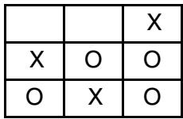

$$
{S _ {t}} = {(S _ {t i}) _ {i = 1} ^ {9}.}
$$

We see that this simple problem has up to $3 ^ { 9 } = 1 9 , 6 8 3$ states. While many of these states will never be visited, the number of possibilities is still quite large, and seems to overstate the complexity of the game.

We quickly realize that what is important about a game board is not the status of every cell as we have represented it. For example, rotating the board does not change a thing, but it does represent a different state. Also, we tend to focus on strategies (early in the game when it is more interesting) such as winning the center of the board or a corner. We might start defining variables (basis functions) such as

??1(????) = 1 if there is an “X” in the center of the board, 0 otherwise,

??2(????) = the number of corner cells with an “X,”

$\begin{array} { r l } { \phi _ { 3 } ( S _ { t } ) } & { { } = } \end{array}$ the number of instances of adjacent cells with an “X” (horizontally, vertically, or diagonally).

There are, of course, numerous such functions we can devise, but it is unlikely that we could come up with more than a few dozen (if that) which appeared to be useful. It is important to realize that we do not need a value function to tell us to make obvious moves.

Once we form our basis functions, our value function approximation is given by

$$
\overline {{V}} _ {t} (S _ {t}) = \sum_ {f \in \mathcal {F}} \theta_ {t f} \phi_ {f} (S _ {t}).
$$

We note that we have indexed the parameters by time (the number of plays) since this might play a role in determining the value of the feature being measured by a basis function, but it is reasonable to try fitting a model where $\theta _ { t f } = \theta _ { f }$ . We estimate the parameters $\boldsymbol { \theta }$ by playing the game (and following some policy) after which we see if we won or lost. We let $Y ^ { n } \ = \ 1$ if we won the $n ^ { t h }$ game, 0 otherwise. This also means that the value function is trying to approximate the probability of winning if we are in a particular state.

We may play the game by using our value functions to help determine a policy. Another strategy, however, is simply to allow two people (ideally, experts) to play the game and use this to collect observations of states and game outcomes. This is an example of . If we lack a “supervisor” then we have to depend on simple strategies combined with the use of slowly learned value function approximations. In this case, we also have to recognize that in the early iterations, we are not going to have enough information to reliably estimate the coefficients for a large number of basis functions.

# 17.6.3 Approximate Dynamic Programming for Deterministic Problems

There has been considerable interest in applying ADP to two classes of deterministic problems:

● Engineering control problems – Imagine making decisions about how to control a drone or robot, where we have to apply a multidimensional force vector $u _ { t }$ to the device (using the notation of control theory) to minimize some performance metric.   
● Playing games – Reinforcement learning/approximate dynamic programming has attracted attention for games such as computer Go, chess and an array of video games.

Neural networks have proven to be very popular in both settings, with reports of considerable success (although the techniques for computer games tend to require a hybrid policy). As we pointed out when we first introduced neural networks in section 3.9.3, the high-dimensionality of neural networks tends to make them sensitive to noise. However, for deterministic problems this is not an issue, and the ability of neural networks to represent complex functions without the struggle of identifying reasonable architectures can be particularly powerful.

It is beyond the scope of this volume to describe developments in these two rich fields in any depth. We encourage readers interested in either of these problem classes to look for more specialized presentations.

# 17.7 Approximate Policy Iteration

One of the most important tools in the toolbox for approximate dynamic programming is approximate policy iteration. This algorithm is neither simpler nor more elegant than approximate value iteration, but it can offer stronger convergence guarantees if the policy is evaluated within a specified tolerance.

In this section we review several flavors of approximate policy iteration, including:

(a) Finite horizon problems using lookup tables.   
(b) Finite horizon problems using linear models.   
(c) Infinite horizon problems using linear models.

Finite horizon problems allow us to obtain Monte Carlo estimates of the value of a policy by simulating the policy until the end of the horizon. Note that a “policy” here always refers to decisions that are determined by value function approximations. We use the finite horizon setting to illustrate approximating value function approximations using lookup tables and basis functions, which allows us to highlight the strengths and weaknesses of the transition to basis functions.

We then present an algorithm based on least squares temporal differences (LSTD) and contrast the steps required for finite horizon and infinite horizon problems when using linear models.

# 17.7.1 Finite Horizon Problems Using Lookup Tables

A fairly general purpose version of an approximate policy iteration algorithm is given in Figure 17.9 for an infinite horizon problem. This algorithm helps to illustrate the choices that can be made when designing a policy iteration algorithm in an approximate setting.

The algorithm features three nested loops. The innermost loop steps forward and backward in time from an initial state $S ^ { n , 0 }$ . The purpose of this loop is to obtain an estimate of the value of a path. Normally, we would choose $T$ large enough so that $\gamma ^ { T }$ is quite small (thereby approximating an infinite path).

The next outer loop repeats this process $M$ times to obtain a statistically reliable estimate of the value of a policy (determined by $\overline { { V } } ^ { \pi , n }$ ). The third loop, representing the outer loop, performs policy updates (in the form of updating the value function). In a more practical implementation, we might choose states at random rather than looping over all states.

Readers should note that we have tried to index variables in a way that shows how they are changing (do they change with outer iteration $n ?$ inner iteration ??? the forward look-ahead counter $t ?$ ). This does not mean that it is necessary to store, for example, each state or decision for every ??, ??, and ??. In an actual implementation, the software should be designed to store only what is necessary.

We can create different variations of approximate policy iteration by our choice of parameters. First, if we let $T \ \to \ \infty$ , we are evaluating a true infinite horizon policy. If we simultaneously let $M \ \to \ \infty$ , then $\bar { v } ^ { n }$ approaches the exact, infinite horizon value of the policy $\pi$ determined by $\overline { { V } } ^ { \pi , n }$ . Thus, for $M = T = \infty$ , we have a Monte Carlo-based version of exact policy iteration.

Step 0. Initialization:

Step 0a. Initialize ????,0. $\overline { { V } } ^ { \pi , 0 }$

Step 0b. Set a look-ahead parameter $T$ and inner iteration counter ??.

Step 0c. Set $n = 1$

Step 1. Sample a state $S _ { 0 } ^ { n }$ and then do:

Step 2. Do for $m = 1 , 2 , \ldots , M$ :

Step 3. Choose a sample path $\omega ^ { m }$ (a sample realization over the lookahead horizon ??).

Step 4. Do for $t = 0 , 1 , \ldots , T$ :

Step 4a. Compute

$$
{x _ {t} ^ {n, m}} = {\arg \max _ {x _ {t} \in s _ {t} ^ {n, m}} \left(C (S _ {t} ^ {n, m}, x _ {t}) + \gamma \overline {{V}} ^ {\pi , n - 1} (S ^ {M, x} (S _ {t} ^ {n, m}, x _ {t}))\right).}
$$

Step 4b. Compute

$$
S _ {t + 1} ^ {n, m} = S ^ {M} (S _ {t} ^ {n, m}, x _ {t} ^ {n, m}, W _ {t + 1} (\omega^ {m})).
$$

Step 5. Initialize $\hat { v } _ { T + 1 } ^ { n , m } = 0$

Step 6. Do for $t = T , T - 1 , \dots , 0$ :

Step 6a. Accumulate $\hat { v } ^ { n , m }$

$$
{\dot {v} _ {t} ^ {n, m}} = {C (S _ {t} ^ {n, m}, x _ {t} ^ {n, m}) + \gamma \dot {\sigma} _ {t + 1} ^ {n, m}.}
$$

Step 6b. Update the approximate value of the policy:

$$
\bar {v} ^ {n, m} = (\frac {m - 1}{m}) \bar {v} ^ {n, m - 1} + \frac {1}{m} \hat {v} _ {0} ^ {n, m}.
$$

Step 7. Update the value function at $S ^ { n }$ :

$$
\overline {{V}} ^ {\pi , n} = (1 - \alpha_ {n - 1}) \bar {\sigma} ^ {n - 1} + \alpha_ {n - 1} \hat {\sigma} _ {0} ^ {n, M}.
$$

Step 8. Set $n = n + 1$ . If $n < N$ , go to Step 1.   
Step 9. Return the value functions $( { \overline { { V } } } ^ { \pi , N } )$

Figure 17.9 A policy iteration algorithm for infinite horizon problems.

We can choose a finite value of $T$ that produces values $\hat { v } ^ { n , m }$ that are close to the infinite horizon results. We can also choose finite values of $M$ , including $M = 1$ . When we use finite values of $M$ , this means that we are updating the policy before we have fully evaluated the policy. This variant is known in the literature as optimistic policy iteration because rather than wait until we have

a true estimate of the value of the policy, we update the policy after each sample (presumably, although not necessarily, producing a better policy). We may also think of this as a form of partial policy evaluation, not unlike the hybrid value/policy iteration described in section 14.8.

# 17.7.2 Finite Horizon Problems Using Linear Models

The simplest demonstration of approximate policy iteration using linear models is in the setting of a finite horizon problem. Figure 17.10 provides an adaption of the algorithm using lookup tables when we are using linear models. There is an outer loop over ?? where we fix the policy using

$$
X _ {t} ^ {\pi} \left(S _ {t}\right) = \arg \max  _ {x _ {t}} \left(C \left(S _ {t}, x _ {t}\right) + \gamma \sum_ {f} \theta_ {t f} ^ {\pi , n} \phi_ {f} \left(S _ {t}, x _ {t}\right)\right). \tag {17.31}
$$

We are assuming that the basis functions are not themselves time-dependent, although they depend on the state variable $S _ { t }$ (and decision $x$ ) which, of course, is time dependent. The policy is determined by the parameters $\theta _ { t f } ^ { \pi , n }$ .

We update the policy $X _ { t } ^ { \pi } ( s )$ by performing repeated simulations of the policy in an inner loop that runs $m = 1 , \ldots , M$ . Within this inner loop, we use recursive least squares to update a parameter vector $\theta _ { t f } ^ { n , m }$ . This step replaces Step 6b in Figure 17.9.

If we let $M \to \infty$ , then the parameter vector $\boldsymbol { \theta } _ { t } ^ { n , M }$ approaches the best possible fit for the policy $X _ { t } ^ { \pi } ( s )$ determined by $\theta ^ { \pi , n - 1 }$ . However, it is very important to realize that this is not equivalent to performing a perfect evaluation of a policy using a lookup table representation. The problem is that (for discrete states), lookup tables have the potential for perfectly approximating a policy, whereas this is not generally true when we use basis functions. If we have a poor choice of basis functions, we may be able to find the best possible value of $\theta ^ { n , m }$ as ?? goes to infinity, but we may still have a terrible approximation of the policy produced by ????,??−1. $\theta ^ { \pi , n - 1 }$

# 17.7.3 LSTD for Infinite Horizon Problems Using Linear Models

We have built the foundation for approximate policy iteration using lookup tables and basis functions for finite horizon problems. We now make the transition to infinite horizon problems using linear models, where we introduce the dimension of projecting contributions over an infinite horizon. There are several ways of accomplishing this (see section 16.1.2). We use least squares temporal differencing, since it represents the most natural extension of classical policy iteration for infinite horizon problems.

Step 0. Initialization:

Step 0a. Fix the basis functions $\phi _ { f } ( s )$ .

Step 0b. Initialize $\theta _ { t f } ^ { \pi , 0 }$ for all ??. This determines the policy we simulate in the inner loop.

Step 0c. Set $n = 1$

Step 1. Sample an initial starting state $S _ { 0 } ^ { n }$ :

Step 2. Initialize $\theta ^ { n , 0 }$ (if $n > 1$ , use $\theta ^ { n , 0 } = \theta ^ { n - 1 }$ ), which is used to estimate the value of policy $\pi$ produced by $\theta ^ { p i , n }$ . $\theta ^ { n , 0 }$ is used to approximate the value of following policy $\pi$ determined by $\theta ^ { \pi , n }$ .

Step 3. Do for $m = 1 , 2 , \ldots , M$ :

Step 4. Choose a sample path $\omega ^ { m }$

Step 5. Do for $t = 0 , 1 , \ldots , T$ :

Step 5a. Compute

$$
x _ {t} ^ {n, m} = \arg \max  _ {x _ {t} \in \mathcal {X} _ {t} ^ {n, m}} \left(C \left(S _ {t} ^ {n, m}, x _ {t}\right) + \gamma \sum_ {f} \partial_ {t f} ^ {\pi , n - 1} \phi_ {f} \left(S ^ {M, x} \left(S _ {t} ^ {n, m}, x _ {t}\right)\right)\right).
$$

Step 5b. Compute

$$
{S _ {t + 1} ^ {n, m}} = {S ^ {M} (S _ {t} ^ {n, m}, x _ {t} ^ {n, m}, W _ {t + 1} (\omega^ {m})).}
$$

Step 6. Initialize $\hat { v } _ { T + 1 } ^ { n , m } = 0$

Step 7. Do for $t = T , T - 1 , \dots , 0$ :

$$
{\hat {v} _ {t} ^ {n, m}} = {C (S _ {t} ^ {n, m}, x _ {t} ^ {n, m}) + \gamma \hat {v} _ {t + 1} ^ {n, m}.}
$$

Step 8. Update $\theta _ { t } ^ { n , m - 1 }$ using recursive least squares to obtain $\theta _ { t } ^ { n , m }$ (see section 3.8).

Step 9. Set $n = n + 1$ . If $n < N$ , go to Step 1.

Step 10. Return the value functions $( { \overline { { V } } } ^ { \pi , N } )$

Figure 17.10 A policy iteration algorithm for finite horizon problems using linear models.

To begin, we let a sample realization of a one-period contribution, given state $S ^ { m }$ and decision $x ^ { m }$ be given by

$$
\hat {C} ^ {m} = C (S ^ {m}, x ^ {m}).
$$

As in the past, we let $\phi ^ { m } = \phi ( S ^ { m } )$ be the column vector of basis functions evaluated at state $S ^ { m }$ . We next fix a policy which chooses decisions greedily based on a value function approximation given by $\begin{array} { r } { \overline { { V } } ^ { n } ( s ) = \sum _ { f } \theta _ { f } ^ { n } \phi _ { f } ( s ) } \end{array}$ (see equation

(17.31)). Imagine that we have simulated this policy over a set of iterations $i = ( 0 , 1 , \ldots , m )$ , giving us a sequence of contributions ${ \hat { C } } ^ { i }$ , $i = 1 , \ldots , m$ . Drawing on the foundation provided in section 16.3, we can use standard linear regression to estimate $\theta ^ { m }$ using

$$
\theta^ {m} = \left[ \frac {1}{1 + m} \sum_ {i = 0} ^ {m} \phi_ {i} \left(\phi^ {i} - \gamma \phi^ {i + 1}\right) ^ {T} \right] ^ {- 1} \left[ \frac {1}{1 + m} \sum_ {i = 1} ^ {m} \phi^ {i} \hat {C} ^ {i} \phi^ {i} \right]. \tag {17.32}
$$

As a reminder, the term $\phi ^ { i } - \gamma \phi ^ { i + 1 }$ can be viewed as a simulated, sample realization of $I { - } \gamma P ^ { \pi }$ , projected into the feature space. Just as we would use $( I - \gamma P ^ { \pi } ) ^ { - 1 }$ in our basic policy iteration to project the infinite-horizon value of a policy $\pi$ (for a review, see section 14.7), we are using the term

$$
\left[ \frac {1}{1 + m} \sum_ {i = 0} ^ {m} \phi_ {i} (\phi^ {i} - \gamma \phi^ {i + 1}) ^ {T} \right] ^ {- 1}
$$

to produce an infinite-horizon estimate of the feature-projected contribution

$$
\left[ \frac {1}{1 + m} \sum_ {i = 1} ^ {m} \phi^ {i} \hat {C} ^ {i} \phi^ {i} \right].
$$

Equation (17.32) requires solving a matrix inverse for every observation. It is much more efficient to use recursive least squares, which is done by using

$$
\epsilon^ {m} = \hat {C} ^ {m} - \left(\phi^ {m} - \gamma \phi^ {m + 1}\right) ^ {T} \theta^ {m - 1}, \tag {17.33}
$$

$$
M ^ {m} = M ^ {m - 1} - \frac {M ^ {m - 1} \phi^ {m} \left(\phi^ {m} - \gamma \phi^ {m + 1}\right) ^ {T} M ^ {m - 1}}{1 + \left(\phi^ {m} - \gamma \phi^ {m + 1}\right) ^ {T} M ^ {m - 1} \phi^ {m}}, \tag {17.34}
$$

$$
\theta^ {m} = \theta^ {m - 1} + \frac {\epsilon^ {m} M ^ {m - 1} \phi^ {m}}{1 + (\phi^ {m} - \gamma \phi^ {m + 1}) ^ {T} M ^ {m - 1} \phi^ {m}}. \tag {17.35}
$$

Figure 17.11 provides a detailed summary of the complete algorithm. The algorithm has some nice properties if we are willing to assume that there is a vector $\theta ^ { * }$ such that the true value function $\begin{array} { r } { V ( s ) = \sum _ { f \in \mathcal { F } } \theta _ { f } ^ { * } \phi _ { f } ( s ) } \end{array}$ (admittedly, a pretty strong assumption). First, if the inner iteration limit $M$ increases as a function of ?? so that the quality of the approximation of the policy gets better and better, then the overall algorithm will converge to the true optimal policy. Of course, this means letting $M \to \infty$ , but from a practical perspective, it means that the algorithm can find a policy arbitrarily close to the optimal policy.

Second, the algorithm can be used with vector-valued and continuous decisions. There are several features of the algorithm that allow this. First, computing the policy $X ^ { \pi } ( s | \theta ^ { n } )$ requires solving a deterministic optimization problem. If we are using discrete decisions, it means simply enumerating the decisions and choosing the best one. If we have continuous decisions, we need to solve

Step 0. Initialization:

Step 0a. Initialize $\theta ^ { 0 }$ .

Step 0b. Set the initial policy:

$$
A ^ {\pi} (s | \theta^ {0}) = \arg \max  _ {a \in \mathcal {A}} \left(C (s, x) + \gamma \phi (S ^ {M} (s, x)) ^ {T} \theta^ {0}\right).
$$

Step 0c. Set $n = 1$ .

Step 1. Do for $n = 1 , \ldots , N$ .

Step 2. Initialize $S _ { 0 } ^ { n }$

Step 3. Do for $m = 0 , 1 , \ldots , M$

Step 4. Initialize $\theta ^ { n , m }$ .

Step 5. Sample $W ^ { m + 1 }$ .

Step 6. Do the following:

Step 6a. Computing the decision $x ^ { n , m } = X ^ { \pi } ( S ^ { m } | \theta ^ { n - 1 } )$ .

Step 6b. Compute the post-decision state $S ^ { x , m } = S ^ { M , x } ( S ^ { n , m } , x ^ { n , m } )$

Step 6c. Compute the next pre-decision state $S ^ { n , m + 1 } = S ^ { M } ( S ^ { n , m } , x ^ { n , m } , W ^ { m + 1 } )$

Step 6d. Compute the input variable $\phi ( S ^ { n , m } ) - \gamma \phi ( S ^ { n , m + 1 } )$ for equation (17.32).

Step 7. Do the following:

Step 7a. Compute the response variable $\hat { C } ^ { m } = C ( S ^ { n , m } , x ^ { n , m } , W ^ { m + 1 } )$ .

Step 7b. Compute $\theta ^ { n , m }$ using equation (17.32).

Step 8. Update $\theta ^ { n }$ and the policy:

$$
\begin{array}{c c c} \theta^ {n + 1} & = & \theta^ {n, m} \end{array}
$$

$$
X ^ {\pi , n + 1} (s) \quad = \quad \arg \max  _ {x \in X} \left(C (s, x) + \gamma \phi \left(S ^ {M} (s, x)\right) \theta^ {n + 1}\right).
$$

Step 9. Return the $X ^ { \pi } ( s | \theta ^ { N } )$ and parameter $\theta ^ { N }$ .

Figure 17.11 Approximate policy iteration for infinite horizon problems using least squares temporal differencing.

a nonlinear programming problem. The only practical issue is that we may not be able to guarantee that the objective function is concave (or convex if we are minimizing). Second, note that we are using trajectory following (also known as on-policy training) in Step 6c, without an explicit exploration step. It can be very difficult implementing an exploration step for multidimensional decision vectors.

We can avoid exploration as long as there is enough variation in the states we visit that allows us to compute $\theta ^ { m }$ in equation (17.32). When we use lookup tables, we require exploration to guarantee that we eventually will visit every state infinitely often. When we use basis functions, we only need to visit states with sufficient diversity that we can estimate the parameter vector $\theta ^ { m }$ . In the language of statistics, the issue is one of identification (that is, the ability to estimate ??) rather than exploration. This is a much easier requirement to satisfy, and one of the major advantages of parametric models.

# 17.8 The Actor–Critic Paradigm

It is very popular in some communities to view approximate dynamic programming in terms of an “actor” and a “critic.” Simply put, the actor is a policy that chooses the decision, and the critic is the value function that evaluates the action produced by the policy. In engineering control applications, where states and controls are continuous, it is common to represent both the policy and the approximate value function using (typically shallow) neural networks, and hence some authors refer to “actor nets” and “critic nets.” Note that in this setting, the actor is a form of policy function approximation.

The policy iteration algorithm in Figure 17.12 provides one illustration of the actor–critic paradigm. The decision function is equation (17.36), where $V ^ { \pi , n - 1 }$ determines the policy (in this case). This is the actor. Equation (17.37), where we update our estimate of the value of the policy, is the critic. We fix the actor (that is, we fix the value function approximation used by the actor) for a period of time and perform repeated iterations where we try to estimate value functions given a particular actor (policy). From time to time, we stop and use our value function to modify our behavior (something critics like to do). In this case, we update the behavior by replacing $V ^ { \pi }$ with our current $\overline { V }$ .

In other settings, the policy is a policy function approximation of some form that maps the state to a decision. For example, if we are driving through a transportation network (or traversing a graph) the policy might be of the form “when at node ??, go next to node $j$ ,” which would be a form of lookup table policy. As we update the value function, we may decide the right policy at node ?? is to traverse to node $k$ . Once we have updated our policy, the policy itself does not directly depend on a value function.

Another example might arise when determining how much of a resource we should have on hand. We might solve the problem by maximizing a function of the form $f ( x ) = \beta _ { 0 } - \beta _ { 1 } ( x - \beta _ { 2 } ) ^ { 2 }$ . Of course, $\beta _ { 0 }$ does not affect the optimal quantity. We might use the value function to update $\beta _ { 0 }$ and $\beta _ { 1 }$ . Once these are determined, we have a function that does not itself directly depend on a value function.

Step 0. Initialization:

Step 0a. Initialize $V _ { t } ^ { \pi , 0 } , \ t \in \mathcal { F }$

Step 0b. Set $n = 1$ .

Step 0c. Initialize $S _ { 0 } ^ { 1 }$

Step 1. Do for $n = 1 , 2 , \ldots , N$ :

Step 2. Do for $m = 1 , 2 , \ldots , M$ :

Step 3. Choose a sample path $\omega ^ { m }$ .

Step 4. Initialize $\hat { v } ^ { m } = 0$

Step 5. Do for $t = 0 , 1 , \ldots , T$ :

Step 5a. Solve:

$$
x _ {t} ^ {n, m} = \arg \max  _ {x _ {t} \in x _ {t} ^ {n, m}} \left(C _ {t} \left(S _ {t} ^ {n, m}, x _ {t}\right) + \gamma V _ {t} ^ {\pi , n - 1} \left(S ^ {M, x} \left(S _ {t} ^ {n, m}, x _ {t}\right)\right)\right) \tag {17.36}
$$

Step 5b. Compute:

$$
S _ {t} ^ {x, n, m} = S ^ {M, x} \left(S _ {t} ^ {n, m}, x _ {t} ^ {n, m}\right),
$$

$$
S _ {t + 1} ^ {n, m} = S ^ {M, W} (S _ {t} ^ {x, n, m}, W _ {t + 1} (\omega^ {m})).
$$

Step 6. Do for $t = T - 1 , \dots , 0$ :

Step 6a. Accumulate the path cost (with $\hat { v } _ { T } ^ { m } = 0$ )

$$
\dot {v} _ {t} ^ {m} = C _ {t} (S _ {t} ^ {n, m}, x _ {t} ^ {m}) + \gamma \dot {v} _ {t + 1} ^ {m}.
$$

Step 6b. Update approximate value of the policy starting at time ??:

$$
\overline {{V}} _ {t - 1} ^ {n, m} \leftarrow U ^ {V} \left(\overline {{V}} _ {t - 1} ^ {n, m - 1}, S _ {t - 1} ^ {x, n, m}, v _ {t} ^ {m}\right) \tag {17.37}
$$

where we typically use $\alpha _ { m - 1 } = 1 / m$ .

Step 7. Update the policy value function

$$
V _ {t} ^ {\pi , n} (S _ {t} ^ {x}) = \overline {{V}} _ {t} ^ {n, M} (S _ {t} ^ {x}) \forall t = 0, 1, \ldots , T.
$$

Step 8. Return the value functions $( V _ { t } ^ { \pi , N } ) _ { t = 1 } ^ { T }$ .

Figure 17.12 Approximate policy iteration using value function-based policies.

# 17.9 Statistical Bias in the Max Operator*

A subtle type of bias arises when we are optimizing because we are taking the maximum over a set of random variables. In algorithms such as ??-learning or approximate value iteration, we are computing $\hat { q } _ { t } ^ { n }$ by choosing the best of a set of decisions which depend on ${ \bar { Q } } ^ { n - 1 } ( S , x )$ . The problem is that the estimates ${ \bar { Q } } ^ { n - 1 } ( S , x )$ are random variables. In the best of circumstances, assume that ${ \bar { Q } } ^ { n - 1 } ( S , x )$ is an unbiased estimate of the true value $V _ { t } ( S ^ { x } )$ of being in (postdecision) state $S ^ { x }$ . Because it is still a statistical estimate with some degree of variation, some of the estimates will be too high while others will be too low. If a particular decision takes us to a state where the estimate just happens to be too high (due to statistical variation), then we are more likely to choose this as the best decision and use it to compute $\hat { q } ^ { n }$ .

To illustrate, assume we have to choose a decision $x \in \mathcal X$ , where $C ( S , x )$ is the contribution earned by using decision $x$ (given that we are in state $S$ ) which then takes us to (post-decision) state $S ^ { M , x } ( S , x )$ where we receive an estimated value $\overline { { V } } ( S ^ { M , x } ( S , x ) )$ . Normally, we would update the value of being in state $S$ by computing

$$
\hat {v} ^ {n} = \max _ {x \in \mathcal {X}} \left(C (S, x) + \overline {{V}} ^ {x, n - 1} (S ^ {M, x} (S, x))\right).
$$

We would then update the value of being in state $S$ using our standard update formula

$$
\overline {{V}} ^ {n} (S) = (1 - \alpha_ {n - 1}) \overline {{V}} ^ {n - 1} (S) + \alpha_ {n - 1} \hat {v} ^ {n}.
$$

Since $\overline { { V } } ^ { n - 1 } ( S ^ { M , x } ( S , x ) )$ is a random variable, sometimes it will overestimate the true value of being in state $S ^ { M , x } ( S , x )$ while other times it will underestimate the true value. Of course, we are more likely to choose a decision that takes us to a state where we have overestimated the value.

We can quantify the error due to statistical bias as follows. Fix the iteration counter $n$ (so that we can ignore it), and let

$$
U _ {x} = C (S, x) + \overline {{V}} (S ^ {M, x} (S, x))
$$

be the estimated value of using decision ??. The statistical error, which we represent as $\beta$ , is given by

$$
\beta = \mathbb {E} \left\{\max  _ {x \in \mathcal {X}} U _ {x} \right\} - \max  _ {x \in \mathcal {X}} \mathbb {E} U _ {x}. \tag {17.38}
$$

The first term on the right-hand side of (17.38) is the expected value of ${ \overline { { V } } } ( S )$ , which is computed based on the best observed value. The second term is the correct answer (which we can only find if we know the true mean). We can

get an estimate of the difference by using a statistical technique known as the “plug-in principle.” We assume that $\mathbb { E } U _ { x } = { \overline { { V } } } ( S ^ { M , x } ( S , x ) )$ , which means that we assume that the estimates $\overline { { V } } ( S ^ { M , x } ( S , x ) )$ are correct, and then try to estimate $\mathbb { E } \{ \operatorname* { m a x } _ { x \in { \mathcal { X } } } U _ { x } \} .$ . Thus, computing the second term in (17.38) is easy.

The challenge is computing $\mathbb { E } \{ \operatorname* { m a x } _ { x \in { \mathcal { X } } } U _ { x } \}$ . We assume that while we have been computing $\overline { { V } } ( S ^ { M , x } ( S , x ) )$ , we have also been computing $\bar { \sigma } ^ { 2 } ( x ) =$ $V a r ( U _ { x } ) = V a r \bigl ( \overline { { V } } ( S ^ { M , x } ( S , x ) ) \bigr )$ . Using the plug-in principle, we are going to assume that the estimates $\bar { \sigma } ^ { 2 } ( x )$ represent the true variances of the value function approximations. Computing $\mathbb { E } \{ \operatorname* { m a x } _ { x \in { \mathcal { X } } } U _ { x } \}$ for more than a few decisions is computationally intractable, but we can use a technique called the Clark approximation to provide an estimate. This strategy finds the exact mean and variance of the maximum of two normally distributed random variables, and then assumes that this maximum is also normally distributed. Assume the decisions can be ordered so that $\mathcal { X } = \{ 1 , 2 , \ldots , | \mathcal { X } | \}$ . Now let

$$
\bar {U} _ {2} = \max  \{U _ {1}, U _ {2} \}.
$$

We can compute the mean and variance of $\bar { U } _ { 2 }$ as follows. First, we temporarily define $\alpha$ using

$$
\alpha^ {2} = \sigma_ {1} ^ {2} + \sigma_ {2} ^ {2} - 2 \sigma_ {1} \sigma_ {2} \rho_ {1 2}
$$

where $\sigma _ { 1 } ^ { 2 } \ = \ V a r ( U _ { 1 } ) , \sigma _ { 2 } ^ { 2 } \ = \ V a r ( U _ { 2 } )$ , and $\rho _ { 1 2 }$ is the correlation coefficient between $U _ { 1 }$ and $U _ { 2 }$ (we allow the random variables to be correlated, but shortly we are going to approximate them as being independent). Next find

$$
z = \frac {\mu_ {1} - \mu_ {2}}{\alpha}.
$$

where $\mu _ { 1 } = \mathbb { E } U _ { 1 }$ and $\mu _ { 2 } = \mathbb { E } U _ { 2 }$ . Now let $\Phi ( z )$ be the cumulative standard normal distribution (that is, $\Phi ( z ) = \mathbb { P } [ Z \leq z ]$ where $Z$ is normally distributed with mean 0 and variance 1), and let $\phi ( z )$ be the standard normal density function. If we assume that $U _ { 1 }$ and $U _ { 2 }$ are normally distributed (a reasonable assumption when they represent sample estimates of the value of being in a state), then it is a straightforward exercise to show that

$$
\mathbb {E} \bar {U} _ {2} = \mu_ {1} \Phi (z) + \mu_ {2} \Phi (- z) + \alpha \phi (z), \tag {17.39}
$$

$$
\begin{array}{l} {V a r (\bar {U} _ {2})} = {\left[ \left(\mu_ {1} ^ {2} + \sigma_ {1} ^ {2}\right) \Phi (z) + \left(\mu_ {1} ^ {2} + \sigma_ {2} ^ {2}\right) \Phi (- z) + \left(\mu_ {1} + \mu_ {2}\right) \alpha \phi (z) \right]} \\ - \left(\mathbb {E} \bar {U} _ {2}\right) ^ {2}. \tag {17.40} \\ \end{array}
$$

Now assume that we have a third random variable, $U _ { 3 }$ , where we wish to find $\mathbb { E } \operatorname* { m a x } \{ U _ { 1 } , U _ { 2 } , U _ { 3 } \}$ . The Clark approximation solves this by using

$$
\begin{array}{l} \tilde {U} _ {3} = \mathbb {E} \max  \{U _ {1}, U _ {2}, U _ {3} \} \\ \approx \quad \mathbb {E} \max  \left\{U _ {3}, \bar {U} _ {2} \right\}, \\ \end{array}
$$

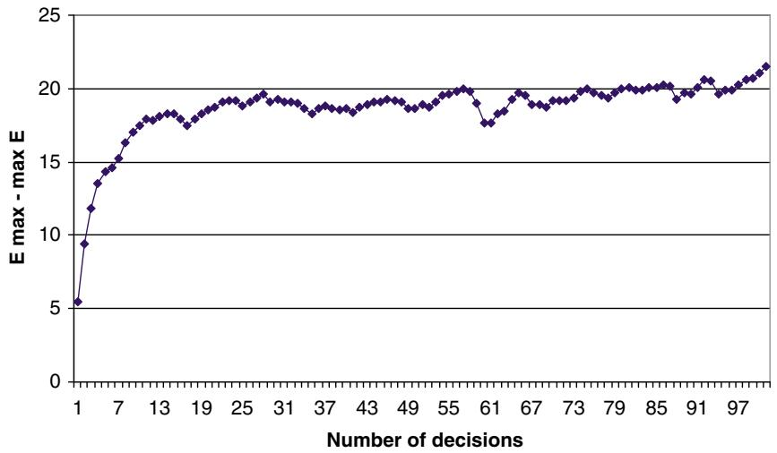  
Figure 17.13 $\mathbb { E } \operatorname* { m a x } _ { x } U _ { x } - \operatorname* { m a x } _ { x } \mathbb { E } U _ { x }$ for 100 decisions, averaged over 30 sample realizations. The standard deviation of all sample realizations was 20.

where we assume that $\bar { U } _ { 2 }$ is normally distributed with mean given by (17.39) and variance given by (17.40). For our setting, it is unlikely that we would be able to estimate the correlation coefficient $\rho _ { 1 2 }$ (or $\rho _ { 2 3 }$ ), so we are going to assume that the random estimates are independent. This idea can be repeated for large numbers of decisions by using

$$
\begin{array}{l} \tilde {U} _ {x} = \mathbb {E} \max  \{U _ {1}, U _ {2}, \dots , U _ {x} \} \\ \approx \quad \mathbb {E} \max  \{U _ {x}, \bar {U} _ {x - 1} \}. \\ \end{array}
$$

We can apply this repeatedly until we find the mean of $\bar { U } _ { | \mathcal { X } | }$ , which is an approximation of $\mathbb { E } \{ \operatorname* { m a x } _ { x \in { \mathcal { X } } } U _ { x } \}$ . This, in turn, allows us to compute an estimate of the statistical bias $\beta$ given by equation (17.38).

Figure 17.13 plots $\beta = \mathbb { E } \operatorname* { m a x } _ { x } U _ { x } - \operatorname* { m a x } _ { x } \mathbb { E } U _ { x }$ as it is being computed for 100 decisions, averaged over 30 sample realizations. The standard deviation of each $U _ { x }$ was fixed at $\sigma = 2 0$ . The plot shows that the error increases steadily until the set $\mathcal { X }$ reaches about 20 or 25 decisions, after which it grows much more slowly. Of course, in an approximate dynamic programming application, each $U _ { x }$ would have its own standard deviation which would tend to decrease as we sample a decision repeatedly (a behavior that the approximation above captures nicely).

This brief analysis suggests that the statistical bias in the max operator can be significant. However, it is highly data dependent. If there is a single dominant decision, then the error will be negligible. The problem only arises when there

are many (as in 10 or more) decisions that are competitive, and where the standard deviation of the estimates is not small relative to the differences between the means. Unfortunately, this is likely to be the case in most large-scale applications (if a single decision is dominant, then it suggests that the solution is probably obvious).

The relative magnitudes of value iteration bias over statistical bias will depend on the nature of the problem. If we are using a pure forward pass (TD(0)), and if the value of being in a state at time ?? reflects rewards earned over many periods into the future, then the value iteration bias can be substantial (especially if the stepsize is too small).

Value iteration bias has long been recognized in the dynamic programming community. By contrast, statistical bias appears to have received almost no attention, and as a result we are not aware of any research addressing this problem. We suspect that statistical bias is likely to inflate value function approximations fairly uniformly, which means that the impact on the policy may be quite small. However, if the goal is to obtain the value function itself (for example, to estimate the value of an asset or a contract), then the bias can distort the results.

# 17.10 The Linear Programming Method Using Linear Models*

In section 14.10, we showed that the determination of the value of being in each state can be found by solving the following linear program

$$
\min  _ {v} \sum_ {s \in S} \beta_ {s} v (s) \tag {17.41}
$$

subject to

$$
v (s) \geq C (s, x) + \gamma \sum_ {s ^ {\prime} \in S} p \left(s ^ {\prime} \mid s, x\right) v \left(s ^ {\prime}\right) \text {f o r a l l} s \text {a n d} x. \tag {17.42}
$$

The problem with this formulation arises because it requires that we enumerate the state space to create the value function vector $( v ( s ) ) _ { s \in \mathcal { S } }$ . Furthermore, we have a constraint for each state-decision pair, a set that will be huge even for relatively small problems.

We can partially solve this problem by replacing the discrete value function with a regression function such as

$$
\overline {{V}} (s | \theta) = \sum_ {f \in \mathcal {F}} \theta_ {f} \phi_ {f} (s).
$$

where $( \phi _ { f } ) _ { f \in \mathcal { F } }$ is an appropriately designed set of basis functions. This produces a revised linear programming formulation

$$
\min  _ {\theta} \sum_ {s \in \mathcal {S}} \beta_ {s} \sum_ {f \in \mathcal {F}} \theta_ {f} \phi_ {f} (s)
$$

subject to:

$$
v (s) \geq C (s, x) + \gamma \sum_ {s ^ {\prime} \in \mathcal {S}} p \left(s ^ {\prime} \mid s, x\right) \sum_ {f \in \mathcal {F}} \theta_ {f} \phi_ {f} \left(s ^ {\prime}\right) \text {f o r a l l} s \text {a n d} x.
$$

This is still a linear program, but now the decision variables are $( \theta _ { f } ) _ { f \in \mathcal { F } }$ instead of $( v ( s ) ) _ { s \in \mathcal { S } }$ . Note that rather than use a stochastic iterative algorithm, we obtain $\boldsymbol { \theta }$ directly by solving the linear program.

We still have a problem with a huge number of constraints. Since we no longer have to determine $| \mathcal { S } |$ decision variables (in (17.41)–(17.42) the parameter vector $( v ( s ) ) _ { s \in \mathcal { S } }$ represents our decision variables), it is not surprising that we do not actually need all the constraints. One strategy that has been proposed is to simply choose a random sample of states and decisions. Given a state space $\mathcal { S }$ and set of decisions $\mathcal { X }$ , we can randomly choose states and decisions to create a smaller set of constraints.

Some care needs to be exercised when generating this sample. In particular, it is important to generate states roughly in proportion to the probability that they will actually be visited. Then, for each state that is generated, we need to randomly sample one or more decisions. The best strategy for doing this is going to be problem-dependent.

This technique has been applied to the problem of managing a network of queues. Figure 17.14 shows a queueing network with three servers and eight queues. A server can serve only one queue at a time. For example, server A might be a machine that paints components one of three colors (say, red, green, and blue). It is best to paint a series of parts red before switching over to blue. There are customers arriving exogenously (denoted by the arrival rates $\lambda _ { 1 }$ and $\lambda _ { 2 }$ ). Other customers arrive from other queues (for example, departures from queue 1 become arrivals to queue 2). The problem is to determine which queue a server should handle after each service completion.

If we assume that customers arrive according to a Poisson process and that all servers have negative exponential service times (which means that all processes are memoryless), then the state of the system is given by

$$
S _ {t} = R _ {t} = (R _ {t i}) _ {i = 1} ^ {8},
$$

where $R _ { t i }$ is the number of customers in queue ??. Let $\mathcal { K } = \{ 1 , 2 , 3 \}$ be our set of servers, and let $a _ { t }$ be the attribute vector of a server given by $a _ { t } = ( k , q _ { t } )$ , where $k$ is the identity of the server and $q _ { t }$ is the queue being served at time $t$ .

  
Figure 17.14 Queueing network with three servers serving a total of eight queues, two with exogenous arrivals (??) and six with arrivals from other queues. Adapted from de Farias and Van Roy (2003).

Each server can only serve a subset of queues (as shown in Figure 17.14). Let $\mathcal { D } = \left\{ 1 , 2 , \dots , 8 \right\}$ represent a decision to serve a particular queue, and let $\mathcal { D } _ { a }$ be the decisions that can be used for a server with attribute ??. Finally, let $x _ { t a d } = 1$ if we decide to assign a server with attribute $a$ to serve queue $d \in \mathcal { D } _ { a }$ .

The state space is effectively infinite (that is, too large to enumerate). But we can still sample states at random. Research has shown that it is important to sample states roughly in proportion to the probability they are visited. We do not know the probability a state will be visited, but it is known that the probability of having a queue with $r$ customers (when there are Poisson arrivals and negative exponential servers) follows a geometric distribution. For this reason, it was chosen to sample a state with $r \phantom { \sum } = \sum _ { i } R _ { t i }$ customers with probability $( 1 - \gamma ) \gamma ^ { r }$ , where ?? is a discount factor (a value of 0.95 was used).

Further complicating this problem class is that we also have to sample decisions. Let $\mathcal { X }$ be the set of all feasible values of the decision vector $x$ . The number of possible decisions for each server is equal to the number of queues it serves, so the total number of values for the vector $x$ is $3 \times 2 \times 3 = 1 8$ . In the experiments for this illustration, only 5,000 states were sampled (in portion to $( 1 - \gamma ) \gamma ^ { r } )$ , but all the decisions were sampled for each state, producing 90,000 constraints.

Once the value function is approximated, it is possible to simulate the policy produced by this value function approximation. The results were compared against two myopic policies: serving the longest queue, and first-in, first-out (that is, serve the customer who had arrived first). The costs produced by each policy are given in Table 17.7, showing that the ADP-based strategy significantly outperforms these other policies.

Considerably more numerical work is needed to test this strategy on more realistic systems. For example, for systems that do not exhibit Poisson arrivals or negative exponential service times, it is still possible that sampling states based on geometric distributions may work quite well. More problematic is the rapid growth in the feasible region $\mathcal { X }$ as the number of servers, and queues per server, increases.

Table 17.7 Average cost estimated using simulation. Data from de Farias and Van Roy (2003).   

<table><tr><td>Policy</td><td>Cost</td></tr><tr><td>ADP</td><td>33.37</td></tr><tr><td>Longest</td><td>45.04</td></tr><tr><td>FIFO</td><td>45.71</td></tr></table>

An alternative to using constraint sampling is an advanced technique known as column generation. Instead of generating a full linear program which enumerates all decisions (that is, $v ( s )$ for each state), and all constraints (equation (17.42)), it is possible to generate sequences of larger and larger linear programs, adding rows (constraints) and columns (decisions) as needed. These techniques are beyond the scope of our presentation, but readers need to be aware of the range of techniques available for this problem class.

# 17.11 Finite Horizon Approximations for Steady-State Applications

It is easy to assume that if we have a problem with stationary data (that is, all random information is coming from a distribution that is not changing over time), then we can solve the problem as an infinite horizon problem, and use the resulting value function to produce a policy that tells us what to do in any state. If we can, in fact, find the optimal value function for every state, this is true.

There are many applications of infinite horizon models to answer policy questions. Do we have enough doctors? What if we increase the buffer space for holding customers in a queue? What is the impact of lowering transaction costs on the amount of money a mutual fund holds in cash? What happens if a car rental company changes the rules allowing rental offices to give customers a better car if they run out of the type of car that a customer reserved?

These are all dynamic programs controlled by a constraint (the size of a buffer or the number of doctors), a parameter (the transaction cost), or the rules governing the physics of the problem (the ability to substitute cars). We may be interested in understanding the behavior of such a system as these variables are adjusted. For infinite horizon problems that are too complex to solve exactly, ADP offers a way to approximate these solutions.

Infinite horizon models also have applications in operational settings. Assume that we have a problem governed by stationary processes. We could solve the steady-state version of the problem, and use the resulting value function to define a policy that would work from any starting state. This works if we have, in fact, found at least a close approximation of the optimal value function for any starting state. However, if you have made it this far in this book, then that means you are interested in working on problems where the optimal value function cannot be found for all states. Typically, we are forced to approximate the value function, and it is always the case that we do the best job of fitting the value function around states that we visit most of the time.

When we are working in an operational setting, then we start with some known initial state $S _ { 0 }$ . From this state, there are a range of “good” decisions, followed by random information, that will take us to a set of states $S _ { 1 }$ that is typically heavily influenced by our starting state. Figure 17.15 illustrates the phenomenon. Assume that our true, steady-state value function approximation looks like the sine function. At time $t = 1$ , the probability distribution of the state $S _ { t }$ that we can reach is shown as the shaded area. Assume that we have chosen to fit a quadratic function of the value function, using observations of $S _ { t }$ that we generate through Monte Carlo sampling. We might obtain the dotted curve labeled as $\overline { { V } } _ { 1 } ( S _ { 1 } )$ , which closely fits the true value function around the states $S _ { 1 }$ that we have observed.

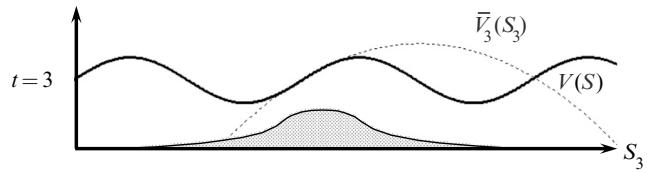  
Figure 17.15 Exact value function (sine curve) and value function approximations for $t = 1 , 2 , 3$ , which change with the probability distribution of the states that we can reach from $S _ { 0 }$ .

For times $t = 2$ and $t = 3$ , the distribution of states $S _ { 2 }$ and $S _ { 3 }$ that we actually observe grows wider and wider. As a result, the best fit of a quadratic function spreads as well. So, even though we have a steady-state problem, the best value function approximation depends on the initial state $S _ { 0 }$ and how many time periods into the future that we are projecting. Such problems are best modeled as finite horizon problems, but only because we are forced to approximate the problem.

# 17.12 Bibliographic Notes

Section 17.2 – Approximate value iteration using lookup tables encompasses the family of algorithms that depend on an approximation of the value of a future state to estimate the value of being in a state now, which includes ??-learning and temporal-difference learning. These methods represent the foundation of approximate dynamic programming and reinforcement learning.

Section 17.4 – The problems with the use of linear models in the context of approximate value iteration (TD learning) are well known in the research literature. Good discussions of these issues are found in Bertsekas and Tsitsiklis (1996), Tsitsiklis and Van Roy (1997), Baird (1995), and Precup et al. (2001), to name a few.

Section 17.7 – Bradtke and Barto (1996) first introduced least squares temporal differencing, which is a way of approximating the one-period contribution using a linear model, and then projecting the infinite horizon performance. Lagoudakis and Parr (2003) describes the least squares policy iteration algorithm (LSPI) which uses a linear model to approximate the ??-factors, which is then imbedded in a model-free algorithm.

Section 17.8 – There is a long history of referring to policies as “actors” and value functions as “critics” (see, for example, Barto et al. (1983), Williams and Baird (1990), Bertsekas and Tsitsiklis (1996), and Sutton and Barto (2018)). Borkar and Konda (1997) and Konda and Borkar (1999) analyze actor–critic algorithms as an updating process with two time-scales, one for the inner iteration to evaluate a policy, and one for the outer iteration where the policy is updated. Konda and Tsitsiklis (2003) discusses actor–critic algorithms using linear models to represent both the actor and the critic, using bootstrapping for the critic. Bhatnagar et al. (2009) suggest several new variations of actor–critic algorithms, and proves convergence when both the actor and the critic use bootstrapping.

Section 17.10 – Schweitzer and Seidmann (1985) describes the use of basis functions in the context of the linear programming method. The idea is further

developed in de Farias and Van Roy (2003) which also develops performance guarantees. Farias and Roy (2001) investigates the use of constraint sampling and proves results on the number of samples that are needed.

# Exercises

# Review questions

17.1 Explain the difference between on-policy and off-policy learning.   
17.2 Contrast, using only necessary notation (but you will need some) the essential differences between ADP using a pre-decision state, a postdecision state, and ??-learning.   
17.3 Contrast ADP using a post-decision state versus $Q$ -learning, given that $( S , x )$ is a form of post-decision state. Are these equivalent?   
17.4 Discuss using ??-learning where $x$ is a vector.   
17.5 Explain in words the difference between the single-pass and doublepass versions of forward ADP. Can you give an example of a problem where you would need to use a backward pass?   
17.6 Contrast a backward pass with backward approximate dynamic programming. Are these equivalent? If not, how are they different?   
17.7 Use notation to explain what is meant by the “actor” and the “critic” in the actor–critic paradigm.

# Modeling questions

17.8 The most common strategy for using approximate dynamic programming is to train value function approximations offline using a simulator. Using the language introduced in section 9.11, where we classified problems based on (a) whether they were state-independent or statedependent, and (b) whether we were optimizing the final reward or cumulative reward, training VFAs would fall in the class of statedependent problems, where we are maximizing the final reward. In its most compact form, this objective can be written (see, for example, Table 9.3)

$$
\max  _ {\pi^ {i r n}} \mathbb {E} \{C (S, X ^ {\pi^ {i m p}} (S | \theta^ {i m p}), W) | S _ {0} \}. \tag {17.43}
$$

In equation (9.43), we expanded the expectations to make the underlying random variables explicit, which produced the equivalent expression

$$
\begin{array}{l} \max _ {\pi^ {l r n}} \mathbb {E} \{C (S, X ^ {\pi^ {i m p}} (S | \theta^ {i m p}), \widehat {W}) | S ^ {0} \} = \\ \mathbb {E} _ {S ^ {0}} \mathbb {E} _ {W ^ {1}, \dots , W ^ {N} | S ^ {0}} ^ {\pi^ {l r n}} \mathbb {E} _ {S | S ^ {0}} ^ {\pi^ {i m p}} \mathbb {E} _ {\widehat {W} | S ^ {0}} C (S, X ^ {\pi^ {i m p}} (S | \theta^ {i m p}), \widehat {W}). \tag {17.44} \\ \end{array}
$$

Using the context of the forward ADP algorithms presented in this chapter, answer the following:

(a) When optimizing over policies (such as the learning policies $\pi ^ { l r n }$ ), we have to search over classes of policies $f \in \mathcal { F } ^ { l r n }$ , and any tunable parameters $\ b \in \Theta ^ { f }$ within that class. Give two examples of “policy classes” and an example of a tunable parameter for each class.   
(b) Throughout the book, we have used as our default objective for dynamic programming the function

$$
\max  _ {\pi} \mathbb {E} \left\{\sum_ {t = 0} ^ {T} C \left(S _ {t}, X ^ {\pi} \left(S _ {t}\right)\right) \mid S _ {0} \right\}. \tag {17.45}
$$

This chapter (and we could include the backward ADP methods of chapter 15) presents different methods for training VFAs, after which we would run simulations to test the effectiveness by simulating the objective in (17.45). Explain what is meant by $\pi ^ { l r n }$ and $\pi ^ { i m p }$ in equation (17.44).

(c) In section 9.11, we identified equation (17.43) as the objective for optimizing final reward and we showed (in equation (9.44)) that this could be simulated using

$$
\max  _ {\pi^ {l r n}} \mathbb {E} _ {S ^ {0}} \mathbb {E} _ {\left(\left(W _ {t} ^ {n}\right) _ {t = 0} ^ {T}\right) _ {n = 0} ^ {N} | S ^ {0}} ^ {\pi^ {i m p}} \left(\mathbb {E} _ {\left(\widehat {W} _ {t}\right) _ {t = 0} ^ {T} | S ^ {0}} ^ {\pi^ {i m p}} \frac {1}{T} \sum_ {t = 0} ^ {T - 1} C \left(S _ {t}, X ^ {\pi^ {i m p}} \left(S _ {t} \mid \theta^ {i m p}\right), \widehat {W} _ {t + 1}\right)\right). \tag {17.46}
$$

Make the case that when I am designing algorithms to solve the cumulative reward objective in (17.45) that I am actually solving the final-reward optimization problem given in (17.46).

# Computational exercises

17.9 We are going to revisit exercise 15.4 using forward ADP, which we repeat here. In this exercise you are going to solve a simple inventory problem using Bellman’s equations, to obtain an optimal policy. Then, the exercises that follow will have you implement various backward ADP

policies that you can compare against the optimal policy you obtain in this exercise. Your inventory problem will span $T$ time periods, with an inventory equation governed by

$$
R _ {t + 1} = \max  \{0, R _ {t} - \hat {D} _ {t + 1} \} + x _ {t}.
$$

Here we are assuming that product ordered at time ??, $x _ { t }$ , arrive at $t + 1$ . Assume that $\hat { D } _ { t + 1 }$ is described by a discrete uniform distribution between 1 and 20.

Next assume that our contribution function is given by

$$
C \left(S _ {t}, x _ {t}\right) = 5 0 \min  \left\{R _ {t}, \hat {D} _ {t + 1} \right\} - 1 0 x _ {t}.
$$

(a) Find an optimal policy by solving this dynamic program exactly using classical backward dynamic programming methods from chapter 14 (specifically equation (14.3)). Note that your biggest challenge will be computing the one-step transition matrix. Simulate the optimal policy 1,000 times starting with $R _ { 0 } = 0$ and report the performance.   
(b) Now solve the problem using forward ADP using a simple quadratic approximation for the value function approximation:

$$
\overline {{V}} _ {t} ^ {x} (R _ {t} ^ {x}) = \theta_ {t 0} + \theta_ {t 1} R _ {t} ^ {x} + \theta_ {t 2} (R _ {t} ^ {x}) ^ {2}
$$

where $R _ { t } ^ { x }$ is the post-decision resource state which we might represent using

$$
R _ {t} ^ {x} = \max \{0, R _ {t} - \mathbb {E} \{\hat {D} _ {t + 1} \} \} + x _ {t}.
$$

Use 100 forward passes to estimate $\overline { { V } } _ { t } ( S _ { t } )$ using the algorithm in Figure 17.3.

(c) Having found $\overline { { V } } _ { t } ^ { x } ( R _ { t } ^ { x } )$ , simulate the resulting policy 1,000 times, and compare your results to your optimal policy.   
(d) Repeat (b) and (c) but this time use a value function approximation that is only linear in $R _ { t } ^ { x }$ :

$$
\overline {{V}} _ {t} ^ {x} (R _ {t} ^ {x}) = \theta_ {t 0} + \theta_ {t 1} R _ {t} ^ {x}.
$$

How does the resulting policy compare your results from part (c)?

17.10 We are going to revisit exercise 15.2 using forward ADP, which we repeat here. We are going to solve the continuous budgeting problem presented in section 14.4.2 using backward approximate dynamic programming. The problem starts with $R _ { 0 }$ resources which are then

allocated over periods 0 to $T$ . Let $x _ { t }$ be the amount allocated in period ?? with contribution

$$
C _ {t} (x _ {t}) = \sqrt {x _ {t}}.
$$

Assume that $T = 2 0$ time periods.

(a) Use the results of section 14.4.2 to solve this problem optimally. Evaluate your simulation by simulating your optimal policy 1000 times.

(b) Use the forward ADP algorithm described in Figure 17.3 to obtain the value function approximations using

$$
\overline {{V}} _ {t} (R _ {t}) = \theta_ {t 0} + \theta_ {t 1} \sqrt {x _ {t}}.
$$

Use 100 forward passes to estimate $\overline { { V } } _ { t } ( R _ { t } )$ . Use linear regression (either the methods in section 3.7.1, or a package) to fit $\overline { { V } } _ { t } ( R _ { t } )$ . Then, simulate this policy 1000 times (ideally using the same sample paths as you used for part (a)). How do you think $\boldsymbol { \theta } _ { t 0 }$ and $\theta _ { t 1 }$ should behave?

(c) Use the forward ADP algorithm described in Figure 15.5 to obtain the value function approximations using

$$
\overline {{V}} _ {t} (R _ {t}) = \theta_ {t 0} + \theta_ {t 1} R _ {t} ^ {x} + \theta_ {t 2} (R _ {t} ^ {x}) ^ {2},
$$

where $R _ { t } ^ { x }$ is the post-decision resource state $R _ { t } ^ { x } = R _ { t } - x _ { t }$ (which is the same as $R _ { t + 1 }$ since transitions are deterministic).

Use linear regression (either the methods in section 3.7.1, or a package) to fit $\overline { { V } } _ { t } ( R _ { t } )$ . Then, simulate this policy 1000 times (ideally using the same sample paths as you used for part (a)).

17.11 Repeat exercise 7.10, but this time use

$$
C (x _ {t}) = \ln (x _ {t}).
$$

For part (b), use

$$
\overline {{V}} _ {t} (R _ {t}) = \theta_ {t 0} + \theta_ {t 1} \ln (x _ {t}).
$$

# Theory questions

17.12 Prove that the newsvendor objective function

$$
F (x) = \mathbb {E} \left\{p \min  \{x, W \} - c x \right\}
$$

is concave in $x$ as long as $p \geq c$

# Problem-solving questions

17.13 We are going to try again to solve our asset selling problem, We assume we are holding a real asset and we are responding to a series of offers. Let $\hat { p } _ { t }$ be the $t ^ { t h }$ offer, which is uniformly distributed between 500 and 600 (all prices are in thousands of dollars). We also assume that each offer is independent of all prior offers. You are willing to consider up to 10 offers, and your goal is to get the highest possible price. If you have not accepted the first nine offers, you must accept the $1 0 ^ { t h }$ offer.

(a) Write out the decision function you would use in a dynamic programming algorithm in terms of a Monte Carlo sample of the latest price and a current estimate of the value function.   
(b) Write out the updating equations (for the value function) you would use after solving the decision problem for the $t ^ { t h }$ offer.   
(c) Implement an approximate dynamic programming algorithm using synchronous state sampling. Using 1000 iterations, write out your estimates of the value of being in each state immediately after each offer. For this exercise, you will need to discretize prices for the purpose of approximating the value function. Discretize the value function in units of 5 dollars.   
(d) From your value functions, infer a decision rule of the form “sell if the price is greater than $\bar { p } _ { t }$ .”

17.14 We wish to use ??-learning to solve the problem of deciding whether to continue playing a game where you win $\$ 1$ if you flip a coin and see heads, and lose $\$ 1$ if you see tails. Using a stepsize $\textstyle \alpha = { \frac { \theta } { \theta + n } }$ , implement the ??-learning algorithm in equations (11.18) and (11.19). Initialize your estimates $\bar { Q } ( s , a ) = 0$ , and run 1000 of the algorithm using $\theta = 1$ , 10, 100, and 1000. Plot $Q ^ { n }$ for each of the three values of $\boldsymbol { \theta }$ , and discuss the choice you would make if your budget was $N = 5 0$ , 100, or 1000.

# Sequential decision analytics and modeling

These exercises are drawn from the online book Sequential Decision Analytics and Modeling available at http://tinyurl.com/sdaexamplesprint.

17.15 Review chapter 5, sections 5.1–5.6, on stochastic shortest path problems. We are going to focus on the extension in section 5.6, where costs $\hat { c } _ { i j }$ are random, and a traveler gets to see the costs $\hat { c } _ { i j }$ out of node ?? when the traveler arrives at node ??, and before she has to make a decision which link to move over. Software for this problem

is available at http://tinyurl.com/sdagithub – download the module “StochasticShortestPath_Dynamic.”

(a) Write out the pre- and post-decision state variables for this problem.

(b) Given a value function approximation $\overline { { V } } _ { t } ^ { x , n } ( S _ { t } ^ { x } )$ around the postdecision state $S _ { t } ^ { x }$ , describe the steps for updating $\overline { { V } } _ { t } ^ { x , n } ( S _ { t } ^ { x } )$ to obtain $\overline { { V } } _ { t } ^ { x , n + 1 } ( S _ { t } ^ { x } )$ .

(c) Using the Python module, compare the performance using the following stepsize formulas:

(i) $\alpha _ { n } = 0 . 1 0$   
(ii) $\begin{array} { r } { \alpha _ { n } = \frac { 1 } { n } } \end{array}$   
(iii) $\begin{array} { r } { \alpha _ { n } = \frac { \theta ^ { \mathrm { s t e p } } } { \theta ^ { \mathrm { s t e p } } + n - 1 } } \end{array}$ with $\theta ^ { \mathrm { s t e p } } = 1 0$

Run the algorithm for 10, 20, 50, and 100 training iterations, and then simulate the resulting policy. Report the performance of the policy resulting from each stepsize formula, given the number of training iterations.

17.16 Review chapter 13, sections 13.1–13.4, on the blood management problem. Software for this problem is available at http://tinyurl.com/ sdagithub – download the module “BloodManagement.”

(a) Write out the pre- and post-decision state variables for this problem.   
(b) Given a value function approximation $\overline { { V } } _ { t } ^ { x , n } ( S _ { t } ^ { x } )$ around the postdecision state $S _ { t } ^ { x }$ , describe the steps for updating $\overline { { V } } _ { t } ^ { x , n } ( S _ { t } ^ { x } )$ to obtain $\overline { { V } } _ { t } ^ { x , n + 1 } ( S _ { t } ^ { x } )$ ???? . Note that $\overline { { V } } _ { t } ^ { x , n } ( S _ { t } ^ { x } )$ is piecewise linear and separable.   
(c) Using the Python module, compare the performance using the following stepsize formulas:

(i) $\alpha _ { n } = 0 . 1 0$   
(ii) $\begin{array} { r } { \alpha _ { n } = \frac { 1 } { n } } \end{array}$ .   
(iii) $\begin{array} { r } { \alpha _ { n } = \frac { \theta ^ { \mathrm { s t e p } } } { \theta ^ { \mathrm { s t e p } } + n - 1 } } \end{array}$ with $\theta ^ { \mathrm { s t e p } } = 1 0$

Run the algorithm for 10, 20, 50, and 100 training iterations, and then simulate the resulting policy. Report the performance of the policy resulting from each stepsize formula, given the number of training iterations.

# Diary problem

The diary problem is a single problem you chose (see chapter 1 for guidelines). Answer the following for your diary problem.

17.17 For your diary problem, compare the pure forward pass algorithm in Figure 17.3 to the two-pass algorithm in Figure 17.4 in terms of both computational complexity and likely performance.

# Bibliography

Baird, L.C. (1995). Residual algorithms: Reinforcement learning with function approximation. In: Proceedings of the Twelfth International Conference on Machine Learning. 30–37.   
Barto, A.G., Sutton, R.S., and Anderson, C.W. (1983). Neuron-like elements that can solve difficult learning control problems. IEEE Transactions on Systems, Man and Cybernetics 13 (5): 834–846.   
Bertsekas, D.P. and Tsitsiklis, J.N. (1996). Neuro-Dynamic Programming, Belmont, MA: Athena Scientific.   
Bhatnagar, S., Sutton, R.S., Ghavamzadeh, M., and Lee, M. (2009). ‘Natural actor{critic algorithms. Automatica 45 (11): 2471–2482.   
Borkar, V. and Konda, V.R. (1997). The actor-critic algorithm as multi-time-scale stochastic approximation. Sadhana 22 (4): 525–543.   
Bradtke, S.J. and Barto, A.G. (1996). Linear least-squares algorithms for temporal difference learning. Machine Learning 22 (1): 33–57.   
de Farias, D.P. and Van Roy, B. (2003). The linear programming approach to approximate dynamic programming. Operations Research 51: 850–865.   
Farias, D. and Roy, B. (2001). On constraint sampling for the linear programming approach to approximate dynamic. Mathematics of Operations Research 29 (3): 462–478.   
Konda, V.R. and Borkar, V.S. (1999). Actor-critic–type learning algorithms for Markov decision processes. SIAM Journal on Control and Optimization 38: 94.   
Konda, V.R. and Tsitsiklis, J.N. (2003). On actor-critic algorithms. SIAM Journal on Control and Optimization 42 (4): 1143–1166.   
Lagoudakis, M. and Parr, R. (2003). Least-squares policy iteration. Journal of Machine Learning Research 4: 1107–1149.   
Precup, D., Sutton, R.S., and Dasgupta, S. (2001). Off-policy temporal-difference learning with function approximation. In: 19th International Conference on Machine Learning, 417–424.   
Schweitzer, P. and Seidmann, A. (1985). Generalized polynomial approximations in Markovian decision processes. Journal of Mathematical Analysis and Applications 110 (6): 568–582.   
Sutton, R.S. and Barto, A.G. (2018). Reinforcement Learning: An Introduction, 2e. Cambridge, MA: MIT Press.

Tsitsiklis, J.N. and Van Roy, B. (1997). An analysis of temporal-difference learning with function approximation. IEEE Transactions on Automatic Control 42 (5): 674–690.   
Williams, R.J. and Baird, L.C. (1990). A mathematical analysis of actor-critic architectures for learning optimal controls through incremental dynamic programming. In: Sixth Yale Workshop on Adaotive and Learning Systems., 96–101. New Haven.

#

# Forward ADP III: Convex Resource Allocation Problems

In chapter 3, we introduced general purpose approximation tools for approximating functions without assuming any special structural properties. In this chapter, we focus on approximating value functions that arise in dynamic resource allocation problems where contribution functions (and, as a byproduct, value functions) tend to be convex (concave if maximizing) in the resource dimension. It is standard practice in the optimization community to refer to these problems as “convex” since minimization is standard, but we will stick to our standard practice of maximizing.

For example, if $R$ is the amount of resource available (water, oil, money, or vaccines) and $V ( R )$ is the value of having $R$ units of our resource, we often find that $V ( R )$ will be concave in $R$ (where $R$ is often a vector). Often, it is piecewise linear, whether $R$ is discrete (e.g. inventories of trucks or units of blood) or continuous (as would arise if we are managing energy or money). Value functions with this structure yield to special approximation strategies, and some of the issues we encountered in the previous two chapters (notably the exploration–exploitation problem) vanish.

There is a genuinely vast range of problems that can be broadly described as dynamic resource allocation. Table 18.1 provides just a hint of the diversity of application settings in this domain. Almost all of these settings involve multidimensional decisions, as we manage different resources (doctors, truck trailers, blood, etc.), different types of resources (physician specialties, trailer types, blood types), any of which may be spatially distributed.

We are going to begin with a simple scalar problem where $R _ { t }$ is the amount of resource (energy in a battery, cash on hand, inventory of parts, etc.) on hand at time ??. We then transition to vector-valued problems. These arise in many settings, but we are going to use the context of spatially distributed problems as our motivating application, where we define

Table 18.1 Sample list of resource allocation problems arising in different problem domains.   

<table><tr><td>Major field</td><td>Problem</td><td>Resource</td></tr><tr><td rowspan="6">Energy</td><td>Grid operations</td><td>Energy generators</td></tr><tr><td>Grid operations</td><td>Natural gas supplies</td></tr><tr><td>Grid operations</td><td>Energy from wind</td></tr><tr><td>Battery storage</td><td>Storage capacity</td></tr><tr><td>Battery storage</td><td>Energy in the battery</td></tr><tr><td>Building management</td><td>Building temperature</td></tr><tr><td rowspan="9">Health</td><td>Public health</td><td>COVID tests</td></tr><tr><td>Public health</td><td>Vaccines</td></tr><tr><td>Public health</td><td>Nurses</td></tr><tr><td>Public health</td><td>Blood inventories</td></tr><tr><td>Hospitals</td><td>ICU capacity</td></tr><tr><td>Hospitals</td><td>Physicians</td></tr><tr><td>Hospitals</td><td>Nurses</td></tr><tr><td>Hospitals</td><td>Medications</td></tr><tr><td>Hospitals</td><td>Blood supplies</td></tr><tr><td rowspan="6">Logistics</td><td>Inventory management</td><td>On-hand inventory</td></tr><tr><td>Inventory management</td><td>Material handling</td></tr><tr><td>Manufacturing</td><td>Stamping machines</td></tr><tr><td>Manufacturing</td><td>Robots</td></tr><tr><td>Supply chain</td><td>Suppliers</td></tr><tr><td>Supply chain</td><td>Raw materials</td></tr><tr><td rowspan="7">Freight transportation</td><td>Truck operations</td><td>Drivers</td></tr><tr><td>Truck operations</td><td>Loads</td></tr><tr><td>Truck operations</td><td>Trailers</td></tr><tr><td>Rail operations</td><td>Locomotives</td></tr><tr><td>Rail operations</td><td>Freight cars</td></tr><tr><td>Ocean</td><td>Vessels</td></tr><tr><td>Ocean</td><td>Port handling capacity</td></tr><tr><td rowspan="3">Finance</td><td>Trading</td><td>Investments</td></tr><tr><td>Trading</td><td>Cash</td></tr><tr><td>Trading</td><td>Risk exposure</td></tr><tr><td rowspan="7">Laboratory sciences</td><td>Equipment</td><td>Microscopes</td></tr><tr><td>Equipment</td><td>Scanners</td></tr><tr><td>Equipment</td><td>Computers</td></tr><tr><td>Materials</td><td>Oxygen</td></tr><tr><td>Materials</td><td>Metals</td></tr><tr><td>People</td><td>Scientists</td></tr><tr><td>People</td><td>Technicians</td></tr></table>

$\begin{array} { r l } { R _ { t i } } & { { } = } \end{array}$ quantity of resource available at location $i \in \mathcal I$ at time $t$ ,

$\begin{array} { r l } { R _ { t } } & { { } = } \end{array}$ the resource state vector,

$$
= (R _ {t i}) _ {i \in \mathcal {I}}.
$$

Depending on the underlying problem, the spatially distributed problem may be spread over tens, hundreds, or many thousands of locations, creating potentially a very high dimensional problem. We will use the spatially distributed setting to motivate vector-valued resource state variables, but vector-valued resource allocation problems arise in a variety of settings:

?????? = Quantity of resource of type $k \in \mathcal K$ (type of shirt, color) which can be substituted (at a cost) to satisfy a demand $D _ { t \ell }$ for products of type $\ell$ .

??????′ = Resources that we know about at time $t$ that will be available to be used at time $t ^ { \prime }$ .

?????? = Resources (such as people or complex equipment) with attribute vector $a = ( a _ { 1 } , a _ { 2 } , \dots , a _ { M } ) \in \mathcal { A }$ .

The notation $R _ { t a }$ is the most general, but opens up the door to a potentially very high dimensional resource vector if the attribute vector $a$ has more than two or three dimensions.

We consider a series of strategies for approximating the value function using increasing sophistication:

Piecewise linear, concave – We start with this for a simple, scalar inventory problem to demonstrate the power of concavity.

Separable, piecewise linear, concave – These functions are especially useful when we are interested in integer solutions. Separable functions are relatively easy to estimate and offer special structural properties when solving the optimality equations.

General nonlinear regression equations – Here, we bring the full range of tools available from the field of statistics.

Cutting planes – This is a technique for approximating multidimensional, piecewise linear functions that has proven to be particularly powerful for multistage linear programs such those that arise in dynamic resource allocation problems.

Linear approximations – There are problems where value functions that are linear in the resources can be quite useful, especially for very high-dimensional problems, where the number of resources, say, with attribute vector $a$ is typically 0 or 1.

Resource allocation with an exogenous state variable – All of the approximations up to now consist purely of a resource vector $R _ { t }$ in the state variable. There are problems where we need to capture other information, that we identify by $I _ { t }$ , giving us a state variable ${ \cal S } _ { t } = ( R _ { t } , I _ { t } )$ , and where we do not enjoy the structure of concavity (or convexity) in $I _ { t }$ .

An important dimension of this chapter will be our use of derivatives to estimate value functions, rather than just the value of being in a state. When we want to determine how much oil should be sent to a storage facility, what matters most is the marginal value of additional oil. For some problem classes, this is a particularly powerful device that dramatically improves convergence.

This chapter will expect the reader has a background in linear programming. We will assume some understanding with the tools for solving linear programs (although no working knowledge of the algorithms is needed). More important will be an understanding of dual variables, which we use for estimating value functions.

# 18.1 Resource Allocation Problems

In chapter 8 we presented a number of problems that could be described as resource allocation problems. In this chapter, we are going to use three to illustrate different algorithmic strategies: our familiar newsvendor problem, a two-stage resource allocation problem with substitution, and finally a very general, multiperiod resource allocation problem.

# 18.1.1 The Newsvendor Problem

Perhaps the most elementary resource allocation problem is known as the newsvendor problem, which we first introduced in section 2.3.1. Here, we first allocate a quantity of a resource (“newspapers”) $x$ paying a unit cost ?? per newspaper, then observe a demand $D$ , where we sell the smaller of $x$ and $D$ at a price $p$ .

Newsvendor problems arise throughout stochastic resource allocation problems. For example, a transportation company (a railroad, an airline, or a shipping company) often has to place orders for equipment a year or more in advance. The company hopes that all the equipment will be used, and will be enough to satisfy demand. If the company orders too much, it faces an overage situation. If the company has ordered too few, then it is in an underage situation.

In our notation, we would define

?? = the order quantity that can be used to satisfy upcoming demands (not yet revealed),

$\begin{array} { r l } { D } & { { } = } \end{array}$ the demand that arises during time interval 1,

$c \quad =$ the unit purchase cost of assets,

$\begin{array} { r l } { p } & { { } = } \end{array}$ the price for each unit of demand that is satisfied.

Our contribution function is given by

$$
F (x) = \mathbb {E} F (x, D) = \mathbb {E} \left\{p \min  [ x, D ] - c x \right\}. \tag {18.1}
$$

We assume (as occurs in the real newsvendor problem) that unused assets have no value (as would happen if we were actually managing newspapers). Each time period is a new problem.

Figure 18.1(a) shows the shape of $F ( x , D )$ for different values of $D$ assuming, of course, that the price $p$ is greater than the cost of the inventory $c$ , where profits are maximized at $x = D$ . Figure 18.1(b) gives a probability distribution for the random variable $D$ , and finally Figure 18.1(c) is the expected profits given that we order a quantity $x$ , and then observe the random demand $D$ . This figure illustrates the fundamental concave shape for the newsvendor problem, which is behind the concave shape of many resource allocation problems where we are trying to match a supply against a random demand. This behavior persists even for much more complex resource allocation problems, as long as revenues are linear in $p$ , and costs are linear in $c$ .

# 18.1.2 Two-Stage Resource Allocation Problems

In the newsvendor problem, we assume there is a single type of resource being used to satisfy a single type of demand. There are a number of settings where we have to allocate different types of resources now, after which we see the demand, and then we get to make a final decision of which resources should satisfy which demand.

# EXAMPLE 18.1

An electric power utility needs to purchase expensive components that cost millions of dollars and require a year or more to order. The industry needs to maintain a supply of these in case of a failure. The problem is to determine how many units to purchase, when to purchase them, what

  
(a)   
(b)

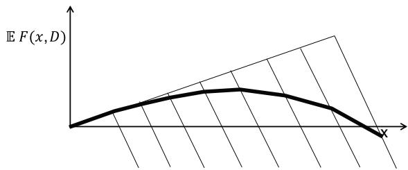  
(c)   
Figure 18.1 (a) The shape of the newsvendor problem for different values of the demand $D$ ; (b) The probability $P ( D = d )$ of each outcome of demand; (c) The expected profits as a function of $x$ .

features they should have, and where they should be stored. When a failure occurs, the company will find the closest unit that has the features required for a particular situation.

# EXAMPLE 18.2

An investment bank needs to allocate funds to various investments (long-term, high risk investments, real estate, stocks, index funds, bonds, money markets, CD’s). As opportunities arise, the bank will move money from one investment to another, but these transactions can take time to execute and cost money (for example, it is easiest and fastest to move money out of a money market fund).

# EXAMPLE 18.3

An online bookseller prides itself in fast delivery, but this requires holding books in inventory. If orders arrive when there is no inventory, the seller may have to delay filling the order (and risk losing it) or purchase the books at a higher cost from the publisher. If the inventory is too high, the company has to choose between holding the books in inventory (tying up space and capital), discounting the book to increase sales, or selling inventory to another distributor (at a substantial discount).

# EXAMPLE 18.4

An automotive manufacturer has to decide what models to design and build, and with what features. Given a three year design and build cycle, they have to create cars that will respond to an uncertain marketplace in the future. Once the models are built, customers have to adjust and purchase models that are closest to their wishes.

In all of these problems, we make an initial allocation decision. This could be the decision to purchase a type of equipment, build a particular model of car, or stock inventories of different types of product. Once the initial decision is made, we see information about the demand for the asset as well as the prices/costs derived from satisfying a demand (which can also be random). After this information is revealed, we may make new decisions. The goal is to make the best initial decisions given the potential downstream decisions that might be made. These problems are illustrated in Figure 18.2.

This problem combines “what to do” (what type of product, where to store it) with “how much.” It is a basic building block for much more complex, fully sequential resource allocation problems which we present next.

# 18.1.3 A General Multiperiod Resource Allocation Model*

The insights behind the newsvendor problem and the two-state resource allocation model can be leveraged into a fairly general model for dynamic resource allocation problems. In this model, we are managing a “resource” (people, equipment, blood, money, etc.) to serve “demands” (tasks, customers, and jobs). We note that this model is quite general, and can be used for some fairly complex resource allocation problems.

  
Figure 18.2 A two-stage allocation problem. The first-stage decisions have to be made before the second stage information becomes known. When this information is revealed, it is possible to re-allocate resources.

We describe the resources and demands using:

?????? = The number of resources with attribute $a \in { \mathcal { A } }$ in the system at time ??.

$$
R _ {t} = \left(R _ {t a}\right) _ {a \in \mathcal {A}}.
$$

$\begin{array} { r l } { D _ { t b } } & { { } = } \end{array}$ The number of demands of type $b \in { \mathcal { B } }$ in the system at time $t$

$$
{D _ {t}} = {(D _ {t b}) _ {b \in \mathcal {B}}.}
$$

Both $a$ and $b$ are vectors of attributes of resources and demands. The state of our system is given by

$$
S _ {t} = (R _ {t}, D _ {t}).
$$

New information is represented as exogenous changes to the resource and demand vectors, as well as to other parameters that govern the problem. These are modeled using:

??̂??+1,?? = Exogenous changes to $R _ { t a }$ from information that arrives during time interval ?? (between $t$ and $t + 1$ ).

??̂ ??+1,?? = Exogenous changes to $D _ { t b }$ from information that arrives during time interval $t$ (between $t$ and $t + 1$ ).

Our information process, then, is given by

$$
W _ {t + 1} = (\hat {R} _ {t + 1}, \hat {D} _ {t + 1}).
$$

In a blood management problem, $\hat { R } _ { t + 1 }$ included blood donations. In a model of complex equipment such as aircraft or locomotives, $\hat { R } _ { t + 1 }$ would also capture

equipment failures or delays. In a product inventory setting, $\hat { R } _ { t + 1 }$ could represent theft of product. $\hat { D } _ { t + 1 }$ usually represents new customer demands, but can also represent changes to an existing demand or cancelations of orders.

Decisions are modeled using:

$$
\begin{array}{r c l} \mathcal {D} ^ {D} & = & \text {D e c i s i o n t o s a t s i f y a d e m a n d w i t h a t t r i b u t e b (e a c h} \\ & & \text {d e c i s i o n d \in \mathcal {D} ^ {D} c o r r e s p o n d s t o a d e m a n d a t t r i b u t e b _ {d} \in \mathcal {B}) .} \end{array}
$$

$$
\begin{array}{r c l} \mathcal {D} ^ {M} & = & \text {D e c i s i o n t o m o d i f y a r e s o u r c e (e a c h d e c i s i o n d \in \mathcal {D} ^ {M} h a s} \\ & & \text {t h e e f f e c t o f m o d i f y i n g t h e a t t r i b u t e s o f t h e r e s o u r c e) .} \\ & & \mathcal {D} ^ {M} \text {i n c l u d e s t h e d e c i s i o n t o “ d o n o t h i n g .} \end{array}
$$

$$
\mathcal {D} = \mathcal {D} ^ {D} \cup \mathcal {D} ^ {M}.
$$

$$
\begin{array}{r c l} x _ {t a d} & = & \text {T h e n u m b e r o f r e s o u r c e s t h a t i n i t i a l l y h a v e a t b r i u t e a} \\ & & \text {t h a t w e a c t o n w i t h a d e c i s i o n o f t y p e d \in \mathcal {D}}. \end{array}
$$

$$
x _ {t} = (x _ {t a d}) _ {a \in \mathcal {A}, d \in \mathcal {D}}.
$$

The decisions have to satisfy constraints such as

$$
\sum_ {d \in \mathcal {D}} x _ {t a d} = R _ {t a}, \tag {18.2}
$$

$$
\sum_ {a \in \mathcal {A}} x _ {t a d} \leq D _ {t b _ {d}}, \quad d \in \mathcal {D} ^ {D}, \tag {18.3}
$$

$$
x _ {t a d} \geq 0. \tag {18.4}
$$

We let $\mathcal { X } _ { t }$ be the set of $x _ { t }$ that satisfy (18.2)–(18.4). As before, we assume that decisions are determined by a class of decision functions

$$
\begin{array}{r c l} X _ {t} ^ {\pi} (S _ {t}) & = & \text {a f u n c t i o n t h a t r e t u r n s a d e c i s i o n v e c t o r} x _ {t} \in \mathcal {X} _ {t}, \\ & & \text {w h e r e} \pi \in \Pi \text {i s a n e l e m e n t o f t h e s e t o f f u n c t i o n s (p o l i c i e s)} \Pi . \end{array}
$$

The transition function is given generically by

$$
S _ {t + 1} = S ^ {M} (S _ {t}, x _ {t}, W _ {t + 1}).
$$

We now have to deal with each dimension of our state variable. The most difficult, not surprisingly, is the resource vector $R _ { t }$ . This is handled primarily through the attribute transition function

$$
a _ {t} ^ {x} = a ^ {M, x} (a _ {t}, d),
$$

where $a _ { t } ^ { x }$ is the post-decision attribute (the attribute produced by action of type $a$ before any new information has become available). For algebraic purposes, we define the indicator function

$$
\delta_ {a ^ {\prime}} (a, d) = \left\{ \begin{array}{l l} 1 & \text {i f} a ^ {\prime} = a _ {t} ^ {x} = a ^ {M, x} (a _ {t}, d), \\ 0 & \text {o t h e r w i s e .} \end{array} \right.
$$

Using matrix notation, we can write the post-decision resource vector $R _ { t } ^ { x }$ using

$$
R _ {t} ^ {x} = \Delta R _ {t},
$$

where $\Delta$ is a matrix in which $\delta _ { a ^ { \prime } } ( a , d )$ is the element in row $a ^ { \prime }$ and column $( a , d )$ . We emphasize that the function $\delta _ { a ^ { \prime } } ( a , d )$ and matrix $\Delta$ are used purely for notational convenience; in a real implementation, we just work with the transition function $a ^ { M , x } ( a _ { t } , d _ { t } )$ . The pre-decision resource state vector is given by

$$
R _ {t + 1} = R _ {t} ^ {x} + \hat {R} _ {t + 1}.
$$

We model demands in a simple way. If a resource is assigned to a demand, then it is “served” and then it vanishes from the system. Otherwise, it is held to the next time period. Let

$$
\begin{array}{l} \begin{array}{r c l} \delta D _ {t b _ {d}} (x) & = & \text {t h e n u m b e r o f d e m a n d s o f t y p e} b _ {d} \text {t h a t a r e s e r v e d} \\ & & \text {a t t i m e} t, \end{array} \\ = \sum_ {a \in \mathcal {A}} x _ {t a d} d \in \mathcal {D} ^ {D}, \\ \delta D _ {t} = (\delta D _ {t b}) _ {b \in \mathcal {B}}. \\ \end{array}
$$

The demand transition function can be written

$$
\begin{array}{l} {D _ {t} ^ {x}} = {D _ {t} - \delta D _ {t} (x),} \\ {D _ {t + 1}} = {D _ {t} ^ {x} + \hat {D} _ {t}.} \\ \end{array}
$$

The last dimension of our model is the objective function. For our resource allocation problem, we define a contribution for each decision given by

$$
\begin{array}{r c l} c _ {a d} & = & \text {c o n t r i b u t i o n e a r n e d (n e g a t i v e i f i t i s a c o s t) f r o m u s i n g} \\ & & \text {d e c i s i o n d a c t i n g o n r e s o u r c e s w i t h a t t r i b u t e a .} \end{array}
$$

The contribution function for time period $t$ is assumed to be linear, given by

$$
C (S _ {t}, x _ {t}) = \sum_ {a \in \mathcal {A}} \sum_ {d \in \mathcal {D}} c _ {a d} x _ {t a d}.
$$

The objective function is now given by

$$
\max _ {\pi \in \Pi} \mathbb {E} \left\{\sum_ {t = 0} ^ {T} C (S _ {t}, X _ {t} ^ {\pi} (S _ {t})) | S _ {0} \right\}.
$$

# 18.2 Values Versus Marginal Values

It is common in dynamic programming to talk about the problem of estimating the value of being in a state. When we are working on resource allocation problems, we have to make the transition from using the value of being in a state (which is extremely high dimensional for these problems) to using the marginal value of an additional resource $R _ { t a }$ with attribute $a$ (if we are using our multiattribute notation). So, instead of finding a single value $V _ { t } ( R _ { t } )$ for a highdimensional vector $R _ { t }$ , we are going to compute values $\hat { v } _ { t a }$ for each $a \in { \mathcal { A } }$ giving the marginal value of increasing $R _ { t a }$ . This means we are going to compute a vector of marginal values $\hat { v } _ { t } = ( \hat { v } _ { t a } ) _ { a \in \mathcal { A } }$ instead of a single $V _ { t } ( R _ { t } )$ .

We are going to use the context of resource allocation problems to illustrate the power of using the gradient. In principal, the challenge of estimating the slope of a function is the same as that of estimating the function itself (the slope is simply a different function). However, there can be important, practical advantages to estimating slopes. First, we may be able to approximate $V _ { t } ( R _ { t } )$ using a linear approximation, or a piecewise linear, separable approximation.

A second and equally important difference is that if we estimate the value of being in a state, we get one estimate of the value of being in a state when we visit that state. When we estimate a gradient, we get an estimate of a derivative for each type of resource all at the same time. For example, if $R _ { t } = ( R _ { t a } ) _ { a \in \mathcal { A } }$ is our resource vector and $V _ { t } ( R _ { t } )$ is our value function, then the gradient of the value function with respect to $R _ { t }$ would look like

$$
\nabla_ {R _ {t}} V _ {t} (R _ {t}) = \left( \begin{array}{c} \hat {v} _ {t a _ {1}} \\ \hat {v} _ {t a _ {2}} \\ \vdots \\ \hat {v} _ {t a _ {| \mathcal {A} |}} \end{array} \right),
$$

where

$$
\hat {v} _ {t a _ {i}} = \frac {\partial V _ {t} (R _ {t})}{\partial R _ {t a _ {i}}}.
$$

There may be additional work required to obtain each element of the gradient, but the incremental work can be far less than the work required to

get the value function itself. This is particularly true when the optimization problem naturally returns these gradients (for example, dual variables from a linear program), but this can even be true when we have to resort to numerical derivatives. Once we have all the calculations to solve a problem, solving small perturbations can be relatively inexpensive.

There is one important problem class where finding the value of being in a state is equivalent to finding the derivative. That is the case of managing a single resource. In this case, the state of our system (the resource) is the attribute vector $a$ , and we are interested in estimating the value $V ( a )$ of our resource being in state $a$ . Alternatively, we can represent the state of our system using the vector $R _ { t }$ , where $R _ { t a } ~ = ~ 1$ indicates that our resource has attribute $a$ (we assume that $\begin{array} { r } { \sum _ { a \in \mathcal { A } } R _ { t a } = 1 } \end{array}$ ). In this case, the value function can be written

$$
V _ {t} (R _ {t}) = \sum_ {a \in \mathcal {A}} v _ {t a} R _ {t a}.
$$

Here, the coefficient $v _ { t a }$ is the derivative of $V _ { t } ( R _ { t } )$ with respect to $R _ { t a }$

In a typical implementation of an approximate dynamic programming algorithm, we would only estimate the value of a resource when it is in a particular state (given by the attribute vector $a$ ). This is equivalent to finding the derivative $\hat { v } _ { a }$ only for the value of $a$ where $R _ { t a } = 1$ . By contrast, computing the gradient $\nabla _ { R _ { t } } V _ { t } ( R _ { t } )$ implicitly assumes that we are computing $\hat { v } _ { a }$ for each $a \in { \mathcal { A } }$ . There are some algorithmic strategies (we will describe an example of this in section 18.6) where this assumption is implicit in the algorithm. Computing $\hat { v } _ { a }$ for all $a \in { \mathcal { A } }$ is reasonable if the attribute state space is not too large (for example, if $a$ is a physical location among a set of several hundred locations). If $a$ is a vector, then enumerating the attribute space can be prohibitive (it is, in effect, the “curse of dimensionality” revisited).

Given these issues, it is critical to first determine whether it is necessary to estimate the slope of the value function, or the value function itself. The result can have a significant impact on the algorithmic strategy.

# 18.3 Piecewise Linear Approximations for Scalar Functions

There are many problems where we have to estimate the value of having a quantity $R$ of some resource (where $R$ is a scalar). We might want to know the value of having $R$ dollars in a budget, $R$ pieces of equipment, or $R$ units of some inventory. $R$ may be discrete or continuous, but we are going to focus on problems where $R$ is either discrete or is easily discretized.

Assume we have a function that is monotonically decreasing, which means that while we do not know the value function exactly, we know that $V ( R + 1 ) \leq$ $V ( R )$ (for scalar $R$ ). If our function is piecewise linear concave, then we will assume that $V ( R )$ refers to the slope at $R$ (more precisely, to the right of $R$ ). Assume our current approximation ${ \overline { { V } } } ^ { n - 1 } ( R )$ satisfies this property, and that at iteration ??, we have a sample observation of $V ( R )$ for $R = R ^ { n }$ . If our function is piecewise linear concave, then $\hat { v } ^ { n }$ would be a sample realization of a derivative of the function. If we use our standard updating algorithm, we would write

$$
\overline {{V}} ^ {n} (R ^ {n}) = (1 - \alpha_ {n - 1}) \overline {{V}} ^ {n - 1} (R ^ {n}) + \alpha_ {n - 1} \vartheta^ {n}.
$$

After the update, it is quite possible that our updated approximation no longer satisfies our monotonicity property. We review two strategies for maintaining monotonicity:

The leveling algorithm – A simple method that imposes monotonicity by simply forcing elements of the series which violate monotonicity to a larger or smaller value so that monotonicity is restored.

The CAVE algorithm – If there is a monotonicity violation after an update, CAVE simply expands the range of the function over which the update is applied.

# 18.3.1 The Leveling Algorithm

The leveling algorithm uses a simple updating logic that can be written as follows:

$$
\overline {{V}} ^ {n} (y) = \left\{ \begin{array}{l l} (1 - \alpha_ {n - 1}) \overline {{V}} ^ {n - 1} (R ^ {n}) + \alpha_ {n - 1} \hat {v} ^ {n} & \text {i f} y = R ^ {n}, \\ \overline {{V}} ^ {n} (y) \vee \left\{(1 - \alpha_ {n - 1}) \overline {{V}} ^ {n - 1} (R ^ {n}) + \alpha_ {n - 1} \hat {v} ^ {n} \right\} & \text {i f} y > R ^ {n}, \\ \overline {{V}} ^ {n} (y) \wedge \left\{(1 - \alpha_ {n - 1}) \overline {{V}} ^ {n - 1} (R ^ {n}) + \alpha_ {n - 1} \hat {v} ^ {n} \right\} & \text {i f} y <   R ^ {n}, \end{array} \right. \tag {18.5}
$$

where $x \wedge y \ = \ \operatorname* { m a x } \{ x , y \}$ , and $x \vee y \ = \ \operatorname* { m i n } \{ x , y \}$ . Equation (18.5) starts by updating the slope $\overline { { V } } ^ { n } ( y )$ for $y = R ^ { n }$ . We then want to make sure that the slopes are declining. So, if we find a slope to the right that is larger, we simply bring it down to our estimated slope for $y = R ^ { n }$ . Similarly, if there is a slope to the left that is smaller, we simply raise it to the slope for $y \ : = \ : R ^ { n }$ . The steps are illustrated in Figure 18.3.

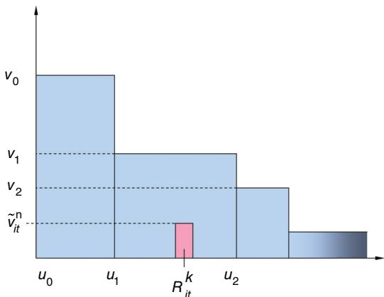

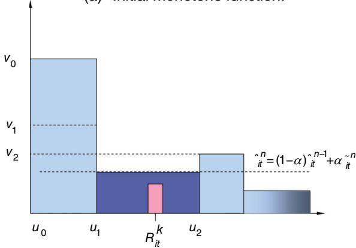  
(a) Initial monotone function.

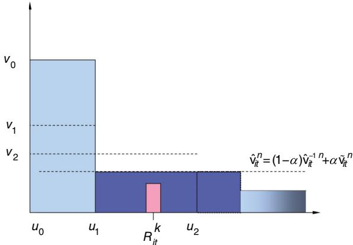  
(b) After update of a single segment.   
(c) After leveling operation.   
Figure 18.3 Steps of the leveling algorithm. Figure 18.3a shows the initial monotone function, with the observed ?? and observed value of the function $\hat { v }$ . Figure 18.3b shows the function after updating the single segment, producing a non-monotone function. Figure 18.3c shows the function after monotonicity restored by leveling the function.

# 18.3.2 The CAVE Algorithm

A particularly useful variation is to perform an initial update (when we compute $\bar { y }$ ) over a wider interval than just $y = R ^ { n }$ . Assume we are given a parameter $\delta ^ { 0 }$ which has been chosen so that it is approximately 20 to 50 percent of the maximum value that $R ^ { n }$ might take. Now compute $\overline { { \boldsymbol { V } } } ^ { \bar { n } } ( y )$ using

$$
\overline {{V}} ^ {n} (y) = \left\{ \begin{array}{l l} (1 - \alpha_ {n - 1}) \overline {{V}} ^ {n - 1} (y) + \alpha_ {n - 1} \hat {v} ^ {n}, & R ^ {n} - \delta^ {n} \leq y \leq R ^ {n} + \delta^ {n}, \\ \overline {{V}} ^ {n - 1} (y) & \text {o t h e r w i s e}. \end{array} \right.
$$

Here, we are using $\hat { v } ^ { n }$ to update a wider range of the interval. We then apply the same logic for maintaining monotonicity (concavity if these are slopes). We start with the interval $R ^ { n } \pm \delta ^ { 0 }$ , but we have to periodically reduce $\delta ^ { 0 }$ . We might, for example, track the objective function (call it $F ^ { n }$ ), and update the range using

$$
\delta^ {n} = \left\{ \begin{array}{l l} \delta^ {n - 1} & \text {i f F ^ {n} \geq F ^ {n - 1} - \epsilon}, \\ \max  \{1, . 5 \delta^ {n - 1} \} & \text {o t h e r w i s e}. \end{array} \right.
$$

While the rules for reducing $\delta ^ { n }$ are generally ad hoc, we have found that this is critical for fast convergence. The key is that we have to pick $\delta ^ { 0 }$ so that it plays a critical scaling role, since it has to be set to be roughly on the order of the maximum value that $R ^ { n }$ can take.

The CAVE algorithm, properly tuned, is likely to be the better of the two methods, but tuning is important and introduces an additional step. We suggest using CAVE if you anticipate that you are going to be doing quite a bit of work with a particular problem class.

# 18.4 Regression Methods

As in chapter 3 we can create regression models where the are manipulations of the number of resources of each type. For example, we might use

$$
\bar {V} (R) = \theta_ {0} + \sum_ {a \in \mathcal {A}} \theta_ {1 a} R _ {a} + \sum_ {a \in \mathcal {A}} \theta_ {2 a} R _ {a} ^ {2}, \tag {18.6}
$$

where $\theta ~ = ~ ( \theta _ { 0 } , ( \theta _ { 1 r } ) _ { r \in \mathcal { R } } , ( \theta _ { 2 r } ) _ { r \in \mathcal { R } } )$ is a vector of parameters that are to be determined. The choice of explanatory terms in our approximation will generally reflect an understanding of the properties of our problem. For example, equation (18.6) assumes that we can use a mixture of linear and separable quadratic terms. A more general representation is to assume that we have developed a family $\mathcal { F }$ of basis functions $( \phi _ { f } ( R ) ) _ { f \in \mathcal { F } }$ . Examples of a basis function are

$$
\phi_ {f} (R) = R _ {\alpha_ {f}} ^ {2},
$$

$$
\phi_ {f} (R) = \left(\sum_ {a \in \mathcal {A} _ {f}} R _ {a}\right) ^ {2} \text {f o r s o m e s u b s e t} \mathcal {R} _ {f},
$$

$$
\phi_ {f} (R) = \left(R _ {a _ {1}} - R _ {a _ {2}}\right) ^ {2},
$$

$$
\phi_ {f} (R) = | R _ {a _ {1}} - R _ {a _ {2}} |.
$$

A common strategy is to capture the number of resources at some level of aggregation. For example, if we are purchasing emergency equipment, we may care about how many pieces we have in each region of the country, and we may also care about how many pieces of a type of equipment we have (regardless of location). These issues can be captured using a family of aggregation functions $G _ { f }$ , $f \in \mathcal F$ , where $G _ { f } ( a )$ aggregates an attribute vector $a$ into a space $\mathcal { R } ^ { ( f ) }$ where for every basis function $f$ there is an element $\boldsymbol { a } _ { f } \in \mathcal { R } ^ { ( f ) }$ . Our basis function might then be expressed using

$$
\phi_ {f} (R) = \sum_ {a \in \mathcal {A}} \mathbb {1} _ {\{G _ {f} (a) = a _ {f} \}} R _ {a}.
$$

We have written our basis functions purely in terms of the resource vector, but it is possible for them to be written in terms of other parameters in a more complex state vector, such as asset prices.

Given a set of basis functions, we can write our value function approximation as

$$
\bar {V} (R | \theta) = \sum_ {f \in \mathcal {F}} \theta_ {f} \phi_ {f} (R). \tag {18.7}
$$

It is important to keep in mind that $\overline { { V } } ( R | \theta )$ (or more generally, ${ \overline { { V } } } ( S | \theta ) )$ , is any functional form that approximates the value function as a function of the state vector parameterized by ??. Equation (18.7) is a classic linear-in-the-parameters function. We are not constrained to this form, but it is the simplest and offers some algorithmic shortcuts.

The issues that we encounter in formulating and estimating $\overline { { V } } ( R | \theta )$ are the same that any student of statistical regression would face when modeling a complex problem. The major difference is that our data arrives over time (iterations), and we have to update our formulas recursively. Also, it is typically the case that our observations are nonstationary. This is particularly true when an update of a value function depends on an approximation of the value function in the future (as occurs with value iteration or any of the TD(??) classes of algorithms). When we are estimating parameters from nonstationary data, we do not want to equally weight all observations.

The problem of finding $\boldsymbol { \theta }$ can be posed in terms of solving the following stochastic optimization problem

$$
\min _ {\theta} \mathbb {E} \frac {1}{2} (\overline {{V}} (R | \theta) - \hat {V}) ^ {2}.
$$

We can solve this using a stochastic gradient algorithm, which produces updates of the form

$$
\begin{array}{l} {\bar {\theta} ^ {n}} = {\bar {\theta} ^ {n - 1} - \alpha_ {n - 1} (\overline {{V}} (R ^ {n} | \bar {\theta} ^ {n - 1}) - \hat {V} (\omega^ {n})) \nabla_ {\theta} \overline {{V}} (R ^ {n} | \theta^ {n})} \\ \begin{array}{r l} {=} & {\bar {\theta} ^ {n - 1} - \alpha_ {n - 1} (\overline {{V}} (R ^ {n} | \bar {\theta} ^ {n - 1}) - \hat {V} (\omega^ {n})) \left( \begin{array}{c} \phi_ {1} (R ^ {n}) \\ \phi_ {2} (R ^ {n}) \\ \vdots \\ \phi_ {F} (R ^ {n}) \end{array} \right).} \end{array} \\ \end{array}
$$

If our value function is linear in $R _ { t }$ , we would write

$$
\overline {{V}} (R | \theta) = \sum_ {a \in \mathcal {A}} \theta_ {a} R _ {a}.
$$

In this case, our number of parameters has shrunk from the number of possible realizations of the entire vector $R _ { t }$ to the size of the attribute space (which, for some problems, can still be large, but nowhere near as large as the original state space). For this problem, $\phi ( R ^ { n } ) = R ^ { n }$ .

It is not necessarily the case that we will always want to use a linear-in-theparameters model. We may consider a model where the value increases with the number of resources, but at a declining rate that we do not know. Such a model could be captured with the representation

$$
\overline {{V}} (R | \theta) = \sum_ {a \in \mathcal {A}} \theta_ {1 a} R _ {a} ^ {\theta_ {2 a}},
$$

where we expect $\theta _ { 2 } ~ < ~ 1$ to produce a concave function. Now, our updating formula will look like

$$
\begin{array}{l} \theta_ {1} ^ {n} = \theta_ {1} ^ {n - 1} - \alpha_ {n - 1} (\overline {{V}} (R ^ {n} | \bar {\theta} ^ {n - 1}) - \hat {V} (\omega^ {n})) (R ^ {n}) ^ {\theta_ {2}}, \\ \theta_ {2} ^ {n} = \theta_ {2} ^ {n - 1} - \alpha_ {n - 1} (\overline {{V}} (R ^ {n} | \bar {\theta} ^ {n - 1}) - \hat {V} (\omega^ {n})) (R ^ {n}) ^ {\theta_ {2}} \ln R ^ {n} \\ \end{array}
$$

where we assume the exponentiation operator in $( R ^ { n } ) ^ { \theta _ { 2 } }$ is performed componentwise.

We can put this updating strategy in terms of temporal differencing. As before, the temporal difference is given by

$$
\delta_ {\tau} = C _ {\tau} (R _ {\tau}, x _ {\tau + 1}) + \overline {{V}} _ {\tau + 1} ^ {n - 1} (R _ {\tau + 1}) - \overline {{V}} _ {\tau} ^ {n - 1} (R _ {\tau}).
$$

The original parameter updating formula (equation (16.7)) when we had one parameter per state now becomes

$$
{\bar {\theta} ^ {n}} = {\bar {\theta} _ {t} ^ {n - 1} + \alpha_ {n - 1} \sum_ {\tau = t} ^ {T} \lambda^ {\tau - t} \delta_ {\tau} \nabla_ {\theta} \overline {{V}} (R ^ {n} | \bar {\theta} ^ {n}).}
$$

It is important to note that in contrast with most of our other applications of stochastic gradients, updating the parameter vector using gradients of the objective function requires mixing the units of $\boldsymbol { \theta }$ with the units of the value function. In these applications, the stepsize $\alpha _ { n - 1 }$ has to also perform a scaling role.

# 18.5 Separable Piecewise Linear Approximations

Scalar, piecewise linear functions have proven to be an exceptionally powerful way of solving high dimensional stochastic resource allocation problems. We can describe the algorithm with a minimum of technical details using what is known as a “plant-warehouse-customer” model, which we presented in section 18.1.2. Imagine that we have the problem depicted in Figure 18.4a. We start by shipping “product” out of the four “plant” nodes on the left, and we have to decide how much to send to each of the five “warehouse” nodes in the middle. After making this decision, we then observe the demands at the five “customer” nodes on the right.

We can solve this problem using separable, piecewise linear value function approximations. Assume we have an initial estimate of a piecewise linear value function for resources at the warehouses (setting these equal to zero is fine). This gives us the network shown in Figure 18.4b, which is a small linear program, even when we have hundreds (or thousands) of plant and warehouse nodes. Solving this problem gives us a solution of how much to send to each node.

We then use the solution to the first stage (which gives us the resources available at each warehouse node), take a Monte Carlo sample of each of the demands, and solve a second linear program that sends product from each warehouse to each customer. What we want from this stage is the dual variable for each warehouse node, which gives us an estimate of the marginal value of resources at each node. Note that some care needs to be used here, because these dual variables are not actually estimates of the value of one more resource, but rather are subgradients, which means that they may be the value of the last resource or the next resource, or something in between.

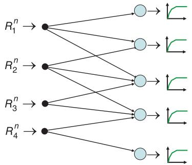  
(a) The two-stage problem with stochastic second-stage data.

  
(b) Solving the first stage using a separable, piecewise linear approximation of the second stage.   
(c) Solving a Monte Carlo realization of the second stage and obtainin dual variables.   
Figure 18.4 Steps in estimating separable, piecewise-linear approximations for two-stage stochastic programs.

Finally, we use these dual variables to update the piecewise linear value functions using the methods described earlier. This process is repeated until the solution no longer seems to be improving.

Although we have described this algorithm in the context of a two-stage problem, the same basic strategy can be applied for problems with many time periods. Using approximate value iteration (TD(0)), we would step forward in time, and after solving each linear program we would stop and use the dual variables for the constraints (18.2) to update the value functions from the previous time period (more specifically, around the previous post-decision state). For a finite horizon problem, we would proceed until the last time period, then repeat the entire process until the solution seems to be converging.

With more work, we can implement a backward pass (TD(1)) by avoiding any value function updates until we reach the final time period, but we would have to retain information about the effect of incrementing the resources at each node by one unit (this is best done with a numerical derivative). We would then need to step back in time, computing the marginal value of one more resource at time ?? using information about the value of one more resource at time $t + 1$ . These marginal values would be used to update the value function approximations.

This algorithmic strategy has some nice features:

● This is a very general model with applications that span equipment, people, product, money, energy, and vaccines. It is ideally suited for “single layer” resource allocation problems (one type of resource, rather than pairs such as pilots and aircraft, blood and patients, or trucks and deliveries), although many two-layer problems can be reasonably approximated as single-layer problems.   
● The methodology scales to very large problems, with hundreds or thousands of nodes, and tens of thousands of dimensions in the decision vector.   
● We do not need to solve the exploration-exploitation problem. A pure exploitation strategy works fine. The reason has to do with the concavity of the value function approximations, which has the effect of pushing suboptimal value functions toward the correct solution.   
● Piecewise linear value function approximations are quite robust, and avoid making any simplifying assumptions about the shapes of the value functions.

# 18.6 Benders Decomposition for Nonseparable Approximations**

While the use of separable, piecewise linear approximations has proven effective (especially for discrete problems where flows need to be integer), the use

of a separable approximation will inevitably introduce errors. It is possible to create a nonseparable approximation using an approach called Benders decomposition which approximates the value function by minimizing over a set of linear hyperplanes, known as cutting planes.

We are going to begin by presenting the idea of Benders decomposition for a simple two-stage resource allocation problem.

# 18.6.1 Benders’ Decomposition for Two-Stage Problems

Cutting planes represent a powerful strategy for representing concave (or convex if we are minimizing), piecewise-linear functions for multidimensional problems. This method evolved originally as a technique in the 1970s for solving complex integer programs which benefited from separating decision variables into two classes (say, optimizing warehouse locations, and then allocating demands to warehouses). The method was then adapted to the types of sequential decision problems in the early 1990s that arise in two-stage and multistage stochastic resource allocation problem.

Historically, dynamic programming has been viewed as a technique for small, discrete optimization problems, while stochastic programming has been the field that handles uncertainty within math programs (which are typically characterized by high-dimensional decision vectors and large numbers of constraints). The connections between stochastic programming and dynamic programming, historically viewed as diametrically competing frameworks, have been largely overlooked. This section is designed to bridge the gap between stochastic programming and approximate dynamic programming. Our presentation is facilitated by notational decisions (such as our use of $x _ { t }$ for decisions), and our use of the post-decision state variable, which eliminates the expectation from within the maximization problem for each period.

In this section, we are going to put our sampling in the context of an iterative algorithm, where we choose sample $\omega ^ { n }$ at the $n ^ { t h }$ iteration. This contrasts with our previous style of choosing a fixed sample $w _ { 1 } , \dots , w _ { K }$ . We just want to emphasize that the change in notation reflects a change in the context of how sampling is done. We do this because we may have to choose a sample $w _ { 1 } ^ { n } , \ldots , w _ { K } ^ { n }$ at the $n ^ { t h }$ iteration.

For example, let $R _ { t }$ be the vector of inventories of product at each of the fulfillment centers, and let $x _ { t }$ be the replenishment decisions that will arrive at time $t + 1$ . The decisions $x _ { t }$ have to satisfy a set of constraints that we represent generically as

$$
A _ {t} x _ {t} = R _ {t}.
$$

These inventories have to be used to satisfy random demands $D _ { t + 1 }$ (which have the same dimensionality as $R _ { t }$ ). The inventories $R _ { t + 1 }$ are then given by

$$
R _ {t + 1} = B _ {t} x _ {t} + \hat {R} _ {t + 1},
$$

where $x _ { t }$ is the vector of flows from one facility to the next, and the matrix $B _ { t }$ sums the flows into each facility. Here, we have added in some noise, $\hat { R } _ { t + 1 }$ , that might account for damaged or delayed shipments. We would also have observed the demands $D _ { t + 1 }$ , and updated transportation costs $c _ { t + 1 }$ , which are random because of the need to move by for-hire trucking companies. We also note that the matrices $A _ { t }$ and $B _ { t }$ capture travel times; if these are random, then at time $t$ the matrices $A _ { t + 1 }$ and $B _ { t + 1 }$ are also random.

This means the information that is revealed by time $t + 1$ is

$$
W _ {t + 1} = (A _ {t + 1}, B _ {t + 1}, c _ {t + 1}, D _ {t + 1}, \hat {R} _ {t + 1}),
$$

which in turn gives us our (pre-decision) state at time $t + 1$ a s

$$
S _ {t + 1} = \left(R _ {t + 1}, A _ {t + 1}, B _ {t + 1}, c _ {t + 1}, D _ {t + 1}\right).
$$

We are going to simplify our presentation by assuming that $A _ { t + 1 }$ , $B _ { t + 1 }$ , $c _ { t + 1 }$ and $D _ { t + 1 }$ are independent of any previous information (a property known as interstage independence in the stochastic programming literature), which means that our post-decision state is

$$
S _ {t} ^ {x} = R _ {t} ^ {x} = B _ {t} x _ {t}.
$$

Since $S _ { t } ^ { x }$ is determined by $x _ { t }$ , the stochastic programming literature writes this state variable as $x _ { t }$ which, while mathematically accurate, is of much higher dimensionality than $R _ { t } ^ { x }$ (which could be a scalar if we have a single warehouse that holds inventories). Either representation works fine for what we are going to do.

If we use the pre-decision state, the problem to find $x _ { t }$ at time $t$ is given by

$$
\max  _ {x _ {t}} \left(c _ {t} x _ {t} + \mathbb {E} _ {W _ {t + 1}} V _ {t + 1} \left(R _ {t + 1}, W _ {t + 1}\right)\right). \tag {18.8}
$$

Note that the information vector $W _ { t + 1 }$ is extremely high dimensional, which would complicate both taking the expectation $\mathbb { E } _ { W _ { t + 1 } }$ as well as approximating $V _ { t + 1 } ( R _ { t + 1 } , W _ { t + 1 } )$ . But if we use the post-decision state, we get the much simpler problem

$$
\max  _ {x _ {t}} \left(c _ {t} x _ {t} + V _ {t} ^ {x} \left(R _ {t} ^ {x}\right)\right). \tag {18.9}
$$

This problem is solved subject to the constraints,

$$
A _ {t} x _ {t} = R _ {t}, \tag {18.10}
$$

$$
x _ {t} \geq 0, \tag {18.11}
$$

where (18.10) represents constraints on how much inventory can be placed in each fulfillment center (captured by $R _ { t }$ ).

We then solve the second stage problem (at time $t { + } 1$ ) to determine $x _ { t + 1 }$ , given the first stage decisions. Assume that we observe outcome $\omega$ for the random variable ??. We get to see the new information $W _ { t + 1 } ( \omega )$ before we compute $x _ { t + 1 }$ , so we capture this by writing $x _ { t + 1 } ( \omega )$ . The resulting problem would be written

$$
V _ {t + 1} \left(x _ {t}, W _ {t + 1} (\omega)\right) = \max  _ {x _ {t + 1} (\omega)} c _ {t + 1} (\omega) x _ {t + 1} (\omega), \tag {18.12}
$$

subject to, for all $\omega \in \Omega$ ,

$$
A _ {t + 1} (\omega) x _ {t + 1} (\omega) \leq R _ {t + 1} (\omega), \tag {18.13}
$$

$$
B _ {t + 1} (\omega) x _ {t + 1} (\omega) \leq D _ {t + 1} (\omega), \tag {18.14}
$$

$$
x _ {t + 1} (\omega) \geq 0. \tag {18.15}
$$

Equation (18.13) imposes flow conservation on the flows of inventories. Equation (18.14) represents the demand constraints, where we assume our contribution vector $c _ { t + 1 }$ is designed to give a high incentive to meet demand. Let $\beta _ { t + 1 } ( \omega )$ be the dual variable of the resource constraint (18.13) which reflects the effect of the time ?? decision $x _ { t }$ on time period $t + 1$ .

Our strategy will be to replace $V _ { t } ^ { x } ( x _ { t } )$ with an approximation that is created by generating a series of hyperplanes, and then taking the minimum across these hyperplanes as our approximation. This “approximation” will, in the limit, produce an exact representation of $V _ { t } ^ { x } ( x _ { t } )$ .

The value function $V _ { t + 1 } ( x _ { t } , W _ { t + 1 } )$ is known in the stochastic programming literature as the recourse function since it allows us to respond to different outcomes using the recourse variables $x _ { t + 1 } ( \omega )$ which are chosen after choosing $x _ { t }$ and observing $W _ { t + 1 } ( \omega )$ . Thus, we might want to satisfy demand in Texas from a nearby fulfillment center in Houston, but if that center does not have sufficient inventory, our recourse is to satisfy demand from a more distant center in Chicago.

We face the challenge of approximating the function $\begin{array} { r l } { V _ { t + 1 } ( x _ { t } ) } & { { } = } \end{array}$ $\mathbb { E } V _ { t + 1 } ( x _ { t } , W _ { t + 1 } )$ so that we can solve the initial problem for $x _ { t }$ in equation (18.9). It would also be nice if we could do this in a way so that we can solve

the first stage problem as a linear program, which makes it easy to handle the vector $x _ { t }$ . There are several strategies we can draw on, but here we are going to illustrate a powerful idea known as Benders decomposition. In a nutshell, our second stage function $V _ { t + 1 } ( x _ { t } , W _ { t + 1 } )$ is a linear program, which means that it is concave in the right hand side constraint $B _ { 1 } x _ { 0 }$ (because we are maximizing).

We illustrate Benders decomposition in the context of solving a sampled version of the problem. We do this by replacing our original full sample space $\Omega$ (over which the original expectation ?? is defined) with a sampled set of outcomes $\mathcal { W } = ( \omega ^ { 1 } , \dots , \omega ^ { N } )$ . For each solution, we would obtain the optimal value $\hat { V } _ { t + 1 } ( x _ { t } , w )$ , and the corresponding dual variable $\beta ( w )$ for $w \in \mathcal { W }$ . We then average over the outcomes to create an approximation of the post-decision value function $V _ { t } ^ { x } ( x _ { t } )$ which we denote $\overline { { V } } _ { t } ^ { x } ( x _ { t } )$ , given by

$$
\overline {{V}} _ {t} ^ {x} (x _ {t}) = \frac {1}{N} \sum_ {n = 1} ^ {N} \hat {V} _ {t + 1} (x _ {t}, \omega^ {n}).
$$

Benders decomposition iteratively builds up an approximation of $V _ { t + 1 } ( x _ { t } )$ by constructing a series of supporting hyperplanes (see Figure 18.5) derived by solving the second stage linear program for individual samples $w$ of the random vector $W _ { t + 1 }$ . We do this by solving equations (18.12)–(18.15) for the sample realizations $\Omega = \{ \omega ^ { n } , n = 1 , \ldots , N \}$ , and obtain

$$
\alpha_ {t + 1} ^ {n} (\omega^ {n}) = V _ {t + 1} (x _ {t}, W _ {t + 1} (\omega^ {n})),
$$

$$
\beta_ {t + 1} ^ {n} = \beta_ {t + 1} (\omega^ {n}).
$$

  
Figure 18.5 Illustration of Benders cuts shown next to exact $( V _ { t + 1 } ( x _ { t } ) )$ and sampled $( \hat { V } _ { t + 1 } ( x _ { t } ) )$ recourse functions.

where $\beta _ { t + 1 } ( \omega ^ { n } )$ is the dual variable for constraint (18.13). We then solve

$$
x _ {t} ^ {*} = \arg \max  _ {x _ {t}, z _ {t}} \left(c _ {t} x _ {t} + z _ {t}\right), \tag {18.16}
$$

subject to (18.10)–(18.11) and

$$
z _ {t} \leq \alpha_ {t + 1} ^ {n} (\omega^ {n}) + \beta_ {t + 1} ^ {n} (\omega^ {n}) x _ {t}, n = 1, \dots , N. \tag {18.17}
$$

Equation (18.17) creates a multidimensional envelop, depicted in Figure 18.5, which depicts the sampled function $\hat { V } _ { t + 1 } ( x _ { t } )$ and the original true function $V _ { t + 1 } ( x _ { t } )$ . Note that the hyperplanes touch the sampled function $\hat { V } _ { t + 1 } ( x _ { t } )$ , but only approximate the true function $V _ { t + 1 } ( x _ { t } )$ .

Our indexing of time deserves a bit of explanation. The coefficients $\alpha _ { t + 1 } ^ { n } ( \omega ^ { n } )$ and $\beta _ { t + 1 } ^ { n } ( \omega ^ { n } )$ are indexed by $t + 1$ because they depend on the specific sampled observation $W _ { t + 1 } ( \omega )$ of the new information that becomes known by $t { + } 1$ . However, $\scriptstyle { z _ { t } }$ works like an expectation; equation 18.17 is taking the minimum across all these cuts, creating $\scriptstyle { z _ { t } }$ which does not depend on a single realization $\omega$ .

The steps of the algorithm implementing this method are shown in Figure 18.6.

We close by noting that this is one way of solving convex problems, but it requires assuming that the sampled approximation will provide a good solution. This has opened a body of literature focusing on the design of good samples, which is challenging in the high dimensional settings of linear programs.

It would be easy to conclude that using multidimensional Benders cuts would be better than using separable, piecewise linear approximations. The separable, piecewise linear approximations are particularly useful when managing discrete resources (trucks, locomotives) since it is much easier to obtain integer solutions when using a piecewise linear approximation where the kinks occur on integer values of $R _ { t a }$ .

We compared the two approaches in the setting of managing energy for a fleet of batteries connected on the grid, where the amount of energy being stored in each battery is continuous. Also, because it is easy to move energy between any pair of locations on the grid, we would expect the problem to be highly nonseparable. Figure 18.7 shows the performance of Benders cuts (see the upper bound performance) against separable, piecewise linear value function approximations for grids with 25 batteries (a) and 50 batteries (b).

The results show that the SPWL approximation has slightly faster convergence for the case with 25 batteries. For the grid with 50 batteries, the separable approximation seems to show much faster convergence. We suspect a reason that the separable approximation works so well is that the updates are more efficient; Benders cuts in high dimensions are less efficient because the cuts do

Step 0. Initialization:

Step 0a. Initialize $V _ { t } ^ { 0 }$

Step 0b. Set $n = 1$

Step 1. Solve

$$
x _ {t} ^ {n} = \arg \max  _ {x _ {t}, z _ {t}} \left(c _ {t} x _ {t} + z _ {t}\right),
$$

subject to

$$
z _ {t} \leq \alpha_ {t + 1} ^ {m} (\omega^ {m}) + \beta_ {t + 1} ^ {m} (\omega^ {m}) x _ {t}, m = 1, \dots , n - 1.
$$

Step 2. For $k = 1 , \dots , K$ :

$$
\hat {V} _ {t + 1} (x _ {t} ^ {n}, W _ {t + 1} (\omega^ {k})) = \max _ {x _ {t + 1} (\omega^ {k})} c _ {t + 1} (\omega^ {k}) x _ {t + 1} (\omega^ {k}),
$$

subject to (18.13)-(18.15). Obtain dual $\beta _ { t + 1 } ^ { n } ( \omega ^ { k } )$ for equation (18.14) for each $\omega ^ { k }$ .

Step 3. Compute:

$$
{\alpha_ {t} ^ {n}} = {\frac {1}{K} \sum_ {k = 1} ^ {K} \hat {V} _ {t + 1} (x _ {t} ^ {n}, \omega^ {k}),}
$$

$$
\beta_ {t} ^ {n} = \frac {1}{K} \sum_ {k = 1} ^ {K} \beta_ {t + 1} ^ {n} (\omega^ {k}).
$$

Step 4. Increment ??. If $n \leq N$ go to Step 1.

Step 5. Return solution $x _ { t } ^ { N }$

Figure 18.6 Illustration of Benders decomposition for two-stage stochastic optimization using sampled model.

not contribute to the quality of the marginal value of each battery, whereas this is not the case with the separable approximations, where each VFA is updated every iteration.

# 18.6.2 Asymptotic Analysis of Benders with Regularization**

The previous section described the basic idea of Benders decomposition using a fixed sample to represent the uncertainty of the second stage. Here, we present an asymptotic version of Benders that is in the theme of the other iterative algorithms presented in this chapter. This version was first introduced as stochastic decomposition. We begin by introducing the basic algorithm, followed by a variant known as regularization that has been found to stabilize performance.

  
(a) Benders (upper bound) vs. separable, piecewise linear for grid with 25 batteries.   
(b) Benders (upper bound) vs. separable, piecewise linear for grid with 50 batteries.   
Figure 18.7 Comparison of Benders cuts vs. separable, piecewise linear value function approximations for allocating energy between a fleet of batteries over a power grid.

# The basic algorithm

We begin by presenting the two-stage stochastic programming model we first presented in section 18.6:

$$
\max  _ {x _ {0}} \left(c _ {0} x _ {0} + \mathbb {E} Q _ {1} \left(x _ {0}, W\right)\right), \tag {18.18}
$$

subject to

$$
A _ {0} x _ {0} = b, \tag {18.19}
$$

$$
x _ {0} \geq 0. \tag {18.20}
$$

We are going to again solve the original problem (18.18) using a series of Benders cuts, but this time we are going to construct them somewhat different. The approximated problem still looks like

$$
x ^ {n} = \arg \max  _ {x _ {0}, z} \left(c _ {0} x _ {0} + z\right), \tag {18.21}
$$

subject to (18.19)–(18.20) and

$$
z \leq \alpha_ {m} ^ {n} + \beta_ {m} ^ {n} x _ {0}, m = 1, \dots , n - 1. \tag {18.22}
$$

Of course, for iteration $n = 1$ we do not have any cuts.

The second stage problem which is solved for a given value $W ( \omega )$ which specifies the costs and the demand $D _ { 1 }$ . In our iterative algorithm, we solve the problem for $\omega ^ { n }$ , using the solution $x _ { 0 } ^ { n }$ from the first stage

$$
Q _ {1} \left(x _ {0} ^ {n}, \omega^ {n}\right) = \max  _ {x _ {1} \left(\omega^ {n}\right)} c _ {1} \left(\omega^ {n}\right) x _ {1} \left(\omega^ {n}\right), \tag {18.23}
$$

subject to:

$$
A _ {1} x _ {1} \left(\omega^ {n}\right) \leq B _ {1} x _ {0} ^ {n}, \tag {18.24}
$$

$$
B _ {1} x _ {1} \left(\omega^ {n}\right) \leq D _ {1} \left(\omega^ {n}\right), \tag {18.25}
$$

$$
x _ {1} \left(\omega^ {n}\right) \geq 0. \tag {18.26}
$$

As before, we let ${ \hat { \beta } } ^ { n }$ be the dual variable for the resource constraint (18.24) when we solve the problem using sample $\omega ^ { n }$ . Then let

$$
\alpha_ {n} ^ {n} = \frac {1}{n} \sum_ {m = 1} ^ {n} Q _ {1} (x _ {0} ^ {m}, \omega^ {m}),
$$

$$
\beta_ {n} ^ {n} = \frac {1}{n} \sum_ {m = 1} ^ {n} \hat {\beta} ^ {m}.
$$

Thus, we compute $\alpha _ { n } ^ { n }$ by averaging all the prior objective functions for the second stage, and then we compute $\beta _ { n } ^ { n }$ by averaging all the prior dual variables. We finally update all prior $\alpha _ { m } ^ { n }$ and $\beta _ { m } ^ { n }$ for $m < n$ using

$$
\alpha_ {m} ^ {n} = \frac {n - 1}{n} \alpha_ {m} ^ {n - 1}, m = 1, \dots , n - 1,
$$

$$
\beta_ {m} ^ {n} = \frac {n - 1}{n} \beta_ {m} ^ {n - 1}, m = 1, \ldots , n - 1.
$$

Aside from the differences in how the Benders cuts are computed, the major difference between this implementation and our earlier sampled solution given in section 18.6 is that in this recursive formulation, the samples $\omega$ are drawn from the full sample space $\Omega$ rather than a sampled one. When we solve the sampled version of the problem, we solve it exactly in a finite number of iterations, but we only obtain an optimal solution to a sampled problem. Here, we have an algorithm that will asymptotically converge to the optimal solution of the original problem.

  
(a) Benders cuts in the early iterations

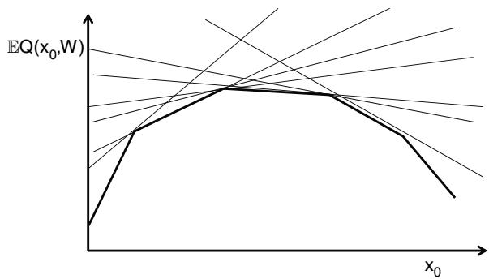  
(b) Benders cuts in the limit   
Figure 18.8 Illustration of cuts generated using stochastic decomposition (a) in the early iterations and (b) in the limit.

Figure 18.8 illustrates the cuts generated using stochastic decomposition. It is useful to compare the cuts generated using stochastic decomposition to those generated when we used a sampled version of the problem in section 18.6 as depicted in Figure 18.5. When we were solving our sampled version, we could compute the expectation exactly, which is why the cuts were tight. Here, we are sampling from the full probability space, and as a result we get cuts that approximate the function, but nothing more. However, in the limit as $n  \infty$ , the cuts will converge to the true function in the vicinity of the optimum.

Which is better? Hard to say. While it is nice to have an algorithm that is asymptotically optimal, we can only run a finite number of iterations. The sampled problem will be more stable due to the averaging that takes place in every iteration, but we then have to solve a linear program for every ?? in the sampled problem, a step that involves much more computational overhead than the recursive version.

# 18.6.3 Benders with Regularization

Regularization is a tool that will come up repeatedly when estimating functions from data. The same is true with Benders decomposition. Regularization is handled through a minor modification of the approximate optimization problem (18.21) which becomes

$$
x ^ {n} = \arg \max  _ {x} \left(c _ {0} x _ {0} + z + \rho^ {n} (x - \bar {x} ^ {n - 1}) ^ {2}\right), \tag {18.27}
$$

which is solved subject to (18.19)–(18.20) and the Benders cut constraints (18.22). The parameter $\rho ^ { n }$ is a decreasing sequence that needs to be scaled to handle the difference in the units between the costs and the term $( x - { \bar { x } } ^ { n - 1 } ) ^ { 2 }$ . $\bar { x } ^ { n - 1 }$ is the regularization term which is updated each iteration; the idea with regularization is to keep $x ^ { n }$ from straying too far from a previous solution, especially in the early iterations.

The use of the squared deviation $( x - \bar { x } ^ { n - 1 } ) ^ { 2 }$ is known as $L _ { 2 }$ regularization, which might be written as $\| x - \bar { x } ^ { n - 1 } \| _ { 2 } ^ { 2 }$ . An alternative is $L _ { 1 }$ regularization which minimizes the absolute value of the deviation, which would be written as $| x -$ $\bar { x } ^ { n - 1 } |$ .

There are different ways of setting the regularization term, but the simplest one just uses $\bar { x } ^ { n - 1 } \ = \ x ^ { n - 1 }$ . Other ideas involve smoothing several previous iterations. The regularization coefficient is any declining sequence such as

$$
\rho^ {k} = r \rho^ {k - 1}
$$

for some factor $r < 1$ , starting with an initial $\rho ^ { 0 }$ that has to be chosen to handle the scaling.

Properly implemented, regularization offers not only theoretical guarantees, but has also been found to accelerate convergence and stabilize the performance of the algorithm.

# 18.7 Linear Approximations for High-Dimensional Applications

Imagine now that we are going to use basis functions that are linear in the resource variables (not to be confused with linear models that are linear in the parameters). A linear approximation for our value function approximation is given by

$$
\overline {{V}} ^ {n} (R _ {t}) = \sum_ {a \in \mathcal {A}} \bar {v} _ {t a} ^ {n} R _ {t a},
$$

where $\bar { v } _ { t a } ^ { n }$ is our estimate of the marginal value of resources with attribute $a$ after $n$ iterations. We can estimate these slopes by using the methods just idescribed to obtain $\hat { v } _ { t a } ^ { n }$ which is our sampled estimate of the marginal value of $R _ { t a }$ at iteration ??. We then update our estimate of the linear approximation using

$$
\bar {v} _ {t a} ^ {n} = (1 - \alpha_ {n}) \bar {v} _ {t a} ^ {n - 1} + \alpha_ {n} \hat {v} _ {t a} ^ {n},
$$

where $\alpha _ { n }$ is our stepsize (see chapter 6) which might depend on how many times we have observed $\hat { v } _ { a } ^ { n }$ for attribute ??.

Linear value function approximations can be particularly useful for highdimensional problems where the space of attributes $\mathcal { A }$ is so large that the elements of $R _ { t a }$ are likely to be quite small (mostly zero, sometimes 1). However, this creates the problem that we may have trouble computing $\hat { v } _ { t a } ^ { n }$ for every $a \in { \mathcal { A } }$ .

Consider, for example, the problem of assigning truck drivers to loads, $a$ is for the attributes of the truck driver. The attribute vector $a$ might include

??1 = current location of the driver (or location where he is headed),

??2 = the location of where he lives,

??3 = how many days he has been driving since he was last at home,

??4 = the type of truck trailer he is pulling (for example, a dry van or refrigerated trailer),

$\begin{array} { r l } { a _ { 5 } } & { { } = } \end{array}$ the driver’s nationality.

The size of this attribute space could easily be in the millions, while we may be optimizing a fleet of 100 or 1000 drivers. Computing $\hat { v } _ { t a } ^ { n }$ , which might require reoptimizing the time $t$ optimization problem to get the marginal value of $R _ { t a }$ for each $a \in { \mathcal { A } }$ , would be computationally expensive.

The way to circumvent this “curse of dimensionality” is to use the power of hierarchical aggregation introduced in section 3.6.1. The idea is to create a family of reduced attribute vectors $a ^ { ( g ) }$ where $a ^ { ( 0 ) }$ is the original full attribute vector. Then, create a series of more compact vectors $a ^ { ( 1 ) } , a ^ { ( 2 ) } , \dots , a ^ { ( G ) }$ , where $a ^ { ( G ) }$ might have a single attribute with a small number of values. Hierarchical aggregation maintains a set of weights $w _ { a } ^ { ( g ) , n }$ that depend on the level of aggregation, as well as the attribute vector $a$ , where

$$
\sum_ {g = 0} ^ {G} w _ {a} ^ {(g), n} = 1.
$$

These weights are given by one over the variance plus square of the bias, normalized so they sum to 1 (see section 3.6.1 for details).

We then maintain a value of averaged estimates $\bar { v } _ { a } ^ { ( g ) , n }$ , recognizing that we may not have any observations for some aggregation levels ?? for some (in fact many) attribute vectors ??. When this is the case, we set $w _ { a } ^ { ( g ) , n } = 0$ = 0. Finally, we obtain our estimate of the marginal value of $R _ { t a }$ using

$$
\bar {v} _ {a} ^ {n} = \sum_ {g = 0} ^ {G} w _ {a} ^ {(g), n} \bar {v} _ {a} ^ {(g), n}.
$$

# 18.8 Resource Allocation with Exogenous Information State

The methods in this chapter have demonstrated how we can find effective value function approximations for resource allocation problems, even when the resource vector $R _ { t }$ is very high-dimensional. All of this work assumed that $R _ { t }$ was the only state variable. The message here is simple: high-dimensional problems are not hard, as long as we can exploit structure such as concavity (or convexity), or linearity.

The problem is that there are many resource allocation problems where the resource vector is not the only information in the state variable. We might have additional information covering a host of activities: temperature, weather forecasts, market prices, the humidity in a laboratory, competitor behavior ..., the list can be endless. This is information that we would put in our information state variable $I _ { t }$ (see section 9.4).

We need to emphasize that we would only include information in $I _ { t }$ if it is changing over time and, of course, if it affects the behavior of our system. It does not matter if our decisions do or do not affect the trajectory of $I _ { t }$ . When we have an information state variable, then our system state variable is given by $( R _ { t } , I _ { t } )$ . The difficulty is that while the value function may be concave (or convex) in $R _ { t }$ , this property typically does not translate to $I _ { t }$ . In particular, we handle $I _ { t }$ as if it is just additional dimensions to $R _ { t }$ , since $I _ { t }$ typically affects how each element of $R _ { t }$ affects the value function. So, if we were using our linear value function approximation with slope $\bar { v } _ { t a } ^ { n }$ , we would now want to write $\bar { v } _ { t a } ^ { n } ( I _ { t } )$ to express the dependence on the information state $I _ { t }$ .

Imagine, for example, that we can express our information state as a (not too large) set $\mathcal { I } = \{ i _ { 1 } , i _ { 2 } , \ldots , i _ { | \mathcal { I } | } \}$ . Instead of estimating a single value $\hat { v } _ { t a } ^ { n }$ for each attribute $a$ , we now have to compute $\bar { v } _ { t a } ^ { n } ( i )$ for $i \in { \mathcal { I } } .$ . If there are 10 information states, then we just made our problem 10 times harder. However, $I _ { t }$ could be a multidimensional (and possibly continuous) vector.

There are special cases we can handle. The most important arises when $I _ { t + 1 }$ is independent of $I _ { t }$ (or $R _ { t }$ ). For example, $I _ { t }$ might be the attributes of a patient,

where we are comfortable assuming that the attributes of the patient arriving at $t + 1$ has nothing to do with the patient that arrived at time ??. In this case, the post-decision state $S _ { t } ^ { x } = R _ { t } ^ { x }$ , which means we forget the information state. This is important because we are typically estimating a value function approximation around the post-decision state.

The property that $I _ { t + 1 }$ does not depend on $I _ { t }$ is referred to as “interstage independence” in the stochastic programming community. While convenient, it does not happen very often. Not surprisingly, this issue arises frequently in machine learning. We saw this earlier in section 7.13.6 for a class of active learning problem (also known as a multiarmed bandit problem) known as the contextual bandit problem. This discussion offered a novel perspective of this problem, but otherwise did not offer a solution.

A potential solution approach is to draw a page from our work on hierarchical aggregation. Assume we can create a family of information state variables (??(0)?? , $( I _ { t } ^ { ( 0 ) } , \overline { { I _ { t } ^ { ( 1 ) } } } , \overline { { \dots } } , I _ { t } ^ { ( G ) } )$ , ??(??)) where ?? (0) $I _ { t } ^ { ( 0 ) }$ is our original complete information state, while ??(??)?? is a series of successively more aggregate variables for ?? = 1, 2, … ??. Assume $I _ { t } ^ { ( g ) }$ $g = 1 , 2 , \ldots G$ that each of these variables can be discretized into a set $\mathcal { I } ^ { ( g ) }$ of decreasing size. Finally assume that the set ${ \mathcal { I } } ^ { ( G ) }$ is relatively small, meaning that we have no difficult creating estimates for each value in ${ \mathcal { I } } ^ { ( G ) }$ . We simulate $I _ { t }$ and the identify the corresponding elements in each set $\mathcal { I } ^ { ( g ) }$ . We can then apply our methods of hierarchical aggregation to create a weighted estimate.

# 18.9 Closing Notes

This chapter has highlighted a variety of complex resource allocation problems, but our examples are all limited to what are known as single layer resource allocation problems. For example, we are managing water in reservoirs, money, blood (of different types), and trucks. These problems lend themselves to the kinds of convex approximations described in this chapter.

Imagine now that we want to manage blood, and we have to serve two types of patients: those requiring emergency surgeries that have to be satisfied now, and elective surgeries that can be delayed. In the case of elective surgeries, we have two classes of resources: the blood and the (elective) patients. Without the presence of elective patients, our post-decision state variables would consist only of the different types of blood.

It is much harder to approximate the value of the blood resource vector $R _ { t } ^ { b l o o d }$ when we have the ability to delay elective surgeries, since now the marginal value of an extra unit of blood with attribute ?? depends on the set of elective surgeries. Separable approximations are unlikely to work, and as interactions become more complex, we need substantially more Benders cuts to capture these. Requiring integer solutions adds additional complexity.

When the future becomes sufficiently complicated, we often have to turn to direct lookahead policies, which we introduce next in chapter 19.

# 18.10 Bibliographic Notes

Section 18.1.1 – In operations research, the newsvendor problem (previously known as the “single period inventory problem” or “the newsboy problem”), arises throughout stochastic resource allocation problems. It is a simple problem that makes it useful for illustrating concepts in stochastic optimization. Qing et al. (2011) provides a good general review; Petruzzi and Dada (1999) provides a somewhat older review (but much of the research was done decades ago). There is still continued interest in specialized topics; for example, DeYong (2020) reviews the newsvendor literature related to price-setting research.

Section 18.1.2 – There is an extensive literature exploiting the natural convexity of $Q ( x _ { 0 } , W _ { 1 } )$ in $x _ { 0 }$ , starting with Van Slyke and Wets (1969), followed by the seminal papers on stochastic decomposition (Higle and Sen, 1991) and the stochastic dual dynamic programming (SDDP) (Pereira and Pinto, 1991). A substantial literature has unfolded around this work, including Shapiro (2011) who provides a careful analysis of SDDP, and its extension to handle risk measures (Shapiro et al. (2013), Philpott et al. (2013)). A number of papers have been written on convergence proofs for Benders-based solution methods, but the best is Girardeau et al. (2014). Kall and Wallace (2009) and Birge and Louveaux (2011) are excellent introductions to the field of stochastic programming. King and Wallace (2012) is a nice presentation on the process of modeling problems as stochastic programs. A modern overview of the field is given by Shapiro et al. (2014).

Section 18.1.3 – The notation in this section was developed in Powell et al. (2001), and applied in a number of papers, including Simao et al. (2009) (for truckload trucking) and Bouzaiene-Ayari et al. (2016) (for a locomotive management problem).

Section 18.2 – The decision of whether to estimate the value function or its derivative is often overlooked in the dynamic programming literature, especially within the operations research community. In the controls community, use of gradients is sometimes referred to as dual heuristic dynamic programming (see Werbos (1992) and Venayagamoorthy and Harley (2002)). The operations research community is very familiar with the idea of using marginal values (see, for example, the methods cited in sections 18.5 and 18.6), while the computer science community (among others), works almost exclusively with problems (such as those defined over graphs) where we need the value of being in a state (rather than the marginal value).

Section 18.3 – The CAVE algorithm was first proposed in Godfrey and Powell (2001) for the newsvendor problem, and then extended to spatial resource allocation problems in fleet management in Powell and Godfrey (2002) and Godfrey and Powell (2002). The theory behind the projective SPAR algorithm is given in Powell et al. (2004). A proof of convergence of the leveling algorithm is given in Topaloglu and Powell (2003). A convergence proof for a version of the piecewise linear, separable approximation is given in Zhou et al. (2020).

Section 18.6 – The first paper to formulate a math program with uncertainty appears to be Dantzig and Ferguson (1956). For a broad introduction to the field of stochastic optimization, see Ermoliev (1988) and Pflug (1996). For complete treatments of the field of stochastic programming, see Shapiro (2003), Birge and Louveaux (2011), Kall and Mayer (2005), and Shapiro et al. (2014). For an easy tutorial on the subject, see Sen and Higle (1999). A very thorough introduction to stochastic programming is given in Ruszczyński and Shapiro (2003). Mayer (1998) provides a detailed presentation of computational work for stochastic programming. There has been special interest in the types of network problems we have considered (see Wallace (1986), S.W. and Wallace (1987), and Birge et al. (1988)). Rockafellar and Wets (1991) presents specialized algorithms for stochastic programs formulated using scenarios. This modeling framework has been of particular interest in the are of financial portfolios (Mulvey and Ruszczyński (1995)). Benders’ decomposition for two-stage stochastic programs was first proposed by Van Slyke and Wets (1969) as the “L-shaped” method. Higle and Sen (1991) introduce stochastic decomposition, which is a Monte-Carlo based algorithm that is most similar in spirit to approximate dynamic programming. Chen and Powell (1999) present a variation of Benders that falls between stochastic decomposition and the L-shaped method. The relationship between Benders’ decomposition and dynamic programming is often overlooked. A notable exception is Pereira and Pinto (1991), which uses Benders to solve a resource allocation problem arising in the management of reservoirs. This paper presents Benders as a method for avoiding the curse of dimensionality of dynamic programming. For an excellent review of Benders’ decomposition for multistage problems, see Ruszczyński (2003). Benders has been extended to multistage problems in Birge (1985), Ruszczyński (1993), and Chen and Powell (1999), which can be viewed as a form of approximate dynamic programming using cuts for value function approximations.

Section 18.7 – High-dimensional applications arise when, for example, we need to estimate $\bar { v _ { a } }$ where $a \in { \mathcal { A } }$ is a multidimensional vector where the set $\mathcal { A }$ can have a number of elements that far exceeds our budget for observations. This section used hierarchical learning which was developed in George et al. (2008) VFA paper (and described in section 3.6. These methods were used in Simao et al. (2009) $a$ is for the attributes of a truck driver.

Section 18.8 – The stochastic optimization literature has long realized that it is relatively easy to approximate a function $V ( R )$ which is concave (convex if minimizing) in $R$ , and where $R$ may be high dimensional. However, there are many problems that involve managing resource allocation problems that combine a resource vector $R _ { t }$ with an exogenously evolving information state $I _ { t }$ , which means the state of the system is ${ \cal { S } } _ { t } = ( R _ { t } , I _ { t } ) . { \cal { I } } _ { t }$ is often relatively unstructured data such as weather, prices, forecasts, the humidity in a laboratory, and so on. The stochastic programming community often assumes “interstage independence” which means that the post-decision state $S _ { t } ^ { x } = R _ { t } ^ { x }$ (that is, it does not depend on $I _ { t } \Big .$ ); see Morton (1996), Queiroza and Morton (2013). Asamov and Powell (2018) presents a regularization algorithm that assumes that $I _ { t }$ can take on a “finite” (that is, not too large) number of discrete values $I _ { 1 } , I _ { 2 } , \dots , I _ { K }$ .

# Exercises

# Review questions

18.1 Give three examples of resource allocation problems not listed in Table 18.1. Describe the type of resource (or resources) and the decisions that need to be made.   
18.2 What is meant by a “two-stage” resource allocation problem? Given an example.   
18.3 Equations (18.12)–(18.15) use variables such as $x _ { t + 1 } ( \omega )$ , $A _ { t + 1 } ( \omega )$ and $b _ { t + 1 } ( \omega ) ?$ What is meant by $\omega$ , and what do we mean when we write it as an argument as we did with these three variables?   
18.4 Imagine that we have to solve a newsvendor problem with dynamically varying costs and prices:

$$
\max  _ {x \leq R _ {t}} F (x) = \mathbb {E} \left\{p _ {t} \max  \{x, W _ {t + 1} \} - c _ {t} x | S _ {t} \right\}
$$

What is the resource state variable? What are the “exogenous information state” variables?

# Modeling questions

18.5 Following the general modeling style of section 18.1.3, create your own model of a fleet of autonomous electric vehicles, where the goal is

to simulate the dispatching process over the course of the day. The following are some general guidelines to follow when creating your model:

● Assume that you are modeling a region (say a state) that has been divided into a set of zones $z \in { \mathcal { Z } }$ . There may be anywhere between 100 and 10,000 zones depending on the size of the region and the size of the zones.

● Assume you are modeling time in 15 minute increments, over an entire day.

● You will need to model a fleet of vehicles $i \in \mathcal I$

● Let $b _ { t i }$ be the battery charge level in vehicle ?? at time ??. You may assume that all vehicles are fully charged at the beginning of the day. Let $\eta ^ { m o v e }$ be the rate that each car consumes energy while moving, and $\eta ^ { i d l e }$ for the energy consumption rate while sitting idle.

● Let $a _ { t i }$ be the characteristics of vehicle ?? at time ??, which will include current location (if idle), or the location it is heading to if in the middle of a trip; the time period it is expected to arrive (if moving); and the battery charge level $b _ { t i }$ .

● Let $\hat { D } _ { t + 1 , z z ^ { \prime } }$ be the number of new requests for trips that arrive between $t$ and $t + 1$ to travel from zone $z$ to zone $z ^ { \prime }$ . Let $x _ { t d i } = 1$ if we choose to implement decision $d \in \mathcal { D }$ for vehicle ??.

● You will need to introduce a set of decisions $\mathcal { D }$ where $d \in \mathcal { D }$ can be: move to pick up a customer, move empty, do nothing, move to a recharging station to be recharged (introduce notation for recharging stations).

Set up all five elements of a dynamic model, using $X ^ { \pi } ( S _ { t } )$ as your policy. Then, suggest two policies that you think might work, one from the policy search class, and one from the lookahead class.

# Computational exercises

18.6 Consider a newsvendor problem where we solve

$$
\max  _ {x} \mathbb {E} F (x, \hat {D}),
$$

where

$$
F (x, \hat {D}) = p \min (x, \hat {D}) - c x.
$$

We have to choose a quantity $x$ before observing a random demand $\hat { D }$ . For our problem, assume that $c = 1$ , $p = 2$ , and that $\hat { D }$ follows a discrete

uniform distribution between 1 and 10 (that is, $\hat { D } = d , d = 1 , 2 , \dotsc , 1 0$ with probability 0.10). Approximate $\mathbb { E } F ( x , \hat { D } )$ as a piecewise linear function using the methods described in section 18.3, using a stepsize $\alpha _ { n - 1 } =$ $1 / n$ . Note that you are using derivatives of $F ( x , \hat { D } )$ to estimate the slopes of the function. At each iteration, randomly choose $x$ between 1 and 10. Use sample realizations of the gradient to estimate your function. Compute the exact function and compare your approximation to the exact function.

18.7 Repeat exercise 18.6, but this time approximate $\mathbb { E } F ( x , \hat { D } )$ using a linear approximation:

$$
\bar {F} (x) = \theta x.
$$

Compare the solution you obtain with a linear approximation to what you obtained using a piecewise-linear approximation. Now repeat the exercise using demands that are uniformly distributed between 500 and 1000. Compare the behavior of a linear approximation for the two different problems.

18.8 Repeat exercise 18.6, but this time approximate $\mathbb { E } F ( x , \hat { D } )$ using the Leveling algorithm. Start with an initial approximation given by

$$
\bar {F} ^ {0} (x) = \theta_ {0} (x - \theta_ {1}) ^ {2}.
$$

Use the recursive regression methods of sections 18.4 and 3.8 to fit the parameters. Justify your choice of stepsize rule. Compute the exact function and compare your approximation to the exact function.

18.9 Repeat exercise 18.6, but this time approximate $\mathbb { E } F ( x , \hat { D } )$ using the regression function given by

$$
\bar {F} (x) = \theta_ {0} + \theta_ {1} x + \theta_ {2} x ^ {2}.
$$

Use the recursive regression methods of sections 18.4 and 3.8 to fit the parameters. Justify your choice of stepsize rule. Compute the exact function and compare your approximation to the exact function. Estimate your value function approximation using two methods:

(a) Use observations of $F ( x , \hat { D } )$ to update your regression function.   
(b) Use observations of the derivative of $F ( x , \hat { D } )$ , so that ${ \bar { F } } ( x )$ becomes an approximation of the derivative of $\mathbb { E } F ( x , \hat { D } )$ .

18.10 Approximate the function $\mathbb { E } F ( x , \hat { D } )$ in exercise 18.6, but now assume that the random variable $\hat { D } = 1$ (that is, it is deterministic). Using the following approximation strategies:

(a) Use a piecewise linear value function approximation. Try using both left and right derivatives to update your function.

(b) Use the regression $\bar { F } ( x ) = \theta _ { 0 } + \theta _ { 1 } x + \theta _ { 2 } x ^ { 2 }$ .

18.11 We are going to solve the basic asset acquisition problem (section 8.2.1) where we purchase assets (at a price $p ^ { p }$ ) at time $t$ to be used in time interval $t + 1$ . We sell assets at a price $p ^ { s }$ to satisfy the demand $\hat { D } _ { t }$ that arises during time interval ??. The problem is to be solved over a finite time horizon ??. Assume that the initial inventory is 0 and that demands follow a discrete uniform distribution over the range $[ 0 , D ^ { m a x } ]$ . The problem parameters are given by

$$
\gamma = 0. 8,
$$

$$
D ^ {m a x} = 1 0,
$$

$$
T = 2 0,
$$

$$
p ^ {p} = 5,
$$

$$
p ^ {s} = 8.
$$

Solve this problem by estimating a piecewise linear value function approximation (section 18.3). Choose $\alpha _ { n + 1 } = a / ( a + n )$ as your stepsize rule, and experiment with different values of $a$ (such as 1, 5, 10, and 20). Use a single-pass algorithm, and report your profits (summed over all time periods) after each iteration. Compare your performance for different stepsize rules. Run 1000 iterations and try to determine how many iterations are needed to produce a good solution (the answer may be substantially less than 1000).

18.12 Repeat exercise 18.11, but this time use the Leveling algorithm to approximate the value function. Use as your initial value function approximation the function

$$
\overline {{V}} _ {t} ^ {0} (R _ {t}) = \theta_ {0} (R _ {t} - \theta_ {2}) ^ {2}.
$$

For each of the exercises that follow, you may have to tweak your stepsize rule. Try to find a rule that works well for you (we suggest sticking with a basic $a / ( a + n )$ strategy). Determine an appropriate number of training iterations, and then evaluate your performance by averaging results over 100 iterations (testing iterations) where the value function is not changed.

(a) Solve the problem using $\theta _ { 0 } = 1 , \theta _ { 1 } = 5$   
(b) Solve the problem using $\theta _ { 0 } = 1 , \theta _ { 1 } = 5 0$

(c) Solve the problem using $\theta _ { 0 } = 0 . 1 , \theta _ { 1 } = 5$   
(d) Solve the problem using $\theta _ { 0 } = 1 0 , \theta _ { 1 } = 5$ .   
(e) Summarize the behavior of the algorithm with these different parameters.

18.13 Repeat exercise 18.11, but this time assume that your value function approximation is given by

$$
\overline {{V}} _ {t} ^ {0} (R _ {t}) = \theta_ {0} + \theta_ {1} R _ {t} + \theta_ {2} R _ {t} ^ {2}.
$$

Use the recursive regression techniques of sections 18.4 and 3.8 to determine the values for the parameter vector ??.

18.14 Repeat exercise 18.11, but this time assume you are solving an infinite horizon problem (which means you only have one value function approximation).   
18.15 Repeat exercise 18.13, but this time assume an infinite horizon.   
18.16 Repeat exercise 18.11, but now assume the following problem parameters:

$$
\begin{array}{l} \gamma = 0. 9 9, \\ T = 2 0 0, \\ p ^ {p} = 5, \\ p ^ {s} = 2 0. \\ \end{array}
$$

For the demand distribution, assume that $\hat { D } _ { t } ~ = ~ 0$ with probability 0.95, and that $\hat { D } _ { t } ~ = ~ 1$ with probability 0.05. This is an example of a problem with low demands, where we have to hold inventory for a fairly long time.

# Sequential decision analytics and modeling

These exercises are drawn from the online book Sequential Decision Analytics and Modeling available at http://tinyurl.com/sdaexamplesprint.

18.17 Read sections 13.1–13.4 on the blood management problem. An approximate dynamic programming algorithm has been implemented in Python, which can be downloaded from http://tinyurl.com/ sdagithub using the module “BloodManagement.”