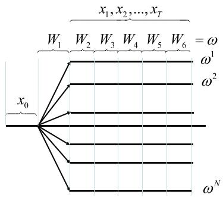
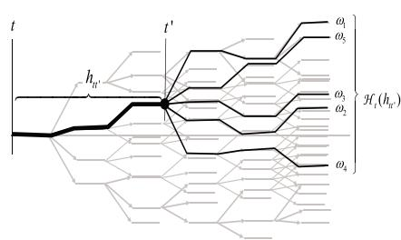
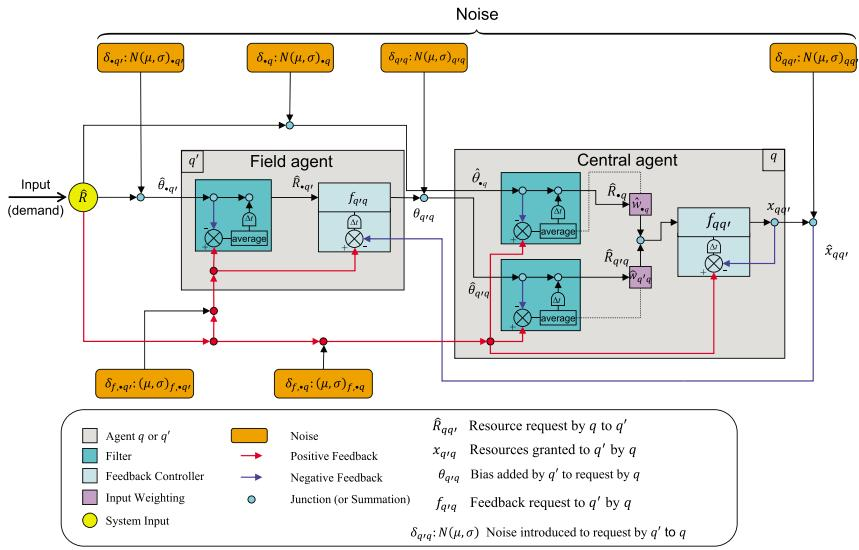
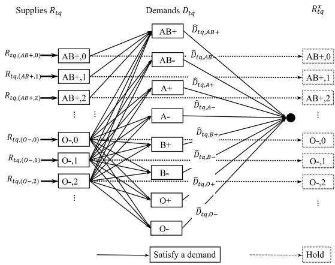
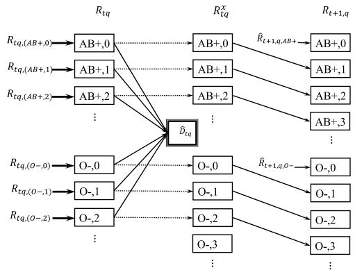

(a) Use the ADP algorithm to create piecewise linear value function approximations, and simulate the resulting policy. Report the objective function you obtain from simulating the policy.   
(b) Now set all the VFA’s equal to zero and simulate the resulting myopic policy. Compare the performance of the myopic policy to the VFA-based policy.   
(c) Increase the supply of blood by 50 percent (multiply all input supplies by 1.5), and repeat the comparison of parts a and b. How did the relative value of the VFA-based policy change in the presence of inflated supplies of blood?   
(d) Repeat part (c), but this time multiply the supplies by 0.80. How does this affect the results?

# Diary problem

The diary problem is a single problem you chose (see chapter 1 for guidelines). Answer the following for your diary problem.

18.18 This chapter is designed for problems that enjoy the property of concavity (convexity if minimizing). This often arises in the context of resource allocation problems, but may arise in other settings as well. Identify any state variables where you believe the value function would be concave (or convex) with respect to this (these) state variables, and if these are present in your problem, describe an approximation architecture that exploits this property.

# Bibliography

Asamov, T. and Powell, W.B. (2018). Regularized decomposition of high dimensional multistage stochastic programs with Markov uncertainty. SIAM Journal on Optimization 28 (1): 575–595.   
Birge, J.R. (1985). Decomposition and partitioning techniques for multistage stochastic linear programs. Mathematical Programming 33: 25–41.   
Birge, J. R. and Louveaux, F. (2011). Introduction to Stochastic Programming, 2e. New York: Springer.   
Birge, J.R., Wallace, S.W. (1988). A separable piecewise linear upper bound for stochastic linear programs. SIAM Journal of Control and Optimization 26: 1–14.   
Bouzaiene-Ayari, B., Cheng, C., Das, S., Fiorillo, R., and Powell, W.B. (2016). From single commodity to multiattribute models for locomotive optimization: A comparison of optimal integer programming and approximate dynamic programming. Transportation Science 50 (2): 1–24.

Chen, Z.-L., and Powell, W.B. (1999). A convergent cutting-plane and partial-sampling algorithm for multistage linear programs with recourse. Journal of Optimization Theory and Applications 103 (3): 497–524.   
Dantzig, G.B. and Ferguson, A. (1956). The allocation of aircrafts to routes: An example of linear programming under uncertain demand. Management Science 3: 45–73.   
DeYong, G. (2020). The price-setting newsvendor: Review and extensions. International Journal of Production Research 58 (6): 1776–1804.   
Ermoliev, Y. (1988). Stochastic quasigradient methods. In: Numerical Techniques for Stochastic Optimization (eds. Y. Ermoliev and R. Wets). Berlin: Springer-Verlag.   
George, A., Powell, W.B., and Kulkarni, S. (2008). Value function approximation using multiple aggregation for multiattribute resource management. Journal of Machine Learning Research. 2079–2111.   
Girardeau, P., Leclere, V., and Philpott, A.B. (2014). On the convergence of decomposition methods for multistage stochastic convex programs. Mathematics of Operations Research 40 (1): 130–145.   
Godfrey, G.A. and Powell, W.B. (2001). An Adaptive, distribution-free algorithm for the newsvendor problem with censored demands, with applications to inventory and distribution. Management Science 47 (8): 1101–1112.   
Godfrey, G.A. and Powell, W.B. (2002). An adaptive dynamic programming algorithm for dynamic fleet management, II: Multiperiod travel times. Transportation Science 36 (1): 40–54.   
Higle, J.L. and Sen, S. (1991). Stochastic decomposition: An algorithm for two-stage linear programs with recourse. Mathematics of Operations Research 16 (3): 650–669.   
Kall, P. and Mayer, J. (2005). Stochastic Linear Programming: Models, Theory, and Computation. New York: Springer.   
Kall, P. and Wallace, S.W. (2009). Stochastic Programming, Vol. 10, Hoboken, NJ: John Wiley & Sons.   
King, A.J. and Wallace, S.W. (2012). Modeling with Stochastic Programming. New York: Springer Verlag.   
Mayer, J. (1998). Stochastic Linear Programming Algorithms: A Comparison Based on a Model Management System. Springer.   
Morton, D.P. (1996). An enhanced decomposition algorithm for multistage stochastic hydroelectric scheduling. Annals of Operations Research 64: 211–235.   
Mulvey, J.M. and Ruszczyński, A. (1995). A new scenario decomposition method for large scale stochastic optimization. Operations Research 43: 477–490.   
Pereira, M.F. and Pinto, L.M.V.G. (1991). Multistage stochastic optimization applied to energy planning. Mathematical Programming 52: 359–375.

Petruzzi, N. C. and Dada, M. (1999). Pricing and the Newsvendor Problem: A Review with Extensions. Operations Research 47: 183–194.   
Pflug, G. (1996). Optimization of Stochastic Models: The Interface Between Simulation and Optimization, Kluwer International Series in Engineering and Computer Science: Discrete Event Dynamic Systems, Boston: Kluwer Academic Publishers.   
Philpott, A.B., De Matos, V., and Finardi, E. (2013). On solving multistage stochastic programs with coherent risk measures. Operations Research 51 (4): 957–970.   
Powell, W.B. and Godfrey, G.A. (2002). An adaptive dynamic programming algorithm for dynamic fleet management, I: Single period travel times. Transportation Science 36 (1): 40–54.   
Powell, W.B., Ruszczyński, A., and Topaloglu, H. (2004). Learning algorithms for separable approximations of discrete stochastic optimization problems. Mathematics of Operations Research 29 (4): 814–836.   
Powell, W.B., Simao, H.P., and Shapiro, J.A. (2001). A representational paradigm for dynamic resource transformation problems. In: Annals of Operations Research (eds. F.C. Coullard and J. Owens), 231–279. J. C. Baltzer AG.   
Queiroza, A.R. and Morton, D.P. (2013). Sharing cuts under aggregated forecasts when decomposing multi-stage stochastic programs. Operations Research Letters 41 (3): 311–316.   
Rockafellar, R.T. and Wets, R.J.B. (1991). Scenarios and policy aggregation in optimization under uncertainty. Mathematics of Operations Research 16 (1): 119–147.   
Ruszczyński, A. (1993). Parallel decomposition of multistage stochastic programming problems. Mathematical Programming 58: 201–228.   
Ruszczyński, A. (2003). Decomposition Methods. Amsterdam: Elsevier.   
Ruszczyński, A. and Shapiro, A. (2003). Handbooks in Operations Research and Management Science: Stochastic Programming, Vol. 10, Amsterdam: Elsevier.   
Sen, S. and Higle, J.L. (1999). An introductory tutorial on stochastic linear programming models. Interfaces (April): 33–61.   
Shapiro, A. (2003). Stochastic Programming, Vol. 10, Chichester, U.K.: John Wiley & Sons.   
Shapiro, A. (2011), Analysis of stochastic dual dynamic programming method. European Journal of Operational Research 209 (1): 63–72.   
Shapiro, A., Dentcheva, D., and Ruszczyński, A. (2014). Lectures on Stochastic Programming: Modeling and Theory, 2e. Philadelphia: SIAM.   
Shapiro, A., Tekaya, W., Da Costa, J.P., and Soares, M.P. (2013). Risk neutral and risk averse Stochastic Dual Dynamic Programming method. European Journal of Operational Research 224 (2): 375–391.

Simao, H.P., Day, J., George, A.P., Gifford, T., Powell, W.B., and Nienow, J. (2009). An approximate dynamic programming algorithm for large-scale fleet management: A case application. Transportation Science 43 (2): 178–197.   
Wallace, S.W. (1987). A piecewise linear upper bound on the network recourse function. Mathematical Programming 38: 133–146.   
Topaloglu, H. and Powell, W.B. (2003). An algorithm for approximating piecewise linear concave functions from sample gradients. Operations Research Letters 31: 66–76.   
Van Slyke, R.M. and Wets, R.J.B. (1969). L-shaped linear programs with applications to optimal control and stochastic programming. SIAM Journal of Applied Mathematics 17: 638–663.   
Venayagamoorthy, G. and Harley, R. (2002). Comparison of heuristic dynamic programming and dual heuristic programming adaptive critics for neurocontrol of a turbogenerator. Neural Networks, IEEE 13 (3): 764–773.   
Wallace, S.W. (1986). Solving stochastic programs with network recourse. Networks 16: 295–317.   
Werbos, P.J. (1992). Approximate dynamic programming for real-time control and neural modelling. In: Handbook of Intelligent Control: Neural, Fuzzy, and Adaptive Approaches (eds. D.J. White and D.A. Sofge).   
Qing, Y., Wang, R., Vakharia, A.J., Chen, Y., Seref, M.M. (2011). The newsvendor problem: Review and directions for future research. European Journal of Operational Research 213: 361–374.   
Zhou, S., Wang, F., Shi, N., and Xu, Z. (2020). A new convergent hybrid learning algorithm for two-stage stochastic programs. European Journal of Operational Research 283 (1): 33–46.

#

# Direct Lookahead Policies

Up to now we have considered three classes of policies: policy function approximations (PFAs), parametric cost function approximations (CFAs), and policies that depend on value function approximations (VFAs) which approximate the impact of a decision on the future through the state variable. All three of these policies depend on approximating some function, which means we are limited by our ability to create approximations that work well in practice.

Not surprisingly, we cannot always develop sufficiently accurate functional approximations. Policy function approximations have been most successful when decisions are simple decisions (think of buy low, sell high policies) or low-dimensional continuous controls that can be approximated using parametric or nonparametric functions (these might range from a linear function to a neural network). Cost function approximations require a deterministic model that provides a reasonable approximation. Value function approximations work well when the value function exhibits structure that can be exploited using the family of approximating architectures we presented in chapter 3 or chapter 18.

When all else fails (and it often does), we have to resort to direct lookahead policies (DLAs), which optimize over some horizon to help capture the impact of decisions made now on activities in the future, from which we can extract the decision we would make now. A few examples of problems which are likely going to require a full direct lookahead policy are:

# EXAMPLE 19.1

Knowing whether to turn left or right at an intersection requires planning your path all the way to the destination.

# EXAMPLE 19.2

Imagine a hurricane moving through a region, as often happens in the southeastern US as well as southeast Asia. It is necessary to evacuate regions, but given the presence of network bottlenecks, regions need to be evacuated in a coordinated way. It is important to plan an evacuation for each zone $z$ at each point in time to identify the zones where it is critical to evacuate now given the current state of the hurricane.

# EXAMPLE 19.3

Knowing whether you can use your valuable supply of O-negative blood (which everyone can use) depends on the planned flow of donations and surgeries, as well as the age of your current O-negative inventories.

# EXAMPLE 19.4

A financial planner planning for your retirement needs to estimate the risk that your portfolio might not hit a target for you to retire comfortably. This assessment will determine what investments to make now.

Direct lookahead policies represent a much more brute force approach for making decisions and, not surprisingly, are typically very hard computationally. As a result, the challenge here is introducing approximations that make this problem tractable. We divide these approximations into two broad categories:

Deterministic lookahead – This is the most common approach in practice when we need to use a direct lookahead policy. There are problems where this works quite well (think of navigation systems helping you find a good path over a dynamically varying transportation network), but there are settings where deterministic approximations simply will not work.

Stochastic lookahead – When we need a direct lookahead policy but where a deterministic lookahead would ignore critical issues, then we have to explore the world of stochastic lookahead models, which will be the focus of most of this chapter.

Our presentation is organized as follows:

Part I: Foundational material – This consists of the following general topics for DLA policies:

Section 19.1 – Creating the optimal direct lookahead policy. This serves as the foundation for any direct lookahead approximation.

Section 19.2 – We present the notation we use for our approximate lookahead model, and discuss the different approximation strategies.

Section 19.3 – We discuss the idea of using objectives for the lookahead model that are different than the base model.

Section 19.4 – We return to the familiar territory of evaluating a policy, a dimension that is often overlooked in the context of DLA policies.

Section 19.5 – We close Part I of this chapter with a discussion of why a DLA policy might be appropriate.

Part II: Deterministic DLA models – Section 19.6 discusses the simple but popular idea of using deterministic lookahead models.

Part III: Stochastic DLA models – We divide this substantial topic as follows:

Section 19.7 – We start with a quick tour through the four classes of policies, but discussed in the context of using them within a DLA model, where the tradeoff between computational cost and solution quality changes from when they are used in the base model:

Section 19.7.1 – Lookahead PFAs tend to be popular when available because they are computationally the easiest, but they are not the easiest to design.

Section 19.7.2 – Lookahead CFAs can be easier to tune if a deterministic approximation is available.

Section 19.7.3 – We describe strategies for using approximate dynamic programming, and particularly backward ADP, in the context of a lookahead model.

Section 19.7.4 – Using a DLA policy within a lookahead DLA model will be computationally demanding, but may be a necessary fallback.

Given this tour, we now present a few specialized results that have attracted considerable attention from different communities.

Section 19.8 – This is a thorough presentation of the popular idea of Monte Carlo tree search for problems with discrete actions. We cover both classical (pessimistic) MCTS and optimistic MCTS.

Section 19.9 – Next we cover two-stage stochastic programming which is widely used in the research literature for vector-valued decisions.

# 19.1 Optimal Policies Using Lookahead Models

Direct lookahead policies are best described by restating our objective function

$$
F \left(S _ {0}\right) = V _ {0} \left(S _ {0}\right) = \max  _ {\pi \in \Pi} \mathbb {E} \left\{\sum_ {t ^ {\prime} = 0} ^ {T} C \left(S _ {t ^ {\prime}}, X _ {t ^ {\prime}} ^ {\pi} \left(S _ {t ^ {\prime}}\right)\right) \mid S _ {0} \right\}. \tag {19.1}
$$

We remind the reader of our habit of always conditioning the expectation on the starting state $S _ { 0 }$ ; if you change the starting state, it can have an impact on the optimal policy. This means that we should technically be writing our optimal policy as a function of $S _ { 0 }$ , as in $\pi ^ { * } ( S _ { 0 } )$ . Up to now we have typically left this dependence implicit, but as we progress, we will see that we need to remind ourselves of this dependence.

Now imagine solving equation (19.1) starting at time ??,

$$
V _ {t} \left(S _ {t}\right) = \max  _ {\pi \in \Pi} \mathbb {E} \left\{\sum_ {t ^ {\prime} = t} ^ {T} C \left(S _ {t ^ {\prime}}, X _ {t ^ {\prime}} ^ {\pi} \left(S _ {t ^ {\prime}}\right)\right) \mid S _ {t} \right\}, \tag {19.2}
$$

which we can also write as

$$
\begin{array}{l} V _ {t} \left(S _ {t}\right) = \max  _ {x _ {t} \in \mathfrak {X} _ {t}} \left(C \left(S _ {t}, x _ {t}\right) + \right. \\ \left. \mathbb {E} _ {S _ {t}} \mathbb {E} _ {W _ {t + 1} \mid S _ {t}} \left\{\max  _ {\pi \in \Pi} \mathbb {E} _ {S _ {t + 1}} \mathbb {E} _ {W _ {t + 1}, \dots , W _ {T} \mid S _ {t + 1}} \left\{\sum_ {t ^ {\prime} = t + 1} ^ {T} C \left(S _ {t ^ {\prime}}, X _ {t ^ {\prime}} ^ {\pi} \left(S _ {t ^ {\prime}}\right)\right) \mid S _ {t + 1} \right\} \mid S _ {t}, x _ {t} \right\}\right), \tag {19.3} \\ \end{array}
$$

where $\mathcal { X } _ { t }$ are the constraints given the state $S _ { t }$ (which is implicit by indexing the constraint set by time ??). We have written the expectations in (19.4) in the full expanded form. The expectations over $S _ { t }$ (or the imbedded $S _ { t + 1 }$ ) would also handle any belief states. It is easy to see looking at (19.4) why we rarely use the expanded form, and instead we just write

$$
V _ {t} \left(S _ {t}\right) = \max  _ {x _ {t} \in \mathcal {X} _ {t}} \left(C \left(S _ {t}, x _ {t}\right) + \mathbb {E} \left\{\max  _ {\pi \in \Pi} \mathbb {E} \left\{\sum_ {t ^ {\prime} = t + 1} ^ {T} C \left(S _ {t ^ {\prime}}, X _ {t ^ {\prime}} ^ {\pi} \left(S _ {t ^ {\prime}}\right)\right) \mid S _ {t + 1} \right\} \mid S _ {t}, x _ {t} \right\}\right). \tag {19.4}
$$

We just caution the reader that when you see equation (19.4), we mean the expression in equation (19.3).

We can now write this as a policy for making the decision $x _ { t }$ at time $t$ :

$$
\left. X _ {t} ^ {D L A} \left(S _ {t}\right) = \arg \max  _ {x _ {t}} \left(C \left(S _ {t}, x _ {t}\right) + \mathbb {E} \left\{\underbrace {\max  _ {\pi \in \Pi} \mathbb {E} \left\{\sum_ {t ^ {\prime} = t + 1} ^ {T} C \left(S _ {t ^ {\prime}} , X _ {t ^ {\prime}} ^ {\pi} \left(S _ {t ^ {\prime}}\right)\right) \mid S _ {t + 1} \right\}} _ {V _ {t + 1} \left(S _ {t + 1}\right)} \mid S _ {t}, x _ {t} \right\}\right). \right. \tag {19.5}
$$

We note in passing that if we could compute (19.5), the policy $X _ { t } ^ { D L A } ( S _ { t } )$ would be the optimal policy.

If we were able to compute the value function $V _ { t + 1 } ( S _ { t + 1 } )$ in equation (19.4), we would be able to write our policy as

$$
X _ {t} ^ {D L A} \left(S _ {t}\right) = \arg \max  _ {x _ {t}} \left(C \left(S _ {t}, x _ {t}\right) + \mathbb {E} \left\{V _ {t + 1} \left(S _ {t + 1}\right) \mid S _ {t}, x _ {t} \right\}\right). \tag {19.6}
$$

or, using the post-decision value function $V _ { t } ^ { x } ( S _ { t } ^ { x } )$ which we introduced in chapter 15,

$$
X _ {t} ^ {D L A} \left(S _ {t}\right) = \arg \max  _ {x _ {t}} \left(C \left(S _ {t}, x _ {t}\right) + V _ {t} ^ {x} \left(S _ {t} ^ {x}\right)\right). \tag {19.7}
$$

Remember that the optimization problem using the post-decision state is a deterministic problem (that is, no imbedded expectation), which opens the door to problems where $x _ { t }$ is a vector (possibly even a very high-dimensional vector), as long as we approximate $V _ { t } ^ { x } ( S _ { t } ^ { x } )$ with a function that is linear or concave in $x _ { t }$ .

Of course, the versions of the policies using value functions are attractive because they are so compact, but if we could compute them, or even develop reasonable approximations, we would be drawing on the techniques we introduced in chapters 14–18. The reason we have direct lookahead policies is specifically for the many problems where value functions are simply not effective. Some examples of problems where the value of the future is not easy to approximate include:

● Problems with complex interactions – Imagine a stochastic scheduling problem (routing vehicles, scheduling machines, scheduling doctors, etc.) which involve complex interactions in the future between different types of resources (vehicles and loads; machines and jobs; doctors, nurses, and patients). To make a decision now (for example, to commit to serve a job or patient in the future), it is necessary to explicitly plan the schedule in the future.   
● Problems with forecasts – Consider a problem of managing inventories of products over a holiday, where we have a forecast $f _ { t } ~ = ~ ( f _ { t t ^ { \prime } } ) _ { t ^ { \prime } \geq t }$ for the demands. Since forecasts evolve over time, they should be a part of the state variable, but this is never done. The most natural approach is to model forecasts as latent variables (which means we ignore that the forecasts themselves are changing), but this requires that we model the problem over a planning horizon.   
● Multilayer resource allocation problems – Value functions can be effective when modeling single layer resource allocation problems (managing water,

blood, money, trucks, etc.), but many problems involve multiple layers (jobs and machines, trucks and packages, blood and patients). It is very hard to capture the value of machines (for example) when it depends on the number of jobs.

The policy in equation (19.5) can look daunting, but this is the starting point for the rest of this chapter. Figure 19.1 helps to explain it by drawing parallels with a decision tree which we first saw back in section 2.1.2. Figure 19.1 uses the convention that square nodes represent pre-decision states $S _ { t }$ (or $S _ { t ^ { \prime } }$ for $t ^ { \prime } > t$ ) where decisions are made. Solid lines are decisions; dashed lines represent random outcomes, over which we have to take expectations. Keep in mind that we would never use a decision tree if, for example, $x _ { t }$ was a vector. In this chapter, we are going to keep open the possibility that $x _ { t }$ is a vector, which means the idea of enumerating all possible values of $x _ { t }$ is by itself intractable.

Whenever we see expectations, we generally assume that we cannot compute it since random variables can be continuous and/or vector-valued. However, Monte Carlo simulation is such a powerful tool, it is safe to assume that we are going to turn to Monte Carlo methods to approximate any expectation.

Figure 19.1 draws a line from the policy $\pi$ that we are maximizing over to each decision node starting at time $t + 1$ . This reflects the property that the policy $\pi$ in the lookahead model has to specify the decision for each decision node, from time $t + 1$ onward. Designing this policy is easily the most difficult aspect

  
Figure 19.1 Relationship between the lookahead policy in equation (19.5) and a decision tree.

of our lookahead policy in equation (19.5). We refer to this policy as the lookahead policy, but we also sometimes call it the “policy within a policy.” Here, not only do we face the problem of searching over policies (a challenge we have been addressing since chapter 11), we have to do this within the expectation! This means we do this for every $x _ { t }$ and every outcome of $W _ { t + 1 }$ (more specifically, for every state $S _ { t + 1 }$ )!! Needless to say we are going to need to design some shortcuts.

It should not be lost on us that the problem of finding a lookahead policy starting at time $t + 1$ is really the same problem we are facing of designing a policy for time $t$ (or time 0). All we have done is to push the problem out one time period. However, we also need to recognize that we are never going to actually implement the decisions produced by the lookahead policy; these are just to help us make a better decision now. We are going to exploit this observation by making the argument that we can better tolerate a suboptimal policy in the lookahead model than we can in the base model.

There are entire fields of research that pursue different strategies for approximating the lookahead model. For example:

Rolling horizon procedure – Also known as a “receding horizon procedure,” it refers to the process of optimizing over an interval $( t , t + H )$ , implementing decisions for time ??, rolling to $t + 1$ (and sampling/observing new information), and then solving over the interval $( t + 1 , t + H + 1 )$ (hence the name “rolling horizon”). Most of the time rolling horizon procedures use deterministic approximations of the future.

Model predictive control – This is the term used in the engineering-controls community, and refers to the fact that if we create a lookahead model, we need an explicit model of the problem, which means this is just another name for “direct lookahead policy.” The controls literature in engineering focuses mostly on deterministic problems, and as a result, MPC (the standard abbreviation for model predictive control) is typically associated with deterministic models of the future, and MPC is most often associated with deterministic lookaheads.

Stochastic programming – The stochastic programming community simplifies the lookahead model in several ways, but the two most important are (a) we represent future uncertainties with a sampled set of scenarios, and (b) we simplify the future by assuming that we first see the entire future,and then optimize given that we are allowed to see the entire future (this is known as a “two-stage” approximation, reviewed shortly).

Monte Carlo tree search – MCTS is an algorithmic strategy (which we review shortly) for adaptively searching in a forward manner a stochastic search tree for problems with discrete action spaces. Asymptotically it will explore the

entire search tree, which means it can be used to solve the base problem, but in practice it is a partial search, which means it is a direct lookahead policy.

Rollout policies – Here we assume that the lookahead policy is replaced with a simple function that is easy to compute, but technically this is just another word for any approximate policy.

Robust optimization – The field of robust optimization replaces the model of uncertainty with an “uncertainty set” where future outcomes $W _ { t + 1 } , \dots , W _ { t + H }$ falls within a bounded region, and we then maximize $x _ { t + 1 } , \dots , x _ { t + H }$ for a particular realization $w _ { t + 1 } , \dots , w _ { t + H }$ which represents the worst outcome given the decisions.

Approximate dynamic programming – There are many applications of approximate dynamic programming which are actually implemented in the context of a stochastic lookahead model (but the authors forgot to tell you). Often, it is specifically the approximations that we are going to introduce next for creating approximate lookahead models that makes ADP possible.

Our entire presentation is centered on the idea of replacing the lookahead model with an approximation that is easier to solve, although we do present approaches that will solve the lookahead model to optimality, at least asymptotically. We begin by providing a notational system for modeling an approximate lookahead model, and then present different approximation strategies. The remainder of the chapter is then dedicated to describing these strategies in greater depth.

# 19.2 Creating an Approximate Lookahead Model

The art of direct lookahead policies is centered on replacing the true model (that is, our base model) with an approximate lookahead model that captures the most important aspects of our problem, while introducing simplifications that make the lookahead model tractable.

There are many research papers solving “stochastic, dynamic models” which are actually stochastic lookahead models with variables that are being held constant, which means they are not even discussed. These are not always obvious. In fact, whether a stochastic, dynamic model is a lookahead model or a base model often depends on how it is used. If we just want to implement the decision in the first period, after which new information arrives and the entire process repeats, it is a lookahead model. However, we might use our stochastic, dynamic model to test the effect of changes in input parameters over the entire horizon. In this case, the model is a base model being used as a simulator.

Two more examples illustrate this issue:

# EXAMPLE 19.5

Brazil uses stochastic optimization models to plan their use of hydroelectric reservoirs. The plan optimizes over a 10 year period, and can be used in one of two ways. The first is to determine the flow of water between reservoirs over the upcoming week. This process is repeated each week. Used in this way, it is a stochastic lookahead model. However, the same model can be used to test changing the capacity of pumps for moving water between reservoirs. In this setting, the model is used as a simulator (that is, a base model).

# EXAMPLE 19.6

A stochastic model for optimizing the movement of trucks between locations can be used to determine how trucks should be dispatched. This model, which optimizes flows over a week, can then be updated every hour with new forecasts. Used in this way, it is a lookahead model. However, the same model can be used to simulate the effect of different fleet sizes, in which case the model is a base model used for strategic planning.

We now introduce notation for the lookahead model, followed by a discussion of the different classes of approximations that we can introduce.

# 19.2.1 Modeling the Lookahead Model

We begin by observing that a DLA policy is solving a model, called the lookahead model, that is distinct from the base model that we are trying to solve by designing an effective policy. This means we need notation that is specific to the lookahead model.

We begin by noting that a lookahead model has to be indexed by the time $t$ at which it is being formulated. Since it extends over a horizon from $t$ to $\operatorname* { m i n } \{ t +$ $H , T \}$ , we index every variable by ?? (which fixes the information content of the model) and $t ^ { \prime }$ , which is the time period within the lookahead horizon.

Then, we suggest using the same variables as in the base model, but with a “tilde.” Thus, $\tilde { S } _ { t t ^ { \prime } }$ would be the state in our lookahead model at time $t ^ { \prime }$ within the lookahead horizon, for a model being solved at time ??. $\tilde { S } _ { t t ^ { \prime } }$ might have fewer variables than $S _ { t }$ (or $S _ { t ^ { \prime } }$ ), and we might also use a different level of aggregation. Similarly, $\tilde { x } _ { t t ^ { \prime } }$ would be the decision we make at time $t ^ { \prime }$ using our lookahead policy $\tilde { \pi }$ , given by the function $\tilde { X } _ { t } ^ { \tilde { \pi } } ( \tilde { S } _ { t t ^ { \prime } } )$ , with exogenous information $\tilde { W } _ { t t ^ { \prime } }$ being

the simulated information in our lookahead model that we first observe at time $t ^ { \prime }$ . With this notation, our sequence of states, decisions and “exogenous” information, for a lookahead model generated at time $t$ , would look like

$$
(\tilde {S} _ {t t}, \tilde {x} _ {t t}, \tilde {W} _ {t, t + 1}, \tilde {S} _ {t, t + 1}, \tilde {x} _ {t, t + 1}, \tilde {W} _ {t, t + 2}, \dots , \tilde {S} _ {t t ^ {\prime}}, \tilde {x} _ {t t ^ {\prime}}, \tilde {W} _ {t, t ^ {\prime} + 1}, \dots).
$$

Note that in a base model, we may be running a process online which means that after we make a decision $x _ { t }$ at time $t$ , the exogenous information $W _ { t + 1 }$ would be observed from a physical process. In a lookahead model, $\tilde { W } _ { t , t + 1 }$ must come from a model.

Using this notation, our direct lookahead policy would be written

$$
X _ {t} ^ {D L A} \left(S _ {t}\right) = \arg \max  _ {x _ {t}} \left(C \left(S _ {t}, x _ {t}\right) + \tilde {\mathbb {E}} \left\{\max  _ {\hat {\pi} \in \hat {\Pi}} \tilde {\mathbb {E}} \left\{\sum_ {t ^ {\prime} = t + 1} ^ {t + H} C \left(\tilde {S} _ {t t ^ {\prime}}, \tilde {X} _ {t t ^ {\prime}} ^ {\hat {\pi}} \left(\tilde {S} _ {t t ^ {\prime}}\right)\right) | \tilde {S} _ {t, t + 1} \right\} \mid S _ {t}, x _ {t} \right\}\right) (1 9. 8)
$$

where $\boldsymbol { \tilde { S } _ { t , t ^ { \prime } + 1 } } = \boldsymbol { \tilde { S } ^ { M } } ( \boldsymbol { \tilde { S } _ { t t ^ { \prime } } } , \boldsymbol { \tilde { X } } _ { t } ^ { \tilde { \pi } } ( \boldsymbol { \tilde { S } _ { t t ^ { \prime } } } ) , \boldsymbol { \tilde { W } _ { t , t ^ { \prime } + 1 } } )$ describes the dynamics within our lookahead model, and where $\tilde { X } _ { t } ^ { \tilde { \pi } } ( \tilde { S } _ { t t ^ { \prime } } )$ is the lookahead policy corresponding to $\tilde { \pi }$ .

Here, we write $\tilde { \Pi }$ as a modified set of policies, and $\tilde { \mathbb { E } }$ as a the expectation over a modified set of random outcomes. In fact, later we are going to introduce the possibility of using a different uncertainty operator just for the lookahead model, such as one that evaluates extreme events to capture risk. We might even be modeling time differently (e.g. hourly time steps instead of 5 minutes), but we are going to keep the same time notation for simplicity.

# 19.2.2 Strategies for Approximating the Lookahead Model

There are a variety of strategies that we can use for approximating the lookahead model to make solving (19.5) computationally tractable. These include:

(1) Horizon truncation – We may reduce the horizon from $( t , T )$ to $( t , t + H )$ , where $H$ is a suitable, short horizon that is chosen to capture important behaviors. For example, we might want to model water reservoir management over a 10 year period, but a lookahead policy that extends one year (capturing a full cycle of seasons) might be enough to produce high quality decisions. We can then simulate our policy to produce forecasts of flows over all 10 years.   
(2) Outcome aggregation or sampling – Instead of using the full set of outcomes $\Omega$ (which is often infinite), we can use Monte Carlo sampling to choose a small set of possible outcomes that start at time $t$ (assuming we are in state $S _ { t } ^ { n }$ during the ??th simulation through the horizon) through the end of our horizon $t + H$ . We refer to this as $\tilde { \Omega } _ { t } ^ { n }$ to capture that it is constructed for the decision problem at time $t$ while in state $S _ { t } ^ { n }$ . The simplest

model in this class is a deterministic lookahead, which uses a single point estimate.

(3) Discretization – Time, states, and decisions may all be discretized in a way that makes the resulting model computationally tractable. In some cases, this may result in a Markov decision process that may be solved exactly using backward dynamic programming (which we introduced in chapter 14). Because the discretization generally depends on the current state $S _ { t }$ , this model will have to be solved all over again after we make the transition from ?? to $t + 1$ .   
(4) Stage aggregation – A stage represents the process of revealing information followed by the need to make a decision. We may approximate the future by aggregating stages to reduce the growth of the problem.   
(5) Latent variables – We may ignore some variables in our lookahead model as a form of simplification. For example, a forecast of weather or future prices can add a number of dimensions to the state variable (we demonstrated this in our energy storage example in section 9.9). While we have to track these in the base model (including the evolution of these forecasts), we can hold them fixed in the lookahead model, and then ignore them in the state variable (these become latent variables).   
(6) Policy approximation – The lookahead model still requires that we design a lookahead policy, which means we have to find a “policy-withina-policy.” While we may have chosen to use a lookahead policy for the base model, we would typically choose something simpler as the policy within the lookahead model.

The remainder of this chapter describes different strategies that have been used for approximating lookahead models. The most complex approximation strategy is the design of the lookahead policy for stochastic lookaheads, since this is where we have to recognize that while we are trying to design a policy for our original base model, using a stochastic lookahead model still requires that we solve a stochastic optimization problem starting at time $t + 1$ onward.

Below we provide a brief discussion of each of these strategies. The strategy of policy approximation is so rich that, beyond a brief sketch, we defer a more complete treatment of this to later in the chapter.

# Horizon truncation

Horizon truncation is easily the simplest approximation that is almost always used in lookahead models. The general idea is to choose a horizon $H$ that is long enough to capture activities in the future that we feel will affect decisions now. In an energy storage problem, this might require planning at least a day (sometimes two) into the future to capture daily cycles. In seasonal inventory

planning, we might need a horizon that extends past peak periods such as a major holiday. A longer horizon usually means better results (but not always).

# Outcome aggregation or sampling

We typically approximate the expectations in the lookahead model using samples. The first expectation is over the random variables in $\tilde { W } _ { t + 1 }$ while the second expectation is over entire sample paths of the sequence $\tilde { W } _ { t + 2 } , \tilde { W } _ { t + 3 } , \hdots , \tilde { W } _ { t + H }$ . We might write the first set of samples as $\tilde { \Omega } _ { t + 1 }$ , while the second set of samples might be represented using the set $\tilde { \Omega } _ { [ t + 2 , t + H ] }$ .

As with the horizon, the more samples you have, the better your results will be, but the marginal improvement to the policy tends to decline while the computational cost increases. How much it increases depends on how you are making decisions. If we use a rollout policy, we have to repeat this for every sample, so the computational cost increases linearly with the size of the sample. However, there is a method called two-stage stochastic programming (described next) where we optimize over all scenarios, over all time periods, all at once. These problems can become quite large, and the CPU times can increase much faster than linearly with the sample size.

It is important to address the issue of sampling (which is always necessary) in conjunction with the design of the lookahead policy which we address shortly.

# Stage aggregation

A common approximation is a two-stage formulation (see Figure 19.2(a)), where we make a decision $x _ { t }$ , then observe all future events (until $t + H ,$ ), and then make all remaining decisions. By contrast, a multistage formulation would explicitly model the sequence: decision, information, decision, information, and so on. Figure 19.2(b) illustrates the many possible paths in a multistage formulation, where we have highlighted a single history $h _ { t t ^ { \prime } }$ from $t$ to $t ^ { \prime }$ , followed by a set of outcomes after $t ^ { \prime }$ that share the common history $h _ { t t ^ { \prime } }$ .

There is a substantial literature using the two-stage representation (Figure 19.2(a)) for solving stochastic resource allocation problems, dating back to the 1950s. Section 19.9 provides a more detailed summary of this approach.

# Latent variables

One of the most powerful, and subtle, approximation strategies involves simplifying the lookahead model by simply holding some variables constant, which means that they are treated as latent variables within the lookahead model. Some examples are:

  
(b)   
Figure 19.2 Illustration of (a) a two-stage scenario tree and (b) a multistage scenario tree showing a common history $h _ { t t ^ { \prime } }$ up to time $t ^ { \prime }$ , with different sample paths after $t ^ { \prime }$ .

● Forecasts – Easily one of the most common variables that are treated as latent variatime orecast in our $f _ { t t ^ { \prime } } ^ { W }$ of a quantitye model, we w $\mathbf { } W _ { t ^ { \prime } }$ e at time ??. As we stein updated forecasts $t$ $t + 1$ $f _ { t + 1 , t ^ { \prime } } ^ { W }$ $t ^ { \prime }$ $t ^ { \prime } { + } 1$ do not update our vector of forecasts. As a result, the vector $( f _ { t t ^ { \prime } } ^ { W } ) _ { t ^ { \prime } \geq t }$ is held constant in the lookahead model, and as such are treated as latent variables.   
● Beliefs – There are many settings where we have a belief $B _ { t }$ about a parameter, such as how a patient responds to a drug, such as one of two dozen drugs for reducing blood sugar. If we make a decision (such as prescribing medication) and then observe how the patient responds, then we learn from this response and update our belief. We may decide to try a medication to reduce blood sugar just to see how the patient responds. We then observe the response and update the belief. We may choose to make decisions in the lookahead model without updating beliefs, primarily because this can be computationally expensive. But we would update beliefs once we make our decision $x _ { t }$ and then observe the response $W _ { t + 1 }$ in the base model (which can be the field).   
● We may be optimizing the movement of a utility truck cleaning up after a storm. Two forms of information are phone calls from customers complaining about power outages, and then the observations made by the utility truck observing where there are outages. To make the decision of how to route the truck, we certainly want to model the observations of the truck driver in the lookahead model, but we may wish to ignore new phone calls from customers in the lookahead model (remember that these would just be simulated phone calls).

There is no simple formula for deciding which dynamic state variables can be held fixed in the lookahead model. The key is to think about how the dynamic information would affect decisions in the future, and the extent to which this would affect the decision $x _ { t }$ that is implemented in the base model.

# Policy approximation

The most challenging problem when creating a lookahead model is the design of the lookahead policy (or the policy-within-the-policy) given by equation (19.8). Just as most of this book is on the design of good (ideally optimal) policies, the lookahead policy has its own optimization over policies imbedded within the lookahead. This sounds like a circular problem, since we are designing the lookahead policy as part of creating our DLA policy for the base model. A natural question is: if we have already decided we need a direct lookahead policy, shouldn’t we just use a DLA policy (within our DLA policy)?

The first problem is that DLA policies (for stochastic lookahead models) can be computationally expensive, as this chapter will demonstrate. The lookahead DLA policy has to be computed many times, so using a DLA policy in the lookahead model may not be computationally feasible (although a deterministic lookahead is not out of the question). The good news is that since the lookahead policy is just being used to approximate decisions (we are not actually implementing the lookahead policy), we can get away with simpler policies that are “good enough” and computationally simpler.

This said, it is important to think about all four classes of policies when designing a lookahead policy. It can be worthwhile to flip back to our original discussion of how to design a policy in chapter 11 (in particular the discussion in section 11.10). The important differences between choosing a policy for the base model and choosing a policy within a lookahead model are:

● Computation – The policy within the DLA typically has to be simulated many times, so computational demands are much more important when designing a lookahead policy compared to the base model, where the policy only has to be computed once per time period.   
● Effect of suboptimality – Suboptimality of a policy for the base model translates directly to decisions that are being implemented. By contrast, errors in a lookahead policy have a less direct impact on the decisions that are actually being implemented.

In other words, the emphasis in the lookahead policy shifts more to minimizing computational cost and less to creating the highest quality decisions.

We delve into each of the four classes in more depth, but for now we make the following comments:

PFAs – Policy function approximations are easily the simplest to compute, but we have to find the function first, which involves its own estimation problem. Fitting a PFA is the most difficult among the four classes. Later we introduce some short cuts.   
CFAs – Cost function approximations involve an imbedded optimization, which means it is capturing some problem structure. As a result, the tuning becomes easier, but the function will be more expensive to compute.   
VFAs – There are inherent parallels between PFAs and VFAs, but VFAs tend to be easier to approximate (compared to PFAs and pure CFAs) since it is incorporating information about the downstream effect of a decision, whereas PFAs and CFAs have to slowly learn which parameter settings work best over time through repeated simulations.   
DLAs – More than any of the other policy classes, DLAs are directly optimizing over a horizon, so they do the most to incorporate problem structure directly within the policy. Deterministic DLAS are, of course, relatively easy to compute (but as a rule, harder than any of the other three classes), but will typically involve tunable parameters to compensate for the errors introduced by the deterministic model. By contrast, stochastic DLAs are easily the hardest to compute of all the policies, but minimize tuning (which may still be required as a result of the approximations we introduce).

# 19.3 Modified Objectives in Lookahead Models

The earlier discussion described ways of creating approximate lookahead models, where the approximations are introduced explicitly to simplify the process of computing the lookahead model.

There are, however, reasons to change the lookahead model to create a policy with desired behaviors. We begin our discussion with the important special case of risk-adjusted policies, where we replace the expectation operator (which simply averages over outcomes) with a risk operator that puts different weights on specific events, typically related to the tails of distributions. We then discuss other types of modifications that we have encountered in our own work.

# 19.3.1 Managing Risk

When uncertainty is involved (as it is throughout this volume), it is very common that some events are viewed as particularly undesirable. Some examples are:

● Arriving late to an appointment.   
● Not meeting the energy requirements of a system.   
● Overdosing a patient, or using a drug that produces a bad reaction.   
● Losing money on an investment, or losing an amount of money that exceeds the reserves (such as an insurance policy) that is used to cover these events.   
● Losing a competition by choosing the wrong players.   
● Running out of time before completing enough experiments to find the right material or design.

There is an extensive (and mathematically deep) field of research devoted to the handling of risk. We focus on the issues associated with modeling and computation. We begin by introducing an uncertainty operator $\rho ( \cdot )$ that we use instead of an expectation that allows us to manipulate a sequence of contributions in any way. We follow this with three different ways of creating risk-adjusted behaviors, followed by a discussion on evaluating risk-adjusted policies.

# Uncertainty operators and risk-adjusted performance

It is not unusual to need to incorporate risk into the design of a policy. There are several ways in which we can consider risk:

● Uncertainty in the contribution – We may be trying to maximize our total contribution (or minimize a cost) where we are worried about the possibility of low contributions.   
● Risk that we violate a constraint, such as not arriving on time, or not meeting demand.   
● Uncertainty in a separate performance metric – We may be trying to minimize the cost of delivering goods to customer, but we also wish to ensure that a driver gets home on time.

Concern about the uncertainty in the objective can be handled by replacing the expectation operator with a more general uncertainty operator $\rho ( \cdot )$ . We can define our operator $\rho ( F _ { t } ^ { \pi } )$ in different ways:

● Value at risk – We would use the distribution of $F _ { t } ^ { \pi }$ to compute the $\alpha$ percentile, where we might use $\alpha = 0 . 1 0$ to capture the lower tail. We would write our uncertainty operator as $\rho _ { \alpha } ( F _ { t } ^ { \pi } )$ to give us the $\alpha$ -percentile.   
● Conditional value at risk – Widely known as CVar, which is also known under other names (such as average value at risk), CVar uses the average of the values $\hat { F } _ { t } ^ { \pi }$ that fall below the $\alpha$ -percentile (assuming we are worried about low values).   
● Risk adjusted performance – If $\bar { F } _ { t } ^ { \pi }$ is the average of the outcomes and $\bar { \sigma } _ { t } ^ { \pi }$ is the standard deviation, our risk adjusted performance might be

$$
\rho (F _ {t} ^ {\pi} | \theta) = \bar {F} _ {t} ^ {\pi} - \theta \bar {\sigma} _ {t} ^ {\pi},
$$

where we might choose $\theta \approx 2$ to capture the lower tail.

● Intra-horizon deviations – Rather than focusing on aggregate statistics over the entire lookahead horizon, we may wish to focus on, say, the worst performance in an individual time period, or the number of times the contribution is above or below some target. In this case, we could write our risk metric using

$$
\rho \left(C (\tilde {S} _ {t, t + 1}, \tilde {X} ^ {\pi} (\tilde {S} _ {t, t + 1})) , C (\tilde {S} _ {t, t + 2}, \tilde {X} ^ {\pi} (\tilde {S} _ {t, t + 2})) , \dots , C (\tilde {S} _ {t, t + H}, \tilde {X} ^ {\pi} (\tilde {S} _ {t, t + H}))\right).
$$

These risk metrics are all defined in terms of the variability of actual performance over different sample outcomes (often referred to as scenarios).

Typically we would use a modified contribution function such as

$$
\bar {C} ^ {r i s k} (S _ {t}, x _ {t}) = \mathbb {E} _ {W _ {t + 1}} C (S _ {t}, x _ {t}, W _ {t + 1}) + \eta \pmb {\rho} (S _ {t}, x _ {t}, W _ {t + 1})
$$

which combines an expected contribution $\mathbb { E } _ { W _ { t + 1 } } C ( S _ { t } , x _ { t } , W _ { t + 1 } )$ with our risk metric $\rho ( S _ { t } , x _ { t } , W _ { t + 1 } )$ which we assume has access to current state information $S _ { t }$ , the decision $x _ { t }$ , as well as the random information (stock returns, patient performance) $W _ { t + 1 }$ . The parameter $\eta$ governs the tradeoff between the importance of the expected contribution versus the outcome of tail events. Of course, we are applying this risk-adjusted contribution in the context of our lookahead model, which means we will use our lookahead state variable $\tilde { S } _ { t t ^ { \prime } }$ , decision $\tilde { x } _ { t t ^ { \prime } } = \tilde { X } ^ { \pi } ( \tilde { S } _ { t t ^ { \prime } } )$ , and our modeled exogenous information $\tilde { W } _ { t , t ^ { \prime } + 1 }$ .

For example, let the performance of the lookahead model following sample path $\tilde { \omega }$ be given by

$$
\tilde {F} _ {t} ^ {\pi} (S _ {t}, x _ {t} | \tilde {\omega}) = C (S _ {t}, x _ {t}) + \sum_ {t ^ {\prime} = t = 1} ^ {t + H} C (\tilde {S} _ {t t ^ {\prime}} (\tilde {\omega}), \tilde {X} ^ {\pi} (\tilde {S} _ {t t ^ {\prime}} (\tilde {\omega})), \tilde {W} _ {t, t ^ {\prime} + 1} (\tilde {\omega}))
$$

where $\tilde { S } _ { t , t ^ { \prime } + 1 } ( \tilde { \omega } ) = \tilde { S } ^ { M } ( \tilde { S } _ { t t ^ { \prime } } ( \tilde { \omega } ) , \tilde { x } _ { t t ^ { \prime } } = \tilde { X } ^ { \pi } ( \tilde { S } _ { t t ^ { \prime } } ( \tilde { \omega } ) ) , \tilde { W } _ { t , t ^ { \prime } + 1 } ( \tilde { \omega } ) )$ is the state at time $t ^ { \prime } { + } 1$ while following sample path $\tilde { \omega } . \tilde { F } _ { t } ^ { \pi } ( S _ { t } , x _ { t } | \tilde { \omega } )$ is the total contribution from following lookahead policy $\tilde { X } ^ { \pi } ( \tilde { S } _ { t t ^ { \prime } } )$ along sample path $\tilde { \omega }$ . We can then define $\tilde { F } _ { t } ^ { \pi } ( S _ { t } , x _ { t } )$ to be a random variable with outcomes $\tilde { F } _ { t } ^ { \pi } ( \tilde { \omega } _ { i } )$ for sample path $\tilde { \omega } _ { i } \in$ $\tilde { \Omega } _ { [ t + 2 , t + H ] }$ .

We could, then, compute a risk-adjusted version of this total performance

$$
\bar {F} _ {t} ^ {\text {r i s k - s u m ,} \pi} \left(S _ {t}, x _ {t}\right) = \mathbb {E} \tilde {F} _ {t} ^ {\pi} + \eta \rho \left(\tilde {F} _ {t} ^ {\pi}\right). \tag {19.9}
$$

Alternatively, we could have summed the risk-adjusted contributions

$$
\begin{array}{l} \bar {F} _ {t} ^ {s u m - r i s k, \pi} (S _ {t}, x _ {t}) = C (S _ {t}, x _ {t}) + \sum_ {t ^ {\prime} = t + 1} ^ {t + H} \mathbb {E} C (\tilde {S} _ {t t ^ {\prime}}, \tilde {x} _ {t t ^ {\prime}}, \tilde {W} _ {t, t + 1}) + \\ \eta \rho (\tilde {S} _ {t t ^ {\prime}}, \tilde {x} _ {t t ^ {\prime}}, \tilde {W} _ {t, t + 1}). \tag {19.10} \\ \end{array}
$$

If we were not considering risk, these two metrics would be the same, since the expectation of the sum of a set of random variables is equal to the sum of the expectations. This is not the case when we introduce risk measures. For this reason

$$
\bar {F} _ {t} ^ {\text {r i s k - s u m ,} \pi} (S _ {t}, x _ {t}) \neq \bar {F} _ {t} ^ {\text {s u m - r i s k ,} \pi} (S _ {t}, x _ {t}),
$$

and it is not even clear what the relationship would be. Even more important is that we are making decisions $\tilde { x } _ { t t ^ { \prime } } = \tilde { X } ^ { \pi } ( \tilde { S } _ { t t ^ { \prime } } )$ over time within the lookahead, so we have to consider the evaluation of the entire range of partial sums of contributions. The design of this lookahead policy has actually attracted considerable interest the research literature (see the bibliographic notes for some additional readings). This topic is beyond the scope of this book, but this discussion serves as a brief introduction.

To capture risk in a lookahead policy, it helps to describe the entire information flow in the lookahead model using

$$
\tilde {h} _ {[ t, t ^ {\prime} ]} ^ {\pi} = (\tilde {S} _ {t t}, \tilde {x} _ {t t}, \tilde {W} _ {t, t + 1}, \dots , \tilde {S} _ {t, t ^ {\prime}}).
$$

We call $\tilde { h } _ { [ t , t ^ { \prime } ] } ^ { \pi }$ a “history” realizing that we are actually looking forward in time, and this is the history relative to time $t ^ { \prime }$ in the future. The history $\tilde { h } _ { [ t , t ^ { \prime } ] } ^ { \pi }$ is a random vector which produces the realization $\tilde { h } _ { [ t , t ^ { \prime } ] } ^ { \pi } ( \omega )$ when following sample path $\omega$ , using policy $\pi$ .

Given this history, we can compile any activity metrics we need. Let

$$
\begin{array}{c} \rho^ {L A} (\tilde {h} _ {[ t, t ^ {\prime} ]} ^ {\pi} | \theta) = \text {p e r f o r m a n c e m e t r i c d e r i v e d f r o m t h e h i s t o r y} \\ \tilde {h} _ {[ t, t ^ {\prime} ]} ^ {\pi} \text {i n t h e l o o k a h e a d m o d e l .} \end{array}
$$

The risk operator $\rho ^ { L A } ( h _ { [ t , t + H ] } | \theta )$ can capture virtually any statistic from the future history, which is computed from the family of sample paths. So, just as an expectation averages across sample paths, the risk operator $\rho ^ { L A } ( h _ { [ t , t + H ] } | \theta )$ can be used to take a worst case, or the 10th or 90th percentile. The key is that we are simulating its value, so it is readily computable from a simulated lookahead model.

# Risk-adjusted policies

Ultimately, however we handle risk, it is still just a lookahead policy, a topic that is easy to overlook. For example, we might create our risk-adjusted lookahead policy by using

$$
X _ {t} ^ {\text {r i s k}} \left(S _ {t} \mid \theta\right) = \arg \max  _ {x _ {t} \in \mathcal {X} _ {t}} \bar {F} _ {t} ^ {\text {s u m - r i s k}, \pi} \left(S _ {t}, x _ {t}\right). \tag {19.11}
$$

If $x _ { t }$ is discrete, which is to say that $\mathcal { X } _ { t } = \{ x _ { 1 } , \ldots , x _ { M } \}$ , computing this policy is fairly straightforward. If it is continuous, and possibly vector-valued, we would need to draw on the tools of derivative-based (chapter 5) or derivative-free (chapter 7) stochastic search.

There is actually a wide range of applications where risk is an important issue. How risk is captured is highly problem dependent. Financial applications tend to work with tail deviations; energy applications will balance expected costs with penalties for outages; applications in health will focus on the possibility of bad health outcomes; design of buildings and bridges tend to emphasize the possibility of failure under extreme wind or earthquakes; inventory problems typically focus on avoiding running out of the resource being supplied; the control of electric vehicles might focus on the possibility of the battery running low.

# Chance-constrained policies

The policy in equation (19.11) was designed to maximize (or minimize) a risk adjusted objective function. An alternative approach is to retain our original objective that we presented in equation (19.5)

$$
\left. \right. X _ {t} ^ {C C} \left(S _ {t} \mid \theta\right) = \arg \max  _ {x _ {t}} \left(C \left(S _ {t}, x _ {t}\right) + \mathbb {E} \left\{\max  _ {\pi \in \Pi} \mathbb {E} \left\{\sum_ {t ^ {\prime} = t + 1} ^ {T} C \left(S _ {t ^ {\prime}}, X _ {t ^ {\prime}} ^ {\pi} \left(S _ {t ^ {\prime}}\right)\right) \mid S _ {t + 1} \right\} \mid S _ {t}, x _ {t} \right\}\right) \tag {19.12}
$$

but now we introduce a constraint that our risk operator $\rho ^ { L A } ( \tilde { h } _ { [ t , t + H ] } ^ { \pi } )$ ℎ̃??[??,??+??]) (which is a random variable since $\tilde { h } _ { [ t , t + H ] } ^ { \pi }$ is random) meets some target $\theta ^ { t a r g e t }$ with a desired probability $P ^ { t a r g e t }$ . This means we wish to maximize expected contributions over our lookahead model, subject to the probabilistic constraint

$$
\mathbb {P} \left[ \boldsymbol {\rho} ^ {L A} \left(\tilde {h} _ {[ t, t + H ]} ^ {\pi}\right) \leq \theta^ {\text {t a r g e t}} \right] \geq P ^ {\text {t a r g e t}}. \tag {19.13}
$$

The constraint (19.13) is known as a chance constraint. Although computing the probability $\mathbb { P } [ \rho ^ { L A } ( \tilde { h } _ { [ t , t + H ] } ^ { \pi } ) \leq \theta ^ { t a r g e t } ]$ (ℎ̃??[??,??+??]) ≤ ??????????????] can be challenging, a natural approach is to approximate it using a sample, just as we have been using to approximate expectations in the lookahead policy (or to evaluate the policy).

# Robust optimization

Robust optimization first emerged as a way of solving engineering design problems that arise in areas such as civil and mechanical engineering. The problem is to design buildings subject to stresses from wind. The challenge is to find the least cost design (a minimization problem) under the worst wind condition, given by speed and direction. A mechanical engineer would face a similar problem designing the wing of a commercial aircraft, where the goal is to minimize weight while handling the most extreme stresses from wind.

Let $F ( x , w )$ be the cost of design $x$ given wind conditions $w$ , where we might set $F ( x , w )$ to a very large number of our design fails. Then let $\mathcal { W }$ be the space of “wind” outcomes, with element $w \in \mathcal { W }$ . Let $x$ capture all the design choices. We want to solve the optimization problem

$$
\min  _ {x \in \mathcal {X}} \max  _ {w \in \mathcal {W}} F (x, w). \tag {19.14}
$$

This formulation is known as a robust optimization problem since our solution $x$ has to do well under the worst conditions. The feasible region $\mathcal { X }$ is understood to be governed by physical constraints that are well defined. By contrast, the design of the set $\mathcal { W }$ is not as well defined, since we have to address the issue of the likelihood of extreme events. Let $\boldsymbol { \theta }$ be a parameter that governs the likelihood of events that we want to include in $\mathcal { W }$ . Then, we would write this set as $\mathscr { W } ( \widehat { \theta } )$ to reflect the dependence of the set $\mathcal { W }$ on this parameter.

There are several strategies that we can use to construction ${ \mathcal { W } } ( { \widehat { \theta } } )$ :

● Box constraints – We can represent ${ \mathcal { W } } ( { \widehat { \theta } } )$ as a set of constraints of the form

$$
w ^ {m i n} \leq w \leq w ^ {m a x}.
$$

If $w$ is a vector (say, wind speed and direction), we would have $w ^ { m i n }$ and $w ^ { m a x }$ for each dimension. These limits might be chosen so that the probability that each dimension falls outside of this range is ??.

The problem with this strategy is that the model would likely pick the most extreme values of each dimension of ??. So, we might have high wind, and separately a direction that produces the most stress. This logic would likely choose $w$ that is the most extreme of both values.

● Joint constraints – Here we construct a region such that the probability that all dimensions fall outside of the boundary with some probability ??. Joint regions are harder to create and work with, especially when we adapt this idea to sequential problems.

This strategy has been adapted for fully sequential problems by formulating a direct lookahead model using the same principles, with the following changes:

● Replace $x$ with $( \tilde { x } _ { t t } , \tilde { x } _ { t , t + 1 } , \dots , \tilde { x } _ { t , t + H } )$   
● Let $w$ be a specific realization of $( \tilde { W } _ { t , t + 1 } , \dots , \tilde { W } _ { t , t + H } )$ , and let $\mathscr { W } ( \widehat { \theta } )$ be the set of all possible values of $w$ that we are willing to consider. We let $w =$ $( \tilde { w } _ { t , t + 1 } , \dots , \tilde { w } _ { t , t + H } )$ be a specific sequence of realizations.

Switching to our more standard style of maximizing over $x$ , our multiperiod robust optimization problem would be written

$$
\max  _ {(\tilde {x} _ {t t}, \dots , \tilde {x} _ {t, t + H}) \in \mathcal {X}} \min  _ {(\tilde {w} _ {t t}, \dots , \tilde {w} _ {t, t + H}) \in \mathcal {W} (\theta)} F (\tilde {x} _ {t}, \tilde {w} _ {t}). \tag {19.15}
$$

Note that the optimization problem stated by (19.15) is a deterministic optimization problem. Our problem is to pick a single vector $\boldsymbol { \tilde { x } _ { t } } = ( \tilde { x } _ { t t } , \dots , \tilde { x } _ { t , t + H } )$ and a single $\tilde { w } _ { t } = ( \tilde { w } _ { t t } , \dots , \tilde { w } _ { t , t + H } )$ . Understanding that we are only interested in $\tilde { x } _ { t t }$ (as is the case with all our direct lookahead policies), we can now write our robust optimization model as a policy

$$
X _ {t} ^ {R O} \left(S _ {t} \mid \theta\right) = \arg \min  _ {\left(\tilde {x} _ {t t}, \dots , \tilde {x} _ {t, t + H}\right) \in \mathcal {X}} \max  _ {\left(\tilde {w} _ {t t}, \dots , \tilde {w} _ {t, t + H}\right) \in \mathcal {W} (\theta)} F \left(\tilde {x} _ {t}, \tilde {w} _ {t}\right). \tag {19.16}
$$

Although we are optimizing over the entire vector $( \tilde { x } _ { t t } , \dots , \tilde { x } _ { t , t + H } )$ , the policy only implements $\tilde { x } _ { t t }$ .

Robust optimization has been promoted by some as a way of avoiding the need to create an underlying probability distribution, although this is a bit misleading. Creating an uncertainty set ${ \mathcal { W } } ( { \widehat { \theta } } )$ that produces desired behaviors is the most difficult challenge, both computationally (since the boundaries of $\mathscr { W } ( \widehat { \theta } )$ have to consider the joint likelihood of all the random events) and in terms of modeling the underlying problem. Thus, while the policy (19.16) does not have an explicit probability calculation, the underlying probability model is imbedded in the creation of ${ \mathcal { W } } ( { \widehat { \theta } } )$ .

Often overlooked by the robust optimization community is that the formulation (19.16) is inherently “two-stage” and ignores the ability to make new decisions as information unfolds. How important this is depends on the problem setting.

# 19.3.2 Utility Functions for Multiobjective Problems

There are many settings where we evaluate a policy using well-defined metrics such as profits, costs, or the time to complete a task. However, we need policies that understand that the real world is more complex. Some examples are:

● A ride hailing service or trucking company needs to minimize the miles that a driver moves empty, but the company also has to recognize that drivers need to get home on time.

● Similarly, while minimizing empty miles we want to make sure that customers are served on time.   
● We wish to schedule machinery to maximize throughput, but machines have to be maintained, and it helps to have some slack in the schedule for maintenance or to absorb delays when a machine had to be stopped for mechanical reasons.   
● We want to find the shortest path over a dynamic network, but without too many turns.   
● We wish to optimize our bids in a market, but have to be careful not to become predictable to our competitors.

A simple and practical way of handling these issues is to introduce bonuses and penalties in the lookahead model, which are ignored when we are evaluating policy (which might occur in the field). The use of bonuses and penalties to handle different objectives is a widely used heuristic. Often, these bonuses and penalties are introduced to find a solution that meets target performance metrics other than minimizing costs (for example), which means we are typically trying to meet a chance constraint. Tuning these bonuses and penalties closely parallels policy search, and uses the same tools.

# 19.3.3 Model Discounting

When we introduced approximations in our lookahead model, it can make sense to discount decisions being simulated farther in the future under the rationale that the cumulative effect of our approximations make these decisions less important to the process of determining the best decision now. A discounted lookahead policy would be written

$$
\left. X _ {t} ^ {D L A} \left(S _ {t}\right) = \arg \max  _ {x _ {t}} \left(C \left(S _ {t}, x _ {t}\right) + \tilde {\mathbb {E}} \left\{\max  _ {\pi \in \Pi} \tilde {\mathbb {E}} \left\{\sum_ {t ^ {\prime} = t + 1} ^ {t + H} \lambda^ {t ^ {\prime} - t} C \left(\tilde {S} _ {t t ^ {\prime}}, \tilde {X} _ {t t ^ {\prime}} ^ {\tilde {\pi}} \left(\tilde {S} _ {t t ^ {\prime}}\right)\right) \mid \tilde {S} _ {t, t + 1} \right\} \mid S _ {t}, x _ {t} \right\}\right). \right. \tag {19.17}
$$

The parameter ?? serves the same role as ?? in TD(??) (see section 16.1.4), in that it plays the role of an algorithmic discount factor.

# 19.4 Evaluating DLA Policies

There is a surprisingly substantial tradition in the literature focusing on stochastic lookaheads to focus on solving the stochastic lookahead without recognizing that the solution is just the computation of a policy that still needs to be evaluated. Often, so much work is put into solving a stochastic lookahead policy, that the idea of simulating what is an otherwise cumbersome policy can seem impractical.

The methods for evaluating stochastic lookahead policies are the same we would use for any policy. There are two fundamental strategies we can use:

● Offline, using a simulator – This is the best way to do a comprehensive comparison of policies, including tuning policies within a class. This requires building a simulator, which can be a significant project in many settings such as energy, transportation and logistics, health, and finance. A simulator requires both a model of the dynamics of the physical system (which is captured in the transition function $S ^ { M } ( S _ { t } , x _ { t } , W _ { t + 1 } ) )$ and a model of the exogenous information process $W _ { 1 } , W _ { 2 } , \dots , W _ { t } , \dots .$ . There are two ways to simulate the information process:

● Using a mathematical model – This requires creating mathematical models of the random variables in $W _ { t + 1 }$ given the current state $S _ { t }$ and most recent decision $x _ { t }$ . Mathematical models can be quite sophisticated (chapter 10 provides an introduction to a field known as uncertainty quantification), but provide the ability to perform repeated simulations, including simulations of physical processes that did not exist in history (such as major investments into wind and solar farms for energy generation).   
● Using history – This is easily the most common approach used in finance, where backtesting is a standard method. This involves creating sample paths of $W _ { 1 } , W _ { 2 } , \dots , W _ { t } , \dots$ from different periods of history.

Offline simulators enjoy the advantages of controlled experiments, the ability to test in parallel, and in some cases the ability to approximate derivatives, opening the door to derivative-based stochastic search.

● Online, in the field – Simulators can be expensive to build (and have their own errors), so the alternative is often to observe how policies work in the field. Online evaluation means experimenting with a real physical system, which means that you have to actually live with the performance of a policy for a period of time. While field evaluations avoid modeling errors, they are slow (it takes a day to simulate a day), and there is no way to approximate derivatives. However, there are many settings where building a simulator is just not possible or appropriate, so this is not a strategy to be discarded.

We need to make the point that simulating policies can be quite noisy. While this is not universally true, we recommend that methods for policy evaluation and tuning be designed with the possibility that this may be true, and that some initial experiments be run to evaluate the level of uncertainty.

While we will note in closing that all policies need to be evaluated, simulating a PFA or CFA policy is fundamental to its effectiveness, while the same is not true of a carefully designed stochastic DLA policy.

# 19.4.1 Evaluating Policies in a Simulator

Assume (as we will do moving forward) that we are going to pick a lookahead policy $\tilde { X } _ { t } ^ { \tilde { \pi } } ( \tilde { S } _ { t } | \theta )$ which may be from any of the four classes. This means we can write the policy in (19.8) without the imbedded $\mathbf { m a x } _ { \tilde { \pi } }$ operator:

$$
X _ {t} ^ {D L A} \left(S _ {t} | \theta\right) = \arg \max  _ {x _ {t}} \left(C \left(S _ {t}, x _ {t}\right) + \tilde {\mathbb {E}} \left\{\tilde {\mathbb {E}} \left\{\sum_ {t ^ {\prime} = t + 1} ^ {t + H} C \left(\tilde {S} _ {t t ^ {\prime}}, \tilde {X} _ {t t ^ {\prime}} ^ {\pi} \left(\tilde {S} _ {t t ^ {\prime}} | \theta\right)\right) \mid \tilde {S} _ {t, t + 1} \right\} \mid S _ {t}, x _ {t} \right\}\right) \tag {19.18}
$$

where $\boldsymbol { \theta }$ captures any parameters needed to control our policy (and by this, we mean the entire DLA policy, not just the lookahead policy $\tilde { X } _ { t t ^ { \prime } } ^ { \tilde { \pi } } ( \tilde { S } _ { t t ^ { \prime } } | \theta ) )$ . We approximate the first expectation in (19.18) using a set of samples of $\boldsymbol { \tilde { W } } _ { t + 1 }$ that we represent using the set $\tilde { \Omega } _ { t + 1 }$ . We then approximate the second expectation by creating a series of sample paths $\omega \in \tilde { \Omega } _ { [ t + 2 , t + H ] }$ where we use our pre-determined policy $\tilde { X } _ { t } ^ { \tilde { \pi } } ( \tilde { S } _ { t } | \theta )$ to run a simulation along the sample path $\omega$ , creating the sequence

$$
(\tilde {S} _ {t t}, \tilde {x} _ {t t}, \tilde {W} _ {t, t + 1} (\omega), \tilde {S} _ {t, t + 1}, \tilde {x} _ {t, t + 1}, \tilde {W} _ {t, t + 2} (\omega), \dots , \tilde {S} _ {t t ^ {\prime}}, \tilde {x} _ {t t ^ {\prime}}, \tilde {W} _ {t, t ^ {\prime} + 1} (\omega), \dots),
$$

where $\tilde { x } _ { t t ^ { \prime } } ~ = ~ \tilde { X } ^ { \pi } ( \tilde { S } _ { t t ^ { \prime } } | \theta )$ and where $\begin{array} { r c l } { { { \tilde { S } } _ { t , t ^ { \prime } + 1 } } } & { { = } } & { { { \tilde { S } } ^ { M } ( { \tilde { S } } _ { t t ^ { \prime } } , { \tilde { x } } _ { t t ^ { \prime } } , { \tilde { W } } _ { t , t ^ { \prime } + 1 } ) } } \end{array}$ . From this sequence we can accumulate contributions from each decision using $C ( \tilde { S } _ { t t ^ { \prime } } , \tilde { x } _ { t t ^ { \prime } } )$ .

The steps of the procedure are given in Figure 19.3 which returns an approximation $\bar { F } _ { t } ( x _ { t } )$ for the performance of the policy starting at time $t$ in state $S _ { t }$ .

The procedure in Figure 19.3 can, of course, be used to produce the estimate

$$
\bar {F} _ {0} (x _ {0} | S _ {0}) \approx \mathbb {E} \{F (x ^ {\pi , N}, W) | S _ {0} \}.
$$

We can think of $\bar { F } _ { 0 } ( x _ { 0 } | S _ { 0 } )$ as a sampled estimate of ${ \mathbb E } \{ F ( x ^ { \pi , N } , W ) | S _ { 0 } \}$ , which can be used in any of our algorithms for derivative-free stochastic search. Since we are using a simulator, we would use the objective for offline learning given (in chapter 7) by

$$
\max  _ {\pi} \mathbb {E} \{F (x ^ {\pi , N}, W) | S _ {0} \}.
$$

Any of the four classes of policies may be used here. The choice of learning policy should be guided by the speed with which simulations can be run, and the variability from one run of the simulator to the next.

# 19.4.2 Evaluating Risk-Adjusted Policies

Surprisingly, a common strategy for evaluating a risk-adjusted policy is to simulate it $N$ times and take an average. Let $X _ { t } ^ { R A } ( S _ { t } | \theta )$ be any of our risk-adjusted policies: $X _ { t } ^ { r i s k } ( S _ { t } | \theta )$ (equation (19.11)), $X _ { t } ^ { C C } ( S _ { t } | \theta )$ (equations (19.12)–(19.13)),

Step 0. Initialization:

Step 0a. Set initial state $\tilde { S } _ { t }$

Step 0b. Choose the sample sets $\tilde { \Omega } _ { t + 1 }$ for $\widetilde { \boldsymbol { W } } _ { t + 1 }$ , and $\tilde { \Omega } _ { [ t + 2 , t + H ] }$ for the entire sequence $\tilde { W } _ { t + 2 } , \dotsc , \tilde { W } _ { t + H }$ .

Step 1. Do for $x _ { t } = x _ { 1 } , x _ { 2 } , \ldots , x _ { M }$ :

Step 2. Compute $C _ { t } ( x _ { t } ) = C ( \tilde { S } _ { t } , x _ { t } )$

Step 3. Do for $\tilde { w } _ { t + 1 } = \{ \tilde { w } _ { 1 } , \tilde { w } _ { 2 } , \dots , \tilde { w } _ { M } \} \in \tilde { \Omega } _ { t + 1 }$ :

Step 4a. Find state $\boldsymbol { \tilde { S } _ { t + 1 } } = \boldsymbol { \tilde { S } ^ { M } } ( \boldsymbol { \tilde { S } _ { t } } , \boldsymbol { x _ { t } } , \boldsymbol { \tilde { w } _ { t + 1 } } )$

Step 4b. Choose policy parameters $( \theta ^ { m i n } , \theta ^ { m a x } )$ given $\tilde { S } _ { t + 1 }$ [We don’t actually do this in practice]

Step 4c. Do for each sample path $\omega \in \tilde { \Omega } _ { [ t + 2 , t + H ] }$ : [These simulations should be done in parallel]

Step 5a. Simulate $( \theta ^ { m i n } , \theta ^ { m a x } )$ policy over $t ^ { \prime } = t + 1 , t + 2 , \ldots , t + H$ [Works for any parameterized policy]

Step 6a. Find $\tilde { x } _ { t ^ { \prime } } = \tilde { X } ^ { \pi } ( \tilde { S } _ { t ^ { \prime } } | \theta ^ { \pi } = ( s , S ) )$

Step 6b. Find contribution $C _ { t ^ { \prime } } ( \tilde { x } _ { t ^ { \prime } } , \omega ) = C ( \tilde { S } _ { t ^ { \prime } } , \tilde { x } _ { t ^ { \prime } } )$

Step 6c. Find $\widetilde { \mathcal { W } } _ { t ^ { \prime } + 1 } ( \omega )$

Step 6d. Find next state $\tilde { S } _ { t ^ { \prime } + 1 } = \tilde { S } ^ { M } ( \tilde { S } _ { t ^ { \prime } } , \tilde { x } _ { t ^ { \prime } } , \tilde { W } _ { t ^ { \prime } + 1 } )$

$\begin{array} { r } { F _ { t } ^ { \pi } ( x _ { t } , \omega ) = C _ { t } ( x _ { t } ) + \sum _ { t ^ { \prime } = t + 1 } ^ { t + H } C _ { t ^ { \prime } } ( \tilde { x } _ { t ^ { \prime } } , \omega ) . } \end{array}$

Step 7. Find $\begin{array} { r } { \bar { F } _ { t } ^ { \pi } ( x _ { t } | S _ { t } ) = \frac { 1 } { M } \sum _ { i = 1 } ^ { M } F _ { t } ^ { \pi } ( x _ { t } , \omega _ { i } ) } \end{array}$

Step 8. Find $x _ { t } ^ { * } = \arg \operatorname* { m a x } _ { x _ { t } } \bar { F } ( x _ { t } | S _ { t } )$ and return $\boldsymbol { x } _ { t } ^ { * }$ and the function $\hat { F } _ { t } ^ { \pi } ( x _ { t } | S _ { t } )$

# Figure 19.3 Simulation of a lookahead policy.

or $X _ { t } ^ { R O } ( S _ { t } | \theta )$ (equation (19.16)). One way to evaluate these policies is to simulate a sample path $\omega$ to obtain

$$
F ^ {R A} (\omega | \theta) = \sum_ {t = 0} ^ {T} C \left(S _ {t} (\omega), X ^ {R A} \left(S _ {t} (\omega) | \theta\right)\right). \tag {19.19}
$$

We might do several simulations and take an average

$$
\bar {F} ^ {R A} (\theta) = \frac {1}{N} \sum_ {n = 1} ^ {N} F ^ {R A} \left(\omega^ {n} \mid \theta\right), \tag {19.20}
$$

which means we are evaluating our policy using a standard expectation-based metric, which we have written previously as

$$
F ^ {R A} (\theta) = \mathbb {E} \left\{\sum_ {t = 0} ^ {T} C \left(S _ {t}, X ^ {R A} \left(S _ {t} \mid \theta\right)\right) \mid S _ {0} \right\}. \tag {19.21}
$$

Now we just have to search for the best $\boldsymbol { \theta }$ using our standard stochastic search methods.

The attentive reader might raise the question: we are using one objective in the lookahead model for the policy, and a different objective to evaluate the policy. Is this right? We first note that top professionals in the field have been known to do this (see the bibliographic notes for this section at the end of the chapter). Second, it can be argued that our risk-adjusted policy can be viewed just as we would any other policy. If it is executed frequently, it may make sense to evaluate its performance over time (which means taking an average).

This said, there is a logical inconsistency between using one objective in the lookahead model and a different objective for evaluating the policy. Think about making a decision at time 0: The lookahead model in a risk-adjusted policy is using one metric, and then we evaluate the policy using a different method. We can immediately create a policy that would work better by simply switching to an expectation-based lookahead model.

Evaluating a policy using risk metrics is fairly straightforward when using sampling-based methods. The operator $\rho ^ { L A } ( h _ { [ t , t + H ] } | \theta )$ is quite general, since virtually any metric can be calculated from a simulated history of contributions and other statistics. The only issue when evaluating a policy would arise when using a chance-constrained formulation, since we may find that we are evaluating the chance constraint. This would have to be handled by adding a penalty term, which is equivalent to dropping the chance constraint and moving these violations into the objective function.

# 19.4.3 Evaluating Policies in the Field

Evaluating a policy in the field means that we are going to be using the tools of derivative-free stochastic search, which we reviewed in chapter 7. In addition, it means that we have to use the objective which optimizes cumulative reward, given by

$$
\max _ {\pi} \mathbb {E} _ {S _ {0}} \mathbb {E} _ {W _ {1}, \dots , W _ {T} | S _ {0}} \left\{\sum_ {t = 0} ^ {T} C (S _ {t}, X ^ {\pi} (S _ {t})) | S _ {0} \right\},
$$

since we have to live with our performance while learning. Since learning is inherently quite slow, we suggest one of the lookahead policies in chapter 7

  
Figure 19.4 The performance elbow, which shows the improvement as we increase the horizon, number of samples or discretization intervals.

such as the knowledge gradient or one of its variants, which tend to be best suited for learning with limited budgets.

# 19.4.4 Tuning Direct Lookahead Policies

The first three approximate strategies (the horizon, outcome sampling, and discretization intervals) are the most straightforward, since they fall into the “more is better” categories. More time periods (long horizons), more samples, and a finer discretization is always better. The problem is the tradeoff between solution quality and computational cost.

Finding the best value for each of these modeling choices tends to involve creating the plot depicted in Figure 19.4, which illustrates the “performance elbow” which is the point where increasing the model parameter (horizon, outcomes, discretization intervals) produces diminishing returns. The point where CPU times become impractical depends entirely on the situation.

Whether we are searching over discrete choices (such as different classes of policies, or different types of approximation architectures), or continuous parameters, policy search is an exercise in stochastic search. Most frequently we are approaching the problem using the tools of derivative-free stochastic search (see chapter 7), but we may be able to use exact or numerical derivatives for continuous parameters, and apply the methods of chapter 5. Either way, the discussion on policy search in chapter 12 is worth reviewing.

# 19.5 Why Use a DLA?

Given the complexity of designing and computing a direct lookahead policy, it is fair to ask: what are the benefits? It is helpful to contrast two classes of

policies for one of the most classical sequential decision problems: inventory planning. The simplest inventory problem features orders that arrive instantly, so the inventory equation is given by

$$
R _ {t + 1} = \max \{0, R _ {t} + x _ {t} - \hat {D} _ {t + 1} \},
$$

where $\hat { D } _ { t + 1 }$ is the demand arriving between ?? and $t + 1$ that is not known when we place our ordering decision $x _ { t }$ (which arrives instantly). For this basic problem, our state variable is $S _ { t } = R _ { t }$ . A natural policy (in fact, one that is known to be optimal for this problem) is a simple PFA known as an order-up-to policy written as

$$
X ^ {\pi} \left(S _ {t} \mid \theta\right) = \left\{ \begin{array}{c l} \theta^ {\max } - R _ {t} & \text {i f} R _ {t} <   \theta^ {\min }, \\ 0 & \text {o t h e r w i s e .} \end{array} \right. \tag {19.22}
$$

where we let $\theta = ( \theta ^ { m i n } , \theta ^ { m a x } )$ .

This simple inventory problem is one of those cases where a reasonable policy is given by a known, analytical function. Now imagine that we are faced with the following series of variation that might easily arise for our inventory problem:

(1) Start by introducing lead times, where an order $x _ { t }$ placed at time $t$ arrives $\tau$ time periods later. In fact, imagine we are in North America ordering product from China, with a lead time of 100 days, although this can vary over a range of 50 days.   
(2) Next imagine that we recognize that at time 0, we have a ship enroute carrying an order from China that will arrive in 10 days.   
(3) Instead of one cargo ship arriving in 10 days, we have three ships arriving in 5, 15, and 40 days.   
(4) We are given information about a storm moving through the Pacific that could delay ships that intersect the path of the storm by 5 to 10 days. Alternatively, we have to plan for the event that a storm might arrive during the next 50 days, in which case it would delay our shipment.   
(5) Finally, we are given the option of placing a rush order via air freight that will arrive in 10 days.

We then pose the question: how do each of these variations change our decision?

Capturing these additional problem characteristics using an order-up-to policy is hard, because the only parameters we can control is the vector $\theta \ =$ $( \theta ^ { m i n } , \theta ^ { m a x } )$ . This means we have to make $\boldsymbol { \theta }$ a function of the state $S _ { t }$ , which we would write as $\theta ( S _ { t } )$ . Information about ships arriving in the future and weather means that $S _ { t }$ is becoming fairly high dimensional (and remember, we are allowing ourselves to know that the starting policy is of the order-up-to

variety). Even with this information, it would be quite difficult to design the function $\theta ( S _ { t } )$ .

Now consider what happens when we use a direct lookahead. All of the information about ships arriving and weather (including uncertainty in the weather and the option of placing a rush order using air freight) would be captured in the lookahead model. As we simulate into the future, we would capture the ships arriving (this schedule is in the state variable), the random effect of the storm (this would be modeled in the random variables $\tilde { W } _ { t t ^ { \prime } }$ in the lookahead model), and the ability to place a rush order using air freight (this would be a decision $\tilde { x } _ { t t ^ { \prime } }$ in the lookahead model, determined by some reasonable lookahead policy). Of course, this simulation has to be run for each ordering decision $x _ { t }$ now, but remember that all this can be done in parallel.

So, while we pay a computational cost for using a stochastic direct lookahead policy, we obtain a policy that not only captures all the dimensions of a very complex state variable $S _ { t }$ , we can also capture our ability to make decisions in the future. If we change the schedule of inbound ships, this may change our order decision $x _ { t }$ now. Similarly, if we introduce new decisions that we may make in the future in our lookahead model that help us respond to random events, that may change which $x _ { t }$ now is the best decision.

In other words, our DLA policy captures our highly complex state variable (the schedule of ships arriving), random future events (such as the storm), as well as options that help us to mitigate these random events (such as the rush order of inventory). This is a very responsive policy, without the need to do sophisticated machine learning.

This finishes Part I of this chapter, where we have discussed the general setting of DLA policies and the different strategies for overcoming the computational issues inherent in stochastic lookahead models. We next turn our attention first to the use of deterministic lookahead policies, which are easily the most popular class of policies for solving lookahead problems. Then, the rest of the chapter covers methods for approximating stochastic lookahead policies.

# 19.6 Deterministic Lookaheads

The most widely used approximation used when designing a lookahead model is to assume that the problem is deterministic. This eliminates both expectations, which then means that instead of optimizing over policies, we just optimize over the decisions as with any deterministic model. The policy would then be written as

$$
{X _ {t} ^ {D L A - D e t} (S _ {t})} = {\arg \max _ {x _ {t}} \left(C (S _ {t}, x _ {t}) + \max _ {x _ {t + 1}, \ldots , x _ {t + H}} \sum_ {t ^ {\prime} = t + 1} ^ {T} C (S _ {t ^ {\prime}}, x _ {t ^ {\prime}})\right),}
$$

$$
\begin{array}{l} = \arg \max _ {x _ {t}, \dots , x _ {t + H}} \left(C (S _ {t}, x _ {t}) + \sum_ {t ^ {\prime} = t + 1} ^ {T} C (S _ {t ^ {\prime}}, x _ {t ^ {\prime}})\right), \\ = \arg \max  _ {x _ {t}, \dots , x _ {t + H}} \sum_ {t ^ {\prime} = t} ^ {T} C \left(S _ {t ^ {\prime}}, x _ {t ^ {\prime}}\right). \tag {19.23} \\ \end{array}
$$

subject to the necessary constraints.

This is one policy where it does not matter whether $x _ { t }$ is a scalar (continuous or discrete) or a vector. Even if $x _ { t }$ is a scalar, the optimization problem in (19.23) still has to optimize over the vector $x _ { t } , \ldots , x _ { t + H }$ .

There are a few myths that we have to address about deterministic lookahead policies:

Myth 1 – Deterministic models are easy to solve. While this can be true, there are complex problems where optimizing over long horizons can be very expensive. For example, optimizing a fleet of truck drivers or locomotives over horizons of a week or more can be computationally completely intractable. We are now going to suggest stochastic lookahead models that are easier to solve than a deterministic lookahead for some problems.

Figure 19.5 shows the increase in CPU times for a transportation application that involves managing locomotives over time. If we increase the horizon to four days, which is not unreasonable in this setting, the CPU time to solve a single instance of a lookahead model grows to 50 hours (this work was done around year 2010 using Cplex and a large memory computer).

  
Figure 19.5 Growth in CPU times as we increase the horizon in a deterministic lookahead model.

Myth 2 – Since we are obtaining an optimal solution, “it” is optimal. This is a surprisingly common misconception. Often people do not appreciate that optimizing over a horizon to determine what to do now is a policy to solve a problem, not the problem itself, and an optimal solution to an approximate lookahead model is not an optimal policy! For example, think about planning a path using a navigation system, which finds the best path given point estimates of the time required to traverse each link of the network. This is likely to be a good policy, but because we are ignoring the uncertainty in those link times, this is not an optimal policy.

Myth 3 – Even though the policy may not be optimal, it is a good starting point. While there are many problems for which this is true, imagine using a deterministic lookahead to create a policy for buying and selling assets in the face of stochastically varying prices. The best estimate of future prices is the current price, so the forecast of future prices is constant. A natural policy is to buy when the price goes below some point, and sell when it goes above another point. A deterministic lookahead will not even produce a reasonable approximation of this policy. This said, it is entirely possible that a deterministic lookahead may be a good starting point, as we demonstrated in chapter 13 when we used a deterministic lookahead for our energy storage problem, with parametric modifications that had to be tuned.

We would still say that a deterministic lookahead should be considered as a possible starting point, but given the diversity of application settings, you have to think about whether a deterministic lookahead would capture the right behaviors for your problem. You cannot just adopt a deterministic lookahead (or any policy) blindly.

# 19.6.1 A Deterministic Lookahead: Shortest Path Problems

The best way to illustrate a lookahead policy is the process of finding the best path over a transportation network where travel times are evolving randomly as traffic moves. Imagine that we are trying to get from an origin $q$ to a destination ??, and assume that we are at an intermediate node ?? (trying to get to $r$ ). Our navigation system will recommend that we go from ?? to some node $j$ by first finding the shortest path from ?? to $r$ , and then using this path to determine what to do now.

This problem is solved as a deterministic (but time-dependent) dynamic programming problem. To simplify the notation, we are going to assume that each movement over a link $( i , j )$ takes one time period. We represent our traveler only when he is at a node, since this is the only time when there is a real decision. Imagine that it is time ??, and that we are at node $q$ heading to ??. Define

???????? = the estimated cost, made at time $t$ , of traversing link $( i , j )$

$\begin{array} { r l } { x _ { t i j } } & { { } = } \end{array}$ the flow that we plan, at time $t$ , on traversing link $( i , j )$

(typically at some time in the future).

In our shortest path problem, the flow $x _ { t i j }$ is either 1, meaning that link $( i , j )$ is in the shortest path from $q$ to $r$ , and 0 otherwise.

Assume that we are sure we can arrive by time $T$ , but if we arrive earlier, then we do nothing at node $r$ until time $T$ . We can write our problem as

$$
\min  _ {x _ {t}, \dots , x _ {T}} \sum_ {t ^ {\prime} = t} ^ {T} \sum_ {i} \sum_ {j} c _ {t i j} x _ {t i j} \tag {19.24}
$$

subject to flow conservation constraints:

$$
\sum_ {j} x _ {t q j} = 1, \tag {19.25}
$$

$$
\sum_ {k} x _ {t ^ {\prime}, k i} - \sum_ {j} x _ {t ^ {\prime} + 1, i j} = 0, t ^ {\prime} = t, \dots , T - 1, \forall i, \tag {19.26}
$$

$$
\sum_ {i} x _ {T - 1, i r} = 1. \tag {19.27}
$$

The optimization model (19.24)–(19.27) is a lookahead model that is optimizing the problem from time ?? until the end of the horizon ??. Constraint (19.25) specifies that one unit of flow has to go out of origin node $q$ at time ??. Constraints (19.26) ensure that flow into each intermediate node is equal to the flow out. Finally, constraint (19.27) ensures that there is one unit of flow into node $r$ at time $T$ .

Shortest path problems are always solved as (highly specialized) deterministic dynamic programs. When combined with some careful software engineering, problem (19.24)–(19.27) can be easily solved using Bellman’s equation for deterministic problems:

$$
V _ {t ^ {\prime} i} = \min  _ {j} \left(c _ {t ^ {\prime} i j} + V _ {t ^ {\prime} + 1, j}\right), \tag {19.28}
$$

for $t ^ { \prime } = t , \ldots , T$ and all nodes ??.

Both the linear program (19.24)–(19.27) and the deterministic dynamic program (19.28) represent deterministic lookahead models. When we solve the linear program, all we use is the decision $x _ { t }$ that tells us what to do at time ??. Similarly, we use the decision from our dynamic program

$$
x _ {t} ^ {*} = \arg \min _ {j} \left(c _ {t q j} + V _ {t + 1, j}\right)
$$

which tells us which node $j$ we should go to. If $x _ { t q j } = 1$ , we will reoptimize when we arrive at node $j$ at time $t { + } 1$ , at which time the costs may have changed.

This problem is a nice illustration of a complex stochastic network problem where the state variable for the original problem is not just the location of the traveler, but the current estimate of the travel times on each link in the entire network. Needless to say, this is an exceptionally high-dimensional stochastic optimization problem for which there is no known algorithm that could solve it to optimality. By virtue of our choice of a deterministic lookahead model, we can solve the lookahead model optimally as a dynamic program, but this does not make it an optimal policy.

Shortest path problems represent a familiar application (we use this any time we use a navigation system) where a deterministic lookahead policy seems to provide useful guidance. If only all problems were this easy, as we demonstrate in the next section.

# 19.6.2 Parameterized Lookaheads

One of the most powerful strategies for designing DLAs is to use a parameterized deterministic lookahead, as we did in section 13.3.3 for a stochastic, time-dependent energy storage problem. Given how important this strategy is for DLA policies, we are going to briefly summarize this strategy here.

Recall that we were optimizing over the following flows connecting a wind farm, the grid, a battery storage device, all serving a demand:

$$
\begin{array}{l} \begin{array}{r c l} \tilde {x} _ {t t ^ {\prime}} & = & \text {P l a n n e d g e n e r a t i o n o f e n e r g y d u r i n g h o u r t ^ {\prime} > t , w h e r e} \\ & & \text {t h e p l a n i s m a d e a t t i m e t , w h i c h i s c o m p r i s i d e d o f t h e} \\ & & \text {f o l l o w i n g e l e m e n t s :} \end{array} \\ \tilde {x} _ {t t ^ {\prime}} ^ {E D} = \text {f l o w o f e n e r g y f r o m r e n e w a b l e s t o d e m a n d}, \\ \tilde {x} _ {t t ^ {\prime}} ^ {E B} = \text {f l o w o f e n e r g y} \\ \tilde {x} _ {t t ^ {\prime}} ^ {G D} = \text {f l o w o f e n e r g y f o r g r i d t o d e m a n d}, \\ \tilde {x} _ {t t ^ {\prime}} ^ {G B} = \text {f l o w o f e n e r g y} \\ \tilde {x} _ {t t ^ {\prime}} ^ {B D} = \text {f l o w o f e n e r g y f o r b a t t e r y t o d e m a n d}. \\ \end{array}
$$

The goal was to optimize the available energy $E _ { t }$ from the wind farm, energy from the grid that can be purchased at price $p _ { t }$ , to serve a demand $D _ { t }$ . Given the time-varying nature of demands, capacity constraints on storage and transmission, and the highly stochastic nature of wind energy, we need to plan into the future, where we use forecasts of demands $D _ { t }$ and energy from the wind farm $E _ { t }$ that we represent using

????????′ = forecast of demand $D _ { t ^ { \prime } }$ made at time $t$

$\begin{array} { r l } { f _ { t t ^ { \prime } } ^ { E } } & { { } = } \end{array}$ forecast of wind energy $E _ { t ^ { \prime } }$ made at time $t$

We then created a deterministic lookahead policy where we optimize over a horizon $t , \ldots , t + H$ which is given by

$$
X ^ {D L A} \left(S _ {t} | \theta\right) = \arg \max  _ {x _ {t}, \left(\tilde {x} _ {t t ^ {\prime}}, t ^ {\prime} = t + 1, \dots , t + H\right)} \left(p _ {t} \left(x _ {t} ^ {G B} + x _ {t} ^ {G D}\right) + \sum_ {t ^ {\prime} = t + 1} ^ {t + H} \tilde {p} _ {t t ^ {\prime}} \left(\tilde {x} _ {t t ^ {\prime}} ^ {G B} + \tilde {x} _ {t t ^ {\prime}} ^ {G D}\right)\right) \tag {19.29}
$$

subject to the following constraints: First, for time ?? we have:

$$
x _ {t} ^ {B D} - x _ {t} ^ {G B} - x _ {t} ^ {E B} \leq R _ {t}, \tag {19.30}
$$

$$
\tilde {R} _ {t, t + 1} - \left(x _ {t} ^ {G B} + x _ {t} ^ {E B} - x _ {t} ^ {B D}\right) = R _ {t}, \tag {19.31}
$$

$$
x _ {t} ^ {E D} + x _ {t} ^ {B D} + x _ {t} ^ {G D} = D _ {t}, \tag {19.32}
$$

$$
x _ {t} ^ {E B} + x _ {t} ^ {E D} \leq E _ {t}, \tag {19.33}
$$

$$
x _ {t} ^ {G D}, x _ {t} ^ {E B}, x _ {t} ^ {E D}, x _ {t} ^ {B D} \geq 0. \tag {19.34}
$$

Then, for $t ^ { \prime } = t + 1 , \dots , t + H$ we have:

$$
\tilde {x} _ {t t ^ {\prime}} ^ {B D} - \tilde {x} _ {t t ^ {\prime}} ^ {G B} - \tilde {x} _ {t t ^ {\prime}} ^ {E B} \leq \tilde {R} _ {t t ^ {\prime}}, \tag {19.35}
$$

$$
\tilde {R} _ {t, t ^ {\prime} + 1} - \left(\tilde {x} _ {t t ^ {\prime}} ^ {G B} + \tilde {x} _ {t t ^ {\prime}} ^ {E B} - \tilde {x} _ {t t ^ {\prime}} ^ {B D}\right) = \tilde {R} _ {t t ^ {\prime}}, \tag {19.36}
$$

$$
\bar {x} _ {t t ^ {\prime}} ^ {E D} + \bar {x} _ {t t ^ {\prime}} ^ {B D} + \bar {x} _ {t t ^ {\prime}} ^ {G D} = \theta_ {t ^ {\prime} - t} ^ {D} f _ {t t ^ {\prime}} ^ {D}, \tag {19.37}
$$

$$
\tilde {x} _ {t t ^ {\prime}} ^ {E B} + \tilde {x} _ {t t ^ {\prime}} ^ {E D} \leq \theta_ {t ^ {\prime} - t} ^ {E} f _ {t t ^ {\prime}} ^ {E}. \tag {19.38}
$$

The two key constraints are equations (19.37) and (19.38) which use the forecasts $f _ { t t ^ { \prime } } ^ { D }$ and $f _ { t t ^ { \prime } } ^ { E }$ . Given the uncertainty in these forecasts, we multiply both by coefficients $\theta _ { t ^ { \prime } - t } ^ { D }$ and ????′ $\theta _ { t ^ { \prime } - t } ^ { E }$ . These coefficients give us a parameterized policy $X ^ { D L A } ( S _ { t } | \theta )$ , where we now face the challenge of tuning ??. We now have to tune $\boldsymbol { \theta }$ by optimizing

$$
\max  _ {\theta} F ^ {\pi} (\theta) = \mathbb {E} \left\{\sum_ {t = 0} ^ {T} C \left(S _ {t}, X ^ {\pi} \left(S _ {t} \mid \theta\right)\right) \mid S _ {0} \right\}. \tag {19.39}
$$

A detailed summary of the tuning process for this problem is given in section 13.3.3. This application brings out the general strategy of using the concept of parametric cost function approximations in the setting of deterministic lookaheads. It is our belief that this strategy is actually widely used in practice, but in an ad hoc manner. What is missing is the formal process of tuning the parameters, which means solving the optimization problem given by (19.39), whether it is done in an online or offline setting.

We emphasize that no strategy is a panacea, but tuned deterministic lookaheads represent a practical and powerful strategy that has been largely ignored by the academic community. We note that one major strength of this approach over stochastic lookaheads is that we can tune $\boldsymbol { \theta }$ in a very realistic simulator (or the real world), avoiding the array of approximations that are typically needed for stochastic lookaheads, as we describe next.

As with any parametric model, designing the parameterization is an art that requires some intuition into the structure of the problem and how uncertainty would affect a deterministic solution. We encourage readers to return to chapter 13 for the presentation on parameterized deterministic models.

# 19.7 A Tour of Stochastic Lookahead Policies

We are now going to review each of the four classes of policies as potential candidates for the lookahead policy. While this tour parallels the path of this entire book that focuses on covering all four classes of policies, when viewed as candidates for a lookahead policy inside a direct lookahead policy shifts the emphasis to computation, with relaxed emphasis on solution quality.

As of this writing, there is very little research addressing the effect of suboptimal lookahead policies on the performance of a DLA policy. While there is some theoretical research, we anticipate that this evaluation is always going to be problem dependent, and will require testing in a simulator.

# 19.7.1 Lookahead PFAs

Our lookahead policy $X _ { t } ^ { D L A } ( S _ { t } )$ , with the imbedded lookahead policy $\tilde { X } _ { t ^ { \prime } } ^ { \tilde { \pi } } ( \tilde { S } _ { t t ^ { \prime } } )$ , is given by

$$
\left. X _ {t} ^ {D L A} \left(S _ {t}\right) = \arg \max  _ {x _ {t}} \left(C \left(S _ {t}, x _ {t}\right) + \tilde {E} \left\{\max  _ {\tilde {\pi} \in \Pi} \tilde {E} \left\{\sum_ {t ^ {\prime} = t + 1} ^ {T} C \left(S _ {t ^ {\prime}}, \tilde {X} _ {t ^ {\prime}} ^ {\tilde {\pi}} \left(\tilde {S} _ {t t ^ {\prime}}\right)\right) \mid \tilde {S} _ {t + 1} \right\} \mid S _ {t}, x _ {t} \right\}\right). \right. \tag {19.40}
$$

To break this down, assume for illustration that we are solving an inventory replenishment problem, and that our lookahead policy $\tilde { X } _ { t ^ { \prime } } ^ { \tilde { \pi } } ( \tilde { S } _ { t t ^ { \prime } } )$ follows an order-up-to policy (see equation (19.22)), where we trigger an order when the inventory $R _ { t }$ falls below $\theta ^ { m i n }$ , at which time we order $\tilde { X } _ { t ^ { \prime } } ^ { \tilde { \pi } } ( \tilde { S } _ { t t ^ { \prime } } | \tilde { \theta } ) = ( \theta ^ { m a x } - R _ { t } )$ . Let $\tilde { \theta } = ( \theta ^ { m i n } , \theta ^ { m a x } )$ be our tunable parameters. If we fix this as our lookahead policy, we would replace the inner $\mathbf { m a x } _ { \tilde { \pi } }$ with $\mathbf { m a x } _ { \tilde { \theta } }$ , giving us

$$
X _ {t} ^ {D L A} \left(S _ {t}\right) = \arg \max  _ {x _ {t}} \left(C \left(S _ {t}, x _ {t}\right) + \tilde {E} \left\{\max  _ {\hat {\theta}} \tilde {E} \left\{\sum_ {t ^ {\prime} = t + 1} ^ {T} C \left(S _ {t ^ {\prime}}, \hat {X} _ {t ^ {\prime}} ^ {\pi} \left(\tilde {S} _ {t t ^ {\prime}} \mid \tilde {\theta}\right)\right) \mid \tilde {S} _ {t + 1} \right\} \mid S _ {t}, x _ {t} \right\}\right) \tag {19.41}
$$

Written this way, we see that the optimal ${ \tilde { \theta } } ^ { * }$ depends on the state $S _ { t + 1 }$ , just as our optimal policy $X ^ { * } ( S _ { t } )$ from solving equation (19.1) should be written

$X ^ { \ast } ( S _ { t } | S _ { 0 } )$ . We already discussed the challenges of creating a function $\theta ^ { * } ( S _ { t } )$ in section 19.5. We either need a general function $\theta ^ { * } ( S _ { t } )$ so we can compute $\tilde { \theta } = \theta ^ { * } ( S _ { t + 1 } )$ , or we have to find the optimal $\tilde { \theta }$ for each state $S _ { t + 1 }$ in (19.41). To be completely honest, neither of these seem feasible.

A more realistic alternative is that we are going to pick a single $\begin{array} { r l } { \theta } & { { } = } \end{array}$ $( \theta ^ { m i n } , \theta ^ { m a x } )$ for our DLA policy $X _ { t } ^ { D L A } ( S _ { t } | \theta )$ . Now our policy looks like

$$
X _ {t} ^ {D L A} (S _ {t} | \theta) = \arg \max  _ {x _ {t}} \left(C (S _ {t}, x _ {t}) + \tilde {E} \left\{\tilde {E} \left\{\sum_ {t ^ {\prime} = t + 1} ^ {T} C (S _ {t ^ {\prime}}, \tilde {X} _ {t ^ {\prime}} ^ {\tilde {\pi}} (\tilde {S} _ {t t ^ {\prime}} | \tilde {\theta})) | \tilde {S} _ {t + 1} \right\} | S _ {t}, x _ {t} \right\}\right).
$$

We still have to tune $\boldsymbol { \theta }$ just as we would tune any parameter in a policy (as we have done for PFAs and CFAs), but now this only has to be done once (offline), which makes our policy much easier to compute.

Of course, we have traded off solution quality for computational simplicity, but this is an example of prioritizing computation in a DLA policy, recognizing that a suboptimal policy does not have as much of an adverse impact since we are not actually implementing the decisions.

Figure 19.6 illustrates the calculations behind our lookahead policy in equation (19.41). We first have to loop over the possible values of $x _ { t }$ (so, $x _ { t }$ better be a discrete scalar). We then have to approximate the expectation over the random variable $\tilde { W } _ { t + 1 }$ using a Monte Carlo sample. Then, we create a series of sample paths, where one sample path $\omega$ is a sequence of observations of $\tilde { W } _ { t + 2 } , \tilde { W } _ { t + 3 } , \hdots , \tilde { W } _ { t + H }$ . These sample paths are used to simulate our policy for the remainder of the horizon.

  
Figure 19.6 Illustration of the simulation of a direct lookahead inventory policy with an imbedded order-up-to policy within the lookahead model.

This particular solution to the lookahead policy is unique to this application. However, the idea of adopting a policy in the lookahead model that is easier to compute, while trading off solution quality, is a general strategy that can be applied to any problem. The challenge is identifying that easier-to-compute and good-enough lookahead policy combines art and science.

# 19.7.2 Lookahead CFAs

From the perspective of choosing lookahead policies, PFAs and CFAs are both parameterized policies that can be approached the same way. There are two major differences when handling CFAs:

● CFAs are computationally more expensive than PFAs, since there is always an imbedded optimization (which may be as simple as a sort, or as complex as an integer program). Imbedded in a DLA, it may be necessary to compute the CFA policy hundreds or thousands of times.   
● The search for the best parameter vector $\boldsymbol { \theta }$ for a CFA tends to be simpler than that for a PFA, since the CFA incorporates a considerable amount of problem structure in the deterministic optimization model.

Other than these issues, evaluating CFAs parallels the evaluation of PFAs.

# 19.7.3 Lookahead VFAs for the Lookahead Model

VFA-based policies tend to be easier to approximate than PFAs if we do not know the structure of the policy. Another benefit is that it is easier to create time-dependent policies using VFAs than with PFAs. This said, any strategy for solving, even approximately, a dynamic program for each state $\tilde { S } _ { t t ^ { \prime } }$ to determine $\tilde { x } _ { t t ^ { \prime } }$ would be hopelessly impractical. Just the same, we have to realize that for problems where a direct lookahead is appropriate, a backward ADP policy (as described in chapter 15), would not be able to capture the complex interactions in the future.

There is another approach that exploits the power of VFA-based policies within a direct lookahead. It consists of two steps:

Step 1: Use backward approximate programming (from chapter 15) once on the lookahead model, which means we are limited to the information in the approximate state $\tilde { S } _ { t t ^ { \prime } }$ rather than the base state $S _ { t }$ , as we did in chapter 15. From this, we obtain value function approximations $\overline { { V } } _ { t t ^ { \prime } } ^ { x } ( \tilde { S } _ { t t ^ { \prime } } )$ for each time period $t ^ { \prime } = t , t + 1 , \ldots , t + H$ in the lookahead model.

Step 2: Now use these VFAs as the basis for the policy

$$
\tilde {X} _ {t t ^ {\prime}} ^ {V F A} (\tilde {S} _ {t t ^ {\prime}}) = \arg \max _ {\tilde {x} _ {t t ^ {\prime}}} \left(C (\tilde {S} _ {t t ^ {\prime}}, \tilde {x} _ {t t ^ {\prime}}) + \overline {{V}} _ {t t ^ {\prime}} ^ {x} (\tilde {S} _ {t t ^ {\prime}} ^ {x})\right),
$$

that we then use in step (6a) of the algorithm in Figure 19.3. The policy $\tilde { X } _ { t t ^ { \prime } } ^ { V F A } ( \tilde { S } _ { t t ^ { \prime } } )$ is used to simulate the downstream impact of the decision $x _ { t }$ .

This approach combines the power of a VFA-based policy with the higher level of detail we obtain in a DLA-based policy, since there may be information in the state $S _ { t }$ in the base model that is captured in the lookahead model as latent variables, but not in the lookahead state $\tilde { S } _ { t t ^ { \prime } }$ .

# 19.7.4 Lookahead DLAs for the Lookahead Model

So now we return to the idea of using a direct lookahead policy as the lookahead policy in our lookahead model. This is easily going to be the most computationally demanding strategy that we could use for our lookahead policy. We have to first remember that we have to revisit all of the approximation strategies we used to formulate our original lookahead model. We anticipate two in particular will make a DLA policy in the lookahead computationally possible (if not attractive):

● The planning horizon – Let $\tilde { H }$ be the planning horizon within the lookahead DLA model. We would expect $\tilde { H } < H$ , but this is clearly a parameter that can be tuned. However, if we aggressively shorten the horizon, we may obtain a practical policy. For example, imagine that we are planning the dispatch of driverless electric vehicles, which means we own the vehicle and need to plan its activities into the future when we make dispatch decisions now. We may decide that we want to plan until the end of the day before making a decision now. However, our policy within the DLA might myopically optimize just one dispatch into the future.   
● A deterministic lookahead policy – We might use a deterministic lookahead for the DLA policy within a stochastic model. Using our ride hailing example, we could sample demands into the future and then solve this optimally, which would give us an optimistic estimate of the value of being in a future state $\tilde { S } _ { t t ^ { \prime } }$ .

Remember that both of these policies have to be solved for each simulated state $\tilde { S } _ { t t ^ { \prime } }$ that we encounter as we simulate into the future for our DLA policy. Even if these prove to be too expensive, they may serve as benchmarks for other policies.

# 19.7.5 Discussion

It is not possible to say which of these strategies would be best for a particular problem. Even a single problem class can come in different flavors that require different types of policies. Our goal is to challenge the reader to always consider all four classes of policies, and to use all the tools available. The range of sequential decision problems is vast, and we are trying to make the entire span of the toolbox that the field can offer.

Next, we are going to consider two widely studied (and used) lookahead policies that have attracted considerable attention in the academic literature. The two strategies are:

● Monte Carlo tree search for discrete decisions – This approach has become wildly popular in computer science, largely motivated by its use in games, where direct lookaheads are particularly useful.   
● Two-stage stochastic programming for vector decisions – This policy was first developed in the 1950s for a special problem class (make decision, see information, make decision, stop) but has been primarily used as a policy for fully sequential problems.

A third strategy, robust optimization, is one that we introduced earlier in section 19.3 as an example of a lookahead policy with a different objective. This also has attracted considerable attention in the academic literature, although it is unclear how widely it is used in practice. Unfortunately, there is often a big gap between the methods that attract academic attention, and those that are actually used in practice.

# 19.8 Monte Carlo Tree Search for Discrete Decisions

For problems where the number of decisions per state is not too large (but where the set of random outcomes may be quite large, even infinite), we may replace the explicit enumeration of the entire tree with a heuristic policy to evaluate what might happen after we reach a state. Imagine that we are trying to evaluate if we should choose decision $\tilde { x } _ { t t }$ which takes us to state $\tilde { S } _ { t } ^ { x }$ (the postdecision state), after which we choose at random an outcome of $\tilde { W } _ { t , t + 1 }$ , which puts us in the next (pre-decision) state $\tilde { S } _ { t , t + 1 }$ . If we repeat this process for each decision $\tilde { x } _ { t t }$ , and then for each decision $\tilde { x } _ { t , t + 1 }$ out of each of the downstream states $\tilde { S } _ { t , t + 1 }$ , the tree would explode in size.

Monte Carlo tree search offers a method that samples the tree in an intelligent way. Given an infinite budget, MCTS will ultimately learn the entire tree, but the hope is that it produces a high quality (perhaps near optimal) initial

decision that we can implement in our base model at a reasonable computational cost. As a direct lookahead, MCTS offers a framework where we can draw on many of the other tools we have introduced, but this section will provide a basic introduction to MCTS that is well suited to problems with discrete sets of decisions, and where the set of decisions out of each state is not too large.

# 19.8.1 Basic Idea

Monte Carlo tree search is a technique that is very popular in computer science (although the roots of the method are in operations research), where it has been primarily used for deterministic problems. MCTS (as it is widely known) proceeds by applying a simple test to each decision out of a node, and then uses this test to choose one decision to explore. This may result in a traversal to a state we have visited before, at which point we simply repeat the process, or we may find ourselves at a new state. We then call a rollout policy which is some policy (literally, any of the policies we have discussed up to now) for making decisions that depends on the problem at hand. The rollout policy gives us an estimate of the value of being in this new state. If the state is attractive enough, it is added to the tree.

Each node (state) in the tree is described by four quantities:

(1) The pre-decision value function $\tilde { V } _ { t t ^ { \prime } } ( \tilde { S } _ { t t ^ { \prime } } )$ , the post-decision value function $\hat { \tilde { V } } _ { t t ^ { \prime } } ^ { x } ( \tilde { S } _ { t t ^ { \prime } } ^ { x } )$ , and the contribution $C ( \tilde { S } _ { t t ^ { \prime } } , \tilde { x } _ { t t ^ { \prime } } )$ from being in state $\tilde { S } _ { t t ^ { \prime } }$ and taking decision $\tilde { x } _ { t t ^ { \prime } }$ .   
(2) The visit count, $N ( \tilde { S } _ { t t ^ { \prime } } )$ , which counts the number of times we have performed rollouts (explained next) from state $\tilde { S } _ { t t ^ { \prime } }$ .   
(3) The decision counter, $N ( \tilde { S } _ { t t ^ { \prime } } , \tilde { x } _ { t t ^ { \prime } } )$ , which counts the number of times we have taken decision $\tilde { x } _ { t t ^ { \prime } }$ from state $\tilde { S } _ { t t ^ { \prime } }$ .   
(4) The set of decisions $\mathcal { X } _ { s }$ from each state ?? and the random outcomes $\tilde { \Omega } _ { t , t ^ { \prime } + 1 } ( \tilde { S } _ { t t ^ { \prime } } ^ { x } )$ that might happen when in post-decision state $\tilde { S } _ { t t ^ { \prime } } ^ { x }$ .

# 19.8.2 The Steps of MCTS

Monte Carlo tree search progresses in four steps which are illustrated in Figure 19.7, where the detailed steps of the MCTS are described in a series of procedures. Note that, as before, we let $\tilde { S } _ { t t ^ { \prime } }$ be the pre-decision state, which is the node that precedes a decision. A deterministic function $S ^ { M , x } ( \tilde { S } _ { t t ^ { \prime } } , \tilde { x } _ { t t ^ { \prime } } )$ takes us to a post-decision state $\tilde { S } _ { t t ^ { \prime } } ^ { x }$ , after which a Monte Carlo sample of the exogenous information takes us to the next pre-decision state ??̃??,??′+1. $\tilde { S } _ { t , t ^ { \prime } + 1 }$

(1) Selection – There are two steps in the selection phase. The first (and most difficult) requires choosing a decision, while the second involves taking a Monte Carlo sample of any random information.

  
Figure 19.7 Illustration of Monte Carlo tree search, illustrating (left to right): selection, expansion, simulation, and backpropagation.

(1a) Choosing the decision – The first step from any node (already generated) is to choose a decision (see Figure 19.7(a) and the algorithm in Figure 19.8). The most popular policy for choosing a decision is to use a type of upper confidence bound (recall we introduced UCB policies in section 7.5) adapted for trees, hence its name, Upper Confidence bounding for Trees (UCT). We could simply choose the decision that appears to be best, but we could get stuck in a solution were we avoid decisions that do not look attractive. Since our estimates are only approximations, we have to recognize that we may not have explored them enough (the classic exploration-exploitation tradeoff). In this setting, the UCT policy is given by

$$
X _ {t t ^ {\prime}} ^ {U C T} (\tilde {S} _ {t t ^ {\prime}} | \theta^ {U C T}) = \arg \max _ {\tilde {x} \in \tilde {\mathcal {X}} _ {t t ^ {\prime}}} \left(\left(C (\tilde {S} _ {t t ^ {\prime}}, \tilde {x}) + \tilde {\nabla} _ {t t ^ {\prime}} ^ {x} (\tilde {S} _ {t t ^ {\prime}} ^ {x})\right) + \theta^ {U C T} \sqrt {\frac {\ln N (\tilde {S} _ {t t ^ {\prime}})}{N (\tilde {S} _ {t t ^ {\prime}} , \tilde {x} _ {t t ^ {\prime}})}}\right).
$$

The parameter $\theta ^ { U C T }$ has to be tuned, just as we would tune any policy. As with UCB policies, the square root term is designed to encourage exploration, by putting a bonus for decisions that have not been explored as often. A nice feature of UCT policies is that they are very easy to compute, which is important in an MCTS setting where we need to quickly evaluate many decisions.

(1b) Sampling the outcome – Here we assume that we can simply take a Monte Carlo sample of any random information (see section 10.4). There are settings where simple Monte Carlo sampling is not very efficient, such as when the random outcome might be a success or failure, where one or the other dominates.

(2) Expansion – If the decision we choose earlier is one we have chosen before, then we progress to the next post-decision state (the solid line connecting

function $M C T S ( S _ { t } )$

Step 0. Create root note $\tilde { S } _ { t t } = S _ { t }$ ; set iteration counter $n = 0$

Step 1. while $n < n ^ { t h r }$

Step 1.1 $\tilde { S } _ { t t ^ { \prime } } \gets T r e e P o l i c y ( \tilde { S } _ { t t } )$ $( \tilde { S } _ { t t } )$

Step 1. $2 \tilde { V } _ { t t ^ { \prime } } ( \tilde { S } _ { t t ^ { \prime } } ) \gets S i m P o l i c y ( \tilde { S } _ { t t ^ { \prime } } )$

Step $\mathbf { 1 . 3 } B a c k u p ( \widetilde { S } _ { t t ^ { \prime } } , \widetilde { V } _ { t t ^ { \prime } } ( \widetilde { S } _ { t t ^ { \prime } } ) )$

Step 1.4 $n \gets n + 1$

Step 2. $\begin{array} { r } { \tilde { x } _ { t } ^ { * } = \arg \operatorname* { m a x } _ { \tilde { x } _ { t t } \in \tilde { { \mathcal { X } } } _ { t t } ( \tilde { S } _ { t t } ) } \tilde { C } ( \tilde { S } _ { t t } , \tilde { x } _ { t t } ) + \tilde { V } _ { t t } ^ { x } ( \tilde { S } _ { t t } ^ { x } ) } \end{array}$

Step 3. return $\boldsymbol { x } _ { t } ^ { * }$

Figure 19.8 Sampled MCTS algorithm.

the square node to the round node in Figure 19.7(b)) at which point we then sample another random outcome which brings us to a new pre-decision state (see the algorithm in Figure 19.9). But if we have not chosen this decision before, then we expand our tree by first adding the link associated with the decision to the post-decision state node, followed by a Monte Carlo sample which takes us to the subsequent pre-decision state. At this point we have to deal with the fact that we would not have an estimate of the value of being in this state (which we need for our UCT policy). To overcome this, we call our simulation policy, which is a form of roll-out policy (discussed next).

(3) Simulation – The simulation step assumes we have access to some policy which is easy to execute that allows us to obtain a quick and reasonable estimate of the value of being in a state (see Figure 19.7(c) and the algorithm in Figure 19.10). Of course, this is very problem dependent. Some strategies include:

● A myopic policy, which greedily makes choices. There are problems where myopic policies are reasonable starting estimates (of course they are suboptimal). However, such a greedy policy can be extremely poor (imagine finding the shortest path through a network by always choosing the shortest link out of a node).

● A parameterized policy with reasonable estimates of the parameters. We might have a rule for selling an asset if its price rises by some percentage. Such a rule will not be ideal, but it will be reasonable.

● A posterior bound. We might sample all future information, and then make the best decision assuming that this future information comes true.

(4) Backpropagation – After simulating forward using our rollout policy to obtain an initial estimate of the value of being in our newly generated state,

function ???????????????????? $( \tilde { S } _ { t t } )$

Step 0. $t ^ { \prime } \gets t$

Step 1. while $\tilde { S } _ { t t ^ { \prime } }$ is non-terminal do

Step 2. if $| \tilde { \mathcal { A } } _ { t t ^ { \prime } } ( \tilde { S } _ { t t ^ { \prime } } ) | < d ^ { t h r }$ do (Expanding a decision out of a pre-decision state)

Step 2.1 Choose decision $\tilde { x } _ { t t ^ { \prime } } ^ { * }$ by optimizing on the basis of the contribution of the decision $\tilde { C } ( \tilde { S } _ { t t ^ { \prime } } , \tilde { x } _ { t t ^ { \prime } } )$ , then taking a Monte Carlo sample to the next pre-decision state $\tilde { S } _ { t , t ^ { \prime } + 1 }$ , and then finally using the rollout policy to approximate the value of being in state $\tilde { S } _ { t , t ^ { \prime } + 1 }$ .

Step 2.2 $\tilde { S } _ { t t ^ { \prime } } ^ { x } = S ^ { M } ( \tilde { S } _ { t t ^ { \prime } } , \tilde { x } _ { t t ^ { \prime } } ^ { * } )$ (Expansion step)⋃

Step 2.3 $\mathcal { \hat { X } } _ { t t ^ { \prime } } ( \tilde { S } _ { t t ^ { \prime } } ) \gets \tilde { \mathcal { X } } _ { t t ^ { \prime } } ( \tilde { S } _ { t t ^ { \prime } } ) \bigcup \{ \tilde { x } _ { t t ^ { \prime } } ^ { * } \}$

Step 2.4 $\tilde { \mathcal { X } } _ { t t ^ { \prime } } ^ { u } ( \tilde { S } _ { t t ^ { \prime } } ) \gets \tilde { \mathcal { X } } _ { t t ^ { \prime } } ^ { u } ( \tilde { S } _ { t t ^ { \prime } } ) - \{ \tilde { x } _ { t t ^ { \prime } } ^ { * } \}$

else Step 2.5 ??̃ ∗????′ = arg max??̃????′ ∈??̃ ????′ (??̃????′ ) ((??̃ (??̃????′ , ??̃ ????′ ) + ̃????????′ (??̃??????′ )) + ???????? √ ln ??(??̃????′ )??(??̃????′ ,??̃????′ ) )

Step 2.6 $\tilde { S } _ { t t ^ { \prime } } ^ { x } = S ^ { M } ( \tilde { S } _ { t t ^ { \prime } } , \tilde { x } _ { t t ^ { \prime } } ^ { * } )$

end if

Step 3 if $| \tilde { \Omega } _ { t , t ^ { \prime } + 1 } ( \tilde { S } _ { t t ^ { \prime } } ^ { x } ) | < e ^ { t h r }$ do (Expanding an exogenous outcome out of a post-decision state)

Step 3.1 Choose exogenous event $\widetilde { \mathcal { W } } _ { t , t ^ { \prime } + 1 }$

Step 3.2 $\tilde { S } _ { t , t ^ { \prime } + 1 } = S ^ { M , x } ( \tilde { S } _ { t ^ { \prime } } ^ { x } , \tilde { W } _ { t , t ^ { \prime } + 1 } )$ (Expansion step)

Step 3.3 $\tilde { \Omega } _ { t , t ^ { \prime } + 1 } ( \tilde { S } _ { t t ^ { \prime } } ^ { x } ) \gets \breve { \Omega } _ { t , t ^ { \prime } + 1 } ( \tilde { S } _ { t t ^ { \prime } } ^ { x } ) \bigcup \{ \{ \mathscr { W } _ { t , t ^ { \prime } + 1 } \} $

Step 3.4 $\tilde { \Omega } _ { t , t ^ { \prime } + 1 } ^ { u } ( \tilde { S } _ { t t ^ { \prime } } ^ { \ddot { x } } ) \gets \tilde { \Omega } _ { t , t ^ { \prime } + 1 } ^ { u } ( \tilde { S } _ { t t ^ { \prime } } ^ { \ddot { x } } ) - \{ \widetilde { W } _ { t , t ^ { \prime } + 1 } \}$

Step 3.5 $t ^ { \prime } \gets t ^ { \prime } + 1$

return $\tilde { S } _ { t t ^ { \prime } }$ (stops execution of while loop)

else Step 3.6 Choose exogenous event $\widetilde { \mathcal { W } } _ { t , t ^ { \prime } + 1 }$

Step 3.7 $\tilde { S } _ { t , t ^ { \prime } + 1 } = S ^ { M , x } ( \tilde { S } _ { t t ^ { \prime } } ^ { x } , \tilde { W } _ { t , t ^ { \prime } + 1 } )$

Step 3.8 $t ^ { \prime } \gets t ^ { \prime } + 1$

end if

end while

# Figure 19.9 The tree policy.

function ?????????????????? $( \tilde { S } _ { t t ^ { \prime } }$ )

Step 0. Choose a sample path $\tilde { \omega } \in \tilde { \Omega } _ { t t ^ { \prime } }$

Step 1. while $\tilde { S } _ { t t ^ { \prime } }$ is non-terminal

Step 2.1 Choose $\tilde { x } _ { t t ^ { \prime } } \gets \tilde { \pi } ( \tilde { S } _ { t t ^ { \prime } } )$ where $\tilde { \pi }$ is the rollout policy.

Step $2 . 2 \tilde { S } _ { t , t ^ { \prime } + 1 } \gets S ^ { M } ( \tilde { S } _ { t t ^ { \prime } } , \tilde { x } _ { t t ^ { \prime } } ( \tilde { \omega } ) )$

Step $2 . 3 t ^ { \prime } \gets t ^ { \prime } + 1$

end while

return $\widetilde { V } _ { t t ^ { \prime } } ( \tilde { S } _ { t t ^ { \prime } } )$ (Value function of $\tilde { S } _ { t t ^ { \prime } }$ )

# Figure 19.10 This function simulates the policy.

function $B a c k u p ( \tilde { S } _ { t t ^ { \prime } } , \tilde { V } _ { t t ^ { \prime } } ( \tilde { S } _ { t t ^ { \prime } } ) )$

while $\tilde { S } _ { t t ^ { \prime } }$ is not null do

Step 1.1 $N ( \tilde { S } _ { t t ^ { \prime } } ) \gets N ( \tilde { S } _ { t t ^ { \prime } } ) + 1$

Step 1.2 $t ^ { * } \gets { \sf t ^ { * } } \mathrm { - } 1$

Step 1.3 $N ( \tilde { S } _ { t , t ^ { * } - 1 } , \tilde { x } _ { t , t ^ { * } - 1 } ) \gets N ( \tilde { S } _ { t , t ^ { * } - 1 } , \tilde { x } _ { t , t ^ { * } - 1 } ) + 1$

Step 1.4 ̃??????,??∗ −1 (??̃????,??∗ −1 ) ← 1∑??̃ ??,??∗ +1 ∈Ω̃ ??,??∗ +1 (??̃??????∗ ) ??(??̃ ??,??∗ +1 ) ⋅ $\begin{array} { r } { \widetilde { V } _ { t , t ^ { * } - 1 } ^ { x } ( \tilde { S } _ { t , t ^ { * } - 1 } ^ { x } ) \gets \frac { 1 } { \sum _ { \tilde { \omega } _ { t , t ^ { * } + 1 } \in \tilde { \Omega } _ { t , t ^ { * } + 1 } ( \tilde { S } _ { t t ^ { * } } ^ { x } ) } p ( \tilde { \omega } _ { t , t ^ { * } + 1 } ) } } \end{array}$

$E _ { g } [ p ( \tilde { W } _ { t , t ^ { * } + 1 } ) / g ( \tilde { W } _ { t , t ^ { * } + 1 } ) \widetilde { V } _ { t t ^ { * } } ( S ^ { M , x } ( \tilde { S } _ { t t ^ { * } } ^ { x } , \tilde { W } _ { t , t ^ { * } + 1 } ) ) ]$

$\tilde { S } _ { t t ^ { * } } \gets$ $\tilde { S } _ { t t ^ { * } } ^ { x }$

Step $\mathbf { \lvert } . \mathbf { 6 } \Delta \gets \tilde { C } ( \tilde { S } _ { t t ^ { * } } , \tilde { x } _ { t t ^ { * } } ) + \tilde { V } _ { t t ^ { * } } ^ { x } ( \tilde { S } _ { t t ^ { * } } ^ { x } )$

???? Step 1.7 ̃?? ∗ (??̃ ∗ ) ← ̃?? ∗ (??̃ ∗ ) + ∆−̃??????∗ (??̃????∗ ) $\begin{array} { r } { \mathbf { 1 . 7 } \widetilde { V } _ { t t ^ { * } } ( \tilde { S } _ { t t ^ { * } } ) \gets \widetilde { V } _ { t t ^ { * } } ( \tilde { S } _ { t t ^ { * } } ) + \frac { \Delta - \widetilde { V } _ { t t ^ { * } } ( \tilde { S } _ { t t ^ { * } } ) } { N ( \tilde { S } _ { t t ^ { * } } ) } } \end{array}$ ??(??̃????∗ )

Step 1.8 ??′ ← ??∗

# end while

Figure 19.11 Backup process which updates the value of each decision node in the tree.

we now backtrack and obtain updated estimates of the value of each of the states on the path to the newly generated state (see Figure 19.7(d) and the algorithm in Figure 19.11).

Figure 19.12 shows a tree produced by an MCTS algorithm, which illustrates the varying degrees to which MCTS explores the tree. An indication that MCTS is adding value is the presence of narrow sections of the tree which are explored at much greater depth than other portions of the tree. If the tree is fairly balanced, then it means that MCTS is not pruning decisions which means it is basically enumerating the tree. Of course, the real question is how well the resulting tree works as a policy to solve the base model.

# 19.8.3 Discussion

MCTS is a true mixture – it is a DLA that uses a UCB policy (a form of CFA – see section 7.5), a rollout policy (typically a PFA or CFA), and VFAs. Perhaps the biggest weakness is the rollout policy used to obtain an initial estimate of the value of being at a node. Since we have no guarantees regarding the quality of the rollout policy, the initial estimate will underestimate the true value (on average).

MCTS has been proven to be asymptotically optimal. That is, given an infinite search budget, MCTS will ultimately sample each decision from each state (and

  
Figure 19.12 Sample of a tree produced by Monte Carlo tree search, illustrating the variable depth produced by an MCTS algorithm.

all the states will be enumerated) infinitely often. The reason is the UCT policy given by

$$
X _ {t t ^ {\prime}} ^ {U C T} (\tilde {S} _ {t t ^ {\prime}} | \theta^ {U C T}) = \arg \max  _ {\tilde {x} \in \mathfrak {X} _ {t t ^ {\prime}}} \left(\left(C (\tilde {S} _ {t t ^ {\prime}}, \tilde {x}) + \tilde {\nabla} _ {t t ^ {\prime}} ^ {x} (\tilde {S} _ {t t ^ {\prime}} ^ {x})\right) + \theta^ {U C T} \sqrt {\frac {\ln N (\tilde {S} _ {t t ^ {\prime}})}{N (\tilde {S} _ {t t ^ {\prime}} , \tilde {x} _ {t t ^ {\prime}})}}\right).
$$

The key is the term

$$
\sqrt {\frac {\ln N \left(\tilde {S} _ {t t ^ {\prime}}\right)}{N \left(\tilde {S} _ {t t ^ {\prime}} , \tilde {x} _ {t t ^ {\prime}}\right)}},
$$

where $N ( \tilde { S } _ { t t ^ { \prime } } )$ is the number of times we visit state $\tilde { S } _ { t t ^ { \prime } }$ and $N ( \tilde { S } _ { t t ^ { \prime } } , \tilde { x } _ { t t ^ { \prime } } )$ is the number of times we visit state $\tilde { S } _ { t t ^ { \prime } }$ and choose decision $\tilde { x } _ { t t ^ { \prime } }$ . This term goes to infinity as we continue to search the tree. If we do not try decision $\tilde { x } _ { t t ^ { \prime } }$ , then the numerator grows while the denominator holds constant. If we have never tried

the decision $\tilde { x } _ { t t ^ { \prime } }$ , then the denominator is zero which forces us to choose among the decisions $\tilde { x } _ { t t ^ { \prime } }$ that have never been tried until all decisions have been tried at least once (which forces us to explore all the downstream states).

In short, this “uncertainty bonus” term (as it is often known in the bandit community where the logic originated) is the secret that forces us to eventually try everything. This means that even if our rollout policy produces a poor estimate of $\tilde { V } _ { t t ^ { \prime } } ^ { x } ( \breve { S } _ { t t ^ { \prime } } ^ { x } )$ , we will still try every decision $\tilde { x } _ { t t ^ { \prime } }$ , that will eventually force us to visit every state $\tilde { S } _ { t t ^ { \prime } }$ .

Asymptotic convergence proofs need to be taken with a grain of salt (and this includes the proofs in section 5.10). We never run algorithms to the limit, which means what we care about is how well it works within our computation budget. MCTS is no exception. How well it works in practice depends on the computation budget, which depends on choices such as the lookahead policy, as well as the details of how it is coded. For example, there are many opportunities to use parallel computation (we might explore hundreds of decisions all at the same time), which will affect how deep we can explore tree (and how thoroughly) within our budget.

# 19.8.4 Optimistic Monte Carlo Tree Search

A variant of MCTS is one that is called optimistic MCTS, and it works with one minor modification. Instead of simulating a rollout policy starting at a node $\tilde { S } _ { t , t ^ { \prime \prime } }$ until the end of the horizon, we generate the sample path of exogenous information $\tilde { W } _ { t , t ^ { \prime \prime } } , \tilde { W } _ { t , t ^ { \prime \prime } + 1 } , \dots , \tilde { W } _ { t , t + H } .$ . Then, we assume that this entire sample path is known to us, and solve to optimality the deterministic optimization problem that determines the decisions $\tilde { x } _ { t , t ^ { \prime \prime } } , \tilde { x } _ { t , t ^ { \prime \prime } + 1 } , \dots , \tilde { x } _ { t , t + H }$ starting at node $\tilde { S } _ { t , t ^ { \prime \prime } }$ . We then compute the contribution over this path and use it to initialize the value at node $\tilde { S } _ { t , t ^ { \prime \prime } }$ .

By optimizing over the entire sample path, we are making decisions that are allowed to “see” into the future. This produces an optimistic estimate of the value of being at node $\tilde { S } _ { t , t ^ { \prime \prime } }$ rather than the pessimistic estimate from traditional MCTS. This is a powerful result because it allows us to prove asymptotic optimality without requiring that we visit every state, or even test every decision. This is an important feature for problems with a large number of decisions, but it comes at a price. Solving the deterministic optimization problem over the sample path can be quite expensive.

There are two ways to run optimistic MCTS. The least expensive is the logic sketched earlier where we optimize over the entire sample path, using information that would not otherwise be available. This is known as information relaxation. A more advanced algorithm uses penalties that try to enforce

  
Figure 19.13 Performance of (a) optimistic MCTS with information relaxation penalties, (b) optimistic MCTS without information relaxation penalties, and (c) pessimistic MCTS.

the requirement that the decision $\tilde { x } _ { t t ^ { \prime \prime } }$ be independent of information arriving after $t ^ { \prime \prime }$ . Needless to say, this idea is even more expensive.

Figure 19.13 shows the improvement for the following policies as a function of the number of decisions per node:

(a) Optimistic MCTS where penalties have been added to try to encourage decisions $\tilde { x } _ { t , t ^ { \prime \prime } }$ that do not reflect future events (that is, $\tilde { w } _ { t , t ^ { \prime \prime } + 1 }$ and later).   
(b) Optimistic MCTS without the information relaxation penalties.   
(c) The classical “pessimistic” MCTS.

The calculation of the information penalties for (a) involves advanced methods that are beyond the scope of this book, but comparing these three strategies provides some insights into both MCTS as well as two-stage stochastic programming which we describe now.

The results show that optimistic MCTS, with the information relaxation penalties, performs significantly better than pessimistic MCTS as the number of decisions per node exceed 30. Optimistic MCTS without the information relaxation penalties also outperforms pessimistic MCTS, but the difference is not as dramatic. What this figure does not show is the difference in computation cost. Optimistic MCTS, even without information relaxation penalties, is computationally more expensive than pessimistic MCTS. The computation of the information relaxation penalties imposes an even greater burden. However, this issue has to be addressed in the context of modern computing environments where massive parallelism may be possible.

This is an area that requires more research. It is well known that MCTS is limited to problems where the number of decisions per node is “not too large,” but the idea of using optimistic estimates of the value of the future may expand the size of problems (that is, in terms of the number of decisions) that it can be used for.

The idea of making decisions such as $\tilde { x } _ { t , t ^ { \prime \prime } }$ using information from a (simulated) future is used in other methods, as we will see next with two-stage stochastic optimization. Figure 19.13 is an initial indication of the effect of using information relaxation in a lookahead policy.

# 19.9 Two-Stage Stochastic Programming for Vector Decisions*

After deterministic linear programming was invented, researchers quickly realized that there were uncertainties in many applications, leading to an effort (initiated by none other than George Dantzig, who invented the simplex method that started the math programming revolution) to incorporate uncertainty into a linear program.

Not surprisingly, the introduction of uncertainty into mathematical programs opened a Pandora’s box of modeling and computational issues that challenges the research community today. For decades the community focused on what became known as the two-stage stochastic programming problem, which consists of “make decision, see information, make one more decision.” The two-stage stochastic programming formulation remains a foundational tool for approximating fully sequential problems. We introduce the basic twostage stochastic programming problem, and then show how it can be used to build a lookahead policy for the fully sequential inventory problem we introduced earlier. We then show how this can be used as an approximate lookahead model for fully sequential problems.

As a historical note: the field of stochastic programming emerged in the 1950’s alongside the development of the field of Markov decision processes by Richard Bellman, with stochastic programming focusing on vector-valued decisions and Markov decision processes working with discrete decisions. These communities evolved in parallel with distinctly different notational systems, modeling frameworks, and relative emphasis on theory vs. computation.

# 19.9.1 The Basic Two-Stage Stochastic Program

In section 18.6, we introduced what is known as the two stage stochastic program where we make an initial decision $x _ { 0 }$ (such as where to locate

warehouses), after which we see information $W _ { 1 } = W _ { 1 } ( \omega )$ (which might be the demands for product), and then we make a second set of decisions $x _ { 1 } ( \omega )$ which depend on this information (the decisions $x _ { 1 }$ are known as the recourse variables).

As we did in section 18.6, the two-stage stochastic programming problem is written

$$
\max  _ {x _ {0}} \left(c _ {0} x _ {0} + \mathbb {E} V _ {1} \left(x _ {0}, W _ {1}\right)\right), \tag {19.42}
$$

subject to the constraints,

$$
A _ {0} x _ {0} = b _ {0}, \tag {19.43}
$$

$$
x _ {0} \geq 0. \tag {19.44}
$$

The initial decisions $x _ { 0 }$ (which determines the inventories in the warehouses) then impacts the decisions that can be made after the information (the demand) becomes known, producing the second stage problem

$$
V _ {1} \left(x _ {0}, \omega\right) = \max  _ {x _ {1} (\omega)} c _ {1} (\omega) x _ {1} (\omega), \tag {19.45}
$$

subject to, for all $\omega \in \Omega$ ,

$$
A _ {1} x _ {1} (\omega) \leq B _ {1} x _ {0}, \tag {19.46}
$$

$$
B _ {1} x _ {1} (\omega) \leq D _ {1} (\omega), \tag {19.47}
$$

$$
x _ {1} (\omega) \geq 0. \tag {19.48}
$$

Note that we write the value function for the second state, $V _ { 1 } ( x _ { 0 } , W _ { 1 } )$ in terms of $x _ { 0 }$ , although $x _ { 0 }$ is not a proper state variable. For example, we could write

$$
R _ {1} = B _ {1} x _ {0},
$$

and then write the first stage objective as

$$
\max  _ {x _ {0}} \left(c _ {0} x _ {0} + \mathbb {E} V _ {1} \left(R _ {1}, W _ {1}\right)\right).
$$

In fact, for many applications $R _ { 1 }$ is lower dimensional (and possibly much lower dimensional) than $x _ { 0 }$ . For example, $R _ { 1 }$ might be a vector of inventories, where $R _ { 1 i }$ is the amount of inventory at location ??, while $x _ { 0 }$ is a high dimensional vector with elements $x _ { 0 i j }$ . Our version shown earlier represents standard convention in this community.

We cannot actually compute this model if $\Omega$ represents all the potential outcomes, so we have to use the idea of a sampled model that we first introduced in section 4.3. We note that even when $\Omega$ is carefully designed and “not too big,”

the two-stage problem can still be hard to solve (if the decision vectors are large enough).

There are several computational strategies that have been used to solve problem (19.42)-(19.48):

The “deterministic equivalent” method – The problem (19.42)–(19.48), when formulated using a sampled set of observations $\Omega$ , is basically a single (potentially large) deterministic linear program, leading some to refer to this problem as the “deterministic equivalent.” Modern solvers can handle problems with hundreds of thousands of variables with minimal training (specialists have worked on problems with millions of variables).

Relaxation – If we replace $x _ { 0 }$ with $x _ { 0 } ( \omega )$ , this means that we are allowing $x _ { 0 }$ to see the future. We can fix this with a nonanticipativity constraint that looks like

$$
x _ {0} (\omega) = x _ {0}, \text {f o r a l l} \omega \in \hat {\Omega}. \tag {19.49}
$$

This formulation allows us to design algorithms that relax this constraint, allowing us to solve $| \Omega |$ independent problems with logic that penalizes deviations of (19.49). This methodology has become known under the name of progressive hedging which has made it possible to approach two-stage stochastic programs that would otherwise be too large.

Benders decomposition – In section 18.6 we introduced the idea of using Benders decomposition, where the function $\mathbb { E } V _ { 1 } ( x _ { 0 } , W _ { 1 } )$ is replaced with a series of cuts. This is really a form of approximate dynamic programming, which we showed in chapter 18.

We are now going to transition to using this two-stage model as a policy for fully sequential problems.

# 19.9.2 Two-Stage Approximation of a Sequential Problem

While there are true two-stage stochastic programming problems, there is a vast range of fully sequential problems of the types that we have been pursuing in this book that involve vector-valued decisions in the presence of uncertainty. A widely used strategy is to solve these problems by approximating them as twostage problems, where there is a decision to be made now at time $t$ , represented by $x _ { t }$ , after which we then pretend that we observe all the future information over the rest of our horizon $( t + 1 , t + H )$ . After this information is revealed, we then make all remaining decisions $\tilde { x } _ { t t ^ { \prime } }$ for $t ^ { \prime } = t + 1 , \ldots , t + H$ , which represents (along with the revealed information) the second stage of our decision problem.

We are going to illustrate these ideas using the energy storage problem we first addressed in section 13.3.3, where we are pulling energy from the grid (at a random price), a wind farm (with random supply), to meet a time-dependent load, with a storage device to smooth out the different sources of variability. It may be helpful to flip back to this section to review the model, but we will repeat the definitions of a few variables. Our state variables were given by:

$$
D _ {t} = \text {D e m a n d (}" l o a d") f o r p o w e r d u n i n g h o u r t .
$$

$$
E _ {t} = \text {E n e r g y g e n e r a t e d f r o m r e n e w a b l e s (w i n d / s o l a r) d u r i n g h o u r} t.
$$

$$
R _ {t} = \text {A m o u n t o f e n e r g y s t o r e d i n t h e b a t t e r y a t t i m e} t.
$$

$$
\begin{array}{r c l} u _ {t} & = & \text {L i m i t o n h o w m u c h g e n e r a t i o n c a n b e t r a n s m i t t e d a t t i m e t} \\ & & (\text {t h i s i s k n o w n i n a n d v a n c e}). \end{array}
$$

$$
p _ {t} = \text {P r i c e t o b e p a i d f o r e n e r g y d r a w n f r o m t h e g r i d a t t i m e} t.
$$

The decision variables were given by:

$$
x _ {t} ^ {E D} = \text {F l o w}
$$

$$
x _ {t} ^ {E B} = \text {F l o w}
$$

$$
x _ {t} ^ {G D} = \text {F l o w}
$$

$$
x _ {t} ^ {G B} = \text {F l o w}
$$

$$
x _ {t} ^ {B D} = \text {F l o w o f e n e r g y f r o m b a t t e r y t o d e m a n d}.
$$

Let $x _ { t }$ be the vector of all five flows, and let $\tilde { x } _ { t t } , \dots , \tilde { x } _ { t , t + H }$ be the set of vectors over our planning horizon. As we did in section 13.3.3, we want to plan over a horizon where we no longer use point forecasts of the demands $D _ { t ^ { \prime } }$ and energy from wind or solar, $E _ { t ^ { \prime } }$ . Instead, we want to explicitly model the uncertainty in $D _ { t ^ { \prime } } , E _ { t ^ { \prime } }$ and $p _ { t ^ { \prime } }$ for $t ^ { \prime } > t$ .

First, we are going to create a set of $M$ sample paths that we call $\tilde { \Omega } _ { t }$ (indexed by $t$ because it is generated at time $t$ ), where each $\tilde { \omega } _ { t } \in \tilde { \Omega } _ { t }$ represents a full sequence of the random variables $W _ { t + 1 } , W _ { t + 2 } , \dots , W _ { t + H }$ . Given $\tilde { \omega } _ { t } \in \tilde { \Omega } _ { t }$ (that is, given the rest of the future), we index all future decisions with the same outcome $\tilde { \omega } _ { t }$ , giving us the vector $\tilde { x } _ { t t ^ { \prime } } ( \tilde { \omega } _ { t } )$ , for $t ^ { \prime } = t + 1 , t + 2 , \dots , t + H$ . The outcomes $\tilde { \omega } _ { t }$ are known as scenarios in the language of stochastic programming.

Next we are going to make decisions $\tilde { x } _ { t , t + 1 } ( \tilde { \omega } _ { t } ) , \tilde { x } _ { t , t + 2 } ( \tilde { \omega } _ { t } ) , \dots , \tilde { x } _ { t , t + H } ( \tilde { \omega } _ { t } )$ for each sample path $\tilde { \omega } _ { t }$ . Since $\tilde { \omega } _ { t }$ indexes the entire sample path, that means each $\tilde { x } _ { t t ^ { \prime } } ( \tilde { \omega } _ { t } )$ is allowed to “see” the entire future. However, we only allow this for decisions $\tilde { x } _ { t t ^ { \prime } }$ in the future (that is, $t ^ { \prime } > t ^ { \prime }$ ). The current decision that we would implement, $\tilde { x } _ { t t }$ , is not indexed by $\tilde { \omega } _ { t }$ .

We now have the following sets of variables:

● Variables indexed by $( t t )$ (that is, known or determined now), which include:

– Parameters or quantities, including costs and constraints.   
– Decisions $\tilde { x } _ { t t }$ which will be implemented now.

● Variables indexed by $( t t ^ { \prime } )$ for $t ^ { \prime } > t$ , which include:

– Parameters or quantities in the future which are not known now.   
– Decisions $\tilde { x } _ { t t ^ { \prime } }$ that we plan to help us make $\tilde { x } _ { t t }$ , but which will not be implemented.

There are two ways to model $\tilde { x } _ { t t }$ . The first is to treat it as a single vector that must be determined now. The second is to allow it to also be indexed by $\tilde { \omega } _ { t }$ , creating a family of variables $\tilde { x } _ { t t } ( \tilde { \omega } _ { t } )$ , each of which is allowed to see the entire sample path (which means it is allowed to see into the future). This raises the question: which one to implement? We need just a single decision to be implemented, which we do by imposing the constraint

$$
\tilde {x} _ {t t} \left(\tilde {\omega} _ {t}\right) = x _ {t}. \tag {19.50}
$$

Equation (19.50) is known in the stochastic programming literature as a nonanticipativity constraint, which we first saw in chapter 2 (see equation (2.25)). The first question that a reader should ask is: why would we even use the notation $x _ { t t } ( \omega ) ?$ The reason is computational. Imagine that we write the time ?? decision as $x _ { t t } ( \omega )$ and temporarily ignore equation (19.50). In this case, the problem would decompose into a series of problems, one for each $\tilde { \omega } _ { t } \in \tilde { \Omega } _ { t }$ . These are much smaller problems than a single problem where we have to deal with all the different scenarios at the same time, but it means that we can get a different answer $\tilde { x } _ { t t } ( \tilde { \omega } _ { t } )$ at time ??, which is a problem. However, there are algorithmic strategies that take advantage of this problem structure.

We can model the first period decision as $\tilde { x } _ { t t } ( \tilde { \omega } _ { t } )$ and impose a nonanticipativity constraint (19.50), or we can simply use $x _ { t }$ and just let all the future decisions $\tilde { x } _ { t t ^ { \prime } } ( \tilde { \omega } _ { t } )$ for $t ^ { \prime } > t$ depend on the scenario. If we use the latter formulation (which is simpler to write, but may be harder to solve), we can write our policy at time $t$ as

$$
X _ {t} ^ {S P} \left(S _ {t} | \theta\right) = \arg \min  _ {x _ {t}} \left(p _ {t} \left(x _ {t} ^ {G B} + x _ {t} ^ {G D}\right) + \right.
$$

$$
\left. \min  _ {(\tilde {x} _ {t t ^ {\prime}} (\tilde {\omega} _ {t})) _ {t ^ {\prime} = t + 1} ^ {t + H}, \tilde {\omega} _ {t} \in \tilde {\Omega} _ {t}} \sum_ {\tilde {\omega} _ {t} \in \tilde {\Omega} _ {t}} P (\tilde {\omega} _ {t}) \sum_ {t ^ {\prime} = t + 1} ^ {t + H} \left(\tilde {p} _ {t t ^ {\prime}} (\tilde {\omega} _ {t}) \left(\tilde {x} _ {t t ^ {\prime}} ^ {G B} (\tilde {\omega} _ {t}) + \tilde {x} _ {t t ^ {\prime}} ^ {G D} (\tilde {\omega} _ {t})\right) - \theta^ {p e n} \tilde {x} _ {t t ^ {\prime}} ^ {s l a c k} (\tilde {\omega} _ {t})\right)\right) \tag {19.51}
$$

subject to the constraints

$$
\tilde {R} _ {t ^ {\prime} + 1} \left(\tilde {\omega} _ {t}\right) - \left(\tilde {x} _ {t t ^ {\prime}} ^ {G B} \left(\tilde {\omega} _ {t}\right) + \tilde {x} _ {t t ^ {\prime}} ^ {E B} \left(\tilde {\omega} _ {t}\right) - \tilde {x} _ {t t ^ {\prime}} ^ {B D} \left(\tilde {\omega} _ {t}\right)\right) = \tilde {R} _ {t ^ {\prime}} \left(\tilde {\omega} _ {t}\right), \tag {19.52}
$$

$$
\tilde {x} _ {t t ^ {\prime}} ^ {E D} \left(\tilde {\omega} _ {t}\right) + \tilde {x} _ {t t ^ {\prime}} ^ {E B} \left(\tilde {\omega} _ {t}\right) \leq \tilde {h} _ {t ^ {\prime}} \left(\tilde {\omega} _ {t}\right), \tag {19.53}
$$

$$
\tilde {x} _ {t t ^ {\prime}} ^ {B D} \left(\tilde {\omega} _ {t}\right) + \tilde {x} _ {t t ^ {\prime}} ^ {G D} \left(\tilde {\omega} _ {t}\right) + \tilde {x} _ {t t ^ {\prime}} ^ {E D} \left(\tilde {\omega} _ {t}\right) + \tilde {x} _ {t t ^ {\prime}} ^ {s l a c k} \left(\tilde {\omega} _ {t}\right) = \tilde {D} _ {t ^ {\prime}} \left(\tilde {\omega} _ {t}\right), \tag {19.54}
$$

$$
\tilde {x} _ {t t ^ {\prime}} ^ {G B} \left(\tilde {\omega} _ {t}\right), \tilde {x} _ {t t ^ {\prime}} ^ {E B} \left(\tilde {\omega} _ {t}\right), \tilde {x} _ {t t ^ {\prime}} ^ {B D} \left(\tilde {\omega} _ {t}\right), \tilde {x} _ {t t ^ {\prime}} ^ {E D} \left(\tilde {\omega} _ {t}\right), \tilde {x} _ {t t ^ {\prime}} ^ {s l a c k} \left(\tilde {\omega} _ {t}\right) \geq 0. \tag {19.55}
$$

Equation (19.52) is the flow conservation constraint for our battery, while equation (19.53) limits the power available from the wind or solar farm. Equation (19.54) limits how much we can deliver to the customer, where $\tilde { x } _ { t t ^ { \prime } } ^ { s l a c k }$ is the slack variable that captures how much demand is not satisfied, which carries a penalty $\theta ^ { p e n }$ in the objective function.

This formulation allows us to make a decision at time ?? while modeling the stochastic variability in future time periods. In the stochastic programming community, the outcomes $\tilde { \omega } _ { t }$ are often referred to as scenarios. If we model 20 scenarios, then our optimization problem becomes roughly 20 times larger, so the introduction of uncertainty in the future comes at a significant computational cost. However, this formulation allows us to capture the variability in future outcomes, which can be a significant advantage over using simple forecasts. Furthermore, while the problem is certainly much larger, we can approach it using one of the three algorithmic strategies described in section 19.9.1.

Although the two-stage approximation is dramatically smaller than a full multistage model, even two-stage approximations can be quite challenging. The problem is that there are many applications where even a deterministic lookahead model can be hard to solve. Fortunately, modern solvers for linear, integer, and convex optimization problems have improved dramatically over the years, along with the speed of computers and the ability to support parallelization for optimization solvers.

# 19.9.3 Discussion

The stochastic programming community almost universally views the twostage lookahead policy as “the problem” that they are solving. Keep in mind that there are many applications (often with integer variables) where the twostage stochastic program is quite challenging to solve. Research teams have sometimes spent years developing these models. Overlooked is the reality that the problem defined by (19.51)–(19.55) is actually a policy to solve our base model (such as that given in equation (19.1)). As with all approximate lookahead models (and there are a number of approximations in this model), an optimal solution of an approximate lookahead model is never an optimal policy.

Most users of two-stage stochastic programming will focus on the approximation of using a sample of scenarios. Often overlooked, surprisingly, are the errors from the two-stage approximation, where decisions

$\tilde { x } _ { t , t + 1 } ( \tilde { \omega } _ { t } ) , \tilde { x } _ { t , t + 2 } ( \tilde { \omega } _ { t } ) , \dots , \tilde { x } _ { t , t + H } ( \tilde { \omega } _ { t } )$ are allowed to see the entire sequence of exogenous random variables of prices, demands, and energy from renewables. The effect of this approximation is, of course, highly problem dependent, but this is where we refer back to the simulations reported in Figure 19.13 for MCTS which indicates that the two-stage approximation may in fact produce a significant reduction in the quality of the policy when simulated in the base model.

# 19.10 Observations on DLA Policies

A number of comments are in order regarding the use of lookahead policies:

● It is common when using lookahead policies to form a model, and then assume that this is the model we have to solve. The real problem is the base model, while the lookahead policy is just one way of creating a policy for the base model.   
● It is sometimes hard to know if a model is a lookahead model or a base model. There are many instances of stochastic dynamic programs which are base models, but these might also be lookahead models. We provide some guidance in the text that follows.   
● Optimal solutions of stochastic lookahead models can be quite difficult to find, but an optimal solution of an approximate lookahead model is not an optimal policy for the base model, which is the real model being solved.   
● While simulating a policy (any policy) is typically the best way to tune and compare policies, this is critical when using policy search (policy function approximations, or cost function approximations). By contrast, it is less important when using lookahead models. Given the complexity of building simulators, along with the approximations inherent in any simulation, there are many situations where lookahead policies are just tested in the field. When this process is used, it is important to recognize that this is happening, and to collect performance metrics to evaluate the performance of the policy, and to assess changes made in the policy.

As of this writing, the vocabulary of “base models” and “lookahead models” has not entered the language of modeling in stochastic optimization. As a result, it can be difficult to identify whether a stochastic optimization model is a base model or lookahead model. Some guidelines include:

● How is the model being used? If the primary output of a model is the decision we make in the first time period, this is almost always a lookahead model. On the other hand, it is possible the model is being used to answer strategic

questions, where we are using optimization to simulate good decisions. In this case, the model is a base model. Note that the same model can serve as either a lookahead model or a base model.

● If we are using a deterministic lookahead model, or a stochastic lookahead using scenario trees, to make decisions in a setting that is changing dynamically, then this is a lookahead model. The future decisions in the lookahead model (that is, $\tilde { x } _ { t t ^ { \prime } }$ for $t ^ { \prime } > t$ ) are not going to be implementable in a stochastic setting.

Perhaps the most important take-away of this chapter is the need to clearly distinguish the lookahead model from the base model, and to remember that the problem we are trying to solve is the base model. Then, the challenge is to design a lookahead model that strikes a balance between realism and computational tractability, especially in the design of the lookahead policy. Our goal has been to provide a menu of choices along both dimensions, with the hope that some combination will work for a specific application.

# 19.11 Bibliographic Notes

Section 19.1 – Lookahead models fall in the broad class of policies known in the controls community as “model predictive control” (or MPC), although MPC is often equated with deterministic lookaheads. For a deterministic base model, a deterministic lookahead, which looks all the way to the end of the horizon, is an optimal policy (see Morari et al. (2002) and Camacho and Bordons (2003)). For stochastic problems, a full stochastic lookahead is equivalent to Bellman’s optimality principle (see Puterman (2005)).

Section 19.2 – Our method of developing the approximate lookahead, including the identification of the different types of approximations and the notation, was first presented in Powell (2014).

Section 19.3 – The idea of using modified objectives in a lookahead policy, while still using expectations to evaluate the policy, has been used in an adhoc manner. For example, Ben-Tal et al. (2005) uses a robust optimization objective to solve an inventory problem, but then states (p. 262):

“To evaluate the actual outcomes that might result from employing this model, we ran hundreds of simulations with different data sets and compared the mean performance vis-à-vis the mean PH [planning horizon] outcome.”

In other words, they are simulating the robust policy hundreds of time and taking an average (that is, approximating an expectation). We believe that

simulating policies that are computed using various risk metrics, is probably quite common, but it is done (as was the case in Ben-Tal et al. (2005)) without an explicit model of the policy.

Section 19.3.1 – The subject of risk in sequential decision problems under uncertainty is exceptionally rich, with intellectually deep issues and mathematics. At the heart of the issue is the (typical) lack of additivity of risk across time periods, something we have taken for granted when working with expectations. It was the work of Andrzej Ruszczynski on dynamic risk measures (starting with Ruszczyński (2010)) that largely launched the study of risk measures in dynamic programs. For an introduction to this line of research, we recommend starting with his tutorial Ruszczyński (2014). Philpott and De Matos (2012) provides a very nice summary of nested risk measures in a direct lookahead policy for a water reservoir planning model for New Zealand which is solved using SDDP (from chapter 18). The paper then illustrates the subsequent simulation of the policy, where both the average performance (which determines the cost of operation) and the risk of power outages are considered. Shapiro et al. (2013) illustrates these issues for a hydroelectric planning problem for Brazil. Maceira et al. (2014) addresses risk in setting spot prices for the Brazilian system. Collado et al. (2017) illustrate risk modeling for a risk-averse stochastic path detection problem.

Section 19.6 – Deterministic lookaheads are a widely used heuristic for making sequential decisions in dynamic environments. This is known as “model predictive control” in the optimal control literature, which is the only community to have seriously studied the properties of deterministic lookahead policies, although this is all in the setting of deterministic problems (see Morari et al. (2002) and Camacho and Bordons (2003)). Secomandi (2008) studies the effect of reoptimization on rolling horizon procedures as they adapt to new information.

Section 19.7 – The idea of using any of the four classes of policies (or a hybrid) as the lookahead policy is new, although MCTS is an inherently hybrid approach.

Section 19.8 – The foundation for the ideas behind MCTS are based on Chang et al. (2005). The first use of “Monte Carlo tree search” appeared in Coulom (2006). A review of Monte Carlo tree search is given in Browne et al. (2012), although this is primarily for deterministic problems. Other recent reviews include Auger et al. (2013) and Munos (2014). For a recent review of MCTS and its application in games such as computer Go, see Fu (2017). A nice tutorial on MCTS is given in Fu (2018).

Central to the success of MCTS is having an effective rollout policy to get an initial approximation of the value of being in a leaf node. Rollout policies were originally introduced and analyzed in Bertsekas et al. (1997) and Bertsekas and Castanon (1999).

Section 19.8.4 – Optimistic MCTS is based on the idea of using a deterministic sample in the estimation of the value of a node, and then optimizing using the complete future, which is a form of information relaxation, producing an optimistic estimate of the value of being at a node. Jiang et al. (2020) presents an asymptotic proof of convergence of optimistic MCTS.

Section 19.9 – Two-stage resource allocation problems are widely used to illustrate general two-stage stochastic programming, first introduced by Dantzig (1955), which launched the field of stochastic programming (see Birge and Louveaux (2011), Kall and Wallace (2009), Shapiro et al. (2014)). We are not aware of any analysis of the performance of two-stage stochastic programming models when used as policies in sequential resource allocation problems.

# Exercises

# Review questions

19.1 Describe at least three examples of problems where (a) it seems apparent that you need to anticipate the downstream impact of a decision now and (b) you do not think you can reasonably approximate this using a value function approximation. Feel free to use settings from your own personal experiences.   
19.2 The variables in the lookahead model, $\tilde { S } _ { t t ^ { \prime } } , \tilde { x } _ { t t ^ { \prime } }$ $\tilde { S } _ { t t ^ { \prime } }$ , and $\tilde { W } _ { t t ^ { \prime } }$ , are all indexed by two time indices (?? and $t ^ { \prime }$ ). Explain the purpose of each time index.   
19.3 List the six classes of approximation strategies that can be applied to develop an approximate lookahead model. Briefly explain each.   
19.4 List three examples (not given in section 19.3.1) of risk. These may be drawn from any setting.   
19.5 Since you have already decided to use a direct lookahead policy (at least, that is why you are reading this chapter), why don’t you use a DLA for your choice of lookahead policy. What are the major concerns when designing the lookahead policy?

# Problem solving questions

19.6 If we are using a PFA (parameterized by $\boldsymbol { \theta }$ ) as our lookahead policy (see equation (19.40)), we need to optimize ??. What is the objective function that we should, in theory, use to optimize $\theta ?$ What does your optimal $\boldsymbol { \theta }$ depend on?   
19.7 We are trying to find the best path through a dynamic transportation network, so that we travel from origin $r$ to destination ??, and arrive at the destination node ?? by a specific time $t ^ { t a r g e t }$ . We want to:

(a) Begin by modeling the deterministic shortest path problem as a lookahead model, but modified so that you capture how late you are relative to $t ^ { t a r g e t }$ when you arrive at the destination node ??. What is the state variable that you need for this problem?   
(b) Give the Bellman equation for this deterministic approximation.   
(c) Assume that you are going to solve this problem using updated estimates of travel costs as you arrive to each node. Model the state variable for this sequential decision problem.   
(d) Give the expression for simulating the performance of this policy for a sample path of updated costs.

19.8 In our presentation of the dynamic shortest path problem (see section 13.2.3), we noted that the state variable (assuming the traveler takes one time period to traverse each link in the network) was

$$
S _ {t} = \left(R _ {t}, \tilde {c} _ {t}\right).
$$

where $R _ { t }$ captures the node where the traveler is currently located (which means they have to make a decision), and $\tilde { c } _ { t } ~ = ~ ( \tilde { c } _ { t , k \ell } ) _ { k , \ell \in \mathcal { N } }$ is the vector of the current estimates of the travel time on each link $( k , \ell )$ which is updated according to

$$
\tilde {c} _ {t + 1, k \ell} = \tilde {c} _ {t, k \ell} + \delta \tilde {c} _ {t + 1, k \ell}.
$$

The standard way of solving this problem is to create a lookahead policy that requires solving a deterministic shortest path problem.

(a) What approximations are being made when we replace the original problem with the deterministic shortest path problem. Be specific (it is not enough to just say “it is deterministic”).   
(b) What is the state variable of the deterministic problem?

(c) One approach for incorporating uncertainty is to replace the point estimate (as of time $t$ ) of $\tilde { c } _ { t , k \ell }$ with the $\tilde { c } _ { t , i , j } ^ { \pi } ( \theta )$ which is defined by

$$
\begin{array}{r c l} \tilde {c} _ {t, i, j} ^ {\pi} (\theta) & = & \text {t h e} \theta \text {- p e r c e n t i l e o f t h e t r a v e l t i m e f o r l i n k} (i, j) \\ & & \text {g i v e n o u r e s t i m a t e a t t i m e} t. \end{array}
$$

Rewrite the policy in (19.5) using the parameterized lookahead policy and describe how we are supposed to go about optimizing $\boldsymbol { \theta }$ . Explain why the optimal value of $\boldsymbol { \theta }$ is a function, and describe what it is a function of.

(d) Rewrite the policy in equation (19.5) if we fix define $\boldsymbol { \theta }$ to be a scalar. Give the objective function for optimizing $\boldsymbol { \theta }$ .

19.9 You are tasked with purchasing futures contracts for natural gas. Let $x _ { t t ^ { \prime } }$ be the quantity of natural gas that you wish to purchasing now for delivery at time $t ^ { \prime }$ , at a price $p _ { t t ^ { \prime } }$ . The prices are seasonal, but with a fair amount of noise. If you purchase more than you need, you have the ability to store the excess. Let $u$ be the capacity of the storage reservoir for natural gas. Assume you initially have $R _ { 0 }$ .

Create a lookahead policy for helping to make the set of decisions $x _ { t } = ( x _ { t t ^ { \prime } } ) _ { t ^ { \prime } \geq t }$ that need to be implemented now. Remember that you will have to model decisions $\tilde { x } _ { t , t ^ { \prime } , t ^ { \prime \prime } }$ in the lookahead model, which represent contracts that we plan now, but where we do not actually make the decision to place the purchase until time $t ^ { \prime }$ for deliveries at time $t ^ { \prime \prime }$ . Let $\tilde { p } _ { t , t ^ { \prime } , t ^ { \prime \prime } }$ be the forecast of the forward price for natural gas that might be in place at time $t ^ { \prime }$ for delivery at time $t ^ { \prime \prime }$ . Note that these forecasts evolve continuously according to the MMFE model (see, for example, section 9.4). Do not worry about computing the lookahead policy.

19.10 Using your model from exercise 19.9, create a deterministic version of your lookahead model.

(a) In view of the seasonal nature of the demand for natural gas (highest in the winter for heating), and the capacity constraint on storage, common on the strengths of a deterministic lookahead mode.   
(b) Now consider the potential price variations (which can be substantial) but which would never be forecasted (price spikes occur for very transient reasons), common on the behaviors that you would like in a policy, but which a deterministic lookahead model might miss.

19.11 Using your model from exercise 19.9, and your deterministic lookahead from exercise 19.10, design a parameterized lookahead that will produce a policy that will work better given the uncertainty of price spikes. Your parameters should take on values such as 0 (if additive) or 1 (if multiplicative) in the event that there are no price variations. Show how your parameterized policy can be tuned so that it will be better positioned to handle price spikes (assume that these happen at random, and cannot be forecasted).

# Sequential decision analytics and modeling

These exercises are drawn from the online book Sequential Decision Analytics and Modeling available at http://tinyurl.com/sdaexamplesprint.

19.12 Read sections 6.1–6.4 on the dynamic shortest path problem. The method describes using dynamic programming to solve a deterministic approximation of the network, and uses this as a deterministic lookahead policy. The algorithm has been implemented in Python, which can be downloaded from http://tinyurl.com/ sdagithub using the module “StochasticShortestPath_Dynamic.”

(a) Use the deterministic lookahead model as a policy (which is already coded) and simulate the policy on the network that is provided. Report the performance of the policy in terms of the time required to complete the path.   
(b) Now, modify the costs on the links so that you are using the $\boldsymbol { \theta }$ -percentile rather than the mean. Use the assumed mean and standard deviation for the random costs $\hat { c } _ { i j }$ to create a $\boldsymbol { \theta }$ -percentile cost $\bar { c } ( \theta ) _ { i j }$ . This is a new deterministic shortest path problem. Modify the code to simulate the performance of this policy for $\boldsymbol { \theta } \ : =$ 0.5, 0.7, 0.9. Simulate each policy over 20 samples, and report the mean and standard deviation for each value of $\boldsymbol { \theta }$ .

# Diary problem

The diary problem is a single problem you chose (see chapter 1 for guidelines). Answer the following for your diary problem.

19.13 Choose a decision in your diary problem that might reasonably be made using a direct lookahead policy (recall that any decision can, in principle, be made using a direct lookahead policy). Now answer the following:

(a) Describe the decision and how the decision impacts the future.   
(b) Assess the pros and cons of using a deterministic lookahead model for a policy. Do you feel that this would be a good approximation?   
(c) Suggest an approximate lookahead model, and describe at least one candidate for the “policy within a policy.”

# Bibliography

Auger, D., Couëtoux, A., and Teytaud, O. (2013). Continuous upper confidence trees with polynomial exploration Consistency. In: Joint European Conference on Machine Learning and Knowledge Discovery in Databases, 194–209. Springer.   
Ben-Tal, A., Golany, B., Nemirovski, A., and Vial, J.-P. (2005). Retailer-supplier flexible commitments contracts: A robust optimization approach. Manufacturing & Service Operations Management 7 (3): 248–271.   
Bertsekas, D.P. and Castanon, D.A. (1999). Rollout algorithms for stochastic scheduling problems. Journal of Heuristics 5: 89–108.   
Bertsekas, D.P., Tsitsiklis, J.N., and Wu, C. (1997). Rollout algorithms for combinatorial optimization. Journal of Heuristics 3 (3): 245–262.   
Birge, J.R. and Louveaux, F. (2011). Introduction to Stochastic Programming, 2e. New York: Springer.   
Browne, C.B., Powley, E., Whitehouse, D., Lucas, S.M., Cowling, P.I., Rohlfshagen, P., Tavener, S., Perez, D., Samothrakis, S., and Colton, S. (2012). A survey of Monte Carlo tree search methods. IEEE Transactions on Computational Intelligence and AI in Games 4 (1): 1–49.   
Camacho, E. and Bordons, C. (2003), Model Predictive Control. London: Springer.   
Chang, H. ., Lee, H.-G., Fu, M. C., and Marcus, S.I. (2005). Evolutionary policy iteration for solving Markov Decision processes. IEEE Transactions on Automatic Control 50 (11): 1804–1808.   
Collado, R., Meisel, S., and Priekule, L. (2017). Risk-averse stochastic path detection. European Journal of Operational Research 260 (1): 195–211.   
Coulom, R. (2006). Efficient selectivity and backup operators in Monte-Carlo tree search. In: Lecture Notes in Computer Science (including subseries Lecture Notes in Artificial Intelligence and Lecture Notes in Bioinformatics), 72–83. New York: Springer-Verlag.   
Dantzig, G.B. (1955). Linear programming with uncertainty. Management Science 1: 197–206.   
Fu, M.C. (2017). Markov Decision Processes, AlphaGo, and Monte Carlo Tree Search: Back to the Future. In: TutORials in Operations Research, 68–88.   
Fu, M.C. (2018). Monte Carlo tree search: A tutorial. In: Winter Simulation Conference, 222–236.

Jiang, D.R., Al-Kanj, L., and Powell, W.B. (2020). Optimistic Monte Carlo Tree Search with Sampled Information Relaxation Dual Bounds Optimistic Monte Carlo Tree Search with Sampled Information Relaxation Dual Bounds, (September), arXiv, https://arxiv.org/abs/1605.05711.   
Kall, P. and Wallace, S.W. (2009). Stochastic Programming, Vol. 10. Hoboken, NJ: John Wiley & Sons.   
Maceira, M.E., Marzano, L.G., Penna, D.D., Diniz, A.L., and Justino, T.C. (2014). Application of CVaR risk aversion approach in the expansion and operation planning and for setting the spot price in the Brazilian hydrothermal interconnected system. Proceedings 2014 Power Systems Computation Conference, PSCC 2014.   
Morari, M., Lee, J.H., and Garc, C.E. (2002). Model Predictive Control. New York: Springer-Verlag.   
Munos, R. (2014). From Bandits to MonteCarlo Tree Search: The Optimistic Principle Applied to Optimization and Planning, Vol. 7.   
Philpott, A.B. and De Matos, V.L. (2012). Dynamic sampling algorithms for multistage stochastic programs with risk aversion. European Journal of Operational Research 218 (2): 470–483.   
Powell, W.B. (2014). Clearing the jungle of stochastic optimization. Informs TutORials in Operations Research 2014.   
Puterman, M.L. (2005). Markov Decision Processes, 2e. Hoboken, NJ: John Wiley and Sons.   
Ruszczyński, A. (2010). Riskaverse dynamic programming for Markov decision processes. Mathematical Programming 125: 235–261.   
Ruszczyński, A. (2014). Advances in risk-averse optimization. In: Informs Tutorials in Operations Research, 168–190. Baltimore, MD: Informs. chapter 9.   
Secomandi, N. (2008), An analysis of the control-algorithm re-solving issue in inventory and revenue management. Manufacturing & Service Operations Management 10 (3): 468–483.   
Shapiro, A., Dentcheva, D., and Ruszczyński, A. (2014). Lectures on Stochastic Programming: Modeling and theory, 2e. Philadelphia: SIAM.   
Shapiro, A., Tekaya, W., Da Costa, J.P., and Soares, M.P. (2013). Risk neutral and risk averse stochastic dual dynamic programming method. European Journal of Operational Research 224 (2): 375–391.

# Part VI – Multiagent Systems

Part VI of our book consists of a single chapter on multiagent systems, but this chapter opens up an entirely new line of thinking. This chapter builds entirely on our universal framework, since each agent can be modeled using the same framework we have developed earlier in the book. Decisions made by each agent will draw on the same classes of policies.

We begin by revisiting basic learning problems, but now these are presented using a two-agent model: an environment agent, and a controlling agent. We contrast the resulting model to the approach used by a substantial and mature literature known as “partially observable Markov decision processes” (or POMDPs). We will show that using our approach produces models that are more practical and scalable than those developed in the POMDP literature. We also feel that our approach fixes a fundamental error made in the POMDP literature regarding knowledge of the transition function.

We then transition to systems with multiple controlling agents, where we use different policies to achieve different behaviors. We also introduce the idea that we can model different levels of beliefs about other agents, which spans beliefs about what another agent knows, to beliefs about how they behave. This is a modeling choice rather than a comparison of algorithms to solve a specific model. Multiagent systems open up an entirely new approach for modeling and controlling complex systems.

There is an extensive literature on multiagent systems. The vast majority of applications use fairly trivial policies. At the other extreme are very sophisticated modeling papers that use the POMDP modeling framework and work to achieve some form of optimality as a system. These approaches tend to be limited to relatively small systems.

Our approach is to model each agent using an extended version of our universal modeling framework that accommodates a new dimension, which is communication. We make decisions using our four classes of policies to find the

best policy that can be computed in reasonable time, given the data available to the controlling agent.

We note that our universal modeling framework provides for belief states alongside deterministically known physical and informational parameters and quantities. We have illustrated many applications where belief states were not present. In multiagent systems, belief states are always present since there is always unknown information about other agents. Of course, we may choose to ignore belief state variables, but this will be an explicit modeling choice. However, the ability to learn from decisions will almost always be present, if we wish to take advantage of what we learn.

#

# Multiagent Modeling and Learning

There is a host of problems that are best approached as multiagent systems, where the use of multiple agents allows us to capture a division of knowledge. The simplest example is any learning problem where there is a truth (which we can model as known only to an “environment agent”) that needs to be learned by an agent that is making decisions (which we will call a “controlling agent”). However, this is just the beginning of the variety of systems that can be captured by exploiting the concept of multiple agents.

In this chapter, we are going to introduce the fundamental elements of a multiagent model, motivated by applications of increasing complexity. We start with an overview of multiagent systems, where we summarize the dimensions of a multiagent system, outline how to generalize our modeling framework to the multiagent environment, and then cover the area of communication which arises purely because of the presence of multiple agents.

The remainder of the chapter is divided between two-agent systems, and systems with multiple (possibly many) agents.

We begin by showing how to model pure learning problems as two-agent systems, with an environment agent that contains the ground truth, and a controlling agent that has to learn the environment to make decisions. We use the setting of mitigating the flu in a population, and develop a spectrum of models which we then use to illustrate the use of different classes of policies. We contrast our modeling strategy for pure learning problems with an established field known as partially observable Markov decision processes (or POMDPs) where learning problems are modeled and solved as a single system.

We then introduce a two-agent version of the newsvendor problem to illustrate two agents that are ostensibly cooperative, but with different objectives. This application provides a nice setting for learning the behavior of other controlling agents.

The second half of the chapter moves to multiagent systems, beginning with a classical system involving hundreds of independent agents that represent thermostats for apartments in a large building. The chapter closes with a cooperative system involving different hospitals managing, and sharing, blood supplies.

Multiagent systems are a rich problem class, and a single chapter will not be able to cover all the dimensions of multiagent systems. Our goal, rather, is to illustrate how to apply our universal policy, and to illustrate how the four classes of policies can be applied in this context.

# 20.1 Overview of Multiagent Systems

We begin by describing the dimensions of a multiagent system, followed by a presentation of how to model communication, which is the modeling element not present in our original (single-agent) framework. We then describe how to model a multiagent system, and discuss controlling architectures.

# 20.1.1 Dimensions of a Multiagent System

There are a number of dimensions to multiagent systems. A sample includes:

(1) The agents – We start with the list of agents and their capabilities.   
(2) Learning – This includes:

● Learning the environment.   
● Learning about other agents, which includes:

– Learning what they know.   
– Learning about their behavior (specifically, how they make decisions).

(3) Communication – Communication consists the following:

● We have to describe which agents can send information to, and receive information from, other agents.   
● The speed and capacity of communication between each pair of agents.   
● The accuracy of the communication between each pair of agents. Accuracy may be a result of technology (communication errors) or a choice (one agent providing biased information to another).

(4) Coordination – This describes any mechanisms used to coordinate the behavior of multiple agents to achieve a common goal.

(5) Reward structure – How agents interact depends on how they are rewarded. Competition (or cooperation) is a matter of degree, and may range from zero-sum games (e.g. competition for an open resource), to agents who might be on the same team but with different objectives. Agents with the same reward structure should learn cooperative behaviors.

(6) Resources – Agents often have to manage resources. A common example is energy, but an agent may be distributing vaccines, medical supplies, ammunition, food, water, parts, etc. We would need to specify:

● Which resources does an agent need to manage?   
● How much of the resource the agent can store?   
● How much is consumed by the agent itself?   
● What are the exogenous demands that have to be satisfied (and how are these learned)?   
● How is it replenished (does it return to a home base, refilling stations, or can it be visited by replenishment agents)?

While individual agents can have a wide range of capabilities in the context of an application domain, the capabilities that relate directly to the control of a multiagent system include:

● The environment agent – This agent cannot make any decisions, or perform any learning (that is, anything that implies intelligence). This is the agent that would know the truth about the environment, which includes unknown parameters that we are trying to learn, or which performs the modeling of physical systems that are being observed by other agents. Controlling agents are, however, able to change the environment.   
● Controlling agents – These are agents that make decisions that act on other agents, or the ground truth agent (acting as the environment). Controlling agents may communicate information to other controlling and/or learning agents. Controlling agents may also change the environment, or the state (physical, informational, and/or belief) of other controlling agents.   
● Learning agents – These agents do not make any decisions, but can observe and perform learning (about the ground truth and/or other controlling agents), and communicate beliefs to other agents.   
● Replenishment agents – These are agents with the ability to replenish resources. They may be stationary or mobile, where a mobile replenishment agent might be replenished by a stationary replenishment agent. These agents can perform learning and make decisions, which make them similar to controlling agents, but with a narrow set of activities.

There can be many types of agents who make decisions, communicate information, and/or perform learning. For example, we might list:

● Single stationary device – Examples include robotic arms used in manufacturing, field cameras, as well as machinery such as a heating and air conditioning system for a building.   
● Single mobile device – These can include land robots, flying drones, and underwater vehicles. In time this will also include driverless vehicles.

● Fleets of devices – We may have a group of robots, drones, and underwater vehicles, and in time may include fleets of autonomous electric vehicles.

● Individual people in the field – This could be a medical technician making decisions about how to test and/or treat people for disease, a policeman working a neighborhood, or a soldier acting alone. It could even be individuals in a population making decisions about whether protect themselves from exposure to a virus or to get vaccinated.

● Teams of people in the field – This might be a group of people under the control of a single person, as might arise in military operations, or medical personnel responding to the outbreak of disease.

● Individual people managing a set of resources for a company – This could be someone assigning locomotives to trains for a specific train yard (or region of the country), a manager making manufacturing and inventory decisions for a single supplier in a supply chain.

● Senior managers making decisions that guide lower level managers – For example, a senior manager might set productivity targets that are used to evaluate field managers who actually assign people to tasks. The term “senior manager” can apply to any decision-maker within a company making decisions about budgets, pricing of products, or marketing.

We note that devices and people can both be agents, but they are very different types of agents, since devices will struggle to develop skills that we take for granted in any human. People can develop much more complex behaviors than devices, which introduces a much more complex learning challenge.

# 20.1.2 Communication

Communication is a characteristic of multiagent systems that does not exist in any form with our basic single agent model. There are a number of dimensions to modeling communication between agents. These include:

● Communication architecture – We have to decide who can communicate what to whom. It will generally not be the case in more complex systems that any agent can (or would) send everything in their state vector $S _ { t q }$ to every other agent. We may have coordinating agents that communicate with everyone, make decisions and then send these decisions (in some form) to other agents. We introduced the sets $\mathcal { Q } _ { q } ^ { + }$ and $\mathcal { Q } _ { q } ^ { - }$ that capture the sets of agents that agent $q$ can act on, or those which can act on $q$ , with any type of decision. We can capture just the information architecture using

$$
\mathcal {I} _ {q} ^ {+} = \text {t h e a g e n t s t o w h o m a g e n t q c a n s e n d i n f o r m a t i o n t o},
$$

$$
\mathcal {I} _ {q} ^ {-} = \text {t h e a g e n t s t h a t c a n s e n d i n f o r m a t i o n t o a g e n t q}.
$$

● Active observations – We may choose to observe the environment or other agents, by running a test (e.g. to see who is infected with the flu) or with sensors such as radar. We may observe the location of an agent, resources under the agent’s control, and decisions the agent may make. For example, a navy ship has to make the decision whether to turn on its radar to observe another ship, which simultaneously reveals the location of the ship sending the radar.   
● Receiving information – If information is sent from $q ^ { \prime }$ to $q$ , the agent $q$ has to update their own beliefs, which has to reflect the confidence that agent $q$ has in the information coming from agent $q ^ { \prime }$ . Assume that we have just obtained from agent $q ^ { \prime }$ updated information $\widehat { W } _ { q ^ { \prime } q i }$ about the $i ^ { t h }$ element of the state variable $S _ { q i }$ for agent $q$ . Let

$$
\begin{array}{l} \begin{array}{r c l} \beta_ {q i} & = & \text {t h e p r e c i s i o n (o n e o v e r t h e v a r i a n c e) o f o u r b e l i e f} \\ & & \text {i n t h e e s t i m a t e S _ {q i} ,} \end{array} \\ \begin{array}{r c l} \beta_ {q ^ {\prime} q} ^ {W} & = & \text {t h e p r e c i s i o n i n t h e i n f o r m a t i o n f l o w i n g f r o m q ^ {\prime} t o q} \\ & & (\text {w e c o u l d m a k e t h i s d e p e n d o n i a s w e l l}), \end{array} \\ \begin{array}{r c l} \delta_ {q ^ {\prime} q} & = & \text {t h e b i a s i n t r o d u c e d b y a g e n t q ^ {\prime} w h e n s e n d i n g} \\ & & \text {i n f o r m a t i o n t o a g e n t q}. \end{array} \\ \end{array}
$$

If we receive the information $\widehat { W } _ { q ^ { \prime } q i }$ , we update our estimate $S _ { q i }$ and its precision $\beta _ { q i }$ using the formulas we first introduced in section 3.4.1:

$$
\begin{array}{l} S _ {q i} \leftarrow \frac {\beta_ {q i} S _ {q i} + \beta_ {q ^ {\prime} q} ^ {W} \widehat {W} _ {q ^ {\prime} q i}}{\beta_ {q i} + \beta_ {q ^ {\prime} q} ^ {W}}, (20.1) \\ \beta_ {q i} \leftarrow \beta_ {q i} + \beta_ {q ^ {\prime} q} ^ {W}. (20.2) \\ \end{array}
$$

Note that our precision $\beta _ { q ^ { \prime } q }$ depends on both the sending and receiving agents, which means it depends on relationships, rather than just the reliability of either agent.

● Sending information – We have to model the act of sending information in $S _ { t q }$ to another agent $q ^ { \prime }$ . The information may be sent accurately, or with some combination of noise and bias.   
● Signal distortion – We have to capture the presence of noise which reflects the difference between what is being sent, and what is received. Signal distortion can arise in two ways:

● Passive distortion – This is a byproduct of technology (the communication channel may introduce noise) and environment (weather or exposure to magnetic fields can introduce noise).   
● Active distortion – This is where the sending agent intentionally distorts the information being sent. There are different types of active distortion:

∗ Active noise – This is where the sending agent adds a zero-mean noise term to hide the true mean.   
∗ Active bias – The sending agent may intentionally bias a signal for any of a variety of reasons.

# 20.1.3 Modeling a Multiagent System

To model our system, we begin by using our standard vocabulary from our universal framework and simply add the index $q$ (which we use to index agents). However, we start with the architecture that describes how they communicate and interact, which is a new element to our modeling framework that only arises with multiagent systems.

# The agent architecture:

We begin by describing the set of agents which we model using:

?? = The set of agents.

$\begin{array} { r l } { \mathcal { Q } _ { q } ^ { + } } & { { } = } \end{array}$ The set of agents $q ^ { \prime }$ that agent $q$ can affect with a decision $x _ { t q q ^ { \prime } }$ , where these decisions can represent sending information, money, or physical resources.

We will use our conventional notation for capturing constraints on the flow of physical resources. The flow of information, on the other hand, is described by bandwidth constraints (say, bits per second), as well as the reliability of the information. For now, since information is used to update our beliefs $B _ { t q }$ , we are going to introduce the vector $\zeta _ { q q ^ { \prime } }$ :

$\begin{array} { r l } { \zeta _ { q q ^ { \prime } i } } & { { } = } \end{array}$ the vector of parameters governing the speed, capacity and reliability of the information about data element ?? that is communicated from $q$ to any agent $q ^ { \prime } \in \mathcal { Q } _ { q } ^ { + }$ ,   
$\begin{array} { r l } { \mathbf { \Omega } = } & { { } ( \beta _ { q q ^ { \prime } i } , \delta _ { q q ^ { \prime } i } , \eta _ { q q ^ { \prime } i } ) } \end{array}$ , where:

$\begin{array} { r l } { \beta _ { q q ^ { \prime } i } } & { { } = } \end{array}$ the precision (inverse of the variance) of the reliability of the information sent from $q$ to $q ^ { \prime }$ in terms of its accuracy of describing some data element $i$ ,

??????′?? = the bias in the information sent about data element ?? sent from $q$ to $q ^ { \prime }$ ,

??????′?? = the energy required to send information about data element ?? from $q ^ { \prime }$ to $q$ .

Communication is an entirely new dimension to our modeling framework, since this does not arise at all in the context of a single agent system.

# State variables:

As with single agent systems, each agent has a state variable with the same three classes of information:

$$
R _ {t q} = \text {T h e s t a t e o f r e s o u r c e s c o n t r o l l e d b y a g e n t} q \text {a t t i m e} t.
$$

$$
I _ {t q} = \text {A n y o t h e r i n f o r m a t i o n k n o w n t o a g e n t} q \text {a t t i m e} t.
$$

$$
\begin{array}{r c l} B _ {t q} & = & \text {T h e b e l i e f s o f a g e n t q a b o u t a n y t h i n g k n o w n t o a n y o t h e r} \\ & & \text {a g e n t (a n d t h e r e f o r e n o t k n o w n t o a g e n t q) . T h i s c o v e r s} \\ & & \text {p a r a m e t e r s i n t h e g r o u n d t r u i t h , a n y t h i n g k n o w n b y a n y o t h e r} \\ & & \text {a g e n t (f o r e a m p l e , t h e r e s o u r c e s t h a t a n a g e n t q ^ {\prime} m i g h t b e} \\ & & \text {c o n t r o l l i n g) , a n d f i n a l l y , b e l i e f s a b o u t h o w o t h e r a g e n t s m a k e} \\ & & \text {d e c i s i o n s .} \end{array}
$$

Belief states are the richest and most challenging dimension of multiagent systems, especially when there is more than one controlling agent, as would occur in competitive games.

# Decision variables:

Since communication and learning is such a fundamental component of multiagent systems, we are going to introduce new decision variables specifically for the purpose of capturing information sent from an agent $q$ to another agent $q ^ { \prime }$ :

$$
\begin{array}{r c l} z _ {t q q ^ {\prime} i} & = & \text {I n f o r m a t i o n a b o u t d a t a e l e m e n t i s e n t f r o m a g e n t q} \\ & & \text {a t t i m e t t o a g e n t q ^ {\prime} a r r i v i n g a t t i m e t + 1 .} \end{array}
$$

$$
{z _ {t q i}} = {(z _ {t q q ^ {\prime} i}) _ {q ^ {\prime} \in \mathcal {Q} _ {q} ^ {+}}.}
$$

The reliability, bias and energy required to send information are described by $\zeta _ { q q ^ { \prime } i }$ .

In addition, we are still going to have our traditional “??” variables that will capture the movement of physical resources, and will still continue to control (or influence) observations that we make, as we have done previously:

$$
\begin{array}{r c l} x _ {t q} & = & \text {D e c i s i o n s (s c a l a r o r v e c t o r) o f d e c i s i o n s m a d e b y a g e n t q}, \\ & & \text {w h i c h m i g h t i n c l u d e :} \end{array}
$$

$$
x _ {t q q ^ {\prime}} = \text {D e c i s i o n s m a d e b y a g e n t} q \text {t h a t a c t o n a g e n t} q ^ {\prime}.
$$

Whereas we would require that $\boldsymbol { x } _ { t } \in \mathcal { X } _ { t }$ for our single-agent notation, we now use $x _ { t q } \ \in \mathcal X _ { t q }$ which might simply require that $x _ { t q }$ be drawn from a finite set (say, of drugs, or choice of people), or it can represent flow conservation constraints that we can write using matrix notation as

$$
\begin{array}{l} A _ {t q} x _ {t q} \quad = \quad R _ {t q}, \\ x _ {t q} \leq u _ {t q}, \\ x _ {t q} \geq 0. \\ \end{array}
$$

Decisions are made by the policy $X _ { q } ^ { \pi } ( S _ { t q } )$ .

If $\mathcal { X } _ { t }$ is our feasible region on our decisions $x _ { t q }$ , how do we represent constraints on the flow of information? The simple reality is: there are no constraints on the flow of information. Normally, we would expect that $z _ { t q q ^ { \prime } }$ would contain at least a noisy estimate of one or more of the variables in our state $S _ { t q }$ (remember that $S _ { t q }$ is our state of knowledge), but this is not necessary. Agents can transmit information that is simply incorrect, and this happens in adversarial settings where an agent may wish to misinform an adversary. Of course, we see this happening all the time on social media!

A new dimension in the formulation of decisions that is introduced in the study of multiagent systems is the decision to communicate. We have already seen decisions to observe in chapter 7, where we choose $x ^ { n }$ and then observe a function $\hat { F } ^ { n } = F ( x ^ { n } , W ^ { n + 1 } )$ . However, now we have the ability to choose from what we know (in our state $S _ { t }$ at time $t$ ) and then communicate it with some level of precision to another agent.

# Exogenous information variables:

Exogenous information to an agent may come from outside of our system, or from another agent:

$$
\begin{array}{l} \begin{array}{r c l} W _ {t q} & = & \text {E x o g e n o u s i n f o r m a t i o n a r r i v i n g t o a g e n t q f r o m a n y} \\ & & \text {e x o g e n o u s s o u r c e , w h i c h m a y i n c l u d e :} \end{array} \\ {W _ {t q q ^ {\prime}}} = {\mathrm {I n f o r m a t i o n a r r i v i n g t o a g e n t} q \mathrm {f r o m a g e n t} q ^ {\prime}.} \\ \end{array}
$$

The information in $W _ { t q q ^ { \prime } }$ will typically be a byproduct of a decision $x _ { t q q ^ { \prime } } .$ It is important to be clear about the timing of when the information from a decision $x _ { t q q ^ { \prime } }$ made at time $t$ arrives to agent $q ^ { \prime }$ . We are going to assume that it arrives at time $t + 1$ .

# Transition function:

This is simply

$$
{S _ {t + 1, q}} = {S _ {q} ^ {M} (S _ {t q}, x _ {t q}, W _ {t + 1, q}),}
$$

which we have used throughout the book. Now, we have a transition function for each agent $q$ .

# Objective function:

We assume that each agent has a performance metric that we write as

$$
\begin{array}{r c l} C _ {q} (S _ {t q}, x _ {t q}) & = & \text {t h e c o n t r i b u t i o n e a r e n d e d b y a g e n t q f r o m b e i n g i n} \\ & & \text {s t a t e S _ {t q} a n d m a k i n g d e c i s i o n x _ {t q}}, \end{array}
$$

where $x _ { t q } = X _ { q } ^ { \pi } ( S _ { t q } )$

We then face the problem of optimizing across policies. This is not as straightforward as it is with single agents. Two possible optimization mechanisms include:

● Each agent optimizes their own policy – While this fits in the framework we have covered in the rest of the book, we still encounter the reality that all the agents are presumably searching for policies at the same time. Since the policy of an agent $q ^ { \prime }$ can influence the exogenous information $W _ { t + 1 , q ^ { \prime } q }$ that arrives to agent $q$ , it means that the exogenous information processes are evolving as part of the policy search process (whether it is online or offline).

● A single optimizing process (not necessarily an agent) may be managing the process of searching over all the policies in search of a globally optimizing set of policies. Keep in mind that the policy used by each agent $q$ can only depend on what agent $q$ knows, which is captured by their state variable $S _ { t q }$ .

Since there are so many mechanisms for searching for policies, we are simply going to introduce the problem of searching for policies. Keep in mind that while we may, of course, be searching across policy classes, we think it is more common that the class of policy will have been chosen for each agent, leaving the optimization to consist of any tunable parameters.

There is a tendency in the literature on multiagent systems to work with a “system state” $\boldsymbol { S } _ { t } = ( S _ { t q } ) _ { q \in \mathcal { Q } }$ . We take the position that this is meaningless, since no agent ever sees all this information, including a central controlling agent, which is not allowed to see the states $S _ { t q }$ of the individual agents (although there can be information sharing). We would approach the modeling of each agent as its own system, with the understanding that a challenge of any intelligent agent is to develop models that help the agent to forecast the exogenous information process $W _ { t q }$ . Of course, this depends on the policy being used by the agent, and the anticipated behaviors of other agents.

# 20.1.4 Controlling Architectures

Now that we have a model, it is worth discussing designing policies. In our single agent problems up to now, we assume that we have a single performance metric that we are optimizing. Multiagent systems are more complex. We still assume that each agent has a single objective, but it has the ability to

influence the behavior of other agents, which means an agent can change the environment it works in to improve its own performance. The structure of a system influences how each agent behaves.

Given the diversity of types of agents, it should not be surprising that there is a wide range of multiagent systems. For this reason, we list a few examples of systems that illustrate interesting multiagent settings:

● Learning systems (controlling agent and environment agent) – A controlling agent can learn an environment, but can also modify the environment to help its own performance. We illustrate this in section 20.2 using the context of mitigating the spread of the flu in a population.   
● Two-agent adversarial systems (games) – These often describe zero-sum games, but may include semi-cooperative settings where two agents interact with different objectives (but not necessarily completely opposite). We illustrate this using a semi-cooperative game we call the two-agent newsvendor problem (see section 20.4).   
● Oligopolistic systems – These often arise in markets where there is a small number of players (say, three to five) which are more complex than two-agent systems, but small enough that the effect of individual players on a market can be discerned.   
● Multiple independent agents – This describes systems where each agent is behaving completely independently of every other agent, but using a policy that has been chosen to achieve a system-wide goal. We illustrate this in section 20.5 using a collection of thermostats in a building.   
● Multiple cooperating agents – This can describe teams of people working together, or groups of suppliers who make up the supply chain for a product. We use the setting of coordinating the blood supplies managed by different hospitals in section 20.6.   
● Hierarchical systems – These would describe central (or centralized) managers controlling field agents, or even layers of managers controlling the next lower layer, as arises in the military or large companies. In this context, agents typically have to balance their local performance (which can include the performance of the agents below them) with following the guidance of higher level agents (ideally these are aligned, but as we all know …).

# 20.2 A Learning Problem – Flu Mitigation

We are going to use the problem of protecting a population against the flu as an illustrative example of a learning problem. It will start as a learning problem with an unknown but controllable parameter, which is the prevalence of the

flu in the population. We will use this to illustrate different classes of policies, after which we will propose several extensions.

# 20.2.1 Model 1: A Static Model

Let $\mu$ be the prevalence of the flu in the population (that is, the fraction of the population that has come down with the flu). In a static problem where we have an unknown parameter $\mu$ , we make observations using

$$
W _ {t + 1} = \mu + \varepsilon_ {t + 1}, \tag {20.3}
$$

where the noise $\varepsilon _ { t + 1 } \sim N ( 0 , \sigma _ { W } ^ { 2 } )$ is what keeps us from observing $\mu$ perfectly.

We express our belief about $\mu$ by assuming that $\mu \sim N ( \bar { \mu } _ { t } , \bar { \sigma } _ { t } ^ { 2 } )$ . Since we fix the assumption of normality, we express our belief about $\mu$ as $B _ { t } = ( \bar { \mu } _ { t } , \bar { \sigma } _ { t } ^ { 2 } )$ . We are again going to express uncertainty using $\beta _ { t } = 1 / \bar { \sigma } _ { t } ^ { 2 }$ which is the precision of our estimate of $\mu$ , and $\beta ^ { W } = 1 / \sigma _ { W } ^ { 2 }$ is the precision of our observation noise $\varepsilon _ { t + 1 }$ .

We need to estimate the number of people with the disease by running tests, which produces the noisy estimate $W _ { t + 1 }$ . We represent the decision to run a test by the decision variable $x _ { t } ^ { o b s }$ where

$$
x _ {t} ^ {o b s} = \left\{ \begin{array}{l l} 1 & \text {i f w e o b s e r v e t h e p r o c e s s a n d o b t a i n W _ {t + 1} ,} \\ 0 & \text {i f n o o b s e r v a t i o n i s m a d e .} \end{array} \right.
$$

If $x _ { t } ^ { o b s } = 1$ , then we observe $W _ { t + 1 }$ which we can use to update our belief about $\mu$ using

$$
\bar {\mu} _ {t + 1} = \frac {\beta_ {t} \bar {\mu} _ {t} + \beta^ {W} W _ {t + 1}}{\beta_ {t} + \beta^ {W}}, \tag {20.4}
$$

$$
\beta_ {t + 1} = \beta_ {t} + \beta^ {W}. \tag {20.5}
$$

If $x _ { t } ^ { o b s } = 0$ , then $\bar { \mu } _ { t + 1 } = \bar { \mu } _ { t }$ and $\beta _ { t + 1 } = \beta _ { t }$

For this problem our state variable is our belief about $\mu$ , which we write

$$
S _ {t} = B _ {t} = (\bar {\mu} _ {t}, \beta_ {t}).
$$

If this was our problem, it would be an instance of a one-armed bandit. We might assess a cost for making an observation, along with a cost of uncertainty. For example, assume we have the following costs:

$$
c ^ {o b s} = \text {T h e c o s t o f s a m p l i n g t h e p o p u l a t i o n t o e s t i m a t e t h e}
$$

$$
\begin{array}{l} C ^ {u n c} \left(S _ {t}\right) = \text {T h e} \\ { = } { c ^ { u n c } \bar { \sigma } _ { t } . } \\ \end{array}
$$

$$
{C (S _ {t}, x _ {t})} = {c ^ {o b s} x _ {t} ^ {o b s} + C ^ {u n c} (S _ {t}).}
$$

Using this information, we can put this model in our canonical framework as follows:

State variables – $S _ { t } = ( \bar { \mu } _ { t } , \beta _ { t } )$ .

Decision variables – $x _ { t } ~ = ~ x _ { t } ^ { o b s }$ determined by our policy $X ^ { o b s } ( S _ { t } )$ (to be determined later).

Exogenous information – $W _ { t + 1 }$ which is our noisy estimate of how many people have the flu from equation (20.3) (and we only obtain this if $x ^ { o b s } = 1$ ).

Transition function – Equations (20.4) and (20.5).

Objective function – We would write our objective as

$$
\max  _ {\pi} \mathbb {E} \left\{\sum_ {t = 0} ^ {T} C \left(S _ {t}, x _ {t}\right) \mid S _ {0} \right\}. \tag {20.6}
$$

We now need a policy $X ^ { o b s } ( S _ { t } )$ to determine $x _ { t } ^ { o b s }$ . We can use any of the four classes of policies described in section 7.3 or chapter 11. We sketch examples of policies in section 20.2.5.

# 20.2.2 Variations of Our Flu Model

We are going to present a series of variations of our flu model to bring out different modeling issues. These variations produce the following models:

Model 2: A time-varying model.

Model 3: A time-varying model with drift.

Model 4: A dynamic model with a controllable truth.

Model 5: A flu model with a resource constraint and exogenous state.

Model 6: A spatial model.

These variations are designed to bring out the modeling issues that arise when we have an evolving truth (with known dynamics), an evolving truth with unknown dynamics (the drift), an unknown truth that we can control (or influence), followed by problems that introduce the dimension of having a known and controllable physical state.

# (2) A time-varying model

If the true prevalence of the flu is evolving exogenously (as we would expect in this application), then we would write the true parameter as depending on time, $\mu _ { t }$ , which might evolve according to

$$
\mu_ {t + 1} = \max  \{0, \mu_ {t} + \varepsilon_ {t + 1} ^ {\mu} \}, \tag {20.7}
$$

where $\varepsilon _ { t + 1 } ^ { \mu } \sim N ( 0 , \sigma ^ { \mu , 2 } )$ describes how our truth is evolving. If the truth evolves with zero mean and known variance $\sigma ^ { \varepsilon , 2 }$ , our belief state is the same as it was with a static truth (that is, $S _ { t } = ( \bar { \mu } _ { t } , \beta _ { t } ) )$ . What does change is the transition function which now has to reflect both the noise of an observation $\varepsilon _ { t + 1 }$ as well as the uncertainty in the evolution of the truth, captured by $\boldsymbol \varepsilon _ { t + 1 } ^ { \mu }$ .

Remark: When $\mu$ was a constant, we did not have a problem referring to it as a parameter, whereas the state of our system is the belief which evolves over time (state variables should only include information that changes over time). When $\mu$ is changing over time, in which case we write it as $\mu _ { t }$ , then it is more natural to think of the value of $\mu _ { t }$ as the state of the system, but not observable to the controller. For this reason, many authors would refer to $\mu _ { t }$ as a hidden state. However, we still have the belief about $\mu _ { t }$ , which creates some confusion: What is the state variable? We are going to resolve this confusion.

# (3) A time-varying model with drift

Now assume that

$$
\varepsilon_ {t + 1} ^ {\mu} \sim N (\delta , \sigma^ {\varepsilon , 2}).
$$

If $\delta \neq 0$ , then it means that $\mu _ { t }$ is drifting higher or lower (for the moment, we are going to assume that $\delta$ is a constant). We do not know $\delta$ , so we would assign a belief such as

$$
\delta \sim N (\bar {\delta} _ {t}, \bar {\sigma} _ {t} ^ {\delta , 2}).
$$

Again let the precision be given by $\beta _ { t } ^ { \delta } = 1 / \bar { \sigma } _ { t } ^ { \delta , 2 }$

We might update our estimate of our belief about $\delta$ using

$$
\hat {\delta} _ {t + 1} = W _ {t + 1} - W _ {t}.
$$

Now we can update our estimate of the mean and variance of our belief about $\delta$ using

$$
\bar {\delta} _ {t + 1} = \frac {\beta_ {t} ^ {\delta} \bar {\delta} _ {t} + \beta^ {W} \hat {\delta} _ {t + 1}}{\beta_ {t} ^ {\delta} + \beta^ {W}}, \tag {20.8}
$$

$$
\beta_ {t + 1} ^ {\delta} = \beta_ {t} ^ {\delta} + \beta^ {W}. \tag {20.9}
$$

In this case, our state variable becomes

$$
S _ {t} = B _ {t} = \left(\left(\bar {\mu} _ {t}, \beta_ {t}\right), \left(\bar {\delta} _ {t}, \beta_ {t} ^ {\delta}\right)\right).
$$

Here, we are modeling only the belief about $\mu _ { t }$ , while $\mu _ { t }$ itself is just a dynamically varying parameter. This changes in the next example.

# (4) A dynamic model with a controllable truth

Now consider what happens when our decisions might actually change the truth $\mu _ { t }$ . Let

$$
x _ {t} ^ {\text {v a c}} = \text {t h e n u m b e r o f v a c i s i o n s h o t s w e a d m i n i s t e r i n t h e r e g i o n}.
$$

We assume that the vaccination shots reduce the presence of the disease by $\theta ^ { v a c }$ for each vaccinated patient, which is $x _ { t } ^ { v a c }$ . We are going to assume that the decision made at time $t$ is not implemented until time $t + 1$ . This gives us the following equation for the truth

$$
\mu_ {t + 1} = \max  \{0, \mu_ {t} - \theta^ {\text {v a c}} x _ {t - 1} ^ {\text {v a c}} + \varepsilon_ {t + 1} ^ {\mu} \}. \tag {20.10}
$$

We express our belief about the presence of the disease by assuming that it is Gaussian where $\mu _ { t } \sim N ( \bar { \mu } _ { t } , \sigma _ { t } ^ { 2 } )$ . Again letting the precision be $\beta _ { t } = 1 / \sigma _ { t } ^ { 2 }$ , our belief state is $B _ { t } = ( \bar { \mu } _ { t } , \beta _ { t } )$ , with transition equations similar to those given in equations (7.26) and (7.27) but adjusted by our belief about what our decision is doing. If we make an observation (that is, if $x _ { t } ^ { o b s } = 1 \dot { } .$ ), then

$$
\bar {\mu} _ {t + 1} = \frac {\beta_ {t} \left(\bar {\mu} _ {t} - \theta^ {v a c} x _ {t - 1} ^ {v a c}\right) + \beta^ {W} W _ {t + 1}}{\beta_ {t} + \beta^ {W}}, \tag {20.11}
$$

$$
\beta_ {t + 1} = \beta_ {t} + \beta^ {W}. \tag {20.12}
$$

If $x _ { t } ^ { o b s } = 0$ , then $\bar { \mu } _ { t + 1 } = \bar { \mu } _ { t } - \theta ^ { v a c } x _ { t - 1 } ^ { v a c }$ , and $\beta _ { t + 1 } = \beta _ { t }$

This setting introduces a modeling challenge: Is the state $\mu _ { t } ?$ Or is it the belief $( \bar { \mu } _ { t } , \beta _ { t } ) ?$ When $\mu _ { t }$ was static or evolved exogenously, it seemed clear that the state was our belief about $\mu _ { t }$ . However, now that we can control $\mu _ { t }$ , it seems more natural to view $\mu _ { t }$ as the state. This problem is an instance of a partially observable Markov decision problem. Later we are going to review how the POMDP community models these problems, and offer a different approach.

This problem has an unobservable state that is controllable. The next two problems will introduce the dimension of combining both observable and unobservable states that are both controllable.

# (5) A flu model with a resource constrained and exogenous state

Now imagine that we have a limited number of vaccinations that we can administer. Let $R _ { 0 }$ be the number of vaccinations we have available. Our vaccinations

$x _ { t } ^ { v a c }$ have to be drawn from this inventory. We might also introduce a decision $\boldsymbol { x } _ { t } ^ { i n v }$ to add to our inventory (at a cost). This means our inventory evolves according to

$$
R _ {t + 1} = R _ {t} + x _ {t - 1} ^ {i n v} - x _ {t - 1} ^ {v a c},
$$

where we require $x _ { t - 1 } ^ { v a c } \leq R _ { t }$ . We still have our decision of whether to observe the environment $x _ { t } ^ { o b s }$ , so our decision variables are

$$
x _ {t} = (x _ {t} ^ {i n v}, x _ {t} ^ {v a c}, x _ {t} ^ {o b s}).
$$

While we are at it, we might as well include information about the weather such as temperature ???????????? a $I _ { t } ^ { t e m p }$ nd humidity $I _ { t } ^ { h u m }$ which can contribute to the spread of the flu. We would model these in our “other information” variable

$$
{I _ {t}} = {(I _ {t} ^ {t e m p}, I _ {t} ^ {h u m}).}
$$

Our state variable becomes

$$
S _ {t} = \left(R _ {t}, \left(I _ {t} ^ {\text {t e m p}}, I _ {t} ^ {\text {h u m}}\right), \left(\bar {\mu} _ {t}, \beta_ {t}\right)\right). \tag {20.13}
$$

We now have a combination of a controllable physical state $R _ { t }$ that we can observe perfectly, exogenous environmental information $I _ { t } = ( I _ { t } ^ { t e m p } , I _ { t } ^ { h u m } )$ , and the belief state $B _ { t } = ( \bar { \mu } _ { t } , \beta _ { t } )$ which captures our distribution of belief about the controllable state $\mu _ { t }$ that we cannot observe.

Note how quickly our solvable two-dimensional problem just became a much larger five-dimensional problem. This is a big issue if we are trying to use Bellman’s equation, but only if we are using a lookup table representation of the value function (otherwise, we do not care).

# (6) A spatial model

Imagine that we have to allocate our supply of flu vaccines over a set of regions ℐ. For this problem, we have a truth $\mu _ { t i }$ and belief $( \bar { \mu } _ { t i } , \beta _ { t i } )$ for each region $i \in { \mathcal { I } } .$ . Next assume that $x _ { t i } ^ { v a c }$ is the number of vaccines allocated to region ??, which is subject to the constraint

$$
\sum_ {i \in \mathcal {I}} x _ {t i} ^ {\text {v a c}} \leq R _ {t}. \tag {20.14}
$$

Our inventory $R _ { t }$ now evolves according to

$$
R _ {t + 1} = R _ {t} + x _ {t} ^ {i n v} - \sum_ {i \in \mathcal {I}} x _ {t i} ^ {v a c}.
$$

The coupling constraint (20.14) prevents us from solving for each region independently. This produces the state variable

$$
S _ {t} = \left(R _ {t}, \left(\bar {\mu} _ {t i}, \beta_ {t i}\right) _ {i \in \mathcal {J}}\right). \tag {20.15}
$$

What we have done with this extension is to create a state variable that is potentially very high dimensional, since spatial problems may easily range from hundreds to thousands of regions.

# 20.2.3 Two-Agent Learning Models

There are two perspectives that we can take in any learning problem: one from the perspective of the environment, and one from the perspective of the controller that makes decisions:

The environment perspective – The environment (sometimes called the “ground truth”) knows $\mu _ { t }$ , but cannot make any decisions (nor does it do any learning).

The controller perspective – The controller makes decisions that affect the environment, but is not able to see $\mu _ { t }$ . Instead, the controller only has access to the belief about $\mu _ { t }$ .

The model of the environment agent is given in Figure 20.1. The model of the controlling agent is given in Figure 20.2.

It is best to think of the two perspectives as agents, each working in their own world. There is the “environment agent” which does not make decisions, and the “controlling agent” which makes decisions, and performs learning about the environment that cannot be observed (such as $\mu _ { t }$ ). Once we have identified our two agents, we need to define what is known by each agent. This begins with who knows what about parameters such as $\mu _ { t }$ , but it does not stop there.

Table 20.1 shows the environmental state and controlling state variables for each of the variations of our flu problem that we presented in section 20.2.2. A few observations are useful:

● The two-agent perspective means we have two systems. The environment agent is a simple system with no decisions, but with access to $\mu _ { t }$ and the dynamics of how vaccinations affect $\mu _ { t }$ . The state of the system for the environment agent is $S _ { t } ^ { e n v }$ which includes $\mu _ { t }$ . The state for the system for the

State variables $S _ { t } ^ { e n v } = \left( \mu _ { t } , \delta \right)$ (we include the drift $\delta$ , even if it is not changing).

Decision variables There are no decisions.

$W _ { t + 1 } ^ { e n v } = \varepsilon _ { t + 1 } ^ { \mu }$

Transition function $S ^ { e n v } \ = \ S ^ { M , e n v } ( S _ { t } ^ { e n v } , , W _ { t + 1 } ^ { e n v } )$ , which includes equation (20.7) describing the evolution of $\mu _ { t }$ .

Objective function Since there are no decisions, we do not have an objective function.

Figure 20.1 The canonical model of the environment.

State variables $S _ { t } ^ { c o n t } = \big ( ( \bar { \mu } _ { t } , \beta _ { t } ) , ( \bar { \delta } _ { t } , \beta _ { t } ^ { \delta } ) \big )$

Decision variables $x _ { t } = ( x _ { t } ^ { v a c } , x _ { t } ^ { o b s } )$

?? Exogenous information $W _ { t + 1 } ^ { c o n t }$ ??which is our noisy estimate of how many people have the flu (and we only obtain this if $x _ { t } ^ { o b s } = 1$ ).

Transition function $S _ { t + 1 } ^ { c o n t } = \Dot { S } ^ { M , c o n t } ( S _ { t } ^ { c o n t } , x _ { t } , W _ { t + 1 } ^ { c o n t } )$ , which consist of equations (20.11) and (20.12).

Objective function We can write this in different ways. Assuming we are implementing this in a field situation, we want to optimize cumulative reward. Let:

???????? = The unit cost of sampling the population to estimate the number of people infected with the flu.

???????? (??̄ ??) = The cost we assess when we think that the number of infected people is ${ \bar { \mu } } _ { t }$ .

Now let $C ^ { c o n t } ( S _ { t } , x _ { t } ) = c ^ { o b s } x _ { t } ^ { o b s } + C ^ { v a c } ( \bar { \mu } _ { t } )$ be the cost at time ?? when we are in state $S _ { t }$ and make decision $x _ { t }$ (note that $x _ { t } ^ { v a c }$ impacts $S _ { t + 1 } ,$ ). Finally, we want to optimize

$$
\max  _ {\pi} \mathbb {E} \left\{\sum_ {t = 0} ^ {T} C ^ {\text {c o n t}} \left(S _ {t}, X _ {t} ^ {\pi} \left(S _ {t}\right)\right) \mid S _ {0} \right\}. \tag {20.16}
$$

Figure 20.2 The canonical model of the controlling agent.

Table 20.1 Environmental state variables and controller state variables for different models.   

<table><tr><td>Model</td><td>Senvt</td><td>Scontt</td><td>Description</td></tr><tr><td>(1)</td><td>(μt)</td><td>(μt,βt)</td><td>Static, unknown truth</td></tr><tr><td>(2)</td><td>((μt),(Ittemp,Ithum))</td><td>(Rt,(Ittemp,Ithum),(μt,βt))</td><td>Resource constrained with exogenous information</td></tr><tr><td>(3)</td><td>(μt,δ)</td><td>((μt,βt),(δt,βtδ))</td><td>Dynamic model with uncertain drift</td></tr><tr><td>(4)</td><td>(μt,xt-1,vac,θvac)</td><td>(μt,βt)</td><td>Dynamic model with a controllable truth</td></tr><tr><td>(5)</td><td>((μti)∈Jxt-1,vac,θvac)</td><td>(Rt,(μt,βt))</td><td>Resource constrained model</td></tr><tr><td>(6)</td><td>((μti)∈Jxt-1,vac,θvac)</td><td>(Rt,(μti,βti)∈J)</td><td>Spatially distributed model</td></tr></table>

controlling agent, $S _ { t } ^ { c o n t }$ , is the belief about $\mu _ { t }$ , along with any other information known to the controlling agent such as $R _ { t }$ . The two systems are completely distinct, beyond the ability to communicate.

● In model 2, we model the temperature $I _ { t } ^ { t e m p }$ and humidity $I _ { t } ^ { h u m }$ as state variables for both the environment, which presumably would control changes to these variables, and the controlling agent, since we have assumed that the controlling agent is able to observe these perfectly. We could, of course, insist

that the controller can only observe these through imperfect instruments, in which case they would be handled in the same way we handle $\mu _ { t }$ .

● Normally a state variable $S _ { t }$ should only include information that changes over time (otherwise the information would go in the initial state $S _ { 0 }$ ). For this presentation, we included information such as the drift $\delta$ (model 3) and the effect of vaccinations on the prevalence of the flu $\theta ^ { v a c }$ (model 4) in the environmental state variables to indicate information known to the environment but not to the controlling agent.   
● In model 4, we include the decision $x _ { t - 1 } ^ { v a c }$ in the state variable for the environment. We assume that the controlling agent makes the decision to vaccinate $x _ { t - 1 } ^ { v a c }$ ????− at time $t - 1$ which is then communicated to the environment (which is how it gets added to $S _ { t } ^ { e n v }$ ) and is then implemented during time period ??. The information arrives to the environment through the exogenous information variable $\boldsymbol { W } _ { t } ^ { e n v }$ .   
● For models 5 and 6, we see how quickly we can go from two or three dimensions, to hundreds or thousands of dimensions. The spatially distributed model cannot be solved using standard discrete representations of state spaces, but approximate dynamic programming has been used for very high-dimensional resource allocation problems (see chapter 18).

In addition to modeling what each agent knows, we have to model communication. This will become an important issue when we model multiple controlling agents which we address in section 20.5. For our problem with a single controlling agent and a passive environment, there are only two types of communication: (1) the ability of the controlling agent to observe the environment (with noise) and (2) the communication of the decision $x _ { t } ^ { v a c }$ to the environment.

It is not hard to see that any learning problem can (and we claim should) be presented using this “two-agent” perspective.

# 20.2.4 Transition Functions for Two-Agent Model

Our two-agent model has focused on what each agent knows (the state variable), but there is another dimension that deserves a closer look, which is the transition function itself. Assume that the true model describing the evolution of $\mu _ { t }$ (known only to the environment) is

$$
\begin{array}{l} \mu_ {t + 1} = \theta_ {0} ^ {\mu} \mu_ {t} + \theta_ {2 4} ^ {\mu} \mu_ {t - 2 4} + (\theta_ {0} ^ {t e m p} U _ {t} + \theta_ {1} ^ {t e m p} U _ {t - 1} + \theta_ {2} ^ {t e m p} U _ {t - 2}) \\ - \left(\theta_ {1} ^ {v a c} x _ {t - 1} ^ {v a c} + \theta_ {2} ^ {v a c} \left(x _ {t - 1} ^ {v a c}\right) ^ {2}\right) + \varepsilon_ {t + 1} ^ {\mu}. \tag {20.17} \\ \end{array}
$$

where

$$
U _ {t} = \left(\max \{0, I _ {t} ^ {t e m p} - I ^ {t h r e s h o l d} \}\right) ^ {2}
$$

where ????ℎ??????ℎ?????? is a threshold temperature (say, 25 degrees F) below which colds and sneezing begins to spread the flu. The inclusion of temperature over the current and two previous time periods captures lag in the onset of the flu due to cold temperatures.

For certain classes of policies, the controlling agent needs to develop its own model of the evolution of the flu. The controlling agent would not know the true dynamics in equation (20.17) and might instead use the following time-series model for the observed number of flu cases $W _ { t }$ :

$$
W _ {t + 1} = \theta_ {0} ^ {W} W _ {t} + \theta_ {1} ^ {W} W _ {t - 1} + \theta_ {2} ^ {W} W _ {t - 2} - \theta^ {\text {v a c}} x _ {t - 1} ^ {\text {v a c}} + \varepsilon_ {t + 1} ^ {W}. \tag {20.18}
$$

Our model in equation (20.18) is a reasonable time-series model for the sequence of observations $( W _ { 1 } , \dots , W _ { t } )$ to predict $W _ { t + 1 }$ . There are, however, several errors in this model:

● The controlling agent is using observations $W _ { t } , W _ { t - 1 }$ and $W _ { t - 2 }$ while the environment uses $\mu _ { t }$ , which is not observable to the controller.   
● The controlling agent did not realize there was a 24-hour lag in the development of the flu.   
● The controlling agent is ignoring the effect of temperature.   
● The controlling agent is not properly capturing the effect of vaccinations on infections.

Just the same, ignorance is bliss and our controlling agent moves forward with their best effort at modeling the evolution of the flu. Assume that the timeseries model (20.18) is a reasonable fit of the data. We suspect that a careful examination of the errors (they should be independent and identically distributed) might fail a proper statistical test, but it is also possible that we cannot reject the hypothesis that the errors do satisfy the appropriate conditions. This does not mean that the model is correct; it just means that we do not have the data to reject it.

Now imagine that a graduate student is writing a simulator for the flu model, and assume that there is only one person writing the code (which is typically what happens in practice). Our erstwhile graduate student will create the true transition equation (20.17). When she goes to create the transition model used by the controller, she would create the best approximation possible given the information she was allowed to use, but she would know immediately that there are a number of errors in her approximation. This would allow her to declare that this model is “non-Markovian,” but it is only because she is using her knowledge of the true model.

We offer the observation that almost all statistical models (such as equation (20.18)) are just approximations, which means given enough data, we would be able to argue that there is some violation (typically that the errors are independent and identically distributed). Someone developing this model might insist, without any data, that the approximate transition function (20.18) is “non-Markovian” by simply comparing the model to the “true” model (20.17), which is unknown to the controller (but known to the modeler). In effect, the modeler is cheating by using her knowledge of the true model, which simply would not happen in practice (this is a true story).

# 20.2.5 Designing Policies for the Flu Problem

Once we formulate our models of each agent, we need to design policies for the controlling agent. The creation of effective, high quality policies can be major projects. What we want to do is to sketch examples of each of the four classes of policies to help reinforce why it is important to understand all four classes.

# Policy function approximations

Policy function approximations are analytical functions that map states to actions. Of the four classes of policies, this is the only class that does not involve an imbedded optimization problem.

For our flu problem, it is common to use the structure of the problem to identify simple functions for making decisions. For example, we might use the following rule for determining whether to make an observation of the environment:

$$
X ^ {p f a - o b s} \left(S _ {t} \mid \theta^ {o b s}\right) = \left\{ \begin{array}{l l} 1 & \bar {\sigma} _ {t} / \bar {\mu} _ {t} \geq \theta^ {o b s}, \\ 0 & \text {o t h e r w i s e .} \end{array} \right. \tag {20.19}
$$

The policy captures the intuition that we want to make an observation when the level of uncertainty (captured by the standard deviation of our estimate of the true prevalence), relative to the mean, is over some number. The parameter $\theta ^ { o b s }$ has to be tuned, which we do using the objective function (20.6). A nice feature of the tunable parameter is that it is unitless.

To determine $x _ { t } ^ { v a c }$ , we might set $\mu ^ { v a c }$ as a target infection level, and then vaccinate at a level that we believe (or hope?) that we get down to the target. To do this, first compute

$$
\zeta_ {t} \left(\theta^ {v a c}\right) = \frac {1}{\theta^ {v a c}} \max  \{0, \left(\bar {\mu} _ {t} - \mu^ {v a c}\right) \}.
$$

We can view $\zeta _ { t }$ as the distance to our goal $\mu ^ { v a c }$ . This calculation ignores the uncertainty in our estimate ${ { \bar { \mu } } _ { t } }$ , so instead we might want to use

$$
\zeta_ {t} \left(\theta^ {\zeta}\right) = \max  \{0, \left(\bar {\mu} _ {t} + \theta^ {\zeta} \bar {\sigma} _ {t} - \mu^ {v a c}\right) \}.
$$

This policy is saying that $\mu _ { t }$ might be as large as $\bar { \mu } _ { t } + \theta ^ { \zeta } \bar { \sigma } _ { t }$ , where ${ \boldsymbol { \theta } } ^ { \zeta }$ is a tunable parameter. Now our policy for $x ^ { v a c }$ would be be

$$
X ^ {p f a - v a c} \left(S _ {t} \mid \theta^ {v a c}, \theta^ {\zeta}\right) = \frac {1}{\theta^ {v a c}} \zeta_ {t} \left(\theta^ {\zeta}\right). \tag {20.20}
$$

Using our policy $X ^ { o b s } ( S _ { t } )$ , we can write our policy for $x _ { t } = ( x _ { t } ^ { v a c } , x _ { t } ^ { o b j s } )$ as

$$
X ^ {P F A} (S _ {t} | \boldsymbol {\theta}) = \big (X ^ {p f a - v a c} (S _ {t} | \boldsymbol {\theta} ^ {v a c}, \boldsymbol {\theta} ^ {\zeta}), X ^ {p f a - o b s} (S _ {t} | \boldsymbol {\theta} ^ {o b s}) \big),
$$

where $\theta = ( \theta ^ { v a c } , \theta ^ { o b s } , \theta ^ { \zeta } )$ . This policy would have to be tuned in the objective function (20.16). This policy could then be compared to that obtained by approximating Bellman’s equation.

An alternative approach for designing a policy function approximation is to assume that it is represented by a linear model

$$
X ^ {P F A} (S _ {t} | \theta) = \sum_ {f \in \mathcal {F}} \theta_ {f} \phi_ {f} (S _ {t}).
$$

Parametric functions are easy to estimate, but they require that we have some intuition into the structure of the policy. An alternative is to use a neural network, where $\boldsymbol { \theta }$ is the weights on the links in the graph of the neural network. It is important to keep in mind that neural networks tend to be very high dimensional (?? may have thousands, even hundreds of thousands, of dimensions), and they may not replicate obvious properties. Either way, we would tune $\boldsymbol { \theta }$ using the objective function in (20.16).

# Cost function approximations

We are going to illustrate CFAs using the spatially distributed flu vaccination problem, where we assume we are allowed to observe just one region $x \in \mathcal { I }$ at a time (we have just one inspection team). Assume that we can only treat one region at a time, where we are always going to treat the region that has the highest estimated prevalence of the flu.

We do not know $\mu _ { t x }$ , but at time ?? assume that we have an estimate $\bar { \mu } _ { t x }$ for the prevalence of the flu in region $x \in \mathcal { I }$ , where we assume that $\mu _ { x } \sim N ( \bar { \mu } _ { t x } , \bar { \sigma } _ { t x } ^ { 2 } )$ . We use this belief to decide which region to vaccinate, which we describe using the policy

$$
X ^ {v a c} (S _ {t}) = \arg \max _ {x \in \mathcal {I}} \bar {\mu} _ {t x}.
$$

We then have to decide which region to observe. We can approach this problem as a multiarmed bandit problem, where we have to decide which region (“arm” in bandit lingo) to observe. The most popular class of policies for learning problems in the computer science community is known as upper

confidence bounding for multiarmed bandit problems. A class of UCB policy is interval estimation which would choose the region $x$ that solves

$$
X ^ {o b s - I E} \left(S _ {t} \mid \theta^ {I E}\right) = \arg \max  _ {x \in \mathcal {J}} \left(\bar {\mu} _ {t x} + \theta^ {I E} \bar {\sigma} _ {t x}\right) \tag {20.21}
$$

where $\bar { \sigma } _ { t x }$ is the standard deviation of the estimate $\bar { \mu } _ { t x }$

The policy $X ^ { o b s - I E } ( S _ { t } | \theta ^ { I E } )$ is a form of parametric cost function approximation; it requires solving an imbedded optimization problem, and there is no explicit effort to approximate the impact of a decision now on the future. It is easy to compute, but $\theta ^ { I E }$ has to be tuned. To do this, we need an objective function. Note that we are going to tune the policy in a simulator, which means we have access to $\mu _ { t x }$ for all $x \in \mathcal { I }$ .

Let $x _ { t } ^ { o b s } = X ^ { o b s - I E } ( S _ { t } | \theta ^ { I E } )$ be the region we choose to observe given what we know in $S _ { t }$ . This gives us the observation

$$
W _ {t + 1, x _ {t} ^ {o b s}} = \mu_ {t, x _ {t} ^ {o b s}} + \varepsilon_ {t + 1},
$$

where $\varepsilon \sim N ( 0 , \sigma _ { W } ^ { 2 } )$ . We would then use this observation to update the estimates $\bar { \mu } _ { t , x _ { t } ^ { o b s } }$ using the Bayesian updating equations for the mean (7.26) and precision (7.27) (see equations (20.11) and (20.12)).

It is important to remember that the true prevalence $\mu _ { t x }$ is changing over time as a result of our policy of observation and vaccination, so we are going to refer to it as $\bar { \mu } _ { t x } ^ { \pi } ( \theta ^ { I E } )$ , where the observation policy is parameterized by $\theta ^ { I E }$ .

We are learning in the field, which means we want to minimize the prevalence of the flu over all regions, over time. Since we are using a simulator to evaluate policies, we would evaluate our performance using the true level of flu prevalence, given by

$$
F ^ {\pi} \left(\theta^ {I E}\right) = \mathbb {E} _ {S _ {0}} \left\{\sum_ {t = 0} ^ {T} \sum_ {x \in \mathcal {I}} \bar {\mu} _ {t x} ^ {\pi} \left(\theta^ {I E}\right) | S ^ {0} \right\}. \tag {20.22}
$$

We then need to tune our policy by solving

$$
\min  _ {\theta^ {I E}} F ^ {\pi} (\theta^ {I E}).
$$

# Policies based on value functions

Any sequential decision problem with a properly defined state variable can be solved using Bellman’s equation

$$
V _ {t} (S _ {t}) = \max _ {x} \left(C (S _ {t}, x _ {t}) + \mathbb {E} \{V _ {t + 1} (S _ {t + 1}) | S _ {t}, x _ {t} \}\right),
$$

which gives us the policy

$$
X ^ {V F A} (S _ {t}) = \arg \max  _ {x} \left(C (S _ {t}, x _ {t}) + \mathbb {E} \{V _ {t + 1} (S _ {t + 1}) | S _ {t}, x _ {t} \}\right).
$$

In practice we cannot compute $V _ { t } ( S _ { t } )$ , so we resort to methods that approximate the value function (see chapters 15, 16, and 17).

The use of approximate value functions has been recognized for a wide range of dynamic programming and stochastic control problems. However, it has been largely overlooked for problems with a belief state, with the notable exception of the literature on Gittins indices (see section 7.6), which reduces high-dimensional belief states (the beliefs across an entire set of arms) down to one dynamic program per arm.

In principle, approximate dynamic programming can be applied to even high-dimensional problems, including those with belief states, by replacing the value function $V _ { t } ( S _ { t } )$ with a statistical model such as

$$
V _ {t} (S _ {t}) \approx \overline {{V}} _ {t} (S _ {t} | \theta) = \sum_ {f \in \mathcal {F}} \theta_ {f} \phi_ {f} (S _ {t}),
$$

where $( \phi _ { f } ( S _ { t } ) ) _ { f \in \mathcal { F } }$ is a set of features. Alternatively, we might approximate $\overline { { V } } _ { t } ( S _ { t } )$ using a neural network.

We note that we might write our policy as

$$
X ^ {V F A} \left(S _ {t} \mid \theta\right) = \arg \max  _ {x} \left(C \left(S _ {t}, x\right) + \sum_ {f \in \mathcal {F}} \theta_ {f} \phi_ {f} \left(S _ {t}, x\right)\right), \tag {20.23}
$$

where $( \phi _ { f } ( S _ { t } , x _ { t } ) _ { f \in \mathcal { F } }$ is a set of features involving both $S _ { t }$ and $x _ { t }$ . For example, we might design something like

$$
X ^ {V F A} (S _ {t} | \theta) = \arg \max _ {x} \left(C (S _ {t}, x) + \left(\theta_ {t 0} + \theta_ {t 1} \bar {\mu} _ {t} + \theta_ {t 2} \bar {\mu} _ {t} ^ {2} + \theta_ {t 3} \bar {\sigma} _ {t} + \theta_ {t 4} \beta_ {t} \bar {\sigma} _ {t}\right)\right).
$$

There are a variety of strategies for fitting $\boldsymbol { \theta }$ that have been developed, as we reviewed in chapters 3 and 16.

# Direct lookahead policy

Direct lookahead policies involve solving an approximate lookahead model that we previously gave in equation (11.24), but repeat it here for convenience:

$$
X _ {t} ^ {D L A} \left(S _ {t}\right) = \arg \max  _ {x _ {t}} \left(C \left(S _ {t}, x _ {t}\right) + \tilde {E} \left\{\max  _ {\tilde {\pi}} \tilde {E} \left\{\sum_ {t ^ {\prime} = t + 1} ^ {T} C \left(\tilde {S} _ {t t ^ {\prime}}, \tilde {X} ^ {\tilde {\pi}} \left(\tilde {S} _ {t t ^ {\prime}}\right)\right) \mid \tilde {S} _ {t, t + 1} \right\} \mid S _ {t}, x _ {t} \right\}\right). \tag {20.24}
$$

The problem with direct lookahead policies is that it requires solving a stochastic optimization problem (to solve the original stochastic optimization problem). To make it tractable, we can introduce various approximations. Some that are relevant for our problem setting could be:

(1) Use a deterministic approximation. These are effective for pure resource allocation problems (google maps using a deterministic lookahead to find

the best path to the destination over a stochastic graph), but seem unlikely to work well for learning problems.

(2) Use a parameterized policy for ??̃. We could use any of the policies suggested earlier as our lookahead policy. We would then also have to use Monte Carlo sampling to approximate the expectations.   
(3) We can solve a simplified Markov decision process.   
(4) We could approximate the lookahead using Monte Carlo tree search.

We are going to illustrate the third approach. We start with model 3 of the flu problem, which requires the state variable

$$
S _ {t} ^ {\text {c o n t}} = \left(\left(\bar {\mu} _ {t}, \beta_ {t}\right), \left(\bar {\delta} _ {t}, \beta_ {t} ^ {\delta}\right)\right).
$$

We might be able to do a reasonable job of solving a dynamic program with a two-dimensional state variable (using discretization), but not a fourdimensional state. One approximation strategy is to fix the belief about the drift $\delta$ by holding $( \bar { \delta } _ { t } , \beta _ { t } ^ { \delta } )$ constant. This means that we continue to model the true $\delta$ with uncertainty, but we ignore the fact that we can continue to learn and update the belief. This means the state variable $\tilde { S } _ { t t ^ { \prime } }$ in the lookahead model is given by

$$
\tilde {S} _ {t t ^ {\prime}} = (\tilde {\mu} _ {t t ^ {\prime}}, \tilde {\beta} _ {t t ^ {\prime}}).
$$

Assuming that we can discretize the two-dimensional state, we can solve the lookahead model using classical backward dynamic programming on this approximate model (we could do this in steady state, or over a finite horizon, which makes more sense). Solving this model will give us exact value functions $\tilde { V } _ { t t ^ { \prime } } ( \tilde { S } _ { t t ^ { \prime } } )$ for our approximate lookahead model, from which we can then find the decision to make now given by

$$
X _ {t} ^ {\pi} \left(S _ {t}\right) = \arg \max  _ {x} \left(C \left(S _ {t}, x\right) + \mathbb {E} \{\tilde {V} _ {t, t + 1} \left(\tilde {S} _ {t, t + 1}\right) \mid S _ {t} \}\right). \tag {20.25}
$$

Then, we implement $x _ { t } = X _ { t } ^ { \pi } ( S _ { t } )$ , step forward to $t + 1$ , observe $W _ { t + 1 }$ , update to state $S _ { t + 1 }$ and repeat the process.

# A hybrid policy

We have two types of decisions: whether to observe $x _ { t } ^ { o b s }$ , and how many to vaccinate $x _ { t } ^ { v a c }$ . We can combine them into a single, two-dimensional decision $x _ { t } ~ = ~ ( x _ { t } ^ { o b s } , x _ { t } ^ { v a c } )$ and then think of enumerating all possible actions. However, we can also use hybrids. For example, we could use the policy function in equation (20.19), but then turn to any of the other four classes of policies for $x _ { t } ^ { v a c }$ . This not only reduces the dimensionality of the problem, but might help if we feel that we have confidence in the function for $x _ { t } ^ { o b s }$ (perhaps a UCB-style

policy?) but are less confident designing a function for the more complex $x _ { t } ^ { v a c }$ since it is managing physical resources.

# 20.3 The POMDP Perspective*

The POMDP community approaches the controllable version of our flu problem by viewing it as a dynamic program with state $\mu _ { t }$ and action $x _ { t }$ that controls (or at least influences) this state. Viewed from this perspective, $\mu _ { t }$ is the state of the system. Any reference to “the state” refers to the environment state $\mu _ { t }$ in our two-agent model. In our resource constrained system, we would add $R _ { t }$ to the state variable giving us $S _ { t } = ( R _ { t } , \mu _ { t } )$ , but for now we are going to focus on the unconstrained problem.

The community then shifts to the idea of modeling the belief about $\mu _ { t }$ , and then introduces the “belief MDP” where the belief is the state (instead of $\mu _ { t }$ ).

The problem with these two versions of a Markov decision process is that there is not a clear model of who knows what. There is also the confusion of a “state” ?? (sometimes called the physical state), and our belief $b ( s )$ giving the probability that we are in state ??, where $b ( s )$ is its own state variable!! This issue arises not just in who has access to the value of $\mu _ { t }$ , but also information about the transition function. We resolved this confusion with our two-agent model.

To help us present the POMDP perspective, we are going to make the following assumptions:

(A1) We are solving the problem in steady state.   
(A2) Our state space is discrete, which means we can write $S _ { t } \in \mathcal S = \left\{ s _ { 1 } , \dots , s _ { K } \right\}$ . For example, our state may be the blood sugar of a patient (discretized). We are not able to observe the state perfectly (our observation of blood sugar comes with sampling error and the natural variations of blood sugar in the patient).   
(A3) We act on the (unknown) state with a decision $x _ { t }$ , which might be the choice of diet to control blood sugar (or a choice of medication, including the type of drug and its dosage).   
(A4) We can compute the one-step transition matrix $p ( s ^ { \prime } | s , x )$ which is the probability that we transition to $S = s ^ { \prime }$ given that we are in state ?? and take action $x$ . It is important to remember that $p ( s ^ { \prime } | s , x )$ is computed using

$$
p \left(s ^ {\prime} \mid s, x\right) = \mathbb {E} _ {S} \mathbb {E} _ {W \mid S} \{\mathbb {1} _ {\{S _ {t + 1} = s ^ {\prime} = S ^ {M} (s, x, W) \}} \mid S _ {t} = s \}.
$$

The first expectation $\mathbb { E } _ { S }$ captures our uncertainty about the state $S$ (such as the actual blood sugar), while the second expectation $\mathbb { E } _ { W \mid S }$ captures the noise in the observation of ??. Computing the one-step transition matrix

Table 20.2 Table of notation for POMDPs.   

<table><tr><td colspan="2">Physical (unobservable) system</td></tr><tr><td>St=s</td><td>Physical (unobservable) state s</td></tr><tr><td>xt</td><td>Decision (made by the controller) that acts on St</td></tr><tr><td>Wt+1</td><td>Exogenous information impacting the physical state St</td></tr><tr><td>SM(s,x,w)</td><td>Transition function for physical state St = s given xt = x and Wt+1 = w</td></tr><tr><td>p(st|s,x)</td><td>Prob[St+1 = s&#x27;|St = s, xt = x]</td></tr><tr><td colspan="2">Controller system</td></tr><tr><td>b(s)</td><td>Probability (belief) we are in physical (unobservable) state s</td></tr><tr><td>Wobs</td><td>Noisy observation of physical state St = s</td></tr><tr><td>Wobs</td><td>Space of outcomes of Wobs</td></tr><tr><td>Pobs(w|s)</td><td>Probability of observing Wobs = w given St = s</td></tr></table>

$p ( s ^ { \prime } | s , x )$ means we need to know the transition function $S ^ { M } ( s , x , W )$ which may not be known (we may not know how a patient responds to a diet or drug). In addition we need to know the probability distribution for $W$ .

Table 20.2 presents the notation we use in our model.

With these assumptions, we can formulate the familiar form of Bellman’s equations for discrete states and actions

$$
V (s) = \max  _ {x} \left(C (s, x) + \sum_ {s ^ {\prime} \in \mathcal {S}} p \left(s ^ {\prime} \mid s, x\right) V \left(s ^ {\prime}\right)\right). \tag {20.26}
$$

The problem with solving Bellman’s equation (20.26) to determine actions is that the controller determining $x$ is not able to see the state ??. The POMDP community addresses this by creating a belief $b ( s )$ for each state $s \in \mathcal { S }$ . At any point in time, we can only be in one state, which means

$$
\sum_ {s \in \mathcal {S}} b (s) = 1.
$$

The POMDP literature then creates what is known as the belief MDP in terms of the belief state vector $b = ( b ( s _ { 1 } ) , \ldots , b ( s _ { K } ) ) = ( b _ { 1 } , \ldots , b _ { K } )$ where $b _ { k }$ is the probability (our belief) that $\mu = s _ { k }$ . This is a dynamic program whose state is given by the continuous vector $b$ . We next introduce the transition function for the belief vector $b$ given by

$\begin{array} { r l } { B ^ { M } ( b , x , W ) } & { { } = } \end{array}$ the transition function that gives the probability vector ${ b ^ { \prime } } = B ^ { M } ( b , x , W )$ when the current belief vector (the prior) is $b$ , we make decision $x$ and then observe the random variable $W$ , which is a noisy observation of $\mu _ { t }$ if we have chosen to make an observation.

The function $B ^ { M } ( b , x , W )$ returns a vector $b ^ { \prime }$ that has an element $b ^ { \prime } ( s )$ for each physical state ??. To be clear, if $b _ { t } ( s )$ is our belief that we are in state ??, then $b _ { t + 1 }$ is the vector of beliefs that we are in each state $s ^ { \prime }$ which is given by

$$
b _ {t + 1} = B ^ {M} (b _ {t}, x _ {t}, W _ {t + 1}).
$$

We will write $B ^ { M } ( b , x , W ) ( s )$ to refer to element ?? of the vector returned by $B ^ { M } ( b , x , W )$ .

The derivation of the belief transition function is a moderately difficult exercise in the use of Bayes theorem, which we defer until section 20.8.1. However, we can show that Bellman’s equation (20.26) can be written as

$$
\begin{array}{l} V \left(b _ {t}\right) = \max  _ {x} \left(C \left(b _ {t}, x\right) + \sum_ {s \in \mathcal {S}} b _ {t} (s) \sum_ {s ^ {\prime} \in \mathcal {S}} p \left(s ^ {\prime} \mid s, x\right) \times \right. \\ \left. \sum_ {w ^ {o b s} \in \mathcal {W} ^ {o b s}} P ^ {o b s} \left(w ^ {o b s} \mid s ^ {\prime}, x\right) V \left(B ^ {M} \left(b _ {t}, x, w ^ {o b s}\right)\right)\right) \tag {20.27} \\ \end{array}
$$

If equation (20.27) can be solved, then the policy for making decisions for the controller is given by

$$
\begin{array}{l} X ^ {*} (b _ {t}) = \arg \max  _ {x} \left(C (b _ {t}, x) + \sum_ {s \in \mathcal {S}} b _ {t} (s) \sum_ {s ^ {\prime} \in \mathcal {S}} p (s ^ {\prime} | s, x) \right. \\ \sum_ {w ^ {o b s} \in W ^ {o b s}} P ^ {o b s} (w ^ {o b s} | s ^ {\prime}, x) V (B ^ {M} (b _ {t}, x, W ^ {o b s})) \Bigg). \\ \end{array}
$$

As if the computations behind these equations were not daunting enough, we need to also realize that we are combining the decisions of the controller with a knowledge of the dynamics (captured by the transition matrix) of the physical system. The one-step transition matrix requires knowledge of both the transition function $S ^ { M } ( s , x , W )$ , which will not always be known to the controller. In section 20.2.4, we presented a setting where the controlling agent did not know the true transition function.

A challenge here is that even through we have discretized the unobservable state, the vector $b$ is continuous. However, Bellman’s equation using the state $b$ has some nice properties that the research community has exploited. Just the

same, it is still limited to problems where the state space ?? of the unobservable system is relatively small. Keep in mind that small problems can easily produce state spaces of 10,000, and we could never execute these equations with a state space that large (think of the size of our state space when we have a belief for each of 50 states in the US, or 3,000 counties). For this reason, the POMDP community has developed a variety of approximation strategies.

By contrast, our two-agent model avoids the assumption that the controller knows the transition function, and opens the door to using any of the four classes of policies which, as we have shown, can be designed to scale to very high dimensional problems. Just as important, it opens the door to simple PFAs and CFAs that are likely to be much easier to explain and implement.

# 20.4 The Two-Agent Newsvendor Problem

In section 2.3.1 we introduced the newsvendor problem, which is a basic problem that arises in many applications involving the allocation of resources under uncertainty. In this problem, we allocate a quantity $x _ { t }$ , then observe a demand $\hat { R } _ { t + 1 }$ . We are going to use the cost minimizing version, where there is an underage cost $c ^ { u }$ for each unit of unsatisfied demand, and an overage cost $c ^ { o }$ for each unit of excess inventory (that is still not held until the next time period). This produces a cost function $F ( x , D )$ given by

$$
F (x, D) = c ^ {u} \max  \{0, D - x \} + c ^ {o} \max  \{x - D \}. \tag {20.28}
$$

There are many applications where a “field agent” (that we designate “??”) perceives a need to provide resources to meet an estimated demand, but has to ask for the resources from a “central agent” $( q ^ { \prime } )$ who may not fill the entire request. The field agent typically has a higher cost of running out than having too much (that is, $c _ { q } ^ { u } > c _ { q } ^ { o \cdot }$ ). Imagine running out of food, blood, or ammunition, compared to having excess quantities of those three resources.

Let

??̂??+1 = actual demand for resources at time $t + 1$

$\begin{array} { r l } { { \hat { R } } _ { t } ^ { e } } & { { } = } \end{array}$ estimate of the demand $\hat { R } _ { t + 1 }$ made at time $t$

$$
= \mathbb {E} \hat {R} _ {t + 1}.
$$

In other words, $\hat { R } _ { t } ^ { e }$ is an unbiased estimate of $\hat { R } _ { t + 1 }$ , information that we were not provided in our original newsvendor problem.

We can find an optimal solution to the problem in equation (20.28) if we knew the distribution of $\hat { R } _ { t + 1 }$ given the estimate $R _ { t } ^ { e }$ , but let’s assume we do not know the distribution. However, we can still say that the optimal solution would be given by

$$
X ^ {\pi} \left(S _ {t} \mid \theta_ {t}\right) = R _ {t} ^ {e} + \theta_ {t}, \tag {20.29}
$$

where $S _ { t }$ is what is known by the decision-maker at time ??. We might start by assuming that $S _ { t } = R _ { t } ^ { e }$ , but the state variable will also depend on the process for adaptively updating $\theta _ { t }$ .

The real challenge that our field agent faces is that he has to ask for the resources from a “central agent,” who has her own objective. This is a twist (that arises often in practice) that we did not face in our original newsvendor problem. Let

$$
\begin{array}{l} \begin{array}{r c l} x _ {t q q ^ {\prime}} & = & \text {t h e r e q u e s t m a d e b y f i e l d a g e n t q t o t h e c e n t r a l a g e n t q ^ {\prime}} \\ & & \text {f o r r e s o u r c e s ,} \end{array} \\ { = } { X _ { q } ^ { \pi } ( S _ { t q } | \theta _ { t q } ) , } \\ \end{array}
$$

$$
\begin{array}{l} x _ {t q ^ {\prime} q} = \text {t h e a m o u n t t h a t t h e c e n t r a l a g e n t} q ^ {\prime} \text {d e c i d e s t o g i v e t o t h e} q, \\ { = } { X _ { q ^ { \prime } } ^ { \pi } ( S _ { t q ^ { \prime } } | \theta _ { t q ^ { \prime } } ) . } \\ \end{array}
$$

This produces a cost function $F _ { q } ( x , \hat { R } )$ for our field agent $q$ given by

$$
F _ {q} \left(x _ {t q q ^ {\prime}}, \hat {R} _ {t + 1}\right) = c _ {q} ^ {u} \max  \left\{0, \hat {R} _ {t + 1} - x _ {t q ^ {\prime} q} \right\} + c _ {q} ^ {o} \max  \left\{0, x _ {t q ^ {\prime} q} - \hat {R} _ {t + 1} \right\}, \tag {20.30}
$$

where the amount that our central agent provides to the field agent, ??????′??, $x _ { t q ^ { \prime } q }$ depends on the original request $x _ { t q q ^ { \prime } }$ made by the field agent to the central agent, although the relationship is something that the field agent has to try to estimate.

To understand how the central agent might make her decision $x _ { t q ^ { \prime } q }$ , we have to formulate her objective function, which is given by

$$
F _ {q ^ {\prime}} \left(x _ {t q ^ {\prime} q}, \hat {R} _ {t + 1}\right) = c _ {q ^ {\prime}} ^ {u} \max  \left\{0, \hat {R} _ {t + 1} - x _ {t q ^ {\prime} q} \right\} + c _ {q ^ {\prime}} ^ {o} \max  \left\{0, x _ {t q ^ {\prime} q} - \hat {R} _ {t + 1} \right\}. \tag {20.31}
$$

The only difference between the objective for agent $q$ and agent $q ^ { \prime }$ is that $q$ uses the costs $( c _ { q } ^ { u } , c _ { q } ^ { o } )$ while agent $q ^ { \prime }$ uses $( c _ { q ^ { \prime } } ^ { u } , c _ { q ^ { \prime } } ^ { o } )$ . Typically, $c _ { q } ^ { u } > c _ { q ^ { \prime } } ^ { u }$ and $c _ { q } ^ { o } < c _ { q ^ { \prime } } ^ { o }$ , reflecting the likelihood that field agents have a much stronger desire not to run out of resources.

Note that the performance of the central agent still depends on satisfying the unknown demand $\hat { R } _ { t + 1 }$ , but it might be reasonable to assume that the underage and overage costs for the central agent might satisfy $c _ { q ^ { \prime } } ^ { u } = c _ { q ^ { \prime } } ^ { o }$ , which means she really wants the field agent to match expected demand as closely as possible, while the field agent wants to guard against being under. This creates a tension (which happens frequently in practice) where the field agent wants higher resource levels than the central agent, who is less sensitive to underage and more sensitive to the cost of the excess inventory. This highlights how

two agents, presumably working together (but with different goals) can end up behaving competitively.

Recall that the field agent is given an unbiased estimate $R _ { t } ^ { e }$ of $\hat { R } _ { t + 1 }$ , but since $c _ { q } ^ { u } < c _ { q } ^ { o }$ , it is to be expected that the optimal value of $\theta _ { t q }$ in equation (20.29) means that $\theta _ { t q } \ > \ 0$ , which means that the request $x _ { t q q ^ { \prime } }$ made by agent $q$ to agent $q ^ { \prime }$ , despite being based on the unbiased estimate $R _ { t } ^ { e }$ , is likely to be a biased estimate of $\hat { R } _ { t + 1 }$ .

We are going to borrow from the original newsvendor policy in equation (20.29) and propose a policy for agent $q$ of the same form

$$
X _ {q} ^ {\pi} \left(S _ {t q} \mid \theta_ {t q}\right) = x _ {t q q ^ {\prime}} = R _ {t} ^ {e} + \theta_ {t q}. \tag {20.32}
$$

In this case, we now have two reasons to believe that $\theta _ { t q } > 0$ :

● Since $c _ { q } ^ { u } > c _ { q } ^ { o }$ , we will want to order a quantity greater than our estimate $R _ { t } ^ { e }$ .   
● For reasons we present now, we are going to expect that our central agent is going to give the field agent less than he asks, which means we expect $x _ { t q ^ { \prime } q } <$ $x _ { t q q ^ { \prime } } .$ The field agent will know this, and use this as a reason to further inflate his request.

Since it is likely that $x _ { t q q ^ { \prime } }$ is biased upward, it makes sense to propose a policy for the central agent of the form

$$
X _ {q ^ {\prime}} ^ {\pi} \left(S _ {t q} \mid \theta_ {t q}\right) = x _ {t q q ^ {\prime}} - \theta_ {t q ^ {\prime}}. \tag {20.33}
$$

We have subtracted the correction term $\theta _ { t q ^ { \prime } }$ so that we can expect $\theta _ { t q ^ { \prime } } > 0$

The policy in (20.33) uses only the request from agent $q$ to guide the decision of the central agent. This makes the central agent relatively easy to manipulate. For example, while the central agent will learn that the request $x _ { t q q ^ { \prime } }$ is inflated and make adjustments (as shown in (20.33)), the field agent could keep inflating ????????′ . $x _ { t q q ^ { \prime } }$

A more plausible model would be to assume that the central agent balances the request $x _ { t q q ^ { \prime } }$ from the field agent against an independent source of knowledge. One idea would be to estimate the bias and variance of the request from the field agent, and the bias and variance of an independent source of knowledge, using the methods described in section 3.5. Let $w _ { t q q ^ { \prime } }$ and $w _ { t \cdot q ^ { \prime } }$ be the weights given to each source of information, which are computed by taking the inverse of the variance of each estimate plus the square of the bias, normalized so the two weights sum to one (see section 3.6.3). We then obtain a blended estimate of the need using

$$
x _ {t q ^ {\prime}} ^ {\text {b l e n d}} = w _ {t q q ^ {\prime}} x _ {t q q ^ {\prime}} + w _ {t \cdot q ^ {\prime}} x _ {t \cdot q ^ {\prime}}. \tag {20.34}
$$

This mechanism also encourages a level of truthfulness from the field agent, since significant bias or noise would have the effect of reducing $w _ { t q q ^ { \prime } }$ .

If we adopt the policies (20.32) and (20.33) for agents $q$ and $q ^ { \prime }$ , we then need to design policies for adjusting $\theta _ { t q }$ and $\theta _ { t q ^ { \prime } }$ which we represent using

$$
\theta_ {t + 1, q} = \Theta_ {q} ^ {\pi} (S _ {t q}),
$$

$$
\theta_ {t + 1, q ^ {\prime}} = \Theta_ {q ^ {\prime}} ^ {\pi} (S _ {t q ^ {\prime}}).
$$

Now we face the challenge of designing the adaptive learning policies $\Theta _ { q } ^ { \pi } ( S _ { t q } )$ and $\Theta _ { q ^ { \prime } } ^ { \pi } ( S _ { t q ^ { \prime } } )$ .

Figure 20.3 depicts the flow of information in a graphical format, similar to that used by engineers to draw circuits. This figure shows where noise might enter the different forms of communication. It shows the field agent making decisions based on the input from the field, and then sending a request to the central agent. It then shows the central agent combining the request from the field agent with its own information about the environment to make its own recommendation.

We need to recognize that there is not a “right” way to design these policies, since this has to do with modeling human behavior. For example, it is possible that the central agent (who has to manage hundreds of field agents) uses a simple rule

$$
\Theta_ {q ^ {\prime}} ^ {\pi} \left(S _ {t q ^ {\prime}} \mid \rho_ {q ^ {\prime}}\right) = \left(1 - \rho_ {q ^ {\prime}}\right) \vartheta_ {t q ^ {\prime}} + \rho_ {q ^ {\prime}} \left(x _ {t q q ^ {\prime}} - \hat {R} _ {t + 1}\right). \tag {20.35}
$$

Note that with this policy, our state variable for $q ^ { \prime }$ would be $S _ { t q ^ { \prime } } = ( x _ { t q q ^ { \prime } } , \theta _ { t q ^ { \prime } } )$ .

  
Figure 20.3 Information flow diagram for a two-agent newsvendor problem.

The policy in (20.35) is a simple reactive policy (a form of PFA) with a smoothing parameter $\rho _ { q ^ { \prime } }$ that will need to be tuned. Agent $q ^ { \prime }$ does not know the initial estimate $R _ { t } ^ { e }$ (this information is private to the field agent), but we assume that $q ^ { \prime }$ is able to learn the actual demand $\hat { R } _ { t + 1 }$ at the end of the period (note that this is not always true in practice). Agent $q ^ { \prime }$ would like to know how much the field agent is biasing his request, but her best estimate of $R _ { t } ^ { e }$ is $\hat { R } _ { t + 1 }$ .

Similarly, we might pose a policy for agent $q$

$$
\Theta_ {q} ^ {\pi} \left(S _ {t q} \mid \rho_ {q}\right) = \left(1 - \rho_ {q}\right) \theta_ {t q} + \rho_ {q} \left(x _ {t q q ^ {\prime}} - x _ {t q ^ {\prime} q}\right). \tag {20.36}
$$

Again, this is a simple reactive policy that exploits the ability of the field agent to use the difference between what the field agent asked for, $x _ { t q q ^ { \prime } }$ , and what the central agent provided, $x _ { t q ^ { \prime } q }$ .

While there is not a “right” policy for either agent, we can pose the question of designing the best (or optimal) policy for one agent (say the field agent $q$ ), given an assumed policy $X _ { q ^ { \prime } } ^ { \pi } ( S _ { t q ^ { \prime } } )$ for the central agent. In practice, we should be considering all four classes of policies, although PFAs such as the policies (20.32) and (20.33) are going to be the most popular in a setting like this. This means that each agent faces a derivative-free stochastic search problem, so the methods of chapter 7 come into play, with one twist. Since the other agent is likely to be constantly adjusting their policy, each agent faces a nonstationary learning problem.

This very simple model has tremendous richness in terms of designing policies which nicely illustrate some of the challenges of multiagent settings. Some strategies that we can consider using include:

● If each agent uses a simple adjustment policy such as those depicted in equations (20.32) and (20.33), they each run the risk of the other agent learning their policy, and then making adjustments. A simple strategy to hide a policy is to introduce some noise. For example, the central agent might use the policy

$$
X _ {q ^ {\prime}} ^ {\pi} (S _ {t q} | \theta_ {t q}) = x _ {t q q ^ {\prime}} - \theta_ {t q ^ {\prime}} + \varepsilon_ {q ^ {\prime}},
$$

where $\varepsilon _ { q ^ { \prime } } \sim N ( 0 , \sigma _ { q ^ { \prime } } ^ { 2 } )$ is a zero mean noise term. The challenge of the central agent is to choose the right value of the variance $\sigma _ { q ^ { \prime } } ^ { 2 }$ ; too low, and the field agent will be able to learn her policy; too high, and the central agent is responding with resource levels that are highly suboptimal for the central agent, and may simply result in the field agent further inflating his requests.

● The field agent may anticipate the policy $\Theta _ { q ^ { \prime } } ^ { \pi } ( S _ { t q ^ { \prime } } )$ for updating their adjustment, and build this response mechanism into their own choice. This means approximating $\partial \Theta _ { q ^ { \prime } } ^ { \pi } ( S _ { t q ^ { \prime } } ) / \partial \theta _ { t q }$ .

● Each agent can turn the problem of optimizing their adjustment as an active learning problem. That is, consider discretizing $\theta _ { t q }$ (from the perspective of the field agent), and then turning this into an active learning problem, which can be approached using the methods of chapter 7.   
● A common strategy is to guess at the other agent’s state variable, which means understanding what information they are using to make their decisions, and then trying to manipulate it (without their knowledge, of course).

One theme that should emerge from all of these policies is that learning the behavior (that is, the policy) of other agents requires looking at their decisions.

# 20.5 Multiple Independent Agents – An HVAC Controller Model

Consider the problem of controlling the air conditioning in each apartment of a large building with two goals in mind:

● The temperature of each apartment needs to stay within the temperature range $E ^ { m i n }$ and $E ^ { m a x }$ , with specific financial penalties (in the form of rent discounts) when the temperature falls outside of this range.   
● The building pays real-time grid prices that change every 5 minutes, and the building operator would like to minimize what it pays for electricity.

The air conditioning is controlled by a thermostat in each apartment, which we are going to model as an agent. The thermostats do not communicate.

# 20.5.1 Model

We model the system for each thermostat $q$ using our standard framework as follows:

# State variables:

$$
E _ {t q} ^ {i n} = \text {C u r r e n t t e m p e r a t e o f a p a r t m e n t} q.
$$

$$
E _ {t} ^ {\text {o u t}} = \text {C u r r e n t o u t d o o r t e m p e r a t u r e}.
$$

$$
H _ {t q} = \left\{ \begin{array}{l l} 1 & \text {I f t h e a i r c o n d i t i o n e r i n a p a r t m e n t q i s c u r r e n t l y o n .} \\ 0 & \text {I f t h e a i r c o n d i t i o n e r i s c u r r e n t l y o f f .} \end{array} \right.
$$

$$
\begin{array}{l} S _ {t q} = \text {S t a t e o f t h e a i r c o n d i t i o n i n s y s t e m i n a p p r o m e n t} q \\ = \left(E _ {t q} ^ {i n}, E _ {t} ^ {o u t}, H _ {t q}\right). \\ \end{array}
$$

# Decision variables:

$$
x _ {t q} = \left\{ \begin{array}{l l} + 1 & \text {I f w e w i s h t o t u r n t h e A C o n (r e q u i r e s H _ {t q} = 0) .} \\ 0 & \text {I f w e w i s h t o l e a v e i t u n c h a n g e d .} \\ - 1 & \text {I f w e w i s h t o t u r n t h e A C o f f (r e q u i r e s H _ {t q} = 1) .} \end{array} \right.
$$

We let $X _ { q } ^ { \pi } ( S _ { t q } )$ be the policy that determines $x _ { t q }$ given the information in $S _ { t q }$ .

# Exogenous information variables:

There are two ways to model our system:

● Model-free – We use this approach if we do not wish to assume that we know anything about the dynamics about how the temperature $E _ { t q } ^ { i n }$ evolves over time. In this case, we assume only that we observ e ?????? $E _ { t + 1 , q } ^ { i n }$ , which means that this is the exogenous information, so ????+1,?? $W _ { t + 1 , q } = E _ { t + 1 , q } ^ { i n }$ = ?????? . We know $H _ { t + 1 , q }$ since we know $H _ { t q }$ and $x _ { t q }$ which then determines $H _ { t + 1 , q }$ , which means that we could write $W _ { t + 1 , q } = S _ { t + 1 , q }$ (that is, our exogenous information is the state variable).   
● Model-based – This opens the door to a much richer model. Assume that we have access to the external temperature (call this $E _ { t } ^ { o u t }$ ), and that we have access to a dynamic model based on the thermodynamic properties of the apartment. In this case, our exogenous information would be $W _ { t + 1 , q } = E _ { t + 1 } ^ { o u t }$ = ???????? (assuming the thermostat has access to the outside temperature).

# Transition function:

If we use our model-free formulation, then $S _ { t + 1 , q } = W _ { t + 1 , q }$ , which is to say that we simply observe the state at time $t + 1$ rather than calculating how we reach this state given $x _ { t q }$ and observing $E W _ { t + 1 , q }$ .

A model-based representation might allow us to observe the external temperature ??????????+1 $E _ { t + 1 } ^ { o u t }$ and then use a dynamic equation such as

$$
E _ {t + 1, q} ^ {i n} = E _ {t q} ^ {i n} + \rho_ {q} \left(E _ {t + 1} ^ {\text {o u t}} - E ^ {0}\right) + \varepsilon_ {t + 1, q}, \tag {20.37}
$$

where $E ^ { 0 }$ is a base temperature (around 65 degrees) and $\rho _ { q }$ is a coefficient that reflects the thermal transfer for apartment $q$ .

# Objective function:

A natural way to evaluate our performance is to measure deviations outside of our range $( \theta ^ { m i n } , \theta ^ { m a x } )$ , as in

$$
{C _ {q} (S _ {t q}, x _ {t q})} = {c ^ {u} \max \{\theta^ {m i n} - E _ {t}, 0 \} + c ^ {o} \max \{E _ {t} - \theta^ {m a x}, 0 \}.}
$$

The coefficients $c ^ { u }$ and $c ^ { o }$ would have to be chosen to reflect the discomfort of a building that is too cold (in the summer time) versus too warm. We could, if we wish, also include operating cost, giving us

$$
C \left(S _ {t}, x _ {t}\right) = c ^ {u} \max  \left\{\theta^ {\min } - E _ {t}, 0 \right\} + c ^ {o} \max  \left\{E _ {t} - \theta^ {\max }, 0 \right\} + c ^ {\text {o p e r}} H _ {t}.
$$

Since $c ^ { o p e r }$ reflects an actual operating cost, $c ^ { u }$ and $c ^ { o }$ would then have to be scaled to capture the relative importance of operating cost, versus the discomfort of being cold or hot. This is a nice example of a multiobjective cost function.

# 20.5.2 Designing Policies

Stationary controllers are, of course, the simplest, but even with our basic temperature-controlling HVAC controller, it may still make sense to consider all four classes of policies:

Policy function approximation – These are easily the most widely used policies in practice. A natural policy (for air conditioning) would be to use

$$
\begin{array}{r l r} {X _ {q} ^ {A C} (S _ {t} | \theta)} & = & {\left\{ \begin{array}{l l} 0 & {\mathrm {i f} E _ {t} <   \theta^ {m i n},} \\ + 1 & {\mathrm {i f} E _ {t} > \theta^ {m a x},} \\ H _ {t} & {\theta^ {m i n} \leq E _ {t} \leq \theta^ {m a x}.} \end{array} \right.} \end{array}
$$

We intentionally left $\boldsymbol { \theta }$ constant across all the apartments. The building manager, who is not strictly an agent (since she plays no role other than setting ??), might set this policy by solving

$$
\min  _ {\theta} \sum_ {t = 0} ^ {T} \sum_ {q \in \Omega} C _ {q} \left(S _ {t q}, X _ {t q} ^ {P F A} \left(S _ {t q} | \theta\right)\right). \tag {20.38}
$$

There are several ways that this simple policy can be generalized:

● $\boldsymbol { \theta }$ can depend on each agent to capture different thermal transfer rates among apartments.   
● ?? can be made time-dependent to capture time-of-day effects.

A major limitation of PFAs can arise if we can anticipate changes in the temperature (as might happen every morning in winter) that produce changes in our internal temperature $E _ { t q } ^ { i n }$ that are larger than we can compensate for using our HVAC system. It may be necessary to begin pre-heating (in winter) or pre-cooling (in summer) to compensate for peak periods.

Cost function approximation – CFAs open the door to using deterministic rolling horizon procedures, as we did in our energy example in section 13.3.3. This just leaves the need for performing tuning. We can do this offline as we did in the example in section 13.3.3, but a nice challenge would be to do this

online, in the field, which means we would be optimizing cumulative performance. We can apply the techniques of derivative-free stochastic search in chapter 7.

Value function approximation – It is natural in this type of application, with clear time-of-day patterns, to expect that we would need a policy that depends on time of day. We hinted at this when we suggested a time-dependent control parameter $\boldsymbol { \theta }$ in our PFA, but this turned a twodimensional search problem into what might be a much higher dimensional search (especially if we make ?? depend on 5-minute increments). VFA-based policies, on the other hand, tend to be naturally time-dependent. We can use any of the approximate dynamic programming algorithms described in either chapter 15 (backward approximate dynamic programming) or chapters 16–17 (forward approximate dynamic programming).

Direct lookahead – Time-dependent applications are natural candidates for lookahead policies, as we saw with the energy storage problem in section 13.3.3, which is actually a combination DLA-CFA, since the lookahead was parameterized. Imagine that we are given a forecast of daily temperatures that allows us to optimize the process of tuning the air conditioning on and off to maintain proper temperatures. This would involve solving an integer program over a rolling horizon. While this is not a particularly difficult problem using modern integer programming solvers, it is introducing substantially greater computations compared to the other policies. If this is done using a central server, this approach could be possible, but if the calculations have to be performed on each thermostat in each apartment, it would be out of the question.

# 20.6 Cooperative Agents – A Spatially Distributed Blood Management Problem

In section 8.3.2 we introduced the problem of managing inventories of blood, where we captured the eight different types of blood, the age (0 to 5 weeks), and modeled the ability to substitute different types of blood. However, the model did not capture location. Now assume that each hospital is managing its own inventories of blood, but has the ability to send blood from one location to another. Further assume (for the moment) that hospitals are altruistic – a life is a life and each hospital wants to make sure its blood inventories are best used, whether it is at their own or another hospital.

We are going to use the strategy of separable, piecewise linear value function approximations that we introduced in section 18.5. We could use Benders cuts (described in section 18.6) but the use of separable piecewiselinear

approximations can be accomplished with much simpler communication between agents.

The mathematical model has already been described (in section 8.3.2), as has the logic for doing separable piecewise linear approximations (in section 18.5). For this reason, we are going to review the model and approximation methodology graphically. Figure 20.4(a) shows the network model that we would use for a single hospital $q$ , where we have a node for each blood type and age, with arcs to demands for each blood type (if substitution is allowed).

Figure 20.4(b) cleans up the figure by sweeping all the demands into a single node, making it easier to see the blood that is held, first flowing into the node for the post-decision state (the leftover blood before new demands become known), and then into the pre-decision state of the next week (at which point the blood “ages” by one week). The policy for a single agent using separable, piecewise linear value functions would be written

$$
X ^ {V F A - P W L} \left(S _ {t}\right) = \arg \max  _ {x _ {t} \in \mathcal {X} _ {t}} \left(C \left(S _ {t}, x _ {t}\right) + \sum_ {a \in \mathcal {A}} \overline {{V}} _ {t a} ^ {x} \left(R _ {t a} ^ {x} \left(x _ {t}\right)\right)\right), \tag {20.39}
$$

where $R _ { t a } ^ { x } ( x _ { t } )$ is the number of units of blood with attribute $a$ at the end of week $t$ (that is, the post-decision resource state), where $\overline { { V } } _ { t a } ^ { x } ( R _ { t a } ^ { x } ( x _ { t } ) )$ is the piecewise linear value function for $R _ { t a } ^ { x } ( x _ { t } )$ units of blood.

Finally, Figure 20.4(c) illustrates piecewise linear value functions being attached to each post-decision node, producing a deterministic linear program that is easy to solve, assuming that each hospital has access to this type of computing resource (it is easier to make this assumption for a hospital than a thermostat!).

These value function approximations are only for the value of blood held at the same hospital for the following week. We compute these piecewise linear approximations by taking the marginal value of an additional unit of blood of each type and age, and use this with algorithms such as the CAVE or Leveling algorithms (reviewed in section 18.3) to create concave (if maximizing) approximations of the value of additional units of blood (for each type and age).

Now imagine that we are applying this logic for hospital $q$ . The piecewise linear value function approximations require only that we obtain the marginal value $\hat { v } _ { t q a }$ for an additional unit of blood with attribute $a$ (this would include blood type and age) for blood stored at hospital $q$ . This is used to update the piecewise linear value functions for the value function approximations $\overline { { V } } _ { t - 1 , q a } ( R _ { t - 1 , q a } )$ as we step back in time.

In addition to making blood choice decisions at hospital $q$ , we can also decide to move blood to another hospital $q ^ { \prime }$ (or from another hospital $q ^ { \prime }$ to hospital $q$ ). To help this process, we not only need the value of blood stored at hospital $q$ , but

  
Figure 20.4 (a) Blood network showing assignments of blood supplies to demands of different blood types. (b) Blood network with demand arcs aggregated, and showing holding to post-decision $R _ { t } ^ { x }$ and the following pre-decision $R _ { t + 1 }$ . (c) Blood network showing piecewise linear value functions attached to post-decision resource nodes.

  
(a)

  
(b)   
(c）

also blood stored at other hospitals $q ^ { \prime }$ . This means that hospital $q$ , for example, needs estimates $\overline { { V } } _ { t q ^ { \prime } a } ^ { x } ( R _ { t q ^ { \prime } a } ^ { x } )$ for each hospital $q ^ { \prime }$ to help decide if blood should be moved to $q ^ { \prime }$ .

We do not have to solve this using a global optimization over all hospitals (there are thousands in the US). Instead, we can use a multiagent formulation and solve a single small model for each hospital, communicating marginal values between hospitals.

When we allow interhospital transfers, we produce the network depicted in Figure 20.5 where hospital $q$ is now allowed to move each unit of blood (identified by type and age) to other hospitals that are represented only as the piecewise linear value functions. Mathematically, we would write the policy for hospital $q$ as

$$
X _ {q} ^ {V F A - P W L} \left(S _ {t}\right) = \arg \max  _ {x _ {t q} \in \mathcal {X} _ {t q}} \left(C \left(S _ {t q}, x _ {t q}\right) + \sum_ {q ^ {\prime} \in \Omega} \sum_ {a \in \mathcal {A}} \overline {{V}} _ {t q ^ {\prime} a} ^ {x} \left(R _ {t q ^ {\prime} a} ^ {x} \left(x _ {t}\right)\right)\right). \tag {20.40}
$$

Comparing the single agent policy in equation (20.39) to the multiagent policy in (20.40), we see they are basically the same, aside from making the decisions for each hospital separately at time ??.

We have to emphasize that using this approach requires that the hospitals be willing to share their marginal values $\hat { v } _ { t q a }$ for each unit of blood with each other. This approach could easily be scaled over thousands of hospitals if necessary.

This logic, carefully implemented, can produce a near-optimal solution if we are trying to optimize across all the hospitals. But what if we do not believe

  
Figure 20.5 Blood management for multiple hospitals as a multiagent system.

that our hospitals are completely altruistic? We can achieve greedy behaviors by simply discounting the value of blood at hospitals other than our own. If the discount factor is set all the way down to zero, then we are back to completely greedy behaviors.

# 20.7 Closing Notes

There is an extensive literature on multiagent systems. Much of this is centered on devices (drones, robots, unmanned aerial vehicles) where belief formation about the environment is the central challenge. These issues are largely outside of the scope of this book.

There is an equally substantial literature that focuses on specific contextual domains, where the behavior of the agents (that is, the policies) is designed for the specific problem domain such as modeling teams of robotic soccer players, drones investigating an urban environment, flocks of birds and swarms of insects. Often these models combine the design of policies with the detailed control of the physics of the device (accelerating/decelarating, turning, taking off, and landing).

Our brief presentation here is designed to provide some basic notation and sketch some of the issues that arise in multiagent control. The goal here was primarily to demonstrate how to extend our modeling framework, to highlight the potential for using all four classes of policies.

# 20.8 Why Does it Work?

# 20.8.1 Derivation of the POMDP Belief Transition Function

This section derives Bellman’s equation given by equation (20.27).

The belief transition function is an exercise in Bayes’ theorem. Let $b _ { t } ( s )$ be the probability we are in state $S _ { t } = s ^ { \prime }$ (this is our prior) at time ??. We assume we have access to the distribution

$$
\begin{array}{r c l} P ^ {o b s} (w ^ {o b s} | s) & = & \text {t h e p r o b a b i l i t y t h a t w e o b s e r v e W ^ {o b s}} = w ^ {o b s} \\ & & \text {i f w e a r e i n s t a t e s}. \end{array}
$$

Assume we are in state ???? = ?? and take action ???? and observe ??????????+1 $S _ { t } = s$ $x _ { t }$ $W _ { t + 1 } ^ { o b s } = w ^ { o b s }$ . The updated belief distribution $b _ { t + 1 } ( s ^ { \prime } )$ would then be

$$
\begin{array}{l} b _ {t + 1} \quad \left(s ^ {\prime} \mid b _ {t}, x _ {t}, W _ {t + 1} ^ {o b s} = w ^ {o b s}\right) = B ^ {M} \left(b _ {t}, x, W _ {t + 1} ^ {o b s} = w ^ {o b s}\right) \left(s ^ {\prime}\right) \\ = \operatorname {P r o b} \left[ S _ {t + 1} = s ^ {\prime} \left| b _ {t}, x _ {t}, W _ {t + 1} ^ {o b s} = w ^ {o b s} \right. \right] \\ \end{array}
$$

$$
\begin{array}{l} = \frac {\operatorname {P r o b} \left[ W _ {t + 1} ^ {\text {o b s}} = w ^ {\text {o b s}} \mid b _ {t} , x _ {t} = x , S _ {t + 1} = s ^ {\prime} \right] \operatorname {P r o b} \left[ S _ {t + 1} = s ^ {\prime} \mid b _ {t} , x _ {t} \right]}{\operatorname {P r o b} \left[ W ^ {\text {o b s}} = w ^ {\text {o b s}} \mid b _ {t} , x _ {t} \right]} (20.41) \\ = \frac {\operatorname {P r o b} \left[ W _ {t + 1} ^ {o b s} = w ^ {o b s} \mid b _ {t} , x _ {t} , S _ {t + 1} = s ^ {\prime} \right] \sum_ {s \in s} \operatorname {P r o b} \left[ S _ {t + 1} = s ^ {\prime} \mid S _ {t} = s , b _ {t} , x _ {t} \right] \operatorname {P r o b} \left[ S _ {t} = s \mid b _ {t} , x _ {t} \right]}{\operatorname {P r o b} \left[ W _ {t + 1} ^ {o b s} = w ^ {o b s} \mid b _ {t} , x _ {t} \right]} (2 0. 4 2) \\ = \frac {\operatorname {P r o b} \left[ W _ {t + 1} ^ {o b s} = w ^ {o b s} \mid S _ {t + 1} = s ^ {\prime} \right] \sum_ {s \in \mathcal {S}} \operatorname {P r o b} \left[ S _ {t + 1} = s ^ {\prime} \mid S _ {t} = s , x _ {t} \right] b _ {t} (s)}{\operatorname {P r o b} \left[ W _ {t + 1} ^ {o b s} = w ^ {o b s} \mid b _ {t} , x _ {t} \right]} (20.43) \\ = \frac {P ^ {\text {o b s}} \left(w ^ {\text {o b s}} \mid s ^ {\prime}\right) \sum_ {s \in S} P \left(s ^ {\prime} \mid s , x _ {t}\right) b _ {t} (s)}{P ^ {\text {o b s}} \left(w ^ {\text {o b s}} \mid b _ {t} , x _ {t}\right)} (20.44) \\ \end{array}
$$

Equation (20.41) is a straightforward application of Bayes’ theorem, where all probabilities are conditioned on the decision $x _ { t }$ and the prior $b _ { t }$ (which has the effect of capturing history). Equation (20.42) handles the transition from conditioning on the belief $b ( s )$ that $S _ { t } ~ = ~ s$ , to the state $S _ { t + 1 } = s ^ { \prime }$ from which observations are made. The remaining equations reduce (20.42) by recognizing when conditioning on $b _ { t } ( s )$ does not matter, and substituting in the names of the variables for the differenet probabilities.

We compute the denominator in equation (20.41) using

$$
\begin{array}{l} \operatorname {P r o b} \left[ W _ {t + 1} ^ {\text {o b s}} = w ^ {\text {o b s}} \mid b _ {t}, x _ {t} \right] = \sum_ {s ^ {\prime} \in S} \operatorname {P r o b} \left[ W _ {t + 1} ^ {\text {o b s}} = w ^ {\text {o b s}} \mid S _ {t + 1} = s ^ {\prime} \right] \\ \cdot \sum_ {s \in \mathcal {S}} \operatorname {P r o b} \left[ S _ {t + 1} = s ^ {\prime} \mid S _ {t} = s, x _ {t} \right] \operatorname {P r o b} \left[ S _ {t} = s \mid b _ {t}, x _ {t} \right] (2 0. 4 5) \\ = \sum_ {s ^ {\prime} \in \mathcal {S}} P ^ {o b s} \left(w ^ {o b s} \mid s ^ {\prime}\right) \sum_ {s \in \mathcal {S}} P \left(s ^ {\prime} \mid s, x _ {t}\right) b _ {t} (s). \tag {20.46} \\ \end{array}
$$

Equation (20.44) is fairly straightforward to compute as long as the state space $\mathcal { S }$ is not too large (actually, it has to be fairly small), the observation probability distribution $P ^ { o b s } ( w ^ { o b s } | S = s , x )$ is known, and the one-step transition matrix $P ( s ^ { \prime } | s , x )$ is known. Knowledge of $P ^ { o b s } ( w ^ { o b s } | S = s , x )$ requires an understanding of the structure of the process of observing the unknown system. For example, if we are sampling the population to learn about who has the flu, we might use a binomial sampling distribution to capture the probability that we sample someone with the flu. Knowledge of the one-step transition matrix $P ( s ^ { \prime } | s , x )$ , of course, requires an understanding of the underlying dynamics of the physical system.

This said, note that we have three summations over the state space to compute a single value of $b _ { t + 1 } ( s ^ { \prime } )$ . This has to be repeated for each $s ^ { \prime } \in \mathcal { S }$ , and it has to be computed for each action $x _ { t }$ and observation $W _ { t + 1 } ^ { o b s }$ . That is a lot of nested loops. The problem is that we are modeling two transitions: the evolution of the state $S _ { t }$ , and the evolution of the belief vector $b _ { t } ( s )$ . This would not be an issue if we were just simulating the two systems. Equations (20.44) and (20.46) require computing expectations to find the transition probabilities for both the physical state $S _ { t }$ and the belief state $b _ { t }$ .

The POMDP community then approaches solving this dynamic program through Bellman’s equation (for steady state problems) that can be written

$$
{V (b _ {t})} = {\max _ {x} \big (C (b _ {t}, x) + \mathbb {E} \{V (B ^ {M} (b _ {t}, x, W _ {t + 1} ^ {o b s})) | b _ {t}, x \} \big).}
$$

It is better to expand the expectation operator over the actual random variables that are involved. Assume that we are in physical state $S _ { t }$ with belief vector $b _ { t }$ . The expectation would then be written

$$
\begin{array}{l} {V (b _ {t})} = {\max _ {x} \big (C (b _ {t}, x) + \mathbb {E} _ {S _ {t} | b _ {t}} \mathbb {E} _ {S _ {t + 1} | S _ {t}}} \\ \mathbb {E} _ {W _ {t + 1} ^ {o b s} \mid S _ {t + 1}} \left\{V \left(B ^ {M} \left(b _ {t}, x, W ^ {o b s}\right)\right) \mid b _ {t}, x \right\}. \tag {20.47} \\ \end{array}
$$

Here, $\mathbb { E } _ { S _ { t } | b _ { t } }$ integrates over the state space for $S _ { t }$ using the belief distribution $b _ { t } ( s ) . \mathbb { E } _ { S _ { t + 1 } | S _ { t } }$ takes the expectation over $S _ { t + 1 }$ given $S _ { t }$ . Finally, $\mathbb { E } _ { W _ { t + 1 } ^ { o b s } | S _ { t + 1 } }$ integrates over the space of observations given we are in state $S _ { t + 1 }$ . These expectations would be computed using

$$
\begin{array}{l} V \left(b _ {t}\right) = \max  _ {x} \left(C \left(b _ {t}, x\right) + \sum_ {s \in \mathcal {S}} b _ {t} (s) \sum_ {s ^ {\prime} \in \mathcal {S}} p \left(s ^ {\prime} \mid s, x\right) \right. \\ \left. \sum_ {w ^ {o b s} \in W ^ {o b s}} P ^ {o b s} \left(w ^ {o b s} \mid s ^ {\prime}, x\right) V \left(B ^ {M} \left(b _ {t}, x, w ^ {o b s}\right)\right)\right). \tag {20.48} \\ \end{array}
$$

# 20.9 Bibliographic Notes

Section 20.1 – The idea of modeling control as being distributed among multiple agents has an endless array of applications, including traffic and transportation (Chen et al. (2010)), building control systems (Zhao et al. (2013)), animal science (Tang and Bennett (2010)), agriculture (Tang and Bennett (2010)), and energy (González-briones et al. (2018)), to name just a few. There are many books on the topic (Tecuci (1998) and D’Inverno and Luck (2001) are two examples), and a growing number of tutorial articles using the umbrella of “multi-agent reinforcement learning” (Chen et al. (2010), Busoniu et al. (2011) and Dorri et al. (2018)). Abara et al. (2017) provides an introduction to agent-based modeling and software.

The presentation of multiagent systems in this book follows a different style, first sketched in Powell (2021), where each agent is modeled using our universal framework. We augment our universal framework, which is inherently single-agent, with the dimension of communication. We distinguish major classes of agents, where controlling agents can use any of the four classes of policies (which is new).

Section 20.2 – The flu mitigation model is taken from Powell (2020).

Section 20.3 – This presentation of POMDPs, and the observation that the classical POMDP framework makes the assumption that the controlling agent knows the transition function for the environment, is taken from Powell (2020).

Section 20.4 – Figure 20.3 was prepared by Gunter Schemmann and has been used in a course, ORF 411, taught by Warren Powell for many years. There is an extensive literature on the newsvendor problem, and yet virtually no papers that reference “two-agent newsvendor.” This section is based on work by Brian Cheung while working as a Ph.D. student at Princeton.

Section 20.5 – While the idea of modeling a HVAC controller as an agent is quite common (see, for example, Dorri et al. (2018) and Zhao et al. (2013)), our presentation uses the framework in this book, which is new.

Section 20.6 – The blood management model uses the nonlinear value functions first presented in Godfrey and Powell (2001) and adapted for fleet management problems in Powell and Godfrey (2002). This approximation method has then been used in a spatial decomposition approach in Shapiro and Powell (2006), where the spatial decomposition can be viewed as a multiagent decomposition. This idea was then applied to a real application for managing locomotives (a system installed in 2006 and still running as of the writing of this book), described in Bouzaiene-Ayari et al. (2016). The adaptation to the blood management problem here is new, and was used because the problem is much simpler.

# Exercises

# Review questions

20.1 What types of agents are there?

20.2 We can use our universal modeling framework to model each agent, but multiagent systems do introduce new elements that only arise when we have two or more agents. At a high level, what are these new elements?

20.3 Give the state variables for agents $S _ { t q }$ and $S _ { t q ^ { \prime } }$ for the two-agent newsvendor problem in section 20.4.

# Modeling questions

20.4 What has to be specified to fully describe the communication architecture of a multiagent system?

20.5 What observable information might agent $q$ use to learn about the behavior of an agent $q ^ { \prime } 2$ By “behavior” we are referring to the policy $X _ { q ^ { \prime } } ^ { \pi } ( S _ { t q ^ { \prime } } )$ used by agent $q ^ { \prime }$ .   
20.6 Multiagent systems require that agents develop beliefs about other agents. Think of all the dimensions of our universal framework that we would use to describe an agent. Using the elements of this framework as a starting point, list every belief that one controlling agent might form about another controlling agent.   
20.7 Model all five elements of each agent of the two-agent newsvendor problem in section 20.4 as sequential decision problems. Label the agents $A$ and ??, and put these labels in the subscripts of the variables associated with each agent. You do not have to specify the policy.

# Problem solving questions

20.8 Assume there are two agents that we will designate $A$ and ??, who are trying to mitigate flu in their respective communities (perhaps neighboring states). We could model agents $A$ and $B$ using the models in section 20.2 if there were no interactions, but the populations of the two countries travel between each other, spreading infections. Let

$$
\begin{array}{r c l} P _ {t i} ^ {H} & = & \text {t h e t r u e n u m b e r o f h e a l y p e o p l e i n s t a t e i a t} \\ & & \text {t i m e t ,} \end{array}
$$

$$
\begin{array}{r c l} P _ {t i} ^ {I} & = & \text {t h e t r u e n u m b e r o f i n f e c t e d p e o p l e i n s t a t e i a t} \\ & & \text {t i m e} t, \end{array}
$$

$$
\begin{array}{r c l} P _ {t i} ^ {V} & = & \text {t h e n u m b e r o f v a c c i n a t e d p e o p l e i n s t a t e i a t t i m e} \\ & & t \text {(t h i s w o u l d b e k n o w n t o a g e n t i)}, \end{array}
$$

$$
\begin{array}{r c l} \mu_ {t i} & = & \text {t h e t r u e f r a c t i o n o f t h e p o p u l a t i o n o f s t a t e i t h a t} \\ & & \text {h a s t h e f l u a t i t e} t, \text {f o r} i = A, B, \end{array}
$$

$$
\begin{array}{r c l} \rho_ {i j} & = & \text {f r a c t i o n o f c u s t o m e r s w h o m o v e f r o m s t a t e i t o} \\ & & \text {s t a t e j e a c h t i m e p e r i o d , w h i c h a p p l i e s e q u a l l y t o} \\ & & \text {t h e e n t i r e p o p u l a t i o n ,} \end{array}
$$

$$
\begin{array}{r c l} x _ {t i} ^ {v a c} & = & \text {n u m b e r o f v a c c i n a t i o n s a d m i n i s t e r e d i n s t a t e i a t} \\ & & \text {t i m e t}, \end{array}
$$

$$
\begin{array}{r c l} x _ {t i j} ^ {s h a r e} & = & \text {t h e n u m b e r o f v a c c i n a t i o n s t h a t s t a t e i s e n d s t o} \\ & & \text {s t a t e j a t t i m e t ,} \end{array}
$$

$$
\begin{array}{r c l} x _ {t i} ^ {t e s t} & = & \text {t h e n u m b e r o f p e o p l e w h o a r e t e s t e d i n s t a t e i} \\ & & \text {b e t w e e n t a n d t + 1 , p r o d u c i n g n o i s y e s t i m a t e s} \\ & & \hat {P} _ {t + 1, i} ^ {H} \text {o f} P _ {t i} ^ {H} \text {a n d} \hat {P} _ {t + 1, i} ^ {I} \text {o f} P _ {t i} ^ {I} (\text {d e c i d i n g t o t e s t t h e}) \\ & & \text {p o p u l a t i o n a t t i m e t p r o d u c e s o b s e r v a t i o n s b y} \\ & & \text {t i m e t + 1}), \end{array}
$$

$$
\begin{array}{r c l} \bar {P} _ {t i} ^ {H} & = & \text {t h e e s t i m a t e d n u m b e r o f h e a l y p e o p l e i n s t a t e i} \\ & & \text {a t t i m e t ,} \end{array}
$$

$$
\begin{array}{r c l} \bar {P} _ {t i} ^ {I} & = & \text {t h e e s t i m a t e d n u m b e r o f i n f e c t e d p e o p l e i n s t a t e i} \\ & & \text {a t t i m e t .} \end{array}
$$

Assume initially that there is no information sharing between the two agents (e.g. of the estimates $\bar { P } _ { t } ^ { H }$ or $\hat { P } _ { t } ^ { I }$ ).

People are vaccinated without regard to their status as healthy or infected. Healthy people are protected from further infections, but infected people remain infected if the vaccination comes after their initial infection. Create three agents: environment (that covers both states), and each controlling agent. For each agent, do the following:

(a) Define the state variables, decision variables, exogenous information variables and transition function (assume $\rho _ { i j }$ is known to agent ?? (and $\rho _ { j i }$ is known to agent $j$ ).   
(b) Assume the objective of each controlling agent is to minimize the number of infected people in their state. Write out the objective function for each controlling agent.   
(c) Keep in mind that the populations might be quite different, which means that if ???? $P _ { t i } ^ { H } \ \gg \ P _ { t i j } ^ { H }$ ???? , state $j$ may have an incentive to send vaccinations to state ??, given that a fraction $\rho$ of the people in state ?? will travel to state $j$ . Given this, design a simple PFA to determine $x _ { t i } ^ { v a c }$ and $x _ { t i j } ^ { s h a r e }$ for each state.

20.9 Assume that each agent in our flu problem is willing to share their observations $\hat { P } _ { t } ^ { H }$ and $\hat { P } _ { t } ^ { I }$ . Further assume that the transition rates $\rho _ { i j }$ and $\rho _ { j i }$ are unknown to both agents. Describe how this affects the formulation of the state variables, exogenous information variables, and the transition functions. Note that each agent will have to create their own estimate of $\rho _ { i j }$ .

20.10 The central agent for the two-agent newsvendor problem can blend requests from the field agent with external sources of knowledge as is done in equation (20.34). This process (which we believe is quite common when dealing with people) raises a number of questions:

(a) It would seem that a field agent could always do better by constantly raising his requests relative to the estimate $R _ { t } ^ { e }$ to stay one step ahead of the estimates of the central agent. Describe how the blending process can discourage this.   
(b) Describe in words how being too predictable can hurt the field agent.   
(c) If being too predictable can hurt the field agent, describe a noise and biasing strategy that could help the field agent. Contrast the long run effectiveness of bias versus noise.

20.11 Assume that the central agent in the two-agent newsvendor problem (section 20.4) is not allowed to see $\hat { R } _ { t + 1 }$ , but does see total cost (combining overage costs and underage costs), as might be typical in many organizations.

(a) Update your models for the central agent.   
(b) Suggest a learning policy for the central agent given the information available to her.

20.12 For the two-agent newsvendor problem (section 20.4) we are going to introduce two changes: First, we now assume the field agent can hold excess inventory to a later time period and second, the cost of underage $c ^ { u }$ now varies randomly over time, so we will model it as $c _ { t } ^ { u }$ . This means that there will be some time periods where $c _ { t } ^ { u }$ may be much higher than other time periods. This variation sets up an incentive for the field agent to hoard resources during periods where the cost of underage is low so that they might be available when the underage cost is high.

(a) Update your model for the field agent. Assume that the central agent is unaware of resources being held for future time periods.   
(b) Suggest a policy (for the field agent) for holding inventory. Note that you may hold resources for future periods while not meeting demand in the current period.

20.13 Assume that the field agent in our two-agent newsvendor problem (section 20.4) is trying to anticipate the behavior of the central agent (there is an initial discussion of this in the text, but without details). Your goal in this exercise is to fill in the details.

(a) Suggest a belief model for the field agent of the behavior of the central agent.

(b) Incorporate this belief model into your state variable, and outline the five elements of a sequential decision system for the field agent. Be sure to include the updating equations for all the state variables in your transition function, including any that are needed for your belief model of the central agent.   
(c) Design an ordering policy for the field agent. If your policy required introducing additional state variables, be sure to update your model in part (b).

20.14 Assume that the central agent in our two-agent newsvendor problem (section 20.4) is trying to anticipate the behavior of the field agent, without any assumptions that the field is trying to anticipate the central agent (as we did in exercise 20.13). Your goal in this exercise is to fill in the details.

(a) Suggest a belief model for the central agent of the behavior of the field agent.   
(b) Incorporate this belief model into your state variable, and outline the five elements of a sequential decision system for the central agent. Be sure to include the updating equations for all the state variables in your transition function, including any that are needed for your belief model of the field agent.   
(c) Design an ordering policy for the central agent. If your policy required introducing additional state variables, be sure to update your model in part (b).

20.15 (Advanced) Repeat exercise 20.14 assuming that you have already done exercise 20.13, which means you are modeling the central agent while anticipating that the field agent is trying to anticipate the behavior of the central agent.

# Sequential decision analytics and modeling

These exercises are drawn from the online book Sequential Decision Analytics and Modeling available at http://tinyurl.com/sdaexamplesprint.

20.16 This exercise will focus on the multiagent problems in chapters 10 and 11, so please begin by reviewing this material. This exercise will use the Python module “TwoNewsvendor” available at http://tinyurl.com/ sdagithub.

(a) Run the code with the basic learning model and see what the two players settle for in the end (the biases that get chosen more often).

(b) Fix the central command bias at -4. Make the code run the problem with the field agent treating it as a learning process with several values for the UCB parameter (1, 2, 4, 8, 16, 32) and make a graph round vs choice to see how the learning policy selects what biases to use.

(c) Using code from the first two-newsvendor model and code from the modules for the learning approach, write your own module where the field agent treats the problem as a learning problem, each round choosing a bias in [0, 10], and the central command treats the problem using the strategy from the first model (computes bias, adds his own bias plus some noise).

(d) Consider now a two-newsvendor problem where the central command also has some external information about the demand. What he has is a much noisier estimate of the demand (say the noise is, for our spreadsheet data where the demand is always between 20 and 40, three times bigger than the noise the noise from the source communicating with the field agent). Redefine the bias from the central command as the quantity that he adds to the estimate he gets. Try a learning approach where the bias he selects is chosen in the interval [−5, 5]. Run the program and compare the results with the old learning process.

(e) (Punishing strategy 1) Consider the case where the field agent is using a learning approach and the central command is using a punishing strategy. Since he knows the field gets a bigger penalty for providing less than the demand, the central command will compute the previous field bias (for time ?? − 1) and if it is positive, it will apply a bias twice as big in magnitude and of opposite sign to the field’s request. Run this experiment and see what the field’s prevalent bias will be after the 4000 rounds.

# Diary problem

The diary problem is a single problem you chose (see chapter 1 for guidelines). Answer the following for your diary problem.

20.17 If your diary problem has either the dimension of learning (such as learning an unknown environment), or multiple decision makers, you can use the framework in this chapter. Given this, do the following:

(a) Describe each agent, and characterize each as either an environment agent, a controlling agent (which may or may not have learning), and possibly a pure learning agent.

(b) For each controlling agent, identify belief variables that capture beliefs that the controlling agent would have to create about unknown parameters, quantities. If there is more than one controlling agent, it will be necessary for each agent to develop beliefs about other controlling agents, but leave this for part (c). While it is important to introduce notation, start by describing the beliefs and unknown quantities in words.   
(c) If there is more than one controlling agent, it will be necessary to create beliefs about other controlling agents.   
(d) For each agent, create a full model including all five elements (decisions and objective functions will be missing for agents other than controlling agents).

# Bibliography

Abara, S., Theodoropoulos, G.K., Lemarinier, P., and O’Hared, G.M. (2017). Agent based modelling and simulation tools: A review of the state-of-art software. Computer Science Review 24: 13–33.   
Bouzaiene-Ayari, B., Cheng, C., Das, S., Fiorillo, R., and Powell, W.B. (2016). From single commodity to multiattribute models for locomotive optimization: A comparison of optimal integer programming and approximate dynamic programming. Transportation Science 50 (2): 1–24.   
Busoniu, L., Babuska, R., and Schutter, B.D. (2011). A comprehensive survey of multiagent reinforcement learning. IEEE Transactions on Systems, Man and Cybernetics Part C: Applications and Reviews 38 (2): 156–172.   
Chen, B., Cheng, H.H., and Member, S. (2010). A review of the applications of agent technology in traffic and transportation systems. IEEE Transactions on Intelligent Transportation Systems 11 (2): 485–497.   
D’Inverno, M. and Luck, M. (2001). Understanding Agent Systems. New York: Springer.   
Dorri, A.L.I., Member, S., Kanhere, S.S., and Member, S. (2018). Multi-agent systems : A survey. IEEE Transactions on Industry Applications 49 (1): 28573–28593.   
Godfrey, G.A. and Powell, W.B. (2001). An adaptive, distribution-free algorithm for the newsvendor problem with censored demands, with applications to inventory and distribution. Management Science 47 (8): 1101–1112.   
González-briones, A., Prieta, F.D.L., Omatu, S., and Corchado, J.M. (2018). Multi-agent systems applications in energy optimization problems : A state-of-the-art review. Energies 11: 1–28.   
Powell, W.B. (2020). On state variables, bandit problems and POMDPs, arXiv, https://arxiv.org/abs/2002.06238.

Powell, W.B. (2021). From reinforcement learning to optimal control: A unified framework for sequential decisions. In: Handbook on Reinforcement Learning and Optimal Control, Studies in Systems, Decision and Control, 29–74.   
Powell, W.B. and Godfrey, G.A. (2002). An adaptive dynamic programming algorithm for dynamic fleet management, I: Single period travel times. Transportation Science 36 (1): 40–54.   
Shapiro, J.A. and Powell, W.B. (2006). A metastrategy for large-scale resource management based on informational decomposition. INFORMS Journal on Computing 18 (1): 43–60.   
Tang, W. and Bennett, D.A. (2010). Agent-based modeling of animal movement : A review. Geography Compass 7: 682–700.   
Tecuci, G. (1998). Building Intelligent Agents. Academic Press.   
Zhao, P., Member, S., Suryanarayanan, S., Member, S., Simões, M. G., and Member, S. (2013). An energy management system for building structures using a multi-agent decision-making control methodology. IEEE Transactions on Industry Applications 49 (1): 322–330.

# Index

# a

Active learning, 61

Actor-critic algorithm, 907

Ad-clicks, 459

Adaptive learning algorithms, 202

as sequential decision, 202

designing policies, 209

learning problems, 202

Affine function, 747

Aggregation, modeling, 125

Aleatoric uncertainty, 564

Algorithm

approximate value iteration linear model, 886

Benders for two-stage, 951

indifference zone selection, 383

optimal computing budget allocation, 383

temporal-difference learning infinite horizon, 833

actor-critic, 907

ADP with pre-decision state, 872

approximate policy iteration, 901, 907

linear model, 903

LSTD, 905

backward ADP

lookup tables, 800

parametric model, 800

backward dynamic programming, 749

bias-adjusted Kalman filter stepsize, 297

direct lookahead policy simulator, 994

double-pass ADP, 876

Gauss-Seidel variation, 758

hybrid value/policy iteration, 764

least squares temporal differencing, 905

MCTS algorithm backup step, 1014

roll-out policy, 1011

simulation step, 1012

tree policy, 1012

policy evaluation, 825

policy iteration, 763

Q-learning finite horizon, 875, 876

relative value iteration, 758

shortest path algorithm, 76

value iteration, 757

American option, 894

Anytime problems, 41

Apparent convergence, 300

Applications

ad-clicks, 320, 370, 459

aid in Africa, 813

American option, 55, 894

asset selling, 54, 662

asset valuation, 437

bidding, 992

blood management, 450, 715, 927, 1070

blood sugar, 662

budgeting problem, 752

building management, 1067

business, 5

carbon monoxide, 567

cash management, 186

chemical diffusion, 570

clinical trials, 55, 810

computer simulations, 320

cost-minimizing newsvendor, 226

COVID pandemic, 575

currency exchange, 513

demand estimation, 567, 569

diabetes medication, 376, 490

diseases, 114

drones, 580, 611

dynamic assignment, 447

dynamic resource allocation, 927

dynamic shortest path, 707

e-commerce, 5, 227

economics, 5

electric utility, 932

electricity contracts, 509

electricity price forecasting, 565

electricity prices, 589

energy, 927

energy forecasting, 489

energy investments, 186

energy modeling

crossing times, 593

jump-diffusion, 590

mean reversion, 590

quantile distributions, 591

regime shifting, 592

energy planning, 986

energy storage, 471, 523, 611, 662, 811

active learning, 526

passive learning, 525

rolling forecast, 717

rolling forecasts, 526

time series price, 525

energy storage policies, 627

CFA, 628

comparison, 629

DLA, 629

hybrid, 629

PFA, 628

VFA, 628

engineering, 5

engineering design, 185

European options, 55

field experiments, 320

finance, 5

financial trading, 611, 711, 986

fleet management, 78

multiple drivers, 80

nomadic trucker, 79

flu mitigation, 1044

controllable truth, 1048

designing policies, 1054

resource constrained, 1049

spatial model, 1049

static model, 1045

time-varying, 1047

two-agent learning, 1050

with drift, 1047

freight transportation, 5

gambling problem, 751

games, 514

graph problems, 433

grid model, 570

homeland security, 55

HVAC controller, 1067

model, 1067

policies, 1069

information collection, 5

inventory, 6, 13, 73, 226, 439, 611

investment banking, 932

laboratory experimentation, 458

load matching, 705

logistics, 800

machine replacement, 55

machine scheduling, 992

manufacturing, 328, 933

materials science, 5, 320, 376, 986

medical, 514

medical decisions, 81, 114, 320, 406, 457, 580, 986

medical diagnostics, 567

medical research, 5

money, 927

nested newsvendor, 226

newsvendor, 70, 189, 406, 930

nomadic trucker, 124, 434

oil inventories, 580

online bookseller, 933

police patrolling, 610

power grid, 567, 572

power transformers, 509

pricing, 80, 114, 572

public health, 5, 114

rat diet, 572

resource allocation, 446

multiperiod, 933

two-stage, 931

ride hailing, 991, 1008

rockets, 47

scientific exploration, 82

shortest path, 76, 189, 992, 1001

deterministic, 76

dynamic, 78

robust, 78

stochastic, 77

shuttle bus, 662

SpaceX, 47

sports, 114, 320

stochastic shortest path, 433

stopping problems, 54

supply chain, 5, 6

tic-tac-toe, 898

transformer replacement, 435

transportation, 320, 799

trucking, 489, 799, 927, 991

two-agent newsvendor, 1062

water reservoir, 611

Approximate dynamic programming, 5

single state, 855

LSPE, 857

LSTD, 856

recursive least squares, 857

Approximate linear programming method

linear model, 912

Approximate policy iteration, 900

linear model, 903

lookup tables, 901

Approximate value iteration, 828

backward pass, 876

bounding $1 / n$ convergence, 859

geometric view, 850

gradient-based methods, 845

linear models, 845, 886

lookup tables, 871

post-decision state, 875

pre-decision state, 872

slow backward learning, 832

TD(0), 830

Approximation architectures, 165

Asset valuation, 437

# b

Backgammon, 492

Backpropagation, 879

Backward ADP

benchmarking, 810

aid in Africa, 813

clinical trials, 810

energy storage, 811

finite horizon, 797

lookup table, 800

parametric model, 800

VFA approximation, 805

linear model, 806

monotone function, 807

Backward dynamic

programming, 749

Base model, 528

Base models vs. lookahead

models, 528

Basis functions, 941

American option, 896

approximate linear

programming, 913

tic-tac-toe, 899

Bayesian prior, 112

Bayesian updating

correlated normal beliefs, 113

independent beliefs, 112

normal-normal, 112

precision, 113

Behavior policy, 208, 890

Belief MDP, 1060

Belief state, 408, 495

Bellman error, 829

Bellman’s equation, 741

curse of dimensionality, 47

deterministic, 741

expectation form, 742

linear model, 837

linear operator, 747

matrix form, 743

operator form, 746

standard form, 742

Bellman’s optimality equation, 46

Benders decomposition, 950

asymptotic analysis, 952

two-stage, 947

Benders’ decomposition

regularization, 952

Beta distribution, 587

Bias and variance, 118

Bias in max operator, 909

Blood management problem, 450

Boltzmann exploration, 337, 627

Budgeting problem, 752

# c

Chance constrained

programming, 61

Classification of problems, 529

state-dependent, cumulative

reward, 531

state-dependent, final reward, 532

state-independent, cumulative

reward, 530

state-independent, final

reward, 530

Competitive analysis, 391

Conditional value at risk, 523

Contextual bandit, 406

Control law, 49

Correlated beliefs, 113

Cost function approximation

constraint-modified, 714

blood management, 715

dynamic trading, 711

energy storage, 717

parameterized policy, 722, 1004

PSA, 722

tuning, 723

general form, 703

heat maps, 723

interval estimation, 702

uncertainty bonus, 702

objective-modified, 704

cost function correction, 705

dynamic assignment, 705

pure exploitation, 702

shortest path, 707

Cost-to-go function, 48

COVID pandemic, 575

Crossing times, 593

Cumulative reward, 42

adaptive policy, 401

bandit problems, 323

cumulative loss, 393

examples, 59

expectation

state-dependent, 530

expensive experiments, 349

knowledge gradient, 362, 369, 370, 400

learning, 206

multiarmed bandit, 57

newsvendor, 71

policy evaluation, 641, 996

simulated

state-dependent, 533

state-independent, 533

state-independent, 530

stochastic gradient algorithm, 224, 319, 327

stochastic search, 187

two-agent, 1051

Curse of dimensionality, 47, 162

Cutting planes, 946

# d

Data driven, 70, 82

Decision tree, 44, 738

Decision variables, 65

constraints, 504

execution decisions, 503

policies, 505

strategic decisions, 503

tactical decisions, 503

types, 502

Decisions, 500

Deep neural networks, 154

Derivative-free stochastic search

CFA policies, 335

Bayes greedy, 336, 337

greedy policy, 335

Interval estimation, 337

interval estimation, 337

UCB policy, 337

designing policies, 394

direct lookahead, 348

multiperiod deterministic, 355

multiperiod stochastic, 357

restricted multiperiod, 353

single period lookahead, 350

exogenous state information, 405

large choice sets, 403

learning in batches, 380

policy function approximation, 3

scaling, 396

tuning, 398

VFA policy, 338

backward ADP, 342

Gittins indices, 343

VFA-policy

Beta-Bernoulli, 340

Designing a policy, 631

Diagnostic uncertainty, 561

Direct lookahead approximations, 616

Direct lookahead model approximation strategies, 980

horizon truncation, 981

latent variables, 982

policy approximation, 984

sampling, 982

stage aggregation, 982

lookahead objectives, 985

chance-constrained, 989

managing risk, 985

model discounting, 992

risk measures, 986

risk-adjusted policies, 989

robust optimization, 990

utility functions, 991

notation, 980

Direct lookahead policy

approximate dynamic

programming, 978

approximate lookahead, 980

backward ADP lookahead

policy, 1007

creating lookahead model, 978

deterministic, 1000

discounted, 992

DLA lookahead policy, 1008

fixed lookahead policy, 994

lookahead CFA, 1007

lookahead PFA, 1005

lookahead policy, 977

MCTS, 978, 1009

model predictive control, 977

optimal, 974

policy-within-a-policy, 977

robust optimization, 978

rolling horizon procedure, 977

rollout policy, 978

shortest path, 1001

stochastic programming, 977

why use, 997

Distributional uncertainty, 587

Double-pass ADP algorithm, 876

Dynamic assignment problem, 447

Dynamic program

budgeting problem, 752

gambling problem, 751

Dynamic programming

model-free, 516, 875

# e

Endogenous learning, 101, 105

Energy storage model, 523

active learning, 526

passive learning, 525

rolling forecasts, 526

time-series prices, 525

Energy storage policies, 627

CFA, 628

DLA, 629

Hybrid, 629

PFA, 628

VFA, 628

Episodic, 825

Epistemic uncertainty, 564

Epsilon-greedy, 626

Evaluating policies, 385

competitive analysis, 391

dynamic regret, 390

empirical performance, 386

indifference zone, 392

opportunity cost, 391

probability of correction selection, 393

quantiles, 386

static regret, 387, 388

subset selection, 394

Excitation policy, 627, 675

Exogenous information, 65, 506

adversarial processes, 513

deterministic, 514

lagged, 510

modeling, 506, 511

scenarios, 509

supervisory processe, 514

Exogenous learning, 104

Expectation

compact form, 40

expanded form, 40

Expected improvement, 351

Experimental uncertainty, 561

Exploration

Boltzmann exploration, 627

epsilon-greedy, 626

excitation, 627

Thompson sampling, 627

Exploration vs. exploitation, 626

Exponential smoothing, 109, 274

#

Final reward, 42, 187, 206, 329

asymptotic convergence, 392

bandit problems, 323

cost function approximation, 702

expectation

state-dependent, 530, 531

state-independent, 529

expensive experiments, 349

knowledge gradient, 351, 362, 364

multiarmed bandit, 60

newsvendor, 70

policy search, 668

simulated

state-dependent, 534, 885

state-independent, 533

stochastic gradient algorithm, 235

stochastic search, 224

Finite-horizon approximations

steady state, 915

Fitted value iteration, 804, 823

Fleet management problem, 78

fleet, 80

nomadic trucker, 79

Forecasts

rolling, 75, 497, 526, 635, 707, 717

# g

Gambling problem, 751

Games

backgammon, 492

chess, 514, 900

computer Go, 514, 900

maze, 52

video, 154

video games, 514

Gaussian process regression, 117

Gittins indices, 343

normally distributed rewards, 346

# h

Hamiltonian, 48

Hierarchical aggregation, 121

correlations, 169

estimation, 129

estimation, 125

Hyperparameter, 229, 587, 589

# i

Implementation policy, 208, 337

Inferential uncertainty, 561

Infinite horizon, 755

policy iteration, 901

temporal-difference learning, 832

Information acquisition, 456

Interval estimation, 337

Inventory problems, 73

basic, 439

batch replenishment, 444

forecasts, 75

general, 440

lagged, 443

with lags, 75

without lags, 73

Inverse optimization, 105

# j

Jump diffusion, 590

#

k-nearest neighbor, 150

Kalman filter, 293

Kernel regression, 151

Knowledge gradient, 362

correlated beliefs, 375

cumulative reward, 369

final reward, 351, 364

posterior reshaping, 354

restricted lookahead, 353

sampled belief, 370

# l

Laboratory experimentation, 458

Lagged information, 510

Lagrangian relaxation, 768

Lasso, 134

Latent variable, 496, 563

Learning

approximation strategies, 106

Bayesian

state variable, 113

bias and variance, 118

deep neural networks, 154

endogenous, 101, 105

exogenous, 101, 104

exponential smoothing, 109

frequentist

state variable, 111

Gaussian process regression, 117

inverse optimization, 105

k-nearest neighbor, 150

kernel regression, 151

linear regression, 132

local polynomial regrerssion, 153

lookup tables, 106

Bayesian, 111

frequentist, 110

maximum likelihood

estimation, 141

model-based, 52

model-free, 52

nonlinear parametric models, 140

nonparametric definition, 149

nonparametric models, 107

nonstationary, 159

learning process, 161

transient truth, 160

truth, 159

normal equations, 133

parametric models, 106

linear, 106

nonlinear, 107

sampled belief models, 141

Sherman-Morrison

derivation, 168

supervised, 101

support vector machines, 155

Learning policy, 208, 337, 890

Learning process, 161

Learning rate, 235

Least squares policy evaluation, 841, 857

Least squares temporal difference, 840, 841, 856, 903, 905

Leveling algorithm, 939

Linear model

basis functions, 131

geometric view, 850

Lasso, 134

recursive least squares, 136

sparse additive, 134

Linear models, 131

Linear programming method, 766, 767

Linear quadratic regulation, 48, 767

Linear regression, 132

Longstaff and Schwartz, 894

Local polynomial regression, 153

Longstaff and Schwartz, 894

basis functions, 896

Lookahead dynamic

programming, 885

Lookahead model, 528

Lookup tables

aggregation, 121

Bayesian updating, 111

state variable, 113

frequentist updating, 110

state variable, 111

hierarchical aggregation, 121, 169

LSPE, 841

single state, 844

LSTD, 840, 841

single state, 844

# m

Markov decision process, 45, 737

average reward, 765

backward dynamic programming, 749

Bellman’s equation, 46, 741

cost-to-go function, 744

curse of dimensionality, 47

finite horizon, 747

infinite horizon, 755

linear programming method, 767

objective function, 740

optimality equation, 741

partially observable, 488

random contributions, 746

state transitions, 739

transition matrix, 745

value function, 744

value iteration

stopping rule, 757

Martingale model of forecast evolution, 498

Maximum likelihood estimation, 14

MCTS

backpropagation step, 1014

expansion step, 1012

selection step, 1010

simulation step, 1012

steps, 1010

Mean reversion, 590

Measure-theoretic view of information, 535

Medical decision making, 81, 457

MMFE, 498

Model

base model, 528

lookahead, 528

nominal, 528

true, 528

universal, 467

Model first, then solve, 4, 7, 11, 27, 433, 470, 474, 505, 603

Model predictive control, 62

Model-free dynamic programming, 516, 875

Modeling frameworks, 68

Modeling time, 478

Monte Carlo, 582

Monte Carlo sampling, 582

Monte Carlo simulation, 560

inverse cumulative method, 585

Monte Carlo tree search, 1009, 1010 optimistic, 1016

Monte-Carlo simulation, 581

Multiagent systems blood management, 1070 multiple agent, 1073

communication, 1038

active observations, 1039

architecture, 1038

receiving information, 1039

sending information, 1039

signal distortion, 1039

controlling architecture, 1043

dimensions, 1036

communication, 1036

coordination, 1036

learning, 1036

the agents, 1036

flu mitigation, 1044

controllable truth, 1048

designing policies, 1054

multiarmed bandit, 1056

neural network policy, 1055

resource-constrained, 1049

spatial model, 1049

static model, 1045

time-varying model, 1047

time-varying with drift, 1047

HVAC controller, 1067

model, 1067

policies, 1069

modeling, 1040

two-agent learning model, 1050

transition functions, 1052

two-agent newsvendor, 1062

types

controlling, 1037

environment, 1037

learning, 1037

replenishment, 1037

Multiarmed bandit, 57

active learning, 61, 325

backward ADP, 342

best hitter, 59

best medication, 59

best path, 59

beta-bernoulli belief, 340

Boltzmann exploration, 337

computer science, 321

contextual, 405, 406

derivative-free stochastic opt., 325

dynamic programming, 338

flu mitigation, 1056

Gittins, 323

Gittins indices, 343

normal rewards, 346

history, 60

interval estimation, 337

interval estimation policy, 59

nonstationary, 399

objective function, 58

one-armed, 321

sequential decision problem, 325

state variable, 58

story, 321

Thompson sampling, 337

transient learning, 401

two-armed, 321

uncertainty bonus, 1016

upper confidence bounding, 323, 337

variations, 323

#

Neural network, 106, 107

actor-critic, 907

batch learning, 109

classification, 107, 243

deep, 53, 364, 655

drone, 611

estimation, 242, 658, 1055

four layer, 269

games, 632, 900

learning, 335

limitations, 663, 672, 701, 805

medical, 514

parametric, 143

policy, 331, 666, 971

properties, 246

robot, 632, 656, 900

stepsizes, 285

value function, 50, 734, 907, 971, 1057

value functions, 608, 624

Newsvendor

final reward, 70

Newsvendor problem, 70

contextual, 71

cumulative reward, 71

final reward, 70

multidimensional, 72

Nomadic trucker, 79, 434, 491

Nonanticipativity constraint, 57, 201

Nonparametric model definition, 149

Nonparametric models, 149

k-nearest neighbor, 150

kernel regression, 151

local polynomial regression, 153

Nonparametric statistics tree regression, 156

Nonstationary learning, 159

learning process, 161

martingale truth, 159

transient truth, 160

Normal equations, 133

# o

Objective function, 66

conditional value at risk, 523

cumulative reward, 206

final reward, 206

performance metrics, 518

probability of correct selection, 393

regret, 208

robust optimization, 523

static regret, 388

value at risk, 523

Observational uncertainty, 560

Off-policy learning, 890

Offline learning, 882

On-policy learning, 890

Online learning, 883

Opportunity cost, 391

Optimal computing budget allocation, 383

Optimal control, 47

control law, 49

cost-to-go function, 48

Hamiltonion, 48

Lagrangian relaxation, 768

linear decision rule, 769

linear quadratic regulation, 48, 767

state equation, 768

stochastic, 49

transition function, 47

Optimal stopping, 54

Optimality equations proof, 770

Optimistic policy iteration, 903

Optimum-deviation policy, 674

# p

Parametric models

linear, 131

nonlinear, 140

Partial policy evaluation, 903

Partially observable Markov decision process, 563, 1059

Partially observable states, 495

Performance elbow, 997

affine, 612

behavior, 208, 667, 890

Boltzmann, 627

choosing policy class, 638

complexity tradeoffs, 636

cost function approximation, 613

definition, 604

designing, 631

direct lookahead, 616, 974

energy storage problem, 627

CFA, 628

DFA, 629

Hybrid, 629

PFA, 628

VFA, 628

epsilon-greedy, 626

evaluation, 532, 641

examples, 604

excitation, 627

four classes, 209

four classes of policies, 606

hybrid, 620

implementation, 208, 337, 644, 667

learning, 208, 337, 644, 667, 890

linear decision rule, 612

measurability, 538

optimistic, 903

partial policy evaluation, 903

performance-based, 668

policy function approximation, 610

randomized, 626

roll-out heuristic, 1009

sampling the shoulders, 673

soft issues, 644

supervised, 668

target, 208, 667, 890

Thompson sampling, 627

tree search, 1009

tuning, 642

value function approximation, 614

Policy evaluation, 641

infinite horizon, 826

infinite horizon projection, 828

partial simulations, 827

recurrent visits, 826

temporal difference update, 828

Policy function approximation, 659

affine, 660

affine policy, 660

Boltzmann, 659

contextual, 665

limitations, 632

locally linear, 663

monotone policies, 661

nonlinear, 662

Policy gradient theorem, 683, 684

computation, 684

Policy iteration, 763

hybrid value/policy

iteration, 764

infinite horizon, 901

Policy search

correlated knowledge

gradient, 677

derivative-free methods, 670

exact derivatives

continuous, 677

discrete, 680

policy gradient theorem, 683

excitation, 675

interval estimation, 675

knowledge gradient, 677

numerical derivatives, 669

optimum-deviation, 674

sampled belief, 676

supervised learning, 686

Policy-within-a-policy, 620

POMDP, 488, 563, 1059

belief MDP, 1060

Post-decision state, 79, 490

Pricing, 80

Prognostic uncertainty, 560

# q

Q-learning, 875

algorithm, 875, 876

augmented state, 493

deep neural network, 53

expected rewards, 688

linear model, 886

lookup tables, 873

off-policy, 845

recursive least squares, 887

temporal-difference

updating, 51, 735, 845

updating, 51, 277, 615, 735

Quantile distribution, 591

# r

Random number seed, 582

Randomized policies, 626, 781

Receding horizon procedure, 63

Recursive least squares, 136

derivation, 166

multiple observations, 139

nonstationary data, 138

stationary data, 136

Regret, 208

Reinforcement learning, 50

Q-learning, 51

Resource allocation, 446, 930

blood management, 450

dynamic assignment, 447

exogenous information state, 958

general resource allocation, 933

information acquisition, 456

newsvendor, 930

two-stage resource

allocation, 931

Response surface method, 335

Risk

robust optimization, 523

Risk measures, 523

conditional value at risk, 523

value at risk, 523

Risk operator, 987

Robust optimization, 63, 523

as a policy, 991

optimization problem, 991

robust policy, 64

uncertainty set, 64

box constraints, 990

Roll-out heuristic, 1009

Rolling forecast, 635

Rolling forecasts, 497

Rolling horizon procedure, 63

# s

Sample average approximation, 194 convergence rate, 197

Sampled belief models, 141

Sampled models, 193, 595

Sampling the shoulders, 673

SARSA, 875

Scientific exploration, 82

Sequential kriging, 352

Sherman-Morrison formula, 115, 168

Shortest path

information collecting, 459

stochastic, 433

Shortest path problem, 76 dynamic, 78

robust, 78

stochastic, 77

deterministic, 76

Simulation optimization, 60, 382

indifference zone algorithm, 383

OCBA, 60, 383

Simultaneous perturbation

stochastic approximation

see SPSA, 240

Soft max, 627

Software, 469

Specification error, 569

SPSA, 240

mini-batch, 240

tuning, 722

State variables, 65

asset pricing, 437

belief, 408

belief state, 485, 495

definition, 481

dynamic assignment problem, 450

factored, 498

flat representation, 498

gambling problem, 751

information state, 485

lagged, 490

latent variable, 496

physical state, 408, 485

post-decision state, 79, 490, 491

pre-decision state, 491

rolling forecasts, 497

shortest path, 493

three types, 485

Stepsize policies

apparent convergence, 301

BAKF proof, 303

bias-adjusted Kalman filter, 297

convergence conditions, 276

deterministic, 276

constant, 278

harmonic, 279

McClain, 280

polynomial learning rate, 280

search-then-converge, 281

guidelines, 301

infinite horizon

bounds, 859

introduction, 233

optimal

approx. value iteration, 297

BAKF, 295

nonstationary - I, 293

nonstationary - II, 294

stationary, 291

optimal stepsizes, 289

stochastic, 282

AdaGrad, 287

ADAM, 287

convergence conditions, 283

Kesten’s rule, 285

RMSProp, 288

stochastic gradient adaptive stepsize, 286

Trigg, 286

Stochastic approximation procedure - see stochastic gradient algorithm, 233

Stochastic decomposition, 950, 952

Stochastic gradient algorithm, 225, 233, 835

as a sequential decision problem, 247

finite differences, 238

for neural networks, 242

gradient smoothing, 237

martingale proof, 256

mini-batches, 240

older proof, 252

second order methods, 237

SPSA, 240

Stochastic modeling

crossing times, 593

electricity prices, 589

energy illustration crossing times, 593

jump diffusion, 590

mean reversion, 590

quantile distribution, 591

regime shifting, 592

quantile distribution, 591

regime shifting, 592

Stochastic optimal control, 49

Stochastic optimization

asymptotic formulation, 42

cumulative reward, 42

final reward, 42

Stochastic programming, 56

Benders decomposition, 946

interstage independence, 948, 959

lookahead policy, 57

nonanticipativity, 57

nonanticipativity constraint, 57

recourse variables, 56

two-stage, 56

Stochastic search, 40

adaptive learning, 184

cumulative reward, 187, 224

derivative-based, 42

derivative-free, 43

deterministic methods, 184, 188

chance-constrained, 190

Markov decision process, 192

newsvendor, 189

optimal control, 191

shortest path, 189

final reward, 187, 224

newsvendor, 183

sampled approximations, 184

sampled models, 193

chance-constrained, 195

convergence, 197

linear program, 194

parametric model, 196

state-dependent, 187

state-independent, 187

Stopping time, 54

Supervised learning, 101, 900

Support vector machines, 155

#

Target policy, 208, 890

TD(??), 829

recursive least squares, 842

TD(0) updating

slow backward learning, 832

Temporal difference learning, 829

Temporal-difference learning, 828

infinite horizon, 832

Thompson sampling, 337, 627

Three curses of dimensionality, 47, 748

Tic-tac-toe, 898

Time, 478

Trajectory following, 890

Transformer replacement, 435

Transient learning model, 401

knowledge gradient, 402

Transition function, 65, 515

batch replenishment, 445

Transition matrix, 745

Tree regression, 156

Trucking, 491

Two-stage stochastic programming, 1018 Benders’ decomposition, 947

# u

Uncertainty

adversarial, 564

aleatoric, 564

algorithmic, 573

algorithmic uncertainty, 561

coarse-grained, 564

communication, 572

communication uncertainty, 561

control, 571

control uncertainty, 561

diagnostic, 561, 567

distributional, 564

epistemic, 564

experimental, 561, 568

fine-grained, 564

goal, 574

goal uncertainty, 561

implementation, 571

inferential, 561, 567

model, 569

model specification, 569

model uncertainty, 561

observational, 560, 562

political, 574

political uncertainty, 562

prognostic, 560, 564

regulatory, 574

transitional, 571

transitional uncertainty, 561

Uncertainty quantification, 560

Universal modeling framework, 10, 64, 65, 467, 469

base model, 528

compact formulation, 68

decision variables, 65, 500

energy storage illustration, 523

exogenous information, 506

expanded formulation, 65

lookahead model, 528

objective function, 66, 518

risk measures, 523

uncertainty operators, 523

problem classifications, 529

software, 469

state variable, 481

state variables, 65

transition function, 65, 515

Upper confidence bounding, 337

#

Value at risk, 523

Value function approximation, 80

Bayesian learning, 852

correlated beliefs, 853

creating the prior, 855

parametric models, 854

cutting planes, 946

leveling, 939

regression methods, 941

separable piecewise linear, 944

tic-tac-toe, 898

Value function approximations

linear approximation, 956

piecewise linear, 938

Value iteration, 757

algorithmic update, 869

bound, 761

bounds, 760

error bound, 780

Gauss-Seidel variation, 758

monotone convergence, 778

monotonic behavior, 760

pre-decision state, 872

proof of convergence, 774

relative value iteration, 758

stopping rule, 757

# WILEY END USER LICENSE AGREEMENT

Go to www.wiley.com/go/eula to access Wiley’s ebook EULA.